## [推荐文章](https://so.csdn.net/so/search?q=activiti7%E5%B7%A5%E4%BD%9C%E6%B5%81%E5%BC%95%E6%93%8E&t=blog&u=vbirdbest&s=0&urw=)

概要：工作流引擎，实现业务表与工作流的分离，便于开发。  

技术使用：采用activiti7版本，mysql数据库，Maven、idea2021、Activiti BPMNvisualizer插件，Camunda Modeler流程图设计器。

## 一、前期准备

### Activiti BPMN visualizer插件安装

setting的Plugins中搜索并点击installed  

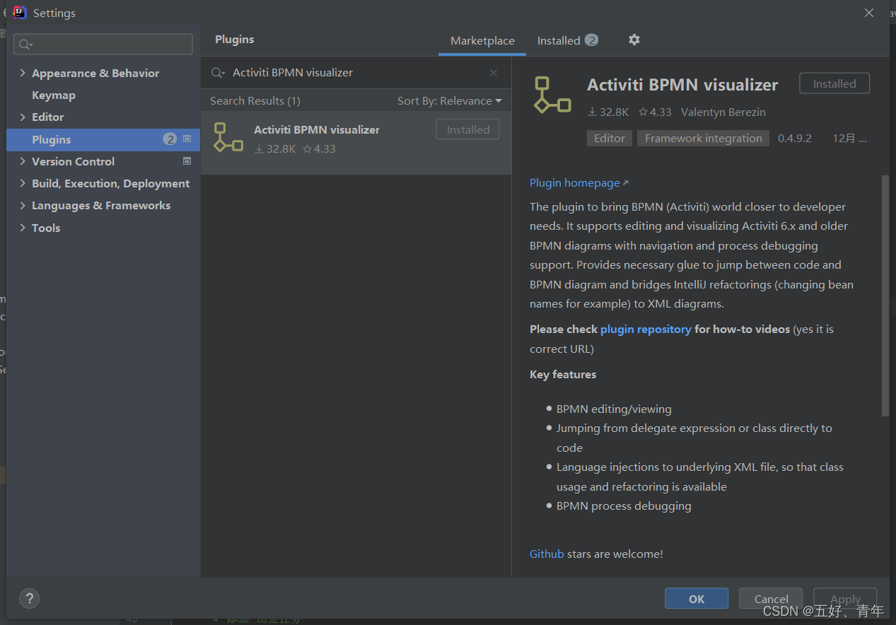  

在此处可看到创建BPMN文件、或者可以编辑即可  

  

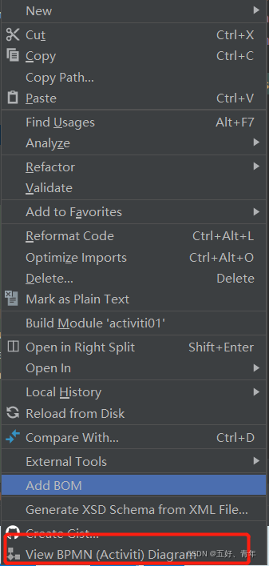  

### Camunda Modeler流程图设计器安装

> 问题：有了Activiti BPMN visualize为什么还要安装呢？
>
> 1. 第一点：idea2021不能兼容常用的actiBPM。  
> 2. 第二点：Activiti BPMN visualize找不到加入监听器的功能（后续讲到）。  
> 3. 第三点：关于 assignee 失效。解决办法：将camunda 替换为 activiti，命名空间改为activity的命名空间，1、加入xmlns:activiti=“http://activiti.org/bpmn”，2、camunda改为activiti

安装路径  

> 链接：https://pan.baidu.com/s/10_W1VpduQXxCSitSKXxM7Q
>
> 提取码：6666  
>
> 下载完成解压即可使用。

idea配置Camunda Modeler 
File > setting > Tools > External tool > 点击+号  

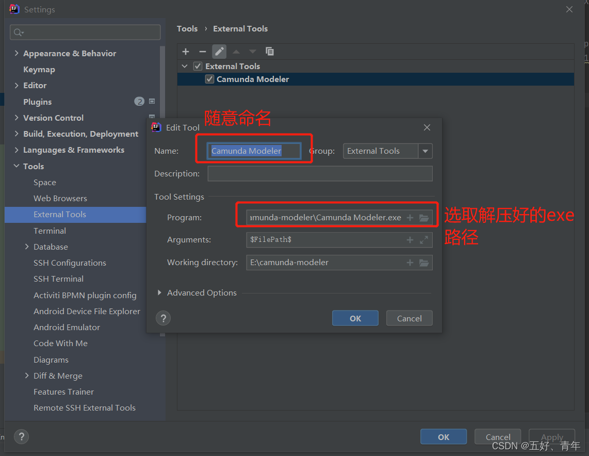  

在此处可看见有新增的工具即可  

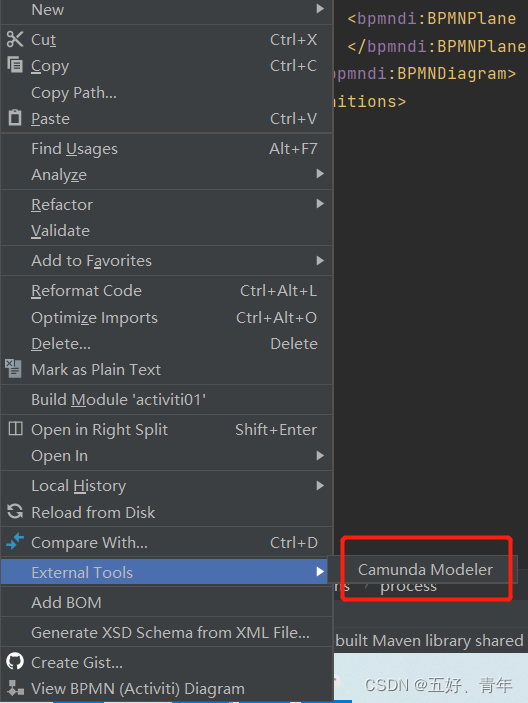

### Maven配置

```xml
 <!-- activiti 的相关包 mysql的驱动包 mybatis log4j 数据库链接池-->
    <properties>
        <slf4j.version>1.6.6</slf4j.version>
        <log4j.version>1.2.12</log4j.version>
        <activiti.version>7.0.0.Beta1</activiti.version>
    </properties>
    <dependencies>
        <dependency>
            <groupId>org.activiti</groupId>
            <artifactId>activiti-engine</artifactId>
            <version>${activiti.version}</version>
        </dependency>
        <dependency>
            <groupId>org.activiti</groupId>
            <artifactId>activiti-spring</artifactId>
            <version>${activiti.version}</version>
        </dependency>
        <!-- bpmn 模型处理 -->
        <dependency>
            <groupId>org.activiti</groupId>
            <artifactId>activiti-bpmn-model</artifactId>
            <version>${activiti.version}</version>
        </dependency>
        <!-- bpmn 转换 -->
        <dependency>
            <groupId>org.activiti</groupId>
            <artifactId>activiti-bpmn-converter</artifactId>
            <version>${activiti.version}</version>
        </dependency>
        <!-- bpmn json数据转换 -->
        <dependency>
            <groupId>org.activiti</groupId>
            <artifactId>activiti-json-converter</artifactId>
            <version>${activiti.version}</version>
        </dependency>
        <!-- bpmn 布局 -->
        <dependency>
            <groupId>org.activiti</groupId>
            <artifactId>activiti-bpmn-layout</artifactId>
            <version>${activiti.version}</version>
        </dependency>
        <!-- activiti 云支持 -->
        <dependency>
            <groupId>org.activiti.cloud</groupId>
            <artifactId>activiti-cloud-services-api</artifactId>
            <version>${activiti.version}</version>
        </dependency>
        <!-- mysql驱动 -->
        <dependency>
            <groupId>mysql</groupId>
            <artifactId>mysql-connector-java</artifactId>
            <version>5.1.40</version>
        </dependency>
        <!-- mybatis -->
        <dependency>
            <groupId>org.mybatis</groupId>
            <artifactId>mybatis</artifactId>
            <version>3.4.5</version>
        </dependency>
        <!-- 链接池 -->
        <dependency>
            <groupId>commons-dbcp</groupId>
            <artifactId>commons-dbcp</artifactId>
            <version>1.4</version>
        </dependency>
        <dependency>
            <groupId>junit</groupId>
            <artifactId>junit</artifactId>
            <version>4.12</version>
        </dependency>
        <!-- log start -->
        <dependency>
            <groupId>log4j</groupId>
            <artifactId>log4j</artifactId>
            <version>${log4j.version}</version>
        </dependency>
        <dependency>
            <groupId>org.slf4j</groupId>
            <artifactId>slf4j-api</artifactId>
            <version>${slf4j.version}</version>
        </dependency>
        <dependency>
            <groupId>org.slf4j</groupId>
            <artifactId>slf4j-log4j12</artifactId>
            <version>${slf4j.version}</version>
        </dependency>
        <dependency>
            <groupId>commons-io</groupId>
            <artifactId>commons-io</artifactId>
            <version>2.6</version>
        </dependency>
    </dependencies>
```

### activiti配置文件

activiti.cfg.xml放于resource文件夹下

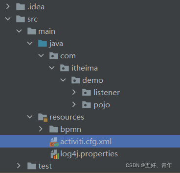

```bash
<?xml version="1.0" encoding="UTF-8"?>
<beans xmlns="http://www.springframework.org/schema/beans"
       xmlns:xsi="http://www.w3.org/2001/XMLSchema-instance"
       xsi:schemaLocation="http://www.springframework.org/schema/beans
                    http://www.springframework.org/schema/beans/spring-beans.xsd">
    
    <!--dbcp链接池-->
    <bean id="dataSource" class="org.apache.commons.dbcp.BasicDataSource">
        <property name="driverClassName" value="com.mysql.jdbc.Driver"/>
        <property name="url" value="jdbc:mysql:///activiti?nullCatalogMeansCurrent=true"/>
        <property name="username" value="root"/>
        <property name="password" value="123456"/>
        <property name="maxActive" value="3"/>
        <property name="maxIdle" value="1"/>
    </bean>

    <!--在默认方式下 bean的id  固定为 processEngineConfiguration-->
    <bean id="processEngineConfiguration"
          class="org.activiti.engine.impl.cfg.StandaloneProcessEngineConfiguration">
        <!--直接引用上面配置的链接池-->
        <property name="dataSource" ref="dataSource"/>
        <!--actviti数据库表在生成时的策略
        true - 如果数据库中已经存在相应的表，那么直接使用，
               如果不存在，那么会创建-->
        <property name="databaseSchemaUpdate" value="true"/>
    </bean>
</beans>
```

## 二、流程图制作

首先创建一个bpmn2.0文件，然后编辑，上述有提到。

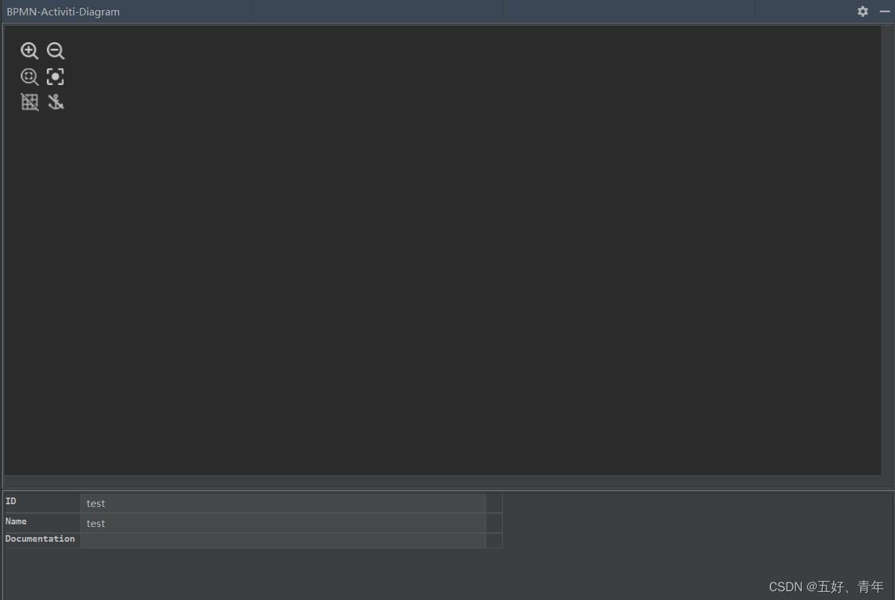  

右键可创建组件  

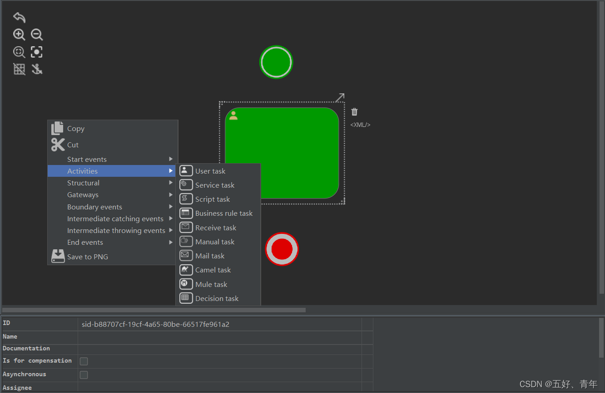  

连线点击右上角的箭头并拖动到其他组件中

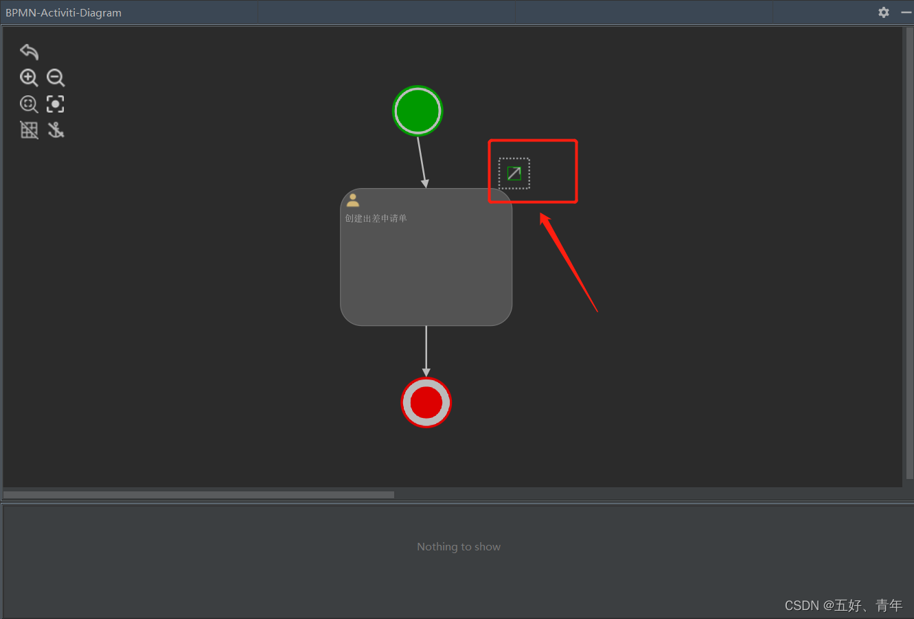

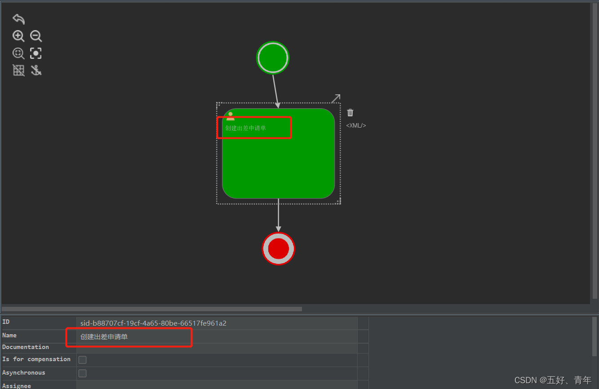  

创建完毕后可通过Camunda Modeler打开文件

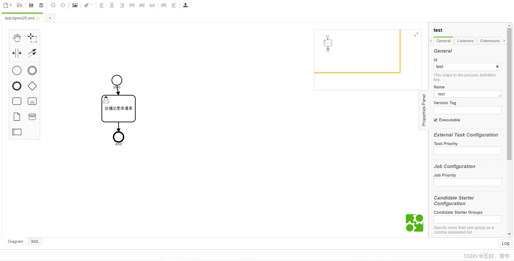  

创建一个较为完整的流程图  

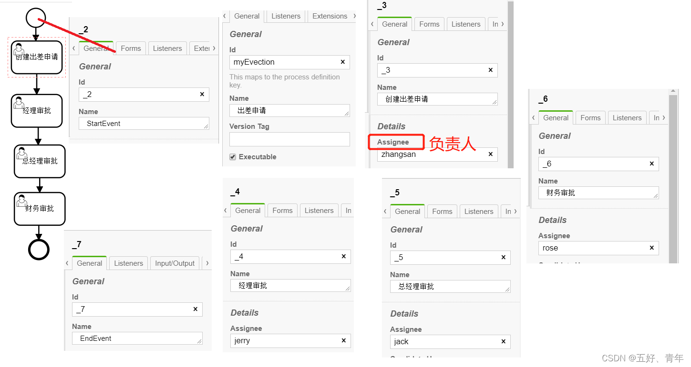  

生成流程图片（方式一）

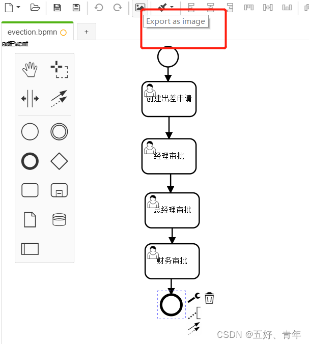  

生成流程图片（方式二） 

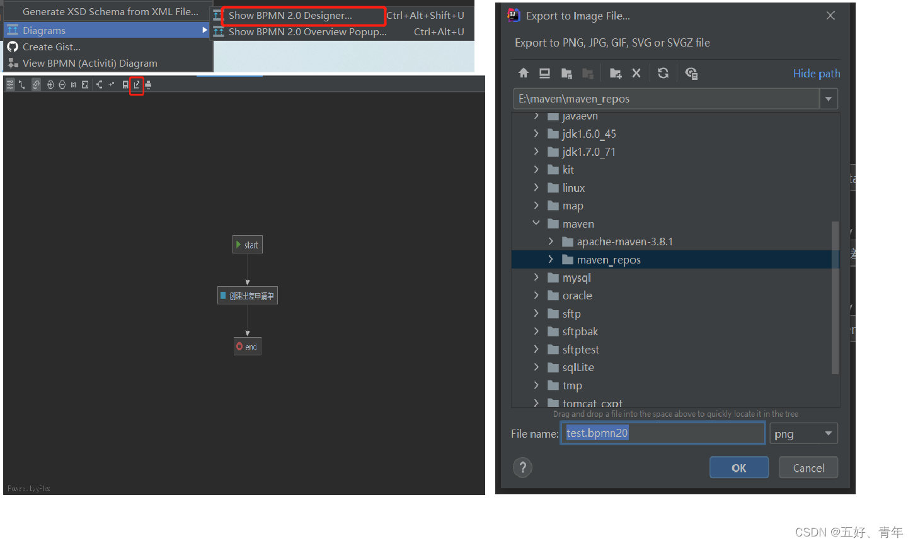

## 三、创建activiti表与了解其结构

### 创建activiti表

#### 方式一

> 1、使用方法getDefaultProcessEngine  
>
> 2、默认从resources下读取名字为actviti.cfg.xml的文件  
>
> 3、创建processEngine时，就会创建mysql的表

```java
	//默认方式
	ProcessEngine processEngine = ProcessEngines.getDefaultProcessEngine();
```

#### 方式二

> 配置文件的名字可以自定义,bean的名字也可以自定义

```bash
ProcessEngineConfiguration processEngineConfiguration = ProcessEngineConfiguration.
	createProcessEngineConfigurationFromResource("activiti.cfg.xml","processEngineConfiguration");
//获取流程引擎对象（此时创建activiti的表）
ProcessEngine processEngine = processEngineConfiguration.buildProcessEngine();
```

### [数据库表结构](https://www.cnblogs.com/sea520/p/13656132.html)

**`re` 表（流程定义和部署相关）**

| 表名                  | 作用说明                                                     |
| --------------------- | ------------------------------------------------------------ |
| **ACT_RE_PROCDEF**    | 存储流程定义信息，包括流程ID、版本、名称、描述等。           |
| **ACT_RE_DEPLOYMENT** | 存储流程部署信息，记录每次部署的元数据，包括部署ID和时间。   |
| **ACT_RE_MODEL**      | 存储流程模型信息，用于设计和修改流程模型，包含模型ID和类型。 |

**`ru` 表（运行时相关）**

| 表名                    | 作用说明                                                     |
| ----------------------- | ------------------------------------------------------------ |
| **ACT_RU_EXECUTION**    | 存储运行时执行信息，包含当前流程实例、任务的状态和上下文信息。 |
| **ACT_RU_TASK**         | 存储当前运行的任务信息，包括任务ID、状态、指派人、到期时间等。 |
| **ACT_RU_IDENTITYLINK** | 存储身份链接信息，记录用户与任务的关联，如任务的候选人。     |
| **ACT_RU_VARIABLE**     | 存储运行时变量信息，记录当前执行流程中的变量值。             |
| **ACT_RU_EVENT_SUBSCR** | 存储事件订阅信息，记录对事件的订阅及其相关的执行上下文。     |
| **ACT_RU_DELEGATION**   | 存储任务委派信息，记录任务的委派情况。                       |

**`hi` 表（历史相关）**

| 表名                   | 作用说明                                               |
| ---------------------- | ------------------------------------------------------ |
| **ACT_HI_PROCINST**    | 存储历史流程实例信息，记录已完成的流程实例的相关信息。 |
| **ACT_HI_ACTINST**     | 存储历史活动实例信息，记录活动的执行历史和状态变化。   |
| **ACT_HI_TASKINST**    | 存储历史任务实例信息，记录任务的执行历史和状态变化。   |
| **ACT_HI_VAR**         | 存储历史变量信息，记录在流程中各个阶段变量的变化。     |
| **ACT_HI_COMMENT**     | 存储评论信息，记录对任务和流程实例的评论和反馈。       |
| **ACT_HI_ATTACHMENT**  | 存储附件信息，记录与任务和流程实例相关的文件和文档。   |
| **ACT_HI_ENTITY_LINK** | 存储历史实体链接信息，记录与任务和流程实例相关的链接。 |
| **ACT_HI_DETAIL**      | 存储历史详细信息，包括历史执行和任务的详细记录。       |
| **ACT_HI_OP_LOG**      | 存储历史操作日志信息，记录对流程和任务的操作记录。     |

**`ge` 表（通用信息）**

| 表名                 | 作用说明                                                     |
| -------------------- | ------------------------------------------------------------ |
| **ACT_GE_BYTEARRAY** | 存储字节数组，通常用于存储流程相关的二进制数据，如图片、文档等。 |
| **ACT_GE_PROPERTY**  | 存储全局属性信息，用于配置和管理，记录Activiti引擎的配置项。 |
| **ACT_GE_DATA**      | 存储额外的数据，如日志信息和其他数据项。                     |

### 修复Bug

```sql
-- ----------------------------
-- 修复Activiti7的M4版本缺失字段Bug
-- ----------------------------
alter table ACT_RE_DEPLOYMENT add column PROJECT_RELEASE_VERSION_ varchar(255) DEFAULT NULL;
alter table ACT_RE_DEPLOYMENT add column VERSION_ varchar(255) DEFAULT NULL;
```

## 四、Service类

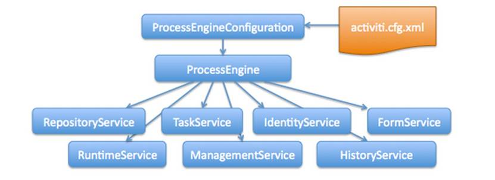

| service名称                 | service作用                                                  |
| --------------------------- | ------------------------------------------------------------ |
| RepositoryService           | activiti的资源管理类，一般用于操作act\_re表，`部署`。        |
| RuntimeService              | activiti的流程运行管理类，一般用于`启动流程实例`。           |
| TaskService                 | activiti的任务管理类，一般用于`查询任务`、`设置变量`、`设置任务负责人`、`拾取任务`、`解决任务`、`添加审批意见`、`完成任务` 。 |
| HistoryService              | activiti的历史管理类，常用于一些查询操作。                   |
| ManagerService              | activiti的引擎管理类，一般使用不到。                         |
| IdentityService FormService | activiti6中有，activiti7中已经移除。                         |

### RepositoryService

资源管理类，用于对ACT\_RE\_DEPLOYMENT（资源部署表）、ACT\_RE\_PROCDEF（资源流程定义表）和ACT\_GE\_BYTEARRAY\(资源文件表.bpmn、.png文件\)的CRUD操作。

```java
// 将流程定义文件insert到数据库中
// 同一个.bpmn文件允许部署多次，每次部署version_字段都+1
ProcessEngine processEngine = ProcessEngines.getDefaultProcessEngine();
RepositoryService repositoryService = processEngine.getRepositoryService();
Deployment deploy = repositoryService.createDeployment()
.addClasspathResource("bpmn/xxx.bpmn")
.name("请假流程")
.deploy();
// 删除部署        
repositoryService.deleteDeployment(deploymentId, true);

// 查询流程定义
List<ProcessDefinition> processDefinitionList = repositoryService.createProcessDefinitionQuery()
.processDefinitionKey(KEY)
.list();

// 挂起流程定义
repositoryService.suspendProcessDefinitionById(processDefinitionId);

// 激活流程定义
repositoryService.activateProcessDefinitionById(processDefinitionId);
```

### RuntimeService

流程运行管理类。可以从这个服务类中获取很多关于正在运行的流程执行相关的信息。

```java
// 启动流程实例，开始发起一个申请请求
ProcessInstance processInstance = processEngine.getRuntimeService()
.startProcessInstanceByKey(KEY);
```

### TaskService

任务管理类。可以从这个类中获取任务的信息。

```java
// 查询某个流程下的某个负责人待办的任务
Task task = processEngine.getTaskService()
.createTaskQuery()
.processDefinitionKey(KEY)
.taskAssignee("张三")
.singleResult();
// 设置变量                
taskService.setVariables(taskId, variables);
taskService.setVariable(taskId, variableName, value);

// 归还任务，将任务负责人设置为null
taskService.setAssignee(task.getId(), null);

// 任务交接，将自己的任务交给给候选人中的其它人
taskService.setAssignee(task.getId(), OtherAssignee);

// 拾取任务，将自己设为任务的负责人
taskService.claim(task.getId(), currentUserId);

// 解决任务
taskService.resolveTask(taskId, variables);

// 添加审批意见
taskService.addComment(taskId, processInstanceId, "同意")

// 审核通过任务，任务进入下一个节点
taskService.complete(task.getId());
```

### HistoryService

历史管理类，常用来查询历史流程实例、历史活动、历史任务表等。

```java
// 查询某个流程定义下的所有历史活动实例
List<HistoricActivityInstance> activityInstanceList = processEngine.getHistoryService()
.createHistoricActivityInstanceQuery()
.processDefinitionId("offwork:1:3")
.list();
```

### ManagementService

引擎管理类，提供了对 Activiti 流程引擎的管理和维护功能，这些功能不在工作流驱动的应用程序中使用，主要用于Activiti 系统的日常维护。

要想熟练掌握工作流就必须充分理解这25张表和这几个Service类。Activiti就是使用这几个Service类来操作者25张表而已。

## 四、流程部署

### 流程部署方式一

```java
//1、创建（流程引擎）ProcessEngine
ProcessEngine processEngine = ProcessEngines.getDefaultProcessEngine();

//2、获取RepositoryServcie(re表的服务层)
RepositoryService repositoryService = processEngine.getRepositoryService();

//3、使用service进行流程的部署，部署bpmn和png
Deployment deploy = repositoryService.createDeployment()
                .name("出差申请流程")
                .addClasspathResource("bpmn/evection.bpmn")
                .addClasspathResource("bpmn/evection.png")
                .deploy();
```

### 流程部署方式二

```java
//1、将png和bpmn打包成zip包
//2、创建（流程引擎）ProcessEngine
ProcessEngine processEngine = ProcessEngines.getDefaultProcessEngine();

//3、获取RepositoryServcie(re表的服务层)
RepositoryService repositoryService = processEngine.getRepositoryService();

//读取资源包文件，构造成inputStream
InputStream inputStream = this.getClass()
                .getClassLoader()
                .getResourceAsStream("bpmn/evection.zip");
//用inputStream 构造ZipInputStream
ZipInputStream zipInputStream = new ZipInputStream(inputStream);
//使用压缩包的流进行流程的部署
Deployment deploy = repositoryService.createDeployment()
                .addZipInputStream(zipInputStream)
                .deploy();
```

流程部署修改的表

> **1\. ACT\_RE\_DEPLOYMENT（流程部署表）先创建7501部署表数据**

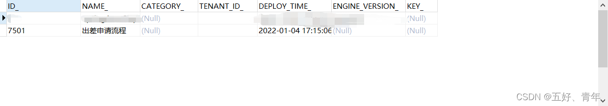

> **2\. ACT_RE_PROCDEF（流程定义表）后创建id为myEvection:1:7504的流程定义数据，myEvent是创建bpmn文件时定义的文件id，7501对应ACT\_RE\_DEPLOYMENT刚部署的记录id。注意：key相同时选取version最大的记录。**

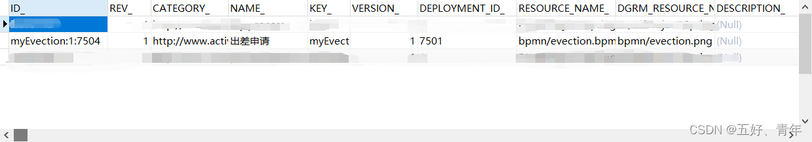  
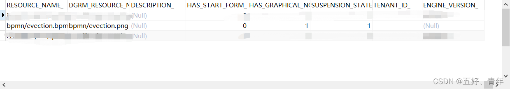

## 五、启动流程实例

（一）启动流程实例，先找到刚刚流程定义的key

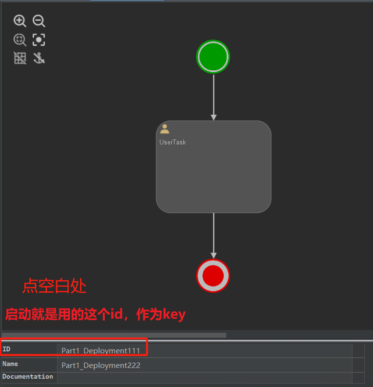

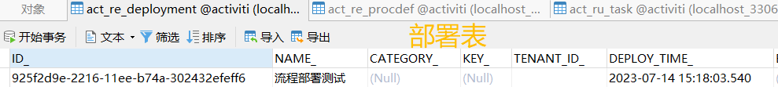

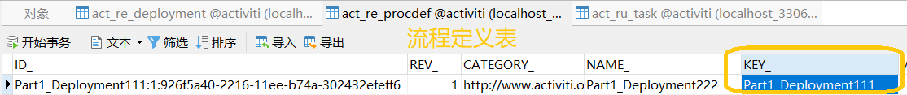

```java
//1、创建ProcessEngine
ProcessEngine processEngine = ProcessEngines.getDefaultProcessEngine();

//2、获取RunTimeService
RuntimeService runtimeService = processEngine.getRuntimeService();

//3、根据流程定义的id启动流程
ProcessInstance instance = runtimeService.startProcessInstanceByKey("myEvection");
```

（二）启动流程修改的表

> **1\. ACT\_HI\_TASKINST（历史任务实例数据表）**

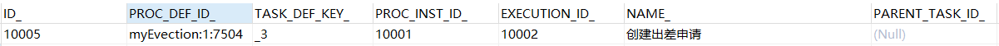  

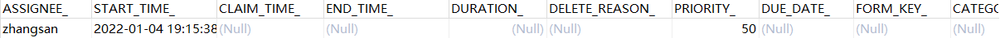

> **2\. ACT\_HI\_PROCINST（历史流程实例数据表,正在执行的任务也在其中）**

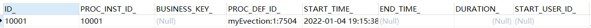  

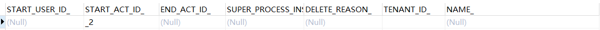

> **3\. ACT\_HI\_ACTINST（历史节点数据，图片上的节点信息）**

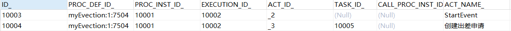  

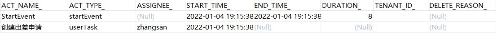

> **4\. ACT\_HI\_IDENTITYLINK（历史流程用户信息数据表）**

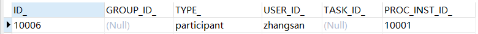

> **5\. ACT\_RU\_EXECUTION（运行时流程执行实例数据表，一条是开始事件的执行实例，这个一直存在，只到流程结束后才会自动删除，is\_active字段表示是否正在执行实例）**

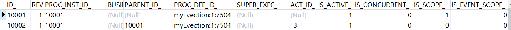  

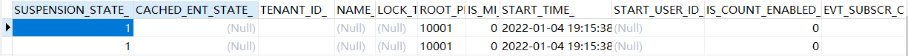  

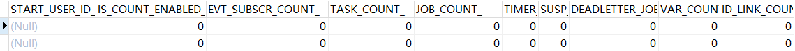

> **6\. ACT\_RU\_TASK（运行时任务信息数据信息表）**

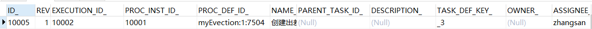  

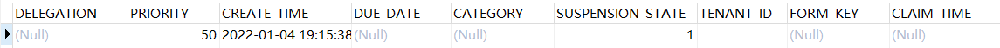

## 六、查询个人代办任务

（一）代码实现

```bash
	//1、获取流程引擎
	ProcessEngine processEngine = ProcessEngines.getDefaultProcessEngine();
	//2、获取taskService
	TaskService taskService = processEngine.getTaskService();
	//3、根据流程key 和 任务的负责人 查询任务
	List<Task> taskList = taskService.createTaskQuery()
                .processDefinitionKey("myEvection") //流程Key
                .taskAssignee("zhangsan")  //要查询的负责人
                .list();
	//4、输出
	for (Task task : taskList) {
            System.out.println("流程实例id="+task.getProcessInstanceId());
            System.out.println("任务Id="+task.getId());
            System.out.println("任务负责人="+task.getAssignee());
            System.out.println("任务名称="+task.getName());
	}
```

（二）查询过程

> **1\. 查询ACT\_GE\_PROPERTY（系统相关属性数据表，查询版本等相关信息，对于我们帮助不大）**

> **2\. 查询以下sql语句（ACT\_RU\_TASK 与 ACT\_RE\_PROCDEF关联查询）**

```java
select distinct RES.* from ACT_RU_TASK RES inner join ACT_RE_PROCDEF D on RES.PROC_DEF_ID_ = D.ID_ WHERE RES.ASSIGNEE_ = 'zhangsan' and D.KEY_ = 'myEvection' order by RES.ID_ asc LIMIT 2147483647 OFFSET 0 
//查询结果如下
```

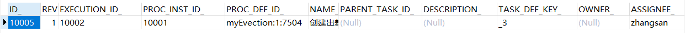  

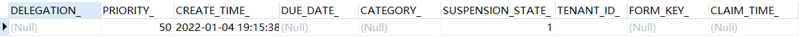

## 七、完成个人任务

（一）代码实现方式一（完成zhangsan的任务）

```java
//获取引擎
ProcessEngine processEngine = ProcessEngines.getDefaultProcessEngine();
//获取操作任务的服务 TaskService
TaskService taskService = processEngine.getTaskService();
//完成任务,参数：任务id,完成zhangsan的任务，10005是上述ACT_RU_TASK表的id
taskService.complete("10005");
```

（二）代码实现方式二（完成其余三人的任务）

```java
//完成jerry的任务
//获取引擎
ProcessEngine processEngine = ProcessEngines.getDefaultProcessEngine();
//获取操作任务的服务 TaskService
TaskService taskService = processEngine.getTaskService();
//获取jerry - myEvection 对应的任务
Task task = taskService.createTaskQuery()
                .processDefinitionKey("myEvection")
                .taskAssignee("jerry")
                .singleResult();
System.out.println("流程实例id="+task.getProcessInstanceId());
System.out.println("任务Id="+task.getId());
System.out.println("任务负责人="+task.getAssignee());
System.out.println("任务名称="+task.getName());
//完成jerry的任务
taskService.complete(task.getId());

//输出
//流程实例id=10001
//任务Id=12502
//任务负责人=jerry
//任务名称=经理审批

//完成jack的任务
Task taskjack = taskService.createTaskQuery()
                .processDefinitionKey("myEvection")
                .taskAssignee("jack")
                .singleResult();
System.out.println("流程实例id="+taskjack .getProcessInstanceId());
System.out.println("任务Id="+taskjack .getId());
System.out.println("任务负责人="+taskjack .getAssignee());
System.out.println("任务名称="+taskjack .getName());
//完成jack的任务
taskService.complete(task.getId());   
  
//输出
//流程实例id=10001
//任务Id=15002
//任务负责人=jack
//任务名称=总经理审批

//完成rose的任务
Task taskjack = taskService.createTaskQuery()
                .processDefinitionKey("myEvection")
                .taskAssignee("rose")
                .singleResult();
System.out.println("流程实例id="+taskjack .getProcessInstanceId());
System.out.println("任务Id="+taskjack .getId());
System.out.println("任务负责人="+taskjack .getAssignee());
System.out.println("任务名称="+taskjack .getName());
//完成jack的任务
taskService.complete(task.getId());  

//输出
//流程实例id=10001
//任务Id=17502
//任务负责人=rose
//任务名称=财务审批
```

（三）完成个人任务修改的表、

> **1\. ACT\_HI\_TASKINST（历史的任务实例表）**

- 1、_**zhangsan完成任务（插入下一个jerry的任务实例，zhangsan任务实例end\_time加入处理完结时间）**_  
  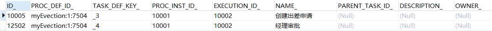  
  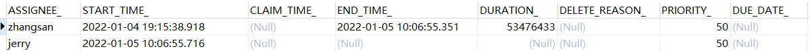
- 2、_**jerry完成任务（插入下一个jack的任务实例，jerry任务实例end\_time加入处理完结时间）**_  
  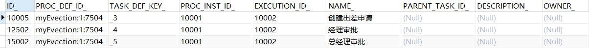  
  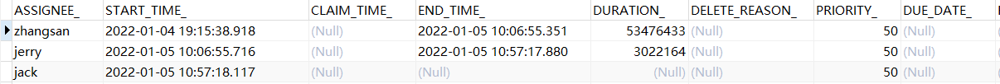

- 3、_**jack完成任务（插入下一个rose的任务实例，jack任务实例end\_time加入处理完结时间）**_  
  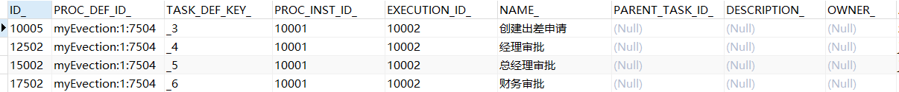  
  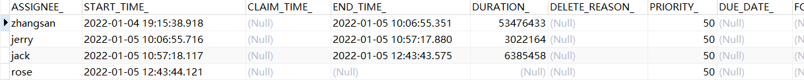

- 4、_**rose完成任务（插入结束的任务实例，任务实例end\_time加入处理完结时间）**_  
  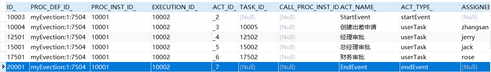  
  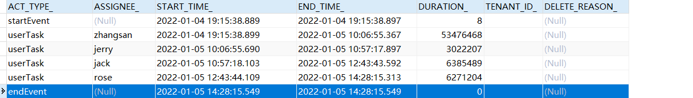

> **2\. ACT\_HI\_ACTINST（历史节点数据）**

- 1、_**zhangsan完成任务\(插入下一个经理审批节点，节点中taskid为运行时任务信息表中的id,end\_time加入处理完结时间\)**_  
  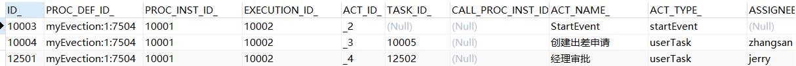  
  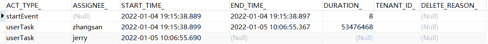
- 2、_**jerry完成任务\(插入下一个总经理节点，节点中taskid为运行时任务信息表中的id,end\_time加入处理完结时间\)**_  
  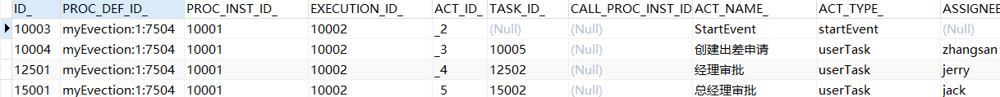  
  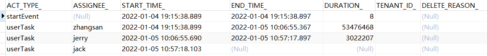
- 3、_**jack完成任务\(插入下一个财务审批节点，节点中taskid为运行时任务信息表中的id,end\_time加入处理完结时间\)**_  
  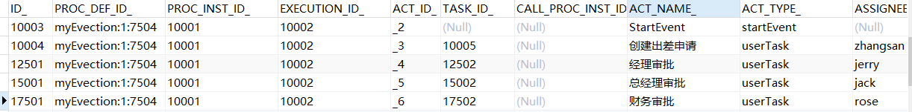  
  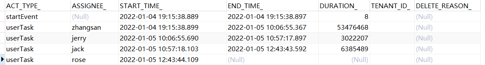
- 4、_**rose完成任务\(插入下一个结束节点，节点中taskid为运行时任务信息表中的id,end\_time加入处理完结时间\)**_  
  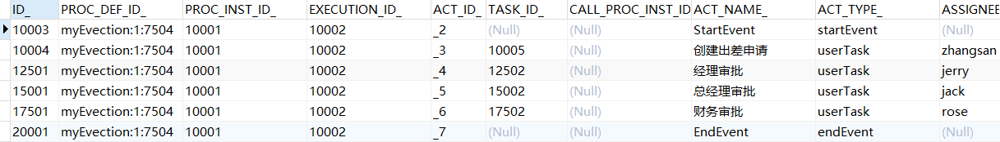  
  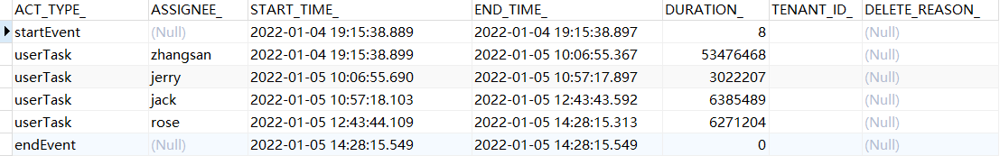

> **3\. ACT\_HI\_IDENTITYLINK（历史流程用户信息数据表）**

- 1、_**zhangsan完成任务\(插入jerry负责人\)**_  
  
- 2、_**jerry完成任务\(插入jack负责人\)**_  
  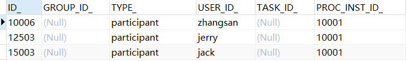
- 3、_**jack完成任务\(插入rose负责人\)**_  
  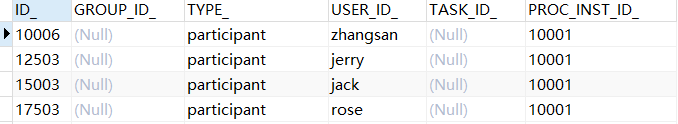

> **4\. ACT\_RU\_TASK（运行时任务信息数据信息表）**

- 1、_**zhangsan完成任务\(删除了10005zhangsan的创建出差申请任务,添加了经理审批任务记录\)**_  
  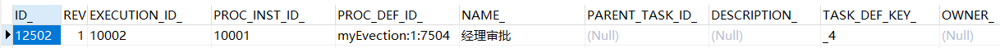  
  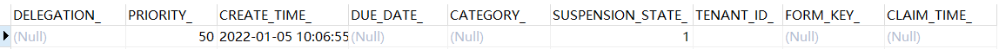
- 2、_**jerry完成任务\(删除了12502jerry的经理审批任务,添加了总经理审批任务记录\)**_  
  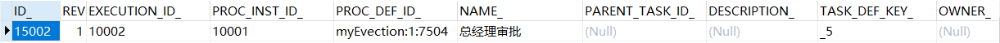  
  
- 3、_**jack完成任务\(删除了15002jerry的总经理审批任务,添加了财务审批任务记录\)**_  
  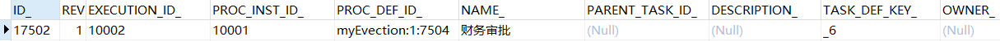  
  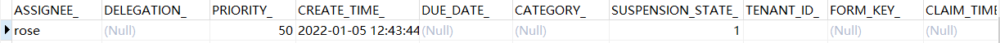
- 3、_**rose完成任务\(删除了17502jack的财务审批任务\)**_

> **5\. ACT\_RU\_IDENTITYLINK（运行时用户信息数据）**

- 1、_**zhangsan完成任务\(插入jerry负责人\)**_  
  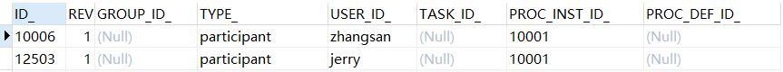
  
- 2、_**jerry完成任务\(插入jack负责人\)**_  
  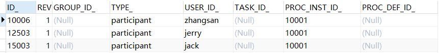
  
- 3、_**jack完成任务\(插入rose负责人\)\*\*\***_

  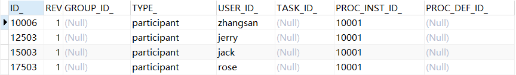  

- 4、_**rose完成任务\(删除所有记录\)**_

> **6\. ACT\_RU\_EXECUTION（运行时流程执行实例数据表）**

- 1、_**zhangsan完成任务\(第二条记录改为\_4id的节点（经理审批）\)**_  
  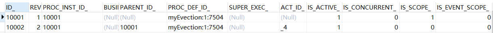  
  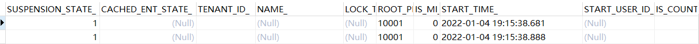
- 2、_**jerry完成任务\(第二条记录改为\_5id的节点（总经理经理审批）\)**_  
  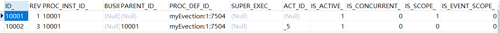  
  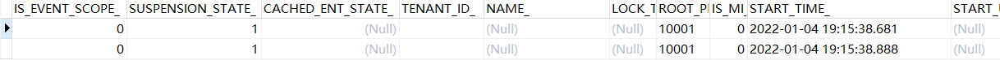
- 3、_**jack完成任务\(第二条记录改为\_6id的节点（财务审批）\)**_  
  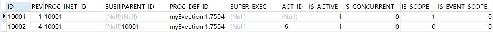  
  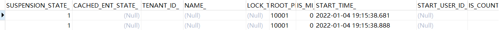
- 4、_**rose完成任务\(第一、二条记录删除细节\)：**_
- 第一步先更改第二条记录REV为5、ACT\_ID\_为\_7（结束节点）
- 第二步删除id为10002的记录。
- 第三步删除结束节点，id为10001的记录。

> **7\. ACT\_HI\_PROCINST（历史流程实例数据表）**

- 4、_**rose完成任务：end\_time更新为完成时间、end\_act\_id\_更新为最后一个节点的id**_  
  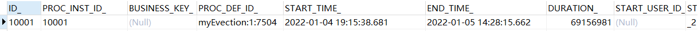  
  

## 八、查看历史信息

（一）代码实现

```java
//获取引擎
ProcessEngine processEngine = ProcessEngines.getDefaultProcessEngine();
//获取HistoryService
HistoryService historyService = processEngine.getHistoryService();
//获取 actinst表的查询对象
HistoricActivityInstanceQuery instanceQuery = historyService.createHistoricActivityInstanceQuery();
//查询 actinst表，条件：根据 InstanceId 查询
//instanceQuery.processInstanceId("2501");
//查询 actinst表，条件：根据 DefinitionId 查询
instanceQuery.processDefinitionId("myEvection:1:7504");
//增加排序操作,orderByHistoricActivityInstanceStartTime 根据开始时间排序 asc 升序
instanceQuery.orderByHistoricActivityInstanceStartTime().asc();
//查询所有内容
List<HistoricActivityInstance> activityInstanceList = instanceQuery.list();
//输出
for (HistoricActivityInstance hi : activityInstanceList) {
            System.out.println(hi.getActivityId());
            System.out.println(hi.getActivityName());
            System.out.println(hi.getProcessDefinitionId());
            System.out.println(hi.getProcessInstanceId());
            System.out.println("<==========================>");
        }
```

输出：

```handlebars
_2
StartEvent
myEvection:1:7504
10001
<==========================>
_3
创建出差申请
myEvection:1:7504
10001
<==========================>
_4
经理审批
myEvection:1:7504
10001
<==========================>
_5
总经理审批
myEvection:1:7504
10001
<==========================>
_6
财务审批
myEvection:1:7504
10001
<==========================>
_7
EndEvent
myEvection:1:7504
10001
<==========================>
```

## 九、与业务表关联

业务Key：员工发起请假申请时一般都要填写请假开始时间、请假结束时间、请假理由等和具体业务相关的数据，Activiti的25张表只会保存审批流程相关的数据，不会保存具体业务的数据，具体业务的数据需要开发人员自己定义表结构，自己维护，但是Activiti提供了一个字段（外键）可以保存和业务相关的数据，这个字段叫ACT_RU_EXECUTION.BUSINESS_KEY_，通常我们会保存业务表的主键id，这样我们就可以通过BUSINESS_KEY_关联到员工的请假时间、请假原因等数据了。

（一）代码实现（使用关联id启动流程）

```bash
//1、获取流程引擎
ProcessEngine processEngine = ProcessEngines.getDefaultProcessEngine();
//2、获取RuntimeService
RuntimeService runtimeService = processEngine.getRuntimeService();
// 3、启动流程的过程中，添加businesskey
//第二个参数：businessKey，业务表的id，就是1001
ProcessInstance instance = runtimeService.
startProcessInstanceByKey("myEvection", "1001");
//4、输出
System.out.println("businessKey=="+instance.getBusinessKey());
```

输出

```handlebars
businessKey==1001
```

（二）与普通方式启动实例比较

> **1\. ACT\_HI\_PROCINST（历史流程实例数据表比较,普通启动business\_key为空，说明业务表的id存在这个字段中）**

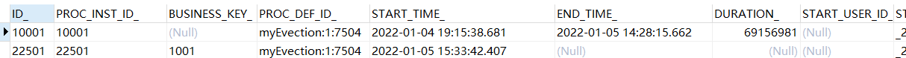

> **2\. ACT\_RU\_EXECUTION（运行时流程执行实例数据表比较，普通启动business\_key为空，说明业务表的id存在这个字段中）**


## 九、使用uel设置负责人

（一）重新创建bpmn文件，如下图  
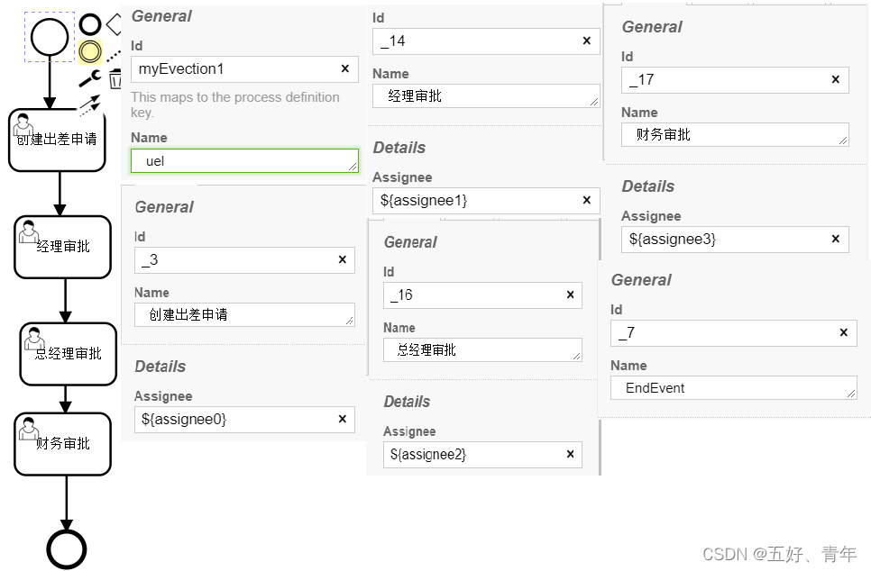  
（二）流程部署代码实现：

```bash
//1、创建ProcessEngine
        ProcessEngine processEngine = ProcessEngines.getDefaultProcessEngine();
//2、获取RepositoryServcie
RepositoryService repositoryService = processEngine.getRepositoryService();
//3、使用service进行流程的部署，定义一个流程的名字，把bpmn和png部署到数据中
Deployment deploy = repositoryService.createDeployment()
                .name("出差申请流程-uel")
                .addClasspathResource("bpmn/uel.bpmn")
                .deploy();
//4、输出部署信息
System.out.println("流程部署id="+deploy.getId());
System.out.println("流程部署名字="+deploy.getName());
```

输出：

```handlebars
流程部署id=25001
流程部署名字=出差申请流程-uel
```

act\_re\_procdef表结果：  
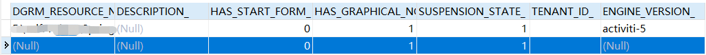  
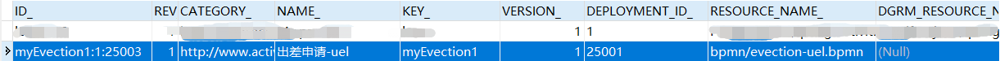

（三）流程启动代码实现：

```bash
//获取流程引擎
ProcessEngine processEngine = ProcessEngines.getDefaultProcessEngine();
//获取RunTimeService
RuntimeService runtimeService = processEngine.getRuntimeService();
//设定assignee的值，用来替换uel表达式
Map<String,Object> assigneeMap = new HashMap<>();
assigneeMap.put("assignee0","张三");
assigneeMap.put("assignee1","李经理");
assigneeMap.put("assignee2","王总经理");
assigneeMap.put("assignee3","赵财务");
//启动流程实例
runtimeService.startProcessInstanceByKey("myEvection1",assigneeMap);
```

（四）添加uel表达式后，额外修改的表

> **1\. ACT\_HI\_VARINST（历史流程运行中的变量信息数据表）**

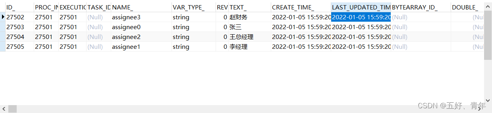

> **2\. ACT\_RU\_VARIABLE（运行时变量表）**

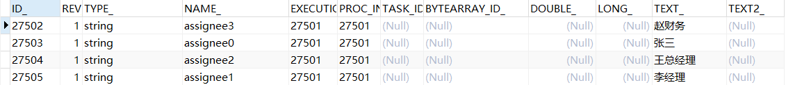

> **注：其余表的修改与普通流程启动相同**

## 十、候选人实例介绍

（一）重新创建bpmn文件，如下图  
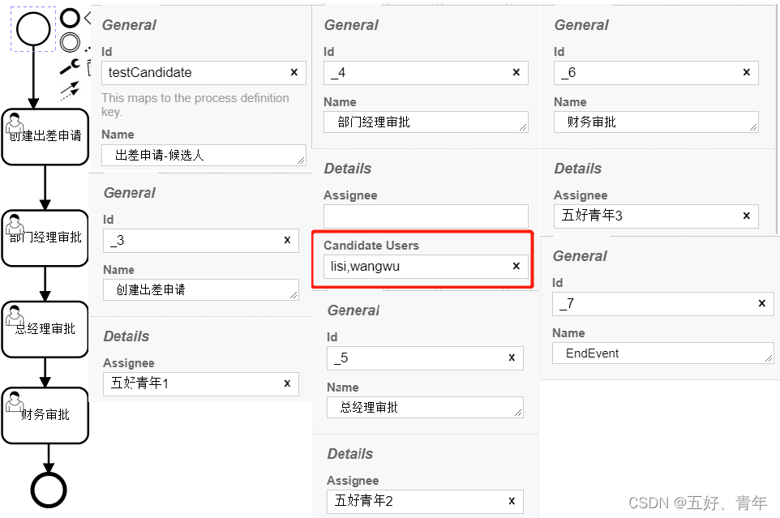  
（二）流程部署代码实现：

```bash
//1、创建ProcessEngine
        ProcessEngine processEngine = ProcessEngines.getDefaultProcessEngine();
//2、获取RepositoryServcie
        RepositoryService repositoryService = processEngine.getRepositoryService();
//3、使用service进行流程的部署，定义一个流程的名字，把bpmn和png部署到数据中
Deployment deploy = repositoryService.createDeployment()
                .name("出差申请流程-Candidate")
                .addClasspathResource("bpmn/evection-candidate.bpmn")
                .deploy();

```

> - act\_re\_procdef表结果：

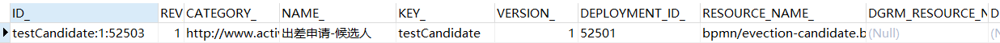

（三）流程启动代码实现：

```bash
//获取流程引擎
ProcessEngine processEngine = ProcessEngines.getDefaultProcessEngine();
//获取RunTimeService
RuntimeService runtimeService = processEngine.getRuntimeService();
runtimeService.startProcessInstanceByKey("testCandidate");
```

> 说明：除了部门经理审批，其余流程与第六章相同。

（四）查询组任务代码实现（提前将五好青年1完成任务，到达部门经理审批）：

```bash

//获取引擎
ProcessEngine processEngine = ProcessEngines.getDefaultProcessEngine();
//获取TaskService
TaskService taskService = processEngine.getTaskService();
//查询组任务
List<Task> taskList = taskService.createTaskQuery()
                .processDefinitionKey("testCandidate")
                .taskCandidateUser("wangwu") //根据候选人查询任务
                .list();
for (Task task : taskList) {
            System.out.println("========================");
            System.out.println("流程实例ID="+task.getProcessInstanceId());
            System.out.println("任务id="+task.getId());
            System.out.println("任务负责人="+task.getAssignee());
        }
```

输出

```handlebars
========================
流程实例ID=55001
任务id=57502
任务负责人=null
```

> - ACT\_RU\_TASK结果（当前负责人为空）：

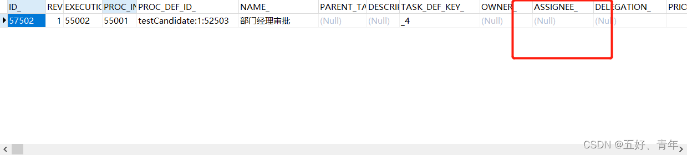

> - ACT\_HI\_ACTINST结果（部门经理审批负责人为空）：

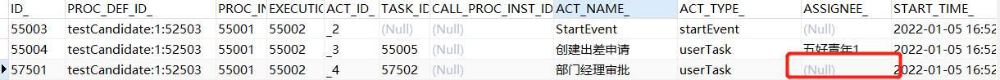

> - ACT\_HI\_TASKINST结果 （部门经理审批负责人为空）：

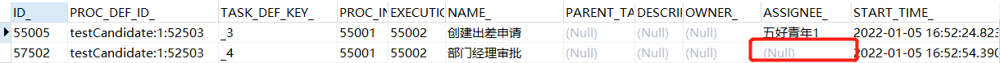

（五）wangwu拾取任务代码实现：

```bash
//获取引擎
ProcessEngine processEngine = ProcessEngines.getDefaultProcessEngine();
//获取TaskService
TaskService taskService = processEngine.getTaskService();
//当前任务的id
String taskId = "57502";
//任务候选人
String candidateUser = "wangwu";
//        查询任务
        Task task = taskService.createTaskQuery()
                .taskId(taskId)
                .taskCandidateUser(candidateUser)
                .singleResult();
        if(task != null){
//            拾取任务
            taskService.claim(taskId,candidateUser);
            System.out.println("taskid-"+taskId+"-用户-"+candidateUser+"-拾取任务完成");
        }
```

输出：

```handlebars
taskid-57502-用户-wangwu-拾取任务完成
```

> - ACT\_RU\_TASK结果图（回归正常流程）：

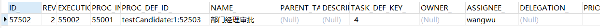

> - ACT\_HI\_ACTINST结果（回归正常流程）：

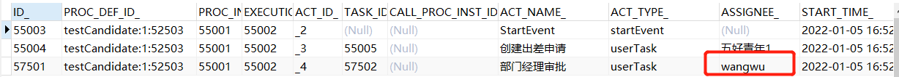

> - ACT\_HI\_TASKINST结果 （回归正常流程）：

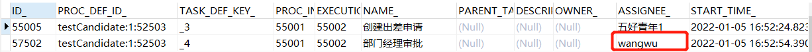  
（五）wang归还任务、交接任务代码实现：

> 总的来说就是改assignee\_字段  
> 归还任务设置成null  
> 交接任务设置成lisi

```bash
//获取引擎
ProcessEngine processEngine = ProcessEngines.getDefaultProcessEngine();
//获取TaskService
TaskService taskService = processEngine.getTaskService();
//当前任务的id
String taskId = "57502";
//任务负责人
String assignee = "wangwu";
//根据key 和负责人来查询任务
Task task = taskService.createTaskQuery()
    .taskId(taskId)
    .taskAssignee(assignee)
    .singleResult();
if(task != null){
	//归还任务 ,就是把负责人 设置为空
	taskService.setAssignee(taskId,null);
	taskService.setAssignee(taskId,'lisi');
    System.out.println("taskid-"+taskId+"-归还任务完成");
    }
```

（六）后续完成任务按照第六章正常思路完成

## 十一、 挂起和激活流程实例

有时候在特殊的时间内会需要暂停流程的发起，比如月底不允许发起新的请假审批，因为财务要计算工资了等情况就需要将发起申请请求暂停掉，此时可以将流程定义挂起。

有时候我们只会暂停某一个流程实例，比如张三是否要出差现在还不能确定，先暂停他的出差申请，等过几天确定了再继续走流程，这就是挂起单个流程实例。

流程实例挂起相当于`暂停`了，不允许被继续执行会抛异常（`ActivitiException: Cannot complete supended task`），也不允许启动新的实例。主要是设置数据库字段挂起状态字段 `SUSPENSION_STATE_` 挂起状态 2：挂起，1：激活。

挂起`流程定义`就是挂起该流程下的所有流程实例。

```java
@Test
public void testSuspendProcessDefinition() {
    ProcessEngine processEngine = ProcessEngines.getDefaultProcessEngine();
    RepositoryService repositoryService = processEngine.getRepositoryService();
    ProcessDefinition processDefinition = repositoryService.createProcessDefinitionQuery()
            .processDefinitionKey("helloworld-var")
            .singleResult();
    if (processDefinition.isSuspended()) {
        //如果流程定义已经被挂起，使用activateProcessDefinitionById方法来激活它。
        repositoryService.activateProcessDefinitionById(processDefinition.getId());
    } else {
        //如果流程定义没有被挂起，使用suspendProcessDefinitionById方法来挂起它。
        repositoryService.suspendProcessDefinitionById(processDefinition.getId());
    }
}
```

```sql
update ACT_RE_PROCDEF 
set 
	REV_ = 2, 
	SUSPENSION_STATE_ = 2
WHERE ID_ = 'helloworld-var:1:4' and REV_ = 1;
```

挂起单个流程实例：分别设置`ACT_RU_TASK`和`ACT_RU_EXECUTION`的SUSPENSION\_STATE\_ = 2

```java
@Test
public void testSuspendedProcessInstance() {
    ProcessEngine processEngine = ProcessEngines.getDefaultProcessEngine();
    RuntimeService runtimeService = processEngine.getRuntimeService();
    ProcessInstance processInstance = runtimeService.createProcessInstanceQuery()
            .processInstanceId("2501")
            .singleResult();
    boolean suspended = processInstance.isSuspended();
    if (suspended) {
        runtimeService.activateProcessInstanceById(processInstance.getId());
    } else {
        runtimeService.suspendProcessInstanceById(processInstance.getId());
    }
}
```

```sql
-- ACT_RU_TASK.SUSPENSION_STATE_ = 2
update ACT_RU_TASK 
SET 
	SUSPENSION_STATE_ = 2, 
WHERE ID_= '2508' and REV_ = 1;

-- ACT_RU_EXECUTION.SUSPENSION_STATE_ = 2
-- 流程实例
update ACT_RU_EXECUTION 
set 
	SUSPENSION_STATE_ = 2
WHERE ID_ = '2501' and REV_ = 1;

-- 该流程实例下的其它执行流
update ACT_RU_EXECUTION 
set 
	SUSPENSION_STATE_ = 2
WHERE ID_ = '2505' and REV_ = 1;
```

## 十二、添加审批意见

```java
// 设置当前用户id，最终会保存到act_hi_comment.user_id_字段中
Authentication.setAuthenticatedUserId("666");

// 添加审批意见
taskService.addComment(task.getId(), task.getProcessInstanceId(), "MyCustomComment", JSONObject.toJSONString(jsonObject));
```

## 十三、监听器

### 任务监听器TaskListener

（一）重新创建bpmn文件，如下图  
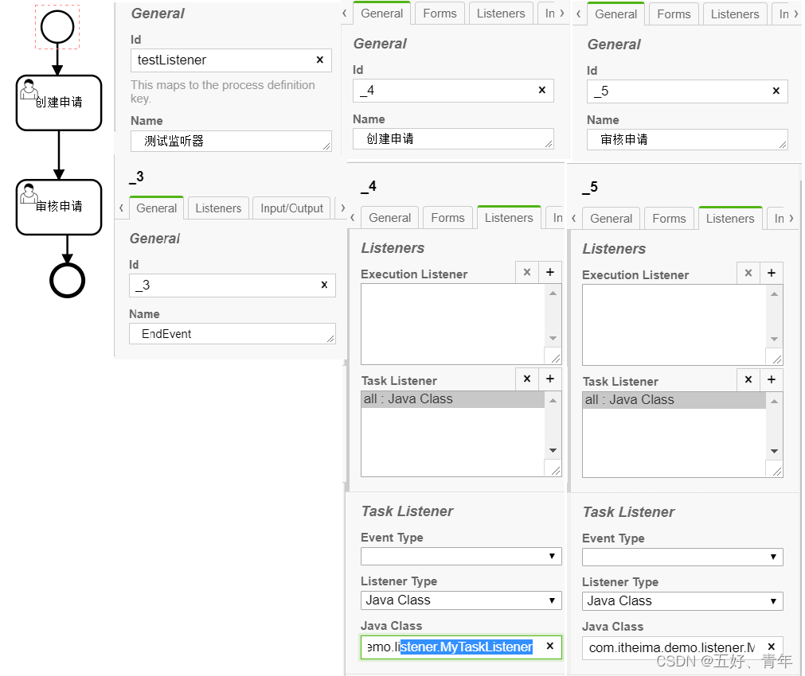  
（二）流程部署代码实现

```bash
ProcessEngine processEngine = ProcessEngines.getDefaultProcessEngine();
RepositoryService repositoryService = processEngine.getRepositoryService();
Deployment deploy = repositoryService.createDeployment()
                .name("测试监听器")
                .addClasspathResource("bpmn/demo-listen.bpmn")
                .deploy();
```

> - act\_re\_procdef表结果：

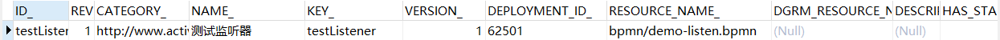  
（二）启动流程代码实现

```bash
ProcessEngine processEngine = ProcessEngines.getDefaultProcessEngine();
RuntimeService runtimeService = processEngine.getRuntimeService();
runtimeService.startProcessInstanceByKey("testListener");
```

> - ACT\_RU\_TASK结果图

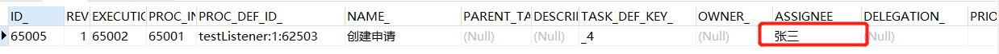

> - ACT\_HI\_ACTINST结果

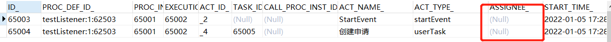

> - ACT\_HI\_TASKINST结果 （回归正常流程）：

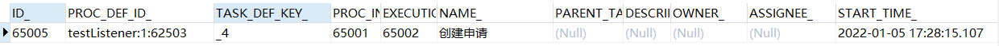

> 问题来了，为什么ACT\_RU\_TASK中的负责人是张三呢？  
> 这就是监听器的作用，我在图中设置了监听器的路径，一旦开始流程便开始调用监听类中的notify方法。代码如下

```bash
import org.activiti.engine.delegate.DelegateTask;
import org.activiti.engine.delegate.TaskListener;

public class MyTaskListener implements TaskListener {
   //delegateTasK是当前任务的对象
    @Override
    public void notify(DelegateTask delegateTask) {
	//默认是create事件
        if("创建申请".equals(delegateTask.getName()) &&
            "create".equals(delegateTask.getEventName())){
            delegateTask.setAssignee("张三");
        }
    }
}
```

### 流程监听器ExecutionListener

**任务监听器只能监听UserTask**，流程监听器用在流程的不同的阶段上：

 -    开始事件和结束事件的开始和结束
 -    经过输出顺序流
 -    流程活动的开始和结束
 -    流程网关的开始和结束
 -    中间事假的开始和结束  
    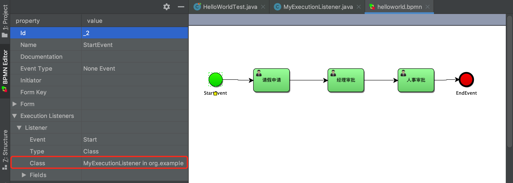

```java
import org.activiti.engine.delegate.ExecutionListener;

public class MyExecutionListener implements ExecutionListener {
    @Override
    public void notify(DelegateExecution execution) {
        // Id=_2
        System.out.println("Id=" + execution.getCurrentFlowElement().getId());
        // Name=StartEvent
        System.out.println("Name=" + execution.getCurrentFlowElement().getName());
        // EventName=start
        System.out.println("EventName=" + execution.getEventName());
        // ProcessDefinitionId=helloworld:1:3
        System.out.println("ProcessDefinitionId=" + execution.getProcessDefinitionId());
        // ProcessInstanceId=2501
        System.out.println("ProcessInstanceId=" + execution.getProcessInstanceId());
    }
}
```

## 十四、设置变量

### 设置变量

UEL表达式类似于JSP中的ETL表达式，就是**在 \${}或者#{}内可以写表达式，如引用一个变量值 \$ {assignee}、 ​\$ {xxx.assignee}，调用方法调用\${对象.方法(execution)}，做一些简单的boolean条件运算，可以使用 && 和 || 连接多个条件，如$ {xxx.day >= 3 || xxx.role == 'pm'}。**

（一）重新创建bpmn文件，如下图  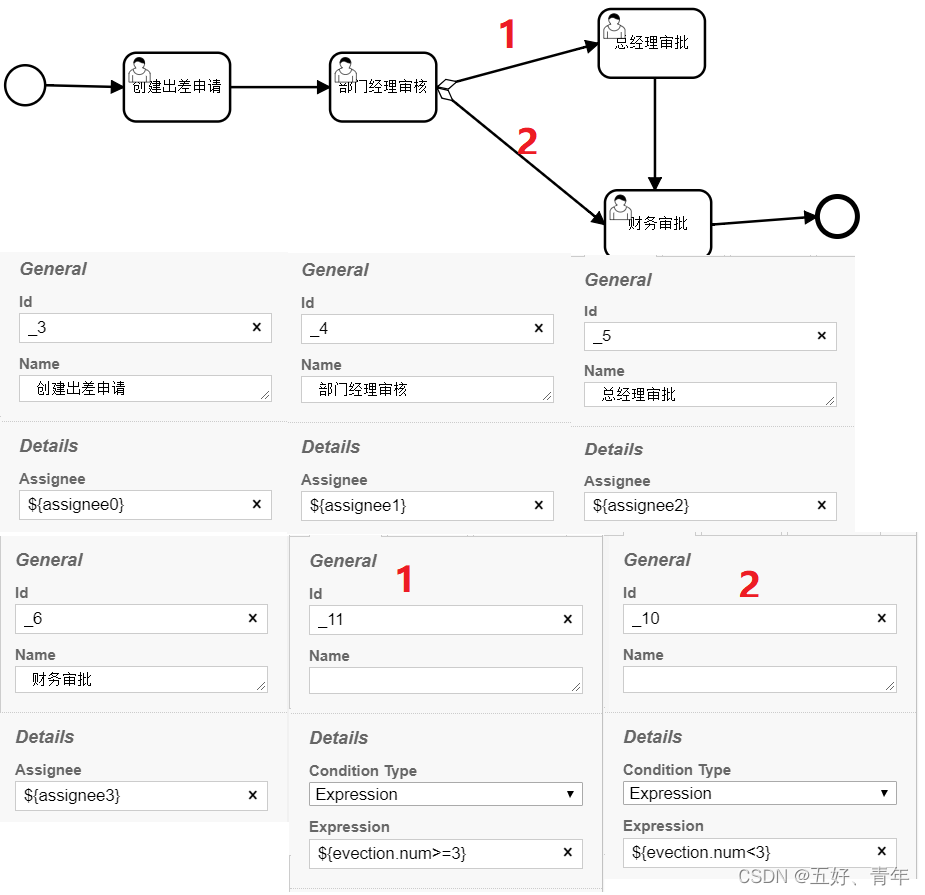  

（二）流程部署代码实现

```bash
ProcessEngine processEngine = ProcessEngines.getDefaultProcessEngine();
RepositoryService repositoryService = processEngine.getRepositoryService();
Deployment deploy = repositoryService.createDeployment()
                .name("出差申请流程-variables")
                .addClasspathResource("bpmn/evection-global.bpmn")
                .deploy();
```

> - act\_re\_procdef表结果：

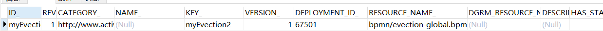  
（三）主体类准备（必须继承Serializable ，不然bpmn文件无法识别变量）

```java
/**
 * 出差申请中的流程变量对象
 */
public class Evection implements Serializable {

    private Long id;
    private String evectionName;
    private Double num;
    private String reson;

    public Long getId() {
        return id;
    }

    public void setId(Long id) {
        this.id = id;
    }

    public String getEvectionName() {
        return evectionName;
    }

    public void setEvectionName(String evectionName) {
        this.evectionName = evectionName;
    }

    public Double getNum() {
        return num;
    }

    public void setNum(Double num) {
        this.num = num;
    }
    public String getReson() {
        return reson;
    }

    public void setReson(String reson) {
        this.reson = reson;
    }
}

```

（四）方式一：启动流程的时候设置流程变量

```java
ProcessEngine processEngine = ProcessEngines.getDefaultProcessEngine();
RuntimeService runtimeService = processEngine.getRuntimeService();
//流程变量的map
Map<String,Object> variables = new HashMap<>();
//设置流程变量
Evection evection = new Evection();
//设置出差日期
evection.setNum(2d);
//把流程变量的pojo放入map
variables.put("evection",evection);
//设定任务的负责人
variables.put("assignee0","李四");
variables.put("assignee1","王经理");
variables.put("assignee2","杨总经理");
variables.put("assignee3","张财务");
//启动流程
runtimeService.startProcessInstanceByKey("myEvection2",variables);
```

（五）方式二：完成个人任务的时候设置流程变量

```bash
//设置流程变量
Evection evection = new Evection();
//设置出差时间
evection.setNum(2d);
Map<String,Object> map = new HashMap<>();
map.put("evection",evection);
ProcessEngine processEngine = ProcessEngines.getDefaultProcessEngine();
TaskService taskService = processEngine.getTaskService();
//查询任务
Task task = taskService.createTaskQuery()
            .processDefinitionKey("myEvection2")
            .taskAssignee("李四")
            .singleResult();
if(task != null){
            //根据任务id   完成任务,并传递流程变量
            taskService.complete(task.getId(),map);
            System.out.println(task.getId()+"-任务已完成");
        };
```

（六）添加流程变量修改的表，除了ACT\_HI\_VARINST其余表正常执行

> **1\. ACT\_HI\_VARINST（历史流程运行中的变量信息数据表）**

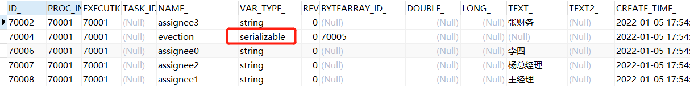

> 说明：图中的evection.num就是代码中设置的2d

（七）以（ACT\_RU\_TASK表、方式一）为代表简述执行过程：

> **第一步：李四送审后表结果**

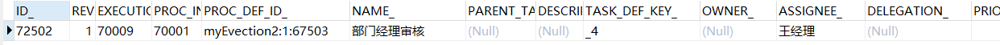

> **第二步：王经理送审后表结果（可见直接跳过了杨总经理，直接到了张财务，说明图中的变量表达式生效，天数小于2不需要杨总经理审批）**

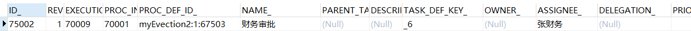

> **第三步：张财务送审后表结果（所有记录删除）**

> **注：若两个条件均满足要求，则走flowid最小的任务。都不符合条件，流程结束**

### 流程变量设置时机

#### 全局变量

##### 启动实例时设置变量

在启动流程实例时，将变量设置为全局变量，使其在整个流程实例中可用。这样的设置适用于流程实例开始时就需要使用的变量。

```java
ProcessEngine processEngine = ProcessEngines.getDefaultProcessEngine();
RuntimeService runtimeService = processEngine.getRuntimeService();
//流程变量的map
Map<String,Object> variables = new HashMap<>();
//设置流程变量
Evection evection = new Evection();
//设置出差日期
evection.setNum(2d);
//把流程变量的pojo放入map
variables.put("evection",evection);

//启动流程
runtimeService.startProcessInstanceByKey("myEvection2",variables);
```

##### 通过流程实例设置变量

在流程实例正在执行但未完成时，可以通过流程实例ID来设置全局变量。这种设置适用于在流程实例执行过程中动态设置变量的情况。

```java
@Test
public void setGlobalVariableByExecutionId(){
    String executionId="2601";
    ProcessEngine processEngine = ProcessEngines.getDefaultProcessEngine();

    RuntimeService runtimeService = processEngine.getRuntimeService();
    Evection evection = new Evection();
    evection.setNum(3d);
//      通过流程实例 id设置流程变量
    runtimeService.setVariable(executionId, "evection", evection);
//      一次设置多个值
//      runtimeService.setVariables(executionId, variables)
}
```

##### 任务办理时设置变量

在完成任务时设置变量，这些变量将在任务完成后对整个流程实例可见。这样的设置适用于需要根据任务的办理情况来设置变量的场景。

```java
String assingee = "张三";
Task task = taskService.createTaskQuery()
                .processDefinitionKey(key)
                .taskAssignee(assingee)
                .singleResult();

//流程变量的map
Map<String,Object> map = new HashMap<>();
//设置流程变量
Evection evection = new Evection();
//设置出差日期
evection.setNum(2d);
//把流程变量的pojo放入map
map.put("evection",evection);

if(task != null){
    //完成任务时为以后的节点设置流程变量的值
    taskService.complete(task.getId(),map);
}
```

##### 通过当前任务设置变量

可以直接通过任务ID来设置流程变量，这些变量将在任务完成后对整个流程实例可见。这种设置适用于在任务办理过程中需要设置特定节点的变量。

```java
@Test
public void setGlobalVariableByTaskId(){
    String taskId="1404";
    ProcessEngine processEngine = ProcessEngines.getDefaultProcessEngine();
    TaskService taskService = processEngine.getTaskService();
    Evection evection = new Evection();
    evection.setNum(3);
    //通过任务设置流程变量
    taskService.setVariable(taskId, "evection", evection);
    //一次设置多个值 
    //taskService.setVariables(taskId, variables)
}

```

#### 局部变量

任务办理时设置local流程变量，当前运行的流程实例只能在该任务结束前使用，任务结束该变量无法在当前流程实例使用，可以通过查询历史任务查询。这种设置适用于需要在当前任务中使用的临时变量。

```java
//  设置local变量，作用域为该任务
Map<String, Object> variables = new HashMap<>();
// 设置单个
taskService.setVariableLocal(taskId, "xxx", evection);
// 设置多个
taskService.setVariablesLocal(taskId, variables);
taskService.complete(taskId);
```

### 条件分支

流程条件就是在连接线\(sequenceFlow\)增加一个Boolean类型的添加，当条件满足后就会走对应的任务。

- 当有多个条件满足时：只要满足条件的都执行。
- 当所有条件都不成立时：抛异常，流程走不下去报错。


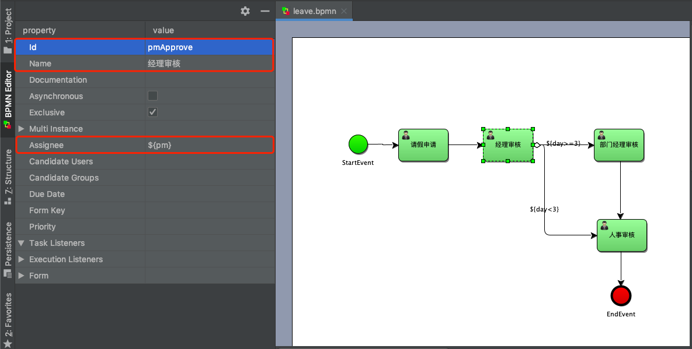

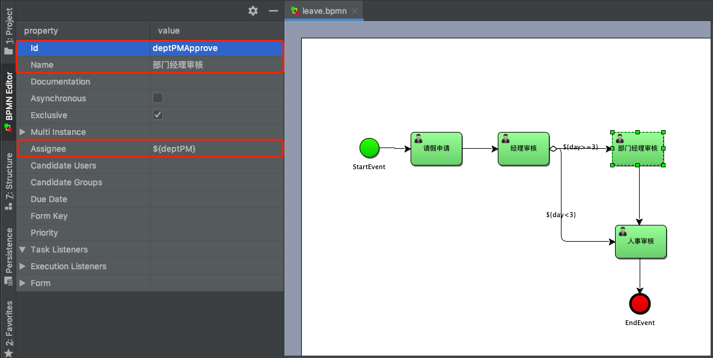

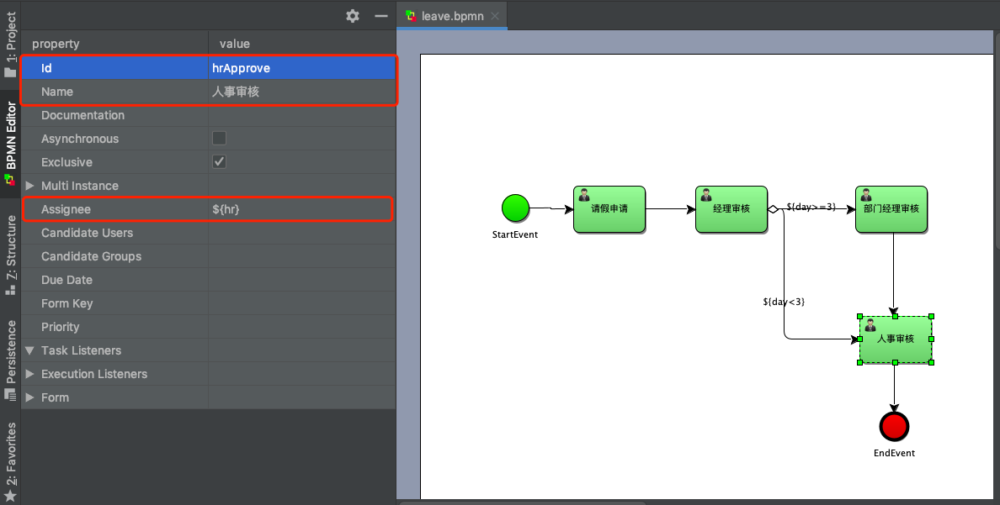

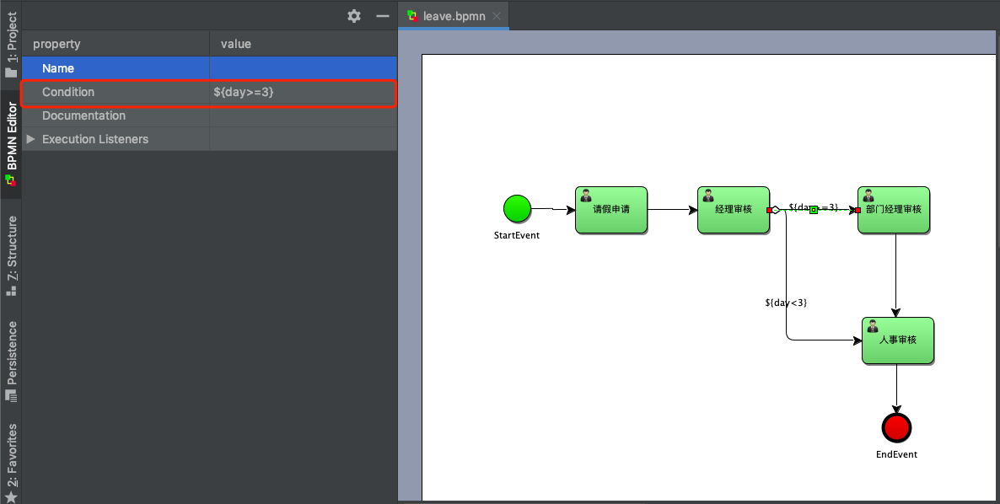

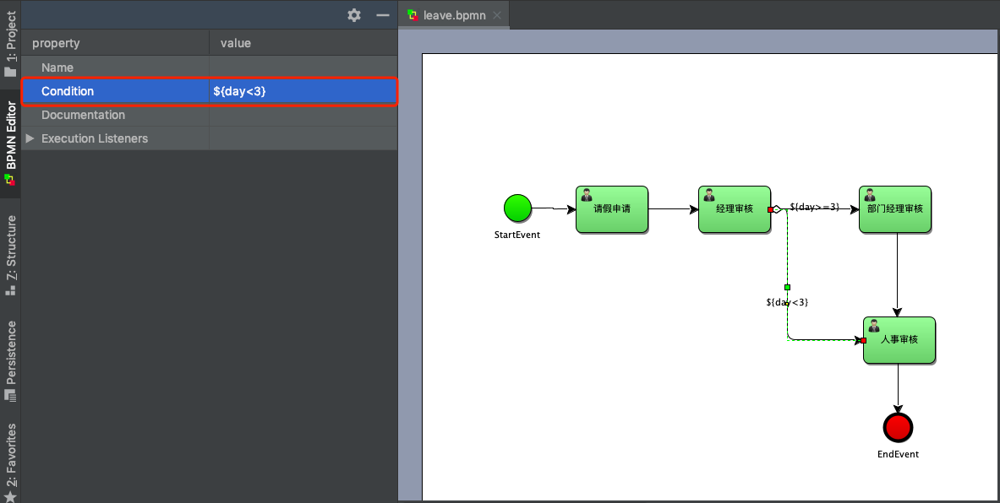

```java
public class ProcessVariableTest {
    @Test
    public void testCreateDBTable() {
        ProcessEngine processEngine = ProcessEngines.getDefaultProcessEngine();
        System.out.println(processEngine);
    }

    @Test
    public void delopyBpmn() {
        ProcessEngine processEngine = ProcessEngines.getDefaultProcessEngine();
        Deployment deploy = processEngine.getRepositoryService()
                .createDeployment()
                .addClasspathResource("bpmn/leave.bpmn")
                .name("请假流程")
                .deploy();
        // DeploymentEntity[id=1, name=请假流程]
        System.out.println(deploy);
    }


    @Test
    public void startProcessInstance() {
        Map<String, Object> assignees = new HashMap<>();
        assignees.put("proposer", "张三");
        assignees.put("pm", "狗经理");
        assignees.put("deptPM", "狗部门经理");
        assignees.put("hr", "狗人事");

        String businessKey = "1";

        ProcessEngine processEngine = ProcessEngines.getDefaultProcessEngine();
        ProcessInstance processInstance = processEngine.getRuntimeService()
                .startProcessInstanceByKey("LeaveProcess", businessKey, assignees);
        // processInstance.getId() = processInstance.getProcessInstanceId()
        System.out.println("实例Id：" + processInstance.getId());
        System.out.println("实例Id：" + processInstance.getProcessInstanceId());
        System.out.println("流程定义Id：" + processInstance.getProcessDefinitionId());
    }

    @Test
    public void testQueryRuTask() {
        ProcessEngine processEngine = ProcessEngines.getDefaultProcessEngine();
        List<Task> list = processEngine.getTaskService()
                .createTaskQuery()
                .processDefinitionKey("LeaveProcess")
                .taskAssignee("张三")
                .list();
        System.out.println(list);
    }

    @Test
    public void completeTask() {
        ProcessEngine processEngine = ProcessEngines.getDefaultProcessEngine();
        TaskService taskService = processEngine.getTaskService();
        Task task = taskService
                .createTaskQuery()
                .processDefinitionKey("LeaveProcess")
                .taskAssignee("张三")
                .singleResult();
        if (task != null) {
            taskService.complete(task.getId());
        }
    }

    @Test
    public void testCompleteTask2() {
        ProcessEngine processEngine = ProcessEngines.getDefaultProcessEngine();
        TaskService taskService = processEngine.getTaskService();

        Task task = taskService
                .createTaskQuery()
                .processDefinitionKey("LeaveProcess")
                .taskAssignee("狗经理")
                .singleResult();
        // 设置流程变量
        Map<String, Object> variables = new HashMap<>();
        variables.put("day", 3);
        if (task != null) {
            taskService.complete(task.getId(), variables);
        }
    }
}
```

修改条件\$\{day >= 3\} 和 \$\{day >= 2\}，当day=5时两个条件都满足，两个任务`都执行`，所以部门经理和人事都需要审核。  

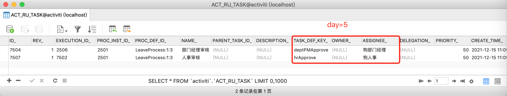

修改条件\$\{day >= 3\} 和 \$\{day >= 2\}，当day=1时两个条件都不满足，报错不能继续流程`org.activiti.engine.ActivitiException: No outgoing sequence flow of element 'pmApprove' could be selected for continuing the process`。  
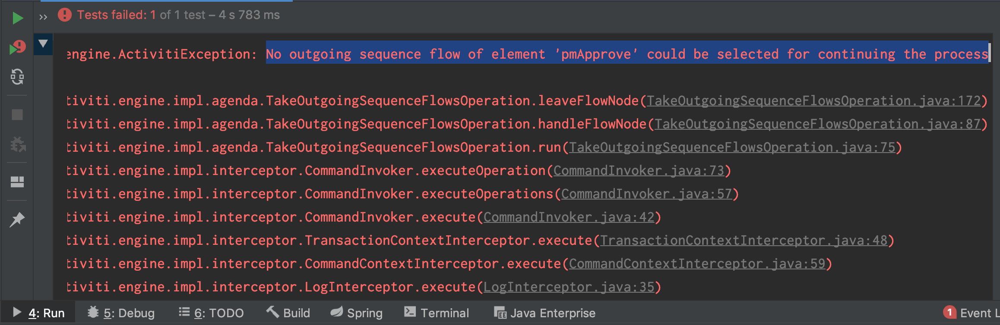


## 十五、排他网关


> 简介：所有分支都会判断条件是否为true，如果为true就执行该分支  
> 注意：只会选择一个true的分支执行，如果都满足条件，则走flowid最小的任务。  
> 与上述条件变量的区别：都不满足条件，则抛出异常。

（一）重新创建bpmn文件，如下图  
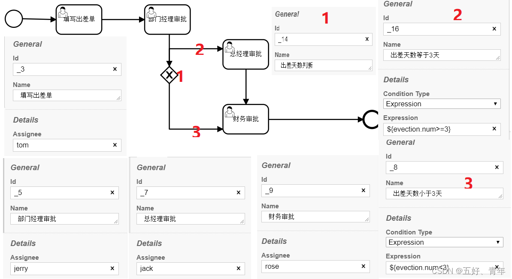  
（二）流程部署代码实现：

```bash
ProcessEngine processEngine = ProcessEngines.getDefaultProcessEngine();
RepositoryService repositoryService = processEngine.getRepositoryService();
Deployment deployment = repositoryService.createDeployment()
                .addClasspathResource("bpmn/evection-exclusive.bpmn")                 
                .name("出差申请流程-排他网关")
                .deploy();
```

> - act\_re\_procdef表结果：

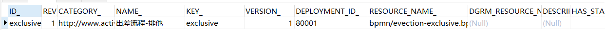  
（三）流程启动代码实现：

```bash
ProcessEngine processEngine = ProcessEngines.getDefaultProcessEngine();
RuntimeService runtimeService = processEngine.getRuntimeService();
Map<String, Object> map = new HashMap<>();
Evection evection = new Evection();
evection.setNum(2d);
//定义流程变量，把出差pojo对象放入map
map.put("evection",evection);
//启动流程实例，并设置流程变量的值（把map传入）
ProcessInstance processInstance = runtimeService
                .startProcessInstanceByKey("exclusive", map);            
```

> - ACT\_RU\_TASK表结果：

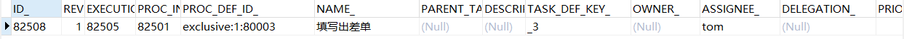

> ACT\_RU\_VARIABLE表结果：

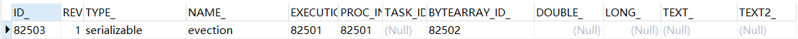

（三）以（ACT\_RU\_TASK表）为代表简述执行过程：

> **第一步：tom送审后表结果**

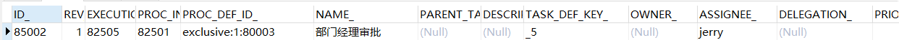

> **第二步：jerry送审后表结果（经过判断到达财务审批rose负责人手上）**

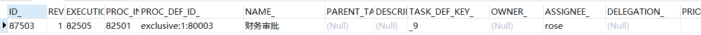

> **第三步：rose送审后表结果（记录删除）**


## 十六、并行网关


> 可以把多条分支汇聚一起，会走所有的分支、还要等多个分支完成才可继续完成。  
> 注意：并行网关不会解析条件，即使定义了条件也会被忽略。

（一）重新创建bpmn文件，如下图  
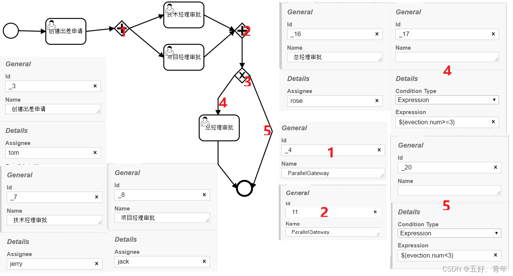  
（二）流程部署代码实现：

```bash
ProcessEngine processEngine = ProcessEngines.getDefaultProcessEngine();
RepositoryService repositoryService = processEngine.getRepositoryService();
Deployment deployment = repositoryService.createDeployment()
                .addClasspathResource("bpmn/evection-parallel.bpmn")                 
                .name("出差申请流程-并行网关")
                .deploy();
```

> - act\_re\_procdef表结果：

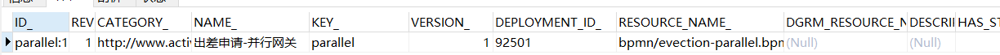  
（三）流程启动代码实现：

```bash
ProcessEngine processEngine = ProcessEngines.getDefaultProcessEngine();
RuntimeService runtimeService = processEngine.getRuntimeService();
Map<String, Object> map = new HashMap<>();
Evection evection = new Evection();
evection.setNum(4d);
map.put("evection",evection);
//启动流程实例，并设置流程变量的值（把map传入）
ProcessInstance processInstance = runtimeService
                .startProcessInstanceByKey("parallel", map);
```

> ACT\_RU\_TASK表结果：

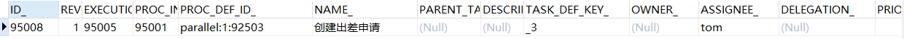

> ACT\_RU\_EXECUTION表结果：

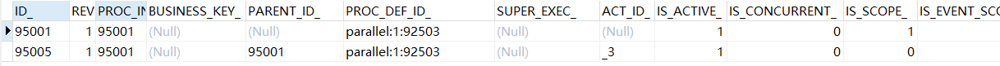

> ACT\_RU\_VARIABLE表结果：

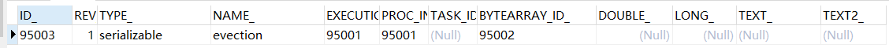  
（三）以（ACT\_RU\_TASK表）为代表简述执行过程：

> **第一步：tom送审后表结果**

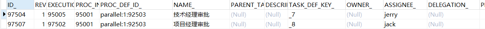

> **第二步：jerry送审后表结果**

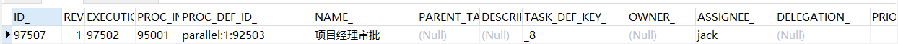

> **第三步：jack送审后表结果**

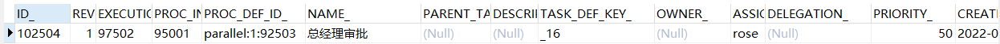

> **第四步：rose送审后表结果（记录删除）**

（四）以（ACT\_RU\_EXECUTION表）为代表简述执行过程：

> **第一步：tom送审后表结果**

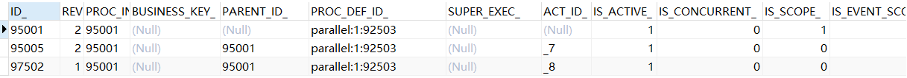

> **第二步：jerry送审后表结果（项目经理审批到达汇聚节点）**

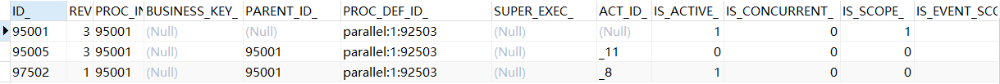

> **第三步：jack送审后表结果**

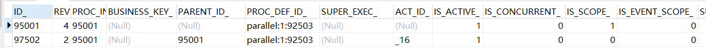

> **第四步：rose送审后表结果（记录删除）**

（五）以（ACT\_HI\_TASKINST表）为代表简述执行过程：

> **第一步：tom送审后表结果**

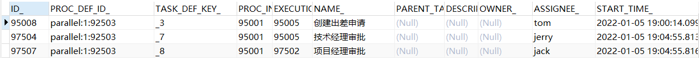

> **第二步：jerry送审后表结果\(jerry加上了end\_time\)**

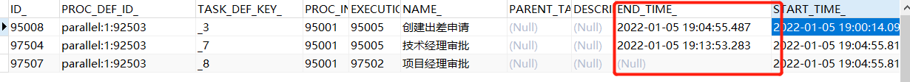

> **第三步：jack送审后表结果（添加总经理审批节点）**

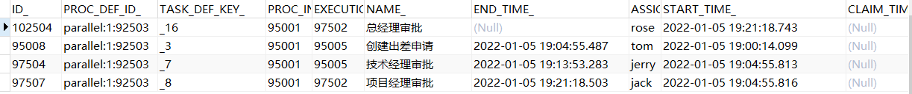

> **第四步：rose送审后表结果**

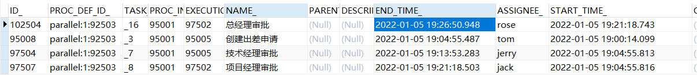

（六）以（ACT\_HI\_PROCINST表）为代表简述执行过程：

> **第一步：tom送审后表结果**

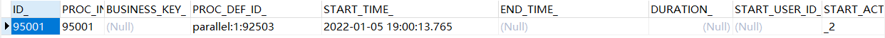

> **第二步：jerry送审后表结果**

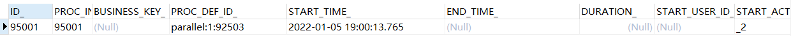

> **第三步：jack送审后表结果**

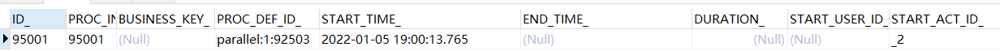

> **第四步：rose送审后表结果**

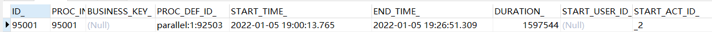

（七）以（ACT\_HI\_ACTINST表）为代表简述执行过程：

> **第一步：tom送审后表结果**

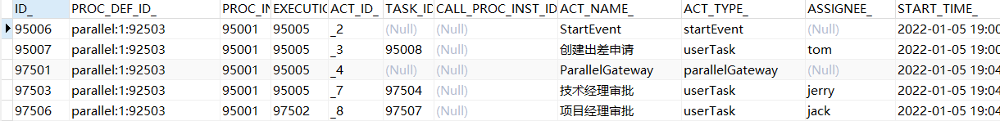

> **第二步：jerry送审后表结果（技术经理审批endtime更新，汇聚节点创建）**

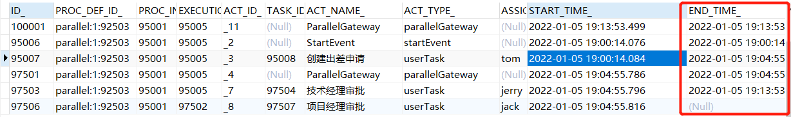

> **第三步：jack送审后表结果（因为请4天假期，所以，再添加一个并行网关节点，添加一个总经理审批节点）**

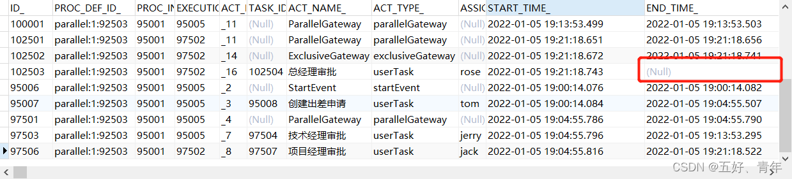

> **第四步：rose送审后表结果**

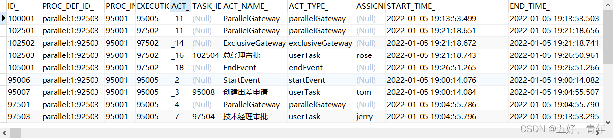


## 十七、包含网关


> 排他网关和并行网关的结合。都为ture的时候，都要执行任务，并且最后汇聚在一起才可以执行下去。

（一）重新创建bpmn文件，如下图  
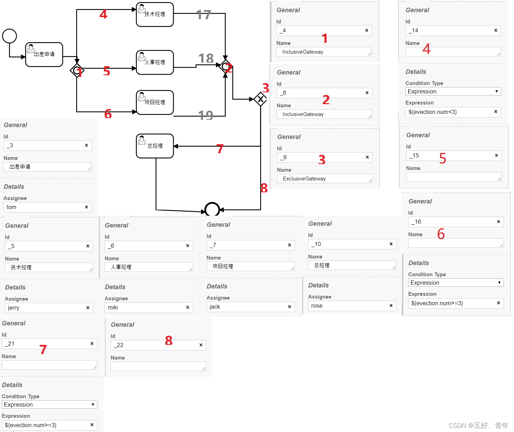  
（二）流程部署代码实现：

```bash
ProcessEngine processEngine = ProcessEngines.getDefaultProcessEngine();
RepositoryService repositoryService = processEngine.getRepositoryService();
Deployment deployment = repositoryService.createDeployment()
                .addClasspathResource("bpmn/evection-inclusive.bpmn")                 
                .name("出差申请流程-包含网关")
                .deploy();
```

> - act\_re\_procdef表结果：

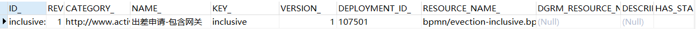  
（三）流程启动代码实现：

```bash
ProcessEngine processEngine = ProcessEngines.getDefaultProcessEngine();
RuntimeService runtimeService = processEngine.getRuntimeService();
String key = "inclusive";
Map<String, Object> map = new HashMap<>();
Evection evection = new Evection();
evection.setNum(4d);
//定义流程变量，把出差pojo对象放入map
map.put("evection",evection);
//启动流程实例，并设置流程变量的值（把map传入）
ProcessInstance processInstance = runtimeService
			.startProcessInstanceByKey(key, map);
```

> ACT\_RU\_TASK表结果：

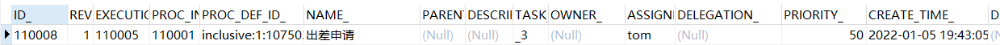

> ACT\_RU\_EXECUTION表结果：


> ACT\_RU\_VARIABLE表结果：

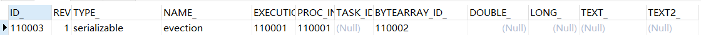  
（三）以（ACT\_RU\_TASK表）为代表简述执行过程：

> **第一步：tom送审后表结果（过滤了技术经理审批）**

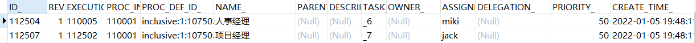

> **第二步：miki送审后表结果**

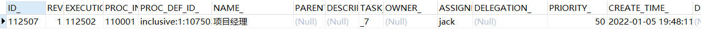

> **第三步：jack送审后表结果**

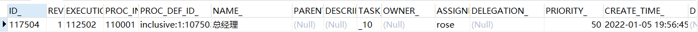

> **第四步：rose送审后表结果（记录删除）**

（四）以（ACT\_RU\_EXECUTION表）为代表简述执行过程：

> **第一步：tom送审后表结果（技术经理节点不在）**

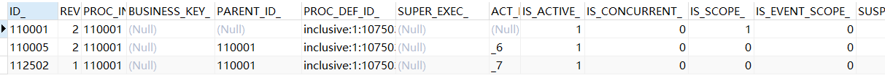

> **第二步：miki送审后表结果（项目经理审批到达汇聚节点）**

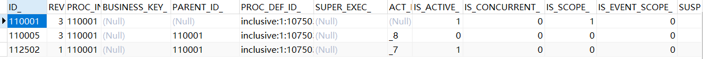

> **第三步：jack送审后表结果**

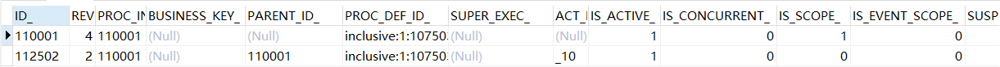

> **第四步：rose送审后表结果（记录删除）**

（五）以（ACT\_HI\_TASKINST表）为代表简述执行过程：

> **第一步：tom送审后表结果（技术经理节点不在）**

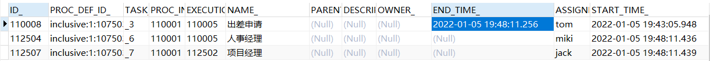

> **第二步：miki送审后表结果\(miki加上了end\_time\)**

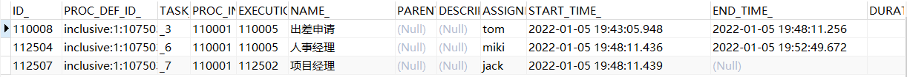

> **第三步：jack送审后表结果（添加总经理审批节点）**

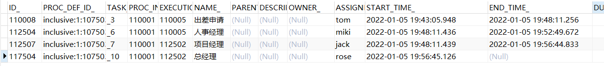

> **第四步：rose送审后表结果**

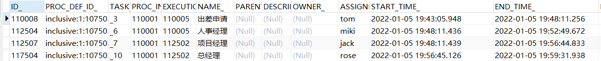

（六）以（ACT\_HI\_ACTINST表）为代表简述执行过程：

> **第一步：tom送审后表结果**

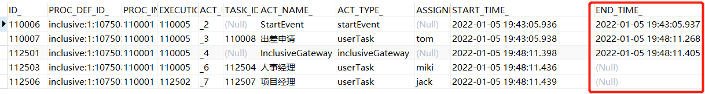

> **第二步：miki送审后表结果（技术经理审批endtime更新，汇聚节点创建）**

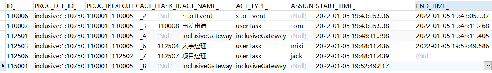

> **第三步：jack送审后表结果（因为请4天假期，所以，再添加一个并行网关节点，添加一个总经理审批节点）**

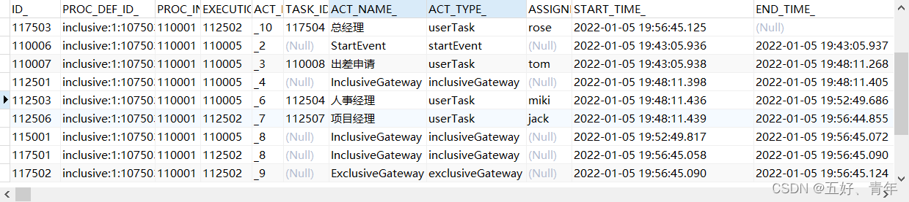

> **第四步：rose送审后表结果**

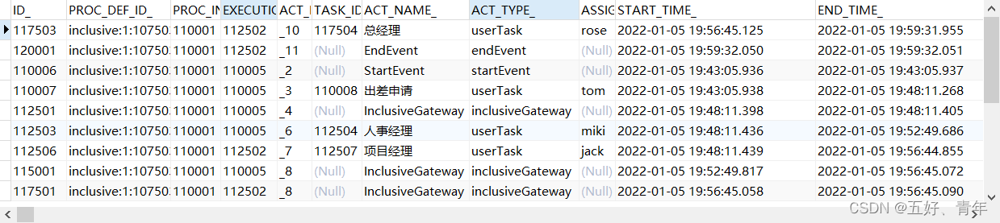


##  十八、ServiceTask

员工申请请假 --> 经理审批 --> 总经理审批。如果是经理要请假那么按照原来的方式经理还需要审核自己，然后再到总经理，现在想实现的效果是经理自己请假但自己不需要审核自己，直接到总经理审核。

### 一：bpmn

在ServiceTask上设置Type=Expression，`Expression=${myTaskService.isPm(execution)}`，其中myTaskService是Bean中的Id值，方法参数名必须是execution不能修改。

本示例中是将ServiceTask使当做条件来使用的，本质上一般使用ServiceTask执行一些逻辑，计算出来一些值，然后将这些值设置为变量，然后供后面的流程来使用。  

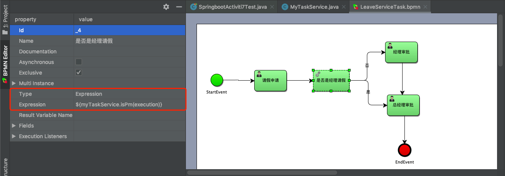

设置流程条件。  

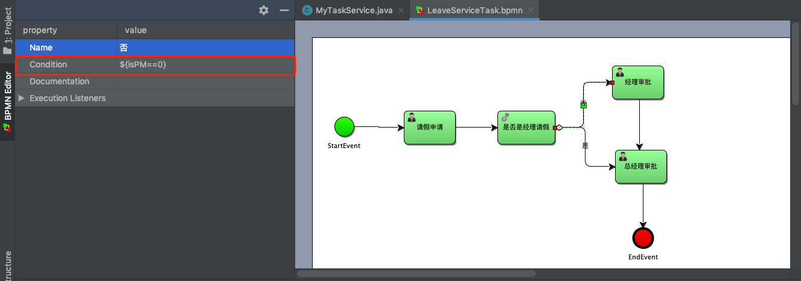  

设置流程条件。 

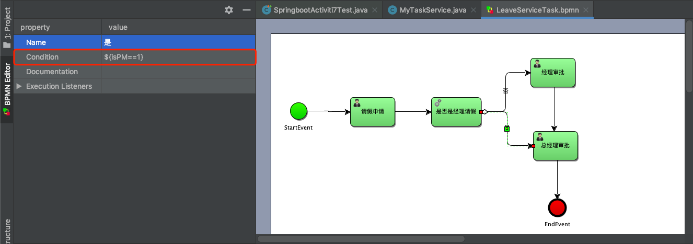

### 二：Service

@Service如果没有指定名字，默认是类名的首字母小写，即myTaskService。

```java
@Service
public class MyTaskService {

    public void isPm(DelegateExecution delegateExecution) {
        String creator = (String)delegateExecution.getVariable("creator");
        if ("狗经理".equals(creator)) {
            delegateExecution.setVariable("isPM", 1);
        } else {
            delegateExecution.setVariable("isPM", 0);
        }
    }
}
```

### 三：Test

```java
@SpringBootTest
class SpringbootActiviti7Test {

    @Autowired
    private RuntimeService runtimeService;

    @Autowired
    private TaskService taskService;


    @Test
    void testStartProcess() {
        Map<String, Object> variables = new HashMap<>();
        variables.put("creator", "狗经理");
        variables.put("pm", "狗经理");
        variables.put("gm", "狗总经理");
        runtimeService.startProcessInstanceByKey("LeaveServiceTask", variables);

        Task task = taskService.createTaskQuery().processDefinitionKey("LeaveServiceTask")
                .taskAssignee("狗经理")
                .singleResult();
        taskService.complete(task.getId());
    }
}
```

经理请假直接到总经理那里审批了

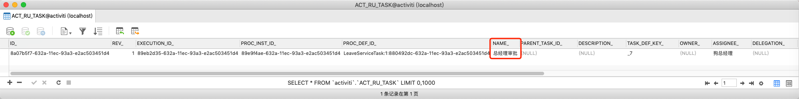

## 十九、ManualTask

**ManualTask 会自动执行，且不会记录在act\_hi\_taskinst表中。可以将某个节点完成后需要自动执行的代码封装到这里执行。**  

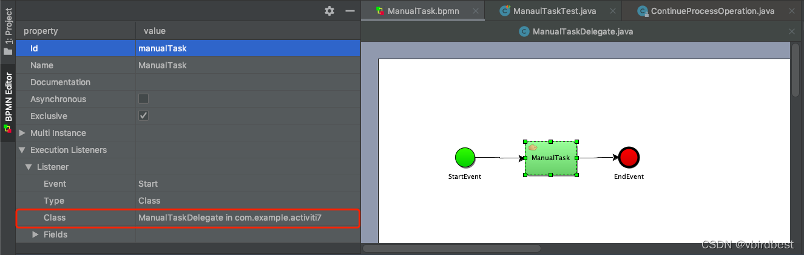

```java
public class ManualTaskDelegate implements ExecutionListener {
    @Override
    public void notify(DelegateExecution execution) {
        System.out.println(execution.getEventName() + "-" + execution.getCurrentFlowElement().getId());
    }
}
```

```java
@Test
void testStartAndComplete() {
    runtimeService.startProcessInstanceByKey("ManualTaskProcess");
    // [] ManualTask不会在act_hi_taskinst中
    List<HistoricTaskInstance> historicTaskInstanceList = historyService.createHistoricTaskInstanceQuery()
            .taskDefinitionKey("ManualTaskProcess")
            .list();
    System.out.println(historicTaskInstanceList);
}
```

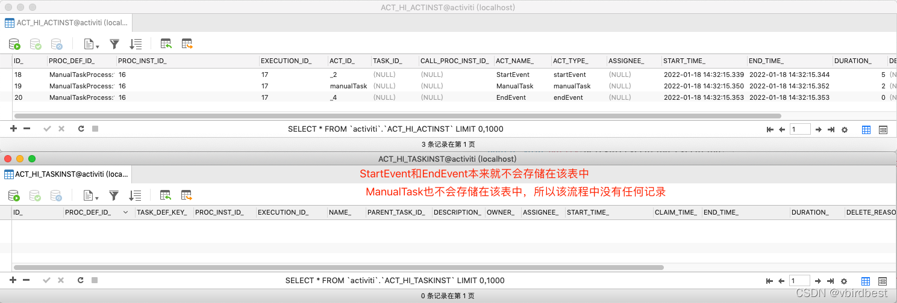

## 二十、MailTask

### 一：开启POP3/SMTP/IMAP

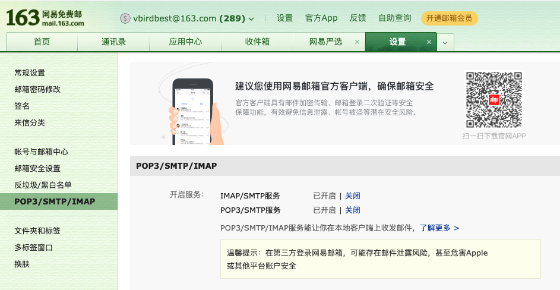

### 二：定义bpmn

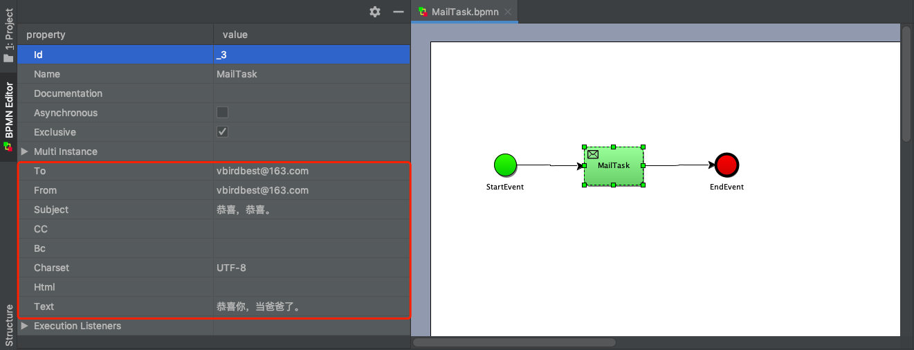

### 三：application.yml

```yaml
spring:
  datasource:
    url: jdbc:mysql://localhost:3306/activiti?useUnicode=true&characterEncoding=utf8&serverTimezone=GMT
    username: root
    password: root123
    driver-class-name: com.mysql.cj.jdbc.Driver
  activiti:
    #1.flase：默认值。activiti在启动时，对比数据库表中保存的版本，如果没有表或者版本不匹配，将抛出异常
    #2.true： activiti会对数据库中所有表进行更新操作。如果表不存在，则自动创建
    #3.create_drop： 在activiti启动时创建表，在关闭时删除表（必须手动关闭引擎，才能删除表）
    #4.drop-create： 在activiti启动时删除原来的旧表，然后在创建新表（不需要手动关闭引擎）
    database-schema-update: true
    #检测历史表是否存在 activiti7默认没有开启数据库历史记录 启动数据库历史记录
    db-history-used: true
    #记录历史等级 可配置的历史级别有none, activity, audit, full
    #none：不保存任何的历史数据，因此，在流程执行过程中，这是最高效的。
    #activity：级别高于none，保存流程实例与流程行为，其他数据不保存。
    #audit：除activity级别会保存的数据外，还会保存全部的流程任务及其属性。audit为history的默认值。
    #full：保存历史数据的最高级别，除了会保存audit级别的数据外，还会保存其他全部流程相关的细节数据，包括一些流程参数等。
    history-level: full
    #校验流程文件，true表示自动部署resources下的processes文件夹里的流程文件
    check-process-definitions: true
    use-strong-uuids: false
    mail-server-host: smtp.163.com
    mail-server-port: 994
    mail-server-default-from: vbirdbest@163.com
    mail-server-user-name: vbirdbest@163.com
    ### 注意这里的密码不是邮箱的登录密码, 邮箱客户端授权码
    mail-server-password: HERBWQJNKLEFDAWVGJA
    mail-server-use-ssl: true
```

### 四：Test

```java
@Test
void testStartAndComplete() {
    runtimeService.startProcessInstanceByKey("mailTaskProcess");
}
```

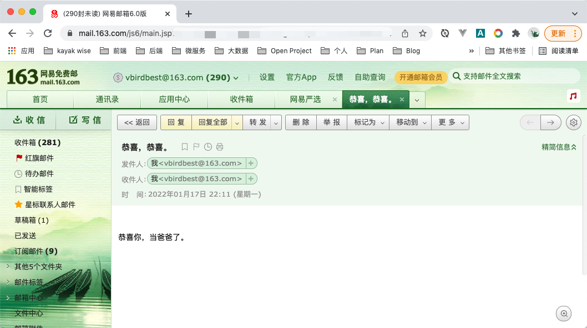

### 五：变量

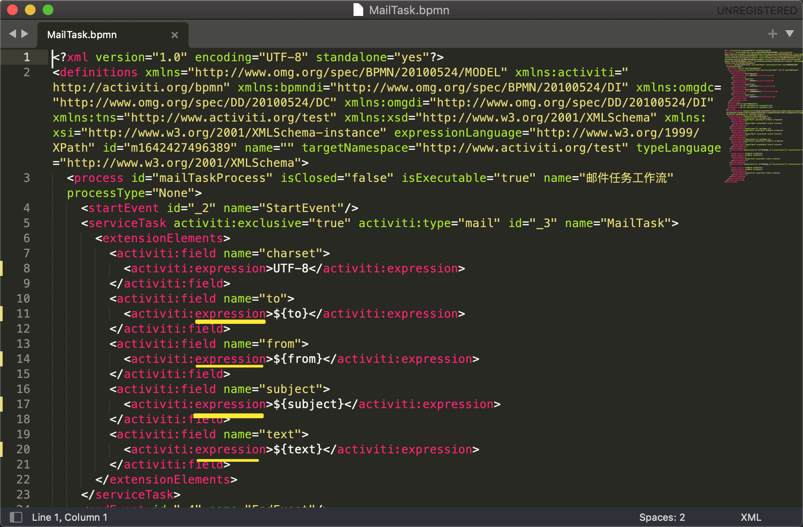  

注意：actiBPM插件有很多bug，其中在MailTask中设置动态属性变量时会当成普通的string，你需要打开.bpmn文件手动的将string改为expression。

```java
@Test
void testStartAndComplete() {
    Map<String, Object> variables = new HashMap<>();
    variables.put("from", "vbirdbest@163.com");
    variables.put("to", "vbirdbest@163.com");
    variables.put("subject", "Hello World");
    variables.put("text", "亲爱的儿子，你好呀！");

    runtimeService.startProcessInstanceByKey("mailTaskProcess", variables);
}

```

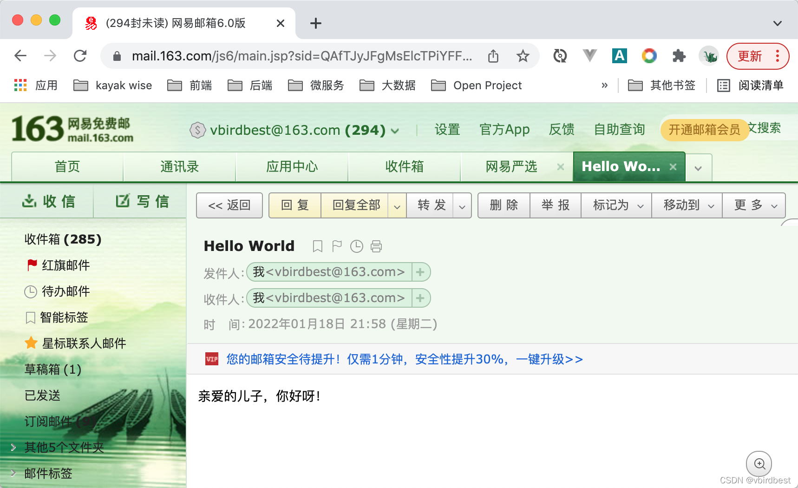

## 二十一、多实例

### 一：多实例基本示例

 -    Sequential：执行顺序，true表示多实例顺序执行，false表示多实例并行。
 -    Loop Cardinality：循环基数，选填，会签人数。
 -    Completion Condition：完成条件，Activiti预定义了3个变量，可以在UEL表达式中直接使用，可以根据表达式设置按数量、按比例、一票通过、一票否定等条件。
        -    nrOfInstances：总实例数，Collection中的数量。
        -    nrOfCompletedInstances：已经完成的实例数。
        -    nrOfActiveInstances：还没有完成的实例数。
 -    Collection：Assignee集合，可以在启动实例时赋值变量。
 -    Element Variable：元素变量，必须和Assignee一样。
 -    Assignee：负责人占位符，会通过Collection自动赋值的。

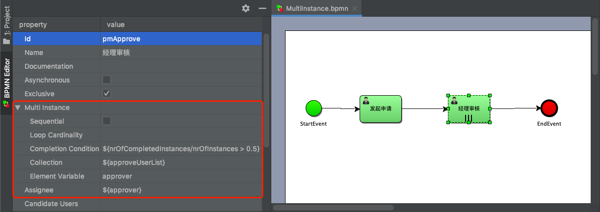

```java
@Test
void testStartAndComplete() {
    Map<String, Object> variables = new HashMap<>();
    variables.put("approveUserList", Arrays.asList("zhaomin", "xiaozhao", "zhouzhiruo"));
    runtimeService.startProcessInstanceByKey("multiInstance", variables);

    Task task = taskService.createTaskQuery().processDefinitionKey("multiInstance").singleResult();
    taskService.setAssignee(task.getId(),"zhangwuji");
    taskService.complete(task.getId());
}
```

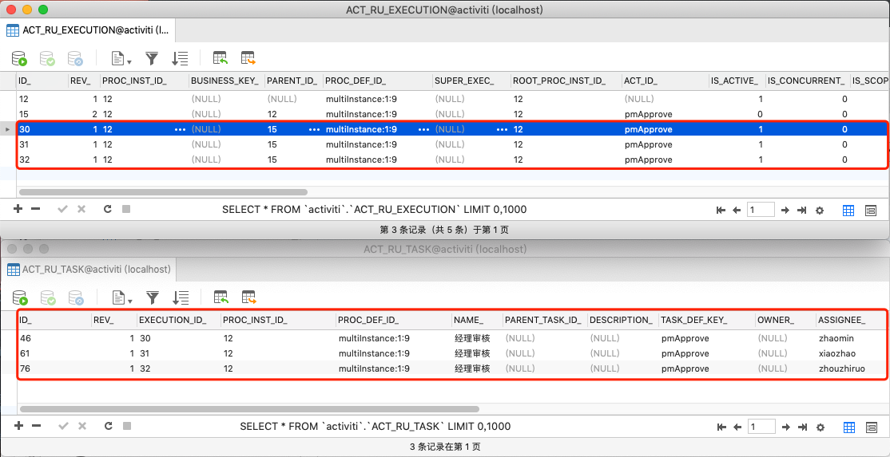

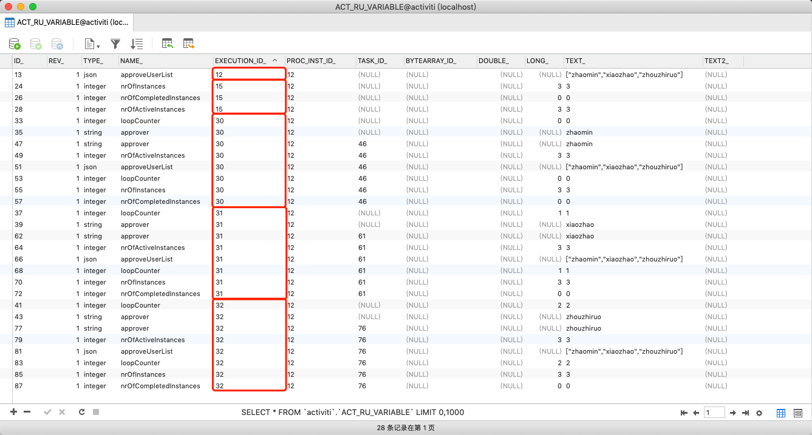

### 二：多实例退回

- 删除act\_ru\_variable
- 删除act\_ru\_task
- 删除act\_ru\_execution
- 删除act\_ru\_identitylink


```java
public class MultiInstanceMoveCommand implements Command<Object> {
    private String currentTaskId;
    private String targetTaskDefKey;


    public MultiInstanceMoveCommand(String currentTaskId, String targetTaskDefKey) {
        this.currentTaskId = currentTaskId;
        this.targetTaskDefKey = targetTaskDefKey;
    }

    @Override
    public Object execute(CommandContext commandContext) {
        TaskEntityManager taskEntityManager = commandContext.getTaskEntityManager();
        TaskEntity taskEntity = taskEntityManager.findById(currentTaskId);

        ExecutionEntityManager executionEntityManager = commandContext.getExecutionEntityManager();
        // act_ru_execution.id_=30
        ExecutionEntity executionEntity = executionEntityManager.findById(taskEntity.getExecutionId());
        // act_ru_execution.id_=15
        ExecutionEntity parentExecutionEntity = executionEntityManager.findById(executionEntity.getParentId());
        // act_ru_execution.id_=(30, 31, 32)
        List<ExecutionEntity> childExecutionEntityList = executionEntityManager.findChildExecutionsByParentExecutionId(parentExecutionEntity.getId());

        // act_ru_execution.id_=[15, 30, 31, 32]
        Set<String> executionIdSet = new HashSet<>();
        executionIdSet.add(parentExecutionEntity.getId());
        for (ExecutionEntity childExecutionEntity : childExecutionEntityList) {
            executionIdSet.add(childExecutionEntity.getId());
        }

        IdentityLinkEntityManager identityLinkEntityManager = commandContext.getIdentityLinkEntityManager();
        identityLinkEntityManager.deleteIdentityLink(executionEntity, null, null, null);
        identityLinkEntityManager.deleteIdentityLink(parentExecutionEntity, null, null, null);

        VariableInstanceEntityManager variableInstanceEntityManager = commandContext.getVariableInstanceEntityManager();
        List<VariableInstanceEntity> variableInstanceEntityList = variableInstanceEntityManager.findVariableInstancesByExecutionIds(executionIdSet);
        for (VariableInstanceEntity variableInstanceEntity : variableInstanceEntityList) {
            variableInstanceEntityManager.delete(variableInstanceEntity);
        }

        taskEntityManager.deleteTasksByProcessInstanceId(taskEntity.getProcessInstanceId(), "删除子节点", true);
        executionEntityManager.deleteChildExecutions(parentExecutionEntity, "", true);


        FlowElement targetFlowElement = ProcessDefinitionUtil.getProcess(executionEntity.getProcessDefinitionId()).getFlowElement(targetTaskDefKey);
        parentExecutionEntity.setCurrentFlowElement(targetFlowElement);

        commandContext.getAgenda().planContinueProcessInCompensation(parentExecutionEntity);

        return null;
    }


    public String getCurrentTaskId() {
        return currentTaskId;
    }

    public void setCurrentTaskId(String currentTaskId) {
        this.currentTaskId = currentTaskId;
    }

    public String getTargetTaskDefKey() {
        return targetTaskDefKey;
    }

    public void setTargetTaskDefKey(String targetTaskDefKey) {
        this.targetTaskDefKey = targetTaskDefKey;
    }
}

```

```java
@Test
public void testMoveTask() {
    String currentTaskId = "46";
    String targetTaskDefKey = "apply";

    MultiInstanceMoveCommand moveTaskCommand = new MultiInstanceMoveCommand(currentTaskId, targetTaskDefKey);
    managementService.executeCommand(moveTaskCommand);
}
```

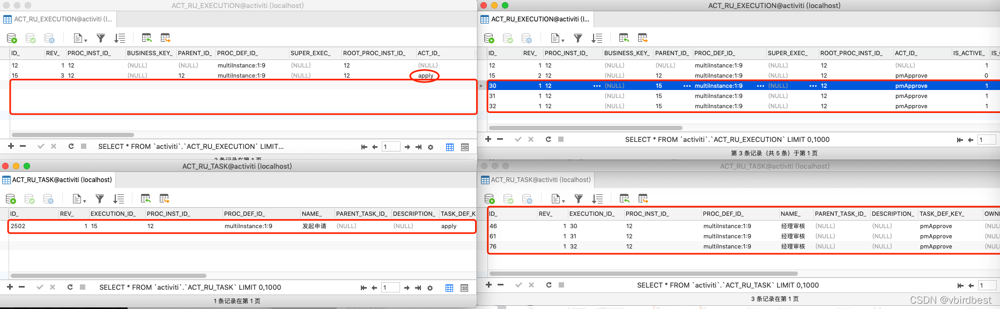

## 二十二、会签

之前的任务负责人Assignee都是一个，而任务可以有多个人有权限审批，只要其中有一部分人完成审批任务就算整个任务完成。**同一个任务需要多个负责人来完成被称之为“会签”。 会签就是一种投票，满足投票人数就过。**

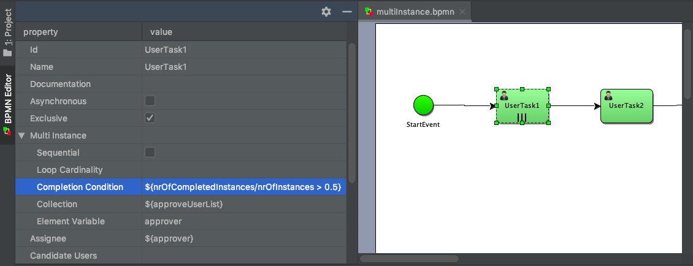

会签是通过`多实例Multi Instance`来设置的：

 -    Sequential：执行顺序，true表示多实例顺序执行，false表示多实例并行。
 -    Loop Cardinality：循环基数，选填，会签人数。
 -    Completion Condition：完成条件，Activiti预定义了3个变量，可以在UEL表达式中直接使用，可以根据表达式设置按数量、按比例、一票通过、一票否定等条件。
        -    nrOfInstances：总实例数，Collection中的数量。
        -    nrOfCompletedInstances：已经完成的实例数。
        -    nrOfActiveInstances：还没有完成的实例数。
 -    Collection：Assignee集合，可以在启动实例时赋值变量。
 -    Element Variable：元素变量，必须和Assignee一样。
 -    Assignee：负责人占位符，会通过Collection自动赋值的。

```js
// 一个人完成审批，整个任务就算通过
${nrOfCompletedInstances==1}

// 所有人完成审批，整个任务才算过
${nrOfCompletedInstances==nrOfInstances}

// 一半人以上完成审批整个任务才算通过
${nrOfCompletedInstances/nrOfInstances > 0.5}
```

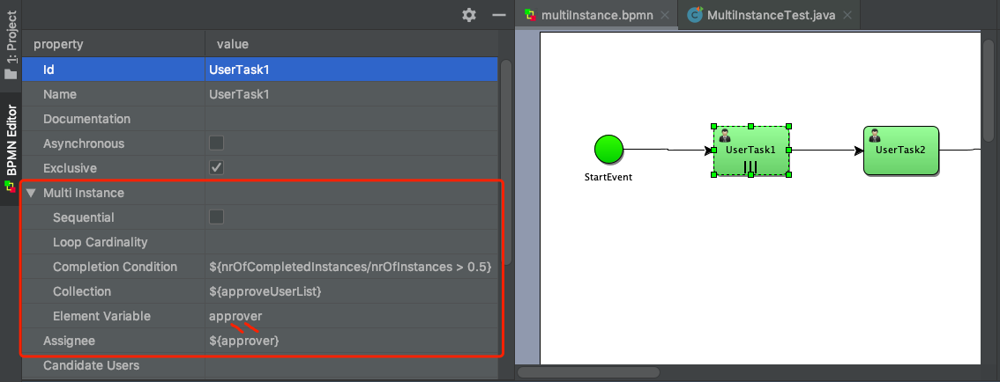

```java
@Test
public void testStart() {
    ProcessEngine processEngine = ProcessEngines.getDefaultProcessEngine();
    Deployment deploy = processEngine.getRepositoryService()
            .createDeployment()
            .addClasspathResource("bpmn/multiInstance.bpmn")
            .name("会签")
            .deploy();

    Map<String, Object> variables = new HashMap<>();
    variables.put("approveUserList", Arrays.asList("zhagnsan", "lisi", "wangwu"));
    processEngine.getRuntimeService()
            .startProcessInstanceByKey("multiInstance", variables);
}
```

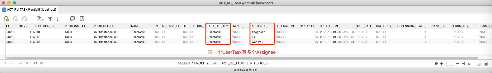

```java
// 第一负责人完成审核
taskService.complete("5020");
```

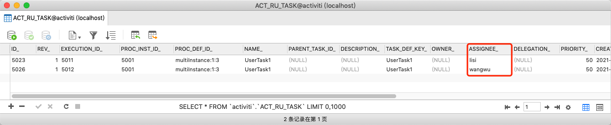

```java
// 第二个负责人再完成，3个人有2个人完成就超过一半了，所以这个UserTask就算过了，进入下一个UserTask
taskService.complete("5023");
```

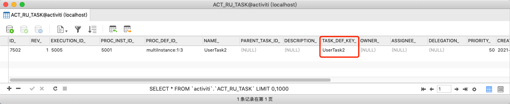

## 二十三、加签和转签
1.  加签就是委派任务`delegateTask`，然后去解决任务`resolveTask`（并不是去真正的去完成任务）。
2.  转签完成后才能完成任务`complete`。

### 一：委派任务

A由于某些原因不能处理该任务可以把任务委派给用户B代理，当B决绝完之后再次回到用户A这里，然后由A去完成任务，在这个过程中A是任务的所有者OWNER\_，B是该任务的办理人Assignee。`A->B->A`。

应用场景：这事太大，我做不了主，我先问一下老大`delegateTask`，如果老大说可以`resolveTask`我就完成审批`complete`。 

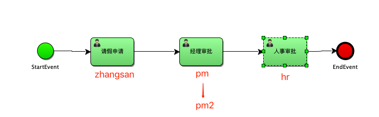

委派：

 1.     act\_hi\_identitylink和act\_run\_identitylink分别插入代理人的数据。
 2.     act\_hi\_taskinst和act\_hi\_actinst分别将任务节点的负责人Assignee设置为代理人。
 3.     act\_ru\_task设置`OWNER_`为原来的任务负责人，将`ASSIGNEE_`设置为代理人，将`DELEGATION_`状态改为pending委托状态。


```java
@Test
public void testTaskDelegate() {
    TaskService taskService = ProcessEngines.getDefaultProcessEngine().getTaskService();
    Task task = ProcessEngines.getDefaultProcessEngine().getTaskService()
            .createTaskQuery()
            .processDefinitionKey("helloworld")
            .taskAssignee("pm")
            .singleResult();
    taskService.delegateTask(task.getId(), "pm2");
}
```

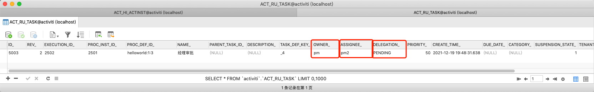

```java
public enum DelegationState {
  PENDING,
  RESOLVED
}
```

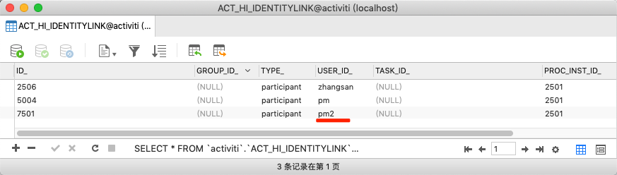

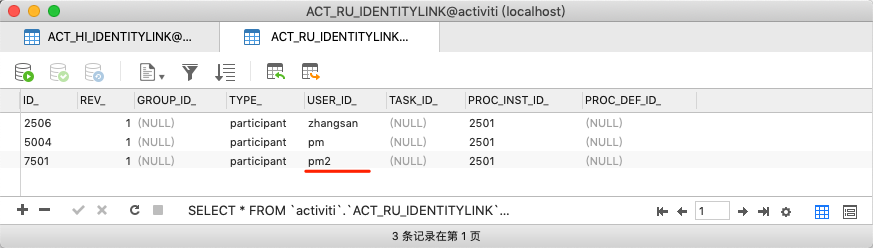

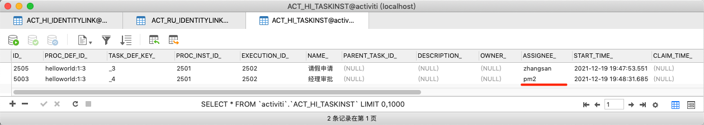

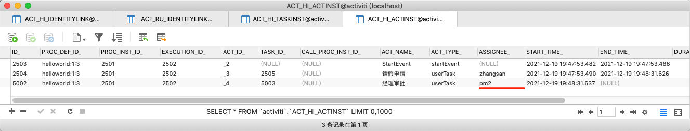

### 二：解决任务

**代理人在完成任务之前需要先resolveTask。**

 -    act\_hi\_taskinst和act\_hi\_actinst分别将任务节点的负责人Assignee设置为之前的owner\_。
 -    act\_ru\_task设置Assignee\_设置为原来的owner\_，将DELEGATION\_改为RESOLVED解决委托。

```java
@Test
public void testResolveTaskTask() {
    TaskService taskService = ProcessEngines.getDefaultProcessEngine().getTaskService();
    Task task = ProcessEngines.getDefaultProcessEngine().getTaskService()
            .createTaskQuery()
            .processDefinitionKey("helloworld")
            .taskAssignee("pm2")
            .singleResult();
    taskService.resolveTask(task.getId());
    // 委托人要想办理任务先要解决任务
    taskService.complete(task.getId());
}
```

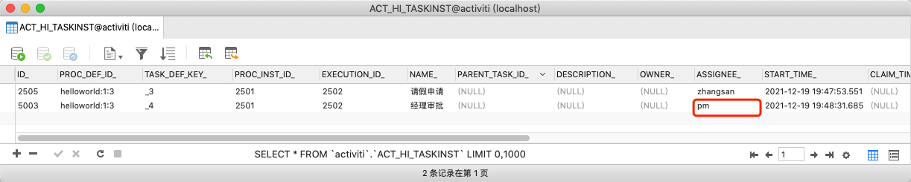

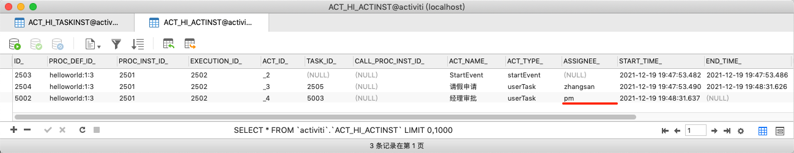

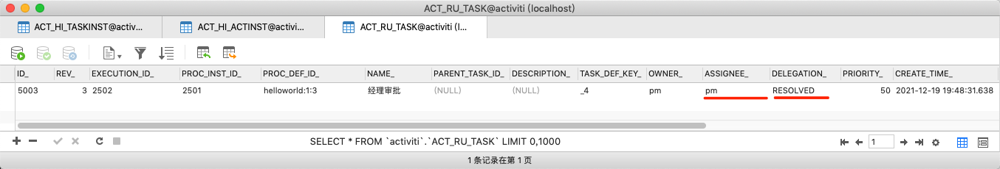

### 三：转签

转签就是将任务的负责人直接设置为别人。即本来由自己办理，改为别人办理。

```java
void setAssignee(String taskId, String userId);
```

当再次启动相同的流程实例时，办理人是与之前的人相同，即流程实例的历史状态不会受到之前的任务转签操作的影响。任务的转签只是改变了特定任务的负责人，而不会影响整个流程实例的历史记录或当前状态。

例如，假设你有一个流程实例，其中包含多个任务。在某个任务上进行了转签操作，将任务从用户A转签给用户B。然后，流程实例完成了其余的任务并结束了。如果你再次启动相同的流程实例，那么流程的初始状态将与之前相同，也就是任务将再次分配给用户A（或者根据流程定义中的配置，可能会分配给其他用户或组，但不会受到之前的任务转签的影响）。

任务转签操作只影响当前运行中的任务，而不会改变流程实例的历史记录或影响将来启动的相同流程实例。如果需要在多次启动相同流程实例时保留任务转签的状态，你可能需要自行管理此信息，例如，将转签操作记录在自定义数据库表中，并在流程启动时根据记录来设置初始任务的负责人。

## 二十四、与SpringSecurity集成


### 1\. mapper

```java
public interface UserMapper {
    @Select("select * from tb_user where username=#{userName}")
    User loadUserByUsername(String userName);
}
```

### 2\. service

```java
@Service
public class UserService {

    @Autowired
    private UserMapper userMapper;

    public User loadUserByUsername(String userName){
        return userMapper.loadUserByUsername(userName);
    }
}
```

注意：在构造SimpleGrantedAuthority时需要对角色前增加前缀 “ROLE\_”

```java
@Slf4j
@Component
public class MyUserDetailsService implements UserDetailsService {

    @Autowired
    private UserService userService;


    @Override
    public UserDetails loadUserByUsername(String username) throws UsernameNotFoundException {
        User user = userService.loadUserByUsername(username);
        if(user == null){
            return null;
        }
        
        List<GrantedAuthority> authority = new ArrayList<>();
        authority.add(new SimpleGrantedAuthority("ROLE_" + user.getRole()));
        return new org.springframework.security.core.userdetails.User(
                user.getUsername(),
                user.getPassword(),
                authority);
    }
}
```

### 3\. handler

```java
@Slf4j
@Component("myAuthSuccessHandler")
public class MyAuthenctiationSuccessHandler extends SimpleUrlAuthenticationSuccessHandler {
    @Autowired
    private ObjectMapper objectMapper;

    @Autowired
    private UserService userService;

    @Override
    public void onAuthenticationSuccess(HttpServletRequest request,
                                        HttpServletResponse response,
                                        Authentication authentication) throws IOException, ServletException {
        String name = SecurityContextHolder.getContext().getAuthentication().getName();
        User user = userService.loadUserByUsername(name);
        request.getSession().setAttribute("userid", user.getId());
        Result result = new Result(200, "登录成功！！");
        response.setContentType("application/json;charset=UTF-8");
        response.getWriter().write(objectMapper.writeValueAsString(result));
    }
}
```

```java
@Slf4j
@Component("myAuthFailureHandler")
public class MyAuthenctiationFailureHandler extends SimpleUrlAuthenticationFailureHandler {
    @Autowired
    private ObjectMapper objectMapper;

    @Override
    public void onAuthenticationFailure(HttpServletRequest request,
                                        HttpServletResponse response,
                                        AuthenticationException exception) throws IOException, ServletException {
        response.setStatus(HttpStatus.FORBIDDEN.value());
        response.setContentType("application/json;charset=UTF-8");
        Result result = new Result(403, "账号或者密码不正确！");
        response.getWriter().write(objectMapper.writeValueAsString(result));
    }
}
```

### 4\. config

```java
/**
 * SpringSecurity的配置类
 */
@Component
@EnableWebSecurity
public class SpringSecurityConfig extends WebSecurityConfigurerAdapter {

    @Autowired
    private MyUserDetailsService myUserDetailsService;
    
    @Autowired
    private PasswordEncoder encoder;
    
    @Autowired
    private MyAuthenctiationSuccessHandler myAuthSuccessHandler;
    
    @Autowired
    private MyAuthenctiationFailureHandler myAuthFailureHandler;
    
    /**
     * 用户授权
     * @param auth
     * @throws Exception
     */
    @Override
    protected void configure(AuthenticationManagerBuilder auth) throws Exception {
        // 使用自定义的认证类实现授权
        auth.userDetailsService(myUserDetailsService).passwordEncoder(encoder);
    }

    /**
     * 配置放行的请求
     * @param web
     * @throws Exception
     */
    @Override
    public void configure(WebSecurity web) throws Exception {
        web.ignoring().antMatchers("/css/**");
        web.ignoring().antMatchers("/js/**");
        web.ignoring().antMatchers("/img/**");
        web.ignoring().antMatchers("/plugins/**");
        web.ignoring().antMatchers("/login.html");
    }

    @Override
    protected void configure(HttpSecurity http) throws Exception {
        //其他任何路径都需要管理员登录
        http.authorizeRequests().
                antMatchers("/**").
                access("hasRole('ADMIN')");

        //登录相关配置
        http.formLogin()
                .loginPage("/login.html")   //指定登录地址
                .loginProcessingUrl("/login")       //指定处理登录的请求地址
                .successHandler(myAuthSuccessHandler) //登录成功的回调
                .failureHandler(myAuthFailureHandler); //登录失败的回调

        //登出配置
        http.logout().
                logoutUrl("/logout").           //登出地址为/logout
                invalidateHttpSession(true);    //并且登出后销毁session

        //设置用户只允许在一处登录，在其他地方登录则挤掉已登录用户，被挤掉的已登录用户则需要返回/login.html重新登录
        http.sessionManagement().maximumSessions(1).expiredUrl("/login.html");

        //关闭CSRF安全策略
        http.csrf().disable();

        //允许跳转显示iframe
        http.headers().frameOptions().disable();

        //异常处理页面，例如没有权限访问等
        http.exceptionHandling().accessDeniedPage("/error.html");
    }

    @Bean
    public PasswordEncoder passwordEncoder() {
        return new BCryptPasswordEncoder();
    }
}
```

### 5\. listener

#### 5.1 ExecutionListener

```java
@Slf4j
@Component
public class MyExecutionListener implements ExecutionListener {

    @Override
    public void notify(DelegateExecution delegateExecution) {
        log.info("delegateExecution is {}", delegateExecution);
    }
}
```

#### 5.2 TaskListener

```java
@Slf4j
@Component
public class MyTaskListener implements TaskListener {

    @Override
    public void notify(DelegateTask delegateTask) {
        
        if(delegateTask.getEventName().equals("assignment")){
            // 消息提醒
        }
    }
}
```

## 二十五、结合公司代码谈谈自己理解

1. 首先，公司是在前端页面创建的流程图
   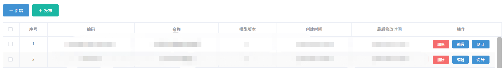

2. 将流程图的数据传给后端
   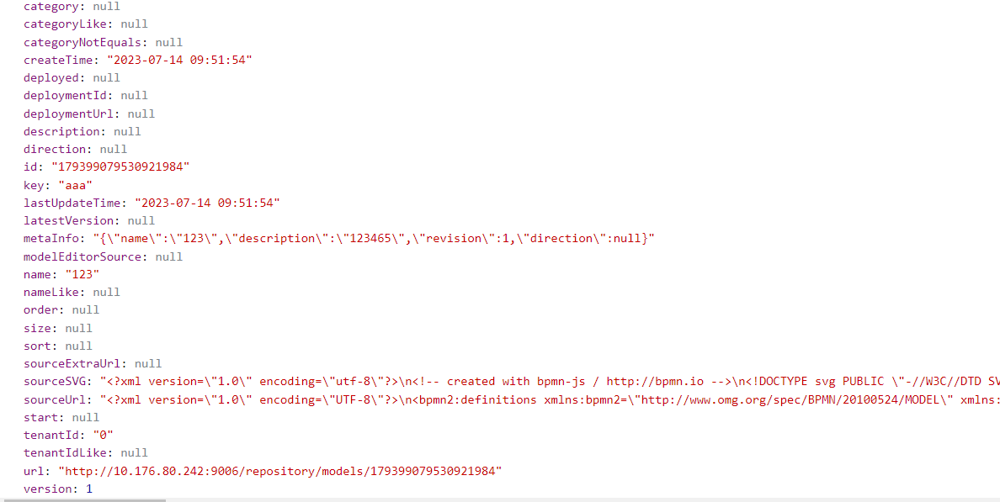

3. 后端接受数据，定义模型

   ```java
       @ApiOperation(value = "add SourceExtra for model", tags = {"Models"}, notes = "All request values are optional. ")
       @ApiResponses(value = {
       @ApiResponse(code = 200, message = "Indicates the SourceExtra has added.")
       })
       @PostMapping(value = "/sourceExtra/add/{modelId}", produces = "application/json")
       public R<ModelResponse> addSourceExtra(@ApiParam(name = "modelId", value = "The id of the model to delete.", required = true) @PathVariable String modelId, @RequestBody ModelRequest modelRequest) {
           if (!StringUtils.hasText(modelRequest.getSourceUrl())) {
               throw new ActivitiIllegalArgumentException("sourceUrl can not empty");
           }
           var model = getModelFromRequest(modelId);
           // 新增模型定义
           repositoryService.addModelEditorSource(modelId, modelRequest.getSourceUrl().getBytes(StandardCharsets.UTF_8));
           // 新增模型SVG
           if (StringUtils.hasText(modelRequest.getSourceSVG())) {
               repositoryService.addModelEditorSourceExtra(modelId, modelRequest.getSourceSVG().getBytes(StandardCharsets.UTF_8));
           }
           return R.success(restResponseFactory.createModelResponse(model));
       }
   ```

   ```java
       /**
        * Returns the {@link Model} that is requested. Throws the right exceptions when bad request was made or model is not found.
        */
       protected Model getModelFromRequest(String modelId) {
           var model = repositoryService.createModelQuery().modelId(modelId).singleResult();
   
           if (model == null) {
               throw new ActivitiObjectNotFoundException("Could not find a model with id '" + modelId + "'.", ProcessDefinition.class);
           }
           return model;
       }
   ```

   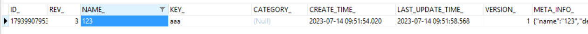
   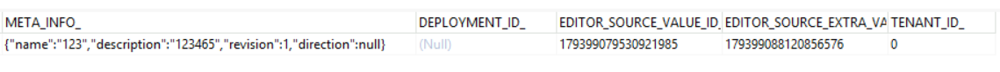

4. 创建完成模型，再根据前端传来的模型id部署流程
   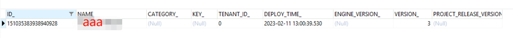

5. 我们只需要做发起审批流

   1. 我们业务有一个主表，主表中包含主键id，流程id，任务id

      ```java
          private void startProcess(Long mainId) {
              InvestCpVDTO investCpVDTO = new InvestCpVDTO();
              investCpVDTO.setId(mainId);//主键id
              investCpVDTO.setProcessDefinition(ProcessDefinitionEnum.LIVESTREAM.getName());//xxx审批流
              investCpVService.saveAndStartProcess(investCpVDTO);
          }
      ```

   2. 添加变量、启动流程、获取当前流程的任务、更新流程
      在更新流程中更新主表中的TaskId、ActivityId、ActivityName、ActivityRoles、Assignee、ProcessStatus

      ```java
       @Override
          @Transactional(rollbackFor = Exception.class)
          public InvestCpVDTO saveAndStartProcess(InvestCpVDTO investCpVDTO) {
              try {
                  final InvestCpVEntity investCpVEntity = investCpVMapper.selectById(investCpVDTO.getId());
                  investCpVEntity.setProcessStatus(1);
                  investCpVMapper.updateById(investCpVEntity);
                  // 发起申请
                  if (Objects.nonNull(investCpVEntity) && Objects.nonNull(investCpVEntity.getId())) {
      
                      //添加流程变量
                      ProcessInstanceCreateRequest createParam = generateProcessInstanceCreateRequest(investCpVEntity,
                              investCpVDTO);
      
                      final R<ProcessInstanceResponse> processInstance =
                              processDefinitionApi.createProcessInstance(createParam);
                      if (RCode.SUCCESS.getCode() != processInstance.getCode()) {
                          throw new MsgException(processInstance.getMessage());
                      }
      
                      final ProcessInstanceResponse instance = processInstance.getData();
                      investCpVEntity.setProcessId(Optional.ofNullable(instance.getId()).orElseThrow(() -> new MsgException("Bpm服务异常：未正常返回businessKey")));
                      // 3、获取当前流程的当前任务
                      final R<TaskResponseDTO> taskResponseRes =
                              processTaskApi.getCurrentTaskByBusinessKey(instance.getBusinessKey());
                      if (RCode.SUCCESS.getCode() != taskResponseRes.getCode()) {
                          throw new MsgException(taskResponseRes.getMessage());
                      }
                      //更新申请流程信息
                      updateProcessInfo(taskResponseRes.getData(), investCpVEntity);
      
                  }
                  return BeanCopyUtil.copy(investCpVEntity, investCpVDTO);
              } catch (Exception e) {
                  e.printStackTrace();
                  throw new MsgException("流程发起失败" + e.getMessage());
              }
          }
      ```

      在这里面色设置与业务表相关联和流程定义的key，这个key是activiti来匹配部署的哪个流程的，即第四步中的name

      ```java
          private ProcessInstanceCreateRequest generateProcessInstanceCreateRequest(InvestCpVEntity investCpVEntity,
                                                                                    InvestCpVDTO investCpVDTO) {
              ProcessInstanceCreateRequest createParam = new ProcessInstanceCreateRequest();
              createParam.setBusinessKey(investCpVEntity.getId().toString());
              createParam.setProcessDefinitionKey(investCpVDTO.getProcessDefinition());
      
              ArrayList<RestVariable> variables = Lists.newArrayList();
      
              var applyUserVar = new RestVariable();
              applyUserVar.setName("applyUser");
              applyUserVar.setType(RestVariableTypeEnum.STRING.getVal());
              applyUserVar.setValue(AuthUtil.getName());
              variables.add(applyUserVar);
      
              createParam.setVariables(variables);
      
              return createParam;
          }
      
      ```

6. 审批流程

   在画审批流时增加分支条件或者排它网关来完成驳回功能。同意：`${result==1}`
   我们是前端穿过来主表id，从主表中获取任务id，再对任务做操作。

   ```java
       // 驳回，结束
       taskService.setVariable(task.getId(), "result", 0);
       taskService.complete(task.getId());
       
       // 通过
       taskService.setVariable(task.getId(), "result", 1);
       taskService.complete(task.getId());
   ```

7.  删除模型

   ```java
       @ApiOperation(value = "Delete a model", tags = {"Models"})
       @ApiResponses(value = {
       @ApiResponse(code = 204, message = "Indicates the model was found and has been deleted. Response-body is intentionally empty."),
       @ApiResponse(code = 404, message = "Indicates the requested model was not found.")
       })
       @DeleteMapping(value = "/delete/{modelId}")
       public R<String> deleteModel(@ApiParam(name = "modelId", value = "The id of the model to delete.") @PathVariable String modelId, HttpServletResponse response) {
   
           var model = repositoryService.getModel(modelId);
           if (null == model) {
               return R.success();
           }
           modelResourceService.deleteModelById(model.getId());
           return R.success();
       }
   ```