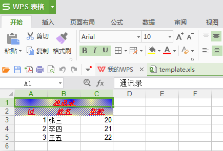
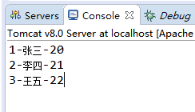
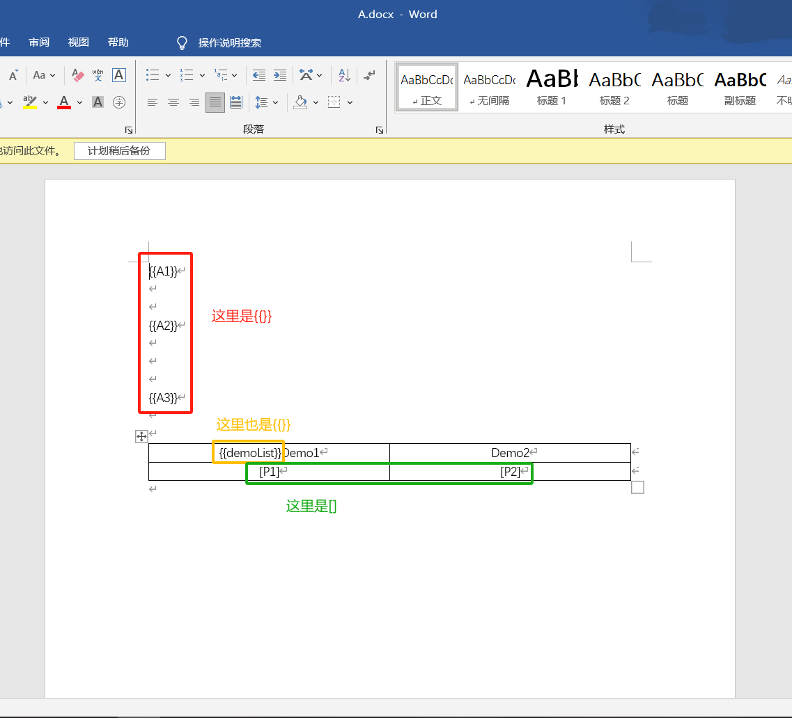
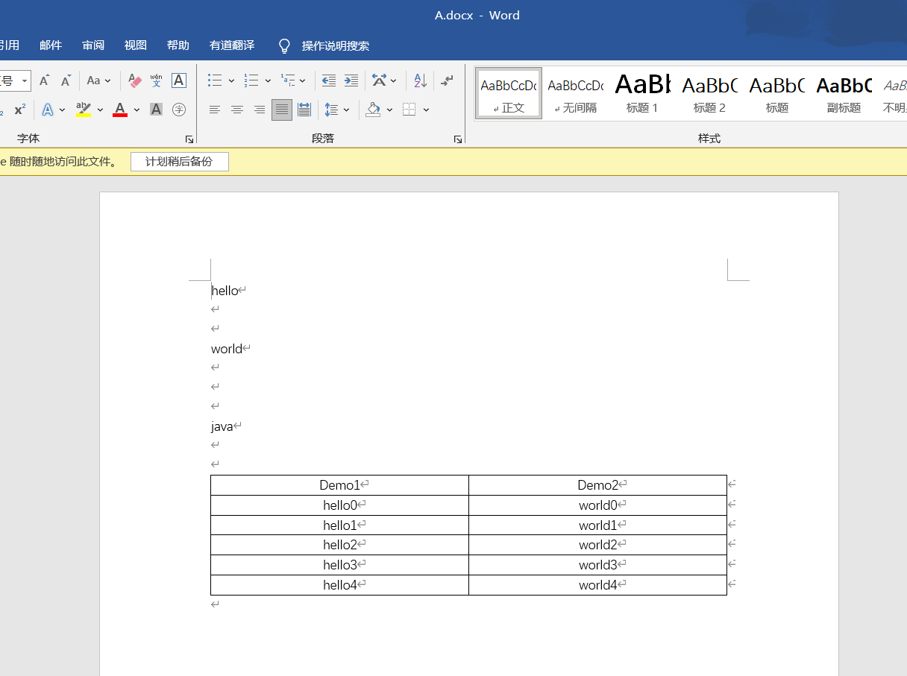
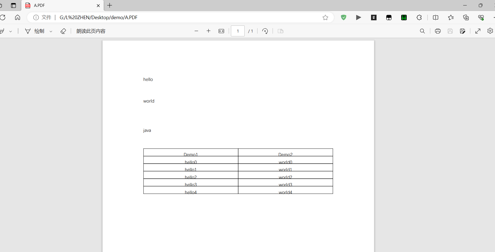

## 简介

开发中经常会设计到excel的处理，如导出Excel，导入Excel到数据库中，操作Excel目前有两个框架，一个是apache 的poi， 另一个是 Java Excel

Apache POI 简介是用Java编写的免费开源的跨平台的 Java API，Apache POI提供API给Java程式对Microsoft Office（Excel、WORD、PowerPoint、Visio等）格式档案读和写的功能。POI为“Poor Obfuscation Implementation”的首字母缩写，意为“可怜的模糊实现”。

官方主页： http://poi.apache.org/index.html
API文档： http://poi.apache.org/apidocs/index.html

Java Excel是一开放源码项目，通过它Java开发人员可以读取Excel文件的内容、创建新的Excel文件、更新已经存在的Excel文件。jxl 由于其小巧 易用的特点, 逐渐已经取代了 POI-excel的地位, 成为了越来越多的java开发人员生成excel文件的首选。

由于apache poi 在项目中用的比较多，本篇博客只讲解apache poi，不讲jxl

## Apache POI常用的类

- HSSF － 提供读写Microsoft Excel XLS格式档案的功能。
- XSSF － 提供读写Microsoft Excel OOXML XLSX格式档案的功能。
- HWPF － 提供读写Microsoft Word DOC97格式档案的功能。
- XWPF － 提供读写Microsoft Word DOC2003格式档案的功能。
- HSLF － 提供读写Microsoft PowerPoint格式档案的功能。
- HDGF － 提供读Microsoft Visio格式档案的功能。
- HPBF － 提供读Microsoft Publisher格式档案的功能。
- HSMF － 提供读Microsoft Outlook格式档案的功能。

在开发中我们经常使用HSSF用来操作Excel处理表格数据，对于其它的不经常使用。

HSSF 是Horrible SpreadSheet Format的缩写，通过HSSF，你可以用纯Java代码来读取、写入、修改Excel文件。HSSF 为读取操作提供了两类API：usermodel和eventusermodel，即“用户模型”和“事件-用户模型”。

### Excel 处理类

#### 1. HSSF (Horrible SpreadSheet Format)

- 处理 Excel 97-2003 格式 (.xls)
- 主要类：
  - `HSSFWorkbook`：代表整个 Excel 工作簿
  - `HSSFSheet`：代表工作表
  - `HSSFRow`：代表行
  - `HSSFCell`：代表单元格

#### 2. XSSF (XML SpreadSheet Format)

- 处理 Excel 2007 及以上格式 (.xlsx)
- 主要类：
  - `XSSFWorkbook`：代表整个 Excel 工作簿
  - `XSSFSheet`：代表工作表
  - `XSSFRow`：代表行
  - `XSSFCell`：代表单元格

#### 3. SXSSF (Streaming version of XSSF)

- 处理大型 Excel 文件 (基于 XSSF 的流式 API)
- 主要类：
  - `SXSSFWorkbook`：流式工作簿
  - `SXSSFSheet`：流式工作表
  - `SXSSFRow`：流式行
  - `SXSSFCell`：流式单元格

##### SXSSFWorkbook 常用方法：

```
// 创建 SXSSFWorkbook，指定窗口大小（内存中保留的行数）
SXSSFWorkbook workbook = new SXSSFWorkbook(100);

// 创建工作表
SXSSFSheet sheet = workbook.createSheet("Sheet1");

// 写入数据
Row row = sheet.createRow(0);
Cell cell = row.createCell(0);
cell.setCellValue("Hello");

// 写入到文件
FileOutputStream out = new FileOutputStream("workbook.xlsx");
workbook.write(out);
out.close();

// 清理临时文件（重要！）
workbook.dispose();
```

### Word 处理类

#### 1. HWPF (Horrible Word Processor Format)

- 处理 Word 97-2003 格式 (.doc)
- 主要类：
  - `HWPFDocument`：代表整个 Word 文档
  - `Range`：代表文档中的文本范围

#### 2. XWPF (XML Word Processor Format)

- 处理 Word 2007 及以上格式 (.docx)
- 主要类：
  - `XWPFDocument`：代表整个 Word 文档
  - `XWPFParagraph`：代表段落
  - `XWPFRun`：代表文本运行（具有相同格式的文本）
  - `XWPFTable`：代表表格

### 主要区别

| 特性           | HSSF (.xls) | XSSF (.xlsx) | SXSSF (.xlsx) |
| :------------- | :---------- | :----------- | :------------ |
| 文件格式       | 二进制      | XML (ZIP)    | XML (ZIP)     |
| 内存使用       | 中等        | 高           | 低 (流式)     |
| 处理大文件能力 | 有限        | 有限         | 优秀          |
| 功能完整性     | 完整        | 完整         | 部分受限      |
| 性能           | 较快        | 较慢         | 快 (大数据)   |

### 选择建议

1. 小文件处理：使用 XSSF (功能完整)
2. 大文件导出：使用 SXSSF (内存友好)
3. 兼容旧系统：使用 HSSF (.xls 格式)

对于 Word 文档，新项目建议使用 XWPF，除非需要兼容旧的 .doc 格式。

## Excel操作

### 基础示例

首先引入apache poi的依赖

```xml
<dependency>  
    <groupId>org.apache.poi</groupId>  
    <artifactId>poi</artifactId>  
    <version>3.8</version>  
</dependency>
```

#### 示例2：在桌面上生成一个Excel文件

```java
public static void createExcel() throws IOException{
	// 获取桌面路径
	FileSystemView fsv = FileSystemView.getFileSystemView();
	String desktop = fsv.getHomeDirectory().getPath();
	String filePath = desktop + "/template.xls";
	
    File file = new File(filePath);
    OutputStream outputStream = new FileOutputStream(file);
    HSSFWorkbook workbook = new HSSFWorkbook();
    HSSFSheet sheet = workbook.createSheet("Sheet1");
    HSSFRow row = sheet.createRow(0);
    row.createCell(0).setCellValue("id");
    row.createCell(1).setCellValue("订单号");
    row.createCell(2).setCellValue("下单时间");
    row.createCell(3).setCellValue("个数");
    row.createCell(4).setCellValue("单价");
    row.createCell(5).setCellValue("订单金额");
    row.setHeightInPoints(30); // 设置行的高度

    HSSFRow row1 = sheet.createRow(1);
    row1.createCell(0).setCellValue("1");
    row1.createCell(1).setCellValue("NO00001");

    // 日期格式化
    HSSFCellStyle cellStyle2 = workbook.createCellStyle();
    HSSFCreationHelper creationHelper = workbook.getCreationHelper();
    cellStyle2.setDataFormat(creationHelper.createDataFormat().getFormat("yyyy-MM-dd HH:mm:ss"));
    sheet.setColumnWidth(2, 20 * 256); // 设置列的宽度

    HSSFCell cell2 = row1.createCell(2);
    cell2.setCellStyle(cellStyle2);
    cell2.setCellValue(new Date());

    row1.createCell(3).setCellValue(2);
    
    // 保留两位小数
    HSSFCellStyle cellStyle3 = workbook.createCellStyle();
    cellStyle3.setDataFormat(HSSFDataFormat.getBuiltinFormat("0.00"));
    HSSFCell cell4 = row1.createCell(4);
    cell4.setCellStyle(cellStyle3);
    cell4.setCellValue(29.5);
    
    // 货币格式化
    HSSFCellStyle cellStyle4 = workbook.createCellStyle();
    HSSFFont font = workbook.createFont();
    font.setFontName("华文行楷");
    font.setFontHeightInPoints((short)15);
    font.setColor(HSSFColor.RED.index);
    cellStyle4.setFont(font);

    HSSFCell cell5 = row1.createCell(5);
    cell5.setCellFormula("D2*E2");  // 设置计算公式

    // 获取计算公式的值
    HSSFFormulaEvaluator e = new HSSFFormulaEvaluator(workbook);
    cell5 = e.evaluateInCell(cell5);
    System.out.println(cell5.getNumericCellValue());
    
    workbook.setActiveSheet(0);
    workbook.write(outputStream);
    outputStream.close();
```

#### 示例2：读取Excel，解析数据

```java
public static void readExcel() throws IOException{
	FileSystemView fsv = FileSystemView.getFileSystemView();
	String desktop = fsv.getHomeDirectory().getPath();
	String filePath = desktop + "/template.xls";
	
    FileInputStream fileInputStream = new FileInputStream(filePath);
    BufferedInputStream bufferedInputStream = new BufferedInputStream(fileInputStream);
    POIFSFileSystem fileSystem = new POIFSFileSystem(bufferedInputStream);
    HSSFWorkbook workbook = new HSSFWorkbook(fileSystem);
    HSSFSheet sheet = workbook.getSheet("Sheet1");

    int lastRowIndex = sheet.getLastRowNum();
    System.out.println(lastRowIndex);
    for (int i = 0; i <= lastRowIndex; i++) {
        HSSFRow row = sheet.getRow(i);
        if (row == null) { break; }

        short lastCellNum = row.getLastCellNum();
        for (int j = 0; j < lastCellNum; j++) {
            String cellValue = row.getCell(j).getStringCellValue();
            System.out.println(cellValue);
        }
	}
    bufferedInputStream.close();
}
```

### Java Web 中导出和导入Excel

#### 1、导出示例

```java

@SuppressWarnings("resource")
@RequestMapping("/export")    
public void exportExcel(HttpServletResponse response, HttpSession session, String name) throws Exception {  

    String[] tableHeaders = {"id", "姓名", "年龄"}; 

    HSSFWorkbook workbook = new HSSFWorkbook();
    HSSFSheet sheet = workbook.createSheet("Sheet1");
    HSSFCellStyle cellStyle = workbook.createCellStyle();    
    cellStyle.setAlignment(HorizontalAlignment.CENTER);  
    cellStyle.setVerticalAlignment(VerticalAlignment.CENTER);

    Font font = workbook.createFont();  
    font.setColor(HSSFColor.RED.index);  
    font.setBold(true);
    cellStyle.setFont(font);

    // 将第一行的三个单元格给合并
    sheet.addMergedRegion(new CellRangeAddress(0, 0, 0, 2));
    HSSFRow row = sheet.createRow(0);
    HSSFCell beginCell = row.createCell(0);
    beginCell.setCellValue("通讯录");	
    beginCell.setCellStyle(cellStyle);

    row = sheet.createRow(1);
    // 创建表头
    for (int i = 0; i < tableHeaders.length; i++) {
        HSSFCell cell = row.createCell(i);
        cell.setCellValue(tableHeaders[i]);
        cell.setCellStyle(cellStyle);    
    }

    List<User> users = new ArrayList<>();
    users.add(new User(1L, "张三", 20));
    users.add(new User(2L, "李四", 21));
    users.add(new User(3L, "王五", 22));

    for (int i = 0; i < users.size(); i++) {
        row = sheet.createRow(i + 2);

        User user = users.get(i);
        row.createCell(0).setCellValue(user.getId());    
        row.createCell(1).setCellValue(user.getName());    
        row.createCell(2).setCellValue(user.getAge());    
    }

    OutputStream outputStream = response.getOutputStream(); 
    response.reset(); 
    response.setContentType("application/vnd.ms-excel");    
    response.setHeader("Content-disposition", "attachment;filename=template.xls");      

    workbook.write(outputStream);
    outputStream.flush();    
    outputStream.close();
}
```
#### 2、导入示例

1、使用SpringMVC上传文件，需要用到commons-fileupload

```xml
<dependency>
	<groupId>commons-fileupload</groupId>
	<artifactId>commons-fileupload</artifactId>
	<version>1.3</version>
</dependency>
```

2、需要在spring的配置文件中配置一下multipartResolver

```xml
<bean name="multipartResolver"  
    	class="org.springframework.web.multipart.commons.CommonsMultipartResolver">  
	<property name="defaultEncoding" value="UTF-8" />
</bean>
```

3、index.jsp

```html
<a href="/Spring-Mybatis-Druid/user/export">导出</a> <br/>

<form action="/Spring-Mybatis-Druid/user/import" enctype="multipart/form-data" method="post">
	<input type="file" name="file"/> 
	<input type="submit" value="导入Excel">
</form>
```

4、解析上传的.xls文件

```java
@SuppressWarnings("resource")
@RequestMapping("/import")
public void importExcel(@RequestParam("file") MultipartFile file) throws Exception{
	InputStream inputStream = file.getInputStream();
	BufferedInputStream bufferedInputStream = new BufferedInputStream(inputStream);
	POIFSFileSystem fileSystem = new POIFSFileSystem(bufferedInputStream);
	HSSFWorkbook workbook = new HSSFWorkbook(fileSystem);
	//HSSFWorkbook workbook = new HSSFWorkbook(file.getInputStream());
	HSSFSheet sheet = workbook.getSheetAt(0);
	
    int lastRowNum = sheet.getLastRowNum();
    for (int i = 2; i <= lastRowNum; i++) {
        HSSFRow row = sheet.getRow(i);
        int id = (int) row.getCell(0).getNumericCellValue();
        String name = row.getCell(1).getStringCellValue();
        int age = (int) row.getCell(2).getNumericCellValue();

        System.out.println(id + "-" + name + "-" + age);
	}
}
```
导出效果：



导入效果：



> 项目示例代码下载地址：http://download.csdn.net/detail/vbirdbest/9861536

### 相关文章

http://www.cnblogs.com/Damon-Luo/p/5919656.html

http://www.cnblogs.com/LiZhiW/p/4313789.html

### 补充内容

#### poi 设置千分位

```java
XSSFWorkbook wb = new XSSFWorkbook(in);
XSSFDataFormat format = wb.createDataFormat();
newYellowRightStyle.setDataFormat(format.getFormat("#,##0.00")); // 千位符
```

#### java操作excel刷新公式和单元格，才能用原excel模板中的公式

问题：

> 使用导入的excel模板，模板中已有对应的公式，即改变单元格 A 的值，可以影响单元格 B【=A\*10】 的值。  
>
> 但是现在，直接操作写入数据到 A 单元格，发现 B 并没有对应改变。

原代码：

```java
        Workbook workbook = null;
        try {
            // 拿到excel模板
            workbook = new XSSFWorkbook("...);
            ..........数据操作............
            //保存文件
            OutputStream out = new FileOutputStream(outputPptPath);
        
            workbook.write(out);
            out.close();
            System.out.println("导出成功:" + outputPptPath);
        } catch (IOException e) {
            log.error("Fail to get workbook", e);
        }
```

需要加上：  

```java
// 刷新公式  
workbook.setForceFormulaRecalculation(true);

//使用evaluateFormulaCell对函数单元格进行强行更新计算  
workbook.getCreationHelper().createFormulaEvaluator().evaluateAll();
```

即可正确解决问题

```java
    Workbook workbook = null;
        try {
            // 拿到excel模板
            workbook = new XSSFWorkbook("...);
            ..........数据操作............
            //保存文件
            OutputStream out = new FileOutputStream(outputPptPath);
            // 刷新公式
			workbook.setForceFormulaRecalculation(true);
			//使用evaluateFormulaCell对函数单元格进行强行更新计算
		    workbook.getCreationHelper().createFormulaEvaluator().evaluateAll();
            workbook.write(out);
            out.close();
            System.out.println("导出成功:" + outputPptPath);
        } catch (IOException e) {
            log.error("Fail to get workbook", e);
        }
```

## Word操作

> 渲染word模板，并转换成pdf

模板



```java

    /**
     * 渲染word模板下载并转成pdf下载
     * @throws IOException
     */
    @Test
    public void test() throws IOException {

        /**
         * 渲染word模板
         */

        // 创建一个包含键值对的HashMap对象
        HashMap<String, Object> map = new HashMap<>();
        map.put("A1", "hello");
        map.put("A2", "world");
        map.put("A3", "java");

        // 创建一个包含多个键值对的ArrayList对象
        ArrayList<Object> demoList = new ArrayList<>();
        for (int i = 0; i < 5; i++) {
            // 创建一个包含键值对的HashMap对象
            HashMap<String, String> demoMap = new HashMap<>();
            demoMap.put("P1", "hello" + i);
            demoMap.put("P2", "world" + i);
            demoList.add(demoMap);
        }
        map.put("demoList", demoList);

        // 创建一个LoopRowTableRenderPolicy对象
        LoopRowTableRenderPolicy policy = new LoopRowTableRenderPolicy();

        // 创建一个Configure对象，并绑定policy和demoList给它
        Configure build = Configure.builder().bind(policy, "demoList").build();

        // 创建一个File对象来表示文件路径
        File file = new File("G:\\L ZHEN\\Desktop");

        // 指定word文件名
        String wordFileName = "A.docx";

        // 拼接出word文件的完整路径
        String wordTemplateUrl = file.getAbsoluteFile() + "\\" + wordFileName;

        // 使用XWPFTemplate来编译模板文件并生成渲染结果
        XWPFTemplate render = XWPFTemplate.compile(wordTemplateUrl, build).render(map);

        // 指定word文件的下载路径
        String wordDownloadUrl = file.getAbsoluteFile() + "\\demo\\" + wordFileName;

        // 创建一个File对象来表示下载的word文件
        File wordDownloadFile = new File(wordDownloadUrl);

        // 如果下载路径的父文件夹不存在，则创建它
        if (!wordDownloadFile.getParentFile().exists()) {
            wordDownloadFile.getParentFile().mkdirs();
        }

        // 将渲染结果写入到下载的word文件中
        render.writeToFile(wordDownloadFile.getAbsolutePath());


        /**
         * 将word转成pdf下载
         */

        // 指定下载的PDF文件名
        String downloadPDFFile = file.getAbsoluteFile() + "\\demo\\" + "A.PDF";

        // 读取下载的word文件并创建一个XWPFDocument对象
        FileInputStream fileInputStream = new FileInputStream(wordDownloadUrl);
        XWPFDocument xwpfDocument = new XWPFDocument(fileInputStream);

        // 指定PDF文件的输出路径，并创建一个FileOutputStream对象
        FileOutputStream fileOutputStream = new FileOutputStream(downloadPDFFile);

        // 创建PdfOptions对象，并设置编码为UTF-8
        PdfOptions pdfOptions = PdfOptions.create();
        pdfOptions.fontEncoding("UTF-8");
        // 设置字体提供程序
        pdfOptions.fontProvider((s, s1, v, i, color) -> {
            try {
                // 定义字体文件路径
                String prefixFont = "G:\\L ZHEN\\Desktop\\Arial Unicode.ttf";
                // 创建中文字体对象
                BaseFont stChinese = BaseFont.createFont(prefixFont, BaseFont.IDENTITY_H, BaseFont.NOT_EMBEDDED);
                // 创建字体对象，设置字体大小、样式和颜色
                Font stFontChinese = new Font(stChinese, v, i, color);
                // 设置字体为微软雅黑
                stFontChinese.setFamily("微软雅黑");
                return stFontChinese;
            } catch (Exception e) {
                e.printStackTrace();
                return null;
            }
        });


        // 将XWPFDocument对象转换为PDF文件并写入到输出流中
        PdfConverter.getInstance().convert(xwpfDocument, fileOutputStream, pdfOptions);
    }
```

生成



