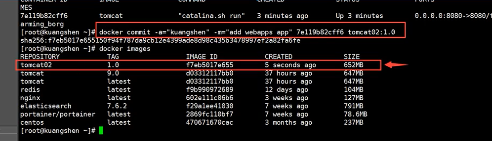

# Docker概述

> 官网地址：[www.docker.com](https://www.docker.com/)
>
> 文档地址：[Docker Documentation | Docker Documentation](https://docs.docker.com/)
>
> 仓库地址：[Docker Hub](https://hub.docker.com/)

## Docker为什么会出现？

> - 环境配置是十分的麻烦，每一个机器都要部署环境（集群Redis、ES、Hadoop....），费时费力。
> - 发布一个项目( jar + ( Redis MySQL jdk ES ) )，项目能不能都带上环境安装打包!
> - java --- jar (环境) --- 打包项目带上环境（镜像) --- ( Docker仓库∶商店) --- 下载我们发布的镜像 --- 直接运行即可!
> - 隔离:Docker核心思想!打包装箱!每个箱子是互相隔离的。

### 虚拟技术

> 1. 不用的应用 共用 同一个 后台库 + 内核，比较庞大
> 2. 资源占用十分多
> 3. 冗余步骤多
> 4. 启动很慢！


### 容器化技术

> 不同的 （应用 + 本应用运用到的后台库） 封装到同一个容器里 ，运行在同一个内核上
>
> - 应用更快速的交付和部署
>
>   传统：一堆帮助文档，安装程序!
>   Docker：打包镜像发布测试，一键运行!
>
> - 更便捷的升级和扩缩容
>
>   使用了Docker之后，我们部署应用就和搭积木一样！
>   项目打包为一个镜像，扩展服务器A！服务器B!
>
> - 更简单的系统运维
>
>   在容器化之后，我们的开发，测试环境都是高度一致的。
>
> - 更高效的计算资源利用
>
>   Docker是内核级别的虚拟化，可以在一个物理机上可以运行很多的容器实例！服务器的性能可以被压榨到极致。


#### 对比

> - 传统虚拟机，虚拟出一条硬件，运行一个完整的操作系统，然后在这个系统上安装和运行软件。
> - 容器内的应用直接运行在宿主机的内核中，容器是没有自己的内核的，也没有虚拟我们的硬件，所以就轻便了。
> - 每个容器间是互相隔离，每个容器内都有一个属于自己的文件系统，互不影响。

# Docker安装

## Docker的基本组成


> **镜像（ image）**
>
> docker镜像就好比是一个模板，可以通过这个模板来创建容器服务， 通过这个镜像可以创建多个容器（最终服务运行或者项目运行就是在容器中的），镜像没有启动，停止 这些操作
>
> **容器（ container)**
>
> Docker利用容器技术，独立运行一个或者一个组应用，通过镜像来创建的。
> 启动，停止，刪除，基本命令！
> 目前就可以把这个容器理解为就是一个简易的inux系统
>
> **仓库（ repository）**
>
> 仓库就是存放镜像的地方！
> 仓库分为公有仓库和私有仓库！
> Docker Hub(默认是国外的)
> 阿里云 腾讯云 …都有容器服务器(配置镜像加速！）

## 安装

### 1.查看宿主系统

> Docker要求宿主机系统的内核版本高于 3.10 

```shell
[root@lz ~]# uname -r
3.10.0-514.el7.x86_64

[root@lz ~]# cat /etc/os-release
NAME="CentOS Linux"
VERSION="7 (Core)"
ID="centos"
ID_LIKE="rhel fedora"
VERSION_ID="7"
PRETTY_NAME="CentOS Linux 7 (Core)"
ANSI_COLOR="0;31"
CPE_NAME="cpe:/o:centos:centos:7"
HOME_URL="https://www.centos.org/"
BUG_REPORT_URL="https://bugs.centos.org/"

CENTOS_MANTISBT_PROJECT="CentOS-7"
CENTOS_MANTISBT_PROJECT_VERSION="7"
REDHAT_SUPPORT_PRODUCT="centos"
REDHAT_SUPPORT_PRODUCT_VERSION="7"
```

### 2.卸载旧版本

```shell
yum remove docker
```

### 3.需要的安装包

```shell
yum install -y yum-utils
```

### 4.设置镜像

```shell
yum-config-manager —add-repo https://download.docker.com/linux/centos/docker-ce.repo # 默认是从国外的。

yum-config-manager --add-repo   http://mirrors.aliyun.com/docker-ce/linux/centos/docker-ce.repo # 推荐使用阿里云的。
```

### 5.更新yum软件包索引

```shell
yum makecache fast
```

### 6.安装Docker

> docker-ce（社区版）docker-ee（企业版）

```shell
yum install docker-ce docker-ce-cli containerd.io
```

### 7.启动Docker

```shell
systemctl start docker
```

### 8.查看版本

```shell
docker version
```

### 9.测试hello-world

```
docker run hello-world
```


### 10.查看镜像

```shell
[root@lz ~]# docker images
REPOSITORY    TAG       IMAGE ID       CREATED         SIZE
hello-world   latest    feb5d9fea6a5   14 months ago   13.3kB
```

### 11.卸载Docker

```shell
# 卸载依赖
yum remove docker-ce docker-ce-cli containerd.io
# 删除资源：
rm -rf /var/lib/docker
```

## 阿里云镜像加速

> 1. 登录阿里云，找到容器服务。
> 2. 找到镜像加速地址。
> 3. 配置使用。

## 底层原理

### Docker是怎么工作的？

> Docker 是一个Client-Server结构的系统，Docker的守护进程运行在主机上。通过Socket从客户端访问！
> DockerServer 接收到Docker-Client的指令，就会执行这个命令！


### Docker为什么比VM快？

> 1. Docker有着比虚拟机更少的抽象层。
> 2. docker利用的是宿主机的内核，vm需要是Guest OS。
> 3. 新建一个容器的时候，docker不需要像虚拟机一样重新加载一个操作系统内核，避免引导。
>    虚拟机是加载GuestOS，分钟级别的，而docker是利用宿主机的操作系统，省略了这个复杂的过程，秒级！


# Docker的常用命令

## 帮助命令

> 帮助文档的地址：[Reference documentation | Docker Documentation](https://docs.docker.com/reference/)

```
docker version        # 显示docker的版本信息
docker info              # 显示docker的系统信息，包括镜像和容器的数量
docker 命令 --help         # 帮助命令
```

```shell
[root@lz ~]# docker version
Client: Docker Engine - Community
 Version:           20.10.21
 API version:       1.41
 Go version:        go1.18.7
 Git commit:        baeda1f
 Built:             Tue Oct 25 18:04:24 2022
 OS/Arch:           linux/amd64
 Context:           default
 Experimental:      true

Server: Docker Engine - Community
 Engine:
  Version:          20.10.21
  API version:      1.41 (minimum version 1.12)
  Go version:       go1.18.7
  Git commit:       3056208
  Built:            Tue Oct 25 18:02:38 2022
  OS/Arch:          linux/amd64
  Experimental:     false
 containerd:
  Version:          1.6.12
  GitCommit:        a05d175400b1145e5e6a735a6710579d181e7fb0
 runc:
  Version:          1.1.4
  GitCommit:        v1.1.4-0-g5fd4c4d
 docker-init:
  Version:          0.19.0
  GitCommit:        de40ad0
[root@lz ~]# docker info
Client:
 Context:    default
 Debug Mode: false
 Plugins:
  app: Docker App (Docker Inc., v0.9.1-beta3)
  buildx: Docker Buildx (Docker Inc., v0.9.1-docker)
  scan: Docker Scan (Docker Inc., v0.21.0)

Server:
 Containers: 1
  Running: 0
  Paused: 0
  Stopped: 1
 Images: 1
 Server Version: 20.10.21
 Storage Driver: overlay2
  Backing Filesystem: xfs
  Supports d_type: true
  Native Overlay Diff: false
  userxattr: false
 Logging Driver: json-file
 Cgroup Driver: cgroupfs
 Cgroup Version: 1
 Plugins:
  Volume: local
  Network: bridge host ipvlan macvlan null overlay
  Log: awslogs fluentd gcplogs gelf journald json-file local logentries splunk syslog
 Swarm: inactive
 Runtimes: io.containerd.runc.v2 io.containerd.runtime.v1.linux runc
 Default Runtime: runc
 Init Binary: docker-init
 containerd version: a05d175400b1145e5e6a735a6710579d181e7fb0
 runc version: v1.1.4-0-g5fd4c4d
 init version: de40ad0
 Security Options:
  seccomp
   Profile: default
 Kernel Version: 3.10.0-514.el7.x86_64
 Operating System: CentOS Linux 7 (Core)
 OSType: linux
 Architecture: x86_64
 CPUs: 4
 Total Memory: 7.624GiB
 Name: lz
 ID: JIAG:DHCU:EBLG:ZXFY:SBMW:LPSW:YTXP:DLXM:E4WS:O2DX:DNBN:EWFS
 Docker Root Dir: /var/lib/docker
 Debug Mode: false
 Registry: https://index.docker.io/v1/
 Labels:
 Experimental: false
 Insecure Registries:
  127.0.0.0/8
 Live Restore Enabled: false

[root@lz ~]# docker info --help

Usage:  docker info [OPTIONS]

Display system-wide information

Options:
  -f, --format string   Format the output using the given Go template
```

## 镜像命令

### dokcer images

> 查看所有本地的主机上的镜像

```shell
[root@iZbp13qr3mm4ucsjumrlgqZ ~]# docker images
REPOSITORY    TAG       IMAGE ID       CREATED         SIZE
hello-world   latest    feb5d9fea6a5   10 months ago   13.3kB
# 解释
REPOSITORY    镜像的仓库源
TAG            镜像的标签
IMAGE ID    镜像的id
CREATED        镜像的创建时间
SIZE        镜像的大小
# 命令参数可选项
 -a, --all         # 显示所有镜像 (docker images -a)
 -q, --quiet       # 仅显示镜像id (docker images -q)
```

### docker search

> - 搜索镜像
> - 还可以通过[Docker Hub](https://hub.docker.com/)搜索镜像

```shell
[root@iZbp13qr3mm4ucsjumrlgqZ ~]# docker search mysql
NAME                           DESCRIPTION                                     STARS     OFFICIAL   AUTOMATED
mysql                          MySQL is a widely used, open-source relation…   12940     [OK]
mariadb                        MariaDB Server is a high performing open sou…   4957      [OK]
phpmyadmin                     phpMyAdmin - A web interface for MySQL and M…   587       [OK]
percona                        Percona Server is a fork of the MySQL relati…   582       [OK]
# 解释
# 命令参数可选项 (通过搜索来过滤)
--filter=STARS=3000     # 搜索出来的镜像就是stars大于3000的
[root@iZbp13qr3mm4ucsjumrlgqZ ~]# docker search mysql --filter=STARS=3000
NAME      DESCRIPTION                                     STARS     OFFICIAL   AUTOMATED
mysql     MySQL is a widely used, open-source relation…   12941     [OK]
mariadb   MariaDB Server is a high performing open sou…   4957      [OK]
```

### docker pull

> 下载镜像

```shell
# 下载镜像：docker pull 镜像名[:tag]
[root@iZbp13qr3mm4ucsjumrlgqZ ~]# docker pull mysql
Using default tag: latest            # 如果不写tag，默认就是latest，最新的版本
latest: Pulling from library/mysql
72a69066d2fe: Pull complete            # 分层下载，docker image的核心，联合文件下载
93619dbc5b36: Pull complete
99da31dd6142: Pull complete
626033c43d70: Pull complete
37d5d7efb64e: Pull complete
ac563158d721: Pull complete
d2ba16033dad: Pull complete
688ba7d5c01a: Pull complete
00e060b6d11d: Pull complete
1c04857f594f: Pull complete
4d7cfa90e6ea: Pull complete
e0431212d27d: Pull complete
Digest: sha256:e9027fe4d91c0153429607251656806cc784e914937271037f7738bd5b8e7709 #签名
Status: Downloaded newer image for mysql:latest
docker.io/library/mysql:latest        # 真实地址
# 两个命令是等价的
docker pull mysql
docker pull docker.io/library/mysql:latest
# 指定版本下载
[root@iZbp13qr3mm4ucsjumrlgqZ ~]# docker pull mysql:5.7
5.7: Pulling from library/mysql
72a69066d2fe: Already exists        # 联合文件下载，已经存在的资源可以共用
93619dbc5b36: Already exists
99da31dd6142: Already exists
626033c43d70: Already exists
37d5d7efb64e: Already exists
ac563158d721: Already exists
d2ba16033dad: Already exists
0ceb82207cd7: Pull complete
37f2405cae96: Pull complete
e2482e017e53: Pull complete
70deed891d42: Pull complete
Digest: sha256:f2ad209efe9c67104167fc609cca6973c8422939491c9345270175a300419f94
Status: Downloaded newer image for mysql:5.7
docker.io/library/mysql:5.7
```

### docker rmi

> 删除镜像

```shell
[root@iZbp13qr3mm4ucsjumrlgqZ ~]# docker rmi -f 镜像id                    # 删除指定的镜像
[root@iZbp13qr3mm4ucsjumrlgqZ ~]# docker rmi -f 镜像id 镜像id 镜像id    # 删除多个镜像（空格分隔）
[root@iZbp13qr3mm4ucsjumrlgqZ ~]# docker rmi -f $(docker images -aq)    # 删除全部的镜像
```

## 容器命令

> 说明：我们有了镜像才可以创建容器，linux，下载一个centos 镜像来测试学习。

```shell
docker pull centos
```

### 新建容器并启动

```shell
docker run [可选参数] image
# 参数说明
--name="name"         容器名字：用来区分容器
-d                    后台方式运行：相当于nohup
-it                   使用交互式运行：进入容器查看内容
-p                    指定容器的端口（四种方式）小写字母p
    -p ip:主机端口：容器端口
    -p 主机端口：容器端口
    -p 容器端口
    容器端口
-P                     随机指定端口（大写字母P）

# 测试：启动并进入容器
[root@iZbp13qr3mm4ucsjumrlgqZ ~]# docker run -it centos /bin/bash
[root@526c31d2c298 /]# ls        # 查看容器内的centos（基础版本，很多命令都是不完善的）
bin  dev  etc  home  lib  lib64  lost+found  media  mnt  opt  proc  root  run  sbin  srv  sys  tmp  usr  var

# 从容器中退回到主机
[root@526c31d2c298 /]# exit
exit
[root@iZbp13qr3mm4ucsjumrlgqZ /]# ls
bin  boot  dev  etc  home  lib  lib64  lost+found  media  mnt  opt  proc  root  run  sbin  srv  sys  tmp  usr  var  www
```

### 列出所有运行的容器

```shell
docker ps    # 列出当前正在运行的容器
# 命令参数可选项
-a        # 列出当前正在运行的容器+历史运行过的容器
-n=?    # 显示最近创建的容器（可以指定显示几条，比如-n=1）
-q        # 只显示容器的编号

[root@iZbp13qr3mm4ucsjumrlgqZ /]# docker ps
CONTAINER ID   IMAGE     COMMAND   CREATED   STATUS    PORTS     NAMES
[root@iZbp13qr3mm4ucsjumrlgqZ /]# docker ps -a
CONTAINER ID   IMAGE          COMMAND       CREATED         STATUS                     PORTS     NAMES
526c31d2c298   centos         "/bin/bash"   4 minutes ago   Exited (0) 2 minutes ago             optimistic_allen
ce0eb11fbf8a   feb5d9fea6a5   "/hello"      4 hours ago     Exited (0) 4 hours ago               keen_ellis
[root@iZbp13qr3mm4ucsjumrlgqZ /]# docker ps -a -n=1
CONTAINER ID   IMAGE     COMMAND       CREATED         STATUS                     PORTS     NAMES
526c31d2c298   centos    "/bin/bash"   5 minutes ago   Exited (0) 3 minutes ago             optimistic_allen
```

### 退出容器

```shell
exit        # 容器直接停止，并退出
ctrl+P+Q    # 容器不停止，退出
[root@iZbp13qr3mm4ucsjumrlgqZ ~]# docker run -it centos /bin/bash
[root@c5d61aa9d7df /]# [root@iZbp13qr3mm4ucsjumrlgqZ ~]# docker ps
CONTAINER ID   IMAGE     COMMAND       CREATED          STATUS          PORTS     NAMES
c5d61aa9d7df   centos    "/bin/bash"   56 seconds ago   Up 55 seconds             kind_clarke
[root@iZbp13qr3mm4ucsjumrlgqZ ~]#
```

### 删除容器

```shell
docker rm 容器id                    # 删除容器（不能删除正在运行的容器）如果要强制删除：docker rm -f 容器id
docker rm -f $(docker ps -aq)        # 删除全部容器
docker ps -a -q|xargs docker rm        # 删除所有容器
```

### 启动和停止容器的操作

```shell
docker start 容器id        # 启动容器
docker restart 容器id    # 重启容器
docker stop 容器id        # 停止当前正在运行的容器
docker kill 容器id        # 强制停止当前容器
```

## 常用其他命令

### 后台启动容器

```shell
# 命令docker run -d 镜像名
[root@iZbp13qr3mm4ucsjumrlgqZ ~]# docker run -d centos

# 问题：docker ps发现centos停止了

# 常见的坑：docker容器使用后台运行，就必须要有要一个前台进程，docker发现没有应用，就会自动停止。

# 比如：nginx，容器启动后，发现自己没有提供服务，就会立刻停止，就是没有程序了
```

### 查看日志

```shell
# docker logs -tf --tail 容器id
# 自己编写一段shell脚本
# docker run -d centos /bin/sh -c "while true;do echo kuangshen;sleep 1;done"

[root@iZbp13qr3mm4ucsjumrlgqZ ~]# docker logs -tf  容器id
[root@iZbp13qr3mm4ucsjumrlgqZ ~]# docker logs -tf --tail 10  容器id

# 显示日志
-tf              # 显示日志
--tail number    # 要显示的日志条数
```

### 查看容器中进程的信息

```shell
# 命令 docker top 容器id 
[root@iZbp13qr3mm4ucsjumrlgqZ ~]# docker top 88d23bcbe1f2
UID                 PID                 PPID                C                   STIME               TTY                 TIME                CMD
root                21212               21193               0                   16:23               ?                   00:00:00            
root                21600               21212               0                   16:29               ?                   00:00:00
```

### 查看镜像的元数据

```shell
# 命令docker inspect 容器id
[
    {
        "Id": "88d23bcbe1f28e1f8ae5d2b63fa8d57d2abcbdacf193db05852f4f74a95b9ffe",
        "Created": "2022-07-29T08:23:56.862239223Z",
        "Path": "/bin/sh",
        "Args": [
            "-c",
            "while true;do echo kuangshen;sleep 1;done"
        ],
        "State": {
            "Status": "running",
            "Running": true,
            "Paused": false,
            "Restarting": false,
            "OOMKilled": false,
            "Dead": false,
            "Pid": 21212,
            "ExitCode": 0,
            "Error": "",
            "StartedAt": "2022-07-29T08:23:57.109766809Z",
            "FinishedAt": "0001-01-01T00:00:00Z"
        },
        "Image": "sha256:5d0da3dc976460b72c77d94c8a1ad043720b0416bfc16c52c45d4847e53fadb6",
        "ResolvConfPath": "/var/lib/docker/containers/88d23bcbe1f28e1f8ae5d2b63fa8d57d2abcbdacf193db05852f4f74a95b9ffe/resolv.conf",
        "HostnamePath": "/var/lib/docker/containers/88d23bcbe1f28e1f8ae5d2b63fa8d57d2abcbdacf193db05852f4f74a95b9ffe/hostname",
        "HostsPath": "/var/lib/docker/containers/88d23bcbe1f28e1f8ae5d2b63fa8d57d2abcbdacf193db05852f4f74a95b9ffe/hosts",
        "LogPath": "/var/lib/docker/containers/88d23bcbe1f28e1f8ae5d2b63fa8d57d2abcbdacf193db05852f4f74a95b9ffe/88d23bcbe1f28e1f8ae5d2b63fa8d57d2abcbdacf193db05852f4f74a95b9ffe-json.log",
        "Name": "/silly_lichterman",
        "RestartCount": 0,
        "Driver": "overlay2",
        "Platform": "linux",
        "MountLabel": "",
        "ProcessLabel": "",
        "AppArmorProfile": "",
        "ExecIDs": null,
        "HostConfig": {
            "Binds": null,
            "ContainerIDFile": "",
            "LogConfig": {
                "Type": "json-file",
                "Config": {}
            },
            "NetworkMode": "default",
            "PortBindings": {},
            "RestartPolicy": {
                "Name": "no",
                "MaximumRetryCount": 0
            },
            "AutoRemove": false,
            "VolumeDriver": "",
            "VolumesFrom": null,
            "CapAdd": null,
            "CapDrop": null,
            "CgroupnsMode": "host",
            "Dns": [],
            "DnsOptions": [],
            "DnsSearch": [],
            "ExtraHosts": null,
            "GroupAdd": null,
            "IpcMode": "private",
            "Cgroup": "",
            "Links": null,
            "OomScoreAdj": 0,
            "PidMode": "",
            "Privileged": false,
            "PublishAllPorts": false,
            "ReadonlyRootfs": false,
            "SecurityOpt": null,
            "UTSMode": "",
            "UsernsMode": "",
            "ShmSize": 67108864,
            "Runtime": "runc",
            "ConsoleSize": [
                0,
                0
            ],
            "Isolation": "",
            "CpuShares": 0,
            "Memory": 0,
            "NanoCpus": 0,
            "CgroupParent": "",
            "BlkioWeight": 0,
            "BlkioWeightDevice": [],
            "BlkioDeviceReadBps": null,
            "BlkioDeviceWriteBps": null,
            "BlkioDeviceReadIOps": null,
            "BlkioDeviceWriteIOps": null,
            "CpuPeriod": 0,
            "CpuQuota": 0,
            "CpuRealtimePeriod": 0,
            "CpuRealtimeRuntime": 0,
            "CpusetCpus": "",
            "CpusetMems": "",
            "Devices": [],
            "DeviceCgroupRules": null,
            "DeviceRequests": null,
            "KernelMemory": 0,
            "KernelMemoryTCP": 0,
            "MemoryReservation": 0,
            "MemorySwap": 0,
            "MemorySwappiness": null,
            "OomKillDisable": false,
            "PidsLimit": null,
            "Ulimits": null,
            "CpuCount": 0,
            "CpuPercent": 0,
            "IOMaximumIOps": 0,
            "IOMaximumBandwidth": 0,
            "MaskedPaths": [
                "/proc/asound",
                "/proc/acpi",
                "/proc/kcore",
                "/proc/keys",
                "/proc/latency_stats",
                "/proc/timer_list",
                "/proc/timer_stats",
                "/proc/sched_debug",
                "/proc/scsi",
                "/sys/firmware"
            ],
            "ReadonlyPaths": [
                "/proc/bus",
                "/proc/fs",
                "/proc/irq",
                "/proc/sys",
                "/proc/sysrq-trigger"
            ]
        },
        "GraphDriver": {
            "Data": {
                "LowerDir": "/var/lib/docker/overlay2/59b088d44f6e67f4ed336de44d19a5784c1a13fa856760bd2b166c4a4d421e2b-init/diff:/var/lib/docker/overlay2/7fc43e24b63e4656ab7e7718d3e4ef5297fe82509452be305a01605a7cdc3b97/diff",
                "MergedDir": "/var/lib/docker/overlay2/59b088d44f6e67f4ed336de44d19a5784c1a13fa856760bd2b166c4a4d421e2b/merged",
                "UpperDir": "/var/lib/docker/overlay2/59b088d44f6e67f4ed336de44d19a5784c1a13fa856760bd2b166c4a4d421e2b/diff",
                "WorkDir": "/var/lib/docker/overlay2/59b088d44f6e67f4ed336de44d19a5784c1a13fa856760bd2b166c4a4d421e2b/work"
            },
            "Name": "overlay2"
        },
        "Mounts": [],
        "Config": {
            "Hostname": "88d23bcbe1f2",
            "Domainname": "",
            "User": "",
            "AttachStdin": false,
            "AttachStdout": false,
            "AttachStderr": false,
            "Tty": false,
            "OpenStdin": false,
            "StdinOnce": false,
            "Env": [
                "PATH=/usr/local/sbin:/usr/local/bin:/usr/sbin:/usr/bin:/sbin:/bin"
            ],
            "Cmd": [
                "/bin/sh",
                "-c",
                "while true;do echo kuangshen;sleep 1;done"
            ],
            "Image": "centos",
            "Volumes": null,
            "WorkingDir": "",
            "Entrypoint": null,
            "OnBuild": null,
            "Labels": {
                "org.label-schema.build-date": "20210915",
                "org.label-schema.license": "GPLv2",
                "org.label-schema.name": "CentOS Base Image",
                "org.label-schema.schema-version": "1.0",
                "org.label-schema.vendor": "CentOS"
            }
        },
        "NetworkSettings": {
            "Bridge": "",
            "SandboxID": "bfc28d2ba671adfe5c93325173b93c335d50d8b017eed4fdce2ab75410d6ac2e",
            "HairpinMode": false,
            "LinkLocalIPv6Address": "",
            "LinkLocalIPv6PrefixLen": 0,
            "Ports": {},
            "SandboxKey": "/var/run/docker/netns/bfc28d2ba671",
            "SecondaryIPAddresses": null,
            "SecondaryIPv6Addresses": null,
            "EndpointID": "ad0252d454e751e2c5ecef24e64c32b0884c53242925bd66e9e5dbf5542af179",
            "Gateway": "172.17.0.1",
            "GlobalIPv6Address": "",
            "GlobalIPv6PrefixLen": 0,
            "IPAddress": "172.17.0.2",
            "IPPrefixLen": 16,
            "IPv6Gateway": "",
            "MacAddress": "02:42:ac:11:00:02",
            "Networks": {
                "bridge": {
                    "IPAMConfig": null,
                    "Links": null,
                    "Aliases": null,
                    "NetworkID": "7254ffccbdf53e0c72c1d19252980f04fa65153ea3c7ca72af55cfac504cbe3f",
                    "EndpointID": "ad0252d454e751e2c5ecef24e64c32b0884c53242925bd66e9e5dbf5542af179",
                    "Gateway": "172.17.0.1",
                    "IPAddress": "172.17.0.2",
                    "IPPrefixLen": 16,
                    "IPv6Gateway": "",
                    "GlobalIPv6Address": "",
                    "GlobalIPv6PrefixLen": 0,
                    "MacAddress": "02:42:ac:11:00:02",
                    "DriverOpts": null
                }
            }
        }
    }
]
```

### 进入当前正在运行的容器

```shell
# 我们通常容器都是使用后台方式运行的，需要进入容器，修改一些配置
# 命令
# docker exec -it 容器id /bin/bash

# 测试
[root@iZbp13qr3mm4ucsjumrlgqZ ~]# docker ps
CONTAINER ID   IMAGE     COMMAND                  CREATED          STATUS          PORTS     NAMES
88d23bcbe1f2   centos    "/bin/sh -c 'while t…"   13 minutes ago   Up 13 minutes             silly_lichterman
[root@iZbp13qr3mm4ucsjumrlgqZ ~]# docker exec -it 88d23bcbe1f2 /bin/bash
[root@88d23bcbe1f2 /]# ps -ef
UID        PID  PPID  C STIME TTY          TIME CMD
root         1     0  0 08:23 ?        00:00:00 /bin/sh -c while true;do echo kuangshen;sleep 1;done
root       841     0  0 08:37 pts/0    00:00:00 /bin/bash
root       858     1  0 08:37 ?        00:00:00 /usr/bin/coreutils --coreutils-prog-shebang=sleep /usr/bin/sleep 1
root       859   841  0 08:37 pts/0    00:00:00 ps -ef

# 方式二
# docker attach 容器id
# 测试
[root@iZbp13qr3mm4ucsjumrlgqZ ~]# docker attach 88d23bcbe1f2
正在执行当前的代码...

# docker exec        # 进入容器后开启一个新的终端，可以再里面操作（常用）
# docker attach        # 进入容器正在执行的终端，不会启动新的进程。
```

### 从容器内拷贝文件到主机上

```shell
# docker cp 容器id:容器内路径 目的主机的路径
[root@iZbp13qr3mm4ucsjumrlgqZ home]# ll
total 0
[root@iZbp13qr3mm4ucsjumrlgqZ home]# docker ps
CONTAINER ID   IMAGE     COMMAND   CREATED   STATUS    PORTS     NAMES
[root@iZbp13qr3mm4ucsjumrlgqZ home]# docker run -it centos /bin/bash
[root@6eda31ad7987 /]# [root@iZbp13qr3mm4ucsjumrlgqZ home]# docker ps
CONTAINER ID   IMAGE     COMMAND       CREATED          STATUS          PORTS     NAMES
6eda31ad7987   centos    "/bin/bash"   17 seconds ago   Up 16 seconds             stoic_kepler
# 进入到容器内部
[root@iZbp13qr3mm4ucsjumrlgqZ home]# docker attach 6eda31ad7987
[root@6eda31ad7987 /]# ls
bin  dev  etc  home  lib  lib64  lost+found  media  mnt  opt  proc  root  run  sbin  srv  sys  tmp  usr  var
[root@6eda31ad7987 /]# cd /home/
[root@6eda31ad7987 home]# ls
# 在容器的/home路径下创建test.java文件
[root@6eda31ad7987 home]# touch test.java
[root@6eda31ad7987 home]# ls
test.java
[root@6eda31ad7987 home]# exit
exit
[root@iZbp13qr3mm4ucsjumrlgqZ home]# docker ps
CONTAINER ID   IMAGE     COMMAND   CREATED   STATUS    PORTS     NAMES
[root@iZbp13qr3mm4ucsjumrlgqZ home]# docker ps -a
CONTAINER ID   IMAGE     COMMAND       CREATED              STATUS                      PORTS     NAMES
6eda31ad7987   centos    "/bin/bash"   About a minute ago   Exited (0) 28 seconds ago             stoic_kepler
# 将文件拷贝出来到主机上（在主机上执行该命令）
[root@iZbp13qr3mm4ucsjumrlgqZ home]# docker cp 6eda31ad7987:/home/test.java /home
[root@iZbp13qr3mm4ucsjumrlgqZ home]# ls
test.java
# 拷贝是一个手动过程，未来我们使用 -v 卷的技术，可以实现，自动同步（容器内的/home路径和主机上的/home路径打通）
```

## 小结


```shell
attach    Attach to a running container                                  #当前shell下attach连接指定运行镜像
build     Build an image from a Dockerfile                               #通过Dockerfile定制镜像
commit    Create a new image from a containers changes                   #提交当前容器为新的镜像
cp          Copy files/folders from a container to a HOSTDIR or to STDOUT  #从容器中拷贝指定文件或者目录到宿主机中
create    Create a new container                                         #创建一个新的容器，同run 但不启动容器
diff      Inspect changes on a containers filesystem                     #查看docker容器变化
events    Get real time events from the server                           #从docker服务获取容器实时事件
exec      Run a command in a running container                           #在已存在的容器上运行命令
export    Export a containers filesystem as a tar archive                #导出容器的内容流作为一个tar归档文件(对应import)
history   Show the history of an image                                   #展示一个镜像形成历史
images    List images                                                    #列出系统当前镜像
import    Import the contents from a tarball to create a filesystem image  #从tar包中的内容创建一个新的文件系统映像(对应export)
info      Display system-wide information                                #显示系统相关信息
inspect   Return low-level information on a container or image           #查看容器详细信息
kill      Kill a running container                                       #kill指定docker容器
load      Load an image from a tar archive or STDIN                      #从一个tar包中加载一个镜像(对应save)
login     Register or log in to a Docker registry                        #注册或者登陆一个docker源服务器
logout    Log out from a Docker registry                                 #从当前Docker registry退出
logs      Fetch the logs of a container                                  #输出当前容器日志信息
pause     Pause all processes within a container                         #暂停容器
port      List port mappings or a specific mapping for the CONTAINER     #查看映射端口对应的容器内部源端口
ps        List containers                                                #列出容器列表
pull      Pull an image or a repository from a registry                  #从docker镜像源服务器拉取指定镜像或者库镜像
push      Push an image or a repository to a registry                    #推送指定镜像或者库镜像至docker源服务器
rename    Rename a container                                             #重命名容器
restart   Restart a running container                                    #重启运行的容器
rm        Remove one or more containers                                  #移除一个或者多个容器
rmi       Remove one or more images                                      #移除一个或多个镜像(无容器使用该镜像才可以删除，否则需要删除相关容器才可以继续或者-f强制删除)
run       Run a command in a new container                               #创建一个新的容器并运行一个命令
save      Save an image(s) to a tar archive                              #保存一个镜像为一个tar包(对应load)
search    Search the Docker Hub for images                               #在docker hub中搜索镜像
start     Start one or more stopped containers                           #启动容器
stats     Display a live stream of container(s) resource usage statistics  #统计容器使用资源
stop      Stop a running container                                       #停止容器
tag       Tag an image into a repository                                 #给源中镜像打标签
top       Display the running processes of a container                   #查看容器中运行的进程信息
unpause   Unpause all processes within a container                       #取消暂停容器
version   Show the Docker version information                            #查看容器版本号
wait      Block until a container stops, then print its exit code        #截取容器停止时的退出状态值
```

## 练习

### 安装nginx

```shell
[root@lz ~]# docker search nginx
NAME                                              DESCRIPTION                                     STARS     OFFICIAL   AUTOMATED
nginx                                             Official build of Nginx.                        17820     [OK]                        
[root@lz ~]# docker pull nginx
Using default tag: latest
latest: Pulling from library/nginx
025c56f98b67: Pull complete 
ec0f5d052824: Pull complete 
cc9fb8360807: Pull complete 
defc9ba04d7c: Pull complete 
885556963dad: Pull complete 
f12443e5c9f7: Pull complete 
Digest: sha256:75263be7e5846fc69cb6c42553ff9c93d653d769b94917dbda71d42d3f3c00d3
Status: Downloaded newer image for nginx:latest
docker.io/library/nginx:latest
[root@lz ~]# docker run -d -p3344:80 --name mynginx nginx
02ab5a5c26c811ea075ccfd7c3c6a45a72f8a8b2dd82ae647df81197631e9432
[root@lz ~]# docker ps
CONTAINER ID   IMAGE     COMMAND                  CREATED         STATUS         PORTS                                   NAMES
02ab5a5c26c8   nginx     "/docker-entrypoint.…"   5 seconds ago   Up 4 seconds   0.0.0.0:3344->80/tcp, :::3344->80/tcp   mynginx
[root@lz ~]# curl http://localhost:3344
<!DOCTYPE html>
<html>
<head>
<title>Welcome to nginx!</title>
<style>
html { color-scheme: light dark; }
body { width: 35em; margin: 0 auto;
font-family: Tahoma, Verdana, Arial, sans-serif; }
</style>
</head>
<body>
<h1>Welcome to nginx!</h1>
<p>If you see this page, the nginx web server is successfully installed and
working. Further configuration is required.</p>

<p>For online documentation and support please refer to
<a href="http://nginx.org/">nginx.org</a>.<br/>
Commercial support is available at
<a href="http://nginx.com/">nginx.com</a>.</p>

<p><em>Thank you for using nginx.</em></p>
</body>
</html>
```


### 安装tomcat

```shell
# 官方的使用
docker run -it --rm tomcat:9.0
# 我们之前的启动都是后台，停止了容器之后，容器还是可以查到     docker run -it --rm，一般用来测试，用完就删除

# 下载再启动
docker pull tomcat 

# 启动运行
docker run -d -p 3355:8080 --name tomcat01 tomcat
# 测试访问没有问题

# 进入容器
[root@iZ8vbgc3u6dvwrjyp45lyrZ home]# docker exec -it tomcat01 /bin/bash

# 发现问题：1、linux命令少了，2、没有webapps，阿里云镜像的原因。默认是最小的镜像，所有不必要的都剔除掉了。
# 保证最小可运行的环境
```

### 安装es+kibana

```shell
# es 暴露的端口很多！

# es 十分耗内存

# es 的数据一般需要放置到安全目录！挂载

# --net somenetwork ? 网络配置

# 下载启动elasticsearch（Docker一步搞定）
docker run -d --name elasticsearch -p 9200:9200 -p 9300:9300 -e
"discovery.type=single-node" elasticsearch:7.6.2

# 测试一下es是否成功启动
➜ ~ curl localhost:9200
{
"name" : "d73ad2f22dd3",
"cluster_name" : "docker-cluster",
"cluster_uuid" : "atFKgANxS8CzgIyCB8PGxA",
"version" : {
"number" : "7.6.2",
"build_flavor" : "default",
"build_type" : "docker",
"build_hash" : "ef48eb35cf30adf4db14086e8aabd07ef6fb113f",
"build_date" : "2020-03-26T06:34:37.794943Z",
"build_snapshot" : false,
"lucene_version" : "8.4.0",
"minimum_wire_compatibility_version" : "6.8.0",
"minimum_index_compatibility_version" : "6.0.0-beta1"
},
"tagline" : "You Know, for Search"
}

# 查看docker容器使用内存情况（每秒刷新，也挺耗内存的一个命令）
➜ ~ docker stats

#关闭，添加内存的限制，修改配置文件 -e 环境配置修改
➜ ~ docker rm -f d73ad2f22dd3
➜ ~ docker run -d --name elasticsearch -p 9200:9200 -p 9300:9300 -e
"discovery.type=single-node" -e ES_JAVA_OPTS="-Xms64m -Xmx512m"
elasticsearch:7.6.2

➜ ~ curl localhost:9200
{
"name" : "b72c9847ec48",
"cluster_name" : "docker-cluster",
"cluster_uuid" : "yNAK0EORSvq3Wtaqe2QqAg",
"version" : {
"number" : "7.6.2",
"build_flavor" : "default",
"build_type" : "docker",
"build_hash" : "ef48eb35cf30adf4db14086e8aabd07ef6fb113f",
"build_date" : "2020-03-26T06:34:37.794943Z",
"build_snapshot" : false,
"lucene_version" : "8.4.0",
"minimum_wire_compatibility_version" : "6.8.0",
"minimum_index_compatibility_version" : "6.0.0-beta1"
},
"tagline" : "You Know, for Search"
}
```

> 使用kibana连接es，思考网络如何才能连接？


## 可视化

```shell
# 运行如下命令即可 打开可视化服务
docker run -d -p 8088:9000 --restart=always -v /var/run/docker.sock:/var/run/docker.sock --privileged=true portainer/portainer
```

> 访问http://ip:8088

# Docker镜像讲解

## 镜像是什么

> 镜像是一种轻量级、可执行的独立软件包，用来打包软件运行环境和基于运行环境开发的软件，它包含运行某个软件所需的所有内容，包括代码、运行时、库、环境变量和配置文件。
>
> 所有的应用，直接打包docker镜像，就可以直接跑起来！
>
> 如何得到镜像：
>
> - 从远程仓库下载
> - 朋友拷贝给你
> - 自己制作一个镜像DockerFile

## Docker镜像加载原理

> **UnionFS（联合文件系统）**：Union文件系统（UnionFS）是一种分层、轻量级并且高性能的文件系统，它支持对文件系统的修改作为一次提交来一层层的叠加，同时可以将不同目录挂载到同一个虚拟文件系统下（unite several directories into a single virtual filesystem）。Union文件系统是Docker镜像的基础。镜像可以通过分层来进行继承，基于基础镜像（没有父镜像），可以制作各种具体的应用镜像。
>
> 特性：一次同时加载多个文件系统，但从外面看起来，只能看到一个文件系统，联合加载会把文件系统及叠加起来，这样最终的文件系统包含所有底层的文件和目录

### Dcoker镜像加载原理

> docker的镜像实际上由一层一层的文件系统组成，这种层级的文件系统UnionFS。
>
> bootfs（boot file system）主要包含bootloader和kernel，bootloader主要是引导加载kernel，Linux刚启动时会加载bootfs文件系统，在Docker镜像的最底层是bootfs。这一层与我们电箱的Linux/Unix系统是一样的，包含boot加载器和内核。当boot加载完成之后整个内核就都在内存中了，此时内存的使用权已由bootfs转交给内核，此时系统也会卸载bootfs。
>
> rootfs（root file system），在bootfs之上。包含的就是典型Linux 系统中的 /dev，/proc，/bin，/etc 等标准目录和文件。rootfs就是各种不同的操作系统发行版，比如Ubuntu，Centos等等。


> 平时我们安装进虚拟机的CentOS都是好几个G，为什么Docker这里才200M？


> 对于个精简的OS,rootfs可以很小，只需要包合最基本的命令，工具和程序库就可以了，因为底层直接用Host的kernel，自己只需要提供rootfs就可以了。由此可见对于不同的Linux发行版， boots基本是一致的， rootfs会有差別，因此不同的发行版可以公用bootfs。
>
> 虚拟机是分钟级别，容器是秒级！

## 分层理解

> 我们可以去下载一个镜像，注意观察下载的日志输出，可以看到是一层层的在下载 。


> 思考：为什么Docker镜像要采用这种分层的结构呢？
>
> 最大的好处，我觉得莫过于资源共享了！比如有多个镜像都从相同的Base镜像构建而来，那么宿主机只需在磁盘上保留一份base镜像，同时内存中也只需要加载一份base镜像，这样就可以为所有的容器服务了，而且镜像的每一层都可以被共享。
>
> 查看镜像分层的方式可以通过docker image inspect 命令

```shell
[root@iZ8vbgc3u6dvwrjyp45lyrZ ~]# docker image inspect redis:latest
[
    {
    //.............
        "RootFS": {
            "Type": "layers",
            "Layers": [
                "sha256:764055ebc9a7a290b64d17cf9ea550f1099c202d83795aa967428ebdf335c9f7",
                "sha256:245c9d23f65373415922e53424032cabe7b282c5cf8f9f8070a7d1830fca6871",
                "sha256:ebef6caacb966ed54c0c3facf2288fa5124452f2c0a17faa1941625eab0ceb54",
                "sha256:0b7b774038f08ec329e4dd2c0be440c487cfb003a05fce87cd5d1497b602f2c1",
                "sha256:a71d36a87572d637aa446110faf8abb4ea74f028d0e0737f2ff2b983ef23abf3",
                "sha256:9e1fddfb3a22146392a2d6491e1af2f087da5e6551849a6174fa23051ef8a38f"
            ]
        },
        "Metadata": {
            "LastTagTime": "0001-01-01T00:00:00Z"
        }
    }
]
```

> 理解：
>
> 所有的docker镜像都起始于一个基础镜像层，当进行修改或者增加新的内容时，就会在当前镜像层之上，创建新的镜像层。
>
> 举一个简单的例子，加入基于Ubuntu Linux 16.04创建一个新的镜像，这就是新镜像的第一层；如果在该镜像中添加Python包，就会在基础镜像层之上穿件第二个镜像层；如果继续添加一个安全补丁，就会创建第三个镜像层。
>
> 该镜像当前已经包含3个镜像层，如下图（这只是一个用于演示的很简单的例子）。


> 在添加额外的镜像层的同时，镜像始终是保持当前所有镜像的组合，理解这一点非常重要。下图中举了一个简单的例子，每个镜像层包含3个文件，而镜像层包含了来自两镜像层的6个文件。


> 上图中的镜像层跟之前图中的略有区别，主要目的是便于展示文件。
>
> 下图总展示了一个稍微复杂的三层镜像，在外部看来整个镜像只有6个文件，这是因为最上层的文件7是文件5的一个更新版本。


> 这种情况下，上层镜像层中的文件覆盖了底层镜像层中的文件。这样就使得文件的更新版本作为一个新的镜像层添加到镜像当中。
>
> Docker通过存储引擎（新版本采用快照机制）的方式来实心镜像层堆栈，并保证多镜像层对外展示为统一的文件系统。
>
> Linux 上可用的存储引擎有AUFS、Overlay2，Device Maper、Btrfs 以及 ZFS。顾名思义，没种存储引擎都基于Linux中对应的文件系统或者块设备技术，并且每种存储引擎都有其独有的性能特点。
>
> Docker在Windows上仅支持windowsfiler 一种存储引擎，该引擎基于NTFS文件系统之上实现了分层和CoW[1]。
>
> 下图展示了与系统显示相同的三层镜像。所有镜像层堆叠并合并，对外提供统一的视图。


### 特点

> Docker镜像都是只读的，当容器启东时，一个新的可写层被加载到镜像的顶部！
>
> 这一层就是我们通常说的容器层，容器之下的都叫镜像层。

## commit镜像

```shell
# docker commit 提交容器成为一个新的副本

# 命令和git原理类似
# docker commit -m="描述信息" -a="作者" 容器id 目标镜像名:[TAG]
```

### 实战

```shell
# 1、启动一个默认的tomcat
docker run -d -p 8080:8080 tomcat

# 2、发现这个默认的tomcat 是没有webapps应用，官方的镜像默认webapps下面是没有文件的！
docker exec -it 容器id

# 3、拷贝文件进去

# 4、将操作过的容器通过commit为一个镜像！我们以后就使用我们修改过的镜像即可，这就是我们自己的一个修改的镜像。
docker commit -m="描述信息" -a="作者" 容器id 目标镜像名:[TAG]docker commit -a="kuangshen" -m="add webapps app" 容器id tomcat02:1.0
```



> 如果你想要保存当前容器的状态，就可以通过commit来提交，获得一个镜像，就好比我们我们使用虚拟机的快照。

# 容器数据卷

## 什么是容器数据卷？

> docker的理念回顾
>
> 将应用和环境打包成一个镜像！
>
> 数据？如果数据都在容器中，那么我们容器删除，数据就会丢失！需求：数据可以持久化
>
> MySQL，容器删除了，删库跑路！需求：MySQL数据可以存储在本地！
>
> 容器之间可以有一个数据共享的技术！Docker容器中产生的数据，同步到本地！
>
> 这就是卷技术！目录的挂载，将我们容器内的目录，挂载到Linux上面！


> 总结一句话：容器的持久化和同步操作！容器间也是可以数据共享的！

## 使用数据卷

> 方式一 ：直接使用命令挂载 -v

```shell
-v, --volume list Bind mount a volume

docker run -it -v 主机目录:容器内目录    

[root@iZ8vbgc3u6dvwrjyp45lyrZ home]# docker run -it -v /home/ceshi:/home centos /bin/bash

#通过 docker inspect 容器id 查看
```


> 测试文件的同步


> 再来测试！
> 1、停止容器
> 2、宿主机修改文件
> 3、启动容器
> 4、容器内的数据依旧是同步的


## 实战：安装MySQL

> 思考：MySQL的数据持久化的问题

```shell
# 获取mysql镜像
➜ ~ docker pull mysql:5.7

# 运行容器,需要做数据挂载 #安装启动mysql，需要配置密码的，这是要注意点！
# 参考官网hub
docker run --name some-mysql -e MYSQL_ROOT_PASSWORD=my-secret-pw -d mysql:tag

#启动我们得
-d 后台运行
-p 端口映射
-v 卷挂载
-e 环境配置
-- name 容器名字
➜ ~ docker run -d -p 3306:3306 -v /home/mysql/conf:/etc/mysql/conf.d -v /home/mysql/data:/var/lib/mysql -e MYSQL_ROOT_PASSWORD=123456 --name mysql01 mysql:5.7

# 启动成功之后，我们在本地使用sqlyog来测试一下

# sqlyog-连接到服务器的3306--和容器内的3306映射

# 在本地测试创建一个数据库，查看一下我们映射的路径是否ok！
```


## 具名和匿名挂载

```shell
# 匿名挂载
-v 容器内路径！
docker run -d -p --name nginx01 -v /etc/nginx nginx

# 查看所有的volume的情况
[root@iZ8vbgc3u6dvwrjyp45lyrZ lib]# docker volume ls
DRIVER    VOLUME NAME
local     3df3ebf883092323908b31e21c761b56c937ee04ed51d418eedcc10df8d5f20a

# 这里发现，这种就是匿名挂载，我们在 -v 只写了容器内的路径，没有写容器外的路径！

# 具名挂载
➜ ~ docker run -d -P --name nginx02 -v juming-nginx:/etc/nginx nginx
➜ ~ docker volume ls
DRIVER         VOLUME NAME
local         juming-nginx

# 通过 -v 卷名：容器内路径

# 查看一下这个卷
```


> 所有的docker容器内的卷，没有指定目录的情况下都是在 `/var/lib/docker/volumes/xxx/_data`
>
> 我们通过具名挂载可以方便的找到我们的 一个卷，大多数情况使用的是 具名挂载

```shell
# 如何确定是具名挂载还是匿名挂载，还是指定路径挂载！

-v 容器内路径          # 匿名挂载

-v 卷名:容器内路径      # 具名挂载

-v /宿主机路径:容器路径  # 指定路径挂载！
```

### 拓展

```shell
# 通过 -v 容器内路径： ro rw 改变读写权限
ro readonly  # 只读
rw readwrite # 可读可写

# 一旦设置了容器权限，容器对我们挂载出来的内容就有限定了！
docker run -d -P --name nginx05 -v juming:/etc/nginx:ro nginx
docker run -d -P --name nginx05 -v juming:/etc/nginx:rw nginx

# ro 只要看到ro就说明这个路径只能通过宿主机来操作，容器内部是无法操作！
```

## 在Dockerfile中挂载卷

> Dockerfile 就是用来构建docker镜像的构建文件！
>
> 通过这个脚本可以生成镜像，镜像是一层一层的，脚本就是一个一个的命令

```shell
# 创建一个dockerfile文件，名字可以随机 建议 Dockerfile

# 文件中的内容 指令（大写）参数
FROM centos
VOLUME ["/volume01", "/volume02"]
CMD echo  "----end----------"
CMD /bin/bash

# 这里的每个命令，就是镜像的一层！
docker build -f 构建镜像的构建文件地址 -t 镜像名称 .   #最后有一个 . 千万不要忘记
```


> 启动自己写的镜像


> 这个卷和外部一定有一个同步的目录！


> 查看一下卷挂载的路径

```
docker inspect 容器id
```


> 测试一下刚才的文件是否同步出去了！
>
> 这种方式使用的十分多，因为我们通常会构建自己的镜像！
>
> 假设构建镜像时候没有挂载卷，要手动镜像挂载 -v 卷名：容器内路径！

## 数据卷容器

> 多个MySQL同步数据！
>
> 命名的容器挂载数据卷！


> 启动3个容器，通过我们刚才自己写的镜像启动
>
> docker01是使用Dockerfile的挂载卷，共享是的volume01、volume02两个文件夹


```shell
--volumes-from list                Mount volumes from the specified container(s)
# 测试，
```


```shell
# 串联
# 测试，可以删除docker01，查看一下docker02 和 docker03 是否还可以访问这个文件

# 测试，删除docker02，docker01hedocker02还可以共享数据
```

> 多个mysql实现数据共享

```shell
➜ ~ docker run -d -p 3306:3306 -v /home/mysql/conf:/etc/mysql/conf.d -v /home/mysql/data:/var/lib/mysql -e MYSQL_ROOT_PASSWORD=123456 --name mysql01 mysql:5.7

➜ ~ docker run -d -p 3307:3306 -e MYSQL_ROOT_PASSWORD=123456 --name mysql02 --volumes-from mysql01 mysql:5.7
# 这个时候，可以实现两个容器数据同步！
```

> 结论：
>
> 容器之间的配置信息的传递，数据卷容器的生命周期一直持续到没有容器使用为止。
>
> 但是一旦你持久化到了本地，这个时候，本地的数据是不会删除的！