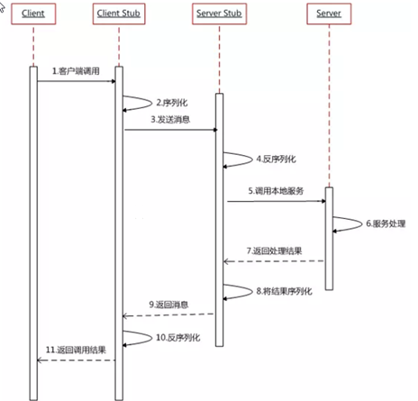

# [官方文档2.7](https://dubbo.apache.org/zh/docsv2.7/)

# 基础知识

## 分布式基础理论

> “分布式系统是若干独立计算机的集合，这些计算机对于用户来说就像单个相关系统”

### RPC

> **RPC【Remote Procedure Call】是指远程过程调用，是一种进程间通信方式**，他是一种技术的思想，而不是规范。它允许程序调用另一个地址空间（通常是共享网络的另一台机器上）的过程或函数，而不用程序员显式编码这个远程调用的细节。即程序员无论是调用本地的还是远程的函数，本质上编写的调用代码基本相同。

#### RPC基本原理




## dubbo核心概念

> Apache Dubbo (incubating) 是一款高性能、轻量级的开源Java RPC框架，它提供了三大核心能力：面向接口的远程方法调用，智能容错和负载均衡，以及服务自动注册和发现。


> **服务提供者（Provider）**：暴露服务的服务提供方，服务提供者在启动时，向注册中心注册自己提供的服务。
>
> **服务消费者（Consumer）**: 调用远程服务的服务消费方，服务消费者在启动时，向注册中心订阅自己所需的服务，服务消费者，从提供者地址列表中，基于软负载均衡算法，选一台提供者进行调用，如果调用失败，再选另一台调用。
>
> **注册中心（Registry）**：注册中心返回服务提供者地址列表给消费者，如果有变更，注册中心将基于长连接推送变更数据给消费者
>
> **监控中心（Monitor）**：服务消费者和提供者，在内存中累计调用次数和调用时间，定时每分钟发送一次统计数据到监控中心

## dubbo环境搭建

### 安装zookeeper

> 1. 下载[zookeeper](https://archive.apache.org/dist/zookeeper/zookeeper-3.4.13/)
>
> 2. 解压运行`bin/zkServer.cmd` ，初次运行会报错，没有`zoo.cfg`配置文件
>
> 3. 修改`zoo.cfg`配置文件
>
>    - 将conf下的`zoo_sample.cfg`复制一份改名为`zoo.cfg`即可。
>
>      注意几个重要位置：
>
>      `dataDir=./  `	临时数据存储的目录（可写相对路径）
>
>      `clientPort=2181`	zookeeper的端口号
>
>      修改完成后再次启动zookeeper	
>
> 4. 使用`bin/zkCli.cmd`测试
>
>    - `ls /`：列出zookeeper根下保存的所有节点
>
>      `create –e /atguigu 123`：创建一个atguigu节点，值为123
>
>      `get /atguigu`：获取/atguigu节点的值

### 安装dubbo-admin管理控制台

>为了让用户更好的管理监控众多的dubbo服务，官方提供了一个可视化的监控程序，不过这个监控即使不装也不影响使用。

> 1. 下载[dubbo-admin](https://github.com/apache/dubbo-admin
>    )
>
> 2. 解压缩
>
> 3. 修改配置文件
>
>    - 解压后我们进入如下目录，找到`\dubbo-admin-server\src\main\resourcesapplication.properties`配置文件 进行配置修改
>
>    - 修改为zookeeper所在的主机的地址
>
>      
>
>      ```
>      # centers in dubbo2.7
>      admin.registry.address=zookeeper://192.168.149.135:2181  #注册中心
>      admin.config-center=zookeeper://192.168.149.135:2181  #配置中心
>      admin.metadata-report.address=zookeeper://192.168.149.135:2181  #元数据中心
>      ```
>
> 4. 打包项目
>
>    在 dubbo-admin-develop目录执行打包命令`mvn clean package`
>
>    打好的jar包在`\dubbo-admin-develop\target`下
>
> 5. 启动jar包
>
>    在控制台执行命令`java -jar 打完的jar包名`
>
>    注意：在启动dubbo-admin之前要先启动zookeeper
>
>    
>
> 6. 启动前端控制台
>
>    访问7001端口。账号密码为root
>
>    

### [Linux下的环境搭建](https://cloud.tencent.com/developer/article/1441954)

## dubbo-helloworld

### 提出需求

> 某个电商系统，订单服务需要调用用户服务获取某个用户的所有地址；
>
> 我们现在 需要创建两个服务模块进行测试 
>
> | 模块                | 功能           |
> | ------------------- | -------------- |
> | 订单服务web模块     | 创建订单等     |
> | 用户服务service模块 | 查询用户地址等 |
>
> 测试预期结果：
>
> ​     订单服务web模块在A服务器，用户服务模块在B服务器，A可以远程调用B的功能。

### 工程架构

#### 分包

> **建议将服务接口，服务模型，服务异常等均放在 API 包中**，因为服务模型及异常也是 API 的一部分，同时，这样做也符合分包原则：重用发布等价原则(REP)，共同重用原则(CRP)。

#### 粒度

> **服务接口尽可能大粒度，每个服务方法应代表一个功能，而不是某功能的一个步骤，否则将面临分布式事务问题，Dubbo 暂未提供分布式事务支持。**
>
> 服务接口建议以业务场景为单位划分，并对相近业务做抽象，防止接口数量爆炸。
>
> 不建议使用过于抽象的通用接口，如：Map query(Map)，这样的接口没有明确语义，会给后期维护带来不便。


### 创建模块


#### gmall-interface

> 公共接口层（model，service，exception…）
>
> 作用：定义公共接口，也可以导入公共依赖


#### user-service-provider

> 用户模块（对用户接口的实现）

> 引入gmall-interface的依赖
>
> ```xml
> <dependency>
>     <groupId>org.example</groupId>
>     <artifactId>gmall-interface</artifactId>
>     <version>1.0-SNAPSHOT</version>
> </dependency>
> ```
>
> Service
>
> ```java
>     @Override
>     public List<UserAddress> getUserAddressList(String userId) {
> //        System.out.println("UserServiceImpl.....old...");
>         // TODO Auto-generated method stub
>         UserAddress address1 = new UserAddress(1, "北京市昌平区宏福科技园综合楼3层", "1", "李老师", "010-56253825", "Y");
>         UserAddress address2 = new UserAddress(2, "深圳市宝安区西部硅谷大厦B座3层（深圳分校）", "1", "王老师", "010-56253825", "N");
> 
>         return Arrays.asList(address1, address2);
>     }
> ```

#### order-service-consumer

> 订单模块（调用用户模块）

> 引入gmall-interface的依赖
>
> ```xml
> <dependency>
>     <groupId>org.example</groupId>
>     <artifactId>gmall-interface</artifactId>
>     <version>1.0-SNAPSHOT</version>
> </dependency>
> ```
>
> Service
>
> ```java
> public class OrderServiceImpl implements OrderService {
> 
>     UserService userService;
> 
>     @Override
>     public void initOrder(String userId) {
>         System.out.println("userId = " + userId);
>         List<UserAddress> addressList = userService.getUserAddressList(userId);
>         for (UserAddress userAddress : addressList) {
>             System.out.println("userAddress = " + userAddress.getUserAddress());
>         }
>     }
> }
> ```

> 现在这样是无法进行调用的。我们order-service-consumer引入了gmall-interface，但是interface的实现是user-service-provider，我们并没有引入，而且实际他可能还在别的服务器中。

### 使用dubbo改造

#### 改造user-service-provider作为服务的提供者

> 引入依赖

```xml
		<!-- 引入dubbo -->
		<dependency>
			<groupId>com.alibaba</groupId>
			<artifactId>dubbo</artifactId>
			<version>2.6.2</version>
		</dependency>
	<!-- 由于我们使用zookeeper作为注册中心，所以需要操作zookeeper
dubbo 2.6以前的版本引入zkclient操作zookeeper 
dubbo 2.6及以后的版本引入curator操作zookeeper
下面两个zk客户端根据dubbo版本2选1即可
-->
		<!--<dependency>
			<groupId>com.101tec</groupId>
			<artifactId>zkclient</artifactId>
			<version>0.10</version>
		</dependency>-->
		<!-- curator-framework -->
		<dependency>
			<groupId>org.apache.curator</groupId>
			<artifactId>curator-framework</artifactId>
			<version>2.12.0</version>
		</dependency>

```

> 配置提供者`provider.xml`

```xml
<?xml version="1.0" encoding="UTF-8"?>
<beans xmlns="http://www.springframework.org/schema/beans"
       xmlns:xsi="http://www.w3.org/2001/XMLSchema-instance" xmlns:dubbo="http://code.alibabatech.com/schema/dubbo"
       xsi:schemaLocation="http://www.springframework.org/schema/beans http://www.springframework.org/schema/beans/spring-beans.xsd http://code.alibabatech.com/schema/dubbo http://code.alibabatech.com/schema/dubbo/dubbo.xsd">

    <!--  1、指定当前服务/应用的名字（同样的服务名字相同，不要和别的服务同名，一般是使用工程名  -->
    <dubbo:application name="user-service-provider"></dubbo:application>

    <!--  2、指定注册中心的位置  -->
    <!--    <dubbo:registry address="zookeeper://127.0.0.1:2181"></dubbo:registry>-->
    <dubbo:registry protocol="zookeeper" address="127.0.0.1:2181"></dubbo:registry>

    <!--  3、指定通信规则（通信协议、通信端口）  -->
    <dubbo:protocol name="dubbo" port="20880"></dubbo:protocol>

    <!--  4、暴露服务  ref：指向服务的真正的实现对象  -->
    <dubbo:service interface="com.atguigu.gmall.service.UserService" ref="userService"></dubbo:service>

    <!--  服务的实现  -->
    <bean id="userService" class="com.atguigu.gmall.service.impl.UserServiceImpl"></bean>
    
</beans>
```

> 启动服务

```java
public class MainApplication {
    public static void main(String[] args) throws IOException {
        ClassPathXmlApplicationContext con = new ClassPathXmlApplicationContext("provider.xml");
        con.start();

        System.in.read();
    }
}
```

#### 改造order-service-consumer作为服务的消费者

> 引入依赖

```xml
		<!-- 引入dubbo -->
		<dependency>
			<groupId>com.alibaba</groupId>
			<artifactId>dubbo</artifactId>
			<version>2.6.2</version>
		</dependency>
	<!-- 由于我们使用zookeeper作为注册中心，所以需要操作zookeeper
dubbo 2.6以前的版本引入zkclient操作zookeeper 
dubbo 2.6及以后的版本引入curator操作zookeeper
下面两个zk客户端根据dubbo版本2选1即可
-->
		<!--<dependency>
			<groupId>com.101tec</groupId>
			<artifactId>zkclient</artifactId>
			<version>0.10</version>
		</dependency>-->
		<!-- curator-framework -->
		<dependency>
			<groupId>org.apache.curator</groupId>
			<artifactId>curator-framework</artifactId>
			<version>2.12.0</version>
		</dependency>

```

> 配置消费者`consumer.xml`

```xml
<?xml version="1.0" encoding="UTF-8"?>
<beans xmlns="http://www.springframework.org/schema/beans"
       xmlns:xsi="http://www.w3.org/2001/XMLSchema-instance" xmlns:dubbo="http://code.alibabatech.com/schema/dubbo"
       xmlns:context="http://www.springframework.org/schema/context"
       xsi:schemaLocation="http://www.springframework.org/schema/beans http://www.springframework.org/schema/beans/spring-beans.xsd http://code.alibabatech.com/schema/dubbo http://code.alibabatech.com/schema/dubbo/dubbo.xsd http://www.springframework.org/schema/context http://www.springframework.org/schema/context/spring-context.xsd">

    <context:component-scan base-package="com.atguigu.gmall"></context:component-scan>

    <dubbo:application name="order-service-consumer"></dubbo:application>

    <dubbo:registry address="zookeeper://127.0.0.1:2181"></dubbo:registry>

    <!--  声明需要调用的远程服务的接口，生成远程服务代理  -->
    <dubbo:reference interface="com.atguigu.gmall.service.UserService" id="userService"></dubbo:reference>

</beans>
```

> 启动服务

```java
package com.atguigu.gmall.service.impl;

import com.atguigu.gmall.bean.UserAddress;
import com.atguigu.gmall.service.OrderService;
import com.atguigu.gmall.service.UserService;
import org.springframework.beans.factory.annotation.Autowired;
import org.springframework.stereotype.Service;//service注解使用的是spring中的

import java.util.List;

@Service
public class OrderServiceImpl implements OrderService {

    @Autowired
    UserService userService;

    @Override
    public void initOrder(String userId) {
        System.out.println("userId = " + userId);
        List<UserAddress> addressList = userService.getUserAddressList(userId);
        for (UserAddress userAddress : addressList) {
            System.out.println("userAddress = " + userAddress.getUserAddress());
        }
    }
}
```

#### 注解版

> 服务提供方

```xml
<dubbo:application name="gmall-user"></dubbo:application>
<dubbo:registry address="zookeeper://118.24.44.169:2181" />
<dubbo:protocol name="dubbo" port="20880" />

<!--开启dubbo的注解-->
<dubbo:annotation package="com.atguigu.gmall.user.impl"/>
```

```java
import com.alibaba.dubbo.config.annotation.Service;
import com.atguigu.gmall.bean.UserAddress;
import com.atguigu.gmall.service.UserService;
import com.atguigu.gmall.user.mapper.UserAddressMapper;

@Service //使用dubbo提供的service注解，注册暴露服务
public class UserServiceImpl implements UserService {

	@Autowired
	UserAddressMapper userAddressMapper;
```

> 服务消费者

```xml
<dubbo:application name="gmall-order-web"></dubbo:application>
<dubbo:registry address="zookeeper://118.24.44.169:2181" />

<!--开启dubbo的注解-->
<dubbo:annotation package="com.atguigu.gmall.order.controller"/>
```

```java
@Controller
public class OrderController {
	
	@Reference  //使用dubbo提供的reference注解引用远程服务
	UserService userService;
```

## 监控中心

### dubbo-admin

> 图形化的服务管理页面；安装时需要指定注册中心地址，即可从注册中心中获取到所有的提供者/消费者进行配置管理

### dubbo-monitor-simple

> 简单的监控中心；

> 1. [下载](https://github.com/apache/incubator-dubbo/tree/2.5.x/dubbo-simple)
>
> 2. 解压、打包
>
> 3. 在target目录下有`dubbo-monitor-simple-2.0.0-assembly.tar.gz`压缩包，解压修改`\conf\dubbo.properties`文件配置
>
>    
>
> 4. 运行`\assembly.bin\start.bat`文件
>
> 5. 启动访问8080端口
>
>    

#### 监控中心配置

> 在提供者和服务者中都配置

```xml
    <!--连接监控中心-->
    <dubbo:monitor protocol="registry"></dubbo:monitor><!--表示从注册中心发现监控中心地址，否则直连监控中心。-->
    <!--    <dubbo:monitor address="127.0.0.1:7070"></dubbo:monitor>--><!--端口为监控中心的端口-->
```

# dubbo配置

## 配置原则


> JVM 启动 -D 参数优先，这样可以使用户在部署和启动时进行参数重写，比如在启动时需改变协议的端口。
>
> XML 次之，如果在 XML 中有配置，则`dubbo.properties`中的相应配置项无效。
>
> Properties 最后，相当于缺省值，只有 XML 没有配置时，`dubbo.properties`的相应配置项才会生效，通常用于共享公共配置，比如应用名。

## 启动时检查

> 当我们还没有启动提供者，先启动了消费者，默认是会报错的。

> 关闭启动时检查的方法
>
> 1. 关闭某个服务的启动时检查 (没有提供者时报错)：
>
>    ```xml
>        <dubbo:reference interface="com.atguigu.gmall.service.UserService" id="userService" check="false"></dubbo:reference>
>    ```
>
> 2. 关闭所有服务的启动时检查 (没有提供者时报错)：
>
>    ```xml
>        <!--  声明需要调用的远程服务的接口，生成远程服务代理  -->
>        <dubbo:reference interface="com.atguigu.gmall.service.UserService" id="userService"></dubbo:reference>
>    
>        <dubbo:consumer check="false"></dubbo:consumer>
>    ```
>
> 3. 关闭注册中心启动时检查 (注册订阅失败时报错)：
>
>    ```xml
>        <dubbo:registry check="false"></dubbo:registry>
>    ```
>
> 文档：[启动时检查 | Apache Dubbo](https://dubbo.apache.org/zh/docsv2.7/user/examples/preflight-check/)

## 超时时间

> - 由于网络或服务端不可靠，会导致调用出现一种不确定的中间状态（超时）。为了避免超时导致客户端资源（线程）挂起耗尽，必须设置超时时间。
> - timeout超时时间，**默认为1000毫秒**

### Dubbo消费端

```xml
<!--全局超时配置-->
<dubbo:consumer timeout="5000" />

<!--指定接口以及特定方法超时配置-->
<dubbo:reference interface="com.foo.BarService" timeout="2000">
    <dubbo:method name="sayHello" timeout="3000" />
</dubbo:reference>
```

### Dubbo服务端

```xml
<!--全局超时配置-->
<dubbo:provider timeout="5000" />

<!--指定接口以及特定方法超时配置-->
<dubbo:provider interface="com.foo.BarService" timeout="2000">
    <dubbo:method name="sayHello" timeout="3000" />
</dubbo:provider>
```

### 不同粒度配置的覆盖关系

> 以 timeout 为例，下图显示了配置的查找顺序，其它 retries, loadbalance, actives 等类似：
>
> - **方法级优先，接口级次之，全局配置再次之。**
> - **如果级别一样，则消费方优先，提供方次之。**
>
> 其中，服务提供方配置，通过 URL 经由注册中心传递给消费方。


## 重试次数

> - 当消费者调用提供者超时或者网络连接错误等可以重试调用，设置调用的次数，**这个次数不包括第一次调用。**
> - 当提供者在多个服务器时，**重试连接还可以尝试连接不同的服务器上的提供者**
> - 重试操作一般用于幂等性操作（多次操作的结果和操作一次的结果相同，如：查询、删除、修改）

```xml
    <!--  retries设置重试次数  -->
    <dubbo:reference interface="com.atguigu.gmall.service.UserService" id="userService" retries="3"></dubbo:reference>
```

## 版本号

> 当一个接口实现，出现不兼容升级时，可以用版本号过渡，版本号不同的服务相互间不引用。
>
> 可以按照以下的步骤进行版本迁移：
>
> 1. 在低压力时间段，先升级一半提供者为新版本
> 2. 再将所有消费者升级为新版本
> 3. 然后将剩下的一半提供者升级为新版本

> 提供者设置多个版本

```xml
    <!--  4、暴露服务  ref：指向服务的真正的实现对象  -->
    <!--  version设置版本  -->
    <dubbo:service interface="com.atguigu.gmall.service.UserService" ref="userService01"
                   version="1.0.0"></dubbo:service>
    <!--  服务的实现  -->
    <bean id="userService01" class="com.atguigu.gmall.service.impl.UserServiceImpl"></bean>


    <dubbo:service interface="com.atguigu.gmall.service.UserService" ref="userService02"
                   version="2.0.0"></dubbo:service>
    <bean id="userService02" class="com.atguigu.gmall.service.impl.UserServiceImpl02"></bean>
```

> 消费者切换版本
>
> **`version = "*"`：自动切换版本**

```xml
    <!--  声明需要调用的远程服务的接口，生成远程服务代理  -->
    <dubbo:reference interface="com.atguigu.gmall.service.UserService" id="userService" version="2.0.0"></dubbo:reference>
```

## 本地存根

> 提供 Stub 的实现，实现类一般放在公共API中

```java
package com.atguigu.gmall.service.impl;

import com.atguigu.gmall.bean.UserAddress;
import com.atguigu.gmall.service.UserService;
import org.springframework.util.StringUtils;

import java.util.List;

public class UserServiceStub implements UserService {

    private final UserService userService;

    // 构造函数传入真正的远程代理对象
    public UserServiceStub(UserService userService) {
        this.userService = userService;
    }


    @Override
    public List<UserAddress> getUserAddressList(String userId) {
        
        // 此代码在客户端执行, 你可以在客户端做ThreadLocal本地缓存，或预先验证参数是否合法，等等

        System.out.println("UserServiceStub..........");

        if (!StringUtils.isEmpty(userId)) {
            return userService.getUserAddressList(userId);
        }
        return null;
    }
}

```

> 消费者中配置stub

```xml
  <dubbo:reference interface="com.atguigu.gmall.service.UserService" id="userService"  stub="com.atguigu.gmall.service.impl.UserServiceStub">
    </dubbo:reference>
```

# 整合Spring Boot

## 方法一：全注解

> 引入公共API
>
> 引入`spring-boot-starter`以及dubbo和curator的依赖

```xml
<dependency>
    <groupId>org.example</groupId>
    <artifactId>gmall-interface</artifactId>
    <version>1.0-SNAPSHOT</version>
</dependency>

<dependency>
    <groupId>com.alibaba.boot</groupId>
    <artifactId>dubbo-spring-boot-starter</artifactId>
    <version>0.2.0</version>
</dependency>
```

> 配置提供者信息

```properties
dubbo.application.name=boot-user-service-provider
dubbo.registry.protocol=zookeeper
dubbo.registry.address=127.0.0.1:2181
dubbo.protocol.name=dubbo
dubbo.protocol.port=20880
dubbo.monitor.protocol=registry
```

> 配置消费者信息

```properties
dubbo.application.name=boot-order-service-consumer
dubbo.registry.address=zookeeper://127.0.0.1:2181
dubbo.monitor.protocol=registry
server.port=8081
```

> 配置启动类，消费者和提供者中都配置

```java
@SpringBootApplication
@EnableDubbo #支持dubbo注解
public class BootUserServiceProviderApplication {

    public static void main(String[] args) {
        SpringApplication.run(BootUserServiceProviderApplication.class, args);
    }
}
```

> 提供者Service，使用注解暴露服务，注意注解所在的包是dubbo中

```java
package com.atguigu.gmall.service.impl;

import com.alibaba.dubbo.config.annotation.Service;
import com.atguigu.gmall.bean.UserAddress;
import com.atguigu.gmall.service.UserService;
import org.springframework.stereotype.Component;

import java.util.Arrays;
import java.util.List;

/**
* 如果要使用事务注解，必须在@Service后面加上(interfaceClass = “实现的接口.class”)
*/
//@Transactional
//@Service(interfaceClass = UserService.class)
@Service //暴露服务，在dubbo包下的注解
@Component //这个不写好像也行
public class UserServiceImpl implements UserService {

    @Override
    public List<UserAddress> getUserAddressList(String userId) {
//        System.out.println("UserServiceImpl.....old...");
        // TODO Auto-generated method stub
        UserAddress address1 = new UserAddress(1, "北京市昌平区宏福科技园综合楼3层", "1", "李老师", "010-56253825", "Y");
        UserAddress address2 = new UserAddress(2, "深圳市宝安区西部硅谷大厦B座3层（深圳分校）", "1", "王老师", "010-56253825", "N");

        return Arrays.asList(address1, address2);
    }

}
```

> 消费者Service

```java
package com.atguigu.gmall.service.impl;

import com.alibaba.dubbo.config.annotation.Reference;
import com.atguigu.gmall.bean.UserAddress;
import com.atguigu.gmall.service.OrderService;
import com.atguigu.gmall.service.UserService;
import org.springframework.stereotype.Service;

import java.util.List;

@Service
public class OrderServiceImpl implements OrderService {

    @Reference  //服务消费者引用服务配置
    UserService userService;

    @Override
    public List<UserAddress> initOrder(String userId) {
        System.out.println("userId = " + userId);
        List<UserAddress> addressList = userService.getUserAddressList(userId);
        for (UserAddress userAddress : addressList) {
            System.out.println("userAddress = " + userAddress.getUserAddress());
        }
        return addressList;
    }

}

```

## 方法二：xml

> 在xml文件中配置

```xml
<?xml version="1.0" encoding="UTF-8"?>
<beans xmlns="http://www.springframework.org/schema/beans"
       xmlns:xsi="http://www.w3.org/2001/XMLSchema-instance" xmlns:dubbo="http://code.alibabatech.com/schema/dubbo"
       xsi:schemaLocation="http://www.springframework.org/schema/beans http://www.springframework.org/schema/beans/spring-beans.xsd http://code.alibabatech.com/schema/dubbo http://code.alibabatech.com/schema/dubbo/dubbo.xsd">


    <dubbo:application name="boot-user-service-provider"></dubbo:application>
    <dubbo:registry address="zookeeper://127.0.0.1:2181"></dubbo:registry>
    <dubbo:protocol name="dubbo" port="20888"></dubbo:protocol>
    <dubbo:service interface="com.atguigu.gmall.service.UserService" ref="userService"></dubbo:service>
    <bean id="userService" class="com.atguigu.gmall.service.impl.UserServiceImpl"></bean>
</beans>
```

> 将xml文件引入

```java
@SpringBootApplication
//@EnableDubbo
@ImportResource(locations = "classpath:provider.xml")
public class BootUserServiceProviderApplication {

    public static void main(String[] args) {
        SpringApplication.run(BootUserServiceProviderApplication.class, args);
    }

}
```

## 方法三：配置类

> 编写配置类，每一个配置项都有`xxxxConfig`类

```java
package com.atguigu.gmall.config;

import com.alibaba.dubbo.config.*;
import com.atguigu.gmall.service.UserService;
import org.springframework.context.annotation.Bean;
import org.springframework.context.annotation.Configuration;

import java.util.ArrayList;


@Configuration
public class MyDubboConfig {

    //        <dubbo:application name="boot-user-service-provider"></dubbo:application>
    @Bean
    public ApplicationConfig applicationConfig() {
        ApplicationConfig applicationConfig = new ApplicationConfig();
        applicationConfig.setName("boot-user-service-provider");
        return applicationConfig;
    }

    //     <dubbo:registry address="zookeeper://127.0.0.1:2181"></dubbo:registry>
    @Bean
    public RegistryConfig registryConfig() {
        RegistryConfig registryConfig = new RegistryConfig();
        registryConfig.setAddress("zookeeper://127.0.0.1:2181");
        return registryConfig;
    }

    //    <dubbo:protocol name="dubbo" port="20888"></dubbo:protocol>
    @Bean
    public ProtocolConfig protocolConfig() {
        ProtocolConfig protocolConfig = new ProtocolConfig();
        protocolConfig.setName("dubbo");
        protocolConfig.setPort(20889);
        return protocolConfig;
    }

    //    <dubbo:service interface="com.atguigu.gmall.service.UserService" ref="userService"></dubbo:service>
    //    <bean id="userService" class="com.atguigu.gmall.service.impl.UserServiceImpl"></bean>
    @Bean
    public ServiceConfig<UserService> serviceConfig(UserService userService, ApplicationConfig applicationConfig, RegistryConfig registryConfig) {
        ServiceConfig<UserService> userServiceServiceConfig = new ServiceConfig<>();
        
        userServiceServiceConfig.setApplication(applicationConfig);
        // 多个注册中心可以用setRegistries()
        userServiceServiceConfig.setRegistry(registryConfig);
        
        //userServiceServiceConfig.setInterface("com.atguigu.gmall.service.UserService");
        userServiceServiceConfig.setInterface(UserService.class);
        userServiceServiceConfig.setRef(userService);
        
        //userServiceServiceConfig.setVersion("2.0.0");


        MethodConfig methodConfig = new MethodConfig();
        methodConfig.setName("getUserAddressList");
        methodConfig.setTimeout(5000);

        ArrayList<MethodConfig> methodConfigs = new ArrayList<>();
        methodConfigs.add(methodConfig);

        userServiceServiceConfig.setMethods(methodConfigs);

        userServiceServiceConfig.export();// 暴露及注册服务

        return userServiceServiceConfig;
    }
}
```

> 需要`@Component`注解，将组件放入容器中

```java
@Component
public class UserServiceImpl implements UserService {

    @Override
    public List<UserAddress> getUserAddressList(String userId) {
        // TODO Auto-generated method stub
        UserAddress address1 = new UserAddress(1, "北京市昌平区宏福科技园综合楼3层", "1", "李老师", "010-56253825", "Y");
        UserAddress address2 = new UserAddress(2, "深圳市宝安区西部硅谷大厦B座3层（深圳分校）", "1", "王老师", "010-56253825", "N");

        return Arrays.asList(address1, address2);
    }
}
```

# 高可用

## zookeeper宕机

> - 现象：zookeeper注册中心宕机，还可以消费dubbo暴露的服务。
>
> - 原因
>
>   - 健壮性
>
>     监控中心宕掉不影响使用，只是丢失部分采样数据
>
>     数据库宕掉后，注册中心仍能通过缓存提供服务列表查询，但不能注册新服务
>
>     **注册中心对等集群，任意一台宕掉后，将自动切换到另一台**
>
>     **注册中心全部宕掉后，服务提供者和服务消费者仍能通过本地缓存通讯**
>
>     服务提供者无状态，任意一台宕掉后，不影响使用
>
>     服务提供者全部宕掉后，服务消费者应用将无法使用，并无限次重连等待服务提供者恢复
>
>   - 高可用：通过设计，减少系统不能提供服务的时间；

## dubbo直连

> - zookeeper注册中心宕机，还可以通过dubbo直连
> - 提供者，消费者应该是需要配置dubbo的配置文件，毕竟需要在@Reference注解中提供提供者的路径和端口

```java
package com.atguigu.gmall.service.impl;

import com.alibaba.dubbo.config.annotation.Reference;
import com.atguigu.gmall.bean.UserAddress;
import com.atguigu.gmall.service.OrderService;
import com.atguigu.gmall.service.UserService;
import org.springframework.stereotype.Service;

import java.util.List;

@Service
public class OrderServiceImpl implements OrderService {

    @Reference(url = "127.0.0.1:20887") //url为直连提供者的路径
    UserService userService;

    @Override
    public List<UserAddress> initOrder(String userId) {
        System.out.println("userId = " + userId);
        List<UserAddress> addressList = userService.getUserAddressList(userId);
        for (UserAddress userAddress : addressList) {
            System.out.println("userAddress = " + userAddress.getUserAddress());
        }
        return addressList;
    }

}
```

## 集群下dubbo负载均衡配置

> - **在集群负载均衡时，Dubbo 提供了多种均衡策略，缺省为 random 随机调用。**
> - 负载均衡策略
>   - **Random  LoadBalance**
>     - **随机**，按权重设置随机概率。
>     - 在一个截面上碰撞的概率高，但调用量越大分布越均匀，而且按概率使用权重后也比较均匀，有利于动态调整提供者权重。
>   - **RoundRobin  LoadBalance**
>     - **轮询**，按公约后的权重设置轮询比率。
>     - 存在慢的提供者累积请求的问题，比如：第二台机器很慢，但没挂，当请求调到第二台时就卡在那，久而久之，所有请求都卡在调到第二台上。
>   - **LeastActive  LoadBalance**
>     - **最少活跃调用数**，相同活跃数的随机，活跃数指调用前后计数差。
>     - 使慢的提供者收到更少请求，因为越慢的提供者的调用前后计数差会越大。 
>   - **ConsistentHash  LoadBalance**
>     - **一致性 Hash**，相同参数的请求总是发到同一提供者。
>     - 当某一台提供者挂时，原本发往该提供者的请求，基于虚拟节点，平摊到其它提供者，不会引起剧烈变动。
>     - 算法参见：http://en.wikipedia.org/wiki/Consistent_hashing
>     - 缺省只对第一个参数 Hash，如果要修改，请配置`<dubbo:parameter key="hash.arguments" value="0,1" />`
>     - 缺省用 160 份虚拟节点，如果要修改，请配置 `<dubbo:parameter key="hash.nodes" value="320" />`

### 配置

> 服务端服务级别

```xml
<dubbo:service interface="..." loadbalance="roundrobin" />
```

> 服务端方法级别

```xml
<dubbo:service interface="...">
    <dubbo:method name="..." loadbalance="roundrobin"/>
</dubbo:service>
```

> 客户端服务级别

```xml
<dubbo:reference interface="..." loadbalance="roundrobin" />
```

> 客户端方法级别

```xml
<dubbo:reference interface="...">
    <dubbo:method name="..." loadbalance="roundrobin"/>
</dubbo:reference>
```

### 设置权重

> 服务端服务级别

```xml
<dubbo:service interface="..." weigth="xxx" />
```

> 服务端方法级别

```xml
<dubbo:service interface="...">
    <dubbo:method name="..." weigth="xxx" />
</dubbo:service>
```

> 一般是通过控制台调节权重


## 整合hystrix，服务熔断与降级处理

### 服务降级

> - **当服务器压力剧增的情况下，根据实际业务情况及流量，对一些服务和页面有策略的不处理或换种简单的方式处理，从而释放服务器资源以保证核心交易正常运作或高效运作。**
> - 可以通过服务降级功能临时屏蔽某个出错的非关键服务，并定义降级后的返回策略。
> - **`mock=force:return+null`表示消费方对该服务的方法调用都直接返回 null 值，不发起远程调用。用来屏蔽不重要服务不可用时对调用方的影响。**
> - **`mock=fail:return+null`表示消费方对该服务的方法调用在失败后，再返回 null 值，不抛异常。用来容忍不重要服务不稳定时对调用方的影响。**

> 一般通过控制台来操控
>
> **屏蔽 ===> `mock=force:return+null`**
>
> **容错 ===> `mock=fail:return+null`**


### 集群容错

> **在集群调用失败时，Dubbo 提供了多种容错方案，缺省为 failover 重试。**

#### 集群容错模式

> - **Failover Cluster**
>
>   失败自动切换，当出现失败，重试其它服务器。通常用于读操作，但重试会带来更长延迟。可通过 retries="2" 来设置重试次数(不含第一次)。
>
>   重试次数配置如下：
>
>   ```xml
>   <dubbo:service retries="2" />
>   或
>   <dubbo:reference retries="2" />
>   或
>   <dubbo:reference>
>     <dubbo:method name="findFoo" retries="2" />
>   </dubbo:reference>
>   ```
>
> - **Failfast Cluster**
>
>   快速失败，只发起一次调用，失败立即报错。通常用于非幂等性的写操作，比如新增记录。
>
> - **Failsafe Cluster**
>
>   失败安全，出现异常时，直接忽略。通常用于写入审计日志等操作。
>
> - **Failback Cluster**
>
>   失败自动恢复，后台记录失败请求，定时重发。通常用于消息通知操作。
>
> - **Forking Cluster**
>
>   并行调用多个服务器，只要一个成功即返回。通常用于实时性要求较高的读操作，但需要浪费更多服务资源。可通过 forks="2" 来设置最大并行数。
>
> - **Broadcast Cluster**
>
>   广播调用所有提供者，逐个调用，任意一台报错则报错 [2]。通常用于通知所有提供者更新缓存或日志等本地资源信息。 

#### 集群模式配置

> 按照以下示例在服务提供方和消费方配置集群模式

```xml
<dubbo:service cluster="failsafe" />
或
<dubbo:reference cluster="failsafe" />
```

### 整合hystrix

> Hystrix 旨在通过控制那些访问远程系统、服务和第三方库的节点，从而对延迟和故障提供更强大的容错能力。Hystrix具备拥有回退机制和断路器功能的线程和信号隔离，请求缓存和请求打包，以及监控和配置等功能

> 引入依赖

```xml
<dependency>
    <groupId>org.springframework.cloud</groupId>
    <artifactId>spring-cloud-starter-netflix-hystrix</artifactId>
    <version>2.1.0.RELEASE</version>
</dependency>
```

> 配置提供者

```java
@SpringBootApplication
@EnableDubbo
@EnableHystrix  //开启hystrix注解
public class BootUserServiceProviderApplication {

    public static void main(String[] args) {
        SpringApplication.run(BootUserServiceProviderApplication.class, args);
    }
}
```

```java
@Service //暴露服务，在dubbo包下的注解
@Component
public class UserServiceImpl implements UserService {

    @Override
    @HystrixCommand
    public List<UserAddress> getUserAddressList(String userId) {
        // TODO Auto-generated method stub
        UserAddress address1 = new UserAddress(1, "北京市昌平区宏福科技园综合楼3层", "1", "李老师", "010-56253825", "Y");
        UserAddress address2 = new UserAddress(2, "深圳市宝安区西部硅谷大厦B座3层（深圳分校）", "1", "王老师", "010-56253825", "N");

        if (Math.random() > 0.5) {
            throw new RuntimeException();
        }

        return Arrays.asList(address1, address2);
    }

}
```

> 配置消费者
>
> 备用方法 和 原方法 的参数个数，类型必须保持一致，否则报错

```java
@SpringBootApplication
@EnableDubbo
@EnableHystrix
public class BootOrderServiceConsumerApplication {

    public static void main(String[] args) {
        SpringApplication.run(BootOrderServiceConsumerApplication.class, args);
    }
}
```

```java

@Service
public class OrderServiceImpl implements OrderService {

    //@Reference(url = "127.0.0.1:20887") //url为直连提供者的路径
    @Reference
    UserService userService;

    @Override
    @HystrixCommand(fallbackMethod = "hello")
    public List<UserAddress> initOrder(String userId) {
        System.out.println("userId = " + userId);
        List<UserAddress> addressList = userService.getUserAddressList(userId);
        for (UserAddress userAddress : addressList) {
            System.out.println("userAddress = " + userAddress.getUserAddress());
        }
        return addressList;
    }


    //备用方法 和 原方法 的参数个数，类型保持一致
    public List<UserAddress> hello(String userId) {
        ArrayList<UserAddress> userAddresses = new ArrayList<>();
        UserAddress userAddress = new UserAddress(10, "测试地址", "测试id", "测试", "测试", "Y");
        userAddresses.add(userAddress);
        return userAddresses;
    }
}
```

# dubbo原理

## RPC原理


> 一次完整的RPC调用流程（同步调用，异步另说）如下：
>
> 1. **服务消费方（client）调用以本地调用方式调用服务；**
> 2. client stub接收到调用后负责将方法、参数等组装成能够进行网络传输的消息体； 
> 3. client stub找到服务地址，并将消息发送到服务端； 
> 4. server stub收到消息后进行解码； 
> 5. server stub根据解码结果调用本地的服务； 
> 6. 本地服务执行并将结果返回给server stub； 
> 7. server stub将返回结果打包成消息并发送至消费方； 
> 8. client stub接收到消息，并进行解码； 
> 9. **服务消费方得到最终结果。**
>
> RPC框架的目标就是要2~8这些步骤都封装起来，这些细节对用户来说是透明的，不可见的。

## netty通信原理

> Netty是一个异步事件驱动的网络应用程序框架， 用于快速开发可维护的高性能协议服务器和客户端。它极大地简化并简化了TCP和UDP套接字服务器等网络编程。

### BIO(Blocking IO)


### NIO(Non-Blocking IO)


> elector 一般称 为**选择器** ，也可以翻译为 **多路复用器，**
>
> Connect（连接就绪）、Accept（接受就绪）、Read（读就绪）、Write（写就绪）

### Netty基本原理


## dubbo原理

### 框架设计


> - config 配置层：对外配置接口，以 ServiceConfig, ReferenceConfig 为中心，可以直接初始化配置类，也可以通过 spring 解析配置生成配置类
> - proxy 服务代理层：服务接口透明代理，生成服务的客户端 Stub 和服务器端 Skeleton, 以 ServiceProxy 为中心，扩展接口为 ProxyFactory
> - registry 注册中心层：封装服务地址的注册与发现，以服务 URL 为中心，扩展接口为 RegistryFactory, Registry, RegistryService
> - cluster 路由层：封装多个提供者的路由及负载均衡，并桥接注册中心，以 Invoker 为中心，扩展接口为 Cluster, Directory, Router, LoadBalance
> - monitor 监控层：RPC 调用次数和调用时间监控，以 Statistics 为中心，扩展接口为 MonitorFactory, Monitor, MonitorService
> - protocol 远程调用层：封装 RPC 调用，以 Invocation, Result 为中心，扩展接口为 Protocol, Invoker, Exporter
> - exchange 信息交换层：封装请求响应模式，同步转异步，以 Request, Response 为中心，扩展接口为 Exchanger, ExchangeChannel, ExchangeClient, ExchangeServer
> - transport 网络传输层：抽象 mina 和 netty 为统一接口，以 Message 为中心，扩展接口为 Channel, Transporter, Client, Server, Codec
> - serialize 数据序列化层：可复用的一些工具，扩展接口为 Serialization, ObjectInput, ObjectOutput, ThreadPool

### 启动解析、加载配置信息


### 服务暴露


### 服务引用


### 服务调用

