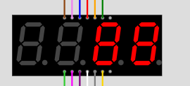
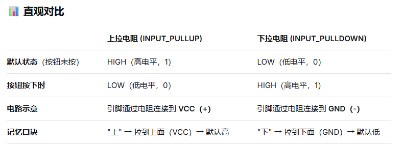
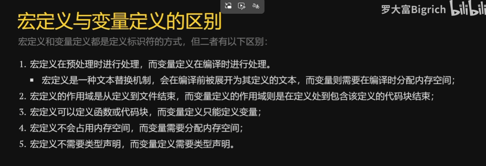
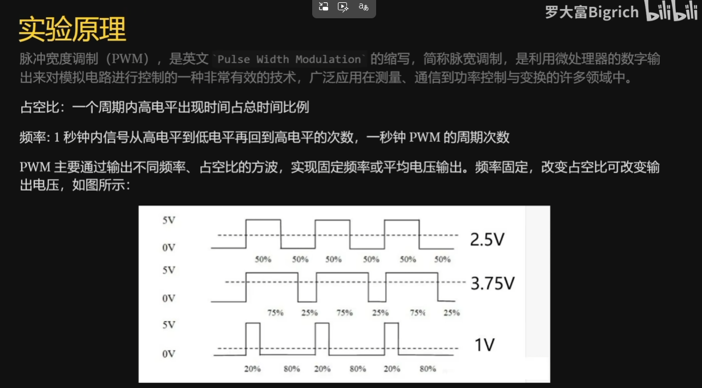
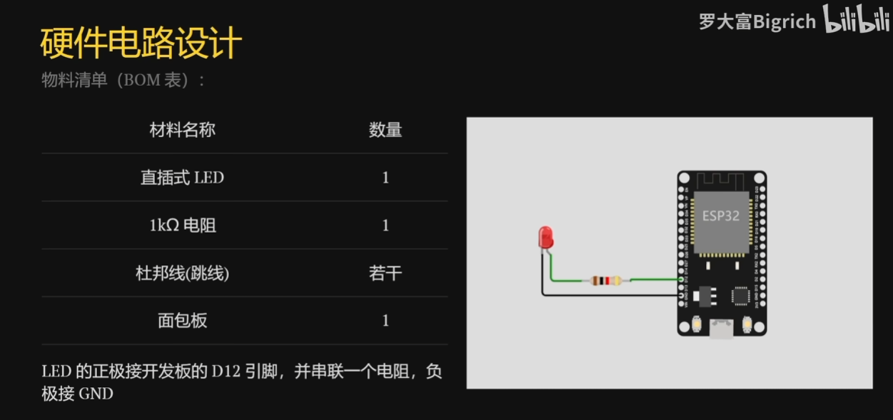
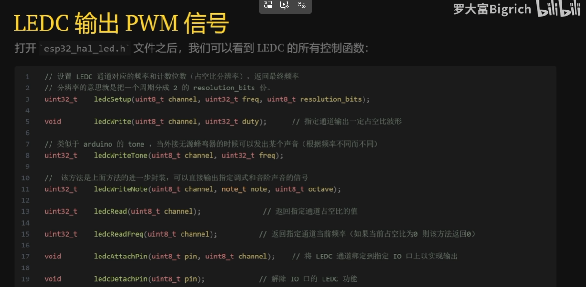

## 常用函数


## 面包板与杜邦线


## 点亮LED灯


### 练习


```c
// Arduino Blink Example
void setup() {
  pinMode(13, OUTPUT);
}

void loop() {
  digitalWrite(13, HIGH);
  delay(1000);
  digitalWrite(13, LOW);
  delay(1000);
}
```


## 数码管显示


电流从公共进就是共阳 从公共出就是共阴


## 4位数码管显示


```c
int seg_1 = 27;
int seg_2 = 14;
int seg_3 = 12;
int seg_4 = 13;

int pin_a = 26;
int pin_b = 33;
int pin_c = 4;
int pin_d = 2;
int pin_e = 15;
int pin_f = 25;
int pin_g = 16;
int pin_dp = 0;

int seg_list[4] = {seg_1, seg_2, seg_3, seg_4};
int pin_list[8] = {pin_a, pin_b, pin_c, pin_d, pin_e, pin_f, pin_g, pin_dp};

// 共阳极段码：0=亮，1=灭
int num_list[10][8] = {
  {0,0,0,0,0,0,1,1}, //0
  {1,0,0,1,1,1,1,1}, //1
  {0,0,1,0,0,1,0,1}, //2
  {0,0,0,0,1,1,0,1}, //3
  {1,0,0,1,1,0,0,1}, //4
  {0,1,0,0,1,0,0,1}, //5
  {0,1,0,0,0,0,0,1}, //6
  {0,0,0,1,1,1,1,1}, //7
  {0,0,0,0,0,0,0,1}, //8
  {0,0,0,0,1,0,0,1}  //9
};

void setup() {
  Serial.end();
  // 位选初始化（全部关闭）
  for(int i = 0; i < 4; i++) {
    pinMode(seg_list[i], OUTPUT);
    digitalWrite(seg_list[i], LOW);  // 共阳极：低电平关闭
  }

  // 段选初始化（全部关闭）
  for(int i = 0; i < 8; i++) {
    pinMode(pin_list[i], OUTPUT);
    digitalWrite(pin_list[i], HIGH);  // 共阳极：高电平关闭
  }

  delay(1000);
}


void loop() {
  display_num(2,4);
  display_num(3,8);
}


void display_num(int order,int num){
  // 重新初始化消隐
  // 位选初始化（全部关闭）
  for(int i = 0; i < 4; i++) {
    pinMode(seg_list[i], OUTPUT);
    digitalWrite(seg_list[i], LOW);  // 共阳极：低电平关闭
  }

  // 段选初始化（全部关闭）
  for(int i = 0; i < 8; i++) {
    pinMode(pin_list[i], OUTPUT);
    digitalWrite(pin_list[i], HIGH);  // 共阳极：高电平关闭
  }

  digitalWrite(seg_list[order], HIGH);

  for(int i = 0;i<sizeof(pin_list)/sizeof(pin_list[0]);i++){
    digitalWrite(pin_list[i],num_list[num][i]);
  }
}
```



串扰，需要重新初始化位选线、段选线来消隐

## 动态扫描

### 核心思想

**利用人眼的视觉暂留效应**，快速轮流点亮各位数码管，让人感觉所有位同时亮。

### 工作流程

text

```
第1位亮 → 熄灭 → 第2位亮 → 熄灭 → 第3位亮 → 熄灭 → 第4位亮 → 熄灭 → 回到第1位
  ↑                                                            ↓
  └────────────────────── 循环周期（例如20ms）────────────────────┘
```

```c
int seg_1 = 27;
int seg_2 = 14;
int seg_3 = 12;
int seg_4 = 13;

int pin_a = 26;
int pin_b = 33;
int pin_c = 4;
int pin_d = 2;
int pin_e = 15;
int pin_f = 25;
int pin_g = 16;
int pin_dp = 0;

int seg_list[4] = {seg_1, seg_2, seg_3, seg_4};
int pin_list[8] = {pin_a, pin_b, pin_c, pin_d, pin_e, pin_f, pin_g, pin_dp};

// 共阳极段码：0=亮，1=灭
int num_list[10][8] = {
  {0,0,0,0,0,0,1,1}, //0
  {1,0,0,1,1,1,1,1}, //1
  {0,0,1,0,0,1,0,1}, //2
  {0,0,0,0,1,1,0,1}, //3
  {1,0,0,1,1,0,0,1}, //4
  {0,1,0,0,1,0,0,1}, //5
  {0,1,0,0,0,0,0,1}, //6
  {0,0,0,1,1,1,1,1}, //7
  {0,0,0,0,0,0,0,1}, //8
  {0,0,0,0,1,0,0,1}  //9
};

void setup() {
  // 位选初始化（全部关闭）
  for(int i = 0; i < 4; i++) {
    pinMode(seg_list[i], OUTPUT);
    digitalWrite(seg_list[i], LOW);  // 共阳极：低电平关闭
  }

  // 段选初始化（全部关闭）
  for(int i = 0; i < 8; i++) {
    pinMode(pin_list[i], OUTPUT);
    digitalWrite(pin_list[i], HIGH);  // 共阳极：高电平关闭
  }
}


void loop() {
  display_arr(1234);
}

// 动态扫描
void display_arr(int num){

  int arr[4];
  for(int i = 3;i>=0;i--){
    arr[i] = num % 10;
    num /=10;
  }

  for(int j = 0;j<4;j++){
    display_num(j,arr[j]);
    delay(5);
  }
}

void display_num(int order,int num){
  // 方法1：直接控制（简单）
  // 位选初始化（全部关闭）
  for(int i = 0; i < 4; i++) {
    digitalWrite(seg_list[i], LOW);  // 共阳极：低电平关闭
  }

  // 段选初始化（全部关闭）
  for(int i = 0; i < 8; i++) {
    digitalWrite(pin_list[i], HIGH);  // 共阳极：高电平关闭
  }

  digitalWrite(seg_list[order], HIGH);

  for(int i = 0;i<sizeof(pin_list)/sizeof(pin_list[0]);i++){
    digitalWrite(pin_list[i],num_list[num][i]);
  }
}
```


## 按键实验




```c
int led_pin = 15;
int button_pin = 12;


void setup() {
  pinMode(button_pin, INPUT_PULLDOWN);
  pinMode(led_pin, OUTPUT);
}

int led_logic = 0; // led高低电平
bool status = false; // 按钮状态

void loop() {
  if(digitalRead(button_pin)){
    delay(10); // 消抖
    if(digitalRead(button_pin) && !status){
      led_logic = !led_logic;
      digitalWrite(led_pin,led_logic);
      status = !status;
    }else if(!digitalRead(button_pin)){
      status = false;
    }
  }
}

```

## 宏定义

宏定义用于创建常量和代替符号

```
#define LED_PIN 15;
#define BUTTON_PIN 12;
```



## PWM呼吸灯





```
#define LED_PIN 12

void setup() {
  pinMode(LED_PIN, OUTPUT);
}

void loop() {
  // 渐亮：从暗到亮
  for(int i = 0; i < 256; i++){
    analogWrite(LED_PIN, i);
    delay(10);  // 每步延时10毫秒，让变化可见
  }
  
  // 渐暗：从亮到暗
  for(int i = 255; i >= 0; i--){
    analogWrite(LED_PIN, i);
    delay(10);  // 每步延时10毫秒
  }
}
```



