# Dart

## 数据类型

1. 字符串：String
2. 数字：int（整型）/double（小数）/num（可整型可小数）
3. 布尔：bool
4. 列表：List
5. 字典：Map
6. 动态类型：dynamic

### String

#### 模板字符串

```dart
String 属性名 = '文本内容$变量名'; 或  String 变量名 = '文本内容${变量名}';
```

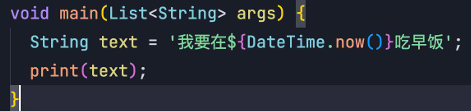

### 数字类型

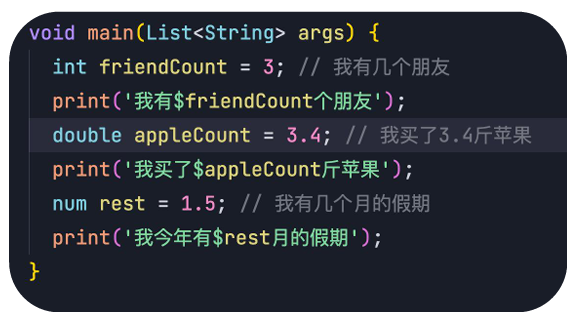

**注意：**

- double和int不能直接赋值

- num不能直接给int/double赋值

- int/double可直接给num赋值

  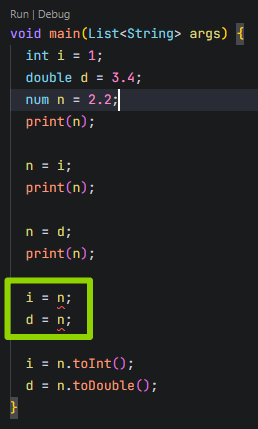

### List

#### List的常用操作方法 

- 在尾部添加-add(内容)
- 在尾部添加一个列表-addAll(列表) 
- 删除满足内容的第一个-remove(内容) 
- 删除最后一个-removeLast()
- 删除索引范围内数据-removeRange(start,end) 
  - 注意：end不包含在删除范围内

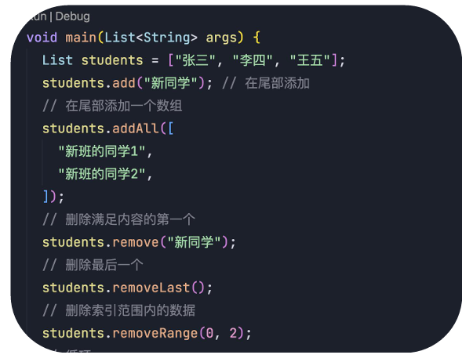

#### List的常用操作方法和属性 

- 循环-forEach((item) {}); 
- 是否都满足条件-every((item) { return 布尔值  })；
- 筛选出满足条件的数据-where((item) { return 布尔值 })；
- 列表的长度(属性)-length 
- 最后一个元素(属性)-last
- 第一个元素(属性)-first
- 是否为空(属性)-isEmpt

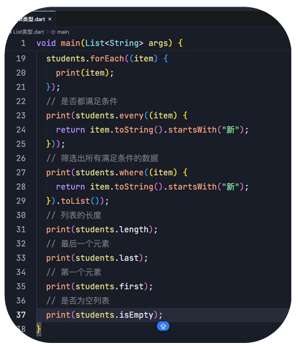

### Map

#### 语法

```dart
Map 属性名 =  { key: value }; 
字典[key] // 可以取值和赋值
```

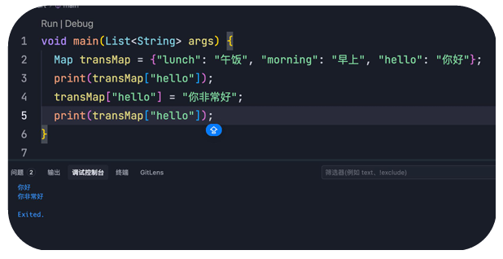

#### Map的常用操作方法 

- 循环-forEach
- 在添加一个字典-addAll
- 是否包含某个key-containsKey 
- 删除某个key-remove
- 清空-clear

### dynamic

- 定义：Dart语言中，dynamic用来声明动态类型
- 特点：允许变量运行时自由改变类型, 同时绕过编译时的静态检查
- 语法：`dynamic  属性名 = 值;`

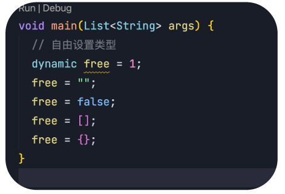

#### dynamic和var的区别 

- dynamic： 运行时可自由改变类型，无编译检查，方法和属性直接调用
- var：根据初始值进行推断类型，确定类型后类型确定，有编译检查，仅限推断的属性和方法

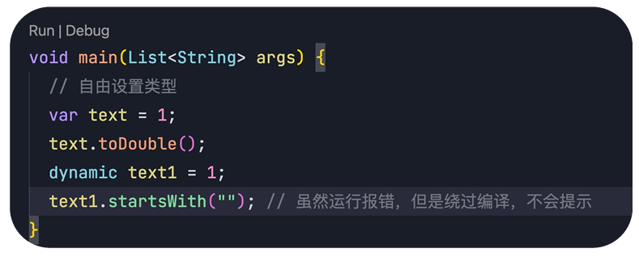

## Dart的空安全机制

### Dart中的空安全机制

- 定义：在Dart语言中，通过编译静态检查将运行时空指针提前暴露

- 特点：将空指针异常从运行时提前至编译时，减少线上崩溃

- 常用空安全操作符

  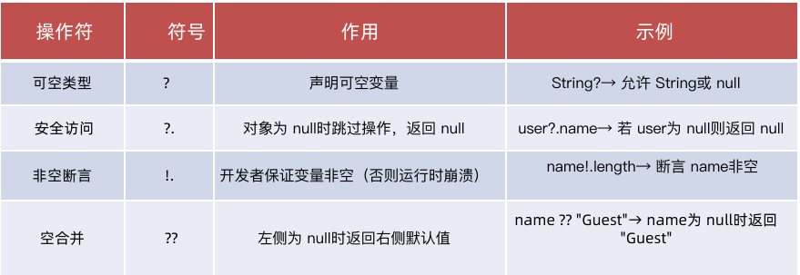

  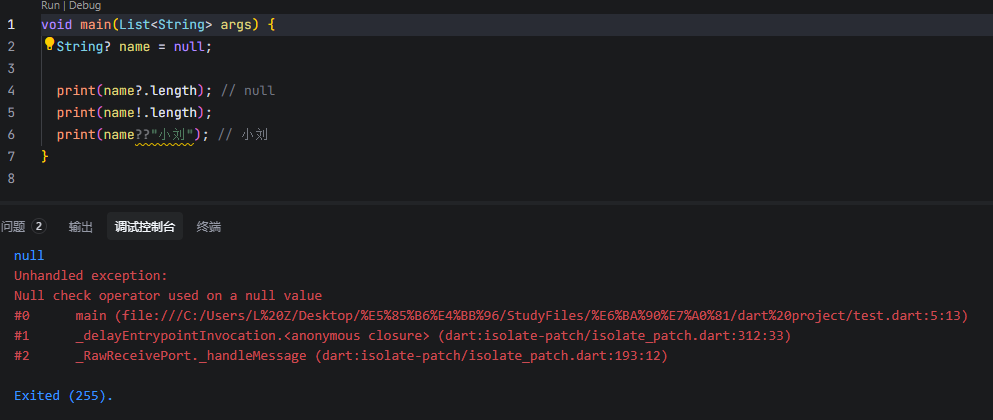

## Dart的运算符

### Dart中的常用运算符

#### 算数运算符

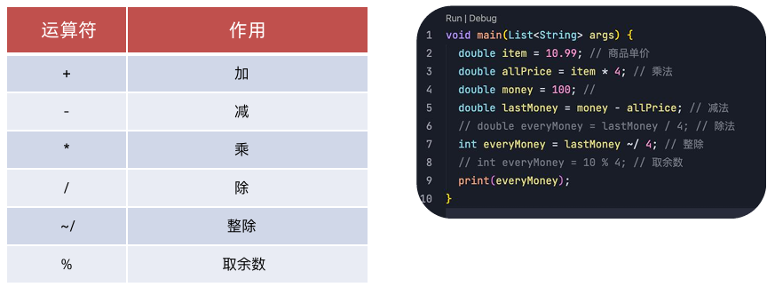

#### 赋值运算符

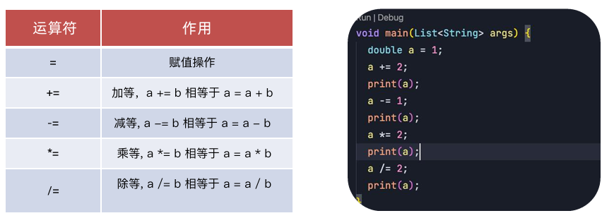

## Dart的函数

### 函数的参数-可选位置参数

- 特点：可选位置参数必须位于必传参数后面, 采用中括号包裹 
- 语法：`函数名(String a, [ String? b, ... ])`，传递时按照顺序传递
- 适用场景：参数少且顺序固定时
- 默认值：可选参数可以设置默认值

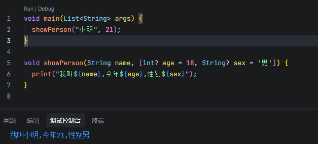

### 函数的参数-可选命名参数

- 特点：可选命名参数必须位于必传参数后面, 采用大括号包裹
- 语法：`函数名(String a, { String? b, ...})`，传递时按照`参数名:值`的方式进行传递，无需关注顺序
- 适用场景：参数多且需明确含义时
- 默认值：可选参数可以设置默认值

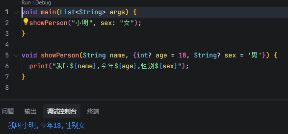

### 匿名函数

- 特点：可以声明一个没有名称的函数赋值给变量，进行调用
- 语法： `Function 变量名 = () { }`; 
- 注意：函数的类型使用Function来声明

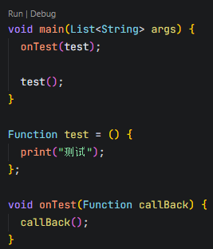

### 箭头函数

- 特点：当函数体只有一行代码时，可以使用箭头函数编写
- 语法：`函数名 () => 代码逻辑`
- 注意：使用箭头函数可以省略return关键字

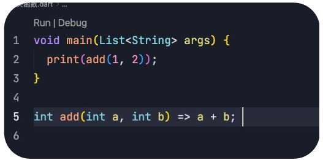

## Dart的类

- 定义：Dart语言中，类(class)是面向对象编程的核心，类包含属性和方法来定义对象的行为和状态
- 需求： 定义一个Person类，属性包括姓名、年龄、性别，包括学习的方法
- 定义类语法： `class  Person  {  属性 方法   }`
- 实例化对象： `Person  变量 =  Person(); `
- 属性和方法： `变量.属性/方法()`

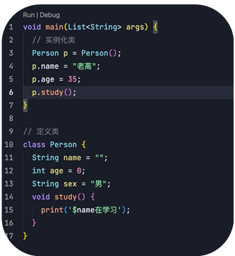

### 构造函数-默认构造函数

- 定义：实例化对象的时候，使用构造函数直接给对象中的属性赋值

- 常见分类： 默认构造函数、命名构造函数、构造函数的语法糖

- 定义语法：

  ```
  class 类名 {
      类名(可选命名参数) {
  }  
  ```

- 实例化语法：`Person p = Person(属性: 值)`

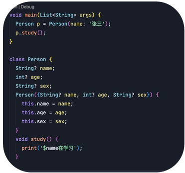

### 构造函数-命名构造函数

- 定义：构造函数可以采用命名的方式，返回一个实例化对象

- 定义语法：

  ```
  class 类名 {
       类名.构造函数名(可选命名参数) {
  }
  ```

- 实例化语法：`Person p = Person.构造函数名(属性: 值) `

- 注意：默认构造函数和命名构造函数可同时存在

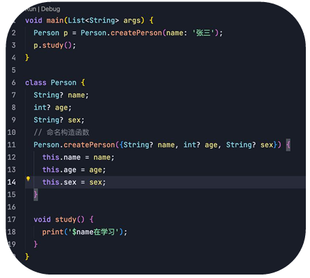

### 构造函数-构造函数语法糖 

- 定义：同名构造函数和命名构造函数都支持简写写法

- 语法：

  ```
  class 类名 {
      类名({  this.属性1，this.属性2  });
      或
      类名.命名函数({  this.属性1，this.属性2  });
  }
  ```

  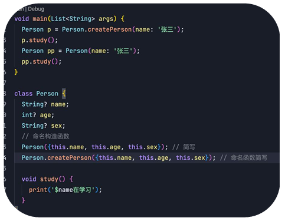

### Dart中类的公有属性和私有属性

- 公有属性，提供自身或者其他外部文件和类使用的属性和方法
- 私有属性，仅供自身使用的属性和方法，其他外部文件和类无法访问 
- 语法：私有属性以下划线开头， 如_name，其余均为公有属性

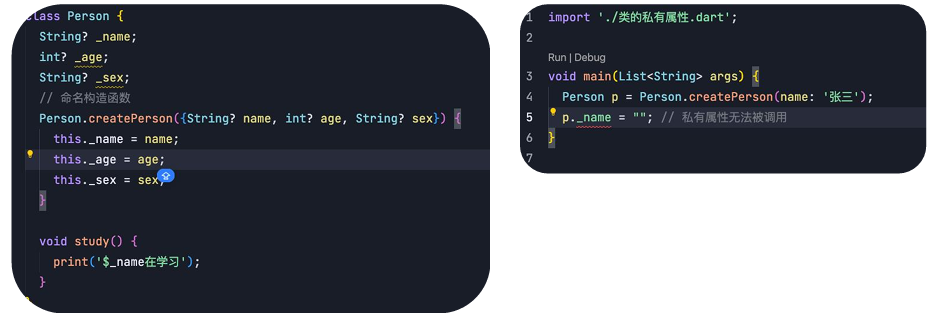

### Dart中类的继承

- 定义：继承是拥有父类的属性和方法

- 特点：dart属于单继承，一个类只能拥有一个直接父类， 子类拥有父类所有的属性和方法
- 语法：class 类名 extends 父类 
- 重写：子类可通过@override注解重写父类方法，扩展其行为
- 注意：子类不会继承父类构造函数，子类必须通过super关键字调用父类构造函数确保父类正确初始化 
- super语法：`子类构造函数(可选命名参数) : super({ 参数 })`

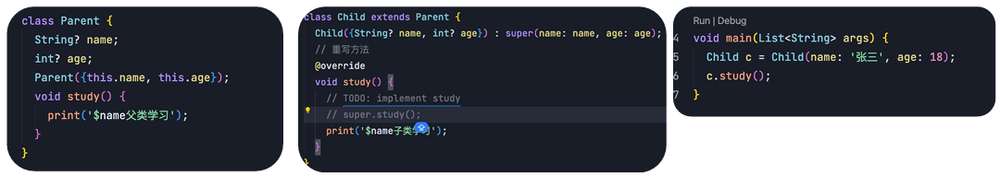

### Dart中类的多态-继承和方法重写

- 定义：Dart中的类的是指同一操作作用于不同的对象，可以产生不同的执行效果
- 场景：微信和支付宝都遵循同样支付接口，但实现逻辑不同，即同一个支付操作拥有不同的支付效果
- 实现方式：1.继承和方法重写 、2. 抽象类和接口 
- 需求：定义一个父类，分别实现微信和支付宝支付类，重写得到不同的支付逻辑

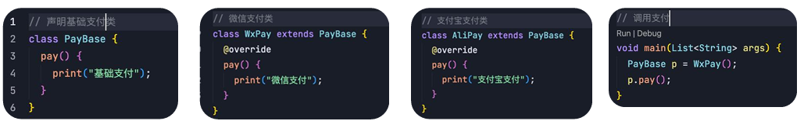

### Dart中类的多态-抽象类和接口实现

- 方式：使用abstract关键字声明一个抽象类(没有实现体)
- 方式：使用implements关键字继承并实现抽象类

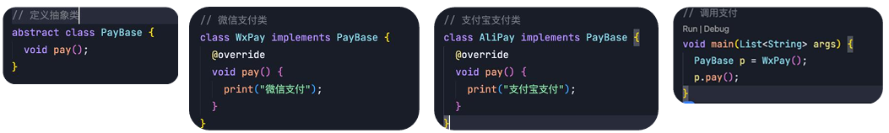

### Dart中类的混入

- 定义：Dart允许在不使用传统继承的情况下，向类中添加新的功能
- 方式：使用mixin关键字定义一个对象
- 方式：使用with关键字将定义的对象混入到当前对象
- 特点：一个类支持with多个mixin，调用优先级遵循“后来居上”原则，即后混入的会覆盖先混入的同名方法
- 需求：让一个学生类和一个老师类都拥有唱歌的方法

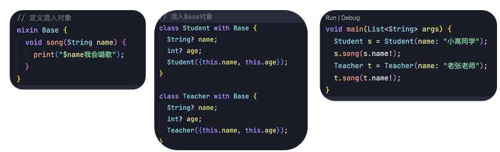

### Dart中泛型

- 定义：Dart允许使用类型参数，限定类型的同时又让类型更加灵活，让代码更加健壮和维护性更强
- 场景：List类型中只想存储String类型怎么办？函数中返回值希望和参数一个类型怎么办？
- 常见分类： 泛型集合、泛型方法、泛型类

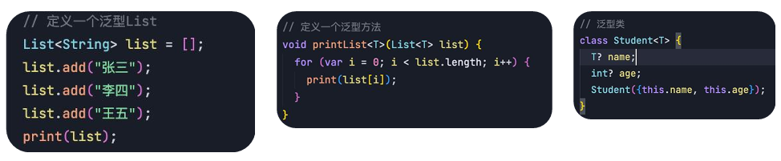

## Dart的异步编程

### 事件循环

- 介绍：Dart是单线程语言，即同时只能做一件事，遇到耗时任务就会造成程序阻塞，此时需要异步编程
- 定义：Dart采用单线程 + 事件循环的机制完成耗时任务的处理
- 事件循环：
  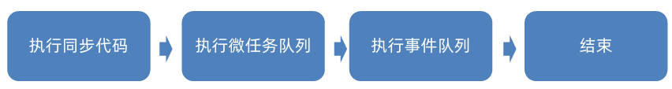
- 微任务队列：Future.microtask() 执行事件队列
- 事件队列：Future、Future.delayed()、I/O 操作(文件、网络) 等
- 微任务队列 + 事件队列都属于异步任务

### Future

- 介绍：Future代表一个异步操作的最终结果
- 状态：Uncompleted（等待）、Completed with a value (成功)、Completed with a error(失败)
- 创建：`Future(() {})`
- 执行成功：不抛出异常-成功状态-`then(() {})`
- 执行失败： `throw Exception()`-失败状态-`catchError(() {})`

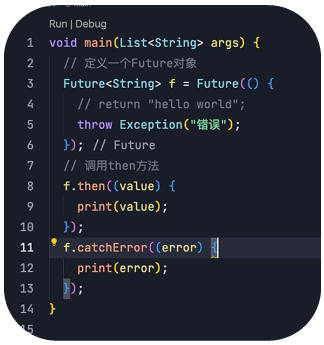

#### Future链式调用

- 介绍：Future可以通过链式的方式连续得到异步的结果
- 语法：通过`Future().then()`拿到执行成功的结果
- 语法：通过`Future().catchError()`拿到执行失败的结果
- 注意：在上一个then返回对象会在下一个then中接收
- 需求：执行三个异步任务，按照顺序排列，最后一次任务抛出异常

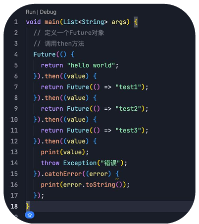

#### async/await

- 除了通过then/catchError的方式，还可以通过async/await来实现异步编程

- 特点:  await 总是等到后面的Future执行成功，才执行下方逻辑，async必须配套await出现

- 语法： 

  ```dart
  函数名 () async  {
      try {
          await Future()；
          // Future执行成功才执行的逻辑
          }
      catch(error) {
      // 执行失败的逻辑
      }
  }
  ```

  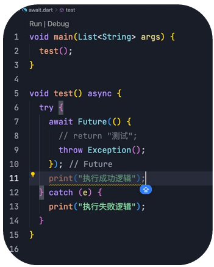

# Flutter

## 安装环境

###  下载Flutter SDK 

```
git clone  https://github.com/flutter/flutter.git
```

注意：务必将flutter包下载到英文目录

### 配置环境变量

1. 拷贝windows的flutter目录下的bin完整路径
   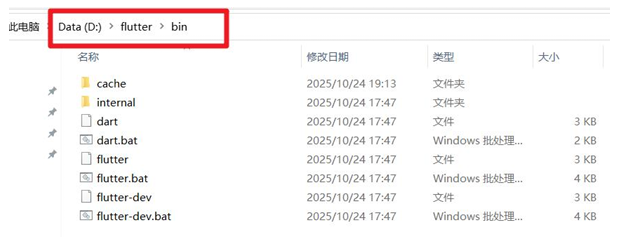
2. 打开环境变量配置
   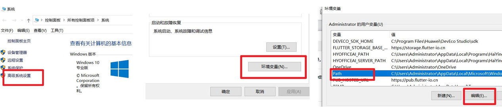
3. 在path路径中添加之前拷贝的bin路径
   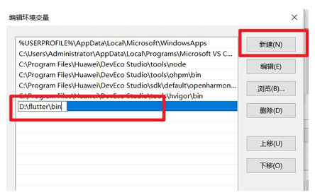
4. 添加两个环境变量PUB_HOSTED_URL和FLUTTER_STORAGE_BASE_URL
   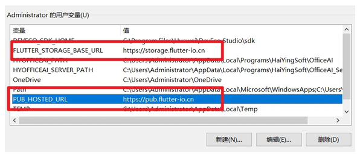

### 诊断flutter环境

1. 检查flutter版本 `flutter --version`
   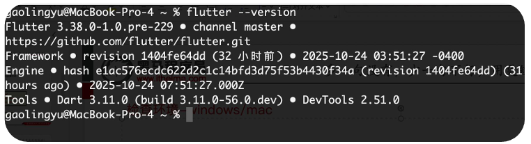
2. 诊断flutter环境   `flutter doctor -v`
   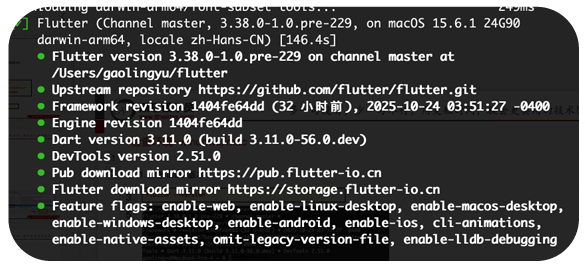

## 创建Flutter项目

- 使用命令创建Flutter工程(web)
  `flutter create --platforms web <项目名称>`

- 安装Trae插件
  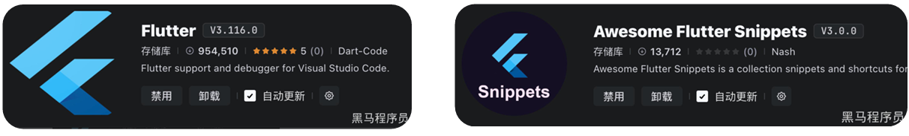

### 运行Flutter项目

- 打开lib/main.dart文件
  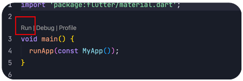

- 点击Run运行到浏览器
  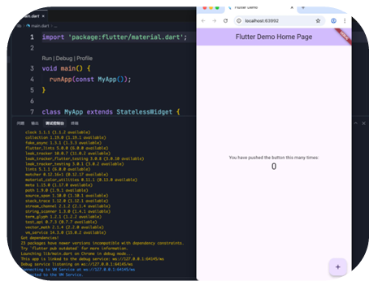

### 解析工程目录结构

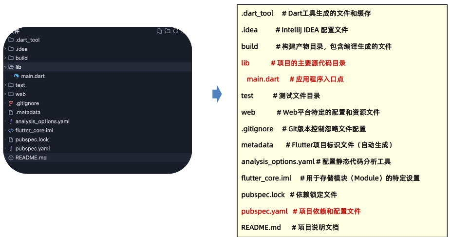

### 启动文说明-runApp和Widget

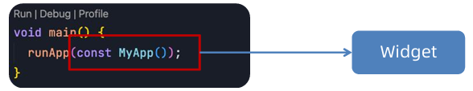

- runApp函数是Flutter内部提供的一个函数，启动一个Flutter应用就是从调用这个函数开始的
- Widget表示控件、组件、部件的含义， **Flutter中万物皆Widget**

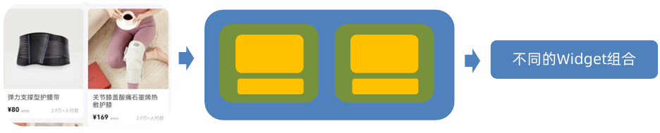

### Flutter的默认Material库

- Material是Google公司推行的一套设计风格，有很多的设计规范，如颜色、文字排版、动画等
- 目的：Material为Android、Web、iOS、HarmonyOS多个平台提供统一的交互和视觉体验

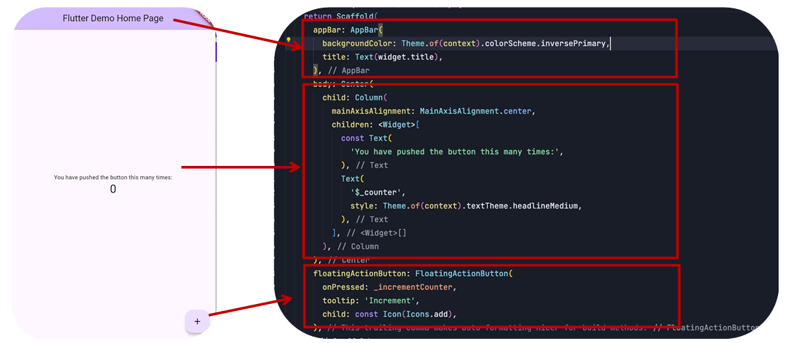

### 总结

- 启动Flutter应用使用runApp方法
- runApp方法中需要传入一个Widget
- Widget是组成Flutter的重要一部分，万物皆Widget
- Material风格是Flutter内置的一套独有的设计风格，里面有很多拆箱可用的Widget

## Flutter组件初体验

### 基础组件-MaterialApp

- 特性: 整个应用被MaterialApp包裹，方便我们对整个应用的属性进行整体设计
- 常见属性： title/theme/home
  - title:  用来展示窗口的标题内容（可以不设置）
  - theme：用来设置整个应用的主题
  - home: 用来展示窗口的主体内容

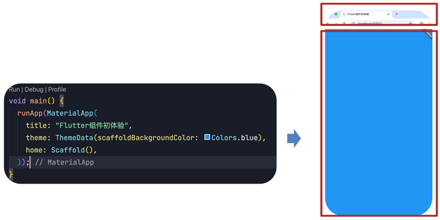

### 基础组件-Scaffold组件

Scaffold:  用于构建Material Design风格页面的核心布局组件，提供标准、灵活配置的页面骨架


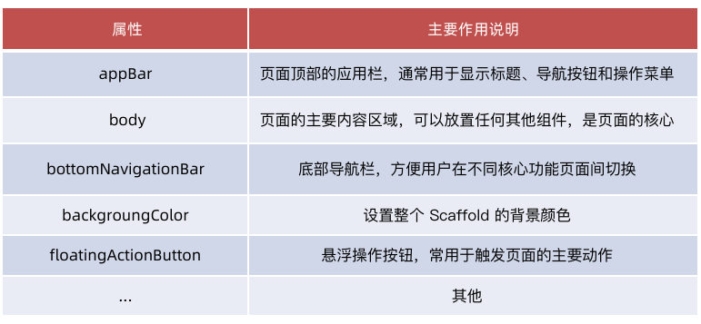

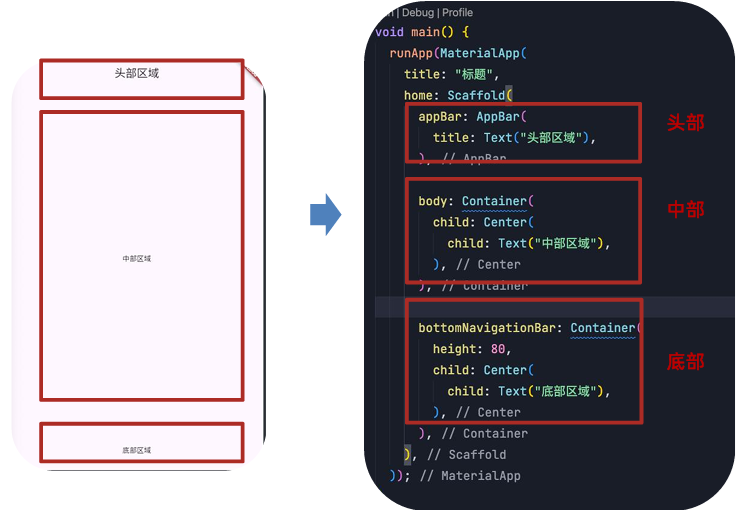

### 总结

- MaterialApp包裹整个应用形成统一的Material Design风格
- Scoffold组件可快速搭建页面骨架，如appBar、body、bottomNavigationBar等
- Container用来作为容器，设置高度(height)，child用来存放子组件
- Text是用来显示文本的组件

## Flutter自定义组件-无状态组件和有状态组件

- 定义： 根据自己特定的需求创建自己的Widget
- 分类： Flutter分为无状态组件和有状态组件

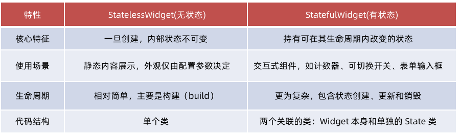

### 无状态组件-StatelessWidget

- 定义： 创建一个新的类，**继承StatelessWidget类并实现build方法**
- 要点： build返回一个Widget
- 场景： 纯展示型组件，没有用户交互操作
- 需求： 把之前案例的骨架换成无状态组件

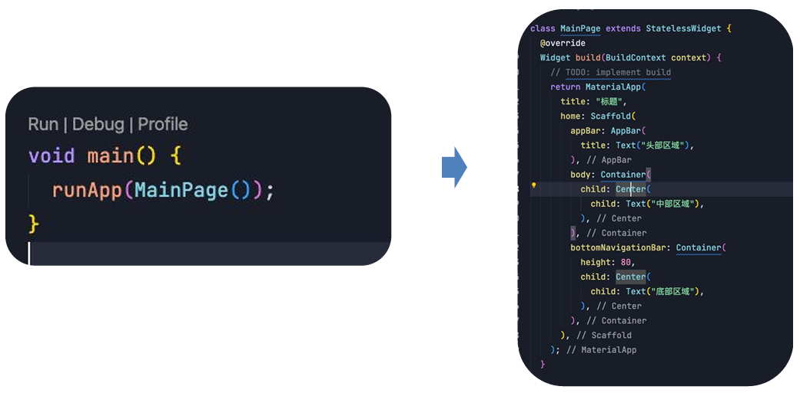

### 有状态组件-StatefulWidget

- 定义： 有状态组件是构建动态交互界面的核心, 能够管理变化的内部状态，当状态改变时，组件会更新显示内容
- 实现1：创建两个类，第一个类继承StatefulWidget类，主要接收和定义最终参数，核心作用是创建State对象 
- 实现2：第二个类继承State<第一个类名>，负责管理所有可变的数据和业务逻辑，并实现build构建方法
- 要点： build方法需要返回一个Widget 
- 需求： 将之前骨架组件换成有状态组件

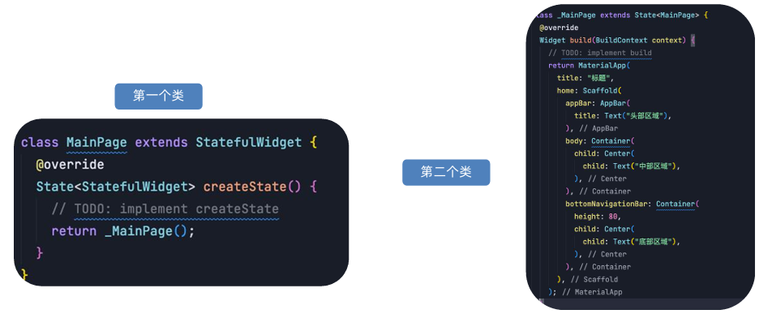

### 组件生命周期-无状态组件

- 无状态组件-唯一阶段 `build方法`
- 当组件被创建或父组件状态变化导致其需要重新构建时，build方法会被调用
  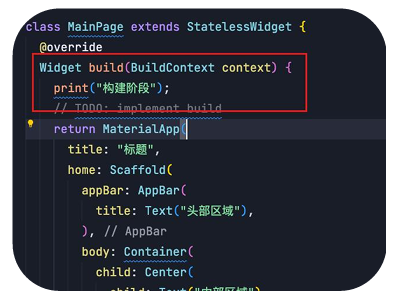

### 组件生命周期-有状态组件

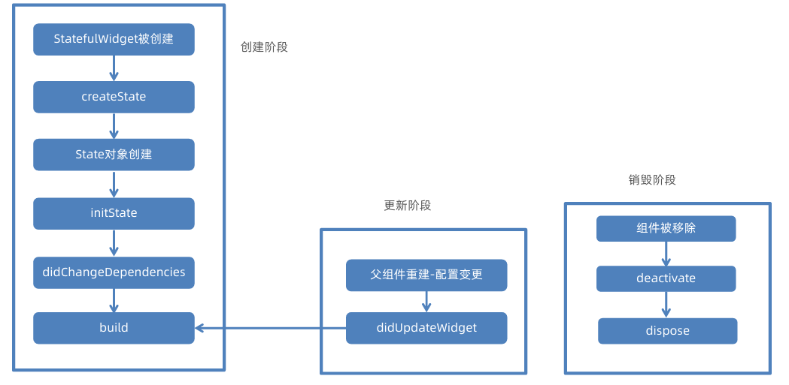

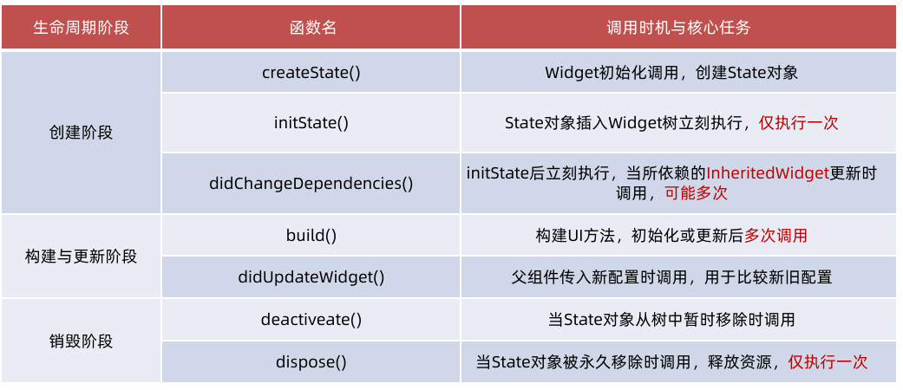

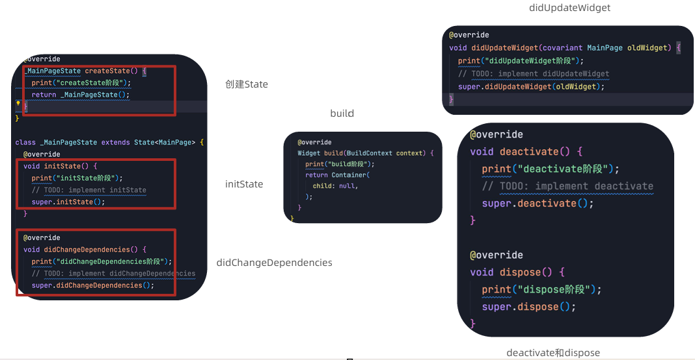

### 总结

- 无状态组件-build 
- 有状态组件(创建阶段)： createState -> initState -> didChangeDependencies -> build
- 有状态组件(更新阶段)： didUpdateWidget -> build
- 有状态组件(销毁阶段)： deactivate -> dispose 
- 执行一次函数：createState、initState、dispose
- InheritedWidget：专门用于在  Widget 树中自顶向下高效地共享数据，顶层组件提供数据，子孙节点直接获取

## 事件

### 点击事件GestureDetector

- 事件：用户与应用程序交互时触发的各种动作,比如触摸屏幕、滑动、点击等
- 点击事件： 当点击某个元素触发的动作
- 常规方案： GestureDetector是 Flutter 中最常用、功能最丰富的手势检测组件。
- 用法： 使用GestureDetector包裹被点击的元素，传入onTap方法

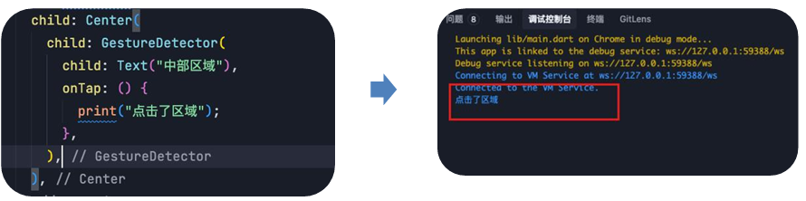

### 组件点击事件

组件：Flutter提供了多种方式为组件添加点击交互

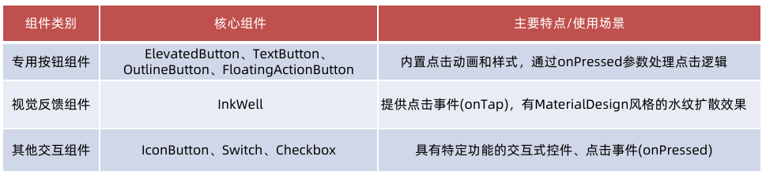

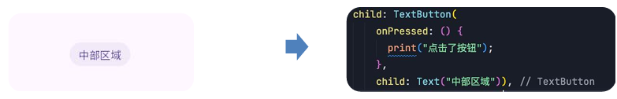

## Flutter组件

### 布局组件

Flutter 提供了丰富强大的布局组件来构建各种用户界面。下面这个表格汇总了最核心的几类布局组件

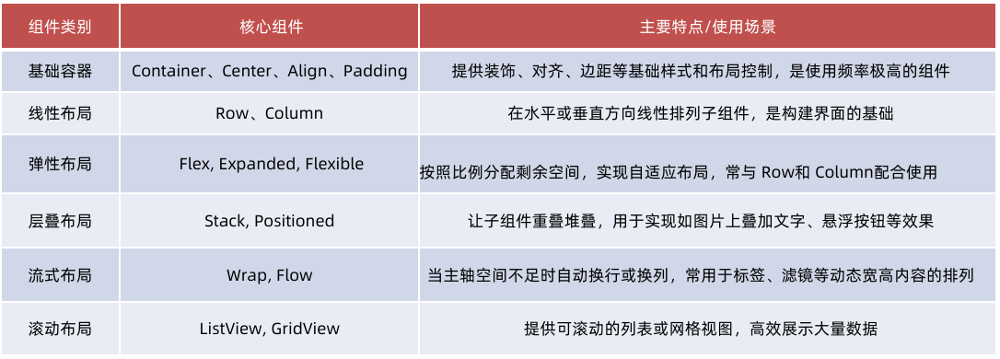

#### 基础容器-Container

- 定义： Container 是功能丰富的布局组件，是一个多功能组合容器，可以方便地容纳一个子组件，并对其施加各种样式、布局约束和变换
- 尺寸控制：可通过多种方式定义大小，有明确优先级规则。 
- 优先级：   明确宽高 > constraints约束 > 父组件约束 > 自适应组件大小 
- 装饰系统：通过decoration属性实现视觉效果，但和color属性互斥
- 布局控制：提供内外边距和对齐方式
- 可选变化：支持绘制时进行矩阵变换，如旋转、倾斜、平移等

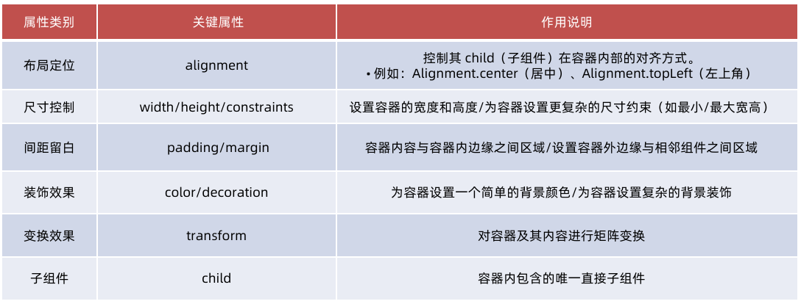

```dart
  @override
  Widget build(BuildContext context) {
    return MaterialApp(
      home: Scaffold(
        body: Center(
          child: Container(
            margin: EdgeInsets.all(20.0),
            width: 200,
            height: 200,
            decoration: BoxDecoration(
              color: Colors.blue,
              borderRadius: BorderRadius.circular(15.0),
              border: BoxBorder.all(color: Colors.amber, width: 3.0),
              boxShadow: [
                BoxShadow(
                  color: Colors.grey.withOpacity(0.5),
                  blurRadius: 5,
                  offset: Offset(2, 2),
                ),
              ],
            ),
            padding: EdgeInsets.all(30.0),
            transform: Matrix4.rotationZ(0.05),
            alignment: Alignment.center,
            child: Text(
              "Hello,Containert",
              style: TextStyle(color: Colors.white, fontSize: 18),
            ),
          ),
        ),
      ),
    );
  }
```

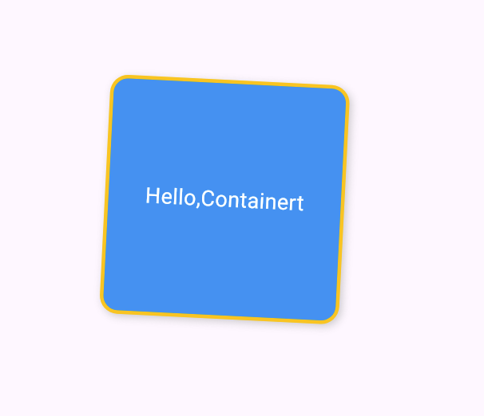

#### 基础容器-Center-居中组件

- Center： 将其子组件在父容器的空间内进行水平和垂直方向上的居中排列
- 应用场景： 页面内容整体居中，如将一个登录表单或一个加载中的提示图标在页面正中显示
- 注意事项：Center不能设置宽高，Center的最终大小取决于其父组件传递给它的约束, Center会向它的父组件申请尽 可能大的空间
- 实现固定宽高且居中的组件：Center去包裹一个具有固定宽高的子组件。Container/SizeBox

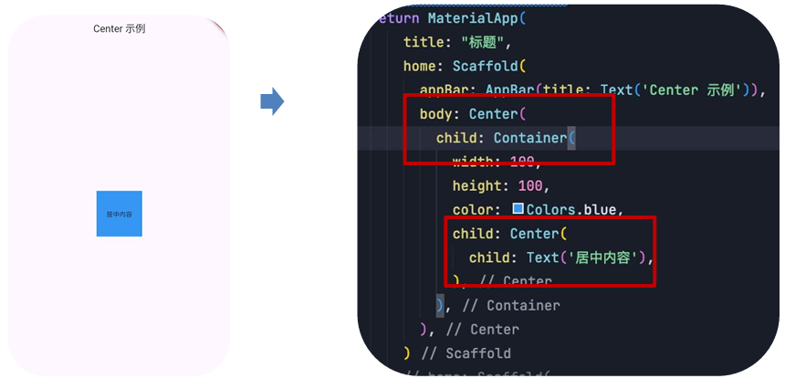

#### 基础容器-Align-对齐组件

- 作用：精确控制其子组件在父容器空间内的对齐位置
- alignment(对齐方式)：子组件在父容器内的对齐方式。
- widthFactor(宽度因子)：Align的宽度将是子组件宽度乘以该因子
- heightFactor(高度因子)：Align的高度将是子组件高度乘以该因子
- 与Center的区别：Center是 Align的一个特例，继承自 Align，相当于一个将 alignment属性为居中的Align.center
- 使用场景：当需要将一个组件放置在父容器的特定角落，Align是理想选择。
- 动态尺寸：通过 widthFactor和 heightFactor，可以创建出与子组件大小成比例的容器，动态布局中很有用

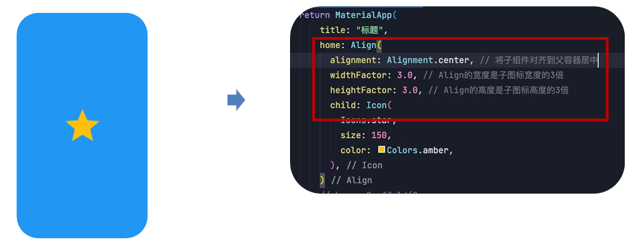

#### 基础容器-Padding-内边距组件

- 作用：为其子组件添加内边距
  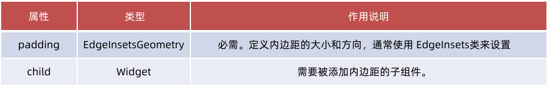

- 四个方向设置相同间距-使用EdgeInsets.all进行四个方向设置
  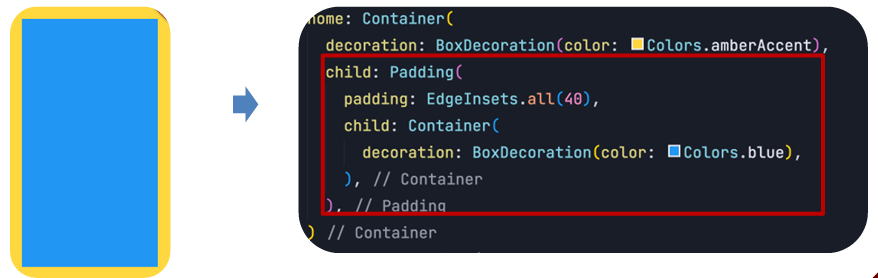

- 使用EdgeInsets.only属性进行单独的设置某个或某几个方向的边距

  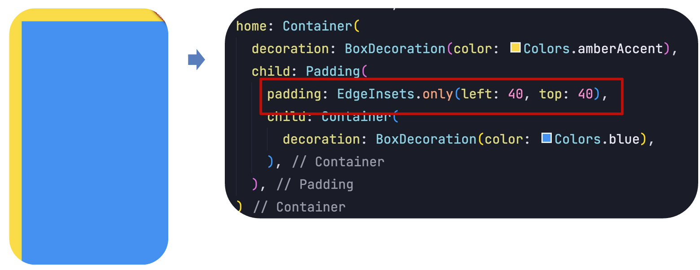

- 使用EdgeInsets.symmetric属性进行对称设置，vertical(纵向)、horizontal(横向)
  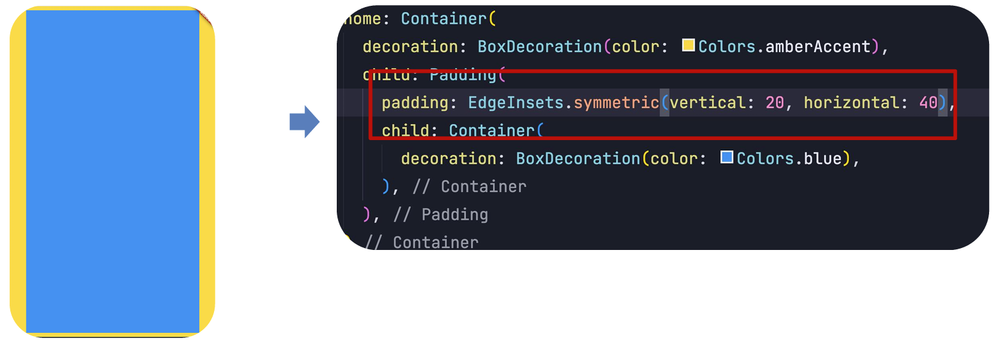

##### Padding-总结

- 特点：功能单一而纯粹，就是添加内边距。如果需求仅是为组件添加间距，那么直接使用 Padding组件 
- 区别：Container也有padding属性,单一需求用 Padding组件，复杂样式用 Container

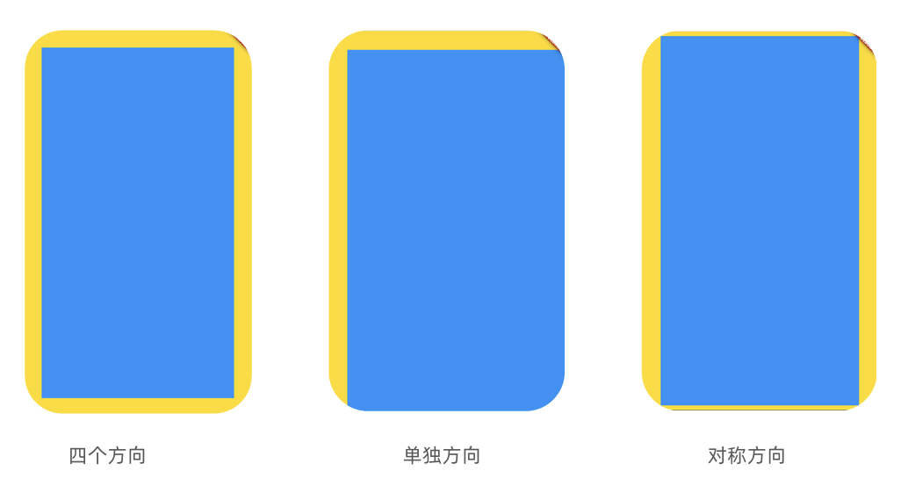

#### 线性布局-Column

- 作用：用于垂直排列其子组件的核心布局容器
  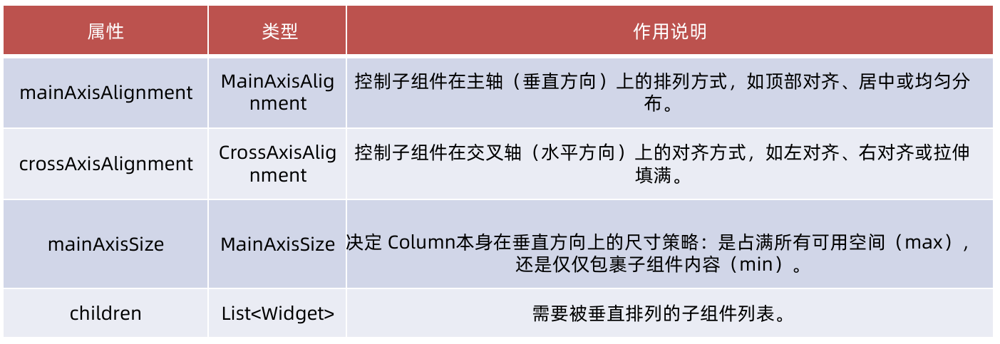

##### Column-主轴

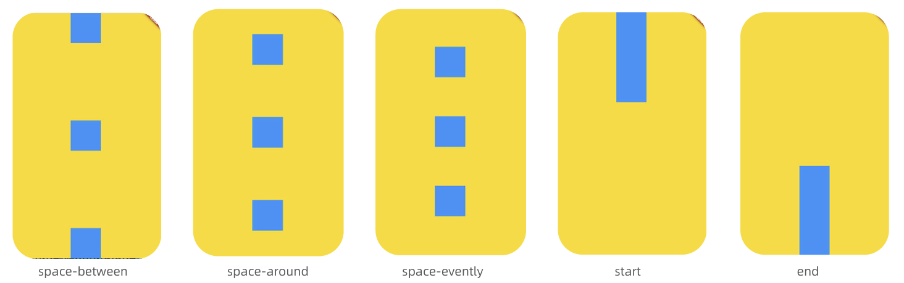

设置主轴-mainAxisAligment
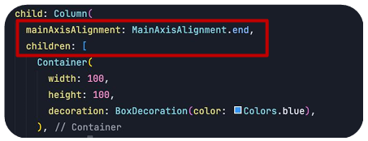

##### Column-交叉轴

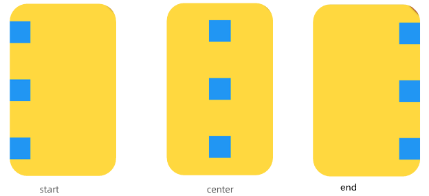

设置交叉轴-crossAxisAlignment

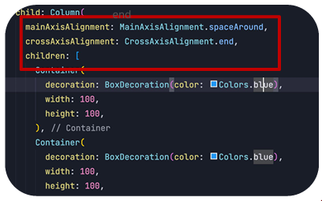

##### 总结

- 适用场景：几乎在所有需要垂直排列元素的界面中都能看到它的身影
  - 表单：如登录页面的用户名输入框、密码输入框和登录按钮的垂直排列。
  - 设置列表： 如设置页面中多个选项项的垂直堆叠。
  - 卡片布局： 如新闻流中多个新闻卡片的垂直排列。
  - 图文混排：如商品详情页的图片、标题、描述和价格等信息从上到下的展示。
- 注意事项：Column本身不支持滚动，如果内容超出，需要使用ListView或者SingleChildScrollView包裹                       明确尺寸约束，父组件的大小直接影响Column的最终大小和子组件的布局行为，避免过度嵌套，过深的嵌套会影响性能并增加代码维护难度

#### 线性布局-Row

- 作用：用于水平排列其子组件的核心布局容器
  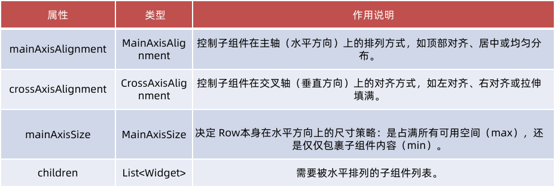

##### Row-主轴

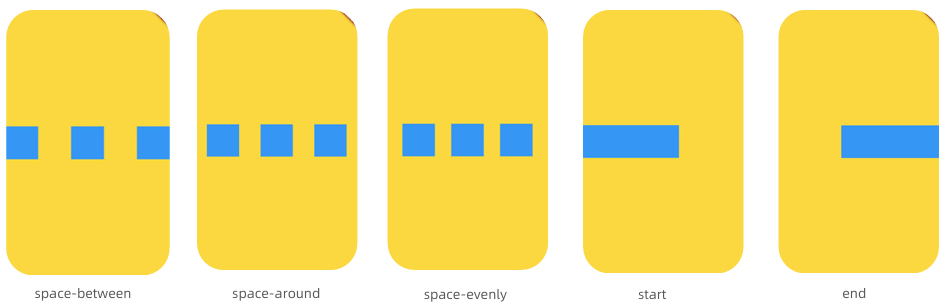

设置主轴-mainAxisAligment

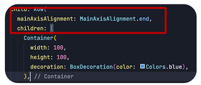

##### Row-交叉轴

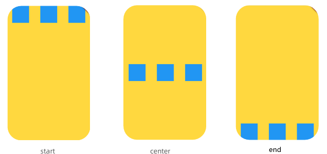

设置交叉轴-crossAxisAlignment

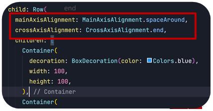

##### 总结

- 适用场景：几乎在需要水平排列元素的界面中都能看到它的身影
  - 导航栏：如顶部或底部的标签栏、按钮组
  - 图文混排： 如列表项左侧的图标与右侧的文本描述。
  - 表单行： 如标签和输入框的组合                         
- 注意事项：Row本身不支持滚动，如果内容超出，需要使用ListView或者SingleChildScrollView包裹                       明确尺寸约束，父组件的大小直接影响Row的最终大小和子组件的布局行为，避免过度嵌套，过深的嵌套会影响性能并增加代码维护难度

#### 弹性布局-Flex

- 作用：允许沿一个主轴（水平或垂直）排列其子组件，灵活地控制这些子组件在主轴上的尺寸比例和空间分配
  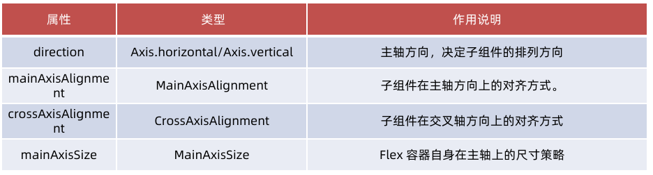
- 子组件：Flex的子组件常使用Expanded或Flexible来控制空间分配
- Flex是Column和Row的结合体

- Expanded/Flexible作为Flex的子组件通过flex属性来分配Flex组件空间
  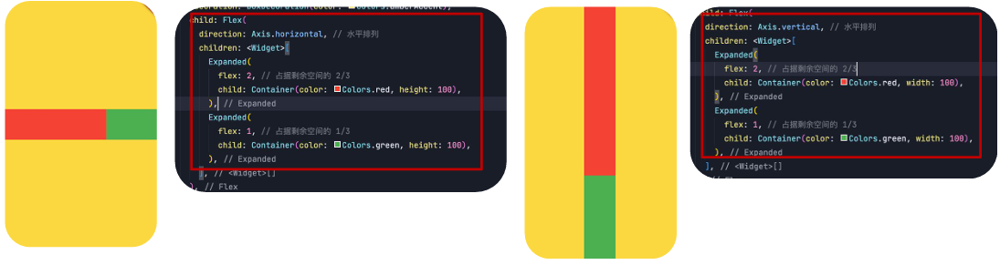
-  Flex 布局受其父组件传递的约束影响。确保父组件提供了适当的布局约束
- Expanded 与 Flexible 的区别: Expanded强制子组件填满所有剩余空间, Flexible根据自身大小调整,不强制占满空间
  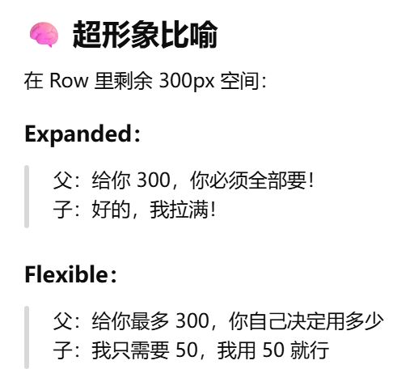

#### 流式布局-Wrap

- 作用：流式布局组件，当子组件在主轴方向上排列不下时，它会自动换行（或换列）
  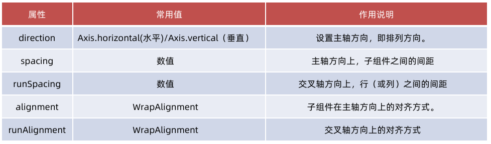
- 注意：Column/Row/Flex内容超出均不会换行 
- Wrap组件更像是‘ Flex组件加了换行特性’
- 当子组件内容是根据数据动态生成时，使用 Wrap 可以确保布局始终适配
  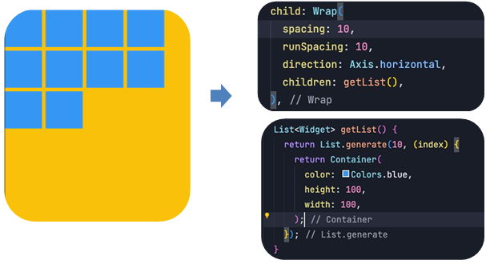
- List.generate是一个构造器，用于快速创建长度固定且每个元素可以通过索引号确定的列表 
  - 语法：`List.generate(int count, E generator(int index), {bool growable: false})`

#### 层叠布局-Stack/Positioned

- 作用：层叠布局组件，允许你将多个子组件按照 Z 轴（深度方向）进行叠加排列。
- Stack 中子组件分两类
  1. **定位子组件**：用了 `Positioned` → 不受 StackFit 控制
  2. **非定位子组件**：没用 `Positioned` → **受 StackFit 控制**
- 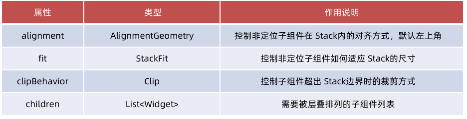
- 搭档：Positioned组件是 Stack的黄金搭档，对子组件进行精确定位控制。Positioned必须作为 Stack的直接子组件。 Positioned通过left、right、top、bottom 来将子组件“钉”在 Stack的某个角落或边缘

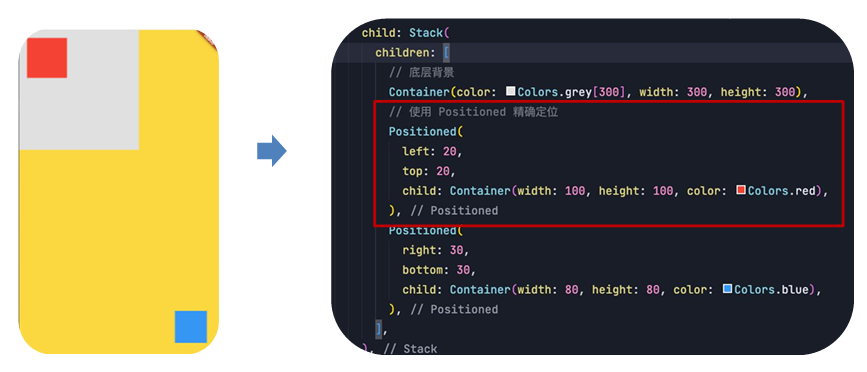

##### 总结

- 适用场景：几乎在叠加效果的界面中都能看到它的身影
  - 叠加效果：图像上的水印、文本、徽章。
  - 浮层交互： 如模态对话框、提示弹窗、操作菜单。
  - 悬浮按钮： 按钮悬浮在特定内容之上
- 注意事项：Stack中子组件的层叠顺序由其在 children列表中的顺序决定，明确尺寸约束，父组件的大小直接影响Stack的最终大小和子组件的布局行为，避免在 Stack中嵌套过多需要动态更新的子组件，保持渲染性能

#### 文本组件-Text

- 作用：在用户界面中显示文本的基础组件

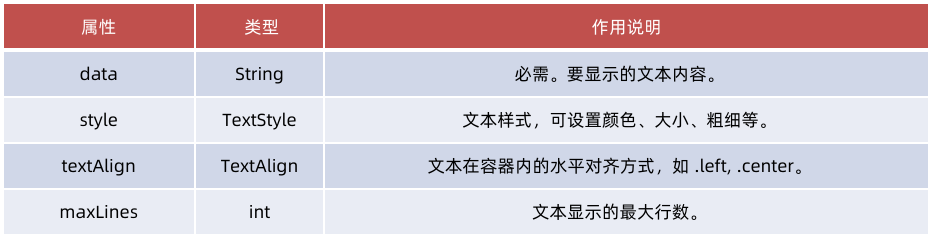

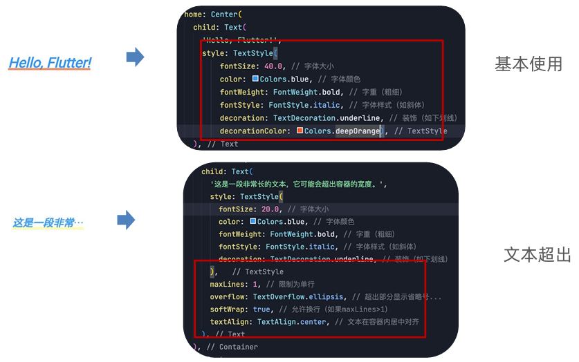

##### 文本组件-Text/TextSpan

- 如果需要在同一段文本中显示不同样式，可用Text.rich构造函数配合TextSpan来实现

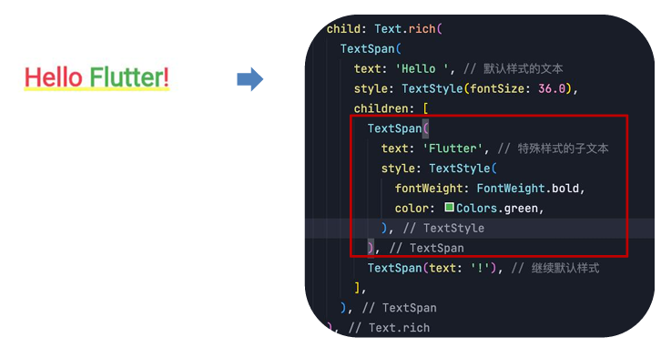

##### 总结

- 适用场景：所有的文本显示都需要Text组件
- 注意事项：Text组件本身和其 TextStyle中都可能有 overflow等属性,Text组件属性优先级更高 假如文本过长请务必设置 maxLines和 overflow。 大量重复使用的文本样式，建议统一定义， 有助于保持一致性并提升性能

#### 图片组件-Image

- 作用：在用户界面中显示图片的核心部件
- 图片分类：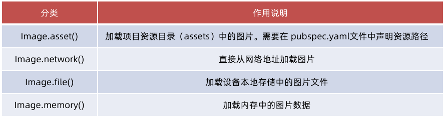
- 常用属性：
  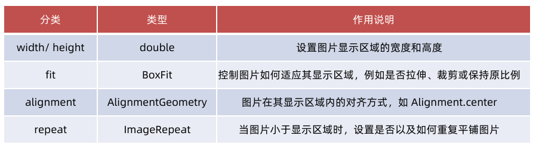

##### Image.asset

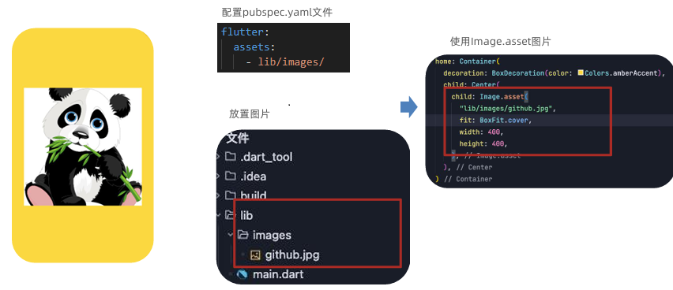

##### Image.network(网络图片)

- 注意：Android/HarmonyOS/iOS使用Image.network需要配置网络权限

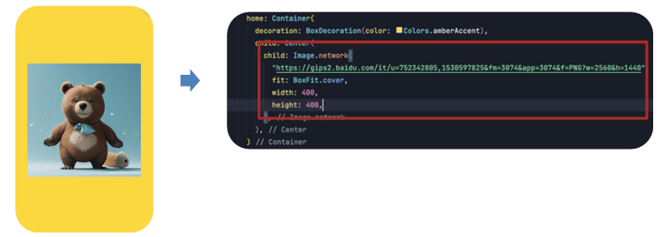

#### 文本输入组件-TextField

- 作用：实现文本输入功能的核心组件
- 使用： **使用TextField必须使用有状态组件**
  - **使用 TextEditingController管理输入内容、onChanged可以监听数据变化**
  - **decoration属性下的 InputDecoration来定制如 边框、背景、提示文字**
  - **obscureText设置为 true可隐藏输入内容，用于密码输入框**

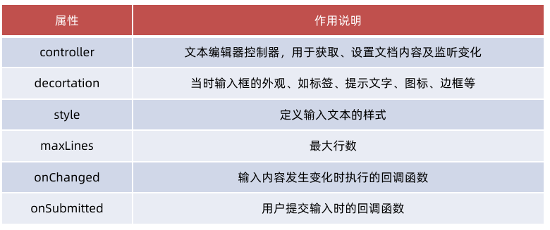

```dart
class MainPage extends StatefulWidget {
  MainPage({Key? key}) : super(key: key);

  @override
  _MainPageState createState() => _MainPageState();
}

class _MainPageState extends State<MainPage> {
  TextEditingController _phoneController = TextEditingController(); // 账号控制器
  TextEditingController _codeController = TextEditingController(); // 密码控制器

  @override
  Widget build(BuildContext context) {
    return MaterialApp(
      home: Scaffold(
        appBar: AppBar(
          title: Text("登录"),
        ),
        body: Container(
          padding: EdgeInsets.all(20),
          color: Colors.white,
          child: Column(
            children: [
              TextField(
                controller: _phoneController,
                onChanged: (value) {
                  print(value);
                },
                onSubmitted: (value) {
                  print(value);
                },
                decoration: InputDecoration(
                    contentPadding: EdgeInsets.only(left: 20), // 内容内边距
                    hintText: "请输入账号",
                    fillColor: const Color.fromARGB(255, 222, 219, 207),
                    filled: true,
                    border: OutlineInputBorder(
                        borderSide: BorderSide.none,
                        borderRadius: BorderRadius.circular(25))),
              ),
              SizedBox(height: 20),
              TextField(
                controller: _codeController,
                obscureText: true, // 不显示实际内容 用来做密码框显示
                decoration: InputDecoration(
                    contentPadding: EdgeInsets.only(left: 20), // 内容内边距
                    hintText: "请输入密码",
                    fillColor: const Color.fromARGB(255, 222, 219, 207),
                    filled: true,
                    border: OutlineInputBorder(
                        borderSide: BorderSide.none,
                        borderRadius: BorderRadius.circular(25))),
              ),
              SizedBox(height: 20),
              Container(
                height: 50,
                width: double.infinity,
                decoration: BoxDecoration(
                    color: Colors.black,
                    borderRadius: BorderRadius.circular(25)),
                child: TextButton(
                    onPressed: () {
                      print(
                          "登录-${_phoneController.text}-${_codeController.text}");
                    },
                    child: Text("登录", style: TextStyle(color: Colors.white))),
              )
            ],
          ),
        ),
      ),
    );
  }
}

```

#### 常用滚动组件

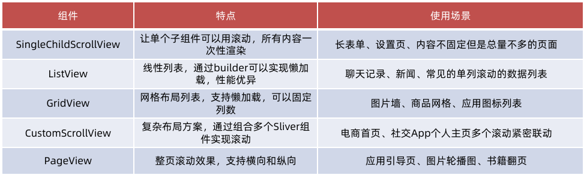

##### SingleChildScrollView

- 用法：包裹一个子组件，让单个子组件具备滚动能力。

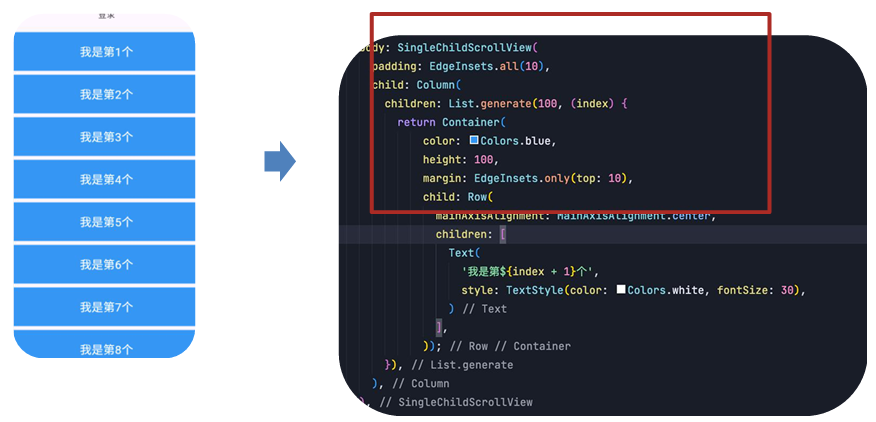

- controller：给组件的controller绑定ScrollController对象

```dart
class MainPage extends StatefulWidget {
  MainPage({Key? key}) : super(key: key);

  @override
  _MainPageState createState() => _MainPageState();
}

class _MainPageState extends State<MainPage> {
  ScrollController _controller = ScrollController(); //滚动条控制器
  @override
  Widget build(BuildContext context) {
    return MaterialApp(
      home: Scaffold(
        body: Stack(
          children: [
            SingleChildScrollView(
              controller: _controller,
              padding: EdgeInsets.all(20),
              child: Column(
                children: List.generate(100, (index) {
                  return Container(
                    margin: EdgeInsets.only(top: 10),
                    width: double.infinity,
                    color: Colors.blue,
                    height: 100,
                    child: Text(
                      "我是第${index + 1}个",
                      style: TextStyle(color: Colors.white, fontSize: 30),
                    ),
                    alignment: Alignment.center,
                  );
                }),
              ),
            ),
            // 放置堆叠组件
            Positioned(
              right: 10,
              top: 10,
              child: GestureDetector(
                onTap: () {
                  // print("去底部");
                  // _controller.jumpTo(
                  //     _controller.position.maxScrollExtent); // 滚动到底部
                  _controller.animateTo(
                    _controller.position.maxScrollExtent,
                    duration: Duration(seconds: 1),
                    curve: Curves.easeIn,
                  );
                },
                child: Container(
                  decoration: BoxDecoration(
                    color: Colors.red,
                    borderRadius: BorderRadius.circular(40),
                  ),
                  width: 80,
                  height: 80,
                  alignment: Alignment.center,
                  child: Text("去底部", style: TextStyle(color: Colors.white)),
                ),
              ),
            ),
            Positioned(
              right: 10,
              bottom: 10,
              child: GestureDetector(
                onTap: () {
                  // print("去顶部");
                  // _controller.jumpTo(0);
                  _controller.animateTo(
                    0,
                    duration: Duration(seconds: 1),
                    curve: Curves.bounceIn,
                  );
                },
                child: Container(
                  decoration: BoxDecoration(
                    color: Colors.red,
                    borderRadius: BorderRadius.circular(40),
                  ),
                  width: 80,
                  height: 80,
                  alignment: Alignment.center,
                  child: Text("去顶部", style: TextStyle(color: Colors.white)),
                ),
              ),
            ),
          ],
        ),
      ),
    );
  }
}
```

- 子组件：只能包含一个子组件，如果滚动多个组件，通常将其嵌套在Column或Row组件中
- 滚动方向：通过 scrollDirection属性控制，默认为垂直方向 (Axis.vertical)，也可设置为水平方向 (Axis.horizontal)
- 特点：一次性构建所有子组件，如果嵌套的 Column或 Row中包含大量子项，可能会导致性能问题，建议使用 ListView 
- 控制滚动： 绑定一个ScrollController对象给controller对象，使用animateTo/jumpTo方法控制滚动 
- 滚动到顶部： controller.jumpTo(0)
- 滚动到底部： controller.jumpTo(controller.position.maxScrollExtent)

##### ListView

- 作用：用于构建可滚动列表的核心部件,并提供流畅滚动体验
- 方式：提供多种构造函数，如默认构造函数、ListView.builder、ListView.separated
- 机制：采用按需渲染（懒加载），只构建当前可见区域的列表项，极大提升长列表性能
- 特点：默认构造函数适用于静态数量有限数据一次性构建所有表项

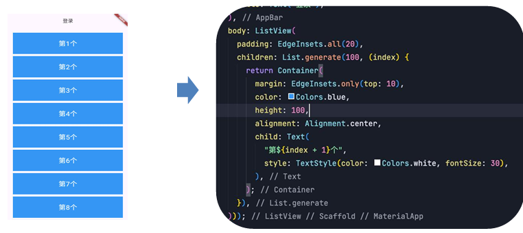

###### builder模式

- 作用：处理长列表或动态数据的首选和推荐方式
- 方式：接受一个 itemBuilder回调函数来按需构建列表项，通过itemCount控制列表长度
- 优势：按需构建，不会在初始化时将所有列表项都创建，而是根据用户的滚动行为，动态地创建和销毁列表项

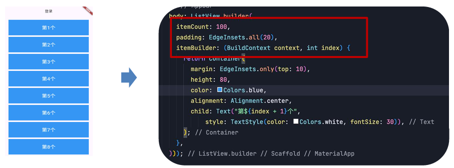

###### separated模式

- 作用：在 ListView.builder的基础上，额外提供了构建分割线的能力
- 方式：需要同时提供itemBuilder、separatorBuilder、itemCount三个属性

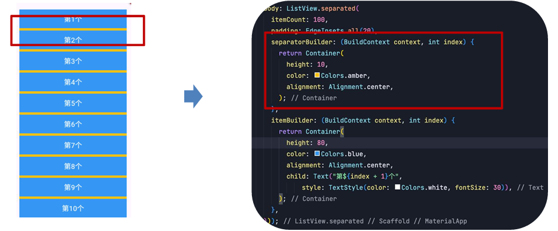

##### GridView

- 作用：用于创建二维可滚动网格布局的核心组件
- 方式：提供多种构建方式，GridView.count、GridView.extent、GridView.builder等
  - GridView默认构造方式-(写起来最过繁琐，很少使用)
  - GridView.count-基于固定列数的网格布局(最常用之一)
  - GridView.extent-基于固定子项最大宽度/高度的网格布局(最常用之二)
  - GridView.builder用于网格项数量巨大或动态生成的情况，需要接收gridDelegate布局委托属性
- gridDelegate：
  - SliverGridDelegateWithFixedCrossAxisCount：固定列数 
  - mainAxisSpacing  主轴间距 
  - SliverGridDelegateWithMaxCrossAxisExtent：最大宽度   
  - crossAxisSpacing  交叉轴间距 
  - scrollDirection设置滚动方向横向/纵向(默认)

###### GridView.count构造

- 作用：使用GridView.count创建固定列数网格

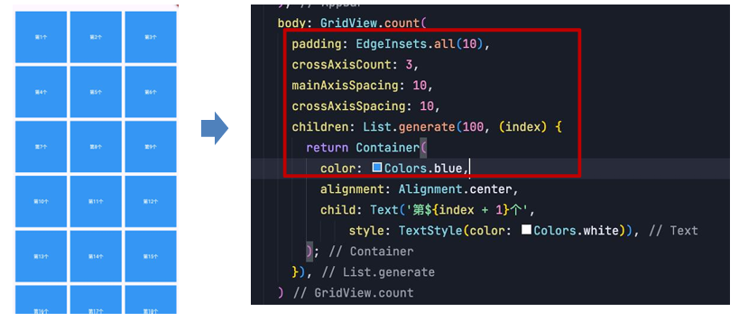

- GridView.count以列数为优先。指定网格多少列，Flutter 自动计算列的宽度，在空间内均匀排列

###### GridView.extent构造

- 作用：使用GridView.extent指定子项最大宽度或者高度

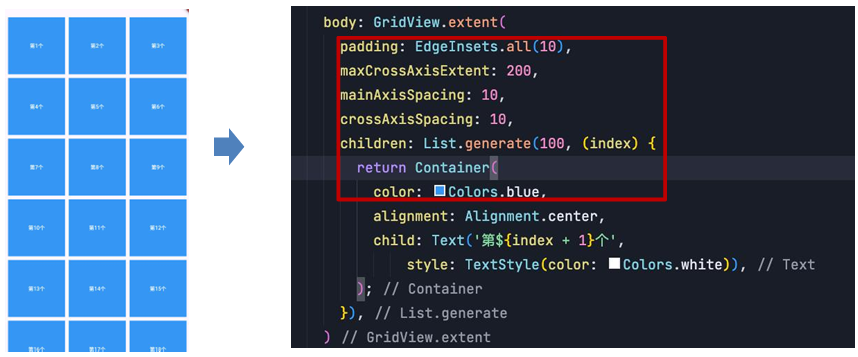

- GridView.extent通过maxCrossAxisExtent设置子项最大宽度/高度来计算横向或者纵向有多少列

###### GridView.builder构造

- 作用：使用GridView.builder实现动态长网格-(懒加载，只渲染可见区域)
- 注意：接收gridDelegate布局委托、itemBuilder构建函数、itemCount构建数量

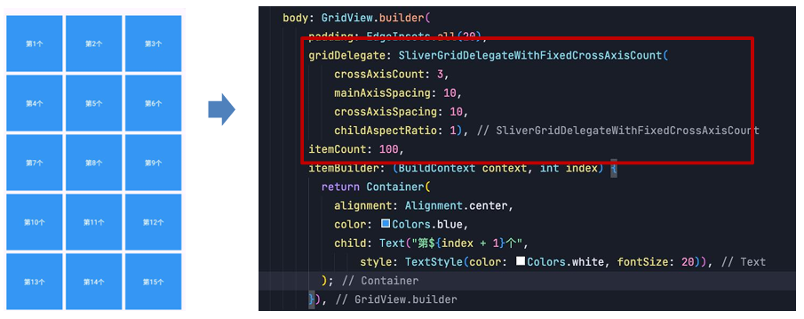

- gridDelegates属性: SliverGridDelegateWithFixedCrossAxisCount / SliverGridDelegateWithMaxCrossAxisExtent

##### 自定义滚动容器-CustomScrollView

- 作用：用于组合多个可滚动组件（如列表、网格），实现统一协调的滚动效果
- Sliver： Flutter 中描述可滚动视图内部一部分内容的组件，它是滚动视图的"切片"
- 用法：通过 slivers属性接收一个 Sliver 组件列表
- Siiver组件对应关系：
  -  SliverList => ListView
  -  SliverGrid => GridView
  -  SliverAppBar => AppBar
  - SliverPadding => Padding
  -  SliverToBoxAdapter => ToBoxAdapter (用于包裹普通 Widget）
  - SliverPersistentHeader(粘性吸顶)

###### 效果图

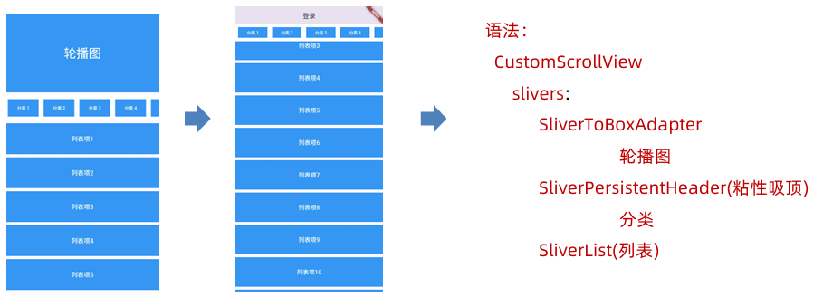

###### 案例代码实现-顶部轮播图

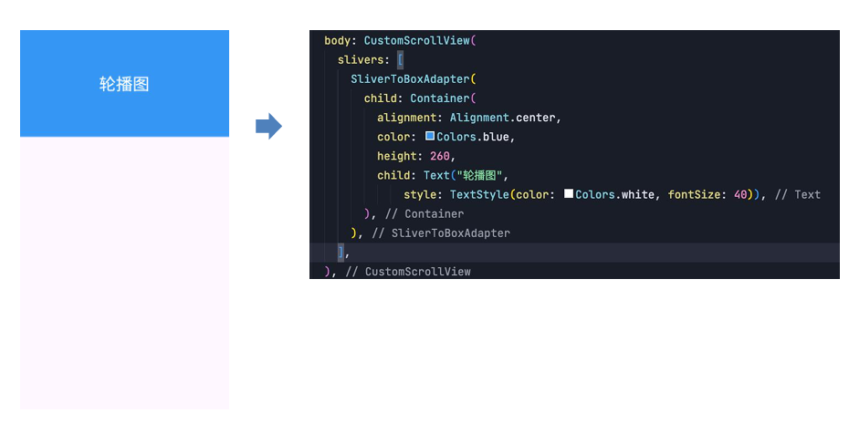

###### 案例代码实现-粘性吸顶分类SliverPersistentHeader

**SliverPersistentHeader：给delegate属性赋值一个继承SliverPersistentHeaderDelegate的对象实例**

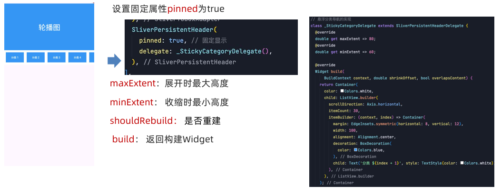

###### 案例代码实现-列表实现-SliverList.separated

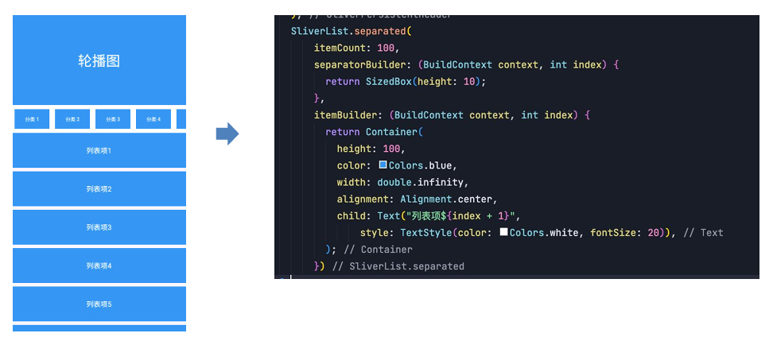

```dart

class MainPage extends StatefulWidget {
  MainPage({Key? key}) : super(key: key);

  @override
  _MainPageState createState() => _MainPageState();
}

class _MainPageState extends State<MainPage> {
  @override
  Widget build(BuildContext context) {
    return MaterialApp(
        home: Scaffold(
            body: CustomScrollView(
              slivers: [
                // 包裹普通Widget的东西
                SliverToBoxAdapter(
                  child: Container(
                    color: Colors.blue,
                    alignment: Alignment.center,
                    height: 260,
                    child: Text("轮播图",
                        style: TextStyle(color: Colors.white, fontSize: 30)),
                  ),
                ),
                SliverToBoxAdapter(
                    child: SizedBox(
                  height: 10,
                )),
                SliverPersistentHeader(
                  delegate: _StickyCategory(),
                  pinned: true, // 固定吸顶
                ),
                SliverToBoxAdapter(
                    child: SizedBox(
                  height: 10,
                )),
                SliverGrid.count(
                  crossAxisCount: 2,
                  mainAxisSpacing: 10,
                  crossAxisSpacing: 10,
                  children: List.generate(100, (index) {
                    return Container(
                      color: Colors.blue,
                      alignment: Alignment.center,
                      child: Text('列表项${index + 1}',
                          style: TextStyle(color: Colors.white, fontSize: 20)),
                    );
                  }),
                )
                // SliverList.separated(
                //     itemCount: 100,
                //     itemBuilder: (BuildContext context, int index) {
                //       return Container(
                //         height: 100,
                //         color: Colors.blue,
                //         alignment: Alignment.center,
                //         child: Text("列表项${index + 1}",
                //             style:
                //                 TextStyle(color: Colors.white, fontSize: 20)),
                //       );
                //     },
                //     separatorBuilder: (BuildContext context, int index) {
                //       return SizedBox(
                //         height: 20,
                //       );
                //     })
              ], // 切片列表
            )));
  }
}

class _StickyCategory extends SliverPersistentHeaderDelegate {
  @override
  Widget build(
      BuildContext context, double shrinkOffset, bool overlapsContent) {
    // TODO: implement build
    return Container(
      color: Colors.white,
      child: ListView.builder(
          itemCount: 30,
          scrollDirection: Axis.horizontal,
          itemBuilder: (BuildContext context, int index) {
            return Container(
              width: 100,
              margin: EdgeInsets.symmetric(horizontal: 10),
              color: Colors.blue,
              alignment: Alignment.center,
              child:
                  Text('分类${index + 1}', style: TextStyle(color: Colors.white)),
            );
          }),
    );
  }

  @override
  // TODO: implement maxExtent
  double get maxExtent => 80; // 最大展开高度

  @override
  // TODO: implement minExtent
  double get minExtent => 40; // 最小折叠高度

  @override
  bool shouldRebuild(covariant SliverPersistentHeaderDelegate oldDelegate) {
    // TODO: implement shouldRebuild
    return false; // 不需要重建
  }
}

```

##### 整页滚动容器-PageView

- 作用：用于实现分页滚动视图的核心组件
- 方式：提供多种构建方式，默认构造方式、PageView.builder等
- 优势：支持懒加载（按需渲染）
- 场景：PageView经常构建整页滚动切换场景

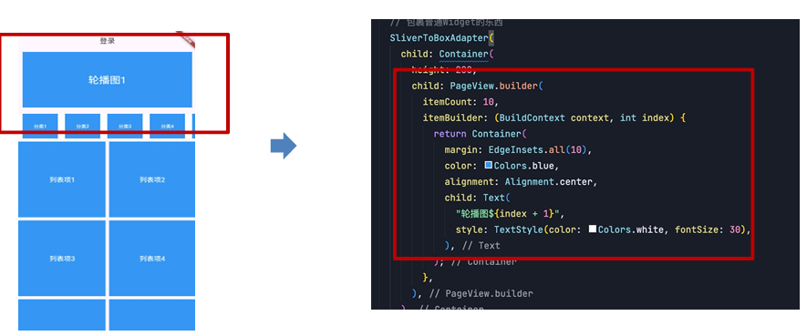

###### 跳转控制

- 控制器：PageView绑定controller属性，对象类型为PageController
- 切换方法： controller.jumpPage/animateToPage

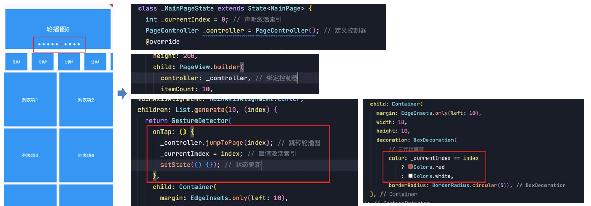

```dart

class MainPage extends StatefulWidget {
  MainPage({Key? key}) : super(key: key);

  @override
  _MainPageState createState() => _MainPageState();
}

class _MainPageState extends State<MainPage> {
  int _currentIndex = 0; // 当前激活索引
  PageController _controller = PageController();

  @override
  Widget build(BuildContext context) {
    return MaterialApp(
        home: Scaffold(
            body: CustomScrollView(
              slivers: [
                // 包裹普通Widget的东西
                SliverToBoxAdapter(
                    child: Stack(
                  children: [
                    Container(
                      color: Colors.blue,
                      alignment: Alignment.center,
                      height: 260,
                      child: PageView.builder(
                          controller: _controller,
                          itemCount: 10,
                          itemBuilder: (BuildContext context, int index) {
                            return Container(
                              alignment: Alignment.center,
                              child: Text("轮播图${index + 1}",
                                  style: TextStyle(
                                      color: Colors.white, fontSize: 20)),
                            );
                          }),
                    ),
                    Positioned(
                      bottom: 0,
                      left: 0,
                      right: 0,
                      height: 40,
                      child: Row(
                        mainAxisAlignment: MainAxisAlignment.center,
                        children: List.generate(10, (index) {
                          return GestureDetector(
                            onTap: () {
                              // 切换到具体的page
                              // _controller.jumpToPage(index);
                              _controller.animateToPage(index,
                                  duration: Duration(milliseconds: 300),
                                  curve: Curves.linear);
                              _currentIndex = index;
                              setState(() {});
                            },
                            child: Container(
                              margin: EdgeInsets.only(left: 10),
                              width: 10,
                              height: 10,
                              decoration: BoxDecoration(
                                  color: _currentIndex == index
                                      ? Colors.red
                                      : Colors.white,
                                  borderRadius: BorderRadius.circular(5)),
                            ),
                          );
                        }),
                      ),
                    )
                  ],
                )),
                SliverToBoxAdapter(
                    child: SizedBox(
                  height: 10,
                )),
                SliverPersistentHeader(
                  delegate: _StickyCategory(),
                  pinned: true, // 固定吸顶
                ),
                SliverToBoxAdapter(
                    child: SizedBox(
                  height: 10,
                )),
                SliverGrid.count(
                  crossAxisCount: 2,
                  mainAxisSpacing: 10,
                  crossAxisSpacing: 10,
                  children: List.generate(100, (index) {
                    return Container(
                      color: Colors.blue,
                      alignment: Alignment.center,
                      child: Text('列表项${index + 1}',
                          style: TextStyle(color: Colors.white, fontSize: 20)),
                    );
                  }),
                )
                // SliverList.separated(
                //     itemCount: 100,
                //     itemBuilder: (BuildContext context, int index) {
                //       return Container(
                //         height: 100,
                //         color: Colors.blue,
                //         alignment: Alignment.center,
                //         child: Text("列表项${index + 1}",
                //             style:
                //                 TextStyle(color: Colors.white, fontSize: 20)),
                //       );
                //     },
                //     separatorBuilder: (BuildContext context, int index) {
                //       return SizedBox(
                //         height: 20,
                //       );
                //     })
              ], // 切片列表
            )));
  }
}

class _StickyCategory extends SliverPersistentHeaderDelegate {
  @override
  Widget build(
      BuildContext context, double shrinkOffset, bool overlapsContent) {
    // TODO: implement build
    return Container(
      color: Colors.white,
      child: ListView.builder(
          itemCount: 30,
          scrollDirection: Axis.horizontal,
          itemBuilder: (BuildContext context, int index) {
            return Container(
              width: 100,
              margin: EdgeInsets.symmetric(horizontal: 10),
              color: Colors.blue,
              alignment: Alignment.center,
              child:
                  Text('分类${index + 1}', style: TextStyle(color: Colors.white)),
            );
          }),
    );
  }

  @override
  // TODO: implement maxExtent
  double get maxExtent => 80; // 最大展开高度

  @override
  // TODO: implement minExtent
  double get minExtent => 40; // 最小折叠高度

  @override
  bool shouldRebuild(covariant SliverPersistentHeaderDelegate oldDelegate) {
    // TODO: implement shouldRebuild
    return false; // 不需要重建
  }
}

```

## 组件通信

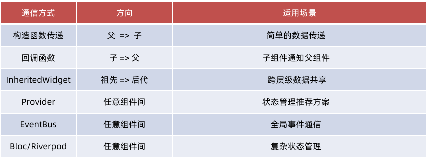

### 父传子(构造函数传参数)

- 步骤：
  1. 子组件定义接收属性
  2. 子组件在构造函数中接收参数
  3. 父组件传递属性给子组件
  4. 有状态组件在‘对外的类’接收属性，‘对内的类’通过widget对象获取对应属性
  5. 注意⚠：子组件定义接收属性需要使用final关键字-因为属性由父组件决定，子组件不能随意更改
- 需求： 定义父子组件，父组件传递一个message变量给子组件并显示

```dart
class ChildWidget extends StatelessWidget {
  final String? message;
  const ChildWidget({super.key, this.message});

  @override
  Widget build(BuildContext context) {
    return Container(
      height: 500,
      width: 500,
      decoration: const BoxDecoration(
        color: Colors.amber,
      ),
      child: Center(
        child: Text(message ?? "null"),
      ),
    );
  }
}

class ParentWidget extends StatefulWidget {
  const ParentWidget({super.key});

  @override
  State<ParentWidget> createState() => _ParentWidgetState();
}

// 状态类保持私有
class _ParentWidgetState extends State<ParentWidget> {
  @override
  Widget build(BuildContext context) {
    return Scaffold(
      appBar: AppBar(title: const Text('Example')),
      body: Center(
        child: ChildWidget(message: "hello"),
      ),
    );
  }
}

// 根组件
void main() {
  runApp(
    MaterialApp(
      home: ParentWidget(),
    ),
  );
}
```

```dart
class Child extends StatefulWidget {
  final String foodName;

  const Child({super.key, required this.foodName});// 子组件属性如果没有初始值，需要在构造函数中用required来接收属性

  @override
  State<Child> createState() => _ChildState();
}

class _ChildState extends State<Child> {
  @override
  Widget build(BuildContext context) {
    return Container(
      height: 200,
      width: 200,
      decoration: BoxDecoration(color: Colors.amber),
      alignment: Alignment.center,
      child: Text(widget.foodName, style: TextStyle(color: Colors.white)),
    );
  }
}

class Parent extends StatefulWidget {
  const Parent({super.key});

  @override
  State<Parent> createState() => _ParentState();
}

class _ParentState extends State<Parent> {
  List<String> list = [
    "火锅",
    "烧烤",
    "铁锅炖",
    "烤肉",
    "烤鱼",
    "炒菜",
    "大排档",
    "西餐",
    "鲁菜",
    "卤菜",
  ];
  @override
  Widget build(BuildContext context) {
    return MaterialApp(
      home: Scaffold(
        body: GridView.count(
          mainAxisSpacing: 10,
          crossAxisSpacing: 10,
          crossAxisCount: 2,
          children: List.generate(list.length, (value) {
            return Child(foodName: list[value]);
          }),
        ),
      ),
    );
  }
}
```

### 子传父(回调函数)

- 步骤： 
  1. 父组件传递一个函数给子组件
  2. 子组件调用该函数
  3. 父组件通过回调函数获取参数
- 需求：点击子组件删除父组件的菜品数据并更新列表

```dart
class Child extends StatefulWidget {
  final int index;
  final String foodName;
  final Function(int index) delFood;

  const Child({
    super.key,
    required this.index,
    required this.foodName,
    required this.delFood,
  });

  @override
  State<Child> createState() => _ChildState();
}

class _ChildState extends State<Child> {
  @override
  Widget build(BuildContext context) {
    return Stack(
      children: [
        Container(
          height: 200,
          width: 200,
          decoration: BoxDecoration(color: Colors.amber),
          alignment: Alignment.center,
          child: Text(widget.foodName, style: TextStyle(color: Colors.white)),
        ),
        IconButton(
          onPressed: () {
            widget.delFood(widget.index);
          },
          icon: Icon(Icons.delete),
        ),
      ],
    );
  }
}

class Parent extends StatefulWidget {
  const Parent({super.key});

  @override
  State<Parent> createState() => _ParentState();
}

class _ParentState extends State<Parent> {
  List<String> list = [
    "火锅",
    "烧烤",
    "铁锅炖",
    "烤肉",
    "烤鱼",
    "炒菜",
    "大排档",
    "西餐",
    "鲁菜",
    "卤菜",
  ];
  @override
  Widget build(BuildContext context) {
    return MaterialApp(
      home: Scaffold(
        body: GridView.count(
          mainAxisSpacing: 10,
          crossAxisSpacing: 10,
          crossAxisCount: 2,
          children: List.generate(list.length, (value) {
            return Child(
              index: value,
              foodName: list[value],
              delFood: (index) {
                print(index);
                setState(() {
                  list.removeAt(index);
                });
              },
            );
          }),
        ),
      ),
    );
  }
}
```

## 网络请求

### Dio插件使用

- 网络请求是Flutter移动应用开发的核心功能，最常用的网络请求工具是使用Dio插件
- 安装dio:  `flutter pub add dio`
  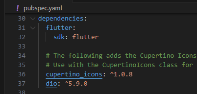
- 基本使用:  `Dio().get(地址).then().catchError()`
  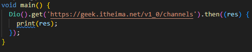
  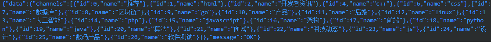
- **一般情况下-在初始化状态initState获取页面数据**

### 网络请求案例

Dio封装过程

1. 创建工具类
2. 构造函数中设置基础地址和超时时间
3. 添加各类拦截器
4. 封装统一请求方法
5. 请求频道数据进行循环渲染解决web端跨域问题
6. 实现UI渲染绘制

#### 1.Dio工具封装

```dart
class DioUtils {
  final _dio = Dio();

  DioUtils() {
    _dio.options
      ..baseUrl = 'https://geek.itheima.net/v1_0/'
      ..connectTimeout = Duration(seconds: 60)
      ..sendTimeout = Duration(seconds: 60)
      ..receiveTimeout = Duration(seconds: 60);

    _addInterceptor(); // 拦截器
  }

  _addInterceptor() { // 拦截器
    _dio.interceptors.add(
      InterceptorsWrapper(
        onRequest: (options, handler) {
          handler.next(options);
        },
        onResponse: (response, handler) {
          if (response.statusCode == 200) {
            handler.next(response);
            return;
          }
        },
        onError: (error, handler) {
          handler.reject(error);
        },
      ),
    );
  }

  // 封装请求方法 
  get(String url, {Map<String, dynamic>? params}) {
    return _dio.get(url, queryParameters: params);
  }
}
```

#### 2.初始化获取数据

```dart
class _MainPageState extends State<MainPage> {
  @override
  void initState() {
    // TODO: implement initState
    super.initState();
    _getChannels();
  }

  @override
  Widget build(BuildContext context) {
    return Container();
  }

  _getChannels() async {
    DioUtils dioUtils = DioUtils();
    Response<dynamic> r = await dioUtils.get('channels');
    print(r.data);

    Map<String,dynamic> res = r.data as Map<String,dynamic>;
    print(res);
    
    List<Map<String,dynamic>> _list =  (res["data"]["channels"] as List).cast<Map<String,dynamic>>();// .cast<T>()将 List 强制转换为 List<T>类型
    print(_list);
  }
}
```

#### 3.解决web端跨域问题

默认情况下, flutter 运行 web 端加载网络资源会报跨域提示错误。 

1. 在sdk安装目录flutter/packages/flutter_tools/lib/src/web/chrome.dart 如下图位置添加`'--disable-web-security',`
   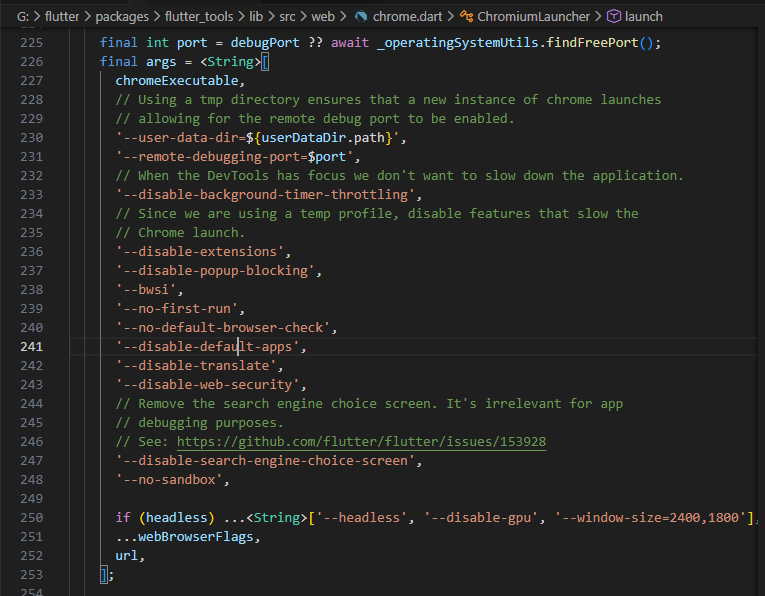
2. 删除flutter/bin/cache/下 flutter_tools.snaphot和flutter_tools.stamp
3. 执行 flutter doctor -v 然后重新运行项目

#### 4.父子组件通信

```dart
class ChildWidget extends StatefulWidget {
  final Map<String, dynamic> item;
  const ChildWidget({super.key, required this.item});

  @override
  State<ChildWidget> createState() => _ChildWidgetState();
}

class _ChildWidgetState extends State<ChildWidget> {
  @override
  Widget build(BuildContext context) {
    return Container(
      height: 200,
      width: 200,
      color: Colors.amber,
      alignment: Alignment.center,
      child: Text(widget.item['name']),
    );
  }
}

class MainPage extends StatefulWidget {
  const MainPage({super.key});

  @override
  State<MainPage> createState() => _MainPageState();
}

class _MainPageState extends State<MainPage> {
  List<Map<String, dynamic>> _list = [];
  @override
  void initState() {
    // TODO: implement initState
    super.initState();
    _getChannels();
  }

  @override
  Widget build(BuildContext context) {
    return MaterialApp(
      home: Scaffold(
        body: GridView.count(
          crossAxisCount: 2,
          mainAxisSpacing: 10,
          crossAxisSpacing: 10,

          children: List.generate(_list.length, (index) {
            return ChildWidget(item: _list[index]);
          }),
        ),
      ),
    );
  }

  _getChannels() async {
    DioUtils dioUtils = DioUtils();
    Response<dynamic> r = await dioUtils.get('channels');
    print(r.data);

    Map<String, dynamic> res = r.data as Map<String, dynamic>;
    print(res);

    setState(() {
      _list = (res["data"]["channels"] as List).cast<Map<String, dynamic>>();
    });
    print(_list);
  }
}
```

#### 知识点汇总

- Dio一般封装一个工具类来使用
- Dio基础配置有基础地址-超时时间
- Dio的拦截器有请求拦截器、响应拦截器、错误拦截器，通过拦截器使用`handler.next()`拦截使用`handler.reject()`
- 想要连续对一个对象赋值可以使用 ..的语法
- List的数据类型想要转化List<具体类型>可以使用cast方法

## 路由管理

定义：路由管理是构建多页面应用的核心，它通过 Navigator 和 Route 来管理页面栈，实现页面跳转和返回

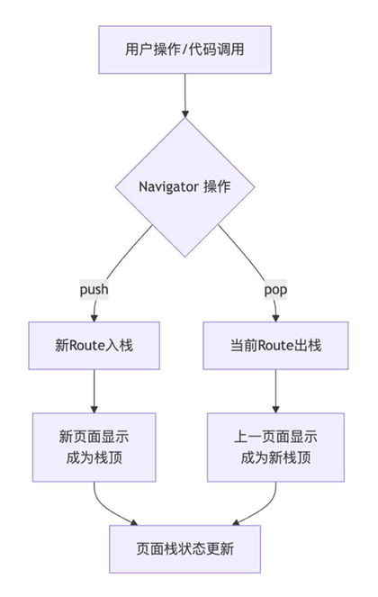

### 基本路由

- 场景：基本路由适合页面不多、跳转逻辑简单的场景
- 用法：无需提前注册路由，跳转时创建 MaterialPageRoute实例即可
- 跳转新页面： `Navigator.push(BuildContext context, Route route)`
- 返回上一页： `Navigator.pop(BuildContext context)`
- 注意：**MaterialApp是路由系统的组件，只能有一个MaterialApp包裹**

```dart

void main(List<String> args) {
  runApp(MainPage());
}

// 路由跳转-Material风格 只能有一个MaterialApp
class MainPage extends StatelessWidget {
  const MainPage({Key? key}) : super(key: key);

  @override
  Widget build(BuildContext context) {
    return MaterialApp(home: ListPage() // 列表页 详情页
        );
  }
}

// 列表页
class ListPage extends StatefulWidget {
  ListPage({Key? key}) : super(key: key);

  @override
  _ListPageState createState() => _ListPageState();
}

class _ListPageState extends State<ListPage> {
  @override
  Widget build(BuildContext context) {
    return Scaffold(
        appBar: AppBar(
          title: Text("列表页"),
        ),
        body: ListView.builder(
            padding: EdgeInsets.all(10),
            itemCount: 100,
            itemBuilder: (BuildContext context, int index) {
              return GestureDetector(
                onTap: () {
                  // 跳转到详情页
                  Navigator.push(context,
                      MaterialPageRoute(builder: (context) => DetailPage()));
                },
                child: Container(
                  color: Colors.blue,
                  margin: EdgeInsets.only(top: 10),
                  height: 100,
                  alignment: Alignment.center,
                  child: Text('列表项${index + 1}',
                      style: TextStyle(color: Colors.white, fontSize: 16)),
                ),
              );
            }));
  }
}

// 详情页
class DetailPage extends StatefulWidget {
  DetailPage({Key? key}) : super(key: key);

  @override
  _DetailPageState createState() => _DetailPageState();
}

class _DetailPageState extends State<DetailPage> {
  @override
  Widget build(BuildContext context) {
    return Scaffold(
        appBar: AppBar(
          title: Text("详情页"),
        ),
        body: Center(
          child: TextButton(
              onPressed: () {
                Navigator.pop(context);
              },
              child: Text("返回上一个页面")),
        ));
  }
}

```

### 命名路由

- 场景：应用页面增多后，使用命名路提升代码可维护性。
- 用法：需要先在 MaterialApp中注册一个路由表（routes）并设置initialRoute(首页)
- 命名路由 vs 简单路由： 
  命名路由需在MaterialApp的routes中预先注册路由表，适合中大型项目管理
  简单路由直接构建页面，更灵活，适合简单应用或快速原型开发。

```dart
void main(List<String> args) {
  runApp(MainPage());
}

// 路由跳转-Material风格 只能有一个MaterialApp
class MainPage extends StatelessWidget {
  const MainPage({Key? key}) : super(key: key);

  @override
  Widget build(BuildContext context) {
    // 注册路由表
    return MaterialApp(
        initialRoute: "/list",
        routes: {
          "/list": (context) => ListPage(),
          "/detail": (context) => DetailPage()
        },
        home: ListPage() // 列表页 详情页
        );
  }
}

// 列表页
class ListPage extends StatefulWidget {
  ListPage({Key? key}) : super(key: key);

  @override
  _ListPageState createState() => _ListPageState();
}

class _ListPageState extends State<ListPage> {
  @override
  Widget build(BuildContext context) {
    return Scaffold(
        appBar: AppBar(
          title: Text("列表页"),
        ),
        body: ListView.builder(
            padding: EdgeInsets.all(10),
            itemCount: 100,
            itemBuilder: (BuildContext context, int index) {
              return GestureDetector(
                onTap: () {
                  // 跳转到详情页
                  // Navigator.push(context,
                  //     MaterialPageRoute(builder: (context) => DetailPage()));
                  Navigator.pushNamed(context, "/detail");
                },
                child: Container(
                  color: Colors.blue,
                  margin: EdgeInsets.only(top: 10),
                  height: 100,
                  alignment: Alignment.center,
                  child: Text('列表项${index + 1}',
                      style: TextStyle(color: Colors.white, fontSize: 16)),
                ),
              );
            }));
  }
}

// 详情页
class DetailPage extends StatefulWidget {
  DetailPage({Key? key}) : super(key: key);

  @override
  _DetailPageState createState() => _DetailPageState();
}

class _DetailPageState extends State<DetailPage> {
  @override
  Widget build(BuildContext context) {
    return Scaffold(
        appBar: AppBar(
          title: Text("详情页"),
        ),
        body: Center(
          child: Column(
            children: [
              TextButton(
                  onPressed: () {
                    Navigator.pushNamed(context, "/list");
                  },
                  child: Text("去列表页")),
              TextButton(
                  onPressed: () {
                    Navigator.pop(context);
                  },
                  child: Text("返回上一个页面"))
            ],
          ),
        ));
  }
}

```

### 跳转方法

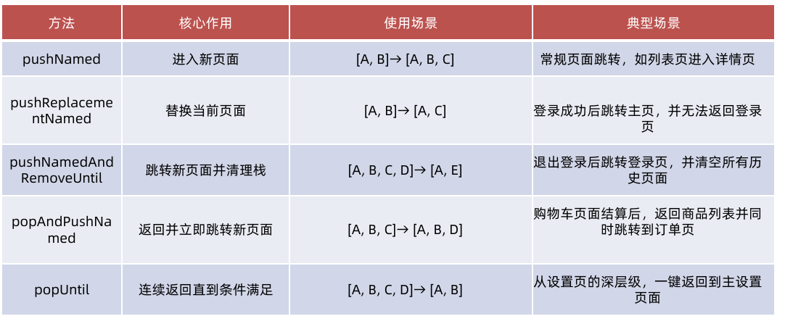

### 传递参数

#### 命名路由

- 作用：通过路由传递参数是实现页面间数据通信的常用方式
- 传递参数(命名路由)：`Navigator.pushNamed(context, 地址，arguments: { 参数  }) `
- 接收参数(命名路由)：`ModalRoute.of(context)?.settings.arguments`
- 接收时机：initState获取不到路由参数，放置在Future.microtask(异步微任务)中

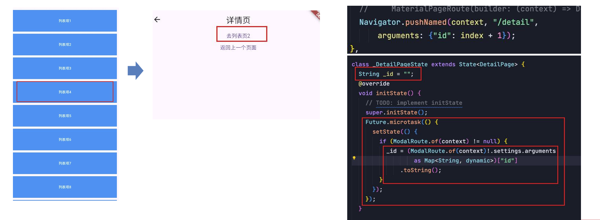

#### 基础路由

- 传递参数(基础路由)：通过组件构造函数传递参数-(父传子)
- 接收参数(基础路由)：通过组件构造函数接收参数--(父传子) 
- 接收时机：initState可获取到基础路由的构造函数传参

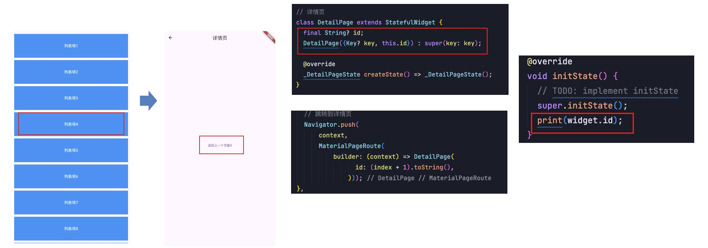

### 动态路由与高级控制

场景：更复杂的场景，如需根据参数动态生成页面，或实现路由拦截，可以使用 onGenerateRoute和  onUnknownRoute

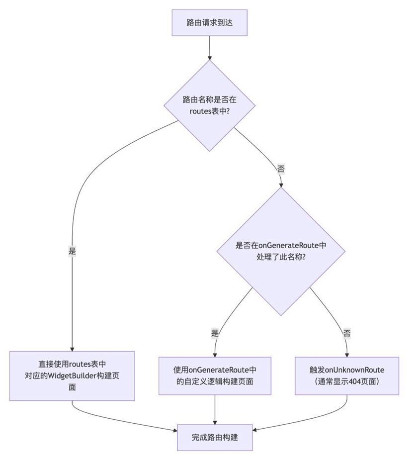

onGenerateRoute：允许你根据 RouteSettings（包含路由名称和参数）动态创建不同的 Route

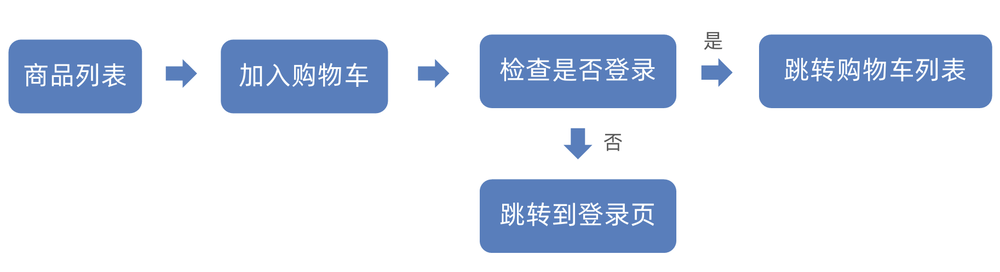

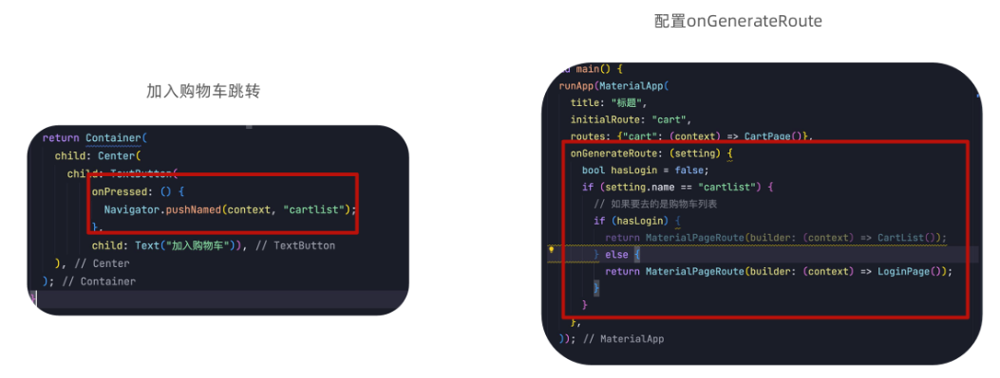

onUnknownRoute：跳转一个未在路由表中注册、也未在 onGenerateRoute中处理的路由，会调用此回调。通常 显示"404"页面

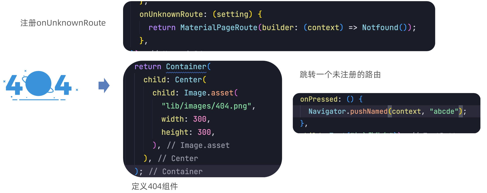

## 实战

### 搭建路由

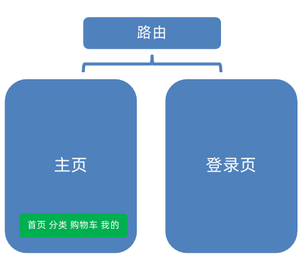

main.dart

```dart
import 'package:flutter/material.dart';
import 'package:hm_shop/Login/index.dart';
import 'package:hm_shop/Main/index.dart';

void main() {
  runApp(getRouter());
}

getRouter(){
  return MaterialApp(
    initialRoute: "/",
    routes: {
      "/":(context)=>MainPage(),
      "/login":(context)=>LoginPage(),
    },
  );
}

```

### 主页Tab栏

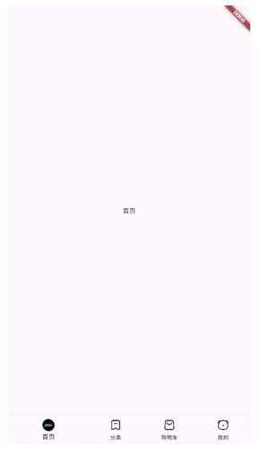

/Main/index.dart

```dart
import 'package:flutter/material.dart';
import 'package:hm_shop/Cart/index.dart';
import 'package:hm_shop/Category/index.dart';
import 'package:hm_shop/Home/index.dart';
import 'package:hm_shop/Mine/index.dart';

class MainPage extends StatefulWidget {
  const MainPage({super.key});

  @override
  State<MainPage> createState() => _MainPageState();
}

class _MainPageState extends State<MainPage> {
  List<Map<String, String>> bottomList = [
    {
      "icon": "lib/assets/ic_public_home_normal.png",
      "activeIcon": "lib/assets/ic_public_home_active.png",
      "name": "Home",
    },
    {
      "icon": "lib/assets/ic_public_pro_normal.png",
      "activeIcon": "lib/assets/ic_public_pro_active.png",
      "name": "Category",
    },
    {
      "icon": "lib/assets/ic_public_cart_normal.png",
      "activeIcon": "lib/assets/ic_public_cart_active.png",
      "name": "Cart",
    },
    {
      "icon": "lib/assets/ic_public_my_normal.png",
      "activeIcon": "lib/assets/ic_public_my_active.png",
      "name": "Mine",
    },
  ];

  int _currentIndex = 0;

  List<Widget> _getShowWidget() {
    return [HomePage(), CategoryPage(), CartPage(), MinePage()];
  }
  @override
  Widget build(BuildContext context) {
    return Scaffold(
      // appBar: AppBar(title: Text("Home")),
      body: SafeArea( // 安全区组件
        child: IndexedStack(index: _currentIndex, children: _getShowWidget()), // 索引栈布局
      ),
      bottomNavigationBar: BottomNavigationBar(
        items: List.generate(bottomList.length, (index) {
          return BottomNavigationBarItem(
            icon: Image.asset(
              bottomList[index]["icon"]!,
              width: 30,
              height: 30,
            ),
            activeIcon: Image.asset(
              bottomList[index]["activeIcon"]!,
              width: 30,
              height: 30,
            ),
            label: bottomList[index]["name"]!,
          );
        }),
        onTap: (index) {
          setState(() {
            _currentIndex = index;
          });
        },
        currentIndex: _currentIndex,
        showUnselectedLabels: true, // 是否显示未选中项的标签文字
        showSelectedLabels: true, // 是否显示选中项的标签文字
        useLegacyColorScheme: false, // 是否使用旧版的配色方案
        selectedItemColor: Colors.black, // 设置选中项的颜色
        unselectedLabelStyle: TextStyle(color: Colors.black), // 设置未选中项的标签文字样式
      ),
    );
  }
}
```

### 首页布局

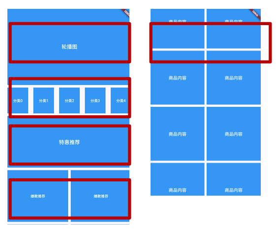

/home/index.dart

```dart
import 'package:flutter/cupertino.dart';
import 'package:hm_shop/components/Home/HmCategory.dart';
import 'package:hm_shop/components/Home/HmMoreList.dart';
import 'package:hm_shop/components/Home/HmSlider.dart';
import 'package:hm_shop/components/Home/HmSuggestion.dart';

class HomePage extends StatefulWidget {
  const HomePage({super.key});

  @override
  State<HomePage> createState() => _HomePageState();
}

class _HomePageState extends State<HomePage> {
  @override
  Widget build(BuildContext context) {
    return CustomScrollView(
      slivers: [
        SliverToBoxAdapter(child: HmSlider()),
        SliverToBoxAdapter(child: SizedBox(height: 10)),
        SliverToBoxAdapter(child: HmCategory()),
        SliverToBoxAdapter(child: SizedBox(height: 10)),
        SliverToBoxAdapter(child: HmSuggestion()),
        SliverToBoxAdapter(child: SizedBox(height: 10)),
        SliverToBoxAdapter(
          child: SizedBox(
            height: 100,
            child: Flex(
              direction: Axis.horizontal,
              children: [
                Expanded(child: HmSuggestion()),
                SizedBox(width: 10),
                Expanded(child: HmSuggestion()),
              ],
            ),
          ),
        ),
        SliverToBoxAdapter(child: SizedBox(height: 10)),
        SliverToBoxAdapter(
          child: SizedBox(height: 500, width: 500, child: HmMoreList()),
        ),
      ],
    );
  }
}

```

/components/Home/HmSlider.dart

```dart
import 'package:flutter/cupertino.dart';
import 'package:flutter/material.dart';

class HmSlider extends StatefulWidget {
  const HmSlider({super.key});

  @override
  State<HmSlider> createState() => _HmSliderState();
}

class _HmSliderState extends State<HmSlider> {
  @override
  Widget build(BuildContext context) {
    return Container(
      height: 200,
      alignment: Alignment.center,
      child: Text("轮播图"),
      color: Colors.blue,
    );
  }
}

```

/components/Home/HmCategory.dart

```dart
import 'package:flutter/cupertino.dart';
import 'package:flutter/material.dart';

class HmCategory extends StatefulWidget {
  const HmCategory({super.key});

  @override
  State<HmCategory> createState() => _HmCategoryState();
}

class _HmCategoryState extends State<HmCategory> {
  @override
  Widget build(BuildContext context) {
    return SizedBox(
      height: 100,
      child: ListView.builder(
        scrollDirection: Axis.horizontal,
        itemCount: 10,
        itemBuilder: (context, index) {
          return Container(
            height: 80,
            width: 100,
            margin: EdgeInsets.only(right: 10),
            color: Colors.blue,
            child: Text("Category${index}"),
            alignment: Alignment.center,
          );
        },
      ),
    );
  }
}

```

/components/Home/HmSuggestion.dart

```dart
import 'package:flutter/cupertino.dart';
import 'package:flutter/material.dart';

class HmSuggestion extends StatefulWidget {
  const HmSuggestion({super.key});

  @override
  State<HmSuggestion> createState() => _HmSuggestionState();
}

class _HmSuggestionState extends State<HmSuggestion> {
  @override
  Widget build(BuildContext context) {
    return Container(
      height: 100,
      color: Colors.blue,
      child: Text("推荐"),
      alignment: Alignment.center,
    );
  }
}
```

/components/Home/HmHot.dart

```dart
import 'package:flutter/cupertino.dart';
import 'package:flutter/material.dart';

class HmHot extends StatefulWidget {
  const HmHot({super.key});

  @override
  State<HmHot> createState() => _HmHotState();
}

class _HmHotState extends State<HmHot> {
  @override
  Widget build(BuildContext context) {
    return Container(
      height: 100,
      color: Colors.blue,
      child: Text("爆款推荐"),
      alignment: Alignment.center,
    );
  }
}

```

/components/Home/HmMoreList.dart

```dart
import 'package:flutter/cupertino.dart';
import 'package:flutter/material.dart';

class HmMoreList extends StatefulWidget {
  const HmMoreList({super.key});

  @override
  State<HmMoreList> createState() => _HmMoreListState();
}

class _HmMoreListState extends State<HmMoreList> {
  @override
  Widget build(BuildContext context) {
    return GridView.builder(
      scrollDirection: Axis.vertical,
      itemCount: 200,
      gridDelegate: SliverGridDelegateWithFixedCrossAxisCount(
        crossAxisCount: 2,
        mainAxisSpacing: 10,
        crossAxisSpacing: 10,
        childAspectRatio: 1.0,
      ),
      itemBuilder: (context, index) {
        return Container(
          alignment: Alignment.center,
          color: Colors.blue,
          child: Text("更多${index}"),
        );
      },
    );
  }
}

```

#### 实现轮播图

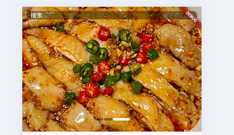

安装轮播图插件：`flutter pub add carousel_slider`

/Home/index.dart

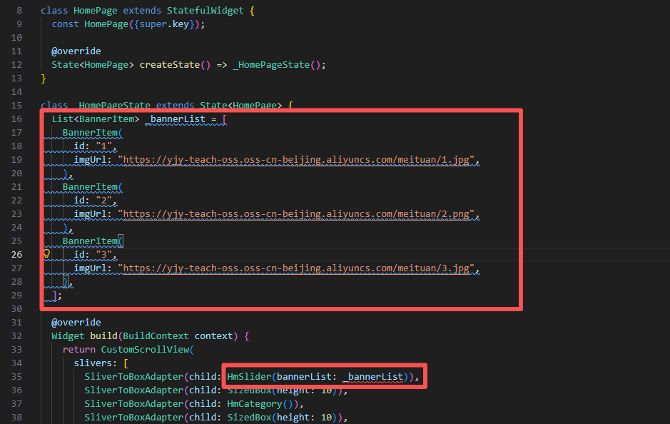

/components/Home/HmSlider.dart

```dart
import 'package:carousel_slider/carousel_slider.dart';
import 'package:flutter/cupertino.dart';
import 'package:flutter/material.dart';
import 'package:hm_shop/Home/index.dart';

class HmSlider extends StatefulWidget {
  final List<BannerItem> bannerList;
  const HmSlider({super.key, required this.bannerList});

  @override
  State<HmSlider> createState() => _HmSliderState();
}

class _HmSliderState extends State<HmSlider> {
  CarouselSliderController _controller =
      CarouselSliderController(); // 控制轮播图跳转的控制器
  int _currentIndex = 0;

  @override
  Widget build(BuildContext context) {
    return Stack(children: [_getSlider(), _getSearch(), _getDots()]);
  }

  _getSlider() {
    final screenWidth = MediaQuery.of(context).size.width; // 获取整体屏幕的宽度
    return CarouselSlider(
      carouselController: _controller,
      items: List.generate(widget.bannerList.length, (index) {
        return Image.network(
          widget.bannerList[index].imgUrl,
          width: screenWidth,
          fit: BoxFit.cover,
        );
      }),
      options: CarouselOptions(
        autoPlay: true,
        autoPlayCurve: Curves.linear,
        height: 300,
        viewportFraction: 1,
        onPageChanged: (index, reason) {
          setState(() {
            _currentIndex = index;
          });
        },
      ),
    );
  }

  _getSearch() {
    return Positioned(
      left: 0,
      top: 0,
      right: 0,
      child: Padding(
        padding: EdgeInsetsGeometry.all(10),
        child: Container(
          padding: EdgeInsets.only(left: 10),
          height: 20,
          decoration: BoxDecoration(
            borderRadius: BorderRadius.all(Radius.circular(25)),
            color: Color.fromRGBO(0, 0, 0, 0.4),
          ),
          child: Text("搜索...", style: TextStyle(color: Colors.white)),
        ),
      ),
    );
  }

  Widget _getDots() {
    return Positioned(
      bottom: 10,
      left: 0,
      right: 0,
      child: SizedBox(
        height: 40,
        width: double.infinity,
        child: Row(
          mainAxisAlignment: MainAxisAlignment.center,
          children: List.generate(widget.bannerList.length, (index) {
            return GestureDetector(
              onTap: () {
                _controller.jumpToPage(index);
                setState(() {
                  _currentIndex = index;
                });
              },
              child: AnimatedContainer(
                margin: EdgeInsets.only(left: 2),
                height: 6,
                width: _currentIndex == index ? 40 : 20,
                duration: Duration(milliseconds: 300),
                decoration: BoxDecoration(
                  borderRadius: BorderRadius.circular(25),
                  color: _currentIndex == index
                      ? Colors.white
                      : Color.fromRGBO(0, 0, 0, 0.4),
                ),
              ),
            );
          }),
        ),
      ),
    );
  }
}

```

#### 获取轮播图数据


/request/DioRequest

```dart
import 'package:dio/dio.dart';
import 'package:hm_shop/constants/index.dart';

class DioRequest {
  final _dio = Dio();

  DioRequest() {
    _dio.options
      ..baseUrl = GlobalConstants.BASE_URL
      ..connectTimeout = Duration(seconds: GlobalConstants.TIME_OUT)
      ..receiveTimeout = Duration(seconds: GlobalConstants.TIME_OUT)
      ..sendTimeout = Duration(seconds: GlobalConstants.TIME_OUT);
    _addInteception();
  }

  _addInteception() {
    _dio.interceptors.add(
      InterceptorsWrapper(
        onRequest: (options, handler) {
          handler.next(options);
        },
        onResponse: (response, handler) {
          if (response.statusCode! >= 200 && response.statusCode! < 300) {
            handler.next(response);
            return;
          }
          handler.reject(DioException(requestOptions: response.requestOptions));
        },
        onError: (error, handler) {
          handler.reject(error);
        },
      ),
    );
  }

  get(String path, {Map<String, dynamic>? parameter}) {
    Future<Response<dynamic>> res = _dio.get(path, queryParameters: parameter);

    return _getRes(res);
  }

  _getRes(Future<Response<dynamic>> task) async {
    try {
      dynamic res = await task;
      final data = res.data as Map<String, dynamic>;
      if (data["code"] == GlobalConstants.SUCCESS_CODE) {
        return data["result"] as dynamic;
      }
      throw Exception("加载数据异常");
    } catch (e) {
      throw Exception("加载数据异常");
    }
  }
}

// 单例对象
final dioRequest = DioRequest();

```

/api/home.dart

```dart
import 'package:hm_shop/Home/index.dart';
import 'package:hm_shop/constants/index.dart';
import 'package:hm_shop/request/DioRequest.dart';

Future<List<BannerItem>> getBrandListAPI() async {
  return (await dioRequest.get(HttpConstants.BANNER_LIST) as List<dynamic>)
      .map((e) => BannerItem.fromJson(e as Map<String, dynamic>))
      .toList();
}

```

/home/index.dart

```dart
import 'dart:math';

import 'package:flutter/cupertino.dart';
import 'package:hm_shop/api/home.dart';
import 'package:hm_shop/components/Home/HmCategory.dart';
import 'package:hm_shop/components/Home/HmHot.dart';
import 'package:hm_shop/components/Home/HmMoreList.dart';
import 'package:hm_shop/components/Home/HmSlider.dart';
import 'package:hm_shop/components/Home/HmSuggestion.dart';
import 'package:hm_shop/constants/index.dart';
import 'package:hm_shop/request/DioRequest.dart';

class HomePage extends StatefulWidget {
  const HomePage({super.key});

  @override
  State<HomePage> createState() => _HomePageState();
}

class _HomePageState extends State<HomePage> {
  List<BannerItem> _bannerList = [
    // BannerItem(
    //   id: "1",
    //   imgUrl: "https://yjy-teach-oss.oss-cn-beijing.aliyuncs.com/meituan/1.jpg",
    // ),
    // BannerItem(
    //   id: "2",
    //   imgUrl: "https://yjy-teach-oss.oss-cn-beijing.aliyuncs.com/meituan/2.png",
    // ),
    // BannerItem(
    //   id: "3",
    //   imgUrl: "https://yjy-teach-oss.oss-cn-beijing.aliyuncs.com/meituan/3.jpg",
    // ),
  ];

  @override
  void initState() {
    // TODO: implement initState
    super.initState();
    _getBrandList();
  }

  @override
  Widget build(BuildContext context) {
    return CustomScrollView(
      slivers: [
        SliverToBoxAdapter(child: HmSlider(bannerList: _bannerList)),
        SliverToBoxAdapter(child: SizedBox(height: 10)),
        SliverToBoxAdapter(child: HmCategory()),
        SliverToBoxAdapter(child: SizedBox(height: 10)),
        SliverToBoxAdapter(child: HmSuggestion()),
        SliverToBoxAdapter(child: SizedBox(height: 10)),
        SliverToBoxAdapter(
          child: SizedBox(
            height: 100,
            child: Flex(
              direction: Axis.horizontal,
              children: [
                Expanded(child: HmHot()),
                SizedBox(width: 10),
                Expanded(child: HmHot()),
              ],
            ),
          ),
        ),
        SliverToBoxAdapter(child: SizedBox(height: 10)),
        SliverToBoxAdapter(
          child: SizedBox(height: 500, width: 500, child: HmMoreList()),
        ),
      ],
    );
  }

  void _getBrandList() async {
    _bannerList = await getBrandListAPI();

    setState(() {});
  }
}

class BannerItem {
  String id;
  String imgUrl;

  BannerItem({required this.id, required this.imgUrl});

  factory BannerItem.fromJson(Map<String, dynamic> json) { // factory可以用来创建构造函数,它能控制对象的创建方式
    return BannerItem(
      id: json["id"] as String,
      imgUrl: json["imgUrl"] as String,
    );
  }
}

```

### 上拉加载

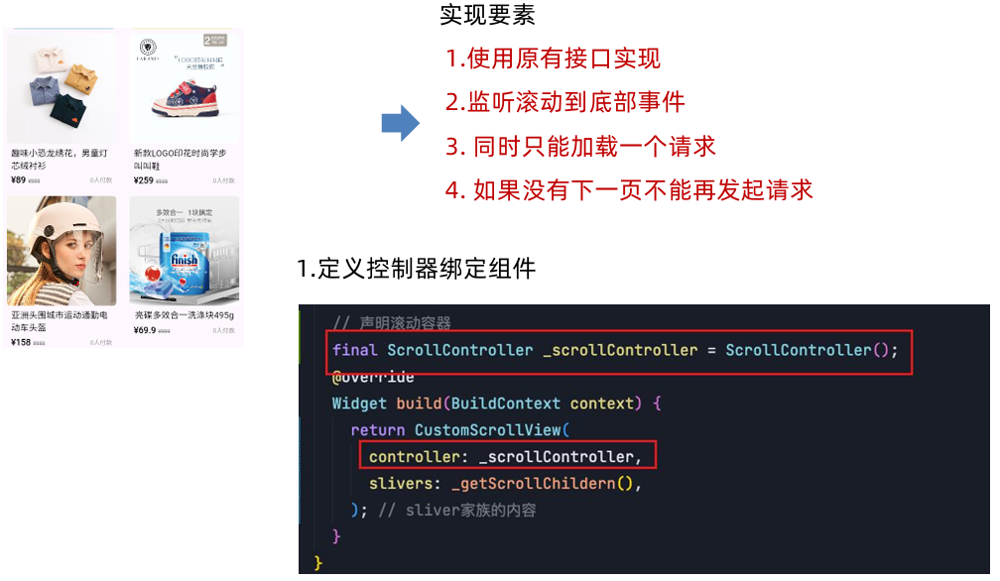
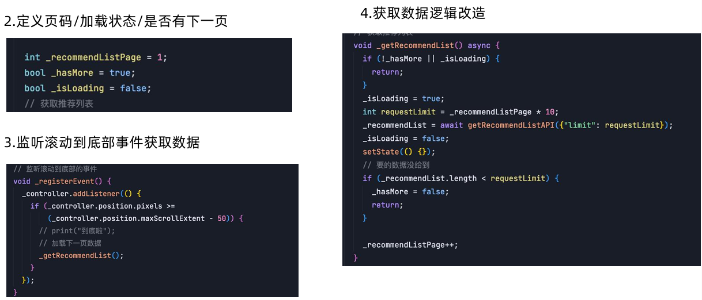

### 下拉加载

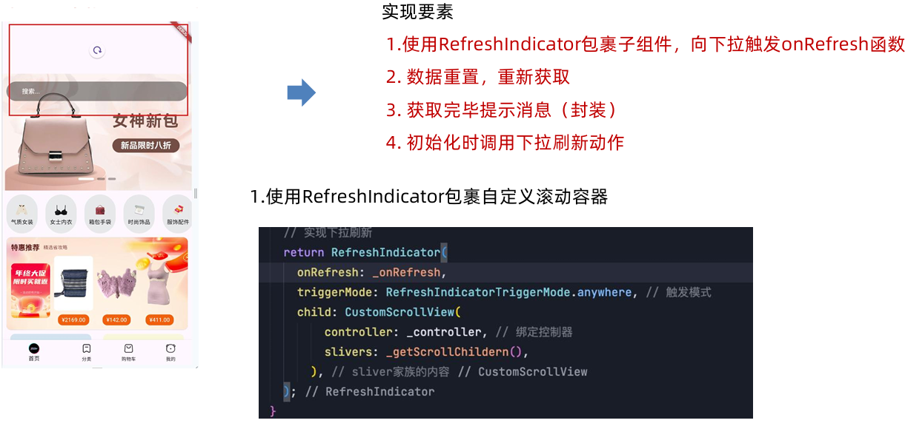

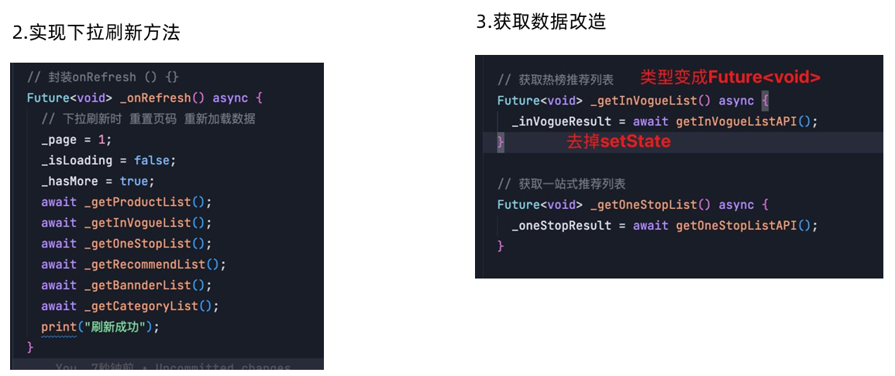

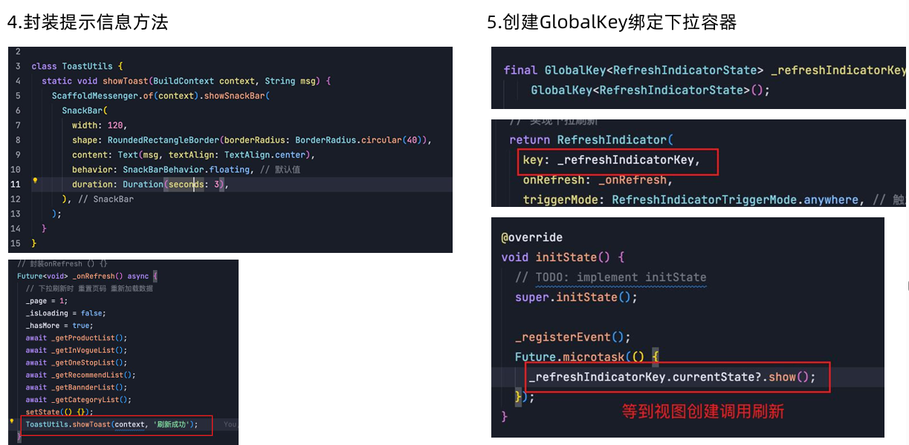

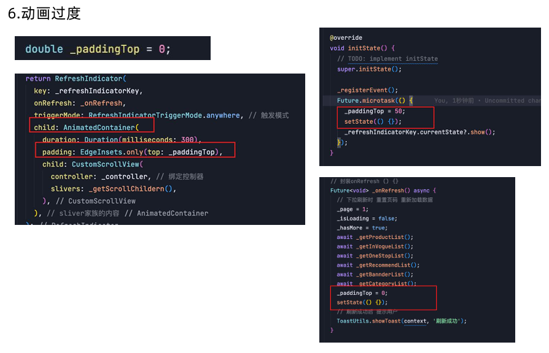

### Getx共享用户数据

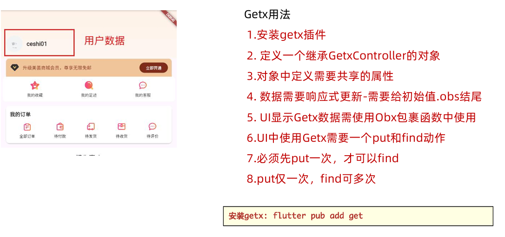

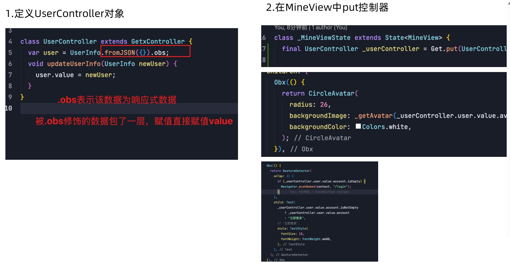

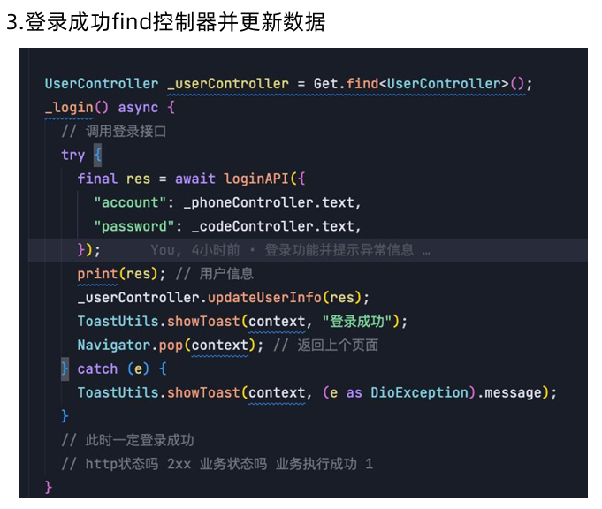

```dart
// 1. 创建响应式控制器
class UserController extends GetxController {
  var userName = "张三".obs;    // 可观察对象
  var userAge = 25.obs;
  
  void updateUser(String name, int age) {
    userName.value = name;
    userAge.value = age;
  }
}

// 2. 在父组件注入依赖
Get.put(UserController());  // 全局可用

// 3. 组件A：更新数据
class ComponentA extends StatelessWidget {
  final controller = Get.find<UserController>();
  
  @override
  Widget build(BuildContext context) {
    return ElevatedButton(
      onPressed: () => controller.updateUser("李四", 30),
      child: const Text("更新用户"),
    );
  }
}

// 4. 组件B：读取数据（自动响应更新）
class ComponentB extends StatelessWidget {
  @override
  Widget build(BuildContext context) {
    return GetBuilder<UserController>(  // 或使用 Obx(() => ...)
      builder: (controller) {
        return Text("用户: ${controller.userName.value}");
      },
    );
  }
}
```


### Token持久化

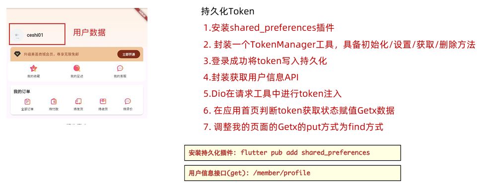

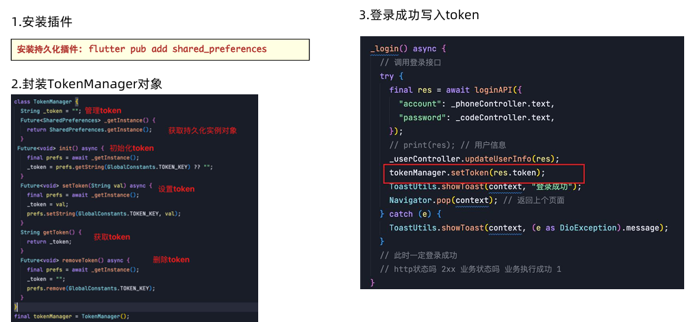

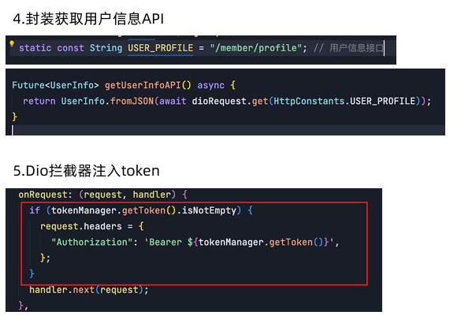

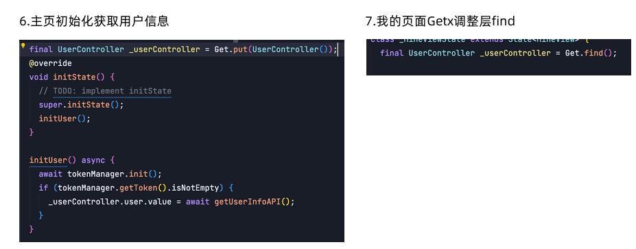
