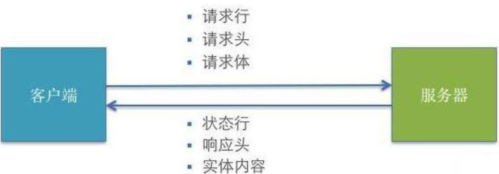
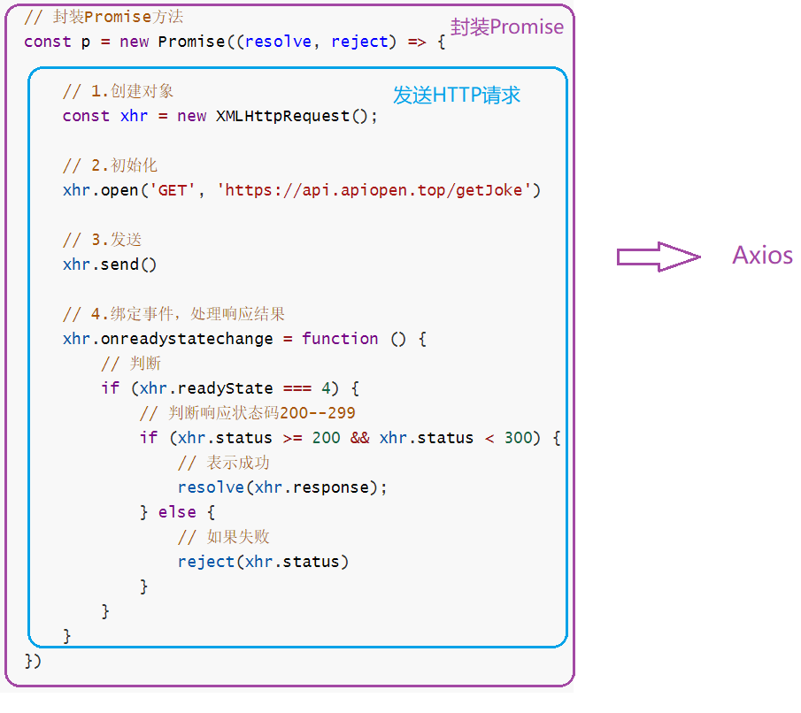
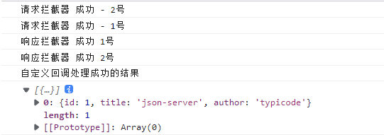

# JSON

> 数据交换指的是客户端和服务器之间业务数据的传递格式。

## json在JavaScript中的运用

```js
<script>
        // 定义一个json
        const jsonObj = {
            'key1': 12,
            'key2': 'abc',
            'key3': true,
            'key4': [1, 2, 3],
            'key5': {
                "key5_1": 551
            },
            'key6': [
                {
                    'key6_1': 661
                },
                {
                    'key6_1': 661
                }
            ]
        }

        // console.log(jsonObj,typeof jsonObj)//object类型   json就是一个对象


        // json的访问。访问json就像访问对象一样
        // console.log(jsonObj.key1)
        // console.log(jsonObj.key2)
        // console.log(jsonObj.key3)
        // console.log(jsonObj.key4)
        // console.log(jsonObj.key5)
        // console.log(jsonObj.key6)


        /*
            json的存在有两种形式。
                一种是:对象的形式存在，我们叫它json对象。
                一种是，字符串的形式存在，我们叫它json字符串。

            一般我们要操作 json中的数据的时候，需要json对象的格式。
            一般我们要在客户端和服务器之间进行数据交换的时候，使用json字符串。

            JSON.stringify()把json对象转换成为json字符串
            JSON.parse()把json字符串转换成为json对象
        */


        const jsonObjString = JSON.stringify(jsonObj)
        // 将json对象转换为json字符串
        console.log(jsonObjString, typeof jsonObjString)//string类型


        // 将json字符串转换为json对象
        const jsonObj1 = JSON.parse(jsonObjString)
        console.log(jsonObj1,typeof jsonObj1)//object类型
    </script>
```

## json在java中的运用

> javaBean和json的相互转换，需要引入Gson.jar。

```java
public class json {
    //    javaBean和json的相互转换
    @Test
    public void test1() {

        user user = new user("lz", 18);

        //  创建Gson对象实例
        Gson gson = new Gson();

        //  toJson方法可以把java对象转换为json字符串
        String jsonString = gson.toJson(user);
        System.out.println(jsonString);//{"name":"lz","age":18}

        //  将json字符串转为java对象类型
        //  第一个参数的json字符串
        //  第二个参数是转换回去的java对象类型
        user user1 = gson.fromJson(jsonString, user.class);
        System.out.println(user1);
    }

}

```

> List集合和json的相互转换

```java
public class json {

    @Test
    public void test1() {

        /**
         * List集合和json的相互转化
         */

        ArrayList<User> userList = new ArrayList<>();
        userList.add(new User("张三", 12));
        userList.add(new User("李四", 18));
        userList.add(new User("王五", 21));

        //  创建Gson对象
        Gson gson = new Gson();

        //  list转为json
        String s = gson.toJson(userList);
        System.out.println(s);

        //  将json转为List
        //  需要创建一个UserListType类并继承TypeToken
        //  ArrayList arrayList = gson.fromJson(s,new UserListType().getType());
        //  使用时不必创建类UserMapType，占用空间，可以使用匿名内部类
        ArrayList arrayList = gson.fromJson(s, new TypeToken<ArrayList<User>>() {}.getType());
        System.out.println(arrayList.get(0));
        System.out.println(arrayList.get(1));
        System.out.println(arrayList.get(2));
    }

}

```

```java
package cn.lz;

import com.google.gson.reflect.TypeToken;

import java.util.ArrayList;

//  继承TypeToken，泛型可以是ArrayList<User>或者List<User>
public class UserListType extends TypeToken<ArrayList<User>> {
}

```

> Map集合和json的相互转换

```java
public class json {

    @Test
    public void test1() {

        /**
         * Map集合和json的相互转换
         */

        Map<Integer, User> map = new HashMap<>();
        map.put(1, new User("张三", 12));
        map.put(2, new User("李四", 18));
        map.put(3, new User("王五", 20));

        //  创建Gson实例
        Gson gson = new Gson();

        //  将Map转为json
        String s = gson.toJson(map);
        System.out.println(s);

        //将json转为map
        //  需要创建一个UserMapType类并继承TypeToken
        //  Map<Integer, User> mapjson = gson.fromJson(s, new UserMapType().getType());
        //使用时不必创建类UserMapType，占用空间，可以使用匿名内部类
        Map<Integer, User> mapjson = gson.fromJson(s, new TypeToken<HashMap<Integer, User>>(){}.getType());
        System.out.println(mapjson.get(1));
        System.out.println(mapjson.get(2));
        System.out.println(mapjson.get(3));
    }

}

```

```java
package cn.lz;

import com.google.gson.reflect.TypeToken;

import java.util.HashMap;

//  继承TypeToken，泛型可以是HashMap<Integer, User>或者Map<Integer, User>
public class UserMapType extends TypeToken<HashMap<Integer, User>> {
}
```

# AJAX

## XML
```
<student>
	<name>孙悟空</name>
	<age>18</age>
	<gender>男</gender>
</student>
```
## HTTP 请求交互的基本过程



### HTTP 请求报文

```
行      POST  /s?ie=utf-8(查询字符串参数)  HTTP/1.1(协议)
头      Host: atguigu.com		
        Cookie: name=guigu
        Content-type: application/x-www-form-urlencoded	(声明你的文件类型，使用的文件编码)
        User-Agent: chrome 83
空行
体      username=admin&password=admin
```

### HTTP 响应报文

```
行      HTTP/1.1(协议)  200(状态码)  OK(状态字符串)
头      Content-Type: text/html;charset=utf-8
        Content-length: 2048
        Content-encoding: gzip
空行    
体      <html>
            <head>
            </head>
            <body>
                <h1>尚硅谷</h1>
            </body>
        </html>
```

### content-type

> Content-Type 标头告诉客户端实际返回的内容的内容类型。

> 常见的媒体格式类型如下：
>
> - text/html ： HTML格式
> - text/plain ：纯文本格式
> - text/xml ： XML格式
> - image/gif ：gif图片格式
> - image/jpeg ：jpg图片格式
> - image/png：png图片格式
>
> 以application开头的媒体格式类型：
>
> - application/xhtml+xml ：XHTML格式
> - application/xml： XML数据格式
> - application/atom+xml ：Atom XML聚合格式
> - application/json： JSON数据格式
> - application/pdf：pdf格式
> - application/msword ： Word文档格式
> - application/octet-stream ： 二进制流数据（如常见的文件下载）
> - application/x-www-form-urlencoded ： <form encType=””>中默认的encType，form表单数据被编码为key/value格式发送到服务器（表单默认的提交数据的格式）
>
> 另外一种常见的媒体格式是上传文件之时使用的：
>
> - multipart/form-data ： 需要在表单中进行文件上传时，就需要使用该格式

## express框架

> 安装完node，在终端输入 `npm i express`

### express基本使用

```js
// 1.引入express
const { response } = require('express');
const { request } = require('http');
const express = require('express');


// 2.创建应用对象
const app = express();

// 3.创建路由规则
// request是对请求报文的封装
// response是对响应报文的封装
app.get('/demo', (request, response) => {
    // 设置响应体
    response.send('hello express')
})

// 4.监听端口启动服务
app.listen(8000, () => {
    console.log("服务已启动。。。")
})
```

## nodemon

> 作用：修改服务端代码不需要重新启动，nodemon帮忙重新启动
>
> 安装：`npm install -g nodemon`
>
> 使用：`nodemon xxx.js`(不再使用node)

## 后端代码

```js
const { response } = require('express')
const express = require('express')
const { request } = require('http')

const app = express()

app.get('/server', (request, response) => {
    // 设置响应头   设置允许跨域
    response.setHeader('Access-Control-Allow-Origin', '*')
    // 设置响应体
    response.send('hello ajax GET')
})

app.post('/server', (request, response) => {
    // 设置响应头   设置允许跨域
    response.setHeader('Access-Control-Allow-Origin', '*')
    // 设置响应体
    response.send('hello ajax POST')
})

// 可以接收任意类型的请求
app.all('/server', (request, response) => {
    // 设置响应头   设置允许跨域
    response.setHeader('Access-Control-Allow-Origin', '*')
    // 设置自定义请求头
    response.setHeader('Access-Control-Allow-Headers', '*');
    // 设置响应体
    response.send('hello ajax POST')
})

app.post('/json', (request, response) => {
    // 设置响应头   设置允许跨域
    response.setHeader('Access-Control-Allow-Origin', '*')
    const jsonObj = {
        'name': 'lz'
    }
    const jsonStr = JSON.stringify(jsonObj)
    // 设置响应体
    response.send(jsonStr)
})

// 针对IE缓存
app.get('/ie', (request, response) => {
    // 设置响应头   设置允许跨域
    response.setHeader('Access-Control-Allow-Origin', '*')
    // 设置响应体
    response.send('hello IE-3')
})

// 针对网络请求异常
app.get('/delay', (request, response) => {
    // 设置响应头   设置允许跨域
    response.setHeader('Access-Control-Allow-Origin', '*')
    setTimeout(() => {
        // 设置响应体
        response.send('hello Delay')
    }, 3000);

})


// jQuery 服务
app.all('/jquery', (request, response) => {
    // 设置响应头   设置允许跨域
    response.setHeader('Access-Control-Allow-Origin', '*')
    // 设置自定义请求头
    response.setHeader('Access-Control-Allow-Headers', '*');
    const jsonObj = { 'name': 'lz' }
    // 设置响应体
    response.send(JSON.stringify(jsonObj))

})

// axios服务
app.all('/axios', (request, response) => {
    // 设置响应头   设置允许跨域
    response.setHeader('Access-Control-Allow-Origin', '*')
    // 设置自定义请求头
    response.setHeader('Access-Control-Allow-Headers', '*');
    const jsonObj = { 'name': 'lz' }
    // 设置响应体
    response.send(JSON.stringify(jsonObj))

})


// fetch服务
app.all('/fetch', (request, response) => {
    // 设置响应头   设置允许跨域
    response.setHeader('Access-Control-Allow-Origin', '*')
    // 设置自定义请求头
    response.setHeader('Access-Control-Allow-Headers', '*');
    const jsonObj = { 'name': 'lz' }
    // 设置响应体
    response.send(JSON.stringify(jsonObj))

})

app.listen('8000', () => {
    console.log('reserve.js已启动。。。')
})
```

## 原生AJAX

### GET

> get请求没有请求体

```html
<style>
    #root {
        height: 300px;
        width: 300px;
        border: 1px solid red;
    }
</style>

<body>
    <h3>点击按钮发送请求，返回来的请求体放在div框中</h3>
    <button>点击发送请求</button>

    <div id="root"></div>


    <script>

        const btn = document.getElementsByTagName('button')[0]
        const root = document.getElementById('root')

        btn.onclick = function () {
            // 1.创建对象
            const xhr = new XMLHttpRequest()

            // 2.初始化  设置请求求方法和url
            xhr.open('GET', 'http://127.0.0.1:8000/server?username=root&password=root')

            // 3.发送
            xhr.send()

            // 事件绑定 处理服务端返回的结果
            // on   当...时候
            // readystate 是xhr对象的属性，表示状态0（创建对象）   1（初始化）   2（发送）  3（返回部分数据）   4（数据全部返回）
            // change 改变
            xhr.onreadystatechange = function () {
				// 状态值
                if (xhr.readyState === 4) {
                    //    判断响应码 200  404  403  401  500  大于等于200，小于300,成功
                    if (200 <= status < 300) {
                        // 处理结果  行   头   空行   体
                        // console.log(xhr.status)//状态码
                        // console.log(xhr.statusText)//状态字符串
                        // console.log(xhr.getAllResponseHeaders())//所有响应头
                        // console.log(xhr.response)//响应体

                        root.innerHTML = xhr.response
                    }
                }
            }
        }
    </script>
```

### POST

```html
<style>
        #root {
            height: 300px;
            width: 300px;
            border: 1px solid red;
        }
    </style>
</head>

<body>
    <h3>当鼠标移动到div框中发送请求，请求体放在div框中</h3>
    <div id="root"></div>

    <script>
        const root = document.getElementById('root')
        root.onmouseover = function () {
            const xhr = new XMLHttpRequest()

            // post请求可以同时定义请求体和url参数
            xhr.open('POST', 'http://127.0.0.1:8000/server?a=100')

            // 设置请求头(预定义)
            xhr.setRequestHeader('Content-Type', 'application/x-www-form-urlencoded')
            // 设置自定义请求头(会报错，需要在后端设计一下)
            xhr.setRequestHeader('name', 'lz')

            // post请求在send中设置请求体参数
            xhr.send('username = root & password = root')
            // xhr.send('username:root & password:root')
            // xhr.send('admin')

            xhr.onreadystatechange = function () {
                if (xhr.readyState === 4) {
                    if (200 <= status < 300) {
                        root.innerHTML = xhr.response
                    }
                }
            }
        }

    </script>
```

### 发送json数据

```html
<style>
        #root {
            height: 300px;
            width: 300px;
            border: 1px solid red
        }
    </style>
</head>

<body>
    <div id="root"></div>
    <script>
        const root = document.getElementById('root')
        window.onkeydown = function () {
            const xhr = new XMLHttpRequest()

            // 自动将json字符串转换为json对象
            xhr.responseType = 'json'

            xhr.open('GET', 'http://127.0.0.1:8000/json')

            xhr.send()

            xhr.onreadystatechange = function () {
                if (xhr.readyState === 4) {
                    if (200 <= status < 300) {
                        // 手动将json字符串转换为json对象
                        // const jsonObj = JSON.parse(xhr.response)
                        // console.log(jsonObj)

                        // 自动将json字符串转换为json对象
                        // console.log(xhr.response)

                        root.innerHTML = xhr.response.name
                    }
                }
            }
        }
    </script>
```

### IE缓存问题

> 在修改后端的返回数据后，ie浏览器默认读取本地缓存的数据，所以数据没有变更，这时在请求路径后面加上一个时间戳就可以了

```js
<style>
        #root {
            height: 200px;
            width: 200px;
            border: 1px solid red;
        }
    </style>
</head>

<body>
    <button>点我</button>
    <div id="root"></div>

    <script>
        const btn = document.getElementsByTagName('button')[0]
        const root = document.getElementById('root')

        btn.onclick = function () {
            const xhr = new XMLHttpRequest()
            // 为路径后面添加时间戳，就不会读取本地缓存了，会再次请求服务器
            xhr.open('GET', 'http://127.0.0.1:8000/ie?t=' + Date.now())
            xhr.send()
            xhr.onreadystatechange = function () {
                if (xhr.readyState === 4) {
                    if (200 <= status < 300) {
                        root.innerHTML = xhr.response

                    }
                }
            }
        }
    </script>
```

### 超时与网络异常

```js
<style>
        #root {
            height: 200px;
            width: 200px;
            border: 1px solid red;
        }
    </style>
</head>

<body>
    <button>点我</button>
    <div id="root"></div>

    <script>
        const btn = document.getElementsByTagName('button')[0]
        const root = document.getElementById('root')

        btn.onclick = function () {
            const xhr = new XMLHttpRequest()

            // 超时设置2s
            xhr.timeout = 2000
            // 超时回调
            xhr.ontimeout = function () {
                alert("请求超时。。。")
            }
            // 网络异常回调
            xhr.onerror = function () {
                alert('网络异常。。。')
            }


            xhr.open('GET', 'http://127.0.0.1:8000/delay')
            xhr.send()
            xhr.onreadystatechange = function () {
                if (xhr.readyState === 4) {
                    if (200 <= status < 300) {
                        root.innerHTML = xhr.response

                    }
                }
            }
        }
    </script>
```

### 取消请求

> 调用**abort**方法

```js
<button>点击发送</button>
    <button>取消发送</button>

    <script>
        const btns = document.querySelectorAll('button')

        let xhr = null;
        btns[0].onclick = function () {
            xhr = new XMLHttpRequest()
            xhr.open('GET', 'http://127.0.0.1:8000/delay')
            xhr.send()
        }

        // 调用abort方法取消发送
        btns[1].onclick = function () {
            xhr.abort()
        }
    </script>
```

### 重复请求

```js
<button>点击发送</button>

    <script>
        const btns = document.querySelectorAll('button')

        let xhr = null;

        let isSending = false//是否正在发送ajax请求

        btns[0].onclick = function () {
            // 判断标识变量，如果正在发送，则取消该请求，创建一个新的请求
            if (isSending) xhr.abort()

            // 修改标识变量的值
            isSending = true
            xhr = new XMLHttpRequest()
            xhr.open('GET', 'http://127.0.0.1:8000/delay')
            xhr.send()
            xhr.onreadystatechange = function () {
                if (xhr.readyState === 4) {
                    isSending = false
                }

            }
        }

    </script>
```

## jQuery发送ajax

```js
<button>发送get请求</button>
    <button>发送post请求</button>
    <button>通用型方法ajax</button>


    <script>
        $('button').eq(0).click(function () {
            // 第一个参数：请求地址
            // 第二个参数：请求体参数
            // 第三个参数：回调函数
            // 第四个参数：响应体数据类型
            $.get('http://127.0.0.1:8000/jquery', { a: 100, b: 200 }, function (data) {
                console.log(data)
            }, 'json')
        })

        $('button').eq(1).click(function () {
            $.post('http://127.0.0.1:8000/jquery', { c: 300, d: 400 }, function (data) {
                console.log(data)
            }, 'json')
        })


        $('button').eq(2).click(function () {
            $.ajax({
                // url
                url: 'http://127.0.0.1:8000/delay',
                // 参数,无论是get还是post都是这么写这个参数。
                // get类型就是url参数，post就是请求体内容
                data: { e: 500, f: 600 },
                // 请求类型
                type: 'GET',
                // 响应体类型
                dataType: 'json',
                // 成功的回调
                success: function (data) {
                    console.log(data)
                },
                // 失败的回调
                error: function () {
                    console.log('出错了')
                },
                // 设置超时事件
                timeout: 200,
                // 头信息(同样也需要修改下后端)
                // headers:{
                //     x:1,
                //     y:2
                // }
            })
        })
    </script>
```

## axios发送ajax

```js
<button>get</button>
    <button>post</button>
    <button>ajax</button>

    <script>
        const btns = document.querySelectorAll('button')

        // 配置baseURL
        axios.defaults.baseURL = 'http://127.0.0.1:8000/'

        btns[0].onclick = function () {
            axios.get('/axios', {
                // URL
                params: {
                    id: 100,
                    vip: 7
                },
                headers: {
                    name: 'yy',
                    age: 18
                }
            }).then(res => {
                console.log(res)
            })

        }


        btns[1].onclick = function () {
            axios.post('/axios', { username: 'admin', password: 'admin' }, {
                // URL,post请求也可以同时设置请求体参数和url
                params: {
                    id: 200,
                    vip: 9
                },
                headers: {
                    name: 'lz',
                    age: 18
                }
            }).then(res => {
                console.log(res)
            }).catch(err => {
                console.error(err);
            })
        }

        btns[2].onclick = function () {
            axios({
                // url
                url: '/axios',
                // 请求方法
                method: 'POST',
                // url参数
                params: {
                    vip: 10,
                    level: 30
                },
                // 头信息
                headers: {
                    a: 100,
                    b: 200
                },
                // 请求体参数
                data: {
                    username: 'admin',
                    paasword: 'admin'
                }
            }).then(ref => {
                console.log(ref.status)//状态吗
                console.log(ref.statusText)//状态字符串
                console.log(ref.data)
                console.log(ref.headers)//头信息
            })
        }
    </script>
```

## fetch发送ajax

```js
	<button>点击</button>

    <script>
        const btn = document.getElementsByTagName('button')[0]

        btn.onclick = function () {
            fetch('http://127.0.0.1:8000/fetch?a=100', {
                // 请求方法
                method: 'POST',
                // 请求头
                headers: {
                    name: 'lzyy'
                },
                // 请求体
                body: 'username=admin&password=admin'
            }).then(ref => {
                console.log(ref)
            })
        }

    </script>
```

## 同源策略

> 同源： 协议、域名、端口号 必须完全相同。 
>
> 违背同源策略就是跨域。 

```js
<button>点我</button>
    <script>

        const btn = document.getElementsByTagName('button')[0]

        btn.onclick = function () {
            const xhr = new XMLHttpRequest()
            // 这里因为是满足同源策略的，所以url可以简写
            xhr.open('GET', '/data')
            xhr.send()
            xhr.onreadystatechange = function () {
                if (xhr.readyState === 4) {
                    if (200 <= status < 300) {
                        console.log(xhr.response)
                    }
                }
            }
        }
    </script>
```

```js
const { response } = require('express')
const express = require('express')
const { request } = require('http')

const app = new express()


app.get('/home', (request, response) => {
    // 响应一个页面
    response.sendFile(__dirname
        + '/index.html')
})
app.get('/data', (request, response) => {
    response.send('数据')
})


app.listen('9000', () => {
    console.log('9000端口已执行')
})
```

## 跨域问题的解决方法

### JSONP

> JSONP(JSON with Padding)，是一个非官方的跨域解决方案，纯粹凭借程序员的聪明才智开发出来，只支持 get 请求。JSONP 就是利用 script 标签的跨域能力来发送请求的。

#### 原理

```html
    <style>
        #root {
            height: 300px;
            width: 300px;
            border: 1px solid rebeccapurple;
        }
    </style>
</head>

<div id="root"></div>

<body>

    <script>
        function handle(data) {
            const result = document.getElementById('root')
            result.innerHTML = data.name
        }
    </script>

    <script src="http://127.0.0.1:8000/jsonp"></script>
```

```js
......
// JSONP服务
app.all('/jsonp', (request, response) => {
    const person = {
        name: 'lz123',
        age: 18
    }

    const objStr = JSON.stringify(person)

    response.end(`handle(${objStr})`)
})
......
```

#### JSONP实践

```html
<input type="text">

    <script>
        const input = document.querySelector('input')

        input.onblur = function () {
            // 获取输入框文本
            const val = this.value
            // 向服务器端发送请求，检测用户名是否存在
            // 1.创建script标签
            const script = document.createElement('script')
            // 2.设置标签src属性
            script.src = 'http://127.0.0.1:8000/chenck-username'
            // 3.将script插入到文档中
            document.body.appendChild(script)
        }


        // 声明handle函数
        function handle(data) {
            // 修改输入框边框
            input.style.border = '1px solid red'
            // 创建p标签
            const el = document.createElement('p')
            document.body.appendChild(el)
            // 为p标签添加文本
            el.innerHTML = data.msg

        }
    </script>
```

```js
......
// JSONP跨域实践
app.all('/chenck-username', (request, response) => {
    const person = {
        exit: 1,
        msg: '用户已存在'
    }
    const objStr = JSON.stringify(person)

    response.end(`handle(${objStr})`)
})
......
```

#### JSONP-jQuery跨域

```html
<style>
        #result{
            width:300px;
            height:100px;
            border:solid 1px #089;
        }
    </style>
    <script crossorigin="anonymous" src='https://cdn.bootcss.com/jquery/3.5.0/jquery.min.js'></script>
</head>
<body>
    <button>点击发送 jsonp 请求</button>
    <div id="result">

    </div>
    <script>
        $('button').eq(0).click(function(){
            // callback是必须要有的
            $.getJSON('http://127.0.0.1:8000/jquery-jsonp-server?callback=?', function(data){
                $('#result').html(`
                    名称: ${data.name}<br>
                    校区: ${data.city}
                `)
            });
        });
    </script>
```

```js
// JSONP-jQuery跨域实践
app.all('/jquery-jsonp-server', (request, response) => {
    // response.send('console.log("hello jsonp")');
    const data = {
        name: '尚硅谷',
        city: ['北京', '上海', '深圳']
    };
    //将数据转化为字符串
    let str = JSON.stringify(data);
    //接收 callback 参数
    let cb = request.query.callback;

    //返回结果
    response.end(`${cb}(${str})`);
});
```

### [CORS](https://developer.mozilla.org/zh-CN/docs/Web/HTTP/CORS)

> CORS 是官方的跨域解决方案，它的特点是不需要在客户端做任何特殊的操作，完全在服务器中进行处理，支持get 和 post 请求
>
> 在服务端设置响应头，允许跨域`response.setHeader('Access-Control-Allow-Origin', '*')`
>
> 前面那些之所以可以跨域就是设置了响应头

```js
<style>
        #root {
            height: 300px;
            width: 300px;
            border: 1px solid rebeccapurple;
        }
    </style>
</head>

<body>
    <button id='btn'>点我</button>
    <div id="root"></div>

    <script>
        const btn = document.getElementById('btn')
        const root = document.getElementById('root')
        btn.onclick = function () {
            const xhr = new XMLHttpRequest()

            xhr.open('GET', 'http://127.0.0.1:8000/cors')

            xhr.send()

            xhr.onreadystatechange = function () {
                if (xhr.readyState === 4) {
                    if (200 <= status < 300) {
                        root.innerHTML = xhr.response
                    }
                }
            }
        }
    </script>
```

```js
......
// cors跨域
app.all('/cors', (request, response) => {
    // 设置响应头   设置允许跨域
    response.setHeader('Access-Control-Allow-Origin', '*')
    // 设置请求头
    response.setHeader('Access-Control-Allow-Headers', '*')
    // 设置请求方法
    response.setHeader('Access-Control-Allow-Method', '*')
    response.send('lz')
}) 
......
```

# Axios

## 什么是axios

> axios是一个基于Promise的HTTP库。



## axios 常用语法

> - axios(config): 通用/最本质的发任意类型请求的方式
> - axios(url[, config]): 可以只指定 url 发 get 请求 
> - axios.request(config): 等同于 axios(config) 
> - axios.get(url[, config]): 发 get 请求 
> - axios.delete(url[, config]): 发 delete 请求 
> - **axios.post(url[, data, config]): 发 post 请求**
> - axios.put(url[, data, config]): 发 put 请求

## 默认配置

> - **axios.defaults.xxx: 请求的默认全局配置**

```js
    <script>
        axios.defaults.method = 'GET'//设置默认请求方法
        axios.defaults.baseURL = "http:localhost:3000"//设置默认请求路径	

        axios({
            URL: '/posts'
        }).then((result) => {
            console.log(result)
        }).catch((err) => {
            console.log(err)
        });
    </script>
```

## 创建实例对象

> - **axios.create([config]): 创建一个新的 axios(它没有下面的功能)**

```js
    <script>
        // 创建实例对象
        const duanzi = axios.create({
            baseURL: "http://api.apiopen.top",
            timeout: 2000
        })
        const other = axios.create({
            baseURL: "http://localhost:30000",
            timeout: 2000
        })

        // 这里的duanzi和axios的功能几近一样
        duanzi({
            URL: '/getJoke'
        })
        other({
            URL: '/posts'
        })
    </script>
```

## 拦截器

> - axios.interceptors.request.use(): 添加请求拦截器
> - axios.interceptors.response.use(): 添加响应拦截器

```js
    <script>
        // Promise
        // 设置请求拦截器  config 配置对象
        axios.interceptors.request.use(function (config) {
            console.log('请求拦截器 成功 - 1号');

            //修改 config 中的参数
            config.params = { a: 100 };

            return config;
        }, function (error) {
            console.log('请求拦截器 失败 - 1号');
            return Promise.reject(error);
        });

        axios.interceptors.request.use(function (config) {
            console.log('请求拦截器 成功 - 2号');

            //修改 config 中的参数
            config.timeout = 2000;

            return config;
        }, function (error) {
            console.log('请求拦截器 失败 - 2号');
            return Promise.reject(error);
        });

        // 设置响应拦截器
        axios.interceptors.response.use(function (response) {
            console.log('响应拦截器 成功 1号');

            return response.data;
            // return response;
            
        }, function (error) {
            console.log('响应拦截器 失败 1号')
            return Promise.reject(error);
        });

        axios.interceptors.response.use(function (response) {
            console.log('响应拦截器 成功 2号')
            return response;
        }, function (error) {
            console.log('响应拦截器 失败 2号')
            return Promise.reject(error);
        });

        //发送请求
        axios({
            method: 'GET',
            url: 'http://localhost:3000/posts'
        }).then(response => {
            console.log('自定义回调处理成功的结果');
            console.log(response);
        }).catch(error => {
            console.log(error)
        });
    </script>

```



## 取消请求

```js
    <script>
        const button = document.querySelectorAll("button");

        // 声明全局变量
        let cancel = null

        // 发送请求
        button[0].onclick = function () {
            // 判断cancel是否为null，不为null说明有请求发送，调用cancel取消请求
            if (cancel != null) {
                cancel()
            }
            axios({
                method: 'get',
                url: 'http://localhost:3000/posts',
                cancelToken: new axios.CancelToken((c) => {
                    // 将c赋值给cancel
                    cancel = c
                })
            }).then((result) => {
                console.log(result)

                // 请求发送成功再将cancel重置为null
                cancel = null;
            }).catch((err) => {
                console.log(err)
            });
        }

        // 取消发送
        button[1].onclick = function () {
            cancel()
        }

    </script>
```

