# 小知识

## Thread.activeCount( )

在IDEA中`Thread.activeCount()=2`，除了main方法的主线程外还有，还多了一个预期外的Monitor Ctrl-Break线程

在eclipse中得到的结果是1

```java
public class threadActiveCount {
    public static void main(String[] args) {
        //打印当前线程组的线程
        Thread.currentThread().getThreadGroup().list();
        System.out.println("=========");
        //idea用的是反射，还有一个monitor监控线程。
        System.out.println(Thread.activeCount());
        System.out.println("=========");
        //获取所有线程
        Thread[] threads = new Thread[Thread.activeCount()];
        Thread.enumerate(threads);
        for (Thread thread: threads) {
            System.out.println(thread.getName());
        }

        /*
        输出结果:
        java.lang.ThreadGroup[name=main，maxpri=10]
            Thread[main，5，main]
            Thread[Monitor Ctrl-Break，5，main]
        =========
        2
        =========
        main
        Monitor Ctrl-Break
        * */
    }
}
```

在Java中，Monitor Ctrl-Break线程是一个专门用于中断正在运行的Java程序的线程。当你按下Ctrl + Break键组合时，这个线程会被激活，它会向正在运行的Java程序发送一个中断信号。这个中断信号会导致正在运行的Java程序抛出一个InterruptedExceptio异常，从而中止程序的运行。

通常情况下，Monitor Ctrl-Break线程不会被显式地使用，它是由Java虚拟机（JVM）自动创建和管理的。它的主要作用是提供一种安全的方式来终止正在运行的Java程序，以避免程序出现死锁或其他不可预见的错误。

## TimeUnit类

TimeUnit是`java.util.concurrent`包下面的一个类，TimeUnit提供了可读性更好的线程暂停操作，通常用来替换`Thread.sleep( )`底层实现还是使用的`Thread.sleep( )`

SECONDS | MINUTES | HOURS | DAYS

```java
import java.time.LocalTime;
import java.util.concurrent.TimeUnit;

public class timeUtilTest {

    public static void main(String[] args) {
        //停顿3s
        try {
            System.out.println(LocalTime.now());
            TimeUnit.SECONDS.sleep(3);
            System.out.println(LocalTime.now());
        } catch (InterruptedException e) {
            e.printStackTrace();
        }
        //停顿3分钟
        try {
            TimeUnit.MINUTES.sleep(3);
            System.out.println(LocalTime.now());
        } catch (InterruptedException e) {
            e.printStackTrace();
        }
        //停顿3h
        try {
            TimeUnit.HOURS.sleep(3);
            System.out.println(LocalTime.now());
        } catch (InterruptedException e) {
            e.printStackTrace();
        }
        //停顿三天
        try {
            TimeUnit.DAYS.sleep(3);
            System.out.println(LocalTime.now());
        } catch (InterruptedException e) {
            e.printStackTrace();
        }

    }
}

```

# 多线程概述

## 多线程的概述(面试高频问点)

### ①. 为什么使用多线程及其重要

1. 摩尔定律失效(硬件方面)：
   1. 集成电路上可以容纳的晶体管数目在大约每经过18个月便会增加一倍，可是从2003年开始CPU主频已经不再翻倍，而是采用多核而不是更快的主频
   2. 在主频不再提高且核数不断增加的情况下，要想让程序更快就要用到并行或并发编程
2. 高并发系统，异步+回调的生产需求(软件方面)

### ②. 进程、线程、管程(monitor 监视器)

1. **线程就是程序执行的一条路径，一个进程中可以包含多条线程**
2. 多线程并发执行可以提高程序的效率，可以同时完成多项工作
3. 举例:
   你打开一个word就是一个进程开启了，这个时候你重启后在打开word，这个时候有一个点击恢复的按钮，这就是一个线程，可能这个线程你看不到，你打字的时候，单词打错了，word中会有一个波浪线，这也是一个线程。
4. **管程:Monitor(监视器)，也就是我们平时所说的锁**
   (1). **Monitor其实是一种同步机制，它的义务是保证(在同一时间)只有一个线程可以访问被保护的数据和代码**
   (2). JVM中同步时基于进入和退出的监视器对象(Monitor，管程)，**每个对象实例都有一个Monitor对象。**
   (3). Monitor对象和JVM对象一起销毁，底层由C来实现

**执行线程就要求先成功持有管程，然后才能执行方法，最后当方法完成(无论是正常完成还是非正常完成)时释放管程。在方法执行期间，执行线程持有了管程，其他任何线程都无法再获取到同一个管程。**

### ③. 多线程并行和并发的区别

1. 并行就是两个任务同时运行，就是甲任务进行的同时，乙任务也在进行(需要多核CPU)
2. 并发是指两个任务都请求运行，而处理器只能接收一个任务，就是把这两个任务安排轮流进行，由于时间间隔较短，使人感觉两个任务都在运行(12306抢票的案例)

### ④. wait | sleep的区别？功能都是当前线程暂停，有什么区别？

1. **wait放开手去睡，放开手里的锁;wait是Object类中的方法**
2. **sleep握紧手去睡，醒了手里还有锁;sleep是Thread中的方法**

### ⑤. synchronized 和 lock的区别？

1. 原始构成
   - **synchronized是关键字属于JVM层面**monitor对象，每个java对象都自带了一个monitor，需要拿到monitor对象才能做事情
     monitorenter底层是通过monitor对象来完成，其实wait/notify等方法也依赖monitor对象，
     只能在同步块或方法中才能调用wait/notify等方法
     monitorexit:退出
   - **lock是api层面的锁，主要使用ReentrantLock实现**
2. 使用方法
   - **synchronized不需要用户手动释放锁，当synchronized代码完成后系统会自动让线程释放**
     **对锁的占用**
   - **ReentrantLock则需要用户手动释放锁若没有主动释放锁，就有可能会导致死锁的现象**
3. 等待是否可中断?
   - **synchronized不可中断，除非抛出异常或者正常运行完成**
   - **ReentrantLock可中断**
     **(设置超时时间`tryLock(long timeout，TimeUnit unit)`，调用interrupt方法中断)**
4. 加锁是否公平
   - **synchronized非公平锁**
   - **ReentrantLock两者都可以，默认是非公平锁，构造方法可以传入boolean值，true为公平锁，**
     **false为非公平锁**
5. 锁绑定多个Condition
   - **synchronized没有**
   - **ReentrantLock用来实现分组唤醒需要唤醒线程们，可以精确唤醒，而不是像synchronized要么**
     **随机唤醒一个\要么多个**

## 多线程的实现方式

### 继承Thread

```java
   //注意:打印出来的结果会交替执行
	public class ThreadDemo{
	    public static void main(String[] args) {
	        //4.创建Thread类的子类对象
	        MyThread myThread=new MyThread();
	        //5.调用start()方法开启线程
	        //[ 会自动调用run方法这是JVM做的事情，源码看不到 ]
	        myThread.start();
	        for (int i = 0; i < 100; i++) {
	            System.out.println("我是主线程"+i);
	        }
	    }
	}
	class MyThread extends Thread{
	    //2.重写run方法
	    public void run(){
	        //3.将要执行的代码写在run方法中
	       for(int i=0;i<100;i++){
	           System.out.println("我是线程"+i);
	       }
	    }
	}
```

### 实现Runnable接口

#### 源码分析

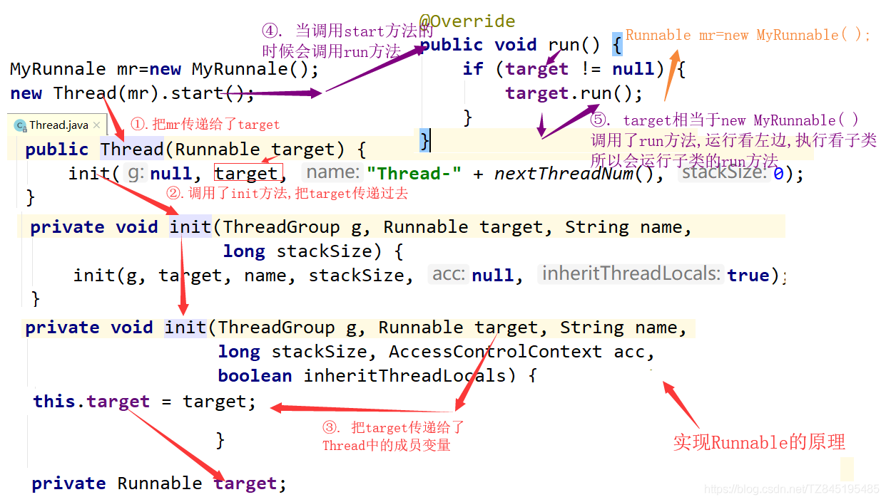

```java
public class RunnableDemo {
    public static void main(String[] args) {
        //4.创建Runnable的子类对象
        MyRunnale mr=new MyRunnale(); 
        //5.将子类对象当做参数传递给Thread的构造函数，并开启线程
        //MyRunnale taget=mr; 多态
        new Thread(mr).start();
        for (int i = 0; i < 1000; i++) {
            System.out.println("我是主线程"+i);
        }
    }
}

//1.定义一个类实现Runnable
class MyRunnale implements Runnable{
    //2.重写run方法
    @Override
    public void run() {
        //3.将要执行的代码写在run方法中
        for (int i = 0; i < 1000; i++) {
            System.out.println("我是线程"+i);
        }
    }
}
```

#### 两种实现多线程方式的区别

1. 查看源码
   - 继承Thread:由于子类重写了Thread类的run()，当调用start()时，直接找子类的run()方法
   - 实现Runnable:构造函数中传入了Runnable的引用，成员变量记住了它，start()调用run()方法时内部判断成员变量Runnable的引用是否为空，不为空编译时看的是Runnable的run()，运行时执行的是子类的run()方法
2. 继承Thread
   - 好处是:可以直接使用Thread类中的方法，代码简单
   - 弊端是:如果已经有了父类，就不能用这种方法
3. 实现Runnable接口
   - 好处是:即使自己定义的线程类有了父类也没有关系，因为有了父类可以实现接口，而且接口可以多现实的
   - 弊端是:不能直接使用Thread中的方法需要先获取到线程对象后，才能得到Thread的方法，代码复杂

### Callable接口(创建线程)

#### Callable接口中的call方法和Runnable接口中的run方法的区别

1. **是否有返回值(Runnable接口没有返回值 Callable接口有返回值)**
2. **是否抛异常(Runnable接口不会抛出异常 Callable接口会抛出异常)**
3. **落地方法不一样，一个是call() ，一个是run()**

#### Future接口概述

1. FutureTask是Future接口的唯一的实现类

2. FutureTask同时实现了Runnable、Future接口。它既可以作为Runnable被线程执行，又可以作为Futrue得到Callable的返回值

   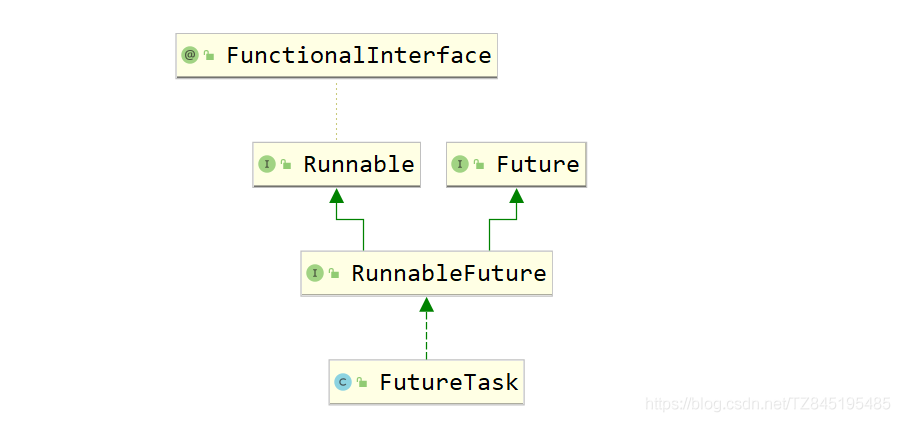

```java
/*
创建线程的方式三: 实现callable接口 ---JDK 5.0 新增
1.创建一个实现Callable接口的实现类
2.实现call方法，将此线程需要执行的操作声明在call()中
3.创建callable接口实现类的对象
4.将此callable的对象作为参数传入到FutureTask构造器中，创建FutureTask的对象
5.将FutureTask对象作为参数传递到Thread类的构造器中，创建Thread对象，并调用star
6.获取callable接口中call方法的返回值
* */
public class ThreadNew {
    public static void main(String[] args) {
        //3.创建callable接口实现类的对象
        NumThead m=new NumThead();
        //4.将此callable的对象作为参数传入到FutureTask构造器中，创建FutureTask的对象
        
        FutureTask futureTask = new FutureTask(m);
        //5.将FutureTask对象作为参数传递到Thread类的构造器中，创建Thread对象，并调用start()方法
        //FutureTask类继承了Runnable接口
        //new Runnable = futrueTask;
        new Thread(futureTask).start();

        //6.获取callable接口中call方法的返回值
        try {
            //get()方法返回值即为FutureTask构造器参数callable实现类重写的call方法的返回值
            Object sum = futureTask.get();
            System.out.println("总和是:"+sum);
        } catch (Exception e) {
            e.printStackTrace();
        }
    }

}
//1.创建一个实现Callable接口的实现类
class  NumThead implements Callable{
   // class  NumThead implements Callable<Integer>{
    //2.实现call方法，将此线程需要执行的操作声明在call()中
    @Override
    public Object call() throws Exception {
    //public Integer call() throws Exception {
        int sum=0;
        for(int i=1;i<=100;i++){
            System.out.println(i);
            sum+=i;
        }
        return sum;
    }
}
```

#### FutureTask原理解析

1. 有了Runnable，为什么还要有Callable接口?我们假设一共有四个程序需要执行，第三个程序时间很长 | Runnable接口会按照顺序去执行，会依次从上到下去执行，会等第三个程序执行完毕，才去执行第四个 | Callable接口会把时间长的第三个程序单独开启一个线程去执行，第1、2、4 线程执行不受影响

2. **比如主线程让一个子线程去执行任务，子线程可能比较耗时，启动子线程开始执行任务。子线程就去做其他的事情，过一会儿才去获取子任务的执行结果**

   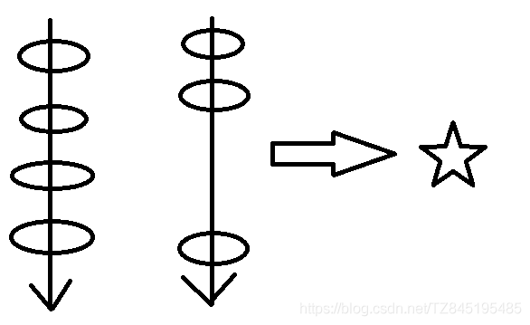

例子:

1. 老师上着课，口渴了，去买水不合适，讲课线程继续，我可以单起个线程找班长帮忙
   买水，水买回来了放桌上，我需要的时候再去get。
2. 4个同学，A算1+20，B算21+30，C算31*到40，D算41+50，是不是C的计算量有点大啊，
   FutureTask单起个线程给C计算，我先汇总ABD，最后等C计算完了再汇总C，拿到最终结果
3. 高考:会做的先做，不会的放在后面做

#### 注意事项

1. **get( )方法建议放在最后一行，防止线程阻塞(一旦调用了get( )方法，不管是否计算完成都会阻塞)**
2. 一个FutureTask，多个线程调用call( )方法只会调用一次
3. 如果需要调用call方法多次，则需要多个FutureTask

```java
public class CallableDemo  {
    public static void main(String[] args) throws Exception{
        CallAble c=new CallAble();
        FutureTask<Integer> futureTask=new FutureTask<>(c);

       	new Thread(futureTask，"线程A").start();
    	new Thread(futureTask，"线程B").start();
   		Integer integer = futureTask.get();
	    System.out.println("integer = " + integer);
}

}
class CallAble implements Callable<Integer>{
    @Override
    public Integer call() throws Exception {
        System.out.println("欢迎你调用call方法");
        return 6;
    }
}
```

#### isDone()轮询

1. 轮询的方式会消耗无畏的CPU资源，而且也不见得能及时地得到计算的结果
2. 如果想要异步获取结果，通常都会以轮询的方式去获取结果，尽量不要阻塞

```java
public class FutureTaskTest {
    public static void main(String[] args) throws Exception{
        FutureTask futureTask = new FutureTask(()->{
            try { TimeUnit.SECONDS.sleep(3);  } catch (InterruptedException e) {e.printStackTrace();}
            System.out.println(Thread.currentThread().getName()+"\t"+"coming......");
            return 1024;
        });
        new Thread(futureTask).start();
        //1.果futureTask.get()放到main线程前面，会导致main线程阻塞
        //Object o = futureTask.get();

	    /*Object o = futureTask.get();//不见不散，只要出现了get()方法就会阻塞
 	    System.out.println("不见不散，只要出现了get()方法就会阻塞，获取到的值为:"+o);*/
  		
        //2.过时不候
		//System.out.println(Thread.currentThread().getName()+"\t"+"线程来了.....");
		//Object o2 = futureTask.get(2L， TimeUnit.SECONDS);
        
        //3.使用轮询
        while(true){
            if(futureTask.isDone()){
                System.out.println("使用轮询来解决，值为:"+futureTask.get());
                break;
            }else{
                System.out.println("阻塞中**********");
            }
        }
    }
}
```

#### [线程池](https://fahaxikilz.github.io/2023/04/21/juc/#线程池-1)

## 设置和获取线程名称

①. **void setName(String name):将此线程的名称更改为等于参数 name**

```java
  //FileWriter
  MyThread my1 = new MyThread();
  MyThread my2 = new MyThread();  
  
  //void setName(String name):将此线程的名称更改为等于参数 name
  my1.setName("高铁");
  my2.setName("飞机");

  my1.start();
  my2.start();
```

②. **String getName( ):返回此线程的名称**

**注意:要是类没有继承Thread，不能直接使用getName( ) ；要是没有继承Thread，要通过Thread.currentThread得到当前线程，然后调用getName( )方法（包括实现接口的方式）**

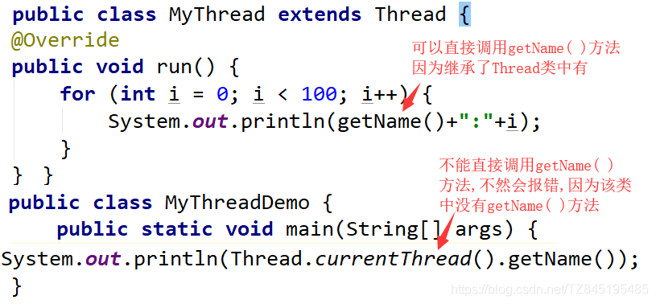


③. **static Thread currentThread( )返回对当前正在执行的线程对象的引用**

④. 通过构造函数设置线程名称

1. Thread(String name):通过带参构造进行赋值
2. Thread(Runnable target ， String name)

```java
public class MyThread extends Thread {
    public MyThread() {}

    public MyThread(String name) {
        super(name);
    }
    @Override
    public void run() {
        for (int i = 0; i < 100; i++) {
            System.out.println(getName()+":"+i);
        }
    }
}

```

```java
//Thread(String name)
MyThread my1 = new MyThread("高铁");
MyThread my2 = new MyThread("飞机");
my1.start();
my2.start();
```

## 线程优先级(setPriority)

①. 线程有两种调度模型 [ 了解 ]

1. 分时调度模式:所有线程轮流使用CPU的使用权，平均分配每个线程占有CPU的时间片
2. 抢占式调度模型:优先让优先级高的线程使用CPU，如果线程的优先级相同，那么会随机选择一个，优先级高的线程获取的CPU时间片相对多一些 [ Java使用的是抢占式调度模型 ]

②. Thread类中设置和获取线程优先级的方法

1. **public final void setPriority(int newPriority):更改此线程的优先级**
2. **public final int getPriority():返回此线程的优先级**
3. a. 线程默认优先级是5；**线程优先级范围是:1-10；** b. 线程优先级高仅仅表示线程获取的CPU时间的几率高，但是要在次数比较多，或者多次运行的时候才能看到你想要的效果

```java
 ThreadPriority tp1 = new ThreadPriority();
 ThreadPriority tp2 = new ThreadPriority();
 ThreadPriority tp3 = new ThreadPriority();

  tp1.setName("高铁");
  tp2.setName("飞机");
  tp3.setName("汽车");
  //设置正确的优先级
  tp1.setPriority(5);
  tp2.setPriority(10);
  tp3.setPriority(1);

  tp1.start();
  tp2.start();
  tp3.start();
```

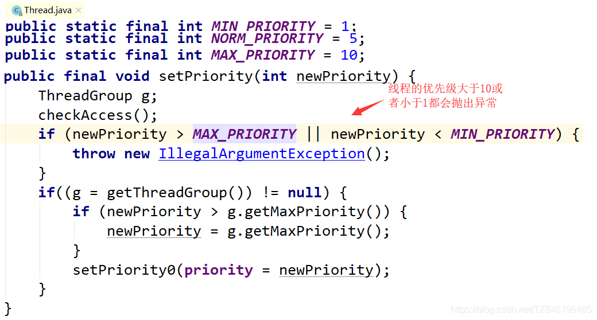

## 线程控制(sleep、join、setDeamon)

1. **static void sleep(long millis):使当前正在执行的线程停留(暂停执行)指定的毫秒数 (休眠线程)**

2. **void join():当前线程暂停，等待指定的线程执行结束后，当前线程再继续 (相当于插队加入)**

3. **void join(int millis):可以等待指定的毫秒之后继续 (相当于插队，有固定的时间)**

   当在线程A中调用B.join(1000)，如果1s过去了B没有执行完成，在这种情况下，**线程B将继续在后台执行，而线程A将不再等待线程B执行完毕。**

4. **void yield():让出cpu的执行权(礼让线程)**

   **当线程A执行yield语句让出CPU执行权时，线程A会暂停执行，并允许其他线程运行。当线程A再次获得CPU执行权时，它将从yield语句后面的位置继续执行。**

5. **void setDaemon(boolean on):将此线程标记为守护线程，当运行的线程都是守护线程时，Java虚拟机将退出(守护线程)**(相当于象棋中的帅，要是帅没了，别的棋子都会没用了)

### 守护线程

1. 守护线程是区别于用户线程的，用户线程即我们手动创建的线程，而守护线程是程序运行的时候在后台提供一种通用服务的线程。**垃圾回收线程就是典型的守护线程**
2. **守护线程拥有自动结束自己生命周期的特性，非守护线程却没有。**如果垃圾回收线程是非守护线程，当JVM 要退出时，由于垃圾回收线程还在运行着，导致程序无法退出，这就很尴尬。这就是为什么垃圾回收线程需要是守护线程
3. **t1.setDaemon(true)一定要在start( )方法之前使用**

```java
    //守护线程和非守护线程的区别是
    public static void main(String[] args) throws InterruptedException {
            Thread t1 = new Thread(()-> {
                    while (true) {
                        try {
                            Thread.sleep(1000);
                            System.out.println("我是子线程(用户线程.I am running");
                        } catch (Exception e) {
                    }
                }
            });
            //标记为守护线程，setDaemon要在start()方法之前使用
            t1.setDaemon(true);
            //启动线程
            t1.start();

        Thread.sleep(3000);
        System.out.println("主线程执行完毕...");
}
```

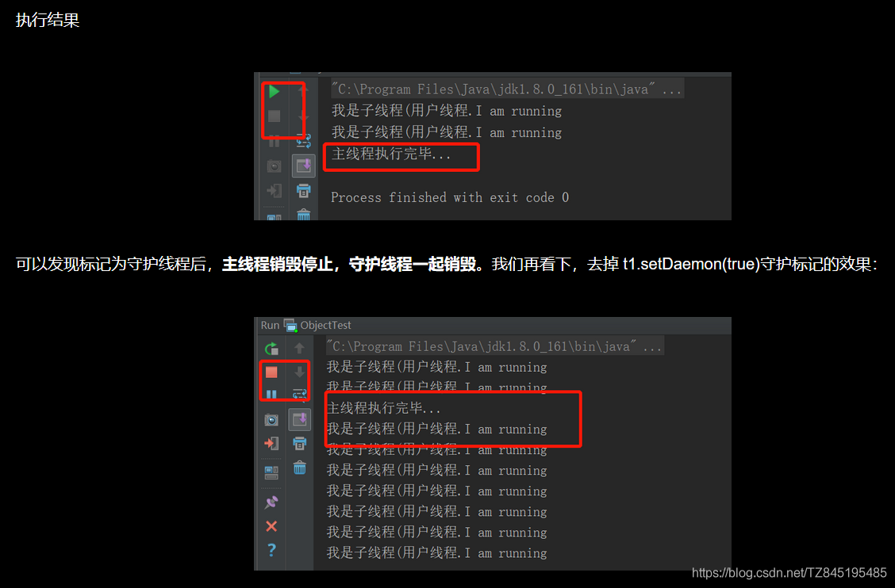

## 线程的生命周期

1. **新建**:就是刚使用new方法，**new出来的线程**
2. **就绪**:就是**调用的线程的start()方法后**，这时候线程处于等待CPU分配资源阶段，谁先抢的CPU资源，谁开始执行
3. **运行**:**当就绪的线程被调度并获得CPU资源时，便进入运行状态，run方法定义了线程的操作和功能**
4. **阻塞**:在运行状态的时候，可能因为**某些原因导致运行状态的线程变成了阻塞状态比如sleep()、wait()之后线程就处于了阻塞状态**，这个时候需要其他机制将处于阻塞状态的线程唤醒，比如调用notify或者notifyAll()方法。**唤醒的线程不会立刻执行run方法，它们要再次等待CPU分配资源进入运行状态**
5. **销毁:如果线程正常执行完毕后或线程被提前强制性的终止或出现异常导致结束，那么线程就要被销毁，释放资源**


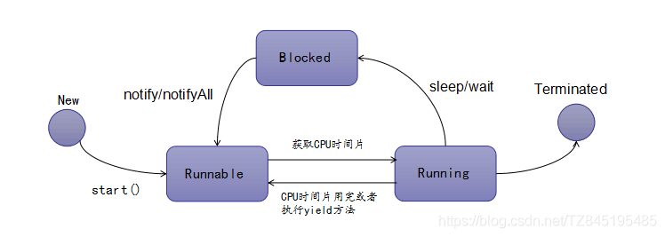

## 线程同步

### 买票案例出现的两个问题

①. 出现的问题:①. 相同票数出现多次；②.出现了负票

```java
public class SellTicket implements Runnable {
    //定义一个成员变量表示有100张票
    private int tickets=100;
    public void run(){
     while (true){
         if(tickets>0){
             try {
                 //通过sleep()方法来等待
                 Thread.sleep(100);
             } catch (InterruptedException e) {
                 e.printStackTrace();
             }
             System.out.println(Thread.currentThread().getName()+"正在出售第"+tickets--+"张票");
         }else{
             //System.out.println("");
         }
     }
    }
}
@SuppressWarnings("all")
public class SellTicketDemo {
    public static void main(String[] args) {
        SellTicket st = new SellTicket();

        Thread t1 = new Thread(st， "窗口1");
        Thread t2 = new Thread(st， "窗口2");
        Thread t3 = new Thread(st， "窗口3");

        t1.start();
        t2.start();
        t3.start();
    }
}
```

#### 原因分析

1. 为什会出现相同的票
2. 为什么会出现负票

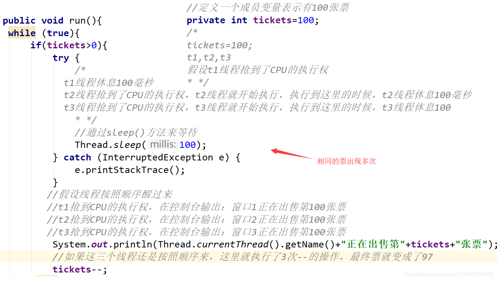


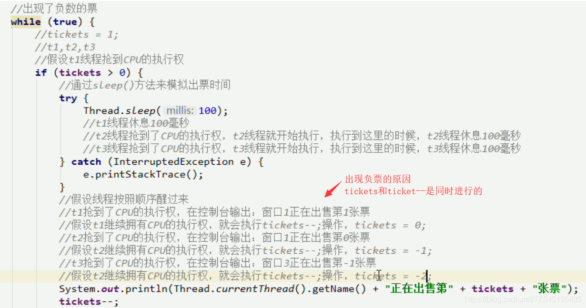

### 同步代码块synchronized

为什么出现问题？(这也是我们判断多线程程序是否会有数据安全问题的标准)

1. 是否有多线程坏境
2. 是否有共享数据
3. 是否有多条语句操作共享数据

如何解决多线程安全问题

1. 基本思想:让程序没有安全问题的坏境
2. 把多条语句操作的共享数据的代码给锁起来，让任意时刻只能有一个线程执行即可

怎么锁起来呢？
synchronized(任意对象):相当于给代码加锁了，任意对象就可以看成是一把锁

同步的好处和弊端

1. 好处:解决了多线程的数据安全问题
2. 弊端:当线程很多时，因为每个线程都会判断同步上的锁，这是很浪费资源的，无形中会降低程序的运行效率

```java
public class SellTicket implements Runnable {
    //定义一个成员变量表示有100张票
    private int tickets=100;
    
    private Object obj=new Object();

    public void run(){
     while (true){
       //这里放的锁要是同一把锁才可以
       synchronized(obj){
           if(tickets>0){
               try {
                   //通过sleep()方法来等待
                   Thread.sleep(100);
               } catch (InterruptedException e) {
                   e.printStackTrace();
               }
               System.out.println(Thread.currentThread().getName()+"正在出售第"+tickets--+"张票");
           }else{
               //System.out.println("");
           }
       }
     }
    }
}

```

## 同步方法

1. **同步方法:就是把synchronized 关键字加到方法上**
2. **同步方法的锁对象是什么呢? this**
3. 格式:修饰符 synchronized 返回值类型 方法名(方法参数){ }


```java
    private int tickets = 100;
    private Object obj = new Object();
    private int x = 0;

    @Override
    public void run() {
        while (true) {
            if (x % 2 == 0) {
//                synchronized (obj) {
        synchronized (this) {    
                    if (tickets > 0) {
                        try {
                            Thread.sleep(100);
                        } catch (InterruptedException e) {
                            e.printStackTrace();
                        }
                        System.out.println(Thread.currentThread().getName() + "正在出售第" + tickets + "张票");
                        tickets--;
                    }
                }
            } else {
                sellTicket();
            }
            x++;
        }
    }

  private synchronized void sellTicket() {
        if (tickets > 0) {
            try {
                Thread.sleep(100);
            } catch (InterruptedException e) {
                e.printStackTrace();
            }
            System.out.println(Thread.currentThread().getName() + "正在出售第" + tickets + "张票");
            tickets--;
        }
    }

}

```

1. **同步静态方法:就是把synchronized关键字加到静态方法上**
2. 格式:修饰符 static synchronized 返回值类型 方法名(方法参数){ }
3. **同步静态方法的锁对象是什么呢？类名.class**

```java
public class SellTicket implements Runnable {

    private static int tickets = 100;
    private Object obj = new Object();
    private int x = 0;

    @Override
    public void run() {
        while (true) {
            if (x % 2 == 0) {

                synchronized (SellTicket.class) {
                    if (tickets > 0) {
                        try {
                            Thread.sleep(100);
                        } catch (InterruptedException e) {
                            e.printStackTrace();
                        }
                        System.out.println(Thread.currentThread().getName() + "正在出售第" + tickets + "张票");
                        tickets--;
                    }
                }
            } else {
         
                sellTicket();
            }
            x++;
        }
    }

    private static synchronized void sellTicket() {
        if (tickets > 0) {
            try {
                Thread.sleep(100);
            } catch (InterruptedException e) {
                e.printStackTrace();
            }
            System.out.println(Thread.currentThread().getName() + "正在出售第" + tickets + "张票");
            tickets--;
        }
    }
}

```

# ReentrantLock Condition

## 生产者和消费者模式概述

生产者消费者模式是一个十分经典的多线程协作的模式，弄懂生产者消费者问题能够让我们对多线程编程的理解更加深刻。所谓生产消费者问题，实际上主要是包含了两类线程：

1. 一类是生产者线程用于生产数据
2. 一类是消费者线程用于消费数据

为了耦合生产者和消费者的关系，通常会采用共享的数据区域，就像一个仓库

1. 生产者生产数据之后直接放置在共享数据区中，并不需要关心消费者的行为

2. 消费者只需要从共享数据区中获取数据，并不需要关心生产者的行为

   

线程四句口诀

1. **在高内聚低耦合的前提下，线程 - >操作 - >资源类**
   [假如有一个空调，三个人去操作这个空调，高内聚低耦合是指空调有制热制冷的效果，它会把这两个抽取成一个方法，对外以接口的形式去暴露，提供给操作空调的人或线程使用]

2. 判断|操作|唤醒 [ 生产消费中 ]

3. **多线程交互中，必须要防止多线程的虚假唤醒，也即判断使用while，不能使用if**

   [多线程中的虚假唤醒](https://fahaxikilz.github.io/2023/04/21/juc/#多线程中的虚假唤醒)

4. 标志位

## 使用Sychronized实现(隐式锁)

1. 为了体现生产和消费过程总的等待和唤醒，Java就提供了几个方法供我们使用，这几个方法就在Object类中Object类的等待和唤醒方法(隐式锁)
2. viod wait( )：导致当前线程等待，直到另一个线程调用该对象的notify()方法和notifyAll()方法

3. void notify( )：唤醒正在等待对象监视器的单个线程

4. void notifyAll( )：唤醒正在等待对象监视器的所有线程
   **注意:wait、notify、notifyAll方法必须要在同步块或同步方法里且成对出现使用**

```java
/*
1.题目:
    现在两个线程，可以操作初始值为0的一个变量，实现一个线程对该变量加1，
    一个线程对该变量减1，交替执行，来10轮，变量的初始值为0
2.思想:
    1.在高内聚低耦合的前提下，线程->操作->资源类
    2.判断操作唤醒[生产消费中]
    3.多线程交互中，必须要放置多线程的虚假唤醒，也即(判断使用while，不能使用if)
* */

public class ThreadWaitNotifyDemo {
    public static void main(String[] args) {
        AirCondition airCondition=new AirCondition();
        new Thread(()->{ for (int i = 1; i <11 ; i++) airCondition.increment();}，"线程A").start();
        new Thread(()->{ for (int i = 1; i <11 ; i++) airCondition.decrement();}，"线程B").start();
        new Thread(()->{ for (int i = 1; i <11 ; i++) airCondition.increment();}，"线程C").start();
        new Thread(()->{ for (int i = 1; i <11 ; i++) airCondition.decrement();}，"线程D").start();
    }
}
class AirCondition{
    private int number=0;

    public synchronized void increment(){
        //1.判断
     /*   if(number!=0){*/
        while(number!=0){
            try {
                //为什么不用if?解释如下
                //第一次A进来了，在number++后(number=1) C抢到执行权，进入wait状态
                //这个时候，A抢到cpu执行权，也进入wait状态，此时，B线程进行了一次消费
                //唤醒了线程，这个时候A抢到CPU执行权，不需要做判断，number++(1)，唤醒线程
                //C也抢到CPU执行权，不需要做判断，number++(2)
                
                this.wait();
            } catch (InterruptedException e) {
                e.printStackTrace();
            }
        }
        //2.干活
        number++;
        System.out.println(Thread.currentThread().getName()+":"+number);
        //3.唤醒
        this.notifyAll();
    }
    public  synchronized void decrement(){
        /*if (number==0){*/
        while (number==0){
            try {
                this.wait();
            } catch (InterruptedException e) {
                e.printStackTrace();
            }
        }
        number--;
        System.out.println(Thread.currentThread().getName()+":"+number);
        this.notifyAll();
    }
}

```

## 使用ReentrantLock实现 (显示锁)

1. ReentrantLock( ):创建一个ReentrantLock的实例
2. void lock( ):获得锁

3. void unlock( ):释放锁


```java
/*
* 使用Lock代替Synchronized来实现新版的生产者和消费者模式 !
* */
@SuppressWarnings("all")
public class ThreadWaitNotifyDemo {
    public static void main(String[] args) {
        AirCondition airCondition=new AirCondition();

        new Thread(()->{ for (int i = 0; i <10 ; i++) airCondition.decrement();}，"线程A").start();
        new Thread(()->{ for (int i = 0; i <10 ; i++) airCondition.increment();}，"线程B").start();
        new Thread(()->{ for (int i = 0; i <10 ; i++) airCondition.decrement();}，"线程C").start();
        new Thread(()->{ for (int i = 0; i <10 ; i++) airCondition.increment();}，"线程D").start();
    }
}
class AirCondition{
    private int number=0;
    //定义Lock锁对象
    final Lock lock=new ReentrantLock();
    final Condition condition  = lock.newCondition();

    //生产者，如果number=0就 number++
    public  void increment(){
       lock.lock();
       try {
           //1.判断
           while(number!=0){
               try {
                   condition.await();//this.wait();
               } catch (InterruptedException e) {
                   e.printStackTrace();
               }
           }
           //2.干活
           number++;
           System.out.println(Thread.currentThread().getName()+":\t"+number);
           //3.唤醒
           condition.signalAll();//this.notifyAll();
       }catch (Exception e){
           e.printStackTrace();
       }finally {
           lock.unlock();
       }
    }
    //消费者，如果number=1，就 number--
    public   void decrement(){
        lock.lock();
        try {
            //1.判断
            while(number==0){
                try {
                    condition.await();//this.wait();
                } catch (InterruptedException e) {
                    e.printStackTrace();
                }
            }
            //2.干活
            number--;
            System.out.println(Thread.currentThread().getName()+":\t"+number);
            //3.唤醒
            condition.signalAll();//this.notifyAll();
        }catch (Exception e){
            e.printStackTrace();
        }finally {
            lock.unlock();
        }
    }
}

```

## 精确通知

```java
/*
    多个线程之间按顺序调用，实现A->B->C
三个线程启动，要求如下:
    AA打印5次，BB打印10次，CC打印15次
    接着
    AA打印5次，BB打印10次，CC打印15次
    ....来10轮
* */
public class ThreadOrderAccess {
    public static void main(String[] args) {
        ShareResource shareResource=new ShareResource();

        new Thread(()->{ for (int i = 1; i <=10; i++)shareResource.print5(); }，"线程A").start();
        new Thread(()->{ for (int i = 1; i <=10; i++)shareResource.print10(); }，"线程B").start();
        new Thread(()->{ for (int i = 1; i <=10; i++)shareResource.print15(); }，"线程C").start();
    }
}

class ShareResource{

    //设置一个标识，如果是number=1，线程A执行...
    private int number=1;

    Lock lock=new ReentrantLock();
    Condition condition1=lock.newCondition();
    Condition condition2=lock.newCondition();
    Condition condition3=lock.newCondition();


    public void print5(){
        lock.lock();
        try {
            //1.判断
            while(number!=1){
                condition1.await();
            }
            //2.干活
            for (int i = 1; i <=5; i++) {
                System.out.println(Thread.currentThread().getName()+":\t"+i);
            }
            //3.唤醒
            number=2;
            condition2.signal();
        }catch (Exception e){
            e.printStackTrace();
        }finally {
            lock.unlock();
        }
    }

    public void print10(){
        lock.lock();
        try {
            //1.判断
            while(number!=2){
                condition2.await();
            }
            //2.干活
            for (int i = 1; i <=10; i++) {
                System.out.println(Thread.currentThread().getName()+":\t"+i);
            }
            //3.唤醒
            number=3;
            condition3.signal();
        }catch (Exception e){
            e.printStackTrace();
        }finally {
            lock.unlock();
        }
    }

    public void print15(){
        lock.lock();
        try {
            //1.判断
            while(number!=3){
                condition3.await();
            }
            //2.干活
            for (int i = 1; i <=15; i++) {
                System.out.println(Thread.currentThread().getName()+":\t"+i);
            }
            //3.唤醒
            number=1;
            condition1.signal();
        }catch (Exception e){
            e.printStackTrace();
        }finally {
            lock.unlock();
        }
    }
}

```

# 多线程中的虚假唤醒

## 虚假唤醒问题的产生

前提：一个卖面的面馆，有一个做面的厨师和一个吃面的食客，需要保证，厨师做一碗面，食客吃一碗面，不能一次性多做几碗面，更不能没有面的时候吃面；按照上述操作，进行十轮做面吃面的操作

代码展示(两个线程不会出现虚假唤醒问题，四个或多个线程才会出现)

```java
class Noodles{

    //面的数量
    private int num = 0;

    //做面方法
    public synchronized void makeNoodles() throws InterruptedException {
        //如果面的数量不为0，则等待食客吃完面再做面
        if(num != 0){
            this.wait();
        }

        num++;
        System.out.println(Thread.currentThread().getName()+"做好了一份面，当前有"+num+"份面");
        //面做好后，唤醒食客来吃
        this.notifyAll();
    }

    //吃面方法
    public synchronized void eatNoodles() throws InterruptedException {
        //如果面的数量为0，则等待厨师做完面再吃面
        if(num == 0){
            this.wait();
        }

        num--;
        System.out.println(Thread.currentThread().getName()+"吃了一份面，当前有"+num+"份面");
        //吃完则唤醒厨师来做面
        this.notifyAll();
    }

}

public class Test {

    public static void main(String[] args) {

        Noodles noodles = new Noodles();

        new Thread(new Runnable(){
            @Override
            public void run() {
                try {
                    for (int i = 0; i < 10 ; i++) {
                        noodles.makeNoodles();
                    }
                } catch (InterruptedException e) {
                    e.printStackTrace();
                }
            }
        }，"厨师A").start();

        new Thread(new Runnable(){
            @Override
            public void run() {
                try {
                    for (int i = 0; i < 10 ; i++) {
                        noodles.eatNoodles();
                    }
                } catch (InterruptedException e) {
                    e.printStackTrace();
                }
            }
        }，"食客甲").start();

    }

}

```

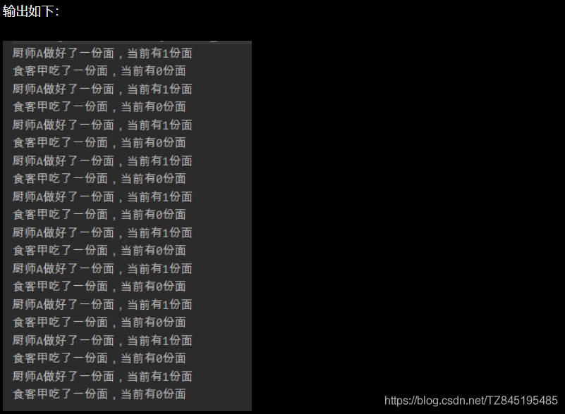

如果有两个厨师，两个食客，都进行10次循环呢?(出现线程虚假唤醒问题)
Noodles类的代码不用动，在主类中多创建两个线程即可，主类代码如下：

```JAVA
public class Test {

    public static void main(String[] args) {

        Noodles noodles = new Noodles();

        new Thread(new Runnable(){
            @Override
            public void run() {
                try {
                    for (int i = 0; i < 10 ; i++) {
                        noodles.makeNoodles();
                    }
                } catch (InterruptedException e) {
                    e.printStackTrace();
                }
            }
        }，"厨师A").start();

        new Thread(new Runnable(){
            @Override
            public void run() {
                try {
                    for (int i = 0; i < 10 ; i++) {
                        noodles.makeNoodles();
                    }
                } catch (InterruptedException e) {
                    e.printStackTrace();
                }
            }
        }，"厨师B").start();

        new Thread(new Runnable(){
            @Override
            public void run() {
                try {
                    for (int i = 0; i < 10 ; i++) {
                        noodles.eatNoodles();
                    }
                } catch (InterruptedException e) {
                    e.printStackTrace();
                }
            }
        }，"食客甲").start();

        new Thread(new Runnable(){
            @Override
            public void run() {
                try {
                    for (int i = 0; i < 10 ; i++) {
                        noodles.eatNoodles();
                    }
                } catch (InterruptedException e) {
                    e.printStackTrace();
                }
            }
        }，"食客乙").start();

    }
}

```

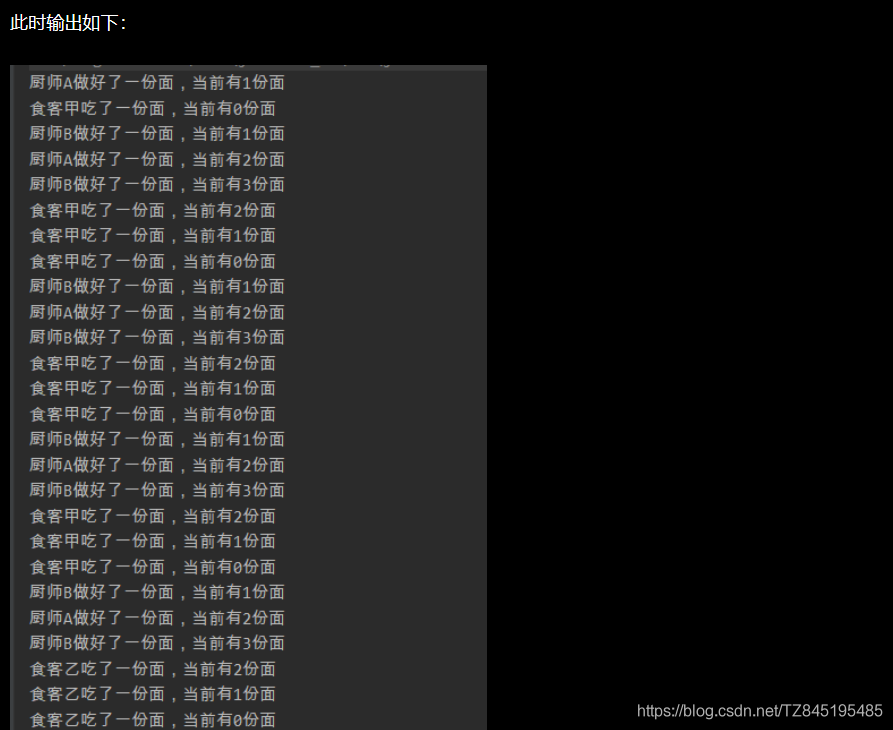

## 虚假唤醒问题分析

1. 初始状态

   

2. 厨师A得到操作权，发现面的数量为0，可以做面，面的份数+1，然后唤醒所有线程；

   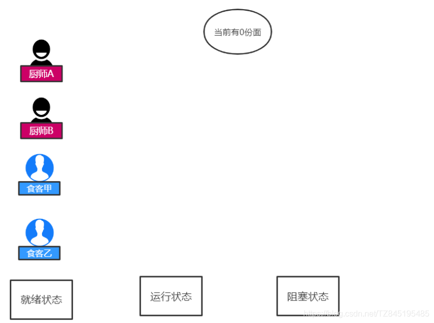

3. 厨师B得到操作权，发现面的数量为1，不可以做面，执行wait操作；

   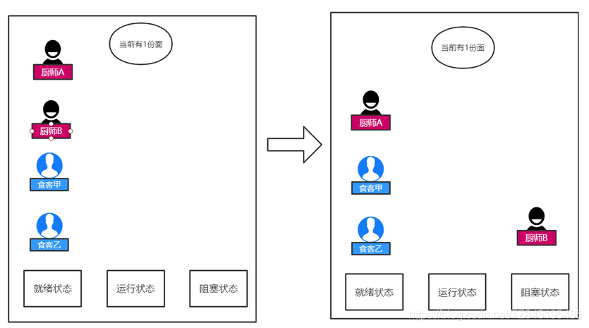

4. 厨师A得到操作权，发现面的数量为1，不可以做面，执行wait操作；

   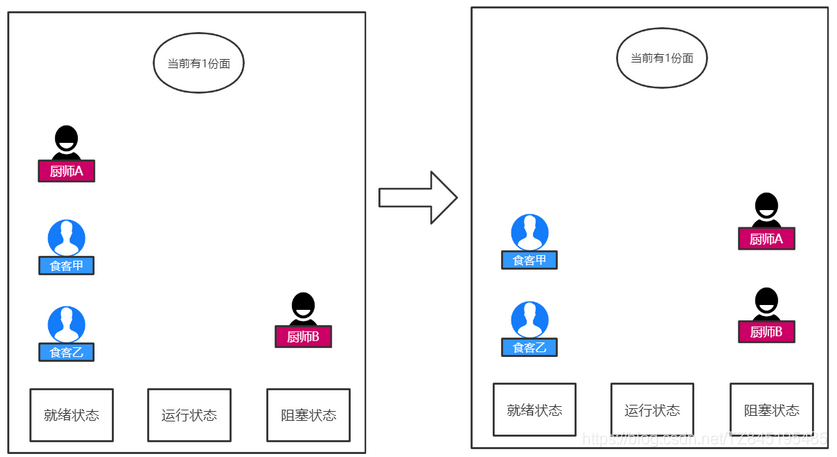

5. 食客甲得到操作权，发现面的数量为1，可以吃面，吃完面后面的数量-1，并唤醒所有线程；

   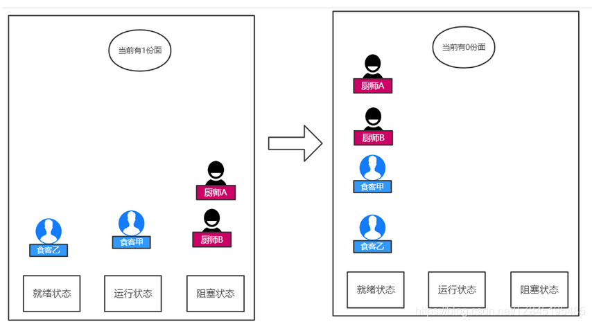

6. 此时厨师A得到操作权了，因为是从刚才阻塞的地方继续运行，就不用再判断面的数量是否为0了，所以直接面的数量+1，并唤醒其他线程

   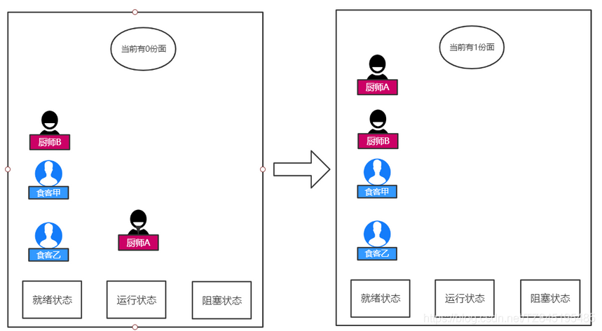

7. 此时厨师B得到操作权了，因为是从刚才阻塞的地方继续运行，就不用再判断面的数量是否为0了，所以直接面的数量+1，并唤醒其他线程

   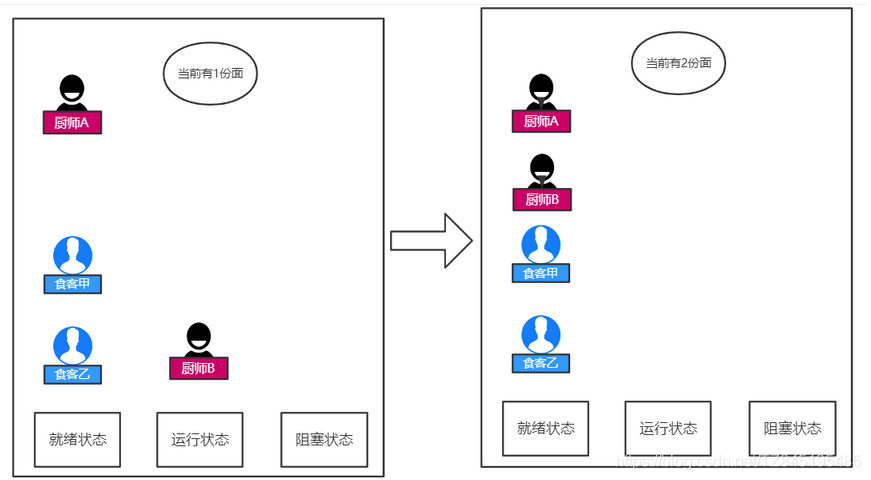

## 解决方法

出现虚假唤醒的原因是从阻塞态到就绪态再到运行态没有进行判断，我们只需要让其每次得到操作权时都进行判断就可以了

```JAVA
	if(num != 0){
		this.wait();
	}
	改为	
	while(num != 0){
		this.wait();
	}


	if(num == 0){
		this.wait();
	}
	改为
	while(num == 0){
		this.wait();
	}

```

# 阻塞队列

## 阻塞队列概述

### 什么是阻塞队列?

阻塞队列，顾名思义，首先它是一个队列，而一个阻塞队列在数据结构中所起的作用大致如图所示
**当阻塞队列是空时，从队列中获取元素的操作将会被阻塞**
**当阻塞队列是满时，往队列中添加元素的操作将会被阻塞**

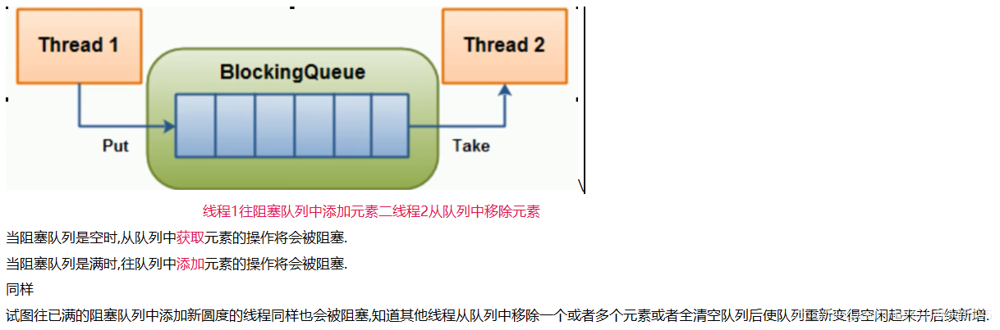

### 为什么用?有什么好处?

1. 好处是我们不需要关心什么时候需要阻塞线程，什么时候需要唤醒线程，因为BlockingQueue都一手给你包办好了
2. 在concurrent包发布以前，在多线程环境下，我们每个程序员都必须自己去控制这些细节，尤其还要兼顾效率和线程安全，而这会给我们的程序带来不小的复杂度.

### 架构介绍

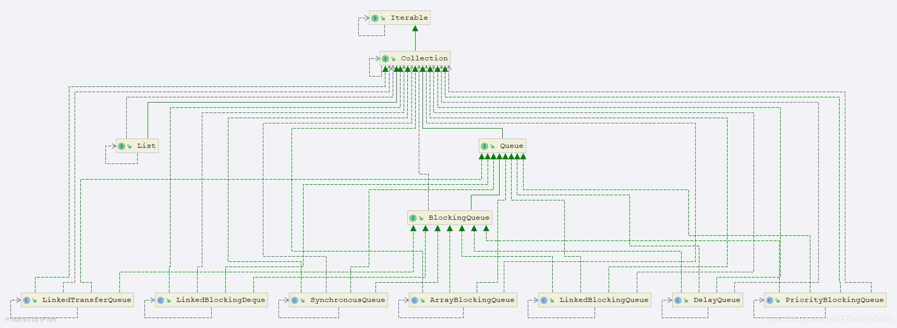

## 阻塞队列种类

1. **ArrayBlockingQueue: 由数组结构组成的有界阻塞队列**
2. **LinkedBlockingQueue: 由链表结构组成的有界(但大小默认值 Integer>MAX_VAL UE)阻塞队列.**

3. **SynchronousQueue:不存储元素的阻塞队列，也即是单个元素的队列.**
4. **PriorityBlockingQueue:支持优先级排序的无界阻塞队列.**
5. **LinkedTransferQueue:由链表结构组成的无界阻塞队列.**
6. **LinkedBlockingDeque:由了解结构组成的双向阻塞队列.**

### SynchronousQueue

**SynchronousQueue没有容量，与其他BlcokingQueue不同，SynchronousQueue是一个不存储元素的BlcokingQueue**
**每个put操作必须要等待一个take操作，否则不能继续添加元素，反之亦然**

```java
public class SynchronousQueueDemo {
    public static void main(String[] args) {
        BlockingQueue<String> blockingQueue = new SynchronousQueue<>();
        new Thread(() -> {
            try {
                System.out.println(Thread.currentThread().getName() + "\t put 1");
                blockingQueue.put("1");
                System.out.println(Thread.currentThread().getName() + "\t put 2");
                blockingQueue.put("2");
                System.out.println(Thread.currentThread().getName() + "\t put 3");
                blockingQueue.put("3");
            } catch (InterruptedException e) {
                e.printStackTrace();
            }
        }， "AAA").start();

        new Thread(() -> {
            try {
                try {
                    TimeUnit.SECONDS.sleep(5);
                } catch (InterruptedException e) {
                    e.printStackTrace();
                }
                System.out.println(Thread.currentThread().getName() + "\t" + blockingQueue.take());
                
                try {
                    TimeUnit.SECONDS.sleep(5);
                } catch (InterruptedException e) {
                    e.printStackTrace();
                }
                System.out.println(Thread.currentThread().getName() + "\t" + blockingQueue.take());
                
                try {
                    TimeUnit.SECONDS.sleep(5);
                } catch (InterruptedException e) {
                    e.printStackTrace();
                }
                System.out.println(Thread.currentThread().getName() + "\t" + blockingQueue.take());
                
            } catch (InterruptedException e) {
                e.printStackTrace();
            }
        }， "BBB").start();
    }
}

```

## BlockingQueue的核心方法

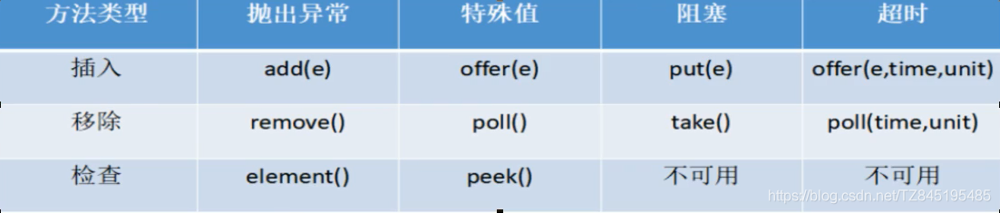

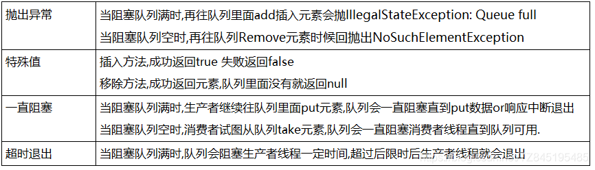

```java
public class BlockingQueueExceptionDemo {
    public static void main(String[] args) {
        //List list=new ArrayList();
        //注意:这里要给一个初始值
        BlockingQueue<String>blockingQueue=new ArrayBlockingQueue<>(3);
        //add() 方法是给ArrayBlockingQueue添加元素，如果超过会抛出异常!
        System.out.println(blockingQueue.add("a"));//true
        System.out.println(blockingQueue.add("b"));//true
        System.out.println(blockingQueue.add("c"));//true
        //element是检查元素有没有? 检查的是出栈的元素
        blockingQueue.element();

        //remove()
        System.out.println(blockingQueue.remove());//a
        System.out.println(blockingQueue.remove());//b
        System.out.println(blockingQueue.remove());//c
    }
}
    @Test
    public void offerAndPoll()throws Exception{
        BlockingQueue blockingQueue=new ArrayBlockingQueue(3);
        //前三个直接成功
        System.out.println(blockingQueue.offer("a"， 2L， TimeUnit.SECONDS));
        System.out.println(blockingQueue.offer("a"， 2L， TimeUnit.SECONDS));
        System.out.println(blockingQueue.offer("a"， 2L， TimeUnit.SECONDS));
        //下面这个会阻塞2s
        System.out.println(blockingQueue.offer("a"， 2L， TimeUnit.SECONDS));
    }

```

# 线程池

## ThreadPoolExecutor的理解

### 线程池的优势

1. 线程池做的工作主要是控制运行的线程的数量，处理过程中将任务加入队列，然后在线程创建后启动这些任务，如果显示超过了最大数量，超出的数量的线程排队等候，等其他线程执行完毕，再从队列中取出任务来执行
2. **它的主要特点为:线程复用 | 控制最大并发数 | 管理线程.**

### 线程池如何使用

Java中的线程池是通过Executor框架实现的，该框架中用到了Executor，Executors，ExecutorService，ThreadPoolExecutor这几个类

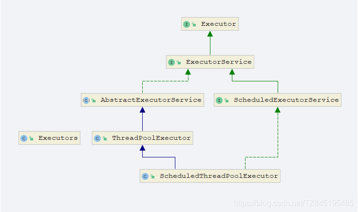

### 方法详解与代码实现

1. **Executors.newFixedThreadPool(int) : 一池定线程**

   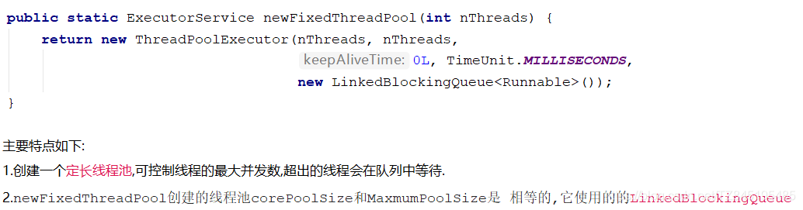

2. **Executors.newSingleThreadExecutor( ) : 一池一线程**

   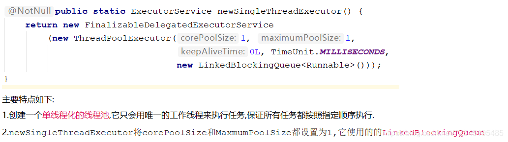

3. **Executors.newCachedThreadPool( ) : 一池N线程**

   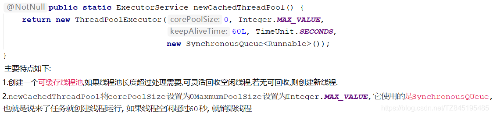

```java
/*
//看cpu的核数
//System.out.println(Runtime.getRuntime().availableProcessors());
* 第四种获取/使用java多线程的方式，线程池
* */
public class ExecutorTest {
    public static void main(String[] args) {

        //ExecutorService threadPool= Executors.newFixedThreadPool(5);//一池5个处理线程
        //ExecutorService threadPool=Executors.newSingleThreadExecutor();//一池一线程
        ExecutorService threadPool=Executors.newCachedThreadPool();//一池N线程

        try {
            for (int i = 1; i <= 10; i++) {
                //使用
                threadPool.execute(() -> {
                    //模拟10个用户来办理业务，每个用户就是一个来自外部的请求线程
                    System.out.println(Thread.currentThread().getName() + "\t 办理业务~！");
                });
                //try { TimeUnit.SECONDS.sleep(3);  } catch (InterruptedException e) {e.printStackTrace();}
            }

        }catch (Exception e){

        }finally {
            //关闭
            threadPool.shutdown();
        }
    }
}

```

## 线程池的七大参数

1. **corePoolSize:线程池中的常驻核心线程数**
   - 在创建了线程池后，当有请求任务来之后，就会安排池中的线程去执行请求任务，**近似理解为今日当值线程，当线程池中的线程数目达到corePoolSize后，就会把到达的任务放入到缓存队列当中.**
2. **maximumPoolSize:线程池的最大线程数，包括核心线程和非核心线程。**如果线程池中的线程数达到了`corePoolSize`并且工作队列已满（或者没有工作队列），而此时还有新的任务提交到线程池，那么会创建新的非核心线程来处理这些任务。**非核心线程会在任务执行完毕后，在一定的空闲时间后被回收，以控制线程池的大小不超过`maximumPoolSize`。**
3. **keepAliveTime:多余的空闲线程存活时间，当空间时间达到keepAliveTime值时，多余的线程会被销毁直到只剩下corePoolSize个线程为止(非核心线程)**
4. **unit:keepAliveTime的单位**
5. **workQueue:任务队列，被提交但尚未被执行的任务(候客区)**
6. **threadFactory:表示生成线程池中工作线程的线程工厂，用户创建新线程，一般用默认即可**(银行网站的logo | 工作人员的制服 | 胸卡等)
7. **handler:拒绝策略，表示当线程队列满了并且工作线程大于等于线程池的最大显示数(maxnumPoolSize)时如何来拒绝**

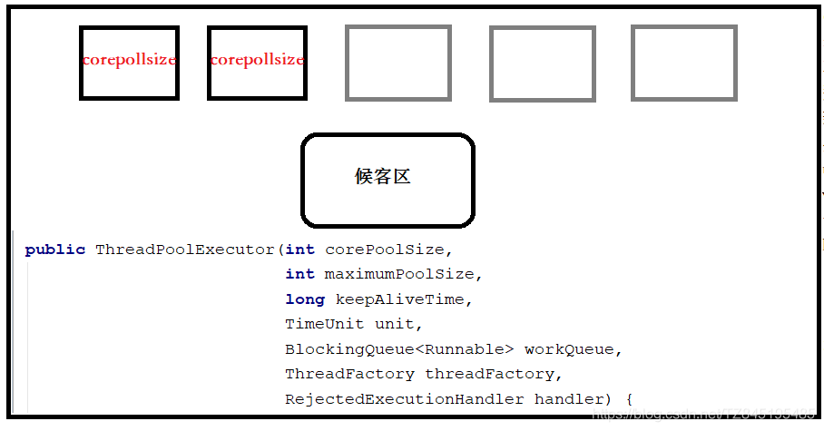

## 线程池的底层工作原理

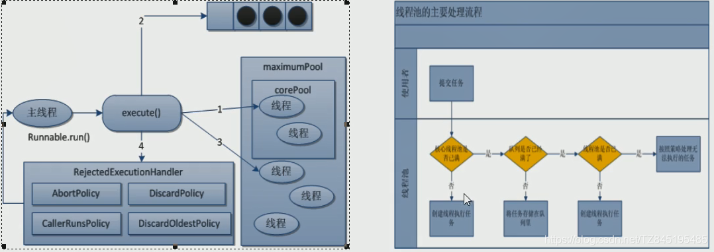

解释:

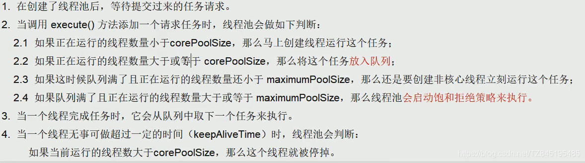

## 生产上线程池如何设置合理参数

### 线程池的拒绝策略

1. 等待队列也已经排满了，再也塞不下新的任务了。同时，线程池的maximumPoolSize也到达了，无法接续为新任务服务，这时我们需要拒绝策略机制合理的处理这个问题

2. JDK内置的拒绝策略

   - **AbortPolicy(默认):直接抛出RejectedException异常阻止系统正常运行**

   - **CallerRunsPolicy:"调用者运行"一种调节机制，该策略既不会抛弃任务，也不会抛出异常，而是返回给调用者进行处理**

   - **DiscardOldestPolicy:将最早进入队列的任务删除，之后再尝试加入队列**

   - **DiscardPolicy:直接丢弃任务，不予任何处理也不抛出异常.如果允许任务丢失，这是最好的拒绝策略**

     以上内置策略均实现了RejectExecutionHandler接口

### 你在工作中哪种方法创建线程池？超级大坑

​	答案是一个都不用，我们生产上只能使用自定义的

#### 为什么不用JDK提供的Executors?

参考阿里巴巴java开发手册
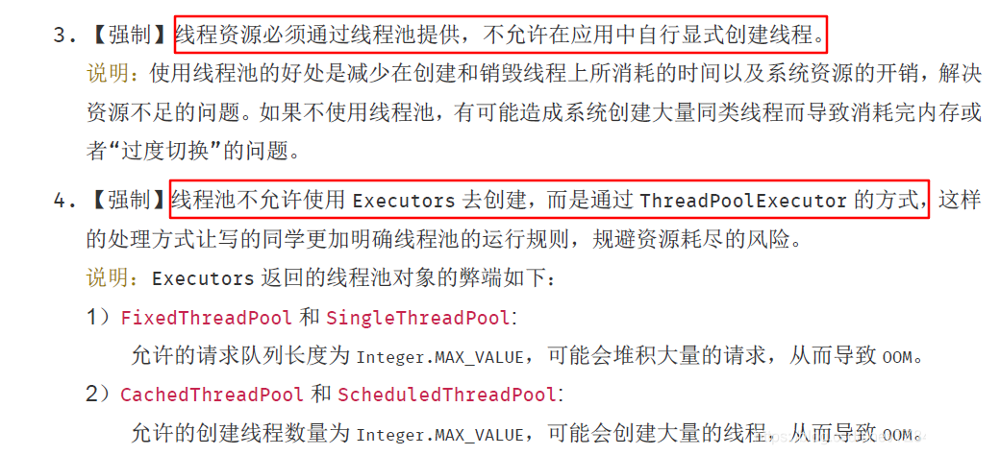

在实际生产环境中，通常建议避免使用 `Executors` 类中的工厂方法来创建线程池，而是通过直接使用 `ThreadPoolExecutor` 类的方式来创建线程池。这是因为 `Executors` 类提供的工厂方法虽然方便，但其内部实现使用了一些默认参数，可能不适合所有情况。

### 自定义线程池

1. AbortPolicy: 最大不会抛出异常的值= `maximumPoolSize + new LinkedBlockin gDeque<Runnable>(3) =8`个。如果超过8个，默认的拒绝策略会抛出异常

2. CallerRunPolicy: 如果超过8个，不会抛出异常，会返回给调用者去

3. DiscardOldestPolicy:如果超过8个，将最早进入队列的任务删除，之后再尝试加入队列

4. DiscardPolicy:直接丢弃任务，不予任何处理也不抛出异常.如果允许任务丢失，这是最好的拒绝策略

   ```java
   public class MyThreadPoolDemo {
       public static void main(String[] args) {
           ExecutorService threadPool = new ThreadPoolExecutor(
                   2，
                   5，
                   1L，
                   TimeUnit.SECONDS，
                   new LinkedBlockingDeque<Runnable>(3)，
                   Executors.defaultThreadFactory()，
                   //默认抛出异常
                   //new ThreadPoolExecutor.AbortPolicy()
                   //回退调用者
                   //new ThreadPoolExecutor.CallerRunsPolicy()
                   //处理不来的不处理，丢弃时间最长的
                   //new ThreadPoolExecutor.DiscardOldestPolicy()
                   //直接丢弃任务，不予任何处理也不抛出异常
                   new ThreadPoolExecutor.DiscardPolicy()
           );
           //模拟10个用户来办理业务 没有用户就是来自外部的请求线程.
           try {
               for (int i = 1; i <= 10; i++) {
                   threadPool.execute(() -> {
                       System.out.println(Thread.currentThread().getName() + "\t 办理业务");
                   });
               }
           } catch (Exception e) {
               e.printStackTrace();
           } finally {
               threadPool.shutdown();
           }
           //threadPoolInit();
       }
   }
   
   ```

### 如何合理配置线程池

CPU密集型

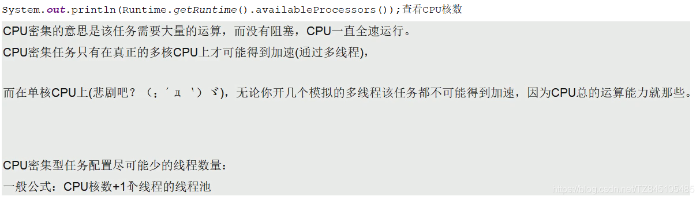

IO密集型

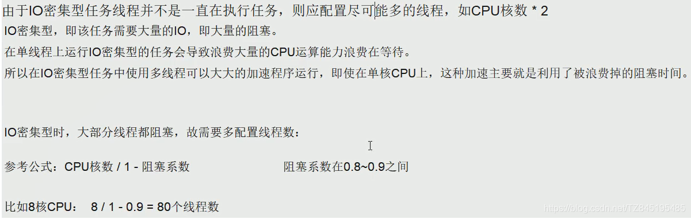

1. 并发量：首先，要**根据应用程序的并发量来确定线程池的大小。**可以根据系统的负载情况、处理任务的类型和平均任务执行时间等因素来估计并发量。一般来说，**可以通过监控系统的CPU利用率、内存使用情况和任务等待队列的长度等指标来调整线程池大小。**
2. **线程数：线程池的线程数需要根据系统的资源限制、CPU核心数和任务的性质来确定。如果任务是CPU密集型的，那么线程数应该与可用的CPU核心数接近或等于，以充分利用计算资源。如果任务是I/O密集型的，线程数可以设置得稍微多一些，以便在I/O等待时能够切换到其他线程执行任务。**
3. 队列容量：线程池的任务队列用于存储等待执行的任务。**队列的容量需要根据系统的负载情况、任务的平均执行时间和线程池的处理能力来确定。如果任务处理速度比较快，队列可以设置得比较小；如果任务处理速度比较慢或者系统负载高，队列容量可以适当增加，以避免任务被拒绝执行。**
4. 拒绝策略：**当任务无法被线程池接受时，需要定义合适的拒绝策略。拒绝策略可以根据业务需求来确定**，常见的策略包括抛出异常、丢弃任务、丢弃最旧的任务或者调用者自己执行任务等。选择合适的拒绝策略可以保证系统的稳定性和可靠性。
5. **线程工厂：线程工厂用于创建线程对象，可以根据需要自定义线程的属性，如线程名称、优先级等。根据具体的需求，可以实现自己的线程工厂来定制线程的创建过程。**

# synchronized锁

## Lock8 8锁问题

①. 标准访问有ab两个线程，请问先打印邮件还是短信

②. sendEmail方法暂停3秒钟，请问先打印邮件还是短信

③. 新增一个普通的hello方法，请问先打印邮件还是hello

④. 有两部手机，请问先打印邮件还是短信

⑤. 两个静态同步方法，同1部手机，请问先打印邮件还是短信

⑥. 两个静态同步方法， 2部手机，请问先打印邮件还是短信

⑦. 1个静态同步方法，1个普通同步方法，同1部手机，请问先打印邮件还是短信

⑧. 1个静态同步方法，1个普通同步方法，2部手机，请问先打印邮件还是短信

```java
class Phone{ //资源类
    public static synchronized void sendEmail() {
        //暂停几秒钟线程
        try { TimeUnit.SECONDS.sleep(3); } catch (InterruptedException e) { e.printStackTrace(); }
        System.out.println("-------sendEmail");
    }

    public synchronized void sendSMS()
    {
        System.out.println("-------sendSMS");
    }

    public void hello()
    {
        System.out.println("-------hello");
    }
}
public class Lock8Demo{
    public static void main(String[] args){//一切程序的入口，主线程
        Phone phone = new Phone();//资源类1
        Phone phone2 = new Phone();//资源类2

        new Thread(() -> {
            phone.sendEmail();
        }，"a").start();

        //暂停毫秒
        try { TimeUnit.MILLISECONDS.sleep(300); } catch (InterruptedException e) { e.printStackTrace(); }

        new Thread(() -> {
            //phone.sendSMS();
            //phone.hello();
            phone2.sendSMS();
        }，"b").start();

    }
}

```

1. ①-②
   **一个对象里面如果有多个synchronized方法，某一个时刻内，只要一个线程去调用其中的一个synchronized方法了，其它的线程都只能等待**，换句话说，**某一个时刻内，只能有唯一的一个线程去访问这些synchronized方法锁的是当前对象this，被锁定后，其它的线程都不能进入到当前对象的其它的synchronized方法**

2. ③-④
   **加个普通方法后发现和同步锁无关**
   换成两个对象后，不是同一把锁了，情况立刻变化。

3. ⑤-⑥ 都换成静态同步方法后，情况又变化
   三种 synchronized 锁的内容有一些差别:
   **对于普通同步方法，锁的是当前实例对象，通常指this**，具体的一部部手机，所有的普通同步方法用的都是同一把锁——实例对象本身，
   **对于静态同步方法，锁的是当前类的Class对象**，如Phone.class唯一的一个模板
   对于同步方法块，锁的是 synchronized 括号内的对象

4. ⑦-⑧
   **当一个线程试图访问同步代码时它首先必须得到锁，退出或抛出异常时必须释放锁。**

5. 总结：

   **所有的普通同步方法用的都是同一把锁——实例对象本身，就是new出来的具体实例对象本身，本类this**
   也就是说如果一个实例对象的普通同步方法获取锁后，该实例对象的其他普通同步方法必须等待获取锁的方法释放锁后才能获取锁。

   **所有的静态同步方法用的也是同一把锁——类对象本身，就是我们说过的唯一模板Class**
   具体实例对象this和唯一模板Class，这两把锁是两个不同的对象，所以静态同步方法与普通同步方法之间是不会有竞态条件的
   但是一旦一个静态同步方法获取锁后，其他的静态同步方法都必须等待该方法释放锁后才能获取锁。

   **总的来说，就是在线程中多个方法使用同一个锁，只有获取锁的线程才可以执行方法，其他的线程只能等待。**

## 从字节码角度分析synchronized实现

1. 反编译:`javap -v -p *.class > 类.txt`将进行输出到txt中

2. synchronized有三种应用方式

   1. 作用于代码块，对括号里配置的对象加锁
   2. 作用于实例方法，当前实例加锁，进入同步代码前要获得当前实例的锁
   3. 作用于静态方法，当前类加锁，进去同步代码前要获得当前类对象的锁

3. synchronized同步代码块
   实现使用的是monitorenter和monitorexit指令

   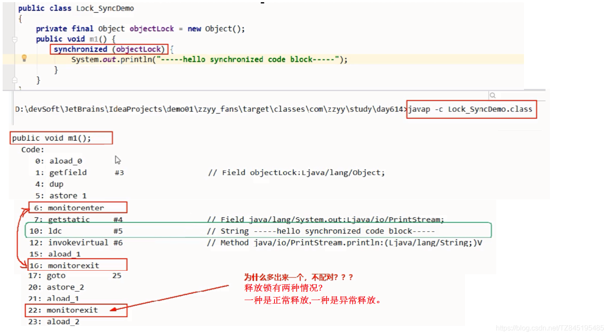

   **一定是一个enter和两个exit吗？**

   **不一定，如果方法中直接抛出了异常处理，那么就是一个monitorenter和一个monitorexit**

   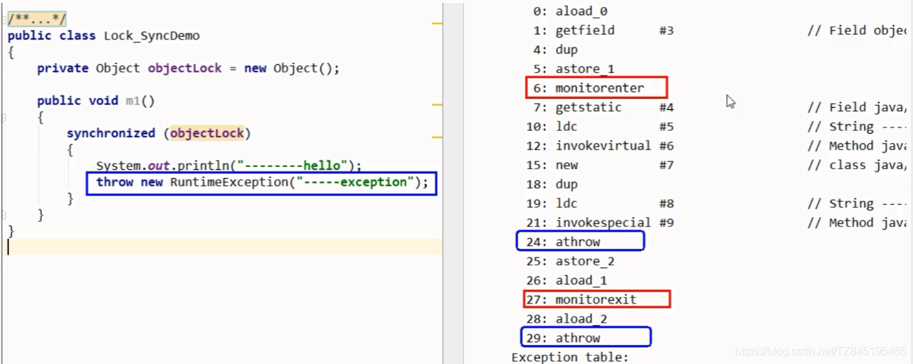

4. synchronized普通同步方法
   **调用指令将会检查方法的ACC_SYNCHRONIZED访问标志是否被设置，如果设置了，执行线程会将先持有monitor然后再执行方法，最后再方法完成(无论是正常完成还是非正常完成)时释放minotor)**

   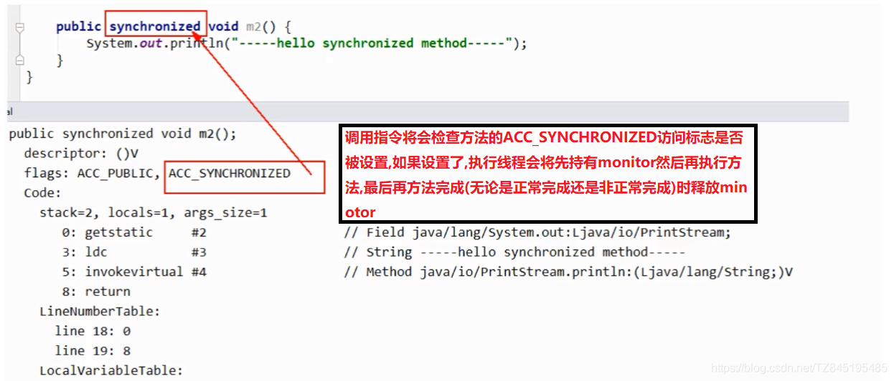

5. synchronized静态同步方法
   **ACC_STATIC、ACC_SYNCHRONIZED访问标志区分该方法是否静态同步方法**

   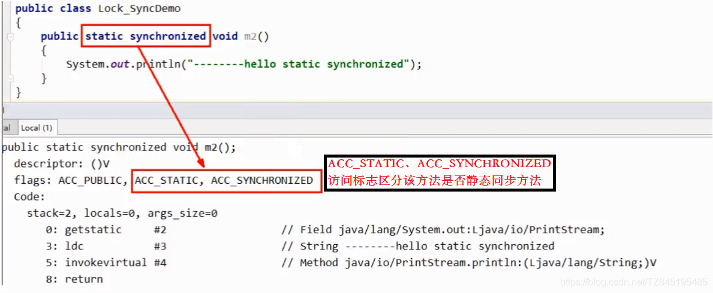

## 反编译synchronized锁的是什么

1. 任何一个对象都可以成为一个锁，在HotSpot虚拟机中，monitor采用ObjectMonitor实现

2. 上述C++源码解读

   ObjectMonitor.java — ObjectMonitor.cpp — ObjectMonitor.hpp
   ObjectMonitor.hpp(底层源码解析)

   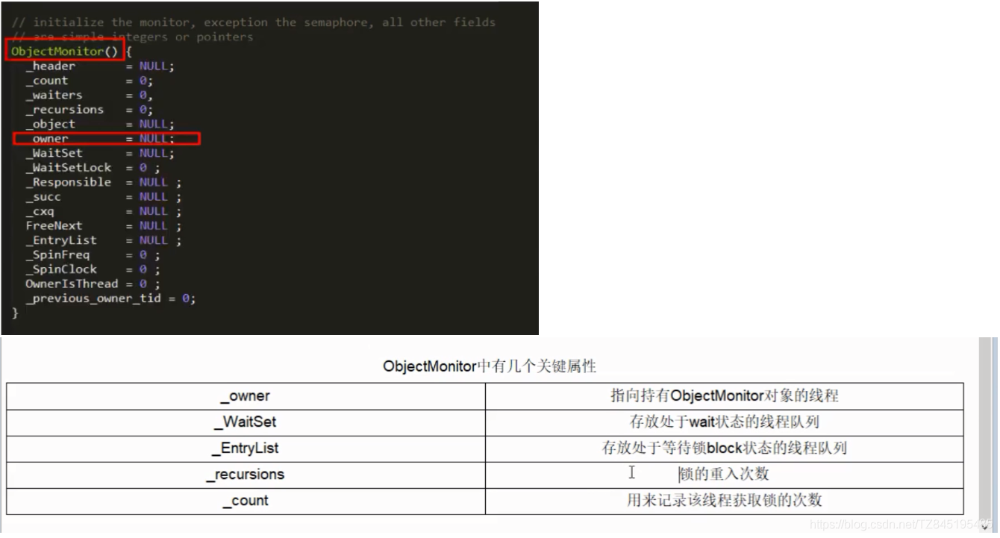

3. 阿里开发手册说明
   **高并发时，同步调用应该去考量锁的性能损耗。能用无锁数据结构，就不要用锁;能锁区块，就不要锁整个方法体;能用对象锁，就不要用类锁**

# 锁种类

## 乐观锁和悲观锁

### 悲观锁

- synchronized关键字和Lock的实现类都是悲观锁

- 什么是悲观锁？

  认为自己在使用数据的时候一定有别的线程来修改数据，因此在获取数据的时候会先加锁，确保数据不会被别的线程修改。

  **适合写操作多的场景，先加锁可以保证写操作时数据正确(写操作包括增删改)、显式的锁定之后再操作同步资源**

- **synchronized关键字和Lock的实现类都是悲观锁**

### 乐观锁

- 乐观锁认为自己在使用数据时不会有别的线程修改数据，所以不会添加锁，只是在更新数据的时候去判断之前有没有别的线程更新了这个数据。如果这个数据没有被更新，当前线程将自己修改的数据成功写入。如果数据已经被其他线程更新，则根据不同的实现方式执行不同的操作
- **乐观锁在Java中通过使用无锁编程来实现，最常采用的时CAS算法，Java原子类中的递增操作就通过CAS自旋实现的**
- **适合读操作多的场景，不加锁的特点能够使其读操作的性能大幅度提升**
- **乐观锁一般有两种实现方式(采用版本号机制、CAS算法实现)**

```java
	//悲观锁的调用方式
	public synchronized void m1(){
		//加锁后的业务逻辑
	}
	//保证多个线程使用的是同一个lock对象的前提下
	ReetrantLock lock=new ReentrantLock();
	public void m2(){
		lock.lock();
		try{
			//操作同步资源
		}finally{
			lock.unlock();
		}
	}

	//乐观锁的调用方式
	//保证多个线程使用的是同一个AtomicInteger
	private  AtomicInteger atomicIntege=new AtomicInteger();
	atomicIntege.incrementAndGet();
```

## 公平锁和非公平锁

- 公平锁：是指**多个线程按照申请锁的顺序来获取锁**，类似排队打饭先来后到
- 非公平锁：是指在**多线程获取锁的顺序并不是按照申请锁的顺序**，有可能后申请的线程比先申请的线程优先获取到锁，**在高并发的情况下，有可能造成优先级反转或者饥饿现象**
  - **优先级反转是指线程优先级较低的线程获取了锁，导致优先级较高的线程无法获取锁的情况。**这是因为非公平锁没有考虑线程的优先级，**所有线程都可以随机竞争锁，如果一个优先级较低的线程抢到锁，就会导致优先级较高的线程一直无法获取锁，从而导致优先级反转现象。**

  - 饥饿现象是指某些线程可能会因为竞争不到锁而一直等待的情况。**在非公平锁中，由于线程的获取锁的时机是不确定的，有可能某些线程一直无法获取锁，从而导致饥饿现象。**
  - 举例说明，假设有一个非公平锁和两个线程A和B，其中线程A的优先级较高，线程B的优先级较低。在某一时刻，线程A申请锁，但此时锁被线程B占用，线程A被阻塞等待。当线程B释放锁时，由于是非公平锁，线程A和线程B同时争夺锁的拥有权，由于竞争时机不确定，有可能线程B会再次抢到锁，导致线程A无法获取锁，出现了优先级反转现象。如果线程A反复竞争锁失败，就可能导致线程A一直无法获取锁，出现饥饿现象。
- **synchronized 和 ReentrantLock 默认是非公平锁**

### 排队抢票案例

使用5个线程买100张票，使用ReentrantLock默认是非公平锁，获取到的结果可能都是A线程在出售这100张票，会导致B、C、D、E线程发生锁饥饿

```java
class Ticket {
    private int number = 50;

    private Lock lock = new ReentrantLock(true); //默认用的是非公平锁，分配的平均一点，=--》公平一点
    public void sale() {
        lock.lock();
        try {
            if(number > 0) {
                System.out.println(Thread.currentThread().getName()+"\t 卖出第: "+(number--)+"\t 还剩下: "+number);
            }
        }finally {
            lock.unlock();
        }
    }
    /*Object objectLock = new Object();

    public void sale(){
        synchronized (objectLock)
        {
            if(number > 0)
            {
                System.out.println(Thread.currentThread().getName()+"\t 卖出第: "+(number--)+"\t 还剩下: "+number);
            }
        }
    }*/
}
public class SaleTicketDemo {
    public static void main(String[] args) {
        Ticket ticket = new Ticket();
        new Thread(() -> { for (int i = 1; i <=55; i++) ticket.sale(); }，"a").start();
        new Thread(() -> { for (int i = 1; i <=55; i++) ticket.sale(); }，"b").start();
        new Thread(() -> { for (int i = 1; i <=55; i++) ticket.sale(); }，"c").start();
        new Thread(() -> { for (int i = 1; i <=55; i++) ticket.sale(); }，"d").start();
        new Thread(() -> { for (int i = 1; i <=55; i++) ticket.sale(); }，"e").start();
    }
}

```

### 源码解读

- 公平锁:排序排队公平锁，就是判断同步队列是否还有先驱节点的存在(我前面还有人吗?)，如果没有先驱节点才能获锁

- 先占先得非公平锁，是不管这个事的，只要能抢获到同步状态就可以

- ReentrantLock默认是非公平锁，公平锁要多一个方法，所以非公平锁的性能更好(aqs源码)

  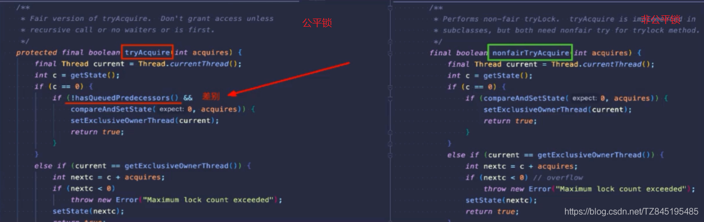

### ReentrantLock转换为公平锁

**要将ReentrantLock转换为公平锁，只需在创建ReentrantLock对象时，将fair参数设置为true**，例如：

```java
Lock lock = new ReentrantLock(true); // 创建公平锁
```

注意，使用公平锁会导致线程等待更长的时间，因为等待时间更长的线程将优先获得锁，这可能会影响程序的性能。因此，在选择锁类型时，需要根据具体情况进行权衡。

### 面试题

为什么会有公平锁、非公平锁的设计?为什么默认非公平？

- **公平锁（Fair Lock）是指多个线程按照申请锁的顺序获取锁的机制。**当一个线程释放锁时，等待时间最长的线程将获得锁的访问权。**公平锁确保了锁的获取是按照线程请求的顺序进行的，避免了线程饥饿现象。公平锁适用于对锁的获取顺序有严格要求的场景。**

- 非公平锁（Non-Fair Lock）则是指多个线程获取锁的顺序是不确定的，不遵循先来先服务的原则。当一个线程释放锁时，任何一个等待的线程都有机会获取锁的访问权，即使其他线程在等待的时间更长。**非公平锁通过减少线程切换的开销来提高系统的吞吐量。非公平锁适用于对锁的获取顺序没有严格要求，且对系统吞吐量更为重要的场景。**

- 为什么默认情况下使用非公平锁的设计是因为非公平锁相比于公平锁，在某些情况下能够提供更好的性能**。在实际应用中，对锁的获取顺序没有严格要求是比较常见的情况，而且非公平锁通过减少线程切换的开销可以提高系统的吞吐量。因此，默认使用非公平锁可以在大多数情况下提供更好的性能表现。**

什么时候用公平？什么时候用非公平？

**如果为了更高的吞吐量，很显然非公平锁是比较合适的，因为节省很多线程切换时间，吞吐量自然就上去了。否则那就用公平锁，大家公平使用**

## 可重入锁

- **它允许同一个线程多次获得同一个锁，而不会导致死锁。当一个线程已经获得了可重入锁后，它可以继续多次获取该锁，每次获取都会增加锁的持有计数。只有当线程释放了所有持有的锁，持有计数为0时，其他线程才能获取该锁。**
- **Java中ReentrantLock和Synchronized都是可重入锁，可重入锁的一个优点是可在一定程度避免死锁**

```java
//synchronized 是可重入锁
class Phone{
    public synchronized void sendSms() throws Exception{
        System.out.println(Thread.currentThread().getName()+"\tsendSms");
        sendEmail();
    }
    public synchronized void sendEmail() throws Exception{
        System.out.println(Thread.currentThread().getName()+"\tsendEmail");
    }

}
/**
 * Description:
 *  可重入锁(也叫做递归锁)
 *  指的是同一先生外层函数获得锁后，内层敌对函数任然能获取该锁的代码
 *  在同一线程外外层方法获取锁的时候，在进入内层方法会自动获取锁
 *  *  也就是说，线程可以进入任何一个它已经标记的锁所同步的代码块
 *  **/
public class ReenterLockDemo {
    /**
     * t1 sendSms
     * t1 sendEmail
     * t2 sendSms
     * t2 sendEmail
     * @param args
     */
    public static void main(String[] args) {
        Phone phone = new Phone();
        new Thread(()->{
            try {
                phone.sendSms();
            } catch (Exception e) {
                e.printStackTrace();
            }
        }，"t1").start();
        new Thread(()->{
            try {
                phone.sendSms();
            } catch (Exception e) {
                e.printStackTrace();
            }
        }，"t2").start();
    }
}

```

```java
//ReentrantLock 是可重入锁
	class Phone implements Runnable {
	    private Lock lock = new ReentrantLock();
	
	    @Override
	    public void run() {
	        get();
	    }
	
	    private void get() {
	        lock.lock();
	        try {
	            System.out.println(Thread.currentThread().getName() + "\tget");
	            set();
	        } finally {
	            lock.unlock();
	        }
	    }
	
	    private void set() {
	        lock.lock();
	        try {
	            System.out.println(Thread.currentThread().getName() + "\tset");
	        } finally {
	            lock.unlock();
	        }
	    }
	}
	
	/**
	 * Description:
	 * 可重入锁(也叫做递归锁)
	 * 指的是同一先生外层函数获得锁后，内层敌对函数任然能获取该锁的代码
	 * 在同一线程外外层方法获取锁的时候，在进入内层方法会自动获取锁
	 * <p>
	 * 也就是说，线程可以进入任何一个它已经标记的锁所同步的代码块
	 **/
	public class ReenterLockDemo {
	    /**
	     * Thread-0 get
	     * Thread-0 set
	     * Thread-1 get
	     * Thread-1 set
	     */
	    public static void main(String[] args) {
	        Phone phone = new Phone();
	        Thread t3 = new Thread(phone);
	        Thread t4 = new Thread(phone);
	        t3.start();
	        t4.start();
	
	    }
	}

```

### 可重入锁的种类

- 隐式锁(即synchronized关键字使用的锁)默认是可重入锁，在同步块、同步方法使用
  **在一个synchronized修饰的方法或者代码块的内部调用本类的其他synchronized修饰的方法或代码块时，是永远可以得到锁的**
- 显示锁(即Lock)也有ReentrantLock这样的可重入锁
  **lock和unlock一定要一 一匹配，如果少了或多了，都会坑到别的线程**

### Synchronized的重入的实现机理

1. 每个锁对象拥有一个锁计数器和一个指向持有该锁的线程的指针
2. 当执行monitorenter时，如果目标锁对象的计数器为零，那么说明它没有被其他线程所持有，Java虚拟机会将该锁对象的持有线程设置为当前线程，并且将计数器加1
3. 在目标锁对象的计数器不为零的情况下，如果锁对象的持有线程时当前线程，那么Java虚拟机可以将其计数器加1，否则需要等待，直到持有线程释放该锁
4. 当执行monitorexit，Java虚拟机则需将锁对象的计数器减1。计数器为零代表锁已经释放


### 死锁及排查

死锁是指两个或两个以上的线程在执行过程中，因争夺资源而造成的一种互相等待的现象，若无外力干涉那它们都将无法推进下去，如果资源充足，进程的资源请求都能够得到满足，死锁出现的可能性就很低，否则就会因争夺有限的资源而陷入死锁

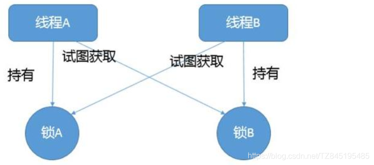

产生死锁的原因

- 系统资源不足
- 进程运行推进的顺序不合适
- 资源分配不当

#### 死锁演示

```java
public class DeadLockDemo{

    static Object lockA = new Object();
    static Object lockB = new Object();
    public static void main(String[] args){
        Thread a = new Thread(() -> {
            synchronized (lockA) {
                System.out.println(Thread.currentThread().getName() + "\t" + " 自己持有A锁，期待获得B锁");

                try {
                    TimeUnit.SECONDS.sleep(1);
                } catch (InterruptedException e) {
                    e.printStackTrace();
                }

                synchronized (lockB) {
                    System.out.println(Thread.currentThread().getName() + "\t 获得B锁成功");
                }
            }
        }， "a");
        a.start();

        new Thread(() -> {
            synchronized (lockB){
            
                System.out.println(Thread.currentThread().getName()+"\t"+" 自己持有B锁，期待获得A锁");

                try { TimeUnit.SECONDS.sleep(1); } catch (InterruptedException e) { e.printStackTrace(); }

                synchronized (lockA){
                
                    System.out.println(Thread.currentThread().getName()+"\t 获得A锁成功");
                }
            }
        }，"b").start();


    }
}

```

#### 排除死锁方式一：纯命令

```
D:\studySoft\Idea201903\JavaSelfStudy>jps
10048 Launcher
6276 DeadLockDemo
6332 Jps
9356
D:\studySoft\Idea201903\JavaSelfStudy>jstack 6276 (最后面有一个发现了一个死锁)
2021-07-28 16:05:36
Full thread dump Java HotSpot(TM) 64-Bit Server VM (25.111-b14 mixed mode):

"DestroyJavaVM" #16 prio=5 os_prio=0 tid=0x0000000003592800 nid=0x830 waiting on condition [0x0000000000000000]
   java.lang.Thread.State: RUNNABLE

"b" #15 prio=5 os_prio=0 tid=0x00000000253d5000 nid=0x1ba8 waiting for monitor entry [0x0000000025c8e000]
   java.lang.Thread.State: BLOCKED (on object monitor)
        at com.xiaozhi.juc.DeadLockDemo.lambda$main$1(DeadLockDemo.java:31)
        - waiting to lock <0x0000000741404050> (a java.lang.Object)
        - locked <0x0000000741404060> (a java.lang.Object)
        at com.xiaozhi.juc.DeadLockDemo$$Lambda$2/2101440631.run(Unknown Source)
        at java.lang.Thread.run(Thread.java:745)

"a" #14 prio=5 os_prio=0 tid=0x00000000253d3800 nid=0xad8 waiting for monitor entry [0x0000000025b8e000]
   java.lang.Thread.State: BLOCKED (on object monitor)
        at com.xiaozhi.juc.DeadLockDemo.lambda$main$0(DeadLockDemo.java:20)
        - waiting to lock <0x0000000741404060> (a java.lang.Object)
        - locked <0x0000000741404050> (a java.lang.Object)
        at com.xiaozhi.juc.DeadLockDemo$$Lambda$1/1537358694.run(Unknown Source)
        at java.lang.Thread.run(Thread.java:745)

"Service Thread" #13 daemon prio=9 os_prio=0 tid=0x000000002357b800 nid=0x1630 runnable [0x0000000000000000]
   java.lang.Thread.State: RUNNABLE

"C1 CompilerThread3" #12 daemon prio=9 os_prio=2 tid=0x00000000234f6000 nid=0x1fd4 waiting on condition [0x0000000000000000]
   java.lang.Thread.State: RUNNABLE

"C2 CompilerThread2" #11 daemon prio=9 os_prio=2 tid=0x00000000234f3000 nid=0x5c0 waiting on condition [0x0000000000000000]
   java.lang.Thread.State: RUNNABLE

"C2 CompilerThread1" #10 daemon prio=9 os_prio=2 tid=0x00000000234ed800 nid=0x1afc waiting on condition [0x0000000000000000]
   java.lang.Thread.State: RUNNABLE

"C2 CompilerThread0" #9 daemon prio=9 os_prio=2 tid=0x00000000234eb800 nid=0x2ae0 waiting on condition [0x0000000000000000]
   java.lang.Thread.State: RUNNABLE

"JDWP Command Reader" #8 daemon prio=10 os_prio=0 tid=0x0000000023464800 nid=0xc50 runnable [0x0000000000000000]
   java.lang.Thread.State: RUNNABLE

"JDWP Event Helper Thread" #7 daemon prio=10 os_prio=0 tid=0x000000002345f800 nid=0x1b0c runnable [0x0000000000000000]
   java.lang.Thread.State: RUNNABLE

"JDWP Transport Listener: dt_socket" #6 daemon prio=10 os_prio=0 tid=0x0000000023451000 nid=0x2028 runnable [0x0000000000000000]
   java.lang.Thread.State: RUNNABLE

"Attach Listener" #5 daemon prio=5 os_prio=2 tid=0x000000002343f800 nid=0x1ea0 waiting on condition [0x0000000000000000]
   java.lang.Thread.State: RUNNABLE

"Signal Dispatcher" #4 daemon prio=9 os_prio=2 tid=0x00000000233eb800 nid=0x10dc runnable [0x0000000000000000]
   java.lang.Thread.State: RUNNABLE

"Finalizer" #3 daemon prio=8 os_prio=1 tid=0x00000000233d3000 nid=0xafc in Object.wait() [0x000000002472f000]
   java.lang.Thread.State: WAITING (on object monitor)
        at java.lang.Object.wait(Native Method)
        - waiting on <0x0000000741008e98> (a java.lang.ref.ReferenceQueue$Lock)
        at java.lang.ref.ReferenceQueue.remove(ReferenceQueue.java:143)
        - locked <0x0000000741008e98> (a java.lang.ref.ReferenceQueue$Lock)
        at java.lang.ref.ReferenceQueue.remove(ReferenceQueue.java:164)
        at java.lang.ref.Finalizer$FinalizerThread.run(Finalizer.java:209)

"Reference Handler" #2 daemon prio=10 os_prio=2 tid=0x0000000021d0d000 nid=0x28ec in Object.wait() [0x000000002462f000]
   java.lang.Thread.State: WAITING (on object monitor)
        at java.lang.Object.wait(Native Method)
        - waiting on <0x0000000741006b40> (a java.lang.ref.Reference$Lock)
        at java.lang.Object.wait(Object.java:502)
        at java.lang.ref.Reference.tryHandlePending(Reference.java:191)
        - locked <0x0000000741006b40> (a java.lang.ref.Reference$Lock)
        at java.lang.ref.Reference$ReferenceHandler.run(Reference.java:153)

JNI global references: 2504


Found one Java-level deadlock:
=============================
"b":
  waiting to lock monitor 0x0000000021d10b58 (object 0x0000000741404050， a java.lang.Object)，
  which is held by "a"
"a":
  waiting to lock monitor 0x0000000021d13498 (object 0x0000000741404060， a java.lang.Object)，
  which is held by "b"

Java stack information for the threads listed above:
===================================================
"b":
        at com.xiaozhi.juc.DeadLockDemo.lambda$main$1(DeadLockDemo.java:31)
        - waiting to lock <0x0000000741404050> (a java.lang.Object)
        - locked <0x0000000741404060> (a java.lang.Object)
        at com.xiaozhi.juc.DeadLockDemo$$Lambda$2/2101440631.run(Unknown Source)
        at java.lang.Thread.run(Thread.java:745)
"a":
        at com.xiaozhi.juc.DeadLockDemo.lambda$main$0(DeadLockDemo.java:20)
        - waiting to lock <0x0000000741404060> (a java.lang.Object)
        - locked <0x0000000741404050> (a java.lang.Object)
        at com.xiaozhi.juc.DeadLockDemo$$Lambda$1/1537358694.run(Unknown Source)
        at java.lang.Thread.run(Thread.java:745)

Found 1 deadlock.

```

#### 排除死锁方式二：jconsole

输入cmd，输入jconsole，点击检测死锁按钮

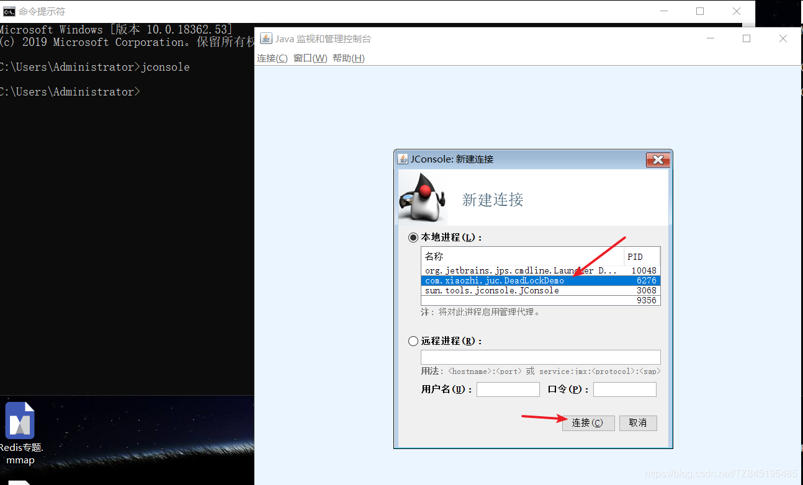

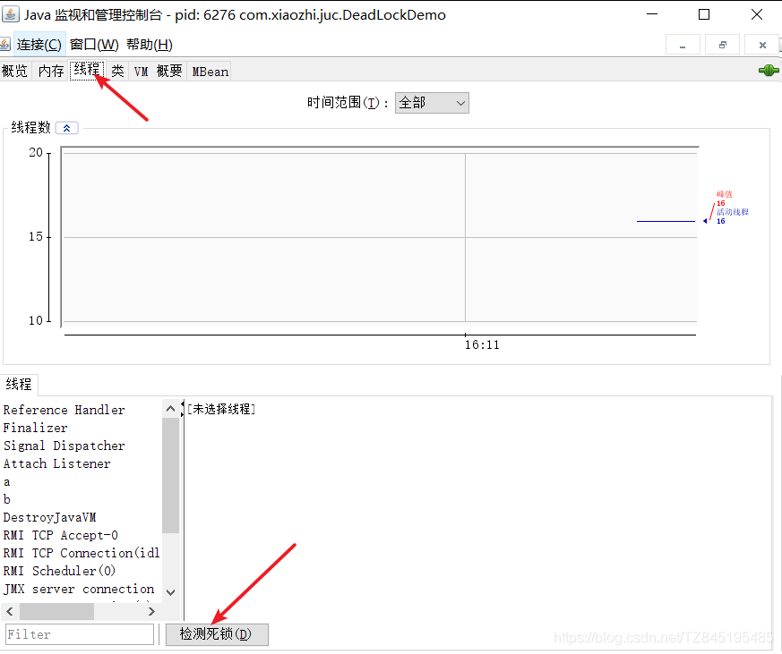

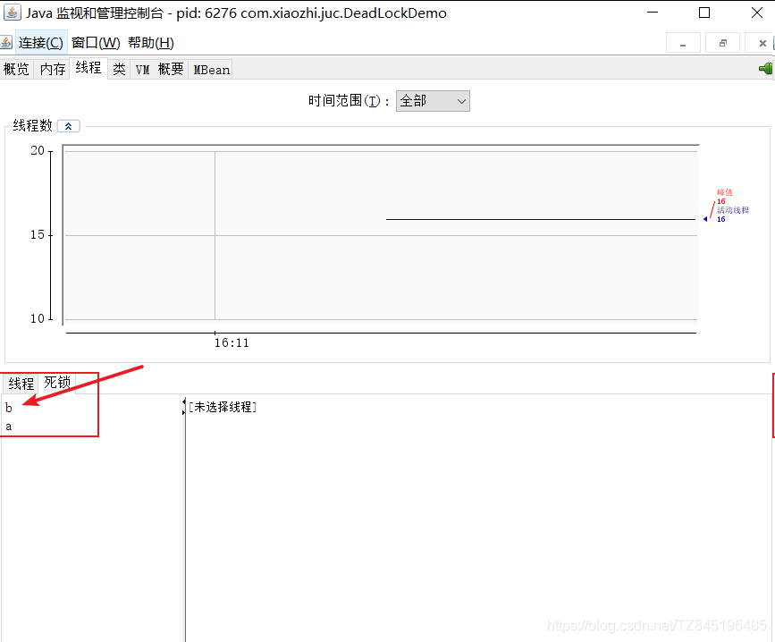

## 自旋锁

- **当线程发现锁被占用时，会不断循环判断锁的状态，直到获取。**这样的**好处是减少线程上下文切换的消耗，缺点是循环会消耗CPU**
- 相比于传统的阻塞锁，在多个线程竞争同一个锁的情况下，自旋锁的优势在于减少了线程的上下文切换次数。这是因为在传统的阻塞锁中，当线程请求锁时如果发现锁已被占用，就会进入阻塞状态，将自己从 CPU 中移除，等待其他线程释放锁。这时候操作系统会将线程从用户态切换到内核态，进行线程调度，将等待锁的线程挂起并加入到等待队列中。当锁被释放时，操作系统会将等待队列中的线程重新唤醒，并进行上下文切换，将等待锁的线程从内核态切换到用户态，使其重新进入执行队列，这个过程需要较高的系统开销。
- 而**自旋锁在等待锁的时候不会进入阻塞状态，而是一直占用 CPU 在用户态执行代码，不进行上下文切换，因此可以减少线程的上下文切换次数，提高程序的并发性能。**但是，如果**自旋时间过长，会浪费 CPU 时间**，因此需要根据实际情况进行合理的设置。
- 自旋锁的特点是当一个线程尝试获取锁时，**如果发现锁已经被其他线程占用，它会一直在一个循环中等待，不断地检查锁的状态，直到获取到锁为止。这种自旋等待的过程是在用户空间进行的，而不涉及操作系统的上下文切换。**

### 手写一个自旋锁

```java
import java.util.concurrent.TimeUnit;
import java.util.concurrent.atomic.AtomicReference;

public class SpinsLockDemo {
    AtomicReference<Thread> threadAtomicReference =new AtomicReference<>();
    public void myLock(){
        System.out.println(Thread.currentThread().getName()+"进行上锁");
        //循环调用compareAndSet(null， Thread.currentThread())来尝试将状态从null设置为Thread.currentThread()，如果成功设置则表示获取到了锁，否则继续循环等待。
        //成功取反，就不会继续执行while了。
        while (!threadAtomicReference.compareAndSet(null，Thread.currentThread())){
            try {
                TimeUnit.SECONDS.sleep(1);
            } catch (InterruptedException e) {
                e.printStackTrace();
            }
            System.out.println(Thread.currentThread().getName()+"正在自旋");
        }
    }
    public void myUnLock(){
        threadAtomicReference.compareAndSet(Thread.currentThread()，null);
        System.out.println(Thread.currentThread().getName()+"解锁");
    }

    public static void main(String[] args) {
        SpinsLockDemo spinsLockDemo = new SpinsLockDemo();
        new Thread(()->{
            spinsLockDemo.myLock();
//            spinsLockDemo.myUnLock(); //着一行模拟thread1在执行业务，业务没有处理完
            
        }，"thread1").start();
        new Thread(()->{
            spinsLockDemo.myLock();//会进行自旋（）也就是死循环
            System.out.println("业务");
            spinsLockDemo.myUnLock();
        }，"thread2").start();
    }
}

```

```
thread1进行上锁
thread2进行上锁
thread2正在自旋
thread2正在自旋
thread2正在自旋
thread2正在自旋
thread2正在自旋
thread2正在自旋
```

线程1是故意不解锁，让其线程一直占用锁，实际上执行myLock后就结束了，而threadAtomicReference存的是thread1的线程对象，对于thread2来说执行myLock时由于在while循环判断条件!false就是死循环，也就是相当于线程在自旋，当我们将thread1中注释的解锁代码打开后，会发现程序会正常结束。

# Fork-Join线程池

## 概述

Java 7开始引入了一种新的Fork/Join线程池，它可以执行一种特殊的任务：**把一个大任务拆成多个小任务并行执行。**

我们举个例子：如果要计算一个超大数组的和，最简单的做法是用一个循环在一个线程内完成：

```ascii
┌─┬─┬─┬─┬─┬─┬─┬─┬─┬─┬─┬─┬─┬─┬─┬─┬─┬─┬─┬─┬─┬─┬─┬─┐
└─┴─┴─┴─┴─┴─┴─┴─┴─┴─┴─┴─┴─┴─┴─┴─┴─┴─┴─┴─┴─┴─┴─┴─┘
```

还有一种方法，可以把数组拆成两部分，分别计算，最后加起来就是最终结果，这样可以用两个线程并行执行：

```ascii
┌─┬─┬─┬─┬─┬─┬─┬─┬─┬─┬─┬─┐
└─┴─┴─┴─┴─┴─┴─┴─┴─┴─┴─┴─┘
┌─┬─┬─┬─┬─┬─┬─┬─┬─┬─┬─┬─┐
└─┴─┴─┴─┴─┴─┴─┴─┴─┴─┴─┴─┘
```

如果拆成两部分还是很大，我们还可以继续拆，用4个线程并行执行：

```ascii
┌─┬─┬─┬─┬─┬─┐
└─┴─┴─┴─┴─┴─┘
┌─┬─┬─┬─┬─┬─┐
└─┴─┴─┴─┴─┴─┘
┌─┬─┬─┬─┬─┬─┐
└─┴─┴─┴─┴─┴─┘
┌─┬─┬─┬─┬─┬─┐
└─┴─┴─┴─┴─┴─┘
```

这就是Fork/Join任务的原理：判断一个任务是否足够小，如果是，直接计算，否则，就分拆成几个小任务分别计算。这个过程可以反复“裂变”成一系列小任务。

## 实例

在Fork-Join模型中，任务被称为**"fork"，也就是分叉。**当一个任务需要执行时，它可以进一步分解成更小的子任务，然后这些子任务可以被并行执行。当所有的子任务完成时，它们会**"join"，也就是合并**，形成最终的结果。

Fork-Join模型的一个经典实现是Java中的`java.util.concurrent.ForkJoinPool`类。它提供了一个线程池，其中的工作线程可以执行被分解的子任务。Java中的Fork-Join框架提供了一种简单而强大的方式来编写并行程序，并且**能够充分利用多核处理器的性能。**

总结一下，Fork-Join模型是一种**并行编程模型**，它将大任务分解成小任务，并通过并行执行这些小任务来加速计算过程。这种模型常用于多线程和并行计算中，能够有效地利用多核处理器的性能。

我们来看如何使用Fork/Join对大数据进行并行求和：

```java
import java.util.concurrent.ForkJoinPool;
import java.util.concurrent.RecursiveTask;

public class ForkJoinDemo {

    public static void main(String[] args) {
        ForkJoinPool forkJoinPool = new ForkJoinPool();

        // 创建一个大任务，计算1到100000的和
        MyTask task = new MyTask(1， 100000);

        long startTime = System.currentTimeMillis();

        // 提交任务给Fork-Join线程池并等待结果
        int result = forkJoinPool.invoke(task);

        long endTime = System.currentTimeMillis();

        System.out.println("Result: " + result);
        System.out.println("Execution time: " + (endTime - startTime) + " milliseconds");
    }
}

class MyTask extends RecursiveTask<Integer> {
    private static final int THRESHOLD = 10_000;
    private int start;
    private int end;

    public MyTask(int start， int end) {
        this.start = start;
        this.end = end;
    }

    @Override
    protected Integer compute() {
        if (end - start <= THRESHOLD) {
            // 执行小任务
            int sum = 0;
            for (int i = start; i <= end; i++) {
                sum += i;
            }
            return sum;
        } else {
            // 分解成更小的子任务
            int mid = (start + end) / 2;
            MyTask leftTask = new MyTask(start， mid);
            MyTask rightTask = new MyTask(mid + 1， end);

            // 并行执行子任务
            leftTask.fork();
            rightTask.fork();
            //invokeAll(leftTask， rightTask);

            // 合并子任务的结果
            int leftResult = leftTask.join();
            int rightResult = rightTask.join();
            return leftResult + rightResult;
        }
    }
}

```

- Fork/Join是一种基于**“分治”的算法**：通过分解任务，并行执行，最后合并结果得到最终结果。
- `ForkJoinPool`线程池可以把一个大任务分拆成小任务并行执行，**任务类必须继承自`RecursiveTask`或`RecursiveAction`。**
- **使用Fork/Join模式可以进行并行计算以提高效率。**

# CompletableFuture

使用`Future`获得异步执行结果时，要么调用阻塞方法`get()`，要么轮询看`isDone()`是否为`true`，这两种方法都不是很好，因为主线程也会被迫等待。

从Java 8开始引入了`CompletableFuture`，它针对`Future`做了改进，可以传入回调对象，当异步任务完成或者发生异常时，自动调用回调对象的回调方法。

## CompletableFuture创建方式

1. **runAsync方法不支持返回值.适用于多个接口之间没有任何先后关系**
2. **supplyAsync可以支持返回值，我们一般用supplyAsync来创建**

```java
//runAsync方法不支持返回值
public static CompletableFuture<Void> runAsync(Runnable runnable)
public static CompletableFuture<Void> runAsync(Runnable runnable， Executor executor)
//supplyAsync可以支持返回值
public static <U> CompletableFuture<U> supplyAsync(Supplier<U> supplier)
public static <U> CompletableFuture<U> supplyAsync(Supplier<U> supplier， Executor executor)

```

**没有指定Executor的方法会使用ForkJoinPool.commonPool() 作为它的线程池执行异步代码。如果指定线程池，则使用指定的线程池运行。**

```java
public class CompletableFutureTest {
    public static void main(String[] args) throws Exception{
        ThreadPoolExecutor executor = new ThreadPoolExecutor(2，
                5，
                2L，
                TimeUnit.SECONDS，
                new LinkedBlockingQueue<>(3));
        //(1). CompletableFuture.runAsync(Runnable runnable);
        CompletableFuture future1=CompletableFuture.runAsync(()->{
            System.out.println(Thread.currentThread().getName()+"*********future1 coming in");
        });
        //这里获取到的值是null
        System.out.println(future1.get());
        //(2). CompletableFuture.runAsync(Runnable runnable，Executor executor);
        CompletableFuture<Void> future2 = CompletableFuture.runAsync(() -> {
            //ForkJoinPool.commonPool-worker-9 
            System.out.println(Thread.currentThread().getName() + "\t" + "*********future2 coming in");
        }， executor);
        //(3).public static <U> CompletableFuture<U> supplyAsync(Supplier<U> supplier)
        CompletableFuture<Integer> future3 = CompletableFuture.supplyAsync(() -> {
            //pool-1-thread-1
            System.out.println(Thread.currentThread().getName() + "\t" + "future3带有返回值");
            return 1024;
        });
        System.out.println(future3.get());
        //(4).public static <U> CompletableFuture<U> supplyAsync(Supplier<U> supplier， Executor executor)
        CompletableFuture<Integer> future4 = CompletableFuture.supplyAsync(() -> {
            System.out.println(Thread.currentThread().getName() + "\t" + "future4带有返回值");
            return 1025;
        }， executor);
        System.out.println(future4.get());
        //关闭线程池
        executor.shutdown();
    }
}

```

## CompletableFuture API

### 获得结果和触发计算

1. public T get( )：不见不散**(会抛出异常)，只要调用了get( )方法，不管是否计算完成都会导致阻塞**
2. public T get(long timeout， TimeUnit unit)：**过时不候**
3. public T getNow(T valuelfAbsent)：**没有计算完成的情况下，给我一个替代结果，计算完返回计算完成后的结果，没算完返回设定的valuelfAbsent**
4. public T join( )：**join方法和get( )方法作用一样，不同的是，join方法不抛出异常**
5. public boolean complete(T value)：**会打断 `get()` 的等待，让正在阻塞的线程立刻拿到你给的值。强制完成这个 `CompletableFuture`，把 `value` 作为结果**

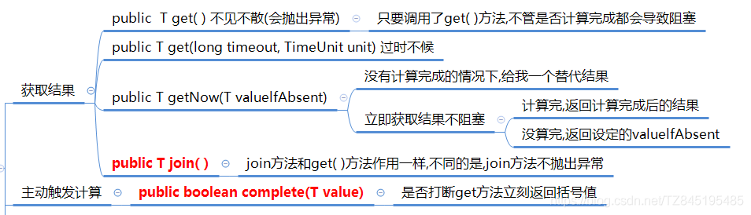

```java
public class CompletableFutureTest3 {

    public static void main(String[] args) throws Exception {

        CompletableFuture<Integer> future = CompletableFuture.supplyAsync(() -> {
            try {
                Thread.sleep(1000);
//                throw new Exception("测试get方法，获取异常信息");
                return 1;
            } catch (Exception e) {
                throw new RuntimeException(e);
            }
        });

        //(1).public T get()不见不散(会抛出异常)
//        Integer get = future.get();
//        System.out.println("get = " + get);

        //(2).public T get(long timeout， TimeUnit unit) 过时不候200毫秒后如果没有返回结果就报错
//        Integer get2 = future.get(200， TimeUnit.MILLISECONDS);
//        System.out.println("get2 = " + get2);

        //(3).public T getNow(T valuelfAbsent)现在就要，没有计算完成的情况下，给我一个替代结果
//        Integer now = future.getNow(88);
//        System.out.println("now = " + now);

        //这里停顿了2s，而我1s后就有结果了，所以可以正常拿到值 false获取到的值是1
        //如果这里停顿0.5s，而我1s后才有结果，那么就不可以正常拿到值，true获取到的值是88
        Thread.sleep(2000);
        boolean complete = future.complete(88);
        Integer get = future.get();
        System.out.println("complete = " + complete + "------------get=" + get);
    }

}

```

### 对计算结果进行处理

1. `public <U> CompletableFuture<U> thenApply`
   计算结果存在依赖关系，这两个线程串行化
   由于存在依赖关系(当前步错，不走下一步)，当前步骤有异常的话就叫停
2. `public <U> CompletableFuture<U> handle(BiFunction<? super T， Throwable， ? extends U> fn)`：
   不管前面成功还是失败，都能拿到结果（T）或异常（Throwable），必须**返回一个新值**（U）
3. `whenComplete`：能拿到结果或异常，但**不能返回新值**（还是原来的结果/异常）。由**触发完成的那条线程**（比如前面的 `supplyAsync` 用的线程）来执行这个回调。
4. `whenCompleteAsync`：和 `whenComplete` 逻辑完全一样（不改变结果），区别是**回调任务交给默认的 ForkJoinPool 或你指定的线程池**执行，不占用原任务的线程。

```java
public class CompletableFutureTest4 {
    public static void main(String[] args) {
        CompletableFuture<Integer> future = CompletableFuture.supplyAsync(() -> {
            try {
                TimeUnit.SECONDS.sleep(1);
            } catch (InterruptedException e) {
                e.printStackTrace();
            }
            return 1;
        }).thenApply(s -> {
            System.out.println("-----1");
            //如果加上int error=1/0; 由于存在依赖关系(当前步错，不走下一步)，当前步骤有异常的话就叫停
            //int error=1/0;
            return s + 1;
        }).thenApply(s -> {
            System.out.println("-----2");
            return s + 2;
        }).whenComplete((v， e) -> {
            if (e == null) {
                System.out.println("result-----" + v);
            }
        }).exceptionally(e -> {
            e.printStackTrace();
            return null;
        });
        System.out.println(Thread.currentThread().getName() + "\t" + "over....");
        try {
            TimeUnit.SECONDS.sleep(3);
        } catch (InterruptedException e) {
            e.printStackTrace();
        }

    }
}

```

```java
public class CompletableFutureTest5 {
    public static void main(String[] args) {
        ThreadPoolExecutor threadPoolExecutor = new ThreadPoolExecutor(1， 20， 1L， TimeUnit.SECONDS， new LinkedBlockingQueue<>(50)， Executors.defaultThreadFactory()， new ThreadPoolExecutor.AbortPolicy());
        Integer join = CompletableFuture.supplyAsync(() -> {
            return 1;
        }).handle((f， e) -> {
            System.out.println("-----1");
            return f + 2;
        }).handle((f， e) -> {
            System.out.println("-----2");
            //如果这里异常了，handle方法依旧可以继续执行下去
            /*
            -----1
            -----2
            -----3
            null
            java.util.concurrent.CompletionException: java.lang.NullPointerException
                at java.base/java.util.concurrent.CompletableFuture.encodeThrowable(CompletableFuture.java:314)
                at java.base/java.util.concurrent.CompletableFuture.completeThrowable(CompletableFuture.java:319)
                at java.base/java.util.concurrent.CompletableFuture.uniHandle(CompletableFuture.java:932)
                at java.base/java.util.concurrent.CompletableFuture.uniHandleStage(CompletableFuture.java:946)
                at java.base/java.util.concurrent.CompletableFuture.handle(CompletableFuture.java:2266)
                at CompletableFutureTest5.main(CompletableFutureTest5.java:33)
            Caused by: java.lang.NullPointerException
                at CompletableFutureTest5.lambda$main$3(CompletableFutureTest5.java:35)
                at java.base/java.util.concurrent.CompletableFuture.uniHandle(CompletableFuture.java:930)
                ... 3 more
            * */
            int error = 1 / 0;
            return f + 3;
        }).handle((f， e) -> {
            System.out.println("-----3");
            return f + 4;
        }).whenComplete((v， e) -> {
            if (e == null) {
                System.out.println("----result: " + v);
            }
        }).exceptionally(e -> {
            e.printStackTrace();
            return null;
        }).join();
        
        System.out.println("join = " + join);
        threadPoolExecutor.shutdown();

    }
}

```

### 对计算结果进行消费

1. `thenRun(Runnable runnable)`：任务A执行完执行B，并且B不需要A的结果
2. `thenAccept(Consumer<? super T> action)`：任务A执行完成执行B，B需要A的结果，但是任务B无返回值
3. `thenApply(Function<? super T，? extends U> fn)`：任务A执行完成执行B，B需要A的结果，同时任务B有返回值

```java
import java.util.concurrent.*;

public class CompletableFutureTest6 {
    public static void main(String[] args) {
        CompletableFuture.supplyAsync(() -> {
            return 1;
        }).thenApply(f -> {
            return f + 2;
        }).thenApply(f -> {
            return f + 3;
        }).thenAccept(r -> System.out.println(r));
        // 任务A执行完执行B，并且B不需要A的结果
        System.out.println(CompletableFuture.supplyAsync(() -> "resultA").thenRun(() -> {
        }).join());
        // 任务A执行完成执行B，B需要A的结果，但是任务B无返回值
        System.out.println(CompletableFuture.supplyAsync(() -> "resultA").thenAccept(resultA -> {
        }).join());
        // 任务A执行完成执行B，B需要A的结果，同时任务B有返回值
        System.out.println(CompletableFuture.supplyAsync(() -> "resultA").thenApply(resultA -> resultA + " resultB").join());
    }
}

```

带了Async的方法表示：会重新在线程池中启动一个线程来执行任务

```java
public <U> CompletableFuture<U> thenApply(Function<? super T，? extends U> fn)
public <U> CompletableFuture<U> thenApplyAsync(Function<? super T，? extends U> fn)
public <U> CompletableFuture<U> thenApplyAsync
(Function<? super T，? extends U> fn， Executor executor)

public CompletableFuture<Void> thenAccept(Consumer<? super T> action)
public CompletableFuture<Void> thenAcceptAsync(Consumer<? super T> action)
public CompletableFuture<Void> thenAcceptAsync(Consumer<? super T> action，
                                                   Executor executor)

public CompletableFuture<Void> thenRun(Runnable action)
public CompletableFuture<Void> thenRunAsync(Runnable action)
public CompletableFuture<Void> thenRunAsync(Runnable action，Executor executor)         

```

### 对计算速度进行选用

`public <U> CompletableFuture<U> applyToEither(CompletionStage<? extends T> other， Function<? super T， U> fn)`：这个方法表示的是，谁快就用谁的结果，类似于我们在打跑得快，或者麻将谁赢了就返回给谁

```java
import java.util.concurrent.CompletableFuture;
import java.util.concurrent.TimeUnit;

public class CompletableFutureTest7 {
    public static void main(String[] args) {
        //这个方法表示的是，谁快就用谁的结果，类似于我们在打跑得快，或者麻将谁赢了就返回给谁
        //public <U> CompletableFuture<U> applyToEither(CompletionStage<? extends T> other， Function<? super T， U> fn);
        //下面这个在第一个中停留1s，在第二种停留2s，返回的结果是1
        System.out.println(CompletableFuture.supplyAsync(() -> {
            //暂停几秒钟线程
            try {
                TimeUnit.SECONDS.sleep(1);
            } catch (InterruptedException e) {
                e.printStackTrace();
            }
            return 1;
        }).applyToEither(CompletableFuture.supplyAsync(() -> {
            try {
                TimeUnit.SECONDS.sleep(2);
            } catch (InterruptedException e) {
                e.printStackTrace();
            }
            return 2;
        })， r -> {
            return r;
        }).join());
        //暂停几秒钟线程
        try {
            TimeUnit.SECONDS.sleep(3);
        } catch (InterruptedException e) {
            e.printStackTrace();
        }
    }
}

```

两任务组合，一个完成

1. applyToEither:两个任务有一个执行完成，获取它的返回值，处理任务并有新的返回值
2. acceptEither:两个任务有一个执行完成，获取它的返回值，处理任务，没有新的返回值
3. runAfterEither:两个任务有一个执行完成，不需要获取 future 的结果，处理任务，也没有返回值

```java
public <U> CompletableFuture<U> applyToEither(
        CompletionStage<? extends T> other， Function<? super T， U> fn)
public <U> CompletableFuture<U> applyToEitherAsync(
        CompletionStage<? extends T> other， Function<? super T， U> fn)
public <U> CompletableFuture<U> applyToEitherAsync(
        CompletionStage<? extends T> other， Function<? super T， U> fn，
        Executor executor)

public CompletableFuture<Void> acceptEither(
        CompletionStage<? extends T> other， Consumer<? super T> action)
public CompletableFuture<Void> acceptEitherAsync(
    CompletionStage<? extends T> other， Consumer<? super T> action)
public CompletableFuture<Void> acceptEitherAsync(
    CompletionStage<? extends T> other， Consumer<? super T> action，
    Executor executor)

public CompletableFuture<Void> runAfterEither(CompletionStage<?> other，Runnable action)
                                                  
public CompletableFuture<Void> runAfterEitherAsync(CompletionStage<?> other，Runnable action)   

public CompletableFuture<Void> runAfterEitherAsync(CompletionStage<?> other，
                                                       Runnable action，
                                                       Executor executor)
```

### 对计算结果进行合并

`public <U，V> CompletableFuture<V> thenCombine(CompletionStage<? extends U> other，BiFunction<? super T，? super U，? extends V> fn)`：两个CompletionStage任务都完成后，最终把两个任务的结果一起交给thenCombine来处理。**先完成的先等着，等待其他分支任务**

```java
import java.util.concurrent.CompletableFuture;
import java.util.concurrent.TimeUnit;

public class CompletableFutureTest8 {
    public static void main(String[] args) {
        //public <U，V> CompletableFuture<V> thenCombine
        //(CompletionStage<? extends U> other，BiFunction<? super T，? super U，? extends V> fn)
        //两个CompletionStage任务都完成后，最终把两个任务的结果一起交给thenCombine来处理
        //先完成的先等着，等待其他分支任务
        System.out.println(CompletableFuture.supplyAsync(() -> {
            return 10;
        }).thenCombine(CompletableFuture.supplyAsync(() -> {
            return 20;
        })， (r1， r2) -> {
            return r1 + r2;
        }).thenCombine(CompletableFuture.supplyAsync(() -> {
            return 30;
        })， (r3， r4) -> {
            return r3 + r4;
        }).join());
        System.out.println(CompletableFuture.supplyAsync(() -> {
            return 10;
        }).thenCombine(CompletableFuture.supplyAsync(() -> {
            return 20;
        })， (r1， r2) -> {
            return r1 + r2;
        }).join());
    }
}

```

两任务组合，都要完成

```java
public <U，V> CompletableFuture<V> thenCombine(
        CompletionStage<? extends U> other，
        BiFunction<? super T，? super U，? extends V> fn)
public <U，V> CompletableFuture<V> thenCombineAsync(
        CompletionStage<? extends U> other，
        BiFunction<? super T，? super U，? extends V> fn)
 public <U，V> CompletableFuture<V> thenCombineAsync(
        CompletionStage<? extends U> other，
        BiFunction<? super T，? super U，? extends V> fn， Executor executor)

public <U> CompletableFuture<Void> thenAcceptBoth(
        CompletionStage<? extends U> other，
        BiConsumer<? super T， ? super U> action)
public <U> CompletableFuture<Void> thenAcceptBothAsync(
        CompletionStage<? extends U> other，
        BiConsumer<? super T， ? super U> action) 
public <U> CompletableFuture<Void> thenAcceptBothAsync(
        CompletionStage<? extends U> other，
        BiConsumer<? super T， ? super U> action， Executor executor)      


public CompletableFuture<Void> runAfterBoth(CompletionStage<?> other，
                                                Runnable action)
public CompletableFuture<Void> runAfterBothAsync(CompletionStage<?> other，
                                                     Runnable action)  
public CompletableFuture<Void> runAfterBothAsync(CompletionStage<?> other，
                                                     Runnable action，
                                                     Executor executor)

```

```java
CompletableFuture.supplyAsync(() -> {
    return 10;
})
    .thenAcceptBoth(CompletableFuture.supplyAsync(() -> {
        return 20;
    })， (r1， r2) -> {
        System.out.println(r1);//10
        System.out.println(r2);//20
    });

```

### 多任务组合

1. allOf:等待所有任务完成
   `public static CompletableFuture<Void> allOf(CompletableFuture<?>... cfs)`
2. anyOf:只要有一个任务完成
   `public static CompletableFuture<Object> anyOf(CompletableFuture<?>... cfs)`

```java
 CompletableFuture<String> futureImg = CompletableFuture.supplyAsync(() -> {
            System.out.println("查询商品的图片信息");
            return "hello.jpg";
        });

        CompletableFuture<String> futureAttr = CompletableFuture.supplyAsync(() -> {
            System.out.println("查询商品的属性");
            return "黑色+256G";
        });

        CompletableFuture<String> futureDesc = CompletableFuture.supplyAsync(() -> {
            try { TimeUnit.SECONDS.sleep(3);  } catch (InterruptedException e) {e.printStackTrace();}
            System.out.println("查询商品介绍");
            return "华为";
        });
        //需要全部完成
//        futureImg.get();
//        futureAttr.get();
//        futureDesc.get();
        //CompletableFuture<Void> all = CompletableFuture.allOf(futureImg， futureAttr， futureDesc);
        //all.get();
        CompletableFuture<Object> anyOf = CompletableFuture.anyOf(futureImg， futureAttr， futureDesc);
        anyOf.get();
        System.out.println(anyOf.get());
        System.out.println("main over.....");

```

## 实战:电商比价需求

①. 最近公司做了一个比价的需求案列，要求我们去爬取别的网站比如果某一本书买多少，我们将数据拿到(以JSON的形式)， 将它存入redis的zset中，保证数据没有重复的大概数据有1w条，我自己在想，1w条全网扫描一遍，这样能做，性能不高，我们 可以使用JUC中的CompletableFuture它可以做异步多线程并发，不阻塞，我用它从多少s–优化到了多少s。CompletableFuture默认使用ForkJoinPool线程池，我也优化了线程池，自己写了ThreadPoolExecutor，把自定义的线程池用在CompletableFuture中，把网站的挨个挨个的调度变成了异步编排，这样性能极佳提升(分享一个真实的工作案列、配上一个案列、项目不公开)

②. 案例说明:电商比价需求
同一款产品，同时搜索出同款产品在各大电商的售价;
同一款产品，同时搜索出本产品在某一个电商平台下，各个入驻门店的售价是多少
出来结果希望是同款产品的在不同地方的价格清单列表，返回一个List
in jd price is 88.05
in pdd price is 86.11
in taobao price is 90.43

```java
public class CompletableFutureNetMallDemo {
    static List<NetMall> list = Arrays.asList(
            new NetMall("jd")，
            new NetMall("pdd")，
            new NetMall("taobao")，
            new NetMall("dangdangwang")，
            new NetMall("tmall"));

    //同步 ，step by step
    /**
     * List<NetMall>  ---->   List<String>
     * @param list
     * @param productName
     * @return
     */
    public static List<String> getPriceByStep(List<NetMall> list，String productName) {

        return list
                .stream()
                .map(netMall -> String.format(productName + " in %s price is %.2f"， netMall.getMallName()，
                                netMall.calcPrice(productName)))
                .collect(Collectors.toList());
    }
    //异步 ，多箭齐发
    /**
     * List<NetMall>  ---->List<CompletableFuture<String>> --->   List<String>
     * @param list
     * @param productName
     * @return
     */
    public static List<String> getPriceByASync(List<NetMall> list，String productName) {
        return list
                .stream()
                .map(netMall ->
                        CompletableFuture.supplyAsync(() ->
                        String.format(productName + " is %s price is %.2f"， netMall.getMallName()， netMall.calcPrice(productName)))
                )
                .collect(Collectors.toList())
                .stream()
                .map(CompletableFuture::join)
                .collect(Collectors.toList());
    }

    public static void main(String[] args) {

        long startTime = System.currentTimeMillis();
        List<String> list1 = getPriceByStep(list， "mysql");
        for (String element : list1) {
            System.out.println(element);
        }
        long endTime = System.currentTimeMillis();
        System.out.println("----costTime: "+(endTime - startTime) +" 毫秒");

        System.out.println();

        long startTime2 = System.currentTimeMillis();
        List<String> list2 = getPriceByASync(list， "mysql");
        for (String element : list2) {
            System.out.println(element);
        }
        long endTime2 = System.currentTimeMillis();
        System.out.println("----costTime: "+(endTime2 - startTime2) +" 毫秒");

    }
}

@Data
@AllArgsConstructor
class NetMall {
    private String mallName;
    public double calcPrice(String productName) {
        //检索需要1秒钟
        try { TimeUnit.SECONDS.sleep(1); } catch (InterruptedException e) { e.printStackTrace(); }
        return ThreadLocalRandom.current().nextDouble() * 2 + productName.charAt(0);
    }
}
/*
	mysql in jd price is 110.59
	mysql in pdd price is 110.23
	mysql in taobao price is 110.04
	mysql in dangdangwang price is 110.08
	mysql in tmall price is 109.91
	----costTime: 5030 毫秒
	mysql is jd price is 109.07
	mysql is pdd price is 109.47
	mysql is taobao price is 109.04
	mysql is dangdangwang price is 110.09
	mysql is tmall price is 110.72
	----costTime: 1021 毫秒
**/

```

# JMM—Java内存模型

- JMM(Java内存模型Java Memory Model，简称JMM)本身是一种**抽象的概念 并不真实存在**，它描述的是一组规则或规范通过规范定制了程序中各个变量(包括实例字段，静态字段和构成数组对象的元素)的访问方式。


- 关键技术点都是围绕多线程的**可见性、原子性、和有序性**展开的


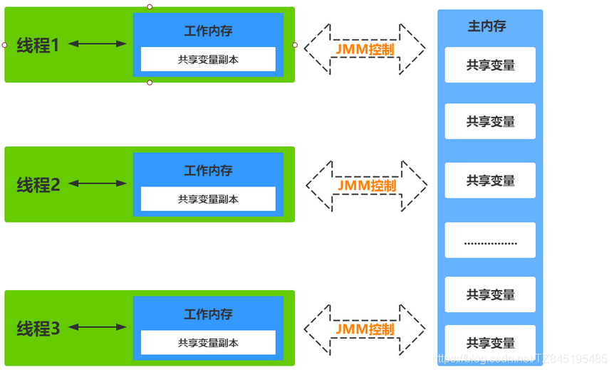

**为什么会推导出JMM模型呢？**

1. 因为有这么多级的缓存(cpu和物理主内存的速度不一致的导致)，CPU的运行并不是直接操作内存而是先把内存里边的数据读到缓存，而内存的读和写操作的时候就会造成不一致的问题
2. Java虚拟机规范中试图定义一种Java内存模型(java Memory Model，简称JMM)来屏蔽掉各种硬件和操作系统的内存访问差异，以实现让Java程序在各种平台下都能达到一致的内存访问效果。推导出我们需要知道JMM

## 数据同步八大原子操作

- 一个变量如何从主内存拷贝到工作内存、如何从工作内存同步到主内存之间的实现细节，Java内存模型定义了以下八种操作来完成
  1. lock(锁定):作用于主内存的变量，把一个变量标记为一条线程独占状态
  2. unlock(解锁):作用于主内存的变量，把一个处于锁定状态的变量释放出来，释放后 的变量才可以被其他线程锁定
  3. read(读取):作用于主内存的变量，把一个变量值从主内存传输到线程的工作内存 中，以便随后的load动作使用
  4. load(载入):作用于工作内存的变量，它把read操作从主内存中得到的变量值放入工 作内存的变量副本中
  5. use(使用):作用于工作内存的变量，把工作内存中的一个变量值传递给执行引擎
  6. assign(赋值):作用于工作内存的变量，它把一个从执行引擎接收到的值赋给工作内 存的变量
  7. store(存储):作用于工作内存的变量，把工作内存中的一个变量的值传送到主内存 中，以便随后的write的操作
  8. write(写入):作用于工作内存的变量，它把store操作从工作内存中的一个变量的值 传送到主内存的变量中

- 如果要把一个变量从主内存中复制到工作内存中，就需要按顺序地执行read和load操作，如果把变量从工作内存中同步到主内存中，就需要按顺序地执行store和write操作。但Java内存模型只要求上述操作必须按顺序执行，而没有保证必须是连续执行

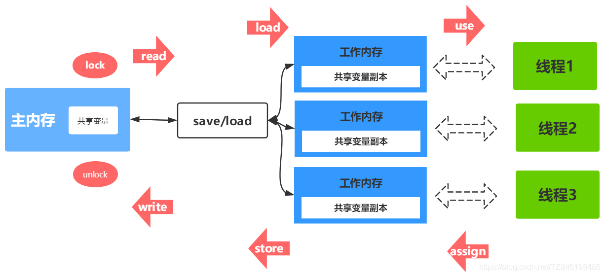

```java
@Slf4j
public class CodeVisibility {

    private static boolean initFlag = false;

    private volatile static int counter = 0;

    public static void refresh(){
        log.info("refresh data.......");
        initFlag = true;
        log.info("refresh data success.......");
    }

    public static void main(String[] args){
        Thread threadA = new Thread(()->{
            while (!initFlag){
                //System.out.println("runing");
                counter++;
            }
            log.info("线程：" + Thread.currentThread().getName()
                    + "当前线程嗅探到initFlag的状态的改变");
        }，"threadA");
        threadA.start();

        try {
            Thread.sleep(500);
        } catch (InterruptedException e) {
            e.printStackTrace();
        }

        Thread threadB = new Thread(()->{
            refresh();
        }，"threadB");
        threadB.start();
    }
}

```

输出：

```
6月 02， 2023 1:29:26 下午 CodeVisibility refresh
信息: refresh data.......
6月 02， 2023 1:29:26 下午 CodeVisibility refresh
信息: refresh data success.......
6月 02， 2023 1:29:26 下午 CodeVisibility lambda$main$0
信息: 线程：threadA当前线程嗅探到initFlag的状态的改变
```

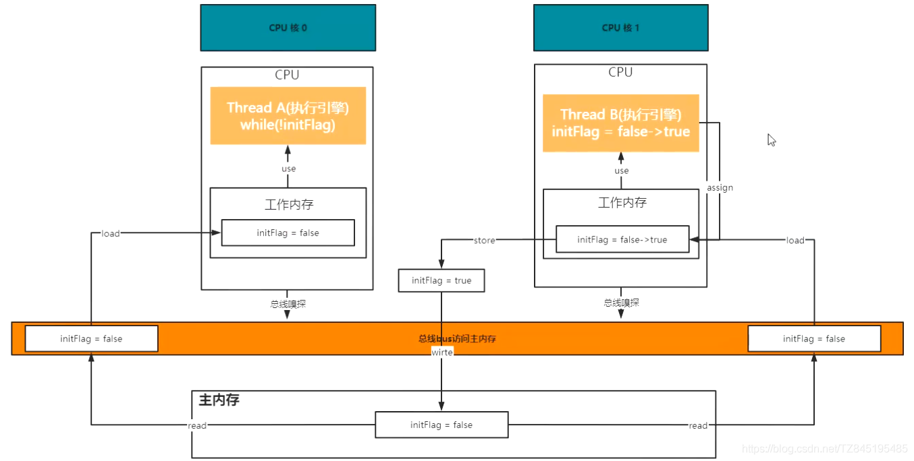

## JMM三大特性

### 可见性

1. 是指**当一个线程修改了某一个共享变量的值，其他线程是否能够立即知道该变更**，JMM规定了**所有的变量都存储在主内存中**
   (假设有A、B两个线程同时去操作主物理内存的共享数据number=0，A抢到CPU执行权，将number刷新到自己的工作内存，这个时候进行number++的操作，这个时候number=1，将A中的工作内存中的数据刷新到主物理内存，这个时候，马上通知B，B重新拿到最新值number=1刷新B的工作内存中)

   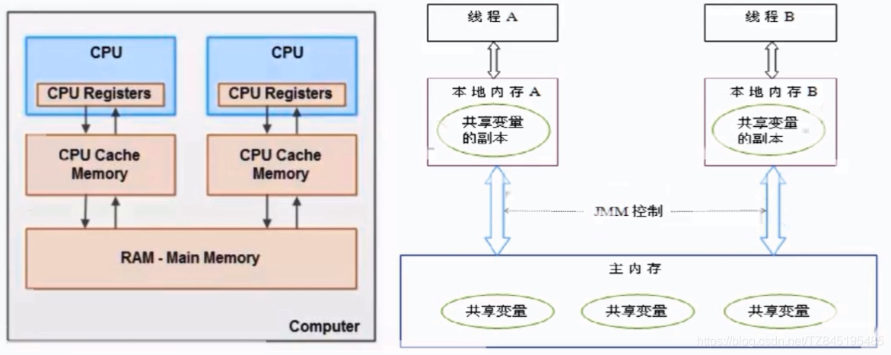

2. **Java中普通的共享变量不保证可见性**，因为数据修改被写入内存的时机是不确定的，多线程并发很可能出现"脏读"，所以每个线程都有自己的工作内存，线程自己的工作内存中保存了该线程使用到的变量的主内存副本拷贝，线程对变量的所有操作(读取、赋值等)都必需在线程自己的工作内存中进行，而不能直接读写主内存中的变量。不同线程之间也无法直接访问对工作内存中的变量，线程间变量值的传递均需要通过主内存来完成

3. **volatile可以解决可见性(能否及时看到)**

### 原子性

指一个操作是不可中断的，即多线程坏境下，操作不能被其他线程干扰

### 有序性

1. **计算机在执行程序时，为了提高性能，编译器和处理器常常会做指令重排**，一把分为以下3种

   

2. **单线程坏境里面确保程序最终执行结果和代码顺序执行的结果一致**

3. **处理器在进行重新排序是必须要考虑指令之间的数据依赖性**

   

4. **多线程坏境中线程交替执行，由于编译器优化重排的存在，两个线程使用的变量能否保持一致是无法确认的，结果无法预测（有序性保证了在不同线程之间，对共享变量的操作按照一定的顺序来执行，而不会发生随意的指令重排。）**

   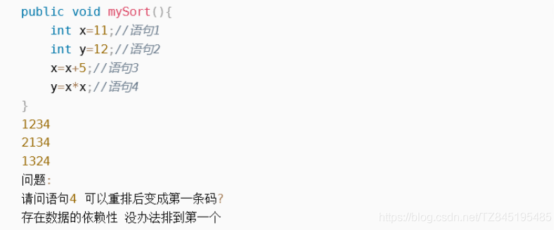

## JMM规范下，多线程对变量的读写过程

### 读取过程

(由于JVM运行程序的实体是线程，而每个线程创建时JVM都会为其创建一个工作内存(有些地方称为栈空间)，工作内存是每个线程的私有数据区域，而Java内存模型中规定所有的变量都存储在主内存，主内存是共享内存区域，所有线程都可以访问，但线程对变量的操作(读取赋值等)必须在工作内存中进行，首先要将变量从主内存拷贝到线程自己的工作内存空间，然后对变量进行操作，操作完成后将变量写回主内存，不能直接操作主内存中的变量，各个线程的工作内存中存储着主内存中的变量副本拷贝，因此不同的线程间无法访问对方的工作内存，线程间的通信(传值)必须通过主内存来完成。

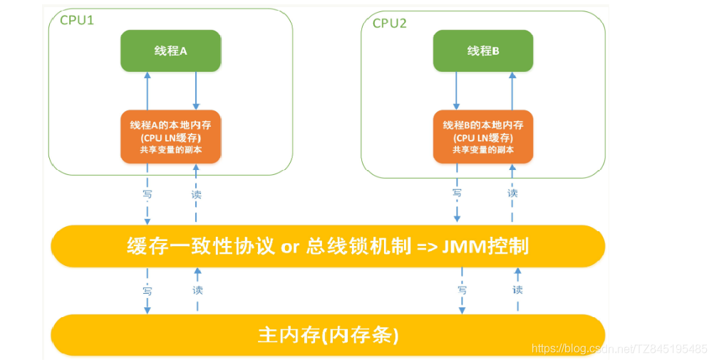

### JMM定义了线程和主内存之间的抽象关系

线程之间的共享变量存储在主内存中(从硬件角度来说就是内存条)
每个线程都有一个私有的本地工作内存，本地工作内存中存储了该线程用来读/写共享变量的副本(从硬件角度来说就是CPU的缓存，比如寄存器、L1、L2、L3缓存等)

### 小总结

1. 我们定义的**所有的共享变量都存储在物理主内存中**
2. **每个线程都有自己独立的工作内存，里面保存该线程使用到的变量的副本**(主内存中该变量的一份拷贝)
3. **线程对共享变量所有的操作都必须先在自己的工作内存中进行后写回主内存，不能直接从主内存中读写(不能越级)**
4. **不同线程之间也无法直接访问其他线程的工作内存中的变量，线程间变量值的传递需要通过主内存来进行**(同级不能相互访问)

## JMM先行发生happens-before

### 先行发生原则说明

2. *我们没有时时、处处、次次，添加volatile和synchronized来完成程序，这是因为Java语言中JMM原则下，有一个"先行发生"(Happens-Before)的原则限制和规则*

3. 在JMM中，如果一个操作执行的结果需要对另一个操作可见性或者代码重排序，那么这两个操作之间必须存在happens-before关系

4. **满足happens-before关系的原则可以帮助确保多线程程序的可见性和有序性**

5. x、y案例说明

   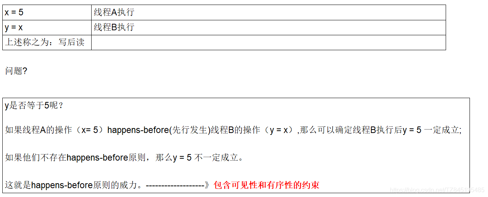

### happens-before总原则

1. **如果一个操作happens-before另一个操作，那么第一个操作的执行结果对第二个操作可见，而且第一个操作的执行顺序排在第二个操作之前(可见性，有序性)**
2. **两个操作之间存在happens-before关系，并不意味着一定要按照happens-before原则制定的顺序来执行。如果重排序之后的执行结果与按照happens-before关系来执行的结果一致，那么这种重排序并不非法(可以指令重排)**
   (值日:周一张三周二李四，假如有事情调换班可以的1+2+3=3+2+1)

### happens-before之8条原则

1. 次序规则
   一个线程内，按照代码顺序，写在前面的操作先行发生于写在后面的操作(强调的是一个线程)
   前一个操作的结果可以被后续的操作获取。将白点就是前面一个操作把变量X赋值为1，那后面一个操作肯定能知道X已经变成了1
2. 锁定规则
   (一个unlock操作先行发生于后面((这里的"后面"是指时间上的先后))对同一个锁的lock操作(上一个线程unlock了，下一个线程才能获取到锁，进行lock))
3. volatile变量规则
   (对一个volatile变量的写操作先行发生于后面对这个变量的读操作，前面的写对后面的读是可见的，这里的"后面"同样是指时间是的先后)
4. 传递规则
   (如果操作A先行发生于操作B，而操作B又先行发生于操作C，则可以得出A先行发生于操作C)
5. 线程启动规则(Thread Start Rule)
   (Thread对象的start( )方法先行发生于线程的每一个动作)
6. 线程中断规则(Thread Interruption Rule)
   对线程interrupt( )方法的调用先发生于被中断线程的代码检测到中断事件的发生
   可以通过Thread.interrupted( )检测到是否发生中断
7. 线程终止规则(Thread Termination Rule)
   (线程中的所有操作都先行发生于对此线程的终止检测)
8. 对象终结规则(Finalizer Rule)
   (对象没有完成初始化之前，是不能调用finalized( )方法的 )

## 案例说明

### 问题暴露

```java
	private int value=0;
	public void setValue(){
	    this.value=value;
	}
	public int getValue(){
	    return value;
	}

```

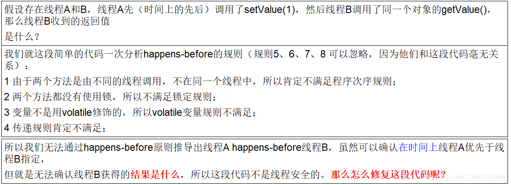

### 解决方案

1. 把getter/setter方法都**定义synchronized方法**(某一时刻只能有一个线程进入)
2. 把**value定义为volatile变量**，由于setter方法对value的修改不依赖value的原值，满足volatile关键字的使用
   (对一个volatile变量的写操作先行发生于后面对这个变量的读操作，前面的写对后面的读是可见的，这里的"后面"同样是指时间是的先后)

# volatile

1. 前面讲过的JMM、Happen-before，JMM是规范，有个细则叫happen-before，用来保证有序性的是volatile、synchronized关键字来捍卫
2. volatile凭什么可以保证有序性和可见性，靠的是内存屏障，内存屏障分为 loadload、StoreLoad、LoadStore、StoreStore

## volatile修改变量的2大特点

1. 特点:**可见性、有序性、不保证原子性**
2. volatile的内存语义
   - **当写一个volatile变量时，JMM会把该线程对应的本地内存中的共享变量值立即刷新回主内存中。**
   - **当读一个volatile变量时，JMM会把该线程对应的本地内存设置为无效，直接从主内存中读取共享变量**
   - **所以volatile的写内存语义是直接刷新到主内存中，读的内存语义是直接从主内存中读取**

## 内存屏障

### 什么是内存屏障

1. 内存屏障（也称内存栅栏，内存栅障，屏障指令等，是一类同步屏障指令**，是CPU或编译器在对内存随机访问的操作中的一个同步点，使得此点之前的所有读写操作都执行后才可以开始执行此点之后的操作），避免代码重排序**。内存屏障其实就是一种JVM指令，Java内存模型的重排规则会要求Java编译器在生成JVM指令时插入特定的内存屏障指令，通过这些内存屏障指令，**volatile实现了Java内存模型中的可见性和有序性，但volatile无法保证原子性**
2. **内存屏障之前的所有写操作都要回写到主内存**
   **内存屏障之后的所有读操作都能获得内存屏障之前的所有写操作的最新结果(实现了可见性)**
3. 一句话:对一个volatile域的写， happens-before于任意后续对这个volatile域的读，也叫写后读


### 四大屏障

- 落地是由volatile关键字，而volatile关键字靠的是StoreStore、StoreLoad 、LoadLoad、LoadStore四条指令
- 当我们的Java程序的变量被volatile修饰之后，会添加一个ACC_VOLATI LE，JVM会把字节码生成为机器码的时候，发现操作是volatile变量的话，就会根据JVM要求，在相应的位置去插入内存屏障指令

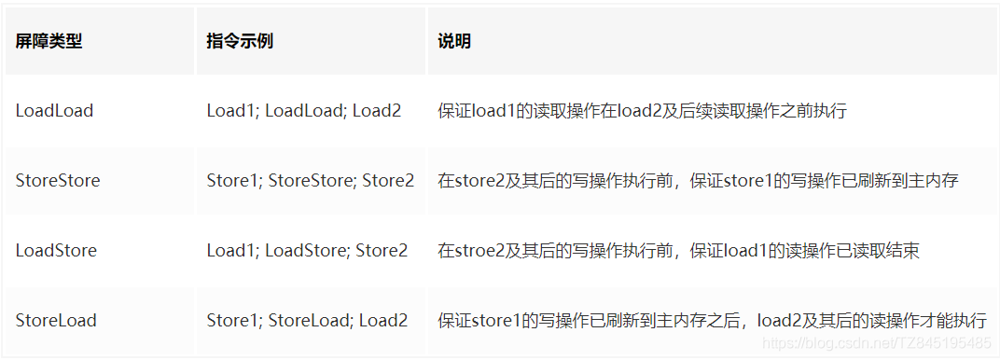

### happens-before之volatile变量规则

1. 当第一个操作为volatile读时，不论第二个操作是什么，都不能重排序。这个操作保证了volatile读之后的操作不会被重排到volatile读之前
2. 当第二个操作为volatile写时，不论第一个操作是什么，都不能重排序。这个操作保证了volatile写之前的操作不会被重排到volatile写之后

3. 当第一个操作为volatile写时，第二个操作为volatile读时，不能重排


### JMM内存屏障4种插⼊策略

#### 写

1. **在每个volatile写操作的前⾯插⼊⼀个StoreStore屏障**
2. **在每个volatile写操作的后⾯插⼊⼀个StoreLoad屏障**

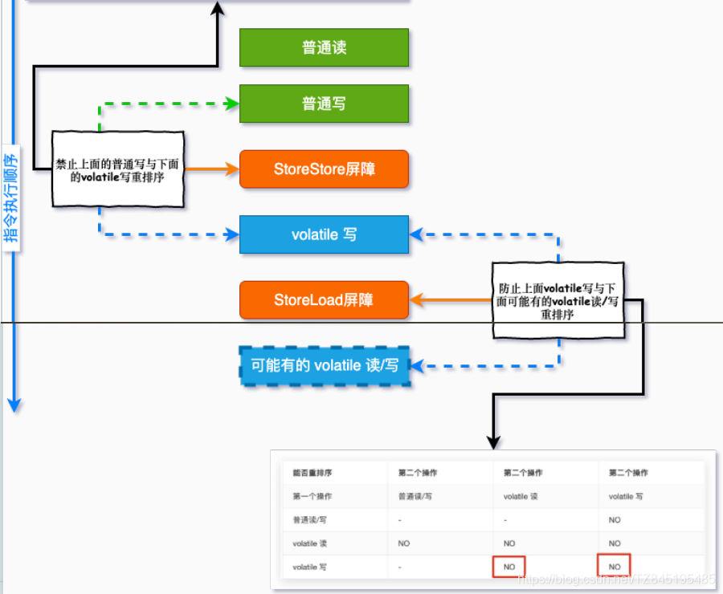

#### 读

1. **在每个volatile读操作的后⾯插⼊⼀个LoadLoad屏障**
2. **在每个volatile读操作的后⾯插⼊⼀个LoadStore屏障**

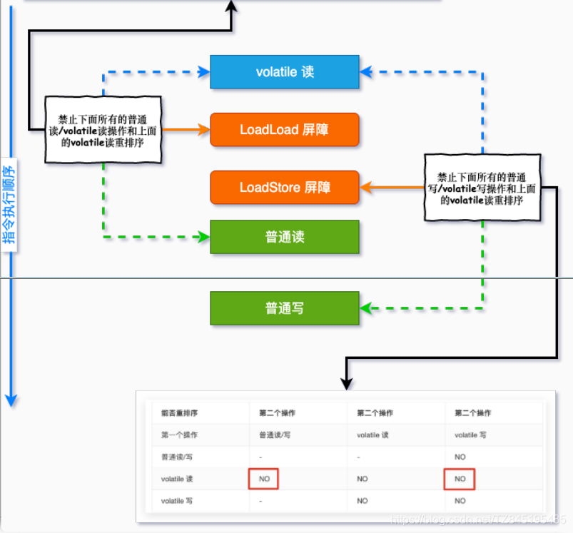

#### 代码展示

如果不加volatile，在write方法中发生重排，i=2排到flag=true之后，就会先执行flag=true，之后read就获取了i，这时的i还是0，并没有执行到i=2呢。

```java
//模拟一个单线程，什么顺序读？什么顺序写？
public class VolatileTest {
    int i = 0;
    volatile boolean flag = false;
    public void write(){
        i = 2;
        flag = true;
    }
    public void read(){
        if(flag){
            System.out.println("---i = " + i);
        }
    }
}
```

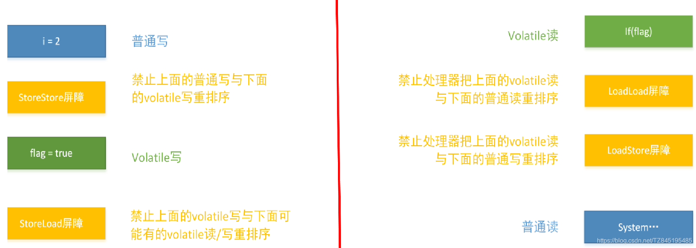

## volatile特性

### volatile特性 - 保证可见性

保证不同线程对这个变量进行操作时的可见性，即变量一旦改变所有线程立即可以看到

代码展示

1. 不加volatile，没有可见性，程序无法停止
2. 加了volatile，保证可见性，程序可以停止

```java
import java.util.concurrent.TimeUnit;

/*
验证volatile的可见性:
1.加入int number=0; number变量之前没有添加volatile关键字修饰，没有可见性
2.添加了volatile，可以解决可见性问题
 * */
class Resource {
    //volatile int number=0;
    volatile int number = 0;

    public void addNumber() {
        this.number = 60;
    }
}

public class Volatile_demo1 {
    public static void main(String[] args) {
        Resource resource = new Resource();
        new Thread(() -> {
            System.out.println(Thread.currentThread().getName() + "\t coming ");
            try {
                TimeUnit.SECONDS.sleep(4);
            } catch (InterruptedException e) {
                e.printStackTrace();
            }
            resource.addNumber();
            System.out.println(Thread.currentThread().getName() + "\t update " + resource.number);
        }， "线程A").start();

        //如果主线程访问resource.number==0，那么就一直进行循环
        while (resource.number == 0) {

        }
        //如果执行到了这里，证明main现在通过resource.number的值为60
        System.out.println(Thread.currentThread().getName() + "\t" + resource.number);

    }
}
```

上述代码原理解释

没有添加volatile关键字，线程A对共享变量改变了以后(number=60)，主线程(这里的线程B)访问number的值还是0，这就是不可见

添加volatile之后，线程A对共享数据进行了改变以后，那么main线程再次访问，number的值就是改变之后的number=60

### volatile特性 - 不保证原子性

对20个线程进行循环100次的操作

```java
import java.util.concurrent.atomic.AtomicInteger;

public class Volatile_demo3 {
    public static void main(String[] args) {
        /* System.out.println(Thread.activeCount());*/
        AutoResource autoResource = new AutoResource();
        //20个线程每个线程循环100次
        for (int i = 1; i <= 20; i++) {
            new Thread(() -> {
                for (int j = 1; j <= 100; j++) {
                    autoResource.numberPlusPlus();
                    autoResource.addAtomicInteger();
                }
            }， String.valueOf(i)).start();
        }
        //需要等待上面20个线程都全部计算完后，再用main线程取得的最终的结果值是多少
        //默认有两个线程，一个main线程，二是后台gc线程
        while (Thread.activeCount() > 2) {
            Thread.yield();
        }
        System.out.println(Thread.currentThread().getName() + "\t int type" + autoResource.number);
        System.out.println(Thread.currentThread().getName() + "\t AutoInteger type" + autoResource.atomicInteger.get());
    }
}

class AutoResource {
    volatile int number = 0;

    public void numberPlusPlus() {
        number++;
    }

    //使用AutoInteger保证原子性
    AtomicInteger atomicInteger = new AtomicInteger();

    public void addAtomicInteger() {
        atomicInteger.getAndIncrement();
    }
}
/**
*main	 int type1974
*main	 AutoInteger type2000
*/
```

- 对于一读一写操作，不会有数据问题
  假设主内存的共享变量number=1，需要对主内存的number++处理，对于两个线程t1、t2如果是一读一写的操作(不会有数据丢失的情况)，某一时刻，t1抢到CPU的执行权，将共享数据1读回t1的工作内存，进行number++的操作，这个时候number=2，将2从工作内存写回到主内存中。写回后马上通知t2线程，将number=2读到t2的工作线程

- 对于两个写，会出现数据问题
  假设主内存的共享变量number=0，需要对主内存进行10次的number++处理，最终的结果就是10，对于两个线程t1、t2如果是两个写的操作(会造成数据丢失的情况)，t1和t2将主内存的共享数据读取到各自的工作内存去，某一时刻，t1线程抢到CPU的执行权，进行number++的处理，将工作内存中的number=1写回到主内存中，就在这一刻，t2也抢到CPU执行权，进行number++的处理，这个时候number++后的结果也等于1，t1将number=1写回到主内存中去，并通知t2线程，将主内存中的number=1读到t2的工作内存中去，这个时候对于t2，它之前也进行了一次number++的操作将会无效，回重新进行一次number++的操作。这也数据也就写丢了一次，那么10次number++后的结果也就不会等于10
  read-load-use 和 assign-store-write 成为了两个不可分割的原子操作，但是在use和assign之间依然有极小的一段真空期，有可能变量会被其他线程读取，导致写丢失一次

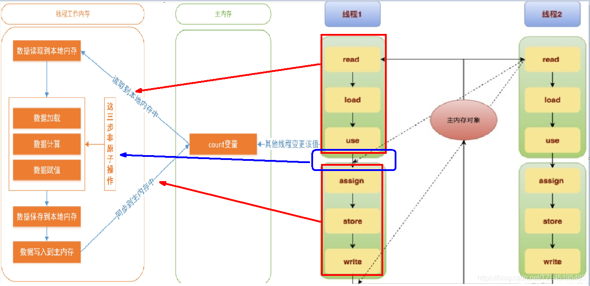

### volatile特性 - 禁止指令重排

1. 重排序是指编译器和处理器为了优化程序性能而对指令序列进行重新排序的一种手段，有时候会改变程序语句的先后顺序(不存在数据依赖关系，可以重排序;存在数据依赖关系，禁止重排序)

2. 重排序的分类和执行流程

   1. 编译器优化的重排序:编译器在不改变单线程串行语义的前提下，可以重新调整指令的执行顺序
   2. 指令级并行的重排序:处理器使用指令级并行技术来讲多条指令重叠执行，若不存在数据依赖性，处理器可以改变语句对应机器指令的执行顺序
   3. 内存系统的重排序:由于处理器使用缓存和读/写缓冲区，这使得加载和存储操作看上去可能是乱序执行

   

3. 数据依赖性:若两个操作访问同一变量，且这两个操作中有一个为写操作，此时两操作间就存在数据依赖性(存在数据依赖关系，禁止重排序===> 重排序发生，会导致程序运行结果不同)

   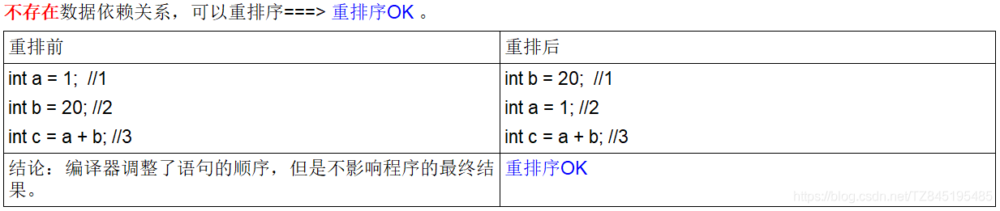

## 在哪些地方可以使用volatile?

①. 单一赋值可以，but含复合运算赋值不可以(i++之类)

```java
volatile int a = 10
volatile boolean flag = false
```

②. 状态标志，判断业务是否结束

```java
public class UseVolatileDemo{
    private volatile static boolean flag = true;
    public static void main(String[] args){
        new Thread(() -> {
            while(flag) {
                //do something......
            }
        }，"t1").start();

        //暂停几秒钟线程
        try { TimeUnit.SECONDS.sleep(2L); } catch (InterruptedException e) { e.printStackTrace(); }

        new Thread(() -> {
            flag = false;
        }，"t2").start();
    }
}

```

③. 开销较低的读，写锁策略

```java
public class UseVolatileDemo{
    /**
     * 使用:当读远多于写，结合使用内部锁和 volatile 变量来减少同步的开销
     * 理由:利用volatile保证读取操作的可见性;利用synchronized保证复合操作的原子性
     */
    public class Counter{ 
        private volatile int value;
        public int getValue(){
            return value;   //利用volatile保证读取操作的可见性
         }
        public synchronized int increment(){
            return value++; //利用synchronized保证复合操作的原子性
         }
    }
}

```

④. 单列模式 DCL双端锁的发布
原因：

1. DCL(双端检锁) 机制不一定线程安全，原因是有指令重排的存在，加入volatile可以禁止指令重排原因在于某一个线程在执行到第一次检测，读取到的instance不为null时，instance的引用对象 可能没有完成初始化

   ```java
   instance=new SingletonDem(); 可以分为以下步骤(伪代码)
   memory=allocate();//1.分配对象内存空间
   instance(memory);//2.初始化对象
   instance=memory;//3.设置instance的指向刚分配的内存地址，此时instance!=null
   ```

2. 步骤2和步骤3不存在数据依赖关系.而且无论重排前还是重排后程序执行的结果在单线程中并没有改变，因此这种重排优化是允许的.

   ```java
   memory=allocate();//1.分配对象内存空间
   instance=memory;//3.设置instance的指向刚分配的内存地址，此时instance!=null 但对象还没有初始化完.
   instance(memory);//2.初始化对象
   ```

3. 但是指令重排只会保证串行语义的执行一致性(单线程) 并不会关心多线程间的语义一致性
   所以当一条线程访问instance不为null时，由于instance实例未必完成初始化，也就造成了线程安全问题

4. 我们使用volatile禁止instance变量被执行指令重排优化即可

   ```java
   private volatile static SafeDoubleCheckSingleton singleton;
   ```

```java
public class SafeDoubleCheckSingleton{
    //通过volatile声明，实现线程安全的延迟初始化。
    private volatile static SafeDoubleCheckSingleton singleton;
    //私有化构造方法
    private SafeDoubleCheckSingleton(){
    }
    //双重锁设计
    public static SafeDoubleCheckSingleton getInstance(){
        if (singleton == null){
            //1.多线程并发创建对象时，会通过加锁保证只有一个线程能创建对象
            synchronized (SafeDoubleCheckSingleton.class){
                if (singleton == null){
                    //隐患：多线程环境下，由于重排序，该对象可能还未完成初始化就被其他线程读取
                    //原理:利用volatile，禁止 "初始化对象"(2) 和 "设置singleton指向内存空间"(3) 的重排序
                    singleton = new SafeDoubleCheckSingleton();
                }
            }
        }
        //2.对象创建完毕，执行getInstance()将不需要获取锁，直接返回创建对象
        return singleton;
    }
}

```

⑤. 反周志明老师的案例，你还有不加volatile的方法吗
采用静态内部类的方式实现

```java
public class SingletonDemo {
    private SingletonDemo() { }

    private static class SingletonDemoHandler {
        private static SingletonDemo instance = new SingletonDemo();
    }

    public static SingletonDemo getInstance() {
        return SingletonDemoHandler.instance;
    }

    public static void main(String[] args) {
        for (int i = 0; i <10 ; i++) {
            new Thread(()->{
                SingletonDemo instance = getInstance();
                // 可以知道这里获取到的地址都是同一个
                System.out.println(instance);
            }，String.valueOf(i)).start();
        }
    }
}

```

# JVM-JMM-CPU底层

## JVM-JMM-CPU底层执行全过程

1. JVM(内存中)是基于栈的指令集架构，比如我们去执行一个运算的操作，最终是由CPU执行的
2. 比如sconst_0这个指令会交给执行引擎进行翻译，解释执行器或JLT转换为汇编

3. 汇编指令会转化为二进制

4. 在二进制下面是线程A，需要这个线程作为载体

5. cpu不是马上执行，而是CPU调度到线程A才执行线程A的代码

6. KLT模式，JVM创建一个线程，底层会维护一个线程表，而这个线程与JVM中的线程是一一对应的关系

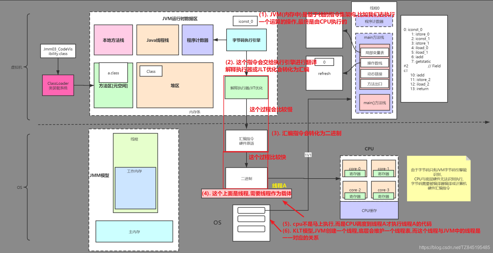

## 缓存一致性协议MESI

- 变量加了volatile关键字，在汇编会有一个lock锁前缀(触发硬件缓存锁机制)
  硬件缓存锁机制包含总线锁、缓存一致性协
- 早期技术落后，使用总线保持缓存一致
  例子: 早期可能CPU还没有三级缓存，t1、t2两个线程(多核)对主内存中的数据进行修改，如果某一个时刻，t1线程拿到了CPU执行权，在写回到主内存去的时候，会将总线锁抢占，抢占后t2线程就没办法去进行写入的操作，早期的这种使用总线锁的效率很低，它只能保证一个线程去写，这样多核的也就没办法发挥写操作
- 缓存一致性协议(最经典的是MESI协议)
  (mesi 在硬件约定了这样一种机制，CPU启动后，会采用一种监听模式，一直去监听总线里面消息的传递，也就是说，有任何人通过总线从内存中拿了一点东西，只要你被lock前缀修饰了，都可以感知到)
  Modified、Exclusive、Shared、Invalid

1. 例如我们对主内存的数据x=0，t1线程进行赋值x=3，t2线程进行赋值x=5的操作
2. 首先t1线程将x=0从内存–总线–读到三级缓存中，放入缓存行中存储，这时状态是E(独享的)
3. t2线程也将x=0从内存–总线–读到三级缓存中，放入缓存行中存储，这时的状态是S(共享的)，而t1线程读取到的也从E–S
4. 这个时候t1将数据从3级缓存读到L2—L1中，t2线程也是如此
5. 如果这个时候(情况一)，这个时候t1上锁的话，那么会将t1的L1的缓存行锁住，然后将x=3(E-S-M)，在写的同时，发出一个通知去告诉t2线程，这个时候t2线程就会将变量置为无效(S-I)，也发出一个通知去通知线程t1的cpu，告诉它我
6. 这里置为无效了，读取到t1线程的x=3。至于什么时候t1线程将值写入主内存的时机是不确定的
   如果这个时候(情况二)，线程t1和线程t2同时都锁住了各自L3中的缓存行，这个时候，我们到底是执行谁的结果呢？这个时候由总线裁决，看执行谁的操作，是x=3还是x=5
   总线裁决:通过总线上面电路的高低电位，每一个cpu都有自己的时钟周期
7. 情况三:如果变量很大，我们一个缓存行存不进去，这个时候MESI就会失效，会降级到总线的机制

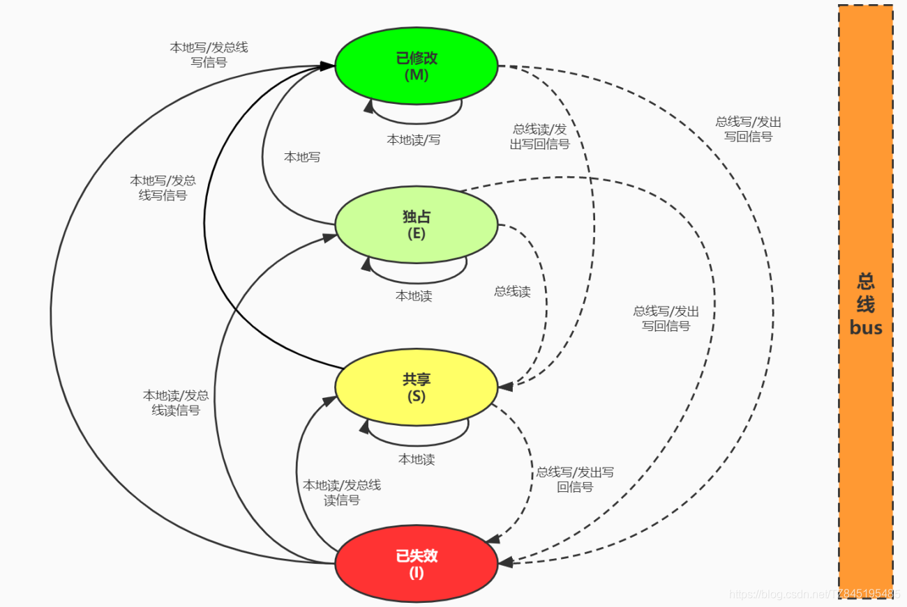

# CAS

CAS底层原理? UnSafe类+CAS思想[自旋锁]

## CAS概述

1. CAS的全称为Compare-And-Swap ，它是一条CPU并发原语，**比较工作内存值(预期值)和主物理内存的共享值是否相同，相同则执行规定操作，否则继续比较直到主内存和工作内存的值一致为止。**这个过程是原子的
   (AtomicInteger类主要利用CAS(compare and swap)+volatile和native方法来保证原子操作，从而避免synchronized的高开销，执行效率大为提升)

   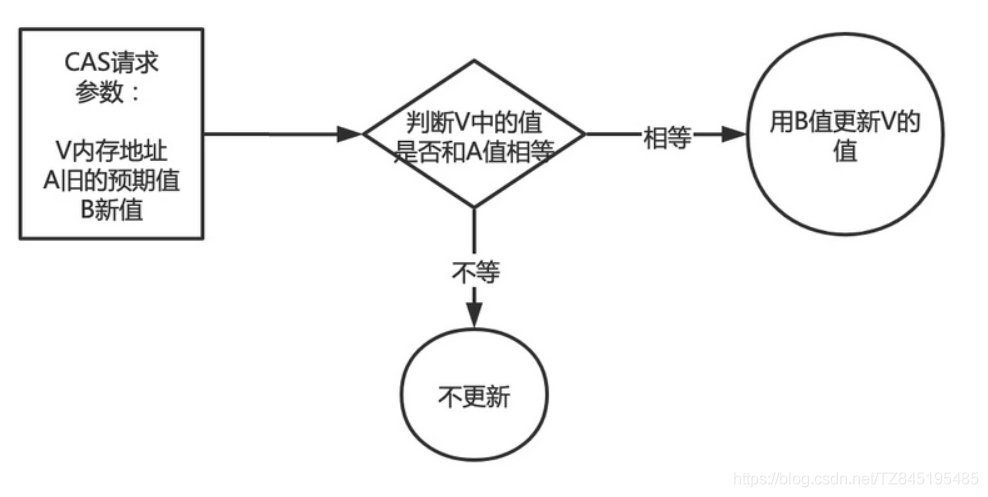

2. CAS并发原语体现在Java语言中就是sun.misc包下的UnSaffe类中的各个方法，**调用UnSafe类中的CAS方法，JVM会帮我实现 CAS汇编指令. 这是一种完全依赖于硬件功能，通过它实现了原子操作**，再次强调，**由于CAS是一种系统原语，原语属于操作系统用于范畴，是由若干条指令组成，用于完成某个功能的一个过程，并且原语的执行必须是连续的，在执行过程中不允许中断，也即是说CAS是一条原子指令，不会造成所谓的数据不一致的问题**

3. 关于unSafe.getAndIncrement()方法的分析

   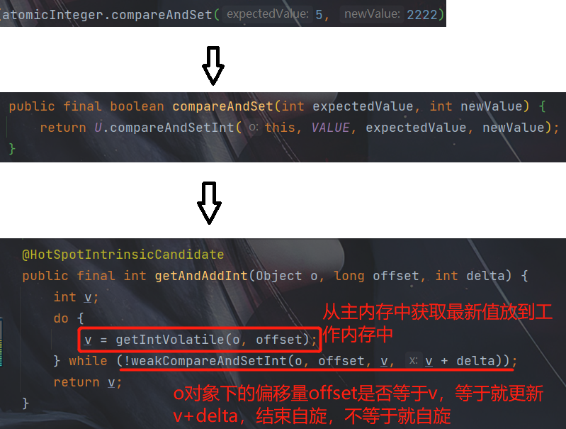

```JAVA
	/*
	* CAS:Compare and swap [比较并交换]
	* */
	public class AtomicIntegerDemo {
	    public static void main(String[] args) {
	        AtomicInteger atomicInteger=new AtomicInteger(5);
	        //true 2019
	        System.out.println(atomicInteger.compareAndSet(5， 2019)+"\t"+atomicInteger.get());
	        //false 2019
	        System.out.println(atomicInteger.compareAndSet(5， 2222)+"\t"+atomicInteger.get());
	    }
	}

	/**
	* true	2019
    * false	2019
    */
```

## UnSafe类

1. 是CAS的核心类，由于**Java 方法无法直接访问底层 ，需要通过本地(native)方法来访问**，UnSafe相当于一个后门，**基于该类可以直接操作特定的内存数据**，UnSafe类在于sun.misc包中，其内部方法操作可以向C的指针一样直接操作内存，因为Java中CAS操作依赖于UnSafe类的方法
   注意:**UnSafe类中所有的方法都是native修饰的，也就是说UnSafe类中的方法都是直接调用操作底层资源执行响应的任务**

   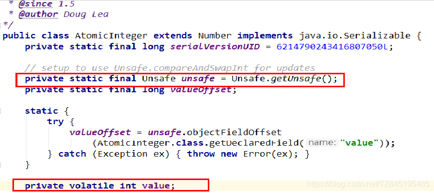

2. 变量ValueOffset，便是该变量在内存中的偏移地址，因为UnSafe就是根据内存偏移地址获取数据的

   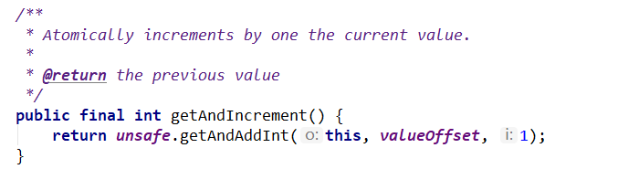

3. 变量value被volatile修饰，保证了多线程之间的可见性

   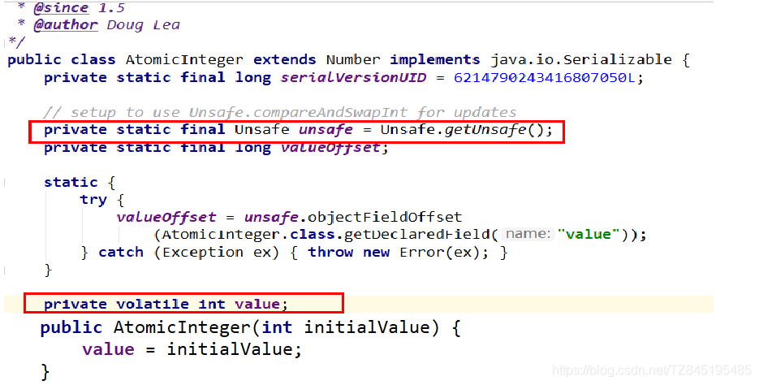

## CAS的缺点

1. **循环时间长开销很大**

   1. 我们可以看到getAndInt方法执行时，有个do while
   2. 如果CAS失败，会一直进行尝试。如果CAS长时间一直不成功，可能会给CPU带来很大的开销

   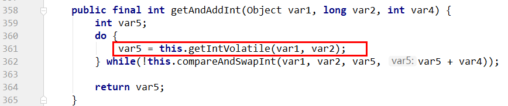

2. **只能保证一个共享变量的原子性**

   1. 当对一个共享变量执行操作时，我们可以使用循环CAS的方式来保证原子操作
   2. 对多个共享变量操作时，循环CAS就无法保证操作的原子性，这个时候就可以用锁来保证原子性

3. **ABA问题**
   比如一个线程one从内存位置V中取出A，这时候另一个线程two也从内存中取出A，并且线程two进行了一些操作将值变成了B，然后线程two又将V位置的数据变成A，这时候线程one进行CAS操作发现内存中仍然是A，然后线程one操作成功。尽管线程one的CAS操作成功，但是不代表这个过程就是没问题的

```java
import java.util.concurrent.atomic.AtomicInteger;
import java.util.concurrent.atomic.AtomicStampedReference;

public class ABADemo {
    static AtomicInteger atomicInteger = new AtomicInteger(100);
    static AtomicStampedReference atomicStampedReference = new AtomicStampedReference(100， 1);

    public static void main(String[] args) {
        new Thread(() -> {
            atomicInteger.compareAndSet(100， 101);
            atomicInteger.compareAndSet(101， 100);
        }， "t1").start();

        new Thread(() -> {
            //暂停一会儿线程
            try {
                Thread.sleep(500);
            } catch (InterruptedException e) {
                e.printStackTrace();
            }

            System.out.println(atomicInteger.compareAndSet(100， 2019) + "\t" + atomicInteger.get());
        }， "t2").start();

        //暂停一会儿线程，main彻底等待上面的ABA出现演示完成。
        try {
            Thread.sleep(2000);
        } catch (InterruptedException e) {
            e.printStackTrace();
        }
    }
}

```

## ABA问题解决方案

1. **ABA问题解决方案是使用AtomicStampedReference 每修改一次都会有一个版本号**
2. 注意：AtomicStampedReference用来解决AtomicInteger中的ABA问题，该demo企图将integer的值从0一直增长到1000，但当integer的值增长到128后，将停止增长。出现该现象有两点原因：
   1. 使用int类型而非Integer保存当前值
   2. Interger对-128~127的缓存[这个范围才有效，不在这个范围comareAndSet会一直返回false

```java
import java.util.concurrent.atomic.AtomicInteger;
import java.util.concurrent.atomic.AtomicStampedReference;

public class ABADemo {
    static AtomicInteger atomicInteger = new AtomicInteger(100);
    static AtomicStampedReference atomicStampedReference = new AtomicStampedReference(100， 1);

    public static void main(String[] args) {
        new Thread(() -> {
            atomicInteger.compareAndSet(100， 101);
            atomicInteger.compareAndSet(101， 100);
        }， "t1").start();

        new Thread(() -> {
            int stamp = atomicStampedReference.getStamp();
            System.out.println(Thread.currentThread().getName() + "\t 首次版本号:" + stamp);//1
            //暂停一会儿线程，
            try {
                Thread.sleep(1000);
            } catch (InterruptedException e) {
                e.printStackTrace();
            }
            atomicStampedReference.compareAndSet(100， 101， atomicStampedReference.getStamp()， atomicStampedReference.getStamp() + 1);
            System.out.println(Thread.currentThread().getName() + "\t 2次版本号:" + atomicStampedReference.getStamp());
            atomicStampedReference.compareAndSet(101， 100， atomicStampedReference.getStamp()， atomicStampedReference.getStamp() + 1);
            System.out.println(Thread.currentThread().getName() + "\t 3次版本号:" + atomicStampedReference.getStamp());
        }， "t3").start();

        new Thread(() -> {
            int stamp = atomicStampedReference.getStamp();
            System.out.println(Thread.currentThread().getName() + "\t 首次版本号:" + stamp);//1
            //暂停一会儿线程，获得初始值100和初始版本号1，故意暂停3秒钟让t3线程完成一次ABA操作产生问题
            try {
                Thread.sleep(3000);
            } catch (InterruptedException e) {
                e.printStackTrace();
            }
            boolean result = atomicStampedReference.compareAndSet(100， 2019， stamp， stamp + 1);
            System.out.println(Thread.currentThread().getName() + "\t" + result + "\t" + atomicStampedReference.getReference());
        }， "t4").start();
    }
}

```

# 原子操作类

**Java的原子类（如`AtomicInteger`、`AtomicBoolean`、`AtomicReference`等）通过使用底层的硬件级别的原子指令或锁机制来确保操作的原子性。在保证原子操作的同时，它们还提供了一定程度的内存可见性。**

## atomic是什么？

①. atomic是原子类，主要有如下：

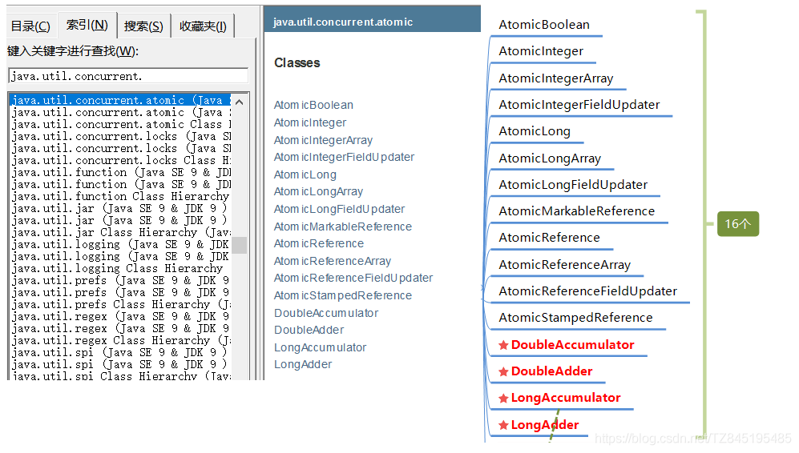

②. Java开发手册中说明：

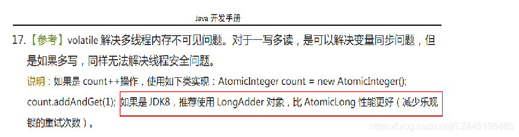

## 基本类型原子类

### 常用API

<table><thead><tr><th>方法</th><th>解释</th></tr></thead><tbody><tr><td>public final int get()</td><td>获取当前的值</td></tr><tr><td>public final int getAndSet(int newValue)</td><td>获取到当前的值，并设置新的值</td></tr><tr><td>public final int getAndIncrement()</td><td>获取当前的值，并自增</td></tr><tr><td>public final int getAndDecrement()</td><td>获取到当前的值，并自减</td></tr><tr><td>public final int getAndAdd(int delta)</td><td>获取到当前的值，并加上预期的值</td></tr><tr><td>public final int incrementAndGet( )</td><td>返回的是加1后的值</td></tr><tr><td>boolean compareAndSet(int expect，int update)</td><td>如果输入的数值等于预期值，返回true</td></tr></tbody></table>

### CountDownLatch

CountDownLatch是Java中的一个同步辅助类，用于控制多个线程之间的同步。**它提供了一种等待其他线程完成操作的机制，可以让一个或多个线程等待其他线程的完成信号，然后再继续执行。**

*CountDownLatch的工作原理是通过一个计数器来实现的，这个计数器初始化为一个正整数，每当一个线程完成了特定操作后，计数器的值就会减1。当计数器的值变为0时，等待该计数器的线程就会被唤醒，可以继续执行后续操作。*

CountDownLatch类提供了以下几个主要方法：

1. **CountDownLatch(int count)：构造函数，初始化计数器的值为count。**
2. **await()：使当前线程等待，直到计数器的值变为0。**
3. **countDown()：将计数器的值减1。**
4. **getCount()：获取当前计数器的值。**

```java
import java.util.concurrent.CountDownLatch;
import java.util.concurrent.atomic.AtomicInteger;

public class AtomicIntegerDemo {
    AtomicInteger atomicInteger = new AtomicInteger(0);

    public void addPlusPlus() {
        atomicInteger.incrementAndGet();
    }

    public static void main(String[] args) throws InterruptedException {
        CountDownLatch countDownLatch = new CountDownLatch(10);
        AtomicIntegerDemo atomic = new AtomicIntegerDemo();
        // 10个线程进行循环100次调用addPlusPlus的操作，最终结果是10*100=1000
        for (int i = 1; i <= 10; i++) {
            new Thread(() -> {
                try {
                    for (int j = 1; j <= 100; j++) {
                        atomic.addPlusPlus();
                    }
                } finally {
                    countDownLatch.countDown();
                }
            }， String.valueOf(i)).start();
        }
        //(1). 如果不加上下面的停顿3秒的时间，会导致还没有进行i++ 1000次main线程就已经结束了
        //try { TimeUnit.SECONDS.sleep(3);  } catch (InterruptedException e) {e.printStackTrace();}
        //(2). 使用CountDownLatch去解决等待时间的问题
        countDownLatch.await();
        System.out.println(Thread.currentThread().getName() + "\t" + "获取到的result:" + atomic.atomicInteger.get());
    }
}

```

### AtomicBoolean作为中断标识停止线程

```java
import java.util.concurrent.TimeUnit;
import java.util.concurrent.atomic.AtomicBoolean;

//线程中断机制的实现方法
public class AtomicBooleanDemo {
    public static void main(String[] args) {
        AtomicBoolean atomicBoolean = new AtomicBoolean(false);

        new Thread(() -> {
            System.out.println(Thread.currentThread().getName() + "\t" + "coming.....");
            while (!atomicBoolean.get()) {
                System.out.println("==========");
            }
            System.out.println(Thread.currentThread().getName() + "\t" + "over.....");
        }， "A").start();

        new Thread(() -> {
            try {
                Thread.sleep(2000);
            } catch (InterruptedException e) {
                throw new RuntimeException(e);
            }
            atomicBoolean.set(true);
        }， "B").start();
    }
}

```

### AtomicLong

**AtomicLong的底层是CAS+自旋锁的思想，适用于低并发的全局计算，高并发后性能急剧下降**，原因如下:N个线程CAS操作修改线程的值，每次只有一个成功过，其他N-1失败，失败的不停的自旋直到成功，这样大量失败自旋的情况，一下子cpu就打高了(AtomicLong的自旋会成为瓶颈)

**在高并发的情况下，我们使用LoadAdder**

## 数组类型原子类 

数组类型原子类，主要有三个AtomicIntegerArray、AtomicLongArray、AtomicReferenceArray

```java
public class AtomicIntegerArrayDemo {
    public static void main(String[] args) {
        //(1). 创建一个新的AtomicIntegerArray，其长度与从给定数组复制的所有元素相同。
        int[]arr2={1，2，3，4，5};
        AtomicIntegerArray array=new AtomicIntegerArray(arr2);
        //(2). 创建给定长度的新AtomicIntegerArray，所有元素最初为零。
        //AtomicIntegerArray array=new AtomicIntegerArray(5);

        for (int i = 0; i < arr.length; i++) {
            System.out.print(arr[i]);
        }
        System.out.println();
        System.out.println("=======");
        array.getAndSet(0，1111);
        System.out.println("============");
        System.out.println("将数字中位置为0位置上的元素改为:"+array.get(0));
        System.out.println("数组位置为1位置上的旧值是:"+array.get(1));
        System.out.println("将数组位置为1位置上的数字进行加1的处理");
        array.getAndIncrement(1);
        System.out.println("数组位置为1位置上的新值是:"+array.get(1));
    }
}

```

```
12345
=======
位置为0位置上的元素为:1
============
将数字中位置为0位置上的元素改为:1111
将数组位置为1位置上的数字进行加1的处理
数组位置为1位置上的新值是:3
```

## 引用类型原子类

引用类型原子类主要有三个: AtomicReference、AtomicStampedReference、AtomicMark ableReference

### AtomicReference

`AtomicReference` 是 Java 中的一个原子引用类，位于 `java.util.concurrent.atomic` 包中。它提供了一种线程安全的方式来操作引用类型的变量。

在多线程环境下，当多个线程同时访问和修改同一个对象时，可能会引发数据竞争和并发访问的问题。`AtomicReference` 提供了一种解决这类问题的机制，确保对引用对象的操作是原子性的，即线程安全的。

```java
import java.util.concurrent.atomic.AtomicReference;

public class AtomicReferenceDemo {
    public static void main(String[] args) {
        AtomicReference<User> reference = new AtomicReference<>();

        User z3 = new User(18， "z3");
        User li4 = new User(18， "li4");

        reference.set(z3);

        System.out.println(reference.compareAndSet(z3， li4) + "=====" + reference.get().toString());
        //true=====User{age=18， name='li4'}
    }
}


class User {
    private int age;
    private String name;

    public User(int age， String name) {
        this.age = age;
        this.name = name;
    }

    @Override
    public String toString() {
        return "User{" +
                "age=" + age +
                "， name='" + name + '\'' +
                '}';
    }
}

```

#### 使用AtomicReference实现自旋锁

```java
//自旋锁
public class AtomicReferenceThreadDemo {
    static AtomicReference<Thread>atomicReference=new AtomicReference<>();
    static Thread thread;
    public static void lock(){
        thread=Thread.currentThread();
        System.out.println(Thread.currentThread().getName()+"\t"+"coming.....");
        while(!atomicReference.compareAndSet(null，thread)){

        }
    }
    public static void unlock(){
        System.out.println(Thread.currentThread().getName()+"\t"+"over.....");
        atomicReference.compareAndSet(thread，null);
    }
    public static void main(String[] args) {
        new Thread(()->{
            AtomicReferenceThreadDemo.lock();
            try { TimeUnit.SECONDS.sleep(3);  } catch (InterruptedException e) {e.printStackTrace();}
            AtomicReferenceThreadDemo.unlock();
        }，"A").start();

        new Thread(()->{
            AtomicReferenceThreadDemo.lock();
            AtomicReferenceThreadDemo.unlock();
        }，"B").start();
    }
}

```

### AtomicStampedReference

AtomicStampedReference 是 Java 中的一个原子类，位于 `java.util.concurrent.atomic` 包下。它是一种支持原子操作的引用类型，用于解决并发环境下的一致性问题。

AtomicStampedReference 中的引用值可以被原子性地更新，同时还包含一个邮戳（或者称为版本号）。邮戳是一个整数，用于标识引用值的版本。这样，在并发环境中，我们可以通过比较邮戳的方式来判断引用值是否发生了变化。

AtomicStampedReference 主要用于解决 CAS（Compare and Swap）操作中的 ABA 问题。ABA 问题指的是在某个线程执行 CAS 操作之前，另外一个线程可能修改了变量的值，但是又将其改回了原来的值，使得 CAS 操作无法察觉到这个变化。通过添加邮戳，我们可以在比较引用值的同时，也比较邮戳，从而避免这个问题。

```java
import java.util.concurrent.atomic.AtomicStampedReference;

public class AtomicStampedReferenceDemo {
    public static void main(String[] args) {
        Person z3 = new Person(18， "z3");
        Person li4 = new Person(18， "li4");

        AtomicStampedReference<Person> reference = new AtomicStampedReference<Person>(z3， 1);

        System.out.println(reference.compareAndSet(z3， li4， 1， 2) + "=====" + reference.getReference() + "=====" + reference.getStamp());
        //true=====User{age=18， name='li4'}=====2
    }
}


class Person {
    private int age;
    private String name;

    public Person(int age， String name) {
        this.age = age;
        this.name = name;
    }

    @Override
    public String toString() {
        return "User{" +
                "age=" + age +
                "， name='" + name + '\'' +
                '}';
    }
}

```

#### AtomicStampedReference 解决ABA问题

1. 携带版本号的引用类型原子类，可以解决ABA问题
2. 解决修改过几次
3. 状态戳原子引用

```java
/**
 * Description: ABA问题的解决
 *
 * @author TANGZHI
 * @date 2021-03-26 21:30
 **/
public class ABADemo {
    private static AtomicReference<Integer> atomicReference=new AtomicReference<>(100);
    private static AtomicStampedReference<Integer> stampedReference=new AtomicStampedReference<>(100，1);
    public static void main(String[] args) {
        System.out.println("===以下是ABA问题的产生===");
        new Thread(()->{
            atomicReference.compareAndSet(100，101);
            atomicReference.compareAndSet(101，100);
        }，"t1").start();

        new Thread(()->{
            //先暂停1秒 保证完成ABA
            try { TimeUnit.SECONDS.sleep(1); } catch (InterruptedException e) { e.printStackTrace(); }
            System.out.println(atomicReference.compareAndSet(100， 2019)+"\t"+atomicReference.get());
        }，"t2").start();
        try { TimeUnit.SECONDS.sleep(2); } catch (InterruptedException e) { e.printStackTrace(); }
        System.out.println("===以下是ABA问题的解决===");

        new Thread(()->{
            int stamp = stampedReference.getStamp();
            System.out.println(Thread.currentThread().getName()+"\t 第1次版本号"+stamp+"\t值是"+stampedReference.getReference());
            //暂停1秒钟t3线程
            try { TimeUnit.SECONDS.sleep(1); } catch (InterruptedException e) { e.printStackTrace(); }

            stampedReference.compareAndSet(100，101，stampedReference.getStamp()，stampedReference.getStamp()+1);
            System.out.println(Thread.currentThread().getName()+"\t 第2次版本号"+stampedReference.getStamp()+"\t值是"+stampedReference.getReference());
            stampedReference.compareAndSet(101，100，stampedReference.getStamp()，stampedReference.getStamp()+1);
            System.out.println(Thread.currentThread().getName()+"\t 第3次版本号"+stampedReference.getStamp()+"\t值是"+stampedReference.getReference());
        }，"t3").start();

        new Thread(()->{
            int stamp = stampedReference.getStamp();
            System.out.println(Thread.currentThread().getName()+"\t 第1次版本号"+stamp+"\t值是"+stampedReference.getReference());
            //保证线程3完成1次ABA
            try { TimeUnit.SECONDS.sleep(3); } catch (InterruptedException e) { e.printStackTrace(); }
            boolean result = stampedReference.compareAndSet(100， 2019， stamp， stamp + 1);
            System.out.println(Thread.currentThread().getName()+"\t 修改成功否"+result+"\t最新版本号"+stampedReference.getStamp());
            System.out.println("最新的值\t"+stampedReference.getReference());
        }，"t4").start();
    }

```

### AtomicMarkableReference

#### AtomicMarkableReference 不建议用它解决ABA问题

1. 原子更新带有标志位的引用类型对象
2. 解决是否修改(它的定义就是将状态戳简化位true|false)，类似一次性筷子
3. 状态戳(true/false)原子引用
4. 不建议用它解决ABA问题

```java
import java.util.concurrent.TimeUnit;
import java.util.concurrent.atomic.AtomicMarkableReference;

public class ABADemo {
    static AtomicMarkableReference<Integer> markableReference = new AtomicMarkableReference<>(100， false);

    public static void main(String[] args) {
        System.out.println("============AtomicMarkableReference不关心引用变量更改过几次，只关心是否更改过======================");
        new Thread(() -> {
            boolean marked = markableReference.isMarked();
            System.out.println(Thread.currentThread().getName() + "\t 1次版本号" + marked);
            try {
                TimeUnit.MILLISECONDS.sleep(100);
            } catch (InterruptedException e) {
                e.printStackTrace();
            }
            markableReference.compareAndSet(100， 101， marked， !marked);
            System.out.println(Thread.currentThread().getName() + "\t 2次版本号" + markableReference.isMarked());
            markableReference.compareAndSet(101， 100， markableReference.isMarked()， !markableReference.isMarked());
            System.out.println(Thread.currentThread().getName() + "\t 3次版本号" + markableReference.isMarked());
        }， "线程A").start();

        new Thread(() -> {
            boolean marked = markableReference.isMarked();
            System.out.println(Thread.currentThread().getName() + "\t 1次版本号" + marked);
            //暂停几秒钟线程
            try {
                TimeUnit.MILLISECONDS.sleep(100);
            } catch (InterruptedException e) {
                e.printStackTrace();
            }
            markableReference.compareAndSet(100， 2020， marked， !marked);
            System.out.println(Thread.currentThread().getName() + "\t" + markableReference.getReference() + "\t" + markableReference.isMarked());
        }， "线程B").start();
    }
}

```

```
线程A	 1次版本号false
线程B	 1次版本号false
线程A	 2次版本号true
线程A	 3次版本号false
线程B	101	true
```

#### AtomicStampedReference和AtomicMarkableReference区别

- stamped – version number 版本号，修改一次+1
- Markable – true、false 是否修改过

## 对象的属性修改原子类 

- AtomicIntegerFieldUp dater、AtomicLongFieldUpdater、AtomicRefere nceFieldUpdater

- 使用目的:以一种线程安全的方式操作非线程安全对象内的某些字段
  (是否可以**不要锁定整个对象，减少锁定的范围，只关注长期、敏感性变化的某一个字段，而不是整个对象**，已达到精确加锁+节约内存的目的)

  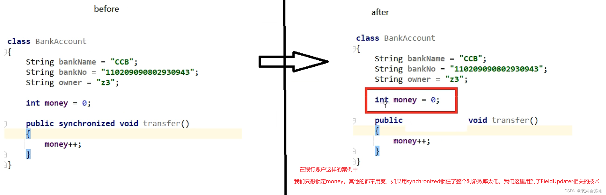

- 使用要求

  1. **更新的对象属性必须使用public volatile修饰符**
  2. **因为对象的属性修改类型原子类都是抽象类，所以每次使用都必须使用静态方法newUpdater( )创建一个更新器，并且需要设置想要更新的类和属性**

- 你在哪里用到了volatile

  1. 单例设置模式(双端检锁机制)
  2. AtomicIntegerFieldUpdater、AtomicLongFieldUpdater、AtomicReferenceFieldUpdater

### AtomicIntegerFieldUpdater

原子更新对象中int类型字段的值

```java
@SuppressWarnings("all")
public class AtomicIntegerFieldUpdaterDemo {
    private static final int THREAD_NUM = 1000;

    //设置栅栏是为了防止循环还没结束就执行main线程输出自增的变量，导致误以为线程不安全
    private static CountDownLatch countDownLatch = new CountDownLatch(THREAD_NUM);
    Score score=new Score();
    public static void main(String[] args)throws InterruptedException {
        Score score = new Score();
        for (int j = 0; j < THREAD_NUM; j++) {
            new Thread(() -> {
                score.addTotalScore(score);
                countDownLatch.countDown();
            }).start();
        }
        countDownLatch.await();
        System.out.println("totalScore的值：" + score.totalScore);//totalScore的值：1000
    }
}

class Score {
    String username;

    public volatile int totalScore = 0;
    //public static <U> AtomicIntegerFieldUpdater<U> newUpdater(Class<U> tclass，String fieldName)
    private static AtomicIntegerFieldUpdater atomicIntegerFieldUpdater =
            AtomicIntegerFieldUpdater.newUpdater(Score.class， "totalScore");

    public void addTotalScore(Score score){
        //public int incrementAndGet(T obj) {
        atomicIntegerFieldUpdater.incrementAndGet(score);
    }
}

```

1. 通过下面代码我们不难得知使用AtomicIntegerFieldUpdater与AtomicInteger其实效果是一致的，那既然已经存在了AtomicInteger并发之神又要写一个AtomicIntegerFieldUpdater呢？
2. 从AtomicIntegerFieldUpdaterDemo代码中我们不难发现，**通过AtomicIntegerFieldUpdater更新score我们获取最后的int值时相较于AtomicInteger来说不需要调用get()方法！**
3. 对于AtomicIntegerFieldUpdaterDemo类的**AtomicIntegerFieldUpdater是static final类型也就是说即使创建了100个对象AtomicIntegerField也只存在一个不会占用对象的内存，但是AtomicInt eger会创建多个AtomicInteger对象，占用的内存比AtomicIntegerFieldUpdater大**，所以对于熟悉dubbo源码的人都知道，dubbo有个实现轮询负载均衡策略的类AtomicPositiveInteger用的就是AtomicIntegerField Update，在netty底层大量使用了这个类

### AtomicReferenceFieldUpdater

原子更新引用类型字段的值

```java
import java.util.concurrent.TimeUnit;
import java.util.concurrent.atomic.AtomicReferenceFieldUpdater;

class MyVar {
    public volatile Boolean isInit = Boolean.FALSE;
    AtomicReferenceFieldUpdater<MyVar， Boolean> referenceFieldUpdater = AtomicReferenceFieldUpdater.newUpdater(MyVar.class， Boolean.class， "isInit");

    public void init(MyVar myVar) {
        if (referenceFieldUpdater.compareAndSet(myVar， Boolean.FALSE， Boolean.TRUE)) {
            System.out.println(Thread.currentThread().getName() + "\t" + "-----start init，needs 3 seconds");
            try {
                TimeUnit.SECONDS.sleep(3);
            } catch (InterruptedException e) {
                e.printStackTrace();
            }
            System.out.println(Thread.currentThread().getName() + "\t" + "-----over init");
        } else {
            System.out.println(Thread.currentThread().getName() + "\t" + "抱歉，已经有其他线程进行了初始化");
        }
    }
}

public class AtomicReferenceFieldUpdaterDemo {
    public static void main(String[] args) {
        MyVar myVar = new MyVar();
        for (int i = 1; i <= 5; i++) {
            new Thread(() -> {
                myVar.init(myVar);
            }， String.valueOf(i)).start();
        }
    }
}

```

```
3	抱歉，已经有其他线程进行了初始化
2	抱歉，已经有其他线程进行了初始化
5	抱歉，已经有其他线程进行了初始化
4	抱歉，已经有其他线程进行了初始化
1	-----start init，needs 3 seconds
1	-----over init
```

## 原子操作增强类

原子操作增强类:DoubleAccumulator 、DoubleAdder、LongAccumulator 、LongAdder

<table><thead><tr><th>方法</th><th>解释</th></tr></thead><tbody><tr><td>void add(long x)</td><td>将当前的value加x</td></tr><tr><td>void increment()</td><td>将当前的value加1</td></tr><tr><td>void decrement( )</td><td>将当前value减1</td></tr><tr><td><font >long sum( )</font></td><td><font >返回当前的值,特别注意,在没有并发更新value的情况下，sum会返回一个精确值,在存在并发的情况下,sum不保证返回精确值</font></td></tr><tr><td>long longvalue()</td><td>等价于long sum( )</td></tr><tr><td>void reset()</td><td>将value重置为0,可用于替换重新new一个LongAdder,但次方法只可以在没有并发更新的情况下使用</td></tr><tr><td>long sumThenReset()</td><td>获取当前value,并将value重置为0</td></tr></tbody></table>

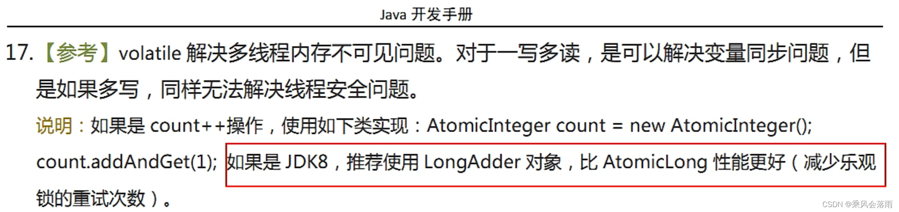

- **LongAdder只能用来计算加法、减法，且从零开始计算**
- **LongAccumulator提供了自定义的函数操作**

```JAVA
import java.util.concurrent.atomic.LongAccumulator;
import java.util.concurrent.atomic.LongAdder;
import java.util.function.LongBinaryOperator;

public class LongAdderDemo {
    public static void main(String[] args) {
        // LongAdder只能做加减法,不能做乘除法
        LongAdder longAdder=new LongAdder();
        longAdder.increment();
        longAdder.increment();
        longAdder.increment();
        longAdder.decrement();
        System.out.println(longAdder.longValue());
        
        System.out.println("================================");
        
        //LongAccumulator (LongBinaryOperator accumulatorFunction, long identity)
        //LongAccumulator longAccumulator=new LongAccumulator((x,y)->x+y,0);
        LongAccumulator longAccumulator=new LongAccumulator(new LongBinaryOperator() {
            @Override
            public long applyAsLong(long left, long right) {
                return left*right;
            }
        },5);
        longAccumulator.accumulate(2);
        longAccumulator.accumulate(2);
        longAccumulator.accumulate(3);
        System.out.println(longAccumulator.longValue());
    }
}

```

LongAdder高性能对比code演示

```java
import java.util.concurrent.CountDownLatch;
import java.util.concurrent.atomic.AtomicLong;
import java.util.concurrent.atomic.LongAccumulator;
import java.util.concurrent.atomic.LongAdder;

//需求：50个线程，每个线程100w次，计算总点赞数
class ClickNumber {
    int number = 0;

    public synchronized void add1() {
        number++;
    }

    AtomicLong atomicLong = new AtomicLong(0);

    public void add2() {
        atomicLong.incrementAndGet();
    }

    LongAdder longAdder = new LongAdder();

    public void add3() {
        longAdder.increment();
    }

    LongAccumulator longAccumulator = new LongAccumulator((x, y) -> x + y, 0);

    public void add4() {
        longAccumulator.accumulate(1);
    }
}

public class AccumulatorCompareDemo {
    public static final int _1W = 1000000;
    public static final int threadNumber = 50;

    public static void main(String[] args) throws InterruptedException {

        ClickNumber clickNumber = new ClickNumber();
        Long startTime;
        Long endTime;
        CountDownLatch countDownLatch1 = new CountDownLatch(50);
        CountDownLatch countDownLatch2 = new CountDownLatch(50);
        CountDownLatch countDownLatch3 = new CountDownLatch(50);
        CountDownLatch countDownLatch4 = new CountDownLatch(50);

        startTime = System.currentTimeMillis();
        for (int i = 1; i <= threadNumber; i++) {
            new Thread(() -> {
                try {
                    for (int j = 1; j <= _1W; j++) {
                        clickNumber.add1();
                    }
                } finally {
                    countDownLatch1.countDown();
                }
            }, String.valueOf(i)).start();
        }
        countDownLatch1.await();
        endTime = System.currentTimeMillis();
        System.out.println("costTime---" + (endTime - startTime) + "毫秒" + "\t" + "synchronized---" + clickNumber.number);

        startTime = System.currentTimeMillis();
        for (int i = 1; i <= threadNumber; i++) {
            new Thread(() -> {
                try {
                    for (int j = 1; j <= _1W; j++) {
                        clickNumber.add2();
                    }
                } finally {
                    countDownLatch2.countDown();
                }
            }, String.valueOf(i)).start();
        }
        countDownLatch2.await();
        endTime = System.currentTimeMillis();
        System.out.println("costTime---" + (endTime - startTime) + "毫秒" + "\t" + "atomicLong---" + clickNumber.atomicLong);

        startTime = System.currentTimeMillis();
        for (int i = 1; i <= threadNumber; i++) {
            new Thread(() -> {
                try {
                    for (int j = 1; j <= _1W; j++) {
                        clickNumber.add3();
                    }
                } finally {
                    countDownLatch3.countDown();
                }
            }, String.valueOf(i)).start();
        }
        countDownLatch3.await();
        endTime = System.currentTimeMillis();
        System.out.println("costTime---" + (endTime - startTime) + "毫秒" + "\t" + "LongAdder---" + clickNumber.longAdder.sum());

        startTime = System.currentTimeMillis();
        for (int i = 1; i <= threadNumber; i++) {
            new Thread(() -> {
                try {
                    for (int j = 1; j <= _1W; j++) {
                        clickNumber.add4();
                    }
                } finally {
                    countDownLatch4.countDown();
                }
            }, String.valueOf(i)).start();
        }
        countDownLatch4.await();
        endTime = System.currentTimeMillis();
        System.out.println("costTime---" + (endTime - startTime) + "毫秒" + "\t" + "LongAccumulator---" + clickNumber.longAccumulator.longValue());
    }

}//印证了阿里卡法手册中说的 【如果是JDK8，推荐使用LongAdder对象，比AtomicLong性能更好（减少乐观锁的重试次数）】
```

```
costTime---1801毫秒	synchronized---50000000
costTime---873毫秒	atomicLong---50000000
costTime---143毫秒	LongAdder---50000000
costTime---127毫秒	LongAccumulator---50000000
```

## 原理?

### LongAdder能否替代AtomicLong

- **AtomicLong是利用底层的CAS操作来提供并发性**的,比如addAndGet方法。在并发量比较低的情况下,线程冲突的概率比较小,自旋的次数不会很多。但是,高并发情况下,N个线程同时进行自旋操作,N-1个线程失败,导致CPU打满场景,此时AtomicLong的自旋会成为瓶颈
- LongAdder的API和AtomicLong的API还是有比较大的差异,而且**AtomicLong提供的功能更丰富**,尤其是addAndGet、decrementAndGet、compareAndSet这些方法。addAndGet、decrementAndGet除了单纯的做自增自减外,还可以立即获取增减后的值,而**LongAdder则需要做同步控制才能精确获取增减后的值。**如果业务需求需要精确的控制计数,则使用AtomicLong比较合适；
- **低并发、一般的业务尝尽下AtomicLong(数据准确)是足够了,如果并发量很多,存在大量写多读少的情况,那LongAdder(数据最终一致性,不保证强一致性)可能更合适**


###  Striped64

Striped64有几个比较重要的成员函数

```java
//CPU数量,即Cells数组的最大长度
static final int NCPU = Runtime.getRuntime().availableProcessors();
//存放Cell的hash表，大小为2的幂
//这里的Cell是Striped64的内部类
transient volatile Cell[] cells;
/*
1.在开始没有竞争的情况下,将累加值累加到base；
2.在cells初始化的过程中，cells处于不可用的状态，这时候也会尝试将通过cas操作值累加到base
*/
transient volatile long base;
/*
cellsBusy,它有两个值0或1,它的作用是当要修改cells数组时加锁,
防止多线程同时修改cells数组(也称cells表)，0为无锁，1位加锁，加锁的状况有三种:
(1). cells数组初始化的时候；
(2). cells数组扩容的时候；
(3).如果cells数组中某个元素为null，给这个位置创建新的Cell对象的时候；

*/
transient volatile int cellsBusy;	

```

Striped64中一些变量或者方法的定义

1. base: 类似于AtomicLong中全局的value值。再没有竞争情况下数据直接累加到base上,或者cells扩容时,也需要将数据写入到base上
2. collide:表示扩容意向,false一定不会扩容,true可能会扩容
3. cellsBusy:初始化cells或者扩容cells需要获取锁,0表示无锁状态,1表示其他线程已经持有了锁
4. casCellsBusy:通过CAS操作修改cellsBusy的值,CAS成功代表获取锁,返回true
5. NCPU:当前计算机CPU数量,Cell数组扩容时会使用到
6. getProbe( ):获取当前线程的hash值
7. advanceProbe( ):重置当前线程的hash值

LongAdder是Striped64的子类、架构图

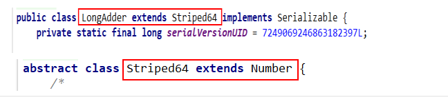

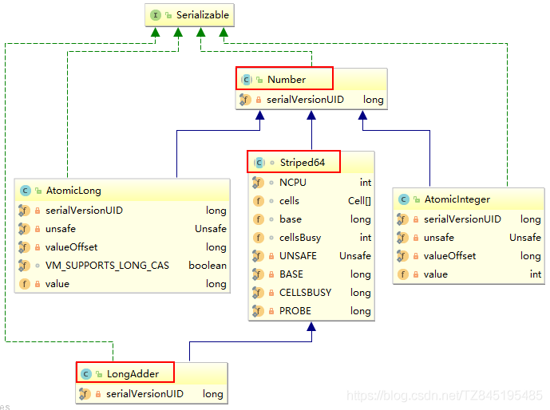

Cell:是java.util.concurrent.atomic下Striped64下的一个内部类

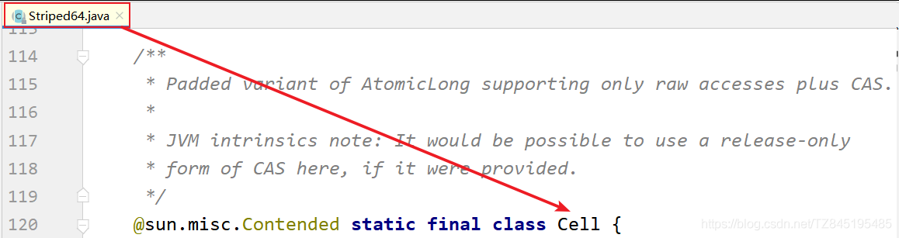

### LongAdder为什么这么快

- **LongAdder在无竞争的情况,跟AtomicLong一样,对同一个base进行操作,当出现竞争关系时则采用化整为零的做法,从空间换时间,用一个数组cells,将一个value拆分进这个数组cells。**多个线程需要同时对value进行操作时候,可以对线程id进行hash得到hash值,再根据hash值映射到这个数组cells的某个下标,再对该下标所对应的值进行自增操作。**当所有线程操作完毕,将数组cells的所有值和无竞争值base都加起来作为最终结果(分散热点)**
- **sum( )会将所有cell数组中的value和base累加作为返回值,核心的思想就是将之前AtomicLong一个value的更新压力分散到多个value中去,从而降级更新热点**
- 生活case,AtomicLong相当于是我们去超市买了一个牙刷,我们可以把它放到自己的口袋中,但是,如果我们需要在超市买很多东西,自己的口袋这个时候就装不下去了,我们可以使用LongAdder,它的一个核心思想是分散热点,base(相当于口袋)+cell数组(相当于袋子,数组中有两个元素,就相当于两个袋子装东西)

- 内部是一个Base+一个Cell[ ]数组


base变量：非竞争状态条件下,直接累加到该变量上
Cell[ ]数组:竞争条件下(高并发下),累加各个线程自己的槽Cell[i]中

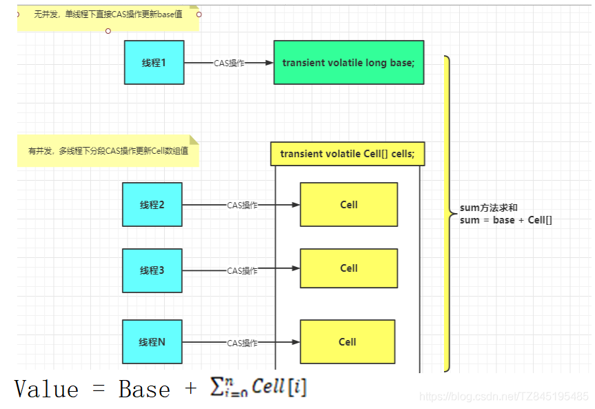

### 源码解析 longAdder.increment( )

#### add(1L)

- 最初无竞争时,直接通过casBase进行更新base的处理

- 如果更新base失败后,首次新建一个Cell[ ]数组(默认长度是2)

- 当多个线程竞争同一个Cell比较激烈时,可能就要对Cell[ ]扩容

- 源码如下：

  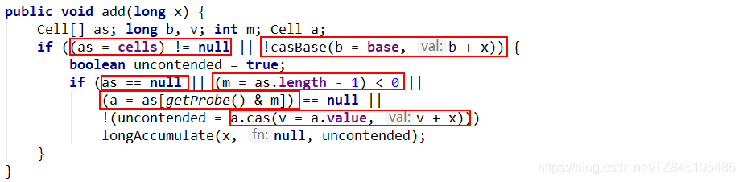


```java
    LongAdder.java
	public void add(long x) {
		//as是striped64中的cells数组属性
		//b是striped64中的base属性
		//v是当前线程hash到的cell中存储的值
		//m是cells的长度减1,hash时作为掩码使用
		//a时当前线程hash到的cell
        Cell[] as; long b, v; int m; Cell a;
		/**
		首次首线程(as = cells) != null)一定是false,此时走casBase方法,以CAS的方式更新base值,
		且只有当cas失败时,才会走到if中
		条件1:cells不为空,说明出现过竞争,cell[]已创建
		条件2:cas操作base失败,说明其他线程先一步修改了base正在出现竞争
		*/
        if ((as = cells) != null || !casBase(b = base, b + x)) {
			//true无竞争 fasle表示竞争激烈,多个线程hash到同一个cell,可能要扩容
            boolean uncontended = true;
			/*
			条件1:cells为空,说明正在出现竞争,上面是从条件2过来的,说明!casBase(b = base, b + x))=true
				  会通过调用longAccumulate(x, null, uncontended)新建一个数组,默认长度是2
			条件2:默认会新建一个数组长度为2的数组,m = as.length - 1) < 0 应该不会出现,
			条件3:当前线程所在的cell为空,说明当前线程还没有更新过cell,应初始化一个cell。
				  a = as[getProbe() & m]) == null,如果cell为空,进行一个初始化的处理
			条件4:更新当前线程所在的cell失败,说明现在竞争很激烈,多个线程hash到同一个Cell,应扩容
				  (如果是cell中有一个线程操作,这个时候,通过a.cas(v = a.value, v + x)可以进行处理,返回的结果是true)
			**/
            if (as == null || (m = as.length - 1) < 0 ||
			    //getProbe( )方法返回的时线程中的threadLocalRandomProbe字段
				//它是通过随机数生成的一个值,对于一个确定的线程这个值是固定的(除非刻意修改它)
                (a = as[getProbe() & m]) == null ||
                !(uncontended = a.cas(v = a.value, v + x)))
				//调用Striped64中的方法处理
                longAccumulate(x, null, uncontended);
        }

```
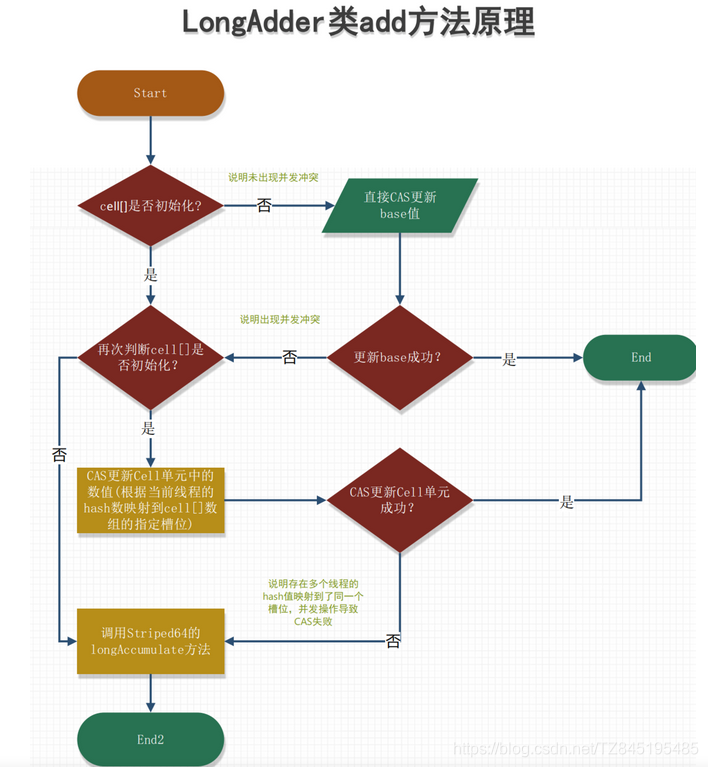

#### longAccumulate(x, null, uncontended)

①. 线程hash值:probe

```java
final void longAccumulate(long x, LongBinaryOperator fn,
						  boolean wasUncontended) {
	//存储线程的probe值
	int h;
	//如果getProbe()方法返回0,说明随机数未初始化
	if ((h = getProbe()) == 0) { //这个if相当于给当前线程生成一个非0的hash值
		//使用ThreadLocalRandom为当前线程重新计算一个hash值,强制初始化
		ThreadLocalRandom.current(); // force initialization
		//重新获取probe值,hash值被重置就好比一个全新的线程一样,所以设置了wasUncontended竞争状态为true
		h = getProbe();
		//重新计算了当前线程的hash后认为此次不算是一次竞争,都未初始化,肯定还不存在竞争激烈
		//wasUncontended竞争状态为true
		wasUncontended = true;
	}

```

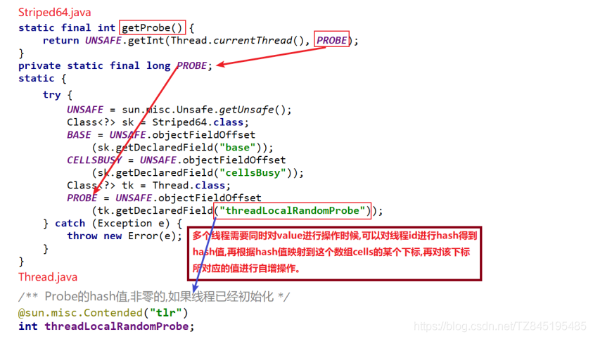

②. 刚刚初始化Cell[ ]数组(首次新建)

```java
	//CASE2:cells没有加锁且没有初始化,则尝试对它进行加锁,并初始化cells数组
	/*
	cellsBusy:初始化cells或者扩容cells需要获取锁,0表示无锁状态,1表示其他线程已经持有了锁
	cells == as == null  是成立的
	casCellsBusy:通过CAS操作修改cellsBusy的值,CAS成功代表获取锁,
	返回true,第一次进来没人抢占cell单元格,肯定返回true
	**/
	else if (cellsBusy == 0 && cells == as && casCellsBusy()) { 
	    //是否初始化的标记
		boolean init = false;
		try {                           // Initialize table(新建cells)
			// 前面else if中进行了判断,这里再次判断,采用双端检索的机制
			if (cells == as) {
				//如果上面条件都执行成功就会执行数组的初始化及赋值操作,Cell[] rs = new Cell[2]标识数组的长度为2
				Cell[] rs = new Cell[2];
				//rs[h & 1] = new Cell(x)表示创建一个新的cell元素,value是x值,默认为1
				//h & 1 类似于我们之前hashmap常用到的计算散列桶index的算法,
				//通常都是hash&(table.len-1),同hashmap一个意思
				//看这次的value是落在0还是1
				rs[h & 1] = new Cell(x);
				cells = rs;
				init = true;
			}
		} finally {
			cellsBusy = 0;
		}
		if (init)
			break;
	}

```

③. 兜底(多个线程尝试CAS修改失败的线程会走这个分支)

```java
	//CASE3:cells正在进行初始化,则尝试直接在基数base上进行累加操作
	//这种情况是cell中都CAS失败了,有一个兜底的方法
	//该分支实现直接操作base基数,将值累加到base上,
	//也即其他线程正在初始化,多个线程正在更新base的值
	else if (casBase(v = base, ((fn == null) ? v + x :
								fn.applyAsLong(v, x))))
		break;     

```

④. Cell数组不再为空且可能存在Cell数组扩容

```java
for (;;) {
	Cell[] as; Cell a; int n; long v;
	if ((as = cells) != null && (n = as.length) > 0) { // CASE1:cells已经初始化了
	    // 当前线程的hash值运算后映射得到的Cell单元为null,说明该Cell没有被使用
		if ((a = as[(n - 1) & h]) == null) {
			//Cell[]数组没有正在扩容
			if (cellsBusy == 0) {       // Try to attach new Cell
				//先创建一个Cell
				Cell r = new Cell(x);   // Optimistically create
				//尝试加锁,加锁后cellsBusy=1
				if (cellsBusy == 0 && casCellsBusy()) { 
					boolean created = false;
					try {               // Recheck under lock
						Cell[] rs; int m, j; //将cell单元赋值到Cell[]数组上
						//在有锁的情况下再检测一遍之前的判断 
						if ((rs = cells) != null &&
							(m = rs.length) > 0 &&
							rs[j = (m - 1) & h] == null) {
							rs[j] = r;
							created = true;
						}
					} finally {
						cellsBusy = 0;//释放锁
					}
					if (created)
						break;
					continue;           // Slot is now non-empty
				}
			}
			collide = false;
		}
		/**
		wasUncontended表示cells初始化后,当前线程竞争修改失败
		wasUncontended=false,表示竞争激烈,需要扩容,这里只是重新设置了这个值为true,
		紧接着执行advanceProbe(h)重置当前线程的hash,重新循环
		*/
		else if (!wasUncontended)       // CAS already known to fail
			wasUncontended = true;      // Continue after rehash
		//说明当前线程对应的数组中有了数据,也重置过hash值
		//这时通过CAS操作尝试对当前数中的value值进行累加x操作,x默认为1,如果CAS成功则直接跳出循环
		else if (a.cas(v = a.value, ((fn == null) ? v + x :
									 fn.applyAsLong(v, x))))
			break;
		//如果n大于CPU最大数量,不可扩容,并通过下面的h=advanceProbe(h)方法修改线程的probe再重新尝试
		else if (n >= NCPU || cells != as)
			collide = false;    //扩容标识设置为false,标识永远不会再扩容
		//如果扩容意向collide是false则修改它为true,然后重新计算当前线程的hash值继续循环
		else if (!collide) 
			collide = true;
		//锁状态为0并且将锁状态修改为1(持有锁) 
		else if (cellsBusy == 0 && casCellsBusy()) { 
			try {
				if (cells == as) {      // Expand table unless stale
					//按位左移1位来操作,扩容大小为之前容量的两倍
					Cell[] rs = new Cell[n << 1];
					for (int i = 0; i < n; ++i)
						//扩容后将之前数组的元素拷贝到新数组中
						rs[i] = as[i];
					cells = rs; 
				}
			} finally {
				//释放锁设置cellsBusy=0,设置扩容状态,然后进行循环执行
				cellsBusy = 0;
			}
			collide = false;
			continue;                   // Retry with expanded table
		}
		h = advanceProbe(h);
	}

```

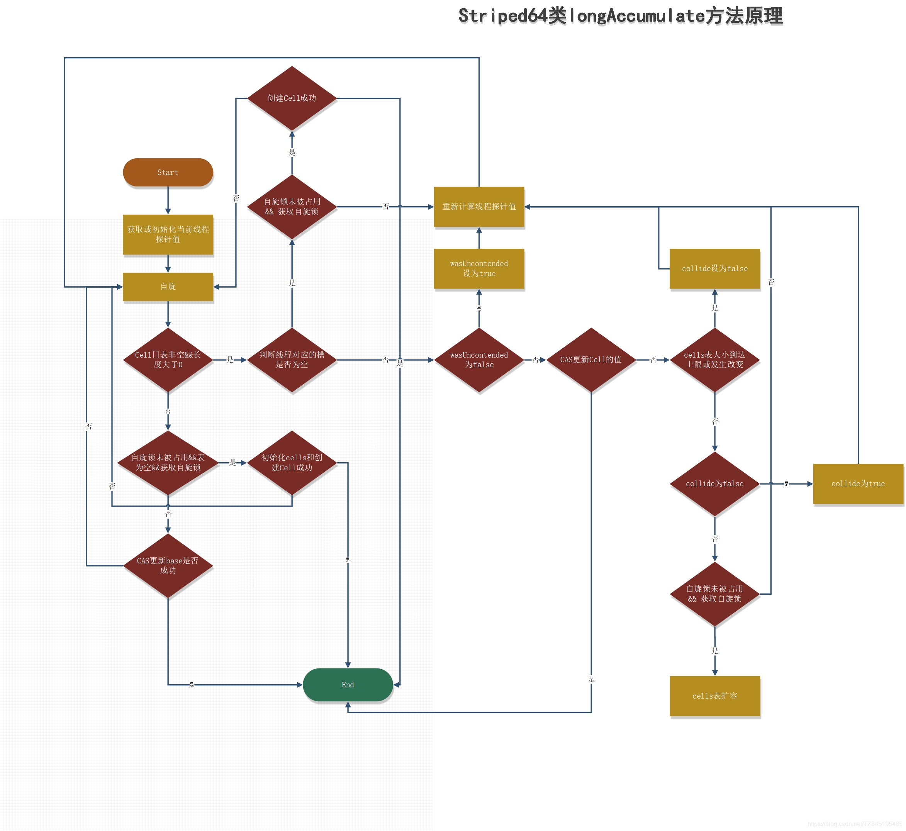

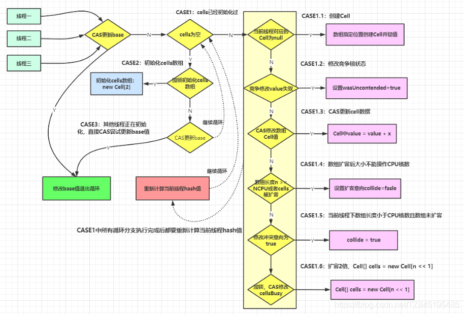

#### Striped64.java

```java
Striped64.java
/**
	1.LongAdder继承了Striped64类，来实现累加功能，它是实现高并发累加的工具类
	2.Striped64的设计核心思路就是通过内部的分散计算来避免竞争
	3.Striped64内部包含一个base和一个Cell[] cells数组,又叫hash表
	4.没有竞争的情况下，要累加的数通过cas累加到base上；如果有竞争的话，
	会将要累加的数累加到Cells数组中的某个cell元素里面
*/
abstract class Striped64 extends Number {
	//CPU数量,即Cells数组的最大长度
	static final int NCPU = Runtime.getRuntime().availableProcessors();
	//存放Cell的hash表，大小为2的幂
	transient volatile Cell[] cells;
	/*
	1.在开始没有竞争的情况下,将累加值累加到base；
	2.在cells初始化的过程中，cells处于不可用的状态，这时候也会尝试将通过cas操作值累加到base
	*/
	transient volatile long base;
	/*
	cellsBusy,它有两个值0或1,它的作用是当要修改cells数组时加锁,
	防止多线程同时修改cells数组(也称cells表)，0为无锁，1位加锁，加锁的状况有三种:
	(1). cells数组初始化的时候；
    (2). cells数组扩容的时候；
    (3).如果cells数组中某个元素为null，给这个位置创建新的Cell对象的时候；

	*/
	transient volatile int cellsBusy;
	
	//低并发状态,还没有新建cell数组且写入进入base,刚好够用
	//base罩得住,不用上cell数组
	final boolean casBase(long cmp, long val) {
		//当前对象,在base位置上,将base(类似于AtomicLong中全局的value值),将base=0(cmp)改为1(value)
		return UNSAFE.compareAndSwapLong(this, BASE, cmp, val);
	}
	
	final void longAccumulate(long x, LongBinaryOperator fn,
							  boolean wasUncontended) {
		//存储线程的probe值
		int h;
		//如果getProbe()方法返回0,说明随机数未初始化
		if ((h = getProbe()) == 0) { //这个if相当于给当前线程生成一个非0的hash值
			//使用ThreadLocalRandom为当前线程重新计算一个hash值,强制初始化
			ThreadLocalRandom.current(); // force initialization
			//重新获取probe值,hash值被重置就好比一个全新的线程一样,所以设置了wasUncontended竞争状态为true
			h = getProbe();
			//重新计算了当前线程的hash后认为此次不算是一次竞争,都未初始化,肯定还不存在竞争激烈,wasUncontended竞争状态为true
			wasUncontended = true;
		}
		//如果hash取模映射得到的Cell单元不是null,则为true,此值也可以看作是扩容意向
		boolean collide = false;                // True if last slot nonempty
		for (;;) {
			Cell[] as; Cell a; int n; long v;
			if ((as = cells) != null && (n = as.length) > 0) { // CASE1:cells已经初始化了
			    // 当前线程的hash值运算后映射得到的Cell单元为null,说明该Cell没有被使用
				if ((a = as[(n - 1) & h]) == null) {
					//Cell[]数组没有正在扩容
					if (cellsBusy == 0) {       // Try to attach new Cell
						//先创建一个Cell
						Cell r = new Cell(x);   // Optimistically create
						//尝试加锁,加锁后cellsBusy=1
						if (cellsBusy == 0 && casCellsBusy()) { 
							boolean created = false;
							try {               // Recheck under lock
								Cell[] rs; int m, j; //将cell单元赋值到Cell[]数组上
								//在有锁的情况下再检测一遍之前的判断 
								if ((rs = cells) != null &&
									(m = rs.length) > 0 &&
									rs[j = (m - 1) & h] == null) {
									rs[j] = r;
									created = true;
								}
							} finally {
								cellsBusy = 0;//释放锁
							}
							if (created)
								break;
							continue;           // Slot is now non-empty
						}
					}
					collide = false;
				}
				/**
				wasUncontended表示cells初始化后,当前线程竞争修改失败
				wasUncontended=false,表示竞争激烈,需要扩容,这里只是重新设置了这个值为true,
				紧接着执行advanceProbe(h)重置当前线程的hash,重新循环
				*/
				else if (!wasUncontended)       // CAS already known to fail
					wasUncontended = true;      // Continue after rehash
				//说明当前线程对应的数组中有了数据,也重置过hash值
				//这时通过CAS操作尝试对当前数中的value值进行累加x操作,x默认为1,如果CAS成功则直接跳出循环
				else if (a.cas(v = a.value, ((fn == null) ? v + x :
											 fn.applyAsLong(v, x))))
					break;
				//如果n大于CPU最大数量,不可扩容,并通过下面的h=advanceProbe(h)方法修改线程的probe再重新尝试
				else if (n >= NCPU || cells != as)
					collide = false;    //扩容标识设置为false,标识永远不会再扩容
				//如果扩容意向collide是false则修改它为true,然后重新计算当前线程的hash值继续循环
				else if (!collide) 
					collide = true;
				//锁状态为0并且将锁状态修改为1(持有锁) 
				else if (cellsBusy == 0 && casCellsBusy()) { 
					try {
						if (cells == as) {      // Expand table unless stale
							//按位左移1位来操作,扩容大小为之前容量的两倍
							Cell[] rs = new Cell[n << 1];
							for (int i = 0; i < n; ++i)
								//扩容后将之前数组的元素拷贝到新数组中
								rs[i] = as[i];
							cells = rs; 
						}
					} finally {
						//释放锁设置cellsBusy=0,设置扩容状态,然后进行循环执行
						cellsBusy = 0;
					}
					collide = false;
					continue;                   // Retry with expanded table
				}
				h = advanceProbe(h);
			}
			//CASE2:cells没有加锁且没有初始化,则尝试对它进行加锁,并初始化cells数组
			/*
			cellsBusy:初始化cells或者扩容cells需要获取锁,0表示无锁状态,1表示其他线程已经持有了锁
			cells == as == null  是成立的
			casCellsBusy:通过CAS操作修改cellsBusy的值,CAS成功代表获取锁,返回true,第一次进来没人抢占cell单元格,肯定返回true
			**/
			else if (cellsBusy == 0 && cells == as && casCellsBusy()) { 
			    //是否初始化的标记
				boolean init = false;
				try {                           // Initialize table(新建cells)
					// 前面else if中进行了判断,这里再次判断,采用双端检索的机制
					if (cells == as) {
						//如果上面条件都执行成功就会执行数组的初始化及赋值操作,Cell[] rs = new Cell[2]标识数组的长度为2
						Cell[] rs = new Cell[2];
						//rs[h & 1] = new Cell(x)表示创建一个新的cell元素,value是x值,默认为1
						//h & 1 类似于我们之前hashmap常用到的计算散列桶index的算法,通常都是hash&(table.len-1),同hashmap一个意思
						rs[h & 1] = new Cell(x);
						cells = rs;
						init = true;
					}
				} finally {
					cellsBusy = 0;
				}
				if (init)
					break;
			}
			//CASE3:cells正在进行初始化,则尝试直接在基数base上进行累加操作
			//这种情况是cell中都CAS失败了,有一个兜底的方法
			//该分支实现直接操作base基数,将值累加到base上,也即其他线程正在初始化,多个线程正在更新base的值
			else if (casBase(v = base, ((fn == null) ? v + x :
										fn.applyAsLong(v, x))))
				break;                          // Fall back on using base
		}
	}
	
	static final int getProbe() {
        return UNSAFE.getInt(Thread.currentThread(), PROBE);
    }
}

```

#### LongAdder.java

```java
    LongAdder.java
	(1).baseOK,直接通过casBase进行处理
	(2).base不够用了,开始新建一个cell数组,初始值为2
    (3).当多个线程竞争同一个Cell比较激烈时,可能就要对Cell[ ]扩容
	public void add(long x) {
		//as是striped64中的cells数组属性
		//b是striped64中的base属性
		//v是当前线程hash到的cell中存储的值
		//m是cells的长度减1,hash时作为掩码使用
		//a时当前线程hash到的cell
        Cell[] as; long b, v; int m; Cell a;
		/**
		首次首线程(as = cells) != null)一定是false,此时走casBase方法,以CAS的方式更新base值,
		且只有当cas失败时,才会走到if中
		条件1:cells不为空,说明出现过竞争,cell[]已创建
		条件2:cas操作base失败,说明其他线程先一步修改了base正在出现竞争
		*/
        if ((as = cells) != null || !casBase(b = base, b + x)) {
			//true无竞争 fasle表示竞争激烈,多个线程hash到同一个cell,可能要扩容
            boolean uncontended = true;
			/*
			条件1:cells为空,说明正在出现竞争,上面是从条件2过来的,说明!casBase(b = base, b + x))=true
				  会通过调用longAccumulate(x, null, uncontended)新建一个数组,默认长度是2
			条件2:默认会新建一个数组长度为2的数组,m = as.length - 1) < 0 应该不会出现,
			条件3:当前线程所在的cell为空,说明当前线程还没有更新过cell,应初始化一个cell。
				  a = as[getProbe() & m]) == null,如果cell为空,进行一个初始化的处理
			条件4:更新当前线程所在的cell失败,说明现在竞争很激烈,多个线程hash到同一个Cell,应扩容
				  (如果是cell中有一个线程操作,这个时候,通过a.cas(v = a.value, v + x)可以进行处理,返回的结果是true)
			**/
            if (as == null || (m = as.length - 1) < 0 ||
			    //getProbe( )方法返回的时线程中的threadLocalRandomProbe字段
				//它是通过随机数生成的一个值,对于一个确定的线程这个值是固定的(除非刻意修改它)
                (a = as[getProbe() & m]) == null ||
                !(uncontended = a.cas(v = a.value, v + x)))
				//调用Striped64中的方法处理
                longAccumulate(x, null, uncontended);
        }
    }
	
	Striped64.java
	abstract class Striped64 extends Number {
		static final int NCPU = Runtime.getRuntime().availableProcessors();
		transient volatile Cell[] cells;
		transient volatile long base;
		transient volatile int cellsBusy;
		//低并发状态,还没有新建cell数组且写入进入base,刚好够用
		//base罩得住,不用上cell数组
		final boolean casBase(long cmp, long val) {
			//当前对象,在base位置上,将base(类似于AtomicLong中全局的value值),将base=0(cmp)改为1(value)
			return UNSAFE.compareAndSwapLong(this, BASE, cmp, val);
		}
	}

```

### sum( )

sum( )会将所有Cell数组中的value和base累加作为返回值

```java
    public long sum() {
        Cell[] as = cells; Cell a;
        long sum = base;
        if (as != null) {
            for (int i = 0; i < as.length; ++i) {
                if ((a = as[i]) != null)
                    sum += a.value;
            }
        }
        return sum;
    }

```

核心的思想就是将之前AtomicLong一个value的更新压力分散到多个value中去,从而降级更新热点

②. 核心的思想就是将之前AtomicLong一个value的更新压力分散到多个value中去,从而降级更新热点

为啥高并发下sum的值不精确？

- sum执行时,并没有限制对base和cells的更新(一句要命的话)。所以LongAdder不是强一致性,它是最终一致性的
- 首先,最终返回的sum局部变量,初始被赋值为base,而最终返回时,很可能base已经被更新了,而此时局部变量sum不会更新,造成不一致
- 其次,这里对cell的读取也无法保证是最后一次写入的值。所以,sum方法在没有并发的情况下,可以获得正确的结果

### 关于AtomicLong和LongAdder区别

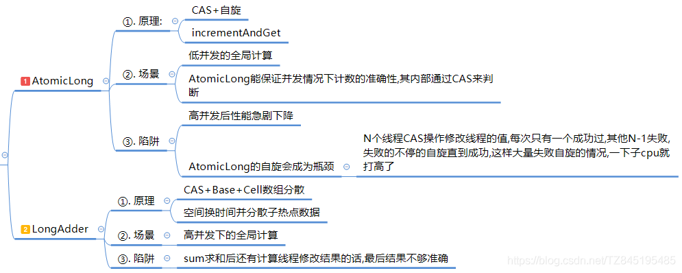

# ThreadLocal

## ThreadLocal简介

`ThreadLocal` 是 Java 中的一个类，它**提供了线程局部变量的功能。**它允许你创建一个变量，每个线程都可以独立地访问该变量，而不会受到其他线程的干扰。换句话说，**每个线程都有自己独立的变量副本，互不影响。**

在多线程编程中，线程共享数据可能导致并发访问的问题，如数据竞争、线程间的数据交叉等。`ThreadLocal` 的出现就是为了解决这些问题。

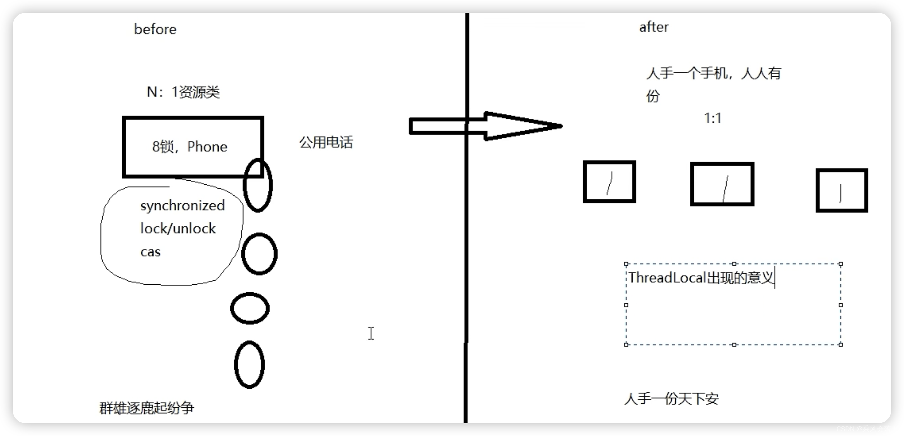

### api介绍

1. `set(T value)`: 将指定的值设置为当前线程的局部变量的值。
2. `get()`: 返回当前线程的局部变量的值。
3. `remove()`: 移除当前线程的局部变量的值。
4. `initialValue()`: 该方法是一个 protected 方法，用于提供局部变量的初始值。可以通过继承 `ThreadLocal` 并覆盖该方法来自定义**初始值**。（对于initialValue()较为老旧,jdk1.8又加入了withInitial()方法）

### 永远的helloword

```java
/***
 * 看每个销售员可以出售多少套房子
 */
class House {
    /**
     * initialValue():返回此线程局部变量的当前线程的"初始值"
     * 对于initialValue()较为老旧,jdk1.8又加入了withInitial()方法
     * ThreadLocal<Integer>threadLocal=new ThreadLocal<Integer>() {
     *
     * @Override protected Integer initialValue() {
     * return 0;
     * }
     * };
     */
    //public static <S> ThreadLocal<S> withInitial(Supplier<? extends S> supplier)
    //withInitial(Supplier<? extends S> supplier):创建线程局部变量
    //ThreadLocal本地线程变量,线程自带的变量副本
    ThreadLocal<Integer> threadLocal =
            ThreadLocal.withInitial(() -> 0);

    public void saleHouse() {
        //T get():返回当前线程的此线程局部变量的副本中的值。
        Integer value = threadLocal.get();
        value++;
        //void set(T value):将当前线程的此线程局部变量的副本设置为指定的值。
        threadLocal.set(value);
    }
}

public class ThreadLocalDemo {
    public static void main(String[] args) {

        House house = new House();

        new Thread(() -> {
            try {
                for (int i = 1; i <= 3; i++) {
                    house.saleHouse();
                }
                System.out.println(Thread.currentThread().getName() + "\t" + "卖出:" + house.threadLocal.get());
            } catch (Exception e) {
                e.getStackTrace();
            } finally {
                //void remove():删除此线程局部变量的当前线程的值
                //在阿里巴巴手册中有说明,尽量在代理中使用try-finally块进行回收
                house.threadLocal.remove();
                //下面获取到的值是线程的初始值0
                System.out.println("**********" + house.threadLocal.get());
            }
        }, "t1").start();

        new Thread(() -> {
            try {
                for (int i = 1; i <= 5; i++) {
                    house.saleHouse();
                }
                System.out.println(Thread.currentThread().getName() + "\t" + "卖出:" + house.threadLocal.get());
            } catch (Exception e) {
                e.getStackTrace();
            } finally {
                house.threadLocal.remove();
            }
        }, "t2").start();

        new Thread(() -> {
            try {
                for (int i = 1; i <= 8; i++) {
                    house.saleHouse();
                }
                System.out.println(Thread.currentThread().getName() + "\t" + "卖出:" + house.threadLocal.get());
            } catch (Exception e) {
                e.getStackTrace();
            } finally {
                house.threadLocal.remove();
            }
        }, "t3").start();
        System.out.println(Thread.currentThread().getName() + "\t" + "卖出了:" + house.threadLocal.get());
    }
}

/**
 * t1	卖出:3
 * main	卖出了:0
 * t2	卖出:5
 * t3	卖出:8
 * **********0
 */

```

- 因为每个Thread内有自己的实例副本且该副本只由当前线程自己使用
- 既然其他Thread不可访问,那就不存在多线程共享的问题
- 统一设置初始值,但是每个线程对这个值的修改都是各自线程互相独立的
- 加入synchronized或者lock控制线程的访问顺序,而ThreadLocal人手一份,大家各自安好,没必要抢夺

## 从阿里ThreadLocal规范开始

公司业务：在对一些业务日志写入数据库的时候,日期调用了sdf的静态,导致了会报错或者日期乱了(生产故障)

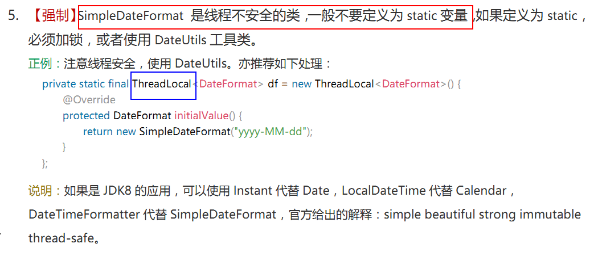

### 非线程安全的SimpleDateFormat

写时间工具类,一般写成静态的成员变量,不知,此种写法的多线程下的危险性！

```java
public class DateUtils
{
    public static final SimpleDateFormat sdf = new SimpleDateFormat("yyyy-MM-dd HH:mm:ss");
    /**
     * 模拟并发环境下使用SimpleDateFormat的parse方法将字符串转换成Date对象
     * @param stringDate
     * @return
     * @throws Exception
     */
    public static Date parseDate(String stringDate)throws Exception
    {
        return sdf.parse(stringDate);
    }
    
    public static void main(String[] args) throws Exception
    {
        for (int i = 1; i <=30; i++) {
            new Thread(() -> {
                try {
                    System.out.println(DateUtils.parseDate("2020-11-11 11:11:11"));
                } catch (Exception e) {
                    e.printStackTrace();
                }
            },String.valueOf(i)).start();
        }
    }
}

```

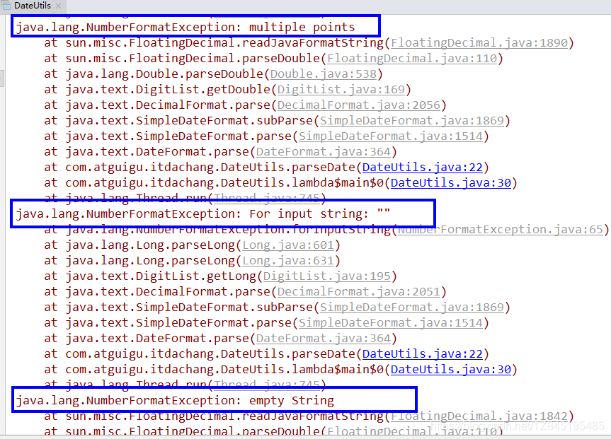

***源码分析结论(了解)***

SimpleDateFormat类内部有一个Calendar对象引用,它用来储存和这个SimpleDateFormat相关的日期信息,例如sdf.parse(dateStr),sdf.format(date) 诸如此类的方法参数传入的日期相关String,Date等等, 都是交由Calendar引用来储存的.这样就会导致一个问题如果你的SimpleDateFormat是个static的, 那么多个thread 之间就会共享这个SimpleDateFormat, 同时也是共享这个Calendar引用

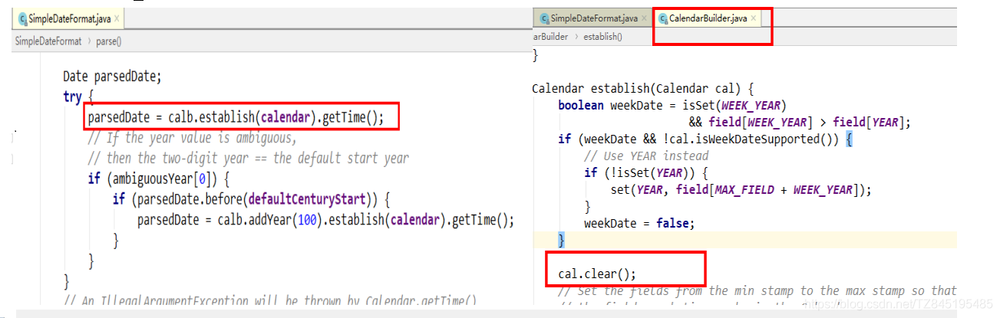

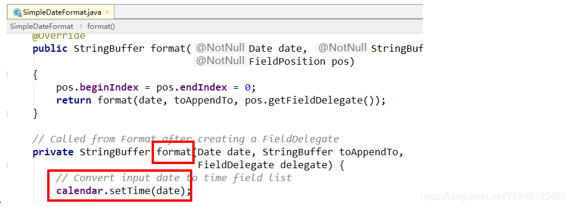

### 将SimpleDateFormat定义成局部变量(方案一)

缺点:每调用一次方法就会创建一个SimpleDateFormat对象,方法结束又要作为垃圾回收

```java
public class DateUtils
{
    public static final SimpleDateFormat sdf = new SimpleDateFormat("yyyy-MM-dd HH:mm:ss");
    /**
     * 模拟并发环境下使用SimpleDateFormat的parse方法将字符串转换成Date对象
     * @param stringDate
     * @return
     * @throws Exception
     */
    public static Date parseDate(String stringDate)throws Exception
    {
        return sdf.parse(stringDate);
    }

    public static void main(String[] args) throws Exception
    {
        for (int i = 1; i <=30; i++) {
            new Thread(() -> {
                try {
                    SimpleDateFormat sdf = new SimpleDateFormat("yyyy-MM-dd HH:mm:ss");
                    System.out.println(sdf.parse("2020-11-11 11:11:11"));
                    sdf = null;
                } catch (Exception e) {
                    e.printStackTrace();
                }
            },String.valueOf(i)).start();
        }
    }

```

### ThreadLocal 解决日期格式乱码问题

```java
import java.text.ParseException;
import java.text.SimpleDateFormat;
import java.time.LocalDateTime;
import java.time.format.DateTimeFormatter;
import java.util.Date;

/**
 * 在对一些业务日志写入数据库的时候,日期调用了sdf的静态,导致了会报错或者日期乱了
 */
public class ThreadLocalDataUtils {

    public static SimpleDateFormat sdf = new SimpleDateFormat("yyyy-MM-dd HH:mm:ss");

    /**
     解决方案一:加入synchronized,用时间换空间,效率低
     */
    /**
     * 如果不加会导致线程安全问题,SimpleDateFormat类内部有一个Calendar对象引用,
     * SimpleDateFormat相关的日期信息,例如sdf.parse(dateStr),sdf.format(date)
     * 诸如此类的方法参数传入的日期相关String,Date等等, 都是交由Calendar引用来储存的.
     * 这样就会导致一个问题如果你的SimpleDateFormat是个static的,那么多个thread之间
     * 就会共享这个SimpleDateFormat,同时也是共享这个Calendar引用(相当于买票案列)
     */
    //public static synchronized Date parse(String stringDate) throws ParseException {
    public static Date parse(String stringDate) throws ParseException {
        System.out.println(sdf.parse(stringDate));
        return sdf.parse(stringDate);
    }

    /***
     * 解决方案二:使用ThreadLocal,用空间换时间,效率高
     * ThreadLocal中变量副本会人手一份,每次使用完了threadLocal后都要将资源进行释放的处理
     */
    public static final ThreadLocal<SimpleDateFormat> sdfThreadLocal =
            ThreadLocal.withInitial(() -> new SimpleDateFormat("yyyy-MM-dd HH:mm:ss"));

    public static Date parseByThreadLocal(String stringDate) throws ParseException {
        return sdfThreadLocal.get().parse(stringDate);
    }

    /**
     * 解决方案三:DateTimeFormatter 代替 SimpleDateFormat
     */
    public static final DateTimeFormatter DATE_TIME_FORMAT = DateTimeFormatter.ofPattern("yyyy-MM-dd HH:mm:ss");

    public static String formatForDateTime(LocalDateTime localDateTime) {
        return DATE_TIME_FORMAT.format(localDateTime);
    }

    public static LocalDateTime parseForDateTime(String dateString) {
        return LocalDateTime.parse(dateString, DATE_TIME_FORMAT);
    }

    public static void main(String[] args) throws Exception {
        for (int i = 1; i <= 3; i++) {
            new Thread(() -> {
                try {
                    ThreadLocalDataUtils.parse("2021-03-30 11:20:30");
                    System.out.println(ThreadLocalDataUtils.parseByThreadLocal("2021-03-30 11:20:30"));
                    System.out.println(ThreadLocalDataUtils.parseForDateTime("2021-03-30 11:20:30"));
                    System.out.println(ThreadLocalDataUtils.formatForDateTime(LocalDateTime.now()));
                } catch (Exception e) {
                    e.printStackTrace();
                } finally {
                    ThreadLocalDataUtils.sdfThreadLocal.remove();
                }
            }, String.valueOf(i)).start();
        }
    }
}
```

## ThreadLocal源码分析

### Thread|ThreadLocal|ThreadLocalMap关系

Thread和ThreadLocal

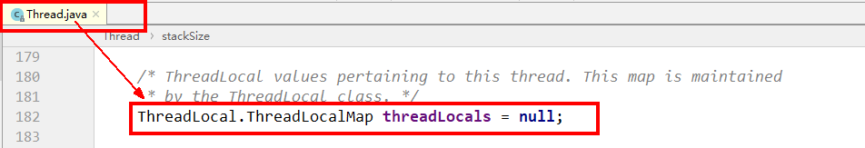

ThreadLocal和ThreadLocalMap

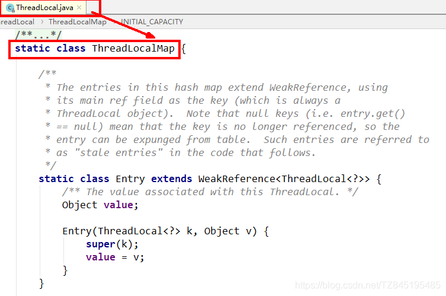


All三者总概括

- Thread类中有一个ThreadLocal.ThreadLocalMap threadLocals = null的变量,这个ThreadLocal相当于是Thread类和ThreadLocalMap的桥梁,在ThreadLocal中有静态内部类ThreadLocalMap,ThreadLocalMap中有Entry数组
- 当我们**为threadLocal变量赋值,实际上就是以当前threadLocal实例为key,值为value的Entry往这个threadLocalMap中存放**
- t.threadLocals = new ThreadLocalMap(this, firstValue) 如下这行代码,可以知道**每个线程都会创建一个ThreadLocalMap对象,每个线程都有自己的变量副本**

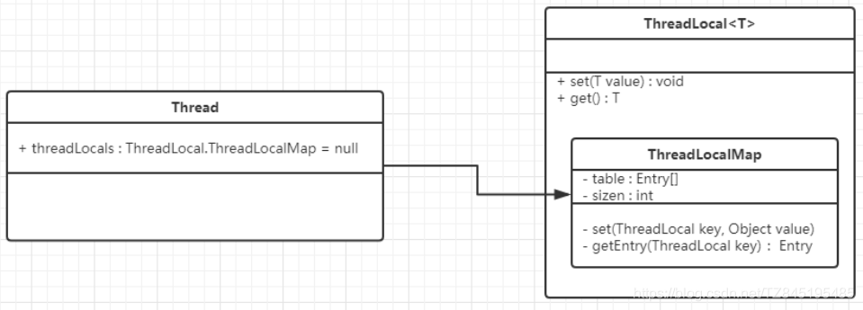

```java
//核心代码说明
public void set(T value) {
    Thread t = Thread.currentThread();
    ThreadLocalMap map = getMap(t);
    if (map != null)
        map.set(this, value);
    else
        createMap(t, value);
}
void createMap(Thread t, T firstValue) {
   t.threadLocals = new ThreadLocalMap(this, firstValue);
}
ThreadLocalMap(ThreadLocal<?> firstKey, Object firstValue) {
    table = new Entry[INITIAL_CAPACITY];
    int i = firstKey.threadLocalHashCode & (INITIAL_CAPACITY - 1);
    table[i] = new Entry(firstKey, firstValue);
    size = 1;
    setThreshold(INITIAL_CAPACITY);
}

```

### set方法详解

①. 首先获取当前线程,并根据当前线程获取一个Map

②. 如果获取的Map不为空,则将参数设置到Map中(当前ThreadLocal的引用作为key)

③. 如果Map为空,则给该线程创建 Map,并设置初始值

```java
 /**
     * 设置当前线程对应的ThreadLocal的值
     *
     * @param value 将要保存在当前线程对应的ThreadLocal的值
     */
    public void set(T value) {
        // 获取当前线程对象
        Thread t = Thread.currentThread();
        // 获取此线程对象中维护的ThreadLocalMap对象
        ThreadLocalMap map = getMap(t);
        // 判断map是否存在
        if (map != null)
            // 存在则调用map.set设置此实体entry
            map.set(this, value);
        else
            // 1)当前线程Thread 不存在ThreadLocalMap对象
            // 2)则调用createMap进行ThreadLocalMap对象的初始化
            // 3)并将 t(当前线程)和value(t对应的值)作为第一个entry存放至ThreadLocalMap中
            createMap(t, value);
    }

 /**
     * 获取当前线程Thread对应维护的ThreadLocalMap 
     * 
     * @param  t the current thread 当前线程
     * @return the map 对应维护的ThreadLocalMap 
     */
    ThreadLocalMap getMap(Thread t) {
        return t.threadLocals;
    }
	/**
     *创建当前线程Thread对应维护的ThreadLocalMap 
     *
     * @param t 当前线程
     * @param firstValue 存放到map中第一个entry的值
     */
	void createMap(Thread t, T firstValue) {
        //这里的this是调用此方法的threadLocal
        t.threadLocals = new ThreadLocalMap(this, firstValue);
    }
    
	 /*
	  * firstKey : 本ThreadLocal实例(this)
	  * firstValue ： 要保存的线程本地变量
	  */
	ThreadLocalMap(ThreadLocal<?> firstKey, Object firstValue) {
	        //初始化table
	        table = new ThreadLocal.ThreadLocalMap.Entry[INITIAL_CAPACITY];
	        //计算索引(重点代码)
	        int i = firstKey.threadLocalHashCode & (INITIAL_CAPACITY - 1);
	        //设置值
	        table[i] = new ThreadLocal.ThreadLocalMap.Entry(firstKey, firstValue);
	        size = 1;
	        //设置阈值
	        setThreshold(INITIAL_CAPACITY);
	    }

```

### get方法详解

先获取当前线程的ThreadLocalMap变量,如果存在则返回值,不存在则创建并返回初始值

```java
  /**
     * 返回当前线程中保存ThreadLocal的值
     * 如果当前线程没有此ThreadLocal变量,
     * 则它会通过调用{@link #initialValue} 方法进行初始化值
     *
     * @return 返回当前线程对应此ThreadLocal的值
     */
    public T get() {
        // 获取当前线程对象
        Thread t = Thread.currentThread();
        // 获取此线程对象中维护的ThreadLocalMap对象
        ThreadLocalMap map = getMap(t);
        // 如果此map存在
        if (map != null) {
            // 以当前的ThreadLocal 为 key,调用getEntry获取对应的存储实体e
            ThreadLocalMap.Entry e = map.getEntry(this);
            // 对e进行判空 
            if (e != null) {
                @SuppressWarnings("unchecked")
                // 获取存储实体 e 对应的 value值
                // 即为我们想要的当前线程对应此ThreadLocal的值
                T result = (T)e.value;
                return result;
            }
        }
        /*
        	初始化 : 有两种情况有执行当前代码
        	第一种情况: map不存在,表示此线程没有维护的ThreadLocalMap对象
        	第二种情况: map存在, 但是没有与当前ThreadLocal关联的entry
         */
        return setInitialValue();
    }

    /**
     * 初始化
     *
     * @return the initial value 初始化后的值
     */
    private T setInitialValue() {
        // 调用initialValue获取初始化的值
        // 此方法可以被子类重写, 如果不重写默认返回null
        T value = initialValue();
        // 获取当前线程对象
        Thread t = Thread.currentThread();
        // 获取此线程对象中维护的ThreadLocalMap对象
        ThreadLocalMap map = getMap(t);
        // 判断map是否存在
        if (map != null)
            // 存在则调用map.set设置此实体entry
            map.set(this, value);
        else
            // 1)当前线程Thread 不存在ThreadLocalMap对象
            // 2)则调用createMap进行ThreadLocalMap对象的初始化
            // 3)并将 t(当前线程)和value(t对应的值)作为第一个entry存放至ThreadLocalMap中
            createMap(t, value);
        // 返回设置的值value
        return value;
    }

```

### remove方法详解

①. 首先获取当前线程,并根据当前线程获取一个Map

②. 如果获取的Map不为空,则移除当前ThreadLocal对象对应的entry

```java
 	/**
     * 删除当前线程中保存的ThreadLocal对应的实体entry
     */
     public void remove() {
        // 获取当前线程对象中维护的ThreadLocalMap对象
         ThreadLocalMap m = getMap(Thread.currentThread());
        // 如果此map存在
         if (m != null)
            // 存在则调用map.remove
            // 以当前ThreadLocal为key删除对应的实体entry
             m.remove(this);
     }

```

## ThreadLocal内存泄漏问题

### 为什么源代码用弱引用

- 当func01方法执行完毕后,栈帧销毁强引用 tl 也就没有了。但**此时线程的ThreadLocalMap里某个entry的key引用还指向这个对象**
- **若这个key引用是强引用,就会导致key指向的ThreadLocal对象及指向的对象不能被gc回收,造成内存泄漏**
- 若这个key引用是弱引用就大概率会减少内存泄漏的问题(还有一个key为null的雷)。**使用弱引用,就可以使ThreadLocal对象在方法执行完毕后顺利被回收且Entry的key引用指向为null**


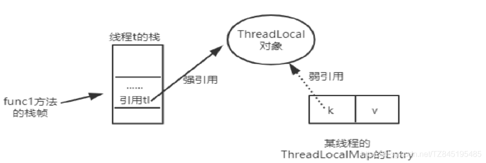

### key为null的原理解析

- ThreadLocalMap使用ThreadLocal的弱引用作为key,如果一个ThreadLocal没有外部强引用引用他,那么**系统gc的时候,这个ThreadLocal势必会被回收,这样一来,ThreadLocalMap中就会出现key为null的Entry,就没有办法访问这些key为null的Entry的value**,如果当前线程再迟迟不结束的话(比如正好用在线程池),这些key为null的Entry的value就会一直存在一条强引用链

- **当多个 `ThreadLocal` 对象同时被回收时，它们在 `ThreadLocalMap` 中对应的键会变为 `null`，而对应的值将保持不变。这意味着在 `ThreadLocalMap` 中可能会存在多个键为 `null` 的键值对，但它们的值不会被自动清除。**

- **虽然弱引用,保证了key指向的ThreadLocal对象能被及时回收,但是指向的value对象是需要ThreadLocalMap下次调用get、set时发现key为null时才会去回收整个entry、value**

- 因此弱引用不能100%保证内存不泄露。我们要在**不使用某个ThreadLocal对象后,手动调用remoev方法来删除它**,尤其是在线程池中,不仅仅是内存泄露的问题,因为线程池中的线程是重复使用的,意味着这个线程的ThreadLocalMap对象也是重复使用的,如果我们不手动调用remove方法,那么后面的线程就有可能获取到上个线程遗留下来的value值,造成bug

- **如果当前thread运行结束,threadLocal,threadLocalMap, Entry没有引用链可连,在垃圾回收的时候都会被系统进行回收**

- **但在实际使用中我们有时候会用线程池去维护我们的线程,比如在Executors.newFixedThreadPool()时创建线程的时候,为了复用线程是不会结束的,所以threadLocal内存泄漏就值得我们小心**

  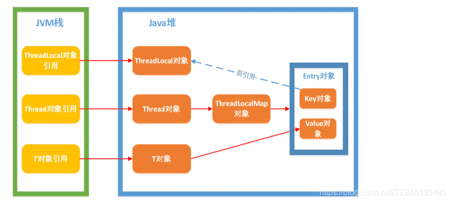

- **出现内存泄漏的真实原因 (1). 没有手动删除这个Entry (2). CurrentThread依然运行**

### set、get方法会去检查所有键为null的对象

set( )

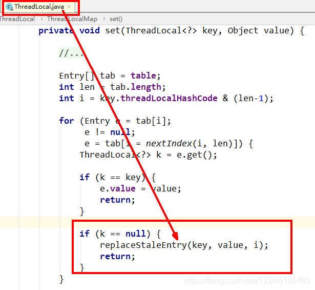


get( )

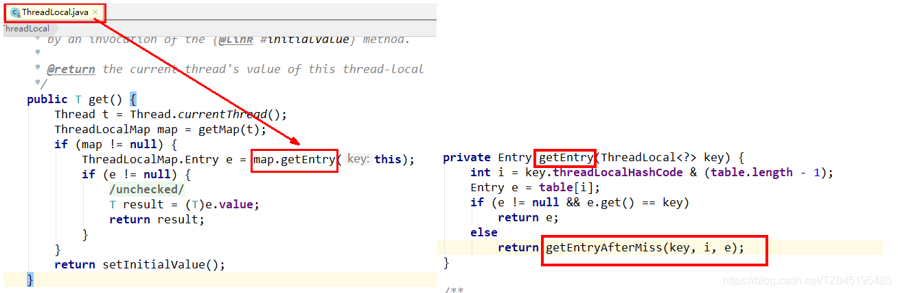

remove( )

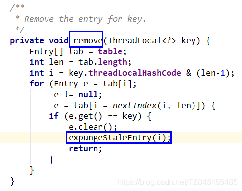

### 结论

**在finally后面调用remove方法**

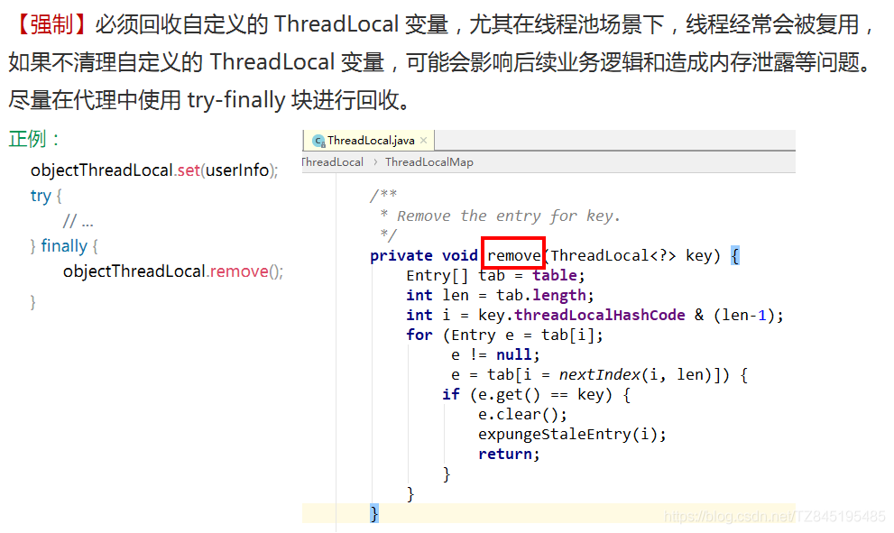

## ThreadLocal小总结

- ThreadLocal本地线程变量,以空间换时间,线程自带的变量副本,人手一份,避免了线程安全问题
- **每个线程持有一个只属于自己的专属Map并维护了Thread Local对象与具体实例的映射,该Map由于只被持有它的线程访问,故不存在线程安全以及锁的问题**
- ThreadLocalMap的Entry对ThreadLocal的引用为弱引用,避免了ThreadLocal对象无法被回收的问题

- 都**会通过expungeStaleEntry,cleanSomeSlots, replace StaleEntry这三个方法回收键为 null 的 Entry 对象的值(即为具体实例)以及 Entry 对象本身从而防止内存泄漏,属于安全加固的方法**

- **用完之后一定要remove操作**

# [对象内存布局](https://blog.csdn.net/TZ845195485/article/details/118142823)

# [从字节码角度看synchronize](https://blog.csdn.net/TZ845195485/article/details/118268465)

# Synchronized锁升级

## Synchronized的性能变化

- java5以前,只有Synchronized,这个是操作系统级别的重量级操作,重量级锁,假如锁的竞争比较激烈的话,性能下降
- 在Java早期版本中,synchronized属于重量级锁,效率低下,**因为监视器锁(monitor)是依赖于底层的操作系统的Mutex Lock来实现的,挂起线程和恢复线程都需要转入内核态去完成,阻塞或唤醒一个Java线程需要操作系统切换CPU状态来完成,这种状态切换需要耗费处理器时间,**如果同步代码块中内容过于简单,这种切换的时间可能比用户代码执行的时间还长”,时间成本相对较高,这也是为什么早期的synchronized效率低的原因
  Java 6之后,为了减少获得锁和释放锁所带来的性能消耗,引入了轻量级锁和偏向锁
- 为什么每一个对象都可以成为一个锁?
  - Java对象是天生的Monitor,每一个Java对象都有成为Monitor的潜质,因为在Java的设计中 ,每一个Java对象自打娘胎里出来就带了一把看不见的锁,它叫做内部锁或者Monitor锁。
  - Monitor的本质是依赖于底层操作系统的Mutex Lock实现,操作系统实现线程之间的切换需要从用户态到内核态的转换,成本非常高
- Mutex Lock
  Monitor是在jvm底层实现的,底层代码是c++。本质是依赖于底层操作系统的Mutex Lock实现,操作系统实现线程之间的切换需要从用户态到内核态的转换,状态转换需要耗费很多的处理器时间成本非常高。所以synchronized是Java语言中的一个重量级操作。
- Java 6之后,为了减少获得锁和释放锁所带来的性能消耗,引入了轻量级锁和偏向锁,需要有个逐步升级的过程,别一开始就捅到重量级锁

- synchronized锁:**由对象头中的Mark Word根据锁标志位的不同而被复用及锁升级策略**

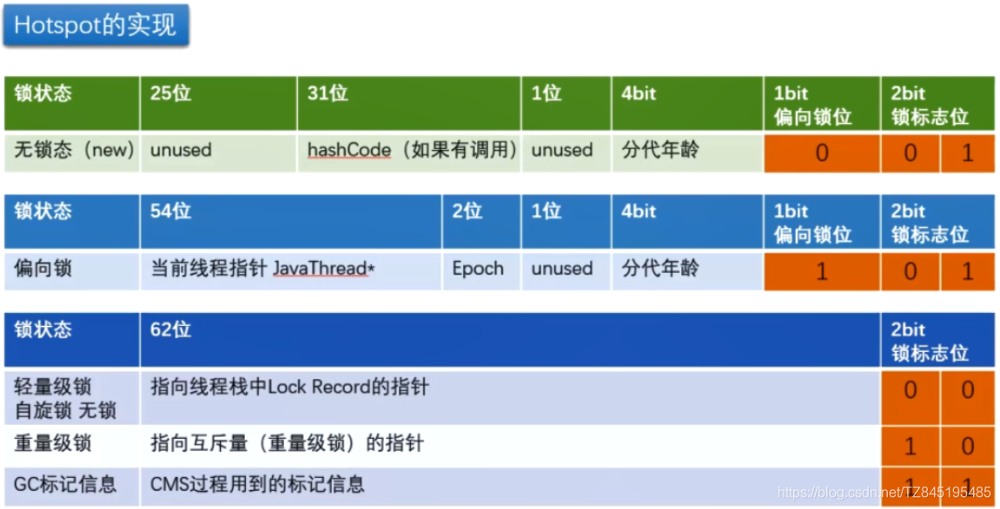

## 无锁

代码展示

```java
public class MyObject{
    public static void main(String[] args){
        Object o = new Object();
        System.out.println("10进制hash码:"+o.hashCode());
        System.out.println("16进制hash码:"+Integer.toHexString(o.hashCode()));
        System.out.println("2进制hash码:"+Integer.toBinaryString(o.hashCode()));
        System.out.println( ClassLayout.parseInstance(o).toPrintable());
    }
}

```

```xml
<!--
   JAVA object layout
   官网:http://openjdk.java.net/projects/code-tools/jol/
   定位:分析对象在JVM的大小和分布
   -->
<dependency>
   <groupId>org.openjdk.jol</groupId>
   <artifactId>jol-core</artifactId>
   <version>0.9</version>
</dependency>

```

程序不会有锁的竞争

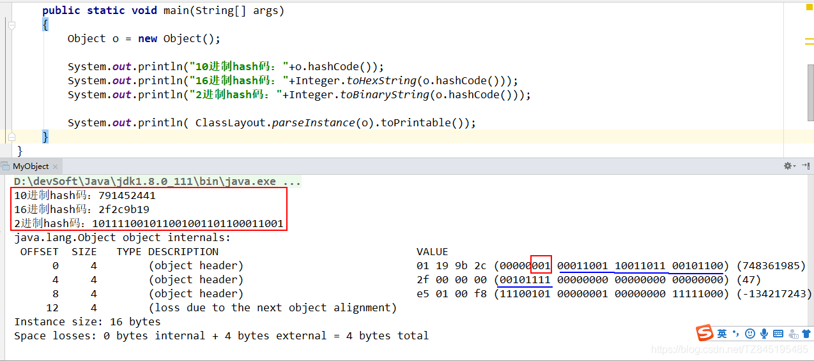


## 偏向锁 单个线程多次访问

①. 主要作用:当一段同步代码一直被同一个线程多次访问,由于只有一个线程那么该线程在后续访问时便会自动获得锁(偏向锁)
同一个老顾客来访,直接老规矩行方便
偏向锁为了解决只有在一个线程执行同步时提高性能

②.64位标记图再看(通过CAS方式修改markword中的线程ID)

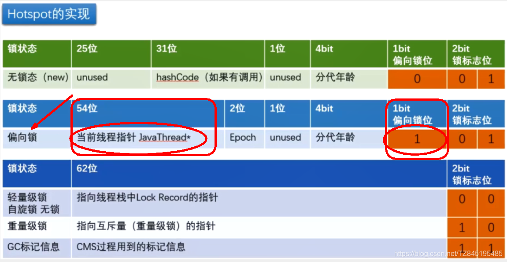


③. 偏向锁的理论

- **在实际应用运行过程中发现,“锁总是同一个线程持有,很少发生竞争”,也就是说锁总是被第一个占用他的线程拥有,这个线程就是锁的偏向线程**
- 那么**只需要在锁第一次被拥有的时候,记录下偏向线程ID。**这样偏向线程就一直持有着锁(后续这个线程进入和退出这段加了同步锁的代码块时,不需要再次加锁和释放锁。而是直接比较对象头里面是否存储了指向当前线程的偏向锁)。
- **如果相等表示偏向锁是偏向于当前线程的,就不需要再尝试获得锁了,直到竞争发生才释放锁。**以后每次同步,检查锁的偏向线程ID与当前线程ID是否一致,如果一致直接进入同步。无需每次加锁解锁都去CAS更新对象头。如果自始至终使用锁的线程只有一个,很明显偏向锁几乎没有额外开销,性能极高。
- **假如不一致意味着发生了竞争,锁已经不是总是偏向于同一个线程了,这时候可能需要升级变为轻量级锁,才能保证线程间公平竞争锁**。偏向锁只有遇到其他线程尝试竞争偏向锁时,持有偏向锁的线程才会释放锁,线程是不会主动释放偏向锁的

④. 技术实现
**一个synchronized方法被一个线程抢到了锁时,那这个方法所在的对象就会在其所在的Mark Word中将偏向锁修改状态位,同时还会有占用前54位来存储线程指针作为标识。**若该线程再次访问同一个synchronized方法时,该线程只需去对象头的Mark Word 中去判断一下是否有偏向锁指向本身的ID,无需再进入Monitor去竞争对象了。

⑤. 对于如上的③、④进行细化
步骤:

1. 偏向锁的操作不用直接捅到操作系统,不涉及用户到内核转换,不必要直接升级为最高级,我们以一个account对象的“对象头”为例,

   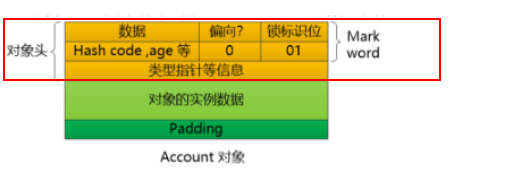

2. 假如有一个线程执行到synchronized代码块的时候,JVM使用CAS操作把线程指针ID记录到Mark Word当中,并修改标偏向标示,标示当前线程就获得该锁。锁对象变成偏向锁(通过CAS修改对象头里的锁标志位),字面意思是“偏向于第一个获得它的线程”的锁。执行完同步代码块后,线程并不会主动释放偏向锁。

   

3. 这时线程获得了锁,可以执行同步代码块。当该线程第二次到达同步代码块时会判断此时持有锁的线程是否还是自己(持有锁的线程ID也在对象头里),JVM通过account对象的Mark Word判断:当前线程ID还在,说明还持有着这个对象的锁,就可以继续进入临界区工作。由于之前没有释放锁,这里也就不需要重新加锁。 如果自始至终使用锁的线程只有一个,很明显偏向锁几乎没有额外开销,性能极高。

4. 结论:JVM不用和操作系统协商设置Mutex(争取内核),它只需要记录下线程ID就标示自己获得了当前锁,不用操作系统接入。
   上述就是偏向锁:在没有其他线程竞争的时候,一直偏向偏心当前线程,当前线程可以一直执行。

⑥. 重要参数说明
* 实际上偏向锁在JDK1.6之后是默认开启的,但是启动时间有延迟,
* 所以需要添加参数-XX:BiasedLockingStartupDelay=0,让其在程序启动时立刻启动。
* 开启偏向锁:
  * `-XX:+UseBiasedLocking -XX:BiasedLockingStartupDelay=0`
* 关闭偏向锁:关闭之后程序默认会直接进入轻量级锁状态。
  * `-XX:-UseBiasedLocking`

⑦. 代码展示

1. 偏向锁在JDK1.6以上默认开启,开启后程序启动几秒后才会被激活,可以使用JVM参数来关闭延迟 `-XX:BiasedLockingStartupDelay=0`

2. 如果确定锁通常处于竞争状态则可通过JVM参数 `-XX:-UseBiasedLocking` 关闭偏向锁,那么默认会进入轻量级锁

   ```java
   public class MyObject{
    public static void main(String[] args){
           Object o = new Object();
   
           new Thread(() -> {
               synchronized (o){
                   System.out.println(ClassLayout.parseInstance(o).toPrintable());
               }
        },"t1").start();
    }
   }
   ```

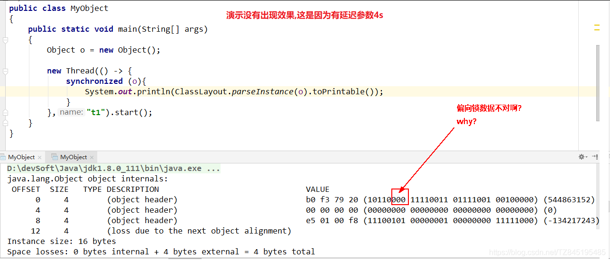

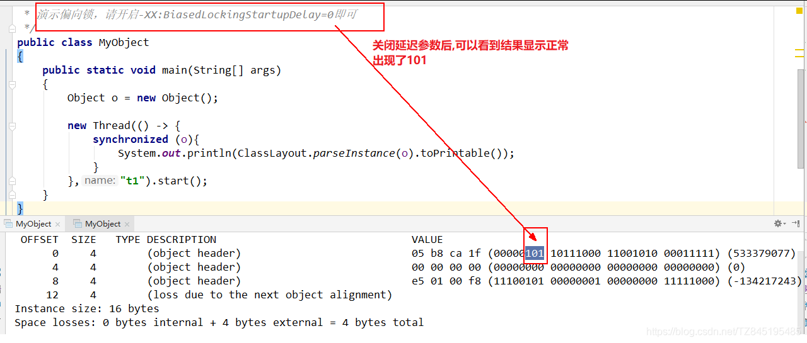

⑧. 偏向锁的撤销

**偏向锁使用一种等到竞争出现才释放锁的机制,只有当其他线程竞争锁时,持有偏向锁的原来线程才会被撤销。**撤销需要等待全局安全点(该时间点上没有字节码正在执行),同时检查持有偏向锁的线程是否还在执行

- **第一个线程正在执行synchronized方法(处于同步块),它还没有执行完,其它线程来抢夺,该偏向锁会被取消掉并出现锁升级，此时轻量级锁由原持有偏向锁的线程持有,继续执行其同步代码,而正在竞争的线程会进入自旋等待获得该轻量级锁**
- **第一个线程执行完成synchronized方法(退出同步块),则将对象头设置成无锁状态并撤销偏向锁 ,重新偏向**
  (我的理解是,其实如果线程A执行完毕,如果不再去竞争,那么就会重新线程B为偏向锁;如果线程A继续竞争,那么就会CAS自旋 也就升级到了轻量级锁)

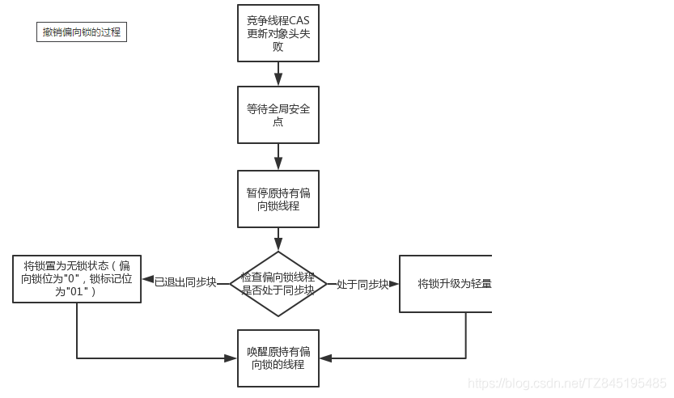

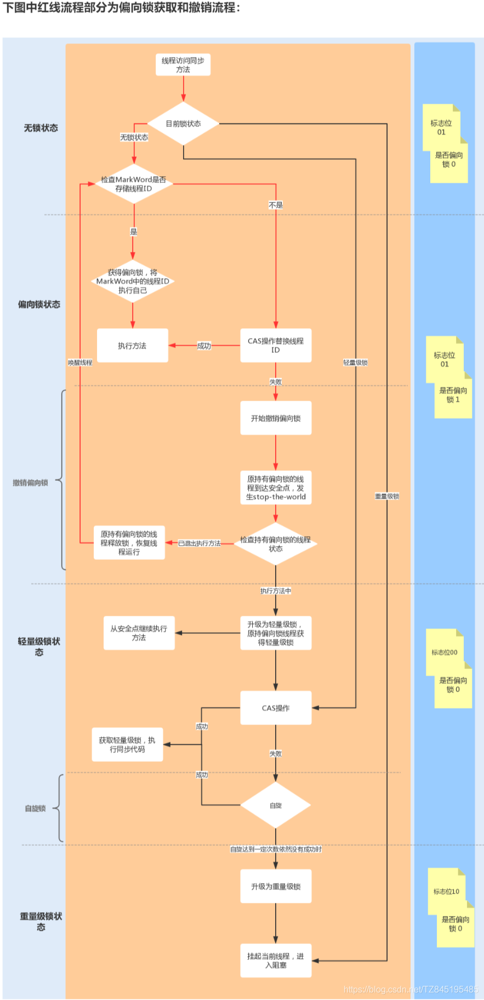

## 轻量级锁 多个线程竞争

①. 主要作用(**本质就是自旋锁**)
有线程来参与锁的**竞争**,但是获取锁的**冲突时间极短**

②. 64位标记图再看


③. 轻量级锁的获取

理论落地

- 轻量级锁是为了在线程近乎交替执行同步块时提高性能

- 主要目的: 在没有多线程竞争的前提下,通过CAS减少重量级锁使用操作系统互斥量产生的性能消耗,说白了**先自旋再阻塞**

- 升级时机:**当关闭偏向锁功能或多线程竞争偏向锁会导致偏向锁升级为轻量级锁**

- 假如线程A已经拿到锁,这时线程B又来抢该对象的锁,由于该对象的锁已经被线程A拿到,当前该锁已是偏向锁了。
  而线程B在争抢时发现对象头Mark Word中的线程ID不是线程B自己的线程ID(而是线程A),那线程B就会进行CAS操作希望能获得锁。
  此时线程B操作中有两种情况：

  1. **如果锁获取成功,直接替换Mark Word中的线程ID为B自己的ID(A → B),重新偏向于其他线程(即将偏向锁交给其他线程,相当于当前线程"被"释放了锁),该锁会保持偏向锁状态,A线程Over,B线程上位**

     

  2. **如果锁获取失败,则偏向锁升级为轻量级锁,此时轻量级锁由原持有偏向锁的线程持有,继续执行其同步代码,而正在竞争的线程B会进入自旋等待获得该轻量级锁。**

     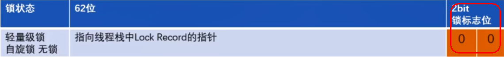

④. 代码展示
如果关闭偏向锁,就可以直接进入轻量级锁 `-XX:-UseBiasedLocking`

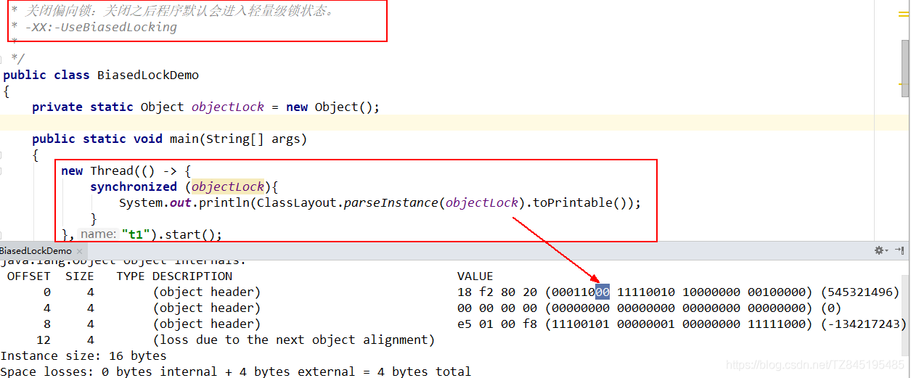

⑤. 自旋达到一定次数和程度

- java6之前(了解):默认启用,默认情况下自旋的次数是10次,`-XX:PreBlockSpin=10`来修改或者自旋线程数超过cpu核数一半
- Java6之后:自适应(自适应意味着自旋的次数不是固定不变的),而是根据:同一个锁上一次自旋的时间和拥有锁线程的状态来决定。

⑥. 轻量锁与偏向锁的区别和不同

- **争夺轻量级锁失败时,自旋尝试抢占锁**
- **轻量级锁每次退出同步块都需要释放锁,而偏向锁是在竞争发生时才释放锁**

## 重锁 会有用户态、内核态切换

①. 有大量的线程参与锁的竞争,冲突性很高

②. 锁标志位


③. 代码展示

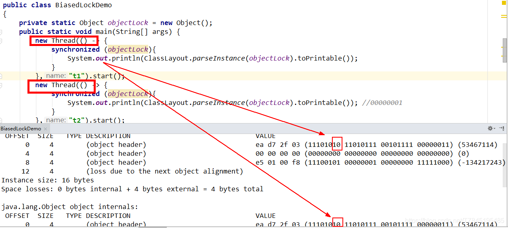

## 各种锁优缺点、synchronized锁升级和实现原理

①. 各个锁的优缺点的对比

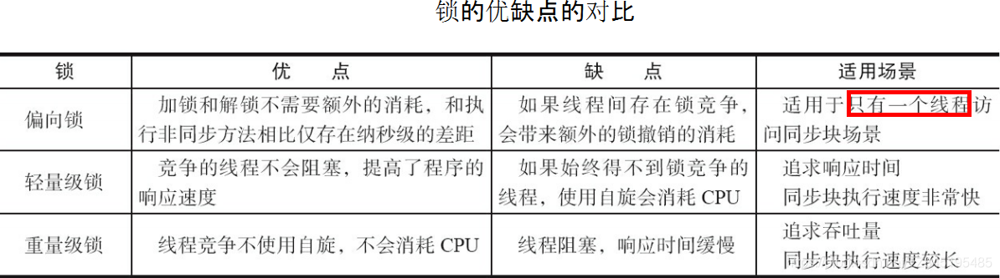

②. synchronized锁升级过程总结:一句话,就是**先自旋,不行再阻塞。**
实际上是把之前的悲观锁(重量级锁)变成在一定条件下使用偏向锁以及使用轻量级(自旋锁CAS)的形式

③. synchronized在修饰方法和代码块在字节码上实现方式有很大差异,但是内部实现还是基于对象头的MarkWord来实现的

④. JDK1.6之前synchronized使用的是重量级锁,JDK1.6之后进行了优化,拥有了**无锁->偏向锁->轻量级锁->重量级锁的升级过程**,而不是无论什么情况都使用重量级锁。

⑤. 偏向锁、轻量级锁、重量级锁总结

- **偏向锁:适用于单线程适用的情况,在不存在锁竞争的时候进入同步方法/代码块则使用偏向锁。**
- **轻量级锁:适用于竞争较不激烈的情况(这和乐观锁的使用范围类似), 存在竞争时升级为轻量级锁,轻量级锁采用的是自旋锁,如果同步方法/代码块执行时间很短的话,采用轻量级锁虽然会占用cpu资源但是相对比使用重量级锁还是更高效。**
- **重量级锁:适用于竞争激烈的情况,如果同步方法/代码块执行时间很长,那么使用轻量级锁自旋带来的性能消耗就比使用重量级锁更严重,这时候就需要升级为重量级锁**

## 锁消除

锁消除:从JIT角度看相当于无视它,synchronized (o)不存在了,这个锁对象并没有被共用扩散到其它线程使用,极端的说就是根本没有加这个锁对象的底层机器码,消除了锁的使用

```java
**
 * 锁消除
 * 从JIT角度看相当于无视它,synchronized (o)不存在了,这个锁对象并没有被共用扩散到其它线程使用,
 * 极端的说就是根本没有加这个锁对象的底层机器码,消除了锁的使用
 */
public class LockClearUPDemo{
    static Object objectLock = new Object();//正常的

    public void m1(){
        //锁消除,JIT会无视它,synchronized(对象锁)不存在了。不正常的
        Object o = new Object();

        synchronized (o){
            System.out.println("-----hello LockClearUPDemo"+"\t"+o.hashCode()+"\t"+objectLock.hashCode());
        }
    }

    public static void main(String[] args){
        LockClearUPDemo demo = new LockClearUPDemo();

        for (int i = 1; i <=10; i++) {
            new Thread(() -> {
                demo.m1();
            },String.valueOf(i)).start();
        }
    }
}
```

## 锁粗化

锁粗化:假如方法中首尾相接,前后相邻的都是同一个锁对象,那JIT编译器就会把这几个synchronized块合并成一个大块,加粗加大范围,一次申请锁使用即可,避免次次的申请和释放锁,提升了性能

```java
/**
 * 锁粗化
 * 假如方法中首尾相接,前后相邻的都是同一个锁对象,那JIT编译器就会把这几个synchronized块合并成一个大块,
 * 加粗加大范围,一次申请锁使用即可,避免次次的申请和释放锁,提升了性能
 */
public class LockBigDemo
{
    static Object objectLock = new Object();


    public static void main(String[] args)
    {
        new Thread(() -> {
            synchronized (objectLock) {
                System.out.println("11111");
            }
            synchronized (objectLock) {
                System.out.println("22222");
            }
            synchronized (objectLock) {
                System.out.println("33333");
            }
        },"a").start();

        new Thread(() -> {
            synchronized (objectLock) {
                System.out.println("44444");
            }
            synchronized (objectLock) {
                System.out.println("55555");
            }
            synchronized (objectLock) {
                System.out.println("66666");
            }
        },"b").start();

    }
}

```

# JUC三个强大的工具类

## CountDownLatch(闭锁) 做减法

- **CountDownLatch主要有两个方法,当一个或多个线程调用await方法时,这些线程会阻塞**
- **其它线程调用countDown方法会将计数器减1(调用countDown方法的线程不会阻塞)**

- **计数器的值变为0时,因await方法阻塞的线程会被唤醒,继续执行**

```java
//需求:要求6个线程都执行完了,mian线程最后执行
public class CountDownLatchDemo {
    public static void main(String[] args) throws Exception{

        CountDownLatch countDownLatch=new CountDownLatch(6);
        for (int i = 1; i <=6; i++) {
            new Thread(()->{
                System.out.println(Thread.currentThread().getName()+"\t");
                countDownLatch.countDown();
            },i+"").start();
        }
        countDownLatch.await();
        System.out.println(Thread.currentThread().getName()+"\t班长关门走人,main线程是班长");
    }
}

```

利用枚举减少if else的判断

```java
public enum CountryEnum {

    one(1,"齐"),two(2,"楚"),three(3,"燕"),
    four(4,"赵"),five(5,"魏"),six(6,"韩");

    private Integer retCode;
    private String retMessage;

    private CountryEnum(Integer retCode,String retMessage){
        this.retCode=retCode;
        this.retMessage=retMessage;
    }

    public static CountryEnum getCountryEnum(Integer index){
        CountryEnum[] countryEnums = CountryEnum.values();
        for (CountryEnum countryEnum : countryEnums) {
            if(countryEnum.getRetCode()==index){
                return countryEnum;
            }
        }
        return null;
    }

    public Integer getRetCode() {
        return retCode;
    }

    public String getRetMessage() {
        return retMessage;
    }
}

```

```java
/*
	楚	**国,被灭
	魏	**国,被灭
	赵	**国,被灭
	燕	**国,被灭
	齐	**国,被灭
	韩	**国,被灭
	main	**秦国一统江湖
* */
public class CountDownLatchDemo {
    public static void main(String[] args) throws Exception{
        CountDownLatch countDownLatch=new CountDownLatch(6);
        for (int i = 1; i <=6; i++) {
            new Thread(()->{
                System.out.println(Thread.currentThread().getName()+"\t"+"**国,被灭");
                countDownLatch.countDown();
            },CountryEnum.getCountryEnum(i).getRetMessage()).start();

        }
        countDownLatch.await();
        System.out.println(Thread.currentThread().getName()+"\t"+"**秦国一统江湖");
    }
}

```

实验CountDownLatch去解决时间等待问题

```java
public class AtomicIntegerDemo {
    AtomicInteger atomicInteger=new AtomicInteger(0);
    public void addPlusPlus(){
        atomicInteger.incrementAndGet();
    }
    public static void main(String[] args) throws InterruptedException {
        CountDownLatch countDownLatch=new CountDownLatch(10);
        AtomicIntegerDemo atomic=new AtomicIntegerDemo();
        // 10个线程进行循环100次调用addPlusPlus的操作,最终结果是10*100=1000
        for (int i = 1; i <= 10; i++) {
            new Thread(()->{
               try{
                   for (int j = 1; j <= 100; j++) {
                       atomic.addPlusPlus();
                   }
               }finally {
                   countDownLatch.countDown();
               }
            },String.valueOf(i)).start();
        }
        //(1). 如果不加上下面的停顿3秒的时间,会导致还没有进行i++ 1000次main线程就已经结束了
        //try { TimeUnit.SECONDS.sleep(3);  } catch (InterruptedException e) {e.printStackTrace();}
        //(2). 使用CountDownLatch去解决等待时间的问题
        countDownLatch.await();
        System.out.println(Thread.currentThread().getName()+"\t"+"获取到的result:"+atomic.atomicInteger.get());
    }
}

```

## CyclicBarrier做加法

CyclicBarrier的字面意思是可循环(Cyclic) 使用的屏障(barrier)。它要做的事情是,让一组线程到达一个屏障(也可以叫做同步点)时被阻塞,知道最后一个线程到达屏障时,屏障才会开门,**所有被屏障拦截的线程才会继续干活,线程进入屏障通过CyclicBarrier的await()方法**


```java
//集齐7颗龙珠就能召唤神龙
public class CyclicBarrierDemo {
    public static void main(String[] args) {
        // public CyclicBarrier(int parties, Runnable barrierAction) {}
        CyclicBarrier cyclicBarrier = new CyclicBarrier(7, () -> {
            System.out.println("召唤龙珠");
        });
        for (int i = 1; i <= 7; i++) {
            final int temp = i;
            new Thread(() -> {
                System.out.println(Thread.currentThread().getName() + "\t收集到了第" + temp + "颗龙珠");
                try {
                    cyclicBarrier.await();
                } catch (InterruptedException e) {
                    e.printStackTrace();
                } catch (BrokenBarrierException e) {
                    e.printStackTrace();
                }
            }).start();
        }

    }
}

```

## Semaphore 信号量

- acquire(获取)当一个线程调用acquire操作时,它要么通过成功获取信号量(信号量减1),要么一直等下去,直到有线程释放信号量,或超时。
- release(释放)实际上会将信号量的值加1,然后唤醒等待的线程。

- 信号量主要用于两个目的,一个是用于多个共享资源的互斥使用,另一个用于并发线程数的控制。


```java
public class SemaphoreDemo {
    public static void main(String[] args) {
        Semaphore semaphore = new Semaphore(3,true);//true 如果此信号量将保证在争用中授予先进先出的许可证，否则 false
        for (int i = 1; i <= 6; i++) {
            new Thread(() -> {
                try {
                    semaphore.acquire();
                    System.out.println(Thread.currentThread().getName() + "\t抢占了车位");
                    TimeUnit.SECONDS.sleep(2);
                } catch (InterruptedException e) {
                    e.printStackTrace();
                } finally {
                    semaphore.release();
                    System.out.println(Thread.currentThread().getName() + "\t离开了车位");
                }
            }, String.valueOf(i)).start();
        }
    }
}

```

# 线程中断

## 什么是中断

- 一个线程不应该由其他线程来强制中断或停止,而是应该由线程自己自行停止,所以,Thread.stop、Thread.suspend、Thread. resume都已经被废弃了
- 在Java中没有办法立即停止一条线程,然而停止线程却显得尤为重要,如取消一个耗时操作。因此,Java提供了一种用于停止线程的机制 — 中断

- 中断只是一种协作机制,Java没有给中断增加任何语法,中断的过程完全需要程序员自己实现

- 若要中断一个线程,你需要手动调用该线程的interrupt方法,该方法也仅仅是将线程对象的中断标识设为true

- **每个线程对象中都有一个标识,用于标识线程是否被中断;该标识位为true表示中断,为false表示未中断;通过调用线程对象的interrupt方法将线程的标识位设为true;可以在别的线程中调用,也可以在自己的线程中调用**

## 源码解读

### void interrupt( )实例方法

- **interrupt( )仅仅是设置线程的中断状态未true,不会停止线程**
- **如果这个线程因为wait()、join()、sleep()方法在用的过程中被打断(interupt),会抛出Interrupte dException**

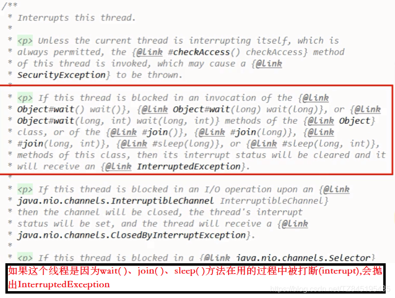

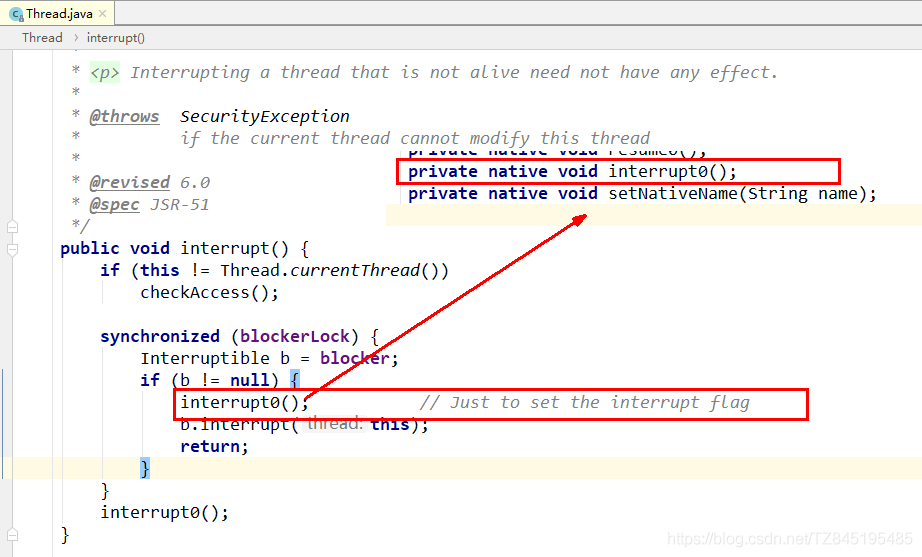

### boolean isInterrupted( )实例方法

判断当前线程是否被中断(通过检查中断标识位) 实例方法

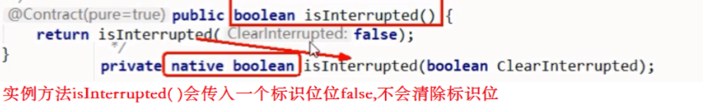

### static boolean interrupted( )静态方法

- 判断线程是否被中断,并清楚当前中断状态,这个方法做了两件事
  1. **返回当前线程的中断状态**
  2. **将当前线程的中断状态设为false**
- 原理:假设有两个线程A、B,线程B调用了interrupt方法,这个时候我们连接调用两次interrupted方法,第一次会返回true,然后这个方法会将中断标识位设置位false,所以第二次调用将返回false

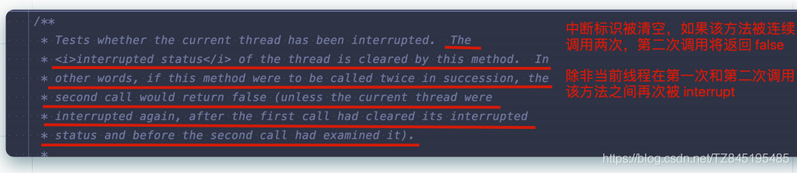

```java
  System.out.println(Thread.currentThread().getName()+"---"+Thread.interrupted());
  System.out.println(Thread.currentThread().getName()+"---"+Thread.interrupted());
  System.out.println("111111");
  Thread.currentThread().interrupt();///----false---> true
  System.out.println("222222");
  System.out.println(Thread.currentThread().getName()+"---"+Thread.interrupted());
  System.out.println(Thread.currentThread().getName()+"---"+Thread.interrupted());
  /**
   main---false
   main---false
   111111
   222222
   main---true
   main---false
   * */

```

### interrupted和isInterrupted

- `Thread.interrupted()` 是一个静态方法，调用该方法会清除当前线程的中断状态（将中断状态重置为 `false`），并返回之前的中断状态（即调用 `interrupted()` 之前的中断状态）。
- `Thread.isInterrupted()` 是一个实例方法，调用该方法不会清除线程的中断状态，只是返回当前线程的中断状态，并且不会改变中断状态的值。

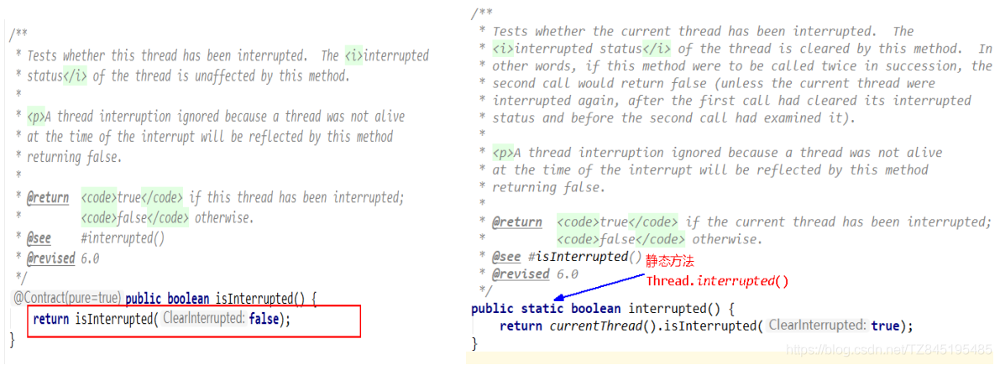

## 如何使用中断标识停止线程

- 在需要中断的线程中不断监听中断状态,一旦发生中断,就执行型对于的中断处理业务逻辑
- 三种中断标识停止线程的方式
  1. 通过一个volatile变量实现
  2. 通过AtomicBoolean
  3. 通过Thread类自带的中断API方法实现

```java
public class InterruptDemo{
    static volatile boolean isStop = false;
    static AtomicBoolean atomicBoolean = new AtomicBoolean(false);

    /**
     * 通过Thread类自带的中断API方法实现
     */
    public static void m3(){
    Thread t1 = new Thread(() -> {
        while (true) {
            if (Thread.currentThread().isInterrupted()) {
                System.out.println("-----isInterrupted() = true,程序结束。");
                break;
            }
            System.out.println("------hello Interrupt");
        }
    }, "t1");
    t1.start();

    try { TimeUnit.SECONDS.sleep(1); } catch (InterruptedException e) { e.printStackTrace(); }

    new Thread(() -> {
        t1.interrupt();//修改t1线程的中断标志位为true
    },"t2").start();
}

    /**
     * 通过AtomicBoolean
     */
    public static void m2(){
        new Thread(() -> {
            while(true)
            {
                if(atomicBoolean.get())
                {
                    System.out.println("-----atomicBoolean.get() = true,程序结束。");
                    break;
                }
                System.out.println("------hello atomicBoolean");
            }
        },"t1").start();

        //暂停几秒钟线程
        try { TimeUnit.SECONDS.sleep(1); } catch (InterruptedException e) { e.printStackTrace(); }

        new Thread(() -> {
            atomicBoolean.set(true);
        },"t2").start();
    }

    /**
     * 通过一个volatile变量实现
     */
    public static void m1(){
        new Thread(() -> {
            while(true)
            {
                if(isStop)
                {
                    System.out.println("-----isStop = true,程序结束。");
                    break;
                }
                System.out.println("------hello isStop");
            }
        },"t1").start();

        //暂停几秒钟线程
        try { TimeUnit.SECONDS.sleep(1); } catch (InterruptedException e) { e.printStackTrace(); }

        new Thread(() -> {
            isStop = true;
        },"t2").start();
    }
}

```

线程调用interrupt()时当前线程的中断标识为true,是不是就立刻停止？

- **如果线程处于正常活动状态,那么会将线程的中断标志设置位true,仅此而已。被设置中断标志的线程将继续正常运行,不受影响。所以,interrupt( )并不能真正的中断线程**,需要被调用的线程自己进行配合才行
- **如果线程处于被阻塞状态(例如处于sleep、wait、join等状态),在别的线程中调用当前线程对象的interrupt方法,那么线程立即被阻塞状态,并抛出一个InterruptedException异常**
- **中断只是一种协同机制,修改中断标识位仅此而已,不是立即stop打断**
- sleep方法抛出InterruptedException后,中断标识也被清空置为false,我们在catch没有通过调用th.interrupt( )方法再次将中断标识位设置位true,这就是导致无限循环了

```java
    /**
     *中断为true后,并不是立刻stop程序
     */
    public static void m4()
    {
        //中断为true后,并不是立刻stop程序
        Thread t1 = new Thread(() -> {
            for (int i = 1; i <= 300; i++) {
                System.out.println("------i: " + i);
            }
            System.out.println("t1.interrupt()调用之后02: "+Thread.currentThread().isInterrupted());
        }, "t1");
        t1.start();

        System.out.println("t1.interrupt()调用之前,t1线程的中断标识默认值: "+t1.isInterrupted());
        try { TimeUnit.MILLISECONDS.sleep(3); } catch (InterruptedException e) { e.printStackTrace(); }
        //实例方法interrupt()仅仅是设置线程的中断状态位设置为true,不会停止线程
        t1.interrupt();
        //活动状态,t1线程还在执行中
        System.out.println("t1.interrupt()调用之后01: "+t1.isInterrupted());

        try { TimeUnit.MILLISECONDS.sleep(3000); } catch (InterruptedException e) { e.printStackTrace(); }
        //非活动状态,t1线程不在执行中,已经结束执行了。
        System.out.println("t1.interrupt()调用之后03: "+t1.isInterrupted());
    }

/**
 * ------i: 1
 * t1.interrupt()调用之前,t1线程的中断标识默认值: false
 * ------i: 2
 * ------i: 3
 * ......
 * ------i: 174
 * ------i: 175
 * t1.interrupt()调用之后01: true
 * ------i: 176
 * ------i: 177
 * ......
 * ------i: 298
 * ------i: 299
 * ------i: 300
 * t1.interrupt()调用之后02: true
 * t1.interrupt()调用之后03: false
 */
```

```java
public static void m5()
{
    Thread t1 = new Thread(() -> {
        while (true) {
            if (Thread.currentThread().isInterrupted()) {
                System.out.println("-----isInterrupted() = true,程序结束。");
                break;
            }
            try {
                Thread.sleep(500);
            } catch (InterruptedException e) {
                //线程的中断标志位重新设置为false,无法停下,需要再次掉interrupt()设置true
                Thread.currentThread().interrupt();//???????
                e.printStackTrace();
            }
            System.out.println("------hello Interrupt");
        }
    }, "t1");
    t1.start();

    try { TimeUnit.SECONDS.sleep(3); } catch (InterruptedException e) { e.printStackTrace(); }

    new Thread(() -> {
        t1.interrupt();//修改t1线程的中断标志位为true
    },"t2").start();
}

/**
 * ------hello Interrupt
 * ------hello Interrupt
 * ------hello Interrupt
 * ------hello Interrupt
 * ------hello Interrupt
 * java.lang.InterruptedException: sleep interrupted
 * 	at java.base/java.lang.Thread.sleep(Native Method)
 * 	at cn.jbinfo.iInvest.cityplan.controller.livestream.Test.lambda$m5$0(Test.java:20)
 * 	at java.base/java.lang.Thread.run(Thread.java:834)
 * ------hello Interrupt
 * -----isInterrupted() = true,程序结束。
 */
```
# LockSupport

## Object和Condition使用的限制条件

- 线程先要获得并持有锁，必须在锁块（synchronized或lock）中
- 必须要先等待后唤醒，线程才能够被唤醒

## 什么是LockSupport

- 通过park()和unpark(thread)方法来实现阻塞和唤醒线程的操作
- LockSupport是一个线程阻塞工具类,所有的方法都是静态方法,可以让线程在任意位置阻塞,阻塞之后也有对应的唤醒方法。归根结底,LockSupport调用的Unsafe中的native代码

- 官网解释:
  LockSupport是用来创建锁和其他同步类的基本线程阻塞原语
  **LockSupport类使用了一种名为Permit(许可)的概念来做到阻塞和唤醒线程的功能,每个线程都有一个许可(permit),permit只有两个值1和0,默认是0，0 是阻塞，1是唤醒**
  可以把许可看成是一种(0,1)信号量(Semaphore),但与Semaphore不同的是,许可的累加上限是1

## 阻塞方法

- **permit默认是0,所以一开始调用park()方法,当前线程就会阻塞,直到别的线程将当前线程的permit设置为1时, park方法会被唤醒,然后会将permit再次设置为0并返回**
- **static void park( ):底层是unsafe类native方法**
- **static void park(Object blocker)**

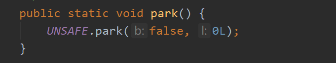

## 唤醒方法

- **调用unpark(thread)方法后,就会将thread线程的许可permit设置成1(注意多次调用unpark方法,不会累加,permit值还是1)会自动唤醒thread线程,即之前阻塞中的LockSupport.park()方法会立即返回**
- **static void unpark( )**

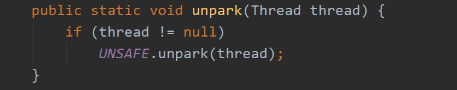

```java
/*
(1).阻塞
 (permit默认是O,所以一开始调用park()方法,当前线程就会阻塞,直到别的线程将当前线程的permit设置为1时,
 park方法会被唤醒,然后会将permit再次设置为O并返回)
 static void park()
 static void park(Object blocker)
(2).唤醒
static void unpark(Thread thread)
 (调用unpark(thread)方法后,就会将thread线程的许可permit设置成1(注意多次调用unpark方法,不会累加,
 permit值还是1)会自动唤醒thread线程,即之前阻塞中的LockSupport.park()方法会立即返回)
 static void unpark(Thread thread)
* */
public class LockSupportDemo {
    public static void main(String[] args) {

        Thread t1=new Thread(()->{
            System.out.println(Thread.currentThread().getName()+"\t"+"coming....");
            LockSupport.park();
            /*
            如果这里有两个LockSupport.park(),因为permit的值为1,上一行已经使用了permit
            所以下一行被注释的打开会导致程序处于一直等待的状态
            * */
            //LockSupport.park();
            System.out.println(Thread.currentThread().getName()+"\t"+"被B唤醒了");
            },"A");
        t1.start();

        //下面代码注释是为了A线程先执行
        //try { TimeUnit.SECONDS.sleep(3);  } catch (InterruptedException e) {e.printStackTrace();}

        Thread t2=new Thread(()->{
            System.out.println(Thread.currentThread().getName()+"\t"+"唤醒A线程");
            //有两个LockSupport.unpark(t1),由于permit的值最大为1,所以只能给park一个通行证
            LockSupport.unpark(t1);
            //LockSupport.unpark(t1);
        },"B");
        t2.start();
    }
}

```

## LockSupport解决的痛点

- **LockSupport不用持有锁块,不用加锁,程序性能好**
- 先后顺序,不容易导致卡死(因为unpark获得了一个凭证,之后再调用park方法,就可以名正言顺的凭证消费,故不会阻塞)
- **与传统的线程同步机制（如wait/notify）相比，LockSupport提供了更灵活的线程阻塞和唤醒机制，可以在任意位置调用park()和unpark()方法。**
- 这种设计的目的是为了解决传统线程同步机制中的一些问题，比如顺序的问题。**在传统的wait/notify机制中，如果先调用notify()方法再调用wait()方法，线程将无法被唤醒，导致出现死锁或其他问题。而LockSupport的设计允许先唤醒线程再阻塞线程，确保线程不会被无故阻塞。**

```java
import java.util.concurrent.CountDownLatch;
import java.util.concurrent.locks.LockSupport;

public class LockSupportWaitNotifyExample {
    private static final Object lock = new Object();

    public static void main(String[] args) throws InterruptedException {

        CountDownLatch countDownLatch = new CountDownLatch(2);

        new Thread(() -> {
            System.out.println("Thread started ParkUnpark");

            // 先唤醒线程
            LockSupport.unpark(Thread.currentThread());

            // 阻塞线程
            LockSupport.park();

            System.out.println("Thread resumed ParkUnpark");

            countDownLatch.countDown();
        }).start();


        new Thread(() -> {
            synchronized (lock) {
                System.out.println("Thread started WaitNotify");

                try {
                    // 先调用notify()方法
                    lock.notify();

                    // 调用wait()方法进入等待状态
                    lock.wait();
                } catch (InterruptedException e) {
                    e.printStackTrace();
                } finally {
                    countDownLatch.countDown();
                }

                System.out.println("Thread resumed WaitNotify");
            }
        }).start();

        countDownLatch.await();

        System.out.println("Main thread resumed");
    }
}

/**
 * Thread started ParkUnpark
 * Thread resumed ParkUnpark
 * Thread started WaitNotify
 */
```

LockSupport先调用unpark再调用park，线程不会阻塞，会有输出。

先调用notify再调用awit，线程会阻塞，不会有输出，服务不会停止。

## LockSupport 面试题目

- 为什么可以先唤醒线程后阻塞线程?(因为unpark获得了一个凭证,之后再调用park方法,就可以名正言顺的凭证消费,故不会阻塞)
- 为什么唤醒两次后阻塞两次,但最终结果还会阻塞线程?(因为凭证的数量最多为1,连续调用两次unpark和调用一次unpark效果一样,只会增加一个凭证;而调用两次park却需要消费两个凭证,证不够,不能放行)

# [AQS](https://blog.csdn.net/TZ845195485/article/details/118517936)
