# 概述

## 什么是JVM

定义： Java Virtual Machine - java 程序的运行环境（java 二进制字节码的运行环境） 

好处： 

- 一次编写，到处运行 
- 自动内存管理，垃圾回收功能 
- 数组下标越界检查 
- 多态

**Java代码经过编写、编译、解释、执行步骤，Java代码编译成字节码文件在Java虚拟机上解释和执行，在不同的平台下载相应的Java虚拟机，就可以实现一次编译处处执行，即跨平台**

# 内存结构

## 程序计数器

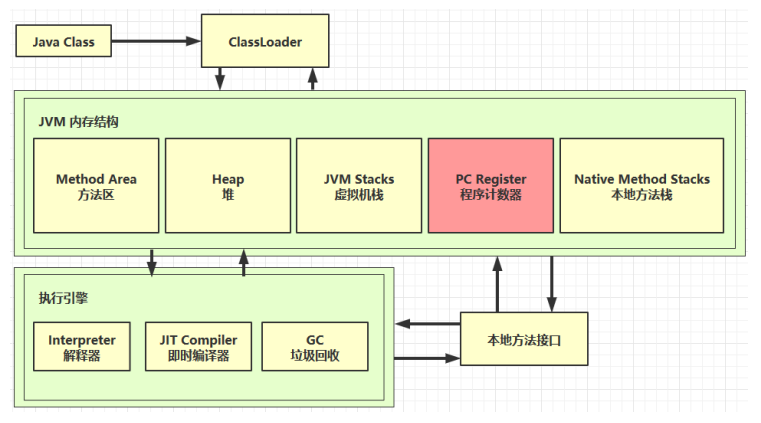

Program Counter Register 程序计数器（寄存器） 

- 作用：**记住下一条jvm指令的执行地址** 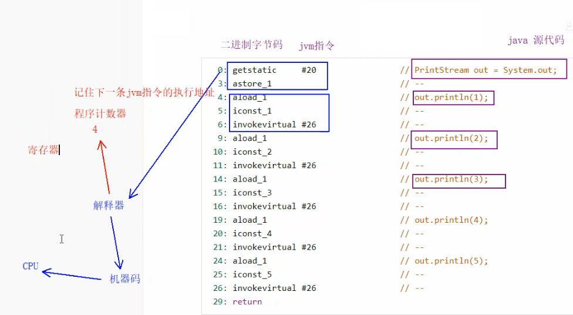

  程序计数器在物理上是通过寄存器实现的。

- 特点：

  - **线程私有的**

    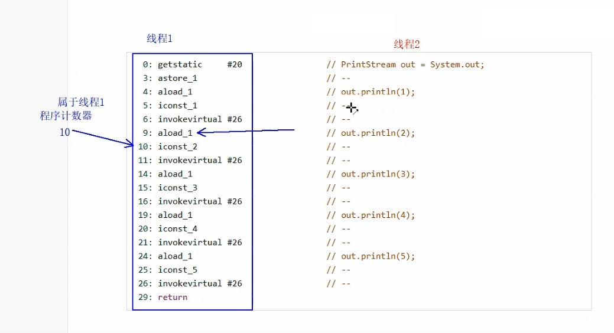

  - **不会存在内存溢出**

## 虚拟机栈

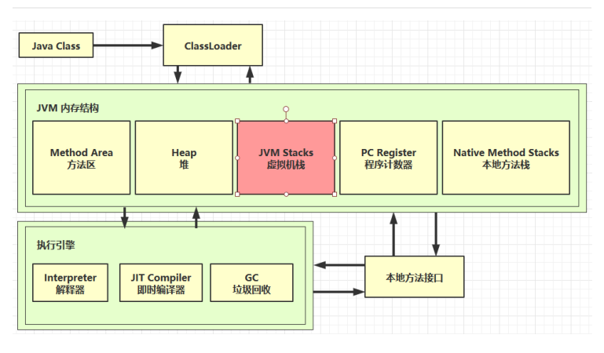

### 定义

 Java Virtual Machine Stacks （Java 虚拟机栈）

- **每个线程运行时所需要的内存，称为虚拟机栈**
- **每个栈由多个栈帧（Frame）组成，对应着每次方法调用时所占用的内存**

- **每个线程只能有一个活动栈帧，对应着当前正在执行的那个方法**

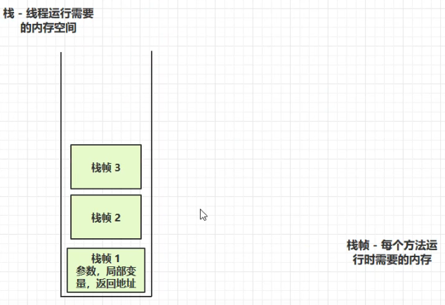


问题辨析

1. 垃圾回收是否涉及栈内存？ 

   否，方法执行完成就弹出栈了，不会涉及垃圾回收。

2. 栈内存分配越大越好吗？

   不是，设置的越大，线程数量就越少，执行的就越慢

3. 方法内的局部变量是否线程安全？ 

   - 如果方法内局部变量没有逃离方法的作用范围，它是线程安全的
   - 如果是局部变量引用了对象，并逃离方法的作用范围，需要考虑线程安全

### 栈内存溢出

- **栈帧过多导致栈内存溢出（例如：递归调用没有设置正确的退出条件）**

  ```java
  /**
   * 演示栈内存溢出 java.lang.StackOverflowError
   * -Xss256k
   */
  public class Demo1_2 {
      private static int count;
  
      public static void main(String[] args) {
          try {
              method1();
          } catch (Throwable e) {
              e.printStackTrace();
              System.out.println(count);
          }
      }
  
      private static void method1() {
          count++;
          method1();
      }
  }
  ```

  ```java
  package cn.itcast.jvm.t1.stack;
  
  import com.fasterxml.jackson.annotation.JsonIgnore;
  import com.fasterxml.jackson.core.JsonProcessingException;
  import com.fasterxml.jackson.databind.ObjectMapper;
  
  import java.util.Arrays;
  import java.util.List;
  
  /**
   * json 数据转换
   */
  public class Demo1_19 {
  
      public static void main(String[] args) throws JsonProcessingException {
          Dept d = new Dept();
          d.setName("Market");
  
          Emp e1 = new Emp();
          e1.setName("zhang");
          e1.setDept(d);
  
          Emp e2 = new Emp();
          e2.setName("li");
          e2.setDept(d);
  
          d.setEmps(Arrays.asList(e1, e2));
  
          // { name: 'Market', emps: [{ name:'zhang', dept:{ name:'', emps: [ {}]} },] }
          ObjectMapper mapper = new ObjectMapper();
          System.out.println(mapper.writeValueAsString(d));
      }
  }
  
  class Emp {
      private String name;
      @JsonIgnore //加上注解就不会有栈溢出的问题了
      private Dept dept;
  
      public String getName() {
          return name;
      }
  
      public void setName(String name) {
          this.name = name;
      }
  
      public Dept getDept() {
          return dept;
      }
  
      public void setDept(Dept dept) {
          this.dept = dept;
      }
  }
  class Dept {
      private String name;
      private List<Emp> emps;
  
      public String getName() {
          return name;
      }
  
      public void setName(String name) {
          this.name = name;
      }
  
      public List<Emp> getEmps() {
          return emps;
      }
  
      public void setEmps(List<Emp> emps) {
          this.emps = emps;
      }
  }
  ```

- **栈帧过大导致栈内存溢出**（例如：一个栈帧过大，超过了栈内存。一般不会，因为一个栈帧中的参数也就几个字节，栈内存要到1M左右）

### 线程运行诊断

#### 案例1：cpu 占用过多

定位

- 用top定位哪个进程对cpu的占用过高

- `ps H -eo pid,tid,%cpu | grep 进程id` （用ps命令进一步定位是哪个线程引起的cpu占用过高）

  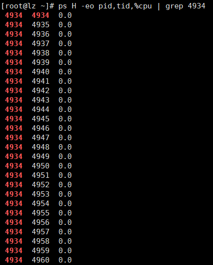

- `jstack 进程id` 

  - 可以根据线程id 找到有问题的线程，进一步定位到问题代码的源码行号（上一步ps找到的是十进制的线程id，需要将十进制转为十六进制，再去找源代码行号）

    

    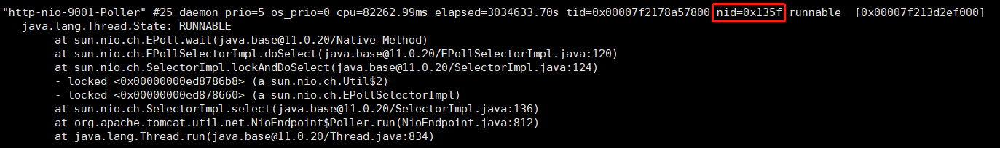

#### 案例2：程序运行很长时间没有结果

- `jstack 进程id`

## 本地方法栈

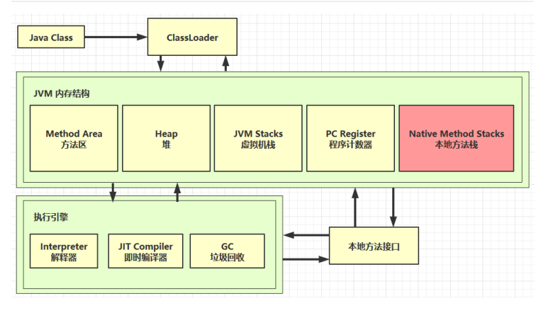

**本地方法栈：为调用本地方法提供的内存空间**

**本地方法：java底层又有c\c++实现，本地方法就是c\c++写的方法**

## 堆

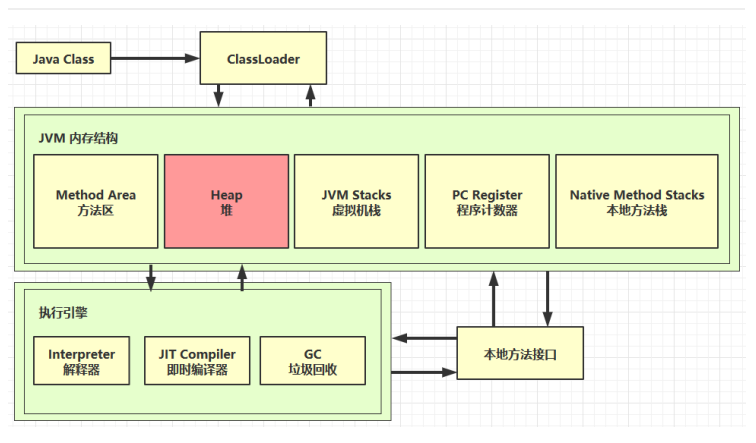

### 定义

Heap 堆

- **通过 new 关键字，创建对象都会使用堆内存** 

特点

- **它是线程共享的，堆中对象都需要考虑线程安全的问题**
- **有垃圾回收机制**

### 堆内存溢出

```java
package cn.itcast.jvm.t1.heap;

import java.util.ArrayList;
import java.util.List;

/**
 * 演示堆内存溢出 java.lang.OutOfMemoryError: Java heap space
 * -Xmx8m
 */
public class Demo1_5 {

    public static void main(String[] args) {
        int i = 0;
        try {
            List<String> list = new ArrayList<>();
            String a = "hello";
            while (true) {
                list.add(a); // hello, hellohello, hellohellohellohello ...
                a = a + a;  // hellohellohellohello
                i++;
            }
        } catch (Throwable e) {
            e.printStackTrace();
            System.out.println(i);
        }
    }
}

```

### 堆内存诊断

1. jps 工具

   - 查看当前系统中有哪些 java 进程

2. jmap 工具

   - 查看堆内存占用情况 `jmap - heap` 进程id

3. jconsole工具

   - 图形界面的，多功能的监测工具，可以连续监测

     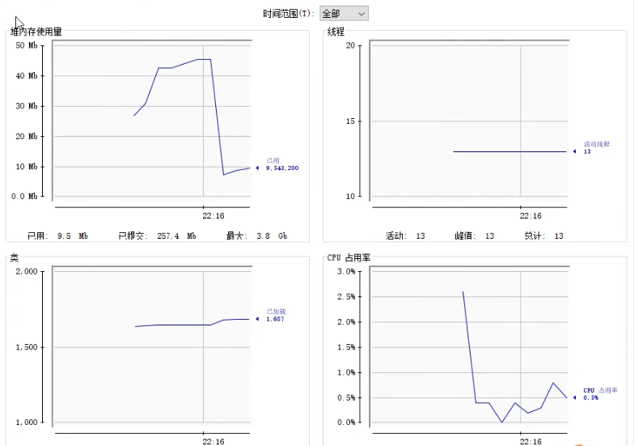

     

#### 案例

垃圾回收后，内存占用仍然很高

- 使用`jvirsualvm`

## 方法区

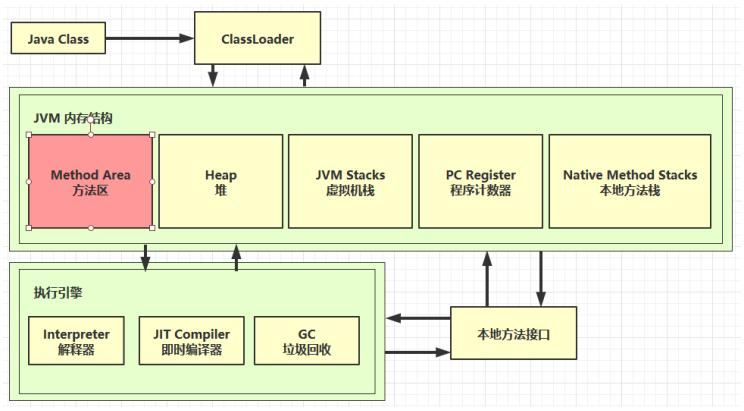

###  [定义](https://docs.oracle.com/javase/specs/jvms/se8/html/jvms-2.html)

### 组成

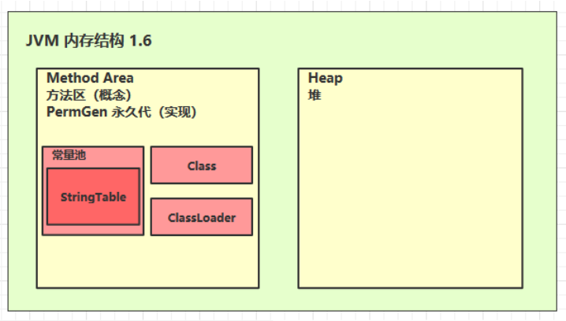

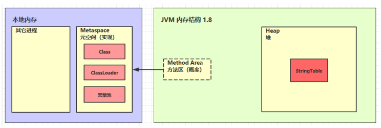

### 方法区内存溢出

- 1.8 以前会导致永久代内存溢出

 演示永久代内存溢出

```
java.lang.OutOfMemoryError: PermGen space 

-XX:MaxPermSize=8m 
```

- 1.8 之后会导致元空间内存溢出

演示元空间内存溢出

```
java.lang.OutOfMemoryError: Metaspace

-XX:MaxMetaspaceSize=8m
```


```java
package cn.itcast.jvm.t1.metaspace;

import jdk.internal.org.objectweb.asm.ClassWriter;
import jdk.internal.org.objectweb.asm.Opcodes;

/**
 * 演示元空间内存溢出 java.lang.OutOfMemoryError: Metaspace
 * -XX:MaxMetaspaceSize=8m
 */
public class Demo1_8 extends ClassLoader { // 可以用来加载类的二进制字节码
    public static void main(String[] args) {
        int j = 0;
        try {
            Demo1_8 test = new Demo1_8();
            for (int i = 0; i < 10000; i++, j++) {
                // ClassWriter 作用是生成类的二进制字节码
                ClassWriter cw = new ClassWriter(0);
                // 版本号， public， 类名, 包名, 父类， 接口
                cw.visit(Opcodes.V1_8, Opcodes.ACC_PUBLIC, "Class" + i, null, "java/lang/Object", null);
                // 返回 byte[]
                byte[] code = cw.toByteArray();
                // 执行了类的加载
                test.defineClass("Class" + i, code, 0, code.length); // Class 对象
            }
        } finally {
            System.out.println(j);
        }
    }
}

```

### 运行时常量池

- 常量池，就是一张表，虚拟机指令根据这张常量表找到要执行的类名、方法名、参数类型、字面量等信息
- 运行时常量池，常量池是 *.class 文件中的，当该类被加载，它的常量池信息就会放入运行时常量池，并把里面的符号地址变为真实地址

### StringTable

面试题：

```java
String s1 = "a";
String s2 = "b";
String s3 = "a" + "b";
String s4 = s1 + s2;
String s5 = "ab";
String s6 = s4.intern();

// 问
System.out.println(s3 == s4);
System.out.println(s3 == s5);
System.out.println(s3 == s6);
String x2 = new String("c") + new String("d");
String x1 = "cd";
x2.intern();

// 问，如果调换了【最后两行代码】的位置呢，如果是jdk1.6呢
System.out.println(x1 == x2);

```

解析：

```java
package cn.itcast.jvm.t1.stringtable;

// StringTable [ "a", "b" ,"ab" ]  hashtable 结构，不能扩容
public class Demo1_22 {
    // 常量池中的信息，都会被加载到运行时常量池中， 这时 a b ab 都是常量池中的符号，还没有变为 java 字符串对象
    // ldc #2 会把 a 符号变为 "a" 字符串对象
    // ldc #3 会把 b 符号变为 "b" 字符串对象
    // ldc #4 会把 ab 符号变为 "ab" 字符串对象

    public static void main(String[] args) {
        String s1 = "a"; // 懒惰的
        String s2 = "b";
        String s3 = "ab";
        String s4 = s1 + s2; // new StringBuilder().append("a").append("b").toString()  new String("ab")
        String s5 = "a" + "b";  // javac 在编译期间的优化，结果已经在编译期确定为ab

        System.out.println(s3 == s4);//false
        System.out.println(s3 == s5);//true
    }
}

```

```java
package cn.itcast.jvm.t1.stringtable;

public class Demo1_23 {

    //  ["ab", "a", "b"]
    public static void main(String[] args) {

        String x = "ab";
        String s = new String("a") + new String("b");

        // 堆  new String("a")   new String("b") new String("ab")
        String s2 = s.intern(); // 将这个字符串对象尝试放入串池，如果有则并不会放入，如果没有则放入串池， 会把串池中的对象返回

        System.out.println( s2 == x);//true
        System.out.println( s == x );//false
    }

}

```

```java
package cn.itcast.jvm.t1.stringtable;

/**
 * 演示字符串相关面试题
 */
public class Demo1_21 {

    public static void main(String[] args) {
        String s1 = "a";
        String s2 = "b";
        String s3 = "a" + "b"; // ab
        String s4 = s1 + s2;   // new String("ab")
        String s5 = "ab";
        String s6 = s4.intern();

// 问
        System.out.println(s3 == s4); // false
        System.out.println(s3 == s5); // true
        System.out.println(s3 == s6); // true

        String x2 = new String("c") + new String("d"); // new String("cd")
        x2.intern();
        String x1 = "cd";

// 问，如果调换了【最后两行代码】的位置呢，如果是jdk1.6呢
        System.out.println(x1 == x2);
    }
}

```

### StringTable特性

- 常量池中的字符串仅是符号，第一次用到时才变为对象
- 利用串池的机制，来避免重复创建字符串对象
- 字符串变量拼接的原理是 StringBuilder （1.8）
- 字符串常量拼接的原理是编译期优化
- 可以使用 intern 方法，主动将串池中还没有的字符串对象放入串池
  - 1.8 将这个字符串对象尝试放入串池，如果有则并不会放入，如果没有则放入串池， 会把串 池中的对象返回
  - 1.6 将这个字符串对象尝试放入串池，如果有则并不会放入，如果没有会把此对象复制一份， 放入串池， 会把串池中的对象返回

### StringTable 位置

jdk1.6 StringTable 位置是在永久代中，1.8 StringTable 位置是在堆中。


### StringTable 垃圾回收

-Xmx10m 指定堆内存大小
-XX:+PrintStringTableStatistics 打印字符串常量池信息
-XX:+PrintGCDetails
-verbose:gc 打印 gc 的次数，耗费时间等信息

```java
/**
 * 演示 StringTable 垃圾回收
 * -Xmx10m -XX:+PrintStringTableStatistics -XX:+PrintGCDetails -verbose:gc
 */
public class Code_05_StringTableTest {

    public static void main(String[] args) {
        int i = 0;
        try {
            for(int j = 0; j < 10000; j++) { // j = 100, j = 10000
                String.valueOf(j).intern();
                i++;
            }
        }catch (Exception e) {
            e.printStackTrace();
        }finally {
            System.out.println(i);
        }
    }

}


```

###  StringTable 性能调优

- 因为StringTable是由HashTable实现的，所以可以适当增加HashTable桶的个数，来减少字符串放入串池所需要的时间

  ```
  -XX:StringTableSize=桶个数（最少设置为 1009 以上）
  ```

- 考虑是否需要将字符串对象入池

  可以通过 intern 方法减少重复入池

  ```java
  package cn.itcast.jvm.t1.stringtable;
  
  import java.io.BufferedReader;
  import java.io.FileInputStream;
  import java.io.IOException;
  import java.io.InputStreamReader;
  import java.util.ArrayList;
  import java.util.List;
  
  /**
   * 演示 intern 减少内存占用
   * -XX:StringTableSize=200000 -XX:+PrintStringTableStatistics
   * -Xsx500m -Xmx500m -XX:+PrintStringTableStatistics -XX:StringTableSize=200000
   */
  public class Demo1_25 {
  
      public static void main(String[] args) throws IOException {
  
          List<String> address = new ArrayList<>();
          System.in.read();
          for (int i = 0; i < 10; i++) {
              try (BufferedReader reader = new BufferedReader(new InputStreamReader(new FileInputStream("linux.words"), "utf-8"))) {
                  String line = null;
                  long start = System.nanoTime();
                  while (true) {
                      line = reader.readLine();
                      if(line == null) {
                          break;
                      }
                      address.add(line.intern());
                  }
                  System.out.println("cost:" +(System.nanoTime()-start)/1000000);
              }
          }
          System.in.read();
  
  
      }
  }
  
  ```

## 直接内存

### 定义

Direct Memory

- 常见于 NIO 操作时，用于数据缓冲区
- 分配回收成本较高，但读写性能高
- 不受 JVM 内存回收管理

### 使用直接内存的好处

文件读写流程：

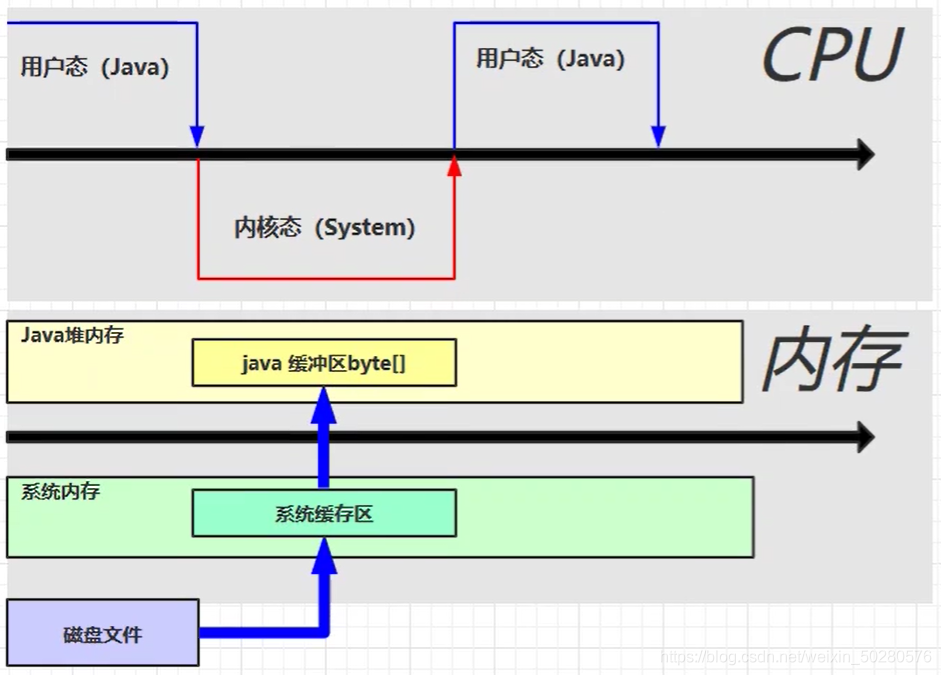

因为 java 不能直接操作文件管理，需要切换到内核态，使用本地方法进行操作，然后读取磁盘文件，会在系统内存中创建一个缓冲区，将数据读到系统缓冲区， 然后在将系统缓冲区数据，复制到 java 堆内存中。缺点是数据存储了两份，在系统内存中有一份，java 堆中有一份，造成了不必要的复制。

使用了 DirectBuffer 文件读取流程

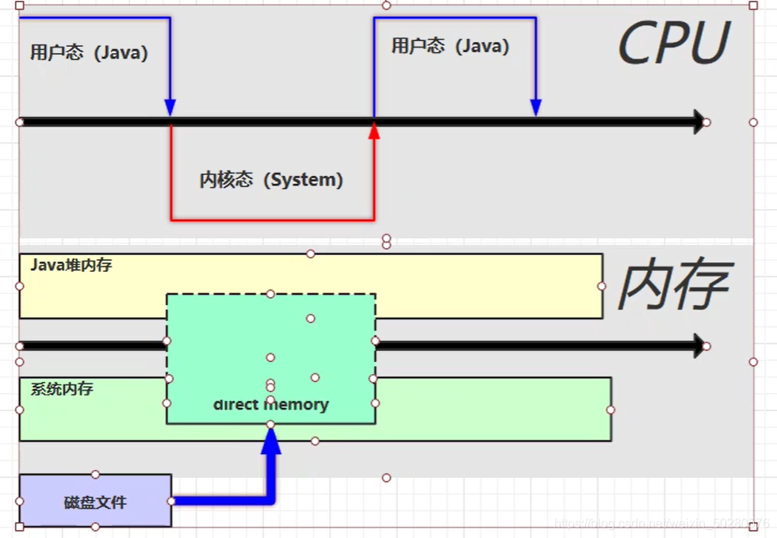

直接内存是操作系统和 Java 代码都可以访问的一块区域，无需将代码从系统内存复制到 Java 堆内存，从而提高了效率。

```java
package cn.itcast.jvm.t1.direct;

import java.io.FileInputStream;
import java.io.FileOutputStream;
import java.io.IOException;
import java.nio.ByteBuffer;
import java.nio.channels.FileChannel;

/**
 * 演示 ByteBuffer 作用
 */
public class Demo1_9 {
    static final String FROM = "E:\\编程资料\\第三方教学视频\\youtube\\Getting Started with Spring Boot-sbPSjI4tt10.mp4";
    static final String TO = "E:\\a.mp4";
    static final int _1Mb = 1024 * 1024;

    public static void main(String[] args) {
        io(); // io 用时：1535.586957 1766.963399 1359.240226
        directBuffer(); // directBuffer 用时：479.295165 702.291454 562.56592
    }

    private static void directBuffer() {
        long start = System.nanoTime();
        try (FileChannel from = new FileInputStream(FROM).getChannel();
             FileChannel to = new FileOutputStream(TO).getChannel();
        ) {
            ByteBuffer bb = ByteBuffer.allocateDirect(_1Mb);
            while (true) {
                int len = from.read(bb);
                if (len == -1) {
                    break;
                }
                bb.flip();
                to.write(bb);
                bb.clear();
            }
        } catch (IOException e) {
            e.printStackTrace();
        }
        long end = System.nanoTime();
        System.out.println("directBuffer 用时：" + (end - start) / 1000_000.0);
    }

    private static void io() {
        long start = System.nanoTime();
        try (FileInputStream from = new FileInputStream(FROM);
             FileOutputStream to = new FileOutputStream(TO);
        ) {
            byte[] buf = new byte[_1Mb];
            while (true) {
                int len = from.read(buf);
                if (len == -1) {
                    break;
                }
                to.write(buf, 0, len);
            }
        } catch (IOException e) {
            e.printStackTrace();
        }
        long end = System.nanoTime();
        System.out.println("io 用时：" + (end - start) / 1000_000.0);
    }
}

```

### 分配和回收原理

- 使用了 Unsafe 对象完成直接内存的分配回收，并且回收需要主动调用 freeMemory 方法
- ByteBuffer 的实现类内部，使用了 Cleaner （虚引用）来监测 ByteBuffer 对象，一旦 ByteBuffer 对象被垃圾回收，那么就会由 ReferenceHandler 线程通过 Cleaner 的 clean 方法调 用 freeMemory 来释放直接内存

```java
public class Code_06_DirectMemoryTest {

    public static int _1GB = 1024 * 1024 * 1024;

    public static void main(String[] args) throws IOException, NoSuchFieldException, IllegalAccessException {
//        method();
        method1();
    }

    // 演示 直接内存 是被 unsafe 创建与回收
    private static void method1() throws IOException, NoSuchFieldException, IllegalAccessException {

        Field field = Unsafe.class.getDeclaredField("theUnsafe");
        field.setAccessible(true);
        Unsafe unsafe = (Unsafe)field.get(Unsafe.class);

        long base = unsafe.allocateMemory(_1GB);
        unsafe.setMemory(base,_1GB, (byte)0);
        System.in.read();

        unsafe.freeMemory(base);
        System.in.read();
    }

    // 演示 直接内存被 释放
    private static void method() throws IOException {
        ByteBuffer byteBuffer = ByteBuffer.allocateDirect(_1GB);
        System.out.println("分配完毕");
        System.in.read();
        System.out.println("开始释放");
        byteBuffer = null;
        System.gc(); // 手动 gc
        System.in.read();
    }

}
```

直接内存的回收不是通过 JVM 的垃圾回收来释放的，而是通过unsafe.freeMemory 来手动释放。
第一步：allocateDirect 的实现

```java
public static ByteBuffer allocateDirect(int capacity) {
    return new DirectByteBuffer(capacity);
}
```


底层是创建了一个 DirectByteBuffer 对象。
第二步：DirectByteBuffer 类

```java
DirectByteBuffer(int cap) {   // package-private
   
    super(-1, 0, cap, cap);
    boolean pa = VM.isDirectMemoryPageAligned();
    int ps = Bits.pageSize();
    long size = Math.max(1L, (long)cap + (pa ? ps : 0));
    Bits.reserveMemory(size, cap);

    long base = 0;
    try {
        base = unsafe.allocateMemory(size); // 申请内存
    } catch (OutOfMemoryError x) {
        Bits.unreserveMemory(size, cap);
        throw x;
    }
    unsafe.setMemory(base, size, (byte) 0);
    if (pa && (base % ps != 0)) {
        // Round up to page boundary
        address = base + ps - (base & (ps - 1));
    } else {
        address = base;
    }
    cleaner = Cleaner.create(this, new Deallocator(base, size, cap)); // 通过虚引用，来实现直接内存的释放，this为虚引用的实际对象, 第二个参数是一个回调，实现了 runnable 接口，run 方法中通过 unsafe 释放内存。
    att = null;
}

```

这里调用了一个 Cleaner 的 create 方法，且后台线程还会对虚引用的对象监测，如果虚引用的实际对象（这里是 DirectByteBuffer ）被回收以后，就会调用 Cleaner 的 clean 方法，来清除直接内存中占用的内存。

```java
 public void clean() {
        if (remove(this)) {
            try {
            // 都用函数的 run 方法, 释放内存
                this.thunk.run();
            } catch (final Throwable var2) {
                AccessController.doPrivileged(new PrivilegedAction<Void>() {
                    public Void run() {
                        if (System.err != null) {
                            (new Error("Cleaner terminated abnormally", var2)).printStackTrace();
                        }

                        System.exit(1);
                        return null;
                    }
                });
            }

        }
    }

```

可以看到关键的一行代码， this.thunk.run()，thunk 是 Runnable 对象。run 方法就是回调 Deallocator 中的 run 方法，

```java
		public void run() {
            if (address == 0) {
                // Paranoia
                return;
            }
            // 释放内存
            unsafe.freeMemory(address);
            address = 0;
            Bits.unreserveMemory(size, capacity);
        }

直接内存的回收机制总结
```
使用了 Unsafe 类来完成直接内存的分配回收，回收需要主动调用freeMemory 方法
ByteBuffer 的实现内部使用了 Cleaner（虚引用）来检测 ByteBuffer 。一旦ByteBuffer 被垃圾回收，那么会由 ReferenceHandler（守护线程） 来调用 Cleaner 的 clean 方法调用 freeMemory 来释放内存
注意：

```java
/**
     * -XX:+DisableExplicitGC 显示的
     */
    private static void method() throws IOException {
        ByteBuffer byteBuffer = ByteBuffer.allocateDirect(_1GB);
        System.out.println("分配完毕");
        System.in.read();
        System.out.println("开始释放");
        byteBuffer = null;
        System.gc(); // 手动 gc 失效
        System.in.read();
    }


```


一般用 jvm 调优时，会加上下面的参数：

```
-XX:+DisableExplicitGC  // 静止显示的 GC
```


意思就是禁止我们手动的 GC，比如手动 System.gc() 无效，它是一种 full gc，会回收新生代、老年代，会造成程序执行的时间比较长。所以我们就通过 unsafe 对象调用 freeMemory 的方式释放内存。

# 垃圾回收

## 如何判断对象可以回收

### 引用计数法

当一个对象被引用时，就当引用对象的值加一，当值为 0 时，就表示该对象不被引用，可以被垃圾收集器回收。
这个引用计数法听起来不错，但是有一个弊端，如下图所示，循环引用时，两个对象的计数都为1，导致两个对象都无法被释放。

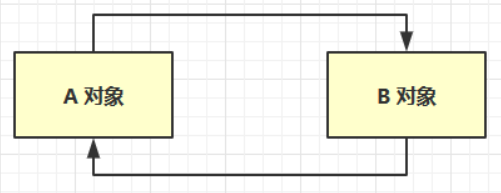

### 可达性分析算法

- Java 虚拟机中的垃圾回收器采用可达性分析来探索所有存活的对象
- **扫描堆中的对象，看是否能够沿着 GC Root对象 为起点的引用链找到该对象，找不到，表示可以回收**
- 哪些对象可以作为 GC Root？
  - 虚拟机栈（栈帧中的本地变量表）中引用的对象。
  - 方法区中类静态属性引用的对象
  - 方法区中常量引用的对象
  - 本地方法栈中 JNI（即一般说的Native方法）引用的对象

```java
public static void main(String[] args) throws IOException {

        ArrayList<Object> list = new ArrayList<>();
        list.add("a");
        list.add("b");
        list.add(1);
        System.out.println(1);
        System.in.read();

        list = null;
        System.out.println(2);
        System.in.read();
        System.out.println("end");
    }


```

对于以上代码，可以使用如下命令将堆内存信息转储成一个文件，然后使用
Eclipse Memory Analyzer 工具进行分析。
第一步：
使用 jps 命令，查看程序的进程

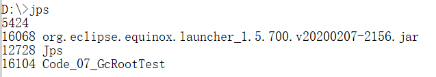

第二步：

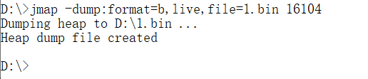

使用`jmap -dump:format=b,live,file=1.bin 16104`命令转储文件

- dump：转储文件
- format=b：二进制文件
- file：文件名
- 16104：进程的id

第三步：打开 Eclipse Memory Analyzer 对 1.bin 文件进行分析。

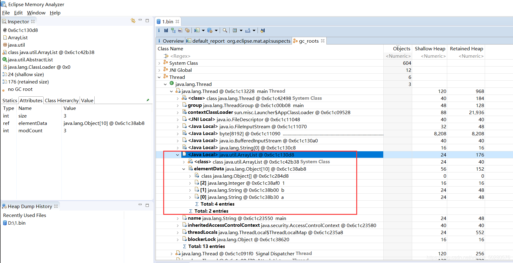

分析的 gc root，找到了 ArrayList 对象，然后将 list 置为null，再次转储，那么 list 对象就会被回收。

### 四种引用

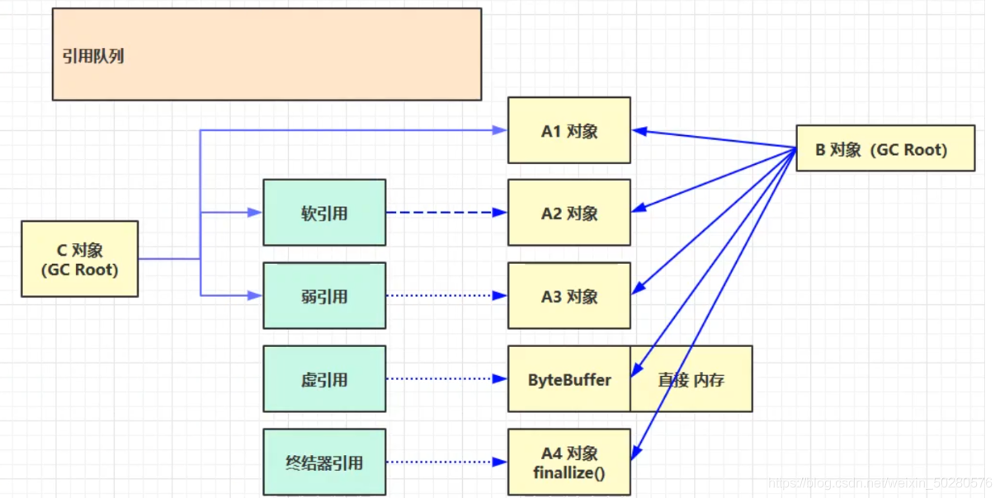

1. 强引用
   只有所有 GC Roots 对象都不通过【强引用】引用该对象，该对象才能被垃圾回收
2. 弱引用（WeakReference）
   仅有弱引用引用该对象时，在垃圾回收时，无论内存是否充足，都会回收弱引用对象
   可以配合引用队列来释放弱引用自身
3. 软引用（SoftReference）
   仅有软引用引用该对象时，在垃圾回收后，内存仍不足时会再次出发垃圾回收，回收软引用对象
   可以配合引用队列来释放软引用自身
4. 虚引用（PhantomReference）
   必须配合引用队列使用，主要配合 ByteBuffer 使用，被引用对象回收时，会将虚引用入队，
   由 Reference Handler 线程调用虚引用相关方法释放直接内存
5. 终结器引用（FinalReference）
   无需手动编码，但其内部配合引用队列使用，在垃圾回收时，终结器引用入队（被引用对象暂时没有被回收），再由 Finalizer 线程通过终结器引用找到被引用对象并调用它的 finalize 方法，第二次 GC 时才能回收被引用对象。

#### 软引用演示

```java
/**
 * 演示 软引用
 * -Xmx20m -XX:+PrintGCDetails -verbose:gc
 */
public class Code_08_SoftReferenceTest {

    public static int _4MB = 4 * 1024 * 1024;

    public static void main(String[] args) throws IOException {
        method2();
    }

    // 设置 -Xmx20m , 演示堆内存不足,
    public static void method1() throws IOException {
        ArrayList<byte[]> list = new ArrayList<>();

        for(int i = 0; i < 5; i++) {
            list.add(new byte[_4MB]);
        }
        System.in.read();
    }

    // 演示 软引用
    public static void method2() throws IOException {
        ArrayList<SoftReference<byte[]>> list = new ArrayList<>();
        for(int i = 0; i < 5; i++) {
            SoftReference<byte[]> ref = new SoftReference<>(new byte[_4MB]);
            System.out.println(ref.get());
            list.add(ref);
            System.out.println(list.size());
        }
        System.out.println("循环结束：" + list.size());
        for(SoftReference<byte[]> ref : list) {
            System.out.println(ref.get());
        }
    }
}
```

method1 方法解析：
首先会设置一个堆内存的大小为 20m，然后运行 mehtod1 方法，会抛异常，堆内存不足，因为 mehtod1 中的 list 都是强引用。

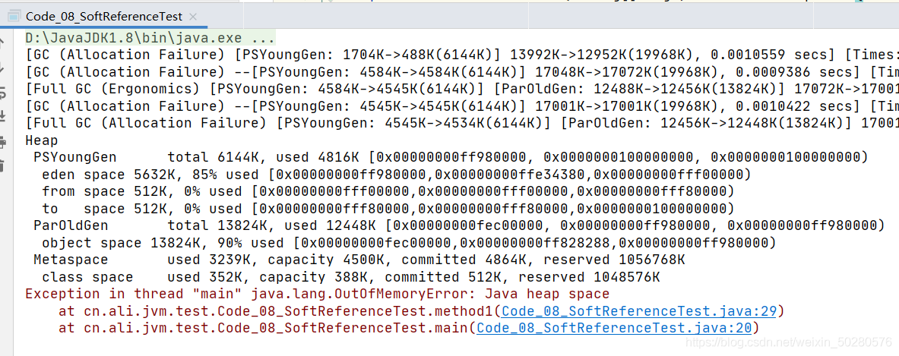

method2 方法解析：
在 list 集合中存放了 软引用对象，当内存不足时，会触发 full gc，将软引用的对象回收。细节如图：

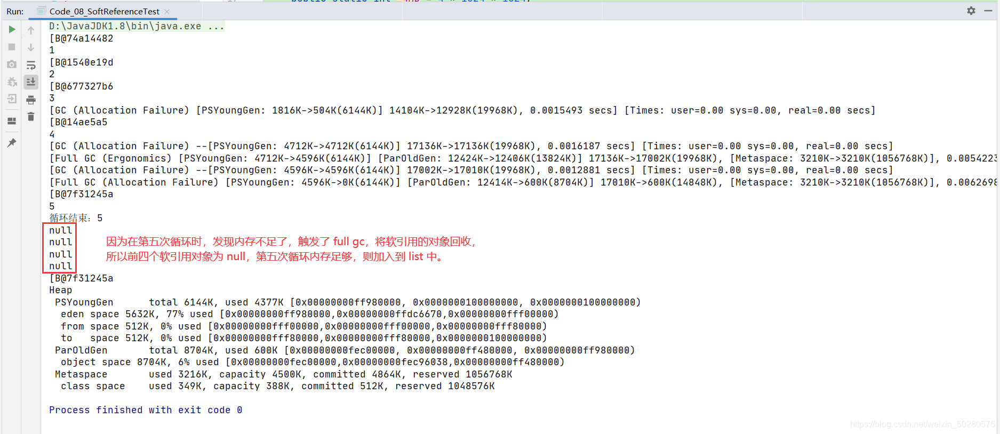

上面的代码中，当软引用引用的对象被回收了，但是软引用还存在，所以，一般软引用需要搭配一个引用队列一起使用。
修改 method2 如下：

```java
// 演示 软引用 搭配引用队列
    public static void method3() throws IOException {
        ArrayList<SoftReference<byte[]>> list = new ArrayList<>();
        // 引用队列
        ReferenceQueue<byte[]> queue = new ReferenceQueue<>();

        for(int i = 0; i < 5; i++) {
            // 关联了引用队列，当软引用所关联的 byte[] 被回收时，软引用自己会加入到 queue 中去
            SoftReference<byte[]> ref = new SoftReference<>(new byte[_4MB], queue);
            System.out.println(ref.get());
            list.add(ref);
            System.out.println(list.size());
        }

        // 从队列中获取无用的 软引用对象，并移除
        Reference<? extends byte[]> poll = queue.poll();
        while(poll != null) {
            list.remove(poll);
            poll = queue.poll();
        }

        System.out.println("=====================");
        for(SoftReference<byte[]> ref : list) {
            System.out.println(ref.get());
        }
    }

```

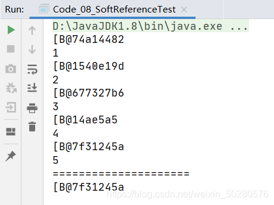

#### 弱引用演示

```java
public class Code_09_WeakReferenceTest {

    public static void main(String[] args) {
//        method1();
        method2();
    }

    public static int _4MB = 4 * 1024 *1024;

    // 演示 弱引用
    public static void method1() {
        List<WeakReference<byte[]>> list = new ArrayList<>();
        for(int i = 0; i < 10; i++) {
            WeakReference<byte[]> weakReference = new WeakReference<>(new byte[_4MB]);
            list.add(weakReference);

            for(WeakReference<byte[]> wake : list) {
                System.out.print(wake.get() + ",");
            }
            System.out.println();
        }
    }

    // 演示 弱引用搭配 引用队列
    public static void method2() {
        List<WeakReference<byte[]>> list = new ArrayList<>();
        ReferenceQueue<byte[]> queue = new ReferenceQueue<>();

        for(int i = 0; i < 9; i++) {
            WeakReference<byte[]> weakReference = new WeakReference<>(new byte[_4MB], queue);
            list.add(weakReference);
            for(WeakReference<byte[]> wake : list) {
                System.out.print(wake.get() + ",");
            }
            System.out.println();
        }
        System.out.println("===========================================");
        Reference<? extends byte[]> poll = queue.poll();
        while (poll != null) {
            list.remove(poll);
            poll = queue.poll();
        }
        for(WeakReference<byte[]> wake : list) {
            System.out.print(wake.get() + ",");
        }
    }

}
```

## 垃圾回收算法

### 标记清除

- 速度较快
- 会产生内存碎片

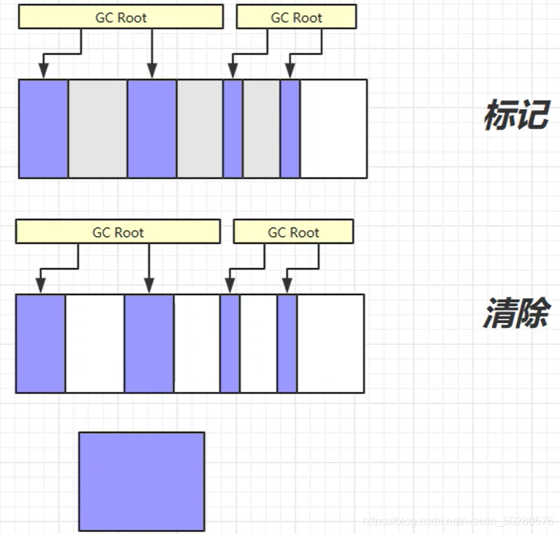

### 标记整理

- 速度慢
- 没有内存碎片

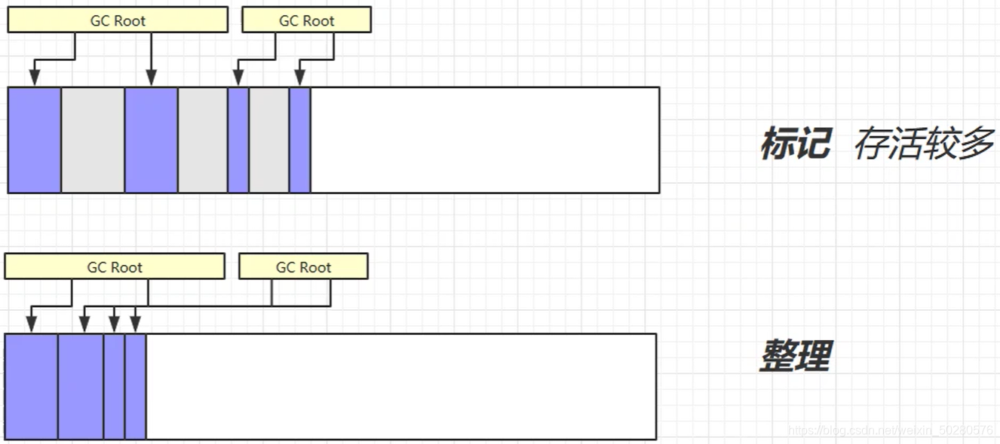

### 复制

- 不会有内存碎片
- 需要占用两倍内存空间

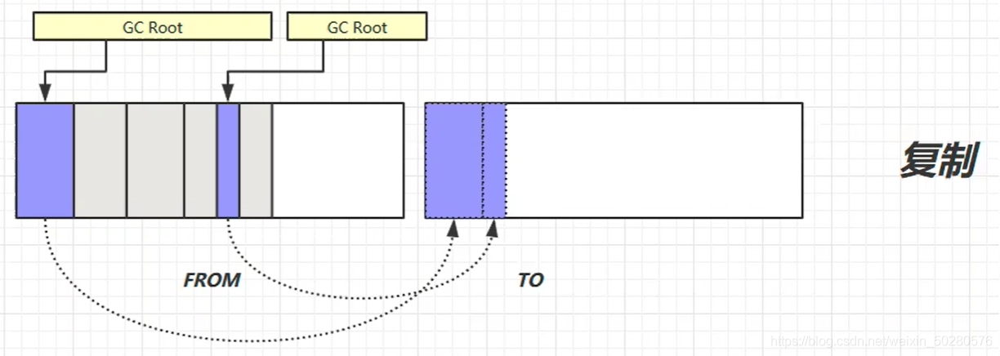

## 分代垃圾回收

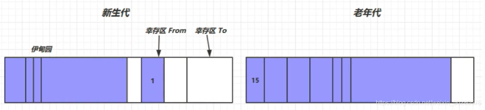

- 新创建的对象首先分配在 eden 区
- 新生代空间不足时，触发 minor gc ，eden 区 和 from 区存活的对象使用 - copy 复制到 to 中，存活的对象年龄加一，然后交换 from to
- minor gc 会引发 stop the world，暂停其他线程，等垃圾回收结束后，恢复用户线程运行
- 当幸存区对象的寿命超过阈值时，会晋升到老年代，最大的寿命是 15（4bit）
- 当老年代空间不足时，会先触发 minor gc，如果空间仍然不足，那么就触发 full fc ，停止的时间更长！

### 相关 JVM参数

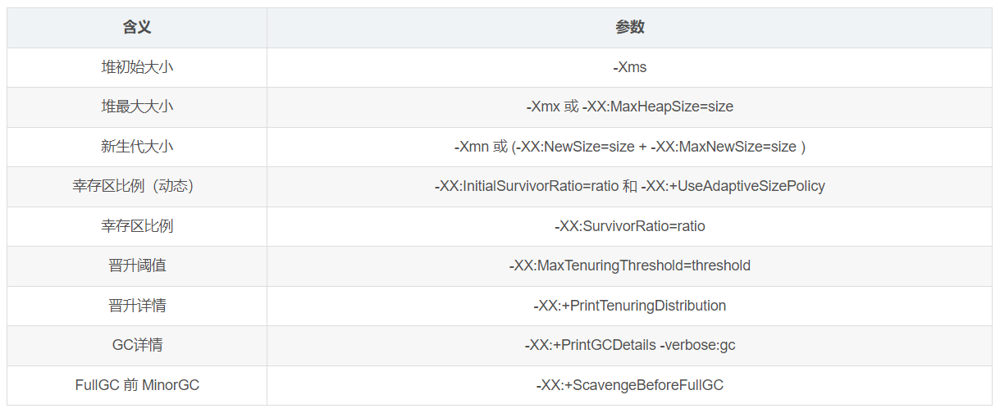

### GC 分析

```java
public class Code_10_GCTest {

    private static final int _512KB = 512 * 1024;
    private static final int _1MB = 1024 * 1024;
    private static final int _6MB = 6 * 1024 * 1024;
    private static final int _7MB = 7 * 1024 * 1024;
    private static final int _8MB = 8 * 1024 * 1024;

    // -Xms20m -Xmx20m -Xmn10m -XX:+UseSerialGC -XX:+PrintGCDetails -verbose:gc
    public static void main(String[] args) {
        List<byte[]> list = new ArrayList<>();
        list.add(new byte[_6MB]);
        list.add(new byte[_512KB]);
        list.add(new byte[_6MB]);
        list.add(new byte[_512KB]);
        list.add(new byte[_6MB]);
    }

}
```

## 垃圾回收器

**相关概念：**

- 并行收集：指多条垃圾收集线程并行工作，但此时用户线程仍处于等待状态。
- 并发收集：指用户线程与垃圾收集线程同时工作（不一定是并行的可能会交替执行）。用户程序在继续运行，而垃圾收集程序运行在另一个 CPU 上
- 吞吐量：即 CPU 用于运行用户代码的时间与 CPU 总消耗时间的比值（吞吐量 = 运行用户代码时间 / \( 运行用户代码时间 + 垃圾收集时间 \)​），也就是。例如：虚拟机共运行 100 分钟，垃圾收集器花掉 1 分钟，那么吞吐量就是 99% 。

### 串行

- 单线程
- 堆内存较少，适合个人电脑

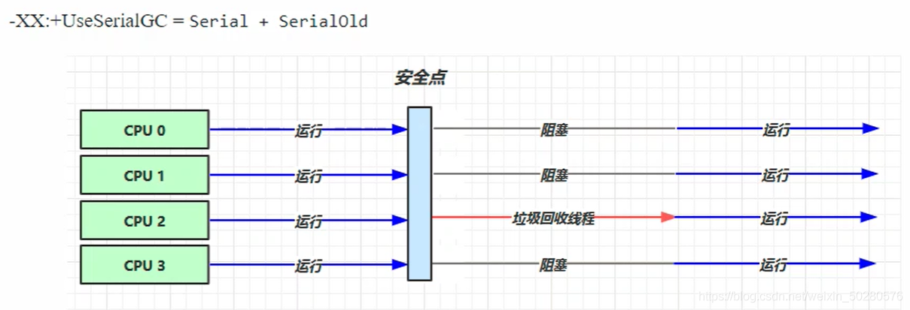

```java
-XX:+UseSerialGC=serial + serialOld
```

**安全点**：让其他线程都在这个点停下来，以免垃圾回收时移动对象地址，使得其他线程找不到被移动的对象  
因为是串行的，所以只有一个垃圾回收线程。且在该线程执行回收工作时，其他线程进入阻塞状态

**Serial 收集器**  
Serial 收集器是最基本的、发展历史最悠久的收集器  
**特点**：单线程、简单高效（与其他收集器的单线程相比），采用复制算法。对于限定单个 CPU 的环境来说，Serial 收集器由于没有线程交互的开销，专心做垃圾收集自然可以获得最高的单线程收集效率。收集器进行垃圾回收时，必须暂停其他所有的工作线程，直到它结束（Stop The World）！

**ParNew 收集器**  
ParNew 收集器其实就是 Serial 收集器的多线程版本  
**特点**：多线程、ParNew 收集器默认开启的收集线程数与CPU的数量相同，在 CPU 非常多的环境中，可以使用 \-XX:ParallelGCThreads 参数来限制垃圾收集的线程数。和 Serial 收集器一样存在 Stop The World 问题

**Serial Old 收集器**  
Serial Old 是 Serial 收集器的老年代版本  
**特点**：同样是单线程收集器，采用标记-整理算法

### 吞吐量优先

- 多线程
- 堆内存较大，多核 cpu
- 让单位时间内，STW 的时间最短 0.2 0.2 = 0.4

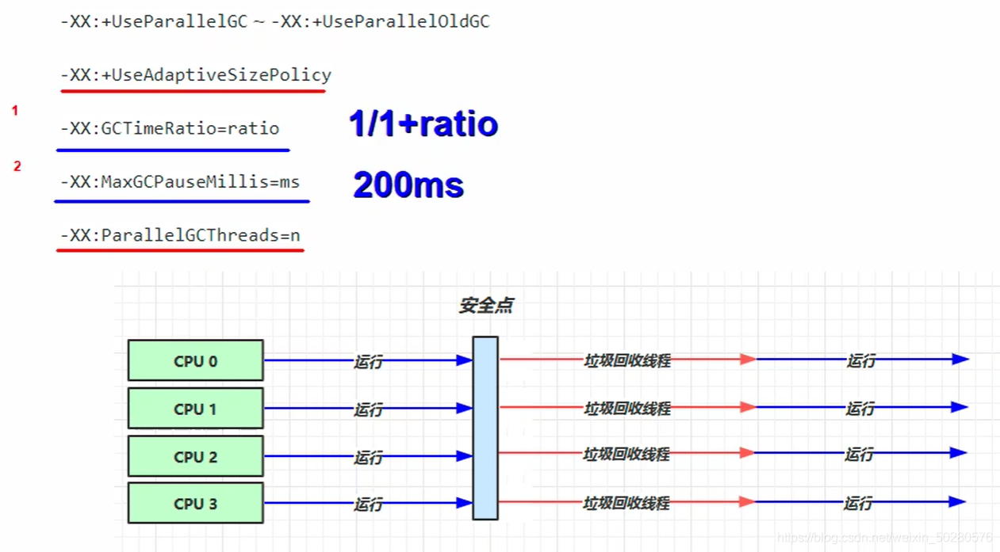

```java
-XX:+UseParallelGC ~ -XX:+UsePrallerOldGC
-XX:+UseAdaptiveSizePolicy
-XX:GCTimeRatio=ratio // 1/(1+radio)
-XX:MaxGCPauseMillis=ms // 200ms
-XX:ParallelGCThreads=n
```

**Parallel Scavenge 收集器**  
与吞吐量关系密切，故也称为吞吐量优先收集器  
**特点**：属于新生代收集器也是采用复制算法的收集器（用到了新生代的幸存区），又是并行的多线程收集器（与 ParNew 收集器类似）

该收集器的目标是达到一个可控制的吞吐量。还有一个值得关注的点是：GC自适应调节策略（与 ParNew 收集器最重要的一个区别）

GC自适应调节策略：  
Parallel Scavenge 收集器可设置 \-XX:+UseAdptiveSizePolicy 参数。  
当开关打开时不需要手动指定新生代的大小（-Xmn）、Eden 与 Survivor 区的比例（-XX:SurvivorRation）、  
晋升老年代的对象年龄（-XX:PretenureSizeThreshold）等，虚拟机会根据系统的运行状况收集性能监控信息，动态设置这些参数以提供最优的停顿时间和最高的吞吐量，这种调节方式称为 GC 的自适应调节策略。

Parallel Scavenge 收集器使用两个参数控制吞吐量：

- XX:MaxGCPauseMillis=ms 控制最大的垃圾收集停顿时间（默认200ms）
- XX:GCTimeRatio=rario 直接设置吞吐量的大小

**Parallel Old 收集器**  
是 Parallel Scavenge 收集器的老年代版本  
**特点**：多线程，采用标记-整理算法（老年代没有幸存区）

### 响应时间优先

- 多线程
- 堆内存较大，多核 cpu
- 尽可能让 STW 的单次时间最短 0.1 0.1 0.1 0.1 0.1 = 0.5

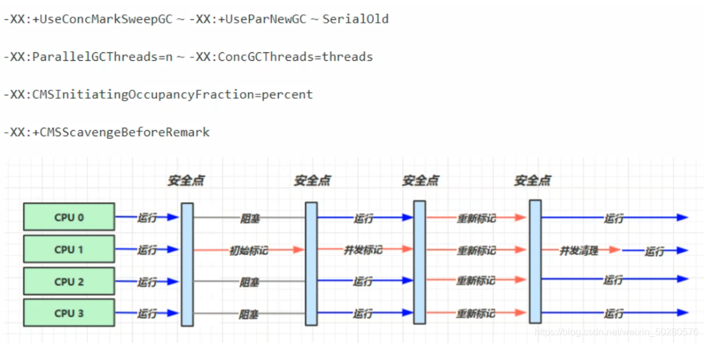

```java
-XX:+UseConcMarkSweepGC ~ -XX:+UseParNewGC ~ SerialOld
-XX:ParallelGCThreads=n ~ -XX:ConcGCThreads=threads
-XX:CMSInitiatingOccupancyFraction=percent
-XX:+CMSScavengeBeforeRemark
```

**CMS 收集器**  
Concurrent Mark Sweep，一种以获取最短回收停顿时间为目标的**老年代收集器**  
**特点**：基于标记-清除算法实现。并发收集、低停顿，但是会产生内存碎片  
**应用场景**：适用于注重服务的响应速度，希望系统停顿时间最短，给用户带来更好的体验等场景下。如 web 程序、b/s 服务  
**CMS 收集器的运行过程分为下列4步：**  
**初始标记**：标记 GC Roots 能直接到的对象。速度很快但是仍存在 Stop The World 问题。  
**并发标记**：进行 GC Roots Tracing 的过程，找出存活对象且用户线程可并发执行。  
**重新标记**：为了修正并发标记期间因用户程序继续运行而导致标记产生变动的那一部分对象的标记记录。仍然存在 Stop The World 问题  
**并发清除**：对标记的对象进行清除回收，清除的过程中，可能任然会有新的垃圾产生，这些垃圾就叫浮动垃圾，如果当用户需要存入一个很大的对象时，新生代放不下去，老年代由于浮动垃圾过多，就会退化为 serial Old 收集器，将老年代垃圾进行标记-整理，当然这也是很耗费时间的！

CMS 收集器的内存回收过程是与用户线程一起并发执行的，可以搭配 ParNew 收集器（多线程，新生代，复制算法）与 Serial Old 收集器（单线程，老年代，标记-整理算法）使用。

### G1 收集器

**定义：** Garbage First  
**适用场景：**

- 同时注重吞吐量和低延迟（响应时间）
- 超大堆内存（内存大的），会将堆内存划分为多个大小相等的区域
- 整体上是标记-整理算法，两个区域之间是复制算法

**相关参数：**  
JDK8 并不是默认开启的，所需要参数开启

```java
-XX:+UseG1GC
-XX:G1HeapRegionSize=size
-XX:MaxGCPauseMillis=time
```

#### G1 垃圾回收阶段

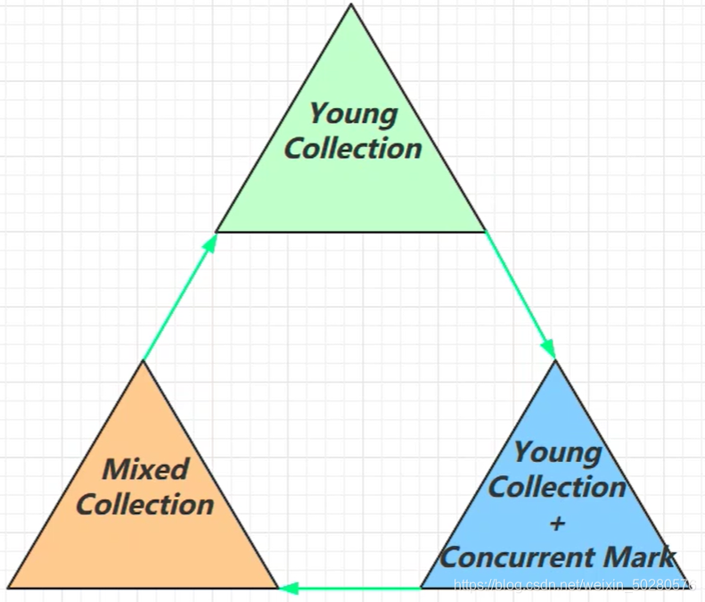  
Young Collection：对新生代垃圾收集  
Young Collection + Concurrent Mark：如果老年代内存到达一定的阈值了，新生代垃圾收集同时会执行一些并发的标记。  
Mixed Collection：会对新生代 + 老年代 + 幸存区等进行混合收集，然后收集结束，会重新进入新生代收集。

#### Young Collection

**新生代存在 STW：**  
分代是按对象的生命周期划分，分区则是将堆空间划分连续几个不同小区间，每一个小区间独立回收，可以控制一次回收多少个小区间，方便控制 GC 产生的停顿时间！  
E：eden，S：幸存区，O：老年代  
新生代收集会产生 STW ！  
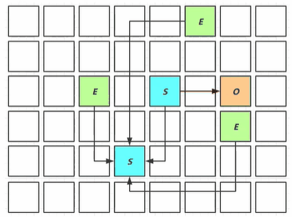

#### Young Collection + CM

在 Young GC 时会进行 GC Root 的初始化标记  
老年代占用堆空间比例达到阈值时，进行并发标记（不会STW），由下面的 JVM 参数决定 \-XX:InitiatingHeapOccupancyPercent=percent （默认45%）  
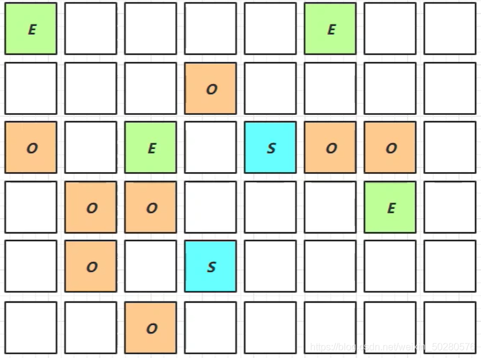

#### Mixed Collection

会对 E S O 进行**全面的回收**

- 最终标记会 STW
- 拷贝存活会 STW

\-XX:MaxGCPauseMills=xxms 用于指定最长的停顿时间！  
问：为什么有的老年代被拷贝了，有的没拷贝？  
因为指定了最大停顿时间，如果对所有老年代都进行回收，耗时可能过高。为了保证时间不超过设定的停顿时间，会回收最有价值的老年代（回收后，能够得到更多内存）  
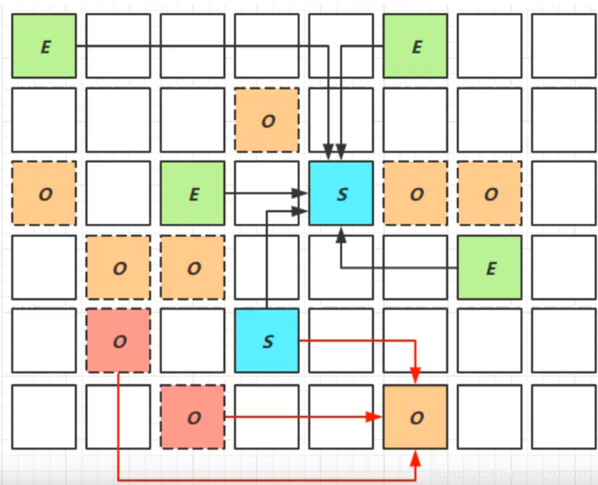

#### Full GC

G1 在老年代内存不足时（老年代所占内存超过阈值）  
如果垃圾产生速度慢于垃圾回收速度，不会触发 Full GC，还是并发地进行清理  
如果垃圾产生速度快于垃圾回收速度，便会触发 Full GC，然后退化成 serial Old 收集器串行的收集，就会导致停顿的时候长。

#### Young Collection 跨代引用

- 新生代回收的跨代引用（老年代引用新生代）问题  
  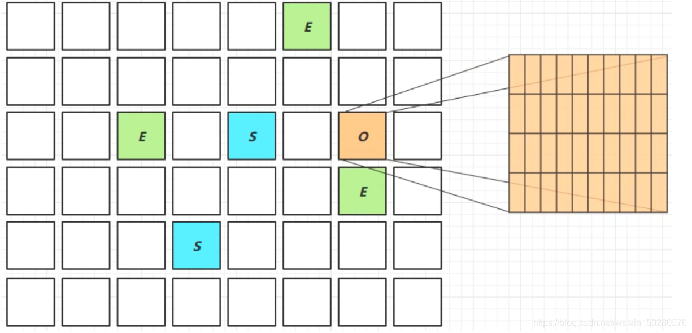
- 卡表 与 Remembered Set
  - Remembered Set 存在于E中，用于保存新生代对象对应的脏卡
    - 脏卡：O 被划分为多个区域（一个区域512K），如果该区域引用了新生代对象，则该区域被称为脏卡
- 在引用变更时通过 post-write barried + dirty card queue
- concurrent refinement threads 更新 Remembered Set  
  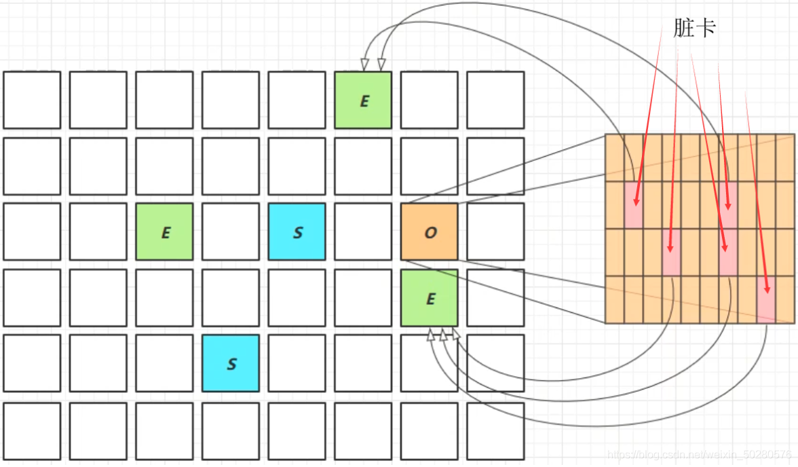

#### Remark

重新标记阶段  
在垃圾回收时，收集器处理对象的过程中

- 黑色：已被处理，需要保留的
- 灰色：正在处理中的
- 白色：还未处理的  
  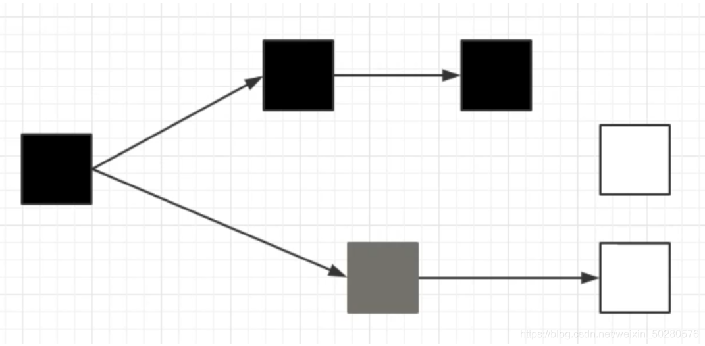

但是在并发标记过程中，有可能 A 被处理了以后未引用 C ，但该处理过程还未结束，在处理过程结束之前 A 引用了 C ，这时就会用到 remark 。  
过程如下

- 之前 C 未被引用，这时 A 引用了 C ，就会给 C 加一个写屏障，写屏障的指令会被执行，将 C 放入一个队列当中，并将 C 变为 处理中状态
- 在并发标记阶段结束以后，重新标记阶段会 STW ，然后将放在该队列中的对象重新处理，发现有强引用引用它，就会处理它，由灰色变成黑色。

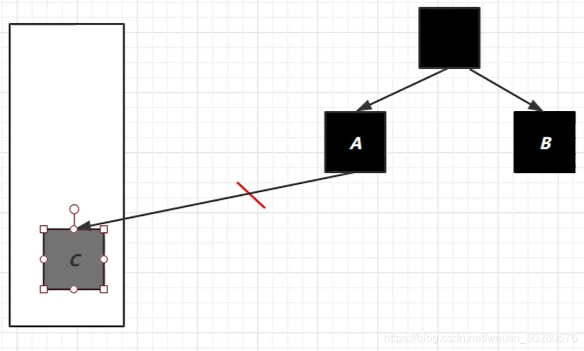  
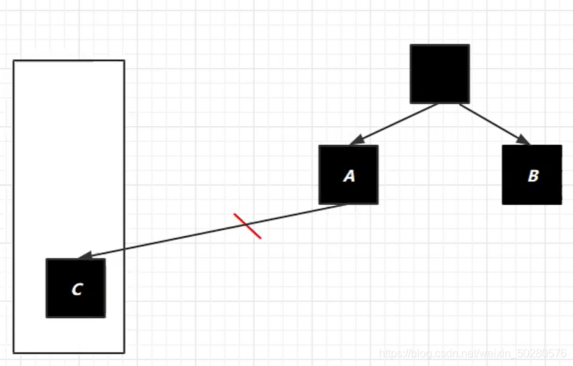

#### JDK 8u20 字符串去重

过程

- 将所有新分配的字符串（底层是 char\[\] ）放入一个队列
- 当新生代回收时，G1 并发检查是否有重复的字符串
- 如果字符串的值一样，就让他们引用同一个字符串对象
- 注意，其与 String.intern\(\) 的区别
  - String.intern\(\) 关注的是字符串对象
  - 字符串去重关注的是 char\[\]
  - 在 JVM 内部，使用了不同的字符串标

优点与缺点

 -    节省了大量内存
 -    新生代回收时间略微增加，导致略微多占用 CPU

```java
-XX:+UseStringDeduplication
```

#### JDK 8u40 并发标记类卸载

在并发标记阶段结束以后，就能知道哪些类不再被使用。如果一个类加载器的所有类都不在使用，则卸载它所加载的所有类

#### JDK 8u60 回收巨型对象

- 一个对象大于region的一半时，就称为巨型对象
- G1不会对巨型对象进行拷贝
- 回收时被优先考虑
- G1会跟踪老年代所有incoming引用，如果老年代incoming引用为0的巨型对象就可以在新生代垃圾回收时处理掉

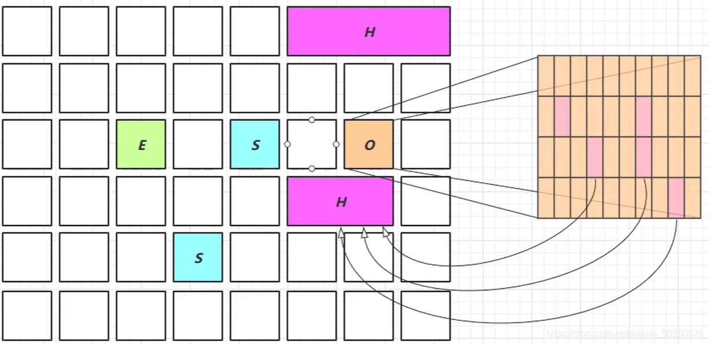

#### JDK 9 并发标记起始时间的调整

- 并发标记必须在堆空间占满前完成，否则退化为 FulGC
- JDK 9 之前需要使用 -XX:InitiatingHeapOccupancyPercent
- JDK 9 可以动态调整
  - \-XX:InitiatingHeapOccupancyPercent 用来设置初始值
  - 进行数据采样并动态调整
  - 总会添加一个安全的空挡空间

## 5、垃圾回收调优

查看虚拟机参数命令

```java
D:\JavaJDK1.8\bin\java  -XX:+PrintFlagsFinal -version | findstr "GC"
```

可以根据参数去查询具体的信息

### 调优领域

- 内存
- 锁竞争
- cpu 占用
- io
- gc

### 确定目标

低延迟/高吞吐量？ 选择合适的GC

- CMS G1 ZGC
- ParallelGC
- Zing

### 最快的 GC

首先排除减少因为自身编写的代码而引发的内存问题

- 查看 Full GC 前后的内存占用，考虑以下几个问题
  - 数据是不是太多？
    - resultSet = statement.executeQuery\(“select \* from 大表 limit n”\)
  - 数据表示是否太臃肿
    - 对象图
    - 对象大小 16 Integer 24 int 4
  - 是否存在内存泄漏
    - static Map map …
    - 软
    - 弱
    - 第三方缓存实现

### 新生代调优

- 新生代的特点

  - 所有的 new 操作分配内存都是非常廉价的
    - TLAB thread-lcoal allocation buffer
  - 死亡对象回收零代价
  - 大部分对象用过即死（朝生夕死）
  - Minor GC 所用时间远小于 Full GC

- 新生代内存越大越好么？

  - 不是
    - 新生代内存太小：频繁触发 Minor GC ，会 STW ，会使得吞吐量下降
    - 新生代内存太大：老年代内存占比有所降低，会更频繁地触发 Full GC。而且触发 Minor GC 时，清理新生代所花费的时间会更长
  - 新生代内存设置为内容纳\[并发量\*\(请求-响应\)\]的数据为宜

- 幸存区需要能够保存 当前活跃对象+需要晋升的对象

  - 晋升阈值配置得当，让长时间存活的对象尽快晋升

```java
-XX:MaxTenuringThreshold=threshold
-XX:+PrintTenuringDistrubution
```

### 老年代调优

以 CMS 为例：

 -    CMS 的老年代内存越大越好
 -    先尝试不做调优，如果没有 Full GC 那么已经，否者先尝试调优新生代。
 -    观察发现 Full GC 时老年代内存占用，将老年代内存预设调大 1/4 \~ 1/3

```java
-XX:CMSInitiatingOccupancyFraction=percent
```

### 案例

案例1：Full GC 和 Minor GC 频繁 

案例2：请求高峰期发生 Full GC，单次暂停时间特别长（CMS）

案例3：老年代充裕情况下，发生 Full GC（jdk1.7）

# 四、类加载与字节码技术

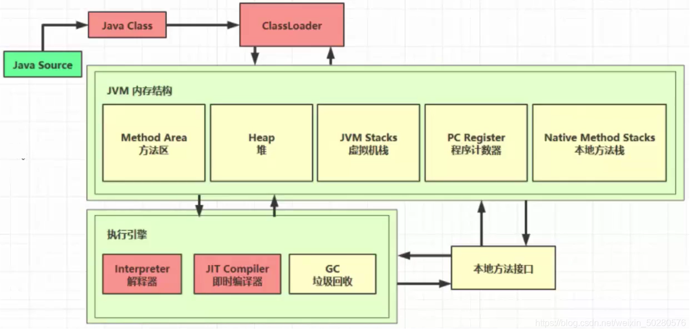

## 1、类文件结构

通过 javac 类名.java 编译 java 文件后，会生成一个 .class 的文件！  
以下是字节码文件：

```java
0000000 ca fe ba be 00 00 00 34 00 23 0a 00 06 00 15 09 
0000020 00 16 00 17 08 00 18 0a 00 19 00 1a 07 00 1b 07 
0000040 00 1c 01 00 06 3c 69 6e 69 74 3e 01 00 03 28 29 
0000060 56 01 00 04 43 6f 64 65 01 00 0f 4c 69 6e 65 4e 
0000100 75 6d 62 65 72 54 61 62 6c 65 01 00 12 4c 6f 63 
0000120 61 6c 56 61 72 69 61 62 6c 65 54 61 62 6c 65 01 
0000140 00 04 74 68 69 73 01 00 1d 4c 63 6e 2f 69 74 63 
0000160 61 73 74 2f 6a 76 6d 2f 74 35 2f 48 65 6c 6c 6f 
0000200 57 6f 72 6c 64 3b 01 00 04 6d 61 69 6e 01 00 16 
0000220 28 5b 4c 6a 61 76 61 2f 6c 61 6e 67 2f 53 74 72 
0000240 69 6e 67 3b 29 56 01 00 04 61 72 67 73 01 00 13 
0000260 5b 4c 6a 61 76 61 2f 6c 61 6e 67 2f 53 74 72 69 
0000300 6e 67 3b 01 00 10 4d 65 74 68 6f 64 50 61 72 61 
0000320 6d 65 74 65 72 73 01 00 0a 53 6f 75 72 63 65 46 
0000340 69 6c 65 01 00 0f 48 65 6c 6c 6f 57 6f 72 6c 64
0000360 2e 6a 61 76 61 0c 00 07 00 08 07 00 1d 0c 00 1e 
0000400 00 1f 01 00 0b 68 65 6c 6c 6f 20 77 6f 72 6c 64 
0000420 07 00 20 0c 00 21 00 22 01 00 1b 63 6e 2f 69 74 
0000440 63 61 73 74 2f 6a 76 6d 2f 74 35 2f 48 65 6c 6c 
0000460 6f 57 6f 72 6c 64 01 00 10 6a 61 76 61 2f 6c 61 
0000500 6e 67 2f 4f 62 6a 65 63 74 01 00 10 6a 61 76 61 
0000520 2f 6c 61 6e 67 2f 53 79 73 74 65 6d 01 00 03 6f 
0000540 75 74 01 00 15 4c 6a 61 76 61 2f 69 6f 2f 50 72 
0000560 69 6e 74 53 74 72 65 61 6d 3b 01 00 13 6a 61 76 
0000600 61 2f 69 6f 2f 50 72 69 6e 74 53 74 72 65 61 6d 
0000620 01 00 07 70 72 69 6e 74 6c 6e 01 00 15 28 4c 6a 
0000640 61 76 61 2f 6c 61 6e 67 2f 53 74 72 69 6e 67 3b 
0000660 29 56 00 21 00 05 00 06 00 00 00 00 00 02 00 01 
0000700 00 07 00 08 00 01 00 09 00 00 00 2f 00 01 00 01 
0000720 00 00 00 05 2a b7 00 01 b1 00 00 00 02 00 0a 00 
0000740 00 00 06 00 01 00 00 00 04 00 0b 00 00 00 0c 00 
0000760 01 00 00 00 05 00 0c 00 0d 00 00 00 09 00 0e 00 
0001000 0f 00 02 00 09 00 00 00 37 00 02 00 01 00 00 00 
0001020 09 b2 00 02 12 03 b6 00 04 b1 00 00 00 02 00 0a 
0001040 00 00 00 0a 00 02 00 00 00 06 00 08 00 07 00 0b 
0001060 00 00 00 0c 00 01 00 00 00 09 00 10 00 11 00 00 
0001100 00 12 00 00 00 05 01 00 10 00 00 00 01 00 13 00 
0001120 00 00 02 00 14
```

根据 JVM 规范，类文件结构如下：

```java
u4             magic
u2             minor_version;    
u2             major_version;    
u2             constant_pool_count;    
cp_info        constant_pool[constant_pool_count-1];    
u2             access_flags;    
u2             this_class;    
u2             super_class;   
u2             interfaces_count;    
u2             interfaces[interfaces_count];   
u2             fields_count;    
field_info     fields[fields_count];   
u2             methods_count;    
method_info    methods[methods_count];    
u2             attributes_count;    
attribute_info attributes[attributes_count];
```

### 1）魔数

u4 magic  
对应字节码文件的 0\~3 个字节  
0000000 ca fe ba be 00 00 00 34 00 23 0a 00 06 00 15 09  
ca fe ba be ：意思是 .class 文件，不同的东西有不同的魔数，比如 jpg、png 图片等！

### 2）版本

u2 minor\_version;  
u2 major\_version;  
0000000 ca fe ba be 00 00 00 34 00 23 0a 00 06 00 15 09  
00 00 00 34：34H（16进制） = 52（10进制），代表JDK8

### 3）常量池

…  
参考文档  
[传送门](https://docs.oracle.com/javase/specs/jvms/se8/html/)

## 2、字节码指令

可参考：  
[字节码指令](https://docs.oracle.com/javase/specs/jvms/se8/html/jvms-6.html#jvms-6.5)

### 1）javap 工具

Java 中提供了 javap 工具来反编译 class 文件

```java
javap -v D:Demo.class
```

### 2）图解方法执行流程

**代码**

```java
public class Demo3_1 {    
    public static void main(String[] args) {        
        int a = 10;        
        int b = Short.MAX_VALUE + 1;        
        int c = a + b;        
        System.out.println(c);   
    } 
}
```

**常量池载入运行时常量池**  
常量池也属于方法区，只不过这里单独提出来了  
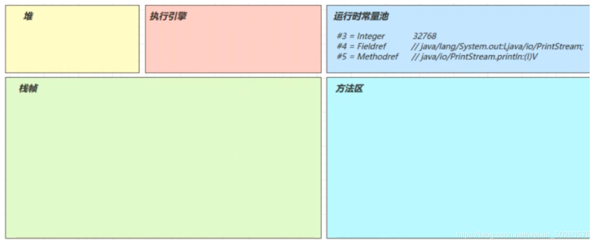  
**方法字节码载入方法区**  
（stack=2，locals=4） 对应操作数栈有 2 个空间（每个空间 4 个字节），局部变量表中有 4 个槽位。  
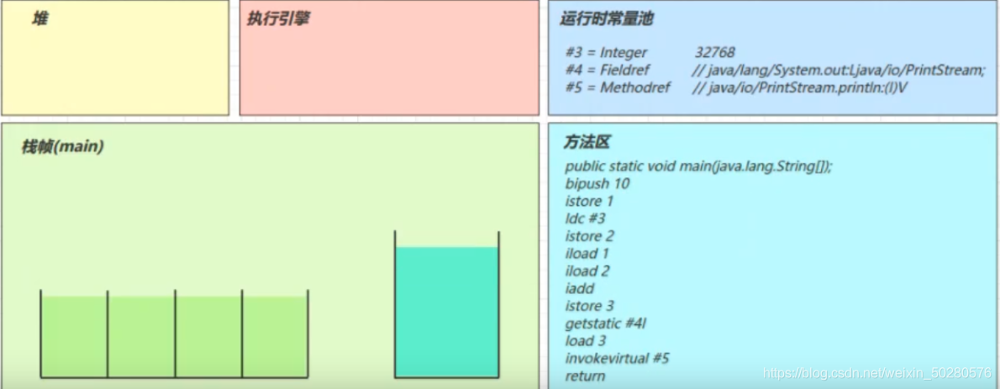  
**执行引擎开始执行字节码**  
**bipush 10**

- **将一个 byte 压入操作数栈**（其长度会补齐 4 个字节），类似的指令还有
  - sipush 将一个 short 压入操作数栈（其长度会补齐 4 个字节）
  - ldc 将一个 int 压入操作数栈
  - ldc2\_w 将一个 long 压入操作数栈（**分两次压入**，因为 long 是 8 个字节）
  - 这里小的数字都是和字节码指令存在一起，**超过 short 范围的数字存入了常量池**

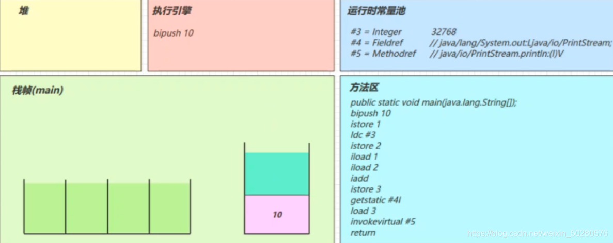  
**istore 1**  
将操作数栈栈顶元素弹出，放入局部变量表的 slot 1 中  
对应代码中的 a = 10  
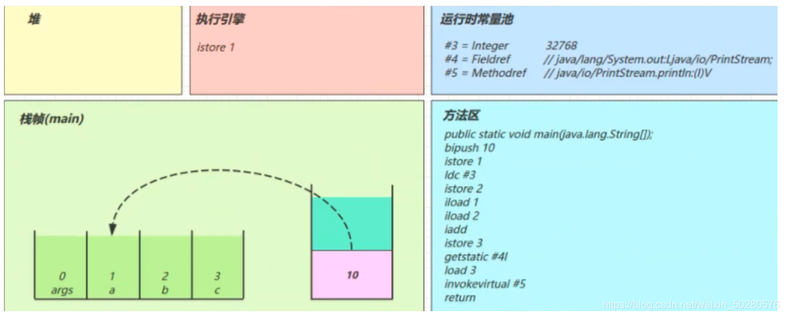  
**ldc #3**  
读取运行时常量池中 #3 ，即 32768 \(超过 short 最大值范围的数会被放到运行时常量池中\)，将其加载到操作数栈中  
注意 Short.MAX\_VALUE 是 32767，所以 32768 = Short.MAX\_VALUE + 1 实际是在编译期间计算好的。  
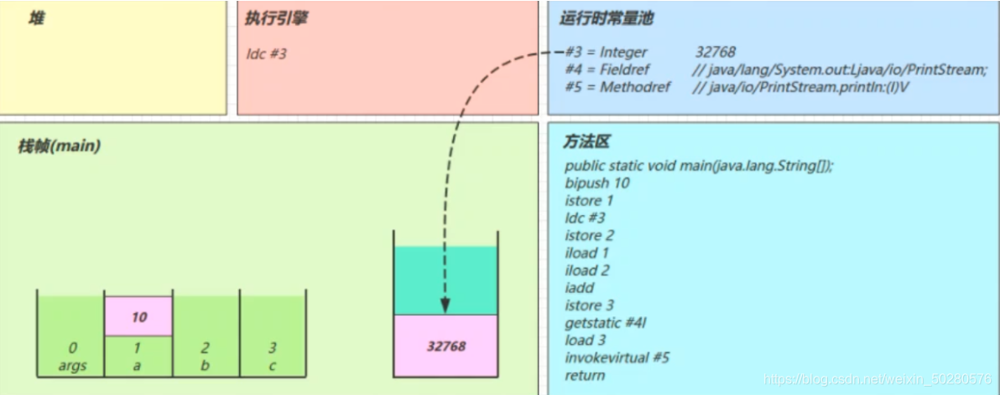  
**istore 2**  
将操作数栈中的元素弹出，放到局部变量表的 2 号位置  
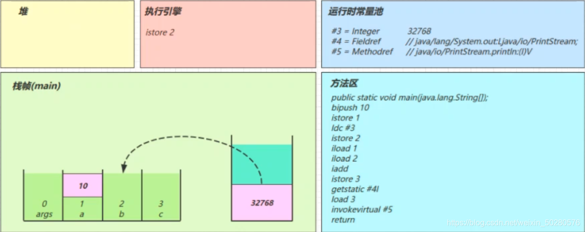  
**iload1 iload2**  
将局部变量表中 1 号位置和 2 号位置的元素放入操作数栈中。因为只能在操作数栈中执行运算操作  
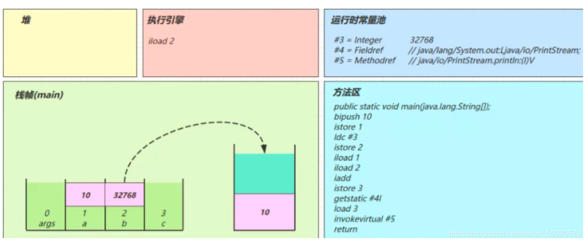  
**iadd**  
将操作数栈中的两个元素弹出栈并相加，结果在压入操作数栈中。  
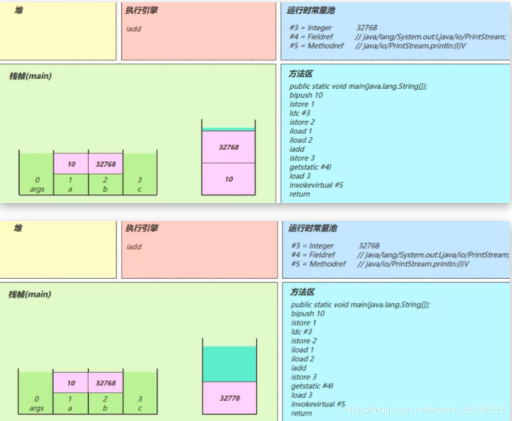  
**istore 3**  
将操作数栈中的元素弹出，放入局部变量表的3号位置。  
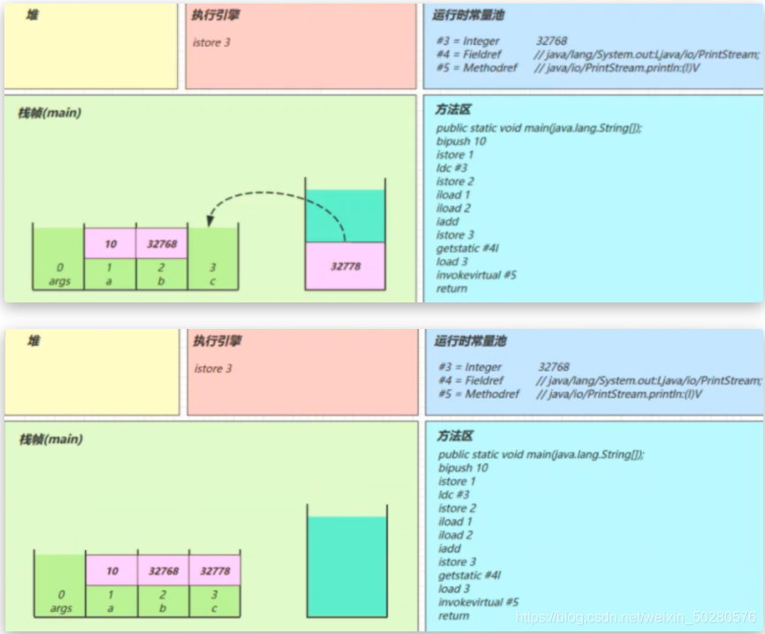  
**getstatic #4**  
在运行时常量池中找到 #4 ，发现是一个对象，在堆内存中找到该对象，并将其引用放入操作数栈中  
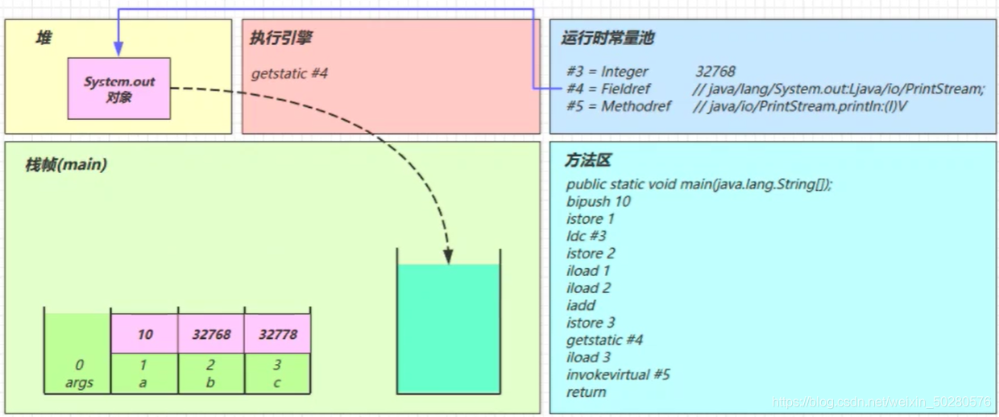  
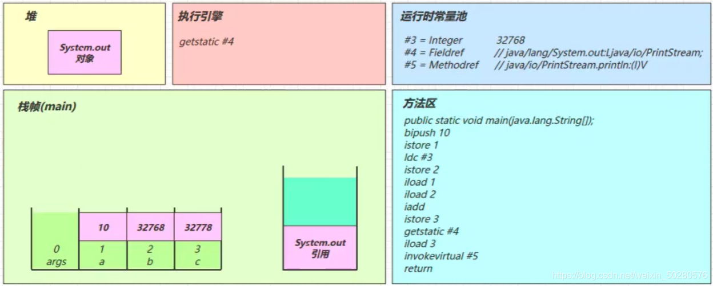  
**iload 3**  
将局部变量表中 3 号位置的元素压入操作数栈中。  
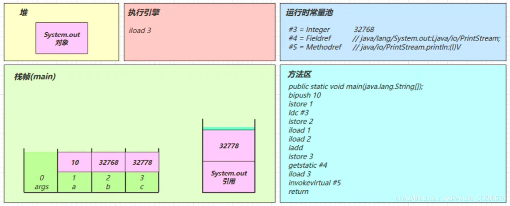  
**invokevirtual #5**  
找到常量池 #5 项，定位到方法区 java/io/PrintStream.println:\(I\)V 方法  
生成新的栈帧（分配 locals、stack等）  
传递参数，执行新栈帧中的字节码  
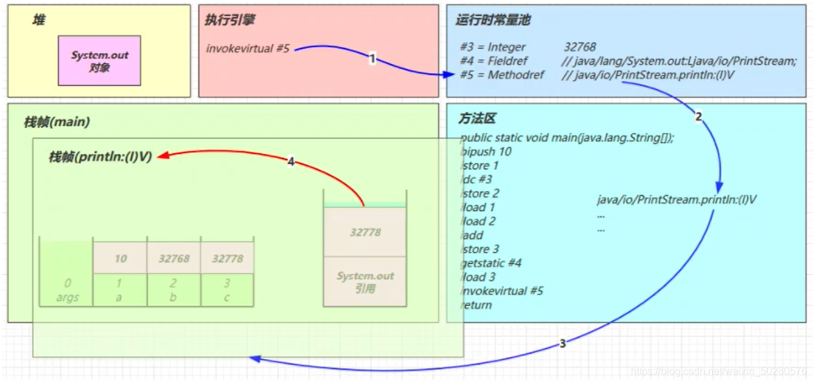  
执行完毕，弹出栈帧  
清除 main 操作数栈内容  
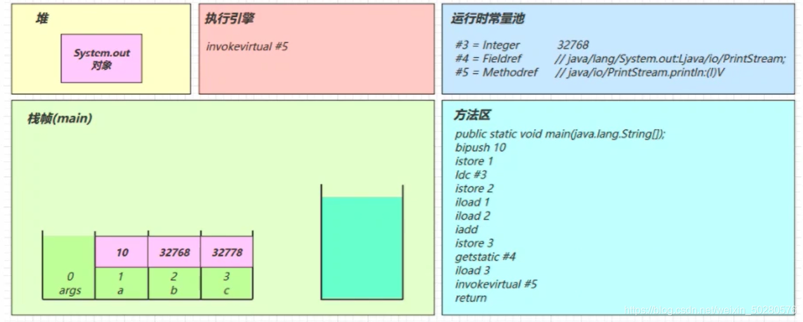  
**return**  
完成 main 方法调用，弹出 main 栈帧，程序结束

### 3）通过字节码指令分析问题

代码

```java
public class Code_11_ByteCodeTest {
    public static void main(String[] args) {

        int i = 0;
        int x = 0;
        while (i < 10) {
            x = x++;
            i++;
        }
        System.out.println(x); // 0
    }
}

```

为什么最终的 x 结果为 0 呢？ 通过分析字节码指令即可知晓

```java
Code:
     stack=2, locals=3, args_size=1 // 操作数栈分配2个空间，局部变量表分配 3 个空间
        0: iconst_0 // 准备一个常数 0
        1: istore_1 // 将常数 0 放入局部变量表的 1 号槽位 i = 0
        2: iconst_0 // 准备一个常数 0
        3: istore_2 // 将常数 0 放入局部变量的 2 号槽位 x = 0    
        4: iload_1      // 将局部变量表 1 号槽位的数放入操作数栈中
        5: bipush        10 // 将数字 10 放入操作数栈中，此时操作数栈中有 2 个数
        7: if_icmpge     21 // 比较操作数栈中的两个数，如果下面的数大于上面的数，就跳转到 21 。这里的比较是将两个数做减法。因为涉及运算操作，所以会将两个数弹出操作数栈来进行运算。运算结束后操作数栈为空
       10: iload_2      // 将局部变量 2 号槽位的数放入操作数栈中，放入的值是 0 
       11: iinc          2, 1   // 将局部变量 2 号槽位的数加 1 ，自增后，槽位中的值为 1 
       14: istore_2 //将操作数栈中的数放入到局部变量表的 2 号槽位，2 号槽位的值又变为了0
       15: iinc          1, 1 // 1 号槽位的值自增 1 
       18: goto          4 // 跳转到第4条指令
       21: getstatic     #2                  // Field java/lang/System.out:Ljava/io/PrintStream;
       24: iload_2
       25: invokevirtual #3                  // Method java/io/PrintStream.println:(I)V
       28: return
```

### 4）构造方法

**cinit\(\)V**

```java
public class Code_12_CinitTest {
    static int i = 10;

    static {
        i = 20;
    }

    static {
        i = 30;
    }

    public static void main(String[] args) {
        System.out.println(i); // 30
    }
}
```

编译器会按从上至下的顺序，收集所有 static 静态代码块和静态成员赋值的代码，合并为一个特殊的方法 cinit\(\)V ：

```java
stack=1, locals=0, args_size=0
         0: bipush        10
         2: putstatic     #3                  // Field i:I
         5: bipush        20
         7: putstatic     #3                  // Field i:I
        10: bipush        30
        12: putstatic     #3                  // Field i:I
        15: return
```

**init\(\)V**

```java
public class Code_13_InitTest {

    private String a = "s1";

    {
        b = 20;
    }

    private int b = 10;

    {
        a = "s2";
    }

    public Code_13_InitTest(String a, int b) {
        this.a = a;
        this.b = b;
    }

    public static void main(String[] args) {
        Code_13_InitTest d = new Code_13_InitTest("s3", 30);
        System.out.println(d.a);
        System.out.println(d.b);
    }

}

```

编译器会按从上至下的顺序，收集所有 \{\} 代码块和成员变量赋值的代码，形成新的构造方法，但原始构造方法内的代码总是在后.

```java
Code:
     stack=2, locals=3, args_size=3
        0: aload_0
        1: invokespecial #1                  // Method java/lang/Object."<init>":()V
        4: aload_0
        5: ldc           #2                  // String s1
        7: putfield      #3                  // Field a:Ljava/lang/String;
       10: aload_0
       11: bipush        20
       13: putfield      #4                  // Field b:I
       16: aload_0
       17: bipush        10
       19: putfield      #4                  // Field b:I
       22: aload_0
       23: ldc           #5                  // String s2
       25: putfield      #3                  // Field a:Ljava/lang/String;
       // 原始构造方法在最后执行
       28: aload_0
       29: aload_1
       30: putfield      #3                  // Field a:Ljava/lang/String;
       33: aload_0
       34: iload_2
       35: putfield      #4                  // Field b:I
       38: return
```

### 5）方法调用

```java
public class Code_14_MethodTest {

    public Code_14_MethodTest() {

    }

    private void test1() {

    }

    private final void test2() {

    }

    public void test3() {

    }

    public static void test4() {

    }

    public static void main(String[] args) {
        Code_14_MethodTest obj = new Code_14_MethodTest();
        obj.test1();
        obj.test2();
        obj.test3();
        Code_14_MethodTest.test4();
    }
}

```

不同方法在调用时，对应的虚拟机指令有所区别

 -    私有、构造、被 final 修饰的方法，在调用时都使用 invokespecial 指令
 -    普通成员方法在调用时，使用 invokevirtual 指令。因为编译期间无法确定该方法的内容，只有在运行期间才能确定
 -    静态方法在调用时使用 invokestatic 指令

```java
Code:
      stack=2, locals=2, args_size=1
         0: new           #2                  //
         3: dup // 复制一份对象地址压入操作数栈中
         4: invokespecial #3                  // Method "<init>":()V
         7: astore_1
         8: aload_1
         9: invokespecial #4                  // Method test1:()V
        12: aload_1
        13: invokespecial #5                  // Method test2:()V
        16: aload_1
        17: invokevirtual #6                  // Method test3:()V
        20: invokestatic  #7                  // Method test4:()V
        23: return
```

- new 是创建【对象】，给对象分配堆内存，执行成功会将【对象引用】压入操作数栈
- dup 是赋值操作数栈栈顶的内容，本例即为【对象引用】，为什么需要两份引用呢，一个是要配合 invokespecial 调用该对象的构造方法 “init”: \(\)V （会消耗掉栈顶一个引用），另一个要 配合 astore\_1 赋值给局部变量
- 终方法（final），私有方法（private），构造方法都是由 invokespecial 指令来调用，属于静态绑定
- 普通成员方法是由 invokevirtual 调用，属于动态绑定，即支持多态 成员方法与静态方法调用的另一个区别是，执行方法前是否需要【对象引用】

### 6）多态原理

因为普通成员方法需要在运行时才能确定具体的内容，所以虚拟机需要调用 invokevirtual 指令  
在执行 invokevirtual 指令时，经历了以下几个步骤

- 先通过栈帧中对象的引用找到对象
- 分析对象头，找到对象实际的 Class
- Class 结构中有 vtable
- 查询 vtable 找到方法的具体地址
- 执行方法的字节码

### 7）异常处理

**try-catch**

```java
public class Code_15_TryCatchTest {

    public static void main(String[] args) {
        int i = 0;
        try {
            i = 10;
        }catch (Exception e) {
            i = 20;
        }
    }

}
```

对应字节码指令

```java
Code:
     stack=1, locals=3, args_size=1
        0: iconst_0
        1: istore_1
        2: bipush        10
        4: istore_1
        5: goto          12
        8: astore_2
        9: bipush        20
       11: istore_1
       12: return
     //多出来一个异常表
     Exception table:
        from    to  target type
            2     5     8   Class java/lang/Exception
```

- 可以看到多出来一个 Exception table 的结构，\[from, to\) 是前闭后开（也就是检测 2\~4 行）的检测范围，一旦这个范围内的字节码执行出现异常，则通过 type 匹配异常类型，如果一致，进入 target 所指示行号
- 8 行的字节码指令 astore\_2 是将异常对象引用存入局部变量表的 2 号位置（为 e ）

**多个 single-catch**

```java
public class Code_16_MultipleCatchTest {

    public static void main(String[] args) {
        int i = 0;
        try {
            i = 10;
        }catch (ArithmeticException e) {
            i = 20;
        }catch (Exception e) {
            i = 30;
        }
    }
}


```

对应的字节码

```java
Code:
     stack=1, locals=3, args_size=1
        0: iconst_0
        1: istore_1
        2: bipush        10
        4: istore_1
        5: goto          19
        8: astore_2
        9: bipush        20
       11: istore_1
       12: goto          19
       15: astore_2
       16: bipush        30
       18: istore_1
       19: return
     Exception table:
        from    to  target type
            2     5     8   Class java/lang/ArithmeticException
            2     5    15   Class java/lang/Exception
```

- 因为异常出现时，只能进入 Exception table 中一个分支，所以局部变量表 slot 2 位置被共用

**finally**

```java
public class Code_17_FinallyTest {
    
    public static void main(String[] args) {
        int i = 0;
        try {
            i = 10;
        } catch (Exception e) {
            i = 20;
        } finally {
            i = 30;
        }
    }
}

```

对应字节码

```java
Code:
     stack=1, locals=4, args_size=1
        0: iconst_0
        1: istore_1
        // try块
        2: bipush        10
        4: istore_1
        // try块执行完后，会执行finally    
        5: bipush        30
        7: istore_1
        8: goto          27
       // catch块     
       11: astore_2 // 异常信息放入局部变量表的2号槽位
       12: bipush        20
       14: istore_1
       // catch块执行完后，会执行finally        
       15: bipush        30
       17: istore_1
       18: goto          27
       // 出现异常，但未被 Exception 捕获，会抛出其他异常，这时也需要执行 finally 块中的代码   
       21: astore_3
       22: bipush        30
       24: istore_1
       25: aload_3
       26: athrow  // 抛出异常
       27: return
     Exception table:
        from    to  target type
            2     5    11   Class java/lang/Exception
            2     5    21   any
           11    15    21   any
```

可以看到 finally 中的代码被复制了 3 份，分别放入 try 流程，catch 流程以及 catch 剩余的异常类型流程  
注意：虽然从字节码指令看来，每个块中都有 finally 块，但是 finally 块中的代码只会被执行一次

**finally 中的 return**

```java
public class Code_18_FinallyReturnTest {

    public static void main(String[] args) {
        int i = Code_18_FinallyReturnTest.test();
        // 结果为 20
        System.out.println(i);
    }

    public static int test() {
        int i;
        try {
            i = 10;
            return i;
        } finally {
            i = 20;
            return i;
        }
    }
}
```

对应字节码

```java
Code:
     stack=1, locals=3, args_size=0
        0: bipush        10
        2: istore_0
        3: iload_0
        4: istore_1  // 暂存返回值
        5: bipush        20
        7: istore_0
        8: iload_0
        9: ireturn  // ireturn 会返回操作数栈顶的整型值 20
       // 如果出现异常，还是会执行finally 块中的内容，没有抛出异常
       10: astore_2
       11: bipush        20
       13: istore_0
       14: iload_0
       15: ireturn  // 这里没有 athrow 了，也就是如果在 finally 块中如果有返回操作的话，且 try 块中出现异常，会吞掉异常！
     Exception table:
        from    to  target type
            0     5    10   any
```

- 由于 finally 中的 ireturn 被插入了所有可能的流程，因此返回结果肯定以finally的为准
- 至于字节码中第 2 行，似乎没啥用，且留个伏笔，看下个例子
- 跟上例中的 finally 相比，发现没有 athrow 了，这告诉我们：如果在 finally 中出现了 return，会吞掉异常
- 所以不要在finally中进行返回操作

**被吞掉的异常**

```java
public static int test() {
      int i;
      try {
         i = 10;
         //  这里应该会抛出异常
         i = i/0;
         return i;
      } finally {
         i = 20;
         return i;
      }
   }
```

会发现打印结果为 20 ，并未抛出异常

**finally 不带 return**

```java
public static int test() {
        int i = 10;
        try {
            return i;
        } finally {
            i = 20;
        }
    }
```

对应字节码

```java
Code:
     stack=1, locals=3, args_size=0
        0: bipush        10
        2: istore_0 // 赋值给i 10
        3: iload_0  // 加载到操作数栈顶
        4: istore_1 // 加载到局部变量表的1号位置
        5: bipush        20
        7: istore_0 // 赋值给i 20
        8: iload_1 // 加载局部变量表1号位置的数10到操作数栈
        9: ireturn // 返回操作数栈顶元素 10
       10: astore_2
       11: bipush        20
       13: istore_0
       14: aload_2 // 加载异常
       15: athrow // 抛出异常
     Exception table:
        from    to  target type
            3     5    10   any
```

### 8）Synchronized

```java
public class Code_19_SyncTest {

    public static void main(String[] args) {
        Object lock = new Object();
        synchronized (lock) {
            System.out.println("ok");
        }
    }

}

```

对应字节码

```java
Code:
      stack=2, locals=4, args_size=1
         0: new           #2                  // class java/lang/Object
         3: dup // 复制一份栈顶，然后压入栈中。用于函数消耗
         4: invokespecial #1                  // Method java/lang/Object."<init>":()V
         7: astore_1 // 将栈顶的对象地址方法 局部变量表中 1 中
         8: aload_1 // 加载到操作数栈
         9: dup // 复制一份，放到操作数栈，用于加锁时消耗
        10: astore_2 // 将操作数栈顶元素弹出，暂存到局部变量表的 2 号槽位。这时操作数栈中有一份对象的引用
        11: monitorenter // 加锁
        12: getstatic     #3                  // Field java/lang/System.out:Ljava/io/PrintStream;
        15: ldc           #4                  // String ok
        17: invokevirtual #5                  // Method java/io/PrintStream.println:(Ljava/lang/String;)V
        20: aload_2 // 加载对象到栈顶
        21: monitorexit // 释放锁
        22: goto          30
        // 异常情况的解决方案 释放锁！
        25: astore_3
        26: aload_2
        27: monitorexit
        28: aload_3
        29: athrow
        30: return
        // 异常表！
      Exception table:
         from    to  target type
            12    22    25   any
            25    28    25   any

```

## 3、编译期处理

所谓的 **语法糖** ，其实就是指 java 编译器把 .java 源码编译为 .class 字节码的过程中，自动生成和转换的一些代码，主要是为了减轻程序员的负担，算是 java 编译器给我们的一个额外福利  
**注意**，以下代码的分析，借助了 javap 工具，idea 的反编译功能，idea 插件 jclasslib 等工具。另外， 编译器转换的**结果直接就是 class 字节码**，只是为了便于阅读，给出了 几乎等价 的 java 源码方式，并不是编译器还会转换出中间的 java 源码，切记。

### 1）默认构造器

```java
public class Candy1 {

}
```

经过编译期优化后

```java
public class Candy1 {
   // 这个无参构造器是java编译器帮我们加上的
   public Candy1() {
      // 即调用父类 Object 的无参构造方法，即调用 java/lang/Object." <init>":()V
      super();
   }
}
```

### 2）自动拆装箱

基本类型和其包装类型的相互转换过程，称为拆装箱  
在 JDK 5 以后，它们的转换可以在编译期自动完成

```java
public class Candy2 {
   public static void main(String[] args) {
      Integer x = 1;
      int y = x;
   }
}
```

转换过程如下

```java
public class Candy2 {
   public static void main(String[] args) {
      // 基本类型赋值给包装类型，称为装箱
      Integer x = Integer.valueOf(1);
      // 包装类型赋值给基本类型，称谓拆箱
      int y = x.intValue();
   }
}
```

### 3）泛型集合取值

泛型也是在 JDK 5 开始加入的特性，但 java 在编译泛型代码后会执行泛型擦除的动作，即泛型信息在编译为字节码之后就丢失了，实际的类型都当做了 Object 类型来处理：

```java
public class Candy3 {
   public static void main(String[] args) {
      List<Integer> list = new ArrayList<>();
      list.add(10);
      Integer x = list.get(0);
   }
}
```

对应字节码

```java
Code:
    stack=2, locals=3, args_size=1
       0: new           #2                  // class java/util/ArrayList
       3: dup
       4: invokespecial #3                  // Method java/util/ArrayList."<init>":()V
       7: astore_1
       8: aload_1
       9: bipush        10
      11: invokestatic  #4                  // Method java/lang/Integer.valueOf:(I)Ljava/lang/Integer;
      // 这里进行了泛型擦除，实际调用的是add(Objcet o)
      14: invokeinterface #5,  2            // InterfaceMethod java/util/List.add:(Ljava/lang/Object;)Z

      19: pop
      20: aload_1
      21: iconst_0
      // 这里也进行了泛型擦除，实际调用的是get(Object o)   
      22: invokeinterface #6,  2            // InterfaceMethod java/util/List.get:(I)Ljava/lang/Object;
// 这里进行了类型转换，将 Object 转换成了 Integer
      27: checkcast     #7                  // class java/lang/Integer
      30: astore_2
      31: return
```

所以调用 get 函数取值时，有一个类型转换的操作。

```java
Integer x = (Integer) list.get(0);
```

如果要将返回结果赋值给一个 int 类型的变量，则还有自动拆箱的操作

```java
int x = (Integer) list.get(0).intValue();
```

使用反射可以得到，参数的类型以及泛型类型。泛型反射代码如下：

```java
    public static void main(String[] args) throws NoSuchMethodException {
        // 1. 拿到方法
        Method method = Code_20_ReflectTest.class.getMethod("test", List.class, Map.class);
        // 2. 得到泛型参数的类型信息
        Type[] types = method.getGenericParameterTypes();
        for(Type type : types) {
            // 3. 判断参数类型是否，带泛型的类型。
            if(type instanceof ParameterizedType) {
                ParameterizedType parameterizedType = (ParameterizedType) type;

                // 4. 得到原始类型
                System.out.println("原始类型 - " + parameterizedType.getRawType());
                // 5. 拿到泛型类型
                Type[] arguments = parameterizedType.getActualTypeArguments();
                for(int i = 0; i < arguments.length; i++) {
                    System.out.printf("泛型参数[%d] - %s\n", i, arguments[i]);
                }
            }
        }
    }

    public Set<Integer> test(List<String> list, Map<Integer, Object> map) {
        return null;
    }
```

输出：

```java
原始类型 - interface java.util.List
泛型参数[0] - class java.lang.String
原始类型 - interface java.util.Map
泛型参数[0] - class java.lang.Integer
泛型参数[1] - class java.lang.Object
```

### 4）可变参数

可变参数也是 JDK 5 开始加入的新特性： 例如：

```java
public class Candy4 {
   public static void foo(String... args) {
      // 将 args 赋值给 arr ，可以看出 String... 实际就是 String[]  
      String[] arr = args;
      System.out.println(arr.length);
   }

   public static void main(String[] args) {
      foo("hello", "world");
   }
}
```

可变参数 String… args 其实是一个 String\[\] args ，从代码中的赋值语句中就可以看出来。 同 样 java 编译器会在编译期间将上述代码变换为：

```java
public class Candy4 {
   public Candy4 {}
   public static void foo(String[] args) {
      String[] arr = args;
      System.out.println(arr.length);
   }

   public static void main(String[] args) {
      foo(new String[]);
   }
}
```

注意，如果调用的是 foo\(\) ，即未传递参数时，等价代码为 foo\(new String\[\]\{\}\) ，创建了一个空数组，而不是直接传递的 null .

### 5）foreach 循环

仍是 JDK 5 开始引入的语法糖，数组的循环：

```java
public class Candy5 {
    public static void main(String[] args) {
        // 数组赋初值的简化写法也是一种语法糖。
        int[] arr = {1, 2, 3, 4, 5};
        for(int x : arr) {
            System.out.println(x);
        }
    }
}
```

编译器会帮我们转换为

```java
public class Candy5 {
    public Candy5() {}

    public static void main(String[] args) {
        int[] arr = new int[]{1, 2, 3, 4, 5};
        for(int i = 0; i < arr.length; ++i) {
            int x = arr[i];
            System.out.println(x);
        }
    }
}
```

如果是集合使用 foreach

```java
public class Candy5 {
   public static void main(String[] args) {
      List<Integer> list = Arrays.asList(1, 2, 3, 4, 5);
      for (Integer x : list) {
         System.out.println(x);
      }
   }

```

集合要使用 foreach ，需要该集合类实现了 Iterable 接口，因为集合的遍历需要用到迭代器 Iterator.

```java
public class Candy5 {
    public Candy5(){}
    
   public static void main(String[] args) {
      List<Integer> list = Arrays.asList(1, 2, 3, 4, 5);
      // 获得该集合的迭代器
      Iterator<Integer> iterator = list.iterator();
      while(iterator.hasNext()) {
         Integer x = iterator.next();
         System.out.println(x);
      }
   }
}
```

### 6）switch 字符串

从 JDK 7 开始，switch 可以作用于字符串和枚举类，这个功能其实也是语法糖，例如：

```java
public class Cnady6 {
   public static void main(String[] args) {
      String str = "hello";
      switch (str) {
         case "hello" :
            System.out.println("h");
            break;
         case "world" :
            System.out.println("w");
            break;
         default:
            break;
      }
   }
}
```

在编译器中执行的操作

```java
public class Candy6 {
   public Candy6() {
      
   }
   public static void main(String[] args) {
      String str = "hello";
      int x = -1;
      // 通过字符串的 hashCode + value 来判断是否匹配
      switch (str.hashCode()) {
         // hello 的 hashCode
         case 99162322 :
            // 再次比较，因为字符串的 hashCode 有可能相等
            if(str.equals("hello")) {
               x = 0;
            }
            break;
         // world 的 hashCode
         case 11331880 :
            if(str.equals("world")) {
               x = 1;
            }
            break;
         default:
            break;
      }

      // 用第二个 switch 在进行输出判断
      switch (x) {
         case 0:
            System.out.println("h");
            break;
         case 1:
            System.out.println("w");
            break;
         default:
            break;
      }
   }
}
```

过程说明：

- 在编译期间，单个的 switch 被分为了两个
  - 第一个用来匹配字符串，并给 x 赋值
    - 字符串的匹配用到了字符串的 hashCode ，还用到了 equals 方法
    - 使用 hashCode 是为了提高比较效率，使用 equals 是防止有 hashCode 冲突（如 BM 和 C .）
  - 第二个用来根据x的值来决定输出语句

### 7）switch 枚举

```java
enum SEX {
   MALE, FEMALE;
}
public class Candy7 {
   public static void main(String[] args) {
      SEX sex = SEX.MALE;
      switch (sex) {
         case MALE:
            System.out.println("man");
            break;
         case FEMALE:
            System.out.println("woman");
            break;
         default:
            break;
      }
   }
}
```

编译器中执行的代码如下

```java
enum SEX {
   MALE, FEMALE;
}

public class Candy7 {
   /**     
    * 定义一个合成类（仅 jvm 使用，对我们不可见）     
    * 用来映射枚举的 ordinal 与数组元素的关系     
    * 枚举的 ordinal 表示枚举对象的序号，从 0 开始     
    * 即 MALE 的 ordinal()=0，FEMALE 的 ordinal()=1     
    */ 
   static class $MAP {
      // 数组大小即为枚举元素个数，里面存放了 case 用于比较的数字
      static int[] map = new int[2];
      static {
         // ordinal 即枚举元素对应所在的位置，MALE 为 0 ，FEMALE 为 1
         map[SEX.MALE.ordinal()] = 1;
         map[SEX.FEMALE.ordinal()] = 2;
      }
   }

   public static void main(String[] args) {
      SEX sex = SEX.MALE;
      // 将对应位置枚举元素的值赋给 x ，用于 case 操作
      int x = $MAP.map[sex.ordinal()];
      switch (x) {
         case 1:
            System.out.println("man");
            break;
         case 2:
            System.out.println("woman");
            break;
         default:
            break;
      }
   }
}
```

### 8）枚举类

JDK 7 新增了枚举类，以前面的性别枚举为例：

```java
enum SEX {
   MALE, FEMALE;
}
```

转换后的代码

```java
public final class Sex extends Enum<Sex> {   
   // 对应枚举类中的元素
   public static final Sex MALE;    
   public static final Sex FEMALE;    
   private static final Sex[] $VALUES;
   
    static {       
        // 调用构造函数，传入枚举元素的值及 ordinal
        MALE = new Sex("MALE", 0);    
        FEMALE = new Sex("FEMALE", 1);   
        $VALUES = new Sex[]{MALE, FEMALE}; 
   }
    
   // 调用父类中的方法
    private Sex(String name, int ordinal) {     
        super(name, ordinal);    
    }
   
    public static Sex[] values() {  
        return $VALUES.clone();  
    }
    public static Sex valueOf(String name) { 
        return Enum.valueOf(Sex.class, name);  
    } 
   
}
```

### 9）try-with-resources

JDK 7 开始新增了对需要关闭的资源处理的特殊语法，‘try-with-resources’

```java
try(资源变量 = 创建资源对象) {
    
} catch() {

}
```

其中资源对象需要实现 AutoCloseable 接口，例如 InputStream 、 OutputStream 、 Connection 、 Statement 、 ResultSet 等接口都实现了 AutoCloseable ，使用 try-with- resources 可以不用写 finally 语句块，编译器会帮助生成关闭资源代码，例如：

```java
public class Candy9 { 
    public static void main(String[] args) {
        try(InputStream is = new FileInputStream("d:\\1.txt")){ 
            System.out.println(is); 
        } catch (IOException e) { 
            e.printStackTrace(); 
        } 
    } 
}
```

会被转换为：

```java
public class Candy9 { 
    
    public Candy9() { }
   
    public static void main(String[] args) { 
        try {
            InputStream is = new FileInputStream("d:\\1.txt");
            Throwable t = null; 
            try {
                System.out.println(is); 
            } catch (Throwable e1) { 
                // t 是我们代码出现的异常 
                t = e1; 
                throw e1; 
            } finally {
                // 判断了资源不为空 
                if (is != null) { 
                    // 如果我们代码有异常
                    if (t != null) { 
                        try {
                            is.close(); 
                        } catch (Throwable e2) { 
                            // 如果 close 出现异常，作为被压制异常添加
                            t.addSuppressed(e2); 
                        } 
                    } else { 
                        // 如果我们代码没有异常，close 出现的异常就是最后 catch 块中的 e 
                        is.close(); 
                    } 
                } 
            } 
        } catch (IOException e) {
            e.printStackTrace(); 
        } 
    }
}
```

为什么要设计一个 addSuppressed\(Throwable e\) （添加被压制异常）的方法呢？是为了防止异常信息的丢失（想想 try-with-resources 生成的 fianlly 中如果抛出了异常）：

```java
public class Test6 { 
    public static void main(String[] args) { 
        try (MyResource resource = new MyResource()) { 
            int i = 1/0; 
        } catch (Exception e) { 
            e.printStackTrace(); 
        } 
    } 
}
class MyResource implements AutoCloseable { 
    public void close() throws Exception { 
        throw new Exception("close 异常"); 
    } 
}
```

输出：

```java
java.lang.ArithmeticException: / by zero 
    at test.Test6.main(Test6.java:7) 
    Suppressed: java.lang.Exception: close 异常 
        at test.MyResource.close(Test6.java:18) 
        at test.Test6.main(Test6.java:6)
```

### 10）方法重写时的桥接方法

我们都知道，方法重写时对返回值分两种情况：  
\- 父子类的返回值完全一致  
\- 子类返回值可以是父类返回值的子类（比较绕口，见下面的例子）

```java
class A { 
    public Number m() { 
        return 1; 
    } 
}
class B extends A { 
    @Override 
    // 子类 m 方法的返回值是 Integer 是父类 m 方法返回值 Number 的子类  
    public Integer m() { 
        return 2; 
    } 
}
```

对于子类，java 编译器会做如下处理：

```java
class B extends A { 
    public Integer m() { 
        return 2; 
    }
    // 此方法才是真正重写了父类 public Number m() 方法 
    public synthetic bridge Number m() { 
        // 调用 public Integer m() 
        return m(); 
    } 
}
```

其中桥接方法比较特殊，仅对 java 虚拟机可见，并且与原来的 public Integer m\(\) 没有命名冲突，可以  
用下面反射代码来验证：

```java
public static void main(String[] args) {
        for(Method m : B.class.getDeclaredMethods()) {
            System.out.println(m);
        }
    }
```

结果：

```java
public java.lang.Integer cn.ali.jvm.test.B.m()
public java.lang.Number cn.ali.jvm.test.B.m()
```

### 11）匿名内部类

```java
public class Candy10 {
   public static void main(String[] args) {
      Runnable runnable = new Runnable() {
         @Override
         public void run() {
            System.out.println("running...");
         }
      };
   }
}

```

转换后的代码

```java
public class Candy10 {
   public static void main(String[] args) {
      // 用额外创建的类来创建匿名内部类对象
      Runnable runnable = new Candy10$1();
   }
}

// 创建了一个额外的类，实现了 Runnable 接口
final class Candy10$1 implements Runnable {
   public Demo8$1() {}

   @Override
   public void run() {
      System.out.println("running...");
   }
}
```

引用局部变量的匿名内部类，源代码：

```java
public class Candy11 { 
    public static void test(final int x) { 
        Runnable runnable = new Runnable() { 
            @Override 
            public void run() {     
                System.out.println("ok:" + x); 
            } 
        }; 
    } 
}
```

转换后代码：

```java
// 额外生成的类 
final class Candy11$1 implements Runnable { 
    int val$x; 
    Candy11$1(int x) { 
        this.val$x = x; 
    }
    public void run() { 
        System.out.println("ok:" + this.val$x); 
    } 
}

public class Candy11 { 
    public static void test(final int x) { 
        Runnable runnable = new Candy11$1(x); 
    } 
}
```

注意：这同时解释了为什么匿名内部类引用局部变量时，局部变量必须是 final 的：因为在创建 Candy11\$1 对象时，将 x 的值赋值给了 Candy11\$1 对象的 值后，如果不是 final 声明的 x 值发生了改变，匿名内部类则值不一致。

## 4、类加载阶段

### 1）加载

- 将类的字节码载入方法区（1.8后为元空间，在本地内存中）中，内部采用 C++ 的 instanceKlass 描述 java 类，它的重要 field 有：
  - \_java\_mirror 即 java 的类镜像，例如对 String 来说，它的镜像类就是 String.class，作用是把 klass 暴露给 java 使用
  - \_super 即父类
  - \_fields 即成员变量
  - \_methods 即方法
  - \_constants 即常量池
  - \_class\_loader 即类加载器
  - \_vtable 虚方法表
  - \_itable 接口方法
- 如果这个类还有父类没有加载，先加载父类
- 加载和链接可能是交替运行的  
  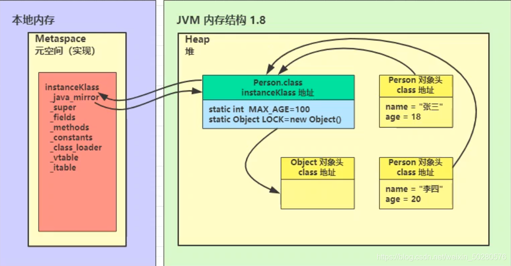
- instanceKlass保存在方法区。JDK 8以后，方法区位于元空间中，而元空间又位于本地内存中
- \_java\_mirror则是保存在堆内存中
- InstanceKlass和\*.class\(JAVA镜像类\)互相保存了对方的地址
- 类的对象在对象头中保存了\*.class的地址。让对象可以通过其找到方法区中的instanceKlass，从而获取类的各种信息

**注意**

- instanceKlass 这样的【元数据】是存储在方法区（1.8 后的元空间内），但 \_java\_mirror 是存储在堆中
- 可以通过前面介绍的 HSDB 工具查看

### 2）连接

**验证**  
验证类是否符合 JVM规范，安全性检查  
用 UE 等支持二进制的编辑器修改 HelloWorld.class 的魔数，在控制台运行  
**准备**  
为 static 变量分配空间，设置默认值

 -    static 变量在 JDK 7 之前存储于 instanceKlass 末尾，从 JDK 7 开始，存储于 \_java\_mirror 末尾
 -    static 变量分配空间和赋值是两个步骤，分配空间在准备阶段完成，赋值在初始化阶段完成
 -    如果 static 变量是 final 的基本类型，以及字符串常量，那么编译阶段值就确定了，赋值在准备阶段完成
 -    如果 static 变量是 final 的，但属于引用类型，那么赋值也会在初始化阶段完成将常量池中的符号引用解析为直接引用

```java
public class Code_22_AnalysisTest {


    public static void main(String[] args) throws ClassNotFoundException, IOException {
        ClassLoader classLoader = Code_22_AnalysisTest.class.getClassLoader();
        Class<?> c = classLoader.loadClass("cn.ali.jvm.test.C");

        // new C();
        System.in.read();
    }

}

class C {
    D d = new D();
}

class D {

}
```

### 3）初始化

#### \<cinit>\(\)v 方法

初始化即调用 \<cinit>\(\)V ，虚拟机会保证这个类的『构造方法』的线程安全

#### 发生的时机

概括得说，类初始化是【懒惰的】

- main 方法所在的类，总会被首先初始化
- 首次访问这个类的静态变量或静态方法时
- 子类初始化，如果父类还没初始化，会引发
- 子类访问父类的静态变量，只会触发父类的初始化
- Class.forName
- new 会导致初始化

不会导致类初始化的情况

 -    访问类的 static final 静态常量（基本类型和字符串）不会触发初始化
 -    类对象.class 不会触发初始化
 -    创建该类的数组不会触发初始化

```java
public class Load1 {
    static {
        System.out.println("main init");
    }
    public static void main(String[] args) throws ClassNotFoundException {
        // 1. 静态常量（基本类型和字符串）不会触发初始化
//         System.out.println(B.b);
        // 2. 类对象.class 不会触发初始化
//         System.out.println(B.class);
        // 3. 创建该类的数组不会触发初始化
//         System.out.println(new B[0]);
        // 4. 不会初始化类 B，但会加载 B、A
//         ClassLoader cl = Thread.currentThread().getContextClassLoader();
//         cl.loadClass("cn.ali.jvm.test.classload.B");
        // 5. 不会初始化类 B，但会加载 B、A
//         ClassLoader c2 = Thread.currentThread().getContextClassLoader();
//         Class.forName("cn.ali.jvm.test.classload.B", false, c2);


        // 1. 首次访问这个类的静态变量或静态方法时
//         System.out.println(A.a);
        // 2. 子类初始化，如果父类还没初始化，会引发
//         System.out.println(B.c);
        // 3. 子类访问父类静态变量，只触发父类初始化
//         System.out.println(B.a);
        // 4. 会初始化类 B，并先初始化类 A
//         Class.forName("cn.ali.jvm.test.classload.B");
    }

}


class A {
    static int a = 0;
    static {
        System.out.println("a init");
    }
}
class B extends A {
    final static double b = 5.0;
    static boolean c = false;
    static {
        System.out.println("b init");
    }
}
```

### 4）练习

从字节码分析，使用 a，b，c 这三个常量是否会导致 E 初始化

```java
public class Load2 {

    public static void main(String[] args) {
        System.out.println(E.a);
        System.out.println(E.b);
        // 会导致 E 类初始化，因为 Integer 是包装类
        System.out.println(E.c);
    }
}

class E {
    public static final int a = 10;
    public static final String b = "hello";
    public static final Integer c = 20;

    static {
        System.out.println("E cinit");
    }
}

```

典型应用 \- 完成懒惰初始化单例模式

```java
public class Singleton {

    private Singleton() { } 
    // 内部类中保存单例
    private static class LazyHolder { 
        static final Singleton INSTANCE = new Singleton(); 
    }
    // 第一次调用 getInstance 方法，才会导致内部类加载和初始化其静态成员 
    public static Singleton getInstance() { 
        return LazyHolder.INSTANCE; 
    }
}

```

以上的实现特点是：

- 懒惰实例化
- 初始化时的线程安全是有保障的

## 5、类加载器

类加载器虽然只用于实现类的加载动作，但它在Java程序中起到的作用却远超类加载阶段  
对于任意一个类，都必须由加载它的类加载器和这个类本身一起共同确立其在 Java 虚拟机中的唯一性，每一个类加载器，都拥有一个独立的类名称空间。这句话可以表达得更通俗一些：比较两个类是否“相等”，只有在这两个类是由同一个类加载器加载的前提下才有意义，否则，即使这两个类来源于同一个 Class 文件，被同一个 Java 虚拟机加载，只要加载它们的类加载器不同，那这两个类就必定不相等！  
以JDK 8为例

| 名称                                        | 加载的类               | 说明                        |
| ------------------------------------------- | ---------------------- | --------------------------- |
| Bootstrap ClassLoader（启动类加载器）       | JAVA\_HOME/jre/lib     | 无法直接访问                |
| Extension ClassLoader\(拓展类加载器\)       | JAVA\_HOME/jre/lib/ext | 上级为Bootstrap，显示为null |
| Application ClassLoader\(应用程序类加载器\) | classpath              | 上级为Extension             |
| 自定义类加载器                              | 自定义                 | 上级为Application           |

### 1）启动类的加载器

可通过在控制台输入指令，使得类被启动类加器加载

### 2）扩展类的加载器

如果 classpath 和 JAVA\_HOME/jre/lib/ext 下有同名类，加载时会使用拓展类加载器加载。当应用程序类加载器发现拓展类加载器已将该同名类加载过了，则不会再次加载。

### 3）双亲委派模式

双亲委派模式，即调用类加载器ClassLoader 的 loadClass 方法时，查找类的规则。  
loadClass源码

```java
protected Class<?> loadClass(String name, boolean resolve)
    throws ClassNotFoundException
{
    synchronized (getClassLoadingLock(name)) {
        // 首先查找该类是否已经被该类加载器加载过了
        Class<?> c = findLoadedClass(name);
        // 如果没有被加载过
        if (c == null) {
            long t0 = System.nanoTime();
            try {
                // 看是否被它的上级加载器加载过了 Extension 的上级是Bootstarp，但它显示为null
                if (parent != null) {
                    c = parent.loadClass(name, false);
                } else {
                    // 看是否被启动类加载器加载过
                    c = findBootstrapClassOrNull(name);
                }
            } catch (ClassNotFoundException e) {
                // ClassNotFoundException thrown if class not found
                // from the non-null parent class loader
                //捕获异常，但不做任何处理
            }

            if (c == null) {
                // 如果还是没有找到，先让拓展类加载器调用 findClass 方法去找到该类，如果还是没找到，就抛出异常
                // 然后让应用类加载器去找 classpath 下找该类
                long t1 = System.nanoTime();
                c = findClass(name);

                // 记录时间
                sun.misc.PerfCounter.getParentDelegationTime().addTime(t1 - t0);
                sun.misc.PerfCounter.getFindClassTime().addElapsedTimeFrom(t1);
                sun.misc.PerfCounter.getFindClasses().increment();
            }
        }
        if (resolve) {
            resolveClass(c);
        }
        return c;
    }
}
```

### 4）自定义类加载器

**使用场景**

- 想加载非 classpath 随意路径中的类文件
- 通过接口来使用实现，希望解耦时，常用在框架设计
- 这些类希望予以隔离，不同应用的同名类都可以加载，不冲突，常见于 tomcat 容器

**步骤**

- 继承 ClassLoader 父类
- 要遵从双亲委派机制，重写 findClass 方法  
  不是重写 loadClass 方法，否则不会走双亲委派机制
- 读取类文件的字节码
- 调用父类的 defineClass 方法来加载类
- 使用者调用该类加载器的 loadClass 方法

**破坏双亲委派模式**

- 双亲委派模型的第一次“被破坏”其实发生在双亲委派模型出现之前——即JDK1.2面世以前的“远古”时代
  - 建议用户重写findClass\(\)方法，在类加载器中的loadClass\(\)方法中也会调用该方法
- 双亲委派模型的第二次“被破坏”是由这个模型自身的缺陷导致的
  - 如果有基础类型又要调用回用户的代码，此时也会破坏双亲委派模式
- 双亲委派模型的第三次“被破坏”是由于用户对程序动态性的追求而导致的
  - 这里所说的“动态性”指的是一些非常“热”门的名词：代码热替换（Hot Swap）、模块热部署（Hot Deployment）等

## 6、运行期优化

### 1）即时编译

**分层编译**  
JVM 将执行状态分成了 5 个层次：

- 0层：解释执行，用解释器将字节码翻译为机器码
- 1层：使用 C1 即时编译器编译执行（不带 profiling）
- 2层：使用 C1 即时编译器编译执行（带基本的profiling）
- 3层：使用 C1 即时编译器编译执行（带完全的profiling）
- 4层：使用 C2 即时编译器编译执行

profiling 是指在运行过程中收集一些程序执行状态的数据，例如【方法的调用次数】，【循环的 回边次数】等

即时编译器（JIT）与解释器的区别

- 解释器
  - 将字节码解释为机器码，下次即使遇到相同的字节码，仍会执行重复的解释
  - 是将字节码解释为针对所有平台都通用的机器码
- 即时编译器
  - 将一些字节码编译为机器码，并存入 Code Cache，下次遇到相同的代码，直接执行，无需再编译
  - 根据平台类型，生成平台特定的机器码

对于大部分的不常用的代码，我们无需耗费时间将其编译成机器码，而是采取解释执行的方式运行；另一方面，对于仅占据小部分的热点代码，我们则可以将其编译成机器码，以达到理想的运行速度。 执行效率上简单比较一下 Interpreter \< C1 \< C2，总的目标是发现热点代码（hotspot名称的由 来），并优化这些热点代码。  
**逃逸分析**  
逃逸分析（Escape Analysis）简单来讲就是，Java Hotspot 虚拟机可以分析新创建对象的使用范围，并决定是否在 Java 堆上分配内存的一项技术

逃逸分析的 JVM 参数如下：

- 开启逃逸分析：-XX:+DoEscapeAnalysis
- 关闭逃逸分析：-XX:-DoEscapeAnalysis
- 显示分析结果：-XX:+PrintEscapeAnalysis

逃逸分析技术在 Java SE 6u23+ 开始支持，并默认设置为启用状态，可以不用额外加这个参数

对象逃逸状态

全局逃逸（GlobalEscape）

- 即一个对象的作用范围逃出了当前方法或者当前线程，有以下几种场景：
  - 对象是一个静态变量
  - 对象是一个已经发生逃逸的对象
  - 对象作为当前方法的返回值

参数逃逸（ArgEscape）

- 即一个对象被作为方法参数传递或者被参数引用，但在调用过程中不会发生全局逃逸，这个状态是通过被调方法的字节码确定的

没有逃逸

- 即方法中的对象没有发生逃逸

**逃逸分析优化**  
针对上面第三点，当一个对象没有逃逸时，可以得到以下几个虚拟机的优化

**锁消除**  
我们知道线程同步锁是非常牺牲性能的，当编译器确定当前对象只有当前线程使用，那么就会移除该对象的同步锁  
例如，StringBuffer 和 Vector 都是用 synchronized 修饰线程安全的，但大部分情况下，它们都只是在当前线程中用到，这样编译器就会优化移除掉这些锁操作  
锁消除的 JVM 参数如下：

- 开启锁消除：-XX:+EliminateLocks
- 关闭锁消除：-XX:-EliminateLocks

锁消除在 JDK8 中都是默认开启的，并且锁消除都要建立在逃逸分析的基础上

**标量替换**  
首先要明白标量和聚合量，基础类型和对象的引用可以理解为标量，它们不能被进一步分解。而能被进一步分解的量就是聚合量，比如：对象  
对象是聚合量，它又可以被进一步分解成标量，将其成员变量分解为分散的变量，这就叫做标量替换。

这样，如果一个对象没有发生逃逸，那压根就不用创建它，只会在栈或者寄存器上创建它用到的成员标量，节省了内存空间，也提升了应用程序性能  
标量替换的 JVM 参数如下：

- 开启标量替换：-XX:+EliminateAllocations
- 关闭标量替换：-XX:-EliminateAllocations
- 显示标量替换详情：-XX:+PrintEliminateAllocations

标量替换同样在 JDK8 中都是默认开启的，并且都要建立在逃逸分析的基础上

**栈上分配**  
当对象没有发生逃逸时，该对象就可以通过标量替换分解成成员标量分配在栈内存中，和方法的生命周期一致，随着栈帧出栈时销毁，减少了 GC 压力，提高了应用程序性能

**方法内联**  
**内联函数**  
内联函数就是在程序编译时，编译器将程序中出现的内联函数的调用表达式用内联函数的函数体来直接进行替换

**JVM内联函数**  
C++ 是否为内联函数由自己决定，Java 由编译器决定。Java 不支持直接声明为内联函数的，如果想让他内联，你只能够向编译器提出请求: 关键字 final 修饰 用来指明那个函数是希望被 JVM 内联的，如

```java
public final void doSomething() {  
        // to do something  
}
```

总的来说，一般的函数都不会被当做内联函数，只有声明了final后，编译器才会考虑是不是要把你的函数变成内联函数

JVM内建有许多运行时优化。首先短方法更利于JVM推断。流程更明显，作用域更短，副作用也更明显。如果是长方法JVM可能直接就跪了。

第二个原因则更重要：方法内联

如果JVM监测到一些小方法被频繁的执行，它会把方法的调用替换成方法体本身，如：

```java
private int add4(int x1, int x2, int x3, int x4) { 
        //这里调用了add2方法
        return add2(x1, x2) + add2(x3, x4);  
    }  

    private int add2(int x1, int x2) {  
        return x1 + x2;  
    }
```

方法调用被替换后

```java
private int add4(int x1, int x2, int x3, int x4) {  
        //被替换为了方法本身
        return x1 + x2 + x3 + x4;  
    }
```

### 2）反射优化

```java
public class Reflect1 {
   public static void foo() {
      System.out.println("foo...");
   }

   public static void main(String[] args) throws NoSuchMethodException, InvocationTargetException, IllegalAccessException {
      Method foo = Demo3.class.getMethod("foo");
      for(int i = 0; i<=16; i++) {
         foo.invoke(null);
      }
   }
}
```

foo.invoke 前面 0 \~ 15 次调用使用的是 MethodAccessor 的 NativeMethodAccessorImpl 实现  
invoke 方法源码

```java
@CallerSensitive
public Object invoke(Object obj, Object... args)
    throws IllegalAccessException, IllegalArgumentException,
       InvocationTargetException
{
    if (!override) {
        if (!Reflection.quickCheckMemberAccess(clazz, modifiers)) {
            Class<?> caller = Reflection.getCallerClass();
            checkAccess(caller, clazz, obj, modifiers);
        }
    }
    //MethodAccessor是一个接口，有3个实现类，其中有一个是抽象类
    MethodAccessor ma = methodAccessor;             // read volatile
    if (ma == null) {
        ma = acquireMethodAccessor();
    }
    return ma.invoke(obj, args);
}
```

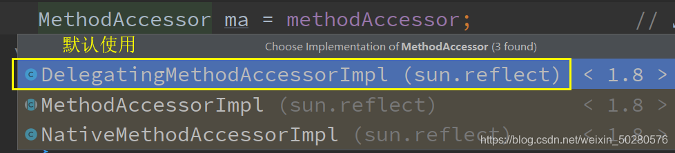  
会由 DelegatingMehodAccessorImpl 去调用 NativeMethodAccessorImpl  
NativeMethodAccessorImpl 源码

```java
class NativeMethodAccessorImpl extends MethodAccessorImpl {
    private final Method method;
    private DelegatingMethodAccessorImpl parent;
    private int numInvocations;

    NativeMethodAccessorImpl(Method var1) {
        this.method = var1;
    }
    
    //每次进行反射调用，会让numInvocation与ReflectionFactory.inflationThreshold的值（15）进行比较，并使使得numInvocation的值加一
    //如果numInvocation>ReflectionFactory.inflationThreshold，则会调用本地方法invoke0方法
    public Object invoke(Object var1, Object[] var2) throws IllegalArgumentException, InvocationTargetException {
        if (++this.numInvocations > ReflectionFactory.inflationThreshold() && !ReflectUtil.isVMAnonymousClass(this.method.getDeclaringClass())) {
            MethodAccessorImpl var3 = (MethodAccessorImpl)(new MethodAccessorGenerator()).generateMethod(this.method.getDeclaringClass(), this.method.getName(), this.method.getParameterTypes(), this.method.getReturnType(), this.method.getExceptionTypes(), this.method.getModifiers());
            this.parent.setDelegate(var3);
        }

        return invoke0(this.method, var1, var2);
    }

    void setParent(DelegatingMethodAccessorImpl var1) {
        this.parent = var1;
    }

    private static native Object invoke0(Method var0, Object var1, Object[] var2);
}
```

```java
//ReflectionFactory.inflationThreshold()方法的返回值
private static int inflationThreshold = 15;
```

- 一开始if条件不满足，就会调用本地方法 invoke0
- 随着 numInvocation 的增大，当它大于 ReflectionFactory.inflationThreshold 的值 16 时，就会本地方法访问器替换为一个运行时动态生成的访问器，来提高效率
  - 这时会从反射调用变为正常调用，即直接调用 Reflect1.foo\(\)

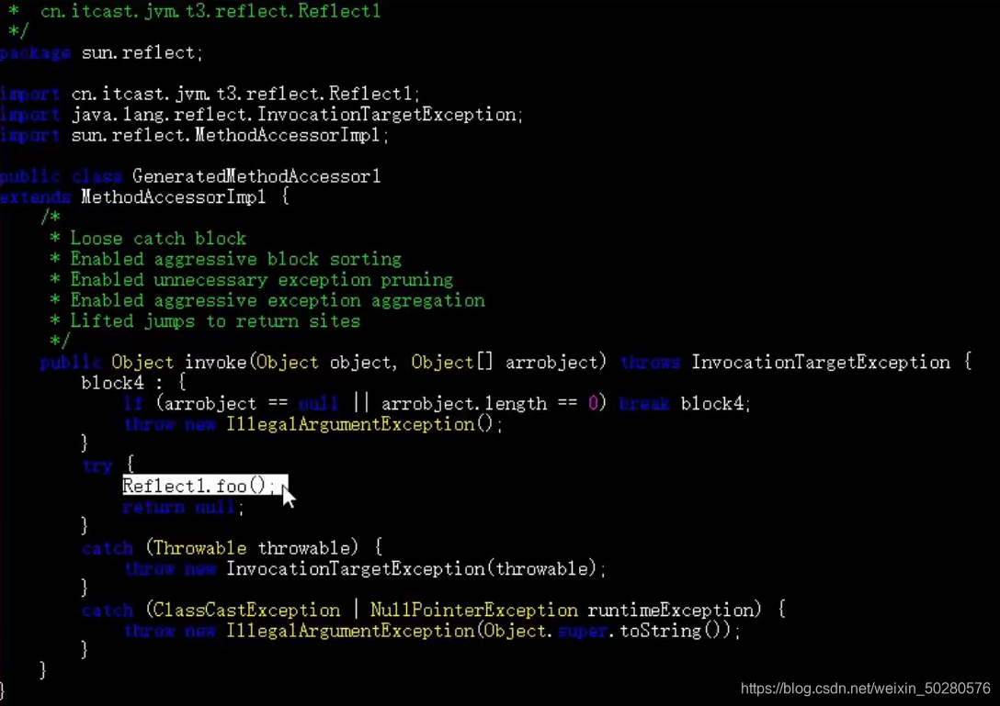

阿里开源工具：arthas-boot

# 五、共享模型之内存

## 1、Java 内存模型（JMM）

JMM 即 Java Memory Model，它定义了主存（共享内存）、工作内存（线程私有）抽象概念，底层对应着 CPU 寄存器、缓存、硬件内存、 CPU 指令优化等。  
JMM 体现在以下几个方面

- 原子性 - 保证指令不会受到线程上下文切换的影响
- 可见性 - 保证指令不会受 cpu 缓存的影响
- 有序性 - 保证指令不会受 cpu 指令并行优化的影响

## 2、可见性

### 1）退不出的循环

首先看一段代码：

```java
public static boolean run = true;

    public static void main(String[] args) {

        Thread t1 = new Thread(() -> {
            while(run) {

            }
        }, "t1");

        t1.start();

        try {
            Thread.sleep(1000);
        } catch (InterruptedException e) {
            e.printStackTrace();
        }
        log.info("t1 Stop");
        run = false;
    }
```

首先 t1 线程运行，然后过一秒，主线程设置 run 的值为 false，想让 t1 线程停止下来，但是 t1 线程并没有停，分析如下图：  
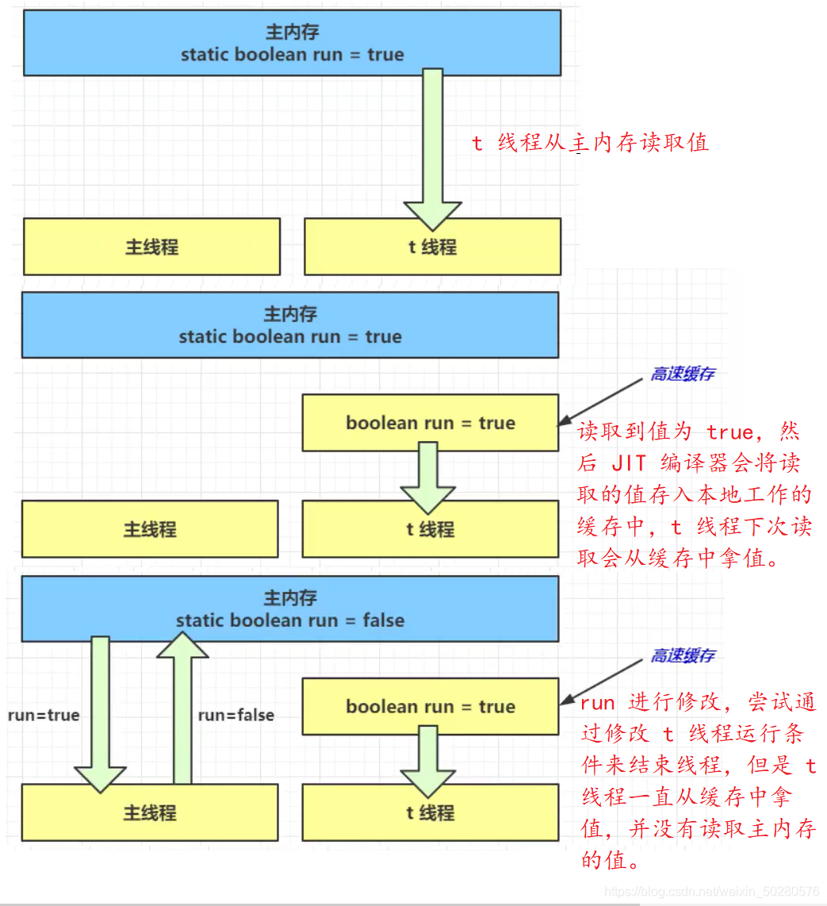  
**解决方法**

 -    使用 volatile （易变关键字）
 -    它可以用来修饰成员变量和静态成员变量（放在主存中的变量），他可以避免线程从自己的工作缓存中查找变量的值，必须到主存中获取它的值，线程操作 volatile 变量都是直接操作主存

```java
 public static volatile boolean run = true; // 保证内存的可见性
```

### 2）可见性与原子性

上面例子体现的实际就是可见性，它保证的是在多个线程之间，一个线程对volatile 变量的修改对另一个线程可见， 不能保证原子性，仅用在一个写线程，多个读线程的情况。

- 注意 synchronized 语句块既可以保证代码块的原子性，也同时保证代码块内变量的可见性。但缺点是 synchronized 是属于重量级操作，性能相对更低。
- 如果在前面示例的死循环中加入 System.out.println\(\) 会发现即使不加 volatile 修饰符，线程 t 也能正确看到 对 run 变量的修改了，想一想为什么？
- 因为 printIn\(\) 方法使用了 synchronized 同步代码块，可以保证原子性与可见性，它是 PrintStream 类的方法。

### 3）模式之两阶段终止

使用 volatile 关键字来实现两阶段终止模式。

```java
public class Code_02_Test {
  public static void main(String[] args) throws InterruptedException {
    Monitor monitor = new Monitor();
    monitor.start();
    Thread.sleep(3500);
    monitor.stop();
  }
}

class Monitor {

  Thread monitor;
  // 设置标记，用于判断是否被终止了
  private volatile boolean stop = false;
  /**
   * 启动监控器线程
   */
  public void start() {
    // 设置线控器线程，用于监控线程状态
    monitor = new Thread() {
      @Override
      public void run() {
        // 开始不停的监控
        while (true) {
          if(stop) {
            System.out.println("处理后续任务");
            break;
          }
          System.out.println("监控器运行中...");
          try {
            // 线程休眠
            Thread.sleep(1000);
          } catch (InterruptedException e) {
            System.out.println("被打断了");
          }
        }
      }
    };
    monitor.start();
  }

  /**
   *  用于停止监控器线程
   */
  public void stop() {
    // 修改标记
    stop = true;
    // 打断线程
    monitor.interrupt();        
  }
}
```

### 4）模式之 Balking

Balking （犹豫）模式用在一个线程发现另一个线程或本线程已经做了某一件相同的事，那么本线程就无需再做 了，直接结束返回，有点类似单例。

 -    用一个标记来判断该任务是否已经被执行过了
 -    需要避免线程安全问题
 -    加锁的代码块要尽量的小，以保证性能

```java
public class Code_03_Test {
  public static void main(String[] args) throws InterruptedException {
    Monitor monitor = new Monitor();
    monitor.start();
    monitor.start();
    Thread.sleep(3500);
    monitor.stop();
  }
}

class Monitor {

  Thread monitor;
  // 设置标记，用于判断是否被终止了
  private volatile boolean stop = false;
  // 设置标记，用于判断是否已经启动过了
  private boolean starting = false;
  /**
   * 启动监控器线程
   */
  public void start() {
    // 上锁，避免多线程运行时出现线程安全问题
    synchronized (this) {
      if (starting) {
        // 已被启动，直接返回
        return;
      }
      // 启动监视器，改变标记
      starting = true;
    }
    // 设置线控器线程，用于监控线程状态
    monitor = new Thread() {
      @Override
      public void run() {
        // 开始不停的监控
        while (true) {
          if(stop) {
            System.out.println("处理后续任务");
            break;
          }
          System.out.println("监控器运行中...");
          try {
            // 线程休眠
            Thread.sleep(1000);
          } catch (InterruptedException e) {
            System.out.println("被打断了");
          }
        }
      }
    };
    monitor.start();
  }

  /**
   *  用于停止监控器线程
   */
  public void stop() {
    // 打断线程
    monitor.interrupt();
    stop = true;
  }
}
```

## 3、有序性

### 1）指令重排

首先看一个例子：

```java
// 可以重排的例子 
int a = 10; 
int b = 20; 
System.out.println( a + b );

// 不能重排的例子 
int a = 10;
int b = a - 5;
```

指令重排简单来说可以，在程序结果不受影响的前提下，可以调整指令语句执行顺序。多线程下指令重排会影响正确性。

### 2）多线程下指令重排问题

首先看一段代码：

```java
int num = 0;

// volatile 修饰的变量，可以禁用指令重排 volatile boolean ready = false; 可以防止变量之前的代码被重排序
boolean ready = false; 
// 线程1 执行此方法
public void actor1(I_Result r) {
 if(ready) {
  r.r1 = num + num;
 } 
 else {
  r.r1 = 1;
 }
}
// 线程2 执行此方法
public void actor2(I_Result r) {
 num = 2;
 ready = true;
}
```

在多线程环境下，以上的代码 r1 的值有三种情况：  
第一种：线程 2 先执行，然后线程 1 后执行，r1 的结果为 4  
第二种：线程 1 先执行，然后线程 2 后执行，r1 的结果为 1  
第三种：线程 2 先执行，但是发送了指令重排，num = 2 与 ready = true 这两行代码语序发生装换，

```java
ready = true; // 前
num = 2; // 后
```

然后执行 ready = true 后，线程 1 运行了，那么 r1 的结果是为 0。

### 3）解决方法

volatile 修饰的变量，可以禁用指令重排，禁止的是加 volatile 关键字变量**之前的代码**重排序

## 4、volatile 原理

volatile 的底层实现原理是**内存屏障**，Memory Barrier（Memory Fence）  
对 volatile 变量的写指令**后会加入写屏障**  
对 volatile 变量的读指令**前会加入读屏障**

### 1）如何保证可见性

 -    写屏障（sfence）保证在该屏障之前的，对共享变量的改动，都同步到主存当中

```java
public void actor2(I_Result r) {
     num = 2;
     ready = true; // ready 是被 volatile 修饰的，赋值带写屏障
     // 写屏障
}

```

 -    而读屏障（lfence）保证在该屏障之后，对共享变量的读取，加载的是主存中最新数据

```java
public void actor1(I_Result r) {
 // 读屏障
 // ready是被 volatile 修饰的，读取值带读屏障
 if(ready) {
  r.r1 = num + num;
 } else {
  r.r1 = 1;
 }
}
```

分析如图：  
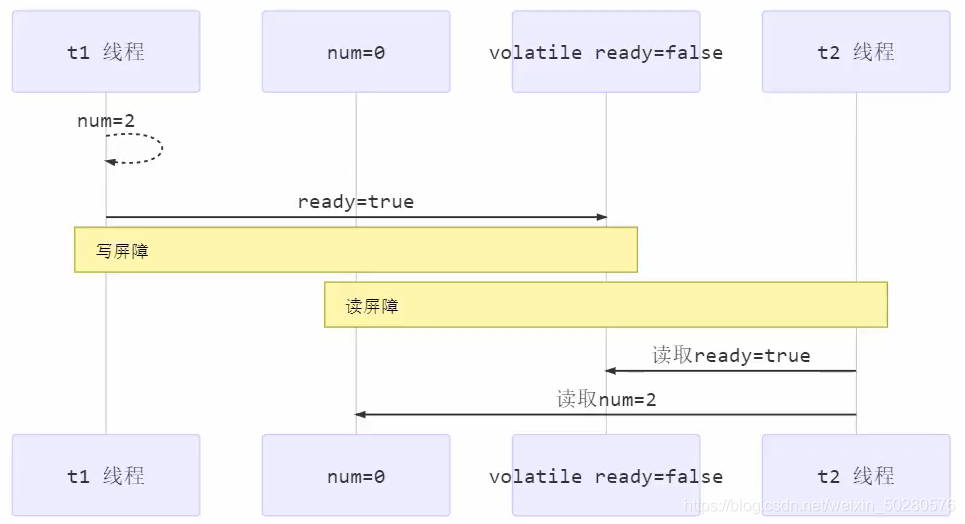

### 2）如何保证有序性

 -    写屏障会确保指令重排序时，不会将写屏障之前的代码排在写屏障之后

```java
public void actor2(I_Result r) {
 num = 2;
 ready = true; // ready 是被 volatile 修饰的，赋值带写屏障
 // 写屏障
}
```

 -    读屏障会确保指令重排序时，不会将读屏障之后的代码排在读屏障之前

```java
public void actor1(I_Result r) {
 // 读屏障
 // ready 是被 volatile 修饰的，读取值带读屏障
 if(ready) {
  r.r1 = num + num;
 } else {
  r.r1 = 1;
 }
}
```

注意：volatile 不能解决指令交错  
写屏障仅仅是保证之后的读能够读到最新的结果，但不能保证其它线程的读跑到它前面去。  
而有序性的保证也只是保证了本线程内相关代码不被重排序

### 3）double-checked locking 问题

看如下代码：

```java
  // 最开始的单例模式是这样的
    public final class Singleton {
        private Singleton() { }
        private static Singleton INSTANCE = null;
        public static Singleton getInstance() {
        // 首次访问会同步，而之后的使用不用进入synchronized
        synchronized(Singleton.class) {
          if (INSTANCE == null) { // t1
            INSTANCE = new Singleton();
            }
        }
            return INSTANCE;
        }
    }
// 但是上面的代码块的效率是有问题的，因为即使已经产生了单实例之后，之后调用了getInstance()方法之后还是会加锁，这会严重影响性能！因此就有了模式如下double-checked lockin：
    public final class Singleton {
        private Singleton() { }
        private static Singleton INSTANCE = null;
        public static Singleton getInstance() {
            if(INSTANCE == null) { // t2
                // 首次访问会同步，而之后的使用没有 synchronized
                synchronized(Singleton.class) {
                    if (INSTANCE == null) { // t1
                        INSTANCE = new Singleton();
                    }
                }
            }
            return INSTANCE;
        }
    }
//但是上面的if(INSTANCE == null)判断代码没有在同步代码块synchronized中，不能享有synchronized保证的原子性，可见性。所以
```

以上的实现特点是：

 -    懒惰实例化
 -    首次使用 getInstance\(\) 才使用 synchronized 加锁，后续使用时无需加锁
 -    有隐含的，但很关键的一点：第一个 if 使用了 INSTANCE 变量，是在同步块之外  
    但在多线程环境下，上面的代码是有问题的，getInstance 方法对应的字节码为：

```java
0: getstatic #2 // Field INSTANCE:Lcn/itcast/n5/Singleton;
3: ifnonnull 37
// ldc是获得类对象
6: ldc #3 // class cn/itcast/n5/Singleton
// 复制操作数栈栈顶的值放入栈顶, 将类对象的引用地址复制了一份
8: dup
// 操作数栈栈顶的值弹出，即将对象的引用地址存到局部变量表中
// 将类对象的引用地址存储了一份，是为了将来解锁用
9: astore_0
10: monitorenter
11: getstatic #2 // Field INSTANCE:Lcn/itcast/n5/Singleton;
14: ifnonnull 27
// 新建一个实例
17: new #3 // class cn/itcast/n5/Singleton
// 复制了一个实例的引用
20: dup
// 通过这个复制的引用调用它的构造方法
21: invokespecial #4 // Method "<init>":()V
// 最开始的这个引用用来进行赋值操作
24: putstatic #2 // Field INSTANCE:Lcn/itcast/n5/Singleton;
27: aload_0
28: monitorexit
29: goto 37
32: astore_1
33: aload_0
34: monitorexit
35: aload_1
36: athrow
37: getstatic #2 // Field INSTANCE:Lcn/itcast/n5/Singleton;
40: areturn
```

其中

- 17 表示创建对象，将对象引用入栈 // new Singleton
- 20 表示复制一份对象引用 // 复制了引用地址
- 21 表示利用一个对象引用，调用构造方法 // 根据复制的引用地址调用构造方法
- 24 表示利用一个对象引用，赋值给 static INSTANCE

也许 jvm 会优化为：先执行 24，再执行 21。如果两个线程 t1，t2 按如下时间序列执行：  
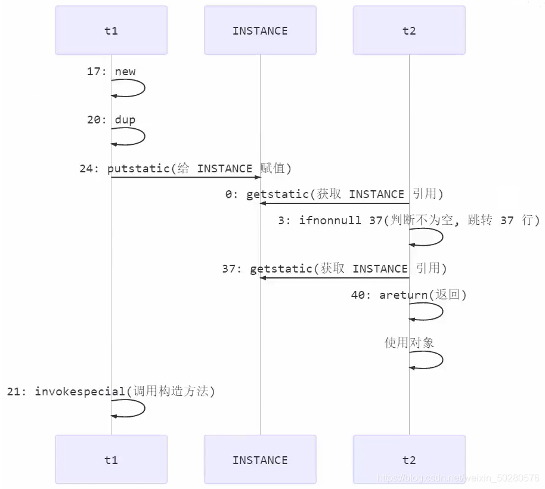  
关键在于 0: getstatic 这行代码在 monitor 控制之外，它就像之前举例中不守规则的人，可以越过 monitor 读取 INSTANCE 变量的值 这时 t1 还未完全将构造方法执行完毕，如果在构造方法中要执行很多初始化操作，那么 t2 拿到的是将是一个未初 始化完毕的单例 对 INSTANCE 使用 volatile 修饰即可，可以禁用指令重排，但要注意在 JDK 5 以上的版本的 volatile 才会真正有效。

### 4）double-checked locking 解决

加volatile就行了。

```java
public final class Singleton {
        private Singleton() { }
        private static volatile Singleton INSTANCE = null;
        public static Singleton getInstance() {
            // 实例没创建，才会进入内部的 synchronized代码块
            if (INSTANCE == null) {
                synchronized (Singleton.class) { // t2
                    // 也许有其它线程已经创建实例，所以再判断一次
                    if (INSTANCE == null) { // t1
                        INSTANCE = new Singleton();
                    }
                }
            }
            return INSTANCE;
        }
    }
```

如上面的注释内容所示，读写 volatile 变量操作（即 getstatic 操作和 putstatic 操作）时会加入内存屏障（Memory Barrier（Memory Fence）），保证下面两点：

1.  可见性
    1.  写屏障（sfence）保证在该屏障之前的 t1 对共享变量的改动，都同步到主存当中
    2.  而读屏障（lfence）保证在该屏障之后 t2 对共享变量的读取，加载的是主存中最新数据
2.  有序性
    1.  写屏障会确保指令重排序时，不会将写屏障之前的代码排在写屏障之后
    2.  读屏障会确保指令重排序时，不会将读屏障之后的代码排在读屏障之前
3.  更底层是读写变量时使用 lock 指令来多核 CPU 之间的可见性与有序性

## 5、happens-before

下面说的变量都是指成员变量或静态成员变量  
1）线程解锁 m 之前对变量的写，对于接下来对 m 加锁的其它线程对该变量的读可见

```java
   static int x;
   static Object m = new Object();
   new Thread(()->{
       synchronized(m) {
           x = 10;
       }
   },"t1").start();
   new Thread(()->{
       synchronized(m) {
           System.out.println(x);
       }
   },"t2").start();
         
```

2）线程对 volatile 变量的写，对接下来其它线程对该变量的读可见

```java
volatile static int x;
new Thread(()->{
 x = 10;
},"t1").start();
new Thread(()->{
 System.out.println(x);
},"t2").start();
```

3）线程 start 前对变量的写，对该线程开始后对该变量的读可见

```java
static int x;
x = 10;
new Thread(()->{
 System.out.println(x);
},"t2").start();
```

4）线程结束前对变量的写，对其它线程得知它结束后的读可见（比如其它线程调用 t1.isAlive\(\) 或 t1.join\(\)等待它结束）

```java
static int x;
Thread t1 = new Thread(()->{
 x = 10;
},"t1");
t1.start();
t1.join();
System.out.println(x);
```

5）线程 t1 打断 t2（interrupt）前对变量的写，对于其他线程得知 t2 被打断后对变量的读可见（通过 t2.interrupted 或 t2.isInterrupted）

```java
  static int x;
    public static void main(String[] args) {
        Thread t2 = new Thread(()->{
            while(true) {
                if(Thread.currentThread().isInterrupted()) {
                    System.out.println(x);
                    break;
                }
            }
        },"t2");
        t2.start();
        new Thread(()->{
            sleep(1);
            x = 10;
            t2.interrupt();
        },"t1").start();
        while(!t2.isInterrupted()) {
            Thread.yield();
        }
        System.out.println(x);
    }
```

6）对变量默认值（0，false，null）的写，对其它线程对该变量的读可见  
7）具有传递性，如果 x hb-> y 并且 y hb-> z 那么有 x hb-> z ，配合 volatile 的防指令重排，有下面的例子

```java
  volatile static int x;  
  static int y;  
  new Thread(() -> {  
    y = 10;  
    x = 20;  
  },"t1").start();  
    new Thread(() -> {  
    // x=20 对 t2 可见, 同时 y=10 也对 t2 可见  
    System.out.println(x);  
  },"t2").start(); 
```

## 6、练习

**1）balking 模式习题**  
希望 doInit\(\) 方法仅被调用一次，下面的实现是否有问题，为什么？

```java
public class TestVolatile {
    volatile boolean initialized = false;
    void init() {
        if (initialized) {
            return;
        }
        doInit();
        initialized = true;
    }
    private void doInit() {
    }
} 
```

volatile 可以保存线程的可见性，有序性，但是不能保证原子性，doInit 方法没加锁，可能会被调用多次。  
**2）线程安全单例习题**  
单例模式有很多实现方法，饿汉、懒汉、静态内部类、枚举类，试着分析每种实现下获取单例对象（即调用 getInstance）时的线程安全，并思考注释中的问题

- 饿汉式：类加载就会导致该单实例对象被创建
- 懒汉式：类加载不会导致该单实例对象被创建，而是首次使用该对象时才会创建

**实现1： 饿汉式**

```java
// 问题1：为什么加 final，防止子类继承后更改
// 问题2：如果实现了序列化接口, 还要做什么来防止反序列化破坏单例，如果进行反序列化的时候会生成新的对象，这样跟单例模式生成的对象是不同的。要解决直接加上readResolve()方法就行了，如下所示
public final class Singleton implements Serializable {
    // 问题3：为什么设置为私有? 放弃其它类中使用new生成新的实例，是否能防止反射创建新的实例?不能。
    private Singleton() {}
    // 问题4：这样初始化是否能保证单例对象创建时的线程安全?没有，这是类变量，是jvm在类加载阶段就进行了初始化，jvm保证了此操作的线程安全性
    private static final Singleton INSTANCE = new Singleton();
    // 问题5：为什么提供静态方法而不是直接将 INSTANCE 设置为 public, 说出你知道的理由。
    //1.提供更好的封装性；2.提供范型的支持
    public static Singleton getInstance() {
        return INSTANCE;
    }
    public Object readResolve() {
        return INSTANCE;
    }
}
```

**实现2： 饿汉式**

```java
// 问题1：枚举单例是如何限制实例个数的：创建枚举类的时候就已经定义好了，每个枚举常量其实就是枚举类的一个静态成员变量
// 问题2：枚举单例在创建时是否有并发问题：没有，这是静态成员变量
// 问题3：枚举单例能否被反射破坏单例：不能
// 问题4：枚举单例能否被反序列化破坏单例：枚举类默认实现了序列化接口，枚举类已经考虑到此问题，无需担心破坏单例
// 问题5：枚举单例属于懒汉式还是饿汉式：饿汉式
// 问题6：枚举单例如果希望加入一些单例创建时的初始化逻辑该如何做：加构造方法就行了
enum Singleton {
 INSTANCE;
}
```

**实现3：懒汉式**

```java
public final class Singleton {
    private Singleton() { }
    private static Singleton INSTANCE = null;
    // 分析这里的线程安全, 并说明有什么缺点：synchronized加载静态方法上，可以保证线程安全。缺点就是锁的范围过大，每次访问都会加锁，性能比较低。
    public static synchronized Singleton getInstance() {
        if( INSTANCE != null ){
            return INSTANCE;
        }
        INSTANCE = new Singleton();
        return INSTANCE;
    }
}
```

**实现4：DCL 懒汉式**

```java
public final class Singleton {
    private Singleton() { }
    // 问题1：解释为什么要加 volatile ?为了防止重排序问题
    private static volatile Singleton INSTANCE = null;

    // 问题2：对比实现3, 说出这样做的意义：提高了效率
    public static Singleton getInstance() {
        if (INSTANCE != null) {
            return INSTANCE;
        }
        synchronized (Singleton.class) {
            // 问题3：为什么还要在这里加为空判断, 之前不是判断过了吗？这是为了第一次判断时的并发问题。
            if (INSTANCE != null) { // t2
                return INSTANCE;
            }
            INSTANCE = new Singleton();
            return INSTANCE;
        }
    }
}
```

**实现5：静态内部类懒汉式**

```java
public final class Singleton {
    private Singleton() { }
    // 问题1：属于懒汉式还是饿汉式：懒汉式，这是一个静态内部类。类加载本身就是懒惰的，在没有调用getInstance方法时是没有执行LazyHolder内部类的类加载操作的。
    private static class LazyHolder {
        static final Singleton INSTANCE = new Singleton();
    }
    // 问题2：在创建时是否有并发问题，这是线程安全的，类加载时，jvm保证类加载操作的线程安全
    public static Singleton getInstance() {
        return LazyHolder.INSTANCE;
    }
}
```

## 结论

本章重点讲解了 JMM 中的

1.  可见性 - 由 JVM 缓存优化引起
2.  有序性 - 由 JVM 指令重排序优化引起
3.  happens-before 规则
4.  原理方面
    1.  volatile
5.  模式方面
    1.  两阶段终止模式的 volatile 改进
    2.  同步模式之 balking

# 六、共享模型之无锁

管程即 monitor 是阻塞式的悲观锁实现并发控制，这章我们将通过非阻塞式的乐观锁的来实现并发控制

## 1、无锁解决线程安全问题

如下代码，通过 synchronized 解决线程安全问题。

```java
public class Code_04_UnsafeTest {

    public static void main(String[] args) {
        Account acount = new AccountUnsafe(10000);
        Account.demo(acount);
    }

}
class AccountUnsafe implements Account {

    private Integer balance;

    public AccountUnsafe(Integer balance) {
        this.balance = balance;
    }

    @Override
    public Integer getBalance() {
        return this.balance;
    }

    @Override
    public void withdraw(Integer amount) {
        synchronized (this) { // 加锁。
            this.balance -= amount;
        }
    }
}

interface Account {

    // 获取金额的方法
    Integer getBalance();
    // 取款的方法
    void withdraw(Integer amount);

    static void demo(Account account) {
        List<Thread> list = new ArrayList<>();
        long start = System.nanoTime();
        for(int i = 0; i < 1000; i++) {
            list.add(new Thread(() -> {
                account.withdraw(10);
            }));
        }
        list.forEach(Thread::start);
        list.forEach(t -> {
            try {
                t.join();
            } catch (InterruptedException e) {
                e.printStackTrace();
            }
        });
        long end = System.nanoTime();
        System.out.println(account.getBalance()
                + " cost: " + (end-start)/1000_000 + " ms");
    }
}

```

如上代码加锁会造成线程堵塞，堵塞的时间取决于临界区代码执行的时间，这使用加锁的性能不高，我们可以使用无锁来解决此问题。

```java
class AccountSafe implements Account{

    AtomicInteger atomicInteger ;
    
    public AccountSafe(Integer balance){
        this.atomicInteger =  new AtomicInteger(balance);
    }
    
    @Override
    public Integer getBalance() {
        return atomicInteger.get();
    }

    @Override
    public void withdraw(Integer amount) {
        // 核心代码
        while (true){
            int pre = getBalance();
            int next = pre - amount;
            if (atomicInteger.compareAndSet(pre,next)){
                break;
            }
        }
    }
}
```

## 2、CAS 与 volatile

### 1）cas

前面看到的 AtomicInteger 的解决方法，内部并没有用锁来保护共享变量的线程安全。那么它是如何实现的呢？  
其中的关键是 compareAndSwap（比较并设置值），它的简称**就是 CAS** （也有 Compare And Swap 的说法），它必须**是原子操作**。  
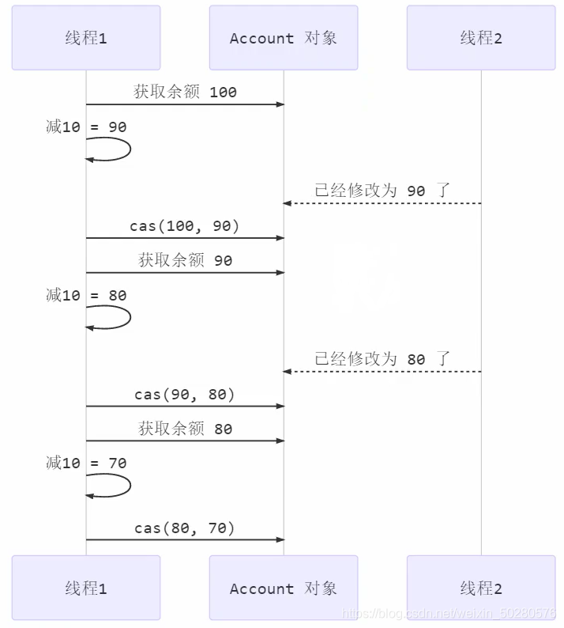  
如图所示，它的工作流程如下：  
当一个线程要去修改 Account 对象中的值时，先获取值 preVal（调用get方法），然后再将其设置为新的值 nextVal（调用 cas 方法）。在调用 cas 方法时，会将 pre 与 Account 中的余额进行比较。

- 如果两者相等，就说明该值还未被其他线程修改，此时便可以进行修改操作。
- 如果两者不相等，就不设置值，重新获取值 preVal（调用get方法），然后再将其设置为新的值 nextVal（调用cas方法），直到修改成功为止。

注意：

- 其实 CAS 的底层是 lock cmpxchg 指令（X86 架构），在单核 CPU 和多核 CPU 下都能够保证【比较-交换】的原子性。
- 在多核状态下，某个核执行到带 lock 的指令时，CPU 会让总线锁住，当这个核把此指令执行完毕，再开启总线。这个过程中不会被线程的调度机制所打断，保证了多个线程对内存操作的准确性，是原子的 。

### 2）volatile

获取共享变量时，为了保证该变量的**可见性**，需要使用 volatile 修饰。  
它可以用来修饰成员变量和静态成员变量，他可以避免线程从自己的工作缓存中查找变量的值，必须到主存中获取 它的值，线程操作 volatile 变量都是直接操作主存。即一个线程对 volatile 变量的修改，对另一个线程可见。  
注意  
volatile 仅仅保证了共享变量的可见性，让其它线程能够看到新值，但不能解决指令交错问题（不能保证原子性）  
CAS 是原子性操作借助 volatile 读取到共享变量的新值来实现【比较并交换】的效果

### 3）为什么无锁效率高

- 无锁情况下，即使重试失败，线程始终在高速运行，没有停歇，而 synchronized 会让线程在没有获得锁的时候，发生上下文切换，进入阻塞。打个比喻：线程就好像高速跑道上的赛车，高速运行时，速度超快，一旦发生上下文切换，就好比赛车要减速、熄火，等被唤醒又得重新打火、启动、加速… 恢复到高速运行，代价比较大
- 但无锁情况下，因为线程要保持运行，需要额外 CPU 的支持，CPU 在这里就好比高速跑道，没有额外的跑道，线程想高速运行也无从谈起，虽然不会进入阻塞，但由于没有分到时间片，仍然会进入可运行状态，还是会导致上下文切换。

### 4）CAS 的特点

结合 CAS 和 volatile 可以实现无锁并发，适用于线程数少、多核 CPU 的场景下。

- CAS 是基于乐观锁的思想：最乐观的估计，不怕别的线程来修改共享变量，就算改了也没关系，我吃亏点再重试呗。
- synchronized 是基于悲观锁的思想：最悲观的估计，得防着其它线程来修改共享变量，我上了锁你们都别想改，我改完了解开锁，你们才有机会。
- CAS 体现的是无锁并发、无阻塞并发，请仔细体会这两句话的意思
  - 因为没有使用 synchronized，所以线程不会陷入阻塞，这是效率提升的因素之一
  - 但如果竞争激烈\(写操作多\)，可以想到重试必然频繁发生，反而效率会受影响

## 3、原子整数

java.util.concurrent.atomic并发包提供了一些并发工具类，这里把它分成五类：  
使用原子的方式更新基本类型

- AtomicInteger：整型原子类
- AtomicLong：长整型原子类
- AtomicBoolean ：布尔型原子类

上面三个类提供的方法几乎相同，所以我们将以 AtomicInteger 为例子来介绍。  
原子引用  
原子数组  
字段更新器  
原子累加器  
下面先讨论原子整数类，以 AtomicInteger 为例讨论它的api接口：通过观察源码可以发现，AtomicInteger 内部都是通过cas的原理来实现的。

```java
    public static void main(String[] args) {
        AtomicInteger i = new AtomicInteger(0);
        // 获取并自增（i = 0, 结果 i = 1, 返回 0），类似于 i++
        System.out.println(i.getAndIncrement());
        // 自增并获取（i = 1, 结果 i = 2, 返回 2），类似于 ++i
        System.out.println(i.incrementAndGet());
        // 自减并获取（i = 2, 结果 i = 1, 返回 1），类似于 --i
        System.out.println(i.decrementAndGet());
        // 获取并自减（i = 1, 结果 i = 0, 返回 1），类似于 i--
        System.out.println(i.getAndDecrement());
        // 获取并加值（i = 0, 结果 i = 5, 返回 0）
        System.out.println(i.getAndAdd(5));
        // 加值并获取（i = 5, 结果 i = 0, 返回 0）
        System.out.println(i.addAndGet(-5));
        // 获取并更新（i = 0, p 为 i 的当前值, 结果 i = -2, 返回 0）
        // 函数式编程接口，其中函数中的操作能保证原子，但函数需要无副作用
        System.out.println(i.getAndUpdate(p -> p - 2));
        // 更新并获取（i = -2, p 为 i 的当前值, 结果 i = 0, 返回 0）
        // 函数式编程接口，其中函数中的操作能保证原子，但函数需要无副作用
        System.out.println(i.updateAndGet(p -> p + 2));
        // 获取并计算（i = 0, p 为 i 的当前值, x 为参数1, 结果 i = 10, 返回 0）
        // 函数式编程接口，其中函数中的操作能保证原子，但函数需要无副作用
        // getAndUpdate 如果在 lambda 中引用了外部的局部变量，要保证该局部变量是 final 的
        // getAndAccumulate 可以通过 参数1 来引用外部的局部变量，但因为其不在 lambda 中因此不必是 final
        System.out.println(i.getAndAccumulate(10, (p, x) -> p + x));
        // 计算并获取（i = 10, p 为 i 的当前值, x 为参数1值, 结果 i = 0, 返回 0）
        // 函数式编程接口，其中函数中的操作能保证原子，但函数需要无副作用
        System.out.println(i.accumulateAndGet(-10, (p, x) -> p + x));
    }
```

## 4、原子引用

为什么需要原子引用类型？保证引用类型的共享变量是线程安全的（确保这个原子引用没有引用过别人）。  
基本类型原子类只能更新一个变量，如果需要原子更新多个变量，需要使用引用类型原子类。

- AtomicReference：引用类型原子类
- AtomicStampedReference：原子更新带有版本号的引用类型。该类将整数值与引用关联起来，可用于解决原子的更新数据和数据的版本号，可以解决使用 CAS 进行原子更新时可能出现的 ABA 问题。
- AtomicMarkableReference ：原子更新带有标记的引用类型。该类将 boolean 标记与引用关联起。

### 1）AtomicReference

先看如下代码的问题：

```java
class DecimalAccountUnsafe implements DecimalAccount {
    BigDecimal balance;
    public DecimalAccountUnsafe(BigDecimal balance) {
        this.balance = balance;
    }
    @Override
    public BigDecimal getBalance() {
        return balance;
    }
    // 取款任务
    @Override
    public void withdraw(BigDecimal amount) {
        BigDecimal balance = this.getBalance();
        this.balance = balance.subtract(amount);
    }
}
```

当执行 withdraw 方法时，可能会有线程安全，我们可以加锁解决或者是使用无锁的方式 CAS 来解决，解决方式是用 AtomicReference 原子引用解决。  
代码如下：

```java

class DecimalAccountCas implements DecimalAccount {

    private AtomicReference<BigDecimal> balance;

    public DecimalAccountCas(BigDecimal balance) {
        this.balance = new AtomicReference<>(balance);
    }

    @Override
    public BigDecimal getBalance() {
        return balance.get();
    }

    @Override
    public void withdraw(BigDecimal amount) {
        while (true) {
            BigDecimal preVal = balance.get();
            BigDecimal nextVal = preVal.subtract(amount);
            if(balance.compareAndSet(preVal, nextVal)) {
                break;
            }
        }
    }
}
```

### 2）ABA 问题

看如下代码：

```java
  public static AtomicReference<String> ref = new AtomicReference<>("A");

    public static void main(String[] args) throws InterruptedException {
        log.debug("main start...");
        String preVal = ref.get();
        other();
        TimeUnit.SECONDS.sleep(1);
        log.debug("change A->C {}", ref.compareAndSet(preVal, "C"));
    }

    private static void other() throws InterruptedException {
        new Thread(() -> {
            log.debug("change A->B {}", ref.compareAndSet(ref.get(), "B"));
        }, "t1").start();
        TimeUnit.SECONDS.sleep(1);
        new Thread(() -> {
            log.debug("change B->A {}", ref.compareAndSet(ref.get(), "A"));
        }, "t2").start();
    }
```

主线程仅能判断出共享变量的值与最初值 A 是否相同，不能感知到这种从 A 改为 B 又改回 A 的情况，如果主线程希望：只要有其它线程【动过了】共享变量，那么自己的 cas 就算失败，这时，仅比较值是不够的，需要再加一个版本号。使用AtomicStampedReference来解决。

### 3）AtomicStampedReference

使用 AtomicStampedReference 加 stamp （版本号或者时间戳）的方式解决 ABA 问题。代码如下：

```java
// 两个参数，第一个：变量的值 第二个：版本号初始值
    public static AtomicStampedReference<String> ref = new AtomicStampedReference<>("A", 0);

    public static void main(String[] args) throws InterruptedException {
        log.debug("main start...");
        String preVal = ref.getReference();
        int stamp = ref.getStamp();
        log.info("main 拿到的版本号 {}",stamp);
        other();
        TimeUnit.SECONDS.sleep(1);
        log.info("修改后的版本号 {}",ref.getStamp());
        log.info("change A->C:{}", ref.compareAndSet(preVal, "C", stamp, stamp + 1));
    }

    private static void other() throws InterruptedException {
        new Thread(() -> {
            int stamp = ref.getStamp();
            log.info("{}",stamp);
            log.info("change A->B:{}", ref.compareAndSet(ref.getReference(), "B", stamp, stamp + 1));
        }).start();
        TimeUnit.SECONDS.sleep(1);
        new Thread(() -> {
            int stamp = ref.getStamp();
            log.info("{}",stamp);
            log.debug("change B->A:{}", ref.compareAndSet(ref.getReference(), "A",stamp,stamp + 1));
        }).start();
    }
```

### 4）AtomicMarkableReference

AtomicStampedReference 可以给原子引用加上版本号，追踪原子引用整个的变化过程，如：A \-> B \-> A \->C，通过AtomicStampedReference，我们可以知道，引用变量中途被更改了几次。但是有时候，并不关心引用变量更改了几次，只是单纯的关心是否更改过，所以就有了AtomicMarkableReference 。

## 5、原子数组

使用原子的方式更新数组里的某个元素

- AtomicIntegerArray：整形数组原子类
- AtomicLongArray：长整形数组原子类
- AtomicReferenceArray ：引用类型数组原子类

上面三个类提供的方法几乎相同，所以我们这里以 AtomicIntegerArray 为例子来介绍，代码如下：

```java
public class Code_10_AtomicArrayTest {

    public static void main(String[] args) throws InterruptedException {
        /**
         * 结果如下：
         * [9934, 9938, 9940, 9931, 9935, 9933, 9944, 9942, 9939, 9940]
         * [10000, 10000, 10000, 10000, 10000, 10000, 10000, 10000, 10000, 10000]
         */
        demo(
                () -> new int[10],
                (array) -> array.length,
                (array, index) -> array[index]++,
                (array) -> System.out.println(Arrays.toString(array))
        );
        TimeUnit.SECONDS.sleep(1);
        demo(
                () -> new AtomicIntegerArray(10),
                (array) -> array.length(),
                (array, index) -> array.getAndIncrement(index),
                (array) -> System.out.println(array)
        );
    }

    private static <T> void demo(
            Supplier<T> arraySupplier,
            Function<T, Integer> lengthFun,
            BiConsumer<T, Integer> putConsumer,
            Consumer<T> printConsumer) {
        ArrayList<Thread> ts = new ArrayList<>(); // 创建集合
        T array = arraySupplier.get(); // 获取数组
        int length = lengthFun.apply(array); // 获取数组的长度
        for(int i = 0; i < length; i++) {
            ts.add(new Thread(() -> {
                for (int j = 0; j < 10000; j++) {
                    putConsumer.accept(array, j % length);
                }
            }));
        }
        ts.forEach(Thread::start);
        ts.forEach((thread) -> {
            try {
                thread.join();
            } catch (InterruptedException e) {
                e.printStackTrace();
            }
        });
        printConsumer.accept(array);
    }

}
```

使用原子数组可以保证元素的线程安全。

## 6、字段更新器

- AtomicReferenceFieldUpdater // 域 字段
- AtomicIntegerFieldUpdater
- AtomicLongFieldUpdater

注意：利用字段更新器，可以针对对象的某个域（Field）进行原子操作，只能配合 volatile 修饰的字段使用，否则会出现异常

```java
Exception in thread "main" java.lang.IllegalArgumentException: Must be volatile type
```

代码如下：

```java
public class Code_11_AtomicReferenceFieldUpdaterTest {

    public static AtomicReferenceFieldUpdater ref =
            AtomicReferenceFieldUpdater.newUpdater(Student.class, String.class, "name");

    public static void main(String[] args) throws InterruptedException {
        Student student = new Student();

        new Thread(() -> {
            System.out.println(ref.compareAndSet(student, null, "list"));
        }).start();
        System.out.println(ref.compareAndSet(student, null, "张三"));
        System.out.println(student);
    }

}

class Student {

    public volatile String name;

    @Override
    public String toString() {
        return "Student{" +
                "name='" + name + '\'' +
                '}';
    }
}
```

字段更新器就是为了保证类中某个属性线程安全问题。

## 7、原子累加器

### 1）AtomicLong Vs LongAdder

```java
  public static void main(String[] args) {
        for(int i = 0; i < 5; i++) {
            demo(() -> new AtomicLong(0), (ref) -> ref.getAndIncrement());
        }
        for(int i = 0; i < 5; i++) {
            demo(() -> new LongAdder(), (ref) -> ref.increment());
        }
    }

    private static <T> void demo(Supplier<T> supplier, Consumer<T> consumer) {
        ArrayList<Thread> list = new ArrayList<>();

        T adder = supplier.get();
        // 4 个线程，每人累加 50 万
        for (int i = 0; i < 4; i++) {
            list.add(new Thread(() -> {
                for (int j = 0; j < 500000; j++) {
                    consumer.accept(adder);
                }
            }));
        }
        long start = System.nanoTime();
        list.forEach(t -> t.start());
        list.forEach(t -> {
            try {
                t.join();
            } catch (InterruptedException e) {
                e.printStackTrace();
            }
        });
        long end = System.nanoTime();
        System.out.println(adder + " cost:" + (end - start)/1000_000);
    }

```

执行代码后，发现使用 LongAdder 比 AtomicLong 快2，3倍，使用 LongAdder 性能提升的原因很简单，就是在有竞争时，设置多个累加单元\(但不会超过cpu的核心数\)，Therad-0 累加 Cell\[0\]，而 Thread-1 累加Cell\[1\]… 最后将结果汇总。这样它们在累加时操作的不同的 Cell 变量，因此减少了 CAS 重试失败，从而提高性能。

## 8、LongAdder 原理

LongAdder 类有几个关键域  
public class LongAdder extends Striped64 implements Serializable \{\}  
下面的变量属于 Striped64 被 LongAdder 继承。

```java
// 累加单元数组, 懒惰初始化
transient volatile Cell[] cells;
// 基础值, 如果没有竞争, 则用 cas 累加这个域
transient volatile long base;
// 在 cells 创建或扩容时, 置为 1, 表示加锁
transient volatile int cellsBusy; 
```

### 1）使用 cas 实现一个自旋锁

```java
public class Code_13_LockCas {

    public AtomicInteger state = new AtomicInteger(0); // 如果 state 值为 0 表示没上锁, 1 表示上锁

    public void lock() {
        while (true) {
            if(state.compareAndSet(0, 1)) {
                break;
            }
        }
    }

    public void unlock() {
        log.debug("unlock...");
        state.set(0);
    }

    public static void main(String[] args) {
        Code_13_LockCas lock = new Code_13_LockCas();
        new Thread(() -> {
            log.info("begin...");
            lock.lock();
            try {
                log.info("上锁成功");
                TimeUnit.SECONDS.sleep(1);
            } catch (InterruptedException e) {
                e.printStackTrace();
            } finally {
                lock.unlock();
            }
        }, "t1").start();
        new Thread(() -> {
            log.info("begin...");
            lock.lock();
            try {
                log.info("上锁成功");
                TimeUnit.SECONDS.sleep(1);
            } catch (InterruptedException e) {
                e.printStackTrace();
            } finally {
                lock.unlock();
            }
        }, "t2").start();
    }

}

```

### 2）原理之伪共享

其中 Cell 即为累加单元

```java
// 防止缓存行伪共享
@sun.misc.Contended
static final class Cell {
    volatile long value;
    Cell(long x) { value = x; }
    // 最重要的方法, 用来 cas 方式进行累加, prev 表示旧值, next 表示新值
    final boolean cas(long prev, long next) {
        return UNSAFE.compareAndSwapLong(this, valueOffset, prev, next);
    }
    // 省略不重要代码
}
```

下面讨论 \@sun.misc.Contended 注解的重要意义  
得从缓存说起，缓存与内存的速度比较  
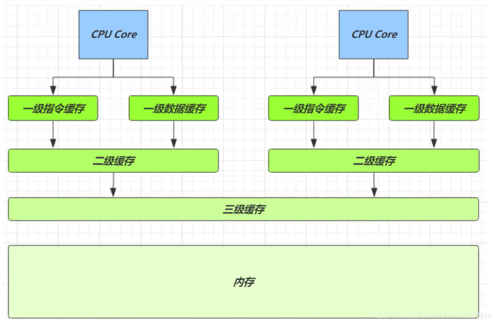  
因为 CPU 与 内存的速度差异很大，需要靠预读数据至缓存来提升效率。缓存离 cpu 越近速度越快。 而缓存以缓存行为单位，每个缓存行对应着一块内存，一般是 64 byte（8 个 long），缓存的加入会造成数据副本的产生，即同一份数据会缓存在不同核心的缓存行中，CPU 要保证数据的一致性，如果某个 CPU 核心更改了数据，其它 CPU 核心对应的整个缓存行必须失效。  
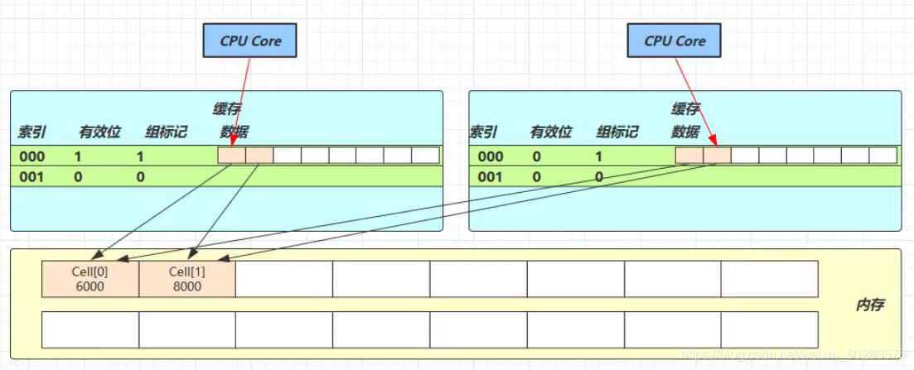  
因为 Cell 是数组形式，在内存中是连续存储的，一个 Cell 为 24 字节（16 字节的对象头和 8 字节的 value），因 此缓存行可以存下 2 个的 Cell 对象。这样问题来了： Core-0 要修改 Cell\[0\]，Core-1 要修改 Cell\[1\]

无论谁修改成功，都会导致对方 Core 的缓存行失效，比如 Core-0 中 Cell\[0\]=6000, Cell\[1\]=8000 要累加 Cell\[0\]=6001, Cell\[1\]=8000 ，这时会让 Core-1 的缓存行失效，\@sun.misc.Contended 用来解决这个问题，它的原理是在使用此注解的对象或字段的前后各增加 128 字节大小的padding，从而让 CPU 将对象预读至缓存时占用不同的缓存行，这样，不会造成对方缓存行的失效  
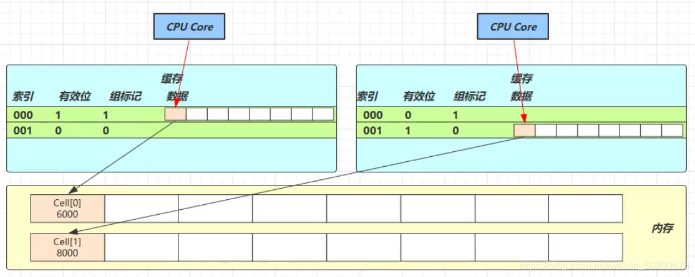

### 3）add 方法分析

LongAdder 进行累加操作是调用 increment 方法，它又调用 add 方法。

```java
public void increment() {
        add(1L);
    }
```

**第一步：add 方法分析，流程图如下**  
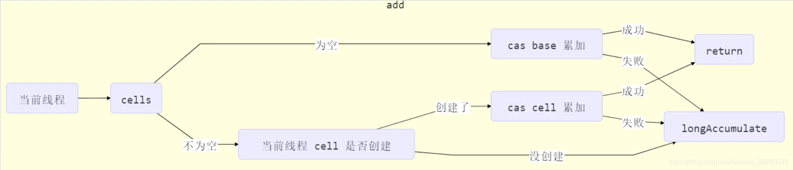  
源码如下：

```java
public void add(long x) {
        // as 为累加单元数组, b 为基础值, x 为累加值
        Cell[] as; long b, v; int m; Cell a;
        // 进入 if 的两个条件
        // 1. as 有值, 表示已经发生过竞争, 进入 if
        // 2. cas 给 base 累加时失败了, 表示 base 发生了竞争, 进入 if
        // 3. 如果 as 没有创建, 然后 cas 累加成功就返回，累加到 base 中 不存在线程竞争的时候用到。
        if ((as = cells) != null || !casBase(b = base, b + x)) {
            // uncontended 表示 cell 是否有竞争，这里赋值为 true 表示有竞争
            boolean uncontended = true;
            if (
                // as 还没有创建
                    as == null || (m = as.length - 1) < 0 ||
                            // 当前线程对应的 cell 还没有被创建，a为当线程的cell
                            (a = as[getProbe() & m]) == null ||
       // 给当前线程的 cell 累加失败 uncontended=false ( a 为当前线程的 cell )
                            !(uncontended = a.cas(v = a.value, v + x))
            ) {
                // 当 cells 为空时，累加操作失败会调用方法，
                // 当 cells 不为空，当前线程的 cell 创建了但是累加失败了会调用方法，
                // 当 cells 不为空，当前线程 cell 没创建会调用这个方法
                // 进入 cell 数组创建、cell 创建的流程
                longAccumulate(x, null, uncontended);
            }
        }
    }
```

**第二步：longAccumulate 方法分析，流程图如下：**  
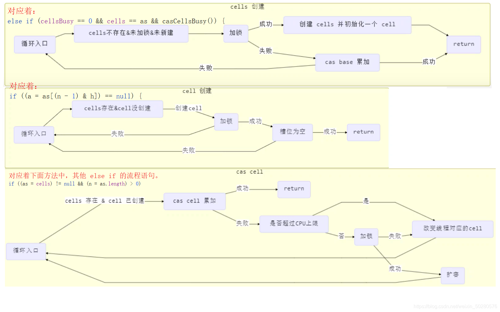  
源码如下：

```java
final void longAccumulate(long x, LongBinaryOperator fn,
                              boolean wasUncontended) {
        int h;
        // 当前线程还没有对应的 cell, 需要随机生成一个 h 值用来将当前线程绑定到 cell
        if ((h = getProbe()) == 0) {
            // 初始化 probe
            ThreadLocalRandom.current();
            // h 对应新的 probe 值, 用来对应 cell
            h = getProbe();
            wasUncontended = true;
        }
        // collide 为 true 表示需要扩容
        boolean collide = false;
        for (;;) {
            Cell[] as; Cell a; int n; long v;
            // 已经有了 cells
            if ((as = cells) != null && (n = as.length) > 0) {
                // 但是还没有当前线程对应的 cell
                if ((a = as[(n - 1) & h]) == null) {
                    // 为 cellsBusy 加锁, 创建 cell, cell 的初始累加值为 x
                    // 成功则 break, 否则继续 continue 循环
                    if (cellsBusy == 0) {       // Try to attach new Cell
                        Cell r = new Cell(x);   // Optimistically create
                        if (cellsBusy == 0 && casCellsBusy()) {
                            boolean created = false;
                            try {               // Recheck under lock
                                Cell[] rs; int m, j;
                                if ((rs = cells) != null &&
                                    (m = rs.length) > 0 &&
                                    // 判断槽位确实是空的
                                    rs[j = (m - 1) & h] == null) {
                                    rs[j] = r;
                                    created = true;
                                }
                            } finally {
                                cellsBusy = 0;
                            }
                            if (created)
                                break;
                            continue;           // Slot is now non-empty
                        }
                }
                // 有竞争, 改变线程对应的 cell 来重试 cas
                else if (!wasUncontended)
                    wasUncontended = true;
                    // cas 尝试累加, fn 配合 LongAccumulator 不为 null, 配合 LongAdder 为 null
                else if (a.cas(v = a.value, ((fn == null) ? v + x : fn.applyAsLong(v, x))))
                    break;
                    // 如果 cells 长度已经超过了最大长度, 或者已经扩容, 改变线程对应的 cell 来重试 cas
                else if (n >= NCPU || cells != as)
                    collide = false;
                    // 确保 collide 为 false 进入此分支, 就不会进入下面的 else if 进行扩容了
                else if (!collide)
                    collide = true;
                    // 加锁
                else if (cellsBusy == 0 && casCellsBusy()) {
                    // 加锁成功, 扩容
                    continue;
                }
                // 改变线程对应的 cell
                h = advanceProbe(h);
            }
            // 还没有 cells, cells==as是指没有其它线程修改cells，as和cells引用相同的对象，使用casCellsBusy()尝试给 cellsBusy 加锁
            else if (cellsBusy == 0 && cells == as && casCellsBusy()) {
                // 加锁成功, 初始化 cells, 最开始长度为 2, 并填充一个 cell
                // 成功则 break;
                boolean init = false;
                try {                           // Initialize table
                    if (cells == as) {
                        Cell[] rs = new Cell[2];
                        rs[h & 1] = new Cell(x);
                        cells = rs;
                        init = true;
                    }
                } finally {
                    cellsBusy = 0;
                }
                if (init)
                    break;
            }
            // 上两种情况失败, 尝试给 base 使用casBase累加
            else if (casBase(v = base, ((fn == null) ? v + x : fn.applyAsLong(v, x))))
                break;
        }
    }
```

### 4）sum 方法分析

获取最终结果通过 sum 方法，将各个累加单元的值加起来就得到了总的结果。

```java
public long sum() {
        Cell[] as = cells; Cell a;
        long sum = base;
        if (as != null) {
            for (int i = 0; i < as.length; ++i) {
                if ((a = as[i]) != null)
                    sum += a.value;
            }
        }
        return sum;
    }
```

## 5、Unsafe

### 1）Unsafe 对象的获取

Unsafe 对象提供了非常底层的，操作内存、线程的方法，Unsafe 对象不能直接调用，只能通过反射获得。LockSupport 的 park 方法，cas 相关的方法底层都是通过Unsafe类来实现的。

```java
public static void main(String[] args) throws NoSuchFieldException, IllegalAccessException {
    // Unsafe 使用了单例模式，unsafe 对象是类中的一个私有的变量 
        Field theUnsafe = Unsafe.class.getDeclaredField("theUnsafe");
        theUnsafe.setAccessible(true);
        Unsafe unsafe = (Unsafe)theUnsafe.get(null);
        
    }
```

### 2）Unsafe 模拟实现 cas 操作

```java
public class Code_14_UnsafeTest {

    public static void main(String[] args) throws NoSuchFieldException, IllegalAccessException {

        // 创建 unsafe 对象
        Field theUnsafe = Unsafe.class.getDeclaredField("theUnsafe");
        theUnsafe.setAccessible(true);
        Unsafe unsafe = (Unsafe)theUnsafe.get(null);

        // 拿到偏移量
        long idOffset = unsafe.objectFieldOffset(Teacher.class.getDeclaredField("id"));
        long nameOffset = unsafe.objectFieldOffset(Teacher.class.getDeclaredField("name"));

        // 进行 cas 操作
        Teacher teacher = new Teacher();
        unsafe.compareAndSwapLong(teacher, idOffset, 0, 100);
        unsafe.compareAndSwapObject(teacher, nameOffset, null, "lisi");

        System.out.println(teacher);
    }

}

@Data
class Teacher {

    private volatile int id;
    private volatile String name;

}

```

### 3）Unsafe 模拟实现原子整数

```java
public class Code_15_UnsafeAccessor {

    public static void main(String[] args) {
        Account.demo(new MyAtomicInteger(10000));
    }
}

class MyAtomicInteger implements Account {

    private volatile Integer value;
    private static final Unsafe UNSAFE = Unsafe.getUnsafe();
    private static final long valueOffset;

    static {
        try {
            valueOffset = UNSAFE.objectFieldOffset
                    (AtomicInteger.class.getDeclaredField("value"));
        } catch (Exception ex) { throw new Error(ex); }
    }

    public MyAtomicInteger(Integer value) {
        this.value = value;
    }

    public Integer get() {
        return value;
    }

    public void decrement(Integer amount) {
        while (true) {
            Integer preVal = this.value;
            Integer nextVal = preVal - amount;
            if(UNSAFE.compareAndSwapObject(this, valueOffset, preVal, nextVal)) {
                break;
            }
        }
    }

    @Override
    public Integer getBalance() {
        return get();
    }

    @Override
    public void withdraw(Integer amount) {
        decrement(amount);
    }
}
```

## 结论

本章重点讲解

1.  CAS 与 volatile
2.  juc 包下 API
    1.  原子整数
    2.  原子引用
    3.  原子数组
    4.  字段更新器
    5.  原子累加器
3.  Unsafe
4.  原理方面
    1.  LongAdder 源码
    2.  伪共享

# 七、共享模型之不可变

## 1、日期转换的问题

问题提出，下面的代码在运行时，由于 SimpleDateFormat 不是线程安全的，有很大几率出现 java.lang.NumberFormatException 或者出现不正确的日期解析结果。

```java
  SimpleDateFormat sdf = new SimpleDateFormat("yyyy-MM-dd");
        for (int i = 0; i < 10; i++) {
            new Thread(() -> {
                try {
                    log.debug("{}", sdf.parse("1951-04-21"));
                } catch (Exception e) {
                    log.error("{}", e);
                }
            }).start();
        }
```

思路 \- 不可变对象  
如果一个对象在不能够修改其内部状态（属性），那么它就是线程安全的，因为不存在并发修改啊！这样的对象在 Java 中有很多，例如在 Java 8 后，提供了一个新的日期格式化类 DateTimeFormatter

```java
    DateTimeFormatter dtf = DateTimeFormatter.ofPattern("yyyy-MM-dd");
        for (int i = 0; i < 10; i++) {
            new Thread(() -> {
                LocalDate date = dtf.parse("2018-10-01", LocalDate::from);
                log.debug("{}", date);
            }).start();
        }
```

## 2、不可变设计

String类中不可变的体现

```java
public final class String
    implements java.io.Serializable, Comparable<String>, CharSequence {
    /** The value is used for character storage. */
    private final char value[];
    /** Cache the hash code for the string */
    private int hash; // Default to 0
    // ...
}
```

### 1）final 的使用

发现该类、类中所有属性都是 final 的

- 属性用 final 修饰保证了该属性是只读的，不能修改
- 类用 final 修饰保证了该类中的方法不能被覆盖，防止子类无意间破坏不可变性

### 2）保护性拷贝

但有同学会说，使用字符串时，也有一些跟修改相关的方法啊，比如 substring 等，那么下面就看一看这些方法是 如何实现的，就以 substring 为例：

```java
public String substring(int beginIndex, int endIndex) {
        if (beginIndex < 0) {
            throw new StringIndexOutOfBoundsException(beginIndex);
        }
        if (endIndex > value.length) {
            throw new StringIndexOutOfBoundsException(endIndex);
        }
        int subLen = endIndex - beginIndex;
        if (subLen < 0) {
            throw new StringIndexOutOfBoundsException(subLen);
        }
        // 上面是一些校验，下面才是真正的创建新的String对象
        return ((beginIndex == 0) && (endIndex == value.length)) ? this
                : new String(value, beginIndex, subLen);
    }
```

发现其内部是调用 String 的构造方法创建了一个新字符串

```java
 public String(char value[], int offset, int count) {
        if (offset < 0) {
            throw new StringIndexOutOfBoundsException(offset);
        }
        if (count <= 0) {
            if (count < 0) {
                throw new StringIndexOutOfBoundsException(count);
            }
            if (offset <= value.length) {
                this.value = "".value;
                return;
            }
        }
        // Note: offset or count might be near -1>>>1.
        if (offset > value.length - count) {
            throw new StringIndexOutOfBoundsException(offset + count);
        }
        // 上面是一些安全性的校验，下面是给String对象的value赋值，新创建了一个数组来保存String对象的值
        this.value = Arrays.copyOfRange(value, offset, offset+count);
    }
```

构造新字符串对象时，会生成新的 char\[\] value，对内容进行复制 。这种通过创建副本对象来避免共享的手段称之为【保护性拷贝（defensive copy）】

## 3、模式之享元

### 1）简介

简介定义英文名称：Flyweight pattern. 当需要重用数量有限的同一类对象时，归类为：Structual patterns

### 2）体现

**包装类**  
在JDK中 Boolean，Byte，Short，Integer，Long，Character 等包装类提供了 valueOf 方法。  
例如 Long 的 valueOf 会缓存 \-128\~127 之间的 Long 对象，在这个范围之间会重用对象，大于这个范围，才会新建 Long 对象：

```java
public static Long valueOf(long l) {
 final int offset = 128;
 if (l >= -128 && l <= 127) { // will cache
 return LongCache.cache[(int)l + offset];
 }
 return new Long(l);
}
```

Byte, Short, Long 缓存的范围都是 \-128\~127  
Character 缓存的范围是 0\~127  
Integer 的默认范围是 \-128\~127，最小值不能变，但最大值可以通过调整虚拟机参数 "-Djava.lang.Integer.IntegerCache.high "来改变  
Boolean 缓存了 TRUE 和 FALSE  
**String 池**  
参考如下文章：[JDK1.8关于运行时常量池, 字符串常量池的要点](https://blog.csdn.net/q5706503/article/details/84640762?utm_medium=distribute.pc_relevant.none-task-blog-BlogCommendFromMachineLearnPai2-3.control&depth_1-utm_source=distribute.pc_relevant.none-task-blog-BlogCommendFromMachineLearnPai2-3.control)  
**BigDecimal、BigInteger**

### 3）DIY 实现简单的数据库连接池

例如：一个线上商城应用，QPS 达到数千，如果每次都重新创建和关闭数据库连接，性能会受到极大影响。 这时预先创建好一批连接，放入连接池。一次请求到达后，从连接池获取连接，使用完毕后再还回连接池，这样既节约了连接的创建和关闭时间，也实现了连接的重用，不至于让庞大的连接数压垮数据库。  
代码实现如下：

```java
public class Code_17_DatabaseConnectionPoolTest {

    public static void main(String[] args) {
        Pool pool = new Pool(2);
        for(int i = 0; i < 5; i++) {
            new Thread(() -> {
                Connection connection = pool.borrow();
                try {
                    Thread.sleep(new Random().nextInt(1000));
                } catch (InterruptedException e) {
                    e.printStackTrace();
                }
                pool.free(connection);
            }).start();
        }
    }

}

@Slf4j(topic = "c.Pool")
class Pool {

    // 连接池的大小, 因为没有实现连接池大小的扩容, 用 final 表示池的大小是一个固定值。
    private final int poolSize;
    // 连接池
    private Connection[] connections;
    // 表示连接状态, 如果是 0 表示没连接, 1 表示有连接
    private AtomicIntegerArray status;
    // 初始化连接池
    public Pool(int poolSize) {
        this.poolSize = poolSize;
        status = new AtomicIntegerArray(new int[poolSize]);
        connections = new Connection[poolSize];
        for(int i = 0; i < poolSize; i++) {
            connections[i] = new MockConnection("连接" + (i + 1));
        }
    }

    // 从连接池中获取连接
    public Connection borrow() {
        while (true) {
            for(int i = 0; i < poolSize; i++) {
                if(0 == status.get(i)) {
                    if(status.compareAndSet(i,0, 1)) {
                        log.info("获取连接:{}", connections[i]);
                        return connections[i];
                    }
                }
            }
            synchronized (this) {
                try {
                    log.info("wait ...");
                    wait();
                } catch (InterruptedException e) {
                    e.printStackTrace();
                }
            }
        }
    }

    // 从连接池中释放指定的连接
    public void free(Connection connection) {
        for (int i = 0; i < poolSize; i++) {
            if(connections[i] == connection) {
                status.set(i, 0);
                log.info("释放连接:{}", connections[i]);
                synchronized (this) {
                    notifyAll();
                }
            }
        }
    }

}

class MockConnection implements Connection {

    private String name;

    public MockConnection(String name) {
        this.name = name;
    }

    @Override
    public String toString() {
        return "MockConnection{" +
                "name='" + name + '\'' +
                '}';
    }
}
```

以上实现没有考虑：

- 连接的动态增长与收缩
- 连接保活（可用性检测）
- 等待超时处理
- 分布式 hash

对于关系型数据库，有比较成熟的连接池的实现，例如 c3p0、druid 等  
对于更通用的对象池，可以考虑用 apache commons pool，例如 redis 连接池可以参考 jedis 中关于连接池的实现。

## 4、final的原理

### 1）设置 final 变量的原理

理解了 volatile 原理，再对比 final 的实现就比较简单了

```java
public class TestFinal {
  final int a = 20;
}
```

字节码

```java
0: aload_0
1: invokespecial #1 // Method java/lang/Object."<init>":()V
4: aload_0
5: bipush 20
7: putfield #2 // Field a:I
 <-- 写屏障
10: return
```

final 变量的赋值操作都必须在定义时或者构造器中进行初始化赋值，并发现 final 变量的赋值也会通过 putfield 指令来完成，同样在这条指令之后也会加入写屏障，保证在其它线程读到它的值时不会出现为 0 的情况。

### 2）获取 final 变量的原理

需要从字节码层面去理解，可以参考如下文章：  
[深入理解final关键字](https://weihubeats.blog.csdn.net/article/details/87708198?utm_medium=distribute.pc_relevant.none-task-blog-BlogCommendFromMachineLearnPai2-2.control&depth_1-utm_source=distribute.pc_relevant.none-task-blog-BlogCommendFromMachineLearnPai2-2.control)

## 结论

- 不可变类使用
- 不可变类设计
- 原理方面：final
- 模式方面
  - 享元模式-> 设置线程池