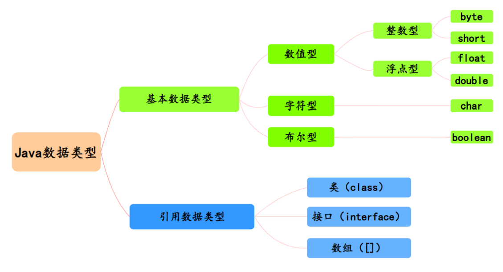
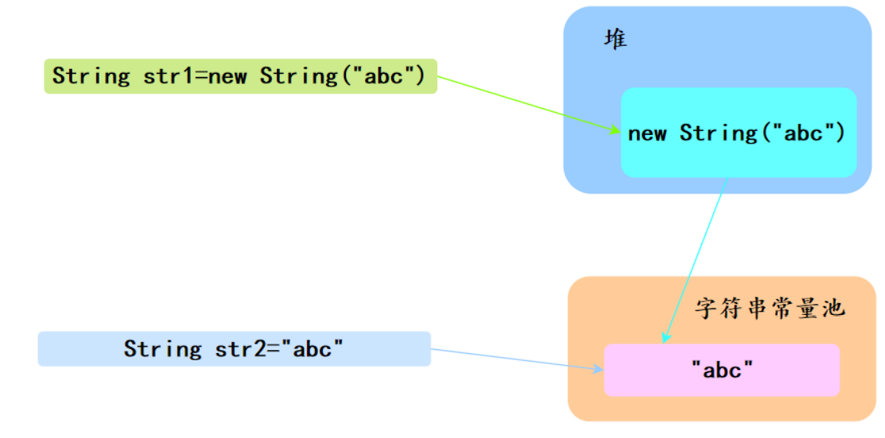
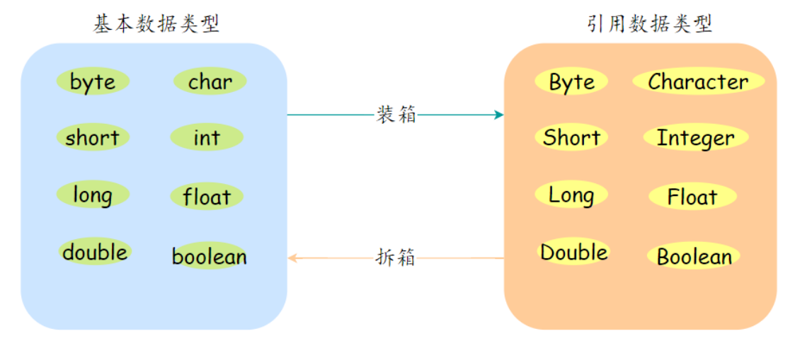
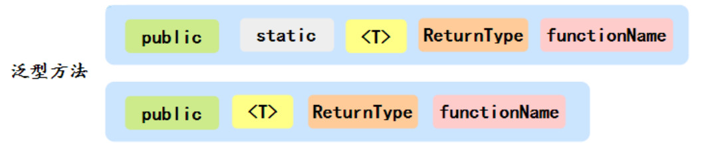
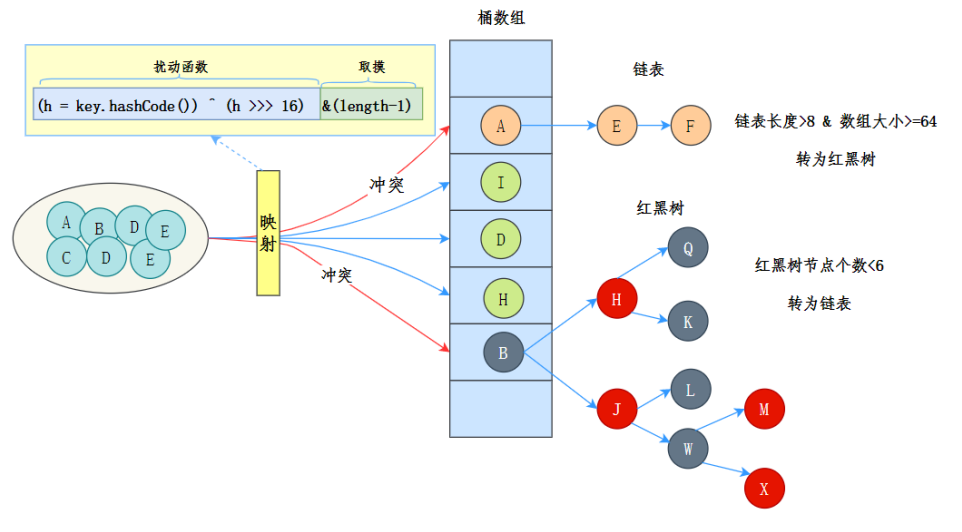

Object相等测试与继承  hashcode方法

动态代理

泛型

多线程 廖雪峰

# [下载安装](https://blog.csdn.net/qq_26552691/article/details/94598788?ops_request_misc=%257B%2522request%255Fid%2522%253A%2522162141222016780269899772%2522%252C%2522scm%2522%253A%252220140713.130102334..%2522%257D&request_id=162141222016780269899772&biz_id=0&utm_medium=distribute.pc_search_result.none-task-blog-2~all~top_positive~default-1-94598788.first_rank_v2_pc_rank_v29&utm_term=%E5%AE%89%E8%A3%85java)

# Java基本程序设计结构

## 命名规范

| 类型   | 约束                                                         | 例                                             |
| :----- | :----------------------------------------------------------- | :--------------------------------------------- |
| 项目名 | 全部小写，多个单词用中划线分隔 `-`                           | spring-cloud                                   |
| 包名   | 全部小写                                                     | com.alibaba.fastjson                           |
| 类名   | 单词首字母大写（大驼峰命名法）                               | Feature, ParserConfig,DefaultFieldDeserializer |
| 变量名 | 首字母小写，多个单词组成时，除首个单词，其他单词首字母都要大写（小驼峰命名法） | password, userName                             |
| 常量名 | 全部大写，多个单词，用'_'分隔                                | CACHE_EXPIRED_TIME                             |
| 方法   | 首字母小写，多个单词组成时，除首个单词，其他单词首字母都要大写（小驼峰命名法） | read(), readObject(), getById()                |

## 数据类型



> 1. **基本数据类型：整型、浮点型、字符型、布尔型**
>    - **整数类型 —— byte、short、int、long,**
>      - byte 也就是字节，1 byte = **8 bits**，byte 的默认值是 0 ；
>      - short 占用两个字节，也就是 **16 位**，1 short = 16 bits，它的默认值也是 0 ；
>      - int 占用四个字节，也就是 **32 位**，1 int = 32 bits，默认值是 0 ；
>      - long 占用八个字节，也就是 **64 位**，1 long = 64 bits，默认值是 0L；
>      - 所以整数型的占用字节大小空间为 **long > int > short > byte**
>    - **浮点类型 —— float、double**
>      - float 是单精度浮点型，占用 **4 字节**，1 float = 32 bits，默认值是 0.0f；
>      - double 是双精度浮点型，占用 **8 字节**，1 double = 64 bits，默认值是 0.0d；
>        - **警告:浮点数值不适用于无法接受舍入误差的金融计算。**例如，命令`System.out. println(2.0-1.1)`将打印出0.8999999999999999,而不是人们期望的0.9。这种舍入误差的主要原因是浮点数值采用二进制系统表示，而在二进制系统中无法精确地表示分数1/10。这就好像十进制无法精确地表示分数1/3一样。如果在数值计算中不允许有任何舍入误差，就**应该使用 `BigDecimal`类。**
>    - **字符类型 —— char**
>      - 字符型就是 char，char 类型是一个单一的 **16 位 (两个字节)**Unicode 字符，最小值是 \u0000 (也就是 0 )，最大值是 \uffff (即为 65535)，char 数据类型可以存储任何字符，例如 char a =  'A'。
>    - **布尔类型 —— boolean**
>      - 布尔型指的就是 boolean，boolean 只有两种值，true 或者是 false，只表示 **1 位**，默认值是 false。
> 2. **引用数据类型：接口（interface）、类（class）、数组（[ ]）**

### 数据类型之间的转换

> 虚线表示类型之间转化可能会丢失精度


> Java数据类型自动转换的优先顺序
>
> - 转换原则：**从低精度向高精度转换byte 、short、int、long、float、double、char** 
>
> 数据类型转换
>
> - **小容量向大容量转换称为自动类型转换，容量从小到大的排序为：byte < short(char) < int < long < float < double**，其中 short和 char 都占用两个字节，但是char 可以表示更大的正整数；
>
> - **大容量转换成小容量，称为强制类型转换，编写时必须添加“强制类型转换符”，但运行时可能出现精度损失，谨慎使用；**
>
> - **byte,short,char 类型混合运算时，先各自转换成 int 类型再做运算；**
>
> -  **多种数据类型混合运算，各自先转换成容量最大的那一种再做运算；** 
>
>   ```java
>           float f1 = 10.0f;
>           //float f2 = 10;//报错，带小数默认是double，= 两边类型不一样
>           double d1 = 10.0d;//这个d想加就加
>           long l = 10l;//这个l想加就加
>   ```

> short s1 = 1; s1 = s1 + 1;对吗？ short s1 = 1; s1 += 1; 对吗？ 
>
> 对于 short s1 = 1; s1 = s1 + 1;编译出错，由于 1 是 int 类型，因此 s1+1 运算结果也 是 int型，需要强制转换类型才能赋值给 short 型。 而 short s1 = 1; s1 += 1;可以正确编译，因为 s1+= 1;相当于 s1 = (short(s1 + 1);其中有 隐含的强制类型转换。

## 变量和常量

### 变量

> - **变量名对大小写敏感**
> - **不能使用Java保留字作为变量名**
> - **在 Java中可以将声明放在代码中的任何地方。**
> - **在Java中，变量的声明尽可能地靠近变量第一次使用的地方，这是一种良好的程序编写风格**。
> - **从 Java 10开始，对于<span style="color:orange">局部变量</span>，如果可以从变量的初始值推断出它的类型,就不再需要声明类型。只需要使用关键字var而无须指定类型:**

#### 成员变量与局部变量的区别有哪些？

> 1. 从语法形式上看 ：成员变量是属于类的，⽽局部变量是在⽅法中定义的变量或是⽅法的参数；**成员变量可以被 public , private , static 等修饰符所修饰，⽽局部变量不能被访问控制修饰符及 static 所修饰；但是，成员变量和局部变量都能被 final 所修饰。**
> 2. 从变量在内存中的存储⽅式来看 ：**如果成员变量是使⽤ static 修饰的，那么这个 成员变量是属于类的，如果没有使⽤ static 修饰，这个成员变量是属于实例的。 对象存于堆内存，如果局部变量类型为基本数据类型，那么存储在栈内存，如果为引⽤数据类型，那存放的是指向堆内存对象的引⽤或者是指向常量池中的地址。**
> 3. 从变量在内存中的⽣存时间上看 ：**成员变量是对象的⼀部分，它随着对象的创建⽽存在，⽽局部变量随着⽅法的调⽤⽽⾃动消失。**
> 4. **成员变量如果没有被赋初值 ：则会⾃动以类型的默认值⽽赋值（⼀种情况例外: 被 final 修饰的成员变量也必须显式地赋值），⽽局部变量则不会⾃动赋值。**

### 常量

> - 在 Java 中，利用关键字**final**指示常量。
>
> - 关键字final表示这个变量只能被赋值一次。**一旦被赋值之后，就不能够再更改了**。习惯上,**常量名使用全大写。**
>
> - 在Java中，经常希望某个常量可以在一个类的多个方法中使用，通常将这些常量称为类常量(class constant)。可以使用关键字**static final**设置一个**类常量**。
>
> - **类常量的定义位于main方法的外部**。因此，**在同一个类的其他方法中也可以使用这个常量**。而且，**如果一个常量被声明为public，那么其他类的方法也可以使用这个常量。**
>
>   ```java
>   public class demo {
>   
>       public static final int MYDEMO = 10;
>   
>       public static void main(String[] args) {
>           System.out.println("demo=========" + MYDEMO);
>   
>           example example = new example();
>       }
>   }
>   
>   
>   class example {
>   
>       public example() {
>           System.out.println("example======" + demo.MYDEMO);
>       }
>   
>   }
>   ```

> 1. 用`final`修饰`class`可以**阻止被继承**
> 2. 用`final`修饰`method`可以**阻止被子类覆写**
> 3. 用`final`修饰`field`可以**阻止被重新赋值**

### 枚举类型

```java
enum day {Monday, Tuesday, Wednesday, Thursday, Friday, Saturday, Sunday}

public class demo02_枚举类型 {
    public static void main(String[] args) {
        System.out.println(day.Sunday);
    }
}
```

## 运算符

### 布尔运算

| 运算符 | 用法   | 含义   | 说明                                               | 实例       | 结果  |
| :----- | :----- | :----- | :------------------------------------------------- | :--------- | :---- |
| &&     | a&&b   | 短路与 | ab 全为 true 时，计算结果为 true，否则为 false。   | 2>1&&3<4   | true  |
| \|\|   | a\|\|b | 短路或 | ab 全为 false 时，计算结果为 false，否则为 true。  | 2<1\|\|3>4 | false |
| !      | !a     | 逻辑非 | a 为 true 时，值为 false，a 为 false 时，值为 true | !(2>4)     | true  |
| \|     | a\|b   | 逻辑或 | ab 全为 false 时，计算结果为 false，否则为 true    | 1>2\|3>5   | false |
| &      | a&b    | 逻辑与 | ab 全为 true 时，计算结果为 true，否则为 false     | 1<2&3<5    | true  |

> - && 与 & 区别：如果 a 为 false，则不计算 b（因为不论 b 为何值，结果都为 false）
> - || 与 | 区别：如果 a 为 true，则不计算 b（因为不论 b 为何值，结果都为 true）
> - 注意：**短路与（&&）和短路或（||）能够采用最优化的计算方式，从而提高效率。在实际编程时，应该优先考虑使用短路与和短路或。**

> 例如在验证用户登录时判定用户名不是 null 而且不是空字符串，**应当写为`username != null &&!username.equals("") `**，二者的顺序不能交换，更不能 用&运算符，因为第一个条件如果不成立，根本不能进行字符串的 equals 比较，否则会产生 NullPointerException 异常。

### 三元运算符

> `condition ? expression1 : expression2`，expression1 和expression2的数据类型要一样

```java
int x = 1;
int y = 2;
boolean result = x > y ? true : false;
System.out.println(result);
```

### ==和equals

> 1. 要**判断引用类型的变量内容是否相等，必须使用equals()方法。**String是类，也属于引用类型
> 2. **"=="比较基本数据类型时比较的是表面值内容**，而**比较两个对象时比较的是两个对象的内存地址值**
> 3. **<span style="color:red">equals方法不能作用于基本数据类型的变量</span>**。**如果没有对equals方法进行重写，则比较的是引用类型的变量所指向的对象的地址；诸如String、Date等类对equals方法进行了重写的话，比较的是所指向的对象的内容**
> 4. **<span style="color:red">千万不要使用==运算符测试字符串的相等性，以免在程序中出现这种最糟糕的 bug</span>**

## 字符串

> - **字符串比较：必须使用equals()方法而不能用==**
> - **String 类使用 final 修饰，是所谓的不可变类，无法被继承。**

### [String API](http://docs.oracle.com/javase/9/docs/api)

> 1. length()：输出字符串的长度
>
> 2. equalsIgnoreCase()：忽略大小写比较
>
> 3. contains()：是否包含子串
>
> 4. int compareTo(String other)：按照字典顺序，如果字符串位于other之前，返回一个负数;如果字符串位于other之后，返回一个正数;如果两个字符串相等,返回0。
>
> 5. indexOf()：返回某个指定的字符串值在字符串中首次出现的位置
>
> 6. lastIndexOf()：返回某个指定的字符串值在字符串中最后出现的位置
>
> 7. startsWith()：检测字符串是否以指定的子字符串开始。
>
> 8. endsWith()：检测字符串是否以指定的子字符串结尾。
>
> 9. substring()：可从字符串的指定位置开始提取指定长度的子字符串，**返回一个新字符串。**
>
> 10. trim()：去除首尾空白字符。trim()并没有改变字符串的内容，而是**返回了一个新字符串**。
>
> 11. strip()：除首尾空白字符。它和trim()不同的是，类似中文的空格字符\u3000也会被移除，**返回一个新字符串。**
>
> 12. isBlank()：判断字符串是否为空白字符串
>
> 13. isEmpty()：判断字符串是否为空判断字符串是否为空
>
> 14. replace()：替换字符串，**返回一个新字符串。**
>
> 15. split()：分割字符串，**返回一个数组**
>
> 16. join()：拼接字符串，**返回一个新字符串。**
>
> 17. repeat(int count)：**返回一个字符串**，将当前字符串重复count次。
>
> 18. valueOf()：类型转换。把任意基本类型或引用类型转换为字符串
>
>     ```java
>     String.valueOf(123); // "123"
>     String.valueOf(45.67); // "45.67"
>     String.valueOf(true); // "true"
>     String.valueOf(new Object()); // 类似java.lang.Object@636be97c
>     ```
>
> 19. parseInt()/parseBoolean()：字符串转换为其他类型
>
>     ```java
>     int n1 = Integer.parseInt("123"); // 123
>     int n2 = Integer.parseInt("ff", 16); // 按十六进制转换，255
>     
>     boolean b1 = Boolean.parseBoolean("true"); // true
>     boolean b2 = Boolean.parseBoolean("FALSE"); // false
>     ```
>
> 20. toCharArray()：String转换为char[]类型
>
> 21. new String(char[])：将从char[]类型转换为字符串。通过`new String(char[])`创建新的`String`实例时，它并不会直接引用传入的`char[]`数组，而是会复制一份，所以，修改外部的`char[]`数组不会影响`String`实例内部的`char[]`数组，因为这是两个不同的数组。

```java
package com.demo05_java核心类;

import java.util.Arrays;

public class demo01_字符串和编码 {
    public static void main(String[] args) {
        String s = "hello word";
        String s1 = s.toUpperCase();//HELLO WORD
        String s2 = "hello word";

        // 字符串比较
        System.out.println(s == s2);//true
        System.out.println(s.equals(s2));//true

        System.out.println(s == s1);//false
        System.out.println(s.equals(s1));//false

        // 忽略大小写
        System.out.println(s.equalsIgnoreCase(s1));//true

        // 是否包含子串
        System.out.println(s.contains("ll"));//true

        // 返回某个指定的字符串值在字符串中首次出现的位置
        System.out.println(s.indexOf("l"));//2
        // 返回某个指定的字符串值在字符串中最后出现的位置
        System.out.println(s.lastIndexOf("l"));//3
        // 检测字符串是否以指定的子字符串开始。
        System.out.println(s.startsWith("He"));//false
        // 检测字符串是否以指定的子字符串结尾。
        System.out.println(s.endsWith("lo"));//false

        // 可从字符串的指定位置开始提取指定长度的子字符串
        System.out.println(s.substring(2));//llo word
        System.out.println(s.substring(2, 4));//ll

        String name = "   lz   ";

        // 去除首尾空白字符。trim()并没有改变字符串的内容，而是返回了一个新字符串。
        System.out.println(name.trim());//lz
        // 去除首尾空白字符。它和trim()不同的是，类似中文的空格字符\u3000也会被移除

        System.out.println(name.strip());//lz
        // 判断字符串是否为空白字符串
        System.out.println(name.isBlank());//false
        // 判断字符串是否为空
        System.out.println(name.isEmpty());//false

        // 替换字符串
        System.out.println(name.replace("lz", "wmy"));//wmy

        // 分割字符串。成为数组
        String f = "a-b-c-d-e-f";
        String[] f1 = f.split("-");
        for (String c : f1) {
            System.out.println(c);
        }

        // 拼接字符串
        String[] x = {"a", "b", "c"};
        String y = String.join("-", x);
        System.out.println(y);//a-b-c

        // 类型转换。把任意基本类型或引用类型转换为字符串
        int i = 123;
        boolean b = true;
        double d = 19.9;
        System.out.println(String.valueOf(i));//"123"
        System.out.println(String.valueOf(b));//"true"
        System.out.println(String.valueOf(d));//"19.9"

        // 把字符串转换为int类型
        System.out.println(Integer.parseInt("123"));//123
        System.out.println(Integer.parseInt("ff", 16));// 按十六进制转换，255

        // 把字符串转换为boolean类型
        System.out.println(Boolean.parseBoolean("true"));//true
        System.out.println(Boolean.parseBoolean("FALSE"));//false

        // String和char[]类型可以互相转换
        char[] cs = "Hello".toCharArray(); // String -> char[]
        String ss = new String(cs); // char[] -> String

    }

}
```

### 构建字符串

#### StringBuilder

> - `StringBuilder`是可变对象，用来高效拼接字符串；
> - `StringBuilder`可以支持链式操作，实现链式操作的关键是返回实例本身；
> - `StringBuffer`是`StringBuilder`的线程安全版本，现在很少使用。

> 常用方法：
>
> - stringBuilder()
>   构造一个空的字符串构建器。
>
> - int length()
>   返回构建器或缓冲器中的代码单元数量。
>
> - StringBuilder append(String str)
>   追加一个字符串并返回this。
>
> - StringBuilder append(char c)
>
>   追加一个代码单元并返回this。
>
> - StringBuilder insert(int offset，String str)
>
>   在offset位置插入一个字符串并返回this。
>
> - StringBuilder insert(int offset，char c)
>
>   在offset位置插入一个代码单元并返回this。
>
> - StringBuilder delete(int startIndex，int endIndex)
>   删除偏移量从startIndex到endIndex-1的代码单元并返回this。
>
> - void setCharAt(int i,char c)
>   将第i个代码单元设置为c。
>
> - String tostring()
>   返回一个与构建器或缓冲器内容相同的字符串。

```java
    public static void main(String[] args) {
        StringBuilder builder = new StringBuilder();

        builder.append("hello").append("world");

        System.out.println(builder.toString());//helloworld
        System.out.println(builder.length());//10

        builder.insert(5, ",");
        System.out.println(builder.toString());//hello,world

        builder.setCharAt(0, 'H');
        System.out.println(builder.toString());//Hello,world

        builder.delete(0, 6);
        System.out.println(builder);//world

    }
```

##### String和StringBuilder、StringBuffer的区别？ 

> - String：String 的值被创建后不能修改，任何对 String 的修改都会引发新的 String 对象的生成。 
> - StringBuffer：跟 String 类似，但是值可以被修改，使用 synchronized 来保证线程 安全。 
> - StringBuilder：StringBuffer 的非线程安全版本，性能上更高一些。

#### StringJoiner

> 和StringBuilder比较类似，用于拼接字符串

```java
package com.demo05_java核心类;

import java.util.StringJoiner;

public class demo03_StringJoiner {
    public static void main(String[] args) {
        String[] names = {"Bob", "Alice", "Grace"};
        var sj = new StringJoiner(", ", "Hello ", "!");
        for (String name : names) {
            sj.add(name);
        }
        System.out.println(sj.toString());//Hello Bob, Alice, Grace!
    }
}

```

### 面试题




> `String str1 = new String("abc")`和`String str2 = "abc"`和 区别？ 
>
> 两个语句都会去字符串常量池中检查是否已经存在 “abc”，如果有则直接使用，如果没有则会在常量池中创建 “abc” 对象。 但是不同的是，`String str1 = new String("abc") `还会通过`new String()`在堆里创建一个 "abc" 字符串对象实例。所以后者可以理解为被前者包含。

> `String s = new String("abc")`创建了几个对象？
>
> 很明显，一个或两个。如果字符串常量池已经有“abc”，则是一个；否则，两个。

## 输入/输出

### Scanner

> - Scanner(InputStream in)
>   用给定的输入流创建一个Scanner对象。
> - string nextLine()
>   读取输入的下一行内容。
> - String next()
>   读取输入的下一个单词(以空格作为分隔符)。
>
> - int nextInt()
>   double nextDouble()
>   读取并转换下一个表示整数或浮点数的字符序列。
> - boolean hasNext()
>   检测输入中是否还有其他单词。
> - boolean hasNextInt()
>   boolean hasNextDouble()
>   检测是否还有下一个表示整数或浮点数的字符序列。

```java
public class Main {
    public static void main(String[] args) {
        Scanner in = new Scanner(System.in);
        while (in.hasNextInt()) {
            int a = in.nextInt();
            int b = in.nextInt();
            System.out.println(a + b);
        }
    }
}
```

### [输出](https://blog.csdn.net/weixin_57663206/article/details/124559650)

> 例如：`System.out.printf("%-7d %7d",3,3);`
>
> 负号为左对齐，无符号为默认右对齐，正号为输出正数
>
> 7为输出字符宽度
>
> d为字符类型
>
> 3为输出的字符
>
> 
>
> `System.out.printf("%.3f%%", 3.0 / 10.0 * 100);`输出百分比 30.000%

## 流程控制

### 块作用域

> 块(即复合语句）是指由若干条Java语句组成的语句，并用一对大括号括起来。块确定了变量的作用域。一个块可以嵌套在另一个块中。但是，不能在嵌套的两个块中声明同名的变量。

### switch

> - Java5 以前 switch(expr)中，expr 只能是 **byte、short、char、int。** 
> - 从 Java 5 开始，Java 中引入了枚举类型， expr 也可以是 **enum 类型**。 
> - 从 Java 7 开始，expr还可以是**字符串(String)**，但是**长整型(long)在目前所有的版本中都是不可以的。**

#### break

> 我们经常使用的是不带标签的break语句，下面这个是带标签的break语句。
>
> Java提供了一种**带标签的break语句**，用于跳出多重嵌套的循环语句。有时候，在嵌套很深的循环语句中会发生一些不可预料的事情。此时可能更加希望完全跳出所有嵌套循环之外。如果只是为各层循环检测添加一些额外的条件，这会很不方便。

```java
    public static void main(String[] args) {

        Scanner s = new Scanner(System.in);
        int i = s.nextInt();

        read_date:

        while (i < 20) {

            if (i <= 0) {

                System.out.println("不能小于等于零");

                break read_date;
            }

            System.out.println(i);

            i--;
        }

        if (i <= 0) {
            System.out.println("请重新输入！！！");
        }
        
    }
```

### break/continue/return

> - break：跳出循环
> - continue：结束本次循环，程序继续
> - return：直接结束方法

```java
public class demo {
    @Test
    public void test() {
        Solution solution = new Solution();
        int[] i = new int[]{12, 345, 2, 6, 7896};
        System.out.println(solution.findNumbers(i));
    }
}

class Solution {
    public int findNumbers(int[] nums) {
        int n = 0;

        for (int num : nums) {
            if (num % 2 == 0) {
                n++;
                //break;//1
                //continue;//4
                //return n;//1
                //retun n++;//哒咩
            }
        }

        return n;
    }
}
```

## 数组

### 一维数组

#### 创建数组

```java
//两种定义方式
//1.
int[] a = {1,2,3}	//int[]整体看作一个数据类型
//2.
int[] a = new int[3];	//分配内存空间，元素个数为3
//3.
int[] a = new int[]{1,2,3}//声明并创建内存空间且赋值

//注：还可以这样写
int a[] = new int[2]
```

```java
public class demo09 {

    public static void main(String[] args) {

        int[] a = {1,2,3};
        for (int i : a) {
            System.out.println(i);
        }

        int[] b = new int[5];
        b[0]=4;
        b[1]=5;
        b[2]=6;
        for (int i : b) {
            System.out.println(i);
        }

        int[] c = new int[]{7,8,9};
        for (int i : c) {
            System.out.println(i);
        }
    }
}

```

#### 访问数组

> - **创建一个数字数组时，所有元素都初始化为0。**
> - **boolean数组的元素会初始化为false。**
> - **对象数组的元素则初始化为一个特殊值null，表示这些元素(还）未存放任何对象。**
> - **创建一个包含10个字符串的数组，所有字符串都为null。**
> - **<span style="color:red">警告:如果创建了一个100个元素的数组,并且试图访问元素a\[100](或在0～99之外的任何下标)，就会引发“array index out of bounds”异常。</span>**

```java
    public static void main(String[] args) {
        int[] i = new int[5];
        for (int i1 : i) {
            System.out.println(i1);
        }//0 0 0 0 0 


        boolean[] b = new boolean[5];
        for (boolean b1 : b) {
            System.out.println(b1);
        }//false false false false false

        String[] s = new String[5];
        for (String s1 : s) {
            System.out.println(s1);
        }//null null null null null

        System.out.println(s[5]);//Exception in thread "main" java.lang.ArrayIndexOutOfBoundsException:

    }
```

#### 操作数组

> - `static String toString(xxx[] a) `
>   返回包含a中元素的一个字符串，这些元素用中括号包围，并用逗号分隔。在这个方法以及后面的方法中，数组元素类型xxx可以是int、long、short、char、byte ,boolean、float 或double。
>
> - `static xxx[] copy0f(xxx[ ] a, int end)`
>   `static xxx[] copyofRange(xxx[] a, int start,int end)`
>   返回与a类型相同的一个数组，其长度为length或者end-start，数组元素为a的值。如果end大于`a.length`，结果会填充0或false值。
>
> - `static void sort(xxx[ ] a)`
>   使用优化的快速排序算法对数组进行排序。
>
> - `static int binarySearch(xxx[] a，xxx v)`
>   `static int binarySearch(xxx[] a, int start, int end，xxx v) `
>   <span style="color:purple">**使用二分查找算法在有序数组 a中查找值v。**</span>如果找到v，则返回相应的下标;否则，返回一个负数值r。-r-1是v应插入的位置（为保持a有序)。
>
> - `static void fill(xxx[ ] a,xxx v)`
>   将数组的所有数据元素设置为v。
>
> -  `static boolean equals(xxx[] a，xxx[] b)`
>   如果两个数组大小相同，并且下标相同的元素都对应相等，返回true。
>
> - `数组.length`
>
>   查看数组长度

##### 数组排序

> **`Arrays.sort()`：升序排序**

```java
int[] i = {4, 8, 9, 1, 4, 6, 2, 3, 5, 3, 4, 5, 7, 6};

System.out.println(Arrays.toString(i));//[4, 8, 9, 1, 4, 6, 2, 3, 5, 3, 4, 5, 7, 6]

Arrays.sort(i);
System.out.println(Arrays.toString(i));//[1, 2, 3, 3, 4, 4, 4, 5, 5, 6, 6, 7, 8, 9]
```

##### 拷贝数组

> **`Arrays.copyOf()`：拷贝数组**
>
> **`int[] copiedLuckyNumbers = Arrays.copyof(luckyNumbers，luckyNumbers.length);`**
>
> **第2个参数是新数组的长度。这个方法通常用来增加数组的大小:`luckyNumbers = Arrays.copy0f(luckyNumbers，2 * luckyNumbers.length) ;`**
> **如果数组元素是数值型，那么额外的元素将被赋值为0；如果数组元素是布尔型，则将赋值为false。相反，如果长度小于原始数组的长度，则只拷贝前面的值。**

```java
    public static void main(String[] args) {
        int[] ints = new int[]{1, 2, 3, 4, 5, 6, 7, 8, 9};
        System.out.println(ints.length);//9

        int[] newInts1 = Arrays.copyOf(ints, ints.length);
        System.out.println(newInts1.length);//9

        int[] newInts2 = Arrays.copyOf(ints, ints.length * 2);
        System.out.println(newInts2.length);//18

        int[] newInts3 = Arrays.copyOf(ints, ints.length / 2);
        System.out.println(newInts3.length);//4
        for (int i : newInts3) {
            System.out.print(i);//1234
        }
    }
```

### 二维数组

```java
//两种定义为方式
//1.
int[] a = {
    {1,2,3},	//第0行的初始赋值
    {4,5,6}		//第1行的初始赋值
}
//2.
int[][] a = new int[行的个数][列的个数];
int[] a[] = new int[行的个数][列的个数];
```

#### 访问数组

```java
    public static void main(String[] args) {
        int[][] nd = {
                {1, 2, 3},
                {4, 5, 6},
                {7, 8, 9}
        };
        System.out.println(nd[1][2]);//6
        System.out.println(Arrays.deepToString(nd));//[[1, 2, 3], [4, 5, 6], [7, 8, 9]]

        //遍历使用双层for循环
        for (int[] ints : nd) {
            for (int i : ints) {
                System.out.println(i);
            }
        }

    }
```

# 面向对象基础

## 类和对象

> - 类和对象的关系
>
>   比如，座椅设计图纸就是“类”，而做出来不同类型的座椅就是“对象”
>
> - Java访问权限修饰符
>
>   1. public：公开。**不仅可以跨类访问，还可以跨包访问**。只能定义一个public类型的class
>   2. protected：保护。定义为protected的字段和方法可以**被相同包中的类和当前类的子类访问。类和接口不可以声明为私有。**
>   3. default：默认的标识符，**只允许在同一包内访问**
>   4. private：私有。如果一个方法或变量声明了私有，**只能在同一个类中被访问**。**类和接口不可以声明为私有。**
>   5. **public > protected > default > private**
>   
> - **所有类都继承object**

```java
//对象的声明
//类名 对象名 = new 类名();
//对象名.属性名//访问属性
//对象名.方法名()//访问方法
Peopel p = new People();
p.name = '张三'//赋值
p.age = 18
```

### 匿名对象

> 特点：
>
> 1. **匿名对象没有被其他对象所引用**
> 2. **只能使用一次，之后变成垃圾对象，被垃圾回收器收回**

```java
//匿名对象：没有名字的对象
new onNameObject().say();//没有=前面的部分。之后.方法
```

### 类设计技巧

> 1. 一定要保证数据私有。
>    这是最重要的：绝对不要破坏封装性。
> 2. 一定要对数据进行初始化。
>    Java不会为你初始化局部变量，但是会对对象的实例字段进行初始化。最好不要依赖于系统的默认值，而是应该显式地初始化所有的数据，可以提供默认值，也可以在所有构造器中设置默认值。
> 3. 不要在类中使用过多的基本类型。
> 4. 不是所有的字段都需要单独的字段访问器和字段更改器。
> 5. 分解有过多职责的类。
> 6. 类名和方法名要能够体现它们的职责。
>    对此有一个很好的惯例:类名应当是一个名词(Order)，或者是前面有形容词修饰的名词( RushOrder)，或者是有动名词(有“-ing”后缀)修饰的名词(例如，BillingAddress)。对于方法来说，要遵循标准惯例:访问器方法用小写get开头( getSalary)，更改器方法用小写的 set开头(setSalary)。
> 7. 优先使用不可变的类。
>    LocalDate类以及java.time包中的其他类是不可变的——没有方法能修改对象的状态。类

### 显式参数和隐式参数

```
Person p = new Person()
p.work("程序员")
```

> `p.work("程序员")`第一个参数称为隐式 ( implicit)参数，是出现在方法名前的Person类型的对象。第二个参数是位于方法名后面括号中的数值，这是一个显式(explicit)参数。(有人把隐式参数称为方法调用的目标或接收者。)

## 方法

### 普通方法

#### 方法的定义

```java
//修饰符 返回值类型 方法名(参数列表){}	
public void peopel(){}//无参构造。没有返回值，必须写void
public void peopel(String name,int age){}//形参构造
```

#### 方法的重载

> - 何为重载？
>
>   比如，一个班级有三个人叫张三，那么如何分辨每一个张三。根据的就是每个人的特征。
>
>   在Java中重载，<span style="color:green">**方法名相同**；</span><span style="color:orange">**参数个数/参数顺序/参数类型不同**；</span><span style="color:blue">**方法的返回值类型和修饰符不做要求，可以相同，可以不同**</span>。根据的就是这个。
>
> - 重载的意义？
>
>   为什么要重载？难道我写其他的方法名不可以吗？这个也是可以的。那为什么要使用重载？是因为比如我们在编程登录时方法名可以都用Login，用其他的可能别扭，所以这时候就用到重载了。

```java
//重载
public class dmeo03 {
    //计算2个整数之和。重载
    public int add(int a,int b){
        return a+b;
    }

    //计算2个单精度浮点数之和。重载
    public float add(float a,float b){
        return a+b;
    }

    //计算3个整数之和。重载
    public int add(int a,int b,int c){
        return a+b+c;
    }

    public static void main(String[] args) {
        int result;
        float result_f;

        dmeo03 de = new dmeo03();
        //调用计算2个整数之和的add函数
        result = de.add(1,2);
        System.out.println("add计算1+2的和："+result);

        //调用计算2个单精度浮点数之和的add函数
        result_f = de.add(1.1f,2.2f);
        System.out.println("add计算1.1+2.2的和："+result_f);

        //调用计算3个整数之和的add函数
        result = de.add(1,2,3);
        System.out.println("add计算1+2+3的和："+result);

    }
}

```

#### 可变参数

> `可变参数变量` 其实是一个数组

```java
public class test {
  public static void main(String[] args) {
    System.out.println(sum1(1, 2, 3)); // 6
    System.out.println(sum2(1, 2, 3)); // 6
    System.out.println(sum3(1, 2, 3)); // 6
  }

  // 正常方法求和
  public static int sum1(int a, int b, int c) {
    return a + b + c;
  }

  // 可变参数求和
  public static int sum2(int... a) {
    int sum = 0;
    for (int i : a) {
      sum += i;
    }
    return sum;
  }

  // 可变参数求和，如果存在可变参数与非可变参数，可变参数需要放到后面，不能放在前面。
  // public static int sum3(int... a, int b) // 错误写法
  public static int sum3(int b, int... a) {
    int sum = 0;
    for (int i : a) {
      sum += i;
    }
    return sum + b;
  }
}

```

#### 参数绑定

```java
public class Main {
    public static void main(String[] args) {
        Person p = new Person();
        int n = 15; // n的值为15
        p.setAge(n); // 传入n的值
        System.out.println(p.getAge()); // 15
        n = 20; // n的值改为20
        System.out.println(p.getAge()); // 15还是20?    15
    }
}

class Person {
    private int age;

    public int getAge() {
        return this.age;
    }

    public void setAge(int age) {
        this.age = age;
    }
}
```

> 运行代码，从结果可知，修改外部的局部变量`n`，不影响实例`p`的`age`字段，原因是`setAge()`方法获得的参数，复制了`n`的值，因此，`p.age`和局部变量`n`互不影响。
>
> 结论：基本类型参数的传递，是调用方值的复制。双方各自的后续修改，互不影响。

### 构造方法

>**在类中声明的构造方法会在实例化对象是自动调用且只被调用一次，普通方法可以通过一个实例化对象调用多次**

> **在程序中没有声明构造方法发时，系统会自动声明一个无参数的构造方法**
>
> **当声明了构造方法时，默认的隐式的构造方法就不会被声明**

#### 默认构造函数

```java
//class 类名{
//	修饰符 方法名(参数列表){}		//构造方法。构造方法没有返回值，不可以写void。方法名要和类名一致
//}
class people{
    public people(){	//构造方法。方法名要和类名一致
        
    }
}
```

> 注意：
>
> 1. **构造方法名和其所属的类名必须保持一致**
> 2. 构造方法没有返回值，<span style="color:red">**不可以写void**</span>
> 5. <span style="color:purple">**构造方法不可以被final和static修饰**</span>
> 4. **每个类可以有一个以上的构造器。构造器可以有0个、1个或多个参数。**
> 5. **重载与普通方法重载一样**
> 6. **构造方法不可以被继承，<span style="color:red">子类使用父类的构造方法需要super关键字</span>**

#### 多构造方法

> 多构造方法就是重载了构造方法
>
> 如果调用`new demo_17("张三", 18);`，会自动匹配到构造方法`public demo_17(String, int)`。
>
> 如果调用`new demo_17(21);`，会自动匹配到构造方法`public demo_17(int)`。

```java
class demo_17 {
    String name;
    int age;

    public demo_17(String name, int age) {
        this.name = name;
        this.age = age;
    }

    public demo_17(int age) {
        this.name = "lz";
        this.age = age;
    }
}


demo_17 d = new demo_17("张三", 18);
System.out.println(d.name + d.age);//张三18
demo_17 d1 = new demo_17(21);
System.out.println(d1.name + d1.age);//lz21
```

##### 一个构造函数调用其他的构造函数

```java
class Person {
    private String name;
    private int age;
    public Person(String name, int age) {
        this.name = name;
        this.age = age;
    }
    public Person(String name) {
        this(name, 18); // 调用另一个构造方法Person(String, int)
    }
    public Person() {
        this("Unnamed"); // 调用另一个构造方法Person(String)
    }
}
```

### 静态字段和静态方法

#### 静态字段


> 对于静态字段，无论修改哪个实例的静态字段，效果都是一样的：所有实例的静态字段都被修改了，原因是静态字段并不属于实例

```java
package com.demo04_静态;

public class demo01_静态字段 {
    public static void main(String[] args) {
        Person lz = new Person("lz", 21);
        Person wmy = new Person("wmy", 18);
        System.out.println(lz.age);//18
        Person.age = 20;
        System.out.println(lz.age);//20
        System.out.println(wmy.age);//20
    }
}

class Person {
    String name;
    static int age;

    Person(String name, int age) {
        this.name = name;
        this.age = age;
    }
}

```

> 不推荐用`实例变量.静态字段`去访问静态字段，因为在Java程序中，实例对象并没有静态字段。在代码中，实例对象能访问静态字段只是因为编译器可以根据实例类型自动转换为**`类名.静态字段`来访问静态对象**：`Person.age`

#### 静态方法

> 调用静态方法则不需要实例变量，通过类名就可以调用。通过实例变量也可以调用静态方法，但这只是编译器自动帮我们把实例改写成类名而已。通常情况下，通过实例变量访问静态字段和静态方法，会得到一个编译警告。
>
> 因为静态方法属于`class`而不属于实例，因此，静态方法内部，无法访问`this`变量，也无法访问实例字段，它只能访问静态字段。

> 如果在类中声明了一个static类型的属性，那么属性可以在非static方法中使用，也可以在static方法中使用.
>
> static类型的方法调用非static的属性会报错，但可以访问静态字段和其他静态方法；

```java
public class demo12 {
    public static void main(String[] args) {
        person12 p = new person12();
        p.name = "11111";
        System.out.println(p.name);//11111
        System.out.println(person12.name);//11111
        person12.name="22222";
        System.out.println(p.name);//22222

        person12 p1 = new person12();
        System.out.println(p1.name);//22222
    }
}

class person12{
    static String name = "lz";
    static void say(){
        System.out.println("11111");
    }
}
```

## 面向对象三大特性

### 封装

#### 封装属性

```java
public class dmeo04 {
    public static void main(String[] args) {
        MyCat myCat = new MyCat();
        myCat.SetWeight(-5f);//调用公有方法

        float v = myCat.GetWeight();//调用公有方法
        System.out.println("The weight of a cat is "+v);
    }
}

class MyCat{
    private float weight;//设置一个私有属性
    public void SetWeight(float wt){//设置一个公有方法，用来设置重量
        if (wt > 0){
            weight = wt;
        }else {
            System.out.println("weight设置非法");
            weight = 10.0f;
        }
    }
    public float GetWeight(){//设置一个公有方法，来获取重量
        return weight;
    }
}
```

> **属性为私有，在类的外部访问不到，可以在类内部声明公共的SetXxx和GetXxx方法，用来设置和获取值，这样就可以在类外面访问SetXxx和GetXxx方法，从而来设置和获取属性值。**

#### 封装方法

> 封装方法和封装属性相似，私有方法在GetXxx方法中调用，外部数据再来调用SetXxx方法，从而可以调用风封装的方法。

#### 封装数据

> 将属性和set方法都进行了封装，通过构造方法调用set方法来赋值

```java
public class dmeo05 {

    public static void main(String[] args) {
        MyCat1 myCat1 = new MyCat1(12,-5);
        float v = myCat1.GetHeight();
        float v1 = myCat1.GetWeight();

        System.out.println("the height of cat is "+v);
        System.out.println("the weight of cat is "+v1);
    }
}
class MyCat1{
    private float weight;//声明私有属性
    private float height;

    public MyCat1(float height,float weight){//构造方法
        SetHeight(height);//本类内部调用私有SetXxx方法
        SetWeight(weight);
    }

    private void SetWeight(float wt){//私有的SetXxx方法
        if (wt > 0){
            weight = wt;
        }else {
            System.out.println("weight设置非法");
            weight = 10.0f;
        }
    }

    private void SetHeight(float ht){//私有的SetXxx方法
        if (ht > 0){
            height = ht;
        }else {
            System.out.println("height设置非法");
            height = 20.0f;
        }
    }

    public float GetWeight(){
        return weight;
    }
    public float GetHeight(){
        return height;
    }
}
```

> 类中的某些数据在初始化后不想再被外界修改，则可以使用构造方法配合私有的SetXxx方法来实现数据的封装

### 继承

> **继承的基本思想是，可以基于已有的类创建新的类。继承已存在的类就是复用(继承)这些类的方法，而且可以增加一些新的方法和字段，使新类能够适应新的情况。**

#### 超类、子类

> 已存在的类称为超类( superclass)、基类( base class)或父类( parent class);新类称为子类( subclass)、派生类derived class)或孩子类(child class)。**超类和子类是Java程序员最常用的两个术语**

#### 子类构造器

> - 由于**子类的构造器不能访问超类的私有字段**，所以必须通过一个构造器来初始化这些私有字段。可以利**用特殊的super语法调用这个构造器**。**使用super调用构造器的语句必须是子类构造器的第一条语句。**
> - **如果子类的构造器没有显式地调用超类的构造器，将自动地调用超类的无参数构造器。如果超类没有无参数的构造器，并且在子类的构造器中又没有显式地调用超类的其他构造器，Java编译器就会报告一个错误。**

```java
public class demo07 {
    public static void main(String[] args) {
        Student student = new Student("张三",18,"潍坊科技学院");
        student.speak();
        student.study();
    }
}
class Person{
    String name;
    int age;
    Person(String name,int age){
        this.name = name;
        this.age = age;
    }
    void speak(){
        System.out.println("我的名字叫"+name+"我今年"+age+"岁了");
    }
}
class Student extends Person{//子类对父类继承
    String school;
    Student(String name, int age,String school) {//自动生成
        //super调用父类的构造方法
        super(name, age);//super的用法,super必须放在第一条语句
        this.school=school;
    }
    void study(){
        System.out.println("我在"+school+"读书");
    }
}
```

##### this和super

> **this**
>
> - 普通的直接引用
>
>   **这种就不用讲了，this 相当于是指向当前对象本身。**
>
> - 引用构造函数
>
>   **调用本类中另一种形式的构造函数（应该为构造函数中的第一条语句）。**
>
> 
>
> **super**
>
> - 普通的直接引用
>
>   **与 this 类似，super 相当于是指向当前对象的父类，这样就可以用 `super.xxx` 来引用父类的成员。**
>
> - 引用构造函数
>
>   **调用父类中的某一个构造函数（应该为构造函数中的第一条语句）。**

#### 方法的覆写

> - 重载(overload)与覆写(override)
>  - 重载是**类名相同，参数类型不同，参数个数不同，参数顺序不同**
>   - 覆写是子类继承父类，覆写父类的方法，子类中的方法与父类中的**方法名称相同、参数个数相同及类型返回值一致**。如果子类中重复定义了父类中已有的属性，则称此子类中的属性覆写了父类中的属性
>- **<span style="color:red">警告:在覆盖一个方法的时候，子类方法不能低于超类方法的可见性。特别是，如果超类方法是public，子类方法必须也要声明为public，否则会编译报错</span>**

#### 阻止继承

> **继承说白了，就是子类继承父类的属性、方法**
>
> <span style="color:red">**注意：final修饰的父类不可以被继承**</span>
>
> ​			<span style="color:red">**final修饰的父类属性及方法不可以被覆写**</span>
>
> ​			<span style="color:red">**父类私有的属性及方法不可以被继承**</span>

#### 继承的设计与技巧

> 1. 将公共操作和字段放在超类中。
>
> 2. 不要使用受保护的字段。
>
>    第一，子类集合是无限制的，任何一个人都能够由你的类派生一个子类，然后编写代码直接访问protected实例字段，从而破坏了封装性。第二，在Java中，在同一个包中的所有类都可以访问proteced字段，而不管它们是否为这个类的子类。

### 多态

#### 向上转型

> **多态本身就是向上转型过的过程。向上转型是为了获得父类的一些特性，子类重写的父类的特性后调用的是子类重写的特性**
>
> `Student`继承自`Person`，因此，它拥有`Person`的全部功能。

```java
package com.demo01_继承;

public class demo01_向上转型 {
    public static void main(String[] args) {
        Person p = new Student();//向上转型
        /**
         *与等号左边相关，person中有的方法才可以调用，student中覆写了方法就调用student中的方法
         *多态的存在条件：继承关系、方法重写、父类引用指向子类
         */
        p.fun1();
        p.fun2();
        //p.fun3();//编译报错
        
        System.out.println(p.getClass().getName());//com.demo01_继承.Student

        System.out.println("=====================");

        Student s = new Student();
        s.fun1();
        s.fun2();
        s.fun3();

    }
}

class Person {
    public void fun1() {
        System.out.println("fun1()来自父类");
    }

    public void fun2() {
        System.out.println("fun2()来自父类");
    }
}

class Student extends Person {
    public void fun1() {
        System.out.println("fun1()来自子类");
    }

    public void fun3() {
        System.out.println("fun3()来自子类");
    }
}
```


#### 向下转型

> 向下转型一般是为了重新获得因为向上转型而丢失的子类特性而存在；
>
> 一个**已经向上转型的子类对象**可以使用强制类型转换的格式，将父类引用类型转为子类引用各类型

```java
Person p1 = new Student(); // upcasting, ok
Person p2 = new Person();
Student s1 = (Student) p1; // ok
Student s2 = (Student) p2; // runtime error! ClassCastException!
```

> `Person`类型`p1`实际指向`Student`实例，`Person`类型变量`p2`实际指向`Person`实例。在向下转型的时候，把`p1`转型为`Student`会成功，因为`p1`确实指向`Student`实例，把`p2`转型为`Student`会失败，因为`p2`的实际类型是`Person`，不能把父类变为子类，因为子类功能比父类多，多的功能无法凭空变出来。

##### instanceof

> `instanceof`实际上判断一个变量所指向的实例是否是指定类型，或者这个类型的子类。如果一个引用变量为null，那么对任何instanceof的判断都为false

```java
		Person p = new Student();
        System.out.println(p instanceof Student);//true
        System.out.println(p instanceof Person);//true

        Person p1 = new Person();
        System.out.println(p1 instanceof Person); // true
        System.out.println(p1 instanceof Student); // false

        Student s = new Student();
        System.out.println(s instanceof Person); // true
        System.out.println(s instanceof Student); // true

        Student n = null;
        System.out.println(n instanceof Student); // false
```

##### 案例

```java
package com.demo01_继承;

public class demo02_向下转型 {
    public static void main(String[] args) {

        Person p = new Student();
        System.out.println(p instanceof Student);//true
        System.out.println(p instanceof Person);//true

        Person p1 = new Person();
        System.out.println(p1 instanceof Person); // true
        System.out.println(p1 instanceof Student); // false

        Student s = new Student();
        System.out.println(s instanceof Person); // true
        System.out.println(s instanceof Student); // true

        Student n = null;
        System.out.println(n instanceof Student); // false

        Person person = new Student();
        Student student = (Student) person;
        student.fun1();
        student.fun2();
        student.fun3();
    }
}

class Person {
    public void fun1() {
        System.out.println("fun1()来自父类");
    }

    public void fun2() {
        System.out.println("fun2()来自父类");
    }
}

class Student extends Person {
    public void fun1() {
        System.out.println("fun1()来自子类");
    }

    public void fun3() {
        System.out.println("fun3()来自子类");
    }
}
```

## Object：所有类的超类

> - **0bject类是 Java中所有类的始祖**，在Java中每个类都扩展了0bject。但是并不需要这样写:`public class Employee extends 0bject`
> - 如果没有明确地指出超类，Object就被认为是这个类的超类。

### Object类型的变量

> - **可以使用0bject类型的变量引用任何类型的对象**
> - 当然，0bject类型的变量只能用于作为各种值的一个泛型容器。**要想对其中的内容进行具体的操作，还需要清楚对象的原始类型，并进行相应的强制类型转换**
> - **在Java 中，只有基本类型( primitive type）不是对象**。所有的数组类型，不管是对象数组还是基本类型的数组都扩展了0bject类。

```java
public class demo {
    public static void main(String[] args) {
        Object obj = new Object();

        obj = new example();

        
        int[] i = {1, 2, 3};

        obj = i;

        obj = new int[5];
    }
}

class example {

}

```

### equals方法

> - 0bject类中的equals方法用于检测一个对象是否等于另外一个对象
> - **Object中equals比较的是对象的地址；诸如String、Date等类对equals方法进行了重写的话，比较的是所指向的对象的内容**


### hashcode方法

#### 什么是HashCode？

> **hashCode() 的作⽤是获取哈希码，也称为散列码；它实际上是返回⼀个 int 整数，定义在 Object 类中**， 是一个本地⽅法，这个⽅法通常⽤来将对象的内存地址转换为整数之后返回。 哈希码主要在哈希表这类集合映射的时候用到，**哈希表存储的是键值对(key-value)， 它的特点是：能根据“键”快速的映射到对应的“值”。**这其中就利⽤到了哈希码！ 

#### 为什么要有 hashCode？ 

> 主要是在哈希表这种结构中用的到。 例如HashMap怎么把key映射到对应的value上呢？用的就是**哈希取余法，也就是拿哈希码和存储元素的数组的长度取余，获取key对应的value所在的下标位置。**

#### 为什么重写 quals 时必须重写 hashCode ⽅法？ 

> **如果两个对象相等，则hashcode⼀定也是相同的。两个对象相等，对两个对象分别调⽤ equals⽅法都返回 true。反之，两个对象有相同的 hashcode 值，它们也不⼀定是相等的 。**因此，equals ⽅法被覆盖过，则 hashCode ⽅法也必须被覆盖。 
>
> hashCode() 的默认⾏为是对堆上的对象产⽣独特值。如果没有重写 hashCode() ，则该class 的两个对象⽆论如何都不会相等（即使这两个对象指向相同的数据）

#### 为什么两个对象有相同的 hashcode值，它们也不⼀定是相等的？ 

> 因为可能会**碰撞**， hashCode() 所使⽤的散列算法也许刚好会让多个对象传回相同的散列值。越糟糕的散列算法越容易碰撞，但这也与数据值域分布的特性有关（所谓 碰撞也就是指的是不同的对象得到相同的 hashCode ）。

### 深拷贝和浅拷贝

> - **浅拷贝 ：仅拷贝被拷贝对象的成员变量的值，也就是基本数据类型变量的值， 和引用数据类型变量的地址值，而对于引用类型变量指向的堆中的对象不会拷贝。** 
>
> - **深拷贝 ：完全拷贝一个对象，拷贝被拷贝对象的成员变量的值，堆中的对象也会拷贝一份。**
>
> - 浅拷贝如何实现呢？ 
>
>   Object类提供的clone()方法可以非常简单地实现对象的浅拷贝。 
>
> - 深拷贝如何实现呢？ 
>
>   重写克隆方法：重写克隆方法，引用类型变量单独克隆，这里可能会涉及多层递 归。 
>
>   序列化：可以先将原对象序列化，再反序列化成拷贝对象。

## 抽象类

> 如果父类的方法本身不需要实现任何功能，仅仅是为了定义方法签名，目的是让子类去覆写它，那么，可以
>
> 把父类的方法声明为抽象方法。
>
> **把一个方法声明为`abstract`，表示它是一个抽象方法**，本身没有实现任何方法语句。因为这个抽象方法本身是无法执行的，所以，`Person`类也无法被实例化。编译器会告诉我们，无法编译`Person`类，因为它包含抽象方法。

```java
public class demo01_抽象类 {
    public static void main(String[] args) {
        Student s = new Student();
        s.say();
    }
}

abstract class Person {
    int age = 18;

    public abstract void say();
}

class Student extends Person {

    @Override
    public void say() {
        System.out.println("hello,我今年" + age + "岁了");
    }
}
```

## 接口

> - <span style = "color:red">**如果一个抽象类没有字段，所有方法全部都是抽象方法，就可以把该抽象类改写为接口：`interface`。但是接口可以有常量**</span>
>- 所谓`interface`，就是比抽象类还要抽象的纯抽象接口，因为它连字段都不能有。因为<span style="color:orange">**接口定义的所有方法默认都是`public abstract`的，接口中的常量字段总是`public static final`。**</span>所以这两个修饰符不需要写出来（**写不写效果都一样**）。实现类中的实现的方法必须是public修饰的，即使接口中方法没有写，但是默认是public修饰的。
> - 接下来，如同使用instanceof检查一个对象是否属于某个特定类一样，也可以**使用instanceof检查一个对象是否实现了某个特定的接口:`if (an0bject instanceof Comparable) { . ..}`**
>- 在Java中，一个类只能继承自另一个类，不能从多个类继承。但是，一个类可以实现多个`interface`
> - 一个接口可以继承多个接口，`interface`继承自`interface`使用`extends`

```java
package com.demo03_接口;

public class demo01_接口 {
    public static void main(String[] args) {
        Student s = new Student();
        s.say();
        s.work();
    }
}

interface Person {
    void say();

    void work();
}

class Student implements Person {

    @Override
    public void say() {
        System.out.println("hello");
    }

    @Override
    public void work() {
        System.out.println("我还在上学！！！");
    }
}

```

### Comparable接口


> **Comparable接口中的compareTo方法将返回一个整数。**如果两个对象不相等，则返回一个正值或者一个负值。在对两个整数字段进行比较时,这种灵活性非常有用。
>
> Comparable接口的文档建议compareTo方法应当与equals方法兼容。也就是说,<span style="color:orange">**当 `x.equals(y)`时`x.compareTo(y)`就应当等于0。**</span> Java API中大多数实现Comparable接口的类都遵从了这个建议。

#### 实现

> 在这里使用了**静态`Integer.compare`方法。如果第一个参数小于第二个参数，它会返回一个负值;如果二者相等则返回0;否则返回一个正值。**

```java
import java.util.ArrayList;
import java.util.Collections;

public class demo02_Comparable接口 {
    public static void main(String[] args) {

        ArrayList<human> humans = new ArrayList<>();
        humans.add(new human("lz", 22));
        humans.add(new human("wmy", 23));
        humans.add(new human("dog", 2));

        Collections.sort(humans);

        for (human human : humans) {
            System.out.println("human = " + human);
            /*输出：
            human = human{name='dog', age=2}
            human = human{name='lz', age=22}
            human = human{name='wmy', age=23}*/
        }
    }
}

class human implements Comparable<human> {
    private String name;
    private int age;


    public human(String name, int age) {
        this.name = name;
        this.age = age;
    }


    @Override
    public int compareTo(human h) {
        return Integer.compare(age, h.age);
    }

    @Override
    public String toString() {
        return "human{" +
                "name='" + name + '\'' +
                ", age=" + age +
                '}';
    }
}

```

### Comparator接口

> 可以对一个字符串数组排序，因为**String类实现了`Comparable<String>`，而且`String.compareTo`方法可以按字典顺序比较字符串。**

> 现在假设我们希望按长度递增的顺序对字符串进行排序，而不是按字典顺序进行排序。肯定不能让 String类用两种不同的方式实现compareTo方法——更何况，String类也不应由我们来修改。
>
> 要处理这种情况，`Arrays.sort`方法还有第二个版本，有一个数组和一个比较器(comparator)作为参数，比较器是实现了Comparator接口的类的实例。

```java
import java.util.ArrayList;
import java.util.Collections;
import java.util.Comparator;

public class demo03_Comparator接口 {

    public static void main(String[] args) {

        ArrayList<person> p = new ArrayList<person>();
        p.add(new person("lz", 22));
        p.add(new person("wmy", 23));
        p.add(new person("dog", 2));

        Collections.sort(p, new example());

        for (person person : p) {
            System.out.println("person = " + person);
            /*输出：
            person = person{name='dog', age=2}
            person = person{name='lz', age=22}
            person = person{name='wmy', age=23}*/
        }

    }
}

class example implements Comparator<person> {
    @Override
    public int compare(person o1, person o2) {
        return o1.age - o2.age;
    }
}


class person {
    String name;
    int age;

    public person(String name, int age) {
        this.name = name;
        this.age = age;
    }

    @Override
    public String toString() {
        return "person{" +
                "name='" + name + '\'' +
                ", age=" + age +
                '}';
    }
}
```

> `return o1 - o2` 是升序，`return o2 - o1` 是降序

#### Comparable和Comparator的区别

> - Comparable 是“比较”的意思，而 Comparator 是“比较器”的意思；
> - **Comparable 是通过重写 compareTo 方法**实现排序的，而 **Comparator 是通过重写 compare 方法**实现排序的；
> - Comparable 必须由自定义类内部实现排序方法，而 Comparator 是外部定义并实现排序的。

### 静态/私有/默认方法

> - 在 Java 8中，允许在接口中增加静态方法。理论上讲只是这有违于将接口作为抽象规范的初衷。
> - 在Java 9中，接口中的方法可以是private。private方法可以是静态方法或实例方法。
> - 可以为接口方法提供一个默认实现。必须用default修饰符标记这样一个方法。当然，这并没有太大用处，因为Comparable的每一个具体实现都会覆盖这个方法。

### 解决默认方法冲突

> 如果先在一个接口中将一个方法定义为默认方法，然后又在超类或另一个接口中定义同样的方法，会发生什么情况?
>
> 1. 超类优先。如果超类提供了一个具体方法，同名而且有相同参数类型的默认方法会被忽略。
> 2. 接口冲突。如果一个接口提供了一个默认方法，另一个接口提供了一个同名而且参数类型(不论是否是默认参数)相同的方法，必须覆盖这个方法来解决冲突。

## 内部类

> - **内部类(inner class）是定义在另一个类中的类。**
> - 为什么需要使用内部类呢?主要有两个原因:
>   1. **内部类可以对同一个包中的其他类隐藏。**
>   2. **内部类方法可以访问定义这个类的作用域中的数据，包括原本私有的数据。**

```java
public class demo01_内部类 {

    public static void main(String[] args) {

        Outer outer = new Outer("lz", 22);
        outer.say();//hello,lz我和你一样大，我们都是22


//        也可以这样调用
        Outer.Inner inner = outer.new Inner();//hello,lz我和你一样大，我们都是22


    }
}

class Outer {
    private String name;
    private int age;

    public Outer(String name, int age) {
        this.name = name;
        this.age = age;
    }

    public void say() {

        Inner inner = new Inner();

    }


    public class Inner {
        public Inner() {
            System.out.println("hello," + Outer.this.name + "我和你一样大，我们都是" + Outer.this.age);
        }
    }
}

```

> 要实例化一个`Inner`，我们必须首先创建一个`Outer`的实例，然后，调用`Outer`实例的`new`来创建`Inner`实例：
>
> ```java
> Outer.Inner inner = outer.new Inner();
> ```
>
> 这是因为Inner Class除了有一个`this`指向它自己，还隐含地持有一个Outer Class实例，可以用`Outer.this`访问这个实例。所以，实例化一个Inner Class不能脱离Outer实例。
>
> Inner Class和普通Class相比，除了能引用Outer实例外，还有一个额外的“特权”，就是可以修改Outer Class的`private`字段，**因为Inner Class的作用域在Outer Class内部，所以能访问Outer Class的`private`字段和方法。**
>
> 观察Java编译器编译后的`.class`文件可以发现，`Outer`类被编译为`Outer.class`，而`Inner`类被编译为`Outer$Inner.class`。

### 局部内部类

> - <span style="color:green">**声明局部内部类时不能有访问说明符(即 public或private)。**</span>**局部内部类的作用域被限定在声明这个局部内部类的块中。**
> - 局部内部类有一个很大的优势，即对外部世界完全隐藏

```java
public class demo02_局部内部类 {

    public static void main(String[] args) {

        Outer01 Outer01 = new Outer01("lz", 22);
        Outer01.say();//hello,lz我和你一样大，我们都是22

    }
}

class Outer01 {
    private String name;
    private int age;

    public Outer01(String name, int age) {
        this.name = name;
        this.age = age;
    }

    public void say() {

        class Inner {
            public Inner() {
                System.out.println("hello," + Outer01.this.name + "我和你一样大，我们都是" + Outer01.this.age);
            }
        }

        Inner inner = new Inner();

    }

}

```

### 匿名内部类

> - 使用局部内部类时，通常还可以再进一步。假如只想创建这个类的一个对象，甚至不需要为类指定名字。这样一个类被称为匿名内部类( anonymous inner class)。
>
> - 匿名内部类就是没有使用`class`关键字声明定义的类，也就相当于并没有给这个类启用一个可以全局调用的名字。**使用匿名内部类，省去了新建一个类的过程。**
> - 由于构造器的名字必须与类名相同，而匿名部内类没有类名，所以，<span style="color:orange">**匿名内部类不能有构造器。**</span>
> - <span style="color:red">**匿名内部类实现的可以是接口或者类**</span>

```java
package com.demo04_静态;

public class demo {

    public static void main(String[] args) {
        Outer lz = new Outer("lz");
        lz.asyncHello();
    }
}


class Outer {
    private String name;

    Outer(String name) {
        this.name = name;
    }

    void asyncHello() {
        Runnable r = new Runnable() {
            @Override
            public void run() {
                System.out.println("Hello, " + Outer.this.name);
            }
        };
        new Thread(r).start();
    }
}

=========================================================================================

package com.demo04_静态;

import org.apache.logging.log4j.core.util.JsonUtils;
import org.junit.Test;

import java.util.HashMap;

public class demo02_内部类 {
    @Test
    public void test3() {
        Outer1 outer1 = new Outer1("小明");
        outer1.asyncHello();
    }

}


class Outer1 {
    private String name;

    public Outer1(String name) {
        this.name = name;
    }

    void asyncHello() {
        asyncDemo asyncDemo = new asyncDemo() {
            @Override
            public void asyncHi() {
                System.out.println("hello md fuck" + Outer1.this.name);
            }
        };
        asyncDemo.asyncHi();
    }
}

interface asyncDemo {
    void asyncHi();
}

```

> 观察`asyncHello()`方法，我们在方法内部实例化了一个`Runnable`。`Runnable`本身是接口，接口是不能实例化的，所以这里实际上是定义了一个实现了`Runnable`接口的匿名内部类，并且通过`new`实例化该匿名内部类，然后转型为`Runnable`。在定义匿名内部类的时候就必须实例化它，定义匿名内部类的写法如下：
>
> ```java
> Runnable r = new Runnable() {
>     // 实现必要的抽象方法...
> };
> ```
>
> 匿名内部类和Inner Class一样，可以访问Outer Class的`private`字段和方法。之所以我们要定义匿名内部类，是因为在这里我们通常不关心类名，比直接定义Inner Class可以少写很多代码。
>
> 观察Java编译器编译后的`.class`文件可以发现，`Outer`类被编译为`Outer.class`，而匿名内部类被编译为`Outer1$1.class`。如果有多个匿名内部类，Java编译器会将每个匿名内部类依次命名为`Outer1$1`、`Outer1$2`、`Outer1$3`……

> 除了接口外，匿名内部类也完全可以继承自普通类。

```java
 @Test
    public void test2() {
        HashMap<String, String> map1 = new HashMap<>();
        HashMap<String, String> map2 = new HashMap<>() {// 匿名内部类!
        };
        HashMap<String, String> map3 = new HashMap<>() {// 匿名内部类!
            {
                put("A", "123");
                put("B", "456");
            }
        };
        System.out.println(map3.get("A"));
    }
```

> `map1`是一个普通的`HashMap`实例，但`map2`是一个匿名内部类实例，只是该匿名内部类继承自`HashMap`。`map3`也是一个继承自`HashMap`的匿名内部类实例，并且添加了`static`代码块来初始化数据。观察编译输出可发现`Main$1.class`和`Main$2.class`两个匿名内部类文件。

### 静态内部类

> - **只要内部类不需要访问外围类对象,就应该使用静态内部类。**
> - 与常规内部类不同,静态内部类可以有静态字段和方法。
> - 在接口中声明的内部类自动是static和 public。

```java
public class Main {
    public static void main(String[] args) {
        Outer.StaticNested sn = new Outer.StaticNested();
        sn.hello();
    }
}

class Outer {
    private static String NAME = "OUTER";

    private String name;

    Outer(String name) {
        this.name = name;
    }

    static class StaticNested {
        void hello() {
            System.out.println("Hello, " + Outer.NAME);
        }
    }
}

```

> **用`static`修饰的内部类和Inner Class有很大的不同，它不再依附于`Outer`的实例，而是一个完全独立的类，因此无法引用`Outer.this`**，但它可以访问`Outer`的`private`静态字段和静态方法。如果把`StaticNested`移到`Outer`之外，就失去了访问`private`的权限。

## lambda表达式

> lambda表达式和Js中的箭头函数一样

### lambda表达式语法

#### 对比匿名内部类

> 以`Comparator`为例，我们想要调用`Arrays.sort()`时，可以传入一个`Comparator`实例，以**匿名内部类**方式编写如下：
>
> ```java
> String[] array = ...
> Arrays.sort(array, new Comparator<String>() {
>   public int compare(String s1, String s2) {
>       return s1.compareTo(s2);
>   }
> });
> ```
>

#### 语法

> 上述写法非常繁琐。从Java 8开始，我们可以用Lambda表达式替换单方法接口。
>
> ```java
> 	@Test
>   public void test1() {
> 
>         String[] array = new String[]{"Apple", "orange", "banana", "Lemon"};
>         Arrays.sort(array, (s1, s2) -> {
>             return s1.compareToIgnoreCase(s2);
>         });
>       System.out.println(String.join(", ", array));//Apple, banana, Lemon, orange
>  }
> ```
>
> 观察Lambda表达式的写法，它只需要写出方法定义：
>
> ```java
> (s1, s2) -> {
> 	return s1.compareToIgnoreCase(s2);
> }
> ```
>
> - **<span style="color:orange">参数是`(s1, s2)`，参数类型可以省略，因为编译器可以自动推断出`String`类型。`-> { ... }`表示方法体，所有代码写在内部即可。</span>**Lambda表达式没有`class`定义，因此写法非常简洁。
>
> - <span style="color:orange">**如果只有一行`return xxx`的代码，完全可以去掉花括号以及return。**</span>返回值的类型也是由编译器自动推断的，这里推断出的返回值是`int`，因此，只要返回`int`，编译器就不会报错。
>
>   ```java
>   Arrays.sort(array, (s1, s2) -> s1.compareToIgnoreCase(s2));
>   ```
>
> - <span style="color:orange">**如果只有一个参数的话，可以将参数的括号去掉**</span>

### 函数式接口

> - <span style="color:red">**单方法的接口被称为函数式接口（FunctionalInterface）。**</span>
> - 接收`FunctionalInterface`作为参数的时候，可以把实例化的匿名内部类改写为Lambda表达式，能大大简化代码。
> - **只有那些函数式接口（Functional Interface）才能缩写成 Lambda 表示式。**

#### 例如

> - 虽然`Comparator`接口有很多方法，但只有一个抽象方法`int compare(T o1, T o2)`，其他的方法都是`default`方法或`static`方法。另外注意到`boolean equals(Object obj)`是`Object`定义的方法，不算在接口方法内。因此，**`Comparator`也是一个`FunctionalInterface`。**
>
>   
>
> - `Arrays.sort(参数1，参数2)`的参数2接收一个Comparator，那我们就可以写成：
>
>   ```java
>   Arrays.sort(数组,(o1,o2)->{
>   	return o1-o2
>   })
>   ```

#### lambda到底怎么用？

> 现在可以明确什么时候可以使用lambda
>
> - <span style="color:green">**当一个接口中只有一个抽象方法，也就是所说的函数式接口**</span>
>
> 怎么用？
>
> - <span style="color:green">**将接口中的唯一一个抽象方法变成lambda表达式就可以**</span>

### 方法引用

> - 方法引用：A类实例化函数式接口，重写函数式接口中的方法，我们就可以调用A类中重写的方法，就不用写lambda表达式了。
>
> - 格式：**使用操作符"::" 分隔方法名与对象或类名。**如下三种主要使用情况：
>
>   1. **对象::实例方法名**
>      - 方法引用等价于向方法传递参数的lambda表达式。对于`System.out::println`，对象是`System.out`，所以方法表达式等价于`x ->System.out.println(x)`。
>   2. **类::实例方法名**
>      - 第1个参数会成为方法的隐式参数。例如，`String::compareToIgnoreCase`等同于`(x, y)-> x.compareToIgnoreCase(y)`。
>   3. **类::静态方法名**
>      - 所有参数都传递到静态方法:`Math::pow`等价于`(x, y) ->Math.pow(x, y)`。
>
>   

#### 解析

```java
package com.demo19_函数式编程;

import java.util.Arrays;

public class demo02_方法引用 {
    public static void main(String[] args) {
        String[] array = new String[]{"Apple", "Orange", "Banana", "Lemon"};
        Arrays.sort(array, demo02_方法引用::cmp);
//        Arrays.sort(array, new demo02_方法引用()::cmp);
        System.out.println(String.join(",", array));

    }

     static int cmp(String s1, String s2) {
//     int cmp(String s1, String s2) {
        return s1.compareTo(s2);
    }
}

```

> 上述代码在`Arrays.sort()`中直接传入了静态方法`cmp`的引用，用`demo02_方法引用::cmp`表示。
>
> 因此，所谓方法引用，是指**如果某个方法签名和接口恰好一致，就可以直接传入方法引用。**
>
> **因为`Comparator`接口定义的方法是`int compare(String, String)`，和静态方法`int cmp(String, String)`相比，除了方法名外，方法参数一致，返回类型相同，因此，我们说两者的方法签名一致，可以直接把方法名作为Lambda表达式传入**
>
> ```
> Arrays.sort(array, demo02_方法引用::cmp);
> ```
>
> **注意：在这里，方法签名只看参数类型和返回类型，不看方法名称，也不看类的继承关系。**

> 修改实例方法，运行结果和上面的一样

```java
public class Main {
    public static void main(String[] args) {
        String[] array = new String[] { "Apple", "Orange", "Banana", "Lemon" };
        Arrays.sort(array, String::compareTo);
        System.out.println(String.join(", ", array));
    }
}
```

> 观察`String.compareTo()`的方法定义：
>
> ```java
> public final class String {
>     public int compareTo(String o) {
>         ...
>     }
> }
> ```
>
> 这个方法的签名只有一个参数，为什么和`int Comparator.compare(String, String)`能匹配呢？
>
> **因为实例方法有一个隐含的`this`参数，`String`类的`compareTo()`方法在实际调用的时候，第一个隐含参数总是传入`this`**，相当于静态方法：
>
> ```java
> public static int compareTo(this, String o);
> ```
>
> 所以，`String.compareTo()`方法也可作为方法引用传入。

#### 构造方法引用

> **构造器引用与方法引用很类似，只不过方法名为new。例如，`Person::new`是 Person构造器的一个引用。**

> 把一个`List<String>`转换为`List<Person>`，应该怎么办？

```java
package com.demo19_函数式编程;

import java.util.List;
import java.util.stream.Collectors;

public class demo03_构造方法引用 {
    public static void main(String[] args) {
        List<String> names = List.of("Bob", "Alice", "Tim");
        List<Person> Persons = names.stream().map(Person::new).collect(Collectors.toList());
        System.out.println(Persons);

    }
}

class Person {
    String name;

    public Person(String name) {
        this.name = name;
    }
}

```

### 小结

> `FunctionalInterface`允许传入：
>
> - 接口的实现类（传统写法，代码较繁琐）；
> - Lambda表达式（只需列出参数名，由编译器推断类型）；
> - 符合方法签名的静态方法；
> - 符合方法签名的实例方法（实例类型被看做第一个参数类型）；
> - 符合方法签名的构造方法（实例类型被看做返回类型）。
>
> `FunctionalInterface`不强制继承关系，不需要方法名称相同，只要求方法参数（类型和数量）与方法返回类型相同，即认为方法签名相同。

### 处理lambda表达式

> - 接受一个lambda表达式，需要选择（偶尔可能需要提供)一个函数式接口。
>
>   
>
>   

> 下面来看一个简单的例子。假设你想要重复一个动作n次。将这个动作和重复次数传递到一个repeat方法:

```java
public class demo04_处理lambda表达式01 {
    public static void main(String[] args) {
        new Example().repeat(10, () -> {
            System.out.println("hello");
        });

    }
}

class Example {
    public void repeat(int i, Runnable action) {
        for (int j = 0; j < i; j++) {
            action.run();
        }
    }
}
```

> 调用`action.run()`时会执行这个lambda表达式的主体。

#### 自己设计接口

```java
public class demo05_处理lambda表达式02 {
    public static void main(String[] args) {
        new example().repeat(10, () -> {
            System.out.println("Countdown");
        });

    }
}

class example {
    public void repeat(int i, IntConsumer action) {
        for (int j = 0; j < i; j++) {
            action.accept();
        }
    }
}

@FunctionalInterface
interface IntConsumer {
    void accept();
}
```

> - 最好使用表6-2或表6-3中的接口。
> - 注释:如果设计你自己的接口,其中只有一个抽象方法，**可以用`@FunctionalInterface`注解来标记这个接口。**这样做有两个优点。**如果你无意中增加了另一个抽象方法，编译器会产生一个错误消息。另外javadoc页里会指出你的接口是一个函数式接口。**

### 再谈Comparator

> Comparator接口包含很多方便的静态方法来创建比较器。这些方法可以用于lambda表达式或方法引用。

```java
import java.util.ArrayList;
import java.util.Collections;
import java.util.Comparator;

public class demo06_再谈Comparator {
    public static void main(String[] args) {

        ArrayList<Human> humans = new ArrayList<>();
        humans.add(new Human("王五"));
        humans.add(new Human("张三"));
        humans.add(new Human("王老二"));
        humans.add(new Human("李四"));

        Collections.sort(humans, Comparator.comparing(Human::getName).thenComparing(Human::getName));
        /*human = Human{name='张三'}
        human = Human{name='李四'}
        human = Human{name='王五'}
        human = Human{name='王老二'}*/

//        Collections.sort(humans, Comparator.comparing(Human::getName, (o1, o2) -> {
//            return Integer.compare(o1.length(), o2.length());
//        }));
        /*human = Human{name='王五'}
        human = Human{name='张三'}
        human = Human{name='李四'}
        human = Human{name='王老二'}*/

//        Collections.sort(humans, Comparator.comparingInt(p -> p.getName().length()));
        /*human = Human{name='王五'}
        human = Human{name='张三'}
        human = Human{name='李四'}
        human = Human{name='王老二'}*/


        for (Human human : humans) {
            System.out.println("human = " + human.toString());
        }

    }
}

class Human {
    String name;

    public Human(String name) {
        this.name = name;
    }

    public String getName() {
        return name;
    }

    @Override
    public String toString() {
        return "Human{" +
                "name='" + name + '\'' +
                '}';
    }
}
```

> - **这个Function类型的参数好像就是方法引用**
>
> 
>
> - **这种是传入一个Comparator类型的数据，也有可能这是一个接口，再如果这个是函数式接口的话就可以使用lambda表达式**
>
> 

# Java核心类

## JavaBean

> JavaBean主要用来传递数据，即把一组数据组合成一个JavaBean便于传输。
>
> 要枚举一个JavaBean的所有属性，可以直接使用Java核心库提供的`Introspector`

```java
package com.demo05_java核心类;

import java.beans.BeanInfo;
import java.beans.Introspector;
import java.beans.PropertyDescriptor;

public class demo04_javabean {
    public static void main(String[] args) throws Exception {
        //核心类是 Introspector, 它提供了的 getBeanInfo 系类方法，可以拿到一个 JavaBean 的所有信息。
        BeanInfo info = Introspector.getBeanInfo(Person.class);
        /**
         * getPropertyDescriptors 可以根据字段直接获得该字段的 getter 和 setter 方法。
         *
         * getMethodDescriptors 可以获得方法的元信息，比如方法名，参数个数，参数字段类型等。
         */
        for (PropertyDescriptor pd : info.getPropertyDescriptors()) {
            System.out.println(pd.getName());
            System.out.println("  " + pd.getReadMethod());
            System.out.println("  " + pd.getWriteMethod());
        }


    }
}

//Person类就是典型的JavaBean
class Person {
    private String name;
    private int age;

    public String getName() {
        return name;
    }

    public void setName(String name) {
        this.name = name;
    }

    public int getAge() {
        return age;
    }

    public void setAge(int age) {
        this.age = age;
    }
}
```


## 对象包装器与自动装箱

> - 所有的基本类型都有一个与之对应的类。Integer类对应基本类型int。通常，这些类称为包装器( wrapper）
> - **Integer、Long、Float、Double、Short、Byte、Character和 Boolean(前6个类派生于公共的超类Number)。**包装器类是不可变的，即一旦构造了包装器，就不允许更改包装在其中的值。同时，<span style ="color:red">**包装器类还是final，因此不能派生它们的子类。**</span>
> - **<span style =" color:red">比较两个包装器对象时调用equals方法，</span>**在包装类中重写了equals方法，比较的是表面值
> - **<span style="color:red">警告:由于每个值分别包装在对象中，所以ArrayList\<Integer>的效率远远低于int[]数组</span>**

### Integer API

> - int intValue()
>   将这个Integer对象的值作为一个int返回(覆盖Number类中的intValue方法)。
> - static string tostring(int i)
>   返回一个新的String对象，表示指定数值i的十进制表示。
> - static String toString(int i, int radix)
>   返回数值i基于radix参数指定进制的表示。
> - static int parseInt(String s)
>   static int parseInt(String s, int radix)
>   返回字符串s表示的整数，指定字符串必须表示一个十进制整数(第一种方法)，或者采用radix参数指定的进制(第二种方法)。
> - static Integer value0f(String s)
>   static Integer value0f(String s, int radix)
>   返回一个新的Integer对象，用字符串s表示的整数初始化。指定字符串必须表示一个十进制整数(第一种方法)，或者采用radix参数指定的进制(第二种方法)。

### NumberFormat API

> - Number parse(String s)
>   返回数字值,假设给定的String表示一个数值。

### 自动装箱/自动拆箱

> - 装箱 ：将基本类型用它们对应的引用类型包装起来； 
> - 拆箱 ：将包装类型转换为基本数据类型；

> - 如果在一个条件表达式中混合使用Integer和 Double类型，Integer值就会拆箱，提升为double，再装箱为Double
> -  **Java可以自动对基本数据类型和它们的包装类进行装箱和拆箱。**
> - **装箱和拆箱是编译器要做的工作，而不是虚拟机。**



## 枚举类

> 当需要定义一组常量时，强烈建议使用枚举类

### enum

> - **Java使用`enum`定义枚举类型，它被编译器编译为<span style ="color:red">`final class xxx extends Enum { … }`；</span>**
>
> - 定义的`enum`类型总是继承自`java.lang.Enum`，且**无法被继承**；
> - 只能定义出`enum`的实例，而无法通过`new`操作符创建`enum`的实例；
> - 定义的每个实例都是引用类型的唯一实例；
> - `enum`适合用在`switch`语句中。
> - 编译后的`enum`类和普通`class`并没有任何区别。但是我们自己无法按定义普通`class`那样来定义`enum`，必须使用`enum`关键字，这是Java语法规定的。
> - **<span style="color:red">枚举的构造器总是私有的。</span>如果声明一个enum构造器为public或protected，会出现语法错误。**

```java
package com.demo05_java核心类;

public class demo05_枚举类 {
    public static void main(String[] args) {
        Weekday w = Weekday.SUN;

        if (w == Weekday.SUN) {
            System.out.println("开始tm的上班！！！");
        }
    }
}

//定义枚举类是通过关键字enum实现的
enum Weekday {
    SUN, MON, TUE, WED, THU, FRI, SAT;
}

=========================================================================================

package com.demo05_java核心类;

public class demo05_枚举类03 {
    public static void main(String[] args) {
        Weekday day = Weekday.SUN;
        if (day.dayValue == 6 || day.dayValue == 0) {
            System.out.println("Today is " + day + ". Work at home!");
        } else {
            System.out.println("Today is " + day + ". Work at office!");
        }
    }
}

enum Weekday {
    //实际上在第一行写枚举类实例的时候，默认是调用了构造器的，所以此处需要传入参数
    MON(1, "星期一"), TUE(2, "星期二"), WED(3, "星期三"), THU(4, "星期四"), FRI(5, "星期五"), SAT(6, "星期六"), SUN(0, "星期日");

    // enum的构造方法要声明为private，字段强烈建议声明为final；
    public final int dayValue;
    private final String chinese;

    //枚举类的构造器只能是私有的
    private Weekday(int dayValue, String chinese) {
        this.dayValue = dayValue;
        this.chinese = chinese;
    }

    @Override
    public String toString() {
        return this.chinese;
    }
}
```

### enum比较

> 使用`enum`定义的枚举类是一种引用类型。<span style="color:blue">**`enum`类型的每个常量在JVM中只有一个唯一实例，所以可以直接用`==`比较**</span>
>
> ```java
> if (day == Weekday.FRI) { // ok!
> }
> if (day.equals(Weekday.SUN)) { // ok, 但是需要更多的代码
> }
> ```

### API

> - name()：返回常量名
>
>   ```java
>   System.out.println(Weekday.SUN.name());//SUN
>   ```
>
> - static Enum valueOf(Class enumClass，String name)
>
>   返回给定类中有指定名字的枚举常量。
>
> - string toString()
>   返回枚举常量名。
>
> - int ordinal()
>   返回枚举常量在enum声明中的位置，位置从0开始计数。
>
>   如果不小心修改了枚举的顺序，编译器是无法检查出这种逻辑错误的。要编写健壮的代码，就不要依靠`ordinal()`的返回值。因为`enum`本身是`class`，所以我们可以**定义`private`的构造方法，并且，给每个枚举常量添加字段**
>
> - int compareTo(E other)
>   如果枚举常量出现在other之前，返回一个负整数;如果 this==other，则返回0;否则，返回一个正整数。枚举常量的出现次序在enum声明中给出。

## 大数

### BigInteger

> **`java.math.BigInteger`就是用来表示任意大小的整数。**`BigInteger`内部用一个`int[]`数组来模拟一个非常大的整数。对`BigInteger`做运算的时候，只能使用实例方法。**和`long`型整数运算比，`BigInteger`不会有范围限制，但缺点是速度比较慢。**
>
> 常用方法：
>
> - BigInteger add(BigInteger other)
>   BigInteger subtract(BigInteger other)
>   BigInteger multiply(BigInteger other)
>   BigInteger divide(BigInteger other)
>   BigInteger mod(BigInteger other)
>   返回这个大整数和另一个大整数other的和、差、积、商以及余数。
> - BigInteger sqrt()
>   得到这个BigInteger的平方根。
> - int compareTo(BigInteger other)
>   如果这个大整数与另一个大整数other相等，返回0;如果这个大整数小于另一个大整数other，返回负数;否则，返回正数。
> - static BigInteger valueOf(long x)
>   返回值等于×的大整数。

```java
BigInteger i1 = new BigInteger("1234567890");
BigInteger i2 = new BigInteger("12345678901234567890");

//add相加
BigInteger sum = i1.add(i2);
System.out.println(sum);// 12345678902469135780

BigInteger i = new BigInteger("123456789000");
// 转换为long类型
System.out.println(i.longValue()); // 123456789000
//使用longValueExact()方法时，如果超出了long型的范围，会抛出ArithmeticException。
System.out.println(i.multiply(i).longValueExact()); // java.lang.ArithmeticException: BigInteger out of long range
```

> **`BigInteger`和`Integer`、`Long`一样，也是不可变类，并且也继承自`Number`类**。因为`Number`定义了转换为基本类型的几个方法：
>
> - 转换为`byte`：`byteValue()`
> - 转换为`short`：`shortValue()`
> - 转换为`int`：`intValue()`
> - 转换为`long`：`longValue()`
> - 转换为`float`：`floatValue()`
> - 转换为`double`：`doubleValue()`
>
> 如果`BigInteger`表示的范围超过了基本类型的范围，转换时将丢失高位信息，即结果不一定是准确的。**如果需要准确地转换成基本类型，可以使用`intValueExact()`、`longValueExact()`等方法，在转换时如果超出范围，将直接抛出`ArithmeticException`异常。**
>
> 如果`BigInteger`的值甚至超过了`float`的最大范围（3.4x1038），那么返回的float是什么呢？——Infinity

### BigDecimal

> **和`BigInteger`类似，`BigDecimal`可以表示一个任意大小且精度完全准确的浮点数。**`BigDecimal`也是从`Number`继承的，也是不可变对象。
>
> 常用方法：
>
> - BigDecimal add(BigDecimal other)
>   BigDecimal subtract(BigDecimal other)
>   BigDecimal multiply(BigDecimal other)
>   BigDecimal divide(BigDecimal other)
>   BigDecimal divide(BigDecimal other，RoundingMode mode)
>   返回这个大实数与other的和、差、积、商。**如果商是个无限循环小数，第一个divide方法会抛出一个异常。要得到一个舍入的结果，就要使用第二个方法。`RoundingMode.HALF_UP`是四舍五入方式。**它适用于常规的计算。有关其他的舍入方式请参看API文档。
> - divideAndRemainder：取余
> - int compareTo(BigDecimal other)
>   如果这个大实数与other相等，返回0;如果这个大实数小于other，返回负数;否则，返回正数。
> - static BigDecimal valueOf(long x)
>   static BigDecimal value0f(long x, int scale)
>   返回值等于x或x / 10^scale的一个大实数。
>
> - scale()：表示小数位数。如果一个`BigDecimal`的`scale()`返回负数，例如，`-2`，表示这个数是个整数，并且末尾有2个0。
> - stripTrailingZeros()：可以将一个`BigDecimal`格式化为一个相等的，但去掉了末尾0的`BigDecimal`

#### 比较BigDecimal

> 在比较两个`BigDecimal`的值是否相等时，要特别注意，**使用`equals()`方法不但要求两个`BigDecimal`的值相等，还要求它们的`scale()`相等。<font color="red">必须使用`compareTo()`方法来比较</font>**，它根据两个值的大小分别返回负数、正数和0，分别表示小于、大于和等于。

```java
package com.demo05_java核心类;

import java.math.BigDecimal;
import java.math.RoundingMode;

public class demo08_BigDecimal {
    public static void main(String[] args) {
        BigDecimal b = new BigDecimal("123.45678900");

        //乘法
        System.out.println(b.multiply(b));//15241.5787501905210000
        //表示小数位数
        System.out.println(b.scale());//8
        //可以将一个`BigDecimal`格式化为一个相等的，但去掉了末尾0的`BigDecimal`
        System.out.println(b.stripTrailingZeros());//123.456789

        System.out.println(b.setScale(4, RoundingMode.HALF_UP));//四舍五入，123.4568
        System.out.println(b.setScale(4, RoundingMode.DOWN));//直接截断，123.4567

        //除法
        BigDecimal a = new BigDecimal("123.45600");
        //除不尽，保留5位小数，直接截断
        System.out.println(a.divide(b,5,RoundingMode.DOWN));

        //取余
        BigDecimal n = new BigDecimal("12.345");
        BigDecimal m = new BigDecimal("0.12");
        BigDecimal[] dr = n.divideAndRemainder(m);
        //商
        System.out.println(dr[0]);//102.0
        //余数
        System.out.println(dr[1]);//0.105

        //比较BigDecimal
        BigDecimal d1 = new BigDecimal("123.456");
        BigDecimal d2 = new BigDecimal("123.45600");
        System.out.println(d1.equals(d2)); // false,因为scale不同
        System.out.println(d1.equals(d2.stripTrailingZeros())); // true,因为d2去除尾部0后scale变为2
        System.out.println(d1.compareTo(d2)); // 0
    }
}

```

## 常用工具类

### Math

> 顾名思义，`Math`类就是用来进行数学计算的，它提供了大量的静态方法来便于我们实现数学计算
>
> - 向上/向下取整
>
>   Math.ceil(x)：对数进行上舍入。（向上取整；大于等于x的最小整数）
>
>   Math.floor(x)：对数进行下舍入。（小于等于x的最大整数）
>
> - 四舍五入
>
>   Math.round(x)：把数四舍五入为最接近的整数。（对x四舍五入）
>
> - 求绝对值
>
>   ```java
>   Math.abs(-100); // 100
>   Math.abs(-7.8); // 7.8
>   ```
>
> - 取最大或最小值
>
>   ```java
>   Math.max(100, 99); // 100
>   Math.min(1.2, 2.3); // 1.2
>   ```
>
> - 计算**x<sup>y</sup>**次方
>
>   ```java
>   Math.pow(2, 10); // 2的10次方=1024
>   ```
>
> - 计算√x
>
>   ```java
>   Math.sqrt(2); // 1.414...
>   ```
>
> - 计算**e<sup>x</sup>**次方
>
>   ```java
>   Math.exp(2); // 7.389...
>   ```
>
> - 计算以e为底的对数
>
>   ```java
>   Math.log(4); // 1.386...
>   ```
>
> - 计算以10为底的对数
>
>   ```java
>   Math.log10(100); // 2
>   ```
>
> - 三角函数
>
>   ```java
>   Math.sin(3.14); // 0.00159...
>   Math.cos(3.14); // -0.9999...
>   Math.tan(3.14); // -0.0015...
>   Math.asin(1.0); // 1.57079...
>   Math.acos(1.0); // 0.0
>   ```
>
> - Math还提供了几个数学常量
>
>   ```java
>   double pi = Math.PI; // 3.14159...
>   double e = Math.E; // 2.7182818...
>   Math.sin(Math.PI / 6); // sin(π/6) = 0.
>   ```
>
> - 生成一个随机数x，x的范围是`0 <= x < 1`
>
>   ```java
>   Math.random(); // 0.53907... 每次都不一样
>   ```
>
> Java标准库还提供了一个`StrictMath`，它提供了和`Math`几乎一模一样的方法。这两个类的区别在于，由于浮点数计算存在误差，不同的平台（例如x86和ARM）计算的结果可能不一致（指误差不同），因此，**`StrictMath`保证所有平台计算结果都是完全相同的，而`Math`会尽量针对平台优化计算速度**，所以，绝大多数情况下，使用`Math`就足够了。

> 提示:不必在数学方法名和常量名前添加前缀“Math”，只要在源文件的顶部加上下面这行代码就可以了。
> `import static java.lang. Math.*;`

### Random

> `Random`用来创建伪随机数。所谓伪随机数，是指只要**给定一个初始的种子**，产生的随机数序列是完全一样的。
>
> 要生成一个随机数，可以使用`nextInt()`、`nextLong()`、`nextFloat()`、`nextDouble()`

```java
Random r = new Random();
System.out.println(r.nextInt()); // 2071575453,每次都不一样
System.out.println(r.nextInt(10)); // 5,生成一个[0,10)之间的int
System.out.println(r.nextLong()); // 8811649292570369305,每次都不一样
System.out.println(r.nextFloat()); // 0.54335...生成一个[0,1)之间的float
System.out.println(r.nextDouble()); // 0.3716...生成一个[0,1)之间的double

// 运行多少次都输出2
Random r1 = new Random(123);
System.out.println(r1.nextInt(10));
```

### SecureRandom

> 真随机数。实际上真正的真随机数只能通过量子力学原理来获取，而我们想要的是一个不可预测的安全的随机数，`SecureRandom`就是用来创建安全的随机数的。如果使用不安全的伪随机数，所有加密体系都将被攻破。因此，时刻牢记必须使用`SecureRandom`来产生安全的随机数。

# 异常-断言-日志

## 异常分类

> 异常是一种`class`，因此它本身带有类型信息。**异常可以在任何地方抛出**，但只需要在上层捕获，这样就和方法调用分离了


> 从继承关系可知：**`Throwable`是异常体系的根，它继承自`Object`。**`Throwable`有两个体系：`Error`和`Exception`，`Error`表示严重的错误，程序对此一般无能为力。而`Exception`则是运行时的错误，它可以被捕获并处理。
>
> `Exception`又分为两大类：
>
> 1. `RuntimeException`以及它的子类；
>2. 非`RuntimeException`（包括`IOException`、`ReflectiveOperationException`等等）
> 
>某些异常是应用程序逻辑处理的一部分(非RuntimeException)，应该捕获并处理。例如：
> 
>- `NumberFormatException`：数值类型的格式错误
> - `FileNotFoundException`：未找到文件
>- `SocketException`：读取网络失败
> 
> 还有一些异常是程序逻辑编写不对造成的(RuntimeException)，应该修复程序本身。例如：
>
> - `NullPointerException`：对某个`null`的对象调用方法或字段
>
> - `IndexOutOfBoundsException`：数组索引越界
> 
>   
>
> Java规定：
>
> - **必须捕获的异常，包括`Exception`及其子类，但不包括`RuntimeException`及其子类**，这种类型的异常称为`Checked Exception`。
>- 不需要捕获的异常，包括`Error`及其子类，`RuntimeException`及其子类。
> -  <font style='color:red'>**注意：编译器对RuntimeException及其子类不做强制捕获要求，不是指应用程序本身不应该捕获并处理RuntimeException。是否需要捕获，具体问题具体分析。**</font>

## 抛出异常

> - 如何抛出异常？
>   1. 创建某个`Exception`的实例；
>   2. 用`throw`语句抛出。
> - <span style="color:orange">**子类重写父类抛异常不能比父类大，如果超类方法没有抛出任何检查型异常,子类也不能抛出任何检查型异常。**</span>

```java
	//    自己抛出一个异常
    public static void main(String[] args) {
        try {
            throw new NullPointerException();
        } catch (NullPointerException e) {
            //通过printStackTrace()可以打印出方法的调用栈
            e.printStackTrace();
            System.out.println(e.getMessage());//获取这个对象的更多信息
            System.out.println(e.getClass().getName());//得到详细的错误消息
            System.out.println("捕获到异常了");
        }

    }

================================或者=============================================
    public static void main(String[] args) throws NullPointerException{
       throw new NullPointerException();
    }
```

### 异常的传播

```java
package com.demo06_异常;

public class demo02_抛出异常 {
    public static void main(String[] args) {
        try {
            process1();
        } catch (Exception e) {
            //通过printStackTrace()可以打印出方法的调用栈
            e.printStackTrace();
            System.out.println("捕获到异常了");
        }
    }

    static void process1() {
        process2();
    }

    static void process2() {
        Integer.parseInt(null); // 会抛出NumberFormatException
    }
}

```

### 自定义异常


> - 当我们在代码中需要抛出异常时，尽量使用JDK已定义的异常类型。
>
> - <span style="color:purple">**定义一个派生于Exception的类，或者派生于Exception的某个子类**</span>，如IOException。习惯做法是，**自定义的这个类应该包含两个构造器，一个是默认的构造器，另一个是包含详细描述信息的构造器(超类Throwable的toString方法会返回一个字符串，其中包含这个详细信息，这在调试中非常有用)。**

```java
import java.io.IOException;

public class demo03_自定义异常 {

    public static void main(String[] args) {

        Example example = new Example();
        
    }
}

class ExampleException extends IOException {

    public ExampleException() {
    }

    public ExampleException(String gripe) {
        super(gripe);
    }
}


class Example {
    int i = 10;

    public Example() {
        if (i > 5) {
            try {
                throw new ExampleException();
            } catch (ExampleException e) {
                e.printStackTrace();
            }
        }
    }

}
```

## 捕获异常

> - 捕获异常使用`try...catch`语句，**把可能发生异常的代码放到`try {...}`中，然后使用`catch`捕获对应的`Exception`及其子类**。捕获到异常之后跳过try中的代码，执行catch中的代码。
>
> - 如果方法中的任何代码抛出了catch子句中没有声明的一个异常类型，那么这个方法就会立即退出（希望它的调用者为这种类型的异常提供了catch子句)。
>
> - 捕获什么样的异常？
>
>   一般经验是，要**捕获那些你知道如何处理的异常，而继续传播那些你不知道怎样外理的异常。**将异常交给胜任的处理器进行处理要比压制这个异常更好。
>
>   如果编写一个方法覆盖超类的方法，而这个超类方法没有抛出异常(如JComponent中的paintComponent)，你就必须捕获你的方法代码中出现的每一个检查型异常。不允许在子类的throws说明符中出现超类方法未列出的异常类。

### 多catch语句

> 可以使用多个`catch`语句，每个`catch`分别捕获对应的`Exception`及其子类。JVM在捕获到异常后，会从上到下匹配`catch`语句，匹配到某个`catch`后，执行`catch`代码块，然后不再继续匹配。存在多个`catch`的时候，`catch`的顺序非常重要：<span style="color:purple">**子类必须写在前面。**</span>

```java
 try {
        process1();
        process2();
        process3();
    } catch (IOException e) {
        System.out.println(e);
    } catch (NumberFormatException e) {
        System.out.println(e);
    }
```

### 捕获多种异常

> - 因为处理`IOException`和`NumberFormatException`的代码是相同的，所以我们可以把它两用`|`合并到一起
> - **只有当捕获的异常类型彼此之间不存在子类关系时才需要这个特性。**

```java
  try {
        process1();
        process2();
        process3();
    } catch (IOException | NumberFormatException e) { // IOException或NumberFormatException
    	//这里输出语句写的都是相同的
        System.out.println("Bad input");
    } catch (Exception e) {
        System.out.println("Unknown error");
    }
```

### 捕获异常，抛出新异常

> 如果一个方法捕获了某个异常后，又在`catch`子句中抛出新的异常，就相当于把抛出的异常类型“转换”了。新的异常丢失了原始异常信息，我们已经看不到原始异常`NullPointerException`的信息了。
>

#### 方法一

> 为了能追踪到完整的异常栈，在构造异常的时候，把原始的`Exception`实例传进去，新的`Exception`就可以持有原始`Exception`信息。
>
> <font style='color:red'>**捕获到异常并再次抛出时，一定要留住原始异常，否则很难定位第一案发现场！**</font>

```java
public static void main(String[] args) {
        try {
            process1();
        } catch (Exception e) {
            e.printStackTrace();
        }
    }

    static void process1() {
        try {
            process2();
        } catch (NullPointerException original) {
            //一个方法捕获了某个异常后，又在catch子句中抛出新的异常。需要不捕获的异常e传入要抛出的异常中
            throw new IllegalArgumentException(original);
            
            //或者使用initCause方法
            //var e = new IllegalArgumentException("new exception");
            //e.initCause(original)
            //throw e;
            
        }
    }

    static void process2() {
        throw new NullPointerException();//抛出NullPointerException异常
    }
```


> 不把原始的`Exception`实例传进去，新的异常丢失了原始异常信息


#### 方法二

> 在代码中获取原始异常可以使用**`Throwable.getCause()`方法**。如果返回`true`，说明已经是“根异常”了。

```java
		//在没有抛出新异常的catch中写
		try {
            process1();
        } catch (Exception e) {
            e.printStackTrace();
            System.out.println(e.getCause() instanceof NullPointerException);
        }
```

### finally语句

> 无论有没有异常finally中的语句都会执行
>
> 1. `finally`语句不是必须的，可写可不写；
>
> 2. `finally`总是最后执行。
>
> 3. **try、catch。finally 的基础用法，在 return 前会先执行 finally 语句块**
>
>    ```java
>    public class TryDemo {
>        public static void main(String[] args) {
>        	System.out.println(test());
>        }
>        public static int test() {
>            try {
>            	return 1;
>            } catch (Exception e) {
>            	return 2;
>            } finally {
>            	System.out.print("3");
>            }
>        }
>    }
>    //31
>    ```

### try-with-Resource

> 用`try ... finally`来编写上述代码会感觉比较复杂，更好的写法是**利用Java 7引入的新的`try(resource)`的语法，只需要编写`try`语句，让编译器自动为我们关闭资源。**推荐的写法如下：

```java
public void readFile() throws IOException {
    try (InputStream input = new FileInputStream("src/readme.txt")) {
        int n;
        while ((n = input.read()) != -1) {
            System.out.println(n);
        }
    } // 编译器在此自动为我们写入finally并调用close()
}
```

> 实际上，编译器并不会特别地为`InputStream`加上自动关闭。编译器只看`try(resource = ...)`中的对象是否实现了`java.lang.AutoCloseable`接口，如果实现了，就自动加上`finally`语句并调用`close()`方法。`InputStream`和`OutputStream`都实现了这个接口，因此，都可以用在`try(resource)`中。

## 断言assert

> - 语句`assert x >= 0;`即为断言，断言条件`x >= 0`预期为`true`。**如果计算结果为`false`，则断言失败，抛出`AssertionError`**。
>
> - **<span style ="color:red">断言失败时会抛出`AssertionError`，</span>导致程序结束退出。**因此，断言不能用于可恢复的程序错误，<span style="color:purple">**只应该用于开发和测试阶段，用于在测试阶段确定程序内部错误的位置。**</span>
> - 断言机制允许在测试期间向代码中插人一些检查，而在生产代码中会自动删除这些检查。

```java
public static void main(String[] args) {
    double x = Math.abs(-123.45);
    assert x >= 0;
    System.out.println(x);
}
```

> 使用`assert`语句时，还可以添加一个可选的断言消息：

```java
public static void main(String[] args) {
    int d1 = 10;
    int d2 = 0;
    assert d2 != 0:"脑子有泡？零不能做除数！";
    System.out.println(d1 / d2);
}
```

> Exception in thread "main" java.lang.AssertionError: 脑子有泡？零不能做除数！

### 坑

> - 这是因为JVM默认关闭断言指令，即遇到`assert`语句就自动忽略了，不执行。
>
> - 要执行`assert`语句，必须给Java虚拟机传递`-enableassertions`（可简写为`-ea`）参数启用断言。
> - 不必重新编译程序来启用或禁用断言。启用或禁用断言是类加载器( class loader)的功能。禁用断言时，类加载器会去除断言代码，因此，不会降低程序运行的速度。


## 日志

> - [Log4J2](https://logging.apache.org/log4j/2.x)和[Logback](https://logback.qos.ch)，它们能提供比标准Java日志框架(JDK Logging)更高的性能。
> - [SLF4J](https:/w.slf4j.org)和[Commons Logging](https://commons.apache.org/proper/comnons-logging)等日志门面提供了一个统一的API,利用这个API,你无须重写应用就可以替换日志框架。

### JDK Logging

> - Java标准库内置了日志包`java.util.logging`。Java标准库内置的Logging使用并不是非常广泛。
>
> - JDK的Logging定义了7个日志级别，从严重到普通：
>   - **SEVERE**
>   - **WARNING**
>   - **INFO**
>   - **CONFIG**
>   - **FINE**
>   - **FINER**
>   - **FINEST**
> - 因为**<span style ="color:purple">默认级别是INFO</span>**，因此，INFO级别以下的日志，不会被打印出来。使用日志级别的好处在于，调整级别，就可以屏蔽掉很多调试相关的日志输出。
>
> - **<span style="color:orange">未被任何变量引用的日志记录器可能会被垃圾回收。为了防止这种情况发生,要用静态变量存储日志记录器的引用。</span>**

#### 基本日志

> 要生成简单的日志记录，可以使用**全局日志记录器(global logger）**并调用其方法

```java
package com.demo06_异常;

import java.util.logging.Logger;

public class demo06_logging {
    //    未被任何变量引用的日志记录器可能会被垃圾回收。为了防止这种情况发生,要用静态变量存储日志记录器的引用。
    private static final Logger l = Logger.getGlobal();

    public static void main(String[] args) {

        l.info("run process");
        l.warning("memory is running out...");
        l.fine("ignored.");
        l.severe("process will be terminated...");
    }
}
```

#### 高级日志

> 高级的行业级日志不会将所有的日志都记录到一个全局日志记录器中。可以**调用`getLogger`方法**创建或获取自己的日志记录器

```java
import java.util.logging.Logger;

public class demo06_logging02 {

    private static final Logger logger = Logger.getLogger("com.lz.log");

    public static void main(String[] args) {

        logger.severe("severe...");
        logger.warning("warning...");
        logger.info("info...");
        logger.config("config...");
        logger.fine("ignored.");
        logger.finer("finer...");
        logger.finest("finest...");

    }
}

```

> - 可以通过编辑配置文件来修改日志系统的各个属性。在默认情况下，配置文件位于:`conf/logging.properties`(或者在Java9之前,位于`$JAVA_HOME/jre/lib/logging.properties`。)
>
> - 使用另一个配置文件（没成功）
>
>   1. 在配置文件中将`java.util.logging .config.file=myfile`属性设置为那个文件的位置
>
>      
>
>   2. 可以利用原生API进行设置,在main中执行
>
>      ```java
>      System.setProperty("java -Djava.util.logging.config.file",myfile);
>      ```
>
> - 要想修改默认的日志级别，就需要编辑配置文件，并修改以下命令行`.level=INFO`
>
> - 可以通过添加下面这一行来指定自定义日志记录器的日志级别：`com.mycompany.myapp.level=FINE`

```properties
############################################################
#  	Default Logging Configuration File
#
# You can use a different file by specifying a filename
# with the java.util.logging.config.file system property.  
# For example java -Djava.util.logging.config.file=myfile
############################################################

############################################################
#  	Global properties
############################################################

# "handlers" specifies a comma separated list of log Handler 
# classes.  These handlers will be installed during VM startup.
# Note that these classes must be on the system classpath.
# By default we only configure a ConsoleHandler, which will only
# show messages at the INFO and above levels.
handlers= java.util.logging.ConsoleHandler

# To also add the FileHandler, use the following line instead.
#handlers= java.util.logging.FileHandler, java.util.logging.ConsoleHandler

# Default global logging level.
# This specifies which kinds of events are logged across
# all loggers.  For any given facility this global level
# can be overriden by a facility specific level
# Note that the ConsoleHandler also has a separate level
# setting to limit messages printed to the console.
.level= INFO
com.lz.log.level= FINE
############################################################
# Handler specific properties.
# Describes specific configuration info for Handlers.
############################################################

# default file output is in user's home directory.
java.util.logging.FileHandler.pattern = %h/java%u.log
java.util.logging.FileHandler.limit = 50000
java.util.logging.FileHandler.count = 1
# Default number of locks FileHandler can obtain synchronously.
# This specifies maximum number of attempts to obtain lock file by FileHandler
# implemented by incrementing the unique field %u as per FileHandler API documentation.
java.util.logging.FileHandler.maxLocks = 100
java.util.logging.FileHandler.formatter = java.util.logging.XMLFormatter

# Limit the message that are printed on the console to INFO and above.
java.util.logging.ConsoleHandler.level = FINE
java.util.logging.ConsoleHandler.formatter = java.util.logging.SimpleFormatter

# Example to customize the SimpleFormatter output format 
# to print one-line log message like this:
#     <level>: <log message> [<date/time>]
#
# java.util.logging.SimpleFormatter.format=%4$s: %5$s [%1$tc]%n

############################################################
# Facility specific properties.
# Provides extra control for each logger.
############################################################

# For example, set the com.xyz.foo logger to only log SEVERE
# messages:
com.xyz.foo.level = SEVERE
```

### Commons Logging

> - Commons Logging是一个[第三方日志库](https://commons.apache.org/proper/commons-logging/download_logging.cgi)。Commons Logging的特色是，它可以挂接不同的日志系统，并通过配置文件指定挂接的日志系统。默认情况下，<span style="color:orange">**Commons Logging自动搜索并使用Log4j（Log4j是另一个流行的日志系统），如果没有找到Log4j，再使用JDK Logging。**</span>
>
> - 使用Commons Logging只需要和两个类打交道，并且只有两步：
>   - **第一步，通过`LogFactory`获取`Log`类的实例；**
>   - **第二步，使用`Log`实例的方法打日志。**
> - Commons Logging定义了6个日志级别：
>
>   - **FATAL**
>   - **ERROR**
>   - **WARNING**
>   - **INFO**
>   - **DEBUG**
>   - **TRACE**
> - <span style="color:purple">**默认级别是`INFO`。**</span>

> 注意：jar包放在根目录下新建lib文件夹中。properties等配置文件，放在src目录下（log4j中配置的）

```java
package com.demo06_异常;

import org.apache.commons.logging.Log;
import org.apache.commons.logging.LogFactory;

public class demo07_commons_logging {
    private static final Log log = LogFactory.getLog(demo07_commons_logging.class);

    public static void main(String[] args) {
        log.info("start...");
        log.warn("end.");
    }
}

```

> Commons Logging的日志方法，例如`info()`，除了标准的`info(String)`外，还提供了一个非常有用的重载方法：**`info(String, Throwable)`**，这使得记录异常更加简单：

```java
package com.demo06_异常;


import org.apache.commons.logging.Log;
import org.apache.commons.logging.LogFactory;

public class demo07_commons_logging {
    private static final Log log = LogFactory.getLog(demo07_commons_logging.class);

    public static void main(String[] args) 

        try {
            log.info("start...");
            int i = 10 / 0;
        } catch (ArithmeticException e) {
            log.error("检测到异常", e);
        }
        log.info("end...");
    }
}

```

### Log4j

> - 需要下载第三方库。 **将`log4j-api-2.x.jar `，`log4j-core-2.x.jar `和`log4j-jcl-2.x.jar`三个jar包**置于项目的根目录下，为了方便起见，建议在根目录下新建 lib 文件夹，把两个jar包放在里面；
>
> - 当我们使用Log4j输出一条日志时，Log4j自动通过不同的Appender把同一条日志输出到不同的目的地。例如：
>   - **console：输出到屏幕；**
>   - **file：输出到文件；**
>   - **socket：通过网络输出到远程计算机；**
>   - **jdbc：输出到数据库**
> - 注意：log4j启动时，<span style="color:orange">**默认会寻找source folder下的`log4j2.xml`配置文件，若没有，会寻找`log4j.properties`文件。`log4j.xml`配置文件和`log4j.properties`配置文件不要同时存在**</span>

```java
package com.demo06_异常;

import org.apache.commons.logging.Log;
import org.apache.commons.logging.LogFactory;

public class demo08_log4j {
    private static final Log log = LogFactory.getLog(demo08_log4j.class);

    public static void main(String[] args) {
        log.info("start...........");
        log.error("error.........");

    }
}
```

> 把一个`log4j2.xml`的文件放到`classpath`下

```xml
<?xml version="1.0" encoding="UTF-8"?>
<Configuration>
    <Properties>
        <!-- 定义日志格式 -->
        <Property name="log.pattern">%d{MM-dd HH:mm:ss.SSS} [%t] %-5level %logger{36}%n%msg%n%n</Property>
        <!-- 定义文件名变量 -->
        <Property name="file.err.filename">log/err.log</Property>
        <Property name="file.err.pattern">log/err.%i.log.gz</Property>
    </Properties>
    <!-- 定义Appender，即目的地 -->
    <Appenders>
        <!-- 定义输出到屏幕 -->
        <Console name="console" target="SYSTEM_OUT">
            <!-- 日志格式引用上面定义的log.pattern -->
            <PatternLayout pattern="${log.pattern}"/>
        </Console>
        <!-- 定义输出到文件,文件名引用上面定义的file.err.filename -->
        <RollingFile name="err" bufferedIO="true" fileName="${file.err.filename}" filePattern="${file.err.pattern}">
            <PatternLayout pattern="${log.pattern}"/>
            <Policies>
                <!-- 根据文件大小自动切割日志 -->
                <SizeBasedTriggeringPolicy size="1 MB"/>
            </Policies>
            <!-- 保留最近10份 -->
            <DefaultRolloverStrategy max="10"/>
        </RollingFile>
    </Appenders>
    <Loggers>
        <Root level="info">
            <!-- 对info级别的日志，输出到console -->
            <AppenderRef ref="console" level="info"/>
            <!-- 对error级别的日志，输出到err，即上面定义的RollingFile -->
            <AppenderRef ref="err" level="error"/>
        </Root>
    </Loggers>
</Configuration>
```

> 把一个[`log4j.properties`](https://www.jianshu.com/p/ccafda45bcea)的文件放到`classpath`下(没搞好)

```properties
#配置文件###############################################################################

#①配置根Logger，其语法为：
#log4j.rootLogger = [level],appenderName,appenderName2,...
#level是日志记录的优先级，分为OFF,TRACE,DEBUG,INFO,WARN,ERROR,FATAL,ALL
##Log4j建议只使用四个级别，优先级从低到高分别是DEBUG,INFO,WARN,ERROR
#通过在这里定义的级别，您可以控制到应用程序中相应级别的日志信息的开关
#比如在这里定义了INFO级别，则应用程序中所有DEBUG级别的日志信息将不被打印出来
#appenderName就是指定日志信息输出到哪个地方。可同时指定多个输出目的
################################################################################
################################################################################

#②配置日志信息输出目的地Appender，其语法为：
#log4j.appender.appenderName = fully.qualified.name.of.appender.class
#log4j.appender.appenderName.optionN = valueN

#Log4j提供的appender有以下几种：
#1)org.apache.log4j.ConsoleAppender(输出到控制台)
#2)org.apache.log4j.FileAppender(输出到文件)
#3)org.apache.log4j.DailyRollingFileAppender(每天产生一个日志文件)
#4)org.apache.log4j.RollingFileAppender(文件大小到达指定尺寸的时候产生一个新的文件)
#5)org.apache.log4j.WriterAppender(将日志信息以流格式发送到任意指定的地方)

#1)ConsoleAppender选项属性
# -Threshold = DEBUG:指定日志消息的输出最低层次
# -ImmediateFlush = TRUE:默认值是true,所有的消息都会被立即输出
# -Target = System.err:默认值System.out,输出到控制台(err为红色,out为黑色)

#2)FileAppender选项属性
# -Threshold = INFO:指定日志消息的输出最低层次
# -ImmediateFlush = TRUE:默认值是true,所有的消息都会被立即输出
# -File = C:\log4j.log:指定消息输出到C:\log4j.log文件
# -Append = FALSE:默认值true,将消息追加到指定文件中，false指将消息覆盖指定的文件内容
# -Encoding = UTF-8:可以指定文件编码格式

#3)DailyRollingFileAppender选项属性
# -Threshold = WARN:指定日志消息的输出最低层次
# -ImmediateFlush = TRUE:默认值是true,所有的消息都会被立即输出
# -File = C:\log4j.log:指定消息输出到C:\log4j.log文件
# -Append = FALSE:默认值true,将消息追加到指定文件中，false指将消息覆盖指定的文件内容
# -DatePattern='.'yyyy-ww:每周滚动一次文件,即每周产生一个新的文件。还可以按用以下参数:
#              '.'yyyy-MM:每月
#              '.'yyyy-ww:每周
#              '.'yyyy-MM-dd:每天
#              '.'yyyy-MM-dd-a:每天两次
#              '.'yyyy-MM-dd-HH:每小时
#              '.'yyyy-MM-dd-HH-mm:每分钟
# -Encoding = UTF-8:可以指定文件编码格式

#4)RollingFileAppender选项属性
# -Threshold = ERROR:指定日志消息的输出最低层次
# -ImmediateFlush = TRUE:默认值是true,所有的消息都会被立即输出
# -File = C:/log4j.log:指定消息输出到C:/log4j.log文件
# -Append = FALSE:默认值true,将消息追加到指定文件中，false指将消息覆盖指定的文件内容
# -MaxFileSize = 100KB:后缀可以是KB,MB,GB.在日志文件到达该大小时,将会自动滚动.如:log4j.log.1
# -MaxBackupIndex = 2:指定可以产生的滚动文件的最大数
# -Encoding = UTF-8:可以指定文件编码格式
################################################################################
################################################################################
#③配置日志信息的格式(布局)，其语法为：
#
#log4j.appender.appenderName.layout = fully.qualified.name.of.layout.class
#log4j.appender.appenderName.layout.optionN = valueN
#
#Log4j提供的layout有以下几种：
#5)org.apache.log4j.HTMLLayout(以HTML表格形式布局)
#6)org.apache.log4j.PatternLayout(可以灵活地指定布局模式)
#7)org.apache.log4j.SimpleLayout(包含日志信息的级别和信息字符串)
#8)org.apache.log4j.TTCCLayout(包含日志产生的时间、线程、类别等等信息)
#9)org.apache.log4j.xml.XMLLayout(以XML形式布局)

#5)HTMLLayout选项属性
# -LocationInfo = TRUE:默认值false,输出java文件名称和行号
# -Title=Struts Log Message:默认值 Log4J Log Messages

#6)PatternLayout选项属性
# -ConversionPattern = %m%n:格式化指定的消息(参数意思下面有)

#9)XMLLayout选项属性
# -LocationInfo = TRUE:默认值false,输出java文件名称和行号

#Log4J采用类似C语言中的printf函数的打印格式格式化日志信息，打印参数如下：
# %m 输出代码中指定的消息
# %p 输出优先级，即DEBUG,INFO,WARN,ERROR,FATAL
# %r 输出自应用启动到输出该log信息耗费的毫秒数
# %c 输出所属的类目,通常就是所在类的全名
# %t 输出产生该日志事件的线程名
# %n 输出一个回车换行符，Windows平台为“\r\n”，Unix平台为“\n”
# %d 输出日志时间点的日期或时间，默认格式为ISO8601，也可以在其后指定格式
#    如：%d{yyyy年MM月dd日 HH:mm:ss,SSS}，输出类似：2012年01月05日 22:10:28,921
# %l 输出日志事件的发生位置，包括类目名、发生的线程，以及在代码中的行数
#    如：Testlog.main(TestLog.java:10)
# %F 输出日志消息产生时所在的文件名称
# %L 输出代码中的行号
# %x 输出和当前线程相关联的NDC(嵌套诊断环境),像java servlets多客户多线程的应用中
# %% 输出一个"%"字符

# 可以在%与模式字符之间加上修饰符来控制其最小宽度、最大宽度、和文本的对齐方式。如：
#  %5c: 输出category名称，最小宽度是5，category<5，默认的情况下右对齐
#  %-5c:输出category名称，最小宽度是5，category<5，"-"号指定左对齐,会有空格
#  %.5c:输出category名称，最大宽度是5，category>5，就会将左边多出的字符截掉，<5不会有空格
#  %20.30c:category名称<20补空格，并且右对齐，>30字符，就从左边交远销出的字符截掉
################################################################################
################################################################################
#④指定特定包的输出特定的级别
#log4j.logger.org.springframework=DEBUG
################################################################################

#OFF,systemOut,logFile,logDailyFile,logRollingFile,logMail,logDB,ALL
log4j.rootLogger =ALL,systemOut,logFile,logDailyFile,logRollingFile,logMail,logDB

#输出到控制台
log4j.appender.systemOut = org.apache.log4j.ConsoleAppender
log4j.appender.systemOut.layout = org.apache.log4j.PatternLayout
log4j.appender.systemOut.layout.ConversionPattern = [%-5p][%-22d{yyyy/MM/dd HH:mm:ssS}][%l]%n%m%n
log4j.appender.systemOut.Threshold = DEBUG
log4j.appender.systemOut.ImmediateFlush = TRUE
log4j.appender.systemOut.Target = System.out

#输出到文件
log4j.appender.logFile = org.apache.log4j.FileAppender
log4j.appender.logFile.layout = org.apache.log4j.PatternLayout
log4j.appender.logFile.layout.ConversionPattern = [%-5p][%-22d{yyyy/MM/dd HH:mm:ssS}][%l]%n%m%n
log4j.appender.logFile.Threshold = DEBUG
log4j.appender.logFile.ImmediateFlush = TRUE
log4j.appender.logFile.Append = TRUE
log4j.appender.logFile.File = ../Struts2/WebRoot/log/File/log4j_Struts.log
log4j.appender.logFile.Encoding = UTF-8

#按DatePattern输出到文件
log4j.appender.logDailyFile = org.apache.log4j.DailyRollingFileAppender
log4j.appender.logDailyFile.layout = org.apache.log4j.PatternLayout
log4j.appender.logDailyFile.layout.ConversionPattern = [%-5p][%-22d{yyyy/MM/dd HH:mm:ssS}][%l]%n%m%n
log4j.appender.logDailyFile.Threshold = DEBUG
log4j.appender.logDailyFile.ImmediateFlush = TRUE
log4j.appender.logDailyFile.Append = TRUE
log4j.appender.logDailyFile.File = ../Struts2/WebRoot/log/DailyFile/log4j_Struts
log4j.appender.logDailyFile.DatePattern = '.'yyyy-MM-dd-HH-mm'.log'
log4j.appender.logDailyFile.Encoding = UTF-8

#设定文件大小输出到文件
log4j.appender.logRollingFile = org.apache.log4j.RollingFileAppender
log4j.appender.logRollingFile.layout = org.apache.log4j.PatternLayout
log4j.appender.logRollingFile.layout.ConversionPattern = [%-5p][%-22d{yyyy/MM/dd HH:mm:ssS}][%l]%n%m%n
log4j.appender.logRollingFile.Threshold = DEBUG
log4j.appender.logRollingFile.ImmediateFlush = TRUE
log4j.appender.logRollingFile.Append = TRUE
log4j.appender.logRollingFile.File = ../Struts2/WebRoot/log/RollingFile/log4j_Struts.log
log4j.appender.logRollingFile.MaxFileSize = 1MB
log4j.appender.logRollingFile.MaxBackupIndex = 10
log4j.appender.logRollingFile.Encoding = UTF-8

#用Email发送日志
log4j.appender.logMail = org.apache.log4j.net.SMTPAppender
log4j.appender.logMail.layout = org.apache.log4j.HTMLLayout
log4j.appender.logMail.layout.LocationInfo = TRUE
log4j.appender.logMail.layout.Title = Struts2 Mail LogFile
log4j.appender.logMail.Threshold = DEBUG
log4j.appender.logMail.SMTPDebug = FALSE
log4j.appender.logMail.SMTPHost = SMTP.163.com
log4j.appender.logMail.From = xly3000@163.com
log4j.appender.logMail.To = xly3000@gmail.com
#log4j.appender.logMail.Cc = xly3000@gmail.com
#log4j.appender.logMail.Bcc = xly3000@gmail.com
log4j.appender.logMail.SMTPUsername = xly3000
log4j.appender.logMail.SMTPPassword = 1234567
log4j.appender.logMail.Subject = Log4j Log Messages
#log4j.appender.logMail.BufferSize = 1024
#log4j.appender.logMail.SMTPAuth = TRUE

#将日志登录到MySQL数据库
log4j.appender.logDB = org.apache.log4j.jdbc.JDBCAppender
log4j.appender.logDB.layout = org.apache.log4j.PatternLayout
log4j.appender.logDB.Driver = com.mysql.jdbc.Driver
log4j.appender.logDB.URL = jdbc:mysql://127.0.0.1:3306/xly
log4j.appender.logDB.User = root
log4j.appender.logDB.Password = 123456
log4j.appender.logDB.Sql = INSERT INTOT_log4j(project_name,create_date,level,category,file_name,thread_name,line,all_category,message)values('Struts2','%d{yyyy-MM-ddHH:mm:ss}','%p','%c','%F','%t','%L','%l','%m')
```

> 因为Commons Logging会自动发现并使用Log4j，要打印日志，只需要按Commons Logging的写法写，不需要改动任何代码，就可以得到Log4j的日志输出
>
> **在开发阶段，始终使用Commons Logging接口来写入日志，并且开发阶段无需引入Log4j。如果需要把日志写入文件， 只需要把正确的配置文件和Log4j相关的jar包放入`classpath`，就可以自动把日志切换成使用Log4j写入，无需修改任何代码。**

### SLF4J和Logback

> - 其实SLF4J类似于Commons Logging，也是一个日志接口，而Logback类似于Log4j，是一个日志的实现。
> - slf4j的日志级别分为五种：**info、debug、error、warn、trace**
> - 使用SLF4J和Logback和前面讲到的使用Commons Logging加Log4j是类似的，先分别下载[SLF4J](https://www.slf4j.org/download.html)和[Logback](https://logback.qos.ch/download.html)放到jar包中：
>   - `slf4j-api-1.7.x.jar`
>   - `logback-classic-1.2.x.jar`
>   - `logback-core-1.2.x.jar`
> - 然后**使用SLF4J的Logger和LoggerFactory**即可。和Log4j类似，我们仍然**需要一个Logback的配置文件**，把`logback.xml`放到classpath下，配置如下：

```xml
<?xml version="1.0" encoding="UTF-8"?>
<configuration>

    <appender name="CONSOLE" class="ch.qos.logback.core.ConsoleAppender">
        <encoder>
            <pattern>%d{YYYY-MM-dd HH:mm:ss.SSS} [%thread] %-5level %logger{36} - %msg%n</pattern>
        </encoder>
    </appender>

    <appender name="FILE" class="ch.qos.logback.core.rolling.RollingFileAppender">
        <encoder>
            <pattern>%d{YYYY-MM-dd HH:mm:ss.SSS} [%thread] %-5level %logger{36} - %msg%n</pattern>
            <charset>utf-8</charset>
        </encoder>
        <file>log/output.log</file>
        <rollingPolicy class="ch.qos.logback.core.rolling.FixedWindowRollingPolicy">
            <fileNamePattern>log/output.log.%i</fileNamePattern>
        </rollingPolicy>
        <triggeringPolicy class="ch.qos.logback.core.rolling.SizeBasedTriggeringPolicy">
            <MaxFileSize>1MB</MaxFileSize>
        </triggeringPolicy>
    </appender>

    <root level="INFO">
        <appender-ref ref="CONSOLE" />
        <appender-ref ref="FILE" />
    </root>
</configuration>
```

```JAVA
import org.slf4j.Logger;
import org.slf4j.LoggerFactory;

public class demo09_SLF4J和Logback {

    private static final Logger logger = LoggerFactory.getLogger(demo09_SLF4J和Logback.class);

    public static void main(String[] args) {

        logger.error("error...");
        logger.warn("warn...");
        logger.info("info...");
        logger.debug("debug...");
        logger.trace("trace...");

    }
}
```

# 反射

> 反射就是Reflection，Java的反射是指程序在运行期可以拿到一个对象的所有信息。

## Class类

> 关于`java.Lang.class`类的理解
>
> 1. 类的加载过程:程序经过`javac.exe`命令以后，会生成一个或多个字节码文件(.class结尾)。
>    接着我们使用`java.exe`命令对某个字节码文件进行解释运行。相当于将某个字节码文件加载到内存中。此过程就称为类的加载。加载到内存中的类，我们就称为运行时类，此运行时类，就作为Class的一个实例。
> 2. 换句话说，Class的实例就对应着一个运行时类。
> 3. 加载到内存中的运行时类，会缓存一定的时间。在此时间之内，我们可以通过不同的方式来获取此运行时类。
>
> 哪些类型可以高Class对象?
>
> 1. class:外部类，成员(成员内部类，静态内部类)，局部内部类，匿名内部类
> 2. interface:接口
> 3. []:数组（类型与维度一样，就是同一个class）
> 4. enum:枚举
> 5. annotation:注解@interface
> 6. primitive type:基本数据类型
> 7. void

### 获取Class实例

> 虚拟机为每个类型管理一个唯一的Class对象。因此，**<span style="color:red">可以利用==运算符实现两个类对象的比较。</span>**

```java
public void test1() throws ClassNotFoundException {
        /**
         * 获取Classs实例的三种方法
         */

//        方法一：调用运行时类的属性 .class
        Class clazz1 = Person.class;
        System.out.println(clazz1);

//        方法二：通过运行时类的对象，调用getClass()
        Person p = new Person();
        Class clazz2 = p.getClass();
        System.out.println(clazz2);

//        方法三：调用Class的静态方法 forName(String classPath)
        Class clazz3 = Class.forName("com.demo18_反射.Person");
        System.out.println(clazz3);

        System.out.println(clazz1 == clazz2);//true
        System.out.println(clazz1 == clazz3);//true

//        方法四（了解）：
        ClassLoader clazz = demo01_获取Class.class.getClassLoader();
        Class clazz4 = clazz.loadClass("com.demo18_反射.Person");
        System.out.println(clazz4);

    }
```

### 创建运行时类对象

> - **可以通过`Class.newInstance()`可以创建类实例**
> - 它的局限是：<span style="color:red">**只能调用public的无参数构造方法。**</span>带参数的构造方法，或者非public的构造方法都无法通过`Class.newInstance()`被调用。

```java
	@Test
    public void test() throws IllegalAccessException, InstantiationException {
        /**
         * 创建运行时类对象
         * 如果获取到了一个Class实例，我们就可以通过该Class实例来创建对应类型的实例
         */
//        获取Person实例
        Class<Person> clazz = Person.class;
//        创建Person实例
        Person person = clazz.getConstructor().newInstance();
        System.out.println(person);

        Person person1 = clazz.newInstance();
        System.out.println(person1);

        /**
         * 上述代码相当于new Person()。通过Class.newInstance()可以创建类实例，
         * 它的局限是：只能调用public的无参数构造方法。
         * 带参数的构造方法，或者非public的构造方法都无法通过Class.newInstance()被调用。
         */
    }

    class Person {

        private String name;
        public int age;

        public Person() {
        }

        public Person(String name, int age) {
            this.name = name;
            this.age = age;
        }

    }
```

### 动态加载？

> JVM在执行Java程序的时候，并不是一次性把所有用到的class全部加载到内存，而是第一次需要用到class时才加载。例如：
>
> ```java
> // Main.java
> public class Main {
>     public static void main(String[] args) {
>         if (args.length > 0) {
>             create(args[0]);
>         }
>     }
> 
>     static void create(String name) {
>         Person p = new Person(name);
>     }
> }
> ```
>
> 当执行`Main.java`时，由于用到了`Main`，因此，JVM首先会把`Main.class`加载到内存。然而，并不会加载`Person.class`，除非程序执行到`create()`方法，JVM发现需要加载`Person`类时，才会首次加载`Person.class`。如果没有执行`create()`方法，那么`Person.class`根本就不会被加载。
>
> 这就是JVM动态加载`class`的特性。
>
> 动态加载`class`的特性对于Java程序非常重要。利用JVM动态加载`class`的特性，我们才能在运行期根据条件加载不同的实现类。例如，Commons Logging总是优先使用Log4j，只有当Log4j不存在时，才使用JDK的logging。利用JVM动态加载特性，大致的实现代码如下：
>
> ```java
> // Commons Logging优先使用Log4j:
> LogFactory factory = null;
> if (isClassPresent("org.apache.logging.log4j.Logger")) {
>     factory = createLog4j();
> } else {
>     factory = createJdkLog();
> }
> 
> boolean isClassPresent(String name) {
>     try {
>         Class.forName(name);
>         return true;
>     } catch (Exception e) {
>         return false;
>     }
> }
> ```
>
> 这就是为什么我们只需要把Log4j的jar包放到classpath中，Commons Logging就会自动使用Log4j的原因。

## 访问字段

> 对任意的一个`Object`实例，只要我们获取了它的`Class`，就可以获取它的一切信息。
>
> 我们先看看如何通过`Class`实例获取字段信息。`Class`类提供了以下几个方法来获取字段：
>
> - Field getField(name)：根据字段名获取某个public的field（包括父类）
> - Field getDeclaredField(name)：根据字段名获取当前类的某个field（可以获得私有的，但获取不到父级的字段）
> - Field[] getFields()：获取所有public的field（包括父类）
> - Field[] getDeclaredFields()：获取当前类的所有field（可以获得私有的，但获取不到父级的字段）
>
> 一个`Field`对象包含了一个字段的所有信息：
>
> - `getName()`：返回字段名称，例如，`"name"`；
> - `getType()`：返回字段类型，也是一个`Class`实例，例如，`String.class`；
> - `getModifiers()`：返回字段的修饰符，它是一个`int`，不同的bit表示不同的含义。

```java
package com.demo18_反射;

import org.junit.Test;

import java.lang.reflect.Field;
import java.lang.reflect.Modifier;

public class demo02_访问字段 {
    @Test
    public void test1() throws NoSuchFieldException {
        Class clazz = Student.class;
        System.out.println(clazz.getField("name"));//public java.lang.String com.demo18_反射.Person1.name
//        System.out.println(clazz.getField("age"));//报错
        System.out.println(clazz.getField("sex"));//public java.lang.String com.demo18_反射.Student.sex
//        System.out.println(clazz.getField("address"));//报错

//        System.out.println(clazz.getDeclaredField("name"));//报错
//        System.out.println(clazz.getDeclaredField("age"));//报错
        System.out.println(clazz.getDeclaredField("sex"));//public java.lang.String com.demo18_反射.Student.sex
        System.out.println(clazz.getDeclaredField("address"));//private java.lang.String com.demo18_反射.Student.address

        System.out.println(clazz.getFields());//[Ljava.lang.reflect.Field;@5594a1b5
        System.out.println(clazz.getDeclaredFields());//[Ljava.lang.reflect.Field;@6a5fc7f7
    }


    @Test
    public void test2() throws NoSuchFieldException {
        Class clazz = Student.class;
        Field field = clazz.getField("name");
        System.out.println(field.getName());//name
        System.out.println(field.getType());//class java.lang.String
        int modifiers = field.getModifiers();
        System.out.println(modifiers);//1
        System.out.println(Modifier.isPublic(modifiers));//true
        System.out.println(Modifier.isProtected(modifiers));//false
        System.out.println(Modifier.isPrivate(modifiers));//false
        System.out.println(Modifier.isStatic(modifiers));//false
        System.out.println(Modifier.isFinal(modifiers));//false
    }
}

class Person1 {
    public String name;
    private int age;
}

class Student extends Person1 {
    public String sex;
    private String address;
}
```

### 获取字段值

> `Main`类无法访问`Person`类的`private`字段。要修复错误，可以将`private`改为`public`，或者，**在调用`Object value = age.get(p);`前，先写一句：`age.setAccessible(true);`**
>
> **调用`Field.setAccessible(true)`的意思是，别管这个字段是不是`public`，一律允许访问。**

```java
package com.demo18_反射;

import org.junit.Test;

import java.lang.reflect.Field;
import java.lang.reflect.Modifier;

public class demo02_访问字段 {
      @Test
    public void test3() throws Exception {

        Person1 p1 = new Person1("lz", 21);
        Class clazz = p1.getClass();
        Field age = clazz.getDeclaredField("age");
        age.setAccessible(true);
        Object o = age.get(p1);
        System.out.println(o);
    }
}

class Person1 {
    public Person1(String name, int age) {
        this.name = name;
        this.age = age;
    }

    public String name;
    private int age;
}
```

> 有童鞋会问：如果使用反射可以获取`private`字段的值，那么类的封装还有什么意义？
>
> 答案是正常情况下，我们总是通过`p.name`来访问`Person`的`name`字段，编译器会根据`public`、`protected`和`private`决定是否允许访问字段，这样就达到了数据封装的目的。
>
> 而反射是一种非常规的用法，使用反射，首先代码非常繁琐，其次，它更多地是给工具或者底层框架来使用，目的是在不知道目标实例任何信息的情况下，获取特定字段的值。
>
> 此外，`setAccessible(true)`可能会失败。如果JVM运行期存在`SecurityManager`，那么它会根据规则进行检查，有可能阻止`setAccessible(true)`。例如，某个`SecurityManager`可能不允许对`java`和`javax`开头的`package`的类调用`setAccessible(true)`，这样可以保证JVM核心库的安全。

### 设置字段值

```java
package com.demo18_反射;

import org.junit.Test;

import java.lang.reflect.Field;
import java.lang.reflect.Modifier;

public class demo02_访问字段 {

    @Test
    public void test4() throws NoSuchFieldException, IllegalAccessException {
        Person2 lz = new Person2("lz");
        System.out.println(lz.getName());//lz
        Class clazz = lz.getClass();
        Field name = clazz.getDeclaredField("name");
        name.setAccessible(true);
        name.set(lz, "wmy");
        System.out.println(name.get(lz));//wmy
    }
}

class Person2 {
    private String name;

    public Person2(String name) {
        this.name = name;
    }

    public String getName() {
        return name;
    }
}
```

## 调用方法

> `Class`类提供了以下几个方法来获取`Method`：
>
> - `Method getMethod(name, Class...)`：获取某个`public`的`Method`（包括父类）
> - `Method getDeclaredMethod(name, Class...)`：获取当前类的某个`Method`（不包括父类）
> - `Method[] getMethods()`：获取所有`public`的`Method`（包括父类）
> - `Method[] getDeclaredMethods()`：获取当前类的所有`Method`（不包括父类）
>
> 一个`Method`对象包含一个方法的所有信息：
>
> - `getName()`：返回方法名称，例如：`"getScore"`；
> - `getReturnType()`：返回方法返回值类型，也是一个Class实例，例如：`String.class`；
> - `getParameterTypes()`：返回方法的参数类型，是一个Class数组，例如：`{String.class, int.class}`；
> - `getModifiers()`：返回方法的修饰符，它是一个`int`，不同的bit表示不同的含义。

### 调用方法

> **对`Method`实例调用`invoke`就相当于调用该方法，`invoke`的第一个参数是对象实例，即在哪个实例上调用该方法，后面的可变参数要与方法参数一致，否则将报错。**

```java
	@Test
    public void test1() throws Exception {
        String s = "hello word";

        Class clazz = String.class;
        Method declaredMethod = clazz.getDeclaredMethod("substring", int.class);

        Object invoke = declaredMethod.invoke(s, 6);

        System.out.println(invoke);//word
    }
    
```

### 调用静态方法

> 如果获取到的Method表示一个静态方法，**调用静态方法时，由于无需指定实例对象，所以`invoke`方法传入的第一个参数永远为`null`。**

```java
	@Test
    public void test2() throws NoSuchMethodException, InvocationTargetException, IllegalAccessException {
        Class clazz = Integer.class;
        Method parseInt = clazz.getMethod("parseInt", String.class);
        Object invoke = parseInt.invoke(null, "123");
        System.out.println(invoke);
    }
```

### 调用非public方法

> 和Field类似，对于非public方法，我们虽然可以通过`Class.getDeclaredMethod()`获取该方法实例，但直接对其调用将得到一个`IllegalAccessException`。为了调用非public方法，我们**通过`Method.setAccessible(true)`允许其调用**

```java
package com.demo18_反射;

import org.junit.Test;

import java.lang.reflect.Field;
import java.lang.reflect.InvocationTargetException;
import java.lang.reflect.Method;

public class demo03_调用方法 {
    @Test
    public void test3() throws Exception {
        Person3 p3 = new Person3();
        Class clazz = p3.getClass();
        Method declaredField = clazz.getDeclaredMethod("returnInt", int.class);
        declaredField.setAccessible(true);
        Object invoke = declaredField.invoke(p3, 10);
        System.out.println(invoke);//10
    }

}


class Person3 {
    private int returnInt(int i) {
        return i;
    }
}

```

> 此外，`setAccessible(true)`可能会失败。如果JVM运行期存在`SecurityManager`，那么它会根据规则进行检查，有可能阻止`setAccessible(true)`。例如，某个`SecurityManager`可能不允许对`java`和`javax`开头的`package`的类调用`setAccessible(true)`，这样可以保证JVM核心库的安全。

## 调用构造方法

> 我们通常使用`new`操作符创建新的实例：
>
> ```
> Person p = new Person();
> ```
>
> 如果通过反射来创建新的实例，可以调用Class提供的newInstance()方法：
>
> ```
> Person p = Person.class.newInstance();
> ```
>
> **调用Class.newInstance()的局限是，它<span style="color:red">只能调用该类的public无参数构造方法。</span>如果构造方法带有参数，或者不是public，就无法直接通过Class.newInstance()来调用。**
>
> 为了调用任意的构造方法，Java的反射API提供了Constructor对象，它包含一个构造方法的所有信息，可以创建一个实例。Constructor对象和Method非常类似，不同之处仅在于它是一个构造方法，并且，调用结果总是返回实例
>
> 通过Class实例获取Constructor的方法如下：
>
> - `getConstructor(Class...)`：获取某个`public`的`Constructor`；
> - `getDeclaredConstructor(Class...)`：获取某个`Constructor`；
> - `getConstructors()`：获取所有`public`的`Constructor`；
> - `getDeclaredConstructors()`：获取所有`Constructor`。
>
> 注意`Constructor`总是当前类定义的构造方法，和父类无关，因此不存在多态的问题。
>
> **调用非`public`的`Constructor`时，必须首先通过`setAccessible(true)`设置允许访问。**`setAccessible(true)`可能会失败。

```java
package com.demo18_反射;

import org.junit.Test;

import java.lang.reflect.Constructor;
import java.lang.reflect.Field;
import java.lang.reflect.InvocationTargetException;

public class demo04_调用构造方法 {

    @Test
    public void test1() throws NoSuchMethodException, IllegalAccessException, InvocationTargetException, InstantiationException, NoSuchFieldException {

        Class clazz = Person4.class;

//        获取Person4(String)构造方法
        Constructor constructor = clazz.getConstructor(String.class);

//        调用构造方法
        Person4 lz = (Person4) constructor.newInstance("lz");

        System.out.println(lz);//Person4{name='lz'}


    }
}

class Person4 {
    public String name;

    public Person4() {
    }

    public Person4(String name) {
        this.name = name;
    }

    @Override
    public String toString() {
        return "Person4{" +
                "name='" + name + '\'' +
                '}';
    }
}
```

## 获取继承关系

### 获取父类的Class

```java
package com.demo18_反射;

import org.junit.Test;

public class demo05_获取继承关系 {

    @Test
    public void test1() {
        Class clazz = B.class;
        Class superclass = clazz.getSuperclass();
        System.out.println(superclass);//class com.demo18_反射.A
        Class superclass1 = superclass.getSuperclass();
        System.out.println(superclass1);//class java.lang.Object
        Class superclass2 = superclass1.getSuperclass();
        System.out.println(superclass2);//null
    }
}


class A {
}

class B extends A {

}

```

### 获取interface

> 由于一个类可能实现一个或多个接口，通过`Class`我们就可以查询到实现的接口类型。
>
> **`getInterfaces()`只返回当前类直接实现的接口类型，并不包括其父类实现的接口类型**

```java
package com.demo18_反射;

import org.junit.Test;

public class demo05_获取继承关系 {
    @Test
    public void test2() {
        Class clazz = B.class;
        Class[] interfaces = clazz.getInterfaces();
        for (Class anInterface : interfaces) {
            System.out.println(anInterface);
            /**
             * interface com.demo18_反射.demo01
             * interface com.demo18_反射.demo02
             */
        }


        Class superclass = clazz.getSuperclass();
        Class[] interfaces1 = superclass.getInterfaces();
        for (Class aClass : interfaces1) {
            System.out.println(aClass);//interface com.demo18_反射.demo01
        }
    }
}


class A implements demo01 {
}

class B extends A implements demo01, demo02 {

}

interface demo01 {

}

interface demo02 {

}
```

### 继承关系？

> 当我们判断一个实例是否是某个类型时，正常情况下，使用`instanceof`操作符：
>
> ```java
> Object n = Integer.valueOf(123);
> boolean isDouble = n instanceof Double; // false
> boolean isInteger = n instanceof Integer; // true
> boolean isNumber = n instanceof Number; // true
> boolean isSerializable = n instanceof java.io.Serializable; // true
> ```
>
> 如果是两个`Class`实例，要判断一个向上转型是否成立，可以调用`isAssignableFrom()`：
>
> ```java
> // Integer i = ?
> Integer.class.isAssignableFrom(Integer.class); // true，因为Integer可以赋值给Integer
> // Number n = ?
> Number.class.isAssignableFrom(Integer.class); // true，因为Integer可以赋值给Number
> // Object o = ?
> Object.class.isAssignableFrom(Integer.class); // true，因为Integer可以赋值给Object
> // Integer i = ?
> Integer.class.isAssignableFrom(Number.class); // false，因为Number不能赋值给Integer
> ```

## 动态代理？

> 一种方式是动态代码，我们仍然先定义了接口`Hello`，但是我们并不去编写实现类，而是直接通过JDK提供的一个`Proxy.newProxyInstance()`创建了一个`Hello`接口对象。这种没有实现类但是在运行期动态创建了一个接口对象的方式，我们称为动态代码。JDK提供的动态创建接口对象的方式，就叫动态代理。
>
> 在运行期动态创建一个`interface`实例的方法如下：
>
> 1. 定义一个`InvocationHandler`实例，它负责实现接口的方法调用；
> 2. 通过`Proxy.newProxyInstance()`创建`interface`实例，它需要3个参数：
>    1. 使用的`ClassLoader`，通常就是接口类的`ClassLoader`；
>    2. 需要实现的接口数组，至少需要传入一个接口进去；
>    3. 用来处理接口方法调用的`InvocationHandler`实例。
> 3. 将返回的`Object`强制转型为接口。

```java
package com.demo18_反射;

import java.lang.reflect.InvocationHandler;
import java.lang.reflect.Method;
import java.lang.reflect.Proxy;

public class DynamicProxy {


    public static void main(String[] args) {
        // 小韭菜学生类
        Student ordinaryStudents = new OrdinaryStudents();
        ordinaryStudents.eat();
        ordinaryStudents.write();

        // 现在有一位特殊的学生，他是区长的儿子，我们自然要对他额外照顾，要给他加一下功能。
        // 一种思路是定义一个类：区长的儿子类，他继承自学生类，但世上儿子千千万，有区长的儿子，也有市长的儿子，更有省长的儿子，不能把他们挨个定义出来，
        // 现在就可以使用动态代理机制，动态的给区长的儿子加上功能，以后碰到市长、省长的儿子也同样处理。

        // InvocationHandler作用就是，当代理对象的原本方法被调用的时候，会重定向到一个方法，
        // 这个方法就是InvocationHandler里面定义的内容，同时会替代原本方法的结果返回。
        // InvocationHandler接收三个参数：proxy，代理后的实例对象。 method，对象被调用方法。args，调用时的参数。

        //匿名内部类
        InvocationHandler handler = new InvocationHandler() {
            @Override
            public Object invoke(Object proxy, Method method, Object[] handlerArgs) throws Throwable {

                // 从定义eat方法。
                if ("eat".equals(method.getName())) {
                    System.out.println("我可以吃香喝辣！");
                    return null;
                }
                // 从定义write方法。
                if ("write".equals(method.getName())) {
                    System.out.println("我的作文题目是《我的区长父亲》。");
                    // 调用普通学生类的write方法，流程还是要走的，还是要交一篇作文上去，不能太明目张胆。
                    method.invoke(ordinaryStudents, handlerArgs);
                    System.out.println("我的作文拿了区作文竞赛一等奖！so easy!");
                    return null;
                }
                return null;

            }
        };
        // 对这个实例对象代理生成一个代理对象。
        // 被代理后生成的对象，是通过People接口的字节码增强方式创建的类而构造出来的。它是一个临时构造的实现类的对象。
        // loder和interfaces基本就是决定了这个类到底是个怎么样的类。而h是InvocationHandler，决定了这个代理类到底是多了什么功能.
        // 通过这些接口和类加载器，拿到这个代理类class。然后通过反射的技术复制拿到代理类的构造函数，
        // 最后通过这个构造函数new个一对象出来，同时用InvocationHandler绑定这个对象。
        // 最终实现可以在运行的时候才切入改变类的方法，而不需要预先定义它。
        Student sonOfDistrict = (Student) Proxy.newProxyInstance(ordinaryStudents.getClass().getClassLoader(), ordinaryStudents.getClass().getInterfaces(), handler);
        sonOfDistrict.eat();
        sonOfDistrict.write();

    }
}


/**
 * 学生接口，能跑，能吃，能写作文。
 */
interface Student {


    void eat();

    void run();

    void write();
}

/**
 * 小韭菜，能跑，能吃，能写作文。
 */
class OrdinaryStudents implements Student {
    @Override
    public void eat() {
        System.out.println("我在吃饭！");
    }

    @Override
    public void run() {
        System.out.println("我在跑步！");
    }

    @Override
    public void write() {
        System.out.println("我在写作文!");
    }
}
```

# 泛型

## 什么是泛型

> 泛型是一种“代码模板”，可以用一套代码套用各种类型。


### 泛型定义格式

> - **\<T>**︰指定一种类型的格式。这里的类型可以看成是形参。**T为类型变量**
>- **\<K,V>**:指定多种类型的格式，**多种类型之间用逗号隔开**。这里的类型可以看成是形参
> - 调用时候给定的类型可以看成是实参，并且<span style="color:red">**实参的类型只能是引用数据类型**</span>
>- 可以省略编译器能自动推断出的类型，例如：`List<String> list = new ArrayList<>();`；

## 编写泛型

### 泛型类

> - 标记所有的特定类型，这里是`String`，最后，把特定类型`String`替换为`T`，并申明`<T>`
> - 类型变量在整个类定义中用于<span style="color:orange">**字段和局部变量的类型**</span>以及<span style="color:purple">**指定方法的返回类型。**</span>

```java
public class demo03_泛型类 {

    public static void main(String[] args) {
        example<String> ex = new example<>("l", "z");
        System.out.println(ex.getFirst());
        System.out.println(ex.getSecond());

    }

}

class example<T> {

    private T first;
    private T second;

    public example(T first, T second) {
        this.first = first;
        this.second = second;
    }

    public T getFirst() {
        return first;
    }

    public void setFirst(T first) {
        this.first = first;
    }

    public T getSecond() {
        return second;
    }

    public void setSecond(T second) {
        this.second = second;
    }
}
```

> 常见的做法是类型变量使用大写字母，而且很简短。Java库使用变量E表示集合的元素类型,K和V分别表示表的键和值的类型。T(必要时还可以用相邻的字母U和S)表示“任意类型”。

### 泛型接口

```java
package com.demo07_泛型;

public interface demo05_泛型接口<T> {
    void showName(T name);
}

```

```java
package com.demo07_泛型;

public class demo05_泛型接口Impl<T> implements demo05_泛型接口<T> {

    @Override
    public void showName(T name) {
        System.out.println(name);
    }
}
```

```java
package com.demo07_泛型;

public class demo05_fanxing {
    public static void main(String[] args) {
        demo05_泛型接口Impl d = new demo05_泛型接口Impl();
        d.showName("张三");
        d.showName(12);
    }
}

```

### 泛型方法

> - **泛型方法可以在普通类中定义．也可以在泛型类中定义。**
>
> - <span style="color:orange">**类型变量放在修饰符(这里的修饰符就是`public/public static`）的后面,并在返回类型的前面。**</span>
>
>   

```java
public class demo04_泛型方法 {
    public static void main(String[] args) {

        Person01 p = new Person01();
        p.getName("lz");
        System.out.println(p.getAge(22));
        
        Person01.getAddress("山东曲阜");
        System.out.println(Person01.getNation("中国"));

    }

}

class Person01 {

    public <T> void getName(T name) {
        System.out.println(name);
    }

    public <T> T getAge(T age) {
        return age;
    }

    public static <T> void getAddress(T address) {
        System.out.println(address);
    }

    public static <T> T getNation(T nation) {
        return nation;
    }
}
```

> 调用方法的完整写法：`p.<String>getName("lz");`。实际也是大多数情况下，方法调用中可以省略`<String>`类型参数。编译器可以将参数的类型与泛型类型T进行匹配，推断出T一定是String
>
> 

## 类型变量的限定

> - 类或方法需要对类型变量加以约束。
> - **限制T只能是实现了Comparable接口(包含一个方法compareTo的标准接口)的类。可以通过对类型变量T设置一个限定来实现这一点:`public static <T extends Comparable> T min(T[] a)...`**
> - 表示T应该是限定类型( bounding type)的子类型( subtype)。T和限定类型可以是类，也可以是接口。
> - 一个类型变量或通配符可以有多个限定，例如:`T extends Comparable & Serializable`**限定类型用`&`分隔,而逗号用来分隔类型变量。**

## 擦拭法

> - 所谓擦拭法是指，<span style="color:orange">**虚拟机对泛型其实一无所知，所有的工作都是编译器做的。**</span>
>
> - Java使用擦拭法实现泛型，导致了：
>   - **编译器把类型`<T>`视为`Object`；**
>   - **编译器根据`<T>`实现安全的强制转型。**

> 例如，我们编写了一个泛型类`Pair`，这是编译器看到的代码：
>
> ```java
> public class Pair<T> {
>     private T first;
>     private T last;
>     public Pair(T first, T last) {
>         this.first = first;
>         this.last = last;
>     }
>     public T getFirst() {
>         return first;
>     }
>     public T getLast() {
>         return last;
>     }
> }
> ```
>
> 而虚拟机根本不知道泛型。这是虚拟机执行的代码：
>
> ```java
> public class Pair {
>     private Object first;
>     private Object last;
>     public Pair(Object first, Object last) {
>         this.first = first;
>         this.last = last;
>     }
>     public Object getFirst() {
>         return first;
>     }
>     public Object getLast() {
>         return last;
>     }
> }
> ```
>
> 使用泛型的时候，我们编写的代码也是编译器看到的代码：
>
> ```java
> Pair<String> p = new Pair<>("Hello", "world");
> String first = p.getFirst();
> String last = p.getLast();
> ```
>
> 而虚拟机执行的代码并没有泛型：
>
> ```java
> Pair p = new Pair("Hello", "world");
> String first = (String) p.getFirst();
> String last = (String) p.getLast();
> ```
>
> **Java的泛型是由编译器在编译时实行的，编译器内部永远把所有类型`T`视为`Object`处理，但是，在需要转型的时候，编译器会根据`T`的类型自动为我们实行安全地强制转型。**

> **原始类型用第一个限定来替换类型变量，或者，如果没有给定限定，就替换为0bject。**
>
> ```java
> public class Interval<T extends Comparable & Serializable> implements Serializable{
> 	private T lower;
> 	private T upper;
> 	. . .
> 	public Interval(T first,T second){
> 		if (first.compareTo(second) <= 0) { 
> 			lower = first; upper = second; 
> 		}else {
> 			lower = second;
> 			upper = first;
> 		}
>    }
> }
> ```
>
> 原始类型Interval如下所示：
>
> ```java
> public class Interval implements Serializable{
> 	private Comparable lower;
> 	private Comparable upper;
> 	. . .
> 	public Interval(Comparable first,Comparable second){...}
> }
> ```

### Java泛型的局限

> - **局限一：`<T>`不能是基本类型**，例如`int`，因为实际类型是`Object`，`Object`类型无法持有基本类型
>
> - **局限二：无法取得带泛型的`Class`。**所有泛型实例，无论`T`的类型是什么，`getClass()`返回同一个`Class`实例，因为编译后它们全部都是`Pair<Object>`。
>
>   ```java
>           Pair<String> p1 = new Pair<>("Hello", "world");
>           Pair<Integer> p2 = new Pair<>(123, 456);
>           Class c1 = p1.getClass();
>           Class c2 = p2.getClass();
>           System.out.println(c1==c2); // true
>           System.out.println(c1==Pair.class); // true
>   ```
>
> - **局限三：无法判断带泛型的类型。**例如：`x instanceof Pair`；原因和前面一样，并不存在`Pair<T>.class`，而是只有唯一的`Pair.class`。
>
>   ```java
>   Pair<Integer> p = new Pair<>(123, 456);
>       // Compile error:
>       if (p instanceof Pair<String>) {
>   }
>   ```
>
> - **局限四：不能实例化`T`类型。**例如：`new T()`。要实例化`T`类型，我们必须借助额外的`Class`参数：
>
>   ```java
>   public class Pair<T> {
>       private T first;
>       private T last;
>       public Pair(Class<T> clazz) {
>           first = clazz.newInstance();
>           last = clazz.newInstance();
>       }
>   }
>   ```
>
> - **局限五：Java不支持泛型类型的数组**
>
> - **局限六：不能在静态字段或方法中引用类型变量。**
>
>   ```java
>   private static T singleInstance;// ERROR
>   public static T getSingleInstance(){...} // ERROR
>   ```
>
>   静态方法应该如下
>
>   ```java
>   public static <T> T getSingleInstance(){...}
>   ```
>
> - **局限七：不能抛出或捕获泛型类的实例。**泛型类扩展 Throwable甚至都是不合法
>
>   ```java
>   public class Problem<T>extends Exception { /*...*/ }//不能继承Exception
>   ```
>

### 不恰当的覆写方法

> 泛型方法要防止重复定义方法。有些时候，一个看似正确定义的方法会无法通过编译。例如：
>
> ```java
> public class Pair<T> {
>         public boolean equals(T t) {
>             return this == t;
>         }
> }
> ```
>
> 这是因为，定义的`equals(T t)`方法实际上会被擦拭成`equals(Object t)`，而这个方法是继承自`Object`的，编译器会阻止一个实际上会变成覆写的泛型方法定义。
>
> 换个方法名，避开与`Object.equals(Object)`的冲突就可以成功编译：
>
> ```java
> public class Pair<T> {
>         public boolean same(T t) {
>             return this == t;
>         }
> }
> ```

## 泛型继承

> - **在继承了泛型类型的情况下，子类可以获取父类的泛型类型，也可以选择不继承父类泛型**。
> - **<span style="color:red">继承泛型类时，必须对父类中的类型参数进行初始化。</span>**
>
> 例如：父类是泛型类，子类是正常类
>
> ```java
> public class IntPair extends Pair<Integer> {
> }
> ```
>
> 使用的时候，因为子类`IntPair`并没有泛型类型，所以，正常使用即可：
>
> ```java
> IntPair ip = new IntPair(1, 2);
> ```
>
> 或，子类是一个泛型类，指定子类泛型的同时把父类泛型也指定了
>
> ```java
> public class<T> IntPair extends Pair<T> {...}
> ```
>
> ```java
> IntPair<Interage> ip = new IntPair<Interage>(1, 2);
> ```
>
> 或者，先指定父类泛型，子类拥有其他的泛型（或相同类型）
>
> ```java
> public class<T> IntPair extends Pair<String> {...}
> ```
>
> ```java
> IntPair<Interage> ip = new IntPair<Interage>(1, 2);
> //或者
> IntPair<Interage> ip = new IntPair<Interage>(1, 2);
> ```

### 泛型的继承关系

> - 在Java标准库中的`ArrayList<T>`实现了`List<T>`接口，它可以向上转型为`List<T>`
>
> - <span style="color:green">**可以把`ArrayList<Integer>`向上转型为`List<Integer>`（`T`不能变！），但不能把`ArrayList<Integer>`向上转型为`ArrayList<Number>`（`T`不能变成父类）。**</span>

## 类型通配符

### extends通配符

> - 使用**`<? extends Number>`**的泛型定义称之为**上界通配符**，即把泛型类型`T`的上界限定在`Number`了。

```java
public class demo08_extends {
    public static void main(String[] args) {
        use(new UseExtends<Integer>(123,456));
    }

    static void use(UseExtends<? extends Number> u) {
        System.out.println(u.getFirst());
        System.out.println(u.getSecond());

//        u.setFirst(new Integer(u.getFirst().intValue() + 100));//编译报错
//        u.setSecond(new Integer(u.getFirst().intValue() + 100));//编译报错
    }
}

class UseExtends<T> {
    private T first;
    private T second;

    public UseExtends(T first, T second) {
        this.first = first;
        this.second = second;
    }

    public T getFirst() {
        return first;
    }

    public void setFirst(T first) {
        this.first = first;
    }

    public T getSecond() {
        return second;
    }

    public void setSecond(T second) {
        this.second = second;
    }
}

```

> - 除了可以传入`UseExtends<Integer>`类型，我们还可以传入`UseExtends<Double>`类型，`UseExtends<BigDecimal>`类型等等，因为`Double`和`BigDecimal`都是`Number`的子类。
> - 如果传入的`u`是`UseExtends<Double>`，显然它满足参数定义`Pair<? extends Number>`，然而，`UseExtends<Double>`的`setFirst()`显然无法接受`Integer`类型。因为实际的返回类型可能是`Integer`，也可能是`Double`或者其他类型，**编译器只能确定类型一定是`Number`的子类（包括`Number`类型本身），但具体类型无法确定。**
> - 使用类似`<? extends Number>`通配符作为方法参数时表示：
>   - 方法内部可以调用获取`Number`引用的方法，例如：`Number n = obj.getFirst();`；
>   - 方法内部无法调用传入`Number`引用的方法（`null`除外），例如：`obj.setFirst(Number n);`。
>   - 即一句话总结：<span style="color:red">**使用`extends`通配符表示可以读，不能写。**</span>

### super通配符

> 使用**`Pair<? super Integer>`**的泛型定义称之为**下界通配符**，即把泛型类型`T`的下界限定在`Integer`了。

```java
public class demo09_super {
    public static void main(String[] args) {

        UseSuper<Number> n = new UseSuper<>(123, 456);
        UseSuper<Integer> i = new UseSuper<>(123, 456);

        use(n, 100);
        use(i, 100);

    }

    static void use(UseSuper<? super Integer> u, Integer i) {
        u.setFirst(i);
        u.setSecond(i);
    }

}

class UseSuper<T> {

    private T first;
    private T second;

    public UseSuper(T first, T second) {
        this.first = first;
        this.second = second;
    }

    public T getFirst() {
        return first;
    }

    public void setFirst(T first) {
        this.first = first;
    }

    public T getSecond() {
        return second;
    }

    public void setSecond(T second) {
        this.second = second;
    }
}

```

> 无法使用`Integer`类型来接收`getFirst()`的返回值，即下面的语句将无法通过编译：
>
> ```
> Integer x = p.getFirst();
> ```
>
> 因为如果传入的实际类型是`Pair<Number>`，编译器无法将`Number`类型转型为`Integer`。
>
> 唯一可以接收`getFirst()`方法返回值的是`Object`类型：
>
> ```
> Object obj = p.getFirst();
> ```
>
> 因此，使用`<? super Integer>`通配符表示：
>
> - 允许调用`set(? super Integer)`方法传入`Integer`的引用；
> - 不允许调用`get()`方法获得`Integer`的引用。
>
> 唯一例外是可以获取`Object`的引用：`Object o = p.getFirst()`。
>
> 换句话说，**<span style="color:Red">使用`<? super Integer>`通配符作为方法参数，表示方法内部代码对于参数只能写，不能读。</span>**

### 对比extends和super通配符

> 我们再回顾一下`extends`通配符。作为方法参数，`<? extends T>`类型和`<? super T>`类型的区别在于：
>
> - <span style="color:red">**`<? extends T>`允许调用读方法`T get()`获取`T`的引用，但不允许调用写方法`set(T)`传入`T`的引用（传入`null`除外）；**</span>
> - <span style="color:red">**`<? super T>`允许调用写方法`set(T)`传入`T`的引用，但不允许调用读方法`T get()`获取`T`的引用（获取`Object`除外）。**</span>

### PECS原则

> 何时使用`extends`，何时使用`super`？
>
> - 如果需要返回`T`，它是生产者（Producer），要使用`extends`通配符；如果需要写入`T`，它是消费者（Consumer），要使用`super`通配符。

### 无限定通配符

> 无限定通配符：`<?>`
>
> 因为`<?>`通配符既没有`extends`，也没有`super`，因此：
>
> - **不允许调用`set(T)`方法并传入引用（`null`除外）；**
> - **不允许调用`T get()`方法并获取`T`引用（只能获取`Object`引用）。**
>
> 换句话说，<span style="color:red">**既不能读，也不能写，那只能做一些`null`判断**</span>：
>
> ```java
> static boolean isNull(Pair<?> p) {
>     return p.getFirst() == null || p.getLast() == null;
> }
> ```
>
> 大多数情况下，**可以引入泛型参数`<T>`消除`<?>`通配符**：
>
> ```java
> static <T> boolean isNull(Pair<T> p) {
>     return p.getFirst() == null || p.getLast() == null;
> }
> ```
>
> `<?>`通配符有一个独特的特点，就是：**`Pair<?>`是所有`Pair<T>`的超类**

## 泛型和反射

> - 部分反射API是泛型，例如：`Class`，`Constructor`；
>
> - **可以声明带泛型的数组，但不能直接创建带泛型的数组，必须强制转型；**
>
> - **可以通过`Array.newInstance(Class, int)`创建`T[]`数组，需要强制转型；**
>
> - 同时使用泛型和可变参数时需要特别小心。

# 集合


## Collection

> Java标准库自带的`java.util`包提供了集合类：<span style="color:orange">**`Collection`，它是除`Map`外所有其他集合类的根接口。**</span>Java的`java.util`包主要提供了以下三种类型的集合：
>
> - `List`：一种有序列表的集合，例如，按索引排列的`Student`的`List`；
> - `Set`：一种保证没有重复元素的集合，例如，所有无重复名称的`Student`的`Set`；
> - `Map`：一种通过键值（key-value）查找的映射表集合，例如，根据`Student`的`name`查找对应`Student`的`Map`。
>
> Java集合的设计有几个特点：**一是实现了接口和实现类相分离，例如，有序表的接口是`List`，具体的实现类有`ArrayList`，`LinkedList`等，二是支持泛型，我们可以限制在一个集合中只能放入同一种数据类型的元素**
>
> Java集合使用统一的`Iterator`遍历，尽量不要使用遗留接口。

### API

> <span style="color:green">**Collection接口声明了很多有用的方法，所有的实现类都必须提供这些方法。**</span>为了能够让实现者更容易地实现这个接口，Java类库提供了一个类AbstractCollection，它保持基础方法 size和 iterator仍为抽象方法，但是为实现者实现了其他例行方法。

> - Iterator<E> iterator()
>   返回一个用于访问集合中各个元素的迭代器。
> - int size()
>   返回当前存储在集合中的元素个数。
> - boolean isEmpty()
>   如果集合中没有元素，返回true。
> - boolean contains(0bject obj)
>   如果集合中包含了一个与obj相等的对象，返回true。
> - boolean containsAll(Collection<?> other)
>   如果这个集合包含other集合中的所有元素，返回true。
> - boolean add(E element)
>   将一个元素添加到集合中。如果由于这个调用改变了集合，返回true。
> - boolean addAll(Collection<? extends E> other)
>   将other集合中的所有元素添加到这个集合。如果由于这个调用改变了集合，返回true。
> - boolean remove(0bject obj)
>   从这个集合中删除等于obj的对象。如果有匹配的对象被删除，返回true。boolean 
> - removeAll(Collection<?> other)
>   从这个集合中删除other集合中存在的所有元素。如果由于这个调用改变了集合，返回true.
> - default boolean removeIf(Predicate<? super E> filter)
>   从这个集合删除filter返回 true的所有元素。如果由于这个调用改变了集合，则返回true。
> - void clear()
>   从这个集合中删除所有的元素。
> - boolean retainAll(Collection<?> other)
>   从这个集合中删除所有与other集合中元素不同的元素。如果由于这个调用改变了集合，返回true。
> - 0bject[] toArray()
>   返回这个集合中的对象的数组。
> - \<T> T[ ] toArray(T[] arrayToFill)
>   返回这个集合中的对象的数组。如果arrayToFill足够大，就将集合中的元素填入这个数组中。剩余空间填补null;否则，分配一个新数组，其成员类型与arrayToFill的成员类型相同，其长度等于集合的大小，并填充集合元素。

## Iterator迭代器

```java
//Iteraor接口源码
public interface Iterator<E> {

    boolean hasNext();

    E next();

    default void remove() {
        throw new UnsupportedOperationException("remove");
    }

    default void forEachRemaining(Consumer<? super E> action) {
        Objects.requireNonNull(action);
        while (hasNext())
            action.accept(next());
    }
}
```

> - <span style="color:green">**在调用next之前调用hasNext方法，当hasNext返回true时就反复地调用next方法。**</span>**如果到达了集合的末尾，next方法将抛出一个`NoSuchElementException`。**
> - **调用forEachRemaining方法并提供一个lambda表达式(它会处理一个元素)。将对迭代器的每一个元素调用这个lambda表达式，直到再没有元素为止。**
> - <span style="color:green">**Iterator接口的remove方法将会删除上次调用next方法时返回的元素。**</span>next方法和 remove方法调用之间存在依赖性。<span style="color:green">**如果调用remove之前没有调用next，将是不合法的。**</span>如果这样做，将会抛出一个IllegalStateException异常。

```java
    public static void main(String[] args) {
        ArrayList<Integer> arrayList = new ArrayList<>();
        arrayList.add(5);
        arrayList.add(8);
        arrayList.add(10);
        arrayList.add(20);


        Iterator<Integer> iterator = arrayList.iterator();
        while (iterator.hasNext()) {
            
            iterator.forEachRemaining(e -> {
                System.out.println(e);//5 8 10 20
            });

            int i;
            if ((i = iterator.next()) != 8) {
                System.out.println(i);//5 10 20
            }
        }
        
    }
```

### for each

> - **"for each”循环可以更加简练地表示同样的循环操作**。"for each”循环可以处理任何实现了Iterable接口的对象，这个接口只包含一个抽象方法:
>
>   ```java
>   public interface Iterable<T> {
>       Iterator<T> iterator();
>   }
>   ```
>
>   Collection接口扩展了Iterable接口。因此，**对于标准类库中的任何集合都可以使用“for each”循环。**

## List

### List

> - 在集合类中，`List`是最基础的一种集合：它是一种**有序列表**。
>- `List`的行为和数组几乎完全相同：**`List`内部按照放入元素的先后顺序存放，每个元素都可以通过索引确定自己的位置，<span style="color:purple">`List`的索引和数组一样，从`0`开始。</span>**
> - **`List`内部的元素可以重复，`List`还允许添加`null`**
>- <span style="color:green">**继续添加元素，但是数组已满，没有空闲位置的时候，`ArrayList`先创建一个更大的新数组，然后把旧数组的所有元素复制到新数组，紧接着用新数组取代旧数组**</span>
> - List有两种访问元素的协议:**一种是通过迭代器，另一种是通过get和 set方法随机地访问每个元素。后者不适用于链表**

> <span style="color:orange">**实现`List`接口并非只能通过数组（即`ArrayList`的实现方式）来实现，另一种`LinkedList`通过“链表”也实现了List接口。**</span>在`LinkedList`中，它的内部每个元素都指向下一个元素：
>
> ```ascii
>         ┌───┬───┐   ┌───┬───┐   ┌───┬───┐   ┌───┬───┐
> HEAD ──>│ A │ ●─┼──>│ B │ ●─┼──>│ C │ ●─┼──>│ D │ │
>         └───┴───┘   └───┴───┘   └───┴───┘   └───┴───┘
> ```
>
> 

#### API

> - `ListIterator<E> listIterator()`
>   返回一个列表迭代器，用来访问列表中的元素。
>
> - `ListIterator<E> listIterator(int index)`
>   返回一个列表迭代器，用来访问列表中的元素，第一次调用这个迭代器的next会返回给定索引的元素。
>
> - `void add(int i,E element)`
>
>   在给定位置添加一个元素。
>
> - `void addAll(int i,Collection<? extends E> elements)`
>
>   将一个集合中的所有元素添加到给定位置。
>
> - `E remove(int i)`
>   删除并返回给定位置的元素。
>
> - `E get(int i)`
>   获取给定位置的元素。
>
> - **`E set(int i,E element)`**
>   **用一个新元素替换给定位置的元素，并返回原来那个元素。**
>
> - `int size()`
>
>   获取链表大小（包含元素的个数）
>
> - `boolean contains(Object o)`
>
>   如果此列表包含指定的元素，则返回`true` 。  更正式地，返回`true`当且仅当该列表至少包含一个元素`e`使得`(o==null ? e==null : o.equals(e))`  。 
>
> - `int index0f(Object element)`
>   返回与指定元素相等的元素在列表中第一次出现的位置，如果没有这样的元素将返回-1。
>
> - `int lastIndexOf(Object element)`
>   返回与指定元素相等的元素在列表中最后一次出现的位置，如果没有这样的元素将返回-1。
>
> - `void ensureCapacity(int capacity)`
>   确保数组列表(ArrayList)在不重新分配内部存储数组的情况下有足够的容量存储给定数量的元素。
>
> - `void trimToSize()`
>   将数组列表(ArrayList)的存储容量削减到当前大小。

```java
package com.demo08_集合;

import java.util.ArrayList;
import java.util.List;

public class demo01_List {
    public static void main(String[] args) {
        List<String> list = new ArrayList<>();
        //List内部的元素可以重复
        list.add("张三");
        list.add("张三");
        list.add("王五");
        System.out.println(list.size());//3

        list.remove(0);
        System.out.println(list.size());//2

        list.remove("王五");
        System.out.println(list.size());//1

        //List还允许添加null
        list.add(0, null);
        System.out.println(list.size());//2

        System.out.println(list.get(0));//null
        
        
        ArrayList<String> arrayList = new ArrayList<>();
        //这个方法调用将分配一个包含10个对象的内部数组。这样一来，前10次 add调用不会带来开销很大的重新分配空间。
        arrayList.ensureCapacity(10);

        arrayList.add("tom");
        arrayList.add("jack");

        arrayList.trimToSize();
    }
}
```

#### 创建List

> - 除了使用`ArrayList`和`LinkedList`，我们还可以通过`List`接口提供的`of()`方法，根据给定元素快速创建`List`，但是<span style="color:green">**`List.of()`方法不接受`null`值，如果传入`null`，会抛出`NullPointerException`异常。**</span>
>
> - <span style="color:green">**调用`List.of()`，它返回的是一个只读`List`。对只读`List`调用`add()`、`remove()`方法会抛出`UnsupportedOperationException`。**</span>

```java
List<Integer> list = List.of(1, 2, 5);
```

#### List转换成Array

> 1. 第一种是**调用`toArray()`方法**直接返回一个`Object[]`数组
> 2. 第二种方式是**给`toArray(T[])`传入一个类型相同的`Array`**，`List`内部自动把元素复制到传入的`Array`中
>    - 注意到这个`toArray(T[])`方法的泛型参数`<T>`并不是List接口定义的泛型参数`<E>`，所以，我们实际上可以传入其他类型的数组，例如我们传入Number类型的数组，返回的仍然是Number类型
>    - 但是，如果我们传入类型不匹配的数组，例如，String[]类型的数组，由于List的元素是Integer，所以无法放入String数组，这个方法会抛出ArrayStoreException。
>    - 如果传入的数组不够大，那么List内部会创建一个新的刚好够大的数组，填充后返回；如果传入的数组比List元素还要多，那么填充完元素后，剩下的数组元素一律填充null。实际上，最常用的是传入一个“恰好”大小的数组`Integer[] array = list.toArray(new Integer[list.size()]);`
> 3. **通过`List`接口定义的`T[] toArray(IntFunction generator)`方法:`Integer[] array = list.toArray(Integer[]::new);`**

```java
package com.demo08_集合;

import java.util.ArrayList;
import java.util.Iterator;
import java.util.List;

public class demo01_List {
    public static void main(String[] args) {

        /*
             list 转为Array
         */
        List<Integer> list = List.of(1, 5, 9, 11);

//        第一种。这种方法会丢失类型信息，所以实际应用很少。
//        Object[] objects = list.toArray();
//        for (Object object : objects) {
//            System.out.println(object);
//        }

//        第二种
//        Integer[] integers = list.toArray(new Integer[4]);
//        for (Integer integer : integers) {
//            System.out.println(integer);
//        }
        /**
         * 注意到这个toArray(T[])方法的泛型参数<T>并不是List接口定义的泛型参数<E>，
         * 所以，我们实际上可以传入其他类型的数组，例如我们传入Number类型的数组，返回的仍然是Number类型
         * 但是，如果我们传入类型不匹配的数组，
         * 例如，String[]类型的数组，由于List的元素是Integer，所以无法放入String数组，这个方法会抛出ArrayStoreException。
         */
//        Number[] numbers = list.toArray(new Number[4]);
//        for (Number number : numbers) {
//            System.out.println(number);
//        }
        /**
         * 如果传入的数组不够大，那么List内部会创建一个新的刚好够大的数组，填充后返回；
         * 如果传入的数组比List元素还要多，那么填充完元素后，剩下的数组元素一律填充null。
         */
//        Integer[] integers = list.toArray(new Integer[3]);
//        for (Integer integer : integers) {
//            System.out.println(integer);
//        }

//        Integer[] integers = list.toArray(new Integer[8]);
//        for (Integer integer : integers) {
//            System.out.println(integer);
//        }
//        实际上，最常用的是传入一个“恰好”大小的数组
//        Integer[] integers = list.toArray(new Integer[list.size()]);
//        for (Integer integer : integers) {
//            System.out.println(integer);
//        }

//        第三种
//        Integer[] integers = list.toArray(Integer[]::new);
//        for (Integer integer : integers) {
//            System.out.println(integer);
//        }
        
    }
}

```

#### Array转为List

> 1. **通过`List.of(T...)`方法**
> 2. JDK 11之前的版本，可以**使用`Arrays.asList(T...)`方法把数组转换成`List`**
>
> - 如果我们<span style="color:purple">**调用`List.of()`或者`Arrays.asList(T...)`，它返回的是一个只读`List`。对只读`List`调用`add()`、`remove()`方法会抛出`UnsupportedOperationException`。asList可以调用set，of不可以调用**</span>

```JAVA
package com.demo08_集合;

import java.util.ArrayList;
import java.util.Arrays;
import java.util.Iterator;
import java.util.List;

public class demo01_List {
    public static void main(String[] args) {

        /*
            Array转为List
         */

        Integer[] array = {1, 2, 3, 4, 5, 6};

//        第一种
//        List<Integer> arr1 = List.of(array);
//        arr1.add(7);
//        for (Integer integer : arr1) {
//            System.out.println(integer);//java.lang.UnsupportedOperationException
//        }

//        第二种
        List<Integer> integers = Arrays.asList(array);
        integers.remove(1);
        for (Integer integer : integers) {
            System.out.println(integer);//java.lang.UnsupportedOperationException
        }
    }
}

```

#### 编写equals和hashCode

> - **<span style="color:orange">要正确使用`List`的`contains()`、`indexOf()`这些方法，放入的实例必须正确覆写`equals()`方法，否则，放进去的实例，查找不到。</span>如果不在`List`中查找元素，就不必覆写`equals()`方法。<span style="color:orange">Java标准库提供的`String`、`Integer`等已经覆写了`equals()`方法；</span>**
>

```java
package com.demo08_集合;

import java.util.List;
import java.util.Objects;

public class demo02_编写equals方法 {
    public static void main(String[] args) {

        List<Person> list = List.of(
                new Person("lz", 21),
                new Person("wmy", 22),
                new Person("爱哭的小河豚", 18)
        );

        System.out.println(list.contains(new Person("lz", 21)));//true
        System.out.println(list.get(0)==new Person("lz", 21));//false
        System.out.println(list.get(0).equals(new Person("lz", 21)));//true
    }
}


class Person {
    String name;
    int age;

    public Person(String name, int age) {
        this.name = name;
        this.age = age;
    }


//    代码提示
//    @Override
//    public boolean equals(Object o) {
//        if (this == o) return true;
//        if (o == null || getClass() != o.getClass()) return false;
//        Person person = (Person) o;
//        return age == person.age &&
//                Objects.equals(name, person.name);
//    }
//
//    @Override
//    public int hashCode() {
//        return Objects.hash(name, age);
//    }

    //    自己写的
    public boolean equals(Object o) {
        if (o instanceof Person) {
            Person p = (Person) o;
			//   使用Objects.equals()比较两个引用类型是否相等的目的是省去了判断null的麻烦。两个引用类型都是null时它们也是相等的。
            return Objects.equals(this.name, p.name) && this.age == p.age;
        }
        return false;
    }
}
```

#### 排序

> **<span style="color:orange">Java标准库提供的`String`、`Integer`等已经实现了Comparable接口；</span>**如果集合中实例，是需要实现Comparable接口或者Comparator接口

##### Comparable接口


> **Comparable接口中的compareTo方法将返回一个整数。**如果两个对象不相等，则返回一个正值或者一个负值。在对两个整数字段进行比较时,这种灵活性非常有用。
>
> Comparable接口的文档建议compareTo方法应当与equals方法兼容。也就是说,**当 `x.equals(y)`时`x.compareTo(y)`就应当等于0。** Java API中大多数实现Comparable接口的类都遵从了这个建议。

###### 实现

> 在这里使用了**静态`Integer.compare`方法。如果第一个参数小于第二个参数，它会返回一个负值;如果二者相等则返回0;否则返回一个正值。**

```java
import java.util.ArrayList;
import java.util.Collections;

public class demo02_Comparable接口 {
    public static void main(String[] args) {

        ArrayList<human> humans = new ArrayList<>();
        humans.add(new human("lz", 22));
        humans.add(new human("wmy", 23));
        humans.add(new human("dog", 2));

        Collections.sort(humans);

        for (human human : humans) {
            System.out.println("human = " + human);
            /*输出：
            human = human{name='dog', age=2}
            human = human{name='lz', age=22}
            human = human{name='wmy', age=23}*/
        }
    }
}

class human implements Comparable<human> {
    private String name;
    private int age;


    public human(String name, int age) {
        this.name = name;
        this.age = age;
    }


    @Override
    public int compareTo(human h) {
        return Integer.compare(age, h.age);
    }

    @Override
    public String toString() {
        return "human{" +
                "name='" + name + '\'' +
                ", age=" + age +
                '}';
    }
}

```

##### Comparator接口

> 可以对一个字符串数组排序，因为**String类实现了`Comparable<String>`，而且`String.compareTo`方法可以按字典顺序比较字符串。**

> 现在假设我们希望按长度递增的顺序对字符串进行排序，而不是按字典顺序进行排序。肯定不能让 String类用两种不同的方式实现compareTo方法——更何况，String类也不应由我们来修改。
>
> 要处理这种情况，`Arrays.sort`方法还有第二个版本，有一个数组和一个比较器(comparator)作为参数，比较器是实现了Comparator接口的类的实例。

```java
import java.util.ArrayList;
import java.util.Collections;
import java.util.Comparator;

public class demo03_Comparator接口 {

    public static void main(String[] args) {

        ArrayList<person> p = new ArrayList<person>();
        p.add(new person("lz", 22));
        p.add(new person("wmy", 23));
        p.add(new person("dog", 2));

        Collections.sort(p, new example());

        for (person person : p) {
            System.out.println("person = " + person);
            /*输出：
            person = person{name='dog', age=2}
            person = person{name='lz', age=22}
            person = person{name='wmy', age=23}*/
        }

    }
}

class example implements Comparator<person> {
    @Override
    public int compare(person o1, person o2) {
        return o1.age - o2.age;
    }
}


class person {
    String name;
    int age;

    public person(String name, int age) {
        this.name = name;
        this.age = age;
    }

    @Override
    public String toString() {
        return "person{" +
                "name='" + name + '\'' +
                ", age=" + age +
                '}';
    }
}
```

> `return o1 - o2` 是升序，`return o2 - o1` 是降序

###### Comparable和Comparator的区别

> - Comparable 是“比较”的意思，而 Comparator 是“比较器”的意思；
> - **Comparable 是通过重写 compareTo 方法**实现排序的，而 **Comparator 是通过重写 compare 方法**实现排序的；
> - Comparable 必须由自定义类内部实现排序方法，而 Comparator 是外部定义并实现排序的。

### 数组列表ArrayList

> 在需要动态数组时，可能会使用Vector类。原因很简单：**Vector类的所有方法都是同步的。可以安全地从两个线程访问一个 Vector对象。但是,如果只从一个线程访问Vector(这种情况更为常见),代码就会在同步操作上白白浪费大量的时间。**而与之不同，**ArrayList方法不是同步的**，因此,<span style="color:green">**建议在不需要同步时使用 ArrayList,而不要使用 Vector。**</span>

### 链表LinkedList

> - 数组和数组列表都有一个重大的缺陷，就是**从数组中间删除一个元素开销很大，其原因是数组中位于被删除元素之后的所有元素都要向数组的前端移动。在数组中间插入一个元素也是如此。**
>
>   
>
> - **链表LinkedList解决了数组和数组列表删除/添加元素开销大的这一重大缺陷。所有链表实际上都是双向链接的——即每个链接还存放着其前驱的引用。**
>
>   
>
> - **`LinkedList.add`方法将对象添加到链表的尾部**，与`Collection.add` 不同，这个方法不返回boolean类型的值，它假定add操作总会改变链表。
>
> - 但是常常需要将元素添加到链表的中间。由于迭代器描述了集合中的位置，**所以这种依赖于位置的add方法将由迭代器负责**。只有对自然有序的集合使用迭代器添加元素才有实际意义。
>
> - <span style="color:green">**LinkedList类的listIterator方法返回一个实现了ListIterator接口的迭代器对象。**</span>另外，**ListIterator接口有两个方法，可以用来反向遍历链表：`E previous();`，`boolean hasPrevious();`。**与next方法一样,previous方法返回越过的对象。<span style="color:orange">**add方法在迭代器位置之前添加一个新对象。**</span>
>
> - <span style="color:orange">**set方法用一个新元素替换调用next或previous方法返回的上一个元素。**</span>
>
> - 列表迭代器接口还有一个方法，可以告诉你当前位置的索引。由于Java迭代器指向两个元素之间的位置，所以可以有两个索引: <span style="color:orange">**nextIndex方法返回下一次调用next方法时所返回元素的整数索引;previousIndex方法返回下一次调用previous方法时所返回元素的整数索引。**</span>
>
> - **如果一个迭代器发现它的集合被另一个迭代器修改了，或是被该集合自身的某个方法修改了，就会抛出一个ConcurrentModificationException 异常。**

```java
    public static void main(String[] args) {

        LinkedList<Integer> linkedList = new LinkedList<>();

        linkedList.add(1);
        linkedList.add(2);
        linkedList.add(3);
        linkedList.add(4);
        for (Integer integer : linkedList) {
            System.out.print(integer);//1 2 3 4
        }


        ListIterator<Integer> iterator = linkedList.listIterator();
        ListIterator<Integer> iterator2 = linkedList.listIterator();

        System.out.println(iterator.nextIndex());//0

        iterator.next();

        System.out.println(iterator.nextIndex());//1

        iterator.set(1111);
        iterator.add(99);

        iterator.previous();
        iterator.add(100);

        //iterator2.next();//Exception in thread "main" java.util.ConcurrentModificationException


        for (Integer integer : linkedList) {
            System.out.print(integer);//1111 100 99 2 3 4
        }
    }
```

> - **链表不支持快速随机访问。**如果要查看链表中的第n个元素，就必须从头开始，越过n - 1个元素。没有捷径可走。不过，LinkedList类**还是提供了一个用来访问某个特定元素的get方法**
> - **如果链表中只有很少几个元素，就完全没有必要为get方法和set方法的开销而烦恼。**但是，最初为什么要使用链表呢?使用链表的唯一理由是尽可能地减少在列表中间插入或删除元素的开销。<span style="color:purple">**如果列表只有很少几个元素，就完全可以使用ArrayList。**</span>
> - <span style="color:purple">**建议避免使用以整数索引表示链表中位置的所有方法。如果需要对集合进行随机访问，就使用数组或ArrayList，而不要使用链表。**</span>

#### ListIterator API

> - void add(E newElement)
>   在当前位置前添加一个元素。
> - **void set(E newElement)**
>   **用新元素替换next或previous 访问的上一个元素。如果在上一个next或previous调用之后列表结构被修改了，将抛出一个IllegalStateException异常。**
> - boolean hasPrevious()
>   当反向迭代列表时，如果还有可以访问的元素，返回true。
> - E previous()
>   返回前一个对象。如果已经到达了列表的头部，就抛出一个NoSuchElementException异常。
> - int nextIndex()
>   返回下一次调用next方法时将返回的元素的索引。
> - int previousIndex( )
>   返回下一次调用previous方法时将返回的元素的索引。

#### LinkList API

> - LinkedList()
>   构造一个空链表。
> - LinkedList(Collection<? extends E> elements)
>   构造一个链表，并将集合中所有的元素添加到这个链表中。
> - void addFirst(E element)
>   void addLast(E element)
>   将某个元素添加到列表的头部或尾部。
> - E getFirst()
>   E getLast()
>   返回列表头部或尾部的元素。
> - E removeFirst()
>   E removeLast()
>   删除并返回列表头部或尾部的元素。

## Set

> <span style="color:orange">**`Set`用于存储不重复的元素集合**</span>，它主要提供以下几个方法：
>
> - 将元素添加进`Set`：`boolean add(E e)`
> - 将元素从`Set`删除：`boolean remove(Object e)`
> - 判断是否包含元素：`boolean contains(Object e)`
>
> 最常用的`Set`实现类是`HashSet`，实际上，`HashSet`仅仅是对`HashMap`的一个简单封装，
>

> **`Set`接口并不保证有序**，而**`SortedSet`接口则保证元素是有序的**：
>
> - <span style="color:orange">**`HashSet`是无序的，因为它实现了`Set`接口，并没有实现`SortedSet`接口；**</span>
>
> - <span style="color:orange">**`TreeSet`是有序的，因为它实现了`SortedSet`接口。**</span>
>
>   ```ascii
>      	   ┌───┐
>          │Set│
>          └───┘
>            ▲
>       ┌────┴─────┐
>       │          │
>   ┌───────┐ ┌─────────┐
>   │HashSet│ │SortedSet│
>   └───────┘ └─────────┘
>                  ▲
>                  │
>             ┌─────────┐
>             │ TreeSet │
>             └─────────┘
>   ```

### HashSet

> **注意输出的顺序既不是添加的顺序，也不是`Integer`排序的顺序**，在不同版本的JDK中，这个顺序也可能是不同的。

```java
    public static void main(String[] args) {

        HashSet<Integer> hashSet = new HashSet<>();
        hashSet.add(4);
        hashSet.add(1);
        hashSet.add(6);
        hashSet.add(9);

        for (Integer integer : hashSet) {

            System.out.println(integer);//1 4 6 9
        }
    }
```

### 编写equals和hashCode

> **<span style="color:orange">要正确使用`Set`的`contains()`、`indexOf()`这些方法，放入的实例必须正确覆写`equals()`方法，否则，放进去的实例，查找不到。</span>如果不在`List`中查找元素，就不必覆写`equals()`方法。<span style="color:orange">Java标准库提供的`String`、`Integer`等已经覆写了`equals()`方法；</span>**

```java
import java.util.HashSet;
import java.util.Objects;

public class demo08_03Set编写equals {
    public static void main(String[] args) {

        HashSet<SetHuman> setHumen = new HashSet<>();
        setHumen.add(new SetHuman("lz", 22));

        System.out.println(setHumen.contains(new SetHuman("lz", 22)));//true

    }
}

class SetHuman {
    private String name;
    private int age;

    public SetHuman(String name, int age) {
        this.name = name;
        this.age = age;
    }

    @Override
    public boolean equals(Object o) {
        if (this == o) return true;
        if (!(o instanceof SetHuman)) return false;
        SetHuman setHuman = (SetHuman) o;
        return age == setHuman.age &&
                Objects.equals(name, setHuman.name);
    }

    @Override
    public int hashCode() {
        return Objects.hash(name, age);
    }
}
```

### TreeSet

> - **在遍历`TreeSet`时，输出就是有序的，这个顺序是元素的排序顺序**
> - 正如TreeSet类名所示，排序是用一个**红黑树**数据结构完成的

```java
    public static void main(String[] args) {

        TreeSet<String> strings = new TreeSet<>();
        strings.add("banana");
        strings.add("sort");
        strings.add("abandon");
        for (String string : strings) {
            System.out.println(string);
        }

    }
```

> 使用`TreeSet`时添加的元素必须正确实现`Comparable`接口，<span style="color:purple">**如果没有实现`Comparable`接口，那么创建`TreeSet`时必须传入一个`Comparator`对象。`String`、`Integer`这些类已经实现了`Comparable`接口**</span>

```java
import com.sun.source.tree.Tree;

import java.util.Comparator;
import java.util.Objects;
import java.util.TreeSet;

public class demo08_02TreeSet {
    public static void main(String[] args) {

        TreeSet<Human> humans = new TreeSet<>();
        humans.add(new Human("lz", 22));
        humans.add(new Human("wmy", 23));
        humans.add(new Human("dog", 2));

        for (Human human : humans) {
            System.out.println(human);

            /*Human{name='dog', age=2}
            Human{name='lz', age=22}
            Human{name='wmy', age=23}*/
        }
    }
}

class Human implements Comparable<Human> {
    private String name;
    private int age;

    public Human(String name, int age) {
        this.name = name;
        this.age = age;
    }

    public String getName() {
        return name;
    }

    public int getAge() {
        return age;
    }

    @Override
    public String toString() {
        return "Human{" +
                "name='" + name + '\'' +
                ", age=" + age +
                '}';
    }

    @Override
    public int compareTo(Human o) {
        return Integer.compare(this.age, o.getAge());
    }
}
```

## Queue

> 队列（`Queue`）是一种经常使用的集合。`Queue`实际上是实现了一个**先进先出**（FIFO：First In First Out）的有序表。它和`List`的区别在于，`List`可以在任意位置添加和删除元素，而`Queue`只有两个操作：
>
> - 把元素添加到队列末尾；
> - 从队列头部取出元素。
>
> 队列接口`Queue`定义了以下几个方法：
>
> - **`int size()`：获取队列长度；**
> - **`boolean add(E)`/`boolean offer(E)`：添加元素到队尾；**
> - **`E remove()`/`E poll()`：获取队首元素并从队列中删除；**
> - **`E element()`/`E peek()`：获取队首元素但并不从队列中删除。**
>
> 对于具体的实现类，有的Queue有最大队列长度限制，有的Queue没有。注意到添加、删除和获取队列元素总是有两个方法，这是因为在添加或获取元素失败时，这两个方法的行为是不同的。我们用一个表格总结如下：
>
> |                    | throw Exception | 返回false或null    |
> | :----------------- | :-------------- | :----------------- |
> | 添加元素到队尾     | add(E e)        | boolean offer(E e) |
> | 取队首元素并删除   | E remove()      | E poll()           |
> | 取队首元素但不删除 | E element()     | E peek()           |
>
> <span style="color:red">**注意：不要把`null`添加到队列中，否则`poll()`方法返回`null`时，很难确定是取到了`null`元素还是队列为空。**</span>

```java
package com.demo08_集合;

import java.util.LinkedList;
import java.util.Queue;

public class demo09_Queue {
    public static void main(String[] args) {
        Queue<String> queue = new LinkedList<>();
        queue.add("apple");
        queue.offer("banana");
//        for (String s : queue) {
//            System.out.println(s);
//        }

        System.out.println(queue.element());
        System.out.println(queue.peek());

        System.out.println(queue.remove());
        System.out.println(queue.poll());

    }
}

```

> `LinkedList`即实现了`List`接口，又实现了`Queue`接口，但是，在使用的时候，如果我们把它当作List，就获取List的引用，如果我们把它当作Queue，就获取Queue的引用：

```java
// 这是一个List:
List<String> list = new LinkedList<>();
// 这是一个Queue:
Queue<String> queue = new LinkedList<>();
```

## PriorityQueue

> - **`PriorityQueue`和`Queue`的区别在于，它的出队顺序与元素的优先级有关，对<span style="color:orange">`PriorityQueue`调用`remove()`或`poll()`方法，返回的总是优先级最高的元素。</span>**要使用`PriorityQueue`，我们就必须给每个元素定义“优先级”。	
> - **优先队列并没有对所有元素进行排序。**如果迭代处理这些元素，并不需要对它们进行排序。优先队列使用了一个精巧且高效的数据结构，称为**堆(heap)。堆是一个可以自组织的二叉树，其添加(add）和删除（ remove)操作可以让最小的元素移动到根，而不必花费时间对元素进行排序。**
> - **<span style="color:orange">放入`PriorityQueue`的元素，必须实现`Comparable`接口，</span>**`PriorityQueue`会根据元素的排序顺序决定出队的优先级。

```java
package com.demo08_集合;

import java.util.PriorityQueue;
import java.util.Queue;

public class demo10_PriorityQueue {
    public static void main(String[] args) {


        Queue<String> q = new PriorityQueue<>();
        q.offer("apple");
        q.offer("pear");
        q.offer("banana");
        System.out.println(q.poll()); // apple
        System.out.println(q.poll()); // banana
        System.out.println(q.poll()); // pear
        System.out.println(q.poll()); // null,因为队列为空
            /**
             * apple
             * banana
             * pear
             * null
             *
             * 我们放入的顺序是"apple"、"pear"、"banana"，
             * 但是取出的顺序却是"apple"、"banana"、"pear"，
             * 这是因为从字符串的排序看，"apple"排在最前面，"pear"排在最后面。
             */


    }
}

```

> 如果我们要放入的元素并没有实现`Comparable`接口怎么办？`PriorityQueue`允许我们提供一个`Comparator`对象来判断两个元素的顺序。我们以银行排队业务为例，实现一个`PriorityQueue`

```java

package com.demo08_集合;
import java.util.*;

public class demo10_PriorityQueue {
    public static void main(String[] args) {
        Queue<User> q = new PriorityQueue<>(new UserComparator());
        // 添加3个元素到队列:
        q.offer(new User("Bob", "A1"));
        q.offer(new User("Alice", "A3"));
        q.offer(new User("Alice", "A2"));
        q.offer(new User("Alice", "A112"));
        q.offer(new User("Boss", "V1"));
        q.offer(new User("Boss", "A10"));
        q.offer(new User("Boss", "A999"));
        q.offer(new User("Boss", "A88"));
        System.out.println(q.poll()); // Boss/V1
        System.out.println(q.poll()); // Bob/A1
        System.out.println(q.poll()); // Alice/A2
        System.out.println(q.poll()); // Alice/A3
        System.out.println(q.poll()); // Boss/A10
        System.out.println(q.poll()); // Boss/A88
        System.out.println(q.poll()); // Alice/A112
        System.out.println(q.poll()); // Boss/A999
        System.out.println(q.poll()); // null,因为队列为空
    }
}

class UserComparator implements Comparator<User> {
    public int compare(User u1, User u2) {
        // 如果两人的号都是A开头或者都是V开头,比较号的大小:
        if (u1.number.charAt(0) == u2.number.charAt(0)) {
            // 相同的字母开头，截取后面的值
            int v1 = u1.number.length();
            int v2 = u2.number.length();
            String n1 = u1.number.substring(1, v1);
            String n2 = u2.number.substring(1, v2);
            // 负值，n1排前面
            return Integer.parseInt(n1) - Integer.parseInt(n2);
        }
        if (u1.number.charAt(0) == 'V') {
            // u1的号码是V开头,优先级高:
            return -1;
        } else {
            return 1;
        }
    }
}

class User {
    public final String name;
    public final String number;

    public User(String name, String number) {
        this.name = name;
        this.number = number;
    }

    public String toString() {
        return name + "/" + number;
    }
}

```

> 实现`Comparable`接口

```java
/**
 * 实现`Comparable`接口
 */
package com.demo08_集合;

import java.util.PriorityQueue;

import java.util.Queue;


public class demo10_PriorityQueue {

    public static void main(String[] args) {

        Queue<User> q = new PriorityQueue<>();
        q.offer(new User("Anna", "A1"));
        q.offer(new User("Bob", "A10"));
        q.offer(new User("Jack", "A2"));
        q.offer(new User("Tom", "V1"));
        q.offer(new User("Tina", "V2"));

        System.out.println(q.poll());
        System.out.println(q.poll());
        System.out.println(q.poll());
        System.out.println(q.poll());
        System.out.println(q.poll());
        System.out.println(q.poll());

    }

}

class User implements Comparable<User> {
    private String name;
    private String number;

    public User(String name, String number) {
        this.name = name;
        this.number = number;

    }

    public String toString() {
        return this.name + ":" + this.number;
    }

    public int compareTo(User other) {
        if (this.number.charAt(0) == other.number.charAt(0)) {
            return this.number.compareTo(other.number);
        }

        if (this.number.charAt(0) == 'V') {
            return -1;
        } else {
            return 1;
        }
    }
}
```

## Deque

> `Queue`是队列，只能一头进，另一头出。如果把条件放松一下，允许两头都进，两头都出，这种队列叫**双端队列**（Double Ended Queue），学名`Deque`。
>
> Java集合提供了接口`Deque`来实现一个双端队列，它的功能是：
>
> - 既可以添加到队尾，也可以添加到队首；
> - 既可以从队首获取，又可以从队尾获取。

> 比较一下`Queue`和`Deque`出队和入队的方法：
>
> 

```java
package com.demo08_集合;

import java.util.Deque;
import java.util.LinkedList;

public class demo11_Deque {
    public static void main(String[] args) {
        Deque<String> deque = new LinkedList<>();
        deque.addFirst("lz");//lz
        deque.addFirst("A");//A<--lz
        deque.addLast("Z");//A<--lz<--Z

        deque.removeFirst();//lz<--Z
        deque.removeLast();//lz
    }
}

```

> 我们发现`LinkedList`真是一个全能选手，它即是`List`，又是`Queue`，还是`Deque`。但是我们在使用的时候，总是用特定的接口来引用它，这是因为持有接口说明代码的抽象层次更高，而且接口本身定义的方法代表了特定的用途。

```java
// 不推荐的写法:
LinkedList<String> d1 = new LinkedList<>();
d1.offerLast("z");
// 推荐的写法：
Deque<String> d2 = new LinkedList<>();
d2.offerLast("z");
```

> **可见面向抽象编程的一个原则就是：尽量持有接口，而不是具体的实现类。**

## Stack

> 在Java中，我们用`Deque`可以实现`Stack`的功能：
>
> - 把元素压栈：`push(E)`/`addFirst(E)`；
> - 把栈顶的元素“弹出”：`pop()`/`removeFirst()`；
> - 取栈顶元素但不弹出：`peek()`/`peekFirst()`。
>
> **为什么Java的集合类没有单独的`Stack`接口呢？因为有个遗留类名字就叫`Stack`，出于兼容性考虑，所以没办法创建`Stack`接口，只能用`Deque`接口来“模拟”一个`Stack`了。**
>
> **<span style="color:green">当我们把`Deque`作为`Stack`使用时，注意只调用`push()`/`pop()`/`peek()`方法</span>，不要调用`addFirst()`/`removeFirst()`/`peekFirst()`方法，这样代码更加清晰。**

> Stack的作用：
>
> - 对整数进行进制的转换
> - 计算中缀表达式

```java
//package com.demo08_集合;
//
//import java.util.Deque;
//import java.util.LinkedList;
//import java.util.Stack;
//
//public class demo12_Stack {
//    public static void main(String[] args) {
//        Deque<String> stack = new LinkedList<>();
//        stack.push("zhangsan");
//        stack.push("lisi");
//        stack.push("wangwu");
//
//        System.out.println(stack.peek());//zhangsan
//        System.out.println(stack.peek());//zhangsan
//
//        System.out.println(stack.pop());//zhangsan
//        System.out.println(stack.pop());//lisi
//        System.out.println(stack.pop());//wangwu
////        System.out.println(stack.pop());//java.util.NoSuchElementException
//
//
//    }
//}


/**
 * 转换为16进制
 */
package com.demo08_集合;
import java.util.Map;
import java.util.HashMap;
import java.util.Deque;
import java.util.LinkedList;
import java.lang.StringBuffer;

public class demo12_Stack {
    public static void main(String[] args) {
        String hex = toHex(12500);
        if (hex.equalsIgnoreCase("30D4")) {
            System.out.println("测试通过");
        } else {
            System.out.println("测试失败");
        }
    }

    static String toHex(int n) {
        Map<Integer, String> map = new HashMap<>();
        Deque<String> stack = new LinkedList<>();
        map.put(10, "A");
        map.put(11, "B");
        map.put(12, "C");
        map.put(13, "D");
        map.put(14, "E");
        map.put(15, "F");

        do {
            int yu = n % 16;
            String v = yu > 9 ? map.get(yu) : String.valueOf(yu);
            stack.push(v);
            n = n / 16;
        } while (n != 0);

        StringBuffer hex = new StringBuffer();
        while(stack.size() != 0){
            hex.append(stack.poll());
        }
        return hex.toString();
    }
}
```

## Map

> - `Map`这种键值（key-value）映射表的数据结构，作用就是能高效通过`key`快速查找`value`（元素）。
>
> - **形式：<span style="color:purple">键=值（不是键:值）</span>**
>
> - <span style="color:orange">**Map中不存在重复的key，因为放入相同的key，只会把原有的key-value对应的value给替换掉。**</span>
>
> - <span style="color:orange">**在一个`Map`中，虽然`key`不能重复，但`value`是可以重复的**</span>
>
> - JDK1.8的数据结构是：**数组 + 链表 + 红黑树** 
>
>   
>
>   - 桶数组是用来存储数据元素，链表是用来解决冲突，红黑树是为了提高查询的效率。
>   -  数据元素通过映射关系，也就是散列函数，映射到桶数组对应索引的位置 
>   - 如果发生冲突，从冲突的位置拉一个链表，插入冲突的元素 
>   - 如果链表长度>8&数组大小>=64，链表转为红黑树 
>   - 如果红黑树节点个数<6 ，转为链表

### API	

> - v get(0bject key)
>   获取与键关联的值;返回与键关联的对象，或者如果映射中没有这个对象，则返回null。实现类可以禁止键为null。
>
> - default v getOrDefault(0bject key,V defaultvalue)
>   获得与键关联的值;返回与键关联的对象，或者如果未在映射中找到这个键，则返回defaultValue。
>
> - v put (K key,V value)
>   将关联的一对键和值放到映射中。如果这个键已经存在，新的对象将取代与这个键关联的旧对象。这个方法将返回键关联的旧值。如果之前没有这个键，则返回null。实现类可以禁止键或值为null。
>
> - void putAll(Map<? extends K, ? extends V> entries)
>
>   将给定映射中的所有映射条目添加到这个映射中。
>
> - boolean containsKey(0bject key)
>   如果在映射中已经有这个键，返回true。
>
> - boolean containsValue(0bject value)
>   如果映射中已经有这个值，返回true。
>
> - default void forEach(BiConsumer<? super K,? super V> action)
>
>   对这个映射中的所有键/值对应用这个动作。
>   
> - Set<Map.Entry<K,V>>entrySet()
>   返回Map.Entry对象（映射中的键/值对）的一个集视图。可以从这个集中删除元素，它们将从映射中删除，但是不能添加任何元素。
>
>   - K getKey()
>     v getValue()
>     返回这个映射条目的键或值。
>
> - Set<K> keySet()
>   返回映射中所有键的一个集视图。可以从这个集中删除元素，键和相关联的值将从映射中删除，但是不能添加任何元素。

```java
package com.demo08_集合;

import java.util.HashMap;
import java.util.Map;

public class demo03_Map {
    public static void main(String[] args) {
        Student s = new Student("张三", 12);
        Map<String, Student> map = new HashMap<>();
        map.put("张三", s);
        Student z = map.get("张三");
        System.out.println(s == z);
        System.out.println(z.name);
        System.out.println(z.age);

        //- 如果只是想查询某个key是否存在，可以调用boolean containsKey(K key)方法。
        //- 如果只是想查询某个值是否存在，可以调用boolean containsValue(V value)方法。
        System.out.println(map.containsKey("张三"));
        System.out.println(map.containsValue(s));

        //Map中不存在重复的key，因为放入相同的key，只会把原有的key-value对应的value给替换掉。
        map.put("张三", new Student("lz", 21));
        System.out.println(map.get("张三"));
        
        
        HashMap<Integer, String> map = new HashMap<>();
        map.put(1, "demo01");
        map.put(2, "demo02");
        map.put(3, "demo03");

        System.out.println(map.getOrDefault(1, "demo01"));//demo01
        System.out.println(map.getOrDefault(4, "demo04"));//demo04
    }
}

class Student {
    String name;
    int age;

    public Student(String name, int age) {
        this.name = name;
        this.age = age;
    }
}
```

### 遍历

> 1. 遍历`key`可以使用`for each`循环遍历**`Map`实例的`keySet()`方法返回的`Set`集合，它包含不重复的`key`的集合**
> 2. 遍历`key`和`value`可以使用`for each`循环遍历**`Map`对象的`entrySet()`集合，它包含每一个`key-value`映射**
>
> 在遍历的时候，遍历的顺序既不一定是`put()`时放入的`key`的顺序，也不一定是`key`的排序顺序。使用`Map`时，任何依赖顺序的逻辑都是不可靠的。甚至对于不同的JDK版本，相同的代码遍历的输出顺序都是不同的！

```java
package com.demo08_集合;

import java.util.HashMap;
import java.util.Map;

public class demo03_Map {
    public static void main(String[] args) {

        HashMap<String, Integer> map = new HashMap<>();
        map.put("demo02", 123);
        map.put("demo02", 456);
        map.put("demo03", 789);
        
//        for (String key : map.keySet()) {
//            Integer value = map.get(key);
//            System.out.println(key+"-"+value);
//            /**
//             * 输出：
//             *      demo03-789
//             *      demo02-456
//             */
//
//        }


        for (Map.Entry<String, Integer> entry : map.entrySet()) {
            String key = entry.getKey();
            Integer value = entry.getValue();
            System.out.println(key + "-" + value);
            /**
             * 输出：
             *      demo03-789
             *      demo02-456
             */

        }
    }
}
```

### 编写equals和hashCode

> 当实例作为`key`的时候，两个`key`应该是内容相同，但不一定是同一个对象，当我们获取`Map`的`value`时，传入的变量不一定就是放入的那个`key`对象。

```java
public class demo04_编写equals和hashCode {
    public static void main(String[] args) {
        HashMap<Employee, Integer> map = new HashMap<>();

        Employee lz1 = new Employee("lz", 22);
        Employee lz2 = new Employee("lz", 22);

        map.put(lz1, 10000);

        System.out.println(map.get(lz1));//10000
        System.out.println(map.get(lz2));//null

    }

}

class Employee {
    private String name;
    private int age;

    public Employee(String name, int age) {
        this.name = name;
        this.age = age;
    }

    @Override
    public String toString() {
        return "Employee{" +
                "name='" + name + '\'' +
                ", age=" + age +
                '}';
    }
}
```

> <span style="color:orange">**在`Map`的内部，对`key`做比较是通过`equals()`实现的**，</span>这一点和`List`查找元素需要正确覆写`equals()`是一样的，即正确使用`Map`必须保证：<span style="color:orange">**作为`key`的对象必须正确覆写`equals()`方法。**</span>我们经常使用`String`作为`key`，因为<span style="color:orange">**`String`已经正确覆写了`equals()`方法。但如果我们放入的`key`是一个自己写的类，就必须保证正确覆写了`equals()`方法。**</span>

```java
public class demo04_编写equals和hashCode {
    public static void main(String[] args) {
        HashMap<Employee, Integer> map = new HashMap<>();

        Employee lz1 = new Employee("lz", 22);
        Employee lz2 = new Employee("lz", 22);

        map.put(lz1, 10000);

        System.out.println(map.get(lz1));//10000
        System.out.println(map.get(lz2));//10000

    }

}

class Employee {
    private String name;
    private int age;

    public Employee(String name, int age) {
        this.name = name;
        this.age = age;
    }

    @Override
    public String toString() {
        return "Employee{" +
                "name='" + name + '\'' +
                ", age=" + age +
                '}';
    }


    @Override
    public boolean equals(Object o) {
        if (this == o) return true;
        if (!(o instanceof Employee)) return false;
        Employee employee = (Employee) o;
        return age == employee.age &&
                name.equals(employee.name);
    }

    @Override
    public int hashCode() {
        return Objects.hash(name, age);
    }
}
```

> - **通过`key`计算索引的方式就是调用`key`对象的`hashCode()`方法，它返回一个`int`整数。`HashMap`正是通过这个方法直接定位`key`对应的`value`的索引，继而直接返回`value`。**
> - <span style="color:green">**一个类如果覆写了`equals()`，就必须覆写`hashCode()`。**</span>正确使用`Map`必须保证：
>   1. 作为`key`的对象必须正确覆写`equals()`方法，相等的两个`key`实例调用`equals()`必须返回`true`；
>   2. 作为`key`的对象还必须正确覆写`hashCode()`方法，且`hashCode()`方法要严格遵循以下规范：
>      - 如果两个对象相等，则两个对象的`hashCode()`必须相等；
>      - 如果两个对象不相等，则两个对象的`hashCode()`尽量不要相等。

> hashmap中依据key的hash值来确定value存储位置，所以一定要重写hashCode方法，而重写equals方法，是为了解决hash冲突，如果两个key的hash值相同，就会调用equals方法，比较key值是否相同。在存储时,如果equals结果相同就覆盖更新value值，如果不同就用List他们都存储起来。在取出来是：如果equals结果相同就返回当前value值，如果不同就遍历List中下一个元素。即要key与hash同时匹配才会认为是同一个key。

## TreeMap

> `HashMap`是一种以空间换时间的映射表，它的实现原理决定了内部的Key是无序的，即遍历`HashMap`的Key时，其顺序是不可预测的（但每个Key都会遍历一次且仅遍历一次）。
>
> 还有一种`Map`，它在内部会对Key进行排序，这种`Map`就是`SortedMap`。注意到`SortedMap`是接口，它的实现类是`TreeMap`。
>
> ```ascii
> 	   ┌───┐
>     	   │Map│
>     	   └───┘
>       		 ▲
>  	┌────┴─────┐
>  	│          │
> ┌───────┐ ┌─────────┐
> │HashMap│ │SortedMap│
> └───────┘ └─────────┘
>             ▲
>             │
>        ┌─────────┐
>        │ TreeMap │
>        └─────────┘
> ```
>
> <span style="color:orange">**使用`TreeMap`时，放入的Key必须实现`Comparable`接口，或者传入`Comparator`。`String`、`Integer`这些类已经实现了`Comparable`接口，因此可以直接作为Key使用。作为Value的对象则没有任何要求。**</span>如果作为Key的class没有实现`Comparable`接口，那么，必须在创建`TreeMap`时同时指定一个自定义排序算法

```java
package com.demo08_集合;

import javafx.util.converter.PercentageStringConverter;

import java.util.Comparator;
import java.util.TreeMap;

public class demo06_TreeMap {
    public static void main(String[] args) {
        //传入Comparator
        TreeMap<Person1, Integer> map = new TreeMap<>(new Comparator<Person1>() {
            @Override
            public int compare(Person1 person1, Person1 person2) {
                /**
                *先传入的为p2，后传入的为p1，如：p1:alick  p2:tom
                *p1.compareTo(p2)升序
                *p2.compareTo(p1)降序
                */
                return person1.name.compareTo(person2.name);
            }
        });
        map.put(new Person1("tom"), 1);
        map.put(new Person1("alick"), 2);
        map.put(new Person1("jack"), 3);
        map.put(new Person1("dawei"), 4);
        for (Person1 key : map.keySet()) {
            System.out.println(key + "-" + map.get(key));
            /**
             * {Person: alick}-2
             * {Person: dawei}-4
             * {Person: jack}-3
             * {Person: tom}-1
             */
        }

    }
}

class Person1 {
    String name;

    public Person1(String name) {
        this.name = name;
    }

    public String toString() {
        return "{Person: " + name + "}";
    }
}
```

> 注意到`Person`类并未覆写`equals()`和`hashCode()`，因为`TreeMap`不使用`equals()`和`hashCode()`。

> 案例：定义了`Student`类，并用分数`score`进行排序，高分在前

```java
package com.demo08_集合;

import java.util.*;

public class demo06_TreeMap {
    public static void main(String[] args) {
        Map<Student, Integer> map = new TreeMap<>();
        map.put(new Student("Tom", 77), 1);
        map.put(new Student("Bob", 66), 2);
        map.put(new Student("Lily", 99), 3);
        for (Student key : map.keySet()) {
            System.out.println(key);
        }
        System.out.println(map.get(new Student("Bob", 66)));
        /**
         * {Lily: score=99}
         * {Tom: score=77}
         * {Bob: score=66}
         * 2
         */
    }
}

//实现Comparable接口
class Student implements Comparable<Student> {
    public String name;
    public int score;

    Student(String name, int score) {
        this.name = name;
        this.score = score;
    }

    public String toString() {
        return String.format("{%s: score=%d}", name, score);
    }

//    @Override
//    public int compareTo(Object o) {
//
//        Student s = (Student) o;
//        if (this.score == ((Student) o).score) {
//            return 0;
//        }
//
//        return this.score > s.score ? -1 : 1;
//    }

    @Override
    public int compareTo(Student student) {
        /**
         *  1   放右边
         * -1   放左边
         *
         *   >0  升序
         *   <0  降序
         *   =0  重复，不记录
         */
        if (student.score == this.score) {
            return 0;
        }
        return this.score > student.score ? -1 : 1;
    }
}

```

## EnumMap

> 如果作为key的对象是`enum`类型，那么，还可以使用Java集合库提供的一种`EnumMap`，它在内部以一个非常紧凑的数组存储value，并且**根据`enum`类型的key直接定位到内部数组的索引，并不需要计算`hashCode()`，不但效率最高，而且没有额外的空间浪费。**

```java
package com.demo08_集合;


import java.sql.SQLOutput;
import java.util.EnumMap;

public class demo05_EnumMap {
    public static void main(String[] args) {
        EnumMap<week, String> map = new EnumMap<week, String>(week.class);
        map.put(week.MON, "星期一");
        map.put(week.TUE, "星期二");
        map.put(week.WED, "星期三");
        map.put(week.THU, "星期四");
        map.put(week.FRI, "星期五");
        map.put(week.SAT, "星期六");
        map.put(week.SUN, "星期日");
        System.out.println(map);
        System.out.println(map.get(week.WED));
    }

}

enum week {
    MON("星期一", 1), TUE("星期二", 2), WED("星期三", 3),
    THU("星期四", 4), FRI("星期五", 5), SAT("星期六", 6),
    SUN("星期日", 7);

    final String chinese;
    final int dayValue;

    private week(String chinese, int dayValue) {
        this.chinese = chinese;
        this.dayValue = dayValue;
    }
}
```

## Properties

> - 用`Properties`读取配置文件，一共有三步：
>   1. 创建`Properties`实例；
>   2. 调用`load()`读取文件；
>   3. 调用`getProperty()`获取配置。
> - 如果有多个`.properties`文件，可以反复调用`load()`读取，后读取的`key-value`会覆盖已读取的`key-value`
> - **注意**：该方式的优点在于可以读取任意路径下的配置文件

> - Properties()
>   创建一个空属性映射。
>
> - Properties(Properties defaults)
>   用一组默认值创建一个空属性映射。
>
> - String getProperty(String key)
>   获得一个属性。返回与键(key)关联的值，或者如果这个键未在表中出现，则返回默认值表中与这个键关联的值，或者如果键在默认值表中也未出现，则返回null。
>
> - String getProperty(String key，String defaultvalue)
>   如果键未找到，获得有默认值的属性。返回与键关联的字符串，或者如果键在表中未出现，则返回默认字符串。
>
> - 0bject setProperty(String key，String value)
>
>   设置一个属性。返回给定键之前设置的值。
>
> - void load(InputStream in) throws IOException
>
>   从一个输入流加载一个属性映射。
>
> - void store(0utputStream out，String header)
>   将一个属性映射保存到一个输出流。header是所存储文件的第一行。

```java
package com.demo08_集合;

import java.io.*;
import java.nio.charset.StandardCharsets;
import java.util.Properties;

import static java.nio.charset.StandardCharsets.*;

public class demo07_Properties {
    public static void main(String[] args) throws IOException {
//        创建实例
        Properties properties = new Properties();

//        读取文件流，默认在工程下面
        FileInputStream fileInputStream = new FileInputStream("src/setting.properties");
        properties.load(fileInputStream);

//        获取配置
        String filepath = properties.getProperty("last_open_file");
        String interval = properties.getProperty("auto_save_interval", "120");
        String lz = properties.getProperty("lz");
        System.out.println(filepath);
        System.out.println(interval);
        System.out.println(lz);

//        写入文件流
        properties.setProperty("url", "http://www.fahaxikilz.com");
        properties.setProperty("language", "Java");
        properties.store(new FileOutputStream("src/setting.properties"), "这是写入的properties注释");

    }
}

```

> 基于ClassLoder读取配置文件
>
> **注意**：该方式只能读取类路径下的配置文件，有局限但是如果配置文件在类路径下比较方便。
>
> 可以从classpath读取`.properties`文件，因为`load(InputStream)`方法接收一个`InputStream`实例，表示一个字节流，它不一定是文件流，也可以是从jar包中读取的资源流：
>
> ```java
> Properties props = new Properties();
> props.load(getClass().getResourceAsStream("/common/setting.properties"));
> ```

```java
package com.demo08_集合;

import java.io.*;
import java.nio.charset.StandardCharsets;
import java.util.Properties;

import static java.nio.charset.StandardCharsets.*;

public class demo07_Properties {
    public static void main(String[] args) throws IOException {
//        创建实例
        Properties properties = new Properties();

//        读取字节流，但是注意一个问题项目中有resources目录，这个文件一定要放在resources目录下，没有这个目录可以放在src中，读取文件流就放在src下
        InputStream resourceAsStream = getClass().getResourceAsStream("/setting.properties");
        properties.load(resourceAsStream);

//        获取配置
        String filepath = properties.getProperty("last_open_file");
        String interval = properties.getProperty("auto_save_interval", "120");
        String lz = properties.getProperty("lz");
        System.out.println(filepath);
        System.out.println(interval);
        System.out.println(lz);

    }
}

```

## Collections

> `Collections`是JDK提供的工具类，同样位于`java.util`包中。它提供了一系列静态方法，能更方便地操作各种集合。
>
> <span style="color:red">**注意Collections结尾多了一个s，不是Collection！**</span>

### 创建空集合

> - `Collections`提供了一系列方法来创建空集合：
>   - **创建空List：`List emptyList()`**
>   - **创建空Map：`Map emptyMap()`**
>   - **创建空Set：`Set emptySet()`**
> - 也**可以用各个集合接口提供的`of(T...)`方法创建空集合。**
> - 要注意到**返回的空集合是不可变集合，无法向其中添加或删除元素。**

```java
List<String> list1 = List.of();
List<String> list2 = Collections.emptyList();
```

### 创建单元素集合

> `Collections`提供了一系列方法来创建一个单元素集合：
>
> - 创建一个元素的List：`List singletonList(T o)`
> - 创建一个元素的Map：`Map singletonMap(K key, V value)`
> - 创建一个元素的Set：`Set singleton(T o)`
>
> 要注意到**返回的单元素集合也是不可变集合，无法向其中添加或删除元素。**
>
> 此外，也**可以用各个集合接口提供的`of(T...)`方法创建单元素集合。**例如，以下创建单元素`List`的两个方法是等价的：
>
> ```java
> List<String> list1 = List.of("apple");
> List<String> list2 = Collections.singletonList("apple");
> ```
>
> 实际上，使用`List.of(T...)`更方便，因为它既可以创建空集合，也可以创建单元素集合，还可以创建任意个元素的集合：
>
> ```java
> List<String> list1 = List.of(); // empty list
> List<String> list2 = List.of("apple"); // 1 element
> List<String> list3 = List.of("apple", "pear"); // 2 elements
> List<String> list4 = List.of("apple", "pear", "orange"); // 3 elements
> ```

### 小集合

> - 使用各个集合接口提供的`of(T...)`方法创建不可更改的小集合。**添加的元素、键或值不能为null。**
> - **这些集合对象是不可修改的。如果试图改变它们的内容，会导致一个`UnsupportedOperation-Exception`异常。**
> - <span style="color:green">**如果需要一个可更改的集合，可以把这个不可修改的集合传递到构造器**</span>
> - **注释：of方法是Java 9新引入的。之前有一个静态方法`Arrays. asList`,它会返回一个可更改但是大小不可变的列表。在这个列表上可以调用set，但是不能使用add 或 remove。**

```java

        /**
         * 小集合
         */

        List<Integer> list = List.of(1, 2, 3);
        Set<Integer> set = Set.of(4, 5, 6);
        Map<String, Integer> map = Map.of("demo01", 1, "demo02", 2);

        Map<String, Integer> map1 = Map.ofEntries(
                Map.entry("demo03", 3),
                Map.entry("demo04", 4)
        );

        //list.add(9);//UnsupportedOperationException

        //list.set(5, 1);//UnsupportedOperationException

		//如果需要一个可更改的集合，可以把这个不可修改的集合传递到构造器
        ArrayList<Integer> arrayList = new ArrayList<>(list);
        arrayList.add(9);
        for (Integer integer : arrayList) {
            System.out.println(integer);//1 2 3 9
        }


        Integer[] i = {1, 2, 3};
        List<Integer> list1 = Arrays.asList(i);

        //list1.add(8);//UnsupportedOperationException

        list1.set(0, 5);

        for (Integer integer : list1) {
            System.out.println(integer);//5 2 3
        }

```

### 子范围

> - **可以使用subList方法来获得这个列表子范围的视图。**
> - **第一个索引包含在内，第二个索引则不包含在内。**这与String类的substring操作中的参数情况相同。
> - **清除子集合，父集合中的元素也会清除**

```java
        /**
         * 子集合
         */

        ArrayList<Integer> arrayList = new ArrayList<>(List.of(1, 2, 3, 4, 5, 6, 7, 8, 9));
        List<Integer> list = arrayList.subList(2, 5);
        for (Integer integer : list) {
            System.out.println(integer);//3 4 5
        }

        list.clear();
        System.out.println(arrayList.size());//6
        System.out.println(list.size());//0
```

### 不可变集合

> `Collections`还提供了一组方法把可变集合封装成不可变集合：
>
> - 封装成不可变List：`List unmodifiableList(List list)`
> - 封装成不可变Set：`Set unmodifiableSet(Set set)`
> - 封装成不可变Map：`Map unmodifiableMap(Map m)`
>
> 继续对原始的可变List进行增删是可以的，并且，会直接影响到封装后的“不可变”List

```java
package com.demo08_集合;

import java.util.ArrayList;
import java.util.Collections;
import java.util.List;

public class demo13_Collections {
    public static void main(String[] args) {
        /**
         * 将可变的集合封装成不可变的集合
         */
        ArrayList<Integer> list = new ArrayList<>();
        list.add(1);
        list.add(2);
        list.add(3);

//        将集合转换为不可变的
        List<Integer> unmod = Collections.unmodifiableList(list);
//        在不可变的List中添加元素，抛出异常
//        unmod.add(4);//java.lang.UnsupportedOperationException

        //继续对原始的可变List进行增删是可以的，并且，会直接影响到封装后的“不可变”List：
        list.add(5);
        
        for (Integer integer : unmod) {
            System.out.println(integer);
            /**
             * 再原始可以变的List进行的添加，对封装后的不可以变的List造成了影响
             * 1
             * 2
             * 3
             * 5
             */
        }

    }
}


```

> **如果我们希望把一个可变`List`封装成不可变`List`，那么，返回不可变`List`后，最好立刻扔掉可变`List`的引用，这样可以保证后续操作不会意外改变原始对象，从而造成“不可变”`List`变化了**

```java
package com.demo08_集合;

import java.util.ArrayList;
import java.util.Collections;
import java.util.List;

public class demo13_Collections {
    public static void main(String[] args) {
        /**
         * 将可以变的List转为不可变的List后，要将可变的List抛弃
         */
        ArrayList<Integer> list = new ArrayList<>();
        list.add(1);
        list.add(2);
        list.add(3);

        List<Integer> unmod = Collections.unmodifiableList(list);

        /**
         * 如果我们希望把一个可变List封装成不可变List，
         * 那么，返回不可变List后，最好立刻扔掉可变List的引用，
         * 这样可以保证后续操作不会意外改变原始对象，从而造成“不可变”List变化了
         */
        list = null;

    }
}

```

### 线程安全集合

> `Collections`还提供了一组方法，可以把线程不安全的集合变为线程安全的集合：
>
> - 变为线程安全的List：`List synchronizedList(List list)`
> - 变为线程安全的Set：`Set synchronizedSet(Set s)`
> - 变为线程安全的Map：`Map synchronizedMap(Map m)`
>
> 多线程的概念我们会在后面讲。因为从Java 5开始，引入了更高效的并发集合类，所以上述这几个同步方法已经没有什么用了。

### 排序(sort)

> `Collections`可以对`List`进行排序。**因为排序会直接修改`List`元素的位置，因此<span style="color:orange">必须传入可变`List`</span>**

### 洗牌(shuffle)

> `Collections`提供了洗牌算法，即传入一个有序的`List`，可以随机打乱`List`内部元素的顺序，效果相当于让计算机洗牌

```java
package com.demo08_集合;

import java.util.ArrayList;
import java.util.Collections;
import java.util.List;

public class demo13_Collections {
    public static void main(String[] args) {
//        ArrayList<String> list = new ArrayList<>();
//        list.add("banana");
//        list.add("pear");
//        list.add("apple");
//
//        System.out.println("排序前。。。");
//        for (String s : list) {
//            System.out.println(s);
//        }
//
//        Collections.sort(list);
//        System.out.println("排序后。。。");
//        for (String s : list) {
//            System.out.println(s);
//        }


        ArrayList<Integer> list = new ArrayList<>();
        for (int i = 0; i < 10; i++) {
            list.add(i);
        }

        System.out.println("洗牌前。。。");
        for (Integer integer : list) {
            System.out.println(integer);
        }

        Collections.shuffle(list);
        System.out.println("洗牌后。。。");
        for (Integer integer : list) {
            System.out.println(integer);
        }
    }
}

```

# IO


## File对象

> - **构造File对象时，既可以传入绝对路径，也可以传入相对路径。绝对路径是以根目录开头的完整路径**
> - 注意Windows平台使用`\`作为路径分隔符，在Java字符串中需要用`\\`表示一个`\`。Linux平台使用`/`作为路径分隔符
>
> - **相对路径可以用`.`表示当前目录（项目目录），`..`表示上级目录。**
> - File对象有3种形式表示的路径
>   - **一种是`getPath()`，返回构造方法传入的路径，**
>   - **一种是`getAbsolutePath()`，返回绝对路径，**
>   - **一种是`getCanonicalPath`，它和绝对路径类似，但是返回的是规范路径。**
> - 因为Windows和Linux的路径分隔符不同，<span style="color:orange">**File对象有一个静态变量`File.separator`用于表示当前平台的系统分隔符**</span>
>
>
> ```java
> File file = new File("test.txt");
> System.out.println(file.getPath());//test.txt
> System.out.println(file.getAbsolutePath());//G:\桌面\写个Bug\源码\后端\java_demo\test.txt
> System.out.println(file.getCanonicalPath());//G:\桌面\写个Bug\源码\后端\java_demo\test.txt
> 
> System.out.println(File.separator); // 根据当前平台打印"\"或"/"
> ```

### 文件和目录

> **`File`对象既可以表示文件，也可以表示目录。**特别要注意的是，构造一个`File`对象，即使传入的文件或目录不存在，代码也不会出错，因为构造一个`File`对象，并不会导致任何磁盘操作。只有当我们调用`File`对象的某些方法的时候，才真正进行磁盘操作。
>
> 例如，**调用`isFile()`，判断该`File`对象是否是一个已存在的文件，调用`isDirectory()`，判断该`File`对象是否是一个已存在的目录**
>
> 用`File`对象获取到一个文件时，还可以进一步判断文件的权限和大小：
>
> - **`boolean canRead()`：是否可读；**
> - **`boolean canWrite()`：是否可写；**
> - **`boolean canExecute()`：是否可执行；**
> - **`long length()`：文件字节大小。**

```java
package com.demo09_IO;

import java.io.File;
import java.io.IOException;
import java.util.HashMap;
import java.util.HashSet;
import java.util.Map;
import java.util.Objects;

public class demo01_初识IO {
    public static void main(String[] args) throws IOException {

       System.out.println(File.separator);

       File file = new File("G:\\桌面\\学习方向.txt");
       System.out.println(file.isFile());//true
       System.out.println(file.isDirectory());//false
       System.out.println(file.canRead());//true
       System.out.println(file.canWrite());//true
       System.out.println(file.canExecute());//true
       System.out.println(file.length());//960

      }
}
```

### 创建和删除文件/文件夹

> 当File对象表示一个文件时：
>
> - **`createNewFile()`创建一个新文件**
> - **`delete()`删除该文件**
>
> 有些时候，程序需要读写一些临时文件：
>
> - **`createTempFile()`来创建一个临时文件**
> - **`deleteOnExit()`在JVM退出时自动删除该文件。**
>
> 和文件操作类似，File对象如果表示一个目录，可以通过以下方法创建和删除目录：
>
> - **`boolean mkdir()`：创建目录；**
> - **`boolean mkdirs()`：创建目录，并将不存在的父目录也创建出来；**
> - **`boolean delete()`：删除当前File对象表示的目录，当前目录必须为空才能删除成功。**

```JAVA
package com.demo09_IO;

import java.io.File;
import java.io.IOException;
import java.util.HashMap;
import java.util.HashSet;
import java.util.Map;
import java.util.Objects;

public class demo01_初识IO {
    public static void main(String[] args) throws IOException {

//			创建文件
//        File file = new File("./demo01.txt");
//        创建文件
//        file.createNewFile();
////        删除文件
//        file.delete();


//			创建临时文件
//        File file = File.createTempFile("demo01", ".txt");//提供临时文件的前缀和后缀
//        file.deleteOnExit();//JVM退出时自动删除
//        System.out.println(file.isFile());//true
//        System.out.println(file.getAbsolutePath());//C:\Users\L\AppData\Local\Temp\demo0118296149264595245522.txt


//		创建文件夹
        File file = new File("G:\\桌面\\test1\\demo");
//        file.mkdir();
        file.mkdirs();

    }
}

```

### 遍历文件和目录

> 当File对象表示一个目录时，**可以使用`list()`和`listFiles()`列出目录下的文件和子目录名。**`listFiles()`提供了一系列重载方法，可以过滤不想要的文件和目录：

```java
package com.demo09_IO;

import java.io.File;
import java.io.FilenameFilter;
import java.io.IOException;
import java.util.HashMap;
import java.util.HashSet;
import java.util.Map;
import java.util.Objects;

public class demo01_初识IO {
    public static void main(String[] args) throws IOException {

//       遍历文件及目录
        File file = new File("G:\\桌面\\test");

//        String[] list = file.list();
//        for (String s : list) {
//            System.out.println(s);
//            /**
//             * test1 (1)
//             * test1 (1).txt
//             * test1 (2)
//             * test1 (2).txt
//             * test1 (3)
//             * test1 (3).txt
//             * test1 (4)
//             * test1 (4).txt
//             * test1 (5)
//             * test1 (6)
//             */
//        }


//        File[] files = file.listFiles();
//        for (File file1 : files) {
//            System.out.println(file1);
//            /**
//             * G:\桌面\test\test1 (1)
//             * G:\桌面\test\test1 (1).txt
//             * G:\桌面\test\test1 (2)
//             * G:\桌面\test\test1 (2).txt
//             * G:\桌面\test\test1 (3)
//             * G:\桌面\test\test1 (3).txt
//             * G:\桌面\test\test1 (4)
//             * G:\桌面\test\test1 (4).txt
//             * G:\桌面\test\test1 (5)
//             * G:\桌面\test\test1 (6)
//             */
//        }


        File[] files = file.listFiles(new FilenameFilter() {
            @Override
            public boolean accept(File file, String name) {//仅列出.txt文件
                return name.endsWith(".txt");//// 返回true表示接受该文件
            }
        });
        for (File file1 : files) {
            System.out.println(file1);
            /**
             * G:\桌面\test\test1 (1).txt
             * G:\桌面\test\test1 (2).txt
             * G:\桌面\test\test1 (3).txt
             * G:\桌面\test\test1 (4).txt
             */
        }

    }
}

```

### File API

> ①、**创建方法**
>
> 　　1.boolean createNewFile() 不存在返回true 存在返回false
> 　　2.boolean mkdir() 创建目录，如果上一级目录不存在，则会创建失败
> 　　3.boolean mkdirs() 创建多级目录，如果上一级目录不存在也会自动创建
>
> ②、**删除方法**
>
> 　　1.boolean delete() 删除文件或目录，如果表示目录，则目录下必须为空才能删除
> 　　2.boolean deleteOnExit() 文件使用完成后删除
>
> ③、**判断方法**
>
> 　　1.boolean canExecute()判断文件是否可执行
> 　　2.boolean canRead()判断文件是否可读
> 　　3.boolean canWrite() 判断文件是否可写
> 　　4.boolean exists() 判断文件或目录是否存在
> 　　5.boolean isDirectory()  判断此路径是否为一个目录
> 　　6.boolean isFile()判断是否为一个文件
> 　　7.boolean isHidden()判断是否为隐藏文件
> 　　8.boolean isAbsolute()判断是否是绝对路径，文件不存在也能判断
>
> ④、**获取方法**
>
> 　　1.String getName() 获取此路径表示的文件或目录名称
> 　　2.String getPath() 将此路径名转换为路径名字符串
> 　　3.String getAbsolutePath() 返回此抽象路径名的绝对形式
> 　　4.String getParent()如果没有父目录返回null
> 　　5.long lastModified()获取最后一次修改的时间
> 　　6.long length() 返回由此抽象路径名表示的文件的长度。
> 　　7.boolean renameTo(File f) 重命名由此抽象路径名表示的文件。
> 　　8.File[] liseRoots()获取机器盘符
> 　　9.String[] list()  返回一个字符串数组，命名由此抽象路径名表示的目录中的文件和目录。
> 　　10.String[] list(FilenameFilter filter) 返回一个字符串数组，命名由此抽象路径名表示的目录中满足指定过滤器的文件和目录。

## 字节流

### InputStream

> - `InputStream`并不是一个接口，而是一个抽象类，它是所有输入流的超类。这个抽象类定义的一个最重要的方法就是<span style="color:orange">**`int read()`，这个方法会读取输入流的下一个字节，并返回字节表示的`int`值（0~255）(每个字符的ASCII)。如果已读到末尾，返回`-1`表示不能继续读取了。**</span>
>- <span style="color:orange">**`InputStream`和`OutputStream`都是通过`close()`方法来关闭流。关闭流就会释放对应的底层资源。**</span>
> - <span style="color:orange">**skip()方法：跳过并从输入流中丢弃n个字节的数据**</span>

```java
package com.demo09_IO;

import java.io.FileInputStream;
import java.io.FileNotFoundException;
import java.io.IOException;
import java.io.InputStream;

public class demo02_InputStream {
    public static void main(String[] args) throws IOException {

        /**
         * 如果读取过程中发生了IO错误，InputStream就没法正确地关闭，资源也就没法及时释放。
         *
         * 因此，我们需要用try ... finally来保证InputStream在无论是否发生IO错误的时候都能够正确地关闭
         */

        InputStream input = null;
        try {
            input = new FileInputStream("G:\\桌面\\test\\test1 (1).txt");
            int n;
            while ((n = input.read()) != -1) { // 利用while同时读取并判断
                System.out.println(n);
            }
        } finally {
            if (input != null) {
                input.close();
            }
        }
    }
}

```

> 用`try ... finally`来编写上述代码会感觉比较复杂，更好的写法是<span style="color:orange">**利用Java 7引入的新的`try(resource)`的语法，只需要编写`try`语句，让编译器自动为我们关闭资源。**</span>推荐的写法如下：

```java
public void readFile() throws IOException {
    try (InputStream input = new FileInputStream("src/readme.txt")) {
        int n;
        while ((n = input.read()) != -1) {
            System.out.println(n);
        }
    } // 编译器在此自动为我们写入finally并调用close()
}
```

> <span style="color:orange">**同时操作多个资源时，在`try(resource) { ... }`语句中可以同时写出多个资源，用`;`隔开**。</span>例如，同时读写两个文件：

```java
// 读取input.txt，写入output.txt:
try (InputStream input = new FileInputStream("input.txt");
     OutputStream output = new FileOutputStream("output.txt"))
{
    input.transferTo(output); // transferTo的作用是?--复制
}
```

> 实际上，编译器并不会特别地为`InputStream`加上自动关闭。编译器只看`try(resource = ...)`中的对象是否实现了`java.lang.AutoCloseable`接口，如果实现了，就自动加上`finally`语句并调用`close()`方法。`InputStream`和`OutputStream`都实现了这个接口，因此，都可以用在`try(resource)`中。

#### 缓冲

> 在读取流的时候，一次读取一个字节并不是最高效的方法。<span style="color:orange">**很多流支持一次性读取多个字节到缓冲区，对于文件和网络流来说，利用缓冲区一次性读取多个字节效率往往要高很多。**</span>`InputStream`提供了两个重载方法来支持读取多个字节：
>
> - **`int read(byte[] b)`：读取若干字节并填充到`byte[]`数组，返回读取的字节数**
> - **`int read(byte[] b, int off, int len)`：指定`byte[]`数组的偏移量和最大填充数**
>
> 利用上述方法一次读取多个字节时，需要先定义一个`byte[]`数组作为缓冲区，<span style="color:orange">**`read()`方法会尽可能多地读取字节到缓冲区， 但不会超过缓冲区的大小。`read()`方法的返回值不再是字节的`int`值，而是返回实际读取了多少个字节。如果返回`-1`，表示没有更多的数据了**</span>

```java
		 /**
         * 缓冲
         */
        try(FileInputStream fileInputStream = new FileInputStream("G:\\桌面\\test\\test1 (1).txt")){
            // 定义1000个字节大小的缓冲区:
            byte[] b = new byte[1000];

            int n;
            while ((n = fileInputStream.read(b)) != -1) {// 读取到缓冲区
                System.out.println("read " + n + " bytes.");
                System.out.println(new String(b));
            }
        }

```

#### 阻塞

> 在调用`InputStream`的`read()`方法读取数据时，我们说`read()`方法是阻塞（Blocking）的，因为只有在读取完直接后才能继续执行后续的代码

#### InputStream实现类

> 用`FileInputStream`可以从文件获取输入流，这是`InputStream`常用的一个实现类。此外，`ByteArrayInputStream`可以在内存中模拟一个`InputStream`
>
> <span style="color:orange">**`ByteArrayInputStream`实际上是把一个`byte[]`数组在内存中变成一个`InputStream`，虽然实际应用不多，但测试的时候，可以用它来构造一个`InputStream`。**</span>

```java
public class Main {
    public static void main(String[] args) throws IOException {
        byte[] data = { 72, 101, 108, 108, 111, 33 };
        try (InputStream input = new ByteArrayInputStream(data)) {
            int n;
            while ((n = input.read()) != -1) {
                System.out.println((char)n);
            }
        }
    }
}

```

> 举个栗子：我们想从文件中读取所有字节，并转换成`char`然后拼成一个字符串，可以这么写：

```java
package com.demo09_IO;

import java.io.FileInputStream;
import java.io.FileNotFoundException;
import java.io.IOException;
import java.io.InputStream;

public class demo02_InputStream {
    public static void main(String[] args) throws IOException {

        String s;
        try (InputStream input = new FileInputStream("G:\\桌面\\test\\test1 (1).txt")) {
            s = readAsString(input);
        }
        System.out.println(s);
    }

    public static String readAsString(InputStream input) throws IOException {
        int n;
        StringBuilder sb = new StringBuilder();
        while ((n = input.read()) != -1) {
            sb.append((char) n);//将ascii转为char，并拼接成字符串
        }
        return sb.toString();

    }
}

```

#### API


### OutputStream	

> - 和`InputStream`类似，`OutputStream`也是抽象类。
> - 这个抽象类定义的一个最重要的方法就是<span style="color:orange">**`void write(int b)`这个方法会写入一个字节到输出流。**</span>
> - <span style="color:orange">**`OutputStream`也提供了`close()`方法关闭输出流，以便释放系统资源。**</span>
> - <span style="color:orange">**`OutputStream`还提供了一个`flush()`方法，它的目的是将缓冲区的内容真正输出到目的地。**</span>

```java

    public static void main(String[] args) throws IOException {
//        /**
//         * 每次写入一个字节非常麻烦
//         */
//        OutputStream output = new FileOutputStream("G:\\桌面\\test\\test1 (2).txt");
//        output.write(72); // H
//        output.write(101); // e
//        output.write(108); // l
//        output.write(108); // l
//        output.write(111); // o
//        output.close();


        /**
         * 更常见的方法是一次性写入若干字节。这时，可以用OutputStream提供的重载方法void write(byte[])来实现
         */
        try (OutputStream output = new FileOutputStream("G:\\桌面\\test\\test1 (2).txt")) {
            output.write("我是你爹".getBytes("UTF-8"));
        }

    }
```

#### 阻塞

> 和`InputStream`一样，`OutputStream`的`write()`方法也是阻塞的。

#### OutputStream实现类

> 用`FileOutputStream`可以从文件获取输出流，这是`OutputStream`常用的一个实现类。此外，`ByteArrayOutputStream`可以在内存中模拟一个`OutputStream`
>
> <span style="color:orange">**`ByteArrayOutputStream`实际上是把一个`byte[]`数组在内存中变成一个`OutputStream`，虽然实际应用不多，但测试的时候，可以用它来构造一个`OutputStream`**</span>

```java
public class Main {
    public static void main(String[] args) throws IOException {
        byte[] data;
        try (ByteArrayOutputStream output = new ByteArrayOutputStream()) {
            output.write("Hello ".getBytes("UTF-8"));
            output.write("world!".getBytes("UTF-8"));
            data = output.toByteArray();
        }
        System.out.println(new String(data, "UTF-8"));
    }
}
```

#### API


### Filter模式

> 通过一个“基础”组件再叠加各种“附加”功能组件的模式(在往里面添功能)，称之为Filter模式（或者装饰器模式：Decorator），**需要继承FilterInputStream/FilterOutputStream类**。它可以让我们通过少量的类来实现各种功能的组合：
>
> ```ascii
>                  ┌─────────────┐
>                  │ InputStream │
>                  └─────────────┘
>                        ▲ ▲
> ┌────────────────────┐ │ │ ┌─────────────────┐
> │  FileInputStream   │─┤ └─│FilterInputStream│
> └────────────────────┘ │   └─────────────────┘
> ┌────────────────────┐ │     ▲ ┌───────────────────┐
> │ByteArrayInputStream│─┤     ├─│BufferedInputStream│
> └────────────────────┘ │     │ └───────────────────┘
> ┌────────────────────┐ │     │ ┌───────────────────┐
> │ ServletInputStream │─┘     ├─│  DataInputStream  │
> └────────────────────┘       │ └───────────────────┘
>                                 │ ┌───────────────────┐
>                                 └─│CheckedInputStream │
>                                   └───────────────────┘
> ```
>
> 类似的，`OutputStream`也是以这种模式来提供各种功能：
>
> ```ascii
>                   ┌─────────────┐
>                   │OutputStream │
>                   └─────────────┘
>                         ▲ ▲
> ┌─────────────────────┐ │ │ ┌──────────────────┐
> │  FileOutputStream   │─┤ └─│FilterOutputStream│
> └─────────────────────┘ │   └──────────────────┘
> ┌─────────────────────┐ │     ▲ ┌────────────────────┐
> │ByteArrayOutputStream│─┤     ├─│BufferedOutputStream│
> └─────────────────────┘ │     │ └────────────────────┘
> ┌─────────────────────┐ │     │ ┌────────────────────┐
> │ ServletOutputStream │─┘     ├─│  DataOutputStream  │
> └─────────────────────┘       │ └────────────────────┘
>                                  │ ┌────────────────────┐
>                                  └─│CheckedOutputStream │
>                                    └────────────────────┘
> ```

```java
package com.demo09_IO;

import java.io.ByteArrayInputStream;
import java.io.FilterInputStream;
import java.io.IOException;
import java.io.InputStream;

public class demo04_Filter模式 {
    public static void main(String[] args) throws IOException {
        byte[] data = "hello, world!".getBytes("UTF-8");
        try (CountInputStream input = new CountInputStream(new ByteArrayInputStream(data))) {
            int n;
//            调用编写的read方法
            while ((n = input.read()) != -1) {
                System.out.println((char)n);
            }
            System.out.println("Total read " + input.getBytesRead() + " bytes");
        }
    }
}

//继承FilterInputStream类
class CountInputStream extends FilterInputStream {
    private int count = 0;

    CountInputStream(InputStream in) {
        super(in);
    }

//    记录读取的字节数
    public int getBytesRead() {
        return this.count;
    }

    public int read() throws IOException {
        int n = in.read();
        if (n != -1) {
            this.count ++;
        }
//        将读取到的值返回出去
        return n;
    }

    public int read(byte[] b, int off, int len) throws IOException {
        int n = in.read(b, off, len);
        if (n != -1) {
            this.count += n;
        }
        return n;
    }
}
```

### 操作Zip

> <span style="color:orange">**`ZipInputStream`是一种`FilterInputStream`，它可以直接读取zip包的内容。**</span>另一个`JarInputStream`是从`ZipInputStream`派生，它增加的主要功能是直接读取jar文件里面的`MANIFEST.MF`文件。因为本质上jar包就是zip包，只是额外附加了一些固定的描述文件。

#### 读取zip包

> 我们要创建一个`ZipInputStream`，通常是传入一个`FileInputStream`作为数据源，然后，<span style="color:orange">**循环调用`getNextEntry()`，直到返回`null`，表示zip流结束。**</span>
>
> <span style="color:purple">**一个`ZipEntry`表示一个压缩文件或目录，如果是压缩文件，我们就用`read()`方法不断读取，直到返回`-1`**</span>

```java
package com.demo09_IO;

import java.io.FileInputStream;
import java.io.IOException;
import java.util.zip.ZipEntry;
import java.util.zip.ZipInputStream;

public class demo04_操作zip {
    public static void main(String[] args) throws IOException {
        try (ZipInputStream zip = new ZipInputStream(new FileInputStream("G:\\桌面\\test1 (1).zip"))) {
            ZipEntry entry = null;
            while ((entry = zip.getNextEntry()) != null) {
                String name = entry.getName();//获取压缩包名
                System.out.println(name);
                if (!entry.isDirectory()) {//判断压缩包内是不是文件
                    int n;
                    StringBuilder stringBuilder = new StringBuilder();
                    while ((n = zip.read()) != -1) {
                        stringBuilder.append((char) n);
                    }
                    System.out.println(stringBuilder);
                }
            }
        }
    }
}

```

#### 写入zip包

> `ZipOutputStream`是一种`FilterOutputStream`，它可以直接写入内容到zip包。我们要先创建一个`ZipOutputStream`，通常是包装一个`FileOutputStream`，然后，<span style="color:orange">**每写入一个文件前，先调用`putNextEntry()`，然后用`write()`写入`byte[]`数据，**</span><span style="color:purple">**写入完毕后调用`closeEntry()`结束这个文件的打包。**</span>

```java
    @Test
    public void writeZip() {
        String source = "./src/hello.zip";

        // 把文件压缩到zip包中去 - 写入
        try (ZipOutputStream zip2 = new ZipOutputStream(new FileOutputStream(source))) {

            // 新建一个写入的文件
            String wpath = "./src/newhello.txt";
            try (OutputStream wfile = new FileOutputStream(wpath)) {
                // 文件写入内容
                wfile.write("写入压缩包文件0 NAME LUCK JOB TEST".getBytes("UTF-8"));
            }

            // 写入压缩包
            // 获得文件
            File f = new File(wpath);
            zip2.putNextEntry(new ZipEntry(f.getName())); // 指定要放入的文件名
            zip2.write("hello".getBytes()); // 写入该文件的子字节流， 直接把以前的压缩文件内容干掉了
            zip2.closeEntry(); // 关闭文档 ，try(...) 只处理了file.close()

        } catch (FileNotFoundException e) {
            e.printStackTrace();
        } catch (IOException e) {
            e.printStackTrace();
        }

    }
```

### 读取classpath资源

> 在Linux系统上，路径和Windows的又不一样。因此，从磁盘的固定目录读取配置文件，不是一个好的办法。
>
> 如果我们把`default.properties`文件放到classpath中，就不用关心它的实际存放路径。在classpath中的资源文件，路径总是以`／`开头，我们先获取当前的`Class`对象，然后<span style="color:green">**调用`getResourceAsStream()`就可以直接从classpath读取任意的资源文件**</span>
>
> 调用`getResourceAsStream()`需要特别注意的一点是，<span style="color:green">**如果资源文件不存在，它将返回`null`。**</span>因此，我们需要检查返回的`InputStream`是否为`null`，如果为`null`，表示资源文件在classpath中没有找到
>
> ```java
> try (InputStream input = getClass().getResourceAsStream("/default.properties")) {
>     if (input != null) {
>         // TODO:
>     }
> }
> ```
>
> 如果我们把默认的配置放到jar包中，再从外部文件系统读取一个可选的配置文件，就可以做到既有默认的配置文件，又可以让用户自己修改配置：
>
> ```java
> Properties props = new Properties();
> props.load(inputStreamFromClassPath("/default.properties"));
> props.load(inputStreamFromFile("./conf.properties"));
> ```
>
> 这样读取配置文件，应用程序启动就更加灵活。

## 字符流

### Reader

> - `Reader`是Java的IO库提供的另一个输入流接口。和`InputStream`的区别是，<span style="color:purple">**`InputStream`是一个字节流，即以`byte`为单位读取，而`Reader`是一个字符流，即以`char`为单位读取**</span>
>
>   
>
> - **使用字节流操作汉字或特殊符号语言的时候容易乱码，因为汉字不止一个字节，为了解决这个问题，建议使用字符流。**
>
> - 一般可以用记事本打开的文件，我们可以看到内容不乱码的。<span style="color:orange">**文本文件，可以使用字符流。而操作二进制文件（比如图片、音频、视频）必须使用字节流**</span>
>
> - <span style="color:orange">**Reader的主要方法是read()，这个方法读取字符流的下一个字符，并返回字符表示的`int`，范围是`0`~`65535`。如果已读到末尾，返回`-1`。**</span>

#### FileReader

> `FileReader`是`Reader`的一个子类，它可以打开文件并获取`Reader`。

```java
package com.demo09_IO;

import java.io.FileNotFoundException;
import java.io.FileReader;
import java.io.IOException;
import java.nio.charset.StandardCharsets;

public class demo08_Reader {
    public static void main(String[] args) throws IOException {
        /**
         * 和InputStream类似，Reader也是一种资源，需要保证出错的时候也能正确关闭，
         * 所以我们需要用try (resource)来保证Reader在无论有没有IO错误的时候都能够正确地关闭
         */
        try(FileReader file = new FileReader("src/test.txt", StandardCharsets.UTF_8)){//设置字符编码
            int n;
            while ((n = file.read()) != -1) {
                System.out.println((char) n);
            }
        }

    }
}

```

#### 缓冲

> `Reader`还提供了一次性读取若干字符并填充到`char[]`数组的方法
>
> <span style="color:orange">**它返回实际读入的字符个数，最大不超过`char[]`数组的长度。返回`-1`表示流结束。**</span>

```java
package com.demo09_IO;

import java.io.FileNotFoundException;
import java.io.FileReader;
import java.io.IOException;
import java.nio.charset.StandardCharsets;

public class demo08_Reader {
    public static void main(String[] args) throws IOException {
        try (FileReader file = new FileReader("src/test.txt", StandardCharsets.UTF_8)) {//设置字符编码
            int n;
            char[] chars = new char[1000];
            while ((n = file.read(chars)) != -1) {
                System.out.println(n);//14
            }
        }

    }
}

```

#### CharArrayReader

> <span style="color:purple">**`CharArrayReader`可以在内存中模拟一个`Reader`，它的作用实际上是把一个`char[]`数组变成一个`Reader`，这和`ByteArrayInputStream`非常类似**</span>

```java
package com.demo09_IO;

import java.io.CharArrayReader;
import java.io.FileNotFoundException;
import java.io.FileReader;
import java.io.IOException;
import java.nio.charset.StandardCharsets;

public class demo08_Reader {
    public static void main(String[] args) throws IOException {
        char[] chars = {'h', 'e', 'l', 'l', 'o'};
        try (CharArrayReader reader = new CharArrayReader(chars)) {
            int n;
            while ((n = reader.read()) != -1) {
                System.out.println((char) n);
            }
        }

    }
}

```

#### StringReader

> <span style="color:green">**`StringReader`可以直接把`String`作为数据源，它和`CharArrayReader`几乎一样**</span>

```java
try (Reader reader = new StringReader("Hello")) {
}
```

#### InputStreamReader

> `Reader`和`InputStream`有什么关系？
>
> 除了特殊的`CharArrayReader`和`StringReader`，普通的`Reader`实际上是基于`InputStream`构造的，因为`Reader`需要从`InputStream`中读入字节流（`byte`），然后，根据编码设置，再转换为`char`就可以实现字符流。如果我们查看`FileReader`的源码，它在内部实际上持有一个`FileInputStream`。
>
> 既然`Reader`本质上是一个基于`InputStream`的`byte`到`char`的转换器，那么，如果我们已经有一个`InputStream`，想把它转换为`Reader`，是完全可行的。<span style="color:orange">**`InputStreamReader`就是这样一个转换器，它可以把任何`InputStream`转换为`Reader`。**</span>示例代码如下：
>
> ```java
> // 持有InputStream:
> InputStream input = new FileInputStream("src/readme.txt");
> // 变换为Reader:
> Reader reader = new InputStreamReader(input, "UTF-8");
> ```
>
> **构造`InputStreamReader`时，我们需要传入`InputStream`，还需要指定编码，就可以得到一个`Reader`对象。**上述代码可以通过`try (resource)`更简洁地改写如下：
>
> ```java
> try (Reader reader = new InputStreamReader(new FileInputStream("src/readme.txt"), "UTF-8")) {
>     // TODO:
> }
> ```
>
> 上述代码实际上就是`FileReader`的一种实现方式。
>
> 使用`try (resource)`结构时，当我们关闭`Reader`时，它会在内部自动调用`InputStream`的`close()`方法，所以，只需要关闭最外层的`Reader`对象即可。

#### API


### Writer

> **`Reader`是带编码转换器的`InputStream`，它把`byte`转换为`char`，而`Writer`就是带编码转换器的`OutputStream`，它把`char`转换为`byte`并输出。**
>
> `Writer`和`OutputStream`的区别如下：
>
> 
>
> `Writer`是所有字符输出流的超类，它提供的方法主要有：
>
> - 写入一个字符（0~65535）：`void write(int c)`；
> - 写入字符数组的所有字符：`void write(char[] c)`；
> - 写入String表示的所有字符：`void write(String s)`。

#### FileWriter

> `FileWriter`就是向文件中写入字符流的`Writer`。

```java
package com.demo09_IO;

import java.io.FileWriter;
import java.io.IOException;

public class demo09_Writer {
    public static void main(String[] args) throws IOException {

        try (FileWriter writer = new FileWriter("src/test.txt")) {
            writer.write('l');
            writer.write("lz");
            char[] chars = {'a', 'b'};
            writer.write(chars);
        }
    }
}

```

#### CharArrayWriter

> <span style="color:purple">**`CharArrayWriter`可以在内存中创建一个`Writer`，它的作用实际上是构造一个缓冲区，可以写入`char`，最后得到写入的`char[]`数组，这和`ByteArrayOutputStream`非常类似**</span>

```java
try (CharArrayWriter writer = new CharArrayWriter()) {
    writer.write(65);
    writer.write(66);
    writer.write(67);
    char[] data = writer.toCharArray(); // { 'A', 'B', 'C' }
}
```

#### StringWriter

> `StringWriter`也是一个基于内存的`Writer`，它和`CharArrayWriter`类似。实际上，**`StringWriter`在内部维护了一个`StringBuffer`，并对外提供了`Writer`接口。**

#### OutputStreamWriter

> 除了`CharArrayWriter`和`StringWriter`外，普通的Writer实际上是基于`OutputStream`构造的，它接收`char`，然后在内部自动转换成一个或多个`byte`，并写入`OutputStream`。因此，<span style="color:purple">**`OutputStreamWriter`就是一个将任意的`OutputStream`转换为`Writer`的转换器**</span>
>
> ```java
> try (Writer writer = new OutputStreamWriter(new FileOutputStream("readme.txt"), "UTF-8")) {
>     // TODO:
> }
> ```
>
> 上述代码实际上就是`FileWriter`的一种实现方式。这和上一节的`InputStreamReader`是一样的。

#### API


## 对象流

> <span style="color:green">**序列化是指把一个Java对象变成二进制内容，本质上就是一个`byte[]`数组。**</span>
>
> 为什么要把Java对象序列化呢？因为序列化后可以把`byte[]`保存到文件中，或者把`byte[]`通过网络传输到远程，这样，就相当于把Java对象存储到文件或者通过网络传输出去了。
>
> 有序列化，就有<span style="color:green">**反序列化，即把一个二进制内容（也就是`byte[]`数组）变回Java对象。**</span>有了反序列化，保存到文件中的`byte[]`数组又可以“变回”Java对象，或者从网络上读取`byte[]`并把它“变回”Java对象。
>
> <span style="color:green">**需要做序列化的对象的类，必须实现序列化接口：`Java.lang.Serializable` 接口（这是一个标志接口，没有任何抽象方法），Java 中大多数类都实现了该接口，比如：String，Integer**</span>

### 序列化

> <span style="color:green">**`ObjectOutputStream`:通过 `writeObject()`方法做序列化操作**</span>

```java
public class Main {
    public static void main(String[] args) throws IOException {
        ByteArrayOutputStream buffer = new ByteArrayOutputStream();
        try (ObjectOutputStream output = new ObjectOutputStream(buffer)) {
            // 写入int:
            output.writeInt(12345);
            // 写入String:
            output.writeUTF("Hello");
            // 写入Object:
            output.writeObject(Double.valueOf(123.456));
        }
        System.out.println(Arrays.toString(buffer.toByteArray()));
    }
}

```

> <span style="color:green">**`ObjectOutputStream`既可以写入基本类型，如`int`，`boolean`，也可以写入`String`（以UTF-8编码），还可以写入实现了`Serializable`接口的`Object`。**</span>
>
> 因为写入`Object`时需要大量的类型信息，所以写入的内容很大。

### 反序列化

> <span style="color:green">**`ObjectInputStream`:通过 `readObject()` 方法做反序列化操作**</span>

```java
package com.demo09_IO;

import java.io.*;
import java.sql.SQLOutput;
import java.util.Arrays;

public class demo07_序列化 {
    public static void main(String[] args) throws IOException, ClassNotFoundException {

        byte[] bytes = {-84, -19, 0, 5, 119, 11, 0, 0, 48, 57, 0, 5, 72, 101, 108, 108, 111, 115, 114, 0, 16, 106, 97, 118, 97, 46, 108, 97, 110, 103, 46, 68, 111, 117, 98, 108, 101, -128, -77, -62, 74, 41, 107, -5, 4, 2, 0, 1, 68, 0, 5, 118, 97, 108, 117, 101, 120, 114, 0, 16, 106, 97, 118, 97, 46, 108, 97, 110, 103, 46, 78, 117, 109, 98, 101, 114, -122, -84, -107, 29, 11, -108, -32, -117, 2, 0, 0, 120, 112, 64, 94, -35, 47, 26, -97, -66, 119};
        ByteArrayInputStream byteArrayInputStream = new ByteArrayInputStream(bytes);
        ObjectInputStream input = new ObjectInputStream(byteArrayInputStream);
        System.out.println(input.readInt());
        System.out.println(input.readUTF());
        System.out.println(input.readObject());
        /**
         * 12345
         * Hello
         * 123.456
         */

    }
}

```

> **除了能读取基本类型和`String`类型外，调用`readObject()`可以直接返回一个`Object`对象。要把它变成一个特定类型，必须强制转型。**
>
> `readObject()`可能抛出的异常有：
>
> - `ClassNotFoundException`：没有找到对应的Class；
> - `InvalidClassException`：Class不匹配。
>
> 对于`ClassNotFoundException`，这种情况常见于一台电脑上的Java程序把一个Java对象，例如，`Person`对象序列化以后，通过网络传给另一台电脑上的另一个Java程序，但是这台电脑的Java程序并没有定义`Person`类，所以无法反序列化。
>
> 对于`InvalidClassException`，这种情况常见于序列化的`Person`对象定义了一个`int`类型的`age`字段，但是反序列化时，`Person`类定义的`age`字段被改成了`long`类型，所以导致class不兼容。
>
> 为了避免这种class定义变动导致的不兼容，Java的序列化允许class定义一个特殊的`serialVersionUID`静态变量，用于标识Java类的序列化“版本”，通常可以由IDE自动生成。如果增加或修改了字段，可以改变`serialVersionUID`的值，这样就能自动阻止不匹配的class版本：
>
> ```java
> public class Person implements Serializable {
>     private static final long serialVersionUID = 2709425275741743919L;
> }
> ```
>
> 要特别注意反序列化的几个重要特点：
>
> 反序列化时，由JVM直接构造出Java对象，不调用构造方法，构造方法内部的代码，在反序列化时根本不可能执行。

### Serializable接口有什么用？ 

> 这个接口只是一个标记，没有具体的作用，但是如果不实现这个接口，在有些序列 化场景会报错，所以一般建议，创建的JavaBean类都实现 Serializable。

## Path

> Java标准库还提供了一个`Path`对象，它位于`java.nio.file`包。`Path`对象和`File`对象类似，但操作更加简单
>
> <span style="color:orange">**如果需要对目录进行复杂的拼接、遍历等操作，使用`Path`对象更方便。**</span>

```java
package com.demo09_IO;

import java.io.File;
import java.io.FilenameFilter;
import java.io.IOException;
import java.nio.file.Path;
import java.nio.file.Paths;
import java.util.HashMap;
import java.util.HashSet;
import java.util.Map;
import java.util.Objects;

public class demo01_初识IO {
    public static void main(String[] args) throws IOException {
        Path path = Paths.get(".", "study", "java");
        System.out.println(path);//.\study\java

        Path path1 = path.toAbsolutePath();//转为绝对路径
        System.out.println(path1);//G:\桌面\写个Bug\源码\后端\java_demo\.\study\java

        Path path2 = path.normalize();//转为规范路径
        System.out.println(path2);//study\java

        File file = path.toFile();//转为File文件
        System.out.println(file);//.\study\java

    }
}
```

## Files

>从Java 7开始，提供了`Files`和`Paths`这两个工具类，能极大地方便我们读写文件。
>
>虽然`Files`和`Paths`是`java.nio`包里面的类，但他俩封装了很多读写文件的简单方法，例如，我们要把一个文件的全部内容读取为一个`byte[]`，可以这么写：
>
>```java
>byte[] data = Files.readAllBytes(Paths.get("/path/to/file.txt"));
>```
>
>如果是文本文件，可以把一个文件的全部内容读取为`String`：
>
>```java
>// 默认使用UTF-8编码读取:
>String content1 = Files.readString(Paths.get("/path/to/file.txt"));
>// 可指定编码:
>String content2 = Files.readString(Paths.get("/path/to/file.txt"), StandardCharsets.ISO_8859_1);
>// 按行读取并返回每行内容:
>List<String> lines = Files.readAllLines(Paths.get("/path/to/file.txt"));
>```
>
>写入文件也非常方便：
>
>```java
>// 写入二进制文件:
>byte[] data = ...
>Files.write(Paths.get("/path/to/file.txt"), data);
>// 写入文本并指定编码:
>Files.writeString(Paths.get("/path/to/file.txt"), "文本内容...", StandardCharsets.ISO_8859_1);
>// 按行写入文本:
>List<String> lines = ...
>Files.write(Paths.get("/path/to/file.txt"), lines);
>```
>
>此外，`Files`工具类还有`copy()`、`delete()`、`exists()`、`move()`等快捷方法操作文件和目录。
>
>最后需要特别注意的是，**`Files`提供的读写方法，受内存限制，只能读写小文件，例如配置文件等，不可一次读入几个G的大文件。读写大型文件仍然要使用文件流，每次只读写一部分文件内容。**

# 网络编程

## 网络通讯要素

> 实现网络通信需要解决的两个问题:
>
> 1. 如何准确地定位网络上一台或多台主机；定位主机上的特定的应用
> 2. 找到主机后如何可靠高效地进行数据传输
>
> 解决：
>
> 1. 解决问题一：**IP 和端口号**
> 2. 解决问题二：提供网络通信协议：**TCP/IP 参考模型（应用层、传输层、网络层、物理+数据链路层）**

**网络通讯协议**


**通讯过程**


### 通讯要素一：IP和端口号

#### IP的理解

> - IP:唯一的标识 Internet 上的计算机（通信实体）
>
> - IP分类：IPv4 和 IPv6 ; 万维网 和 局域网
>
> - 域名: 通过域名解析服务器将域名解析为IP地址，如：`www.baidu.com`
>
> - 域名解析：域名容易记忆，当在连接网络时输入一个主机的域名后，域名服务器(DNS)负责将域名转化成IP地址，这样才能和主机建立连接。
>
> - 本地回路地址：`127.0.0.1` 对应着：`localhost`
>
> - <span style="color:green">**在Java中使用`InetAddress`类代表IP**</span>
>
>   - **实例化：**
>     - **`getByName(String host)`：确定主机名称的IP地址**
>     - **`getLocalHost()`：返回本地主机的地址**
>
>   - **常用方法：**
>     - **`getHostName()`：获取此IP地址的主机名 **
>     - **`getHostAddress()`：以文本表示形式返回IP地址字符串**

```java
import java.net.InetAddress;
import java.net.UnknownHostException;

public class demo01_InetAddress {
    public static void main(String[] args) throws UnknownHostException {
        InetAddress address = InetAddress.getByName("180.101.49.11");
        System.out.println("address = " + address);//address = /180.101.49.11

        InetAddress address1 = InetAddress.getByName("www.baidu.com");
        System.out.println("address1 = " + address1);//address1 = www.baidu.com/180.101.49.12

//        本地地址
        InetAddress address2 = InetAddress.getByName("127.0.0.1");
        System.out.println("address2 = " + address2);//address2 = /127.0.0.1

        InetAddress localHost = InetAddress.getLocalHost();
        System.out.println("localHost = " + localHost);//localHost = DESKTOP-E0M8F8A/192.168.221.1

//        获取域名
        String hostName = localHost.getHostName();
        System.out.println("hostName = " + hostName);

//        获取ip地址
        String hostAddress = localHost.getHostAddress();
        System.out.println("hostAddress = " + hostAddress);

    }
}
```

#### 端口号

> - 端口号：用于标识正在计算机上运行的进程。
>
> - 要求：不同的进程不同的端口号
> - 范围：被规定为一个 16 位的整数 0~65535。
> - <span style="color:green">**端口号与IP地址的组合得出一个网络套接字：`Socket`**</span>

### 通信要素二：网络通信协议

#### TCP和UDP的区别

> **TCP协议**：
>
> - 使用TCP协议前，须**先建立TCP连接**，形成传输数据通道
> - 传输前，采用**“三次握手”**方式，点对点通信，是**可靠的**
> - TCP协议进行通信的两个应用进程：客户端、服务端。
> - 在连接中可进行**大数据量的传输**
> - 传输完毕，**需释放已建立的连接，效率低**
>
> **UDP协议：**
>
> - 将数据、源、目的封装成数据包，不需要建立连接
> - 每个数据报的**大小限制在64K内**
> - 发送不管对方是否准备好，接收方收到也不确认，故是**不可靠的**
> - 可以广播发送
> - 发送数据结束时**无需释放资源，开销小，速度快**

#### TCP三次握手和四次挥手


## TCP网络编程


> 客户端Socket的工作过程
>
> - **创建 `Socket`**：根据指定服务端的 IP地址或端口号构造 `Sσcket` 类对象。若服务器端响应，则建立客户端到服务器的通信线路。若连接失败，会出现异常。
> - **打开连接到 `Socket` 的输入出流**：使用 `getInputstream()` 方法获得输入流，**使用`getOutputStream()` 方法获得输出流，进行数据传输**
> - 按照一定的协议对 `Socket` 进行读/写操作：通过输入流读取服务器放入线路的信息（但不能读取自己放入线路的信息），通过输出流将信息写入线程
> - **关闭 `Socket`**：断开客户端到服务器的连接，释放线路
>
> 服务器端Socket的工作过程：
>
> - **调用 `ServerSocket(int port)`**：创建一个服务器端套接字，并绑定到指定端口上。用于监听客户端的请求。
> - **调用 `accept()`**：监听连接请求，如果客户端请求连接，则接受连接，返回通信套接字对象。
> - 调用该 `Socket` 类对象的 `getOutputStream()` 和 `getInputStream()`：获取输出流和输入流，开始网络数据的发送和接收。
> - **关闭 `ServerSocket` 和 `Socket` 对象**：客户端访问结束，关闭通信套接字。

### 实例

> 例子1：客户端发送信息给服务端，服务端将数据显示在控制台上

```java
import org.junit.Test;

import java.io.*;
import java.net.InetAddress;
import java.net.ServerSocket;
import java.net.Socket;

public class demo02_TCP {

    //    客户端
    @Test
    public void client() {
        Socket socket = null;
        OutputStream stream = null;

        try {
            //1.创建Socket对象，指明服务器端的ip和端口号
            InetAddress byName = InetAddress.getByName("127.0.0.1");
            socket = new Socket(byName, 8899);

            //2.获取一个输出流，用于输出数据
            stream = socket.getOutputStream();

            //3.写出数据的操作
            stream.write("你好，我是客户端mm".getBytes());
        } catch (IOException e) {
            e.printStackTrace();
        } finally {
            //4.资源的关闭
            if (stream != null) {
                try {
                    stream.close();
                } catch (IOException e) {
                    e.printStackTrace();
                }
            }
            if (socket != null) {
                try {
                    socket.close();
                } catch (IOException e) {
                    e.printStackTrace();
                }
            }

        }

    }

    //    服务端
    @Test
    public void server() {
        ServerSocket ss = null;
        Socket accept = null;
        InputStream is = null;
        ByteArrayOutputStream bs = null;

        try {
            //1.创建服务器端的ServerSocket，指明自己的端口号
            ss = new ServerSocket(8899);

            //2.调用accept()表示接收来自于客户端的socket
            accept = ss.accept();

            //3.获取输入流
            is = accept.getInputStream();

            //不建议这样写，可能会有乱码
            //        byte[] buffer = new byte[1024];
            //        int len;
            //        while((len = is.read(buffer)) != -1){
            //            String str = new String(buffer,0,len);
            //            System.out.print(str);
            //        }


            //4.读取输入流中的数据
            bs = new ByteArrayOutputStream();
            byte[] b = new byte[20];
            while (is.read(b) != -1) {
                bs.write(b);
            }

            System.out.println(bs.toString());
            
            //获取客户端的ip地址
            System.out.println(accept.getInetAddress().getAddress());
        } catch (IOException e) {
            e.printStackTrace();
        } finally {
            //5.关闭资源
            if (bs != null) {
                try {
                    bs.close();
                } catch (IOException e) {
                    e.printStackTrace();
                }
            }
            if (is != null) {
                try {
                    is.close();
                } catch (IOException e) {
                    e.printStackTrace();
                }
            }
            if (accept != null) {
                try {
                    accept.close();
                } catch (IOException e) {
                    e.printStackTrace();
                }
            }
            if (ss != null) {
                try {
                    ss.close();
                } catch (IOException e) {
                    e.printStackTrace();
                }
            }
        }

    }
}
```

> 例题2：客户端发送文件给服务端，服务端将文件保存在本地。

```java
import org.junit.Test;

import java.io.*;
import java.net.InetAddress;
import java.net.ServerSocket;
import java.net.Socket;

public class demo02_TCP02 {

    //    客户端
    @Test
    public void client() {

        Socket socket = null;
        FileInputStream fis = null;
        OutputStream os = null;

        try {
            socket = new Socket(InetAddress.getByName("127.0.0.1"), 8888);
            fis = new FileInputStream("G:\\L ZHEN\\Desktop\\写个Bug\\源码\\后端\\javaPro\\demo30_网络编程\\psb4.jpg");

            os = socket.getOutputStream();


            byte[] b = new byte[50000];

            int len;
            while ((len = fis.read(b)) != 1) {
                os.write(b, 0, len);
            }


        } catch (IOException e) {
            e.printStackTrace();
        } finally {
            if (os != null) {
                try {
                    os.close();
                } catch (IOException e) {
                    e.printStackTrace();
                }
            }
            if (fis != null) {
                try {
                    fis.close();
                } catch (IOException e) {
                    e.printStackTrace();
                }
            }
            if (socket != null) {
                try {
                    socket.close();
                } catch (IOException e) {
                    e.printStackTrace();
                }
            }
        }


    }


    //    服务端
    @Test
    public void server() {

        ServerSocket ss = null;
        Socket accept = null;
        InputStream is = null;
        FileOutputStream fos = null;
        try {
            ss = new ServerSocket(8888);
            accept = ss.accept();

            is = accept.getInputStream();

            fos = new FileOutputStream("G:\\L ZHEN\\Desktop\\写个Bug\\源码\\后端\\javaPro\\demo30_网络编程\\demo.jpg");

            byte[] b = new byte[50000];
            int len;
            while ((len = is.read(b)) != -1) {
                fos.write(b, 0, len);
            }

        } catch (IOException e) {
            e.printStackTrace();
        } finally {
            if (fos != null) {
                try {
                    fos.close();
                } catch (IOException e) {
                    e.printStackTrace();
                }
            }
            if (is != null) {
                try {
                    is.close();
                } catch (IOException e) {
                    e.printStackTrace();
                }
            }
            if (accept != null) {
                try {
                    accept.close();
                } catch (IOException e) {
                    e.printStackTrace();
                }
            }
            if (ss != null) {
                try {
                    ss.close();
                } catch (IOException e) {
                    e.printStackTrace();
                }
            }
        }


    }
}
```

> 例题3：从客户端发送文件给服务端，服务端保存到本地。并返回“发送成功”给客户端。

```java
import org.junit.Test;

import java.io.*;
import java.net.InetAddress;
import java.net.ServerSocket;
import java.net.Socket;

/**
 * 客户端发送文件给服务端，服务端将文件保存在本地。
 */
public class demo02_TCP03 {

    //    客户端
    @Test
    public void client() {

        Socket socket = null;
        FileInputStream fis = null;
        OutputStream os = null;

        try {
            socket = new Socket(InetAddress.getByName("127.0.0.1"), 8888);
            fis = new FileInputStream("G:\\L ZHEN\\Desktop\\写个Bug\\源码\\后端\\javaPro\\demo30_网络编程\\psb4.jpg");

            os = socket.getOutputStream();


            byte[] b = new byte[50000];

            int len;
            while ((len = fis.read(b)) != 1) {
                os.write(b, 0, len);
            }


            //关闭数据的输出
            socket.shutdownOutput();

//            接收来自于服务器端的数据，并显示到控制台上
            InputStream is = socket.getInputStream();
            byte[] by = new byte[20];
            ByteArrayOutputStream bos = new ByteArrayOutputStream();
            while (is.read(by) != -1) {
                bos.write(by);
            }

            System.out.println(bos.toString());


        } catch (IOException e) {
            e.printStackTrace();
        } finally {
            if (os != null) {
                try {
                    os.close();
                } catch (IOException e) {
                    e.printStackTrace();
                }
            }
            if (fis != null) {
                try {
                    fis.close();
                } catch (IOException e) {
                    e.printStackTrace();
                }
            }
            if (socket != null) {
                try {
                    socket.close();
                } catch (IOException e) {
                    e.printStackTrace();
                }
            }
        }


    }


    //    服务端
    @Test
    public void server() {

        ServerSocket ss = null;
        Socket accept = null;
        InputStream is = null;
        FileOutputStream fos = null;
        try {
            ss = new ServerSocket(8888);
            accept = ss.accept();

            is = accept.getInputStream();

            fos = new FileOutputStream("G:\\L ZHEN\\Desktop\\写个Bug\\源码\\后端\\javaPro\\demo30_网络编程\\demo.jpg");

            byte[] b = new byte[50000];
            int len;
            while ((len = is.read(b)) != -1) {
                fos.write(b, 0, len);
            }

//            服务器端给予客户端反馈
            OutputStream os = accept.getOutputStream();
            os.write("你好客户端，我已经接收到你发送的图片了".getBytes());

        } catch (IOException e) {
            e.printStackTrace();
        } finally {
            if (fos != null) {
                try {
                    fos.close();
                } catch (IOException e) {
                    e.printStackTrace();
                }
            }
            if (is != null) {
                try {
                    is.close();
                } catch (IOException e) {
                    e.printStackTrace();
                }
            }
            if (accept != null) {
                try {
                    accept.close();
                } catch (IOException e) {
                    e.printStackTrace();
                }
            }
            if (ss != null) {
                try {
                    ss.close();
                } catch (IOException e) {
                    e.printStackTrace();
                }
            }
        }


    }
}
```

## UDP网络编程

> - 类 `DatagramSocket` 和 `DatagramPacket` 实现了基于 `UDP` 协议网络程序。
> - `UDP` 数据报通过数据报套接字 `DatagramSocket` 发送和接收，系统不保证 `UDP` 数据报一定能够安全送到目的地，也不能确定什么时候可以抵达。
> - `DatagramPacket` 对象封装了 `UDP` 数据报，在数据报中包含了发送端的 `IP` 地址和端口号以及接收端的 `IP` 地址和端口号
> - `UDP` 协议中每个数据报都给出了完整的地址信息，因此无须建立发送方和接收方的连接。如同发快递包裹一样。

### 实例

> 流程：
>
> 1. `DatagramSocket` 与 `DatagramPacket`
> 2. 建立发送端，接收端
> 3. 建立数据包
> 4. 调用 `Socket` 的发送、接收方法
> 5. 关闭 `Socket`
>
> 注意：发送端与接收端是两个独立的运行程序

```java
import org.junit.Test;

import java.io.IOException;
import java.net.*;

public class demo03_UDP {

    //    发送端
    @Test
    public void sender() throws IOException {
        DatagramSocket socket = new DatagramSocket();

        String s = "你好啊，我是发送端";
        byte[] bytes = s.getBytes();
        InetAddress address = InetAddress.getByName("127.0.0.1");
        DatagramPacket packet = new DatagramPacket(bytes, 0, bytes.length, address, 8090);

        socket.send(packet);

        socket.close();

    }

    //    接收端
    @Test
    public void receiver() throws IOException {

        DatagramSocket socket = new DatagramSocket(8090);

        byte[] b = new byte[100];
        DatagramPacket packet = new DatagramPacket(b, 0, b.length);

        socket.receive(packet);

        System.out.println(new String(packet.getData(), 0, packet.getLength()));

        socket.close();

    }
}
```

## URL编程

> - `URL(Uniform Resource Locator)`：统一资源定位符，它表示 Internet 上某一资源的地址。
> - 它是一种具体的 `URI`，即 `URL` 可以用来标识一个资源，而且还指明了如何 locate 这个资源。
> - 通过 `URL` 我们可以访问 Internet 上的各种网络资源，比如最常见的 www，ftp站点。浏览器通过解析给定的 `URL` 可以在网络上查找相应的文件或其他资源
> - **URL的基本结构由5部分组成: `<传输协议>：//<主机名>：<端口号>/<文件名>#片段名？参数列表`**
> - 例如： `http://192.168.1.100:8080/helloworld/indexjsp?username=shkstart&password=123`

### 方法

> - `public String getProtocol()` 获取该 `URL` 的协议名
> - `public String getHost()` 获取该 `URL` 的主机名
> - `public String getPort()` 获取该 `URL` 的端口号
> - `public String getPath()` 获取该 `URL` 的文件路径
> - `public String getFile()` 获取该 `URL` 的文件名
> - `public String getQuery()` 获取该 `URL` 的查询名

```java
import java.net.MalformedURLException;
import java.net.URL;

public class demo04_URL {
    public static void main(String[] args) throws MalformedURLException {

        URL url = new URL("http://192.168.1.100:8080/helloworld/indexjsp?username=shkstart&password=123");

        //  public String getProtocol ()`获取该 `URL`的协议名
        System.out.println(url.getProtocol());//http

        //  public String getHost ()`获取该 `URL`的主机名
        System.out.println(url.getHost());//192.168.1.100

        //  public String getPort ()`获取该 `URL`的端口号
        System.out.println(url.getPort());//8080

        //  public String getPath ()`获取该 `URL`的文件路径
        System.out.println(url.getPath());///helloworld/indexjsp

        //  public String getFile ()`获取该 `URL`的文件名
        System.out.println(url.getFile());///helloworld/indexjsp

        //  public String getQuery ()`获取该 `URL`的查询名
        System.out.println(url.getQuery());//username=shkstart&password=123
        
    }
}
```

### 实例

> <span style="color:orange">**如果只是想获得该资源的内容，可以使用URL类中的openStream方法。**</span>

```JAVA
    @Test
    public void testStream() throws IOException {
        URL url = new URL("https://api.apiopen.top/api/sentences");

        InputStream inputStream = url.openStream();
        StringBuilder builder = new StringBuilder();
        int n;
        while ((n = inputStream.read()) != -1) {
            builder.append((char) n);
        }

        System.out.println(builder);//{"code":200,"message":"成功!","result":{"name":"晚日金陵岸草平，落霞明，水无情。","from":"欧阳炯《江城子·晚日金陵岸草平》"}}
    }
```

## Http编程（调用API）

> 服务器依靠某些特定的Header来识别客户端请求，例如：
>
> - Host：表示请求的域名，因为一台服务器上可能有多个网站，因此有必要依靠Host来识别请求是发给哪个网站的；
> - User-Agent：表示客户端自身标识信息，不同的浏览器有不同的标识，服务器依靠User-Agent判断客户端类型是IE还是Chrome，是Firefox还是一个Python爬虫；
> - Accept：表示客户端能处理的HTTP响应格式，`*/*`表示任意格式，`text/*`表示任意文本，`image/png`表示PNG格式的图片；
> - Accept-Language：表示客户端接收的语言，多种语言按优先级排序，服务器依靠该字段给用户返回特定语言的网页版本。

### HttpURLConnection

> - <span style="color:green">**如果想从某个 Web资源获取更多信息，那么应该使用URLConnection类**</span>
>
> - Java标准库提供了基于HTTP的包，但是要注意，早期的JDK版本是<span style="color:purple">**通过`HttpURLConnection`访问HTTP**</span>
>
> - 具体步骤：
>
>   1. **调用URL类中的openConnection方法获得 URLConnection对象**
>   2. **设置请求属性**
>   3. **调用connect方法连接远程资源**
>   4. **与服务器建立连接后，可以查询头信息。**`getHeaderFieldKey`和`getHeaderField`这两个方法枚举了消息头的所有字段。`getHeaderFields`方法返回一个包含了消息头中所有字段的标准Map 对象。
>   5. **访问资源数据。使用getInputStream方法获取一个输人流用以读取信息（这个输入流与URL类中的openStream方法所返回的流相同)。**
>
> - 为了简便起见，Java提供了6个方法用以访问最常用的消息头类型的值，并在需要的时候将它们转换成数字类型
>
>   

#### get请求

> <span style="color:orange">**发送get请求需要携带参数，拼接在请求路径之后即可**</span>

```java
    public static void main(String[] args) throws IOException {
        // 调用API路径
        URL url = new URL("http://open.iciba.com/dsapi/");

        // 调用URL类中的openConnection方法获得 URLConnection对象
        HttpURLConnection connection = (HttpURLConnection) url.openConnection();

        // 设置请求方法
        connection.setRequestMethod("GET");

        // 设置超时时间
        connection.setConnectTimeout(5000);
        
        // 调用connect方法连接远程资源
        connection.connect();

        // 状态码不为200
        if (connection.getResponseCode() != 200) {
            throw new RuntimeException("bad response");
        }

        // 获取响应头，并进行遍历
        Map<String, List<String>> headerFields = connection.getHeaderFields();
        for (String key : headerFields.keySet()) {
            System.out.println(key + "--" + headerFields.get(key));
        }

        // 获取响应内容
        InputStream in = connection.getInputStream();
        byte[] data = new byte[1024];
        int len = 0;
        ByteArrayOutputStream bos = new ByteArrayOutputStream();
        while ((len = in.read(data)) != -1) {
            bos.write(data, 0, len);
        }
        bos.close();
        in.close();
        String res = new String(bos.toByteArray(), StandardCharsets.UTF_8);
        System.out.println(res);
    }
```

> 如果你想访问一个有密码保护的Web 页，那么就必须按如下步骤操作:
>
> 1. **将用户名、冒号和密码以字符串形式连接在一起。**
>
>    ```java
>    String input = username + “:" + password;
>    ```
>
> 2. **计算上一步骤所得字符串的 Base64编码。**( Base64编码用于将字节序列编码成可打印的ASCII字符序列。)
>
>    ```java
>    Base64.Encoder encoder = Base64.getEncoder() ;
>    String encoding = encoder.encodeToString(input.getBytes(StandardCharsets.UTF_8));
>    ```
>
> 3. **用"Authorization”这个名字和"Basic"+encoding的值调用setRequestProperty方法。**
>
>    ```java
>    connection.setRequestProperty("Authorization"，"Basic " +encoding);
>    ```

#### post请求

> setDoInput和 setDoOutput。<span style="color:green">**在默认情况下，建立的连接只产生从服务器读取信息的输入流，并不产生任何执行写操作的输出流。**</span><span style="color:orange">**如果想获得输出流(例如，用于向一个 Web服务器提交数据)，那么需要调用:`connection.setDoOutput(true);`**</span>

```java
public class HttpURLConnectionPost {
 
 /**
  * @param args
  * @throws IOException
  */
 public static void main(String[] args) throws IOException {
  readContentFromPost();
 }
    // HTTP POST请求
    private void sendPost() throws Exception {

        String url = "https://selfsolve.apple.com/wcResults.do";
        URL obj = new URL(url);
        HttpsURLConnection con = (HttpsURLConnection) obj.openConnection();

        //添加请求头
        con.setRequestMethod("POST");
        con.setRequestProperty("User-Agent", USER_AGENT);
        con.setRequestProperty("Accept-Language", "en-US,en;q=0.5");

        String urlParameters = "sn=C02G8416DRJM&cn=&locale=&caller=&num=12345";

        //设置post请求参数
        con.setDoOutput(true);
        DataOutputStream wr = new DataOutputStream(con.getOutputStream());
        wr.writeBytes(urlParameters);
        wr.flush();
        wr.close();
        
        con.connection();

        int responseCode = con.getResponseCode();
        System.out.println("\nSending 'POST' request to URL : " + url);
        System.out.println("Post parameters : " + urlParameters);
        System.out.println("Response Code : " + responseCode);

        BufferedReader in = new BufferedReader(
                new InputStreamReader(con.getInputStream()));
        String inputLine;
        StringBuffer response = new StringBuffer();

        while ((inputLine = in.readLine()) != null) {
            response.append(inputLine);
        }
        in.close();

        //打印结果
        System.out.println(response.toString());

    }
 
}
```

#### URLConnection API

> - void setDoInput ( boolean doInput)
>   boolean getDoInput()
>   如果doInput为 true，那么用户可以接收来自该URLConnection的输入。
> - void setDoOutput(boolean do0utput)
>   boolean getDo0utput( )
>   如果 do0utput为 true，那么用户可以将输出发送到该URLConnection。
> - void setIfModifiedSince(long time)
>   long getIfMNodifiedSince()
>   属性ifModifiedSince用于配置该URLConnection对象，使它只获取那些自从某个给定时间以来被修改过的数据。调用方法时需要传入的time参数指的是从格林尼治时间1970年1月1日午夜开始计算的秒数。
> - void setConnectTimeout(int timeout)5.0
>   int getConnectTimeout()5.0
>   设置或得到连接超时时限（单位:毫秒)。如果在连接建立之前就已经达到了超时的时限，那么相关联的输入流的connect方法就会抛出一个SocketTimeoutException异常。
> - void setReadTimeout(int timeout)5.0
>   int getReadTimeout( ) 5.0
>   设置读取数据的超时时限（单位:毫秒)。如果在一个读操作成功之前就已经达到了超时的时限，那么read方法就会抛出一个SocketTimeoutException异常。
> - void setRequestProperty(String key，String value)
>   设置请求头的一个字段。
> - Map<String,List<String>> getRequestProperties() 1.4
>   返回请求头属性的一个映射表。相同的键对应的所有值被放置在同一个列表中。
> - void connect()
>   连接远程资源并获取响应头信息。
> - Map<String,List<String>> getHeaderFields() 1.4返回响应头的一个映射表。相同的键对应的所有值被放置在同一个列表中。
> - String getHeaderFieldKey(int n)
>   得到响应头第n个字段的键。如果n小于等于0或大于响应头字段的总数，则该方法返回null值。
> - string getHeaderField(int n)
>   得到响应头第n个字段的值。如果n小于等于0或大于响应头字段的总数，则该方法返回null值。
> - int getContentLength()
>   如果内容长度可获得，则返回该长度值，否则返回-1。
> - string getContentType()
>   获取内容的类型，比如 text/plain或image/gif。
> - String getContentEncoding()
>   获取内容的编码机制，比如gzip。这个值不太常用，因为默认的identity编码机制并不是用Content-Encoding头来设定的。
> - long getDate()
>   long getExpiration()
>   long getLastModifed()
>   获取创建日期、过期日以及最后一次被修改的日期。这些日期指的是从格林尼治时间1970年1月1日午夜开始计算的秒数。
> - InputStream getInputStream( )
>   OutputStream getOutputstream ( )
>   返回从资源读取信息或向资源写入信息的流。0bject getContent()
>   选择适当的内容处理器，以便读取资源数据并将它转换成对象。该方法对于读取诸如text/plain或image/gif之类的标准内容类型并没有什么用处，除非你安装了自己的内容处理器。

### HttpClient

> - **从Java 11开始，引入了<span style="color:green">新的`HttpClient`，它使用链式调用的API</span>**，能大大简化HTTP的处理。
> - <span style="color:orange">**首先需要创建一个全局`HttpClient`实例，因为`HttpClient`内部使用线程池优化多个HTTP连接，可以复用：`static HttpClient httpClient = HttpClient.newBuilder().build();`**</span>

#### get请求

```java
import java.io.IOException;
import java.net.URI;
import java.net.URISyntaxException;
import java.net.http.HttpClient;
import java.net.http.HttpHeaders;
import java.net.http.HttpRequest;
import java.net.http.HttpResponse;
import java.time.Duration;
import java.util.List;
import java.util.Map;


public class demo08_HttpClient_get01 {

    static HttpClient httpClient = HttpClient.newBuilder().build();

    public static void main(String[] args) throws IOException, InterruptedException, URISyntaxException {

//        URI uri = new URI("https://api.apiopen.top/api/sentences");
        URI uri = new URI("https://api.apiopen.top/api/getImages?page=0&size=5");

        HttpRequest request = HttpRequest.newBuilder(uri)
                // 设置Header:
                .header("User-Agent", "Java HttpClient").header("Accept", "*/*")
                // 设置超时:
                .timeout(Duration.ofSeconds(5))
                // 设置版本:
                .version(HttpClient.Version.HTTP_2)
                .build();

        HttpResponse<String> response = httpClient.send(request, HttpResponse.BodyHandlers.ofString());

        HttpHeaders headers = response.headers();
        System.out.println("headers = " + headers);

        Map<String, List<String>> map = response.headers().map();
        for (Map.Entry<String, List<String>> entry : map.entrySet()) {
            System.out.println(entry.getKey() + "=====" + entry.getValue());
        }

        String body = response.body();
        System.out.println("body = " + body);

    }
}
```

> 如果我们**要获取图片这样的二进制内容，只需要把`HttpResponse.BodyHandlers.ofString()`换成`HttpResponse.BodyHandlers.ofByteArray()`，就可以获得一个`HttpResponse`对象。如果响应的内容很大，不希望一次性全部加载到内存，可以使用`HttpResponse.BodyHandlers.ofInputStream()`获取一个`InputStream`流。**

#### post请求

```java
import java.io.IOException;
import java.net.URI;
import java.net.URISyntaxException;
import java.net.http.HttpClient;
import java.net.http.HttpRequest;
import java.net.http.HttpResponse;
import java.nio.charset.StandardCharsets;
import java.time.Duration;
import java.util.List;
import java.util.Map;

public class demo_HttpClient_post {

    static HttpClient httpClient = HttpClient.newBuilder().build();


    public static void main(String[] args) throws URISyntaxException, IOException, InterruptedException {

        String body = "account=zhangzhichaolove@vip.qq.com&password=123456";

        URI uri = new URI("https://api.apiopen.top/api/login");

        HttpRequest request = HttpRequest.newBuilder(uri)
                // 设置Header:
                .header("Accept", "*/*")
                .header("Content-Type", "application/x-www-form-urlencoded")
                // 设置超时:
                .timeout(Duration.ofSeconds(5))
                // 设置版本:
                .version(HttpClient.Version.HTTP_2)
                // 使用POST并设置Body:
                .POST(HttpRequest.BodyPublishers.ofString(body, StandardCharsets.UTF_8))
                .build();


        HttpResponse<String> response = httpClient.send(request, HttpResponse.BodyHandlers.ofString());

        Map<String, List<String>> map = response.headers().map();
        for (Map.Entry<String, List<String>> entry : map.entrySet()) {
            System.out.println(entry.getKey() + "=====" + entry.getValue());
        }

        System.out.println(response.body());

    }
}
```

# 日期和时间

> 在Java程序中，<span style="color:purple">**时间戳通常是用`long`表示的毫秒数。要获取当前时间戳，可以使用`System.currentTimeMillis()`**</span>，这是Java程序获取时间戳最常用的方法。
>
> Java标准库有两套处理日期和时间的API：
>
> - 一套定义在`java.util`这个包里面，主要包括`Date`、`Calendar`和`TimeZone`这几个类；
> - 一套新的API是在Java 8引入的，定义在`java.time`这个包里面，主要包括`LocalDateTime`、`ZonedDateTime`、`ZoneId`等。
>
> 为什么会有新旧两套API呢？因为历史遗留原因，旧的API存在很多问题，所以引入了新的API。

## ~~旧~~

### Date

> `java.util.Date`是用于表示一个日期和时间的对象，注意与`java.sql.Date`区分，后者用在数据库中。如果观察Date的源码，可以发现它实际上存储了一个long类型的以毫秒表示的时间戳
>
> 注意**`getYear()`返回的年份必须加上`1900`**，**`getMonth()`返回的月份是`0`~`11`分别表示1~12月**，所以要加1，而`getDate()`返回的日期范围是`1`~`31`，又不能加1。
>
> 打印本地时区表示的日期和时间时，不同的计算机可能会有不同的结果。如果我们想要针对用户的偏好精确地控制日期和时间的格式，就**可以使用`SimpleDateFormat`对一个`Date`进行转换。**它用预定义的字符串表示格式化：
>
> - yyyy：年
> - MM：月
> - dd: 日
> - HH: 小时
> - mm: 分钟
> - ss: 秒

```JAVA
package com.demo10_日期和时间;

import java.text.SimpleDateFormat;
import java.util.Date;
import java.util.logging.SimpleFormatter;

public class demo01_Date和Calendar {
    public static void main(String[] args) {
//        获取时间戳
//        System.out.println(System.currentTimeMillis());//1643362614126

        /**
         * Date用法
         */
        Date date = new Date();
        System.out.println(date.getYear() + 1900);// 必须加上1900
        System.out.println(date.getMonth() + 1);// 0~11，必须加上1
        System.out.println(date.getDate());// 1~31，不能加1

        // 转换为String:
        System.out.println(date.toString());//Fri Jan 28 17:46:06 CST 2022'
        // 转换为GMT时区:
        System.out.println(date.toGMTString());//28 Jan 2022 09:46:06 GMT
        // 转换为本地时区:
        System.out.println(date.toLocaleString());//2022年1月28日 下午5:46:06

        // 自定义格式输出
        SimpleDateFormat ft = new SimpleDateFormat("yyyy-MM-dd HH:mm:ss");
        System.out.println(ft.format(date));//2022-01-28 17:50:47
    }
}

```

> `Date`对象有几个严重的问题：它**不能转换时区，除了`toGMTString()`可以按`GMT+0:00`输出外，Date总是以当前计算机系统的默认时区为基础进行输出。**此外，我们也很难对日期和时间进行加减，计算两个日期相差多少天，计算某个月第一个星期一的日期等。

### Calendar

> `Calendar`可以用于获取并设置年、月、日、时、分、秒，它和`Date`比，主要多了一个**可以做简单的日期和时间运算**的功能。
>
> **利用`Calendar.getTime()`可以将一个Calendar对象转换成`Date`对象，然后就可以用`SimpleDateFormat`进行格式化了。**

```java
package com.demo10_日期和时间;

import java.awt.*;
import java.text.SimpleDateFormat;
import java.util.Calendar;
import java.util.Date;
import java.util.logging.SimpleFormatter;

public class demo01_Date和Calendar {
    public static void main(String[] args) {

        /**
         * Calender的用法
         */
//        // 获取当前时间
//        Calendar c = Calendar.getInstance();
//        // 年
//        System.out.println(c.get(Calendar.YEAR));
//        // 月
//        System.out.println(1 + c.get(Calendar.MONTH));
//        // 一月中第几天
//        System.out.println(c.get(Calendar.DAY_OF_MONTH));
//        // 一周中第几天
//        System.out.println(c.get(Calendar.DAY_OF_WEEK));
//        // 一天中第几小时
//        System.out.println(c.get(Calendar.HOUR_OF_DAY));
//        // 分钟
//        System.out.println(c.get(Calendar.MINUTE));
//        // 秒
//        System.out.println(c.get(Calendar.SECOND));
//        // 毫秒
//        System.out.println(c.get(Calendar.MILLISECOND));


        /**
         * 设置成特定的一个日期和时间
         */
        // 当前时间:
        Calendar c = Calendar.getInstance();
        // 清除所有:
        c.clear();
        // 设置2019年:
        c.set(Calendar.YEAR, 2019);
        // 设置9月:注意8表示9月:
        c.set(Calendar.MONTH, 8);
        // 设置2日:
        c.set(Calendar.DATE, 2);
        // 设置时间:
        c.set(Calendar.HOUR_OF_DAY, 21);
        c.set(Calendar.MINUTE, 22);
        c.set(Calendar.SECOND, 23);
        // 利用Calendar.getTime()可以将一个Calendar对象转换成Date对象，然后就可以用SimpleDateFormat进行格式化了。
        System.out.println(new SimpleDateFormat("yyyy-MM-dd HH:mm:ss").format(c.getTime()));// 2019-09-02 21:22:23
        
        //Calendar也可以对日期和时间进行简单的加减
        c.add(Calendar.YEAR,5);
        System.out.println(new SimpleDateFormat("yyyy-MM-dd HH:mm:ss").format(c.getTime()));//2024-09-02 21:22:23
    }
}

```

### TimeZone

> `Calendar`和`Date`相比，它**提供了时区转换的功能**。

```java
package com.demo10_日期和时间;

import java.awt.*;
import java.text.SimpleDateFormat;
import java.util.Calendar;
import java.util.Date;
import java.util.TimeZone;
import java.util.logging.SimpleFormatter;

public class demo01_Date和Calendar {
    public static void main(String[] args) {

        /**
         * TimeZone的使用方法
         */
        // 当前时区
        TimeZone aDefault = TimeZone.getDefault();
        // GMT+09:00时区
        TimeZone timeZone = TimeZone.getTimeZone("GMT+09:00");
        // 纽约时区
        TimeZone timeZone1 = TimeZone.getTimeZone("America/New_York");
        System.out.println(aDefault.getID());//Asia/Shanghai
        System.out.println(timeZone.getID());//GMT+09:00
        System.out.println(timeZone1.getID());//America/New_York

        //列出系统支持的所有时区ID
        String[] availableIDs = TimeZone.getAvailableIDs();
        for (String availableID : availableIDs) {
            System.out.println(availableID);
        }

    }
}

```

#### 时间转换

```java
package com.demo10_日期和时间;

import java.awt.*;
import java.text.SimpleDateFormat;
import java.util.Calendar;
import java.util.Date;
import java.util.TimeZone;
import java.util.logging.SimpleFormatter;

public class demo01_Date和Calendar {
    public static void main(String[] args) {

        /**
         * 转换时区
         */
        //获取当前时间
        Calendar c = Calendar.getInstance();
        //时区
        TimeZone timeZone = TimeZone.getTimeZone("America/New_York");
        //自定义格式
        SimpleDateFormat simpleDateFormat = new SimpleDateFormat("yyyy-MM-dd HH:mm:ss");
        //转换时区
        simpleDateFormat.setTimeZone(timeZone);
        //转换格式
        String format = simpleDateFormat.format(c.getTime());

        System.out.println(format);

    }
}

```

## 新

### LocalDateTime

> 从Java 8开始，`java.time`包提供了新的日期和时间API，主要涉及的类型有：
>
> - 本地日期和时间：`LocalDateTime`，`LocalDate`，`LocalTime`；
> - 带时区的日期和时间：`ZonedDateTime`；
> - 时刻：`Instant`；
> - 时区：`ZoneId`，`ZoneOffset`；
> - 时间间隔：`Duration`。
>
> 以及一套新的用于取代`SimpleDateFormat`的格式化类型`DateTimeFormatter`。
>
> 和旧的API相比，新API严格区分了时刻、本地日期、本地时间和带时区的日期时间，并且，对日期和时间进行运算更加方便。
>
> 此外，新API修正了旧API不合理的常量设计：
>
> - Month的范围用1~12表示1月到12月；
> - Week的范围用1~7表示周一到周日。
>
> 最后，新API的类型几乎全部是不变类型（和String类似），可以放心使用不必担心被修改。

```java
package com.demo10_日期和时间;

import java.time.LocalDate;
import java.time.LocalDateTime;
import java.time.LocalTime;

public class demo02_LocalDateTime {
    public static void main(String[] args) {
        LocalDateTime now = LocalDateTime.now();//当前日期时间
        LocalDate now1 = LocalDate.now();//当前日期
        LocalTime now2 = LocalTime.now();//当前时间
        System.out.println(now);//2022-02-16T16:14:16.615046800
        System.out.println(now1);//2022-02-16
        System.out.println(now2);//16:14:16.615046800
     
    }
}
```

> 上述代码其实有一个小问题，在获取3个类型的时候，由于执行一行代码总会消耗一点时间，因此，3个类型的日期和时间很可能对不上（时间的毫秒数基本上不同）。为了保证获取到同一时刻的日期和时间，可以改写如下：
>
> ```java
> LocalDateTime dt = LocalDateTime.now(); // 当前日期和时间
> LocalDate d = dt.toLocalDate(); // 转换到当前日期
> LocalTime t = dt.toLocalTime(); // 转换到当前时间
> ```
>

#### 创建日期时间

> 通过<span style="color:orange">**指定的日期和时间创建`LocalDateTime`可以通过`of()`方法**</span>
>
> ```java
> // 指定日期和时间:
> LocalDate d2 = LocalDate.of(2019, 11, 30); // 2019-11-30, 注意11=11月
> LocalTime t2 = LocalTime.of(15, 16, 17); // 15:16:17
> LocalDateTime dt2 = LocalDateTime.of(2019, 11, 30, 15, 16, 17);
>LocalDateTime dt3 = LocalDateTime.of(d2, t2);
> ```
>
> 因为严格按照ISO 8601的格式，因此，<span style="color:orange">**将字符串转换为`LocalDateTime`就可以传入标准格式**</span>
> 
> ```java
> LocalDateTime dt = LocalDateTime.parse("2019-11-19T15:16:17");
> LocalDate d = LocalDate.parse("2019-11-19");
> LocalTime t = LocalTime.parse("15:16:17");
> ```
>
> 注意ISO 8601规定的<span style="color:orange">**日期和时间分隔符是`T`**</span>。标准格式如下：
>
> - 日期：yyyy-MM-dd
> - 时间：HH:mm:ss
> - 带毫秒的时间：HH:mm:ss.SSS
> - 日期和时间：yyyy-MM-dd'T'HH:mm:ss
> - <span style="color:orange">**带毫秒的日期和时间：yyyy-MM-dd'T'HH:mm:ss.SSS**</span>

#### 日期调节器

> <span style="color:green">**`LocalDateTime`提供了对日期和时间进行加减的非常简单的链式调用**</span>
>
> <span style="color:orange">**使用plusXXX和minusXXX可以加减日期时间**</span>
>
> 注意到月份加减会自动调整日期，例如从`2019-10-31`减去1个月得到的结果是`2019-09-30`，因为9月没有31日。

```JAVA
		LocalDateTime dt = LocalDateTime.of(2019, 10, 26, 20, 30, 59);
        System.out.println(dt);
        // 加5天减3小时:
        LocalDateTime dt2 = dt.plusDays(5).minusHours(3);
        System.out.println(dt2); // 2019-10-31T17:30:59
        // 减1月:
        LocalDateTime dt3 = dt2.minusMonths(1);
        System.out.println(dt3); // 2019-09-30T17:30:59
```

> <span style="color:orange">**对日期和时间进行调整则使用`withXxx()`方法**</span>，例如：`withHour(15)`会把`10:11:12`变为`15:11:12`：
>
> - 调整年：withYear()
> - 调整月：withMonth()
> - 调整月中的天：withDayOfMonth()
> - 调整年中的天：withDayOfYear()
> - 调整时：withHour()
> - 调整分：withMinute()
> - 调整秒：withSecond()
>
> 注意到调整月份时，会相应地调整日期，即把`2019-10-31`的月份调整为`9`时，日期也自动变为`30`。

```JAVA
		LocalDateTime dt = LocalDateTime.of(2019, 10, 26, 20, 30, 59);
        System.out.println(dt);
        // 日期变为31日:
        LocalDateTime dt2 = dt.withDayOfMonth(31);
        System.out.println(dt2); // 2019-10-31T20:30:59
        // 月份变为9:
        LocalDateTime dt3 = dt2.withMonth(9);
        System.out.println(dt3); // 2019-09-30T20:30:59
		// 月份变为1月，日期变为15日
		LocalDateTime dt3 = dt3.withDayOfYear(15);
        System.out.println(dt3); // 2019-01-15T20:30:59
```

> `LocalDateTime`还有一个通用的`with()`方法允许我们做更复杂的运算。

```java
 		// 本月第一天0:00时刻:
        LocalDateTime firstDay = LocalDate.now().withDayOfMonth(1).atStartOfDay();
        System.out.println(firstDay);//2022-10-01T00:00

        // 本月最后1天:
        LocalDate lastDay = LocalDate.now().with(TemporalAdjusters.lastDayOfMonth());
        System.out.println(lastDay);//2022-10-31

        // 下月第1天:
        LocalDate nextMonthFirstDay = LocalDate.now().with(TemporalAdjusters.firstDayOfNextMonth());
        System.out.println(nextMonthFirstDay);//2022-11-01

        // 本月第1个周一:
        LocalDate firstWeekday = LocalDate.now().with(TemporalAdjusters.firstInMonth(DayOfWeek.MONDAY));
        System.out.println(firstWeekday);//2022-10-03
```

> <span style="color:orange">**要判断两个`LocalDateTime`的先后，可以使用`isBefore()`、`isAfter()`方法**</span>，对于`LocalDate`和`LocalTime`类似

```java
 		LocalDateTime now = LocalDateTime.now();
        LocalDateTime target = LocalDateTime.of(2019, 11, 19, 8, 15, 0);
        System.out.println(now.isBefore(target));
        System.out.println(LocalDate.now().isBefore(LocalDate.of(2019, 11, 19)));
        System.out.println(LocalTime.now().isAfter(LocalTime.parse("08:15:00")));
```

#### Duration和Period

> <span style="color:orange">**`Duration`表示两个时刻之间的时间间隔。**</span>另一个类似的<span style="color:orange">**`Period`表示两个日期之间的天数**</span>

```java
 		LocalDateTime start = LocalDateTime.of(2019, 11, 19, 8, 15, 0);
        LocalDateTime end = LocalDateTime.of(2020, 1, 9, 19, 25, 30);
        Duration d = Duration.between(start, end);
        System.out.println(d); // PT1235H10M30S

        Period p = LocalDate.of(2019, 11, 19).until(LocalDate.of(2020, 1, 9));
        System.out.println(p); // P1M21D
```

> 注意到两个`LocalDateTime`之间的差值使用`Duration`表示，类似**`PT1235H10M30S`，表示1235小时10分钟30秒**。而两个`LocalDate`之间的差值用`Period`表示，类似**`P1M21D`，表示1个月21天。**
>
> `Duration`和`Period`的表示方法也符合ISO 8601的格式，它以`P...T...`的形式表示，**`P...T`之间表示日期间隔，`T`后面表示时间间隔。如果是`PT...`的格式表示仅有时间间隔。利用`ofXxx()`或者`parse()`方法也可以直接创建`Duration`**：
>
> ```java
> Duration d1 = Duration.ofHours(10); // 10 hours
> Duration d2 = Duration.parse("P1DT2H3M"); // 1 day, 2 hours, 3 minutes
> ```

### ZoneDateTime

> - `LocalDateTime`总是表示本地日期和时间，<span style="color:green">**`ZonedDateTime`表示一个带时区的日期和时间。**</span>
>- <span style="color:green">**可以简单地把`ZonedDateTime`理解成`LocalDateTime`加`ZoneId`。**</span>
> - <span style="color:green">**`ZonedDateTime`仍然提供了`plusDays()/with()`等加减操作。**</span>

```java
//        默认时区
        ZonedDateTime now = ZonedDateTime.now();
        System.out.println(now);//2022-02-16T19:42:25.162470400+08:00[Asia/Shanghai]

//        设置时区
        ZonedDateTime now1 = ZonedDateTime.now(ZoneId.of("America/New_York"));
        System.out.println(now1);//2022-02-16T06:44:03.248072-05:00[America/New_York]
```

> 另一种方式是通过给一个`LocalDateTime`附加一个`ZoneId`，就可以变成`ZonedDateTime`
>
> **<span style="color:orange">使用`atZone`方法方式创建`ZonedDateTime`</span>，它的日期和时间与`LocalDateTime`相同，但附加的时区不同，因此是两个不同的时刻**

```java
		LocalDateTime now = LocalDateTime.now();
        ZonedDateTime zonedDateTime = now.atZone(ZoneId.systemDefault());
        ZonedDateTime zonedDateTime1 = now.atZone(ZoneId.of("America/New_York"));
        System.out.println(zonedDateTime);//2022-02-16T19:49:16.978870300+08:00[Asia/Shanghai]
        System.out.println(zonedDateTime1);//2022-02-16T19:49:16.978870300-05:00[America/New_York]
```

#### 时区转换

> 要转换时区，首先我们需要有一个`ZonedDateTime`对象，然后，<span style="color:orange">**通过`withZoneSameInstant()`将关联时区转换到另一个时区，转换后日期和时间都会相应调整。**</span>

```java
		ZonedDateTime now = ZonedDateTime.now(ZoneId.systemDefault());
        ZonedDateTime zonedDateTime = now.withZoneSameInstant(ZoneId.of("America/New_York"));
        System.out.println(now);//2022-02-16T19:55:42.258086400+08:00[Asia/Shanghai]
        System.out.println(zonedDateTime);//2022-02-16T06:55:42.258086400-05:00[America/New_York]
```

> <span style="color:orange">**有了`ZonedDateTime`，使用toLocalDateTime将其转换为本地时间**：</span>
>
> ```java
> ZonedDateTime zdt = ...
> LocalDateTime ldt = zdt.toLocalDateTime();
> ```
>
> <span style="color:purple">**转换为`LocalDateTime`时，直接丢弃了时区信息。**</span>

### DateTimeFormatter

> 和`SimpleDateFormat`不同的是，<span style="color:blue">**`DateTimeFormatter`不但是不变对象，它还是线程安全的。**</span>线程的概念我们会在后面涉及到。现在我们只需要记住：因为`SimpleDateFormat`不是线程安全的，使用的时候，只能在方法内部创建新的局部变量。而`DateTimeFormatter`可以只创建一个实例，到处引用。
>
> 创建`DateTimeFormatter`时，我们仍然通过传入格式化字符串实现：
>
> ```JAVA
> DateTimeFormatter formatter = DateTimeFormatter.ofPattern("yyyy-MM-dd HH:mm");
> ```
>
> 格式化字符串的使用方式与`SimpleDateFormat`完全一致。
>
> 另一种创建`DateTimeFormatter`的方法是，<span style="color:blue">**传入格式化字符串时，同时指定`Locale`**</span>：
>
> ```JAVA
> DateTimeFormatter formatter = DateTimeFormatter.ofPattern("E, yyyy-MMMM-dd HH:mm", Locale.US);
> ```

> 如果要自定义输出的格式，或者要把一个非ISO 8601格式的字符串解析成`LocalDateTime`，可以使用新的`DateTimeFormatter`

```JAVA
  		DateTimeFormatter dateTimeFormatter = DateTimeFormatter.ofPattern("yyyy-MM-dd HH:mm:ss.SSS");
        String format = dateTimeFormatter.format(LocalDateTime.now());
        System.out.println(format);//2022-02-16 16:34:13.733

        LocalDateTime parse = LocalDateTime.parse("2019-11-30 15:16:17.555", dateTimeFormatter);
        System.out.println(parse);//2019-11-30T15:16:17.555

		ZonedDateTime now = ZonedDateTime.now();
        DateTimeFormatter dateTimeFormatter = DateTimeFormatter.ofPattern("yyyy/MM/dd/EE hh:MM:ss ZZZZ");
        System.out.println(dateTimeFormatter.format(now));//2022/02/16/周三 09:02:08 GMT+08:00

        DateTimeFormatter dateTimeFormatter1 = DateTimeFormatter.ofPattern("E, MMMM/dd/yyyy HH:mm", Locale.US);
        System.out.println(dateTimeFormatter1.format(now));//Wed, February/16/2022 21:13
```

### Instant

> - 计算机存储的当前时间，本质上只是一个不断递增的整数。Java提供的`System.currentTimeMillis()`返回的就是以毫秒表示的当前时间戳。
>
> - 这个当前时间戳在`java.time`中以`Instant`类型表示，我们<span style="color:blue">**用`Instant.now()`获取当前时间戳，效果和`System.currentTimeMillis()`类似**</span>
> - <span style="color:green">**`Instant`仍然提供了`plus()`和`minus()`等加减操作。**</span>

```java
        Instant instant = Instant.now();
        System.out.println(instant);//不包含时区 2022-02-17T12:32:11.104808500Z
        System.out.println(instant.getEpochSecond());//秒1645100196
        System.out.println(instant.toEpochMilli());//毫秒1645100196972
        System.out.println(System.currentTimeMillis());//1645100196972
```

> 一个是以秒为单位的时间戳，一个是更精确的纳秒精度。**它和`System.currentTimeMillis()`返回的`long`相比，只是多了更高精度的纳秒。**
>
> 既然<span style="color:orange">**`Instant`就是时间戳，那么，给它附加上一个时区，就可以创建出`ZonedDateTime`**</span>
>
> ```java
> // 以指定时间戳创建Instant:
> Instant ins = Instant.ofEpochSecond(1568568760);
> ZonedDateTime zdt = ins.atZone(ZoneId.systemDefault());
> System.out.println(zdt); // 2019-09-16T01:32:40+08:00[Asia/Shanghai]
> ```
>
> 可见，对于某一个时间戳，给它关联上指定的`ZoneId`，就得到了`ZonedDateTime`，继而可以获得了对应时区的`LocalDateTime`。
>
> 所以，`LocalDateTime`，`ZoneId`，`Instant`，`ZonedDateTime`和`long`都可以互相转换：
>
> ```ascii
> ┌─────────────┐
> │LocalDateTime│────┐
> └─────────────┘    │    ┌─────────────┐
>                       ├───>│ZonedDateTime│
> ┌─────────────┐    │    └─────────────┘
> │   ZoneId    │────┘           ▲
> └─────────────┘      ┌─────────┴─────────┐
>                      	 │                   │
>                     	 ▼                   ▼
>                 ┌─────────────┐     ┌─────────────┐
>                 │   Instant   │<───>│    long     │
>                 └─────────────┘     └─────────────┘
> ```
>
> 转换的时候，只需要留意`long`类型以毫秒还是秒为单位即可。

### 最佳实践

#### 旧API转新API

> **如果要把旧式的`Date`或`Calendar`转换为新API对象，可以通过`toInstant()`方法转换为`Instant`对象，再继续转换为`ZonedDateTime`**：
>
> ```
> // Date -> Instant:
> Instant ins1 = new Date().toInstant();
> 
> // Calendar -> Instant -> ZonedDateTime:
> Calendar calendar = Calendar.getInstance();
> Instant ins2 = calendar.toInstant();
> ZonedDateTime zdt = ins2.atZone(calendar.getTimeZone().toZoneId());
> ```
>
> 从上面的代码还可以看到，旧的`TimeZone`提供了一个`toZoneId()`，可以把自己变成新的`ZoneId`。

```java
    @Test
    public void test1() {
        /**
         * 旧 --> 新
         */
//        Date --> Instant
        Instant instant = new Date().toInstant();
        System.out.println(instant);//2022-02-17T12:30:50.956Z

//        Calendar --> Instant --> ZonedDateTime
        Calendar instance = Calendar.getInstance();
        Instant instant1 = instance.toInstant();
        ZonedDateTime zonedDateTime = instant1.atZone(ZoneId.of(instance.getTimeZone().getID()));
        System.out.println(zonedDateTime);//2022-02-17T20:30:50.968+08:00[Asia/Shanghai]
    }
```

#### 新API转旧API

> **如果要把新的`ZonedDateTime`转换为旧的API对象，只能借助`long`型时间戳做一个“中转”**：
>
> ```
> // ZonedDateTime -> long:
> ZonedDateTime zdt = ZonedDateTime.now();
> long ts = zdt.toEpochSecond() * 1000;
> 
> // long -> Date:
> Date date = new Date(ts);
> 
> // long -> Calendar:
> Calendar calendar = Calendar.getInstance();
> calendar.clear();
> calendar.setTimeZone(TimeZone.getTimeZone(zdt.getZone().getId()));
> calendar.setTimeInMillis(zdt.toEpochSecond() * 1000);
> ```
>
> 从上面的代码还可以看到，新的`ZoneId`转换为旧的`TimeZone`，需要借助`ZoneId.getId()`返回的`String`完成。

```java
    @Test
    public void test2() {

        /**
         * 新 --> 旧
         */
//        ZonedDateTime --> Long
        ZonedDateTime now = ZonedDateTime.now();
        long l = now.toEpochSecond() * 1000;

//        Long --> Date
        Date date = new Date(l);
        System.out.println(date);//Thu Feb 17 20:42:55 CST 2022

//        Long --> Calendar
        Calendar instance = Calendar.getInstance();
        instance.clear();
        instance.setTimeZone(TimeZone.getTimeZone(now.getZone().getId()));
        instance.setTimeInMillis(l);
        System.out.println(instance.getTime());//Thu Feb 17 20:42:55 CST 2022
    }
```

#### 在数据库中存储日期和时间

> 除了旧式的`java.util.Date`，我们还可以找到另一个`java.sql.Date`，它继承自`java.util.Date`，但会自动忽略所有时间相关信息。这个奇葩的设计原因要追溯到数据库的日期与时间类型。
>
> 在数据库中，也存在几种日期和时间类型：
>
> - `DATETIME`：表示日期和时间；
> - `DATE`：仅表示日期；
> - `TIME`：仅表示时间；
> - `TIMESTAMP`：和`DATETIME`类似，但是数据库会在创建或者更新记录的时候同时修改`TIMESTAMP`。
>
> 在使用Java程序操作数据库时，我们需要把数据库类型与Java类型映射起来。下表是数据库类型与Java新旧API的映射关系：
>
> | 数据库    | 对应Java类（旧）   | 对应Java类（新） |
> | :-------- | :----------------- | :--------------- |
> | DATETIME  | java.util.Date     | LocalDateTime    |
> | DATE      | java.sql.Date      | LocalDate        |
> | TIME      | java.sql.Time      | LocalTime        |
> | TIMESTAMP | java.sql.Timestamp | LocalDateTime    |
>
> 实际上，在数据库中，我们需要存储的最常用的是时刻（`Instant`），因为有了时刻信息，就可以根据用户自己选择的时区，显示出正确的本地时间。所以，最好的方法是直接用长整数`long`表示，在数据库中存储为`BIGINT`类型。

```java
    @Test
    public void test3() {
        /**
         * 在数据库中存储日期和时间
         */
        long ts = 1574208900000L;
        System.out.println(timestampToString(ts, Locale.CHINA, "Asia/Shanghai"));//2019年11月20日 上午8:15
        System.out.println(timestampToString(ts, Locale.US, "America/New_York"));//Nov 19, 2019, 7:15 PM
    }

    static String timestampToString(long epochMilli, Locale lo, String zoneId) {
        Instant ins = Instant.ofEpochMilli(epochMilli);
        DateTimeFormatter f = DateTimeFormatter.ofLocalizedDateTime(FormatStyle.MEDIUM, FormatStyle.SHORT);
        return f.withLocale(lo).format(ZonedDateTime.ofInstant(ins, ZoneId.of(zoneId)));
    }
```

# 正则表达式

## 匹配规则

> - <span style="color:green">**如果正则表达式有特殊字符，那就需要用`\`转义。**</span>例如，正则表达式`a\&c`，其中`\&`是用来匹配特殊字符`&`的，它能精确匹配字符串`"a&c"`
>- 注意正则表达式在Java代码中也是一个字符串，所以，对于正则表达式`a\&c`来说，对应的Java字符串是`"a\\&c"`，因为<span style="color:green">**`\`也是Java字符串的转义字符，两个`\\`实际上表示的是一个`\`**</span>
> 
>- 如果想匹配非ASCII字符，例如中文，那就用`\u####`的十六进制表示，例如：`a\u548cc`匹配字符串`"a和c"`，中文字符`和`的Unicode编码是`548c`。

> - 匹配任意字符：可以<span style="color:orange">**用`.`匹配一个任意字符**。</span>
>
> - 匹配数字：<span style="color:orange">**可以用`\d`匹配数字**。</span>
>
> - 匹配常用字符：<span style="color:orange">**用`\w`可以匹配一个字母、数字或下划线**</span>，w的意思是word。
>
> - 匹配空格字符：<span style="color:orange">**用`\s`可以匹配一个空格字符，空格字符不但包括空格，还包括tab字符**（在Java中用`\t`表示）。</span>
>
> - 匹配非数字：用`\d`可以匹配一个数字，而<span style="color:orange">**`\D`则匹配一个非数字**。</span>
>
> - 重复匹配：<span style="color:orange">**修饰符`*`可以匹配任意个字符，包括0个字符。**</span>
>
>   ​					<span style="color:orange">**修饰符`+`可以匹配至少一个字符。**</span>
>
>   ​					<span style="color:orange">**修饰符`?`可以匹配0个或一个字符。**</span>
>
>   ​					<span style="color:orange">**如果我们想指定匹配n~m个字符怎么办？用修饰符`{n,m}`就可以**</span>

```JAVA
    public static void main(String[] args) {

        String reges = "20\\d\\d";

        System.out.println("2022".matches(reges));//true
        System.out.println("2222".matches(reges));//false


        Pattern compile = Pattern.compile("20\\d\\d");
        Matcher matcher = compile.matcher("2023");
        boolean matches = matcher.matches();
        System.out.println("matches = " + matches);//true

    }
```

### 小结

> 单个字符的匹配规则如下：

| 正则表达式 | 规则                     | 可以匹配                       |
| :--------- | :----------------------- | :----------------------------- |
| `A`        | 指定字符                 | `A`                            |
| `\u548c`   | 指定Unicode字符          | `和`                           |
| `.`        | 任意字符                 | `a`，`b`，`&`，`0`             |
| `\d`       | 数字0~9                  | `0`~`9`                        |
| `\w`       | 大小写字母，数字和下划线 | `a`~`z`，`A`~`Z`，`0`~`9`，`_` |
| `\s`       | 空格、Tab键              | 空格，Tab                      |
| `\D`       | 非数字                   | `a`，`A`，`&`，`_`，……         |
| `\W`       | 非\w                     | `&`，`@`，`中`，……             |
| `\S`       | 非\s                     | `a`，`A`，`&`，`_`，……         |

> 多个字符的匹配规则如下：

| 正则表达式 | 规则             | 可以匹配                 |
| :--------- | :--------------- | :----------------------- |
| `A*`       | 任意个数字符     | 空，`A`，`AA`，`AAA`，…… |
| `A+`       | 至少1个字符      | `A`，`AA`，`AAA`，……     |
| `A?`       | 0个或1个字符     | 空，`A`                  |
| `A{3}`     | 指定个数字符     | `AAA`                    |
| `A{2,3}`   | 指定范围个数字符 | `AA`，`AAA`              |
| `A{2,}`    | 至少n个字符      | `AA`，`AAA`，`AAAA`，……  |
| `A{0,3}`   | 最多n个字符      | 空，`A`，`AA`，`AAA`     |

## 复杂匹配规则

> - 匹配开头和结尾：用正则表达式进行多行匹配时，我们<span style="color:orange">**用`^`表示开头，`$`表示结尾。**</span>
>
> - 匹配指定范围：
>   - <span style="color:orange">**`[0-9a-fA-F]`，它表示一共可以匹配以下任意范围的一个字符：字符`0`~`9`；字符`a`~`f`；字符`A`~`F`。**</span>
>   - <span style="color:orange">**`[0-9a-fA-F]{n}`，它表示一共可以匹配以下任意范围的n个字符：字符`0`~`9`；字符`a`~`f`；字符`A`~`F`。**</span>
> - 排除法：<span style="color:orange">**[^1-9\]{n}：除了1-9的n个字符**</span>
>
> - 或规则匹配：<span style="color:orange">**用`|`连接的两个正则规则是`或`规则**</span>
>
> - 使用括号：**现在我们想要匹配字符串`learn java`、`learn php`和`learn go`怎么办？——`learn\\s(java|php|go)`**

```java
    @Test
    public void test02() {
        String reges = "[1-9a-zA-Z]";
        System.out.println("123abc".matches(reges));//false
        System.out.println("b".matches(reges));//true
        
        String reges01 = "[1-9a-zA-Z]{11}";
        System.out.println("jzushg185s5".matches(reges01));//true
        System.out.println("12".matches(reges01));//false

        String reges02 = "[^1-9]{5}";
        System.out.println("hello".matches(reges02));//true
        System.out.println("hello02".matches(reges02));//false

        String reges03 = "java|js";
        System.out.println("java".matches(reges03));//true
        System.out.println("js".matches(reges03));//true
        System.out.println("spring".matches(reges03));//false

    }
```

### 小结

> 复杂匹配规则主要有：

| 正则表达式 | 规则                 | 可以匹配                             |
| :--------- | :------------------- | :----------------------------------- |
| ^          | 开头                 | 字符串开头                           |
| $          | 结尾                 | 字符串结束                           |
| [ABC]      | […]内任意字符        | A，B，C                              |
| [A-F0-9xy] | 指定范围的字符       | `A`，……，`F`，`0`，……，`9`，`x`，`y` |
| [^A-F]     | 指定范围外的任意字符 | 非`A`~`F`                            |
| AB\|CD\|EF | AB或CD或EF           | `AB`，`CD`，`EF`                     |

## 分组匹配

> 实际上`(...)`还有一个重要作用，就是分组匹配，提取子串
>
> 现在我们没办法用`String.matches()`这样简单的判断方法了，必须引入`java.util.regex`包，用`Pattern`对象匹配，匹配后获得一个`Matcher`对象，如果匹配成功，就可以直接<span style="color:orange">**从`Matcher.group(index)`返回子串**</span>
>
> <span style="color:orange">**`Matcher.group(index)`方法的参数用1表示第一个子串，2表示第二个子串。0表示整个正则匹配到的字符串。**</span>

```java
package com.demo11_正则表达式;

import java.util.regex.Matcher;
import java.util.regex.Pattern;

public class demo02_分组匹配 {
    public static void main(String[] args) {


        Pattern compile = Pattern.compile("(\\d{3,4})\\-(\\d{7,8})");

        Matcher matcher = compile.matcher("0123-12345678");

        if (matcher.matches()) {
            String group = matcher.group(1);
            String group1 = matcher.group(2);
            String group2 = matcher.group(0);
            System.out.println(group);//0123
            System.out.println(group1);//12345678
            System.out.println(group2);//0123-12345678
        } else {
            System.out.println("输入的不符合");
        }
    }
}

```

### Pattern

> 前面的代码中用到的正则表达式代码是`String.matches()`方法，而我们在分组提取的代码中用的是`java.util.regex`包里面的`Pattern`类和`Matcher`类。实际上这两种代码本质上是一样的，因为<span style="color:green">**`String.matches()`方法内部调用的就是`Pattern`和`Matcher`类的方法。**</span>
>
> 但是<span style="color:green">**反复使用`String.matches()`对同一个正则表达式进行多次匹配效率较低**</span>，因为每次都会创建出一样的`Pattern`对象。完全可以先创建出一个`Pattern`对象，然后反复使用，就可以实现编译一次，多次匹配

```java
Pattern pattern = Pattern.compile("(\\d{3,4})\\-(\\d{7,8})");
pattern.matcher("010-12345678").matches(); // true
pattern.matcher("021-123456").matches(); // false
pattern.matcher("022#1234567").matches(); // false
```

## 非贪婪匹配

> <span style="color:orange">**正则表达式默认使用贪婪匹配：任何一个规则，它总是尽可能多地向后匹配**</span>
>
> <span style="color:orange">**在规则`\d+`后面加个`?`即可表示非贪婪匹配。**</span>

```java
package com.demo11_正则表达式;

import java.util.regex.Matcher;
import java.util.regex.Pattern;

public class demo03_非贪婪匹配 {
    public static void main(String[] args) {
//        Pattern compile = Pattern.compile("(\\d+)(0*)");//贪婪匹配
        Pattern compile = Pattern.compile("(\\d+?)(0*)");//非贪婪匹配

        Matcher matcher = compile.matcher("11010000");

        if (matcher.matches()) {
            System.out.println(matcher.group(1));
            System.out.println(matcher.group(2));
        }
    }
}

```

> 我们再来看这个正则表达式`(\d??)(9*)`，注意`\d?`表示匹配0个或1个数字，后面第二个`?`表示非贪婪匹配，因此，给定字符串`"9999"`，匹配到的两个子串分别是`""`和`"9999"`，因为对于`\d?`来说，可以匹配1个`9`，也可以匹配0个`9`，但是因为后面的`?`表示非贪婪匹配，它就会尽可能少的匹配，结果是匹配了0个`9`。

## 搜索和替换

### 搜索

> 想找出输人中一个或多个匹配的子字符串。<span style="color:orange">**可以使用Matcher类的find方法来查找匹配内容，如果返回true，再使用start和 end方法来查找匹配的内容，或使用不带引元的 group方法来获取匹配的字符串。**</span>

```java
	@Test
    public void test03() {

        Pattern compile = Pattern.compile("(a*b)(foo)");
        Matcher matcher = compile.matcher("aaabfoo,abfoo");

        while (matcher.find()) {
            System.out.println(matcher.start());
            System.out.println(matcher.end());
            System.out.println(matcher.group());
        }

        /*
        0
        7
        aaabfoo
        8
        13
        abfoo
        */

    }
```

> <span style="color:orange">**可以调用results方法来获取一个StreamWatchResult>。MatchResult接口有group、start和end方法，就像Matcher一样。(事实上，Matcher类实现了这个接口。)**</span>

```java
    @Test
    public void test03() {

        Pattern compile = Pattern.compile("(a*b)(foo)");
        compile.matcher("aaabfoo,abfoo")
                .results()
                .map(MatchResult::group)
                .forEach(System.out::println);

                /*
                aaabfoo
                abfoo
                */

    }

```

### 替换

```java
package com.demo11_正则表达式;

import java.util.regex.Matcher;
import java.util.regex.Pattern;

public class demo04_搜索和替换 {
    public static void main(String[] args) {
        
        /**
         * 替换
         */

        String s = "The     quick\t\t brown   fox  jumps   over the  lazy dog.";
        String r = s.replaceAll("\\s+", " ");
        System.out.println(r); // "The quick brown fox jumps over the lazy dog."


        Pattern compile = Pattern.compile("\\s+");
        Matcher matcher = compile.matcher("The     quick\t\t brown   fox  jumps   over the  lazy dog.");
        String s1 = matcher.replaceAll(" ");
        System.out.println(s1);// "The quick brown fox jumps over the lazy dog."
    }
}

```

## 用分隔符来分割字符串

> - <span style="color:purple">**`Pattern.split`方法将输入按照匹配的分隔符断开，而其他部分保持不变。调用此方法后可以获得一个剔除分隔符之后的字符串数组**</span>
>
>   ```java
>   Pattern compile = Pattern.compile("\\s,\\s");
>   String[] split = compile.split("1, 2, 3");
>   ```
>
> - 如果有多个标记，那么<span style="color:purple">**可以使用`Pattern.splitAsStream`方法惰性地获取**</span>
>
>   ```java
>   Stream<String> stringStream = compile.splitAsStream("1, 2, 3");
>   ```
>
> - 如果不关心预编译模式和惰性获取，那么<span style="color:purple">**可以使用`String.split`方法**</span>
>
>   ```java
>    String[] split1 = "1, 2, 3".split("\\s,\\s");
>   ```

## Matcher API

> - boolean matches()
>   如果输入匹配模式，则返回true。
> - boolean lookingAt()
>   如果输入的开头匹配模式，则返回true。
> - boolean find()
>   boolean find(int start)
>   尝试查找下一个匹配，如果找到了另一个匹配，则返回true。
> - int start()
>   int end( )
>   返回当前匹配的开始索引和结尾之后的索引位置。
> - string group()
>   返回当前的匹配。
> - int groupCount()
>   返回输入模式中的群组数量。
> - int start(int groupIndex)
>   int start(String name)
>   int end(int groupIndex)
>   int end(String name)
>   返回当前匹配中给定群组的开始和结尾之后的位置。群组是由从1开始的索引指定的，或者用0表示整个匹配，或者用表示具名群组的字符串来指定。
> - string group(int groupIndex)
>   String group(String name)
>   返回匹配给定群组的字符串。该群组是由从1开始的索引指定的，或者用0表示整个匹配，或者用表示具名群组的字符串来指定。
> - String replaceAll(String replacement)
>   String replaceFirst(String replacement)
>   返回从匹配器输入获得的通过将所有匹配或第一个匹配用替换字符串替换之后的字符串。
>   替换字符串可以包含用$n表示的对群组的引用，这时需要用\$来表示字符串中包含一个$符号。
> - static String quoteReplacement(String str)
>   引用str 中的所有\和$。
> - String replaceAll(Function<MatchResult,String> replacer)
>   将每个匹配都替换为replacer 函数应用于MatchResult上所产生的结果。
> - Stream<MatchResult> results() 
>   产生一个包含所有匹配结果的流。

# 多线程

## 进程/线程

> - 在计算机中，我们**把一个任务称为一个进程**，浏览器就是一个进程，视频播放器是另一个进程，类似的，音乐播放器和Word都是进程。
> - 某些**进程内部还需要同时执行多个子任务。**例如，我们在使用Word时，Word可以让我们一边打字，一边进行拼写检查，同时还可以在后台进行打印，我们把子任务称为**线程**。
> - **线程是最小的执行单元，而进程由至少一个线程组成。如何调度进程和线程，完全由操作系统决定，程序自己不能决定什么时候执行，执行多长时间。**

## 多线程

> - Java语言内置了多线程支持：一个Java程序实际上是一个JVM进程，<span style="color:orange">**JVM进程用一个主线程来执行`main()`方法**</span>，在`main()`方法内部，我们又可以启动多个线程。此外，JVM还有负责垃圾回收的其他工作线程等。
> - 因此，对于大多数Java程序来说，我们说多任务，实际上是说如何使用多线程实现多任务。

## 并行/并发

> - 并行：多个cpu在同一时刻执行多个程序
>
> - 并发：一个cpu在同时一个时间范围内执行多个程序

## 创建多线程和使用

### 方法一：继承Thread类

> 1. **创建子类继承Thread**
> 2. **重写`run()`方法**
> 3. **创建子类对象**
> 4. **调用`start()`方法**

```java
package com.demo21_多线程;

public class demo01_创建多线程 {
    public static void main(String[] args) {
//        4.创建子类的对象
        myThread myThread = new myThread();

//        5.调用start方法，start方法是在父类Thread中的
//          ①启动当前线程
//          ②调用当前线程的run()方法
//        不能通过直接调用run()方法来启动线程
        myThread.start();


//        再启动一个线程
        myThread myThread1 = new myThread();
        myThread1.start();

//        主线程执行
        for (int i = 0; i < 100; i++) {
            if (i % 2 == 0) {
//                Thread.currentThread().getName()获取当前线程的名称
                System.out.println(Thread.currentThread().getName() + "************main************");
            }
        }
    }
}

//1.创建子类继承Thread
class myThread extends Thread {
    //    2.重写run方法，将此线程执行的操作声明在run()中
    @Override
    public void run() {
        for (int i = 0; i < 100; i++) {
            if (i % 2 == 0) {
                System.out.println(Thread.currentThread().getName() + ":" + i);
            }
        }
    }
}

```

### 方法二：实现Runnable接口

> 1. **创建实现Runnable接口的实现类**
> 2. **重写run()方法**
> 3. **创建实现类对象**
> 4. **创建Thread的实现类，把实现类作为参数传入到Thread的构造器中**
> 5. **调用start()方法开启线程**

```java
package com.demo21_多线程;

public class demo02_创建多线程 {
    public static void main(String[] args) {
//        3.创建实现类对象
        mThread mThread = new mThread();

//        4.创建Thread实现类,将实现类对象作为参数传入Thread的构造器中
        Thread thread = new Thread(mThread);
//        5.调用start()方法，启动线程
        thread.start();

//        再开启一个线程
        Thread thread1 = new Thread(mThread);
        thread.setName("Thread01-");
        thread1.start();


//        主线程
        for (int i = 0; i < 100; i++) {
            if (i % 2 == 0) {
                System.out.println(Thread.currentThread().getName() + i);
            }
        }
    }
}


//1.创建实现Runnable接口的类
class mThread implements Runnable {
    //    2.重写run()方法
    @Override
    public void run() {
        for (int i = 0; i < 100; i++) {
            if (i % 2 == 0) {
                System.out.println(Thread.currentThread().getName() + i);
            }
        }
    }
}
```

> 比较创建线程的两种方式。
>
> 开发中优先选择:实现Runnable接口的方式原因: 
>
> 1. **实现的方式没有类的单继承性的局限性**
> 2. **实现的方式更适合来处理多个线程有共享数据的情况。**

### 方法三：实现Callable接口 —— jdk 5.0

> 如何理解实现Callable接口的方式创建多线程比实现Runnable接口创建多线程方式强大?
>  1. **call()可以有返回值的。**
>  2. **call()可以抛出异常，被外面的操作捕获，获取异常的信息**
>  3. **Callable是支持泛型的**

```java
package com.demo21_多线程;

import java.util.concurrent.Callable;
import java.util.concurrent.ExecutionException;
import java.util.concurrent.FutureTask;

/**
 * 创建多线程的方式三：实现Callable接口 ———— jdk 5.0
 */
public class demo13_创建多线程 {
    public static void main(String[] args) {
//        3.创建实现类对象
        NumThread numThread = new NumThread();

//        4.将实现类传入到FutureTask中
        FutureTask futureTask = new FutureTask(numThread);

//        5.将FutureTask传入到Thread中，并开启线程
        new Thread(futureTask).start();

//        get()方法的返回值是实现类中重写的call()方法的返回值
        try {
            Object o = futureTask.get();
            System.out.println("偶数求和为：" + o);
        } catch (InterruptedException e) {
            e.printStackTrace();
        } catch (ExecutionException e) {
            e.printStackTrace();
        }
    }
}


//1.创建实现Callable接口的实现类
class NumThread implements Callable {
    //    2.重写call方法，在此方法中声明线程执行的操作。此方法有返回值。
    @Override
    public Object call() throws Exception {
        int numCount = 0;
        for (int i = 1; i <= 100; i++) {
            if (i % 2 == 0) {
                System.out.println(i);
                numCount += i;
            }
        }

        return numCount;
    }
}
```

### 方法四：线程池 —— jdk 5.0

> 创建线程的方式四:使用线程涵好处:
>
> 1. 提高响应速度（减少了创建新线程的时间)
> 2. 降低资源消耗（重复利用线程池中线程，不需要每次都创建)
> 3. 便于线程管理
>    - corePoolsize:核心池的大小
>    - maximumPoolsize:最大线程数
>    - keepAliveTime:线程没有任务时最多保持多长时间后会终止

```java
package com.demo21_多线程;

import java.util.concurrent.Callable;
import java.util.concurrent.ExecutorService;
import java.util.concurrent.Executors;
import java.util.concurrent.ThreadPoolExecutor;

public class demo14_创建多线程 {
    public static void main(String[] args) {
        
        ExecutorService service = Executors.newFixedThreadPool(10);

//        强转到实现类
//        System.out.println(service.getClass());
        ThreadPoolExecutor service1 = (ThreadPoolExecutor)service;
//        设置线程池大小
        service1.setCorePoolSize(20);
//        设置最大线程数
        service1.setMaximumPoolSize(50);

//        适用于Runnable
        service.execute(new MyThread());

//        适用于Callable
        service.submit(new MyThread1());

//        释放线程资源
        service.shutdown();
    }
}

class MyThread implements Runnable {
    @Override
    public void run() {
        for (int i = 1; i < 100; i++) {
            if (i % 2 == 0) {
                System.out.println(Thread.currentThread().getName() + ":" + i);
            }
        }
    }
}

class MyThread1 implements Callable {
    @Override
    public Object call() throws Exception {
        for (int i = 0; i < 100; i++) {
            if (i % 2 != 0) {
                System.out.println(Thread.currentThread().getName() + ":" + i);
            }
        }
        return null;
    }
}

```

## 线程状态

> - <span style="color:orange">**调用getState方法可以确定一个线程的当前状态**</span>
> - 线程有6种状态：
>   1. New：新创建的线程，尚未执行；
>   2. Runnable：运行中的线程，正在执行`run()`方法的Java代码；
>   3. Blocked：运行中的线程，因为某些操作被阻塞而挂起；
>   4. Waiting：运行中的线程，因为某些操作在等待中；
>   5. Timed Waiting：运行中的线程，因为执行`sleep()`方法正在计时等待；
>   6. Terminated：线程已终止，因为`run()`方法执行完毕。


> 线程终止的原因有：
>
> - 线程正常终止：`run()`方法执行到`return`语句返回；
> - 线程意外终止：`run()`方法因为未捕获的异常导致线程终止；
> - 对某个线程的`Thread`实例调用`stop()`方法强制终止（强烈不推荐使用）。

## 线程属性

### 中断线程

> - <span style="color:orange">**当对一个线程调用interrupt方法时，就会设置线程的中断状态。**</span>这是每个线程都有的boolean标志。每个线程都应该不时地检查这个标志，以判断线程是否被中断。
> - **<span style="color:green">static boolean interrupted ()测试当前线程（即正在执行这个指令的线程）是否被中断。注意，这是一个静态方法。这个调用有一个副作用——它将当前线程的中断状态重置为false。</span>**
> - **<span style="color:purple">boolean isInterrupted()测试线程是否被中断。与static interrupted方法不同，这个调用不改变线程的中断状态。</span>**
> - 如果线程被阻塞，就无法检查中断状态。这里就要引入InterruptedException异常。<span style="color:blue">**当在一个被sleep或 wait调用阻塞的线程上调用interrupt方法时，那个阻塞调用(即sleep或wait调用)将被一个InterruptedException异常中断。**</span>

```java
public class Main {
    public static void main(String[] args) throws InterruptedException {
        Thread t = new MyThread();
        t.start();
        Thread.sleep(1000);
        t.interrupt(); // 中断t线程
        t.join(); // 等待t线程结束
        System.out.println("end");
    }
}

class MyThread extends Thread {
    public void run() {
        Thread hello = new HelloThread();
        hello.start(); // 启动hello线程
        try {
            hello.join(); // 等待hello线程结束
        } catch (InterruptedException e) {
            System.out.println("interrupted!");
        }
        hello.interrupt();
    }
}

class HelloThread extends Thread {
    public void run() {
        int n = 0;
        while (!isInterrupted()) {
            n++;
            System.out.println(n + " hello!");
            try {
                Thread.sleep(100);
            } catch (InterruptedException e) {
                break;
            }
        }
    }
}

```

```java
输出：
1 hello!
2 hello!
3 hello!
4 hello!
5 hello!
6 hello!
7 hello!
8 hello!
9 hello!
10 hello!
interrupted!
end
```

> - 另一个常用的中断线程的方法是设置标志位。
> - 线程间共享变量需要使用`volatile`关键字标记，确保每个线程都能读取到更新后的变量值。

```java
public class Main {
    public static void main(String[] args)  throws InterruptedException {
        HelloThread t = new HelloThread();
        t.start();
        Thread.sleep(1);
        t.running = false; // 标志位置为false
    }
}

class HelloThread extends Thread {
    public volatile boolean running = true;
    public void run() {
        int n = 0;
        while (running) {
            n ++;
            System.out.println(n + " hello!");
        }
        System.out.println("end!");
    }
}

```

### 守护线程

> - Java程序入口就是由JVM启动`main`线程，`main`线程又可以启动其他线程。**当所有线程都运行结束时，JVM退出，进程结束。**
>
> - 如果有一个线程没有退出，JVM进程就不会退出。所以，必须保证所有线程都能及时结束。
>
> - **<span style="color:orange">守护线程是指为其他线程服务的线程。在JVM中，所有非守护线程都执行完毕后，无论有没有守护线程，虚拟机都会自动退出。JVM退出时，不必关心守护线程是否已结束。</span>**
>
> - 如何创建守护线程呢？方法和普通线程一样，只是在调用`start()`方法前，**<span style="color:orange">调用`setDaemon(true)`把该线程标记为守护线程</span>**
>
>   ```java
>   Thread t = new MyThread();
>   t.setDaemon(true);
>   t.start();
>   ```
>
> - 在守护线程中，编写代码要注意：<span style="color:red">**守护线程不能持有任何需要关闭的资源**</span>，例如打开文件等，因为虚拟机退出时，守护线程没有任何机会来关闭文件，这会导致数据丢失。

### 线程优先级

> - 线程的优先级:
>   1. MAX_PRIORITY: 10
>   2. MIN _PRIORITY: 1
>   3. NORM_PRIORITY: 5-->默认优先级
> - 如何获取和设置当前线程的优先级:
>   1. **getpriority()∶获取线程的优先级**
>   2. **setPriority(int p)∶设置线程的优先级**
> - 说明:**高优先级的线程要抢占低优先级线程cpu的执行权。**但是只是从概率上讲，<span style="color:orange">**高优先级的线程高概率的情况下被执行。并不意味着只有当高优先级的线程执行完以后，低优先级的线程才执行。**</span>

```java
Thread t = new MyThread();
t.setPriority(8);
t.setPriority(Thread.MAX_PRIORITY);
```

## 解决线程安全问题——线程同步

> 优先使用顺序:**Lock→同步代码块（已经进入了方法体，分配了相应资源）→同步方法(在方法体之外)**

### 方法一：同步代码块

> * 同步代码块
>
>   ```java
>   synchronized(同步监视器){
>   	需要被同步的代码
>   }
>   ```
>
> * 说明：
>
>   1. 操作共享数据的代码，即为需要被同步的代码-->**不能包多了，也不能包少了**
>   2. 共享数据：多个线程共同操作的变量，比如：ticket就是共享数据
>   3. 同步监视器，俗称：**锁。任何一个类的对象，都可以充当锁**
>      - <span style="color:red">**要求：多个线程必须共用同一把锁**</span>

>  * 问题：买票过程中，出现重票，错票-->出现了线程的安全问题
>  * 问题出现的原因：当某个吸纳成操作车票的过程中，尚未操作完成时，其他线程参与进来，也操作车票
>  * 如何解决：当一个线程a操作ticket的时候，其他线程不能参与进来。直到线程a操作完ticket时其他线程才可以开始操作ticket。这种情况即使线程a出现了阻塞，也不能被改变
>  * 在java中，我们通过同步机制，来解决线程的安全问题
>  * 同步的方式，解决了线程的安全问题 --好处
>  *   操作同步代码时，只能有一个线程参数，其他线程等待。相等于是一个单线程的过程，效率低

```java
package com.demo21_多线程;

/**
 * 举个栗子：创建三个窗口卖票，总票数为100张，使用实现Runnable接口的方式
 *
 * 注意：在实现Runnalbe的多线程中，可以考虑使用this做同步监视器
 */

public class demo03_线程同步 {

    public static void main(String[] args) {
        Window window = new Window();
        Thread thread1 = new Thread(window);
        Thread thread2 = new Thread(window);
        Thread thread3 = new Thread(window);
        thread1.setName("窗口1：");
        thread2.setName("窗口2：");
        thread3.setName("窗口3：");

        thread1.start();
        thread2.start();
        thread3.start();
    }
}


class Window implements Runnable {
    private int ticket = 100;

//    Object o = new Object();

    @Override
    public void run() {

        while (true) {

//            synchronized (o){
//            可以考虑使用this，因为window总共实例了一次，this就一个
            synchronized (this){

                try {
                    Thread.sleep(100);
                } catch (InterruptedException e) {
                    e.printStackTrace();
                }

                if (ticket > 0) {
                    System.out.println(Thread.currentThread().getName()+":"+"取票，票号为：" + ticket);


//                try {
//                    Thread.sleep(100);
//                } catch (InterruptedException e) {
//                    e.printStackTrace();
//                }

                    ticket--;
                } else {
                    break;
                }
            }
        }

    }
}
```

```java
package com.demo21_多线程;

/**
 * 继承Thread的方式创建多线程
 *
 * 注意：慎重使用this作为同步监视器，可以考虑使用反射，用类作为同步监视器
 */

public class demo04_线程同步 {
    public static void main(String[] args) {
        Window1 window1 = new Window1();
        Window1 window2 = new Window1();
        Window1 window3 = new Window1();

        window1.setName("窗口1：");
        window2.setName("窗口2：");
        window3.setName("窗口3：");

        window1.start();
        window2.start();
        window3.start();


    }
}

class Window1 extends Thread {

    private static int sticket = 100;

//    private static Object o = new Object();

    @Override
    public void run() {
        while (true) {

//            synchronized (o) {
//            慎重使用this做为同步监视器，因为window1总共被实例了3次，有三个this
//            synchronized (this) {
//            可以考虑使用反射，用类作为同步监视器
            synchronized (Window1.class) {
                if (sticket > 0) {
                    System.out.println(Thread.currentThread().getName() + "取票，票号为：" + sticket);
                    sticket--;
                } else {
                    break;
                }
            }
        }
    }
}

```

### 方法二：同步方法

```java
package com.demo21_多线程;

/**
 * 使用同步方法解决实现Runnable接口的线程安全问题
 */

public class demo05_线程同步 {

    public static void main(String[] args) {
        Window2 window2 = new Window2();
        Thread thread1 = new Thread(window2);
        Thread thread2 = new Thread(window2);
        Thread thread3 = new Thread(window2);
        thread1.setName("窗口1：");
        thread2.setName("窗口2：");
        thread3.setName("窗口3：");

        thread1.start();
        thread2.start();
        thread3.start();
    }
}

class Window2 implements Runnable {
    private int ticket = 100;

    @Override
    public void run() {

        while (true) {
            show();
        }
    }

    public synchronized void show() {//同步监视器是this
        try {
            Thread.sleep(100);
        } catch (InterruptedException e) {
            e.printStackTrace();
        }

        if (ticket > 0) {
            System.out.println(Thread.currentThread().getName() + ":" + "取票，票号为：" + ticket);


//                try {
//                    Thread.sleep(100);
//                } catch (InterruptedException e) {
//                    e.printStackTrace();
//                }

            ticket--;
        }
    }

}
```

```java
package com.demo21_多线程;


/**
 * 使用同步方法解决继承Thread线程的线程安全问题
 */
public class demo06_线程同步 {
    public static void main(String[] args) {
        Window3 window1 = new Window3();
        Window3 window2 = new Window3();
        Window3 window3 = new Window3();

        window1.setName("窗口1：");
        window2.setName("窗口2：");
        window3.setName("窗口3：");

        window1.start();
        window2.start();
        window3.start();


    }
}

class Window3 extends Thread {

    private static int sticket = 100;

    @Override
    public void run() {
        while (true) {
            show();
        }
    }

    public static synchronized void show() {//这里的同步监视器是Window3.class。必须加static修饰，否则同步监视器就是this，不唯一
        if (sticket > 0) {
            System.out.println(Thread.currentThread().getName() + "取票，票号为：" + sticket);
            sticket--;
        }
    }
}

```

> 关于同步方法的总结:
>
> 1. 同步方法仍然涉及到同步监视器，只是不需要我们显式的声明。
> 2. **非静态的同步方法，同步监视器是：this**
>    **静态的同步方法，同步监视器是：当前类本身**

### 方法三：Lock锁 —— jdk 5.0

> <span style="color:red">**要把unlock操作包括在finally子句中**</span>，这一点至关重要。如果在临界区的代码抛出一个异常,锁必须释放。否则,其他线程将永远阻塞。

```java
package com.demo21_多线程;

import java.util.concurrent.locks.ReentrantLock;

public class demo09_Lock锁 {

    public static void main(String[] args) {
        Window4 window4 = new Window4();
        Thread thread = new Thread(window4);
        Thread thread1 = new Thread(window4);
        Thread thread2 = new Thread(window4);

        thread.setName("窗口1：");
        thread1.setName("窗口2：");
        thread2.setName("窗口3：");

        thread.start();
        thread1.start();
        thread2.start();
    }
}

class Window4 implements Runnable {

    private static int ticket = 100;

    //    实例化ReentrantLock,参数为true意为多个线程平等，交替进入同步。也可以为空
    private ReentrantLock lock = new ReentrantLock(true);

    @Override
    public void run() {
        while (true) {
            try {
//               加锁
                lock.lock();
                if (ticket > 0) {
                    System.out.println(Thread.currentThread().getName() + "取票，票号为：" + ticket);
                    ticket--;
                } else {
                    break;
                }
            } finally {

//                解锁
                lock.unlock();
            }
        }

    }
}

```

> 面试题: synchronized 与Lock的异同?
>
> - 相同:二者都可以解决线程安全问题
> - **不同: synchronized机制在执行完相应的同步代码以后，自动的释放同步监视器。Lock需要手动的启动同步(Lock())，同时结束同步也需要手动的实现(unlock() )**

## 线程的死锁问题

> <span style="color:green">**死锁：不同的线程分别占用对方需要的同步资源不放弃，都在等待对方放弃自己需要的同步资源，就形成了线程的死锁。**</span>出现死锁后，不会出现异常，不会出现提示，只是所有的线程都处于阻塞状态，无法继续

### 演示死锁

```java
package com.demo21_多线程;

public class demo08_演示死锁 {

    public static void main(String[] args) {
        StringBuilder s1 = new StringBuilder();
        StringBuilder s2 = new StringBuilder();


//        匿名内部类
        new Thread() {
            @Override
            public void run() {
                synchronized (s1) {
                    s1.append(1);
                    s2.append("a");

                    try {
                        Thread.sleep(100);
                    } catch (InterruptedException e) {
                        e.printStackTrace();
                    }

                    synchronized (s2) {
                        s1.append(2);
                        s2.append("b");
                        System.out.println(s1);
                        System.out.println(s2);
                    }
                }
            }
        }.start();


//        匿名对象
        new Thread(
//                匿名内部类
                new Runnable() {
                    @Override
                    public void run() {
                        synchronized (s2) {
                            s1.append(3);
                            s2.append("c");

                            try {
                                Thread.sleep(100);
                            } catch (InterruptedException e) {
                                e.printStackTrace();
                            }


                            synchronized (s1) {
                                s1.append(4);
                                s2.append("d");
                                System.out.println(s1);
                                System.out.println(s2);
                            }
                        }
                    }
                }
        ).start();
    }
}

```

## 线程的通信

> - 方法
>   1. **wait():一旦执行此方法，当前线程就进入阻塞状态，并释放同步监视器**
>   2. **notify():一旦执行此方法，就会唤醒被wait的一个线程。如果有多个线程被wait，就唤醒优先级高的线程**
>   3. **notifyAll():一旦执行此方法，就会唤醒所有被wait的线程。**
> - 说明：
>   1. <span style="color:orange">**wait()/notify()/notifyAll()三个方法必须使用在同步代码块或同步方法中**</span>
>   2. <span style="color:red">**wait()/notify()/notifyAll()三个方法的调用者必须是同步代码块或同步方法中的同步监视器，否则报错**</span>
>   3. wait()/notify()/notifyAll()三个方法是定义在`java.lang.Object`类中

```java
package com.demo21_多线程;

/**
 * 线程通信：使用两个线程打印1-100，线程1 线程2 交替打印
 */

public class demo11_线程的通信 {
    public static void main(String[] args) {

        Number number = new Number();

        Thread thread = new Thread(number);
        Thread thread1 = new Thread(number);

        thread.setName("线程1：");
        thread1.setName("线程2：");

        thread.start();
        thread1.start();
    }

}

class Number implements Runnable {
    private int number = 1;

    private Object o = new Object();

    @Override
    public void run() {

        while (true) {
//            synchronized (this) {
            synchronized (o) {

//                notify();
                o.notify();

                if (number <= 100) {
                    System.out.println(Thread.currentThread().getName() + number);
                    this.number++;


                    try {
//                        wait();
                        o.wait();
                    } catch (InterruptedException e) {
                        e.printStackTrace();
                    }
                } else {
                    break;
                }
            }
        }

    }
}

```

> 面试题: sleep()和wait()的异同?
>
> - 相同点:一旦执行方法，都可以使得当前的线程进入阻塞状态。
> - 不同点: 
>   1. 两个方法声明的位置不同: <span style="color:purple">**Thread类中声明sleep() , object类中声明wait()**</span>
>   2. 调用的要求不同: <span style="color:purple">**sleep()可以在任何需要的场景下调用。wait()必须使用在同步代码块中**</span>
>   3. 关于是否释放同步监视器:如果两个方法都使用在同步代码块或同步方法中，<span style="color:purple">**sleep()不释放同步监视器，wait()释放同步监视器**</span>

## API

> 1. **start()∶启动当前线程;调用当前线程的run()**
> 2. **run():通常需要重写Thread类中的此方法，将创建的线程要执行的操作声明在此方法中**
> 3. **currentThread():静态方法，返回执行当前代码的线程**
> 4. **getState()：获取当前线程的状态**
> 5. **getName():获取当前线程的名字**
> 6. **setName():设置当前线程的名字**
> 7. **getpriority()∶获取线程的优先级**
> 8. **setPriority(int p)∶设置线程的优先级**
> 9. **yield()∶释放当前cpu的执行权**
> 10. **join():在线程a中调用线程b的join(),此时线程a就进入阻塞状态，直到线程b完全执行完以后，线程a才结束阻塞状态。**
> 11. stop():已过时。当执行此方法时，强制结束当前线程。这个方法已经废弃。
> 12. void suspend():暂停这个线程的执行。这个方法已经废弃。
> 13. void resume():恢复线程。这个方法只能在调用suspend()之后使用。这个方法已经废弃。
> 14. **void interrupt():向线程发送中断请求。线程的中断状态将被设置为true。如果当前该线程被一个sleep调用阻塞,则抛出一个InterruptedException异常。**
> 15. **static boolean interrupted():测试当前线程（即正在执行这个指令的线程)是否被中断。注意，这是一个静态方法。这个调用有一个副作用—它将当前线程的中断状态重置为false。**
> 16. **boolean isInterrupted():测试线程是否被中断。与static interrupted方法不同，这个调用不改变线程的中断状态。**
> 17. **setDaemon():守护线程**
> 18. **sleep(Long millitime):让当前线程睡眠指定的milLitime毫秒。在指定的millitime毫秒时间内，当前线程是阻塞状态。不释放锁，释放cpu执行权**
> 19. **wait():一旦执行此方法，当前线程就进入阻塞状态，释放锁，释放**
> 20. **notify():一旦执行此方法，就会唤醒被wait的一个线程。如果有多个线程被wait，就唤醒优先级高的线程**
> 21. **notifyAll():一旦执行此方法，就会唤醒所有被wait的线程。**
> 22. **isAlive():判断当前线程是否存活**

# java8的流库

## Stream

> - <span style="color:orange">**`Stream`的特点：它可以“存储”有限个或无限个元素。**</span>这里的存储打了个引号，是因为<span style="color:orange">**元素有可能已经全部存储在内存中，也有可能是根据需要实时计算出来的。**</span>
>- `Stream`的另一个特点是，<span style="color:orange">**一个`Stream`可以轻易地转换为另一个`Stream`，而不是修改原`Stream`本身。**</span>
> - <span style="color:orange">**Stream API支持函数式编程和链式操作；**</span>

### 创建Stream

#### Stream.of()

> 创建`Stream`最简单的方式是<span style="color:orange">**直接用`Stream.of()`静态方法**</span>，传入可变参数即创建了一个能输出确定元素的`Stream`。这种方式基本上没啥实质性用途，但测试的时候很方便。

```java
	@Test
    public void test1() {
        Stream<String> stream = Stream.of("a", "b", "c");

        stream.forEach(System.out::println);
        /**
         * a
         * b
         * c
         */
    }
```

#### Stream.empty()

> <span style="color:orange">**创建不包含任何元素的流，可以使用静态的Stream.empty方法**</span>

```java
	Stream.empty();
```

#### 基于数组或Collection

> - 第二种创建`Stream`的方法是基于一个数组或者`Collection`，这样该`Stream`输出的元素就是数组或者`Collection`持有的元素
>   1. **<span style="color:orange">把数组变成`Stream`使用`Arrays.stream()`方法。</span>**
>   2. **<span style="color:purple">对于`Collection`（`List`、`Set`、`Queue`等），直接调用`stream()`方法就可以获得`Stream`。</span>**
> - 创建`Stream`的方法都是把一个现有的序列变为`Stream`，它的元素是固定的。

```java
	@Test
    public void test2() {
        Stream<String> stream = Arrays.stream(new String[]{"A", "B", "C"});
        Stream<String> stream1 = List.of("a", "b", "c").stream();
        
        //集合可以创建并行流
        //List.of("a", "b", "c").parallelStream();

        stream.forEach(System.out::println);
        stream1.forEach(System.out::println);
        /**
         * A
         * B
         * C
         * a
         * b
         * c
         */
    }
```

#### 基于Supplier

> - **创建`Stream`还可以通过`Stream.generate()`方法，它需要传入一个`Supplier`对象**：
>
>   ```java
>   Stream<String> s = Stream.generate(Supplier<String> sp);
>   ```
>
> - **<span style="color:green">基于`Supplier`创建的`Stream`会不断调用`Supplier.get()`方法来不断产生下一个元素，</span>这种`Stream`保存的不是元素，而是算法，它可以用来<span style="color:green">表示无限序列。</span>**

```java
public class demo04_Stream {

    @Test
    public void test3() {

        Stream<Integer> stream = Stream.generate(new NatualSupplier());
        // 注意：无限序列必须先变成有限序列再打印:
        stream.limit(20).forEach(System.out::println);
    }
}
	
class NatualSupplier implements Supplier<Integer> {
    int n = 0;

    @Override
    public Integer get() {
        n++;
        return n;
    }
}

```

> 对于无限序列，**<span style="color:orange">如果直接调用`forEach()`或者`count()`这些最终求值操作，会进入死循环，因为永远无法计算完这个序列，所以正确的方法是先把无限序列变成有限序列，</span>**例如，**用`limit()`方法可以截取前面若干个元素，这样就变成了一个有限序列，对这个有限序列调用`forEach()`或者`count()`操作就没有问题。**

#### 基本类型

> 因为Java的范型不支持基本类型，所以我们无法用`Stream`这样的类型，会发生编译错误。为了保存`int`，只能使用`Stream`，但这样会产生频繁的装箱、拆箱操作。为了提高效率，**<span style="color:orange">Java标准库提供了`IntStream`、`LongStream`和`DoubleStream`这三种使用基本类型的`Stream`</span>，它们的使用方法和范型`Stream`没有大的区别，设计这三个`Stream`的目的是提高运行效率**
>
> ```java
> // 将int[]数组变为IntStream:
> IntStream is = Arrays.stream(new int[] { 1, 2, 3 });
> // 将Stream<String>转换为LongStream:
> LongStream ls = List.of("1", "2", "3").stream().mapToLong(Long::parseLong);
> ```

### 使用map

> `Stream.map()`是`Stream`最常用的一个转换方法，它把一个`Stream`转换为另一个`Stream`。
>
> <span style="color:orange">**所谓`map`操作，就是把一种操作运算，映射到一个序列的每一个元素上。**</span>
>
> 例如，对`x`计算它的平方，可以使用函数`f(x) = x * x`。我们把这个函数映射到一个序列1，2，3，4，5上，就得到了另一个序列1，4，9，16，25
>
> ```ascii
>              f(x) = x * x
> 
>                    │
>                    │
>    ┌───┬───┬───┬───┼───┬───┬───┬───┐
>    │   │   │   │   │   │   │   │   │
>    ▼   ▼   ▼   ▼   ▼   ▼   ▼   ▼   ▼
> 
>  [ 1   2   3   4   5   6   7   8   9 ]
> 
>    │   │   │   │   │   │   │   │   │
>    │   │   │   │   │   │   │   │   │
>    ▼   ▼   ▼   ▼   ▼   ▼   ▼   ▼   ▼
> 
>  [ 1   4   9  16  25  36  49  64  81 ]
> ```
>
> 可见，`map`操作，把一个`Stream`的每个元素一一对应到应用了目标函数的结果上。
>
> ```
> Stream<Integer> s = Stream.of(1, 2, 3, 4, 5);
> Stream<Integer> s2 = s.map(n -> n * n);
> ```
>
> 利用`map()`，不但能完成数学计算，对于字符串操作，以及任何Java对象都是非常有用的。

```java
@Test
    public void test4() {
        List.of("  Apple ", " pear ", " ORANGE", " BaNaNa ")
                .stream()
                .map(String::trim)
                .map(String::toLowerCase)
                .forEach(System.out::println);
        /**
         * apple
         * pear
         * orange
         * banana
         */
    }
```

### 使用filter

> `Stream.filter()`是`Stream`的另一个常用转换方法。
>
> <span style="color:orange">**所谓`filter()`操作，就是对一个`Stream`的所有元素一一进行测试，不满足条件的就被“滤掉”了，剩下的满足条件的元素就构成了一个新的`Stream`。**</span>
>
> 例如，我们对1，2，3，4，5这个`Stream`调用`filter()`，传入的测试函数`f(x) = x % 2 != 0`用来判断元素是否是奇数，这样就过滤掉偶数，只剩下奇数，因此我们得到了另一个序列1，3，5：
>
> ```ascii
>               f(x) = x % 2 != 0
> 
>                       │
>                       │
>       ┌───┬───┬───┬───┼───┬───┬───┬───┐
>       │   │   │   │   │   │   │   │   │
>       ▼   ▼   ▼   ▼   ▼   ▼   ▼   ▼   ▼
> 
>    [ 1   2   3   4   5   6   7   8   9 ]
> 
>       │   X   │   X   │   X   │   X   │
>       │       │       │       │       │
>       ▼       ▼       ▼       ▼       ▼
> 
>    [ 1       3       5       7       9 ]
> ```

```java
	@Test
    public void test5() {
        Stream.of(1, 2, 3, 4, 5, 6, 7, 8, 9)
                .filter(n -> n % 2 != 0)
                .forEach(System.out::println);
        /**
         * 1
         * 3
         * 5
         * 7
         * 9
         */
    }
```

### 使用reduce

> `map()`和`filter()`都是`Stream`的转换方法，而<span style="color:orange">**`Stream.reduce()`则是`Stream`的一个聚合方法，它可以把一个`Stream`的所有元素按照聚合函数聚合成一个结果。**</span>

```java
 	@Test
    public void test6() {
//        计算求积时，初始值必须设置为1。
        Integer reduce = Stream.of(1, 2, 3, 4, 5).reduce(1, (pre, cur) -> pre * cur);
        System.out.println(reduce);
    }
```

> 除了可以对数值进行累积计算外，灵活运用`reduce()`也可以对Java对象进行操作。下面的代码演示了如何将配置文件的每一行配置通过`map()`和`reduce()`操作聚合成一个`Map`

```java
	@Test
    public void test7() {

        // 按行读取配置文件:
        List<String> props = List.of("profile=native", "debug=true", "logging=warn", "interval=500");
        Map<String, String> map = props.stream()
                // 把k=v转换为Map[k]=v:
                .map(kv -> {
                    String[] ss = kv.split("\\=", 2);
                    System.out.println(Map.of(ss[0], ss[1]));
                    return Map.of(ss[0], ss[1]);
                })
                // 把所有Map聚合到一个Map:
                .reduce(new HashMap<String, String>(), (m, kv) -> {
                            m.putAll(kv);
                            return m;
                        }
                );

        // 打印结果:
        map.forEach((k, v) -> {
            System.out.println(k + " = " + v);
        });
    }
```

### 其他操作

#### 排序

> 对`Stream`的元素进行排序十分简单，只需<span style="color:orange">**调用`sorted()`方法。此方法要求`Stream`的每个元素必须实现`Comparable`接口。如果要自定义排序，传入指定的`Comparator`即可。**</span>`sorted()`只是一个转换操作，它会返回一个新的`Stream`。
>
> ```java
> 	@Test
>  public void test12() {
>      List<String> stream = Stream.of("Orange", "apple", "Banana")
> //                .sorted()//[Banana, Orange, apple]
>              .sorted(String::compareToIgnoreCase)//[apple, Banana, Orange]
>              .collect(Collectors.toList());
> //        System.out.println(stream);
>  }
> ```
>

#### 去重

> **对一个`Stream`的元素进行去重，没必要先转换为`Set`，可以直接<span style="color:orange">用`distinct()`去重</span>**
>
> ```java
> @Test
>  public void test12() {
>      List<String> stream = Stream.of("a", "b", "a", "c")
>              .distinct()
>              .collect(Collectors.toList());
>      System.out.println(stream);//[a, b, c]
>  }
> ```
>

#### 截取

> **截取操作常用于把一个无限的`Stream`转换成有限的`Stream`**，<span style="color:orange">**`skip()`用于跳过当前`Stream`的前N个元素，`limit()`用于截取当前`Stream`最多前N个元素。**</span>截取操作也是一个转换操作，将返回新的`Stream`。
>
> ```java
> 	@Test
>  public void test12() {
>         List<Integer> list = List.of(1, 2, 3, 4, 5, 6, 7, 8, 9);
>         list.stream()
>                 .limit(5)
>                 .forEach(System.out::print);//12345
> 
>         list.stream()
>                 .skip(5)
>                 .forEach(System.out::print);//6789
>  }
> ```
>

#### 合并

> <span style="color:orange">**将两个`Stream`合并为一个`Stream`可以使用`Stream`的静态方法`concat()`**</span>
>
> ```java
> 	@Test
>  public void test12() {
>      Stream<String> stream1 = Stream.of("A", "B", "C");
>      Stream<Integer> stream2 = Stream.of(1, 2, 3);
>      List<? extends Serializable> stream = Stream
>              .concat(stream1, stream2)
>              .collect(Collectors.toList());
>      System.out.println(stream);//[A, B, C, 1, 2, 3]
>  }
> ```
>

#### flatMap

> <span style="color:orange">**所谓`flatMap()`，是指把`Stream`的每个元素（这里是`List`）映射为`Stream`，然后合并成一个新的`Stream`**</span>
>
> ```ascii
> ┌─────────────┬─────────────┬─────────────┐
> │┌───┬───┬───┐│┌───┬───┬───┐│┌───┬───┬───┐│
> ││ 1 │ 2 │ 3 │││ 4 │ 5 │ 6 │││ 7 │ 8 │ 9 ││
> │└───┴───┴───┘│└───┴───┴───┘│└───┴───┴───┘│
> └─────────────┴─────────────┴─────────────┘
>                   │
>                   │flatMap(List -> Stream)
>                   │
>                   │
>                   ▼
> ┌───┬───┬───┬───┬───┬───┬───┬───┬───┐
> │ 1 │ 2 │ 3 │ 4 │ 5 │ 6 │ 7 │ 8 │ 9 │
> └───┴───┴───┴───┴───┴───┴───┴───┴───┘
> ```
>
> ```java
> @Test
>  public void test12() {
>      Stream<List<Integer>> listStream = Stream.of(Arrays.asList(1, 2, 3), Arrays.asList(4, 5, 6), Arrays.asList(7, 8, 9));
> //        System.out.println(listStream.collect(Collectors.toList()));//[[1, 2, 3], [4, 5, 6], [7, 8, 9]]
>      Stream<Integer> stream = listStream.flatMap(list -> list.stream());
>      List<Integer> collect = stream.collect(Collectors.toList());
>      System.out.println(collect);//[1, 2, 3, 4, 5, 6, 7, 8, 9]
>  }
> ```
>

#### 并行

> 通常情况下，对`Stream`的元素进行处理是单线程的，即一个一个元素进行处理。但是很多时候，我们希望可以并行处理`Stream`的元素，因为在元素数量非常大的情况，并行处理可以大大加快处理速度。
>
> 把一个普通`Stream`转换为可以并行处理的`Stream`非常简单，只需要用`parallel()`进行转换。<span style="color:orange">**经过`parallel()`转换后的`Stream`只要可能，就会对后续操作进行并行处理。**</span>我们不需要编写任何多线程代码就可以享受到并行处理带来的执行效率的提升。
>
> ```java
> 	@Test
>  public void test12() {
>      List<Integer> collect = Stream.of(4,1,5, 2, 3)
>              .parallel()// 变成一个可以并行处理的Stream
>              .sorted()// 可以进行并行排序
>              .collect(Collectors.toList());
>      System.out.println(collect);
>  }
> ```
>

#### peek

> peek方法会产生另一个流，它的元素与原来流中的元素相同，但是<span style="color:orange">**在每次获取一个元素时，都会调用一个函数。**</span>这对于调试来说很方便
>
> ```java
>     @Test
>     public void test14() {
>         Stream.of("one", "two", "three", "four")
>                 .filter(e -> e.length() > 3)
>                 .peek(n -> System.out.println("Filtered value: " + n))
>                 .forEach(System.out::print);
> 
>             /*
>             * Filtered value: three
>               threeFiltered value: four
>               four
>             * */
>     }
> ```

#### 其他聚合方法

> 除了`reduce()`和`collect()`外，`Stream`还有一些常用的聚合方法：
>
> - `count()`：用于返回元素个数；
> - `max(Comparator cp)`：找出最大元素；
> - `min(Comparator cp)`：找出最小元素。
>
> 针对`IntStream`、`LongStream`和`DoubleStream`，还额外提供了以下聚合方法：
>
> - `sum()`：对所有元素求和；
> - `average()`：对所有元素求平均数。
>
> 还有一些方法，用来测试`Stream`的元素是否满足以下条件：
>
> - **`boolean allMatch(Predicate)`：测试是否所有元素均满足测试条件；**
> - **`boolean anyMatch(Predicate)`：测试是否至少有一个元素满足测试条件。**
>
> 最后一个常用的方法是`forEach()`，它可以循环处理`Stream`的每个元素，我们经常传入`System.out::println`来打印`Stream`的元素
>
> ```java
>  @Test
>     public void test12() {
>         Stream<Integer> stream = Stream.of(4, 1, 5, 2, 3, 7);
> 
> //        计数
> //        long count = stream.count();
> //        System.out.println(count);//6
> 
> //        最大值
> //        Optional<Integer> max = stream.max(new Comparator<Integer>() {
> //            @Override
> //            public int compare(Integer integer, Integer t1) {
> //                return integer.compareTo(t1);
> //            }
> //        });
> //        System.out.println(max);//Optional[7]
> 
> //        最小值
> //        Optional<Integer> min = stream.min(new Comparator<Integer>() {
> //            @Override
> //            public int compare(Integer integer, Integer t1) {
> //                return integer.compareTo(t1);
> //            }
> //        });
> //        System.out.println(min);//Optional[1]
> 
> //        和/平均值
> //        LongStream ls = List.of("1", "2", "3").stream().mapToLong(Long::parseLong);
> ////        long sum = ls.sum();
> ////        System.out.println(sum);//6
> //        OptionalDouble average = ls.average();
> //        System.out.println(average);//OptionalDouble[2.0]
> 
> //        全满足
> //        boolean b = stream.allMatch(n -> n - 1 > 2);
> //        System.out.println(b);//false
> 
> //        一个及一个以上满足
>         boolean b1 = stream.anyMatch(n -> n - 1 > 2);
>         System.out.println(b1);//true
> 
>     }
> ```
>
> ##### 小结
>
> `Stream`提供的常用操作有：
>
> 转换操作：`map()`，`filter()`，`sorted()`，`distinct()`；
>
> 合并操作：`concat()`，`flatMap()`；
>
> 并行处理：`parallel()`；
>
> 聚合操作：`reduce()`，`collect()`，`count()`，`max()`，`min()`，`sum()`，`average()`；
>
> 其他操作：`allMatch()`, `anyMatch()`, `forEach()`。

### 输出集合

> 一类是转换操作，即把一个`Stream`转换为另一个`Stream`，例如`map()`和`filter()`，另一类是聚合操作，即对`Stream`的每个元素进行计算，得到一个确定的结果，例如`reduce()`
>
> 转换操作只是保存了转换规则，无论我们对一个`Stream`转换多少次，都不会有任何实际计算发生。
>
> 而聚合操作则不一样，聚合操作会立刻促使`Stream`输出它的每一个元素，并依次纳入计算，以获得最终结果。所以，对一个`Stream`进行聚合操作，会触发一系列连锁反应

#### 输出为List

> `reduce()`只是一种聚合操作，如果我们希望把`Stream`的元素保存到集合，例如`List`，因为`List`的元素是确定的Java对象，因此，**把`Stream`变为`List`不是一个转换操作，而是一个聚合操作，它会强制`Stream`输出每个元素。**

```java
 	@Test
    public void test8() {

        Stream<String> stream = Stream.of("Apple", "", null, "Pear", "  ", "Orange");
//        List<String> list = stream.filter(n -> n != null && !n.isBlank())
//                .collect(Collectors.toList());
//        System.out.println(list);

        Set<String> set = stream.filter(n -> n != null && !n.isBlank())
                .collect(Collectors.toSet());
        System.out.println(set);

    }
```

> <span style="color:orange">**把`Stream`的每个元素收集到`List`的方法是调用`collect()`并传入`Collectors.toList()`对象**，</span>它实际上是一个`Collector`实例，通过类似`reduce()`的操作，把每个元素添加到一个收集器中（实际上是`ArrayList`）。
>
> 类似的，<span style="color:orange">**`collect(Collectors.toSet())`可以把`Stream`的每个元素收集到`Set`中。**</span>

#### 输出为Map

```java
	@Test
    public void test10() {
        Map<String, String> collect = Stream.of("A=apple", "O=orange", "P=pear")
                .collect(Collectors.toMap(s -> s.substring(0, s.indexOf("=")), s -> s.substring(s.indexOf("=") + 1)));
        for (Map.Entry<String, String> s : collect.entrySet()) {
            System.out.println(s.getKey() + "-" + s.getValue());
        }
    }
```

#### 分组数组

```java
	@Test
    public void test11() {
        List<String> list = List.of("Apple", "Banana", "Blackberry", "Coconut", "Avocado", "Cherry", "Apricots");
        Map<String, List<String>> collect = list.stream()
                .collect(Collectors.groupingBy(s -> s.substring(0, 1), Collectors.toList()));
        System.out.println(collect);//{A=[Apple, Avocado, Apricots], B=[Banana, Blackberry], C=[Coconut, Cherry]}
    }
```

> <span style="color:orange">**分组输出使用`Collectors.groupingBy()`**</span>，它需要提供两个函数：<span style="color:orange">**第一个是分组的key**</span>，这里使用`s -> s.substring(0, 1)`，表示只要首字母相同的`String`分到一组，<span style="color:orange">**第二个是分组的value**</span>，这里直接使用`Collectors.toList()`，表示输出为`List`

#### 输出为数组

```java
	@Test
    public void test9() {
        String[] s = Stream.of("Apple", "", null, "Pear", "  ", "Orange")
                .filter(n -> n != null && !n.isBlank())
                .toArray(String[]::new);
        for (String s1 : s) {
            System.out.println(s1);
        }
    }
```

## Optional类

> 到目前为止，臭名昭著的空指针异常是导致Java应用程序失败的最常见原因。以前，**为了解决空指针异常，Google公司著名的Guava项目引入了Optional类**，Guava通过使用检查空值的方式来防止代码污染，它鼓励程序员写更干净的代码。受到Google Guava的启发，Optional类已经成为Java 8类库的一部分。
>
> **Optional 类(java.util.Optional) 是一个容器类，它可以保存类型T的值，代表这个值存在。或者仅仅保存null，表示这个值不存在**。原来用null 表示一个值不存在，现在Optional 可以更好的表达这个概念。并且可以避免空指针异常。
> Optional类的Javadoc描述如下：这是一个可以为null的容器对象。如果值存在则isPresent()方法会返回true，调用get()方法会返回该对象。
> Optional提供很多有用的方法，这样我们就不用显式进行空值检测。
>
> - 创建Optional类对象的方法：
>   1. Optional.empty() : 创建一个空的Optional 实例
>   2. Optional.of(T t): 创建一个Optional 实例，t必须非空；
>   3. Optional.ofNullable(T t)：t可以为null
> - 判断Optional容器中是否包含对象：
>   1. boolean isPresent() : 判断是否包含对象
>   2. void ifPresent(Consumer<? super T> consumer) ：如果有值，就执行Consumer接口的实现代码，并且该值会作为参数传给它。
> - 获取Optional容器的对象：
>   1. T get(): 如果调用对象包含值，返回该值，否则抛异常
>   2. T orElse(T other) ：如果有值则将其返回，否则返回指定的other对象。
>   3. T orElseGet(Supplier<? extends T> other) ：如果有值则将其返回，否则返回由Supplier接口实现提供的对象。
>   4. T orElseThrow(Supplier<? extends X> exceptionSupplier) ：如果有值则将其返回，否则抛出由Supplier接口实现提供的异常。

```java
package com.demo19_函数式编程;

import org.junit.Test;

import java.util.Optional;
import java.util.function.Consumer;
import java.util.function.Supplier;

public class demo05_Optional {
    @Test
    public void test() throws Throwable {
        String boy = "lz";

//        第一种创建方式
        Optional<String> boy1 = Optional.of(boy);

//        第二种创建方式
        Optional<Object> empty = Optional.empty();

//        第三种创建
        Optional<String> boy2 = Optional.ofNullable(boy);
//        可以传入null
        boy = null;
        Optional<Object> o = Optional.ofNullable(boy);

//        判断是否包含对象
        boolean present = boy1.isPresent();
        System.out.println(present);//true

//       T get(): 如果调用对象包含值，返回该值，否则抛异常
        String s = boy1.get();
        System.out.println(s);//lz

//        T orElse(T other) ：如果有值则将其返回，否则返回指定的other对象。
        String demo = boy1.orElse("demo");
        System.out.println(demo);//lz
        String demo1 = (String) o.orElse("demo");
        System.out.println(demo1);//demo

//        T orElseGet(Supplier<? extends T> other) ：如果有值则将其返回，否则返回由Supplier接口实现提供的对象。
        String s1 = boy1.orElseGet(new Supplier<String>() {
            @Override
            public String get() {
                return "hello";
            }
        });
        System.out.println(s1);//lz
        Object o1 = o.orElseGet(new Supplier<String>() {
            @Override
            public String get() {
                return "hello";
            }
        });
        System.out.println(o1);//hello

//        T orElseThrow(Supplier<? extends X> exceptionSupplier) ：如果有值则将其返回，否则抛出由Supplier接口实现提供的异常。
        String s2 = boy1.orElseThrow(new Supplier<Throwable>() {
            @Override
            public Throwable get() {
                return new NullPointerException();
            }
        });
        System.out.println(s2);//lz
        Object o2 = o.orElseThrow(new Supplier<Throwable>() {
            @Override
            public Throwable get() {
                return new NullPointerException();
            }
        });
        System.out.println(o2);//java.lang.NullPointerException
    }
}
```

# 注解

## 自定义注解

> 1. 注解声明为:@interface
> 2. 如果注解有成员，在使用注解时，需要指明成员的值。
> 3. 内部定义成员，通常使用value表示
> 4. 可以指定成员的默认值，使用default定义
> 5. 如果自定义注解没有成员，表明是一个标识作用。
> 6. 自定义注解必须配上注解的信息处理流程(使用反射)才有意义。

```java
package com.demo17_注解;

public @interface MyAnnotaion {

//    String value();
    String value() default "hello";//指定注解
}

```

```java
package com.demo17_注解;

//@MyAnnotaion(value = "hello")
@MyAnnotaion()//在指定默认值之后就可以不用写值
public class demo01_自定义注解 {
    String name;
    int age;

    public demo01_自定义注解(String name, int age) {
        this.name = name;
        this.age = age;
    }
}

```

## 元注解

> - JDK的元Annotation用于修饰其他Annotation定义。
> - JDK5.0提供了4个标准的meta-annotation类型，分别是:
>   1. Retention：指定所修饰的 Annotation 的生命周期: SOURCE\CLASS（默认行为)\RUNTIME
>      - 只有声明为RUNTIME生命周期的注解，才能通过反射获取。
>   2. Target：用于指定被修饰的 Annotation能用于修饰哪些程序元素
>   3. Documented：表示所修饰的注解在被javadoc解析时，保留下来。
>   4. Inherited：被它修饰的Annotation将具有继承性。
>
> - 自定义注解通过都会指明两个元注解: Retention、Target
> - 通过反射获取注解信息

```java
package com.demo17_注解;

import java.lang.annotation.*;

@Retention(RetentionPolicy.RUNTIME)//元注解Retention
@Target({ElementType.TYPE,ElementType.FIELD,ElementType.METHOD,ElementType.PARAMETER,ElementType.CONSTRUCTOR,ElementType.LOCAL_VARIABLE})
@Inherited()
public @interface MyAnnotaion {

//    String value();
    String value() default "hello";//指定注解
}

```

```java
package com.demo17_注解;

import org.junit.Test;

import java.lang.annotation.Annotation;

public class demo01_自定义注解 {
    @Test
    public void getAnnotaion() {
        /**
         * 通过反射获取注解信息
         * Inherited：被它修饰的Annotation将具有继承性。Student 继承了 Person，Student的注释也被继承
         */
        Annotation[] annotations = Student.class.getAnnotations();
        for (Annotation annotation : annotations) {
            System.out.println(annotation);
        }
    }

}


//@MyAnnotaion(value = "hello")
@MyAnnotaion()
//在指定默认值之后就可以不用写值
class Person {
    String name;
    int age;

    public Person(String name, int age) {
        this.name = name;
        this.age = age;
    }
}

class Student extends Person {
    public Student(String name, int age) {
        super(name, age);
    }
}

```

## jdk8新特性

### 可重复注解

```java
package com.demo17_注解;

import java.lang.annotation.*;

@Retention(RetentionPolicy.RUNTIME)//元注解Retention
@Target({ElementType.TYPE,ElementType.FIELD,ElementType.METHOD,ElementType.PARAMETER,ElementType.CONSTRUCTOR,ElementType.LOCAL_VARIABLE})
@Repeatable(MyAnnotaions.class)//可重复注解
public @interface MyAnnotaion {

//    String value();
    String value() default "hello";//指定注解
}

```

```java
package com.demo17_注解;

import java.lang.annotation.*;

/**
 * 上面这一块的注解要和MyAnnotaion写一样的
 */
@Retention(RetentionPolicy.RUNTIME)//元注解Retention
@Target({ElementType.TYPE, ElementType.FIELD, ElementType.METHOD, ElementType.PARAMETER, ElementType.CONSTRUCTOR, ElementType.LOCAL_VARIABLE})
public @interface MyAnnotaions {

    MyAnnotaion[] value();
}

```

```java
//jdk1.8之前的写法
//@MyAnnotaions({@MyAnnotaion(value = "hello"), @MyAnnotaion(value = "hi")})

//jdk1.8之后
@MyAnnotaion(value = "hello")
@MyAnnotaion(value = "hi")
class Person {
    String name;
    int age;

    public Person(String name, int age) {
        this.name = name;
        this.age = age;
    }
}

class Student extends Person {
    public Student(String name, int age) {
        super(name, age);
    }
}
```

### 类型注解

> ElementType.TYPE_PARAMETER表示该注解能写在类型变量的声明语句中（如:泛型声明)。ElementType.TYPE_USE表示该注解能写在使用类型的任何语句中。

```JAVA
@Target({ElementType.TYPE_PARAMETER,ElementType.TYPE_USE})
public @interface MyAnnotaion {

//    String value();
    String value() default "hello";//指定注解
}
```

```JAVA
class Generic<@MyAnnotaion T> {

    public void show() throws @MyAnnotaion RuntimeException {
        ArrayList<@MyAnnotaion String> list = new ArrayList<>();

        int num = (@MyAnnotaion int) 10L;
    }

}
```

# 设计模式

> 创建型模式
>
> - 工厂方法：Factory Method
> - 抽象工厂：Abstract Factory
> - 建造者：Builder
> - 原型：Prototype
> - 单例：Singleton
>
> 
>
> 结构型模式有：
>
> - 适配器
> - 桥接
> - 组合
> - 装饰器
> - 外观
> - 享元
> - 代理
>
> 
>
> 行为型模式有：
>
> - 责任链
> - 命令
> - 解释器
> - 迭代器
> - 中介
> - 备忘录
> - 观察者
> - 状态
> - 策略
> - 模板方法
> - 访问者

## 单例设计模式

> 所谓类的单例设计模式，就是采取一定的方法保证在整个的软件系统中，对某个类**只能存在一个对象实例**。
>
> - 饿汉式:
>   - 坏处:对象加载时间过长。
>   - 好处:饿汉式是线程安全的
> - 懒汉式:
>   - 好处:延迟对象的创建。
>   - 目前的写法坏处:线程不安全。

```java
package com.demo20_设计模式;

public class demo01_单例设计模式 {
    public static void main(String[] args) {

        Bank bank = Bank.getBank();
        Bank bank1 = Bank.getBank();
        System.out.println(bank == bank1);//true

        Order order = Order.getOrder();
        Order order1 = Order.getOrder();
        System.out.println(order == order1);//true

    }
}

/**
 * 饿汉式
 */
class Bank {
    private Bank() {
    }

    private static Bank bankInstance = new Bank();

    public static Bank getBank() {
        return bankInstance;
    }
}

/**
 * 懒汉式。这种写法有线程安全问题
 */
class Order {
    private Order() {
    }

    private static Order order = null;

    public static Order getOrder() {
        if (order == null) {
            order = new Order();
        }
        return order;
    }
}
```

```java
package com.demo21_多线程;

/**
 * 使用同步机制将单例模式中的懒汉式改写为线程安全
 */

public class demo07_单例模式线程安全 {
}

class Bank {
    private Bank() {
    }

    private static Bank bank = null;


    //    同步方法
//    public static synchronized Bank getBank() {
//        if (bank == null) {
//            bank = new Bank();
//        }
//        return bank;
//    }

    //    同步代码块
    public static Bank getBank() {
        if (bank == null) {
            synchronized (Bank.class) {
                if (bank == null) {
                    bank = new Bank();
                }
            }
        }
        return bank;
    }
}

```

# Maven基础

## Maven介绍

### Maven项目结构

> 一个使用Maven管理的普通的Java项目，它的目录结构默认如下：
>
> ```ascii
> a-maven-project
> ├── pom.xml
> ├── src
> │   ├── main
> │   │   ├── java
> │   │   └── resources
> │   └── test
> │       ├── java
> │       └── resources
> └── target
> ```
>
> 项目的根目录`a-maven-project`是项目名，它有一个项目描述文件`pom.xml`，存放Java源码的目录是`src/main/java`，存放资源文件的目录是`src/main/resources`，存放测试源码的目录是`src/test/java`，存放测试资源的目录是`src/test/resources`，最后，所有编译、打包生成的文件都放在`target`目录里。这些就是一个Maven项目的标准目录结构。
>
> 所有的目录结构都是约定好的标准结构，我们千万不要随意修改目录结构。使用标准结构不需要做任何配置，Maven就可以正常使用。
>
> 最关键的一个项目描述文件`pom.xml`，它的内容长得像下面：
>
> ```xml
> <project ...>
> 	<modelVersion>4.0.0</modelVersion>
> 	<groupId>com.itranswarp.learnjava</groupId>
> 	<artifactId>hello</artifactId>
> 	<version>1.0</version>
> 	<packaging>jar</packaging>
> 	<properties>
>      ...
> 	</properties>
> 	<dependencies>
>      <dependency>
>          <groupId>commons-logging</groupId>
>          <artifactId>commons-logging</artifactId>
>          <version>1.2</version>
>      </dependency>
> 	</dependencies>
> </project>
> ```
>
> 其中，`groupId`类似于Java的包名，通常是公司或组织名称，`artifactId`类似于Java的类名，通常是项目名称，再加上`version`，一个Maven工程就是由`groupId`，`artifactId`和`version`作为唯一标识。我们在引用其他第三方库的时候，也是通过这3个变量确定。

### 依赖管理

> 某个jar包一旦被Maven下载过，即可永久地安全缓存在本地。
>
> 注：只有以`-SNAPSHOT`结尾的版本号会被Maven视为开发版本，开发版本每次都会重复下载，这种SNAPSHOT版本只能用于内部私有的Maven repo，公开发布的版本不允许出现SNAPSHOT。

## [安装Maven](https://www.cnblogs.com/pengpengdeyuan/p/14217772.html#:~:text=%E5%9B%9B%E3%80%81maven%E7%9A%84%E7%8E%AF%E5%A2%83%E5%8F%98%E9%87%8F%E9%85%8D%E7%BD%AE%201%20%E3%80%81%E6%89%93%E5%BC%80%E9%AB%98%E7%BA%A7%E7%B3%BB%E7%BB%9F%E8%AE%BE%E7%BD%AE%E7%95%8C%E9%9D%A2%202%20%E3%80%81%E6%89%93%E5%BC%80%E7%8E%AF%E5%A2%83%E5%8F%98%E9%87%8F%E9%85%8D%E7%BD%AE%E7%95%8C%E9%9D%A2,3%20%E3%80%81%E9%85%8D%E7%BD%AE%E7%8E%AF%E5%A2%83%E5%8F%98%E9%87%8F%204%20b%E3%80%81%E5%B0%86MAVEN_HOME%E9%85%8D%E7%BD%AE%E5%88%B0%E7%B3%BB%E7%BB%9F%E7%8E%AF%E5%A2%83%E5%8F%98%E9%87%8Fpath%E4%B8%AD%205%20%E3%80%81%E6%A3%80%E6%B5%8B%E6%98%AF%E5%90%A6%E5%AE%89%E8%A3%85%E9%85%8D%E7%BD%AE%E6%88%90%E5%8A%9F)

> 要安装Maven，可以从[Maven官网](https://maven.apache.org/)下载最新的Maven 3.6.x，然后在本地解压，设置几个环境变量：
>
> ```
> MAVEN_HOME=/path/to/maven-3.6.x
> ```
>
> Windows可以把`%MAVEN_HOME%\bin`添加到系统Path变量中。
>
> 然后，打开命令行窗口，输入`mvn -version`，应该看到Maven的版本信息：
>
> ```ascii
> ┌────────────────────────────────────────────────────────┐
> │Command Prompt                                    - □ x │
> ├────────────────────────────────────────────────────────┤
> │Microsoft Windows [Version 10.0.0]                      │
> │(c) 2015 Microsoft Corporation. All rights reserved.    │
> │                                                        │
> │C:\> mvn -version                                       │
> │Apache Maven 3.6.0 (97c98ec64a1fdfee7767ce5ffb20918...) │
> │Maven home: C:\Users\liaoxuefeng\maven                  │
> │Java version: ...                                       │
> │...                                                     │
> │C:\> _                                                  │
> │                                                        │
> │                                                        │
> └────────────────────────────────────────────────────────┘
> ```
>
> 如果提示命令未找到，说明系统PATH路径有误，需要修复后再运行。

### 修改本地仓库地址

> - 在一个盘符中创建一个目录，命名为repository
> - 打开maven的安装目录，选择conf文件夹中的setting.xml文件
> - 修改文件settings.xml


> - 检验下是否已经设置成功。保存后控制台输入 `mvn help:system`。再打开刚刚创建的文件夹，如果里面生成文件，即说明修改成功。

### Maven镜像

> 除了可以从Maven的中央仓库下载外，还可以从Maven的镜像仓库下载。如果访问Maven的中央仓库非常慢，我们可以选择一个速度较快的Maven的镜像仓库。Maven镜像仓库定期从中央仓库同步：
>
> ```ascii
>      slow    ┌───────────────────┐
> ┌─────────────>│Maven Central Repo.│
> │              └───────────────────┘
> │                        │
> │                        │sync
> │                        ▼
> ┌───────┐  fast    ┌───────────────────┐
> │ User  │─────────>│Maven Mirror Repo. │
> └───────┘          └───────────────────┘
> ```
>
> 中国区用户可以使用阿里云提供的[Maven镜像仓库](https://developer.aliyun.com/mvn/guide)。使用Maven镜像仓库需要一个配置，打开maven的安装目录，选择conf文件夹中的setting.xml文件，配置内容如下：
>
> ```xml
> <mirrors>
>   <mirror>
>       <id>aliyun</id>
>       <name>aliyun</name>
>       <mirrorOf>central</mirrorOf>
>       <!-- 国内推荐阿里云的Maven镜像 -->
>       <url>https://maven.aliyun.com/repository/central</url>
>   </mirror>
> </mirrors>
> ```

### idea中配置maven


## 构建javaweb项目


# JSON

> javaBean和json的相互转换，需要引入Gson.jar。

```java
public class json {
    //    javaBean和json的相互转换
    @Test
    public void test1() {

        user user = new user("lz", 18);

        //  创建Gson对象实例
        Gson gson = new Gson();

        //  toJson方法可以把java对象转换为json字符串
        String jsonString = gson.toJson(user);
        System.out.println(jsonString);//{"name":"lz","age":18}

        //  将json字符串转为java对象类型
        //  第一个参数的json字符串
        //  第二个参数是转换回去的java对象类型
        user user1 = gson.fromJson(jsonString, user.class);
        System.out.println(user1);
    }

}

```

> List集合和json的相互转换

```java
public class json {

    @Test
    public void test1() {

        /**
         * List集合和json的相互转化
         */

        ArrayList<User> userList = new ArrayList<>();
        userList.add(new User("张三", 12));
        userList.add(new User("李四", 18));
        userList.add(new User("王五", 21));

        //  创建Gson对象
        Gson gson = new Gson();

        //  list转为json
        String s = gson.toJson(userList);
        System.out.println(s);

        //  将json转为List
        //  需要创建一个UserListType类并继承TypeToken
        //  ArrayList arrayList = gson.fromJson(s,new UserListType().getType());
        //  使用时不必创建类UserMapType，占用空间，可以使用匿名内部类
        ArrayList arrayList = gson.fromJson(s, new TypeToken<ArrayList<User>>() {}.getType());
        System.out.println(arrayList.get(0));
        System.out.println(arrayList.get(1));
        System.out.println(arrayList.get(2));
    }

}

```

```java
package cn.lz;

import com.google.gson.reflect.TypeToken;

import java.util.ArrayList;

//  继承TypeToken，泛型可以是ArrayList<User>或者List<User>
public class UserListType extends TypeToken<ArrayList<User>> {
}

```

> Map集合和json的相互转换

```java
public class json {

    @Test
    public void test1() {

        /**
         * Map集合和json的相互转换
         */

        Map<Integer, User> map = new HashMap<>();
        map.put(1, new User("张三", 12));
        map.put(2, new User("李四", 18));
        map.put(3, new User("王五", 20));

        //  创建Gson实例
        Gson gson = new Gson();

        //  将Map转为json
        String s = gson.toJson(map);
        System.out.println(s);

        //将json转为map
        //  需要创建一个UserMapType类并继承TypeToken
        //  Map<Integer, User> mapjson = gson.fromJson(s, new UserMapType().getType());
        //使用时不必创建类UserMapType，占用空间，可以使用匿名内部类
        Map<Integer, User> mapjson = gson.fromJson(s, new TypeToken<HashMap<Integer, User>>(){}.getType());
        System.out.println(mapjson.get(1));
        System.out.println(mapjson.get(2));
        System.out.println(mapjson.get(3));
    }

}

```

```java
package cn.lz;

import com.google.gson.reflect.TypeToken;

import java.util.HashMap;

//  继承TypeToken，泛型可以是HashMap<Integer, User>或者Map<Integer, User>
public class UserMapType extends TypeToken<HashMap<Integer, User>> {
}
```

# [MySql和JDBC](./MySql和JDBC.md)