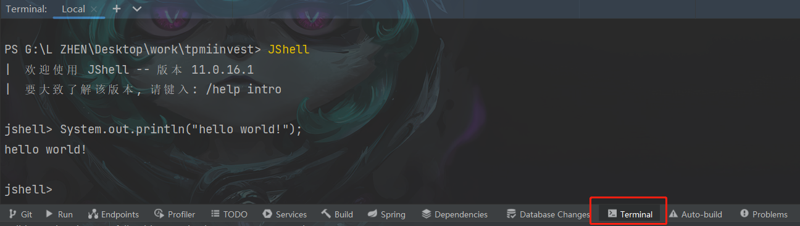
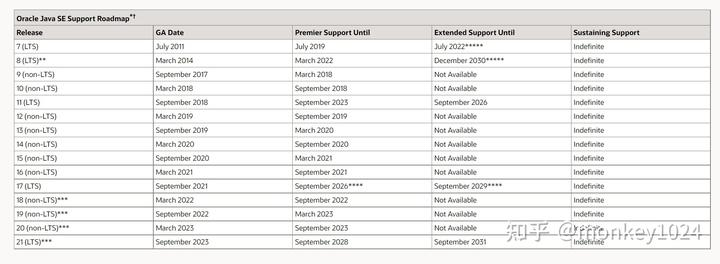

## jdk9的变化

### jshell

有的时候我们只是想写一段简单的代码，例如HelloWorld，按照以前的方式，还需要自己创建java文件，创建class，编写main方法，但实际上里面的代码其实就是一个打印语句，此时还是比较麻烦的。在jdk9中新增了jshell工具，可以帮助我们快速的运行一些简单的代码。

从命令提示符里面输入jshell，进入到jshell之后输入：

```java
System.out.println("HelloWorld");
```

此时可以直接看到命令提示符中打印了HelloWorld。

我们还可以输入下面代码然后按回车：

```java
int a = 10;
```

再输入下面代码按回车：

```java
int b = 20;
```

再输入下面代码按回车：

```java
System.out.println(a + b);
```

此时可以看到控制台打印出了a+b的值了。

如果要退出jshell的话，输入/exit即可



### 接口私有方法

在jdk9中新增了接口私有方法，我们可以在接口中声明private修饰的方法了，这样的话，接口越来越像抽象类了

```java
public interface MyInterface {
    //定义私有方法
    private void m1() {
        System.out.println("123");
    }

    //default中调用
    default void m2() {
        m1();
    }
}
```

### 改进的try with resource

之前我们使用try with resource用来自动关闭资源文件，特别是在IO流部分使用的比较多。使用方式是将需要自动关闭的资源对象的创建放到try后面的小括号中，在jdk9中我们可以将这些资源对象的创建放到外面，然后将需要关闭的对象放到try后面的小括号中即可，示例：

```java
/*
改进了try-with-resources语句，可以在try外进行初始化，在括号内引用，即可实现资源自动关闭
 */
public class TryWithResource {
    public static void main(String[] args) throws FileNotFoundException {
        //jdk8以前
        try (FileInputStream fileInputStream = new FileInputStream("");
             FileOutputStream fileOutputStream = new FileOutputStream("")) {

        } catch (IOException e) {
            e.printStackTrace();
        }

        //jdk9
        FileInputStream fis = new FileInputStream("abc.txt");
        FileOutputStream fos = new FileOutputStream("def.txt");
        //多资源用分号隔开
        try (fis; fos) {
                } catch (IOException e) {
            e.printStackTrace();
        }
    }
}
```

### InputStream.transferTo

`InputStream.transferTo` 方法是在Java 9 中引入的，用于将输入流的内容传输（拷贝）到另一个输出流中。这个方法的目的是简化将输入流内容复制到输出流的常见任务。通常，这对于处理文件或网络流等情况非常有用。

方法签名如下：

```java
public long transferTo(OutputStream out) throws IOException
```

- `out`：要将数据传输到的目标输出流。

这个方法会从当前输入流中读取数据并将其写入目标输出流，直到输入流被耗尽或发生异常。它返回传输的字节数。

以下是一个示例，演示如何使用 `transferTo` 方法将一个输入流的内容复制到输出流：

```java
/*以前*/
public static void main(String[] args) throws IOException {
    FileInputStream inputStream = new FileInputStream("G:\\L ZHEN\\Desktop\\work\\测试环境发版文档.docx");

    FileOutputStream outputStream = new FileOutputStream("G:\\L ZHEN\\Desktop\\iInvest测试环境发版文档.docx");

    int read;

    byte[] b = new byte[1024];

    while ((read = inputStream.read(b)) != -1) {
        outputStream.write(b, 0, read);
    }
}

/*现在*/
public static void main(String[] args) throws IOException {
    FileInputStream inputStream = new FileInputStream("G:\\L ZHEN\\Desktop\\work\\测试环境发版文档.docx");

    FileOutputStream outputStream = new FileOutputStream("G:\\L ZHEN\\Desktop\\测试环境发版文档.docx");

    inputStream.transferTo(outputStream);
}
```

### 不能使用下划线命名变量

下面语句在jdk9之前可以正常编译通过,但是在jdk9（含）之后编译报错，在后面的版本中会将下划线作为关键字来使用

```java
String _ = "monkey1024";
```

### String字符串的变化

写程序的时候会经常用到String字符串，在以前的版本中String内部使用了char数组存储，对于使用英语的人来说，字符用一个字节就能存储，因此在jdk9中将String内部的char数组改成了byte数组，这样就节省了一半的内存占用。String中增加了一个判断，倘若字符超过1个字节的话，会把byte数组的长度改为两倍char数组的长度，用两个字节存放一个char。在获取String长度的时候，其源码中有向右移动1位的操作（即除以2），这样就解决了上面扩容2倍之后长度不正确的问题。

### 模块化

JDK9将JDK分成一组模块，可以在编译时或运行时进行组合。这样可以减少内存开销，只需必要的模块，并非全部模块，可以简化各种类库和大型应用的开发和维护。比如在使用java开发的时候通常用不到图形化界面的库，分模块之后，在java的base模块中没有这些图形化相关的内容，达到了一个瘦身的效果。

## jdk10的变化

### 局部变量类型推断

在jdk10以前声明变量的时候，我们会像下面这样：

```java
String oldName = "jack";
    int oldAge = 10;
    long oldMoney = 88888888L;
    Object oldObj = new Object();
```

上面我们声明的时候使用了4种不同类型的变量，在jdk10中前面的类型都可以使用var来代替，JVM会自动推断该变量是什么类型的，例如可以这样写：

```java
var newName = "jack";
    var newAge = 10;
    var newMoney = 88888888L;
    var newObj = new Object();
```

注意：

**当然这个var的使用是有限制的，仅适用于局部变量，增强for循环的索引，以及普通for循环的本地变量；它不能使用于方法形参，构造方法形参，方法返回类型等。**

## jdk11的变化

### 直接运行

在以前的版本中，我们在命令提示下，需要先编译，生成class文件之后再运行，例如：

```text
javac HelloWorld.java
java HelloWorld
```

在java 11中，我们可以这样直接运行

```text
java HelloWorld.java
```

### String新增方法

strip方法，可以去除首尾空格，与之前的trim的区别是还可以去除unicode编码的空白字符，例如：

```java
char c = '\u2000';//Unicdoe空白字符
String str = c + "abc" + c;
System.out.println(str.strip());
System.out.println(str.trim());

System.out.println(str.stripLeading());//去除前面的空格
System.out.println(str.stripTrailing());//去除后面的空格
```

isBlank方法，判断字符串长度是否为0，或者是否是空格，制表符等其他空白字符

```java
String str = " ";
System.out.println(str.isBlank());
```

repeat方法，字符串重复的次数

```java
String str = "hello";
System.out.println(str.repeat(4));//hellohellohellohello
```

### lambda表达式中的变量类型推断

jdk11中允许在lambda表达式的参数中使用var修饰

函数式接口：

```java
@FunctionalInterface
    public interface MyInterface {
        void m1(String a, int b);
    }
```

测试类：

```java
//支持lambda表达式参数中使用var
   MyInterface mi = (var a,var b)->{
       System.out.println(a);
       System.out.println(b);
   };

   mi.m1("monkey",1024);
```

## jdk12的变化

### 升级的switch语句

在jdk12之前的switch语句中，如果没有写break，则会出现case穿透现象，下面是对case穿透的一个应用，根据输入的月份打印相应的季节。

```java
int month = 3;
switch (month) {
    case 3:
    case 4:
    case 5:
        System.out.println("spring");
    break;
    case 6:
    case 7:
    case 8:
        System.out.println("summer");
    break;
    case 9:
    case 10:
    case 11:
        System.out.println("autumn");
    break;
    case 12:
    case 1:
    case 2:
        System.out.println("winter");
    break;
    default:
        System.out.println("wrong");
    break;
}
```

在jdk12之后我们可以省略全部的break和部分case，这样使用

```java
int month = 3;
    switch (month) {
        case 3,4,5 -> System.out.println("spring");
        case 6,7,8 -> System.out.println("summer");
        case 9,10,11 -> System.out.println("autumn");
        case 12, 1,2 -> System.out.println("winter");
        default -> System.out.println("wrong");
    }
```

这个是预览功能，如果需要编译和运行的话需要使用下面命令，预览功能在2个版本之后会成为正式版，即如果你使用的是jdk14以上的版本，正常的编译和运行即可。否则需要使用预览功能来编译和运行

```text
编译:
    javac --enable-preview -source 12 Test.java

运行：
    java --enable-preview Test
```

## jdk13的变化

### 升级的switch语句

jdk13中对switch语句又进行了升级，可以switch的获取返回值

示例：

```java
int month = 3;
   String result = switch (month) {
        case 3,4,5 -> "spring";
        case 6,7,8 -> "summer";
        case 9,10,11 -> "autumn";
        case 12, 1,2 -> "winter";
        default -> "wrong";
    };

    System.out.println(result);
```

对于jdk15之后的版本可以直接编译和运行，否则需要使用下面命令执行该预览功能

```text
编译:
    javac --enable-preview -source 13 Test.java

运行：
    java --enable-preview Test
```

### 文本块的变化

在jdk13之前的版本中如果输入的字符串中有换行的话，需要添加换行符

```java
String s = "Hello\nWorld\nLearn\nJava";
    System.out.println(s);
```

jdk13之后可以直接这样写：

```java
String s = """
            Hello
            World
            Learn
            Java
           """;
  System.out.println(s);
```

这样的字符串更加一目了然。

## jdk14的变化

### instanceof模式匹配

该特性可以减少强制类型转换的操作，简化了代码，代码示例：

```java
public class TestInstanceof{
    public static void main(String[] args){

        //jdk14之前的写法
        Object obj = new Integer(1);
        if(obj instanceof Integer){
            Integer i = (Integer)obj;
            int result = i + 10;
            System.out.println(i);
        }

        //jdk14新特性  不用再强制转换了
        //这里相当于是将obj强制为Integer之后赋值给i了
        if(obj instanceof Integer i){
            int result = i + 10;
            System.out.println(i);
        }else{
            //作用域问题，这里是无法访问i的
        }
    }
}
```

这个是预览版的功能所以需要使用下面命令编译和运行

```java
编译:
    javac --enable-preview -source 14 TestInstanceof.java

运行：
    java --enable-preview TestInstanceof
```

### 友好的空指针（NullPointerException）提示

jdk14中添加了对于空指针异常友好的提示，便于开发者快速定位空指针的对象。示例代码：

```java
class Machine{
    public void start(){
        System.out.println("启动");
    }
}

class Engine{
    public Machine machine;
}

class Car{
    public Engine engine;

}

public class TestNull{
    public static void main(String[] args){
        //这里会报出空指针，但是哪个对象是null呢？
        new Car().engine.machine.start();
    }
}
```

我们在运行上面代码的时候，错误信息就可以明确的指出那个对象为null了。此外，还可以使用下面参数来查看:

```text
java -XX:+ShowCodeDetailsInExceptionMessages TestNull
```

这样编译器会明确的告诉开发者哪个对象是null。

### record类型

- `record` 是 Java 14 中引入的一种简化数据类的语法糖，用于表示仅包含数据的不可变对象。使用 `record` 可以大幅减少样板代码，如构造器、`equals`、`hashCode`、`toString` 等方法的编写。

  **语法**

  ```java
  public record Point(int x, int y) {}
  ```

  上面的代码定义了一个名为 `Point` 的 `record`，它有两个字段 `x` 和 `y`。Java 会自动为 `Point` 生成以下内容：

  1. **私有字段**：`private final int x; private final int y;`
  2. **构造函数**：`public Point(int x, int y) { this.x = x; this.y = y; }`
  3. **Getter方法**：`public int x() { return x; } public int y() { return y; }`
  4. **`equals()` 方法**：用于比较两个 `Point` 对象是否相等。
  5. **`hashCode()` 方法**：返回 `Point` 对象的哈希码。
  6. **`toString()` 方法**：返回 `Point` 对象的字符串表示，例如 `Point[x=1, y=2]`。

  **特性**

  - **不可变性**：`record` 的字段是 `final` 的，不可变。
  - **模式匹配**：`record` 可以与模式匹配结合使用。
  - **继承**：`record` 自动继承自 `java.lang.Record`，不能显式继承其他类，但可以实现接口。

  **使用示例**

  ```java
  public record Point(int x, int y) {
      // 可以定义自己的方法
      public int sum() {
          return x + y;
      }
  }
  
  public class Main {
      public static void main(String[] args) {
          Point point = new Point(1, 2);
          System.out.println(point); // 输出: Point[x=1, y=2]
          System.out.println(point.sum()); // 输出: 3
      }
  }
  ```

  `record` 的引入极大地简化了开发过程中数据对象的定义，使代码更加简洁明了。

## jdk15的变化

### Sealed Classes

密封类和接口，作用是限制一个类可以由哪些子类继承或者实现。

1.  如果指定模块的话，sealed class和其子类必须在同一个模块下。如果没有指定模块，则需要在同一个包下。
2.  sealed class指定的子类必须直接继承该sealed class。
3.  sealed class的子类要用final修饰。
4.  sealed class的子类如果不想用final修饰的话，可以将子类声明为sealed class。

Animal类，在指定允许继承的子类时可以使用全限定名

```java
public sealed class Animal 
    permits Cat, Dog{//多个子类之间用,隔开

        public void eat(){}
}
```

Cat类

```java
public final class Cat extends Animal{
    public void eat(){
        System.out.println("123");
    }
}
```

Dog类

```java
public sealed class Dog extends Animal
    permits Husky {}
```

Husky类

```java
public final class Husky extends Dog{
}
```

Test类

```java
public class Test{
    public static void main(String[] args){
        Cat c = new Cat();
        c.eat();
        Dog d = new Dog();
    }
}
```

### CharSequence新增的方法

该接口中新增了default方法isEmpty\(\)，作用是判断CharSequence是否为空。

### TreeMap新增方法

1. **putIfAbsent**：将指定的键和值添加到`TreeMap`中，仅当该键尚未与其他值关联时。如果键已经存在，不会执行任何操作，并返回现有的值。

   ```java
   V putIfAbsent(K key, V value)
   ```
   
2. **computeIfAbsent**：根据指定的键计算一个值，并将其与键相关联，仅当该键尚未与其他值关联时。如果键已经存在，不会执行任何操作。

   ```java
   V computeIfAbsent(K key, Function<? super K,? extends V> mappingFunction)
   ```
   
3. **computeIfPresent**：根据指定的键计算一个新值，并将其与键相关联，仅当该键已经与某个值关联时。如果键不存在，不会执行任何操作。

   ```java
   V computeIfPresent(K key, BiFunction<? super K,? super V,? extends V> remappingFunction)
   ```
   
4. **compute**：根据指定的键计算一个新值，并将其与键相关联。如果键不存在，不会执行任何操作。

   ```java
   V compute(K key, BiFunction<? super K,? super V,? extends V> remappingFunction)
   ```
   
5. **merge**：将指定的键和值与现有键关联的值组合，并将结果放回键所关联的位置。如果键不存在，将添加指定的键和值。

   ```java
   V merge(K key, V value, BiFunction<? super V,? super V,? extends V> remappingFunction)
   ```


```java
	public static void main(String[] args) {
		HashMap<Integer, Integer> map = new HashMap<>();

		map.put(1, 1);
		System.out.println("map = " + map.toString());//map = {1=1}

		map.putIfAbsent(1, 2);
		System.out.println("map = " + map.toString());//map = {1=1}

		map.putIfAbsent(3, 3);
		System.out.println("map = " + map.toString());//map = {1=1, 3=3}

		map.computeIfAbsent(3, k -> 4);
		System.out.println("map = " + map.toString());//map = {1=1, 3=3}

		map.computeIfAbsent(5, k -> 5);
		System.out.println("map = " + map.toString());//map = {1=1, 3=3, 5=5}

		map.computeIfAbsent(6, k -> map.get(1) + map.get(3));
		System.out.println("map = " + map.toString());//map = {1=1, 3=3, 5=5, 6=4}
		
		map.computeIfPresent(6, (k, v) -> 6);
		System.out.println("map = " + map.toString());//map = {1=1, 3=3, 5=5, 6=6}

		map.put(1,111);
		System.out.println("map = " + map.toString());//map = {1=111, 3=3, 5=5, 6=6}

		map.put(10,101010);
		System.out.println("map = " + map.toString());//map = {1=111, 3=3, 5=5, 6=6, 10=101010}
	}
```

这些方法在处理映射时非常有用，可以根据不同的条件来执行操作，而不需要显式地进行存在性检查或手动操作。这些方法使得处理`TreeMap`和其他`Map`实现变得更加方便和灵活。

### 文本块

文本块由预览版变为正式版

### 无需配置环境变量

win系统中安装完成之后会自动将java.exe, javaw.exe, javac.exe, jshell.exe这几个命令添加到环境变量中。这部分可以打开环境变量看下。不过还是建议配置环境变量，因为这几个命令不够用

## jdk16的变化

这里只介绍一些跟开发关联度较大的特性，除此之外JDK16还更新了许多其他新特性，感兴趣的同学可以去Oracle官网查看

### 包装类构造方法的警告

 使用包装类的构造方法在编译的时候会出现警告，不建议再使用包装类的构造方法。下面代码在javac编译之后会出现警告。

```java
Integer i = new Integer(8);
```

不建议使用包装类作为锁对象，倘若使用包装类作为锁对象，在编译时会出现警告。

```java
Integer i = 8;
    synchronized(i){

    }
```

### 新增日时段

在DateTimeFormatter.ofPattern传入B可以获取现在时间对应的日时段，上午，下午等

```java
System.out.println(DateTimeFormatter.ofPattern("B").format(LocalDateTime.now()));
```

### InvocationHandler新增方法

在该接口中添加了下面方法

```java
public static Object invokeDefault(Object proxy, Method method, Object... args)
```

该方法可以调用父接口中defalut方法，比如有下面接口

```java
interface Girl{
    default void eat(){
        System.out.println("cucumber");
    }

}
```

实现类

```java
public class Lucy implements Girl{
    public void eat(){
        System.out.println("banana");
    }
}
```

测试类：

```java
import java.lang.reflect.InvocationHandler;
import java.lang.reflect.Method;
import java.lang.reflect.Proxy;

public class Test{
    public static void main(String[] args) {
        Girl girl = new Lucy();


        //不使用invokeDefault会调用重写的eat方法
        Girl proxy1 = (Girl)Proxy.newProxyInstance(girl.getClass().getClassLoader(),girl.getClass().getInterfaces(),
            (obj,method,params)->{
            Object invoke = method.invoke(girl);
            return invoke;
        });
        proxy1.eat();

        //使用invokeDefault会调用父接口中的default方法
        Girl proxy2 = (Girl)Proxy.newProxyInstance(Girl.class.getClassLoader(),new Class<?>[]{Girl.class},
            (obj,method,params)->{
            if (method.isDefault()) {
                return InvocationHandler.invokeDefault(obj, method, params);
            }
            return null;
        });
        proxy2.eat();

    }

}
```

### 其他

 在之前jdk版本中作为预览功能的Record类，模式匹配的instanceof，打包工具jpackage，已成为正式版。jdk16对GC，jvm运行时内存等内容有一些变化，例如：**ZGC并发栈处理**，**弹性meta space**。

## jdk17的变化

java17是一个LTS（long term support）长期支持的版本，根据计划来看java17会支持到2029年（java8会支持到2030年，OMG），同时Oracle提议下一个LTS版本是java21，在2023年9月发布，这样讲LST版本的发布周期由之前的3年变为了2年。这里只介绍一些跟开发关联度较大的特性，除此之外JDK17还更新了一些其他新特性：[https://www.oracle.com/news/announcement/oracle-releases-java-17-2021-09-14/](https://link.zhihu.com/?target=https%3A//www.oracle.com/news/announcement/oracle-releases-java-17-2021-09-14/)



### switch语法的变化\(预览\)

在之前版本中新增的instanceof模式匹配的特性在switch中也支持了，即我们可以在switch中减少强转的操作。比如下面的代码：

Rabbit和Bird均实现了Animal接口

```java
interface Animal{}

class Rabbit implements Animal{
    //特有的方法
    public void run(){
        System.out.println("run");
    }
}

class Bird implements Animal{
    //特有的方法
    public void fly(){
        System.out.println("fly");
    }
}
```

新特性可以减少Animal强转操作代码的编写：

```java
public class Switch01{
    public static void main(String[] args) {
        Animal a = new Rabbit();
        animalEat(a);
    }

    public static void animalEat(Animal a){
        switch(a){
            //如果a是Rabbit类型，则在强转之后赋值给r，然后再调用其特有的run方法
            case Rabbit r -> r.run();
            //如果a是Bird类型，则在强转之后赋值给b，然后调用其特有的fly方法
            case Bird b -> b.fly();
            //支持null的判断
            case null -> System.out.println("null");
            default -> System.out.println("no animal");
        }
    }

}
```

该功能在java17中是预览的，编译和运行需要加上额外的参数:

```text
javac --enable-preview -source 17 Switch01.java
java  --enable-preview Switch01
```

### Sealed Classes

在jdk15中已经添加了Sealed Classes，只不过当时是作为预览版，经历了2个版本之后，在jdk17中Sealed Classes已经成为正式版了。Sealed Classes的作用是可以限制一个类或者接口可以由哪些子类继承或者实现。

### 伪随机数的变化

增加了伪随机数相关的类和接口来让开发者使用stream流进行操作

- RandomGenerator
- RandomGeneratorFactory

之前的java.util.Random和java.util.concurrent.ThreadLocalRandom都是RandomGenerator接口的实现类。

### 去除了AOT和JIT

AOT（Ahead-of-Time）是java9中新增的功能，可以先将应用中中的字节码编译成机器码。

Graal编译器作为使用java开发的JIT（just-in-time ）即时编译器在java10中加入（注意这里的JIT不是之前java中的JIT，在JEP 317中有说明[https://openjdk.java.net/jeps/317](https://link.zhihu.com/?target=https%3A//openjdk.java.net/jeps/317)）。

以上两项功能由于使用量较少，且需要花费很多精力来维护，因此在java17中被移除了。当然你可以通过Graal VM来继续使用这些功能。

## jdk18的变化

除了下面变化之外jdk18还有一些其他小的变化，可以去oracle官网查看。

从jdk18开始，默认使用UTF-8字符编码。我们可以通过如下参数修改其他字符编码：

```text
-Dfile.encoding=UTF-8 
```

### 简单的web服务器

可以通过jwebserver命令启动jdk18中提供的静态web服务器，可以利用该工具查看一些原型，做简单的测试。在命令提示符中输入jwebserver命令后会启动，然后在浏览器中输入:[http://127.0.0.1:8000/](https://link.zhihu.com/?target=http%3A//127.0.0.1%3A8000/) 即可看到当前命令提示符路径下的文件了。

### 将被移除的方法

在jdk18中标记了Object中的finalize方法，Thread中的stop方法将在未来被移除。

### @snippet注解

以前在文档注释中编写代码时需要添加code标签，使用较为不便，通过\@snippet注解可以更方便的将文档注释中的代码展示在api文档中。

## jdk21的变化

### 虚拟线程

虚拟线程（Virtual Thread）是Java 19引入的一种轻量级线程，它在很多其他语言中被称为协程、纤程、绿色线程、用户态线程等。

在理解虚拟线程前，我们先回顾一下线程的特点：

- 线程是由操作系统创建并调度的资源；
- 线程切换会耗费大量CPU时间；
- 一个系统能同时调度的线程数量是有限的，通常在几百至几千级别。

因此，我们说线程是一种重量级资源。在服务器端，对用户请求，通常都实现为一个线程处理一个请求。由于用户的请求数往往远超操作系统能同时调度的线程数量，所以通常使用线程池来尽量减少频繁创建和销毁线程的成本。

对于需要处理大量IO请求的任务来说，使用线程是低效的，因为一旦读写IO，线程就必须进入等待状态，直到IO数据返回。常见的IO操作包括：

- 读写文件；
- 读写网络，例如HTTP请求；
- 读写数据库，本质上是通过JDBC实现网络调用。

我们举个例子，一个处理HTTP请求的线程，它在读写网络、文件的时候就会进入等待状态：

```ascii
Begin
────────
Blocking ──▶ Read HTTP Request
Wait...
Wait...
Wait...
────────
Running
────────
Blocking ──▶ Read Config File
Wait...
────────
Running
────────
Blocking ──▶ Read Database
Wait...
Wait...
Wait...
────────
Running
────────
Blocking ──▶ Send HTTP Response
Wait...
Wait...
────────
End
```

真正由CPU执行的代码消耗的时间非常少，线程的大部分时间都在等待IO。我们把这类任务称为IO密集型任务。

为了能高效执行IO密集型任务，Java从19开始引入了虚拟线程。虚拟线程的接口和普通线程是一样的，但是执行方式不一样。虚拟线程不是由操作系统调度，而是由普通线程调度，即成百上千个虚拟线程可以由一个普通线程调度。任何时刻，只能执行一个虚拟线程，但是，一旦该虚拟线程执行一个IO操作进入等待时，它会被立刻“挂起”，然后执行下一个虚拟线程。什么时候IO数据返回了，这个挂起的虚拟线程才会被再次调度。因此，若干个虚拟线程可以在一个普通线程中交替运行：

```ascii
Begin
───────────
V1 Runing
V1 Blocking ──▶ Read HTTP Request
───────────
V2 Runing
V2 Blocking ──▶ Read HTTP Request
───────────
V3 Runing
V3 Blocking ──▶ Read HTTP Request
───────────
V1 Runing
V1 Blocking ──▶ Read Config File
───────────
V2 Runing
V2 Blocking ──▶ Read Database
───────────
V1 Runing
V1 Blocking ──▶ Read Database
───────────
V3 Runing
V3 Blocking ──▶ Read Database
───────────
V2 Runing
V2 Blocking ──▶ Send HTTP Response
───────────
V1 Runing
V1 Blocking ──▶ Send HTTP Response
───────────
V3 Runing
V3 Blocking ──▶ Send HTTP Response
───────────
End
```

如果我们单独看一个虚拟线程的代码，在一个方法中：

```java
void register() {
    config = readConfigFile("./config.json"); // #1
    if (config.useFullName) {
        name = req.firstName + " " + req.lastName;
    }
    insertInto(db, name); // #2
    if (config.cache) {
        redis.set(key, name); // #3
    }
}
```

涉及到IO读写的#1、#2、#3处，执行到这些地方的时候（进入相关的JNI方法内部时）会自动挂起，并切换到其他虚拟线程执行。等到数据返回后，当前虚拟线程会再次调度并执行，因此，代码看起来是同步执行，但实际上是异步执行的。

#### 示例

```js
var a = new AtomicInteger(0);
// 创建一个固定200个线程的线程池
try (var vs = Executors.newFixedThreadPool(200)) {    
    List<Future<Integer>> futures = new ArrayList<>();    
    var begin = System.currentTimeMillis();    
    // 向线程池提交1000个sleep 1s的任务    
    for (int i=0; i<1_000; i++) {        
        var future = vs.submit(() -> {
            Thread.sleep(Duration.ofSeconds(1));            
            return a.addAndGet(1);        
            });        
        futures.add(future);    
    }    
        // 获取这1000个任务的结果    
    for (var future : futures) {        
        var i = future.get();        
        if (i % 100 == 0) {            
            System.out.print(i + " ");        
        }    
    }    
    // 打印总耗时    
    System.out.println("Exec finished.");    
    System.out.printf("Exec time: %dms.%n", System.currentTimeMillis() - begin);
} catch (ExecutionException | InterruptedException e) {    
        e.printStackTrace();
    }
```

你也许注意到了我们用了var来代替ExecutorService、Future等类型来做对象声明，这个特性很容易理解，我们会在第3篇中介绍。另外ExecutorService继承了AutoCloseable接口，已经可以在try-with-resource语法中创建了。

这段程序的逻辑很简单，向一个固定200个线程的线程池提交1000个sleep 1s的任务并遍历获取结果，平均每个线程会执行5个任务，总耗时约为5s，程序的输出如下：

```java
100 200 300 400 500 600 700 800 900 1000 Exec finished.
Exec time: 5046ms.
```

让我们尝试下使用虚拟线程，将第3行的线程池创建替换为

```java
try (var vs = Executors.newVirtualThreadPerTaskExecutor()) {
```

程序的输出如下：

```java
100 200 300 400 500 600 700 800 900 1000 Exec finished.
Exec time: 1033ms.
```

可以明显看出，使用虚拟线程的版本执行速度要比线程池快很多，如果我们加大任务量到一百万个任务，打印线程改为每一万个打印一次，程序输出如下：

```java
java复制代码10000 20000 30000 40000 50000 60000 70000 80000 90000 100000 110000 120000 130000 140000 150000 160000 170000 180000 190000 200000 210000 220000 230000 240000 250000 260000 270000 280000 290000 300000 310000 320000 330000 340000 350000 360000 370000 380000 390000 400000 410000 420000 430000 440000 450000 460000 470000 480000 490000 500000 510000 520000 530000 540000 550000 560000 570000 580000 590000 600000 610000 620000 630000 640000 650000 660000 670000 680000 690000 700000 710000 720000 730000 740000 750000 760000 770000 780000 790000 800000 810000 820000 830000 840000 850000 860000 870000 880000 890000 900000 910000 920000 930000 940000 950000 960000 970000 980000 990000 1000000 
Exec finished.Exec time: 16897ms.
```

可以看到，虚拟线程处理100万个并发任务的耗时只有10几秒的时间，这个处理能力如果用线程池来做无论线程数如何配置都几乎不可能实现

#### 虚拟线程的作用

**区别于虚拟线程，传统的线程对象叫做平台线程（platform thread）。平台线程在底层 OS 线程上运行 Java 代码，并在代码的整个生命周期中占用该 OS 线程，因此平台线程的数量受限于 OS 线程的数量。虚拟线程是 java.lang.Thread 的一个实例，它在底层 OS 线程上运行 Java 代码，但不会在代码的整个生命周期中占用该 OS 线程。也就是说，多个虚拟线程可以在同一个 OS 线程上运行其 Java 代码，可以有效地共享该线程。平台线程独占宝贵的 OS 线程，而虚拟线程则不会，因此虚拟线程的数量可以比 OS 线程的数量多得多，执行阻塞任务的整体吞吐量也就大了很多。**

**但如果上述任务不是简单的sleep 1s，而是计算了1s（例如做矩阵计算或数组排序等），用线程池和虚拟线程的执行时间区别就没有那么大。原因是虚拟线程虽然可以带来更大的吞吐量，但并不能让单个任务计算得更快，当使用平台线程执行任务已经让cpu没有任何空闲时，切换虚拟线程来执行也不会带来任何收益。**

**虚拟线程可以发挥的最大作用是，可以让采用单请求单线程（thread-per-request）的方式编写的服务器程序最大化地利用CPU计算资源** **。** 其原因在于服务器程序有两大特点，一是需要处理较大吞吐量的请求，二是请求处理的过程大多是由IO密集型逻辑组成，这就导致采用平台线程实现的单请求单线程编写方式，可能会有大量的IO阻塞占据了平台线程资源，从而不能充分利用CPU资源。我们在使用真实应用压测时观察到，当服务请求IO耗时增大时，使用虚拟线程的吞吐量会明显高于线程池，尤其是当服务下游依赖出现故障导致耗时增大时，虚拟线程带来的服务可用性提升会非常明显。

有些情况下，服务端开发者为了充分利用cpu硬件资源，会考虑放弃单请求单线程的编程风格，而采用基于netty、actor等异步框架来构建服务。这样虽然它消除了由于OS线程稀缺性带来的吞吐量限制，但代价很高：它需要异步编程风格，没有专用线程，开发人员必须将请求处理逻辑分解成小阶段，通常是lambda表达式或独立的回调handler对象，然后使用API将它们组合成一个顺序管道（例如CompletableFuture或响应式框架），在一定程度上放弃了代码的顺序执行逻辑和代码的可读性。

在异步风格中，请求的每个阶段可能在不同的线程上执行，每个线程以交替方式运行属于不同请求的阶段。这对于理解程序行为有很大的影响：堆栈跟踪不能提供可用的上下文，debug无法跟踪请求处理逻辑，而分析工具无法将请求处理与其调用者相关联。总的来说，除了底层服务框架和一些特定的功能性服务，大部分以业务开发为主导的服务器程序都不会采用这种编程风格进行逻辑开发。

#### 使用虚拟线程

虚拟线程的接口和普通线程一样，唯一区别在于创建虚拟线程只能通过特定方法。

方法一：直接创建虚拟线程并运行：

```java
// 传入Runnable实例并立刻运行:
Thread vt = Thread.startVirtualThread(() -> {
    System.out.println("Start virtual thread...");
    Thread.sleep(10);
    System.out.println("End virtual thread.");
});
```

方法二：创建虚拟线程但不自动运行，而是手动调用`start()`开始运行：

```java
// 创建VirtualThread:
Thread.ofVirtual().unstarted(() -> {
    System.out.println("Start virtual thread...");
    Thread.sleep(1000);
    System.out.println("End virtual thread.");
});
// 运行:
vt.start();
```

方法三：通过虚拟线程的ThreadFactory创建虚拟线程，然后手动调用`start()`开始运行：

```java
// 创建ThreadFactory:
ThreadFactory tf = Thread.ofVirtual().factory();
// 创建VirtualThread:
Thread vt = tf.newThread(() -> {
    System.out.println("Start virtual thread...");
    Thread.sleep(1000);
    System.out.println("End virtual thread.");
});
// 运行:
vt.start();
```

方法四：使用`Executors`框架

`Executors.newVirtualThreadPerTaskExecutor()`：Java的`Executors`框架提供了创建线程池的方法，可以配置为使用虚拟线程。这种方法适用于需要管理大量虚拟线程的场景。

```java
ExecutorService executor = Executors.newVirtualThreadPerTaskExecutor();  
executor.submit(() -> {  
    System.out.println("Task executed by a virtual thread");  
});  
executor.shutdown(); // 记得关闭执行器服务以释放资源
```

由于虚拟线程属于非常轻量级的资源，因此，用时创建，用完就扔，不要池化虚拟线程。

最后注意，虚拟线程在Java 21正式发布，在Java 19/20是预览功能，默认关闭，需要添加参数`--enable-preview`启用：

```
java --source 19 --enable-preview Main.java
```

#### 使用限制

注意到只有以虚拟线程方式运行的代码，才会在执行IO操作时自动被挂起并切换到其他虚拟线程。普通线程的IO操作仍然会等待，例如，我们在`main()`方法中读写文件，是不会有调度和自动挂起的。

可以自动引发调度切换的操作包括：

- 文件IO；
- 网络IO；
- 使用Concurrent库引发等待；
- Thread.sleep()操作。

这是因为JDK为了实现虚拟线程，已经对底层相关操作进行了修改，这样应用层的Java代码无需修改即可使用虚拟线程。无法自动切换的语言需要用户手动调用`await`来实现异步操作：

```java
async function doWork() {
    await readFile();
    await sendNetworkData();
}
```

在虚拟线程中，如果绕过JDK的IO接口，直接通过JNI读写文件或网络是无法实现调度的。此外，在`synchronized`块内部也无法调度。