## 1\. Kafka概述

### 1.1 定义

   Kafka 是一个分布式的基于发布/订阅模式的消息队列（Message Queue），主要应用于大数据实时处理领域。

### 1.2 消息队列

#### 1.2.1 传统消息队列的应用场景

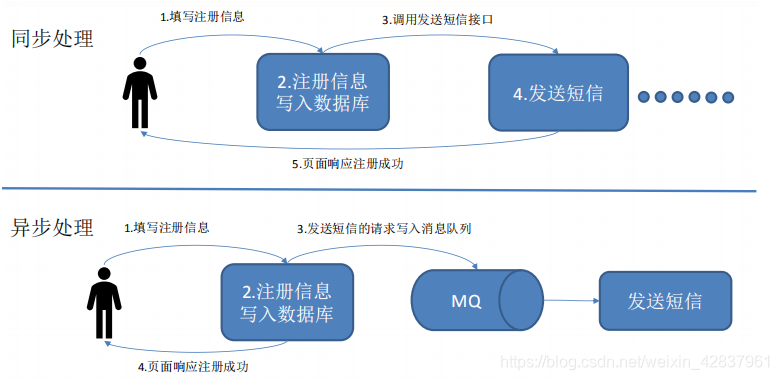  


**使用消息队列的好处：**

1.  **解耦**

    允许独立的扩展或修改两边的处理过程，只要确保它们遵守同样的接口约束。

2.  **可恢复性**

    系统的一部分组件失效时，不会影响整个系统。消息队列降低了进程间的耦合度，所以即使一个处理消息的进程挂掉，加入队列中的消息仍然可以在系统恢复后被处理。

3.  **缓冲**

    有助于控制和优化数据流经过系统的速度，解决生产消息和消费消息的处理速度不一致的情况。

4.  **灵活性和峰值处理能力**

    使用消息队列能够使关键组件顶住突发的访问压力，而不会因为突发的超负荷的请求而完全崩溃。

5.  **异步通信**

    很多时候，用户不想也不需要立即处理消息。消息队列提供了异步处理机制，允许用户把一个消息放入队列，但并不立即处理它。想向队列中放入多少消息就放多少，然后在需要的时候再去处理它们。

#### 1.2.2 消息队列的两种形式

1.  **点对点模式**（一对一，消费者主动拉取数据，消息收到后消息清除。）

    消息生产者生产消息发送到 Queue 中，然后消费者从 Queue 中取出并且消费消息。消息被消费以后，Queue 中不再有存储，所以消费者不可能消费到已经被消费的消息。Queue 支持存在多个消费者，但对于一个消息而言，只有一个消费者可以消费。  
    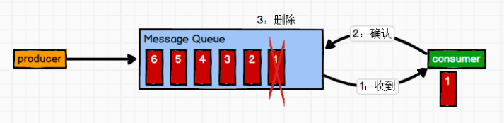

2.  **发布/订阅模式**（一对多，消费者消费数据之后不会清除消息）

    消息生产者（发布）将消息发布到 topic 中，同时有多个消息消费者（订阅）消费该消息。和点对点方式不同，发布到 topic 中的消息会被所有订阅者消费。  
    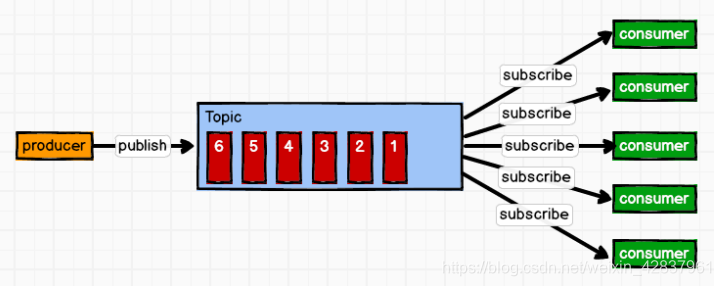

### 1.3 Kafka 基础架构

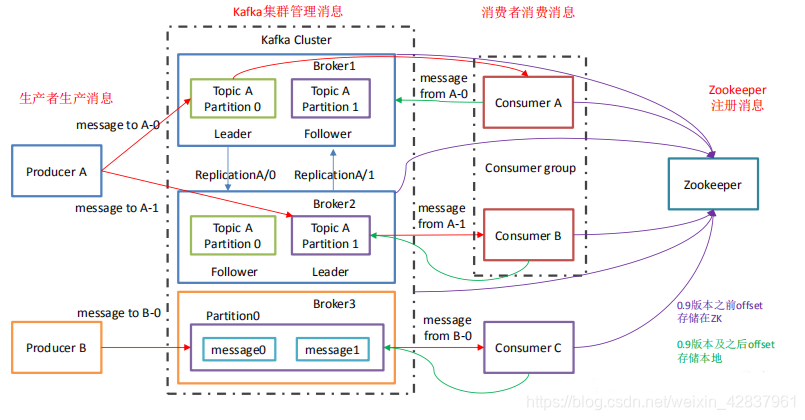

1.  **Producer：**

    消息生产者，就是向 Kafka broker 发消息的客户端。

2.  **Consumer：**

    消息消费者，向 Kafka broker 取消息的客户端。

3.  **Consumer Group（CG）：**

    消费者组，由多个 Consumer 组成。消费者组内每个消费者负责消费不同分区的数据，一个分区只能由一个组内消费者消费；消费者组间互不影响。所有的消费者都属于某个消费者组，即消费者组是逻辑上的一个订阅者。

4.  **Broker：**

    一台 Kafka 服务器就是一个 broker。一个集群由多个 broker 组成。一个 broker 可以容纳多个 topic。

5.  **Topic：**

    可以理解为一个队列，生产者和消费者面向的都是一个 topic。

6.  **Partiton：**

    为了实现拓展性，一个非常大的 topic 可以分布到多个 broker（即服务器）上，一个 topic 可以分为多个 Partition，每个 partition 都是一个有序的队列。

7.  **Replication：**

    副本，为保证集群中某个节点发生故障时，该节点上的 partition 数据不丢失，且 Kafka 仍然可以继续工作，Kafka 提供了副本机制，一个 topic 的每个分区都有若干个副本，一个 leader 和若干个 follower。

8.  **leader：**

    每个分区多个副本的 ”主“，生产者发送数据的对象，以及消费者消费数据时的对象都是 leader。

9.  **follower：**

    每个分区多个副本的 “从”，实时从 leader 中同步数据，保持和 leader 数据的同步。leader 发生故障时，某个 follower 会成为新的 leader。  


## 2\. Kafka 的安装

### 2.1 安装地址

[Kafka 官网](http://kafka.apache.org/)

### 2.2 安装流程

 1.     **将下载好的安装包上传到 Linux 服务器。（我这里使用的是 kafka\_2.11-0.11.0.0.tgz）**
 2.     **解压安装包到指定目录。**

```shell
tar -zxvf kafka_2.11-0.11.0.0.tgz -C /opt/module/
```

 3.     **修改解压后的文件名称。**

```shell
mv kafka_2.11-0.11.0.0/ kafka
```

 4.     **在 /opt/module/kafka 目录下创建 logs 文件夹。**

```shell
mkdir logs
```

5.  **修改 config 目录下的配置文件 server.properties。**

输入以下内容：

```shell
#broker 的全局唯一编号，不能重复
broker.id=0
#删除 topic 功能使能
delete.topic.enable=true
#处理网络请求的线程数量
num.network.threads=3
#用来处理磁盘 IO 的现成数量
num.io.threads=8
#发送套接字的缓冲区大小
socket.send.buffer.bytes=102400
#接收套接字的缓冲区大小
socket.receive.buffer.bytes=102400
#请求套接字的缓冲区大小
socket.request.max.bytes=104857600
#kafka 运行日志存放的路径
log.dirs=/opt/module/kafka/data
#topic 在当前 broker 上的分区个数
num.partitions=1
#用来恢复和清理 data 下数据的线程数量
num.recovery.threads.per.data.dir=1
#segment 文件保留的最长时间，超时将被删除
log.retention.hours=168
#配置连接 Zookeeper 集群地址
zookeeper.connect=master:2181,slave1:2181,slave2:2181
```

 6.     **将 kafka 目录分发到另外两台机器上。**

```shell
scp kafka/ master:/opt/module/
```

```shell
scp kafka/ slave2:/opt/module/
```

7.  **在另外两台机器上修改配置文件 /opt/module/kafka/config/server.properties 中的 broker.id=1、broker.id=2（broker.id 不得重复）**

  8.  **配置环境变量。**

```powershell
vim /etc/profile
```

添加以下内容：

```shell
#KAFKA_HOME
export KAFKA_HOME=/opt/module/kafka
export PATH=$PATH:$KAFKA_HOME/bin
```

让配置文件生效：

```shell
 source /etc/profile
```

在另外两台机器做以上操作。

  9.  **启动集群。**

    依次在 master、slave1、slave2 节点上启动 Kafka。

```shell
kafka-server-start.sh -daemon /opt/module/kafka/config/server.properties
```

  10.  **关闭集群。**

    依次在 master、slave1、slave2 节点上关闭 Kafka。

```powershell
kafka-server-stop.sh stop
```

 11.     **在 /opt/module/kafka/bin 目录下编写群起群关脚本 kk.sh，方便以后使用。**

```shell
vim kk.sh
```

```shell
#!/bin/bash

case $1 in
"start"){
  for i in master slave1 slave2
    do
      echo "****************** $i *********************"
      ssh $i "source /etc/profile && /opt/module/kafka/bin/kafka-server-start.sh -daemon /opt/module/kafka/config/server.properties"
    done
};;

"stop"){
  for i in master slave1 slave2
    do
      echo "****************** $i *********************"
      ssh $i "/opt/module/kafka/bin/kafka-server-stop.sh"
    done
};;

esac
```

```shell
chmod 777 kk.sh
```

演示截图：  
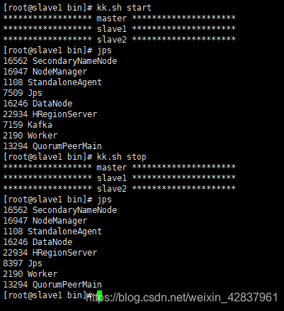  
**说明：** Kafka 集群关闭时会需要一些时间。  


### 2.3 Kafka 命令行操作

 1.     **创建 topic。**

```shell
kafka-topics.sh --zookeeper slave1:2181 --create --replication-factor 3 --partitions 2 --topic demo
```

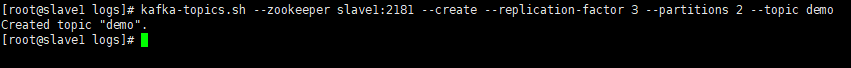

 2.     **查看当前服务器中所有的 topic。**

```shell
kafka-topics.sh --zookeeper slave1:2181 --list
```

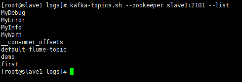

 3.     **查看某个 topic 的详情。**

```shell
kafka-topics.sh --zookeeper slave1:2181 --describe --topic demo
```

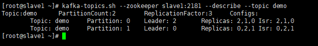

 4.     **删除 topic。**

```shell
kafka-topics.sh --zookeeper slave1:2181 --delete --topic first
```

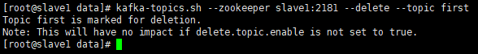

 5.     **发送消息。**

```shell
kafka-console-producer.sh --broker-list slave1:9092 --topic demo
```


6.  **消费消息。**

（1）方法一

```shell
 kafka-console-consumer.sh --zookeeper slave1:2181 --topic demo
```

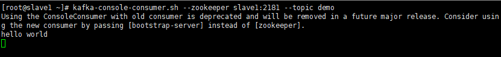  
**注意：** 该方法已经过时。

（2）方法二

```shell
kafka-console-consumer.sh --bootstrap-server slave1:9092 --topic demo
```

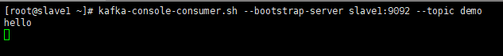  
**说明：** 在以上两种方法的命令上添加 **–from-beginning** 参数会把主题中以往所有的数据都读取出来。  


## 3\. Kafka 架构深入理解

### 3.1 Kafka 工作流程

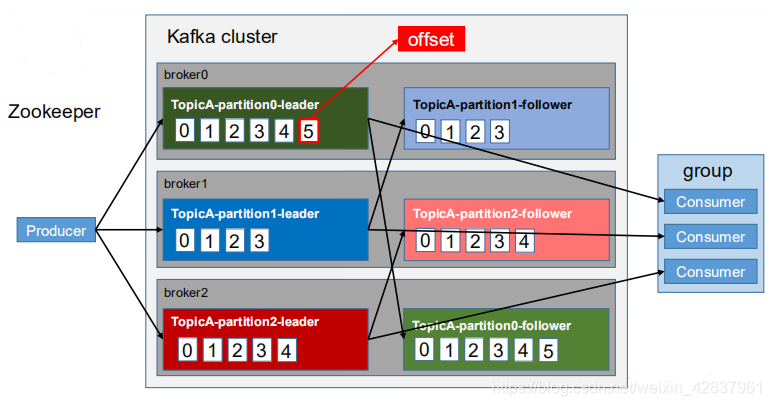  
  Kafka 中消息是以 topic 进行分类的，生产者生产消息，消费者消费消息，都是面向 topic 的。topic 是逻辑上的概念。而 partition 是物理上的概念，每个 partition 对应一个 log 文件，该 log 文件中存储的就是 producer 生产的数据。producer 生产的数据会不断追加到该 log 文件末端，且每条数据都有自己的 offset（偏移量）。消费者组中每个消费者，都会实时记录自己消费到了哪个 offset，以便出错恢复时，从上次的位置继续消费。  


### 3.2 Kafka 文件存储机制

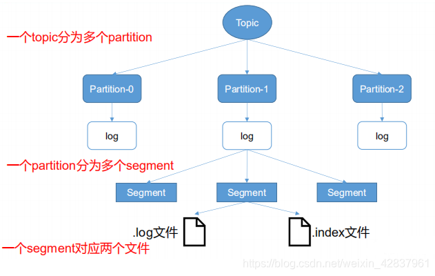  
  由于生产者生产的消息不断追加到 log 文件末尾，为防止 log 文件过大导致数据定位效率低下，Kafka 采取了分片和索引机制，将每个 partition 分为多个 segment。每个 segment 对应两个文件，“.index” 文件和 “.log 文件”。这些文件位于一个文件夹下，该文件夹命名规则为：topic 名称 + 分区序号。例如，demo 这个 topic 有两个分区，则其对应的文件夹为 demo-0，demo-1。  
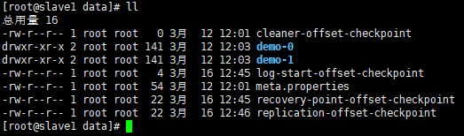  
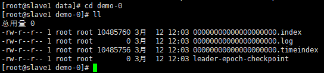  
  index 和 log 文件以当前 segment 的第一条消息 offset 命名。  
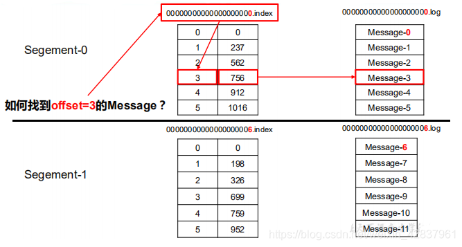  
  “.index” 文件存储大量的索引信息，“.log” 文件存储大量的数据，索引文件中的元数据指向对应数据文件中 message 的物理偏移地址。  


### 3.3 Kafka 生产者

#### 3.3.1 分区策略

1.  **分区的原因**

    （1）方便在集群中扩展，每个 partition 可以通过调整以适应它们的机器，而一个 topic 又可以有多个 partition 组成，因此整个集群就可以适应任意大小的数据了。

    （2）可以提高并发，因为可以以 partition 为单位读写了。

2.  **分区的原则**

    我们需要将 producer 发送的数据封装成一个 ProducerRecord 对象。  
    

    （1）指明 partition 的情况下，直接将指明的值作为 partition 值；

    （2）没有指明 partition 值但有 key 的情况下，将 key 值的 hash 值与 topic 的 partition 数进行取余得到 partition 值；

    （3）既没有 partition 又没有 key 值的情况下，第一次调用时随机生成一个整数（后面每次调用在这个整数上自增），将这个值与 topic 可用的 partition 总数取余得到 partition 值，也就是常说的 round-robin （轮询）算法。

#### 3.3.2 数据可靠性保证

  为保证 producer 发送的数据，能可靠的发送到指定的 topic，topic 中的每个 partition 收到 producer 发送的数据后，都需要向 producer 发送 ack （acknowledgement 确认收到），如果 producer 收到 ack，就会进行下一轮的发送，否则重新发送数据。

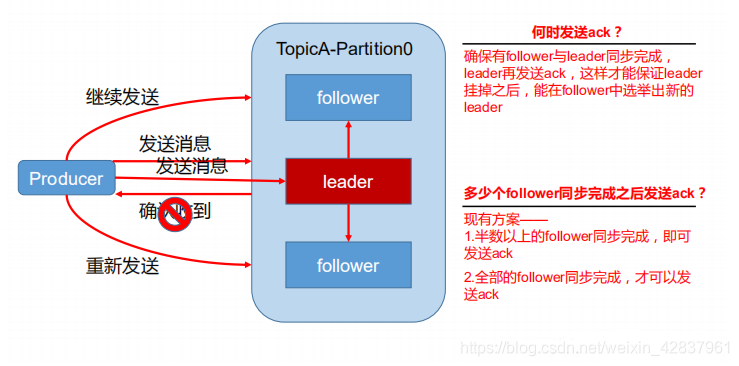

1.  **副本同步策略**

| 方案                         | 优点                                                     | 缺点                                                      |
| ---------------------------- | -------------------------------------------------------- | --------------------------------------------------------- |
| 半数以上完成同步，就发送 ack | 延迟低                                                   | 选取新的 leader 时，容忍 n 台节点的故障，需要 2n+1 个副本 |
| 全部完成同步，就发送 ack     | 选取新的 leader 时，容忍 n 台节点的故障，需要 n+1 个副本 | 延迟高                                                    |

  Kafka 采用的是第二种方案。因为第一种方案会造成大量数据的冗余，虽然第二种方案的网络延迟会比较高，但网络延迟对 Kafka 的影响较小。  


2.  **ISR**

  kafka 采用第二种方案后，可能会出县一个问题：leader 收到数据后。所有的 follower 都开始同步数据，但是某个 follower 因为故障，迟迟不能与 leader 进行同步，那么 leader 就要一直等下去，直到它完成同步，才能发送 ack.

  为了解决这个问题，leader 维护了一个动态的 in-sync replica（ISA），意味着和 leader 保持同步的 follower 集合。当 ISA 中的 follower 完成数据同步之后，leader 就会给 follower 发送 ack。如果 follower 长时间未向 leader 同步数据，则该 follower 将被踢出 ISR，该时间阈值由 replica.lag.time.max.ms 参数设定。leader 发生故障后，就会从 ISR 中选取新的 leader。  


3.  **ack 应答机制**

  对于某些不太重要的数据，对数据的可靠性要求不是很高，能够容忍数据的少量丢失，所以没必要等 ISR 中的所有 follower 全部接收成功。  
  kafka 为用户提供了三种可靠性级别。

**acks 参数配置**

| acks 参数取值 | 说明                                                         |
| ------------- | :----------------------------------------------------------- |
| 0             | producer 不等待 broker 的 ack，这一操作提供一个最低延迟，broker 一接收还没有写入磁盘就已经返回，当 broker 故障时可能丢失数据。 |
| 1             | producer 等待 broker 的 ack，partition 的 leader 落盘成功后返回 ack，如果在 follower 同步成功之前 leader 故障，那么将会丢失数据。 |
| \-1（all）    | producer 等待 broker 的 ack，partition 的 leader 和 follower 全部落盘成功后才返回 ack。但是如果在 follower 同步完成后，broker 发送 ack 之前，leader 发生故障，那么会造成数据重复。 |

  

4.  **故障处理细节**  
    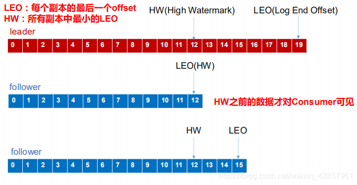  
    **LEO：** 指的是每个副本最大的 offset。  
    **HW：** 指的是消费者能见到的最大的 offset，ISR 队列中最小的 LEO。

    **（1）follower 故障**

  follower 发生故障之后会被临时踢出 ISR，待该 follower 恢复之后，follower 会读取本地磁盘记录的上次 HW，并将 log 文件高于 HW 的部分裁掉，从 HW 开始向 leader 进行同步。等待 follower 的 LEO 大于等于该 partition 的 HW ，即 follower 追上 leader 之后，就可以重新加入 ISR了。

​		**（2）leader 故障**

  leader 发生故障之后，会从 ISR 中选出一个新的 leader，之后为保证多个副本间的数据一致性，其余的 follower 会先将各自的 log 文件高出 HW 的部分裁掉，然后从新的 leader 同步数据。  


#### 3.3.3 Exactly Once 语义

  将 ack 级别设置为 \-1，可以保证 producer 到 server 之间不会丢失数据，但是不能保证数据不重复，即 **At Least Once** 语义。  
  将 ack 级别设置为 0，可以保证生产者每条消息只会发送一次，数据不重复，但是不能保证数据不丢失，即 **At Most Once** 语义。  
  但是对于一些重要数据，要求数据既不丢失又不重复，即 **Exactly Once** 语义。

  在 0.11 版本前的 kafka ，只能保证数据不丢失，再在下游消费者对数据进行全局去重。0.11 版本的 kafka 引入了 **幂等性**。幂等性是指 producer 不论向 server 发送多少次重复数据，server 端只会持久化一条。**At Least Once + 幂等性 = Exactly Once**。

  要启动幂等性，只需要将 producer 中的参数 enable.idompotence 设置为 true 即可。kafka 的幂等性实现就是将原来下游需要做的去重放在了数据上游。开启幂等性的 producer 在初始化的时候会被分配一个 PID。发往同一个 partition 的消息会附带 Sequence Number。而 broker 端会对 \<PID, Partition, SeqNumber> 做缓存，当具有相同主键提交时， broker 只会持久化一条。但是 PID 重启就会发生变化，同时不同的 partition 也具有不同的主键，所以幂等性无法保证跨分区会话的 Exactly Once。

  

### 3.4 Kafka 消费者

#### 3.4.1 消费方式

  consumer 采用 pull（拉）模式从 broker 中读取数据。

  push（推）模式很难适应消费速率不同的消费者，因为消息发送速率是由 broker 决定的。它的目标是尽可能以最快速度传递消息，但是这样很容易造成 consumer 来不及处理消息。典型的表现是拒绝服务以及网络拥塞。而 pull 模式则可以根据 consumer 的消费能力以适当的速率消费消息。

  pull 模式不足之处是， 如果 kafka 没有数据，消费者可能陷入循环中，一直返回空数据。针对这一点，kafka 的消费者在消费数据时会传入一个时长参数 timeout，如果当前没有数据提供消费，consumer 会等待一段时间之后再返回，这段时长即 timeout。  


#### 3.4.2 分区分配策略

  一个 consumer group 中有多个 consumer，一个 topic 有多个 partition，所以必然涉及到 partition 的分配问题，即确定哪个 partition 由哪个消费者消费。

  kafka 有两种分配策略，一是 RoundRobin，一是 Range。

1.  **RoundRobin**  
    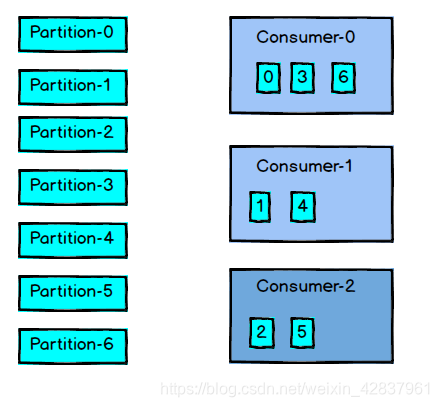
2.  **Range**  
    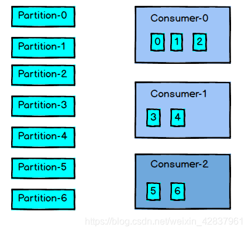

#### 3.4.3 offset 的维护

  由于 consumer 在消费过程中可能出现断电宕机等故障，consumer 恢复后，需要从故障前的位置继续消费，所以 consumer 需要实时记录自己消费到哪个 offset，以便故障恢复后继续消费。

  kafka 0.9 版本以前，consumer 默认将 offset 保存在 zookeeper 中，从 0.9 版本开始，consumer 默认将 offset 保存在 Kafka 一个内置 topic 中，该 topic 为 **\_consumer\_offsets** 。  


 1.     **修改配置文件 consumer.properties 。**

```shell
exclude.internal.topics=false
```

 2.     **启动生产者和消费者**

```shell
kafka-console-producer.sh --broker-list salve1:9092 --topic first
```

```shell
kafka-console-consumer.sh --bootstrap-server slave1:9092 --topic first
```

 3.     **读取 offset。（0.11.0.0 之后版本）**

```shell
kafka-console-consumer.sh --topic __consumer_offsets --zookeeper slave1:2181 \
--formatter "kafka.coordinator.group.GroupMetadataManager\$OffsetsMessageFormatter" \
--consumer.config /opt/module/kafka/config/consumer.properties \
--from-beginning
```

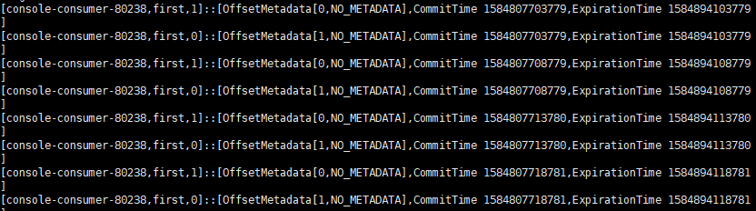  


#### 3.4.4 消费者组案例

1.  **需求**

    测试同一消费者组中的消费者，同一时刻只能有一个消费者消费。

2.  **操作流程**

  （1）在 slave1，salve2 上修改 /opt/module/kafka/config/consumer.properties 配置文件中的 group.id 属性为任意组名。

```shell
group.id=neu
```

  （2）在 slave1，slave2 上分别启动消费者。

```shell
kafka-console-consumer.sh --bootstrap-server slave1:9092 --topic first
```

  （3）在 master 上分别启动生产者。

```shell
kafka-console-producer.sh --broker-list salve1:9092 --topic first
```

  （4）查看 slave1，slave2 上的消费者。

    同一时刻只有一个消费者接收到消息。

  

### 3.5 Kafka 高效读取数据

1.  **顺序写磁盘**

    Kafka 的 producer 生产数据，要写到 log 文件中，写的过程是一直追加到文件末尾，为顺序写。顺序写之所以快，是因为其省去了大量磁头寻址时间。

2.  **零复制技术**  
    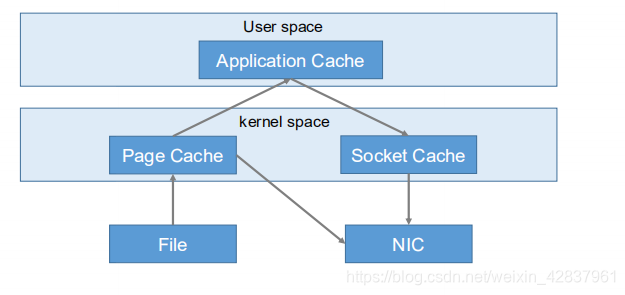  


### 3.6 Zookeeper 在 Kafka 中的作用

  Kafka 集群中有一个 broker 会被选举为 Controller，负责管理集群 broker 的上下线，所有 topic 的分区副本分配和 leader 选举等工作。Controller 的管理工作都是依赖于 Zookeeper 的。  


### 3.7 Kafka 事务

  Kafka 从 0.11 版本开始引入了事务支持。事务可以保证 Kafka 在 Exactly Once 语义 基础上，生产和消费跨分区和会话，要么全部成功，要么全部失败。

#### 3.7.1 Producer 事务

  为了实现跨分区跨会话的事务，需要引入一个全局唯一的 TransactionID，并将 Producer 获得的 PID 和 TransactionID 绑定。这样当 Producer 重启后就可以通过正在进行的 TransactionID 获取原来的 PID。

  为了管理 Transaction，Kafka 引入了一个新的组件 Transaction Coordinator。Producer 就是通过和 Transaction Coordinator 交互获得 TransactionID 对应的任务状态。Transaction Coordinator 还负责将事务写入 Kafka 的一个内部 topic，这样即使整个服务重启，由于事务状态得到保存，进行中的事务状态可以得到恢复，从而继续进行。

  

#### 3.7.2 Consumer 事务

  对于 Consumer 而言，事务的保证就会相对较弱，尤其是无法保证 Commit 的信息被精确消费。这是由于 Consumer 可以通过 offset 访问任何信息，而不同的 Segment File 生命周期不同，同一事务的消息可能出现重启后被删除的情况。  


## 4\. Kafka API

### 4.1 Producer API

#### 4.1.1 消息发送流程

  Kafka 的 producer 发送信息采用的是异步发送的方式。在消息发送的过程中，涉及到两个线程，一个是 **main** 线程，一个是 **Sender** 线程，以及一个线程共享变量—— **RecordAccumulator** 。main 线程将消息发送给 RecordAccumulator，Sender 线程不断从 RecordAccumulator 中拉取消息发送到 Kafka broker。  
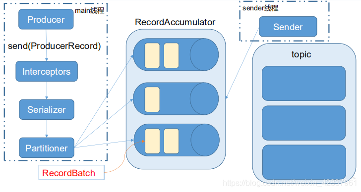

#### 4.1.2 异步发送 API

 1.     **导入依赖。**

```powershell
<dependencies>
	<dependency>
     	<groupId>org.apache.kafka</groupId>
        <artifactId>kafka-clients</artifactId>
        <version>0.11.0.0</version>
	</dependency>
</dependencies>
```

2.  **编写代码。**

    需要用到的类：

    **KafkaProducer：** 需要一个生产者对象，用来发送数据。  
    **ProducerConfig：** 获取所需一系类配置参数。  
    **ProducerRecord：** 每条数据都要封装成一个 ProducerRecord 对象。

**（1）不带回调函数的 API**

```java
package com.neu.producer;

import org.apache.kafka.clients.producer.KafkaProducer;
import org.apache.kafka.clients.producer.ProducerConfig;
import org.apache.kafka.clients.producer.ProducerRecord;

import java.util.Properties;

public class MyProducer {
    public static void main(String[] args) {

        // 1.创建kafka生产者的配置信息
        Properties properties = new Properties();
        // 2.指定连接的Kafka集群
        //properties.put("bootstrap.servers", "slave1:9092");
        properties.put(ProducerConfig.BOOTSTRAP_SERVERS_CONFIG, "slave1:9092");
        // 3.ACK应答级别
        //properties.put("acks", "all");
        properties.put(ProducerConfig.ACKS_CONFIG, "all");
        // 4.重试次数
        properties.put("retries", 1);
        // 5.批次大小
        properties.put("batch.size", 16384);
        // 6.等待时间
        properties.put("linger.ms", 1);
        // 7.RecordAccumulator 缓冲区大小
        properties.put("buffer.memory", 33554432);
        // 8.key,value的序列化
        properties.put("key.serializer", "org.apache.kafka.common.serialization.StringSerializer");
        properties.put("value.serializer", "org.apache.kafka.common.serialization.StringSerializer");
        // 9.创建生产者对象
        KafkaProducer<String, String> producer = new KafkaProducer<>(properties);
        // 10.发送数据
        for (int i = 0; i < 10; i++) {
            producer.send(new ProducerRecord<>("demo", "neu","hello--" + i));
        }
        // 11. 关闭资源
        producer.close();

    }
}
```

**测试：**

```powershell
kafka-console-consumer.sh --zookeeper slave1:2181 --topic demo
```

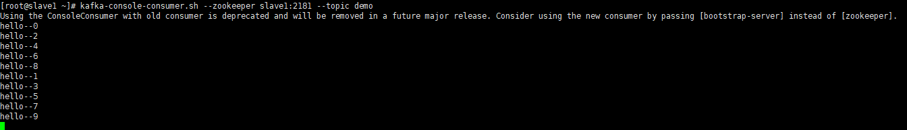  
**（2）带回调函数的 API**

  回调函数会在 producer 收到 ack 时调用，为异步调用，该方法有两个参数，分别是 RecordMetadata 和 Exception，如果 Exception 为 null，说明消息发送成功，如果 Exception 不为 null，说明消息发送失败。

```java
package com.neu.producer;

import org.apache.kafka.clients.producer.*;

import java.util.Properties;

public class CallBackProducer {
    public static void main(String[] args) {

        // 1.创建配置信息
        Properties properties = new Properties();
        properties.put(ProducerConfig.BOOTSTRAP_SERVERS_CONFIG, "slave1:9092");
        properties.put(ProducerConfig.KEY_SERIALIZER_CLASS_CONFIG, "org.apache.kafka.common.serialization.StringSerializer");
        properties.put(ProducerConfig.VALUE_SERIALIZER_CLASS_CONFIG, "org.apache.kafka.common.serialization.StringSerializer");

        // 2.创建生产者对象
        KafkaProducer<String, String> producer = new KafkaProducer<String, String>(properties);

        // 3.发送数据
        for (int i = 0; i < 10; i++) {
            producer.send(new ProducerRecord<>("demo", "hello--" + i), (metadata, exception) -> {
                if (exception == null) {
                    System.out.println(metadata.partition() + "--" + metadata.offset());
                } else {
                    exception.printStackTrace();
                }
            });
        }

//        for (int i = 0; i < 10; i++) {
//            producer.send(new ProducerRecord<>("demo", "hello--" + i), new Callback() {
//                @Override
//                public void onCompletion(RecordMetadata metadata, Exception exception) {
//                    if (exception == null) {
//                        System.out.println(metadata.partition() + "--" + metadata.offset());
//                    } else {
//                        exception.printStackTrace();
//                    }
//                }
//            });
//        }

        // 4.关闭资源
        producer.close();
    }
}
```

**测试：**

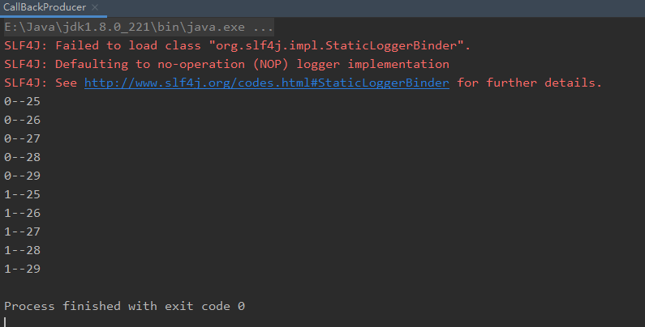  
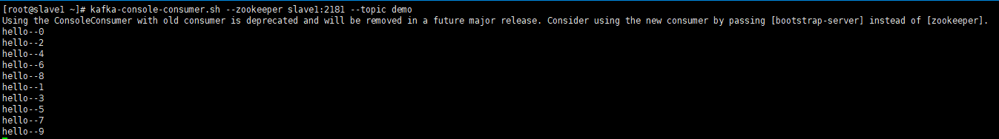  
**（3）自定义分区器**

```java
package com.neu.partitioner;

import org.apache.kafka.clients.producer.Partitioner;
import org.apache.kafka.common.Cluster;

import java.util.Map;

public class MyPartitioner implements Partitioner {
    @Override
    public int partition(String topic, Object key, byte[] keyBytes, Object value, byte[] valueBytes, Cluster cluster) {
        return 1;
    }

    @Override
    public void close() {

    }

    @Override
    public void configure(Map<String, ?> configs) {

    }
}

```

```java
package com.neu.producer;

import org.apache.kafka.clients.producer.*;

import java.util.Properties;

public class PartitionProducer {
    public static void main(String[] args) {

        // 1.创建配置信息
        Properties properties = new Properties();
        properties.put(ProducerConfig.BOOTSTRAP_SERVERS_CONFIG, "slave1:9092");
        properties.put(ProducerConfig.KEY_SERIALIZER_CLASS_CONFIG, "org.apache.kafka.common.serialization.StringSerializer");
        properties.put(ProducerConfig.VALUE_SERIALIZER_CLASS_CONFIG, "org.apache.kafka.common.serialization.StringSerializer");
        // 添加分区器
        properties.put(ProducerConfig.PARTITIONER_CLASS_CONFIG, "com.neu.partitioner.MyPartitioner");

        // 2.创建生产者对象
        KafkaProducer<String, String> producer = new KafkaProducer<String, String>(properties);

        // 3.发送数据
        for (int i = 0; i < 10; i++) {
            producer.send(new ProducerRecord<>("demo", "hello--" + i), new Callback() {
                @Override
                public void onCompletion(RecordMetadata metadata, Exception exception) {
                    if (exception == null) {
                        System.out.println(metadata.partition() + "--" + metadata.offset());
                    } else {
                        exception.printStackTrace();
                    }
                }
            });
        }

        // 4.关闭资源
        producer.close();
    }
}
```

**测试：**  
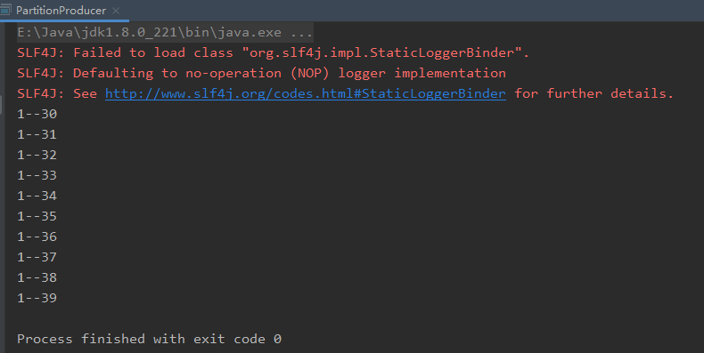  


#### 4.1.3 同步发送 API

  同步发送的意思是，一条消息发送后，会阻塞当前线程，直至返回 ack。由于 send 方法返回的是一个 Future 对象，根据 Future 对象的特点，我们也可以实现同步发送的效果，只需在调用 Future 对象的 get 方法即可。

```java
// 10.发送数据
for (int i = 0; i < 10; i++) {
 	producer.send(new ProducerRecord<>("demo", "neu", "hello--" + i)).get();
}

//        for (int i = 0; i < 10; i++) {
//            Future<RecordMetadata> demo = producer.send(new ProducerRecord<>("demo", "neu", "hello--" + i));
//            RecordMetadata recordMetadata = demo.get();
//        }
```

  

### 4.2 Consumer API

#### 4.2.1 自动提交 offset

  1.  **编写代码。**

    需要用到的类：
    
    **KafkaConsumer：** 需要创建一个消费者对象，用来消费数据。  
    **ConsumerConfig：** 获取所需的一些列配置参数。  
    **ConsumerRecord：** 每条数据都要封装成一个 ConsumerRecord 对象。

```java
package com.neu.consumer;

import org.apache.kafka.clients.consumer.ConsumerConfig;
import org.apache.kafka.clients.consumer.ConsumerRecord;
import org.apache.kafka.clients.consumer.ConsumerRecords;
import org.apache.kafka.clients.consumer.KafkaConsumer;

import java.util.Arrays;
import java.util.Collections;
import java.util.Properties;

public class MyConsumer {

    public static void main(String[] args) {

        // 1.创建消费者配置信息
        Properties properties = new Properties();

        // 2.给配置信息赋值
        // 连接的集群
        properties.put(ConsumerConfig.BOOTSTRAP_SERVERS_CONFIG, "slave1:9092");
        // 开启自动提交
        properties.put(ConsumerConfig.ENABLE_AUTO_COMMIT_CONFIG, true);
        // 自动提交的延时
        properties.put(ConsumerConfig.AUTO_COMMIT_INTERVAL_MS_CONFIG, "1000");
        // key,value的反序列化
        properties.put(ConsumerConfig.KEY_DESERIALIZER_CLASS_CONFIG, "org.apache.kafka.common.serialization.StringDeserializer");
        properties.put(ConsumerConfig.VALUE_DESERIALIZER_CLASS_CONFIG, "org.apache.kafka.common.serialization.StringDeserializer");
        // 消费者组
        properties.put(ConsumerConfig.GROUP_ID_CONFIG, "bigData");

        // 3.创建消费者
        KafkaConsumer<String, String> consumer = new KafkaConsumer<String, String>(properties);

        // 4.订阅主题
        //consumer.subscribe(Collections.singletonList("demo"));
        consumer.subscribe(Arrays.asList("demo", "first"));

        // 5.获取数据
        while (true) {
            ConsumerRecords<String, String> consumerRecords = consumer.poll(100);

            // 解析并打印consumerRecords
            for (ConsumerRecord<String, String> consumerRecord : consumerRecords) {
                System.out.println(consumerRecord.key() + "--" + consumerRecord.value());
            }
        }

    }
}
```

测试：运行 MyConsumer，再运行之前的 MyProducer，观察 MyConsumer 的输出结果。  
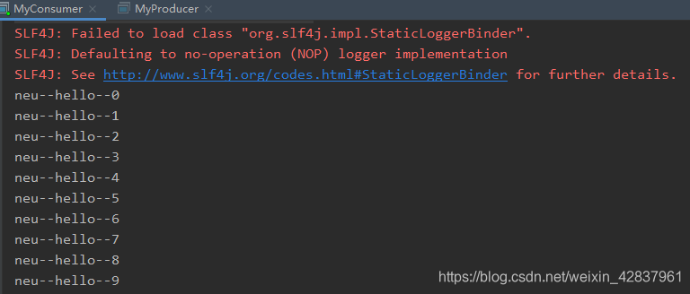  


#### 4.2.2 手动提交 offset

  虽然自动提交 offset 十分简便，但由于其是基于时间提交的，开发人员难以把握 offset 提交的时机。因此 Kafka 提供了手动提交 offset 的 API。  
  手动提交 offset 的方法有两种：分别是 **commitSync（同步提交）** 和 **commitAsync（异步提交）**。两者的相同点是，都会将本次拉取的一批数据最高的偏移量提交。不同点是，commitSync 阻塞当前线程，一直到提交成功，并且会自动失败重试；而 commitAsync 则没有失败重试机制，故有可能提交失败。

 1.     **同步提交 offset**

```java
package com.neu.consumer;

import org.apache.kafka.clients.consumer.ConsumerConfig;
import org.apache.kafka.clients.consumer.ConsumerRecord;
import org.apache.kafka.clients.consumer.ConsumerRecords;
import org.apache.kafka.clients.consumer.KafkaConsumer;

import java.util.Arrays;
import java.util.Collections;
import java.util.Properties;

public class MyConsumer {

    public static void main(String[] args) {

        // 1.创建消费者配置信息
        Properties properties = new Properties();

        // 2.给配置信息赋值
        // 连接的集群
        properties.put(ConsumerConfig.BOOTSTRAP_SERVERS_CONFIG, "slave1:9092");
        // 关闭自动提交
        properties.put(ConsumerConfig.ENABLE_AUTO_COMMIT_CONFIG, false);
        // key,value的反序列化
        properties.put(ConsumerConfig.KEY_DESERIALIZER_CLASS_CONFIG, "org.apache.kafka.common.serialization.StringDeserializer");
        properties.put(ConsumerConfig.VALUE_DESERIALIZER_CLASS_CONFIG, "org.apache.kafka.common.serialization.StringDeserializer");
        // 消费者组
        properties.put(ConsumerConfig.GROUP_ID_CONFIG, "bigData");

        // 3.创建消费者
        KafkaConsumer<String, String> consumer = new KafkaConsumer<String, String>(properties);

        // 4.订阅主题
        //consumer.subscribe(Collections.singletonList("demo"));
        consumer.subscribe(Arrays.asList("demo", "first"));

        // 5.获取数据
        while (true) {
            ConsumerRecords<String, String> consumerRecords = consumer.poll(100);

            // 解析并打印consumerRecords
            for (ConsumerRecord<String, String> consumerRecord : consumerRecords) {
                System.out.println(consumerRecord.key() + "--" + consumerRecord.value());
            }

            //同步提交，当前线程会阻塞直到 offset 提交成功
            consumer.commitSync();
        }

    }
}
```

 2.     **异步提交 offset**

```java
package com.neu.consumer;

import org.apache.kafka.clients.consumer.*;
import org.apache.kafka.common.TopicPartition;

import java.util.Arrays;
import java.util.Collections;
import java.util.Map;
import java.util.Properties;

public class MyConsumer {

    public static void main(String[] args) {

        // 1.创建消费者配置信息
        Properties properties = new Properties();

        // 2.给配置信息赋值
        // 连接的集群
        properties.put(ConsumerConfig.BOOTSTRAP_SERVERS_CONFIG, "slave1:9092");
        // 关闭自动提交
        properties.put(ConsumerConfig.ENABLE_AUTO_COMMIT_CONFIG, false);
        // key,value的反序列化
        properties.put(ConsumerConfig.KEY_DESERIALIZER_CLASS_CONFIG, "org.apache.kafka.common.serialization.StringDeserializer");
        properties.put(ConsumerConfig.VALUE_DESERIALIZER_CLASS_CONFIG, "org.apache.kafka.common.serialization.StringDeserializer");
        // 消费者组
        properties.put(ConsumerConfig.GROUP_ID_CONFIG, "bigData");

        // 3.创建消费者
        KafkaConsumer<String, String> consumer = new KafkaConsumer<String, String>(properties);

        // 4.订阅主题
        //consumer.subscribe(Collections.singletonList("demo"));
        consumer.subscribe(Arrays.asList("demo", "first"));

        // 5.获取数据
        while (true) {
            ConsumerRecords<String, String> consumerRecords = consumer.poll(100);

            // 解析并打印consumerRecords
            for (ConsumerRecord<String, String> consumerRecord : consumerRecords) {
                System.out.println(consumerRecord.key() + "--" + consumerRecord.value());
            }

            //异步提交
            consumer.commitAsync(new OffsetCommitCallback() {
                @Override
                public void onComplete(Map<TopicPartition, OffsetAndMetadata> offsets, Exception exception) {
                    if (exception != null) {
                        System.err.println("Commit failed for" + offsets);
                    }
                }
            });
        }

    }
}
```

3.  **数据漏消费和重复消费分析**

  无论是同步提交还是异步提交 offset，都有可能会造成数据漏消费或重复消费。先提交 offset 后消费，有可能造成数据的漏消费；先消费后提交 offset，有可能造成数据的重复消费。

  

#### 4.2.3 自定义存储 offset

  Kafka 0.9 版本以前，offset 存储在 Zookeeper，0.9 版本后，默认将 offset 存储在 Kafka 的一个内置的 topic 中。除此之外，Kafka 还可以选择自定义存储 offset。  
  offset 的维护是相当繁琐的，因为需要考虑到消费者的 **Rebalance**。  
  当有新的消费者加入消费者组、已有的消费者退出消费者组或者所订阅的消费者主题的分区发生变化，就会触发到分区的重新分配，重新分配的过程叫做 Rebalance。  
  消费者发生 Rebalance 后，每个消费者消费的分区就会发生变化。因此消费者要首先获取到自己被重新分配到的分区，并且定位到每个分区最近提交的 offset 位置继续消费。  
  要实现自定义存储 offset，需要借助 ConsumerRebalanceListener。其中提交和获取 offset 的方法，需要根据所选的 offset 存储系统自行实现。

```java
package com.neu.consumer;

import org.apache.kafka.clients.consumer.*;
import org.apache.kafka.common.TopicPartition;

import java.util.*;

public class CustomerConsumer {
    private static Map<TopicPartition, Long> currentOffset = new HashMap<>();

    public static void main(String[] args) {

        //创建配置信息
        Properties properties = new Properties();
        //Kafka 集群
        properties.put(ConsumerConfig.BOOTSTRAP_SERVERS_CONFIG, "slave1:9092");
        //消费者组，只要 group.id 相同，就属于同一个消费者组
        properties.put(ConsumerConfig.GROUP_ID_CONFIG, "bigData");
        //关闭自动提交 offset
        properties.put(ConsumerConfig.ENABLE_AUTO_COMMIT_CONFIG, false);
        //Key 和 Value 的反序列化类
        properties.put(ConsumerConfig.KEY_DESERIALIZER_CLASS_CONFIG, "org.apache.kafka.common.serialization.StringDeserializer");
        properties.put(ConsumerConfig.VALUE_DESERIALIZER_CLASS_CONFIG, "org.apache.kafka.common.serialization.StringDeserializer");

        //创建一个消费者
        KafkaConsumer<String, String> consumer = new KafkaConsumer<>(properties);

        //消费者订阅主题
        consumer.subscribe(Arrays.asList("first"), new ConsumerRebalanceListener() {

            //该方法会在 Rebalance 之前调用
            @Override
            public void
            onPartitionsRevoked(Collection<TopicPartition> partitions) {
                commitOffset(currentOffset);
            }

            //该方法会在 Rebalance 之后调用
            @Override
            public void
            onPartitionsAssigned(Collection<TopicPartition> partitions) {
                currentOffset.clear();
                for (TopicPartition partition : partitions) {
                    consumer.seek(partition, getOffset(partition));
                    //定位到最近提交的 offset 位置继续消费
                }
            }
        });
        
        while (true) {
            ConsumerRecords<String, String> records = consumer.poll(100);//消费者拉取数据
            for (ConsumerRecord<String, String> record : records) {
                System.out.printf("offset = %d, key = %s, value = % s % n ", record.offset(), record.key(), record.value());
                currentOffset.put(new TopicPartition(record.topic(), record.partition()), record.offset());
            }
            commitOffset(currentOffset);//异步提交
        }
    }

    //获取某分区的最新 offset
    private static long getOffset(TopicPartition partition) {
        return 0;
    }

    //提交该消费者所有分区的 offset
    private static void commitOffset(Map<TopicPartition, Long> currentOffset) {
    }
}
```

  

### 4.3 自定义拦截器

#### 4.3.1 拦截器原理

  Producer 拦截器（Interceptor）是在 Kafka 0.10 版本引入的，主要用于实现客户端的定制化控制逻辑。拦截器使得用户在消息发送前以及 producer 回调逻辑前有机会对消息做一些定制化需求。同时，producer 允许用户指定多个 Interceptor 按序作用于同一消息从而形成一个拦截链。  
  Interceptor 的实现接口是 **org.apache.kafka.clients.producer.ProducerInterceptor**，其定义的方法包括：

1.  **onsend\(ProducerRecord\)**

    该方法封装进 KafkaProducer.send 方法中，即它运行在用户主线程中。Producer 确保在消息被序列化以及计算分区前调用该方法。用户可以在该方法中对消息做任何操作，但最好保证不要修改消息所属的 topic 和分区，否则会影响目标分区的计算。

2.  **onAcknowledgement\(RecordMetadata,Exception\)**

    该方法会在消息从 RecordAccumulator 成功发送到 Kafka Broker 之后，或者在发送过程中失败时调用。并且通常都是在 producer 回调逻辑触发之前。onAcknowledgement 运行在producer 的 IO 线程中，因此不要在该方法中放入很重的逻辑，否则会拖慢 producer 的消息发送效率。

3.  **close\(\)**

    关闭 interceptor，主要用于执行一些资源清理工作。

4.  **configure\(configs\)**

    获取配置信息和初始化数据时调用。

  

#### 4.3.2 拦截器案例

1.  **需求**

  实现一个简单的双 Interceptor 组成的拦截器链。第一个 Interceptor 会在消息发送前将时间戳信息添加到消息 value 的最前部；第二个 Interceptor 会在消息发送后更新成功发送消息和失败发送消息个数。

2.  **分析**  
    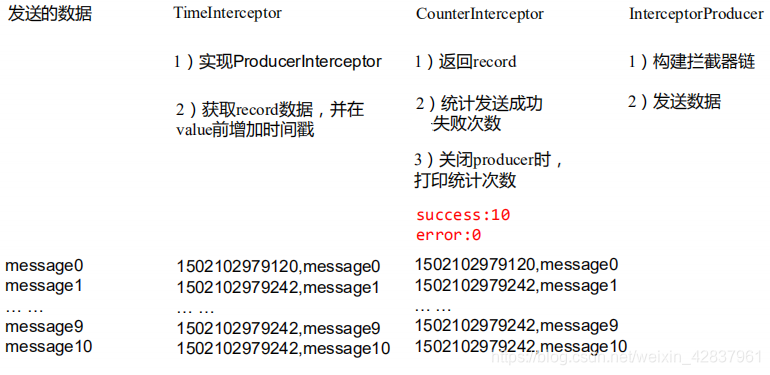

  3.  **实现流程**

    **（1）编写时间戳拦截器**

```java
package com.neu.interceptor;

import org.apache.kafka.clients.producer.ProducerInterceptor;
import org.apache.kafka.clients.producer.ProducerRecord;
import org.apache.kafka.clients.producer.RecordMetadata;

import java.util.Map;

public class TimeInterceptor implements ProducerInterceptor<String, String> {

    @Override
    public ProducerRecord<String, String> onSend(ProducerRecord<String, String> record) {
        // 1.取出数据
        String value = record.value();
        // 2.创建一个新的ProducerRecord对象，并返回
        return new ProducerRecord<String, String>(record.topic(), record.partition(), record.key(),
                System.currentTimeMillis() + "," + value);
    }

    @Override
    public void onAcknowledgement(RecordMetadata metadata, Exception exception) {

    }

    @Override
    public void close() {

    }

    @Override
    public void configure(Map<String, ?> configs) {

    }
}
```

**  （2）编写计数拦截器**

```java
package com.neu.interceptor;

import org.apache.kafka.clients.producer.ProducerInterceptor;
import org.apache.kafka.clients.producer.ProducerRecord;
import org.apache.kafka.clients.producer.RecordMetadata;

import java.util.Map;

public class CounterInterceptor implements ProducerInterceptor<String, String> {

    int success = 0;
    int error = 0;

    @Override
    public ProducerRecord<String, String> onSend(ProducerRecord<String, String> record) {
        return record;
    }

    @Override
    public void onAcknowledgement(RecordMetadata metadata, Exception exception) {
        if (metadata != null) {
            success++;
        } else {
            error++;
        }
    }

    @Override
    public void close() {
        System.out.println("success：" + success);
        System.out.println("error：" + error);
    }

    @Override
    public void configure(Map<String, ?> configs) {

    }
}
```

  **（3）编写 Producer 主程序**

```java
package com.neu.producer;

import org.apache.kafka.clients.producer.KafkaProducer;
import org.apache.kafka.clients.producer.ProducerConfig;
import org.apache.kafka.clients.producer.ProducerRecord;

import java.util.ArrayList;
import java.util.Properties;

public class InterceptorProducer {
    public static void main(String[] args) {
        // 1.创建配置信息
        Properties properties = new Properties();
        properties.put(ProducerConfig.BOOTSTRAP_SERVERS_CONFIG, "slave1:9092");
        properties.put(ProducerConfig.KEY_SERIALIZER_CLASS_CONFIG, "org.apache.kafka.common.serialization.StringSerializer");
        properties.put(ProducerConfig.VALUE_SERIALIZER_CLASS_CONFIG, "org.apache.kafka.common.serialization.StringSerializer");

        // 添加拦截器
        ArrayList<String> interceptors = new ArrayList<String>();
        interceptors.add("com.neu.interceptor.TimeInterceptor");
        interceptors.add("com.neu.interceptor.CounterInterceptor");
        properties.put(ProducerConfig.INTERCEPTOR_CLASSES_CONFIG, interceptors);

        // 2.创建生产者对象
        KafkaProducer<String, String> producer = new KafkaProducer<String, String>(properties);

        // 3.发送数据
        for (int i = 0; i < 10; i++) {
            producer.send(new ProducerRecord<>("demo", "neu", "hello--" + i));
        }

        // 4.关闭资源
        producer.close();
    }
}
```

  **（4）测试：首先在 Kafka 上启动消费者，然后运行客户端 java 程序**

```shell
kafka-console-consumer.sh --bootstrap-server slave1:9092 --topic demo
```

  **（5）观察结果**  
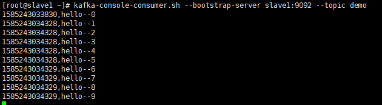  
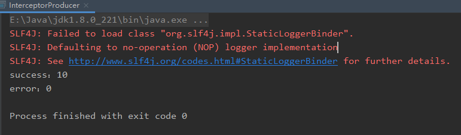  


## 5\. Kafka 监控

### 5.1 Kafka Eagle

  1.  **修改 Kafka 启动命令。**

    修改 kafka-server-start.sh 命令中

```shell
if [ "x$KAFKA_HEAP_OPTS" = "x" ]; then
    export KAFKA_HEAP_OPTS="-Xmx1G -Xms1G"
fi
```

  为：

```shell
if [ "x$KAFKA_HEAP_OPTS" = "x" ]; then
 export KAFKA_HEAP_OPTS="-server -Xms2G -Xmx2G 
 -XX:PermSize=128m 
 -XX:+UseG1GC 
 -XX:MaxGCPauseMillis=200 
 -XX:ParallelGCThreads=8 
 -XX:ConcGCThreads=5 
 -XX:InitiatingHeapOccupancyPercent=70"
 export JMX_PORT="9999"
 #export KAFKA_HEAP_OPTS="-Xmx1G -Xms1G"
fi
```

  之后将改完的命令分发到另两台机器上。

 2.     **上传压缩包 kafka-eagle-bin-1.3.7.tar.gz 到 Linux。**
 3.     **解压到本地。**

```shell
tar -zxvf kafka-eagle-bin-1.3.7.tar.gz
```

 4.     **进入刚才解压的目录，将 kafka-eagle-web-1.3.7-bin.tar.gz 解压至/opt/module。**

```shell
tar -zxvf kafka-eagle-web-1.3.7-bin.tar.gz -C /opt/module/
```

 5.     **修改名称。**

```shell
mv kafka-eagle-web-1.3.7/ eagle
```

 6.     **进入 eagle/bin 目录下，给启动文件 ke.sh 执行权限。**

```shell
chmod 777 ke.sh
```

7.  **修改 eagle/conf 目录下配置文件 system-config.properties。**

修改的内容：

```shell
######################################
# multi zookeeper&kafka cluster list
######################################
kafka.eagle.zk.cluster.alias=cluster1
cluster1.zk.list=master:2181,slave1:2181,slave2:2181

######################################
# kafka offset storage
######################################
cluster1.kafka.eagle.offset.storage=kafka

######################################
# enable kafka metrics
######################################
kafka.eagle.metrics.charts=true
kafka.eagle.sql.fix.error=false

######################################
# kafka jdbc driver address
######################################
kafka.eagle.driver=com.mysql.jdbc.Driver
kafka.eagle.url=jdbc:mysql://slave1:3306/ke?useUnicode=true&characterEncoding=UTF-8&zeroDateTimeBehavior=convertToNull
kafka.eagle.username=root
kafka.eagle.password=123456
```

 8.     **将 eagle 目录分发到另两台机器上。**
 9.     **配置环境变量。**

```shell
vim /etc/profile
```

（1）添加以下内容

```shell
#KAFKA EAGLE
export KE_HOME=/opt/module/eagle
export PATH=$PATH:$KE_HOME/bin
```

（2）使配置文件生效

```shell
source /etc/profile
```

（3）将配置文件分发到另两台机器上并使其生效

 10.     **启动。（启动之前需要先启动 ZK 以及 KAFKA）**

```shell
ke.sh start
```

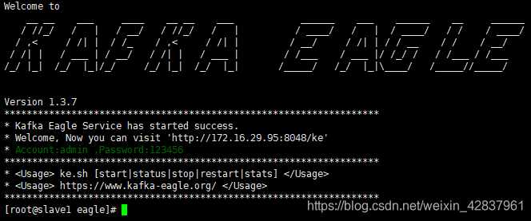  
11\. **登录界面查看数据。**  
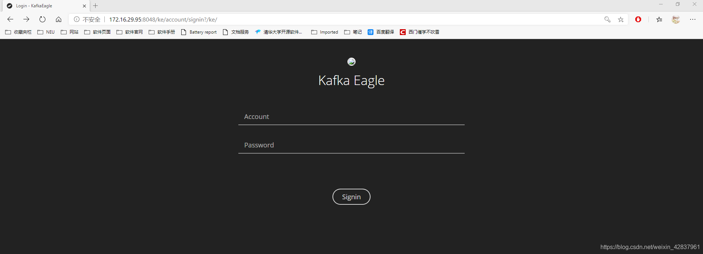  
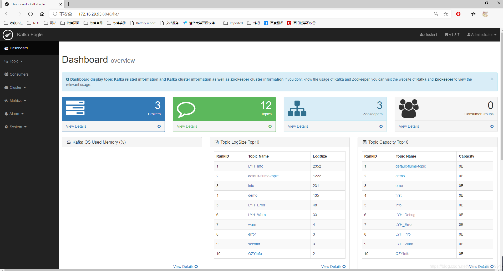  


## 6\. Flume 对接 Kafka

### 6.1 Flume 对接 Kafka 简单例子

 1.     **配置 kafka.conf**

```shell
# Name
a1.sources = r1
a1.channels = c1
a1.sinks = k1

# source
a1.sources.r1.type = netcat
a1.sources.r1.bind = localhost
a1.sources.r1.port = 44444

# sink
a1.sinks.k1.type = org.apache.flume.sink.kafka.KafkaSink
a1.sinks.k1.kafka.bootstrap.servers = slave1:9092,slave2:9092,master:9092
a1.sinks.k1.kafka.topic = demo
a1.sinks.k1.kafka.flumeBatchSize = 20
a1.sinks.k1.kafka.producer.acks = 1
a1.sinks.k1.kafka.producer.linger.ms = 1

# channel
a1.channels.c1.type = memory
a1.channels.c1.capacity = 1000
a1.channels.c1.transactionCapacity = 100

# bind
a1.sources.r1.channels = c1
a1.sinks.k1.channel = c1
```

 2.     **启动 Kafka 消费者**

```shell
kafka-console-consumer.sh --bootstrap-server slave1:9092 --topic demo
```

 3.     **进入 flume 目录下，启动 flume**

```shell
bin/flume-ng agent -c conf -f job/kafka.conf -n a1
```

 4.     **使用 netcat 工具向本机 44444 端口发送内容**

```shell
nc localhost 44444
```

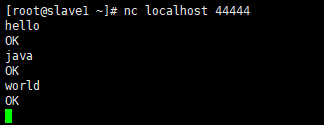

5.  **在 Kafka 消费者页面查看结果**

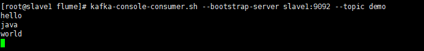  


### 6.2 数据分类

  在上一篇 Flume 的文章中，提到了自定义拦截器。Flume 拓扑结构中的 Multioplexing 结构，Multiplexing 的原理是，根据 event 中的 Header 的某个 key 的值，将不同的 event 发送到不同的 Channel 中，所以需要自定义一个 Interceptor，为不同类型的 event 的 Header 中的 key 值赋予不同的值。

  然后我们以端口数据模拟日志，以包含 hello 和不包含 hello 模拟不同类型的日志。

  学过 Kafka 后，我们用 Kafka 进行分类，包含 hello 的消息被 first 中的消费者消费，否则被 second 中的消费者消费。

**实现流程：**

  1.  **将上篇 Flume 文章中 CustomInterceptor 代码稍作修改。**

为不同类型的 event 的 Header 中的 key 赋值为 topic，其对应的值为 topic 名。

```java
package com.neu.interceptor;

import org.apache.flume.Context;
import org.apache.flume.Event;
import org.apache.flume.interceptor.Interceptor;

import java.util.ArrayList;
import java.util.List;
import java.util.Map;

public class CustomInterceptor implements Interceptor {

    // 声明一个存放事件的集合
    private List<Event> addHeaderEvents;

    public void initialize() {
        addHeaderEvents = new ArrayList<Event>();
    }

    // 单个事件拦截
    public Event intercept(Event event) {
        // 1.获取事件中的头信息
        Map<String, String> headers = event.getHeaders();
        // 2.获取事件中的body信息
        String body = new String(event.getBody());
        // 3.根据body中是否有“hello”来决定添加怎样的头信息
        if (body.contains("hello")) {
            headers.put("topic", "first");
        } else {
            headers.put("topic", "second");
        }
        return event;
    }

    // 批量事件拦截
    public List<Event> intercept(List<Event> events) {
        // 1.清空集合
        addHeaderEvents.clear();
        // 2.遍历events
        for (Event event : events) {
            // 3.为每个事件添加头信息
            addHeaderEvents.add(intercept(event));
        }
        return addHeaderEvents;
    }

    public void close() {

    }

    public static class Builder implements Interceptor.Builder {

        public Interceptor build() {
            return new CustomInterceptor();
        }

        public void configure(Context context) {

        }
    }
}
```

 2.     **将代码打成 jar 包，放到 /opt/module/flume/lib 目录下。**
 3.     **在 flume/job 目录下编写配置文件 kafka.conf。**

```shell
# Name
a1.sources = r1
a1.channels = c1
a1.sinks = k1

# Interceptor
a1.sources.r1.interceptors = i1
a1.sources.r1.interceptors.i1.type = com.neu.interceptor.CustomInterceptor$Builder

# source
a1.sources.r1.type = netcat
a1.sources.r1.bind = localhost
a1.sources.r1.port = 44444

# sink
a1.sinks.k1.type = org.apache.flume.sink.kafka.KafkaSink
a1.sinks.k1.kafka.bootstrap.servers = slave1:9092,slave2:9092,master:9092
a1.sinks.k1.kafka.topic = first
a1.sinks.k1.kafka.flumeBatchSize = 20
a1.sinks.k1.kafka.producer.acks = 1
a1.sinks.k1.kafka.producer.linger.ms = 1

# channel
a1.channels.c1.type = memory
a1.channels.c1.capacity = 1000
a1.channels.c1.transactionCapacity = 100

# bind
a1.sources.r1.channels = c1
a1.sinks.k1.channel = c1
```

 4.     **启动两个消费者。**

```shell
kafka-console-consumer.sh --bootstrap-server slave1:9092 --topic first
```

```shell
kafka-console-consumer.sh --bootstrap-server slave1:9092 --topic second
```

 5.     **启动 Flume。**

```shell
bin/flume-ng agent -c conf -f job/kafka.conf -n a1
```

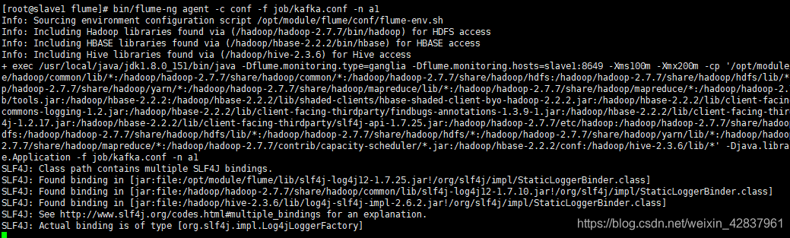  
6\. **向 44444 端口发送数据，并观察两个消费者页面数据。**

```shell
nc localhost 44444
```

  
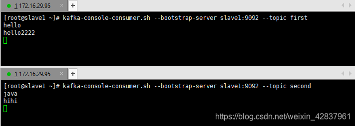