> 转载：https://www.codefather.cn/post/1943518702568288258

## 什么是 LangChain4j？

目前主流的 Java AI 开发框架有 [Spring AI](https://spring.io/projects/spring-ai) 和 [LangChain4j](https://docs.langchain4j.dev/intro)，它们都提供了很多 **开箱即用的 API** 来帮你调用大模型、实现 AI 开发常用的功能，比如我们今天要学的：

- 对话记忆
- 结构化输出
- RAG 知识库
- 工具调用
- MCP
- SSE 流式输出

就我个人体验下来，这两个框架的很多概念和用法都是类似的，也都提供了很多插件扩展，都支持和 [Spring Boot](https://www.mianshiya.com/bank/1797452903309508610) 项目集成。虽然有一些编码上的区别，但孰好孰坏，使用感受也是因人而异的。

**实际开发中应该如何选择呢？**

我想先带你用 LangChain4j 开发完一个项目，最后再揭晓答案，因为那个时候你自己也会有一些想法。

## AI 应用开发

### 新建项目

打开 IDEA 开发工具，新建一个 Spring Boot 项目，**Java 版本选择 21**（因为 LangChain4j 最低支持 17 版本）：

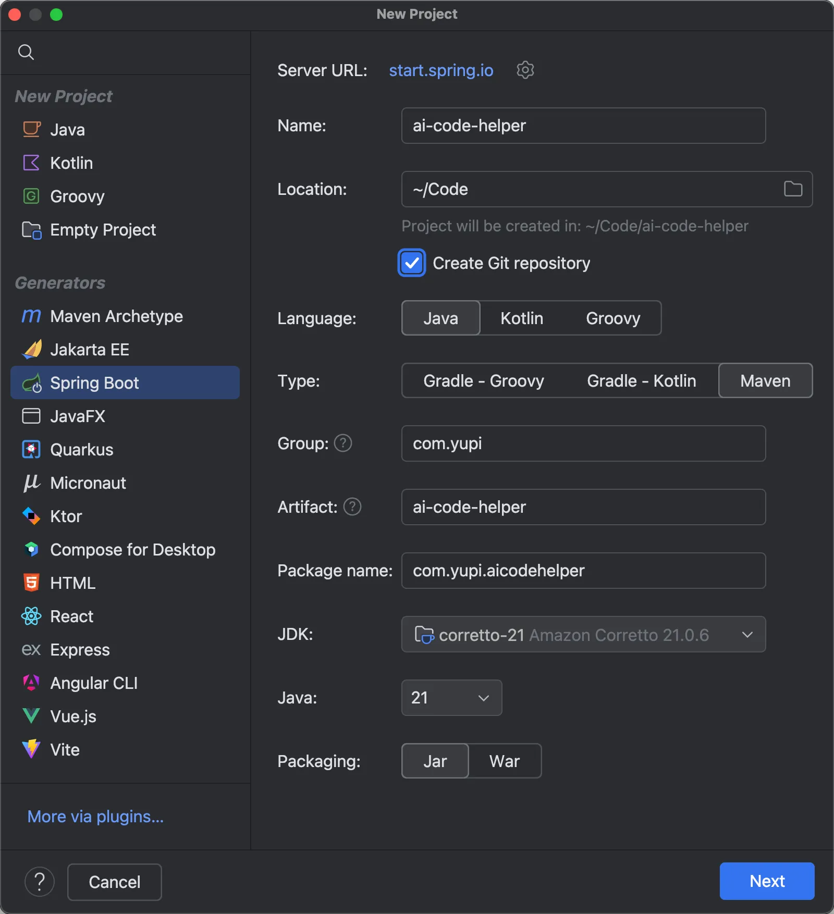

选择依赖，使用 3.5.x 版本的 [Spring](https://www.mianshiya.com/bank/1790683494127804418) Boot，引入 Spring MVC 和 Lombok 注解库：

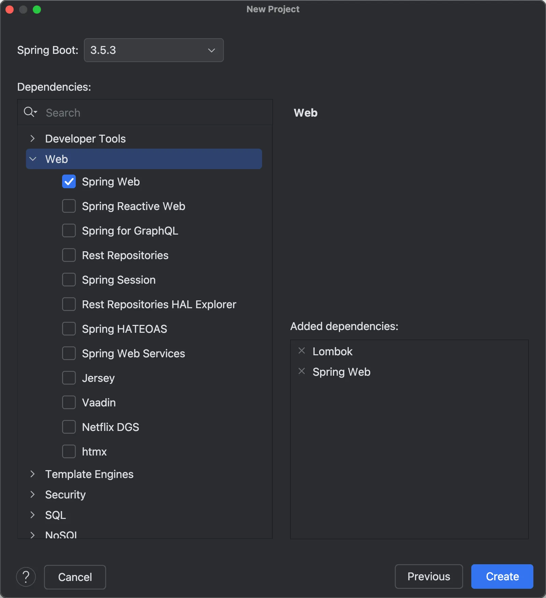

新建项目后，先修改配置文件后缀为 `yml`，便于后面填写配置。

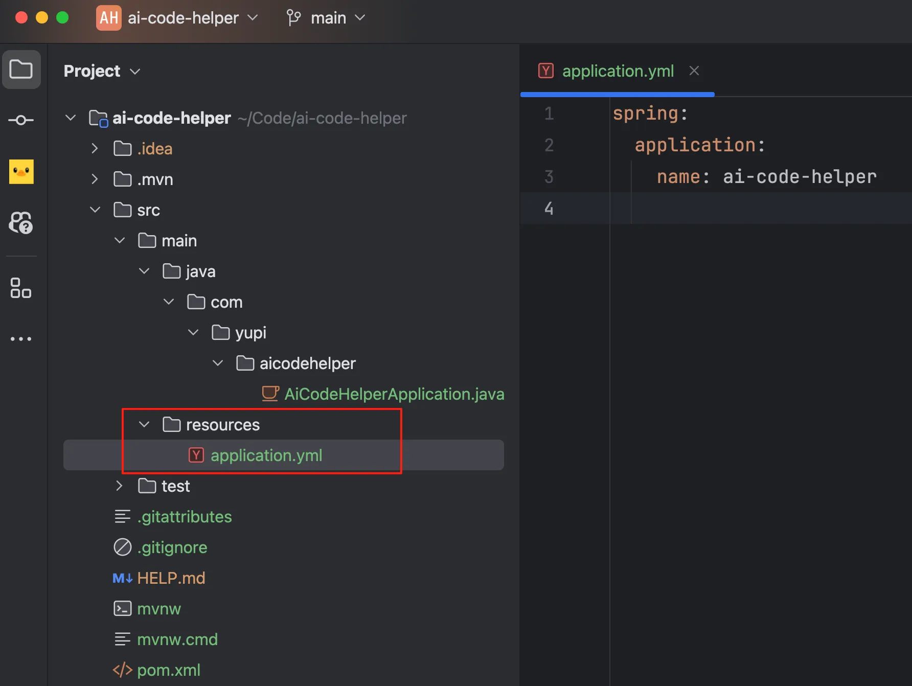

这里我会建议大家创建一个 `application-local.yml` 配置文件，将开发时用到的敏感配置写到这里，并且添加到 `.gitignore` 中，防止不小心开源出来。

### AI 对话 - ChatModel

ChatModel 是最基础的概念，负责和 AI 大模型交互。

首先需要引入至少一个 [AI 大模型依赖](https://mvnrepository.com/artifact/dev.langchain4j/langchain4j-community-dashscope-spring-boot-starter)，这里选择国内的阿里云大模型，提供了和 Spring Boot 项目的整合依赖包，比较方便：

```xml
<dependency>
    <groupId>dev.langchain4j</groupId>
    <artifactId>langchain4j-community-dashscope-spring-boot-starter</artifactId>
    <version>1.1.0-beta7</version>
</dependency>
```

需要到 [阿里云百炼平台](https://bailian.console.aliyun.com/?tab=model#/api-key) 获取大模型调用 key，注意不要泄露！

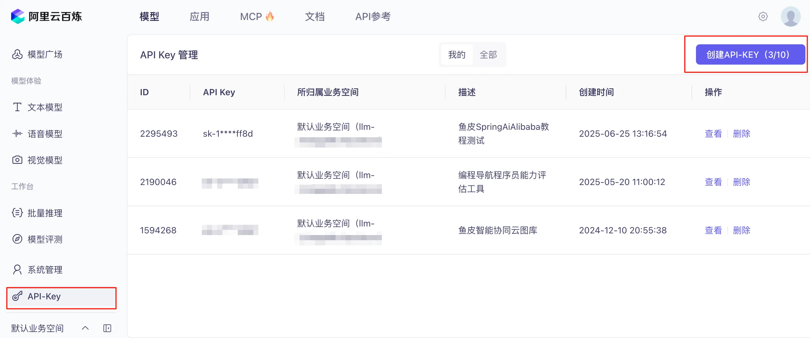

回到项目，在配置文件中添加大模型配置，指定模型名称和 API Key：

```yaml
langchain4j:
  community:
    dashscope:
      chat-model:
        model-name: qwen-max
        api-key: <You API Key here>
```

可以 [按需选择模型名称](https://bailian.console.aliyun.com/?tab=doc#/doc/?type=model)，追求效果可以用 qwen-max，否则可以选择效果、速度、成本均衡的 qwen-plus。

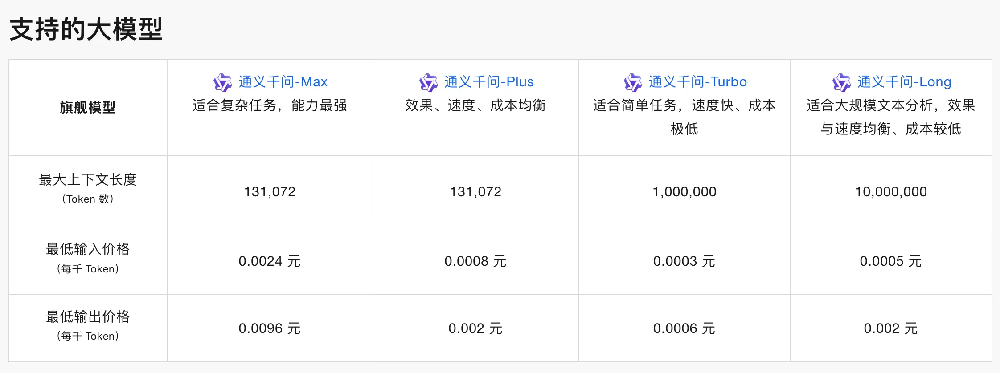

除了编写配置让 Spring Boot 自动构建 ChatModel 外，也可以通过构造器自己创建 ChatModel 对象。这种方式更灵活，在 LangChain4j 中我们会经常用到这种方式来构造对象。

```java
ChatModel qwenModel = QwenChatModel.builder()
                    .apiKey("You API key here")
                    .modelName("qwen-max")
                    .enableSearch(true)
                    .temperature(0.7)
                    .maxTokens(4096)
                    .stops(List.of("Hello"))
                    .build();
```

有了 ChatModel 后，创建一个 AiCodeHelper 类，引入自动注入的 qwenChatModel，编写简单的对话代码，并利用 Lombok 注解打印输出结果日志：

```java
@Service
@Slf4j
public class AiCodeHelper {

    @Resource
    private ChatModel qwenChatModel;

    public String chat(String message) {
        UserMessage userMessage = UserMessage.from(message);
        ChatResponse chatResponse = qwenChatModel.chat(userMessage);
        AiMessage aiMessage = chatResponse.aiMessage();
        log.info("AI 输出：" + aiMessage.toString());
        return aiMessage.text();
    }
}
```

编写单元测试，向 AI 打个招呼吧：

```java
@SpringBootTest
class AiCodeHelperTest {

    @Resource
    private AiCodeHelper aiCodeHelper;

    @Test
    void chat() {
        aiCodeHelper.chat("你好，我是程序员鱼皮");
    }
}
```

以 Debug 模式运行单元测试，成功运行并查看输出：

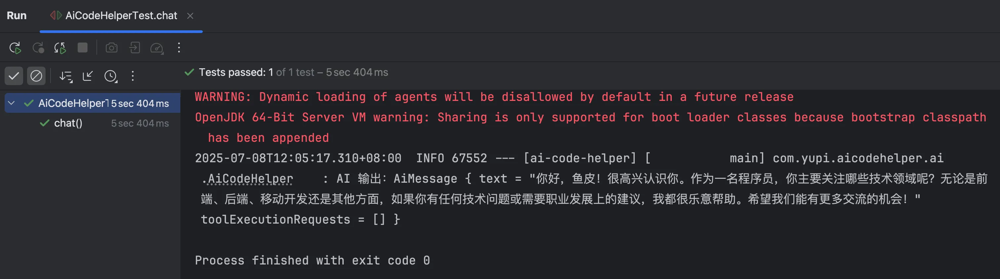

如果遇到找不到符号的 lombok 报错：

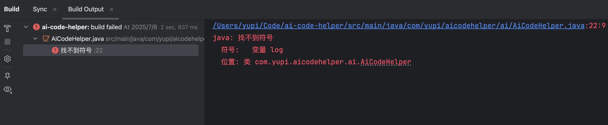 可以修改 IDEA 的注解处理器配置，改为使用项目中的 lombok：

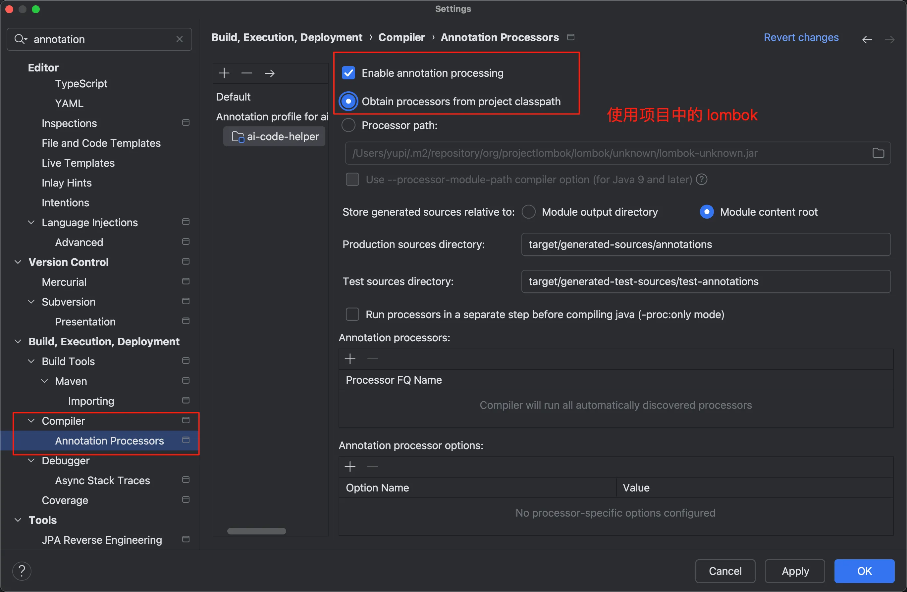

### 多模态 - Multimodality

多模态是指能够同时处理、理解和生成多种不同类型数据的能力，比如文本、图像、音频、视频、PDF 等等。

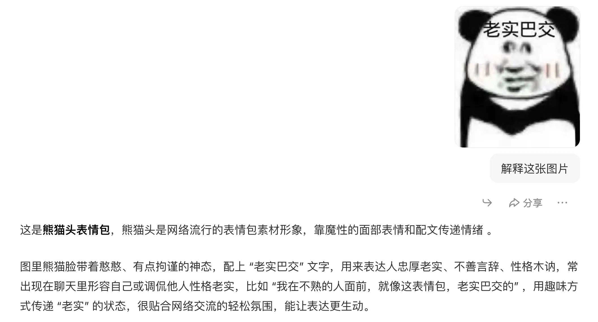

LangChain4j 中使用多模态的方法很简单，用户消息中是可以添加图片、音视频、PDF 等媒体资源的。

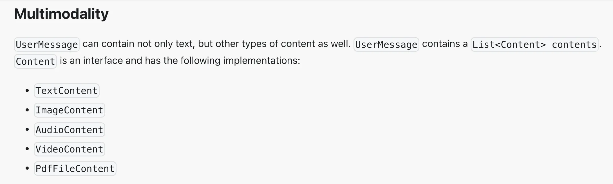

我们先编写一个支持传入自定义 UserMessage 的方法：

```java
public String chatWithMessage(UserMessage userMessage) {
    ChatResponse chatResponse = qwenChatModel.chat(userMessage);
    AiMessage aiMessage = chatResponse.aiMessage();
    log.info("AI 输出：" + aiMessage.toString());
    return aiMessage.text();
}
```

然后编写单元测试，传入一张图片：

```java
@Test
void chatWithMessage() {
    UserMessage userMessage = UserMessage.from(
            TextContent.from("描述图片"),
            ImageContent.from("https://www.codefather.cn/logo.png")
    );
    aiCodeHelper.chatWithMessage(userMessage);
}
```

但是效果不理想，qwen-max 模型无法直接查看或分析图片：

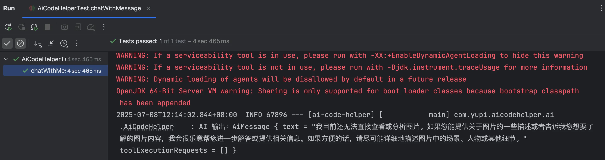

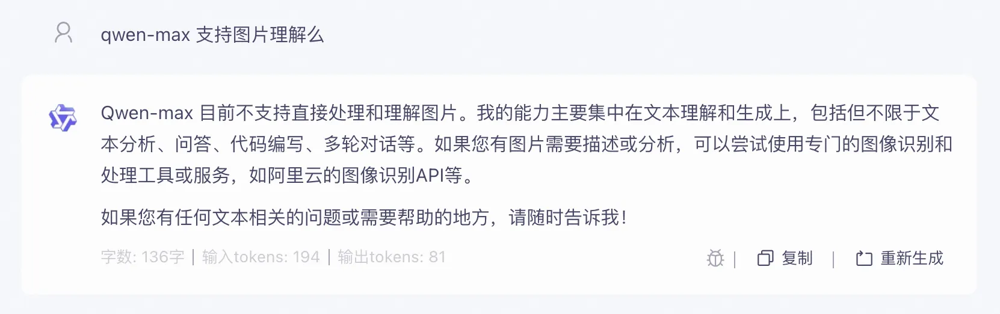

这也是目前多模态开发最关键的问题，虽然编码不难，但需要大模型本身支持多模态。可以在 LangChain 官网看到 [大模型能力支持表](https://docs.langchain4j.dev/integrations/language-models/)，不过一切以实际测试为准。

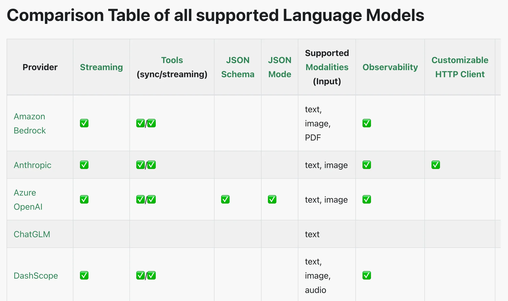

目前框架对多模态的适配度也没有那么好，一不留神就报错了，所以我们先了解这种用法就好了，感兴趣的同学也可以用 OpenAI 等其他模型实现多模态。

### 系统提示词 - SystemMessage

系统提示词是设置 AI 模型行为规则和角色定位的隐藏指令，用户通常不能直接看到。系统 Prompt 相当于给 AI 设定人格和能力边界，也就是告诉 AI “你是谁？你能做什么？”。

根据我们的需求，编写一段系统提示词：

```markdown
你是编程领域的小助手，帮助用户解答编程学习和求职面试相关的问题，并给出建议。重点关注 4 个方向：
1. 规划清晰的编程学习路线
2. 提供项目学习建议
3. 给出程序员求职全流程指南（比如简历优化、投递技巧）
4. 分享高频面试题和面试技巧
请用简洁易懂的语言回答，助力用户高效学习与求职。
```

编程导航的同学可以看 [AI 超级智能体项目第 3 期](https://www.codefather.cn/course/1915010091721236482/section/1916676331948027906)，有讲解过提示词优化技巧。

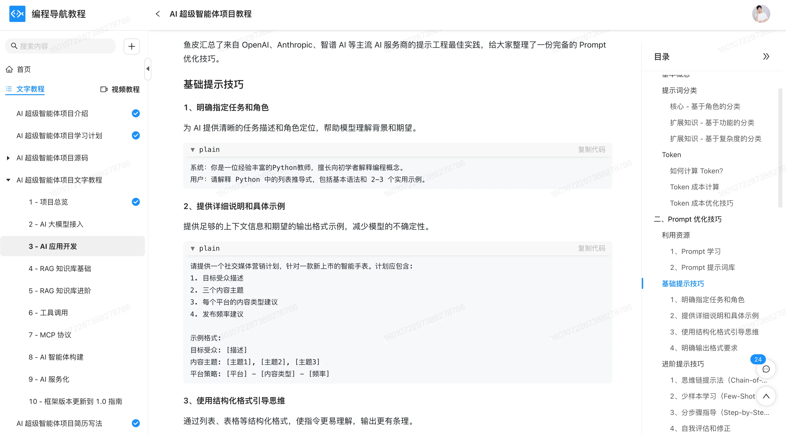

想要使用系统提示词，最直接的方法是创建一个系统消息，把它和用户消息一起发送给 AI。

修改 chat 方法，代码如下：

```java
private static final String SYSTEM_MESSAGE = """
        你是编程领域的小助手，帮助用户解答编程学习和求职面试相关的问题，并给出建议。重点关注 4 个方向：
        1. 规划清晰的编程学习路线
        2. 提供项目学习建议
        3. 给出程序员求职全流程指南（比如简历优化、投递技巧）
        4. 分享高频面试题和面试技巧
        请用简洁易懂的语言回答，助力用户高效学习与求职。
        """;

public String chat(String message) {
    SystemMessage systemMessage = SystemMessage.from(SYSTEM_MESSAGE);
    UserMessage userMessage = UserMessage.from(message);
    ChatResponse chatResponse = qwenChatModel.chat(systemMessage, userMessage);
    AiMessage aiMessage = chatResponse.aiMessage();
    log.info("AI 输出：" + aiMessage.toString());
    return aiMessage.text();
}
```

再次运行单元测试和 AI 对话，显然系统预设生效了：

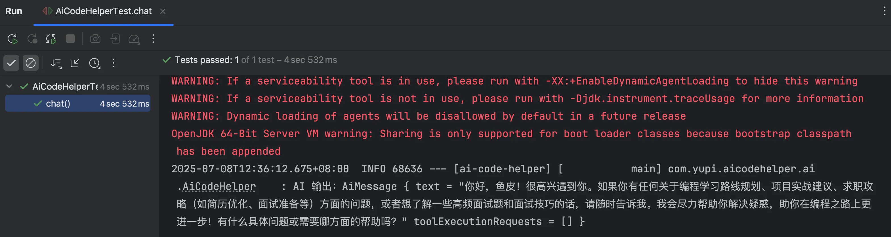

### AI 服务 - AI Service

在学习更多特性前，我们要了解 LangChain4j 最重要的开发模式 —— AI Service，提供了很多高层抽象的、用起来更方便的 API，把 AI 应用当做服务来开发。

#### 使用 AI Service

首先引入 langchain4j 依赖：

```xml
<dependency>
    <groupId>dev.langchain4j</groupId>
    <artifactId>langchain4j</artifactId>
    <version>1.1.0</version>
</dependency>
```

然后创建一个编程助手 AI Service 服务，采用声明式开发方法，编写一个对话方法，然后可以直接通过 `@SystemMessage` 注解定义系统提示词。

```java
public interface AiCodeHelperService {

    @SystemMessage("你是一位编程小助手")
    String chat(String userMessage);
}
```

不过由于我们提示词较长，写到注解里很不优雅，所以单独在 resources 目录下新建文件 `system-prompt.txt` 来存储系统提示词。

`@SystemMessage` 注解支持从文件中读取系统提示词：

```java
public interface AiCodeHelperService {

    @SystemMessage(fromResource = "system-prompt.txt")
    String chat(String userMessage);
}
```

然后我们需要编写工厂类，用于创建 AI Service：

```java
@Configuration
public class AiCodeHelperServiceFactory {

    @Resource
    private ChatModel qwenChatModel;

    @Bean
    public AiCodeHelperService aiCodeHelperService() {
        return AiServices.create(AiCodeHelperService.class, qwenChatModel);
    }
}
```

调用 `AiServices.create` 方法就可以创建出 AI Service 的实现类了，背后的原理是利用 Java 反射机制创建了一个实现接口的代理对象，代理对象负责输入和输出的转换，比如把 String 类型的用户消息参数转为 UserMessage 类型并调用 ChatModel，再将 AI 返回的 AiMessage 类型转换为 String 类型作为返回值。

但我们不用关心这么多，直接写接口和注解来开发就好。你喜欢这种开发方式么？

编写单元测试，调用我们开发的 AI Service：

```java
@SpringBootTest
class AiCodeHelperServiceTest {

    @Resource
    private AiCodeHelperService aiCodeHelperService;

    @Test
    void chat() {
        String result = aiCodeHelperService.chat("你好，我是程序员鱼皮");
        System.out.println(result);
    }
}
```

Debug 运行，发现生成了 AI Service 的代理类，并且系统提示词生效了。是不是比之前自己拼接系统消息要方便多了？

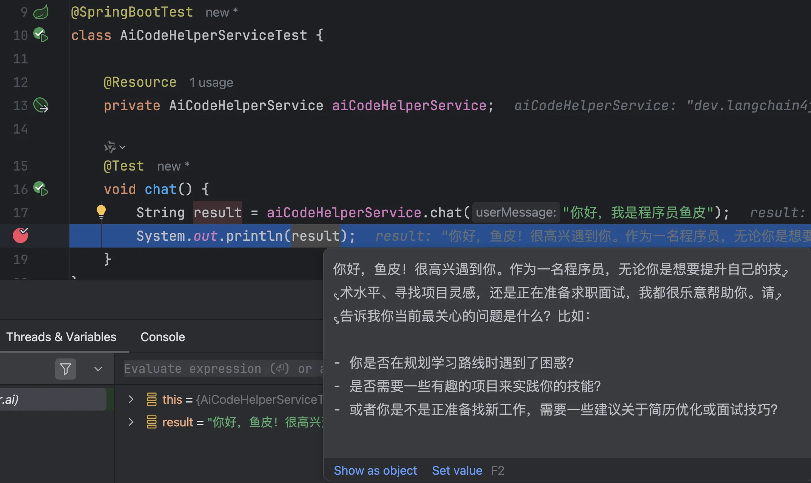

#### Spring Boot 项目中使用

如果你觉得手动调用 create 方法来创建 Service 比较麻烦，在 Spring Boot 项目中可以引入依赖：

```xml
<dependency>
    <groupId>dev.langchain4j</groupId>
    <artifactId>langchain4j-spring-boot-starter</artifactId>
    <version>1.1.0-beta7</version>
</dependency>
```

然后给 AI Service 加上 `@AiService` 注解，就能自动创建出服务实例了：

```java
@AiService
public interface AiCodeHelperService {

    @SystemMessage(fromResource = "system-prompt.txt")
    String chat(String userMessage);
}
```

记得注释掉之前工厂类的 @Configuration 注解，否则会出现 Bean 冲突

再次运行单元测试，也是可以正常对话的：

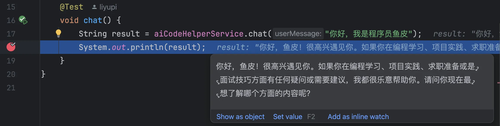

这种方式虽然更方便了，但是缺少了自主构建的灵活性（可以自由设置很多参数），所以我建议还是采用自主构建。之后的功能特性，我们也会基于这种 AI Service 开发模式来实现。

### 会话记忆 - ChatMemory

会话记忆是指让 AI 能够记住用户之前的对话内容，并保持上下文连贯性，这是实现 AI 应用的核心特性。

怎么实现对话记忆？最传统的方式是自己维护消息列表，不仅要手动添加消息，消息多了还要考虑淘汰、不同用户的消息还要隔离，想想都头疼！

```java
// 自己实现会话记忆
Map<String, List<Message>> conversationHistory = new HashMap<>();

public String chat(String message, String userId) {
    // 获取用户历史记录
    List<Message> history = conversationHistory.getOrDefault(userId, new ArrayList<>());
    
    // 添加用户新消息
    Message userMessage = new Message("user", message);
    history.add(userMessage);
    
    // 构建完整历史上下文
    StringBuilder contextBuilder = new StringBuilder();
    for (Message msg : history) {
        contextBuilder.append(msg.getRole()).append(": ").append(msg.getContent()).append("\n");
    }
    
    // 调用 AI API
    String response = callAiApi(contextBuilder.toString());
    
    // 保存 AI 回复到历史
    Message aiMessage = new Message("assistant", response);
    history.add(aiMessage);
    conversationHistory.put(userId, history);
    
    return response;
}
```

#### 使用会话记忆

LangChain4j 为我们提供了开箱即用的 `MessageWindowChatMemory` 会话记忆，最多保存 N 条消息，多余的会自动淘汰。创建会话记忆后，在构造 AI Service 设置 chatMemory：

```java
@Configuration
public class AiCodeHelperServiceFactory {

    @Resource
    private ChatModel qwenChatModel;

    @Bean
    public AiCodeHelperService aiCodeHelperService() {
        // 会话记忆
        ChatMemory chatMemory = MessageWindowChatMemory.withMaxMessages(10);
        AiCodeHelperService aiCodeHelperService = AiServices.builder(AiCodeHelperService.class)
                .chatModel(qwenChatModel)
                .chatMemory(chatMemory)
                .build();
        return aiCodeHelperService;
    }
}
```

编写单元测试，测试会话记忆是否生效：

```java
@Test
void chatWithMemory() {
    String result = aiCodeHelperService.chat("你好，我是程序员鱼皮");
    System.out.println(result);
    result = aiCodeHelperService.chat("你好，我是谁来着？");
    System.out.println(result);
}
```

Debug 运行单元测试，可以看到会话记忆存储的消息列表：

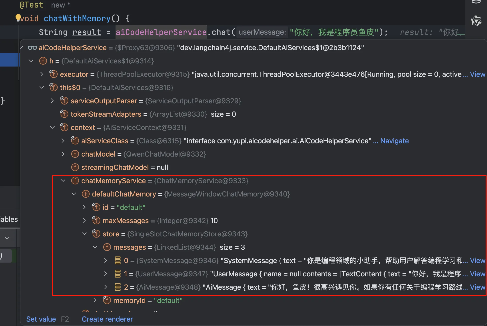

查看输出结果，会话记忆生效：

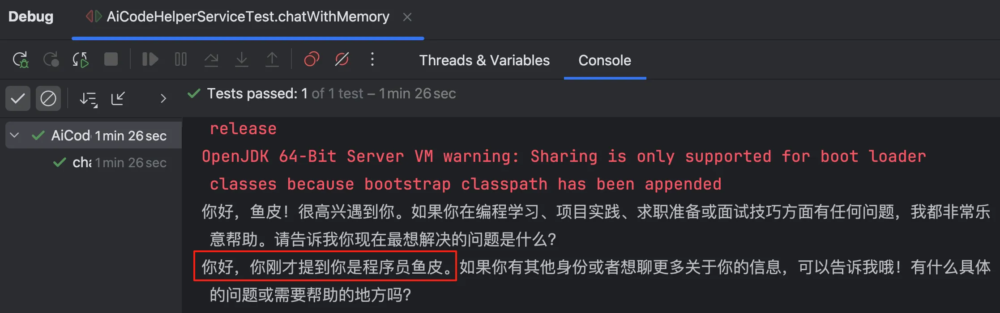

#### 进阶用法

如果有多个用户，希望每个用户之间的消息隔离，可以通过给对话方法增加 memoryId 参数和注解，在调用对话时传入 memoryId 即可（类似聊天室的房间号）：

```java
String chat(@MemoryId int memoryId, @UserMessage String userMessage);
```

构造 AI Service 时，可以通过 chatMemoryProvider 来指定 **每个 memoryId 单独创建会话记忆**：

```java
// 构造 AI Service
AiCodeHelperService aiCodeHelperService = AiServices.builder(AiCodeHelperService.class)
        .chatModel(qwenChatModel)
        .chatMemoryProvider(memoryId -> MessageWindowChatMemory.withMaxMessages(10))
        .build();
```


会话记忆默认是存储在内存的，重启后会丢失，可以通过自定义 [ChatMemoryStore](https://docs.langchain4j.dev/tutorials/chat-memory#persistence) 接口的实现类，将消息保存到 MySQL 等其他数据源中。

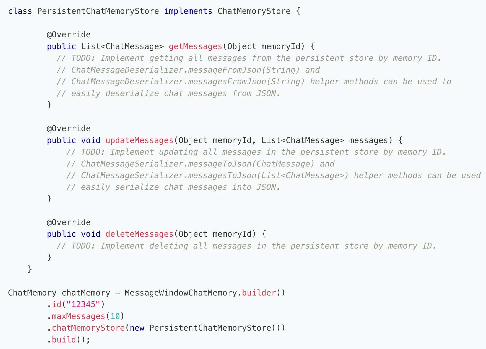

```java
.chatMemoryProvider(memoryId ->
    MessageWindowChatMemory.builder()
        .chatMemoryStore(new ConsoleChatMemoryStore())
        .maxMessages(10)
        .build()
)
```

#### JdbcChatMemoryStore

LangChain4j 已经帮忙写好的 Store

| **存储方式** | **是否已提供**              |
| :----------- | :-------------------------- |
| 内存         | ✅ `InMemoryChatMemoryStore` |
| JDBC / MySQL | ✅ `JdbcChatMemoryStore`     |
| Redis        | ✅（部分版本）               |
| MongoDB      | ✅                           |

##### 1、先引入依赖（必须有）

```xml
<dependency>
    <groupId>dev.langchain4j</groupId>
    <artifactId>langchain4j-jdbc</artifactId>
</dependency>

<dependency>
    <groupId>mysql</groupId>
    <artifactId>mysql-connector-j</artifactId>
</dependency>
```

##### 2、数据库表（LangChain4j 官方标准）

✅ **表名、字段名不要改**

```sql
CREATE TABLE chat_memory_store (
    memory_id VARCHAR(255) NOT NULL,
    message_index INT NOT NULL,
    message_json TEXT NOT NULL,
    PRIMARY KEY (memory_id, message_index)
);
```

📌 说明：

| 字段          | 作用                           |
| ------------- | ------------------------------ |
| memory_id     | 对应你前面的 userId / memoryId |
| message_index | 消息顺序                       |
| message_json  | 一条 ChatMessage 的 JSON       |

##### 3、DataSource

```yaml
spring:
  datasource:
    url: jdbc:mysql://localhost:3306/langchain4j
    username: root
    password: root
```

```java
@Autowired
DataSource dataSource;
```

##### 4、核心：JdbcChatMemoryStore 怎么写

```java
import dev.langchain4j.store.memory.jdbc.JdbcChatMemoryStore;
import dev.langchain4j.store.memory.jdbc.MySqlDialect;

@Bean
public JdbcChatMemoryStore jdbcChatMemoryStore(DataSource dataSource) {
    return JdbcChatMemoryStore.builder()
            .dataSource(dataSource)
            .dialect(new MySqlDialect()) // 关键
            .build();
}
```

✅ 这一步就完成了 **“聊天记录存 MySQL”**

##### 5、把 JdbcChatMemoryStore 接进 AI Service

```java
@Bean
public AiChatService aiChatService(
        ChatModel chatModel,
        JdbcChatMemoryStore chatMemoryStore
) {
    return AiServices.builder(AiChatService.class)
            .chatModel(chatModel)
            .chatMemoryProvider(memoryId ->
                MessageWindowChatMemory.builder()
                        .chatMemoryStore(chatMemoryStore)
                        .maxMessages(20) // 最多保留 20 条
                        .build()
            )
            .build();
}
```

📌 和之前 **唯一区别**：

```
- MessageWindowChatMemory.withMaxMessages(10)
+ 自己指定 chatMemoryStore
```

##### 6、AI Service 接口

```java
public interface AiChatService {

    String chat(
            @MemoryId Long memoryId,
            @UserMessage String userMessage
    );
}
```

##### 7、效果验证

###### 第一次调用

```
GET /ai/chat?userId=1&message=你好
```

✅ MySQL 表中会出现：

| memory_id | message_index | message_json                                  |
| --------- | ------------- | --------------------------------------------- |
| 1         | 0             | {"type":"USER","text":"你好"}                 |
| 1         | 1             | {"type":"AI","text":"你好，有什么可以帮你？"} |

###### 重启应用后再问

```
GET /ai/chat?userId=1&message=我刚才说了什么
```

✅ AI 仍然记得

✅ 数据来自 MySQL，不是内存

------

##### 8、常见问题

###### ❌ 表不存在

确保表名是：

```
chat_memory_store
```

###### ❌ dialect 写错

MySQL 必须：

```
new MySqlDialect()
```

###### ❌ memoryId 类型不一致

建议统一用：

```
Long / String
```

不要混用 `int / long / String`


### 结构化输出

结构化输出是指将大模型返回的文本输出转换为结构化的数据格式，比如一段 JSON、一个对象、或者是复杂的对象列表。

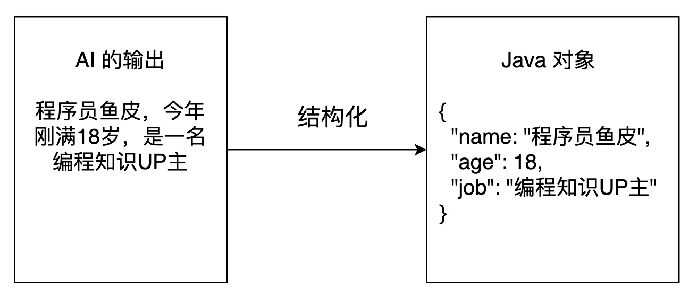

结构化输出有 3 种实现方式：

- 利用大模型的 JSON schema
- 利用 Prompt + JSON Mode
- 利用 Prompt

默认是 Prompt 模式，也就是在原本的用户提示词下 **拼接一段内容** 来指定大模型强制输出包含特定字段的 JSON 文本。

```markdown
你是一个专业的信息提取助手。请从给定文本中提取人员信息，
并严格按照以下 JSON 格式返回结果：

{
    "name": "人员姓名",
    "age": 年龄数字,
    "height": 身高（米），
    "married": true/false,
    "occupation": "职业"
}

重要规则：
1. 只返回 JSON 格式，不要添加任何解释
2. 如果信息不明确，使用 null
3. age 必须是数字，不是字符串
4. married 必须是布尔值
```

感兴趣的同学可以 [阅读这篇文章](https://glaforge.dev/posts/2024/11/18/data-extraction-the-many-ways-to-get-llms-to-spit-json-content/) 了解更多，不过我们开发时无需关心这些，只要修改对话方法的返回值，框架就会自动帮我们实现结构化输出，非常爽！

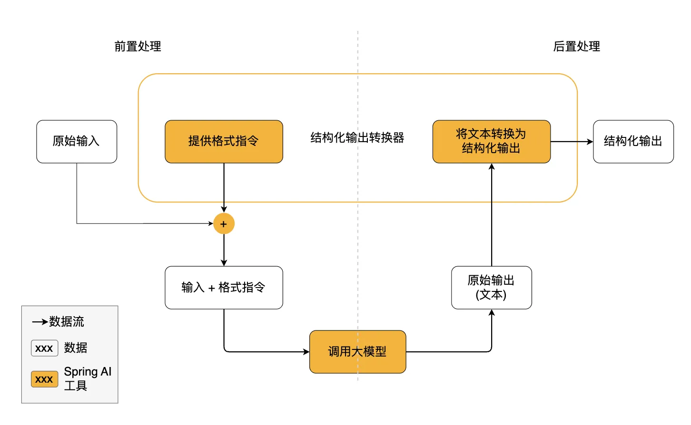

比如我们增加一个 **让 AI 生成学习报告** 的方法，AI 需要输出学习报告对象，包含名称和建议列表：

```java
@SystemMessage(fromResource = "system-prompt.txt")
Report chatForReport(String userMessage);

// 学习报告
record Report(String name, List<String> suggestionList){}
```

编写单元测试：

```java
@Test
void chatForReport() {
    String userMessage = "你好，我是程序员鱼皮，学编程两年半，请帮我制定学习报告";
    AiCodeHelperService.Report report = aiCodeHelperService.chatForReport(userMessage);
    System.out.println(report);
}
```

运行单元测试，效果很不错：

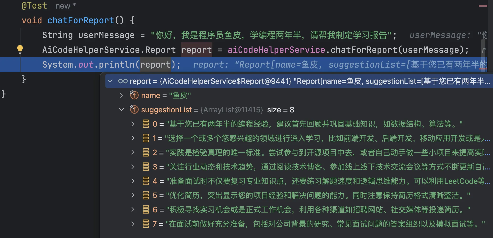

如果你发现 AI 有时无法生成准确的 JSON，那么可以采用 JSON Schema 模式，直接在请求中约束 LLM 的输出格式。这是目前最可靠、精确度最高的结构化输出实现。

```java
ResponseFormat responseFormat = ResponseFormat.builder()
        .type(JSON)
        .jsonSchema(JsonSchema.builder()
                .name("Person")
                .rootElement(JsonObjectSchema.builder()
                        .addStringProperty("name")
                        .addIntegerProperty("age")
                        .addNumberProperty("height")
                        .addBooleanProperty("married")
                        .required("name", "age", "height", "married") 
                        .build())
                .build())
        .build();
ChatRequest chatRequest = ChatRequest.builder()
        .responseFormat(responseFormat)
        .messages(userMessage)
        .build();
```

### 检索增强生成 - RAG

RAG（Retrieval-Augmented Generation，检索增强生成）是一种结合信息检索技术和 AI 内容生成的混合架构，可以解决大模型的知识时效性限制和幻觉问题。

简单来说，RAG 就像给 AI 配了一个 “小抄本”，让 AI 回答问题前先查一查特定的知识库来获取知识，确保回答是基于真实资料而不是凭空想象。很多企业也基于 RAG 搭建了自己的智能客服，可以用自己积累的领域知识回复用户。

RAG 的完整工作流程如下：

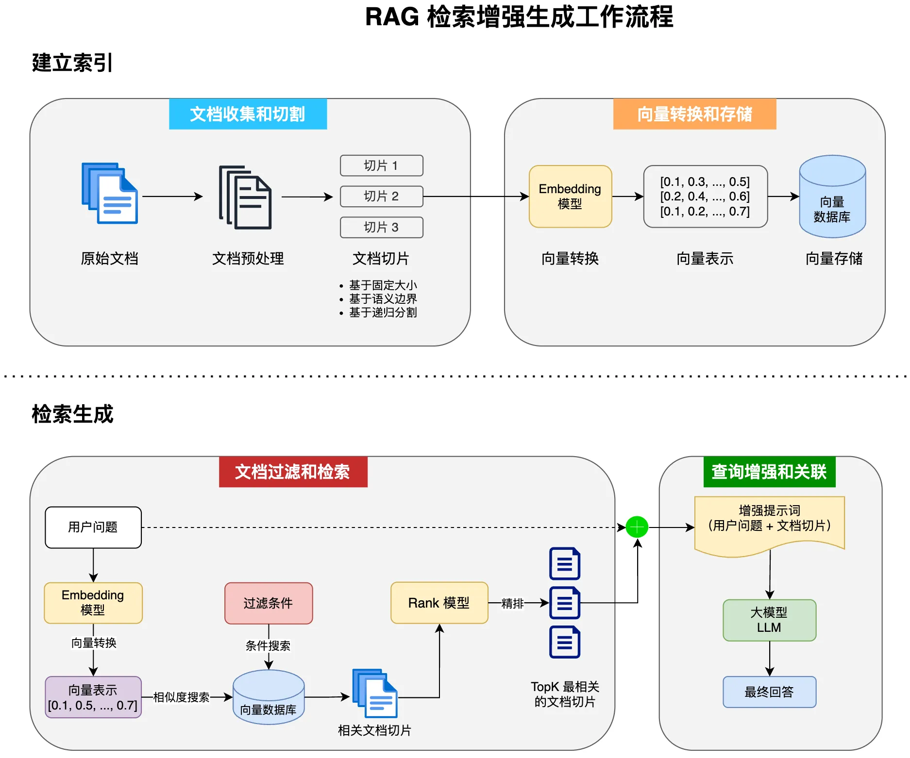

让我们来实操一下，首先我准备了 4 个文档，放在了 `resources/docs` 目录下：

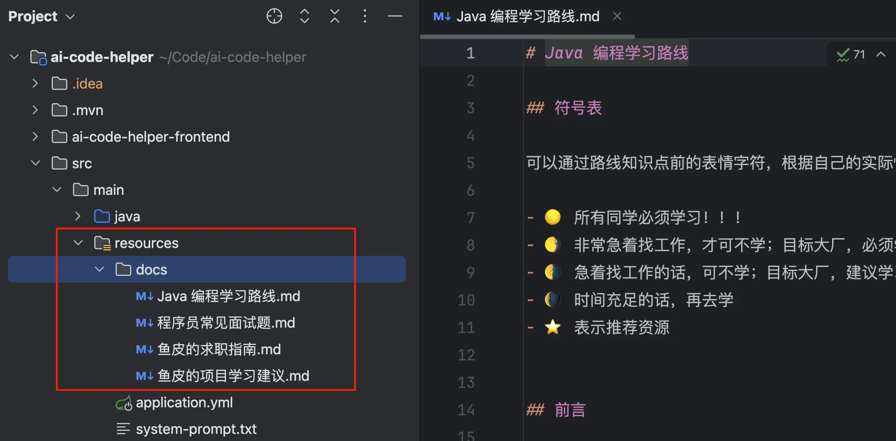

LangChain 提供了 3 种 RAG 的实现方式，我把它称为：极简版、标准版、进阶版。

#### 极简版 RAG

**极简版适合快速查看效果**，首先需要引入额外的依赖，里面包含了内置的离线 Embedding 模型，开箱即用：

```xml
<dependency>
    <groupId>dev.langchain4j</groupId>
    <artifactId>langchain4j-easy-rag</artifactId>
    <version>1.1.0-beta7</version>
</dependency>
```

示例代码如下，使用内置的文档加载器读取文档，然后利用内置的 Embedding 模型将文档转换成向量，并存储在内置的 Embedding 内存存储中，最后给 AI Service 绑定默认的内容检索器。

```java
// RAG
// 1. 加载文档
List<Document> documents = FileSystemDocumentLoader.loadDocuments("src/main/resources/docs");
// 2. 使用内置的 EmbeddingModel 转换文本为向量，然后存储到自动注入的内存 embeddingStore 中
EmbeddingStoreIngestor.ingest(documents, embeddingStore);
// 构造 AI Service
AiCodeHelperService aiCodeHelperService = AiServices.builder(AiCodeHelperService.class)
        .chatModel(qwenChatModel)
        .chatMemory(chatMemory)
        // RAG：从内存 embeddingStore 中检索匹配的文本片段
        .contentRetriever(EmbeddingStoreContentRetriever.from(embeddingStore))
        .build();
```

可以看到，极简版的特点是 “一切皆默认”，实际开发中，为了更好的效果，建议采用标准版或进阶版。

#### 标准版 RAG

下面来试试标准版 RAG 实现，为了更好地效果，我们需要：

- 加载 Markdown 文档并按需切割
- Markdown 文档补充文件名信息
- 自定义 Embedding 模型
- 自定义内容检索器

在 Spring Boot 配置文件中添加 Embedding 模型配置，使用阿里云提供的 `text-embedding-v4` 模型：

```yaml
langchain4j:
  community:
    dashscope:
      chat-model:
        model-name: qwen-max
        api-key: <You API Key here>
      embedding-model:
        model-name: text-embedding-v4
        api-key: <You API Key here>
```

新建 `rag.RagConfig`，编写 RAG 相关的代码，执行 RAG 的初始流程并返回了一个定制的内容检索器 Bean：

```java
/**
 * 加载 RAG
 */
@Configuration
public class RagConfig {

    @Resource
    private EmbeddingModel qwenEmbeddingModel;

    @Resource
    private EmbeddingStore<TextSegment> embeddingStore;

    @Bean
    public ContentRetriever contentRetriever() {
        // ------ RAG ------
        // 1. 加载文档
        List<Document> documents = FileSystemDocumentLoader.loadDocuments("src/main/resources/docs");
        // 2. 文档切割：将每个文档按每段进行分割，最大 1000 字符，每次重叠最多 200 个字符
        DocumentByParagraphSplitter paragraphSplitter = new DocumentByParagraphSplitter(1000, 200);
        // 3. 自定义文档加载器
        EmbeddingStoreIngestor ingestor = EmbeddingStoreIngestor.builder()
                .documentSplitter(paragraphSplitter)
                // 为了提高搜索质量，为每个 TextSegment 添加文档名称
                .textSegmentTransformer(textSegment -> TextSegment.from(
                        textSegment.metadata().getString("file_name") + "\n" + textSegment.text(),
                        textSegment.metadata()
                ))
                // 使用指定的向量模型
                .embeddingModel(qwenEmbeddingModel)
                .embeddingStore(embeddingStore)
                .build();
        // 加载文档
        ingestor.ingest(documents);
        // 4. 自定义内容查询器
        ContentRetriever contentRetriever = EmbeddingStoreContentRetriever.builder()
                .embeddingStore(embeddingStore)
                .embeddingModel(qwenEmbeddingModel)
                .maxResults(5) // 最多 5 个检索结果
                .minScore(0.75) // 过滤掉分数小于 0.75 的结果
                .build();
        return contentRetriever;
    }
}
```

然后在构建 AI Service 时绑定内容检索器：

```java
@Resource
private ContentRetriever contentRetriever;

@Bean
public AiCodeHelperService aiCodeHelperService() {
    // 会话记忆
    ChatMemory chatMemory = MessageWindowChatMemory.withMaxMessages(10);
    // 构造 AI Service
    AiCodeHelperService aiCodeHelperService = AiServices.builder(AiCodeHelperService.class)
            .chatModel(qwenChatModel)
            .chatMemory(chatMemory)
            .contentRetriever(contentRetriever) // RAG 检索增强生成
            .build();
    return aiCodeHelperService;
}
```

编写单元测试：

```java
@Test
void chatWithRag() {
    Result<String> result = aiCodeHelperService.chatWithRag("怎么学习 Java？有哪些常见面试题？");
    System.out.println(result.content());
    System.out.println(result.sources());
}
```

Debug 运行，能够看到分割的文档片段，部分文档片段有内容重叠：

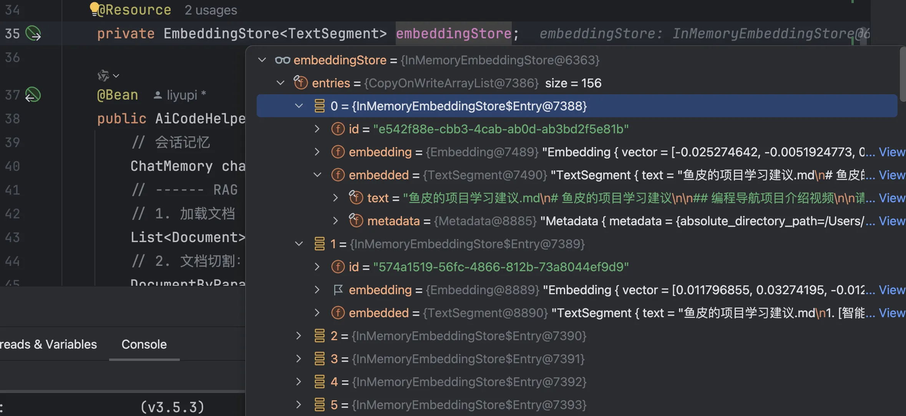

可以在对话记忆中看到实际发送的、增强后的 Prompt：

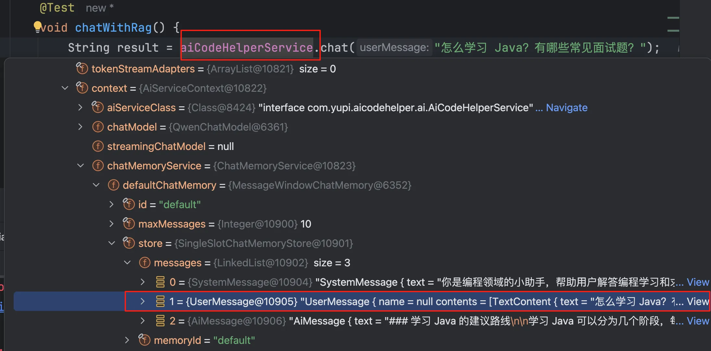

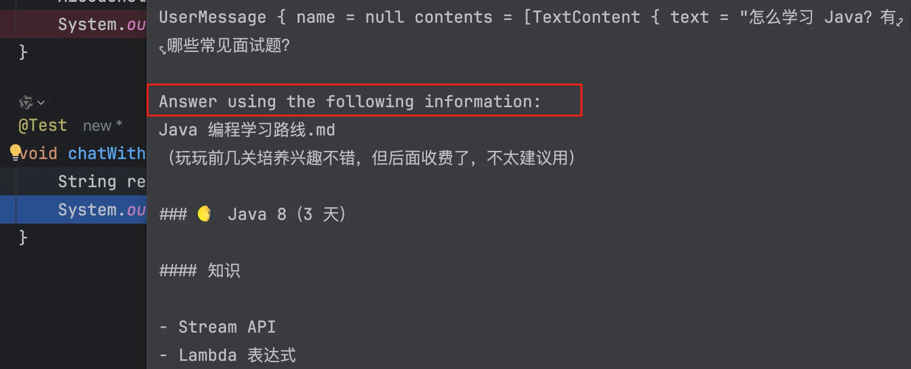

回答效果也是符合预期的：

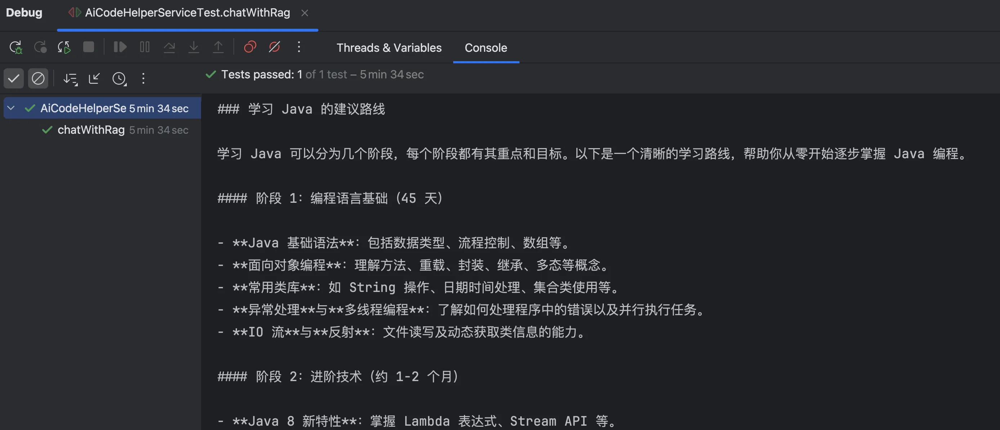

##### 持久化

###### 方案一：使用文件持久化（最简单）

```java
@Configuration
public class RagConfig {

    @Bean
    public EmbeddingStore<TextSegment> embeddingStore() {
        // 持久化到本地文件
        return new InMemoryEmbeddingStore<>(Paths.get("embedding-store.json"));
    }
}
```

###### 方案二：使用真正的向量数据库（推荐生产环境）

```yaml
# 以 Chroma 为例
langchain4j:
  chroma:
    collection-name: my_docs
    url: http://localhost:8000
```

```java
@Bean
public EmbeddingStore<TextSegment> embeddingStore() {
    return ChromaEmbeddingStore.builder()
        .baseUrl("http://localhost:8000")
        .collectionName("my_docs")
        .build();
}
```

其他可选：**PGVector、Milvus、Qdrant、Elasticsearch**。


##### 获取引用源文档

如果能够给 AI 的回答下面展示回答来源，更容易增加内容的可信度：

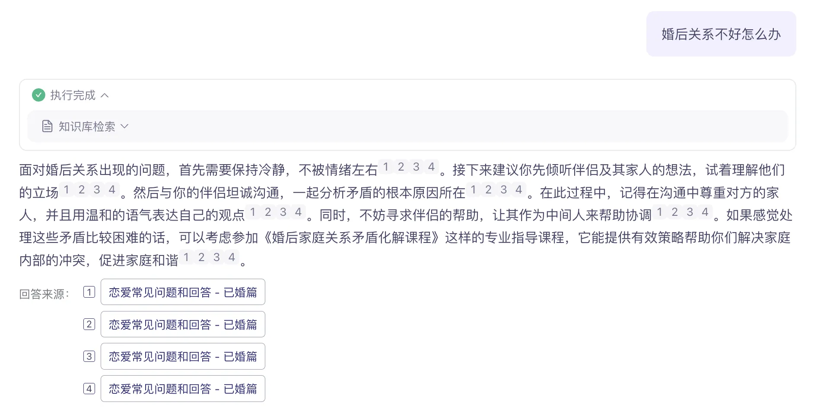

在 LangChain4j 中，实现这个功能很简单。在 AI Service 中新增方法，在原本的返回类型外封装一层 Result 类，就可以获得封装后的结果，从中能够获取到 RAG 引用的源文档、以及 Token 的消耗情况等等。

```java
@SystemMessage(fromResource = "system-prompt.txt")
Result<String> chatWithRag(String userMessage);
```

修改单元测试，输出更多信息：

```java
@Test
void chatWithRag() {
    Result<String> result = aiCodeHelperService.chatWithRag("怎么学习 Java？有哪些常见面试题？");
    String content = result.content();
    List<Content> sources = result.sources();
    System.out.println(content);
    System.out.println(sources);
}
```

执行效果如图，获取到了引用的源文档信息：

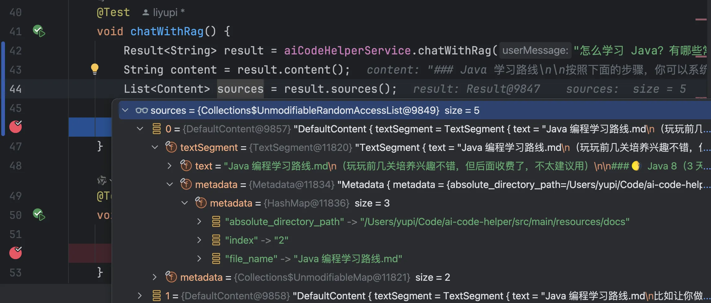

#### 进阶版 RAG

这就是一套标准的 RAG 实现了，大多数时候，使用标准版就够了。进阶版会更加灵活，额外支持查询转换器、查询路由、内容聚合器、内容注入器等特性，将整个 RAG 的流程流水线化（RAG pipeline）。

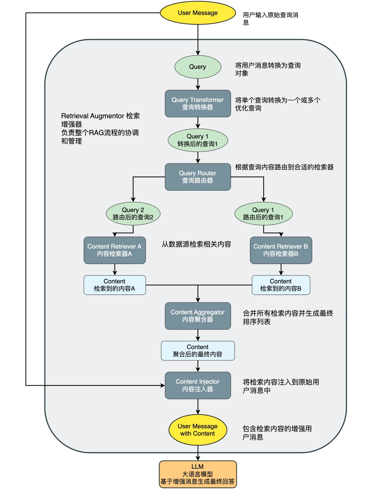

定义好 RAG 流程后，最后通过 RetrievalAugmentor 提供给 AI Service：

```java
AiServices.builder(xxx.class)
    ...
    .retrievalAugmentor(retrievalAugmentor)
    .build();
```

此外，之前我们使用的是内存向量存储，每次启动都要重新加载文档、调用嵌入模型，比较耗时，所以实际开发中建议使用独立的存储，[官方支持很多第三方存储](https://docs.langchain4j.dev/integrations/embedding-stores/)，但是个人比较推荐 PG Vector，在原有关系库的基础上安装插件来支持向量存储，而且支持的特性很多。

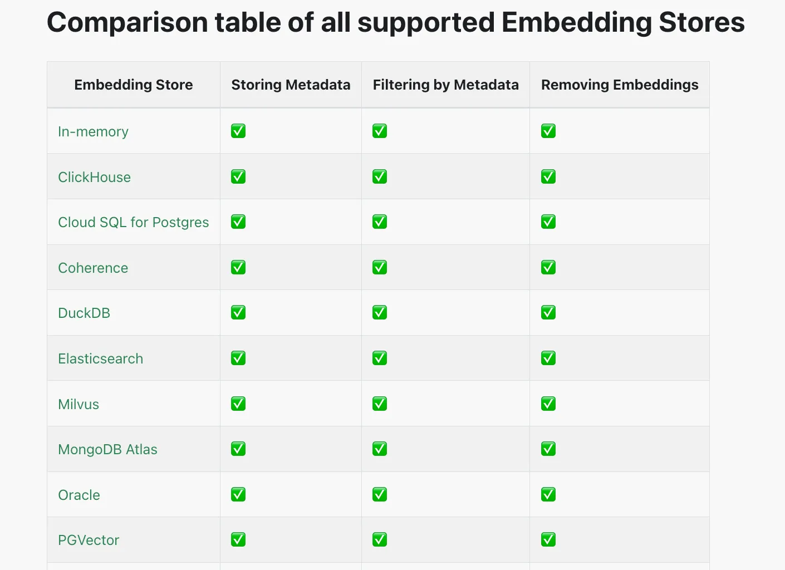

### 工具调用 - Tools

工具调用（Tool Calling）可以理解为让 AI 大模型 **借用外部工具** 来完成它自己做不到的事情。

跟人类一样，如果只凭手脚完成不了工作，那么就可以利用工具箱来完成。

工具可以是任何东西，比如网页搜索、对外部 API 的调用、访问外部数据、或执行特定的代码等。

比如用户提问 “帮我查询上海最新的天气”，AI 本身并没有这些知识，它就可以调用 “查询天气工具”，来完成任务。

需要注意的是，工具调用的本质 **并不是 AI 服务器自己调用这些工具、也不是把工具的代码发送给 AI 服务器让它执行**，它只能提出要求，表示 “我需要执行 XX 工具完成任务”。而真正执行工具的是我们自己的应用程序，执行后再把结果告诉 AI，让它继续工作。

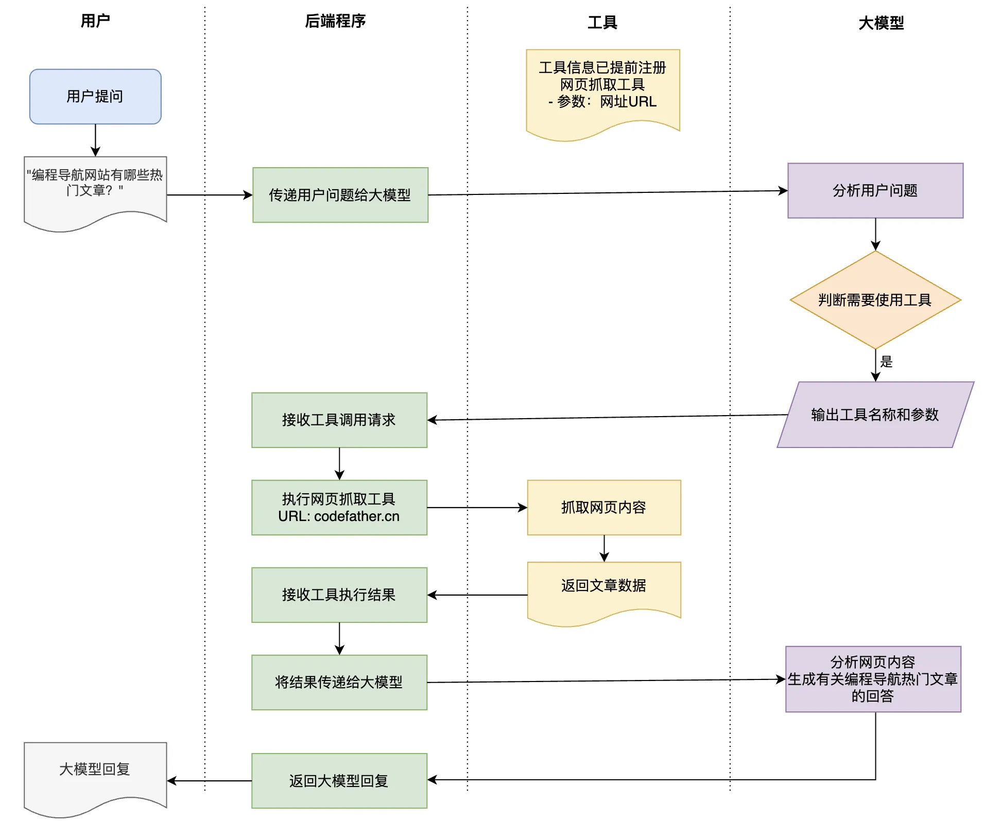

我们需要的网络搜索能力，就可以通过工具调用来实现。这里我们细化下需求：让 AI 能够通过我的 [面试鸭刷题网站](https://www.mianshiya.com/) 来搜索面试题。

实现方案很简单，因为面试鸭网站的搜索页面 **支持通过 URL 参数传入不同的搜索关键词**，我们只需要利用 **Jsoup 库** 抓取面试鸭搜索页面的题目列表就可以了。

好家伙，我爬我自己？不过大家不要尝试，很容易被封号。

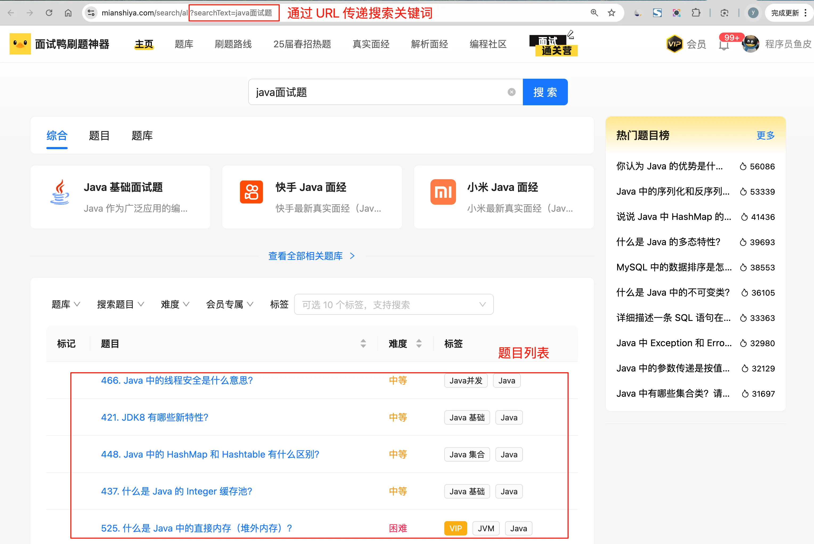

先引入 Jsoup 库：

```xml
<dependency>
    <groupId>org.jsoup</groupId>
    <artifactId>jsoup</artifactId>
    <version>1.20.1</version>
</dependency>
```

然后在 `tools` 包下编写工具，通过 `@Tool` 注解就能声明工具了，注意 **要认真编写工具和工具参数的描述**，这直接决定了 AI 能否正确地调用工具。

```java
@Slf4j
public class InterviewQuestionTool {

    /**
     * 从面试鸭网站获取关键词相关的面试题列表
     *
     * @param keyword 搜索关键词（如"redis"、"java多线程"）
     * @return 面试题列表，若失败则返回错误信息
     */
    @Tool(name = "interviewQuestionSearch", value = """
            Retrieves relevant interview questions from mianshiya.com based on a keyword.
            Use this tool when the user asks for interview questions about specific technologies,
            programming concepts, or job-related topics. The input should be a clear search term.
            """
    )
    public String searchInterviewQuestions(@P(value = "the keyword to search") String keyword) {
        List<String> questions = new ArrayList<>();
        // 构建搜索URL（编码关键词以支持中文）
        String encodedKeyword = URLEncoder.encode(keyword, StandardCharsets.UTF_8);
        String url = "https://www.mianshiya.com/search/all?searchText=" + encodedKeyword;
        // 发送请求并解析页面
        Document doc;
        try {
            doc = Jsoup.connect(url)
                    .userAgent("Mozilla/5.0")
                    .timeout(5000)
                    .get();
        } catch (IOException e) {
            log.error("get web error", e);
            return e.getMessage();
        }
        // 提取面试题
        Elements questionElements = doc.select(".ant-table-cell > a");
        questionElements.forEach(el -> questions.add(el.text().trim()));
        return String.join("\n", questions);
    }
}
```

给 AI Service 绑定工具：

```java
// 构造 AI Service
AiCodeHelperService aiCodeHelperService = AiServices.builder(AiCodeHelperService.class)
        .chatModel(qwenChatModel)
        .chatMemory(chatMemory)
        .contentRetriever(contentRetriever) // RAG 检索增强生成
        .tools(new InterviewQuestionTool()) // 工具调用
        .build();
```

编写单元测试，验证工具的效果：

```java
@Test
void chatWithTools() {
    String result = aiCodeHelperService.chat("有哪些常见的计算机网络面试题？");
    System.out.println(result);
}
```

Debug 运行，发现 AI 调用了工具：

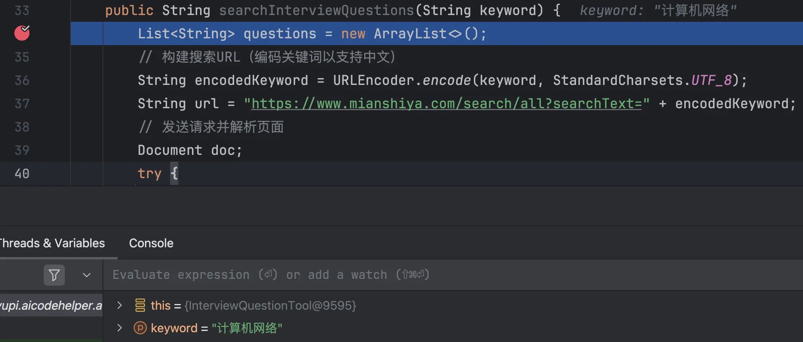

工具检索到了题目列表：

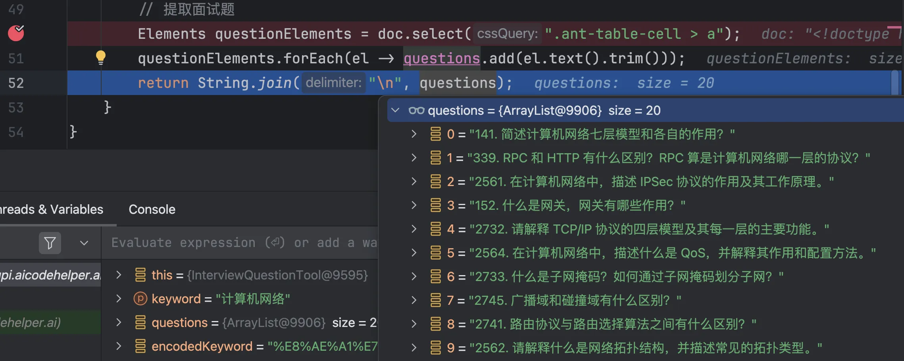

可以通过 Debug 看到 AI Service 加载了工具：

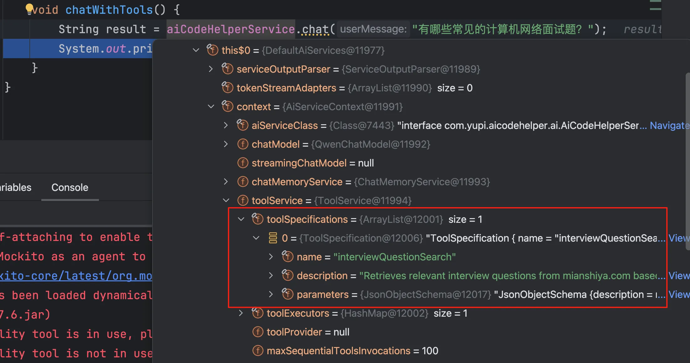

可以通过会话记忆查看工具的调用过程：

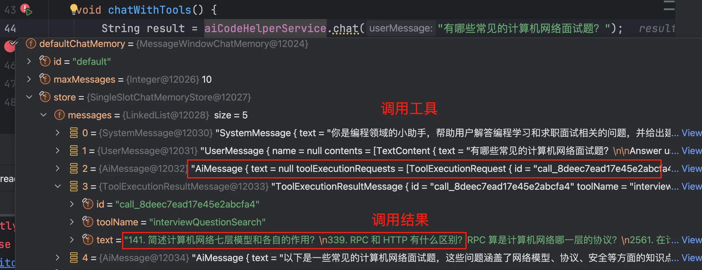

输出结果符合预期：

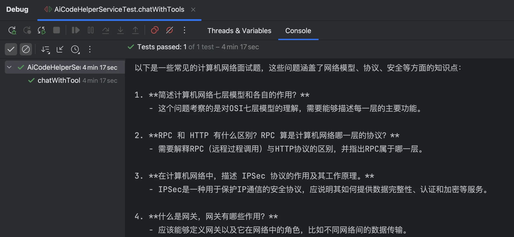

前面只演示了最简单的工具定义方法 —— 声明式，LangChain4j 也提供了编程式的工具定义方法，不过我相信你不会想这么做的（除非是动态创建工具）。

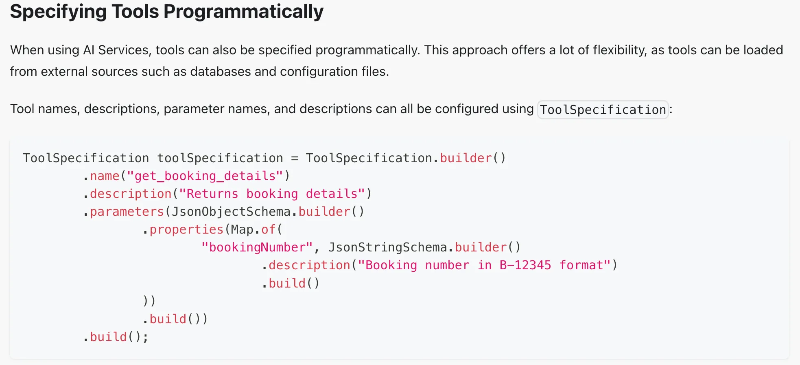

除了联网搜索外，还有一些经典的工具，比如文件读写、PDF 生成、调用终端、输出图表等等。这些工具我们可以自己开发，也可以通过 MCP 直接使用别人开发好的工具。

### 模型上下文协议 - MCP

MCP（Model Context Protocol，模型上下文协议）是一种开放标准，目的是增强 AI 与外部系统的交互能力。MCP 为 AI 提供了与外部工具、资源和服务交互的标准化方式，让 AI 能够访问最新数据、执行复杂操作，并与现有系统集成。

可以将 MCP 想象成 AI 应用的 USB 接口。就像 USB 为设备连接各种外设和配件提供了标准化方式一样，MCP 为 AI 模型连接不同的数据源和工具提供了标准化的方法。

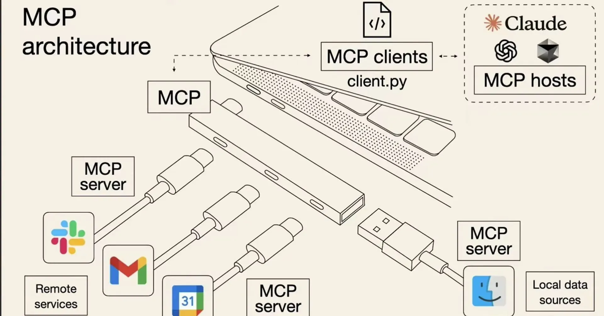

简单来说，通过 MCP 协议，AI 应用可以轻松接入别人提供的服务来实现更多功能，比如查询地理位置、操作数据库、部署网站、甚至是支付等等。

刚刚我们通过工具调用实现了面试题的搜索，下面我们利用 MCP 实现 **全网搜索内容**，这也是一个典型的 MCP 应用场景了。

首先从 MCP 服务市场搜索 Web Search 服务，推荐 [下面这个](https://mcp.so/server/zhipu-web-search/BigModel?tab=content)，因为它提供了 SSE 在线调用服务，不用我们自己在本地安装启动，很方便。

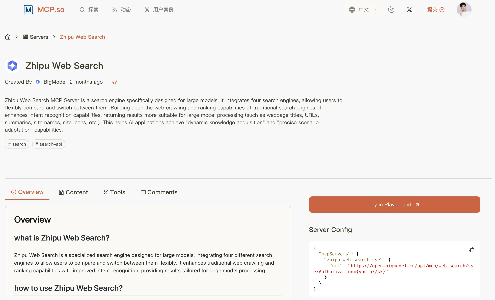

但也要注意，用别人的服务可能是需要 API Key 的，一般是按量付费。

需要先去 [平台官方获取 API Key](https://www.bigmodel.cn/usercenter/proj-mgmt/apikeys)，等会儿会用到：

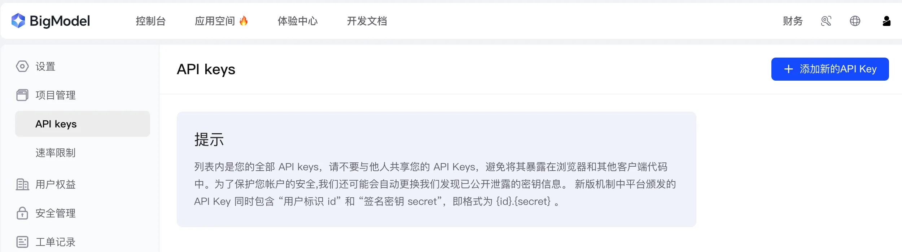

然后我们要在程序中使用这个 MCP 服务。比较坑的是，感觉 LangChain 对 MCP 的支持没有那么好，官方文档甚至都没有提到要引入的 MCP 依赖包。我还是从开源仓库中找到的依赖：

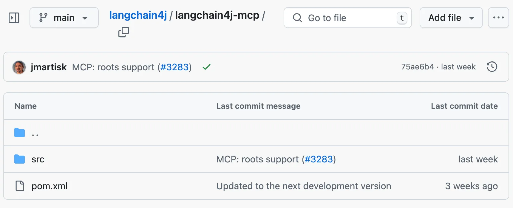

引入依赖：

```xml
<!-- https://mvnrepository.com/artifact/dev.langchain4j/langchain4j-mcp -->
<dependency>
    <groupId>dev.langchain4j</groupId>
    <artifactId>langchain4j-mcp</artifactId>
    <version>1.1.0-beta7</version>
</dependency>
```

在配置文件中新增 API Key 的配置：

```yaml
bigmodel:
  api-key: <Your Api Key>
```

新建 `mcp.McpConfig`，按照官方的开发方式，初始化和 MCP 服务的通讯，并创建 McpToolProvider 的 Bean：

```java
@Configuration
public class McpConfig {

    @Value("${bigmodel.api-key}")
    private String apiKey;

    @Bean
    public McpToolProvider mcpToolProvider() {
        // 和 MCP 服务通讯
        McpTransport transport = new HttpMcpTransport.Builder()
                .sseUrl("https://open.bigmodel.cn/api/mcp/web_search/sse?Authorization=" + apiKey)
                .logRequests(true) // 开启日志，查看更多信息
                .logResponses(true)
                .build();
        // 创建 MCP 客户端
        McpClient mcpClient = new DefaultMcpClient.Builder()
                .key("yupiMcpClient")
                .transport(transport)
                .build();
        // 从 MCP 客户端获取工具
        McpToolProvider toolProvider = McpToolProvider.builder()
                .mcpClients(mcpClient)
                .build();
        return toolProvider;
    }
}
```

注意，上面我们是通过 SSE 的方式调用 MCP。如果你是通过 npx 或 uvx 本地启动 MCP 服务，需要先安装对应的工具，并且利用下面的配置建立通讯：

```java
McpTransport transport = new StdioMcpTransport.Builder()
    .command(List.of("/usr/bin/npm", "exec", "@modelcontextprotocol/server-everything@0.6.2"))
    .logEvents(true) // only if you want to see the traffic in the log
    .build();
```

在 AI Service 中应用 MCP 工具：

```java
@Resource
private McpToolProvider mcpToolProvider;

// 构造 AI Service
AiCodeHelperService aiCodeHelperService = AiServices.builder(AiCodeHelperService.class)
        .chatModel(qwenChatModel)
        .chatMemory(chatMemory)
        .contentRetriever(contentRetriever) // RAG 检索增强生成
        .tools(new InterviewQuestionTool()) // 工具调用
        .toolProvider(mcpToolProvider) // MCP 工具调用
        .build();
```

编写单元测试：

```java
@Test
void chatWithMcp() {
    String result = aiCodeHelperService.chat("什么是程序员鱼皮的编程导航？");
    System.out.println(result);
}
```

执行单元测试，通过日志查看到了搜索过程：

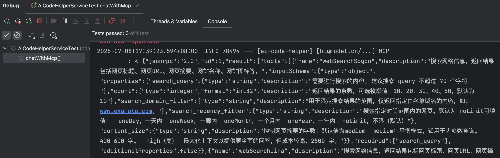

MCP 服务生效，从网上检索到了内容作为答案：

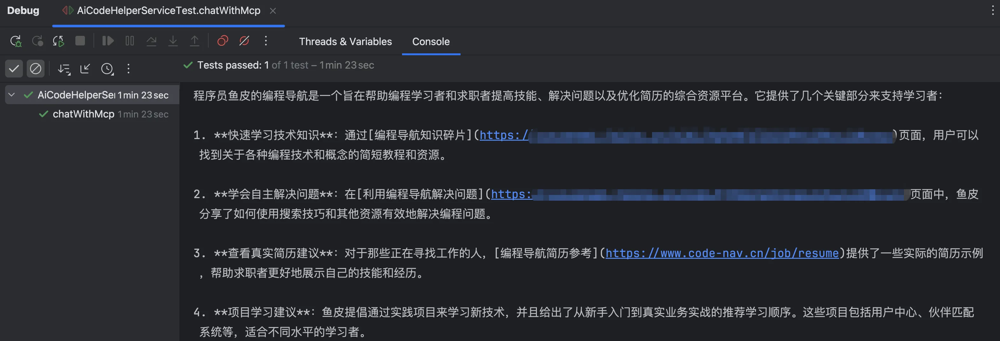

目前，文档中并没有提到利用 LangChain4j 开发 MCP 的方法，不过目前也不建议用 [Java](https://www.mianshiya.com/bank/1860871861809897474) 开发 MCP。

### 护轨 - Guardrail

其实我感觉护轨这个名字起的不太好，其实我们把它理解为拦截器就好了。分为输入护轨（input guardrails）和输出护轨（output guardrails），可以在请求 AI 前和接收到 AI 的响应后执行一些额外操作，比如调用 AI 前鉴权、调用 AI 后记录日志。


让我们小试一把，在调用 AI 前进行敏感词检测，如果用户提示词包含敏感词，则直接拒绝。

新建 `guardrail.SafeInputGuardrail`，实现 InputGuardrail 接口：

```java
/**
 * 安全检测输入护轨
 */
public class SafeInputGuardrail implements InputGuardrail {

    private static final Set<String> sensitiveWords = Set.of("kill", "evil");

    /**
     * 检测用户输入是否安全
     */
    @Override
    public InputGuardrailResult validate(UserMessage userMessage) {
        // 获取用户输入并转换为小写以确保大小写不敏感
        String inputText = userMessage.singleText().toLowerCase();
        // 使用正则表达式分割输入文本为单词
        String[] words = inputText.split("\\W+");
        // 遍历所有单词，检查是否存在敏感词
        for (String word : words) {
            if (sensitiveWords.contains(word)) {
                return fatal("Sensitive word detected: " + word);
            }
        }
        return success();
    }
}
```

LangChain4j 提供了几种快速返回的方法，简单来说，想继续调用 AI 就返回 success、否则就返回 fatal。

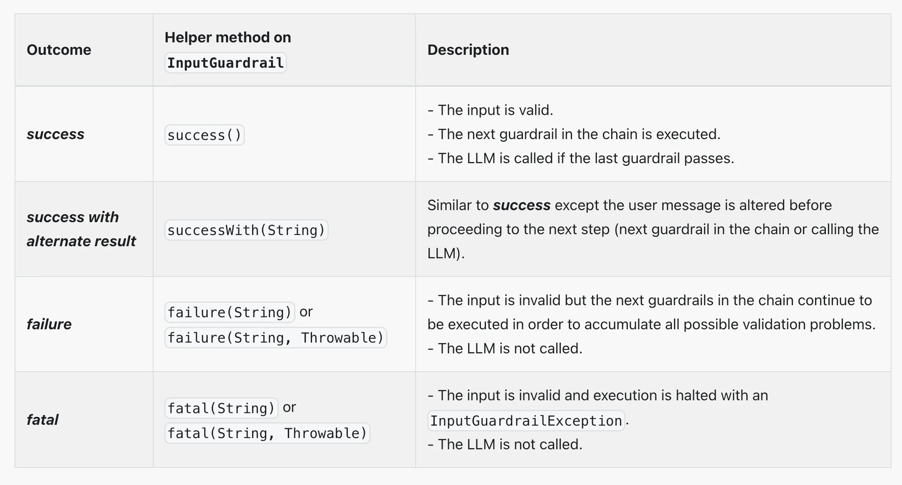

修改 AI Service，使用输入护轨：

```java
@InputGuardrails({SafeInputGuardrail.class})
public interface AiCodeHelperService {

    @SystemMessage(fromResource = "system-prompt.txt")
    String chat(String userMessage);

    @SystemMessage(fromResource = "system-prompt.txt")
    Report chatForReport(String userMessage);

    // 学习报告
    record Report(String name, List<String> suggestionList) {
    }
}
```

编写单元测试，写一个包含敏感词的提示词：

```java
@Test
void chatWithGuardrail() {
    String result = aiCodeHelperService.chat("kill the game");
    System.out.println(result);
}
```

运行并查看效果，会触发输入检测，直接抛出异常：

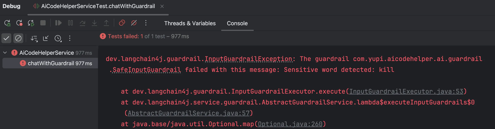

如果不包含敏感词，则会顺利通过。

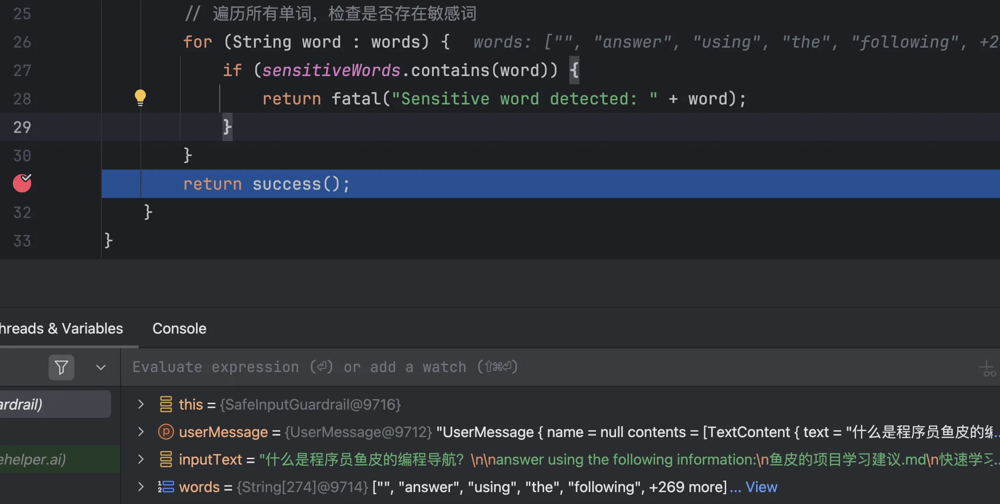

当然，除了输入护轨，也可以编写输出护轨，对 AI 的响应结果进行检测。

### 日志和可观测性

之前我们都是通过 Debug 查看运行信息，不仅不便于调试，而且生产环境肯定不能这么做。

官方提供了 [日志](https://docs.langchain4j.dev/tutorials/logging) 和 [可观测性](https://docs.langchain4j.dev/tutorials/observability)，来帮我们更好地调试程序、发现问题。

#### 日志

开启日志的方法很简单，直接构造模型时指定开启、或者直接编写 Spring Boot 配置，支持打印 AI 请求和响应日志。

```java
OpenAiChatModel.builder()
    ...
    .logRequests(true)
    .logResponses(true)
    .build();
langchain4j.open-ai.chat-model.log-requests = true
langchain4j.open-ai.chat-model.log-responses = true
logging.level.dev.langchain4j = DEBUG
```

但并不是所有的 ChatModel 都支持，比如我测试下来 QwenChatModel 就不支持。这时只能把希望交给可观测性了。

#### 可观测性

可以通过自定义 Listener 获取 ChatModel 的调用信息，比较灵活。

新建 `listener.ChatModelListenerConfig`，输出请求、响应、错误信息：

```java
@Configuration
@Slf4j
public class ChatModelListenerConfig {
    
    @Bean
    ChatModelListener chatModelListener() {
        return new ChatModelListener() {
            @Override
            public void onRequest(ChatModelRequestContext requestContext) {
                log.info("onRequest(): {}", requestContext.chatRequest());
            }

            @Override
            public void onResponse(ChatModelResponseContext responseContext) {
                log.info("onResponse(): {}", responseContext.chatResponse());
            }

            @Override
            public void onError(ChatModelErrorContext errorContext) {
                log.info("onError(): {}", errorContext.error().getMessage());
            }
        };
    }
}
```

但是只定义 Listener 好像对 QwenChatModel 不起作用，所以我们需要手动构造自定义的 QwenChatModel。

新建 `model.QwenChatModelConfig`，构造 ChatModel 对象并绑定 Listener：

```java
@Configuration
@ConfigurationProperties(prefix = "langchain4j.community.dashscope.chat-model")
@Data
public class QwenChatModelConfig {

    private String modelName;

    private String apiKey;

    @Resource
    private ChatModelListener chatModelListener;

    @Bean
    public ChatModel myQwenChatModel() {
        return QwenChatModel.builder()
                .apiKey(apiKey)
                .modelName(modelName)
                .listeners(List.of(chatModelListener))
                .build();
    }
}
```

然后，可以将原本引用 ChatModel 的名称改为 `myQwenChatModel`，防止和 Spring Boot 自动注入的 ChatModel 冲突。

再次调用 AI，就能看到很多信息了：

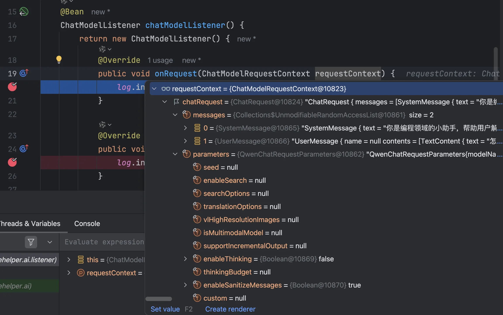

### AI 服务化

至此，AI 的能力基本开发完成，但是目前只支持本地运行，需要编写一个接口提供给[前端](https://www.mianshiya.com/bank/1860931478862618626)调用，让 AI 能够成为一个服务。

我们平时开发的大多数接口都是同步接口，也就是等后端处理完再返回。但是对于 AI 应用，特别是响应时间较长的对话类应用，可能会让用户失去耐心等待，因此推荐使用 SSE（Server-Sent Events）技术实现实时流式输出，类似打字机效果，大幅提升用户体验。

#### SSE 流式接口开发

LangChain 提供了 2 种方式来支持流式响应（注意，流式响应不支持结构化输出）。

一种方法是 [TokenStream](https://docs.langchain4j.dev/tutorials/ai-services#streaming)，先让 AI 对话方法返回 TokenStream，然后创建 AI Service 时指定流式对话模型 StreamingChatModel：

```java
interface Assistant {

    TokenStream chat(String message);
}

StreamingChatModel model = OpenAiStreamingChatModel.builder()
    .apiKey(System.getenv("OPENAI_API_KEY"))
    .modelName(GPT_4_O_MINI)
    .build();

Assistant assistant = AiServices.create(Assistant.class, model);

TokenStream tokenStream = assistant.chat("Tell me a joke");

tokenStream.onPartialResponse((String partialResponse) -> System.out.println(partialResponse))
    .onRetrieved((List<Content> contents) -> System.out.println(contents))
    .onToolExecuted((ToolExecution toolExecution) -> System.out.println(toolExecution))
    .onCompleteResponse((ChatResponse response) -> System.out.println(response))
    .onError((Throwable error) -> error.printStackTrace())
    .start();
```

我个人会更喜欢另一种方法，[使用 Flux](https://docs.langchain4j.dev/tutorials/ai-services/#flux) 代替 TokenStream，熟悉响应式编程的同学应该对 Flux 不陌生吧？让 AI 对话方法返回 Flux 响应式对象即可。示例代码：

```java
interface Assistant {

  Flux<String> chat(String message);
}
```

让我们试一下，首先需要引入响应式包依赖：

```xml
<dependency>
    <groupId>dev.langchain4j</groupId>
    <artifactId>langchain4j-reactor</artifactId>
    <version>1.1.0-beta7</version>
</dependency>
```

然后给 AI Service 增加流式对话方法，这里顺便支持下多用户的会话记忆：

```java
// 流式对话
Flux<String> chatStream(@MemoryId int memoryId, @UserMessage String userMessage);
```

由于要用到流式模型，需要增加流式模型配置：

```yaml
langchain4j:
  community:
    dashscope:
      streaming-chat-model:
        model-name: qwen-max
        api-key: <Your Api Key>
```

构造 AI Service 时指定流式对话模型（自动注入即可），并且补充会话记忆提供者：

```java
@Resource
private StreamingChatModel qwenStreamingChatModel;

AiCodeHelperService aiCodeHelperService = AiServices.builder(AiCodeHelperService.class)
        .chatModel(myQwenChatModel)
        .streamingChatModel(qwenStreamingChatModel)
        .chatMemory(chatMemory)
        .chatMemoryProvider(memoryId ->
                MessageWindowChatMemory.withMaxMessages(10)) // 每个会话独立存储
        .contentRetriever(contentRetriever) // RAG 检索增强生成
        .tools(new InterviewQuestionTool()) // 工具调用
        .toolProvider(mcpToolProvider) // MCP 工具调用
        .build();
```

最后，编写 Controller 接口。为了方便测试，这里使用 Get 请求：

```java
@RestController
@RequestMapping("/ai")
public class AiController {

    @Resource
    private AiCodeHelperService aiCodeHelperService;

    @GetMapping("/chat")
    public Flux<ServerSentEvent<String>> chat(int memoryId, String message) {
        return aiCodeHelperService.chatStream(memoryId, message)
                .map(chunk -> ServerSentEvent.<String>builder()
                        .data(chunk)
                        .build());
    }
}
```

增加服务器配置，指定后端端口和接口路径前缀：

```yaml
server:
  port: 8081
  servlet:
    context-path: /api
```

启动服务器，用 CURL 工具测试调用：

```bash
curl -G 'http://localhost:8081/api/ai/chat' \
  --data-urlencode 'message=我是程序员鱼皮' \
  --data-urlencode 'memoryId=1'
```

可以看到流式的输出结果：

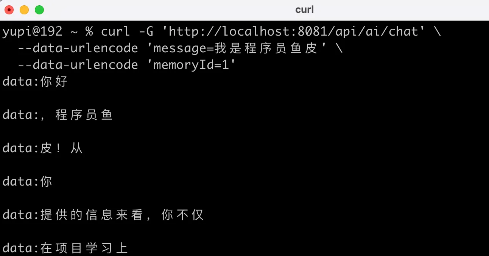

#### 后端支持跨域

为了让前端项目能够顺利调用后端接口，我们需要在后端配置跨域支持。在 config 包下创建跨域配置类，代码如下：

```java
/**
 * 全局跨域配置
 */
@Configuration
public class CorsConfig implements WebMvcConfigurer {

    @Override
    public void addCorsMappings(CorsRegistry registry) {
        // 覆盖所有请求
        registry.addMapping("/**")
                // 允许发送 Cookie
                .allowCredentials(true)
                // 放行哪些域名（必须用 patterns，否则 * 会和 allowCredentials 冲突）
                .allowedOriginPatterns("*")
                .allowedMethods("GET", "POST", "PUT", "DELETE", "OPTIONS")
                .allowedHeaders("*")
                .exposedHeaders("*");
    }
}
```

注意，如果 `.allowedOrigins("*")` 与 `.allowCredentials(true)` 同时配置会导致冲突，因为出于安全考虑，跨域请求不能同时允许所有域名访问和发送认证信息（比如 Cookie）。

## AI 生成前端

由于这个项目不需要很复杂的页面，我们可以利用 AI 来快速生成前端代码，极大提高开发效率。这里鱼皮使用 [主流 AI 开发工具 Cursor](https://www.cursor.com/)，挑战不写一行代码，生成符合要求的前端项目。

### 提示词

首先准备一段详细的 Prompt，一般要包括需求、技术选型、后端接口信息，还可以提供一些原型图、后端代码等。

```markdown
你是一位专业的前端开发，请帮我根据下列信息来生成对应的前端项目代码。

## 需求

应用为《AI 编程小助手》，帮助用户解答编程学习和求职面试相关的问题，并给出建议。

只有一个页面，就是主页：页面风格为聊天室，上方是聊天记录（用户信息在右边，AI 信息在左边），下方是输入框，进入页面后自动生成一个聊天室 id，用于区分不同的会话。通过 SSE 的方式调用 chat 接口，实时显示对话内容。

## 技术选型

1. Vue3 项目
2. Axios 请求库

## 后端接口信息

接口地址前缀：http://localhost:8081/api

## SpringBoot 后端接口代码

@RestController
@RequestMapping("/ai")
public class AiController {

    @GetMapping("/chat")
    public Flux<ServerSentEvent<String>> chat(int memoryId, String message) {
        return aiCodeHelperService.chatStream(memoryId, message)
                .map(chunk -> ServerSentEvent.<String>builder()
                        .data(chunk)
                        .build());
    }
}
```

注意，如果使用的是 [Windows 系统](https://www.mianshiya.com/bank/1812069222084378626)，最好在 prompt 中补充“你应该使用 Windows 支持的命令来完成任务”。

### 开发

在项目根目录下创建新的前端项目文件夹 `ai-code-helper-frontend`，使用 Cursor 工具打开该目录，输入 Prompt 执行。注意要选择 Agent 模式、Thinking 深度思考模型（推荐 Claude）：

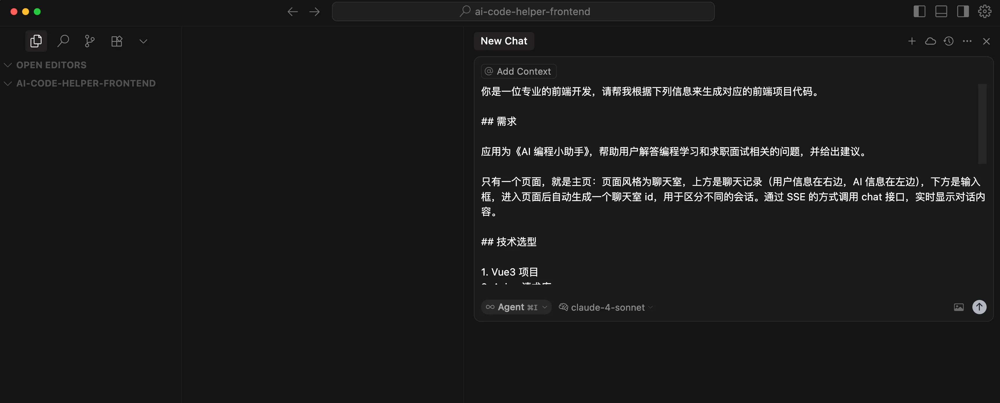

除了源代码外，鱼皮这里连项目介绍文档 `README.md` 都生成了，确实很爽！

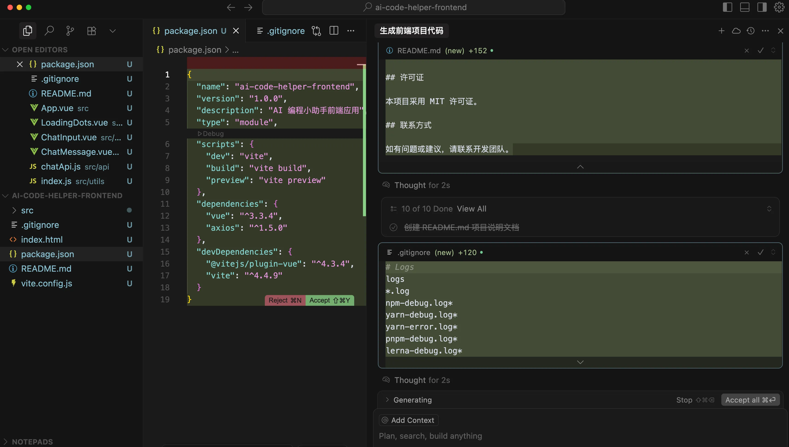

生成完代码后，打开终端执行 `npm run dev` 命令，或者打开 `package.json` 文件并利用 Debug 按钮启动项目：

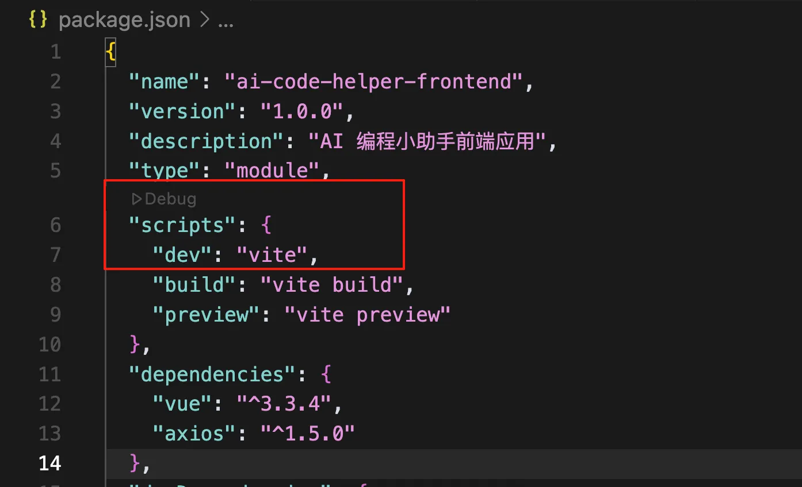

### 查看效果

运行前端项目后，首先验证功能是否正常，再验证样式。如果发现功能不可用（比如发送消息后没有回复），可以按 F12 打开浏览器控制台查看前端错误信息、或者看后端项目控制台的错误信息，具体报错信息具体分析。这块就会涉及到一些前端相关的知识了，不懂前端的同学尽量多问 AI，让它帮忙修复 Bug 就好。**如果实在搞不定，也别瞎折腾了！**用鱼皮的代码就好。

比如我遇到了连接后端 SSE 服务报错的问题，直接复制报错信息给 AI 解决：

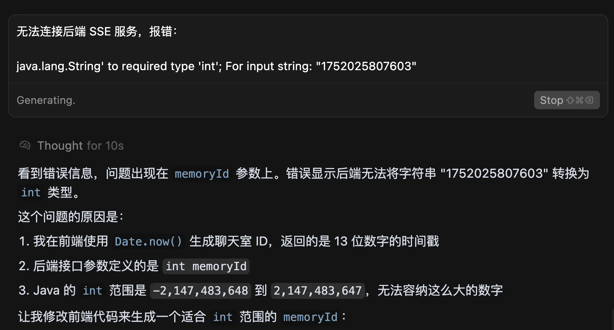

成功运行，查看效果：

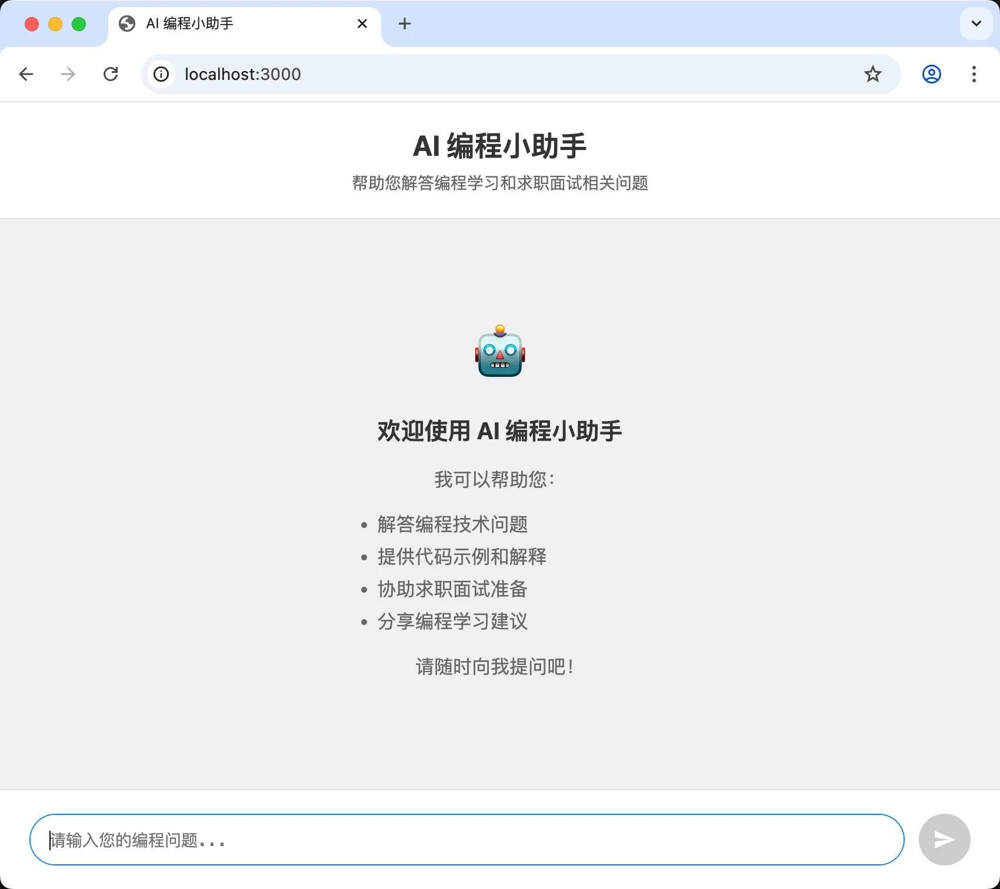

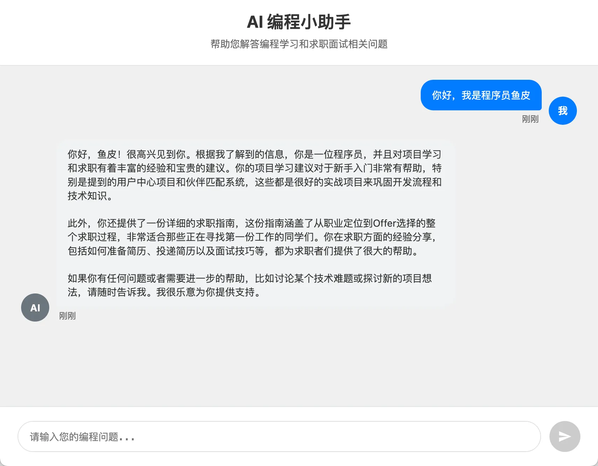

确保功能和样式没问题后，记得先提交代码（防止后续被 AI 生成的代码污染），然后你可以按需增加更多功能，比如用 Markdown 展示 AI 的回复消息。

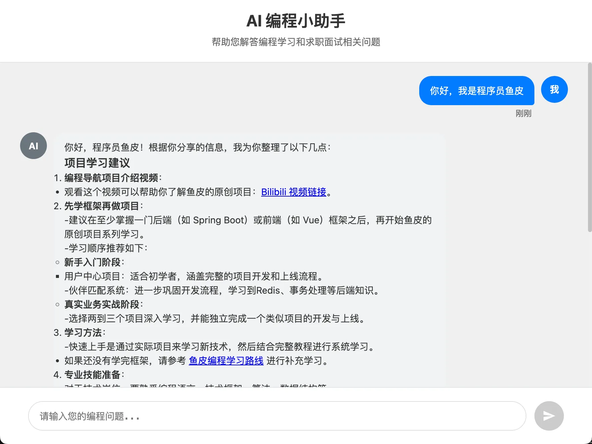

## 工作流

基于 LangChain4j 构建 Agent 工作流的核心思路是 **AgenticServices** 提供的 `sequenceBuilder`、`loopBuilder`、`conditionalBuilder` 和 `parallelBuilder`。通过组合这些基础模式，你可以构建出从简单顺序执行到复杂多层嵌套的智能工作流。

为了避免你示例中 `// 假设已定义...` 这样不清不楚的代码，下面的代码是完全可运行的完整示例，基于 **LangChain4j 1.10.0-beta18** 版本。

### 1. 准备工作：添加依赖与定义基础接口

首先，在项目中添加 `langchain4j-agentic` 依赖，并定义好工作流中所需的 AI 服务接口。

```xml
<dependency>
    <groupId>dev.langchain4j</groupId>
    <artifactId>langchain4j-agentic</artifactId>
    <version>1.10.0-beta18</version>
</dependency>
<!-- 添加你需要的模型依赖，如 ollama 或 openai -->
<dependency>
    <groupId>dev.langchain4j</groupId>
    <artifactId>langchain4j-ollama</artifactId>
    <version>1.10.0-beta18</version>
</dependency>
```


定义三个基础 Agent 接口（完整的代码，非伪代码）：

```java
// 创意作家 Agent
public interface CreativeWriter {
    @Agent("基于给定主题生成一个短篇故事")
    @UserMessage("你是一个创意作家。根据主题 '{{topic}}' 生成一个不超过3句话的故事草稿。只返回故事本身。")
    String generateStory(@V("topic") String topic);
}

// 受众编辑 Agent
public interface AudienceEditor {
    @Agent("编辑故事以更好地适应特定受众")
    @UserMessage("你是一名专业编辑。分析并重写下面的故事，使其更符合目标受众 '{{audience}}' 的需求。故事内容是：{{story}}")
    String editStory(@V("story") String story, @V("audience") String audience);
}

// 风格编辑 Agent
public interface StyleEditor {
    @Agent("编辑故事以适配特定风格")
    @UserMessage("你是一名专业编辑。分析并重写下面的故事，使其更贴合 '{{style}}' 风格。故事内容是：{{story}}")
    String editStory(@V("story") String story, @V("style") String style);
}
```


### 2. 顺序工作流 (Sequential Workflow)

这是最基础的模式：Agent 依次执行，前一个的输出作为后一个的输入 。

```java
import dev.langchain4j.agentic.AgenticServices;
import dev.langchain4j.agentic.UntypedAgent;
import dev.langchain4j.model.chat.ChatLanguageModel;
import dev.langchain4j.model.ollama.OllamaChatModel;

public class SequentialWorkflowDemo {
    public static void main(String[] args) {
        // 1. 初始化模型 (这里以 Ollama 为例)
        ChatLanguageModel model = OllamaChatModel.builder()
                .baseUrl("http://localhost:11434")
                .modelName("llama3")
                .build();

        // 2. 构建三个基础的 AI Agent
        CreativeWriter writer = AgenticServices
                .agentBuilder(CreativeWriter.class)
                .chatModel(model)
                .outputKey("story") // 将结果存入上下文中的 "story" 变量
                .build();

        AudienceEditor audienceEditor = AgenticServices
                .agentBuilder(AudienceEditor.class)
                .chatModel(model)
                .outputKey("story") // 注意：这里也使用 "story" 作为输出键，会覆盖上下文中的值
                .build();

        StyleEditor styleEditor = AgenticServices
                .agentBuilder(StyleEditor.class)
                .chatModel(model)
                .outputKey("story") // 最终编辑好的故事会存入 "story"
                .build();

        // 3. 将三个 Agent 按顺序组合成一个工作流
        UntypedAgent novelCreator = AgenticServices
                .sequenceBuilder() // 关键点：顺序构建器
                .subAgents(writer, audienceEditor, styleEditor)
                .outputKey("story") // 整个工作流的最终输出
                .build();

        // 4. 执行工作流并传入初始参数
        java.util.Map<String, Object> input = java.util.Map.of(
                "topic", "一条龙和一位年轻的巫师",
                "audience", "10岁左右的儿童",
                "style", "幽默风趣"
        );

        String finalStory = (String) novelCreator.invoke(input);
        System.out.println("最终故事: \n" + finalStory);
    }
}
```


### 3. 循环工作流 (Loop Workflow)

当你需要 Agent 不断自我改进，直到达到某个标准（如评分超过0.8分）时，可以使用循环工作流 。

```java
// 新增一个评分的 Agent 接口
public interface StyleScorer {
    @Agent("根据风格要求对故事进行0到1之间的评分")
    @UserMessage("你是一个苛刻的评论家。根据与 '{{style}}' 风格的契合程度，给下面的故事一个0.0到1.0之间的评分：{{story}}。只返回数字分数，不要有其他内容。")
    double scoreStory(@V("story") String story, @V("style") String style);
}

// 循环工作流示例
public class LoopWorkflowDemo {
    public static void main(String[] args) {
        ChatLanguageModel model = OllamaChatModel.builder()
                .baseUrl("http://localhost:11434")
                .modelName("llama3")
                .build();

        // 构建 Agent
        StyleEditor styleEditor = AgenticServices
                .agentBuilder(StyleEditor.class)
                .chatModel(model)
                .outputKey("story")
                .build();

        StyleScorer styleScorer = AgenticServices
                .agentBuilder(StyleScorer.class)
                .chatModel(model)
                .outputKey("score")
                .build();

        // 构建循环工作流
        UntypedAgent storyImprovementLoop = AgenticServices
                .loopBuilder() // 关键点：循环构建器
                .subAgents(styleEditor, styleScorer) // 循环体：先编辑，后评分
                .outputKey("story") // 循环结束后输出的故事
                .exitCondition(agenticScope -> { // 定义退出循环的条件
                    Double score = (Double) agenticScope.readState("score");
                    System.out.println("当前故事评分: " + score);
                    return score >= 0.8; // 评分达到0.8则退出
                })
                .maxIterations(5) // 最多循环5次，防止无限循环
                .build();

        // 准备初始输入
        java.util.Map<String, Object> input = java.util.Map.of(
                "story", "从前，有一条懒惰的龙。",
                "style", "史诗奇幻"
        );

        String finalStory = (String) storyImprovementLoop.invoke(input);
        System.out.println("优化后的故事: \n" + finalStory);
    }
}
```


### 4. 条件工作流 (Conditional Workflow)

根据某个中间结果（如简历评分）来决定下一步执行哪个 Agent（如邀请面试或发送拒绝邮件）。

```java
// 假设已有面试安排 Agent 和 邮件助手 Agent 的接口
public interface InterviewOrganizer {
    @Agent("为候选人安排现场面试")
    String organize(@V("candidateName") String name);
}

public interface EmailAssistant {
    @Agent("向候选人发送拒绝邮件")
    int sendRejection(@V("candidateName") String name);
}

// 条件工作流示例
public class ConditionalWorkflowDemo {
    public static void main(String[] args) {
        ChatLanguageModel model = OllamaChatModel.builder()
                .baseUrl("http://localhost:11434")
                .modelName("llama3")
                .build();

        // 假设我们之前已经有了一个包含 "score" 的 AgenticScope
        InterviewOrganizer interviewer = AgenticServices
                .agentBuilder(InterviewOrganizer.class)
                .chatModel(model)
                .build();

        EmailAssistant emailer = AgenticServices
                .agentBuilder(EmailAssistant.class)
                .chatModel(model)
                .build();

        // 构建条件分支
        UntypedAgent decisionWorkflow = AgenticServices
                .conditionalBuilder() // 关键点：条件构建器
                .subAgents(
                        scope -> ((Double) scope.readState("score")) >= 0.8, // 条件1：评分合格
                        interviewer // 执行面试安排
                )
                .subAgents(
                        scope -> ((Double) scope.readState("score")) < 0.8, // 条件2：评分不合格
                        emailer // 执行拒绝邮件发送
                )
                .build();

        // 模拟一个包含了评分结果的上下文输入
        java.util.Map<String, Object> input = java.util.Map.of(
                "score", 0.95,
                "candidateName", "张三"
        );

        decisionWorkflow.invoke(input);
        // 根据评分，工作流会自动调用 InterviewOrganizer 或 EmailAssistant
    }
}
```


### 5. 并行工作流与结果聚合

当需要多个 Agent 同时处理不同任务时，可以使用并行工作流，提高效率 。

```java
// 假设有三个评审 Agent，它们对同一份简历进行独立评估
public interface HrCvReviewer {
    @Agent("从HR角度评审简历")
    CvReview review(@V("cv") String cv);
}
public interface ManagerCvReviewer { /* 类似 */ }
public interface TeamMemberCvReviewer { /* 类似 */ }

// 定义评审结果类
public class CvReview {
    public double score;
    public String feedback;
    // 构造函数、getter/setter...
}

// 并行工作流示例
public class ParallelWorkflowDemo {
    public static void main(String[] args) {
        ChatLanguageModel model = OllamaChatModel.builder()
                .baseUrl("http://localhost:11434")
                .modelName("llama3")
                .build();

        HrCvReviewer hrReviewer = AgenticServices.agentBuilder(HrCvReviewer.class)
                .chatModel(model).outputKey("hrReview").build();
        ManagerCvReviewer managerReviewer = AgenticServices.agentBuilder(ManagerCvReviewer.class)
                .chatModel(model).outputKey("managerReview").build();
        TeamMemberCvReviewer teamReviewer = AgenticServices.agentBuilder(TeamMemberCvReviewer.class)
                .chatModel(model).outputKey("teamReview").build();

        // 构建并行工作流
        UntypedAgent parallelReviewWorkflow = AgenticServices
                .parallelBuilder() // 关键点：并行构建器
                .subAgents(hrReviewer, managerReviewer, teamReviewer)
                .executor(java.util.concurrent.Executors.newFixedThreadPool(3)) // 使用线程池并行执行
                .output(scope -> { // 聚合三个 Agent 的输出结果
                    CvReview hr = (CvReview) scope.readState("hrReview");
                    CvReview mgr = (CvReview) scope.readState("managerReview");
                    CvReview team = (CvReview) scope.readState("teamReview");
                    double avgScore = (hr.score + mgr.score + team.score) / 3.0;
                    String combinedFeedback = String.join("\n", hr.feedback, mgr.feedback, team.feedback);
                    return new CvReview(avgScore, combinedFeedback);
                })
                .build();

        java.util.Map<String, Object> input = java.util.Map.of("cv", "张三的简历内容...");
        CvReview finalReview = (CvReview) parallelReviewWorkflow.invoke(input);
        System.out.println("平均分: " + finalReview.score);
    }
}
```

### 6. 非AI智能体详解

在LangChain4j的工作流中，并非所有环节都需要大模型参与。**非AI智能体**（Non-AI Agent）是指那些不需要LLM参与、完全由确定性Java代码实现的处理节点，它们可以像AI Agent一样作为一等公民被编排进工作流中。

#### 为什么需要非AI智能体？

将更多步骤外包给非AI智能体，你的工作流将**更快、更准确、更经济**：

| 对比维度 | AI Agent                     | 非AI智能体                         |
| :------- | :--------------------------- | :--------------------------------- |
| 执行速度 | 慢（需网络请求+模型推理）    | 快（纯内存计算）                   |
| 确定性   | 非确定性（每次结果可能不同） | 完全确定                           |
| 成本     | 高（API调用费用/算力消耗）   | 零成本                             |
| 适用场景 | 创意、理解、推理             | 计算、格式转换、数据聚合、状态更新 |

#### 两种创建方式

##### 方式一：使用 @Agent 注解的普通Java类

这是最直观的方式——在普通Java类的方法上添加`@Agent`注解，框架会自动将其识别为工作流中的一个节点。

java

```java
/**
 * 非AI智能体：将多个简历评审聚合成一个综合评审。
 * 普通Java操作符可以像AI驱动的智能体一样在工作流中使用。
 */
public class ScoreAggregator {

    @Agent(description = "将HR/经理/团队评审聚合成综合评审", outputKey = "combinedCvReview")
    public CvReview aggregate(@V("hrReview") CvReview hr,
                              @V("managerReview") CvReview mgr,
                              @V("teamMemberReview") CvReview team) {
        
        System.out.println("ScoreAggregator被调用，参数：hrReview=" + hr +
                ", managerReview=" + mgr +
                ", teamMemberReview=" + team);
        
        // 确定性计算：平均分
        double avgScore = (hr.score + mgr.score + team.score) / 3.0;
        
        // 确定性计算：拼接反馈文本
        String combinedFeedback = String.join("\n\n",
                "HR评审: " + hr.feedback,
                "经理评审: " + mgr.feedback,
                "团队成员评审: " + team.feedback
        );
        
        return new CvReview(avgScore, combinedFeedback);
    }
}

/**
 * 非AI智能体：根据评分更新申请状态（模拟数据库更新）
 */
public class StatusUpdate {

    @Agent(description = "根据评分更新申请状态")
    public void update(@V("combinedCvReview") CvReview aggregateCvReview) {
        double score = aggregateCvReview.score;
        System.out.println("StatusUpdate被调用，评分: " + score);
        
        if (score >= 8.0) {
            System.out.println("申请状态更新为: 已邀请面试");
        } else {
            System.out.println("申请状态更新为: 已拒绝");
        }
    }
}
```


**关键点**：

- `@Agent`注解告诉框架这是一个可编排的节点
- `@V("key")`用于从共享上下文（AgenticScope）中读取变量
- `outputKey`指定该节点的输出存入哪个共享变量名
- 返回值类型可以是任意Java类型，不限于String

##### 方式二：使用 `AgenticServices.agentAction()` Lambda

对于简单的、一次性的逻辑，可以直接使用Lambda表达式创建非AI智能体，无需定义单独的类。

java

```java
UntypedAgent convertWorkflow = AgenticServices
    .sequenceBuilder()
    .subAgents(
        // 使用 agentAction 创建的简单非AI智能体
        AgenticServices.agentAction(agenticScope -> {
            CvReview review = (CvReview) agenticScope.readState("combinedCvReview");
            // 将评分转换为百分比格式，存入新的上下文变量
            agenticScope.writeState("scoreAsPercentage", review.score * 100);
        })
    )
    .outputKey("scoreAsPercentage")
    .build();
```

**特点**：

- 适合轻量级逻辑
- 可以直接操作`AgenticScope`进行读写
- 不需要单独创建类

### 7. 完整示例：AI与非AI智能体混合编排

```java
@SpringBootApplication
public class NonAIAgentsDemo {

    public static void main(String[] args) {
        ConfigurableApplicationContext context = SpringApplication.run(YourApplication.class, args);
        ChatModel model = context.getBean("ollamaChatModel", ChatModel.class);
        
        // 1. 构建AI子智能体：并行评审
        HrCvReviewer hrReviewer = AgenticServices
                .agentBuilder(HrCvReviewer.class)
                .chatModel(model)
                .outputKey("hrReview")
                .build();

        ManagerCvReviewer managerReviewer = AgenticServices
                .agentBuilder(ManagerCvReviewer.class)
                .chatModel(model)
                .outputKey("managerReview")
                .build();

        TeamMemberCvReviewer teamReviewer = AgenticServices
                .agentBuilder(TeamMemberCvReviewer.class)
                .chatModel(model)
                .outputKey("teamMemberReview")
                .build();

        // 并行执行三个AI评审
        ExecutorService executor = Executors.newFixedThreadPool(3);
        UntypedAgent parallelReviewWorkflow = AgenticServices
                .parallelBuilder()
                .subAgents(hrReviewer, managerReviewer, teamReviewer)
                .executor(executor)
                .build();

        // 2. 构建混合工作流：AI评审 + 非AI智能体（聚合 + 状态更新 + 格式转换）
        UntypedAgent completeWorkflow = AgenticServices
                .sequenceBuilder()
                .subAgents(
                        parallelReviewWorkflow,        // AI Agent：并行评审
                        new ScoreAggregator(),          // 非AI智能体：聚合分数（方式一）
                        new StatusUpdate(),             // 非AI智能体：更新状态（方式一）
                        AgenticServices.agentAction(agenticScope -> {  // 非AI智能体（方式二）
                            CvReview review = (CvReview) agenticScope.readState("combinedCvReview");
                            agenticScope.writeState("scoreAsPercentage", review.score * 100);
                        })
                )
                .outputKey("scoreAsPercentage")
                .build();

        // 3. 执行工作流
        Map<String, Object> input = Map.of(
                "candidateCv", "候选人简历内容...",
                "jobDescription", "职位描述..."
        );
        
        double finalScore = (double) completeWorkflow.invoke(input);
        System.out.println("最终百分制评分: " + finalScore);
        executor.shutdown();
    }
}
```


### 总结

OK，以上就是 LangChain4j 实战项目教程，怎么样，大家学会了还是学废了？

回到开头的那个问题：**实际开发中应该如何选择 AI 开发框架呢？**

就拿 Spring AI 和 LangChain4j 来说，不知道大家更喜欢哪个框架？我其实会更喜欢 Spring AI 的开发模式，而且 Spring AI 目前支持的能力更多，还有国内 Spring AI Alibaba 的巨头加持，生态更好，遇到问题更容易解决；LangChain4j 的优势在于可以独立于 Spring 项目使用，更自由灵活一些。

不过这类框架大家重点学习一个就好了，很多概念和用法是相通的：

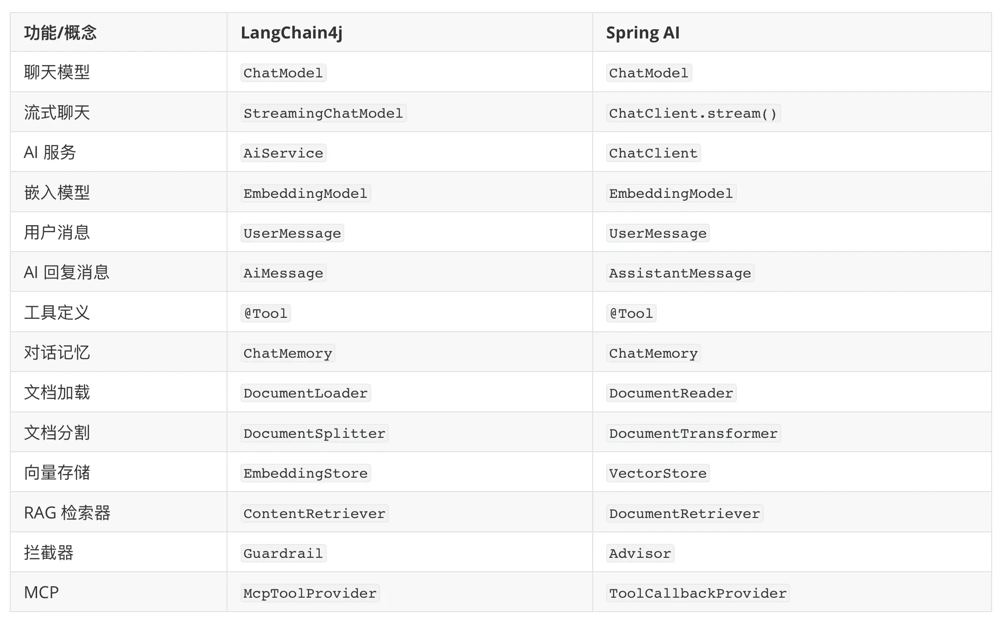