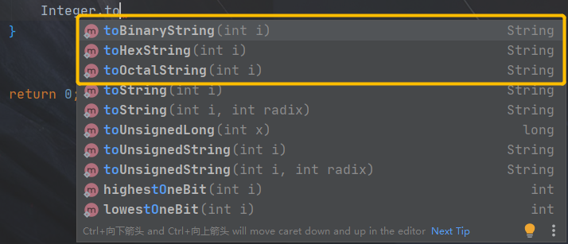

### 1.Java中 intValue，parseInt，Valueof 这三个关键字的区别

```
intValue()是把Integer对象类型变成int的基础数据类型；
 
parseInt()是把String 变成int的基础数据类型；
 
Valueof()是把给定的String参数转化成Integer对象类型；（现在JDK版本支持自动装箱拆箱了。）
 
intValue()用法与另外两个不同，比如int i = new Integer("123"),    j = i.intValue(); 相当于强制类型转换（强制类型转换事实上就是调用的这个方法）
 
另外两个用法：   Integer.Valueof()  ， Integer.parseInt()  用的是Interger类名。i.intValue()用的是对象i

 
另外：
 
Integer a=new Integer(1)
 
Integer a=Integer.valueOf(1);
 
两个都是得到一个Integer对象，但是Integer.valueOf的效率高。
```

### 2.int转二进制

```java
// int转为二进制
Integer.toBinaryString(10);  //1010

// 实现统计一个数的二进制位有多少个 1 。如 5 的二进制为 101，返回 2。
Integer.bitCount(int i) 
```



### 3.二进制转十进制

在Java中，可以使用`Integer.parseInt()`或`Long.parseLong()`方法将二进制字符串转换为对应的十进制整数。这两个方法分别用于解析带符号整数和无符号整数。

以下是使用`Integer.parseInt()`方法将二进制字符串转换为十进制整数的示例代码：

```java
String binaryString = "101010"; // 假设要将二进制字符串 "101010" 转换为十进制整数
int decimal = Integer.parseInt(binaryString, 2);

System.out.println("二进制字符串：" + binaryString);
System.out.println("转换后的十进制整数：" + decimal);
```

运行以上代码将输出以下结果：

```
二进制字符串：101010
转换后的十进制整数：42
```

同样地，如果要**将无符号二进制字符串转换为十进制整数，可以使用`Long.parseLong()`方法**，如下所示：

```java
String binaryString = "101010"; // 假设要将无符号二进制字符串 "101010" 转换为十进制整数
long decimal = Long.parseLong(binaryString, 2);

System.out.println("二进制字符串：" + binaryString);
System.out.println("转换后的十进制整数：" + decimal);
```

运行以上代码将输出以下结果：

```
二进制字符串：101010
转换后的十进制整数：42
```

需要注意的是，作为输入的二进制字符串必须是有效的二进制表示形式。方法的第二个参数指定输入字符串的基数，对于二进制，使用基数2。

### 4.Java中System类中常用方法

| **方法声明**                                                 | **功能描述**                                                 |
| ------------------------------------------------------------ | ------------------------------------------------------------ |
| static void exit(int status)                                 | 该方法用于终止当前正在运行的Java虚拟机，其中参加数 status表示状态码，如果状态码不是0，则表示异常终止 |
| static long gc()                                             | 运行垃圾回收器，并对垃圾进行回收                             |
| static long currentTimeMillis()                              | 返回以毫秒为单位的当前时间                                   |
| static void arraycopy(Object src, int srcPos,Object dest,int destPos,int length) | 从src应用的指定源数组复制到dest引用的数组，复制从指定 的位置开始，到目标的指定位置结束 |
| static Properties getProperties()                            | 取得当前的系统属性                                           |
| static String getProperty(String key)                        | 获取指定键描述的系统属性                                     |