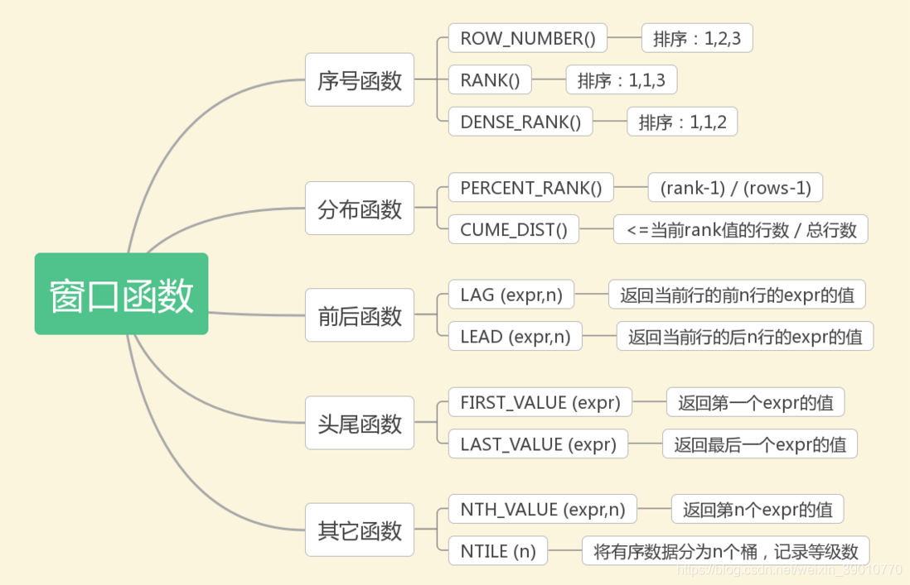

### mysql中语句的执行顺序

from > on > join > where > group by > 聚合函数 > having > select > distinct > order by > limit

### 两字段使用in

```mysql
...(e.Salary,e.DepartmentId) in (select max(Salary),DepartmentId from Employee group by De
```

### 取count最大值

```mysql
select cc.customer_number from (select count(*) c,o.customer_number from Orders o group by o.customer_number) cc order by cc.c desc limit 1

# 求count(*)的最大值

# 获取count(*)，子查询生成的这个表，再对这个count从高到低排序，然后limit 1 取第一个值，就是最大值了，
```

### mysql中if...else等函数

| 函数                                                         | 功能                                                    |
| :----------------------------------------------------------- | :------------------------------------------------------ |
| IF(value, t, f)                                              | 如果value为true，则返回t，否则返回f                     |
| IFNULL(value1, value2)                                       | 如果value1不为空，返回value1，否则返回value2            |
| CASE WHEN [ val1 ] THEN [ res1 ] … ELSE [ default ] END      | 如果val1为true，返回res1，… 否则返回default默认值       |
| CASE [ expr ] WHEN [ val1 ] THEN [ res1 ] … ELSE [ default ] END | 如果expr的值等于val1，返回res1，… 否则返回default默认值 |

#### if

```mysql
		IF(expr1,expr2,expr3)
```

```mysql
		SELECT
			IF(1>0, '真', '假')
		FROM
			Table
```

#### if...else

```mysql
        IF search_condition THEN
            statement_list
        ELSE
            statement_list
        END IF;
       
```

```mysql
        if stu_grade >= 90 then 
            select stu_grade,'A';  
        elseif stu_grade < 90 and stu_grade >= 80 then 
            select stu_grade,'B';  
        elseif stu_grade < 80 and stu_grade >= 70 then 
            select stu_grade,'C';  
        elseif stu_grade < 70 and stu_grade >= 60 then 
            select stu_grade,'D';  
        else 
            select stu_grade,'E'; 
        end if; 
```

#### case

```mysql
		SELECT
			CASE 1
				WHEN 1 THEN '字段的值是1'
				WHEN 2 THEN '字段的值是2'
				ELSE '字段的值3'
			END
		FROM
			Table
```

```mysql
        SELECT OrderID, Quantity,
        CASE
            WHEN Quantity > 30 THEN "The quantity is greater than 30"
            WHEN Quantity = 30 THEN "The quantity is 30"
            ELSE "The quantity is under 30"
        END
        FROM OrderDetails;
```

### mysql中出现`Unknown column ‘xxx‘ in ‘having clause‘`

```mysql
# 这是因为在使用group by分组时，后面如果需要再加一个having进行判断，则所判断的字段需要在select后面出现

# 查询字段要有operation
select s.stock_name,s.operation from Stocks s group by s.stock_name HAVING s.operation ="Buy"
```

### select后无from

```mysql
	SELECT
    IFNULL(
      (SELECT DISTINCT Salary
       FROM Employee
       ORDER BY Salary DESC
        LIMIT 1 OFFSET 1),
    NULL) AS SecondHighestSalary
		
		
	# 先查出来salary，再select ifnull判断salary是否为空
	
	# select后面没有from；mysql中的用法，把值输出的意思    例如：select 1+1
```

### 窗口函数mysql8.0

`窗口函数`：在满足某些条件的记录集合上执行的特殊函数，对于每条记录都要在此窗口内执行函数。有的函数随着记录的不同，窗口大小都是固定的，称为`静态窗口`；有的函数则相反，不同的记录对应着不同的窗口，称为`滑动窗口`。



#### 窗口函数和普通聚合函数的区别

①聚合函数是将多条记录聚合为一条；窗口函数是每条记录都会执行，有几条记录执行完还是几条。
②聚合函数也可以用于窗口函数。

#### 窗口函数的基本用法：

```mysql
函数名 OVER 子句
```

over关键字用来指定函数执行的窗口范围，若后面括号中什么都不写，则意味着窗口包含满足WHERE条件的所有行，窗口函数基于所有行进行计算；如果不为空，则支持以下4中语法来设置窗口。
①`window_name`：给窗口指定一个别名。如果SQL中涉及的窗口较多，采用别名可以看起来更清晰易读；

```mysql
select s.score,dense_rank() over (order by score desc) as 'rank' from Scores s

===>select s.score,dense_rank() over w as 'rank' from Scores s Window w as (order by score desc)
```

②`PARTITION BY 子句`：窗口按照哪些字段进行分组，窗口函数在不同的分组上分别执行；
③`ORDER BY 子句`：按照哪些字段进行排序，窗口函数将按照排序后的记录顺序进行编号；
④`FRAME 子句`：`FRAME`是当前分区的一个子集，子句用来定义子集的规则，通常用来作为滑动窗口使用。

#### 按功能划分可将MySQL支持的窗口函数分为如下几类

##### 序号函数

ROW_NUMBER()：顺序排序——1、2、3
RANK()：并列排序，跳过重复序号——1、1、3
DENSE_RANK()：并列排序，不跳过重复序号——1、1、2

用途：显示分区中的当前行号
应用场景：查询每个学生的分数最高的前3门课程

```
ROW_NUMBER() OVER (PARTITION BY stu_id ORDER BY score)
```

```mysql
mysql> SELECT *
    -> FROM(
    ->     SELECT stu_id,
    ->     ROW_NUMBER() OVER (PARTITION BY stu_id ORDER BY score DESC) AS score_
order,
    ->     lesson_id, score
    ->     FROM t_score) t
    -> WHERE score_order <= 3
    -> ;
+--------+-------------+-----------+-------+
| stu_id | score_order | lesson_id | score |
+--------+-------------+-----------+-------+
|      1 |           1 | L005      |    98 |
|      1 |           2 | L001      |    98 |
|      1 |           3 | L004      |    88 |
|      2 |           1 | L002      |    90 |
|      2 |           2 | L003      |    86 |
|      2 |           3 | L001      |    84 |
|      3 |           1 | L001      |   100 |
|      3 |           2 | L002      |    91 |
|      3 |           3 | L003      |    85 |
|      4 |           1 | L001      |    99 |
|      4 |           2 | L005      |    98 |
|      4 |           3 | L002      |    88 |
+--------+-------------+-----------+-------+
```

对于stu_id=1的同学，有两门课程的成绩均为98，序号随机排了1和2。但很多情况下二者应该是并列第一，则他的成绩为88的这门课的序号可能是第2名，也可能为第3名。
这时候，ROW_NUMBER()就不能满足需求，需要RANK()和DENSE_RANK()出场，它们和ROW_NUMBER()非常类似，只是在出现重复值时处理逻辑有所不同。

```mysql
mysql> SELECT *
    -> FROM(
    ->     SELECT
    ->     ROW_NUMBER() OVER (PARTITION BY stu_id ORDER BY score DESC) AS score_order1,
    ->     RANK() OVER (PARTITION BY stu_id ORDER BY score DESC) AS score_order2,
    ->     DENSE_RANK() OVER (PARTITION BY stu_id ORDER BY score DESC) AS score_order3,
    ->     stu_id, lesson_id, score
    ->     FROM t_score) t
    -> WHERE stu_id = 1 AND score_order1 <= 3 AND score_order2 <= 3 AND score_order3 <= 3
    -> ;
+--------------+--------------+--------------+--------+-----------+-------+
| score_order1 | score_order2 | score_order3 | stu_id | lesson_id | score |
+--------------+--------------+--------------+--------+-----------+-------+
|            1 |            1 |            1 |      1 | L005      |    98 |
|            2 |            1 |            1 |      1 | L001      |    98 |
|            3 |            3 |            2 |      1 | L004      |    88 |
+--------------+--------------+--------------+--------+-----------+-------+
```

##### 分布函数

###### PERCENT_RANK()

用途：每行按照公式(rank-1) / (rows-1)进行计算。其中，rank为RANK()函数产生的序号，rows为当前窗口的记录总行数
应用场景：不常用

```mysql
mysql> SELECT
    -> RANK() OVER w AS rk,
    -> PERCENT_RANK() OVER w AS prk,
    -> stu_id, lesson_id, score
    -> FROM t_score
    -> WHERE stu_id = 1
    -> WINDOW w AS (PARTITION BY stu_id ORDER BY score)
    -> ;
+----+------+--------+-----------+-------+
| rk | prk  | stu_id | lesson_id | score |
+----+------+--------+-----------+-------+
|  1 |    0 |      1 | L003      |    79 |
|  2 | 0.25 |      1 | L002      |    86 |
|  3 |  0.5 |      1 | L004      |    88 |
|  4 | 0.75 |      1 | L005      |    98 |
|  4 | 0.75 |      1 | L001      |    98 |
+----+------+--------+-----------+-------+
```

###### CUME_DIST()

用途：分组内小于、等于当前rank值的行数 / 分组内总行数
应用场景：查询小于等于当前成绩（score）的比例

```mysql
# cd1：没有分区，则所有数据均为一组，总行数为8
# cd2：按照lesson_id分成了两组，行数各为4

mysql> SELECT stu_id, lesson_id, score,
    -> CUME_DIST() OVER (ORDER BY score) AS cd1,
    -> CUME_DIST() OVER (PARTITION BY lesson_id ORDER BY score) AS cd2
    -> FROM t_score
    -> WHERE lesson_id IN ('L001','L002')
    -> ;
+--------+-----------+-------+-------+------+
| stu_id | lesson_id | score | cd1   | cd2  |
+--------+-----------+-------+-------+------+
|      2 | L001      |    84 | 0.125 | 0.25 |
|      1 | L001      |    98 |  0.75 |  0.5 |
|      4 | L001      |    99 | 0.875 | 0.75 |
|      3 | L001      |   100 |     1 |    1 |
|      1 | L002      |    86 |  0.25 | 0.25 |
|      4 | L002      |    88 | 0.375 |  0.5 |
|      2 | L002      |    90 |   0.5 | 0.75 |
|      3 | L002      |    91 | 0.625 |    1 |
+--------+-----------+-------+-------+------+
```

##### 前后函数

用途：返回位于当前行的前n行（LAG(expr,n)）或后n行（LEAD(expr,n)）的expr的值
应用场景：查询前1名同学的成绩和当前同学成绩的差值

```
# 内层SQL先通过LAG()函数得到前1名同学的成绩，外层SQL再将当前同学和前1名同学的成绩做差得到成绩差值diff。

mysql> SELECT stu_id, lesson_id, score, pre_score,
    -> score-pre_score AS diff
    -> FROM(
    ->     SELECT stu_id, lesson_id, score,
    ->     LAG(score,1) OVER w AS pre_score
    ->     FROM t_score
    ->     WHERE lesson_id IN ('L001','L002')
    ->     WINDOW w AS (PARTITION BY lesson_id ORDER BY score)) t
    -> ;
+--------+-----------+-------+-----------+------+
| stu_id | lesson_id | score | pre_score | diff |
+--------+-----------+-------+-----------+------+
|      2 | L001      |    84 |      NULL | NULL |
|      1 | L001      |    98 |        84 |   14 |
|      4 | L001      |    99 |        98 |    1 |
|      3 | L001      |   100 |        99 |    1 |
|      1 | L002      |    86 |      NULL | NULL |
|      4 | L002      |    88 |        86 |    2 |
|      2 | L002      |    90 |        88 |    2 |
|      3 | L002      |    91 |        90 |    1 |
+--------+-----------+-------+-----------+------+
```

##### 头尾函数

用途：返回第一个（FIRST_VALUE(expr)）或最后一个（LAST_VALUE(expr)）expr的值
应用场景：截止到当前成绩，按照日期排序查询第1个和最后1个同学的分数

```mysql
mysql> SELECT stu_id, lesson_id, score, create_time,
    -> FIRST_VALUE(score) OVER w AS first_score,
    -> LAST_VALUE(score) OVER w AS last_score
    -> FROM t_score
    -> WHERE lesson_id IN ('L001','L002')
    -> WINDOW w AS (PARTITION BY lesson_id ORDER BY create_time)
    -> ;
+--------+-----------+-------+-------------+-------------+------------+
| stu_id | lesson_id | score | create_time | first_score | last_score |
+--------+-----------+-------+-------------+-------------+------------+
|      3 | L001      |   100 | 2018-08-07  |         100 |        100 |
|      1 | L001      |    98 | 2018-08-08  |         100 |         98 |
|      2 | L001      |    84 | 2018-08-09  |         100 |         99 |
|      4 | L001      |    99 | 2018-08-09  |         100 |         99 |
|      3 | L002      |    91 | 2018-08-07  |          91 |         91 |
|      1 | L002      |    86 | 2018-08-08  |          91 |         86 |
|      2 | L002      |    90 | 2018-08-09  |          91 |         90 |
|      4 | L002      |    88 | 2018-08-10  |          91 |         88 |
+--------+-----------+-------+-------------+-------------+------------+

```

##### 其它函数

###### NTH_VALUE(expr,n)

用途：返回窗口中第n个expr的值。expr可以是表达式，也可以是列名
应用场景：截止到当前成绩，显示每个同学的成绩中排名第2和第3的成绩的分数

```mysql
mysql> SELECT stu_id, lesson_id, score,
    -> NTH_VALUE(score,2) OVER w AS second_score,
    -> NTH_VALUE(score,3) OVER w AS third_score
    -> FROM t_score
    -> WHERE stu_id IN (1,2)
    -> WINDOW w AS (PARTITION BY stu_id ORDER BY score)
    -> ;
+--------+-----------+-------+--------------+-------------+
| stu_id | lesson_id | score | second_score | third_score |
+--------+-----------+-------+--------------+-------------+
|      1 | L003      |    79 |         NULL |        NULL |
|      1 | L002      |    86 |           86 |        NULL |
|      1 | L004      |    88 |           86 |          88 |
|      1 | L001      |    98 |           86 |          88 |
|      1 | L005      |    98 |           86 |          88 |
|      2 | L004      |    75 |         NULL |        NULL |
|      2 | L005      |    77 |           77 |        NULL |
|      2 | L001      |    84 |           77 |          84 |
|      2 | L003      |    86 |           77 |          84 |
|      2 | L002      |    90 |           77 |          84 |
+--------+-----------+-------+--------------+-------------+

```

###### NTILE(n)

用途：将分区中的有序数据分为n个等级，记录等级数
应用场景：将每门课程按照成绩分成3组

```mysql
mysql> SELECT
    -> NTILE(3) OVER w AS nf,
    -> stu_id, lesson_id, score
    -> FROM t_score
    -> WHERE lesson_id IN ('L001','L002')
    -> WINDOW w AS (PARTITION BY lesson_id ORDER BY score)
    -> ;
+------+--------+-----------+-------+
| nf   | stu_id | lesson_id | score |
+------+--------+-----------+-------+
|    1 |      2 | L001      |    84 |
|    1 |      1 | L001      |    98 |
|    2 |      4 | L001      |    99 |
|    3 |      3 | L001      |   100 |
|    1 |      1 | L002      |    86 |
|    1 |      4 | L002      |    88 |
|    2 |      2 | L002      |    90 |
|    3 |      3 | L002      |    91 |
+------+--------+-----------+-------+

```

NTILE(n)函数在数据分析中应用较多，比如由于数据量大，需要将数据平均分配到n个并行的进程分别计算，此时就可以用NTILE(n)对数据进行分组（由于记录数不一定被n整除，所以数据不一定完全平均），然后将不同桶号的数据再分配。

#### 聚合函数作为窗口函数

用途：在窗口中每条记录动态地应用聚合函数（SUM()、AVG()、MAX()、MIN()、COUNT()），可以动态计算在指定的窗口内的各种聚合函数值
应用场景：截止到当前时间，查询stu_id=1的学生的累计分数、分数最高的科目、分数最低的科目

```mysql
mysql> SELECT stu_id, lesson_id, score, create_time,
    -> SUM(score) OVER w AS score_sum,
    -> MAX(score) OVER w AS score_max,
    -> MIN(score) OVER w AS score_min
    -> FROM t_score
    -> WHERE stu_id = 1
    -> WINDOW w AS (PARTITION BY stu_id ORDER BY create_time)
    -> ;
+--------+-----------+-------+-------------+-----------+-----------+-----------+

| stu_id | lesson_id | score | create_time | score_sum | score_max | score_min |

+--------+-----------+-------+-------------+-----------+-----------+-----------+

|      1 | L001      |    98 | 2018-08-08  |       184 |        98 |        86 |

|      1 | L002      |    86 | 2018-08-08  |       184 |        98 |        86 |

|      1 | L003      |    79 | 2018-08-09  |       263 |        98 |        79 |

|      1 | L004      |    88 | 2018-08-10  |       449 |        98 |        79 |

|      1 | L005      |    98 | 2018-08-10  |       449 |        98 |        79 |

+--------+-----------+-------+-------------+-----------+-----------+-----------+

```

