# 一、简介

## 1\. 简单介绍

- MongoDB是一个基于`分布式文件存储`的数据库
- 由C++语言编写，旨在为WEB应用提供可扩展的高性能数据存储解决方案。
- MongoDB是一个介于`关系数据库`和`非关系数据库`之间的产品，是非关系数据库当中功能最丰富，最像关系数据库的。
- 它支持的数据结构非常松散，是类似`json`的`bson`格式，因此可以存储比较复杂的数据类型。
- Mongo最大的特点是它支持的查询语言非常强大，其语法有点类似于面向对象的查询语言，几乎可以实现类似关系数据库单表查询的绝大部分功能，而且还支持对数据建立`索引`


---

## 2\. 业务应用场景

传统的关系型数据库\(如MySQL\)，在数据操作的`三高`需求以及应对Web2.0的网站需求面前，显得力不从心，而 MongoDB可应对“三高“需求

- `High performance`：对数据库高并发读写的需求

- `Huge Storage`：对海量数据的高效率存储和访问的需求

- `High Scalability && High Availability`：对数据库的高可扩展性和高可用性的需求

**具体应用场景**：

1.  社交场景，使用 MongoDB存储存储用户信息，以及用户发表的朋友圈信息，通过地理位置索引实现附近的人、地点等功能。
2.  游戏场景，使用 MongoDB存储游戏用户信息，用户的装备、积分等直接以内嵌文档的形式存储，方便查询、高效率存储和访问。
3.  物流场景，使用 MongoDB存储订单信息，订单状态在运送过程中会不断更新，以 MongoDB内嵌数组的形式来存储，一次查询就能将订单所有的变更读取出来
4.  物联网场景，使用 MongoDB存储所有接入的智能设备信息，以及设备汇报的日志信息，并对这些信息进行多维度的分析。
5.  视频直播，使用 MongoDB存储用户信息、点赞互动信息等。

这些应用场景中，数据操作方面的共同特点是：

（1）数据量大

（2）写入操作频繁（读写都很频繁）

（3）价值较低的数据，对事务性要求不高

对于这样的数据，我们更适合使用 MongoDB来实现数据的存储。

---

## 3\. 什么时候选择MongoDB

- 应用不需要事务及复杂join支持

- 新应用，需求会变，数据模型无法确定，想快速迭代开发

- 应用需要2000-3000以上的读写QPS（更高也可以）

- 应用需要TB甚至PB级别数据存储

- 应用要求存储的数据不丢失

- 应用需要99.999\%高可用

- 应用需要大量的地理位置查询、文本查

相对MySQL，在以上以用场景可以以更低的成本解决问题（包括学习、开发、运维等成本）

---

## 4\. 体系机构

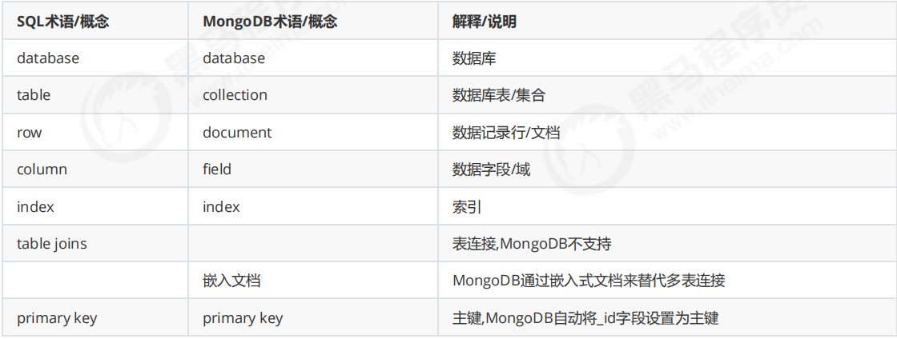

---

## 5\. 数据类型

MongoDB的最小存储单位就是文档`document`对象。文档`document`对象对应于关系型数据库的行。数据在MongoDB中以`BSON（Binary-JSON）`文档的格式存储在磁盘上。

`BSON（Binary Serialized Document Format）`是一种类json的一种二进制形式的存储格式，简称 Binary JSON；BSON和JSON一样，支持内嵌的文档对象和数组对象，但是BSON有JSON没有的一些数据类型，如Date和Bin Data类型。

BSON采用了类似于C语言结构体的名称、对表示方法，支持内嵌的文档对象和数组对象，具有轻量性、可遍历性、高效性的三个特点，可以有效描述非结构化数据和结构化数据。这种格式的优点是灵活性高，但它的缺点是空间利用率不是很理想。

BSON中，除了基本JSON类型： string，integer，boolean，double，null，array和object，mongo还使用了特殊的数据类型。这些类型包括 date， object id， binary data， regular expression和code。每一个驱动都以特定语言的方式实现了这些类型，查看你的驱动的文档来获取详细信息

BSON数据类型参考列表：  
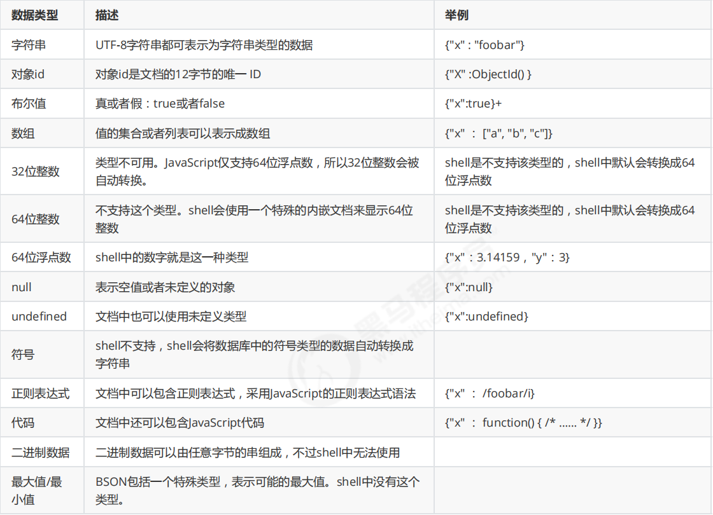  
**提示**：  
shell默认使用64位浮点型数值。\{“x”:3.14或\{“x”:3\}。对于整型值，可以使用NumberInt（4字节符号整数）或 NumberLong（8字节符号整数），\{“x”:NumberInt\(“3” \)\{“x”:NumberLong\(“3”\)\}

---

## 6\. 特点

**1\. 高性能**  
MongoDB提供高性能的数据持久性。特别是，

对嵌入式数据模型的支持减少了数据库系统上I/O活动。

索引支持更快的查询，并且可以包含来自嵌入式文档和数组的键。（文本索引解决搜索的需求、TTL索引解决历史数据自动过期的需求、地理位置索引可用于构建各种O2O应用）

mmapv1、 wiredtiger、 mongorocks（ rocks）、 In-memory等多引擎支持满足各种场景需求

Gridfs解决文件存储的需求

**2\. 高可用性**  
MongoDB的复制工具称为副本集（ replica set），它可提供自动故障转移和数据冗余

**3\. 高扩展性**  
MongoDB提供了水平可扩展性作为其核心功能的一部分。

分片将数据分布在一组集群的机器上。（海量数据存储，服务能力水平扩展）

从3.4开始，MoηgoDB支持基于片键创建数据区域。在一个平衡的集群中， MongoDB将一个区域所覆盖的读写只定向到该区域内的那些片。

**4\. 丰富的查询支持**  
MongoDB支持丰富的査询语言，支持读和写操作（CRUD），比如数据聚合、文本搜索和地理空间查询等

**5\. 其他特点**

如无模式（动态模式）、灵活的文档模型

---


# 二、Windows安装\&启动\&连接

## 1\. 下载压缩包

**下载地址**：<https://www.mongodb.com/try/download/community>

这里以zip的格式进行下载  
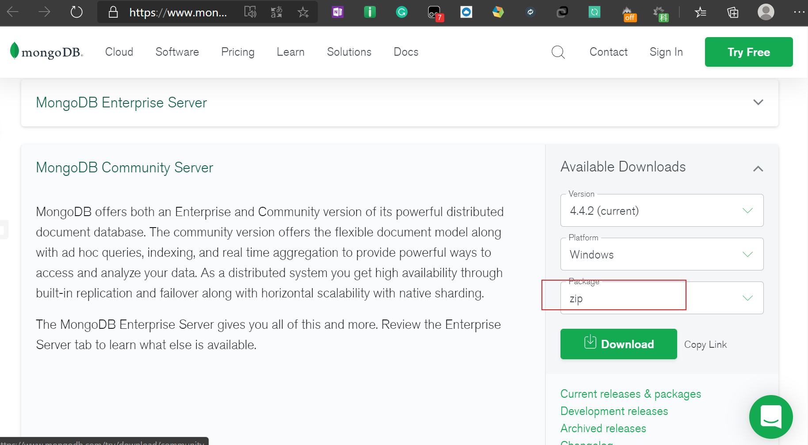  
附加：mongodb的命名格式: `x.y.z`

```shell
- y为奇数表示当前版本为开发版,如:1.5.2、4.1.13
- y为偶数表示当前版本为稳定版,如:1.6.3、4.0.10
- z为修正版本号,越大越好
```

---

## 2\. 解压

下载完成后得到压缩包，解压；其中的`bin`目录就存放着mongodb相关的命令  
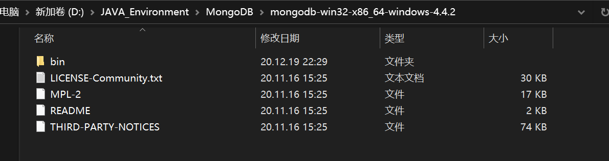

---

## 3\. 安装服务

首先要在安装目录里创建两个目录：

- 数据目录：`data`
- 日志目录：`logs`

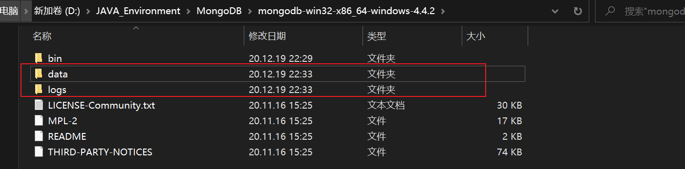  
然后以管理员模式，切换到安装目录下的**bin目录**运行以下格式命令来指定mongdb的数据及日志目录

```shell
mongod --install --dbpath 数据目录 --logpath 日志目录\日志名称 
```

这里为：

```shell
mongod --install --dbpath D:\JAVA_Environment\MongoDB\mongodb-win32-x86_64-windows-4.4.2\data --logpath D:\JAVA_Environment\MongoDB\mongodb-win32-x86_64-windows-4.4.2\logs\mongodb.log
```

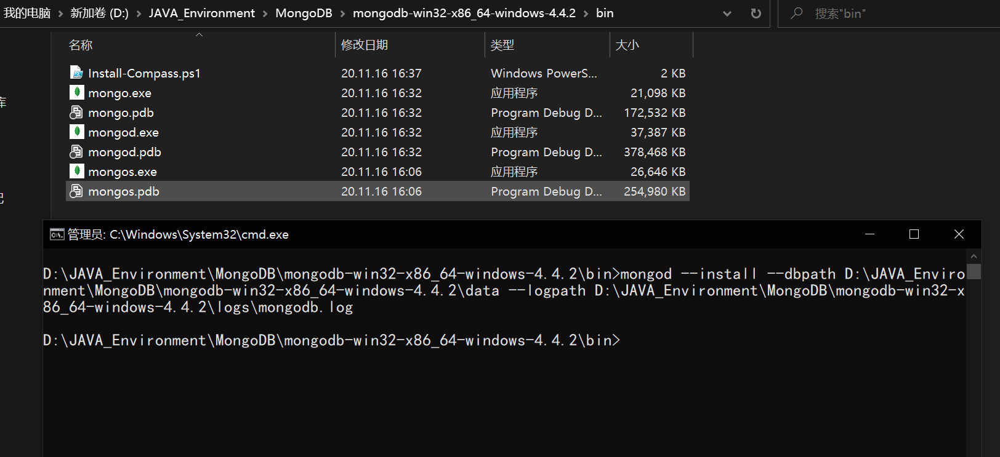  
没有任何报错和提示，则代表MongoDB服务创建成功

我们可以进行验证，win+r输入`services.msc`  
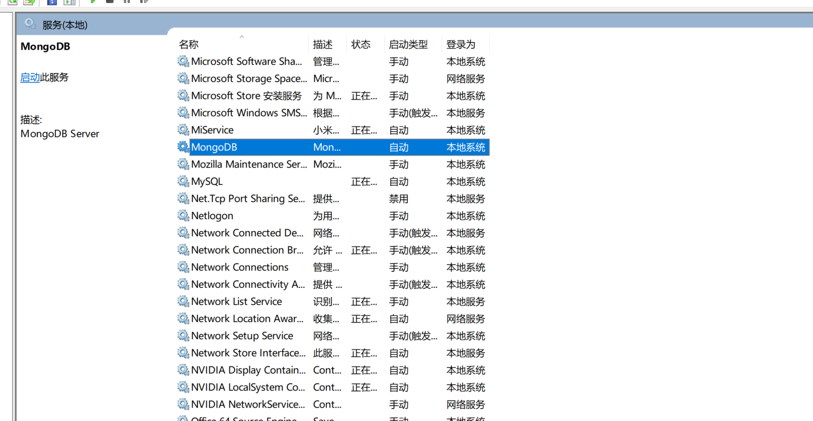  
看到MongoDB服务即成功

---

## 4\. 启动服务

输入以下命令启动服务

```shell
net start mongodb
```

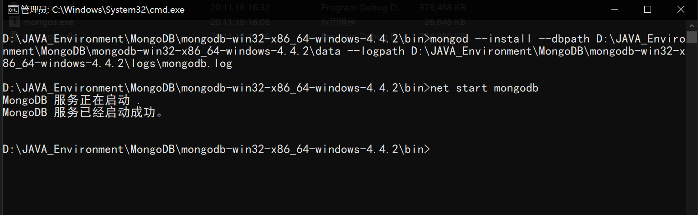

## 5\. shell连接登录\&退出

输入以下命令进行登录与退出

```shell
#登录
mongo
mongo --host=localhost --port=27017

#退出
exit	
```

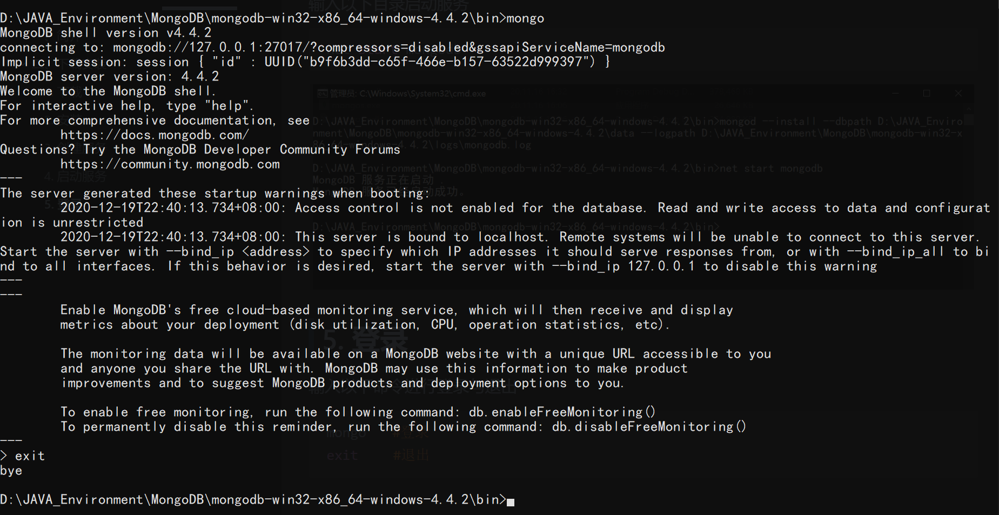  
相关语法：

```shell
mongod --install --dbpath 数据目录 --logpath 日志目录\日志名称	#创建服务
mongod --remove											  #卸载服务		
net start mongodb	#启动服务
net stop mongodb	#关闭服务
```

---

## 6\. Compass图形化连接登录

> MongoDB的GUI。直观地浏览您的数据。在几秒钟内运行查询。借助完整的CRUD功能与您的数据进行交互。查看和优化您的查询性能。在Linux，Mac或Windows上可用。Compass使您能够做出更明智的索引，文档验证等决策。
>
> 

**下载地址**：<https://www.mongodb.com/try/download/compass>  
  
点击`Download`下载即可，下载完成后得到压缩包  
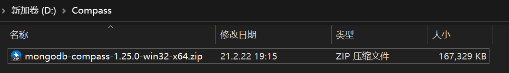  
解压，可以看到`MongoDBCompass.exe`  
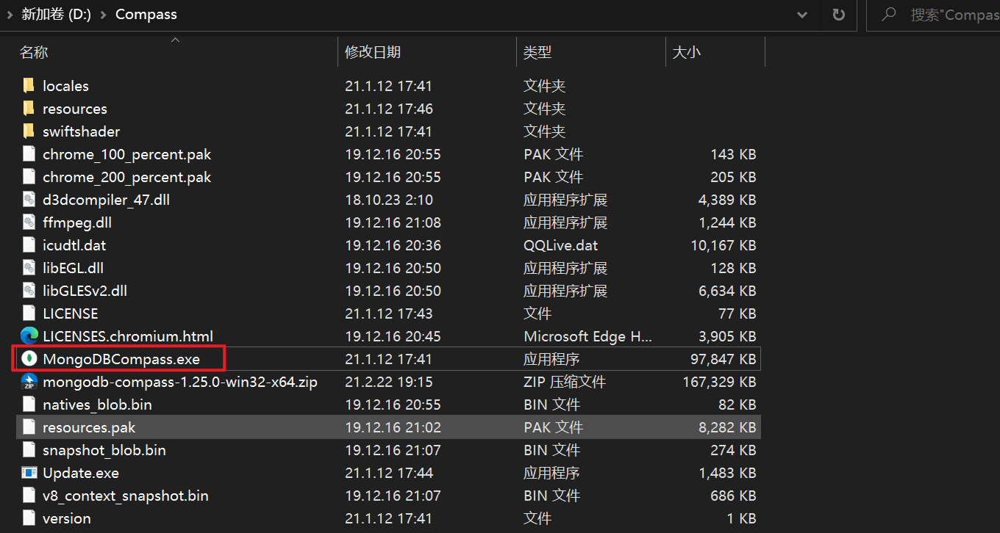  
双击运行，直接`Next`，最后`Get Stated`，默认选项即可  
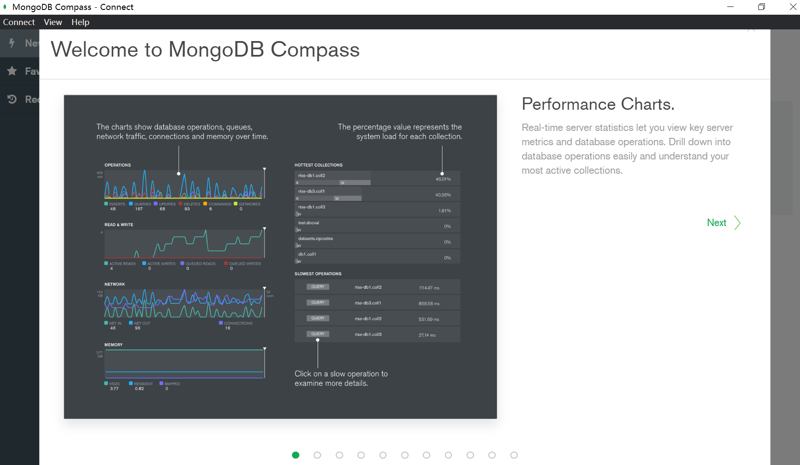  
然后直接点击`CONNECT`就会连接本地的数据库`localhost:27017`  
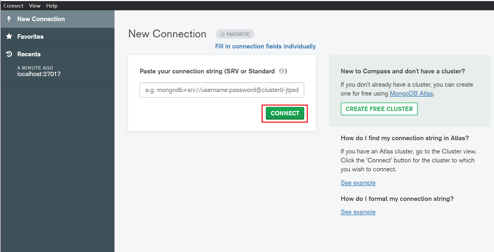  
可以看到所有的数据库及相关信息  
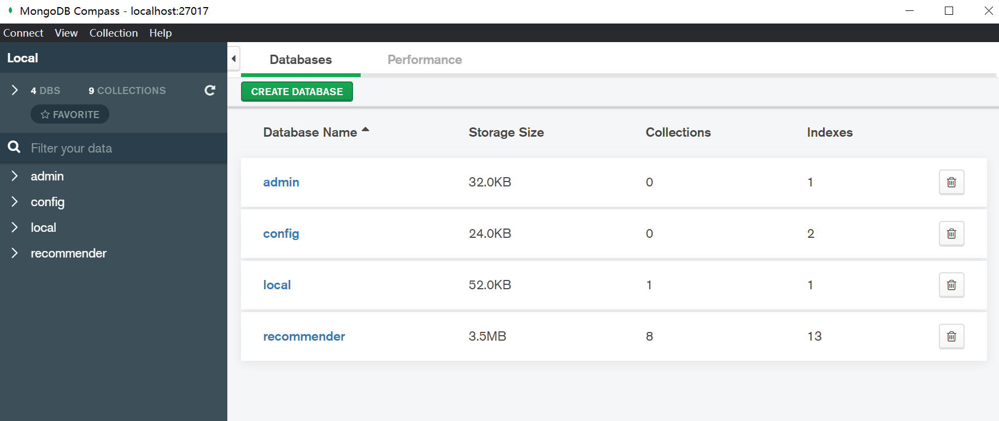

---


# 三、Linux安装\&启动\&连接

> **环境**：阿里云服务器Centos7

## 1\. 下载压缩包

**下载地址**：<https://www.mongodb.com/try/download/community>

选择对应的系统版本（这里为Centos7），以`tgz`的格式进行下载  
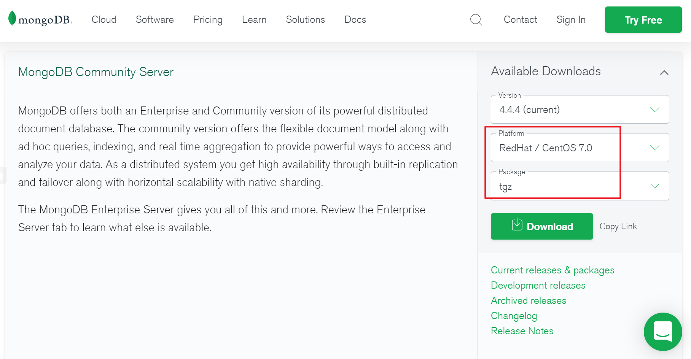

---

## 2\. 上传到服务器\&解压

将下载得到的压缩包上传到服务器，这里使用`xftp`工具进行上传  
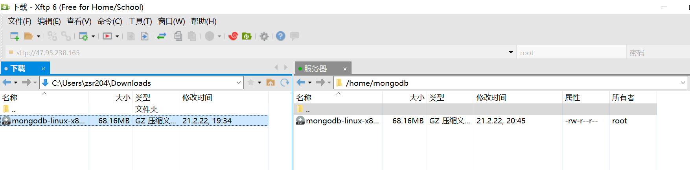  
然后解压

```shell
tar -zxvf mongodb-linux-x86_64-rhel70-4.4.4.gz
```

然后将解压后的文件移至`usr/local/mongodb`目录下，这是我们一般存放文件的位置

```shell
mv mongodb-linux-x86_64-rhel70-4.4.4 /usr/local/mongodb
```

---

## 3\. 创建数据/日志存放目录

```shell
mkdir -p /usr/local/mongodb/data /usr/local/mongodb/logs
```

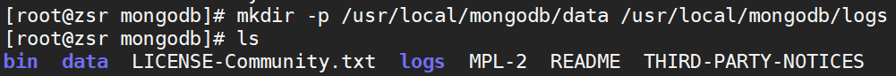

---

## 4\. 启动服务

```shell
/usr/local/mongodb/bin/mongod --dbpath=/usr/local/mongodb/data/ --logpath=/usr/local/mongodb/logs/mongodb.log --logappend --port=27017 --fork
```

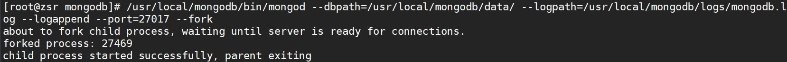

---

## 5\. 登录

```shell
# 登录
/usr/local/mongodb/bin/mongo

# 退出
exit
```

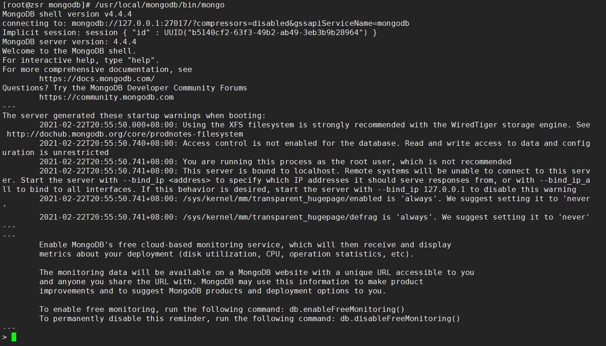

---

## 6\. Compass图形化连接登录

利用Compass进行连接，`Hostname`为服务器的公网IP，其他默认

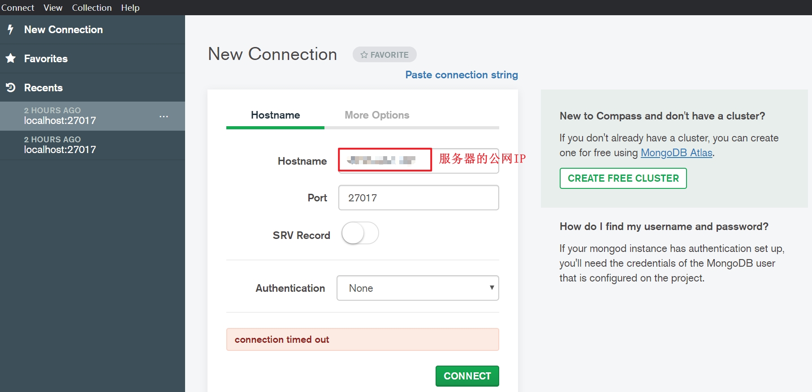

**连接失败的原因**：

> **1\. 未打开安全组策略**

暴露给外部的端口需要打开对应的安全组设置  
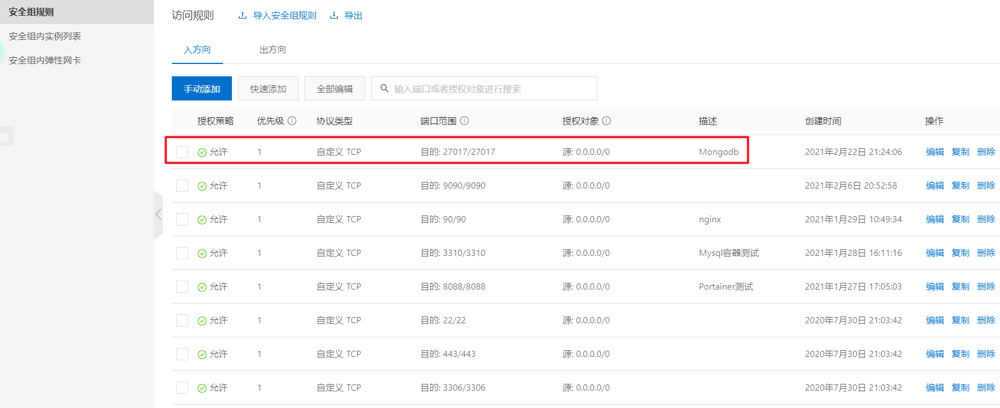

> **2\. 防火墙开放端口未设置**

首先查看防火墙是否开启，结果为`not running`表示未开启，则不是防火墙的问题，跳过

```shell
# 查看防火墙是否开启
firewall-cmd --state
```

如果显示`running`，则继续排查，查看防火墙开放的端口

```shell
# 查看防火墙所开放的端口
firewall-cmd --list-ports

[root@zsr ~]# firewall-cmd --list-ports
20/tcp 21/tcp 22/tcp 80/tcp 8888/tcp 39000-40000/tcp 3306/tcp 3306/udp 8080/tcp 8080/udp 3355/tcp
```

也可以用`firewall-cmd \--list-all`查看防火墙的详细信息  
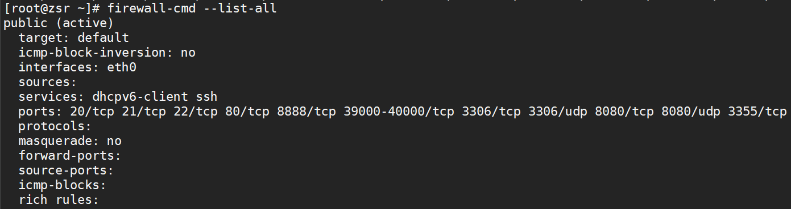  
我这里的问题就是防火墙未开放`27017`端口，所以要开放防火墙的对外暴露的端口

```shell
# 开放90端口(--premanent表示永久添加)
firewall-cmd --permanent --add-port=27017/tcp

# 重启防火墙(修改配置后要重启防火墙)
firewall-cmd --reload
```

添加完成后再次查看就可以看到`27017`端口被开放  
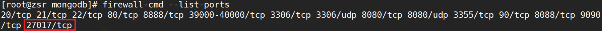

---


# 四、基本常用命令

## 1\. 数据库相关

```shell
# 查看所有数据库
show databases

# 选择数据库(如果数据库不存在,不会报错;会隐式创建:当后期该数据库有数据时自动创建)
use 数据库名

# 删除数据库(先选中数据库)
db.dropDatabase()
```

## 2\. 集合相关

```shell
# 查看所有集合
show collections

# 创建集合(插入数据会隐式创建)
db.createCollection('集合名')

# 删除集合
db.集合名.drop()
```

---


# 五、CURD

## 增：插入文档

```shell
db.集合名.insert(json数据)
```

- 集合存在则直接插入数据，不存在则隐式创建集合并插入数据

- json数据格式要求key得加`""`，但这里为了方便查看，对象的key统一不加`""`；查看集合数据时系统会自动给key加`""`

- mongodb会自动给每条数据创建全球唯一的`_id`键（我们也可以自定义`_id`的值，只要给插入的json数据增加`_id`键即可覆盖，但是不推荐这样做）

  

**测试**：

> 插入一条数据

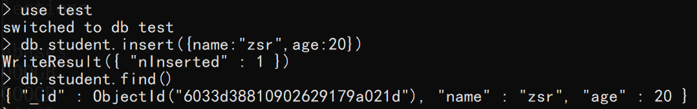

> 一次插入多条数据并指定`_id`

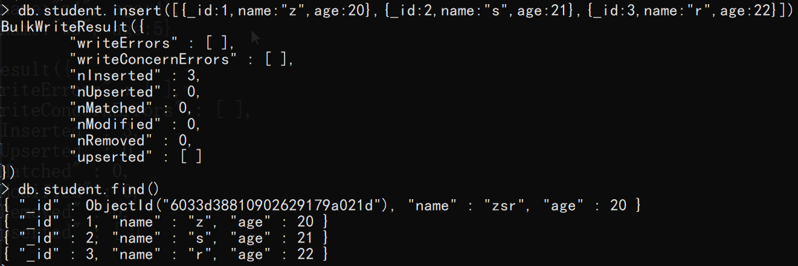

> 利用for循环插入数据

```shell
for(var i=1;i<10;i++){
	db.student.insert({name:"a"+i,age:i})
}
```

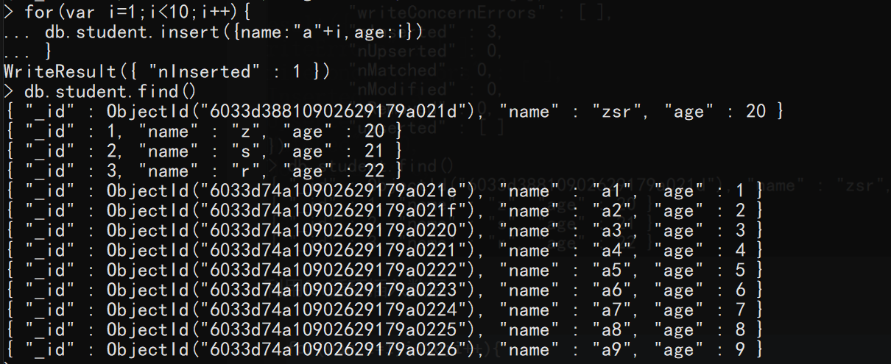

---

## 删：删除文档

```shell
db.集合名.remove(条件 [,是否删除一条])

# 是否删除一条
- false删除多条,即全部删除(默认)
- true删除一条
```

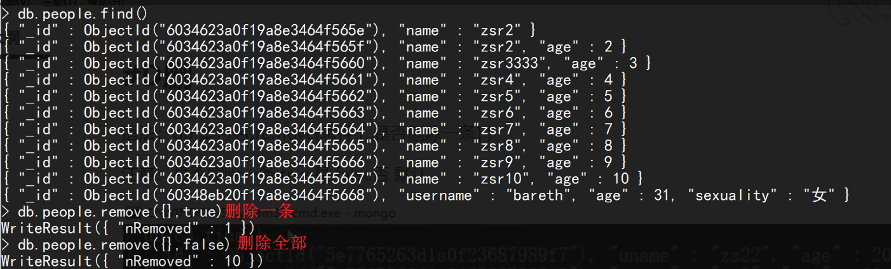

---

## 改：修改文档

```shell
db.集合名.update(条件, 新数据 [,是否新增, 是否修改多条])

# 新数据
- 默认是对原数据进行替换
- 若要进行修改,格式为 {修改器:{key:value}}

# 是否新增
- 条件匹配不到数据时是否插入: true插入,false不插入(默认)

# 是否修改多条
- 条件匹配成功的数据是否都修改: true都修改,false只修改一条(默认)
```

| **修改器** | **作用** |
| ---------- | -------- |
| \$inc      | 递增     |
| \$rename   | 重命名列 |
| \$set      | 修改列值 |
| \$unset    | 删除列   |

> **准备工作**：插入十条数据

```shel
for(var i=1;i<=10;i++){
	db.people.insert({name:"zsr"+i,age:i})
}
```

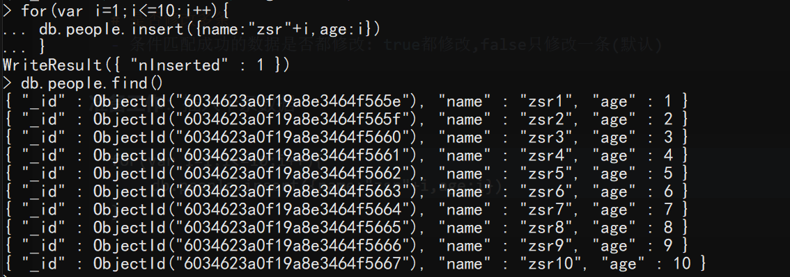

> 将\{name:“zsr1”\}更改为\{name:“zsr2”\}

```shell
db.people.update({name:"zsr1"},{name:"zsr2"})
```

**发现问题**：默认不是修改而是替换  
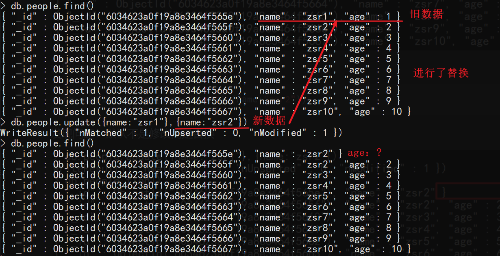

解决问题：使用修改器将\{name:“zsr3”\}更改为\{name:“zsr3333”\}

```shell
db.people.update({name:"zsr3"},{$set:{name:"zsr3333"}})
```

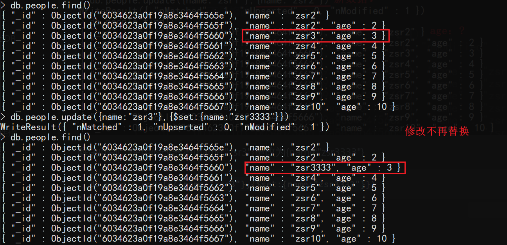

> 给\{name:“zsr10”\}的年龄增加或减少2岁

```shell
# 增加两岁
db.people.update({name:"zsr10"},{$inc:{age:2}})

# 减少两岁
db.people.update({name:"zsr10"},{$inc:{age:-2}})
```

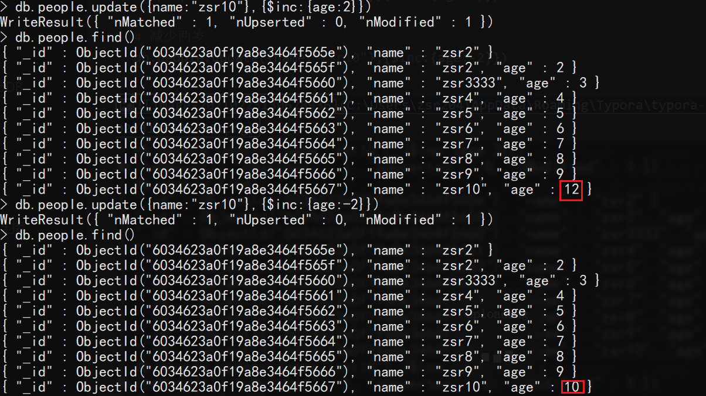

> 一次写多个修改器

首先插入一条数据

```shell
db.people.insert({username:"gcc",age:20,sex:"女",address:"unknown"})
```

任务：修改gcc的username为bareth，age+11，sex字段重命名为sexuality，删除address字段

```shell
db.people.update({username:"gcc"},{
	$set:{username:"bareth"},
	$inc:{age:11},
	$rename:{sex:"sexuality"},
	$unset:{address:true}
})
```

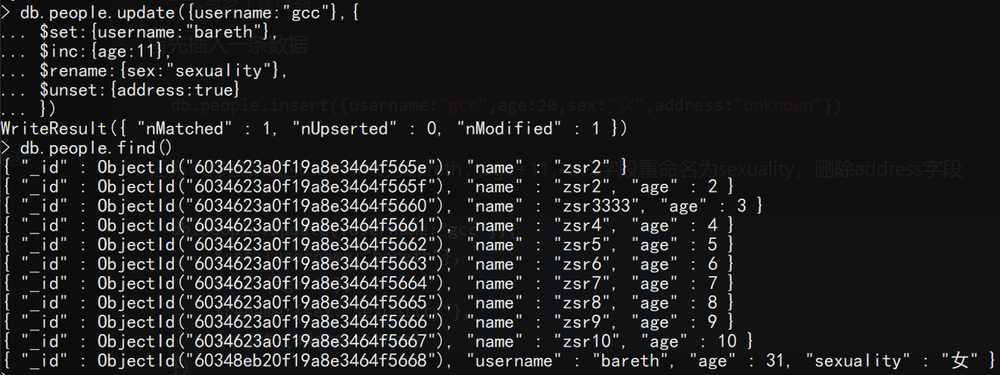

---

## 查：查询文档

```shell
db.集合名.find(条件 [,查询的列])
db.集合名.find(条件 [,查询的列]).pretty()	#格式化查看

# 条件
- 查询所有数据	{}或不写
- 查询指定要求数据	{key:value}或{key:{运算符:value}}

# 查询的列(可选参数)
- 不写则查询全部列
- {key:1}	只显示key列
- {key:0}	除了key列都显示
- 注意:_id列都会存在
```

| **运算符** | **作用** |
| ---------- | -------- |
| \$gt       | 大于     |
| \$gte      | 大于等于 |
| \$lt       | 小于     |
| \$lte      | 小于等于 |
| \$ne       | 不等于   |
| \$in       | in       |
| \$nin      | not in   |

> 查询指定列的所有数据

**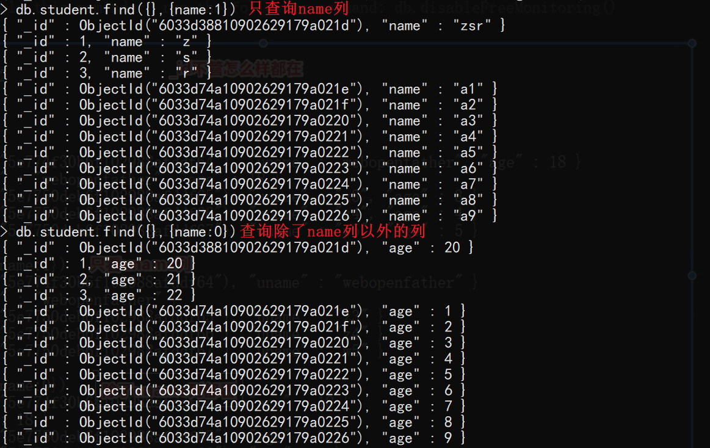**

> 查询指定条件的数据

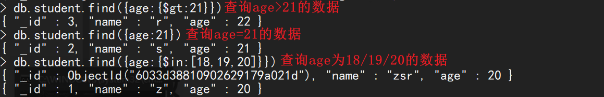

---


# 六、排序\&分页

**数据准备**：

```shell
for(var i=1;i<5;i++){
	db.person.insert({_id:i,name:"p"+i,age:10+i})
}
```

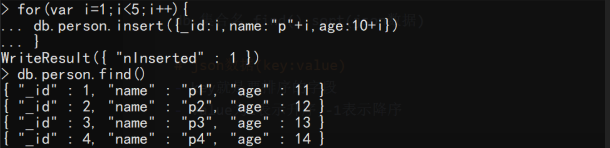

## 排序

```shell
db.集合名.find().sort(json数据)

# json数据(key:value)
- key就是要排序的字段
- value为1表示升序,-1表示降序
```

按年龄降序排列  
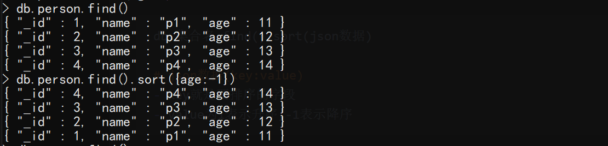

---

## 分页

```shell
db.集合名.find().sort().skip(数字).limit(数字)[.count()]

# skip(数字)
- 指定跳过的数量(可选)

# limit(数字)
- 限制查询的数量

# count()
- 统计数量
```

测试：  
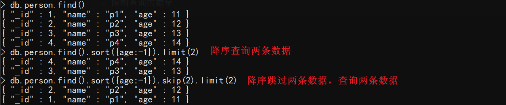

**实战**：数据库有1\~10条数据，每页显示2条，一共5页

```shell
skip计算公式: (当前页-1)*每页显示的条数

页数 起始 终止 跳过数
1页	1	2	0
2页	3	4	2
3页	5	6	4
4页	7	8	6
5页	9	10	8
```

```shell
# 数据准备
for(var i=1;i<11;i++){
	db.page.insert({_id:i,name:"p"+i})
}

# 分5页,每页2条显示
for(var i=0;i<10;i=i+2){
	db.page.find().skip(i).limit(2)
}
```

---


# 七、聚合查询

## 1\. 语法

```shell
db.集合名.aggregate([
	{管道:{表达式}}
	...
])
#方括号 [] 用于表示数组
```

**常用管道**：

| \$group | 将集合中的文档分组，用于统计结果 |
| ------- | -------------------------------- |
| \$match | 过滤数据，只输出符合条件的文档   |
| \$sort  | 聚合数据进一步排序               |
| \$skip  | 跳过指定文档数                   |
| \$limit | 限制集合数据返回文档数           |

**常用表达式**：

| \$sum | 总和（\$num:1同count表示统计） |
| ----- | ------------------------------ |
| \$avg | 平均                           |
| \$min | 最小值                         |
| \$max | 最大值                         |

---

## 2\. 测试

数据准备：

```shell
db.people.insert({_id:1,name:"a",sex:"男",age:21})
db.people.insert({_id:2,name:"b",sex:"男",age:20})
db.people.insert({_id:3,name:"c",sex:"女",age:20})
db.people.insert({_id:4,name:"d",sex:"女",age:18})
db.people.insert({_id:5,name:"e",sex:"男",age:19})
```

> 统计男生、女生的总年龄

```shell
db.people.aggregate([
	{$group:{_id:"$sex",age_sum:{$sum:"$age"}}}
])
```

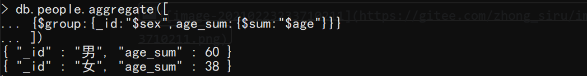

> 统计男生女生的总人数

```shell
db.people.aggregate([
	{$group:{_id:"$sex",sum:{$sum:1}}} 
])
#_id字段用于指定分组的标识符。如果没有指定 _id，$group 阶段会将整个输入文档集合看作是一个分组，然后对其应用聚合函数（例如 $sum、$avg 等）。
```

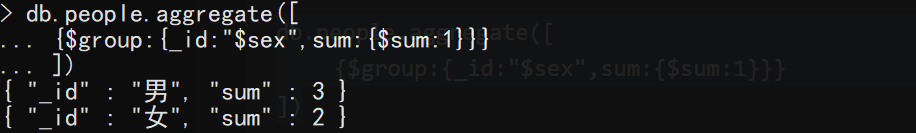

> 求学生总数和平均年龄

```shell
db.people.aggregate([
	{$group:{_id:null,total_num:{$sum:1},total_avg:{$avg:"$age"}}}
])
```

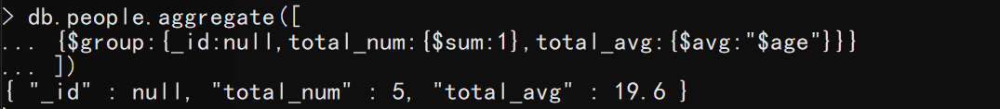

> 查询男生、女生人数，按人数升序

```shell
db.people.aggregate([
	{$group:{_id:"$sex",rs:{$sum:1}}},
	{$sort:{rs:1}}
])
```

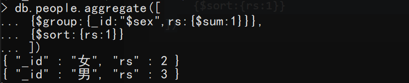

---


# 八、索引

## 1\. 简介

**索引**是一种排序好的便于快速查询数据的数据结构，用于帮助数据库高效的查询数据  
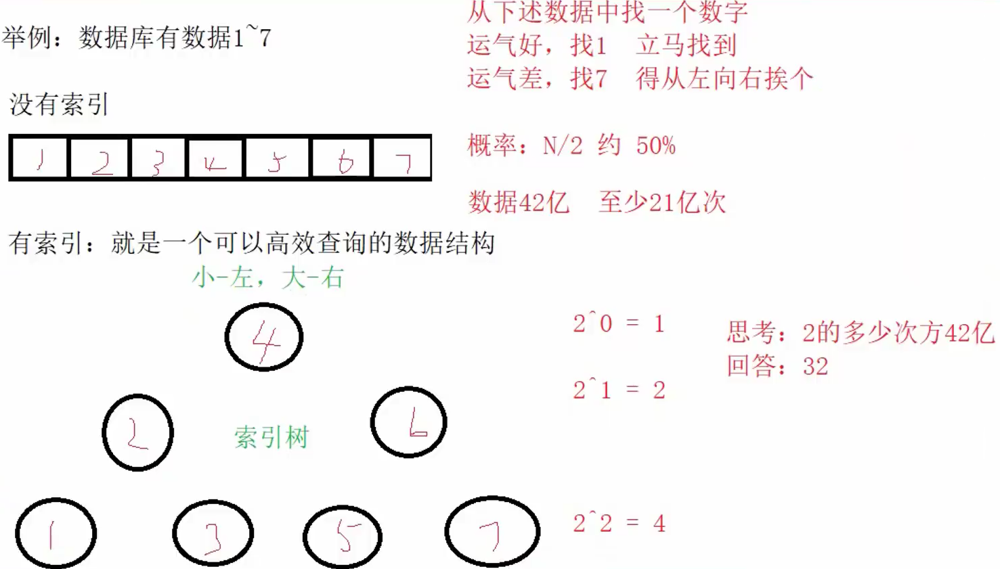

**优点**：

- 提高数据查询的效率，降低数据库的IO成本
- 通过索引对数据进行排序，降低数据排序的成本，降低CPU的消耗

**缺点**：

- 占用磁盘空间
- 大量索引影响SQL语句的执行效率，因为每次插入和修改数据都要更新索引

---

## 2\. 语法

**创建索引语法**：

```shell
# 创建索引
db.集合名.createIndex(待创建索引的列:方式 [,额外选项])
# 创建复合索引
db.集合名.createIndex({key1:方式,key2:方式} [,额外选项])

# 参数说明：
- `待创建索引的列:方式`：{key:1}/{key:-1}
   1表示升序，-1表示降序; 例如{age:1}表示创建age索引并按照升序方法排列
- `额外选项`：设置索引的名称或者唯一索引等
   设置名称:{name:索引名}
   唯一索引:{unique:列名}
```

**删除索引语法**：

```shell
# 删除全部索引
db.集合名.dropIndexes()
# 删除指定索引
db.集合名.dropIndex(索引名)
```

**查看索引语法**：

```shell
# 查看索引
db.集合名.getIndexes()
```

---

## 3\. 练习

**十万条数据准备**：

```shell
# 选择数据库
use test
# 插入100000条数据
for(var i=0;i<100000;i++){
	db.data.insert({name:"zsr"+i,age:i})
}
```

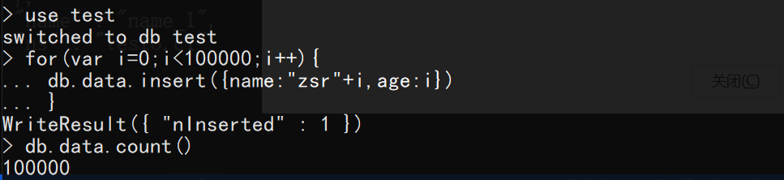

**创建普通索引**

```shell
# 给name添加普通升序索引
db.data.createIndex({name:1})
```

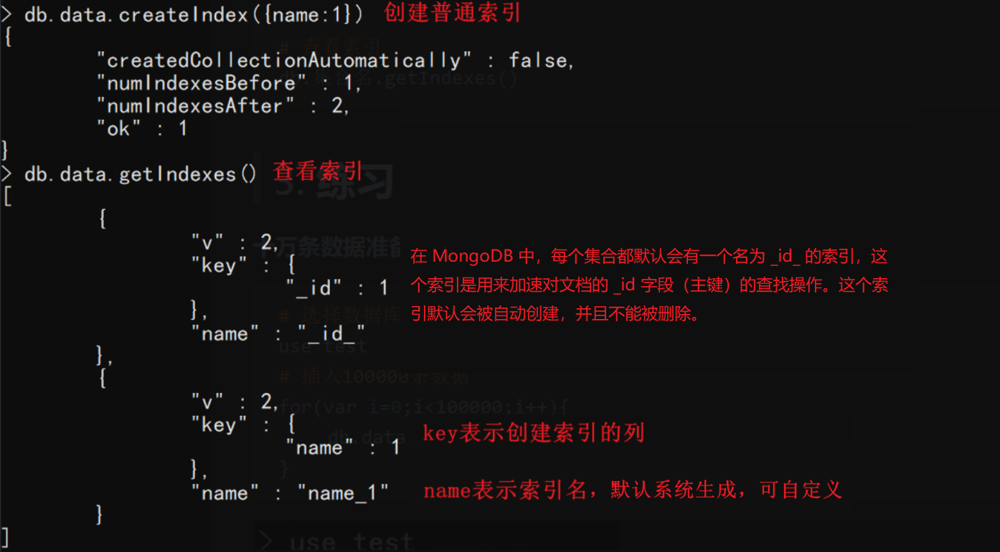

```shell
# 给age创建索引并起名age_up
db.data.createIndex({age:1},{name:"age_up"})
```

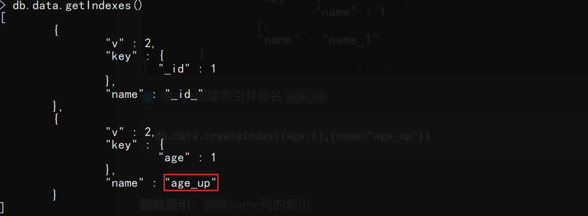

**删除索引**

```shell
# 删除name列的索引
db.data.dropIndex("name_1")
```

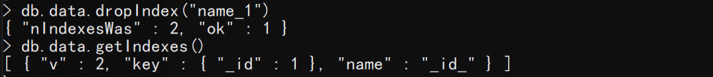

**创建复合/组合索引**：也就是一次给两个字段建立索引

```shell
# 给name和age添加组合索引
db.data.createIndex({name:1,age:1})
```

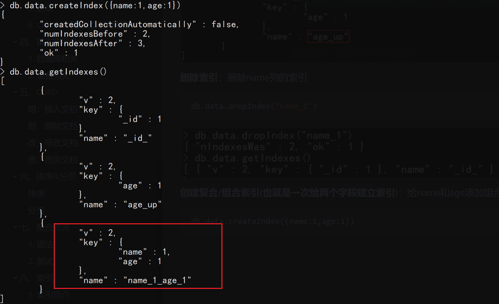

**创建唯一索引**

```shell
# 删除所有索引
db.data.dropIndexes()

# 给name创建唯一索引
db.data.createIndex({name:1},{unique:"name"})
```

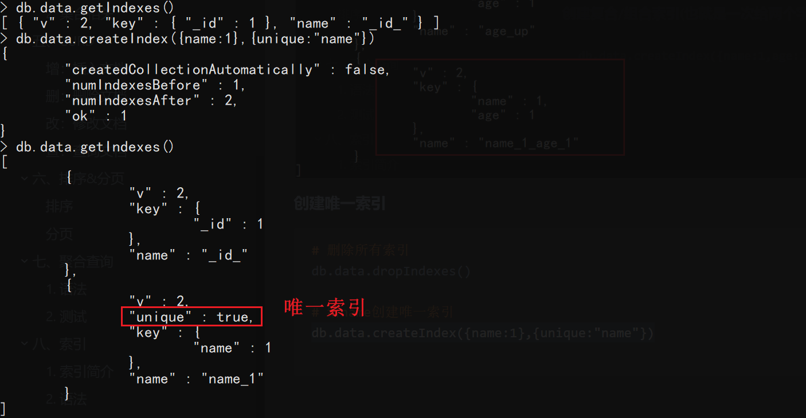

**多个额外条件**

```shell
db.data.createIndex({"name":1},{name:"nameIndex",unique:"name"})
```

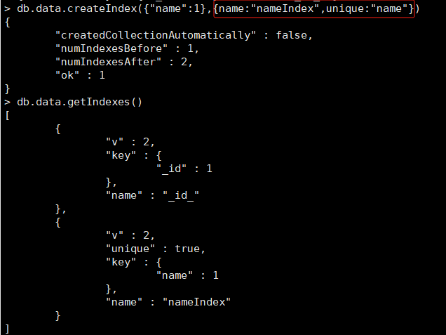

---

## 4\. 分析索引\(explain\)

```shell
db.集合名.find().explain('executionStats')
```

我们通过简单的案例来测试索引的好处

 -    不加索引时查询`age=500`的数据

```shell
> db.data.find({age:500}).explain('executionStats')
{
        "queryPlanner" : {
                "plannerVersion" : 1,
                "namespace" : "test.data",
                "indexFilterSet" : false,
                "parsedQuery" : {
                        "age" : {
                                "$eq" : 500
                        }
                },
                "winningPlan" : {
                        "stage" : "COLLSCAN",
                        "filter" : {
                                "age" : {
                                        "$eq" : 500
                                }
                        },
                        "direction" : "forward"
                },
                "rejectedPlans" : [ ]
        },
        "executionStats" : {	#执行计划相关统计信息
                "executionSuccess" : true,	#执行成功的状态
                "nReturned" : 1,	#返回结果集数目
                "executionTimeMillis" : 37,	#执行所需要的ms数
                "totalKeysExamined" : 0,	#索引检查的时间
                "totalDocsExamined" : 100000,	#检查文档总数
                "executionStages" : {
                        "stage" : "COLLSCAN",	#索引扫描方式
                        "filter" : {	#过滤条件
                                "age" : {
                                        "$eq" : 500
                                }
                        },
                        "nReturned" : 1,	#返回结果集数目
                        "executionTimeMillisEstimate" : 1,	#预估执行时间(ms)
                        "works" : 100002,	#工作单元数,一个查询会被派生为一个小的工作单元
                        "advanced" : 1,	#优先返回的结果数
                        "needTime" : 100000,
                        "needYield" : 0,
                        "saveState" : 100,
                        "restoreState" : 100,
                        "isEOF" : 1,
                        "direction" : "forward",	 
                        "docsExamined" : 100000	#文档检查数目
                }
        },
        "serverInfo" : {
                "host" : "LAPTOP-8J48VF43",
                "port" : 27017,
                "version" : "4.4.2",
                "gitVersion" : "15e73dc5738d2278b688f8929aee605fe4279b0e"
        },
        "ok" : 1
}
```

 -    给age添加一个升序索引后

```shell
# 给age添加升序索引
> db.data.createIndex({age:1})
{
        "createdCollectionAutomatically" : false,
        "numIndexesBefore" : 2,
        "numIndexesAfter" : 3,
        "ok" : 1
}
# 性能分析
> db.data.find({age:500}).explain('executionStats')
{
        "queryPlanner" : {
                "plannerVersion" : 1,
                "namespace" : "test.data",
                "indexFilterSet" : false,
                "parsedQuery" : {
                        "age" : {
                                "$eq" : 500
                        }
                },
                "winningPlan" : {
                        "stage" : "FETCH",
                        "inputStage" : {
                                "stage" : "IXSCAN",
                                "keyPattern" : {
                                        "age" : 1
                                },
                                "indexName" : "age_1",
                                "isMultiKey" : false,
                                "multiKeyPaths" : {
                                        "age" : [ ]
                                },
                                "isUnique" : false,
                                "isSparse" : false,
                                "isPartial" : false,
                                "indexVersion" : 2,
                                "direction" : "forward",
                                "indexBounds" : {
                                        "age" : [
                                                "[500.0, 500.0]"
                                        ]
                                }
                        }
                },
                "rejectedPlans" : [ ]
        },
        "executionStats" : {	#执行计划相关统计信息
                "executionSuccess" : true,	#执行成功的状态
                "nReturned" : 1,	#返回结果集数目
                "executionTimeMillis" : 1,	#执行所需要的ms数
                "totalKeysExamined" : 1,	#索引检查的时间
                "totalDocsExamined" : 1,	#检查文档总数
                "executionStages" : {
                        "stage" : "FETCH",	#索引扫描方式
                        "nReturned" : 1,	#返回结果集数目
                        "executionTimeMillisEstimate" : 0,	#预估执行时间(ms)
                        "works" : 2,	#工作单元数,一个查询会被派生为一个小的工作单元
                        "advanced" : 1,	#优先返回的结果数
                        "needTime" : 0,
                        "needYield" : 0,
                        "saveState" : 0,
                        "restoreState" : 0,
                        "isEOF" : 1,
                        "docsExamined" : 1,
                        "alreadyHasObj" : 0,
                        "inputStage" : {
                                "stage" : "IXSCAN",
                                "nReturned" : 1,
                                "executionTimeMillisEstimate" : 0,
                                "works" : 2,
                                "advanced" : 1,
                                "needTime" : 0,
                                "needYield" : 0,
                                "saveState" : 0,
                                "restoreState" : 0,
                                "isEOF" : 1,
                                "keyPattern" : {
                                        "age" : 1
                                },
                                "indexName" : "age_1",
                                "isMultiKey" : false,
                                "multiKeyPaths" : {
                                        "age" : [ ]
                                },
                                "isUnique" : false,
                                "isSparse" : false,
                                "isPartial" : false,
                                "indexVersion" : 2,
                                "direction" : "forward",
                                "indexBounds" : {
                                        "age" : [
                                                "[500.0, 500.0]"
                                        ]
                                },
                                "keysExamined" : 1,
                                "seeks" : 1,
                                "dupsTested" : 0,
                                "dupsDropped" : 0
                        }
                }
        },
        "serverInfo" : {
                "host" : "LAPTOP-8J48VF43",
                "port" : 27017,
                "version" : "4.4.2",
                "gitVersion" : "15e73dc5738d2278b688f8929aee605fe4279b0e"
        },
        "ok" : 1
}
```

三种扫描方式

- `COLLSCAN`：全盘扫描
- `INSCAN`：索引扫描
- `FETCH`：根据索引去检索指定document

---

## 5\. 选择规则

如何选择合适的列创建索引？

- 为常做条件、排序、分组的字段建立索引
- 选择唯一性索引
- 选择较小的数据列，为较长的字符串使用前缀索引

---


# 九、权限机制

> 安装完`Mongodb`后，在命令行输入`mongo`命令即可登录数据库，这肯定是不安全的，我们需要使用权限机制，开启验证模式

## 创建账号语法

**创建账号**

```shell
db.createUser({
	"user":"账号",
	"pwd":"密码",
	"roles":[{
		role:"角色",
		db:"所属数据库"
	}]
})
```

**角色种类**

- 超级用户角色：`root`
- 数据库用户角色：`read`、`readWrite`
- 数据库管理角色：`dbAdmin`、`userAdmin`
- 集群管理角色： `clusterAdmin`、`clusterManager`、`clusterMonitor`、`hostManager`
- 备份恢复角色： `backup`、`restore`
- 所有数据库角色： `readAnyDatabase`、`readWriteAnyDatabase`、`userAdminAnyDatabase`、`dbAdminAnyDatabase`

**角色说明**

- `root`：只在admin数据库中可用。超级账号，超级权限；
- `read`：允许用户读取指定数据库；
- `readWrite`：允许用户读写指定数据库

---

## 开启验证模式

> **验证模式**：值用户需要输入账号密码才能登录使用

### 1\. 添加超级管理员账号

```shell
# 必须使用admin数据库
use admin

# 创建超级用户
db.createUser({
	"user":"lz",
	"pwd":"123456",
	"roles":[{
		role:"root",
		db:"admin"
	}]
})
```

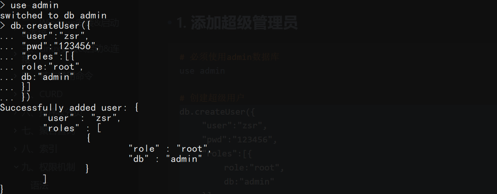  
然后查看admin数据库中的集合`system.users`可以查看详细信息  
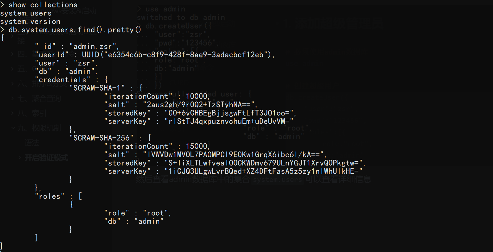

### 2\. 卸载服务

首先`exit`退出登录，然后以管理员模式打开终端输入如下命令卸载服务

```shell
# 卸载服务
mongod --remove
```

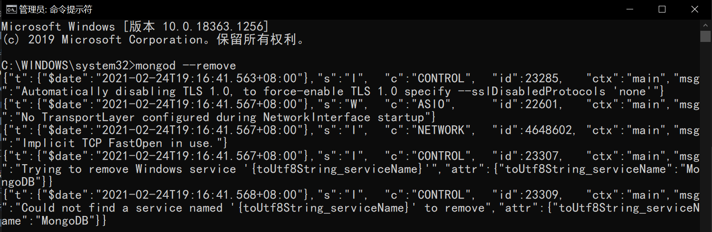

### 3\. 安装需要身份验证的服务

```shell
mongod --install --dbpath 数据目录 --logpath 日志目录\日志名称 --auth
```

这里为：

```shell
mongod --install --dbpath D:\JAVA_Environment\MongoDB\mongodb-win32-x86_64-windows-4.4.2\data --logpath D:\JAVA_Environment\MongoDB\mongodb-win32-x86_64-windows-4.4.2\logs\mongodb-zsr.log --auth
```

### 4\. 启动服务

```shell
net start mongodb
```

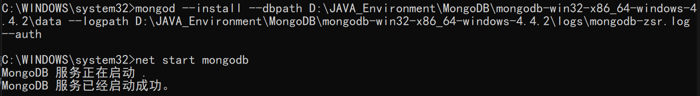

### 5\. 登录测试

输入`mongo`命令登录，可以发现不再显示警告，且查看数据库看不到，这是因为还没有身份验证，没有通过账号登录


### 6\. 通过超级管理员账号登录

```shell
# 方法一
mongo 服务器ip地址:端口号/数据库 -u 用户名 -p 密码
```

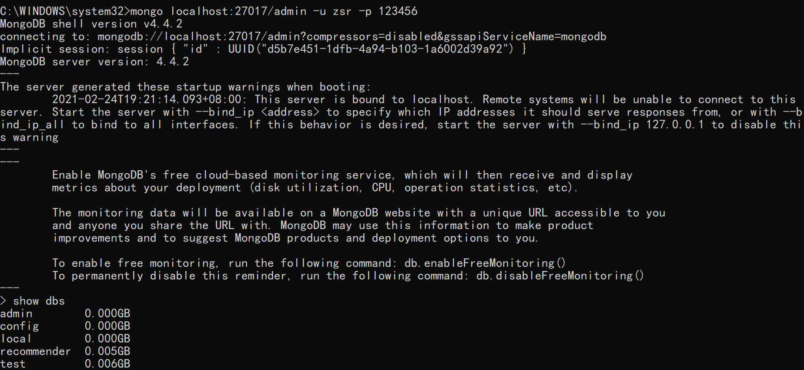

```shell
# 方法二
mongo	#先登录
use admin	#选择数据库
db.auth(用户名,密码)
```

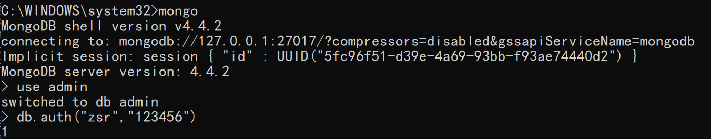

---

## 练习

- **需求**

> 添加用户shop1可以读shop数据库
>
> 添加用户shop2可以读写shop数据库
>
> 注意：必须在对应的数据库中创建用户

- **准备**：创建测试数据

> ```shell
> use shop
> for(var i=1;i<=10;i++){
> 	db.goods.insert({name:"goods"+i,price:i})
> }
> ```
>
> 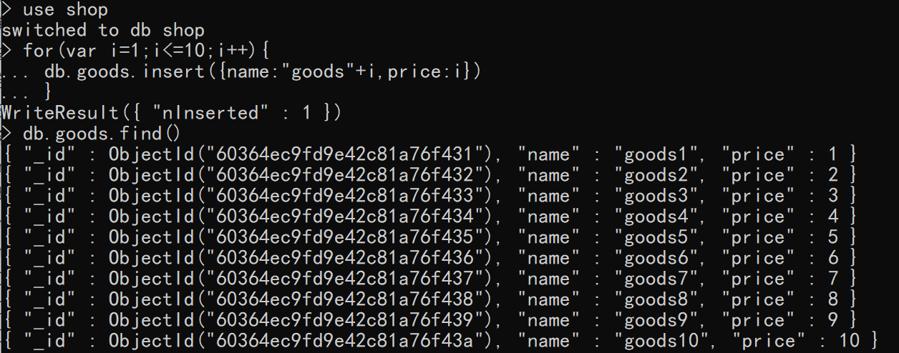

- **添加用户并设置权限**

> ```shell
> use shop
> 
> # 创建shop1用户
> db.createUser({
> 	"user":"shop1",
> 	"pwd":"123456",
> 	"roles":[{
> 		role:"read",
> 		db:"shop"
> 	}]
> })
> 
> # 创建shop2用户
> db.createUser({
> 	"user":"shop2",
> 	"pwd":"123456",
> 	"roles":[{
> 		role:"readWrite",
> 		db:"shop"
> 	}]
> })
> ```
>
> 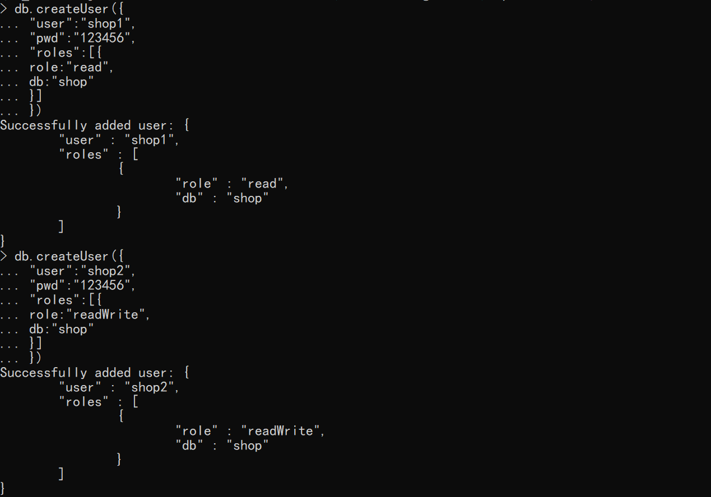

- **验证**：shop1可读，shop2可读可写

> ```shell
> # 验证shop1可读
> C:\WINDOWS\system32>mongo localhost:27017/shop -u shop1 -p 123456
> MongoDB shell version v4.4.2
> connecting to: mongodb://localhost:27017/shop?compressors=disabled&gssapiServiceName=mongodb
> Implicit session: session { "id" : UUID("727ada5f-985f-4858-bb30-523d1777fa3a") }
> MongoDB server version: 4.4.2
> > show dbs
> shop  0.000GB
> > db.goods.find()	#可读
> { "_id" : ObjectId("60364ec9fd9e42c81a76f431"), "name" : "goods1", "price" : 1 }
> { "_id" : ObjectId("60364ec9fd9e42c81a76f432"), "name" : "goods2", "price" : 2 }
> { "_id" : ObjectId("60364ec9fd9e42c81a76f433"), "name" : "goods3", "price" : 3 }
> { "_id" : ObjectId("60364ec9fd9e42c81a76f434"), "name" : "goods4", "price" : 4 }
> { "_id" : ObjectId("60364ec9fd9e42c81a76f435"), "name" : "goods5", "price" : 5 }
> { "_id" : ObjectId("60364ec9fd9e42c81a76f436"), "name" : "goods6", "price" : 6 }
> { "_id" : ObjectId("60364ec9fd9e42c81a76f437"), "name" : "goods7", "price" : 7 }
> { "_id" : ObjectId("60364ec9fd9e42c81a76f438"), "name" : "goods8", "price" : 8 }
> { "_id" : ObjectId("60364ec9fd9e42c81a76f439"), "name" : "goods9", "price" : 9 }
> { "_id" : ObjectId("60364ec9fd9e42c81a76f43a"), "name" : "goods10", "price" : 10 }
> > db.goods.insert({name:"zsr"})	#不可写
> WriteCommandError({
>       "ok" : 0,
>       "errmsg" : "not authorized on shop to execute command { insert: \"goods\", ordered: true, lsid: { id: UUID(\"727ada5f-985f-4858-bb30-523d1777fa3a\") }, $db: \"shop\" }",
>       "code" : 13,
>       "codeName" : "Unauthorized"
> })
> 
> # 验证shop2可读可写
> C:\WINDOWS\system32>mongo localhost:27017/shop -u shop2 -p 123456
> MongoDB shell version v4.4.2
> connecting to: mongodb://localhost:27017/shop?compressors=disabled&gssapiServiceName=mongodb
> Implicit session: session { "id" : UUID("1fbca023-aeb3-4514-b2e4-700934000cc9") }
> MongoDB server version: 4.4.2
> > db.goods.find()	#可读
> { "_id" : ObjectId("60364ec9fd9e42c81a76f431"), "name" : "goods1", "price" : 1 }
> { "_id" : ObjectId("60364ec9fd9e42c81a76f432"), "name" : "goods2", "price" : 2 }
> { "_id" : ObjectId("60364ec9fd9e42c81a76f433"), "name" : "goods3", "price" : 3 }
> { "_id" : ObjectId("60364ec9fd9e42c81a76f434"), "name" : "goods4", "price" : 4 }
> { "_id" : ObjectId("60364ec9fd9e42c81a76f435"), "name" : "goods5", "price" : 5 }
> { "_id" : ObjectId("60364ec9fd9e42c81a76f436"), "name" : "goods6", "price" : 6 }
> { "_id" : ObjectId("60364ec9fd9e42c81a76f437"), "name" : "goods7", "price" : 7 }
> { "_id" : ObjectId("60364ec9fd9e42c81a76f438"), "name" : "goods8", "price" : 8 }
> { "_id" : ObjectId("60364ec9fd9e42c81a76f439"), "name" : "goods9", "price" : 9 }
> { "_id" : ObjectId("60364ec9fd9e42c81a76f43a"), "name" : "goods10", "price" : 10 }
> > db.goods.insert({name:"zsr"})	可写
> WriteResult({ "nInserted" : 1 })
> ```

---


# 十、备份还原

## 下载MongoDB数据库工具

> 进行备份还原之前，首先要下载相关的工具
>
> `MongoDB Database Tools`：<https://www.mongodb.com/try/download/database-tools>
>
> MongoDB数据库工具是用于处理MongoDB部署的命令行实用程序的集合。这些工具独立于MongoDB Server计划发布，使您能够获得更频繁的更新，并在新功能可用时立即加以利用。有关更多信息，请参阅MongoDB数据库工具文档。

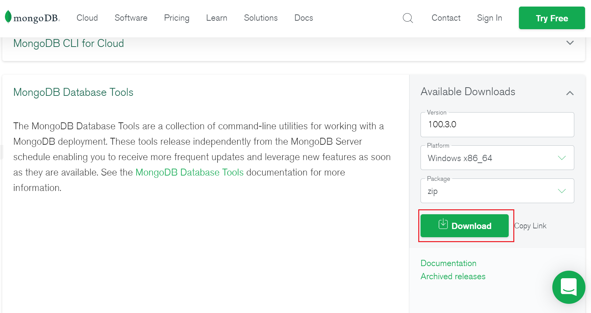  
下载后得到压缩包  
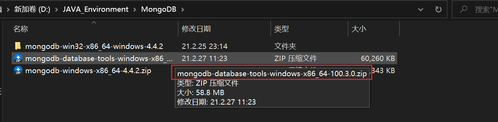  
解压  
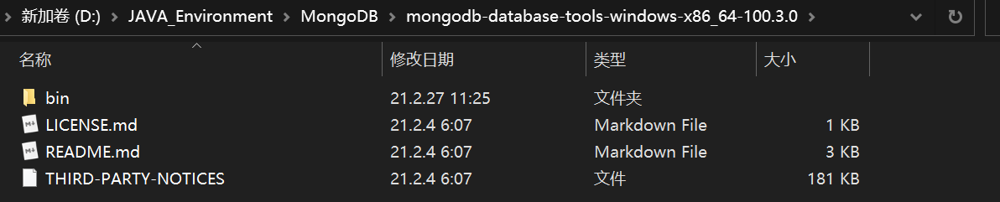  
然后点击进入`bin`目录，可以看到各种工具，接下来的备份还原就需要用到其中的`mongodump`和`mongorestore`  
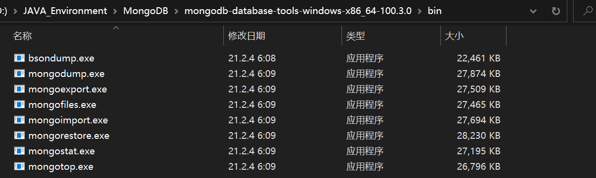  
将其中的所有`exe`文件拷贝到`MongoDB`安装目录下的`bin`目录中  
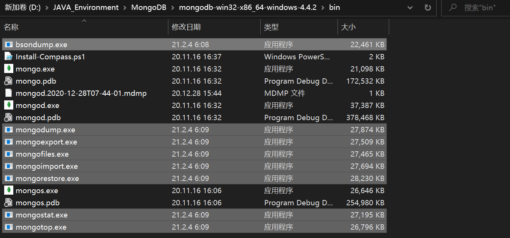

---

## 备份数据库mongodump

```shell
# 导出数据
mongodump -h -port -u -p -d -o

# 说明
-h 服务器ip地址(一般不写,默认本机)
-port 端口(一般不写,默认27017)
-u 账号
-p 密码
-d 数据库(不写则表示导出全部)
-o 备份到指定目录下 
```

**1️⃣ 备份所有数据：**

在`MongoDB`安装目录下新建一个`data_backup`目录用于存放所有的备份数据

```shell
mongodump -u zsr -p 123456 -o D:\JAVA_Environment\MongoDB\mongodb-win32-x86_64-windows-4.4.2\data_backup
```

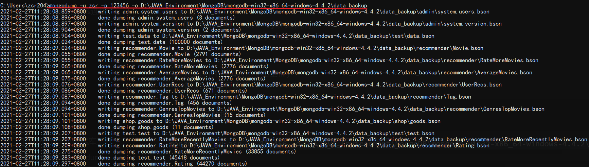  
然后再查看`data_backup`目录，可以看到备份的所有的数据库  
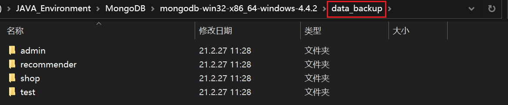

**2️⃣ 备份指定数据：**

在`MongoDB`安装目录下新建一个`data_backup2`目录用于存放备份的shop数据库

```shell
# 用具有读权限的shop1/shop2用户都可以
mongodump -u shop1 -p 123456 -d shop -o D:\JAVA_Environment\MongoDB\mongodb-win32-x86_64-windows-4.4.2\data_backup2
```

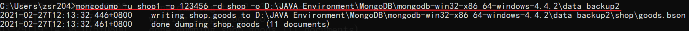  
然后再查看`data_backu2`目录，可以看到备份的shop数据库  
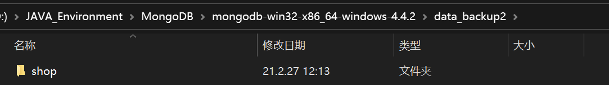

## 还原数据库mongorestore

```shell
mongostore -h -port -u -p -d --drop 备份数据目录

# 说明
-h 服务器ip地址(一般不写,默认本机)
-port 端口(一般不写,默认27017)
-u 账号
-p 密码
-d 数据库(不写则表示还原全部数据)
--drop 先删除数据库再导入,不写则覆盖
```

**1️⃣ 还原所有数据：**

首先删除几个数据库  
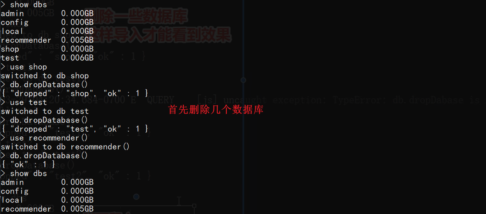  
然后输入如下命令从`data_backup`目录进行恢复

```shell
mongorestore -u zsr -p 123456 --drop D:\JAVA_Environment\MongoDB\mongodb-win32-x86_64-windows-4.4.2\data_backup
```

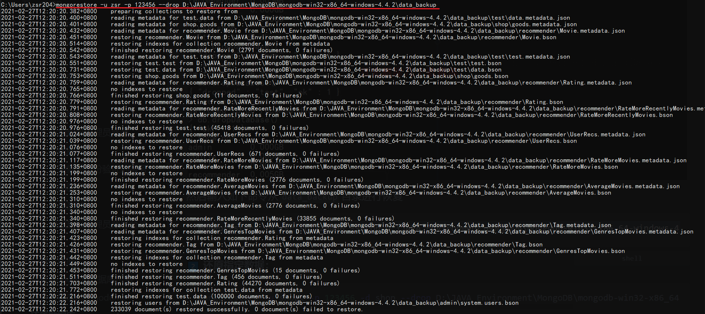  
然后再次登录查看数据库，可以发现已经恢复  
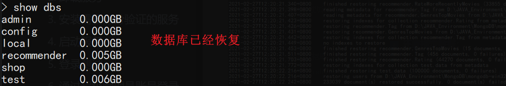

**2️⃣ 还原指定数据：**

首先删除shop数据库  
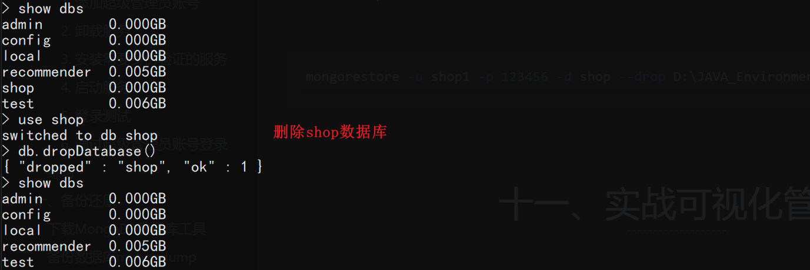  
然后输入如下命令从`data_backup2`目录恢复shop数据库

```shell
# 用具有写权限的shop2用户
mongorestore -u shop2 -p 123456 -d shop --drop D:\JAVA_Environment\MongoDB\mongodb-win32-x86_64-windows-4.4.2\data_backup2\shop
```

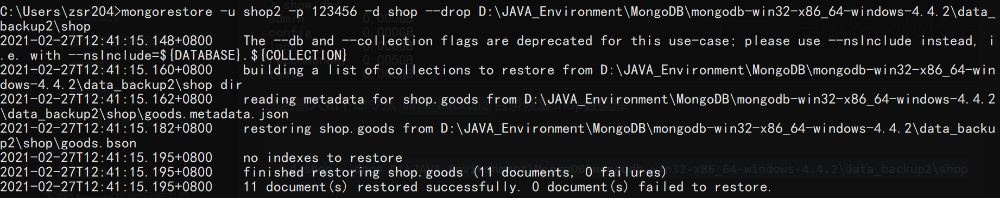  
然后再次登录查看shop数据库，可以发现已经恢复  


---


# 十一、实战可视化管理Robo 3T

> **常见的可视化管理工具**：
>
> - `adminMongo`：WEB/PC端口网页管理 <https://github.com/mrvautin/adminMongo>
> - `Robo 3T *`：客户端软件 <https://robomongo.org/download/>
> - `MongoVUE` ：客户端软件

## 1\. 下载安装Robo 3T

**下载地址**：<https://robomongo.org/download/>

`Studio 3T` 和 `Robo 3T` 的区别：前者是商业付费软件，后者开源免费软件

这里选择仅仅下载`Robo 3T`  
  
填写好信息后点击下载  
  
这里选择下载`.exe`  
  
下载后得到`exe`文件  
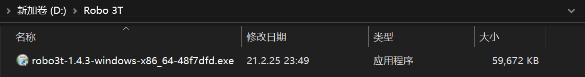  
双击运行进行安装，傻瓜式下一部安装完成即可

---

## 2\. 使用Robo 3T

安装完成后打开  

点击`Create`创建一个链接，添加连接数据库的相关信息 

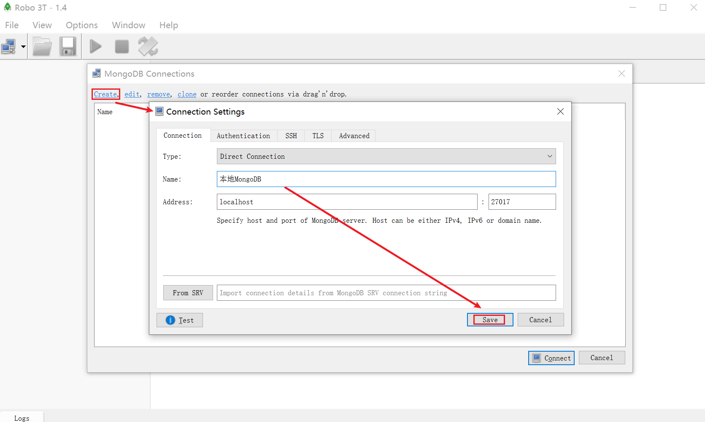  
我们开启了身份验证，因此需要填写身份验证的用户名和密码，最后`Save`  
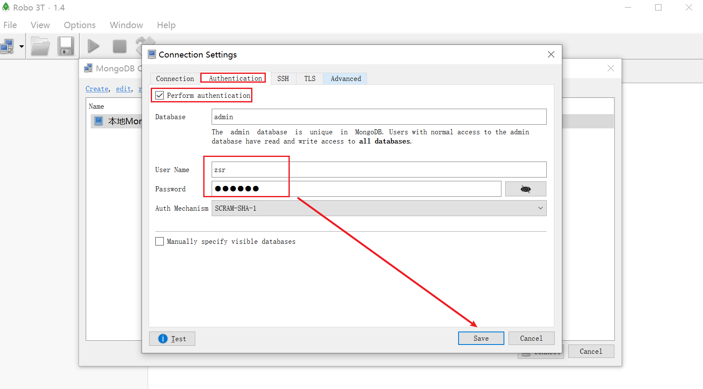  
然后点击`Connect`进行连接  
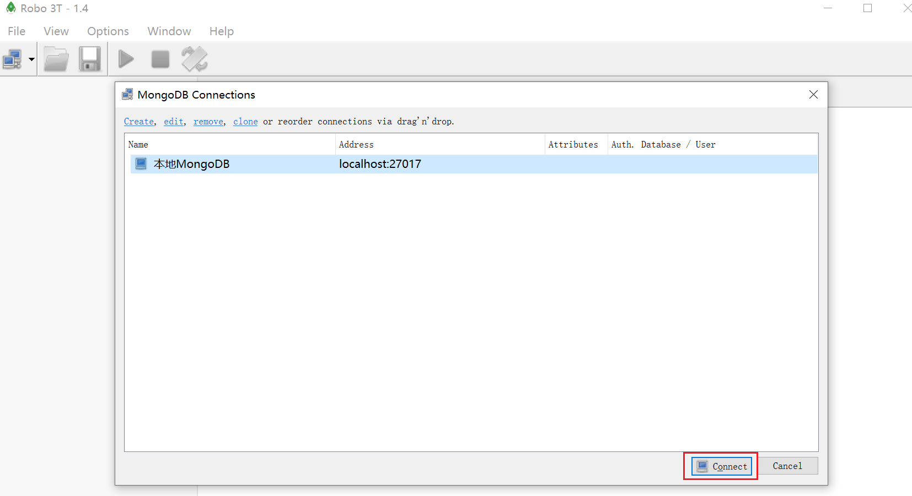  
成功连接到数据库  
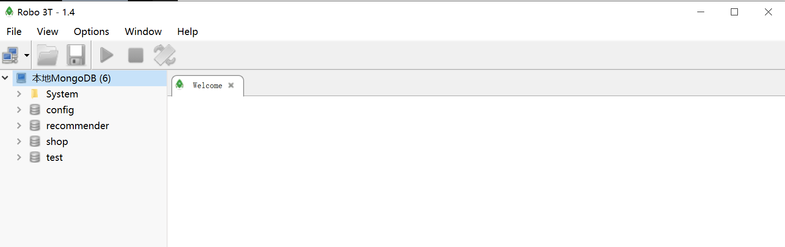  
然后就可以可视化进行各种操作

<hr/>

# 十二、SpringBoot整合MongoDB

## 基础操作

### 环境准备

#### 引入依赖

```xml
<!--spring data mongodb-->
<dependency>
    <groupId>org.springframework.boot</groupId>
    <artifactId>spring-boot-starter-data-mongodb</artifactId>
</dependency>

```

#### 添加配置信息

配置mongodb连接有两种方式，一种是使用uri;另外一种则使用对应的配置文件

下面使用uri配置信息

无密码：

```yaml
spring:
  data:
    mongodb:
      uri: mongodb://服务器IP:端口/数据库名
```


有密码：

```yaml
spring:
  data:
    mongodb:
      uri: mongodb://用户名:密码@服务器IP:端口/数据库名
      # 上方为明确指定某个数据的用户进行连接
      # 也可以使用admin 数据库中的用户进行连接  统一到admin 数据库进行认证
      # admin 用户认证 url 写法： mongodb://账户:密码%40@ip:端口/数据库名?authSource=admin&authMechanism=SCRAM-SHA-1
```

例：

```yaml
spring:
  data:
    mongodb:
      uri: mongodb://localhost/mongotest
```

连接配置参考文档：[docs.mongodb.com/manual/refe…](https://link.juejin.cn?target=https%3A%2F%2Fdocs.mongodb.com%2Fmanual%2Freference%2Fconnection-string%2F "https://docs.mongodb.com/manual/reference/connection-string/")

#### 使用时注入MongoTemplate

需要使用的MongoDB的时候，需要将`MongoTemplate`注入到类中,然后执行对应的方法即可

```java
@Autowired
MongoTemplate mongoTemplate;
```

### 集合（表）操作

首先进行判断集合是否存在，如果存在则删除，然后再创建

我们给`appdb`库中的`emp`集合进行操作，操作前`emp`是存在的，并且有数据，如下（连接终端可以使用 MongoDB Compass或者Navicat）：

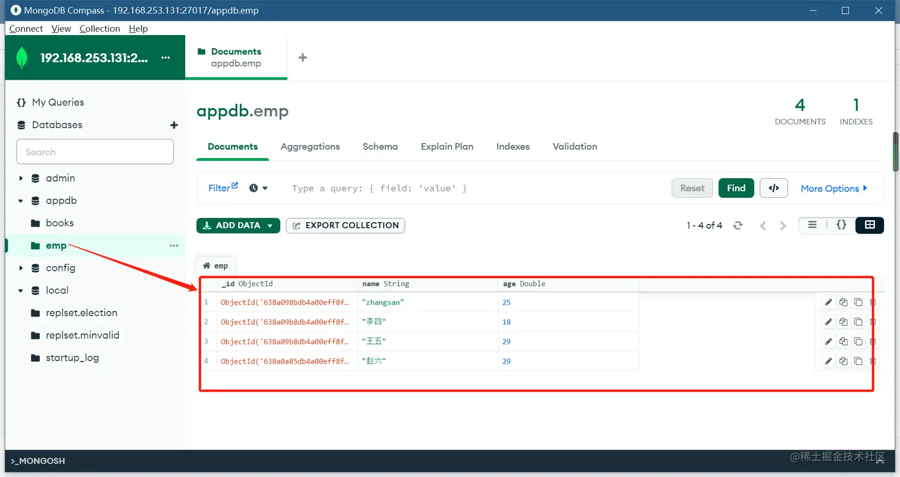

```java
@Autowired
MongoTemplate mongoTemplate;

@Test
public void test(){
    boolean emp = mongoTemplate.collectionExists("emp");
    if(emp){
        mongoTemplate.dropCollection("emp");
    }
    mongoTemplate.createCollection("emp");
}

```

执行完成之后，集合中已没有任何数据（集合已经被删除，并重新创建）

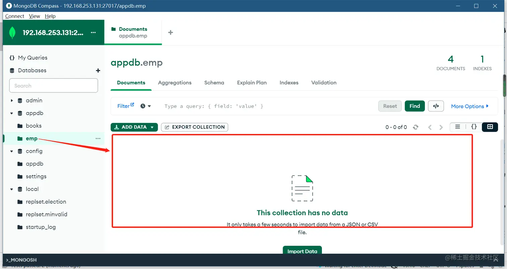

### 文档（表）操作

#### 相关注解

- **@Document**

修饰范围: 用在类上 作用: 用来映射这个类的一个对象为mongo中一条文档数据。 属性:\( value 、collection \)用来指定操作的集合名称

- **@Id**

修饰范围: 用在成员变量、方法上 作用: 用来将成员变量的值映射为文档的\_id的值

- **@Field**

修饰范围: 用在成员变量、方法上 作用: 用来将成员变量及其值映射为文档中一个key:value对。 属性:\( name , value \)用来指定在文档中 key的名称,默认为成员变量名

- **@Transient**

修饰范围:用在成员变量、方法上 作用:用来指定此成员变量不参与文档的序列化

#### 创建实体

使用`@Document("emp")`和MongoDB中的emp进行映射，同时使用`lombok`进行get/set/有参/无参构造生成

其中name使用`@Field("username")`进行映射

```java
@Document("emp")
@Data
@AllArgsConstructor
@NoArgsConstructor
public class Employee {

    @Id
    private Integer id;
    @Field("username")
    private String name;
    @Field
    private int age;
    @Field
    private Double salary;
    @Field
    private Date birthday;
}

```

#### 添加文档

insert方法返回值是新增的Document对象，里面包含了新增后id的值。如果集合不存在会自动创建集 合。通过Spring Data MongoDB还会给集合中多加一个class的属性，存储新增时Document对应Java中 类的全限定路径。这么做为了查询时能把Document转换为Java类型。

##### 使用save进行保存

使用save进行保存，当id重复的时候，就会对数据进行更新操作

```java
@Test
public void testInsert(){
    Employee employee=new Employee(1,"王二麻子",25,10000.00,new Date());
    Employee emp = mongoTemplate.save(employee);
    System.out.println(emp);

}

```

执行结果：

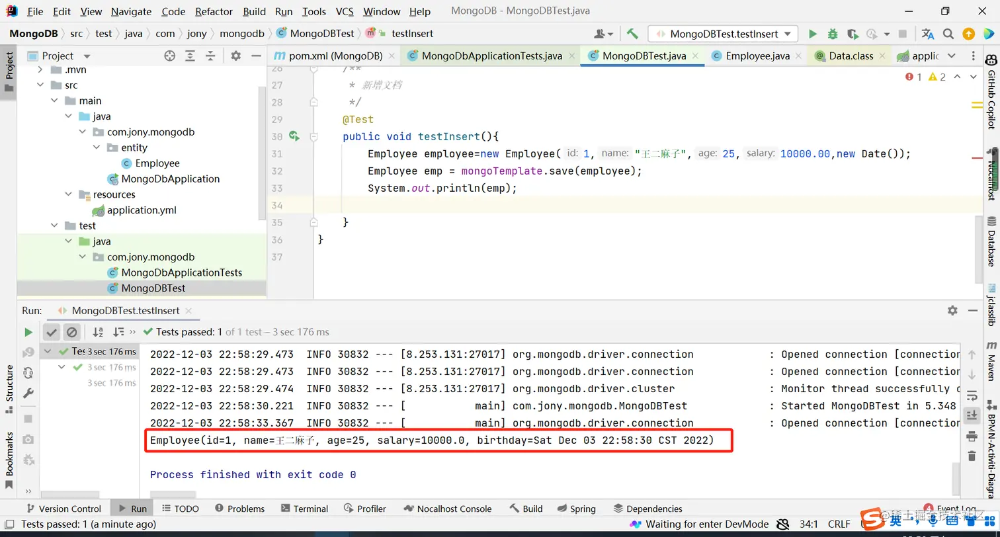

将name修改为：王二麻子111，再次调用save

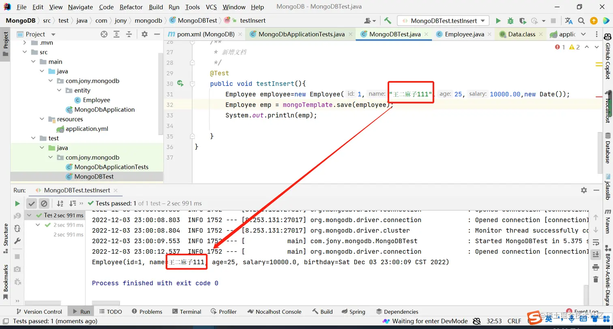

##### 使用insert进行保存

使用insert进行保存，当id重复的时候，就会抛出异常

insert支持批量保存操作

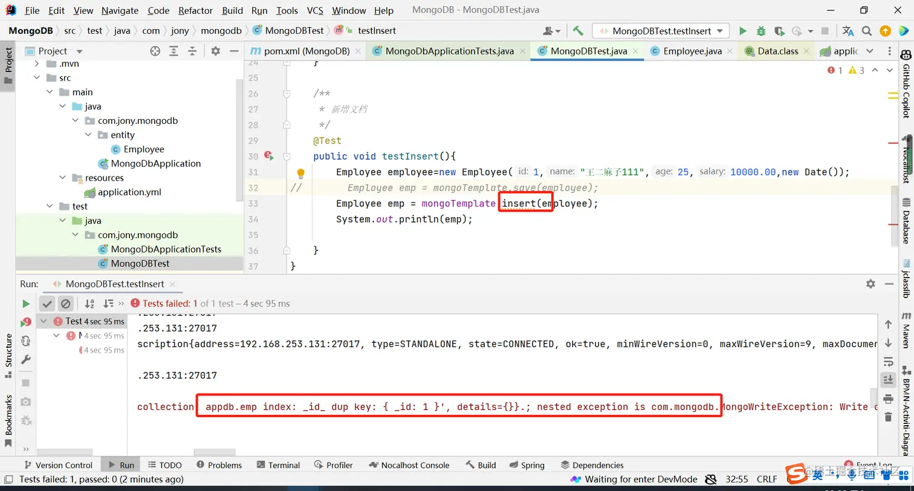

##### 使用insert批量保存

使用`insert`批量保存的时候，需要传入对象的类型，为了查询的时候能把Document转为Java类型

```java
/**
 * 批量保存
 */
List<Employee> list = Arrays.asList(
        new Employee(2, "张三", 21,5000.00, new Date()),
        new Employee(3, "李四", 26,8000.00, new Date()),
        new Employee(4, "王五",22, 8000.00, new Date()),
        new Employee(5, "张龙",28, 6000.00, new Date()),
        new Employee(6, "赵虎",24, 7000.00, new Date()),
        new Employee(7, "赵六",28, 12000.00, new Date()));

//插入多条数据
Collection<Employee> insertList1 = mongoTemplate.insert(list, Employee.class);
System.out.println(insertList);

//插入多条数据
Collection<Employee> insertList2 = mongoTemplate.insertAll(list);
System.out.println(insertList);

```

执行结果

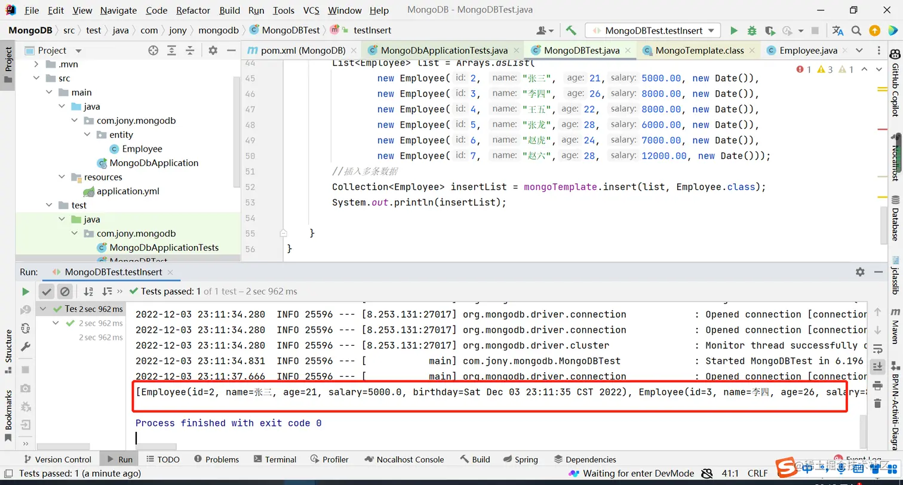

#### 查询文档

Criteria是标准查询的接口，可以引用静态的Criteria.where的把多个条件组合在一起，就可以轻松地将多个方法标准和查询连接起来，方便我们操作查询语句。

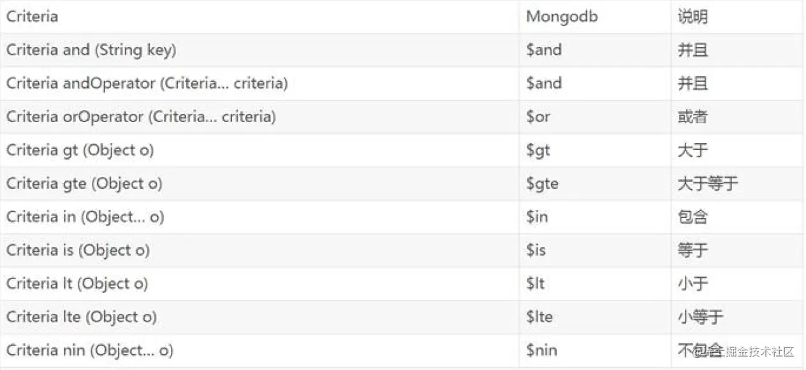

##### 查询集合的全部文档

```java
@Test
public void testFind(){
    System.out.println("-----------------查询所有文档---------------");
    //以下两种查询功能等同
    List<Employee> list = mongoTemplate.findAll(Employee.class);
    List<Employee> list2 = mongoTemplate.find(new Query(), Employee.class);
    
    list.forEach(System.out::println);
    
    System.out.println("-----------------查询所有文档---------------");
}

```

执行结果：

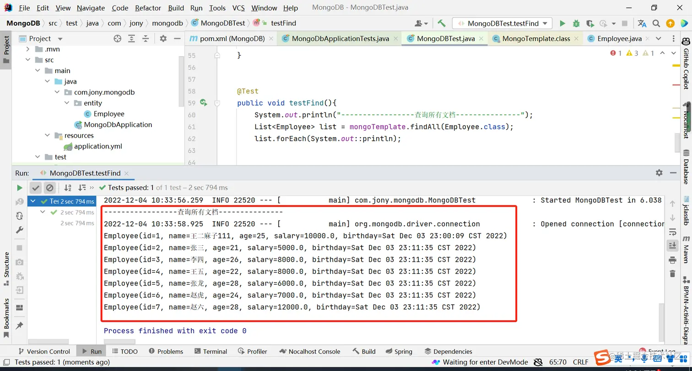

##### 查询单个文档

查询单个文档，可以根据ID，或者findONe查询第一个文档

```java
System.out.println("-----------------根据ID查询---------------");
Employee em = mongoTemplate.findById(1, Employee.class);
System.out.println(em);

System.out.println("-----------------findOne返回第一个文档---------------");
Employee emOne = mongoTemplate.findOne(new Query(), Employee.class);
System.out.println(emOne);

```

执行结果

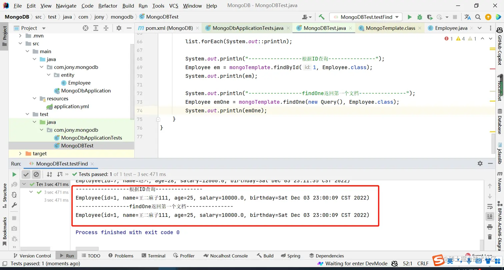

##### 单条件查询

通过`Criteria.where()`可以传入对应key值，然后设置对应条件生成查询Query，然后将Query传入`mongoTemplate.find()`即可完成查询

```java
@Test
public void criteriaTest(){
    //查询薪资大于等于8000的员工
    Query query=new Query(Criteria.where("salary").gte(8000));
    //查询薪资大于4000小于10000的员工
    Query query1=new Query(Criteria.where("salary").gt(4000).lt(10000));
    //正则查询（模糊查询） java中正则不需要//
    Query query2=new Query(Criteria.where("name").regex("张"));
    
    //执行Query
    List<Employee> emplist=mongoTemplate.find(query2,Employee.class);
    emplist.forEach(System.out::println);
}

```


##### 多条件查询

```java
/**
 * 多条件 and or查询
 */
@Test
public void CriteriaOptionTest(){
    System.out.println("---------------Criteria多条件and、or查询----------------");
    Criteria criteria=new Criteria();
    //and 查询年龄大于25，薪资大于8000的员工
    //criteria.andOperator(Criteria.where("age").gt(25),Criteria.where("salary").gt(8000));

    //or 查询姓名是张三或者薪资大于5000的员工
    criteria.orOperator(Criteria.where("name").is("张三"),Criteria.where("salary").gt(5000));

    //将查询条件传入Query
    Query query=new Query(criteria);
    //执行查询
    List<Employee> employees = mongoTemplate.find(query, Employee.class);
    employees.forEach(System.out::println);
}

```

##### 排序

通过使用`query.with(Sort.by(Sort.Order.desc("xx")));`进行对字段排序

```java
/**
 * 排序
 */
@Test
public void CriteriraOrderTest(){
    Criteria criteria=new Criteria();
    criteria.andOperator(Criteria.where("age").gt(22),Criteria.where("salary").gt(6000));

    Query query=new Query(criteria);
    query.with(Sort.by(Sort.Order.desc("salary")));

    List<Employee> li = mongoTemplate.find(query, Employee.class);
    li.forEach(System.out::println);
}

```

执行结果：

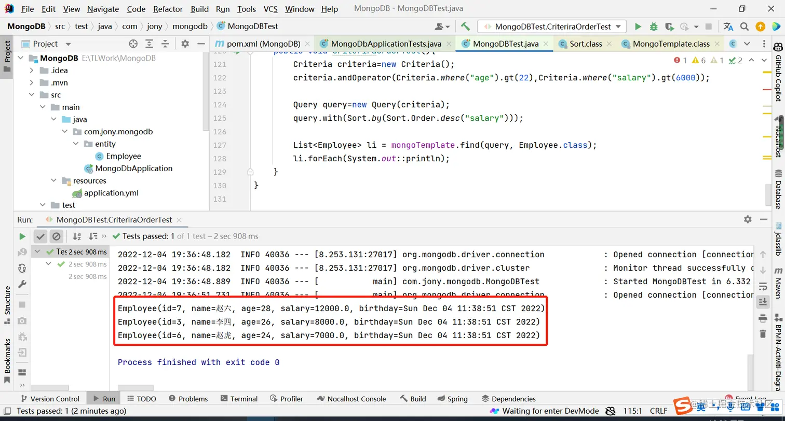

##### 使用skip、limit分页

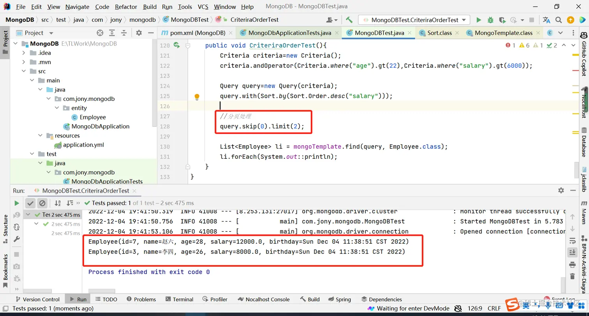

##### 使用 json字符串方式查询

```java
/**
 * 通过Json查询
 */
@Test
public void jsonTest(){
    //查询name为张三
    String json="{name:'张三'}";
    //查询工资大于5000
    String json2="{salary:{$gt:5000}}";
    //查询年龄大于25或者工资小于7000
    String json3="{$or:[{age:{$gt:25}},{salary:{$lt:7000}}]}";
    Query query=new BasicQuery(json3);
    //按工资降序排序
    query.with(Sort.by(Sort.Order.desc("salary")));

    List<Employee> list = mongoTemplate.find(query, Employee.class);
    list.forEach(System.out::println);
}

```

执行结果

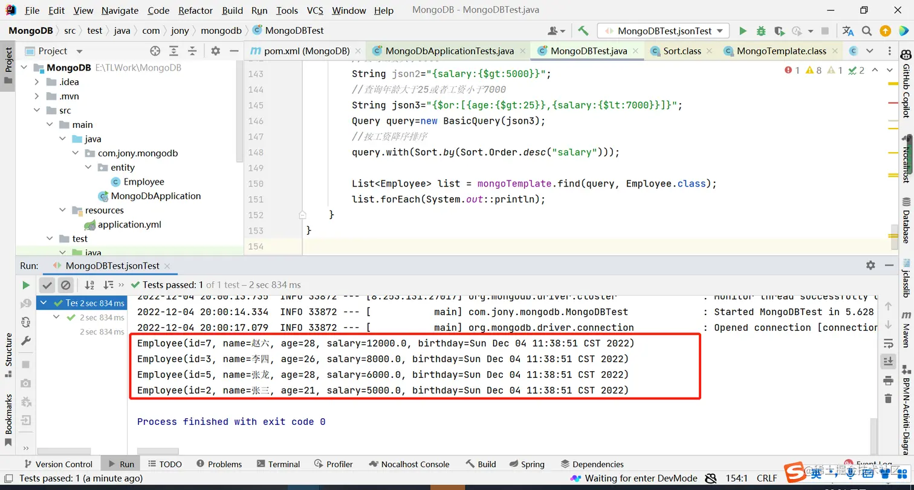

#### 更新文档

在Mongodb中无论是使用客户端API还是使用Spring Data，更新返回结果一定是受行数影响。如果更新后的结果和更新前的结果相同，返回0

- updateFirst\(\) 只更新满足条件的第一条记录
- updateMulti\(\) 更新所有满足条件的记录
- upsert\(\) 没有符合条件的记录则插入数据

##### updateFirst更新第一条数据

```java
@Test
public void updateTest(){
    Query query=new Query(Criteria.where("salary").gte(8000));

    List<Employee> li = mongoTemplate.find(query,Employee.class);
    System.out.println("----------更新前------------");
    li.forEach(System.out::println);

    //更新符合条件的一条数据
    Update update=new Update();
    update.set("salary",13000);
    mongoTemplate.updateFirst(query,update,Employee.class);


    System.out.println("==========更新后===========");
    li = mongoTemplate.find(query, Employee.class);
    li.forEach(System.out::println);
}

```

执行结果：

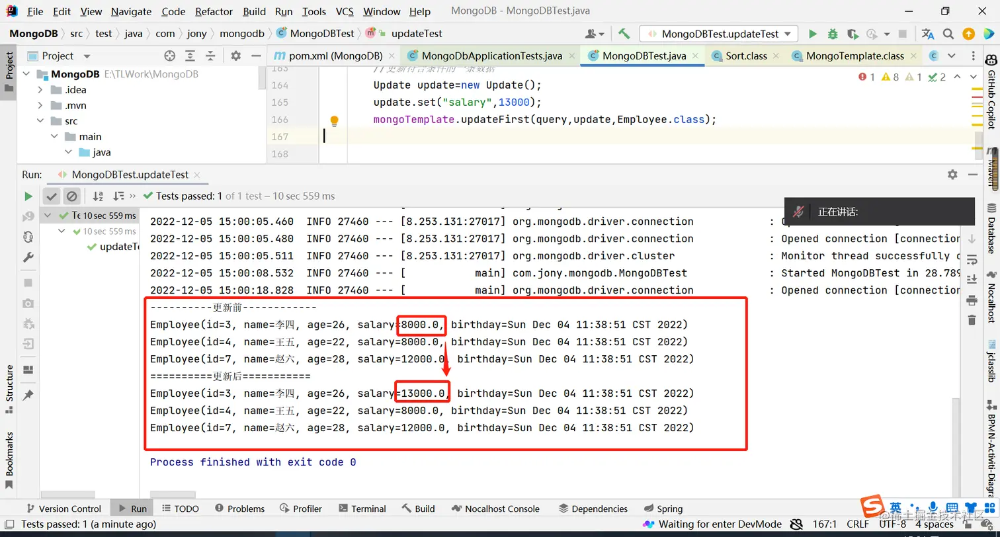

##### updateMulti更新所有符合条件数据

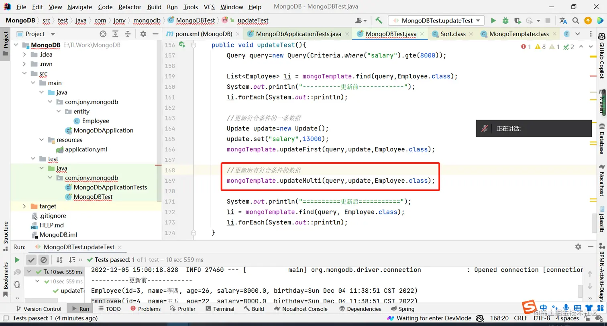

##### upsert没有符合的数据则插入

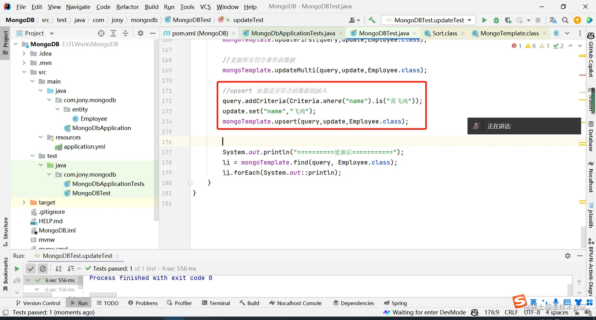

数据结果：

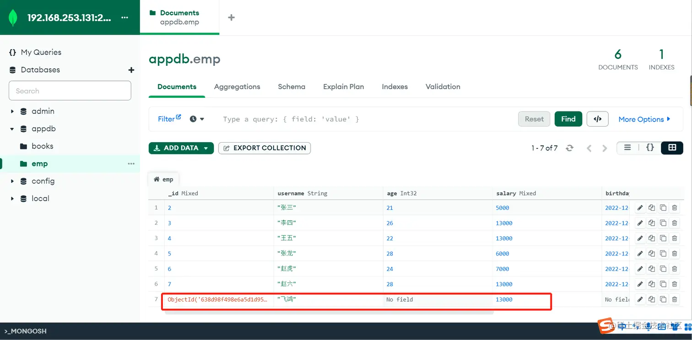

#### 删除文档

```java
	@Test
    public void deleteTest(){
        //删除所有文档  数据量大建议使用 dropCollection效率更高
//        mongoTemplate.remove(new Query(),Employee.class);
        System.out.println("-----------删除前数据-------------");
        mongoTemplate.findAll(Employee.class).forEach(System.out::println);

        mongoTemplate.remove(new Query(Criteria.where("name").is("张三")),Employee.class);
        //删除后数据
        System.out.println("-----------删除后数据-------------");
        mongoTemplate.findAll(Employee.class).forEach(System.out::println);
    }

```

执行结果：

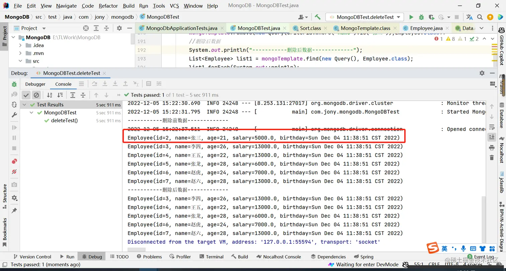

## 聚合操作

MongoTemplate提供了aggregate方法来实现对数据的聚合操作。如下在`MongoTemplate`中的aggregate中的方法

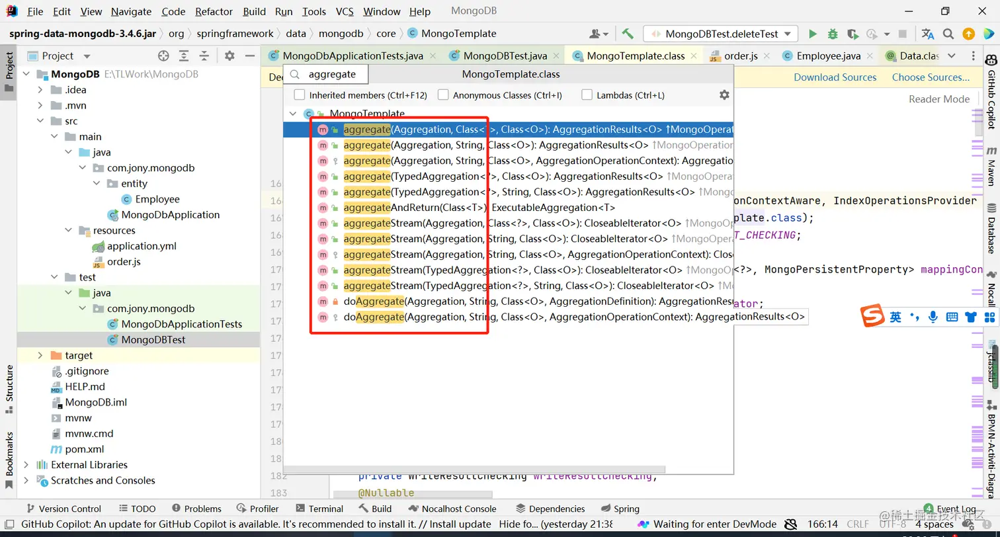

### mongodb 命令和java对照

基于聚合管道mongodb提供的可操作的内容：

| 支持的操作 | java 接口           | 说明                               |
| ---------- | ------------------- | ---------------------------------- |
| \$project  | Aggregation.project | 修改输入文档的结构                 |
| \$match    | Aggregation.match   | 用于过滤数据                       |
| \$limit    | Aggregation.limit   | 用来限制聚合管道返回的文档数       |
| \$skip     | Aggregation.skip    | 用来在聚合管道操作中跳过指定的文档 |
| \$unwind   | Aggregation.unwind  | 将文档的某一个数组类型拆分为多条   |
| \$group    | Aggregation.group   | 将聚合中的文档分组，可用于统计结果 |
| \$sort     | Aggregation.sort    | 输入文档排序后输出                 |
| \$geoNear  | Aggregation.geoNear | 输出接近某一地理位置的有序文档     |

基于聚合操作Aggregation.group，mongodb提供可选的表达式

| 聚合表达式 | java接口                                                   | 说明                                         |
| ---------- | ---------------------------------------------------------- | -------------------------------------------- |
| \$sum      | Aggregation.group\(\).sum\("field"\).as\("sum"\)           | 求和                                         |
| \$avg      | Aggregation.group\(\).avg\("field"\).as\("avg"\)           | 求平均                                       |
| \$min      | Aggregation.group\(\).min\("field"\).as\("min"\)           | 获取聚合所有文档对应值的最小值               |
| \$max      | Aggregation.group\(\).max\("field"\).as\("max"\)           | 获取聚合所有文档对应值的最大值               |
| \$push     | Aggregation.group\(\).push\("field"\).as\("push"\)         | 在结果文档中插入值到一个数组中               |
| \$addToSet | Aggregation.group\(\).addToSet\("field"\).as\("addToSet"\) | 在结果文档中插入值到一个数组中，但不创建副本 |
| \$first    | Aggregation.group\(\).first\("field"\).as\("first"\)       | 根据资源文档的排序获取第一个文档数据         |
| \$last     | Aggregation.group\(\).last\("field"\).as\("last"\)         | 根据资源文档的排序获取最后一个文档数据       |

### 数据集示例

导入邮政编码数据集 :[media.mongodb.org/zips.json](https://link.juejin.cn?target=https%3A%2F%2Fmedia.mongodb.org%2Fzips.json "https://media.mongodb.org/zips.json")

使用mongoimport工具导入数据（[www.mongodb.com/try/downloa…](https://link.juejin.cn?target=https%3A%2F%2Fwww.mongodb.com%2Ftry%2Fdownload%2Fdatabase-tools%25EF%25BC%2589 "https://www.mongodb.com/try/download/database-tools%EF%BC%89")

```shell
mongoimport -h 192.168.253.131 -d aggdemo -u jony -p 111111 --
authenticationDatabase=admin -c zips --file
D:\ProgramData\mongodb\import\zips.json
```

> h,--host ：代表远程连接的数据库地址，默认连接本地Mongo数据库；
>
> \--port：代表远程连接的数据库的端口，默认连接的远程端口27017；
>
> \-u,--username：代表连接远程数据库的账号，如果设置数据库的认证，需要指定用户账号；
>
> \-p,--password：代表连接数据库的账号对应的密码；
>
> \-d,--db：代表连接的数据库；
>
> \-c,--collection：代表连接数据库中的集合；
>
> \-f, \--fields：代表导入集合中的字段；
>
> \--type：代表导入的文件类型，包括csv和json,tsv文件，默认json格式；
>
> \--file：导入的文件名称
>
> \--headerline：导入csv文件时，指明第一行是列名，不需要导入；

### 返回人口超过1000万的州

```shell
db.zips.aggregate([
    {
        $group: {
            _id: "$state",
            totalPop: {
                $sum: "$pop"
            }
        }
    },
    {
        $match: {
            totalPop: {
                $gt: 10 * 1000 * 1000
            }
        }
    }
])

```

执行结果

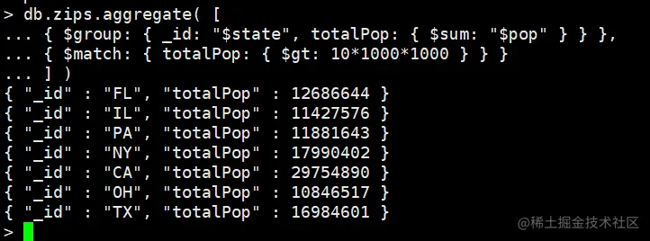

这个聚合操作的等价SQL是：

```mysql
SELECT state, SUM(pop) AS totalPop
FROM zips
GROUP BY state
HAVING totalPop >= (10*1000*1000)
```

 -    创建实体类

```java
@Document("zips")
@Data
@AllArgsConstructor
@NoArgsConstructor
public class Zips {
    @Id //映射文档中的_id
    private String id;
    @Field
    private String city;
    @Field
    private Double[] loc;
    @Field
    private Integer pop;
    @Field
    private String state;
}

```

 -    实现思路

```shell
db.zips.aggregate([
    {
        $group: {
            _id: "$state",
            totalPop: {
                $sum: "$pop"
            }
        }
    },
    {
        $match: {
            totalPop: {
                $gt: 10 * 1000 * 1000
            }
        }
    }
])

```

1、如上命令首先用到了`group`,java对应的类为：`GroupOperation`  
2、其次用到了`match`，java对应的类为：`MatchOperation` 

通过上面两个方法，我们可以观察到对应的管道命令，在java中就是在管道命令后加上`Operation`

**最终代码**

```java
public class AggregateTest extends  MongoDbApplicationTests{

    @Autowired
    MongoTemplate mongoTemplate;

    @Test
    public void test() {
        //$group操作-->$group: { _id: "$state", totalPop: { $sum: "$pop" } }
        GroupOperation groupOperation=
                Aggregation.group("state").sum("pop").as("totalPop");

        //$match操作-->$match: { totalPop: { $gt: 10*1000*1000 } }
        MatchOperation matchOperation=
                Aggregation.match(Criteria.where("totalPop").gte(10*1000*1000));

        //按顺序组合每一个聚合步骤
        TypedAggregation<Zips> typedAggregation=
                Aggregation.newAggregation(Zips.class,groupOperation,matchOperation);

        //执行聚合操作,如果不使用 Map，也可以使用自定义的实体类来接收数据
        AggregationResults<Map> aggregationResults =
                mongoTemplate.aggregate(typedAggregation, Map.class);

        // 取出最终结果
        List<Map> mappedResults = aggregationResults.getMappedResults();
        for(Map map:mappedResults){
            System.out.println(map);
        }

    }
}

```

执行结果：

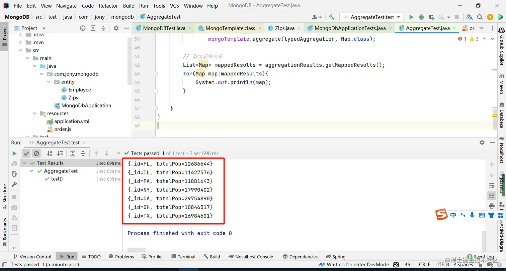

### 返回各州平均城市人口

```shell
db.zips.aggregate([
    {
        $group: {
            _id: {
                state: "$state",
                city: "$city"
            },
            cityPop: {
                $sum: "$pop"
            }
        }
    },
    {
        $group: {
            _id: "$_id.state",
            avgCityPop: {
                $avg: "$cityPop"
            }
        }
    },
    {
        $sort: {
            avgCityPop: -1
        }
    }
])

```

**java实现**

```java
@Test
public void test2() {
    //$group
    GroupOperation groupOperation =
            Aggregation.group("state","city").sum("pop").as("cityPop");
    //$group
    GroupOperation groupOperation2 =
            Aggregation.group("_id.state").avg("cityPop").as("avgCityPop");
    //$sort
    SortOperation sortOperation =
            Aggregation.sort(Sort.Direction.DESC,"avgCityPop");
    // 按顺序组合每一个聚合步骤
    TypedAggregation<Zips> typedAggregation =
            Aggregation.newAggregation(Zips.class,
                    groupOperation, groupOperation2,sortOperation);
    //执行聚合操作,如果不使用 Map，也可以使用自定义的实体类来接收数据
    AggregationResults<Map> aggregationResults =
            mongoTemplate.aggregate(typedAggregation, Map.class);
    // 取出最终结果
    List<Map> mappedResults = aggregationResults.getMappedResults();
    for(Map map:mappedResults){
        System.out.println(map);
    }
}

```

执行结果

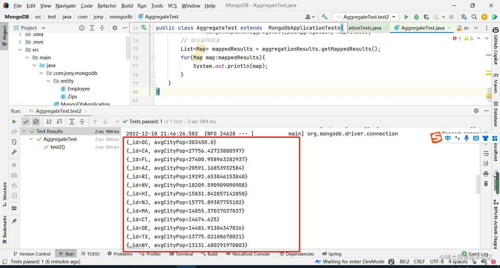

### 按州返回最大和最小的城市

```shell
db.zips.aggregate([
    {
        $group: {
            _id: { state: "$state", city: "$city" },
            pop: { $sum: "$pop" }
        }
    },
    {
        $sort: { pop: 1 }
    },
    {
        $group: {
            _id: "$_id.state",
            biggestCity: { $last: "$_id.city" },
            biggestPop: { $last: "$pop" },
            smallestCity: { $first: "$_id.city" },
            smallestPop: { $first: "$pop" }
        }
    },
    {
        $project: {
            _id: 0,
            state: "$_id",
            biggestCity: { name: "$biggestCity", pop: "$biggestPop" },
            smallestCity: { name: "$smallestCity", pop: "$smallestPop" }
        }
    },
    {
        $sort: { state: 1 }
    }
]);

```

**java 实现**

```java
@Test
    public void test3(){
        //$group
        GroupOperation groupOperation = Aggregation
                .group("state","city").sum("pop").as("pop");
        //$sort
        SortOperation sortOperation = Aggregation
                .sort(Sort.Direction.ASC,"pop");
        //$group
        GroupOperation groupOperation2 = Aggregation
                .group("_id.state")
                .last("_id.city").as("biggestCity")
                .last("pop").as("biggestPop")
                .first("_id.city").as("smallestCity")
                .first("pop").as("smallestPop");
        //$project
        ProjectionOperation projectionOperation = Aggregation
                .project("state","biggestCity","smallestCity")
                .and("_id").as("state")
                .andExpression(
                        "{ name: "$biggestCity", pop: "$biggestPop" }")
                .as("biggestCity")
                .andExpression(
                        "{ name: "$smallestCity", pop: "$smallestPop" }"
                ).as("smallestCity")
                .andExclude("_id");
        //$sort
        SortOperation sortOperation2 = Aggregation
                .sort(Sort.Direction.ASC,"state");
        // 按顺序组合每一个聚合步骤
        TypedAggregation<Zips> typedAggregation = Aggregation.newAggregation(
                Zips.class, groupOperation, sortOperation, groupOperation2,
                projectionOperation,sortOperation2);
        //执行聚合操作,如果不使用 Map，也可以使用自定义的实体类来接收数据
        AggregationResults<Map> aggregationResults = mongoTemplate
                .aggregate(typedAggregation, Map.class);
        // 取出最终结果
        List<Map> mappedResults = aggregationResults.getMappedResults();
        for(Map map:mappedResults){
            System.out.println(map);
        }
    }
}

```

执行结果：

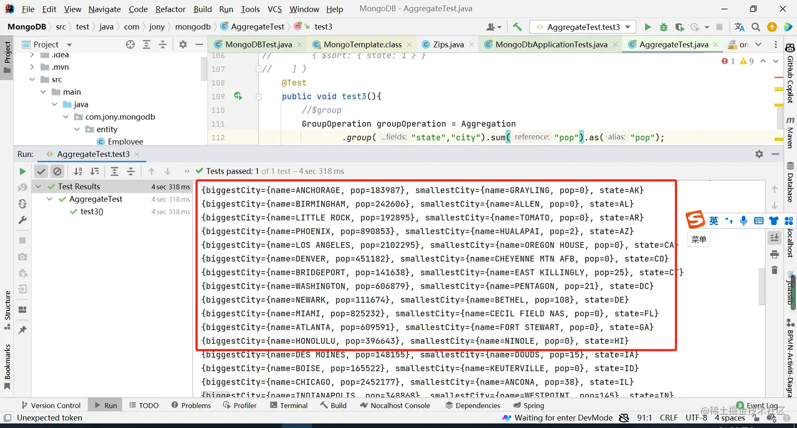