# MySQL基础篇

## [Windows安装MySQL](https://blog.csdn.net/wangpaiblog/article/details/112000033)

## Linux安装Mysql

### 1.下载Linux版MySQL安装包

> 下载地址：[MySQL :: Download MySQL Community Server (Archived Versions)](https://downloads.mysql.com/archives/community/)


### 2.上传MySQL安装包

### 3.创建目录,并解压

```
mkdir mysql

tar -xvf mysql-8.0.26-1.el7.x86_64.rpm-bundle.tar -C mysql
```

### 4. 安装mysql的安装包

```
cd mysql

rpm -ivh mysql-community-common-8.0.26-1.el7.x86_64.rpm 

rpm -ivh mysql-community-client-plugins-8.0.26-1.el7.x86_64.rpm 

rpm -ivh mysql-community-libs-8.0.26-1.el7.x86_64.rpm 

rpm -ivh mysql-community-libs-compat-8.0.26-1.el7.x86_64.rpm

yum install openssl-devel

rpm -ivh  mysql-community-devel-8.0.26-1.el7.x86_64.rpm

rpm -ivh mysql-community-client-8.0.26-1.el7.x86_64.rpm

rpm -ivh  mysql-community-server-8.0.26-1.el7.x86_64.rpm

```

### 5.启动MySQL服务

```
systemctl start mysqld
```

```
systemctl restart mysqld
```

```
systemctl stop mysqld
```

### 6.查询自动生成的root用户密码

```
grep 'temporary password' /var/log/mysqld.log
```

> 命令行执行指令 :

```
mysql -u root -p
```

> 然后输入上述查询到的自动生成的密码, 完成登录 .

### 7.修改root用户密码

> 登录到MySQL之后，需要将自动生成的不便记忆的密码修改了，修改成自己熟悉的便于记忆的密码。

```
ALTER  USER  'root'@'localhost'  IDENTIFIED BY '1234';
```

> 执行上述的SQL会报错，原因是因为设置的密码太简单，密码复杂度不够。我们可以设置密码的复杂度为简单类型，密码长度为4。

```
set global validate_password.policy = 0;
set global validate_password.length = 4;
```

> 降低密码的校验规则之后，再次执行上述修改密码的指令。

### 8.创建用户

> 默认的root用户只能当前节点localhost访问，是无法远程访问的，我们还需要创建一个root账户，用户远程访问

```
create user 'root'@'%' IDENTIFIED WITH mysql_native_password BY '1234';
```

### 9.并给root用户分配权限

```
grant all on *.* to 'root'@'%';
```

### 10.重新连接MySQL

```
mysql -u root -p
```

### 11.通过Navicat远程连接MySQL

## 所用sql脚本

```mysql
-- 如果test数据库不存在，就创建test数据库：
CREATE DATABASE IF NOT EXISTS test;

-- 切换到test数据库
USE test;

-- 删除classes表和students表（如果存在）：
DROP TABLE IF EXISTS classes;
DROP TABLE IF EXISTS students;

-- 创建classes表：
CREATE TABLE classes (
    id BIGINT NOT NULL AUTO_INCREMENT,
    name VARCHAR(100) NOT NULL,
    PRIMARY KEY (id)
) ENGINE=InnoDB DEFAULT CHARSET=utf8;

-- 创建students表：
CREATE TABLE students (
    id BIGINT NOT NULL AUTO_INCREMENT,
    class_id BIGINT NOT NULL,
    name VARCHAR(100) NOT NULL,
    gender VARCHAR(1) NOT NULL,
    score INT NOT NULL,
    PRIMARY KEY (id)
) ENGINE=InnoDB DEFAULT CHARSET=utf8;

-- 插入classes记录：
INSERT INTO classes(id, name) VALUES (1, '一班');
INSERT INTO classes(id, name) VALUES (2, '二班');
INSERT INTO classes(id, name) VALUES (3, '三班');
INSERT INTO classes(id, name) VALUES (4, '四班');

-- 插入students记录：
INSERT INTO students (id, class_id, name, gender, score) VALUES (1, 1, '小明', 'M', 90);
INSERT INTO students (id, class_id, name, gender, score) VALUES (2, 1, '小红', 'F', 95);
INSERT INTO students (id, class_id, name, gender, score) VALUES (3, 1, '小军', 'M', 88);
INSERT INTO students (id, class_id, name, gender, score) VALUES (4, 1, '小米', 'F', 73);
INSERT INTO students (id, class_id, name, gender, score) VALUES (5, 2, '小白', 'F', 81);
INSERT INTO students (id, class_id, name, gender, score) VALUES (6, 2, '小兵', 'M', 55);
INSERT INTO students (id, class_id, name, gender, score) VALUES (7, 2, '小林', 'M', 85);
INSERT INTO students (id, class_id, name, gender, score) VALUES (8, 3, '小新', 'F', 91);
INSERT INTO students (id, class_id, name, gender, score) VALUES (9, 3, '小王', 'M', 89);
INSERT INTO students (id, class_id, name, gender, score) VALUES (10, 3, '小丽', 'F', 85);

-- OK:
SELECT 'ok' as 'result:';
```

## 数据类型

### 整型

| 类型名称      | 取值范围                                  | 大小    |
| ------------- | ----------------------------------------- | ------- |
| TINYINT       | -128〜127                                 | 1个字节 |
| SMALLINT      | -32768〜32767                             | 2个宇节 |
| MEDIUMINT     | -8388608〜8388607                         | 3个字节 |
| INT (INTEGHR) | -2147483648〜2147483647                   | 4个字节 |
| BIGINT        | -9223372036854775808〜9223372036854775807 | 8个字节 |

> 无符号在数据类型后加 unsigned 关键字。

### 浮点型

| 类型名称            | 说明               | 存储需求   |
| ------------------- | ------------------ | ---------- |
| FLOAT               | 单精度浮点数       | 4 个字节   |
| DOUBLE              | 双精度浮点数       | 8 个字节   |
| DECIMAL (M, D)，DEC | 压缩的“严格”定点数 | M+2 个字节 |

### 日期和时间

| 类型名称  | 日期格式            | 日期范围                                          | 存储需求 |
| --------- | ------------------- | ------------------------------------------------- | -------- |
| YEAR      | YYYY                | 1901 ~ 2155                                       | 1 个字节 |
| TIME      | HH:MM:SS            | -838:59:59 ~ 838:59:59                            | 3 个字节 |
| DATE      | YYYY-MM-DD          | 1000-01-01 ~ 9999-12-3                            | 3 个字节 |
| DATETIME  | YYYY-MM-DD HH:MM:SS | 1000-01-01 00:00:00 ~ 9999-12-31 23:59:59         | 8 个字节 |
| TIMESTAMP | YYYY-MM-DD HH:MM:SS | 1980-01-01 00:00:01 UTC ~ 2040-01-19 03:14:07 UTC | 4 个字节 |

### 字符串

| 类型名称   | 说明                                         | 存储需求                                                   |
| ---------- | -------------------------------------------- | ---------------------------------------------------------- |
| CHAR(M)    | 固定长度非二进制字符串                       | M 字节，1<=M<=255                                          |
| VARCHAR(M) | 变长非二进制字符串                           | L+1字节，在此，L< = M和 1<=M<=255                          |
| TINYTEXT   | 非常小的非二进制字符串                       | L+1字节，在此，L<2^8                                       |
| TEXT       | 小的非二进制字符串                           | L+2字节，在此，L<2^16                                      |
| MEDIUMTEXT | 中等大小的非二进制字符串                     | L+3字节，在此，L<2^24                                      |
| LONGTEXT   | 大的非二进制字符串                           | L+4字节，在此，L<2^32                                      |
| ENUM       | 枚举类型，只能有一个枚举字符串值             | 1或2个字节，取决于枚举值的数目 (最大值为65535)             |
| SET        | 一个设置，字符串对象可以有零个或 多个SET成员 | 1、2、3、4或8个字节，取决于集合 成员的数量（最多64个成员） |

### 二进制类型

| 类型名称       | 说明                 | 存储需求               |
| -------------- | -------------------- | ---------------------- |
| BIT(M)         | 位字段类型           | 大约 (M+7)/8 字节      |
| BINARY(M)      | 固定长度二进制字符串 | M 字节                 |
| VARBINARY (M)  | 可变长度二进制字符串 | M+1 字节               |
| TINYBLOB (M)   | 非常小的BLOB         | L+1 字节，在此，L<2^8  |
| BLOB (M)       | 小 BLOB              | L+2 字节，在此，L<2^16 |
| MEDIUMBLOB (M) | 中等大小的BLOB       | L+3 字节，在此，L<2^24 |
| LONGBLOB (M)   | 非常大的BLOB         | L+4 字节，在此，L<2^32 |

### Java类型和SQL类型对应

| Java类型           | SQL类型                  |
| ------------------ | ------------------------ |
| boolean            | BIT                      |
| byte               | TINYINY                  |
| short              | SMALLINT                 |
| int                | INTEGER                  |
| long               | BIGINT                   |
| String             | CHAR,VARCHAR,LONGVARCHAR |
| byte    array      | BINARY,VAR BINARY        |
| java.sql.Date      | DATE                     |
| java.sql.Time      | TIME                     |
| java.sql.Timestamp | TIMESTAMP                |

## DDL（数据定义语言）

### 操作数据库

> - 列出所有数据库
>
>   ```mysql
>   show databases;
>   ```
>
> - 创建数据库
>
>   ```mysql
>   create datebase 数据库名;
>   ```
>
> - 删除数据库
>
>   ```mysql
>   drop detabase 数据库名;
>   ```
>
> - 对一个数据库进行操作
>
>   ```mysql
>   use 数据库名;
>   ```

### 操作表

> - 查看所有数据库表
>
>   ```mysql
>   show tables;
>   ```
>
> - 创建数据库表
>
>   ```mysql
>   CREATE TABLE 表名(
>   	字段1 字段1类型 [COMMENT 字段1注释],
>   	字段2 字段2类型 [COMMENT 字段2注释],
>   	字段3 字段3类型 [COMMENT 字段3注释],
>   	...
>   	字段n 字段n类型 [COMMENT 字段n注释]
>   )[ COMMENT 表注释 ];
>   ```
>
> - 删除数据库
>
>   ```mysql
>   drop table 数据库名;
>   ```
>
> - 查看一个表的结构
>
>   ```mysql
>   DESC 数据库表名;
>   ```
>
> - 查看创建表的SQL语句
>
>   ```mysql
>   show create table 数据库表名;
>   ```
>
> - 修改表就比较复杂。如果要给`students`表新增一列`birth`
>
>   ```mysql
>   alert table students add COLUMN birth VARCHAR(10) NOT NULL;
>   ```
>
> - 要修改`birth`列，例如把列名改为`birthday`，类型改为`VARCHAR(20)`
>
>   ```mysql
>   ALTER TABLE students CHANGE COLUMN birth birthday VARCHAR(20) NOT NULL;
>   ```
>
> - 删除列
>
>   ```mysql
>   ALTER TABLE students DROP COLUMN birthday;
>   ```

### 注意事项

> - UTF8字符集长度为3字节，有些符号占4字节，所以推荐用utf8mb4字符集

## DCL

### 管理用户

> 查询用户：
>
> ```mysql
> USE mysql;
> SELECT * FROM user;
> ```
>
> 创建用户:
> `CREATE USER '用户名'@'主机名' IDENTIFIED BY '密码';`
>
> 修改用户密码：
> `ALTER USER '用户名'@'主机名' IDENTIFIED WITH mysql_native_password BY '新密码';`
>
> 删除用户：
> `DROP USER '用户名'@'主机名';`

```mysql
-- 创建用户test，只能在当前主机localhost访问
create user 'test'@'localhost' identified by '123456';
-- 创建用户test，能在任意主机访问
create user 'test'@'%' identified by '123456';
create user 'test' identified by '123456';
-- 修改密码
alter user 'test'@'localhost' identified with mysql_native_password by '1234';
-- 删除用户
drop user 'test'@'localhost';
```

#### 注意事项

> 主机名可以使用 % 通配

### 权限控制

| 权限                | 说明               |
| ------------------- | ------------------ |
| ALL, ALL PRIVILEGES | 所有权限           |
| SELECT              | 查询数据           |
| INSERT              | 插入数据           |
| UPDATE              | 修改数据           |
| DELETE              | 删除数据           |
| ALTER               | 修改表             |
| DROP                | 删除数据库/表/视图 |
| CREATE              | 创建数据库/表      |

> 更多权限请看[权限一览表](#权限一览表 "权限一览表")
>
> 查询权限：
> `SHOW GRANTS FOR '用户名'@'主机名';`
>
> 授予权限：
> `GRANT 权限列表 ON 数据库名.表名 TO '用户名'@'主机名';`
>
> 撤销权限：
> `REVOKE 权限列表 ON 数据库名.表名 FROM '用户名'@'主机名';`

#### 注意事项

> - 多个权限用逗号分隔
> - 授权时，数据库名和表名可以用 * 进行通配，代表所有

## DML（数据操作语言）

### Insert

```mysql
insert into 表名 (字段1, 字段2, ...) VALUES (值1, 值2, ...);
```

### Delete

```mysql
delete from 表名 where ...;
```

### Update

```mysql
update 表名 set 字段1 = 值1，字段2 = 值2,...where...;
```

### 注意事项

> - 字符串和日期类型数据应该包含在引号中
> - 插入的数据大小应该在字段的规定范围内

## DQL（数据查询语言）

### 基本查询

> - 查询语法
>
>   ```mysql
>   SELECT * FROM <表名>
>   ```
>
> - 设置别名
>
>   ```mysql
>   SELECT 字段1 [ AS 别名1 ], 字段2 [ AS 别名2 ], 字段3 [ AS 别名3 ], ... FROM 表名;
>   
>   SELECT 字段1 [ 别名1 ], 字段2 [ 别名2 ], 字段3 [ 别名3 ], ... FROM 表名;
>   ```
>
> - 去除重复记录
>
>   ```mysql
>   SELECT DISTINCT 字段列表 FROM 表名;
>   ```

### 条件查询

```mysql
SELECT 字段列表 FROM 表名 WHERE 条件列表;
```

| 比较运算符          | 功能                                       |
| ------------------- | ------------------------------------------ |
| >                   | 大于                                       |
| >=                  | 大于等于                                   |
| <                   | 小于                                       |
| <=                  | 小于等于                                   |
| =                   | 等于                                       |
| <> 或 !=            | 不等于                                     |
| BETWEEN ... AND ... | 在某个范围内（含最小、最大值）             |
| IN(...)             | 在in之后的列表中的值，多选一               |
| LIKE 占位符         | 模糊匹配（_匹配单个字符，%匹配任意个字符） |
| IS NULL             | 是NULL                                     |

| 逻辑运算符 | 功能                         |
| ---------- | ---------------------------- |
| AND 或 &&  | 并且（多个条件同时成立）     |
| OR 或 \|\| | 或者（多个条件任意一个成立） |
| NOT 或 !   | 非，不是                     |

> - `NOT`条件**`NOT class_id = 2`其实等价于`class_id <> 2`**，因此，`NOT`查询不是很常用。
> - **如果不加括号，条件运算按照`NOT`、`AND`、`OR`的优先级进行**，即`NOT`优先级最高，其次是`AND`，最后是`OR`。加上括号可以改变优先级。

```mysql
SELECT * from students WHERE score BETWEEN 50 and 90

SELECT * from students WHERE score in (50,60,70,80,90)

SELECT * from students WHERE name like '%明%'

SELECT * from students WHERE name like '_明_'

SELECT * from students WHERE score is NULL;

SELECT * from students WHERE score > 50 and score <80

SELECT * from students WHERE score > 50 or score <80

SELECT * from students WHERE not score = 90
```

### 排序查询

> - 升序(ASC)：`select * from xxx order by score ASC`，**<span style="color:red">默认升序</span>**
> - 降序(DESC)：`select * from xxx order by score DESC`
> - **如果有`WHERE`子句，那么`ORDER BY`子句要放到`WHERE`子句后面。**
> - `SELECT * from students ORDER BY score DESC,id ASC`，先以成绩降序，成绩相同的以id升序

### 分页查询

> - **分页实查询可以<span style="color:orange">通过`LIMIT M OFFSET N `</span>子句实现。**第一个数据**从N开始，每页M个**。**可以<span style="color:orange">简写成 `LIMIT N,M`</span>**

#### 注意事项

> - 起始索引从0开始，起始索引 = （查询页码 - 1） * 每页显示记录数
> - 分页查询是数据库的方言，不同数据库有不同实现，MySQL是LIMIT
> - 如果查询的是第一页数据，起始索引可以省略，直接简写 LIMIT 10

### 聚合查询

#### 聚合函数

| 函数  | 说明                                   |
| :---- | :------------------------------------- |
| count | 统计数量                               |
| SUM   | 计算某一列的合计值，该列必须为数值类型 |
| AVG   | 计算某一列的平均值，该列必须为数值类型 |
| MAX   | 计算某一列的最大值                     |
| MIN   | 计算某一列的最小值                     |

> - **<span style="color:green">使用聚合查询时可以起别名</span>`select count(*) peoplecount from students score>90`**
>
> - **<span style="color:green">如果聚合查询的`WHERE`条件没有匹配到任何行，`COUNT()`会返回0，而`SUM()`、`AVG()`、`MAX()`和`MIN()`会返回`NULL`</span>**

#### 分组查询

> 如果我们要统计一班的学生数量，我们知道，可以用`SELECT COUNT(*) num FROM students WHERE class_id = 1;`。如果要继续统计二班、三班的学生数量，难道必须不断修改`WHERE`条件来执行`SELECT`语句吗？
>
> ```mysql
> select class_id,count(*) peoplecount from students GROUP BY class_id
> ```
>
> 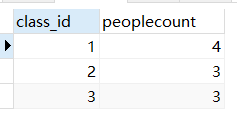
>
> 执行这个查询，`COUNT()`的结果不再是一个，而是3个，这是因为，**<span style="color:blue">`GROUP BY`子句指定了按`class_id`分组</span>**，因此，执行该`SELECT`语句时，会把`class_id`相同的列先分组，再分别计算，因此，得到了3行结果。

> - `SELECT name, class_id, COUNT(*) num FROM students GROUP BY class_id;`不出意外，执行这条查询我们会得到一个语法错误，因为在任意一个分组中，只有`class_id`都相同，`name`是不同的，SQL引擎不能把多个`name`的值放入一行记录中。因此，聚合查询的列中，只能放入分组的列。
> - `SELECT class_id, gender, COUNT(*) num FROM students GROUP BY class_id, gender;`统计各班的男生和女生人数

#### 注意事项

> - **执行顺序：where > 聚合函数 > having**
> - 分组之后，查询的字段一般为聚合函数和分组字段，查询其他字段无任何意义

#### where和having的区别

> - 执行时机不同：where是分组之前进行过滤，不满足where条件不参与分组；having是分组后对结果进行过滤。
> - 判断条件不同：<span style="color:orange">**where不能对聚合函数进行判断，而having可以。**</span>

> mysql中出现 `Unknown column ‘xxx‘ in ‘having clause‘`
>
> 这是因为在使用group by分组时，后面如果需要再加一个having进行判断，则所判断的字段需要在select后面出现
>
>
> 例如：`select s.stock_name,s.operation from Stocks s group by s.stock_name HAVING s.operation ="Buy"`

### DQL执行顺序

> <span style="color:purple">**from  > join > on > where > <span style="color:red">select</span> > group by > having > <span style="color:red">select</span> > distinct > order by > limit**</span>

在**MySQL、Postgres** 和 **Hive**里是允许把别名放在GROUP BY之后的，运行顺序被优化成：

1. FROM clause
2. WHERE clause
3. **SELECT clause**
4. GROUP BY clause
5. HAVING clause
6. **SELECT clause**
7. ORDER BY clause

**不论是不是窗口函数，所有代码实际上都被select了两次。**


**官方的原文是：**

In MySQL, you **can** use the column alias in the **`ORDER BY`, `GROUP BY` and `HAVING` clauses** to refer to the column.

Notice that you **cannot** use a column alias in the **`WHERE` clause**. The reason is that when MySQL evaluates the `WHERE` clause, the values of columns specified in the `SELECT` clause are not be evaluated yet.

在MySQL中，你可以在ORDER BY, GROUP BY和HAVING子句中使用列别名来引用该列。

注意，不能在WHERE子句中使用列别名。原因是当MySQL计算WHERE子句时，还没有计算SELECT子句中指定的列的值。

**官方给出的代码是：**

```mysql
SELECT
	orderNumber `Order no.`,
	SUM( priceEach * quantityOrdered ) total 
FROM
	orderDetails 
GROUP BY
	`Order no.` 
HAVING
	total > 60000;
```

## 函数

### 字符串函数

> 注意:MySQL中，字符串的位置是从1开始的。

| 函数                             | 用法                                                         |
| -------------------------------- | ------------------------------------------------------------ |
| ASCIl(S)                         | 返回字符串S中的第一个字符的ASCII码值                         |
| CHAR_LENGTH(s)                   | 返回字符串s的字符数。作用与CHARACTER_LENGTH(s)相同           |
| LENGTH(s)                        | 返回字符串s的字节数，和字符集有关                            |
| CONCAT(s1,s2…n)                  | 连接s1,s2…,sn为一个字符串                                    |
| CONCAT_WS(x,s1,s2,.sn)           | 同CONCAT(s1,s2,…函数，但是每个字符串之间要加上x              |
| INSERT(str, idx, len,replacestr) | 将字符串str从第idx位置开始，len个字符长的子串替换为字符串replacestr |
| REPLACE(str, a, b)               | 用字符串b替换字符串str中所有出现的字符串a                    |
| UPPER(s)或UCASE(s)               | 将字符串s的所有字母转成大写字母                              |
| LOWER(s)或LCASE(s)               | 将字符串s的所有字母转成小写字母                              |
| LEFT(str,n)                      | 返回字符串str最左边的n个字符                                 |
| RIGHT(str,n)                     | 返回字符串str最右边的n个字符                                 |
| LPAD(str, len, pad)              | 用字符串pad对str最左边进行填充，直到str的长度为len个字符     |
| RPAD(str ,len, pad)              | 用字符串pad对str最右边进行填充，直到str的长度为len个字符     |
| LTRIM(s)                         | 去掉字符串s左侧的空格                                        |
| RTRIM(s)                         | 去掉字符串s右侧的空格                                        |
| TRIM(s)                          | 去掉字符串s开始与结尾的空格                                  |
| TRIM(s1 FROM s)                  | 去掉字符串s开始与结尾的s1                                    |
| TRIM(LEADING s1 FROM s)          | 去掉字符串s开始处的s1                                        |
| TRIM(TRAILING s1 FROM s)         | 去掉字符串s结尾处的s1                                        |
| REPEAT(str, n)                   | 返回str重复n次的结果                                         |
| SPACE(n)                         | 返回n个空格                                                  |
| STRCMP(s1,s2)                    | 比较字符串s1,s2的ASClI码值的大小                             |
| SUBSTR(s,index,len)              | 返回从字符串s的index位置其len个字符，作用与SUBSTRING(s,n,len)、MID(s,n,len)相同 |
| LOCATE(substr,str)               | 返回字符串substr在字符串str中首次出现的位置，作用于POSITION(substr IN str)、INSTR(str,substr)相同。未找到返回0 |
| ELT(m,1,s2,…n)                   | 返回指定位置的字符串，如果m=1，则返回s1，如果m=2，则返回s2，如果m=n，则返回sn |
| FIELD(s,s1,s2…n)                 | 返回字符串s在字符串列表中第一次出现的位置                    |
| FIND_IN_SET(s1,s2)               | 返回字符串s1在字符串s2中出现的位置。其中，字符串s2是一个以逗号分隔的字符串 |
| REVERSE(s)                       | 返回s反转后的字符串                                          |
| NULLIF(value1,value2)            | 比较两个字符串，如果value1与value2相等，则返回NULL，否则返回value1 |

```mysql
#3. 字符串函数
#ASCII：求字符串中第一个字符的ASCII码
#CHAR_LENGTH:求字符串长度CHAR_LENGTH
#LENGTH:字符串所占字节数
SELECT ASCII('Abcdfsf'),CHAR_LENGTH('hello'),CHAR_LENGTH('我们'),
LENGTH('hello'),LENGTH('我们')
FROM DUAL;
/*
+------------------+----------------------+-----------------------+-----------------+------------------+
| ASCII('Abcdfsf') | CHAR_LENGTH('hello') | CHAR_LENGTH('我们')   | LENGTH('hello') | LENGTH('我们')   |
+------------------+----------------------+-----------------------+-----------------+------------------+
|               65 |                    5 |                     2 |               5 |                6 |
+------------------+----------------------+-----------------------+-----------------+------------------+
*/

#CONCAT：字符串拼接
# xxx worked for yyy
SELECT CONCAT(emp.last_name,' worked for ',mgr.last_name) "details"
FROM employees emp JOIN employees mgr
WHERE emp.`manager_id` = mgr.employee_id;
/*部分输出
+--------------------------------+
| details                        |
+--------------------------------+
| Kochhar worked for King        |
| De Haan worked for King        |
| Hunold worked for De Haan      |
*/
#CONCAT_WS:用第一个参数分隔连接后面的字符串
SELECT CONCAT_WS('-','hello','world','hello','beijing')
FROM DUAL;
/*
+--------------------------------------------------+
| CONCAT_WS('-','hello','world','hello','beijing') |
+--------------------------------------------------+
| hello-world-hello-beijing                        |
+--------------------------------------------------+
*/
#字符串的索引是从1开始的！(Java从0开始的)
#INSERT(str, idx, len,replacestr)
#将字符串str从第idx位置开始，len个字符长的子串替换为字符串replacestr
SELECT INSERT('helloworld',2,3,'aaaaa'),REPLACE('hello','lol','mmm'),REPLACE('hello','lo','mmm')
FROM DUAL;
/*
+----------------------------------+------------------------------+-----------------------------+
| INSERT('helloworld',2,3,'aaaaa') | REPLACE('hello','lol','mmm') | REPLACE('hello','lo','mmm') |
+----------------------------------+------------------------------+-----------------------------+
| haaaaaoworld                     | hello                        | helmmm                      |
+----------------------------------+------------------------------+-----------------------------+
*/
#大小写转换
SELECT UPPER('HelLo'),LOWER('HelLo')
FROM DUAL;
/*
+----------------+----------------+
| UPPER('HelLo') | LOWER('HelLo') |
+----------------+----------------+
| HELLO          | hello          |
+----------------+----------------+
*/
SELECT last_name,salary
FROM employees
WHERE LOWER(last_name) = 'King';
/*严格说应该查不到-->但是Mysql大小写不严格
+-----------+----------+
| last_name | salary   |
+-----------+----------+
| King      | 24000.00 |
| King      | 10000.00 |
+-----------+----------+
*/
SELECT LEFT('hello',2),RIGHT('hello',3),RIGHT('hello',13)
FROM DUAL;
/*
+-----------------+------------------+-------------------+
| LEFT('hello',2) | RIGHT('hello',3) | RIGHT('hello',13) |
+-----------------+------------------+-------------------+
| he              | llo              | hello             |
+-----------------+------------------+-------------------+
*/
# LPAD:实现右对齐效果
# RPAD:实现左对齐效果
SELECT employee_id,last_name,LPAD(salary,10,'$'),LPAD(salary,10,' ')
FROM employees;
/*
+-------------+-------------+---------------------+---------------------+
| employee_id | last_name   | LPAD(salary,10,'$') | LPAD(salary,10,' ') |
+-------------+-------------+---------------------+---------------------+
|         100 | King        | $$24000.00          |   24000.00          |
|         101 | Kochhar     | $$17000.00          |   17000.00          |
|         102 | De Haan     | $$17000.00          |   17000.00          |
|         103 | Hunold      | $$$9000.00          |    9000.00          |
*/
#TRIM去掉首尾空格
#LTRIM去掉左侧空格
#TRIM('oo' FROM 'ooheolloo')去掉'oo'
SELECT CONCAT('---',LTRIM('    h  el  lo   '),'***'),
TRIM('oo' FROM 'ooheolloo')
FROM DUAL;
/*
+-----------------------------------------------+-----------------------------+
| CONCAT('---',LTRIM('    h  el  lo   '),'***') | TRIM('oo' FROM 'ooheolloo') |
+-----------------------------------------------+-----------------------------+
| ---h  el  lo   ***                            | heoll                       |
+-----------------------------------------------+-----------------------------+
*/
#REPEAT(str,n):重复n次str 
#SPACE(n):提供n个空格
#STRCMP：比较字符串大小
SELECT REPEAT('hello',4),LENGTH(SPACE(5)),STRCMP('abc','abe')
FROM DUAL;
/*
+----------------------+------------------+---------------------+
| REPEAT('hello',4)    | LENGTH(SPACE(5)) | STRCMP('abc','abe') |
+----------------------+------------------+---------------------+
| hellohellohellohello |                5 |                  -1 |
+----------------------+------------------+---------------------+
*/
#SUBSTR(str,i,len):截取str中i处起len个字符
#LOCATE('ll','hello')定位‘ll’首次出现的位置
SELECT SUBSTR('hello',2,2),LOCATE('ll','hello'),LOCATE('lll','hello')
FROM DUAL;
/*
+---------------------+----------------------+-----------------------+
| SUBSTR('hello',2,2) | LOCATE('ll','hello') | LOCATE('lll','hello') |
+---------------------+----------------------+-----------------------+
| el                  |                    3 |                     0 |
+---------------------+----------------------+-----------------------+
*/
#ELT:返回指定位置的字符串
#FIELD(s,s1,...)：返回s在字符列表中首次出现的位置
#FIND_IN_SET(s1,s2):返回s1在s2中首次出现的位置
SELECT ELT(2,'a','b','c','d'),FIELD('mm','gg','jj','mm','dd','mm'),
FIND_IN_SET('mm','gg,mm,jj,dd,mm,gg')
FROM DUAL;
/*
+------------------------+--------------------------------------+---------------------------------------+
| ELT(2,'a','b','c','d') | FIELD('mm','gg','jj','mm','dd','mm') | FIND_IN_SET('mm','gg,mm,jj,dd,mm,gg') |
+------------------------+--------------------------------------+---------------------------------------+
| b                      |                                    3 |                                     2 |
+------------------------+--------------------------------------+---------------------------------------+
*/
#NULLIF(s1,s2):字符串s1和s2相等返回NULL,不相等返回s1
SELECT employee_id,NULLIF(LENGTH(first_name),LENGTH(last_name)) "compare"
FROM employees;
/*姓和名一样长返回NULL
+-------------+---------+
| employee_id | compare |
+-------------+---------+
|         100 |       6 |
|         101 |       5 |
|         102 |       3 |
|         103 |       9 |
|         104 |    NULL |
*/

```

### 数值函数

| 函数                | 用法                                                         |
| ------------------- | ------------------------------------------------------------ |
| ABS(x)              | 返回x的绝对值                                                |
| SIGN(X)             | 返回x的符号。正数返回1，负数返回-1，0返回0                   |
| PI()                | 返回圆周率的值                                               |
| CEIL(x)，CEILING(x) | 返回大于或等于某个值的最小整数                               |
| FLOOR(x)            | 返回小于或等于某个值的最大整数                               |
| LEAST(e1,e2,e3…)    | 返回列表中的最小值                                           |
| GREATEST(e1,e2,e3…) | 返回列表中的最大值                                           |
| MOD(x,y)            | 返回x除以Y后的余数                                           |
| RAND()              | 返回0~1的随机值                                              |
| RAND(x)             | 返回0~1的随机值，其中x的值用作种子值，相同的x值会产生相同的随机数 |
| ROUND(x)            | 返回一个对x的值进行四舍五入后，最接近于x的整数               |
| ROUND(x,y)          | 返回一个对x的值进行四舍五入后最接近x的值，并保留到小数点后面Y位 |
| TRUNCATE(x,y)       | 返回数字x截断为y位小数的结果                                 |
| SQRT(x)             | 返回x的平方根。当x的值为负数时，返回NULL                     |

```mysql
#1.数值函数
#基本的操作
SELECT ABS(-123),ABS(32),SIGN(-23),SIGN(43),PI(),CEIL(32.32),CEILING(-43.23),FLOOR(32.32),
FLOOR(-43.23),MOD(12,5),12 MOD 5,12 % 5
FROM DUAL;
/*
+-----------+---------+-----------+----------+----------+-------------+-----------------+--------------+---------------+-----------+----------+--------+
| ABS(-123) | ABS(32) | SIGN(-23) | SIGN(43) | PI()     | CEIL(32.32) | CEILING(-43.23) | FLOOR(32.32) | FLOOR(-43.23) | MOD(12,5) | 12 MOD 5 | 12 % 5 |
+-----------+---------+-----------+----------+----------+-------------+-----------------+--------------+---------------+-----------+----------+--------+
|       123 |      32 |        -1 |        1 | 3.141593 |          33 |             -43 |           32 |           -44 |         2 |        2 |      2 |
+-----------+---------+-----------+----------+----------+-------------+-----------------+--------------+---------------+-----------+----------+--------+
*/

#取随机数(其中的参数称为种子，种子相同的两个RAND函数每次结果都一样且不变)
SELECT RAND(),RAND(),RAND(10),RAND(10),RAND(-1),RAND(-1)
FROM DUAL;
/*
+---------------------+--------------------+--------------------+--------------------+--------------------+--------------------+
| RAND()              | RAND()             | RAND(10)           | RAND(10)           | RAND(-1)           | RAND(-1)           |
+---------------------+--------------------+--------------------+--------------------+--------------------+--------------------+
| 0.23112941927381736 | 0.8571839666526615 | 0.6570515219653505 | 0.6570515219653505 | 0.9050373219931845 | 0.9050373219931845 |
+---------------------+--------------------+--------------------+--------------------+--------------------+--------------------+
*/

#四舍五入:RAND(操作数，保留小数的位数)
SELECT ROUND(123.556),ROUND(123.456,0),ROUND(123.456,1),ROUND(123.456,2),
ROUND(123.456,-1),ROUND(153.456,-2)
FROM DUAL;
/*
+----------------+------------------+------------------+------------------+-------------------+-------------------+
| ROUND(123.556) | ROUND(123.456,0) | ROUND(123.456,1) | ROUND(123.456,2) | ROUND(123.456,-1) | ROUND(153.456,-2) |
+----------------+------------------+------------------+------------------+-------------------+-------------------+
|            124 |              123 |            123.5 |           123.46 |               120 |               200 |
+----------------+------------------+------------------+------------------+-------------------+-------------------+
*/
#截断操作:TRUNCATE(操作数，保留小数的位数)
SELECT TRUNCATE(123.456,0),TRUNCATE(123.496,1),TRUNCATE(129.45,-1)
FROM DUAL;
/*
+---------------------+---------------------+---------------------+
| TRUNCATE(123.456,0) | TRUNCATE(123.496,1) | TRUNCATE(129.45,-1) |
+---------------------+---------------------+---------------------+
|                 123 |               123.4 |                 120 |
+---------------------+---------------------+---------------------+
*/

#单行函数可以嵌套
SELECT TRUNCATE(ROUND(123.456,2),0)
FROM DUAL;
/*
+------------------------------+
| TRUNCATE(ROUND(123.456,2),0) |
+------------------------------+
|                          123 |
+------------------------------+
*/

```

### 日期时间函数

| 函数                                                         | 功能                                           |
| ------------------------------------------------------------ | ---------------------------------------------- |
| CURDATE() ,CURRENT_DATE()                                    | 返回当前日期，只包含年、月、日                 |
| CURTIME(), CURRENT_TIME()                                    | 返回当前时间，只包含时、分、秒                 |
| NOW() / SYSDATE()/ CURRENT_TIMESTAMP() /LOCALTIME()/LOCALTIMESTAMP() | 返回当前系统日期和时间                         |
| UTC_DATE()                                                   | 返回UTC(世界标准时间)                          |
| UTC_TIME()                                                   | 返回UTC(世界标准时间)时间                      |
| YEAR(date)/MONTH(date) / DAY(date)                           | 返回具体的日期值                               |
| HOUR(time)/ MINUTE(time) /SECOND(time)                       | 返回具体的时间值                               |
| MONTHNAME(date)                                              | 返回月份:January，…                            |
| DAYNAME(date)                                                | 返回星期几: MONDAY，TUESDAY…SUNDAY             |
| WEEKDAY(date)                                                | 返回周几，注意，周1是0，周2是1,。。。周日是6   |
| QUARTER(date)                                                | 返回日期对应的季度，范围为1～4                 |
| WEEK(date),WEEKOFYEAR(date)                                  | 返回一年中的第几周                             |
| DAYOFYEAR(date)                                              | 返回日期是一年中的第几天                       |
| DAYOFMONTH(date)                                             | 返回日期位于所在月份的第几天                   |
| DAYOFWEEK(date)                                              | 返回周几，注意:周日是1，周一是2，。。。周六是7 |

```mysql
#获取当前日期、时间
SELECT CURDATE(),CURRENT_DATE(),CURTIME(),NOW(),SYSDATE(),
UTC_DATE(),UTC_TIME()
FROM DUAL;
/*
+------------+----------------+-----------+---------------------+---------------------+------------+------------+
| CURDATE()  | CURRENT_DATE() | CURTIME() | NOW()               | SYSDATE()           | UTC_DATE() | UTC_TIME() |
+------------+----------------+-----------+---------------------+---------------------+------------+------------+
| 2022-02-12 | 2022-02-12     | 18:59:18  | 2022-02-12 18:59:18 | 2022-02-12 18:59:18 | 2022-02-12 | 10:59:18   |
+------------+----------------+-----------+---------------------+---------------------+------------+------------+
*/
SELECT CURDATE(),CURDATE() + 0,CURTIME() + 0,NOW() + 0
FROM DUAL;
/*
+------------+---------------+---------------+----------------+
| CURDATE()  | CURDATE() + 0 | CURTIME() + 0 | NOW() + 0      |
+------------+---------------+---------------+----------------+
| 2022-02-12 |      20220212 |        190103 | 20220212190103 |
+------------+---------------+---------------+----------------+
*/


#获取月份、星期、星期数、天数等函数
SELECT YEAR(CURDATE()),MONTH(CURDATE()),DAY(CURDATE()),
HOUR(CURTIME()),MINUTE(NOW()),SECOND(SYSDATE())
FROM DUAL;
/*输出
+-----------------+------------------+----------------+-----------------+---------------+-------------------+
| YEAR(CURDATE()) | MONTH(CURDATE()) | DAY(CURDATE()) | HOUR(CURTIME()) | MINUTE(NOW()) | SECOND(SYSDATE()) |
+-----------------+------------------+----------------+-----------------+---------------+-------------------+
|            2022 |                2 |             13 |               2 |            50 |                55 |
+-----------------+------------------+----------------+-----------------+---------------+-------------------+
*/
#MONTHNAME(date) 返回月份：January，..
#DAYNAME(date) 返回星期几：MONDAY，TUESDAY.....SUNDAY
SELECT MONTHNAME('2021-10-26'),DAYNAME('2021-10-26'),WEEKDAY('2021-10-26'),
QUARTER(CURDATE()),WEEK(CURDATE()),DAYOFYEAR(NOW()),
DAYOFMONTH(NOW()),DAYOFWEEK(NOW())
FROM DUAL;
/*
+-------------------------+-----------------------+-----------------------+--------------------+-----------------+------------------+-------------------+------------------+
| MONTHNAME('2021-10-26') | DAYNAME('2021-10-26') | WEEKDAY('2021-10-26') | QUARTER(CURDATE()) | WEEK(CURDATE()) | DAYOFYEAR(NOW()) | DAYOFMONTH(NOW()) | DAYOFWEEK(NOW()) |
+-------------------------+-----------------------+-----------------------+--------------------+-----------------+------------------+-------------------+------------------+
| October                 | Tuesday               |                     1 |                  1 |               7 |               44 |                13 |                1 |
+-------------------------+-----------------------+-----------------------+--------------------+-----------------+------------------+-------------------+------------------+
*/

```

### 流程函数

| 函数                                                         | 功能                                                      |
| ------------------------------------------------------------ | --------------------------------------------------------- |
| IF(value, t, f)                                              | 如果value为true，则返回t，否则返回f                       |
| IFNULL(value1, value2)                                       | 如果value1不为空，返回value1，否则返回value2              |
| CASE WHEN [ val1 ] THEN [ res1 ] ... ELSE [ default ] END    | 如果val1为true，返回res1，... 否则返回default默认值       |
| CASE [ expr ] WHEN [ val1 ] THEN [ res1 ] ... ELSE [ default ] END | 如果expr的值等于val1，返回res1，... 否则返回default默认值 |

```mysql
select
	name,
	(case when age > 30 then '中年' else '青年' end)
from employee;

select
	name,
	(case workaddress when '北京市' then '一线城市' when '上海市' then '一线城市' else '二线城市' end) as '工作地址'
from employee;
```

## 窗口函数mysql8.0

> `窗口函数`：在满足某些条件的记录集合上执行的特殊函数，对于每条记录都要在此窗口内执行函数。有的函数随着记录的不同，窗口大小都是固定的，称为`静态窗口`；有的函数则相反，不同的记录对应着不同的窗口，称为`滑动窗口`。


### 窗口函数和普通聚合函数的区别

> 聚合函数是将多条记录聚合为一条；窗口函数是每条记录都会执行，有几条记录执行完还是几条。
> 聚合函数也可以用于窗口函数。

### 窗口函数的基本用法

> ```
> 函数名 OVER 子句
> ```
>
> over关键字用来指定函数执行的窗口范围，若后面括号中什么都不写，则意味着窗口包含满足WHERE条件的所有行，窗口函数基于所有行进行计算；如果不为空，则支持以下4中语法来设置窗口。
> ①`window_name`：给窗口指定一个别名。如果SQL中涉及的窗口较多，采用别名可以看起来更清晰易读；
>
> ```mysql
> select s.score,dense_rank() over (order by score desc) as 'rank' from Scores s
> 
> ===>select s.score,dense_rank() over w as 'rank' from Scores s Window w as (order by score desc)
> ```
>
> ②`PARTITION BY 子句`：窗口按照哪些字段进行分组，窗口函数在不同的分组上分别执行；
> ③`ORDER BY 子句`：按照哪些字段进行排序，窗口函数将按照排序后的记录顺序进行编号；
> ④`FRAME 子句`：`FRAME`是当前分区的一个子集，子句用来定义子集的规则，通常用来作为滑动窗口使用。

### 按功能划分可将MySQL支持的窗口函数分为如下几类

#### 序号函数

> ROW_NUMBER()：顺序排序——1、2、3
> RANK()：并列排序，跳过重复序号——1、1、3
> DENSE_RANK()：并列排序，不跳过重复序号——1、1、2
>
> 用途：显示分区中的当前行号
> 应用场景：查询每个学生的分数最高的前3门课程

```mysql
mysql> SELECT *
    -> FROM(
    ->     SELECT stu_id,
    ->     ROW_NUMBER() OVER (PARTITION BY stu_id ORDER BY score DESC) AS score_
order,
    ->     lesson_id, score
    ->     FROM t_score) t
    -> WHERE score_order <= 3
    -> ;
+--------+-------------+-----------+-------+
| stu_id | score_order | lesson_id | score |
+--------+-------------+-----------+-------+
|      1 |           1 | L005      |    98 |
|      1 |           2 | L001      |    98 |
|      1 |           3 | L004      |    88 |
|      2 |           1 | L002      |    90 |
|      2 |           2 | L003      |    86 |
|      2 |           3 | L001      |    84 |
|      3 |           1 | L001      |   100 |
|      3 |           2 | L002      |    91 |
|      3 |           3 | L003      |    85 |
|      4 |           1 | L001      |    99 |
|      4 |           2 | L005      |    98 |
|      4 |           3 | L002      |    88 |
+--------+-------------+-----------+-------+
```

> 对于stu_id=1的同学，有两门课程的成绩均为98，序号随机排了1和2。但很多情况下二者应该是并列第一，则他的成绩为88的这门课的序号可能是第2名，也可能为第3名。
> 这时候，ROW_NUMBER()就不能满足需求，需要RANK()和DENSE_RANK()出场，它们和ROW_NUMBER()非常类似，只是在出现重复值时处理逻辑有所不

```mysql
mysql> SELECT *
    -> FROM(
    ->     SELECT
    ->     ROW_NUMBER() OVER (PARTITION BY stu_id ORDER BY score DESC) AS score_order1,
    ->     RANK() OVER (PARTITION BY stu_id ORDER BY score DESC) AS score_order2,
    ->     DENSE_RANK() OVER (PARTITION BY stu_id ORDER BY score DESC) AS score_order3,
    ->     stu_id, lesson_id, score
    ->     FROM t_score) t
    -> WHERE stu_id = 1 AND score_order1 <= 3 AND score_order2 <= 3 AND score_order3 <= 3
    -> ;
+--------------+--------------+--------------+--------+-----------+-------+
| score_order1 | score_order2 | score_order3 | stu_id | lesson_id | score |
+--------------+--------------+--------------+--------+-----------+-------+
|            1 |            1 |            1 |      1 | L005      |    98 |
|            2 |            1 |            1 |      1 | L001      |    98 |
|            3 |            3 |            2 |      1 | L004      |    88 |
+--------------+--------------+--------------+--------+-----------+-------+
```

#### 分布函数

##### PERCENT_RANK()

> 用途：每行按照公式(rank-1) / (rows-1)进行计算。其中，rank为RANK()函数产生的序号，rows为当前窗口的记录总行数
> 应用场景：不常用

```mysql
mysql> SELECT
    -> RANK() OVER w AS rk,
    -> PERCENT_RANK() OVER w AS prk,
    -> stu_id, lesson_id, score
    -> FROM t_score
    -> WHERE stu_id = 1
    -> WINDOW w AS (PARTITION BY stu_id ORDER BY score)
    -> ;
+----+------+--------+-----------+-------+
| rk | prk  | stu_id | lesson_id | score |
+----+------+--------+-----------+-------+
|  1 |    0 |      1 | L003      |    79 |
|  2 | 0.25 |      1 | L002      |    86 |
|  3 |  0.5 |      1 | L004      |    88 |
|  4 | 0.75 |      1 | L005      |    98 |
|  4 | 0.75 |      1 | L001      |    98 |
+----+------+--------+-----------+-------+
```

##### CUME_DIST()

> 用途：分组内小于、等于当前rank值的行数 / 分组内总行数
> 应用场景：查询小于等于当前成绩（score）的比例

```mysql
# cd1：没有分区，则所有数据均为一组，总行数为8
# cd2：按照lesson_id分成了两组，行数各为4

mysql> SELECT stu_id, lesson_id, score,
    -> CUME_DIST() OVER (ORDER BY score) AS cd1,
    -> CUME_DIST() OVER (PARTITION BY lesson_id ORDER BY score) AS cd2
    -> FROM t_score
    -> WHERE lesson_id IN ('L001','L002')
    -> ;
+--------+-----------+-------+-------+------+
| stu_id | lesson_id | score | cd1   | cd2  |
+--------+-----------+-------+-------+------+
|      2 | L001      |    84 | 0.125 | 0.25 |
|      1 | L001      |    98 |  0.75 |  0.5 |
|      4 | L001      |    99 | 0.875 | 0.75 |
|      3 | L001      |   100 |     1 |    1 |
|      1 | L002      |    86 |  0.25 | 0.25 |
|      4 | L002      |    88 | 0.375 |  0.5 |
|      2 | L002      |    90 |   0.5 | 0.75 |
|      3 | L002      |    91 | 0.625 |    1 |
+--------+-----------+-------+-------+------+
```

#### 前后函数

> 用途：返回位于当前行的前n行（LAG(expr,n)）或后n行（LEAD(expr,n)）的expr的值
> 应用场景：查询前1名同学的成绩和当前同学成绩的差值

```mysql
# 内层SQL先通过LAG()函数得到前1名同学的成绩，外层SQL再将当前同学和前1名同学的成绩做差得到成绩差值diff。

mysql> SELECT stu_id, lesson_id, score, pre_score,
    -> score-pre_score AS diff
    -> FROM(
    ->     SELECT stu_id, lesson_id, score,
    ->     LAG(score,1) OVER w AS pre_score
    ->     FROM t_score
    ->     WHERE lesson_id IN ('L001','L002')
    ->     WINDOW w AS (PARTITION BY lesson_id ORDER BY score)) t
    -> ;
+--------+-----------+-------+-----------+------+
| stu_id | lesson_id | score | pre_score | diff |
+--------+-----------+-------+-----------+------+
|      2 | L001      |    84 |      NULL | NULL |
|      1 | L001      |    98 |        84 |   14 |
|      4 | L001      |    99 |        98 |    1 |
|      3 | L001      |   100 |        99 |    1 |
|      1 | L002      |    86 |      NULL | NULL |
|      4 | L002      |    88 |        86 |    2 |
|      2 | L002      |    90 |        88 |    2 |
|      3 | L002      |    91 |        90 |    1 |
+--------+-----------+-------+-----------+------+
```

#### 头尾函数

> 用途：返回第一个（FIRST_VALUE(expr)）或最后一个（LAST_VALUE(expr)）expr的值
> 应用场景：截止到当前成绩，按照日期排序查询第1个和最后1个同学的分数

```mysql
mysql> SELECT stu_id, lesson_id, score, create_time,
    -> FIRST_VALUE(score) OVER w AS first_score,
    -> LAST_VALUE(score) OVER w AS last_score
    -> FROM t_score
    -> WHERE lesson_id IN ('L001','L002')
    -> WINDOW w AS (PARTITION BY lesson_id ORDER BY create_time)
    -> ;
+--------+-----------+-------+-------------+-------------+------------+
| stu_id | lesson_id | score | create_time | first_score | last_score |
+--------+-----------+-------+-------------+-------------+------------+
|      3 | L001      |   100 | 2018-08-07  |         100 |        100 |
|      1 | L001      |    98 | 2018-08-08  |         100 |         98 |
|      2 | L001      |    84 | 2018-08-09  |         100 |         99 |
|      4 | L001      |    99 | 2018-08-09  |         100 |         99 |
|      3 | L002      |    91 | 2018-08-07  |          91 |         91 |
|      1 | L002      |    86 | 2018-08-08  |          91 |         86 |
|      2 | L002      |    90 | 2018-08-09  |          91 |         90 |
|      4 | L002      |    88 | 2018-08-10  |          91 |         88 |
+--------+-----------+-------+-------------+-------------+------------+

```

#### 其它函数

##### NTH_VALUE(expr,n)

> 用途：返回窗口中第n个expr的值。expr可以是表达式，也可以是列名
> 应用场景：截止到当前成绩，显示每个同学的成绩中排名第2和第3的成绩的分数

```mysql
mysql> SELECT stu_id, lesson_id, score,
    -> NTH_VALUE(score,2) OVER w AS second_score,
    -> NTH_VALUE(score,3) OVER w AS third_score
    -> FROM t_score
    -> WHERE stu_id IN (1,2)
    -> WINDOW w AS (PARTITION BY stu_id ORDER BY score)
    -> ;
+--------+-----------+-------+--------------+-------------+
| stu_id | lesson_id | score | second_score | third_score |
+--------+-----------+-------+--------------+-------------+
|      1 | L003      |    79 |         NULL |        NULL |
|      1 | L002      |    86 |           86 |        NULL |
|      1 | L004      |    88 |           86 |          88 |
|      1 | L001      |    98 |           86 |          88 |
|      1 | L005      |    98 |           86 |          88 |
|      2 | L004      |    75 |         NULL |        NULL |
|      2 | L005      |    77 |           77 |        NULL |
|      2 | L001      |    84 |           77 |          84 |
|      2 | L003      |    86 |           77 |          84 |
|      2 | L002      |    90 |           77 |          84 |
+--------+-----------+-------+--------------+-------------+

```

##### NTILE(n)

> 用途：将分区中的有序数据分为n个等级，记录等级数
> 应用场景：将每门课程按照成绩分成3组

```mysql
mysql> SELECT
    -> NTILE(3) OVER w AS nf,
    -> stu_id, lesson_id, score
    -> FROM t_score
    -> WHERE lesson_id IN ('L001','L002')
    -> WINDOW w AS (PARTITION BY lesson_id ORDER BY score)
    -> ;
+------+--------+-----------+-------+
| nf   | stu_id | lesson_id | score |
+------+--------+-----------+-------+
|    1 |      2 | L001      |    84 |
|    1 |      1 | L001      |    98 |
|    2 |      4 | L001      |    99 |
|    3 |      3 | L001      |   100 |
|    1 |      1 | L002      |    86 |
|    1 |      4 | L002      |    88 |
|    2 |      2 | L002      |    90 |
|    3 |      3 | L002      |    91 |
+------+--------+-----------+-------+

```

> NTILE(n)函数在数据分析中应用较多，比如由于数据量大，需要将数据平均分配到n个并行的进程分别计算，此时就可以用NTILE(n)对数据进行分组（由于记录数不一定被n整除，所以数据不一定完全平均），然后将不同桶号的数据再分配。

### 聚合函数作为窗口函数

> 用途：在窗口中每条记录动态地应用聚合函数（SUM()、AVG()、MAX()、MIN()、COUNT()），可以动态计算在指定的窗口内的各种聚合函数值
> 应用场景：截止到当前时间，查询stu_id=1的学生的累计分数、分数最高的科目、分数最低的科目

```mysql
mysql> SELECT stu_id, lesson_id, score, create_time,
    -> SUM(score) OVER w AS score_sum,
    -> MAX(score) OVER w AS score_max,
    -> MIN(score) OVER w AS score_min
    -> FROM t_score
    -> WHERE stu_id = 1
    -> WINDOW w AS (PARTITION BY stu_id ORDER BY create_time)
    -> ;
+--------+-----------+-------+-------------+-----------+-----------+-----------+

| stu_id | lesson_id | score | create_time | score_sum | score_max | score_min |

+--------+-----------+-------+-------------+-----------+-----------+-----------+

|      1 | L001      |    98 | 2018-08-08  |       184 |        98 |        86 |

|      1 | L002      |    86 | 2018-08-08  |       184 |        98 |        86 |

|      1 | L003      |    79 | 2018-08-09  |       263 |        98 |        79 |

|      1 | L004      |    88 | 2018-08-10  |       449 |        98 |        79 |

|      1 | L005      |    98 | 2018-08-10  |       449 |        98 |        79 |

+--------+-----------+-------+-------------+-----------+-----------+-----------+

```

## 约束constraint

> 约束是作用于表中字段上的，可以再创建表/修改表的时候添加约束。

### 约束类型

| 约束                    | 描述                                                     | 关键字      |
| ----------------------- | -------------------------------------------------------- | ----------- |
| 主键约束                | 主键是一行数据的唯一标识，要求非空且唯一                 | PRIMARY KEY |
| 外键约束                | 用来让两张图的数据之间建立连接，保证数据的一致性和完整性 | FOREIGN KEY |
| 唯一约束                | 保证该字段的所有数据都是唯一、不重复的                   | UNIQUE      |
| 非空约束                | 限制该字段的数据不能为null                               | NOT NULL    |
| 默认约束                | 保存数据时，如果未指定该字段的值，则采用默认值           | DEFAULT     |
| 检查约束（8.0.1版本后） | 保证字段值满足某一个条件                                 | CHECK       |

```sql
create table user(
	id int primary key auto_increment,
	name varchar(10) not null unique,
	age int check(age > 0 and age < 120),
	status char(1) default '1',
	gender char(1)
);
```

### 主键约束

> - 对于关系表，有个很重要的约束，就是任意两条记录不能重复。<span style="color:orange">不能重复不是指两条记录不完全相同，而是指能够通过某个字段唯一区分出不同的记录，这个字段被称为**主键**。</span>
> - 对主键的要求，最关键的一点是：**记录一旦插入到表中，主键最好不要再修改，**因为主键是用来唯一定位记录的，修改了主键，会造成一系列的影响。
> - 选取主键的一个基本原则是：<span style="color:orange">**不使用任何业务相关的字段作为主键。**</span>而应该使用BIGINT自增或者GUID类型。<span style="color:orange">**主键也不应该允许`NULL`。**</span>

#### 联合主键

> 关系数据库实际上还允许通过多个字段唯一标识记录，即两个或更多的字段都设置为主键，这种主键被称为联合主键。
>
> <span style="color:green">**对于联合主键，允许一列有重复，只要不是所有主键列都重复即可**</span>
>
> 
>
> 如果我们把上述表的`id_num`和`id_type`这两列作为联合主键，那么上面的3条记录都是允许的，因为没有两列主键组合起来是相同的。
>
> 没有必要的情况下，我们尽量不使用联合主键，因为它给关系表带来了复杂度的上升。

### 外键约束

> students表

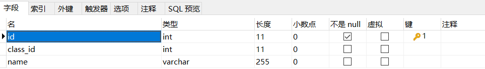

> class表

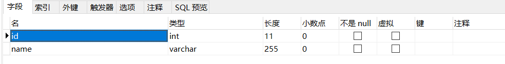

> 设置外键（使用图形化工具），在需要设置外键的表右键选设计表


> 设置外键（设置sql语句）
>
> ```mysql
> ALTER TABLE school
> ADD CONSTRAINT fk_class_id
> FOREIGN KEY (class_id)
> REFERENCES class (id);
> ```
>
> 外键约束的名称`fk_class_id`可以任意，`FOREIGN KEY (class_id)`指定了`class_id`作为外键，`REFERENCES class (id)`指定了这个外键将关联到`class`表的`id`列（即`class`表的主键）。
>
> 通过定义外键约束，关系数据库可以保证无法插入无效的数据。即如果`class`表不存在`id=99`的记录，`students`表就无法插入`class_id=99`的记录。
>
> 要删除一个外键约束，也是通过`ALTER TABLE`实现的：
>
> ```sql
> ALTER TABLE students
> DROP FOREIGN KEY fk_class_id;
> ```

#### 删除/更新行为

| 行为        | 说明                                                         |
| ----------- | ------------------------------------------------------------ |
| NO ACTION   | 当在父表中删除/更新对应记录时，首先检查该记录是否有对应外键，如果有则不允许删除/更新（与RESTRICT一致） |
| RESTRICT    | 当在父表中删除/更新对应记录时，首先检查该记录是否有对应外键，如果有则不允许删除/更新（与NO ACTION一致） |
| CASCADE     | 当在父表中删除/更新对应记录时，首先检查该记录是否有对应外键，如果有则也删除/更新外键在子表中的记录 |
| SET NULL    | 当在父表中删除/更新对应记录时，首先检查该记录是否有对应外键，如果有则设置子表中该外键值为null（要求该外键允许为null） |
| SET DEFAULT | 父表有变更时，子表将外键设为一个默认值（Innodb不支持）       |

> 命令

```sql
ALTER TABLE 表名 ADD CONSTRAINT 外键名称 FOREIGN KEY (外键字段) REFERENCES 主表名(主表字段名) ON UPDATE 行为 ON DELETE 行为;
```

> 图形化界面


## 多表查询

### 关系模型

#### 一对多

> 实现：<span style="color:orange">**在多的一方建立外键，指向一的一方的主键**</span>

#### 多对多

> 通过一个表的外键关联到另一个表，我们可以定义出一对多关系。有些时候，还需要定义“多对多”关系。例如，一个老师可以对应多个班级，一个班级也可以对应多个老师，因此，班级表和老师表存在多对多关系。
>
> <span style="color:orange">**多对多关系实际上是通过两个一对多关系实现的，即通过一个中间表，**</span>关联两个一对多关系，就形成了多对多关系
>
> 实现：**<span style="color:orange">建立第三张中间表，中间表至少包含两个外键，分别关联两方主键</span>**
>
> 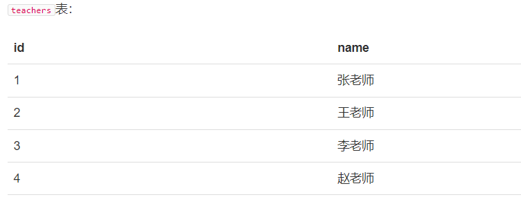
>
> 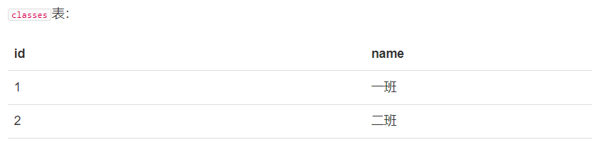
>
> 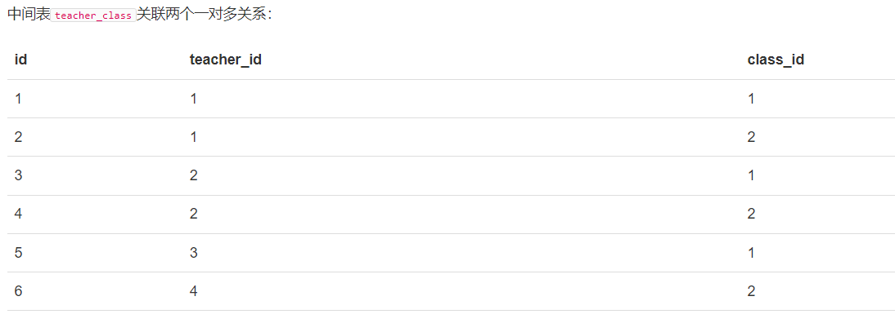
>
> 通过中间表`teacher_class`可知`teachers`到`classes`的关系：
>
> - `id=1`的张老师对应`id=1,2`的一班和二班；
> - `id=2`的王老师对应`id=1,2`的一班和二班；
> - `id=3`的李老师对应`id=1`的一班；
> - `id=4`的赵老师对应`id=2`的二班。
>
> 同理可知`classes`到`teachers`的关系：
>
> - `id=1`的一班对应`id=1,2,3`的张老师、王老师和李老师；
> - `id=2`的二班对应`id=1,2,4`的张老师、王老师和赵老师；
>
> 因此，通过中间表，我们就定义了一个“多对多”关系。

#### 一对一

> **一对一关系是指，一个表的记录对应到另一个表的唯一一个记录。**
>
> 例如，`students`表的每个学生可以有自己的联系方式，如果把联系方式存入另一个表`contacts`，我们就可以得到一个“一对一”关系：
>
> 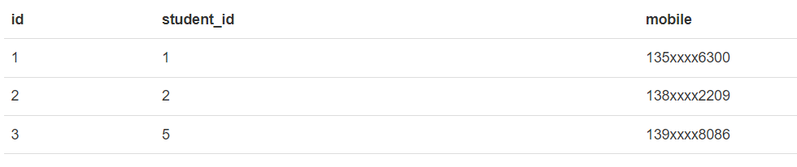
>
> 有细心的童鞋会问，既然是一对一关系，那为啥不给`students`表增加一个`mobile`列，这样就能合二为一了？
>
> 如果业务允许，完全可以把两个表合为一个表。但是，有些时候，如果某个学生没有手机号，那么，`contacts`表就不存在对应的记录。实际上，一对一关系准确地说，是`contacts`表一对一对应`students`表。
>
> 还有一些应用会把一个大表拆成两个一对一的表，目的是把经常读取和不经常读取的字段分开，以获得更高的性能。例如，把一个大的用户表分拆为用户基本信息表`user_info`和用户详细信息表`user_profiles`，大部分时候，只需要查询`user_info`表，并不需要查询`user_profiles`表，这样就提高了查询速度。

#### 小结

> **关系数据库通过外键可以实现一对多、多对多和一对一的关系。**外键既可以通过数据库来约束，**也可以不设置约束，仅依靠应用程序的逻辑来保证。**

### 连接查询

> 连接查询是另一种类型的多表查询。连接查询对多个表进行JOIN运算，简单地说，就是先确定一个主表作为结果集，然后，把其他表的行有选择性地“连接”在主表结果集上。

#### 内连接——INNER JOIN

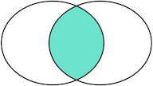

> INNER JOIN查询的写法是：
>
> 1. 先确定主表，仍然使用`FROM <表1>`的语法；
>
> 2. 再确定需要连接的表，使用`INNER JOIN <表2>`的语法；
>
> 3. 然后<span style="color:orange">**确定连接条件，使用`ON <条件...>`，**</span>这里的条件是`s.class_id = c.id`，表示`students`表的`class_id`列与`classes`表的`id`列相同的行需要连接；
>
> 4. 可选：加上`WHERE`子句、`ORDER BY`等子句。
>
> 5. <span style="color:orange">**语法：`SELECT 字段列表 FROM 表1 [ INNER ] JOIN 表2 ON 连接条件 ...;`**</span>

```mysql
select s.name,s.gender,c.name class_name from students s INNER JOIN classes c on s.class_id = c.id
```

#### 外连接——OUTER JOIN

> 外连接分为三种：
>
> 1. RIGHT OUTER JOIN——右外连接
> 2. LEFT OUTER JOIN——左外连接
> 3. FULL OUTER JOIN——全外连接

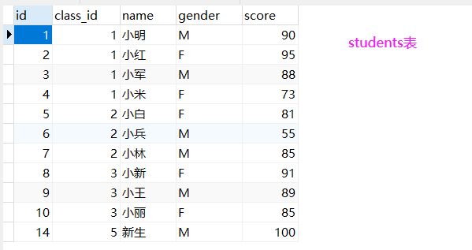

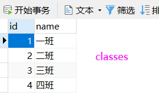

##### RIGHT OUTER JOIN——右外连接

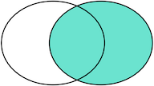

> - 依赖副表
>
> - RIGHT OUTER JOIN返回右表都存在的行。**如果某一行仅在右表存在，那么结果集就会以`NULL`填充剩下的字段。**
> - **<span style="color:orange">语法：`SELECT 字段列表 FROM A表 RIGHT [OUTER] JOIN B表 ON 关联条件 WHERE 等其他子句;`</span>**

```mysql
select s.id,s.name,s.score,c.name class_name from students s RIGHT OUTER JOIN classes c on s.class_id = c.id
```

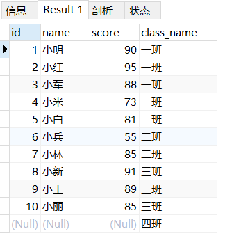

##### LEFT OUTER JOIN——左外连接

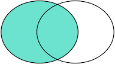

> - 依赖主表。
>
> - LEFT OUTER JOIN返回左表都存在的行。**如果某一行仅在左表存在，那么结果集就会以`NULL`填充剩下的字段。**
> - **<span style="color:orange">语法：`SELECT 字段列表 FROM A表 LEFT [OUTER] JOIN B表 ON 关联条件 WHERE 等其他子句;`</span>**

```mysql
select s.id,s.name,s.score,c.name class_name from students s LEFT OUTER JOIN classes c on s.class_id = c.id
```

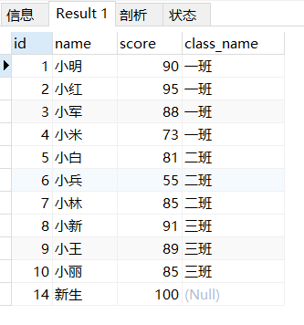

##### FULL OUTER JOIN——全外连接

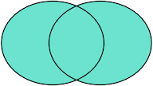

> 把两张表的所有记录全部选择出来，并且，自动把对方不存在的列填充为NULL
>
> 满外连接的结果 = 左右表匹配的数据 + 左表没有匹配到的数据 + 右表没有匹配到的数据。
>
> <span style="color:orange">**MySQL 不支持全连接，但可以通过左外连接 + UNION + 右外连接实现**</span>
>
> ```mysql
> SELECT s.id, s.name, s.class_id, c.name class_name, s.gender, s.score
> FROM students s
> RIGHT JOIN classes c ON class_id = c.id
> UNION
> SELECT s.id, s.name, s.class_id, c.name class_name, s.gender, s.score
> FROM classes c
> LEFT JOIN students s ON class_id = c.id;
> ```


### 联合查询 union, union all

> - 把多次查询的结果合并，形成一个新的查询集
>
> - 语法：
>
>   ```mysql
>   SELECT 字段列表 FROM 表A ...
>   UNION [ALL]
>   SELECT 字段列表 FROM 表B ...
>   ```
>
> - **UNION ALL 会有重复结果，UNION 不会**
> - <span style="color:blue">**联合查询比使用or效率高，不会使索引失效**</span>

### 交叉连接

> - 查询多张表的语法是：
>
>   ```mysql
>   SELECT <字段名> FROM <表1> CROSS JOIN <表2> [WHERE子句]
>   或
>   SELECT <字段名> FROM <表1>,<表2> [WHERE子句] 
>   ```
>
> - 这种多表查询，又称**笛卡尔查询**，使用笛卡尔查询时要非常小心，由于结果集是目标表的行数乘积，对两个各自有100行记录的表进行笛卡尔查询将返回1万条记录，对两个各自有1万行记录的表进行笛卡尔查询将返回1亿条记录。**（<span style="color:purple">在多表查询时，需要消除无效的笛卡尔积</span>）**
>
> - 可以利用投影查询的”设置列的别名“来给两个表各自的`id`和`name`列起别名。<span style="color:purple">**多表查询时，要使用`表名.列名`这样的方式来引用列和设置别名**</span>，这样就避免了结果集的列名重复问题。但是，用`表名.列名`这种方式列举两个表的所有列实在是很麻烦，所以<span style="color:purple">**SQL还允许给表设置一个别名**</span>

```mysql
SELECT s.id s_id,s.name s_name,c.id c_id,c.name c_name FROM students s,classes c where s.class_id = c.id
```

### 自连接查询

> - 当前表与自身的连接查询，自连接必须使用表别名
> - 语法：<span style="color:orange">**`SELECT 字段列表 FROM 表A 别名A JOIN 表A 别名B on 条件 ...;`**</span>
> - **自连接查询，可以是内连接查询，也可以是外连接查询**

```mysql
-- 查询员工及其所属领导的名字
select a.name, b.name from employee a join employee b where a.manager = b.id;
-- 没有领导的也查询出来
select a.name, b.name from employee a left join employee b on a.manager = b.id;
```

```mysql
SELECT a.`o_name`AS '科目' ,b.`o_name`'类别' FROM `obj`AS a join`obj`AS b where a.`o_id` = b.`id`
```

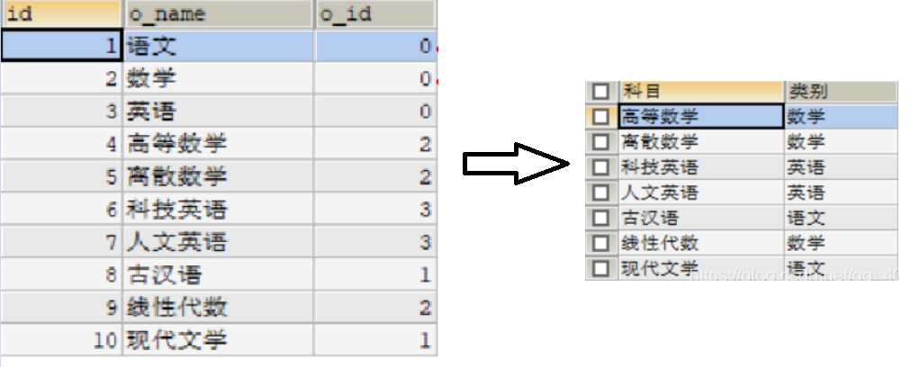

### 子查询

> - SQL语句中嵌套SELECT语句，称谓嵌套查询，又称子查询。
> - 语法：**<span style="color:orange">`SELECT * FROM t1 WHERE column1 = ( SELECT column1 FROM t2);`</span>**
> - **子查询外部的语句可以是 INSERT / UPDATE / DELETE / SELECT 的任何一个**

#### 标量子查询

>- 子查询返回的结果是单个值（数字、字符串、日期等）
>- 常用操作符：- < > > >= < <=

```mysql
-- 查询销售部所有员工
select id from dept where name = '销售部';
-- 根据销售部部门ID，查询员工信息
select * from employee where dept = 4;
-- 合并（子查询）
select * from employee where dept = (select id from dept where name = '销售部');

-- 查询xxx入职之后的员工信息
select * from employee where entrydate > (select entrydate from employee where name = 'xxx');
```

#### 列子查询

> - 返回的结果是一列（可以是多行）
>
> - 常用操作符：
>
>   | 操作符 | 描述                                   |
>   | ------ | -------------------------------------- |
>   | IN     | 在指定的集合范围内，多选一             |
>   | NOT IN | 不在指定的集合范围内                   |
>   | ANY    | 子查询返回列表中，有任意一个满足即可   |
>   | SOME   | 与ANY等同，使用SOME的地方都可以使用ANY |
>   | ALL    | 子查询返回列表的所有值都必须满足       |

```mysql
-- 查询销售部和市场部的所有员工信息
select * from employee where dept in (select id from dept where name = '销售部' or name = '市场部');
-- 查询比财务部所有人工资都高的员工信息
select * from employee where salary > all(select salary from employee where dept = (select id from dept where name = '财务部'));
-- 查询比研发部任意一人工资高的员工信息
select * from employee where salary > any (select salary from employee where dept = (select id from dept where name = '研发部'));
```

#### 行子查询

> - 返回的结果是一行（可以是多列）
> - 常用操作符：=, <, >, IN, NOT IN

```mysql
-- 查询与xxx的薪资及直属领导相同的员工信息
select * from employee where (salary, manager) = (12500, 1);
select * from employee where (salary, manager) = (select salary, manager from employee where name = 'xxx');
```

#### 表子查询

> - 返回的结果是多行多列
> - 常用操作符：IN

```mysql
-- 查询与xxx1，xxx2的职位和薪资相同的员工
select * from employee where (job, salary) in (select job, salary from employee where name = 'xxx1' or name = 'xxx2');
-- 查询入职日期是2006-01-01之后的员工，及其部门信息
select e.*, d.* from (select * from employee where entrydate > '2006-01-01') as e left join dept as d on e.dept = d.id;
```

### [ON 与 WHERE 的区别](https://www.jianshu.com/p/d923cf8ae25f)

> **先执行 `ON`，后执行 `WHERE`；`ON` 是建立关联关系，不符合`ON`条件的为`null`，只能和 JOIN 一起使用，只能写关联条件；`WHERE` 是对关联关系的筛选**。


## 实用sql语句

### 插入或替换

> 如果我们希望插入一条新记录（INSERT），但如果记录已经存在，就先删除原记录，再插入新记录。此时，可以使用`REPLACE`语句，这样就不必先查询，再决定是否先删除再插入：
>
> ```mysql
> REPLACE INTO students (id, class_id, name, gender, score) VALUES (1, 1, '小明', 'F', 99);
> ```
>
> 若`id=1`的记录不存在，`REPLACE`语句将插入新记录，否则，当前`id=1`的记录将被删除，然后再插入新记录。

### 插入或更新

> 如果我们希望插入一条新记录（INSERT），但如果记录已经存在，就更新该记录，此时，可以使用`INSERT INTO ... ON DUPLICATE KEY UPDATE ...`语句：
>
> ```mysql
> INSERT INTO students (id, class_id, name, gender, score) VALUES (1, 1, '小明', 'F', 99) ON DUPLICATE KEY UPDATE name='小明', gender='F', score=99;
> ```
>
> 若`id=1`的记录不存在，`INSERT`语句将插入新记录，否则，当前`id=1`的记录将被更新，更新的字段由`UPDATE`指定。
>
> 
>
> 在 MyBatis 的 XML 文件中编写 SQL 语句，使用 `ON DUPLICATE KEY UPDATE` 实现批量插入或更新。
>
> ```xml
> INSERT INTO students (id, class_id, name, gender, score) VALUES 
> <foreach collection="list" item="item" separator=",">
> 	(#{item.id}, #{item.classId}, #{item.name}, #{item.gender}, #{item.score})
> </foreach>
> ON DUPLICATE KEY UPDATE 
> name=values(name), gender=values(gender), score=values(score);
> ```
>
> `VALUES()` 是 MySQL 中的一个特殊函数，用于在 `ON DUPLICATE KEY UPDATE` 语句中引用 `INSERT` 语句中试图插入的值。
>
> ```mysql
> INSERT INTO user (id, name, age)
> VALUES
>     (1, 'Alice', 25),
>     (2, 'Bob', 30),
>     (3, 'Charlie', 35)
> ON DUPLICATE KEY UPDATE
>     name = VALUES(name),
>     age = VALUES(age);
> ```
>
> - 如果 `id = 1` 的记录已存在，则更新其 `name` 为 `'Alice'`，`age` 为 `25`。
> - 如果 `id = 2` 的记录不存在，则插入新记录 `(2, 'Bob', 30)`。
> - 如果 `id = 3` 的记录已存在，则更新其 `name` 为 `'Charlie'`，`age` 为 `35`。

### 插入或忽略

> 如果我们希望插入一条新记录（INSERT），但如果记录已经存在，就啥事也不干直接忽略，此时，可以使用`INSERT IGNORE INTO ...`语句：
>
> ```mysql
> INSERT IGNORE INTO students (id, class_id, name, gender, score) VALUES (1, 1, '小明', 'F', 99);
> ```
>
> 若`id=1`的记录不存在，`INSERT`语句将插入新记录，否则，不执行任何操作。

### 快照

> 如果想要对一个表进行快照，即复制一份当前表的数据到一个新表，可以结合`CREATE TABLE`和`SELECT`：
>
> ```mysql
> -- 对class_id=1的记录进行快照，并存储为新表students_of_class1:
> CREATE TABLE students_of_class1 SELECT * FROM students WHERE class_id=1;
> ```
>
> 新创建的表结构和`SELECT`使用的表结构完全一致。

### 写入查询结果集

> 如果查询结果集需要写入到表中，可以结合`INSERT`和`SELECT`，将`SELECT`语句的结果集直接插入到指定表中。
>
> 例如，创建一个统计成绩的表`statistics`，记录各班的平均成绩：
>
> ```mysql
> CREATE TABLE statistics (
>     id BIGINT NOT NULL AUTO_INCREMENT,
>     class_id BIGINT NOT NULL,
>     average DOUBLE NOT NULL,
>     PRIMARY KEY (id)
> );
> ```
>
> 然后，我们就可以用一条语句写入各班的平均成绩：
>
> ```mysql
> INSERT INTO statistics (class_id, average) SELECT class_id, AVG(score) FROM students GROUP BY class_id;
> ```
>
> 确保`INSERT`语句的列和`SELECT`语句的列能一一对应，就可以在`statistics`表中直接保存查询的结果：
>
> ```
> > SELECT * FROM statistics;
> +----+----------+--------------+
> | id | class_id | average      |
> +----+----------+--------------+
> |  1 |        1 |         86.5 |
> |  2 |        2 | 73.666666666 |
> |  3 |        3 | 88.333333333 |
> +----+----------+--------------+
> 3 rows in set (0.00 sec)
> ```

### 强制使用指定索引

> 在查询的时候，数据库系统会自动分析查询语句，并选择一个最合适的索引。但是很多时候，数据库系统的查询优化器并不一定总是能使用最优索引。如果我们知道如何选择索引，可以**<span style="color:orange">使用`FORCE INDEX`强制查询使用指定的索引。</span>**例如：
>
> ```mysql
> SELECT * FROM students FORCE INDEX (idx_class_id) WHERE class_id = 1 ORDER BY id DESC;
> ```
>
> **指定索引的前提是索引`idx_class_id`必须存在。**

## 事务

> **数据库系统保证在一个事务中的所有SQL要么全部执行成功，要么全部不执行**
>
> - **begin/start transaction：开启事务**
> - **commit：提交事务**
> - **rollback：回滚事务，整个事务会失败**
>
> 注：在mysql中输入命令时后面要加上**`;`**  

```sql
-- 查看事务提交方式
SELECT @@AUTOCOMMIT;
-- 设置事务提交方式，1为自动提交，0为手动提交，该设置只对当前会话有效
SET @@AUTOCOMMIT = 0;


-- 开启事务，开启事务默认关闭自动提交
begin;

select * from account where name = '张三';
update account set money = money - 1000 where name = '张三';
update account set money = money + 1000 where name = '李四';

-- 提交事务
commit;

-- 回滚事务
rollback;
```

### 四大特性ACID

> - **原子性**(Atomicity)：事务是不可分割的最小操作单元，要么全部成功，要么全部失败
> - **一致性**(Consistency)：事务完成时，必须使所有数据都保持一致状态
> - **隔离性**(Isolation)：数据库系统提供的隔离机制，保证事务在不受外部并发操作影响的独立环境下运行
> - **持久性**(Durability)：事务一旦提交或回滚，它对数据库中的数据的改变就是永久的

### 隔离级别

> 对于两个并发执行的事务，如果涉及到操作同一条记录的时候，可能会发生问题。因为并发操作会带来数据的不一致性，包括**脏读、不可重复读、幻读**等。数据库系统提供了隔离级别来让我们有针对性地选择事务的隔离级别，避免数据不一致的问题。
>
> | 问题       | 描述                                                         |
> | ---------- | ------------------------------------------------------------ |
> | 脏读       | 一个事务读到另一个事务未提交的数据。这些未提交的数据可能会被修改或回滚，从而导致读取的数据不可靠。 |
> | 不可重复读 | 一个事务先后读取同一条记录，但两次读取的数据不同。这通常是由于其他事务再第一个事务读取数据之后修改了这些数据。 |
> | 幻读       | 一个事务读取了某个范围的数据，另一个事务在该范围内插入或删除了记录，从而使得第一个事务再次读取时看到不同的数据。 |
>
> SQL标准定义了**4种隔离级别**，分别对应可能出现的问题：
>
> | Isolation Level                   | 脏读（Dirty Read） | 不可重复读（Non Repeatable Read） | 幻读（Phantom Read） |
> | :-------------------------------- | :----------------- | :-------------------------------- | :------------------- |
> | Read Uncommitte(读未提交)         | Yes                | Yes                               | Yes                  |
> | Read Committed（读已提交）        | -                  | Yes                               | Yes                  |
> | Repeatable Read（可重复读。默认） | -                  | -                                 | Yes                  |
> | Serializable（串行化）            | -                  | -                                 | -                    |
>

> 查看当前隔离级别：
>
> ```sql
> select @@transaction_isolation
> ```
>
> 设置隔离级别
>
> ```sql
> set session transaction isolation level read uncommitted
> ```

#### Read Uncommitted

> **Read Uncommitted是隔离级别最低的一种事务级别**。在这种隔离级别下，一个事务会读到另一个事务更新后但未提交的数据，如果另一个事务回滚，那么当前事务读到的数据就是脏数据，这就是脏读（Dirty Read）。
>
> 我们来看一个例子。
>
> 首先，我们准备好`students`表的数据，该表仅一行记录：
>
> ```mysql
> mysql> select * from students;
> +----+-------+
> | id | name  |
> +----+-------+
> |  1 | Alice |
> +----+-------+
> 1 row in set (0.00 sec)
> ```
>
> 然后，分别开启两个MySQL客户端连接，按顺序依次执行事务A和事务B：
>
> 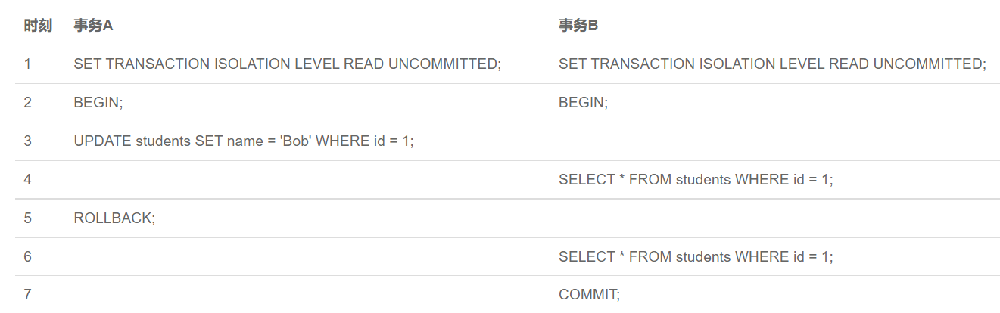
>
> 当事务A执行完第3步时，它更新了`id=1`的记录，但并未提交，而事务B在第4步读取到的数据就是未提交的数据。
>
> 随后，事务A在第5步进行了回滚，事务B再次读取`id=1`的记录，发现和上一次读取到的数据不一致，这就是脏读。
>
> 可见，在Read Uncommitted隔离级别下，一个事务可能读取到另一个事务更新但未提交的数据，这个数据有可能是脏数据。

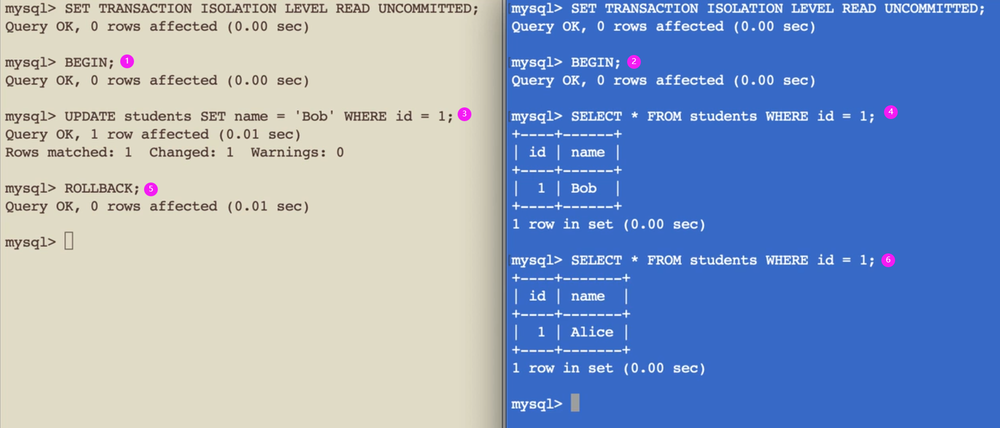	

#### Read Committed

> 在Read Committed隔离级别下，一个事务可能会遇到不可重复读（Non Repeatable Read）的问题。
>
> 不可重复读是指，在一个事务内，多次读同一数据，在这个事务还没有结束时，如果另一个事务恰好修改了这个数据，那么，在第一个事务中，两次读取的数据就可能不一致。
>
> 我们仍然先准备好`students`表的数据：
>
> ```mysql
> mysql> select * from students;
> +----+-------+
> | id | name  |
> +----+-------+
> |  1 | Alice |
> +----+-------+
> 1 row in set (0.00 sec)
> ```
>
> 然后，分别开启两个MySQL客户端连接，按顺序依次执行事务A和事务B：
>
> 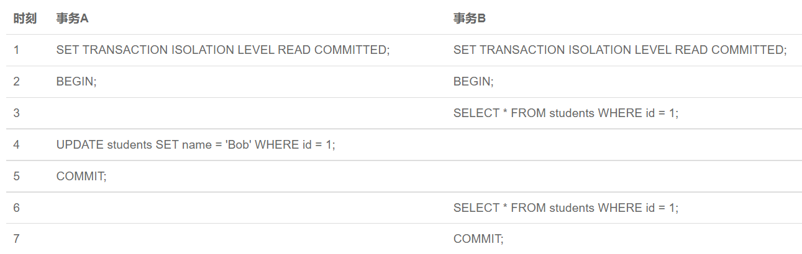
>
> 当事务B第一次执行第3步的查询时，得到的结果是`Alice`，随后，由于事务A在第4步更新了这条记录并提交，所以，事务B在第6步再次执行同样的查询时，得到的结果就变成了`Bob`，因此，在Read Committed隔离级别下，事务不可重复读同一条记录，因为很可能读到的结果不一致。

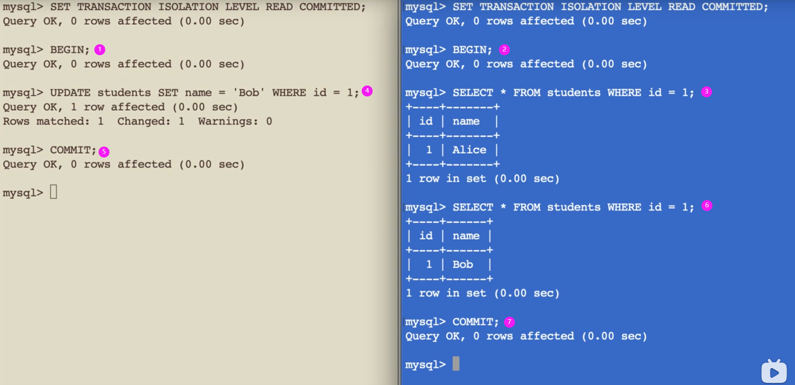

#### Repeatable Read（默认的隔离级别）

> 在Repeatable Read隔离级别下，一个事务可能会遇到幻读（Phantom Read）的问题。
>
> 幻读是指，在一个事务中，第一次查询某条记录，发现没有，但是，当试图更新这条不存在的记录时，竟然能成功，并且，再次读取同一条记录，它就神奇地出现了。
>
> 我们仍然先准备好`students`表的数据：
>
> ```mysql
> mysql> select * from students;
> +----+-------+
> | id | name  |
> +----+-------+
> |  1 | Alice |
> +----+-------+
> 1 row in set (0.00 sec)
> ```
>
> 然后，分别开启两个MySQL客户端连接，按顺序依次执行事务A和事务B：
>
> 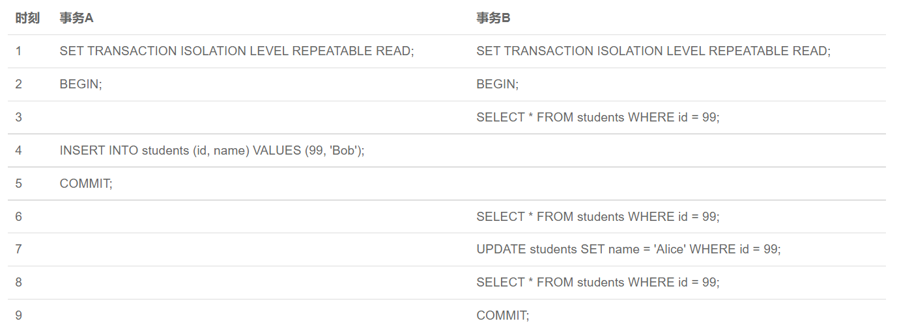

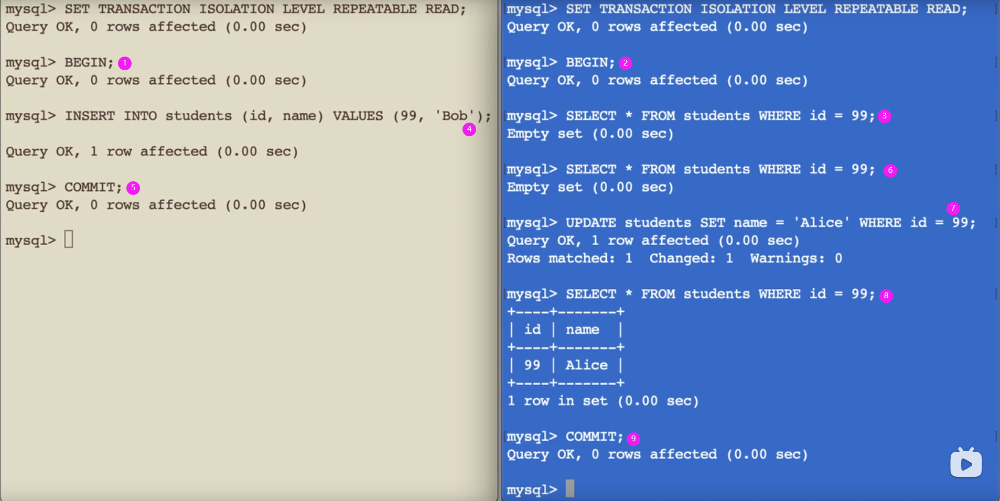

#### Serializable

> **Serializable是最严格的隔离级别**。在Serializable隔离级别下，所有事务按照次序依次执行，因此，脏读、不可重复读、幻读都不会出现。
>
> 虽然Serializable隔离级别下的事务具有最高的安全性，但是，由于事务是串行执行，所以**效率会大大下降**，应用程序的性能会急剧降低。如果没有特别重要的情景，一般都不会使用Serializable隔离级别。
>
> 如果没有指定隔离级别，数据库就会使用默认的隔离级别。在MySQL中，如果使用InnoDB，默认的隔离级别是Repeatable Read。

### 不同隔离级别会导致不同类型的锁定行为

> 1. **读未提交（Read Uncommitted）**
>
> - **锁定行为**：允许事务读取其他事务未提交的数据（脏读），不需要任何锁。
> - **锁类型**：几乎没有锁定，只有 **共享锁（S）** 和 **排他锁（X）**，但实际使用上较少。
>
> 2. **读已提交（Read Committed）**
>
> - **锁定行为**：事务只能读取其他事务已提交的数据，因此避免了脏读，但仍然可能会发生 **不可重复读**（即同一数据在同一事务中读取的两次值不同）。
> - **锁类型**：通常会使用 **共享锁（S）** 读取数据，事务读取数据时会加锁，直到数据被提交。
>
> 3. **可重复读（Repeatable Read）**
>
> - **锁定行为**：事务在开始时会读取数据，并在整个事务期间保持一致，防止不可重复读问题，但依然可能会发生 **幻读**（即查询结果集的行数发生变化）。
> - **锁类型**：使用 **共享锁（S）** 来确保读取的一致性。同时，InnoDB 会使用 **间隙锁（Gap Locks）** 来避免幻读，确保在当前事务期间不允许其他事务插入符合查询条件的行。
>
> 4. **串行化（Serializable）**
>
> - **锁定行为**：最高的隔离级别，所有读取的数据都会加 **排他锁（X）**，这会将读取的数据锁住，其他事务不能修改或读取该数据。
> - **锁类型**：在此级别下，所有的读取都使用 **排他锁（X）**，以确保事务完全隔离，防止脏读、不可重复读、幻读等问题。

# MySQL进阶篇

## 存储引擎

> MySql体系结构


> - 存储引擎就是存储数据、建立索引、更新/查询数据等技术的实现方式。存储引擎是基于表而不是基于库的，所以存储引擎也可以被称为表引擎。
> - MySql默认存储引擎是InnoDB。

```sql
-- 查询建表语句
show create table account;
-- 建表时指定存储引擎
CREATE TABLE 表名(
	...
) ENGINE=INNODB;
-- 查看当前数据库支持的存储引擎
show engines;
```

### InnoDB

> InnoDB 是一种兼顾高可靠性和高性能的通用存储引擎，在 MySQL 5.5 之后，InnoDB 是默认的 MySQL 引擎。
>
> - 特点：
>   - DML 操作遵循 ACID 模型，支持**事务**
>   - **行级锁**，提高并发访问性能
>   - 支持**外键**约束，保证数据的完整性和正确性
>
> - 文件：
>   - xxx.ibd: xxx代表表名，InnoDB 引擎的每张表都会对应这样一个表空间文件，存储该表的表结构（frm、sdi）、数据和索引。
>
> - 参数：innodb_file_per_table，决定多张表共享一个表空间还是每张表对应一个表空间。
> - 查看是多张表对应一个共享空间还是每张表对应一个表空间：
>   `show variables like 'innodb_file_per_table';`。**默认是ON，即每张表对应一个表空间**
>
> - 从idb文件提取表结构数据：
>   （在cmd运行）
>   `ibd2sdi xxx.ibd`

> InnoDB逻辑存储结构


### MyISAM

> MyISAM 是 MySQL 早期的默认存储引擎。
>
> 特点：
>
> - 不支持事务，不支持外键
> - 支持**表锁**，不支持行锁
> - 访问速度快
>
> 文件：
>
> - xxx.sdi: 存储表结构信息
> - xxx.MYD: 存储数据
> - xxx.MYI: 存储索引
>

### Memory

> Memory 引擎的表数据是存储在内存中的，受硬件问题、断电问题的影响，只能将这些表作为临时表或缓存使用。
>
> 特点：
>
> - 存放在内存中，速度快
> - hash索引（默认）
>
> 文件：
>
> - xxx.sdi: 存储表结构信息
>

### 存储引擎特点

| 特点         | InnoDB              | MyISAM | Memory |
| ------------ | ------------------- | ------ | ------ |
| 存储限制     | 64TB                | 有     | 有     |
| 事务安全     | 支持                | -      | -      |
| 锁机制       | 行锁                | 表锁   | 表锁   |
| B+tree索引   | 支持                | 支持   | 支持   |
| Hash索引     | -                   | -      | 支持   |
| 全文索引     | 支持（5.6版本之后） | 支持   | -      |
| 空间使用     | 高                  | 低     | N/A    |
| 内存使用     | 高                  | 低     | 中等   |
| 批量插入速度 | 低                  | 高     | 高     |
| 支持外键     | 支持                | -      | -      |

### 存储引擎的选择

> 在选择存储引擎时，应该根据应用系统的特点选择合适的存储引擎。对于复杂的应用系统，还可以根据实际情况选择多种存储引擎进行组合。
>
> - InnoDB: 如果应用**对事务的完整性有比较高的要求，在并发条件下要求数据的一致性，数据操作除了插入和查询之外，还包含很多的更新、删除操作**，则 InnoDB 是比较合适的选择
> - MyISAM: 如果应用是**以读操作和插入操作为主，只有很少的更新和删除操作，并且对事务的完整性、并发性要求不高**，那这个存储引擎是非常合适的。---> 被MongoDB替代
> - Memory: **将所有数据保存在内存中，访问速度快，通常用于临时表及缓存。Memory 的缺陷是对表的大小有限制，太大的表无法缓存在内存中，而且无法保障数据的安全性。** ---> 被Redis替代
>
> **电商中的足迹和评论适合使用 MyISAM 引擎，缓存适合使用 Memory 引擎。**

## 索引

> 索引是帮助 MySQL **高效获取数据**的**数据结构（有序）**。在数据之外，数据库系统还维护着满足特定查找算法的数据结构，这些数据结构以某种方式引用（指向）数据，这样就可以在这些数据结构上实现高级查询算法，这种数据结构就是索引。
>
> 优点：
>
> - **提高数据检索效率，降低数据库的IO成本**
>- **通过索引列对数据进行排序，降低数据排序的成本，降低CPU的消耗**
> 
> 缺点：
>
> - **索引列也是要占用空间的**
>- **索引大大提高了查询效率，但降低了更新的速度，比如 INSERT、UPDATE、DELETE**

### 索引结构

> **MySQL的索引是在存储引擎层实现的，不同的存储引擎有不同的结构**

| 索引结构            | 描述                                                         |
| ------------------- | ------------------------------------------------------------ |
| B+Tree              | 最常见的索引类型，大部分引擎都支持B+树索引                   |
| Hash                | 底层数据结构是用哈希表实现，只有精确匹配索引列的查询才有效，不支持范围查询 |
| R-Tree(空间索引)    | 空间索引是 MyISAM 引擎的一个特殊索引类型，主要用于地理空间数据类型，通常使用较少 |
| Full-Text(全文索引) | 是一种通过建立倒排索引，快速匹配文档的方式，类似于 Lucene, Solr, ES |


| 索引       | InnoDB        | MyISAM | Memory |
| ---------- | ------------- | ------ | ------ |
| B+Tree索引 | 支持          | 支持   | 支持   |
| Hash索引   | 不支持        | 不支持 | 支持   |
| R-Tree索引 | 不支持        | 支持   | 不支持 |
| Full-text  | 5.6版本后支持 | 支持   | 不支持 |

#### B-Tree

**二叉树**


> **二叉树缺点:顺序插入时，会形成一个链表，查询性能大大降低。大数据量情况下，层级较深，检索速度慢。**

**红黑树**

> 二叉树的形成链表的缺点可以用红黑树来解决


> **红黑树也存在大数据量情况下，层级较深，检索速度慢的问题。**

**B-Tree**

> 为了解决上述问题，可以使用 B-Tree 结构。
> **B-Tree (多路平衡查找树) 以一棵最大度数（max-degree，指一个节点的子节点个数）为5（5阶）的 b-tree 为例（每个节点最多存储4个key，5个指针）**


#### B+Tree


> B+Tree与 B-Tree 的区别：
>
> - **所有的数据都会出现在叶子节点**
> - **叶子节点形成一个单向链表**
>
> MySQL 索引数据结构对经典的 B+Tree 进行了优化。**在原 B+Tree 的基础上，增加一个指向相邻叶子节点的链表指针，就形成了带有顺序指针的 B+Tree，提高区间访问的性能。**


#### Hash

> 哈希索引就是**采用一定的hash算法，将键值换算成新的hash值，映射到对应的槽位上，然后存储在hash表中。**
> 如果两个（或多个）键值，映射到一个相同的槽位上，他们就产生了hash冲突（也称为hash碰撞），可以通过链表来解决。


> 特点：
>
> - **Hash索引只能用于对等比较（=、in），不支持范围查询（betwwn、>、<、...）**
> - **无法利用索引完成排序操作**
> - **查询效率高，通常只需要一次检索就可以了，效率通常要高于 B+Tree 索引**
>
> 存储引擎支持：
>
> - Memory
> - InnoDB: 具有自适应hash功能，hash索引是存储引擎根据 B+Tree 索引在指定条件下自动构建的

#### 面试题

> 1. 为什么 InnoDB 存储引擎选择使用 B+Tree 索引结构？
>    - 相对于二叉树，层级更少，搜索效率高
>    - 对于 B-Tree，无论是叶子节点还是非叶子节点，都会保存数据，这样导致一页中存储的键值减少，指针也跟着减少，要同样保存大量数据，只能增加树的高度，导致性能降低
>    - 相对于 Hash 索引，B+Tree 支持范围匹配及排序操作
> 2. Hash 索引和 B+ 树索引区别是什么？ 
>    - **B+ 树可以进行范围查询，Hash 索引不能。** 
>    - B+ 树支持联合索引的最左侧原则，Hash 索引不支持。 
>    - **B+ 树支持 order by 排序，Hash 索引不支持。** 
>    - **Hash 索引在等值查询上比 B+ 树效率更高。** 
>    - B+ 树使用 like 进行模糊查询的时候，like 后面（比如 % 开头）的话可以起到优 化的作用，Hash 索引根本无法进行模糊查询。
>

### 索引分类

| 分类     | 含义                                                 | 特点                         | 关键字   |
| -------- | ---------------------------------------------------- | ---------------------------- | -------- |
| 主键索引 | 针对于表中主键创建的索引                             | **默认自动创建，只能有一个** | PRIMARY  |
| 唯一索引 | 避免同一个表中某数据列中的值重复                     | 可以有多个                   | UNIQUE   |
| 常规索引 | 快速定位特定数据                                     | 可以有多个                   |          |
| 全文索引 | 全文索引查找的是文本中的关键词，而不是比较索引中的值 | 可以有多个                   | FULLTEXT |

> 在 InnoDB 存储引擎中，根据索引的存储形式，又可以分为以下两种：

| 分类                      | 含义                                                       | 特点                     |
| ------------------------- | ---------------------------------------------------------- | ------------------------ |
| 聚集索引(Clustered Index) | 将数据存储与索引放一块，索引结构的叶子节点保存了行数据     | **必须有，而且只有一个** |
| 二级索引(Secondary Index) | 将数据与索引分开存储，索引结构的叶子节点关联的是对应的主键 | 可以存在多个             |


> 聚集索引选取规则：
>
> - **如果存在主键，主键索引就是聚集索引**
> - **如果不存在主键，将使用第一个唯一(UNIQUE)索引作为聚集索引**
> - **如果表没有主键或没有合适的唯一索引，则 InnoDB 会自动生成一个 rowid 作为隐藏的聚集索引**

> 二级索引回表查询过程：


#### 思考题

> 1\. 以下 SQL 语句，哪个执行效率高？为什么？
>
> ```mysql
> select * from user where id = 10;
> select * from user where name = 'Arm';
> -- 备注：id为主键，name字段创建的有索引
> ```
>
> 答：第一条语句，因为第二条需要回表查询，相当于两个步骤。
>
> 2\. InnoDB 主键索引的 B+Tree 高度为多少？
>
> 答：假设一行数据大小为1k，一页中可以存储16行这样的数据。InnoDB 的指针占用6个字节的空间，主键假设为bigint，占用字节数为8.
> 可得公式：`n * 8 + (n + 1) * 6 = 16 * 1024`，其中 8 表示 bigint 占用的字节数，n 表示当前节点存储的key的数量，(n + 1) 表示指针数量（比key多一个）。算出n约为1170。
>
> 如果树的高度为2，那么他能存储的数据量大概为：`1171 * 16 = 18736`；
> 如果树的高度为3，那么他能存储的数据量大概为：`1171 * 1171 * 16 = 21939856`。
>
> 另外，如果有成千上万的数据，那么就要考虑分表，涉及运维篇知识。

### 语法

> - **创建索引：**
>   **`CREATE [ UNIQUE | FULLTEXT ] INDEX index_name ON table_name (index_col_name, ...);`**
>   **如果不加 CREATE 后面不加索引类型参数，则创建的是常规索引**
> - **查看索引：**
>   **`SHOW INDEX FROM table_name;`**
> - **删除索引：**
>   **`DROP INDEX index_name ON table_name;`**

```sql
-- name字段为姓名字段，该字段的值可能会重复，为该字段创建索引
create index idx_user_name on tb_user(name);
-- phone手机号字段的值非空，且唯一，为该字段创建唯一索引
create unique index idx_user_phone on tb_user (phone);
-- 为profession, age, status创建联合索引
create index idx_user_pro_age_stat on tb_user(profession, age, status);
-- 为email建立合适的索引来提升查询效率
create index idx_user_email on tb_user(email);

-- 在bookId字段上建立名称为UniqidIdx的唯一索引
ALTER TABLE book ADD UNIQUE INDEX UniqidIdx (bookId);

-- 删除索引
drop index idx_user_email on tb_user;
```

### 性能分析

#### 查看执行频次

> 查看当前数据库的 INSERT, UPDATE, DELETE, SELECT 访问频次：
> `SHOW GLOBAL STATUS LIKE 'Com_______';` 或者 `SHOW SESSION STATUS LIKE 'Com_______';`
> 例：`show global status like 'Com_______'`


#### 慢查询日志

> 慢查询日志记录了所有执行时间超过指定参数（long_query_time，单位：秒，默认10秒）的所有SQL语句的日志。
>
> - 查看慢查询日志开关状态：
>   `show variables like 'slow_query_log';`
>
> MySQL的慢查询日志默认没有开启，需要在MySQL的配置文件（/etc/my.cnf）中配置如下信息：
>
> - 开启慢查询日志开关
>   `slow_query_log=1`
> - 设置慢查询日志的时间为2秒，SQL语句执行时间超过2秒，就会视为慢查询，记录慢查询日志`long_query_time=2`
>   更改后记得重启MySQL服务，日志文件位置：`/var/lib/mysql/localhost-slow.log`

#### 查看SQL的执行成本profile

> show profile 能在做SQL优化时帮我们了解时间都耗费在哪里。通过 have_profiling 参数，能看到当前 
>
> - **MySQL 是否支持 profile 操作：**
>   **`SELECT @@have_profiling;`**
> - **profiling 默认关闭，可以通过set语句在session/global级别开启 profiling：**
>   **`SET profiling = 1;`**
> - **查看所有语句的耗时：**
>   **`show profiles;`**
> - **查看指定query_id的SQL语句各个阶段的耗时：**
>   **`show profile for query query_id;`**
> - **查看指定query_id的SQL语句CPU的使用情况**
>   **`show profile cpu for query query_id;`**


#### 分析查询语句explain

> EXPLAIN 或者 DESC 命令获取 MySQL 如何执行 SELECT 语句的信息，包括在 SELECT 语句执行过程中表如何连接和连接的顺序。
> 语法：
>
> ```sql
> # 直接在select语句之前加上关键字 explain / desc
> EXPLAIN SELECT 字段列表 FROM 表名 HWERE 条件;
> ```
>
> 结果：
> 
>
> EXPLAIN 各字段含义：
>
> - **id**：select 查询的序列号，表示查询中执行 select 子句或者操作表的顺序（**id相同，执行顺序从上到下；id不同，值越大越先执行**）
>
> - **select_type：表示 SELECT 的类型，常见取值有 SIMPLE（简单表，即不适用表连接或者子查询）、PRIMARY（主查询，即外层的查询）、UNION（UNION中的第二个或者后面的查询语句）、SUBQUERY（SELECT/WHERE之后包含了子查询）等**
>
> - **type：表示连接类型，性能由好到差的连接类型为 NULL、system、const、eq_ref、ref、range、index、all**
>
> - **possible_key：可能应用在这张表上的索引，一个或多个**
>
> - **Key：实际使用的索引，如果为 NULL，则没有使用索引**
>
> - **Key_len：表示索引中使用的字节数**，该值为索引字段最大可能长度，并非实际使用长度**，在不损失精确性的前提下，长度越短越好**
>
> - **rows：MySQL认为必须要执行的行数**，在InnoDB引擎的表中，是一个估计值，可能并不总是准确的
>
> - **filtered：表示返回结果的行数占需读取行数的百分比，filtered的值越大越好**
>
> - explain 中 extra 字段含义：
>
>   - **`Using index`**：这是**最佳情况**，表示**查询使用了覆盖索引**，只使用了索引的数据而无需访问表的实际行数据。通常可以获得很好的性能。如果**同时出现using where，表明索引被用来执行索引键值的查找，并且还使用了额外的WHERE条件进行过滤。**；如果没有同时出现using where，表明索引用来读取数据而非执行查找动作。
>   
>     
>     
>     
>     
>   - **`Using index condition`**：查询在索引上执行了条件判断，**虽然需要回表访问主要的数据行，但索引的使用仍然提供了一定的性能优势。**
>
>   - **`Using where`：查询在执行时使用了`WHERE`子句进行过滤，性能取决于查询条件和索引的选择**，但可能需要对表的实际行数据进行访问，性能相对较差。
>
>   - **`Using join buffer`**：比如说在查询的时候，**多表join的次数非常多，查询使用了连接缓冲区来处理连接操作，性能取决于缓冲区的大小和连接操作的复杂性。**
>   
> - **`Using temporary`：查询需要创建临时表来完成排序、分组或连接等操作，通常需要额外的磁盘或内存开销，性能可能受到限制。**
>   
>   
>   
> - **`Using filesort`：查询需要进行文件排序来满足`ORDER BY`操作，可能需要额外的磁盘或内存开销，性能较差。**
>   
>     
>
>   - **`Impossible where`：查询的`WHERE`子句包含了不可能满足的条件，导致没有匹配的行，性能通常很好。**
>   
> - **`Full scan on NULL key`：查询在使用索引时遇到了包含`NULL`值的索引键，无法使用索引进行有效的过滤，性能较差。**
>   
>   - **`Select tables optimized away`：查询优化器消除了不必要的表访问，直接返回了结果，通常表示查询非常高效。**
>
>   - **`Distinct`：查询使用了`DISTINCT`关键字去重，性能取决于去重操作的复杂性和数据量。**

### 使用规则

#### 最左前缀法则

> - 如果索引关联了多列（**联合索引**），要遵守最左前缀法则，**最左前缀法则指的是查询从索引的最左列开始，并且不跳过索引中的列。**
>
>   - 换句话说，如果你创建了复合索引 `(name, age, address)`，那么查询条件必须包含：
>     1. **`name`**（第一个字段），
>     2. **`name` 和 `age`**（前两个字段），
>     3. **`name`、`age` 和 `address`**（所有字段）， 才能有效利用该索引。
>
>   - **从最左开始**：如果查询条件中直接使用了复合索引的最左侧字段（如 `name`），可以继续使用索引的后续字段（如 `age`、`address`），但是必须按索引顺序使用。
>   - **跳过中间字段**：如果查询条件跳过了索引的某些字段（例如，查询条件只使用 `age` 或 `address`，而没有使用 `name`），则该复合索引将无法完全发挥作用，MySQL 可能无法有效利用该索引，甚至可能退化为全表扫描。
>   - **也就是说where条件想使用address，就需要加上name和age，where中位置不影响。如果address常用但是name和age不常用，复合索引可以改成`(address, name, age)`，这样where条件后面只加address就可以使用复合索引了。**
>
> - 如果不从最左侧开始，将不使用索引，如果跳跃某一列，索引将部分失效（后面的字段索引失效）。
>
>   ```sql
>   -- 没有使用最左侧name列，此查询不使用索引
>   select * from user where age = 22 and address = "山东"
>   
>   -- 中间跳过了age列，后面的字段索引失效
>   select * from user where name = "lz" and address = "山东"
>   ```
>
> - 最左前缀法则中指的最左边的列，是指在查询时，联合索引的最左边的字段(即是 第一个字段)必须存在，与我们编写SQL时，条件编写的先后顺序无关。
>
>   ```sql
>   -- 创建联合索引
>   create index ind_name_age_add on user(name,age,address)
>       
>   -- 下面列的位置不影响索引的使用
>   select * from user where name = "lz" and age = 22 and address = "山东"
>       
>   select * from user where address ="山东" and age = 22 and name = "lz"
>   ```

#### 范围查询

> - **联合索引**中，出现范围查询（<, >），范围查询右侧的列索引失效。可以用>=或者<=来规避索引失效问题。

#### 索引失效情况

> 1. 在索引列上进行运算操作，索引将失效。如：
>
>    ```sql
>    explain select * from tb_user where substring(phone, 10, 2) = '15';
>    ```
>
> 2. 字符串类型字段使用时，不加引号，索引将失效。
>
>    ```sql
>    -- 字符串类型没有加引号，索引失效
>    select * from user where name = lz
>    ```
>
> 3. 模糊查询中，如果仅仅是尾部模糊匹配，索引不会是失效；如果是头部模糊匹配，索引失效。
>
>    ```sql
>    -- 尾部模糊查询索引不失效
>    select * from user where name like '小胖%'
>    
>    -- 头部模糊查询索引失效
>    select * from user where name like '%胖子'
>    
>    -- 两端模糊查询索引失效，因为也包含头部
>    select * from user where name like '%胖%'
>    ```
>
> 4. 用 or 分割开的条件，如果 or 其中一个条件的列没有索引，那么涉及的索引都不会被用到。
>
>    ```sql
>    -- id为主键，有主键索引，name没有添加索引，使用or分割条件，索引失效
>    select * from user where id = 1 and name = 'lz'
>    
>    -- 解决方法：为name添加索引
>    create index ind_user_name on user(name)
>    ```
>
> 5. 如果 MySQL 评估使用索引比全表更慢，则不使用索引。
>
>    ```sql
>    -- 假设user表有21人，年龄从1-21岁，age列添加常规索引
>    create index ind_user_age on user(age)
>          
>    -- 不走索引，走全文扫描。因为大部分人的年龄都大于1 
>    select * from user where age > 1
>          
>    -- 走索引，因为大部分的年龄不到11
>    select * from user where age > 11
>    ```

#### SQL 提示

> - 是优化数据库的一个重要手段，简单来说，就是在SQL语句中加入一些人为的提示来达到优化操作的目的。
>
> - 使用索引：
>   `explain select * from tb_user use index(idx_user_pro) where profession="软件工程";`
> - 不使用哪个索引：
>   `explain select * from tb_user ignore index(idx_user_pro) where profession="软件工程";`
> - 必须使用哪个索引：
>   `explain select * from tb_user force index(idx_user_pro) where profession="软件工程";`
> - use 是建议，实际使用哪个索引 MySQL 还会自己权衡运行速度去更改，force就是无论如何都强制使用该索引。

```sql
-- 为name字段创建联合索引和常规索引
create index ind_user_name_age_add on user(name,age,address)
create index ind_user_name on user(name)

-- 当一个字段同时有多个索引，sql自动判断使用哪个索引效率更高
select * from user where name = 'lz'

-- 我们可以自己指定使用哪个索引
select * from user use ind_user_name where name = 'lz'
```

#### 覆盖索引&回表查询

> - **尽量使用覆盖索引（查询使用了索引，并且需要返回的列，在该索引中已经全部能找到），减少`select *`。**
>
>   ```sql
>   -- profession age status创建联合索引
>   create index ind_user_pro_age_sta on tb_user(profession,age,status)
>   
>   -- 下面两种覆盖索引，性能高
>   explain select id, profession from tb_user where profession = '软件工程' and age =
>   31 and status = '0' ;
>   
>   explain select id,profession,age, status from tb_user where profession = '软件工程'
>   and age = 31 and status = '0' ;
>   
>   -- 下面两种需要回表查询，性能低
>   explain select id,profession,age, status, name from tb_user where profession = '软
>   件工程' and age = 31 and status = '0' ;
>    
>   explain select * from tb_user where profession = '软件工程' and age = 31 and status
>   = '0';
>   ```
>
> - 因为，在tb_user表中有一个联合索引 idx_user_pro_age_sta，该索引关联了三个字段 profession、age、status，而这个索引也是一个二级索引，所以叶子节点下面挂的是这一行的主键id。 所以当我们查询返回的数据在 id、profession、age、status 之中，则直接走二级索引直接返回数据了。 如果超出这个范围，就需要拿到主键id，再去扫描聚集索引，再获取额外的数据了，这个过程就是回表。 而我们如果一直使用`select * `查询返回所有字段值，很容易就会造成回表查询（除非是根据主键查询，此时只会扫描聚集索引）。
>
>   
>
> - 所以**尽量不要用`select *`，容易出现回表查询，降低效率，除非有联合索引包含了所有字段**
>

##### 面试题

> 一张表，有四个字段（id, username, password, status），由于数据量大，需要对以下SQL语句进行优化，该如何进行才是最优方案：
> `select id, username, password from tb_user where username='itcast';`
>
> 解：给username和password字段建立联合索引，则不需要回表查询，直接覆盖索引

#### 前缀索引

> - 当字段类型为字符串（varchar, text等）时，有时候需要索引很长的字符串，这会让索引变得很大，查询时，浪费大量的磁盘IO，影响查询效率，此时可以只降字符串的一部分前缀，建立索引，这样可以大大节约索引空间，从而提高索引效率。
>
> - 语法：`create index idx_xxxx on table_name(columnn(n));`
>
> - 前缀长度：可以根据索引的选择性来决定，而选择性是指不重复的索引值（基数）和数据表的记录总数的比值，索引选择性越高则查询效率越高，唯一索引的选择性是1，这是最好的索引选择性，性能也是最好的。
>
> - 求选择性公式：
>
>   ```sql
>   select count(distinct email) / count(*) from tb_user;
>       
>   select count(distinct substring(email, 1, 5)) / count(*) from tb_user;
>   ```

>  查询流程


#### 单列索引&联合索引

> - 单列索引：即一个索引只包含单个列
> - 联合索引：即一个索引包含了多个列
> - **在业务场景中，如果存在多个查询条件，考虑针对于查询字段建立索引时，建议建立联合索引，而非单列索引。**
> - 单列索引情况：
>   `explain select id, phone, name from tb_user where phone = '17799990010' and name = '韩信';`
>   这句只会用到phone索引字段

> 联合索引流程图


##### 注意事项

> - 多条件联合查询时，MySQL优化器会评估哪个字段的索引效率更高，会选择该索引完成本次查询

### 设计原则

> 1. 针对于数据量较大，且查询比较频繁的表建立索引
> 2. 针对于常作为查询条件（where）、排序（order by）、分组（group by）操作的字段建立索引
> 3. 尽量选择区分度高的列作为索引，尽量建立唯一索引，区分度越高，使用索引的效率越高
> 4. 如果是字符串类型的字段，字段长度较长，可以针对于字段的特点，建立前缀索引
> 5. 尽量使用联合索引，减少单列索引，查询时，联合索引很多时候可以覆盖索引，节省存储空间，避免回表，提高查询效率
> 6. 要控制索引的数量，索引并不是多多益善，索引越多，维护索引结构的代价就越大，会影响增删改的效率
> 7. 如果索引列不能存储NULL值，请在创建表时使用NOT NULL约束它。当优化器知道每列是否包含NULL值时，它可以更好地确定哪个索引最有效地用于查询

## SQL 优化

### 插入数据

> - 普通插入：
>
>   1. 采用批量插入（一次插入的数据不建议超过1000条）
>   2. 手动提交事务
>   3. 主键顺序插入
>
> - 大批量插入：
>   如果一次性需要插入大批量数据，使用insert语句插入性能较低，此时可以使用MySQL数据库提供的load指令插入。
>
>   ```sql
>   # 客户端连接服务端时，加上参数 --local-infile（这一行在bash/cmd界面输入）
>   mysql --local-infile -u root -p
>       
>   # 设置全局参数local_infile为1，开启从本地加载文件导入数据的开关
>   select @@local_infile;
>   set global local_infile = 1;
>       
>   # 执行load指令将准备好的数据，加载到表结构中
>   load data local infile '/root/sql1.log' into table 'tb_user' fields terminated by ',' lines terminated by '\n';
>   ```

### 主键优化

> - 数据组织方式：在InnoDB存储引擎中，表数据都是根据主键顺序组织存放的，这种存储方式的表称为索引组织表（Index organized table, IOT）
>
> - 页分裂：页可以为空，也可以填充一般，也可以填充100%，每个页包含了2-N行数据（如果一行数据过大，会行溢出），根据主键排列。
> - 页合并：当删除一行记录时，实际上记录并没有被物理删除，只是记录被标记（flaged）为删除并且它的空间变得允许被其他记录声明使用。当页中删除的记录到达 MERGE_THRESHOLD（默认为页的50%），InnoDB会开始寻找最靠近的页（前后）看看是否可以将这两个页合并以优化空间使用。
> - MERGE_THRESHOLD：合并页的阈值，可以自己设置，在创建表或创建索引时指定
>
>
> - 主键设计原则：
>   - **满足业务需求的情况下，尽量降低主键的长度**
>   - **插入数据时，尽量选择顺序插入，选择使用`AUTO_INCREMENT`自增主键**
>   - **尽量不要使用 UUID 做主键或者是其他的自然主键，如身份证号**
>   - **业务操作时，避免对主键的修改**

### order by优化

> 1. Using filesort：通过表的索引或全表扫描，读取满足条件的数据行，然后在排序缓冲区 sort buffer 中完成排序操作，所有不是通过索引直接返回排序结果的排序都叫 FileSort 排序
>
> 2. Using index：通过有序索引顺序扫描直接返回有序数据，这种情况即为 using index，不需要额外排序，操作效率高
>
>    ```sql
>    -- 创建索引
>    create index idx_user_age_phone on tb_user(age,phone);
>          
>    -- 排序,通过索引排序
>    select id,age,phone from tb_user order by age,phone;
>          
>    -- 通过索引排序，反向扫描
>    select id,age,phone from tb_user order by age desc,phone desc;
>          
>    -- 通过全表扫描排序，不符合最左前缀法则。因为在创建索引的时候， age是第一个字段，phone是第二个字段，所以排序时，也就该按照这个顺序来，否则就会出现 Using filesort。
>    select id,age,phone from tb_user order by phone,age;
>          
>    -- 通过全表扫描排序
>    select id,age,phone from tb_user order by age asc,phone desc;
>    -- 解决方式，创建一个age asc，phone desc的索引
>    create index ind_user_age_phone_ad on tb_user(age asc,phone desc);
>    ```
>

### group by优化

> - **在分组操作时，可以通过索引来提高效率**
> - **分组操作时，索引的使用也是满足最左前缀法则的**
>
> 如索引为`idx_user_pro_age_stat`，则句式可以是`select ... where profession order by age`，这样也符合最左前缀法则

### limit优化

> - 常见的问题如`limit 2000000, 10`，此时需要 MySQL 排序前2000000条记录，但仅仅返回2000000 - 2000010的记录，其他记录丢弃，查询排序的代价非常大。
> - 优化方案：一般分页查询时，通过创建覆盖索引能够比较好地提高性能，可以通过**覆盖索引加子查询**形式进行优化

```mysql
-- 此语句耗时很长
select * from tb_sku limit 9000000, 10;

-- 通过覆盖索引加快速度，直接通过主键索引进行排序及查询
select id from tb_sku order by id limit 9000000, 10;

-- 下面的语句是错误的，因为 MySQL 不支持 in 里面使用 limit
-- select * from tb_sku where id in (select id from tb_sku order by id limit 9000000, 10);
-- 通过连表查询即可实现第一句的效果，并且能达到第二句的速度
select * from tb_sku as s, (select id from tb_sku order by id limit 9000000, 10) as a where s.id = a.id;
```

### count优化

> MyISAM 引擎把一个表的总行数存在了磁盘上，因此执行 count(\*) 的时候会直接返回这个数，效率很高（前提是不适用where）；
> InnoDB 在执行 count(\*) 时，需要把数据一行一行地从引擎里面读出来，然后累计计数。
>
> 优化方案：自己计数，如创建key-value表存储在内存或硬盘，或者是用redis
>
> count的几种用法：
>
> - **如果count函数的参数（count里面写的那个字段）不是NULL（字段值不为NULL），累计值就加一，最后返回累计值**
> - 用法：count(\*)、count(主键)、count(字段)、count(1)
> - count(主键)跟count(\*)一样，因为主键不能为空；count(字段)只计算字段值不为NULL的行；count(1)引擎会为每行添加一个1，然后就count这个1，返回结果也跟count(\*)一样；count(null)返回0
>
> 各种用法的性能：
>
> - count(主键)：InnoDB引擎会遍历整张表，把每行的主键id值都取出来，返回给服务层，服务层拿到主键后，直接按行进行累加（主键不可能为空）
> - count(字段)：没有not null约束的话，InnoDB引擎会遍历整张表把每一行的字段值都取出来，返回给服务层，服务层判断是否为null，不为null，计数累加；有not null约束的话，InnoDB引擎会遍历整张表把每一行的字段值都取出来，返回给服务层，直接按行进行累加
> - count(1)：InnoDB 引擎遍历整张表，但不取值。服务层对于返回的每一层，放一个数字 1 进去，直接按行进行累加
> - count(\*)：InnoDB 引擎并不会把全部字段取出来，而是专门做了优化，不取值，服务层直接按行进行累加
>
> **按效率排序：count(字段) < count(主键) < count(1) < count(\*)，所以尽量使用 count(\*)**

### update优化（避免行锁升级为表锁）

> InnoDB 的行锁是针对索引加的锁，不是针对记录加的锁，并且该索引不能失效，否则会从行锁升级为表锁。
>
> 如以下两条语句：
> `update student set no = '123' where id = 1;`，这句由于id有主键索引，所以只会锁这一行；
> `update student set no = '123' where name = 'test';`，这句由于name没有索引，所以会把整张表都锁住进行数据更新，解决方法是给name字段添加索引

## 存储过程

存储过程（Stored Procedure）是在大型数据库系统中，一组为了完成特定功能的SQL 语句集，它存储在数据库中，一次编译后永久有效，用户通过指定存储过程的名字并给出参数（如果该存储过程带有参数）来执行它。存储过程是数据库中的一个重要对象。在数据量特别庞大的情况下利用存储过程能达到倍速的效率提升

### 一、存储过程概述

#### 1.1、什么是存储过程

存储过程是数据库中的一个重要对象。

存储过程是在数据库系统中，一组为了完成特定功能的SQL 语句集。存储过程是存储在数据库中，一次编译后，到处运行。不需要再次编译，用户通过指定存储过程的名字并传递参数（如果该存储过程带有参数）来执行。

#### 1.2、存储过程特点

用来完成较复杂业务

比较灵活，易修改，好编写，可编程性强

编写好的存储过程可重复使用

#### 1.3、存储过程优缺点

优点

存储过程在创建的时候直接编译，sql语句每次使用都要编译，效率高。

存储过程可以被重复使用。

存储过程只连接一次数据库，sql语句在访问多张表时，连接多次数据库。

存储的程序是安全的。存储过程的应用程序授予适当的权限。

缺点

在那里创建的存储过程，就只能在那里使用，可移植性差。

开发存储过程时，标准不定好的话，后期维护麻烦。

没有具体的编辑器，开发和调试都不方便。

太复杂的业务逻辑，存储过程也解决不了。

### 二、存储过程创建

#### 2.1、创建格式

```
格式：
create procedure 过程名()
begin
......
end;
```

案例：

查看员工与部门表中的全信息

```
create procedure dept_emp()
begin
	select * from dept;
	select * from emp;
end;

mysql> call dept_emp();
+----+-----------+
| id | name      |
+----+-----------+
| 1  | 研发部 |
| 2  | 渠道部 |
| 3  | 教务部 |
| 4  | 执行部 |
+----+-----------+
4 行于数据集 (0.02 秒)

+----+--------+--------+--------+------------+---------+
| id | name   | gender | salary | join_date  | dept_id |
+----+--------+--------+--------+------------+---------+
| 1  | 张三 | 男    | 7200   | 2013-02-24 | 1       |
| 2  | 李四 | 男    | 3600   | 2010-12-02 | 2       |
| 3  | 王五 | 男    | 9000   | 2008-08-08 | 2       |
| 4  | 赵六 | 女    | 5000   | 2015-10-07 | 3       |
| 5  | 吴七 | 女    | 4500   | 2011-03-14 | 1       |
| 6  | 王一 | 男    | 8768   | 2013-12-05 | NULL    |
| 7  | 王二 | 女    | NULL   | NULL       | NULL    |
+----+--------+--------+--------+------------+---------+
7 行于数据集 (0.05 秒)

Query OK, 0 rows affected (0.05 秒)
```

#### 2.2、变量

```
格式：
declare 变量名 变量类型 default 默认值; #声明变量
set 变量名=值; #变量赋值
select 字段名 into 变量名 from 数据库表; #查询表中字段，完成变量赋值
select 变量名; #显示变量
```

案例：

查看员工表中id=1的员工的姓名

```
create procedure emp_name()
begin
	declare ename varchar(20) default '';
	select name into ename from emp where id=1;
	select ename;
end;

mysql> call emp_name();
+--------+
| ename  |
+--------+
| 张三 |
+--------+
1 行于数据集 (0.01 秒)

Query OK, 0 rows affected (0.01 秒)
```

#### 2.3、变量作用域

存储过程中变量是有作用域的，作用范围在begin和end块之间，end结束变量的作用范围即结束。

变量可分为：

局部变量： begin和end块之间

全局变量： 放在所有代码块之前；传参变量是全局的，可以在多个块之间起作用

案例：

查看员工的人数与部门表中的部门数，并找出最高和最低工资（局部变量）

```
create procedure dept_or_emp()
begin
	begin
		declare e_n int default 0;
		declare d_n int default 0;
		select count(*) into e_n from emp;
		select count(*) into d_n from dept;
		select e_n,d_n;
	end;
	begin
		declare max_s double default 0;
		declare min_s double default 0;
		select max(salary) into max_s from emp;
		select min(salary) into min_s from emp;
		select max_s,min_s;
	end;
end;

mysql> call dept_or_emp();
+------+------+
| e_n  | d_n  |
+------+------+
| 7    | 4    |
+------+------+
1 行于数据集 (0.26 秒)

+-------+-------+
| max_s | min_s |
+-------+-------+
| 9000  | 3600  |
+-------+-------+
1 行于数据集 (0.26 秒)

Query OK, 0 rows affected (0.26 秒)
```

查看员工的人数与部门表中的部门数，并找出最高和最低工资（全局变量）

```
create procedure dept_or_emp1()
begin
	declare e_n int default 0;
	declare d_n int default 0;
	declare max_s double default 0;
	declare min_s double default 0;
	begin
		select count(*) into e_n from emp;
		select count(*) into d_n from dept;
	end;
	begin

		select max(salary) into max_s from emp;
		select min(salary) into min_s from emp;
	end;
	select e_n,d_n,max_s,min_s;
end;

mysql> call dept_or_emp1();
+------+------+
| e_n  | d_n  |
+------+------+
| 7    | 4    |
+------+------+
1 行于数据集 (0.22 秒)

+-------+-------+
| max_s | min_s |
+-------+-------+
| 9000  | 3600  |
+-------+-------+
1 行于数据集 (0.23 秒)

Query OK, 0 rows affected (0.23 秒)
```

### 三、存储过程参数

```
格式：
create procedure 过程名([IN|OUT|INOUT] 参数名 参数数据类型 )
begin
......
end;
```

注意：

in：传入参数

out：传出参数

inout：可以传入也可以传出

#### 3.1、in

表示该参数的值必须在调用存储过程事指定，如果不显示指定为in,那么默认就是in类型。

案例：

根据传入的id查看员工的姓名。

```
create procedure emp_id(eid int)
begin
	declare ename varchar(20) default '';
	select name into ename from emp where id=eid;
	select ename;
end;

mysql> call emp_id(1);
+--------+
| ename  |
+--------+
| 张三 |
+--------+
1 行于数据集 (0.01 秒)

Query OK, 0 rows affected (0.01 秒)

mysql> call emp_id(2);
+--------+
| ename  |
+--------+
| 李四 |
+--------+
1 行于数据集 (0.01 秒)

Query OK, 0 rows affected (0.02 秒)

mysql> call emp_id(9);
+-------+
| ename |
+-------+
|       |
+-------+
1 行于数据集 (0.01 秒)

Query OK, 0 rows affected (0.01 秒)
```

#### 3.2、out

out参数也需要指定，但必须是变量，不能是常量。

案例：

根据传入的id，返回员工的姓名。

```
create procedure emp_id1(eid int,out ename varchar(20))
begin
	select name into ename from emp where id=eid;
end;

mysql> set @ename='';
Query OK, 0 rows affected (0.02 秒)

mysql> call emp_id1(3,@ename);
Query OK, 1 rows affected, 1 warnings (0.02 秒)

mysql> select @ename;
+--------+
| @ename |
+--------+
| 王五 |
+--------+
1 行于数据集 (0.02 秒)
```

#### 3.3、inout

如果既需要传入，同时又需要传出，则可以使用INOUT类型参数

案例：

根据传入的id，返回员工的id和姓名。

```
create procedure emp_id2(inout eid int,out ename varchar(20))
begin
	select id,name into eid,ename from emp where id=eid;
end;

mysql> set @eid=3;
Query OK, 0 rows affected (0.01 秒)

mysql> set @ename='';
Query OK, 0 rows affected (0.01 秒)

mysql> call emp_id2(@eid,@ename);
Query OK, 1 rows affected (0.01 秒)

mysql> select @eid,@ename;
+------+--------+
| @eid | @ename |
+------+--------+
| 3    | 王五 |
+------+--------+
1 行于数据集 (0.01 秒)
```

### 四、存储过程条件

#### 4.1、if…else…end if

```
格式：
if()
then
...
else
...
end if;
```

案例：

输入一个id，判断他是否是偶数，偶数打印对应的姓名，奇数打印id

```
create procedure emp_if_id(eid int)
begin
	declare ename varchar(20) default '';
	if(eid%2=0)
	then
		select name into ename from emp where id=eid;
		select ename;
  else
  	select eid;
  end if;
end;

mysql> call emp_if_id(2);
+--------+
| ename  |
+--------+
| 李四 |
+--------+
1 行于数据集 (0.02 秒)

Query OK, 0 rows affected (0.02 秒)

mysql> call emp_if_id(1);
+------+
| eid  |
+------+
| 1    |
+------+
1 行于数据集 (0.01 秒)

Query OK, 0 rows affected (0.01 秒)
```

#### 4.2、if…elseif…else…endif

```
格式：
if()
then
...
elseif()
then
...
else
...
end if;
```

案例：

给id为1，2，3的员工加薪1000元，其他员工不变

```
create procedure emp_if_salary(eid int)
begin
	declare esalary double default 0;
	if(eid=1)
	then
		update emp set salary=salary+1000 where id=eid;
  elseif(eid=2)
  then
  	update emp set salary=salary+1000 where id=eid;
  elseif(eid=3)
  then
  	update emp set salary=salary+1000 where id=eid;	
  else
  	update emp set salary=salary where id=eid;	
  end if;
  select salary into esalary from emp where id=eid;
  select esalary;
end;

mysql> call emp_if_salary(1);
+---------+
| esalary |
+---------+
| 8200    |
+---------+
1 行于数据集 (0.03 秒)

Query OK, 0 rows affected (0.05 秒)

mysql> call emp_if_salary(3);
+---------+
| esalary |
+---------+
| 10000   |
+---------+
1 行于数据集 (0.02 秒)

Query OK, 0 rows affected (0.02 秒)

mysql> call emp_if_salary(9);
+---------+
| esalary |
+---------+
| 0       |
+---------+
1 行于数据集 (0.02 秒)

Query OK, 0 rows affected (0.02 秒)
```

#### 4.3、case

```
格式：
case()
when... then...
when... then...
else...
end case;
```

案例：

给id为1，2，3的员工加薪1000元，其他员工不变

```
create procedure emp_case_salary(eid int)
begin
	declare esalary double default 0;
	case (eid)
	when 1 then update emp set salary=salary+1000 where id=eid;
  when 2 then update emp set salary=salary+1000 where id=eid;
  when 3 then update emp set salary=salary+1000 where id=eid;	
  else
  	update emp set salary=salary where id=eid;	
  end case;
  select salary into esalary from emp where id=eid;
  select esalary;
end;

mysql> call emp_case_salary(3);
+---------+
| esalary |
+---------+
| 12000   |
+---------+
1 行于数据集 (0.02 秒)

Query OK, 0 rows affected (0.02 秒)
```

### 五、存储过程循环

#### 5.1、while

```
格式：
while(表达式) do 
......  
end while;
```

案例：

通过id查询出员工表中的前5个员工的姓名

```
create procedure emp_view()
begin
	declare eid int default 1;
	declare ename varchar(20) default '';
	while(eid<=5) do
		select name into ename from emp where id=eid;	
		select ename;
		set eid=eid+1;
	end while;	
end;

mysql> call emp_view();
+--------+
| ename  |
+--------+
| 张三 |
+--------+
1 行于数据集 (0.01 秒)

+--------+
| ename  |
+--------+
| 李四 |
+--------+
1 行于数据集 (0.01 秒)

+--------+
| ename  |
+--------+
| 王五 |
+--------+
1 行于数据集 (0.02 秒)

+--------+
| ename  |
+--------+
| 赵六 |
+--------+
1 行于数据集 (0.02 秒)

+--------+
| ename  |
+--------+
| 吴七 |
+--------+
1 行于数据集 (0.03 秒)

Query OK, 0 rows affected (0.03 秒)
```

#### 5.2、repeat

```
格式：
repeat
...
until 条件 -- 条件成立，跳出循环
....
end repeat;
```

案例：

通过id查询出员工表中的前5个员工的姓名

```
create procedure emp_view1()
begin
	declare eid int default 1;
	declare ename varchar(20) default '';
	repeat
		select name into ename from emp where id=eid;		
		select ename;
		set eid=eid+1;
	until eid>5
	end repeat;	
end;

mysql> call emp_view1();
+--------+
| ename  |
+--------+
| 张三 |
+--------+
1 行于数据集 (0.02 秒)

+--------+
| ename  |
+--------+
| 李四 |
+--------+
1 行于数据集 (0.03 秒)

+--------+
| ename  |
+--------+
| 王五 |
+--------+
1 行于数据集 (0.05 秒)

+--------+
| ename  |
+--------+
| 赵六 |
+--------+
1 行于数据集 (0.06 秒)

+--------+
| ename  |
+--------+
| 吴七 |
+--------+
1 行于数据集 (0.06 秒)

Query OK, 0 rows affected (0.06 秒)
```

### 六、存储过程游标

游标是保存查询结果的临时区域

```
格式：
declare 游标名 cursor for SQL语句; #声明游标
open 游标名; #打开游标
fetch 游标名 into 变量名; #取出游标的值
close 游标名; #关闭游标
```

案例：

输出员工表中的id和姓名

```
create procedure emp_all_view()
begin
	declare eid int default 1;
	declare ename varchar(20) default '';
	declare c_emp cursor for select id,name from emp;
	open c_emp;
	fetch c_emp into eid,ename;
	select eid,ename;
	close c_emp;
end;

mysql> call emp_all_view();
+------+--------+
| eid  | ename  |
+------+--------+
| 1    | 张三 |
+------+--------+
1 行于数据集 (0.03 秒)

Query OK, 0 rows affected (0.03 秒)
```

这样我们只取出了一条信息，这个时候我们需要循环？

```
create procedure emp_all_view1()
begin
	declare eid int default 1;
	declare ename varchar(20) default '';
	declare c_emp cursor for select id,name from emp;
	
	open c_emp;
	loop
		fetch c_emp into eid,ename;
		select eid,ename;
	end loop;
	close c_emp;
end;

mysql> call emp_all_view1();
+------+--------+
| eid  | ename  |
+------+--------+
| 1    | 张三 |
+------+--------+
1 行于数据集 (0.01 秒)

+------+--------+
| eid  | ename  |
+------+--------+
| 2    | 李四 |
+------+--------+
1 行于数据集 (0.02 秒)

+------+--------+
| eid  | ename  |
+------+--------+
| 3    | 王五 |
+------+--------+
1 行于数据集 (0.03 秒)

+------+--------+
| eid  | ename  |
+------+--------+
| 4    | 赵六 |
+------+--------+
1 行于数据集 (0.03 秒)

+------+--------+
| eid  | ename  |
+------+--------+
| 5    | 吴七 |
+------+--------+
1 行于数据集 (0.03 秒)

+------+--------+
| eid  | ename  |
+------+--------+
| 6    | 王一 |
+------+--------+
1 行于数据集 (0.04 秒)

+------+--------+
| eid  | ename  |
+------+--------+
| 7    | 王二 |
+------+--------+
1 行于数据集 (0.05 秒)

No data - zero rows fetched, selected, or processed
```

### 七、存储过程操作

#### 7.1、存储过程查看

```
格式：
show procedure status [like '%字符串%'];
```

案例：

```
mysql> show procedure status;
mysql>show procedure status like '%emp%';
```

#### 7.2、存储过程删除

```
格式：
drop procedure 存储过程名;
```

案例：

```
mysql> drop procedure emp_id;
Query OK, 0 rows affected (0.02 秒)
```

### 八、Mybatis中调用

**示例1**

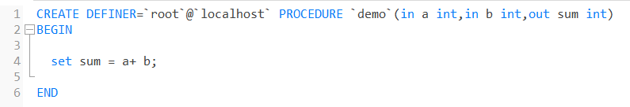

```java
	@Test
    public void testStoredProcedure1() {
        HashMap<String, Integer> map = new HashMap<>();
        map.put("k1", 1);
        map.put("k2", 2);
        map.put("sum", null);
        billMapper.testStoredProcedure1(map);
        System.out.println("map = " + map.toString());
    }
```

```xml
    <select id="testStoredProcedure1" statementType="CALLABLE" parameterType="java.util.HashMap">
        { call demo(#{map.k1, mode=IN, jdbcType=INTEGER}, #{map.k2, mode=IN, jdbcType=INTEGER}, #{map.sum, mode=OUT, jdbcType=INTEGER}) }
    </select>
```

**示例2**

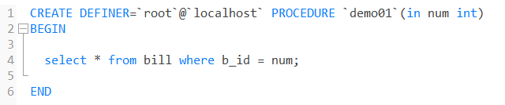

```java
    @Test
    public void testStoredProcedure2() {
        BillEntity billEntity = billMapper.testStoredProcedure2(5);
        System.out.println(billEntity.toString());
    }
```

```xml
    <select id="testStoredProcedure2" statementType="CALLABLE" parameterType="int" resultType="com.lz.myblog.entity.BillEntity">
        {call demo01(#{i,mode=IN,jdbcType=INTEGER})}
    </select>
```

**示例3**

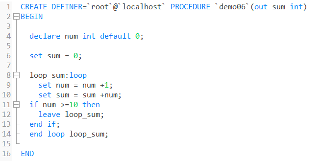

```java
    @Test
    public void testStoredProcedure4() {
       String msg = billMapper.testStoredProcedure4(5);
        System.out.println(msg);
    }
```

```xml
    <select id="testStoredProcedure4" statementType="CALLABLE" resultType="java.lang.String">
        {call demo03(#{i,mode=IN,jdbcType=INTEGER})}
    </select>
```

### 九、自定义函数

#### 9.1、自定义函数创建

函数与存储过程最大的区别是函数必须有返回值，否则会报错

```
格式：
create function 函数名(参数) returns 返回类型
begin
.....
return 返回值;
end;
```

案例：

通过输入的id获取员工的姓名

```
create function getName(eid int) returns varchar(20)
begin
	declare ename varchar(20) default '';
	select name into ename from emp where id=eid;
	return ename;
end;
```

注意：

**开启 bin-log 后，创建函数时必须明确指定 `DETERMINISTIC` 或 `READS SQL DATA` / `NO SQL` 等，否则 MySQL 会拒绝创建，因为怕主从数据不一致。**

1. **`DETERMINISTIC`（不确定的）——永远返回相同结果（纯计算，不依赖表数据）**

- **实际上**：`DETERMINISTIC` 表示 **函数结果是确定的**（相同输入 → 相同输出）。
- 如果函数不确定（比如用了 `NOW()`、`RAND()`），则可能导致主从数据不一致。
- 在开启 bin-log 时，**不确定的函数默认不允许创建**，除非你明确声明并承担风险。

2. **`NO SQL`**

- 函数内部 **没有 SQL 语句**。
- 当然也不会修改数据。

3. **`READS SQL DATA`**

- 函数内部 **只读取数据**（比如 `SELECT`）。
- 不修改数据。

4. **`MODIFIES SQL DATA`**

- 函数内部 **要修改数据**（比如 `INSERT`、`UPDATE`、`DELETE`）。

5. **`CONTAINS SQL`**

- 函数内部 **包含 SQL 语句**（但不确定是读还是写）。
- 这是**默认值**，如果没有明确声明。

```
create function getName(eid int) returns varchar(20) reads sql data
begin
	declare ename varchar(20) default '';
	select name into ename from emp where id=eid;
	return ename;
end;

mysql> select getName(1);
+------------+
| getName(1) |
+------------+
| 张三     |
+------------+
1 行于数据集 (0.02 秒)
```

#### 9.2、自定义函数操作

##### 9.2.1、自定义函数查询

```
格式：
show function status [like '%字符串%'];
```

案例：

```
mysql> show function status；
mysql> show function status like '%getName%';
```

##### 9.2.2、自定义函数删除

```
格式：
drop function 函数名;
```

案例：

```
mysql> drop function getName;
Query OK, 0 rows affected (0.03 秒)
```

### 十、触发器

触发器与函数、存储过程一样，触发器是一种对象，它能根据对表的操作时间，触发一些动作，这些动作可以是insert,update,delete等操作。

#### 10.1、触发器创建

```
create trigger 触发器名字 触发时间 触发事件 on 表 for each row
begin
    -- 触发器内容主体，每行用分号结尾
end
```

注意：

触发时间：

当 SQL 指令发生时，会令行中数据发生变化，而每张表中对应的行有两种状态：数据操作前和操作后

before：表中数据发生改变前的状态

after：表中数据发生改变后的状态

触发事件：

触发器是针对数据发送改变才会被触发，对应的操作只有insert、update、delete

案例：

向员工表中插入数据时，记录插入的id，动作，时间

```
#创建一个操作表
create table emp_log(
	id int primary key auto_increment,
  eid int,
  eaction varchar(20),
  etime datetime
);

mysql> select * from emp_log;
空的数据集 (0.01 秒)

#创建触发器
create trigger emp_insert after insert on emp for each row
begin
	insert into emp_log values(null,NEW.id,'insert',now());
end;

mysql> insert into emp(id,name,gender)values(8,'王三','男');
Query OK, 1 rows affected (0.01 秒)

mysql> select * from emp_log;
+----+------+---------+---------------------+
| id | eid  | eaction | etime               |
+----+------+---------+---------------------+
| 1  | 8    | insert  | 2020-02-21 03:12:44 |
+----+------+---------+---------------------+
1 行于数据集 (0.02 秒)
```

#### 10.2、触发器操作

##### 10.2.1、触发器查看

```
格式：
show triggers [like '%字符串%'];
```

案例：

```
mysql> show triggers;
mysql> show triggers like '%emp%';
```

##### 10.2.2、触发器删除

```
格式：
drop trigger 触发器名;
```

案例：

```
mysql> drop trigger emp_insert;
Query OK, 0 rows affected (0.02 秒)
```

### 十一、事件

事件取代了原先只能由操作系统的计划任务来执行的工作，而且MySQL的事件调度器可以精确到每秒钟执行一个任务，而操作系统的计划任务只能精确到每分钟执行一次。

#### 11.1、事件创建

```
格式：
create event[IF NOT EXISTS] event_name -- 创建事件
on schedule 时间和频率 -- on schedule 什么时候来执行
[on completion [NOT] preserve] -- 调度计划执行完成后是否还保留
[enable | disable] -- 是否开启事件，默认开启
[comment '事件描述'] -- 事件的注释
do event_body;-- 需要执行的SQL
```

注意：

单次计划任务示例

在2019年2月1日4点执行一次 on schedule at ‘2019-02-01 04:00:00’

重复计划执行

on schedule every 1 second 每秒执行一次

on schedule every 1 minute 每分钟执行一次

on schedule every 1 day 没天执行一次

指定时间范围的重复计划任务

每天在20:00:00执行一次 on schedule every 1 day starts ‘2019-02-01 20:00:00’

案例：

每5秒向emp\_log,插入当前日期时间记录

```
mysql> desc emp_log;


create event e_insert on schedule every 5 second on completion preserve
enable
comment '每5秒插入一次'
do
begin
	insert into emp_log values(null,1,'insert1',now());
end;
#do call 存储过程 
#do select 函数名
```

#### 11.2、事件操作

##### 11.2.1、查看事件

```
格式：
show events;
```

案例：

```
mysql> show events;
```

##### 11.2.2、启用和禁用事件

```
格式：
alter event 事件名 disable/enable;
```

禁用事件

```
mysql> alter event e_insert disable;
Query OK, 0 rows affected (0.01 秒)

mysql> select * from emp_log;
```

启用事件

```
mysql> alter event e_insert enable;
Query OK, 0 rows affected (0.02 秒)

mysql> select * from emp_log;
```

##### 11.2.3、删除事件

```
格式：
drop event 事件名;
```

案例：

```
mysql> drop event e_insert;
Query OK, 0 rows affected (0.02 秒)

mysql> show events;
空的数据集 (0.01 秒)
```

## 视图

### 介绍

视图（View）是一种虚拟存在的表。视图中的数据并不在数据库中实际存在，行和列数据来自定义视图的查询中使用的表（称为基表），并且是在使用视图时动态生成的。

通俗的讲，视图只保存了查询的SQL逻辑，不保存查询结果。所以我们在创建视图的时候，主要的工作就落在创建这条SQL查询语句上。

### 语法

因为视图是一种虚拟存在的表，所以可以根据之前操作表的方法来操作视图（其中修改视图与修改表不同，修改视图有两种方式）。

#### 创建

```sql
CREATE [OR REPLACE] VIEW 视图名称[(列名列表)] AS SELECT语句 
[ WITH [CASCADED | LOCAL ] CHECK OPTION ]
```

#### 查询

```sql
-- 查看创建视图语句：
SHOW CREATE VIEW 视图名称;
 
-- 查看视图数据：
SELECT * FROM 视图名称 ...... ;
```

#### 修改

```sql
-- 方式一：
CREATE [OR REPLACE] VIEW 视图名称[(列名列表)] AS SELECT语句 
[ WITH [ CASCADED | LOCAL ] CHECK OPTION ]
 
-- 方式二：
ALTER VIEW 视图名称[(列名列表)] AS SELECT语句 
[ WITH [ CASCADED | LOCAL ] CHECK OPTION ]
```

#### 删除

```sql
DROP VIEW [IF EXISTS] 视图名称 ...
```

#### 演示示例

```sql
-- 创建视图
create or replace view stu_v 
as
select id,name from student
where
id <= 10;
 
-- 查询视图
show create view stu_v;
 
select * from stu_v;
 
select * from stu_v where id < 3;
 
-- 修改视图
create or replace view stu_v 
as 
select id,name,no from student 
where 
id <= 10;
 
alter view stu_v 
as 
select id,name from student 
where 
id <= 10;
 
-- 删除视图
drop view if exists stu_v;
```

上述我们演示了，视图应该如何创建、查询、修改、删除，那么我们能不能通过视图来插入、更新数据呢？

接下来，做一个测试。

```sql
-- 创建视图,设置条件id < 10
create or replace view stu_v 
as 
select id,name from student 
where 
id <= 10 ;
 
-- 插入两条数据,一条id < 10,另一条id > 10
insert into stu_v values(6,'Tom');
 
insert into stu_v values(17,'Tom22');
 
-- 查询视图
select * from stu_v;
 
```

执行上述的SQL，我们会发现，id为6和17的数据都是可以成功插入的。

但是我们执行查询，查询出来的数据，却没有id为17的记录。


因为我们在创建视图的时候，指定的条件为 id\<=10,

id为17的数据，是不符合条件的，所以没有查询出来，

**但是这条数据已经成功的插入到了基表中。**


如果我们定义视图时指定了条件，然后我们**在插入、修改、删除数据时，是否可以做到必须满足条件才能操作，否则不能够操作**呢？ 答案是可以的，这就需要借助于**视图的检查选项**了。

### 检查选项

在 MySQL 中，视图的**检查选项**（`WITH [CASCADED | LOCAL] CHECK OPTION`）用于控制对视图的更新或插入操作的约束，确保对视图进行的更改不会违背视图定义的条件。通过设置检查选项，可以防止插入或更新的数据不符合视图的查询条件。 MySQL允许基于另一个视图创建视图，它还会检查依赖视图中的规则以保持一致性。为了确定检查的范围，MySQL提供了两个选项： CASCADED 和 LOCAL，默认值为 CASCADED 。

```sql
CREATE VIEW xx 
AS SELECT id,name 
FROM 
XXXX WHERE id <= 20 
WITH CASCADED CHECK OPTION;
```

#### CASCADED

> 意为“级联”。

比如，v2视图是基于v1视图的，如果在v2视图创建的时候指定了检查选项为 cascaded，但是v1视图创建时未指定检查选项。 则在执行检查时，不仅会检查v2，还会级联检查v2的关联视图v1。

**具体来说，例如下面这条SQL语句：**

```sql
create view v1 
as
select id,name 
from
student where id <= 20;
```

其没有添加检查选项的子句，所以运行时并不会检查id \<= 20；

**再看下面这条：**

```sql
create view v2
as
select id,name
from
v1 where id >= 10
with cascaded check option;
```

它是基于v1来建立视图的，并且添加了检查选项的子句，所以它会检测v2的id >= 10 ；又由于它是基于v1而创建的视图，cascaded会与之相连，所以也会检查v1的 id \<= 20。

**最后看这条：**

```sql
create view v3 
as
select id,name 
from
v2 where id <= 15;
```

v3是基于v2来建立视图的，v2又是基于v1来建立视图的；又因为v3本身没有添加检查选项的子句，所以只会检测v2和v1的条件。

#### LOCAL

> 意为 本地。

比如，v2视图是基于v1视图的，如果在v2视图创建的时候指定了检查选项为 local ，但是v1视图创  
建时未指定检查选项。 则在执行检查时，知会检查v2，不会检查v2的关联视图v1。

**具体来说，**

```sql
-- 创建v1视图
create view v1 
as
select id,name
from 
student where id <= 15;
 
 
-- 创建v2视图
create view v2
as
select id,name
from
v2 where id >= 10
with local check option;
```

创建v1视图没有指定检查选项，创建v2视图时（基于v1）指定了local的检查选项；那么会对v2进行条件检测，然后递归到v1；由于v1本身没有指定检查选项，所以不进行检测，这就是local的检查选项。

**再来创建v3：**

```sql
create view v3
as
select id,name
from v2 where id < 20;
```

v3本身没有指定检查选项，所以不检测；递归到v2，v2有local的检查选项，进行检测；再递归到v1，没有检查选项，不进行检测。

### 视图的更新

#### 介绍

要使视图可更新，视图中的行与基础表中的行之间必须存在一对一的关系。

如果视图包含以下任何一项，则该视图不可更新：

- 聚合函数或窗口函数（SUM\(\)、MIN\(\)、MAX\(\)、COUNT\(\)等）
- DISTINCT
- GROUP BY
- HAVING
- UNION或者 UNION ALL

#### 示例

```sql
create view stu_v_count as select count(*) from student;
```

上述的视图中，就只有一个单行单列的数据，与基础表不对应，如果我们对这个视图进行更新或插入的，将会报错。

```sql
insert into stu_v_count values(10);
```


### 视图作用 

**1.简单**  
视图不仅可以简化用户对数据的理解，也可以简化他们的操作。那些被经常使用的查询可以被定义为视图，从而使得用户不必为以后的操作每次指定全部的条件。


**2\. 安全**  
数据库可以授权，但不能授权到数据库特定行和特定的列上。通过视图用户只能查询和修改他们所能见到的数据。  

**3\. 数据独立**  
视图可帮助用户屏蔽真实表结构变化带来的影响。

### 案例

1.为了保证数据库表的安全性，开发人员在操作tb\_user表时，只能看到的用户的基本字段，屏蔽手机号和邮箱两个字段。

2.查询每个学生所选修的课程（三张表联查），这个功能在很多的业务中都有使用到，为了简化操作，定义一个视图。

```sql
-- 案例一
 
-- 创建视图
create view tb_user_view 
as 
select id,name,profession,age,gender,status,createtime 
from 
tb_user;
 
-- 查询视图
select * from tb_user_view;
 
```

```sql
-- 案例二
 
-- 三表联查
select s.name,s.no,c.name 
from 
student s,student_course sc, course c 
where 
s.id = sc.studentid and sc.courseid = c.id;
 
-- 把三表联查直接放到创建视图中会出现name重复出现的情况
-- 需要重命名，下面创建视图
create view tb_stu_course_view
as
select s.name student_name,s.no student_no,c.name course_name 
from 
student s,student_course sc, course c 
where 
s.id = sc.studentid and sc.courseid = c.id;
 
-- 查询视图
create * from tb_stu_course_view;
```

## 触发器

### 介绍

触发器是与表有关的数据库对象，指在insert/update/delete之前或之后，触发并执行触发器中定义的SQL语句集合。触发器的这种特性可以协助应用在数据库端确保数据的完整性，日志记录，数据校验等操作。

使用别名`OLD`和`NEW`来引用触发器中发生变化的记录内容，这与其他的数据库是相似的。**现在触发器还只支持行级触发，不支持语句级触发。**

|   触发器类型   |                       NEW和OLD                       |
| :------------: | :--------------------------------------------------: |
| INSERT型触发器 |            NEW表示将要或者已经新增的数据             |
| UPDATE型触发器 | OLD表示修改之前的数据；NEW表示将要或已经修改后的数据 |
| DELETE型触发器 |             OLD表示将要或已经删除的数据              |

> 行级触发：比如执行一条update语句，影响了5行数据，此时涉及的触发器触发5次，该触发器称为行级触发器。
>
> 语句级触发：比如执行一条update语句，不管影响了多少行数据，此时涉及的触发器触发1次，该触发器称为语句级触发器。

### 语法

- 创建

  ```mysql
  CREATE TRIGGER trigger_name
  BEFORE/AFTER INSERT/UPDATE/DELETE
  ON tbl_name FOR EACH ROW -- 行级触发器
  BEGIN
  trigger_stmt;
  END;
  ```

- 查看

  ```mysql
  SHOW TRIGGERS;
  ```

- 删除

  ```mysql
  DROP TRIGGER [schema_name.]trigger_name; -- 如果没有指定schema_name，默认为当前数据库
  ```

### 示例

通过触发器记录tb\_user表的数据变更日志，将变更日志插入到日志表user\_logs中，包含增加，修改，删除；

```mysql
create table user_logs(
	id int(11) not null auto_increment,
    operation varchar(20) not null comment'操作类型,insert/update/delete',
    operate_time datetime not null comment'操作时间',
    operate_id int(11) not null comment'操作的ID',
    operate_params varchar(50) not null comment'操作参数',
    primary key(`id`)
)engine=innodb default charset=utf8;
```

① `INSERT`型触发器

```mysql
-- 创建insert型触发器
create trigger tb_user_insert_trigger 
	after insert on tb_user for each row
begin
	insert into user_logs(id, operation, operate_time, operate_id, operate_params) values
	(null, 'insert', now(), new.id, concat('插入的数据内容为：id=',new.id,', name=',new.name,', phone=',new.phone,', email=',new.email,', profession=',new.profession));
end;

-- 查看触发器
show triggers;

-- 删除触发器
drop trigger tb_user_insert_trigger;

-- 向tb_user表中插入数据
insert into tb_user(id, name, phone, email, profession, age, gender, status, createtime) 
values(25, '二皇子', '18908823412', 'ehz@email.com', '软件工程', 23, '1', '1', now());
insert into tb_user(id, name, phone, email, profession, age, gender, status, createtime) 
values(26, '三皇子', '18908823413', 'shz@email.com', '软件工程', 22, '1', '1', now());
```

结果：


② `update`型触发器

```mysql
-- 修改数据触发器
create trigger tb_user_update_trigger
	after update on tb_user for each row
begin
	insert into user_logs(id, operation, operate_time, operate_id, operate_params) values
	(null, 'update', now(), new.id, 
	concat('更新之前的数据内容为：id=',old.id,', name=',old.name,', phone=',old.phone,', email=',old.email,', profession=',old.profession,
	' | 更新之后的数据内容为：id=',new.id,', name=',new.name,', phone=',new.phone,', email=',new.email,', profession=',new.profession));
end;

-- 查看触发器
show triggers;

-- 修改tb_user表中的数据
update tb_user set age = 32 where id = 25;
update tb_user set profession = '计算机科学与技术' where id = 26;
update tb_user set profession = '会计学' where id <= 5;
```

结果：


③ `delete`型触发器

```mysql
-- 删除数据触发器
create trigger tb_user_delete_trigger 
	after delete on tb_user for each row
begin
	insert into user_logs(id, operation, operate_time, operate_id, operate_params) values
	(null, 'delete', now(), old.id, concat('删除之前的数据内容为：id=',old.id,', name=',old.name,', phone=',old.phone,', email=',old.email,', profession=',old.profession));
end;

-- 查看触发器
show triggers;

-- 删除tb_user表中的数据
delete from tb_user where id = 25;
delete from tb_user where id = 26;
```

结果：


## 锁

> 锁是计算机协调多个进程或线程并发访问某一资源的机制。在数据库中，除传统的计算资源（CPU、 RAM、I/O）的争用以外，数据也是一种供许多用户共享的资源。如何保证数据并发访问的一致性、有效性是所有数据库必须解决的一个问题，锁冲突也是影响数据库并发访问性能的一个重要因素。从这个角度来说，锁对数据库而言显得尤其重要，也更加复杂。
>
>  MySQL中的锁，按照锁的粒度分，分为以下三类：
>
> - 全局锁：锁定数据库中的所有表。
> - 表级锁：每次操作锁住整张表。
> - 行级锁：每次操作锁住对应的行数据。

### 全局锁

> - **全局锁就是对整个数据库实例加锁，加锁后整个实例就处于只读状态，后续的DML的写语句，DDL语 句，已经更新操作的事务提交语句都将被阻塞。**
> - 其典型的使用场景是做**全库的逻辑备份**，对所有的表进行锁定，从而获取一致性视图，保证数据的完整性。
> - 对数据库进行进行逻辑备份之前，先对整个数据库加上全局锁，一旦加了全局锁之后，其他的DDL、 DML全部都处于阻塞状态，但是可以执行DQL语句，也就是处于只读状态，而数据备份就是查询操作。

#### 语法

> 加全局锁

```sql
flush tables with read lock;
```

> 数据备份(注：这个命令在cmd中输入，不是在mysql控制台中)

```cmd
mysqldump -uroot -p123 数据库名 > G:/备份数据库名.sql
```

> 释放锁

```
unlock tables;
```

> 在InnoDB引擎中，我们可以在备份时加上参数`--single-transaction`参数来完成不加锁的一致性数据备份。（这样就不用加锁备份数据库了）

```cmd
mysqldump --single--transaction -uroot -p123456 数据库名称 > G:/备份数据库名称.sql
```

#### 特点 

> 数据库中加全局锁，是一个比较重的操作，存在以下问题： 
>
> - 如果在主库上备份，那么在备份期间都不能执行更新，业务基本上就得停摆。 
> - 如果在从库上备份，那么在备份期间从库不能执行主库同步过来的二进制日志（binlog），会导 致主从延迟。

### 表级锁

> 表级锁，每次操作**锁住整张表**。锁定粒度大，发生锁冲突的概率最高，并发度最低。应用在MyISAM、 InnoDB、BDB等存储引擎中。
>
> 对于表级锁，主要分为以下三类：
>
> - 表锁
> - 元数据锁（meta data lock，MDL）
> - 意向锁

#### 表锁

> 对于表锁，分为两类：
>
> - 表共享读锁（read lock）
> - 表独占写锁（write lock）
>
> **读锁不会阻塞其他客户端的读，但是会阻塞写。写锁既会阻塞其他客户端的读，又会阻塞其他客户端的写。**


##### 语法

> 加锁

```sql
lock tables 表名 read/write;
```

> 解除锁

```sql
unlock tables;
```

#### 元数据锁

> - meta data lock , 元数据锁，简写MDL。 **MDL加锁过程是系统自动控制，无需显式使用，在访问一张表的时候会自动加上。**MDL锁主要作用是维护表元数据的数据一致性，在表上有活动事务的时候，不可以对元数据进行写入操作。为了避免DML与 DDL冲突，保证读写的正确性。
> - **这里的元数据，大家可以简单理解为就是一张表的表结构。 也就是说，某一张表涉及到未提交的事务 时，是不能够修改这张表的表结构的。**
> - 在MySQL5.5中引入了MDL，当对一张表进行增删改查的时候，加MDL读锁(共享)；当对表结构进行变 更操作的时候，加MDL写锁(排他)。 常见的SQL操作时，所添加的元数据锁

> 常见的SQL操作时，所添加的元数据锁：


> 查看数据库中元数据锁的情况

```sql
select object_type,object_schema,object_name,lock_type,lock_duration from
performance_schema.metadata_locks;
```


#### 意向锁

> - **为了避免DML在执行时，加的行锁与表锁的冲突，在InnoDB中引入了意向锁，使得表锁不用检查每行数据是否加锁，使用意向锁来减少表锁的检查。**
>
> - 假如没有意向锁，客户端一开启一个事务，然后执行DML操作，在执行DML语句时，会对涉及到的行加行锁。当客户端二，想对这张表加表锁时，会检查当前表是否有对应的行锁，如果没有，则添加表锁，此时就会从第一行数据，检查到最后一行数据，效率较低。
> - 有了意向锁之后 : 客户端一，**在执行DML操作时，会对涉及的行加行锁，同时也会对该表加上意向锁。而其他客户端，在对这张表加表锁的时候，会根据该表上所加的意向锁来判定是否可以成功加表锁，而不用逐行判断行锁情况了。**


##### 分类

> - 意向共享锁(IS): 事务在请求S锁前，要先获得IS锁，**由语句`select ... lock in share mode`添加 。 **
> - 意向排他锁(IX): 事务在请求X锁前，要先获得IX锁，**由insert、update、delete、select...for update添加 。**
>
> **一旦事务提交了，意向共享锁、意向排他锁，都会自动释放。**

> 查看意向锁及行锁的加锁情况

```sql
select object_schema,object_name,index_name,lock_type,lock_mode,lock_data from
performance_schema.data_locks;
```

##### 意向锁的兼容互斥性

1. 意向锁之间是互相兼容的

2. 意向共享锁与共享锁兼容，其他的会互斥

   

### 行级锁

> - 行级锁，每次操作锁住对应的行数据。锁定粒度最小，发生锁冲突的概率最低，并发度最高。应用在 InnoDB存储引擎中。
>
> - **InnoDB行级锁是通过给索引上的索引项加锁来实现的。只有通过索引条件检索数据，InnoDB才使用行级锁，否则，InnoDB将使用表锁。**
>
> - InnoDB的数据是基于索引组织的，行锁是通过对索引上的索引项加锁来实现的，而不是对记录加的 锁。对于行级锁，主要分为以下三类：
>
>   - **行锁（Record Lock）：锁定单个行记录的锁，防止其他事务对此行进行update和delete。在 RC、RR隔离级别下都支持。**
>
>     
>
>   - **间隙锁（Gap Lock）：锁定索引记录间隙（不含该记录），确保索引记录间隙不变，防止其他事 务在这个间隙进行insert，产生幻读。在RR隔离级别下都支持。**
>
>     
>
>   - **临键锁（Next-Key Lock）：行锁和间隙锁组合，同时锁住数据，并锁住数据前面的间隙Gap。 在RR隔离级别下支持。**
>
>     

#### 行锁

> InnoDB实现了以下两种类型的行锁：
>
> - 共享锁（S）：允许一个事务去读一行，阻止其他事务获得相同数据集的排它锁。
> - 排他锁（X）：允许获取排他锁的事务更新数据，阻止其他事务获得相同数据集的共享锁和排他锁。
>
> 两种锁的兼容情况
>
> 
>
> 常见的SQL语句，在执行时，所加的行锁如下：
>
> 

##### 特点

> - **针对唯一索引进行检索时，对已存在的记录进行等值匹配时，将会自动优化为行锁。**
>
> - **InnoDB的行锁是针对于索引加的锁，不通过索引条件检索数据，那么InnoDB将对表中的所有记录加锁，此时就会升级为表锁。**
>
>   

> 查看意向锁和行锁的加锁情况

```sql
select object_schema,object_name,index_name,lock_type,lock_mode,lock_data from
performance_schema.data_locks;
```

#### 间隙锁&临键锁

>间隙锁（Gap Lock）和临键锁（Next-Key Lock）都是InnoDB在可重复读（REPEATABLE READ，RR）隔离级别下为了解决幻读（phantom read）问题而引入的锁机制。
>
>在MySQL InnoDB存储引擎中，临键锁（Next-Key Lock）是一种结合了行锁和间隙锁的锁机制。因此，当一个事务执行范围查询并使用 `FOR UPDATE` 或 `LOCK IN SHARE MODE` 等锁定操作时，InnoDB会同时加上行锁和间隙锁。

##### 一、间隙锁（Gap Lock）

###### 1. 概念

间隙锁是一种锁定键值之间的“间隙”的锁。它不锁定实际的行，而是锁定两行之间的空间。这种锁在可重复读（REPEATABLE READ）隔离级别下特别常见。(左开右开）

###### 2. 工作原理

间隙锁会锁定一个范围，防止其他事务在这个范围内插入新的行。例如，如果一个事务执行 `SELECT * FROM table WHERE id BETWEEN 10 AND 20 FOR UPDATE`，那么这个事务会锁定 id 值在 10 到 20 之间的所有间隙，防止其他事务在这个范围内插入新的行。

###### 3. 应用场景

间隙锁主要用于防止幻读。在事务执行期间，如果没有间隙锁，其他事务可以在查询范围内插入新行，导致第一次查询和第二次查询的结果不一致。

##### 二、临键锁（Next-Key Lock）

###### 1. 概念

临键锁是一种结合行锁（Record Lock）和间隙锁的锁机制。它锁定一个行和这行之后的间隙，确保在范围查询时，既锁定行本身，也锁定行之间的间隙。(左开右闭)

2. 工作原理

在执行范围查询（如 `WHERE` 子句带有范围条件）时，InnoDB 使用临键锁来锁定行和行之间的间隙。例如，如果一个事务执行 `SELECT * FROM table WHERE id > 10 FOR UPDATE`，那么它会锁定 id > 10 的所有行和这些行之间的间隙。

###### 3. 应用场景

临键锁的主要目的是解决幻读问题，同时确保其他事务在范围内既不能插入新行，也不能修改现有行。例如，在事务 T1 执行 `SELECT * FROM table WHERE id > 10 FOR UPDATE` 期间，事务 T2 既不能插入 id > 10 的新行，也不能修改 id > 10 的现有行。

##### 三、区别与联系

- **区别**：
  - **间隙锁**：只锁定间隙，不锁定实际的行。
  - **临键锁**：同时锁定行和间隙。
- **联系**：
  - 两者都是为了防止幻读，确保事务的隔离性。
  - 两者在可重复读（REPEATABLE READ）隔离级别下特别常见。

##### 四、示例分析

###### 1. 间隙锁示例

```
sql复制代码-- 创建测试表
CREATE TABLE test (
    id INT PRIMARY KEY,
    value VARCHAR(50)
);

-- 插入数据
INSERT INTO test (id, value) VALUES (5, 'A'), (10, 'B'), (15, 'C');

-- 事务1
START TRANSACTION;
SELECT * FROM test WHERE id BETWEEN 5 AND 10 FOR UPDATE;

-- 事务2
START TRANSACTION;
INSERT INTO test (id, value) VALUES (7, 'D'); -- 这里会被阻塞，因为5和10之间的间隙被事务1锁定
```

###### 2. 临键锁示例

```
sql复制代码-- 创建测试表
CREATE TABLE test (
    id INT PRIMARY KEY,
    value VARCHAR(50)
);

-- 插入数据
INSERT INTO test (id, value) VALUES (5, 'A'), (10, 'B'), (15, 'C');

-- 事务1
START TRANSACTION;
SELECT * FROM test WHERE id > 5 FOR UPDATE;

-- 事务2
START TRANSACTION;
UPDATE test SET value = 'E' WHERE id = 10; -- 这里会被阻塞，因为id > 5的行和间隙被事务1锁定
```

##### 五、总结

间隙锁和临键锁是MySQL InnoDB存储引擎中重要的锁机制，主要用于解决并发事务中的幻读问题。间隙锁锁定行之间的间隙，防止在范围内插入新行；临键锁结合行锁和间隙锁，既锁定行本身也锁定行之间的间隙，确保范围内的行和间隙都不能被其他事务修改。通过理解和正确使用这两种锁，可以有效提高数据库事务的隔离性和数据一致性。 

### 总结

1. 在 MySQL 中，如果你在执行增删改语句时没有显式地开启事务（例如没有使用 `START TRANSACTION` 语句），则每个增删改语句都会被视为一个单独的事务。在这种情况下，这些语句仍然可能涉及意向锁，因为意向锁是 MySQL 的 InnoDB 存储引擎自动管理的一部分，用于处理表级别的并发控制。

2. 在 MySQL 中，当数据库自动为某一行添加排他锁（Exclusive Lock）时，也会自动添加意向锁（Intention Lock）。意向锁用于指示事务打算在表中的某些行上获取更强的锁，这有助于管理并发事务之间的表级别锁定请求，以确保它们能够正确获取所需的锁。

3. 在 MySQL 中，意向锁的添加不会直接导致后续执行的增删改语句（非事务中的）被阻塞。意向锁的主要作用是管理并发事务对表级别锁的请求，并不会直接影响行级别的增删改操作。

4. 如果一个事务在执行 INSERT 操作后，并且持有了意向排他锁（Intention Exclusive Lock, IX），那么另一个事务尝试执行 DELETE 操作时，可能会因为需要获取排他锁而被阻塞。同样地，如果一个事务在执行 DELETE 操作后持有了意向排他锁，那么其他事务在执行 INSERT 操作时也可能会受到阻塞。这具体取决于数据库管理系统的实现和事务隔离级别。

5. **增删改会增加行锁（排他锁）和表锁（意向排他锁）。查询不会增加行锁和表锁（意向锁），但可以使用 `SELECT ... LOCK IN SHARE MODE` 增加行锁（共享锁）和表锁（意向共享锁），或使用 `SELECT ... FOR UPDATE` 增加行锁（排他锁）和表锁（意向排他锁）。**

   **增删改查一般不会直接加表锁，但可以使用 `LOCK TABLES 表名 READ/WRITE` 增加表共享读锁和表独占写锁。共享锁不会阻塞其他共享锁，但会阻塞排他锁；排他锁会阻塞共享锁和其他排他锁。**
   
   

## InnoDB引擎

### 逻辑存储结构


### 架构

。。。

### 事务的原理

- 操作的集合
- 不可分割的一个单位
- 要么成功，要么失败
- ACID

原子性、一致性、持久性：**redo log**和**undo log**实现；

隔离性由锁和MVCC实现；

**redo log**

重做日志，记录的是事务提交时数据页的物理修改，是用来实现事务的持久性。  
该日志文件由两部分组成:重做日志缓冲（redo log buffer\)以及重做日志文件（redo log file\) ,前者是在内存中，后者在磁盘中。当事务提交之后会把所有修改信息都存到该日志文件中,**用于在刷新脏页到磁盘,发生错误时,进行数据恢复使用。**  
  
**undo log**  


### MVCC（多版本并发控制）

**当前读**

 读取的是记录的最新版本，读取时还要保证其他并发事务不能修改当前记录，会对读取的记录进行加锁。对于我们日常的操作，如:select …lock in share mode\(共享锁\)，select …for update、update、insert、delete\(排他锁\)都是一种当前读。

**快照读**

 简单的select\(不加锁）就是快照读，快照读，读取的是记录数据的可见版本，有可能是历史数据，不加锁，是非阻塞读。

- Read Committed:每次select，都生成一个快照读。

- Repeatable Read:开启事务后第一个select语句才是快照读的地方。

- Serializable（串行化）:快照读会退化为当前读。

**MVCC**

 全称 Multi-Version Concurrency Control，多版本并发控制。指维护一个数据的多个版本,使得读写操作没有冲突，快照读为MySQL实现MVCC提供了一个非阻塞读功能。MVCC的具体实现。还需要依赖于数据库记录中的三个隐式字段、undo log日志、readView.

**实现原理**


**undo log**

- 回滚日志，在insert、 update、delete的时候产生的便于数据回滚的日志。
- 当insert的时候，产生的undo log日志只在回滚时需要，在事务提交后，可被立即删除。
- 而update、delete的时候，产生的undo log日志不仅在回滚时需要，在快照读时也需要，不会立即被删除。

**undo log 版本链**  


 不同事务或相同事务对同一条记录进行修改，会导致该记录的undolog生成一条记录版本链表，链表的头部是最新的旧记录，链表尾部是最早的旧记录。而update、delete的时候，产生的undo log日志不仅在回滚时需要，在快照读时也需要，不会立即被删除。

**readview**


**规则：**  


RC：读已提交

RR：可重复读

# 运维篇

## 日志

### 错误日志

 错误日志是MySQL中最重要的日志之一，它记录了当mysqld启动和停止时，以及服务器在运行过程中发生任何严重错误时的相关信息。当数据库出现任何故障导致无法正常使用时，建议首先查看此日志。

 该日志是默认开启的，默认存放目录/var/logl，默认的日志文件名为psmysqld.log。查看日志位置：

```mysql
show variables like '%log_error%'
```

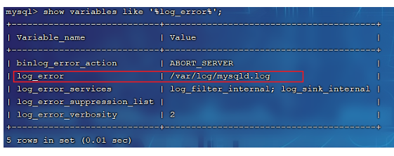

### 二进制日志

#### 介绍

**二进制日志（BINLOG）记录了所有的 DDL（数据定义语言）语句和 DML（数据操纵语言）语句，但 不包括数据查询（SELECT、SHOW）语句。** 

作用：①. 灾难时的数据恢复；②. MySQL的主从复制。

在MySQL8版本中，默认二进制日志是开启着的，涉及到的参数如下：

```mysql
 show variables like '%log_bin%';
```

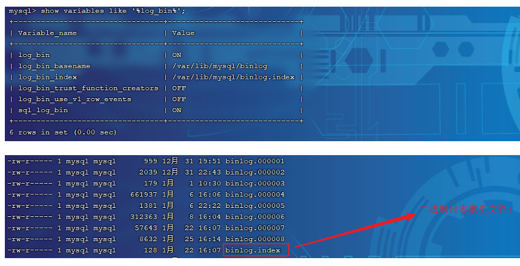

参数说明：  

- log_bin_basename：当前数据库服务器的binlog日志的基础名称(前缀)，具体的binlog文件名需要再该basename的基础上加上编号(编号从000001开始)。 
- log_bin_index：binlog的索引文件，里面记录了当前服务器关联的binlog文件有哪些。

#### 格式

MySQL服务器中提供了多种格式来记录二进制日志，具体格式及特点如下：

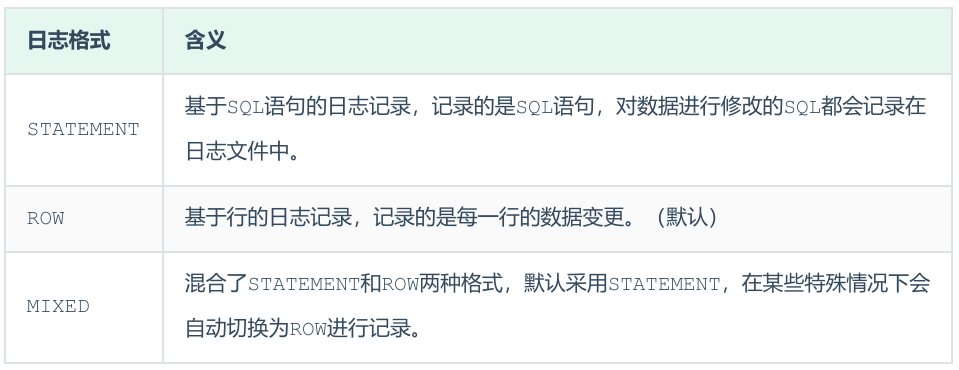

```mysql
show variables like '%binlog_format%';
```

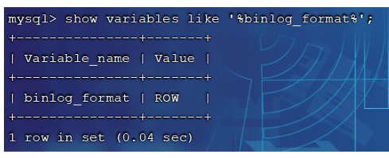

如果我们需要配置二进制日志的格式，只需要在`/etc/my.cnf`中配置`binlog_format`参数即可。

#### 查看

由于日志是以二进制方式存储的，不能直接读取，需要通过二进制日志查询工具 mysqlbinlog 来查 看，具体语法：

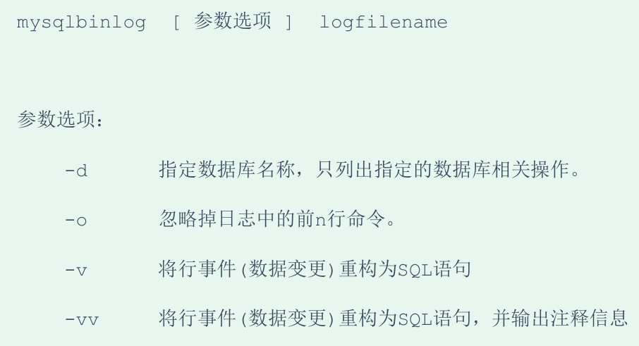

#### 删除

对于比较繁忙的业务系统，每天生成的binlog数据巨大，如果长时间不清除，将会占用大量磁盘空 间。可以通过以下几种方式清理日志：

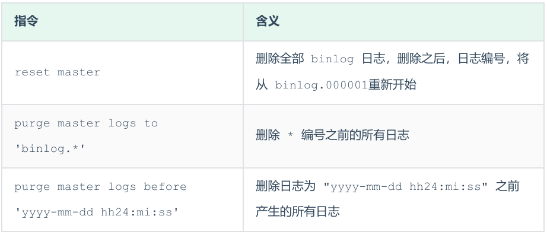

也可以在mysql的配置文件中配置二进制日志的过期时间，设置了之后，二进制日志过期会自动删除。

```mysql
show variables like '%binlog_expire_logs_seconds%';
```

### 查询日志

**查询日志中记录了客户端的所有操作语句，而二进制日志不包含查询数据的SQL语句。默认情况下，  查询日志是未开启的。**

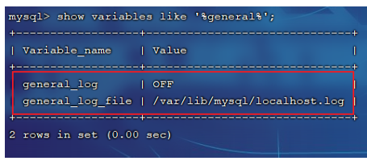

如果需要开启查询日志，可以修改MySQL的配置文件 /etc/my.cnf 文件，添加如下内容：

```mysql
#该选项用来开启查询日志 ， 可选值 ： 0 或者 1 ； 0 代表关闭， 1 代表开启 
general_log=1
 
#设置日志的文件名 ， 如果没有指定， 默认的文件名为 host_name.log 
general_log_file=mysql_query.log
```

开启了查询日志之后，在MySQL的数据存放目录，也就是`/var/lib/mysql/`目录下就会出现  `mysql_query.log`文件。之后所有的客户端的增删改查操作都会记录在该日志文件之中，长时间运行后，该日志文件将会非常大。

### 慢查询日志

慢查询日志记录了所有执行时间超过参数`long_query_time`设置值并且扫描记录数不小于  `min_examined_row_limit`的所有的SQL语句的日志，默认未开启。`long_query_time`默认为  10 秒，最小为 0， 精度可以到微秒。 如果需要开启慢查询日志，需要在MySQL的配置文件`/etc/my.cnf`中配置如下参数：

```mysql
#慢查询日志
slow_query_log=1

#执行时间参数
long_query_time=2
```

**默认情况下，不会记录管理语句，也不会记录不使用索引进行查找的查询。**可以使用 `log_slow_admin_statements`和更改此行为`log_queries_not_using_indexes`，如下所 述。

```mysql
#记录执行较慢的管理语句
log_slow_admin_statements =1

#记录执行较慢的未使用索引的语句
log_queries_not_using_indexes = 1
```

上述所有的参数配置完成之后，都需要重新启动MySQL服务器才可以生效。 

## 分表分库

### 水平切分

水平切分又称为 Sharding，它是将同一个表中的记录拆分到多个结构相同的表中。

当一个表的数据不断增多时，Sharding 是必然的选择，它可以将数据分布到集群的不同节点上，从而缓存单个数据库的压力。

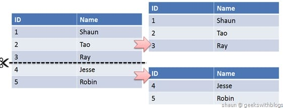

### 垂直切分

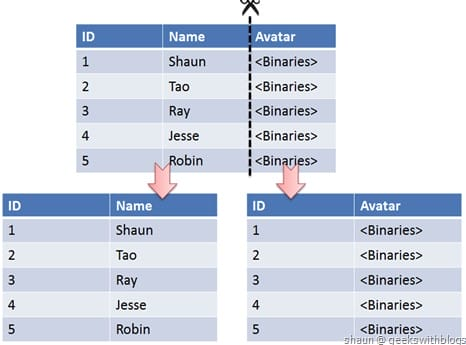

垂直切分是将一张表按列切分成多个表，通常是按照列的关系密集程度进行切分，也可以利用垂直切分将经常被使用的列和不经常被使用的列切分到不同的表中。

在数据库的层面使用垂直切分将按数据库中表的密集程度部署到不同的库中，例如将原来的电商数据库垂直切分成商品数据库、用户数据库等。

### Sharding 策略

- **哈希取模: `hash(key) % NUM_DB`**
- **范围: 可以是 ID 范围也可以是时间范围**
- **映射表: 使用单独的一个数据库来存储映射关系**

### Sharding 存在的问题及解决方案

#### 1. 事务问题

使用分布式事务来解决，比如 XA 接口。

#### 2. 链接

可以将原来的 JOIN 分解成多个单表查询，然后在用户程序中进行 JOIN。

#### 3. ID 唯一性

- 使用全局唯一 ID: GUID
- 为每个分片指定一个 ID 范围
- 分布式 ID 生成器 (如 Twitter 的 Snowflake 算法)

## 主从复制与读写分离

### 一、主从复制与读写分离的意义

  企业中的业务通常数据量都比较大，而单台数据库在数据存储、安全性和高并发方面都无法满足实际的需求，所以需要配置多台主从数据服务器，以实现主从复制，增加数据可靠性，读写分离，也减少数据库压力和存储引擎带来的表锁定和行锁定问题。

### 二、主从数据库实现同步（主从复制）

什么是主从复制？简单来说就是在主服务器上执行的语句，从服务器执行同样的语句，在主服务器上的操作在从服务器产生了同样的结果。

主从复制的基本过程如下:

- Master（主数据库）将用户对数据库更新的操作以二进制格式保存到BinaryLog日志文件中。

- Slave（从数据库）上面的I0进程连接上Master， 并请求从指定日志文件的指定位置\(或者从最开始的日志\)之后的日志内容。

- Master接收到来自Slave的I0进程的请求后，通过负责复制的I0进程根据请求信息读取制定日志指定位置之后的日志信息，返回给Slave 的I0进程。返回信息中除了日志所包含的信息之外，还包括本次返回的信息已经到Master端的bin-log文件的名称以及bin-log的位置。

- Slave的I0进程接收到信息后，将接收到的日志内容依次添加到Slave端的relay-log文件的最末端，并将读取到的Master端的bin-log的文件名和位置记录到master-info文件中，以便在下一次读取的时候能够清楚的告诉Master “我需要从某个bin- log的哪个位置开始往后的日志内容，请发给我”。

- Slave的Sql进程检测到relay-log中新增加了内容后，会马上解析relay- log的内容成为在Master端真实执行时候的那些可执行的内容，并在自身执行。  
  

### 三、主从读写分离

只在主服务器上写，在从服务器上读；  
主数据库处理事务性查询，从数据库处理SELECT查询；  
进行读操作时，是在两个从服务器上轮流读取，利用虚拟模块MySQL\-Proxy做读取从服务器时的轮询。


### 四、案例实操

**环境准备**：需要准备五台主机，一台作主数据库服务器，两台做从服务器，还需要一台Amoeba的服务器作为中间代理，用于客户机登录数据库进行读写操作，而不用直接登录主从服务器。

---

**三台主机上都编译安装好mysql5.7，安装过程见另一篇文章，[Mysql安装链接](https://blog.csdn.net/qq_41786285/article/details/109314823)**

**1、为了保证数据同步必须先保证时间同步，在三台服务器均做时间同步**

```c
[root@master ~]# ntpdate ntp.aliyun.com
21 Oct 18:29:46 ntpdate[44242]: step time server 120.25.115.20 offset 1.449094 sec
```

**2、主服务器上配置（IP：192.168.247.130）**

修改配置文件：

```c
vim /etc/my.cnf
#在[Mysqld]模块修改
server-id = 11          //三台主从数据库的id必须不同
log-bin = master-bin               //主服务器日志文件
log-slave-updates=true				//允许从服务器更新
[root@master ~]# systemctl restart mysqld.service    //配置文件修改后必须重启
```

登录主数据库给从数据库授权：

```c
[root@master ~]# mysql -uroot -p
Enter password: 
mysql> grant replication slave on *.* to 'myslave'@'192.168.247.%' identified by 'abc123'';
Query OK, 0 rows affected, 1 warning (0.01 sec)
//给从服务器授权，允许192.168.247.网段的服务器使用myslave访问所有库的所有表
mysql> flush privileges;  //策略刷新
Query OK, 0 rows affected (0.00 sec)

mysql> show master status;  //查看主服务器状态,日志用于从服务器同步，position是当前定位
+-------------------+----------+--------------+------------------+-------------------+
| File              | Position | Binlog_Do_DB | Binlog_Ignore_DB | Executed_Gtid_Set |
+-------------------+----------+--------------+------------------+-------------------+
| master-bin.000001 |      154 |              |                  |                   |
+-------------------+----------+--------------+------------------+-------------------+
1 row in set (
```

**3、从服务器上配置（IP：192.168.247.140 和 192.168.247.150）**

修改配置文件：

```c
vim /etc/my.cnf
server-id = 22      //另一个从服务器为33
relay-log = relay-log-bin 	//从主服务器上同步日志文件记录到本地
relay-log-index = slave-relay-bin.index   //建立索引文件，定义relay-log的位置和名称
[root@slave1 ~]# systemctl restart mysqld
```

登录数据库配置：

```c
mysql>  change master to master_host='192.168.247.130',master_user='myslave',master_password='abc123',master_log_file='master-bin.000001',master_log_pos=154;
Query OK, 0 rows affected, 2 warnings (0.01 sec)
##指明从哪里找什么文件的什么位置进行复制
mysql> start slave;      //开启从复制
Query OK, 0 rows affected (0.00 sec)
```

master\_log\_file：需要同步的二进制日志文件名，即主服务器上查询到的状态中file  
master\_log\_pos：断点位置，即主服务器上查询到的状态position

查看从服务器状态：

```c
mysql> show slave status \G
```

I/O线程与SQL线程都为Yes，主从复制完成

  
**4、验证主从复制效果**

在主服务器上创建aaa数据库：

```c
mysql> create database aaa;
Query OK, 1 row affected (0.01 sec)
```

在两个从服务器上查看：有aaa数据库

```c
mysql> show databases;
+--------------------+
| Database           |
+--------------------+
| information_schema |
| aaa                |
| mysql              |
| performance_schema |
| sys                |
+--------------------+
5 rows in set (0.00 sec)
```

同步到了主服务器的数据，主从复制实现。

---

**另起一台主机，安装Amoeba：（IP：192.168.247.170）**

1、首先安装jdk依赖包

```c
[root@server2 ~]# tar xf jdk-8u91-linux-x64.tar.gz 
[root@server2 ~]# cp -rf jdk1.8.0_91/ /usr/local/java
##配置环境变量
[root@server2 ~]# vim /etc/profile
在末尾加入
export JAVA_HOME=/usr/local/java
export JRE_HOME=/usr/local/java/jre
export AMOEBA_HOME=/usr/local/amoeba
export PATH=$PATH:$JAVA_HOME/bin:$AMOEBA_HOME/bin
export CLASSPATH=./:/local/java/lib:/usr/local/java/jre/lib
[root@server2 ~]# source /etc/profile           //生效
```

2、安装Amoeba，并启动

```c
[root@server2 ~]# unzip amoeba-mysql-3.0.5-RC-distribution.zip    //解压安装包
[root@server2 ~]# mv amoeba-mysql-3.0.5-RC /usr/local/amoeba     //创建并移动至工作目录
[root@server2 ~]# chmod -R 755 /usr/local/amoeba      //给执行权限
[root@server2 ~]# vi /usr/local/amoeba/jvm.properties 
#将32行注释掉并添加下面一行
#JVM_OPTIONS="-server -Xms256m -Xmx1024m -Xss196k -XX:PermSize=16m -XX:MaxPerSize=96m"                
 JVM_OPTIONS="-server -Xms1024m -Xmx1024m -Xss256k"
[root@server2 ~]# cd /usr/local/amoeba/bin/
[root@server2 bin]# launcher
[root@server2 bin]# netstat -anpt | grep 8066
tcp6       0      0 :::8066                 :::*                    LISTEN      1829/java           
##Amoeba开启，主机会强制关机，需要自行开机
```

3、修改Amoeba配置文件

```c
## 进入配置文件目录
[root@server2 bin]# cd /usr/local/amoeba/conf
```

需要修改下面两个配置文件  
  
**第一个配置文件修改：**

```c
vi amoeba.xml
#28行修改，允许客户机登录amoeba的账户名，密码
#84行下取消注释，并设置读写池
```

  


**第二个配置文件修改：**

```c
vi dbServers.xml
#修改如下配置
```

  
（不修改为mysql的话，也可以新建test数据库。）  
  
配置文件修改完成后，重新启动Amoeba，并查看状态

```c
cd /usr/local/amoeba/bin/
launcher
[root@server2 bin]# netstat -anpt | grep 8066
tcp6       0      0 :::8066                 :::*                    LISTEN      1829/java     
```

---

**在三台MySQL数据库中为amoeba授权：**

```c
mysql> grant all on *.* to test@'192.168.247.%' identified by '123.com';  
#允许test账户以123.com为密码访问数据库的所有库的所有表
mysql> flush privileges;
#刷新权限
```

---

**客户机上的测试（IP：192.168.247.160）**

安装轻量级数据库，登录amoeba服务器可进入主从数据库

```c
[root@server2 ~]# yum -y install mariadb*
[root@server2 ~]# systemctl start mariadb
[root@server2 ~]# mysql -uamoeba -p123456 -h 192.168.247.170 -P8066
#通过amoeba登录数据库 -u用户名 -p密码 -h 访问地址为amoeba服务器 -P amoeba端口号
```

---

**主从同步验证**

**在主服务器上新建test数据库和表tt**

```css
mysql> create database test;
Query OK, 1 row affected (0.01 sec)
mysql> use test
Database changed
mysql> create table tt(name char(10), id int(3) primary key auto_increment);
Query OK, 0 rows affected (0.02 sec)
mysql> desc tt;
+-------+----------+------+-----+---------+----------------+
| Field | Type     | Null | Key | Default | Extra          |
+-------+----------+------+-----+---------+----------------+
| name  | char(10) | YES  |     | NULL    |                |
| id    | int(3)   | NO   | PRI | NULL    | auto_increment |
+-------+----------+------+-----+---------+----------------+
2 rows in set (0.00 sec)
```

**在从服务器上都可查看到test和表tt（主从复制的效果）**

```css
mysql> use test;
Reading table information for completion of table and column names
You can turn off this feature to get a quicker startup with -A

Database changed
mysql> show tables;
+----------------+
| Tables_in_test |
+----------------+
| tt             |
+----------------+
1 row in set (0.00 sec)
```

**关闭从服务器的从状态：**

```css
mysql> stop slave;
Query OK, 0 rows affected (0.01 sec)
```

**在客户端进行写入操作：**  
客户端：也无法查看，只能写入主服务器

```css
MySQL [(none)]> insert into test.tt values('a',1);
Query OK, 1 row affected (0.02 sec)

MySQL [(none)]> select * from test.tt;
ERROR 1146 (42S02): Table 'test.tt' doesn't exist
```

**只能在主服务器查看，从服务器无法查看**  
主服务器：

```css
mysql> select * from tt;
+------+----+
| name | id |
+------+----+
| a    |  1 |
+------+----+
1 row in set (0.00 sec)
```

从服务器：

```css
mysql> select * from test.tt;
ERROR 1146 (42S02): Table 'test.tt' doesn't exist
```

**在从服务器上写入数据**  
slave1：

```css
mysql> insert into tt values('bb',2);
Query OK, 1 row affected (0.01 sec)
#从服务器上可以查看
mysql> select * from tt;
+------+----+
| name | id |
+------+----+
| bb   |  2 |
+------+----+
```

slave2：

```css
mysql> insert into tt values('aa',1),('cc',3);
Query OK, 2 row affected (0.01 sec)
mysql> select * from test.tt;
+------+----+
| name | id |
+------+----+
| aa   |  1 |
| cc   |  3 |
+------+----+
```

客户端可以轮流读取到从服务器的数据

  
而主服务器上不会存储从服务器的数据，依旧是从客户端写入的数据。

```css
mysql> select * from tt;
+------+----+
| name | id |
+------+----+
| a    |  1 |
+------+----+
```

实现了读写分离。

开启主从同步之后，主服务器上写入的数据同步到从服务器，客户端也能读取主服务器数据了，但从服务器上的数据不会到主服务器上。

```css
mysql> start slave;
Query OK, 0 rows affected (0.01 sec)

mysql> select * from test.tt;
+------+----+
| name | id |
+------+----+
| a    |  1 |
+------+----+
1 row in set (0.01 sec)
```

## 权限一览表

> 具体权限的作用详见[官方文档](https://dev.mysql.com/doc/refman/8.0/en/privileges-provided.html "官方文档")

GRANT 和 REVOKE 允许的静态权限

| Privilege                                                    | Grant Table Column           | Context                               |
| :----------------------------------------------------------- | :--------------------------- | :------------------------------------ |
| [`ALL [PRIVILEGES]`](https://dev.mysql.com/doc/refman/8.0/en/privileges-provided.html#priv_all) | Synonym for “all privileges” | Server administration                 |
| [`ALTER`](https://dev.mysql.com/doc/refman/8.0/en/privileges-provided.html#priv_alter) | `Alter_priv`                 | Tables                                |
| [`ALTER ROUTINE`](https://dev.mysql.com/doc/refman/8.0/en/privileges-provided.html#priv_alter-routine) | `Alter_routine_priv`         | Stored routines                       |
| [`CREATE`](https://dev.mysql.com/doc/refman/8.0/en/privileges-provided.html#priv_create) | `Create_priv`                | Databases, tables, or indexes         |
| [`CREATE ROLE`](https://dev.mysql.com/doc/refman/8.0/en/privileges-provided.html#priv_create-role) | `Create_role_priv`           | Server administration                 |
| [`CREATE ROUTINE`](https://dev.mysql.com/doc/refman/8.0/en/privileges-provided.html#priv_create-routine) | `Create_routine_priv`        | Stored routines                       |
| [`CREATE TABLESPACE`](https://dev.mysql.com/doc/refman/8.0/en/privileges-provided.html#priv_create-tablespace) | `Create_tablespace_priv`     | Server administration                 |
| [`CREATE TEMPORARY TABLES`](https://dev.mysql.com/doc/refman/8.0/en/privileges-provided.html#priv_create-temporary-tables) | `Create_tmp_table_priv`      | Tables                                |
| [`CREATE USER`](https://dev.mysql.com/doc/refman/8.0/en/privileges-provided.html#priv_create-user) | `Create_user_priv`           | Server administration                 |
| [`CREATE VIEW`](https://dev.mysql.com/doc/refman/8.0/en/privileges-provided.html#priv_create-view) | `Create_view_priv`           | Views                                 |
| [`DELETE`](https://dev.mysql.com/doc/refman/8.0/en/privileges-provided.html#priv_delete) | `Delete_priv`                | Tables                                |
| [`DROP`](https://dev.mysql.com/doc/refman/8.0/en/privileges-provided.html#priv_drop) | `Drop_priv`                  | Databases, tables, or views           |
| [`DROP ROLE`](https://dev.mysql.com/doc/refman/8.0/en/privileges-provided.html#priv_drop-role) | `Drop_role_priv`             | Server administration                 |
| [`EVENT`](https://dev.mysql.com/doc/refman/8.0/en/privileges-provided.html#priv_event) | `Event_priv`                 | Databases                             |
| [`EXECUTE`](https://dev.mysql.com/doc/refman/8.0/en/privileges-provided.html#priv_execute) | `Execute_priv`               | Stored routines                       |
| [`FILE`](https://dev.mysql.com/doc/refman/8.0/en/privileges-provided.html#priv_file) | `File_priv`                  | File access on server host            |
| [`GRANT OPTION`](https://dev.mysql.com/doc/refman/8.0/en/privileges-provided.html#priv_grant-option) | `Grant_priv`                 | Databases, tables, or stored routines |
| [`INDEX`](https://dev.mysql.com/doc/refman/8.0/en/privileges-provided.html#priv_index) | `Index_priv`                 | Tables                                |
| [`INSERT`](https://dev.mysql.com/doc/refman/8.0/en/privileges-provided.html#priv_insert) | `Insert_priv`                | Tables or columns                     |
| [`LOCK TABLES`](https://dev.mysql.com/doc/refman/8.0/en/privileges-provided.html#priv_lock-tables) | `Lock_tables_priv`           | Databases                             |
| [`PROCESS`](https://dev.mysql.com/doc/refman/8.0/en/privileges-provided.html#priv_process) | `Process_priv`               | Server administration                 |
| [`PROXY`](https://dev.mysql.com/doc/refman/8.0/en/privileges-provided.html#priv_proxy) | See `proxies_priv` table     | Server administration                 |
| [`REFERENCES`](https://dev.mysql.com/doc/refman/8.0/en/privileges-provided.html#priv_references) | `References_priv`            | Databases or tables                   |
| [`RELOAD`](https://dev.mysql.com/doc/refman/8.0/en/privileges-provided.html#priv_reload) | `Reload_priv`                | Server administration                 |
| [`REPLICATION CLIENT`](https://dev.mysql.com/doc/refman/8.0/en/privileges-provided.html#priv_replication-client) | `Repl_client_priv`           | Server administration                 |
| [`REPLICATION SLAVE`](https://dev.mysql.com/doc/refman/8.0/en/privileges-provided.html#priv_replication-slave) | `Repl_slave_priv`            | Server administration                 |
| [`SELECT`](https://dev.mysql.com/doc/refman/8.0/en/privileges-provided.html#priv_select) | `Select_priv`                | Tables or columns                     |
| [`SHOW DATABASES`](https://dev.mysql.com/doc/refman/8.0/en/privileges-provided.html#priv_show-databases) | `Show_db_priv`               | Server administration                 |
| [`SHOW VIEW`](https://dev.mysql.com/doc/refman/8.0/en/privileges-provided.html#priv_show-view) | `Show_view_priv`             | Views                                 |
| [`SHUTDOWN`](https://dev.mysql.com/doc/refman/8.0/en/privileges-provided.html#priv_shutdown) | `Shutdown_priv`              | Server administration                 |
| [`SUPER`](https://dev.mysql.com/doc/refman/8.0/en/privileges-provided.html#priv_super) | `Super_priv`                 | Server administration                 |
| [`TRIGGER`](https://dev.mysql.com/doc/refman/8.0/en/privileges-provided.html#priv_trigger) | `Trigger_priv`               | Tables                                |
| [`UPDATE`](https://dev.mysql.com/doc/refman/8.0/en/privileges-provided.html#priv_update) | `Update_priv`                | Tables or columns                     |
| [`USAGE`](https://dev.mysql.com/doc/refman/8.0/en/privileges-provided.html#priv_usage) | Synonym for “no privileges”  | Server administration                 |

GRANT 和 REVOKE 允许的动态权限

| Privilege                                                    | Context                                           |
| :----------------------------------------------------------- | :------------------------------------------------ |
| [`APPLICATION_PASSWORD_ADMIN`](https://dev.mysql.com/doc/refman/8.0/en/privileges-provided.html#priv_application-password-admin) | Dual password administration                      |
| [`AUDIT_ABORT_EXEMPT`](https://dev.mysql.com/doc/refman/8.0/en/privileges-provided.html#priv_audit-abort-exempt) | Allow queries blocked by audit log filter         |
| [`AUDIT_ADMIN`](https://dev.mysql.com/doc/refman/8.0/en/privileges-provided.html#priv_audit-admin) | Audit log administration                          |
| [`AUTHENTICATION_POLICY_ADMIN`](https://dev.mysql.com/doc/refman/8.0/en/privileges-provided.html#priv_authentication-policy-admin) | Authentication administration                     |
| [`BACKUP_ADMIN`](https://dev.mysql.com/doc/refman/8.0/en/privileges-provided.html#priv_backup-admin) | Backup administration                             |
| [`BINLOG_ADMIN`](https://dev.mysql.com/doc/refman/8.0/en/privileges-provided.html#priv_binlog-admin) | Backup and Replication administration             |
| [`BINLOG_ENCRYPTION_ADMIN`](https://dev.mysql.com/doc/refman/8.0/en/privileges-provided.html#priv_binlog-encryption-admin) | Backup and Replication administration             |
| [`CLONE_ADMIN`](https://dev.mysql.com/doc/refman/8.0/en/privileges-provided.html#priv_clone-admin) | Clone administration                              |
| [`CONNECTION_ADMIN`](https://dev.mysql.com/doc/refman/8.0/en/privileges-provided.html#priv_connection-admin) | Server administration                             |
| [`ENCRYPTION_KEY_ADMIN`](https://dev.mysql.com/doc/refman/8.0/en/privileges-provided.html#priv_encryption-key-admin) | Server administration                             |
| [`FIREWALL_ADMIN`](https://dev.mysql.com/doc/refman/8.0/en/privileges-provided.html#priv_firewall-admin) | Firewall administration                           |
| [`FIREWALL_EXEMPT`](https://dev.mysql.com/doc/refman/8.0/en/privileges-provided.html#priv_firewall-exempt) | Firewall administration                           |
| [`FIREWALL_USER`](https://dev.mysql.com/doc/refman/8.0/en/privileges-provided.html#priv_firewall-user) | Firewall administration                           |
| [`FLUSH_OPTIMIZER_COSTS`](https://dev.mysql.com/doc/refman/8.0/en/privileges-provided.html#priv_flush-optimizer-costs) | Server administration                             |
| [`FLUSH_STATUS`](https://dev.mysql.com/doc/refman/8.0/en/privileges-provided.html#priv_flush-status) | Server administration                             |
| [`FLUSH_TABLES`](https://dev.mysql.com/doc/refman/8.0/en/privileges-provided.html#priv_flush-tables) | Server administration                             |
| [`FLUSH_USER_RESOURCES`](https://dev.mysql.com/doc/refman/8.0/en/privileges-provided.html#priv_flush-user-resources) | Server administration                             |
| [`GROUP_REPLICATION_ADMIN`](https://dev.mysql.com/doc/refman/8.0/en/privileges-provided.html#priv_group-replication-admin) | Replication administration                        |
| [`GROUP_REPLICATION_STREAM`](https://dev.mysql.com/doc/refman/8.0/en/privileges-provided.html#priv_group-replication-stream) | Replication administration                        |
| [`INNODB_REDO_LOG_ARCHIVE`](https://dev.mysql.com/doc/refman/8.0/en/privileges-provided.html#priv_innodb-redo-log-archive) | Redo log archiving administration                 |
| [`NDB_STORED_USER`](https://dev.mysql.com/doc/refman/8.0/en/privileges-provided.html#priv_ndb-stored-user) | NDB Cluster                                       |
| [`PASSWORDLESS_USER_ADMIN`](https://dev.mysql.com/doc/refman/8.0/en/privileges-provided.html#priv_passwordless-user-admin) | Authentication administration                     |
| [`PERSIST_RO_VARIABLES_ADMIN`](https://dev.mysql.com/doc/refman/8.0/en/privileges-provided.html#priv_persist-ro-variables-admin) | Server administration                             |
| [`REPLICATION_APPLIER`](https://dev.mysql.com/doc/refman/8.0/en/privileges-provided.html#priv_replication-applier) | `PRIVILEGE_CHECKS_USER` for a replication channel |
| [`REPLICATION_SLAVE_ADMIN`](https://dev.mysql.com/doc/refman/8.0/en/privileges-provided.html#priv_replication-slave-admin) | Replication administration                        |
| [`RESOURCE_GROUP_ADMIN`](https://dev.mysql.com/doc/refman/8.0/en/privileges-provided.html#priv_resource-group-admin) | Resource group administration                     |
| [`RESOURCE_GROUP_USER`](https://dev.mysql.com/doc/refman/8.0/en/privileges-provided.html#priv_resource-group-user) | Resource group administration                     |
| [`ROLE_ADMIN`](https://dev.mysql.com/doc/refman/8.0/en/privileges-provided.html#priv_role-admin) | Server administration                             |
| [`SESSION_VARIABLES_ADMIN`](https://dev.mysql.com/doc/refman/8.0/en/privileges-provided.html#priv_session-variables-admin) | Server administration                             |
| [`SET_USER_ID`](https://dev.mysql.com/doc/refman/8.0/en/privileges-provided.html#priv_set-user-id) | Server administration                             |
| [`SHOW_ROUTINE`](https://dev.mysql.com/doc/refman/8.0/en/privileges-provided.html#priv_show-routine) | Server administration                             |
| [`SYSTEM_USER`](https://dev.mysql.com/doc/refman/8.0/en/privileges-provided.html#priv_system-user) | Server administration                             |
| [`SYSTEM_VARIABLES_ADMIN`](https://dev.mysql.com/doc/refman/8.0/en/privileges-provided.html#priv_system-variables-admin) | Server administration                             |
| [`TABLE_ENCRYPTION_ADMIN`](https://dev.mysql.com/doc/refman/8.0/en/privileges-provided.html#priv_table-encryption-admin) | Server administration                             |
| [`VERSION_TOKEN_ADMIN`](https://dev.mysql.com/doc/refman/8.0/en/privileges-provided.html#priv_version-token-admin) | Server administration                             |
| [`XA_RECOVER_ADMIN`](https://dev.mysql.com/doc/refman/8.0/en/privileges-provided.html#priv_xa-recover-admin) | Server administration                             |


# 小技巧

## 查看Mysql数据库占用空间：

```MYSQL
SELECT
	table_schema "Database Name",
	SUM( data_length + index_length ) / ( 1024 * 1024 ) "Database Size in MB" 
FROM
	information_schema.TABLES 
GROUP BY
	table_schema;
```

## MD5加密

```mysql
# 明文密码
insert into test values(1,'zhangsan','123456');
# 加密
update test set pwd = MD5(pwd) where id = 1;
# 插入的时候加密
insert into test value(4,'xiaoming',MD5('123456'))
# 如何校验：将用户传递进来的密码，进行md5加密，然后进行比对加密后的值
select * from test where name = 'zhangsan' and pwd = MD5('123456'); 
```

# 收藏资源

> - [数据库大全](https://open.yesapi.cn/list.html)：果创云已收录 9,000+ 张数据库表，非常适合学习和实际应用
> - [sql之父](https://www.sqlfather.com/)：快速生成 SQL 和模拟数据，大幅提高开发测试效率！
