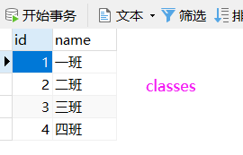

# MySQL基础篇

## [Windows安装MySQL](https://blog.csdn.net/wangpaiblog/article/details/112000033)

## Linux安装Mysql

### 1.下载Linux版MySQL安装包

> 下载地址：[MySQL :: Download MySQL Community Server (Archived Versions)](https://downloads.mysql.com/archives/community/)


### 2.上传MySQL安装包

### 3.创建目录,并解压

```
mkdir mysql

tar -xvf mysql-8.0.26-1.el7.x86_64.rpm-bundle.tar -C mysql
```

### 4. 安装mysql的安装包

```
cd mysql

rpm -ivh mysql-community-common-8.0.26-1.el7.x86_64.rpm 

rpm -ivh mysql-community-client-plugins-8.0.26-1.el7.x86_64.rpm 

rpm -ivh mysql-community-libs-8.0.26-1.el7.x86_64.rpm 

rpm -ivh mysql-community-libs-compat-8.0.26-1.el7.x86_64.rpm

yum install openssl-devel

rpm -ivh  mysql-community-devel-8.0.26-1.el7.x86_64.rpm

rpm -ivh mysql-community-client-8.0.26-1.el7.x86_64.rpm

rpm -ivh  mysql-community-server-8.0.26-1.el7.x86_64.rpm

```

### 5.启动MySQL服务

```
systemctl start mysqld
```

```
systemctl restart mysqld
```

```
systemctl stop mysqld
```

### 6.查询自动生成的root用户密码

```
grep 'temporary password' /var/log/mysqld.log
```

> 命令行执行指令 :

```
mysql -u root -p
```

> 然后输入上述查询到的自动生成的密码, 完成登录 .

### 7.修改root用户密码

> 登录到MySQL之后，需要将自动生成的不便记忆的密码修改了，修改成自己熟悉的便于记忆的密码。

```
ALTER  USER  'root'@'localhost'  IDENTIFIED BY '1234';
```

> 执行上述的SQL会报错，原因是因为设置的密码太简单，密码复杂度不够。我们可以设置密码的复杂度为简单类型，密码长度为4。

```
set global validate_password.policy = 0;
set global validate_password.length = 4;
```

> 降低密码的校验规则之后，再次执行上述修改密码的指令。

### 8.创建用户

> 默认的root用户只能当前节点localhost访问，是无法远程访问的，我们还需要创建一个root账户，用户远程访问

```
create user 'root'@'%' IDENTIFIED WITH mysql_native_password BY '1234';
```

### 9.并给root用户分配权限

```
grant all on *.* to 'root'@'%';
```

### 10.重新连接MySQL

```
mysql -u root -p
```

### 11.通过Navicat远程连接MySQL

## 所用sql脚本

```mysql
-- 如果test数据库不存在，就创建test数据库：
CREATE DATABASE IF NOT EXISTS test;

-- 切换到test数据库
USE test;

-- 删除classes表和students表（如果存在）：
DROP TABLE IF EXISTS classes;
DROP TABLE IF EXISTS students;

-- 创建classes表：
CREATE TABLE classes (
    id BIGINT NOT NULL AUTO_INCREMENT,
    name VARCHAR(100) NOT NULL,
    PRIMARY KEY (id)
) ENGINE=InnoDB DEFAULT CHARSET=utf8;

-- 创建students表：
CREATE TABLE students (
    id BIGINT NOT NULL AUTO_INCREMENT,
    class_id BIGINT NOT NULL,
    name VARCHAR(100) NOT NULL,
    gender VARCHAR(1) NOT NULL,
    score INT NOT NULL,
    PRIMARY KEY (id)
) ENGINE=InnoDB DEFAULT CHARSET=utf8;

-- 插入classes记录：
INSERT INTO classes(id, name) VALUES (1, '一班');
INSERT INTO classes(id, name) VALUES (2, '二班');
INSERT INTO classes(id, name) VALUES (3, '三班');
INSERT INTO classes(id, name) VALUES (4, '四班');

-- 插入students记录：
INSERT INTO students (id, class_id, name, gender, score) VALUES (1, 1, '小明', 'M', 90);
INSERT INTO students (id, class_id, name, gender, score) VALUES (2, 1, '小红', 'F', 95);
INSERT INTO students (id, class_id, name, gender, score) VALUES (3, 1, '小军', 'M', 88);
INSERT INTO students (id, class_id, name, gender, score) VALUES (4, 1, '小米', 'F', 73);
INSERT INTO students (id, class_id, name, gender, score) VALUES (5, 2, '小白', 'F', 81);
INSERT INTO students (id, class_id, name, gender, score) VALUES (6, 2, '小兵', 'M', 55);
INSERT INTO students (id, class_id, name, gender, score) VALUES (7, 2, '小林', 'M', 85);
INSERT INTO students (id, class_id, name, gender, score) VALUES (8, 3, '小新', 'F', 91);
INSERT INTO students (id, class_id, name, gender, score) VALUES (9, 3, '小王', 'M', 89);
INSERT INTO students (id, class_id, name, gender, score) VALUES (10, 3, '小丽', 'F', 85);

-- OK:
SELECT 'ok' as 'result:';
```

## 数据类型

### 整型

| 类型名称      | 取值范围                                  | 大小    |
| ------------- | ----------------------------------------- | ------- |
| TINYINT       | -128〜127                                 | 1个字节 |
| SMALLINT      | -32768〜32767                             | 2个宇节 |
| MEDIUMINT     | -8388608〜8388607                         | 3个字节 |
| INT (INTEGHR) | -2147483648〜2147483647                   | 4个字节 |
| BIGINT        | -9223372036854775808〜9223372036854775807 | 8个字节 |

> 无符号在数据类型后加 unsigned 关键字。

### 浮点型

| 类型名称            | 说明               | 存储需求   |
| ------------------- | ------------------ | ---------- |
| FLOAT               | 单精度浮点数       | 4 个字节   |
| DOUBLE              | 双精度浮点数       | 8 个字节   |
| DECIMAL (M, D)，DEC | 压缩的“严格”定点数 | M+2 个字节 |

### 日期和时间

| 类型名称  | 日期格式            | 日期范围                                          | 存储需求 |
| --------- | ------------------- | ------------------------------------------------- | -------- |
| YEAR      | YYYY                | 1901 ~ 2155                                       | 1 个字节 |
| TIME      | HH:MM:SS            | -838:59:59 ~ 838:59:59                            | 3 个字节 |
| DATE      | YYYY-MM-DD          | 1000-01-01 ~ 9999-12-3                            | 3 个字节 |
| DATETIME  | YYYY-MM-DD HH:MM:SS | 1000-01-01 00:00:00 ~ 9999-12-31 23:59:59         | 8 个字节 |
| TIMESTAMP | YYYY-MM-DD HH:MM:SS | 1980-01-01 00:00:01 UTC ~ 2040-01-19 03:14:07 UTC | 4 个字节 |

### 字符串

| 类型名称   | 说明                                         | 存储需求                                                   |
| ---------- | -------------------------------------------- | ---------------------------------------------------------- |
| CHAR(M)    | 固定长度非二进制字符串                       | M 字节，1<=M<=255                                          |
| VARCHAR(M) | 变长非二进制字符串                           | L+1字节，在此，L< = M和 1<=M<=255                          |
| TINYTEXT   | 非常小的非二进制字符串                       | L+1字节，在此，L<2^8                                       |
| TEXT       | 小的非二进制字符串                           | L+2字节，在此，L<2^16                                      |
| MEDIUMTEXT | 中等大小的非二进制字符串                     | L+3字节，在此，L<2^24                                      |
| LONGTEXT   | 大的非二进制字符串                           | L+4字节，在此，L<2^32                                      |
| ENUM       | 枚举类型，只能有一个枚举字符串值             | 1或2个字节，取决于枚举值的数目 (最大值为65535)             |
| SET        | 一个设置，字符串对象可以有零个或 多个SET成员 | 1、2、3、4或8个字节，取决于集合 成员的数量（最多64个成员） |

### 二进制类型

| 类型名称       | 说明                 | 存储需求               |
| -------------- | -------------------- | ---------------------- |
| BIT(M)         | 位字段类型           | 大约 (M+7)/8 字节      |
| BINARY(M)      | 固定长度二进制字符串 | M 字节                 |
| VARBINARY (M)  | 可变长度二进制字符串 | M+1 字节               |
| TINYBLOB (M)   | 非常小的BLOB         | L+1 字节，在此，L<2^8  |
| BLOB (M)       | 小 BLOB              | L+2 字节，在此，L<2^16 |
| MEDIUMBLOB (M) | 中等大小的BLOB       | L+3 字节，在此，L<2^24 |
| LONGBLOB (M)   | 非常大的BLOB         | L+4 字节，在此，L<2^32 |

### Java类型和SQL类型对应

| Java类型           | SQL类型                  |
| ------------------ | ------------------------ |
| boolean            | BIT                      |
| byte               | TINYINY                  |
| short              | SMALLINT                 |
| int                | INTEGER                  |
| long               | BIGINT                   |
| String             | CHAR,VARCHAR,LONGVARCHAR |
| byte    array      | BINARY,VAR BINARY        |
| java.sql.Date      | DATE                     |
| java.sql.Time      | TIME                     |
| java.sql.Timestamp | TIMESTAMP                |

## DDL（数据定义语言）

### 操作数据库

> - 列出所有数据库
>
>   ```mysql
>   show databases;
>   ```
>
> - 创建数据库
>
>   ```mysql
>   create datebase 数据库名;
>   ```
>
> - 删除数据库
>
>   ```mysql
>   drop detabase 数据库名;
>   ```
>
> - 对一个数据库进行操作
>
>   ```mysql
>   use 数据库名;
>   ```

### 操作表

> - 查看所有数据库表
>
>   ```mysql
>   show tables;
>   ```
>
> - 创建数据库表
>
>   ```mysql
>   CREATE TABLE 表名(
>   	字段1 字段1类型 [COMMENT 字段1注释],
>   	字段2 字段2类型 [COMMENT 字段2注释],
>   	字段3 字段3类型 [COMMENT 字段3注释],
>   	...
>   	字段n 字段n类型 [COMMENT 字段n注释]
>   )[ COMMENT 表注释 ];
>   ```
>
> - 删除数据库
>
>   ```mysql
>   drop table 数据库名;
>   ```
>
> - 查看一个表的结构
>
>   ```mysql
>   DESC 数据库表名;
>   ```
>
> - 查看创建表的SQL语句
>
>   ```mysql
>   show create table 数据库表名;
>   ```
>
> - 修改表就比较复杂。如果要给`students`表新增一列`birth`
>
>   ```mysql
>   alert table students add COLUMN birth VARCHAR(10) NOT NULL;
>   ```
>
> - 要修改`birth`列，例如把列名改为`birthday`，类型改为`VARCHAR(20)`
>
>   ```mysql
>   ALTER TABLE students CHANGE COLUMN birth birthday VARCHAR(20) NOT NULL;
>   ```
>
> - 删除列
>
>   ```mysql
>   ALTER TABLE students DROP COLUMN birthday;
>   ```

### 注意事项

> - UTF8字符集长度为3字节，有些符号占4字节，所以推荐用utf8mb4字符集

## DCL

### 管理用户

> 查询用户：
>
> ```mysql
> USE mysql;
> SELECT * FROM user;
> ```
>
> 创建用户:
> `CREATE USER '用户名'@'主机名' IDENTIFIED BY '密码';`
>
> 修改用户密码：
> `ALTER USER '用户名'@'主机名' IDENTIFIED WITH mysql_native_password BY '新密码';`
>
> 删除用户：
> `DROP USER '用户名'@'主机名';`

```mysql
-- 创建用户test，只能在当前主机localhost访问
create user 'test'@'localhost' identified by '123456';
-- 创建用户test，能在任意主机访问
create user 'test'@'%' identified by '123456';
create user 'test' identified by '123456';
-- 修改密码
alter user 'test'@'localhost' identified with mysql_native_password by '1234';
-- 删除用户
drop user 'test'@'localhost';
```

#### 注意事项

> 主机名可以使用 % 通配

### 权限控制

| 权限                | 说明               |
| ------------------- | ------------------ |
| ALL, ALL PRIVILEGES | 所有权限           |
| SELECT              | 查询数据           |
| INSERT              | 插入数据           |
| UPDATE              | 修改数据           |
| DELETE              | 删除数据           |
| ALTER               | 修改表             |
| DROP                | 删除数据库/表/视图 |
| CREATE              | 创建数据库/表      |

> 更多权限请看[权限一览表](#权限一览表 "权限一览表")
>
> 查询权限：
> `SHOW GRANTS FOR '用户名'@'主机名';`
>
> 授予权限：
> `GRANT 权限列表 ON 数据库名.表名 TO '用户名'@'主机名';`
>
> 撤销权限：
> `REVOKE 权限列表 ON 数据库名.表名 FROM '用户名'@'主机名';`

#### 注意事项

> - 多个权限用逗号分隔
> - 授权时，数据库名和表名可以用 * 进行通配，代表所有

## DML（数据操作语言）

### Insert

```mysql
insert into 表名 (字段1, 字段2, ...) VALUES (值1, 值2, ...);
```

### Delete

```mysql
delete from 表名 where ...;
```

### Update

```mysql
update 表名 set 字段1 = 值1，字段2 = 值2,...where...;
```

### 注意事项

> - 字符串和日期类型数据应该包含在引号中
> - 插入的数据大小应该在字段的规定范围内

## DQL（数据查询语言）

### 基本查询

> - 查询语法
>
>   ```mysql
>   SELECT * FROM <表名>
>   ```
>
> - 设置别名
>
>   ```mysql
>   SELECT 字段1 [ AS 别名1 ], 字段2 [ AS 别名2 ], 字段3 [ AS 别名3 ], ... FROM 表名;
>   
>   SELECT 字段1 [ 别名1 ], 字段2 [ 别名2 ], 字段3 [ 别名3 ], ... FROM 表名;
>   ```
>
> - 去除重复记录
>
>   ```mysql
>   SELECT DISTINCT 字段列表 FROM 表名;
>   ```

### 条件查询

```mysql
SELECT 字段列表 FROM 表名 WHERE 条件列表;
```

| 比较运算符          | 功能                                       |
| ------------------- | ------------------------------------------ |
| >                   | 大于                                       |
| >=                  | 大于等于                                   |
| <                   | 小于                                       |
| <=                  | 小于等于                                   |
| =                   | 等于                                       |
| <> 或 !=            | 不等于                                     |
| BETWEEN ... AND ... | 在某个范围内（含最小、最大值）             |
| IN(...)             | 在in之后的列表中的值，多选一               |
| LIKE 占位符         | 模糊匹配（_匹配单个字符，%匹配任意个字符） |
| IS NULL             | 是NULL                                     |

| 逻辑运算符 | 功能                         |
| ---------- | ---------------------------- |
| AND 或 &&  | 并且（多个条件同时成立）     |
| OR 或 \|\| | 或者（多个条件任意一个成立） |
| NOT 或 !   | 非，不是                     |

> - `NOT`条件**`NOT class_id = 2`其实等价于`class_id <> 2`**，因此，`NOT`查询不是很常用。
> - **如果不加括号，条件运算按照`NOT`、`AND`、`OR`的优先级进行**，即`NOT`优先级最高，其次是`AND`，最后是`OR`。加上括号可以改变优先级。

```mysql
SELECT * from students WHERE score BETWEEN 50 and 90

SELECT * from students WHERE score in (50,60,70,80,90)

SELECT * from students WHERE name like '%明%'

SELECT * from students WHERE name like '_明_'

SELECT * from students WHERE score is NULL;

SELECT * from students WHERE score > 50 and score <80

SELECT * from students WHERE score > 50 or score <80

SELECT * from students WHERE not score = 90
```

### 排序查询

> - 升序(ASC)：`select * from xxx order by score ASC`，**<span style="color:red">默认升序</span>**
> - 降序(DESC)：`select * from xxx order by score DESC`
> - **如果有`WHERE`子句，那么`ORDER BY`子句要放到`WHERE`子句后面。**
> - `SELECT * from students ORDER BY score DESC,id ASC`，先以成绩降序，成绩相同的以id升序

### 分页查询

> - **分页实查询可以<span style="color:orange">通过`LIMIT M OFFSET N `</span>子句实现。**第一个数据**从N开始，每页M个**。**可以<span style="color:orange">简写成 `LIMIT N,M`</span>**

#### 注意事项

> - 起始索引从0开始，起始索引 = （查询页码 - 1） * 每页显示记录数
> - 分页查询是数据库的方言，不同数据库有不同实现，MySQL是LIMIT
> - 如果查询的是第一页数据，起始索引可以省略，直接简写 LIMIT 10

### 聚合查询

#### 聚合函数

| 函数  | 说明                                   |
| :---- | :------------------------------------- |
| count | 统计数量                               |
| SUM   | 计算某一列的合计值，该列必须为数值类型 |
| AVG   | 计算某一列的平均值，该列必须为数值类型 |
| MAX   | 计算某一列的最大值                     |
| MIN   | 计算某一列的最小值                     |

> - **<span style="color:green">使用聚合查询时可以起别名</span>`select count(*) peoplecount from students score>90`**
>
> - **<span style="color:green">如果聚合查询的`WHERE`条件没有匹配到任何行，`COUNT()`会返回0，而`SUM()`、`AVG()`、`MAX()`和`MIN()`会返回`NULL`</span>**

#### 分组查询

> 如果我们要统计一班的学生数量，我们知道，可以用`SELECT COUNT(*) num FROM students WHERE class_id = 1;`。如果要继续统计二班、三班的学生数量，难道必须不断修改`WHERE`条件来执行`SELECT`语句吗？
>
> ```mysql
> select class_id,count(*) peoplecount from students GROUP BY class_id
> ```
>
> 
>
> 执行这个查询，`COUNT()`的结果不再是一个，而是3个，这是因为，**<span style="color:blue">`GROUP BY`子句指定了按`class_id`分组</span>**，因此，执行该`SELECT`语句时，会把`class_id`相同的列先分组，再分别计算，因此，得到了3行结果。

> - `SELECT name, class_id, COUNT(*) num FROM students GROUP BY class_id;`不出意外，执行这条查询我们会得到一个语法错误，因为在任意一个分组中，只有`class_id`都相同，`name`是不同的，SQL引擎不能把多个`name`的值放入一行记录中。因此，聚合查询的列中，只能放入分组的列。
> - `SELECT class_id, gender, COUNT(*) num FROM students GROUP BY class_id, gender;`统计各班的男生和女生人数

#### 注意事项

> - **执行顺序：where > 聚合函数 > having**
> - 分组之后，查询的字段一般为聚合函数和分组字段，查询其他字段无任何意义

#### where和having的区别

> - 执行时机不同：where是分组之前进行过滤，不满足where条件不参与分组；having是分组后对结果进行过滤。
> - 判断条件不同：<span style="color:orange">**where不能对聚合函数进行判断，而having可以。**</span>

> mysql中出现 `Unknown column ‘xxx‘ in ‘having clause‘`
>
> 这是因为在使用group by分组时，后面如果需要再加一个having进行判断，则所判断的字段需要在select后面出现
>
>
> 例如：`select s.stock_name,s.operation from Stocks s group by s.stock_name HAVING s.operation ="Buy"`

### DQL执行顺序

> <span style="color:purple">**from > on > join > where > group by > 聚合函数 > having > select > distinct > order by > limit**</span>

## 函数

### 字符串函数

> 注意:MySQL中，字符串的位置是从1开始的。

| 函数                             | 用法                                                         |
| -------------------------------- | ------------------------------------------------------------ |
| ASCIl(S)                         | 返回字符串S中的第一个字符的ASCII码值                         |
| CHAR_LENGTH(s)                   | 返回字符串s的字符数。作用与CHARACTER_LENGTH(s)相同           |
| LENGTH(s)                        | 返回字符串s的字节数，和字符集有关                            |
| CONCAT(s1,s2…n)                  | 连接s1,s2…,sn为一个字符串                                    |
| CONCAT_WS(x,s1,s2,.sn)           | 同CONCAT(s1,s2,…函数，但是每个字符串之间要加上x              |
| INSERT(str, idx, len,replacestr) | 将字符串str从第idx位置开始，len个字符长的子串替换为字符串replacestr |
| REPLACE(str, a, b)               | 用字符串b替换字符串str中所有出现的字符串a                    |
| UPPER(s)或UCASE(s)               | 将字符串s的所有字母转成大写字母                              |
| LOWER(s)或LCASE(s)               | 将字符串s的所有字母转成小写字母                              |
| LEFT(str,n)                      | 返回字符串str最左边的n个字符                                 |
| RIGHT(str,n)                     | 返回字符串str最右边的n个字符                                 |
| LPAD(str, len, pad)              | 用字符串pad对str最左边进行填充，直到str的长度为len个字符     |
| RPAD(str ,len, pad)              | 用字符串pad对str最右边进行填充，直到str的长度为len个字符     |
| LTRIM(s)                         | 去掉字符串s左侧的空格                                        |
| RTRIM(s)                         | 去掉字符串s右侧的空格                                        |
| TRIM(s)                          | 去掉字符串s开始与结尾的空格                                  |
| TRIM(s1 FROM s)                  | 去掉字符串s开始与结尾的s1                                    |
| TRIM(LEADING s1 FROM s)          | 去掉字符串s开始处的s1                                        |
| TRIM(TRAILING s1 FROM s)         | 去掉字符串s结尾处的s1                                        |
| REPEAT(str, n)                   | 返回str重复n次的结果                                         |
| SPACE(n)                         | 返回n个空格                                                  |
| STRCMP(s1,s2)                    | 比较字符串s1,s2的ASClI码值的大小                             |
| SUBSTR(s,index,len)              | 返回从字符串s的index位置其len个字符，作用与SUBSTRING(s,n,len)、MID(s,n,len)相同 |
| LOCATE(substr,str)               | 返回字符串substr在字符串str中首次出现的位置，作用于POSITION(substr IN str)、INSTR(str,substr)相同。未找到返回0 |
| ELT(m,1,s2,…n)                   | 返回指定位置的字符串，如果m=1，则返回s1，如果m=2，则返回s2，如果m=n，则返回sn |
| FIELD(s,s1,s2…n)                 | 返回字符串s在字符串列表中第一次出现的位置                    |
| FIND_IN_SET(s1,s2)               | 返回字符串s1在字符串s2中出现的位置。其中，字符串s2是一个以逗号分隔的字符串 |
| REVERSE(s)                       | 返回s反转后的字符串                                          |
| NULLIF(value1,value2)            | 比较两个字符串，如果value1与value2相等，则返回NULL，否则返回value1 |

```mysql
#3. 字符串函数
#ASCII：求字符串中第一个字符的ASCII码
#CHAR_LENGTH:求字符串长度CHAR_LENGTH
#LENGTH:字符串所占字节数
SELECT ASCII('Abcdfsf'),CHAR_LENGTH('hello'),CHAR_LENGTH('我们'),
LENGTH('hello'),LENGTH('我们')
FROM DUAL;
/*
+------------------+----------------------+-----------------------+-----------------+------------------+
| ASCII('Abcdfsf') | CHAR_LENGTH('hello') | CHAR_LENGTH('我们')   | LENGTH('hello') | LENGTH('我们')   |
+------------------+----------------------+-----------------------+-----------------+------------------+
|               65 |                    5 |                     2 |               5 |                6 |
+------------------+----------------------+-----------------------+-----------------+------------------+
*/

#CONCAT：字符串拼接
# xxx worked for yyy
SELECT CONCAT(emp.last_name,' worked for ',mgr.last_name) "details"
FROM employees emp JOIN employees mgr
WHERE emp.`manager_id` = mgr.employee_id;
/*部分输出
+--------------------------------+
| details                        |
+--------------------------------+
| Kochhar worked for King        |
| De Haan worked for King        |
| Hunold worked for De Haan      |
*/
#CONCAT_WS:用第一个参数分隔连接后面的字符串
SELECT CONCAT_WS('-','hello','world','hello','beijing')
FROM DUAL;
/*
+--------------------------------------------------+
| CONCAT_WS('-','hello','world','hello','beijing') |
+--------------------------------------------------+
| hello-world-hello-beijing                        |
+--------------------------------------------------+
*/
#字符串的索引是从1开始的！(Java从0开始的)
#INSERT(str, idx, len,replacestr)
#将字符串str从第idx位置开始，len个字符长的子串替换为字符串replacestr
SELECT INSERT('helloworld',2,3,'aaaaa'),REPLACE('hello','lol','mmm'),REPLACE('hello','lo','mmm')
FROM DUAL;
/*
+----------------------------------+------------------------------+-----------------------------+
| INSERT('helloworld',2,3,'aaaaa') | REPLACE('hello','lol','mmm') | REPLACE('hello','lo','mmm') |
+----------------------------------+------------------------------+-----------------------------+
| haaaaaoworld                     | hello                        | helmmm                      |
+----------------------------------+------------------------------+-----------------------------+
*/
#大小写转换
SELECT UPPER('HelLo'),LOWER('HelLo')
FROM DUAL;
/*
+----------------+----------------+
| UPPER('HelLo') | LOWER('HelLo') |
+----------------+----------------+
| HELLO          | hello          |
+----------------+----------------+
*/
SELECT last_name,salary
FROM employees
WHERE LOWER(last_name) = 'King';
/*严格说应该查不到-->但是Mysql大小写不严格
+-----------+----------+
| last_name | salary   |
+-----------+----------+
| King      | 24000.00 |
| King      | 10000.00 |
+-----------+----------+
*/
SELECT LEFT('hello',2),RIGHT('hello',3),RIGHT('hello',13)
FROM DUAL;
/*
+-----------------+------------------+-------------------+
| LEFT('hello',2) | RIGHT('hello',3) | RIGHT('hello',13) |
+-----------------+------------------+-------------------+
| he              | llo              | hello             |
+-----------------+------------------+-------------------+
*/
# LPAD:实现右对齐效果
# RPAD:实现左对齐效果
SELECT employee_id,last_name,LPAD(salary,10,'$'),LPAD(salary,10,' ')
FROM employees;
/*
+-------------+-------------+---------------------+---------------------+
| employee_id | last_name   | LPAD(salary,10,'$') | LPAD(salary,10,' ') |
+-------------+-------------+---------------------+---------------------+
|         100 | King        | $$24000.00          |   24000.00          |
|         101 | Kochhar     | $$17000.00          |   17000.00          |
|         102 | De Haan     | $$17000.00          |   17000.00          |
|         103 | Hunold      | $$$9000.00          |    9000.00          |
*/
#TRIM去掉首尾空格
#LTRIM去掉左侧空格
#TRIM('oo' FROM 'ooheolloo')去掉'oo'
SELECT CONCAT('---',LTRIM('    h  el  lo   '),'***'),
TRIM('oo' FROM 'ooheolloo')
FROM DUAL;
/*
+-----------------------------------------------+-----------------------------+
| CONCAT('---',LTRIM('    h  el  lo   '),'***') | TRIM('oo' FROM 'ooheolloo') |
+-----------------------------------------------+-----------------------------+
| ---h  el  lo   ***                            | heoll                       |
+-----------------------------------------------+-----------------------------+
*/
#REPEAT(str,n):重复n次str 
#SPACE(n):提供n个空格
#STRCMP：比较字符串大小
SELECT REPEAT('hello',4),LENGTH(SPACE(5)),STRCMP('abc','abe')
FROM DUAL;
/*
+----------------------+------------------+---------------------+
| REPEAT('hello',4)    | LENGTH(SPACE(5)) | STRCMP('abc','abe') |
+----------------------+------------------+---------------------+
| hellohellohellohello |                5 |                  -1 |
+----------------------+------------------+---------------------+
*/
#SUBSTR(str,i,len):截取str中i处起len个字符
#LOCATE('ll','hello')定位‘ll’首次出现的位置
SELECT SUBSTR('hello',2,2),LOCATE('ll','hello'),LOCATE('lll','hello')
FROM DUAL;
/*
+---------------------+----------------------+-----------------------+
| SUBSTR('hello',2,2) | LOCATE('ll','hello') | LOCATE('lll','hello') |
+---------------------+----------------------+-----------------------+
| el                  |                    3 |                     0 |
+---------------------+----------------------+-----------------------+
*/
#ELT:返回指定位置的字符串
#FIELD(s,s1,...)：返回s在字符列表中首次出现的位置
#FIND_IN_SET(s1,s2):返回s1在s2中首次出现的位置
SELECT ELT(2,'a','b','c','d'),FIELD('mm','gg','jj','mm','dd','mm'),
FIND_IN_SET('mm','gg,mm,jj,dd,mm,gg')
FROM DUAL;
/*
+------------------------+--------------------------------------+---------------------------------------+
| ELT(2,'a','b','c','d') | FIELD('mm','gg','jj','mm','dd','mm') | FIND_IN_SET('mm','gg,mm,jj,dd,mm,gg') |
+------------------------+--------------------------------------+---------------------------------------+
| b                      |                                    3 |                                     2 |
+------------------------+--------------------------------------+---------------------------------------+
*/
#NULLIF(s1,s2):字符串s1和s2相等返回NULL,不相等返回s1
SELECT employee_id,NULLIF(LENGTH(first_name),LENGTH(last_name)) "compare"
FROM employees;
/*姓和名一样长返回NULL
+-------------+---------+
| employee_id | compare |
+-------------+---------+
|         100 |       6 |
|         101 |       5 |
|         102 |       3 |
|         103 |       9 |
|         104 |    NULL |
*/

```

### 数值函数

| 函数                | 用法                                                         |
| ------------------- | ------------------------------------------------------------ |
| ABS(x)              | 返回x的绝对值                                                |
| SIGN(X)             | 返回x的符号。正数返回1，负数返回-1，0返回0                   |
| PI()                | 返回圆周率的值                                               |
| CEIL(x)，CEILING(x) | 返回大于或等于某个值的最小整数                               |
| FLOOR(x)            | 返回小于或等于某个值的最大整数                               |
| LEAST(e1,e2,e3…)    | 返回列表中的最小值                                           |
| GREATEST(e1,e2,e3…) | 返回列表中的最大值                                           |
| MOD(x,y)            | 返回x除以Y后的余数                                           |
| RAND()              | 返回0~1的随机值                                              |
| RAND(x)             | 返回0~1的随机值，其中x的值用作种子值，相同的x值会产生相同的随机数 |
| ROUND(x)            | 返回一个对x的值进行四舍五入后，最接近于x的整数               |
| ROUND(x,y)          | 返回一个对x的值进行四舍五入后最接近x的值，并保留到小数点后面Y位 |
| TRUNCATE(x,y)       | 返回数字x截断为y位小数的结果                                 |
| SQRT(x)             | 返回x的平方根。当x的值为负数时，返回NULL                     |

```mysql
#1.数值函数
#基本的操作
SELECT ABS(-123),ABS(32),SIGN(-23),SIGN(43),PI(),CEIL(32.32),CEILING(-43.23),FLOOR(32.32),
FLOOR(-43.23),MOD(12,5),12 MOD 5,12 % 5
FROM DUAL;
/*
+-----------+---------+-----------+----------+----------+-------------+-----------------+--------------+---------------+-----------+----------+--------+
| ABS(-123) | ABS(32) | SIGN(-23) | SIGN(43) | PI()     | CEIL(32.32) | CEILING(-43.23) | FLOOR(32.32) | FLOOR(-43.23) | MOD(12,5) | 12 MOD 5 | 12 % 5 |
+-----------+---------+-----------+----------+----------+-------------+-----------------+--------------+---------------+-----------+----------+--------+
|       123 |      32 |        -1 |        1 | 3.141593 |          33 |             -43 |           32 |           -44 |         2 |        2 |      2 |
+-----------+---------+-----------+----------+----------+-------------+-----------------+--------------+---------------+-----------+----------+--------+
*/

#取随机数(其中的参数称为种子，种子相同的两个RAND函数每次结果都一样且不变)
SELECT RAND(),RAND(),RAND(10),RAND(10),RAND(-1),RAND(-1)
FROM DUAL;
/*
+---------------------+--------------------+--------------------+--------------------+--------------------+--------------------+
| RAND()              | RAND()             | RAND(10)           | RAND(10)           | RAND(-1)           | RAND(-1)           |
+---------------------+--------------------+--------------------+--------------------+--------------------+--------------------+
| 0.23112941927381736 | 0.8571839666526615 | 0.6570515219653505 | 0.6570515219653505 | 0.9050373219931845 | 0.9050373219931845 |
+---------------------+--------------------+--------------------+--------------------+--------------------+--------------------+
*/

#四舍五入:RAND(操作数，保留小数的位数)
SELECT ROUND(123.556),ROUND(123.456,0),ROUND(123.456,1),ROUND(123.456,2),
ROUND(123.456,-1),ROUND(153.456,-2)
FROM DUAL;
/*
+----------------+------------------+------------------+------------------+-------------------+-------------------+
| ROUND(123.556) | ROUND(123.456,0) | ROUND(123.456,1) | ROUND(123.456,2) | ROUND(123.456,-1) | ROUND(153.456,-2) |
+----------------+------------------+------------------+------------------+-------------------+-------------------+
|            124 |              123 |            123.5 |           123.46 |               120 |               200 |
+----------------+------------------+------------------+------------------+-------------------+-------------------+
*/
#截断操作:TRUNCATE(操作数，保留小数的位数)
SELECT TRUNCATE(123.456,0),TRUNCATE(123.496,1),TRUNCATE(129.45,-1)
FROM DUAL;
/*
+---------------------+---------------------+---------------------+
| TRUNCATE(123.456,0) | TRUNCATE(123.496,1) | TRUNCATE(129.45,-1) |
+---------------------+---------------------+---------------------+
|                 123 |               123.4 |                 120 |
+---------------------+---------------------+---------------------+
*/

#单行函数可以嵌套
SELECT TRUNCATE(ROUND(123.456,2),0)
FROM DUAL;
/*
+------------------------------+
| TRUNCATE(ROUND(123.456,2),0) |
+------------------------------+
|                          123 |
+------------------------------+
*/

```

### 日期时间函数

| 函数                                                         | 功能                                           |
| ------------------------------------------------------------ | ---------------------------------------------- |
| CURDATE() ,CURRENT_DATE()                                    | 返回当前日期，只包含年、月、日                 |
| CURTIME(), CURRENT_TIME()                                    | 返回当前时间，只包含时、分、秒                 |
| NOW() / SYSDATE()/ CURRENT_TIMESTAMP() /LOCALTIME()/LOCALTIMESTAMP() | 返回当前系统日期和时间                         |
| UTC_DATE()                                                   | 返回UTC(世界标准时间)                          |
| UTC_TIME()                                                   | 返回UTC(世界标准时间)时间                      |
| YEAR(date)/MONTH(date) / DAY(date)                           | 返回具体的日期值                               |
| HOUR(time)/ MINUTE(time) /SECOND(time)                       | 返回具体的时间值                               |
| MONTHNAME(date)                                              | 返回月份:January，…                            |
| DAYNAME(date)                                                | 返回星期几: MONDAY，TUESDAY…SUNDAY             |
| WEEKDAY(date)                                                | 返回周几，注意，周1是0，周2是1,。。。周日是6   |
| QUARTER(date)                                                | 返回日期对应的季度，范围为1～4                 |
| WEEK(date),WEEKOFYEAR(date)                                  | 返回一年中的第几周                             |
| DAYOFYEAR(date)                                              | 返回日期是一年中的第几天                       |
| DAYOFMONTH(date)                                             | 返回日期位于所在月份的第几天                   |
| DAYOFWEEK(date)                                              | 返回周几，注意:周日是1，周一是2，。。。周六是7 |

```mysql
#获取当前日期、时间
SELECT CURDATE(),CURRENT_DATE(),CURTIME(),NOW(),SYSDATE(),
UTC_DATE(),UTC_TIME()
FROM DUAL;
/*
+------------+----------------+-----------+---------------------+---------------------+------------+------------+
| CURDATE()  | CURRENT_DATE() | CURTIME() | NOW()               | SYSDATE()           | UTC_DATE() | UTC_TIME() |
+------------+----------------+-----------+---------------------+---------------------+------------+------------+
| 2022-02-12 | 2022-02-12     | 18:59:18  | 2022-02-12 18:59:18 | 2022-02-12 18:59:18 | 2022-02-12 | 10:59:18   |
+------------+----------------+-----------+---------------------+---------------------+------------+------------+
*/
SELECT CURDATE(),CURDATE() + 0,CURTIME() + 0,NOW() + 0
FROM DUAL;
/*
+------------+---------------+---------------+----------------+
| CURDATE()  | CURDATE() + 0 | CURTIME() + 0 | NOW() + 0      |
+------------+---------------+---------------+----------------+
| 2022-02-12 |      20220212 |        190103 | 20220212190103 |
+------------+---------------+---------------+----------------+
*/


#获取月份、星期、星期数、天数等函数
SELECT YEAR(CURDATE()),MONTH(CURDATE()),DAY(CURDATE()),
HOUR(CURTIME()),MINUTE(NOW()),SECOND(SYSDATE())
FROM DUAL;
/*输出
+-----------------+------------------+----------------+-----------------+---------------+-------------------+
| YEAR(CURDATE()) | MONTH(CURDATE()) | DAY(CURDATE()) | HOUR(CURTIME()) | MINUTE(NOW()) | SECOND(SYSDATE()) |
+-----------------+------------------+----------------+-----------------+---------------+-------------------+
|            2022 |                2 |             13 |               2 |            50 |                55 |
+-----------------+------------------+----------------+-----------------+---------------+-------------------+
*/
#MONTHNAME(date) 返回月份：January，..
#DAYNAME(date) 返回星期几：MONDAY，TUESDAY.....SUNDAY
SELECT MONTHNAME('2021-10-26'),DAYNAME('2021-10-26'),WEEKDAY('2021-10-26'),
QUARTER(CURDATE()),WEEK(CURDATE()),DAYOFYEAR(NOW()),
DAYOFMONTH(NOW()),DAYOFWEEK(NOW())
FROM DUAL;
/*
+-------------------------+-----------------------+-----------------------+--------------------+-----------------+------------------+-------------------+------------------+
| MONTHNAME('2021-10-26') | DAYNAME('2021-10-26') | WEEKDAY('2021-10-26') | QUARTER(CURDATE()) | WEEK(CURDATE()) | DAYOFYEAR(NOW()) | DAYOFMONTH(NOW()) | DAYOFWEEK(NOW()) |
+-------------------------+-----------------------+-----------------------+--------------------+-----------------+------------------+-------------------+------------------+
| October                 | Tuesday               |                     1 |                  1 |               7 |               44 |                13 |                1 |
+-------------------------+-----------------------+-----------------------+--------------------+-----------------+------------------+-------------------+------------------+
*/

```

### 流程函数

| 函数                                                         | 功能                                                      |
| ------------------------------------------------------------ | --------------------------------------------------------- |
| IF(value, t, f)                                              | 如果value为true，则返回t，否则返回f                       |
| IFNULL(value1, value2)                                       | 如果value1不为空，返回value1，否则返回value2              |
| CASE WHEN [ val1 ] THEN [ res1 ] ... ELSE [ default ] END    | 如果val1为true，返回res1，... 否则返回default默认值       |
| CASE [ expr ] WHEN [ val1 ] THEN [ res1 ] ... ELSE [ default ] END | 如果expr的值等于val1，返回res1，... 否则返回default默认值 |

```mysql
select
	name,
	(case when age > 30 then '中年' else '青年' end)
from employee;
select
	name,
	(case workaddress when '北京市' then '一线城市' when '上海市' then '一线城市' else '二线城市' end) as '工作地址'
from employee;
```

## 窗口函数mysql8.0

> `窗口函数`：在满足某些条件的记录集合上执行的特殊函数，对于每条记录都要在此窗口内执行函数。有的函数随着记录的不同，窗口大小都是固定的，称为`静态窗口`；有的函数则相反，不同的记录对应着不同的窗口，称为`滑动窗口`。


### 窗口函数和普通聚合函数的区别

> 聚合函数是将多条记录聚合为一条；窗口函数是每条记录都会执行，有几条记录执行完还是几条。
> 聚合函数也可以用于窗口函数。

### 窗口函数的基本用法

> ```
> 函数名 OVER 子句
> ```
>
> over关键字用来指定函数执行的窗口范围，若后面括号中什么都不写，则意味着窗口包含满足WHERE条件的所有行，窗口函数基于所有行进行计算；如果不为空，则支持以下4中语法来设置窗口。
> ①`window_name`：给窗口指定一个别名。如果SQL中涉及的窗口较多，采用别名可以看起来更清晰易读；
>
> ```mysql
> select s.score,dense_rank() over (order by score desc) as 'rank' from Scores s
> 
> ===>select s.score,dense_rank() over w as 'rank' from Scores s Window w as (order by score desc)
> ```
>
> ②`PARTITION BY 子句`：窗口按照哪些字段进行分组，窗口函数在不同的分组上分别执行；
> ③`ORDER BY 子句`：按照哪些字段进行排序，窗口函数将按照排序后的记录顺序进行编号；
> ④`FRAME 子句`：`FRAME`是当前分区的一个子集，子句用来定义子集的规则，通常用来作为滑动窗口使用。

### 按功能划分可将MySQL支持的窗口函数分为如下几类

#### 序号函数

> ROW_NUMBER()：顺序排序——1、2、3
> RANK()：并列排序，跳过重复序号——1、1、3
> DENSE_RANK()：并列排序，不跳过重复序号——1、1、2
>
> 用途：显示分区中的当前行号
> 应用场景：查询每个学生的分数最高的前3门课程

```mysql
mysql> SELECT *
    -> FROM(
    ->     SELECT stu_id,
    ->     ROW_NUMBER() OVER (PARTITION BY stu_id ORDER BY score DESC) AS score_
order,
    ->     lesson_id, score
    ->     FROM t_score) t
    -> WHERE score_order <= 3
    -> ;
+--------+-------------+-----------+-------+
| stu_id | score_order | lesson_id | score |
+--------+-------------+-----------+-------+
|      1 |           1 | L005      |    98 |
|      1 |           2 | L001      |    98 |
|      1 |           3 | L004      |    88 |
|      2 |           1 | L002      |    90 |
|      2 |           2 | L003      |    86 |
|      2 |           3 | L001      |    84 |
|      3 |           1 | L001      |   100 |
|      3 |           2 | L002      |    91 |
|      3 |           3 | L003      |    85 |
|      4 |           1 | L001      |    99 |
|      4 |           2 | L005      |    98 |
|      4 |           3 | L002      |    88 |
+--------+-------------+-----------+-------+
```

> 对于stu_id=1的同学，有两门课程的成绩均为98，序号随机排了1和2。但很多情况下二者应该是并列第一，则他的成绩为88的这门课的序号可能是第2名，也可能为第3名。
> 这时候，ROW_NUMBER()就不能满足需求，需要RANK()和DENSE_RANK()出场，它们和ROW_NUMBER()非常类似，只是在出现重复值时处理逻辑有所不

```mysql
mysql> SELECT *
    -> FROM(
    ->     SELECT
    ->     ROW_NUMBER() OVER (PARTITION BY stu_id ORDER BY score DESC) AS score_order1,
    ->     RANK() OVER (PARTITION BY stu_id ORDER BY score DESC) AS score_order2,
    ->     DENSE_RANK() OVER (PARTITION BY stu_id ORDER BY score DESC) AS score_order3,
    ->     stu_id, lesson_id, score
    ->     FROM t_score) t
    -> WHERE stu_id = 1 AND score_order1 <= 3 AND score_order2 <= 3 AND score_order3 <= 3
    -> ;
+--------------+--------------+--------------+--------+-----------+-------+
| score_order1 | score_order2 | score_order3 | stu_id | lesson_id | score |
+--------------+--------------+--------------+--------+-----------+-------+
|            1 |            1 |            1 |      1 | L005      |    98 |
|            2 |            1 |            1 |      1 | L001      |    98 |
|            3 |            3 |            2 |      1 | L004      |    88 |
+--------------+--------------+--------------+--------+-----------+-------+
```

#### 分布函数

##### PERCENT_RANK()

> 用途：每行按照公式(rank-1) / (rows-1)进行计算。其中，rank为RANK()函数产生的序号，rows为当前窗口的记录总行数
> 应用场景：不常用

```mysql
mysql> SELECT
    -> RANK() OVER w AS rk,
    -> PERCENT_RANK() OVER w AS prk,
    -> stu_id, lesson_id, score
    -> FROM t_score
    -> WHERE stu_id = 1
    -> WINDOW w AS (PARTITION BY stu_id ORDER BY score)
    -> ;
+----+------+--------+-----------+-------+
| rk | prk  | stu_id | lesson_id | score |
+----+------+--------+-----------+-------+
|  1 |    0 |      1 | L003      |    79 |
|  2 | 0.25 |      1 | L002      |    86 |
|  3 |  0.5 |      1 | L004      |    88 |
|  4 | 0.75 |      1 | L005      |    98 |
|  4 | 0.75 |      1 | L001      |    98 |
+----+------+--------+-----------+-------+
```

##### CUME_DIST()

> 用途：分组内小于、等于当前rank值的行数 / 分组内总行数
> 应用场景：查询小于等于当前成绩（score）的比例

```mysql
# cd1：没有分区，则所有数据均为一组，总行数为8
# cd2：按照lesson_id分成了两组，行数各为4

mysql> SELECT stu_id, lesson_id, score,
    -> CUME_DIST() OVER (ORDER BY score) AS cd1,
    -> CUME_DIST() OVER (PARTITION BY lesson_id ORDER BY score) AS cd2
    -> FROM t_score
    -> WHERE lesson_id IN ('L001','L002')
    -> ;
+--------+-----------+-------+-------+------+
| stu_id | lesson_id | score | cd1   | cd2  |
+--------+-----------+-------+-------+------+
|      2 | L001      |    84 | 0.125 | 0.25 |
|      1 | L001      |    98 |  0.75 |  0.5 |
|      4 | L001      |    99 | 0.875 | 0.75 |
|      3 | L001      |   100 |     1 |    1 |
|      1 | L002      |    86 |  0.25 | 0.25 |
|      4 | L002      |    88 | 0.375 |  0.5 |
|      2 | L002      |    90 |   0.5 | 0.75 |
|      3 | L002      |    91 | 0.625 |    1 |
+--------+-----------+-------+-------+------+
```

#### 前后函数

> 用途：返回位于当前行的前n行（LAG(expr,n)）或后n行（LEAD(expr,n)）的expr的值
> 应用场景：查询前1名同学的成绩和当前同学成绩的差值

```mysql
# 内层SQL先通过LAG()函数得到前1名同学的成绩，外层SQL再将当前同学和前1名同学的成绩做差得到成绩差值diff。

mysql> SELECT stu_id, lesson_id, score, pre_score,
    -> score-pre_score AS diff
    -> FROM(
    ->     SELECT stu_id, lesson_id, score,
    ->     LAG(score,1) OVER w AS pre_score
    ->     FROM t_score
    ->     WHERE lesson_id IN ('L001','L002')
    ->     WINDOW w AS (PARTITION BY lesson_id ORDER BY score)) t
    -> ;
+--------+-----------+-------+-----------+------+
| stu_id | lesson_id | score | pre_score | diff |
+--------+-----------+-------+-----------+------+
|      2 | L001      |    84 |      NULL | NULL |
|      1 | L001      |    98 |        84 |   14 |
|      4 | L001      |    99 |        98 |    1 |
|      3 | L001      |   100 |        99 |    1 |
|      1 | L002      |    86 |      NULL | NULL |
|      4 | L002      |    88 |        86 |    2 |
|      2 | L002      |    90 |        88 |    2 |
|      3 | L002      |    91 |        90 |    1 |
+--------+-----------+-------+-----------+------+
```

#### 头尾函数

> 用途：返回第一个（FIRST_VALUE(expr)）或最后一个（LAST_VALUE(expr)）expr的值
> 应用场景：截止到当前成绩，按照日期排序查询第1个和最后1个同学的分数

```mysql
mysql> SELECT stu_id, lesson_id, score, create_time,
    -> FIRST_VALUE(score) OVER w AS first_score,
    -> LAST_VALUE(score) OVER w AS last_score
    -> FROM t_score
    -> WHERE lesson_id IN ('L001','L002')
    -> WINDOW w AS (PARTITION BY lesson_id ORDER BY create_time)
    -> ;
+--------+-----------+-------+-------------+-------------+------------+
| stu_id | lesson_id | score | create_time | first_score | last_score |
+--------+-----------+-------+-------------+-------------+------------+
|      3 | L001      |   100 | 2018-08-07  |         100 |        100 |
|      1 | L001      |    98 | 2018-08-08  |         100 |         98 |
|      2 | L001      |    84 | 2018-08-09  |         100 |         99 |
|      4 | L001      |    99 | 2018-08-09  |         100 |         99 |
|      3 | L002      |    91 | 2018-08-07  |          91 |         91 |
|      1 | L002      |    86 | 2018-08-08  |          91 |         86 |
|      2 | L002      |    90 | 2018-08-09  |          91 |         90 |
|      4 | L002      |    88 | 2018-08-10  |          91 |         88 |
+--------+-----------+-------+-------------+-------------+------------+

```

#### 其它函数

##### NTH_VALUE(expr,n)

> 用途：返回窗口中第n个expr的值。expr可以是表达式，也可以是列名
> 应用场景：截止到当前成绩，显示每个同学的成绩中排名第2和第3的成绩的分数

```mysql
mysql> SELECT stu_id, lesson_id, score,
    -> NTH_VALUE(score,2) OVER w AS second_score,
    -> NTH_VALUE(score,3) OVER w AS third_score
    -> FROM t_score
    -> WHERE stu_id IN (1,2)
    -> WINDOW w AS (PARTITION BY stu_id ORDER BY score)
    -> ;
+--------+-----------+-------+--------------+-------------+
| stu_id | lesson_id | score | second_score | third_score |
+--------+-----------+-------+--------------+-------------+
|      1 | L003      |    79 |         NULL |        NULL |
|      1 | L002      |    86 |           86 |        NULL |
|      1 | L004      |    88 |           86 |          88 |
|      1 | L001      |    98 |           86 |          88 |
|      1 | L005      |    98 |           86 |          88 |
|      2 | L004      |    75 |         NULL |        NULL |
|      2 | L005      |    77 |           77 |        NULL |
|      2 | L001      |    84 |           77 |          84 |
|      2 | L003      |    86 |           77 |          84 |
|      2 | L002      |    90 |           77 |          84 |
+--------+-----------+-------+--------------+-------------+

```

##### NTILE(n)

> 用途：将分区中的有序数据分为n个等级，记录等级数
> 应用场景：将每门课程按照成绩分成3组

```mysql
mysql> SELECT
    -> NTILE(3) OVER w AS nf,
    -> stu_id, lesson_id, score
    -> FROM t_score
    -> WHERE lesson_id IN ('L001','L002')
    -> WINDOW w AS (PARTITION BY lesson_id ORDER BY score)
    -> ;
+------+--------+-----------+-------+
| nf   | stu_id | lesson_id | score |
+------+--------+-----------+-------+
|    1 |      2 | L001      |    84 |
|    1 |      1 | L001      |    98 |
|    2 |      4 | L001      |    99 |
|    3 |      3 | L001      |   100 |
|    1 |      1 | L002      |    86 |
|    1 |      4 | L002      |    88 |
|    2 |      2 | L002      |    90 |
|    3 |      3 | L002      |    91 |
+------+--------+-----------+-------+

```

> NTILE(n)函数在数据分析中应用较多，比如由于数据量大，需要将数据平均分配到n个并行的进程分别计算，此时就可以用NTILE(n)对数据进行分组（由于记录数不一定被n整除，所以数据不一定完全平均），然后将不同桶号的数据再分配。

### 聚合函数作为窗口函数

> 用途：在窗口中每条记录动态地应用聚合函数（SUM()、AVG()、MAX()、MIN()、COUNT()），可以动态计算在指定的窗口内的各种聚合函数值
> 应用场景：截止到当前时间，查询stu_id=1的学生的累计分数、分数最高的科目、分数最低的科目

```mysql
mysql> SELECT stu_id, lesson_id, score, create_time,
    -> SUM(score) OVER w AS score_sum,
    -> MAX(score) OVER w AS score_max,
    -> MIN(score) OVER w AS score_min
    -> FROM t_score
    -> WHERE stu_id = 1
    -> WINDOW w AS (PARTITION BY stu_id ORDER BY create_time)
    -> ;
+--------+-----------+-------+-------------+-----------+-----------+-----------+

| stu_id | lesson_id | score | create_time | score_sum | score_max | score_min |

+--------+-----------+-------+-------------+-----------+-----------+-----------+

|      1 | L001      |    98 | 2018-08-08  |       184 |        98 |        86 |

|      1 | L002      |    86 | 2018-08-08  |       184 |        98 |        86 |

|      1 | L003      |    79 | 2018-08-09  |       263 |        98 |        79 |

|      1 | L004      |    88 | 2018-08-10  |       449 |        98 |        79 |

|      1 | L005      |    98 | 2018-08-10  |       449 |        98 |        79 |

+--------+-----------+-------+-------------+-----------+-----------+-----------+

```

## 约束constraint

> 约束是作用于表中字段上的，可以再创建表/修改表的时候添加约束。

### 约束类型

| 约束                    | 描述                                                     | 关键字      |
| ----------------------- | -------------------------------------------------------- | ----------- |
| 主键约束                | 主键是一行数据的唯一标识，要求非空且唯一                 | PRIMARY KEY |
| 外键约束                | 用来让两张图的数据之间建立连接，保证数据的一致性和完整性 | FOREIGN KEY |
| 唯一约束                | 保证该字段的所有数据都是唯一、不重复的                   | UNIQUE      |
| 非空约束                | 限制该字段的数据不能为null                               | NOT NULL    |
| 默认约束                | 保存数据时，如果未指定该字段的值，则采用默认值           | DEFAULT     |
| 检查约束（8.0.1版本后） | 保证字段值满足某一个条件                                 | CHECK       |

```sql
create table user(
	id int primary key auto_increment,
	name varchar(10) not null unique,
	age int check(age > 0 and age < 120),
	status char(1) default '1',
	gender char(1)
);
```

### 主键约束

> - 对于关系表，有个很重要的约束，就是任意两条记录不能重复。<span style="color:orange">不能重复不是指两条记录不完全相同，而是指能够通过某个字段唯一区分出不同的记录，这个字段被称为**主键**。</span>
> - 对主键的要求，最关键的一点是：**记录一旦插入到表中，主键最好不要再修改，**因为主键是用来唯一定位记录的，修改了主键，会造成一系列的影响。
> - 选取主键的一个基本原则是：<span style="color:orange">**不使用任何业务相关的字段作为主键。**</span>而应该使用BIGINT自增或者GUID类型。<span style="color:orange">**主键也不应该允许`NULL`。**</span>

#### 联合主键

> 关系数据库实际上还允许通过多个字段唯一标识记录，即两个或更多的字段都设置为主键，这种主键被称为联合主键。
>
> <span style="color:green">**对于联合主键，允许一列有重复，只要不是所有主键列都重复即可**</span>
>
> 
>
> 如果我们把上述表的`id_num`和`id_type`这两列作为联合主键，那么上面的3条记录都是允许的，因为没有两列主键组合起来是相同的。
>
> 没有必要的情况下，我们尽量不使用联合主键，因为它给关系表带来了复杂度的上升。

### 外键约束

> students表


> class表


> 设置外键（使用图形化工具），在需要设置外键的表右键选设计表


> 设置外键（设置sql语句）
>
> ```mysql
> ALTER TABLE school
> ADD CONSTRAINT fk_class_id
> FOREIGN KEY (class_id)
> REFERENCES class (id);
> ```
>
> 外键约束的名称`fk_class_id`可以任意，`FOREIGN KEY (class_id)`指定了`class_id`作为外键，`REFERENCES class (id)`指定了这个外键将关联到`class`表的`id`列（即`class`表的主键）。
>
> 通过定义外键约束，关系数据库可以保证无法插入无效的数据。即如果`class`表不存在`id=99`的记录，`students`表就无法插入`class_id=99`的记录。
>
> 要删除一个外键约束，也是通过`ALTER TABLE`实现的：
>
> ```sql
> ALTER TABLE students
> DROP FOREIGN KEY fk_class_id;
> ```

#### 删除/更新行为

| 行为        | 说明                                                         |
| ----------- | ------------------------------------------------------------ |
| NO ACTION   | 当在父表中删除/更新对应记录时，首先检查该记录是否有对应外键，如果有则不允许删除/更新（与RESTRICT一致） |
| RESTRICT    | 当在父表中删除/更新对应记录时，首先检查该记录是否有对应外键，如果有则不允许删除/更新（与NO ACTION一致） |
| CASCADE     | 当在父表中删除/更新对应记录时，首先检查该记录是否有对应外键，如果有则也删除/更新外键在子表中的记录 |
| SET NULL    | 当在父表中删除/更新对应记录时，首先检查该记录是否有对应外键，如果有则设置子表中该外键值为null（要求该外键允许为null） |
| SET DEFAULT | 父表有变更时，子表将外键设为一个默认值（Innodb不支持）       |

> 命令

```sql
ALTER TABLE 表名 ADD CONSTRAINT 外键名称 FOREIGN KEY (外键字段) REFERENCES 主表名(主表字段名) ON UPDATE 行为 ON DELETE 行为;
```

> 图形化界面


## 多表查询

### 关系模型

#### 一对多

> 实现：<span style="color:orange">**在多的一方建立外键，指向一的一方的主键**</span>

#### 多对多

> 通过一个表的外键关联到另一个表，我们可以定义出一对多关系。有些时候，还需要定义“多对多”关系。例如，一个老师可以对应多个班级，一个班级也可以对应多个老师，因此，班级表和老师表存在多对多关系。
>
> <span style="color:orange">**多对多关系实际上是通过两个一对多关系实现的，即通过一个中间表，**</span>关联两个一对多关系，就形成了多对多关系
>
> 实现：**<span style="color:orange">建立第三张中间表，中间表至少包含两个外键，分别关联两方主键</span>**
>
> 
>
> 
>
> 
>
> 通过中间表`teacher_class`可知`teachers`到`classes`的关系：
>
> - `id=1`的张老师对应`id=1,2`的一班和二班；
> - `id=2`的王老师对应`id=1,2`的一班和二班；
> - `id=3`的李老师对应`id=1`的一班；
> - `id=4`的赵老师对应`id=2`的二班。
>
> 同理可知`classes`到`teachers`的关系：
>
> - `id=1`的一班对应`id=1,2,3`的张老师、王老师和李老师；
> - `id=2`的二班对应`id=1,2,4`的张老师、王老师和赵老师；
>
> 因此，通过中间表，我们就定义了一个“多对多”关系。

#### 一对一

> **一对一关系是指，一个表的记录对应到另一个表的唯一一个记录。**
>
> 例如，`students`表的每个学生可以有自己的联系方式，如果把联系方式存入另一个表`contacts`，我们就可以得到一个“一对一”关系：
>
> 
>
> 有细心的童鞋会问，既然是一对一关系，那为啥不给`students`表增加一个`mobile`列，这样就能合二为一了？
>
> 如果业务允许，完全可以把两个表合为一个表。但是，有些时候，如果某个学生没有手机号，那么，`contacts`表就不存在对应的记录。实际上，一对一关系准确地说，是`contacts`表一对一对应`students`表。
>
> 还有一些应用会把一个大表拆成两个一对一的表，目的是把经常读取和不经常读取的字段分开，以获得更高的性能。例如，把一个大的用户表分拆为用户基本信息表`user_info`和用户详细信息表`user_profiles`，大部分时候，只需要查询`user_info`表，并不需要查询`user_profiles`表，这样就提高了查询速度。

#### 小结

> **关系数据库通过外键可以实现一对多、多对多和一对一的关系。**外键既可以通过数据库来约束，**也可以不设置约束，仅依靠应用程序的逻辑来保证。**

### 连接查询

> 连接查询是另一种类型的多表查询。连接查询对多个表进行JOIN运算，简单地说，就是先确定一个主表作为结果集，然后，把其他表的行有选择性地“连接”在主表结果集上。

#### 内连接——INNER JOIN


> INNER JOIN查询的写法是：
>
> 1. 先确定主表，仍然使用`FROM <表1>`的语法；
>
> 2. 再确定需要连接的表，使用`INNER JOIN <表2>`的语法；
>
> 3. 然后<span style="color:orange">**确定连接条件，使用`ON <条件...>`，**</span>这里的条件是`s.class_id = c.id`，表示`students`表的`class_id`列与`classes`表的`id`列相同的行需要连接；
>
> 4. 可选：加上`WHERE`子句、`ORDER BY`等子句。
>
> 5. <span style="color:orange">**语法：`SELECT 字段列表 FROM 表1 [ INNER ] JOIN 表2 ON 连接条件 ...;`**</span>

```mysql
select s.name,s.gender,c.name class_name from students s INNER JOIN classes c on s.class_id = c.id
```

#### 外连接——OUTER JOIN

> 外连接分为三种：
>
> 1. RIGHT OUTER JOIN——右外连接
> 2. LEFT OUTER JOIN——左外连接
> 3. FULL OUTER JOIN——全外连接




##### RIGHT OUTER JOIN——右外连接


> - 依赖副表
>
> - RIGHT OUTER JOIN返回右表都存在的行。**如果某一行仅在右表存在，那么结果集就会以`NULL`填充剩下的字段。**
> - **<span style="color:orange">语法：`SELECT 字段列表 FROM A表 RIGHT [OUTER] JOIN B表 ON 关联条件 WHERE 等其他子句;`</span>**

```mysql
select s.id,s.name,s.score,c.name class_name from students s RIGHT OUTER JOIN classes c on s.class_id = c.id
```


##### LEFT OUTER JOIN——左外连接


> - 依赖主表。
>
> - LEFT OUTER JOIN返回左表都存在的行。**如果某一行仅在左表存在，那么结果集就会以`NULL`填充剩下的字段。**
> - **<span style="color:orange">语法：`SELECT 字段列表 FROM A表 LEFT [OUTER] JOIN B表 ON 关联条件 WHERE 等其他子句;`</span>**

```mysql
select s.id,s.name,s.score,c.name class_name from students s LEFT OUTER JOIN classes c on s.class_id = c.id
```


##### FULL OUTER JOIN——全外连接


> 把两张表的所有记录全部选择出来，并且，自动把对方不存在的列填充为NULL
>
> 满外连接的结果 = 左右表匹配的数据 + 左表没有匹配到的数据 + 右表没有匹配到的数据。
>
> <span style="color:orange">**MySQL 不支持全连接，但可以通过左外连接 + UNION + 右外连接实现**</span>
>
> ```mysql
> SELECT s.id, s.name, s.class_id, c.name class_name, s.gender, s.score
> FROM students s
> RIGHT JOIN classes c ON class_id = c.id
> UNION
> SELECT s.id, s.name, s.class_id, c.name class_name, s.gender, s.score
> FROM classes c
> LEFT JOIN students s ON class_id = c.id;
> ```


### 联合查询 union, union all

> - 把多次查询的结果合并，形成一个新的查询集
>
> - 语法：
>
>   ```mysql
>   SELECT 字段列表 FROM 表A ...
>   UNION [ALL]
>   SELECT 字段列表 FROM 表B ...
>   ```
>
> - **UNION ALL 会有重复结果，UNION 不会**
> - <span style="color:blue">**联合查询比使用or效率高，不会使索引失效**</span>

### 交叉连接

> - 查询多张表的语法是：
>
>   ```mysql
>   SELECT <字段名> FROM <表1> CROSS JOIN <表2> [WHERE子句]
>   或
>   SELECT <字段名> FROM <表1>,<表2> [WHERE子句] 
>   ```
>
> - 这种多表查询，又称**笛卡尔查询**，使用笛卡尔查询时要非常小心，由于结果集是目标表的行数乘积，对两个各自有100行记录的表进行笛卡尔查询将返回1万条记录，对两个各自有1万行记录的表进行笛卡尔查询将返回1亿条记录。**（<span style="color:purple">在多表查询时，需要消除无效的笛卡尔积</span>）**
>
> - 可以利用投影查询的”设置列的别名“来给两个表各自的`id`和`name`列起别名。<span style="color:purple">**多表查询时，要使用`表名.列名`这样的方式来引用列和设置别名**</span>，这样就避免了结果集的列名重复问题。但是，用`表名.列名`这种方式列举两个表的所有列实在是很麻烦，所以<span style="color:purple">**SQL还允许给表设置一个别名**</span>

```mysql
SELECT s.id s_id,s.name s_name,c.id c_id,c.name c_name FROM students s,classes c where s.class_id = c.id
```

### 自连接查询

> - 当前表与自身的连接查询，自连接必须使用表别名
> - 语法：<span style="color:orange">**`SELECT 字段列表 FROM 表A 别名A JOIN 表A 别名B on 条件 ...;`**</span>
> - **自连接查询，可以是内连接查询，也可以是外连接查询**

```mysql
-- 查询员工及其所属领导的名字
select a.name, b.name from employee a join employee b where a.manager = b.id;
-- 没有领导的也查询出来
select a.name, b.name from employee a left join employee b on a.manager = b.id;
```

```mysql
SELECT a.`o_name`AS '科目' ,b.`o_name`'类别' FROM `obj`AS a join`obj`AS b where a.`o_id` = b.`id`
```


### 子查询

> - SQL语句中嵌套SELECT语句，称谓嵌套查询，又称子查询。
> - 语法：**<span style="color:orange">`SELECT * FROM t1 WHERE column1 = ( SELECT column1 FROM t2);`</span>**
> - **子查询外部的语句可以是 INSERT / UPDATE / DELETE / SELECT 的任何一个**

#### 标量子查询

>- 子查询返回的结果是单个值（数字、字符串、日期等）
>- 常用操作符：- < > > >= < <=

```mysql
-- 查询销售部所有员工
select id from dept where name = '销售部';
-- 根据销售部部门ID，查询员工信息
select * from employee where dept = 4;
-- 合并（子查询）
select * from employee where dept = (select id from dept where name = '销售部');

-- 查询xxx入职之后的员工信息
select * from employee where entrydate > (select entrydate from employee where name = 'xxx');
```

#### 列子查询

> - 返回的结果是一列（可以是多行）
>
> - 常用操作符：
>
>   | 操作符 | 描述                                   |
>   | ------ | -------------------------------------- |
>   | IN     | 在指定的集合范围内，多选一             |
>   | NOT IN | 不在指定的集合范围内                   |
>   | ANY    | 子查询返回列表中，有任意一个满足即可   |
>   | SOME   | 与ANY等同，使用SOME的地方都可以使用ANY |
>   | ALL    | 子查询返回列表的所有值都必须满足       |

```mysql
-- 查询销售部和市场部的所有员工信息
select * from employee where dept in (select id from dept where name = '销售部' or name = '市场部');
-- 查询比财务部所有人工资都高的员工信息
select * from employee where salary > all(select salary from employee where dept = (select id from dept where name = '财务部'));
-- 查询比研发部任意一人工资高的员工信息
select * from employee where salary > any (select salary from employee where dept = (select id from dept where name = '研发部'));
```

#### 行子查询

> - 返回的结果是一行（可以是多列）
> - 常用操作符：=, <, >, IN, NOT IN

```mysql
-- 查询与xxx的薪资及直属领导相同的员工信息
select * from employee where (salary, manager) = (12500, 1);
select * from employee where (salary, manager) = (select salary, manager from employee where name = 'xxx');
```

#### 表子查询

> - 返回的结果是多行多列
> - 常用操作符：IN

```mysql
-- 查询与xxx1，xxx2的职位和薪资相同的员工
select * from employee where (job, salary) in (select job, salary from employee where name = 'xxx1' or name = 'xxx2');
-- 查询入职日期是2006-01-01之后的员工，及其部门信息
select e.*, d.* from (select * from employee where entrydate > '2006-01-01') as e left join dept as d on e.dept = d.id;
```

### [ON 与 WHERE 的区别](https://www.jianshu.com/p/d923cf8ae25f)

> **先执行 `ON`，后执行 `WHERE`；`ON` 是建立关联关系，不符合`ON`条件的为`null`，只能和 JOIN 一起使用，只能写关联条件；`WHERE` 是对关联关系的筛选**。


## 实用sql语句

### 插入或替换

> 如果我们希望插入一条新记录（INSERT），但如果记录已经存在，就先删除原记录，再插入新记录。此时，可以使用`REPLACE`语句，这样就不必先查询，再决定是否先删除再插入：
>
> ```mysql
> REPLACE INTO students (id, class_id, name, gender, score) VALUES (1, 1, '小明', 'F', 99);
> ```
>
> 若`id=1`的记录不存在，`REPLACE`语句将插入新记录，否则，当前`id=1`的记录将被删除，然后再插入新记录。

### 插入或更新

> 如果我们希望插入一条新记录（INSERT），但如果记录已经存在，就更新该记录，此时，可以使用`INSERT INTO ... ON DUPLICATE KEY UPDATE ...`语句：
>
> ```mysql
> INSERT INTO students (id, class_id, name, gender, score) VALUES (1, 1, '小明', 'F', 99) ON DUPLICATE KEY UPDATE name='小明', gender='F', score=99;
> ```
>
> 若`id=1`的记录不存在，`INSERT`语句将插入新记录，否则，当前`id=1`的记录将被更新，更新的字段由`UPDATE`指定。

### 插入或忽略

> 如果我们希望插入一条新记录（INSERT），但如果记录已经存在，就啥事也不干直接忽略，此时，可以使用`INSERT IGNORE INTO ...`语句：
>
> ```mysql
> INSERT IGNORE INTO students (id, class_id, name, gender, score) VALUES (1, 1, '小明', 'F', 99);
> ```
>
> 若`id=1`的记录不存在，`INSERT`语句将插入新记录，否则，不执行任何操作。

### 快照

> 如果想要对一个表进行快照，即复制一份当前表的数据到一个新表，可以结合`CREATE TABLE`和`SELECT`：
>
> ```mysql
> -- 对class_id=1的记录进行快照，并存储为新表students_of_class1:
> CREATE TABLE students_of_class1 SELECT * FROM students WHERE class_id=1;
> ```
>
> 新创建的表结构和`SELECT`使用的表结构完全一致。

### 写入查询结果集

> 如果查询结果集需要写入到表中，可以结合`INSERT`和`SELECT`，将`SELECT`语句的结果集直接插入到指定表中。
>
> 例如，创建一个统计成绩的表`statistics`，记录各班的平均成绩：
>
> ```mysql
> CREATE TABLE statistics (
>     id BIGINT NOT NULL AUTO_INCREMENT,
>     class_id BIGINT NOT NULL,
>     average DOUBLE NOT NULL,
>     PRIMARY KEY (id)
> );
> ```
>
> 然后，我们就可以用一条语句写入各班的平均成绩：
>
> ```mysql
> INSERT INTO statistics (class_id, average) SELECT class_id, AVG(score) FROM students GROUP BY class_id;
> ```
>
> 确保`INSERT`语句的列和`SELECT`语句的列能一一对应，就可以在`statistics`表中直接保存查询的结果：
>
> ```
> > SELECT * FROM statistics;
> +----+----------+--------------+
> | id | class_id | average      |
> +----+----------+--------------+
> |  1 |        1 |         86.5 |
> |  2 |        2 | 73.666666666 |
> |  3 |        3 | 88.333333333 |
> +----+----------+--------------+
> 3 rows in set (0.00 sec)
> ```

### 强制使用指定索引

> 在查询的时候，数据库系统会自动分析查询语句，并选择一个最合适的索引。但是很多时候，数据库系统的查询优化器并不一定总是能使用最优索引。如果我们知道如何选择索引，可以**<span style="color:orange">使用`FORCE INDEX`强制查询使用指定的索引。</span>**例如：
>
> ```mysql
> SELECT * FROM students FORCE INDEX (idx_class_id) WHERE class_id = 1 ORDER BY id DESC;
> ```
>
> **指定索引的前提是索引`idx_class_id`必须存在。**

## 事务

> **数据库系统保证在一个事务中的所有SQL要么全部执行成功，要么全部不执行**
>
> - **begin/start transaction：开启事务**
> - **commit：提交事务**
> - **rollback：回滚事务，整个事务会失败**
>
> 注：在mysql中输入命令时后面要加上**`;`**  

```sql
-- 查看事务提交方式
SELECT @@AUTOCOMMIT;
-- 设置事务提交方式，1为自动提交，0为手动提交，该设置只对当前会话有效
SET @@AUTOCOMMIT = 0;


-- 开启事务，开启事务默认关闭自动提交
begin;

select * from account where name = '张三';
update account set money = money - 1000 where name = '张三';
update account set money = money + 1000 where name = '李四';

-- 提交事务
commit;

-- 回滚事务
rollback;
```

### 四大特性ACID

> - **原子性**(Atomicity)：事务是不可分割的最小操作单元，要么全部成功，要么全部失败
> - **一致性**(Consistency)：事务完成时，必须使所有数据都保持一致状态
> - **隔离性**(Isolation)：数据库系统提供的隔离机制，保证事务在不受外部并发操作影响的独立环境下运行
> - **持久性**(Durability)：事务一旦提交或回滚，它对数据库中的数据的改变就是永久的

### 隔离级别

> 对于两个并发执行的事务，如果涉及到操作同一条记录的时候，可能会发生问题。因为并发操作会带来数据的不一致性，包括**脏读、不可重复读、幻读**等。数据库系统提供了隔离级别来让我们有针对性地选择事务的隔离级别，避免数据不一致的问题。
>
> | 问题       | 描述                                                         |
> | ---------- | ------------------------------------------------------------ |
> | 脏读       | 一个事务读到另一个事务还没提交的数据                         |
> | 不可重复读 | 一个事务先后读取同一条记录，但两次读取的数据不同             |
> | 幻读       | 在一个事务中，第一次查询某条记录，发现没有，但是，当试图更新这条不存在的记录时，竟然能成功，并且，再次读取同一条记录，它就神奇地出现了。 |
>
> SQL标准定义了**4种隔离级别**，分别对应可能出现的问题：
>
> | Isolation Level                   | 脏读（Dirty Read） | 不可重复读（Non Repeatable Read） | 幻读（Phantom Read） |
> | :-------------------------------- | :----------------- | :-------------------------------- | :------------------- |
> | Read Uncommitte(读未提交)         | Yes                | Yes                               | Yes                  |
> | Read Committed（读已提交）        | -                  | Yes                               | Yes                  |
> | Repeatable Read（可重复读。默认） | -                  | -                                 | Yes                  |
> | Serializable（串行化）            | -                  | -                                 | -                    |

> 查看当前隔离级别：
>
> ```sql
> select @@transaction_isolation
> ```
>
> 设置隔离级别
>
> ```sql
> set session transaction isolation level read uncommitted
> ```

#### Read Uncommitted

> **Read Uncommitted是隔离级别最低的一种事务级别**。在这种隔离级别下，一个事务会读到另一个事务更新后但未提交的数据，如果另一个事务回滚，那么当前事务读到的数据就是脏数据，这就是脏读（Dirty Read）。
>
> 我们来看一个例子。
>
> 首先，我们准备好`students`表的数据，该表仅一行记录：
>
> ```mysql
> mysql> select * from students;
> +----+-------+
> | id | name  |
> +----+-------+
> |  1 | Alice |
> +----+-------+
> 1 row in set (0.00 sec)
> ```
>
> 然后，分别开启两个MySQL客户端连接，按顺序依次执行事务A和事务B：
>
> 
>
> 当事务A执行完第3步时，它更新了`id=1`的记录，但并未提交，而事务B在第4步读取到的数据就是未提交的数据。
>
> 随后，事务A在第5步进行了回滚，事务B再次读取`id=1`的记录，发现和上一次读取到的数据不一致，这就是脏读。
>
> 可见，在Read Uncommitted隔离级别下，一个事务可能读取到另一个事务更新但未提交的数据，这个数据有可能是脏数据。

	

#### Read Committed

> 在Read Committed隔离级别下，一个事务可能会遇到不可重复读（Non Repeatable Read）的问题。
>
> 不可重复读是指，在一个事务内，多次读同一数据，在这个事务还没有结束时，如果另一个事务恰好修改了这个数据，那么，在第一个事务中，两次读取的数据就可能不一致。
>
> 我们仍然先准备好`students`表的数据：
>
> ```mysql
> mysql> select * from students;
> +----+-------+
> | id | name  |
> +----+-------+
> |  1 | Alice |
> +----+-------+
> 1 row in set (0.00 sec)
> ```
>
> 然后，分别开启两个MySQL客户端连接，按顺序依次执行事务A和事务B：
>
> 
>
> 当事务B第一次执行第3步的查询时，得到的结果是`Alice`，随后，由于事务A在第4步更新了这条记录并提交，所以，事务B在第6步再次执行同样的查询时，得到的结果就变成了`Bob`，因此，在Read Committed隔离级别下，事务不可重复读同一条记录，因为很可能读到的结果不一致。


#### Repeatable Read（默认的隔离级别）

> 在Repeatable Read隔离级别下，一个事务可能会遇到幻读（Phantom Read）的问题。
>
> 幻读是指，在一个事务中，第一次查询某条记录，发现没有，但是，当试图更新这条不存在的记录时，竟然能成功，并且，再次读取同一条记录，它就神奇地出现了。
>
> 我们仍然先准备好`students`表的数据：
>
> ```mysql
> mysql> select * from students;
> +----+-------+
> | id | name  |
> +----+-------+
> |  1 | Alice |
> +----+-------+
> 1 row in set (0.00 sec)
> ```
>
> 然后，分别开启两个MySQL客户端连接，按顺序依次执行事务A和事务B：
>
> 


#### Serializable

> **Serializable是最严格的隔离级别**。在Serializable隔离级别下，所有事务按照次序依次执行，因此，脏读、不可重复读、幻读都不会出现。
>
> 虽然Serializable隔离级别下的事务具有最高的安全性，但是，由于事务是串行执行，所以**效率会大大下降**，应用程序的性能会急剧降低。如果没有特别重要的情景，一般都不会使用Serializable隔离级别。
>
> 如果没有指定隔离级别，数据库就会使用默认的隔离级别。在MySQL中，如果使用InnoDB，默认的隔离级别是Repeatable Read。

# MySQL进阶篇

## 存储引擎

> MySql体系结构


> - 存储引擎就是存储数据、建立索引、更新/查询数据等技术的实现方式。存储引擎是基于表而不是基于库的，所以存储引擎也可以被称为表引擎。
> - MySql默认存储引擎是InnoDB。

```sql
-- 查询建表语句
show create table account;
-- 建表时指定存储引擎
CREATE TABLE 表名(
	...
) ENGINE=INNODB;
-- 查看当前数据库支持的存储引擎
show engines;
```

### InnoDB

> InnoDB 是一种兼顾高可靠性和高性能的通用存储引擎，在 MySQL 5.5 之后，InnoDB 是默认的 MySQL 引擎。
>
> - 特点：
>   - DML 操作遵循 ACID 模型，支持**事务**
>   - **行级锁**，提高并发访问性能
>   - 支持**外键**约束，保证数据的完整性和正确性
>
> - 文件：
>   - xxx.ibd: xxx代表表名，InnoDB 引擎的每张表都会对应这样一个表空间文件，存储该表的表结构（frm、sdi）、数据和索引。
>
> - 参数：innodb_file_per_table，决定多张表共享一个表空间还是每张表对应一个表空间。
> - 查看是多张表对应一个共享空间还是每张表对应一个表空间：
>   `show variables like 'innodb_file_per_table';`。**默认是ON，即每张表对应一个表空间**
>
> - 从idb文件提取表结构数据：
>   （在cmd运行）
>   `ibd2sdi xxx.ibd`

> InnoDB逻辑存储结构


### MyISAM

> MyISAM 是 MySQL 早期的默认存储引擎。
>
> 特点：
>
> - 不支持事务，不支持外键
> - 支持**表锁**，不支持行锁
> - 访问速度快
>
> 文件：
>
> - xxx.sdi: 存储表结构信息
> - xxx.MYD: 存储数据
> - xxx.MYI: 存储索引
>

### Memory

> Memory 引擎的表数据是存储在内存中的，受硬件问题、断电问题的影响，只能将这些表作为临时表或缓存使用。
>
> 特点：
>
> - 存放在内存中，速度快
> - hash索引（默认）
>
> 文件：
>
> - xxx.sdi: 存储表结构信息
>

### 存储引擎特点

| 特点         | InnoDB              | MyISAM | Memory |
| ------------ | ------------------- | ------ | ------ |
| 存储限制     | 64TB                | 有     | 有     |
| 事务安全     | 支持                | -      | -      |
| 锁机制       | 行锁                | 表锁   | 表锁   |
| B+tree索引   | 支持                | 支持   | 支持   |
| Hash索引     | -                   | -      | 支持   |
| 全文索引     | 支持（5.6版本之后） | 支持   | -      |
| 空间使用     | 高                  | 低     | N/A    |
| 内存使用     | 高                  | 低     | 中等   |
| 批量插入速度 | 低                  | 高     | 高     |
| 支持外键     | 支持                | -      | -      |

### 存储引擎的选择

> 在选择存储引擎时，应该根据应用系统的特点选择合适的存储引擎。对于复杂的应用系统，还可以根据实际情况选择多种存储引擎进行组合。
>
> - InnoDB: 如果应用**对事务的完整性有比较高的要求，在并发条件下要求数据的一致性，数据操作除了插入和查询之外，还包含很多的更新、删除操作**，则 InnoDB 是比较合适的选择
> - MyISAM: 如果应用是**以读操作和插入操作为主，只有很少的更新和删除操作，并且对事务的完整性、并发性要求不高**，那这个存储引擎是非常合适的。---> 被MongoDB替代
> - Memory: **将所有数据保存在内存中，访问速度快，通常用于临时表及缓存。Memory 的缺陷是对表的大小有限制，太大的表无法缓存在内存中，而且无法保障数据的安全性。** ---> 被Redis替代
>
> **电商中的足迹和评论适合使用 MyISAM 引擎，缓存适合使用 Memory 引擎。**

## 索引

> 索引是帮助 MySQL **高效获取数据**的**数据结构（有序）**。在数据之外，数据库系统还维护着满足特定查找算法的数据结构，这些数据结构以某种方式引用（指向）数据，这样就可以在这些数据结构上实现高级查询算法，这种数据结构就是索引。
>
> 优点：
>
> - **提高数据检索效率，降低数据库的IO成本**
>- **通过索引列对数据进行排序，降低数据排序的成本，降低CPU的消耗**
> 
> 缺点：
>
> - **索引列也是要占用空间的**
>- **索引大大提高了查询效率，但降低了更新的速度，比如 INSERT、UPDATE、DELETE**

### 索引结构

> **MySQL的索引是在存储引擎层实现的，不同的存储引擎有不同的结构**

| 索引结构            | 描述                                                         |
| ------------------- | ------------------------------------------------------------ |
| B+Tree              | 最常见的索引类型，大部分引擎都支持B+树索引                   |
| Hash                | 底层数据结构是用哈希表实现，只有精确匹配索引列的查询才有效，不支持范围查询 |
| R-Tree(空间索引)    | 空间索引是 MyISAM 引擎的一个特殊索引类型，主要用于地理空间数据类型，通常使用较少 |
| Full-Text(全文索引) | 是一种通过建立倒排索引，快速匹配文档的方式，类似于 Lucene, Solr, ES |


| 索引       | InnoDB        | MyISAM | Memory |
| ---------- | ------------- | ------ | ------ |
| B+Tree索引 | 支持          | 支持   | 支持   |
| Hash索引   | 不支持        | 不支持 | 支持   |
| R-Tree索引 | 不支持        | 支持   | 不支持 |
| Full-text  | 5.6版本后支持 | 支持   | 不支持 |

#### B-Tree

**二叉树**


> **二叉树缺点:顺序插入时，会形成一个链表，查询性能大大降低。大数据量情况下，层级较深，检索速度慢。**

**红黑树**

> 二叉树的形成链表的缺点可以用红黑树来解决


> **红黑树也存在大数据量情况下，层级较深，检索速度慢的问题。**

**B-Tree**

> 为了解决上述问题，可以使用 B-Tree 结构。
> **B-Tree (多路平衡查找树) 以一棵最大度数（max-degree，指一个节点的子节点个数）为5（5阶）的 b-tree 为例（每个节点最多存储4个key，5个指针）**


#### B+Tree


> B+Tree与 B-Tree 的区别：
>
> - **所有的数据都会出现在叶子节点**
> - **叶子节点形成一个单向链表**
>
> MySQL 索引数据结构对经典的 B+Tree 进行了优化。**在原 B+Tree 的基础上，增加一个指向相邻叶子节点的链表指针，就形成了带有顺序指针的 B+Tree，提高区间访问的性能。**


#### Hash

> 哈希索引就是**采用一定的hash算法，将键值换算成新的hash值，映射到对应的槽位上，然后存储在hash表中。**
> 如果两个（或多个）键值，映射到一个相同的槽位上，他们就产生了hash冲突（也称为hash碰撞），可以通过链表来解决。


> 特点：
>
> - **Hash索引只能用于对等比较（=、in），不支持范围查询（betwwn、>、<、...）**
> - **无法利用索引完成排序操作**
> - **查询效率高，通常只需要一次检索就可以了，效率通常要高于 B+Tree 索引**
>
> 存储引擎支持：
>
> - Memory
> - InnoDB: 具有自适应hash功能，hash索引是存储引擎根据 B+Tree 索引在指定条件下自动构建的

#### 面试题

> 1. 为什么 InnoDB 存储引擎选择使用 B+Tree 索引结构？
>    - 相对于二叉树，层级更少，搜索效率高
>    - 对于 B-Tree，无论是叶子节点还是非叶子节点，都会保存数据，这样导致一页中存储的键值减少，指针也跟着减少，要同样保存大量数据，只能增加树的高度，导致性能降低
>    - 相对于 Hash 索引，B+Tree 支持范围匹配及排序操作
> 2. Hash 索引和 B+ 树索引区别是什么？ 
>    - **B+ 树可以进行范围查询，Hash 索引不能。** 
>    - B+ 树支持联合索引的最左侧原则，Hash 索引不支持。 
>    - **B+ 树支持 order by 排序，Hash 索引不支持。** 
>    - **Hash 索引在等值查询上比 B+ 树效率更高。** 
>    - B+ 树使用 like 进行模糊查询的时候，like 后面（比如 % 开头）的话可以起到优 化的作用，Hash 索引根本无法进行模糊查询。
>

### 索引分类

| 分类     | 含义                                                 | 特点                         | 关键字   |
| -------- | ---------------------------------------------------- | ---------------------------- | -------- |
| 主键索引 | 针对于表中主键创建的索引                             | **默认自动创建，只能有一个** | PRIMARY  |
| 唯一索引 | 避免同一个表中某数据列中的值重复                     | 可以有多个                   | UNIQUE   |
| 常规索引 | 快速定位特定数据                                     | 可以有多个                   |          |
| 全文索引 | 全文索引查找的是文本中的关键词，而不是比较索引中的值 | 可以有多个                   | FULLTEXT |

> 在 InnoDB 存储引擎中，根据索引的存储形式，又可以分为以下两种：

| 分类                      | 含义                                                       | 特点                     |
| ------------------------- | ---------------------------------------------------------- | ------------------------ |
| 聚集索引(Clustered Index) | 将数据存储与索引放一块，索引结构的叶子节点保存了行数据     | **必须有，而且只有一个** |
| 二级索引(Secondary Index) | 将数据与索引分开存储，索引结构的叶子节点关联的是对应的主键 | 可以存在多个             |


> 聚集索引选取规则：
>
> - **如果存在主键，主键索引就是聚集索引**
> - **如果不存在主键，将使用第一个唯一(UNIQUE)索引作为聚集索引**
> - **如果表没有主键或没有合适的唯一索引，则 InnoDB 会自动生成一个 rowid 作为隐藏的聚集索引**

> 二级索引回表查询过程：


#### 思考题

> 1\. 以下 SQL 语句，哪个执行效率高？为什么？
>
> ```mysql
> select * from user where id = 10;
> select * from user where name = 'Arm';
> -- 备注：id为主键，name字段创建的有索引
> ```
>
> 答：第一条语句，因为第二条需要回表查询，相当于两个步骤。
>
> 2\. InnoDB 主键索引的 B+Tree 高度为多少？
>
> 答：假设一行数据大小为1k，一页中可以存储16行这样的数据。InnoDB 的指针占用6个字节的空间，主键假设为bigint，占用字节数为8.
> 可得公式：`n * 8 + (n + 1) * 6 = 16 * 1024`，其中 8 表示 bigint 占用的字节数，n 表示当前节点存储的key的数量，(n + 1) 表示指针数量（比key多一个）。算出n约为1170。
>
> 如果树的高度为2，那么他能存储的数据量大概为：`1171 * 16 = 18736`；
> 如果树的高度为3，那么他能存储的数据量大概为：`1171 * 1171 * 16 = 21939856`。
>
> 另外，如果有成千上万的数据，那么就要考虑分表，涉及运维篇知识。

### 语法

> - **创建索引：**
>   **`CREATE [ UNIQUE | FULLTEXT ] INDEX index_name ON table_name (index_col_name, ...);`**
>   **如果不加 CREATE 后面不加索引类型参数，则创建的是常规索引**
> - **查看索引：**
>   **`SHOW INDEX FROM table_name;`**
> - **删除索引：**
>   **`DROP INDEX index_name ON table_name;`**

```sql
-- name字段为姓名字段，该字段的值可能会重复，为该字段创建索引
create index idx_user_name on tb_user(name);
-- phone手机号字段的值非空，且唯一，为该字段创建唯一索引
create unique index idx_user_phone on tb_user (phone);
-- 为profession, age, status创建联合索引
create index idx_user_pro_age_stat on tb_user(profession, age, status);
-- 为email建立合适的索引来提升查询效率
create index idx_user_email on tb_user(email);

-- 在bookId字段上建立名称为UniqidIdx的唯一索引
ALTER TABLE book ADD UNIQUE INDEX UniqidIdx (bookId);

-- 删除索引
drop index idx_user_email on tb_user;
```

### 性能分析

#### 查看执行频次

> 查看当前数据库的 INSERT, UPDATE, DELETE, SELECT 访问频次：
> `SHOW GLOBAL STATUS LIKE 'Com_______';` 或者 `SHOW SESSION STATUS LIKE 'Com_______';`
> 例：`show global status like 'Com_______'`


#### 慢查询日志

> 慢查询日志记录了所有执行时间超过指定参数（long_query_time，单位：秒，默认10秒）的所有SQL语句的日志。
>
> - 查看慢查询日志开关状态：
>   `show variables like 'slow_query_log';`
>
> MySQL的慢查询日志默认没有开启，需要在MySQL的配置文件（/etc/my.cnf）中配置如下信息：
>
> - 开启慢查询日志开关
>   `slow_query_log=1`
> - 设置慢查询日志的时间为2秒，SQL语句执行时间超过2秒，就会视为慢查询，记录慢查询日志`long_query_time=2`
>   更改后记得重启MySQL服务，日志文件位置：`/var/lib/mysql/localhost-slow.log`

#### profile

> show profile 能在做SQL优化时帮我们了解时间都耗费在哪里。通过 have_profiling 参数，能看到当前 
>
> - **MySQL 是否支持 profile 操作：**
>   **`SELECT @@have_profiling;`**
> - **profiling 默认关闭，可以通过set语句在session/global级别开启 profiling：**
>   **`SET profiling = 1;`**
> - **查看所有语句的耗时：**
>   **`show profiles;`**
> - **查看指定query_id的SQL语句各个阶段的耗时：**
>   **`show profile for query query_id;`**
> - **查看指定query_id的SQL语句CPU的使用情况**
>   **`show profile cpu for query query_id;`**


#### explain

> EXPLAIN 或者 DESC 命令获取 MySQL 如何执行 SELECT 语句的信息，包括在 SELECT 语句执行过程中表如何连接和连接的顺序。
> 语法：
>
> ```sql
> # 直接在select语句之前加上关键字 explain / desc
> EXPLAIN SELECT 字段列表 FROM 表名 HWERE 条件;
> ```
>
> 结果：
> 
>
> EXPLAIN 各字段含义：
>
> - id：select 查询的序列号，表示查询中执行 select 子句或者操作表的顺序（**id相同，执行顺序从上到下；id不同，值越大越先执行**）
> - select_type：表示 SELECT 的类型，常见取值有 SIMPLE（简单表，即不适用表连接或者子查询）、PRIMARY（主查询，即外层的查询）、UNION（UNION中的第二个或者后面的查询语句）、SUBQUERY（SELECT/WHERE之后包含了子查询）等
> - type：表示连接类型，性能由好到差的连接类型为 NULL、system、const、eq_ref、ref、range、index、all
> - possible_key：可能应用在这张表上的索引，一个或多个
> - Key：实际使用的索引，如果为 NULL，则没有使用索引
> - Key_len：表示索引中使用的字节数，该值为索引字段最大可能长度，并非实际使用长度**，在不损失精确性的前提下，长度越短越好**
> - rows：MySQL认为必须要执行的行数，在InnoDB引擎的表中，是一个估计值，可能并不总是准确的
> - filtered：表示返回结果的行数占需读取行数的百分比，filtered的值越大越好
> - explain 中 extra 字段含义：
>   `using index condition`：查找使用了索引，但是需要回表查询数据
>   `using where; using index;`：查找使用了索引，但是需要的数据都在索引列中能找到，所以不需要回表查询

### 使用规则

#### 最左前缀法则

> - 如果索引关联了多列（**联合索引**），要遵守最左前缀法则，**最左前缀法则指的是查询从索引的最左列开始，并且不跳过索引中的列。**
>
> - 如果不从最左侧开始，将不使用索引，如果跳跃某一列，索引将部分失效（后面的字段索引失效）。
>
>   ```sql
>   -- 没有使用最左侧name列，此查询不使用索引
>   select * from user where age = 22 and address = "山东"
>   
>   -- 中间跳过了age列，后面的字段索引失效
>   select * from user where name = "lz" and address = "山东"
>   ```
>
> - 最左前缀法则中指的最左边的列，是指在查询时，联合索引的最左边的字段(即是 第一个字段)必须存在，与我们编写SQL时，条件编写的先后顺序无关。
>
>   ```sql
>   -- 创建联合索引
>   create index ind_name_age_add on user(name,age,address)
>   
>   -- 下面列的位置不影响索引的使用
>   select * from user where name = "lz" and age = 22 and address = "山东"
>   
>   select * from user where address ="山东" and age = 22 and name = "lz"
>   ```

#### 范围查询

> - **联合索引**中，出现范围查询（<, >），范围查询右侧的列索引失效。可以用>=或者<=来规避索引失效问题。

#### 索引失效情况

> 1. 在索引列上进行运算操作，索引将失效。如：
>
>    ```sql
>    explain select * from tb_user where substring(phone, 10, 2) = '15';
>    ```
>
> 2. 字符串类型字段使用时，不加引号，索引将失效。
>
>    ```sql
>    -- 字符串类型没有加引号，索引失效
>    select * from user where name = lz
>    ```
>
> 3. 模糊查询中，如果仅仅是尾部模糊匹配，索引不会是失效；如果是头部模糊匹配，索引失效。
>
>    ```sql
>    -- 尾部模糊查询索引不失效
>    select * from user where name like '小胖%'
>    
>    -- 头部模糊查询索引失效
>    select * from user where name like '%胖子'
>    
>    -- 两端模糊查询索引失效，因为也包含头部
>    select * from user where name like '%胖%'
>    ```
>
> 4. 用 or 分割开的条件，如果 or 其中一个条件的列没有索引，那么涉及的索引都不会被用到。
>
>    ```sql
>    -- id为主键，有主键索引，name没有添加索引，使用or分割条件，索引失效
>    select * from user where id = 1 and name = 'lz'
>    
>    -- 解决方法：为name添加索引
>    create index ind_user_name on user(name)
>    ```
>
> 5. 如果 MySQL 评估使用索引比全表更慢，则不使用索引。
>
>    ```sql
>    -- 假设user表有21人，年龄从1-21岁，age列添加常规索引
>    create index ind_user_age on user(age)
>    
>    -- 不走索引，走全文扫描。因为大部分人的年龄都大于1 
>    select * from user where age > 1
>    
>    -- 走索引，因为大部分的年龄不到11
>    select * from user where age > 11
>    ```

#### SQL 提示

> - 是优化数据库的一个重要手段，简单来说，就是在SQL语句中加入一些人为的提示来达到优化操作的目的。
>
> - 使用索引：
>   `explain select * from tb_user use index(idx_user_pro) where profession="软件工程";`
> - 不使用哪个索引：
>   `explain select * from tb_user ignore index(idx_user_pro) where profession="软件工程";`
> - 必须使用哪个索引：
>   `explain select * from tb_user force index(idx_user_pro) where profession="软件工程";`
> - use 是建议，实际使用哪个索引 MySQL 还会自己权衡运行速度去更改，force就是无论如何都强制使用该索引。

```sql
-- 为name字段创建联合索引和常规索引
create index ind_user_name_age_add on user(name,age,address)
create index ind_user_name on user(name)

-- 当一个字段同时有多个索引，sql自动判断使用哪个索引效率更高
select * from user where name = 'lz'

-- 我们可以自己指定使用哪个索引
select * from user use ind_user_name where name = 'lz'
```

#### 覆盖索引&回表查询

> - **尽量使用覆盖索引（查询使用了索引，并且需要返回的列，在该索引中已经全部能找到），减少`select *`。**
>
>   ```sql
>   -- profession age status创建联合索引
>   create index ind_user_pro_age_sta on tb_user(profession,age,status)
>   
>   -- 下面两种覆盖索引，性能高
>   explain select id, profession from tb_user where profession = '软件工程' and age =
>   31 and status = '0' ;
>   
>   explain select id,profession,age, status from tb_user where profession = '软件工程'
>   and age = 31 and status = '0' ;
>   
>   -- 下面两种需要回表查询，性能低
>   explain select id,profession,age, status, name from tb_user where profession = '软
>   件工程' and age = 31 and status = '0' ;
>    
>   explain select * from tb_user where profession = '软件工程' and age = 31 and status
>   = '0';
>   ```
>
> - 因为，在tb_user表中有一个联合索引 idx_user_pro_age_sta，该索引关联了三个字段 profession、age、status，而这个索引也是一个二级索引，所以叶子节点下面挂的是这一行的主键id。 所以当我们查询返回的数据在 id、profession、age、status 之中，则直接走二级索引直接返回数据了。 如果超出这个范围，就需要拿到主键id，再去扫描聚集索引，再获取额外的数据了，这个过程就是回表。 而我们如果一直使用`select * `查询返回所有字段值，很容易就会造成回表查询（除非是根据主键查询，此时只会扫描聚集索引）。
>
>   
>
> - 所以**尽量不要用`select *`，容易出现回表查询，降低效率，除非有联合索引包含了所有字段**
>

##### 面试题

> 一张表，有四个字段（id, username, password, status），由于数据量大，需要对以下SQL语句进行优化，该如何进行才是最优方案：
> `select id, username, password from tb_user where username='itcast';`
>
> 解：给username和password字段建立联合索引，则不需要回表查询，直接覆盖索引

#### 前缀索引

> - 当字段类型为字符串（varchar, text等）时，有时候需要索引很长的字符串，这会让索引变得很大，查询时，浪费大量的磁盘IO，影响查询效率，此时可以只降字符串的一部分前缀，建立索引，这样可以大大节约索引空间，从而提高索引效率。
>
> - 语法：`create index idx_xxxx on table_name(columnn(n));`
>
> - 前缀长度：可以根据索引的选择性来决定，而选择性是指不重复的索引值（基数）和数据表的记录总数的比值，索引选择性越高则查询效率越高，唯一索引的选择性是1，这是最好的索引选择性，性能也是最好的。
>
> - 求选择性公式：
>
>   ```sql
>   select count(distinct email) / count(*) from tb_user;
>   
>   select count(distinct substring(email, 1, 5)) / count(*) from tb_user;
>   ```

>  查询流程


#### 单列索引&联合索引

> - 单列索引：即一个索引只包含单个列
> - 联合索引：即一个索引包含了多个列
> - **在业务场景中，如果存在多个查询条件，考虑针对于查询字段建立索引时，建议建立联合索引，而非单列索引。**
> - 单列索引情况：
>   `explain select id, phone, name from tb_user where phone = '17799990010' and name = '韩信';`
>   这句只会用到phone索引字段

> 联合索引流程图


##### 注意事项

> - 多条件联合查询时，MySQL优化器会评估哪个字段的索引效率更高，会选择该索引完成本次查询

### 设计原则

> 1. 针对于数据量较大，且查询比较频繁的表建立索引
> 2. 针对于常作为查询条件（where）、排序（order by）、分组（group by）操作的字段建立索引
> 3. 尽量选择区分度高的列作为索引，尽量建立唯一索引，区分度越高，使用索引的效率越高
> 4. 如果是字符串类型的字段，字段长度较长，可以针对于字段的特点，建立前缀索引
> 5. 尽量使用联合索引，减少单列索引，查询时，联合索引很多时候可以覆盖索引，节省存储空间，避免回表，提高查询效率
> 6. 要控制索引的数量，索引并不是多多益善，索引越多，维护索引结构的代价就越大，会影响增删改的效率
> 7. 如果索引列不能存储NULL值，请在创建表时使用NOT NULL约束它。当优化器知道每列是否包含NULL值时，它可以更好地确定哪个索引最有效地用于查询

## SQL 优化

### 插入数据

> - 普通插入：
>
>   1. 采用批量插入（一次插入的数据不建议超过1000条）
>   2. 手动提交事务
>   3. 主键顺序插入
>
> - 大批量插入：
>   如果一次性需要插入大批量数据，使用insert语句插入性能较低，此时可以使用MySQL数据库提供的load指令插入。
>
>   ```sql
>   # 客户端连接服务端时，加上参数 --local-infile（这一行在bash/cmd界面输入）
>   mysql --local-infile -u root -p
>   
>   # 设置全局参数local_infile为1，开启从本地加载文件导入数据的开关
>   select @@local_infile;
>   set global local_infile = 1;
>   
>   # 执行load指令将准备好的数据，加载到表结构中
>   load data local infile '/root/sql1.log' into table 'tb_user' fields terminated by ',' lines terminated by '\n';
>   ```

### 主键优化

> - 数据组织方式：在InnoDB存储引擎中，表数据都是根据主键顺序组织存放的，这种存储方式的表称为索引组织表（Index organized table, IOT）
>
> - 页分裂：页可以为空，也可以填充一般，也可以填充100%，每个页包含了2-N行数据（如果一行数据过大，会行溢出），根据主键排列。
> - 页合并：当删除一行记录时，实际上记录并没有被物理删除，只是记录被标记（flaged）为删除并且它的空间变得允许被其他记录声明使用。当页中删除的记录到达 MERGE_THRESHOLD（默认为页的50%），InnoDB会开始寻找最靠近的页（前后）看看是否可以将这两个页合并以优化空间使用。
> - MERGE_THRESHOLD：合并页的阈值，可以自己设置，在创建表或创建索引时指定
>
>
> - 主键设计原则：
>   - **满足业务需求的情况下，尽量降低主键的长度**
>   - **插入数据时，尽量选择顺序插入，选择使用`AUTO_INCREMENT`自增主键**
>   - **尽量不要使用 UUID 做主键或者是其他的自然主键，如身份证号**
>   - **业务操作时，避免对主键的修改**

### order by优化

> 1. Using filesort：通过表的索引或全表扫描，读取满足条件的数据行，然后在排序缓冲区 sort buffer 中完成排序操作，所有不是通过索引直接返回排序结果的排序都叫 FileSort 排序
>
> 2. Using index：通过有序索引顺序扫描直接返回有序数据，这种情况即为 using index，不需要额外排序，操作效率高
>
>    ```sql
>    -- 创建索引
>    create index idx_user_age_phone on tb_user(age,phone);
>    
>    -- 排序,通过索引排序
>    select id,age,phone from tb_user order by age,phone;
>    
>    -- 通过索引排序，反向扫描
>    select id,age,phone from tb_user order by age desc,phone desc;
>    
>    -- 通过全表扫描排序，不符合最左前缀法则。因为在创建索引的时候， age是第一个字段，phone是第二个字段，所以排序时，也就该按照这个顺序来，否则就会出现 Using filesort。
>    select id,age,phone from tb_user order by phone,age;
>    
>    -- 通过全表扫描排序
>    select id,age,phone from tb_user order by age asc,phone desc;
>    -- 解决方式，创建一个age asc，phone desc的索引
>    create index ind_user_age_phone_ad on tb_user(age asc,phone desc);
>    ```
>

### group by优化

> - **在分组操作时，可以通过索引来提高效率**
> - **分组操作时，索引的使用也是满足最左前缀法则的**
>
> 如索引为`idx_user_pro_age_stat`，则句式可以是`select ... where profession order by age`，这样也符合最左前缀法则

### limit优化

> - 常见的问题如`limit 2000000, 10`，此时需要 MySQL 排序前2000000条记录，但仅仅返回2000000 - 2000010的记录，其他记录丢弃，查询排序的代价非常大。
> - 优化方案：一般分页查询时，通过创建覆盖索引能够比较好地提高性能，可以通过**覆盖索引加子查询**形式进行优化

```mysql
-- 此语句耗时很长
select * from tb_sku limit 9000000, 10;

-- 通过覆盖索引加快速度，直接通过主键索引进行排序及查询
select id from tb_sku order by id limit 9000000, 10;

-- 下面的语句是错误的，因为 MySQL 不支持 in 里面使用 limit
-- select * from tb_sku where id in (select id from tb_sku order by id limit 9000000, 10);
-- 通过连表查询即可实现第一句的效果，并且能达到第二句的速度
select * from tb_sku as s, (select id from tb_sku order by id limit 9000000, 10) as a where s.id = a.id;
```

### count优化

> MyISAM 引擎把一个表的总行数存在了磁盘上，因此执行 count(\*) 的时候会直接返回这个数，效率很高（前提是不适用where）；
> InnoDB 在执行 count(\*) 时，需要把数据一行一行地从引擎里面读出来，然后累计计数。
>
> 优化方案：自己计数，如创建key-value表存储在内存或硬盘，或者是用redis
>
> count的几种用法：
>
> - **如果count函数的参数（count里面写的那个字段）不是NULL（字段值不为NULL），累计值就加一，最后返回累计值**
> - 用法：count(\*)、count(主键)、count(字段)、count(1)
> - count(主键)跟count(\*)一样，因为主键不能为空；count(字段)只计算字段值不为NULL的行；count(1)引擎会为每行添加一个1，然后就count这个1，返回结果也跟count(\*)一样；count(null)返回0
>
> 各种用法的性能：
>
> - count(主键)：InnoDB引擎会遍历整张表，把每行的主键id值都取出来，返回给服务层，服务层拿到主键后，直接按行进行累加（主键不可能为空）
> - count(字段)：没有not null约束的话，InnoDB引擎会遍历整张表把每一行的字段值都取出来，返回给服务层，服务层判断是否为null，不为null，计数累加；有not null约束的话，InnoDB引擎会遍历整张表把每一行的字段值都取出来，返回给服务层，直接按行进行累加
> - count(1)：InnoDB 引擎遍历整张表，但不取值。服务层对于返回的每一层，放一个数字 1 进去，直接按行进行累加
> - count(\*)：InnoDB 引擎并不会把全部字段取出来，而是专门做了优化，不取值，服务层直接按行进行累加
>
> **按效率排序：count(字段) < count(主键) < count(1) < count(\*)，所以尽量使用 count(\*)**

### update优化（避免行锁升级为表锁）

> InnoDB 的行锁是针对索引加的锁，不是针对记录加的锁，并且该索引不能失效，否则会从行锁升级为表锁。
>
> 如以下两条语句：
> `update student set no = '123' where id = 1;`，这句由于id有主键索引，所以只会锁这一行；
> `update student set no = '123' where name = 'test';`，这句由于name没有索引，所以会把整张表都锁住进行数据更新，解决方法是给name字段添加索引

## 视图/存储过程/触发器

> 待续。。。

## 锁

> 锁是计算机协调多个进程或线程并发访问某一资源的机制。在数据库中，除传统的计算资源（CPU、 RAM、I/O）的争用以外，数据也是一种供许多用户共享的资源。如何保证数据并发访问的一致性、有效性是所有数据库必须解决的一个问题，锁冲突也是影响数据库并发访问性能的一个重要因素。从这个角度来说，锁对数据库而言显得尤其重要，也更加复杂。
>
>  MySQL中的锁，按照锁的粒度分，分为以下三类：
>
> - 全局锁：锁定数据库中的所有表。
> - 表级锁：每次操作锁住整张表。
> - 行级锁：每次操作锁住对应的行数据。

### 全局锁

> - **全局锁就是对整个数据库实例加锁，加锁后整个实例就处于只读状态，后续的DML的写语句，DDL语 句，已经更新操作的事务提交语句都将被阻塞。**
> - 其典型的使用场景是做**全库的逻辑备份**，对所有的表进行锁定，从而获取一致性视图，保证数据的完整性。
> - 对数据库进行进行逻辑备份之前，先对整个数据库加上全局锁，一旦加了全局锁之后，其他的DDL、 DML全部都处于阻塞状态，但是可以执行DQL语句，也就是处于只读状态，而数据备份就是查询操作。

#### 语法

> 加全局锁

```sql
flush tables with read lock;
```

> 数据备份(注：这个命令在cmd中输入，不是在mysql控制台中)

```cmd
mysqldump -uroot -p123 数据库名 > G:/备份数据库名.sql
```

> 释放锁

```
unlock tables;
```

> 在InnoDB引擎中，我们可以在备份时加上参数`--single-transaction`参数来完成不加锁的一致性数据备份。（这样就不用加锁备份数据库了）

```cmd
mysqldump --single--transaction -uroot -p123456 数据库名称 > G:/备份数据库名称.sql
```

#### 特点 

> 数据库中加全局锁，是一个比较重的操作，存在以下问题： 
>
> - 如果在主库上备份，那么在备份期间都不能执行更新，业务基本上就得停摆。 
> - 如果在从库上备份，那么在备份期间从库不能执行主库同步过来的二进制日志（binlog），会导 致主从延迟。

### 表级锁

> 表级锁，每次操作**锁住整张表**。锁定粒度大，发生锁冲突的概率最高，并发度最低。应用在MyISAM、 InnoDB、BDB等存储引擎中。
>
> 对于表级锁，主要分为以下三类：
>
> - 表锁
> - 元数据锁（meta data lock，MDL）
> - 意向锁

#### 表锁

> 对于表锁，分为两类：
>
> - 表共享读锁（read lock）
> - 表独占写锁（write lock）
>
> **读锁不会阻塞其他客户端的读，但是会阻塞写。写锁既会阻塞其他客户端的读，又会阻塞其他客户端的写。**


##### 语法

> 加锁

```sql
lock tables 表名 read/write;
```

> 解除锁

```sql
unlock tables;
```

#### 元数据锁

> - meta data lock , 元数据锁，简写MDL。 **MDL加锁过程是系统自动控制，无需显式使用，在访问一张表的时候会自动加上。**MDL锁主要作用是维护表元数据的数据一致性，在表上有活动事务的时候，不可以对元数据进行写入操作。为了避免DML与 DDL冲突，保证读写的正确性。
> - **这里的元数据，大家可以简单理解为就是一张表的表结构。 也就是说，某一张表涉及到未提交的事务 时，是不能够修改这张表的表结构的。**
> - 在MySQL5.5中引入了MDL，当对一张表进行增删改查的时候，加MDL读锁(共享)；当对表结构进行变 更操作的时候，加MDL写锁(排他)。 常见的SQL操作时，所添加的元数据锁

> 常见的SQL操作时，所添加的元数据锁：


> 查看数据库中元数据锁的情况

```sql
select object_type,object_schema,object_name,lock_type,lock_duration from
performance_schema.metadata_locks;
```


#### 意向锁

> - **为了避免DML在执行时，加的行锁与表锁的冲突，在InnoDB中引入了意向锁，使得表锁不用检查每行数据是否加锁，使用意向锁来减少表锁的检查。**
>
> - 假如没有意向锁，客户端一开启一个事务，然后执行DML操作，在执行DML语句时，会对涉及到的行加行锁。当客户端二，想对这张表加表锁时，会检查当前表是否有对应的行锁，如果没有，则添加表锁，此时就会从第一行数据，检查到最后一行数据，效率较低。
> - 有了意向锁之后 : 客户端一，**在执行DML操作时，会对涉及的行加行锁，同时也会对该表加上意向锁。而其他客户端，在对这张表加表锁的时候，会根据该表上所加的意向锁来判定是否可以成功加表锁，而不用逐行判断行锁情况了。**


##### 分类

> - 意向共享锁(IS): **由语句`select ... lock in share mode`添加 。 与表锁共享锁 (read)兼容，与表锁排他锁(write)互斥。**
> - 意向排他锁(IX): **由insert、update、delete、select...for update添加 。与表锁共享锁(read)及排他锁(write)都互斥，意向锁之间不会互斥。**
>
> **一旦事务提交了，意向共享锁、意向排他锁，都会自动释放。**

> 查看意向锁及行锁的加锁情况

```sql
select object_schema,object_name,index_name,lock_type,lock_mode,lock_data from
performance_schema.data_locks;
```

### 行级锁

> - 行级锁，每次操作锁住对应的行数据。锁定粒度最小，发生锁冲突的概率最低，并发度最高。应用在 InnoDB存储引擎中。
>
> - InnoDB的数据是基于索引组织的，行锁是通过对索引上的索引项加锁来实现的，而不是对记录加的 锁。对于行级锁，主要分为以下三类：
>
>   - **行锁（Record Lock）：锁定单个行记录的锁，防止其他事务对此行进行update和delete。在 RC、RR隔离级别下都支持。**
>
>     
>
>   - **间隙锁（Gap Lock）：锁定索引记录间隙（不含该记录），确保索引记录间隙不变，防止其他事 务在这个间隙进行insert，产生幻读。在RR隔离级别下都支持。**
>
>     
>
>   - **临键锁（Next-Key Lock）：行锁和间隙锁组合，同时锁住数据，并锁住数据前面的间隙Gap。 在RR隔离级别下支持。**
>
>     

#### 行锁

> InnoDB实现了以下两种类型的行锁：
>
> - 共享锁（S）：允许一个事务去读一行，阻止其他事务获得相同数据集的排它锁。
> - 排他锁（X）：允许获取排他锁的事务更新数据，阻止其他事务获得相同数据集的共享锁和排他锁。
>
> 两种锁的兼容情况
>
> 
>
> 常见的SQL语句，在执行时，所加的行锁如下：
>
> 

##### 特点

> - **针对唯一索引进行检索时，对已存在的记录进行等值匹配时，将会自动优化为行锁。**
>
> - **InnoDB的行锁是针对于索引加的锁，不通过索引条件检索数据，那么InnoDB将对表中的所有记录加锁，此时就会升级为表锁。**
>
>   

> 查看意向锁和行锁的加锁情况

```sql
select object_schema,object_name,index_name,lock_type,lock_mode,lock_data from
performance_schema.data_locks;
```

#### 间隙锁&临键锁

> 默认情况下，InnoDB在 REPEATABLE READ事务隔离级别运行，InnoDB使用 next-key 锁进行搜索和索引扫描，以防止幻读。
>
> - **索引上的等值查询(唯一索引)，给不存在的记录加锁时, 优化为间隙锁 。**
>
>   
>
> - **索引上的等值查询(非唯一普通索引)，向右遍历时最后一个值不满足查询需求时，临键锁退化为间隙锁**。
>
>   
>
> - **索引上的范围查询(唯一索引)--会访问到不满足条件的第一个值为止。**
>
>   
>
> **注意：间隙锁唯一目的是防止其他事务插入间隙。间隙锁可以共存，一个事务采用的间隙锁不会阻止另一个事务在同一间隙上采用间隙锁。**

## InnoDB引擎

> 待续。。。

## 收藏资源

> - [数据库大全](https://open.yesapi.cn/list.html)：果创云已收录 9,000+ 张数据库表，非常适合学习和实际应用
> - [sql之父](https://www.sqlfather.com/)：快速生成 SQL 和模拟数据，大幅提高开发测试效率！

<hr>

# JDBC篇

## JDBC连接

> Java代码中如果要访问MySQL，那么必须编写代码操作JDBC接口。注意到JDBC接口是Java标准库自带的，所以可以直接编译。而具体的JDBC驱动是由数据库厂商提供的，例如，MySQL的JDBC驱动由Oracle提供。因此，访问某个具体的数据库，我们只需要引入该厂商提供的JDBC驱动，就可以通过JDBC接口来访问，这样保证了Java程序编写的是一套数据库访问代码，却可以访问各种不同的数据库，因为他们都提供了标准的JDBC驱动	
>
> 因为JDBC接口并不知道我们要使用哪个数据库，所以，用哪个数据库，我们就去使用哪个数据库的“实现类”，我们把某个数据库实现了JDBC接口的jar包称为JDBC驱动。
>
> 首先得找一个MySQL的JDBC驱动。所谓JDBC驱动，其实就是一个第三方jar包，我们直接添加一个Maven依赖就可以了：
>
> ```xml
> <dependency>
>       <groupId>mysql</groupId>
>       <artifactId>mysql-connector-java</artifactId>
>       <version>5.1.47</version>
>       <scope>runtime</scope>
> </dependency>
> ```

> 使用JDBC时，我们先了解什么是Connection。Connection代表一个JDBC连接，它相当于Java程序到数据库的连接（通常是TCP连接）。打开一个Connection时，需要准备URL、用户名和口令，才能成功连接到数据库。
>
> URL是由数据库厂商指定的格式，例如，MySQL的URL是：
>
> ```java
> jdbc:mysql://<hostname>:<port>/<db>?key1=value1&key2=value2
> ```
>
> 假设数据库运行在本机`localhost`，端口使用标准的`3306`，数据库名称是`learnjdbc`，那么URL如下：
>
> ```java
> jdbc:mysql://localhost:3306/learnjdbc?useSSL=false&characterEncoding=utf8
> ```
>
> 后面的两个参数表示不使用SSL加密，使用UTF-8作为字符编码（注意MySQL的UTF-8是`utf8`）。
>
> 要获取数据库连接，使用如下代码：
>
> ```java
> // JDBC连接的URL, 不同数据库有不同的格式:
> String JDBC_URL = "jdbc:mysql://localhost:3306/test";
> String JDBC_USER = "root";
> String JDBC_PASSWORD = "password";
> // 获取连接:
> Connection conn = DriverManager.getConnection(JDBC_URL, JDBC_USER, JDBC_PASSWORD);
> // TODO: 访问数据库...
> // 关闭连接:
> conn.close();
> ```
>
> 核心代码是`DriverManager`提供的静态方法`getConnection()`。`DriverManager`会自动扫描classpath，找到所有的JDBC驱动，然后根据我们传入的URL自动挑选一个合适的驱动。
>
> 因为JDBC连接是一种昂贵的资源，所以使用后要及时释放。使用`try (resource)`来自动释放JDBC连接是一个好方法：
>
> ```java
> try (Connection conn = DriverManager.getConnection(JDBC_URL, JDBC_USER, JDBC_PASSWORD)) {
>  ...
> }
> ```

## JDBC查询

> 在第一步，通过`Connection`提供的`createStatement()`方法创建一个`Statement`对象，用于执行一个查询；
>
> 第二步，执行`Statement`对象提供的`executeQuery("SELECT * FROM students")`并传入SQL语句，执行查询并获得返回的结果集，使用`ResultSet`来引用这个结果集；
>
> 第三步，反复调用`ResultSet`的`next()`方法并读取每一行结果。

```java
package com.demo16_JDBC;

import java.sql.*;

public class demo01_jdbc查询 {
    public static void main(String[] args) throws SQLException {
        final String jdbc_url = "jdbc:mysql://localhost:3306/learnjdbc";
        final String jdbc_user = "root";
        final String jdbc_password = "123456";

        try (Connection connection = DriverManager.getConnection(jdbc_url, jdbc_user, jdbc_password)) {
            try (Statement statement = connection.createStatement();) {
                try (ResultSet resultSet = statement.executeQuery("select name,id,gender,grade,score from students");) {
                    //rs.next()用于判断是否有下一行记录，如果有，将自动把当前行移动到下一行（一开始获得ResultSet时当前行不是第一行）；
                    while (resultSet.next()) {
                        //必须根据SELECT的列的对应位置来调用getLong(1)，getString(2)这些方法，否则对应位置的数据类型不对，将报错。如果select查询直接是*的话，这个get(1 2 ...)是在设计表的时候的列的顺序
                        long id = resultSet.getLong(2); // 注意：索引从1开始
                        String name = resultSet.getString(1);
                        long gender = resultSet.getLong(3);
                        long grade = resultSet.getLong(4);
                        long score = resultSet.getLong(5);
                        System.out.println(id + "-" + name + "-" + gender + "-" + grade + "-" + score);
                    }
                }
            }
        }
    }
}

```

### sql注入

> SQL 注入（SQL Injection）是发生在 Web 程序中**数据库层的安全漏洞**，是网站存在最多也是最简单的漏洞。主要原因是**程序对用户输入数据的合法性没有判断和处理，导致攻击者可以在 Web 应用程序中事先定义好的 SQL 语句中添加额外的 SQL 语句，在管理员不知情的情况下实现非法操作，以此来实现欺骗数据库服务器执行非授权的任意查询，从而进一步获取到数据信息。**
> 简而言之，**SQL 注入就是在用户输入的字符串中加入 SQL 语句，如果在设计不良的程序中忽略了检查，那么这些注入进去的 SQL 语句就会被数据库服务器误认为是正常的 SQL 语句而运行，攻击者就可以执行计划外的命令或访问未被授权的数据。**
>
> **使用`PreparedStatement`可以完全避免SQL注入的问题**，因为`PreparedStatement`始终使用`?`作为占位符，并且把数据连同SQL本身传给数据库，这样可以保证每次传给数据库的SQL语句是相同的，只是占位符的数据不同，还能高效利用数据库本身对查询的缓存。**`PreparedStatement`比`Statement`更安全，而且更快。因为SQL注入只能对编译过程起作用，所以这样的方式就很好地避免了SQL注入的问题。**
>
> <span style="color:red">**使用Java对数据库进行操作时，必须使用PreparedStatement，严禁任何通过参数拼字符串的代码！**</span>

```java
package com.demo16_JDBC;

import java.sql.*;

public class demo01_jdbc查询 {
    public static void main(String[] args) throws SQLException {
        final String jdbc_url = "jdbc:mysql://localhost:3306/learnjdbc";
        final String jdbc_user = "root";
        final String jdbc_password = "123456";

        /**
         * 使用preparedStatement
         */

        try (Connection connection = DriverManager.getConnection(jdbc_url, jdbc_user, jdbc_password);) {
            try (PreparedStatement preparedStatement = connection.prepareStatement("select name,id,gender,grade,score from students where grade = ? and score >=?");) {
                //这里的1  2 和上面查询语句的？时一一对应的
                preparedStatement.setObject(1, 2);
                preparedStatement.setObject(2, 90);
                try (ResultSet resultSet = preparedStatement.executeQuery();) {

                    while (resultSet.next()) {
                        //必须根据SELECT的列的对应位置来调用getLong(1)，getString(2)这些方法，否则对应位置的数据类型不对，将报错。
                        long id = resultSet.getLong(2);
                        String name = resultSet.getString(1);
                        int gender = resultSet.getInt(3);
                        int grade = resultSet.getInt(4);
                        long score = resultSet.getLong(5);
                        System.out.println(id + "-" + name + "-" + gender + "-" + grade + "-" + score);
                    }
                }
            }
        }
    }
}

```

## JDBC更新

### 插入

> 插入操作是`INSERT`，即插入一条新记录。通过JDBC进行插入，本质上也是用`PreparedStatement`执行一条SQL语句，不过最后执行的不是`executeQuery()`，而是`executeUpdate()`
>
> 当成功执行`executeUpdate()`后，返回值是`int`，表示插入的记录数量。

```java
package com.demo16_JDBC;

import java.sql.*;
import java.util.Date;

public class demo02_插入 {
    public static void main(String[] args) throws SQLException {
        final String jdbc_url = "jdbc:mysql://localhost:3306/learnjdbc";
        final String jdbc_user = "root";
        final String jdbc_password = "123456";

        try (Connection connection = DriverManager.getConnection(jdbc_url, jdbc_user, jdbc_password);) {
            // 插入语句中的列标可以和数据库中的顺序不一致
            try (PreparedStatement preparedStatement = connection.prepareStatement("insert into students(name,id,gender,grade,score) values(?,?,?,?,?)");) {
                //这里的1 2...和上面插入语句中的？是一一对应的，也就是说与列标对应
                preparedStatement.setObject(2, new Date().getTime());
                preparedStatement.setObject(1, "lz001");
                preparedStatement.setObject(3, 1);
                preparedStatement.setObject(4, 10);
                preparedStatement.setObject(5, 100);
                int i = preparedStatement.executeUpdate();
                System.out.println(i);
            }
        }
    }
}

```

### 插入并获取主键

> 如果数据库的表设置了自增主键，那么在执行`INSERT`语句时，并不需要指定主键，数据库会自动分配主键。对于使用自增主键的程序，有个额外的步骤，就是如何获取插入后的自增主键的值。
>
> 要获取自增主键，不能先插入，再查询。因为两条SQL执行期间可能有别的程序也插入了同一个表。**获取自增主键的正确写法是在创建`PreparedStatement`的时候，指定一个`RETURN_GENERATED_KEYS`标志位，表示JDBC驱动必须返回插入的自增主键**

```java
package com.demo16_JDBC;

import java.sql.*;
import java.util.Date;

public class demo02_插入 {
    public static void main(String[] args) throws SQLException {
        final String jdbc_url = "jdbc:mysql://localhost:3306/learnjdbc";
        final String jdbc_user = "root";
        final String jdbc_password = "123456";

        /**
         * 插入数据返回主键
         */
        try (Connection connection = DriverManager.getConnection(jdbc_url, jdbc_user, jdbc_password);) {
            //将id设置为主键，就不用再设置id的值了，主键是自增长的。必须传入常量Statement.RETURN_GENERATED_KEYS，否则JDBC驱动不会返回自增主键；
            try (PreparedStatement preparedStatement = connection.prepareStatement("insert into students(name,gender,grade,score) values(?,?,?,?)", Statement.RETURN_GENERATED_KEYS);) {
                preparedStatement.setObject(1, "lz");
                preparedStatement.setObject(2, 1);
                preparedStatement.setObject(3, 10);
                preparedStatement.setObject(4, 100);
                int i = preparedStatement.executeUpdate();
                try (ResultSet generatedKeys = preparedStatement.getGeneratedKeys();) {
                    if (generatedKeys.next()) {
                        System.out.println(generatedKeys.getLong(1));// 注意：索引从1开始
                    }
                }
            }
        }
    }
}

```

> 必须调用`getGeneratedKeys()`获取一个`ResultSet`对象，这个对象包含了数据库自动生成的主键的值，读取该对象的每一行来获取自增主键的值。如果一次插入多条记录，那么这个`ResultSet`对象就会有多行返回值。如果插入时有多列自增，那么`ResultSet`对象的每一行都会对应多个自增值（自增列不一定必须是主键）。

### 更新

> 更新操作是`UPDATE`语句，它可以一次更新若干列的记录。更新操作和插入操作在JDBC代码的层面上实际上没有区别，除了SQL语句不同：
>
> ```java
> try (Connection conn = DriverManager.getConnection(JDBC_URL, JDBC_USER, JDBC_PASSWORD)) {
>      try (PreparedStatement ps = conn.prepareStatement("UPDATE students SET name=? WHERE id=?")) {
>          ps.setObject(1, "Bob"); // 注意：索引从1开始
>          ps.setObject(2, 999);
>          int n = ps.executeUpdate(); // 返回更新的行数
>      }
> }
> ```
>
> `executeUpdate()`返回数据库实际更新的行数。返回结果可能是正数，也可能是0（表示没有任何记录更新）。

### 删除

> 删除操作是`DELETE`语句，它可以一次删除若干列。和更新一样，除了SQL语句不同外，JDBC代码都是相同的：
>
> ```java
> try (Connection conn = DriverManager.getConnection(JDBC_URL, JDBC_USER, JDBC_PASSWORD)) {
>      try (PreparedStatement ps = conn.prepareStatement("DELETE FROM students WHERE id=?")) {
>          ps.setObject(1, 999); // 注意：索引从1开始
>          int n = ps.executeUpdate(); // 删除的行数
>      }
> }
> ```

### 提取通用配置

```java
package com.lz.fruit.dao.base;

import java.sql.*;

public abstract class baseDAO {

    protected final String url = "jdbc:mysql://localhost:3306/fruitdb?useSSL=false&characterEncoding=utf8";
    protected final String username = "root";
    protected final String password = "123456";


    protected Connection connection;
    protected PreparedStatement preparedStatement;
    protected ResultSet resultSet;


    //    连接数据库
    protected Connection getConnect() {
        try {
            return DriverManager.getConnection(url, username, password);
        } catch (SQLException e) {
            e.printStackTrace();
        }
        return null;
    }

    //    释放资源
    protected void close(Connection connection, PreparedStatement preparedStatement, ResultSet resultSet) {
//        数据从下往上关闭
        if (resultSet != null) {
            try {
                resultSet.close();
            } catch (SQLException e) {
                e.printStackTrace();
            }
        }

        if (preparedStatement != null) {
            try {
                preparedStatement.close();
            } catch (SQLException e) {
                e.printStackTrace();
            }
        }
        if (connection != null) {
            try {
                connection.close();
            } catch (SQLException e) {
                e.printStackTrace();
            }
        }
    }
}

```

## 提取通用增删改

```java
package com.lz.fruit.dao.base;

import java.sql.*;

public abstract class baseDAO {

	......

    //    通用增删改
    protected int executeUpdate(String sql, Object... params) {
        try {
            connection = getConnect();
            preparedStatement = connection.prepareStatement(sql);

            if (params != null && params.length > 0) {
                for (int i = 0; i < params.length; i++) {
                    preparedStatement.setObject(i + 1, params[i]);
                }
            }
//            返回执行条数
            return preparedStatement.executeUpdate();
        } catch (SQLException e) {
            e.printStackTrace();
        } finally {
            close(connection, preparedStatement, resultSet);
        }
        return 0;
    }

}

```

## 提取通用查询

> 方法一。感觉这个好用，但是`newInstance()`方法好像要淘汰了
>
> 注意：在获取列名的时候，获取的要和实体类中的属性名一致。如果不一致可以在执行sql语句时起别名，执行getColumnlabel()方法，获取别名

```java
    /**
     * 通用查询,方法一
     * 
     * @return
     */
    public List<T> executeQuery(Class<T> clazz, String sql, Object... params) {

        ArrayList<T> fruits = new ArrayList<>();

        try {
            connection = DriverManager.getConnection(url, username, password);
            preparedStatement = connection.prepareStatement(sql);
            resultSet = preparedStatement.executeQuery();

            while (resultSet.next()) {
//                实例化,相当于xxx x = new xxx()
                T t = clazz.newInstance();
//                获取数据集元数据
                ResultSetMetaData metaData = resultSet.getMetaData();
//                获取列数
                int columnCount = metaData.getColumnCount();

                for (int i = 0; i < columnCount; i++) {
//                    获取列的值
                    Object columnValue = resultSet.getObject(i + 1);
//                    获取列的名,获取的列名和实体类中的属性名是一样的必须.
//                    如果不一样就需要给sql语句起别名,然后这里执行getColumnlabel()
                    String columnName = metaData.getColumnName(i + 1);

//                    获取字段属性
                    Field declaredField = clazz.getDeclaredField(columnName);

                    declaredField.setAccessible(true);

//                    设置字段属性的值
                    declaredField.set(t, columnValue);

                }
                fruits.add(t);
            }
//            在while循环外return出去
            return fruits;
        } catch (SQLException | InstantiationException | IllegalAccessException | NoSuchFieldException e) {
            e.printStackTrace();
        } finally {
            close(connection, preparedStatement, resultSet);
        }
        return null;
    }
```

> 方法二
>
> 方法一是通过传入实体类的反射，方法二是通过一系列方法获得，之后的操作相同

```java
    /**
     * 类似方法一种传入的实体类的反射
     */
    //T的Class对象
    private Class entityClass;

    public baseDAO() {
        //getClass() 获取Class对象，当前我们执行的是new FruitDAOImpl() , 创建的是FruitDAOImpl的实例
        //那么子类构造方法内部首先会调用父类（baseDAO）的无参构造方法
        //因此此处的getClass()会被执行，但是getClass获取的是FruitDAOImpl的Class
        //所以getGenericSuperclass()获取到的是baseDAO的Class
        Type genericType = getClass().getGenericSuperclass();//com.lz.fruit.dao.base.baseDAO<com.lz.fruit.pojo.Fruit>
        //ParameterizedType 参数化类型
        Type[] actualTypeArguments = ((ParameterizedType) genericType).getActualTypeArguments();//class com.lz.fruit.pojo.Fruit
        //获取到的<T>中的T的真实的类型
        Type actualType = actualTypeArguments[0];//class com.lz.fruit.pojo.Fruit
        try {
            entityClass = Class.forName(actualType.getTypeName());//class com.lz.fruit.pojo.Fruit
        } catch (ClassNotFoundException e) {
            e.printStackTrace();
        }
    }


    /**
     * 给预处理命令对象设置参数
     */
    private void setParams(PreparedStatement psmt, Object... params) throws SQLException {
        if (params != null && params.length > 0) {
            for (int i = 0; i < params.length; i++) {
                psmt.setObject(i + 1, params[i]);
            }
        }
    }


    /**
     * 通过反射技术给obj对象的property属性赋propertyValue值
     */
    private void setValue(Object obj, String property, Object propertyValue) {
        Class clazz = obj.getClass();
        try {
            //获取property这个字符串对应的属性名 ， 比如 "fid"  去找 obj对象中的 fid 属性
            Field field = clazz.getDeclaredField(property);
            if (field != null) {
                field.setAccessible(true);
                field.set(obj, propertyValue);
            }
        } catch (NoSuchFieldException | IllegalAccessException e) {
            e.printStackTrace();
        }
    }


    /**
     * 执行查询，返回List
     */
    protected List<T> executeQuery(String sql, Object... params) {
        List<T> list = new ArrayList<>();
        try {
            connection = getConnect();
            preparedStatement = connection.prepareStatement(sql);
            setParams(preparedStatement, params);
            resultSet = preparedStatement.executeQuery();

            //通过rs可以获取结果集的元数据
            //元数据：描述结果集数据的数据 , 简单讲，就是这个结果集有哪些列，什么类型等等

            ResultSetMetaData rsmd = resultSet.getMetaData();
            //获取结果集的列数
            int columnCount = rsmd.getColumnCount();
            //6.解析rs
            while (resultSet.next()) {
                T entity = (T) entityClass.newInstance();

                for (int i = 0; i < columnCount; i++) {
                    String columnName = rsmd.getColumnName(i + 1);            //fid   fname   price
                    Object columnValue = resultSet.getObject(i + 1);     //33    苹果      5
                    setValue(entity, columnName, columnValue);
                }
                list.add(entity);
            }
        } catch (SQLException e) {
            e.printStackTrace();
        } catch (IllegalAccessException e) {
            e.printStackTrace();
        } catch (InstantiationException e) {
            e.printStackTrace();
        } finally {
            close(connection, preparedStatement, resultSet);
        }
        return list;
    }


    /**
     * 执行查询，返回单个实体对象
     */
    protected T load(String sql, Object... params) {
        try {
            connection = getConnect();
            preparedStatement = connection.prepareStatement(sql);
            setParams(preparedStatement, params);
            resultSet = preparedStatement.executeQuery();

            //通过rs可以获取结果集的元数据
            //元数据：描述结果集数据的数据 , 简单讲，就是这个结果集有哪些列，什么类型等等

            ResultSetMetaData rsmd = resultSet.getMetaData();
            //获取结果集的列数
            int columnCount = rsmd.getColumnCount();
            //6.解析rs
            if (resultSet.next()) {
                T entity = (T) entityClass.newInstance();

                for (int i = 0; i < columnCount; i++) {
                    String columnName = rsmd.getColumnName(i + 1);            //fid   fname   price
                    Object columnValue = resultSet.getObject(i + 1);     //33    苹果      5
                    setValue(entity, columnName, columnValue);
                }
                return entity;
            }
        } catch (SQLException e) {
            e.printStackTrace();
        } catch (IllegalAccessException e) {
            e.printStackTrace();
        } catch (InstantiationException e) {
            e.printStackTrace();
        } finally {
            close(connection, preparedStatement, resultSet);
        }
        return null;
    }


    /**
     * 执行复杂查询，返回例如统计结果
     */
    protected Object[] executeComplexQuery(String sql, Object... params) {
        try {
            connection = getConnect();
            preparedStatement = connection.prepareStatement(sql);
            setParams(preparedStatement, params);
            resultSet = preparedStatement.executeQuery();

            //通过rs可以获取结果集的元数据
            //元数据：描述结果集数据的数据 , 简单讲，就是这个结果集有哪些列，什么类型等等

            ResultSetMetaData rsmd = resultSet.getMetaData();
            //获取结果集的列数
            int columnCount = rsmd.getColumnCount();
            Object[] columnValueArr = new Object[columnCount];
            //6.解析rs
            if (resultSet.next()) {
                for (int i = 0; i < columnCount; i++) {
                    Object columnValue = resultSet.getObject(i + 1);     //33    苹果      5
                    columnValueArr[i] = columnValue;
                }
                return columnValueArr;
            }
        } catch (SQLException e) {
            e.printStackTrace();
        } finally {
            close(connection, preparedStatement, resultSet);
        }
        return null;
    }

```

## insert获取自增列的值

> 如果数据库的表设置了自增主键，那么在执行`INSERT`语句时，并不需要指定主键，数据库会自动分配主键。对于使用自增主键的程序，有个额外的步骤，就是如何获取插入后的自增主键的值。
>
> 要获取自增主键，不能先插入，再查询。因为两条SQL执行期间可能有别的程序也插入了同一个表。**获取自增主键的正确写法是在创建`PreparedStatement`的时候，指定一个`RETURN_GENERATED_KEYS`标志位，表示JDBC驱动必须返回插入的自增主键**

```java
package com.demo16_JDBC;

import java.sql.*;
import java.util.Date;

public class demo02_插入 {
    public static void main(String[] args) throws SQLException {
        final String jdbc_url = "jdbc:mysql://localhost:3306/learnjdbc";
        final String jdbc_user = "root";
        final String jdbc_password = "123456";

        /**
         * 插入数据返回主键
         */
        try (Connection connection = DriverManager.getConnection(jdbc_url, jdbc_user, jdbc_password);) {
            //将id设置为主键，就不用再设置id的值了，主键是自增长的。必须传入常量Statement.RETURN_GENERATED_KEYS，否则JDBC驱动不会返回自增主键；
            try (PreparedStatement preparedStatement = connection.prepareStatement("insert into students(name,gender,grade,score) values(?,?,?,?)", Statement.RETURN_GENERATED_KEYS);) {
                preparedStatement.setObject(1, "lz");
                preparedStatement.setObject(2, 1);
                preparedStatement.setObject(3, 10);
                preparedStatement.setObject(4, 100);
                int i = preparedStatement.executeUpdate();
                try (ResultSet generatedKeys = preparedStatement.getGeneratedKeys();) {
                    if (generatedKeys.next()) {
                        System.out.println(generatedKeys.getLong(1));// 注意：索引从1开始
                    }
                }
            }
        }
    }
}

```

> 必须调用`getGeneratedKeys()`获取一个`ResultSet`对象，这个对象包含了数据库自动生成的主键的值，读取该对象的每一行来获取自增主键的值。如果一次插入多条记录，那么这个`ResultSet`对象就会有多行返回值。如果插入时有多列自增，那么`ResultSet`对象的每一行都会对应多个自增值（自增列不一定必须是主键）。

### 在通用增删改中获取

```java
//    通用增删改
protected int executeUpdate(String sql, Object... params) {
    //判断是不是insert语句
    boolean insertFlag = false;
    insertFlag = sql.trim().toUpperCase().startsWith("INSERT");
    try {
        connection = getConnect();
        
        if (insertFlag) {
            //insert语句设置自增列
            preparedStatement = connection.prepareStatement(sql, Statement.RETURN_GENERATED_KEYS);
        } else {
            preparedStatement = connection.prepareStatement(sql);
        }
        
        setParams(preparedStatement, params);
        int count = preparedStatement.executeUpdate();

        if (insertFlag) {
            //获取自增列的值
            resultSet = preparedStatement.getGeneratedKeys();
            if (resultSet.next()) {
                return ((Long) resultSet.getLong(1)).intValue();
            }
        } 
	 return count;
    } catch (SQLException e) {
        e.printStackTrace();
    } finally {
        close(connection, preparedStatement, resultSet);
    }
    return 0;
}
```

### JDBC事务

> 要在JDBC中执行事务，本质上就是如何把多条SQL包裹在一个数据库事务中执行。我们来看JDBC的事务代码：
>
> ```java
> Connection conn = openConnection();
> try {
>  // 关闭自动提交:
>  conn.setAutoCommit(false);
>  // 执行多条SQL语句:
>  insert(); update(); delete();
>  // 提交事务:
>  conn.commit();
> } catch (SQLException e) {
>  // 回滚事务:
>  conn.rollback();
> } finally {
>  conn.setAutoCommit(true);
>  conn.close();
> }
> ```
>
> 其中，开启事务的关键代码是`conn.setAutoCommit(false)`，表示关闭自动提交。提交事务的代码在执行完指定的若干条SQL语句后，调用`conn.commit()`。要注意事务不是总能成功，如果事务提交失败，会抛出SQL异常（也可能在执行SQL语句的时候就抛出了），此时我们必须捕获并调用`conn.rollback()`回滚事务。最后，在`finally`中通过`conn.setAutoCommit(true)`把`Connection`对象的状态恢复到初始值。
>
> 实际上，默认情况下，我们获取到`Connection`连接后，总是处于“自动提交”模式，也就是每执行一条SQL都是作为事务自动执行的，这也是为什么前面几节我们的更新操作总能成功的原因：因为默认有这种“隐式事务”。只要关闭了`Connection`的`autoCommit`，那么就可以在一个事务中执行多条语句，事务以`commit()`方法结束。
>
> 如果要设定事务的隔离级别，可以使用如下代码：
>
> ```java
> // 设定隔离级别为READ COMMITTED:
> conn.setTransactionIsolation(Connection.TRANSACTION_READ_COMMITTED);
> ```
>
> 如果没有调用上述方法，那么会使用数据库的默认隔离级别。MySQL的默认隔离级别是`REPEATABLE READ`。

```java
package com.demo16_JDBC;

import java.sql.Connection;
import java.sql.DriverManager;
import java.sql.PreparedStatement;
import java.sql.SQLException;

public class demo07_jdbc事务 {
    public static void main(String[] args) throws SQLException {
        final String url = "jdbc:mysql://localhost:3306/learnjdbc";
        final String username = "root";
        final String password = "123456";
        Connection connection = null;
        try {
            connection = DriverManager.getConnection(url, username, password);
            // 关闭自动提交
            connection.setAutoCommit(false);
            try (PreparedStatement preparedStatement = connection.prepareStatement("INSERT INTO students (name, gender, grade, score) VALUES (?, ?, ?, ?)");) {
                preparedStatement.setObject(1, "事务");
                preparedStatement.setObject(2, 1);
                preparedStatement.setObject(3, 1);
                preparedStatement.setObject(4, 100);

                int i = preparedStatement.executeUpdate();
                connection.commit();
            }
        } catch (SQLException e) {
            e.printStackTrace();
            connection.rollback();
        }
    }
}

```

## jdbcBatch

```java
package com.lz.fruit;

import java.sql.Connection;
import java.sql.DriverManager;
import java.sql.PreparedStatement;
import java.sql.SQLException;

public class demo01_jdbcBatch {
    public static void main(String[] args) {

        String url = "jdbc:mysql://localhost:3306/fruitdb?useSSL=false&characterEncoding=utf8";
        String username = "root";
        String password = "123456";

        try {
            Connection connection = DriverManager.getConnection(url, username, password);
            PreparedStatement preparedStatement = connection.prepareStatement("insert into t_fruit(fid,fname,price,fcount,remark) values (?,?,?,?,?)");
            for (int i = 0; i < 10; i++) {
                preparedStatement.setObject(1, 120 + i);
                preparedStatement.setObject(2, "damie");
                preparedStatement.setObject(3, i);
                preparedStatement.setObject(4, i);
                preparedStatement.setObject(5, i);
                preparedStatement.addBatch();

//                如果任务过多,可以分一千处理一次
                if (i % 1000==0){
                    preparedStatement.executeBatch();
                    preparedStatement.clearBatch();//清空批处理
                }
            }

            int[] ints = preparedStatement.executeBatch();
            for (int anInt : ints) {
                System.out.println(anInt);
            }
            System.out.println(ints);
        } catch (SQLException e) {
            e.printStackTrace();
        }
    }
}

```

## JDBC连接池

> 在执行JDBC的增删改查的操作时，如果每一次操作都来一次打开连接，操作，关闭连接，那么创建和销毁JDBC连接的开销就太大了。为了避免频繁地创建和销毁JDBC连接，我们可以通过连接池（Connection Pool）复用已经创建好的连接。
>
> JDBC连接池有一个标准的接口`javax.sql.DataSource`，注意这个类位于Java标准库中，但仅仅是接口。要使用JDBC连接池，我们必须选择一个JDBC连接池的实现。常用的JDBC连接池有：
>
> - HikariCP
> - C3P0
> - BoneCP
> - Druid

### HikariCP

> 前使用最广泛的是HikariCP。我们以HikariCP为例，要使用JDBC连接池，先添加HikariCP的依赖如下：
>
> ```XML
> <dependency>
>      <groupId>com.zaxxer</groupId>
>      <artifactId>HikariCP</artifactId>
>      <version>2.7.1</version>
> </dependency>
> ```
>
> 紧接着，我们需要创建一个`DataSource`实例，这个实例就是连接池：
>
> ```JAVA
> HikariConfig config = new HikariConfig();
> config.setJdbcUrl("jdbc:mysql://localhost:3306/test");
> config.setUsername("root");
> config.setPassword("password");
> config.addDataSourceProperty("connectionTimeout", "1000"); // 连接超时：1秒
> config.addDataSourceProperty("idleTimeout", "60000"); // 空闲超时：60秒
> config.addDataSourceProperty("maximumPoolSize", "10"); // 最大连接数：10
> DataSource ds = new HikariDataSource(config);
> ```
>
> 注意创建`DataSource`也是一个非常昂贵的操作，所以通常`DataSource`实例总是作为一个全局变量存储，并贯穿整个应用程序的生命周期。
>
> 有了连接池以后，我们如何使用它呢？和前面的代码类似，只是获取`Connection`时，把`DriverManage.getConnection()`改为`ds.getConnection()`：
>
> ```JAVA
> try (Connection conn = ds.getConnection()) { // 在此获取连接
>  ...
> } // 在此“关闭”连接
> ```
>
> 通过连接池获取连接时，并不需要指定JDBC的相关URL、用户名、口令等信息，因为这些信息已经存储在连接池内部了（创建`HikariDataSource`时传入的`HikariConfig`持有这些信息）。一开始，连接池内部并没有连接，所以，第一次调用`ds.getConnection()`，会迫使连接池内部先创建一个`Connection`，再返回给客户端使用。当我们调用`conn.close()`方法时（`在try(resource){...}`结束处），不是真正“关闭”连接，而是释放到连接池中，以便下次获取连接时能直接返回。
>
> 因此，连接池内部维护了若干个`Connection`实例，如果调用`ds.getConnection()`，就选择一个空闲连接，并标记它为“正在使用”然后返回，如果对`Connection`调用`close()`，那么就把连接再次标记为“空闲”从而等待下次调用。这样一来，我们就通过连接池维护了少量连接，但可以频繁地执行大量的SQL语句。

```java
package com.demo16_JDBC;

import com.zaxxer.hikari.HikariConfig;
import com.zaxxer.hikari.HikariDataSource;

import java.sql.Connection;
import java.sql.PreparedStatement;
import java.sql.ResultSet;
import java.sql.SQLException;

public class demo04_连接池HikariCP {
    public static void main(String[] args) throws SQLException {

        HikariConfig hikariConfig = new HikariConfig();
        hikariConfig.setJdbcUrl("jdbc:mysql://localhost/learnjdbc?useSSL=false&characterEncoding=utf8");
        hikariConfig.setUsername("root");
        hikariConfig.setPassword("123456");
        hikariConfig.addDataSourceProperty("connectionTimeout", "1000");//连接超时 1s
        hikariConfig.addDataSourceProperty("idleTimeout", "5000");//空闲超时 5s
        hikariConfig.addDataSourceProperty("maximumPoolSize", "10");//最大连接数 10
        HikariDataSource hikariDataSource = new HikariDataSource(hikariConfig);


        try (Connection connection = hikariDataSource.getConnection();) {
            try (PreparedStatement preparedStatement = connection.prepareStatement("select id,name from students where score >= ?");) {
                preparedStatement.setObject(1, 90);
                try (ResultSet resultSet = preparedStatement.executeQuery();) {

                    while (resultSet.next()) {
                        long aLong = resultSet.getLong(1);
                        String string = resultSet.getString(2);
                        System.out.println(aLong);
                        System.out.println(string);
                    }
                }
            }
        }


    }
}

```

### druid连接池

> 添加druid的依赖、数据库驱动
>
> ```xml
> <dependency>
>      <groupId>com.alibaba</groupId>
>      <artifactId>druid</artifactId>
>      <version>1.1.8</version>
> </dependency>
> 
> <dependency>
>      <groupId>mysql</groupId>
>      <artifactId>mysql-connector-java</artifactId>
>      <version>8.0.19</version>
> </dependency>    
> ```

#### 纯代码模式

```java
package com.demo16_JDBC;

import com.alibaba.druid.pool.DruidDataSource;
import com.alibaba.druid.pool.DruidPooledConnection;

import java.sql.PreparedStatement;
import java.sql.ResultSet;
import java.sql.SQLException;

public class demo05_连接池druid_纯代码 {
    public static void main(String[] args) throws SQLException {

        DruidDataSource druidDataSource = new DruidDataSource();
        druidDataSource.setUrl("jdbc:mysql://localhost:3306/learnjdbc");
        druidDataSource.setUsername("root");
        druidDataSource.setPassword("123456");

        //下面都是可选的配置
        druidDataSource.setInitialSize(10);  //初始连接数，默认0
        druidDataSource.setMaxActive(30);  //最大连接数，默认8
        druidDataSource.setMinIdle(10);  //最小闲置数
        druidDataSource.setMaxWait(2000);  //获取连接的最大等待时间，单位毫秒
        druidDataSource.setPoolPreparedStatements(true); //缓存PreparedStatement，默认false
        druidDataSource.setMaxOpenPreparedStatements(20); //缓存PreparedStatement的最大数量，默认-1（不缓存）。大于0时会自动开启缓存PreparedStatement，所以可以省略上一句代码


        try (DruidPooledConnection connection = druidDataSource.getConnection();) {
            try (PreparedStatement preparedStatement = connection.prepareStatement("select * from students");) {
                try (ResultSet resultSet = preparedStatement.executeQuery();) {
                    while (resultSet.next()) {
                        long id = resultSet.getLong(1);
                        String name = resultSet.getString(2);
                        System.out.println(id + "-" + name);
                    }
                }
            }
        }
    }
}

```

#### 配置文件模式

```properties
#druid.properties
url=jdbc:mysql://localhost:3306/learnjdbc?serverTimezone=UTC
username=root
password=123456

##初始连接数，默认0
initialSize=10
#最大连接数，默认8
maxActive=30
#最小闲置数
minIdle=10
#获取连接的最大等待时间，单位毫秒
maxWait=2000
#缓存PreparedStatement，默认false
poolPreparedStatements=true
#缓存PreparedStatement的最大数量，默认-1（不缓存）。大于0时会自动开启缓存PreparedStatement，所以可以省略上一句设置
maxOpenPreparedStatements=20
```

```java
package com.demo16_JDBC;

import com.alibaba.druid.pool.DruidDataSourceFactory;

import javax.sql.DataSource;
import java.io.FileInputStream;
import java.io.FileNotFoundException;
import java.io.IOException;
import java.io.InputStream;
import java.sql.Connection;
import java.sql.PreparedStatement;
import java.sql.ResultSet;
import java.util.Properties;

public class demo06_连接池druid_properties配置文件 {
    public static void main(String[] args) throws Exception {

        Properties properties = new Properties();
        FileInputStream fileInputStream = new FileInputStream("src/druid.properties");
        properties.load(fileInputStream);
        DataSource dataSource = DruidDataSourceFactory.createDataSource(properties);

//        这种方式读取properties文件也可以,但是注意一个问题项目中有resources目录，这个文件一定要放在resources目录下，没有这个目录可以放在src中，读取文件流就放在src下
//        InputStream resourceAsStream = gitClass().getResourceAsStream("/druid.properties");
//        properties.load(resourceAsStream);
//        DataSource dataSource = DruidDataSourceFactory.createDataSource(properties);

        Connection connection = dataSource.getConnection();
        PreparedStatement preparedStatement = connection.prepareStatement("select * from students");
        ResultSet resultSet = preparedStatement.executeQuery();
        while (resultSet.next()) {
            long id = resultSet.getLong(1);
            String name = resultSet.getString(2);
            System.out.println(id + "-" + name);
        }
    }
}

```

## 问题


> 可能就是在连接的时候没写Class.forName()
>
> ```
> Class.forName("com.mysql.jdbc.Driver")
> ```