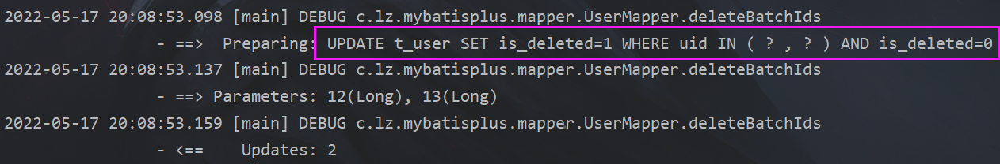

# 简介

> MyBatis-Plus（简称 MP）是一个 MyBatis的增强工具，在 MyBatis 的基础上**只做增强不做改变**，为简化开发、提高效率而生。


# 入门

## ssm的配置方式

### 引入依赖

> - Spring整合MyBatis，需要MyBatis以及Spring整合MyBatis的依赖。
>
>   
>
> - 但是，在以上的依赖列表中，并没有MyBatis以及Spring整合MyBatis的依赖，因为当我们引入了 **MyBatis-Plus的依赖时，就可以间接的引入这些依赖。**
>
> - 并且依赖和依赖之间的版本必须兼容，所以我们不能随便引入其他版本的依赖，以免发生冲突
>
> 
>
> 

```xml
    <packaging>jar</packaging>
    <properties>
        <spring.version>5.3.1</spring.version>
    </properties>
    <dependencies>
        <dependency>
            <groupId>org.springframework</groupId>
            <artifactId>spring-context</artifactId>
            <version>${spring.version}</version>
        </dependency>
        <dependency>
            <groupId>org.springframework</groupId>
            <artifactId>spring-jdbc</artifactId>
            <version>${spring.version}</version>
        </dependency>
        <dependency>
            <groupId>org.springframework</groupId>
            <artifactId>spring-test</artifactId>
            <version>${spring.version}</version>
        </dependency>
        <!-- 连接池 -->
        <dependency>
            <groupId>com.alibaba</groupId>
            <artifactId>druid</artifactId>
            <version>1.2.8</version>
        </dependency>
        <!-- junit测试 -->
        <dependency>
            <groupId>junit</groupId>
            <artifactId>junit</artifactId>
            <version>4.12</version>
            <scope>test</scope>
        </dependency>
        <!-- MySQL驱动 -->
        <dependency>
            <groupId>mysql</groupId>
            <artifactId>mysql-connector-java</artifactId>
            <version>8.0.27</version>
        </dependency>
        <!-- 日志 -->
        <dependency>
            <groupId>org.slf4j</groupId>
            <artifactId>slf4j-api</artifactId>
            <version>1.7.30</version>
        </dependency>
        <dependency>
            <groupId>ch.qos.logback</groupId>
            <artifactId>logback-classic</artifactId>
            <version>1.2.3</version>
        </dependency>
        <!-- lombok用来简化实体类 -->
        <dependency>
            <groupId>org.projectlombok</groupId>
            <artifactId>lombok</artifactId>
            <version>1.16.16</version>
        </dependency>
        <!--MyBatis-Plus的核心依赖-->
        <dependency>
            <groupId>com.baomidou</groupId>
            <artifactId>mybatis-plus</artifactId>
            <version>3.4.3.4</version>
        </dependency>
    </dependencies>
```

### 配置项目

#### contextApplication.xml

> Spring整合MyBatis

```xml
<?xml version="1.0" encoding="UTF-8"?>
<beans xmlns="http://www.springframework.org/schema/beans"
       xmlns:xsi="http://www.w3.org/2001/XMLSchema-instance"
       xmlns:context="http://www.springframework.org/schema/context"
       xsi:schemaLocation="http://www.springframework.org/schema/beans http://www.springframework.org/schema/beans/spring-beans.xsd http://www.springframework.org/schema/context https://www.springframework.org/schema/context/spring-context.xsd">


    <context:property-placeholder location="jdbc.properties"></context:property-placeholder>
    <bean id="druidDataSource" class="com.alibaba.druid.pool.DruidDataSource">
        <property name="driverClassName" value="${jdbc.driver}"></property>
        <property name="url" value="${jdbc.url}"></property>
        <property name="username" value="${jdbc.username}"></property>
        <property name="password" value="${jdbc.password}"></property>
    </bean>

    <bean id="sqlSessionFactoryBean" class="org.mybatis.spring.SqlSessionFactoryBean">
        <property name="dataSource" ref="druidDataSource"></property>
        <property name="typeAliasesPackage" value="com.lz.mybatisplus.pojo"></property>
        <property name="mapperLocations" value="classpath:mapper/*.xml"></property>
    </bean>

</beans>
```

> Spring整合MyBatisPlus
>
> 此处使用的是**MybatisSqlSessionFactoryBean**

```xml
<?xml version="1.0" encoding="UTF-8"?>
<beans xmlns="http://www.springframework.org/schema/beans"
       xmlns:xsi="http://www.w3.org/2001/XMLSchema-instance"
       xmlns:context="http://www.springframework.org/schema/context"
       xsi:schemaLocation="http://www.springframework.org/schema/beans http://www.springframework.org/schema/beans/spring-beans.xsd http://www.springframework.org/schema/context https://www.springframework.org/schema/context/spring-context.xsd">


    <context:property-placeholder location="jdbc.properties"></context:property-placeholder>
    <bean id="druidDataSource" class="com.alibaba.druid.pool.DruidDataSource">
        <property name="driverClassName" value="${jdbc.driver}"></property>
        <property name="url" value="${jdbc.url}"></property>
        <property name="username" value="${jdbc.username}"></property>
        <property name="password" value="${jdbc.password}"></property>
    </bean>

    <!--  使用的是MybatisSqlSessionFactoryBean  -->
    <bean id="mybatisSqlSessionFactoryBean"
          class="com.baomidou.mybatisplus.extension.spring.MybatisSqlSessionFactoryBean">
        <property name="dataSource" ref="druidDataSource"></property>
        <property name="typeAliasesPackage" value="com.lz.mybatisplus.pojo"></property>
    </bean>

    <bean id="mapperScannerConfigurer" class="org.mybatis.spring.mapper.MapperScannerConfigurer">
        <property name="basePackage" value="com.lz.mybatisplus.mapper"></property>
    </bean>
</beans>
```

### 创建mapper文件

> **创建mapper接口，继承BaseMapper**

```java
package com.lz.mybatisplus.mapper;

import com.baomidou.mybatisplus.core.mapper.BaseMapper;
import com.lz.mybatisplus.pojo.User;
import org.springframework.stereotype.Repository;

@Repository
public interface UserMapper extends BaseMapper<User> {
}

```

### 创建测试类

```java
package com.lz.mybatisplus.test;


import com.lz.mybatisplus.mapper.UserMapper;
import com.lz.mybatisplus.pojo.User;
import org.junit.Test;
import org.junit.runner.RunWith;
import org.springframework.beans.factory.annotation.Autowired;
import org.springframework.test.context.ContextConfiguration;
import org.springframework.test.context.junit4.SpringJUnit4ClassRunner;

import java.util.List;

@RunWith(SpringJUnit4ClassRunner.class)
@ContextConfiguration("classpath:contextApplication.xml")
public class mybatisTest {

    @Autowired
    private UserMapper userMapper;

    @Test
    public void test1() {
        List<User> users = userMapper.selectList(null);
        for (User user : users) {
            System.out.println("user = " + user);
        }
    }
}

```

### 添加日志

> 在resource下创建logback.xml

```xml
<?xml version="1.0" encoding="UTF-8"?>
<configuration debug="false">
    <!--定义日志文件的存储地址 logs为当前项目的logs目录 还可以设置为../logs -->
    <property name="LOG_HOME" value="logs"/>
    <!--控制台日志， 控制台输出 -->
    <appender name="STDOUT" class="ch.qos.logback.core.ConsoleAppender">
        <encoder class="ch.qos.logback.classic.encoder.PatternLayoutEncoder">
            <!--格式化输出：%d表示日期，%thread表示线程名，%-5level：级别从左显示5个字符
            宽度,%msg：日志消息，%n是换行符-->
            <pattern>%d{yyyy-MM-dd HH:mm:ss.SSS} [%thread] %-5level %logger{50}
                - %msg%n
            </pattern>
        </encoder>
    </appender>
    <!--myibatis log configure-->
    <logger name="com.apache.ibatis" level="TRACE"/>
    <logger name="java.sql.Connection" level="DEBUG"/>
    <logger name="java.sql.Statement" level="DEBUG"/>
    <logger name="java.sql.PreparedStatement" level="DEBUG"/>
    <!-- 日志输出级别 -->
    <root level="DEBUG">
        <appender-ref ref="STDOUT"/>
    </root>
</configuration>
```

## spring boot的配置方式

### 引入依赖

```xml
    <dependencies>
        <dependency>
            <groupId>org.springframework.boot</groupId>
            <artifactId>spring-boot-starter</artifactId>
        </dependency>
        <dependency>
            <groupId>org.springframework.boot</groupId>
            <artifactId>spring-boot-starter-test</artifactId>
            <scope>test</scope>
        </dependency>
        <dependency>
            <groupId>com.baomidou</groupId>
            <artifactId>mybatis-plus-boot-starter</artifactId>
            <version>3.5.1</version>
        </dependency>
        <dependency>
            <groupId>org.projectlombok</groupId>
            <artifactId>lombok</artifactId>
            <optional>true</optional>
        </dependency>
        <dependency>
            <groupId>mysql</groupId>
            <artifactId>mysql-connector-java</artifactId>
            <scope>runtime</scope>
        </dependency>
    </dependencies>
```

### 配置项目

#### properties

```properties
spring.datasource.type=com.zaxxer.hikari.HikariDataSource
#JDBC8及以上驱动要写cj
spring.datasource.driver-class-name=com.mysql.cj.jdbc.Driver
spring.datasource.url=jdbc:mysql://localhost:3306/mybatis_plus
spring.datasource.username=root
spring.datasource.password=123456
```

#### yml

```yml
spring:
  datasource:
    type: com.zaxxer.hikari.HikariDataSource
    driver-class-name: com.mysql.cj.jdbc.Driver
    url: jdbc:mysql://localhost:3306/mybatis_plus?characterEncoding=utf-8&useSSL=false
    username: root
    password: 123456
```

> 注意：
>
> 1. 驱动类driver-class-name
>    - **spring boot 2.0（内置jdbc5驱动），驱动类使用：driver-class-name: com.mysql.jdbc.Driver**
>    - **spring boot 2.1及以上（内置jdbc8驱动），驱动类使用： driver-class-name: com.mysql.cj.jdbc.Driver 否则运行测试用例的时候会有 WARN 信息** 
> 2. 连接地址url
>    - **MySQL5.7版本的url：jdbc:mysql://localhost:3306/mybatis_plus?characterEncoding=utf-8&useSSL=false**
>    - **MySQL8.0版本的url：jdbc:mysql://localhost:3306/mybatis_plus? serverTimezone=GMT%2B8&characterEncoding=utf-8&useSSL=false** 
>
> - 否则运行测试用例报告如下错误： java.sql.SQLException: The server time zone value 'Öйú±ê׼ʱ¼ä' is unrecognized or represents more

### 创建mapper文件

> **创建mapper接口，继承BaseMapper**

```java
package com.lz.mybatis_plus_springboot.mapper;

import com.baomidou.mybatisplus.core.mapper.BaseMapper;
import com.lz.mybatis_plus_springboot.pojo.User;
import org.springframework.stereotype.Repository;

@Repository
public interface UserMapper extends BaseMapper<User> {
}

```

> **启动类扫描mapper接口，生成实现类看来，扫描映射文件**

```java
package com.lz.mybatis_plus_springboot;

import org.mybatis.spring.annotation.MapperScan;
import org.springframework.boot.SpringApplication;
import org.springframework.boot.autoconfigure.SpringBootApplication;

@SpringBootApplication
@MapperScan("com.lz.mybatis_plus_springboot.mapper")//扫描maper接口生成实现类，扫描映射文件
public class MybatisPlusSpringbootApplication {

    public static void main(String[] args) {
        SpringApplication.run(MybatisPlusSpringbootApplication.class, args);
    }

}

```

### 创建测试类

```java
package com.lz.mybatis_plus_springboot;

import com.lz.mybatis_plus_springboot.mapper.UserMapper;
import com.lz.mybatis_plus_springboot.pojo.User;
import org.junit.jupiter.api.Test;
import org.springframework.beans.factory.annotation.Autowired;
import org.springframework.boot.test.context.SpringBootTest;

import java.util.List;

@SpringBootTest
class MybatisPlusSpringbootApplicationTests {

    @Autowired
    private UserMapper userMapper;

    @Test
    void contextLoads() {
        List<User> users = userMapper.selectList(null);
        for (User user : users) {
            System.out.println("user = " + user);
        }
    }

}

```

### 添加日志

```yml
spring:
  datasource:
    type: com.zaxxer.hikari.HikariDataSource
    driver-class-name: com.mysql.cj.jdbc.Driver
    url: jdbc:mysql://localhost:3306/mybatis_plus?characterEncoding=utf-8&useSSL=false
    username: root
    password: 123456

mybatis-plus:
  configuration:
    #日志
    log-impl: org.apache.ibatis.logging.stdout.StdOutImpl
```

# 基本CRUD

```java
    /**
     * 测试insert
     */
    @Test
    public void testInsert() {

        User user = new User();
        user.setName("lz");
        user.setAge(21);
        user.setEmail("139@2qq.com");
        int insert = userMapper.insert(user);//INSERT INTO user ( id, name, age, email ) VALUES ( ?, ?, ?, ? )
        System.out.println("insert = " + insert);
        System.out.println("user.getId() = " + user.getId());//不是自增列，id根据雪花算法生成
    }


    /**
     * 测试delete
     */
    @Test
    public void testDelete() {
        /**
         * 根据id删除
         */
        /*int i = userMapper.deleteById(1526383904491511810L);//DELETE FROM user WHERE id=?
        System.out.println("i = " + i);*/

        /**
         * 根据map集合删除
         */
        /*HashMap<String, Object> map = new HashMap<>();
        map.put("name", "jack");
        map.put("age", 21);
        int i = userMapper.deleteByMap(map);//DELETE FROM user WHERE name = ? AND age = ?
        System.out.println("i = " + i);*/

        /**
         * 根据id批量删除
         */
        List<Long> list = Arrays.asList(2L, 3L);
        int i = userMapper.deleteBatchIds(list);//DELETE FROM user WHERE id IN ( ? , ? )
        System.out.println("i = " + i);
    }


    /**
     * 测试update
     */
    @Test
    public void testUpdate() {
        /**
         * 根据id修改
         */
        User user = new User();
        user.setId(1L);
        user.setName("lz");
        user.setAge(21);
        int i = userMapper.updateById(user);//UPDATE user SET name=?, age=? WHERE id=?
        System.out.println("i = " + i);
    }


    /**
     * 测试select
     */
    @Test
    public void testSelect() {
        /**
         * 通过id查询
         */
        /*User user = userMapper.selectById(1L);//SELECT id,name,age,email FROM user WHERE id=?
        System.out.println("user = " + user);*/

        /**
         * 通过id集合查询
         */
        /*List<Long> list = Arrays.asList(1L, 2L, 3L);
        List<User> users = userMapper.selectBatchIds(list);//SELECT id,name,age,email FROM user WHERE id IN ( ? , ? , ? )
        users.forEach(System.out::println);*/

        /**
         * 通过map集合查询
         */
        /*HashMap<String, Object> map = new HashMap<>();
        map.put("name", "lz");
        map.put("age", 21);
        List<User> users = userMapper.selectByMap(map);//SELECT id,name,age,email FROM user WHERE name = ? AND age = ?
        users.forEach(System.out::println);*/

        /**
         * 查询所有，返回list集合
         */
        List<User> users = userMapper.selectList(null);//SELECT id,name,age,email FROM user
        users.forEach(System.out::println);
    }
```

# 通用Service

> - **通用 Service CRUD 封装IService接口**，进一步封装 CRUD 采用 get 查询单行、remove 删除、list查询集合、page 分页、前缀命名方式区分 Mapper 层避免混淆， 
> - **泛型 T 为任意实体对象** 
> - **建议如果存在自定义通用 Service 方法的可能，请创建自己的 IBaseService 继承 Mybatis-Plus 提供的基类**

> **创建UserService接口，继承IService**

```java
package com.lz.mybatisplus.service;

import com.baomidou.mybatisplus.extension.service.IService;
import com.lz.mybatisplus.pojo.User;

public interface UserService extends IService<User> {
}

```

> **创建实现类，继承ServiceImpl，实现创建的接口UserService**
>
> **ServiceImpl泛型，第一个是mapper接口，第二个是实体类**

```java
package com.lz.mybatisplus.service.impl;

import com.baomidou.mybatisplus.extension.service.impl.ServiceImpl;
import com.lz.mybatisplus.mapper.UserMapper;
import com.lz.mybatisplus.pojo.User;
import com.lz.mybatisplus.service.UserService;
import org.springframework.stereotype.Service;

@Service
public class UserServiceImpl extends ServiceImpl<UserMapper, User> implements UserService {
}

```

# 常用注解

## 实体类名与数据库表名不一致

> 在使用MyBatis-Plus实现基本的CRUD时，我们并没有指定要操作的表，只是在 Mapper接口继承BaseMapper时，设置了泛型User，而操作的表为user表 由此得出结论，**MyBatis-Plus在确定操作的表时，由BaseMapper的泛型决定，即实体类型决定，且默认操作的表名和实体类型的类名一致**

### @TableName

```java
@Data
@TableName("t_user")//标识实体类对应的表
public class User {
    private Long id;
    private String name;
    private Integer age;
    private String email;
}

```

### 设置全局配置

> 在开发的过程中，我们经常遇到以上的问题，即实体类所对应的表都有固定的前缀，例如t\_或tb\_ 此时，**可以使用MyBatis-Plus提供的全局配置，为实体类所对应的表名设置默认的前缀，那么就不需要在每个实体类上通过@TableName标识实体类对应的表**

#### ssm

> 在contextApplication.xml设置全局配置

```xml
	<!--  使用的是MybatisSqlSessionFactoryBean  -->
    <bean id="mybatisSqlSessionFactoryBean"
          class="com.baomidou.mybatisplus.extension.spring.MybatisSqlSessionFactoryBean">
        <property name="dataSource" ref="druidDataSource"></property>
        <property name="typeAliasesPackage" value="com.lz.mybatisplus.pojo"></property>
        <!--    引入全局配置    -->
        <property name="globalConfig" ref="globalConfig"></property>
    </bean>

    <bean id="mapperScannerConfigurer" class="org.mybatis.spring.mapper.MapperScannerConfigurer">
        <property name="basePackage" value="com.lz.mybatisplus.mapper"></property>
    </bean>

    <!--  设置全局配置  -->
    <bean id="globalConfig" class="com.baomidou.mybatisplus.core.config.GlobalConfig">
        <property name="dbConfig">
            <bean class="com.baomidou.mybatisplus.core.config.GlobalConfig$DbConfig">
                <!--设置实体类所对应的表的统一前缀-->
                <property name="tablePrefix" value="t_"></property>
            </bean>
        </property>
    </bean>
```

#### spring boot

> 在application.yml中设置全局配置

```yml
mybatis-plus:
  configuration:
    #日志
    log-impl: org.apache.ibatis.logging.stdout.StdOutImpl
  # 全局设置
  global-config:
    # 数据库设置
    db-config:
      # 设置实体类所对应的表的统一前缀
      table-prefix: t_
```

##  @TableId

> **MyBatis-Plus在实现CRUD时，会默认将id作为主键列，并在插入数据时，默认基于雪花算法的策略生成id**
>
> 将实体类中的属性id改为uid，将表中的字段id也改为uid

```java
package com.lz.mybatisplus.pojo;

import com.baomidou.mybatisplus.annotation.TableId;
import com.baomidou.mybatisplus.annotation.TableName;
import lombok.Data;

@Data
@TableName("t_user")
public class User {

    @TableId//将属性所对应的字段指定为主键
    private Long uid;
    private String name;
    private Integer age;
    private String email;

}

```

### value属性

> **若实体类中主键对应的属性为id，而表中表示主键的字段为uid**，此时若只在属性id上添加注解 @TableId，则抛出异常Unknown column 'id' in 'field list'，即MyBatis-Plus仍然会将id作为表的 主键操作，而表中表示主键的是字段uid 此时需要**通过@TableId注解的value属性，指定表中的主键字段**，@TableId("uid")或 @TableId(value="uid")


```java
package com.lz.mybatisplus.pojo;

import com.baomidou.mybatisplus.annotation.TableId;
import com.baomidou.mybatisplus.annotation.TableName;
import lombok.Data;

@Data
@TableName("t_user")
public class User {

    //将属性所对应的字段指定为主键
    //@TabLeId注解的value属性用于指定主键的字段
    @TableId(value = "uid")
    private Long id;
    private String name;
    private Integer age;
    private String email;

}

```

### type属性

#### 常用主键自增策略

> **主键生成默认使用的是雪花算法，如果要设置自增列就要将数据库表列设置为自增，设置@TableId的type值为`IdType.AUTO  `**

|            值             |                             描述                             |
| :-----------------------: | :----------------------------------------------------------: |
| IdType.ASSIGN_ID（默 认） |   基于雪花算法的策略生成数据id，与数据库id是否设置自增无关   |
|        IdType.AUTO        | 使用数据库的自增策略，注意，该类型请确保数据库设置了id自增， 否则无效 |

```java
package com.lz.mybatisplus.pojo;

import com.baomidou.mybatisplus.annotation.IdType;
import com.baomidou.mybatisplus.annotation.TableId;
import com.baomidou.mybatisplus.annotation.TableName;
import lombok.Data;

@Data
@TableName("t_user")
public class User {

    //将属性所对应的字段指定为主键
    //@TabLeId注解的value属性用于指定主键的字段
    @TableId(value = "uid", type = IdType.AUTO)
    private Long id;
    private String name;
    private Integer age;
    private String email;

}

```

#### 设置全局主键自增策略

##### ssm

```xml
    <!--  使用的是MybatisSqlSessionFactoryBean  -->
    <bean id="mybatisSqlSessionFactoryBean"
          class="com.baomidou.mybatisplus.extension.spring.MybatisSqlSessionFactoryBean">
        <property name="dataSource" ref="druidDataSource"></property>
        <property name="typeAliasesPackage" value="com.lz.mybatisplus.pojo"></property>
        <!--    引入全局配置    -->
        <property name="globalConfig" ref="globalConfig"></property>
    </bean>

    <bean id="mapperScannerConfigurer" class="org.mybatis.spring.mapper.MapperScannerConfigurer">
        <property name="basePackage" value="com.lz.mybatisplus.mapper"></property>
    </bean>

    <!--  设置全局配置  -->
    <bean id="globalConfig" class="com.baomidou.mybatisplus.core.config.GlobalConfig">
        <property name="dbConfig">
            <bean class="com.baomidou.mybatisplus.core.config.GlobalConfig$DbConfig">
                <!--设置实体类所对应的表的统一前缀-->
                <property name="tablePrefix" value="t_"></property>
                <!--设置统一的自增策略-->
                <property name="idType" value="AUTO"></property>
            </bean>
        </property>
    </bean>
```

##### spring boot

```yml
mybatis-plus:
  configuration:
    #日志
    log-impl: org.apache.ibatis.logging.stdout.StdOutImpl
  # 全局设置
  global-config:
    # 数据库设置
    db-config:
      # 设置实体类所对应的表的统一前缀
      table-prefix: t_
      # 设置全局自增策略
      id-type: auto
```

## @TableField

### 情况一：默认开启驼峰命名

> - **若实体类中的属性使用的是驼峰命名风格，而表中的字段使用的是下划线命名风格**
> - 例如实体类属性userName，表中字段user_name
> - **此时MyBatis-Plus会自动将下划线命名风格转化为驼峰命名风格**


```java
@Data
@TableName("t_user")
public class User {

    @TableId(value = "uid", type = IdType.AUTO)
    private Long id;
    private String UserName;
    private Integer age;
    private String email;
}
```

### 情况二：使用注解

> - 若实体类中的属性和表中的字段不满足情况1
> - **例如实体类属性name，表中字段username**
> - **此时需要在实体类属性上使用@TableField("username")设置属性所对应的字段名**


```java
@Data
//@TableName("t_user")
public class User {

    @TableId(value = "uid", type = IdType.AUTO)
    private Long id;
    
    //指定属性所对应的字段名
    @TableField("user_name")
    private String name;
    private Integer age;
    private String email;

}

```

## @TableLogic

### 逻辑删除

> - 物理删除：真实删除，将对应数据从数据库中删除，之后查询不到此条被删除的数据
> - **逻辑删除：假删除，将对应数据中代表是否被删除字段的状态修改为“被删除状态”，之后在数据库 中仍旧能看到此条数据记录**
> - **使用场景：可以进行数据恢复**

### 实现逻辑删除

```java
@Data
@TableName("t_user")
public class User {

    @TableId(value = "uid", type = IdType.AUTO)
    private Long id;
    @TableField("user_name")
    private String name;
    private Integer age;
    private String email;

    @TableLogic
    private Integer isDeleted;

}
```

> **在实体类中设置了@TableLogic，删除操作就变成了更新，将is_deleted = 0改为is_deleted  = 1**

```java
    @Test
    public void testDelete() {
        /**
         * 根据id批量删除
         */
        List<Long> list = Arrays.asList(12L, 13L);
        int i = userMapper.deleteBatchIds(list);
        System.out.println("i = " + i);
    }
```



> **再次查询所有时，就成为了查询is_deleted = 0的所有数据了，is_deleted = 1的就是被逻辑删除了**

```java
    @Test
    public void test() {
        List<User> users = userMapper.selectList(null);
        for (User user : users) {
            System.out.println("user = " + user);
        }
    }

```


# 条件构造器和常用接口

> **Wrapper的属性写的是数据库表的列，不是实体类的属性名**

## QueryWrapper

> **查询、删除、更新都可以使用QueryWrapper**，毕竟都需要先查询再操作嘛

### 组装查询条件

```java
    /**
     * 查询用户名包含l，年龄在5到30之间，邮箱信息不为null的用户信息
     * SELECT uid AS id,user_name AS name,age,email,is_deleted FROM t_user
     * WHERE (user_name LIKE ? AND Age BETWEEN ? AND ? AND email IS NOT NULL)
     */
    @Test
    public void testWrapper01() {
        QueryWrapper<User> userQueryWrapper = new QueryWrapper<>();
        userQueryWrapper.like("user_name", "l")
                .between("Age", 5, 30)
                .isNotNull("email");

        List<User> users = userMapper.selectList(userQueryWrapper);


        users.forEach(System.out::println);

    }
```

### 组装排序条件

```java
    /**
     * 查询用户信息，接照年龄的降序排序，若年龄相同，则按照id升序排序
     * SELECT uid AS id,user_name AS name,age,email,is_deleted FROM t_user
     * ORDER BY age ASC,uid DESC
     */
    @Test
    public void testWrapper02() {
        QueryWrapper<User> userQueryWrapper = new QueryWrapper<>();
        userQueryWrapper.orderByAsc("age")
                .orderByDesc("uid");
        List<User> users = userMapper.selectList(userQueryWrapper);
        users.forEach(System.out::println);
    }
```

### 组装删除条件

```java
    /**
     * 删除邮箱地址为null的用户信息
     * DELETE FROM t_user WHERE (email IS NULL)
     */
    @Test
    public void testWrapper03() {
        QueryWrapper<User> userQueryWrapper = new QueryWrapper<>();
        userQueryWrapper.isNull("email");

        int delete = userMapper.delete(userQueryWrapper);
        System.out.println("delete = " + delete);
    }
```

### 条件的优先级

```java
    /**
     * 将（年龄大于20并且用户名中包含有a）或邮箱为null的用户信息修改
     * UPDATE t_user SET user_name=?, email=? WHERE (age > ? AND user_name LIKE ? OR email IS NULL)
     */
    @Test
    public void testWrapper04() {
        QueryWrapper<User> userQueryWrapper = new QueryWrapper<>();
        userQueryWrapper.gt("age", 20)
                .like("user_name", "a")
                .or()
                .isNull("email");
        User user = new User();
        user.setName("小王");
        user.setEmail("xiaowang@qq.com");
        int update = userMapper.update(user, userQueryWrapper);
        System.out.println("update = " + update);
    }


    /**
     * 将用户名中包含有z并且（年龄大于20或邮箱为null）的用户信息修改
     * Lambda中的条件优先执行
     * UPDATE t_user SET user_name=?, email=? WHERE (user_name LIKE ? AND (age > ? OR email IS NULL))
     */
    @Test
    public void testWrapper05() {
        QueryWrapper<User> userQueryWrapper = new QueryWrapper<>();
        userQueryWrapper.like("user_name", "z")
                .and(i -> i.gt("age", 20).or().isNull("email"));
        User user = new User();
        user.setName("小刘");
        user.setEmail("xiaoliu@qq.com");
        int update = userMapper.update(user, userQueryWrapper);
        System.out.println("update = " + update);
    }
```

### 组装select子句

> 只查询部分字段

```JAVA
    /**
     * 查询用户的用户名、年龄、邮箱信息
     * SELECT user_name,age,email FROM t_user
     */
    @Test
    public void testWrapper06() {
        QueryWrapper<User> userQueryWrapper = new QueryWrapper<>();
        userQueryWrapper.select("user_name", "age", "email");
        List<Map<String, Object>> maps = userMapper.selectMaps(userQueryWrapper);
        maps.forEach(System.out::println);
    }
```

### 实现子查询

> 根据A表id查询B表的数据

```java
    /**
     * 适用多表联查，分步查询
     * SELECT uid AS id,user_name AS name,age,email,is_deleted FROM t_user
     * WHERE (uid IN (select eid from t_emp))
     */
    @Test
    public void testWrapper07() {
        QueryWrapper<User> userQueryWrapper = new QueryWrapper<>();
        userQueryWrapper.inSql("uid", "select eid from t_emp");

        List<User> users = userMapper.selectList(userQueryWrapper);
        users.forEach(System.out::println);
    }
```

## UpdateWrapper

> 只有更新可以使用UpdateWrapper

```java
    /**
     * 使用updateWrapper将用户名中包含有z并且（年龄大于20或邮箱为null）的用户信息修改
     * UPDATE t_user SET user_name=?,email=? WHERE (user_name LIKE ? AND (age > ? OR email IS NULL))
     */
    @Test
    public void testWrapper08() {
        UpdateWrapper<User> userUpdateWrapper = new UpdateWrapper<>();
        userUpdateWrapper.like("user_name", "z")
                .and(i -> i.gt("age", 20).or().isNull("email"));
        userUpdateWrapper.set("user_name", "小刘").set("email", "xiaoliu@qq.com");
        
        int update = userMapper.update(null, userUpdateWrapper);
        System.out.println("update = " + update);
    }
```

## condition

> 在真正开发的过程中，组装条件是常见的功能，而这些条件数据来源于用户输入，是可选的，因此我们**在组装这些条件时，必须先判断用户是否选择了这些条件，若选择则需要组装该条件，若没有选择则一定不能组装，以免影响SQL执行的结果**

```java
    /**
     * 查询名字为username，年龄再beginAge和endAge之间
     * 如果有空字符或者null的不拼接到sql中
     */
    
    /**
     * 方式一
     * SELECT uid AS id,user_name AS name,age,email,is_deleted FROM t_user
     * WHERE (age > ? AND age < ?)
     */
    @Test
    public void testWrapper09() {
        String username = "";
        String beginAge = "10";
        String endAge = "20";

        QueryWrapper<User> userQueryWrapper = new QueryWrapper<>();
        if (StringUtils.isNotBlank(username)) {
            userQueryWrapper.like("user_name", username);
        }
        if (beginAge != null) {
            userQueryWrapper.gt("age", beginAge);
        }
        if (endAge != null) {
            userQueryWrapper.lt("age", endAge);
        }
        List<User> users = userMapper.selectList(userQueryWrapper);
        users.forEach(System.out::println);
    }


    /**
     * 方式二（推荐）：condition
     * SELECT uid AS id,user_name AS name,age,email,is_deleted FROM t_user
     * WHERE (age > ? AND age < ?)
     */
    @Test
    public void testWrapper10() {
        String username = "";
        String beginAge = "10";
        String endAge = "20";

        QueryWrapper<User> userQueryWrapper = new QueryWrapper<>();
        userQueryWrapper.like(StringUtils.isNotBlank(username), "user_name", username)
                .gt(beginAge != null, "age", beginAge)
                .lt(endAge != null, "age", endAge);

        List<User> users = userMapper.selectList(userQueryWrapper);
        users.forEach(System.out::println);
    }
```

## LambdaQueryWrapper

> 在写条件时，我们都是自己写数据库表列的名，有一定的概率会写错。**使用了Lambda之后我们就可以使用Lambda表达式，就不容易写错了**

```java
    /**
     * 使用Lambda查询名字为username，年龄再beginAge和endAge之间
     * 如果有空字符或者null的不拼接到sql中
     * SELECT uid AS id,user_name AS name,age,email,is_deleted FROM t_user
     * WHERE (age > ? AND age < ?)
     */
    @Test
    public void testWrapper11() {
        String username = "";
        String beginAge = "10";
        String endAge = "20";

        LambdaQueryWrapper<User> userLambdaQueryWrapper = new LambdaQueryWrapper<>();
        userLambdaQueryWrapper.like(StringUtils.isNotBlank(username), User::getName, username)
                .gt(beginAge != null, User::getAge, beginAge)
                .lt(endAge != null, User::getAge, endAge);

        List<User> users = userMapper.selectList(userLambdaQueryWrapper);
        users.forEach(System.out::println);
    }
```

## LambdaUpdateWrapper

> 在写条件时，我们都是自己写数据库表列的名，有一定的概率会写错。**使用了Lambda之后我们就可以使用Lambda表达式，就不容易写错了**

```java
    /**
     * 使用LambdaUpdateWrapper将用户名中包含有z并且（年龄大于20或邮箱为null）的用户信息修改
     * UPDATE t_user SET user_name=?,email=? WHERE (user_name LIKE ? AND (age > ? OR email IS NULL))
     */
    @Test
    public void testWrapper12() {
        LambdaUpdateWrapper<User> userLambdaUpdateWrapper = new LambdaUpdateWrapper<>();
        userLambdaUpdateWrapper.like(User::getName, "z")
                .and(i -> i.gt(User::getAge, 20).or().isNull(User::getEmail));
        userLambdaUpdateWrapper.set(User::getName, "小刘").set(User::getEmail, "xiaoliu@qq.com");

        int update = userMapper.update(null, userLambdaUpdateWrapper);
        System.out.println("update = " + update);
    }
```

# 插件

## 分页插件

### ssm

> 配置插件

```xml
	<!--  使用的是MybatisSqlSessionFactoryBean  -->
    <bean id="mybatisSqlSessionFactoryBean"
          class="com.baomidou.mybatisplus.extension.spring.MybatisSqlSessionFactoryBean">
        <property name="dataSource" ref="druidDataSource"></property>
        <property name="typeAliasesPackage" value="com.lz.mybatisplus.pojo"></property>
        <!--    引入全局配置    -->
        <property name="globalConfig" ref="globalConfig"></property>
        
        <!--配置插件-->
        <property name="plugins" ref="mybatisPlusInterceptor"></property>
    </bean>

    <bean id="mapperScannerConfigurer" class="org.mybatis.spring.mapper.MapperScannerConfigurer">
        <property name="basePackage" value="com.lz.mybatisplus.mapper"></property>
    </bean>

    <!--配置MyBatis-Plus插件-->
    <bean id="mybatisPlusInterceptor" class="com.baomidou.mybatisplus.extension.plugins.MybatisPlusInterceptor">
        <property name="interceptors" ref="paginationInnerInterceptor"></property>
    </bean>

    <!--配置MyBatis-Plus分页插件的bean-->
    <bean id="paginationInnerInterceptor"
     class="com.baomidou.mybatisplus.extension.plugins.inner.PaginationInnerInterceptor">
        <!--设置数据库类型-->
        <property name="dbType" value="MYSQL"></property>
    </bean>
```

> 测试类

```java
    @Test
    public void test() {
        //参数一：当前页
        //参数二：每页显示的条数
        Page<User> userPage = new Page<>(2, 3);

        userMapper.selectPage(userPage, null);
        //SELECT uid AS id,user_name AS name,age,email,is_deleted FROM t_user LIMIT ?,?

        System.out.println("userPage = " + userPage);

        System.out.println("当前页：" + userPage.getCurrent());//当前页：2
        System.out.println("每页显示的条数：" + userPage.getSize());//每页显示的条数：3
        System.out.println("总记录数：" + userPage.getTotal());//总记录数：13
        System.out.println("总页数：" + userPage.getPages());//总页数：5
        System.out.println("是否有上一页：" + userPage.hasPrevious());//是否有上一页：true
        System.out.println("是否有下一页：" + userPage.hasNext());//是否有下一页：true
        
    }
```

### spring boot

> 创建配置类

```java
@Configuration
@MapperScan("com.lz.mybatis_plus_springboot.mapper")//创建了配置类，建议将接口扫描放到配置类中，不放也是可以的
public class MybatisPlusPlugins {

    public MybatisPlusInterceptor mybatisPlusInterceptor() {
        MybatisPlusInterceptor mybatisPlusInterceptor = new MybatisPlusInterceptor();
        mybatisPlusInterceptor.addInnerInterceptor(new PaginationInnerInterceptor(DbType.MYSQL));
        return mybatisPlusInterceptor;
    }
}

```

> 测试类

```java
    @Test
    public void test() {
        //参数一：当前页
        //参数二：每页显示的条数
        Page<User> userPage = new Page<>(2, 3);

        userMapper.selectPage(userPage, null);
        //SELECT uid AS id,user_name AS name,age,email,is_deleted FROM t_user LIMIT ?,?

        System.out.println("userPage = " + userPage);

        System.out.println("当前页：" + userPage.getCurrent());//当前页：2
        System.out.println("每页显示的条数：" + userPage.getSize());//每页显示的条数：3
        System.out.println("总记录数：" + userPage.getTotal());//总记录数：13
        System.out.println("总页数：" + userPage.getPages());//总页数：5
        System.out.println("是否有上一页：" + userPage.hasPrevious());//是否有上一页：true
        System.out.println("是否有下一页：" + userPage.hasNext());//是否有下一页：true
        
    }
```

## xml自定义分页

> 对我们自己编写的sql进行分页

> UserMapper中定义接口方法

```java
    /**
     * 通过年龄查询用户信息并分页
     *
     * @param page MyBatis-pLus所提供的分页对象，必须位于第一个参数的位置
     * @param age  年龄条件
     * @return 返回类型必须是MyBatis-pLus所提供的分页对象
     */
    Page<User> selectUserByAge(@Param("page") Page<User> page, @Param("age") int age);
```

> UserMapper.xml中编写SQL

```xml
    <!--        Page<User> selectUserByAge(@Param("page") Page<User> page, @Param("age") int age);-->
    <select id="selectUserByAge" resultType="com.lz.mybatisplus.pojo.User">
        select  * from t_user where age > #{age}
    </select>
```

> 测试类实现分页

```java
    @Test
    public void test02() {
        Page<User> userPage = new Page<>(2, 3);
        userMapper.selectUserByAge(userPage, 20);
        //select * from t_user where age > ? LIMIT ?,?

        System.out.println("userPage = " + userPage);

        System.out.println("当前页：" + userPage.getCurrent());//当前页：2
        System.out.println("每页显示的条数：" + userPage.getSize());//每页显示的条数：3
        System.out.println("总记录数：" + userPage.getTotal());//总记录数：12
        System.out.println("总页数：" + userPage.getPages());//总页数：4
        System.out.println("是否有上一页：" + userPage.hasPrevious());//是否有上一页：true
        System.out.println("是否有下一页：" + userPage.hasNext());//是否有下一页：true

    }
```

### ssm设置实体类别名

> 这样设置完可能在mapper.xml中使用别名会爆红，但是不影响运行

```xml
    <!--  使用的是MybatisSqlSessionFactoryBean  -->
    <bean id="mybatisSqlSessionFactoryBean"
          class="com.baomidou.mybatisplus.extension.spring.MybatisSqlSessionFactoryBean">
        <property name="dataSource" ref="druidDataSource"></property>

        <!--    设置实体类的别名    -->
        <property name="typeAliasesPackage" value="com.lz.mybatisplus.pojo"></property>
    </bean>
```

### spring boot设置实体类别名

```yml
mybatis-plus:
  configuration:
    #日志
    log-impl: org.apache.ibatis.logging.stdout.StdOutImpl
  # 全局设置
  global-config:
    # 数据库设置
    db-config:
      # 设置实体类所对应的表的统一前缀
      table-prefix: t_
      # 设置全局自增策略
      id-type: auto
  # 设置实体类别名
  type-aliases-package: com.lz.mybatis_plus_springboot.pojo
```

## 乐观锁

### 场景

> 一件商品，成本价是80元，售价是100元。老板先是通知小李，说你去把商品价格增加50元。小 李正在玩游戏，耽搁了一个小时。正好一个小时后，老板觉得商品价格增加到150元，价格太 高，可能会影响销量。又通知小王，你把商品价格降低30元。 此时，小李和小王同时操作商品后台系统。小李操作的时候，系统先取出商品价格100元；小王 也在操作，取出的商品价格也是100元。小李将价格加了50元，并将100+50=150元存入了数据 库；小王将商品减了30元，并将100-30=70元存入了数据库。是的，如果没有锁，小李的操作就 完全被小王的覆盖了。 现在商品价格是70元，比成本价低10元。几分钟后，这个商品很快出售了1千多件商品，老板亏1 万多。

### 乐观锁与悲观锁

>上面的故事，如果是乐观锁，小王保存价格前，会检查下价格是否被人修改过了。如果被修改过 了，则重新取出的被修改后的价格，150元，这样他会将120元存入数据库。 如果是悲观锁，小李取出数据后，小王只能等小李操作完之后，才能对价格进行操作，也会保证 最终的价格是120元。

### 模拟修改冲突

```java
    /**
     * 模拟修改冲突
     */
    @Test
    public void testProduct01() {

//        小李查询的价格
        Product productLi = productMapper.selectById(1);
        System.out.println("小李查询的价格 = " + productLi.getPrice());

//        小王查询的价格
        Product productWang = productMapper.selectById(1);
        System.out.println("小王查询的价格 = " + productLi.getPrice());//小李查询的价格 = 100

//        小李把价格+50
        productLi.setPrice(productLi.getPrice() + 50);
        int i = productMapper.updateById(productLi);//小王查询的价格 = 100

//        小王把价格-30
        productWang.setPrice(productWang.getPrice() - 30);
        int i1 = productMapper.updateById(productWang);

//        老板查询最终价格
        Product productBoos = productMapper.selectById(1);
        System.out.println("老板查询的价格 = " + productBoos.getPrice());//老板查询的价格 = 70
    }
```

### 使用乐观锁解决冲突

#### 配置乐观锁插件

##### ssm

```xml
    <!--  使用的是MybatisSqlSessionFactoryBean  -->
    <bean id="mybatisSqlSessionFactoryBean"
          class="com.baomidou.mybatisplus.extension.spring.MybatisSqlSessionFactoryBean">
        <property name="dataSource" ref="druidDataSource"></property>
        <!--    引入全局配置    -->
        <property name="globalConfig" ref="globalConfig"></property>
        <!--配置插件-->
        <property name="plugins" ref="mybatisPlusInterceptor"></property>

        <!--    设置实体类的别名    -->
        <property name="typeAliasesPackage" value="com.lz.mybatisplus.pojo"></property>
    </bean>

    <!--配置MyBatis-Plus分页插件的bean-->
    <bean id="mybatisPlusInterceptor" class="com.baomidou.mybatisplus.extension.plugins.MybatisPlusInterceptor">
        <property name="interceptors">
            <array>
                <!--  分页插件  -->
                <ref bean="paginationInnerInterceptor"></ref>

                <!--  乐观锁插件  -->
                <ref bean="optimisticLockerInnerInterceptor"></ref>
            </array>
        </property>
    </bean>

    <!--配置MyBatis-Plus分页插件的bean-->
    <bean id="paginationInnerInterceptor"
     class="com.baomidou.mybatisplus.extension.plugins.inner.PaginationInnerInterceptor">
        <!--设置数据库类型-->
        <property name="dbType" value="MYSQL"></property>
    </bean>

    <!--  配置乐观锁插件的bean  -->
    <bean id="optimisticLockerInnerInterceptor"      class="com.baomidou.mybatisplus.extension.plugins.inner.OptimisticLockerInnerInterceptor">
    </bean>
```

##### spring boot

```java
@Configuration
@MapperScan("com.lz.mybatis_plus_springboot.mapper")//创建了配置类，建议将接口扫描放到配置类中，不放也是可以的
public class MybatisPlusPlugins {

    public MybatisPlusInterceptor mybatisPlusInterceptor() {
        MybatisPlusInterceptor mybatisPlusInterceptor = new MybatisPlusInterceptor();
//        配置分页插件
        mybatisPlusInterceptor.addInnerInterceptor(new PaginationInnerInterceptor(DbType.MYSQL));
//        配置乐观锁插件
        mybatisPlusInterceptor.addInnerInterceptor(new OptimisticLockerInnerInterceptor());
        return mybatisPlusInterceptor;
    }
}

```

#### 设置实体类

```java
@Data
public class Product {
    private Long id;
    private String name;
    private Integer price;

    @Version//用于标识乐观锁版本号
    private Integer version;
}

```

#### 测试

> **当更新数据之后，用于标识乐观锁版本号的字段自动 + 1**

```java
    /**
     * 使用乐观锁插件解决冲突
     */

    @Test
    public void testProduct02() {
//        小李查询的价格
        Product productLi = productMapper.selectById(1);
        System.out.println("小李查询的价格 = " + productLi.getPrice());//小李查询的价格 = 100

//        小王查询的价格
        var productWang = productMapper.selectById(1);
        System.out.println("小王查询的价格 = " + productWang.getPrice());//小王查询的价格 = 100


//        小李把价格+50
        productLi.setPrice(productLi.getPrice() + 50);
        int i = productMapper.updateById(productLi);
        /**
         * UPDATE t_product SET name=?, price=?, version=? WHERE id=? AND version=?
         * 外星人笔记本(String), 150(Integer), 1(Integer), 1(Long), 0(Integer)
         */

//        小李更新完数据自动修改版本号
        Product product = productMapper.selectById(1);
        System.out.println("小李更新完数据将版本号修改为 = " + product.getVersion());//小李更新完数据将版本号修改为 = 1

//        小王把价格-30
        productWang.setPrice(productWang.getPrice() - 30);
        int i1 = productMapper.updateById(productWang);
        /**
         * UPDATE t_product SET name=?, price=?, version=? WHERE id=? AND version=?
         * 外星人笔记本(String), 70(Integer), 1(Integer), 1(Long), 0(Integer)
         * Updates: 0
         */

        if (i1 == 0) {
//            操作失败，重试
            Product productNew = productMapper.selectById(1);
            product.setPrice(productNew.getPrice() - 30);
            productMapper.updateById(productNew);
            /**
             * UPDATE t_product SET name=?, price=?, version=? WHERE id=? AND version=?
             * 外星人笔记本(String), 120(Integer), 2(Integer), 1(Long), 1(Integer)
             * Updates: 1
             */
        }

//        老板查询最终价格
        Product productBoos = productMapper.selectById(1);
        System.out.println("老板查询的价格 = " + productBoos.getPrice());//老板查询的价格 = 120

//        小王更新完数据自动修改版本号
        System.out.println("小王更新完数据将版本号修改为 = " + productBoos.getVersion());//小王更新完数据将版本号修改为 = 1

    }
```

# 通用枚举

## 配置扫描枚举

### ssm

```xml
    <!--  使用的是MybatisSqlSessionFactoryBean  -->
    <bean id="mybatisSqlSessionFactoryBean"
          class="com.baomidou.mybatisplus.extension.spring.MybatisSqlSessionFactoryBean">
        <property name="dataSource" ref="druidDataSource"></property>
        <!--    引入全局配置    -->
        <property name="globalConfig" ref="globalConfig"></property>
        <!--配置插件-->
        <property name="plugins" ref="mybatisPlusInterceptor"></property>

        <!--    设置实体类的别名    -->
        <property name="typeAliasesPackage" value="com.lz.mybatisplus.pojo"></property>

        <!--    扫描通用枚举的包    -->
        <property name="typeEnumsPackage" value="com.lz.mybatisplus.enums"></property>
    </bean>
```

### spring boot

```yml
mybatis-plus:
  configuration:
    #日志
    log-impl: org.apache.ibatis.logging.stdout.StdOutImpl
  # 全局设置
  global-config:
    # 数据库设置
    db-config:
      # 设置实体类所对应的表的统一前缀
      table-prefix: t_
      # 设置全局自增策略
      id-type: auto
  # 设置实体类别名
  type-aliases-package: com.lz.mybatis_plus_springboot.pojo
  # 扫描通用枚举的包
  type-enums-package: com.lz.mybatis_plus_springboot.enums
```

## 创建枚举类

```java
@Getter
public enum SexEnum {

    MALE(1, "男"),
    FEMALE(2, "女");

    @EnumValue//将注解所标识的属性的值存储到数据库中
    private int sex;
    private String sexName;

    SexEnum(int sex, String sexName) {
        this.sex = sex;
        this.sexName = sexName;
    }
}

```

## 创建实体类

```java
@Data
@TableName("t_user")
public class User {

    @TableId(value = "uid", type = IdType.AUTO)
    private Long id;

    @TableField("user_name")
    private String name;
    private Integer age;
    private String email;

    // 类型是枚举类
    private SexEnum sex; 
    
    private Integer isDeleted;

}
```

## 创建测试类

```java
    @Test
    public void testEnmu01() {
        User user = new User();
        user.setName("admin");
        user.setAge(21);
        user.setSex(SexEnum.MALE);
        int result = userMapper.insert(user);
        /**
         * Preparing: INSERT INTO t_user ( user_name, age, sex ) VALUES ( ?, ?, ? )
         * Parameters: admin(String), 21(Integer), 1(Integer)
         */
        System.out.println("result = " + result);
    }
```

#  多数据源

## 引入依赖

```xml
		<dependency>
            <groupId>com.baomidou</groupId>
            <artifactId>dynamic-datasource-spring-boot-starter</artifactId>
            <version>3.5.0</version>
        </dependency>
```

## 配置多数据源

```yml
spring:
  # 配置数据源信息
  datasource:
    dynamic:
      # 设置默认的数据源或者数据源组,默认值即为master
      primary: master
      # 严格匹配数据源,默认false.true未匹配到指定数据源时抛异常,false使用默认数据源
      strict: false
      datasource:
        master:
          url: jdbc:mysql://localhost:3306/mybatis_plus?characterEncoding=utf-8&useSSL=false
          driver-class-name: com.mysql.cj.jdbc.Driver
          username: root
          password: 123456
        slave_1:
          url: jdbc:mysql://localhost:3306/mybatis_plus_1?characterEncoding=utf-8&useSSL=false
          driver-class-name: com.mysql.cj.jdbc.Driver
          username: root
          password: 123456
```

## 创建Service

> - **在Serivice中使用@DS注解指定使用的数据源**
> - **@DS** 可以注解在方法上或类上，**同时存在就近原则 方法上注解 优先于 类上注解**。

```java
@Service
@DS("master")//指定使用的数据源
public class UserServiceImpl extends ServiceImpl<UserMapper, User> implements UserService {
}
```

```java
@Service
@DS("slave_1")//指定使用的数据源
public class ProductServiceImpl extends ServiceImpl<ProductMapper, Product> implements ProductService {
}
```

## 测试

```java
	@Test
	public void test(){
		System.out.println(userService.getById(1));
		System.out.println(productService.getById(1));
	}

```

# 代码生成器

## 引入依赖

```xml
        <dependency>
            <groupId>com.baomidou</groupId>
            <artifactId>mybatis-plus-generator</artifactId>
            <version>3.5.1</version>
        </dependency>
        <dependency>
            <groupId>org.freemarker</groupId>
            <artifactId>freemarker</artifactId>
            <version>2.3.31</version>
        </dependency>
```

## 快速生成

```java
import com.baomidou.mybatisplus.generator.FastAutoGenerator;
import com.baomidou.mybatisplus.generator.config.OutputFile;
import com.baomidou.mybatisplus.generator.engine.FreemarkerTemplateEngine;

import java.util.Collections;

public class FastAutoGeneratorTest {
    public static void main(String[] args) {
        FastAutoGenerator.create("jdbc:mysql://127.0.0.1:3306/mybatis_plus", "root", "123456")
                .globalConfig(builder -> {
                    builder.author("L ZHEN") // 设置作者
                            //.enableSwagger() // 开启 swagger 模式
                            .fileOverride() // 覆盖已生成文件
                            .outputDir("D://mybatis_plus"); // 指定输出目录
                })
                .packageConfig(builder -> {
                    builder.parent("com.lz") // 设置父包名
                            .moduleName("mybatisplus") // 设置父包模块名
                            .pathInfo(Collections.singletonMap(OutputFile.mapperXml, "D://mybatis_plus"));// 设置mapperXml生成路径
                })
                .strategyConfig(builder -> {
                    builder.addInclude("t_user") // 设置需要生成的表名
                            .addTablePrefix("t_", "c_"); // 设置过滤表前缀
                })
                .templateEngine(new FreemarkerTemplateEngine()) // 使用Freemarker引擎模板，默认的是Velocity引擎模板
                .execute();
    }
}
```

# MyBatisX插件

> MyBatis-Plus为我们提供了强大的mapper和service模板，能够大大的提高开发效率 但是在真正开发过程中，MyBatis-Plus并不能为我们解决所有问题，例如一些复杂的SQL，多表 联查，我们就需要自己去编写代码和SQL语句，我们该如何快速的解决这个问题呢，这个时候可 以使用MyBatisX插件 MyBatisX一款基于 IDEA 的快速开发插件，为效率而生。 
>
> MyBatisX插件用法：[MybatisX 快速开发插件 | MyBatis-Plus](https://www.mybatis-plus.com/guide/mybatisx-idea-plugin.html#mybatisx-快速开发插件)


