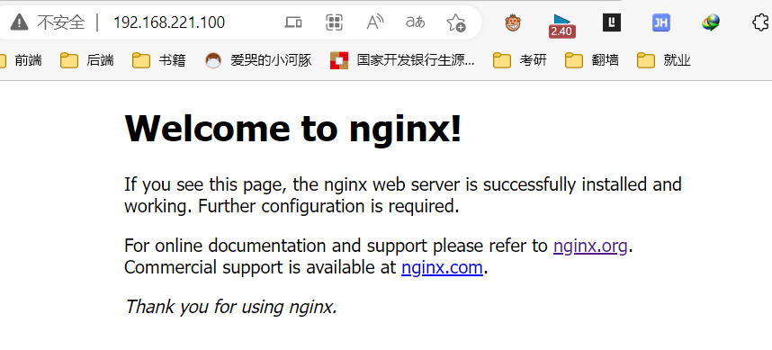

# Nginx简介

## 什么是Nginx

> **Nginx 是高性能的 HTTP 和反向代理的服务器，处理高并发能力是十分强大的，能经受高负载的考验**,有报告表明能支持高达 50,000 个并发连接数。

## 正向代理

> **需要在客户端配置代理服务器进行指定网站访问**


## 反向代理

> **暴露的是代理服务器地址，隐藏了真实服务器 IP 地址。**


## 负载均衡

> **增加服务器的数量，然后将请求分发到各个服务器上，将原先请求集中到单个服务器上的情况改为将请求分发到多个服务器上，将负载分发到不同的服务器**，也就是我们所说的负载均衡


## 动静分离


# 安装Nginx

> 1. 进入 nginx 官网，[下载](http://nginx.org/)
>
>    
>
> 2. 安装pcre依赖
>
>    1. 联网下载 pcre 压缩文件依赖
>
>       ```sh
>       wget http://downloads.sourceforge.net/project/pcre/pcre/8.37/pcre-8.37.tar.gz
>       ```
>
>    2. 解压压缩文件
>
>       ```sh
>       tar -zxvf pcre-8.37.tar.gz
>       ```
>
>    3. 进入解压之后的文件夹
>
>       ```sh
>       ./configure
>       
>       make && make install
>       
>       # 查看版本
>       pcre-config --version
>       ```
>
>    4. 遇到的问题
>
>       1. 执行`./configure`的问题
>
>          
>
>          需要c++的环境`yum install -y gcc gcc-c++`
>
>       2. 执行`make && make install`的问题
>
>          
>
>          `./configure`所以没能生成makefile
>
> 3. 安装 openssl 、zlib 、 gcc 依赖
>
>    ```sh
>    yum -y install make zlib zlib-devel gcc-c++ libtool openssl openssl-devel
>    ```
>
> 4. 安装 nginx 
>
>    1. 使用命令解压 
>
>       ```sh
>       tar -zxvf nginx-1.12.2.tar.gz 
>       ```
>
>    2. 进入解压之后的文件夹
>
>       ```sh
>       ./configure 
>       
>       make && make install
>       ```
>
> 5. 进入目录`/usr/local/nginx/sbin/nginx`启动服务
>
>    ```sh
>    [root@lz sbin]# cd /usr/local/nginx/sbin
>    [root@lz sbin]# ./nginx
>    [root@lz sbin]# ps -ef | grep nginx
>    root      33615      1  0 13:38 ?        00:00:00 nginx: master process ./nginx
>    nobody    33616  33615  0 13:38 ?        00:00:00 nginx: worker process
>    root      33800   2766  0 13:39 pts/0    00:00:00 grep --color=auto nginx
>    ```
>
> 6. 设置防火墙
>
>    ```sh
>    # 查看开放的端口号
>    firewall-cmd --list-all
>    # 设置开放的端口号
>    firewall-cmd --add-service=http –permanent
>    firewall-cmd --add-port=80/tcp --permanent
>    # 重启防火墙
>    firewall-cmd –reload
>    ```
>
> 7. 访问IP+80端口`192.168.221.100:80`
>
>    