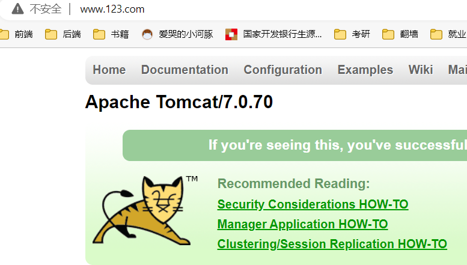

# Nginx简介

## 什么是Nginx

> **Nginx 是高性能的 HTTP 和反向代理的服务器，处理高并发能力是十分强大的，能经受高负载的考验**,有报告表明能支持高达 50,000 个并发连接数。

## 正向代理

> **需要在客户端配置代理服务器进行指定网站访问**


## 反向代理

> **暴露的是代理服务器地址，隐藏了真实服务器 IP 地址。**


## 负载均衡

> **增加服务器的数量，然后将请求分发到各个服务器上，将原先请求集中到单个服务器上的情况改为将请求分发到多个服务器上，将负载分发到不同的服务器**，也就是我们所说的负载均衡


## 动静分离


# 安装Nginx

> 1. 进入 nginx 官网，[下载](http://nginx.org/)
>
>    
>
> 2. 安装pcre依赖
>
>    1. 联网下载 pcre 压缩文件依赖
>
>       ```sh
>       wget http://downloads.sourceforge.net/project/pcre/pcre/8.37/pcre-8.37.tar.gz
>       ```
>
>    2. 解压压缩文件
>
>       ```sh
>       tar -zxvf pcre-8.37.tar.gz
>       ```
>
>    3. 进入解压之后的文件夹
>
>       ```sh
>       ./configure
>       
>       make && make install
>       
>       # 查看版本
>       pcre-config --version
>       ```
>
>    4. 遇到的问题
>
>       1. 执行`./configure`的问题
>
>          
>
>          需要c++的环境`yum install -y gcc gcc-c++`
>
>       2. 执行`make && make install`的问题
>
>          
>
>          `./configure`所以没能生成makefile
>
> 3. 安装 openssl 、zlib 、 gcc 依赖
>
>    ```sh
>    yum -y install make zlib zlib-devel gcc-c++ libtool openssl openssl-devel
>    ```
>
> 4. 安装 nginx 
>
>    1. 使用命令解压 
>
>       ```sh
>       tar -zxvf nginx-1.12.2.tar.gz 
>       ```
>
>    2. 进入解压之后的文件夹
>
>       ```sh
>       ./configure 
>       
>       make && make install
>       ```
>
> 5. 进入目录`/usr/local/nginx/sbin`启动服务
>
>    ```sh
>    [root@lz sbin]# cd /usr/local/nginx/sbin
>    [root@lz sbin]# ./nginx
>    [root@lz sbin]# ps -ef | grep nginx
>    root      33615      1  0 13:38 ?        00:00:00 nginx: master process ./nginx
>    nobody    33616  33615  0 13:38 ?        00:00:00 nginx: worker process
>    root      33800   2766  0 13:39 pts/0    00:00:00 grep --color=auto nginx
>    ```
>
> 6. 设置防火墙
>
>    ```sh
>    # 查看开放的端口号
>    firewall-cmd --list-all
>    # 设置开放的端口号
>    firewall-cmd --add-service=http –permanent
>    firewall-cmd --add-port=80/tcp --permanent
>    # 重启防火墙
>    firewall-cmd –reload
>    ```
>
> 7. 访问IP+80端口`192.168.221.100:80`
>
>    

## nginx目录结构

```sh
[root@localhost ~]# tree /usr/local/nginx
/usr/local/nginx
├── client_body_temp                 # POST 大文件暂存目录
├── conf                             # Nginx所有配置文件的目录
│   ├── fastcgi.conf                 # fastcgi相关参数的配置文件
│   ├── fastcgi.conf.default         # fastcgi.conf的原始备份文件
│   ├── fastcgi_params               # fastcgi的参数文件
│   ├── fastcgi_params.default       
│   ├── koi-utf
│   ├── koi-win
│   ├── mime.types                   # 媒体类型
│   ├── mime.types.default
│   ├── nginx.conf                   #这是Nginx默认的主配置文件，日常使用和修改的文件
│   ├── nginx.conf.default
│   ├── scgi_params                  # scgi相关参数文件
│   ├── scgi_params.default  
│   ├── uwsgi_params                 # uwsgi相关参数文件
│   ├── uwsgi_params.default
│   └── win-utf
├── fastcgi_temp                     # fastcgi临时数据目录
├── html                             # Nginx默认站点目录
│   ├── 50x.html                     # 错误页面优雅替代显示文件，例如出现502错误时会调用此页面
│   └── index.html                   # 默认的首页文件
├── logs                             # Nginx日志目录
│   ├── access.log                   # 访问日志文件
│   ├── error.log                    # 错误日志文件
│   └── nginx.pid                    # pid文件，Nginx进程启动后，会把所有进程的ID号写到此文件
├── proxy_temp                       # 临时目录
├── sbin                             # Nginx 可执行文件目录
│   └── nginx                        # Nginx 二进制可执行程序
├── scgi_temp                        # 临时目录
└── uwsgi_temp                       # 临时目录

```

## nginx常用命令

> - 查看nginx版本号 ，在`/usr/local/nginx/sbin`目录下执行
>
>   ```sh
>   ./nginx -v
>   ```
>
> - 启动命令，在`/usr/local/nginx/sbin`目录下执行
>
>   ```sh
>   ./nginx
>   ```
>
> - 关闭命令，在`/usr/local/nginx/sbin`目录下执行
>
>   ```sh
>   ./nginx -s stop 
>   ```
>
> - 重新加载命令，在`/usr/local/nginx/sbin`目录下执行
>
>   ```sh
>   ./nginx -s reload
>   ```

## nginx配置文件

> - nginx 配置文件位置
>
>   ```sh
>   vim /usr/local/nginx/conf/nginx.conf
>   ```
>
> - 配置文件中的内容
>
>   1. 全局块：配置服务器整体运行的配置指令
>
>      
>
>      比如 worker_processes 1;处理并发数的配置
>
>   2. events块：影响 Nginx 服务器与用户的网络连接
>
>      
>
>      比如 worker_connections 1024; 支持的最大连接数为 1024
>
>   3. http块：包含两部分： http全局块 server块

### 初始的完整文件

```sh
worker_processes  1; #允许进程数量，建议设置为cpu核心数或者auto自动检测，注意Windows服务器上虽然可以启动多个processes，但是实际只会用其中一个

events {
    #单个进程最大连接数（最大连接数=连接数*进程数）
    #根据硬件调整，和前面工作进程配合起来用，尽量大，但是别把cpu跑到100%就行。
    worker_connections  1024;
}


http {
    #文件扩展名与文件类型映射表(是conf目录下的一个文件)
    include       mime.types;
    #默认文件类型，如果mime.types预先定义的类型没匹配上，默认使用二进制流的方式传输
    default_type  application/octet-stream;

    #sendfile指令指定nginx是否调用sendfile 函数（zero copy 方式）来输出文件，对于普通应用，必须设为on。如果用来进行下载等应用磁盘IO重负载应用，可设置为off，以平衡磁盘与网络IO处理速度。
    sendfile        on;
    
    #长连接超时时间，单位是秒
    keepalive_timeout  65;

 	#虚拟主机的配置
    server {
    	#监听端口
        listen       80;
        #域名，可以有多个，用空格隔开
        server_name  localhost;

		#配置根目录以及默认页面
        location / {
            root   html;
            #前面的优先级更高，index.html优先级高于index.htm
            index  index.html index.htm;
        }

		#出错页面配置
        error_page   500 502 503 504  /50x.html;
        #/50x.html文件所在位置
        location = /50x.html {
            root   html;
        }
        
    }

}

```

### ServerName匹配规则

> 我们可以在同一个servername中配置多个域名，多个域名用空格隔开

#### 完整匹配

> server中可以配置多个域名，例如：

```sh
server_name  test81.xzj520520.cn  test82.xzj520520.cn;
```

#### 通配符匹配

> 需要注意的是精确匹配的优先级大于通配符匹配和正则匹配。

```
server_name  *.xzj520520.cn;
```

#### 通配符结束匹配

```sh
server_name  www.xzj520520.*;
```

#### 正则表达式


> **正则匹配格式，必须以~开头**，比如：`server_name ~^www\d+\.example\.net$;`。**如果开头没有~，则nginx认为是精确匹配。**在逻辑上，需要添加^和$锚定符号。注意，正则匹配格式中.为正则元字符，**如果需要匹配.，则需要反斜线转义。如果正则匹配中含有{和}则需要双引号引用起来，避免nginx报错**，如果没有加双引号，则nginx会报如下错误：directive "server_name" is not terminated by ";" in ...。

#### 特殊匹配格式

```sh
server_name ""; #匹配Host请求头不存在的情况。
```

#### 匹配顺序

> 1. 精确的名字
> 2. 以*号开头的最长通配符名称，例如 *.example.org
> 3. 以*号结尾的最长通配符名称，例如 mail.*
> 4. 第一个匹配的正则表达式（在配置文件中出现的顺序）

#### 优化

> 1. **尽量使用精确匹配;**
> 2. 当定义大量server_name时或特别长的server_name时，需要在http级别调整server_names_hash_max_size和server_names_hash_bucket_size，否则nginx将无法启动。

### location 指令说明 

> location有两种匹配规则：
>
> - 匹配URL类型，有四种参数可选，当然也可以不带参数。
>   `location [ = | ~ | ~* | ^~ ] uri { … }`
>
>   优先级：
>
>   ​	首先精确匹配 `=`
>
>   ​	其次前缀匹配 `^~ `
>
>   ​	其次是按文件中顺序的正则匹配 `~` 或 `~* `
>
>   ​	然后匹配不带任何修饰的前缀匹配 
>
>   ​	最后是交给 `/` 通用匹配
>
> - 命名location，用@标识，类似于定于goto语句块。
>   `location @name { … }`

#### `“=”` 

> 精确匹配，内容要同表达式完全一致才匹配成功

```
location = /abc/ {
  .....
 }
        
# 只匹配http://abc.com/abc
#http://abc.com/abc [匹配成功]
#http://abc.com/abc/index [匹配失败]
```

#### `“~”`

> 执行正则匹配，区分大小写。

```
location ~ /Abc/ {
  .....
}
#http://abc.com/Abc/ [匹配成功]
#http://abc.com/abc/ [匹配失败]
```

#### `“~*”`

> 执行正则匹配，忽略大小写

```
location ~* /Abc/ {
  .....
}
# 则会忽略 uri 部分的大小写
#http://abc.com/Abc/ [匹配成功]
#http://abc.com/abc/ [匹配成功]
```

#### `“^~”`

> 表示普通字符串匹配上以后不再进行正则匹配。

```
location ^~ /index/ {
  .....
}
#以 /index/ 开头的请求，都会匹配上
#http://abc.com/index/index.page  [匹配成功]
#http://abc.com/error/error.page [匹配失败]
```

#### 不加任何规则时

> 默认是大小写敏感，前缀匹配，相当于加了`~`与`^~`

```
location /index/ {
  ......
}
#http://abc.com/index  [匹配成功]
#http://abc.com/index/index.page  [匹配成功]
#http://abc.com/test/index  [匹配失败]
#http://abc.com/Index  [匹配失败]
# 匹配到所有uri
```

#### `“@”`

> nginx内部跳转

```
location /index/ {
  error_page 404 @index_error;
}
location @index_error {
  .....
}
#以 /index/ 开头的请求，如果链接的状态为 404。则会匹配到 @index_error 这条规则上。
```

# Nginx配置实例-反向代理

## 实例一

> - 实现效果：打开浏览器，在浏览器地址栏输入地址 www.123.com，跳转到 liunx 系统 tomcat 主页面中 
>
> - 准备工作
>
>   - 在 liunx 系统安装 tomcat，使用默认端口 8080 
>
>   - tomcat 安装文件放到 liunx 系统中，解压
>
>   - 进入 tomcat 的 bin 目录中，`./startup.sh`启动 tomcat 服务器
>
>   - 对外开放访问的端口(或者关闭防火墙)
>
>     ```sh
>     firewall-cmd --add-port=8080/tcp --permanent
>     firewall-cmd –reload
>     # 查看已经开放的端口号
>     firewall-cmd --list-all
>     ```
>
>   - 在 windows 系统中通过浏览器访问 tomcat 服务器（IP+8080端口）
>
>     
>
> - 访问过程的分析
>
>   正常访问流程是，根据域名查看本地hosts文件中的配置，hosts中没有配置根据DNS域名解析系统访问服务器
>
>   
>
> - 具体配置
>
>   1. 在 windows 系统的 host 文件进行域名和 ip 对应关系的配置
>
>      
>
>      
>
>   2. 在 nginx 进行请求转发的配置（反向代理配置）`vim /usr/local/nginx/conf/nginx.conf`
>
>      注意后面的分号不要忘记
>
>      
>
>   3. 重启nginx
>
> - 测试
>
>   

## 实例二

> - 实现效果
>
>   使用 nginx 反向代理，根据访问的路径跳转到不同端口的服务中 nginx 监听端口为 9001，
>
>   访问 http://192.168.221.100:9001/edu/ 直接跳转到 127.0.0.1:8080
>
>   访问 http://192.168.221.100:9001/vod/ 直接跳转到 127.0.0.1:8081
>
> - 准备工作
>
>   准备两个 tomcat 服务器，一个 8080 端口，一个 8081 端口 
>
>   创建文件夹和测试页面
>
>   
>
>   
>
> - 具体配置 
>
>   找到 nginx 配置文件，进行反向代理配置`vim /usr/local/nginx/conf/nginx.conf`
>
>    
>
>   开放对外访问的端口号 9001 8080 8081或者关闭防火墙
>
> - 最终测试
>
>   
>
>   

# Nginx 配置实例-负载均衡

> 1. 实现效果
>
>    浏览器地址栏输入地址 http://192.168.221.100/edu/a.html，负载均衡效果，平均 8080 和 8081 端口中
>
> 2. 准备工作
>
>    准备两台 tomcat 服务器，一台 8080，一台 8081 
>
>    在两台 tomcat 里面 webapps 目录中，创建名称是 edu 文件夹，在 edu 文件夹中创建 页面 a.html，用于测
>
> 3. 在 nginx 的配置文件中进行负载均衡的配置
>
>    
>
> 4. nginx 分配服务器策略
>
>    - 第一种 轮询（默认）
>
>      每个请求按时间顺序逐一分配到不同的后端服务器，如果后端服务器 down 掉，能自动剔除。
>
>    - 第二种 weight
>
>      weight 代表权重默认为 1,权重越高被分配的客户端越多
>
>      
>
>    - 第三种 ip_hash
>
>      每个请求按访问 ip 的 hash 结果分配，这样每个访客固定访问一个后端服务器
>
>      
>
>    - 第四种 fair（第三方）
>
>      按后端服务器的响应时间来分配请求，响应时间短的优先分配。
>
>      

# Nginx 配置实例-动静分离


> Nginx 动静分离简单来说就是把动态跟静态请求分开，不能理解成只是单纯的把动态页面和 静态页面物理分离。严格意义上说应该是动态请求跟静态请求分开，可以理解成使用 Nginx  处理静态页面，Tomcat 处理动态页面。
>
> 动静分离从目前实现角度来讲大致分为两种：
>
> 一种是纯粹把静态文件独立成单独的域名，放在独立的服务器上，也是目前主流推崇的方案； 
>
> 另外一种方法就是动态跟静态文件混合在一起发布，通过 nginx 来分开。 通过 location 指定不同的后缀名实现不同的请求转发。通过 expires 参数设置，可以使 浏览器缓存过期时间，减少与服务器之前的请求和流量。具体 Expires 定义：是给一个资 源设定一个过期时间，也就是说无需去服务端验证，直接通过浏览器自身确认是否过期即可， 所以不会产生额外的流量。此种方法非常适合不经常变动的资源。（如果经常更新的文件， 不建议使用 Expires 来缓存），我这里设置 3d，表示在这 3 天之内访问这个 URL，发送 一个请求，比对服务器该文件最后更新时间没有变化，则不会从服务器抓取，返回状态码 304，如果有修改，则直接从服务器重新下载，返回状态码 200。

> 1. 准备工作 
>
>    在 liunx 系统中准备静态资源，用于进行访问
>
>    
>
> 2. 具体配置
>
>    在 nginx 配置文件中进行配置`vim /usr/local/nginx/conf/nginx.conf`
>
>    `autoindex on`：展示文件夹里的所有内容
>
>    
>
> 3. 最终测试
>
>    浏览器中输入地址192.168.221.100/www/a.html
>
>    
>
>    浏览器中输入地址192.168.221.100/images/ 		192.168.221.100/images/404.png
>
>    
>
>    

## URLRewrite


> rewrite是实现URL重写的关键指令，根据regex(正则表达式)部分内容，重定向到repacement，结尾是flag标记。
>
> 优点：掩藏真实的url以及url中可能暴露的参数，以及隐藏web使用的编程语言，提高安全性便于搜索引擎收录
>
> 缺点：降低效率，影响性能。如果项目是内网使用，比如公司内部软件，则没有必要配置。

### 实例


## 防盗链

> **盗链**是指服务提供商自己不提供服务的内容，通过技术手段绕过其它有利益的最终用户界面（如广告），直接在自己的网站上向最终用户提供其它服务提供商的服务内容，骗取最终用户的浏览和点击率。受益者不提供资源或提供很少的资源，而真正的服务提供商却得不到任何的收益。
>
> 当我们请求到一个页面后，这个页面一般会再去请求其中的静态资源，这时候请求头中，会有一个refer字段，表示当前这个请求的来源，我们可以限制指定来源的请求才返回，否则就不返回，这样可以节省资源


```shell
valid_referers none|server_name
```

> 设置有效的refer值
>
> - none：检测地址没有refer，则有效
> - server_name：检测主机地址，refer显示是从这个地址来的，则有效（server_name必须是完整的`http://xxxx`）
>
> 注意：`if ($invalid_referer)`中if后有个空格，不写就会报错

```shell
nginx: [emerg] unknown directive "if($invalid_referer)" in /usr/local/nginx/conf/nginx.conf:27
```

> 例子：这里设置nginx服务器中的img目录下的图片必须refer为http:192.168.174/133才能访问

```shell
        server {
            listen       80;
            server_name  localhost;
				
				location / { 
        		proxy_pass http://xxx;
       	 }
      
				location /img{
				# 设置防盗链
                valid_referers http:192.168.174/133;
                if ($invalid_referer){#无效的
                        return 403;#返回状态码403
                }
                root html;
                index  index.html index.htm;
        	}
        
            error_page   500 502 503 504  /50x.html;
            location = /50x.html {
                root   html;
            }
        }
```

> 如果引用这张图片的页面且refer并没有被设置，图片无法加载出来
>
> 如果直接访问图片地址，因为没有refer字段指向来源，会直接显示Nginx的页面


### 设置盗链图片

> 将提示图片放在html/img/x.png，访问设置防盗链图片时，就返回这x.png张图

```text
		location /img{
                valid_referers http:192.168.174/133;
                if ($invalid_referer){#无效的
                     rewrite ^/  /img/x.png break;
                }
                root html;
                index  index.html index.htm;
		}
```

# Nginx 配置高可用的集群

> 1. 什么是 nginx 高可用
>
>    
>
>    需要两台 nginx 服务器
>
>    需要 keepalived
>
>    需要虚拟 ip
>
> 2. 配置高可用的准备工作
>
>    需要两台服务器 192.168.221.100 和 192.168.221.111
>
>    在两台服务器安装 nginx 
>
>    在两台服务器安装 keepalived，安装之后，在 etc 里面生成目录 keepalived，有文件 keepalived.conf
>
>    ```sh
>    yum install keepalived –y
>    ```
>
> 3. 完成高可用配置（主从配置）
>
>    修改`/etc/keepalived/keepalivec.conf`配置文件
>
>    ```
>    bal_defs {
>       notification_email {
>       acassen@firewall.loc
>       failover@firewall.loc
>       sysadmin@firewall.loc
>     }
>    
>       notification_email_from Alexandre.Cassen@firewall.loc        #定义利用什么邮箱发送邮件
>       smtp_server smtp.163.com     #定义邮件服务器信息
>       smtp_connect_timeout 30      #定义邮件发送超时时间
>       router_id 192.168.221.100    #（重点参数）局域网keppalived主机身份标识信息(每台唯一)
>       script_user root             #添加运行健康检查脚本的用户
>       enable_script_security       #添加运行健康检查脚本的组
>    }
>    
>    vrrp_script chk_http_port {
>     script "/usr/local/src/nginx_check.sh"         #表示将一个脚本信息赋值给变量check_web
>     interval 2      #检测脚本执行的间隔
>     weight -20      #监测失败，则相应的vrrp_instance的优先级会减少20个点
>    }
>    
>    vrrp_instance VI_1 {
>     state MASTER           #keepalived角色描述信息，备份服务器上将 MASTER 改为 BACKUP
>     interface ens33        #将虚拟ip用于那块网卡
>     virtual_router_id 51   #主、备机的 virtual_router_id 必须相同
>     priority 100            #主、备机取不同的优先级，主机值较大，备份机值较小
>     advert_int 1           #主服务器组播包发送间隔时间
>    
>    authentication {        # 主备主机之间的认证表示信息
>       auth_type PASS       #采用明文认证机制
>       auth_pass 1111       #编写明文密码
>     }
>     virtual_ipaddress {
>       192.168.221.50      #设置虚拟ip地址信息，此参数备节点设置和主节点相同
>     }
>     track_script {
>        chk_http_port       #调用执行脚本
>      }
>    }
>    ```
>
>    在`/usr/local/src`添加检测脚本
>
>    ```sh
>    #!/bin/bash
>    A=`ps -C nginx 每no-header |wc -l`
>    if [ $A -eq 0 ];then
>        /usr/local/nginx/sbin/nginx
>        sleep 2
>        if [ `ps -C nginx --no-header |wc -l` -eq 0 ];then
>            killall keepalived
>        fi
>    fi
>    ```
>
> 4. 把两台服务器上 nginx 和 keepalived 启动
>
>    启动 nginx：`./nginx`
>
>    启动 keepalived：`systemctl start keepalived.service`
>
> 5. 最终测试 
>
>    在浏览器地址栏输入 虚拟 ip 地址 192.168.221.50
>
>    
>
>    把主服务器（192.168.221.100）nginx 和 keepalived 停止，再输入 192.168.221.50
>
>    

# Nginx 的原理

## mater 和 worker


## worker 如何进行工作的


## 一个master和多个woker有好处

> 1. 可以使用 nginx –s reload 热部署，利用 nginx 进行热部署操作
> 2. 每个 woker 是独立的进程，如果有其中的一个 woker 出现问题，其他 woker 独立的， 继续进行争抢，实现请求过程，不会造成服务中断

## 设置多少个 woker 合适

> worker 数和服务器的 cpu 数相等是最为适宜的

## 连接数 worker_connection

> - 第一个：发送请求，占用了 woker 的几个连接数？
>
>   答案：2 或者 4 个 
>
> - 第二个：nginx 有一个 master，有四个 woker，每个 woker 支持最大的连接数 1024，支持的 最大并发数是多少？ 
>
>   - 普通的静态访问最大并发数是： worker_connections * worker_processes /2，
>   - 而如果是 HTTP 作 为反向代理来说，最大并发数量应该是 worker_connections *  worker_processes/4

# 资源

> - Nginx 中文文档：[https://www.nginx.cn/doc/index.html](https://gitee.com/link?target=https%3A%2F%2Fwww.nginx.cn%2Fdoc%2Findex.html)
>
> - Nginx 配置在线生成：[https://www.digitalocean.com/community/tools/nginx?global.app.lang=zhCN](https://gitee.com/link?target=https%3A%2F%2Fwww.digitalocean.com%2Fcommunity%2Ftools%2Fnginx%3Fglobal.app.lang%3DzhCN)