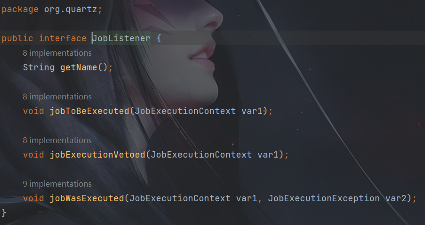
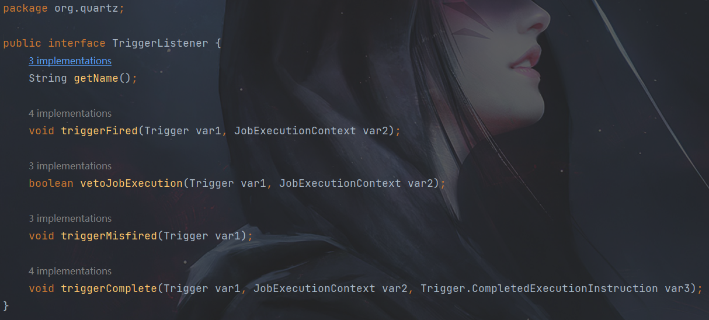

# 一、Quartz概念

## 1. 基本介绍

Quartz是OpenSymphony开源组织在Job scheduling领域又一个开源项目，它可以与J2EE与J2SE应用程序相结合，也可以单独使用。

Quartz是开源且具有丰富特性的“任务调度库”，能够集成于任何的Java应用，小到独立的应用，大至电子商业系统。Quartz能够创建亦简单亦复杂的调度，以执行上十、上百，甚至上万的任务。任务job被定义为标准的Java组件，能够执行任何你想要实现的功能。Quartz调度框架包含许多企业级的特性，如JTA事务、集群的支持。

简而言之，Quartz就是基于Java实现的任务调度框架，用于执行你想要执行的任何任务。

官方网址：[www.quartz-scheduler.org/](https://link.juejin.cn?target=http%3A%2F%2Fwww.quartz-scheduler.org%2F) 

官方文档：[www.quartz-scheduler.org/documentati…](https://link.juejin.cn?target=http%3A%2F%2Fwww.quartz-scheduler.org%2Fdocumentation%2F) 

原码地址：[github.com/quartz-sche…](https://link.juejin.cn?target=https%3A%2F%2Fgithub.com%2Fquartz-scheduler%2Fquartz)

## 2. Quartz运行环境

- Quartz可以运行嵌入在另一个独立式应用程序
- Quartz可以在应用程序服务器（或Servlet容器）内被实例化，并且参与事务
- Quartz可以作为一个独立的程序运行（其自己的Java虚拟机内），可以通过RMI使用
- Quartz可以被实例化，作为独立的项目集群（负载平衡和故障转移功能），用于作业的执行

## 3. Quartz核心概念

- 任务 `Job`

  `Job` 就是你想要实现的任务类，每一个 `Job` 必须实现 `org.quartz.job` 接口，且只需实现接口定义的 `execute()` 方法。

- 触发器 `Trigger`

  Trigger 为你执行任务的触发器，比如你想每天定时3点发送一份统计邮件，Trigger 将会设置3点执行该任务。 Trigger 主要包含两种 SimplerTrigger 和 CronTrigger 两种。详见 7.9 与 7.10

- 调度器 `Scheduler`

  Scheduler 为任务的调度器，它会将任务 Job 及触发器 Trigger 整合起来，负责基于 Trigger 设定的时间来执行 Job。

## 4. Quartz的体系结构


# 二、Quart的使用

## 1、引入Quartz的jar包

创建一个 springboot（版本：2.2.4.RELEASE） 应用，直接引入依赖即可

```xml
<dependencies>
	<!-- Quartz 核心包 -->
    <dependency>
        <groupId>org.quartz-scheduler</groupId>
        <artifactId>quartz</artifactId>
    </dependency>

	<!-- Quartz 工具包 -->
    <dependency>
        <groupId>org.quartz-scheduler</groupId>
        <artifactId>quartz-jobs</artifactId>
    </dependency>
</dependencies>
```

## 2、入门案例

（1）创建HelloJob任务类

```java
// 定义任务类
public class HelloJob implements Job {

    @Override
    public void execute(JobExecutionContext arg0) throws JobExecutionException {
        // 输出当前时间
        System.out.println(new Date());
    }
}
```

（2）创建任务调度类HelloSchedulerDemo

```java
package com.lz.quartz;

import org.quartz.*;
import org.quartz.impl.StdSchedulerFactory;

public class HelloSchedulerDemo {

    public static void main(String[] args) throws Exception {
        // 1、调度器（Scheduler），从工厂中获取调度的实例（默认：实例化new StdSchedulerFactory();）
        Scheduler scheduler = StdSchedulerFactory.getDefaultScheduler();

        // 2、任务实例（JobDetail）定义一个任务调度实例，将该实例与HelloJob绑定，任务类需要实现Job接口
        JobDetail jobDetail = JobBuilder.newJob(HelloJob.class) // 加载任务类，与HelloJob完成绑定，要求HelloJob实现Job接口
                .withIdentity("job1", "group1") // 参数1：任务的名称（唯一实例）；参数2：任务组的名称
                .build();

        // 3、触发器（Trigger）定义触发器，马上执行，然后每5秒重复执行一次
        Trigger trigger = TriggerBuilder.newTrigger()
                .withIdentity("trigger1", "group1") // 参数1：触发器的名称（唯一实例）；参数2：触发器组的名称
                .startNow() // 马上启动触发器
                .withSchedule(SimpleScheduleBuilder.simpleSchedule().withIntervalInSeconds(2).repeatForever()) // 每2秒重复执行一次
                .build();

        // 4、让调度器关联任务和触发器，保证按照触发器定义的调整执行任务
        scheduler.scheduleJob(jobDetail, trigger);

        // 5、启动
        scheduler.start();
        // 关闭
        //scheduler.shutdown();
    }

}
```

## 3、Job和JobDetail详解

- **`Job`：工作任务调度的接口，任务需要实现该接口。**该接口中定义execute方法，类似JDK提供的TimeTask类的run方法。在里面编写任务执行的业务逻辑。
- Job实例在Quartz中的生命周期：**每次调度器执行Job时，它在调用execute方法前会创建一个新的 Job 实例，当调用完成后，关联的Job对象实例会被释放，释放的实例会被垃圾回收机制回收。**
- `JobDetail`：**JobDetail为Job实例提供了许多设置属性，以及JobDataMap成员变量属性，它用来存储特定Job实例的状态信息，调度器需要借助JobDetail对象来添加Job实例。**
- JobDetail重要属性：`name`、`group`、`jobClass`、`JobDataMap`

```java
JobDetail job = JobBuilder.newJob(HelloJob.class)
        .withIdentity("job1", "group1") // 定义该实例唯一标识，并指定一个组
        .build();

System.out.println("name:" +job.getKey().getName());
System.out.println("group:" +job.getKey().getGroup());
System.out.println("jobClass:" +job.getJobClass().getName());
```

## 4、JobExecutionContext

- **当 Scheduler 调用一个 Job，就会将 JobExecutionContext 传递给 Job 的 execute() 方法；**
- **Job 能通过 JobExecutionContext 对象访问到 Quartz 运行时候的环境以及 Job 本身的明细数据。**

```java
package com.lz.quartz;

import org.quartz.*;

import java.util.Date;

// 定义任务类
public class HelloJob implements Job {

    @Override
    public void execute(JobExecutionContext jobExecutionContext) throws JobExecutionException {
        // 输出当前时间
        System.out.println(new Date());

        Trigger trigger = jobExecutionContext.getTrigger(); //获取Trigger
        JobDetail jobDetail = jobExecutionContext.getJobDetail(); //获取JobDetail
        Scheduler scheduler = jobExecutionContext.getScheduler(); //获取Scheduler

        String name = trigger.getKey().getName();//获取Trigger名字
        String group = trigger.getKey().getGroup();//获取Trigger组名（默认为 DEFAULT）

        Date scheduledFireTime = jobExecutionContext.getScheduledFireTime();//触发器触发的预定时间。
        Date fireTime = jobExecutionContext.getFireTime();//实际触发时间。例如，计划时间可能是 10:00:00，但如果调度程序太忙，实际触发时间可能是 10:00:03。
        Date previousFireTime = jobExecutionContext.getPreviousFireTime();//上次触发时间
        Date nextFireTime = jobExecutionContext.getNextFireTime();//下次触发时间

        System.out.println("trigger = " + trigger);
        System.out.println("jobDetail = " + jobDetail);
        System.out.println("scheduler = " + scheduler);
        System.out.println("name = " + name);
        System.out.println("group = " + group);
        System.out.println("scheduledFireTime = " + scheduledFireTime);
        System.out.println("fireTime = " + fireTime);
        System.out.println("previousFireTime = " + previousFireTime);
        System.out.println("nextFireTime = " + nextFireTime);
    }
}
```

```
Fri Jun 16 16:31:07 CST 2023
trigger = Trigger 'group1.trigger1':  triggerClass: 'org.quartz.impl.triggers.SimpleTriggerImpl calendar: 'null' misfireInstruction: 0 nextFireTime: Fri Jun 16 16:31:09 CST 2023
jobDetail = JobDetail 'group1.job1':  jobClass: 'com.lz.quartz.HelloJob concurrentExectionDisallowed: false persistJobDataAfterExecution: false isDurable: false requestsRecovers: false
scheduler = org.quartz.impl.StdScheduler@7bc8da77
name = trigger1
group = group1
scheduledFireTime = Fri Jun 16 16:31:07 CST 2023
fireTime = Fri Jun 16 16:31:07 CST 2023
previousFireTime = Fri Jun 16 16:31:05 CST 2023
nextFireTime = Fri Jun 16 16:31:09 CST 2023
```

## 5、JobDataMap介绍

### （1）使用Map获取

- **在进行任务调度时，`JobDataMap` 存储在 `JobExecutionContext` 中，非常方便获取。**
- **`JobDataMap` 可以用来装载任何可序列化的数据对象，当 Job 实例对象被执行时这些参数对象会传递给它。**
- **`JobDataMap` 实现了 JDK 的 Map 接口，并且添加了非常方便的方法用来存取基本数据类型。**

在定义 `Trigger` 或者 `JobDetail` 时，将 `JobDataMap` 传入，然后 `Job` 中便可以获取到 `JobDataMap` 中的参数

```java
package com.lz.quartz;

import org.quartz.*;
import org.quartz.impl.StdSchedulerFactory;

import java.util.Date;

public class HelloScheduler {
    public static void main(String[] args) throws SchedulerException {
        //1. 调度器（Scheduler）
        Scheduler defaultScheduler = StdSchedulerFactory.getDefaultScheduler();

        JobDataMap jobDataMap2 = new JobDataMap();
        jobDataMap2.put("message", "JobDetailMessage");

        //2. 任务实例（JobDetail）
        JobDetail jobDetail = JobBuilder.newJob(HelloJob.class)
                .withIdentity("job1", "jobGroup1")
                .usingJobData(jobDataMap2)
                .usingJobData("msg", "jobDetail")
                .build();

        // 定义 JobDataMap
        JobDataMap jobDataMap = new JobDataMap();
        jobDataMap.put("message", "TriggerMessage");

        //3. 触发器（Trigger）
        Trigger trigger = TriggerBuilder.newTrigger()
                .withIdentity("trigger1", "triggerGroup1")
                .startNow()
                .withSchedule(SimpleScheduleBuilder.simpleSchedule().withIntervalInSeconds(2).repeatForever())
                .endAt(new Date(new Date().getTime() + 3000L))
                .usingJobData(jobDataMap) // 将 JobDataMap 放入 Trigger 中
                .usingJobData("msg", "trigger")
                .build();

        defaultScheduler.scheduleJob(jobDetail, trigger);
        defaultScheduler.start();
    }
}
```

HelloJob.java

```java
package com.lz.quartz;

import org.quartz.*;

import java.util.Date;

public class HelloJob implements Job {
    @Override
    public void execute(JobExecutionContext jobExecutionContext) throws JobExecutionException {
        System.out.println(jobExecutionContext.getTrigger().getJobDataMap().get("message")); //TriggerMessage
        System.out.println(jobExecutionContext.getTrigger().getJobDataMap().get("msg")); //trigger

        System.out.println(jobExecutionContext.getJobDetail().getJobDataMap().get("message")); //JobDetailMessage
        System.out.println(jobExecutionContext.getJobDetail().getJobDataMap().get("msg")); //jobDetail

        System.out.println(jobExecutionContext.getMergedJobDataMap().get("message")); //TriggerMessage
    }
}
```

### （2）使用 Setter 方法获取

Job实现类中添加setter方法对应JobDataMap的键值，Quartz框架默认的JobFactory实现类在初始化Job实例对象时会自动调用这些setter方法。

`HelloScheduler` 类和上面一样。

HelloJob.java：

```java
package com.lz.quartz;

import lombok.Data;
import org.quartz.*;

import java.util.Date;

@Data
public class HelloJob implements Job {

    private String message;

    @Override
    public void execute(JobExecutionContext jobExecutionContext) throws JobExecutionException {
        System.out.println(message); //TriggerMessage
        System.out.println(new Date());
    }
}
```

**注意：如果遇到同名的 `key`，`Trigger` 中 `JobDataMap` 的值会覆盖 `JobDetail` 中 `JobDataMap` 同名的 `Key`**

## 6、有状态的Job和无状态的Job

**有状态的 `Job` 可以理解为多次 `Job` 调用期间可以持有一些状态信息，这些状态信息存储在 `JobDataMap` 中，而默认的无状态 `Job` 每次调用时都会创建一个新的 `JobDataMap`。**

（1）修改HelloSchedulerDemo.java。在 `JobDetail` 中添加 `.usingJobData("count", 0)`，表示计数器。

```java
JobDetail job = JobBuilder.newJob(HelloJob.class)
        .withIdentity("job1", "group1") // 定义该实例唯一标识，并指定一个组
        .usingJobData("message", "打印日志")
        .usingJobData("count", 0)
        .build();
```

（2）HelloJob.java

```java
package com.lz.quartz;

import lombok.Data;
import org.quartz.Job;
import org.quartz.JobExecutionContext;
import org.quartz.JobExecutionException;
import org.quartz.PersistJobDataAfterExecution;

@Data
@PersistJobDataAfterExecution
public class HelloJob implements Job {

    private Integer count;

    @Override
    public void execute(JobExecutionContext jobExecutionContext) throws JobExecutionException {
        System.out.println(++count);
        jobExecutionContext.getJobDetail().getJobDataMap().put("count", count);
    }
}
```

**HelloJob类没有添加 `@PersistJobDataAfterExecution` 注解，每次调用时都会创建一个新的 `JobDataMap`。不会累加。**

**HelloJob类添加 `@PersistJobDataAfterExecution` 注解，多次调用期间可以持有一些状态信息，即可以实现 `count` 的累加。**

## 7、Trigger


### （1）SimpleTrigger触发器

`SimpleTrigger` 对于设置和使用是最为简单的一种QuartzTrigger。

它是为那种需要在**特定的日期/时间启动**，且以一个可能的**间隔时间重复执行** n 次的 Job 所设计的。

案例一：表示在一个指定的时间段内，执行一次作业任务；

SimpleTrigger 常用方法：

| 方法                     | 说明                                 |
| ------------------------ | ------------------------------------ |
| startNow()               | Scheduler 开始执行时，触发器也即执行 |
| startAt(new Date())      | 在指定的时间开始执行                 |
| withIntervalInSeconds(2) | 执行间隔，方法名中对应时间单位       |
| repeatForever()          | 一直重复执行                         |
| withRepeatCount(3)       | 重复执行指定的次数                   |
| endAt(new Date())        | 结束时间                             |

例子：

```java
//立即开始执行，2秒执行一次，重复3次，3秒后结束执行（当重复次数或者结束时间有一个先达到时，就会停止执行）
Trigger trigger = TriggerBuilder.newTrigger()
                .withIdentity("trigger1", "triggerGroup1")
                .startNow()
              .withSchedule(SimpleScheduleBuilder.simpleSchedule().withIntervalInSeconds(2).withRepeatCount(3))
                .endAt(new Date(new Date().getTime() + 3000L))
                .build();
```

> 需要注意的点
>
> - SimpleTrigger的属性有：开始时间、结束时间、重复次数和重复的时间间隔。
> - 重复次数属性的值可以为0、正整数、或常量 SimpleTrigger.REPEAT_INDEFINITELY。
> - 重复的时间间隔属性值必须为大于0或者长整形的正整数，以毫秒作为时间单位，当重复的时间间隔为0时，意味着与Trigger同时触发执行。
> - 如果有指定结束时间属性值，则结束时间属性优先于重复次数属性，这样的好处在于：当我们需要创建一个每间隔10秒触发一次直到指定的结束时间的Trigger，而无需去计算从开始到结束的所重复的次数，我们只需简单的指定结束时间和使用REPEAT_INDEFINITELY作为重复次数的属性值即可。

### （2）CronTrigger触发器

如果你需要像日历那样按日程来触发任务，而不是像 `SimpleTrigger` 那样每隔特定的间隔时间触发，`CronTrigger` 通常比 `SimpleTrigger` 更有用，因为它是基于日历的作业调度器。

- cron 表达式：[CRON表达式](https://link.juejin.cn?target=https%3A%2F%2Fblog.csdn.net%2Fzyx1260168395%2Farticle%2Fdetails%2F103797497%3Fops_request_misc%3D%257B%2522request%255Fid%2522%253A%2522162661922016780269887930%2522%252C%2522scm%2522%253A%252220140713.130102334.pc%255Fblog.%2522%257D%26request_id%3D162661922016780269887930%26biz_id%3D0%26utm_medium%3Ddistribute.pc_search_result.none-task-blog-2~blog~first_rank_v2~rank_v29-1-103797497.pc_v2_rank_blog_default%26utm_term%3Dcron%26spm%3D1018.2226.3001.4450)
- 在线生成cron：[www.pppet.net/](https://link.juejin.cn?target=https%3A%2F%2Fwww.pppet.net%2F)，或者直接百度 `在线cron` 也行

案例：

```java
Trigger trigger = TriggerBuilder.newTrigger()
        .withIdentity("trigger1", "group1")
        .withSchedule(CronScheduleBuilder.cronSchedule("0/5 * * * * ?"))  // 日历
        .build();
```

## 8、 SchedulerFactory

Quartz以模块方式架构，因此，要使它运行，几个组件必须很好的咬合在一起。幸运的是，已经有了一些现存的助手可以完成这些工作。

**所有的Scheduler实例由SchedulerFactory创建。**

Quartz的三个核心概念：调度器、任务、触发器，三者之间的关系是：


大家都知道，一个作业，比较重要的三个要素就是Scheduler，JobDetail，Trigger；而Trigger对于Job而言就好比一个驱动器，没有触发器来定时驱动作业，作业就无法运行；对于Job而言，一个Job可以对应多个Trigger，但对于Trigger而言，一个Trigger只能对应一个Job，所以一个Trigger只能被指派给一个Job；如果你需要一个更负责的触发计划，你可以创建多个Trigger并指派它们给同一个Job。

### （1）StdSchedulerFactory

`Quartz` 默认的 `SchedulerFactory`

- 使用一组参数（`java.util.Properties`）来创建和初始化Quartz调度器
- 配置参数一般存储在 `quartz.properties` 文件中
- 调用 `getScheduler`方法就能创建和初始化调度器对象

创建方法：

```java
//静态方法
Scheduler defaultScheduler = StdSchedulerFactory.getDefaultScheduler();

//实例方法
StdSchedulerFactory stdSchedulerFactory = new StdSchedulerFactory();
Scheduler scheduler = stdSchedulerFactory.getScheduler();
```

### （2）DirectSchedulerFactory（了解）

DirectSchedulerFactory 是对 SchedulerFactory 的直接实现，通过它可以直接构建 Scheduler、ThreadPool 等

```java
DirectSchedulerFactory directSchedulerFactory = DirectSchedulerFactory.getInstance();
Scheduler scheduler = directSchedulerFactory.getScheduler();
```

## 9、Scheduler 常用方法

```java
scheduler.scheduleJob(jobDetail, trigger); //绑定jobDetail与trigger
scheduler.checkExists(JobKey.jobKey(name, group))	//检查JobDetail是否存在
scheduler.checkExists(TriggerKey.triggerKey(name, group))	//检查Trigger是否存在
scheduler.deleteJob(JobKey.jobKey(name, group))		//删除jobDetail

scheduler.triggerJob(JobKey.jobKey(name, group), dataMap)	//立即执行一次指定的任务

scheduler.start();		//启动任务调度
scheduler.pauseJob(jobKey);	//暂停指定的job
scheduler.standby();	//任务调度挂起，即暂停操作
scheduler.shutdown();	//关闭任务调度，同shutdown(false)
scheduler.shutdown(true);	//表示等待所有正在执行的Job执行完毕之后，再关闭Scheduler
scheduler.shutdown(false);	// 表示直接关闭Scheduler
```

## 10.注意点

在Quartz Scheduler中设置前后两个定时任务，同时避免它们相互覆盖，你应该确保以下属性是不同的：

1. **Trigger的名称和组（triggerName 和 triggerGroup）：** 每个触发器必须具有唯一的名称和组标识。确保前后两个定时任务的触发器名称和组是不同的。
2. **Job的名称和组（jobName 和 jobGroup）：** 如果你使用相同的作业详情（JobDetail）对象，确保每个作业的名称和组是不同的。如果你使用不同的作业详情对象，它们的名称和组可以相同。

# 三、Quartz监听器

## 1、概念

Quartz的监听器用于当任务调度中你所关注事件发生时，能够及时获取这一事件的通知。类似于任务执行过程中的邮件、短信类的提醒。**Quartz监听器主要由JobListener、TriggerListener、SchedulerListener三种，顾名思义，分布表示任务、触发器、调度器对应的监听器。**三者的使用方法类似，在开始介绍三种监听器之前，需要明确两个概念：全局监听器与非全局监听器，二者的区别在于：

- **全局监听器能够接收到所有的Job/Trigger的事件通知**
- **而非全局监听器只能接收到在其上注册的Job或者Trigger的事件，不在其上注册的Job或Trigger则不会进行监听。**

本课程关于全局与非全局的监听器的使用，将一一介绍。

## 2、JobListener

任务调度过程中，与任务Job相关的事件包括：Job开始要执行的提示；Job执行完成的提示等。



其中：

- **getName方法：用于获取该JobListener的名称。**
- **jobToBeExecuted方法：Scheduler在JobDetail将要被执行时调用这个方法。**
- **jobExecutionVetoed方法：Scheduler在JobDetail即将被执行，但又被TriggerListener否决时会调用该方法。** 
- **jobWasExecuted方法：Scheduler在JobDetail被执行之后调用这个方法。**

示例：

HelloJobListener.java

```java
// 定义任务类
public class HelloJobListener implements Job {

    @Override
    public void execute(JobExecutionContext context) throws JobExecutionException {
        // 输出当前时间
        Date date = new Date();
        SimpleDateFormat dateFormat = new SimpleDateFormat("yyyy-MM-dd HH:mm:ss");
        String dateString = dateFormat.format(date);
        // 工作内容
        System.out.println("正在进行数据库的备份工作，备份数据库的时间是：" +dateString);
    }
}
```

创建自定义的JobListener继承JobListener接口

MyJobListener.java

```java
public class MyJobListener implements JobListener {

    @Override
    public String getName() {
        String name = this.getClass().getSimpleName();
        System.out.println("监听器的名称是：" +name);
        return name;
    }

    @Override
    public void jobToBeExecuted(JobExecutionContext context) {
        String name = context.getJobDetail().getKey().getName();
        System.out.println("Job的名称是：" +name + "          Scheduler在JobDetail将要被执行时调用的方法");
    }

    @Override
    public void jobExecutionVetoed(JobExecutionContext context) {
        String name = context.getJobDetail().getKey().getName();
        System.out.println("Job的名称是：" +name + "          Scheduler在JobDetail即将被执行，但又被TriggerListener否决时会调用该方法");
    }

    @Override
    public void jobWasExecuted(JobExecutionContext context, JobExecutionException jobException) {
        String name = context.getJobDetail().getKey().getName();
        System.out.println("Job的名称是：" +name + "          Scheduler在JobDetail被执行之后调用这个方法");
    }

}
```

执行调度器

HelloSchedulerDemoJobListener.java

```java
package com.lz.quartz.listener;

import org.quartz.*;
import org.quartz.impl.StdSchedulerFactory;
import org.quartz.impl.matchers.KeyMatcher;

public class HelloSchedulerDemoJobListener {

    public static void main(String[] args) throws Exception {
        // 1、调度器（Scheduler），从工厂中获取调度的实例（默认：实例化new StdSchedulerFactory();）
        Scheduler scheduler = StdSchedulerFactory.getDefaultScheduler();

        // 2、任务实例（JobDetail）定义一个任务调度实例，将该实例与HelloJobSimpleTrigger绑定，任务类需要实现Job接口
        JobDetail jobDetail = JobBuilder.newJob(HelloJobListener.class) // 加载任务类，与HelloJob完成绑定，要求HelloJob实现Job接口
                .withIdentity("job1", "group1") // 参数1：任务的名称（唯一实例）；参数2：任务组的名称
                .build();

        // 3、触发器（Trigger）定义触发器，马上执行，然后每5秒重复执行一次
        Trigger trigger = TriggerBuilder.newTrigger().withIdentity("trigger1", "group1") // 参数1：触发器的名称（唯一实例）；参数2：触发器组的名称
                .startNow().withSchedule(SimpleScheduleBuilder.simpleSchedule().repeatSecondlyForever(5).withRepeatCount(2))  // 每5秒执行一次，连续执行3次后停止，默认是0
                .build();
        // 4、让调度器关联任务和触发器，保证按照触发器定义的调整执行任务
        scheduler.scheduleJob(jobDetail, trigger);

        // 创建并注册一个全局的Job Listener
        // scheduler.getListenerManager().addJobListener(new MyJobListener(), EverythingMatcher.allJobs());
        // 创建并注册一个局部的Job Listener，表示指定的任务Job
        scheduler.getListenerManager().addJobListener(new MyJobListener(), KeyMatcher.keyEquals(JobKey.jobKey("job1", "group1")));

        // 5、启动
        scheduler.start();
        // 关闭
        //scheduler.shutdown();
    }

}
```

## 3、TriggerListener

任务调度过程中，与触发器Trigger相关的事件包括：触发器触发、触发器未正确触发、触发器完成等。



其中：

- **getName方法：用于获取触发器的名称。** 
- **triggerFired方法：当与监听器关联的Trigger被触发，Job上的Execute()方法将被执行时，Scheduler就调用该方法。** 
- **vetoJobExecution方法：在Trigger触发后，Job将要执行时由Scheduler调用这个方法。TriggerListener给了一个选择去否决Job的执行。假如这个方法返回true，这个Job将不会为此次Trigger触发而得到执行。** 
- **triggerMisfired方法：Scheduler调用这个方法是在Trigger错过触发时。你应该关注此方法中持续时间长的逻辑：在出现许多错过触发的Trigger时，长逻辑会导致骨牌效应。你应当保持这个方法尽量的小。** 
- **triggerComplete方法：Trigger被触发并且完成了Job的执行时，Scheduler调用这个方法。**

示例：

下面的例子简单展示了TriggerListener的使用，其中创建并注册TriggerListener与JobListener几乎类似。

HelloJobListener.java

```java
// 定义任务类
public class HelloJobListener implements Job {

    @Override
    public void execute(JobExecutionContext context) throws JobExecutionException {
        // 输出当前时间
        Date date = new Date();
        SimpleDateFormat dateFormat = new SimpleDateFormat("yyyy-MM-dd HH:mm:ss");
        String dateString = dateFormat.format(date);
        // 工作内容
        System.out.println("正在进行数据库的备份工作，备份数据库的时间是：" +dateString);
    }
}
```

MyTriggerListener.java

```java
package com.lz.quartz.listener;

import org.quartz.JobExecutionContext;
import org.quartz.Trigger;
import org.quartz.TriggerListener;

public class MyTriggerListener implements TriggerListener {

    @Override
    public String getName() {
        return "TriggerListener";
    }

    @Override
    public void triggerFired(Trigger trigger, JobExecutionContext context) {
        String name = this.getClass().getSimpleName();
        System.out.println(name + "被触发");
    }

    @Override
    public boolean vetoJobExecution(Trigger trigger, JobExecutionContext context) {
        String name = this.getClass().getSimpleName();
        // TriggerListener给了一个选择去否决Job的执行。假如这个方法返回true，这个Job将不会为此次Trigger触发而得到执行。
        System.out.println(name + " 没有被触发");
        return true;  // true:表示不会执行Job的方法
    }

    @Override
    public void triggerMisfired(Trigger trigger) {
        String name = this.getClass().getSimpleName();
        // Scheduler调用这个方法是在Trigger错过触发时
        System.out.println(name + " 错过触发");
    }

    @Override
    public void triggerComplete(Trigger trigger, JobExecutionContext context, Trigger.CompletedExecutionInstruction triggerInstructionCode) {
        String name = this.getClass().getSimpleName();
        // Trigger被触发并且完成了Job的执行时，Scheduler调用这个方法。
        System.out.println(name + " 完成之后触发");
    }

}
```

HelloSchedulerDemoTriggerListener.java

```java
package com.lz.quartz.listener;

import org.quartz.*;
import org.quartz.impl.StdSchedulerFactory;
import org.quartz.impl.matchers.KeyMatcher;

public class HelloSchedulerDemoTriggerListener {

    public static void main(String[] args) throws Exception {
        // 1、调度器（Scheduler），从工厂中获取调度的实例（默认：实例化new StdSchedulerFactory();）
        Scheduler scheduler = StdSchedulerFactory.getDefaultScheduler();

        // 2、任务实例（JobDetail）定义一个任务调度实例，将该实例与HelloJobSimpleTrigger绑定，任务类需要实现Job接口
        JobDetail jobDetail = JobBuilder.newJob(HelloJobListener.class) // 加载任务类，与HelloJob完成绑定，要求HelloJob实现Job接口
                .withIdentity("job1", "group1") // 参数1：任务的名称（唯一实例）；参数2：任务组的名称
                .build();

        // 3、触发器（Trigger）定义触发器，马上执行，然后每5秒重复执行一次
        Trigger trigger = TriggerBuilder.newTrigger()
                .withIdentity("trigger1", "group1") // 参数1：触发器的名称（唯一实例）；参数2：触发器组的名称
                .startNow()
                .withSchedule(SimpleScheduleBuilder.simpleSchedule().repeatSecondlyForever(5).withRepeatCount(2))  // 每5秒执行一次，连续执行3次后停止，默认是0
                .build();
        // 4、让调度器关联任务和触发器，保证按照触发器定义的调整执行任务
        scheduler.scheduleJob(jobDetail, trigger);

        // 创建并注册一个全局的Trigger Listener
        // scheduler.getListenerManager().addTriggerListener(new MyTriggerListener(), EverythingMatcher.allTriggers());
        // 创建并注册一个局部的Trigger Listener
        scheduler.getListenerManager().addTriggerListener(new MyTriggerListener(), KeyMatcher.keyEquals(TriggerKey.triggerKey("trigger1", "group1")));

        // 5、启动
        scheduler.start();
        // 关闭
        //scheduler.shutdown();
    }

}
```

## 4、SchedulerListener

SchedulerListener会在Scheduler的生命周期中关键事件发生时被调用。与Scheduler有关的事件包括：增加一个Job/Trigger，删除一个Job/Trigger，Scheduler发生严重错误，关闭Scheduler等。

```java
package org.quartz;

public interface SchedulerListener {
    void jobScheduled(Trigger var1);

    void jobUnscheduled(TriggerKey var1);

    void triggerFinalized(Trigger var1);

    void triggerPaused(TriggerKey var1);

    void triggersPaused(String var1);

    void triggerResumed(TriggerKey var1);

    void triggersResumed(String var1);

    void jobAdded(JobDetail var1);

    void jobDeleted(JobKey var1);

    void jobPaused(JobKey var1);

    void jobsPaused(String var1);

    void jobResumed(JobKey var1);

    void jobsResumed(String var1);

    void schedulerError(String var1, SchedulerException var2);

    void schedulerInStandbyMode();

    void schedulerStarted();

    void schedulerStarting();

    void schedulerShutdown();

    void schedulerShuttingdown();

    void schedulingDataCleared();
}

```

其中：

- **jobScheduled方法：用于部署JobDetail时调用。**
- **jobUnscheduled方法：用于卸载JobDetail时调用。**
- **triggerFinalized方法：当一个Trigger来到了再也不会触发的状态时调用这个方法。除非这个Job已设置成了持久性，否则它就会从Scheduler中移除。**
- **triggersPaused方法：Scheduler调用这个方法是发生在一个Trigger或Trigger组被暂停时。假如是Trigger组的话，triggerName参数将为null。**
- **triggersResumed方法：Scheduler调用这个方法是发生在一个Trigger或Trigger组从暂停中恢复时。假如是Trigger组的话，triggerName参数将为null。**
- **jobsPaused方法：当一个或一组JobDetail暂停时调用这个方法。**
-  **jobsResumed方法：当一个或一组Job从暂停上恢复时调用这个方法。假如是一个Job组，jobName将为null。**
- **schedulerError方法：在Scheduler的正常运行期间产生一个严重错误时调用这个方法。**
- **schedulerStarted方法：当Scheduler开启时，调用该方法。**
- **schedulerInStandbyMode方法：当Scheduler处于StandBy模式时，调用该方法。**
- **schedulerShutdown方法：当Scheduler停止时，调用该方法。**
- **schedulingDataCleared方法：当Scheduler中的数据被清除时，调用该方法。**

示例：

下面的代码简单描述了如何使用SchedulerListener方法：

HelloJobListener.java

```java
// 定义任务类
public class HelloJobListener implements Job {

    @Override
    public void execute(JobExecutionContext context) throws JobExecutionException {
        // 输出当前时间
        Date date = new Date();
        SimpleDateFormat dateFormat = new SimpleDateFormat("yyyy-MM-dd HH:mm:ss");
        String dateString = dateFormat.format(date);
        // 工作内容
        System.out.println("正在进行数据库的备份工作，备份数据库的时间是：" +dateString);
    }
}
```

MySchedulerListener.java

```java
public class MySchedulerListener implements SchedulerListener {

    @Override
    public void jobScheduled(Trigger trigger) {
        String name = trigger.getKey().getName();
        // 用于部署JobDetail时调用
        System.out.println(name +" 完成部署");
    }

    @Override
    public void jobUnscheduled(TriggerKey triggerKey) {
        String name = triggerKey.getName();
        // 用于卸载JobDetail时调用
        System.out.println(name +" 完成卸载");
    }

    @Override
    public void triggerFinalized(Trigger trigger) {
        String name = trigger.getKey().getName();
        // 当一个Trigger来到了再也不会触发的状态时调用这个方法。除非这个Job已设置成了持久性，否则它就会从Scheduler中移除。
        System.out.println(name +" 触发器被移除");
    }

    @Override
    public void triggerPaused(TriggerKey triggerKey) {
        String name = triggerKey.getName();
        // Scheduler调用这个方法是发生在一个Trigger或Trigger组被暂停时。假如是Trigger组的话，triggerName参数将为null。
        System.out.println(name +" 正在被暂停");
    }

    @Override
    public void triggersPaused(String triggerGroup) {
        // Scheduler调用这个方法是发生在一个Trigger或Trigger组被暂停时。假如是Trigger组的话，triggerName参数将为null。
        System.out.println("触发器组" +triggerGroup +" 正在被暂停");
    }

    @Override
    public void triggerResumed(TriggerKey triggerKey) {
        // Scheduler调用这个方法是发生在一个Trigger或Trigger组从暂停中恢复时。假如是Trigger组的话，triggerName参数将为null。参数将为null。
        String name = triggerKey.getName();
        System.out.println(name +" 正在从暂停中恢复");
    }

    @Override
    public void triggersResumed(String triggerGroup) {
        // Scheduler调用这个方法是发生在一个Trigger或Trigger组从暂停中恢复时。假如是Trigger组的话，triggerName参数将为null。参数将为null。
        System.out.println("触发器组" +triggerGroup +" 正在从暂停中恢复");
    }

    @Override
    public void jobAdded(JobDetail jobDetail) {
        // 
        System.out.println(jobDetail.getKey() +" 添加工作任务");
    }

    @Override
    public void jobDeleted(JobKey jobKey) {
        // 
        System.out.println(jobKey +" 删除工作任务");
    }

    @Override
    public void jobPaused(JobKey jobKey) {
        // 
        System.out.println(jobKey +" 工作任务正在被暂停");
    }

    @Override
    public void jobsPaused(String jobGroup) {
        // 
        System.out.println("工作组" +jobGroup +" 正在被暂停");
    }

    @Override
    public void jobResumed(JobKey jobKey) {
        // 
        System.out.println(jobKey +" 正在从暂停中恢复");
    }

    @Override
    public void jobsResumed(String jobGroup) {
        // 
        System.out.println("工作组" +jobGroup +" 正在从暂停中恢复");
    }

    @Override
    public void schedulerError(String msg, SchedulerException cause) {
        // 在Scheduler的正常运行期间产生一个严重错误时调用这个方法。
        System.out.println("产生严重错误的时候调用" +msg +"    " +cause.getUnderlyingException());
    }

    @Override
    public void schedulerInStandbyMode() {
        // 当Scheduler处于StandBy模式时，调用该方法。
        System.out.println("调度器被挂起模式的时候调用");
    }

    @Override
    public void schedulerStarted() {
        // 当Scheduler开启时，调用该方法
        System.out.println("调度器开启的时候调用");
    }

    @Override
    public void schedulerStarting() {
        // 
        System.out.println("调度器正在开启的时候调用");
    }

    @Override
    public void schedulerShutdown() {
        // 
        System.out.println("调度器关闭的时候调用");
    }

    @Override
    public void schedulerShuttingdown() {
        // 
        System.out.println("调度器正在关闭的时候调用");
    }

    @Override
    public void schedulingDataCleared() {
        // 当Scheduler中的数据被清除时，调用该方法
        System.out.println("调度器数据被清除的时候调用");
    }

}
```

HelloSchedulerDemoTriggerListener.java

```java
public class HelloSchedulerDemoTriggerListener {

    public static void main(String[] args) throws Exception {
        // 1、调度器（Scheduler），从工厂中获取调度的实例（默认：实例化new StdSchedulerFactory();）
        Scheduler scheduler = StdSchedulerFactory.getDefaultScheduler();

        // 2、任务实例（JobDetail）定义一个任务调度实例，将该实例与HelloJobSimpleTrigger绑定，任务类需要实现Job接口
        JobDetail jobDetail = JobBuilder.newJob(HelloJobListener.class) // 加载任务类，与HelloJob完成绑定，要求HelloJob实现Job接口
                .withIdentity("job1", "group1") // 参数1：任务的名称（唯一实例）；参数2：任务组的名称
                .build();

        // 3、触发器（Trigger）定义触发器，马上执行，然后每5秒重复执行一次
        Trigger trigger = TriggerBuilder.newTrigger()
                .withIdentity("trigger1", "group1") // 参数1：触发器的名称（唯一实例）；参数2：触发器组的名称
                .startNow()
                .withSchedule(SimpleScheduleBuilder.simpleSchedule().repeatSecondlyForever(5).withRepeatCount(2))  // 每5秒执行一次，连续执行3次后停止，默认是0
                .build();
        // 4、让调度器关联任务和触发器，保证按照触发器定义的调整执行任务
        scheduler.scheduleJob(jobDetail, trigger);

        // 创建调度器的监听
        scheduler.getListenerManager().addSchedulerListener(new MySchedulerListener());
        // 移除对应的调度器的监听
        // scheduler.getListenerManager().removeSchedulerListener(new MySchedulerListener());

        // 5、启动
        scheduler.start();

        // 线程延迟7秒后关闭
        Thread.sleep(7000L);

        // 关闭
        scheduler.shutdown();
    }

}
```

# 四、持久化到Mysql中

## 1. 下载sql文件

### [Quartzsql 文件](https://github.com/quartz-scheduler/quartz/blob/v2.3.2/quartz-core/src/main/resources/org/quartz/impl/jdbcjobstore/tables_mysql.sql)

```mysql
#
# Quartz seems to work best with the driver mm.mysql-2.0.7-bin.jar
#
# PLEASE consider using mysql with innodb tables to avoid locking issues
#
# In your Quartz properties file, you'll need to set
# org.quartz.jobStore.driverDelegateClass = org.quartz.impl.jdbcjobstore.StdJDBCDelegate
#

DROP TABLE IF EXISTS QRTZ_FIRED_TRIGGERS;
DROP TABLE IF EXISTS QRTZ_PAUSED_TRIGGER_GRPS;
DROP TABLE IF EXISTS QRTZ_SCHEDULER_STATE;
DROP TABLE IF EXISTS QRTZ_LOCKS;
DROP TABLE IF EXISTS QRTZ_SIMPLE_TRIGGERS;
DROP TABLE IF EXISTS QRTZ_SIMPROP_TRIGGERS;
DROP TABLE IF EXISTS QRTZ_CRON_TRIGGERS;
DROP TABLE IF EXISTS QRTZ_BLOB_TRIGGERS;
DROP TABLE IF EXISTS QRTZ_TRIGGERS;
DROP TABLE IF EXISTS QRTZ_JOB_DETAILS;
DROP TABLE IF EXISTS QRTZ_CALENDARS;


CREATE TABLE QRTZ_JOB_DETAILS
  (
    SCHED_NAME VARCHAR(120) NOT NULL,
    JOB_NAME  VARCHAR(200) NOT NULL,
    JOB_GROUP VARCHAR(200) NOT NULL,
    DESCRIPTION VARCHAR(250) NULL,
    JOB_CLASS_NAME   VARCHAR(250) NOT NULL,
    IS_DURABLE VARCHAR(1) NOT NULL,
    IS_NONCONCURRENT VARCHAR(1) NOT NULL,
    IS_UPDATE_DATA VARCHAR(1) NOT NULL,
    REQUESTS_RECOVERY VARCHAR(1) NOT NULL,
    JOB_DATA BLOB NULL,
    PRIMARY KEY (SCHED_NAME,JOB_NAME,JOB_GROUP)
);

CREATE TABLE QRTZ_TRIGGERS
  (
    SCHED_NAME VARCHAR(120) NOT NULL,
    TRIGGER_NAME VARCHAR(200) NOT NULL,
    TRIGGER_GROUP VARCHAR(200) NOT NULL,
    JOB_NAME  VARCHAR(200) NOT NULL,
    JOB_GROUP VARCHAR(200) NOT NULL,
    DESCRIPTION VARCHAR(250) NULL,
    NEXT_FIRE_TIME BIGINT(13) NULL,
    PREV_FIRE_TIME BIGINT(13) NULL,
    PRIORITY INTEGER NULL,
    TRIGGER_STATE VARCHAR(16) NOT NULL,
    TRIGGER_TYPE VARCHAR(8) NOT NULL,
    START_TIME BIGINT(13) NOT NULL,
    END_TIME BIGINT(13) NULL,
    CALENDAR_NAME VARCHAR(200) NULL,
    MISFIRE_INSTR SMALLINT(2) NULL,
    JOB_DATA BLOB NULL,
    PRIMARY KEY (SCHED_NAME,TRIGGER_NAME,TRIGGER_GROUP),
    FOREIGN KEY (SCHED_NAME,JOB_NAME,JOB_GROUP)
        REFERENCES QRTZ_JOB_DETAILS(SCHED_NAME,JOB_NAME,JOB_GROUP)
);

CREATE TABLE QRTZ_SIMPLE_TRIGGERS
  (
    SCHED_NAME VARCHAR(120) NOT NULL,
    TRIGGER_NAME VARCHAR(200) NOT NULL,
    TRIGGER_GROUP VARCHAR(200) NOT NULL,
    REPEAT_COUNT BIGINT(7) NOT NULL,
    REPEAT_INTERVAL BIGINT(12) NOT NULL,
    TIMES_TRIGGERED BIGINT(10) NOT NULL,
    PRIMARY KEY (SCHED_NAME,TRIGGER_NAME,TRIGGER_GROUP),
    FOREIGN KEY (SCHED_NAME,TRIGGER_NAME,TRIGGER_GROUP)
        REFERENCES QRTZ_TRIGGERS(SCHED_NAME,TRIGGER_NAME,TRIGGER_GROUP)
);

CREATE TABLE QRTZ_CRON_TRIGGERS
  (
    SCHED_NAME VARCHAR(120) NOT NULL,
    TRIGGER_NAME VARCHAR(200) NOT NULL,
    TRIGGER_GROUP VARCHAR(200) NOT NULL,
    CRON_EXPRESSION VARCHAR(200) NOT NULL,
    TIME_ZONE_ID VARCHAR(80),
    PRIMARY KEY (SCHED_NAME,TRIGGER_NAME,TRIGGER_GROUP),
    FOREIGN KEY (SCHED_NAME,TRIGGER_NAME,TRIGGER_GROUP)
        REFERENCES QRTZ_TRIGGERS(SCHED_NAME,TRIGGER_NAME,TRIGGER_GROUP)
);

CREATE TABLE QRTZ_SIMPROP_TRIGGERS
  (
    SCHED_NAME VARCHAR(120) NOT NULL,
    TRIGGER_NAME VARCHAR(200) NOT NULL,
    TRIGGER_GROUP VARCHAR(200) NOT NULL,
    STR_PROP_1 VARCHAR(512) NULL,
    STR_PROP_2 VARCHAR(512) NULL,
    STR_PROP_3 VARCHAR(512) NULL,
    INT_PROP_1 INT NULL,
    INT_PROP_2 INT NULL,
    LONG_PROP_1 BIGINT NULL,
    LONG_PROP_2 BIGINT NULL,
    DEC_PROP_1 NUMERIC(13,4) NULL,
    DEC_PROP_2 NUMERIC(13,4) NULL,
    BOOL_PROP_1 VARCHAR(1) NULL,
    BOOL_PROP_2 VARCHAR(1) NULL,
    PRIMARY KEY (SCHED_NAME,TRIGGER_NAME,TRIGGER_GROUP),
    FOREIGN KEY (SCHED_NAME,TRIGGER_NAME,TRIGGER_GROUP)
    REFERENCES QRTZ_TRIGGERS(SCHED_NAME,TRIGGER_NAME,TRIGGER_GROUP)
);

CREATE TABLE QRTZ_BLOB_TRIGGERS
  (
    SCHED_NAME VARCHAR(120) NOT NULL,
    TRIGGER_NAME VARCHAR(200) NOT NULL,
    TRIGGER_GROUP VARCHAR(200) NOT NULL,
    BLOB_DATA BLOB NULL,
    PRIMARY KEY (SCHED_NAME,TRIGGER_NAME,TRIGGER_GROUP),
    FOREIGN KEY (SCHED_NAME,TRIGGER_NAME,TRIGGER_GROUP)
        REFERENCES QRTZ_TRIGGERS(SCHED_NAME,TRIGGER_NAME,TRIGGER_GROUP)
);

CREATE TABLE QRTZ_CALENDARS
  (
    SCHED_NAME VARCHAR(120) NOT NULL,
    CALENDAR_NAME  VARCHAR(200) NOT NULL,
    CALENDAR BLOB NOT NULL,
    PRIMARY KEY (SCHED_NAME,CALENDAR_NAME)
);

CREATE TABLE QRTZ_PAUSED_TRIGGER_GRPS
  (
    SCHED_NAME VARCHAR(120) NOT NULL,
    TRIGGER_GROUP  VARCHAR(200) NOT NULL,
    PRIMARY KEY (SCHED_NAME,TRIGGER_GROUP)
);

CREATE TABLE QRTZ_FIRED_TRIGGERS
  (
    SCHED_NAME VARCHAR(120) NOT NULL,
    ENTRY_ID VARCHAR(95) NOT NULL,
    TRIGGER_NAME VARCHAR(200) NOT NULL,
    TRIGGER_GROUP VARCHAR(200) NOT NULL,
    INSTANCE_NAME VARCHAR(200) NOT NULL,
    FIRED_TIME BIGINT(13) NOT NULL,
    SCHED_TIME BIGINT(13) NOT NULL,
    PRIORITY INTEGER NOT NULL,
    STATE VARCHAR(16) NOT NULL,
    JOB_NAME VARCHAR(200) NULL,
    JOB_GROUP VARCHAR(200) NULL,
    IS_NONCONCURRENT VARCHAR(1) NULL,
    REQUESTS_RECOVERY VARCHAR(1) NULL,
    PRIMARY KEY (SCHED_NAME,ENTRY_ID)
);

CREATE TABLE QRTZ_SCHEDULER_STATE
  (
    SCHED_NAME VARCHAR(120) NOT NULL,
    INSTANCE_NAME VARCHAR(200) NOT NULL,
    LAST_CHECKIN_TIME BIGINT(13) NOT NULL,
    CHECKIN_INTERVAL BIGINT(13) NOT NULL,
    PRIMARY KEY (SCHED_NAME,INSTANCE_NAME)
);

CREATE TABLE QRTZ_LOCKS
  (
    SCHED_NAME VARCHAR(120) NOT NULL,
    LOCK_NAME  VARCHAR(40) NOT NULL,
    PRIMARY KEY (SCHED_NAME,LOCK_NAME)
);


commit;
```

### 11张表的用处

| 表名                     | 用途                                                   |
| ------------------------ | ------------------------------------------------------ |
| qrtz_job_details         | 存储任务的详细信息，如任务名称、所属组、类名等         |
| qrtz_triggers            | 存储触发器的详细信息，如触发器名称、所属组、关联任务等 |
| qrtz_simple_triggers     | 存储简单触发器的额外信息，如重复次数、间隔时间等       |
| qrtz_cron_triggers       | 存储 Cron 触发器的额外信息，如 Cron 表达式等           |
| qrtz_simprop_triggers    | 存储简单属性触发器的额外信息，用于基于属性的触发       |
| qrtz_calendars           | 存储日历信息，用于指定排除特定时间的日程安排           |
| qrtz_paused_trigger_grps | 存储暂停的触发器组名称，用于暂停触发器的触发           |
| qrtz_locks               | 存储程序的锁定状态，以防止并发访问                     |
| qrtz_scheduler_state     | 存储调度器的状态信息，如调度器的名称、版本等           |
| qrtz_scheduler_metadata  | 存储调度器的元数据，如调度器实例的标识符、是否集群等   |
| qrtz_blob_triggers       | 存储 BLOB 类型触发器的额外信息，如触发器的自定义数据   |

### 各表字段含义

#### qrtz_blob_triggers

| 字段名         | 含义                 |
| -------------- | -------------------- |
| SCHED_NAME     | 调度器名称           |
| TRIGGER_NAME   | 触发器名称           |
| TRIGGER_GROUP  | 触发器所属分组       |
| BLOB_DATA      | 触发器的二进制数据   |
| DESCRIPTION    | 触发器的描述         |
| NEXT_FIRE_TIME | 下次触发时间         |
| PREV_FIRE_TIME | 上次触发时间         |
| PRIORITY       | 触发器的优先级       |
| TRIGGER_STATE  | 触发器的状态         |
| TRIGGER_TYPE   | 触发器的类型         |
| START_TIME     | 触发器的启动时间     |
| END_TIME       | 触发器的结束时间     |
| CALENDAR_NAME  | 关联的日历名称       |
| MISFIRE_INSTR  | 触发器的错失触发策略 |

#### qrtz_calendars

| 字段名        | 含义                     |
| ------------- | ------------------------ |
| SCHED_NAME    | 调度器名称               |
| CALENDAR_NAME | 日历名称                 |
| CALENDAR      | 存储日历信息的二进制数据 |

#### qrtz_cron_triggers

| 字段名          | 含义               |
| --------------- | ------------------ |
| SCHED_NAME      | 调度器名称         |
| TRIGGER_NAME    | 触发器名称         |
| TRIGGER_GROUP   | 触发器所属分组     |
| CRON_EXPRESSION | 触发器的Cron表达式 |
| TIME_ZONE_ID    | 触发器的时区ID     |

#### qrtz_fired_triggers

| 字段名            | 含义                           |
| ----------------- | ------------------------------ |
| SCHED_NAME        | 调度器名称                     |
| ENTRY_ID          | 触发记录的唯一标识符           |
| TRIGGER_NAME      | 触发器名称                     |
| TRIGGER_GROUP     | 触发器所属分组                 |
| INSTANCE_NAME     | 实例名称                       |
| FIRED_TIME        | 触发时间                       |
| SCHED_TIME        | 计划触发时间                   |
| PRIORITY          | 触发器的优先级                 |
| STATE             | 触发器的状态                   |
| JOB_NAME          | 关联的作业名称                 |
| JOB_GROUP         | 关联的作业所属分组             |
| IS_NONCONCURRENT  | 作业是否允许并行执行           |
| REQUESTS_RECOVERY | 是否请求恢复（如果调度器宕机） |

#### qrtz_job_details

| 字段名            | 含义                           |
| ----------------- | ------------------------------ |
| SCHED_NAME        | 调度器名称                     |
| JOB_NAME          | 作业名称                       |
| JOB_GROUP         | 作业所属分组                   |
| DESCRIPTION       | 作业的描述                     |
| JOB_CLASS_NAME    | 作业类的名称                   |
| IS_DURABLE        | 作业是否持久化                 |
| IS_NONCONCURRENT  | 作业是否允许并行执行           |
| IS_UPDATE_DATA    | 作业是否更新执行时的数据       |
| REQUESTS_RECOVERY | 是否请求恢复（如果调度器宕机） |
| JOB_DATA          | 作业的数据                     |

#### qrtz_job_listeners

| 字段名       | 含义               |
| ------------ | ------------------ |
| SCHED_NAME   | 调度器名称         |
| JOB_NAME     | 作业名称           |
| JOB_GROUP    | 作业所属分组       |
| JOB_LISTENER | 作业监听器类的名称 |

#### qrtz_locks

| 字段名     | 含义       |
| ---------- | ---------- |
| SCHED_NAME | 调度器名称 |
| LOCK_NAME  | 锁的名称   |

#### qrtz_paused_trigger_grps

| 字段名        | 含义             |
| ------------- | ---------------- |
| SCHED_NAME    | 调度器名称       |
| TRIGGER_GROUP | 暂停的触发器分组 |

#### qrtz_scheduler_state

| 字段名            | 含义             |
| ----------------- | ---------------- |
| SCHED_NAME        | 调度器名称       |
| INSTANCE_NAME     | 实例名称         |
| LAST_CHECKIN_TIME | 最后一次检查时间 |
| CHECKIN_INTERVAL  | 检查间隔         |

#### qrtz_simple_triggers

| 字段名          | 含义           |
| --------------- | -------------- |
| SCHED_NAME      | 调度器名称     |
| TRIGGER_NAME    | 触发器名称     |
| TRIGGER_GROUP   | 触发器所属分组 |
| REPEAT_COUNT    | 重复次数       |
| REPEAT_INTERVAL | 重复间隔       |
| TIMES_TRIGGERED | 触发的次数     |

#### qrtz_triggers

| 字段名         | 含义                 |
| -------------- | -------------------- |
| SCHED_NAME     | 调度器名称           |
| TRIGGER_NAME   | 触发器名称           |
| TRIGGER_GROUP  | 触发器所属分组       |
| JOB_NAME       | 关联的作业名称       |
| JOB_GROUP      | 关联的作业所属分组   |
| DESCRIPTION    | 触发器的描述         |
| NEXT_FIRE_TIME | 下次触发时间         |
| PREV_FIRE_TIME | 上次触发时间         |
| PRIORITY       | 触发器的优先级       |
| TRIGGER_STATE  | 触发器的状态         |
| TRIGGER_TYPE   | 触发器的类型         |
| START_TIME     | 触发器的启动时间     |
| END_TIME       | 触发器的结束时间     |
| CALENDAR_NAME  | 关联的日历名称       |
| MISFIRE_INSTR  | 触发器的错失触发策略 |

## 2. 引入依赖

```xml
<parent>
    <groupId>org.springframework.boot</groupId>
    <artifactId>spring-boot-starter-parent</artifactId>
    <version>2.2.4.RELEASE</version>
    <relativePath/> <!-- lookup parent from repository -->
</parent>
<groupId>com.zyx</groupId>
<artifactId>quartz</artifactId>
<version>0.0.1-SNAPSHOT</version>

<properties>
    <java.version>1.8</java.version>
</properties>
<dependencies>
    <dependency>
        <groupId>org.springframework.boot</groupId>
        <artifactId>spring-boot-starter</artifactId>
    </dependency>

    <dependency>
        <groupId>org.quartz-scheduler</groupId>
        <artifactId>quartz</artifactId>
        <exclusions>
            <exclusion>
            	<!--排除自带的JDBC连接池-->
                <groupId>com.mchange</groupId>
                <artifactId>c3p0</artifactId>
            </exclusion>
        </exclusions>
    </dependency>

    <dependency>
        <groupId>org.quartz-scheduler</groupId>
        <artifactId>quartz-jobs</artifactId>
    </dependency>

    <dependency>
        <groupId>org.projectlombok</groupId>
        <artifactId>lombok</artifactId>
        <optional>true</optional>
    </dependency>

	<!--定时任务需要依赖context模块-->
    <dependency>
        <groupId>org.springframework</groupId>
        <artifactId>spring-context-support</artifactId>
    </dependency>

    <!--连接数据库-->
    <dependency>
        <groupId>mysql</groupId>
        <artifactId>mysql-connector-java</artifactId>
    </dependency>
    <!--下面的包可以替换为 mybatis 或者 mybatisPlus-->
    <dependency>
        <groupId>org.springframework.boot</groupId>
        <artifactId>spring-boot-starter-jdbc</artifactId>
    </dependency>
</dependencies>
```

## 3. 配置SchedulerFactory

### 配置数据源

```yaml
spring:
  datasource:
    username: root
    password: root
    url: jdbc:mysql://10.211.55.12:3306/test
    driver-class-name: com.mysql.cj.jdbc.Driver
```

### 配置JobFactory

在Quartz中，作业实例是通过反射来创建的，而不是由Spring容器管理。因此，如果作业类中使用了Spring的注解（如`@Autowired`）或需要依赖Spring容器中的其他组件，则这些注解和依赖将无法正常工作。

但是试了一下好像不要这个文件也没有问题。

```JAVA
package com.lz.quartz.jdbc;

import lombok.RequiredArgsConstructor;
import org.quartz.spi.TriggerFiredBundle;
import org.springframework.beans.factory.annotation.Autowired;
import org.springframework.beans.factory.config.AutowireCapableBeanFactory;
import org.springframework.scheduling.quartz.SpringBeanJobFactory;
import org.springframework.stereotype.Component;

@Component
@RequiredArgsConstructor(onConstructor = @__(@Autowired))
public class JobFactory extends SpringBeanJobFactory {

    /**
     * 自动装配工厂
     */
    private final AutowireCapableBeanFactory capableBeanFactory;

    /**
     * 让quartz 服务中的注解可以被spring管理和注入
     *
     * @param bundle bundle
     * @return jobInstance
     * @throws Exception Exception
     */
    @Override
    protected Object createJobInstance(TriggerFiredBundle bundle) throws Exception {
        Object jobInstance = super.createJobInstance(bundle);
        // 进行注入，使quartz的类可以被Spring装配
        capableBeanFactory.autowireBean(jobInstance);
        return jobInstance;
    }
}

```

### 配置 SchedulerFactory

可以使用配置类，yaml，properties，yaml，properties可以自动创建SchedulerFactoryBean，但是要将 `JobFactory` 注册到 Quartz 中

```java
package com.lz.quartz.jdbc;

import com.zaxxer.hikari.HikariDataSource;
import org.springframework.beans.factory.annotation.Autowired;
import org.springframework.context.annotation.Bean;
import org.springframework.context.annotation.Configuration;
import org.springframework.scheduling.quartz.SchedulerFactoryBean;

import java.util.Properties;

@Configuration
public class ScheduleConfig {

    @Autowired
    private HikariDataSource dataSource;
    
    @Autowired
    private JobFactory jobFactory;

    @Bean
    public SchedulerFactoryBean schedulerFactoryBean() {
        SchedulerFactoryBean factory = new SchedulerFactoryBean();
        factory.setDataSource(dataSource);
        factory.setJobFactory(jobFactory);//将 `JobFactory` 注册到 Quartz 中

        // quartz参数
        Properties prop = new Properties();
        prop.put("org.quartz.scheduler.instanceName", "ZyxScheduler");
        prop.put("org.quartz.scheduler.instanceId", "AUTO"); //如果使用集群，instanceId必须唯一，设置成AUTO
        // 线程池配置
        prop.put("org.quartz.threadPool.class", "org.quartz.simpl.SimpleThreadPool");
        prop.put("org.quartz.threadPool.threadCount", "20"); //线程数
        prop.put("org.quartz.threadPool.threadPriority", "5"); //优先级
        // JobStore配置
        prop.put("org.quartz.jobStore.class", "org.springframework.scheduling.quartz.LocalDataSourceJobStore"); //配置使用数据库
        // 集群配置
        prop.put("org.quartz.jobStore.isClustered", "true"); //是否是集群模式
        prop.put("org.quartz.jobStore.clusterCheckinInterval", "15000");
        prop.put("org.quartz.jobStore.maxMisfiresToHandleAtATime", "1");
        prop.put("org.quartz.jobStore.txIsolationLevelSerializable", "true");

        // sqlserver 启用
        // prop.put("org.quartz.jobStore.selectWithLockSQL", "SELECT * FROM {0}LOCKS UPDLOCK WHERE LOCK_NAME = ?");
        prop.put("org.quartz.jobStore.misfireThreshold", "12000");
        prop.put("org.quartz.jobStore.tablePrefix", "QRTZ_"); //数据库表前缀
        factory.setQuartzProperties(prop);

        factory.setSchedulerName("ZyxScheduler");
        // 延时启动
        factory.setStartupDelay(1);
        factory.setApplicationContextSchedulerContextKey("applicationContextKey");
        // 可选，QuartzScheduler
        // 启动时更新己存在的Job，这样就不用每次修改targetObject后删除qrtz_job_details表对应记录了
        factory.setOverwriteExistingJobs(true);
        // 设置自动启动，默认为true
        factory.setAutoStartup(true);

        return factory;
    }
}
```

#### 使用yaml配置

在yaml中配置，springboot的自动装载会帮我们自动创建SchedulerFactoryBean等。

```yaml
server:
  port: 9001
spring:
  datasource:
    username: root
    password: 123456
    url: jdbc:mysql://127.0.0.1:3306/cron?characterEncoding=UTF-8&useSSL=false
    driver-class-name: com.mysql.jdbc.Driver
  quartz:
    job-store-type: jdbc   # 使用JDBC作业存储
    jdbc:
      initialize-schema: never   # 不初始化Quartz数据库架构，假设已存在
    startup-delay: 1s   # 启动延迟1秒
    overwriteExistingJobs: true   # 覆盖已存在的作业
    wait-for-jobs-to-complete-on-shutdown: true   # 等待作业完成后再关闭调度器
    scheduler-name: AprilJobScheduler   # 调度器的名称
    properties:
      org:
        quartz:
          scheduler:
            instanceName: ZyxScheduler # Quartz实例的名称
            instanceId: AUTO # 实例ID，如果使用集群，必须唯一，设置为AUTO可自动生成
          threadPool:
            class: org.quartz.simpl.SimpleThreadPool # 线程池类
            threadCount: 20 # 线程池中的线程数
            threadPriority: 5 # 线程的优先级
          jobStore:
            class: org.springframework.scheduling.quartz.LocalDataSourceJobStore # Job存储类
            isClustered: true # 是否使用集群模式
            clusterCheckinInterval: 15000 # 集群检查间隔
            maxMisfiresToHandleAtATime: 1 # 允许处理的最大错过触发次数
            txIsolationLevelSerializable: true # 事务隔离级别为Serializable
            misfireThreshold: 12000 # 错过触发的阈值
            tablePrefix: QRTZ_ # 数据库表前缀
          plugin:
            shutdownHook:
              class: org.quartz.plugins.management.ShutdownHookPlugin # Quartz关闭时的钩子插件
              cleanShutdown: true # 是否启用干净的关闭
          jobStoreTX:
            useProperties: false # 是否使用属性存储作业细节

```

#### 使用properties配置

在properties中配置，springboot的自动装载会帮我们自动创建SchedulerFactoryBean等。

```properties
# -------------------------
# Quartz 基本配置
# -------------------------

# 是否自动启动调度器
spring.quartz.auto-startup=true

# 任务存储类型：memory 或 jdbc
spring.quartz.job-store-type=jdbc

# Quartz Scheduler 的实例名
spring.quartz.properties.org.quartz.scheduler.instanceName=MyQuartzScheduler

# Quartz Scheduler 实例 ID，auto 表示自动生成
spring.quartz.properties.org.quartz.scheduler.instanceId=auto

# -------------------------
# Quartz 线程池配置
# -------------------------

# 设置 Quartz 使用的线程池类型为 SimpleThreadPool
spring.quartz.properties.org.quartz.threadPool.class=org.quartz.simpl.SimpleThreadPool

# 线程池的线程数量
spring.quartz.properties.org.quartz.threadPool.threadCount=10

# 设置线程的优先级（1-10，5是正常优先级）
spring.quartz.properties.org.quartz.threadPool.threadPriority=5

# -------------------------
# Quartz 数据源配置
# -------------------------

# 设置 Quartz 使用的数据源类型
spring.quartz.properties.org.quartz.jobStore.dataSource=myDataSource

# 数据源的 JNDI 名称（如果使用 JNDI 数据源）
# spring.quartz.properties.org.quartz.dataSource.myDataSource.jndiURL=java:comp/env/jdbc/MyDataSource

# 数据源的 JDBC 驱动类
spring.quartz.properties.org.quartz.dataSource.myDataSource.driver=com.mysql.cj.jdbc.Driver

# 数据源的 JDBC URL
spring.quartz.properties.org.quartz.dataSource.myDataSource.URL=jdbc:mysql://localhost:3306/quartz

# 数据源的用户名
spring.quartz.properties.org.quartz.dataSource.myDataSource.user=root

# 数据源的密码
spring.quartz.properties.org.quartz.dataSource.myDataSource.password=yourpassword

# 设置最大数据库连接数
spring.quartz.properties.org.quartz.dataSource.myDataSource.maxConnections=10

# -------------------------
# Quartz JobStore 配置
# -------------------------

# 配置 JobStore 类型为 JDBC JobStore，用于持久化任务
spring.quartz.properties.org.quartz.jobStore.class=org.quartz.impl.jdbcjobstore.JobStoreTX

# 设置数据库表的前缀（如果你自定义了 Quartz 表的前缀）
spring.quartz.properties.org.quartz.jobStore.tablePrefix=QRTZ_

# 是否使用全局事务（可选）
spring.quartz.properties.org.quartz.jobStore.isClustered=true

# 设置错失触发的策略（默认为使用错失触发指令）
spring.quartz.misfire-policy=smart-policy

# 设置调度器在关闭时是否等待当前作业完成
spring.quartz.wait-for-jobs-to-complete-on-shutdown=true

# -------------------------
# Quartz 错失触发配置
# -------------------------

# 设置默认的错失触发策略
# 忽略错失的触发，仅执行下次计划的触发
spring.quartz.properties.org.quartz.jobStore.misfireThreshold=60000

# 通过 Cron 表达式定义的任务，默认的错失触发策略
spring.quartz.properties.org.quartz.scheduler.misfireThreshold=60000

# -------------------------
# Quartz 其他配置
# -------------------------

# 调度器实例在启动时是否清理现有的数据（常用于测试环境）
spring.quartz.properties.org.quartz.scheduler.clearOnStartup=false

# 触发器调度的历史日志级别
spring.quartz.properties.org.quartz.scheduler.jobFactory.logger.level=INFO

# -------------------------
# 数据源配置（如果 Spring 管理 Quartz 数据源）
# -------------------------

# 如果 Spring 管理 Quartz 数据源，可以通过 Spring 的数据源配置项
spring.datasource.url=jdbc:mysql://localhost:3306/quartz
spring.datasource.username=root
spring.datasource.password=yourpassword
spring.datasource.driver-class-name=com.mysql.cj.jdbc.Driver
spring.datasource.hikari.maximum-pool-size=10
spring.datasource.hikari.minimum-idle=5

```

## 4. 使用自定义的Scheduler

定义一个简单的 Job：

```java
@Data
public class HelloJob implements Job {
    
    @Override
    public void execute(JobExecutionContext jobExecutionContext) throws JobExecutionException {
        System.out.println(new Date());
    }
}
```

使用自定义的 Scheduler：

```java
@SpringBootTest
class QuartzApplicationTests {

	//将上面配置好的 factoryBean 注入进来
    @Autowired
    private SchedulerFactoryBean factoryBean;

    @Test
    void contextLoads() throws SchedulerException, InterruptedException {
        Scheduler scheduler = factoryBean.getScheduler();

        //2. 任务实例（JobDetail）
        JobDetail jobDetail = JobBuilder.newJob(HelloJob.class)
                .withIdentity("job1", "jobGroup1")
                .build();

        //3. 触发器（Trigger）
        Trigger trigger = TriggerBuilder.newTrigger()
                .startNow()
                .withIdentity("trigger1", "triggerGroup1")
                .withSchedule(SimpleScheduleBuilder.simpleSchedule().withIntervalInSeconds(2).repeatForever())
                .build();

        scheduler.scheduleJob(jobDetail, trigger);
        scheduler.start();
    }
}
```

## 5. 查看数据库

查看数据库，可以发现 Quartz 中相关的数据已经保存到数据库中了 

 

## 6. 再次启动 Scheduler

直接让程序运行起来，不创建新的定时任务，会发现刚才保存到数据库中的定时任务会自动执行

## 7.定时的新增、删除、暂停、恢复

这些操作都是立即执行的，新增之后就会有定时在执行，删除之后定时就没了。

```java
package com.lz.quartz;

import lombok.extern.slf4j.Slf4j;
import org.junit.jupiter.api.Test;
import org.quartz.*;
import org.springframework.beans.factory.annotation.Autowired;
import org.springframework.boot.test.context.SpringBootTest;
import org.springframework.scheduling.quartz.SchedulerFactoryBean;

@SpringBootTest
@Slf4j
class QuartzApplicationTests {

    //将上面配置好的 factoryBean 注入进来
    @Autowired
    private SchedulerFactoryBean factoryBean;

    /**
     * 添加定时
     *
     * @throws SchedulerException
     * @throws InterruptedException
     */
    @Test
    void add() throws SchedulerException, InterruptedException {
        Class jobClassName = HelloJob.class;//这里应该是传入的字符串然后转成Class
        String jobName = "HelloJob";//这里和上面jobClassName都用这个String，jobClass要转成Class
        String jobGroupName = "jobGroup1";
        String cronExpression = "*/5 * * * * ?";

        Scheduler scheduler = factoryBean.getScheduler();

        //2. 任务实例（JobDetail）
        JobDetail jobDetail = JobBuilder.newJob(jobClassName)
                .withIdentity(jobName, jobGroupName)
                .build();

        //3. 触发器（Trigger）
        Trigger trigger = TriggerBuilder.newTrigger()
                .startNow()
                .withIdentity("trigger1", "triggerGroup1")
                .withSchedule(CronScheduleBuilder.cronSchedule(cronExpression))
                .build();

        scheduler.scheduleJob(jobDetail, trigger);
        scheduler.start();
    }

    /**
     * 删除定时
     * @throws SchedulerException
     * @throws InterruptedException
     */
    @Test
    void delete() throws SchedulerException, InterruptedException {
        String jobClassName = "HelloJob";
        String jobGroupName = "jobGroup1";

        Scheduler scheduler = factoryBean.getScheduler();

        //停止触发器
        scheduler.pauseTrigger(TriggerKey.triggerKey(jobClassName, jobGroupName));
        //取消计划
        scheduler.unscheduleJob(TriggerKey.triggerKey(jobClassName, jobGroupName));
        //删除任务
        scheduler.deleteJob(JobKey.jobKey(jobClassName, jobGroupName));
    }


    /**
     * 暂停定时任务
     * @throws SchedulerException
     */
    @Test
    public void pause() throws SchedulerException {
        String jobClassName = "HelloJob";
        String jobGroupName = "jobGroup1";

        Scheduler scheduler = factoryBean.getScheduler();

        scheduler.pauseJob(JobKey.jobKey(jobClassName, jobGroupName));

    }

    /**
     * 恢复暂停的定时任务
     * @throws SchedulerException
     */
    @Test
    public void resume() throws SchedulerException {
        String jobClassName = "HelloJob";
        String jobGroupName = "jobGroup1";

        Scheduler scheduler = factoryBean.getScheduler();

        scheduler.resumeJob(JobKey.jobKey(jobClassName, jobGroupName));

    }
    
    
    /**
     * 修改job。用删除任务重新添加的方式也可以
     *
     * @param triggerName   触发器名
     * @param triggerGroup   触发器分组名
     * @param cronExpression job执行表达式
     */
    public void update(String triggerName, String triggerGroup, String cronExpression) throws SchedulerException {
        TriggerKey triggerKey = new TriggerKey(triggerName, triggerGroup);
        CronTrigger existingTrigger = (CronTrigger) scheduler.getTrigger(triggerKey);

        if (existingTrigger == null) {
            // 如果触发器不存在，可以选择执行相应的错误处理逻辑
            throw new SchedulerException("Trigger with name " + triggerName + " and group " + triggerGroup + " not found.");
        }

        // 使用新的Cron表达式构建新的触发器规则
        CronScheduleBuilder newSchedule = CronScheduleBuilder.cronSchedule(cronExpression);
        CronTrigger newTrigger = existingTrigger.getTriggerBuilder()
                .withIdentity(triggerKey)
                .withSchedule(newSchedule)
                .build();

        // 更新触发器
        scheduler.rescheduleJob(triggerKey, newTrigger);
    }
}
```