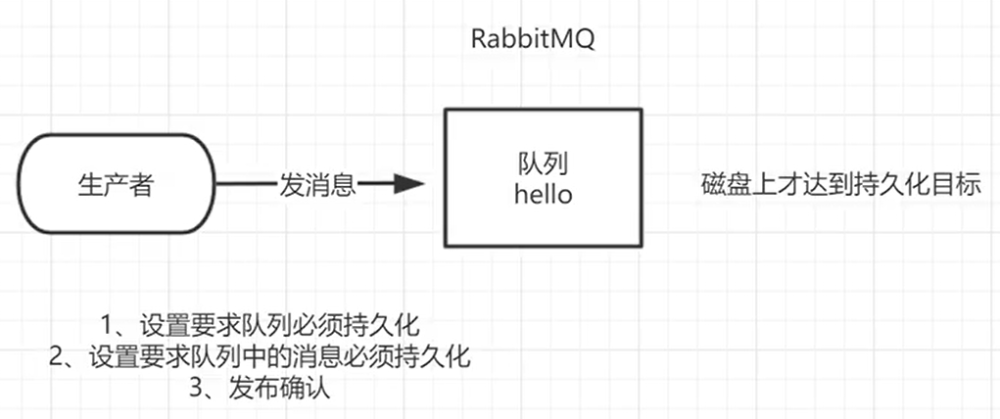

# RabbitMQ 介绍

## RabbitMQ的概念

> RabbitMQ 是一个消息中间件：它接受并转发消息。你可以把它当做一个快递站点，当你要发送一个包裹时，你把你的包裹放到快递站，快递员最终会把你的快递送到收件人那里，按照这种逻辑 RabbitMQ 是 一个快递站，一个快递员帮你传递快件。RabbitMQ 与快递站的主要区别在于，它不处理快件而是接收，存储和转发消息数据。

## RabbitMQ核心


## 四大核心概念

> - 生产者：产生数据发送消息的程序
> - 交换机：是 RabbitMQ 非常重要的一个部件，一方面它接收来自生产者的消息，另一方面它将消息 推送到队列中。交换机必须确切知道如何处理它接收到的消息，是将这些消息推送到特定队列还是推送到多个队列，亦或者是把消息丢弃，这个得有交换机类型决定
> - 队列：是 RabbitMQ 内部使用的一种数据结构，尽管消息流经 RabbitMQ 和应用程序，但它们只能存储在队列中。队列仅受主机的内存和磁盘限制的约束，本质上是一个大的消息缓冲区。许多生产者可以将消息发送到一个队列，许多消费者可以尝试从一个队列接收数据。这就是我们使用队列的方式
> - 消费者：消费与接收具有相似的含义。消费者大多时候是一个等待接收消息的程序。请注意生产者，消费者和消息中间件很多时候并不在同一机器上。同一个应用程序既可以是生产者又是可以是消费者


## 各个名词介绍


> - `Broker`：接收和分发消息的应用，RabbitMQ Server 就是 Message Broker
> - `Virtual host`：出于多租户和安全因素设计的，把 AMQP 的基本组件划分到一个虚拟的分组中，类似于网络中的 namespace 概念。当多个不同的用户使用同一个 RabbitMQ server 提供的服务时，可以划分出多个 vhost，每个用户在自己的 vhost 创建 exchange／queue 等
> - `Connection`：publisher／consumer 和 broker 之间的 TCP 连接
> - `Channel`：如果每一次访问 RabbitMQ 都建立一个 Connection，在消息量大的时候建立 TCP Connection 的开销将是巨大的，效率也较低。Channel 是在 connection 内部建立的逻辑连接，如果应用程序支持多线程，通常每个 thread 创建单独的 channel 进行通讯，AMQP method 包含了 channel id 帮助客 户端和 message broker 识别 channel，所以 channel 之间是完全隔离的。Channel 作为轻量级的 Connection 极大减少了操作系统建立 TCP connection 的开销
> - `Exchange`：message 到达 broker 的第一站，根据分发规则，匹配查询表中的 routing key，分发 消息到 queue 中去。常用的类型有：direct (point-to-point)，topic (publish-subscribe) and fanout (multicast)
> - `Queue`：消息最终被送到这里等待 consumer 取走
> - `Binding`：exchange 和 queue 之间的虚拟连接，binding 中可以包含 routing key，Binding 信息被保 存到 exchange 中的查询表中，用于 message 的分发依据

# RabbitMQ 安装

## 下载RabbitMQ

> - [下载地址](https://github.com/rabbitmq/rabbitmq-server/releases)
> - linux系统使用.rpm结尾的包


## 下载Erlang

> - RabbitMQ 是采用 Erlang 语言开发的，所以系统环境必须提供 Erlang 环境，需要先安装 Erlang。
>
> - `Erlang` 和 `RabbitMQ` [版本对照](https://www.rabbitmq.com/which-erlang.html)
>
> - [Erlang 21.3下载地址](https://packagecloud.io/rabbitmq/erlang/packages/el/7/erlang-21.3.8.16-1.el7.x86_64.rpm)
>
> - CentOs 7.x 版本需要e17。
>
>   CentOs 8.x 版本需要e18。包括 Red Hat 8,modern Fedora 版本。

## 上传文件

> 文件上传：上传到`/usr/local/software`目录下(如果没有 software 需要自己创建)


## 安装Erlang

```sh
cd /usr/local/software
rpm -ivh erlang-21.3-1.el7.x86_64.rpm

# 查看版本号，显示版本号就是安装成功了
erl -v
```

### 安装Erlang遇到的问题

> 如果安装 Erlang 过程出现了如下问题：


> 出现这个错误的主要原因是没有`libcrypto.so.10(OPENSSL_1.0.2)(64bit)`依赖，我们去下载一个就可以了
>
> 下载地址：[libcrypto.so.10(OPENSSL_1.0.2)(64bit)(opens new window)](https://rpmfind.net/linux/rpm2html/search.php?query=libcrypto.so.10(OPENSSL_1.0.2)(64bit)&submit=Search ...&system=&arch=)
>
> 滑到最下面，下载最后一个
>
> 
>
> 下载到本地后上传到 Linux 中，传输目录一致。接着使用命令安装
>
> ```sh
> rpm -ivh openssl-libs-1.0.2k-19.el7.x86_64.rpm --force
> ```

## 安装RabbitMQ

>  `RabiitMQ` 安装过程中需要依赖 `socat` 插件，首先安装该插件

```sh
yum install socat -y
```

```sh
[root@master rabbitmq]# rpm -ivh rabbitmq-server-3.8.8-1.el7.noarch.rpm
警告：rabbitmq-server-3.8.8-1.el7.noarch.rpm: 头V4 RSA/SHA256 Signature, 密钥 ID 6026dfca: NOKEY
准备中...                          ################################# [100%]
正在升级/安装...
   1:rabbitmq-server-3.8.8-1.el7      ################################# [100%]
```

## 启动

```sh
# 启动服务
systemctl start rabbitmq-server

# 查看服务状态
systemctl status rabbitmq-server

# 开机自启动
systemctl enable rabbitmq-server
```

> 状态显示active就是启动成功了


## 管理界面及授权操作

> - RabbitMQ 的默认访问端口是 15672
> - 如果 Linux 有防火墙，记得开放 15672 端口，否则 Windows 无法访问。要不就关闭防火墙
> - 默认情况下，RabbiMQ 没有安装 Web 端的客户端软件，需要安装才可以生效

```sh
rabbitmq-plugins enable rabbitmq_management

# 安装完毕重启RabbitMQ
systemctl restart rabbitmq-server
```

> 通过 `http://ip:15672` 访问，ip 为 Linux 的 ip。`rabbitmq` 有一个默认的账号密码 `guest`，但是登录该账号密码会出现权限问题


## 添加新用户

```sh
# 创建账号
rabbitmqctl add_user admin 123

# 设置用户角色
# 角色固定有四种级别：
# administrator：可以登录控制台、查看所有信息、并对rabbitmq进行管理
# monToring：监控者；登录控制台，查看所有信息
# policymaker：策略制定者；登录控制台指定策略
# managment：普通管理员；登录控制
rabbitmqctl set_user_tags admin administrator

# 设置用户权限
# set_permissions [-p <vhostpath>] <user> <conf> <write> <read>
# 用户 user_admin具有/vhost1 这个 virtual host 中所有资源的配置、写、读权限
rabbitmqctl set_permissions -p "/" admin ".*" ".*" ".*"
```

> 使用新创建的账户登录管理界面

> 其他指令：

```sh
# 修改密码
rabbitmqctl change_ password 用户名 新密码

# 删除用户
rabbitmqctl delete_user 用户名

# 查看用户清单
rabbitmqctl list_user
```

# Hello World

## 依赖

```xml
    <dependencies>
        <!--rabbitmq 依赖客户端-->
        <dependency>
            <groupId>com.rabbitmq</groupId>
            <artifactId>amqp-client</artifactId>
            <version>5.8.0</version>
        </dependency>
        <!--操作文件流的一个依赖-->
        <dependency>
            <groupId>commons-io</groupId>
            <artifactId>commons-io</artifactId>
            <version>2.6</version>
        </dependency>
    </dependencies>
```

## 消息生产者

```java
package com.atguigu.rabbitmq.one;

import com.rabbitmq.client.Channel;
import com.rabbitmq.client.Connection;
import com.rabbitmq.client.ConnectionFactory;

import java.io.IOException;
import java.util.concurrent.TimeoutException;

public class Provider {
    private static final String QUEUE_NAME = "hello";

    public static void main(String[] args) throws IOException, TimeoutException {
        //创建一个连接工厂
        ConnectionFactory factory = new ConnectionFactory();

        //工厂IP 连接RabbitMQ的队列
        factory.setHost("192.168.221.88");

        //用户名
        factory.setUsername("admin");

        //密码
        factory.setPassword("123");

        //创建连接
        Connection connection = factory.newConnection();

        //获取信道
        Channel channel = connection.createChannel();

        /**
         * 生成一个队列
         * 1.队列名称
         * 2.队列里面的消息是否持久化 默认消息存储在内存中
         * 3.该队列是否只供一个消费者进行消费？是否进行共享？true可以多个消费者消费
         * 4.是否自动删除？最后一个消费者端开连接以后，该队列是否自动删除？true自动删除
         * 5.其他参数
         */
        channel.queueDeclare(QUEUE_NAME, false, false, false, null);

        String message = "hello world";

        /**
         * 发送一个消息的参数
         * 1.发送到那个交换机
         * 2.路由的 key 是哪个
         * 3.其他的参数信息
         * 4.发送消息的消息体
         */
        channel.basicPublish("", QUEUE_NAME, null, message.getBytes());
    }
}
```

## 消息消费者

```java
package com.atguigu.rabbitmq.one;

import com.rabbitmq.client.Channel;
import com.rabbitmq.client.Connection;
import com.rabbitmq.client.ConnectionFactory;

import java.io.IOException;
import java.util.concurrent.TimeoutException;

public class Consumer {


    private static final String QUEUE_NAME = "hello";

    public static void main(String[] args) throws IOException, TimeoutException {

        ConnectionFactory factory = new ConnectionFactory();
        factory.setHost("192.168.221.100");
        factory.setUsername("admin");
        factory.setPassword("123");

        Connection connection = factory.newConnection();

        Channel channel = connection.createChannel();

        /**
         * 消费者消费消息的参数
         * 1.消费哪个队列
         * 2.消费成功之后是否要自动应答 true 代表自动应答 false 手动应答
         * 3.消费者成功消费的回调
         * 4.消费者取消消费的回调
         */
        channel.basicConsume(QUEUE_NAME, true, (consumerTag,delivery) -> {
            System.out.println(new String(delivery.getBody()));
        }, consumerTag  -> {
            System.out.println("消息消费被中断");
        });

    }
}
```

# Work Queues

> 工作队列(又称任务队列)的主要思想是避免立即执行资源密集型任务，而不得不等待它完成。 相反我们安排任务在之后执行。我们把任务封装为消息并将其发送到队列。在后台运行的工作进 程将弹出任务并最终执行作业。当有多个工作线程时，这些工作线程将一起处理这些任务。


## 轮训分发消息

### 提取工具类

```java
package com.atguigu.rabbitmq.utils;

import com.rabbitmq.client.Channel;
import com.rabbitmq.client.Connection;
import com.rabbitmq.client.ConnectionFactory;

import java.io.IOException;
import java.util.concurrent.TimeoutException;


/**
 * 这是一个连接RabbitMQ的工具类
 */
public class RabbitMQUtil {

    public static Channel getChannel() throws IOException, TimeoutException {
        ConnectionFactory factory = new ConnectionFactory();

        factory.setHost("192.168.221.100");

        factory.setUsername("admin");

        factory.setPassword("123");
        factory.setHandshakeTimeout(60000);


        Connection connection = factory.newConnection();

        Channel channel = connection.createChannel();

        return channel;
    }
}
```

### 消息生产者

```java
package com.atguigu.rabbitmq.two;

import com.atguigu.rabbitmq.utils.RabbitMQUtil;
import com.rabbitmq.client.Channel;

import java.io.IOException;
import java.util.Scanner;
import java.util.concurrent.TimeoutException;

public class Task01 {


    private static final String QUEUE_NAME = "hello";

    public static void main(String[] args) throws IOException, TimeoutException {

        Channel channel = RabbitMQUtil.getChannel();

        Scanner scanner = new Scanner(System.in);
        while (scanner.hasNext()) {
            String message = scanner.next();
            channel.basicPublish("", QUEUE_NAME, null, message.getBytes());

            System.out.println(message + "发送完成");
        }


    }
}

```

### 消息消费者

```java
package com.atguigu.rabbitmq.two;

import com.atguigu.rabbitmq.utils.RabbitMQUtil;
import com.rabbitmq.client.Channel;

import java.io.IOException;
import java.util.concurrent.TimeoutException;

public class Worker01 {

    private static final String QUEUE_NAME = "hello";

    public static void main(String[] args) throws IOException, TimeoutException {

        Channel channel = RabbitMQUtil.getChannel();

        System.out.println("worker02准备接收消息...");

        channel.basicConsume(QUEUE_NAME, true, (consumerTag,delivery) -> {
            System.out.println(new String(delivery.getBody()));
        }, consumerTag -> {
            System.out.println("消息消费被中断");
        });
    }
}

```

> 消费者勾选这个可以启动多个线程


> - 输入AA BB CC DD
> - 输出结果：
>
> 
>
> 

## 消息应答

### 概念

> 消费者完成一个任务可能需要一段时间，如果其中一个消费者处理一个长的任务并仅只完成 了部分突然它挂掉了，会发生什么情况。**RabbitMQ一旦向消费者传递了一条消息，便立即将该消息标记为删除。在这种情况下，突然有个消费者挂掉了，我们将丢失正在处理的消息。以及后续发送给该消费这的消息，因为它无法接收到。** 
>
> 为了保证消息在发送过程中不丢失，rabbitmq引入消息应答机制，**消息应答就是:消费者在接收到消息并且处理该消息之后，告诉 rabbitmq 它已经处理了，rabbitmq 可以把该消息删除了。** 

### 自动应答

> 消息发送后立即被认为已经传送成功，**这种模式需要在高吞吐量和数据传输安全性方面做权衡**,因为这种模式**如果消息在接收到之前，消费者那边出现连接或者 channel 关闭，那么消息就丢失了**,当然另一方面这种模式**消费者那边可以传递过载的消息，没有对传递的消息数量进行限制， 当然这样有可能使得消费者这边由于接收太多还来不及处理的消息，导致这些消息的积压，最终使得内存耗尽，最终这些消费者线程被操作系统杀死**，所以**这种模式仅适用在消费者可以高效并以某种速率能够处理这些消息的情况下使用**

### 消息手动应答的方法

> 1. `basicAck(long deliveryTag, boolean multiple)`：表示成功确认，使用此回执方法后，消息会被`rabbitmq broker`删除。
>
>    deliveryTag：表示消息投递序号，每次消费消息或者消息重新投递后，deliveryTag都会增加。手动消息确认模式下，我们可以对指定deliveryTag的消息进行ack、nack、reject等操作。
>
>    multiple：是否批量确认，值为 true 则会一次性 ack所有小于当前消息 deliveryTag 的消息。
>
>    举个栗子： 假设我先发送三条消息deliveryTag分别是5、6、7，可它们都没有被确认，当我发第四条消息此时deliveryTag为8，multiple设置为 true，会将5、6、7、8的消息全部进行确认。
>
> 2. `basicNack(long deliveryTag, boolean multiple, boolean requeue)`：表示失败确认，一般在消费消息业务异常时用到此方法，可以将消息重新投递入队列。
>
>    deliveryTag：表示消息投递序号。
>
>    multiple：是否批量确认。
>
>    requeue：值为 true 消息将重新入队列。
>
> 3. `basicReject(long deliveryTag, boolean requeue)`：拒绝消息，与basicNack区别在于不能进行批量操作，其他用法很相似。
>
>    deliveryTag：表示消息投递序号。
>
>    requeue：值为 true 消息将重新入队列。

### Multiple的解释 

> 手动应答的好处是可以批量应答并且减少网络拥堵


> multiple 的 true 和 false 代表不同意思
>
> - true 代表批量应答 channel 上未应答的消息
>   比如说 channel 上有传送 tag 的消息 5,6,7,8 当前 tag 是 8 那么此时 5-8 的这些还未应答的消息都会被确认收到消息应答
> - false 同上面相比只会应答 tag=8 的消息 5,6,7 这三个消息依然不会被确认收到消息应答

### 消息自动重新入队

> 如果消费者由于某些原因失去连接(其通道已关闭，连接已关闭或 TCP 连接丢失)，导致消息未发送 ACK 确认，RabbitMQ 将了解到消息未完全处理，并将对其重新排队。如果此时其他消费者可以处理，它将很快将其重新分发给另一个消费者。这样，即使某个消费者偶尔死亡，也可以确保不会丢失任何消息。


### 消息手动应答代码

#### 消息生产者

```java
package com.atguigu.rabbitmq.three;

import com.atguigu.rabbitmq.utils.RabbitMQUtil;
import com.rabbitmq.client.Channel;

import java.io.IOException;
import java.util.Scanner;
import java.util.concurrent.TimeoutException;

public class Task02 {

    private static final String ACK_QUEUE_NAME = "ack_queue";

    public static void main(String[] args) throws IOException, TimeoutException {
        Channel channel = RabbitMQUtil.getChannel();

        channel.queueDeclare(ACK_QUEUE_NAME, false, false, false, null);

        Scanner scanner = new Scanner(System.in);
        while (scanner.hasNext()) {
            String message = scanner.next();
            channel.basicPublish("", ACK_QUEUE_NAME, null, message.getBytes("UTF-8"));

            System.out.println("提供者发送消息" + message);
        }

    }
}
```

#### 两个消息消费者

> 两个消费者，Worker03等待1s之后应答，Worker04等待20s之后应答

```java
package com.atguigu.rabbitmq.three;

import com.atguigu.rabbitmq.utils.RabbitMQUtil;
import com.rabbitmq.client.Channel;

import java.io.IOException;
import java.util.concurrent.TimeoutException;

public class Worker03 {

    private static final String ACK_QUEUE_NAME = "ack_queue";

    public static void main(String[] args) throws IOException, TimeoutException {

        Channel channel = RabbitMQUtil.getChannel();

        System.out.println("c1准备接收数据，等待时间较短");

        //第二个参数为false，表示为不自动应答，需要我们手动应答
        channel.basicConsume(ACK_QUEUE_NAME, false, (consumerTag,delivery) -> {
            try {
                Thread.sleep(1000);//睡一秒
            } catch (InterruptedException e) {
                e.printStackTrace();
            }

            System.out.println(new String(delivery.getBody()));

            /**
             * 1.消息标记 tag
             * 2.是否批量应答未应答消息
             */
            channel.basicAck(delivery.getEnvelope().getDeliveryTag(), false);
        }, (consumerTag) -> {
            System.out.println("消费者取消消费接口回调逻辑");
        });

    }
}
```

```java
package com.atguigu.rabbitmq.three;

import com.atguigu.rabbitmq.utils.RabbitMQUtil;
import com.rabbitmq.client.Channel;

import java.io.IOException;
import java.util.concurrent.TimeoutException;

/**
 * @Author:lz
 * @Date:2022/11/9 16:58
 * @Description
 */
public class Worker04 {
    private static final String ACK_QUEUE_NAME = "ack_queue";


    public static void main(String[] args) throws IOException, TimeoutException {

        Channel channel = RabbitMQUtil.getChannel();

        System.out.println("c2准备接收消息，等待时间较长");

        //第二个参数为false，表示为不自动应答，需要我们手动应答
        channel.basicConsume(ACK_QUEUE_NAME, false, (consumerTag,delivery) -> {

            try {
                Thread.sleep(20000);
            } catch (InterruptedException e) {
                e.printStackTrace();
            }

            System.out.println(new String(delivery.getBody()));

            /**
             * 1.消息标记 tag
             * 2.是否批量应答未应答消息
             */
            channel.basicAck(delivery.getEnvelope().getDeliveryTag(), false);
        }, (consumerTag) -> {
            System.out.println("消费者取消消费接口回调逻辑");
        });
    }
}
```

#### 测试

> 生产者输入AA BB
>
> 1s后worker03输出AA
>
> 20s后worker04输出BB


> 生产者输入AA BB
>
> 1s后worker03输出AA
>
> 20s内我们停止worker04，worker04不会应答消息重新回到消息队列，在worker03输出


## 持久化

### 概念

> 刚刚我们已经看到了如何处理任务不丢失的情况，但是如何保障当 RabbitMQ 服务停掉以后消息生产者发送过来的消息不丢失。**默认情况下 RabbitMQ 退出或由于某种原因崩溃时，它忽视队列和消息，除非告知它不要这样做。确保消息不会丢失需要做两件事：我们需要将队列和消息都标记为持久化。**

### 队列如何实现持久化

> 之前我们创建的队列都是非持久化的，rabbitmq 如果重启的化，该队列就会被删除掉，如果要队列实现持久化需要**在声明队列的时候把 durable 参数设置为持久化（消息生产者中）**


> 如果是之前没有队列持久化的消息生产者直接设置了true会报错。需要把之前的删除重新运行

```
Caused by: com.rabbitmq.client.ShutdownSignalException: channel error; protocol method: #method<channel.close>(reply-code=406, reply-text=PRECONDITION_FAILED - inequivalent arg 'durable' for queue 'ack_queue' in vhost '/': received 'true' but current is 'false', class-id=50, method-id=10)
	at com.rabbitmq.client.impl.ChannelN.asyncShutdown(ChannelN.java:522)
	at com.rabbitmq.client.impl.ChannelN.processAsync(ChannelN.java:346)
	at com.rabbitmq.client.impl.AMQChannel.handleCompleteInboundCommand(AMQChannel.java:182)
	at com.rabbitmq.client.impl.AMQChannel.handleFrame(AMQChannel.java:114)
	at com.rabbitmq.client.impl.AMQConnection.readFrame(AMQConnection.java:719)
	at com.rabbitmq.client.impl.AMQConnection.access$300(AMQConnection.java:48)
	at com.rabbitmq.client.impl.AMQConnection$MainLoop.run(AMQConnection.java:646)
	at java.lang.Thread.run(Thread.java:748)
```


> 重新运行，这里显示一个D 就是表示队列持久化


### 消息实现持久化

> **要想让消息实现持久化需要在消息生产者修改代码，添加`MessageProperties.PERSISTENT_TEXT_PLAIN`这个属性。**


> 将消息标记为持久化并不能完全保证不会丢失消息。尽管它告诉 RabbitMQ 将消息保存到磁盘，但是 这里依然存在当消息刚准备存储在磁盘的时候 但是还没有存储完，消息还在缓存的一个间隔点。此时并没 有真正写入磁盘。持久性保证并不强，但是对于我们的简单任务队列而言，这已经绰绰有余了。如果需要 更强有力的持久化策略，参考后边课件发布确认章节。

## 不公平分发

> 在最开始的时候我们学习到 RabbitMQ 分发消息采用的轮训分发，但是在某种场景下这种策略并不是很好，比方说有两个消费者在处理任务，其中有个消费者 1 处理任务的速度非常快，而另外一个消费者 2 处理速度却很慢，这个时候我们还是采用轮训分发的化就会到这处理速度快的这个消费者很大一部分时间处于空闲状态，而处理慢的那个消费者一直在干活，这种分配方式在这种情况下其实就不太好，但是 RabbitMQ 并不知道这种情况它依然很公平的进行分发。
>
> 为了避免这种情况，我们可以**在消息消费者中设置参数`channel.basicQos(1);`**


### 测试结果

> 在消息生产者中输入11 22 33 44 55 66 77
>
> c1，1s后应答
>
> c2，20s后应答


> 同时在管理控制台中也可以看到设置的不公平分发


## 预取值

> 本身消息的发送就是异步发送的，所以在任何时候，channel 上肯定不止只有一个消息另外来自消费者的手动确认本质上也是异步的。因此**这里就存在一个未确认的消息缓冲区，因此希望开发人员能限制此缓冲区的大小，以避免缓冲区里面无限制的未确认消息问题。这个时候就可以通过使用`basicqos`方法设置“预取计数”值来完成的。该值定义通道上允许的未确认消息的最大数量。一旦数量达到配置的数量， RabbitMQ 将停止在通道上传递更多消息，除非至少有一个未处理的消息被确认**
>
> 例如，假设在通道上有未确认的消息 5、6、7，8，并且通道的预取计数设置为 4，此时 RabbitMQ 将不会在该通道上再传递任何消息，除非至少有一个未应答的消息被 ack。比方说 tag=6 这个消息刚刚被确认 ACK，RabbitMQ 将会感知这个情况到并再发送一条消息。
>
> **消息应答和 QoS 预取值对用户吞吐量有重大影响。通常，增加预取将提高向消费者传递消息的速度。虽然自动应答传输消息速率是最佳的，但是，在这种情况下已传递但尚未处理 的消息的数量也会增加，从而增加了消费者的 RAM 消耗(随机存取存储器)，**应该小心使用具有无限预处理的自动确认模式或手动确认模式，消费者消费了大量的消息如果没有确认的话，会导致消费者连接节点的 内存消耗变大，所以找到合适的预取值是一个反复试验的过程，**不同的负载该值取值也不同 100 到 300 范 围内的值通常可提供最佳的吞吐量，并且不会给消费者带来太大的风险。预取值为1是最保守的。当然这将使吞吐量变得很低，特别是消费者连接延迟很严重的情况下，特别是在消费者连接等待时间较长的环境中。对于大多数应用来说，稍微高一点的值将是最佳的**


### 测试结果

> c1,1s后应答，设置预取值为2
>
> c2,20s后应答，设置预取值为5
>
> 在消息生产者中输入11 22 33 44 55 66 77


> 同样在管理控制台可以看到预取值


### 理解


> 两个消费者，一个预取值为2，一个为5，整个通道就是有7个值，也就是最多有7个，其他的都在准备（ready），当一个消息被应答，准备中的就有一个继续发送
>
> 不公平分发设置的都是1，也就是通道可以有2个值，其他的都在准备，所以说设置的值影响吞吐量

# 发布确认

> 设置队列的持久化、消息的持久化，可能会在持久化到磁盘之间宕机了，这样数据也会丢失。所以使用发布确认，一旦消息被投递到所有匹配的队列之后，broker就会发送一个确认给生产者(包含消息的唯一 ID)，这就使得生产者知道**消息已经正确到达目的队列了，如果消息和队列是可持久化的，那么确认消息会在将消息写入磁盘之后发出，否则消息丢失，生产者要重新投递。**



## 开启发布确认的方法 

> 发布确认默认是没有开启的，如果要开启需要调用方法`confirmSelect`，每当你要想使用发布确认，都需要在 channel 上调用该方法


## 单个确认发布

> 这是一种简单的确认方式，它是一种**同步确认发布的方式**，也就是发布一个消息之后只有它被确认发布，后续的消息才能继续发布`waitForConfirmsOrDie(long)`这个方法只有在消息被确认 的时候才返回，如果在指定时间范围内这个消息没有被确认那么它将抛出异常。
>
> 这种确认方式有一个最大的缺点就是:**发布速度特别的慢**，因为如果没有确认发布的消息就会 阻塞所有后续消息的发布，这种方式最多提供每秒不超过数百条发布消息的吞吐量。当然对于某 些应用程序来说这可能已经足够了。

```java
package com.atguigu.rabbitmq.four;

import com.atguigu.rabbitmq.utils.RabbitMQUtil;
import com.rabbitmq.client.Channel;

import java.io.IOException;
import java.util.UUID;
import java.util.concurrent.TimeoutException;

/**
 * @Author:lz
 * @Date:2022/11/9 21:43
 * @Description
 */
public class ConfirmMessage {

    public static final int i = 1000;

    public static void main(String[] args) throws InterruptedException, TimeoutException, IOException {
//        单个确认
        ConfirmMessage.publishMessageIndividually();//发布1000个单独确认消息,耗时620ms
    }

    public static void publishMessageIndividually() throws IOException, TimeoutException, InterruptedException {
        Channel channel = RabbitMQUtil.getChannel();

        String queueName = UUID.randomUUID().toString();

        // 确认发布
        channel.confirmSelect();

        long begin = System.currentTimeMillis();

        channel.queueDeclare(queueName, false, false, false, null);

        for (int j = 0; j < i; j++) {
            String s = j + "";
            channel.basicPublish("", queueName, null, s.getBytes());

            //单个确认
            boolean flag = channel.waitForConfirms();
            if (flag) {
                System.out.println("发送成功");
            }
        }


        long end = System.currentTimeMillis();

        System.out.println("发布" + i + "个单独确认消息,耗时" + (end - begin) + "ms");

    }
}
```

## 批量确认发布

> 与单个等待确认消息相比，先发布一批消息然后一起确认可以极大地 提高吞吐量，当然这种方式的缺点就是:**当发生故障导致发布出现问题时，不知道是哪个消息出现问题了，我们必须将整个批处理保存在内存中，以记录重要的信息而后重新发布消息。当然这种方案仍然是同步的，也一样阻塞消息的发布**

```java
package com.atguigu.rabbitmq.four;

import com.atguigu.rabbitmq.utils.RabbitMQUtil;
import com.rabbitmq.client.Channel;

import java.io.IOException;
import java.util.UUID;
import java.util.concurrent.TimeoutException;

/**
 * @Author:lz
 * @Date:2022/11/9 21:43
 * @Description
 */
public class ConfirmMessage {

    public static final int i = 1000;

    public static void main(String[] args) throws InterruptedException, TimeoutException, IOException {
//        批量确认
        ConfirmMessage.publishMessageBatch();//发布1000个批量确认消息,耗时89ms
    }

    //    批量确认
    public static void publishMessageBatch() throws IOException, TimeoutException, InterruptedException {
        Channel channel = RabbitMQUtil.getChannel();

        String queueName = UUID.randomUUID().toString();

        channel.queueDeclare(queueName, false, false, false, null);

        //设置发布确认
        channel.confirmSelect();

        long begin = System.currentTimeMillis();

        for (int j = 0; j < i; j++) {

            String message = i + "";
            channel.basicPublish("", queueName, null, message.getBytes());

//            100条数据批量确认一次
            if (j % 100 == 0) {
                channel.waitForConfirms();
            }
        }

        long end = System.currentTimeMillis();

        System.out.println("发布" + i + "个批量确认消息,耗时" + (end - begin) + "ms");

    }
}
```

## 异步确认发布

> 异步确认虽然编程逻辑比上两个要复杂，但是性价比最高，无论是可靠性还是效率都没得说， 他是利用回调函数来达到消息可靠性传递的，这个中间件也是通过函数回调来保证是否投递成功，


### 如何处理异步未确认消息

> 最好的解决的解决方案就是把未确认的消息放到一个基于内存的能被发布线程访问的队列，比如说用 `ConcurrentLinkedQueue`这个队列在 confirm callbacks 与发布线程之间进行消息的传递。

```java
package com.atguigu.rabbitmq.four;

import com.atguigu.rabbitmq.utils.RabbitMQUtil;
import com.rabbitmq.client.Channel;

import java.io.IOException;
import java.util.UUID;
import java.util.concurrent.ConcurrentNavigableMap;
import java.util.concurrent.ConcurrentSkipListMap;
import java.util.concurrent.TimeoutException;

/**
 * @Author:lz
 * @Date:2022/11/9 21:43
 * @Description
 */
public class ConfirmMessage {

    public static final int i = 1500;

    public static void main(String[] args) throws InterruptedException, TimeoutException, IOException {
//        异步确认
        ConfirmMessage.publishMessageAsync();//发布1000个异步确认消息,耗时70ms
    }

    //    异步确认
    public static void publishMessageAsync() throws IOException, TimeoutException {
        Channel channel = RabbitMQUtil.getChannel();

        String queueName = UUID.randomUUID().toString();

        channel.queueDeclare(queueName, false, false, false, null);

        channel.confirmSelect();

        /**
         * 线程安全有序的一个哈希表，适用于高并发的情况
         * 1.轻松的将序号与消息进行关联
         * 2.轻松批量删除条目 只要给到序列号
         * 3.支持并发访问
         */
        ConcurrentSkipListMap<Long, String> map = new ConcurrentSkipListMap<>();

        /**
         * 添加一个异步确认的监听器
         * 1.确认收到消息的回调
         *      1.消息序列号
         *      2.true 可以确认小于等于当前序列号的消息
         *      false 确认当前序列号消息
         * 2.未收到消息的回调
         */
        channel.addConfirmListener((deliveryTag,multiple) -> {
            //是否批量
            if (multiple) {
                //删除已经确认的消息
                ConcurrentNavigableMap<Long, String> headMap = map.headMap(deliveryTag);
                headMap.clear();
            } else {
                //删除已经确认的消息
                map.remove(deliveryTag);
            }

            System.out.println("确认收到消息，序列：" + deliveryTag);
        }, (deliveryTag,multiple) -> {
            String message = map.get(deliveryTag);
 			System.out.println("发布的消息"+message+"未被确认，序列号"+deliveryTag);
        });

        long begin = System.currentTimeMillis();

        for (int j = 0; j < i; j++) {
            String message = j + "";
            channel.basicPublish("", queueName, null, message.getBytes());

            /**
             * channel.getNextPublishSeqNo()获取下一个消息的序列号
             * 通过序列号与消息体进行一个关联
             * 全部都是未确认的消息体
             */
            map.put(channel.getNextPublishSeqNo(), message);

        }

        long end = System.currentTimeMillis();

        System.out.println("发布" + i + "个异步确认消息,耗时" + (end - begin) + "ms");

    }
}
```

## 以上 3 种发布确认速度对比

> - 单独发布消息：同步等待确认，简单，但吞吐量非常有限。 
> - 批量发布消息：批量同步等待确认，简单，合理的吞吐量，一旦出现问题但很难推断出是那条 消息出现了问题。
> - 异步处理： 最佳性能和资源使用，在出现错误的情况下可以很好地控制，但是实现起来稍微难些

# 交换机

## Exchanges

### 概念

> - RabbitMQ 消息传递模型的核心思想是: **生产者生产的消息从不会直接发送到队列。**实际上，通常生产 者甚至都不知道这些消息传递传递到了哪些队列中。
> - 相反，**生产者只能将消息发送到交换机(exchange)**，交换机工作的内容非常简单，一方面它接收来 自生产者的消息，另一方面将它们推入队列。交换机必须确切知道如何处理收到的消息。是应该把这些消 息放到特定队列还是说把他们到许多队列中还是说应该丢弃它们。这就的由交换机的类型来决定。


### Exchanges 的类型

> 总共有以下类型： 直接(direct), 主题(topic) ,标题(headers) , 扇出(fanout)

### 无名exchange

> 之前能实现的原因是因为我们使用的是默认交换，我们通过空字符串(“ ”)进行标识。 
>
> 
>
> **第一个参数是交换机的名称。空字符串表示默认或无名称交换机：消息能路由发送到队列中其实是由 `routingKey(bindingkey)`绑定 key 指定的，如果它存在的话**

## 临时队列

> - 每当我们连接到 Rabbit 时，我们都需要一个全新的空队列，为此我们可以创建一个**具有随机名称的队列**，或者能让服务器为我们选择一个随机队列名称那就更好了。其次**一旦我们断开了消费者的连接，队列将被自动删除。**
>
> - 创建临时队列
>
>   ```java
>   Channel channel = RabbitMQUtil.getChannel();
>   ```
>
> - 和普通队列在使用上没有什么区别，唯一的区别是，当消费者断开连接时，队列将会被删除。
>
>   

## 绑定(bindings)

> 什么是 bingding 呢，binding 其实是 exchange 和 queue 之间的桥梁，它告诉我们 **exchange 和那个队列进行了绑定关系**。比如说下面这张图告诉我们的就是 X(交换机)与 Q1(队列1)和 Q2(队列2)进行了绑定


## Fanout

> Fanout 这种类型非常简单。正如从名称中猜到的那样，它是将接收到的所有消息**广播**到它知道的所有队列中。系统中默认有些 exchange 类型


### 实例

> 两个消息消费者

```java
package com.atguigu.rabbitmq.five;

import com.atguigu.rabbitmq.utils.RabbitMQUtil;
import com.rabbitmq.client.Channel;

import java.io.IOException;
import java.util.concurrent.TimeoutException;

/**
 * @Author:lz
 * @Date:2022/11/10 15:29
 * @Description
 */
public class ReceiveLogs01 {
    public static final String EXCHANGE_NAME = "logs";

    public static void main(String[] args) throws IOException, TimeoutException {

        Channel channel = RabbitMQUtil.getChannel();

//        创建交换机
        channel.exchangeDeclare(EXCHANGE_NAME, "fanout");

//        创建临时队列
        String queue = channel.queueDeclare().getQueue();

//        交换机绑定队列，routingkey（bindingkey）为空串
        channel.queueBind(queue, EXCHANGE_NAME, "");

        channel.basicConsume(queue, true, (consumerTag,delivery) -> {
            System.out.println("ReceiveLogs01控制台打印接收到的消息" + new String(delivery.getBody()));
        }, consumerTag -> {});
    }
}
```

```java
package com.atguigu.rabbitmq.five;

import com.atguigu.rabbitmq.utils.RabbitMQUtil;
import com.rabbitmq.client.Channel;

import java.io.IOException;
import java.util.concurrent.TimeoutException;

/**
 * @Author:lz
 * @Date:2022/11/10 15:29
 * @Description
 */
public class ReceiveLogs02 {
    public static final String EXCHANGE_NAME = "logs";

    public static void main(String[] args) throws IOException, TimeoutException {

        Channel channel = RabbitMQUtil.getChannel();

//        创建交换机
        channel.exchangeDeclare(EXCHANGE_NAME, "fanout");

//        创建临时队列
        String queue = channel.queueDeclare().getQueue();

//        交换机绑定队列，routingkey（bindingkey）为空串
        channel.queueBind(queue, EXCHANGE_NAME, "");

        channel.basicConsume(queue, true, (consumerTag,delivery) -> {
            System.out.println("ReceiveLogs02控制台打印接收到的消息" + new String(delivery.getBody()));
        }, consumerTag -> {});
    }
}
```

> 一个消费提供者

```java
package com.atguigu.rabbitmq.five;

import com.atguigu.rabbitmq.utils.RabbitMQUtil;
import com.rabbitmq.client.Channel;

import java.io.IOException;
import java.util.Scanner;
import java.util.concurrent.TimeoutException;

/**
 * @Author:lz
 * @Date:2022/11/10 15:21
 * @Description
 */
public class EmitLog {

    public static final String EXCHANGE_NAME = "logs";

    public static void main(String[] args) throws IOException, TimeoutException {
        Channel channel = RabbitMQUtil.getChannel();

//        创建交换机，类型为fanout
        channel.exchangeDeclare(EXCHANGE_NAME, "fanout");

        Scanner scanner = new Scanner(System.in);
        while (scanner.hasNext()) {
            String message = scanner.next();
            channel.basicPublish(EXCHANGE_NAME, "", null, message.getBytes("UTF-8"));
        }

    }

}
```

> 在消息提供者中输入1  2
>
> 在两个消息消费者中都可以接收到


## Direct

> Fanout 这种交换类型并不能给我们带来很大的灵活性——它只能进行无意识的 广播，在这里我们将使用 direct 这种类型来进行替换，这种类型的工作方式是，消息只去到它绑定的 routingKey 队列中去


> 在上面这张图中，我们可以看到 X 绑定了两个队列，绑定类型是 direct。队列 Q1 绑定键为 orange， 队列 Q2 绑定键有两个:一个绑定键为 black，另一个绑定键为 green
>
> 在这种绑定情况下，生产者发布消息到 exchange 上，绑定键为 orange 的消息会被发布到队列 Q1。绑定键为 blackgreen 和的消息会被发布到队列 Q2，其他消息类型的消息将被丢弃。

### 多重绑定

> 当然如果 exchange 的绑定类型是 direct，但是它绑定的多个队列的 key 如果都相同，在这种情 况下虽然绑定类型是 direct 但是它表现的就和 fanout 有点类似了，就跟广播差不多。


### 实例

> 两个消费消费者

```java
package com.atguigu.rabbitmq.six;

import com.atguigu.rabbitmq.utils.RabbitMQUtil;
import com.rabbitmq.client.BuiltinExchangeType;
import com.rabbitmq.client.Channel;

import java.io.IOException;
import java.util.concurrent.TimeoutException;

/**
 * @Author:lz
 * @Date:2022/11/10 16:39
 * @Description
 */
public class ReceiveLogsDirect01 {

    public static final String EXCHANGE_NAME = "direct_logs";

    public static void main(String[] args) throws IOException, TimeoutException {

        Channel channel = RabbitMQUtil.getChannel();

        channel.exchangeDeclare(EXCHANGE_NAME, BuiltinExchangeType.DIRECT);


        String queueName = "console";
        channel.queueDeclare(queueName, false, false, true, null);

        channel.queueBind(queueName, EXCHANGE_NAME, "info");
        channel.queueBind(queueName, EXCHANGE_NAME, "warning");

        channel.basicConsume(queueName, true, (consumerTag,delivery) -> {
            System.out.println(" 接收绑定键 :" + delivery.getEnvelope().getRoutingKey() + ", 消息:" + new String(delivery.getBody()));
        }, consumerTag -> {});

    }
}
```

```java
package com.atguigu.rabbitmq.six;

import com.atguigu.rabbitmq.utils.RabbitMQUtil;
import com.rabbitmq.client.AMQP;
import com.rabbitmq.client.BuiltinExchangeType;
import com.rabbitmq.client.Channel;

import java.io.IOException;
import java.util.concurrent.TimeoutException;

/**
 * @Author:lz
 * @Date:2022/11/10 16:39
 * @Description
 */
public class ReceiveLogsDirect02 {

    public static final String EXCHANGE_NAME = "direct_logs";

    public static void main(String[] args) throws IOException, TimeoutException {

        Channel channel = RabbitMQUtil.getChannel();

        channel.exchangeDeclare(EXCHANGE_NAME, BuiltinExchangeType.DIRECT);

        String queueName = "disk";
        channel.queueDeclare(queueName, false, false, true, null);

        channel.queueBind(queueName, EXCHANGE_NAME, "error");

        channel.basicConsume(queueName, true, (consumerTag,delivery) -> {
            System.out.println(" 接收绑定键 :" + delivery.getEnvelope().getRoutingKey() + ", 消息:" + new String(delivery.getBody()));
        }, consumerTag -> {});

    }
}
```

> 一个消息提供者

```java
package com.atguigu.rabbitmq.six;

import com.atguigu.rabbitmq.utils.RabbitMQUtil;
import com.rabbitmq.client.Channel;

import java.io.IOException;
import java.util.Scanner;
import java.util.concurrent.TimeoutException;

/**
 * @Author:lz
 * @Date:2022/11/10 16:47
 * @Description
 */
public class EmitLogDirect {

    public static final String EXCHANGE_NAME = "direct_logs";

    public static void main(String[] args) throws IOException, TimeoutException {

        Channel channel = RabbitMQUtil.getChannel();

        Scanner scanner = new Scanner(System.in);

        while (scanner.hasNext()) {
            String message = scanner.next();
            channel.basicPublish(EXCHANGE_NAME, "info", null, message.getBytes());
        }


    }
}
```

> 消息生产者消息绑定为Info，消息发送到绑定info的队列中
>
> 消息生产者发送11 22


## Topics

> - 发送到类型是topic 交换机的消息的 routing_key不能随意写，必须满足一定的要求，它**必须是一个单词列表，以点号分隔开。**这些**单词可以是任意单词**，比如说："stock.usd.nyse", "nyse.vmw",  "quick.orange.rabbit"这种类型的。当然这个**单词列表最多不能超过 255 个字节。**
> - 在这个规则列表中，其中有两个替换符: 
>   1. **(星号)可以代替一个单词** 
>   2. **#(井号)可以替代零个或多个单词**
> - 当队列绑定关系是下列这种情况时需要引起注意
>   - 当一个队列绑定键是#,那么这个队列将接收所有数据，就有点像 fanout了
>   - 如果队列绑定键当中没有#和*出现，那么该队列绑定类型就是direct 了

### 匹配案例

> Q1-->绑定的是：中间带 orange 带 3 个单词的字符串(\*.orange.\*)
>
> Q2-->绑定的是：最后一个单词是 rabbit 的 3 个单词(\*.\*.rabbit)
>
> ​							第一个单词是 lazy 的多个单词(lazy.#)


> `quick.orange.rabbit` 被队列 Q1Q2 接收到
>
> `lazy.orange.elephant` 被队列 Q1Q2 接收到
>
> `quick.orange.fox` 被队列 Q1 接收到
>
> `lazy.brown.fox` 被队列 Q2 接收到
>
> `lazy.pink.rabbit` 虽然满足两个绑定但只被队列 Q2 接收一次
>
> `quick.brown.fox` 不匹配任何绑定不会被任何队列接收到会被丢弃
>
> `quick.orange.male.rabbit` 是四个单词不匹配任何绑定会被丢弃
>
> `lazy.orange.male.rabbit` 是四个单词但匹配 Q2

### 实例

> 两个消息消费者

```java
package com.atguigu.rabbitmq.seven;

import com.atguigu.rabbitmq.utils.RabbitMQUtil;
import com.rabbitmq.client.BuiltinExchangeType;
import com.rabbitmq.client.Channel;

import java.io.IOException;
import java.util.concurrent.TimeoutException;

/**
 * @Author:lz
 * @Date:2022/11/10 20:16
 * @Description
 */
public class ReceiveLogsTopic01 {

    public static final String EXCHANGE_NAME = "topic_logs";


    public static void main(String[] args) throws IOException, TimeoutException {
        Channel channel = RabbitMQUtil.getChannel();

        channel.exchangeDeclare(EXCHANGE_NAME, BuiltinExchangeType.TOPIC);

        String queue = "Q1";
        channel.queueDeclare(queue, false, false, true, null);

        channel.queueBind(queue, EXCHANGE_NAME, "*.orange.*");


        channel.basicConsume(queue, true, (consumeTag, delivery) -> {
            System.out.println("接收队列 :" + queue + " 绑定键:" + delivery.getEnvelope().getRoutingKey() + ",消息:" + new String(delivery.getBody(), "UTF-8"));
        }, (consumeTag) -> {
        });

    }
}

```

```java
package com.atguigu.rabbitmq.seven;

import com.atguigu.rabbitmq.utils.RabbitMQUtil;
import com.rabbitmq.client.BuiltinExchangeType;
import com.rabbitmq.client.Channel;

import java.io.IOException;
import java.util.concurrent.TimeoutException;

/**
 * @Author:lz
 * @Date:2022/11/10 20:16
 * @Description
 */
public class ReceiveLogsTopic02 {

    public static final String EXCHANGE_NAME = "topic_logs";


    public static void main(String[] args) throws IOException, TimeoutException {
        Channel channel = RabbitMQUtil.getChannel();

        channel.exchangeDeclare(EXCHANGE_NAME, BuiltinExchangeType.TOPIC);

        String queue = "Q2";
        channel.queueDeclare(queue, false, false, true, null);

        channel.queueBind(queue, EXCHANGE_NAME, "*.*.rabbit");
        channel.queueBind(queue, EXCHANGE_NAME, "lazy.#");


        channel.basicConsume(queue, true, (consumeTag, delivery) -> {
            System.out.println("接收队列 :" + queue + " 绑定键:" + delivery.getEnvelope().getRoutingKey() + ",消息:" + new String(delivery.getBody(), "UTF-8"));
        }, (consumeTag) -> {
        });

    }
}

```

> 一个消息生产者

```java
package com.atguigu.rabbitmq.seven;

import com.atguigu.rabbitmq.utils.RabbitMQUtil;
import com.rabbitmq.client.Channel;

import java.io.IOException;
import java.util.HashMap;
import java.util.Map;
import java.util.concurrent.TimeoutException;

/**
 * @Author:lz
 * @Date:2022/11/10 20:25
 * @Description
 */
public class EmitLogTopic {
    private static final String EXCHANGE_NAME = "topic_logs";

    public static void main(String[] args) throws IOException, TimeoutException {
        Channel channel = RabbitMQUtil.getChannel();

        HashMap<String, String> bindingKeyMap = new HashMap<>();
        bindingKeyMap.put("quick.orange.rabbit", "被队列 Q1Q2 接收到");
        bindingKeyMap.put("lazy.orange.elephant", "被队列 Q1Q2 接收到");
        bindingKeyMap.put("quick.orange.fox", "被队列 Q1 接收到");
        bindingKeyMap.put("lazy.brown.fox", "被队列 Q2 接收到");
        bindingKeyMap.put("lazy.pink.rabbit", "虽然满足两个绑定但只被队列 Q2 接收一次");
        bindingKeyMap.put("quick.brown.fox", "不匹配任何绑定不会被任何队列接收到会被丢弃");
        bindingKeyMap.put("quick.orange.male.rabbit", "是四个单词不匹配任何绑定会被丢弃");
        bindingKeyMap.put("lazy.orange.male.rabbit", "是四个单词但匹配 Q2");

        for (Map.Entry<String, String> entry : bindingKeyMap.entrySet()) {
            String key = entry.getKey();
            String value = entry.getValue();
            channel.basicPublish(EXCHANGE_NAME, key, null, value.getBytes("UTF-8"));
        }
    }
}

```


# 死信队列

> - **由于特定的原因导致 queue 中的某些消息无法被消费，这样的消息如果没有后续的处理，就变成了死信，有死信自然就有了死信队列。**
> - 应用场景:为了保证订单业务的消息数据不丢失，需要使用到 RabbitMQ 的死信队列机制，当消息消费发生异常时，将消息投入死信队列中.还有比如说: 用户在商城下单成功并点击去支付后在指定时 间未支付时自动失效

## 死信的来源

> - **消息TTL过期** 
> - **队列达到最大长度(队列满了，无法再添加数据到mq中)** 
> - **消息被拒绝(`basic.reject`或`basic.nack`)并且`requeue=false`**

## 架构图 


## 实例

### 消息 TTL 过期

> 先创建消息消费者Consumer01

```java
package com.atguigu.rabbitmq.eight;

import com.atguigu.rabbitmq.utils.RabbitMQUtil;
import com.rabbitmq.client.BuiltinExchangeType;
import com.rabbitmq.client.Channel;

import java.io.IOException;
import java.util.HashMap;
import java.util.concurrent.TimeoutException;

/**
 * @Author:lz
 * @Date:2022/11/10 21:37
 * @Description
 */
public class Consumer01 {

    //    普通交换机
    public static final String NORMAL_EXCHANGE = "normal_exchange";
    //    死信交换机
    public static final String DEAD_EXCHANGE = "dead_exchange";
    //    普通队列
    public static final String NORMAL_QUEUE = "normal_queue";
    //    死信队列
    public static final String DEAD_QUEUE = "dead_queue";

    public static void main(String[] args) throws IOException, TimeoutException {
        Channel channel = RabbitMQUtil.getChannel();

//        创建普通交换机
        channel.exchangeDeclare(NORMAL_EXCHANGE, BuiltinExchangeType.DIRECT);
//        创建死信交换机
        channel.exchangeDeclare(DEAD_EXCHANGE, BuiltinExchangeType.DIRECT);


//        普通队列绑定死信交换机
        HashMap<String, Object> hashMap = new HashMap<>();
//        正常队列设置死信交换机 参数 key 是固定值
        hashMap.put("x-dead-letter-exchange", DEAD_EXCHANGE);
//        正常队列设置死信 routing-key 参数 key 是固定值
        hashMap.put("x-dead-letter-routing-key", "lisi");
        
//        过期时间。我们在生产者中声明
        //hashMap.put("x-message-ttl", "10000");

//        创建普通队列
        channel.queueDeclare(NORMAL_QUEUE, false, false, false, hashMap);

//        创建死信队列
        channel.queueDeclare(DEAD_QUEUE, false, false, false, null);

//        绑定普通交换机与队列
        channel.queueBind(NORMAL_QUEUE, NORMAL_EXCHANGE, "zhangsan");
//        绑定死信交换机与队列
        channel.queueBind(DEAD_QUEUE, DEAD_EXCHANGE, "lisi");


        channel.basicConsume(NORMAL_QUEUE, true, (consumeTag, deliver) -> {
            System.out.println("Consumer01接收到消息" + new String(deliver.getBody(), "UTF-8"));
        }, (consumerTag) -> {
            System.out.println("Consumer01::::consumerTag = " + consumerTag);
        });
    }
}
```

> 再创建消息生产者

```java
package com.atguigu.rabbitmq.eight;

import com.atguigu.rabbitmq.utils.RabbitMQUtil;
import com.rabbitmq.client.AMQP;
import com.rabbitmq.client.Channel;

import java.io.IOException;
import java.util.concurrent.TimeoutException;

/**
 * @Author:lz
 * @Date:2022/11/10 21:53
 * @Description
 */
public class Producer {
    public static final String NORMAL_EXCHANGE = "normal_exchange";
    public static final String NORMAL_QUEUE = "normal_queue";

    public static void main(String[] args) throws IOException, TimeoutException {

        Channel channel = RabbitMQUtil.getChannel();

        //设置消息的 TTL 时间
        AMQP.BasicProperties properties = new AMQP.BasicProperties().builder().expiration("10000").build();

        for (int i = 0; i < 10; i++) {
            String message = "info" + i;
            channel.basicPublish(NORMAL_EXCHANGE, "zhangsan", properties, message.getBytes("UTF-8"));
            System.out.println("生产者发送消息:" + message);
        }
    }
}

```

> 再创建消息消费者Consumer02

```java
package com.atguigu.rabbitmq.eight;

import com.atguigu.rabbitmq.utils.RabbitMQUtil;
import com.rabbitmq.client.BuiltinExchangeType;
import com.rabbitmq.client.Channel;

import java.io.IOException;
import java.util.HashMap;
import java.util.concurrent.TimeoutException;

/**
 * @Author:lz
 * @Date:2022/11/10 21:37
 * @Description
 */
public class Consumer02 {

    public static final String DEAD_QUEUE = "dead_queue";

    public static void main(String[] args) throws IOException, TimeoutException {
        Channel channel = RabbitMQUtil.getChannel();

        channel.basicConsume(DEAD_QUEUE, true, (consumeTag, delivery) -> {
            System.out.println("Consumer02 接收死信队列的消息" + new String(delivery.getBody(), "UTF-8"));
        }, (consumeTag) -> {
            System.out.println("Consumer02::::consumeTag = " + consumeTag);
        });
    }
}
```

> 先启动消息消费者Consumer01，生成普通交换机、队列和死信交换机、队列


> 关闭消息消费者Consumer01，消息生产者发送消息，消息进入普通队列


> 时间过去了10s，普通队列中的消息没有被消费，消息进入死信队列


### 队列达到最大长度

> 在consume01中设置普通队列的最大长度


> 将消息生产者中的时间注释


> 当启动consume01


> 关闭consume01，启动消息生产者，普通队列中会有六个消息，死信队列中有四个消息


> 要关闭consume01，否则消息都在consume01中输出了


### 消息被拒

> 在consume01中设置消息info5拒绝应答


> 同时启动producer、consume01、consume02


# 延迟队列

> 延时队列内部是有序的，最重要的特性就体现在它的延时属性上，**延时队列中的元素是希望在指定时间到了以后或之前取出和处理，简单来说，延时队列就是用来存放需要在指定时间被处理的元素的队列。**

## 延迟队列使用场景 

> 1. 订单在十分钟之内未支付则自动取消
> 2. 新创建的店铺，如果在十天内都没有上传过商品，则自动发送消息提醒。
> 3. 用户注册成功后，如果三天内没有登陆则进行短信提醒。
> 4. 用户发起退款，如果三天内没有得到处理则通知相关运营人员。
> 5. 预定会议后，需要在预定的时间点前十分钟通知各个与会人员参加会议

## RabbitMQ 中的 TTL

> TTL 是 RabbitMQ 中一个消息或者队列的属性，表明一条消息或者该队列中的所有消息的最大存活时间， 单位是毫秒。
>
> 换句话说，如果一条消息设置了 TTL 属性或者进入了设置 TTL 属性的队列，那么这条消息如果在 TTL 设置的时间内没有被消费，则会成为"死信"。如果同时配置了队列的 TTL 和消息的 TTL，那么较小的那个值将会被使用，有两种方式设置 TTL。

## 消息设置 TTL

> 针对每条消息设置 TTL

```java
rabbitTemplate.converAndSend("X","XC",message,correlationData -> {
    correlationData.getMessageProperties().setExpiration("5000");
});
```

## 队列设置 TTL

> 在创建队列的时候设置队列的`x-message-ttl`属性

```java
Map<String, Object> params = new HashMap<>();
params.put("x-message-ttl",5000);
return QueueBuilder.durable("QA").withArguments(args).build(); // QA 队列的最大存活时间位5000 毫秒
```

## 两者的区别

> - **如果设置了队列的 TTL 属性，那么一旦消息过期，就会被队列丢弃(如果配置了死信队列被丢到死信队列中)**
> - **消息设置TTL，消息即使过期，也不一定会被马上丢弃，因为消息是否过期是在即将投递到消费者之前判定的，如果当前队列有严重的消息积压情况，则已过期的消息也许还能存活较长时间**
> - 另外，**如果不设置 TTL，表示消息永远不会过期，如果将 TTL 设置为 0，则表示除非此时可以直接投递该消息到消费者，否则该消息将会被丢弃。**

## 整合SpringBoot

### 依赖

```xml
        <!--RabbitMQ 依赖-->
        <dependency>
            <groupId>org.springframework.boot</groupId>
            <artifactId>spring-boot-starter-amqp</artifactId>
        </dependency>
        <dependency>
            <groupId>org.springframework.boot</groupId>
            <artifactId>spring-boot-starter-web</artifactId>
        </dependency>
        <dependency>
            <groupId>org.springframework.boot</groupId>
            <artifactId>spring-boot-starter-test</artifactId>
            <scope>test</scope>
        </dependency>
        <dependency>
            <groupId>com.alibaba</groupId>
            <artifactId>fastjson</artifactId>
            <version>1.2.47</version>
        </dependency>
        <dependency>
            <groupId>org.projectlombok</groupId>
            <artifactId>lombok</artifactId>
        </dependency>
        <!--swagger-->
        <dependency>
            <groupId>io.springfox</groupId>
            <artifactId>springfox-swagger2</artifactId>
            <version>2.9.2</version>
        </dependency>
        <dependency>
            <groupId>io.springfox</groupId>
            <artifactId>springfox-swagger-ui</artifactId>
            <version>2.9.2</version>
        </dependency>
```

### 配置文件

```yaml
spring:
  rabbitmq:
    host: 192.168.221.100
    port: 5672
    username: admin
    password: 123
```

## 架构图


## 实例

### 配置文件类

```java
package com.atguigu.rabbitmq.config;

import org.springframework.amqp.core.*;
import org.springframework.beans.factory.annotation.Qualifier;
import org.springframework.context.annotation.Bean;
import org.springframework.context.annotation.Configuration;

import java.util.HashMap;

/**
 * @Author:lz
 * @Date:2022/11/11 9:48
 * @Description
 */

@Configuration
public class TtlQueueConfig {

    //    普通交换机X
    public static final String NORMAL_EXCHANGE_X = "X";
    //    死信交换机Y
    public static final String DEAD_EXCHANGE_Y = "Y";

    //    普通队列QA
    public static final String NORMAL_QUEUE_QA = "QA";
    //    普通队列QB
    public static final String NORMAL_QUEUE_QB = "QB";

    //    死信队列QD
    public static final String DEAD_QUEUE_QD = "QD";

    //    创建普通交换机
    @Bean
    public DirectExchange createNormalExchangeX() {

        DirectExchange directExchange = new DirectExchange(NORMAL_EXCHANGE_X);

        return directExchange;
    }

    //    创建死信交换机
    @Bean
    public DirectExchange createDeadExchangeY() {
        DirectExchange directExchange = new DirectExchange(DEAD_EXCHANGE_Y);
        return directExchange;
    }

    //    创建普通队列QA设置ttl为10s，并绑定到死信交换机Y
    @Bean
    public Queue createNormalQueueQA() {
        HashMap<String, Object> map = new HashMap<>();
        //声明当前队列绑定的死信交换机
        map.put("x-dead-letter-exchange", DEAD_EXCHANGE_Y);
        //声明当前队列的死信路由 key
        map.put("x-dead-letter-routing-key", "YD");
        //声明队列的 TTL
        map.put("x-message-ttl", 10000);
        return QueueBuilder.durable(NORMAL_QUEUE_QA).withArguments(map).build();
    }

    //    创建普通队列QB设置ttl为20s，并绑定到死信交换机Y
    @Bean
    public Queue createNormalQueueQB() {
        HashMap<String, Object> map = new HashMap<>();
        //声明当前队列绑定的死信交换机
        map.put("x-dead-letter-exchange", DEAD_EXCHANGE_Y);
        //声明当前队列的死信路由 key
        map.put("x-dead-letter-routing-key", "YD");
        //声明队列的 TTL
        map.put("x-message-ttl", 40000);
        return QueueBuilder.durable(NORMAL_QUEUE_QB).withArguments(map).build();
    }


    //    创建死信队列QD
    @Bean
    public Queue createDeadQueueQD() {
        return QueueBuilder.durable(DEAD_QUEUE_QD).build();
    }

    //    普通队列QA绑定普通交换机X
    @Bean
    public Binding bindNormalQueueQAToNormalExchangeX(@Qualifier("createNormalQueueQA") Queue createNormalQueueQA,
                                                      @Qualifier("createNormalExchangeX") DirectExchange directExchange) {
        return BindingBuilder.bind(createNormalQueueQA).to(directExchange).with("XA");
    }

    //    普通队列QB绑定普通交换机X
    @Bean
    public Binding bindNormalQueueQBToNormalExchangeX(@Qualifier("createNormalQueueQB") Queue createNormalQueueQB,
                                                      @Qualifier("createNormalExchangeX") DirectExchange directExchange) {
        return BindingBuilder.bind(createNormalQueueQB).to(directExchange).with("XB");

    }

    //    死信队列QD绑定死信交换机Y
    @Bean
    public Binding bindDeadQueueQBToDeadExchangeY(@Qualifier("createDeadQueueQD") Queue createDeadQueueQD,
                                                  @Qualifier("createDeadExchangeY") DirectExchange directExchange) {
        return BindingBuilder.bind(createDeadQueueQD).to(directExchange).with("YD");
    }
}
```

### 消息生产者

```java
package com.atguigu.rabbitmq.controller;

import lombok.extern.slf4j.Slf4j;
import org.springframework.amqp.rabbit.core.RabbitTemplate;
import org.springframework.beans.factory.annotation.Autowired;
import org.springframework.web.bind.annotation.GetMapping;
import org.springframework.web.bind.annotation.PathVariable;
import org.springframework.web.bind.annotation.RequestMapping;
import org.springframework.web.bind.annotation.RestController;

import java.util.Date;

@Slf4j
@RequestMapping("ttl")
@RestController
public class SendMsgController {
    @Autowired
    private RabbitTemplate rabbitTemplate;

    @GetMapping("sendMsg/{message}")
    public void sendMsg(@PathVariable String message) {
        log.info("当前时间：{},发送一条信息给两个 TTL 队列:{}", new Date(), message);
        rabbitTemplate.convertAndSend("X", "XA", "消息来自 ttl 为 10S 的队列: " + message);
        rabbitTemplate.convertAndSend("X", "XB", "消息来自 ttl 为 40S 的队列: " + message);
    }
}
```

### 消息消费者

```java
package com.atguigu.rabbitmq.consumer;

import com.rabbitmq.client.Channel;
import lombok.extern.slf4j.Slf4j;
import org.springframework.amqp.core.Message;
import org.springframework.amqp.rabbit.annotation.RabbitListener;
import org.springframework.stereotype.Component;

import java.io.IOException;
import java.util.Date;

@Slf4j
@Component
public class DeadLetterQueueConsumer {
    @RabbitListener(queues = "QD")
    public void receiveD(Message message, Channel channel) throws IOException {
        String msg = new String(message.getBody());
        log.info("当前时间：{},收到死信队列信息{}", new Date().toString(), msg);
    }
}
```

### 测试

> 访问[localhost:8080/ttl/sendMsg/嘿嘿](http://localhost:8080/ttl/sendMsg/嘿嘿)


## 延时队列优化

> 如果这样使用的话，岂不是每增加一个新的时间需求，就要新增一个队列，这里只有 10S 和 40S 两个时间选项，如果需要一个小时后处理，那么就需要增加 TTL 为一个小时的队列，如果是预定会议室然后提前通知这样的场景，岂不是要增加无数个队列才能满足需求？

### 架构图


### 配置文件类

```java
package com.atguigu.rabbitmq.config;

import org.springframework.amqp.core.*;
import org.springframework.beans.factory.annotation.Qualifier;
import org.springframework.context.annotation.Bean;
import org.springframework.context.annotation.Configuration;

import java.util.HashMap;

/**
 * @Author:lz
 * @Date:2022/11/11 9:48
 * @Description
 */

@Configuration
public class TtlQueueConfig {

    //    普通交换机X名称
    public static final String NORMAL_EXCHANGE_X = "X";
    //    死信交换机Y名称
    public static final String DEAD_EXCHANGE_Y = "Y";

    //    普通队列QA名称
    public static final String NORMAL_QUEUE_QA = "QA";
    //    普通队列QB名称
    public static final String NORMAL_QUEUE_QB = "QB";

    //    死信队列QD名称
    public static final String DEAD_QUEUE_QD = "QD";
    
/////////////////////////////////////////////////////////////////////////////////////////
    //    普通队列QC名称
    public static final String NORMAL_QUEUE_QC = "QC";

    //    创建普通队列QC
    @Bean
    public Queue createNormalQueueQC() {
        HashMap<String, Object> map = new HashMap<>();
        map.put("x-dead-letter-exchange", DEAD_EXCHANGE_Y);
        map.put("x-dead-letter-routing-key", "YD");
        return QueueBuilder.durable(NORMAL_QUEUE_QC).withArguments(map).build();
    }

    //    普通队列QC绑定普通交换机X
    @Bean
    public Binding bindNormalQueueQCToNormalExchangeX(@Qualifier("createNormalQueueQC") Queue createNormalQueueQC,
                                                      @Qualifier("createNormalExchangeX") DirectExchange directExchange) {
        return BindingBuilder.bind(createNormalQueueQC).to(directExchange).with("XC");
    }
/////////////////////////////////////////////////////////////////////////////////////////

    //    创建普通交换机
    @Bean

    public DirectExchange createNormalExchangeX() {

        DirectExchange directExchange = new DirectExchange(NORMAL_EXCHANGE_X);

        return directExchange;
    }

    //    创建死信交换机
    @Bean
    public DirectExchange createDeadExchangeY() {
        DirectExchange directExchange = new DirectExchange(DEAD_EXCHANGE_Y);
        return directExchange;
    }

    //    创建普通队列QA设置ttl为10s，并绑定到死信交换机Y
    @Bean
    public Queue createNormalQueueQA() {
        HashMap<String, Object> map = new HashMap<>();
        //声明当前队列绑定的死信交换机
        map.put("x-dead-letter-exchange", DEAD_EXCHANGE_Y);
        //声明当前队列的死信路由 key
        map.put("x-dead-letter-routing-key", "YD");
        //声明队列的 TTL
        map.put("x-message-ttl", 10000);
        return QueueBuilder.durable(NORMAL_QUEUE_QA).withArguments(map).build();
    }

    //    创建普通队列QB设置ttl为20s，并绑定到死信交换机Y
    @Bean
    public Queue createNormalQueueQB() {
        HashMap<String, Object> map = new HashMap<>();
        //声明当前队列绑定的死信交换机
        map.put("x-dead-letter-exchange", DEAD_EXCHANGE_Y);
        //声明当前队列的死信路由 key
        map.put("x-dead-letter-routing-key", "YD");
        //声明队列的 TTL
        map.put("x-message-ttl", 40000);
        return QueueBuilder.durable(NORMAL_QUEUE_QB).withArguments(map).build();
    }


    //    创建死信队列QD
    @Bean
    public Queue createDeadQueueQD() {
        return QueueBuilder.durable(DEAD_QUEUE_QD).build();
    }

    //    普通队列QA绑定普通交换机X
    @Bean
    public Binding bindNormalQueueQAToNormalExchangeX(@Qualifier("createNormalQueueQA") Queue createNormalQueueQA,
                                                      @Qualifier("createNormalExchangeX") DirectExchange directExchange) {
        return BindingBuilder.bind(createNormalQueueQA).to(directExchange).with("XA");
    }

    //    普通队列QB绑定普通交换机X
    @Bean
    public Binding bindNormalQueueQBToNormalExchangeX(@Qualifier("createNormalQueueQB") Queue createNormalQueueQB,
                                                      @Qualifier("createNormalExchangeX") DirectExchange directExchange) {
        return BindingBuilder.bind(createNormalQueueQB).to(directExchange).with("XB");

    }

    //    死信队列QD绑定死信交换机Y
    @Bean
    public Binding bindDeadQueueQBToDeadExchangeY(@Qualifier("createDeadQueueQD") Queue createDeadQueueQD,
                                                  @Qualifier("createDeadExchangeY") DirectExchange directExchange) {
        return BindingBuilder.bind(createDeadQueueQD).to(directExchange).with("YD");
    }
}
```

### 消息生产者

```java
package com.atguigu.rabbitmq.controller;

import lombok.extern.slf4j.Slf4j;
import org.springframework.amqp.rabbit.core.RabbitTemplate;
import org.springframework.beans.factory.annotation.Autowired;
import org.springframework.web.bind.annotation.GetMapping;
import org.springframework.web.bind.annotation.PathVariable;
import org.springframework.web.bind.annotation.RequestMapping;
import org.springframework.web.bind.annotation.RestController;

import java.util.Date;

@Slf4j
@RequestMapping("ttl")
@RestController
public class SendMsgController {
    @Autowired
    private RabbitTemplate rabbitTemplate;

    @GetMapping("sendMsg/{message}/{ttlTime}")
    public void sendMsg(@PathVariable("message") String message, @PathVariable("ttlTime") String ttlTime) {
        log.info("当前时间：{},发送一条时长{}毫秒 TTL 信息给队列 C:{}", new Date(), ttlTime, message);
        rabbitTemplate.convertAndSend("X", "XC", message, correlationData -> {
            correlationData.getMessageProperties().setExpiration(ttlTime);
            return correlationData;
        });
    }
}

```

### 测试

> 访问
>
> [localhost:8080/ttl/sendMsg/hello01/20000](http://localhost:8080/ttl/sendMsg/hello01/20000)
>
> [localhost:8080/ttl/sendMsg/hello02/2000](http://localhost:8080/ttl/sendMsg/hello02/2000)


> 看起来似乎没什么问题，但是在最开始的时候，就介绍过如果使用在消息属性上设置 TTL 的方式，消 息可能并不会按时“死亡“，因为 **RabbitMQ 只会检查第一个消息是否过期，如果过期则丢到死信队列， 如果第一个消息的延时时长很长，而第二个消息的延时时长很短，第二个消息并不会优先得到执行。**

## Rabbitmq插件实现延迟队列

> 上文中提到的问题，确实是一个问题，如果不能实现在消息粒度上的 TTL，并使其在设置的 TTL 时间及时死亡，就无法设计成一个通用的延时队列。


### 安装延时队列插件

> - 在官网上[下载]( https://www.rabbitmq.com/community-plugins.html)
>
> - 下载完成将插件放在`/usr/lib/rabbitmq/lib/rabbitmq_server-3.8.8/plugins`
>
> - 安装插件(不用写版本号)，安装完成重启RabbitMQ服务
>
>   ```sh
>   rabbitmq-plugins enable rabbitmq_delayed_message_exchange
>   ```
>
> - 这样就代表安装成功了
>
>   

### 架构图


### 配置文件类代码

```java
package com.atguigu.rabbitmq.config;

import org.springframework.amqp.core.*;
import org.springframework.beans.factory.annotation.Qualifier;
import org.springframework.context.annotation.Bean;
import org.springframework.context.annotation.Configuration;

import java.util.HashMap;

/**
 * @Author:lz
 * @Date:2022/11/11 17:11
 * @Description
 */
@Configuration
public class DelayedQueueConfig {

    //    延时交换机的名称
    public static final String DELAYED_EXCHANGE = "delayed_exchange";

    //    延时队列的名称
    public static final String DELAYED_QUEUE = "delayed_queue";

    public static final String DELAYED_ROUTINGKEY = "delayed_routingKey";


    //    创建延时交换机
    @Bean
    public CustomExchange createDelayedExchange() {

        HashMap<String, Object> args = new HashMap<>();

//        自定义交换机的类型
        args.put("x-delayed-type", "direct");

        /**
         * 第一个参数：交换机的名称
         * 第二个参数：交换机的类型
         * 第三个参数：是否持久化
         * 第四个参数：是否自动删除
         * 第五个参数：其他参数
         *
         */
        return new CustomExchange(DELAYED_EXCHANGE, "x-delayed-message", true, false, args);
    }

    //    创建延时队列
    @Bean
    public Queue createDelayedQueue() {
//        return QueueBuilder.durable(DELAYED_QUEUE).build();

        return new Queue(DELAYED_QUEUE);
    }

    //    延时队列绑定延时交换机
    @Bean
    public Binding bindDelayedQueueToDelayExchange(@Qualifier("createDelayedExchange") CustomExchange delayExchange
            , @Qualifier("createDelayedQueue") Queue createDelayedQueue) {
        return BindingBuilder.bind(createDelayedQueue).to(delayExchange).with(DELAYED_ROUTINGKEY).noargs();

    }
}

```

### 消息生产者

```java
package com.atguigu.rabbitmq.controller;

import com.atguigu.rabbitmq.config.DelayedQueueConfig;
import lombok.extern.slf4j.Slf4j;
import org.springframework.amqp.rabbit.core.RabbitTemplate;
import org.springframework.beans.factory.annotation.Autowired;
import org.springframework.web.bind.annotation.GetMapping;
import org.springframework.web.bind.annotation.PathVariable;
import org.springframework.web.bind.annotation.RequestMapping;
import org.springframework.web.bind.annotation.RestController;

import java.util.Date;

@Slf4j
@RequestMapping("ttl")
@RestController
public class SendMsgController {
    @Autowired
    private RabbitTemplate rabbitTemplate;

    //开始发消息，基于插件的 消息及 延迟的时间
    @GetMapping("/sendDelayMsg/{message}/{delayTime}")
    public void sendMsg(@PathVariable("message") String message,
                        @PathVariable("delayTime") Integer delayTime) {
        log.info("当前时间:{},发送一条时长是{}毫秒TTL信息给延迟队列delayed.queue：{}",
                new Date().toString(), delayTime, message);

        rabbitTemplate.convertAndSend(DelayedQueueConfig.DELAYED_EXCHANGE,
                DelayedQueueConfig.DELAYED_ROUTINGKEY, message, msg -> {
                    //发送消息的时候的延迟时长 单位ms
                    msg.getMessageProperties().setDelay(delayTime);
                    return msg;
                });
    }

}

```

### 消息消费者

```java
package com.atguigu.rabbitmq.consumer;

import com.atguigu.rabbitmq.config.DelayedQueueConfig;
import com.rabbitmq.client.Channel;
import lombok.extern.slf4j.Slf4j;
import org.springframework.amqp.core.Message;
import org.springframework.amqp.rabbit.annotation.RabbitListener;
import org.springframework.stereotype.Component;

import java.io.IOException;
import java.util.Date;

@Slf4j
@Component
public class DeadLetterQueueConsumer {
    @RabbitListener(queues = DelayedQueueConfig.DELAYED_QUEUE)
    public void receiveDelayedQueue(Message message) throws IOException {
        String msg = new String(message.getBody());
        log.info("当前时间：{},收到死信队列信息{}", new Date().toString(), msg);
    }
}

```

### 测试

> 访问：
>
> [localhost:8080/ttl/sendDelayMsg/hello01/20000](http://localhost:8080/ttl/sendDelayMsg/hello01/20000)
>
> [localhost:8080/ttl/sendDelayMsg/hello02/2000](http://localhost:8080/ttl/sendDelayMsg/hello02/2000)


