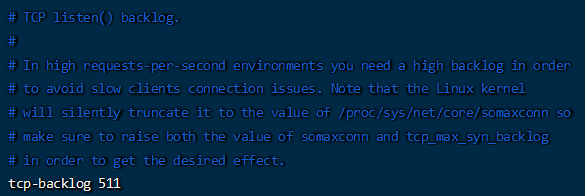
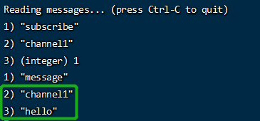
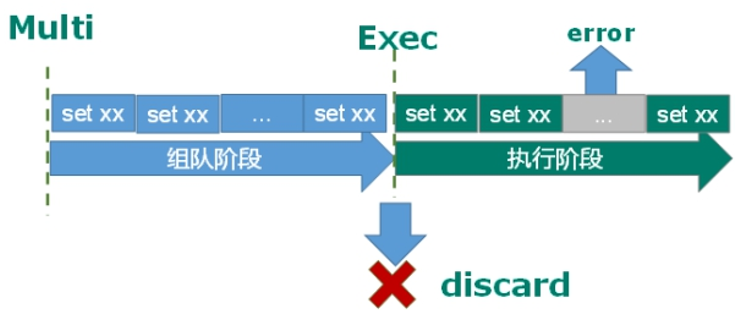

# NoSQL数据库

## NoSQL数据库概述

> NoSQL(NoSQL = **Not Only SQL** )，意即“不仅仅是SQL”，泛指**非关系型的数据库**。 
>
> NoSQL 不依赖业务逻辑方式存储，而以简单的**key-value模式存储**。因此大大的增加了数据库的扩展能力。
>
> - 不遵循SQL标准。
> - 不支持ACID。
> - 远超于SQL的性能。
>
> <span style="color:red">**打破了传统关系型数据库以业务逻辑为依据的存储模式，而针对不同数据结构类型改为以性能为最优先的存储方式**</span>

## NoSQL适用场景

> - 对数据**高并发**的读写
> - **海量数据**的读写
> - 对数据**高可扩展性**的

## NoSQL不适用场景

> - **需要事务支持**
> - 基于sql的结构化查询存储，处理复杂的关系,**需要即席查询**。
> - <span style="color:red">**用不着sql的和用了sql也不行的情况，请考虑用NoSql**</span>

# Redis概述安装

> - Redis是一个开源的<span style="color:orange">**key-value存储系统，默认端口6379。**</span>
> - 与memcached一样，为了保证效率，数据都是<span style="color:orange">**缓存在内存中**</span>。区别的是Redis会周期性的把更新的<span style="color:orange">**数据写入磁盘**</span>或者把修改操作写入追加的记录文件。并且在此基础上<span style="color:orange">**实现了master-slave(主从)同步。**</span>
> - <span style="color:orange">**默认16个数据库**</span>，类似数组下标从0开始，<span style="color:orange">**初始默认使用0号库。**</span>使用<span style="color:orange">**命令`select  <dbid>`来切换数据库。**</span>如: select 8 。统一密码管理，所有库同样密码
> - 多线程+锁（memcached） vs  **单线程+多路IO复用(Redis)**

## 安装

> 1. 下载gcc编译器（需要c语言编译环境）
>
> 2. 下载`redis-6.2.1.tar.gz`放`/opt`目录
>
> 3. 解压命令：`tar -zxvf redis-6.2.1.tar.gz`
>
> 4. 在`redis-6.2.1`目录下再次执行`make`命令（只是编译好）
>
>    - 如果没有准备好C语言编译环境，make 会报错`—Jemalloc/jemalloc.h:`没有那个文件
>    - 解决方案：运行`make distclean`
>    - 在`redis-6.2.1`目录下再次执行`make`命令（只是编译好）
>
> 5. 跳过`make test`，执行: `make install`
>
> 6. 安装目录：`/usr/local/bin`
>
>    - redis-benchmark:性能测试工具，可以在自己本子运行，看看自己本子性能如何
>
>    - redis-check-aof：修复有问题的AOF文件，rdb和aof后面讲
>
>    - redis-check-dump：修复有问题的dump.rdb文件
>
>    - redis-sentinel：Redis集群使用
>
>    - redis-server：Redis服务器启动命令
>
>    - redis-cli：客户端，操作入口

## 前台启动（不推荐）

> - 命令：`redis-server`
> - 前台启动，命令行窗口不能关闭，否则服务器停止

## 后台启动（推荐）

> - 备份`/opt/redis-6.2.1/redis.conf`
>
>   ```shell
>   [root@lz88 redis-6.2.1]# cp redis.conf /etc/redis.conf
>   ```
>
> - 修改备份redis.conf(128行)文件将里面的daemonize no 改成 yes，让服务在后台启动
>
> - Redis启动
>
>   ```shell
>   [root@lz88 bin]# redis-server /etc/redis.conf 
>   [root@lz88 bin]# ps -ef | grep redis
>   root      85688      1  3 16:05 ?        00:00:00 redis-server 127.0.0.1:6379
>   root      85874   3303  0 16:05 pts/0    00:00:00 grep --color=auto redis
>   ```
>
> - 用客户端访问：redis-cli
>
>   ```shell
>   [root@lz88 bin]# redis-cli
>   ```
>
>   - 多个端口可以：`redis-cli -p 6379`
>
> - 测试验证： `ping`
>
>   ```shell
>   [root@lz88 bin]# redis-cli
>   127.0.0.1:6379> ping
>   PONG
>   ```
>
> - Redis关闭
>
>   ```shell
>   127.0.0.1:6379> shutdown
>   not connected> 
>   
>   [root@lz88 bin]# redis-cli shutdown
>   ```
>
>   - 多实例关闭，指定端口关闭：`redis-cli -p 6379 shutdown`

# 常用五大数据类型

> 哪里去获得redis常见数据类型操作命令http://www.redis.cn/commands.html

## Redis键(key)

> - `keys *`：查看当前库所有key  (匹配：keys * 1)
>
> - `exists key`：判断某个key是否存在
>
> - `type key`：查看你的key是什么类型
>
> - `del key`：删除指定的key数据
>
> - `unlink key`：根据value选择非阻塞删除。仅将keys从keyspace元数据中删除，真正的删除会在后续异步操作。
>
> - `expire key 10`：为给定的key设置过期时间10秒钟
>
> - `ttl key`：查看还有多少秒过期，-1表示永不过期，-2表示已过期
>
>   
>
> - `select`：命令切换数据库
>
> - `dbsize`：查看当前数据库的key的数量
>
> - `flushdb`：清空当前库
>
> - `flushall`：通杀全部库

```redis
127.0.0.1:6379> keys *
1) "k3"
2) "k2"
3) "k1"
127.0.0.1:6379> exists k1
(integer) 1
127.0.0.1:6379> type k1
string
127.0.0.1:6379> del k3
(integer) 1
127.0.0.1:6379> keys *
1) "k2"
2) "k1"
127.0.0.1:6379> expire k2 10
(integer) 1
127.0.0.1:6379> ttl k2
(integer) 5
127.0.0.1:6379> ttl k2
(integer) -2
127.0.0.1:6379> ttl k1
(integer) -1
127.0.0.1:6379> dbsize
(integer) 1
127.0.0.1:6379> flushdb
OK
127.0.0.1:6379> 
```

## Redis字符串(String)

> - String类型是**二进制安全的**。意味着Redis的string可以包含任何数据。比如jpg图片或者序列化的对象。
>
> - String类型是Redis最基本的数据类型，一个Redis中字符串value最多可以是**512M**

###  **常用命令**

> - `set <key> <value>`：添加键值对
>
>   
>
>   - *NX：当数据库中key不存在时，可以将key-value添加数据库
>   - *XX：当数据库中key存在时，可以将key-value添加数据库，与NX参数互斥
>   - *EX：key的超时秒数
>   - *PX：key的超时毫秒数，与EX互斥
>
> - `get <key>`：查询对应键值
>
> - `setnx <key> <value>`：只有在 key 不存在时设置 key 的值
>
> - `setex <key> <过期时间> <value>`：设置键值的同时，设置过期时间，单位秒。
>
> - `append <key> <value>`：将给定的<value> 追加到原值的末尾
>
> - `strlen <key>`：获得值的长度
>
> - `incr <key>`：将 key 中储存的数字值增1，只能对数字值操作，如果为空，新增值为1
>
> - `decr <key>`：将 key 中储存的数字值减1，只能对数字值操作，如果为空，新增值为-1
>
> - `incrby / decrby <key> <步长>`：将 key 中储存的数字值增减。自定义步长。**数值增减符合原子性**
>
> - `mset <key1> <value1> <key2> <value2> ..... `：同时设置一个或多个 key-value对 
>
> - `mget <key1> <key2> <key3> .....`：同时获取一个或多个 value 
>
> - `msetnx <key1> <value1> <key2> <value2> .....`：同时设置一个或多个 key-value 对，当且仅当所有给定 key 都不存在。**原子性，有一个失败则都失败**
>
> - `getrange <key> <起始位置> <结束位置>`：获得值的范围，类似java中的substring，**前包，后包**
>
> - `setrange <key> <起始位置> <value>`：用 <value> 覆写<key>所储存的字符串值，从<起始位置>开始(**索引从0开始**)。
>
> - `getset <key> <value>`：以新换旧，设置了新值同时获得旧值。

```redis
127.0.0.1:6379> keys *
1) "k3"
2) "k2"
3) "k1"
127.0.0.1:6379> get k1
"v1"
127.0.0.1:6379> set k1 v111
OK
127.0.0.1:6379> get k1
"v111"
127.0.0.1:6379> setnx k1 v1
(integer) 0
127.0.0.1:6379> get k1
"v111"
127.0.0.1:6379> append k1 demo1
(integer) 9
127.0.0.1:6379> get k1
"v111demo1"
127.0.0.1:6379> strlen k1
(integer) 9
127.0.0.1:6379> set k4 1
OK
127.0.0.1:6379> incr k4
(integer) 2
127.0.0.1:6379> get k4
"2"
127.0.0.1:6379> decr k4
(integer) 1
127.0.0.1:6379> get k4
"1"
127.0.0.1:6379> incrby k4 10
(integer) 11
127.0.0.1:6379> get k4
"11"
127.0.0.1:6379> decrby k4 5
(integer) 6
127.0.0.1:6379> get k4
"6"

127.0.0.1:6379> mget k1 k2 k3
1) "v1"
2) "v2"
3) "v3"
127.0.0.1:6379> msetnx k1 v11 k12 v12 k13 v13
(integer) 0
127.0.0.1:6379> keys *
1) "k3"
2) "k2"
3) "k1"
127.0.0.1:6379> msetnx k11 v11 k12 v12 k13 v13
(integer) 1
127.0.0.1:6379> keys *
1) "k3"
2) "k12"
3) "k11"
4) "k13"
5) "k1"
6) "k2"
127.0.0.1:6379> set name luckly
OK
127.0.0.1:6379> getrange name 0 3
"luck"
127.0.0.1:6379> setrange name 2 demo
(integer) 6
127.0.0.1:6379> get name
"ludemo"
127.0.0.1:6379> setex k5 10 v5
OK
127.0.0.1:6379> ttl k5
(integer) -2
127.0.0.1:6379> getset name tom
"ludemo"
127.0.0.1:6379> get name
"tom"
127.0.0.1:6379> set name lucy
OK
127.0.0.1:6379> get name
"lucy"
```

### 数据结构

> String的数据结构为**简单动态字符串**(Simple Dynamic String,缩写SDS)。是可以修改的字符串，内部结构实现上类似于Java的ArrayList，采用预分配冗余空间的方式来减少内存的频繁分配
>
> 
>
> 如图中所示，内部为当前字符串实际分配的空间capacity一般要高于实际字符串长度len。当字符串长度小于1M时，扩容都是加倍现有的空间，如果超过1M，扩容时一次只会多扩1M的空间。需要注意的是字符串最大长度为**512M**。

## Redis列表(List)

> - 单键多值
> - Redis 列表是简单的字符串列表，按照插入顺序排序。你**可以添加一个元素到列表的头部（左边）或者尾部（右边）。**
> - 它的底层实际是个**双向链表**，对两端的操作性能很高，通过索引下标的操作中间的节点性能会较差。        

                    

### 常用命令

> - `lpush/rpush <key> <value1> <value2> <value3>....`：从左边/右边插入一个或多个值。
> - `lpop/rpop <key>`：从左边/右边吐出一个值。**值在键在，值光键亡。**
> - `rpoplpush <key1> <key2>`：从<key1>列表右边吐出一个值，插到<key2>列表左边。
> - `lrange <key> <start> <stop>`：按照索引下标获得元素(从左到右)。0左边第一个，-1右边第一个（**0-1表示获取所有**）
> - `lindex <key> <index>`：按照索引下标获得元素(从左到右)
> - `llen <key>`：获得列表长度 
> - `linsert <key> after/before <value> <newvalue>`：在<value>的后面/前面插入<newvalue>插入值
> - `lrem <key> <n> <value>`：从左边删除n个value(从左到右)
> - `lset<key> <index> <value>`：将列表key下标为index的值替换成value

```redis
127.0.0.1:6379> lpush k k1 k2 k3
(integer) 3
127.0.0.1:6379> lrange k 0 -1
1) "k3"
2) "k2"
3) "k1"
127.0.0.1:6379> rpush v v1 v2 v3
(integer) 3
127.0.0.1:6379> lrange v 0 -1
1) "v1"
2) "v2"
3) "v3"
127.0.0.1:6379> lpop k
"k3"
127.0.0.1:6379> lrange k 0 -1
1) "k2"
2) "k1"
127.0.0.1:6379> rpoplpush k v
"k1"
127.0.0.1:6379> lrange v 0 -1
1) "k1"
2) "v1"
3) "v2"
4) "v3"
127.0.0.1:6379> lindex v 0
"k1"
127.0.0.1:6379> llen v
(integer) 4
127.0.0.1:6379> linsert v before "v1" "kkk"
(integer) 5
127.0.0.1:6379> lrange v 0 -1
1) "k1"
2) "kkk"
3) "v1"
4) "v2"
5) "v3"
127.0.0.1:6379> linsert v before v2 kkk
(integer) 6
127.0.0.1:6379> lrange v 0 -1
1) "k1"
2) "kkk"
3) "v1"
4) "kkk"
5) "v2"
6) "v3"
127.0.0.1:6379> lrem v 2 kkk
(integer) 2
127.0.0.1:6379> lrange v 0 -1
1) "k1"
2) "v1"
3) "v2"
4) "v3"
127.0.0.1:6379> lset v 0 vv
OK
127.0.0.1:6379> lrange v 0 -1
1) "vv"
2) "v1"
3) "v2"
4) "v3"
```

### 数据结构

> List的数据结构为**快速链表quickList**。
>
> 首先在列表元素较少的情况下会使用一块连续的内存存储，这个结构是**ziplist，也即是压缩列表。**
>
> 它将所有的元素紧挨着一起存储，分配的是一块连续的内存。
>
> 当数据量比较多的时候才会改成quicklist。
>
> 因为普通的链表需要的附加指针空间太大，会比较浪费空间。比如这个列表里存的只是int类型的数据，结构上还需要两个额外的指针prev和next。
>
>  
>
> Redis**将链表和ziplist结合起来组成了quicklist**。也就是将多个ziplist使用双向指针串起来使用。这样既满足了快速的插入删除性能，又不会出现太大的空间冗余。

## Redis集合(Set)

> - Redis set对外提供的功能与list类似是一个列表的功能，特殊之处在于set是可以**自动排重**的，当你需要存储一个列表数据，又不希望出现重复数据时，set是一个很好的选择，并且set提供了判断某个成员是否在一个set集合内的重要接口，这个也是list所不能提供的。
>
> - Redis的Set是string类型的**无序集合**。它底层其实是一个value为null的hash表，所以添加，删除，查找的**复杂度都是O(1)**。
>
> - 一个算法，随着数据的增加，执行时间的长短，如果是O(1)，数据增加，查找数据的时间不变

###  常用命令

> - `sadd <key> <value1> <value2> .....`：将一个或多个 member 元素加入到集合 key 中，已经存在的 member 元素将被忽略
> - `smembers <key>`：取出该集合的所有值。
> - `sismember <key> <value>`：判断集合<key>是否为含有该<value>值，有1，没有0
> - `scard <key>`：返回该集合的元素个数。
> - `srem <key> <value1> <value2> ....`：删除集合中的某个元素。
> - `spop <key>`：**随机**从该集合中吐出一个值。
> - `srandmember <key> <n>`：**随机**从该集合中取出n个值。**不会从集合中删除 。**
> - `smove <source> <destination> value`：把集合中一个值从一个集合移动到另一个集合
> - `sinter <key1> <key2>`：返回两个集合的**交集**元素。
> - `sunion <key1> <key2>`：返回两个集合的**并集**元素。
> - `sdiff <key1> <key2>`：返回两个集合的**差集**元素(key1中的，不包含key2中的)

```redis
127.0.0.1:6379> sadd k k1 k2 k3
(integer) 3
127.0.0.1:6379> smembers k
1) "k2"
2) "k1"
3) "k3"
127.0.0.1:6379> sismember k k1
(integer) 1
127.0.0.1:6379> sismember k k4
(integer) 0
127.0.0.1:6379> scard k
(integer) 3
127.0.0.1:6379> srem k k1
(integer) 1
127.0.0.1:6379> smembers k
1) "k2"
2) "k3"
127.0.0.1:6379> spop k 1
1) "k3"
127.0.0.1:6379> srandmember k 1
1) "k2"
127.0.0.1:6379> sadd v v1 v2 v3
(integer) 3
127.0.0.1:6379> sadd k k1 k2 k3 v1
(integer) 3
127.0.0.1:6379> smove v k v3
(integer) 1
127.0.0.1:6379> smembers k
1) "v1"
2) "k1"
3) "k2"
4) "k3"
5) "v3"
127.0.0.1:6379> sinter k v
1) "v1"
127.0.0.1:6379> sunion k v
1) "k3"
2) "v3"
3) "v2"
4) "k2"
5) "k1"
6) "v1"
127.0.0.1:6379> sdiff k v
1) "v3"
2) "k1"
3) "k2"
4) "k3"
```

### 数据结构

> Set数据结构是**dict字典**，字典是用哈希表实现的。
>
> Java中HashSet的内部实现使用的是HashMap，只不过所有的value都指向同一个对象。Redis的set结构也是一样，它的内部也使用hash结构，所有的value都指向同一个内部值。

## Redis哈希(Hash)

> - Redis hash 是一个**键值对集合**。
>
> - Redis hash是一个string类型的**field和value的映射表**，hash特别适合用于存储对象。
>
> - **类似Java里面的Map<String,Object>**
>
> - 用户ID为查找的key，存储的value用户对象包含姓名，年龄，生日等信息，如果用普通的key/value结构来存储
>
> - 主要有以下2种存储方式：
>
>   
>
>   

### 常用命令

> - `hset <key> <field> <value>`：给<key>集合中的 <field>键赋值<value>
> - `hget <key1> <field>`：从<key1>集合<field>取出 value 
> - `hmset <key1> <field1> <value1> <field2> <value2>...`：批量设置hash的值
> - `hexists<key1> <field>`：查看哈希表 key 中，给定域 field 是否存在。 
> - `hkeys <key>`：列出该hash集合的所有field
> - `hvals <key>`：列出该hash集合的所有value
> - `hincrby <key> <field> <increment>`：为哈希表 key 中的域 field 的值加上增量 1  -1
> - `hsetnx <key> <field> <value>`：将哈希表 key 中的域 field 的值设置为 value ，当且仅当域 field 不存在 

```redis
127.0.0.1:6379> hset user:100 name zhangsan
(integer) 1
127.0.0.1:6379> hget user:100 name
"zhangsan"
127.0.0.1:6379> hmset user:101 name lisi age 20
OK
127.0.0.1:6379> hexists user:101 name
(integer) 1
127.0.0.1:6379> hkeys user:101
1) "name"
2) "age"
127.0.0.1:6379> hvals user:101
1) "lisi"
2) "20"
127.0.0.1:6379> hincrby user:101 age 10
(integer) 30
127.0.0.1:6379> hsetnx user:101 age 20
(integer) 0
127.0.0.1:6379> hsetnx user:101 address shandong
(integer) 1
```

### 数据结构

> Hash类型对应的数据结构是两种：**ziplist（压缩列表），hashtable（哈希表）**。当field-value长度较短且个数较少时，使用ziplist，否则使用hashtable。

## 有序集合Zset(sorted set)

> - Redis有序集合Zset与普通集合set非常相似，是一个**没有重复元素的字符串集合**。
> - 不同之处是有序集合的每个成员都关联了一个**评分（score）**,这个评分（score）被用来按照**从最低分到最高分的方式排序**集合中的成员。集合的成员是唯一的，但是**评分可以重复** 。
> - 因为元素是有序的, 所以你也可以很快的根据评分（score）或者次序（position）来获取一个范围的元素。
> - 访问有序集合的中间元素也是非常快的,因此你能够使用有序集合作为一个没有重复成员的智能列表。

### 常用命令

> - `zadd <key> <score1> <value1> <score2> <value2>…`：将一个或多个 member 元素及其 score 值加入到有序集 key 当中。
> - `zrange <key> <start> <stop>  [WITHSCORES]`：返回有序集 key 中，下标在<start><stop>之间的元素。**带WITHSCORES，可以让分数一起和值返回到结果集。**
> - `zrangebyscore key min max [withscores] [limit offset count]`：返回有序集 key 中，所有 score 值介于 min 和 max 之间(包括等于 min 或 max )的成员。有序集成员**按 score 值递增(从小到大)次序排列。** 
> - `zrevrangebyscore key max min [withscores] [limit offset count]`：同上，改为**从大到小排列。** 
> - `zincrby <key> <increment> <value>`：为元素的score加上增量
> - `zrem <key> <value>`：删除该集合下，指定值的元素
> - `zcount <key> <min> <max>`：统计该集合，分数区间内的元素个数 
> - `zrank <key> <value>`：返回该值在集合中的排名，从0开始。

```
127.0.0.1:6379> zadd topn 1 java 2 spring 3 sql 4 js 5 php
(integer) 5
127.0.0.1:6379> zrange topn 0 -1
1) "java"
2) "spring"
3) "sql"
4) "js"
5) "php"
127.0.0.1:6379> zrange topn 0 -1 withscores
 1) "java"
 2) "1"
 3) "spring"
 4) "2"
 5) "sql"
 6) "3"
 7) "js"
 8) "4"
 9) "php"
10) "5"
127.0.0.1:6379> zrangebyscore topn 2 4 withscores
1) "spring"
2) "2"
3) "sql"
4) "3"
5) "js"
6) "4"
127.0.0.1:6379> zrevrangebyscore topn 5 3 withscores
1) "php"
2) "5"
3) "js"
4) "4"
5) "sql"
6) "3"
127.0.0.1:6379> zincrby topn 2 php
"7"
127.0.0.1:6379> zrem topn php
(integer) 1
127.0.0.1:6379> zcount topn 0 -1
(integer) 0
127.0.0.1:6379> zcount topn 1 4
(integer) 4
127.0.0.1:6379> zrank topn js
(integer) 3
```

### 数据结构

> SortedSet(zset)是Redis提供的一个非常特别的数据结构，**一方面它等价于Java的数据结构Map<String, Double>**，可以给每一个元素value赋予一个权重score，**另一方面它又类似于TreeSet**，内部的元素会按照权重score进行排序，可以得到每个元素的名次，还可以通过score的范围来获取元素的列表。
>
> zset底层使用了两个数据结构
>
> （1）**hash**，hash的作用就是关联元素value和权重score，保障元素value的唯一性，可以通过元素value找到相应的score值。
>
> （2）**跳跃表**，跳跃表的目的在于给元素value排序，根据score的范围获取元素列表。

#### 跳跃表（跳表）

> 有序集合在生活中比较常见，例如根据成绩对学生排名，根据得分对玩家排名等。对于有序集合的底层实现，可以用数组、平衡树、链表等。数组不便元素的插入、删除；平衡树或红黑树虽然效率高但结构复杂；链表查询需要遍历所有效率低。Redis采用的是跳跃表。跳跃表效率堪比红黑树，实现远比红黑树简单。

##### 实例

> 对比有序链表和跳跃表，从链表中查询出51

> （1）有序链表
>
> 
>
> 要查找值为51的元素，需要从第一个元素开始依次查找、比较才能找到。共需要6次比较。

>（2）跳跃表
>
>
>
>从第2层开始，1节点比51节点小，向后比较。
>
>21节点比51节点小，继续向后比较，后面就是NULL了，所以从21节点向下到第1层
>
>在第1层，41节点比51节点小，继续向后，61节点比51节点大，所以从41向下
>
>在第0层，51节点为要查找的节点，节点被找到，共查找4次。
>
> 
>
>从此可以看出跳跃表比有序链表效率要高

# Redis配置文件介绍

> 自定义目录：`/etc/redis.conf`

## ###Units单位###

> - 配置大小单位,开头定义了一些基本的度量单位，**只支持bytes，不支持bit**
> - **大小写不敏感**


## ###INCLUDES包含###

> 类似jsp中的include，多实例的情况**可以把公用的配置文件提取出来**

## ###网络相关配置###

### bind

> - **默认情况`bind=127.0.0.1`只能接受本机的访问请求**
> - **不写的情况下，无限制接受任何ip地址的访问**
> - **生产环境肯定要写你应用服务器的地址；**服务器是需要远程访问的，所以需要将其注释掉

### protected-mode

> - 将本机访问保护模式设置no
> - 如果开启了protected-mode，那么在没有设定bind ip且没有设密码的情况下，Redis只允许接受本机的响应

### Port

> **端口号，默认 6379**

### tcp-backlog

> - 设置tcp的backlog，backlog其实是一个连接队列，backlog队列总和=未完成三次握手队列 + 已经完成三次握手队列。
> - 在高并发环境下你需要一个高backlog值来避免慢客户端连接问题。
> - 注意Linux内核会将这个值减小到/proc/sys/net/core/somaxconn的值（128），所以需要确认增大/proc/sys/net/core/somaxconn和/proc/sys/net/ipv4/tcp_max_syn_backlog（128）两个值来达到想要的效果



### timeout

> 一个空闲的客户端维持多少秒会关闭，**0表示关闭该功能。即永不关闭。**

### tcp-keepalive

> 对访问客户端的一种心跳检测，每个n秒检测一次。
>
> 单位为秒，如果设置为0，则不会进行Keepalive检测，建议设置成60 

## ###GENERAL通用###

### daemonize

> 是否为后台进程，设置为yes
>
> 守护进程，后台启动

### pidfile

> 存放pid文件的位置，每个实例会产生一个不同的pid文件

### loglevel

> 指定日志记录级别，Redis总共支持四个级别：debug、verbose、notice、warning，默认为**notice**
>
> 四个级别根据使用阶段来选择，生产环境选择notice 或者warning


### logfile

> 日志文件名称


### databases 16

> 设定库的数量默认16，默认数据库为0，可以使用SELECT <dbid>命令在连接上指定数据库id

## ###SECURITY安全###

### 设置密码

> 访问密码的查看、设置和取消
>
> **在命令中设置密码，只是临时的。重启redis服务器，密码就还原了。**
>
> **永久设置，需要再配置文件中进行设置。**


## ####LIMITS限制###

### maxclients

> - 设置redis同时可以与多少个客户端进行连接。
> - **默认情况下为10000个客户端。**
> - 如果达到了此限制，redis则会拒绝新的连接请求，并且向这些连接请求方发出“max number of clients reached”以作回应。

### maxmemory

> - 建议**必须设置**，否则，将存占满，造成服务器宕机
> - 设置redis可以使用的内存量。一旦到达内存使用上限，redis将会试图移除内部数据，移除规则可以通过maxmemory-policy来指定。
> - 如果redis无法根据移除规则来移除内存中的数据，或者设置了“不允许移除”，那么**redis则会针对那些需要申请内存的指令返回错误信息**，比如SET、LPUSH等。
> - 但是**对于无内存申请的指令，仍然会正常响应**，比如GET等。如果你的redis是主redis（说明你的redis有从redis），那么在设置内存使用上限时，需要在系统中留出一些内存空间给同步队列缓存，只有在你设置的是“不移除”的情况下，才不用考虑这个因素。

### maxmemory-policy

> - volatile-lru：使用LRU算法移除key，只对设置了过期时间的键；（最近最少使用）
> - allkeys-lru：在所有集合key中，使用LRU算法移除key
> - volatile-random：在过期集合中移除随机的key，只对设置了过期时间的键
> - allkeys-random：在所有集合key中，移除随机的key
> - volatile-ttl：移除那些TTL值最小的key，即那些最近要过期的key
> - noeviction：不进行移除。针对写操作，只是返回错误信息

### maxmemory-samples

> - 设置样本数量，LRU算法和最小TTL算法都并非是精确的算法，而是估算值，所以你可以设置样本的大小，redis默认会检查这么多个key并选择其中LRU的那个。
> - 一般设置3到7的数字，数值越小样本越不准确，但性能消耗越小。

# Redis的发布和订阅

> 打开一个客户端订阅channel1


> 打开另一个客户端，给channel1发布消息hello


> 打开订阅的客户端就可以看到发送的消息



> 发布的消息没有持久化，只能收到订阅后发布的消息

# Redis新数据类型

## Bitmaps

> Redis提供了Bitmaps这个“数据类型”可以实现对位的操作：
>
> 1. Bitmaps本身不是一种数据类型， **实际上它就是字符串（key-value）** ， 但是它可以对字符串的位进行操作。
> 2. Bitmaps单独提供了一套命令， 所以在Redis中使用Bitmaps和使用字符串的方法不太相同。 可**以把Bitmaps想象成一个以位为单位的数组， 数组的每个单元只能存储0和1， 数组的下标在Bitmaps中叫做偏移量。**


### 命令

> - `setbit <key> <offset> <value>`：设置Bitmaps中某个偏移量的值（0或1）。**offset偏移量从0开始**
>
>   ```
>   127.0.0.1:6379> setbit user 1 1
>   (integer) 0
>   127.0.0.1:6379> setbit user 6 1
>   (integer) 0
>   127.0.0.1:6379> setbit user 11 1
>   (integer) 0
>   127.0.0.1:6379> setbit user 15 1
>   (integer) 0
>   127.0.0.1:6379> setbit user 19 1
>   (integer) 0
>   ```
>
> - `getbit <key> <offset>`：获取Bitmaps中某个偏移量的值。获取键的第offset位的值（从0开始算）
>
>   ```
>   127.0.0.1:6379> getbit user 1
>   (integer) 1
>   127.0.0.1:6379> getbit user 6
>   (integer) 1
>   127.0.0.1:6379> getbit user 11
>   (integer) 1
>   127.0.0.1:6379> getbit user 15
>   (integer) 1
>   127.0.0.1:6379> getbit user 19
>   (integer) 1
>   127.0.0.1:6379> getbit user 20
>   (integer) 0
>   ```
>
> - `bitcount <key> [start end]`：统计字符串从start字节到end字节比特值为1的数量。start 和 end 参数的设置，都可以使用负数值：比如**-1 表示最后一个位，而 -2 表示倒数第二个位，start、end 是指bit组的字节的下标数**
>
>   ```
>   127.0.0.1:6379> bitcount user
>   (integer) 5
>   ```
>
> - `bitop and(or/not/xor) <destkey> [key…]`：bitop是一个复合操作， 它可以做多个Bitmaps的**and（交集） 、 or（并集） 、 not（非） 、 xor（异或）** 操作并将结果保存在destkey中。
>
>   ```
>   127.0.0.1:6379> setbit person 1 1
>   (integer) 0
>   127.0.0.1:6379> setbit person 5 1
>   (integer) 0
>   127.0.0.1:6379> setbit person 7 1
>   (integer) 0
>   127.0.0.1:6379> setbit person 11 1
>   (integer) 0
>   127.0.0.1:6379> bitop and unique:user:and:person user person
>   (integer) 2
>   ```

### Bitmaps与set对比

> 假设网站有1亿用户， 每天独立访问的用户有5千万， 如果每天用集合类型和Bitmaps分别存储活跃用户可以得到表
>
> | set和Bitmaps存储一天活跃用户对比 |                    |                  |                        |
> | -------------------------------- | ------------------ | ---------------- | ---------------------- |
> | 数据  类型                       | 每个用户id占用空间 | 需要存储的用户量 | 全部内存量             |
> | 集合  类型                       | 64位               | 50000000         | 64位*50000000 = 400MB  |
> | Bitmaps                          | 1位                | 100000000        | 1位*100000000 = 12.5MB |
>
> 很明显， 这种情况下使用Bitmaps能节省很多的内存空间， 尤其是随着时间推移节省的内存还是非常可观的
>
> | set和Bitmaps存储独立用户空间对比 |        |        |       |
> | -------------------------------- | ------ | ------ | ----- |
> | 数据类型                         | 一天   | 一个月 | 一年  |
> | 集合类型                         | 400MB  | 12GB   | 144GB |
> | Bitmaps                          | 12.5MB | 375MB  | 4.5GB |
>
> 但Bitmaps并不是万金油， 假如该网站每天的独立访问用户很少， 例如只有10万（大量的僵尸用户） ， 那么两者的对比如下表所示， 很显然， 这时候使用Bitmaps就不太合适了， 因为基本上大部分位都是0。
>
> | set和Bitmaps存储一天活跃用户对比（独立用户比较少） |                    |                  |                        |
> | -------------------------------------------------- | ------------------ | ---------------- | ---------------------- |
> | 数据类型                                           | 每个userid占用空间 | 需要存储的用户量 | 全部内存量             |
> | 集合类型                                           | 64位               | 100000           | 64位*100000 = 800KB    |
> | Bitmaps                                            | 1位                | 100000000        | 1位*100000000 = 12.5MB |

## HyperLogLog

> Redis HyperLogLog 是用来做基数统计的算法，HyperLogLog 的优点是，在输入元素的数量或者体积非常非常大时，计算基数所需的空间总是固定的、并且是很小的。
>
> 在 Redis 里面，每个 HyperLogLog 键只需要花费 12 KB 内存，就可以计算接近 2^64 个不同元素的基数。这和计算基数时，元素越多耗费内存就越多的集合形成鲜明对比。
>
> 但是，因为 HyperLogLog 只会根据输入元素来计算基数，而不会储存输入元素本身，所以 HyperLogLog 不能像集合那样，返回输入的各个元素。
>
> 什么是基数?
>
> - 比如数据集 {1, 3, 5, 7, 5, 7, 8}， 那么这个数据集的基数集为 {1, 3, 5 ,7, 8}, 基数(不重复元素)为5。 基数估计就是在误差可接受的范围内，快速计算基数。

### 命令

> - `pfadd <key> <element> [element ...]`：添加指定元素到 HyperLogLog 中。如果执行命令后HLL估计的近似基数发生变化，则返回1，否则返回0。
> - `pfcount <key> [key ...]`：计算HLL的近似基数，可以计算多个HLL
> - `pfmerge <destkey> <sourcekey> [sourcekey...]`：将一个或多个HLL合并后的结果存储在另一个HLL中

```
127.0.0.1:6379> pfadd hll1 redis
(integer) 1
127.0.0.1:6379> pfcount hll1
(integer) 1
127.0.0.1:6379> pfadd hll1 java
(integer) 1
127.0.0.1:6379> pfadd hll1 python
(integer) 1
127.0.0.1:6379> pfadd hll1 java
(integer) 0
127.0.0.1:6379> pfcount hll1
(integer) 3
127.0.0.1:6379> pfadd hll2 python
(integer) 1
127.0.0.1:6379> pfadd hll2 spring
(integer) 1
127.0.0.1:6379> pfmerge hll hll1 hll2
OK
127.0.0.1:6379> pfcount hll
(integer) 4
```

## Geospatial

> Redis 3.2 中增加了对GEO类型的支持。GEO，Geographic，地理信息的缩写。该类型，就是元素的2维坐标，在地图上就是经纬度。redis基于该类型，提供了经纬度设置，查询，范围查询，距离查询，经纬度Hash等常见操作。

### 命令

> - `geoadd <key> <longitude> <latitude> <member> [longitude latitude member...]`：添加地理位置（经度，纬度，名称）
>
>   - 两极无法直接添加，一般会下载城市数据，直接通过 Java 程序一次性导入。
>   - **有效的经度从 -180 度到 180 度。有效的纬度从 -85.05112878 度到 85.05112878 度。**
>
>   - 当坐标位置超出指定范围时，该命令将会返回一个错误。
>
>   - 已经添加的数据，是无法再次往里面添加的。
>
> - `geopos <key> <member> [member...]`：获得指定地区的坐标值
>
> - `geodist <key> <member1> <member2> [m|km|ft|mi ]`：获取两个位置之间的直线距离
>
>   单位：
>
>   - m 表示单位为米[默认值]。
>
>   - km 表示单位为千米。
>
>   - mi 表示单位为英里。
>
>   - ft 表示单位为英尺。
>
>   - 如果用户没有显式地指定单位参数， 那么 GEODIST **默认使用米作为单位**
>
> - `georadius <key> <longitude> <latitude> radius m|km|ft|mi`：以给定的经纬度为中心，找出某一半径内的元素

```
127.0.0.1:6379> geoadd china:city 121.47 31.23 shanghai
(integer) 1
127.0.0.1:6379> geoadd china:city 106.50 29.53 chongqing 114.05 22.52 shenzhen 116.38 39.90 beijing
(integer) 3
127.0.0.1:6379> geopos china:city shanghai
1) 1) "121.47000163793563843"
   2) "31.22999903975783553"
127.0.0.1:6379> geodist china:city beijing shanghai
"1068153.5181"
127.0.0.1:6379> geodist china:city beijing shanghai km
"1068.1535"
127.0.0.1:6379> georadius china:city 110 30 1000 km
1) "chongqing"
2) "shenzhen"
```

# Redis_Jedis

## Jedis所需jar包

```xml
    <dependency>
        <groupId>redis.clients</groupId>
        <artifactId>jedis</artifactId>
        <version>3.2.0</version>
    </dependency>
```

## 注意事项

> - 禁用Linux的防火墙：Linux(CentOS7)里执行命`systemctl stop/disable firewalld.service`
> - redis.conf中注释掉`bind 127.0.0.1`,然后`protected-mode no`

## Jedis常用操作

### 测试程序

```java
    @Test
    public void test01() {

        Jedis jedis = new Jedis("192.168.221.88", 6379);

//        测试连接
        String pong = jedis.ping();
        System.out.println("pong = " + pong);//pong = PONG

    }
```

### Jedis-API Key

```java
    //    测试Key
    @Test
    public void test02() throws InterruptedException {
        Jedis jedis = new Jedis("192.168.221.88", 6379);

        jedis.set("k1", "v1");
        jedis.set("k2", "v2");
        jedis.set("k3", "v3");

        Set<String> keys = jedis.keys("*");
        for (String key : keys) {
            System.out.println("key = " + key);
            /*key = k3
            key = k1
            key = k2*/
        }

        Boolean k1 = jedis.exists("k1");
        System.out.println("k1 = " + k1);//k1 = true

        Long k3 = jedis.expire("k3", 10);
        System.out.println("k3 = " + k3);//k3 = 1

        Thread.sleep(5000);

        Long ttl = jedis.ttl("k3");
        System.out.println("ttl = " + ttl);//ttl = 5
    }
```

### Jedis-API String

```java
    //    测试String类型
    @Test
    public void test03() {
        Jedis jedis = new Jedis("192.168.221.88", 6379);
        jedis.set("u1", "zhangsan");
        jedis.mset("u2", "lisi", "u3", "wangwu");

        List<String> mget = jedis.mget("u1", "u2", "u3");
        System.out.println("mget = " + mget);//mget = [zhangsan, lisi, wangwu]

    }
```

### Jedis-API List

```java
    //    测试List类型
    @Test
    public void test04() {
        Jedis jedis = new Jedis("192.168.221.88", 6379);
        jedis.lpush("l", "l1");
        jedis.lpush("l", "l2");
        jedis.lpush("l", "l3");

        List<String> l = jedis.lrange("l", 0, -1);
        System.out.println("l = " + l);//l = [l3, l2, l1]

    }
```

### Jedis-API set

```java
    //    测试set类型
    @Test
    public void test05() {
        Jedis jedis = new Jedis("192.168.221.88", 6379);
        jedis.sadd("s", "s1");
        jedis.sadd("s", "s2");
        jedis.sadd("s", "s3");

        Set<String> s = jedis.smembers("s");
        System.out.println("s = " + s);//s = [s2, s3, s1]
    }
```

### Jedis-API hash

```java
    //    测试hash
    @Test
    public void test06() {
        Jedis jedis = new Jedis("192.168.221.88", 6379);
        jedis.hset("user", "name", "zhangsan");
        jedis.hset("user", "age", "22");
        jedis.hset("user", "sex", "1");

        List<String> user = jedis.hmget("user", "name", "age", "sex");
        System.out.println("user = " + user);//user = [zhangsan, 22, 1]

        
        HashMap<String, String> map = new HashMap<String, String>();
        map.put("name", "lisi");
        map.put("tel", "18000000000");
        map.put("address", "山东");
        jedis.hset("user1", map);

        List<String> user1 = jedis.hmget("user1", "name", "tel", "address");
        System.out.println("user1 = " + user1);//user1 = [lisi, 18000000000, 山东]

    }
```

### Jedis-API zset

```java
    //    测试zset
    @Test
    public void test07() {
        Jedis jedis = new Jedis("192.168.221.88", 6379);
        jedis.zadd("z", 100, "z1");
        jedis.zadd("z", 300, "z3");
        jedis.zadd("z", 600, "z6");

        Set<String> z = jedis.zrange("z", 0, -1);
        System.out.println("z = " + z);//z = [z1, z3, z6]
    }
```

## Redis与Spring Boot整合

### 注入依赖

```xml
        <!-- redis -->
        <dependency>
            <groupId>org.springframework.boot</groupId>
            <artifactId>spring-boot-starter-data-redis</artifactId>
        </dependency>

        <!-- spring2.X集成redis所需common-pool2-->
        <dependency>
            <groupId>org.apache.commons</groupId>
            <artifactId>commons-pool2</artifactId>
            <version>2.6.0</version>
        </dependency>
```

### 配置Redis

```properties
#Redis服务器地址
spring.redis.host=192.168.140.136
#Redis服务器连接端口
spring.redis.port=6379
#Redis数据库索引（默认为0）
spring.redis.database= 0
#连接超时时间（毫秒）
spring.redis.timeout=1800000
#连接池最大连接数（使用负值表示没有限制）
spring.redis.lettuce.pool.max-active=20
#最大阻塞等待时间(负数表示没限制)
spring.redis.lettuce.pool.max-wait=-1
#连接池中的最大空闲连接
spring.redis.lettuce.pool.max-idle=5
#连接池中的最小空闲连接
spring.redis.lettuce.pool.min-idle=0
```

### 测试方法

```java
@RestController
@RequestMapping("/redisTest")
public class RedisTestController {
    @Autowired
    private RedisTemplate redisTemplate;

    @GetMapping
    public String testRedis() {
        //设置值到redis
        redisTemplate.opsForValue().set("name","lucy");
        //从redis获取值
        String name = (String)redisTemplate.opsForValue().get("name");
        return name;
    }
}
```

# Redis_事务\_锁机制\_秒杀

## Redis事务定义

> Redis事务是一个单独的隔离操作：事务中的所有命令都会序列化、按顺序地执行。事务在执行的过程中，不会被其他客户端发送来的命令请求所打断。
>
> Redis事务的主要作用就是**串联多个命令防止别的命令插队。**

## Multi、Exec、discard

> 从输入Multi命令开始，输入的命令都会依次进入命令队列中，但不会执行，直到输入Exec后，Redis会将之前的命令队列中的命令依次执行。
>
> 组队的过程中可以通过discard来放弃组队。


> 组队成功，提交成功

```
127.0.0.1:6379> multi
OK
127.0.0.1:6379(TX)> set a1 v1
QUEUED
127.0.0.1:6379(TX)> set a2 v2
QUEUED
127.0.0.1:6379(TX)> set a3 v3
QUEUED
127.0.0.1:6379(TX)> exec
1) OK
2) OK
3) OK
```

> 组队成功，提交失败

```
127.0.0.1:6379> multi
OK
127.0.0.1:6379(TX)> set aa aa
QUEUED
127.0.0.1:6379(TX)> set bb bb
QUEUED
127.0.0.1:6379(TX)> set cc cc
QUEUED
127.0.0.1:6379(TX)> discard
OK
```

## 事务的错误处理

> **组队中某个命令出现了报告错误，执行时整个的所有队列都会被取消。**


```
127.0.0.1:6379> multi
OK
127.0.0.1:6379(TX)> set a1 v1
QUEUED
127.0.0.1:6379(TX)> set a2 v2
QUEUED
127.0.0.1:6379(TX)> set a3
(error) ERR wrong number of arguments for 'set' command
127.0.0.1:6379(TX)> exec
(error) EXECABORT Transaction discarded because of previous errors.
```

> **如果执行阶段某个命令报出了错误，则只有报错的命令不会被执行，而其他的命令都会执行，不会回滚。**



```
127.0.0.1:6379> multi
OK
127.0.0.1:6379(TX)> set a1 v1
QUEUED
127.0.0.1:6379(TX)> incr a1
QUEUED
127.0.0.1:6379(TX)> set a2 v2
QUEUED
127.0.0.1:6379(TX)> exec
1) OK
2) (error) ERR value is not an integer or out of range
3) OK
```

## 事务冲突的问题

>想想一个场景：有很多人有你的账户,同时去参加双十一抢购

### 悲观锁

> **悲观锁(Pessimistic Lock)**, 顾名思义，就是很悲观，每次去拿数据的时候都认为别人会修改，所以每次在拿数据的时候都会上锁，这样别人想拿这个数据就会block直到它拿到锁。**传统的关系型数据库里边就用到了很多这种锁机制**，比如**行锁**，**表锁**等，**读锁**，**写锁**等，都是在做操作之前先上锁。


### 乐观锁

> **乐观锁(Optimistic Lock),** 顾名思义，就是很乐观，每次去拿数据的时候都认为别人不会修改，所以不会上锁，但是在更新的时候会判断一下在此期间别人有没有去更新这个数据，可以使用版本号等机制。**乐观锁适用于多读的应用类型，这样可以提高吞吐量**。Redis就是利用这种check-and-set机制实现事务的。


### watch

> 在执行multi之前，先执行`watch key1 [key2]`,可以监视一个(或多个) key ，如果在事务**执行之前这个(或这些) key 被其他命令所改动，那么事务将被打断**

```
127.0.0.1:6379> watch k
OK
127.0.0.1:6379> multi
OK
127.0.0.1:6379(TX)> incr k
QUEUED
127.0.0.1:6379(TX)> exec
1) (integer) 2
```

```
127.0.0.1:6379> watch k
OK
127.0.0.1:6379> multi
OK
127.0.0.1:6379(TX)> incrby k 10
QUEUED
127.0.0.1:6379(TX)> exec
(nil)
```

### unwatch

> - 取消 WATCH 命令对所有 key 的监视。
> - 如果在执行 WATCH 命令之后，EXEC 命令或DISCARD 命令先被执行了的话，那么就不需要再执行UNWATCH 了。
> - http://doc.redisfans.com/transaction/exec.html

## Redis事务三特性

> - 单独的隔离操作 
>   - 事务中的所有命令都会序列化、按顺序地执行。事务在执行的过程中，不会被其他客户端发送来的命令请求所打断。 
> - 没有隔离级别的概念 
>   - 队列中的命令没有提交之前都不会实际被执行，因为事务提交前任何指令都不会被实际执行
> - 不保证原子性 
>   - 事务中如果有一条命令执行失败，其后的命令仍然会被执行，没有回滚

## Redis事务_秒杀案例


### Redis事务_秒杀并发模拟

> 使用工具ab模拟测试：`yum -y install httpd-tools`

#### 测试

> ab -n 2000 -c 200 -k -p ~/postfile -T application/x-www-form-urlencoded http://192.168.2.115:8081/Seckill/doseckill

### 超卖问题

> 利用乐观锁解决超卖问题

```java
public class SecKill_redis {

	public static void main(String[] args) {
		Jedis jedis =new Jedis("192.168.44.168",6379);
		System.out.println(jedis.ping());
		jedis.close();
	}

	//秒杀过程
	public static boolean doSecKill(String uid,String prodid) throws IOException {
		//1 uid和prodid非空判断
		if(uid == null || prodid == null) {
			return false;
		}

		//2 连接redis
		//Jedis jedis = new Jedis("192.168.44.168",6379);
		//通过连接池得到jedis对象
		JedisPool jedisPoolInstance = JedisPoolUtil.getJedisPoolInstance();
		Jedis jedis = jedisPoolInstance.getResource();

		//3 拼接key
		// 3.1 库存key
		String kcKey = "sk:"+prodid+":qt";
		// 3.2 秒杀成功用户key
		String userKey = "sk:"+prodid+":user";

		//监视库存
		jedis.watch(kcKey);

		//4 获取库存，如果库存null，秒杀还没有开始
		String kc = jedis.get(kcKey);
		if(kc == null) {
			System.out.println("秒杀还没有开始，请等待");
			jedis.close();
			return false;
		}

		// 5 判断用户是否重复秒杀操作
		if(jedis.sismember(userKey, uid)) {
			System.out.println("已经秒杀成功了，不能重复秒杀");
			jedis.close();
			return false;
		}

		//6 判断如果商品数量，库存数量小于1，秒杀结束
		if(Integer.parseInt(kc)<=0) {
			System.out.println("秒杀已经结束了");
			jedis.close();
			return false;
		}

		//7 秒杀过程
		//使用事务
		Transaction multi = jedis.multi();

		//组队操作
		multi.decr(kcKey);
		multi.sadd(userKey,uid);

		//执行
		List<Object> results = multi.exec();

		if(results == null || results.size()==0) {
			System.out.println("秒杀失败了....");
			jedis.close();
			return false;
		}

		//7.1 库存-1
		//jedis.decr(kcKey);
		//7.2 把秒杀成功用户添加清单里面
		//jedis.sadd(userKey,uid);

		System.out.println("秒杀成功了..");
		jedis.close();
		return true;
	}
}
```

### 连接超时问题

> - 通过连接池解决超时问题
> - 链接池参数
>   - MaxTotal：控制一个pool可分配多少个jedis实例，通过pool.getResource()来获取；如果赋值为-1，则表示不限制；如果pool已经分配了MaxTotal个jedis实例，则此时pool的状态为exhausted。
>   - maxIdle：控制一个pool最多有多少个状态为idle(空闲)的jedis实例；
>   - MaxWaitMillis：表示当borrow一个jedis实例时，最大的等待毫秒数，如果超过等待时间，则直接抛JedisConnectionException；
>   - testOnBorrow：获得一个jedis实例的时候是否检查连接可用性（ping()）；如果为true，则得到的jedis实例均是可用的；

```java
public class JedisPoolUtil {
	private static volatile JedisPool jedisPool = null;

	private JedisPoolUtil() {
	}

	public static JedisPool getJedisPoolInstance() {
		if (null == jedisPool) {
			synchronized (JedisPoolUtil.class) {
				if (null == jedisPool) {
					JedisPoolConfig poolConfig = new JedisPoolConfig();
					poolConfig.setMaxTotal(200);
					poolConfig.setMaxIdle(32);
					poolConfig.setMaxWaitMillis(100*1000);
					poolConfig.setBlockWhenExhausted(true);
					poolConfig.setTestOnBorrow(true);  // ping  PONG
				 
					jedisPool = new JedisPool(poolConfig, "192.168.44.168", 6379, 60000 );
				}
			}
		}
		return jedisPool;
	}

	public static void release(JedisPool jedisPool, Jedis jedis) {
		if (null != jedis) {
			jedisPool.returnResource(jedis);
		}
	}

}
```

```java
		//2 连接redis
		//Jedis jedis = new Jedis("192.168.44.168",6379);
		//通过连接池得到jedis对象
		JedisPool jedisPoolInstance = JedisPoolUtil.getJedisPoolInstance();
		Jedis jedis = jedisPoolInstance.getResource();
```

### redis中还有库存，显示秒光

> - 使用LUA脚本
> - 将复杂的或者多步的redis操作，写为一个脚本，一次提交给redis执行，减少反复连接redis的次数。提升性能。
> - LUA脚本是类似redis事务，有一定的原子性，不会被其他命令插队，可以完成一些redis事务性的操作。
> - 但是注意redis的lua脚本功能，只有在Redis 2.6以上的版本才可以使用。
> - 利用lua脚本淘汰用户，解决超卖问题。
> - redis 2.6版本以后，通过lua脚本解决**争抢问题**，实际上是**redis** **利用其单线程的特性，用任务队列的方式解决多任务并发问题**。

```java
public class SecKill_redisByScript {
	
	private static final  org.slf4j.Logger logger =LoggerFactory.getLogger(SecKill_redisByScript.class) ;

	public static void main(String[] args) {
		JedisPool jedispool =  JedisPoolUtil.getJedisPoolInstance();
 
		Jedis jedis=jedispool.getResource();
		System.out.println(jedis.ping());
		
		Set<HostAndPort> set=new HashSet<HostAndPort>();

	//	doSecKill("201","sk:0101");
	}
	
	static String secKillScript ="local userid=KEYS[1];\r\n" + 
			"local prodid=KEYS[2];\r\n" + 
			"local qtkey='sk:'..prodid..\":qt\";\r\n" + 
			"local usersKey='sk:'..prodid..\":usr\";\r\n" + 
			"local userExists=redis.call(\"sismember\",usersKey,userid);\r\n" + 
			"if tonumber(userExists)==1 then \r\n" + 
			"   return 2;\r\n" + 
			"end\r\n" + 
			"local num= redis.call(\"get\" ,qtkey);\r\n" + 
			"if tonumber(num)<=0 then \r\n" + 
			"   return 0;\r\n" + 
			"else \r\n" + 
			"   redis.call(\"decr\",qtkey);\r\n" + 
			"   redis.call(\"sadd\",usersKey,userid);\r\n" + 
			"end\r\n" + 
			"return 1" ;
			 
	static String secKillScript2 = 
			"local userExists=redis.call(\"sismember\",\"{sk}:0101:usr\",userid);\r\n" +
			" return 1";

	public static boolean doSecKill(String uid,String prodid) throws IOException {

		JedisPool jedispool =  JedisPoolUtil.getJedisPoolInstance();
		Jedis jedis=jedispool.getResource();

		 //String sha1=  .secKillScript;
		String sha1=  jedis.scriptLoad(secKillScript);
		Object result= jedis.evalsha(sha1, 2, uid,prodid);

		  String reString=String.valueOf(result);
		if ("0".equals( reString )  ) {
			System.err.println("已抢空！！");
		}else if("1".equals( reString )  )  {
			System.out.println("抢购成功！！！！");
		}else if("2".equals( reString )  )  {
			System.err.println("该用户已抢过！！");
		}else{
			System.err.println("抢购异常！！");
		}
		jedis.close();
		return true;
	}
}
```

# Redis持久化之RDB

> 在指定的**时间间隔**内将内存中的数据集**快照**写入磁盘， 也就是行话讲的Snapshot快照，它恢复时是将快照文件直接读到内存里

## RDB执行流程

> Redis会单独**创建（fork）**一个子进程来进行持久化，会先将数据**写入到一个临时文件中**，待持久化过程都结束了，再用这个**临时文件替换上次持久化好的文件**。 整个过程中，主进程是不进行任何IO操作的，这就确保了极高的性能。如果需要进行大规模数据的恢复，且对于数据恢复的完整性不是非常敏感，那RDB方式要比AOF方式更加的高效。**RDB的缺点是最后一次持久化后的数据可能丢失**。


### Fork

> - Fork的作用是**复制一个与当前进程一样的进程**。新进程的所有数据（变量、环境变量、程序计数器等） 数值都和原进程一致，但是是一个全新的进程，**并作为原进程的子进程**
> - 在Linux程序中，fork()会产生一个和父进程完全相同的子进程，但子进程在此后多会exec系统调用，出于效率考虑，Linux中引入了“**写时复制技术**”
> - **一般情况父进程和子进程会共用同一段物理内存**，只有进程空间的各段的内容要发生变化时，才会将父进程的内容复制一份给子进程。

### dump.rdb文件

> 在`redis.conf`配置文件中，默认为`dump.rdb`


#### 配置位置

> rdb文件的保存路径，也可以修改。默认为Redis启动时命令行所在的目录下


### 如何触发RDB快照；保持策略

#### 配置文件中默认的快照配置

> - 设置间隔时间保存快照
>
> - 格式：save 秒钟 写操作次数
> - RDB是整个内存的压缩过的Snapshot，RDB的数据结构，可以配置复合的快照触发条件，
> - **默认是1分钟内改了1万次，或5分钟内改了10次，或15分钟内改了1次。**
> - 禁用：不设置save指令，或者给save传入空字符串


#### 命令save VS bgsave

> - save ：save时只管保存，其它不管，全部阻塞。手动保存。不建议。
> - **bgsave：Redis会在后台异步进行快照操作， 快照同时还可以响应客户端请求。**
> - 可以通过lastsave 命令获取最后一次成功执行快照的时间

#### flushall命令

> 执行flushall命令，也会产生dump.rdb文件，但里面是空的，无意义

#### ###SNAPSHOTTING快照###

##### stop-writes-on-bgsave-error

> 当Redis无法写入磁盘的话，直接关掉Redis的写操作。推荐yes.


##### rdbcompression压缩文件

> 对于存储到磁盘中的快照，可以设置是否进行压缩存储。如果是的话，redis会采用**LZF算法**进行压缩。
>
> 如果你不想消耗CPU来进行压缩的话，可以设置为关闭此功能。推荐yes


##### rdbchecksum检查完整性

> 在存储快照后，还可以让redis**使用CRC64算法**来进行数据校验，但是这样做**会增加大约10%的性能消耗**，如果希望获取到最大的性能提升，可以关闭此功能。推荐yes


#### rdb的备份

> - 将*.rdb的文件拷贝到别的地方
> - rdb的恢复
>   - 关闭Redis
>   - 先把备份的文件拷贝到工作目录下 cp dump2.rdb dump.rdb
>   - 启动Redis, 备份数据会直接加载

## 优势

> - **适合大规模的数据恢复**
> - **对数据完整性和一致性要求不高更适合使用**
> - **节省磁盘空间**
> - **恢复速度快**

## 劣势

> - **Fork的时候，内存中的数据被克隆了一份，大致2倍的膨胀性需要考虑**
> - 虽然Redis在fork时使用了**写时拷贝技术**,但是**如果数据庞大时还是比较消耗性能。**
> - 在备份周期在一定间隔时间做一次备份，所以**如果Redis意外down掉的话，就会丢失最后一次快照后的所有修改。**

## 如何停止

> 动态停止RDB：`redis-cli config set save ""`，save后给空值，表示禁用保存策略

# Redis持久化之AOF

> **以日志的形式来记录每个写操作（增量保存）**，将Redis执行过的所有写指令记录下来(**读操作不记录**)， **只许追加文件但不可以改写文件**，redis启动之初会读取该文件重新构建数据，换言之，redis 重启的话就根据日志文件的内容将写指令从前到后执行一次以完成数据的恢复工作

## AOF持久化流程

> 1. 客户端的请求写命令会被append追加到AOF缓冲区内；
> 2. AOF缓冲区根据AOF持久化策略[always,everysec,no]将操作sync同步到磁盘的AOF文件中；
> 3. AOF文件大小超过重写策略或手动重写时，会对AOF文件rewrite重写，压缩AOF文件容量；
> 4. Redis服务重启时，会重新load加载AOF文件中的写操作达到数据恢复的目的；

## AOF开启

> - AOF默认不开启
> - 可以在redis.conf中配置文件名称，默认为`appendonly.aof`
> - AOF文件的保存路径，同RDB的路径一致。


## AOF和RDB同时开启，redis听谁的

> **AOF和RDB同时开启，系统默认取AOF的数据**（数据不会存在丢失）

## AOF启动/修复/恢复

> - AOF的备份机制和性能虽然和RDB不同, 但是备份和恢复的操作同RDB一样，都是**拷贝备份文件，需要恢复时再拷贝到Redis工作目录下，启动系统即加载。**
> - 正常恢复
>   - 修改默认的appendonly no，改为yes
>   - 将有数据的aof文件复制一份保存到对应目录(查看目录：config get dir)
>   - 恢复：重启redis然后重新加载
>
>  
>
> - 异常恢复
>   - 修改默认的appendonly no，改为yes
>   - 如遇到AOF文件损坏，通过`/usr/local/bin/redis-check-aof--fix appendonly.aof`进行恢复
>   - 备份被写坏的AOF文件
>   - 恢复：重启redis，然后重新加载

## AOF同步频率设置

> - appendfsync always：始终同步，每次Redis的写入都会立刻记入日志；性能较差但数据完整性比较好
> - appendfsync everysec：每秒同步，每秒记入日志一次，如果宕机，本秒的数据可能丢失。
> - appendfsync no：redis不主动进行同步，把同步时机交给操作系统。

## Rewrite压缩

> - **AOF文件持续增长而过大时，会fork出一条新进程来将文件重写**(也是先写临时文件最后再rename)，redis4.0版本后的重写，是指上就是把rdb 的快照，以二级制的形式附在新的aof头部，作为已有的历史数据，替换掉原来的流水账操作。
> - 如果 no-appendfsync-on-rewrite=yes ,不写入aof文件只写入缓存，用户请求不会阻塞，但是在这段时间如果宕机会丢失这段时间的缓存数据。（降低数据安全性，提高性能）
> - 如果 no-appendfsync-on-rewrite=no, 还是会把数据往磁盘里刷，但是遇到重写操作，可能会发生阻塞。（数据安全，但是性能降低）
> - Redis会记录上次重写时的AOF大小，默认配置是当AOF文件大小是上次rewrite后大小的一倍且文件大于64M时触发
> - auto-aof-rewrite-percentage：设置重写的基准值，文件达到100%时开始重写（文件是原来重写后文件的2倍时触发）
> - auto-aof-rewrite-min-size：设置重写的基准值，最小文件64MB。达到这个值开始重写。

## 优势

> - 备份机制更稳健，丢失数据概率更低。
> - 可读的日志文本，通过操作AOF稳健，可以处理误操作。

## 劣势

> - 比起RDB占用更多的磁盘空间。
> - 恢复备份速度要慢。
> - 每次读写都同步的话，有一定的性能压力。
> - 存在个别Bug，造成恢复不能。

## AOF和RDB用哪个好？

> - 官方推荐两个都启用。
> - 如果对数据不敏感，可以选单独用RDB。
> - 不建议单独用 AOF，因为可能会出现Bug。
> - 如果只是做纯内存缓存，可以都不用。

# Redis主从复制

## 是什么

> 主机数据更新后根据配置和策略， 自动同步到备机的master/slaver机制，**Master以写为主，Slave以读为主**

## 能干嘛

> - 读写分离，性能扩展
> - 容灾快速恢复


## 怎么用

> - 拷贝多个redis.conf文件include(写绝对路径)
> - 开启daemonize yes
> - Pid文件名字pidfile
> - 指定端口port
> - Log文件名字
> - dump.rdb名字dbfilename
> - Appendonly 关掉或者换名字

### 拷贝`redis.conf`文件


### 新建三个`.conf`文件，添加内容

```
# redis6379.conf
include /myredis/redis.conf
pidfile /var/run/redis_6379.pid
port 6379
dbfilename dump6379.rdb

# redis6380.conf
include /myredis/redis.conf
pidfile /var/run/redis_6380.pid
port 6380
dbfilename dump6380.rdb

# redis6381.conf
include /myredis/redis.conf
pidfile /var/run/redis_6381.pid
port 6381
dbfilename dump6381.rdb
```

### 启动三台redis服务器

```
[root@lz88 myredis]# redis-server redis6379.conf
[root@lz88 myredis]# redis-server redis6380.conf
[root@lz88 myredis]# redis-server redis6381.conf
[root@lz88 myredis]# ps aux | grep redis
root      83120  1.0  0.5 162340  9904 ?        Ssl  16:22   0:00 redis-server *:6379
root      83465  0.6  0.5 162340  9908 ?        Ssl  16:22   0:00 redis-server *:6380
root      83737  1.3  0.5 162340  9904 ?        Ssl  16:22   0:00 redis-server *:6381
root      84336  0.0  0.0 112664   968 pts/2    S+   16:22   0:00 grep --color=auto redis
```

### 查看三台主机运行情况

> `info replication`：打印主从复制的相关信息


### 配从(库)不配主(库)

> - **`slaveof <ip> <port>`：成为某个实例的从服务器**
> - 在6380和6381上执行：`slaveof 127.0.0.1 6379`


> - 在主机上写，在从机上可以读取数据。在从机上写数据报错

## 常用三招

### 一主二仆

> - 主机挂掉，重启就行，一切如初
> - 从机挂掉，重启变成另一个主机，需要再次执行：`slaveof 127.0.0.1 6379`变成从机，主机中的所有数据也会复制到从机中


### 薪火相传

> - 上一个Slave可以是下一个slave的Master，Slave同样可以接收其他 slaves的连接和同步请求，那么该slave作为了链条中下一个的master, 可以有效减轻master的写压力,去中心化降低风险。
>
> - 中途变更转向:会清除之前的数据，重新建立拷贝最新的
> - 风险是一旦某个slave宕机，后面的slave都没法备份
> - 主机挂了，从机还是从机，无法写数据了


### 反客为主

> - 当一个master宕机后，后面的slave可以立刻升为master，其后面的slave不用做任何修改。
> - **用`slaveof no one` 将从机变为主机。**


## 复制原理

> - Slave启动成功连接到master后会发送一个sync命令
> - Master接到命令启动后台的存盘进程，同时收集所有接收到的用于修改数据集命令， 在后台进程执行完毕之后，master将传送整个数据文件到slave,以完成一次完全同步
> - 全量复制：而slave服务在接收到数据库文件数据后，将其存盘并加载到内存中。
> - 增量复制：Master继续将新的所有收集到的修改命令依次传给slave,完成同步
> - 但是只要是重新连接master,一次完全同步（全量复制)将被自动执行

## 哨兵模式

> **反客为主的自动版**，能够后台监控主机是否故障，如果故障了根据投票数自动将从库转换为主库


### 使用步骤

#### 首先是一主二从的模式


#### 新建`sentinel.conf`文件

> 在自定义文件夹`/myredis`目录下新建`sentinel.conf`文件。

#### 配置哨兵，填写内容

> ```
> sentinel monitor mymaster 127.0.0.1 6379 1
> ```
>
> 其中mymaster为监控对象起的服务器名称，1为至少有多少个哨兵同意迁移的数量。

#### 启动哨兵

> 使用命令启动哨兵：`redis-sentinel /myredis/sentinel.conf`


#### 从机选举产生新的主机

> - 主机执行shutdown之后大概10秒左右可以看到哨兵窗口日志，切换了新的主机
> - **原主机重启后会变为从机。**


##### 哪个从机会被选举为主机呢？

> 选择条件依次为∶
>
> 1. 选择优先级靠前的
>    - 优先级在`redis.conf`中默认：`replica-priority 100`，值越小优先级越高
> 2. 选择偏移量最大的
>    - 偏移量是指获得原主机数据最全
> 3. 选择runid最小的从服务
>    - 每个redis实例启动后都会随机生成一个40位的runid


#### 复制延时

> 由于所有的写操作都是先在Master上操作，然后同步更新到Slave上，所以从Master同步到Slave机器有一定的延迟，当系统很繁忙的时候，延迟问题会更加严重，Slave机器数量的增加也会使这个问题更加严重。

### 主从复制

```java
private static JedisSentinelPool jedisSentinelPool=null;

public static  Jedis getJedisFromSentinel(){
	if(jedisSentinelPool==null){
            Set<String> sentinelSet=new HashSet<>();
            sentinelSet.add("192.168.11.103:26379");

            JedisPoolConfig jedisPoolConfig =new JedisPoolConfig();
            jedisPoolConfig.setMaxTotal(10); //最大可用连接数
            jedisPoolConfig.setMaxIdle(5); //最大闲置连接数
            jedisPoolConfig.setMinIdle(5); //最小闲置连接数
            jedisPoolConfig.setBlockWhenExhausted(true); //连接耗尽是否等待
            jedisPoolConfig.setMaxWaitMillis(2000); //等待时间
            jedisPoolConfig.setTestOnBorrow(true); //取连接的时候进行一下测试 ping pong

            jedisSentinelPool=new JedisSentinelPool("mymaster",sentinelSet,jedisPoolConfig);
   			return jedisSentinelPool.getResource();
    }else{
            return jedisSentinelPool.getResource();
    }
}
```

# Redis集群

## 问题

> - 容量不够，redis如何进行扩容？
> - 并发写操作， redis如何分摊？
> - 另外，主从模式，薪火相传模式，主机宕机，导致ip地址发生变化，应用程序中配置需要修改对应的主机地址、端口等信息。

## 什么是集群

> - Redis 集群实现了对Redis的水平扩容，即启动N个redis节点，将整个数据库分布存储在这N个节点中，每个节点存储总数据的1/N。
>
> - 之前通过**代理主机**来解决，但是**redis3.0**中提供了解决方案。就是**无中心化集群配置**。

## 搭建集群

### 删除持久化数据

> 将rdb,aof文件都删除掉。

### 制作六个实例

> 制作6379 6380 6381 6389 6390 6391六个实例

#### 配置基本信息

> - 开启daemonize yes
> - Pid文件名字
> - 指定端口
> - Log文件名字
> - Dump.rdb名字
> - Appendonly 关掉或者换名字

#### `redis cluster`配置修改

> - `cluster-enabled yes`：打开集群模式
> - `cluster-config-file nodes-6379.conf`：设定节点配置文件名
> - `cluster-node-timeout 15000`：设定节点失联时间，超过该时间（毫秒），集群自动进行主从切换。

```
#其他文件注意修改内容 6379 --> 6380 6381 6389 6390 6391
include /myredis/redis.conf
pidfile /var/run/redis_6379.pid
port 6379
dbfilename dump6379.rdb
cluster-enabled yes
cluster-config-file nodes-6379.conf
cluster-node-timeout 15000
```

### 启动六个redis服务


### 将六个节点合成一个集群

> 组合之前，请确保所有redis实例启动后，`nodes-xxxx.conf`文件都生成正常。


```
redis-cli --cluster create --cluster-replicas 1 192.168.221.88:6379 192.168.221.88:6380 192.168.221.88:6381 192.168.221.88:6389 192.168.221.88:6390 192.168.221.88:6391
```

> - 此处不要用127.0.0.1， 请用真实IP地址
> - `--replicas 1`采用最简单的方式配置集群，一台主机，一台从机，正好三组。


### -c采用集群策略连接


### 通过cluster nodes命令才看集群信息


## redis cluster如何分配这几个节点

> - 一个集群至少要有三个主节点。
> - 选项 --cluster-replicas 1 表示我们希望为集群中的每个主节点创建一个从节点。
> - 分配原则尽量保证每个主数据库运行在不同的IP地址，每个从库和主库不在一个IP地址上。

## 什么是slots

> - **一个 Redis 集群包含16384个插槽**（hash slot）， 数据库中的每个键都属于这 16384 个插槽的其中一个， 
> - **集群使用公式 CRC16(key)%16384 来计算键 key 属于哪个槽**， 其中 CRC16(key) 语句用于计算键 key 的 CRC16 校验和 。
> - 集群中的每个节点负责处理一部分插槽。 举个例子， 如果一个集群可以有主节点， 其中：
>   - 节点 A 负责处理 0 号至 5460 号插槽。
>   - 节点 B 负责处理 5461 号至 10922 号插槽。
>   - 节点 C 负责处理 10923 号至 16383 号插槽。

## 在集群中录入值

> **不在一个slot下的键值，是不能使用mget,mset等多键操作。**

```
127.0.0.1:6379> set k1 v1
-> Redirected to slot [12706] located at 192.168.221.88:6381
OK
192.168.221.88:6381> mset name lz age 22
(error) CROSSSLOT Keys in request don't hash to the same slot
```

> 可以**通过{}来定义组**的概念，从而使key中{}内相同内容的键值对放到一个slot中去。

```
192.168.221.88:6381> mset name{user} lz age{user} 22
-> Redirected to slot [5474] located at 192.168.221.88:6380
OK
```

## 查询集群中的值


## 故障恢复

> - 主节点下线，从节点自动升为主节点。主节点重启，变成从节点
> - 如果某一段插槽的主从都挂掉，而`cluster-require-full-coverage`为yes ，那么 ，整个集群都挂掉
> - 如果某一段插槽的主从都挂掉，而`cluster-require-full-coverage`为no ，那么，该插槽数据全都不能使用，也无法存储。

## 集群的Jedis开发

> - 即使连接的不是主机，集群会自动切换主机存储。主机写，从机读。
> - 无中心化主从集群。无论从哪台主机写的数据，其他主机上都能读到数据。

```java
public class JedisClusterTest {
  public static void main(String[] args) { 
     //Set<HostAndPort>set =new HashSet<HostAndPort>();
     //set.add(new HostAndPort("192.168.31.211",6379));
     //JedisCluster jedisCluster=new JedisCluster(set);
      
     HostAndPort hostandpost = new HostAndPort("192.168.221.88"，6379);
     JedisCluster jedisCluster=new JedisCluster(hostandpost);
     jedisCluster.set("k1", "v1");
     System.out.println(jedisCluster.get("k1"));
  }
}
```

# Redis应用问题解决

## 缓存穿透

### 问题描述

> **key对应的数据在数据源并不存在，每次针对此key的请求从缓存获取不到，请求都会压到数据源，从而可能压垮数据源。**比如用一个不存在的用户id获取用户信息，不论缓存还是数据库都没有，若黑客利用此漏洞进行攻击可能压垮数据库。


### 解决方法

> **一个一定不存在缓存及查询不到的数据，由于缓存是不命中时被动写的**，并且出于容错考虑，如果从存储层查不到数据则不写入缓存，这将导致这个不存在的数据每次请求都要到存储层去查询，失去了缓存的意义。
>
> 解决方案：
>
> 1. **对空值缓存：**如果一个查询返回的数据为空（不管是数据是否不存在），我们仍然把这个空结果（null）进行缓存，设置空结果的过期时间会很短，最长不超过五分钟
>
> 2. **设置可访问的名单（白名单）：**使用bitmaps类型定义一个可以访问的名单，名单id作为bitmaps的偏移量，每次访问和bitmap里面的id进行比较，如果访问id不在bitmaps里面，进行拦截，不允许访问。
>
> 3. **采用布隆过滤器**：(布隆过滤器（Bloom Filter）是1970年由布隆提出的。它实际上是一个很长的二进制向量(位图)和一系列随机映射函数（哈希函数）。
>
>    布隆过滤器可以用于检索一个元素是否在一个集合中。它的优点是空间效率和查询时间都远远超过一般的算法，缺点是有一定的误识别率和删除困难。)
>
>    将所有可能存在的数据哈希到一个足够大的bitmaps中，一个一定不存在的数据会被 这个bitmaps拦截掉，从而避免了对底层存储系统的查询压力。
>
> 4. **进行实时监控：**当发现Redis的命中率开始急速降低，需要排查访问对象和访问的数据，和运维人员配合，可以设置黑名单限制服务

## 缓存击穿

### 问题描述

> **key对应的数据存在，但在redis中过期，此时若有大量并发请求过来**，这些请求发现缓存过期一般都会从后端DB加载数据并回设到缓存，这个时候大并发的请求可能会瞬间把后端DB压垮。


### 解决方法

> key可能会在某些时间点被超高并发地访问，是一种非常“热点”的数据。这个时候，需要考虑一个问题：缓存被“击穿”的问题。
>
> 解决问题：
>
> 1. **预先设置热门数据：**在redis高峰访问之前，把一些热门数据提前存入到redis里面，加大这些热门数据key的时长
>
> 2. **实时调整：**现场监控哪些数据热门，实时调整key的过期时长
>
> 3. **使用锁：**
>
>    1. 就是在缓存失效的时候（判断拿出来的值为空），不是立即去load db。
>    2. 先使用缓存工具的某些带成功操作返回值的操作（比如Redis的SETNX）去set一个mutex key
>    3. 当操作返回成功时，再进行load db的操作，并回设缓存,最后删除mutex key；
>    4. 当操作返回失败，证明有线程在load db，当前线程睡眠一段时间再重试整个get缓存的方法。
>
>    

## 缓存雪崩

### 问题描述

> **key对应的数据存在，但在redis中过期，此时若有大量并发请求过来**，这些请求发现缓存过期一般都会从后端DB加载数据并回设到缓存，这个时候大并发的请求可能会瞬间把后端DB压垮。
>
> **缓存雪崩与缓存击穿的区别在于这里针对很多key缓存，前者则是某一个key**


### 解决方法

> 缓存失效时的雪崩效应对底层系统的冲击非常可怕！
>
> 解决方案：
>
> 1. **构建多级缓存架构：**nginx缓存 + redis缓存 +其他缓存（ehcache等）
> 2. **使用锁或队列：**用加锁或者队列的方式保证来保证不会有大量的线程对数据库一次性进行读写，从而避免失效时大量的并发请求落到底层存储系统上。不适用高并发情况
> 3. **设置过期标志更新缓存：**记录缓存数据是否过期（设置提前量），如果过期会触发通知另外的线程在后台去更新实际key的缓存。
> 4. **将缓存失效时间分散开：**比如我们可以在原有的失效时间基础上增加一个随机值，比如1-5分钟随机，这样每一个缓存的过期时间的重复率就会降低，就很难引发集体失效的事件。

## 分布式锁

### 问题描述

> 随着业务发展的需要，原单体单机部署的系统被演化成分布式集群系统后，由于分布式系统多线程、多进程并且分布在不同机器上，这将使原单机部署情况下的并发控制锁策略失效，单纯的Java API并不能提供分布式锁的能力。为了解决这个问题就需要一种跨JVM的互斥机制来控制共享资源的访问，这就是分布式锁要解决的问题！
>
> 分布式锁主流的实现方案：
>
> 1. 基于数据库实现分布式锁
>
> 2. 基于缓存（Redis等）
>
> 3. 基于Zookeeper
>
> 每一种分布式锁解决方案都有各自的优缺点：
>
> 1. 性能：redis最高
>
> 2. 可靠性：zookeeper最高

### 解决方案：使用redis实现分布式锁

> 1. `setnx key value`：设置锁
> 2. `del key`：释放锁
> 3. 上锁忘记释放，可以为key设置一个时间：`expire key`
> 4. 如果在setnx和expire之间出现异常，锁无法设置释放时间。上锁的时候同时设置过期时间：`set key value nx ex 时间`

### 编写代码

```java
@GetMapping("testLock")
public void testLock(){
    //1获取锁，setne
    Boolean lock = redisTemplate.opsForValue().setIfAbsent("lock", "111");
    //2获取锁成功、查询num的值
    if(lock){
        Object value = redisTemplate.opsForValue().get("num");
        //2.1判断num为空return
        if(StringUtils.isEmpty(value)){
            return;
        }
        //2.2有值就转成成int
        int num = Integer.parseInt(value+"");
        //2.3把redis的num加1
        redisTemplate.opsForValue().set("num", ++num);
        //2.4释放锁，del
        redisTemplate.delete("lock");

    }else{
        //3获取锁失败、每隔0.1秒再获取
        try {
            Thread.sleep(100);
            testLock();
        } catch (InterruptedException e) {
            e.printStackTrace();
        }
    }
}

```

#### 优化设置锁的过期时间


#### 优化之UUID防误删

> 问题：可能会释放其他服务器的锁。
>
>  
>
> 场景：如果业务逻辑的执行时间是7s。执行流程如下
>
> 1. index1业务逻辑没执行完，3秒后锁被自动释放。
>
> 2. index2获取到锁，执行业务逻辑，3秒后锁被自动释放。
>
> 3. index3获取到锁，执行业务逻辑
>
> 4. index1业务逻辑执行完成，开始调用del释放锁，这时释放的是index3的锁，导致index3的业务只执行1s就被别人释放。
>
> 最终等于没锁的情况。
>
> 
>
>  
>
> 解决：setnx获取锁时，设置一个指定的唯一值（例如：uuid）；释放前获取这个值，判断是否自己的锁


#### 优化之LUA脚本保证删除的原子性


```java
@GetMapping("testLockLua")
public void testLockLua() {
    //1 声明一个uuid ,将做为一个value 放入我们的key所对应的值中
    String uuid = UUID.randomUUID().toString();
    //2 定义一个锁：lua 脚本可以使用同一把锁，来实现删除！
    String skuId = "25"; // 访问skuId 为25号的商品 100008348542
    String locKey = "lock:" + skuId; // 锁住的是每个商品的数据

    // 3 获取锁
    Boolean lock = redisTemplate.opsForValue().setIfAbsent(locKey, uuid, 3, TimeUnit.SECONDS);

    // 第一种： lock 与过期时间中间不写任何的代码。
    // redisTemplate.expire("lock",10, TimeUnit.SECONDS);//设置过期时间
    // 如果true
    if (lock) {
        // 执行的业务逻辑开始
        // 获取缓存中的num 数据
        Object value = redisTemplate.opsForValue().get("num");
        // 如果是空直接返回
        if (StringUtils.isEmpty(value)) {
            return;
        }
        // 不是空 如果说在这出现了异常！ 那么delete 就删除失败！ 也就是说锁永远存在！
        int num = Integer.parseInt(value + "");
        // 使num 每次+1 放入缓存
        redisTemplate.opsForValue().set("num", String.valueOf(++num));
        /*使用lua脚本来锁*/
        // 定义lua 脚本
        String script = "if redis.call('get', KEYS[1]) == ARGV[1] then return redis.call('del', KEYS[1]) else return 0 end";
        // 使用redis执行lua执行
        DefaultRedisScript<Long> redisScript = new DefaultRedisScript<>();
        redisScript.setScriptText(script);
        // 设置一下返回值类型 为Long
        // 因为删除判断的时候，返回的0,给其封装为数据类型。如果不封装那么默认返回String 类型，
        // 那么返回字符串与0 会有发生错误。
        redisScript.setResultType(Long.class);
        // 第一个要是script 脚本 ，第二个需要判断的key，第三个就是key所对应的值。
        redisTemplate.execute(redisScript, Arrays.asList(locKey), uuid);
    } else {
        // 其他线程等待
        try {
            // 睡眠
            Thread.sleep(1000);
            // 睡醒了之后，调用方法。
            testLockLua();
        } catch (InterruptedException e) {
            e.printStackTrace();
        }
    }
}

```

### 总结

> 为了确保分布式锁可用，我们至少要确保锁的实现同时**满足以下四个条件**：
>
> \- 互斥性。在任意时刻，只有一个客户端能持有锁。
>
> \- 不会发生死锁。即使有一个客户端在持有锁的期间崩溃而没有主动解锁，也能保证后续其他客户端能加锁。
>
> \- 解铃还须系铃人。加锁和解锁必须是同一个客户端，客户端自己不能把别人加的锁给解了。
>
> \- 加锁和解锁必须具有原子性。

# Redis6.0新功能

## ACL

> 在Redis 5版本之前，Redis 安全规则只有密码控制 还有通过rename 来调整高危命令比如 flushdb ， KEYS* ， shutdown 等。Redis 6 则提供ACL的功能对用户进行更细粒度的权限控制 ：
>
> （1）接入权限:用户名和密码 
>
> （2）可以执行的命令 
>
> （3）可以操作的 KEY
>
> 参考官网：https://redis.io/topics/acl

### 命令

> - 使用`acl list`命令展现用户权限列表
>
>   
>
> - 使用`acl cat`命令查看添加权限指令类别
>
>   
>
> - 使用`acl cat`命令加参数类型名可以查看类型下具体命令
>
>   
>
> - 使用acl whoami命令查看当前用户
>
>   
>
> - 使用aclsetuser命令创建和编辑用户ACL
>
>   - 通过命令创建新用户默认权限
>
>   
>
>   - 设置有用户名、密码、ACL权限、并启用的用户
>
>   
>
>   - 切换用户，验证权限
>
>   

## IO多线程

> Redis6终于支撑多线程了，告别单线程了吗？
>
> IO多线程其实指**客户端交互部分**的**网络IO**交互处理模块**多线程**，而非**执行命令多线程**。Redis6执行命令依然是单线程。
>
> 另外，多线程IO默认也是不开启的，需要再配置文件中配置
>
> io-threads-do-reads yes 
>
> io-threads 4

## 工具支持Cluster

> 之前老版Redis想要搭集群需要单独安装ruby环境，Redis 5 将 redis-trib.rb 的功能集成到 redis-cli 。另外官方 redis-benchmark 工具开始支持 cluster 模式了，通过多线程的方式对多个分片进行压测。


