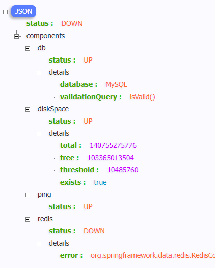

# 第一季：SpringBoot2基础入门

> [尚硅谷在线笔记](https://www.yuque.com/atguigu/springboot)

# Spring和SpringBoot

## 为什么使用SpringBoot

> - SpringBoot是整合Spring技术栈的一站式框架
> - SpringBoot是简化Spring技术栈的快速开发脚手架

## 时代背景

### 分布式的解决

> SpringBoot + SpringCloud

# SpringBoot2入门

## [在线开发文档](https://docs.spring.io/spring-boot/docs/2.7.0/reference/htmlsingle/)

## [中文文档](https://geekdoc.top/docs/languages/java/spring/spring-boot/2.5.5/reference/html/index.html)

## HelloWorld

### 引入依赖

```xml
    <parent>
        <groupId>org.springframework.boot</groupId>
        <artifactId>spring-boot-starter-parent</artifactId>
        <version>2.3.4.RELEASE</version>
    </parent>


    <dependencies>
        <dependency>
            <groupId>org.springframework.boot</groupId>
            <artifactId>spring-boot-starter-web</artifactId>
        </dependency>
    </dependencies>
```

### 创建主程序

```java
/
  主程序类
  @SpringBootApplication：这是一个SpringBoot应用
 /
@SpringBootApplication
public class MainApplication {
    public static void main(String[] args) {
        SpringApplication.run(MainApplication.class, args);
    }
}

```

### 编写业务

```java
@RestController
public class HelloController {

    @RequestMapping("/hello")
    public String hand01() {
        return "Hello World,Spring Boot 2!";
    }
}

```

### 测试

> 直接运行MainApplication类中的main方法

### 简化配置

> application.properties

```properties
# 配置端口号
server.port=8888
```

### 简化部署

> 把项目打成jar包，直接在目标服务器执行。

```xml
    <build>
        <plugins>
            <plugin>
                <groupId>org.springframework.boot</groupId>
                <artifactId>spring-boot-maven-plugin</artifactId>
            </plugin>
        </plugins>
    </build>
```

## 了解自动配置原理

### Spring Boot特别

#### 依赖管理

> - 父项目做依赖管理
>
>   - 不需要再指定版本号，版本号继承父项目依赖
>   - 几乎声明了所有开发中常用的依赖的版本号,自动版本仲裁机制
>
>   ```xml
>       <parent>
>           <groupId>org.springframework.boot</groupId>
>           <artifactId>spring-boot-starter-parent</artifactId>
>           <version>2.3.4.RELEASE</version>
>       </parent>
>   ```
>
> - 开发导入starter场景启动器
>
>   - 见到很多 spring-boot-starter- ： 就是某种场景
>
>   - 只要引入starter，这个场景的所有常规需要的依赖我们都自动引入
>
>   - [SpringBoot所有支持的场景](https://docs.spring.io/spring-boot/docs/current/reference/html/using-spring-boot.html#using-boot-starter)
>
>   - 见到的  -spring-boot-starter： 第三方为我们提供的简化开发的场景启动器。
>
>   - 所有场景启动器最底层的依赖
>
>     ```xml
>     <dependency>
>       <groupId>org.springframework.boot</groupId>
>       <artifactId>spring-boot-starter</artifactId>
>       <version>2.3.4.RELEASE</version>
>       <scope>compile</scope>
>     </dependency>
>     ```
>
> - 无需关注版本号，自动版本仲裁
>
>   - 引入依赖默认都可以不写版本
>   - 引入非版本仲裁的jar，要写版本号。
>
> - 可以修改默认版本号
>
>   ```xml
>       <properties>
>           <mysql.version>5.1.43</mysql.version>
>       </properties>
>   ```

#### 自动配置

> - 自动配好Tomcat
>
> - - 引入Tomcat依赖。
>   - 配置Tomcat
>
>   ```xml
>   	<dependency>
>            <groupId>org.springframework.boot</groupId>
>            <artifactId>spring-boot-starter-tomcat</artifactId>
>            <version>2.3.4.RELEASE</version>
>            <scope>compile</scope>
>      </dependency>
>   ```
>   
> - 自动配好SpringMVC
>
>    - 引入SpringMVC全套组件
>    - 自动配好SpringMVC常用组件（功能）
>
> - 自动配好Web常见功能，如：字符编码问题
>
>    - SpringBoot帮我们配置好了所有web开发的常见场景
>
> - 默认的包结构
>
>    - 主程序所在包及其下面的所有子包里面的组件都会被默认扫描进来
>
>    - 无需以前的包扫描配置
>
>    - 想要改变扫描路径，`@SpringBootApplication(scanBasePackages="com.atguigu")`或者`@ComponentScan`指定扫描路径
>
>      ```java
>      @SpringBootApplication
>      等同于
>      @SpringBootConfiguration
>      @EnableAutoConfiguration
>      @ComponentScan("com.atguigu.boot")
>      ```
>
> - 各种配置拥有默认值
>
>    - 默认配置最终都是映射到某个类上，如：MultipartProperties
>    - 配置文件的值最终会绑定每个类上，这个类会在容器中创建对象
>
> - 按需加载所有自动配置项
>
>    - 非常多的starter
>    - 引入了哪些场景这个场景的自动配置才会开启
>    - SpringBoot所有的自动配置功能都在 spring-boot-autoconfigure 包里面
>    - 
>
> - ......

### 容器功能

#### 组件添加

##### ~~xml文件~~

> 在之前的spring中，控制反转和依赖注入是通过xml文件配置

```xml
    <bean id="user" class="com.lz.boot.bean.User">
        <property name="name" value="lz"></property>
    </bean>
```

```java
    @Test
    public void demo() {
//        加载配置文件
        ApplicationContext context = new ClassPathXmlApplicationContext("bean.xml");
//        获取配置文件创建的对象
        User user = context.getBean("user", User.class);

        System.out.println(user);
    }
```

##### @Configuration、@Bean

>  * **配置类里面使用@Bean标注在方法上给容器注册组件，默认也是单实例的**
>  * 配置类本身也是组件
>  * **proxyBeanMethods：代理bean的方法**
>     *      **Full(proxyBeanMethods = true)【保证每个@Bean方法被调用多少次返回的组件都是单实例的】**
>     *      **Lite(proxyBeanMethods = false)【每个@Bean方法被调用多少次返回的组件都是新创建的】**
>     *      组件依赖必须使用Full模式默认。其他默认是否Lite模式

```java
@Configuration(proxyBeanMethods = false)//指定这是一个配置类 == 配置文件
public class MyConfig {

    @Bean//给容器中添加组件。以方法名作为组件的id。返回类型就是组件类型。返回的值，就是组件在容器中的实例
    public User user() {
        User lz = new User("lz");
        //lz.setCat(cat());//组件依赖
        return lz;
    }

    @Bean
    public Cat cat() {
        return new Cat("tomcat");
    }
}
```

##### @Component、@Controller、@Service、@Repository

> 通过注解实现创建对象，此处不再赘述。具体参见ssm中spring部分

##### @Import

> **@Import导入组件，给容器创建出这个组件的无参构造**

```java
/ 
  @Import({User.class, DBHelper.class})
       给容器中自动创建出这两个类型的组件、默认组件的名字就是全类名
 /

@Import({User.class, DBHelper.class}) // 通过@Import注解把User、DBHelper添加到IOC容器里面去
@Configuration(proxyBeanMethods = false) //告诉SpringBoot这是一个配置类 == 配置文件
public class MyConfig {
}
```

> 导入配置类
>
> @Import 是被用来整合所有在@Configuration注解中定义的bean配置。（应该是只能导入配置类）

```java
package com.yiibai.config;

import org.springframework.context.annotation.Configuration;
import org.springframework.context.annotation.Import;

@Configuration
@Import({ CustomerConfig.class, SchedulerConfig.class })
public class AppConfig {

}
```

> @Import 是被用来整合所有在@Configuration注解中定义的bean配置。

```xml
<beans xmlns="http://www.springframework.org/schema/beans"
    xmlns:xsi="http://www.w3.org/2001/XMLSchema-instance"
    xsi:schemaLocation="http://www.springframework.org/schema/beans
    http://www.springframework.org/schema/beans/spring-beans-2.5.xsd">
 
    <import resource="config/customer.xml"/>
    <import resource="config/scheduler.xml"/>
 
</beans>
```

##### @ImportResource

> **引入其他xml文件**

```xml
<?xml version="1.0" encoding="UTF-8"?>
<beans xmlns="http://www.springframework.org/schema/beans"
       xmlns:xsi="http://www.w3.org/2001/XMLSchema-instance"
       xsi:schemaLocation="http://www.springframework.org/schema/beans http://www.springframework.org/schema/beans/spring-beans.xsd">

    <bean id="user" class="com.lz.boot.bean.User">
        <property name="name" value="lz"></property>
    </bean>
    <bean id="cat" class="com.lz.boot.bean.Cat">
        <property name="name" value="tom"></property>
    </bean>
</beans>
```

```java
@ImportResource("classpath:spring.xml")//指定xml文件的位置
public class MyConfig {
}

```

```java
@SpringBootApplication
public class MainApplication {
    public static void main(String[] args) {
        ConfigurableApplicationContext run = SpringApplication.run(MainApplication.class, args);

        boolean cat = run.containsBean("cat");
        System.out.println("容器中cat组件："+cat);//true

        boolean user = run.containsBean("user");
        System.out.println("容器中user组件："+user);//true

    }
}
```

##### @Conditional

> **条件装配：满足Conditional指定的条件，则进行组件注入**


```java
@Configuration(proxyBeanMethods = false)
@ConditionalOnBean(name = "cat")//有名字为cat的组件再创建下面所有的组件
public class MyConfig {

    @ConditionalOnBean(name="cat01")//有名为cat01的组件，再创建user组件
    public User user() {
        User lz = new User("lz");
        //lz.setCat(cat());//组件依赖
        return lz;
    }

    @Bean
    public Cat cat() {
        return new Cat("tomcat");
    }
}

```

```java
@SpringBootApplication
public class MainApplication {
    public static void main(String[] args) {
        ConfigurableApplicationContext run = SpringApplication.run(MainApplication.class, args);

        boolean cat = run.containsBean("cat");
        System.out.println("容器中cat组件："+cat);//false

        boolean user = run.containsBean("user");
        System.out.println("容器中user组件："+user);//false

    }
}
```

#### 配置绑定 

> 使用Java读取到properties文件中的内容，并且把它封装到JavaBean中，以供随时使用；

```properties
mycar.brand = byd
mycar.price = 10000
```

##### @Component + @ConfigurationProperties

```java
/
  只有在容器中的组件，才会拥有SpringBoot提供的强大功能
 /
@Component
@ConfigurationProperties(prefix = "mycar")
public class Car {

    private String brand;
    private Integer price;

    public String getBrand() {
        return brand;
    }

    public void setBrand(String brand) {
        this.brand = brand;
    }

    public Integer getPrice() {
        return price;
    }

    public void setPrice(Integer price) {
        this.price = price;
    }

    @Override
    public String toString() {
        return "Car{" +
                "brand='" + brand + '\'' +
                ", price=" + price +
                '}';
    }
}
```

##### @EnableConfigurationProperties + @ConfigurationProperties

```java
@ConfigurationProperties(prefix = "mycar")
public class Car {

    private String brand;
    private Integer price;

    public String getBrand() {
        return brand;
    }

    public void setBrand(String brand) {
        this.brand = brand;
    }

    public Integer getPrice() {
        return price;
    }

    public void setPrice(Integer price) {
        this.price = price;
    }

    @Override
    public String toString() {
        return "Car{" +
                "brand='" + brand + '\'' +
                ", price=" + price +
                '}';
    }
}
```

```java
@EnableConfigurationProperties(Car.class)
//1、开启Car配置绑定功能
//2、把这个Car这个组件自动注册到容器中
public class MyConfig {
}
```

#### 自动配置原理入门

##### 引导加载自动配置类

```java
/**
 * 主程序类
 *
 * @SpringBootApplication：这是一个SpringBoot应用
 */
@SpringBootApplication
public class MainApplication {}

======================@SpringBootApplication========================
@SpringBootConfiguration//底层就是configuration，声明这是一个配置类
    
@EnableAutoConfiguration

@ComponentScan(excludeFilters = { @Filter(type = FilterType.CUSTOM, classes = TypeExcludeFilter.class),
		@Filter(type = FilterType.CUSTOM, classes = AutoConfigurationExcludeFilter.class) })//指定扫描哪些
public @interface SpringBootApplication{}

======================@EnableAutoConfiguration======================
@AutoConfigurationPackage//自动配置包，指定了默认的包规则
@Import(AutoConfigurationImportSelector.class)//Import还可以批量导入
public @interface EnableAutoConfiguration {}

======================@AutoConfigurationPackage======================
@Import(AutoConfigurationPackages.Registrar.class)  //给容器中导入一个组件
public @interface AutoConfigurationPackage {}

//利用Registrar给容器中导入一系列组件
//将指定的一个包下的所有组件导入进来？MainApplication 所在包下。

======================@Import(AutoConfigurationImportSelector.class)=====================
1、利用getAutoConfigurationEntry(annotationMetadata);给容器中批量导入一些组件
2、调用List<String> configurations = getCandidateConfigurations(annotationMetadata, attributes)获取到所有需要导入到容器中的配置类
3、利用工厂加载 Map<String, List<String>> loadSpringFactories(@Nullable ClassLoader classLoader)；得到所有的组件
4、从META-INF/spring.factories位置来加载一个文件。
	默认扫描我们当前系统里面所有META-INF/spring.factories位置的文件
 spring-boot-autoconfigure-2.3.4.RELEASE.jar包里面也有META-INF/spring.factories
 
```


```java
文件里面写死了spring-boot一启动就要给容器中加载的所有配置类（127个）
    
spring-boot-autoconfigure-2.3.4.RELEASE.jar/META-INF/spring.factories
# Auto Configure
org.springframework.boot.autoconfigure.EnableAutoConfiguration=\
org.springframework.boot.autoconfigure.admin.SpringApplicationAdminJmxAutoConfiguration,\
org.springframework.boot.autoconfigure.aop.AopAutoConfiguration,\
org.springframework.boot.autoconfigure.amqp.RabbitAutoConfiguration,\
org.springframework.boot.autoconfigure.batch.BatchAutoConfiguration,\
org.springframework.boot.autoconfigure.cache.CacheAutoConfiguration,\
org.springframework.boot.autoconfigure.cassandra.CassandraAutoConfiguration,\
org.springframework.boot.autoconfigure.context.ConfigurationPropertiesAutoConfiguration,\
org.springframework.boot.autoconfigure.context.LifecycleAutoConfiguration,\
org.springframework.boot.autoconfigure.context.MessageSourceAutoConfiguration,\
org.springframework.boot.autoconfigure.context.PropertyPlaceholderAutoConfiguration,\
org.springframework.boot.autoconfigure.couchbase.CouchbaseAutoConfiguration,\
org.springframework.boot.autoconfigure.dao.PersistenceExceptionTranslationAutoConfiguration,\
org.springframework.boot.autoconfigure.data.cassandra.CassandraDataAutoConfiguration,\
org.springframework.boot.autoconfigure.data.cassandra.CassandraReactiveDataAutoConfiguration,\
org.springframework.boot.autoconfigure.data.cassandra.CassandraReactiveRepositoriesAutoConfiguration,\
org.springframework.boot.autoconfigure.data.cassandra.CassandraRepositoriesAutoConfiguration,\
org.springframework.boot.autoconfigure.data.couchbase.CouchbaseDataAutoConfiguration,\
org.springframework.boot.autoconfigure.data.couchbase.CouchbaseReactiveDataAutoConfiguration,\
org.springframework.boot.autoconfigure.data.couchbase.CouchbaseReactiveRepositoriesAutoConfiguration,\
org.springframework.boot.autoconfigure.data.couchbase.CouchbaseRepositoriesAutoConfiguration,\
org.springframework.boot.autoconfigure.data.elasticsearch.ElasticsearchDataAutoConfiguration,\
org.springframework.boot.autoconfigure.data.elasticsearch.ElasticsearchRepositoriesAutoConfiguration,\
org.springframework.boot.autoconfigure.data.elasticsearch.ReactiveElasticsearchRepositoriesAutoConfiguration,\
org.springframework.boot.autoconfigure.data.elasticsearch.ReactiveElasticsearchRestClientAutoConfiguration,\
org.springframework.boot.autoconfigure.data.jdbc.JdbcRepositoriesAutoConfiguration,\
org.springframework.boot.autoconfigure.data.jpa.JpaRepositoriesAutoConfiguration,\
org.springframework.boot.autoconfigure.data.ldap.LdapRepositoriesAutoConfiguration,\
org.springframework.boot.autoconfigure.data.mongo.MongoDataAutoConfiguration,\
org.springframework.boot.autoconfigure.data.mongo.MongoReactiveDataAutoConfiguration,\
org.springframework.boot.autoconfigure.data.mongo.MongoReactiveRepositoriesAutoConfiguration,\
org.springframework.boot.autoconfigure.data.mongo.MongoRepositoriesAutoConfiguration,\
org.springframework.boot.autoconfigure.data.neo4j.Neo4jDataAutoConfiguration,\
org.springframework.boot.autoconfigure.data.neo4j.Neo4jRepositoriesAutoConfiguration,\
org.springframework.boot.autoconfigure.data.solr.SolrRepositoriesAutoConfiguration,\
org.springframework.boot.autoconfigure.data.r2dbc.R2dbcDataAutoConfiguration,\
org.springframework.boot.autoconfigure.data.r2dbc.R2dbcRepositoriesAutoConfiguration,\
org.springframework.boot.autoconfigure.data.r2dbc.R2dbcTransactionManagerAutoConfiguration,\
org.springframework.boot.autoconfigure.data.redis.RedisAutoConfiguration,\
org.springframework.boot.autoconfigure.data.redis.RedisReactiveAutoConfiguration,\
org.springframework.boot.autoconfigure.data.redis.RedisRepositoriesAutoConfiguration,\
org.springframework.boot.autoconfigure.data.rest.RepositoryRestMvcAutoConfiguration,\
org.springframework.boot.autoconfigure.data.web.SpringDataWebAutoConfiguration,\
org.springframework.boot.autoconfigure.elasticsearch.ElasticsearchRestClientAutoConfiguration,\
org.springframework.boot.autoconfigure.flyway.FlywayAutoConfiguration,\
org.springframework.boot.autoconfigure.freemarker.FreeMarkerAutoConfiguration,\
org.springframework.boot.autoconfigure.groovy.template.GroovyTemplateAutoConfiguration,\
org.springframework.boot.autoconfigure.gson.GsonAutoConfiguration,\
org.springframework.boot.autoconfigure.h2.H2ConsoleAutoConfiguration,\
org.springframework.boot.autoconfigure.hateoas.HypermediaAutoConfiguration,\
org.springframework.boot.autoconfigure.hazelcast.HazelcastAutoConfiguration,\
org.springframework.boot.autoconfigure.hazelcast.HazelcastJpaDependencyAutoConfiguration,\
org.springframework.boot.autoconfigure.http.HttpMessageConvertersAutoConfiguration,\
org.springframework.boot.autoconfigure.http.codec.CodecsAutoConfiguration,\
org.springframework.boot.autoconfigure.influx.InfluxDbAutoConfiguration,\
org.springframework.boot.autoconfigure.info.ProjectInfoAutoConfiguration,\
org.springframework.boot.autoconfigure.integration.IntegrationAutoConfiguration,\
org.springframework.boot.autoconfigure.jackson.JacksonAutoConfiguration,\
org.springframework.boot.autoconfigure.jdbc.DataSourceAutoConfiguration,\
org.springframework.boot.autoconfigure.jdbc.JdbcTemplateAutoConfiguration,\
org.springframework.boot.autoconfigure.jdbc.JndiDataSourceAutoConfiguration,\
org.springframework.boot.autoconfigure.jdbc.XADataSourceAutoConfiguration,\
org.springframework.boot.autoconfigure.jdbc.DataSourceTransactionManagerAutoConfiguration,\
org.springframework.boot.autoconfigure.jms.JmsAutoConfiguration,\
org.springframework.boot.autoconfigure.jmx.JmxAutoConfiguration,\
org.springframework.boot.autoconfigure.jms.JndiConnectionFactoryAutoConfiguration,\
org.springframework.boot.autoconfigure.jms.activemq.ActiveMQAutoConfiguration,\
org.springframework.boot.autoconfigure.jms.artemis.ArtemisAutoConfiguration,\
org.springframework.boot.autoconfigure.jersey.JerseyAutoConfiguration,\
org.springframework.boot.autoconfigure.jooq.JooqAutoConfiguration,\
org.springframework.boot.autoconfigure.jsonb.JsonbAutoConfiguration,\
org.springframework.boot.autoconfigure.kafka.KafkaAutoConfiguration,\
org.springframework.boot.autoconfigure.availability.ApplicationAvailabilityAutoConfiguration,\
org.springframework.boot.autoconfigure.ldap.embedded.EmbeddedLdapAutoConfiguration,\
org.springframework.boot.autoconfigure.ldap.LdapAutoConfiguration,\
org.springframework.boot.autoconfigure.liquibase.LiquibaseAutoConfiguration,\
org.springframework.boot.autoconfigure.mail.MailSenderAutoConfiguration,\
org.springframework.boot.autoconfigure.mail.MailSenderValidatorAutoConfiguration,\
org.springframework.boot.autoconfigure.mongo.embedded.EmbeddedMongoAutoConfiguration,\
org.springframework.boot.autoconfigure.mongo.MongoAutoConfiguration,\
org.springframework.boot.autoconfigure.mongo.MongoReactiveAutoConfiguration,\
org.springframework.boot.autoconfigure.mustache.MustacheAutoConfiguration,\
org.springframework.boot.autoconfigure.orm.jpa.HibernateJpaAutoConfiguration,\
org.springframework.boot.autoconfigure.quartz.QuartzAutoConfiguration,\
org.springframework.boot.autoconfigure.r2dbc.R2dbcAutoConfiguration,\
org.springframework.boot.autoconfigure.rsocket.RSocketMessagingAutoConfiguration,\
org.springframework.boot.autoconfigure.rsocket.RSocketRequesterAutoConfiguration,\
org.springframework.boot.autoconfigure.rsocket.RSocketServerAutoConfiguration,\
org.springframework.boot.autoconfigure.rsocket.RSocketStrategiesAutoConfiguration,\
org.springframework.boot.autoconfigure.security.servlet.SecurityAutoConfiguration,\
org.springframework.boot.autoconfigure.security.servlet.UserDetailsServiceAutoConfiguration,\
org.springframework.boot.autoconfigure.security.servlet.SecurityFilterAutoConfiguration,\
org.springframework.boot.autoconfigure.security.reactive.ReactiveSecurityAutoConfiguration,\
org.springframework.boot.autoconfigure.security.reactive.ReactiveUserDetailsServiceAutoConfiguration,\
org.springframework.boot.autoconfigure.security.rsocket.RSocketSecurityAutoConfiguration,\
org.springframework.boot.autoconfigure.security.saml2.Saml2RelyingPartyAutoConfiguration,\
org.springframework.boot.autoconfigure.sendgrid.SendGridAutoConfiguration,\
org.springframework.boot.autoconfigure.session.SessionAutoConfiguration,\
org.springframework.boot.autoconfigure.security.oauth2.client.servlet.OAuth2ClientAutoConfiguration,\
org.springframework.boot.autoconfigure.security.oauth2.client.reactive.ReactiveOAuth2ClientAutoConfiguration,\
org.springframework.boot.autoconfigure.security.oauth2.resource.servlet.OAuth2ResourceServerAutoConfiguration,\
org.springframework.boot.autoconfigure.security.oauth2.resource.reactive.ReactiveOAuth2ResourceServerAutoConfiguration,\
org.springframework.boot.autoconfigure.solr.SolrAutoConfiguration,\
org.springframework.boot.autoconfigure.task.TaskExecutionAutoConfiguration,\
org.springframework.boot.autoconfigure.task.TaskSchedulingAutoConfiguration,\
org.springframework.boot.autoconfigure.thymeleaf.ThymeleafAutoConfiguration,\
org.springframework.boot.autoconfigure.transaction.TransactionAutoConfiguration,\
org.springframework.boot.autoconfigure.transaction.jta.JtaAutoConfiguration,\
org.springframework.boot.autoconfigure.validation.ValidationAutoConfiguration,\
org.springframework.boot.autoconfigure.web.client.RestTemplateAutoConfiguration,\
org.springframework.boot.autoconfigure.web.embedded.EmbeddedWebServerFactoryCustomizerAutoConfiguration,\
org.springframework.boot.autoconfigure.web.reactive.HttpHandlerAutoConfiguration,\
org.springframework.boot.autoconfigure.web.reactive.ReactiveWebServerFactoryAutoConfiguration,\
org.springframework.boot.autoconfigure.web.reactive.WebFluxAutoConfiguration,\
org.springframework.boot.autoconfigure.web.reactive.error.ErrorWebFluxAutoConfiguration,\
org.springframework.boot.autoconfigure.web.reactive.function.client.ClientHttpConnectorAutoConfiguration,\
org.springframework.boot.autoconfigure.web.reactive.function.client.WebClientAutoConfiguration,\
org.springframework.boot.autoconfigure.web.servlet.DispatcherServletAutoConfiguration,\
org.springframework.boot.autoconfigure.web.servlet.ServletWebServerFactoryAutoConfiguration,\
org.springframework.boot.autoconfigure.web.servlet.error.ErrorMvcAutoConfiguration,\
org.springframework.boot.autoconfigure.web.servlet.HttpEncodingAutoConfiguration,\
org.springframework.boot.autoconfigure.web.servlet.MultipartAutoConfiguration,\
org.springframework.boot.autoconfigure.web.servlet.WebMvcAutoConfiguration,\
org.springframework.boot.autoconfigure.websocket.reactive.WebSocketReactiveAutoConfiguration,\
org.springframework.boot.autoconfigure.websocket.servlet.WebSocketServletAutoConfiguration,\
org.springframework.boot.autoconfigure.websocket.servlet.WebSocketMessagingAutoConfiguration,\
org.springframework.boot.autoconfigure.webservices.WebServicesAutoConfiguration,\
org.springframework.boot.autoconfigure.webservices.client.WebServiceTemplateAutoConfiguration
```

> 虽然，程序一启动就会加载所有配置类，但是并不是全部都会生效，需要按需开启自动配置项

##### 按需开启自动配置项

> - **虽然我们127个场景的所有自动配置启动的时候默认全部加载。**xxxxAutoConfiguration。**按照条件装配规则（@Conditional），最终会按需配置。**
> - springboot自动配置包
>   

###### 分析

> aop自动配置类

```java
package org.springframework.boot.autoconfigure.aop;

//import org.aspectj.weaver.Advice;// 默认是没有这个类的
import org.springframework.aop.config.AopConfigUtils;
import org.springframework.beans.factory.BeanFactory;
import org.springframework.beans.factory.support.BeanDefinitionRegistry;
import org.springframework.boot.autoconfigure.condition.ConditionalOnClass;
import org.springframework.boot.autoconfigure.condition.ConditionalOnMissingClass;
import org.springframework.boot.autoconfigure.condition.ConditionalOnProperty;
import org.springframework.context.annotation.Configuration;
import org.springframework.context.annotation.EnableAspectJAutoProxy;

//声明是一个配置类，保证每次调用都是新创建的
@Configuration(
    proxyBeanMethods = false
)
//当有配置文件中有spring.aop开头的配置，并且是spring.aop.auto,并且这个值为true，那么这个类就会生效。如果没有声明那么默认也是生效的
@ConditionalOnProperty(
    prefix = "spring.aop",
    name = {"auto"},
    havingValue = "true",
    matchIfMissing = true
)
public class AopAutoConfiguration {
    public AopAutoConfiguration() {}

    //声明是一个配置类，保证每次调用都是新创建的
    @Configuration(
        proxyBeanMethods = false
    )
    //当没有org.aspectj.weaver.Advice时，这个类生效
    @ConditionalOnMissingClass({"org.aspectj.weaver.Advice"})
    //当有配置文件中有spring.aop开头的配置，并且是spring.aop.proxy-target-class,并且这个值为true，那么这个类就会生效。如果没有声明那么默认也是生效的
    @ConditionalOnProperty(
        prefix = "spring.aop",
        name = {"proxy-target-class"},
        havingValue = "true",
        matchIfMissing = true
    )
    static class ClassProxyingConfiguration {...}

    @Configuration(
        proxyBeanMethods = false
    )
    //当有Adivice.class时，这个类生效
    @ConditionalOnClass({Advice.class})
    static class AspectJAutoProxyingConfiguration {
        AspectJAutoProxyingConfiguration() {
        }

        @Configuration(
            proxyBeanMethods = false
        )
        @EnableAspectJAutoProxy(
            proxyTargetClass = true
        )
        @ConditionalOnProperty(
            prefix = "spring.aop",
            name = {"proxy-target-class"},
            havingValue = "true",
            matchIfMissing = true
        )
        static class CglibAutoProxyConfiguration {
            CglibAutoProxyConfiguration() {
            }
        }

        @Configuration(
            proxyBeanMethods = false
        )
        @EnableAspectJAutoProxy(
            proxyTargetClass = false
        )
        @ConditionalOnProperty(
            prefix = "spring.aop",
            name = {"proxy-target-class"},
            havingValue = "false",
            matchIfMissing = false
        )
        static class JdkDynamicAutoProxyConfiguration {
            JdkDynamicAutoProxyConfiguration() {
            }
        }
    }
}
```

##### 修改默认配置

```java
@Bean
@ConditionalOnBean(MultipartResolver.class)  //容器中有这个类型组件
@ConditionalOnMissingBean(name = DispatcherServlet.MULTIPART_RESOLVER_BEAN_NAME) //容器中没有这个名字 multipartResolver 的组件
public MultipartResolver multipartResolver(MultipartResolver resolver) {
    //给@Bean标注的方法传入了对象参数，这个参数的值就会从容器中找。
    //SpringMVC multipartResolver。防止有些用户配置的文件上传解析器不符合规范
    // Detect if the user has created a MultipartResolver but named it incorrectly
    return resolver;
}
给容器中加入了文件上传解析器；
```

> SpringBoot默认会在底层配好所有的组件。但是如果用户自己配置了以用户的优先
>    
> ```java
> 	@Bean
> 	@ConditionalOnMissingBean
>    	public CharacterEncodingFilter characterEncodingFilter() {
>     }
> ```

##### 总结

> - **SpringBoot先加载所有的自动配置类  xxxxxAutoConfiguration**
> - **每个自动配置类按照条件进行生效，默认都会绑定配置文件指定的值。xxxxProperties里面拿。xxxProperties和配置文件进行了绑定**
> - **生效的配置类就会给容器中装配很多组件。只要容器中有这些组件，相当于这些功能就有了**
> - **定制化配置**
>- **用户直接自己@Bean替换底层的组件**
>   - **用户去看这个组件是获取的配置文件什么值就去修改。**
> 
>xxxxxAutoConfiguration ---> 组件  ---> xxxxProperties里面拿值  ----> application.properties

##### 最佳实践

> - 引入场景依赖
>
>   - [spring boot告诉了有哪些场景依赖](https://docs.spring.io/spring-boot/docs/current/reference/html/using-spring-boot.html#using-boot-starter)
>   - 第三方
>
> - 查看自动配置了哪些（选做）
>
>   - 自己分析，引入场景对应的自动配置一般都生效了
>   - 配置文件中debug=true开启自动配置报告。Negative（不生效）\Positive（生效）
>
> - 是否需要修改
>
>   - 参照文档修改配置项
>
>     - https://docs.spring.io/spring-boot/docs/current/reference/html/appendix-application-properties.html#common-application-properties
>   - 自己分析。xxxxProperties绑定了配置文件的哪些。
>
>   - 自定义加入或者替换组件
>
>     - @Bean、@Component。。。
>   - 自定义器  XXXXXCustomizer；
>
>   - ......


## 开发小技巧

### Lomback

> 简化JavaBean开发

#### 引入依赖

```xml
        <dependency>
            <groupId>org.projectlombok</groupId>
            <artifactId>lombok</artifactId>
        </dependency>
```

#### 使用

```java
===============================简化JavaBean开发===================================
@NoArgsConstructor
//@AllArgsConstructor
@Data
@ToString
@EqualsAndHashCode
public class User {

    private String name;
    private Integer age;

    private Pet pet;

    public User(String name,Integer age){
        this.name = name;
        this.age = age;
    }


}


================================简化日志开发===================================
@Slf4j
@RestController
public class HelloController {
    @RequestMapping("/hello")
    public String handle01(@RequestParam("name") String name){
        
        log.info("请求进来了....");
        
        return "Hello, Spring Boot 2!"+"你好："+name;
    }
}
```

### dev-tools

> 热加载项目或者页面修改以后：**Ctrl+F9**；

```xml
        <dependency>
            <groupId>org.springframework.boot</groupId>
            <artifactId>spring-boot-devtools</artifactId>
            <optional>true</optional>
        </dependency>
```

### Spring Initailizr（项目初始化向导）


> 选择我们需要的开发场景


> 自动依赖引入


> 自动创建项目结构


> 自动编写好主配置类


# 第一季：SpringBoot2核心技术

## 配置文件

### 文件类型 

#### properties 

> 同以前的properties用法

#### yaml 

> 非常适合用来做以数据为中心的配置文件

##### 基本语法 

> - key: value；kv之间有空格
> - 大小写敏感
> - 使用缩进表示层级关系
> - 缩进不允许使用tab，只允许空格
> - 缩进的空格数不重要，只要相同层级的元素左对齐即可
> - '#'表示注释
> - 字符串无需加引号，如果要加，**' ' 与 " "表示字符串内容 会被 转义/不转义**

##### 数据类型 

> - 字面量：单个的、不可再分的值。date、boolean、string、number、null
>
>   ```
>   k: v
>   ```
>
> - 对象：键值对的集合。map、hash、set、object 
>
>   ```
>   行内写法：  k: {k1:v1,k2:v2,k3:v3}
>   #或
>   k: 
>     k1: v1
>     k2: v2
>     k3: v3
>   ```
>
> - 数组：一组按次序排列的值。array、list、queue
>
>   ```
>   行内写法：  k: [v1,v2,v3]
>   #或者
>   k:
>    - v1
>    - v2
>    - v3
>   ```

#### 示例

```java
@Data
public class Person {
	
	private String userName;
	private Boolean boss;
	private Date birth;
	private Integer age;
	private Pet pet;
	private String[] interests;
	private List<String> animal;
	private Map<String, Object> score;
	private Set<Double> salarys;
	private Map<String, List<Pet>> allPets;
}

@Data
public class Pet {
	private String name;
	private Double weight;
}
```

```yml
person:
  userName: LZ
  boss: true
  birth: 2000/04/18
  age: 22
  #  interests: [吃,喝,玩,乐]
  interests:
    - 吃
    - 喝
    - 玩
    - 乐
  #  animal: [阿狗,阿猫]
  animal:
    - 阿狗
    - 阿猫
  #  score: {math:100,english:100}
  score:
    math: 100
    english: 100
  #  salarys: [10w,20w]
  salarys:
    - 100000.00
    - 200000.00
  pet:
    name: tomcat
    weight: 29.99
  #  allPets: {sick:[{name: 阿猫,weight: 29.99}],health: [{name: 阿狗,weight: 47}]}
  allPets:
    sick:
      - name: 阿猫
        weight: 29.99
    health: [{name: 阿狗,weight: 47}]
```

#### 配置提示

> **自定义的类和配置文件绑定一般没有提示。加上这个依赖，运行一下就有提示了。**

```xml
        <dependency>
            <groupId>org.springframework.boot</groupId>
            <artifactId>spring-boot-configuration-processor</artifactId>
            <optional>true</optional>
        </dependency>


	<build>
        <plugins>
            <plugin>
                <groupId>org.springframework.boot</groupId>
                <artifactId>spring-boot-maven-plugin</artifactId>
                <configuration>
                    <!--设置打包时不将此依赖放入包内-->
                    <excludes>
                        <exclude>
                            <groupId>org.springframework.boot</groupId>
                            <artifactId>spring-boot-configuration-processor</artifactId>
                        </exclude>
                    </excludes>
                </configuration>
            </plugin>
        </plugins>
    </build>
```

## Web开发

> 就是[spring mvc部分](./ssm.md)
>
> 定制web部分，就要写一个配置类实现WebMvcConfigurer接口

### 简单功能分析

#### 静态资源访问

##### 静态资源目录


> - 只要**静态资源放在类路径下： `/static` (or `/public` or `/resources` or `/META-INF/resources`**
>   - 访问 ： 当前项目根路径/ + 静态资源名 
>   - 原理： 静态映射/。
>   - 请求进来，先去找Controller看能不能处理。不能处理的所有请求又都交给静态资源处理器。静态资源也找不到则响应404页面
>
> - **改变默认的静态资源路径**
>
>   - 就要把静态资源放在resource/haha路径下
>
>   ```yml
>   spring:
>     web:
>       resources:
>         static-locations: classpath:/haha/
>   ```

##### 静态资源访问前缀

> - **默认无前缀**
> - 当前项目 + static-path-pattern + 静态资源名 = 静态资源文件夹下找
> - **注意：当设置上这个之后，所有的静态资源访问路径中都需要写前缀，那么设置欢迎页时，自定义favicon时都需要前缀，有一定的局限性。**

```yaml
spring:
  # 改变默认的静态资源路径
  web:
    resources:
      static-locations: classpath:/haha/

  # 设置静态资源访问前缀
  mvc:
    static-path-pattern: /res/
```

##### [webjars](https://www.webjars.org/)

> - **WebJars是将客户端（浏览器）资源（JavaScript，css等）打成jar包文件，以对资源进行统一依赖管理。WebJars的jar包部署在Maven中央仓库上。**
>
> - ```xml
>   <dependency>
>       <groupId>org.webjars</groupId>
>       <artifactId>jquery</artifactId>
>       <version>3.5.1</version>
>   </dependency>
>   ```
>
> - 访问地址：[http://localhost:8080/webjars/jquery/3.5.1/jquery.js](http://localhost:8080/webjars/jquery/3.5.1/jquery.js)   后面地址要按照依赖里面的包路径

#### 欢迎页支持

> - **静态资源路径下  index.html**
>
>   - 可以配置静态资源路径
>
>   - 但是**不可以配置静态资源的访问前缀。否则导致 index.html不能被默认访问**
>
>     ```yml
>     spring:
>     #  mvc:
>     #    static-path-pattern: /res/   #这个会导致welcome page功能失效
>     ```
>
> - controller能处理/index
>
>   - controller中配置@RequestMapping("/") return 返回的页面为欢迎页。
>   - 注意的是需要引入thymeleaf依赖

#### 自定义 `Favicon`

> **favicon.ico 放在静态资源目录下即可。**

```yaml
spring:
#  mvc:
#    static-path-pattern: /res/   这个会导致 Favicon 功能失效
```

#### [静态资源配置原理](https://www.yuque.com/atguigu/springboot/vgzmgh#oD5QR)

### 请求参数处理

#### 请求映射

##### rest使用与原理

> - Rest风格支持（使用HTTP请求方式动词来表示对资源的操作）
>
>   - 核心Filter；HiddenHttpMethodFilter
>
>   - **用法： 表单method=post，隐藏域 _method=put**
>
>     ```html
>     <form action="/person" th:action="@{/person}" method="post">
>         <input type="hidden" name="_method" value="delete">
>         <input type="submit" value="delete">
>     </form>
>     
>     <form action="/person" th:action="@{/person}" method="post">
>         <input type="hidden" value="put" name="_method">
>         <input type="submit" value="put">
>     </form>
>     ```
>
>   - **SpringBoot中手动开启**
>
>     ```yml
>     spring:
>       mvc:
>         hiddenmethod:
>           filter:
>             enabled: true
>     ```
>
> - 扩展：如何把_method 这个名字换成我们自己喜欢的。
>
>   - 配置实现WebMvcConfigurer接口，重写里面的方法

> Rest原理（表单提交要使用REST的时候）
>
> - 表单提交会带上**_method=PUT**
> - **请求过来被**HiddenHttpMethodFilter拦截
>
> - - 请求是否正常，并且是POST
>
> - - - 获取到**_method**的值。
>     - 兼容以下请求；**PUT**.**DELETE**.**PATCH**
>     - **原生request（post），包装模式requesWrapper重写了getMethod方法，返回的是传入的值。**
>     - **过滤器链放行的时候用wrapper。以后的方法调用getMethod是调用requesWrapper的。**
>
> 
>
> **Rest使用客户端工具，**
>
> - 如PostMan直接发送Put、delete等方式请求，无需Filter。

##### [请求映射原理](https://www.yuque.com/atguigu/springboot/vgzmgh#o38N4)

#### 普通参数与基本注解

##### 注解

> @PathVariable、@RequestHeader、@RequestParam、@CookieValue、@RequestBody、
> @RequestAttribute、@ModelAttribute、@MatrixVariable

```java

    @GetMapping("/car/{id}/owner/{username}")
    public Map getParams(@PathVariable("id") Integer id,
                         @PathVariable("username") String name,
                         //可以将所有的参数放入一个map集合{"pv":{"id":"1","username":"lz"}}
                         @PathVariable Map<String, Object> pv,
                         @RequestHeader("Accept") String accept,
                         //可以将所有的请求头放入一个map集合
                         @RequestHeader Map<String, Object> headers,
                         @RequestParam("age") Integer age,
                         @RequestParam("hobby") List<String> hobby,
                         //可以将所有的请请求参数放入一个map集合
                         @RequestParam Map<String, Object> params,
                         @CookieValue("_ga") String _ga,
                         //获取cookie放入cookie实体
                         @CookieValue("_ga") Cookie cookie) {
        HashMap<String, Object> map = new HashMap<>();
//        map.put("id", id);
//        map.put("name", name);
//        map.put("pv", pv);
//        map.put("accept", accept);
//        map.put("headers", headers);
//        map.put("age", age);
//        map.put("hoddy", hobby);
//        map.put("params", params);
        map.put("_ga", _ga);
        map.put("cookie", cookie);

        return map;

    }

=========================================================================================
    @RequestMapping("/togo")
    public String toGoPage(HttpServletRequest request) {
        request.setAttribute("msg", "成功了。。。");
        return "forward:/success";

    }

    @RequestMapping("/success")
    @ResponseBody
    public Map<String, Object> getMsg(HttpServletRequest request,
                                      @RequestAttribute("msg") String msg) {
        Object msg1 = request.getAttribute("msg");
        HashMap<String, Object> map = new HashMap<>();
        map.put("msg", msg);
        map.put("msg1", msg1);
        return map;
    }
```

###### 矩阵变量

> - **语法： 请求路径：/cars/sell;low=34;brand=byd,audi,yd**
>
> - **SpringBoot默认是禁用了矩阵变量的功能**
>
>   - 手动开启：原理。对于路径的处理。UrlPathHelper进行解析。
>
>   - removeSemicolonContent（移除分号内容）支持矩阵变量的
>
>     ```java
>     
>     @Configuration
>     public class MyConfig implements WebMvcConfigurer {
>     
>         //方式一
>         /*@Bean
>         public WebMvcConfigurer WebMvcConfigurer() {
>     
>             return new WebMvcConfigurer() {
>                 @Override
>                 public void configurePathMatch(PathMatchConfigurer configurer) {
>                     UrlPathHelper urlPathHelper = new UrlPathHelper();
>                     urlPathHelper.setRemoveSemicolonContent(false);
>                     configurer.setUrlPathHelper(urlPathHelper);
>                 }
>             };
>         }*/
>     
>     
>         //方式二
>         @Override
>         public void configurePathMatch(PathMatchConfigurer configurer) {
>             UrlPathHelper urlPathHelper = new UrlPathHelper();
>             urlPathHelper.setRemoveSemicolonContent(false);
>             configurer.setUrlPathHelper(urlPathHelper);
>         }
>     }
>     
>     ```
>
> - 矩阵变量必须有url路径变量才能被解析

```html
<a href="/cars/sell;low=34;brand=byd,audi,yd">矩阵变量</a><br>
<a href="/boos/1;age=40/2;age=50">矩阵变量</a><br>
```

```java
    //    /cars/sell;low=34;brand=byd,audi,yd
    @RequestMapping("/cars/{path}")
    public Map<String, Object> getMatrixVariable(@MatrixVariable("low") String low,
                                                 @MatrixVariable("brand") List<String> brand,
                                                 @PathVariable("path") String path) {
        HashMap<String, Object> map = new HashMap<>();
        map.put("low", low);
        map.put("brand", brand);
        map.put("path", path);

        System.out.println("path = " + path);//path = sell

        return map;//{"path":"sell","low":"34","brand":["byd","audi","yd"]}
    }


    //   /boos/1;age=40/2;age=50
    @RequestMapping("/boos/{oneAge}/{twoAge}")
    public Map getMatrixVariable(@MatrixVariable(value = "age", pathVar = "oneAge") Integer age1,
                                 @MatrixVariable(value = "age", pathVar = "twoAge") Integer age2,
                                 @PathVariable("oneAge") String oneAge,
                                 @PathVariable("twoAge") String twoAge) {

        HashMap<String, Object> map = new HashMap<>();
        map.put("age1", age1);
        map.put("age2", age2);
        map.put("oneAge", oneAge);
        map.put("twoAge", twoAge);

        System.out.println("oneAge = " + oneAge);//oneAge = 1
        System.out.println("twoAge = " + twoAge);//twoAge = 2

        return map;//{"twoAge":"2","age2":50,"age1":40,"oneAge":"1"}
    }
```

##### [Servlet API](https://www.yuque.com/atguigu/springboot/vgzmgh#J5q9C)

##### 复杂参数

> **Map**、**Model（map、model里面的数据会被放在request的请求域  request.setAttribute）、**Errors/BindingResult、**RedirectAttributes（ 重定向携带数据）**、**ServletResponse（response）**、SessionStatus、UriComponentsBuilder、ServletUriComponentsBuilder

```JAVA
    @RequestMapping("/params")
    public String params(Model model, Map<String, Object> map, ModelMap mm) {
        model.addAttribute("model", "model");
        map.put("map", "map");
        mm.addAttribute("mm", "mm");

        return "forward:/success";
    }


    @RequestMapping("/success")
    @ResponseBody
    public Map<String, Object> getMsg(HttpServletRequest request) {
        HashMap<String, Object> map = new HashMap<>();

        Object model = request.getAttribute("model");
        Object map1 = request.getAttribute("map");
        Object mm = request.getAttribute("mm");


        map.put("model", model);
        map.put("map1", map1);
        map.put("mm", mm);

        return map;//{"mm":"mm","map1":"map","model":"model"}
    }

```

##### 自定义对象参数：

> - **可以自动类型转换与格式化，可以级联封装。**
> - 数据绑定:页面提交的请求数据(GET、POST）都可以和对象属性进行绑定

```JAVA
/**
 *     姓名： <input name="userName"/> <br/>
 *     年龄： <input name="age"/> <br/>
 *     生日： <input name="birth"/> <br/>
 *     宠物姓名：<input name="pet.name"/><br/>
 *     宠物年龄：<input name="pet.age"/>
 */
@Data
public class Person {
    
    private String userName;
    private Integer age;
    private Date birth;
    private Pet pet;
    
}

@Data
public class Pet {

    private String name;
    private String age;

}
```

#### [POJO封装过程](https://www.yuque.com/atguigu/springboot/vgzmgh#lRjLb)

#### [参数处理原理](https://www.yuque.com/atguigu/springboot/vgzmgh#6SNoJ)

### 数据响应与内容协商


#### 响应JSON

> **引入web-start依赖自动导入json依赖**


##### [返回值解析器及原理](https://www.yuque.com/atguigu/springboot/vgzmgh#y3QI0)

##### SpringMVC到底支持哪些返回值

```
ModelAndView
Model
View
ResponseEntity 
ResponseBodyEmitter
StreamingResponseBody
HttpEntity
HttpHeaders
Callable
DeferredResult
ListenableFuture
CompletionStage
WebAsyncTask
有 @ModelAttribute 且为对象类型的
@ResponseBody 注解 ---> RequestResponseBodyMethodProcessor；


```

##### [HTTPMessageConverter原理](https://www.yuque.com/atguigu/springboot/vgzmgh#Nf4qt)

#### 内容协商

> **根据客户端接收能力不同，返回不同媒体类型的数据。**

##### 引入xml依赖

```xml
 <dependency>
     <groupId>com.fasterxml.jackson.dataformat</groupId>
     <artifactId>jackson-dataformat-xml</artifactId>
</dependency>
```

##### postman分别测试返回json和xml

> 只需要改变请求头中Accept字段。Http协议中规定的，告诉服务器本客户端可以接收的数据类型。


##### 开启浏览器参数方式内容协商功能

> **为了方便内容协商，开启基于请求参数的内容协商功能。**

```yml
spring:
    contentnegotiation:
      favor-parameter: true  #开启请求参数内容协商模式
```

```java
package com.lz.boot.converter;

import com.lz.boot.pojo.Person;
import org.springframework.http.HttpInputMessage;
import org.springframework.http.HttpOutputMessage;
import org.springframework.http.MediaType;
import org.springframework.http.converter.HttpMessageConverter;
import org.springframework.http.converter.HttpMessageNotReadableException;
import org.springframework.http.converter.HttpMessageNotWritableException;

import java.io.IOException;
import java.io.OutputStream;
import java.util.List;

/**
 * 自定义的Converter
 */
public class GuiguMessageConverter implements HttpMessageConverter<Person> {

    @Override
    public boolean canRead(Class<?> clazz, MediaType mediaType) {
        return false;
    }

    @Override
    public boolean canWrite(Class<?> clazz, MediaType mediaType) {
        return clazz.isAssignableFrom(Person.class);
    }

    /**
     * 服务器要统计所有MessageConverter都能写出哪些内容类型
     *
     * application/x-guigu
     * @return
     */
    @Override
    public List<MediaType> getSupportedMediaTypes() {
        return MediaType.parseMediaTypes("application/x-guigu");
    }

    @Override
    public Person read(Class<? extends Person> clazz, HttpInputMessage inputMessage) throws IOException, HttpMessageNotReadableException {
        return null;
    }

    @Override
    public void write(Person person, MediaType contentType, HttpOutputMessage outputMessage) throws IOException, HttpMessageNotWritableException {
        //自定义协议数据的写出
        String data = person.getUserName()+";"+person.getAge()+";"+person.getBirth();


        //写出去
        OutputStream body = outputMessage.getBody();
        body.write(data.getBytes());
    }
}

```

```java
package com.lz.boot.config;

import com.lz.boot.converter.GuiguMessageConverter;
import org.springframework.context.annotation.Configuration;
import org.springframework.http.MediaType;
import org.springframework.http.converter.HttpMessageConverter;
import org.springframework.web.accept.HeaderContentNegotiationStrategy;
import org.springframework.web.accept.ParameterContentNegotiationStrategy;
import org.springframework.web.servlet.config.annotation.ContentNegotiationConfigurer;
import org.springframework.web.servlet.config.annotation.PathMatchConfigurer;
import org.springframework.web.servlet.config.annotation.WebMvcConfigurer;
import org.springframework.web.util.UrlPathHelper;

import java.util.Arrays;
import java.util.HashMap;
import java.util.List;
import java.util.Map;

@Configuration
public class MyConfig implements WebMvcConfigurer{

    /**
     * 自定义内容协商策略
     * @param configurer
     */
    @Override
    public void configureContentNegotiation(ContentNegotiationConfigurer configurer) {
        //Map<String, MediaType> mediaTypes
        Map<String, MediaType> mediaTypes = new HashMap<>();
        mediaTypes.put("json", MediaType.APPLICATION_JSON);
        mediaTypes.put("xml",MediaType.APPLICATION_XML);
        mediaTypes.put("gg",MediaType.parseMediaType("application/x-guigu"));
        //指定支持解析哪些参数对应的哪些媒体类型
        ParameterContentNegotiationStrategy parameterStrategy = new ParameterContentNegotiationStrategy(mediaTypes);
//                parameterStrategy.setParameterName("ff");

        //指定支持解析哪些请求头对应的哪些媒体类型
        HeaderContentNegotiationStrategy headeStrategy = new HeaderContentNegotiationStrategy();

        configurer.strategies(Arrays.asList(parameterStrategy,headeStrategy));
    }


    @Override
    public void extendMessageConverters(List<HttpMessageConverter<?>> converters) {
        converters.add(new GuiguMessageConverter());
    }
}

```


##### [内容协商原理](https://www.yuque.com/atguigu/springboot/vgzmgh#WJhZB)

##### [自定义 MessageConverter](https://www.yuque.com/atguigu/springboot/vgzmgh#5p9bU)

> - **实现多协议数据兼容。json、xml、x-guigu**
> - **@ResponseBody 响应数据出去 调用 **RequestResponseBodyMethodProcessor** 处理
> - Processor 处理方法返回值。通过 **MessageConverter** 处理
> - 所有 **MessageConverter** 合起来可以支持各种媒体类型数据的操作（读、写）
> - 内容协商找到最终的 **messageConverter**；
>
> 
>
> SpringMVC的什么功能。一个入口给容器中添加一个  WebMvcConfigurer

```java

/**
 * 自定义的Converter
 */
public class GuiguMessageConverter implements HttpMessageConverter<Person> {

    @Override
    public boolean canRead(Class<?> clazz, MediaType mediaType) {
        return false;
    }

    @Override
    public boolean canWrite(Class<?> clazz, MediaType mediaType) {
        return clazz.isAssignableFrom(Person.class);
    }

    /**
     * 服务器要统计所有MessageConverter都能写出哪些内容类型
     *
     * application/x-guigu
     * @return
     */
    @Override
    public List<MediaType> getSupportedMediaTypes() {
        return MediaType.parseMediaTypes("application/x-guigu");
    }

    @Override
    public Person read(Class<? extends Person> clazz, HttpInputMessage inputMessage) throws IOException, HttpMessageNotReadableException {
        return null;
    }

    @Override
    public void write(Person person, MediaType contentType, HttpOutputMessage outputMessage) throws IOException, HttpMessageNotWritableException {
        //自定义协议数据的写出
        String data = person.getUserName()+";"+person.getAge()+";"+person.getBirth();


        //写出去
        OutputStream body = outputMessage.getBody();
        body.write(data.getBytes());
    }
}

```

```java
package com.lz.boot.config;

import com.lz.boot.converter.GuiguMessageConverter;
import org.springframework.context.annotation.Configuration;
import org.springframework.http.converter.HttpMessageConverter;
import org.springframework.web.servlet.config.annotation.PathMatchConfigurer;
import org.springframework.web.servlet.config.annotation.WebMvcConfigurer;
import org.springframework.web.util.UrlPathHelper;

import java.util.List;

@Configuration
public class MyConfig implements WebMvcConfigurer{

    @Override
    public void extendMessageConverters(List<HttpMessageConverter<?>> converters) {
        converters.add(new GuiguMessageConverter());
    }
}

```

### 视图解析与模板引擎

#### 模板引擎-[Thymeleaf](https://www.thymeleaf.org/doc/tutorials/3.0/usingthymeleaf.html#introducing-thymeleaf)

##### 基本语法

###### 表达式

| 表达式名字 | 语法   | 用途                               |
| ---------- | ------ | ---------------------------------- |
| 变量取值   | ${...} | 获取请求域、session域、对象等值    |
| 选择变量   | *{...} | 获取上下文对象值                   |
| 消息       | #{...} | 获取国际化等值                     |
| 链接       | @{...} | 生成链接                           |
| 片段表达式 | ~{...} | jsp:include 作用，引入公共页面片段 |

###### 字面量 

> 文本值: 'one text' , 'Another one!' ,…数字: 0 , 34 , 3.0 , 12.3 ,…布尔值: true , false
>
> 空值: null
>
> 变量： one，two，.... 变量不能有空格

###### 文本操作 

> 字符串拼接: +
>
> 变量替换: |The name is ${name}| 

###### 数学运算 

> 运算符: + , - , * , / , %

###### 布尔运算 

> 运算符:  and , or
>
> 一元运算: ! , not 

###### 比较运算 

> 比较: > , < , >= , <= ( gt , lt , ge , le )等式: == , != ( eq , ne ) 
>

###### 条件运算 

> If-then: (if) ? (then)
>
> If-then-else: (if) ? (then) : (else)
>
> Default: (value) ?: (defaultvalue) 

###### 特殊操作 

> 无操作： _

###### 设置属性值-th:attr 

> 设置单个值
>
> ```html
> <form action="subscribe.html" th:attr="action=@{/subscribe}">
>       <fieldset>
>             <input type="text" name="email" />
>             <input type="submit" value="Subscribe!" th:attr="value=#{subscribe.submit}"/>
>       </fieldset>
> </form>
> ```

> 设置多个值
>
> ```html
> 
> ```

> 以上两个写法的代替写法
>
> ```html
> <input type="submit" value="Subscribe!" th:value="#{subscribe.submit}"/>
> <form action="subscribe.html" th:action="@{/subscribe}">
> ```

###### 迭代

```html
<tr th:each="prod : ${prods}">
    <td th:text="${prod.name}">Onions</td>
    <td th:text="${prod.price}">2.41</td>
    <td th:text="${prod.inStock}? #{true} : #{false}">yes</td>
</tr>
```

```html
<tr th:each="prod,iterStat : ${prods}" th:class="${iterStat.odd}? 'odd'">
    <td th:text="${prod.name}">Onions</td>
    <td th:text="${prod.price}">2.41</td>
    <td th:text="${prod.inStock}? #{true} : #{false}">yes</td>
</tr>
```

###### 条件运算

```html
<a href="comments.html"
th:href="@{/product/comments(prodId=${prod.id})}"
th:if="${not #lists.isEmpty(prod.comments)}">view</a>
```

```html
<div th:switch="${user.role}">
  <p th:case="'admin'">User is an administrator</p>
  <p th:case="#{roles.manager}">User is a manager</p>
  <p th:case="*">User is some other thing</p>
</div>
```

###### 抽取公共片段

> 抽取公共片段`footer.html`
>
> ```html
> <footer th:fragment="copy">
>   &copy; 2011 The Good Thymes Virtual Grocery
> </footer>
> ```

> 引入片段的三种方式
>
> ```html
> <body>
> 
>   ...
> 
>   <div th:insert="footer :: copy"></div>
> 
>   <div th:replace="footer :: copy"></div>
> 
>   <div th:include="footer :: copy"></div>
>   
> </body>
> ```

> 浏览器执行完成的源代码
>
> ```html
> <body>
> 
>   ...
> 
>   <div>
>     <footer>
>       &copy; 2011 The Good Thymes Virtual Grocery
>     </footer>
>   </div>
> 
>   <footer>
>     &copy; 2011 The Good Thymes Virtual Grocery
>   </footer>
> 
>   <div>
>     &copy; 2011 The Good Thymes Virtual Grocery
>   </div>
>   
> </body>
> ```

> 还可以使用id属性
>
> 抽取公共片段`common.html`
>
> ```html
> <div id="left" class="left-side sticky-left-side">
> </div>
> ```
>
> 引入片段
>
> ```html
> <div th:replace="common::#left"></div>
> ```

##### thymeleaf使用

###### 引入Starter

```xml
        <dependency>
            <groupId>org.springframework.boot</groupId>
            <artifactId>spring-boot-starter-thymeleaf</artifactId>
        </dependency>
```

###### 自动配置好了thymeleaf

```java
@Configuration(proxyBeanMethods = false)
@EnableConfigurationProperties(ThymeleafProperties.class)
@ConditionalOnClass({ TemplateMode.class, SpringTemplateEngine.class })
@AutoConfigureAfter({ WebMvcAutoConfiguration.class, WebFluxAutoConfiguration.class })
public class ThymeleafAutoConfiguration { }
```

```java
	public static final String DEFAULT_PREFIX = "classpath:/templates/";

	public static final String DEFAULT_SUFFIX = ".html";  //xxx.html
```

###### 页面开发

```html
<body>
    <h2 th:text="${msg}">哈哈</h2>
    <a th:href="${link}">去百度</a>
</body>
```

### 拦截器

> **实现HandlerInterceptor接口**

```java
package com.lz.admin.interceptor;

import org.springframework.web.servlet.HandlerInterceptor;
import org.springframework.web.servlet.ModelAndView;

import javax.servlet.http.HttpServletRequest;
import javax.servlet.http.HttpServletResponse;

public class LoginInterceptor implements HandlerInterceptor {

    @Override
    public boolean preHandle(HttpServletRequest request, HttpServletResponse response, Object handler) throws Exception {
        if (request.getSession().getAttribute("loginUser") != null) {
            return true;
        } else {
            request.setAttribute("msg", "请先登录");
//            response.sendRedirect("/");
            request.getRequestDispatcher("/").forward(request, response);
            return false;
        }

    }

    @Override
    public void postHandle(HttpServletRequest request, HttpServletResponse response, Object handler, ModelAndView modelAndView) throws Exception {

    }

    @Override
    public void afterCompletion(HttpServletRequest request, HttpServletResponse response, Object handler, Exception ex) throws Exception {

    }
}

```

> **在配置类中实现WebMvcConfigurer接口，重新addInterceptors方法**，配置拦截路径，和不拦截的路径

```java
@Configuration
public class MyConfig implements WebMvcConfigurer {
    @Override
    public void addInterceptors(InterceptorRegistry registry) {
        registry.addInterceptor(new LoginInterceptor())
                .addPathPatterns("/**")//拦截所有，包括静态资源
                .excludePathPatterns("/", "/login", "/css/**", "/js/**", "/images/**", "/fonts/**");//不拦截的路径
    }
}

```

#### [拦截器原理](https://www.yuque.com/atguigu/springboot/vgzmgh#wtPLU)

### 文件上传

```html
<form role="form" method="post" enctype="multipart/form-data" th:action="@{/upload}">
    <div class="form-group">
        <label for="exampleInputFile">头像</label>
        <input type="file" name="headerImg" id="exampleInputFile">
        <p class="help-block">Example block-level help text here.</p>
    </div>
    <div class="form-group">
        <label for="exampleInputFile">生活照</label>
        <input type="file" name="lifePhoto" multiple><!--multiple表示多文件上传-->
        <p class="help-block">Example block-level help text here.</p>
    </div>
    <button type="submit" class="btn btn-primary">Submit</button>
</form>

```

```java
    @PostMapping("/upload")
    public String upload(@RequestPart("headerImg") MultipartFile headerImg,
                         @RequestPart("lifePhoto") MultipartFile[] lifePhotos) throws IOException {

        log.info("上传的信息：headerImg={}，photos={}",headerImg.getSize(), lifePhotos.length);


        //保存到文件服务器，OSS服务器
        if (!headerImg.isEmpty()) {
            String originalFilename = headerImg.getOriginalFilename();//获取文件原始文件名
            headerImg.transferTo(new File("G:\\桌面\\新建文件夹 (2)\\" + originalFilename));//将文件放到何处
        }
        if (lifePhotos.length > 0) {
            for (MultipartFile lifePhoto : lifePhotos) {
                String originalFilename = lifePhoto.getOriginalFilename();
                lifePhoto.transferTo(new File("G:\\桌面\\新建文件夹 (2)\\" + originalFilename));
            }

        }
        return "index";
    }
```

> 设置文件上传大小

```properties
#设置单个文件最大大小
spring.servlet.multipart.max-file-size=10MB
#设置所有请求文件的总大小
spring.servlet.multipart.max-request-size=100MB
```

#### [自动配置原理](https://www.yuque.com/atguigu/springboot/vgzmgh#h9I1a)

### 异常处理

#### 默认规则

> - 默认情况下，Spring Boot提供`/error`处理所有错误的映射
> - **对于机器客户端，它将生成JSON响应，其中包含错误，HTTP状态和异常消息的详细信息。对于浏览器客户端，响应一个“ whitelabel”错误视图，以HTML格式呈现相同的数据**


> - 要对其进行自定义，添加View解析为error
> - 要完全替换默认行为，可以实现 `ErrorController `并注册该类型的Bean定义，或添加`ErrorAttributes类型的组件`以使用现有机制但替换其内容。
> - **static/error/下的或templates/error下的4xx，5xx页面会被自动解析；**


> 根据浏览器错误响应的数据，设置错误页面的输出


```html
    <div class="container ">
        <p th:text="${error}"></p>
        <p th:text="${message}"></p>
    </div>
```

#### 定制错误处理逻辑

> - 自定义错误页
>
>   - **error/404.html   error/5xx.html；有精确的错误状态码页面就匹配精确，没有就找 4xx.html；如果都没有就触发白页**
>
> - **@ControllerAdvice+@ExceptionHandler处理全局异常**；底是ExceptionHandlerExceptionResolver 支持的

```java
@ControllerAdvice
@Slf4j
public class MyException {

    @ExceptionHandler({ArithmeticException.class, NullPointerException.class})
    public String myException(Exception ex, Model model) {
        model.addAttribute("ex", ex);

        log.error("错误信息{}", ex);

        return "error";
    }
}
```

#### [异常处理自动配置原理](https://www.yuque.com/atguigu/springboot/vgzmgh#52LdK)

#### [异常处理步骤流程](https://www.yuque.com/atguigu/springboot/vgzmgh#7ogXh)

### Web原生组件注入（Servlet、Filter、Listener）

#### 使用Servlet API

```java
@SpringBootApplication
@ServletComponentScan(basePackages = "com.lz.admin")//指定原生Servlet组件都放在哪里
public class AdminApplication {

    public static void main(String[] args) {
        SpringApplication.run(AdminApplication.class, args);
    }

}

```

```java
@WebServlet(urlPatterns = {"/my", "/myservlet"})
public class MyServlet extends HttpServlet {

    @Override
    public void service(ServletRequest req, ServletResponse res) throws ServletException, IOException {
        System.out.println("Servlet工作了。。。");
    }
}
```

```java
package com.lz.admin.servlet;

import javax.servlet.*;
import javax.servlet.annotation.WebFilter;
import java.io.IOException;


@WebFilter(urlPatterns = {"/my", "/myservlet"})
public class MyFilter implements Filter {

    @Override
    public void init(FilterConfig filterConfig) throws ServletException {
        System.out.println("过滤器初始化。。。");

    }

    @Override
    public void doFilter(ServletRequest servletRequest, ServletResponse servletResponse, FilterChain filterChain) throws IOException, ServletException {

        filterChain.doFilter(servletRequest, servletResponse);
    }

    @Override
    public void destroy() {
        System.out.println("过滤器销毁。。。");
    }
}

```

```java
package com.lz.admin.servlet;

import javax.servlet.ServletContextEvent;
import javax.servlet.ServletContextListener;
import javax.servlet.annotation.WebListener;


@WebListener
public class MyListener implements ServletContextListener {

    @Override
    public void contextInitialized(ServletContextEvent sce) {
        System.out.println("监听器初始化。。。");
    }

    @Override
    public void contextDestroyed(ServletContextEvent sce) {
        System.out.println("监听器销毁。。。");
    }
}

```

#### 使用RegistrationBean

> **`ServletRegistrationBean`, `FilterRegistrationBean`, `ServletListenerRegistrationBean`**

```java
public class MyServlet extends HttpServlet {

    @Override
    public void service(ServletRequest req, ServletResponse res) throws ServletException, IOException {
        System.out.println("Servlet工作了。。。");
    }
}

```

```java
public class MyFilter implements Filter {

    @Override
    public void init(FilterConfig filterConfig) throws ServletException {
        System.out.println("过滤器初始化。。。");

    }

    @Override
    public void doFilter(ServletRequest servletRequest, ServletResponse servletResponse, FilterChain filterChain) throws IOException, ServletException {

        filterChain.doFilter(servletRequest, servletResponse);
    }

    @Override
    public void destroy() {
        System.out.println("过滤器销毁。。。");
    }
}

```

```java
public class MyListener implements ServletContextListener {

    @Override
    public void contextInitialized(ServletContextEvent sce) {
        System.out.println("监听器初始化。。。");
    }

    @Override
    public void contextDestroyed(ServletContextEvent sce) {
        System.out.println("监听器销毁。。。");
    }
}

```

```java
package com.lz.admin.config;


import com.lz.admin.servlet.MyFilter;
import com.lz.admin.servlet.MyListener;
import com.lz.admin.servlet.MyServlet;
import org.springframework.boot.web.servlet.FilterRegistrationBean;
import org.springframework.boot.web.servlet.ServletListenerRegistrationBean;
import org.springframework.boot.web.servlet.ServletRegistrationBean;
import org.springframework.context.annotation.Bean;
import org.springframework.context.annotation.Configuration;

import java.util.Arrays;

@Configuration
public class MyServletFilterListener {


    @Bean
    public ServletRegistrationBean myServlet() {

        MyServlet myServlet = new MyServlet();
        return new ServletRegistrationBean(myServlet, "/my", "/myservlet");
    }

    @Bean
    public FilterRegistrationBean myFilter() {
        MyFilter myFilter = new MyFilter();

//        return new FilterRegistrationBean(myFilter, myServlet());//过滤myServlet中设置的路径

        FilterRegistrationBean filterRegistrationBean = new FilterRegistrationBean(myFilter);
        filterRegistrationBean.setUrlPatterns(Arrays.asList("/my", "/myFilter"));
        return filterRegistrationBean;
    }

    @Bean
    public ServletListenerRegistrationBean myListener() {
        MyListener myListener = new MyListener();
        return new ServletListenerRegistrationBean(myListener);
    }
}

```

### [嵌入式Servlet容器](https://www.yuque.com/atguigu/springboot/vgzmgh#ED2gi)

## 数据访问

### SQL

#### 数据源的自动配置-**HikariDataSource**

##### 导入场景依赖

```xml
        <!--spring-boot jdbc的驱动-->
        <dependency>
            <groupId>org.springframework.boot</groupId>
            <artifactId>spring-boot-starter-jdbc</artifactId>
        </dependency>
        
        <!--数据库驱动-->
       <dependency>
            <groupId>mysql</groupId>
            <artifactId>mysql-connector-java</artifactId>
            <version>5.1.49</version>
        </dependency>
```


> 注意：
>
> 1. 驱动类driver-class-name
>    - **spring boot 2.0（内置jdbc5驱动），驱动类使用：driver-class-name: com.mysql.jdbc.Driver**
>    - **spring boot 2.1及以上（内置jdbc8驱动），驱动类使用： driver-class-name: com.mysql.cj.jdbc.Driver 否则运行测试用例的时候会有 WARN 信息** 
> 2. 连接地址url
>    - **MySQL5.7版本的url：jdbc:mysql://localhost:3306/mybatis_plus?characterEncoding=utf-8&useSSL=false**
>    - **MySQL8.0版本的url：jdbc:mysql://localhost:3306/mybatis_plus? serverTimezone=GMT%2B8&characterEncoding=utf-8&useSSL=false** 
>
> - 否则运行测试用例报告如下错误： `java.sql.SQLException: The server time zone value 'Öйú±ê׼ʱ¼ä' is unrecognized or represents more`

##### 分析自动配置

> 自动配置的类
>
> - DataSourceAutoConfiguration ： 数据源的自动配置
>
> - - 修改数据源相关的配置：spring.datasource
>   - 数据库连接池的配置，是自己容器中没有DataSource才自动配置的
>   - **底层配置好的连接池是：HikariDataSource**
>
>   ```java
>   @Configuration(proxyBeanMethods = false)
>     	@Conditional(PooledDataSourceCondition.class)
>     	@ConditionalOnMissingBean({ DataSource.class, XADataSource.class })
>     	@Import({ DataSourceConfiguration.Hikari.class, DataSourceConfiguration.Tomcat.class,
>     			DataSourceConfiguration.Dbcp2.class, DataSourceConfiguration.OracleUcp.class,
>     			DataSourceConfiguration.Generic.class, DataSourceJmxConfiguration.class })
>     	protected static class PooledDataSourceConfiguration
>   ```
>   
> - DataSourceTransactionManagerAutoConfiguration： 事务管理器的自动配置
>
> - JdbcTemplateAutoConfiguration： **JdbcTemplate的自动配置，可以来对数据库进行crud**
>
>    - 可以修改这个配置项@ConfigurationProperties(prefix = **"spring.jdbc"**) 来**修改JdbcTemplate**
>    - @Bean@Primary    JdbcTemplate；容器中有这个组件
>
> - JndiDataSourceAutoConfiguration： jndi的自动配置
>
> - XADataSourceAutoConfiguration： 分布式事务相关的

##### 修改配置项

```yaml
spring:
  datasource:
    type: com.zaxxer.hikari.HikariDataSource
    driver-class-name: com.mysql.jdbc.Driver
    url: jdbc:mysql://localhost:3306/ssmbuild
    username: root
    password: 123456
```

##### 测试

```java
@Slf4j
@SpringBootTest
class AdminApplicationTests {

    @Autowired
    JdbcTemplate jdbcTemplate;

    @Test
    void contextLoads() {
        Long aLong = jdbcTemplate.queryForObject("select count(*) from books", Long.class);

        log.info("查询记录数：{}", aLong);

    }

}
```

#### 使用Druid数据源

> 整合第三方技术的两种方式
>
> - 自定义
> - 找starter

##### druid官方[github地址](https://github.com/alibaba/druid)

##### 自定义方式

###### 引入依赖

```xml
        <dependency>
            <groupId>com.alibaba</groupId>
            <artifactId>druid</artifactId>
            <version>1.1.17</version>
        </dependency>
```

###### 创建数据源

> xml写法

```xml
<bean id="dataSource" class="com.alibaba.druid.pool.DruidDataSource"
		destroy-method="close">
		<property name="url" value="${jdbc.url}" />
		<property name="username" value="${jdbc.username}" />
		<property name="password" value="${jdbc.password}" />
		<property name="maxActive" value="20" />
		<property name="initialSize" value="1" />
		<property name="maxWait" value="60000" />
		<property name="minIdle" value="1" />
		<property name="timeBetweenEvictionRunsMillis" value="60000" />
		<property name="minEvictableIdleTimeMillis" value="300000" />
		<property name="testWhileIdle" value="true" />
		<property name="testOnBorrow" value="false" />
		<property name="testOnReturn" value="false" />
		<property name="poolPreparedStatements" value="true" />
		<property name="maxOpenPreparedStatements" value="20" />
</bean>
```

> 配置类写法

```java

@Configuration
public class SqlConfig {


    @ConfigurationProperties("spring.datasource")//绑定配置文件
    @Bean
    public DataSource dataSource() throws SQLException {
        DruidDataSource druidDataSource = new DruidDataSource();

//        druidDataSource.setDriverClassName("com.mysql.jdbc.Driver");
//        druidDataSource.setUrl("jdbc:mysql://localhost:3306/ssmbuild");
//        druidDataSource.setUsername("root");
//        druidDataSource.setPassword("123456");

        return druidDataSource;
    }
    
}

```

```yaml
spring:
  datasource:
    type: com.alibaba.druid.pool.DruidDataSource
    driver-class-name: com.mysql.jdbc.Driver
    url: jdbc:mysql://localhost:3306/ssmbuild
    username: root
    password: 123456
```

###### StatViewServlet

> StatViewServlet的用途包括：
>
> - 提供监控信息展示的html页面
> - 提供监控信息的JSON API

> xml写法

```xml
	<servlet>
		<servlet-name>DruidStatView</servlet-name>
		<servlet-class>com.alibaba.druid.support.http.StatViewServlet</servlet-class>
	</servlet>
	<servlet-mapping>
		<servlet-name>DruidStatView</servlet-name>
		<url-pattern>/druid/*</url-pattern>
	</servlet-mapping>
```

> 配置类写法

```java
@Configuration
public class SqlConfig {


    @ConfigurationProperties("spring.datasource")//绑定配置文件
    @Bean
    public DataSource dataSource() throws SQLException {
        DruidDataSource druidDataSource = new DruidDataSource();

//        druidDataSource.setDriverClassName("com.mysql.jdbc.Driver");
//        druidDataSource.setUrl("jdbc:mysql://localhost:3306/ssmbuild");
//        druidDataSource.setUsername("root");
//        druidDataSource.setPassword("123456");

        druidDataSource.setFilters("stat,wall");//开启监控功能,防火墙
        return druidDataSource;
    }


    /**
     * 配置监控功能
     */
    @Bean
    public ServletRegistrationBean statViewServlet() {
        StatViewServlet statViewServlet = new StatViewServlet();

        ServletRegistrationBean<StatViewServlet> statViewServletServletRegistrationBean = new ServletRegistrationBean<>(statViewServlet, "/druid/*");

        statViewServletServletRegistrationBean.addInitParameter("loginUsername", "admin");
        statViewServletServletRegistrationBean.addInitParameter("loginPassword", "123");

        return statViewServletServletRegistrationBean;
    }

}

```

###### StatFilter

> 用于统计监控信息；如SQL监控、URI监控

```xml
需要给数据源中配置如下属性；可以允许多个filter，多个用，分割；如：

<property name="filters" value="stat,wall" />
```

```java
    @ConfigurationProperties("spring.datasource")//绑定配置文件
    @Bean
    public DataSource dataSource() throws SQLException {
        DruidDataSource druidDataSource = new DruidDataSource();

//        druidDataSource.setDriverClassName("com.mysql.jdbc.Driver");
//        druidDataSource.setUrl("jdbc:mysql://localhost:3306/ssmbuild");
//        druidDataSource.setUsername("root");
//        druidDataSource.setPassword("123456");

        druidDataSource.setFilters("stat,wall");//开启监控功能,防火墙
        return druidDataSource;
    }
```

##### 使用官方starter方式

###### 引入druid-starter

```xml
        <dependency>
            <groupId>com.alibaba</groupId>
            <artifactId>druid-spring-boot-starter</artifactId>
            <version>1.1.17</version>
        </dependency>
```

###### 配置示例

> - [SpringBoot配置示例](https://github.com/alibaba/druid/tree/master/druid-spring-boot-starter)
> - [配置项列表](https://github.com/alibaba/druid/wiki/DruidDataSource%E9%85%8D%E7%BD%AE%E5%B1%9E%E6%80%A7%E5%88%97%E8%A1%A8)

```yml
spring:
  datasource:
    url: jdbc:mysql://localhost:3306/db_account
    username: root
    password: 123456
    driver-class-name: com.mysql.jdbc.Driver

    druid:
      aop-patterns: com.atguigu.admin.*  #监控SpringBean
      filters: stat,wall     # 底层开启功能，stat（sql监控），wall（防火墙）

      stat-view-servlet:   # 配置监控页功能
        enabled: true
        login-username: admin
        login-password: admin
        resetEnable: false

      web-stat-filter:  # 监控web
        enabled: true
        urlPattern: /*
        exclusions: '*.js,*.gif,*.jpg,*.png,*.css,*.ico,/druid/*'


      filter:
        stat:    # 对上面filters里面的stat的详细配置
          slow-sql-millis: 1000
          logSlowSql: true
          enabled: true
        wall:
          enabled: true
          config:
            drop-table-allow: false

```

#### 整合MyBatis操作

```xml
        <dependency>
            <groupId>org.mybatis.spring.boot</groupId>
            <artifactId>mybatis-spring-boot-starter</artifactId>
            <version>2.1.4</version>
        </dependency>
```


##### 配置模式

> - 导入mybatis官方starter
> - **编写mapper接口。标准@Mapper注解**，只要我们写的操作MyBatis的接口标准了 **@Mapper 就会被自动扫描进来**
> - 编写sql映射文件并绑定mapper接口
> - 在application.yaml中指定Mapper配置文件的位置，以及指定全局配置文件的信息 （建议全局配置**配置在mybatis.configuration**）

```java
@Mapper
public interface AccountMapper {

    Account getAccountById(@Param("id") Integer id);
}

```

```xml
<?xml version="1.0" encoding="UTF-8" ?>
<!DOCTYPE mapper
        PUBLIC "-//mybatis.org//DTD Mapper 3.0//EN"
        "http://mybatis.org/dtd/mybatis-3-mapper.dtd">
<mapper namespace="com.lz.admin.mapper.AccountMapper">

    <!--        Account getAccountById(@Param("id") Integer id);-->
    <select id="getAccountById" resultType="com.lz.admin.pojo.Account">
        select * from account where id = #{id}
    </select>

</mapper>
```

```yml
spring:
  datasource:
    type: com.zaxxer.hikari.HikariDataSource
    driver-class-name: com.mysql.jdbc.Driver
    url: jdbc:mysql://localhost:3306/ssmbuild
    username: root
    password: 123456

mybatis:
  #  config-location: classpath:mybatis-config.xml #全局配置文件位置
  mapper-locations: classpath:mapper/*.xml #映射文件的位置
  # 相当于改mybatis全局配置文件中的值
  configuration:
    map-underscore-to-camel-case: true #开启驼峰命名
```

##### 注解模式

```java
@Mapper
public interface CityMapper {

    @Select("select * from city where id=#{id}")
    public City getById(Long id);

    @Insert("insert into City(name,address) values(#{name},#{addres})")
    @Options(useGeneratedKeys="true" keyProperty="id")//设置自增键
    public void insert(City city);

}

```

##### 混合模式

```java
@Mapper
public interface CityMapper {

    @Select("select * from city where id=#{id}")
    public City getById(Long id);

    public void insert(City city);

}

```

```xml
<?xml version="1.0" encoding="UTF-8" ?>
<!DOCTYPE mapper
        PUBLIC "-//mybatis.org//DTD Mapper 3.0//EN"
        "http://mybatis.org/dtd/mybatis-3-mapper.dtd">
<mapper namespace="com.lz.admin.mapper.CityMapper">

    <insert id="insert" useGeneratedKeys="true" keyProperty="id">
    	insert into City(name,address) values(#{name,#{addres}})
    </insert>

</mapper>
```

##### 最佳实战

> - 引入mybatis-starter
> - **配置application.yaml中，指定mapper-location位置即可**
> - 编写Mapper接口并标注@Mapper注解
> - 简单方法直接注解方式
> - 复杂方法编写mapper.xml进行绑定映射
> - **@MapperScan("com.atguigu.admin.mapper") 简化，其他的接口就可以不用标注@Mapper注解**

#### 整合MyBatis-Plus

> - **mapperLocations 自动配置好的。有默认值classpath:/mapper/\*\*/*.xml；**任意包的类路径下的所有mapper文件夹下任意路径下的所有xml都是sql映射文件。建议以后sql映射文件，放在 mapper下**
> - **@Mapper 标注的接口也会被自动扫描；建议直接@MapperScan("com.atguigu.admin.mapper") 批量扫描就行**

```xml
        <dependency>
            <groupId>com.baomidou</groupId>
            <artifactId>mybatis-plus-boot-starter</artifactId>
            <version>3.4.1</version>
        </dependency>
```

### NoSql

#### Redis自动配置

```xml
        <dependency>
            <groupId>org.springframework.boot</groupId>
            <artifactId>spring-boot-starter-data-redis</artifactId>
        </dependency>
```


> 自动配置：
>
> - RedisAutoConfiguration 自动配置类。RedisProperties 属性类 --> **spring.redis.xxx是对redis的配置**
> - 连接工厂是准备好的。**Lettuce**ConnectionConfiguration、**Jedis**ConnectionConfiguration
> - **自动注入了RedisTemplate**<**Object**, **Object**> ： xxxTemplate；
> - **自动注入了StringRedisTemplate；k：v都是String**
> - **底层只要我们使用** **StringRedisTemplate、RedisTemplate就可以操作redis**

#### redis环境搭建

> **1、阿里云按量付费redis。经典网络**
>
> **2、申请redis的公网连接地址**
>
> **3、修改白名单  允许0.0.0.0/0 访问**

##### RedisTemplate与Lettuce

```yml
spring:    
    redis:
      host: r-bp1x1xulknx1s967prpd.redis.rds.aliyuncs.com
      port: 6379
      password: LZ258456!!

```

```java
    @Autowired
    StringRedisTemplate stringRedisTemplate;

    @Test
    void testRedis() {

        ValueOperations<String, String> operations = stringRedisTemplate.opsForValue();
        operations.set("hello", "world");

        String hello = operations.get("hello");
        System.out.println("hello = " + hello);
    }

```

##### 切换至jedis

```xml
        <!--导入jedis-->
        <dependency>
            <groupId>redis.clients</groupId>
            <artifactId>jedis</artifactId>
        </dependency>
```

```yml
spring:
  redis:
      host: r-bp1x1xulknx1s967prpd.redis.rds.aliyuncs.com
      port: 6379
      password: LZ258456!!
      client-type: jedis
      jedis:
        pool:
          max-active: 10
```

##### Lettuce和Jedis比较

> - **Lettuce 和 Jedis 的定位都是Redis的client**，所以他们当然可以直接连接redis server。
> - Jedis在实现上是直接连接的redis server，如果**在多线程环境下是非线程安全的，这个时候只有使用连接池，为每个Jedis实例增加物理连接**
> - Lettuce的连接是基于Netty的，连接实例（StatefulRedisConnection）**可以在多个线程间并发访问，应为StatefulRedisConnection是线程安全的，**所以一个连接实例（StatefulRedisConnection）就可以满足多线程环境下的并发访问，当然这个也是可伸缩的设计，一个连接实例不够的情况也可以按需增加连接实例。
> - **springboot2之前redis的连接池为jedis，2.0以后redis的连接池改为了lettuce，lettuce能够支持redis4，需要java8及以上。lettuce**是基于netty实现的与redis进行同步和异步的通信

#### 实例

> 记录访问网站的客户量

> 创建拦截器

```java
@Component
public class RedisUrlCountInterceptor implements HandlerInterceptor {

    @Autowired
    StringRedisTemplate redisTemplate;


    @Override
    public boolean preHandle(HttpServletRequest request, HttpServletResponse response, Object handler) throws Exception {
        String uri = request.getRequestURI();

        //默认每次访问当前uri就会计数+1
        redisTemplate.opsForValue().increment(uri);

        return true;
    }
}

```

```java
@Configuration
public class AdminWebConfig implements WebMvcConfigurer{

    @Autowired
    RedisUrlCountInterceptor redisUrlCountInterceptor;

    @Override
    public void addInterceptors(InterceptorRegistry registry) {
        registry.addInterceptor(new LoginInterceptor())
                .addPathPatterns("/**")  //所有请求都被拦截包括静态资源
                .excludePathPatterns("/","/login","/css/**","/fonts/**","/images/**",
                        "/js/**","/aa/**"); //放行的请求

        registry.addInterceptor(redisUrlCountInterceptor)
                .addPathPatterns("/**")
                .excludePathPatterns("/","/login","/css/**","/fonts/**","/images/**",
                        "/js/**","/aa/**");
    }

}

```

> 获取redis中的每个路径访问次数，放到request中。

```java
@Slf4j
@Controller
public class IndexController {


    @Autowired
    JdbcTemplate jdbcTemplate;

    @Autowired
    AccountService accountService;

    @Autowired
    CityService cityService;

    @Autowired
    StringRedisTemplate redisTemplate;

    /**
     * 去main页面
     * @return
     */
    @GetMapping("/main.html")
    public String mainPage(HttpSession session,Model model){

        log.info("当前方法是：{}","mainPage");

        ValueOperations<String, String> opsForValue =
                redisTemplate.opsForValue();

        String s = opsForValue.get("/main.html");
        String s1 = opsForValue.get("/sql");


        model.addAttribute("mainCount",s);
        model.addAttribute("sqlCount",s1);

        return "main";

    }
}
```

```html
<h2 th:text="${mainCount}"></h2>
<h2 th:text="${sqlCount}"></h2>
```

## 单元测试

### JUnit5

#### JUnit5 的变化

> - **Spring Boot 2.2.0 版本开始引入 JUnit 5 作为单元测试默认库**
>
>   ```xml
>   <dependency>
>     <groupId>org.springframework.boot</groupId>
>     <artifactId>spring-boot-starter-test</artifactId>
>     <scope>test</scope>
>   </dependency>
>   ```
>
> - **JUnit 5 = JUnit Platform + JUnit Jupiter + JUnit Vintage**
>
> - SpringBoot整合Junit以后。
>
>   - 编写测试方法：@Test标注（注意需要使用junit5版本的注解）
>   - **Junit类具有Spring的功能，@Autowired、比如 @Transactional 标注测试方法，测试完成后自动回滚**
>
> - **SpringBoot 2.4 以上版本移除了默认对Vintage 的依赖（不能使用junit4的功能@Test）。如果需要兼容junit4需要自行引入**
>
>   ```xml
>   <dependency>
>       <groupId>org.junit.vintage</groupId>
>       <artifactId>junit-vintage-engine</artifactId>
>       <scope>test</scope>
>       <exclusions>
>           <exclusion>
>               <groupId>org.hamcrest</groupId>
>               <artifactId>hamcrest-core</artifactId>
>           </exclusion>
>       </exclusions>
>   </dependency>
>   ```

#### JUnit5常用注解

> [JUnit5的注解](https://junit.org/junit5/docs/current/user-guide/#writing-tests-annotations)与JUnit4的注解有所变化
>
> - **@Test :**表示方法是测试方法。但是与JUnit4的@Test不同，他的职责非常单一不能声明任何属性，拓展的测试将会由Jupiter提供额外测试
> - **@ParameterizedTest :**表示方法是参数化测试
> - **@RepeatedTest :**表示方法可重复执行多次
> - **@DisplayName :**为测试类或者测试方法设置展示名称
> - **@BeforeEach :**表示在每个单元测试之前执行
> - **@AfterEach :**表示在每个单元测试之后执行
> - **@BeforeAll :**表示在所有单元测试之前执行
> - **@AfterAll :**表示在所有单元测试之后执行
> - **@Tag :**表示单元测试类别，类似于JUnit4中的@Categories
> - **@Disabled :**表示测试类或测试方法不执行，类似于JUnit4中的@Ignore
> - **@Timeout :**表示测试方法运行如果超过了指定时间将会返回错误
> - **@ExtendWith :**为测试类或测试方法提供扩展类引用

### 断言（assertions）

> 断言（assertions）是测试方法中的核心部分，用来对测试需要满足的条件进行验证。**这些断言方法都是 `org.junit.jupiter.api.Assertions` 的静态方法**。JUnit 5 内置的断言可以分成如下几个类别：
>
> **检查业务逻辑返回的数据是否合理。**
>
> **所有的测试运行结束以后，会有一个详细的测试报告；**

#### 简单断言

> 用来对单个值进行简单的验证。如：
>
> 

```java
@Test
@DisplayName("simple assertion")
public void simple() {
     assertEquals(3, 1 + 2, "simple math");
     assertNotEquals(3, 1 + 1);

     assertNotSame(new Object(), new Object());
     Object obj = new Object();
     assertSame(obj, obj);

     assertFalse(1 > 2);
     assertTrue(1 < 2);

     assertNull(null);
     assertNotNull(new Object());
}
```

#### 数组断言

> 通过 assertArrayEquals 方法来判断两个对象或原始类型的数组是否相等

```java
@Test
@DisplayName("array assertion")
public void array() {
 assertArrayEquals(new int[]{1, 2}, new int[] {1, 2});
}
```

#### 组合断言

> assertAll 方法接受多个 `org.junit.jupiter.api.Executable` 函数式接口的实例作为要验证的断言，可以通过 lambda 表达式很容易的提供这些断言

```java
@Test
@DisplayName("assert all")
public void all() {
     assertAll("Math",
        () -> assertEquals(2, 1 + 1),
        () -> assertTrue(1 > 0)
     );
}
```

#### 异常断言

> 在JUnit4时期，想要测试方法的异常情况时，需要用**@Rule**注解的ExpectedException变量还是比较麻烦的。而JUnit5提供了一种新的断言方式**`Assertions.assertThrows()`** ,配合函数式编程就可以进行使用。

```java
@Test
@DisplayName("异常测试")
public void exceptionTest() {
    ArithmeticException exception = Assertions.assertThrows(
           //扔出断言异常
            ArithmeticException.class, () -> System.out.println(1 % 0));

}
```

#### 超时断言

> Junit5还提供了**`Assertions.assertTimeout()`** 为测试方法设置了超时时间

```java
@Test
@DisplayName("超时测试")
public void timeoutTest() {
    //如果测试方法时间超过1s将会异常
    Assertions.assertTimeout(Duration.ofMillis(1000), () -> Thread.sleep(500));
}
```

#### 快速失败

> 通过 fail 方法直接使得测试失败

```java
@Test
@DisplayName("fail")
public void shouldFail() {
 	fail("This should fail");
}
```

### 前置条件（assumptions）

> JUnit 5 中的前置条件（**assumptions【假设】**）类似于断言，不同之处在于**不满足的断言会使得测试方法失败**，而不满足的**前置条件只会使得测试方法的执行终止**。前置条件可以看成是测试方法执行的前提，当该前提不满足时，就没有继续执行的必要。

```java
@DisplayName("前置条件")
public class AssumptionsTest {
 private final String environment = "DEV";
 
 @Test
 @DisplayName("simple")
 public void simpleAssume() {
    assumeTrue(Objects.equals(this.environment, "DEV"));
    assumeFalse(() -> Objects.equals(this.environment, "PROD"));
 }
 
 @Test
 @DisplayName("assume then do")
 public void assumeThenDo() {
    assumingThat(
       Objects.equals(this.environment, "DEV"),
       () -> System.out.println("In DEV")
    );
 }
}
```

> assumeTrue 和 assumFalse 确保给定的条件为 true 或 false，不满足条件会使得测试执行终止。assumingThat 的参数是表示条件的布尔值和对应的 Executable 接口的实现对象。只有条件满足时，Executable 对象才会被执行；当条件不满足时，测试执行并不会终止。

### 嵌套测试

> **JUnit 5 可以通过 Java 中的内部类和@Nested 注解实现嵌套测试**，从而可以更好的把相关的测试方法组织在一起。在内部类中可以使用@BeforeEach 和@AfterEach 注解，而且嵌套的层次没有限制。

```java
@DisplayName("A stack")
class TestingAStackDemo {

    Stack<Object> stack;

    @Test
    @DisplayName("is instantiated with new Stack()")
    void isInstantiatedWithNew() {
        new Stack<>();
    }

    @Nested
    @DisplayName("when new")
    class WhenNew {

        @BeforeEach
        void createNewStack() {
            stack = new Stack<>();
        }

        @Test
        @DisplayName("is empty")
        void isEmpty() {
            assertTrue(stack.isEmpty());
        }

        @Test
        @DisplayName("throws EmptyStackException when popped")
        void throwsExceptionWhenPopped() {
            assertThrows(EmptyStackException.class, stack::pop);
        }

        @Test
        @DisplayName("throws EmptyStackException when peeked")
        void throwsExceptionWhenPeeked() {
            assertThrows(EmptyStackException.class, stack::peek);
        }

        @Nested
        @DisplayName("after pushing an element")
        class AfterPushing {

            String anElement = "an element";

            @BeforeEach
            void pushAnElement() {
                stack.push(anElement);
            }

            @Test
            @DisplayName("it is no longer empty")
            void isNotEmpty() {
                assertFalse(stack.isEmpty());
            }

            @Test
            @DisplayName("returns the element when popped and is empty")
            void returnElementWhenPopped() {
                assertEquals(anElement, stack.pop());
                assertTrue(stack.isEmpty());
            }

            @Test
            @DisplayName("returns the element when peeked but remains not empty")
            void returnElementWhenPeeked() {
                assertEquals(anElement, stack.peek());
                assertFalse(stack.isEmpty());
            }
        }
    }
}
```

### 参数化测试@ParameterizedTest

> 参数化测试是JUnit5很重要的一个新特性，它使得用不同的参数多次运行测试成为了可能，也为我们的单元测试带来许多便利。
>
> 利用**@ValueSource**等注解，指定入参，我们将可以使用不同的参数进行多次单元测试，而不需要每新增一个参数就新增一个单元测试，省去了很多冗余代码。
>
> - **@ValueSource**: 为参数化测试指定入参来源，支持八大基础类以及String类型,Class类型
>
> - **@NullSource**: 表示为参数化测试提供一个null的入参
>
> - **@EnumSource**: 表示为参数化测试提供一个枚举入参
>
> - **@CsvFileSource**：表示读取指定CSV文件内容作为参数化测试入参
>
> - **@MethodSource**：表示读取指定方法的返回值作为参数化测试入参(注意方法返回需要是一个流)

```java
@ParameterizedTest
@ValueSource(strings = {"one", "two", "three"})
@DisplayName("参数化测试1")
public void parameterizedTest1(String string) {
    System.out.println(string);
    Assertions.assertTrue(StringUtils.isNotBlank(string));
}


@ParameterizedTest
@MethodSource("method")    //指定方法名
@DisplayName("方法来源参数")
public void testWithExplicitLocalMethodSource(String name) {
    System.out.println(name);
    Assertions.assertNotNull(name);
}

static Stream<String> method() {
    return Stream.of("apple", "banana");
}
```

### 迁移指南(JUnit4->JUnit5)

> 在进行迁移的时候需要注意如下的变化：
>
> - 注解在 `org.junit.jupiter.api `包中，断言在 `org.junit.jupiter.api.Assertions` 类中，前置条件在 `org.junit.jupiter.api.Assumptions` 类中。
> - 把@Before 和@After 替换成@BeforeEach 和@AfterEach。
> - 把@BeforeClass 和@AfterClass 替换成@BeforeAll 和@AfterAll。
> - 把@Ignore 替换成@Disabled。
> - 把@Category 替换成@Tag。
> - 把@RunWith、@Rule 和@ClassRule 替换成@ExtendWith。

## 指标监控

### SpringBoot Actuator

> 未来每一个微服务在云上部署以后，我们都需要对其进行监控、追踪、审计、控制等。SpringBoot就抽取了Actuator场景，使得我们每个微服务快速引用即可获得生产级别的应用监控、审计等功能。

#### 使用

```xml
        <dependency>
            <groupId>org.springframework.boot</groupId>
            <artifactId>spring-boot-starter-actuator</artifactId>
        </dependency>
```

> - 访问 http://localhost:8080/actuator/**
> - 暴露所有监控信息为HTTP

```yml
management:
  endpoints:
    enabled-by-default: true #暴露所有端点信息，默认就是开启的
    web:
      exposure:
        include: '*'  #以web方式暴露
```

> 测试
>
> - http://localhost:8080/actuator/beans
> - http://localhost:8080/actuator/configprops
> - http://localhost:8080/actuator/metrics
> - http://localhost:8080/actuator/metrics/jvm.gc.pause
> - [http://localhost:8080/actuator/](http://localhost:8080/actuator/metrics)endpointName/detailPath

#### 可视化

> https://github.com/codecentric/spring-boot-admin

> 1.创建服务器项目

```xml
<dependency>
    <groupId>de.codecentric</groupId>
    <artifactId>spring-boot-admin-starter-server</artifactId>
    <version>2.4.0-SNAPSHOT</version>
</dependency>
<dependency>
    <groupId>org.springframework.boot</groupId>
    <artifactId>spring-boot-starter-web</artifactId>
</dependency>
```

> 2.在启动类加入@EnableAdminServer注解

> 3.指定服务器的端口
>
> ```properties
> server.port = 8888
> ```

> 4.在自己项目中加入依赖
>
> ```xml
> <dependency>
>     <groupId>de.codecentric</groupId>
>     <artifactId>spring-boot-admin-starter-client</artifactId>
>     <version>2.4.0-SNAPSHOT</version>
> </dependency>
> ```

> 5.在自己项目中配置服务器的地址，暴漏所有端口
>
> ```properties
> spring.boot.admin.client.url=http://localhost:8888  
> management.endpoints.web.exposure.include=*
> ```

### Actuator Endpoint

#### 最常使用的端点

> 最常用的Endpoint
>
> - **Health：监控状况**
> - **Metrics：运行时指标**
> - **Loggers：日志记录**


#### Health Endpoint

> 健康检查端点，我们一般用于在云平台，平台会定时的检查应用的健康状况，我们就需要Health Endpoint可以为平台返回当前应用的一系列组件健康状况的集合。
>
> 重要的几点：
>
> - **health endpoint返回的结果，应该是一系列健康检查后的一个汇总报告**
> - 很多的健康检查默认已经自动配置好了，比如：数据库、redis等
> - 可以很容易的添加自定义的健康检查机制

```yml
management:
  endpoints:
    enabled-by-default: true #暴露所有端点信息，默认就是开启的
    web:
      exposure:
        include: '*'  #以web方式暴露
  endpoint: # 对某个端点的具体操作
    health:
      show-details: always
      enabled: true
```



#### Metrics Endpoint

> 提供详细的、层级的、空间指标信息，这些信息可以被pull（主动推送）或者push（被动获取）方式得到；
>
> - 通过Metrics对接多种监控系统
> - 简化核心Metrics开发
> - 添加自定义Metrics或者扩展已有Metrics

```yml
management:
  endpoints:
    enabled-by-default: true #暴露所有端点信息，默认就是开启的
    web:
      exposure:
        include: '*'  #以web方式暴露
  endpoint: # 对某个端点的具体操作
    health:
      show-details: always
      enabled: true
    info:
      enabled: true
    beans:
      enabled: true
    metrics: # 开启metrics
      enabled: true
```


### 定制 Endpoint

#### 定制 Health 信息

```java
@Component
public class MyComHealthIndicator extends AbstractHealthIndicator {

    /**
     * 真实的检查方法
     * @param builder
     * @throws Exception
     */
    @Override
    protected void doHealthCheck(Health.Builder builder) throws Exception {
        //mongodb。  获取连接进行测试
        Map<String,Object> map = new HashMap<>();
        // 检查完成
        if(1 == 2){
//            builder.up(); //健康
            builder.status(Status.UP);
            map.put("count",1);
            map.put("ms",100);
        }else {
//            builder.down();
            builder.status(Status.OUT_OF_SERVICE);
            map.put("err","连接超时");
            map.put("ms",3000);
        }


        builder.withDetail("code",100)
                .withDetails(map);

    }
}
```

```yml
management:
    health:
      enabled: true
      show-details: always #总是显示详细信息。可显示每个模块的状态信息
```


#### 定制info信息

> 常用两种方式

##### 编写配置文件

```yml
info:
  appName: boot-admin
  version: 2.0.1
  mavenProjectName: @project.artifactId@  #使用@@可以获取maven的pom文件值
  mavenProjectVersion: @project.version@
```

##### 编写InfoContributor

```java
import java.util.Collections;

import org.springframework.boot.actuate.info.Info;
import org.springframework.boot.actuate.info.InfoContributor;
import org.springframework.stereotype.Component;

@Component
public class ExampleInfoContributor implements InfoContributor {

    @Override
    public void contribute(Info.Builder builder) {
        builder.withDetail("example",
                Collections.singletonMap("key", "value"));
    }

}
```


#### 定制Metrics信息

##### SpringBoot支持自动适配的Metrics

> - JVM metrics, report utilization of:
>
> - - Various memory and buffer pools
>   - Statistics related to garbage collection
>   - Threads utilization
>   - Number of classes loaded/unloaded
>
> - CPU metrics
> - File descriptor metrics
> - Kafka consumer and producer metrics
> - Log4j2 metrics: record the number of events logged to Log4j2 at each level
> - Logback metrics: record the number of events logged to Logback at each level
> - Uptime metrics: report a gauge for uptime and a fixed gauge representing the application’s absolute start time
> - Tomcat metrics (`server.tomcat.mbeanregistry.enabled` must be set to `true` for all Tomcat metrics to be registered)
> - [Spring Integration](https://docs.spring.io/spring-integration/docs/5.4.1/reference/html/system-management.html#micrometer-integration) metrics

##### 增加定制Metrics

###### 方法一：构造方法

> 每执行一次sql路径，metrics就会+1

```java
@Controller
public class SqlController {

    @Autowired
    JdbcTemplate jdbcTemplate;

    Counter counter;

    //    构造方法
    public SqlController(MeterRegistry meterRegistry) {
        counter = meterRegistry.counter("mymetrics.method.running.counter");

    }

    @RequestMapping("/sql")
    public Long sql() {
        counter.increment();
        Long aLong = jdbcTemplate.queryForObject("select count(*) from books", Long.class);
        return aLong;
    }
}
```


###### 方法二：配置类

> 使用配置类

```java
//也可以使用下面的方式
@Bean
MeterBinder queueSize(Queue queue) {
    return (registry) -> Gauge.builder("queueSize", queue::size).register(registry);
}
```


#### 定制Endpoint

```java
@Component
@Endpoint(id = "container")
public class DockerEndpoint {

    @ReadOperation
    public Map getDockerInfo(){
        return Collections.singletonMap("info","docker started...");
    }

    @WriteOperation
    private void restartDocker(){
        System.out.println("docker restarted....");
    }

}
```


# 原理解析

## Profile功能

> 为了方便多环境适配，springboot简化了profile功能。

### application-profile功能

>- **默认配置文件  application.yaml；任何时候都会加载**
>- **指定环境配置文件  application-{env}.yaml**
>- 激活指定环境
>
>  - **配置文件激活`spring.profiles.active=test `**
> - **命令行激活：`java -jar xxx.jar --spring.profiles.active=prod  --person.name=haha`**
>   - **修改配置文件的任意值，命令行优先**
>
>- 默认配置与环境配置同时生效
>- **同名配置项，profile配置优先**

```yml
# 默认环境，文件名为application.properties
person.name=张三
person.age=18
server.port=8080
#指定使用的环境
spring.profiles.active=test 

================================================
#用户生产环境，文件名为application-prod.properties
person.name=lz
person.age=22
server.port=8000

================================================
#用户测试环境，文件名为application-test.properties
person.name=wmy
person.age=23
server.port=7000
```

### @Profile条件装配功能

```java
@Profile("prod")//在生产环境下才会执行这个类
public class ProductionConfiguration {

    // ...

}
```

### profile分组

```properties
# 默认环境，文件名为application.properties
person.name=张三
person.age=18
server.port=8080
#指定使用的分组
spring.profiles.active=production 
# 进行分组
spring.profiles.group.production[0]=pppp
spring.profiles.group.production[1]=prod
spring.profiles.group.test[0]=test

===================================================
#用户生产环境，文件名为application-pppp.properties
person.name=lllzzzzzz
person.age=22
server.port=9000

===================================================
#用户生产环境，文件名为application-prod.properties
person.name=lz
person.age=22
server.port=8000

===================================================
#用户测试环境，文件名为application-test.properties
person.name=wmy
person.age=23
server.port=7000
```

## 外部化配置

> https://docs.spring.io/spring-boot/docs/current/reference/html/spring-boot-features.html#boot-features-external-config
>
> 
>
> 1. Default properties (specified by setting `SpringApplication.setDefaultProperties`).
> 2. `@PropertySource` annotations on your `@Configuration` classes. Please note that such property sources are not added to the `Environment` until the application context is being refreshed. This is too late to configure certain properties such as `logging.*` and `spring.main.*` which are read before refresh begins.
> 3. **Config data (such as** `**application.properties**` **files)**
> 4. A `RandomValuePropertySource` that has properties only in `random.*`.
> 5. OS environment variables.
> 6. Java System properties (`System.getProperties()`).
> 7. JNDI attributes from `java:comp/env`.
> 8. `ServletContext` init parameters.
> 9. `ServletConfig` init parameters.
> 10. Properties from `SPRING_APPLICATION_JSON` (inline JSON embedded in an environment variable or system property).
> 11. Command line arguments.
> 12. `properties` attribute on your tests. Available on `@SpringBootTest` and the [test annotations for testing a particular slice of your application](https://docs.spring.io/spring-boot/docs/current/reference/html/spring-boot-features.html#boot-features-testing-spring-boot-applications-testing-autoconfigured-tests).
> 13. `@TestPropertySource` annotations on your tests.
> 14. [Devtools global settings properties](https://docs.spring.io/spring-boot/docs/current/reference/html/using-spring-boot.html#using-boot-devtools-globalsettings) in the `$HOME/.config/spring-boot` directory when devtools is active.

### 外部配置源

> 常用：**Java属性文件**、**YAML文件**、**环境变量**、**命令行参数**；

### 配置文件查找位置

> (1) classpath 根路径
>
> (2) classpath 根路径下config目录
>
> (3) jar包当前目录
>
> (4) jar包当前目录的config目录
>
> (5) /config子目录的直接子目录

### 配置文件加载顺序

> 1. 　当前jar包内部的application.properties和application.yml
> 2. 　当前jar包内部的application-{profile}.properties 和 application-{profile}.yml
> 3. 　引用的外部jar包的application.properties和application.yml
> 4. 　引用的外部jar包的application-{profile}.properties 和 application-{profile}.yml
>
> 
>
> **指定环境优先，外部优先，后面的可以覆盖前面的同名配置项**

## [自定义starter](https://www.yuque.com/atguigu/springboot/tmvr0e#efPjL)

## [SpringBoot原理](https://www.yuque.com/atguigu/springboot/tmvr0e#HWmRa)
