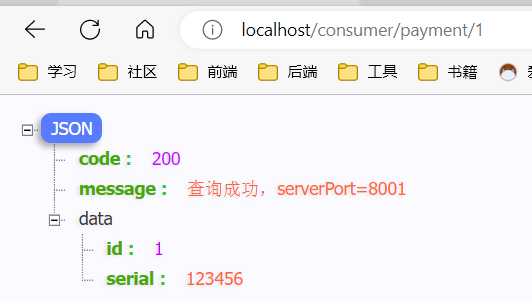

# 1.微服务概述

## 什么是微服务？

> - 微服务化的核心就是将传统的一站式应用，根据业务拆分成一个一个的服务，彻底地去耦合,每一个微服务提供单个业务功能的服务，一个服务做一件事，从技术角度看就是一种小而独立的处理过程，类似进程概念，能够自行单独启动或销毁，拥有自己独立的数据库。
> - Spring Cloud=分布式微服务架构下的一站式解决方案，是各个微服务架构落地技术的集合体，俗称微服务全家桶

# 2.从2.2.x和H版开始说起

## Spring cloud和Spring boot之间的依赖关系

> 在[spring cloud官网](https://spring.io/projects/spring-cloud#overview)查看


> 更详细的版本对应查看方法：https://start.spring.io/actuator/info


> 本课版本选型


# 3.关于Cloud各种组件的停更/升级/替换

## 由停更引发的“升级惨案”


## 参考资料

> - [spring cloud官方文档](https://cloud.spring.io/spring-cloud-static/Hoxton.SR1/reference/htmlsingle/)
> - [spring cloud中文文档](https://www.bookstack.cn/read/spring-cloud-docs/docs-index.md)
> - [spring boot官方文档](https://docs.spring.io/spring-boot/docs/2.2.2.RELEASE/reference/htmlsingle/)

# 4.微服务架构编码构建

## IDEA新建project工作空间

> 创建一个maven项目，作为父工程

> 字符编码


> 注解生效激活


> java编译版本选8


> File Type过滤


> 父工程POM

```xml
<?xml version="1.0" encoding="UTF-8"?>

<project xmlns="http://maven.apache.org/POM/4.0.0" xmlns:xsi="http://www.w3.org/2001/XMLSchema-instance"
         xsi:schemaLocation="http://maven.apache.org/POM/4.0.0 http://maven.apache.org/xsd/maven-4.0.0.xsd">
    <modelVersion>4.0.0</modelVersion>

    <groupId>com.atguigu</groupId>
    <artifactId>cloud2020</artifactId>
    <version>1.0-SNAPSHOT</version>

    <!--  父工程一定要打pom包  -->
    <packaging>pom</packaging>

    <!-- 统一管理jar包版本 -->
    <properties>
        <project.build.sourceEncoding>UTF-8</project.build.sourceEncoding>
        <maven.compiler.source>1.8</maven.compiler.source>
        <maven.compiler.target>1.8</maven.compiler.target>
        <junit.version>4.12</junit.version>
        <log4j.version>1.2.17</log4j.version>
        <lombok.version>1.16.18</lombok.version>
        <mysql.version>5.1.47</mysql.version>
        <druid.version>1.1.16</druid.version>
        <mybatis.spring.boot.version>1.3.0</mybatis.spring.boot.version>
    </properties>

    <!-- 子模块继承之后，提供作用：锁定版本+子modlue不用写groupId和version  -->
    <dependencyManagement>
        <dependencies>
            <!--spring boot 2.2.2-->
            <dependency>
                <groupId>org.springframework.boot</groupId>
                <artifactId>spring-boot-dependencies</artifactId>
                <version>2.2.2.RELEASE</version>
                <type>pom</type>
                <scope>import</scope>
            </dependency>
            <!--spring cloud Hoxton.SR1-->
            <dependency>
                <groupId>org.springframework.cloud</groupId>
                <artifactId>spring-cloud-dependencies</artifactId>
                <version>Hoxton.SR1</version>
                <type>pom</type>
                <scope>import</scope>
            </dependency>
            <!--spring cloud alibaba 2.1.0.RELEASE-->
            <dependency>
                <groupId>com.alibaba.cloud</groupId>
                <artifactId>spring-cloud-alibaba-dependencies</artifactId>
                <version>2.1.0.RELEASE</version>
                <type>pom</type>
                <scope>import</scope>
            </dependency>
            <dependency>
                <groupId>mysql</groupId>
                <artifactId>mysql-connector-java</artifactId>
                <version>${mysql.version}</version>
            </dependency>
            <dependency>
                <groupId>com.alibaba</groupId>
                <artifactId>druid</artifactId>
                <version>${druid.version}</version>
            </dependency>
            <dependency>
                <groupId>org.mybatis.spring.boot</groupId>
                <artifactId>mybatis-spring-boot-starter</artifactId>
                <version>${mybatis.spring.boot.version}</version>
            </dependency>
            <dependency>
                <groupId>junit</groupId>
                <artifactId>junit</artifactId>
                <version>${junit.version}</version>
            </dependency>
            <dependency>
                <groupId>log4j</groupId>
                <artifactId>log4j</artifactId>
                <version>${log4j.version}</version>
            </dependency>
            <dependency>
                <groupId>org.projectlombok</groupId>
                <artifactId>lombok</artifactId>
                <version>${lombok.version}</version>
                <optional>true</optional>
            </dependency>
        </dependencies>
    </dependencyManagement>

    <build>
        <plugins>
            <plugin>
                <groupId>org.springframework.boot</groupId>
                <artifactId>spring-boot-maven-plugin</artifactId>
                <configuration>
                    <fork>true</fork>
                    <addResources>true</addResources>
                </configuration>
            </plugin>
        </plugins>
    </build>

</project>
```

> maven中跳过单元测试

```xml
<!-- 方法一 -->
<build><!-- maven中跳过单元测试 -->
    <plugins>
        <plugin>
            <groupId>org.apache.maven.plugins</groupId>
            <artifactId>maven-surefire-plugin</artifactId>
            <configuration>
                <skip>true</skip>
            </configuration>
        </plugin>
    </plugins>
</build>
```

方法二


> 父工程创建完成执行`mvn:install`将父工程发布到仓库方便子工程继承


## Rest微服务工程构建

### 微服务提供者支付Module模块

#### 创建maven子工程

> cloud-provider-payment8001	微服务提供者支付Module模块
>
> 创建完成后请回到父工程查看pom文件变化


#### POM

```xml
<?xml version="1.0" encoding="UTF-8"?>
<project xmlns="http://maven.apache.org/POM/4.0.0"
         xmlns:xsi="http://www.w3.org/2001/XMLSchema-instance"
         xsi:schemaLocation="http://maven.apache.org/POM/4.0.0 http://maven.apache.org/xsd/maven-4.0.0.xsd">
    <parent>
        <artifactId>cloud2020</artifactId>
        <groupId>com.atguigu</groupId>
        <version>1.0-SNAPSHOT</version>
    </parent>
    <modelVersion>4.0.0</modelVersion>

    <artifactId>cloud-provider-payment8001</artifactId>
    <dependencies>
        <dependency>
            <groupId>org.springframework.boot</groupId>
            <artifactId>spring-boot-starter-web</artifactId>
        </dependency>
        <dependency>
            <groupId>org.springframework.boot</groupId>
            <artifactId>spring-boot-starter-actuator</artifactId>
        </dependency>
        <dependency>
            <groupId>org.mybatis.spring.boot</groupId>
            <artifactId>mybatis-spring-boot-starter</artifactId>
        </dependency>
        <dependency>
            <groupId>com.alibaba</groupId>
            <artifactId>druid-spring-boot-starter</artifactId>
            <version>1.1.10</version>
        </dependency>
        <!--mysql-connector-java-->
        <dependency>
            <groupId>mysql</groupId>
            <artifactId>mysql-connector-java</artifactId>
        </dependency>
        <!--jdbc-->
        <dependency>
            <groupId>org.springframework.boot</groupId>
            <artifactId>spring-boot-starter-jdbc</artifactId>
        </dependency>
        <dependency>
            <groupId>org.springframework.boot</groupId>
            <artifactId>spring-boot-devtools</artifactId>
            <scope>runtime</scope>
            <optional>true</optional>
        </dependency>
        <dependency>
            <groupId>org.projectlombok</groupId>
            <artifactId>lombok</artifactId>
            <optional>true</optional>
        </dependency>
        <dependency>
            <groupId>org.springframework.boot</groupId>
            <artifactId>spring-boot-starter-test</artifactId>
            <scope>test</scope>
        </dependency>
    </dependencies>
</project>
```

#### 写YML

```yaml
server:
  port: 8001

spring:
  application:
    name: cloud-payment-service
  datasource:
    type: com.alibaba.druid.pool.DruidDataSource            # 当前数据源操作类型
    driver-class-name: org.gjt.mm.mysql.Driver              # mysql驱动包 com.mysql.jdbc.Driver
    url: jdbc:mysql://localhost:3306/db2019?useUnicode=true&characterEncoding=utf-8&useSSL=false
    username: root
    password: 123456


mybatis:
  mapper-locations: classpath:mapper/*.xml
  type-aliases-package: com.atguigu.springcloud.entities    # 所有Entity别名类所在包
```

#### 主启动

```java
package com.atguigu.springcloud;

import org.springframework.boot.SpringApplication;
import org.springframework.boot.autoconfigure.SpringBootApplication;

/**
 * @Author:lz
 * @Date:2022-11-24 15:42
 * @Description
 */
@SpringBootApplication
public class PaymentMain8001 {

    public static void main(String[] args)
    {
        SpringApplication.run(PaymentMain8001.class,args);
    }

}
```

#### 业务类

> controller—service—dao

```java
package com.atguigu.springcloud.controller;

import com.atguigu.springcloud.entities.CommonResult;
import com.atguigu.springcloud.entities.Payment;
import com.atguigu.springcloud.service.PaymentService;
import lombok.extern.slf4j.Slf4j;
import org.springframework.beans.factory.annotation.Autowired;
import org.springframework.web.bind.annotation.*;

/**
 * @Author: lz
 * @Date: 2022-11-24 0024 17:08
 * @Description:
 */

@RestController
@RequestMapping("/payment")
@Slf4j
public class PaymentController {

    @Autowired
    private PaymentService paymentService;


    /**
     * 添加serial
     *
     * @param payment
     * @return
     */
    @PostMapping("/create")
    public CommonResult create(@RequestBody Payment payment) {
        int i = paymentService.create(payment);
        if (i > 0) {
            return new CommonResult(200, "添加数据库成功", i);
        } else {
            return new CommonResult(444, "添加数据库失败");
        }
    }

    @GetMapping("/getSerialById/{id}")
    public CommonResult getSerialById(@PathVariable("id") Long id) {
        Payment payment = paymentService.getSerialById(id);
        if (payment != null) {
            return new CommonResult(200, "查询成功", payment);
        }
        return new CommonResult(444, "查询失败", null);
    }

}

```

#### 测试


### dev-tools热部署

> 在子项目中添加依赖

```xml
        <dependency>
            <groupId>org.springframework.boot</groupId>
            <artifactId>spring-boot-devtools</artifactId>
            <scope>runtime</scope>
            <optional>true</optional>
        </dependency>
```

> 在父项目中配置插件

```xml
    <build>
        <plugins>
            <plugin>
                <groupId>org.springframework.boot</groupId>
                <artifactId>spring-boot-maven-plugin</artifactId>
                <configuration>
                    <fork>true</fork>
                    <addResources>true</addResources>
                </configuration>
            </plugin>
        </plugins>
    </build>
```

> 开启自动构建


> ctrl + shift + alt + /


### 微服务消费者订单Module模块

> 创建子工程cloud-consumer-order80	微服务消费者订单Module模块
>
> - POM
> - yaml
> - 主启动（同上一个模块）

#### RestTemplate

> RestTemplate提供了多种便捷访问远程Http服务的方法， 是一种简单便捷的**访问restful服务模板类**，是Spring提供的用于访问Rest服务的客户端模板工具集
>
> 那种?类型的也可以使用

#### 业务类

> 配置RestTemplate

```java
package com.atguigu.springcloud.config;

import org.springframework.context.annotation.Bean;
import org.springframework.context.annotation.Configuration;
import org.springframework.web.client.RestTemplate;

/**
 * @Author: lz
 * @Date: 2022-11-25 0025 14:06
 * @Description:
 */
@Configuration
public class ApplicationContextConfig {
    @Bean
    public RestTemplate restTemplate() {
        return new RestTemplate();
    }
}

```

> controller

```java
package com.atguigu.springcloud.controller;

import com.atguigu.springcloud.entities.CommonResult;
import com.atguigu.springcloud.entities.Payment;
import lombok.extern.slf4j.Slf4j;
import org.springframework.beans.factory.annotation.Autowired;
import org.springframework.web.bind.annotation.GetMapping;
import org.springframework.web.bind.annotation.PathVariable;
import org.springframework.web.bind.annotation.RequestMapping;
import org.springframework.web.bind.annotation.RestController;
import org.springframework.web.client.RestTemplate;

/**
 * @Author: lz
 * @Date: 2022-11-25 0025 14:04
 * @Description:
 */

@RestController
@Slf4j
@RequestMapping("/consumer")
public class ConsumerController {

    // 提供者支付module模块的url
    public static final String PAYMENT_URL = "http://localhost:8001";

    @Autowired
    private RestTemplate restTemplate;

    @GetMapping("/create")
    public CommonResult create(Payment payment) {

        return restTemplate.postForObject(PAYMENT_URL + "/payment/create", payment, CommonResult.class);
    }


    @GetMapping("/getSerialById/{id}")
    public CommonResult getSerialById(@PathVariable("id") Long id) {

        return restTemplate.getForObject(PAYMENT_URL + "/payment/getSerialById/" + id, CommonResult.class, id);
    }


}
```

#### 测试

> 先直接访问提供者支付模块的controller


> 再访问消费者订单模块，同样也可以调用到


> 测试消费者订单模块的添加serial


### 工程重构

> 在我们的提供者支付模块和消费者订单模块都有payment实体类和统一返回类型的类，这样就会造成代码的冗余，我们可以把实体类和统一返回类型的类提取到一个公共的工程中
>
> 步骤
>
> - 创建公共工程cloud-api-commons
>
> - 修POM
>
> - 将实体类和统一返回类型的类放在此工程中
>
> - maven命令`clean install`
>
> - 提供者支付模块和消费者订单模块删除这两个类，在pom中导入公共工程
>
>   

### 目前工程样图


# 5.服务注册与发现

## :x:Eureka

> - 什么是服务治理
>
>   Spring Cloud 封装了 Netflix 公司开发的 Eureka 模块来实现服务治理
>
>   在传统的rpc远程调用框架中，管理每个服务与服务之间依赖关系比较复杂，管理比较复杂，所以需要**使用服务治理，管理服务于服务之间依赖关系，可以实现服务调用、负载均衡、容错等，实现服务发现与注册。**
>
> - 什么是服务注册与发现
>
>   Eureka采用了C/S的设计架构，**Eureka Server 作为服务注册功能的服务器，它是服务注册中心。而系统中的其他微服务，使用 Eureka的客户端连接到 Eureka Server并维持心跳连接。**这样系统的维护人员就可以通过 Eureka Server 来监控系统中各个微服务是否正常运行。
>
>   **在服务注册与发现中，有一个注册中心。当服务器启动的时候，会把当前自己服务器的信息，比如服务地址通讯地址等以别名方式注册到注册中心上。另一方（消费者|服务提供者），以该别名的方式去注册中心上获取到实际的服务通讯地址，然后再实现本地RPC调用**；RPC远程调用框架核心设计思想：在于注册中心，因为使用注册中心管理每个服务与服务之间的一个依赖关系(服务治理概念)。在任何rpc远程框架中，都会有一个注册中心(存放服务地址相关信息(接口地址))
>
> - Eureka包含两个组件：Eureka Server和Eureka Client
>
>   Eureka Server提供服务注册服务
>   各个微服务节点通过配置启动后，会在EurekaServer中进行注册，这样EurekaServer中的服务注册表中将会存储所有可用服务节点的信息，服务节点的信息可以在界面中直观看到。
>
>   EurekaClient通过注册中心进行访问
>   是一个Java客户端，用于简化Eureka Server的交互，客户端同时也具备一个内置的、使用轮询(round-robin)负载算法的负载均衡器。在应用启动后，将会向Eureka Server发送心跳(默认周期为30秒)。如果Eureka Server在多个心跳周期内没有接收到某个节点的心跳，EurekaServer将会从服务注册表中把这个服务节点移除（默认90秒）


### 单机Eureka构建步骤

#### 生成EurekaServer端服务注册中心

##### 创建maven子工程

> 创建子工程cloud-eureka-server7001

##### POM

```xml
<dependency>
    <groupId>org.springframework.cloud</groupId>
    <artifactId>spring-cloud-starter-netflix-eureka-server</artifactId><!--注意这里是server-->
</dependency>

```

##### yaml

```yaml
server:
  port: 7001

eureka:
  instance:
    hostname: localhost #eureka服务端的实例名称
  client:
    #false表示不向注册中心注册自己。
    register-with-eureka: false
    #false表示自己端就是注册中心，我的职责就是维护服务实例，并不需要去检索服务
    fetch-registry: false
    service-url:
      #设置与Eureka Server交互的地址查询服务和注册服务都需要依赖这个地址。
      defaultZone: http://${eureka.instance.hostname}:${server.port}/eureka/
```

##### 主启动


##### 测试

> 访问localhost:7001


#### 修改提供者支付模块

> EurekaClient端将cloud-provider-payment8001注册进EurekaServer成为服务提供者provider

##### POM

```xml
<dependency>
    <groupId>org.springframework.cloud</groupId>
    <artifactId>spring-cloud-starter-netflix-eureka-client</artifactId><!--注意这里是client-->
</dependency>
```

##### yaml

```yaml
eureka:
  client:
    #表示是否将自己注册进EurekaServer默认为true。
    register-with-eureka: true
    #是否从EurekaServer抓取已有的注册信息，默认为true。单节点无所谓，集群必须设置为true才能配合ribbon使用负载均衡
    fetchRegistry: true
    service-url:
      defaultZone: http://localhost:7001/eureka
```

##### 主启动


##### 测试


#### 修改消费者订单模块

> EurekaClient端将cloud-consumer-order80注册进EurekaServer成为服务消费者consumer

##### POM

```xml
<dependency>
    <groupId>org.springframework.cloud</groupId>
    <artifactId>spring-cloud-starter-netflix-eureka-client</artifactId><!--注意这里是client-->
</dependency>
```

##### yaml

```yaml
server:
  port: 80


spring:
  application:
    name: cloud-order-service

eureka:
  client:
    #表示是否将自己注册进EurekaServer默认为true。
    register-with-eureka: true
    #是否从EurekaServer抓取已有的注册信息，默认为true。单节点无所谓，集群必须设置为true才能配合ribbon使用负载均衡
    fetchRegistry: true
    service-url:
      defaultZone: http://localhost:7001/eureka
 
```

##### 主启动


##### 测试


### 集群Eureka构建步骤


#### EurekaServer集群环境构建步骤


##### 新建cloud-eureka-server7002

> 根据新建cloud-eureka-server7001创建一个新建cloud-eureka-server7002作为注册中心，和7001组合成集群环境

##### POM

```xml
<dependency>
    <groupId>org.springframework.cloud</groupId>
    <artifactId>spring-cloud-starter-netflix-eureka-server</artifactId><!--注意这里是server-->
</dependency>

```

##### 修改映射配置

> 找到`C:\Windows\System32\drivers\etc`路径下的hosts文件，写入配置


##### yaml

> 7001的yaml

```yaml
server:
  port: 7001

eureka:
  client:

    。。。。。。

    service-url:
   	  #单机就是自己
   	  #defaultZone: http://eureka7001.com:7001/eureka/
   	  #集群指向其他的eureka
      defaultZone: http://eureka7002.com:7002/eureka/
```

> 7002的yaml

```yaml
server:
  port: 7002

eureka:
  instance:
    hostname: eureka7002.com #eureka服务端的实例名称
  client:
    register-with-eureka: false     #false表示不向注册中心注册自己。
    fetch-registry: false     #false表示自己端就是注册中心，我的职责就是维护服务实例，并不需要去检索服务
    service-url:
   	  #单机就是自己
      #defaultZone: http://eureka7002.com:7002/eureka/
      #集群指向其他的eureka
   	  defaultZone: http://eureka7001.com:7001/eureka/
```

##### 主启动

```java
package com.atguigu.springcloud;

import org.springframework.boot.SpringApplication;
import org.springframework.boot.autoconfigure.SpringBootApplication;
import org.springframework.cloud.netflix.eureka.server.EnableEurekaServer;

/**
 * @Author: lz
 * @Date: 2022-11-26 0026 15:53
 * @Description:
 */
@SpringBootApplication
@EnableEurekaServer
public class EurekaMain7002 {
    public static void main(String[] args) {
        SpringApplication.run(EurekaMain7002.class, args);
    }
}

```

##### 测试


#### 将支付服务8001，订单服务80发布到集群中


##### 测试

> 先要启动EurekaServer，7001/7002服务;再要启动服务提供者provider，8001;再要启动消费者，80


#### 支付服务提供者8001集群环境构建

##### 新建cloud-provider-payment8002

> 根据新建cloud-provider-payment8001创建一个新建cloud-provider-payment8002作为支付提供者，和8001组成集群环境

##### POM

```xml
        <!--eureka-client-->
        <dependency>
            <groupId>org.springframework.cloud</groupId>
            <artifactId>spring-cloud-starter-netflix-eureka-client</artifactId>
        </dependency>
```

##### yaml

```yaml
server:
  port: 8002

 。。。。。。

eureka:
  client:

 	。。。。。。

    service-url:
      #defaultZone: http://localhost:7001/eureka  # 单机版
      defaultZone: http://eureka7001.com:7001/eureka,http://eureka7002.com:7002/eureka  # 集群版

```

##### 主启动

```java
package com.atguigu.springcloud;

import org.springframework.boot.SpringApplication;
import org.springframework.boot.autoconfigure.SpringBootApplication;
import org.springframework.cloud.netflix.eureka.EnableEurekaClient;

/**
 * @Author: lz
 * @Date: 2022-11-26  17:03
 * @Description:
 */

@SpringBootApplication
@EnableEurekaClient
public class PaymentMain8002 {
    public static void main(String[] args) {
        SpringApplication.run(PaymentMain8002.class, args);
    }
}

```

##### 业务类

> 业务类内容和8001相同，直接复制8001的

##### 负载均衡

> 订单服务访问地址不能写死


> 使用@LoadBalanced注解赋予RestTemplate负载均衡的能力

```java
package com.atguigu.springcloud.config;

import org.springframework.cloud.client.loadbalancer.LoadBalanced;
import org.springframework.context.annotation.Bean;
import org.springframework.context.annotation.Configuration;
import org.springframework.web.client.RestTemplate;

/**
 * @Author: lz
 * @Date: 2022-11-25 0025 14:06
 * @Description:
 */
@Configuration
public class ApplicationContextConfig {
    @Bean
    @LoadBalanced //使用@LoadBalanced注解赋予RestTemplate负载均衡的能力
    public RestTemplate restTemplate() {
        return new RestTemplate();
    }
}

```

##### 测试


### actuator微服务信息完善

#### 主机名称:服务名称修改

##### 当前问题

> 含有主机名称


##### POM

```xml
        <dependency>
            <groupId>org.springframework.boot</groupId>
            <artifactId>spring-boot-starter-web</artifactId>
        </dependency>
        <dependency>
            <groupId>org.springframework.boot</groupId>
            <artifactId>spring-boot-starter-actuator</artifactId>
        </dependency>
```

##### yaml

```yaml
server:
  port: 80

 。。。。。。

eureka:

 。。。。。。

  instance:
    instance-id: order80
```

##### 测试


#### 访问信息有IP信息提示

##### 当前问题

> 没有IP提示，不知道是在哪一台主机上


##### POM

```xml
        <dependency>
            <groupId>org.springframework.boot</groupId>
            <artifactId>spring-boot-starter-web</artifactId>
        </dependency>
        <dependency>
            <groupId>org.springframework.boot</groupId>
            <artifactId>spring-boot-starter-actuator</artifactId>
        </dependency>
```

##### yaml

```yaml
server:
  port: 80

  。。。。。。

eureka:

 。。。。。。

  instance:
    instance-id: order80
    prefer-ip-address: true     #访问路径可以显示IP地址
```

##### 测试


### 服务发现Discovery

> 对于注册进eureka里面的微服务，可以通过服务发现来获得该服务的信息

#### 修改cloud-provider-payment8001

> 修改cloud-provider-payment8001的Controller，8002也可以这样，我们这里以8001为例

```java
package com.atguigu.springcloud.controller;

import com.atguigu.springcloud.entities.CommonResult;
import com.atguigu.springcloud.entities.Payment;
import com.atguigu.springcloud.service.PaymentService;
import lombok.extern.slf4j.Slf4j;
import org.springframework.beans.factory.annotation.Autowired;
import org.springframework.beans.factory.annotation.Value;
import org.springframework.cloud.client.ServiceInstance;
import org.springframework.cloud.client.discovery.DiscoveryClient;
import org.springframework.web.bind.annotation.*;

import java.util.List;

/**
 * @Author: lz
 * @Date: 2022-11-24 0024 17:08
 * @Description:
 */

@RestController
@RequestMapping("/payment")
@Slf4j
public class PaymentController {
    
    。。。。。。

    @Autowired
    private DiscoveryClient discoveryClient;

	。。。。。。

    @GetMapping("/discovery")
    public DiscoveryClient Discovery() {
//        获取所有的在注册中心的服务
        List<String> services = discoveryClient.getServices();
        for (String service : services) {
            log.info("service=========>{}", service);
        }


//        传入具体服务的名称
        List<ServiceInstance> instances = discoveryClient.getInstances("CLOUD-PAYMENT-SERVICE");
        for (ServiceInstance instance : instances) {
            System.out.println(instance.getServiceId() + "\t" + instance.getHost() + "\t" + instance.getPort() + "\t"
                    + instance.getUri());
        }

        return discoveryClient;
    }

}

```

#### 配置启动类


#### 测试


### Eureka自我保护

> - 为什么会产生Eureka自我保护机制？
>   为了防止EurekaClient可以正常运行，但是 与 EurekaServer网络不通情况下，EurekaServer不会立刻将EurekaClient服务剔除
>
> - 什么是自我保护模式？
>   默认情况下，如果EurekaServer在一定时间内没有接收到某个微服务实例的心跳，EurekaServer将会注销该实例（默认90秒）。但是当网络分区故障发生(延时、卡顿、拥挤)时，微服务与EurekaServer之间无法正常通信，以上行为可能变得非常危险了——因为微服务本身其实是健康的，此时本不应该注销这个微服务。Eureka通过“自我保护模式”来解决这个问题——当EurekaServer节点在短时间内丢失过多客户端时（可能发生了网络分区故障），那么这个节点就会进入自我保护模式。

#### 禁止自我保护

##### 以注册中心eureakeServer端7001为例

> 出厂默认，自我保护机制是开启的

```yaml
server:
  port: 7001

eureka:

 。。。。。。
 
  server:
    #关闭自我保护机制，保证不可用服务被及时踢除
    enable-self-preservation: false
    eviction-interval-timer-in-ms: 2000
```

##### 配置生产者8001、8002

```yaml
server:
  port: 8001

。。。。。。

eureka:
  。。。。。。
  instance:
    instance-id: payment8001
    #Eureka客户端向服务端发送心跳的时间间隔，单位为秒(默认是30秒)
    lease-renewal-interval-in-seconds: 1
    #Eureka服务端在收到最后一次心跳后等待时间上限，单位为秒(默认是90秒)，超时将剔除服务
    lease-expiration-duration-in-seconds: 2

```

```yaml
server:
  port: 8002

。。。。。。

eureka:
  
  。。。。。。。
  
  instance:
    instance-id: payment8002
    #Eureka客户端向服务端发送心跳的时间间隔，单位为秒(默认是30秒)
    lease-renewal-interval-in-seconds: 1
    #Eureka服务端在收到最后一次心跳后等待时间上限，单位为秒(默认是90秒)，超时将剔除服务
    lease-expiration-duration-in-seconds: 2

```

> 注册中心7001配置了，7002没有配置。服务8001、8002都配置了
>
> 关闭8001、8002，对比一下7001、7002；7001接着把8001、8002的服务删除了，而7002没有


## ✔️ Zookeeper

### 安装zookeeper

> 1. 下载[zookeeper](https://archive.apache.org/dist/zookeeper/zookeeper-3.4.13/)或者执行`wget http://mirror.bit.edu.cn/apache/zookeeper/zookeeper-3.4.13/zookeeper-3.4.13.tar.gz`
>
> 2. 解压，进入bin目录， 运行`./zkServer.sh start` ，初次运行会报错，没有`zoo.cfg`配置文件
>
> 3. 修改`zoo.cfg`配置文件
>
>    - 将conf下的`zoo_sample.cfg`复制一份改名为`zoo.cfg`即可。
>
>      注意几个重要位置：
>
>      `dataDir=./  `	临时数据存储的目录（可写相对路径）
>
>      `clientPort=2181`	zookeeper的端口号
>
>      修改完成后再次启动zookeeper	
>
> 4. 使用`bin/zkCli.cmd`测试
>
>    - `ls /`：列出zookeeper根下保存的所有节点
>
>      `create –e /atguigu 123`：创建一个atguigu节点，值为123
>
>      `get /atguigu`：获取/atguigu节点的值
>
> 5. 查看zookeeper的运行状态
>
>    ```sh
>    [root@lz bin]# ./zkServer.sh status
>    ```

### 创建服务提供者

> 新建cloud-provider-payment8004作为服务提供者

#### POM

```xml
<?xml version="1.0" encoding="UTF-8"?>
<project xmlns="http://maven.apache.org/POM/4.0.0"
         xmlns:xsi="http://www.w3.org/2001/XMLSchema-instance"
         xsi:schemaLocation="http://maven.apache.org/POM/4.0.0 http://maven.apache.org/xsd/maven-4.0.0.xsd">
    <parent>
        <artifactId>cloud2020</artifactId>
        <groupId>com.atguigu</groupId>
        <version>1.0-SNAPSHOT</version>
    </parent>
    <modelVersion>4.0.0</modelVersion>

    <artifactId>cloud-provider-payment8004</artifactId>
    <dependencies>
        <!-- SpringBoot整合Web组件 -->
        <dependency>
            <groupId>org.springframework.boot</groupId>
            <artifactId>spring-boot-starter-web</artifactId>
        </dependency>
        <!-- 引入自己定义的api通用包，可以使用Payment支付Entity -->
        <dependency>
            <groupId>com.atguigu</groupId>
            <artifactId>cloud-api-commons</artifactId>
            <version>1.0-SNAPSHOT</version>
        </dependency>

        <!-- SpringBoot整合zookeeper客户端 -->
        <dependency>
            <groupId>org.springframework.cloud</groupId>
            <artifactId>spring-cloud-starter-zookeeper-discovery</artifactId>
        </dependency>
        <dependency>
            <groupId>org.springframework.boot</groupId>
            <artifactId>spring-boot-devtools</artifactId>
            <scope>runtime</scope>
            <optional>true</optional>
        </dependency>
        <dependency>
            <groupId>org.projectlombok</groupId>
            <artifactId>lombok</artifactId>
            <optional>true</optional>
        </dependency>
        <dependency>
            <groupId>org.springframework.boot</groupId>
            <artifactId>spring-boot-starter-test</artifactId>
            <scope>test</scope>
        </dependency>
    </dependencies>


</project>
```

#### yaml

```yaml
#8004表示注册到zookeeper服务器的支付服务提供者端口号
server:
  port: 8004
#服务别名----注册zookeeper到注册中心名称
spring:
  application:
    name: cloud-provider-payment
  cloud:
    zookeeper:
      connect-string: 192.168.221.100:2181
```

#### 主启动

```java
package com.atguigu.springcloud;

import org.springframework.boot.SpringApplication;
import org.springframework.boot.autoconfigure.SpringBootApplication;
import org.springframework.cloud.client.discovery.EnableDiscoveryClient;

/**
 * @Author: lz
 * @Date: 2022-11-26 0026 22:36
 * @Description:
 */
@SpringBootApplication
@EnableDiscoveryClient
public class PaymentMain8004 {
    public static void main(String[] args) {
        SpringApplication.run(PaymentMain8004.class, args);
    }
}

```

#### controller

```java
package com.atguigu.springcloud.controller;

import org.springframework.web.bind.annotation.RequestMapping;
import org.springframework.web.bind.annotation.RestController;
import org.springframework.beans.factory.annotation.Value;

import java.util.UUID;


@RestController
public class PaymentController {
    @Value("${server.port}")
    private String serverPort;

    @RequestMapping(value = "/payment/zk")
    public String paymentzk() {
        return "springcloud with zookeeper: " + serverPort + "\t" + UUID.randomUUID().toString();
    }
}
```

#### 报错


##### 原因

> zookeeper-discovery中有一个zookeeper的jar包，这个jar包版本和我们Linux中的版本不一样，发生了冲突


##### 解决

> 修POM文件，将自带的zookeeper排除

```xml
        <!-- SpringBoot整合zookeeper客户端 -->
        <dependency>
            <groupId>org.springframework.cloud</groupId>
            <artifactId>spring-cloud-starter-zookeeper-discovery</artifactId>
            <!--先排除自带的zookeeper3.5.3-->
            <exclusions>
                <exclusion>
                    <groupId>org.apache.zookeeper</groupId>
                    <artifactId>zookeeper</artifactId>
                </exclusion>
            </exclusions>
        </dependency>
        <!--添加zookeeper3.4.9版本,和linux中的版本一致-->
        <dependency>
            <groupId>org.apache.zookeeper</groupId>
            <artifactId>zookeeper</artifactId>
            <version>3.4.9</version>
        </dependency>
```

#### 测试1


#### 测试2


### 创建服务消费者

> 新建cloud-consumerzk-order80作为服务的消费者

#### POM

```xml
<?xml version="1.0" encoding="UTF-8"?>
<project xmlns="http://maven.apache.org/POM/4.0.0"
         xmlns:xsi="http://www.w3.org/2001/XMLSchema-instance"
         xsi:schemaLocation="http://maven.apache.org/POM/4.0.0 http://maven.apache.org/xsd/maven-4.0.0.xsd">
    <parent>
        <artifactId>cloud2020</artifactId>
        <groupId>com.atguigu</groupId>
        <version>1.0-SNAPSHOT</version>
    </parent>
    <modelVersion>4.0.0</modelVersion>

    <artifactId>cloud-consumerzk-order80</artifactId>

    <dependencies>
        <!-- SpringBoot整合Web组件 -->
        <dependency>
            <groupId>org.springframework.boot</groupId>
            <artifactId>spring-boot-starter-web</artifactId>
        </dependency>
        <!-- 引入自己定义的api通用包，可以使用Payment支付Entity -->
        <dependency>
            <groupId>com.atguigu</groupId>
            <artifactId>cloud-api-commons</artifactId>
            <version>1.0-SNAPSHOT</version>
        </dependency>

        <!-- SpringBoot整合zookeeper客户端 -->
        <dependency>
            <groupId>org.springframework.cloud</groupId>
            <artifactId>spring-cloud-starter-zookeeper-discovery</artifactId>
            <!--先排除自带的zookeeper3.5.3-->
            <exclusions>
                <exclusion>
                    <groupId>org.apache.zookeeper</groupId>
                    <artifactId>zookeeper</artifactId>
                </exclusion>
            </exclusions>
        </dependency>
        <!--添加zookeeper3.4.9版本,和linux中的版本一致-->
        <dependency>
            <groupId>org.apache.zookeeper</groupId>
            <artifactId>zookeeper</artifactId>
            <version>3.4.9</version>
        </dependency>
        <dependency>
            <groupId>org.springframework.boot</groupId>
            <artifactId>spring-boot-devtools</artifactId>
            <scope>runtime</scope>
            <optional>true</optional>
        </dependency>
        <dependency>
            <groupId>org.projectlombok</groupId>
            <artifactId>lombok</artifactId>
            <optional>true</optional>
        </dependency>
        <dependency>
            <groupId>org.springframework.boot</groupId>
            <artifactId>spring-boot-starter-test</artifactId>
            <scope>test</scope>
        </dependency>
    </dependencies>
</project>
```

#### yaml

```yaml
server:
  port: 80

spring:
  application:
    name: cloud-consumer-order
  cloud:
    #注册到zookeeper地址
    zookeeper:
      connect-string: 192.168.221.100:2181
```

#### 主启动

```java
package com.atguigu.springcloud;

import org.springframework.boot.SpringApplication;
import org.springframework.boot.autoconfigure.SpringBootApplication;
import org.springframework.cloud.client.discovery.EnableDiscoveryClient;

/**
 * @Author: lz
 * @Date: 2022-11-27 0027 10:52
 * @Description:
 */

@SpringBootApplication
@EnableDiscoveryClient
public class OrderZK80 {

    public static void main(String[] args) {
        SpringApplication.run(OrderZK80.class, args);
    }
}
```

#### 实现类

> 配置RestTemplate

```java
package com.atguigu.springcloud.config;

import org.springframework.cloud.client.loadbalancer.LoadBalanced;
import org.springframework.context.annotation.Bean;
import org.springframework.context.annotation.Configuration;
import org.springframework.web.client.RestTemplate;

/**
 * @Author: lz
 * @Date: 2022-11-27 0027 10:54
 * @Description:
 */

@Configuration
public class ApplicationContextConfig {

    @Bean
    @LoadBalanced
    public RestTemplate getRestTemplage() {
        return new RestTemplate();
    }
}
```

> controller

```java
package com.atguigu.springcloud.controller;

import org.springframework.beans.factory.annotation.Autowired;
import org.springframework.web.bind.annotation.RequestMapping;
import org.springframework.web.bind.annotation.RestController;
import org.springframework.web.client.RestTemplate;

/**
 * @Author: lz
 * @Date: 2022-11-27 0027 10:54
 * @Description:
 */
@RestController
public class OrderZKController {

    public static final String INVOKE_URL = "http://cloud-provider-payment";

    @Autowired
    private RestTemplate restTemplate;

    @RequestMapping(value = "/consumer/zk")
    public String paymentInfo() {
        String result = restTemplate.getForObject(INVOKE_URL + "/payment/zk", String.class);
        System.out.println("消费者调用支付服务(zookeeper)--->result:" + result);
        return result;
    }
}
```

#### 测试


## ✔️consul

> - Consul 是一套开源的分布式服务发现和配置管理系统，由 HashiCorp 公司用 Go 语言开发。提供了微服务系统中的服务治理、配置中心、控制总线等功能。这些功能中的每一个都可以根据需要单独使用，也可以一起使用以构建全方位的服务网格，总之Consul提供了一种完整的服务网格解决方案。
> - [下载地址](https://www.consul.io/downloads.html)
> - [中文文档](https://www.springcloud.cc/spring-cloud-consul.html)

### 安装并运行Consul

> window环境下载完成后只有一个consul.exe文件，硬盘路径下双击运行，查看版本号信息


> - 使用开发模式启动，执行`consul agent -dev`
> - 通过以下地址可以访问Consul的首页：http://localhost:8500


### 服务提供者

> 新建Module支付服务provider8006作为服务的提供者

#### POM

```xml
<?xml version="1.0" encoding="UTF-8"?>
<project xmlns="http://maven.apache.org/POM/4.0.0"
         xmlns:xsi="http://www.w3.org/2001/XMLSchema-instance"
         xsi:schemaLocation="http://maven.apache.org/POM/4.0.0 http://maven.apache.org/xsd/maven-4.0.0.xsd">
    <parent>
        <artifactId>cloud2020</artifactId>
        <groupId>com.atguigu</groupId>
        <version>1.0-SNAPSHOT</version>
    </parent>
    <modelVersion>4.0.0</modelVersion>

    <artifactId>cloud-providerconsul-payment8006</artifactId>

    <dependencies>
        <!--SpringCloud consul-server -->
        <dependency>
            <groupId>org.springframework.cloud</groupId>
            <artifactId>spring-cloud-starter-consul-discovery</artifactId>
        </dependency>
        <!-- SpringBoot整合Web组件 -->
        <dependency>
            <groupId>org.springframework.boot</groupId>
            <artifactId>spring-boot-starter-web</artifactId>
        </dependency>
        <dependency>
            <groupId>org.springframework.boot</groupId>
            <artifactId>spring-boot-starter-actuator</artifactId>
        </dependency>
        <!--日常通用jar包配置-->
        <dependency>
            <groupId>org.springframework.boot</groupId>
            <artifactId>spring-boot-devtools</artifactId>
            <scope>runtime</scope>
            <optional>true</optional>
        </dependency>
        <dependency>
            <groupId>org.projectlombok</groupId>
            <artifactId>lombok</artifactId>
            <optional>true</optional>
        </dependency>
        <dependency>
            <groupId>org.springframework.boot</groupId>
            <artifactId>spring-boot-starter-test</artifactId>
            <scope>test</scope>
        </dependency>
    </dependencies>


</project>
```

#### yaml

```yaml
###consul服务端口号
server:
  port: 8006

spring:
  application:
    name: consul-provider-payment
  ####consul注册中心地址
  cloud:
    consul:
      host: localhost
      port: 8500
      discovery:
        #hostname: 127.0.0.1
        service-name: ${spring.application.name}
```

#### 主启动

```java
package com.atguigu.springcloud;

import org.springframework.boot.SpringApplication;
import org.springframework.boot.autoconfigure.SpringBootApplication;
import org.springframework.cloud.client.discovery.EnableDiscoveryClient;

/**
 * @Author: lz
 * @Date: 2022-11-27 0027 12:15
 * @Description:
 */
@SpringBootApplication
@EnableDiscoveryClient
public class PaymentMain8006 {
    public static void main(String[] args) {
        SpringApplication.run(PaymentMain8006.class, args);
    }
}

```

#### controller

```java
package com.atguigu.springcloud.controller;

import org.springframework.beans.factory.annotation.Value;
import org.springframework.web.bind.annotation.GetMapping;
import org.springframework.web.bind.annotation.RestController;

import java.util.UUID;


@RestController
public class PaymentController {
    @Value("${server.port}")
    private String serverPort;

    @GetMapping("/payment/consul")
    public String paymentInfo() {
        return "springcloud with consul: " + serverPort + "\t\t" + UUID.randomUUID().toString();
    }
}
```

#### 测试


### 服务消费者

> 新建Module消费服务order80作为服务的消费者

#### pom

```xml
<?xml version="1.0" encoding="UTF-8"?>
<project xmlns="http://maven.apache.org/POM/4.0.0"
         xmlns:xsi="http://www.w3.org/2001/XMLSchema-instance"
         xsi:schemaLocation="http://maven.apache.org/POM/4.0.0 http://maven.apache.org/xsd/maven-4.0.0.xsd">
    <parent>
        <artifactId>cloud2020</artifactId>
        <groupId>com.atguigu</groupId>
        <version>1.0-SNAPSHOT</version>
    </parent>
    <modelVersion>4.0.0</modelVersion>

    <artifactId>cloud-consumerconsul-order80</artifactId>

    <dependencies>
        <!--SpringCloud consul-server -->
        <dependency>
            <groupId>org.springframework.cloud</groupId>
            <artifactId>spring-cloud-starter-consul-discovery</artifactId>
        </dependency>
        <!-- SpringBoot整合Web组件 -->
        <dependency>
            <groupId>org.springframework.boot</groupId>
            <artifactId>spring-boot-starter-web</artifactId>
        </dependency>
        <dependency>
            <groupId>org.springframework.boot</groupId>
            <artifactId>spring-boot-starter-actuator</artifactId>
        </dependency>
        <!--日常通用jar包配置-->
        <dependency>
            <groupId>org.springframework.boot</groupId>
            <artifactId>spring-boot-devtools</artifactId>
            <scope>runtime</scope>
            <optional>true</optional>
        </dependency>
        <dependency>
            <groupId>org.projectlombok</groupId>
            <artifactId>lombok</artifactId>
            <optional>true</optional>
        </dependency>
        <dependency>
            <groupId>org.springframework.boot</groupId>
            <artifactId>spring-boot-starter-test</artifactId>
            <scope>test</scope>
        </dependency>
    </dependencies>


</project>
```

#### yaml

```yaml
###consul服务端口号
server:
  port: 80

spring:
  application:
    name: cloud-consumer-order
  ####consul注册中心地址
  cloud:
    consul:
      host: localhost
      port: 8500
      discovery:
        #hostname: 127.0.0.1
        service-name: ${spring.application.name}
```

#### 主启动

```java
package com.atguigu.springcloud;

import org.springframework.boot.SpringApplication;
import org.springframework.boot.autoconfigure.SpringBootApplication;
import org.springframework.cloud.client.discovery.EnableDiscoveryClient;

/**
 * @Author: lz
 * @Date: 2022-11-27 0027 12:22
 * @Description:
 */
@SpringBootApplication
@EnableDiscoveryClient //该注解用于向使用consul或者zookeeper作为注册中心时注册服务
public class OrderConsulMain80 {
    public static void main(String[] args) {
        SpringApplication.run(OrderConsulMain80.class, args);
    }
}
```

#### 实现类

> 配置RestTemplate

```java
package com.atguigu.springcloud.config;

import org.springframework.cloud.client.loadbalancer.LoadBalanced;
import org.springframework.context.annotation.Bean;
import org.springframework.context.annotation.Configuration;
import org.springframework.web.client.RestTemplate;

/**
 * @Author: lz
 * @Date: 2022-11-27 0027 12:23
 * @Description:
 */
@Configuration
public class ApplicationContextConfig {
    @Bean
    @LoadBalanced
    public RestTemplate getRestTemplate() {
        return new RestTemplate();
    }
}
```

> controller

```java
package com.atguigu.springcloud.controller;

import org.springframework.beans.factory.annotation.Autowired;
import org.springframework.web.bind.annotation.GetMapping;
import org.springframework.web.bind.annotation.RequestMapping;
import org.springframework.web.bind.annotation.RestController;
import org.springframework.web.client.RestTemplate;

@RestController
public class OrderConsulController {
    public static final String INVOKE_URL = "http://cloud-provider-payment"; //consul-provider-payment

    @Autowired
    private RestTemplate restTemplate;

    @GetMapping(value = "/consumer//consul")
    public String paymentInfo() {
        String result = restTemplate.getForObject(INVOKE_URL + "/payment/consul", String.class);
        System.out.println("消费者调用支付服务(consule)--->result:" + result);
        return result;
    }
}
```

#### 测试


## 三个注册中心异同点


### CAP

> - C:Consistency（强一致性）
> - A:Availability（可用性）
> - P:Partition tolerance（分区容错性）
> - CAP理论关注粒度是数据，而不是整体系统设计的策略

### 经典CAP图


#### AP架构(Eureka)

> 当网络分区出现后，为了保证可用性，系统B可以返回旧值，保证系统的可用性。
> 结论：违背了一致性C的要求，只满足可用性和分区容错，即AP

#### CP架构(Zookeeper/Consul)

> 当网络分区出现后，为了保证一致性，就必须拒接请求，否则无法保证一致性
> 结论：违背了可用性A的要求，只满足一致性和分区容错，即CP

# 6.服务调用

## ✔️Ribbon负载均衡服务调用

> - Spring Cloud Ribbon是基于Netflix Ribbon实现的一套客户端负载均衡的工具。简单的说，Ribbon是Netflix发布的开源项目，**主要功能是提供客户端的软件负载均衡算法和服务调用。**Ribbon客户端组件提供一系列完善的配置项如连接超时，重试等。简单的说，就是在配置文件中列出Load Balancer（简称LB）后面所有的机器，Ribbon会自动的帮助你基于某种规则（如简单轮询，随机连接等）去连接这些机器。我们很容易使用Ribbon实现自定义的负载均衡算法。
>
> - LB负载均衡(Load Balance)是什么
>   简单的说就是将用户的请求平摊的分配到多个服务上，从而达到系统的HA（高可用）。常见的负载均衡有软件Nginx，LVS，硬件 F5等。
>
> - Ribbon本地负载均衡客户端 VS Nginx服务端负载均衡区别
>   Nginx是服务器负载均衡，客户端所有请求都会交给nginx，然后由nginx实现转发请求。即负载均衡是由服务端实现的。
>
>    Ribbon本地负载均衡，在调用微服务接口时候，会在注册中心上获取注册信息服务列表之后缓存到JVM本地，从而在本地实现RPC远程服务调用技术。
>
> - 一句话：**负载均衡+RestTemplate调用** 

### Ribbon实例

#### pom

```xml
<dependency>
    <groupId>org.springframework.cloud</groupId>
    <artifactId>spring-cloud-starter-netflix-ribbon</artifactId>
</dependency>
```

> Eureka默认带有Ribbon的依赖


#### RestTemplate配置类

```java
package com.atguigu.springcloud.config;

import org.springframework.cloud.client.loadbalancer.LoadBalanced;
import org.springframework.context.annotation.Bean;
import org.springframework.context.annotation.Configuration;
import org.springframework.web.client.RestTemplate;

/**
 * @Author: lz
 * @Date: 2022-11-25 0025 14:06
 * @Description:
 */
@Configuration
public class ApplicationContextConfig {
    @Bean
    @LoadBalanced //使用@LoadBalanced注解赋予RestTemplate负载均衡的能力
    public RestTemplate restTemplate() {
        return new RestTemplate();
    }
}
```

#### RestTemplate的使用

> - `getForObject`方法/`postForObject`方法：返回对象为响应体中数据转化成的对象，基本上可以理解为Json
>
> - `getForEntity`方法/`postForEntity`方法：返回对象为`ResponseEntity`对象，包含了响应中的一些重要信息，比如响应头、响应状态码、响应体等


### Ribbon核心组件IRule

#### 负载均衡策略

> - `com.netflix.loadbalancer.RoundRobinRule`：轮询
> - `com.netflix.loadbalancer.RandomRule`：随机
> - `com.netflix.loadbalancer.RetryRule`：先按照`RoundRobinRule`的策略获取服务，如果获取服务失败则在指定时间内会进行重试，获取可用的服务
> - `WeightedResponseTimeRule`：对`RoundRobinRule`的扩展，响应速度越快的实例选择权重越大，越容易被选择
> - `BestAvailableRule`：会先过滤掉由于多次访问故障而处于断路器跳闸状态的服务，然后选择一个并发量最小的服务
> - `AvailabilityFilteringRule`：先过滤掉故障实例，再选择并发较小的实例
> - `ZoneAvoidanceRule`：默认规则,复合判断server所在区域的性能和server的可用性选择服务器

#### 更改策略

> 官方文档明确给出了警告：这个自定义配置类不能放在`@ComponentScan`所扫描的当前包下以及子包下，
> 否则我们自定义的这个配置类就会被所有的Ribbon客户端所共享，达不到特殊化定制的目的了。也就是说**不能放到主启动类所在的包和主启动类的子包**

##### 新建package 


##### 配置规则类

```java
package com.atguigu.myrule;

import com.netflix.loadbalancer.IRule;
import com.netflix.loadbalancer.RandomRule;
import org.springframework.context.annotation.Bean;
import org.springframework.context.annotation.Configuration;

/**
 * @Author: lz
 * @Date: 2022-11-27 0027 20:45
 * @Description:
 */
@Configuration
public class MySelfRule {

    @Bean
    public IRule myRule() {
        return new RandomRule();
    }
}

```

##### 主启动

```java
package com.atguigu.springcloud;

import org.springframework.boot.SpringApplication;
import org.springframework.boot.autoconfigure.SpringBootApplication;
import org.springframework.cloud.netflix.eureka.EnableEurekaClient;
import org.springframework.cloud.netflix.ribbon.RibbonClient;

/**
 * @Author: lz
 * @Date: 2022-11-25 0025 14:02
 * @Description:
 */

@SpringBootApplication
@EnableEurekaClient//client的注解
@RibbonClient(name = "CLOUD-PAYMENT-SERVICE",configuration=MySelfRule.class)
public class MainApp80 {
    public static void main(String[] args) {
        SpringApplication.run(MainApp80.class, args);
    }
}

```

##### 测试


### Ribbon负载均衡算法

#### 原理

>
> 负载均衡算法：rest接口第几次请求数 % 服务器集群总数量 = 实际调用服务器位置下标  ，每次服务重启动后rest接口计数从1开始。
>
> `List<ServiceInstance> instances = discoveryClient.getInstances("CLOUD-PAYMENT-SERVICE");`
>
> 如：   List [0] instances = 127.0.0.1:8002
> 　　　List [1] instances = 127.0.0.1:8001
>
> 8001+ 8002 组合成为集群，它们共计2台机器，集群总数为2， 按照轮询算法原理：
>
> 当总请求数为1时： 1 % 2 =1 对应下标位置为1 ，则获得服务地址为127.0.0.1:8001
> 当总请求数位2时： 2 % 2 =0 对应下标位置为0 ，则获得服务地址为127.0.0.1:8002
> 当总请求数位3时： 3 % 2 =1 对应下标位置为1 ，则获得服务地址为127.0.0.1:8001
> 当总请求数位4时： 4 % 2 =0 对应下标位置为0 ，则获得服务地址为127.0.0.1:8002
> 如此类推......

## ✔️OpenFeign服务接口调用

> - Feign能干什么
>   Feign旨在使编写Java Http客户端变得更容易。
>   前面在使用Ribbon+RestTemplate时，利用RestTemplate对http请求的封装处理，形成了一套模版化的调用方法。但是在实际开发中，由于对服务依赖的调用可能不止一处，往往一个接口会被多处调用，所以通常都会针对每个微服务自行封装一些客户端类来包装这些依赖服务的调用。所以，Feign在此基础上做了进一步封装，由他来帮助我们定义和实现依赖服务接口的定义。在Feign的实现下，我们**只需创建一个接口并使用注解的方式来配置它(以前是Dao接口上面标注Mapper注解,现在是一个微服务接口上面标注一个Feign注解即可)，即可完成对服务提供方的接口绑定**，简化了使用Spring cloud Ribbon时，自动封装服务调用客户端的开发量。
>
> - **Feign集成了Ribbon**
>   利用Ribbon维护了Payment的服务列表信息，并且通过轮询实现了客户端的负载均衡。而与Ribbon不同的是，通过feign只需要定义服务绑定接口且以声明式的方法，优雅而简单的实现了服务调用


### OpenFeign使用步骤

#### 创建消费者

> - 创建cloud-consumer-feign-order80作为消费者
> - **Feign在消费端使用**

#### POM

```XML
<?xml version="1.0" encoding="UTF-8"?>
<project xmlns="http://maven.apache.org/POM/4.0.0"
         xmlns:xsi="http://www.w3.org/2001/XMLSchema-instance"
         xsi:schemaLocation="http://maven.apache.org/POM/4.0.0 http://maven.apache.org/xsd/maven-4.0.0.xsd">
    <parent>
        <artifactId>cloud2020</artifactId>
        <groupId>com.atguigu</groupId>
        <version>1.0-SNAPSHOT</version>
    </parent>
    <modelVersion>4.0.0</modelVersion>

    <artifactId>cloud-consumer-feign-order80</artifactId>

    <dependencies>
        <!--openfeign-->
        <dependency>
            <groupId>org.springframework.cloud</groupId>
            <artifactId>spring-cloud-starter-openfeign</artifactId>
        </dependency>
        <!--eureka client-->
        <dependency>
            <groupId>org.springframework.cloud</groupId>
            <artifactId>spring-cloud-starter-netflix-eureka-client</artifactId>
        </dependency>
        <!-- 引入自己定义的api通用包，可以使用Payment支付Entity -->
        <dependency>
            <groupId>com.atguigu</groupId>
            <artifactId>cloud-api-commons</artifactId>
            <version>1.0-SNAPSHOT</version>
        </dependency>
        <!--web-->
        <dependency>
            <groupId>org.springframework.boot</groupId>
            <artifactId>spring-boot-starter-web</artifactId>
        </dependency>
        <dependency>
            <groupId>org.springframework.boot</groupId>
            <artifactId>spring-boot-starter-actuator</artifactId>
        </dependency>
        <!--一般基础通用配置-->
        <dependency>
            <groupId>org.springframework.boot</groupId>
            <artifactId>spring-boot-devtools</artifactId>
            <scope>runtime</scope>
            <optional>true</optional>
        </dependency>
        <dependency>
            <groupId>org.projectlombok</groupId>
            <artifactId>lombok</artifactId>
            <optional>true</optional>
        </dependency>
        <dependency>
            <groupId>org.springframework.boot</groupId>
            <artifactId>spring-boot-starter-test</artifactId>
            <scope>test</scope>
        </dependency>
    </dependencies>


</project>
```

> OpenFeign集成了Ribbon


#### yaml

```yaml
server:
  port: 80

eureka:
  client:
    register-with-eureka: false
    service-url:
      defaultZone: http://eureka7001.com:7001/eureka/,http://eureka7002.com:7002/eureka/
```

#### 主启动

```java
package com.atguigu.springcloud;

import org.springframework.boot.SpringApplication;
import org.springframework.boot.autoconfigure.SpringBootApplication;
import org.springframework.cloud.openfeign.EnableFeignClients;

/**
 * @Author: lz
 * @Date: 2022-11-28 0028 21:02
 * @Description:
 */
@SpringBootApplication
@EnableFeignClients//feign的注解
public class OrderFeignMain80 {
    public static void main(String[] args) {
        SpringApplication.run(OrderFeignMain80.class, args);
    }
}
```

#### 实现类

> 创建一个接口，添加注解@FeignClient，调用其他服务提供者中的服务

```java
package com.atguigu.springcloud.service;

import com.atguigu.springcloud.entities.CommonResult;
import com.atguigu.springcloud.entities.Payment;
import org.springframework.cloud.openfeign.FeignClient;
import org.springframework.stereotype.Component;
import org.springframework.web.bind.annotation.GetMapping;
import org.springframework.web.bind.annotation.PathVariable;

@Component
@FeignClient("CLOUD-PAYMENT-SERVICE")
public interface PaymentFeignService {

//    Payment getSerialById(Long id);//这个是服务提供者，service接口中方法

    @GetMapping("/payment/getSerialById/{id}")
    CommonResult getSerialById(@PathVariable("id") Long id);//这个是服务提供者，controller中的方法
}

```


> controller

```java
package com.atguigu.springcloud.controller;

import com.atguigu.springcloud.entities.CommonResult;
import com.atguigu.springcloud.entities.Payment;
import com.atguigu.springcloud.service.PaymentFeignService;
import org.springframework.beans.factory.annotation.Autowired;
import org.springframework.web.bind.annotation.GetMapping;
import org.springframework.web.bind.annotation.PathVariable;
import org.springframework.web.bind.annotation.RestController;

/**
 * @Author: lz
 * @Date: 2022-11-28 0028 21:07
 * @Description:
 */
@RestController
public class OrderFeignController {

    @Autowired
    private PaymentFeignService paymentFeignService;

    @GetMapping(value = "/consumer/payment/{id}")
    public CommonResult<Payment> getPaymentById(@PathVariable("id") Long id) {
        return paymentFeignService.getSerialById(id);
    }

}
```

#### 测试



### OpenFeign超时控制

> **OpenFeign默认等待1秒钟，超过后报错** 


> - 为了避免这样的情况，有时候我们需要再yaml中设置Feign客户端的超时控制。
> - OpenFeign集成了Ribbon，超时设置也是用的Ribbon的

```yaml
server:
  port: 80

  。。。。。。

#设置feign客户端超时时间(OpenFeign默认支持ribbon)
ribbon:
  #指的是建立连接所用的时间，适用于网络状况正常的情况下,两端连接所用的时间
  ReadTimeout: 5000
  #指的是建立连接后从服务器读取到可用资源所用的时间
  ConnectTimeout: 5000
```

### OpenFeign日志打印功能

> - Feign 提供了日志打印功能，我们可以通过配置来调整日志级别，从而了解 Feign 中 Http 请求的细节。
>   说白了就是对Feign接口的调用情况进行监控和输出
> - 日志级别
>   - NONE：默认的，不显示任何日志；
>   - BASIC：仅记录请求方法、URL、响应状态码及执行时间；
>   - HEADERS：除了 BASIC 中定义的信息之外，还有请求和响应的头信息；
>   - FULL：除了 HEADERS 中定义的信息之外，还有请求和响应的正文及元数据。

#### 配置日志config

```java
package com.atguigu.springcloud.config;

import org.springframework.context.annotation.Bean;
import org.springframework.context.annotation.Configuration;
import feign.Logger;

/**
 * @auther zzyy
 * @create 2019-11-10 17:00
 */
@Configuration
public class FeignConfig {
    @Bean
    Logger.Level feignLoggerLevel() {
        return Logger.Level.FULL;
    }
}
```

#### yaml

```yaml
logging:
  level:
    # feign日志以什么级别监控哪个接口
    com.atguigu.springcloud.service.PaymentFeignService: debug
```

#### 测试


# 7.:x:Hystrix断路器

## 概述

> - 分布式系统面临的问题
>
>   复杂分布式体系结构中的应用程序有数十个依赖关系，每个依赖关系在某些时候将不可避免地失败。
>
> - 服务雪崩
>   多个微服务之间调用的时候，假设微服务A调用微服务B和微服务C，微服务B和微服务C又调用其它的微服务，这就是所谓的“扇出”。**如果扇出的链路上某个微服务的调用响应时间过长或者不可用，对微服务A的调用就会占用越来越多的系统资源，进而引起系统崩溃，所谓的“雪崩效应”**
>
> - Hystrix是一个用于处理分布式系统的延迟和容错的开源库，在分布式系统里，许多依赖不可避免的会调用失败，比如超时、异常等，**Hystrix能够保证在一个依赖出问题的情况下，不会导致整体服务失败，避免级联故障，以提高分布式系统的弹性。**
>
>   “**断路器”本身是一种开关装置，当某个服务单元发生故障之后，通过断路器的故障监控（类似熔断保险丝），向调用方返回一个符合预期的、可处理的备选响应（FallBack）**，而不是长时间的等待或者抛出调用方无法处理的异常，这样就保证了服务调用方的线程不会被长时间、不必要地占用，从而避免了故障在分布式系统中的蔓延，乃至雪崩。
>
> - Hystrix能干嘛
>
>   - 服务降级
>   - 服务熔断
>   - 接近实时的监控

## Hystrix实例

### 创建一个服务提供者

> 新建cloud-provider-hystrix-payment8001作为服务提供者

### POM

```XML
<?xml version="1.0" encoding="UTF-8"?>
<project xmlns="http://maven.apache.org/POM/4.0.0"
         xmlns:xsi="http://www.w3.org/2001/XMLSchema-instance"
         xsi:schemaLocation="http://maven.apache.org/POM/4.0.0 http://maven.apache.org/xsd/maven-4.0.0.xsd">
    <parent>
        <artifactId>cloud2020</artifactId>
        <groupId>com.atguigu</groupId>
        <version>1.0-SNAPSHOT</version>
    </parent>
    <modelVersion>4.0.0</modelVersion>

    <artifactId>cloud-provider-hystrix-payment8001</artifactId>

    <dependencies>
        <!--hystrix-->
        <dependency>
            <groupId>org.springframework.cloud</groupId>
            <artifactId>spring-cloud-starter-netflix-hystrix</artifactId>
        </dependency>
        <!--eureka client-->
        <dependency>
            <groupId>org.springframework.cloud</groupId>
            <artifactId>spring-cloud-starter-netflix-eureka-client</artifactId>
        </dependency>
        <!--web-->
        <dependency>
            <groupId>org.springframework.boot</groupId>
            <artifactId>spring-boot-starter-web</artifactId>
        </dependency>
        <dependency>
            <groupId>org.springframework.boot</groupId>
            <artifactId>spring-boot-starter-actuator</artifactId>
        </dependency>
        <dependency>
            <groupId>com.atguigu</groupId>
            <artifactId>cloud-api-commons</artifactId>
            <version>1.0-SNAPSHOT</version>
        </dependency>

        <dependency>
            <groupId>org.springframework.boot</groupId>
            <artifactId>spring-boot-devtools</artifactId>
            <scope>runtime</scope>
            <optional>true</optional>
        </dependency>
        <dependency>
            <groupId>org.projectlombok</groupId>
            <artifactId>lombok</artifactId>
            <optional>true</optional>
        </dependency>
    </dependencies>
</project>
```

### yaml

```yaml
server:
  port: 8001

spring:
  application:
    name: cloud-provider-hystrix-payment

eureka:
  client:
    register-with-eureka: true
    fetch-registry: true
    service-url:
      defaultZone: http://eureka7001.com:7001/eureka,http://eureka7002.com:7002/eureka
```

### 主启动

```java
package com.atguigu.springcloud;

import org.springframework.boot.SpringApplication;
import org.springframework.boot.autoconfigure.SpringBootApplication;
import org.springframework.cloud.netflix.eureka.EnableEurekaClient;

/**
 * @Author: lz
 * @Date: 2022-11-29 0029 20:42
 * @Description:
 */
@SpringBootApplication
@EnableEurekaClient
public class PaymentHystrixMain8001 {
    public static void main(String[] args) {
        SpringApplication.run(PaymentHystrixMain8001.class, args);
    }
}
```

### 业务类

> service

```java
package com.atguigu.springcloud.service;

import lombok.extern.slf4j.Slf4j;
import org.springframework.stereotype.Service;
import org.springframework.web.bind.annotation.PathVariable;

import java.util.concurrent.TimeUnit;


@Service
public class PaymentService {
    /**
     * 正常访问，一切OK
     *
     * @param id
     * @return
     */
    public String paymentInfo_OK(Integer id) {
        return "线程池:" + Thread.currentThread().getName() + "paymentInfo_OK,id: " + id + "\t" + "O(∩_∩)O";
    }

    /**
     * 超时访问，演示降级
     *
     * @param id
     * @return
     */
    public String paymentInfo_TimeOut(Integer id) {
        try {
            TimeUnit.SECONDS.sleep(3);
        } catch (InterruptedException e) {
            e.printStackTrace();
        }
        return "线程池:" + Thread.currentThread().getName() + "paymentInfo_TimeOut,id: " + id + "\t" + "O(∩_∩)O，耗费3秒";
    }
}
 
```

> controller

```java
package com.atguigu.springcloud.controller;

import com.atguigu.springcloud.service.PaymentService;
import lombok.extern.slf4j.Slf4j;
import org.springframework.beans.factory.annotation.Autowired;
import org.springframework.beans.factory.annotation.Value;
import org.springframework.web.bind.annotation.GetMapping;
import org.springframework.web.bind.annotation.PathVariable;
import org.springframework.web.bind.annotation.RequestHeader;
import org.springframework.web.bind.annotation.RestController;

@RestController
@Slf4j
public class PaymentController {
    @Autowired
    private PaymentService paymentService;

    @Value("${server.port}")
    private String serverPort;


    @GetMapping("/payment/hystrix/ok/{id}")
    public String paymentInfo_OK(@PathVariable("id") Integer id) {
        String result = paymentService.paymentInfo_OK(id);
        log.info("****result: " + result);
        return result;
    }

    @GetMapping("/payment/hystrix/timeout/{id}")
    public String paymentInfo_TimeOut(@PathVariable("id") Integer id) throws InterruptedException {
        String result = paymentService.paymentInfo_TimeOut(id);
        log.info("****result: " + result);
        return result;
    }
}
 
 
```

### 测试

> 访问`http://localhost:8001/payment/hystrix/ok/1`接口，立即输出
>
> 访问`http://localhost:8001/payment/hystrix/timeout/1`接口，3秒之后输出


