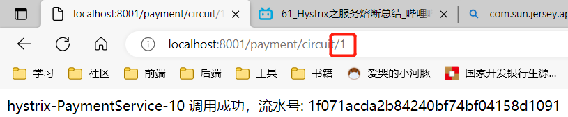
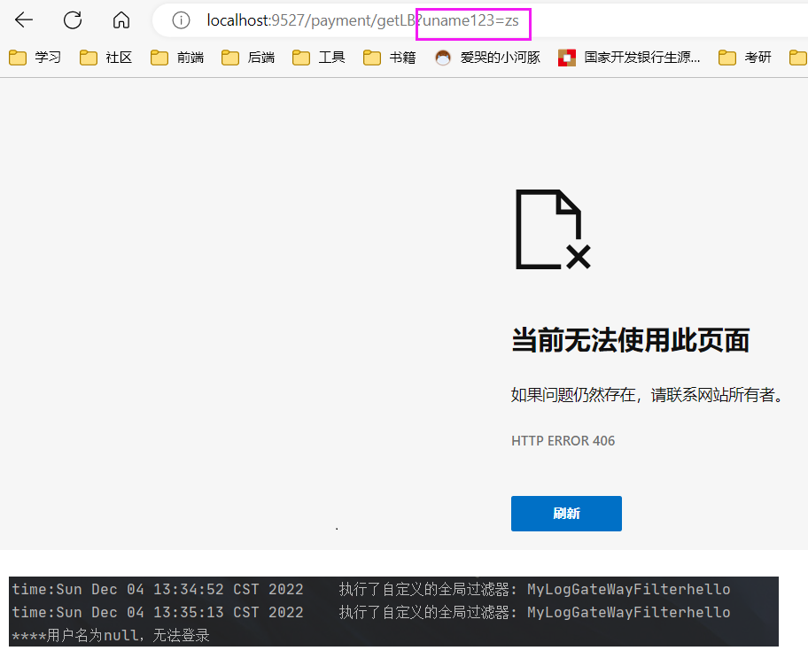
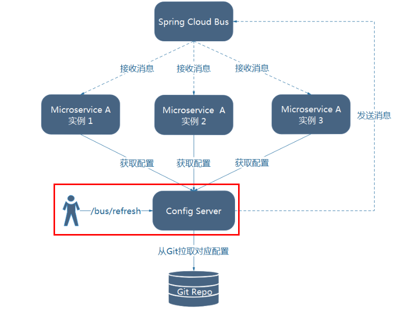
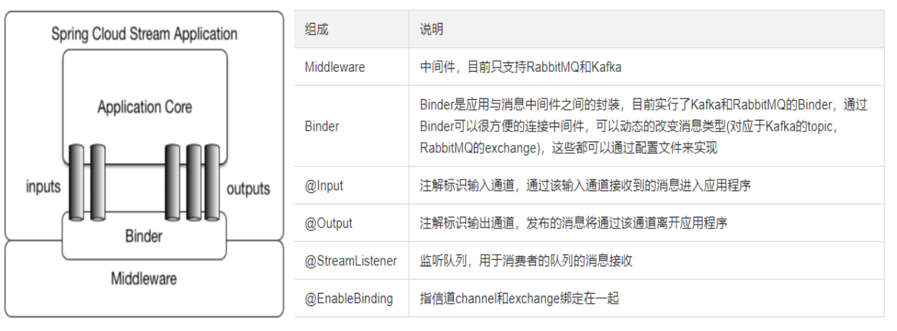
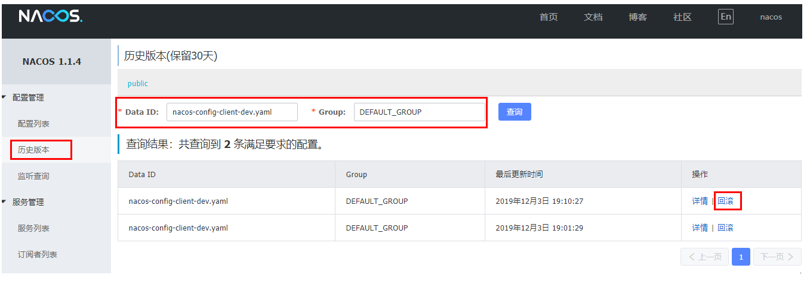

nacos集群

sentinel 流控规则  链路

# 1.微服务概述

## 什么是微服务？

> - 微服务化的核心就是将传统的一站式应用，根据业务拆分成一个一个的服务，彻底地去耦合,每一个微服务提供单个业务功能的服务，一个服务做一件事，从技术角度看就是一种小而独立的处理过程，类似进程概念，能够自行单独启动或销毁，拥有自己独立的数据库。
> - Spring Cloud=分布式微服务架构下的一站式解决方案，是各个微服务架构落地技术的集合体，俗称微服务全家桶

# 2.从2.2.x和H版开始说起

## Spring cloud和Spring boot之间的依赖关系

> 在[spring cloud官网](https://spring.io/projects/spring-cloud#overview)查看


> 更详细的版本对应查看方法：https://start.spring.io/actuator/info


> 本课版本选型


# 3.关于Cloud各种组件的停更/升级/替换

## 由停更引发的“升级惨案”


## 参考资料

> - [spring cloud官方文档](https://cloud.spring.io/spring-cloud-static/Hoxton.SR1/reference/htmlsingle/)
> - [spring cloud中文文档](https://www.bookstack.cn/read/spring-cloud-docs/docs-index.md)
> - [spring boot官方文档](https://docs.spring.io/spring-boot/docs/2.2.2.RELEASE/reference/htmlsingle/)

# 4.微服务架构编码构建

## IDEA新建project工作空间

> 创建一个maven项目，作为父工程

> 字符编码


> 注解生效激活


> java编译版本选8


> File Type过滤


> 父工程POM

```xml
<?xml version="1.0" encoding="UTF-8"?>

<project xmlns="http://maven.apache.org/POM/4.0.0" xmlns:xsi="http://www.w3.org/2001/XMLSchema-instance"
         xsi:schemaLocation="http://maven.apache.org/POM/4.0.0 http://maven.apache.org/xsd/maven-4.0.0.xsd">
    <modelVersion>4.0.0</modelVersion>

    <groupId>com.atguigu</groupId>
    <artifactId>cloud2020</artifactId>
    <version>1.0-SNAPSHOT</version>

    <!--  父工程一定要打pom包  -->
    <packaging>pom</packaging>

    <!-- 统一管理jar包版本 -->
    <properties>
        <project.build.sourceEncoding>UTF-8</project.build.sourceEncoding>
        <maven.compiler.source>1.8</maven.compiler.source>
        <maven.compiler.target>1.8</maven.compiler.target>
        <junit.version>4.12</junit.version>
        <log4j.version>1.2.17</log4j.version>
        <lombok.version>1.16.18</lombok.version>
        <mysql.version>5.1.47</mysql.version>
        <druid.version>1.1.16</druid.version>
        <mybatis.spring.boot.version>1.3.0</mybatis.spring.boot.version>
    </properties>

    <!-- 子模块继承之后，提供作用：锁定版本+子modlue不用写groupId和version  -->
    <dependencyManagement>
        <dependencies>
            <!--spring boot 2.2.2-->
            <dependency>
                <groupId>org.springframework.boot</groupId>
                <artifactId>spring-boot-dependencies</artifactId>
                <version>2.2.2.RELEASE</version>
                <type>pom</type>
                <scope>import</scope>
            </dependency>
            <!--spring cloud Hoxton.SR1-->
            <dependency>
                <groupId>org.springframework.cloud</groupId>
                <artifactId>spring-cloud-dependencies</artifactId>
                <version>Hoxton.SR1</version>
                <type>pom</type>
                <scope>import</scope>
            </dependency>
            <!--spring cloud alibaba 2.1.0.RELEASE-->
            <dependency>
                <groupId>com.alibaba.cloud</groupId>
                <artifactId>spring-cloud-alibaba-dependencies</artifactId>
                <version>2.1.0.RELEASE</version>
                <type>pom</type>
                <scope>import</scope>
            </dependency>
            <dependency>
                <groupId>mysql</groupId>
                <artifactId>mysql-connector-java</artifactId>
                <version>${mysql.version}</version>
            </dependency>
            <dependency>
                <groupId>com.alibaba</groupId>
                <artifactId>druid</artifactId>
                <version>${druid.version}</version>
            </dependency>
            <dependency>
                <groupId>org.mybatis.spring.boot</groupId>
                <artifactId>mybatis-spring-boot-starter</artifactId>
                <version>${mybatis.spring.boot.version}</version>
            </dependency>
            <dependency>
                <groupId>junit</groupId>
                <artifactId>junit</artifactId>
                <version>${junit.version}</version>
            </dependency>
            <dependency>
                <groupId>log4j</groupId>
                <artifactId>log4j</artifactId>
                <version>${log4j.version}</version>
            </dependency>
            <dependency>
                <groupId>org.projectlombok</groupId>
                <artifactId>lombok</artifactId>
                <version>${lombok.version}</version>
                <optional>true</optional>
            </dependency>
        </dependencies>
    </dependencyManagement>

    <build>
        <plugins>
            <plugin>
                <groupId>org.springframework.boot</groupId>
                <artifactId>spring-boot-maven-plugin</artifactId>
                <configuration>
                    <fork>true</fork>
                    <addResources>true</addResources>
                </configuration>
            </plugin>
        </plugins>
    </build>

</project>
```

> maven中跳过单元测试

```xml
<!-- 方法一 -->
<build><!-- maven中跳过单元测试 -->
    <plugins>
        <plugin>
            <groupId>org.apache.maven.plugins</groupId>
            <artifactId>maven-surefire-plugin</artifactId>
            <configuration>
                <skip>true</skip>
            </configuration>
        </plugin>
    </plugins>
</build>
```

方法二


> 父工程创建完成执行`mvn:install`将父工程发布到仓库方便子工程继承


## Rest微服务工程构建

### 微服务提供者支付Module模块

#### 创建maven子工程

> cloud-provider-payment8001	微服务提供者支付Module模块
>
> 创建完成后请回到父工程查看pom文件变化


#### POM

```xml
<?xml version="1.0" encoding="UTF-8"?>
<project xmlns="http://maven.apache.org/POM/4.0.0"
         xmlns:xsi="http://www.w3.org/2001/XMLSchema-instance"
         xsi:schemaLocation="http://maven.apache.org/POM/4.0.0 http://maven.apache.org/xsd/maven-4.0.0.xsd">
    <parent>
        <artifactId>cloud2020</artifactId>
        <groupId>com.atguigu</groupId>
        <version>1.0-SNAPSHOT</version>
    </parent>
    <modelVersion>4.0.0</modelVersion>

    <artifactId>cloud-provider-payment8001</artifactId>
    <dependencies>
        <dependency>
            <groupId>org.springframework.boot</groupId>
            <artifactId>spring-boot-starter-web</artifactId>
        </dependency>
        <dependency>
            <groupId>org.springframework.boot</groupId>
            <artifactId>spring-boot-starter-actuator</artifactId>
        </dependency>
        <dependency>
            <groupId>org.mybatis.spring.boot</groupId>
            <artifactId>mybatis-spring-boot-starter</artifactId>
        </dependency>
        <dependency>
            <groupId>com.alibaba</groupId>
            <artifactId>druid-spring-boot-starter</artifactId>
            <version>1.1.10</version>
        </dependency>
        <!--mysql-connector-java-->
        <dependency>
            <groupId>mysql</groupId>
            <artifactId>mysql-connector-java</artifactId>
        </dependency>
        <!--jdbc-->
        <dependency>
            <groupId>org.springframework.boot</groupId>
            <artifactId>spring-boot-starter-jdbc</artifactId>
        </dependency>
        <dependency>
            <groupId>org.springframework.boot</groupId>
            <artifactId>spring-boot-devtools</artifactId>
            <scope>runtime</scope>
            <optional>true</optional>
        </dependency>
        <dependency>
            <groupId>org.projectlombok</groupId>
            <artifactId>lombok</artifactId>
            <optional>true</optional>
        </dependency>
        <dependency>
            <groupId>org.springframework.boot</groupId>
            <artifactId>spring-boot-starter-test</artifactId>
            <scope>test</scope>
        </dependency>
    </dependencies>
</project>
```

#### 写YML

```yaml
server:
  port: 8001

spring:
  application:
    name: cloud-payment-service
  datasource:
    type: com.alibaba.druid.pool.DruidDataSource            # 当前数据源操作类型
    driver-class-name: org.gjt.mm.mysql.Driver              # mysql驱动包 com.mysql.jdbc.Driver
    url: jdbc:mysql://localhost:3306/db2019?useUnicode=true&characterEncoding=utf-8&useSSL=false
    username: root
    password: 123456


mybatis:
  mapper-locations: classpath:mapper/*.xml
  type-aliases-package: com.atguigu.springcloud.entities    # 所有Entity别名类所在包
```

#### 主启动

```java
package com.atguigu.springcloud;

import org.springframework.boot.SpringApplication;
import org.springframework.boot.autoconfigure.SpringBootApplication;

/**
 * @Author:lz
 * @Date:2022-11-24 15:42
 * @Description
 */
@SpringBootApplication
public class PaymentMain8001 {

    public static void main(String[] args)
    {
        SpringApplication.run(PaymentMain8001.class,args);
    }

}
```

#### 业务类

> controller—service—dao

```java
package com.atguigu.springcloud.controller;

import com.atguigu.springcloud.entities.CommonResult;
import com.atguigu.springcloud.entities.Payment;
import com.atguigu.springcloud.service.PaymentService;
import lombok.extern.slf4j.Slf4j;
import org.springframework.beans.factory.annotation.Autowired;
import org.springframework.web.bind.annotation.*;

/**
 * @Author: lz
 * @Date: 2022-11-24 0024 17:08
 * @Description:
 */

@RestController
@RequestMapping("/payment")
@Slf4j
public class PaymentController {

    @Autowired
    private PaymentService paymentService;


    /**
     * 添加serial
     *
     * @param payment
     * @return
     */
    @PostMapping("/create")
    public CommonResult create(@RequestBody Payment payment) {
        int i = paymentService.create(payment);
        if (i > 0) {
            return new CommonResult(200, "添加数据库成功", i);
        } else {
            return new CommonResult(444, "添加数据库失败");
        }
    }

    @GetMapping("/getSerialById/{id}")
    public CommonResult getSerialById(@PathVariable("id") Long id) {
        Payment payment = paymentService.getSerialById(id);
        if (payment != null) {
            return new CommonResult(200, "查询成功", payment);
        }
        return new CommonResult(444, "查询失败", null);
    }

}

```

#### 测试


### dev-tools热部署

> 在子项目中添加依赖

```xml
        <dependency>
            <groupId>org.springframework.boot</groupId>
            <artifactId>spring-boot-devtools</artifactId>
            <scope>runtime</scope>
            <optional>true</optional>
        </dependency>
```

> 在父项目中配置插件

```xml
    <build>
        <plugins>
            <plugin>
                <groupId>org.springframework.boot</groupId>
                <artifactId>spring-boot-maven-plugin</artifactId>
                <configuration>
                    <fork>true</fork>
                    <addResources>true</addResources>
                </configuration>
            </plugin>
        </plugins>
    </build>
```

> 开启自动构建


> ctrl + shift + alt + /


### 微服务消费者订单Module模块

> 创建子工程cloud-consumer-order80	微服务消费者订单Module模块
>
> - POM
> - yaml
> - 主启动（同上一个模块）

#### RestTemplate

> RestTemplate提供了多种便捷访问远程Http服务的方法， 是一种简单便捷的**访问restful服务模板类**，是Spring提供的用于访问Rest服务的客户端模板工具集
>
> 那种?类型的也可以使用

#### 业务类

> 配置RestTemplate

```java
package com.atguigu.springcloud.config;

import org.springframework.context.annotation.Bean;
import org.springframework.context.annotation.Configuration;
import org.springframework.web.client.RestTemplate;

/**
 * @Author: lz
 * @Date: 2022-11-25 0025 14:06
 * @Description:
 */
@Configuration
public class ApplicationContextConfig {
    @Bean
    public RestTemplate restTemplate() {
        return new RestTemplate();
    }
}

```

> controller

```java
package com.atguigu.springcloud.controller;

import com.atguigu.springcloud.entities.CommonResult;
import com.atguigu.springcloud.entities.Payment;
import lombok.extern.slf4j.Slf4j;
import org.springframework.beans.factory.annotation.Autowired;
import org.springframework.web.bind.annotation.GetMapping;
import org.springframework.web.bind.annotation.PathVariable;
import org.springframework.web.bind.annotation.RequestMapping;
import org.springframework.web.bind.annotation.RestController;
import org.springframework.web.client.RestTemplate;

/**
 * @Author: lz
 * @Date: 2022-11-25 0025 14:04
 * @Description:
 */

@RestController
@Slf4j
@RequestMapping("/consumer")
public class ConsumerController {

    // 提供者支付module模块的url
    public static final String PAYMENT_URL = "http://localhost:8001";

    @Autowired
    private RestTemplate restTemplate;

    @GetMapping("/create")
    public CommonResult create(Payment payment) {

        return restTemplate.postForObject(PAYMENT_URL + "/payment/create", payment, CommonResult.class);
    }


    @GetMapping("/getSerialById/{id}")
    public CommonResult getSerialById(@PathVariable("id") Long id) {

        return restTemplate.getForObject(PAYMENT_URL + "/payment/getSerialById/" + id, CommonResult.class, id);
    }


}
```

#### 测试

> 先直接访问提供者支付模块的controller


> 再访问消费者订单模块，同样也可以调用到


> 测试消费者订单模块的添加serial


### 工程重构

> 在我们的提供者支付模块和消费者订单模块都有payment实体类和统一返回类型的类，这样就会造成代码的冗余，我们可以把实体类和统一返回类型的类提取到一个公共的工程中
>
> 步骤
>
> - 创建公共工程cloud-api-commons
>
> - 修POM
>
> - 将实体类和统一返回类型的类放在此工程中
>
> - maven命令`clean install`
>
> - 提供者支付模块和消费者订单模块删除这两个类，在pom中导入公共工程
>
>   

### 目前工程样图


# 5.服务注册与发现

## [:x:Eureka](https://github.com/Netflix/eureka)

> - 什么是服务治理
>
>   Spring Cloud 封装了 Netflix 公司开发的 Eureka 模块来实现服务治理
>
>   在传统的rpc远程调用框架中，管理每个服务与服务之间依赖关系比较复杂，管理比较复杂，所以需要**使用服务治理，管理服务于服务之间依赖关系，可以实现服务调用、负载均衡、容错等，实现服务发现与注册。**
>
> - 什么是服务注册与发现
>
>   Eureka采用了C/S的设计架构，**Eureka Server 作为服务注册功能的服务器，它是服务注册中心。而系统中的其他微服务，使用 Eureka的客户端连接到 Eureka Server并维持心跳连接。**这样系统的维护人员就可以通过 Eureka Server 来监控系统中各个微服务是否正常运行。
>
>   **在服务注册与发现中，有一个注册中心。当服务器启动的时候，会把当前自己服务器的信息，比如服务地址通讯地址等以别名方式注册到注册中心上。另一方（消费者|服务提供者），以该别名的方式去注册中心上获取到实际的服务通讯地址，然后再实现本地RPC调用**；RPC远程调用框架核心设计思想：在于注册中心，因为使用注册中心管理每个服务与服务之间的一个依赖关系(服务治理概念)。在任何rpc远程框架中，都会有一个注册中心(存放服务地址相关信息(接口地址))
>
> - Eureka包含两个组件：Eureka Server和Eureka Client
>
>   Eureka Server提供服务注册服务
>   各个微服务节点通过配置启动后，会在EurekaServer中进行注册，这样EurekaServer中的服务注册表中将会存储所有可用服务节点的信息，服务节点的信息可以在界面中直观看到。
>
>   EurekaClient通过注册中心进行访问
>   是一个Java客户端，用于简化Eureka Server的交互，客户端同时也具备一个内置的、使用轮询(round-robin)负载算法的负载均衡器。在应用启动后，将会向Eureka Server发送心跳(默认周期为30秒)。如果Eureka Server在多个心跳周期内没有接收到某个节点的心跳，EurekaServer将会从服务注册表中把这个服务节点移除（默认90秒）


### 单机Eureka构建步骤

#### 生成EurekaServer端服务注册中心

##### 创建maven子工程

> 创建子工程cloud-eureka-server7001

##### POM

```xml
<dependency>
    <groupId>org.springframework.cloud</groupId>
    <artifactId>spring-cloud-starter-netflix-eureka-server</artifactId><!--注意这里是server-->
</dependency>

```

##### yaml

```yaml
server:
  port: 7001

eureka:
  instance:
    hostname: localhost #eureka服务端的实例名称
  client:
    #false表示不向注册中心注册自己。
    register-with-eureka: false
    #false表示自己端就是注册中心，我的职责就是维护服务实例，并不需要去检索服务
    fetch-registry: false
    service-url:
      #设置与Eureka Server交互的地址查询服务和注册服务都需要依赖这个地址。
      defaultZone: http://${eureka.instance.hostname}:${server.port}/eureka/
```

##### 主启动


##### 测试

> 访问localhost:7001


#### 修改提供者支付模块

> EurekaClient端将cloud-provider-payment8001注册进EurekaServer成为服务提供者provider

##### POM

```xml
<dependency>
    <groupId>org.springframework.cloud</groupId>
    <artifactId>spring-cloud-starter-netflix-eureka-client</artifactId><!--注意这里是client-->
</dependency>
```

##### yaml

```yaml
eureka:
  client:
    #表示是否将自己注册进EurekaServer默认为true。
    register-with-eureka: true
    #是否从EurekaServer抓取已有的注册信息，默认为true。单节点无所谓，集群必须设置为true才能配合ribbon使用负载均衡
    fetchRegistry: true
    service-url:
      defaultZone: http://localhost:7001/eureka
```

##### 主启动


##### 测试


#### 修改消费者订单模块

> EurekaClient端将cloud-consumer-order80注册进EurekaServer成为服务消费者consumer

##### POM

```xml
<dependency>
    <groupId>org.springframework.cloud</groupId>
    <artifactId>spring-cloud-starter-netflix-eureka-client</artifactId><!--注意这里是client-->
</dependency>
```

##### yaml

```yaml
server:
  port: 80


spring:
  application:
    name: cloud-order-service

eureka:
  client:
    #表示是否将自己注册进EurekaServer默认为true。
    register-with-eureka: true
    #是否从EurekaServer抓取已有的注册信息，默认为true。单节点无所谓，集群必须设置为true才能配合ribbon使用负载均衡
    fetchRegistry: true
    service-url:
      defaultZone: http://localhost:7001/eureka
 
```

##### 主启动


##### 测试


### 集群Eureka构建步骤


#### EurekaServer集群环境构建步骤


##### 新建cloud-eureka-server7002

> 根据新建cloud-eureka-server7001创建一个新建cloud-eureka-server7002作为注册中心，和7001组合成集群环境

##### POM

```xml
<dependency>
    <groupId>org.springframework.cloud</groupId>
    <artifactId>spring-cloud-starter-netflix-eureka-server</artifactId><!--注意这里是server-->
</dependency>

```

##### 修改映射配置

> 找到`C:\Windows\System32\drivers\etc`路径下的hosts文件，写入配置


##### yaml

> 7001的yaml

```yaml
server:
  port: 7001

eureka:
  client:

    。。。。。。

    service-url:
   	  #单机就是自己
   	  #defaultZone: http://eureka7001.com:7001/eureka/
   	  #集群指向其他的eureka
      defaultZone: http://eureka7002.com:7002/eureka/
```

> 7002的yaml

```yaml
server:
  port: 7002

eureka:
  instance:
    hostname: eureka7002.com #eureka服务端的实例名称
  client:
    register-with-eureka: false     #false表示不向注册中心注册自己。
    fetch-registry: false     #false表示自己端就是注册中心，我的职责就是维护服务实例，并不需要去检索服务
    service-url:
   	  #单机就是自己
      #defaultZone: http://eureka7002.com:7002/eureka/
      #集群指向其他的eureka
   	  defaultZone: http://eureka7001.com:7001/eureka/
```

##### 主启动

```java
package com.atguigu.springcloud;

import org.springframework.boot.SpringApplication;
import org.springframework.boot.autoconfigure.SpringBootApplication;
import org.springframework.cloud.netflix.eureka.server.EnableEurekaServer;

/**
 * @Author: lz
 * @Date: 2022-11-26 0026 15:53
 * @Description:
 */
@SpringBootApplication
@EnableEurekaServer
public class EurekaMain7002 {
    public static void main(String[] args) {
        SpringApplication.run(EurekaMain7002.class, args);
    }
}

```

##### 测试


#### 将支付服务8001，订单服务80发布到集群中


##### 测试

> 先要启动EurekaServer，7001/7002服务;再要启动服务提供者provider，8001;再要启动消费者，80


#### 支付服务提供者8001集群环境构建

##### 新建cloud-provider-payment8002

> 根据新建cloud-provider-payment8001创建一个新建cloud-provider-payment8002作为支付提供者，和8001组成集群环境

##### POM

```xml
        <!--eureka-client-->
        <dependency>
            <groupId>org.springframework.cloud</groupId>
            <artifactId>spring-cloud-starter-netflix-eureka-client</artifactId>
        </dependency>
```

##### yaml

```yaml
server:
  port: 8002

 。。。。。。

eureka:
  client:

 	。。。。。。

    service-url:
      #defaultZone: http://localhost:7001/eureka  # 单机版
      defaultZone: http://eureka7001.com:7001/eureka,http://eureka7002.com:7002/eureka  # 集群版

```

##### 主启动

```java
package com.atguigu.springcloud;

import org.springframework.boot.SpringApplication;
import org.springframework.boot.autoconfigure.SpringBootApplication;
import org.springframework.cloud.netflix.eureka.EnableEurekaClient;

/**
 * @Author: lz
 * @Date: 2022-11-26  17:03
 * @Description:
 */

@SpringBootApplication
@EnableEurekaClient
public class PaymentMain8002 {
    public static void main(String[] args) {
        SpringApplication.run(PaymentMain8002.class, args);
    }
}

```

##### 业务类

> 业务类内容和8001相同，直接复制8001的

##### 负载均衡

> 订单服务访问地址不能写死


> 使用@LoadBalanced注解赋予RestTemplate负载均衡的能力

```java
package com.atguigu.springcloud.config;

import org.springframework.cloud.client.loadbalancer.LoadBalanced;
import org.springframework.context.annotation.Bean;
import org.springframework.context.annotation.Configuration;
import org.springframework.web.client.RestTemplate;

/**
 * @Author: lz
 * @Date: 2022-11-25 0025 14:06
 * @Description:
 */
@Configuration
public class ApplicationContextConfig {
    @Bean
    @LoadBalanced //使用@LoadBalanced注解赋予RestTemplate负载均衡的能力
    public RestTemplate restTemplate() {
        return new RestTemplate();
    }
}

```

##### 测试


### actuator微服务信息完善

#### 主机名称:服务名称修改

##### 当前问题

> 含有主机名称


##### POM

```xml
        <dependency>
            <groupId>org.springframework.boot</groupId>
            <artifactId>spring-boot-starter-web</artifactId>
        </dependency>
        <dependency>
            <groupId>org.springframework.boot</groupId>
            <artifactId>spring-boot-starter-actuator</artifactId>
        </dependency>
```

##### yaml

```yaml
server:
  port: 80

 。。。。。。

eureka:

 。。。。。。

  instance:
    instance-id: order80
```

##### 测试


#### 访问信息有IP信息提示

##### 当前问题

> 没有IP提示，不知道是在哪一台主机上


##### POM

```xml
        <dependency>
            <groupId>org.springframework.boot</groupId>
            <artifactId>spring-boot-starter-web</artifactId>
        </dependency>
        <dependency>
            <groupId>org.springframework.boot</groupId>
            <artifactId>spring-boot-starter-actuator</artifactId>
        </dependency>
```

##### yaml

```yaml
server:
  port: 80

  。。。。。。

eureka:

 。。。。。。

  instance:
    instance-id: order80
    prefer-ip-address: true     #访问路径可以显示IP地址
```

##### 测试


### 服务发现Discovery

> 对于注册进eureka里面的微服务，可以通过服务发现来获得该服务的信息

#### 修改cloud-provider-payment8001

> 修改cloud-provider-payment8001的Controller，8002也可以这样，我们这里以8001为例

```java
package com.atguigu.springcloud.controller;

import com.atguigu.springcloud.entities.CommonResult;
import com.atguigu.springcloud.entities.Payment;
import com.atguigu.springcloud.service.PaymentService;
import lombok.extern.slf4j.Slf4j;
import org.springframework.beans.factory.annotation.Autowired;
import org.springframework.beans.factory.annotation.Value;
import org.springframework.cloud.client.ServiceInstance;
import org.springframework.cloud.client.discovery.DiscoveryClient;
import org.springframework.web.bind.annotation.*;

import java.util.List;

/**
 * @Author: lz
 * @Date: 2022-11-24 0024 17:08
 * @Description:
 */

@RestController
@RequestMapping("/payment")
@Slf4j
public class PaymentController {
    
    。。。。。。

    @Autowired
    private DiscoveryClient discoveryClient;

	。。。。。。

    @GetMapping("/discovery")
    public DiscoveryClient Discovery() {
//        获取所有的在注册中心的服务
        List<String> services = discoveryClient.getServices();
        for (String service : services) {
            log.info("service=========>{}", service);
        }


//        传入具体服务的名称
        List<ServiceInstance> instances = discoveryClient.getInstances("CLOUD-PAYMENT-SERVICE");
        for (ServiceInstance instance : instances) {
            System.out.println(instance.getServiceId() + "\t" + instance.getHost() + "\t" + instance.getPort() + "\t"
                    + instance.getUri());
        }

        return discoveryClient;
    }

}

```

#### 配置启动类


#### 测试


### Eureka自我保护

> - 为什么会产生Eureka自我保护机制？
>   为了防止EurekaClient可以正常运行，但是 与 EurekaServer网络不通情况下，EurekaServer不会立刻将EurekaClient服务剔除
>
> - 什么是自我保护模式？
>   默认情况下，如果EurekaServer在一定时间内没有接收到某个微服务实例的心跳，EurekaServer将会注销该实例（默认90秒）。但是当网络分区故障发生(延时、卡顿、拥挤)时，微服务与EurekaServer之间无法正常通信，以上行为可能变得非常危险了——因为微服务本身其实是健康的，此时本不应该注销这个微服务。Eureka通过“自我保护模式”来解决这个问题——当EurekaServer节点在短时间内丢失过多客户端时（可能发生了网络分区故障），那么这个节点就会进入自我保护模式。

#### 禁止自我保护

##### 以注册中心eureakeServer端7001为例

> 出厂默认，自我保护机制是开启的

```yaml
server:
  port: 7001

eureka:

 。。。。。。
 
  server:
    #关闭自我保护机制，保证不可用服务被及时踢除
    enable-self-preservation: false
    eviction-interval-timer-in-ms: 2000
```

##### 配置生产者8001、8002

```yaml
server:
  port: 8001

。。。。。。

eureka:
  。。。。。。
  instance:
    instance-id: payment8001
    #Eureka客户端向服务端发送心跳的时间间隔，单位为秒(默认是30秒)
    lease-renewal-interval-in-seconds: 1
    #Eureka服务端在收到最后一次心跳后等待时间上限，单位为秒(默认是90秒)，超时将剔除服务
    lease-expiration-duration-in-seconds: 2

```

```yaml
server:
  port: 8002

。。。。。。

eureka:
  
  。。。。。。。
  
  instance:
    instance-id: payment8002
    #Eureka客户端向服务端发送心跳的时间间隔，单位为秒(默认是30秒)
    lease-renewal-interval-in-seconds: 1
    #Eureka服务端在收到最后一次心跳后等待时间上限，单位为秒(默认是90秒)，超时将剔除服务
    lease-expiration-duration-in-seconds: 2

```

> 注册中心7001配置了，7002没有配置。服务8001、8002都配置了
>
> 关闭8001、8002，对比一下7001、7002；7001接着把8001、8002的服务删除了，而7002没有


## ✔️ Zookeeper

### 安装zookeeper

> 1. 下载[zookeeper](https://archive.apache.org/dist/zookeeper/zookeeper-3.4.13/)或者执行`wget http://mirror.bit.edu.cn/apache/zookeeper/zookeeper-3.4.13/zookeeper-3.4.13.tar.gz`
>
> 2. 解压，进入bin目录， 运行`./zkServer.sh start` ，初次运行会报错，没有`zoo.cfg`配置文件
>
> 3. 修改`zoo.cfg`配置文件
>
>    - 将conf下的`zoo_sample.cfg`复制一份改名为`zoo.cfg`即可。
>
>      注意几个重要位置：
>
>      `dataDir=./  `	临时数据存储的目录（可写相对路径）
>
>      `clientPort=2181`	zookeeper的端口号
>
>      修改完成后再次启动zookeeper	
>
> 4. 使用`bin/zkCli.cmd`测试
>
>    - `ls /`：列出zookeeper根下保存的所有节点
>
>      `create –e /atguigu 123`：创建一个atguigu节点，值为123
>
>      `get /atguigu`：获取/atguigu节点的值
>
> 5. 查看zookeeper的运行状态
>
>    ```sh
>    [root@lz bin]# ./zkServer.sh status
>    ```

### 创建服务提供者

> 新建cloud-provider-payment8004作为服务提供者

#### POM

```xml
<?xml version="1.0" encoding="UTF-8"?>
<project xmlns="http://maven.apache.org/POM/4.0.0"
         xmlns:xsi="http://www.w3.org/2001/XMLSchema-instance"
         xsi:schemaLocation="http://maven.apache.org/POM/4.0.0 http://maven.apache.org/xsd/maven-4.0.0.xsd">
    <parent>
        <artifactId>cloud2020</artifactId>
        <groupId>com.atguigu</groupId>
        <version>1.0-SNAPSHOT</version>
    </parent>
    <modelVersion>4.0.0</modelVersion>

    <artifactId>cloud-provider-payment8004</artifactId>
    <dependencies>
        <!-- SpringBoot整合Web组件 -->
        <dependency>
            <groupId>org.springframework.boot</groupId>
            <artifactId>spring-boot-starter-web</artifactId>
        </dependency>
        <!-- 引入自己定义的api通用包，可以使用Payment支付Entity -->
        <dependency>
            <groupId>com.atguigu</groupId>
            <artifactId>cloud-api-commons</artifactId>
            <version>1.0-SNAPSHOT</version>
        </dependency>

        <!-- SpringBoot整合zookeeper客户端 -->
        <dependency>
            <groupId>org.springframework.cloud</groupId>
            <artifactId>spring-cloud-starter-zookeeper-discovery</artifactId>
        </dependency>
        <dependency>
            <groupId>org.springframework.boot</groupId>
            <artifactId>spring-boot-devtools</artifactId>
            <scope>runtime</scope>
            <optional>true</optional>
        </dependency>
        <dependency>
            <groupId>org.projectlombok</groupId>
            <artifactId>lombok</artifactId>
            <optional>true</optional>
        </dependency>
        <dependency>
            <groupId>org.springframework.boot</groupId>
            <artifactId>spring-boot-starter-test</artifactId>
            <scope>test</scope>
        </dependency>
    </dependencies>


</project>
```

#### yaml

```yaml
#8004表示注册到zookeeper服务器的支付服务提供者端口号
server:
  port: 8004
#服务别名----注册zookeeper到注册中心名称
spring:
  application:
    name: cloud-provider-payment
  cloud:
    zookeeper:
      connect-string: 192.168.221.100:2181
```

#### 主启动

```java
package com.atguigu.springcloud;

import org.springframework.boot.SpringApplication;
import org.springframework.boot.autoconfigure.SpringBootApplication;
import org.springframework.cloud.client.discovery.EnableDiscoveryClient;

/**
 * @Author: lz
 * @Date: 2022-11-26 0026 22:36
 * @Description:
 */
@SpringBootApplication
@EnableDiscoveryClient
public class PaymentMain8004 {
    public static void main(String[] args) {
        SpringApplication.run(PaymentMain8004.class, args);
    }
}

```

#### controller

```java
package com.atguigu.springcloud.controller;

import org.springframework.web.bind.annotation.RequestMapping;
import org.springframework.web.bind.annotation.RestController;
import org.springframework.beans.factory.annotation.Value;

import java.util.UUID;


@RestController
public class PaymentController {
    @Value("${server.port}")
    private String serverPort;

    @RequestMapping(value = "/payment/zk")
    public String paymentzk() {
        return "springcloud with zookeeper: " + serverPort + "\t" + UUID.randomUUID().toString();
    }
}
```

#### 报错


##### 原因

> zookeeper-discovery中有一个zookeeper的jar包，这个jar包版本和我们Linux中的版本不一样，发生了冲突


##### 解决

> 修POM文件，将自带的zookeeper排除

```xml
        <!-- SpringBoot整合zookeeper客户端 -->
        <dependency>
            <groupId>org.springframework.cloud</groupId>
            <artifactId>spring-cloud-starter-zookeeper-discovery</artifactId>
            <!--先排除自带的zookeeper3.5.3-->
            <exclusions>
                <exclusion>
                    <groupId>org.apache.zookeeper</groupId>
                    <artifactId>zookeeper</artifactId>
                </exclusion>
            </exclusions>
        </dependency>
        <!--添加zookeeper3.4.9版本,和linux中的版本一致-->
        <dependency>
            <groupId>org.apache.zookeeper</groupId>
            <artifactId>zookeeper</artifactId>
            <version>3.4.9</version>
        </dependency>
```

#### 测试1


#### 测试2


### 创建服务消费者

> 新建cloud-consumerzk-order80作为服务的消费者

#### POM

```xml
<?xml version="1.0" encoding="UTF-8"?>
<project xmlns="http://maven.apache.org/POM/4.0.0"
         xmlns:xsi="http://www.w3.org/2001/XMLSchema-instance"
         xsi:schemaLocation="http://maven.apache.org/POM/4.0.0 http://maven.apache.org/xsd/maven-4.0.0.xsd">
    <parent>
        <artifactId>cloud2020</artifactId>
        <groupId>com.atguigu</groupId>
        <version>1.0-SNAPSHOT</version>
    </parent>
    <modelVersion>4.0.0</modelVersion>

    <artifactId>cloud-consumerzk-order80</artifactId>

    <dependencies>
        <!-- SpringBoot整合Web组件 -->
        <dependency>
            <groupId>org.springframework.boot</groupId>
            <artifactId>spring-boot-starter-web</artifactId>
        </dependency>
        <!-- 引入自己定义的api通用包，可以使用Payment支付Entity -->
        <dependency>
            <groupId>com.atguigu</groupId>
            <artifactId>cloud-api-commons</artifactId>
            <version>1.0-SNAPSHOT</version>
        </dependency>

        <!-- SpringBoot整合zookeeper客户端 -->
        <dependency>
            <groupId>org.springframework.cloud</groupId>
            <artifactId>spring-cloud-starter-zookeeper-discovery</artifactId>
            <!--先排除自带的zookeeper3.5.3-->
            <exclusions>
                <exclusion>
                    <groupId>org.apache.zookeeper</groupId>
                    <artifactId>zookeeper</artifactId>
                </exclusion>
            </exclusions>
        </dependency>
        <!--添加zookeeper3.4.9版本,和linux中的版本一致-->
        <dependency>
            <groupId>org.apache.zookeeper</groupId>
            <artifactId>zookeeper</artifactId>
            <version>3.4.9</version>
        </dependency>
        <dependency>
            <groupId>org.springframework.boot</groupId>
            <artifactId>spring-boot-devtools</artifactId>
            <scope>runtime</scope>
            <optional>true</optional>
        </dependency>
        <dependency>
            <groupId>org.projectlombok</groupId>
            <artifactId>lombok</artifactId>
            <optional>true</optional>
        </dependency>
        <dependency>
            <groupId>org.springframework.boot</groupId>
            <artifactId>spring-boot-starter-test</artifactId>
            <scope>test</scope>
        </dependency>
    </dependencies>
</project>
```

#### yaml

```yaml
server:
  port: 80

spring:
  application:
    name: cloud-consumer-order
  cloud:
    #注册到zookeeper地址
    zookeeper:
      connect-string: 192.168.221.100:2181
```

#### 主启动

```java
package com.atguigu.springcloud;

import org.springframework.boot.SpringApplication;
import org.springframework.boot.autoconfigure.SpringBootApplication;
import org.springframework.cloud.client.discovery.EnableDiscoveryClient;

/**
 * @Author: lz
 * @Date: 2022-11-27 0027 10:52
 * @Description:
 */

@SpringBootApplication
@EnableDiscoveryClient
public class OrderZK80 {

    public static void main(String[] args) {
        SpringApplication.run(OrderZK80.class, args);
    }
}
```

#### 业务类

> 配置RestTemplate

```java
package com.atguigu.springcloud.config;

import org.springframework.cloud.client.loadbalancer.LoadBalanced;
import org.springframework.context.annotation.Bean;
import org.springframework.context.annotation.Configuration;
import org.springframework.web.client.RestTemplate;

/**
 * @Author: lz
 * @Date: 2022-11-27 0027 10:54
 * @Description:
 */

@Configuration
public class ApplicationContextConfig {

    @Bean
    @LoadBalanced
    public RestTemplate getRestTemplage() {
        return new RestTemplate();
    }
}
```

> controller

```java
package com.atguigu.springcloud.controller;

import org.springframework.beans.factory.annotation.Autowired;
import org.springframework.web.bind.annotation.RequestMapping;
import org.springframework.web.bind.annotation.RestController;
import org.springframework.web.client.RestTemplate;

/**
 * @Author: lz
 * @Date: 2022-11-27 0027 10:54
 * @Description:
 */
@RestController
public class OrderZKController {

    public static final String INVOKE_URL = "http://cloud-provider-payment";

    @Autowired
    private RestTemplate restTemplate;

    @RequestMapping(value = "/consumer/zk")
    public String paymentInfo() {
        String result = restTemplate.getForObject(INVOKE_URL + "/payment/zk", String.class);
        System.out.println("消费者调用支付服务(zookeeper)--->result:" + result);
        return result;
    }
}
```

#### 测试


## [✔️consul](https://www.springcloud.cc/spring-cloud-consul.html)

> - Consul 是一套开源的分布式服务发现和配置管理系统，由 HashiCorp 公司用 Go 语言开发。提供了微服务系统中的服务治理、配置中心、控制总线等功能。这些功能中的每一个都可以根据需要单独使用，也可以一起使用以构建全方位的服务网格，总之Consul提供了一种完整的服务网格解决方案。
> - [下载地址](https://www.consul.io/downloads.html)
> - [中文文档](https://www.springcloud.cc/spring-cloud-consul.html)

### 安装并运行Consul

> window环境下载完成后只有一个consul.exe文件，硬盘路径下双击运行，查看版本号信息


> - 使用开发模式启动，执行`consul agent -dev`
> - 通过以下地址可以访问Consul的首页：http://localhost:8500


### 服务提供者

> 新建Module支付服务provider8006作为服务的提供者

#### POM

```xml
<?xml version="1.0" encoding="UTF-8"?>
<project xmlns="http://maven.apache.org/POM/4.0.0"
         xmlns:xsi="http://www.w3.org/2001/XMLSchema-instance"
         xsi:schemaLocation="http://maven.apache.org/POM/4.0.0 http://maven.apache.org/xsd/maven-4.0.0.xsd">
    <parent>
        <artifactId>cloud2020</artifactId>
        <groupId>com.atguigu</groupId>
        <version>1.0-SNAPSHOT</version>
    </parent>
    <modelVersion>4.0.0</modelVersion>

    <artifactId>cloud-providerconsul-payment8006</artifactId>

    <dependencies>
        <!--SpringCloud consul-server -->
        <dependency>
            <groupId>org.springframework.cloud</groupId>
            <artifactId>spring-cloud-starter-consul-discovery</artifactId>
        </dependency>
        <!-- SpringBoot整合Web组件 -->
        <dependency>
            <groupId>org.springframework.boot</groupId>
            <artifactId>spring-boot-starter-web</artifactId>
        </dependency>
        <dependency>
            <groupId>org.springframework.boot</groupId>
            <artifactId>spring-boot-starter-actuator</artifactId>
        </dependency>
        <!--日常通用jar包配置-->
        <dependency>
            <groupId>org.springframework.boot</groupId>
            <artifactId>spring-boot-devtools</artifactId>
            <scope>runtime</scope>
            <optional>true</optional>
        </dependency>
        <dependency>
            <groupId>org.projectlombok</groupId>
            <artifactId>lombok</artifactId>
            <optional>true</optional>
        </dependency>
        <dependency>
            <groupId>org.springframework.boot</groupId>
            <artifactId>spring-boot-starter-test</artifactId>
            <scope>test</scope>
        </dependency>
    </dependencies>


</project>
```

#### yaml

```yaml
###consul服务端口号
server:
  port: 8006

spring:
  application:
    name: consul-provider-payment
  ####consul注册中心地址
  cloud:
    consul:
      host: localhost
      port: 8500
      discovery:
        #hostname: 127.0.0.1
        service-name: ${spring.application.name}
```

#### 主启动

```java
package com.atguigu.springcloud;

import org.springframework.boot.SpringApplication;
import org.springframework.boot.autoconfigure.SpringBootApplication;
import org.springframework.cloud.client.discovery.EnableDiscoveryClient;

/**
 * @Author: lz
 * @Date: 2022-11-27 0027 12:15
 * @Description:
 */
@SpringBootApplication
@EnableDiscoveryClient
public class PaymentMain8006 {
    public static void main(String[] args) {
        SpringApplication.run(PaymentMain8006.class, args);
    }
}

```

#### controller

```java
package com.atguigu.springcloud.controller;

import org.springframework.beans.factory.annotation.Value;
import org.springframework.web.bind.annotation.GetMapping;
import org.springframework.web.bind.annotation.RestController;

import java.util.UUID;


@RestController
public class PaymentController {
    @Value("${server.port}")
    private String serverPort;

    @GetMapping("/payment/consul")
    public String paymentInfo() {
        return "springcloud with consul: " + serverPort + "\t\t" + UUID.randomUUID().toString();
    }
}
```

#### 测试


### 服务消费者

> 新建Module消费服务order80作为服务的消费者

#### pom

```xml
<?xml version="1.0" encoding="UTF-8"?>
<project xmlns="http://maven.apache.org/POM/4.0.0"
         xmlns:xsi="http://www.w3.org/2001/XMLSchema-instance"
         xsi:schemaLocation="http://maven.apache.org/POM/4.0.0 http://maven.apache.org/xsd/maven-4.0.0.xsd">
    <parent>
        <artifactId>cloud2020</artifactId>
        <groupId>com.atguigu</groupId>
        <version>1.0-SNAPSHOT</version>
    </parent>
    <modelVersion>4.0.0</modelVersion>

    <artifactId>cloud-consumerconsul-order80</artifactId>

    <dependencies>
        <!--SpringCloud consul-server -->
        <dependency>
            <groupId>org.springframework.cloud</groupId>
            <artifactId>spring-cloud-starter-consul-discovery</artifactId>
        </dependency>
        <!-- SpringBoot整合Web组件 -->
        <dependency>
            <groupId>org.springframework.boot</groupId>
            <artifactId>spring-boot-starter-web</artifactId>
        </dependency>
        <dependency>
            <groupId>org.springframework.boot</groupId>
            <artifactId>spring-boot-starter-actuator</artifactId>
        </dependency>
        <!--日常通用jar包配置-->
        <dependency>
            <groupId>org.springframework.boot</groupId>
            <artifactId>spring-boot-devtools</artifactId>
            <scope>runtime</scope>
            <optional>true</optional>
        </dependency>
        <dependency>
            <groupId>org.projectlombok</groupId>
            <artifactId>lombok</artifactId>
            <optional>true</optional>
        </dependency>
        <dependency>
            <groupId>org.springframework.boot</groupId>
            <artifactId>spring-boot-starter-test</artifactId>
            <scope>test</scope>
        </dependency>
    </dependencies>


</project>
```

#### yaml

```yaml
###consul服务端口号
server:
  port: 80

spring:
  application:
    name: cloud-consumer-order
  ####consul注册中心地址
  cloud:
    consul:
      host: localhost
      port: 8500
      discovery:
        #hostname: 127.0.0.1
        service-name: ${spring.application.name}
```

#### 主启动

```java
package com.atguigu.springcloud;

import org.springframework.boot.SpringApplication;
import org.springframework.boot.autoconfigure.SpringBootApplication;
import org.springframework.cloud.client.discovery.EnableDiscoveryClient;

/**
 * @Author: lz
 * @Date: 2022-11-27 0027 12:22
 * @Description:
 */
@SpringBootApplication
@EnableDiscoveryClient //该注解用于向使用consul或者zookeeper作为注册中心时注册服务
public class OrderConsulMain80 {
    public static void main(String[] args) {
        SpringApplication.run(OrderConsulMain80.class, args);
    }
}
```

#### 业务类

> 配置RestTemplate

```java
package com.atguigu.springcloud.config;

import org.springframework.cloud.client.loadbalancer.LoadBalanced;
import org.springframework.context.annotation.Bean;
import org.springframework.context.annotation.Configuration;
import org.springframework.web.client.RestTemplate;

/**
 * @Author: lz
 * @Date: 2022-11-27 0027 12:23
 * @Description:
 */
@Configuration
public class ApplicationContextConfig {
    @Bean
    @LoadBalanced
    public RestTemplate getRestTemplate() {
        return new RestTemplate();
    }
}
```

> controller

```java
package com.atguigu.springcloud.controller;

import org.springframework.beans.factory.annotation.Autowired;
import org.springframework.web.bind.annotation.GetMapping;
import org.springframework.web.bind.annotation.RequestMapping;
import org.springframework.web.bind.annotation.RestController;
import org.springframework.web.client.RestTemplate;

@RestController
public class OrderConsulController {
    public static final String INVOKE_URL = "http://cloud-provider-payment"; //consul-provider-payment

    @Autowired
    private RestTemplate restTemplate;

    @GetMapping(value = "/consumer//consul")
    public String paymentInfo() {
        String result = restTemplate.getForObject(INVOKE_URL + "/payment/consul", String.class);
        System.out.println("消费者调用支付服务(consule)--->result:" + result);
        return result;
    }
}
```

#### 测试


## 三个注册中心异同点


### CAP

> - C:Consistency（强一致性）
> - A:Availability（可用性）
> - P:Partition tolerance（分区容错性）
> - CAP理论关注粒度是数据，而不是整体系统设计的策略

### 经典CAP图


#### AP架构(Eureka)

> 当网络分区出现后，为了保证可用性，系统B可以返回旧值，保证系统的可用性。
> 结论：违背了一致性C的要求，只满足可用性和分区容错，即AP

#### CP架构(Zookeeper/Consul)

> 当网络分区出现后，为了保证一致性，就必须拒接请求，否则无法保证一致性
> 结论：违背了可用性A的要求，只满足一致性和分区容错，即CP

# 6.服务调用

## [✔️Ribbon负载均衡服务调用](https://github.com/Netflix/ribbon/wiki/Getting-Started)

> - Spring Cloud Ribbon是基于Netflix Ribbon实现的一套客户端负载均衡的工具。简单的说，Ribbon是Netflix发布的开源项目，**主要功能是提供客户端的软件负载均衡算法和服务调用。**Ribbon客户端组件提供一系列完善的配置项如连接超时，重试等。简单的说，就是在配置文件中列出Load Balancer（简称LB）后面所有的机器，Ribbon会自动的帮助你基于某种规则（如简单轮询，随机连接等）去连接这些机器。我们很容易使用Ribbon实现自定义的负载均衡算法。
>
> - LB负载均衡(Load Balance)是什么
>   简单的说就是将用户的请求平摊的分配到多个服务上，从而达到系统的HA（高可用）。常见的负载均衡有软件Nginx，LVS，硬件 F5等。
>
> - Ribbon本地负载均衡客户端 VS Nginx服务端负载均衡区别
>   Nginx是服务器负载均衡，客户端所有请求都会交给nginx，然后由nginx实现转发请求。即负载均衡是由服务端实现的。
>
>    Ribbon本地负载均衡，在调用微服务接口时候，会在注册中心上获取注册信息服务列表之后缓存到JVM本地，从而在本地实现RPC远程服务调用技术。
>
> - 一句话：**负载均衡+RestTemplate调用** 

### Ribbon实例

#### pom

```xml
<dependency>
    <groupId>org.springframework.cloud</groupId>
    <artifactId>spring-cloud-starter-netflix-ribbon</artifactId>
</dependency>
```

> Eureka默认带有Ribbon的依赖


#### RestTemplate配置类

```java
package com.atguigu.springcloud.config;

import org.springframework.cloud.client.loadbalancer.LoadBalanced;
import org.springframework.context.annotation.Bean;
import org.springframework.context.annotation.Configuration;
import org.springframework.web.client.RestTemplate;

/**
 * @Author: lz
 * @Date: 2022-11-25 0025 14:06
 * @Description:
 */
@Configuration
public class ApplicationContextConfig {
    @Bean
    @LoadBalanced //使用@LoadBalanced注解赋予RestTemplate负载均衡的能力
    public RestTemplate restTemplate() {
        return new RestTemplate();
    }
}
```

#### RestTemplate的使用

> - `getForObject`方法/`postForObject`方法：返回对象为响应体中数据转化成的对象，基本上可以理解为Json
>
> - `getForEntity`方法/`postForEntity`方法：返回对象为`ResponseEntity`对象，包含了响应中的一些重要信息，比如响应头、响应状态码、响应体等


### Ribbon核心组件IRule

#### 负载均衡策略

> - `com.netflix.loadbalancer.RoundRobinRule`：轮询
> - `com.netflix.loadbalancer.RandomRule`：随机
> - `com.netflix.loadbalancer.RetryRule`：先按照`RoundRobinRule`的策略获取服务，如果获取服务失败则在指定时间内会进行重试，获取可用的服务
> - `WeightedResponseTimeRule`：对`RoundRobinRule`的扩展，响应速度越快的实例选择权重越大，越容易被选择
> - `BestAvailableRule`：会先过滤掉由于多次访问故障而处于断路器跳闸状态的服务，然后选择一个并发量最小的服务
> - `AvailabilityFilteringRule`：先过滤掉故障实例，再选择并发较小的实例
> - `ZoneAvoidanceRule`：默认规则,复合判断server所在区域的性能和server的可用性选择服务器

#### 更改策略

> 官方文档明确给出了警告：这个自定义配置类不能放在`@ComponentScan`所扫描的当前包下以及子包下，
> 否则我们自定义的这个配置类就会被所有的Ribbon客户端所共享，达不到特殊化定制的目的了。也就是说**不能放到主启动类所在的包和主启动类的子包**

##### 新建package 


##### 配置规则类

```java
package com.atguigu.myrule;

import com.netflix.loadbalancer.IRule;
import com.netflix.loadbalancer.RandomRule;
import org.springframework.context.annotation.Bean;
import org.springframework.context.annotation.Configuration;

/**
 * @Author: lz
 * @Date: 2022-11-27 0027 20:45
 * @Description:
 */
@Configuration
public class MySelfRule {

    @Bean
    public IRule myRule() {
        return new RandomRule();
    }
}

```

##### 主启动

```java
package com.atguigu.springcloud;

import org.springframework.boot.SpringApplication;
import org.springframework.boot.autoconfigure.SpringBootApplication;
import org.springframework.cloud.netflix.eureka.EnableEurekaClient;
import org.springframework.cloud.netflix.ribbon.RibbonClient;

/**
 * @Author: lz
 * @Date: 2022-11-25 0025 14:02
 * @Description:
 */

@SpringBootApplication
@EnableEurekaClient//client的注解
@RibbonClient(name = "CLOUD-PAYMENT-SERVICE",configuration=MySelfRule.class)
public class MainApp80 {
    public static void main(String[] args) {
        SpringApplication.run(MainApp80.class, args);
    }
}

```

##### 测试


### Ribbon负载均衡算法

#### 原理

>
> 负载均衡算法：rest接口第几次请求数 % 服务器集群总数量 = 实际调用服务器位置下标  ，每次服务重启动后rest接口计数从1开始。
>
> `List<ServiceInstance> instances = discoveryClient.getInstances("CLOUD-PAYMENT-SERVICE");`
>
> 如：   List [0] instances = 127.0.0.1:8002
> 　　　List [1] instances = 127.0.0.1:8001
>
> 8001+ 8002 组合成为集群，它们共计2台机器，集群总数为2， 按照轮询算法原理：
>
> 当总请求数为1时： 1 % 2 =1 对应下标位置为1 ，则获得服务地址为127.0.0.1:8001
> 当总请求数位2时： 2 % 2 =0 对应下标位置为0 ，则获得服务地址为127.0.0.1:8002
> 当总请求数位3时： 3 % 2 =1 对应下标位置为1 ，则获得服务地址为127.0.0.1:8001
> 当总请求数位4时： 4 % 2 =0 对应下标位置为0 ，则获得服务地址为127.0.0.1:8002
> 如此类推......

## ✔️[OpenFeign服务接口调用](https://cloud.spring.io/spring-cloud-static/Hoxton.SR1/reference/htmlsingle/#spring-cloud-openfeign)

> - Feign能干什么
>   Feign旨在使编写Java Http客户端变得更容易。
>   前面在使用Ribbon+RestTemplate时，利用RestTemplate对http请求的封装处理，形成了一套模版化的调用方法。但是在实际开发中，由于对服务依赖的调用可能不止一处，往往一个接口会被多处调用，所以通常都会针对每个微服务自行封装一些客户端类来包装这些依赖服务的调用。所以，Feign在此基础上做了进一步封装，由他来帮助我们定义和实现依赖服务接口的定义。在Feign的实现下，我们**只需创建一个接口并使用注解的方式来配置它(以前是Dao接口上面标注Mapper注解,现在是一个微服务接口上面标注一个Feign注解即可)，即可完成对服务提供方的接口绑定**，简化了使用Spring cloud Ribbon时，自动封装服务调用客户端的开发量。
>
> - **Feign集成了Ribbon**
>   利用Ribbon维护了Payment的服务列表信息，并且**通过轮询实现了客户端的负载均衡**。而与Ribbon不同的是，通过feign只需要定义服务绑定接口且以声明式的方法，优雅而简单的实现了服务调用


### OpenFeign使用步骤

#### 创建消费者

> - 创建cloud-consumer-feign-order80作为消费者
> - **Feign在消费端使用**

#### POM

```XML
        <!--openfeign-->
        <dependency>
            <groupId>org.springframework.cloud</groupId>
            <artifactId>spring-cloud-starter-openfeign</artifactId>
        </dependency>
```

> OpenFeign集成了Ribbon


#### yaml

```yaml
server:
  port: 80

eureka:
  client:
    register-with-eureka: false
    service-url:
      defaultZone: http://eureka7001.com:7001/eureka/,http://eureka7002.com:7002/eureka/
```

#### 主启动

```java
package com.atguigu.springcloud;

import org.springframework.boot.SpringApplication;
import org.springframework.boot.autoconfigure.SpringBootApplication;
import org.springframework.cloud.openfeign.EnableFeignClients;

/**
 * @Author: lz
 * @Date: 2022-11-28 0028 21:02
 * @Description:
 */
@SpringBootApplication
@EnableFeignClients//feign的注解
public class OrderFeignMain80 {
    public static void main(String[] args) {
        SpringApplication.run(OrderFeignMain80.class, args);
    }
}
```

#### 业务类

> 创建一个接口，添加注解@FeignClient，调用其他服务提供者中的服务

```java
package com.atguigu.springcloud.service;

import com.atguigu.springcloud.entities.CommonResult;
import com.atguigu.springcloud.entities.Payment;
import org.springframework.cloud.openfeign.FeignClient;
import org.springframework.stereotype.Component;
import org.springframework.web.bind.annotation.GetMapping;
import org.springframework.web.bind.annotation.PathVariable;

@Component
@FeignClient("CLOUD-PAYMENT-SERVICE")
public interface PaymentFeignService {

//    Payment getSerialById(Long id);//这个是服务提供者，service接口中方法

    @GetMapping("/payment/getSerialById/{id}")
    CommonResult getSerialById(@PathVariable("id") Long id);//这个是服务提供者，controller中的方法
}

```


> controller

```java
package com.atguigu.springcloud.controller;

import com.atguigu.springcloud.entities.CommonResult;
import com.atguigu.springcloud.entities.Payment;
import com.atguigu.springcloud.service.PaymentFeignService;
import org.springframework.beans.factory.annotation.Autowired;
import org.springframework.web.bind.annotation.GetMapping;
import org.springframework.web.bind.annotation.PathVariable;
import org.springframework.web.bind.annotation.RestController;

/**
 * @Author: lz
 * @Date: 2022-11-28 0028 21:07
 * @Description:
 */
@RestController
public class OrderFeignController {

    @Autowired
    private PaymentFeignService paymentFeignService;

    @GetMapping(value = "/consumer/payment/{id}")
    public CommonResult<Payment> getPaymentById(@PathVariable("id") Long id) {
        return paymentFeignService.getSerialById(id);
    }

}
```

#### 测试


### OpenFeign超时控制

> **OpenFeign默认等待1秒钟，超过后报错** 


> - 为了避免这样的情况，有时候我们需要再yaml中设置Feign客户端的超时控制。
> - OpenFeign集成了Ribbon，超时设置也是用的Ribbon的

```yaml
server:
  port: 80

  。。。。。。

#设置feign客户端超时时间(OpenFeign默认支持ribbon)
ribbon:
  #指的是建立连接所用的时间，适用于网络状况正常的情况下,两端连接所用的时间
  ReadTimeout: 5000
  #指的是建立连接后从服务器读取到可用资源所用的时间
  ConnectTimeout: 5000
```

### OpenFeign日志打印功能

> - Feign 提供了日志打印功能，我们可以通过配置来调整日志级别，从而了解 Feign 中 Http 请求的细节。
>   说白了就是对Feign接口的调用情况进行监控和输出
> - 日志级别
>   - NONE：默认的，不显示任何日志；
>   - BASIC：仅记录请求方法、URL、响应状态码及执行时间；
>   - HEADERS：除了 BASIC 中定义的信息之外，还有请求和响应的头信息；
>   - FULL：除了 HEADERS 中定义的信息之外，还有请求和响应的正文及元数据。

#### 配置日志config

```java
package com.atguigu.springcloud.config;

import org.springframework.context.annotation.Bean;
import org.springframework.context.annotation.Configuration;
import feign.Logger;

/**
 * @auther zzyy
 * @create 2019-11-10 17:00
 */
@Configuration
public class FeignConfig {
    @Bean
    Logger.Level feignLoggerLevel() {
        return Logger.Level.FULL;
    }
}
```

#### yaml

```yaml
logging:
  level:
    # feign日志以什么级别监控哪个接口
    com.atguigu.springcloud.service.PaymentFeignService: debug
```

#### 测试


# 7.[:x:Hystrix断路器](https://github.com/Netflix/Hystrix/wiki/How-To-Use)

## 概述

> - 分布式系统面临的问题
>
>   复杂分布式体系结构中的应用程序有数十个依赖关系，每个依赖关系在某些时候将不可避免地失败。
>
> - 服务雪崩
>   多个微服务之间调用的时候，假设微服务A调用微服务B和微服务C，微服务B和微服务C又调用其它的微服务，这就是所谓的“扇出”。**如果扇出的链路上某个微服务的调用响应时间过长或者不可用，对微服务A的调用就会占用越来越多的系统资源，进而引起系统崩溃，所谓的“雪崩效应”**
>
> - Hystrix是一个用于处理分布式系统的延迟和容错的开源库，在分布式系统里，许多依赖不可避免的会调用失败，比如超时、异常等，**Hystrix能够保证在一个依赖出问题的情况下，不会导致整体服务失败，避免级联故障，以提高分布式系统的弹性。**
>
>   “**断路器”本身是一种开关装置，当某个服务单元发生故障之后，通过断路器的故障监控（类似熔断保险丝），向调用方返回一个符合预期的、可处理的备选响应（FallBack）**，而不是长时间的等待或者抛出调用方无法处理的异常，这样就保证了服务调用方的线程不会被长时间、不必要地占用，从而避免了故障在分布式系统中的蔓延，乃至雪崩。
>
> - Hystrix能干嘛
>
>   - 服务降级
>   - 服务熔断
>   - 接近实时的监控

## Hystrix重要概念

> - 服务降级：服务器忙，请稍后再试，不让客户端等待并立刻返回一个友好提示，fallback
> - 服务熔断：类比保险丝达到最大服务访问后，直接拒绝访问，拉闸限电，然后调用服务降级的方法并返回友好提示。**服务的降级->进而熔断->恢复调用链路**
> - 服务限流：秒杀高并发等操作，严禁一窝蜂的过来拥挤，大家排队，一秒钟N个，有序进行

## Hystrix实例

### 创建一个服务提供者

> 新建cloud-provider-hystrix-payment8001作为服务提供者

#### POM

```XML
        <!--hystrix-->
        <dependency>
            <groupId>org.springframework.cloud</groupId>
            <artifactId>spring-cloud-starter-netflix-hystrix</artifactId>
        </dependency>
```

#### yaml

```yaml
server:
  port: 8001

spring:
  application:
    name: cloud-provider-hystrix-payment

eureka:
  client:
    register-with-eureka: true
    fetch-registry: true
    service-url:
      defaultZone: http://eureka7001.com:7001/eureka,http://eureka7002.com:7002/eureka
```

#### 主启动

```java
package com.atguigu.springcloud;

import org.springframework.boot.SpringApplication;
import org.springframework.boot.autoconfigure.SpringBootApplication;
import org.springframework.cloud.netflix.eureka.EnableEurekaClient;

/**
 * @Author: lz
 * @Date: 2022-11-29 0029 20:42
 * @Description:
 */
@SpringBootApplication
@EnableEurekaClient
public class PaymentHystrixMain8001 {
    public static void main(String[] args) {
        SpringApplication.run(PaymentHystrixMain8001.class, args);
    }
}
```

#### 业务类

> service

```java
package com.atguigu.springcloud.service;

import lombok.extern.slf4j.Slf4j;
import org.springframework.stereotype.Service;
import org.springframework.web.bind.annotation.PathVariable;

import java.util.concurrent.TimeUnit;


@Service
public class PaymentService {
    /**
     * 正常访问，一切OK
     *
     * @param id
     * @return
     */
    public String paymentInfo_OK(Integer id) {
        return "线程池:" + Thread.currentThread().getName() + "paymentInfo_OK,id: " + id + "\t" + "O(∩_∩)O";
    }

    /**
     * 超时访问，演示降级
     *
     * @param id
     * @return
     */
    public String paymentInfo_TimeOut(Integer id) {
        try {
            TimeUnit.SECONDS.sleep(3);
        } catch (InterruptedException e) {
            e.printStackTrace();
        }
        return "线程池:" + Thread.currentThread().getName() + "paymentInfo_TimeOut,id: " + id + "\t" + "O(∩_∩)O，耗费3秒";
    }
}
 
```

> controller

```java
package com.atguigu.springcloud.controller;

import com.atguigu.springcloud.service.PaymentService;
import lombok.extern.slf4j.Slf4j;
import org.springframework.beans.factory.annotation.Autowired;
import org.springframework.beans.factory.annotation.Value;
import org.springframework.web.bind.annotation.GetMapping;
import org.springframework.web.bind.annotation.PathVariable;
import org.springframework.web.bind.annotation.RequestHeader;
import org.springframework.web.bind.annotation.RestController;

@RestController
@Slf4j
public class PaymentController {
    @Autowired
    private PaymentService paymentService;

    @Value("${server.port}")
    private String serverPort;


    @GetMapping("/payment/hystrix/ok/{id}")
    public String paymentInfo_OK(@PathVariable("id") Integer id) {
        String result = paymentService.paymentInfo_OK(id);
        log.info("****result: " + result);
        return result;
    }

    @GetMapping("/payment/hystrix/timeout/{id}")
    public String paymentInfo_TimeOut(@PathVariable("id") Integer id) throws InterruptedException {
        String result = paymentService.paymentInfo_TimeOut(id);
        log.info("****result: " + result);
        return result;
    }
}
 
 
```

#### 测试

> 访问`http://localhost:8001/payment/hystrix/ok/1`接口，立即输出
>
> 访问`http://localhost:8001/payment/hystrix/timeout/1`接口，3秒之后输出


#### 高并发测试

> 测试：开启Jmeter，来20000个并发压死8001，20000个请求都去访问`http://localhost:8001/payment/hystrix/timeout/1`服务
>
> 结果：`http://localhost:8001/payment/hystrix/ok/1`、`http://localhost:8001/payment/hystrix/timeout/1`两个都在自己转圈圈
>
> 结论：上面还是服务提供者8001自己测试，假如此时外部的消费者80也来访问，
> 那消费者只能干等，最终导致消费端80不满意，服务端8001直接被拖死

### 创建一个服务消费者

> 创建cloud-consumer-feign-hystrix-order80作为服务的消费者

#### POM

```xml
        <!--hystrix-->
        <dependency>
            <groupId>org.springframework.cloud</groupId>
            <artifactId>spring-cloud-starter-netflix-hystrix</artifactId>
        </dependency>
```

#### yaml

```yaml
server:
  port: 80

eureka:
  client:
    register-with-eureka: false
    service-url:
      defaultZone: http://eureka7001.com:7001/eureka,http://eureka7002.com:7002/eureka
```

#### 主启动

```java
package com.atguigu.springcloud;

import org.springframework.boot.SpringApplication;
import org.springframework.boot.autoconfigure.SpringBootApplication;
import org.springframework.cloud.openfeign.EnableFeignClients;

/**
 * @Author: lz
 * @Date: 2022-12-02 0002 11:41
 * @Description:
 */

@SpringBootApplication
@EnableFeignClients
public class OrderHystrixMain80 {
    public static void main(String[] args) {
        SpringApplication.run(OrderHystrixMain80.class, args);
    }
}
```

#### 业务类

> OpenFeign调用提供者中的方法

```java
package com.atguigu.springcloud.service;

import org.springframework.cloud.openfeign.FeignClient;
import org.springframework.stereotype.Component;
import org.springframework.web.bind.annotation.GetMapping;
import org.springframework.web.bind.annotation.PathVariable;

@Component
@FeignClient(value = "CLOUD-PROVIDER-HYSTRIX-PAYMENT")
public interface PaymentHystrixService {

    @GetMapping("/payment/hystrix/ok/{id}")
    String paymentInfo_OK(@PathVariable("id") Integer id);

    @GetMapping("/payment/hystrix/timeout/{id}")
    String paymentInfo_TimeOut(@PathVariable("id") Integer id);

}

```

> controller

```java
package com.atguigu.springcloud.controller;

import com.atguigu.springcloud.service.PaymentHystrixService;
import lombok.extern.slf4j.Slf4j;
import org.springframework.web.bind.annotation.GetMapping;
import org.springframework.web.bind.annotation.PathVariable;
import org.springframework.web.bind.annotation.RestController;

import javax.annotation.Resource;


@RestController
@Slf4j
public class OrderHystirxController {
    @Resource
    private PaymentHystrixService paymentHystrixService;

    @GetMapping("/consumer/payment/hystrix/ok/{id}")
    public String paymentInfo_OK(@PathVariable("id") Integer id) {
        String result = paymentHystrixService.paymentInfo_OK(id);
        return result;
    }

    @GetMapping("/consumer/payment/hystrix/timeout/{id}")
    public String paymentInfo_TimeOut(@PathVariable("id") Integer id) {
        String result = paymentHystrixService.paymentInfo_TimeOut(id);
        return result;
    }
}
 

```

#### 测试


#### 高并发测试

> 消费者80，要么转圈圈，要么超时报错

### 服务降级

> -  对方服务(8001)超时了，调用者(80)不能一直卡死等待，必须有服务降级
> - 对方服务(8001)down机了，调用者(80)不能一直卡死等待，必须有服务降级
> - 对方服务(8001)OK，调用者(80)自己出故障或有自我要求（自己的等待时间小于服务提供者），自己处理降级

#### 服务提供者8001

##### 业务类

```java

package com.atguigu.springcloud.service;

import com.netflix.hystrix.contrib.javanica.annotation.HystrixCommand;
import com.netflix.hystrix.contrib.javanica.annotation.HystrixProperty;
import lombok.extern.slf4j.Slf4j;
import org.springframework.stereotype.Service;
import org.springframework.web.bind.annotation.PathVariable;

import java.util.concurrent.TimeUnit;


@Service
public class PaymentService {
    /**
     * 正常访问，一切OK
     */
    public String paymentInfo_OK(Integer id) {
        return "线程池:" + Thread.currentThread().getName() + "paymentInfo_OK,id: " + id + "\t" + "O(∩_∩)O";
    }

    /**
     * 超时3s，演示降级
     *
     * @param id
     * @return
     */
    @HystrixCommand(fallbackMethod = "timeoutFallback", commandProperties = {
            @HystrixProperty(name = "execution.isolation.thread.timeoutInMilliseconds", value = "3000")
    })
    public String paymentInfo_TimeOut(Integer id) {
        try {
            TimeUnit.SECONDS.sleep(5);
        } catch (InterruptedException e) {
            e.printStackTrace();
        }
        return "线程池:" + Thread.currentThread().getName() + "paymentInfo_TimeOut,id: " + id;
    }

    public String timeoutFallback(Integer id) {
        return "线程池:" + Thread.currentThread().getName() + "paymentInfo_TimeOut_FallBack,服务被降级了 ";

    }
}
```

##### 主启动


##### 测试

> 超时3s，服务降级


> 服务报错，降级


#### 服务消费者80

##### yaml

```yaml
server:
  port: 80

eureka:
  client:
    register-with-eureka: false
    service-url:
      defaultZone: http://eureka7001.com:7001/eureka,http://eureka7002.com:7002/eureka

# 配置feign 和 hystrix开启
feign:
  hystrix:
    enabled: true
```

##### 主启动


##### 业务类

```java
package com.atguigu.springcloud.controller;

import com.atguigu.springcloud.service.PaymentHystrixService;
import com.netflix.hystrix.contrib.javanica.annotation.HystrixCommand;
import com.netflix.hystrix.contrib.javanica.annotation.HystrixProperty;
import lombok.extern.slf4j.Slf4j;
import org.springframework.web.bind.annotation.GetMapping;
import org.springframework.web.bind.annotation.PathVariable;
import org.springframework.web.bind.annotation.RestController;

import javax.annotation.Resource;

/**
 * @auther zzyy
 * @create 2020-02-20 11:57
 */
@RestController
@Slf4j
public class OrderHystirxController {
    @Resource
    private PaymentHystrixService paymentHystrixService;

    @GetMapping("/consumer/payment/hystrix/ok/{id}")
    public String paymentInfo_OK(@PathVariable("id") Integer id) {
        String result = paymentHystrixService.paymentInfo_OK(id);
        return result;
    }

    /**
     * 访问超时超过3s，服务降级
     *
     * @param id
     * @return
     */
    @GetMapping("/consumer/payment/hystrix/timeout/{id}")
    @HystrixCommand(fallbackMethod = "timeoutFallback", commandProperties = {
            @HystrixProperty(name = "execution.isolation.thread.timeoutInMilliseconds", value = "3000")

    })
    public String paymentInfo_TimeOut(@PathVariable("id") Integer id) {
        try {
            Thread.sleep(5000);
        } catch (InterruptedException e) {
            e.printStackTrace();
        }
        String result = paymentHystrixService.paymentInfo_TimeOut(id);
        return result;
    }

    public String timeoutFallback(@PathVariable("id") Integer id) {
        return "我是消费者80,对方支付系统繁忙请10秒钟后再试或者自己运行出错请检查自己,o(╥﹏╥)o";
    }
}
 
```

##### 测试

> 访问超时3s，服务降级


> 服务报错，降级


#### 目前问题

##### 每个方法配置一个？？？膨胀

> - 设置一个全局的服务降级方法
> - 这样设置一个全局的不管是服务端还是客户端的问题都可以使用

```java
package com.atguigu.springcloud.controller;

import com.atguigu.springcloud.service.PaymentHystrixService;
import com.netflix.hystrix.contrib.javanica.annotation.DefaultProperties;
import com.netflix.hystrix.contrib.javanica.annotation.HystrixCommand;
import lombok.extern.slf4j.Slf4j;
import org.springframework.web.bind.annotation.GetMapping;
import org.springframework.web.bind.annotation.PathVariable;
import org.springframework.web.bind.annotation.RestController;

import javax.annotation.Resource;


@RestController
@Slf4j
@DefaultProperties(defaultFallback = "globalFallBack")//设置全局服务降级默认方法
public class OrderHystirxController {
    @Resource
    private PaymentHystrixService paymentHystrixService;

    @GetMapping("/consumer/payment/hystrix/timeout/{id}")
    @HystrixCommand
    public String paymentInfo_TimeOut(@PathVariable("id") Integer id) {
        int i = 10 / 0;

        String result = paymentHystrixService.paymentInfo_TimeOut(id);
        return result;
    }

    public String globalFallBack() {
        return "全局默认fallback";
    }
}
 
 
```


##### 和业务逻辑混一起？？？混乱

> - 根据cloud-consumer-feign-hystrix-order80已经有的PaymentHystrixService接口，
>   重新新建一个类(PaymentFallbackService)实现该接口，统一为接口里面的方法进行异常处理
> - 这样设置统一的服务降级处理方式，只能是服务端出问题才可以使用到，客户端的问题没用

###### yaml

```yaml
# 配置feign 和 hystrix开启
feign:
  hystrix:
    enabled: true
```

###### 业务类


> 重新新建一个类(PaymentFallbackService)实现该接口

```java
package com.atguigu.springcloud.service;

import org.springframework.stereotype.Component;

/**
 * @Author: lz
 * @Date: 2022-12-02 0002 21:31
 * @Description:
 */
@Component
public class PaymentFallbackService implements PaymentHystrixService {
    @Override
    public String paymentInfo_OK(Integer id) {
        return "服务调用失败，提示来自：PaymentFallbackService----paymentInfo_OK";
    }

    @Override
    public String paymentInfo_TimeOut(Integer id) {
        return "服务调用失败，提示来自：PaymentFallbackService----paymentInfo_TimeOut";
    }
}
```

> controller

```java
package com.atguigu.springcloud.controller;

import com.atguigu.springcloud.service.PaymentHystrixService;
import com.netflix.hystrix.contrib.javanica.annotation.DefaultProperties;
import com.netflix.hystrix.contrib.javanica.annotation.HystrixCommand;
import lombok.extern.slf4j.Slf4j;
import org.springframework.web.bind.annotation.GetMapping;
import org.springframework.web.bind.annotation.PathVariable;
import org.springframework.web.bind.annotation.RestController;

import javax.annotation.Resource;

@RestController
@Slf4j
public class OrderHystirxController {
    @Resource
    private PaymentHystrixService paymentHystrixService;

    @GetMapping("/consumer/payment/hystrix/ok/{id}")
    public String paymentInfo_OK(@PathVariable("id") Integer id) {
        String result = paymentHystrixService.paymentInfo_OK(id);
        return result;
    }

    @GetMapping("/consumer/payment/hystrix/timeout/{id}")
    public String paymentInfo_TimeOut(@PathVariable("id") Integer id) {

        String result = paymentHystrixService.paymentInfo_TimeOut(id);
        return result;
    }
}
 
 
```

###### 测试


### 服务熔断

> 熔断机制是应对雪崩效应的一种微服务链路保护机制。**当扇出链路的某个微服务出错不可用或者响应时间太长时，会进行服务的降级，进而熔断该节点微服务的调用，快速返回错误的响应信息。当检测到该节点微服务调用响应正常后，恢复调用链路。**

#### 业务类

> service

```java

package com.atguigu.springcloud.service;

import cn.hutool.core.util.IdUtil;
import com.netflix.hystrix.contrib.javanica.annotation.HystrixCommand;
import com.netflix.hystrix.contrib.javanica.annotation.HystrixProperty;
import lombok.extern.slf4j.Slf4j;
import org.springframework.stereotype.Service;
import org.springframework.web.bind.annotation.PathVariable;

import java.util.concurrent.TimeUnit;


@Service
public class PaymentService {

    @HystrixCommand(fallbackMethod = "paymentCircuitBreaker_fallback", commandProperties = {
            @HystrixProperty(name = "circuitBreaker.enabled", value = "true"),//开启断路器
            @HystrixProperty(name = "circuitBreaker.requestVolumeThreshold", value = "10"),//请求次数超过峰值，熔断器将会从关闭变成打开
            @HystrixProperty(name = "circuitBreaker.sleepWindowInMilliseconds", value = "10000"),//时间范围
            @HystrixProperty(name = "circuitBreaker.errorThresholdPercentage", value = "60"),//失败多少百分比之后跳闸
    })
    public String paymentCircuitBreaker(@PathVariable("id") Integer id) {
        if (id < 0) {
            throw new RuntimeException("******id 不能负数");
        }
        String serialNumber = IdUtil.simpleUUID();

        return Thread.currentThread().getName() + "\t" + "调用成功，流水号: " + serialNumber;
    }

    
    public String paymentCircuitBreaker_fallback(@PathVariable("id") Integer id) {
        return "id 不能负数，请稍后再试，/(ㄒoㄒ)/~~   id: " + id;
    }
}
```

> controller

```java
package com.atguigu.springcloud.controller;

import com.atguigu.springcloud.service.PaymentService;
import lombok.extern.slf4j.Slf4j;
import org.springframework.beans.factory.annotation.Autowired;
import org.springframework.beans.factory.annotation.Value;
import org.springframework.web.bind.annotation.GetMapping;
import org.springframework.web.bind.annotation.PathVariable;
import org.springframework.web.bind.annotation.RequestHeader;
import org.springframework.web.bind.annotation.RestController;

@RestController
@Slf4j
public class PaymentController {
    @Autowired
    private PaymentService paymentService;

    @GetMapping("/payment/circuit/{id}")
    public String paymentCircuitBreaker(@PathVariable("id") Integer id) {
        String result = paymentService.paymentCircuitBreaker(id);
        log.info("****result: " + result);
        return result;
    }


}
 
 
```

#### 主启动

```java
package com.atguigu.springcloud;

import org.springframework.boot.SpringApplication;
import org.springframework.boot.autoconfigure.SpringBootApplication;
import org.springframework.cloud.client.circuitbreaker.EnableCircuitBreaker;
import org.springframework.cloud.netflix.eureka.EnableEurekaClient;

/**
 * @Author: lz
 * @Date: 2022-11-29 0029 20:42
 * @Description:
 */
@SpringBootApplication
@EnableEurekaClient
@EnableCircuitBreaker
//@EnableHystrix//在这个注解中就@EnableCircuitBreaker注解
public class PaymentHystrixMain8001 {
    public static void main(String[] args) {
        SpringApplication.run(PaymentHystrixMain8001.class, args);
    }
}
```

#### 测试

> 多次错误，然后慢慢正确，发现刚开始不满足条件，就算是正确的访问地址也不能进行，在后来，正确的访问地址可以进行了。




#### 原理

##### 熔断类型


> - 熔断打开：请求不再进行调用当前服务，内部设置时钟一般为MTTR（平均故障处理时间)，当打开时长达到所设时钟则进入半熔断状态
> - 熔断关闭：熔断关闭不会对服务进行熔断
> - 熔断半开：部分请求根据规则调用当前服务，如果请求成功且符合规则则认为当前服务恢复正常，关闭熔断

##### 官网断路器流程图

###### 断路器在什么情况下开始起作用


> 涉及到断路器的三个重要参数：快照时间窗、请求总数阀值、错误百分比阀值。
>
> 1. 快照时间窗：断路器确定是否打开需要统计一些请求和错误数据，而统计的时间范围就是快照时间窗，默认为最近的10秒。
> 2. 请求总数阀值：在快照时间窗内，必须满足请求总数阀值才有资格熔断。默认为20，意味着在10秒内，如果该hystrix命令的调用次数不足20次，即使所有的请求都超时或其他原因失败，断路器都不会打开。
>
> 3. 错误百分比阀值：当请求总数在快照时间窗内超过了阀值，比如发生了30次调用，如果在这30次调用中，有15次发生了超时异常，也就是超过50%的错误百分比，在默认设定50%阀值情况下，这时候就会将断路器打开。

###### 断路器开启或者关闭的条件

> - 当满足一定的阀值的时候（默认10秒内超过20个请求次数）
> - 当失败率达到一定的时候（默认10秒内超过50%的请求失败）
> - 到达以上阀值，断路器将会开启
> - 当开启的时候，所有请求都不会进行转发
> - 一段时间之后（默认是5秒），这个时候断路器是半开状态，会让其中一个请求进行转发。
>   如果成功，断路器会关闭，若失败，继续开启。重复4和5

###### 断路器打开之后

>
> 1：再有请求调用的时候，将不会调用主逻辑，而是直接调用降级fallback。通过断路器，实现了自动地发现错误并将降级逻辑切换为主逻辑，减少响应延迟的效果。
>
> 2：原来的主逻辑要如何恢复呢？
> 对于这一问题，hystrix也为我们实现了自动恢复功能。
> 当断路器打开，对主逻辑进行熔断之后，hystrix会启动一个休眠时间窗，在这个时间窗内，降级逻辑是临时的成为主逻辑，当休眠时间窗到期，断路器将进入半开状态，释放一次请求到原来的主逻辑上，如果此次请求正常返回，那么断路器将继续闭合，主逻辑恢复，如果这次请求依然有问题，断路器继续进入打开状态，休眠时间窗重新计时。

###### 全部配置

```java
@HystrixCommand(fallbackMethod = "str_fallbackMethod",
        groupKey = "strGroupCommand",
        commandKey = "strCommand",
        threadPoolKey = "strThreadPool",

        commandProperties = {
                // 设置隔离策略，THREAD 表示线程池 SEMAPHORE：信号池隔离
                @HystrixProperty(name = "execution.isolation.strategy", value = "THREAD"),
                // 当隔离策略选择信号池隔离的时候，用来设置信号池的大小（最大并发数）
                @HystrixProperty(name = "execution.isolation.semaphore.maxConcurrentRequests", value = "10"),
                // 配置命令执行的超时时间
                @HystrixProperty(name = "execution.isolation.thread.timeoutinMilliseconds", value = "10"),
                // 是否启用超时时间
                @HystrixProperty(name = "execution.timeout.enabled", value = "true"),
                // 执行超时的时候是否中断
                @HystrixProperty(name = "execution.isolation.thread.interruptOnTimeout", value = "true"),
                // 执行被取消的时候是否中断
                @HystrixProperty(name = "execution.isolation.thread.interruptOnCancel", value = "true"),
                // 允许回调方法执行的最大并发数
                @HystrixProperty(name = "fallback.isolation.semaphore.maxConcurrentRequests", value = "10"),
                // 服务降级是否启用，是否执行回调函数
                @HystrixProperty(name = "fallback.enabled", value = "true"),
                // 是否启用断路器
                @HystrixProperty(name = "circuitBreaker.enabled", value = "true"),
                // 该属性用来设置在滚动时间窗中，断路器熔断的最小请求数。例如，默认该值为 20 的时候，
                // 如果滚动时间窗（默认10秒）内仅收到了19个请求， 即使这19个请求都失败了，断路器也不会打开。
                @HystrixProperty(name = "circuitBreaker.requestVolumeThreshold", value = "20"),
                // 该属性用来设置在滚动时间窗中，表示在滚动时间窗中，在请求数量超过
                // circuitBreaker.requestVolumeThreshold 的情况下，如果错误请求数的百分比超过50,
                // 就把断路器设置为 "打开" 状态，否则就设置为 "关闭" 状态。
                @HystrixProperty(name = "circuitBreaker.errorThresholdPercentage", value = "50"),
                // 该属性用来设置当断路器打开之后的休眠时间窗。 休眠时间窗结束之后，
                // 会将断路器置为 "半开" 状态，尝试熔断的请求命令，如果依然失败就将断路器继续设置为 "打开" 状态，
                // 如果成功就设置为 "关闭" 状态。
                @HystrixProperty(name = "circuitBreaker.sleepWindowinMilliseconds", value = "5000"),
                // 断路器强制打开
                @HystrixProperty(name = "circuitBreaker.forceOpen", value = "false"),
                // 断路器强制关闭
                @HystrixProperty(name = "circuitBreaker.forceClosed", value = "false"),
                // 滚动时间窗设置，该时间用于断路器判断健康度时需要收集信息的持续时间
                @HystrixProperty(name = "metrics.rollingStats.timeinMilliseconds", value = "10000"),
                // 该属性用来设置滚动时间窗统计指标信息时划分"桶"的数量，断路器在收集指标信息的时候会根据
                // 设置的时间窗长度拆分成多个 "桶" 来累计各度量值，每个"桶"记录了一段时间内的采集指标。
                // 比如 10 秒内拆分成 10 个"桶"收集这样，所以 timeinMilliseconds 必须能被 numBuckets 整除。否则会抛异常
                @HystrixProperty(name = "metrics.rollingStats.numBuckets", value = "10"),
                // 该属性用来设置对命令执行的延迟是否使用百分位数来跟踪和计算。如果设置为 false, 那么所有的概要统计都将返回 -1。
                @HystrixProperty(name = "metrics.rollingPercentile.enabled", value = "false"),
                // 该属性用来设置百分位统计的滚动窗口的持续时间，单位为毫秒。
                @HystrixProperty(name = "metrics.rollingPercentile.timeInMilliseconds", value = "60000"),
                // 该属性用来设置百分位统计滚动窗口中使用 “ 桶 ”的数量。
                @HystrixProperty(name = "metrics.rollingPercentile.numBuckets", value = "60000"),
                // 该属性用来设置在执行过程中每个 “桶” 中保留的最大执行次数。如果在滚动时间窗内发生超过该设定值的执行次数，
                // 就从最初的位置开始重写。例如，将该值设置为100, 滚动窗口为10秒，若在10秒内一个 “桶 ”中发生了500次执行，
                // 那么该 “桶” 中只保留 最后的100次执行的统计。另外，增加该值的大小将会增加内存量的消耗，并增加排序百分位数所需的计算时间。
                @HystrixProperty(name = "metrics.rollingPercentile.bucketSize", value = "100"),
                // 该属性用来设置采集影响断路器状态的健康快照（请求的成功、 错误百分比）的间隔等待时间。
                @HystrixProperty(name = "metrics.healthSnapshot.intervalinMilliseconds", value = "500"),
                // 是否开启请求缓存
                @HystrixProperty(name = "requestCache.enabled", value = "true"),
                // HystrixCommand的执行和事件是否打印日志到 HystrixRequestLog 中
                @HystrixProperty(name = "requestLog.enabled", value = "true"),
        },
        threadPoolProperties = {
                // 该参数用来设置执行命令线程池的核心线程数，该值也就是命令执行的最大并发量
                @HystrixProperty(name = "coreSize", value = "10"),
                // 该参数用来设置线程池的最大队列大小。当设置为 -1 时，线程池将使用 SynchronousQueue 实现的队列，
                // 否则将使用 LinkedBlockingQueue 实现的队列。
                @HystrixProperty(name = "maxQueueSize", value = "-1"),
                // 该参数用来为队列设置拒绝阈值。 通过该参数， 即使队列没有达到最大值也能拒绝请求。
                // 该参数主要是对 LinkedBlockingQueue 队列的补充,因为 LinkedBlockingQueue
                // 队列不能动态修改它的对象大小，而通过该属性就可以调整拒绝请求的队列大小了。
                @HystrixProperty(name = "queueSizeRejectionThreshold", value = "5"),
        }
)
public String strConsumer() {
    return "hello 2020";
}
public String str_fallbackMethod()
{
    return "*****fall back str_fallbackMethod";
}
 

```

## 服务监控hystrixDashboard

> 除了隔离依赖服务的调用以外，Hystrix还提供了准实时的调用监控（Hystrix Dashboard），Hystrix会持续地记录所有通过Hystrix发起的请求的执行信息，并以统计报表和图形的形式展示给用户，包括每秒执行多少请求多少成功，多少失败等

### 创建仪表盘9001

> 新建cloud-consumer-hystrix-dashboard9001作为监控的仪表盘

#### POM

```XML
    	<dependencies>
        <dependency>
            <groupId>org.springframework.cloud</groupId>
            <artifactId>spring-cloud-starter-netflix-hystrix-dashboard</artifactId>
        </dependency>
        <dependency>
            <groupId>org.springframework.boot</groupId>
            <artifactId>spring-boot-starter-actuator</artifactId>
        </dependency>
```

#### 主启动

```java
package com.atguigu.springcloud;

import org.springframework.boot.SpringApplication;
import org.springframework.boot.autoconfigure.SpringBootApplication;
import org.springframework.cloud.netflix.hystrix.dashboard.EnableHystrixDashboard;


@SpringBootApplication
@EnableHystrixDashboard
public class HystrixDashboardMain9001 {
    public static void main(String[] args) {
        SpringApplication.run(HystrixDashboardMain9001.class, args);
    }
} 
```

#### 启动9001

> 访问http://localhost:9001/hystrix


#### 监控8001

##### pom

```xml
        <dependency>
            <groupId>org.springframework.boot</groupId>
            <artifactId>spring-boot-starter-actuator</artifactId>
        </dependency>
```

##### 修改主启动

```java
package com.atguigu.springcloud;

import com.netflix.hystrix.contrib.metrics.eventstream.HystrixMetricsStreamServlet;
import org.springframework.boot.SpringApplication;
import org.springframework.boot.autoconfigure.SpringBootApplication;
import org.springframework.boot.web.servlet.ServletRegistrationBean;
import org.springframework.cloud.client.circuitbreaker.EnableCircuitBreaker;
import org.springframework.cloud.netflix.eureka.EnableEurekaClient;
import org.springframework.context.annotation.Bean;

/**
 * @Author: lz
 * @Date: 2022-11-29 0029 20:42
 * @Description:
 */
@SpringBootApplication
@EnableEurekaClient
@EnableCircuitBreaker
public class PaymentHystrixMain8001 {
    public static void main(String[] args) {
        SpringApplication.run(PaymentHystrixMain8001.class, args);
    }


    /**
     * 此配置是为了服务监控而配置，与服务容错本身无关，springcloud升级后的坑
     * ServletRegistrationBean因为springboot的默认路径不是"/hystrix.stream"，
     * 只要在自己的项目里配置上下面的servlet就可以了
     */
    @Bean
    public ServletRegistrationBean getServlet() {
        HystrixMetricsStreamServlet streamServlet = new HystrixMetricsStreamServlet();
        ServletRegistrationBean registrationBean = new ServletRegistrationBean(streamServlet);
        registrationBean.setLoadOnStartup(1);
        registrationBean.addUrlMappings("/hystrix.stream");
        registrationBean.setName("HystrixMetricsStreamServlet");
        return registrationBean;
    }
}
```

> 不修改主启动，会有一个报错


##### 测试


### 监控窗口怎么看


# 8.网关

## [:x:Zuul](https://github.com/Netflix/zuul/wiki)

## [✔️Gateway](https://cloud.spring.io/spring-cloud-static/spring-cloud-gateway/2.2.1.RELEASE/reference/html/)

### 概述

> - 是什么
>
>   Spring Cloud Gateway旨在提供一种简单而有效的方法来路由到API，并为它们提供跨领域关注点，例如：安全性，监控/指标和弹性。
>
>   gateway是原zuul1.x版的替代
>
>   
>
> - 能干吗
>
>   反向代理
>
>   鉴权
>
>   流量控制
>
>   熔断
>
>   日志监控
>
>   。。。。。。
>
> - 微服务中网关的位置
>
>   
>
> - Zuul模型
>
>   Zuul 1.X是基于servlet之上的一个阻塞式处理模型，即spring实现了处理所有request请求的一个servlet（DispatcherServlet）并由该servlet阻塞式处理处理。所以Springcloud Zuul无法摆脱servlet模型的弊端
>
> - Gateway模型
>
>   传统的Web框架，比如说：struts2，springmvc等都是基于Servlet API与Servlet容器基础之上运行的。
>   但是**在Servlet3.1之后有了异步非阻塞的支持。而WebFlux是一个典型非阻塞异步的框架**，它的核心是基于Reactor的相关API实现的。相对于传统的web框架来说，它可以运行在诸如Netty，Undertow及支持Servlet3.1的容器上。非阻塞式+函数式编程（Spring5必须让你使用java8）

### 核心概念

#### Route(路由)

> 路由是构建网关的基本模块，它由ID，目标URI，一系列的断言和过滤器组成，如果断言为true则匹配该路由

#### Predicate(断言)

> 参考的是Java8的`java.util.function.Predicate`
> 开发人员可以匹配HTTP请求中的所有内容(例如请求头或请求参数)，如果请求与断言相匹配则进行路由

#### Filter(过滤)

> 指的是Spring框架中GatewayFilter的实例，使用过滤器，可以在请求被路由前或者之后对请求进行修改。

#### 总体


> web请求，通过一些匹配条件，定位到真正的服务节点。并在这个转发过程的前后，进行一些精细化控制。
> predicate就是我们的匹配条件；
> 而filter，就可以理解为一个无所不能的拦截器。有了这两个元素，再加上目标uri，就可以实现一个具体的路由了

### 工作流程


> 客户端向 Spring Cloud Gateway 发出请求。然后在 Gateway Handler Mapping 中找到与请求相匹配的路由，将其发送到 Gateway Web Handler。
>
> Handler 再通过指定的过滤器链来将请求发送到我们实际的服务执行业务逻辑，然后返回。
> 过滤器之间用虚线分开是因为过滤器可能会在发送代理请求之前（“pre”）或之后（“post”）执行业务逻辑。
>
> Filter在“pre”类型的过滤器可以做参数校验、权限校验、流量监控、日志输出、协议转换等，
> 在“post”类型的过滤器中可以做响应内容、响应头的修改，日志的输出，流量监控等有着非常重要的作用。

### 入门配置

#### 新建Module

> 新建cloud-gateway-gateway9527作为网关模块

##### POM

> 使用gateway不要导入spring-start-web依赖，会报错

```XML
<?xml version="1.0" encoding="UTF-8"?>
<project xmlns="http://maven.apache.org/POM/4.0.0"
         xmlns:xsi="http://www.w3.org/2001/XMLSchema-instance"
         xsi:schemaLocation="http://maven.apache.org/POM/4.0.0 http://maven.apache.org/xsd/maven-4.0.0.xsd">
    <parent>
        <artifactId>cloud2020</artifactId>
        <groupId>com.atguigu</groupId>
        <version>1.0-SNAPSHOT</version>
    </parent>
    <modelVersion>4.0.0</modelVersion>

    <artifactId>cloud-gateway-gateway9527</artifactId>
    <dependencies>
        <!--gateway-->
        <dependency>
            <groupId>org.springframework.cloud</groupId>
            <artifactId>spring-cloud-starter-gateway</artifactId>
        </dependency>
        <!--eureka-client-->
        <dependency>
            <groupId>org.springframework.cloud</groupId>
            <artifactId>spring-cloud-starter-netflix-eureka-client</artifactId>
        </dependency>
        <!-- 引入自己定义的api通用包，可以使用Payment支付Entity -->
        <dependency>
            <groupId>com.atguigu.springcloud</groupId>
            <artifactId>cloud-api-commons</artifactId>
            <version>1.0-SNAPSHOT</version>
        </dependency>
        <!--一般基础配置类-->
        <dependency>
            <groupId>org.springframework.boot</groupId>
            <artifactId>spring-boot-devtools</artifactId>
            <scope>runtime</scope>
            <optional>true</optional>
        </dependency>
        <dependency>
            <groupId>org.projectlombok</groupId>
            <artifactId>lombok</artifactId>
            <optional>true</optional>
        </dependency>
        <dependency>
            <groupId>org.springframework.boot</groupId>
            <artifactId>spring-boot-starter-test</artifactId>
            <scope>test</scope>
        </dependency>
    </dependencies>
</project>
```

##### yaml

```yaml
server:
  port: 9527

spring:
  application:
    name: cloud-gateway

eureka:
  instance:
    hostname: cloud-gateway-service
  client: #服务提供者provider注册进eureka服务列表内
    service-url:
      register-with-eureka: true
      fetch-registry: true
      defaultZone: http://eureka7001.com:7001/eureka,http://eureka7002.com:7002/eureka
```

##### 主启动

```java
package com.atguigu.springcloud;

import org.springframework.boot.SpringApplication;
import org.springframework.boot.autoconfigure.SpringBootApplication;
import org.springframework.cloud.netflix.eureka.EnableEurekaClient;

@SpringBootApplication
@EnableEurekaClient
public class GateWayMain9527 {
    public static void main(String[] args) {
        SpringApplication.run(GateWayMain9527.class, args);
    }
} 
```

##### YML新增网关配置

> 9527网关路由映射cloud-provider-payment8001

```java
package com.atguigu.springcloud.controller;

import com.atguigu.springcloud.entities.CommonResult;
import com.atguigu.springcloud.entities.Payment;
import com.atguigu.springcloud.service.PaymentService;
import lombok.extern.slf4j.Slf4j;
import org.springframework.beans.factory.annotation.Autowired;
import org.springframework.beans.factory.annotation.Value;
import org.springframework.cloud.client.ServiceInstance;
import org.springframework.cloud.client.discovery.DiscoveryClient;
import org.springframework.web.bind.annotation.*;

import java.util.List;

/**
 * @Author: lz
 * @Date: 2022-11-24 0024 17:08
 * @Description:
 */

@RestController
@RequestMapping("/payment")
@Slf4j
public class PaymentController {

    @Autowired
    private PaymentService paymentService;

    @Value("${server.port}")
    private String serverPort;

    @Autowired
    private DiscoveryClient discoveryClient;

    @GetMapping("/getSerialById/{id}")
    public CommonResult getSerialById(@PathVariable("id") Long id) {
        Payment payment = paymentService.getSerialById(id);
        if (payment != null) {
            return new CommonResult(200, "查询成功，serverPort=" + serverPort, payment);
        }
        return new CommonResult(444, "查询失败，serverPort=" + serverPort, null);
    }

    @GetMapping("/getLB")
    public String getLB() {
        return serverPort;
    }

}

```

```yaml
server:
  port: 9527

spring:
  application:
    name: cloud-gateway
  cloud:
    gateway:
      routes:
        - id: payment_routh #payment_route    #路由的ID，没有固定规则但要求唯一，建议配合服务名
          uri: http://localhost:8001          #匹配后提供服务的路由地址
          predicates:
            - Path=/payment/getSerialById/**         # 断言，路径相匹配的进行路由

        - id: payment_routh2 #payment_route    #路由的ID，没有固定规则但要求唯一，建议配合服务名
          uri: http://localhost:8001          #匹配后提供服务的路由地址
          predicates:
            - Path=/payment/getLB/**         # 断言，路径相匹配的进行路由

eureka:
  instance:
    hostname: cloud-gateway-service
  client: #服务提供者provider注册进eureka服务列表内
    service-url:
      register-with-eureka: true
      fetch-registry: true
      defaultZone: http://eureka7001.com:7001/eureka
```

##### 测试


#### Gateway网关路由有两种配置方式

##### 1.yaml

##### 2.配置文件

```java
package com.atguigu.springcloud.config;

import org.springframework.cloud.gateway.route.RouteLocator;
import org.springframework.cloud.gateway.route.builder.RouteLocatorBuilder;
import org.springframework.context.annotation.Bean;
import org.springframework.context.annotation.Configuration;

/**
 * @Author: lz
 * @Date: 2022-12-04 0004 11:47
 * @Description:
 */

@Configuration
public class GateWayConfig {

    @Bean
    public RouteLocator gateWayRoutes(RouteLocatorBuilder routeLocatorBuilder) {
//             http://news.baidu.com/guonei

        RouteLocatorBuilder.Builder routes = routeLocatorBuilder.routes();
        routes.route("router_path", r -> r.path("/guonei").uri("http://news.baidu.com")).build();


        return routes.build();

    }
}
```


### 通过微服务名实现动态路由

> 之前有多个服务提供者，我们使用ribbon负载均衡调用提供者
>
> 现在加上了网关，那么服务消费者直接调用网关，由网关来负载均衡调用服务提供者
>
> 默认情况下Gateway会根据注册中心注册的服务列表，以注册中心上微服务名为路径创建动态路由进行转发，从而实现动态路由的功能

```yaml
server:
  port: 9527

spring:
  application:
    name: cloud-gateway
  cloud:
    gateway:
      discovery:
        locator:
          enabled: true #开启从注册中心动态创建路由的功能，利用微服务名进行路由
      routes:
        - id: payment_routh #payment_route    #路由的ID，没有固定规则但要求唯一，建议配合服务名
#          uri: http://localhost:8001          #匹配后提供服务的路由地址
          uri: lb://cloud-payment-service #匹配后提供服务的路由地址
          predicates:
            - Path=/payment/getSerialById/**         # 断言，路径相匹配的进行路由

        - id: payment_routh2 #payment_route    #路由的ID，没有固定规则但要求唯一，建议配合服务名
#          uri: http://localhost:8001          #匹配后提供服务的路由地址
          uri: lb://cloud-payment-service #匹配后提供服务的路由地址
          predicates:
            - Path=/payment/getLB/**         # 断言，路径相匹配的进行路由

eureka:
  instance:
    hostname: cloud-gateway-service
  client: #服务提供者provider注册进eureka服务列表内
    service-url:
      register-with-eureka: true
      fetch-registry: true
      defaultZone: http://eureka7001.com:7001/eureka
```


### Predicate的使用

> 说白了，Predicate就是为了实现一组匹配规则，让请求过来找到对应的Route进行处理。

#### After Route Predicate

> 当前访问时间要在设定的时间之后，否则访问不到


#### Before Route Predicate

> 当前访问时间要在设定的时间之前，否则访问不到


#### Between Route Predicate

> 当前访问时间要在设定的时间之间，否则访问不到


#### Cookie Route Predicate

> 访问时需要带有这样的cookie，否则访问不到


#### Header Route Predicate

> 访问时需要带有这样的请求头，否则访问不到


#### Host Route Predicate

> 访问时需要带有这样的host，否则访问不到


#### Method Route Predicate

> 请求方法要是设定的方法


#### Path Route Predicate

> 请求路径


#### Query Route Predicate

> 请求时要带这样的请求参数


### Filter的使用

> 路由过滤器可用于修改进入的HTTP请求和返回的HTTP响应，路由过滤器只能指定路由进行使用。

#### Spring Cloud Gateway的Filter

> 生命周期，Only Two
>
> - pre
> - post
>
> 种类，Only Two
>
> - GatewayFilter 
> - GlobalFilter

#### [常用的GatewayFilter](https://cloud.spring.io/spring-cloud-static/spring-cloud-gateway/2.2.1.RELEASE/reference/html/#the-addrequestparameter-gatewayfilter-factory)

> 这样和Predicate差不多


#### 自定义全局GlobalFilter

```java
package com.atguigu.springcloud.Filter;

import org.springframework.cloud.gateway.filter.GatewayFilterChain;
import org.springframework.cloud.gateway.filter.GlobalFilter;
import org.springframework.core.Ordered;
import org.springframework.http.HttpStatus;
import org.springframework.stereotype.Component;
import org.springframework.web.server.ServerWebExchange;
import reactor.core.publisher.Mono;

import java.util.Date;

/**
 * @Author: lz
 * @Date: 2022-12-04 0004 13:32
 * @Description:
 */
@Component //必须加，必须加，必须加
public class MyLogGateWayFilter implements GlobalFilter, Ordered {
    @Override
    public Mono<Void> filter(ServerWebExchange exchange, GatewayFilterChain chain) {
        System.out.println("time:" + new Date() + "\t 执行了自定义的全局过滤器: " + "MyLogGateWayFilter" + "hello");

        String uname = exchange.getRequest().getQueryParams().getFirst("uname");
        if (uname == null) {
            System.out.println("****用户名为null，无法登录");
            exchange.getResponse().setStatusCode(HttpStatus.NOT_ACCEPTABLE);
            return exchange.getResponse().setComplete();
        }
        return chain.filter(exchange);
    }

    @Override
    public int getOrder() {
        return 0;
    }
}
```

##### 测试




# [9.:x:SpringCloud Config分布式配置中心](https://cloud.spring.io/spring-cloud-static/spring-cloud-config/2.2.1.RELEASE/reference/html/)

## 概述

> - 分布式系统面临的---配置问题
>   微服务意味着要将单体应用中的业务拆分成一个个子服务，每个服务的粒度相对较小，因此系统中会出现大量的服务。由于每个服务都需要必要的配置信息才能运行，所以一套集中式的、动态的配置管理设施是必不可少的。
>   **SpringCloud提供了ConfigServer来解决这个问题，我们每一个微服务自己带着一个application.yml，上百个配置文件的管理**....../(ㄒoㄒ)/~~
>
> - 是什么
>
>   **SpringCloud Config为微服务架构中的微服务提供集中化的外部配置支持，配置服务器为各个不同微服务应用的所有环境提供了一个中心化的外部配置。**
>
>   
>
> - 怎么玩
>   SpringCloud Config分为服务端和客户端两部分。
>   服务端也称为分布式配置中心，它是一个独立的微服务应用，用来连接配置服务器并为客户端提供获取配置信息，加密/解密信息等访问接口
>
> - 能干嘛
>
>   - 集中管理配置文件
>
>   - 不同环境不同配置，动态化的配置更新，分环境部署比如dev/test/prod/beta/release
>
>   - 运行期间动态调整配置，不再需要在每个服务部署的机器上编写配置文件，服务会向配置中心统一拉取配置自己的信息
>
>   - 当配置发生变动时，服务不需要重启即可感知到配置的变化并应用新的配置
>
>   - 将配置信息以REST接口的形式暴露
>
> - 与GitHub整合配置
>
>   **由于SpringCloud Config默认使用Git来存储配置文件(也有其它方式,比如支持SVN和本地文件)，**
>   **而且使用的是http/https访问的形式**

## Config服务端配置与测试

### GitHub上创建新Repository

> 创建新Repository用来存放公共配置文件，并且可以在线修改


### 创建配置中心服务端模块

> 新建Module模块cloud-config-center-3344。它即为Cloud的配置中心模块cloudConfig Center

#### pom

```
        <dependency>
            <groupId>org.springframework.cloud</groupId>
            <artifactId>spring-cloud-config-server</artifactId>
        </dependency>
```

#### yaml

```yaml
server:
  port: 3344

spring:
  application:
    name:  cloud-config-center #注册进Eureka服务器的微服务名
  cloud:
    config:
      server:
        git:
          uri: https://github.com/FahaxikiLz/springcloud-config.git #GitHub上面的git仓库名字
          force-pull: true #设置强行pull拉取
          ####搜索目录
          search-paths:
            - springcloud-config
      ####读取分支
      label: master

#服务注册到eureka地址
eureka:
  client:
    service-url:
      defaultZone: http://localhost:7001/eureka,http://localhost:7002/eureka
```

#### 主启动

```java
package com.atguigu.springcloud;

import org.springframework.boot.SpringApplication;
import org.springframework.boot.autoconfigure.SpringBootApplication;
import org.springframework.cloud.config.server.EnableConfigServer;

/**
 * @Author: lz
 * @Date: 2022-12-05 0005 11:27
 * @Description:
 */

@SpringBootApplication
@EnableConfigServer
public class ConfigCenterMain3344 {
    public static void main(String[] args) {
        SpringApplication.run(ConfigCenterMain3344.class, args);
    }
}
```

#### windows下修改hosts文件，增加映射

```
127.0.0.1  config-3344.com
```

#### 测试


#### 配置读取规则

> 1. `/{label}/{application}-{profile}.yml`
> 2. `/{application}-{profile}.yml`
> 3. `/{application}/{profile}[/{label}]`

## Config客户端配置与测试

### 创建客户端模块

> 新建cloud-config-client-3355作为配置客户端模块

#### pom

```xml
<dependency>
    <groupId>org.springframework.cloud</groupId>
    <artifactId>spring-cloud-starter-config</artifactId>
</dependency>
```

#### yaml

> 创建一个名为`bootstarp.yaml`文件
>
> - applicaiton.yml是用户级的资源配置项
> - bootstrap.yml是系统级的，优先级更加高

```yaml
server:
  port: 3355

spring:
  application:
    name: config-client
  cloud:
    #Config客户端配置
    config:
      label: master #分支名称
      name: config #配置文件名称
      profile: dev #读取后缀名称   上述3个综合：master分支上config-dev.yml的配置文件被读取http://config-3344.com:3344/master/config-dev.yml
      uri: http://localhost:3344 #配置中心地址k

#服务注册到eureka地址
eureka:
  client:
    service-url:
      defaultZone: http://localhost:7001/eureka,http://localhost:7002/eureka
```


#### 主启动

```java
package com.atguigu.springcloud;

import org.springframework.boot.SpringApplication;
import org.springframework.boot.autoconfigure.SpringBootApplication;
import org.springframework.cloud.netflix.eureka.EnableEurekaClient;


@EnableEurekaClient
@SpringBootApplication
public class ConfigClientMain3355 {
    public static void main(String[] args) {
        SpringApplication.run(ConfigClientMain3355.class, args);
    }
}
```

#### 业务类

```java
package com.atguigu.springcloud.controller;

import org.springframework.beans.factory.annotation.Value;
import org.springframework.web.bind.annotation.GetMapping;
import org.springframework.web.bind.annotation.RestController;

@RestController
public class ConfigClientController {
    @Value("${config.info}")
    private String configInfo;

    @GetMapping("/configInfo")
    public String getConfigInfo() {
        return configInfo;
    }
}
```

#### 测试


## Config客户端之动态刷新

### 当前问题

> - Linux运维修改GitHub上的配置文件内容做调整
>
>   
>
> - 刷新3344，发现ConfigServer配置中心立刻响应
>
>   
>
> - 刷新3355，发现ConfigClient客户端没有任何响应
>
>   
>
> - 3355没有变化除非自己重启或者重新加载
>
> - 难到每次运维修改配置文件，客户端都需要重启？？噩梦

### 解决问题

> 修改3355

#### pom

> pom中再引入监控依赖

```xml
<dependency>
    <groupId>org.springframework.cloud</groupId>
    <artifactId>spring-cloud-starter-config</artifactId>
</dependency>

<dependency>
    <groupId>org.springframework.boot</groupId>
    <artifactId>spring-boot-starter-actuator</artifactId>
</dependency>
```

#### yaml

> 修改YML，暴露监控端口

```yaml
server:
  port: 3355

spring:
  application:
    name: config-client
  cloud:
    #Config客户端配置
    config:
      label: master #分支名称
      name: config #配置文件名称
      profile: dev #读取后缀名称   上述3个综合：master分支上config-dev.yml的配置文件被读取http://config-3344.com:3344/master/config-dev.yml
      uri: http://localhost:3344 #配置中心地址k

#服务注册到eureka地址
eureka:
  client:
    service-url:
      defaultZone: http://localhost:7001/eureka,http://localhost:7002/eureka

# 暴露监控端点
management:
  endpoints:
    web:
      exposure:
        include: "*"
```

#### 业务类


#### 发送Post请求刷新3355

> 必须是POST请求

```
curl -X POST "http://localhost:3355/actuator/refresh"
```

#### 测试


## 遗留问题

> - 假如有多个微服务客户端3355/3366/3377。。。。。。
> - 每个微服务都要执行一次post请求，手动刷新？
> - 可否广播，一次通知，处处生效？
> - 我们想大范围的自动刷新，求方法

# 10.:x:SpringCloud Bus消息总线

## 概述

> - Spring Cloud Bus 配合 Spring Cloud Config 使用可以**实现配置的动态刷新。**
>
> - 是什么？
>
>   Spring Cloud Bus是用来将分布式系统的节点与轻量级消息系统链接起来的框架，它整合了Java的事件处理机制和消息中间件的功能。
>
>   **Spring Cloud Bus目前支持RabbitMQ和Kafka。**
>
> - 能干吗？
>
>   **Spring Cloud Bus能管理和传播分布式系统间的消息**，就像一个分布式执行器，可用于广播状态更改、事件推送等，也可以当作微服务间的通信通道。
>
> - 什么是总线
>   在微服务架构的系统中，通常会使用轻量级的消息代理来构建一个共用的消息主题，并让系统中所有微服务实例都连接上来。**由于该主题中产生的消息会被所有实例监听和消费，所以称它为消息总线。**在总线上的各个实例，都可以方便地广播一些需要让其他连接在该主题上的实例都知道的消息。
>
> - 基本原理
>   ConfigClient实例都监听MQ中同一个topic(默认是springCloudBus)。当一个服务刷新数据的时候，它会把这个信息放入到Topic中，这样其它监听同一Topic的服务就能得到通知，然后去更新自身的配置。

## SpringCloud Bus动态刷新全局广播

> 必须先具备良好的RabbitMQ环境

### 创建3366客户端模块

> 演示广播效果，增加复杂度，再以3355为模板再制作一个3366

### 设计思想

> 1. 利用消息总线触发一个客户端/bus/refresh,而刷新所有客户端的配置:x:
>
>    
>
> 2. 利用消息总线触发一个服务端ConfigServer的/bus/refresh端点，而刷新所有客户端的配置✔️
>
>    
>
> 图二的架构显然更加适合，图一不适合的原因如下
>
> - 打破了微服务的职责单一性，因为微服务本身是业务模块，它本不应该承担配置刷新的职责。
>
> - 破坏了微服务各节点的对等性。
> - 有一定的局限性。例如，微服务在迁移时，它的网络地址常常会发生变化，此时如果想要做到自动刷新，那就会增加更多的修改

### 给cloud-config-center-3344配置中心服务端添加消息总线支持

#### pom

```xml
<!--添加消息总线RabbitMQ支持-->
<dependency>
    <groupId>org.springframework.cloud</groupId>
    <artifactId>spring-cloud-starter-bus-amqp</artifactId>
</dependency>
<dependency>
    <groupId>org.springframework.boot</groupId>
    <artifactId>spring-boot-starter-actuator</artifactId>
</dependency>
```

#### yaml

```yaml
server:
  port: 3344

#服务注册到eureka地址
eureka:
  client:
    service-url:
      defaultZone: http://localhost:7001/eureka,http://localhost:7002/eureka

spring:
  application:
    name:  cloud-config-center #注册进Eureka服务器的微服务名
  cloud:
    config:
      server:
        git:
          uri: https://github.com/FahaxikiLz/springcloud-config.git #GitHub上面的git仓库名字
          force-pull: true #设置强行pull拉取
          ####搜索目录
          search-paths:
            - springcloud-config
      ####读取分支
      label: master
  #rabbitmq相关配置
  rabbitmq:
    host: 192.168.221.100
    port: 5672
    username: admin
    password: 123

##rabbitmq相关配置,暴露bus刷新配置的端点
management:
  endpoints: #暴露bus刷新配置的端点
    web:
      exposure:
        include: 'bus-refresh'
```

### 给cloud-config-client-3355/3366客户端添加消息总线支持

#### pom

```xml
<!--添加消息总线RabbitMQ支持-->
<dependency>
    <groupId>org.springframework.cloud</groupId>
    <artifactId>spring-cloud-starter-bus-amqp</artifactId>
</dependency>
<dependency>
    <groupId>org.springframework.boot</groupId>
    <artifactId>spring-boot-starter-actuator</artifactId>
</dependency>
```

#### yaml

```yaml
server:
  port: 3355

#服务注册到eureka地址
eureka:
  client:
    service-url:
      defaultZone: http://localhost:7001/eureka,http://localhost:7002/eureka

spring:
  application:
    name: config-client
  cloud:
    #Config客户端配置
    config:
      label: master #分支名称
      name: config #配置文件名称
      profile: dev #读取后缀名称   上述3个综合：master分支上config-dev.yml的配置文件被读取http://config-3344.com:3344/master/config-dev.yml
      uri: http://localhost:3344 #配置中心地址k
  #rabbitmq相关配置 15672是Web管理界面的端口；5672是MQ访问的端口
  rabbitmq:
    host: 192.168.221.100
    port: 5672
    username: admin
    password: 123

# 暴露监控端点
management:
  endpoints:
    web:
      exposure:
        include: "*"
```

### 测试

> 1. 修改配置文件
> 2. 执行命令

```
curl -X POST "http://localhost:3344/actuator/bus-refresh"
```


## SpringCloud Bus动态刷新定点通知

> - 不想全部通知，只想定点通知。只通知3355，不通知3366
> - 公式：`http://localhost:配置中心的端口号/actuator/bus-refresh/{destination}`

### 实例

> 只通知3355，不通知3366

```
curl -X POST "http://localhost:3344/actuator/bus-refresh/config-client:3355"
```


# [11.SpringCloud Stream消息驱动](https://cloud.spring.io/spring-cloud-static/spring-cloud-stream/3.0.1.RELEASE/reference/html/)

> [中文手册](https://m.wang1314.com/doc/webapp/topic/20971999.html)

## 概述

> - 是什么？
>
>   **屏蔽底层消息中间件的差异,降低切换成本，统一消息的编程模型**
>
> - 为什么用Cloud Stream
>
>   比方说我们用到了RabbitMQ和Kafka，由于这两个消息中间件的架构上的不同，这些中间件的差异性导致我们实际项目开发给我们造成了一定的困扰，我们如果用了两个消息队列的其中一种，后面的业务需求，我想往另外一种消息队列进行迁移，这时候无疑就是一个灾难性的，一大堆东西都要重新推倒重新做，因为它跟我们的系统耦合了，这时候springcloud Stream给我们提供了一种解耦合的方式。
>
>   
>
> - Binder
>
>   在没有绑定器这个概念的情况下，我们的SpringBoot应用要直接与消息中间件进行信息交互的时候，由于各消息中间件构建的初衷不同，它们的实现细节上会有较大的差异性，通过定义绑定器作为中间层，完美地实现了应用程序与消息中间件细节之间的隔离。**Stream对消息中间件的进一步封装，可以做到代码层面对中间件的无感知，甚至于动态的切换中间件(rabbitmq切换为kafka)，使得微服务开发的高度解耦，服务可以关注更多自己的业务流程**
>
>   **通过定义绑定器Binder作为中间层，实现了应用程序与消息中间件细节之间的隔离。**
>
>   
>
> - 标准流程
>
>   
>
> - 编码API和常用注解
>
>   

## 消息驱动之生产者

> 新建cloud-stream-rabbitmq-provider8801模块作为消息生产者

### pom

```xml
<dependency>
    <groupId>org.springframework.cloud</groupId>
    <artifactId>spring-cloud-starter-stream-rabbit</artifactId>
</dependency>
```

### yaml

```yaml
server:
  port: 8801

spring:
  application:
    name: cloud-stream-provider
  cloud:
    stream:
      binders: # 在此处配置要绑定的rabbitmq的服务信息；
        defaultRabbit: # 表示定义的名称，用于于binding整合
          type: rabbit # 消息组件类型
          environment: # 设置rabbitmq的相关的环境配置
            spring:
              rabbitmq:
                host: 192.168.221.100
                port: 5672
                username: admin
                password: 123
      bindings: # 服务的整合处理
        output: # 这个名字是一个通道的名称
          destination: studyExchange # 表示要使用的Exchange名称定义
          content-type: application/json # 设置消息类型，本次为json，文本则设置“text/plain”
          binder: defaultRabbit # 设置要绑定的消息服务的具体设置

eureka:
  client: # 客户端进行Eureka注册的配置
    service-url:
      defaultZone: http://localhost:7001/eureka,http://localhost:7001/eureka
  instance:
    lease-renewal-interval-in-seconds: 2 # 设置心跳的时间间隔（默认是30秒）
    lease-expiration-duration-in-seconds: 5 # 如果现在超过了5秒的间隔（默认是90秒）
    instance-id: send-8801.com  # 在信息列表时显示主机名称
    prefer-ip-address: true     # 访问的路径变为IP地址
```

### 主启动

```java
package com.atguigu.springcloud;

import org.springframework.boot.SpringApplication;
import org.springframework.boot.autoconfigure.SpringBootApplication;
import org.springframework.cloud.stream.annotation.EnableBinding;

@SpringBootApplication
public class StreamMQMain8801 {
    public static void main(String[] args) {
        SpringApplication.run(StreamMQMain8801.class, args);
    }
}
```

### 业务类

#### service

> 用来发送消息

```java
package com.atguigu.springcloud.service.Impl;

import com.atguigu.springcloud.service.ISendMessage;
import org.springframework.beans.factory.annotation.Autowired;
import org.springframework.cloud.stream.annotation.EnableBinding;
import org.springframework.cloud.stream.messaging.Source;
import org.springframework.messaging.MessageChannel;
import org.springframework.messaging.support.MessageBuilder;

import java.util.UUID;

/**
 * @Author: lz
 * @Date: 2022-12-06 0006 12:04
 * @Description:
 */

@EnableBinding(Source.class)// 可以理解为是一个消息的发送管道的定义
public class ISendMessageImpl implements ISendMessage {

    @Autowired
    private MessageChannel output;// 消息的发送管道

    @Override
    public String sendMessage() {
        String value = UUID.randomUUID().toString();

        boolean send = output.send(MessageBuilder.withPayload(value).build());

        System.out.println("消息" + value + ",发送" + send);

        return null;
    }
}
```

#### controller

```java
package com.atguigu.springcloud.controller;

import com.atguigu.springcloud.service.ISendMessage;
import org.springframework.web.bind.annotation.GetMapping;
import org.springframework.web.bind.annotation.RestController;

import javax.annotation.Resource;

@RestController
public class SendMessageController {
    @Resource
    private ISendMessage iSendMessage;

    @GetMapping(value = "/sendMessage")
    public String sendMessage() {
        return iSendMessage.sendMessage();
    }
}
```

## 消息驱动之消费者

> 新建cloud-stream-rabbitmq-consumer8802作为消息消费者

### pom

```xml
<dependency>
    <groupId>org.springframework.cloud</groupId>
    <artifactId>spring-cloud-starter-stream-rabbit</artifactId>
</dependency>
```

### yaml

```yaml
server:
  port: 8802

spring:
  application:
    name: cloud-stream-consumer
  cloud:
    stream:
      binders: # 在此处配置要绑定的rabbitmq的服务信息；
        defaultRabbit: # 表示定义的名称，用于于binding整合
          type: rabbit # 消息组件类型
          environment: # 设置rabbitmq的相关的环境配置
            spring:
              rabbitmq:
                host: 192.168.221.100
                port: 5672
                username: admin
                password: 123
      bindings: # 服务的整合处理
        input: # 这个名字是一个通道的名称
          destination: studyExchange # 表示要使用的Exchange名称定义
          content-type: application/json # 设置消息类型，本次为对象json，如果是文本则设置“text/plain”
          binder: defaultRabbit # 设置要绑定的消息服务的具体设置

eureka:
  client: # 客户端进行Eureka注册的配置
    service-url:
      defaultZone: http://localhost:7001/eureka
  instance:
    lease-renewal-interval-in-seconds: 2 # 设置心跳的时间间隔（默认是30秒）
    lease-expiration-duration-in-seconds: 5 # 如果现在超过了5秒的间隔（默认是90秒）
    instance-id: receive-8802.com  # 在信息列表时显示主机名称
    prefer-ip-address: true     # 访问的路径变为IP地址
```

### 主启动

```java
package com.atguigu.springcloud;

import org.springframework.boot.SpringApplication;
import org.springframework.boot.autoconfigure.SpringBootApplication;

@SpringBootApplication
public class StreamMQMain8802 {
    public static void main(String[] args) {
        SpringApplication.run(StreamMQMain8802.class, args);
    }
}
```

### 业务类

> 用户消费者接收消息

```java
package com.atguigu.springcloud.controller;

import org.springframework.beans.factory.annotation.Value;
import org.springframework.cloud.stream.annotation.EnableBinding;
import org.springframework.cloud.stream.annotation.StreamListener;
import org.springframework.cloud.stream.messaging.Sink;
import org.springframework.messaging.Message;
import org.springframework.stereotype.Component;

/**
 * @Author: lz
 * @Date: 2022-12-06 0006 12:56
 * @Description:
 */
@Component
@EnableBinding(Sink.class)
public class ReceiveMessageListener {

    @Value("${server.port}")
    private String serverPort;

    @StreamListener(Sink.INPUT)
    public void input(Message<String> message) {

        System.out.println("我是消费者" + serverPort + ",我接收到的消息是" + message.getPayload());

    }

}
```

## 分组消费与持久化

### clone一个消费者

> 依照8802，clone出来一份运行8803

### 目前存在的问题

> 1. 有重复消费问题
> 2. 消息持久化问题

#### 分组消费

> 目前是8802/8803同时都收到了，存在重复消费问题


> 在Stream中处于同一个group中的多个消费者是竞争关系，就能够保证消息只会被其中一个应用消费一次。
> **不同组是可以全面消费的(重复消费)；同一组内会发生竞争关系，只有其中一个可以消费。**

##### 实例

> 将两个消费者8802、8803设置成一个组


##### 测试


#### 持久化

> - 停止8802/8803并去除掉8802的分组`group: atguigu`
> - 8803的分组`group: atguigu`没有去掉
> - 8801先发送4条消息到rabbitmq
> - 先启动8802，无分组属性配置，后台没有打出来消息
> - 再启动8803，有分组属性配置，后台打出来了MQ上的消息


# [12.SpringCloud Sleuth分布式请求链路跟踪](https://github.com/spring-cloud/spring-cloud-sleuth)

## 概述

> - 在微服务框架中，一个由客户端发起的请求在后端系统中会经过多个不同的的服务节点调用来协同产生最后的请求结果，每一个前段请求都会形成一条复杂的分布式服务调用链路，链路中的任何一环出现高延时或错误都会引起整个请求最后的失败。
> - **Spring Cloud Sleuth提供了一套完整的服务跟踪的解决方案，在分布式系统中提供追踪解决方案并且兼容支持了zipkin**

## 搭建链路监控步骤

### zipkin

> - SpringCloud从F版起已不需要自己构建Zipkin Server了，只需调用jar包即可
>
> - [下载地址](https://repo1.maven.org/maven2/io/zipkin/zipkin-server/)——`zipkin-server-2.23.9-exec.jar`
>
> - 运行jar
>
>   ```cmd
>   java -jar zipkin-server-2.23.9-exec.jar
>   ```
>
>   
>
> - 访问：http://localhost:9411/
>
>   

### 服务提供者

#### pom

```xml
<!--包含了sleuth+zipkin-->
<dependency>
    <groupId>org.springframework.cloud</groupId>
    <artifactId>spring-cloud-starter-zipkin</artifactId>
</dependency>
```

#### yaml

```yaml
spring:
  application:
    name: cloud-payment-service
  zipkin:
    base-url: http://localhost:9411
  sleuth:
    sampler:
      #采样率值介于 0 到 1 之间，1 则表示全部采集
      probability: 1
```

#### controller

```java
package com.atguigu.springcloud.controller;

import com.atguigu.springcloud.entities.CommonResult;
import com.atguigu.springcloud.entities.Payment;
import com.atguigu.springcloud.service.PaymentService;
import lombok.extern.slf4j.Slf4j;
import org.springframework.beans.factory.annotation.Autowired;
import org.springframework.beans.factory.annotation.Value;
import org.springframework.cloud.client.ServiceInstance;
import org.springframework.cloud.client.discovery.DiscoveryClient;
import org.springframework.web.bind.annotation.*;

import java.util.List;

/**
 * @Author: lz
 * @Date: 2022-11-24 0024 17:08
 * @Description:
 */

@RestController
@RequestMapping("/payment")
public class PaymentController {

    @GetMapping("/zipkin")
    public String paymentZipkin() {
        return "hi ,i'am paymentzipkin server fall back，welcome to atguigu，O(∩_∩)O哈哈~";
    }
}
```

### 服务消费者(调用方)

#### pom

```xml
    <!--包含了sleuth+zipkin-->
    <dependency>
        <groupId>org.springframework.cloud</groupId>
        <artifactId>spring-cloud-starter-zipkin</artifactId>
    </dependency>
```
#### yaml

```yaml
spring:
  application:
    name: cloud-order-service
  zipkin:
    base-url: http://localhost:9411
  sleuth:
    sampler:
      probability: 1
```

#### controller

```java
package com.atguigu.springcloud.controller;

import com.atguigu.springcloud.entities.CommonResult;
import com.atguigu.springcloud.entities.Payment;
import lombok.extern.slf4j.Slf4j;
import org.springframework.beans.factory.annotation.Autowired;
import org.springframework.web.bind.annotation.GetMapping;
import org.springframework.web.bind.annotation.PathVariable;
import org.springframework.web.bind.annotation.RequestMapping;
import org.springframework.web.bind.annotation.RestController;
import org.springframework.web.client.RestTemplate;

/**
 * @Author: lz
 * @Date: 2022-11-25 0025 14:04
 * @Description:
 */

@RestController
@Slf4j
@RequestMapping("/consumer")
public class ConsumerController {

    // 通过在eureka上注册过的微服务名称调用
    public static final String PAYMENT_URL = "http://CLOUD-PAYMENT-SERVICE";

    @Autowired
    private RestTemplate restTemplate;

    @GetMapping("/payment/zipkin")
    public String paymentZipkin() {
        String result = restTemplate.getForObject(PAYMENT_URL + "/payment/zipkin/", String.class);
        return result;
    }

}
```

### 测试

> - 启动7001、7002、8001、80
> - 执行：http://localhost/consumer/payment/zipkin


# 13.✔️SpringCloud Alibaba入门简介

> - [官网](https://spring.io/projects/spring-cloud-alibaba#overview)
> - [英文文档1](https://github.com/alibaba/spring-cloud-alibaba)
> - [英文文档2](https://spring-cloud-alibaba-group.github.io/github-pages/greenwich/spring-cloud-alibaba.html)
> - [中文文档](https://github.com/alibaba/spring-cloud-alibaba/blob/2021.x/README-zh.md)


# 14.✔️[SpringCloud Alibaba Nacos服务注册和配置中心](https://nacos.io/zh-cn/)

## Nacos简介

> - 一个更易于构建云原生应用的动态服务发现、配置管理和服务管理平台。
> - Nacos = Eureka+Config +Bus
> - [官方文档](https://spring-cloud-alibaba-group.github.io/github-pages/greenwich/spring-cloud-alibaba.html#_spring_cloud_alibaba_nacos_discovery)


## 安装并运行Nacos

> - [下载地址](https://github.com/alibaba/nacos/releases)
>
>   
>
> - 解压安装包，直接运行bin目录下的`startup.cmd`
>
>   
>
> - 命令运行成功后直接访问http://localhost:8848/nacos。账号密码都是nacos
>
>   

## Nacos作为服务注册中心演示

### 基于Nacos的服务提供者

> 创建cloudalibaba-provider-payment9001模块作为服务提供者

#### 父pom

```xml
      <dependency>
            <groupId>com.alibaba.cloud</groupId>
            <artifactId>spring-cloud-alibaba-dependencies</artifactId>
            <version>2.1.0.RELEASE</version>
            <type>pom</type>
            <scope>import</scope>
        </dependency>
```
#### 本模块pom

```xml
    <!--SpringCloud ailibaba nacos -->
    <dependency>
        <groupId>com.alibaba.cloud</groupId>
        <artifactId>spring-cloud-starter-alibaba-nacos-discovery</artifactId>
    </dependency>
```
#### yaml

```yaml
server:
  port: 9001

spring:
  application:
    name: nacos-payment-provider
  cloud:
    nacos:
      discovery:
        server-addr: localhost:8848 #配置Nacos地址

management:
  endpoints:
    web:
      exposure:
        include: '*'
```

#### 主启动

```java
package com.atguigu.springcloud;

import org.springframework.boot.SpringApplication;
import org.springframework.boot.autoconfigure.SpringBootApplication;
import org.springframework.cloud.client.discovery.EnableDiscoveryClient;


@EnableDiscoveryClient
@SpringBootApplication
public class PaymentMain9001 {
    public static void main(String[] args) {
        SpringApplication.run(PaymentMain9001.class, args);
    }
}
 
```

#### controller

```java
package com.atguigu.springcloud.controller;

import org.springframework.beans.factory.annotation.Value;
import org.springframework.web.bind.annotation.GetMapping;
import org.springframework.web.bind.annotation.PathVariable;
import org.springframework.web.bind.annotation.RestController;

@RestController
public class PaymentController {
    @Value("${server.port}")
    private String serverPort;

    @GetMapping(value = "/payment/nacos/{id}")
    public String getPayment(@PathVariable("id") Integer id) {
        return "nacos registry, serverPort: " + serverPort + "\t id" + id;
    }
}
```

#### 测试


#### 基于9001拷贝服务提供者9002

### 基于Nacos的服务消费者

> - 创建cloudalibaba-consumer-nacos-order83作为服务的消费者
>
> - 为什么nacos支持负载均衡?
>
>   因为nacos整合了Ribbon
>
>   

#### pom

```xml
<!--SpringCloud ailibaba nacos -->
<dependency>
    <groupId>com.alibaba.cloud</groupId>
    <artifactId>spring-cloud-starter-alibaba-nacos-discovery</artifactId>
</dependency>
```

#### yaml

```yaml
server:
  port: 83


spring:
  application:
    name: nacos-order-consumer
  cloud:
    nacos:
      discovery:
        server-addr: localhost:8848


#消费者将要去访问的微服务名称(注册成功进nacos的微服务提供者)
service-url:
  nacos-user-service: http://nacos-payment-provider 
 
```

#### 主启动

```java
package com.atguigu.springcloud;

import org.springframework.boot.SpringApplication;
import org.springframework.boot.autoconfigure.SpringBootApplication;
import org.springframework.cloud.client.discovery.EnableDiscoveryClient;


@EnableDiscoveryClient
@SpringBootApplication
public class OrderNacosMain83 {
    public static void main(String[] args) {
        SpringApplication.run(OrderNacosMain83.class, args);
    }
} 
 
```

#### 业务类

> 配置RestTemplate

```java
package com.atguigu.springcloud.config;

import org.springframework.cloud.client.loadbalancer.LoadBalanced;
import org.springframework.context.annotation.Bean;
import org.springframework.context.annotation.Configuration;
import org.springframework.web.client.RestTemplate;

/**
 * @Author: lz
 * @Date: 2022-12-07 0007 15:23
 * @Description:
 */

@Configuration
public class ApplicationContextConfig {

    @Bean
    @LoadBalanced
    public RestTemplate getRestTemplate() {
        return new RestTemplate();
    }
}
```

> controller

```java
package com.atguigu.springcloud.controller;

import lombok.extern.slf4j.Slf4j;
import org.springframework.beans.factory.annotation.Autowired;
import org.springframework.beans.factory.annotation.Value;
import org.springframework.web.bind.annotation.GetMapping;
import org.springframework.web.bind.annotation.PathVariable;
import org.springframework.web.bind.annotation.RestController;
import org.springframework.web.client.RestTemplate;

/**
 * @Author: lz
 * @Date: 2022-12-07 0007 15:25
 * @Description:
 */

@RestController
@Slf4j
public class OrderNacosController {

    @Autowired
    private RestTemplate restTemplate;

    @Value("${service-url.nacos-user-service}")
    private String SERVER_URL;

    @GetMapping("/consumer/payment/nacos/{id}")
    public String getInfo(@PathVariable("id") Long id) {
        String template = restTemplate.getForObject(SERVER_URL + "/payment/nacos/" + id, String.class);

        return template;
    }
}
```

#### 测试


### 服务注册中心对比


#### Nacos 支持AP和CP模式的切换

> 何时选择使用何种模式？
> 一般来说，如果不需要存储服务级别的信息且服务实例是通过nacos-client注册，并能够保持心跳上报，那么就可以选择AP模式。当前主流的服务如 Spring cloud 和 Dubbo 服务，都适用于AP模式，AP模式为了服务的可能性而减弱了一致性，因此AP模式下只支持注册临时实例。
>
> 如果需要在服务级别编辑或者存储配置信息，那么 CP 是必须，K8S服务和DNS服务则适用于CP模式。
> CP模式下则支持注册持久化实例，此时则是以 Raft 协议为集群运行模式，该模式下注册实例之前必须先注册服务，如果服务不存在，则会返回错误。
>
> `curl -X PUT '$NACOS_SERVER:8848/nacos/v1/ns/operator/switches?entry=serverMode&value=CP'`

## Nacos作为服务配置中心演示

### Nacos作为配置中心-基础配置

> 创建cloudalibaba-config-nacos-client3377作为配置中心

#### pom

```xml
<!--nacos-config-->
<dependency>
    <groupId>com.alibaba.cloud</groupId>
    <artifactId>spring-cloud-starter-alibaba-nacos-config</artifactId>
</dependency>
<!--nacos-discovery-->
<dependency>
    <groupId>com.alibaba.cloud</groupId>
    <artifactId>spring-cloud-starter-alibaba-nacos-discovery</artifactId>
</dependency>
```

#### bootstrap.yaml

```yaml
# nacos配置
server:
  port: 3377

spring:
  application:
    name: nacos-config-client
  cloud:
    nacos:
      discovery:
        server-addr: localhost:8848 #Nacos服务注册中心地址
      config:
        server-addr: localhost:8848 #Nacos作为配置中心地址
        file-extension: yaml #指定yaml格式的配置


# ${spring.application.name}-${spring.profile.active}.${spring.cloud.nacos.config.file-extension}
```

#### application.yaml

```yaml
spring:
  profiles:
    active: dev # 表示开发环境
```

#### 主启动

```java
package com.atguigu.springcloud;

import org.springframework.boot.SpringApplication;
import org.springframework.boot.autoconfigure.SpringBootApplication;
import org.springframework.cloud.client.discovery.EnableDiscoveryClient;


@EnableDiscoveryClient
@SpringBootApplication
public class NacosConfigClientMain3377 {
    public static void main(String[] args) {
        SpringApplication.run(NacosConfigClientMain3377.class, args);
    }
}
```

#### 业务类

```java
package com.atguigu.springcloud.controller;

import org.springframework.beans.factory.annotation.Value;
import org.springframework.cloud.context.config.annotation.RefreshScope;
import org.springframework.web.bind.annotation.GetMapping;
import org.springframework.web.bind.annotation.RestController;


@RestController
@RefreshScope //在控制器类加入@RefreshScope注解使当前类下的配置支持Nacos的动态刷新功能。
public class ConfigClientController {
    @Value("${config.info}")
    private String configInfo;

    @GetMapping("/config/info")
    public String getConfigInfo() {
        return configInfo;
    }
}
 
```

#### 在Nacos中添加配置信息

##### Nacos中的匹配规则

> 在 Nacos Spring Cloud 中，`dataId` 的完整格式如下：
>
> ```plain
> ${prefix}-${spring.profiles.active}.${file-extension}
> ```
>
> - `prefix` 默认为 `spring.application.name` 的值，也可以通过配置项 `spring.cloud.nacos.config.prefix`来配置。
> - `spring.profiles.active` 即为当前环境对应的 profile，详情可以参考 [Spring Boot文档](https://docs.spring.io/spring-boot/docs/current/reference/html/boot-features-profiles.html#boot-features-profiles)。 **注意：当 `spring.profiles.active` 为空时，对应的连接符 `-` 也将不存在，dataId 的拼接格式变成 `${prefix}.${file-extension}`**
> - `file-exetension` 为配置内容的数据格式，可以通过配置项 `spring.cloud.nacos.config.file-extension` 来配置。目前只支持 `properties` 和 `yaml` 类型。

##### 实例


##### 历史配置

> Nacos会记录配置文件的历史版本默认保留30天，此外还有一键回滚功能，回滚操作将会触发配置更新



#### 测试


#### 测试动态刷新


### Nacos作为配置中心-分类配置

> 实际开发中，通常一个系统会准备
> dev开发环境
> test测试环境
> prod生产环境。
> 指定环境启动时服务能正确读取到Nacos上相应环境的配置文件

#### Nacos的图形化管理界面

##### 配置管理


##### 命名空间


#### Namespace+Group+Data ID三者关系

> - 最外层的namespace是可以用于区分部署环境的，Group和DataID逻辑上区分两个目标对象。
> - 默认情况：Namespace=public，Group=DEFAULT_GROUP, 默认Cluster是DEFAULT


#### 三种方案加载配置

> 三种方案可以单独使用，也可以一起使用。

##### DataID方案

> - 默认空间+默认分组+新建dev和test的DataID
> - 通过`spring.profile.active`属性就能进行多环境下配置文件的读取


###### 测试


##### Group方案

> 通过Group实现环境区分


###### 测试


##### Namespace方案

> 通过Group实现环境区分


###### 测试


### Nacos集群和持久化配置（重要）

#### [官网说明](https://nacos.io/zh-cn/docs/cluster-mode-quick-start.html)


> 上图翻译


#### [集群部署说明](https://nacos.io/zh-cn/docs/deployment.html)

> 默认Nacos使用嵌入式数据库derby实现数据的存储。所以，如果启动多个默认配置下的Nacos节点，数据存储是存在一致性问题的。
> 为了解决这个问题，**Nacos采用了集中式存储的方式来支持集群化部署，目前只支持MySQL的存储。**

##### Nacos支持三种部署模式

> - 单机模式 - 用于测试和单机试用。
> - 集群模式 - 用于生产环境，确保高可用。
> - 多集群模式 - 用于多数据中心场景。

#### Nacos持久化切换配置

> 在0.7版本之前，在单机模式时nacos使用嵌入式数据库实现数据的存储，不方便观察数据存储的基本情况。0.7版本增加了支持mysql数据源能力，具体的操作步骤：
>
> - 1.安装数据库，版本要求：5.6.5+
>
> - 2.初始化mysql数据库，数据库初始化文件：config/nacos-mysql.sql
>
>   ```mysql
>    
>   CREATE DATABASE nacos_config;
>   USE nacos_config;
>    
>   /******************************************/
>   /*   数据库全名 = nacos_config   */
>   /*   表名称 = config_info   */
>   /******************************************/
>   CREATE TABLE `config_info` (
>     `id` BIGINT(20) NOT NULL AUTO_INCREMENT COMMENT 'id',
>     `data_id` VARCHAR(255) NOT NULL COMMENT 'data_id',
>     `group_id` VARCHAR(255) DEFAULT NULL,
>     `content` LONGTEXT NOT NULL COMMENT 'content',
>     `md5` VARCHAR(32) DEFAULT NULL COMMENT 'md5',
>     `gmt_create` DATETIME NOT NULL DEFAULT '2010-05-05 00:00:00' COMMENT '创建时间',
>     `gmt_modified` DATETIME NOT NULL DEFAULT '2010-05-05 00:00:00' COMMENT '修改时间',
>     `src_user` TEXT COMMENT 'source user',
>     `src_ip` VARCHAR(20) DEFAULT NULL COMMENT 'source ip',
>     `app_name` VARCHAR(128) DEFAULT NULL,
>     `tenant_id` VARCHAR(128) DEFAULT '' COMMENT '租户字段',
>     `c_desc` VARCHAR(256) DEFAULT NULL,
>     `c_use` VARCHAR(64) DEFAULT NULL,
>     `effect` VARCHAR(64) DEFAULT NULL,
>     `type` VARCHAR(64) DEFAULT NULL,
>     `c_schema` TEXT,
>     PRIMARY KEY (`id`),
>     UNIQUE KEY `uk_configinfo_datagrouptenant` (`data_id`,`group_id`,`tenant_id`)
>   ) ENGINE=INNODB DEFAULT CHARSET=utf8 COLLATE=utf8_bin COMMENT='config_info';
>    
>   /******************************************/
>   /*   数据库全名 = nacos_config   */
>   /*   表名称 = config_info_aggr   */
>   /******************************************/
>   CREATE TABLE `config_info_aggr` (
>     `id` BIGINT(20) NOT NULL AUTO_INCREMENT COMMENT 'id',
>     `data_id` VARCHAR(255) NOT NULL COMMENT 'data_id',
>     `group_id` VARCHAR(255) NOT NULL COMMENT 'group_id',
>     `datum_id` VARCHAR(255) NOT NULL COMMENT 'datum_id',
>     `content` LONGTEXT NOT NULL COMMENT '内容',
>     `gmt_modified` DATETIME NOT NULL COMMENT '修改时间',
>     `app_name` VARCHAR(128) DEFAULT NULL,
>     `tenant_id` VARCHAR(128) DEFAULT '' COMMENT '租户字段',
>     PRIMARY KEY (`id`),
>     UNIQUE KEY `uk_configinfoaggr_datagrouptenantdatum` (`data_id`,`group_id`,`tenant_id`,`datum_id`)
>   ) ENGINE=INNODB DEFAULT CHARSET=utf8 COLLATE=utf8_bin COMMENT='增加租户字段';
>    
>    
>   /******************************************/
>   /*   数据库全名 = nacos_config   */
>   /*   表名称 = config_info_beta   */
>   /******************************************/
>   CREATE TABLE `config_info_beta` (
>     `id` BIGINT(20) NOT NULL AUTO_INCREMENT COMMENT 'id',
>     `data_id` VARCHAR(255) NOT NULL COMMENT 'data_id',
>     `group_id` VARCHAR(128) NOT NULL COMMENT 'group_id',
>     `app_name` VARCHAR(128) DEFAULT NULL COMMENT 'app_name',
>     `content` LONGTEXT NOT NULL COMMENT 'content',
>     `beta_ips` VARCHAR(1024) DEFAULT NULL COMMENT 'betaIps',
>     `md5` VARCHAR(32) DEFAULT NULL COMMENT 'md5',
>     `gmt_create` DATETIME NOT NULL DEFAULT '2010-05-05 00:00:00' COMMENT '创建时间',
>     `gmt_modified` DATETIME NOT NULL DEFAULT '2010-05-05 00:00:00' COMMENT '修改时间',
>     `src_user` TEXT COMMENT 'source user',
>     `src_ip` VARCHAR(20) DEFAULT NULL COMMENT 'source ip',
>     `tenant_id` VARCHAR(128) DEFAULT '' COMMENT '租户字段',
>     PRIMARY KEY (`id`),
>     UNIQUE KEY `uk_configinfobeta_datagrouptenant` (`data_id`,`group_id`,`tenant_id`)
>   ) ENGINE=INNODB DEFAULT CHARSET=utf8 COLLATE=utf8_bin COMMENT='config_info_beta';
>    
>   /******************************************/
>   /*   数据库全名 = nacos_config   */
>   /*   表名称 = config_info_tag   */
>   /******************************************/
>   CREATE TABLE `config_info_tag` (
>     `id` BIGINT(20) NOT NULL AUTO_INCREMENT COMMENT 'id',
>     `data_id` VARCHAR(255) NOT NULL COMMENT 'data_id',
>     `group_id` VARCHAR(128) NOT NULL COMMENT 'group_id',
>     `tenant_id` VARCHAR(128) DEFAULT '' COMMENT 'tenant_id',
>     `tag_id` VARCHAR(128) NOT NULL COMMENT 'tag_id',
>     `app_name` VARCHAR(128) DEFAULT NULL COMMENT 'app_name',
>     `content` LONGTEXT NOT NULL COMMENT 'content',
>     `md5` VARCHAR(32) DEFAULT NULL COMMENT 'md5',
>     `gmt_create` DATETIME NOT NULL DEFAULT '2010-05-05 00:00:00' COMMENT '创建时间',
>     `gmt_modified` DATETIME NOT NULL DEFAULT '2010-05-05 00:00:00' COMMENT '修改时间',
>     `src_user` TEXT COMMENT 'source user',
>     `src_ip` VARCHAR(20) DEFAULT NULL COMMENT 'source ip',
>     PRIMARY KEY (`id`),
>     UNIQUE KEY `uk_configinfotag_datagrouptenanttag` (`data_id`,`group_id`,`tenant_id`,`tag_id`)
>   ) ENGINE=INNODB DEFAULT CHARSET=utf8 COLLATE=utf8_bin COMMENT='config_info_tag';
>    
>   /******************************************/
>   /*   数据库全名 = nacos_config   */
>   /*   表名称 = config_tags_relation   */
>   /******************************************/
>   CREATE TABLE `config_tags_relation` (
>     `id` BIGINT(20) NOT NULL COMMENT 'id',
>     `tag_name` VARCHAR(128) NOT NULL COMMENT 'tag_name',
>     `tag_type` VARCHAR(64) DEFAULT NULL COMMENT 'tag_type',
>     `data_id` VARCHAR(255) NOT NULL COMMENT 'data_id',
>     `group_id` VARCHAR(128) NOT NULL COMMENT 'group_id',
>     `tenant_id` VARCHAR(128) DEFAULT '' COMMENT 'tenant_id',
>     `nid` BIGINT(20) NOT NULL AUTO_INCREMENT,
>     PRIMARY KEY (`nid`),
>     UNIQUE KEY `uk_configtagrelation_configidtag` (`id`,`tag_name`,`tag_type`),
>     KEY `idx_tenant_id` (`tenant_id`)
>   ) ENGINE=INNODB DEFAULT CHARSET=utf8 COLLATE=utf8_bin COMMENT='config_tag_relation';
>    
>   /******************************************/
>   /*   数据库全名 = nacos_config   */
>   /*   表名称 = group_capacity   */
>   /******************************************/
>   CREATE TABLE `group_capacity` (
>     `id` BIGINT(20) UNSIGNED NOT NULL AUTO_INCREMENT COMMENT '主键ID',
>     `group_id` VARCHAR(128) NOT NULL DEFAULT '' COMMENT 'Group ID，空字符表示整个集群',
>     `quota` INT(10) UNSIGNED NOT NULL DEFAULT '0' COMMENT '配额，0表示使用默认值',
>     `usage` INT(10) UNSIGNED NOT NULL DEFAULT '0' COMMENT '使用量',
>     `max_size` INT(10) UNSIGNED NOT NULL DEFAULT '0' COMMENT '单个配置大小上限，单位为字节，0表示使用默认值',
>     `max_aggr_count` INT(10) UNSIGNED NOT NULL DEFAULT '0' COMMENT '聚合子配置最大个数，，0表示使用默认值',
>     `max_aggr_size` INT(10) UNSIGNED NOT NULL DEFAULT '0' COMMENT '单个聚合数据的子配置大小上限，单位为字节，0表示使用默认值',
>     `max_history_count` INT(10) UNSIGNED NOT NULL DEFAULT '0' COMMENT '最大变更历史数量',
>     `gmt_create` DATETIME NOT NULL DEFAULT '2010-05-05 00:00:00' COMMENT '创建时间',
>     `gmt_modified` DATETIME NOT NULL DEFAULT '2010-05-05 00:00:00' COMMENT '修改时间',
>     PRIMARY KEY (`id`),
>     UNIQUE KEY `uk_group_id` (`group_id`)
>   ) ENGINE=INNODB DEFAULT CHARSET=utf8 COLLATE=utf8_bin COMMENT='集群、各Group容量信息表';
>    
>   /******************************************/
>   /*   数据库全名 = nacos_config   */
>   /*   表名称 = his_config_info   */
>   /******************************************/
>   CREATE TABLE `his_config_info` (
>     `id` BIGINT(64) UNSIGNED NOT NULL,
>     `nid` BIGINT(20) UNSIGNED NOT NULL AUTO_INCREMENT,
>     `data_id` VARCHAR(255) NOT NULL,
>     `group_id` VARCHAR(128) NOT NULL,
>     `app_name` VARCHAR(128) DEFAULT NULL COMMENT 'app_name',
>     `content` LONGTEXT NOT NULL,
>     `md5` VARCHAR(32) DEFAULT NULL,
>     `gmt_create` DATETIME NOT NULL DEFAULT '2010-05-05 00:00:00',
>     `gmt_modified` DATETIME NOT NULL DEFAULT '2010-05-05 00:00:00',
>     `src_user` TEXT,
>     `src_ip` VARCHAR(20) DEFAULT NULL,
>     `op_type` CHAR(10) DEFAULT NULL,
>     `tenant_id` VARCHAR(128) DEFAULT '' COMMENT '租户字段',
>     PRIMARY KEY (`nid`),
>     KEY `idx_gmt_create` (`gmt_create`),
>     KEY `idx_gmt_modified` (`gmt_modified`),
>     KEY `idx_did` (`data_id`)
>   ) ENGINE=INNODB DEFAULT CHARSET=utf8 COLLATE=utf8_bin COMMENT='多租户改造';
>    
>    
>   /******************************************/
>   /*   数据库全名 = nacos_config   */
>   /*   表名称 = tenant_capacity   */
>   /******************************************/
>   CREATE TABLE `tenant_capacity` (
>     `id` BIGINT(20) UNSIGNED NOT NULL AUTO_INCREMENT COMMENT '主键ID',
>     `tenant_id` VARCHAR(128) NOT NULL DEFAULT '' COMMENT 'Tenant ID',
>     `quota` INT(10) UNSIGNED NOT NULL DEFAULT '0' COMMENT '配额，0表示使用默认值',
>     `usage` INT(10) UNSIGNED NOT NULL DEFAULT '0' COMMENT '使用量',
>     `max_size` INT(10) UNSIGNED NOT NULL DEFAULT '0' COMMENT '单个配置大小上限，单位为字节，0表示使用默认值',
>     `max_aggr_count` INT(10) UNSIGNED NOT NULL DEFAULT '0' COMMENT '聚合子配置最大个数',
>     `max_aggr_size` INT(10) UNSIGNED NOT NULL DEFAULT '0' COMMENT '单个聚合数据的子配置大小上限，单位为字节，0表示使用默认值',
>     `max_history_count` INT(10) UNSIGNED NOT NULL DEFAULT '0' COMMENT '最大变更历史数量',
>     `gmt_create` DATETIME NOT NULL DEFAULT '2010-05-05 00:00:00' COMMENT '创建时间',
>     `gmt_modified` DATETIME NOT NULL DEFAULT '2010-05-05 00:00:00' COMMENT '修改时间',
>     PRIMARY KEY (`id`),
>     UNIQUE KEY `uk_tenant_id` (`tenant_id`)
>   ) ENGINE=INNODB DEFAULT CHARSET=utf8 COLLATE=utf8_bin COMMENT='租户容量信息表';
>    
>    
>   CREATE TABLE `tenant_info` (
>     `id` BIGINT(20) NOT NULL AUTO_INCREMENT COMMENT 'id',
>     `kp` VARCHAR(128) NOT NULL COMMENT 'kp',
>     `tenant_id` VARCHAR(128) DEFAULT '' COMMENT 'tenant_id',
>     `tenant_name` VARCHAR(128) DEFAULT '' COMMENT 'tenant_name',
>     `tenant_desc` VARCHAR(256) DEFAULT NULL COMMENT 'tenant_desc',
>     `create_source` VARCHAR(32) DEFAULT NULL COMMENT 'create_source',
>     `gmt_create` BIGINT(20) NOT NULL COMMENT '创建时间',
>     `gmt_modified` BIGINT(20) NOT NULL COMMENT '修改时间',
>     PRIMARY KEY (`id`),
>     UNIQUE KEY `uk_tenant_info_kptenantid` (`kp`,`tenant_id`),
>     KEY `idx_tenant_id` (`tenant_id`)
>   ) ENGINE=INNODB DEFAULT CHARSET=utf8 COLLATE=utf8_bin COMMENT='tenant_info';
>    
>   CREATE TABLE users (
>       username VARCHAR(50) NOT NULL PRIMARY KEY,
>       PASSWORD VARCHAR(500) NOT NULL,
>       enabled BOOLEAN NOT NULL
>   );
>    
>   CREATE TABLE roles (
>       username VARCHAR(50) NOT NULL,
>       role VARCHAR(50) NOT NULL
>   );
>    
>   INSERT INTO users (username, PASSWORD, enabled) VALUES ('nacos', '$2a$10$EuWPZHzz32dJN7jexM34MOeYirDdFAZm2kuWj7VEOJhhZkDrxfvUu', TRUE);
>    
>   INSERT INTO roles (username, role) VALUES ('nacos', 'ROLE_ADMIN');
>   ```
>
> - 3.修改`conf/application.properties`文件，增加支持mysql数据源配置（目前只支持mysql），添加mysql数据源的url、用户名和密码。
>
>   ```properties
>   spring.datasource.platform=mysql
>    
>   db.num=1
>   db.url.0=jdbc:mysql://127.0.0.1:3306/nacos_config?characterEncoding=utf8&connectTimeout=1000&socketTimeout=3000&autoReconnect=true&useUnicode=true&useSSL=false&serverTimezone=UTC
>   db.user=root
>   db.password=123456
>   ```
>
> 再以单机模式启动nacos，nacos所有写嵌入式数据库的数据都写到了mysq

> 配置完成，再次启动nacos，我们之前的配置都没有了


> 我们再次添加配置，会保存到mysql数据库中


#### [Linux版Nacos集群+MySQL生产环境配置](https://juejin.cn/post/6850418116271292430#heading-48)

##### 准备

> - 1个Nginx+3个nacos注册中心+1个mysql

##### 集群配置步骤(重点)

> - 暂时成功
> - 不要用mysql8试试

###### [1.安装nacos](https://github.com/alibaba/nacos/releases/tag/1.1.4)

> - 下载Linux版Nacos——`nacos-server-1.1.4.tar.gz`
> - 解压缩

###### [2.linux服务器安装mysql](https://fahaxikilz.github.io/2022/08/31/mysql-he-jdbc/)

###### 3.Linux服务器上mysql数据库配置

> - 执行sql脚本文件创建nacos的数据库
>
> - SQL脚本文件在`config/nacos-mysql.sql`
>
>   ```mysql
>    
>   CREATE DATABASE nacos_config;
>   USE nacos_config;
>    
>   /******************************************/
>   /*   数据库全名 = nacos_config   */
>   /*   表名称 = config_info   */
>   /******************************************/
>   CREATE TABLE `config_info` (
>     `id` bigint(20) NOT NULL AUTO_INCREMENT COMMENT 'id',
>     `data_id` varchar(255) NOT NULL COMMENT 'data_id',
>     `group_id` varchar(255) DEFAULT NULL,
>     `content` longtext NOT NULL COMMENT 'content',
>     `md5` varchar(32) DEFAULT NULL COMMENT 'md5',
>     `gmt_create` datetime NOT NULL DEFAULT '2010-05-05 00:00:00' COMMENT '创建时间',
>     `gmt_modified` datetime NOT NULL DEFAULT '2010-05-05 00:00:00' COMMENT '修改时间',
>     `src_user` text COMMENT 'source user',
>     `src_ip` varchar(20) DEFAULT NULL COMMENT 'source ip',
>     `app_name` varchar(128) DEFAULT NULL,
>     `tenant_id` varchar(128) DEFAULT '' COMMENT '租户字段',
>     `c_desc` varchar(256) DEFAULT NULL,
>     `c_use` varchar(64) DEFAULT NULL,
>     `effect` varchar(64) DEFAULT NULL,
>     `type` varchar(64) DEFAULT NULL,
>     `c_schema` text,
>     PRIMARY KEY (`id`),
>     UNIQUE KEY `uk_configinfo_datagrouptenant` (`data_id`,`group_id`,`tenant_id`)
>   ) ENGINE=InnoDB DEFAULT CHARSET=utf8 COLLATE=utf8_bin COMMENT='config_info';
>   
>   /******************************************/
>   /*   数据库全名 = nacos_config   */
>   /*   表名称 = config_info_aggr   */
>   /******************************************/
>   CREATE TABLE `config_info_aggr` (
>     `id` bigint(20) NOT NULL AUTO_INCREMENT COMMENT 'id',
>     `data_id` varchar(255) NOT NULL COMMENT 'data_id',
>     `group_id` varchar(255) NOT NULL COMMENT 'group_id',
>     `datum_id` varchar(255) NOT NULL COMMENT 'datum_id',
>     `content` longtext NOT NULL COMMENT '内容',
>     `gmt_modified` datetime NOT NULL COMMENT '修改时间',
>     `app_name` varchar(128) DEFAULT NULL,
>     `tenant_id` varchar(128) DEFAULT '' COMMENT '租户字段',
>     PRIMARY KEY (`id`),
>     UNIQUE KEY `uk_configinfoaggr_datagrouptenantdatum` (`data_id`,`group_id`,`tenant_id`,`datum_id`)
>   ) ENGINE=InnoDB DEFAULT CHARSET=utf8 COLLATE=utf8_bin COMMENT='增加租户字段';
>   
>   
>   /******************************************/
>   /*   数据库全名 = nacos_config   */
>   /*   表名称 = config_info_beta   */
>   /******************************************/
>   CREATE TABLE `config_info_beta` (
>     `id` bigint(20) NOT NULL AUTO_INCREMENT COMMENT 'id',
>     `data_id` varchar(255) NOT NULL COMMENT 'data_id',
>     `group_id` varchar(128) NOT NULL COMMENT 'group_id',
>     `app_name` varchar(128) DEFAULT NULL COMMENT 'app_name',
>     `content` longtext NOT NULL COMMENT 'content',
>     `beta_ips` varchar(1024) DEFAULT NULL COMMENT 'betaIps',
>     `md5` varchar(32) DEFAULT NULL COMMENT 'md5',
>     `gmt_create` datetime NOT NULL DEFAULT '2010-05-05 00:00:00' COMMENT '创建时间',
>     `gmt_modified` datetime NOT NULL DEFAULT '2010-05-05 00:00:00' COMMENT '修改时间',
>     `src_user` text COMMENT 'source user',
>     `src_ip` varchar(20) DEFAULT NULL COMMENT 'source ip',
>     `tenant_id` varchar(128) DEFAULT '' COMMENT '租户字段',
>     PRIMARY KEY (`id`),
>     UNIQUE KEY `uk_configinfobeta_datagrouptenant` (`data_id`,`group_id`,`tenant_id`)
>   ) ENGINE=InnoDB DEFAULT CHARSET=utf8 COLLATE=utf8_bin COMMENT='config_info_beta';
>   
>   /******************************************/
>   /*   数据库全名 = nacos_config   */
>   /*   表名称 = config_info_tag   */
>   /******************************************/
>   CREATE TABLE `config_info_tag` (
>     `id` bigint(20) NOT NULL AUTO_INCREMENT COMMENT 'id',
>     `data_id` varchar(255) NOT NULL COMMENT 'data_id',
>     `group_id` varchar(128) NOT NULL COMMENT 'group_id',
>     `tenant_id` varchar(128) DEFAULT '' COMMENT 'tenant_id',
>     `tag_id` varchar(128) NOT NULL COMMENT 'tag_id',
>     `app_name` varchar(128) DEFAULT NULL COMMENT 'app_name',
>     `content` longtext NOT NULL COMMENT 'content',
>     `md5` varchar(32) DEFAULT NULL COMMENT 'md5',
>     `gmt_create` datetime NOT NULL DEFAULT '2010-05-05 00:00:00' COMMENT '创建时间',
>     `gmt_modified` datetime NOT NULL DEFAULT '2010-05-05 00:00:00' COMMENT '修改时间',
>     `src_user` text COMMENT 'source user',
>     `src_ip` varchar(20) DEFAULT NULL COMMENT 'source ip',
>     PRIMARY KEY (`id`),
>     UNIQUE KEY `uk_configinfotag_datagrouptenanttag` (`data_id`,`group_id`,`tenant_id`,`tag_id`)
>   ) ENGINE=InnoDB DEFAULT CHARSET=utf8 COLLATE=utf8_bin COMMENT='config_info_tag';
>   
>   /******************************************/
>   /*   数据库全名 = nacos_config   */
>   /*   表名称 = config_tags_relation   */
>   /******************************************/
>   CREATE TABLE `config_tags_relation` (
>     `id` bigint(20) NOT NULL COMMENT 'id',
>     `tag_name` varchar(128) NOT NULL COMMENT 'tag_name',
>     `tag_type` varchar(64) DEFAULT NULL COMMENT 'tag_type',
>     `data_id` varchar(255) NOT NULL COMMENT 'data_id',
>     `group_id` varchar(128) NOT NULL COMMENT 'group_id',
>     `tenant_id` varchar(128) DEFAULT '' COMMENT 'tenant_id',
>     `nid` bigint(20) NOT NULL AUTO_INCREMENT,
>     PRIMARY KEY (`nid`),
>     UNIQUE KEY `uk_configtagrelation_configidtag` (`id`,`tag_name`,`tag_type`),
>     KEY `idx_tenant_id` (`tenant_id`)
>   ) ENGINE=InnoDB DEFAULT CHARSET=utf8 COLLATE=utf8_bin COMMENT='config_tag_relation';
>   
>   /******************************************/
>   /*   数据库全名 = nacos_config   */
>   /*   表名称 = group_capacity   */
>   /******************************************/
>   CREATE TABLE `group_capacity` (
>     `id` bigint(20) unsigned NOT NULL AUTO_INCREMENT COMMENT '主键ID',
>     `group_id` varchar(128) NOT NULL DEFAULT '' COMMENT 'Group ID，空字符表示整个集群',
>     `quota` int(10) unsigned NOT NULL DEFAULT '0' COMMENT '配额，0表示使用默认值',
>     `usage` int(10) unsigned NOT NULL DEFAULT '0' COMMENT '使用量',
>     `max_size` int(10) unsigned NOT NULL DEFAULT '0' COMMENT '单个配置大小上限，单位为字节，0表示使用默认值',
>     `max_aggr_count` int(10) unsigned NOT NULL DEFAULT '0' COMMENT '聚合子配置最大个数，，0表示使用默认值',
>     `max_aggr_size` int(10) unsigned NOT NULL DEFAULT '0' COMMENT '单个聚合数据的子配置大小上限，单位为字节，0表示使用默认值',
>     `max_history_count` int(10) unsigned NOT NULL DEFAULT '0' COMMENT '最大变更历史数量',
>     `gmt_create` datetime NOT NULL DEFAULT '2010-05-05 00:00:00' COMMENT '创建时间',
>     `gmt_modified` datetime NOT NULL DEFAULT '2010-05-05 00:00:00' COMMENT '修改时间',
>     PRIMARY KEY (`id`),
>     UNIQUE KEY `uk_group_id` (`group_id`)
>   ) ENGINE=InnoDB DEFAULT CHARSET=utf8 COLLATE=utf8_bin COMMENT='集群、各Group容量信息表';
>   
>   /******************************************/
>   /*   数据库全名 = nacos_config   */
>   /*   表名称 = his_config_info   */
>   /******************************************/
>   CREATE TABLE `his_config_info` (
>     `id` bigint(64) unsigned NOT NULL,
>     `nid` bigint(20) unsigned NOT NULL AUTO_INCREMENT,
>     `data_id` varchar(255) NOT NULL,
>     `group_id` varchar(128) NOT NULL,
>     `app_name` varchar(128) DEFAULT NULL COMMENT 'app_name',
>     `content` longtext NOT NULL,
>     `md5` varchar(32) DEFAULT NULL,
>     `gmt_create` datetime NOT NULL DEFAULT '2010-05-05 00:00:00',
>     `gmt_modified` datetime NOT NULL DEFAULT '2010-05-05 00:00:00',
>     `src_user` text,
>     `src_ip` varchar(20) DEFAULT NULL,
>     `op_type` char(10) DEFAULT NULL,
>     `tenant_id` varchar(128) DEFAULT '' COMMENT '租户字段',
>     PRIMARY KEY (`nid`),
>     KEY `idx_gmt_create` (`gmt_create`),
>     KEY `idx_gmt_modified` (`gmt_modified`),
>     KEY `idx_did` (`data_id`)
>   ) ENGINE=InnoDB DEFAULT CHARSET=utf8 COLLATE=utf8_bin COMMENT='多租户改造';
>   
>   
>   /******************************************/
>   /*   数据库全名 = nacos_config   */
>   /*   表名称 = tenant_capacity   */
>   /******************************************/
>   CREATE TABLE `tenant_capacity` (
>     `id` bigint(20) unsigned NOT NULL AUTO_INCREMENT COMMENT '主键ID',
>     `tenant_id` varchar(128) NOT NULL DEFAULT '' COMMENT 'Tenant ID',
>     `quota` int(10) unsigned NOT NULL DEFAULT '0' COMMENT '配额，0表示使用默认值',
>     `usage` int(10) unsigned NOT NULL DEFAULT '0' COMMENT '使用量',
>     `max_size` int(10) unsigned NOT NULL DEFAULT '0' COMMENT '单个配置大小上限，单位为字节，0表示使用默认值',
>     `max_aggr_count` int(10) unsigned NOT NULL DEFAULT '0' COMMENT '聚合子配置最大个数',
>     `max_aggr_size` int(10) unsigned NOT NULL DEFAULT '0' COMMENT '单个聚合数据的子配置大小上限，单位为字节，0表示使用默认值',
>     `max_history_count` int(10) unsigned NOT NULL DEFAULT '0' COMMENT '最大变更历史数量',
>     `gmt_create` datetime NOT NULL DEFAULT '2010-05-05 00:00:00' COMMENT '创建时间',
>     `gmt_modified` datetime NOT NULL DEFAULT '2010-05-05 00:00:00' COMMENT '修改时间',
>     PRIMARY KEY (`id`),
>     UNIQUE KEY `uk_tenant_id` (`tenant_id`)
>   ) ENGINE=InnoDB DEFAULT CHARSET=utf8 COLLATE=utf8_bin COMMENT='租户容量信息表';
>   
>   
>   CREATE TABLE `tenant_info` (
>     `id` bigint(20) NOT NULL AUTO_INCREMENT COMMENT 'id',
>     `kp` varchar(128) NOT NULL COMMENT 'kp',
>     `tenant_id` varchar(128) default '' COMMENT 'tenant_id',
>     `tenant_name` varchar(128) default '' COMMENT 'tenant_name',
>     `tenant_desc` varchar(256) DEFAULT NULL COMMENT 'tenant_desc',
>     `create_source` varchar(32) DEFAULT NULL COMMENT 'create_source',
>     `gmt_create` bigint(20) NOT NULL COMMENT '创建时间',
>     `gmt_modified` bigint(20) NOT NULL COMMENT '修改时间',
>     PRIMARY KEY (`id`),
>     UNIQUE KEY `uk_tenant_info_kptenantid` (`kp`,`tenant_id`),
>     KEY `idx_tenant_id` (`tenant_id`)
>   ) ENGINE=InnoDB DEFAULT CHARSET=utf8 COLLATE=utf8_bin COMMENT='tenant_info';
>   
>   CREATE TABLE users (
>   	username varchar(50) NOT NULL PRIMARY KEY,
>   	password varchar(500) NOT NULL,
>   	enabled boolean NOT NULL
>   );
>   
>   CREATE TABLE roles (
>   	username varchar(50) NOT NULL,
>   	role varchar(50) NOT NULL
>   );
>   
>   INSERT INTO users (username, password, enabled) VALUES ('nacos', '$2a$10$EuWPZHzz32dJN7jexM34MOeYirDdFAZm2kuWj7VEOJhhZkDrxfvUu', TRUE);
>   
>   INSERT INTO roles (username, role) VALUES ('nacos', 'ROLE_ADMIN');
>   ```
>
> - 修改`config/application.properties`配置
>
>   复制出来一个再修改，避免修改作为还有备份的
>
>   
>
>   ```properties
>   spring.datasource.platform=mysql
>    
>   db.num=1
>   db.url.0=jdbc:mysql://127.0.0.1:3306/nacos_config?characterEncoding=utf8&connectTimeout=1000&socketTimeout=3000&autoReconnect=true&useUnicode=true&useSSL=false&serverTimezone=UTC
>   db.user=root
>   db.password=123456
>   ```

###### 4.Linux服务器上nacos的集群配置`config/cluster.conf`

> 先复制出来一份这个文件，一是没有`cluster.conf`文件，二是避免改错


###### 5.编辑Nacos的启动脚本`bin/startup.sh`

> - 使它能够接受不同的启动端口
> - 复制出来一份再修改，避免改错


> 访问测试一下
>
> - http://192.168.111.130:3333/nacos/#/login
> - http://192.168.111.130:4444/nacos/#/login
> - http://192.168.111.130:5555/nacos/#/login


###### [6.安装ngnix](https://fahaxikilz.github.io/2022/11/13/nginx/#%E5%AE%89%E8%A3%85Nginx)

###### 7.Nginx的配置

> - 由它作为负载均衡器
> - 修改`/usr/local/nginx/conf/ngnix.conf`文件


###### 8.启动

> - 启动nacos
>
>   ```sh
>   [root@lz /]# cd /nacos/nacos/bin
>   [root@lz bin]# ./startup.sh -p 3333
>   ......
>   nacos is starting with cluster
>   nacos is starting，you can check the /nacos/nacos/logs/start.out
>   [root@lz bin]# ./startup.sh -p 4444
>   ......
>   nacos is starting with cluster
>   nacos is starting，you can check the /nacos/nacos/logs/start.out
>   [root@lz bin]# ./startup.sh -p 5555
>   ......
>   nacos is starting with cluster
>   nacos is starting，you can check the /nacos/nacos/logs/start.out
>   
>   # 查看集群启动了几个
>   [root@lz bin]# ps -ef|grep nacos|grep -v grep |wc -l 
>   3
>   ```
>
>   访问测试一下
>
>   - http://192.168.221.100:3333/nacos/#/login
>   - http://192.168.221.100:4444/nacos/#/login
>   - http://192.168.221.100:5555/nacos/#/login
>
>   
>
> - 启动ngnix
>
>   ```sh
>   [root@lz /]# cd /usr/local/nginx/sbin 
>   [root@lz sbin]# ./nginx
>   [root@lz sbin]# ps -ef|grep nginx
>   ```

###### 9.测试


###### 10.微服务注册进nacos集群


##### 小结


# [✔️SpringCloud Alibaba Sentinel实现熔断与限流](https://github.com/alibaba/Sentinel)

## 概述

> - [中文文档](https://sentinelguard.io/zh-cn/docs/introduction.html)
> - Sentinel 是面向分布式、多语言异构化服务架构的流量治理组件，主要以流量为切入点，从流量路由、流量控制、流量整形、熔断降级、系统自适应过载保护、热点流量防护等多个维度来帮助开发者保障微服务的稳定性。就是用来替代Hystrix的

## 安装Sentinel控制台

> - [下载地址](https://github.com/alibaba/Sentinel/releases)
>
> - 下载`sentinel-dashboard-1.7.0.jar`，并运行jar包
>
>   
>
> - 访问sentinel管理界面
>
>   http://localhost:8080，注意不要tomcat不要占用8080端口，账号密码都是sentinel
>
>   

## 初始化演示工程

> 创建cloudalibaba-sentinel-service8401模块，并且注册到nacos中

### pom

```xml
<dependency>
    <groupId>com.alibaba.cloud</groupId>
    <artifactId>spring-cloud-starter-alibaba-sentinel</artifactId>
</dependency>
```

### yaml

```yaml
server:
  port: 8401

spring:
  application:
    name: cloudalibaba-sentinel-service
  cloud:
    nacos:
      discovery:
        #Nacos服务注册中心地址
        server-addr: localhost:8848
    sentinel:
      transport:
        #配置Sentinel dashboard地址
        dashboard: localhost:8080
        #默认8719端口，假如被占用会自动从8719开始依次+1扫描,直至找到未被占用的端口
        port: 8719

management:
  endpoints:
    web:
      exposure:
        include: '*'
```

### 主启动

```java
package com.atguigu.springcloud;

import org.springframework.boot.SpringApplication;
import org.springframework.boot.autoconfigure.SpringBootApplication;
import org.springframework.cloud.client.discovery.EnableDiscoveryClient;
import org.springframework.cloud.openfeign.EnableFeignClients;

@EnableDiscoveryClient
@SpringBootApplication
public class MainApp8401 {
    public static void main(String[] args) {
        SpringApplication.run(MainApp8401.class, args);
    }
}
```

### controller

```java
package com.atguigu.springcloud.controller;

import com.atguigu.springcloud.alibaba.service.OrderService;
import org.springframework.stereotype.Service;
import org.springframework.web.bind.annotation.GetMapping;
import org.springframework.web.bind.annotation.RestController;

import javax.annotation.Resource;


@RestController
public class FlowLimitController {

    @GetMapping("/testA")
    public String testA() {
        return "------testA";
    }

    @GetMapping("/testB")
    public String testB() {
        return "------testB";
    }
}
```

### 测试

> 结果在sentinel中空空如也


> 因为sentinel用的是懒加载，我们需要先执行一次访问
>
> - http://localhost:8401/testA
>
> - http://localhost:8401/testB


## 流控规则


> - 资源名:唯一名称，默认请求路径
> - 针对来源: Sentinel可以针对调用者进行限流，填写微服务名，默认default(不区分来源)阈值类型/单机阈值:
>   - QPS(每秒钟的请求数量):当调用该api的QPS达到阈值的时候，进行限流。
>   - 线程数:当调用该api的线程数达到阈值的时候，进行限流
> - 是否集群:不需要集群
> - 流控模式:
>   - 直接:api达到限流条件时，直接限流
>   - 关联:当关联的资源达到阈值时，就限流自己
>   - 链路:只记录指定链路上的流量（指定资源从入口资源进来的流量，如果达到阈值，就进行限流)【api级别的针对来源】
> - 流控效果:
>   - 快速失败:直接失败，抛异常
>   - Warm Up:根据codeFactor (冷加载因子，默认3)的值，从阈值/codeFactor，经过预热时长，才达到设置的QPS阈值
>   - 排队等待:匀速排队，让请求以匀速的速度通过，阈值类型必须设置为QPS，否则无效

### 流控模式

#### 直接(默认)

> 表示1秒钟内查询1次就是OK，若超过次数1，就直接-快速失败，报默认错误


##### 测试

> 快速访问localhost:8401/testA，超过1秒1次


#### 关联

> - 当关联的资源达到阈值时，就限流自己
> - 当与A关联的资源B达到阀值后，就限流A自己。B惹事，A挂了
> - 用处：比如支付模块撑不住了，就限流订单模块


> 当关联资源/testB的qps阀值超过1时，就限流/testA的Rest访问地址，当关联资源到阈值后限制配置好的资源名

##### postman模拟并发密集访问testB


##### 测试

> 运行postman并发访问testB，testA挂了


#### 链路——有坑

> 多个请求调用同一个微服务。
>
> 1.  达到指定的QPS n/s 就会被限流。
> 2. 调用该API的线程数，达到指定的阈值时，进行限流。

> 下面是网上看到的教程，但是还是没有实现，好像是需要修改版本，以及配置一个过滤器，详细请看黑马springcloud alibaba

##### service

> 创建一个方法，使用controller中两个方法调用。
>
> 要加@SentinelSource注解

```java
package com.atguigu.springcloud.service;

import com.alibaba.csp.sentinel.annotation.SentinelResource;
import org.springframework.stereotype.Service;

/**
 * @Author: lz
 * @Date: 2022-12-09 0009 15:56
 * @Description:
 */

@Service
public class FlowLimitService {

    @SentinelResource("test")
    public void test() {
        System.out.println("=========================>test");
    }
}
```

##### controller

> controller中两个方法去调用service中的test方法

```java
package com.atguigu.springcloud.controller;

import com.atguigu.springcloud.service.FlowLimitService;
import org.springframework.beans.factory.annotation.Autowired;
import org.springframework.web.bind.annotation.GetMapping;
import org.springframework.web.bind.annotation.RestController;


@RestController
public class FlowLimitController {

    @Autowired
    private FlowLimitService flowLimitService;

    @GetMapping("/testA")
    public String testA() {
        flowLimitService.test();

        return "------testA";
    }

    @GetMapping("/testB")
    public String testB() {
        flowLimitService.test();

        return "------testB";
    }
}

```

##### yaml


##### 控制台

> 对/testA路径的方法调用service中的test方法进行限流。每秒2次调用，多了就挂了


##### 测试

> 200个并发，每0.25秒发一个，每秒发4个，阈值是2，所以要是两个成功，两个失败，两个成功。。。


