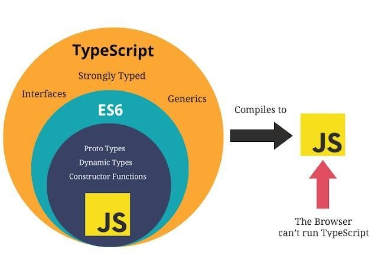

# TS快速入门

## 初识TS

### 1.认识TS



### 2.安装TS

> 安装ts

```shell
npm install -g typescript
```

> 检查安装是否成功

```shell
tsc -V
```

### 3.第一个TS程序

> 总结：ts的文件中如果直接书写js语法的代码，那么在html文件中直接引入ts文件，在谷歌的浏览器中是可以直接使用的
>
> 如果ts文件中有了ts的语法代码。那么就**需要把这个ts文件编译成js文件(`tsc ts文件`)**，在html文件中引入js的文件来使用
>
> ts文件中的函数中的形参，如果使用了某个类型进行修饰，那么最终在比那一的js文件中是没有这个类型的
>
> ts文件中的变量使用时let进行修饰，编译的js文件中的修饰符就变成了var了

### 4.vscode自动编译ts

> 1). 生成配置文件tsconfig.json
>    ` tsc --init`
> 2). 修改tsconfig.json配置
>     `"outDir": "./js", `
>     `"strict": false,  ` 
>
> 3). 启动监视任务: 
>     终端 -> 运行任务 -> 监视tsconfig.json

### 5.类型注解

```typescript
// TypeScript 里的类型注解是一种轻量级的为函数或变量添加约束的方式。
(() => {
    // msg是string类型的
    function showMsg(msg:String) {
        return '床前明月光' + msg
    }

    let msg = '疑是地上霜'
    // let msg = [10,20,30]//使用这个ts智能的提示错误信息,编译报错，但是编译出来的js文件不报错，js中没有类型注解
    console.log(showMsg(msg))
})()
```

### 6.接口

```typescript
// 接口：一种能力，一种约束
(() => {

    // 定义接口
    interface IPerson {
        firstname: string
        lastname: string
    }

    // 输出全名
    function showFullName(person: IPerson) {
        return person.firstname + '-' + person.lastname
    }

    // 定义一个对象
    const person = {
        firstname: '刘',
        lastname: '震'
    }

    // 调用函数
    console.log(showFullName(person))
})()
```

### 7.类

```typescript
(() => {
    interface IPerson {
        firstname: string
        lastname: string
    }

    class Person {
        firstname: string
        lastname: string
        fullname: string
        constructor(firstname: string, lastname: string) {
            this.firstname = firstname
            this.lastname = lastname
            this.fullname = this.firstname + '-' + this.lastname
        }
    }

    function showFullName(person: IPerson) {
        return person.firstname + person.lastname
    }

    const p = new Person('张', '三')
    console.log(p)

    console.log(showFullName(p))
})()
```

## TS常用语法

### 1.基本类型

```typescript
(() => {
    // 基本类型
    // 布尔类型boolean  数字类型number  字符串类型string
    // let 变量名:数据类型 = 值
    let b: boolean = true
    // b = 123//编译报错
    console.log(b, typeof b)

    let n: number = 123
    // n = '123'//编译报错
    console.log(n, typeof n)

    let s: string = '你好啊！！！'
    // s = 123//编译报错
    console.log(s, typeof s)

    // 总结：ts中变量一开始是什么类型，那么后期赋值的时候，只能用这个类型的数据，是不允许用其他类型的数据赋值给当前的这个变量中


    // undefined  null
    let und: undefined = undefined
    let nu: null = null
    console.log(und)
    console.log(nu)

    // undefined 和 null都可以作为其他类型的子类型，把undefined和null赋值给其他类型的变量的。需要提前将严格模式关闭
    let num: number = undefined
    console.log(num)


    // 数组类型  元组类型
    // 数组定义方式1:
    // 格式:const 数组名:数据类型[] = [值1,值2,值3...]
    const arr1: number[] = [1, 2, 3, 4]
    // const arr1: number[] = [1, 2, 3, 4,'lz']//编译报错
    console.log(arr1)
    // 数组定义方式2:
    // 格式:const 数组名:Array<数据类型> = [值1,值2,值3...]
    const arr2: Array<number> = [10, 20, 30]
    // const arr2: Array<number> = [10, 20, 30,'lz']//编译报错
    console.log(arr2)
    // 注意问题:数组定义后,里面饿数据的类型必须和定义数组的时候的类型是一致的,否则有错误提示信息,也不会编译通过

    // 元组类型:在定义数组的时候,类型和数据的个数一开始就已经限定了
    let arr3: [string, number, boolean] = ['lz', 21, true]
    console.log(arr3)
    // 注意问题:元组类型在使用的时候,数据的类型的位置和数据的个数,应该和在定义元组的时候的数据类型及位置应该是一致的


    // 枚举类型。枚举里面的每个数据值都可以叫元素，每个元素都有自己的编号，编号是从0开始的，依次递增。也可以手动指定成员的数值，但是没实现
    enum Color {
        red,
        green,
        blue
    }
    // 定义一个Color的枚举类型的变量来接收枚举的值
    let color: Color = Color.green
    console.log(color)//1
    console.log(Color.red, Color.green, Color.blue)//0  1  2
    console.log(Color[2])//blue


    // any类型。数据可以指定为任何类型
    let str: any = 123
    console.log(str)

    str = 'hello'
    console.log(str)
    // 当一个数组中要存储多个数据，个数不确定，类型不确定，此时也可以使用any类型来定义数组
    let arr: any[] = [123, 'hello', true]
    console.log(arr)
    // 缺点，这样数值没有split方法，在编译的时候不报错，在运行的时候报错
    // console.log(arr[0].split(''))


    // void类型,表示该函数没有任何的返回值
    function fn(): void {
        console.log('void........')
        // return '1111111'
    }
    fn()


    // object类型
    function obj(obj: object): object {
        console.log(obj)
        return {
            name: 'lz',
            age: 21
        }
    }
    console.log(obj({ name: 'wmy', age: 22 }))
    obj(new String(123))//String {'123'}


    // 联合类型:表示取值可以为多种类型中的一种
    // 需求1：定义一个函数得到一个数字或字符串值的字符串形式值
    function getS(str: number | string): string {
        return str.toString()
    }
    console.log(getS(123))
    console.log(getS('456'))

    // 类型断言：告诉编译器，“相信我，我知道自己在干什么”。
    // 语法1：<类型>变量名
    // 语法2：值 as 类型
    // 需求2：定义一个函数得到一个数字或字符串值的长度
    function getL(str: number | string): number {
        if ((<string>str).length) {
            return (str as string).length
        } else {
            return str.toString().length
        }

    }
    console.log(getL(1234))
    console.log(getL('456'))


    // 类型推断：没有明确的指定类型的时候推测出一个类型
    /* 定义变量时赋值了, 推断为对应的类型 */
    let b9 = 123 // number
    // b9 = 'abc' // error

    /* 定义变量时没有赋值, 推断为any类型 */
    let b10  // any类型
    b10 = 123
    b10 = 'abc'

})()
```

### 2.接口

```typescript
(() => {
    interface IPerson {
        // readonly 表示只读
        readonly id: number
        name: string
        age: number
        // ? 可有可无的
        sex?: string
    }
    const person: IPerson = {
        id: 1,
        name: 'lz',
        age: 21,
        // sex: '男',
    }
})()
```

#### 函数类型？

```typescript
// 为了使用接口表示函数类型，我们需要给接口定义一个调用签名
// 它就像是一个只有参数列表和返回值类型的函数定义。参数列表里的每个参数都需要名字和类型

// 函数类型：通过接口的方式作为函数的类型来使用
interface ISeachFunc {
    // 函数的参数和返回值类型
    (source: string, subString: string): boolean
}

const searchString: ISeachFunc = function searchFunc(source: string, subString: string): boolean {
    // 在source字符串中查找subString这个字符串，查找到返回0，没找到返回-1
    return source.search(subString) > -1
}
console.log(searchString('你好啊', '你'))
```

#### 类

```typescript
(() => {
    interface IFly {
        // 该方法没有任何的实现
        fly()
    }

    class Person1 implements IFly {
        // 实现接口中的方法
        fly() {
            console.log('我会飞1')
        }
    }

    const p1 = new Person1()
    p1.fly()


    // 实现多个接口
    interface ISwim {
        swim()
    }

    class Person2 implements IFly, ISwim {
        fly() {
            console.log('我会飞2')
        }
        swim() {
            console.log('我会游泳2')
        }

    }
    const p2 = new Person2()
    p2.fly()
    p2.swim()

    // 总结：类可以通过接口的方式，来定义当前这个类的类型
    // 类可以实现一个接口，类也可以实现多个接口，要注意，接口中的内容都要真正的实现


    // 接口可以继承其他的多个接口
    interface IFlyAndISwim extends IFly, ISwim { }

    class Person3 implements IFlyAndISwim {
        fly() {
            console.log('我会飞3')
        }
        swim() {
            console.log('我会游泳3')
        }

    }

    const p3 = new Person3()
    p3.fly()
    p3.swim()


})()
```

### 3.类

```typescript
(() => {
    class Person {
        name: string
        age: number
        // 默认参数
        constructor(name: string = 'lz', age: number = 21) {
            this.name = name
            this.age = age
        }
        sayHi(str: string) {
            console.log(`你好，我叫${this.name},我今年${this.age},${str}`)
        }
    }

    const p = new Person()
    p.sayHi('你叫什么啊？')
})()
```

#### 多态

```typescript
(() => {
    class Animal {
        name: string;
        constructor(name: string) {
            this.name = name
        }
        run(distance: number = 0) {
            console.log(`跑了${distance}米`)
        }
    }


    class Dog extends Animal {
        constructor(name: string) {
            super(name)
        }
        run(distance: number = 5): void {
            console.log(`跑了${distance}米`, this.name)
        }
    }

    class Pig extends Animal {
        constructor(name: string) {
            super(name)
        }
        run(distance: number = 10): void {
            console.log(`跑了${distance}米`, this.name)
        }
    }

    const dog: Dog = new Dog('大黄')
    dog.run()
    const pig: Pig = new Pig('八戒')
    pig.run()


    // 父类指向子类实例
    const dog1: Animal = new Dog('大黄')
    dog1.run()
    const pig1: Animal = new Pig('八戒')
    pig1.run()


    function showRun(ani: Animal) {
        ani.run()
    }
    showRun(dog)
    showRun(pig)
    console.log('==============')
    showRun(dog1)
    showRun(pig1)
})()
```

#### 访问修饰符

> 访问修饰符: 用来描述类内部的属性/方法的可访问性
>
> - public: 默认值, 公开的外部也可以访问
> - private: 只能类内部可以访问
> - protected: 类内部和子类可以访问

#### readonly修饰符

> `readonly` 关键字将属性设置为只读的。 只读属性必须在声明时或构造函数里被初始化。
>
> 仅在构造函数里使用 `readonly name: string` 参数来创建和初始化 `name` 成员。 我们把声明和赋值合并至一处。
>
> ```typescript
> class Person2 {
> //name:string
> constructor(readonly name: string) {
>    
> 	}
> }
> ```

#### 存取器

```typescript
(() => {
    class Person {
        firstname: string
        lastname: string

        constructor(firstname: string, lastname: string) {
            this.firstname = firstname
            this.lastname = lastname
        }
        get fullname() {
            return this.firstname + '-' + this.lastname
        }
        set fullname(val) {
            const arr = val.split('-')
            this.firstname = arr[0]
            this.lastname = arr[1]
        }
    }

    const p: Person = new Person('东方', '不败')
    console.log(p.fullname)//fullname是一个属性，不是方法
    p.fullname = '诸葛-孔明'
    console.log(p.fullname)
})()
```

### 4.函数？

```typescript
(() => {
    function add(x: number, y: number): number {
        return x + y
    }
    const result: number = add(1, 2)
    console.log(result)

    let myAdd = function (x: number, y: number): number {
        return x + y
    }
    console.log(myAdd(1, 2))


    // 完整的书写方法
    const result1: (x: number, y: number) => number = function MyAdd(x: number, y: number): number {
        return x + y
    }
    console.log(result1(1, 2))
})()
```

#### 剩余参数

```typescript
function info(x: string, ...args: string[]) {
  console.log(x, args)
}
info('abc', 'c', 'b', 'a')
```

#### 函数重载

```typescript
(() => {
    // 函数声明重载
    function myadd(x: number, y: number)
    function myadd(x: string, y: string)

    function myadd(x: number | string, y: number | string): number | string {

        if (typeof x === 'string' && typeof y === 'string') {
            return x + y
        } else if (typeof x === 'number' && typeof y === 'number') {
            return x + y
        }
    }

    // 两个都是字符串
    console.log(myadd('hello', 'word'))
    // 两个都是数值
    console.log(myadd(5, 8))
    // 输入非法数值。在函数声明完重载后，这个会报编译错误，不重载不报
    // console.log(myadd('hello', 8))

})()
```

### 5.泛型

> 感觉和any类型差不多，但是any类型中程序无法自动分辨具体类型，没有方法提示，但是泛型可以做到

```typescript
// 指在定义函数、接口或类的时候，不预先指定具体的类型，而在使用的时候再指定具体类型的一种特性。
(() => {
    function getArr<T>(value: T, count: number): T[] {
        const arr: Array<T> = []
        for (let i = 0; i < count; i++) {
            arr.push(value)
        }
        return arr
    }

    console.log(getArr<string>("hello", 3))
    console.log(getArr<number>(456, 3))
})()
```

#### 多个泛型参数的函数

```typescript
// 多个泛型参数的函数：函数中有多个泛型的参数
(() => {
    function getMsg<K, V>(value1: K, value2: V): [K, V] {
        return [value1, value2]
    }

    console.log(getMsg<string, number>('hello', 123))
})()
```

#### 泛型接口

```typescript
// 在定义接口时, 为接口中的属性或方法定义泛型类型
// 在使用接口时, 再指定具体的泛型类型

(() => {
    interface IbaseCRUD<T> {
        data: T[]
        // 需要一个参数t，类型T
        add: (t: T) => T
        getById: (id: number) => T
    }

    class User {
        id?: number; //id主键自增
        name: string; //姓名
        age: number; //年龄

        constructor(name, age) {
            this.name = name
            this.age = age
        }
    }

    class UserCRUD implements IbaseCRUD<User> {
        data: User[] = []

        add(user: User): User {
            user = { ...user, id: Date.now() }
            this.data.push(user)
            return user
        }

        getById(id: number): User {
            return this.data.find(item => item.id === id)
        }
    }


    const userCRUD = new UserCRUD()
    const { id } = userCRUD.add(new User('tom', 12))
    userCRUD.add(new User('tom2', 13))
    console.log(userCRUD.data)
    console.log(userCRUD.getById(id))
})()
```

#### 泛型类

```typescript
(() => {

    class GenericNumber<T>{
        defaultNumber: T
        add: (x: T, y: T) => T
    }

    const d: GenericNumber<number> = new GenericNumber<number>()
    d.defaultNumber = 100
    console.log(d.defaultNumber)

    d.add = function (x: number, y: number) {
        return x + y
    }
    console.log(d.add(10, 20))
})()
```

#### 泛型约束？？？

```typescript
(() => {
    // 定义一个接口，用来约束将来的某个类型中必须要有length这个属性
    interface ILength {
        // 接口中有一个属性length
        length: number
    }

    function getLength<T extends ILength>(x: T): number {
        return x.length

    }
	
    //我们需要传入符合约束类型的值，必须包含必须 length 属性
    console.log(getLength<string>('你好啊！！！'))
    // console.log(getLength<number>(123))//编译错误。number没有length属性
})()
```

# Vue3快速上手

## 创建Vue3.0工程

### 1.使用 vue-cli 创建

官方文档：https://cli.vuejs.org/zh/guide/creating-a-project.html#vue-create

```bash
## 查看@vue/cli版本，确保@vue/cli版本在4.5.0以上
vue --version
## 安装你的@vue/cli
npm install -g @vue/cli
## 升级你的@vue/cli
npm update -g @vue/cli
## 创建
vue create vue_test
## 启动
cd vue_test
npm run serve
```

### 2.使用 vite 创建

官方文档：https://v3.cn.vuejs.org/guide/installation.html#vite

vite官网：https://vitejs.cn

- 什么是vite？—— 新一代前端构建工具。
- 优势如下：
  - 开发环境中，无需打包操作，可快速的冷启动。
  - 轻量快速的热重载（HMR）。
  - 真正的按需编译，不再等待整个应用编译完成。
- 传统构建 与 vite构建对比图


```bash
## 创建工程
# npm 6.x
$ npm init vite@latest <project-name> --template vue

# npm 7+，需要加上额外的双短横线
$ npm init vite@latest <project-name> -- --template vue

## 进入工程目录
cd <project-name>
## 安装依赖
npm install
## 运行
npm run dev
```

## 常用 Composition API

官方文档: https://v3.cn.vuejs.org/guide/composition-api-introduction.html

### 1.拉开序幕的setup

1. 理解：Vue3.0中一个新的配置项，值为一个函数。
2. setup是所有<strong style="color:#DD5145">Composition API（组合API）</strong><i style="color:gray;font-weight:bold">“ 表演的舞台 ”</i>。
3. 组件中所用到的：数据、方法等等，均要配置在setup中。
4. setup函数的两种返回值：
   1. 若返回一个对象，则对象中的属性、方法, 在模板中均可以直接使用。（重点关注！）
   2. <span style="color:#aad">若返回一个渲染函数：则可以自定义渲染内容。（了解）</span>
5. 注意点：
   1. 尽量不要与Vue2.x配置混用
      - Vue2.x配置（data、methos、computed...）中<strong style="color:#DD5145">可以访问到</strong>setup中的属性、方法。
      - 但在setup中<strong style="color:#DD5145">不能访问到</strong>Vue2.x配置（data、methos、computed...）。
      - 如果有重名, setup优先。
   2. setup不能是一个async函数，因为返回值不再是return的对象, 而是promise, 模板看不到return对象中的属性。（后期也可以返回一个Promise实例，但需要Suspense和异步组件的配合）

```vue
<template>
  <h2>我叫：{{ name }}</h2>
  <h2>我的年龄：{{ age }}</h2>
  <button @click="sayHello">说话</button>
</template>

<script>
// import { h } from "vue";
export default {
  //此处只是测试一下setup函数，暂时不考虑响应式问题
  setup() {
    let name = "lz";
    let age = 21;

    function sayHello() {
      alert(`我叫${name}，我今年${age}`);
      console.log(h);
    }

    //返回一个对象（常用）
    return {
      name,
      age,
      sayHello,
    };

    //返回一个函数（渲染函数）
    // return ()=>{
    //   return h('h2','尚硅谷')
    // }
  },
};
</script>
```

###  2.ref函数(操作数据： ```xxx.value```)

- 作用: 定义一个响应式的数据
- **语法: ```const xxx = ref(initValue)```** 
  - **创建一个包含响应式数据的<strong style="color:#DD5145">引用对象（reference对象，简称ref对象）</strong>。**
  - **JS中操作数据： ```xxx.value```**
  - **模板中读取数据: 不需要.value，直接：```<div>{{xxx}}</div>```**
- 备注：
  - 接收的数据可以是：基本类型、也可以是对象类型。
  - **基本类型的数据：响应式依然是靠``Object.defineProperty()``的```get```与```set```完成的。**
  - **对象类型的数据：内部 <i style="color:gray;font-weight:bold">“ 求助 ”</i> 了Vue3.0中的一个新函数—— ```reactive```函数。**

```vue
<template>
  <h2>我叫：{{ name }}</h2>
  <h2>我的年龄：{{ age }}</h2>
  <h2>工作岗位：{{ job.type }}</h2>
  <h2>月薪：{{ job.maraly }}</h2>
  <button @click="changInfo">更改信息</button>
</template>

<script>
import { ref } from "vue";
export default {
  setup() {
    let name = ref("lz");
    let age = ref(21);
    let job = ref({
      type:'前端工程师',
      maraly:'30k'
    })

    function changInfo() {
      name.value = "张三";
      age.value = 18;
      job.value.type = '后端工程师'
      job.value.maraly = '50k'
    }

    return {
      name,
      age,
      job,
      changInfo
    };
  },
};
</script>
```

### 3.reactive函数

- 作用: 定义一个<strong style="color:#DD5145">对象类型</strong>的响应式数据（基本类型不要用它，要用```ref```函数）
- **语法：```const 代理对象= reactive(源对象)```接收一个对象（或数组），返回一个<strong style="color:#DD5145">代理对象（Proxy的实例对象，简称proxy对象）</strong>**
- **reactive定义的响应式数据是“深层次的”。**
- **内部基于 ES6 的 Proxy 实现，通过代理对象操作源对象内部数据进行操作。**

```vue
<template>
  <h2>姓名：{{ person.name }}</h2>
  <h2>年龄：{{ person.age }}</h2>
  <h2 v-if="person.salary">薪资:{{ person.salary }}</h2>
  <button @click="addSalary">点我增加薪资</button>
  <button @click="addAge">点我+1岁</button>
</template>

<script lang="ts">
import { defineComponent, reactive } from "vue";

export default defineComponent({
  name: "App",
  setup() {
    // 添加属性这个要用any类型注解
    const person: any = reactive({ name: "lz", age: 21 });

    // 为对象中添加一个属性
    let addSalary = function () {
      person.salary = "30k";
    };
    let addAge = function () {
      person.age += 1;
    };

    return {
      person,
      addSalary,
      addAge,
    };
  },
});
</script>

```

### 4.Vue3.0中的响应式原理

#### vue2.x的响应式

- **`Object.defineProperty(obj, prop, descriptor)`** 方法会直接在一个对象上定义一个新属性，或者修改一个对象的现有属性，并返回此对象。

  - obj

    要定义属性的对象。

  - prop

    要定义或修改的属性的名称或Symbol。

  - descriptor

    要定义或修改的属性描述符。

- 实现原理：

  - 对象类型：通过```Object.defineProperty()```对属性的读取、修改进行拦截（数据劫持）。

  - 数组类型：通过重写更新数组的一系列方法来实现拦截。（对数组的变更方法进行了包裹）。

    ```js
    Object.defineProperty(data, 'count', {
        get () {}, 
        set () {}
    })
    ```

- 存在问题：

  - 新增属性、删除属性, 界面不会更新。
  - 直接通过下标修改数组, 界面不会自动更新。

#### Vue3.0的响应式

- 实现原理: 

  - 通过Proxy（代理）:  拦截对象中任意属性的变化, 包括：属性值的读写、属性的添加、属性的删除等。

  - 通过Reflect（反射）:  对源对象的属性进行操作。

  - MDN文档中描述的Proxy与Reflect：

    - Proxy：https://developer.mozilla.org/zh-CN/docs/Web/JavaScript/Reference/Global_Objects/Proxy

    - Reflect：https://developer.mozilla.org/zh-CN/docs/Web/JavaScript/Reference/Global_Objects/Reflect

      ```js
      new Proxy(target, {//target目标对象
      	// 拦截读取属性值
          get (target, property) {//target目标对象。property被获取的属性名。
          	return Reflect.get(target, property)
          },
          // 拦截设置属性值或添加新属性
          set (target, property, value) {
          	return Reflect.set(target, property, value)
          },
          // 拦截删除属性
          deleteProperty (target, property) {
          	return Reflect.deleteProperty(target, property)
          }
      })
      
      proxy.name = 'tom'   
      ```

      ```html
      <!DOCTYPE html>
      <html lang="en">
      <head>
        <meta charset="UTF-8">
        <meta name="viewport" content="width=device-width, initial-scale=1.0">
        <title>Proxy 与 Reflect</title>
      </head>
      <body>
        <script>
          
          const user = {
            name: "John",
            age: 12
          };
      
          /* 
          proxyUser是代理对象, user是被代理对象
          后面所有的操作都是通过代理对象来操作被代理对象内部属性
          */
          const proxyUser = new Proxy(user, {
      
            get(target, property) {//target就是对象user
              console.log('劫持get()', property)//劫持get() name
                                               //劫持get() age
              return Reflect.get(target, property)
            },
      
            set(target, property, value) {
              console.log('劫持set()', property, value)
              return Reflect.set(target, property, value); 
            },
      
            deleteProperty (target, property) {
              console.log('劫持delete属性', property)
              return Reflect.deleteProperty(target, property)
            }
          });
          // 读取属性值
          console.log(proxyUser===user)//false
          console.log(proxyUser.name, proxyUser.age)//John 12
          // 设置属性值
          proxyUser.name = 'bob'
          proxyUser.age = 13
          console.log(user)
          // 添加属性
          proxyUser.sex = '男'
          console.log(user)
          // 删除属性
          delete proxyUser.sex
          console.log(user)
        </script>
      </body>
      </html>
      ```

### 5.reactive对比ref

-  从定义数据角度对比：
   -  ref用来定义：<strong style="color:#DD5145">基本类型数据</strong>。
   -  reactive用来定义：<strong style="color:#DD5145">对象（或数组）类型数据</strong>。
   -  备注：ref也可以用来定义<strong style="color:#DD5145">对象（或数组）类型数据</strong>, 它内部会自动通过```reactive```转为<strong style="color:#DD5145">代理对象</strong>。
-  从原理角度对比：
   -  **ref通过``Object.defineProperty()``的```get```与```set```来实现响应式（数据劫持）。**
   -  **reactive通过使用<strong style="color:#DD5145">Proxy</strong>来实现响应式（数据劫持）, 并通过<strong style="color:#DD5145">Reflect</strong>操作<strong style="color:orange">源对象</strong>内部的数据。**
-  从使用角度对比：
   -  **ref定义的数据：操作数据<strong style="color:#DD5145">需要</strong>```.value```，读取数据时模板中直接读取<strong style="color:#DD5145">不需要</strong>```.value```。**
   -  **reactive定义的数据：操作数据与读取数据：<strong style="color:#DD5145">均不需要</strong>```.value```。**

### 6.setup的两个注意点

- **setup执行的时机：在beforeCreate之前执行一次**

- **this是undefined。**

- setup的参数

  - props：值为对象，包含：组件外部传递过来，且**组件内部声明接收了的属性**。

    ```vue
    //app组件
    <template>
      <HelloWorld str="hello" />
    </template>

    <script>
    import HelloWorld from "./components/HelloWorld.vue";
    export default {
      components: { HelloWorld },
    };
    </script>
    ```

    ```vue
    //HelloWorld组件
    <template>
      <div>{{ str }}</div>
    </template>
    
    <script>
    export default {
      props: ["str"],
      setup(props) {
        console.log(props.str);//获取传入的值hello
      },
    };
    </script>
    ```

  - context：上下文对象

    - attrs: 值为对象，包含：组件外部传递过来，但**没有在props配置中声明的属性**, 相当于 ```this.$attrs```（**在context的attrs中就接收，props声明了，attrs就不接收**）。

      ```vue
      //app组件
      <template>
        <HelloWorld str="hello" />
      </template>
      
      <script>
      import HelloWorld from "./components/HelloWorld.vue";
      export default {
        components: { HelloWorld },
      };
      </script>
      ```

      ```vue
      //HelloWorld组件
      <template>
        <div>{{ str }}</div><!-- 不展示 -->
      </template>
      
      <script>
      export default {
        // props: ["str"],//不接收
        setup(props,context) {
          console.log(props.str);//没有值
          console.log(context.attrs.str)//获取传入的值hello
        },
      };
      </script>
      ```

    - slots: 收到的插槽内容, **相当于 ```this.$slots```**（接收到父组件传送过来的虚拟DOM）。

      ```vue
      //app组件
      <template>
        <HelloWorld>
          <!-- 如果只是默认的插槽的话，这里不用写template，如果写了会不显示 -->
          <template v-slot:demo>
            <div>hello,slot</div>
          </template>
        </HelloWorld>
      </template>
      
      <script>
      import HelloWorld from "./components/HelloWorld.vue";
      export default {
        components: { HelloWorld },
      };
      </script>
      ```

      ```vue
      <template>
        <div>
          <slot name="demo"></slot>
        </div>
      </template>
      
      <script>
      export default {
        setup(props, context) {
          console.log(context.slots);
        },
      };
      </script>
      ```

    - emit: 分发**自定义事件**的函数, 相当于 ```this.$emit```。（vue2中```this.$emit```不能用了） **子-->父**

    - $on、$off、$once在vue3中已废弃

      ```vue
      //app组件
      <template>
        <HelloWorld @hello="showEmit"></HelloWorld>
      </template>
      
      <script>
      import HelloWorld from "./components/HelloWorld.vue";
      export default {
        components: { HelloWorld },
        setup() {
          function showEmit(val) {
            console.log(val.value); //hello,emit
          }
      
          return { showEmit };
        },
      };
      </script>
      
      ```

      ```vue
      //HelloWorld组件
      <template>
        <div></div>
      </template>
      
      <script>
      import { ref } from "@vue/reactivity";
      export default {
        emits: ["hello"],// 可选的, 声明了更利于程序员阅读, 且可以对分发的事件数据进行校验
        setup(props, context) {
          const em = ref("hello,emit");
          context.emit("hello", em);
          return { em };
        },
      };
      </script>

      ```

### 7.计算属性与监视

#### 1.computed函数

- 与Vue2.x中computed配置功能一致

- 写法

  ```js
  import {computed} from 'vue'
  
  setup(){
      ...
  	//计算属性——简写
      let fullName = computed(()=>{
          return person.firstName + '-' + person.lastName
      })
      //计算属性——完整
      let fullName = computed({
          get(){
              return person.firstName + '-' + person.lastName
          },
          set(value){
              const nameArr = value.split('-')
              person.firstName = nameArr[0]
              person.lastName = nameArr[1]
          }
      })
  }
  ```

#### 2.watch函数

- 与Vue2.x中watch配置功能一致

- 两个小“坑”：

  - **监视reactive定义的响应式数据的全部属性时：oldValue无法正确获取、强制开启了深度监视（deep配置失效）。**
    - 可以说监视的是一个对象，那么oldValue就无法正确的获取
    
  - 监视reactive定义的响应式数据中某个属性时：deep配置有效。

  ```js
      <template>
        <h2>当前值为：{{ sum }}</h2>
        <button @click="sum++">点击+1</button>
  
        <hr />
        <h2>{{ msg }}</h2>
        <button @click="msg += 1">点击改变消息</button>
  
        <hr />
        <h2>姓名：{{ person.name }}</h2>
        <h2>年龄：{{ person.age }}</h2>
        <h2>薪资：{{ person.job.j1.saraly }}</h2>
        <button @click="person.name += 2">修改姓名</button>
        <button @click="person.age++">修改年龄</button>
        <button @click="person.job.j1.saraly++">修改薪资</button>
      </template>
  
      <script>
      import { reactive, ref, watch } from "vue";
      export default {
        setup() {
          let sum = ref(0);
          let msg = ref("你好啊");
  
          let person = reactive({
            name: "zhangsan",
            age: 18,
            job: {
              j1: {
                saraly: 20,
              },
            },
          });
  
      //情况一：监视ref定义的响应式数据
      watch(sum,(newValue,oldValue)=>{
          console.log('sum变化了',newValue,oldValue)
      },{immediate:true})
  
      //情况二：监视多个ref定义的响应式数据
      watch([sum,msg],(newValue,oldValue)=>{
          console.log('sum或msg变化了',newValue,oldValue)
      }) 
  
      /* 情况三：监视reactive所定义的一个响应式数据的全部属性
                  若watch监视的是reactive定义的响应式数据，则无法正确获得oldValue！！
                  若watch监视的是reactive定义的响应式数据，则强制开启了深度监视 
      */
      watch(person,(newValue,oldValue)=>{
          console.log('person变化了',newValue,oldValue)
      },{immediate:true,deep:false}) //此处的deep配置不再奏效
  
      //情况四：监视reactive定义的响应式数据中的某个属性
      watch(()=>person.job,(newValue,oldValue)=>{
          console.log('person的job变化了',newValue,oldValue)
      },{immediate:true,deep:true}) //deep有效
  
      //情况五：监视reactive定义的响应式数据中的某些属性
      watch([()=>person.job,()=>person.name],(newValue,oldValue)=>{
          console.log('person的job变化了',newValue,oldValue)
      },{immediate:true,deep:true})//deep有效
  
      //特殊情况
      watch(()=>person.job,(newValue,oldValue)=>{
          console.log('person的job变化了',newValue,oldValue)
      },{deep:true}) //此处由于监视的是reactive素定义的对象中的某个属性，所以deep配置有效
  
          return {
            sum,
            msg,
            person,
          };
        },
      };
      </script>
  ```

- #### 注意：ref定义的对象，使用监视属性

  ```vue
  <template>
    <h2>当前值为：{{ sum }}</h2>
    <button @click="sum++">点击+1</button>
  
    <hr />
    <h2>{{ msg }}</h2>
    <button @click="msg += 1">点击改变消息</button>
  
    <hr />
    <h2>姓名：{{ person.name }}</h2>
    <h2>年龄：{{ person.age }}</h2>
    <h2>薪资：{{ person.job.j1.saraly }}</h2>
    <button @click="person.name += 2">修改姓名</button>
    <button @click="person.age++">修改年龄</button>
    <button @click="person.job.j1.saraly++">修改薪资</button>
  </template>
  
  <script>
  import { ref, watch } from "vue";
  export default {
    setup() {
      let sum = ref(0);
      let msg = ref("你好啊");
  
      let person = ref({
        name: "zhangsan",
        age: 18,
        job: {
          j1: {
            saraly: 20,
          },
        },
      });
  
      // 这里监视的是sum，千万不要.value
      watch(sum, (newValue, oldValue) => {
        console.log("sum改变了", newValue, oldValue);
      });
  
  
      // person使用的ref，定义对象借助了reactive，.value监视的就是reactive对象
      // watch(person.value, (newValue, oldValue) => {
      //   console.log("sum改变了", newValue, oldValue);
      // });
  
  
      // 或者深度监视，监视到ref的value
      watch(person, (newValue, oldValue) => {
        console.log("sum改变了", newValue, oldValue);
      },{deep:true});
  
      return {
        sum,
        msg,
        person,
      };
    },
  };
  </script>
  ```

#### 3.watchEffect函数

- watch的套路是：既要指明监视的属性，也要指明监视的回调。

- watchEffect的套路是：**不用指明监视哪个属性，监视的回调中用到哪个属性，那就监视哪个属性。**

- watchEffect有点像computed：

  - 但computed注重的计算出来的值（回调函数的返回值），所以必须要写返回值。
  - 而watchEffect更注重的是过程（回调函数的函数体），所以不用写返回值。

  ```js
  //watchEffect所指定的回调中用到的数据只要发生变化，则直接重新执行回调。
  watchEffect(()=>{
      const x1 = sum.value
      const x2 = person.age
      console.log('watchEffect配置的回调执行了')
  })
  ```

### 8.生命周期

> vue2生命周期


> vue3生命周期


- Vue3.0中可以继续使用Vue2.x中的生命周期钩子，但有有两个被更名：
  - ```beforeDestroy```改名为 ```beforeUnmount```
  - ```destroyed```改名为 ```unmounted```
- Vue3.0也提供了 Composition API 形式的生命周期钩子，与Vue2.x中钩子对应关系如下：
  - `beforeCreate`===>`setup()`
  - `created`=======>`setup()`
  - `beforeMount` ===>`onBeforeMount`
  - `mounted`=======>`onMounted`
  - `beforeUpdate`===>`onBeforeUpdate`
  - `updated` =======>`onUpdated`
  - `beforeUnmount` ==>`onBeforeUnmount`
  - `unmounted` =====>`onUnmounted`

```vue
<script>
import {
  onBeforeMount,
  onBeforeUnmount,
  onBeforeUpdate,
  onMounted,
  onUpdated,
  ref,
} from "vue";
export default {
  setup() {
   
    // 通过组合API定义的生命周期钩子
    onBeforeMount(() => {
      console.log("-------onBeforeMount--------");
    });
    onMounted(() => {
      console.log("-------onMounted--------");
    });
    onBeforeUpdate(() => {
      console.log("-------onBeforeUpdate--------");
    });
    onUpdated(() => {
      console.log("-------onUpdated--------");
    });
    onBeforeUnmount(() => {
      console.log("-------onBeforeUnmount--------");
    });
    onMounted(() => {
      console.log("-------onMounted--------");
    });

    return {
      sum,
    };
  },

  // 通过配置项定义的声明周期钩子
  // beforeCreate() {
  //   console.log("-------beforeCreate--------");
  // },
  // created() {
  //   console.log("-------created--------");
  // },
  // beforeMount() {
  //   console.log("-------beforeMount--------");
  // },
  // mounted() {
  //   console.log("-------mounted--------");
  // },
  // beforeUpdate() {
  //   console.log("-------beforeUpdate--------");
  // },
  // updated() {
  //   console.log("-------updated--------");
  // },
  // beforeDestroy() {
  //   console.log("-------beforeDestroy--------");
  // },
  // destroyed() {
  //   console.log("-------destroyed--------");
  // },
};
</script>
```

### 9.自定义hook函数

- 什么是hook？—— 本质是一个函数，把setup函数中使用的Composition API进行了封装。
- 类似于vue2.x中的mixin。
- 自定义hook的优势: 复用代码, 让setup中的逻辑更清楚易懂。

```js
//hook.js
import {
    reactive,
    onMounted,
    onUnmounted
} from 'vue'
export default function () {
    let point = reactive({
        x: 0,
        y: 0
    })

    function savePoint(event) {
        point.x = event.pageX
        point.y = event.pageY
    }

    onMounted(() => {
        window.addEventListener('click', savePoint)
    })

    onUnmounted(() => {
        window.removeEventListener('click', savePoint)
    })

    return point
}
```

```js
<template>
  <div>
    <h2>x:{{ point.x }}</h2>
    <h2>y:{{ point.y }}</h2>
  </div>
</template>

<script>
import usePoint from "./hook";
export default {
  setup() {
    const point = usePoint();

    return {
      point,
    };
  },
};
</script>
```

### 10.toRef

- **作用：变成一个 ref 对象，其value值指向另一个对象中的某个属性。**
- **语法：```const name = toRef(person,'name')```**
- 应用:   **要将响应式对象中的某个属性单独提供给外部使用时。**


- 扩展：```toRefs``` 与```toRef```功能一致，但可以批量创建多个 ref 对象，语法：```toRefs(person)```

```js
<template>
  <!-- 原始的方式 -->
  <!-- <h2>name:{{ person.name }},age:{{ person.age }}</h2> -->
  <h2>name:{{ name }},age:{{ age }}</h2>
</template>

<script lang="ts">
import { defineComponent, reactive, toRef, toRefs } from "vue";

export default defineComponent({
  name: "App",
  setup() {
    const person = reactive({ name: "lz", age: 21 });

    // 便捷方式2--toRefs
    // const { name, age } = toRefs(person);
    return {
      // person,
      // 便捷方式1--toRefs
      // ...toRefs(person),
      // 便捷方式2--toRefs
      // name,
      // age,

      // 便捷方式3--toRef
      name: toRef(person, "name"),
      age: toRef(person, "age"),
    };
  },
});
</script>
```

### 11.ref获取元素

> 利用ref函数获取组件中的标签元素

```vue
<template>
  <h2>ref获取元素</h2>
  <input type="text" ref="textRef" value="哒mei" />
  <button @click="showRef">点我</button>
</template>

<script lang="ts">
import { defineComponent, ref } from "vue";

export default defineComponent({
  name: "App",
  setup() {
    const textRef = ref<HTMLElement | null>(null);
    function showRef() {
      console.log(textRef);
      console.log(textRef.value);
      textRef.value.focus();
    }
    return { textRef, showRef };
  },
});
</script>
```

## Composition API(其它部分)

### 1.shallowReactive 与 shallowRef

- **shallowReactive : 只处理了对象内最外层属性的响应式(也就是浅响应式)**
- **shallowRef: 只处理了value的响应式, 不进行对象的reactive处理**
- 什么时候用浅响应式呢?
  - 一般情况下使用ref和reactive即可
  - 如果有一个对象数据, 结构比较深, 但变化时只是外层属性变化 ===> shallowReactive
  - 如果有一个对象数据, 后面会产生新的对象来替换 ===> shallowRef

```vue
<template>
  <h2>App</h2>

  <h3>m1: {{m1}}</h3>
  <h3>m2: {{m2}}</h3>
  <h3>m3: {{m3}}</h3>
  <h3>m4: {{m4}}</h3>

  <button @click="update">更新</button>
</template>

<script lang="ts">
import { reactive, ref, shallowReactive, shallowRef } from 'vue'
/* 
shallowReactive与shallowRef
  shallowReactive: 只处理了对象内最外层属性的响应式(也就是浅响应式)
  shallowRef: 只处理了value的响应式, 不进行对象的reactive处理
总结:
  reactive与ref实现的是深度响应式, 而shallowReactive与shallowRef是浅响应式
  什么时候用浅响应式呢?
    一般情况下使用ref和reactive即可,
    如果有一个对象数据, 结构比较深, 但变化时只是外层属性变化 ===> shallowReactive
    如果有一个对象数据, 后面会产生新的对象来替换 ===> shallowRef
*/

export default {

  setup () {

    const m1 = reactive({a: 1, b: {c: 2}})
    const m2 = shallowReactive({a: 1, b: {c: 2}})

    const m3 = ref({a: 1, b: {c: 2}})
    const m4 = shallowRef({a: 1, b: {c: 2}})

    const update = () => {
      // m1.b.c += 1
      // m2.b.c += 1

      // m3.value.a += 1
      m4.value.a += 1
    }

    return {
      m1,
      m2,
      m3,
      m4,
      update,
    }
  }
}
</script>
```

### 2.readonly 与 shallowReadonly

- readonly:
  - **深度只读数据**
  - **获取一个对象 (响应式或纯对象) 或 ref 并返回原始代理的只读代理。**
  - 只读代理是深层的：访问的任何嵌套 property 也是只读的。
- shallowReadonly
  - **浅只读数据**
  - 创建一个代理，使其自身的 property 为只读，但不执行嵌套对象的深度只读转换
- 应用场景:
  - 在某些特定情况下, 我们可能不希望对数据进行更新的操作, 那就可以包装生成一个只读代理对象来读取数据, 而不能修改或删除

```vue
<template>
  <h2>App</h2>
  <h3>{{state}}</h3>
  <button @click="update">更新</button>
</template>

<script lang="ts">
import { reactive, readonly, shallowReadonly } from 'vue'

export default {

  setup () {

    const state = reactive({
      a: 1,
      b: {
        c: 2
      }
    })

    // const rState1 = readonly(state)
    const rState2 = shallowReadonly(state)

    const update = () => {
      // rState1.a++ // error
      // rState1.b.c++ // error

      // rState2.a++ // error
      rState2.b.c++
    }
    
    return {
      state,
      update
    }
  }
}
</script>
```

### 3.toRaw 与 markRaw

- toRaw
  - **返回由 `reactive` 或 `readonly` 方法转换成响应式代理的普通对象。**
  - 这是一个还原方法，可用于临时读取，访问不会被代理/跟踪，写入时也不会触发界面更新。
- markRaw
  - **标记一个对象，使其永远不会转换为代理。返回对象本身**
  - 应用场景:
    - 有些值不应被设置为响应式的，例如复杂的第三方类实例或 Vue 组件对象。
    - 当渲染具有不可变数据源的大列表时，跳过代理转换可以提高性能。

```vue
<template>
  <h2>{{state}}</h2>
  <button @click="testToRaw">测试toRaw</button>
  <button @click="testMarkRaw">测试markRaw</button>
</template>

<script lang="ts">
/* 
toRaw: 得到reactive代理对象的目标数据对象
*/
import {
  markRaw,
  reactive, toRaw,
} from 'vue'
export default {
  setup () {
    const state = reactive<any>({
      name: 'tom',
      age: 25,
    })

    const testToRaw = () => {
      const user = toRaw(state)
      user.age++  // 界面不会更新
    }

    const testMarkRaw = () => {
      const likes = ['a', 'b']
      // state.likes = likes
      state.likes = markRaw(likes) // likes数组就不再是响应式的了
      setTimeout(() => {
        state.likes[0] += '--'
      }, 1000)
    }

    return {
      state,
      testToRaw,
      testMarkRaw,
    }
  }
}
</script>
```

### 4. customRef

- **创建一个自定义的 ref，并对其依赖项跟踪和更新触发进行显式控制**
- 需求: 使用 customRef 实现 debounce 的示例

```vue
<template>
  <input type="text" v-model="txt" />
  <h2>{{ txt }}</h2>
</template>

<script lang="ts">
import { customRef, defineComponent, ref } from "vue";

export default defineComponent({
  name: "App",
  setup() {
    // let txt = ref("abc");

    // 定义函数
    function useCustomRef<T>(value: T, dalay = 500) {
      let timer: number;
      // 返回一个customRef方法,回调函数有两个参数
      return customRef((track, trigger) => {
        return {
          get() {
            // 告诉Vue追踪数据
            track();
            return value;
          },
          set(newValue: T) {
            clearTimeout(timer);
            timer = setTimeout(() => {
              value = newValue;
              // 告诉Vue去触发界面更新
              trigger();
            }, dalay);
          },
        };
      });
    }

    let txt = useCustomRef<string>("abc");
    return { txt };
  },
});
</script>
```

### 5.provide 与 inject

- `provide`和`inject`提供依赖注入，功能类似 2.x 的`provide/inject`
- **实现跨层级组件(祖孙)间通信**   **祖-->孙**

```vue
<template>
  <h1>父组件</h1>
  <p>当前颜色: {{color}}</p>
  <button @click="color='red'">红</button>
  <button @click="color='yellow'">黄</button>
  <button @click="color='blue'">蓝</button>
  
  <hr>
  <Son />
</template>

<script lang="ts">
import { provide, ref } from 'vue'
/* 
- provide` 和 `inject` 提供依赖注入，功能类似 2.x 的 `provide/inject
- 实现跨层级组件(祖孙)间通信
*/

import Son from './Son.vue'
export default {
  name: 'ProvideInject',
  components: {
    Son
  },
  setup() {
    
    const color = ref('red')

    provide('color', color)

    return {
      color
    }
  }
}
</script>
<template>
  <div>
    <h2>子组件</h2>
    <hr>
    <GrandSon />
  </div>
</template>

<script lang="ts">
import GrandSon from './GrandSon.vue'
export default {
  components: {
    GrandSon
  },
}
</script>
<template>
  <h3 :style="{color}">孙子组件: {{color}}</h3>
  
</template>

<script lang="ts">
import { inject } from 'vue'
export default {
  setup() {
    const color = inject('color')

    return {
      color
    }
  }
}
</script>
```

### 6.响应式数据的判断

- isRef: 检查一个值是否为一个 ref 对象
- isReactive: 检查一个对象是否是由 `reactive` 创建的响应式代理
- isReadonly: 检查一个对象是否是由 `readonly` 创建的只读代理
- isProxy: 检查一个对象是否是由 `reactive` 或者 `readonly` 方法创建的代理

## 路由

### 创建路由

```js
import * as VueRouter from 'vue-router';

import Demo from '../components/Demo.vue'
import HelloWorld from '../components/HelloWorld.vue'


const routes = [
    {
        path: '/demo',
        component: Demo,
    },
    {
        path: '/helloworld',
        component: HelloWorld
    }
]
const router = VueRouter.createRouter({
    // 内部提供了 history 模式的实现。为了简单起见，我们在这里使用 hash 模式。
    history: VueRouter.createWebHashHistory(),
    routes, // `routes: routes` 的缩写
})


export default router 
```

```js
//main.js
import { createApp } from 'vue'
import App from './App.vue'
import router from './router/index'

createApp(App).use(router).mount('#app')

```

### 编程式路由导航

```vue
<template>
  <div>
    <button @click="goto">点我</button>

    <router-view></router-view>
  </div>
</template>

<script>
import { useRouter } from "vue-router";
export default {
  setup() {
      
    const $router = useRouter();
   
    function goto() {
      $router.push("/demo");
    }
    return {
      goto,
    };
  },
};
</script>


```

### 路由传递参数

```vue
<template>
  {{ $route.query.id }}
</template>

<script>
import { useRoute } from "vue-router";
export default {
  setup() {
    const $route = useRoute();
  },
};
</script>

```

## [Vuex4插件](https://juejin.cn/post/7052714417665867784#heading-19)

### 创建vuex

#### state

> 存放数据的地方（数据仓库），**state可以是一个函数，也可以是一个对象**

```js
import { createApp } from 'vue'
import { createStore } from 'vuex'

// 创建一个新的 store 实例
const store = createStore({
  state () {
    return {
      count: 0
    }
  },
  actions: {
    increment (context,data) {
    	context.commit('increment',data)
    }
  },
  mutations: {
    increment (state,data) {
      state.count+=data
    }
  }
})
```

```js
//main.js
...
import store from './store/store.js'

createApp(App).use(store).mount('#app')
```

> 定义好了一个state数据，那么我们就可以在组件中展示出来了。分类两种形式：
>
> 1. **直接在组件中使用`$store`**
> 2. **通过useStore()引入store**

```js
<template>
  {{ $store.state.count }}
  {{ store.state.count }}
  <button @click="fn"></button>
</template>

<script>
import {useStore} from 'Vuex' 
      
export default {

  setup() {
    const store = useStore()
    
    function fn() {
      store.dispatch("increment", 666)
    }
    return {
      store,
      fn
    }

  }
}
</script>
```

#### getters

> 在组件中展示，跟state的两种形式是一样的

```js
//形式一
<h1>{{$store.getters.coderAllCount}}</h1>
//形式二
const coderAllCount = computed(() => store.getters.coderAllCount)
```

### 四个map方法的使用

#### 在setup中使用mapState

```vue
<template>
    vuex
    <!-- 1、直接取用 -->
    <p>{{ $store.state.num }}</p>
    <p>{{ num }}</p>
    <p>{{ name }}</p>
    <p>{{ age }}</p>
</template>
<script>
import { computed } from "vue"
import { useStore, mapState } from "vuex"
export default {
    setup() {
        const store = useStore()
        const num = computed(() => store.state.num)
        // mapState 在 setup 中的使用
        const arrFn = mapState(['name', "age"])
        const storeState = {}
        // 拿到arr中所有的key
        Object.keys(arrFn).forEach(fnKey => {
            // 这里使用了 bind改变this指向
            const fn = arrFn[fnKey].bind({ $store: store })
            storeState[fnKey] = computed(fn)
        })
        return { num, ...storeState }
    }
}
</script>
```

#### 在setup中使用mapGetters

```vue
<template>
    <p> getters</p>
    <p>{{ unit }}</p>
    <p>{{ totalPrice }}</p>
    <p>{{ nameInfo }}</p>
</template>

<script>
import useGetters from "@/hook/useGetters.js"
export default {
    name: 'getters',
    setup() {
        const storeGettersFns = useGetters(["totalPrice", "unit", "nameInfo"])
        return { ...storeGettersFns }
    }
}
</script>
```

#### 在setup中使用mapMutations

```vue
<template>
    <p>mutation</p>
    <h1>{{$store.state.counter}}</h1>
    <button @click="add(1)">+1</button>
    <button @click="reduce">-1</button>
</template>

<script>
import { mapMutations } from "vuex"
export default {
    name: 'mutation',
    setup() {
        const storeMutations = mapMutations(["add", "reduce"])
        return { ...storeMutations }
    }
}
</script>
```

#### 在setup中使用mapActions

```vue
<template>
    <p>action</p>
    <h1>{{$store.state.counter}}</h1>
    <!-- 在这传入参数 -->
    <button @click="add(1)">+1</button>
</template>

<script>
import { useStore, mapActions } from "vuex"
export default {
    name: 'action',
    setup() {
        const store = useStore()
        // 这里也可以使用数组
        const actionsFn = mapActions({ add: "addActions" })
        return { ...actionsFn }
    }
}
</script>
```

### 命名空间

```js
onst moduleA = {
  state: () => ({ ... }),
  mutations: { ... },
  actions: { ... },
  getters: { ... }
}

const moduleB = {
  state: () => ({ ... }),
  mutations: { ... },
  actions: { ... }
}

const store = createStore({
  modules: {
    a: moduleA,
    b: moduleB
  }
})

store.state.a // -> moduleA 的状态
store.state.b // -> moduleB 的状态
```

> 如果希望你的模块具有更高的封装度和复用性，你可以通过添加 `namespaced: true` 的方式使其成为带命名空间的模块。当模块被注册后，它的所有 getter、action 及 mutation 都会自动根据模块注册的路径调整命名。例如：

```js
const store = createStore({
  modules: {
    account: {
      namespaced: true,

      // 模块内容（module assets）
      state: () => ({ ... }), // 模块内的状态已经是嵌套的了，使用 `namespaced` 属性不会对其产生影响
      getters: {
        isAdmin () { ... } // -> getters['account/isAdmin']
      },
      actions: {
        login () { ... } // -> dispatch('account/login')
      },
      mutations: {
        login () { ... } // -> commit('account/login')
      },

      // 嵌套模块
      modules: {
        // 继承父模块的命名空间
        myPage: {
          state: () => ({ ... }),
          getters: {
            profile () { ... } // -> getters['account/profile']
          }
        },

        // 进一步嵌套命名空间
        posts: {
          namespaced: true,

          state: () => ({ ... }),
          getters: {
            popular () { ... } // -> getters['account/posts/popular']
          }
        }
      }
    }
  }
})
```

## 新的组件

### 1.Fragment

- 在Vue2中: 组件必须有一个根标签
- 在Vue3中: 组件可以没有根标签, 内部会将多个标签包含在一个Fragment虚拟元素中
- 好处: 减少标签层级, 减小内存占用

### 2.Teleport

- 什么是Teleport？—— **`Teleport` 是一种能够将我们的<strong style="color:#DD5145">组件html结构</strong>移动到指定位置的技术。**

  ```vue
  <teleport to="移动位置">
  	<div v-if="isShow" class="mask">
  		<div class="dialog">
  			<h3>我是一个弹窗</h3>
  			<button @click="isShow = false">关闭弹窗</button>
  		</div>
  	</div>
  </teleport>
  ```

### 3.Suspense

- **等待异步组件时渲染一些额外内容，让应用有更好的用户体验**

- 使用步骤：

  - 异步引入组件

    ```js
    import {defineAsyncComponent} from 'vue'
    ......
    export default {
    components: {
        HelloWorld: defineAsyncComponent(() =>
        import("./components/HelloWorld.vue")
        ),
      },
    };
    ```
  
  - 使用```Suspense```包裹组件，并配置好```default``` 与 ```fallback```
  
    ```vue
    <template>
    	<div class="app">
    		<h3>我是App组件</h3>
    		<Suspense>
    			<template v-slot:default>
    				<Child/>
    			</template>
    			<template v-slot:fallback>
    				<h3>加载中.....</h3>
    			</template>
    		</Suspense>
    	</div>
    </template>
    ```

#### 实例

> 实验性的api，禁止在生产环境下使用

```vue
<template>
  <div class="child">我是子组件{{ sum }}</div>
</template>

<script>
import { ref } from "@vue/reactivity";
export default {
  setup() {
    let sum = ref("0");

    return new Promise((resolve, reject) => {//不在异步组件中，不可以使用async
      resolve({ sum });
    }, 2000);
  },
};
</script>
<style scoped>
.child {
  background: blueviolet;
  height: 100px;
}
</style>

```

```vue
<template>
  <Suspense>
    <template v-slot:default>
      <HelloWorld></HelloWorld>
    </template>
    <template v-slot:fallback>
      <div>请稍等</div>
    </template>
  </Suspense>
</template>

<script>
import { defineAsyncComponent } from "@vue/runtime-core";
export default {
  components: {
    HelloWorld: defineAsyncComponent(() =>
      import("./components/HelloWorld.vue")
    ),
  },
};
</script>
```

## 其他

### 1.全局API的转移

- Vue 2.x 有许多全局 API 和配置。

  - 例如：**注册全局组件、注册全局指令、全局过滤器、全局混入mixin**等。

    ```js
    //注册全局组件
    Vue.component('MyButton', {
      data: () => ({
        count: 0
      }),
      template: '<button @click="count++">Clicked {{ count }} times.</button>'
    })
    
    //注册全局指令
    Vue.directive('focus', {
      inserted: el => el.focus()
    }
    ```

- Vue3.0中对这些API做出了调整：

  - 将全局的API，即：**```Vue.xxx```调整到应用实例（```app```）上**

    | 2.x 全局 API（```Vue```） | 3.x 实例 API (`app`)                        |
    | ------------------------- | ------------------------------------------- |
    | Vue.config.xxxx           | app.config.xxxx                             |
    | Vue.config.productionTip  | <strong style="color:#DD5145">移除</strong> |
    | Vue.component             | app.component                               |
    | Vue.directive             | app.directive                               |
    | Vue.mixin                 | app.mixin                                   |
    | Vue.use                   | app.use                                     |
    | Vue.prototype             | app.config.globalProperties                 |

### 2.其他改变

- data选项应始终被声明为一个函数。

- 过度类名的更改：

  - Vue2.x写法

    ```css
    .v-enter,
    .v-leave-to {
      opacity: 0;
    }
    .v-leave,
    .v-enter-to {
      opacity: 1;
    }
    ```

  - Vue3.x写法

    ```css
    .v-enter-from,
    .v-leave-to {
      opacity: 0;
    }
    
    .v-leave-from,
    .v-enter-to {
      opacity: 1;
    }
    ```

- <strong style="color:#DD5145">移除</strong>keyCode作为 v-on 的修饰符，同时也不再支持```config.keyCodes```

- <strong style="color:#DD5145">移除</strong>```v-on.native```修饰符

  - 父组件中绑定事件

    ```vue
    <my-component
      v-on:close="handleComponentEvent"
      v-on:click="handleNativeClickEvent"
    />
    ```

  - 子组件中声明自定义事件

    ```vue
    <script>
      export default {
        emits: ['close']
      }
    </script>
    ```

- <strong style="color:#DD5145">移除</strong>过滤器（filter）

  > 过滤器虽然这看起来很方便，但它需要一个自定义语法，打破大括号内表达式是 “只是 JavaScript” 的假设，这不仅有学习成本，而且有实现成本！建议用方法调用或计算属性去替换过滤器。

- .....

# [TS+Vue3在线文档](https://24kcs.github.io/vue3_study/)