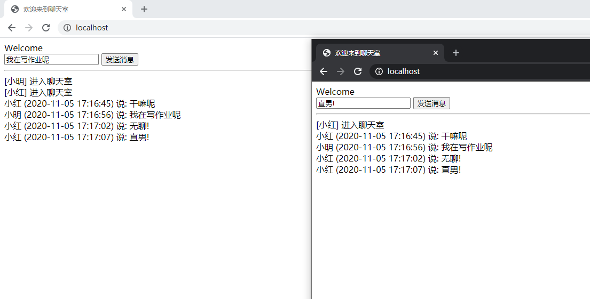

## 概述

​		在项目的开发时，遇到实现服务器主动发送数据到前端页面的功能的需求。实现该功能不外乎使用轮询和websocket技术，但在考虑到实时性和资源损耗后，最后决定使用websocket。现在就记录一下用Java实现Websocket技术吧~
    Java实现Websocket通常有两种方式：1、创建WebSocketServer类，里面包含open、close、message、error等方法；2、利用Springboot提供的webSocketHandler类，创建其子类并重写方法。我们项目虽然使用Springboot框架，不过仍采用了第一种方法实现。

​		**WebSocket是一种在Web应用程序中实现全双工通信的协议。**它允许在浏览器和服务器之间建立持久的、双向的通信通道，使得服务器可以主动向客户端推送数据，而不需要客户端发起请求。

​		在Java中，你可以使用Java的WebSocket API来实现WebSocket通信。Java的WebSocket API提供了一组类和接口，用于创建WebSocket服务器和客户端，处理WebSocket连接以及发送和接收WebSocket消息。

## 创建WebSocket的简单实例操作流程

### 1）引入Websocket依赖

```xml
<!--websocket支持包-->
<dependency>
    <groupId>org.springframework.boot</groupId>
    <artifactId>spring-boot-starter-websocket</artifactId>
</dependency>
```

### 2）创建配置类WebSocketConfig

    **ServerEndpointExporter 是由Spring官方提供的标准实现，用于扫描ServerEndpointConfig配置类和@ServerEndpoint注解实例。**
    如果使用内置的tomcat容器，那么必须用@Bean注入ServerEndpointExporter ；
    如果使用外置容器部署war包，那么不需要提供ServerEndpointExporter ，扫描服务器的行为将交由外置容器处理，需要将注入ServerEndpointExporter的@Bean代码注解掉。

```java
import org.springframework.context.annotation.Bean;
import org.springframework.context.annotation.Configuration;
import org.springframework.web.socket.server.standard.ServerEndpointExporter;

@Configuration
public class WebSocketConfig {
    /**
     * 如果使用Springboot默认内置的tomcat容器，则必须注入ServerEndpoint的bean；
     * 如果使用外置的web容器，则不需要提供ServerEndpointExporter，下面的注入可以注解掉
     */
    @Bean
    public ServerEndpointExporter serverEndpointExporter(){
        return new ServerEndpointExporter();
    }
}
```

### 3）创建WebSocketServer

​		**在websocket协议下，后端服务器相当于ws里面的客户端，需要用@ServerEndpoint指定访问路径，并使用@Component注入容器**

> @ServerEndpoint：当ServerEndpointExporter类通过Spring配置进行声明并被使用，它将会去扫描带有@ServerEndpoint注解的类。被注解的类将被注册成为一个WebSocket端点。所有的配置项都在这个注解的属性中 ( 如:@ServerEndpoint("/ws") )

下面的栗子中@ServerEndpoint指定访问路径中包含sid，这个是用于区分每个页面

```JAVA
import org.slf4j.Logger;
import org.slf4j.LoggerFactory;

import javax.websocket.OnClose;
import javax.websocket.OnError;
import javax.websocket.OnMessage;
import javax.websocket.OnOpen;
import javax.websocket.Session;
import javax.websocket.server.PathParam;
import javax.websocket.server.ServerEndpoint;

import com.alibaba.fastjson.JSON;
import com.alibaba.fastjson.JSONArray;
import com.alibaba.fastjson.JSONObject;
import org.apache.commons.lang.StringUtils;
import org.springframework.stereotype.Component;

import java.io.IOException;
import java.util.Collection;
import java.util.concurrent.ConcurrentHashMap;

@ServerEndpoint(value = "/ws/{sid}")
@Component
public class WebSocketServer {

    private final static Logger log = LoggerFactory.getLogger(WebSocketServer.class);
    //静态变量，用来记录当前在线连接数。应该把它设计成线程安全的。
    private static int onlineCount = 0;
    //与某个客户端的连接会话，需要通过它来给客户端发送数据
    private Session session;
    //旧：concurrent包的线程安全Set，用来存放每个客户端对应的MyWebSocket对象。由于遍历set费时，改用map优化
    //private static CopyOnWriteArraySet<WebSocketServer> webSocketSet = new CopyOnWriteArraySet<WebSocketServer>();
    //新：使用map对象优化，便于根据sid来获取对应的WebSocket
    private static ConcurrentHashMap<String,WebSocketServer> websocketMap = new ConcurrentHashMap<>();
    //接收用户的sid，指定需要推送的用户
    private String sid;

    /**
     * 连接成功后调用的方法
     */
    @OnOpen
    public void onOpen(Session session,@PathParam("sid") String sid) {
        this.session = session;
        //webSocketSet.add(this);     //加入set中
        websocketMap.put(sid,this); //加入map中。this代表当前类的实例，也就是WebSocketServer类的实例
        addOnlineCount();           //在线数加1
        log.info("有新窗口开始监听:"+sid+",当前在线人数为" + getOnlineCount());
        this.sid=sid;
        try {
            sendMessage("连接成功");
        } catch (IOException e) {
            log.error("websocket IO异常");
        }
    }

    /**
     * 连接关闭调用的方法
     */
    @OnClose
    public void onClose() {
        if(websocketMap.get(this.sid)!=null){
            //webSocketSet.remove(this);  //从set中删除
            websocketMap.remove(this.sid);  //从map中删除
            subOnlineCount();           //在线数减1
            log.info("有一连接关闭！当前在线人数为" + getOnlineCount());
        }
    }

    /**
     * 收到客户端消息后调用的方法，根据业务要求进行处理，这里就简单地将收到的消息直接群发推送出去
     * @param message 客户端发送过来的消息
     */
    @OnMessage
    public void onMessage(String message, Session session) {
        log.info("收到来自窗口"+sid+"的信息:"+message);
        if(StringUtils.isNotBlank(message)){
            for(WebSocketServer server:websocketMap.values()) {
                try {
                    server.sendMessage(message);
                } catch (IOException e) {
                    e.printStackTrace();
                    continue;
                }
            }
        }
    }

    /**
     * 发生错误时的回调函数
     * @param session
     * @param error
     */
    @OnError
    public void onError(Session session, Throwable error) {
        log.error("发生错误");
        error.printStackTrace();
    }

    /**
     * 实现服务器主动推送消息
     */
    public void sendMessage(String message) throws IOException {
        this.session.getBasicRemote().sendText(message);
    }


    /**
     * 群发自定义消息（用set会方便些）
     * */
    public static void sendInfo(String message,@PathParam("sid") String sid) throws IOException {
        log.info("推送消息到窗口"+sid+"，推送内容:"+message);
        /*for (WebSocketServer item : webSocketSet) {
            try {
                //这里可以设定只推送给这个sid的，为null则全部推送
                if(sid==null) {
                    item.sendMessage(message);
                }else if(item.sid.equals(sid)){
                    item.sendMessage(message);
                }
            } catch (IOException e) {
                continue;
            }
        }*/
        if(StringUtils.isNotBlank(message)){
            for(WebSocketServer server:websocketMap.values()) {
                try {
                    // sid为null时群发，不为null则只发一个
                    if (sid == null) {
                        server.sendMessage(message);
                    } else if (server.sid.equals(sid)) {
                        server.sendMessage(message);
                    }
                } catch (IOException e) {
                    e.printStackTrace();
                    continue;
                }
            }
        }
    }

    public static synchronized int getOnlineCount() {
        return onlineCount;
    }
    public static synchronized void addOnlineCount() {
        WebSocketServer.onlineCount++;
    }
    public static synchronized void subOnlineCount() {
        WebSocketServer.onlineCount--;
    }
}

```

### 4）websocket调用

​		可以提供接口让前端调用，也可以由前端指定ws调用网址，直接使用onopen等方法。在业务代码中调用方法也是可以的。

#### 4.1）提供接口进行消息推送

​		一个用户调用接口，主动将信息发给后端，后端接收后再主动推送给指定/全部用户

```java
import com.javatest.websocket.WebSocketServer;
import org.springframework.stereotype.Controller;
import org.springframework.web.bind.annotation.GetMapping;
import org.springframework.web.bind.annotation.PathVariable;
import org.springframework.web.bind.annotation.RequestMapping;
import org.springframework.web.bind.annotation.ResponseBody;
import org.springframework.web.servlet.ModelAndView;

import java.io.IOException;
import java.util.HashMap;
import java.util.Map;

@Controller
@RequestMapping("/websocket")
public class WebSocketController {

    //推送数据接口
    @ResponseBody
    @RequestMapping("/socket/push/{cid}")
    public Map<String,Object> pushToWeb(@PathVariable String cid, String message) {
        Map<String,Object> result = new HashMap<>();
        try {
            WebSocketServer.sendInfo(message,cid);
            result.put("status","success");
        } catch (IOException e) {
            e.printStackTrace();
            result.put("status","fail");
            result.put("errMsg",e.getMessage());
        }
        return result;
    }
}

```

#### 4.2）由前端指定ws调用网址直接使用

```html
<!DOCTYPE html>
<html>
<head>
    <meta charset="utf-8">
    <title>websocket通讯</title>
</head>
<script src="https://cdn.bootcss.com/jquery/3.3.1/jquery.js"></script>
<script>
    var socket;

    function openSocket() {
        if (typeof (WebSocket) == "undefined") {
            console.log("您的浏览器不支持WebSocket");
        } else {
            console.log("您的浏览器支持WebSocket");
            //实现化WebSocket对象，指定要连接的服务器地址与端口  建立连接
            var socketUrl = "ws://localhost:8888/ws/" + $("#userId").val();
            console.log(socketUrl)
            socket = new WebSocket(socketUrl);
            //打开事件
            socket.onopen = function () {
                console.log("websocket已打开");
                //socket.send("这是来自客户端的消息" + location.href + new Date());
            };
            //获得消息事件
            socket.onmessage = function (msg) {
                console.log(msg.data);
                //发现消息进入    开始处理前端触发逻辑
            };
            //关闭事件
            socket.onclose = function () {
                console.log("websocket已关闭");
            };
            //发生了错误事件
            socket.onerror = function () {
                console.log("websocket发生了错误");
            }
        }
    }

    function sendMessage() {
        if (typeof (WebSocket) == "undefined") {
            console.log("您的浏览器不支持WebSocket");
        } else {
            console.log("您的浏览器支持WebSocket");
            console.log('[{"toUserId":"' + $("#toUserId").val() + '","contentText":"' + $("#contentText").val() + '"}]');
            socket.send('[{"toUserId":"' + $("#toUserId").val() + '","contentText":"' + $("#contentText").val() + '"}]');
        }
    }
</script>
    <body>
        <p>【userId】：
        <div><input id="userId" name="userId" type="text" value="11"/></div>
        <p>【toUserId】：
        <div><input id="toUserId" name="toUserId" type="text" value="22"/></div>
        <p>【toUserId内容】：
        <div><input id="contentText" name="contentText" type="text" value="abc"/></div>
        <p>【操作】：
            <input type="button" onclick="openSocket()" value="开启socket"/>
        <p>【操作】：
            <input type="button" onclick="sendMessage()" value="发送消息"/>
    </body>
</html>

```

​		这样，启动服务器之后就可以接口或者ws调用网址的方式进行websocket的通信啦~

## 用户sid的指定

    在上篇中，我们用sid来区分每个用户（也可以理解为每个网页窗口）。但sid是由前端页面在发送websocket请求时随请求过来的，如果由用户自行指定sid，那很容易出现sid重复的情况（也就是串线）。所以需要由程序来指定每个用户的sid。
    sid值可以由前端设置，也可以由后端指定再返回给前端。
    如果websocket同时在线用户数比较少，对重复性要求不高的情况下，可以直接在前端使用随机数算法：

```js
function random(lower, upper) {
	return Math.floor(Math.random() * (upper - lower+1)) + lower;
}
```

    在打开一个websocket页面窗口时，调用随机数算法指定该窗口的用户sid。比如:

    在打开一个websocket页面窗口时，调用随机数算法指定该窗口的用户sid。比如:

```js
var sid = random(1,10000)	// 在1-10000中生成随机数
```

    不过显然，在前端使用随机数算法仍不可避免的出现sid重复性的问题。如果用户数在线数比较多的话，可以用uuid作为代替。
    除了在前端指定sid以外，也可以首次请求的时候不带sid，由后端指定sid返回给前端，前端再绑定sid。这里可以由后端分发uuid或者用雪花算法计算的值，也可以通过后端维护一个sid的稽核，这里就不展开来讲，如果大家有兴趣，可以自己动手试试。

## 断线重连机制

### 断线重连机制下WebSocketServer类调整

    因网络原因或者其他原因，有可能会出现断线的情况，而客户端或者服务器没有监测机制，无法得知连接是否保持。这时候需要建立断线重连机制（也可以说心跳重连机制）。
    简单而言，就是**设置定时器，每隔一定时间发送一次特定的信息（心跳），当服务器返回任何信息（包括心跳回复或信息推送），都证明连接可靠，此时重置定时器。**
    我们首先调整一下服务器端WebSocketServer类，在onMessage方法中增加心跳相关的代码。作为心跳的特定字符串不能为常见的字符串，以免服务端将正常的信息和心跳混淆。

```java
@ServerEndpoint(value = "/ws/{sid}")
@Component
public class WebSocketServer {

	......
	
	// 根据心跳机制调整onMessage方法
	@OnMessage
    public void onMessage(String message, Session session) {
        // 对心跳进行回复(回复自己)
        if (message.equals("$$")) {	 // 心跳为$$
            try {
                sendInfo("1$",sid);	// 假定心跳返回的字符串为1$
            } catch (IOException e) {
                e.printStackTrace();
            }
        } else {
            // 对正常信息进行处理
            log.info("收到来自窗口" + sid + "的信息:" + message);
//        if(StringUtils.isNotBlank(message)){
//            for(WebSocketServer server:websocketMap.values()) {
//                try {
//                    server.sendMessage(message);
//                } catch (IOException e) {
//                    e.printStackTrace();
//                    continue;
//                }
//            }
//        }
            try {
                //从message中解析出toSid和content
                Map map = JSONObject.parseObject(message, Map.class);
                String toSid = (String) map.get("toSid");
                String content = "sid" + sid + ":" + (String) map.get("content");
                //验证toSid是否上线。如果toSid为""，视为群发
                if ("".equals(toSid) || websocketMap.get(toSid) != null) {
                    sendInfo(content, toSid);
                } else {
                    sendInfo(toSid + "未上线",sid);
                }
            } catch (IOException e) {
                e.printStackTrace();
            }
        }
    }
}

```

### 断线重连机制下websocket的调用

#### 提供接口进行消息推送

    同上篇

#### 由前端指定ws调用网址直接使用

    在创建websocket连接的时候，要对该连接进行设置，**在onclose和onerror方法中增加重连的方法。并建立心跳，通过一个定时器定时发送心跳字符串，如果返回指定的字符串，则认为本次心跳成功，定时器重置，而长时间没有返回指定的字符串，则触发重连的方法。**具体的ws页面如下：


```html
<!DOCTYPE html>
<html>
<head>
    <meta charset="utf-8">
    <title>websocket通讯2</title>
</head>
<script type="text/javascript" src="https://cdn.bootcss.com/jquery/3.3.1/jquery.js"></script>
<script>
    var lockReconnect = false;//避免重复连接
    var ws;
    var tt;
    var sid = random(1, 100000);    // 这里将页面的sid写死，重连的时候会请求同样的sid，容易出现重复性问题，最好是由后端提供去重后的sid
    var wsUrl = "ws://localhost:8888/ws/" + sid;		// websocket链接,项目地址

    function createWebSocket() {
        try {
            if (typeof (WebSocket) == "undefined") {
                console.log("您的浏览器不支持WebSocket");
            } else {
                console.log("您的浏览器支持WebSocket");
                console.log("sid：" + sid);
                ws = new WebSocket(wsUrl);
                websocketInit();
            }
        } catch (e) {
            console.log('catch');
            websocketReconnect(wsUrl);
        }
    }

    function websocketInit() {
        // 建立websocket连接成功触发事件
        ws.onopen = function (evt) {
            onOpen(evt);
        };
        // 断开websocket连接成功触发事件
        ws.onclose = function (evt) {
            websocketReconnect(wsUrl);
            onClose(evt);
        };
        // 接收服务端数据时触发事件
        ws.onmessage = function (evt) {
            onMessage(evt);
        };
        // 通信发生错误时触发
        ws.onerror = function (evt) {
            websocketReconnect(wsUrl);
            onError(evt);
        };
    }

    function onOpen(evt) {
        console.log("websocket连接已建立");
        //心跳检测重置
        heartCheck.start();
    }

    function onClose(evt) {
        console.log("websocket连接已关闭");
    }

    function onMessage(evt) {
        // 心跳不需要处理
        if (evt.data === "1$") {
            console.log('heartbeat！！！');
        } else {
            // 对后端返回信息做业务操作
            console.log('接收消息: ' + evt.data);
            var msg = $("#message").html() + evt.data + '\n';
            $("#message").html(msg);      // 根据业务需求调整
        }
        // 拿到信息说明连接正常，心跳重置
        heartCheck.start();
    }

    function onError(evt) {
        console.log("websocket连接发生错误：" + evt.data);
    }

    // 断线重连
    function websocketReconnect(url) {
        if (lockReconnect) {       // 是否已经执行重连
            return;
        }
        lockReconnect = true;
        //没连接上会一直重连，设置延迟避免请求过多
        tt && clearTimeout(tt);
        tt = setTimeout(function () {
            createWebSocket(url);
            lockReconnect = false;
        }, 5000);
    }

    // 心跳建立
    var heartCheck = {
        timeout: 30000,
        timeoutObj: null,
        serverTimeoutObj: null,
        start: function () {
            console.log('heartbeat...');    // 正式使用时要去掉
            var self = this;
            this.timeoutObj && clearTimeout(this.timeoutObj);
            this.serverTimeoutObj && clearTimeout(this.serverTimeoutObj);
            this.timeoutObj = setTimeout(function () {
                //这里发送一个心跳，后端收到后，返回一个心跳消息，
                //onmessage拿到返回的心跳就说明连接正常
                ws.send("$$");
                self.serverTimeoutObj = setTimeout(function () {//如果超过一定时间还没重置，说明后端主动断开了
                    ws.close();     //如果onclose会执行reconnect，我们执行ws.close()就行了.如果直接执行reconnect 会触发onclose导致重连两次
                }, self.timeout);
            }, this.timeout)
        }
    };

    // 主动发送消息
    function sendMessage() {
        if (typeof (WebSocket) == "undefined") {
            console.log("您的浏览器不支持WebSocket");
        } else {
            console.log("您的浏览器支持WebSocket");
            console.log('{"toSid":"' + $("#toSid").val() + '","content":"' + $("#content").val() + '"}');
            ws.send('{"toSid":"' + $("#toSid").val() + '","content":"' + $("#content").val() + '"}');
        }
    }

    // 创建随机数作为sid，但是存在重复性问题
    function random(lower, upper) {
        return Math.floor(Math.random() * (upper - lower + 1)) + lower;
    }

    // 进入页面后便建立websocket连接
    createWebSocket(wsUrl);
</script>
<body>
        <p>【toSid】：
        <div><input id="toSid" name="toSid" type="text"/></div>
        <p>【发送内容】：
        <div><input id="content" name="content" type="text" value="abc"/></div>
        <p>【操作】：
        <div><input type="button" onclick="sendMessage()" value="发送消息"/><br/>
            <p>【接收内容】：
            <div><textarea id="message"></textarea></div>
</body>
</html>

```
### 断线重连机制总结

    其实加上心跳机制后，心跳检测和传统的http轮询没什么太大的差别，都是定时发送请求。但是websocket仍然具有以下的优势：时效性比轮询强，属于服务器主动推送；不需要频繁创建http连接，减少资源的浪费。如果想减轻服务器的压力，心跳间隔可以根据需求增大。

## 聊天室

```java
package com.lz.websocket.websocket;

import org.springframework.stereotype.Component;

import javax.websocket.*;
import javax.websocket.server.ServerEndpoint;
import java.time.LocalDateTime;
import java.util.HashMap;
import java.util.Map;

/**
 * @ServerEndpoint 注解是一个类层次的注解，它的功能主要是将目前的类定义成一个websocket服务器端,注解的值将被用于监听用户连接的终端访问URL地址,客户端可以通过这个URL来连接到WebSocket服务器端
 */
@ServerEndpoint(value = "/chat/{uid}")
@Component
public class WebSocketTest {
    private Session session;

    private String getUid(Session session) {
        this.session = session;
        Map parem = session.getPathParameters();
        String uid = parem.get("uid").toString();
        return uid;
    }

    /**
     * 当前登录人的 session 管理器
     */
    private static Map<String, Session> sessionMessage = new HashMap<>();

    @OnOpen//打开连接执行
    public void onOpw(Session session) {
        String uid = getUid(session);
        sessionMessage.put(uid, session);
        System.out.println("[" + uid + "] 进入聊天室");
        sendMessage("[" + uid + "]   进入聊天室");
    }

    @OnMessage//收到消息执行
    public void onMessage(String message, Session session) {
        String uid = getUid(session);
        sendMessage(uid + "  (" + LocalDateTime.now() + ")  说: " + message);
    }

    @OnClose//关闭连接执行
    public void onClose(Session session) {
        System.out.println(session.getId() + "关闭连接");
    }

    @OnError//连接错误的时候执行
    public void onError(Throwable error, Session session) {
        System.out.println("错误的时候执行");
        error.printStackTrace();
    }


    /**
     * 发送消息
     *
     * @param message
     */
    public void sendMessage(String message) {
        for (String uid : sessionMessage.keySet()) {
            try {
                sessionMessage.get(uid).getAsyncRemote().sendText(message);
            } catch (Exception e) {
            }
        }
    }


}
 
```

```html
<!DOCTYPE html>
<html lang="zh">
<head>
    <meta charset="UTF-8">
    <title>欢迎来到聊天室</title>
</head>
<body>
Welcome<br/> <span id="yhm"></span>

<div id="div1">

    <input id="account" type="text" placeholder="用户名"/>

    <button onclick="init()">连接聊天室</button>

    <hr/>
</div>

<div id="div2" hidden>
    <input id="text" type="text"/>
    <button onclick="send()">发送消息</button>
    <hr/>

</div>


<div id="message"></div>


</body>
<script type="text/javascript">
    var websocaket = null;


    function init() {
        var account = document.getElementById("account").value;
        if (account == '') {
            setdivInnerHTML("没有输入UID");
            return false;
        }


        if ('WebSocket' in window) {
            websocaket = new WebSocket("ws://localhost:8888/chat/" + account);//用于创建 WebSocket 对象。WebSocketTest对应的是java类的注解值
        } else {
            setdivInnerHTML("当前浏览器不支持");
        }
        //连接发生错误的时候回调方法；
        websocaket.onerror = function () {
            setdivInnerHTML("连接错误");
        }
        //连接成功时建立回调方法；
        websocaket.onopen = function () {

            document.getElementById("div2").hidden = false;

            document.getElementById("div1").hidden = true;
            document.getElementById("yhm").text(account);

            setdivInnerHTML("连接成功");
        }
        //收到消息的回调方法
        websocaket.onmessage = function (msg) {
            setdivInnerHTML(msg.data);
        }
        //连接关闭的回调方法
        websocaket.onclose = function () {
            setdivInnerHTML("关闭成功");
        }
    }

    //关闭websocket
    //
    function closea() {
        websocaket.close();
        alert("点击关闭");
    }

    function setdivInnerHTML(innerHTML) {
        document.getElementById('message').innerHTML += innerHTML + '<br/>';
    }

    function send() {
        var message = document.getElementById('text').value;
        websocaket.send(message);//给后台发送数据
    }
</script>
</html>
```

