# 禹神：一小时快速上手Electron

> ⚠️注意：  
> 1️⃣原视频打包时，是使用[electron](https://so.csdn.net/so/search?q=electron&spm=1001.2101.3001.7020)\-builder打包，使用electron-builder打包，打包时要访问`github`需要`修仙术`才能访问。  
> 2️⃣本笔记，使用Electron Forge进行打包，使用Electron Forge不需要访问`github`更友好。在Electron 官网中也推荐使用这种方式 👉[Electron](https://www.electronjs.org/zh/docs/latest/tutorial/forge-overview)

## 一、Electron是什么

**简单的一句话，就是用html+css+js+nodejs+（Native Api）做兼容多个系统（Windows、Linux、Mac）的软件。**

**官网解释如下\(有点像绕口令\)：**  
Electron是一个使用 JavaScript、HTML 和 CSS 构建桌面应用程序的框架。 嵌入 Chromium 和 Node.js 到 二进制的 Electron 允许您保持一个 JavaScript 代码代码库并创建 在Windows上运行的跨平台应用 macOS和Linux——不需要本地开发 经验。  
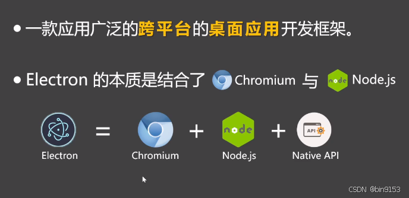  
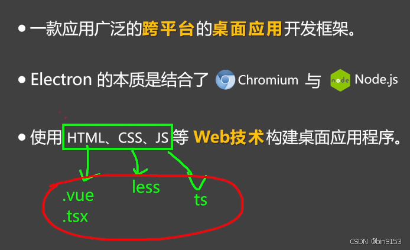

## 二、Elemtron流程模型


## 三、Electron搭建工程，若成功则输出123

### 3.1 准备

[可参考Electron官网地址](https://www.electronjs.org/zh/docs/latest/tutorial/quick-start)  
需要node和npm，先检测是否安装。

```javascript
node -v
npm -v
```

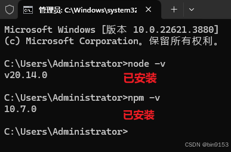

### 3.2 项目初始化

命令行创建

```javascript
mkdir my-electron-app && cd my-electron-app
npm init
```

或者，手动快速创建  


package.json文件

```javascript
{
  "name": "my-electron-app",
  "version": "1.0.0",
  "description": "test Electron",
  "main": "main.js",
  "author": "Bin9153",
  "license": "MIT"
}
```

有几条规则需要遵循：

entry point 应为 main.js.  
author 与 description 可为任意值，但对于应用打包是必填项。  
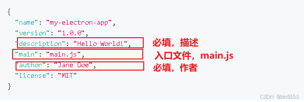

### 3.3 安装 Electron

```javascript
npm install --save-dev electron
//或者
npm install electron -D
```

### 3.4 配置并启动

**在 package.json配置文件中的scripts字段下增加一条start命令：**

```javascript
{
  "scripts": {
    "start": "electron ."
  }
}
```

**这一步，完整的package.json**

```javascript
{
  "name": "my-electron-app",
  "version": "1.0.0",
  "main": "main.js",
  "scripts": {
    "start": "electron ."
  },
  "author": "bin9153",
  "license": "ISC",
  "description": "electron test",
  "dependencies": {
    "electron": "^31.2.0"
  }
}
```

代码解析：  
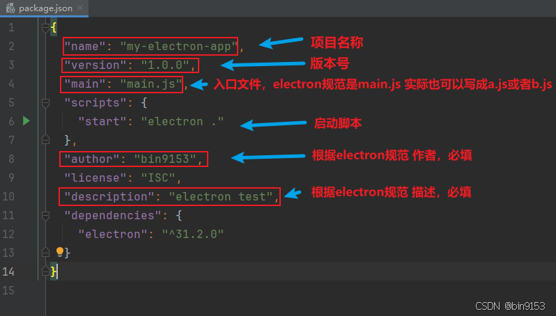  
**创建main.js**。  
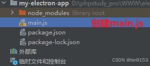  
**在main.js里写入**

```javascript
console.log(123)
```

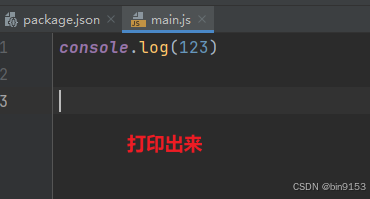

**再运行！**

```javascript
npm start
```

**注意：**

1.  先创建main.js，否则报错
2.  如果main.js里没写输出（或其他代码）则，启动了运行窗口也不容易看出变化

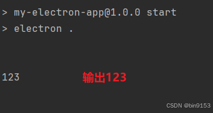  
**成功输出123，工程搭建完成。**

## 四、开始制作程序

### 4.1 案例1：做一个简易网页程序

[点击可以查看，browser-window配置项的开发文档](https://www.electronjs.org/zh/docs/latest/api/browser-window)  
在main.js里写入

```javascript
const {app, BrowserWindow} = require('electron')

app.on('ready', () => {
    //当app准备好后，执行createWindow创建窗口
    const win = new BrowserWindow({
        width: 800,//窗口宽度
        height: 600,//窗口高度
        autoHideMenuBar: true,//自动隐藏菜单档
        alwaysOnTop: true,//置顶
        x: 0,//窗口位置x坐标
        y: 0//窗口位置y坐标
    })
    //加载一个远程页面
   win.loadURL('https://blog.csdn.net/qq_33650655/article/details/140353815')
})
```

运行

```javascript
 npm start
```

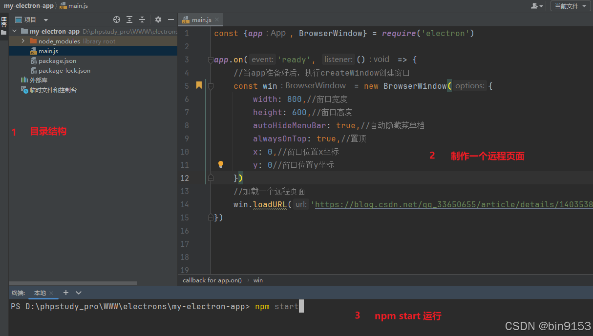  
成功显示页面。  
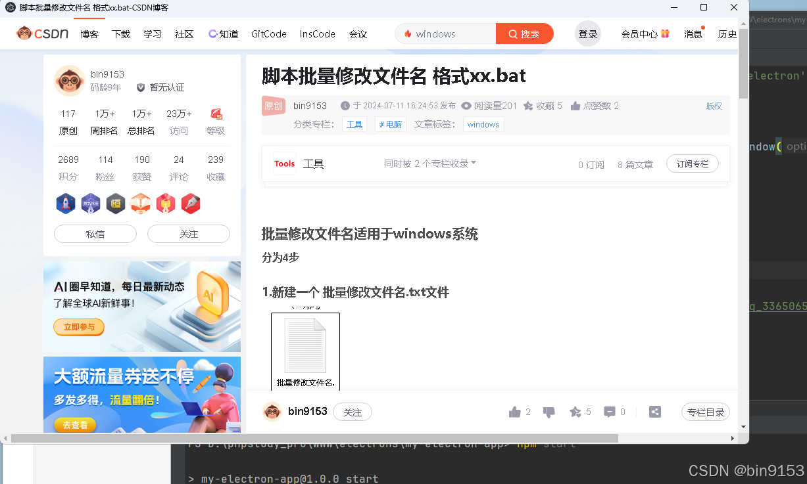

### 4.2 案例2：做一个本地程序（不是远程链接页面，是自己写的页面）

#### 4.2.1 是本地程序，所以创建新的页面

新建pages目录，创建页面，这里就像写前端一样了。index.html,index.css  
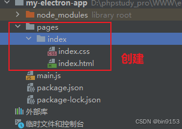  
index.html里

```html
<!DOCTYPE html>
<html lang="en">
<head>
    <meta charset="UTF-8">
   
    <title>这里是index页面</title>
</head>

<body>
<h1>
    这里是index里的标题
</h1>
</body>
</html>
```

main.js里引入页面

```javascript
const {app, BrowserWindow} = require('electron')

app.on('ready', () => {

    //当app准备好后，执行createWindow创建窗口
    const win = new BrowserWindow({
        width: 800,//窗口宽度
        height: 600,//窗口高度
        autoHideMenuBar: true,//自动隐藏菜单档
        alwaysOnTop: true,//置顶
    })
    //引入页面
    win.loadFile('./pages/index/index.html')

})
```

运行

```javascript
npm start
```

#### 4.2.2 解决内容安全策略

有安全提示  
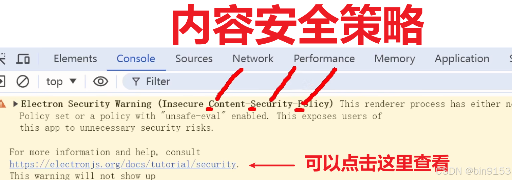  
在index.html里加入，如下代码，内容安全策略警告提示消失。

```html
//electron 提供的配置 成功运行
<meta http-equiv="Content-Security-Policy" content="default-src 'self'; script-src 'self'">
//electron 提供的配置2 引入js后也会报错
<meta http-equiv="Content-Security-Policy" content="default-src none">
//视频教程里的配置 会报错
<meta http-equiv="Content-Security-Policy" content="default-src 'self';style-src 'self''unsafe-inline';img-src self'data:;">
//我自己写的组合的配置更全 加了一个script的限制,有事儿后期再改， 刚试了会报错，可能哪里没写对，先记录在这里
<meta http-equiv="Content-Security-Policy" content="default-src 'self'; script-src 'self';style-src 'self''unsafe-inline';img-src self'data:;">
```

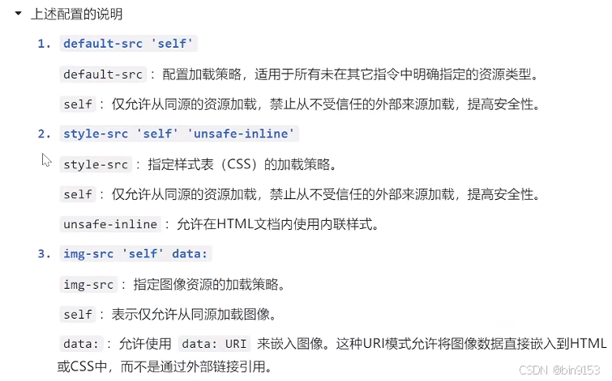

关于CSP的详细说明：[MDN内容安全策略详解](https://developer.mozilla.org/zh-CN/docs/Web/HTTP/CSP) 、[Electron安全策略规范](https://www.electronjs.org/zh/docs/latest/tutorial/security)

## 五、增加多系统的兼容代码

兼容mac\(完善窗口行为）  
electron文档：  
[关闭所有窗口时退出应用 \(Windows \& Linux\)](https://www.electronjs.org/zh/docs/latest/tutorial/quick-start#%E5%85%B3%E9%97%AD%E6%89%80%E6%9C%89%E7%AA%97%E5%8F%A3%E6%97%B6%E9%80%80%E5%87%BA%E5%BA%94%E7%94%A8-windows--linux)  
[如果没有窗口打开则打开一个窗口 \(macOS\)](https://www.electronjs.org/zh/docs/latest/tutorial/quick-start#%E5%A6%82%E6%9E%9C%E6%B2%A1%E6%9C%89%E7%AA%97%E5%8F%A3%E6%89%93%E5%BC%80%E5%88%99%E6%89%93%E5%BC%80%E4%B8%80%E4%B8%AA%E7%AA%97%E5%8F%A3-macos)  
在main.js里写入兼容各个系统平台的代码

```javascript
const {app, BrowserWindow} = require('electron')

function createWindow(){
    //当app准备好后，执行createWindow创建窗口
    const win = new BrowserWindow({
        width: 800,//窗口宽度
        height: 600,//窗口高度
        autoHideMenuBar: true,//自动隐藏菜单档
        alwaysOnTop: true,//置顶
    })
    win.loadFile('./pages/index/index.html')
}
app.on('ready', () => {
    createWindow()

    //兼容核心代码 1
    //mac 应⽤即使在没有打开任何窗⼝的情况下也继续运⾏，并且在没有窗⼝可⽤的情况下激活应⽤时会打开新的窗⼝。
    app.on('activate', () => {
        if (BrowserWindow.getAllWindows().length === 0) createWindow()
    })


})

//兼容核心代码 2
//Windows 和 Linux 平台窗⼝特点是：关闭所有窗⼝时退出应⽤。
app.on('window-all-closed', () => {
    if (process.platform !== 'darwin') app.quit()
})
```

代码解析  
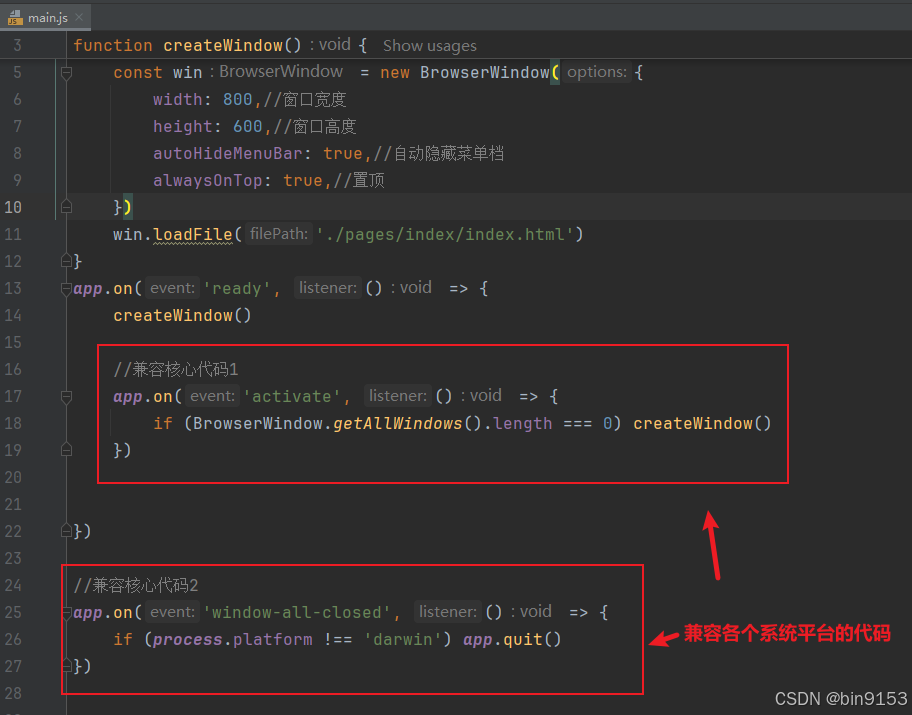

下面两句代码相等

```javascript
app.on('ready', () => {
   // 写核心代码
})
// 或者
app.whenReady().then(() => {
  //写核心代码
})
```

## 六、热部署

```javascript
npm i nodemon -D
```

package.json里重写start

```javascript
 "start": "nodemon --exec electron ."
```

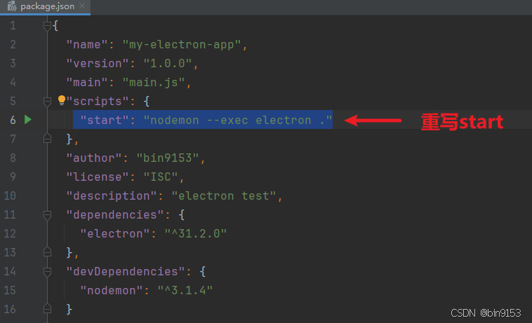

这样保存main.js里的内容，就自动热更新了。  
但是更新index.html里的代码不能热更新，要加一个nodemon.json，需要手动添加

```javascript
{
  "ignore":[
    "node modules",
    "dist"
  ],
  "restartable":"r",
  "watch":["*.*"],
  "ext":"html,js,css"
}
```

增加nodemon.json,  

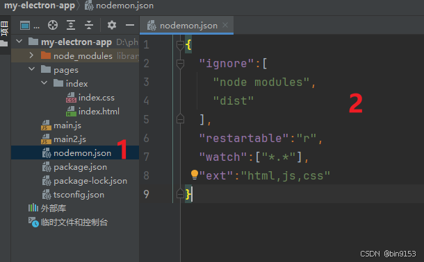  
重启生效

```javascript
npm start
```

## 七、主进程和渲染进程

下图是 Chrome 浏览器的程序架构，图来⾃于[Chrome 漫画](https://www.google.com/googlebooks/chrome/)。

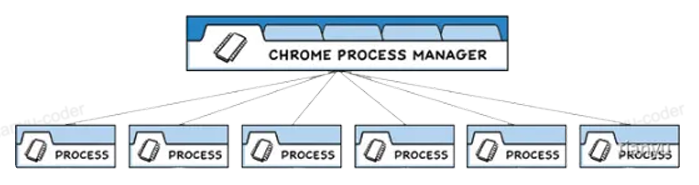

Electron 应⽤的结构与上图⾮常相似，在 Electron 中主要控制两类进程：主进程、渲染器进程。  

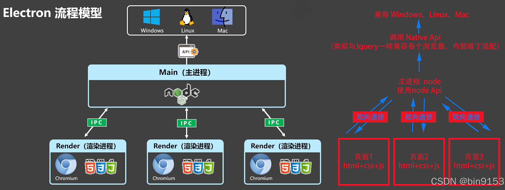

### 8.1 主进程

每个 Electron 应⽤都有⼀个单⼀的主进程，作为应⽤程序的⼊⼝点。 主进程在 Node.js 环境中运⾏，它具有 require 模块和使⽤所有 Node.js API 的能⼒，主进程的核⼼就是：**使用BrowserWindow来创建和管理窗口**

### 8.2 渲染进程

每个 BrowserWindow 实例都对应⼀个单独的渲染器进程，运⾏在渲染器进程中的代码，必须遵守⽹⻚标准，这也就意味着： **渲染器进程无权直接访问require或使用任何Node.js的API**

> 问题产⽣：处于渲染器进程的⽤户界⾯，该怎样才与 Node.js 和 Electron 的原⽣桌⾯功能进⾏交互呢？

## 八、Preload 脚本

预加载（Preload）脚本是运⾏在渲染进程中的， 但它是在⽹⻚内容加载之前执⾏的，这意味着它 具有⽐普通渲染器代码更⾼的权限，可以访问 Node.js 的 API，同时⼜可以与⽹⻚内容进⾏安全 的交互。 简单说：它是 Node.js 和 Web API 的桥梁，Preload 脚本可以安全地将部分 Node.js 功能暴露给⽹⻚，从⽽减少安全⻛险。    

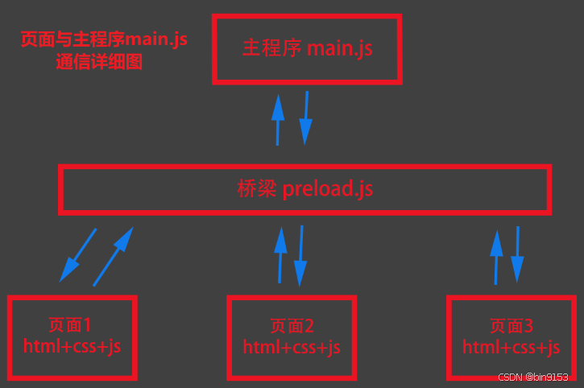

> 需求：点击按钮后，在⻚⾯呈现当前的 Node 版本。 

  创建预加载脚本 preload.js 

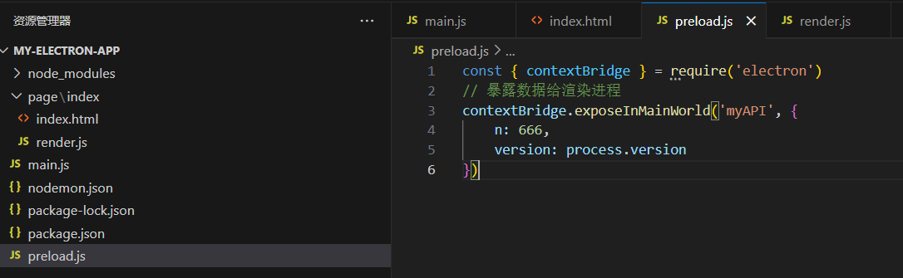

```JS
const { contextBridge } = require('electron')
// 暴露数据给渲染进程
contextBridge.exposeInMainWorld('myAPI', {
    n: 666,
    version: process.version
})
```

在main.js中定义preload.js为桥梁  

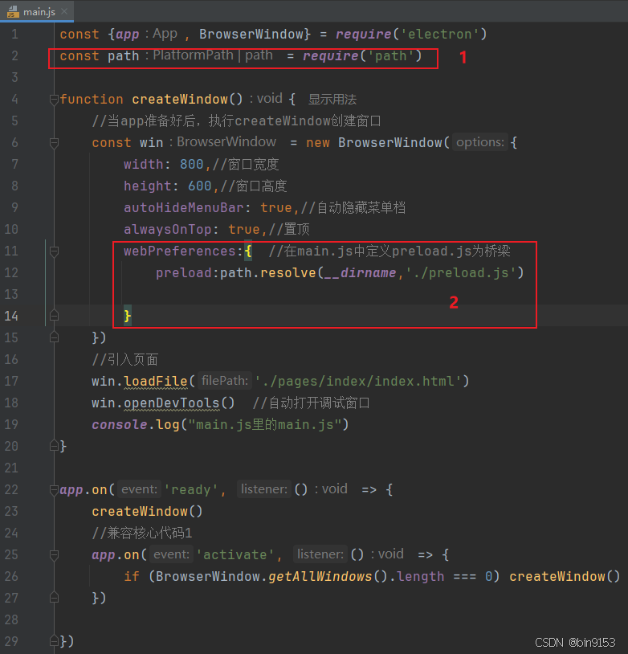

main.js代码：

```javascript
const {app, BrowserWindow} = require('electron')
const path = require('path')

function createWindow(){
    //当app准备好后，执行createWindow创建窗口
    const win = new BrowserWindow({
        width: 800,//窗口宽度
        height: 600,//窗口高度
        autoHideMenuBar: true,//自动隐藏菜单档
        alwaysOnTop: true,//置顶
        webPreferences:{  //在main.js中定义preload.js为桥梁
            preload:path.resolve(__dirname,'./preload.js')

        }
    })
    //引入页面
    win.loadFile('./pages/index/index.html')
    win.openDevTools()  //自动打开调试窗口
    console.log("main.js里的main.js")
}

app.on('ready', () => {
    createWindow()
    //兼容核心代码1
    app.on('activate', () => {
        if (BrowserWindow.getAllWindows().length === 0) createWindow()
    })

})
```

在 html ⻚⾯中编写对应按钮，并创建专⻔编写⽹⻚脚本的 render.js  ，随后引⼊。

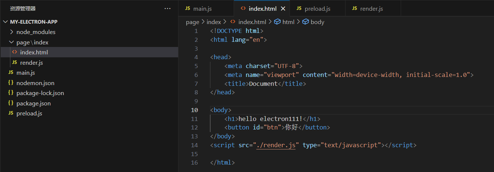

```html
<!DOCTYPE html>
<html lang="en">

<head>
    <meta charset="UTF-8">
    <meta name="viewport" content="width=device-width, initial-scale=1.0">
    <title>Document</title>
</head>

<body>
    <h1>hello electron111!</h1>
    <button id="btn">你好</button>
</body>
<script src="./render.js" type="text/javascript"></script>

</html>
```

在渲染进程中使⽤ version 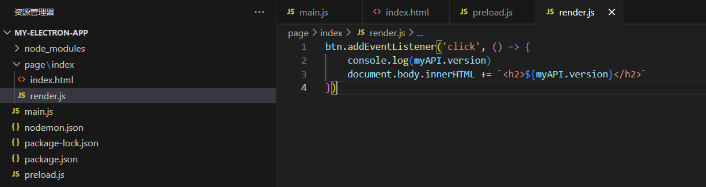

```js
btn.addEventListener('click', () => {
    console.log(myAPI.version)
    document.body.innerHTML += `<h2>${myAPI.version}</h2>`
})
```

效果图

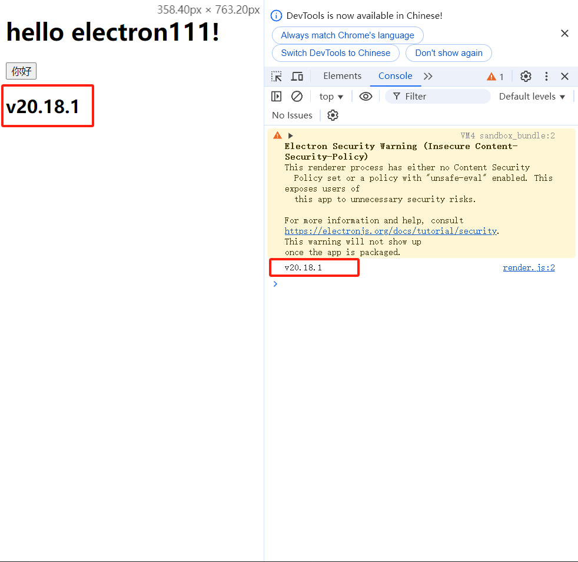

整体结构如下

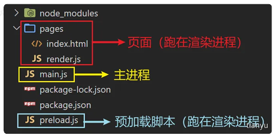

## 九、进程通信（IPC）

> 值得注意的是： 上⽂中的  preload.js  ，⽆法使⽤全部  Node  的  API  ，⽐如：不能使⽤  Node  中的  fs  模 块，但主进程（  main.js  ）是可以的，这时就需要  让  preload.js  通知  main.js  去调⽤  fs  模块去⼲活。 

关于 Electron  进程通信，我们要知道：  

- IPC  全称为：InterProcess Communication，即：进程通信。 
- IPC  是 Electron  中最为核⼼的内容，它是从 UI  调⽤原⽣ API  的唯⼀⽅法！
- Electron  中，主要使⽤ ipcMain 和 ipcRenderer 来定义“ 通道” ，进⾏进程通信。 

### 9.1 渲染进程 ➡  主进程（单向） 

概述：在渲染器进程中 ipcRenderer.send 发送消息，在主进程中使⽤ ipcMain.on 接收消息。  常⽤于：在Web中调用主进程的API。  

> 需求：点击按钮后，在⽤户的 D 盘创建⼀个 hello.txt  ⽂件，⽂件内容来⾃于⽤户输⼊。

⻚⾯中添加相关元素， render.js  中添加对应脚本 

```html
<!DOCTYPE html>
<html lang="en">

<head>
    <meta charset="UTF-8">
    <meta name="viewport" content="width=device-width, initial-scale=1.0">
    <title>Document</title>
</head>

<body>
    <input id="content" type="text"><br><br>
    <button id="btn">在⽤户的D盘创建⼀个hello.txt</button>
</body>
<script src="./render.js" type="text/javascript"></script>

</html>
```

```js
const btn = document.getElementById('btn');
const content = document.getElementById('content');


btn.addEventListener('click', () => {

    console.log(content.value)

    myAPI.saveFile(content.value)

})
```

preload.js  中使⽤ ipcRenderer.send(' 信道 ', 参数 )  发送消息，与主进程通信。 

```js
const { contextBridge, ipcRenderer } = require('electron')
// 暴露数据给渲染进程
contextBridge.exposeInMainWorld('myAPI', {
    saveFile(str) {
        ipcRenderer.send('create_file', str)
    }
})
```

主进程中，在加载⻚⾯之前，使⽤ JavaScript ipcMain.on(' 信道 ', 回调 )  配置对应回调函数，接收 消息。

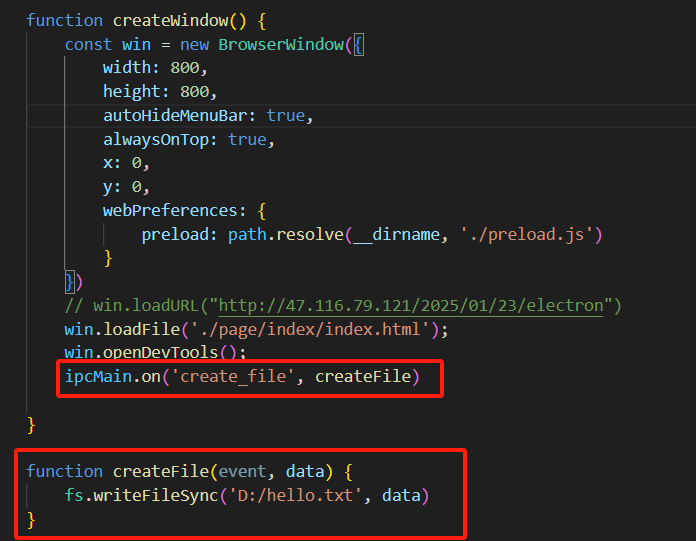

```js
const { app, BrowserWindow, ipcMain } = require('electron')
const path = require('path')
const fs = require('fs');


function createWindow() {
    const win = new BrowserWindow({
        width: 800,
        height: 800,
        autoHideMenuBar: true,
        alwaysOnTop: true,
        x: 0,
        y: 0,
        webPreferences: {
            preload: path.resolve(__dirname, './preload.js')
        }
    })
    // win.loadURL("http://47.116.79.121/2025/01/23/electron")
    win.loadFile('./page/index/index.html');
    win.openDevTools();
    ipcMain.on('create_file', createFile)

}

function createFile(event, data) {
    fs.writeFileSync('D:/hello.txt', data)
}

app.on('ready', () => {
    createWindow();

    app.on('activate', () => {
        if (BrowserWindow.getAllWindows.length === 0) createWindow
    })
})

app.on('window-all-closed', () => {
    if (process.platform != 'darwin') app.quit()
})
```

### 9.2 渲染进程**↔**主进程（双向）

概述：渲染进程通过ipcRenderer.invoke 发送消息，主进程使⽤ ipcMain.handle 接收并处理消息。 

备注： ipcRender.invoke  的返回值是  Promise  实例。  常⽤于：从渲染器进程调用主进程方法并等待结果。

> 需求： hello.txt  中的内容，并将结果呈现在⻚⾯上。

⻚⾯中添加相关元素， render.js  中添加对应脚本

```HTML
<!DOCTYPE html>
<html lang="en">

<head>
    <meta charset="UTF-8">
    <meta name="viewport" content="width=device-width, initial-scale=1.0">
    <title>Document</title>
</head>

<body>
    <button id="btn">读取⽤户D盘的hello.txt</button>
</body>
<script src="./render.js" type="text/javascript"></script>

</html>
```

```JS
const btn = document.getElementById('btn')
btn.addEventListener('click', async () => {
    let data = await myAPI.readFile('D:/hello.txt')
    document.body.innerHTML += `<h2>${data}</h2>`
})
```

preload.js  中使⽤ ipcRenderer.send(' 信道 ', 参数 )  发送消息，与主进程通信。

```JS
const { contextBridge, ipcRenderer } = require('electron')
// 暴露数据给渲染进程
contextBridge.exposeInMainWorld('myAPI', {
    readFile(path) {
        return ipcRenderer.invoke('read-file',path)
    }
})
```

主进程中，在加载⻚⾯之前，使⽤ JavaScript ipcMain.on(' 信道 ', 回调 )  配置对应回调函数，接收 消息。

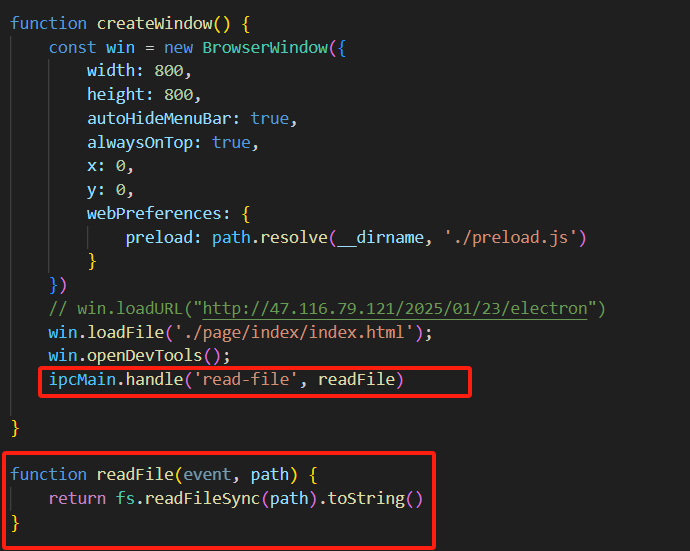

```JS
const { app, BrowserWindow, ipcMain } = require('electron')
const path = require('path')
const fs = require('fs');


function createWindow() {
    const win = new BrowserWindow({
        width: 800,
        height: 800,
        autoHideMenuBar: true,
        alwaysOnTop: true,
        x: 0,
        y: 0,
        webPreferences: {
            preload: path.resolve(__dirname, './preload.js')
        }
    })
    // win.loadURL("http://47.116.79.121/2025/01/23/electron")
    win.loadFile('./page/index/index.html');
    win.openDevTools();
    ipcMain.handle('read-file', readFile)

}

function readFile(event, path) {
    return fs.readFileSync(path).toString()
}


function createFile(event, data) {
    fs.writeFileSync('D:/hello.txt', data)
}

app.on('ready', () => {
    createWindow();

    app.on('activate', () => {
        if (BrowserWindow.getAllWindows.length === 0) createWindow
    })
})

app.on('window-all-closed', () => {
    if (process.platform != 'darwin') app.quit()
})
```

### 9.3 主进程到 ➡  渲染进程 

概述：主进程使⽤ win.webContents.send 发送消息，渲染进程通过ipcRenderer.on 处理消息，  常⽤于：从主进程主动发送消息给渲染进程。

> 需求：应⽤加载 6 秒钟后，主动给渲染进程发送⼀个消息，内容是：你好啊！ 

⻚⾯中添加相关元素， render.js 中添加对应脚本

```js
window.onload = () => {
    myAPI.getMessage(logMessage)
}

function logMessage(event, str) {
    console.log(event, str)
}
```

 preload.js  中使⽤ JavaScript ipcRenderer.on (' 信道 ', 回调 )  接收消息，并配置回调函数。 

```js
const { contextBridge, ipcRenderer } = require('electron')
// 暴露数据给渲染进程
contextBridge.exposeInMainWorld('myAPI', {
    getMessage: (callback) => {
        return ipcRenderer.on('message', callback);
    }
})
```

主进程中，在合适的时候，使⽤ JavaScript win.webContents.send(' 信道 ', 数据 )  发送消息。

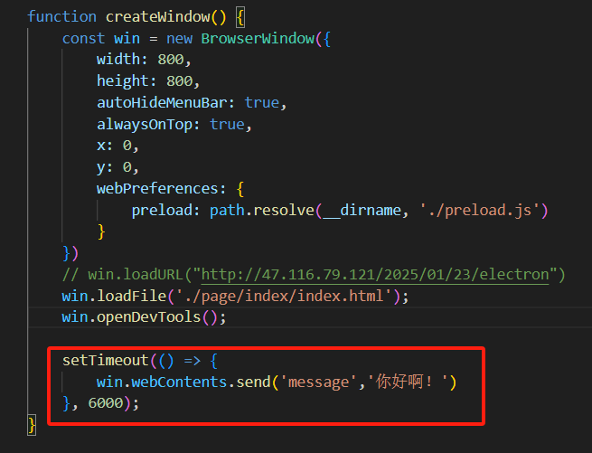

```js
const { app, BrowserWindow, ipcMain } = require('electron')
const path = require('path')
const fs = require('fs');


function createWindow() {
    const win = new BrowserWindow({
        width: 800,
        height: 800,
        autoHideMenuBar: true,
        alwaysOnTop: true,
        x: 0,
        y: 0,
        webPreferences: {
            preload: path.resolve(__dirname, './preload.js')
        }
    })
    // win.loadURL("http://47.116.79.121/2025/01/23/electron")
    win.loadFile('./page/index/index.html');
    win.openDevTools();

    setTimeout(() => {
        win.webContents.send('message', '你好啊！')
    }, 6000);
}

function readFile(event, path) {
    return fs.readFileSync(path).toString()
}


function createFile(event, data) {
    fs.writeFileSync('D:/hello.txt', data)
}

app.on('ready', () => {
    createWindow();

    app.on('activate', () => {
        if (BrowserWindow.getAllWindows.length === 0) createWindow
    })
})

app.on('window-all-closed', () => {
    if (process.platform != 'darwin') app.quit()
})
```


## 十、打包

### 10.1 使用electron-builder打包，打包时要访问`github`需要`修仙术`

1.安装electron-builder:

```javascript
npm install electron-builder -D
```

2.在package.json中进行相关配置，具体配置如下：

> 备注：json文件不支持注释，使用时请去掉所有注释。

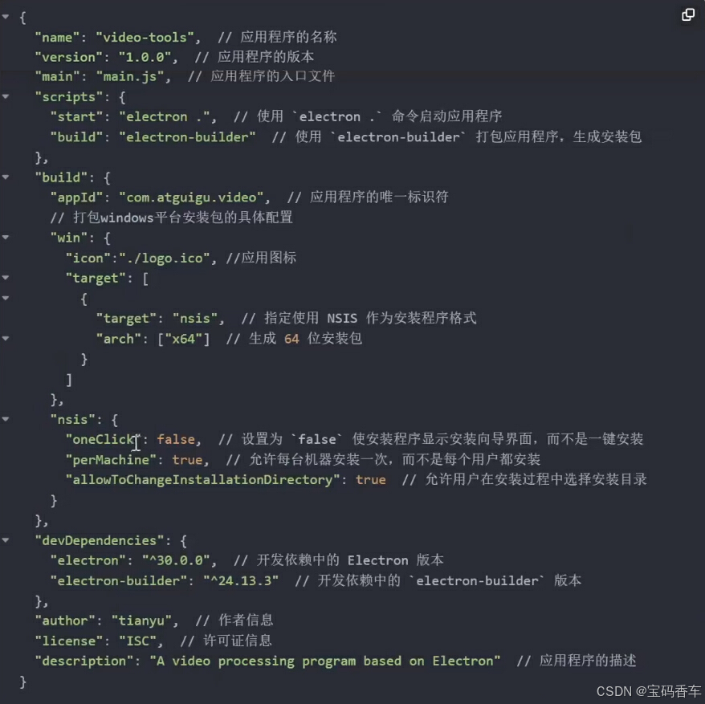

> package.json里的代码

```javascript
{
  "name": "video-tools",
  "version": "1.0.0",
  "main": "main.js",
  "scripts": {
    "start": "electron .",
    "build": "electron-builder"
  },
  "build": {
    "appId": "com.atguigu.video",
    "win": {
      "icon": "./logo.ico",
      "target": [
        {
          "target": "nsis",
          "arch": ["x64"]
        }
      ]
    },
    "nsis": {
      "oneClick": false,
      "perMachine": true,
      "allowToChangeInstallationDirectory": true
    }
  },
  "devDependencies": {
    "electron": "^30.0.0",
    "electron-builder": "^24.13.3"
  },
  "author": "宝码香车",
  "license": "ISC",
  "description": "A video processing program based on Electron"
}
```

执行打包命令

```
npm run build
```

### 10.2 使用Electron Forge进行打包（使用这种方式打包的）

Electron中文网也推荐使用这种方式。  
Electron Forge是从建项目开始配置 的，因为项目已经写完了，所以从第五步开始。  
[Electron Forge 从第五步开始的文档](https://www.electronjs.org/zh/docs/latest/tutorial/%E6%89%93%E5%8C%85%E6%95%99%E7%A8%8B)

#### 10.2.1 使用3条命令，完成打包。

1、运行第1条命令

```javascript
npm install --save-dev @electron-forge/cli
```

2、运行第2条命令

```javascript
npx electron-forge import
```

这时在packgae.json里会增加一些配置。

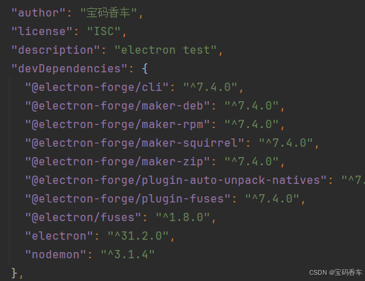  
不用管。

3、直接运行第3条命令

```javascript
npm run make
```

> 打包完成。

#### 10.2.2 打包后的位置,在根项目下的out文件里

打包后的文件,在根项目下的out文件夹里

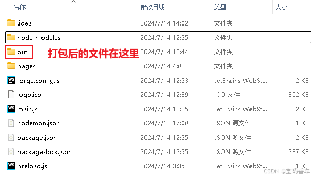

> 可运行程序在 `my-electron-app\out\make\squirrel.windows\x64`

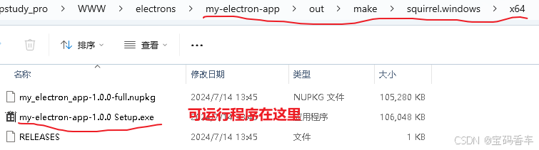

#### 10.2.3 看运行效果，终于完成了。

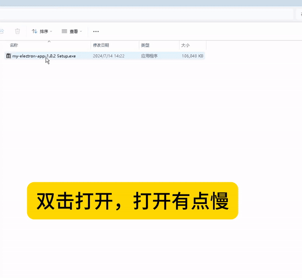

### 10.3electron-vite 

electron-vite 是⼀个新型构建⼯具，旨在为 Electron 提供更快、更精简的体验。主要由五部分 组成：

-  ⼀套构建指令，它使⽤ Vite 打包你的代码，并且它能够处理 Electron 的独特环境，包括  Node.js 和浏览器环境。  
- 集中配置主进程、渲染器和预加载脚本的 Vite 配置，并针对 Electron 的独特环境进⾏预配 置。 
- 为渲染器提供快速模块热替换（HMR）⽀持，为主进程和预加载脚本提供热重载⽀持，极⼤ 地提⾼了开发效率。 
- 优化 Electron 主进程资源处理。  
- 使⽤ V8 字节码保护源代码。  

electron-vite 快速、简单且功能强⼤，旨在开箱即⽤。  

官⽹地址：https://cn-evite.netlify.app/

## 十一、electron下载失败\_解决方案汇总

### `node install.js` 出错

这个错误比较笼统，严格来说`npm`下载`electron`出错肯定不是`node`执行`install.js`本身的问题，所以这里先提出几个常见的解决方案，下面在说一些比较具体的错误。

1.  删除项目`node_modules`，首先执行：

    ```bash
    # 太高的版本 如 14.0.0 可能还是会出错
    npm install electron@13.1.7 --save-dev --save-exact --unsafe-perm=true --allow-root
    ```

    `electron`的版本自己根据项目使用情况来指定

    先把`electron`下载下来，然后执行`npm i`，这样`npm`下载时就会跳过`electron`的下载，毕竟包已经下载过了【如果electron下载成功的话】。

2.  切换`npm`镜像源

    众所周知，一般不翻墙的话，我们下载东西很大概率会出错，翻了墙可能也会，所以走一下国内的`taobao`的镜像源也是不错的。

    ```bash
    # npm 查看镜像源：
    npm config get registry
    # npm 设置淘宝镜像源：
    npm config set registry https://registry.npm.taobao.org 【持久设置】
    # npm 设置淘宝镜像源：
    npm --registry https://registry.npm.taobao.org install XXX（模块名）【临时设置】
    # npm 还原默认镜像源：
    npm config set registry https://registry.npmjs.org/
    ```

    接下来就还是，删除`node_modules`，然后执行`npm i`

3.  利用`cnpm`

    这个方案有点鸡肋，因为`npm`切换了镜像源，和`cnpm`基本效果一样，如果上面那个不行，这个大概率也会死，但是聊胜于无，可以尝试。

    ```bash
    # 下载cnpm
    npm i cnpm -g
    ```

### `RequestError: connect ETIMEDOUT 20.205.243.166:443`

这个问题一般就是请求超时了，验证的话可以在`cmd`里执行`ping github.com`试试。大概率就会告诉你请求超时（有时候网站是可以正常打开的）。

解决这个问题，就是想办法把这个网络给搞通。

方法就是修改本地的`host`文件：

- host文件路径：`C:\Windows\System32\drivers\etc` 【建议使用管理员权限打开文件，不然没有权限修改。】

1.  添加一个可以正常`ping`通的`host`

    ```bash
    52.78.231.108 github.com 
    ```

    如果发现这个`host`也无法`ping`通`github`，那可以去这个网址： [Chinaz](http://ping.chinaz.com/https://github.com)，自己找一个`host`地址。

2.  修改自己的镜像源：

    此时使用自己的默认镜像源即可：`npm config set registry http://registry.npmjs.org/`

    当然，也可以使用淘宝的，可以都试试😂

接下来的操作就正常了，删除`node_modules`，执行`npm i`

此方法来源：[记一次npm install 报RequestError: connect ETIMEDOUT 20.205.243.166:443和RequestError: socket hang up](https://blog.csdn.net/weixin_42634260/article/details/121330269)

### `RequestError: read ECONNRESET`

这个错误其实还是网络连接出错，electron包下不下来，按照我看的博客的博主的说法，换成淘宝镜像地址就行。

但是人家玩的比较6，效果还挺好。

流程：

1.  执行`npm i`，当执行到`node install.js`时，`ctrl+c`中断执行。

2.  进入到 electron 文件夹里：

    ```bash
    # 进入到electron文件夹
    cd node_modules/electron
    # 在资源管理器中打开
    explorer .
    ```

3.  使用编辑器打开`electron`文件夹中的`install.js`

    ```js
    // 修改以下代码：

    // downloads if not cached
    downloadArtifact({
    version,
    artifactName: 'electron',
    force: process.env.force_no_cache === 'true',
    cacheRoot: process.env.electron_config_cache,
    platform: process.env.npm_config_platform || process.platform,
    arch: process.env.npm_config_arch || process.arch,
    // 注 ：下面的 mirrorOptions 是我加的，也是要修改的地方
    mirrorOptions:{
    mirror: 'https://npm.taobao.org/mirrors/electron/'
    }
    // ----------------------------------------------
    }).then(extractFile).catch(err => {
    console.error(err.stack)
    process.exit(1)
    })
    ```

    我这里和我看的博客的博主的文件内容不太一样，但是配置一致。

4.  然后在electron目录下执行命令:`node install.js`，就可以安装了。

5.  建议在执行完`node install.js`之后，可以回到项目根目录下，再次执行一遍`npm i`

此方法来源：[electron安装， node install.js报错RequestError: read ECONNRESET问题解决方案](https://blog.csdn.net/shuaixingrumo/article/details/121653386)

## 十二、使用 Electron 和 Vue.js 开发桌面应用程序

### 1. 创建项目

使用 `electron-vite` 创建项目时，选择 JavaScript 作为开发语言：

```bash
npm create @quick-start/electron@latest
```

在提示中选择 `vue` 作为前端框架，并选择 `JavaScript` 作为语言。

------

### 2. 项目结构

生成的项目结构如下：

```
my-electron-vue-app/
├── src/
│   ├── main/          # Electron 主进程代码（JavaScript）
│   ├── preload/       # 预加载脚本（JavaScript）
│   ├── renderer/      # Vue 渲染进程代码（JavaScript）
├── electron.vite.config.js # electron-vite 配置文件（JavaScript）
├── package.json
```

------

### 3. 开发 Vue 组件

在 `src/renderer` 目录下开发 Vue 组件，例如：

```vue
<!-- src/renderer/App.vue -->
<template>
  <div>
    <h1>Hello Electron + Vue!</h1>
  </div>
</template>

<script>
export default {
  name: 'App'
}
</script>
```

------

### 4. 配置主进程

在 `src/main/index.js` 中配置 Electron 主进程：

```javascript
const { app, BrowserWindow } = require('electron')
const path = require('path')

function createWindow() {
  const win = new BrowserWindow({
    width: 800,
    height: 600,
    webPreferences: {
      preload: path.join(__dirname, '../preload/index.js')
    }
  })

  if (process.env.NODE_ENV === 'development') {
    win.loadURL('http://localhost:3000')
  } else {
    win.loadFile(path.join(__dirname, '../renderer/index.html'))
  }
}

app.whenReady().then(createWindow)
```

------

### 5. 配置预加载脚本

在 `src/preload/index.js` 中配置预加载脚本：

```javascript
const { contextBridge, ipcRenderer } = require('electron')

contextBridge.exposeInMainWorld('electron', {
  sendMessage: (channel, data) => ipcRenderer.send(channel, data)
})
```

------

### 6. 运行项目

启动开发服务器：

```bash
npm run dev
```

------

### 7. 打包应用

打包应用：

```bash
npm run build
```

------

### 8. 修改配置文件

如果需要，可以修改 `electron.vite.config.js` 文件。例如，调整打包选项或插件配置：

```javascript
import { defineConfig } from 'electron-vite'
import vue from '@vitejs/plugin-vue'

export default defineConfig({
  main: {
    // 主进程配置
  },
  preload: {
    // 预加载脚本配置
  },
  renderer: {
    plugins: [vue()] // 使用 Vue 插件
  }
})
```

------

### 9. 调试

- **主进程**：使用 `console.log` 或 VSCode 调试器。
- **渲染进程**：使用 Chrome 开发者工具。