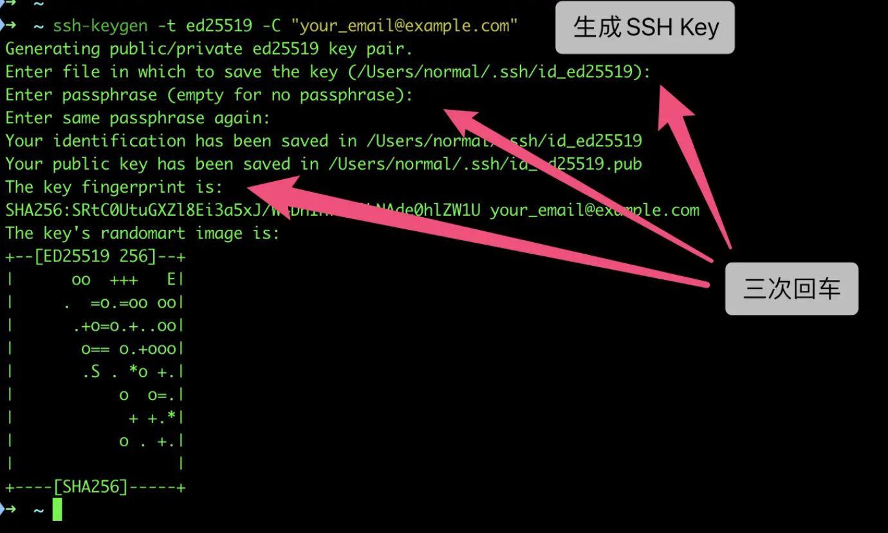
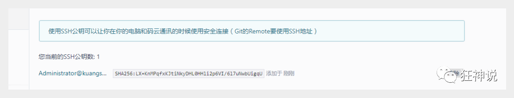
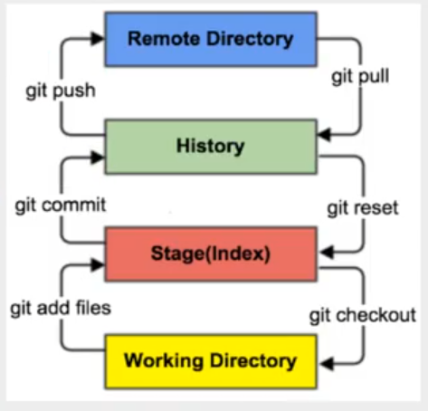
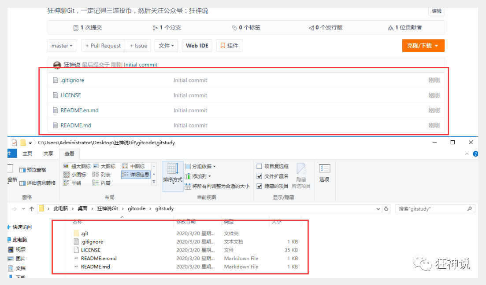
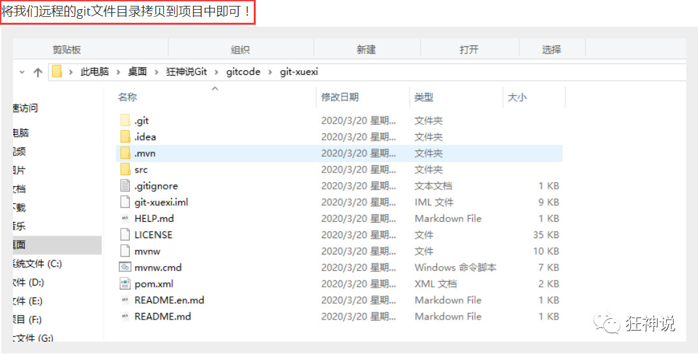
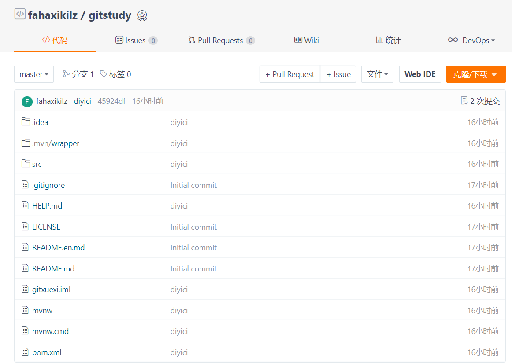
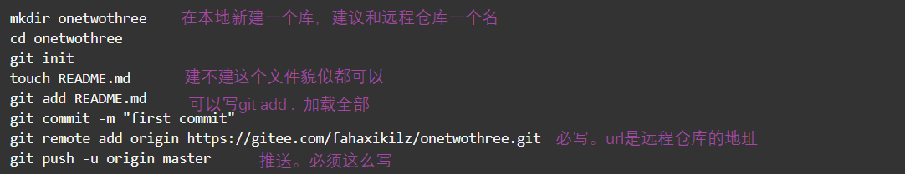
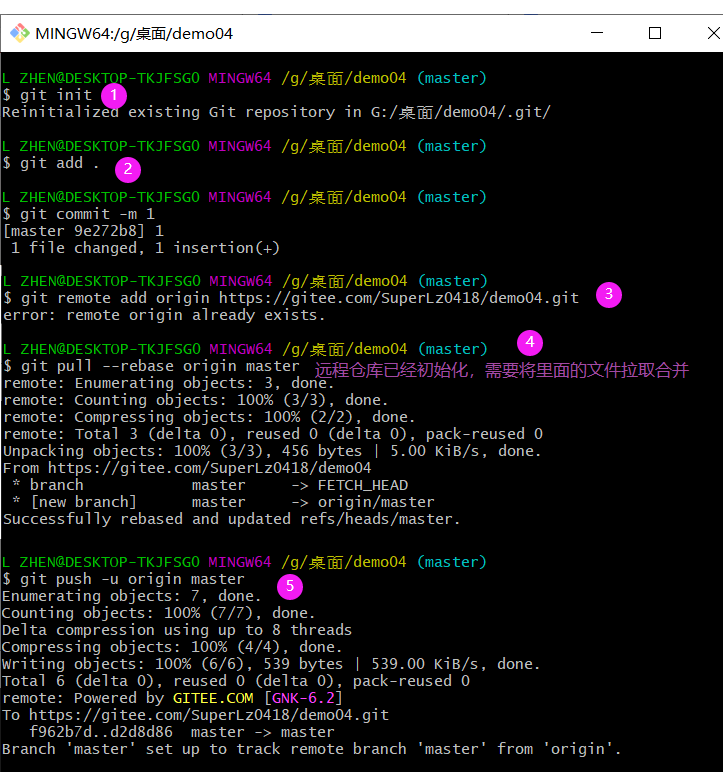
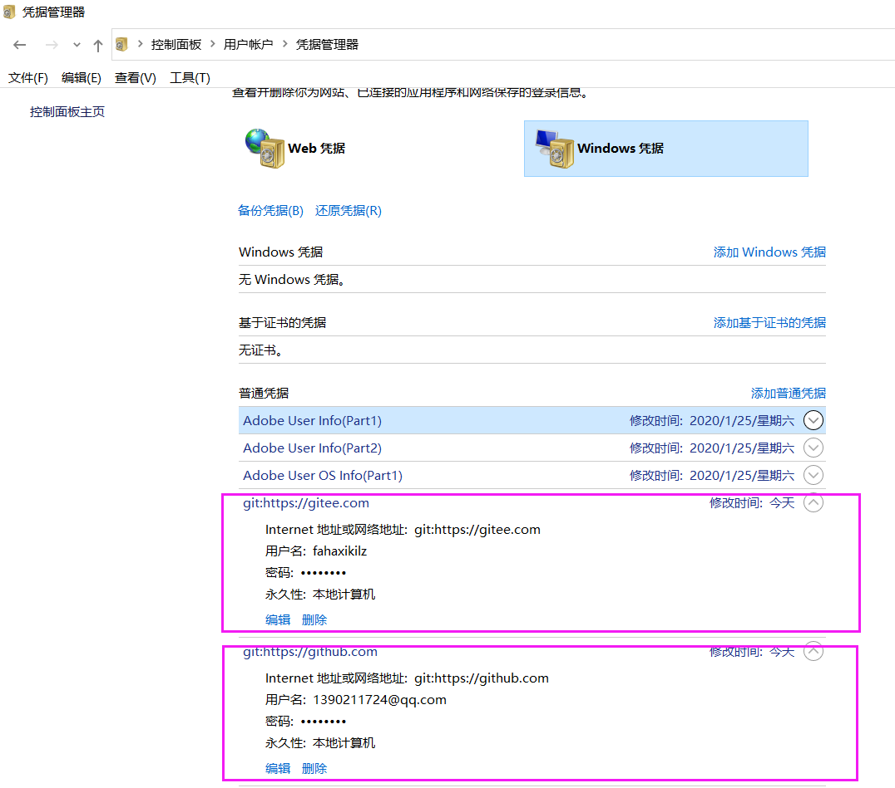
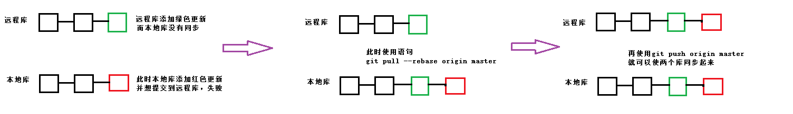

## [码云git学习地址](https://git.oschina.net/progit/)

## 基本的Linux命令

> 1. cd	改变目录
> 2. cd ..   返回上一级目录
> 3. pwd   显示当前路径
> 4. ls（ll）   显示当前目录的所有文件，ll显示的更加详细
> 5. touch   新建文件
> 6. rm  删除文件
> 7. mkdir  新建文件夹
> 8. rm -r   删除文件夹
> 9. mv   移动文件（夹）`mv 要移动的文件 目的位置`
> 10. reset  重新初始化终端
> 11. clear  清屏
> 12. history  查看历史记录
> 13. help  帮助
> 14. exit 退出
> 15. \#  注释(一般不要写注释)
## Git安装及配置

### 1.下载

​	可以使用淘宝镜像下载http://npm.taobao.org/mirrors/git-for-windows/

### 2.配置

> 查看配置 git config -l
>
> ==一定要配置的==

```bash
git config --global user.name xxx
git config --global user.email xxx
```

### 3.环境变量

> 配不配都可

### 4.生成/添加SSH公钥

> 1.设置本机绑定SSH公钥，实现免密码登录！（免密码登录，这一步挺重要的，码云是远程仓库，我们是平时工作在本地仓库！)

```shell
ssh-keygen -t ed25519 -C "xxxxx@xxxxx.com" 
```

> 注意：这里的 `xxxxx@xxxxx.com` 只是生成的 sshkey 的名称，并不约束或要求具体命名为某个邮箱。
> 现网的大部分教程均讲解的使用邮箱生成，其一开始的初衷仅仅是为了便于辨识所以使用了邮箱。



> 将公钥信息public key 添加到码云账户中即可！



## 理论学习（核心）




- Workspace：工作区，就是你平时存放项目代码的地方
- Index / Stage：暂存区，用于临时存放你的改动，事实上它只是一个文件，保存即将提交到文件列表信息
- Repository：仓库区（或本地仓库），就是安全存放数据的位置，这里面有你提交到所有版本的数据。其中HEAD指向最新放入仓库的版本
- Remote：远程仓库，托管代码的服务器，可以简单的认为是你项目组中的一台电脑用于远程数据交换

### git文件操作

1.文件的四种状态

版本控制就是对文件的版本控制，要对文件进行修改、提交等操作，首先要知道文件当前在什么状态，不然可能会提交了现在还不想提交的文件，或者要提交的文件没提交上。

- Untracked: 未跟踪, 此文件在文件夹中, 但并没有加入到git库, 不参与版本控制. 通过git add 状态变为Staged.
- Unmodify: 文件已经入库, 未修改, 即版本库中的文件快照内容与文件夹中完全一致. 这种类型的文件有两种去处, 如果它被修改, 而变为Modified. 如果使用git rm移出版本库, 则成为Untracked文件
- Modified: 文件已修改, 仅仅是修改, 并没有进行其他的操作. 这个文件也有两个去处, 通过git add可进入暂存staged状态, 使用git checkout 则丢弃修改过, 返回到unmodify状态, 这个git checkout即从库中取出文件, 覆盖当前修改 !
- Staged: 暂存状态. 执行git commit则将修改同步到库中, 这时库中的文件和本地文件又变为一致, 文件为Unmodify状态. 执行git reset HEAD filename取消暂存, 文件状态为Modified

2.查看文件状态

上面说文件有4种状态，通过如下命令可以查看到文件的状态：

```bash
#查看指定文件状态
git status [filename]

#查看所有文件状态
git status

# git add .                  添加所有文件到暂存区
# git commit -m "消息内容"    提交暂存区中的内容到本地仓库 -m 提交信息
```

3.忽略文件

有些时候我们不想把某些文件纳入版本控制中，比如数据库文件，临时文件，设计文件等

在主目录下建立".gitignore"文件，此文件有如下规则：

1. 忽略文件中的空行或以井号（#）开始的行将会被忽略。
2. 可以使用Linux通配符。例如：星号（*）代表任意多个字符，问号（？）代表一个字符，方括号（[abc]）代表可选字符范围，大括号（{string1,string2,...}）代表可选的字符串等。
3. 如果名称的最前面有一个感叹号（!），表示例外规则，将不被忽略。
4. 如果名称的最前面是一个路径分隔符（/），表示要忽略的文件在此目录下，而子目录中的文件不忽略。
5. 如果名称的最后面是一个路径分隔符（/），表示要忽略的是此目录下该名称的子目录，而非文件（默认文件或目录都忽略）。

```bash
#为注释
*.txt        #忽略所有 .txt结尾的文件,这样的话上传就不会被选中！
!lib.txt     #但lib.txt除外
/temp        #仅忽略项目根目录下的TODO文件,不包括其它目录temp
build/       #忽略build/目录下的所有文件
doc/*.txt    #会忽略 doc/notes.txt 但不包括 doc/server/arch.txt
```

## git仓库搭建

> 本地仓库搭建

1.创建全新的仓库，需要用GIT管理的项目的根目录执行：

```bash
# 在当前目录新建一个Git代码库
$ git init
```

2.克隆远程仓库

```bash
# 克隆一个项目和它的整个代码历史(版本信息)
$ git clone [url]  # https://gitee.com/kuangstudy/openclass.git	
```

## git分支

>创建并切换分支```git checkout -b 分支名```
>
>创建分支`git branch 分支名称`
>
>删除分支`git branch -d 分支名称`
>
>切换分支```git checkout 分支名```
>
>查看当前分支```git branch```
>
>合并分支```git merge 分支名```(要在分支中执行完commit，然后切换到主分支执行此命令)

## IDEA中集成Git

1.克隆到本地！



2.新建项目，绑定git。



3.修改文件，使用IDEA操作git。

- 添加到暂存区
- commit 提交
- push到远程仓库

3、提交测试



## 推送一个文件

1.远程仓库未初始化



2.远程仓库已初始化

> 仓库初始化后默认是有个master分支，已经有了首次提交。我们可以先获取远程库与本地同步合并。`git pull --rebase origin master`



## git commit后，如何撤销commit

> 使用命令：`git reset --soft HEAD^`
>
> 这样就成功撤销了commit，如果想要连着add也撤销的话，--soft改为--hard（删除工作空间的改动代码）。

> 命令详解：
>
> HEAD^  表示上一个版本，即上一次的commit，也可以写成HEAD~1
>  如果进行两次的commit，想要都撤回，可以使用HEAD~2
>
> --soft
>  不删除工作空间的改动代码 ，撤销commit，不撤销git add file
>
> --hard
>  删除工作空间的改动代码，撤销commit且撤销add

> 另外一点，如果commit注释写错了，先要改一下注释，有其他方法也能实现，如：`git commit --amend`
> 这时候会进入vim编辑器，修改完成你要的注释后保存即可。

## 遇到的问题

### 1.git clone 报错： You do not have permission to pull the repository

> 克隆时报错

### 2.error: failed to push some refs to ‘https://gitee.com/

> 推送时报错

解决方法：控制面板-->用户帐户-->凭据管理器-->修改git/gitee的用户名和密码，和网站登录的对齐



### 3.git push错误failed to push some refs to的解决(与2一样，貌似这个是对的)

> 原因：远程仓库与本地仓库不一致
>
> **解决方案：`git pull --rebase origin master`**
>
> **这条指令的意思是把远程库中的更新合并到本地库中，–rebase的作用是取消掉本地库中刚刚的commit，并把他们接到更新后的版本库之中。**



> 区别：
>
> ```
> git pull=git fetch + git merge
> git pull --rebase=git fetch+git rebase
> ```
>
> git fetch : 从远程分支拉取代码,可以得到远程分支上最新的代码。
>
> 所以git pull origin master与git pull --rebase origin master的区别主要是在远程与本地代码的合并上面了。
>
>  
>
> 现在有两个分支：test和master，假设远端的master的代码已经更改了（在B基础上变动：C,E），test的代码更改了要提交代码（在B基础上变动：D,E），如下图：
>
> ```
>       D---E test
>       /
>  A---B---C---F--- master
> ```
>
>  
>
> 问题就来了，如果C,F和D,E的更改发生冲突，那么就需要我们合并冲突了，下面我们来看看git merge和git rebase怎么合并的
>
> git merge:
>
> ```
>        D--------E
>       /          \
>  A---B---C---F----G---   test, master
> ```
>
> git rebase
>
> ```
> A---B---D---E---C‘---F‘---   test, master
> ```
>
> 对比可看出：git merge多出了一个新的节点G，会将远端master的代码和test本地的代码在这个G节点合并，之前的提交会分开去显示。
>
> git --rebase会将两个分支融合成一个线性的提交，不会形成新的节点。
>
> 
>
> rebase好处
>
> ```
> rebase好处
> 想要更好的提交树，使用rebase操作会更好一点。
> 这样可以线性的看到每一次提交，并且没有增加提交节点。
> merge 操作遇到冲突的时候，当前merge不能继续进行下去。手动修改冲突内容后，add 修改，commit 就可以了。
> 而rebase 操作的话，会中断rebase,同时会提示去解决冲突。
> 解决冲突后,将修改add后执行git rebase –continue继续操作，或者git rebase –skip忽略冲突。
> ```

### 4. 如何恢复 因 git push -force 强制推送导致远程仓库被覆盖的代码

> 今天我写的代码死活提交不了远程仓库，百度找遍也没找到适合我的解决方法。
>
> 
> 后来我看到一篇文章说可以用 git push -force 强制推送代码至远程仓库，我就抱着试试的心态试了一下。然后，悲剧发生了 😟 😟
>
> 我远程仓库原来的代码以及分支全被覆盖了，只剩下我刚强制推送上来的代码和master分支，我当场裂开。。。。
>
> ------
>
> ## 解决：
>
> 可以通过复位到旧的提交[并发](https://so.csdn.net/so/search?q=并发&spm=1001.2101.3001.7020)出另一个 push -f 来恢复先前观察到的主控状态。所涉及的步骤通常如下：
>
> ```java
> # work on local master
> git checkout master
> 
> # reset to the previous state of origin/master, as recorded by reflog
> git reset --hard origin/master@{1}
> 
> # finally, push the master branch (and only the master branch) to the server
> git push -f origin master
> 12345678
> ```
>
> 注意: 这将远程主控恢复到最近通过git fetch或等效检索的状态。在您上次提取之后，其他人推送的任何提交都将丢失。