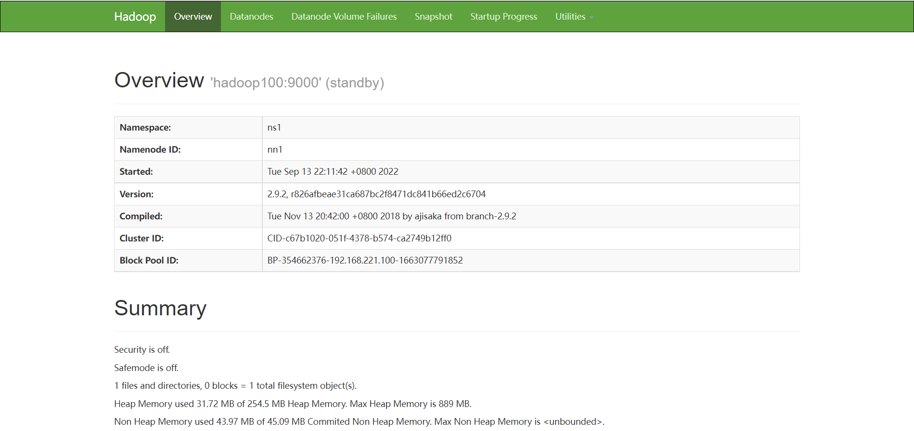
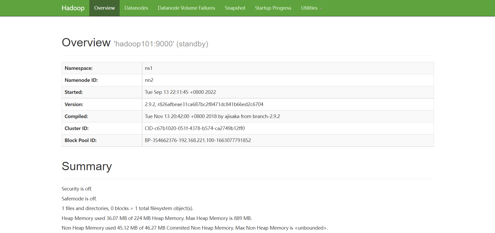

# Hadoop集群搭建

## 1.配置静态ip

## 2.修改主机名

## 3.设置ip和主机名映射

## 4.关闭防火墙

```shell
[root@bigdate101 ~]systemctl stop firewalld
[root@bigdate101 ~]systemctl disable firewalld
```

## 5.重启操作系统

## 6.检查配置是否正确

## 7.上传安装包

> 上传JDK，Hadoop，Zookeeper

## 8.创建JDK，Hadoop安装目录

```shell
[root@bigdate101 ~]# cd /
[root@bigdate101 /]# mkdir /usr/java
[root@bigdate101 /]# mkdir /hadoop
```

## 9.配置JDK,Hadoop

1. 解压JDK

   ```shell
   [root@bigdate101 /]# tar -zxvf jdk-8u341-linux-x64.tar.gz -C /usr/java
   ```

2. 给JDK重命名为jdk1.8

   ```shell
   [root@bigdate101 /]# mv /usr/java/jdk1.8.0_341 /usr/java/jdk1.8
   ```

3. 配置环境

   > 在`etc/profile`中添加如下配置：
   >
   > ```shell
   > export JAVA_HOME=/usr/java/jdk1.8
   > export HADOOP_HOME=/hadoop/hadoop-2.9.2
   > export PATH=$PATH:$JAVA_HOME/bin:$HADOOP_HOME/bin:$HADOOP_HOME/sbin
   > ```

4. 保存后，输入`source /etc/profile命令使配置生效`

5. 验证JDK是否生效

   ```shell
   [root@bigdate101 /]# java -version
   openjdk version "1.8.0_102"
   OpenJDK Runtime Environment (build 1.8.0_102-b14)
   OpenJDK 64-Bit Server VM (build 25.102-b14, mixed mode)
   ```

> 注：以上步骤要在三台机器中分别进行

## 10.安装配置Zookeeper集群（在bigdate101上）

1. 解压Zookeeper

   ```shell
   [root@bigdate101 /]# tar -zxvf zookeeper-3.4.13.tar.gz -C /hadoop
   ```

2. 配置`zoo.cfg`文件

   > 进入conf目录，拷贝一份`zoo_sample.cfg`，然后修改拷贝完成的文件

   ```shell
   [root@bigdate101 /]# cd /hadoop/zookeeper-3.4.13/conf
   [root@bigdate101 conf]# cp zoo_sample.cfg zoo.cfg
   ```

   > 添加如下配置：

   ```shell
   # 此行配置已经有，只需要修改一下路径
   dataDir=/hadoop/zookeeper-3.4.13/tmp
   
   server.1=bigdate101:2888:3888
   server.2=bigdate102:2888:3888
   server.3=bigdate103:2888:3888
   
   ==============上面这样可能有问题，可以像如下这样
   server.1=192.168.221.101:2888:3888
   server.2=192.168.221.102:2888:3888
   server.3=192.168.221.103:2888:3888
   ```

3. 创建一个tmp文件夹，再创建一个文件，向该文件中写入ID

   ```shell
   [root@bigdate101 /]# mkdir /hadoop/zookeeper-3.4.13/tmp
   [root@bigdate101 /]# touch /hadoop/zookeeper-3.4.13/tmp/myid
   [root@bigdate101 /]# echo 1 > /hadoop/zookeeper-3.4.13/tmp/myid 
   ```

4. 将配置好的Zookeeper复制到其他节点

   ```shell
   [root@bigdate101 /]# scp -r /hadoop/zookeeper-3.4.13/ root@bigdate102:/hadoop/
   [root@bigdate101 /]# scp -r /hadoop/zookeeper-3.4.13/ root@bigdate103:/hadoop/
   ```

5. 修改bigdate102,bigdate103对应的`/hadoop/zookeeper-3.4.13/tmp/myid`内容

   ```shell
   [root@bigdate102 /]# echo 2 > /hadoop/zookeeper-3.4.13/tmp/myid 
   [root@bigdate102 /]# echo 3 > /hadoop/zookeeper-3.4.13/tmp/myid 
   ```

## 11.安装配置Hadoop集群（在bigdate101上操作）

1. 解压Hadoop安装包

   ```shell
   [root@bigdate101 /]# tar -zxvf hadoop-2.9.2.tar.gz -C /hadoop/
   ```

2. 配置HDFS

   > Hadoop2.0所有的配置文件都在`$HADOOP_HOME/etc/hadoop`目录下

   ```shell
   [root@bigdate101 ~]# cd /hadoop/hadoop-2.9.2/etc/hadoop
   ```

3. 修改`hadoop-env.sh`文件，配置如下

   ```shell
   # 此行配置已经有，只需要修改一下路径
   export JAVA_HOME=/usr/java/jdk1.8
   ```

4. 修改`core-site.xml`文件，配置如下

   ```xml
   <configuration> 
   <!--指定HDFS的NameService为ns1-->
   <property>    
   <name>fs.defaultFS</name>
   <value>hdfs://ns1</value>
   </property> 
   <!--指定Hadoop临时目录--> 
   <property>
   <name>hadoop.tmp.dir</name>
   <value>/hadoop/hadoop-2.9.2/tmp</value> 
   </property> 
   <!--指定Zookeeper地址-->
   <property>
   <name>ha.zookeeper.quorum</name>
   <value>bigdate101:2181，bigdate102:2181，bigdate103:2181</value>
   </property>
   </configuration>
   ```

5. 修改`hdfs-site.xml`文件

   ```xml
   <configuration>
   <!--指定HDFS的NameService为ns1,需要和core-site.xml中的保持一致-->
   <property>
   <name>dfs.nameservices</name>
   <value>ns1</value>
   </property>
   <!--ns1下面有两个NameNode,分别是nn1,nn2-->
   <property>
   <name>dfs.ha.namenodes.ns1</name>
   <value>nn1,nn2</value>
   </property>
   <!--nn1的RPC通信地址-->
   <property>
   <name>dfs.namenode.rpc-address.ns1.nn1</name>
   <value>bigdate101:9000</value>
   </property>
   <!--nn1的HTITP通信地址-->
   <property>
   <name>dfs.namenode.http-address.ns1.nn1</name>
   <value>bigdate101:50070</value>
   </property>
   <!--nn2的RPC通信地址-->
   <property>
   <name>dfs.namenode.rpc-address.ns1.nn2</name>
   <value>bigdate102:9000</value>
   </property>
   <!--nn2的HTTP通信地址-->
   <property>
   <name>dfs.namenode.http-address.ns1.nn2</name>
   <value>bigdate102:50070</value>
   </property>
   <!--指定NameNode的元数据在JournalNode上的存放位置-->
   <property>
   <name>dfs.namenode.shared.edits.dir</name>
   <value>qjournal://bigdate101:8485;bigdate102:8485;bigdate103:8485/ns1</value>
   </property>
   <!--指定JournalNode在本地磁盘存放数据的位置-->
   <property>
   <name>dfs.journalnode.edits.dir</name>
   <value>/hadoop/hadoop-2.9.2/journal</value>
   </property>
   <!--开启NameNode失败自动切换-->
   <property>
   <name>dfs.ha.automatic-failover.enabled</name>
   <value>true</value>
   </property>
   <!--配置失败自动切换实现方式-->
   <property>
   <name>dfs.client.failover.proxy.provider.ns1</name>
   <value>org.apache.hadoop.hdfs.server.namenode.ha.ConfiguredFailoverProxyProvider</value>
   </property>
   <!--配置隔离机制方法,多个机制用换行分隔,即每个机制暂用一行-->
   <property>
   <name>dfs.ha.fencing.methods</name>
   <value>
   sshfence
   Shell(/bin/true)
   </value>
   </property>
   <!--使用sshfence隔离机制时需要SSH免登录-->
   <property>
   <name>dfs.ha.fencing.ssh.private-key-files</name>
   <value>/root/.ssh/id_rsa</value>
   </property>
   <!--配置sshfence隔离机制超时时间-->
   <property>
   <name>dfs.ha.fencing.ssh.connect-timeout</name>
   <value>30000</value>
   </property>
   <property>
   <name>dfs.replication</name>
   <value>1</value>
   </property>
   </configuration>
   ```

6. 修改`mapred-site.xml`文件，配置如下

   > 先拷贝`mapred-site.xml.template`为`mapred-site.xml`
   >
   > ```shell
   > [root@bigdate101 hadoop]# cp mapred-site.xml.template mapred-site.xml
   > ```

   ```xml
   <configuration>
   <!--指定MBR框架为YARN方式-->
   <property>
   <name>MapReduce.framework.name</name>
   <value>yarn</value>
   </property>
   </configuration>
   ```

7. 修改`yarn-site.xml`文件，配置如下

   ```xml
   <configuration>
   <!--开启RM高可靠-->
   <property>
   <name>yarn.resourcemanager.ha.enabled</name>
   <value>true</value>
   </property>
   <!--指定RM的clusterid--><property>
   <name>yarn.resourcemanager.cluster-id</name>
   <value>yrc</value>
   </property>
   <!--指定RM的名字-->
   <property>
   <name>yarn.resourcemanager.ha.rm-ids</name>
   <value>rm1,rm2</value>
   </property>
   <!--分别指定RM的地址-->
   <property>
   <name>yarn.resourcemanager.hostname.rm1</name>
   <value>bigdate101</value>
   </property>
   <property>
   <name>yarn.resourcemanager.hostname.rm2</name>
   <value>bigdate102</value>
   </property>
   <!--指定Zookeeper集群地址-->
   <property>
   <name>yarn.resourcemanager.zk-address</name>
   <value>bigdate101:2181,bigdate102:2181,bigdate103:2181</value>
   </property>
   <property>
   <name>yarn.nodemanager.aux-services</name>
   <value>MapReduce_shuffle</value>
   </property>
   </configuration>
   ```

8. 修改slaves文件，配置如下

   ```
   bigdate101
   bigdate102
   bigdate103
   ```

## 12.配置免密码登录

1. 配置101到102、103的免密码登录

   > 在bigdate101上生产一对钥匙
   >
   > ```shell
   > [root@bigdate101 hadoop]# ssh-keygen -trsa
   > ```
   >
   > 将公钥复制到其他节点，包括自己
   >
   > ```shell
   > [root@bigdate101 hadoop]# ssh-copy-id bigdate101
   > [root@bigdate101 hadoop]# ssh-copy-id bigdate102
   > [root@bigdate101 hadoop]# ssh-copy-id bigdate103
   > ```

2. 配置102到101、103的免密码登录

   > 在bigdate102上生产一对钥匙
   >
   > ```shell
   > [root@bigdate102 ~]# ssh-keygen -trsa
   > ```
   >
   > 将公钥复制到其他节点，包括自己

   > 注意:两个NameNode之间要配置SSH免密码登录,别忘了配置 bigdate102到bigdate101的免密码登录。

3. 将配置好的Hadoop复制到其他节点

   ```shell
   [root@bigdate101 hadoop]# scp -r /hadoop/hadoop-2.9.2/ root@bigdate102:/hadoop/
   [root@bigdate101 hadoop]# scp -r /hadoop/hadoop-2.9.2/ root@bigdate103:/hadoop/
   ```

## 13.启动Hadoop

1. 启动Zookeeper集群（分别在bigdate101、bigdate102、bigdate103启动）

   ```shell
   [root@bigdate101 hadoop]# cd /hadoop/zookeeper-3.4.13/bin/
   [root@bigdate101 bin]# ./zkServer.sh start
   ```

   > 查看Zookeeper集群状态
   >
   > ```shell
   > [root@bigdate101 bin]# ./zkServer.sh status
   > ```
   >
   > 结果应为一个Leader和两个Follower

2. 启动JournalNode（分别在bigdate101、bigdate102、bigdate103启动）

   ```shell
   [root@bigdate101 bin]# cd /hadoop/hadoop-2.9.2/
   [root@bigdate101 hadoop-2.9.2]# sbin/hadoop-daemon.sh start journalnode
   ```

3. 格式化HDFS

   > 在bigdate101执行
   >
   > ```shell
   > [root@bigdate101 /]# hdfs namenode -format
   > ```
   >
   > 执行格式化后Hadoop根据core-site.xml文件中的 hadoop. tmp. dir 配置项生成文件,此处配置的是/hadoop/hadoop-2.9.2/tmp,然后将/hadoop/hadoop-2.9.2/tmp复制到bigdate102和bigdate103的/hadoop/hadoop-2.9.2/下。
   >
   > ```shell
   > [root@bigdate101 /]# scp -r /hadoop/hadoop-2.9.2/tmp root@bigdate102:/hadoop/hadoop-2.9.2
   > [root@bigdate101 /]# scp -r /hadoop/hadoop-2.9.2/tmp root@bigdate103:/hadoop/hadoop-2.9.2
   > ```

4. 格式化Zookeeper（在bigdate101上执行即可）

   ```shell
   [root@bigdate101 /]# hdfs zkfc -formatZK
   ```

5. 启动HDFS（在bigdate101上执行）

   ```shell
   [root@bigdate101 /]# sbin/start-dfs.sh
   ```

6. 启动YARN

   ```shell
   [root@bigdate101 /]# sbin/start-yarn.sh
   ```

## 14.验证Hadoop的安装

> 在 Hadoop集群搭建完成后，Hadoop提供一个Web UI管理页面，可以观察到Hadoop集群的基本状况,通过浏览器访问http://192.168.221.101:50070,主 NameNode监控界面如图2-3所示。



> 通过浏览器访问http://192.168.221.102:50070,备用NameNode监控界面



> 从两个界面上可以看出,NameNode一个是激活状态(Active)，一个是备用状态(Standby)。通过向HDFS上传文件,测试Hadoop是否安装成功,在CentOS命令行中输人如下Hadoop命令:


问题：

1.两个都是standby

