# idea快捷键

- Alt+回车 导入包,自动修正
- Ctrl+Alt+O 优化导入的类和包
- Ctrl+Alt+L  格式化代码
- Ctrl+/ 或 Ctrl+Shift+/  注释（// 或者/*...*/ ）
- Alt+Insert 生成代码(如get,set方法,构造函数等)
- Ctrl＋Alt＋T可以把代码包在一块内，例如try/catch
- Ctrl+R 替换文本
- Ctrl+F 查找文本
- Ctrl+X 删除行
- Ctrl+D 复制行
- Ctrl+N  查找类
- Ctrl+H 显示类的继承树
- Ctrl＋F12 可以显示当前文件的结构
- Ctrl+O：重写方法
- Ctrl+P 方法参数提示
- Ctrl+Q：查看帮助文档
- Ctrl+Shift+向上键 行上移
- Ctrl+Shift+向下键 行下移
- Ctrl+Alt+Space 类名或接口名提示
- Ctrl+Shift+Space 自动补全代码
- Ctrl+E或者Alt+Shift+C 最近更改的代码
- Alt+Shift+C 对比最近修改的代码
- F2 或Shift+F2 高亮错误或警告快速定位
- Alt+ left/right 切换代码视图

# IDEA如何进行debug调试

## 🍃第一步，设断点，打开debug

​        设断点是什么意思，其实就是暂定，等待的意思。当程序执行到用户设置的断点时，程序暂定执行，等待下一步命令的执行。在IDEA中只需在代码注释行旁边单击鼠标左键即可。

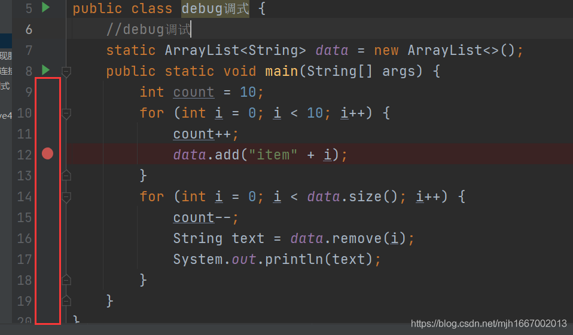

​		在IDEA中，我们不光可以设置断点，还可以为该断点添加条件，比如在如下实例中，设置条件为i = 5。此时断点样式右下角会有一个疑问符号，表示该断点是被赋予条件的。意思是程序直接执行到i = 5 时才暂定执行，等待下一步命令执行。

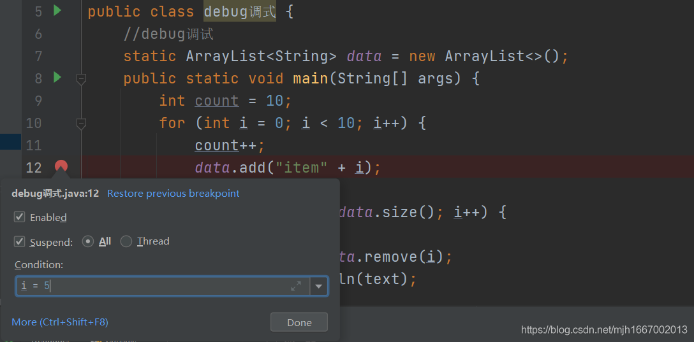

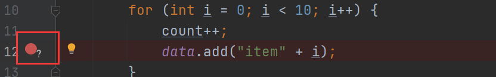

​    	给断点添加条件有快捷键（shift + ctrl + F8)。在使用快捷键时，有一个小细节，你的鼠标一定要放在断点红色代码这一行中，否者快捷键按的就不是给断点添加条件，而是查看所有断点，如下，因为他们的快捷键是一样的，区别在于鼠标的光标的位置，在断点处所在行就是给断点添加条件，在非断点处所在行就是查看所有断点。

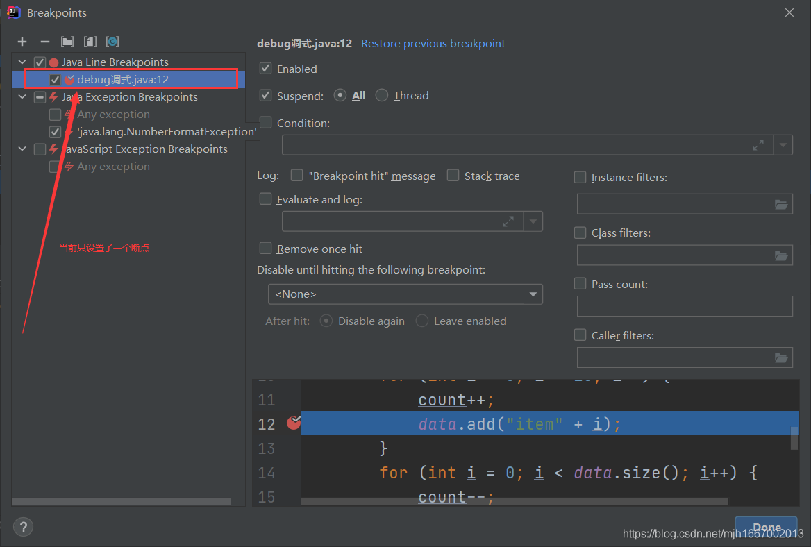

​    	当你已经把断点设置好了，便可以打开debug调试了。打开的方式有很多，在IDEA中，我们可以在最上面的工具栏中选择Run中的Debug打开；也可以选择右上角的Debug图标打开；还可以在代码里面单击鼠标右键选择Debug调试。

### 🌱方式一

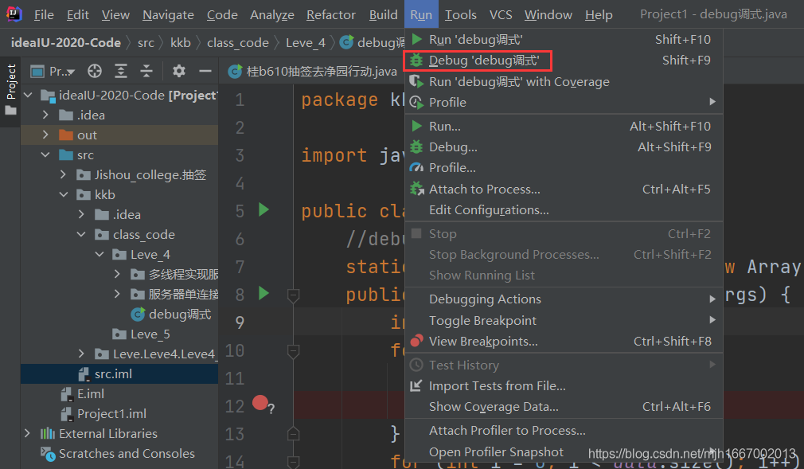

### 🌱方式二

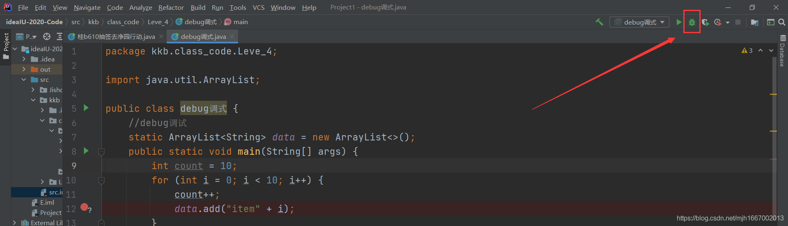

### 🌱方式三

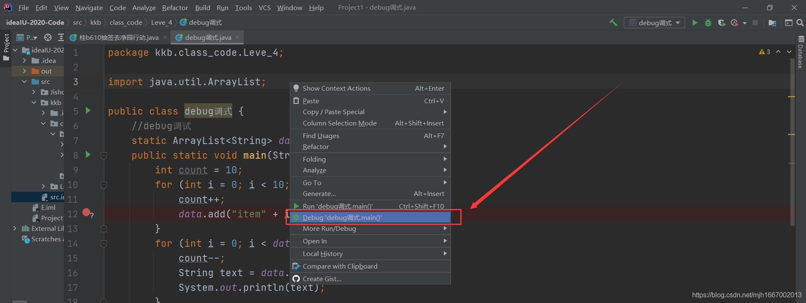

## 🍃第二步，使用Debug调试的功能键

我们先来了解Debug栏中位于左侧的主要的5个功能键。

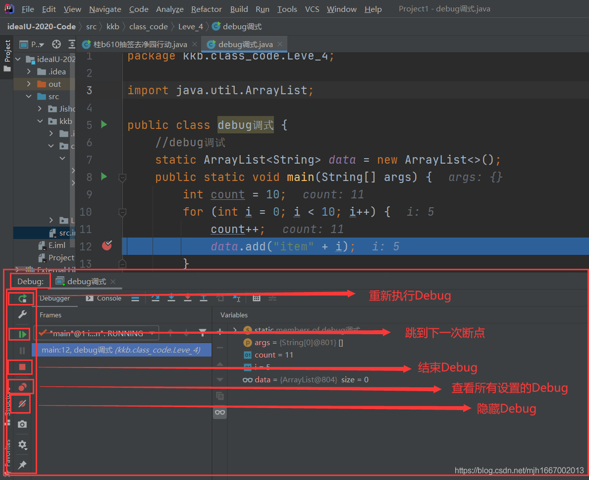

   1. 第一个，有返回箭头的按钮，功能是重新执行Debug，当你在执行Debug一半时，发行并不能解决你的问题，这时你不需要重新关闭并打开Debug，按下此按钮，Debug调试会重新执行。

   2.  第二个，一个竖杠加向右的三角形的按钮，功能是跳到下一次断点执行，两个断点之间的代码都被加载执行过了。
       但是当一个断点在一个for循环中，如果循环有n（n>=1）次，for循环外有一个断点，此时该功能是跳过一次for循环，并不是跳过所有循环而直接到下一个断点，那么如果先要跳过所有循环可以将断点暂时不启用，也就是将enabled去掉，因为enable是启用断点的意思。

         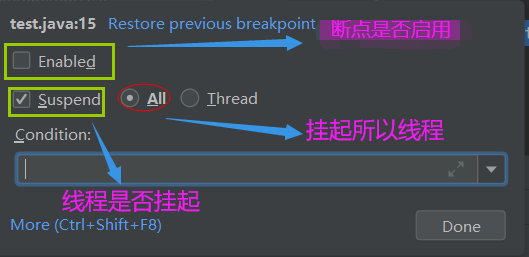

  3. 第三个，一个红色的正方块的按钮，功能是结束Debug 的执行。按下之后，整个Debug调试都会将结束并停止执行。
  4. 第四个，两个重叠的红色圆圈的按钮，功能是查看所有的断点。快捷键是（shift + ctrl + F8），至于它的用法在上面将给断点添加条件时已讲述。

  5. 第五个，一个红色的圆圈中有一个灰色的斜杠的按钮，功能是隐藏所有的Debug断点。用途就是，当你在Debug调试时，你觉得此时已经没有问题了，这时可以暂时隐藏所有Debug断点，无障碍运行一次，如果有问题还要取消隐藏，不至于重新打开Debug。

​    接下来我么来了解Debug调试功能栏中最重要的功能区。

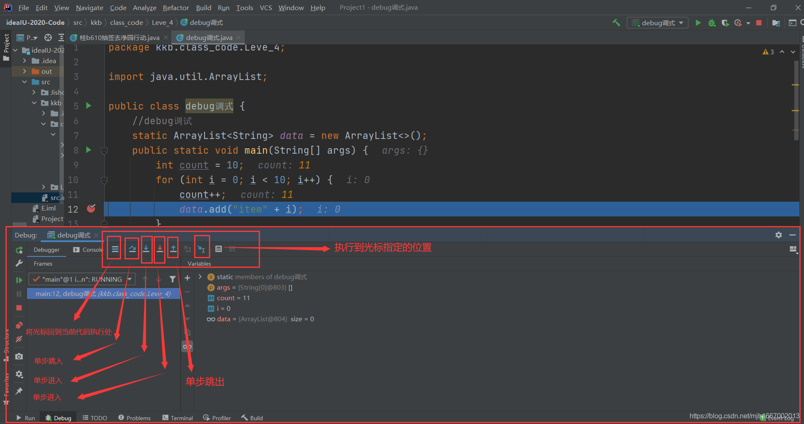

 1.  按钮，功能是将你的光标移动到当前代码所执行处，不管此刻你的鼠标光标的位置在哪里。

 2.  按钮，功能是单步跳入。Debug调试是一行一行的执行下去，但是如果遇到调用方法时，是不会进入方法里面的。

 3.  按钮 与按钮，因为功能相似，放在一起讲。两个的功能都是单步进入的执行，但唯一的区别是，蓝色向下箭头的按钮遇到方法时，只有当经过的方法时用户自定义的方法才会跳进去，如果是系统自定的方法则不会跳进去。而红色向下箭头的按钮，不管是系统自定义的方法还是用户自定义的方法都会跳入到方法里面去执行。
 4.  按钮，功能是单步跳出。可以跳出进入的方法。
 5.  按钮，功能是将当前执行的位置直接执行到用户指定鼠标光标的位置。

​    接下来就是最后一个功能区，如下图片，详细解释。

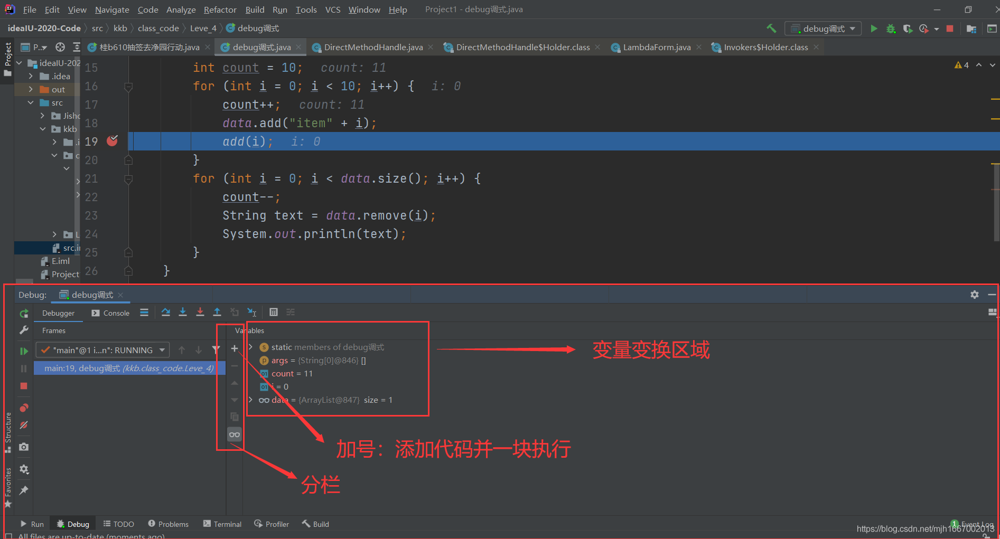