# idea快捷键

- Alt+回车 导入包,自动修正
- Ctrl+Alt+O 优化导入的类和包
- Ctrl+Alt+L  格式化代码
- Ctrl+/ 或 Ctrl+Shift+/  注释（// 或者/*...*/ ）
- Alt+Insert 生成代码(如get,set方法,构造函数等)
- Ctrl＋Alt＋T可以把代码包在一块内，例如try/catch
- Ctrl+R 替换文本
- Ctrl+F 查找文本
- Ctrl+G 跳转到某行某列
- Ctrl+X 删除行
- Ctrl+D 复制行
- Ctrl+N  查找类
- Ctrl+H 显示类的继承树
- Ctrl＋F12 可以显示当前文件的结构
- Ctrl+O：重写方法
- Ctrl+P 方法参数提示
- Ctrl+Q：查看帮助文档
- Ctrl+Shift+向上键 行上移
- Ctrl+Shift+向下键 行下移
- Ctrl+Alt+Space 类名或接口名提示
- Ctrl+Shift+Space 自动补全代码
- Ctrl+E或者Alt+Shift+C 最近更改的代码
- Alt+Shift+C 对比最近修改的代码
- F2 或Shift+F2 高亮错误或警告快速定位
- Alt+ left/right 切换代码视图

# IDEA如何进行debug调试

## 🍃第一步，设断点，打开debug

​        设断点是什么意思，其实就是暂定，等待的意思。当程序执行到用户设置的断点时，程序暂定执行，等待下一步命令的执行。在IDEA中只需在代码注释行旁边单击鼠标左键即可。

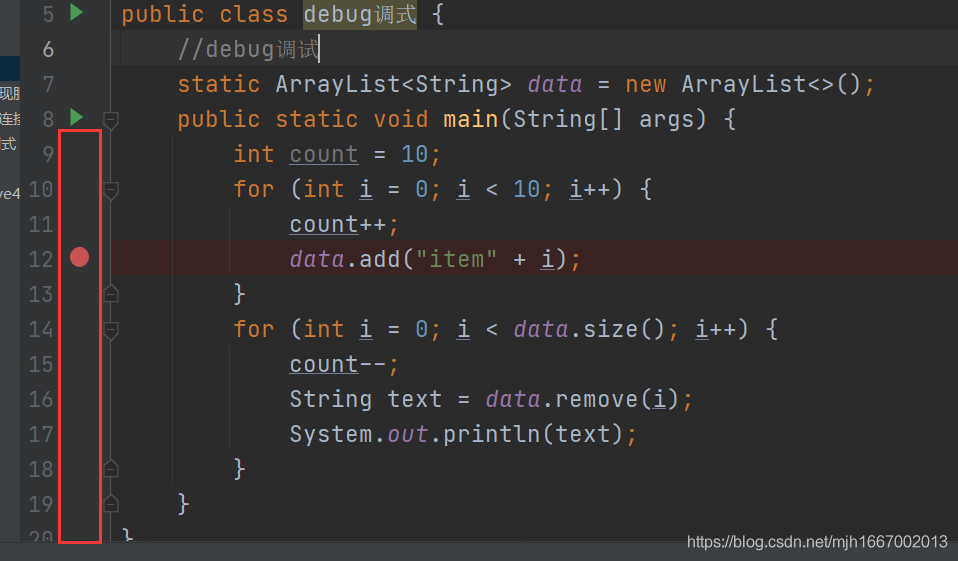

​		在IDEA中，我们不光可以设置断点，还可以为该断点添加条件，比如在如下实例中，设置条件为i = 5。此时断点样式右下角会有一个疑问符号，表示该断点是被赋予条件的。意思是程序直接执行到i = 5 时才暂定执行，等待下一步命令执行。

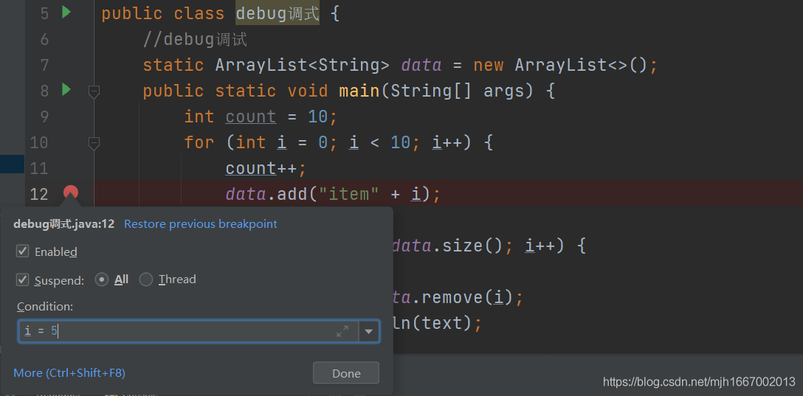

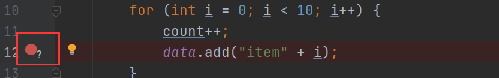

​    	给断点添加条件有快捷键（shift + ctrl + F8)。在使用快捷键时，有一个小细节，你的鼠标一定要放在断点红色代码这一行中，否者快捷键按的就不是给断点添加条件，而是查看所有断点，如下，因为他们的快捷键是一样的，区别在于鼠标的光标的位置，在断点处所在行就是给断点添加条件，在非断点处所在行就是查看所有断点。

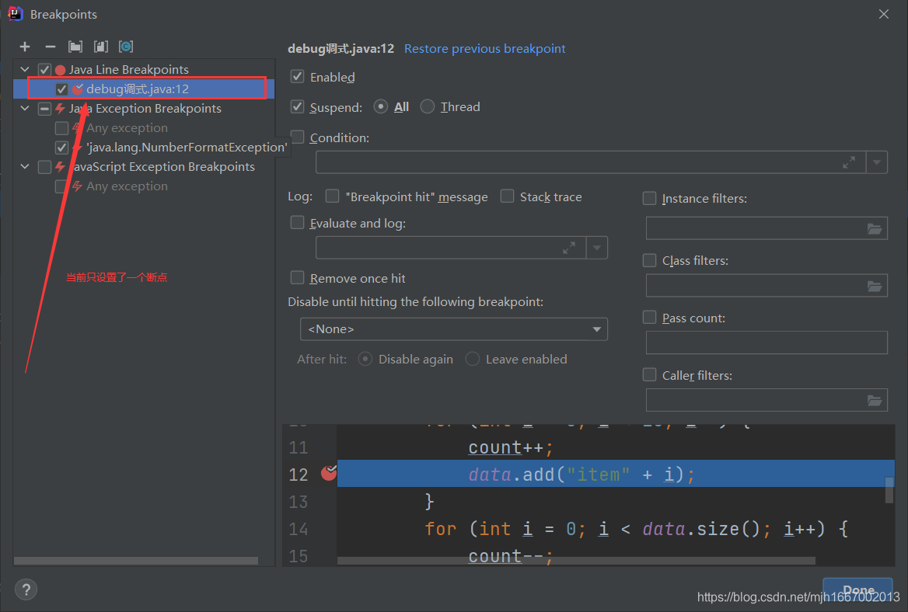

​    	当你已经把断点设置好了，便可以打开debug调试了。打开的方式有很多，在IDEA中，我们可以在最上面的工具栏中选择Run中的Debug打开；也可以选择右上角的Debug图标打开；还可以在代码里面单击鼠标右键选择Debug调试。

### 🌱方式一

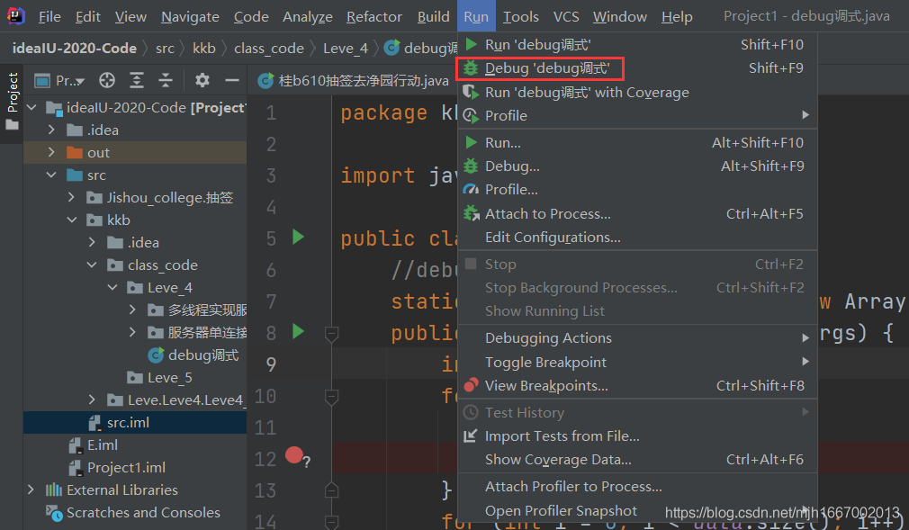

### 🌱方式二

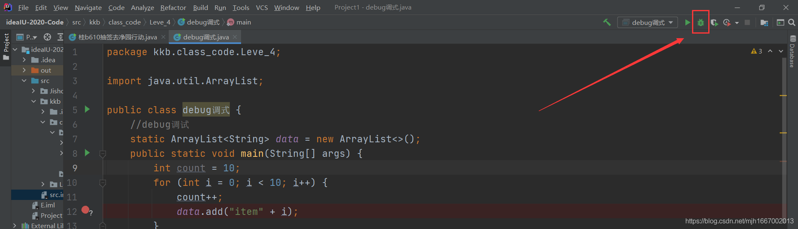

### 🌱方式三

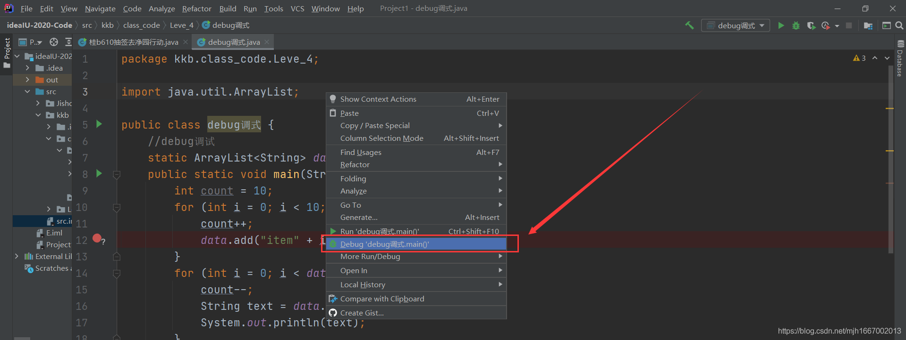

## 🍃第二步，使用Debug调试的功能键

我们先来了解Debug栏中位于左侧的主要的5个功能键。

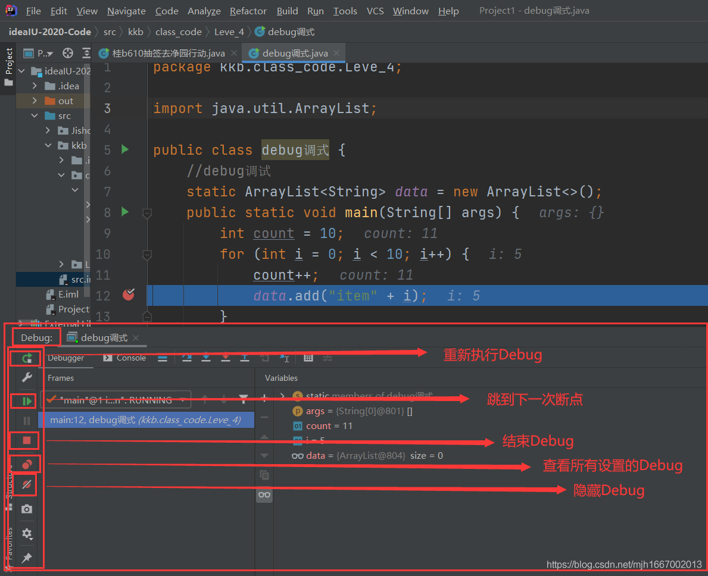

   1. 第一个，有返回箭头的按钮，功能是重新执行Debug，当你在执行Debug一半时，发行并不能解决你的问题，这时你不需要重新关闭并打开Debug，按下此按钮，Debug调试会重新执行。

   2.  第二个，一个竖杠加向右的三角形的按钮，功能是跳到下一次断点执行，两个断点之间的代码都被加载执行过了。
       但是当一个断点在一个for循环中，如果循环有n（n>=1）次，for循环外有一个断点，此时该功能是跳过一次for循环，并不是跳过所有循环而直接到下一个断点，那么如果先要跳过所有循环可以将断点暂时不启用，也就是将enabled去掉，因为enable是启用断点的意思。

         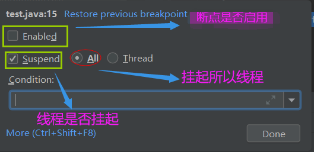

  3. 第三个，一个红色的正方块的按钮，功能是结束Debug 的执行。按下之后，整个Debug调试都会将结束并停止执行。
  4. 第四个，两个重叠的红色圆圈的按钮，功能是查看所有的断点。快捷键是（shift + ctrl + F8），至于它的用法在上面将给断点添加条件时已讲述。

  5. 第五个，一个红色的圆圈中有一个灰色的斜杠的按钮，功能是隐藏所有的Debug断点。用途就是，当你在Debug调试时，你觉得此时已经没有问题了，这时可以暂时隐藏所有Debug断点，无障碍运行一次，如果有问题还要取消隐藏，不至于重新打开Debug。

​    接下来我么来了解Debug调试功能栏中最重要的功能区。

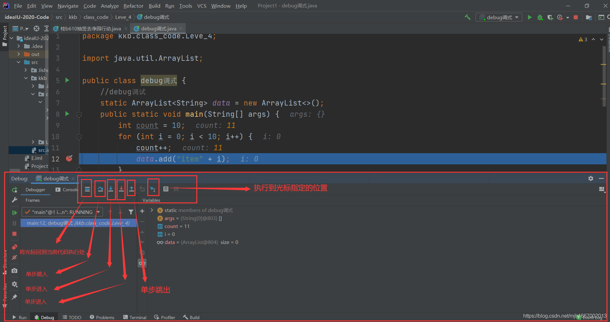

 1.  按钮，功能是将你的光标移动到当前代码所执行处，不管此刻你的鼠标光标的位置在哪里。

 2.  按钮，功能是单步跳入。Debug调试是一行一行的执行下去，但是如果遇到调用方法时，是不会进入方法里面的。

 3.  按钮 与按钮，因为功能相似，放在一起讲。两个的功能都是单步进入的执行，但唯一的区别是，蓝色向下箭头的按钮遇到方法时，只有当经过的方法时用户自定义的方法才会跳进去，如果是系统自定的方法则不会跳进去。而红色向下箭头的按钮，不管是系统自定义的方法还是用户自定义的方法都会跳入到方法里面去执行。
 4.  按钮，功能是单步跳出。可以跳出进入的方法。
 5.  按钮，功能是将当前执行的位置直接执行到用户指定鼠标光标的位置。

​    接下来就是最后一个功能区，如下图片，详细解释。

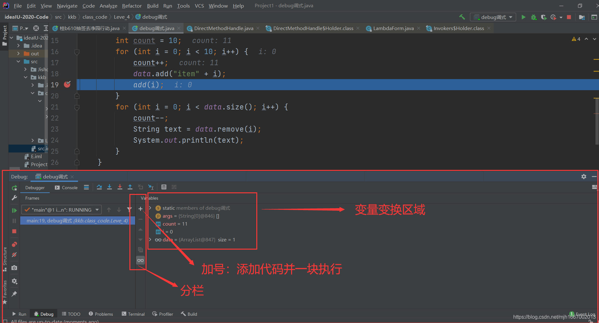

## 🍃Debug的技巧

### 异常断点

当我们在方法中实现我们的业务时，可能某处地方会出现异常，如空指针异常，在没有try...catch的时候，我们又无法准确定位到异常的位置。

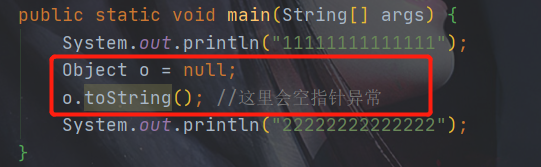

我们可以通过配置debug找到异常的位置

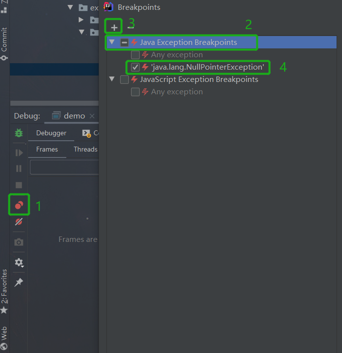

当配置完成再次执行，就会停到异常的位置

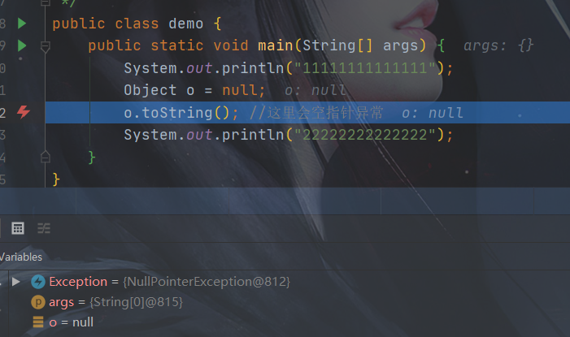

### 断点表达式

例如，当我们有一个for循环时，我们在输出的位置打一个断点，我们希望在i为偶数的时候才停住

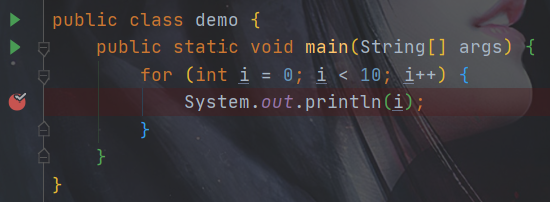

在断点上右键，在弹出的对话框上设置条件，那么之后只会在i 为偶数的时候停住

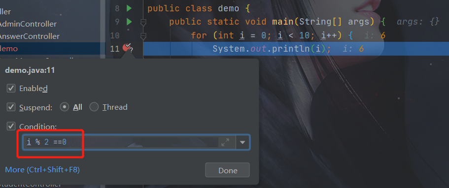

还可以用来操作多线程，我们有多个线程调用同一个方法，就可以在方法中打一个断点，在断点处右键设置condition为 `Thread.currentThread.getName = thread1`，那么断点就只会在thread1调用方法时停住。此处不再做演示。

### Stream流断点

当为stream流打一个断点，我们不容易查看流内部元素是怎么操作的

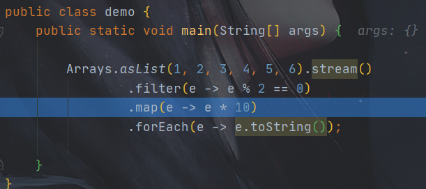

我们就可以通过一下操作看到流内部每一步的变化过程

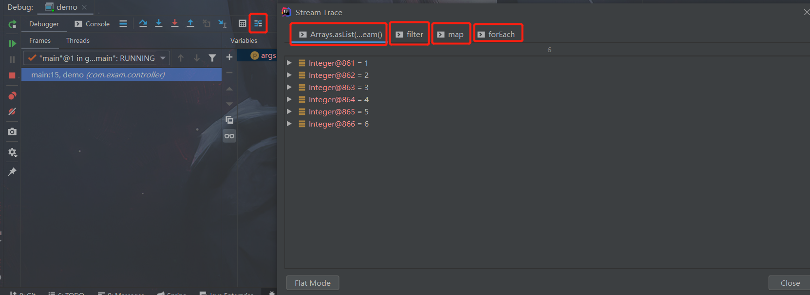

通过Flat Mode可以看到整体的变化过程

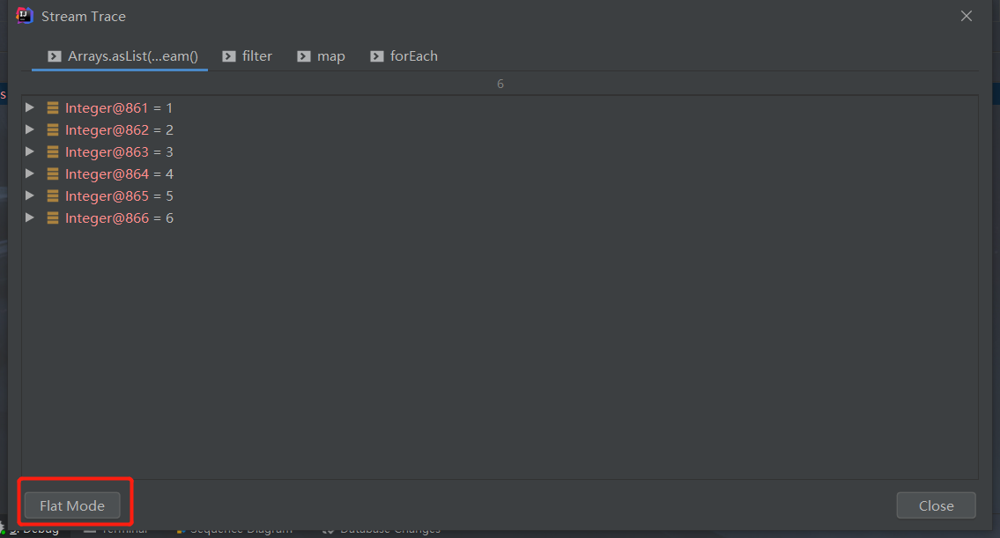

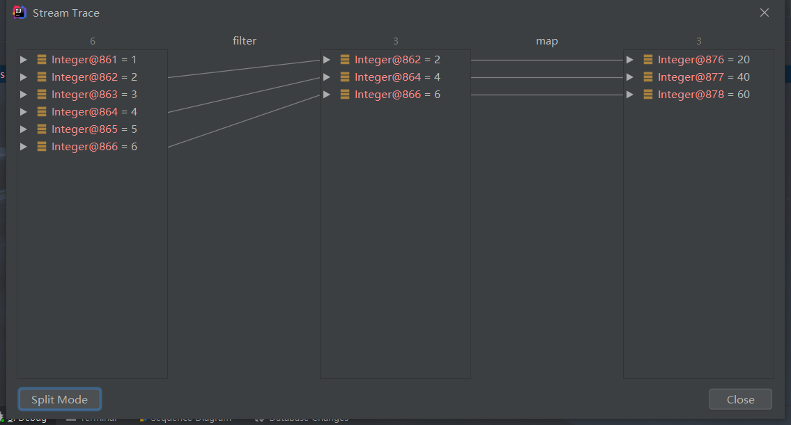

### 远程断点

当我们一个项目发布，我们可以通过本地去调试

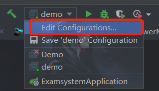

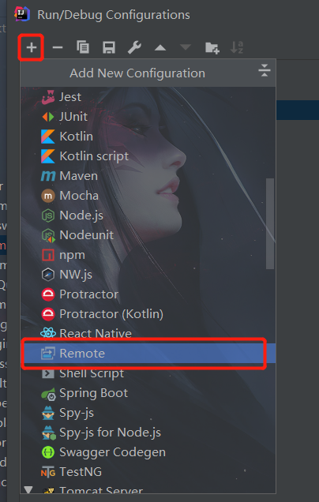

host为项目的ip，port为默认5005，服务器防火墙需要开放5005端口。

然后复制下面的命令

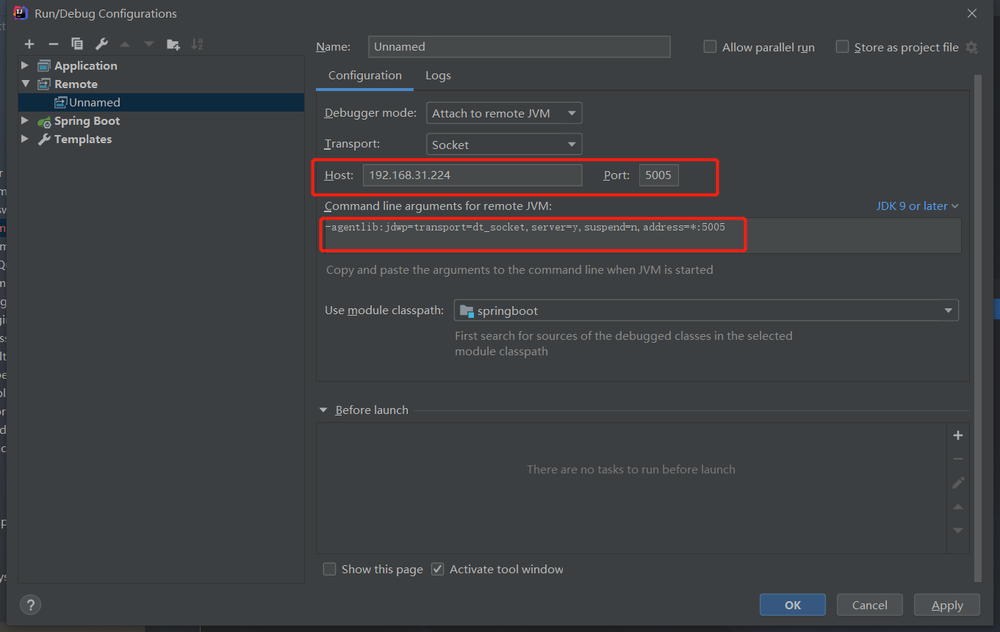

将复制的命令在服务中运行，注意，* 需要 \ 来转义，否则会报错。

```sh
java -agentlib:jdwp=transport=dt_socket,server=y,suspend=n,address=*:5005 -jar MyBill-0.0.1-SNAPSHOT.jar
```

运行命令，服务启动。我们同时也启动本地服务

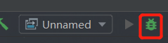

我们在本地服务中的打上断点，当线上服务访问到我们本地服务方法中断点的位置就会停住。

### 表达式解析

可以来计算表达式

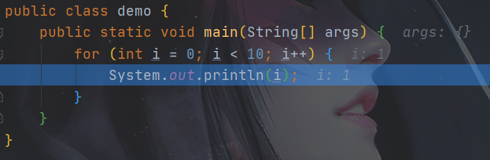

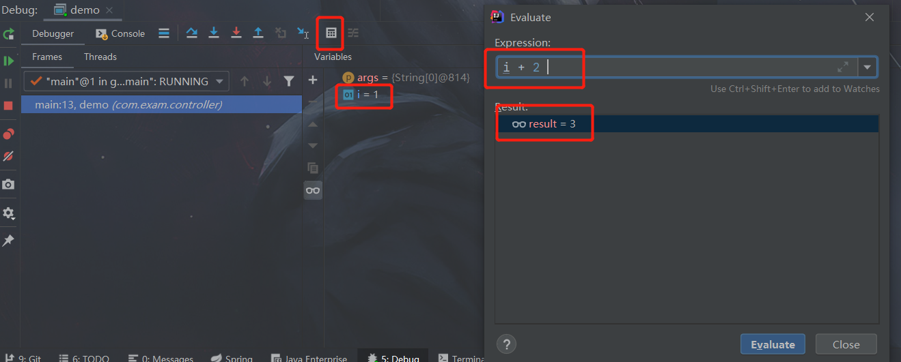

代码的模式，输出最后一行的结果

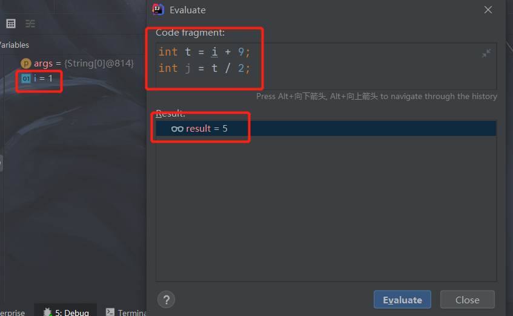

### 打印堆栈信息

可以在断点处右键

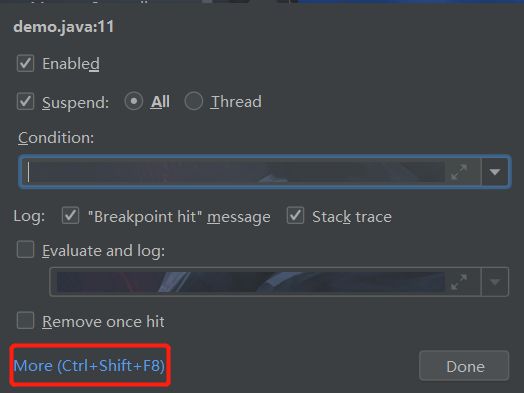

也可以通过这个

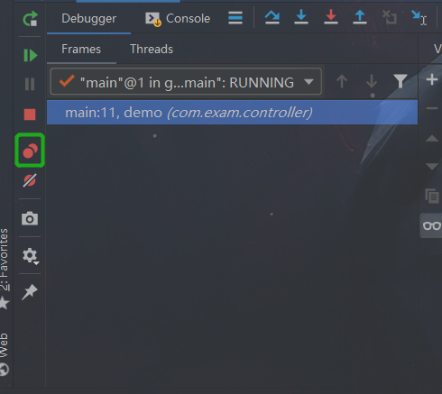

“Breakpoint hit” message：断点停住会打印消息

“Stack trace”：栈信息

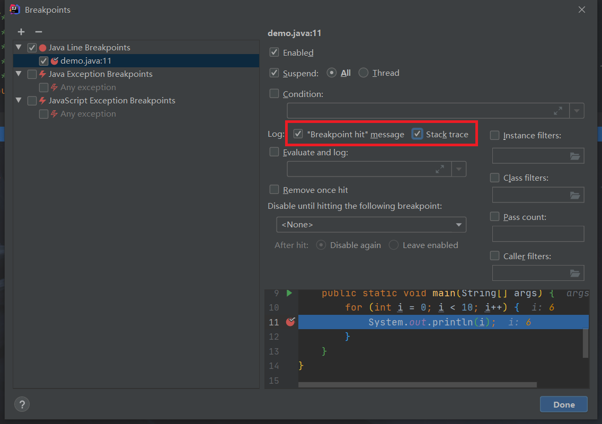

### 避免操作资源

假如我们在第一句输出的时候报异常了，不要再后面的操作：保存到数据库、保存到redis、发送mq等操作

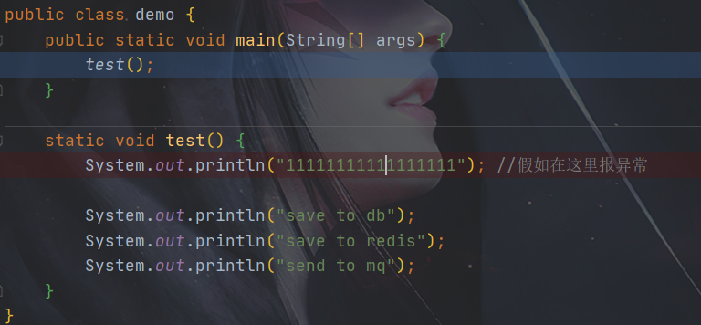

我们就可以强制返回，不执行后续的操作

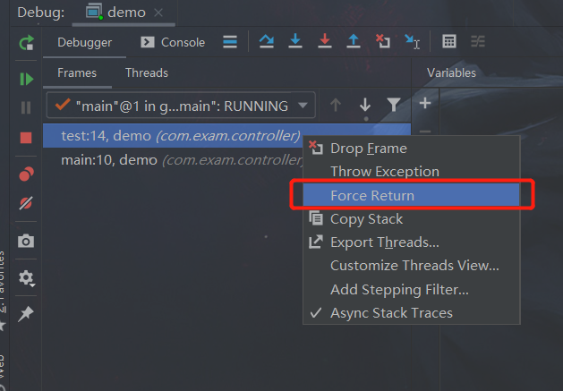

