## 什么是Itext

Apache iText 是一个开源 Java 库，支持 PDF 文档的开发和转换。  

在本教程中，我们将学习如何使用 iText 开发可以创建、转换和操作 PDF 文档的 Java 程序。 

Itext目前遵从AGPL开源协议，AGPL 可以说是最严格的 GPL 了，强传染性，即使是 RPC 调用也会被感染，不发行软件而是作为 web 服务对外提供也必须开放源代码  

目前Itext有很多product开始收费，但你所需的功能基本上open source都能满足  

**Itext是可以商用，但是必须公开的你项目源码！！！**  

## iText 的特点

以下是 iText 库的显着特点

- Interactive − iText 为你提供类（API）来生成交互式 PDF 文档。使用这些，你可以创建地图和书籍。
- Adding bookmarks, page numbers, etc − 使用 iText，你可以添加书签、页码和水印。
- Split \& Merge − 使用 iText，你可以将现有的 PDF 拆分为多个 PDF，还可以向其中添加/连接其他页面。
- Fill Forms − 使用 iText，你可以在 PDF 文档中填写交互式表单。
- Save as Image − 使用 iText，你可以将 PDF 保存为图像文件，例如 PNG 或 JPEG。
- Canvas − iText 库为您提供了一个 Canvas 类，你可以使用它在 PDF 文档上绘制各种几何形状，如圆形、线条等。
- Create PDFs − 使用 iText，你可以从 Java 程序创建新的 PDF 文件。你也可以包含图像和字体。

## IText使用

### POM

```xml
    <properties>
        <itext.version>8.0.1</itext.version>
    </properties>
    <!--依赖-->
    <dependencies>
        <!-- always needed -->
        <dependency>
            <groupId>com.itextpdf</groupId>
            <artifactId>kernel</artifactId>
            <version>${itext.version}</version>
        </dependency>
        <!-- always needed -->
        <dependency>
            <groupId>com.itextpdf</groupId>
            <artifactId>io</artifactId>
            <version>${itext.version}</version>
        </dependency>
        <!-- always needed -->
        <dependency>
            <groupId>com.itextpdf</groupId>
            <artifactId>layout</artifactId>
            <version>${itext.version}</version>
        </dependency>
        <!-- only needed for forms -->
        <dependency>
            <groupId>com.itextpdf</groupId>
            <artifactId>forms</artifactId>
            <version>${itext.version}</version>
        </dependency>
        <!-- only needed for PDF/A -->
        <dependency>
            <groupId>com.itextpdf</groupId>
            <artifactId>pdfa</artifactId>
            <version>${itext.version}</version>
        </dependency>
        <!-- only needed for digital signatures -->
        <dependency>
            <groupId>com.itextpdf</groupId>
            <artifactId>sign</artifactId>
            <version>${itext.version}</version>
        </dependency>
        <!-- only needed for barcodes -->
        <dependency>
            <groupId>com.itextpdf</groupId>
            <artifactId>barcodes</artifactId>
            <version>${itext.version}</version>
        </dependency>
        <!-- only needed for Asian fonts -->
        <dependency>
            <groupId>com.itextpdf</groupId>
            <artifactId>font-asian</artifactId>
            <version>${itext.version}</version>
        </dependency>
        <!-- only needed for hyphenation -->
        <dependency>
            <groupId>com.itextpdf</groupId>
            <artifactId>hyph</artifactId>
            <version>${itext.version}</version>
        </dependency>
	</dependencies>
```

### 创建一个空白的PDF

可以通过实例化Document类来创建一个空的 PDF 文档。在实例化此类时，你需要将PdfDocument对象作为参数传递给其构造函数。

1. 第 1 步：创建一个 PdfWriter 对象
   该PdfWriter类表示PDF文档的作家。此类属于包`com.itextpdf.kernel.pdf`。此类的构造函数接受一个字符串，表示要在其中创建 PDF 的文件的路径。
   通过向其构造函数传递一个字符串值（表示您需要创建 PDF 的路径）来实例化 PdfWriter 类，如下所示。

2. 第 2 步：创建一个 PdfDocument 对象
   该PdfDocument类为表示在iText的PDF文档类。此类属于包`com.itextpdf.kernel.pdf`。要实例化此类（在写入模式下），您需要将PdfWriter类的对象传递给其构造函数。
   通过将上面创建的 PdfWriter 对象传递给其构造函数来实例化 PdfDocument 类，如下所示。

3. 第 3 步：添加一个空页面
   **PdfDocument类的addNewPage()方法用于在 PDF 文档中创建一个空白页面。**
   为上一步创建的 PDF 文档添加一个空白页面，如下所示。

4. 第 4 步：创建一个 Document 对象
   包`com.itextpdf.layout的Document`类是创建自给自足的 PDF 时的根元素。此类的构造函数之一接受类 PdfDocument 的对象。
   通过传递在前面的步骤中创建的类PdfDocument的对象来实例化Document类。

   **`PdfDocument` 是用于处理 PDF 文档的结构和元信息，而 `Document` 是用于在 PDF 页面上构建内容布局和排版。**

5. 步骤 5：关闭文档
   使用Document类的close()方法关闭文档。

```java
import com.itextpdf.kernel.pdf.PdfDocument; 
import com.itextpdf.kernel.pdf.PdfWriter; 
import com.itextpdf.layout.Document;  
public class create_PDF {    
   public static void main(String args[]) throws Exception { 
        // 1、Creating a PdfWriter 
        String dest = "C:/itextExamples/sample.pdf"; 
        PdfWriter writer = new PdfWriter(dest);

        // 2、Creating a PdfDocument  
        PdfDocument pdfDoc = new PdfDocument(writer);

        // 3、Adding an empty page 
        pdfDoc.addNewPage(); 

        // 4、Creating a Document   
        Document document = new Document(pdfDoc); 

        // 5、Closing the document 
        document.close();
        System.out.println("PDF Created");  
  }
}
```

调用接口响应到浏览器

```java
	@GetMapping("/testPdf")
	public void testPdf(HttpServletResponse response) throws IOException {
		// 设置响应内容类型为 PDF
		response.setContentType("application/pdf");
		// 设置响应头，指定文件名
		response.setHeader("Content-Disposition", "attachment; filename=output.pdf");

		// 创建 PdfWriter
		PdfWriter writer = new PdfWriter(response.getOutputStream());

		// 创建 PdfDocument
		PdfDocument pdfDoc = new PdfDocument(writer);

		// 添加空白页面
		pdfDoc.addNewPage();

		// 创建 Document
		Document document = new Document(pdfDoc);

		// 关闭文档
		document.close();

		System.out.println("PDF Created and sent to browser");
	}
```

响应到浏览器的同时保存到服务器

```java
import com.itextpdf.kernel.pdf.PdfDocument;
import com.itextpdf.kernel.pdf.PdfWriter;
import com.itextpdf.layout.Document;
import org.springframework.stereotype.Controller;
import org.springframework.web.bind.annotation.GetMapping;

import javax.servlet.http.HttpServletResponse;
import java.io.FileOutputStream;
import java.io.IOException;

@Controller
public class PdfController {

	@GetMapping("/testPdf")
	public void testPdf(HttpServletResponse response) throws IOException {
        // 设置响应内容类型为 PDF
        response.setContentType("application/pdf");
        // 设置响应头，指定文件名
        response.setHeader("Content-Disposition", "attachment; filename=output.pdf");

        // 创建 PdfWriter
        PdfWriter writer = new PdfWriter(response.getOutputStream());

        // 创建 PdfDocument
        PdfDocument pdfDoc = new PdfDocument(writer);

        // 添加空白页面
        pdfDoc.addNewPage();

        // 创建 Document
        Document document = new Document(pdfDoc);

        // 关闭文档
        document.close();

        System.out.println("PDF Created and sent to browser");

        // 保存 PDF 到服务器指定路径
        String pdfFilePath = "path_to_your_server_directory/output.pdf"; // 替换为实际的路径
        savePdfToFile(pdfDoc, pdfFilePath);

        System.out.println("PDF Saved to server");
    }

    private void savePdfToFile(PdfDocument pdfDoc, String filePath) throws IOException {
        try (FileOutputStream outputStream = new FileOutputStream(filePath)) {
            pdfDoc.close();
            outputStream.write(pdfDoc.getPdfWriter().getOutputStream().toByteArray());
        }
    }
}

```

### 创建一个 AreaBreak

你可以通过实例化Document类来创建一个空的 PDF 文档。在实例化此类时，你需要将PdfDocument对象作为参数传递给其构造函数。  然后，要将 areabreak 添加到文档，你需要实例化AreaBreak类并使用add\(\)方法将此对象添加到文档。

创建区域中断对象**（分页符）**所述AreaBreak类属于包`com.itextpdf.layout.element`。在实例化这个类时，当前的上下文区域将被终止并创建一个具有相同大小的新区域（如果我们使用默认构造函数）。

```java
import com.itextpdf.kernel.pdf.PdfDocument; 
import com.itextpdf.kernel.pdf.PdfWriter; 
import com.itextpdf.layout.Document; 
import com.itextpdf.layout.element.AreaBreak;  

public class AddingAreaBreak {    
   public static void main(String args[]) throws Exception {       
      // Creating a PdfWriter       
      String dest = "C:/itextExamples/addingAreaBreak.pdf";       
      PdfWriter writer = new PdfWriter(dest);
   
      // Creating a PdfDocument       
      PdfDocument pdf = new PdfDocument(writer);             
   
      // Creating a Document by passing PdfDocument object to its constructor       
      Document document = new Document(pdf);  
   
      // Creating an Area Break          
      AreaBreak aB = new AreaBreak();           
   
      // Adding area break to the PDF       
      document.add(aB);              
   
      // Closing the document       
      document.close();           
      System.out.println("Pdf created");       
   } 
}  
```

### 创建段落

你可以通过实例化Document类来创建一个空的 PDF 文档。  在实例化此类时，你需要将PdfDocument对象作为参数传递给其构造函数。  然后，要将段落添加到文档中，你需要实例化Paragraph类并使用add\(\)方法将此对象添加到文档中。

创建一个段落对象的段落类表示的文本和图形信息的自包含块。它属于`com.itextpdf.layout.element`包。通过将文本内容作为字符串传递给其构造函数来实例化Paragraph类，如下所示。

```java
import com.itextpdf.kernel.pdf.PdfDocument; 
import com.itextpdf.kernel.pdf.PdfWriter; 
import com.itextpdf.layout.Document; 
import com.itextpdf.layout.element.Paragraph;  

public class AddingParagraph {    
   public static void main(String args[]) throws Exception {
      // Creating a PdfWriter       
      String dest = "C:/itextExamples/addingParagraph.pdf";       
      PdfWriter writer = new PdfWriter(dest);           
      
      // Creating a PdfDocument       
      PdfDocument pdf = new PdfDocument(writer);              
      
      // Creating a Document        
      Document document = new Document(pdf);              
      String para1 = "Tutorials Point originated from the idea that there exists 
      a class of readers who respond better to online content and prefer to learn 
      new skills at their own pace from the comforts of their drawing rooms.";  
      
      String para2 = "The journey commenced with a single tutorial on HTML in 2006 
      and elated by the response it generated, we worked our way to adding fresh 
      tutorials to our repository which now proudly flaunts a wealth of tutorials 
      and allied articles on topics ranging from programming languages to web designing 
      to academics and much more.";              
      
      // Creating Paragraphs       
      Paragraph paragraph1 = new Paragraph(para1);             
      Paragraph paragraph2 = new Paragraph(para2);              
      
      // Adding paragraphs to document       
      document.add(paragraph1);       
      document.add(paragraph2);           
      
      // Closing the document       
      document.close();             
      System.out.println("Paragraph added");    
   } 
}  
```

### 创建列表

你可以通过实例化Document类来创建一个空的 PDF 文档。  在实例化此类时，你需要将PdfDocument对象作为参数传递给其构造函数。  然后，要将列表添加到文档中，你需要实例化List类并使用add\(\)方法将此对象添加到文档中。

创建一个 List 对象，该目录类表示一系列垂直列出的对象。它属于`com.itextpdf.layout.element`包。

```java
import com.itextpdf.kernel.pdf.PdfDocument; 
import com.itextpdf.kernel.pdf.PdfWriter; 

import com.itextpdf.layout.Document; 
import com.itextpdf.layout.element.List; 
import com.itextpdf.layout.element.Paragraph;  

public class AddingList {      
   public static void main(String args[]) throws Exception {               
      // Creating a PdfWriter
      String dest = "C:/itextExamples/addngList.pdf";       
      PdfWriter writer = new PdfWriter(dest);              
   
      // Creating a PdfDocument       
      PdfDocument pdf = new PdfDocument(writer);              
   
      // Creating a Document        
      Document document = new Document(pdf);              
   
      // Creating a Paragraph       
      Paragraph paragraph = new Paragraph("Tutorials Point provides the following tutorials");
      
      // Creating a list
      List list = new List();  //注意：这里的List用的是itext库中的
      
      // Add elements to the list       
      list.add("Java");       
      list.add("JavaFX");      
      list.add("Apache Tika");       
      list.add("OpenCV");       
      list.add("WebGL");       
      list.add("Coffee Script");       
      list.add("Java RMI");       
      list.add("Apache Pig");              
      
      // Adding paragraph to the document       
      document.add(paragraph);                    
     
      // Adding list to the document       
      document.add(list);
      
      // Closing the document       
      document.close();              
      System.out.println("List added");    
   } 
} 
```

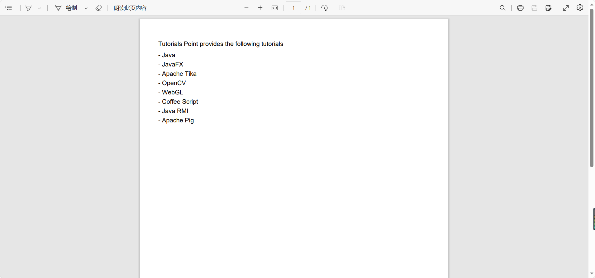

### 将表格添加到 Pdf

你可以通过实例化Document类来创建一个空的 PDF 文档。  在实例化此类时，你需要将PdfDocument对象作为参数传递给其构造函数。  然后，要将表格添加到文档中，你需要实例化Table类并使用add\(\)方法将此对象添加到文档中。

创建一个 Table 对象，该表类表示填充有以行和列排列的细胞的二维网格。它属于com.itextpdf.layout.element包。

```java
import com.itextpdf.kernel.pdf.PdfDocument;
import com.itextpdf.kernel.pdf.PdfWriter;
import com.itextpdf.layout.Document;
import com.itextpdf.layout.element.Cell;
import com.itextpdf.layout.element.Paragraph;
import com.itextpdf.layout.element.Table;

public class AddingTable {      
   public static void main(String args[]) throws Exception {           
      // Creating a PdfDocument object   
      String dest = "C:/itextExamples/addingTable.pdf";   
      PdfWriter writer = new PdfWriter(dest);       
         
      // Creating a PdfDocument object      
      PdfDocument pdf = new PdfDocument(writer);                  
      
      // Creating a Document object       
      Document doc = new Document(pdf);                       
         
      // Creating a table    
      // 数组 {150F, 150F, 150F} 表示了一个包含三列的表格，每列的宽度都是 150 points（点）。这意味着每列都会有相等的宽度，总宽度为 150 + 150 + 150 = 450 points。
      float [] pointColumnWidths = {150F, 150F, 150F};   
      Table table = new Table(pointColumnWidths);    
      
      // Adding cells to the table       
      table.addCell(new Cell().add(new Paragraph("Name")));
      table.addCell(new Cell().add(new Paragraph("Raju")));
      table.addCell(new Cell().add(new Paragraph("Id")));
      table.addCell(new Cell().add(new Paragraph("1001")));
      table.addCell(new Cell().add(new Paragraph("Designation")));
      table.addCell(new Cell().add(new Paragraph("Programmer")));               
         
      // Adding Table to document        
      doc.add(table);                  
         
      // Closing the document       
      doc.close();
      System.out.println("Table created successfully..");   
   }     
}
```

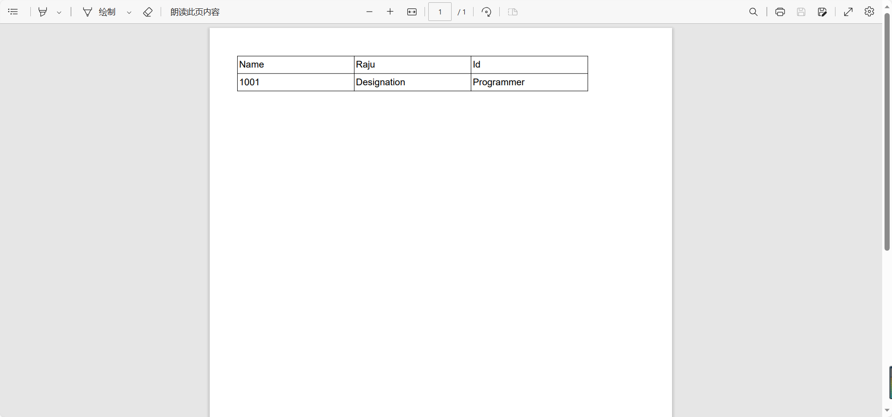

### 格式化表格中的单元格

你可以通过实例化 Document 类来创建一个空的 PDF文档。在实例化此类时，你需要将PdfDocument对象作为参数传递给其构造函数。然后，要将表格添加到文档中，你需要实例化Table类并使用add\(\)方法将此对象添加到文档中。 你可以使用Cell类的方法格式化表格中单元格的内容。

为单元格添加背景，创建单元格并向其中添加内容后，可以设置单元格的格式。例如，可以设置其背景，对齐单元格内的文本，更改文本颜色等，使用单元格类的不同方法，例如`setBackgroundColor()`、`setBorder()`、`setTextAlignment()`。

```java
import com.itextpdf.kernel.colors.DeviceRgb;
import com.itextpdf.kernel.pdf.PdfDocument;
import com.itextpdf.kernel.pdf.PdfWriter;
import com.itextpdf.layout.Document;
import com.itextpdf.layout.borders.Border;
import com.itextpdf.layout.element.Cell;
import com.itextpdf.layout.element.Paragraph;
import com.itextpdf.layout.element.Table;
import com.itextpdf.layout.properties.TextAlignment;

public class BackgroundToTable {      
   public static void main(String args[]) throws Exception {        
      // Creating a PdfWriter object   
      String dest = "C:/itextExamples/addingBackground.pdf";   
      PdfWriter writer = new PdfWriter(dest);                  
      
      // Creating a PdfDocument object       
      PdfDocument pdfDoc = new PdfDocument(writer);                   
      
      // Creating a Document object      
      Document doc = new Document(pdfDoc); 
      
      // Creating a table       
      float [] pointColumnWidths = {200F, 200F};       
      Table table = new Table(pointColumnWidths);
      
		// Populating row 1 and adding it to the table               
		Cell c1 = new Cell();                        // Creating cell 1 
		c1.add(new Paragraph("Name"));                              // Adding name to cell 1   
		c1.setBackgroundColor(new DeviceRgb(64, 64, 64));      // Setting background color
		c1.setBorder(Border.NO_BORDER);              // Setting border
		c1.setTextAlignment(TextAlignment.CENTER);   // Setting text alignment      
		table.addCell(c1);                           // Adding cell 1 to the table 

		Cell c2 = new Cell();
		c2.add(new Paragraph("Raju"));
		c2.setBackgroundColor(new DeviceRgb(128, 128, 128));
		c2.setBorder(Border.NO_BORDER);
		c2.setTextAlignment(TextAlignment.CENTER);
		table.addCell(c2);

		// Populating row 2 and adding it to the table               
		Cell c3 = new Cell();
		c3.add(new Paragraph("Id"));
		c3.setBackgroundColor(new DeviceRgb(255, 255, 255));
		c3.setBorder(Border.NO_BORDER);
		c3.setTextAlignment(TextAlignment.CENTER);
		table.addCell(c3);

		Cell c4 = new Cell();
		c4.add(new Paragraph("001"));
		c4.setBackgroundColor(new DeviceRgb(255, 255, 255));
		c4.setBorder(Border.NO_BORDER);
		c4.setTextAlignment(TextAlignment.CENTER);
		table.addCell(c4);

		// Populating row 3 and adding it to the table        
		Cell c5 = new Cell();
		c5.add(new Paragraph("Designation"));
		c5.setBackgroundColor(new DeviceRgb(64, 64, 64));
		c5.setBorder(Border.NO_BORDER);
		c5.setTextAlignment(TextAlignment.CENTER);
		table.addCell(c5);

		Cell c6 = new Cell();
		c6.add(new Paragraph("Programmer"));
		c6.setBackgroundColor(new DeviceRgb(128, 128, 128));
		c6.setBorder(Border.NO_BORDER);
		c6.setTextAlignment(TextAlignment.CENTER);
		table.addCell(c6);                              
      
      // Adding Table to document        
      doc.add(table);                  
      
      // Closing the document       
      doc.close();  
      
      System.out.println("Background added successfully..");     
   } 
} 
```

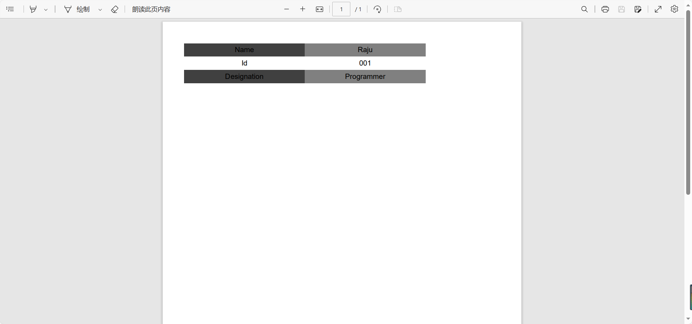

### 格式化单元格的边框

可以通过实例化Document类来创建一个空的 PDF 文档。  在实例化此类时，需要将PdfDocument对象作为参数传递给其构造函数。

格式化单元格的边框，iText 库提供了各种表示边框的类，例如`DashedBorder`、`SolidBorder`、`DottedBorder`、`DoubleBorder`、`RoundDotsBorder`等。这些类的构造函数接受两个参数：一个表示边框颜色的颜色对象和一个表示边框宽度的整数。选择其中一种边框类型并通过传递颜色对象和一个表示宽度的整数来实例化相应的边框。

```java
import com.itextpdf.kernel.colors.DeviceRgb;
import com.itextpdf.kernel.pdf.PdfDocument;
import com.itextpdf.kernel.pdf.PdfWriter;
import com.itextpdf.layout.Document;
import com.itextpdf.layout.borders.*;
import com.itextpdf.layout.element.Cell;
import com.itextpdf.layout.element.Paragraph;
import com.itextpdf.layout.element.Table;
import com.itextpdf.layout.properties.TextAlignment;

public class FormatedBorders {      
   public static void main(String args[]) throws Exception {
      // Creating a PdfWriter object   
      String dest = "C:/itextExamples/coloredBorders.pdf";   
      
      PdfWriter writer = new PdfWriter(dest);                 

      // Creating a PdfDocument object       
      PdfDocument pdfDoc = new PdfDocument(writer);                      
   
      // Creating a Document object      
      Document doc = new Document(pdfDoc);                            
   
      // Creating a table       
      float[] pointColumnWidths = {200F, 200F};
      Table table = new Table(pointColumnWidths);

      // Adding row 1 to the table
      Cell c1 = new Cell();
      // Adding the contents of the cell
      c1.add(new Paragraph("Name"));
      // Instantiating the Border class 
      Border b1 = new DashedBorder(new DeviceRgb(255, 0, 0), 3);//虚线
      // Setting the border of the cell
      c1.setBorder(b1);
      // Setting the text alignment       
      c1.setTextAlignment(TextAlignment.CENTER);

      // Adding the cell to the table       
      table.addCell(c1);
      Cell c2 = new Cell();
      c2.add(new Paragraph("Raju"));
      c1.setBorder(new SolidBorder(new DeviceRgb(255, 0, 0), 3));//实线
      c2.setTextAlignment(TextAlignment.CENTER);
      table.addCell(c2);

      // Adding row 2 to the table                
      Cell c3 = new Cell();
      c3.add(new Paragraph("Id"));
      c3.setBorder(new DottedBorder(new DeviceRgb(0, 255, 0), 3));//斑点线
      c3.setTextAlignment(TextAlignment.CENTER);
      table.addCell(c3);

      Cell c4 = new Cell();
      c4.add(new Paragraph("001"));
      c4.setBorder(new DoubleBorder(new DeviceRgb(0, 255, 0), 3));//双线
      c4.setTextAlignment(TextAlignment.CENTER);
      table.addCell(c4);

      // Adding row 3 to the table       
      Cell c5 = new Cell();
      c5.add(new Paragraph("Designation"));
      c5.setBorder(new RoundDotsBorder(new DeviceRgb(255, 0, 0), 3));//圆形点
      c5.setTextAlignment(TextAlignment.CENTER);
      table.addCell(c5);

      Cell c6 = new Cell();
      c6.add(new Paragraph("Programmer"));
      c6.setBorder(new RoundDotsBorder(new DeviceRgb(255, 0, 0), 3));//圆形点
      c6.setTextAlignment(TextAlignment.CENTER);
      table.addCell(c6);                              
      
      // Adding Table to document        
      doc.add(table);                  
      
      // Closing the document       
      doc.close();  
      
      System.out.println("Borders added successfully..");     
   } 
} 
```

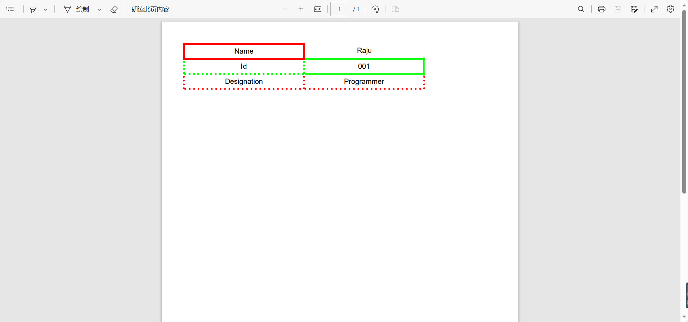

### 将图像添加到表格

可以通过实例化Document类来创建一个空的 PDF 文档。  在实例化此类时，需要将PdfDocument对象作为参数传递给其构造函数。  然后，要将表格添加到文档中，需要实例化Table类并使用add\(\)方法将此对象添加到文档中。

创建图像，要创建图像对象，首先要使用ImageDataFactory类的`create()`方法创建一个ImageData对象。
作为该方法的参数，传入一个代表图片路径的字符串参数。

```java
import com.itextpdf.io.image.ImageData;
import com.itextpdf.io.image.ImageDataFactory;
import com.itextpdf.kernel.pdf.PdfDocument;
import com.itextpdf.kernel.pdf.PdfWriter;
import com.itextpdf.layout.Document;
import com.itextpdf.layout.element.Cell;
import com.itextpdf.layout.element.Image;
import com.itextpdf.layout.element.Paragraph;
import com.itextpdf.layout.element.Table;

public class a3AddingImageToTable {
   public static void main(String args[]) throws Exception {
      // Creating a PdfWriter object 
      String dest = "C:/itextExamples/addingImage.pdf";
      PdfWriter writer = new PdfWriter(dest);    
      
      // Creating a PdfDocument object   
      PdfDocument pdfDoc = new PdfDocument(writer);
      
      // Creating a Document object
      Document doc = new Document(pdfDoc);
      
      // Creating a table
      float [] pointColumnWidths = {150f, 150f};
      Table table = new Table(pointColumnWidths);
      
       // Populating row 1 and adding it to the table
       Cell cell1 = new Cell();
       cell1.add(new Paragraph("Tutorial ID"));
       table.addCell(cell1);

       Cell cell2 = new Cell();
       cell2.add(new Paragraph("1"));
       table.addCell(cell2);

       // Populating row 2 and adding it to the table
       Cell cell3 = new Cell();
       cell3.add(new Paragraph("Tutorial Title"));
       table.addCell(cell3);

       Cell cell4 = new Cell();
       cell4.add(new Paragraph("JavaFX"));
       table.addCell(cell4);

       // Populating row 3 and adding it to the table
       Cell cell5 = new Cell();
       cell5.add(new Paragraph("Tutorial Author"));
       table.addCell(cell5);

       Cell cell6 = new Cell();
       cell6.add(new Paragraph("Krishna Kasyap"));
       table.addCell(cell6);

       // Populating row 4 and adding it to the table
       Cell cell7 = new Cell();
       cell7.add(new Paragraph("Submission date"));
       table.addCell(cell7);

       Cell cell8 = new Cell();
       cell8.add(new Paragraph("2016-07-06"));
       table.addCell(cell8);

       // Populating row 5 and adding it to the table
       Cell cell9 = new Cell();
       cell9.add(new Paragraph("Tutorial Icon"));
       table.addCell(cell9);

       // Creating the cell10       
       Cell cell10 = new Cell();
       // Creating an ImageData object       
       String imageFile = "G:\\L ZHEN\\Pictures\\404.png";
       ImageData data = ImageDataFactory.create(imageFile);
       // Creating the image       
       Image img = new Image(data);
       // Adding image to the cell10       
       cell10.add(img.setAutoScale(true));
       // Adding cell110 to the table       
       table.addCell(cell10);
       // Adding Table to document        
       doc.add(table);                         
      
      // Adding Table to document        
      doc.add(table);                  
      
      // Closing the document       
      doc.close();  
      
      System.out.println("Image added to table successfully..");     
   } 
}  
```

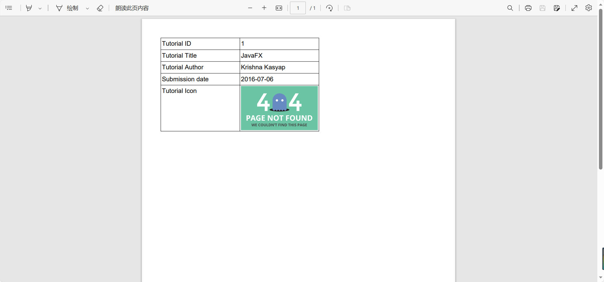

### 在PDF中添加嵌套表

可以通过实例化Document类来创建一个空的 PDF 文档。  在实例化此类时，需要将PdfDocument对象作为参数传递给其构造函数。  然后，要将表格添加到文档中，需要实例化Table类并使用add\(\)方法将此对象添加到文档中。  要将表添加到该表中，需要创建另一个表（嵌套表），并使用Cell类的add\(\)方法将其传递给单元对象。

```java
import com.itextpdf.kernel.pdf.PdfDocument;
import com.itextpdf.kernel.pdf.PdfWriter;
import com.itextpdf.layout.Document;
import com.itextpdf.layout.element.Cell;
import com.itextpdf.layout.element.Paragraph;
import com.itextpdf.layout.element.Table;

public class a4AddNestedTablesPdf {  
   public static void main(String args[]) throws Exception {                        
      // Creating a PdfWriter object   
      String dest = "C:/itextExamples/addingNestedTable.pdf";   
      PdfWriter writer = new PdfWriter(dest);                  
   
      // Creating a PdfDocument object       
      PdfDocument pdfDoc = new PdfDocument(writer);                      
   
      // Creating a Document object       
      Document doc = new Document(pdfDoc);                            
   
      // Creating a table       
      float [] pointColumnWidths1 = {150f, 150f};       
      Table table = new Table(pointColumnWidths1);                             
      
      // Populating row 1 and adding it to the table          
       Cell cell1 = new Cell();
       cell1.add(new Paragraph("Name"));
       table.addCell(cell1);

       Cell cell2 = new Cell();
       cell2.add(new Paragraph("Raju"));
       table.addCell(cell2);

       // Populating row 2 and adding it to the table        
       Cell cell3 = new Cell();
       cell3.add(new Paragraph("Id"));
       table.addCell(cell3);

       Cell cell4 = new Cell();
       cell4.add(new Paragraph("1001"));
       table.addCell(cell4);

       // Populating row 3 and adding it to the table        
       Cell cell5 = new Cell();
       cell5.add(new Paragraph("Designation"));
       table.addCell(cell5);

       Cell cell6 = new Cell();
       cell6.add(new Paragraph("Programmer"));
       table.addCell(cell6);

       // Creating nested table for contact         
       float[] pointColumnWidths2 = {150f, 150f};
       Table nestedTable = new Table(pointColumnWidths2);

       // Populating row 1 and adding it to the nested table        
       Cell nested1 = new Cell();
       nested1.add(new Paragraph("Phone"));
       nestedTable.addCell(nested1);

       Cell nested2 = new Cell();
       nested2.add(new Paragraph("9848022338"));
       nestedTable.addCell(nested2);

       // Populating row 2 and adding it to the nested table        
       Cell nested3 = new Cell();
       nested3.add(new Paragraph("email"));
       nestedTable.addCell(nested3);

       Cell nested4 = new Cell();
       nested4.add(new Paragraph("Raju123@gmail.com"));
       nestedTable.addCell(nested4);

       // Populating row 3 and adding it to the nested table        
       Cell nested5 = new Cell();
       nested5.add(new Paragraph("Address"));
       nestedTable.addCell(nested5);

       Cell nested6 = new Cell();
       nested6.add(new Paragraph("Hyderabad"));
       nestedTable.addCell(nested6);

       // Adding table to the cell       
       Cell cell7 = new Cell();
       cell7.add(new Paragraph("Contact"));
       table.addCell(cell7);

       Cell cell8 = new Cell();//创建大表格的第八个表格
       cell8.add(nestedTable);//第八个表格中放入小表格
       table.addCell(cell8);
      
      // Adding table to the document       
      doc.add(table);                   
      
      // Closing the document               
      doc.close();  
      System.out.println("Nested Table Added successfully..");     
   } 
}    
```

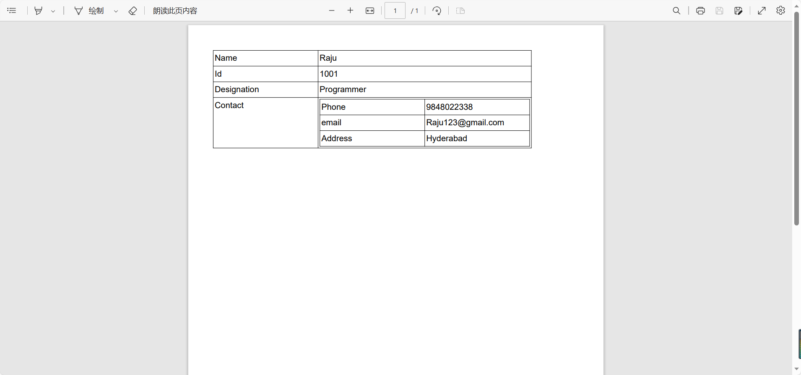

### 将列表添加到 PDF 中的表格

可以通过实例化Document类来创建一个空的 PDF 文档。  在实例化此类时，需要将PdfDocument对象作为参数传递给其构造函数。  然后，要将表格添加到文档中，需要实例化Table类并使用add\(\)方法将此对象添加到文档中。

将列表添加到表格的单元格，现在，使用Cell 类的add()方法将上面创建的列表添加到表格的单元格中。然后，使用Table类的addCell()方法将此单元格添加到表格中。

```java
import com.itextpdf.kernel.pdf.PdfDocument;
import com.itextpdf.kernel.pdf.PdfWriter;
import com.itextpdf.layout.Document;
import com.itextpdf.layout.element.*;
import com.itextpdf.layout.properties.TextAlignment;

public class AddingListsToTable {      
   public static void main(String args[]) throws Exception {              
      // Creating a PdfWriter object
      String file = "C:/itextExamples/addingObjects.pdf";       
      PdfDocument pdfDoc = new PdfDocument(new PdfWriter(file));                   
      
      // Creating a Document object       
      Document doc = new Document(pdfDoc);               
      
		// Creating a table       
		float[] pointColumnWidths = {300F, 300F};
		Table table = new Table(pointColumnWidths);

		// Adding row 1 to the table                
		Cell c1 = new Cell();
		c1.add(new Paragraph("Java Related Tutorials"));
		c1.setTextAlignment(TextAlignment.LEFT);
		table.addCell(c1);

		List list1 = new List();
		ListItem item1 = new ListItem("JavaFX");
		ListItem item2 = new ListItem("Java");
		ListItem item3 = new ListItem("Java Servlets");
		list1.add(item1);
		list1.add(item2);
		list1.add(item3);

		Cell c2 = new Cell();
		c2.add(list1);
		c2.setTextAlignment(TextAlignment.LEFT);
		table.addCell(c2);

		// Adding row 2 to the table                
		Cell c3 = new Cell();
		c3.add(new Paragraph("No SQL Databases"));
		c3.setTextAlignment(TextAlignment.LEFT);
		table.addCell(c3);

		List list2 = new List();
		list2.add(new ListItem("HBase"));
		list2.add(new ListItem("Neo4j"));
		list2.add(new ListItem("MongoDB"));

		Cell c4 = new Cell();
		c4.add(list2);
		c4.setTextAlignment(TextAlignment.LEFT);
		table.addCell(c4);

		// Adding Table to document        
		doc.add(table);
		
		// Closing the document       
		doc.close(); 
      System.out.println("Lists added to table successfully..");     
   } 
}  
```

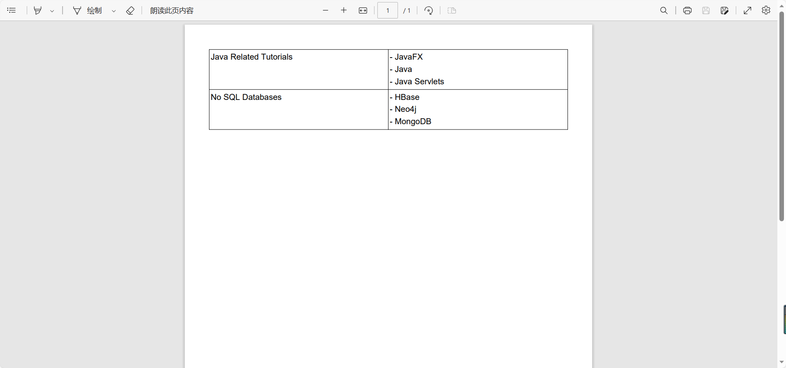

### 将图像添加到 Pdf

可以通过实例化Document类来创建一个空的 PDF 文档。  在实例化此类时，需要将PdfDocument对象作为参数传递给其构造函数。  要将图像添加到 PDF，请创建需要添加的图像对象，并使用Document类的add\(\)方法添加它。

创建一个 Image 对象，要创建图像对象，首先要使用ImageDataFactory类的`create()`方法创建一个ImageData对象。作为该方法的参数，传入一个代表图片路径的字符串参数。

```java
import com.itextpdf.io.image.ImageData;
import com.itextpdf.io.image.ImageDataFactory;
import com.itextpdf.kernel.pdf.PdfDocument;
import com.itextpdf.kernel.pdf.PdfWriter;
import com.itextpdf.layout.Document;
import com.itextpdf.layout.element.Image;

public class AddingImage {      
   public static void main(String args[]) throws Exception {              
      
      // Creating a PdfWriter       
      String dest = "C:/itextExamples/addingImage.pdf";       
      PdfWriter writer = new PdfWriter(dest);        
      
      // Creating a PdfDocument       
      PdfDocument pdf = new PdfDocument(writer);              
      
      // Creating a Document        
      Document document = new Document(pdf);              
      
      // Creating an ImageData object       
      String imFile = "C:/itextExamples/logo.jpg";       
      ImageData data = ImageDataFactory.create(imFile);              
      
      // Creating an Image object        
      Image image = new Image(data);                        
      
      // Adding image to the document       
      document.add(image);              
      
      // Closing the document       
      document.close();              
      
      System.out.println("Image added");    
   } 
}  
```


### 设置图像的位置

可以通过实例化Document类来创建一个空的 PDF 文档。  在实例化此类时，需要将PdfDocument对象作为参数传递给其构造函数。

设置图片的位置，可以使用Image的`setFixedPosition()`方法设置图像在 PDF 文档中的位置。使用此方法将图像的位置设置为文档上的坐标(100, 500)。

```java
import com.itextpdf.io.image.ImageData;
import com.itextpdf.io.image.ImageDataFactory;
import com.itextpdf.kernel.pdf.PdfDocument;
import com.itextpdf.kernel.pdf.PdfWriter;
import com.itextpdf.layout.Document;
import com.itextpdf.layout.element.Image; 

public class SettingPosition {      
   public static void main(String args[]) throws Exception {              
      // Creating a PdfWriter       
      String dest = "C:/EXAMPLES/itextExamples/3images/positionOfImage.pdf";       
      PdfWriter writer = new PdfWriter(dest);               
      
      // Creating a PdfDocument       
      PdfDocument pdfDoc = new PdfDocument(writer);              
      
      // Creating a Document        
      Document document = new Document(pdfDoc);              
      
      // Creating an ImageData object       
      String imFile = "C:/EXAMPLES/itextExamples/3images/logo.jpg";       
      ImageData data = ImageDataFactory.create(imFile);             

      // Creating an Image object        
      Image image = new Image(data);                
      
      // Setting the position of the image to the center of the page       
      image.setFixedPosition(100, 500);           
      
      // Adding image to the document       
      document.add(image);              
      
      // Closing the document       
      document.close();
      
      System.out.println("Image added");    
   } 
}
```


### 缩放PDF中的图像

可以通过实例化Document类来创建一个空的 PDF 文档。  在实例化此类时，需要将PdfDocument对象作为参数传递给其构造函数。
缩放图像，可以使用 `scale()` 方法，它用于在 PDF 中绘制图像时设置图像的缩放比例。`scale()` 方法需要两个参数，分别是**水平缩放因子和垂直缩放因子**。

```java
import com.itextpdf.io.image.ImageData;
import com.itextpdf.io.image.ImageDataFactory;
import com.itextpdf.kernel.pdf.PdfDocument;
import com.itextpdf.kernel.pdf.PdfWriter;
import com.itextpdf.layout.Document;
import com.itextpdf.layout.element.Image; 

public class SettingAutoScale {      
   public static void main(String args[]) throws Exception{              
      // Creating a PdfWriter       
      String dest = "C:/itextExamples/positionOfImage.pdf";       
      PdfWriter writer = new PdfWriter(dest);               
      
      // Creating a PdfDocument       
      PdfDocument pdfDoc = new PdfDocument(writer);              
      
      // Creating a Document        
      Document document = new Document(pdfDoc);              
      
      // Creating an ImageData object       
      String imFile = "C:/itextExamples/logo.jpg";       
      ImageData data = ImageDataFactory.create(imFile);              
      
      // Creating an Image object        
      Image image = new Image(data);                
      
      // 设置水平缩放因子和垂直缩放因子
      float horizontalScale = 0.5f; // 50% 缩放
      float verticalScale = 0.5f;   // 50% 缩放
      image.scale(horizontalScale, verticalScale);
      
      // Adding image to the document       
      document.add(image);              
      
      // Closing the document       
      document.close();
      System.out.println("Image Scaled");    
   } 
}  
```

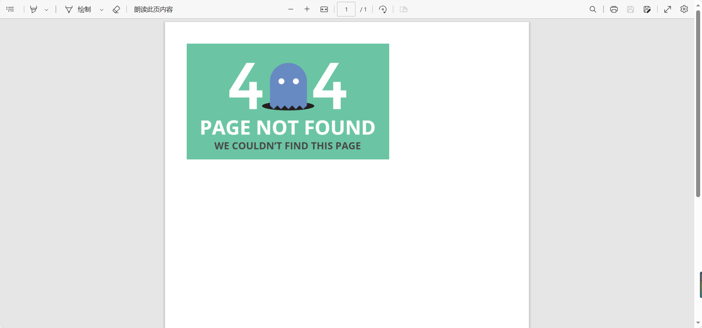

### 旋转PDF中的图像

可以通过实例化Document类来创建一个空的 PDF 文档。  在实例化此类时，需要将PdfDocument对象作为参数传递给其构造函数。

旋转图像，可以使用setRotationAngle()方法旋转图像。对于此方法，需要传递一个整数，该整数表示要旋转图像的旋转角度。

```java
import com.itextpdf.io.image.ImageData;
import com.itextpdf.io.image.ImageDataFactory;
import com.itextpdf.kernel.pdf.PdfDocument;
import com.itextpdf.kernel.pdf.PdfWriter;
import com.itextpdf.layout.Document;
import com.itextpdf.layout.element.Image; 

public class RotatingImage {    
   public static void main(String args[]) throws Exception {              
      // Creating a PdfWriter       
      String dest = "C:/itextExamples/rotatingImage.pdf";       
      PdfWriter writer = new PdfWriter(dest);               
      
      // Creating a PdfDocument       
      PdfDocument pdfDoc = new PdfDocument(writer);              
      
      // Creating a Document        
      Document document = new Document(pdfDoc);              
      
      // Creating an ImageData object       
      String imFile = "C:/itextExamples/logo.jpg";       
      ImageData data = ImageDataFactory.create(imFile);              
      
      // Creating an Image object        
      Image image = new Image(data);                
      
      // Rotating the image       
      image.setRotationAngle(45);                       
      
      // Adding image to the document       
      document.add(image);              
      
      // Closing the document       
      document.close(); 
      
      System.out.println("Image rotated");    
   } 
}   
```


### 在PDF中创建文本注释

可以通过实例化Document类来创建一个空的 PDF 文档。  在实例化此类时，需要将PdfDocument对象作为参数传递给其构造函数。

创建PdfAnnotation 对象，该PdfAnnotation类的包`com.itextpdf.kernel.pdf.annot`代表所有注释的超类。
在其派生类中，PdfTextAnnotation类表示文本注释。设置注释的颜色使用PdfAnnotation类的`setColor()`方法为注释设置颜色。

```java
import com.itextpdf.kernel.colors.DeviceRgb;
import com.itextpdf.kernel.geom.Rectangle;
import com.itextpdf.kernel.pdf.PdfDocument;
import com.itextpdf.kernel.pdf.PdfPage;
import com.itextpdf.kernel.pdf.PdfString;
import com.itextpdf.kernel.pdf.PdfWriter;
import com.itextpdf.kernel.pdf.annot.PdfAnnotation;
import com.itextpdf.kernel.pdf.annot.PdfTextAnnotation;
import com.itextpdf.layout.Document;


public class TextAnnotation {    
   public static void main(String args[]) throws Exception {        
      // Creating a PdfWriter       
      String dest = "C:/itextExamples/textAnnotation.pdf";       
      PdfWriter writer = new PdfWriter(dest);               
      
      // Creating a PdfDocument       
      PdfDocument pdf = new PdfDocument(writer);               
      
      // Creating a Document        
      Document document = new Document(pdf);             
      
      // Creating PdfTextAnnotation object
      Rectangle rect = new Rectangle(20, 800, 0, 0);       
      PdfAnnotation ann = new PdfTextAnnotation(rect);              
      
      // Setting color to the annotation
      ann.setColor(new DeviceRgb(0, 255, 0));
      
      // Setting title to the annotation 
      ann.setTitle(new PdfString("Hello"));              
      
      // Setting contents of the annotation       
      ann.setContents("Hi welcome to Tutorialspoint.");              
      
      // Creating a new page       
      PdfPage page =  pdf.addNewPage();              
      
      // Adding annotation to a page in a PDF
      page.addAnnotation(ann);

      // Closing the document       
      document.close();       
      
      System.out.println("Annotation added successfully");    
   } 
}
```

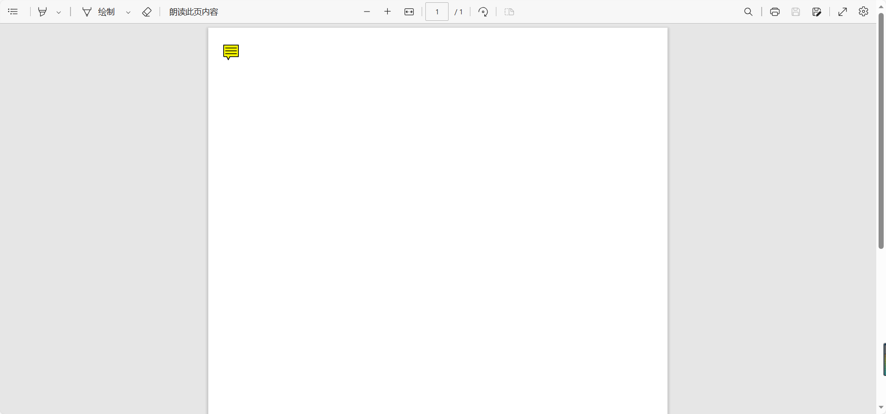

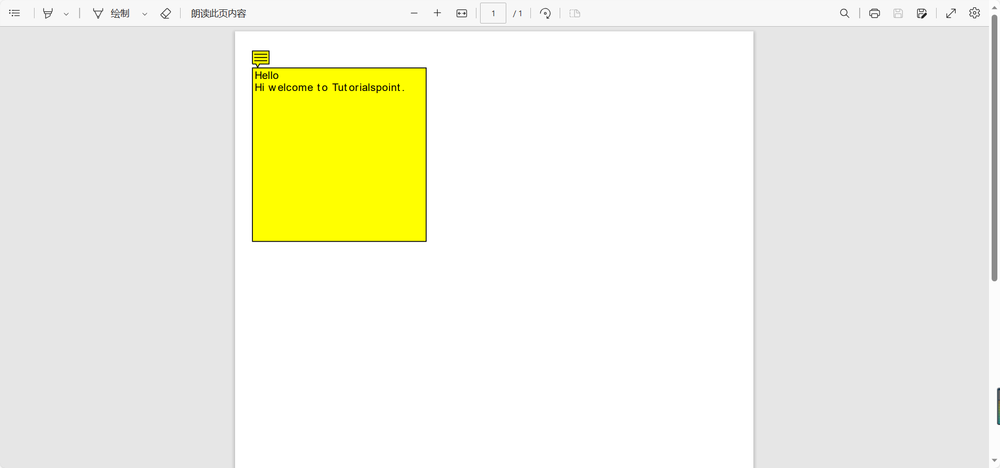

### 在PDF中创建链接注释

可以通过实例化Document类来创建一个空的 PDF 文档。  在实例化此类时，需要将PdfDocument对象作为参数传递给其构造函数。

PdfAnnotation 对象，该PdfAnnotation类的包`com.itextpdf.kernel.pdf.annot`代表所有注释的超类。
在其派生类中，PdfLinkAnnotation类表示链接注释。
设置注解的动作，使用PdfLinkAnnotation类的`setAction()`方法将操作设置为注释。

```java
import com.itextpdf.kernel.geom.Rectangle;
import com.itextpdf.kernel.pdf.PdfDocument;
import com.itextpdf.kernel.pdf.PdfWriter;
import com.itextpdf.kernel.pdf.action.PdfAction;
import com.itextpdf.kernel.pdf.annot.PdfLinkAnnotation;
import com.itextpdf.layout.Document;
import com.itextpdf.layout.element.Link;
import com.itextpdf.layout.element.Paragraph;

public class LinkAnnotation {      
   public static void main(String args[]) throws Exception {             
      // Creating a PdfWriter       
      String dest = "C:/itextExamples/linkAnnotation.pdf";       
      
      PdfWriter writer = new PdfWriter(dest);               
      
      // Creating a PdfDocument       
      PdfDocument pdf = new PdfDocument(writer);               
      
      // Creating a Document
      Document document = new Document(pdf);              
      
      // Creating a PdfLinkAnnotation object       
      Rectangle rect = new Rectangle(0, 0);       
      PdfLinkAnnotation annotation = new PdfLinkAnnotation(rect);              
      
      // Setting action of the annotation       
      PdfAction action = PdfAction.createURI("http://www.tutorialspoint.com/");       
      annotation.setAction(action);             
      
      // Creating a link       
      Link link = new Link("Click here", annotation);              
      
      // Creating a paragraph       
      Paragraph paragraph = new Paragraph("Hi welcome to Tutorialspoint ");              
      
      // Adding link to paragraph       
      paragraph.add(link.setUnderline());              
      
      // Adding paragraph to document       
      document.add(paragraph);             

      // Closing the document       
      document.close();              
      
      System.out.println("Annotation added successfully");    
   } 
}  
```

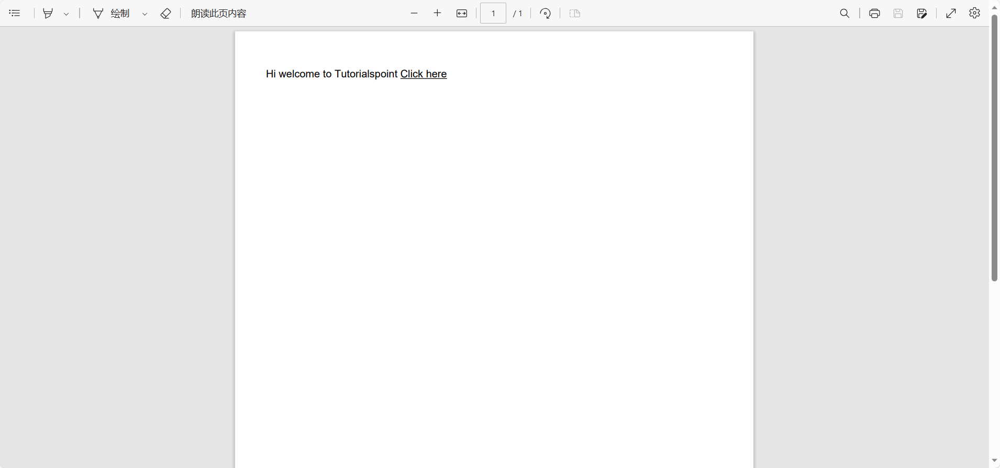

### 在PDF中创建线注释

可以通过实例化Document类来创建一个空的 PDF 文档。  在实例化此类时，需要将PdfDocument对象作为参数传递给其构造函数。

创建 PdfAnnotation 对象，该PdfAnnotation类的包`com.itextpdf.kernel.pdf.annot`代表的是所有注释的超类。在其派生类中，PdfLineAnnotation类表示线注释。设置注释的标题和内容，分别使用PdfAnnotation类的`setTitle()`和`setContents()`方法设置注释的标题和内容，如下所示。

```java
import com.itextpdf.kernel.colors.DeviceRgb;
import com.itextpdf.kernel.geom.Rectangle;
import com.itextpdf.kernel.pdf.PdfDocument;
import com.itextpdf.kernel.pdf.PdfPage;
import com.itextpdf.kernel.pdf.PdfString;
import com.itextpdf.kernel.pdf.PdfWriter;
import com.itextpdf.kernel.pdf.annot.PdfAnnotation;
import com.itextpdf.kernel.pdf.annot.PdfLineAnnotation;
import com.itextpdf.layout.Document;

import java.io.FileNotFoundException;

public class LineAnnotation {
	public static void main(String[] args) throws FileNotFoundException {
		String dest = "G:/L ZHEN/Desktop/PDFTest.pdf";

		PdfWriter writer = new PdfWriter(dest);
		
		PdfDocument pdfDocument = new PdfDocument(writer);
		
		Document document = new Document(pdfDocument);

		PdfPage page = pdfDocument.addNewPage();

		// Creating a PdfLineAnnotation object
		Rectangle rect = new Rectangle(20, 790, page.getPageSize().getWidth() - 40, 790);
		PdfAnnotation annotation = new PdfLineAnnotation(rect, new float[]{20, 790, page.getPageSize().getWidth() - 20, 790});

		// Setting color of the PdfLineAnnotation
		annotation.setColor(new DeviceRgb(0, 255, 0));

		// Setting title to the PdfLineAnnotation
		annotation.setTitle(new PdfString("iText"));

		// Setting contents of the PdfLineAnnotation
		annotation.setContents("Hi welcome to Tutorialspoint");

		// Adding annotation to the page's annotation collection
		page.addAnnotation(annotation);

		// Closing the document
		document.close();

		System.out.println("Annotation added");
	}
}

```

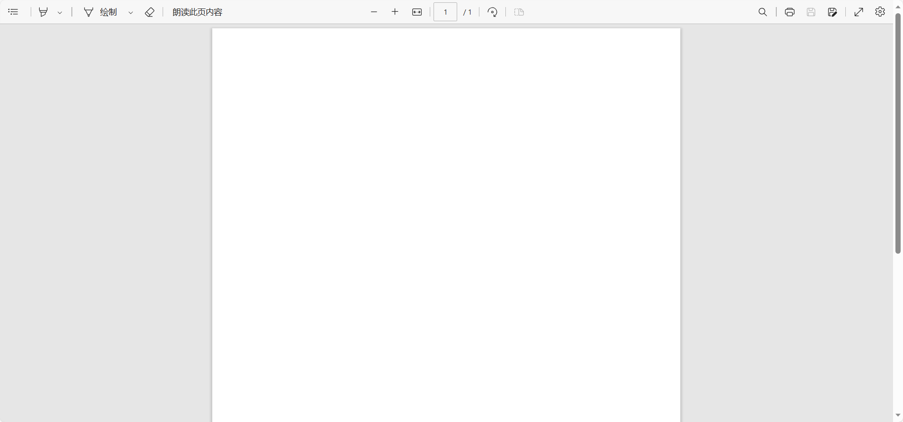

啥也没有，鼠标从左侧移过去就显示

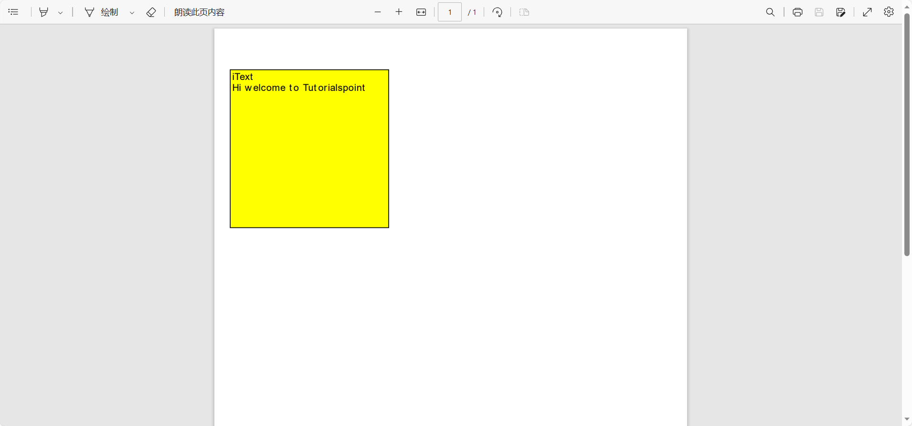

### 在PDF中创建标记注释

可以通过实例化Document类来创建一个空的 PDF 文档。  在实例化此类时，需要将PdfDocument对象作为参数传递给其构造函数。  要在 PDF 文档中使用文本注释，需要创建PdfTextAnnotation类的对象并将其添加到PdfPage。

创建 PdfAnnotation 对象，该PdfAnnotation类的包`com.itextpdf.kernel.pdf.annot`代表所有注释的超类。
在其派生类中，PdfTextMarkupAnnotation类表示文本标记注释。设置注释的标题和内容，分别使用PdfAnnotation类的`setTitle()`和`setContents()`方法设置注释的标题和内容。

```java
import com.itextpdf.kernel.colors.DeviceRgb;
import com.itextpdf.kernel.geom.Rectangle;
import com.itextpdf.kernel.pdf.PdfDocument;
import com.itextpdf.kernel.pdf.PdfPage;
import com.itextpdf.kernel.pdf.PdfString;
import com.itextpdf.kernel.pdf.PdfWriter;
import com.itextpdf.kernel.pdf.annot.PdfAnnotation;
import com.itextpdf.kernel.pdf.annot.PdfTextMarkupAnnotation;
import com.itextpdf.layout.Document;

public class MarkupAnnotation {    
   public static void main(String args[]) throws Exception {   
      // Creating a PdfDocument object       
      String file = "C:/itextExamples/markupAnnotation.pdf";        
      PdfDocument pdfDoc = new PdfDocument(new PdfWriter(file));                   
   
      // Creating a Document object       
      Document doc = new Document(pdfDoc);                      
      
      // Creating a PdfTextMarkupAnnotation object       
      Rectangle rect = new Rectangle(105, 790, 64, 10);       
      float[] floatArray = new float[]{169, 790, 105, 790, 169, 800, 105, 800};
      PdfAnnotation annotation = 
         PdfTextMarkupAnnotation.createHighLight(rect,floatArray);
      
      // Setting color to the annotation       
	  annotation.setColor(new DeviceRgb(0, 255, 0));
      
      // Setting title to the annotation       
      annotation.setTitle(new PdfString("Hello!"));
      
      // Setting contents to the annotation       
      annotation.setContents(new PdfString("Hi welcome to Tutorialspoint"));
      
      // Creating a new Pdfpage
      PdfPage pdfPage = pdfDoc.addNewPage();
      
      // Adding annotation to a page in a PDF       
      pdfPage.addAnnotation(annotation);
      
      // Closing the document
      doc.close();  
      
      System.out.println("Annotation added successfully");       
   }     
}      
```

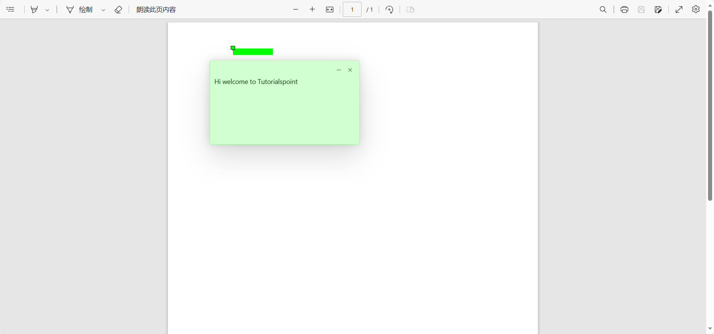

### 在PDF中创建圆形注释

可以通过实例化Document类来创建一个空的 PDF 文档。  在实例化此类时，需要将PdfDocument对象作为参数传递给其构造函数。  要在 PDF 文档中使用文本注释，您需要创建 PdfTextAnnotation 类的对象并将其添加到Pdfpage。

```java
import com.itextpdf.kernel.colors.DeviceRgb;
import com.itextpdf.kernel.geom.Rectangle;
import com.itextpdf.kernel.pdf.PdfDocument;
import com.itextpdf.kernel.pdf.PdfPage;
import com.itextpdf.kernel.pdf.PdfString;
import com.itextpdf.kernel.pdf.PdfWriter;
import com.itextpdf.kernel.pdf.annot.PdfAnnotation;
import com.itextpdf.kernel.pdf.annot.PdfCircleAnnotation;
import com.itextpdf.layout.Document;

public class CircleAnnotation {    
   public static void main(String args[]) throws Exception {   
      // Creating a PdfDocument object       
      String file = "C:/itextExamples// circleAnnotation.pdf";             
      PdfDocument pdf = new PdfDocument(new PdfWriter(file));                   
   
      // Creating a Document object       
      Document doc = new Document(pdf);                      
   
      // Creating a PdfCircleAnnotation object       
      Rectangle rect = new Rectangle(150, 770, 50, 50);       
      PdfAnnotation annotation = new PdfCircleAnnotation(rect);              
   
      // Setting color to the annotation       
	  annotation.setColor(new DeviceRgb(0, 255, 0));
   
      // Setting title to the annotation       
      annotation.setTitle(new PdfString("circle annotation"));              
   
      // Setting contents of the annotation 
      annotation.setContents(new PdfString("Hi welcome to Tutorialspoint"));             
      
      // Creating a new page        
      PdfPage page = pdf.addNewPage();              
      
      // Adding annotation to a page in a PDF       
      page.addAnnotation(annotation);                       
      
      // Closing the document       
      doc.close();  
      
      System.out.println("Annotation added successfully");       
   }   
}
```

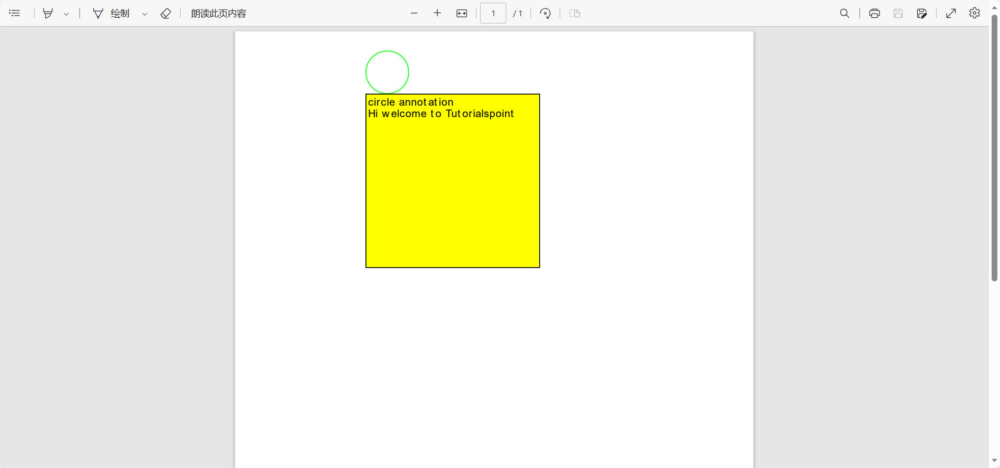

### 在PDF上绘制圆弧

可以通过实例化Document类来创建一个空的 PDF 文档。  在实例化此类时，需要将PdfDocument对象作为参数传递给其构造函数。  上绘制一个PdfDocument电弧，实例化PdfCanvas类的包的`com.itextpdf.kernel.pdf.canvas`和创建使用电弧弧（）此类的方法。

创建一个 PdfCanvas 对象，使用PdfDocument类的`addNewPage()`方法创建一个新的PdfPage类。
实例化PdfCanvas封装的对象`com.itextpdf.kernel.pdf.canvas`通过将上面创建PdfPage目的是这个类的构造函数。
绘制圆弧，使用Canvas类的arc()方法绘制圆弧，使用`fill()`方法填充

```java
import com.itextpdf.kernel.pdf.PdfDocument;
import com.itextpdf.kernel.pdf.PdfPage;
import com.itextpdf.kernel.pdf.PdfWriter;
import com.itextpdf.kernel.pdf.canvas.PdfCanvas;
import com.itextpdf.layout.Document;

public class DrawingArc {
   public static void main(String args[]) throws Exception {
      // Creating a PdfWriter
      String dest = "C:/itextExamples/drawingArc.pdf";
      PdfWriter writer = new PdfWriter(dest);      

      // Creating a PdfDocument object
      PdfDocument pdfDoc = new PdfDocument(writer);

      // Creating a Document object
      Document doc = new Document(pdfDoc);

      // Creating a new page
      PdfPage pdfPage = pdfDoc.addNewPage();

      // Creating a PdfCanvas object
      PdfCanvas canvas = new PdfCanvas(pdfPage);

      // Drawing an arc
      canvas.arc(50, 50, 300, 545, 0, 360);

      // Filling the arc
      canvas.fill();              

      // Closing the document
      doc.close();
      
      System.out.println("Object drawn on pdf successfully");       
   }     
} 
```

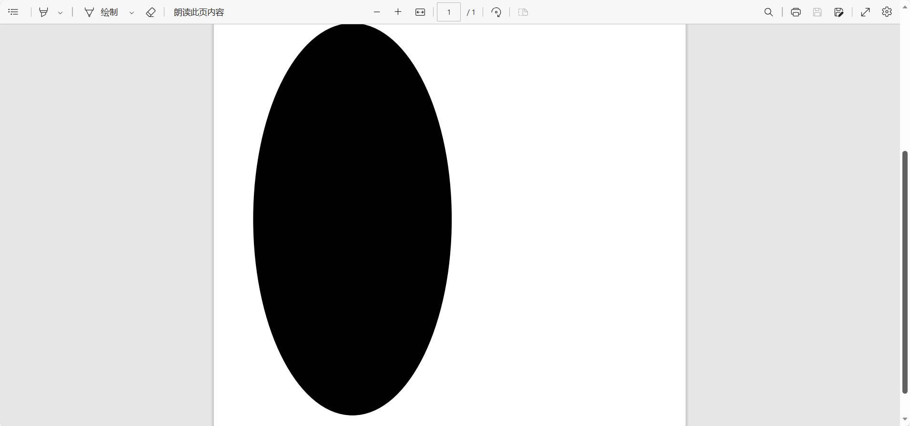

### 在PDF上画线

可以通过实例化Document类来创建一个空的 PDF 文档。在实例化此类时，需要将PdfDocument对象作为参数传递给其构造函数。  在 PdfDocument 上画一条线 实例化包`com.itextpdf.kernel.pdf.canvas`的PdfCanvas类，并使用该类的`moveTo()`和`lineTO()`方法创建一条线。

创建一个 PdfCanvas 对象，使用PdfDocument类的`addNewPage()`方法创建一个新的PdfPage类。实例化PdfCanvas封装的对象`com.itextpdf.kernel.pdf.canvas`通过将上面创建PdfPage目的是这个类的构造函数，如下所示。
画线，使用Canvas类的moveTO()方法设置线的初始点，如下所示。

```JAVA
// Initial point of the line 
canvas.moveTo(100, 300); 
```

现在，使用lineTo()方法绘制一条从该点到另一点的线，如下所示。

```JAVA
// Drawing the line 
canvas.lineTo(500, 300); 
```

```java
import com.itextpdf.kernel.pdf.PdfDocument;
import com.itextpdf.kernel.pdf.PdfPage;
import com.itextpdf.kernel.pdf.PdfWriter;
import com.itextpdf.kernel.pdf.canvas.PdfCanvas;
import com.itextpdf.layout.Document;

public class DrawingLine {     
   public static void main(String args[]) throws Exception {            
      // Creating a PdfWriter       
      String dest = "C:/itextExamples/drawingLine.pdf";             
      PdfWriter writer = new PdfWriter(dest);           
      
      // Creating a PdfDocument object       
      PdfDocument pdfDoc = new PdfDocument(writer);                   
      
      // Creating a Document object       
      Document doc = new Document(pdfDoc);                
      
      // Creating a new page       
      PdfPage pdfPage = pdfDoc.addNewPage();               
      
      // Creating a PdfCanvas object       
      PdfCanvas canvas = new PdfCanvas(pdfPage);              
      
      // Initial point of the line       
      canvas.moveTo(100, 300);              
      
      // Drawing the line       
      canvas.lineTo(500, 300);           
      
      // Closing the path stroke       
      canvas.closePathStroke();              
      
      // Closing the document       
      doc.close();  
      
      System.out.println("Object drawn on pdf successfully");             
   }     
}
```

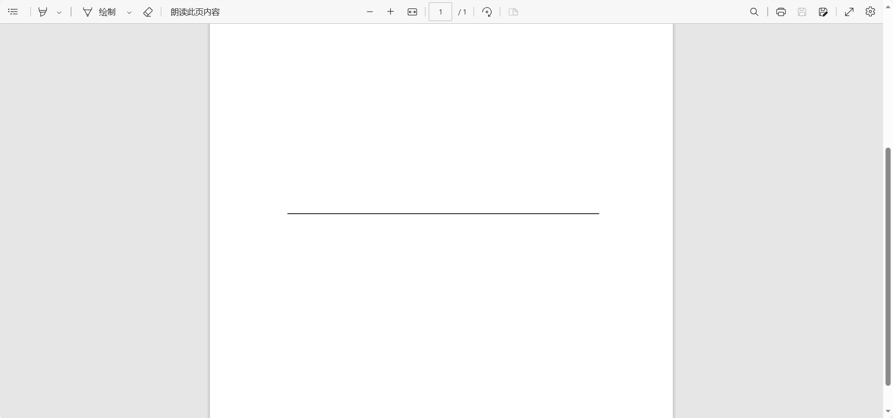

### 在PDF上画圆

可以通过实例化Document类来创建一个空的 PDF 文档。  在实例化此类时，需要将PdfDocument对象作为参数传递给其构造函数。  要在 PdfDocument 上绘制圆，请实例化包`com.itextpdf.kernel.pdf.canvas`的PdfCanvas类并调用该类的circle\(\)方法

创建一个 PdfCanvas 对象，使用PdfDocument类的`addNewPage()`方法创建一个新的PdfPage类。实例化PdfCanvas封装的对象`com.itextpdf.kernel.pdf.canvas`通过将PdfPage对象这一类的构造函数。设置颜色使用Canvas类的`setColor()`方法设置圆圈的颜色。

```java
// Setting color to the circle 
Color color = Color.GREEN; 
canvas.setColor(color, true);
```

绘制圆圈 通过调用Canvas的circle()方法绘制一个圆，如下所示

```java
// creating a circle 
canvas.circle(300, 400, 200);
```

```java
import com.itextpdf.kernel.colors.DeviceRgb;
import com.itextpdf.kernel.pdf.PdfDocument;
import com.itextpdf.kernel.pdf.PdfPage;
import com.itextpdf.kernel.pdf.PdfWriter;
import com.itextpdf.kernel.pdf.canvas.PdfCanvas;
import com.itextpdf.layout.Document; 

public class DrawingCircle {      
   public static void main(String args[]) throws Exception {           
      // Creating a PdfWriter       
      String dest = "C:/itextExamples/drawingCircle.pdf";           
      PdfWriter writer = new PdfWriter(dest);            
      
      // Creating a PdfDocument object       
      PdfDocument pdfDoc = new PdfDocument(writer);

      // Creating a Document object
      Document doc = new Document(pdfDoc);
      
      // Creating a new page
      PdfPage pdfPage = pdfDoc.addNewPage();
      
      // Creating a PdfCanvas object
      PdfCanvas canvas = new PdfCanvas(pdfPage);  
      
      // Setting color to the circle
	  PdfCanvas canvas = new PdfCanvas(pdfPage);
      
      // creating a circle
      canvas.circle(300, 400, 200);
      
      // Filling the circle       
      canvas.fill();             
      
      // Closing the document 
      doc.close();  
      
      System.out.println("Object drawn on pdf successfully");
   }     
} 
```

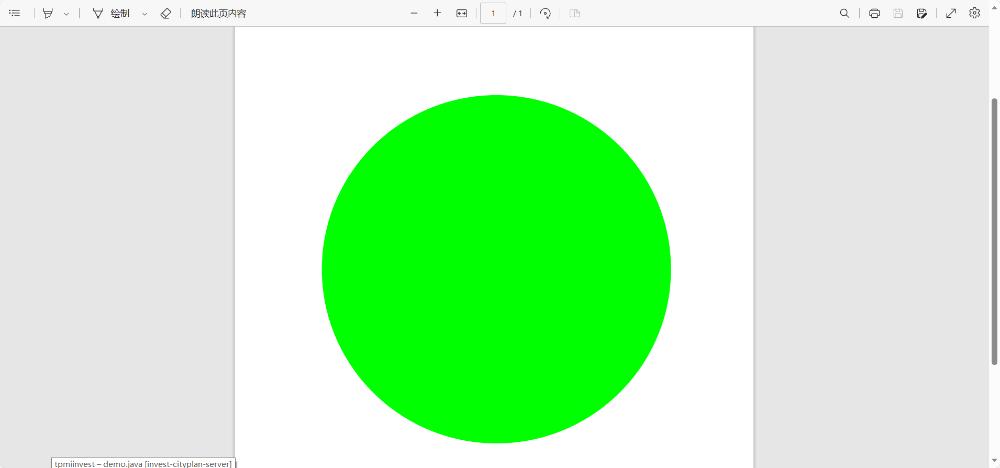

### 设置PDF中文本的字体

可以通过实例化Document类来创建一个空的 PDF 文档。  在实例化此类时，需要将PdfDocument对象作为参数传递给其构造函数。要将段落添加到文档中，需要实例化Paragraph类并使用add\(\)方法将此对象添加到文档中。可以分别使用`setFontColor()`和`setFont()`方法为文本设置颜色和字体。

创建文本，通过实例化包`com.itextpdf.layout.element`的Text类来创建文本
设置文字的字体和颜色：
创建PdfFont使用对象的`createFont()`之类的方法PdfFontFactory封装`com.itextpdf.kernel.font`

```java
// Setting font of the text PdfFont 
font = PdfFontFactory.createFont(StandardFonts.HELVETICA_BOLD);
```

现在，使用Text类的`setFont()`方法将字体设置为该方法。将PdfFont对象作为参数传递。

```java
text1.setFont(font);
```

要为文本设置颜色，请调用Text 类的setFontColor()方法，如下所示。

```java
// Setting font color 
text1.setFontColor(new DeviceRgb(0, 255, 0));
```

```java
import com.itextpdf.io.font.constants.StandardFonts;
import com.itextpdf.kernel.colors.DeviceRgb;
import com.itextpdf.kernel.font.PdfFont;
import com.itextpdf.kernel.font.PdfFontFactory;
import com.itextpdf.kernel.pdf.PdfDocument;
import com.itextpdf.kernel.pdf.PdfWriter;
import com.itextpdf.layout.Document;
import com.itextpdf.layout.element.Paragraph;
import com.itextpdf.layout.element.Text;

public class FormatingTheText {     
   public static void main(String args[]) throws Exception {        
      // Creating a PdfWriter object   
      String dest = "C:/itextExamples/fonts.pdf";   
      
       PdfWriter writer = new PdfWriter(dest);

       // Creating a PdfDocument object      
       PdfDocument pdf = new PdfDocument(writer);

       // Creating a Document object       
       Document doc = new Document(pdf);

       // Creating text object       
       Text text1 = new Text("Tutorialspoint");

       // Setting font of the text       
       PdfFont font = PdfFontFactory.createFont(StandardFonts.HELVETICA_BOLD);
       text1.setFont(font);

       // Setting font color
       text1.setFontColor(new DeviceRgb(0, 255, 0));

       // Creating text object
       Text text2 = new Text("Simply Easy Learning");
       text2.setFont(PdfFontFactory.createFont(StandardFonts.HELVETICA));

       // Setting font color
       text2.setFontColor(new DeviceRgb(0, 128, 0));

       // Creating Paragraph
       Paragraph paragraph1 = new Paragraph();

       // Adding text1 to the paragraph
       paragraph1.add(text1);
       paragraph1.add(text2);

       // Adding paragraphs to the document
       doc.add(paragraph1);
       doc.close();
      
      System.out.println("Text added to pdf ..");   
   }     
}   
```

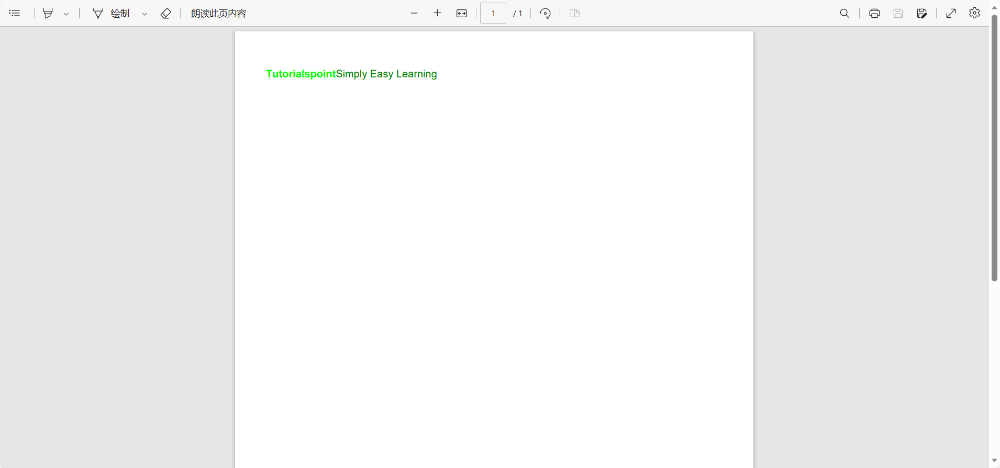

### 缩小PDF中的内容

使用AffineTransform类的`getScaleInstance()`方法，缩小源文档页面的内容。

```java
// Shrink original page content using transformation matrix 
AffineTransform transformationMatrix = AffineTransform.getScaleInstance(   page.getPageSize().getWidth()/ orig.getWidth()/2,page.getPageSize().getHeight()/ orig.getHeight()/2); 
```

将上一步中创建的仿射变换矩阵连接到目标 PDF 文档的画布对象的矩阵。

```java
// Concatenating the affine transform matrix to the current matrix 
PdfCanvas canvas = new PdfCanvas(page);       
canvas.concatMatrix(transformationMatrix); 
```

现在，将页面副本添加到源文档的目标 PDF的画布对象中。

```java
// Add the object to the canvas 
PdfFormXObject pageCopy = origPage.copyAsFormXObject(destpdf); 
canvas.addXObject(pageCopy, 0, 0); 
```

```java
import com.itextpdf.kernel.geom.AffineTransform;
import com.itextpdf.kernel.geom.Rectangle;
import com.itextpdf.kernel.pdf.PdfDocument;
import com.itextpdf.kernel.pdf.PdfPage;
import com.itextpdf.kernel.pdf.PdfReader;
import com.itextpdf.kernel.pdf.PdfWriter;
import com.itextpdf.kernel.pdf.canvas.PdfCanvas;
import com.itextpdf.kernel.pdf.xobject.PdfFormXObject;
import com.itextpdf.layout.Document;

public class ShrinkPDF {    
   public static void main(String args[]) throws Exception {
      // Creating a PdfWriter object
      String dest = "C:/itextExamples/shrinking.pdf";
      PdfWriter writer = new PdfWriter(dest);
      
      // Creating a PdfReader
      String src = "C:/itextExamples/pdfWithImage.pdf";
      PdfReader reader = new PdfReader(src);
      
      // Creating a PdfDocument objects
      PdfDocument destpdf = new PdfDocument(writer);
      PdfDocument srcPdf = new PdfDocument(reader);
         
      // Opening a page from the existing PDF 
      PdfPage origPage = srcPdf.getPage(1);
         
      // Getting the page size
      Rectangle orig = origPage.getPageSizeWithRotation();
         
      // Adding a page to destination Pdf
      PdfPage page = destpdf.addNewPage();
         
      // Scaling the image in a Pdf page     
      AffineTransform transformationMatrix = AffineTransform.getScaleInstance(
         page.getPageSize().getWidth()/orig.getWidth()/2,
         page.getPageSize().getHeight()/ orig.getHeight()/2);
      
      // Shrink original page content using transformation matrix
      PdfCanvas canvas = new PdfCanvas(page);
      canvas.concatMatrix(transformationMatrix);
      
      // Add the object to the canvas
      PdfFormXObject pageCopy = origPage.copyAsFormXObject(destpdf);
      canvas.addXObject(pageCopy, 0, 0);
      
      // Creating a Document object
      Document doc = new Document(destpdf);
      
      // Closing the document
      doc.close();
      
      System.out.println("Table created successfully..");
   }
}      
```

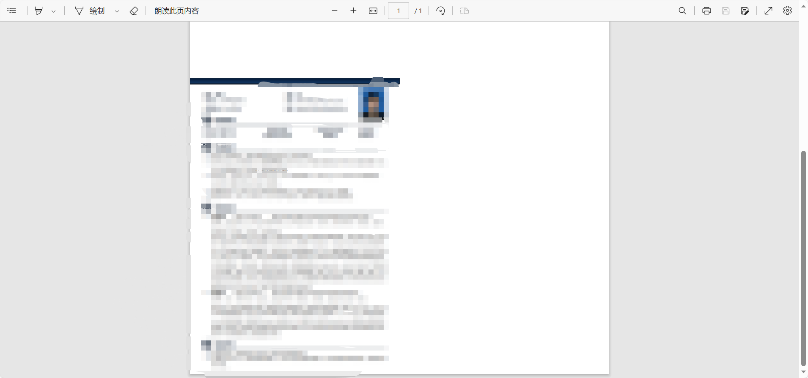

### 平铺PDF页面

以下 Java 程序演示了如何使用 iText 库将 PDF 页面的内容平铺到不同的页面。

它创建一个名为tilingPdfPages.pdf的 PDF 文档并将其保存在路径C:/itextExamples/ 中。

```java
import com.itextpdf.kernel.geom.AffineTransform;
import com.itextpdf.kernel.geom.PageSize;
import com.itextpdf.kernel.geom.Rectangle;
import com.itextpdf.kernel.pdf.PdfDocument;
import com.itextpdf.kernel.pdf.PdfPage;
import com.itextpdf.kernel.pdf.PdfReader;
import com.itextpdf.kernel.pdf.PdfWriter;
import com.itextpdf.kernel.pdf.canvas.PdfCanvas;
import com.itextpdf.kernel.pdf.xobject.PdfFormXObject;

public class TilingPDFPages {      
   public static void main(String args[]) throws Exception {             
      // Creating a PdfWriter object       
      String dest = "C:/itextExamples/tilingPdfPages.pdf";       
      PdfWriter writer = new PdfWriter(dest);               
      
      // Creating a PdfReader       
      String src = "C:/itextExamples/pdfWithImage.pdf";       
      PdfReader reader = new PdfReader(src);        
      
      // Creating a PdfDocument objects       
      PdfDocument destpdf = new PdfDocument(writer);               
      PdfDocument srcPdf = new PdfDocument(reader);               
      
      // Opening a page from the existing PDF       
      PdfPage origPage = srcPdf.getPage(1);               
      
      // Getting the page size       
      Rectangle orig = origPage.getPageSizeWithRotation();    
      
      // Getting the size of the page       
      PdfFormXObject pageCopy = origPage.copyAsFormXObject(destpdf);  
      
      // Tile size 
      Rectangle tileSize = PageSize.A4.rotate();       
      AffineTransform transformationMatrix = 
         AffineTransform.getScaleInstance(tileSize.getWidth() / orig.getWidth() * 
         2f, tileSize.getHeight() / orig.getHeight() * 2f);              
      
      // The first tile       
      PdfPage page = 
      destpdf.addNewPage(PageSize.A4.rotate());       
      
      PdfCanvas canvas = new PdfCanvas(page);       
      canvas.concatMatrix(transformationMatrix);      
      canvas.addXObject(pageCopy, 0, -orig.getHeight() / 2f);              
      
      // The second tile       
      page = destpdf.addNewPage(PageSize.A4.rotate());       
      canvas = new PdfCanvas(page);       
      canvas.concatMatrix(transformationMatrix);        
      canvas.addXObject(pageCopy, -orig.getWidth() / 2f, -orig.getHeight() / 2f);
      
      // The third tile
      page = destpdf.addNewPage(PageSize.A4.rotate());
      canvas = new PdfCanvas(page);
      canvas.concatMatrix(transformationMatrix);
      canvas.addXObject(pageCopy, 0, 0);    
      
      // The fourth tile
      page = destpdf.addNewPage(PageSize.A4.rotate());
      canvas = new PdfCanvas(page);
      canvas.concatMatrix(transformationMatrix);
      canvas.addXObject(pageCopy, -orig.getWidth() / 2f, 0);
      
      // closing the documents
      destpdf.close();
      srcPdf.close();
      
      System.out.println("PDF created successfully..");
   }
}
```

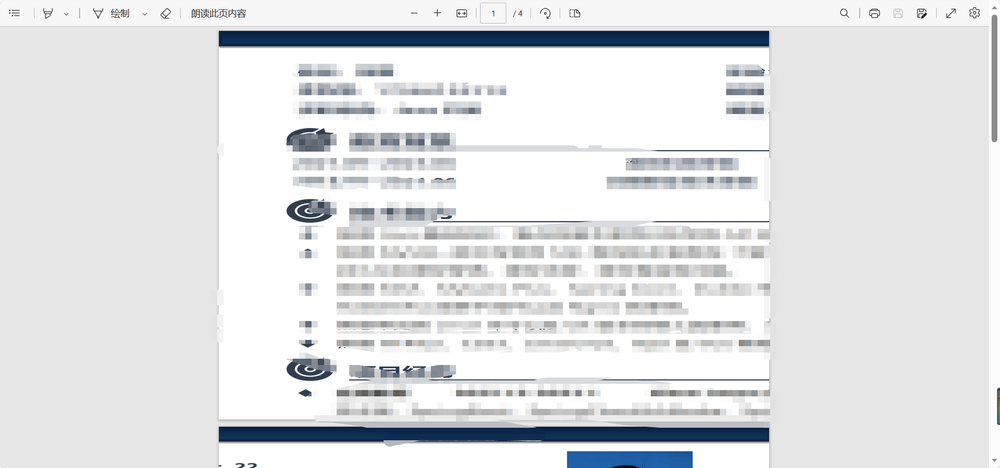

### 动态添加表格且自动换页

```java
import com.itextpdf.kernel.geom.PageSize;
import com.itextpdf.kernel.pdf.PdfDocument;
import com.itextpdf.kernel.pdf.PdfWriter;
import com.itextpdf.layout.Document;
import com.itextpdf.layout.element.Cell;
import com.itextpdf.layout.element.Paragraph;
import com.itextpdf.layout.element.Table;
import com.itextpdf.layout.properties.HorizontalAlignment;

import java.io.IOException;

public class TableWithAutoPageBreak {
	public static void main(String[] args) throws IOException {
		String outputFilePath = "G:\\L ZHEN\\Desktop\\PDFTest.pdf";

		// Create a new PDF document
		PdfWriter writer = new PdfWriter(outputFilePath);
		PdfDocument pdfDocument = new PdfDocument(writer);
		Document document = new Document(pdfDocument, PageSize.A4);

		// Define table properties
		Table table = new Table(3);
		table.setHorizontalAlignment(HorizontalAlignment.LEFT);

		// Add table headers
		for (String columnHeader : new String[]{"TableColumn1", "TableColumn2", "TableColumn3"}) {
			Cell headerCell = new Cell().add(new Paragraph(columnHeader));
			table.addHeaderCell(headerCell);
		}

		// Add table rows
		for (int i = 1; i <= 150; i++) {
			for (int j = 1; j <= 3; j++) {
				table.addCell("Test" + i + "-" + j);
			}
		}

		// Add the table to the document
		document.add(table);

		// Close the document
		document.close();

		System.out.println("PDF created successfully at: " + outputFilePath);
	}
}

```

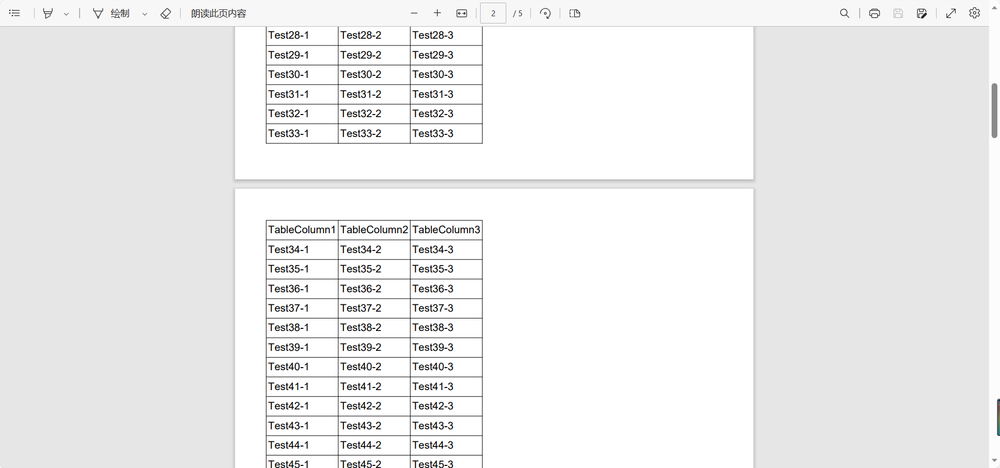

### Merger两个PDF

```java
import com.itextpdf.kernel.pdf.PdfDocument;
import com.itextpdf.kernel.pdf.PdfReader;
import com.itextpdf.kernel.pdf.PdfWriter;
import com.itextpdf.kernel.utils.PdfMerger;

import java.io.IOException;

public class PdfMerge {
	private static final String FILE1 = "G:\\L ZHEN\\Desktop\\PDFTest.pdf";
	private static final String FILE2 = "G:\\L ZHEN\\Desktop\\停水温馨提示.pdf";
	private static final String OUTPUT_FOLDER = "G:\\L ZHEN\\Desktop\\";

	public static void main(String args[]) throws IOException {
		PdfDocument pdfDocument = new PdfDocument(new PdfReader(FILE1), new PdfWriter(OUTPUT_FOLDER + "merged.pdf"));
		PdfDocument pdfDocument2 = new PdfDocument(new PdfReader(FILE2));

		PdfMerger merger = new PdfMerger(pdfDocument);
		merger.merge(pdfDocument2, 1, pdfDocument2.getNumberOfPages());

		pdfDocument2.close();
		pdfDocument.close();
	}
}
```

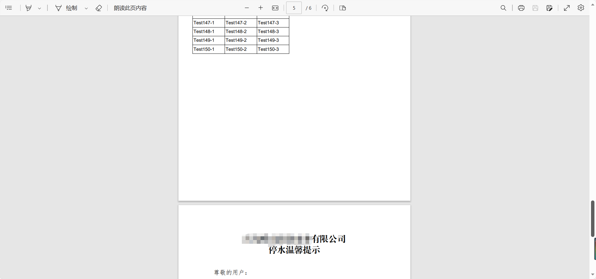

### 拆分PDF

```java
import com.itextpdf.kernel.pdf.PdfDocument;
import com.itextpdf.kernel.pdf.PdfReader;
import com.itextpdf.kernel.pdf.PdfWriter;
import com.itextpdf.kernel.utils.PageRange;
import com.itextpdf.kernel.utils.PdfSplitter;

import java.io.File;
import java.io.FileNotFoundException;
import java.io.IOException;

public class PDFSplitter {
	private static final String ORIG = "G:\\L ZHEN\\Desktop\\merged.pdf";
	private static final String OUTPUT_FOLDER = "G:\\L ZHEN\\Desktop\\";


	public static void main(String args[]) throws IOException {
		final int maxPageCount = 2; // create a new PDF per 2 pages from the original file
		PdfDocument pdfDocument = new PdfDocument(new PdfReader(new File(ORIG)));
		PdfSplitter pdfSplitter = new PdfSplitter(pdfDocument) {
			int partNumber = 1;

			@Override
			protected PdfWriter getNextPdfWriter(PageRange documentPageRange) {
				try {
					return new PdfWriter(OUTPUT_FOLDER + "splitDocument_" + partNumber++ + ".pdf");
				} catch (final FileNotFoundException ignored) {
					throw new RuntimeException();
				}
			}
		};

		//maxPageCount 参数指定每个子文档的最大页数。
		//(pdfDoc, pageRange) -> pdfDoc.close() 是一个 lambda 表达式，它定义了在每次分割后应该执行的操作。
		// 在这个 lambda 表达式中，pdfDoc 是当前被拆分的子文档，而 pageRange 是当前子文档包含的页码范围。
		// 在这里，lambda 表达式的主要作用是关闭当前子文档，确保释放资源。
		pdfSplitter.splitByPageCount(maxPageCount, (pdfDoc, pageRange) -> pdfDoc.close());
		pdfDocument.close();
	}
}

```

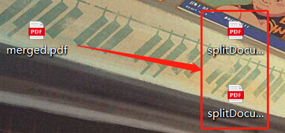

### 从PDF删除某几页

```java
import com.itextpdf.kernel.pdf.PdfDocument;
import com.itextpdf.kernel.pdf.PdfReader;
import com.itextpdf.kernel.pdf.PdfWriter;

import java.io.IOException;

public class PDFPageDeleter {
	private static final String ORIG = "/uploads/delete.pdf";
	private static final String OUTPUT_FOLDER = "/myfiles/";

	public static void main(String[] args) throws IOException {
		PdfDocument pdfDocument = new PdfDocument(new PdfReader(ORIG), new PdfWriter(OUTPUT_FOLDER + "deleted.pdf"));
		pdfDocument.removePage(1); //Note that as you remove a page the number of pages in your PDF will change
		pdfDocument.close();
	}
}
```

### HTML字符转PDF

```XML
        <!-- https://mvnrepository.com/artifact/com.itextpdf/html2pdf -->
        <dependency>
            <groupId>com.itextpdf</groupId>
            <artifactId>html2pdf</artifactId>
            <version>5.0.1</version>
        </dependency>
```

```java
import com.itextpdf.html2pdf.ConverterProperties;
import com.itextpdf.html2pdf.HtmlConverter;
import com.itextpdf.kernel.pdf.PdfWriter;

import java.io.FileOutputStream;
import java.io.IOException;
import java.io.OutputStream;

public class HtmlToPDF {
	public static void main(String[] args) throws Exception {
		String html = "<p><span style=\"font-family: Microsoft YaHei;\">微软雅黑: 粗体前A<strong>A粗体A</strong>A粗体后</span></p>\n" +
				"<p><span style=\"font-family: SimSun;\">宋体: 粗体前A<strong>A粗体A</strong>A粗体后</span></p>\n" +
				"<p><span style=\"font-family: STHeiti;\">黑体: 粗体前A<strong>A粗体A</strong>A粗体后</span></p>" +
				"<p><span style=\"font-family: Times New Roman;\">Times New Roman: pre bdA<strong>AbdA</strong>Aaft bd</span></p>\n";

		try (FileOutputStream fileOutputStream = new FileOutputStream("D:/a.pdf")) {
			convert(html, fileOutputStream);
		}
	}

	public static void convert(String html, OutputStream outputStream) throws IOException {
		ConverterProperties props = new ConverterProperties();
		PdfWriter writer = new PdfWriter(outputStream);
		HtmlConverter.convertToPdf(html, writer, props);
	}
}

```

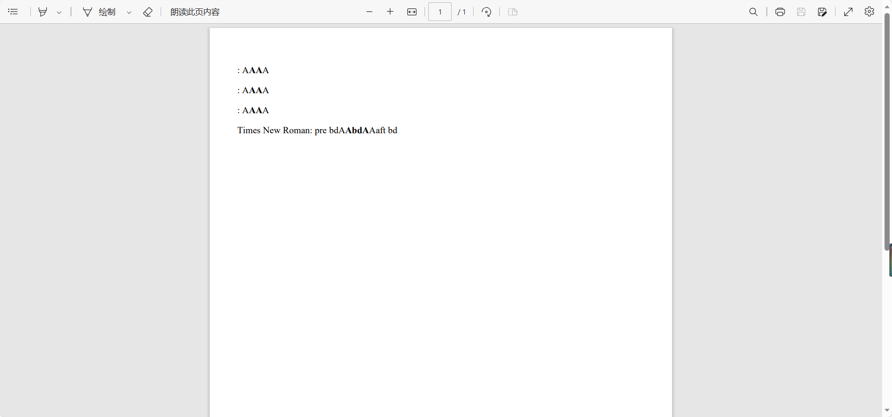

### HTML文件转PDF

```xml
        <!-- https://mvnrepository.com/artifact/com.itextpdf/html2pdf -->
        <dependency>
            <groupId>com.itextpdf</groupId>
            <artifactId>html2pdf</artifactId>
            <version>5.0.1</version>
        </dependency>
```

```java
import com.itextpdf.html2pdf.ConverterProperties;
import com.itextpdf.html2pdf.HtmlConverter;

import java.io.File;
import java.io.FileInputStream;
import java.io.FileOutputStream;
import java.io.IOException;

public class HtmlToPDF {
	private static final String ORIG = "G:\\L ZHEN\\Desktop\\inde.html";
	private static final String OUTPUT_FOLDER = "G:\\L ZHEN\\Desktop\\";

	public static void main(String[] args) throws IOException {
		File htmlSource = new File(ORIG);
		File pdfDest = new File(OUTPUT_FOLDER + "output.pdf");

		FileInputStream htmlStream = new FileInputStream(htmlSource);
		FileOutputStream pdfStream = new FileOutputStream(pdfDest);

		ConverterProperties converterProperties = new ConverterProperties();
		HtmlConverter.convertToPdf(htmlStream, pdfStream, converterProperties);

		htmlStream.close();
		pdfStream.close();

		System.out.println("HTML converted to PDF successfully.");
	}

}


```

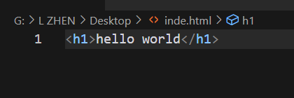

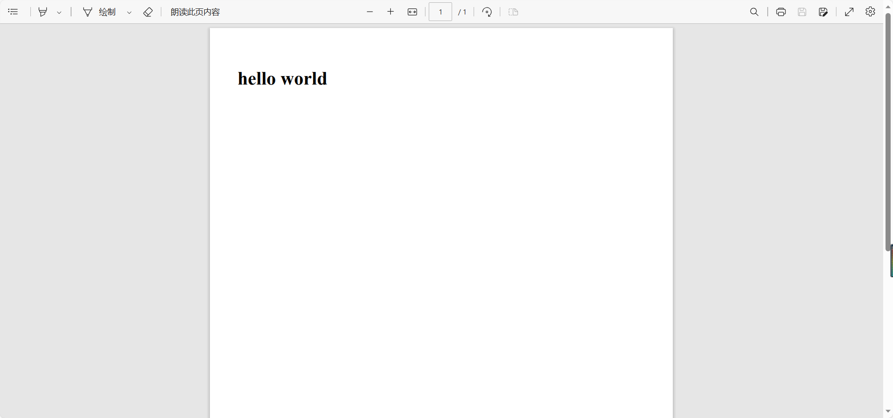

### 通过Thymeleaf模板渲染生成

配置Thymeleaf

```yaml
spring:
    thymeleaf:
        prefix: classpath:/templates/
        suffix: .html
```

一个thymeleaf的html模板

```html
<!DOCTYPE html>
<html xmlns:th="http://www.thymeleaf.org">
<head>
    <title>Thymeleaf PDF Example</title>
</head>
<body>
<h1 th:text="${message}"></h1>
</body>
</html>

```

1. 先渲染html模板
2. 再生成pdf
3. 将pdf保存到服务器
4. 同时响应到前端浏览器

```java
	@Autowired
	private TemplateEngine templateEngine;

	@GetMapping("/testHtmlToPdf")
	public void testHtmlToPdf(Model model, HttpServletResponse response) throws IOException {
		String templateName = "index"; // Thymeleaf 模板文件名（不包含扩展名）
		String message = "Hello from Thymeleaf and iText!";

		// 渲染 Thymeleaf 模板
		Context context = new Context();
		context.setVariable("message", message);
		String htmlContent = templateEngine.process(templateName, context);

		// 使用 iText 7 生成 PDF
		ByteArrayOutputStream outputStream = new ByteArrayOutputStream();
		ConverterProperties converterProperties = new ConverterProperties();
		HtmlConverter.convertToPdf(htmlContent, outputStream, converterProperties);

		byte[] pdfBytes = outputStream.toByteArray();

		// 保存 PDF 到服务器指定路径
		String pdfFilePath = "G:\\L ZHEN\\Desktop\\index.pdf"; // 替换为实际的路径
		File pdfFile = new File(pdfFilePath);
		try (FileOutputStream outputStreamLocal = new FileOutputStream(pdfFile)) {
			outputStreamLocal.write(pdfBytes);
		}

		// 设置 HTTP 响应头
		response.setContentType("application/pdf");
		response.setHeader("Content-Disposition", "attachment; filename=my-pdf.pdf");

		// 将 PDF 输出到响应
		response.getOutputStream().write(pdfBytes);
		response.getOutputStream().flush();
	}
```

### 通过FreeMark模板渲染生成

如果您想使用 FreeMarker 来创建 PDF，然后使用 iText 7 将其转换为 PDF 文件，可以按照以下步骤进行操作：

1. 创建一个 FreeMarker 模板，用于生成 PDF 的内容。
2. 在控制器中使用 FreeMarker 渲染模板并生成 HTML 内容。
3. 使用 iText 7 将 HTML 内容转换为 PDF。
4. 可以选择将生成的 PDF 文件保存到服务器或将其响应到浏览器。

下面是一个示例代码，演示如何实现这一目标：

1.创建 FreeMarker 模板文件 `my-template.ftl`，放置在 `src/main/resources/templates` 目录下：

```html
<!DOCTYPE html>
<html>
<head>
    <title>FreeMarker PDF Example</title>
</head>
<body>
    <h1>${message}</h1>
</body>
</html>
```

2.创建控制器类：

```java
javaCopy codeimport freemarker.template.Template;
import freemarker.template.TemplateException;
import org.springframework.beans.factory.annotation.Autowired;
import org.springframework.stereotype.Controller;
import org.springframework.ui.Model;
import org.springframework.web.bind.annotation.GetMapping;
import org.springframework.web.bind.annotation.RequestMapping;

import javax.servlet.http.HttpServletResponse;
import java.io.IOException;
import java.io.StringWriter;

@Controller
@RequestMapping("/pdf")
public class PdfController {

    private final FreeMarkerConfig freeMarkerConfig;

    @Autowired
    public PdfController(FreeMarkerConfig freeMarkerConfig) {
        this.freeMarkerConfig = freeMarkerConfig;
    }

    @GetMapping("/generate")
    public void generatePdf(Model model, HttpServletResponse response) throws IOException, TemplateException {
        String templateName = "my-template"; // FreeMarker 模板文件名（不包含扩展名）
        String message = "Hello from FreeMarker and iText!";

        // 渲染 FreeMarker 模板
        String renderedHtml = FreeMarkerUtil.renderTemplate(templateName, message);

        // 使用 iText 7 生成 PDF
        byte[] pdfBytes = PdfUtil.generatePdf(renderedHtml);

        // 设置响应内容类型为 PDF
        response.setContentType("application/pdf");
        // 设置响应头，指定文件名
        response.setHeader("Content-Disposition", "attachment; filename=output.pdf");

        // 将 PDF 数据写入响应流
        response.getOutputStream().write(pdfBytes);
        response.getOutputStream().flush();
    }
}
```

3.创建 FreeMarkerUtil 类来渲染模板：

```java
javaCopy codeimport freemarker.template.Template;
import freemarker.template.TemplateException;
import org.springframework.beans.factory.annotation.Autowired;
import org.springframework.stereotype.Component;
import org.springframework.ui.freemarker.FreeMarkerTemplateUtils;
import org.springframework.web.servlet.view.freemarker.FreeMarkerConfigurer;

import java.io.IOException;

@Component
public class FreeMarkerUtil {

    private final FreeMarkerConfigurer freeMarkerConfigurer;

    @Autowired
    public FreeMarkerUtil(FreeMarkerConfigurer freeMarkerConfigurer) {
        this.freeMarkerConfigurer = freeMarkerConfigurer;
    }

    public String renderTemplate(String templateName, String message) throws IOException, TemplateException {
        Template template = freeMarkerConfigurer.getConfiguration().getTemplate(templateName + ".ftl");
        // 设置模板数据
        Map<String, Object> model = new HashMap<>();
        model.put("message", message);
        // 渲染模板并返回HTML内容
        return FreeMarkerTemplateUtils.processTemplateIntoString(template, model);
    }
}
```

4.创建 PdfUtil 类来使用 iText 7 生成 PDF（保持不变）。

在上述代码中，`FreeMarkerUtil` 类用于渲染 FreeMarker 模板，而 `PdfUtil` 类用于使用 iText 7 将 HTML 内容转换为 PDF。与之前的示例类似，您可以根据需要将生成的 PDF 文件保存到服务器或将其响应到浏览器。