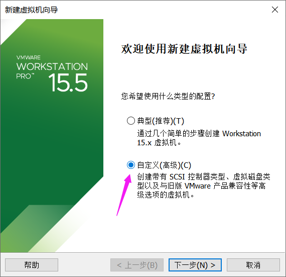

# 创建虚拟机




> 桥接网络：把本地主机当作网桥连接网络
> NAT：依赖于本地主机的网络


# Linux文件和目录结构

## 基本操作

> /：根目录
>
> ~：用户的根目录
>
> #：系统管理员显示是#
>
> $：普通用户显示的$

```shell
[用户名@主机名 所在位置]#
[root@lz ~]#   
```

## 目录结构

> - 在linux中是没有盘符的
> - / 为根目录，类似windows中的 我的计算机


> - /bin：
>   bin 是 Binaries (二进制文件) 的缩写, 这个目录存放着最经常使用的命令。
>
> - /boot：
>   这里存放的是启动 Linux 时使用的一些核心文件，包括一些连接文件以及镜像文件。
>
> - /dev ：
>   dev 是 Device(设备) 的缩写, 该目录下存放的是 Linux 的外部设备，在 Linux 中访问设备的方式和访问文件的方式是相同的。
>
> - **/etc：**
>   etc 是 Etcetera(等等) 的缩写,这个目录用来**存放所有的系统管理所需要的配置文件和子目录**。
>
> - **/home**：
>   **用户的主目录，在 Linux 中，每个用户都有一个自己的目录**，一般该目录名是以用户的账号命名的，如上图中的 alice、bob 和 eve。
>
> - /lib：
>   lib 是 Library(库) 的缩写这个目录里存放着系统最基本的动态连接共享库，其作用类似于 Windows 里的 DLL 文件。几乎所有的应用程序都需要用到这些共享库。
>
> - /lost+found：
>   这个目录一般情况下是空的，当系统非法关机后，这里就存放了一些文件。
>
> - /media：
>   linux 系统会自动识别一些设备，例如U盘、光驱等等，当识别后，Linux 会把识别的设备挂载到这个目录下。
>
> - /mnt：
>   系统提供该目录是为了让用户临时挂载别的文件系统的，我们可以将光驱挂载在 /mnt/ 上，然后进入该目录就可以查看光驱里的内容了。
>
> - **/opt**：
>   opt 是 optional(可选) 的缩写，**这是给主机额外安装软件所摆放的目录**。比如你安装一个ORACLE数据库则就可以放到这个目录下。默认是空的。
>
> - /proc：
>   proc 是 Processes(进程) 的缩写，/proc 是一种伪文件系统（也即虚拟文件系统），存储的是当前内核运行状态的一系列特殊文件，这个目录是一个虚拟的目录，它是系统内存的映射，我们可以通过直接访问这个目录来获取系统信息。
>   这个目录的内容不在硬盘上而是在内存里，我们也可以直接修改里面的某些文件，比如可以通过下面的命令来屏蔽主机的ping命令，使别人无法ping你的机器：
>
>   ```
>   echo 1 > /proc/sys/net/ipv4/icmp_echo_ignore_all
>   ```
>
> - **/root**：
>   **该目录为系统管理员，也称作超级权限者的用户主目录。**
>
> - /sbin：
>   s 就是 Super User 的意思，是 Superuser Binaries (超级用户的二进制文件) 的缩写，这里存放的是系统管理员使用的系统管理程序。
>
> - /selinux：
>    这个目录是 Redhat/CentOS 所特有的目录，Selinux 是一个安全机制，类似于 windows 的防火墙，但是这套机制比较复杂，这个目录就是存放selinux相关的文件的。
>
> - /srv：
>    该目录存放一些服务启动之后需要提取的数据。
>
> - /sys：
>
>   这是 Linux2.6 内核的一个很大的变化。该目录下安装了 2.6 内核中新出现的一个文件系统 sysfs 。
>
>   sysfs 文件系统集成了下面3种文件系统的信息：针对进程信息的 proc 文件系统、针对设备的 devfs 文件系统以及针对伪终端的 devpts 文件系统。
>
>   该文件系统是内核设备树的一个直观反映。
>
>   当一个内核对象被创建的时候，对应的文件和目录也在内核对象子系统中被创建。
>
> - /tmp：
>   tmp 是 temporary(临时) 的缩写这个目录是用来存放一些临时文件的。
>
> - **/usr**：
>    usr 是 unix shared resources(共享资源) 的缩写，这是一个非常重要的目录，**用户的很多应用程序和文件都放在这个目录下**，类似于 windows 下的 program files 目录。
>
> - /usr/bin：
>   系统用户使用的应用程序。
>
> - /usr/sbin：
>   超级用户使用的比较高级的管理程序和系统守护程序。
>
> - /usr/src：
>   内核源代码默认的放置目录。
>
> - **/var**：
>   var 是 variable(变量) 的缩写，这个目录中存放着在不断扩充着的东西，我们习惯将那些经常被修改的目录放在这个目录下。包括各种日志文件。
>
> - /run：
>   是一个临时文件系统，存储系统启动以来的信息。当系统重启时，这个目录下的文件应该被删掉或清除。如果你的系统上有 /var/run 目录，应该让它指向 run。

### 挂载点


# VI/VIM编辑器（重点）

## 中文输入法

> - 在区域和语言中添加输入法
> - 输入法切换Super(win)+space


## 模式及模式间转换


### 一般模式

| 语法                        | 功能介绍                              |
| --------------------------- | ------------------------------------- |
| yy                          | 复制光标当前一行                      |
| y数字y                      | 复制一段（从第几行到第几行）          |
| yw                          | 复制一个词                            |
| p                           | 箭头移动到目的行粘贴                  |
| u                           | 撤销上一步                            |
| dd                          | 删除光标当前行                        |
| d数字d                      | 删除光标（含）后多少行                |
| dw                          | 删除一个词                            |
| x（小写）                   | 删除一个字母，相当于del，向后删       |
| X（大写）                   | 删除一个字母，相当于Backspace，向前删 |
| r                           | 替换一个字符                          |
| R                           | 替换多个字符                          |
| ^（shift+6）                | 移动到行头                            |
| $（shift+4）                | 移动到行尾                            |
| gg或者H                     | 移动到页头                            |
| G或者L                      | 移动到页尾                            |
| 数字+G（先输入数字，在按G） | 移动到目标行                          |


### 编辑模式

| 按键 | 功能               |
| ---- | ------------------ |
| i    | 当前光标前         |
| a    | 当前光标后         |
| o    | 当前光标行的下一行 |
| I    | 光标所在行最前     |
| A    | 光标所在行最后     |
| O    | 当前光标行的上一行 |

### 命令模式

| 命令          | 功能                         |
| ------------- | ---------------------------- |
| :w            | 保存                         |
| :q            | 退出                         |
| :!            | 强制执行                     |
| :set nu       | 显示行号                     |
| :set nonu     | 关闭行号                     |
| /要查找的词   | n 查找下一个，N 往上查找     |
| :noh          | 取消高亮显示                 |
| :s/old/new    | 替换当前行匹配到的第一个内容 |
| :s/old/new/g  | 替换当前行匹配到的所有内容   |
| :%s/old/new   | 替换所有行匹配到的第一个内容 |
| :%s/old/new/g | 替换匹配到的所有内容         |

# 网络配置（重点）

## VMware提供的连接模式

> - 桥接模式
>
>   **虚拟机直接连接外部物理网络的模式，主机起到了网桥的作用。**这种模式下，**虚拟机可以直接访问外部网络，并且对外部网络是可见的。**
>
> - NAT模式
>
>   虚拟机和主机构建一个专用网络，并通过虚拟网络地址转换(NAT）设备对IP进行转换。**虚拟机通过共享主机IP可以访问外部网络，但外部网络无法访问虚拟机。**
>
> - 仅主机模式
>  虚拟机只与主机共享一个专用网络，与外部网络无法通信。

## 查看网络IP和网关

> - **windows获取ip地址命令`ipconfig`，linux获取ip地址命令`ifconfig`**
> - **在同一个局域网内，在一个网段内可以ping通**
> - 使用网桥连接，主机和虚拟机在同一个网段
> - 使用NAT连接，主机和虚拟机也可以ping通

### NAT模式

> 虚拟机的子网ip、网关


> 给虚拟机分配的ip地址在DHCP的范围中


> 主机会创建一个虚拟网卡，虚拟网卡的字段和虚拟机的ip、网关、ip子网网段是相同的
>
> 判断网段是否相同，使用ip和子网掩码进行AND运算，网络标识相同的在同一个网段，任何数与255进行AND运算都是本身


## 修改IP地址

> - 主机和虚拟机可以互通了，为啥还要修改ip地址？
>
>   因为虚拟机的ip是在DHCP范围中分配的，可能每次重启虚拟机，虚拟机的ip地址会改变，我们把虚拟机ip地址改成静态ip之后虚拟机的ip地址就不会再变了

### 修改配置文件

```shell
[root@lz ~]# vim /etc/sysconfig/network-scripts/ifcfg-ens33
```

```shell
TYPE="Ethernet"

# 修改为 静态
BOOTPROTO="static"

DEFROUTE="yes"
PEERDNS="yes"
PEERROUTES="yes"
IPV4_FAILURE_FATAL="no"
IPV6INIT="yes"
IPV6_AUTOCONF="yes"
IPV6_DEFROUTE="yes"
IPV6_PEERDNS="yes"
IPV6_PEERROUTES="yes"
IPV6_FAILURE_FATAL="no"
IPV6_ADDR_GEN_MODE="stable-privacy"
NAME="ens33"
UUID="8a929ea8-5a5c-4bdc-8865-321f14e11831"
DEVICE="ens33"
ONBOOT="yes"

#IP 地址
IPADDR=192.168.221.88
#网关
GATEWAY=192.168.221.2
#域名解析器
DNS1=192.168.221.2
```

### 重启网络服务器(两种方式)

```shell
[root@lz ~]# service network restart
[root@lz ~]# systemctl restart network
```


## 配置主机名

### 修改主机名

> 查看主机名(两种方式)

```shell
[root@lz ~]# hostname
[root@lz ~]# hostnamectl
```

> 修改主机名(两种方式)

```shell
[root@lz ~]# hostnamectl set-hostname 修改成的主机名
[root@lz ~]# vim /etc/hostname        修改完重启service network start
```

> 实例

```shell
[root@lz ~]# hostname
lz
[root@lz ~]# hostnamectl
   Static hostname: lz
         Icon name: computer-vm
           Chassis: vm
        Machine ID: 23e43e0a6637449a9ca481e126f76b54
           Boot ID: 8947a762419e4e728e7ad1206e50f666
    Virtualization: vmware
  Operating System: CentOS Linux 7 (Core)
       CPE OS Name: cpe:/o:centos:centos:7
            Kernel: Linux 3.10.0-514.el7.x86_64
      Architecture: x86-64
[root@lz ~]# hostnamectl set-hostname lz88
[root@lz ~]# hostname
lz88
```

### 修改 hosts 映射文件

> 后续在 hadoop 阶段，虚拟机会比较多，配置时通常会采用主机名的方式配置， 比较简单方便。 不用刻意记 ip 地址

#### 修改虚拟机的hosts映射文件

```shell
[root@lz ~]# vim /etc/hosts
```

> 将以下内容写入

```shell
#IP地址		  主机名	
192.168.211.88 lz88
192.168.211.100 hadoop100
192.168.211.101 hadoop101
192.168.211.102 hadoop102
```

#### 修改在估计的hosts映射文件

> 路径C:\Windows\System32\drivers\etc\hosts，同样将上面内容写入

# 系统管理

## Linux 中的进程和服务

> 计算机中，一个正在执行的程序或命令，被叫做“进程”（process）。
>
>  启动之后一只存在、常驻内存的进程，一般被称作“服务”（service）

## service 服务管理（CentOS 6 版本-了解） 

> **基本语法： `service 服务名 start | stop | restart | status`**

> 查看有哪些服务
>
> ```shell
> [root@lz88 system]# cd /etc/init.d
> [root@lz88 init.d]# ls
> functions  netconsole  network  README
> ```
>
> 只有两个服务保留在 service——**netconsole、network**

## systemctl （CentOS 7 版本-重点掌握）

> **基本语法：`systemctl start | stop | restart | status 服务名`**

> 查看有哪些服务
>
> ```shell
> [root@lz88 ~]# cd /usr/lib/systemd/system
> [root@lz88 system]# ls
> ```

## 系统运行级别


### CentOS7 的运行级别简化

> **`multi-user.target` 等价于原运行级别 3（多用户有网，无图形界面）** 
>
> **`graphical.target` 等价于原运行级别 5（多用户有网，有图形界面）**

### 查看当前运行级别

```shell
[root@lz88 ~]# systemctl get-default 
```

### 修改当前运行级别

#### 方法一

```shell
[root@lz88 ~]# init 3/5
```

#### 方法二

> 命令行模式：Ctrl + Alt + F2 ~ F6
>
> 图形GUI模式：Ctrl +Alt +F1

#### 方法三

```shell
[root@lz88 ~]# systemctl set-default TARGET.target （这里TARGET取multi-user或者graphical）
```

## 设置后台服务的自启配置

### 方式一

> 进入后台服务自启动配置

```shell
[root@lz88 ~]# setup
```


> **带有*的代表自启动，按 空格 来设置**
>
> **按tab键选择 确定/取消**


### 方式二

#### chkconfig 设置后台服务的自启配置（CentOS 6 版本）

##### 基本语法

> - **`chkconfig` （功能描述：查看所有服务器自启配置）**
> - **`chkconfig 服务名 --list` （功能描述：查看服务开机启动状态）**
> - **`chkconfig 服务名 off` （功能描述：关掉指定服务的自动启动）**
> - **`chkconfig 服务名 on` （功能描述：开启指定服务的自动启动）**
> - **`chkconfig --level 运行级别 服务名 off/on` （功能描述：指定运行级别、指定服务的自启动开关）**

##### 实例

> netconsole、network使用chkconfig，也只有这两个

```shell
[root@lz88 ~]# chkconfig --list

注意：该输出结果只显示 SysV 服务，并不包含原生 systemd 服务。SysV 配置数据可能被原生 systemd 配置覆盖。 
      如果您想列出 systemd 服务,请执行 'systemctl list-unit-files'。
      欲查看对特定 target 启用的服务请执行
      'systemctl list-dependencies [target]'。

netconsole     	0:关	1:关	2:关	3:关	4:关	5:关	6:关
network        	0:关	1:关	2:开	3:开	4:开	5:开	6:关
[root@lz88 ~]# chkconfig network off
[root@lz88 ~]# chkconfig --list

注意：该输出结果只显示 SysV 服务，并不包含原生 systemd 服务。SysV 配置数据可能被原生 systemd 配置覆盖。 
      如果您想列出 systemd 服务,请执行 'systemctl list-unit-files'。
      欲查看对特定 target 启用的服务请执行
      'systemctl list-dependencies [target]'。

netconsole     	0:关	1:关	2:关	3:关	4:关	5:关	6:关
network        	0:关	1:关	2:关	3:关	4:关	5:关	6:关
[root@lz88 ~]# chkconfig network on
[root@lz88 ~]# chkconfig --list

注意：该输出结果只显示 SysV 服务，并不包含原生 systemd 服务。SysV 配置数据可能被原生 systemd 配置覆盖。 
      如果您想列出 systemd 服务,请执行 'systemctl list-unit-files'。
      欲查看对特定 target 启用的服务请执行
      'systemctl list-dependencies [target]'。

netconsole     	0:关	1:关	2:关	3:关	4:关	5:关	6:关
network        	0:关	1:关	2:开	3:开	4:开	5:开	6:关
[root@lz88 ~]# chkconfig --level 3 network off
[root@lz88 ~]# chkconfig --list

注意：该输出结果只显示 SysV 服务，并不包含原生 systemd 服务。SysV 配置数据可能被原生 systemd 配置覆盖。 
      如果您想列出 systemd 服务,请执行 'systemctl list-unit-files'。
      欲查看对特定 target 启用的服务请执行
      'systemctl list-dependencies [target]'。

netconsole     	0:关	1:关	2:关	3:关	4:关	5:关	6:关
network        	0:关	1:关	2:开	3:关	4:开	5:开	6:关
```

#### systemctl 设置后台服务的自启配置

##### 基本语法

> - **`systemctl list-unit-files` ：查看服务开机启动状态**
> - **`systemctl disable 服务名`：关掉指定服务的自动启动** 
> - **`systemctl enable 服务名`：开启指定服务的自动启动**
> - **`systemctl status 服务名`：查看指定服务的状态**

##### 实例

> 设置**防火墙（filewalld）**的开机自启动

```shell
[root@lz88 ~]# systemctl status firewalld
● firewalld.service - firewalld - dynamic firewall daemon
   Loaded: loaded (/usr/lib/systemd/system/firewalld.service; enabled; vendor preset: enabled)
   Active: active (running) since 五 2022-09-02 11:39:44 CST; 7h ago
     Docs: man:firewalld(1)
 Main PID: 629 (firewalld)
   CGroup: /system.slice/firewalld.service
           └─629 /usr/bin/python -Es /usr/sbin/firewalld --nofork --nopid
           
9月 02 11:39:43 lz88 systemd[1]: Starting firewalld - dynamic firewall dae.....
9月 02 11:39:44 lz88 systemd[1]: Started firewalld - dynamic firewall daemon.
Hint: Some lines were ellipsized, use -l to show in full.
[root@lz88 ~]# systemctl disable firewalld
Removed symlink /etc/systemd/system/dbus-org.fedoraproject.FirewallD1.service.
Removed symlink /etc/systemd/system/basic.target.wants/firewalld.service
[root@lz88 ~]# systemctl status firewalld
● firewalld.service - firewalld - dynamic firewall daemon
   Loaded: loaded (/usr/lib/systemd/system/firewalld.service; disabled; vendor preset: enabled)
   Active: active (running) since 五 2022-09-02 11:39:44 CST; 7h ago
     Docs: man:firewalld(1)
 Main PID: 629 (firewalld)
   CGroup: /system.slice/firewalld.service
           └─629 /usr/bin/python -Es /usr/sbin/firewalld --nofork --nopid

9月 02 11:39:43 lz88 systemd[1]: Starting firewalld - dynamic firewall dae.....
9月 02 11:39:44 lz88 systemd[1]: Started firewalld - dynamic firewall daemon.
Hint: Some lines were ellipsized, use -l to show in full.
[root@lz88 ~]# systemctl enable firewalld
Created symlink from /etc/systemd/system/dbus-org.fedoraproject.FirewallD1.service to /usr/lib/systemd/system/firewalld.service.
Created symlink from /etc/systemd/system/basic.target.wants/firewalld.service to /usr/lib/systemd/system/firewalld.service.
[root@lz88 ~]# systemctl status firewalld
● firewalld.service - firewalld - dynamic firewall daemon
   Loaded: loaded (/usr/lib/systemd/system/firewalld.service; enabled; vendor preset: enabled)
   Active: active (running) since 五 2022-09-02 11:39:44 CST; 7h ago
     Docs: man:firewalld(1)
 Main PID: 629 (firewalld)
   CGroup: /system.slice/firewalld.service
           └─629 /usr/bin/python -Es /usr/sbin/firewalld --nofork --nopid

9月 02 11:39:43 lz88 systemd[1]: Starting firewalld - dynamic firewall dae.....
9月 02 11:39:44 lz88 systemd[1]: Started firewalld - dynamic firewall daemon.
Hint: Some lines were ellipsized, use -l to show in full.
```

## 关机重启

### 基本语法 

> 1. **`sync` （功能描述：将数据由内存同步到硬盘中）** 
>
> 2. **`halt` （功能描述：停机，关闭系统，但不断电）** 
>
> 3. **`poweroff` （功能描述：关机，断电）** 
>
> 4. **`reboot` （功能描述：就是重启，等同于 shutdown -r now）** 
>
> 5. **`shutdown [选项] [参数]`**
>
>    | 选项   | 功能                 |
>    | ------ | -------------------- |
>    | -H     | 相当于--halt，停机   |
>    | 无选项 | 相当于poweroff，关机 |
>    | -h     | 相当于poweroff，关机 |
>    | -P     | 相当于poweroff，关机 |
>    | -r     | -r=reboot，重启      |
>    | -c     | 取消之前的关机操作   |
>
>    | 参数 | 功能                                                         |
>    | ---- | ------------------------------------------------------------ |
>    | now  | 立刻关机                                                     |
>    | 时间 | 等待多久后关机（时间单位是分钟）/ 指定一个时间点，例如13：00：00 |

### 经验技巧 

> Linux 系统中为了提高磁盘的读写效率，对磁盘采取了 “预读迟写”操作方式。当用户保存文件时，Linux 核心并不一定立即将保存数据写入物理磁盘中，而是将数据保存在缓冲区中，等缓冲区满时再写入磁盘，这种方式可以极大的提高磁盘写入数据的效率。但是， 也带来了安全隐患，如果数据还未写入磁盘时，系统掉电或者其他严重问题出现，则将导 致数据丢失。使用 sync 指令可以立即将缓冲区的数据写入磁盘。

# 常用基本命令（重要）

## 判断是否为内置命令

> 一部分基础功能的系统命令是直接内嵌在 shell 中的，系统加载启动之后会随着 shell一起加载，常驻系统内存中。这部分命令被称为“内置命令”；相应的其它命令被称为“外部命令”。

> **基本语法：`type 命令`**
>
> **功能描述：判断当前命令是内置命令还是外部命令**

## 帮助命令

### man 获得帮助信息

> **基本语法：`man [命令或配置文件]`**
>
> **man只能获取外部命令**

### help获得帮助信息

#### 获取内置命令

> **基本语法：`help 命令`**

#### 获取外置命令

> **基本语法：`命令 --help`**

## 常用快捷键

| 常用快捷键 | 功能                         |
| ---------- | ---------------------------- |
| ctrl + c   | 停止进程                     |
| ctrl+l     | 清屏，等同于 clear           |
| reset      | 彻底清屏                     |
| tab        | 提示(更重要的是可以防止敲错) |

## 文件目录类

### pwd

> - **基本语法：`pwd`** 
> - **功能描述：显示当前工作目录的绝对路径**

### cd

> - **基本语法：`cd [参数]`** 
> - **功能描述：切换目录**

| 参数        | 功能                                                         |
| ----------- | ------------------------------------------------------------ |
| cd 绝对路径 | 切换路径。例如：`[root@lz88 ~]# cd /etc/sysconfig`           |
| cd 相对路径 | 切换路径。例如：`[root@lz88 ~]# cd 桌面` 或者`[root@lz88 桌面]# cd ../视频` |
| cd ~或者 cd | 回到自己的家目录                                             |
| cd -        | 回到上一次所在目录                                           |
| cd ..       | 回到当前目录的上一级目录                                     |
| cd -P       | 跳转到实际物理路径，而非快捷方式路径                         |

```shell
[root@lz88 /]# cd
[root@lz88 ~]# cd /etc/sysconfig
[root@lz88 sysconfig]# cd
[root@lz88 ~]# cd 桌面
[root@lz88 桌面]# cd ../视频
[root@lz88 视频]# cd -
/root/桌面
[root@lz88 桌面]# cd -P
[root@lz88 ~]# 
```

### ls

> - **基本语法：`ls [选项] [目录或是文件]`**
> - **功能描述：列出目录内容**

| 选项 | 功能                                                         |
| ---- | ------------------------------------------------------------ |
| -a   | 全部的文件，连同隐藏档( 开头为 . 的文件) 一起列出来(常用)    |
| -l   | 长数据串列出，包含文件的属性与权限等等数据；(常用)等价于“ll” |
| -al  | -a 和 -l的结合                                               |

```shell
[root@lz88 ~]# ls -a
.   anaconda-ks.cfg  .bash_logout   .bashrc  .config  .dbus      .ICEauthority         .local    original-ks.cfg  .viminfo  模板  图片  下载  桌面
..  .bash_history    .bash_profile  .cache   .cshrc   .esd_auth  initial-setup-ks.cfg  .mozilla  .tcshrc          公共      视频  文档  音乐
[root@lz88 ~]# ls -l
总用量 12
-rw-------. 1 root root 2747 9月   1 00:00 anaconda-ks.cfg
-rw-r--r--. 1 root root 2755 8月  31 16:03 initial-setup-ks.cfg
-rw-------. 1 root root 2038 9月   1 00:00 original-ks.cfg
drwxr-xr-x. 2 root root    6 8月  31 16:10 公共
drwxr-xr-x. 2 root root    6 8月  31 16:10 模板
drwxr-xr-x. 2 root root    6 8月  31 16:10 视频
drwxr-xr-x. 2 root root    6 8月  31 16:10 图片
drwxr-xr-x. 2 root root    6 8月  31 16:10 文档
drwxr-xr-x. 2 root root    6 8月  31 16:10 下载
drwxr-xr-x. 2 root root    6 8月  31 16:10 音乐
drwxr-xr-x. 2 root root   85 9月   2 10:21 桌面
[root@lz88 ~]# ls -al
总用量 60
dr-xr-x---. 15 root root 4096 9月   2 20:31 .
dr-xr-xr-x. 17 root root  224 9月   1 00:00 ..
-rw-------.  1 root root 2747 9月   1 00:00 anaconda-ks.cfg
-rw-------.  1 root root 2266 9月   2 19:20 .bash_history
-rw-r--r--.  1 root root   18 12月 29 2013 .bash_logout
-rw-r--r--.  1 root root  176 12月 29 2013 .bash_profile
-rw-r--r--.  1 root root  176 12月 29 2013 .bashrc
drwx------. 13 root root 4096 9月   2 11:40 .cache
drwx------. 15 root root  276 8月  31 16:10 .config
-rw-r--r--.  1 root root  100 12月 29 2013 .cshrc
drwx------.  3 root root   25 9月   1 00:00 .dbus
-rw-------.  1 root root   16 8月  31 16:04 .esd_auth
-rw-------.  1 root root 3744 9月   2 20:31 .ICEauthority
-rw-r--r--.  1 root root 2755 8月  31 16:03 initial-setup-ks.cfg
drwxr-xr-x.  3 root root   19 8月  31 16:04 .local
drwxr-xr-x.  4 root root   39 9月   1 21:32 .mozilla
-rw-------.  1 root root 2038 9月   1 00:00 original-ks.cfg
-rw-r--r--.  1 root root  129 12月 29 2013 .tcshrc
-rw-------.  1 root root 5013 9月   2 11:29 .viminfo
drwxr-xr-x.  2 root root    6 8月  31 16:10 公共
drwxr-xr-x.  2 root root    6 8月  31 16:10 模板
drwxr-xr-x.  2 root root    6 8月  31 16:10 视频
drwxr-xr-x.  2 root root    6 8月  31 16:10 图片
drwxr-xr-x.  2 root root    6 8月  31 16:10 文档
drwxr-xr-x.  2 root root    6 8月  31 16:10 下载
drwxr-xr-x.  2 root root    6 8月  31 16:10 音乐
drwxr-xr-x.  2 root root   85 9月   2 10:21 桌面
```

### mkdir/rmdir 创建/删除目录

> - **`mkdir [选项] 要创建的目录`：创建一个新的目录**
> - **`rmdir [选项] 要删除的空目录`：删除一个空的目录**

| 选项 | 功能               |
| ---- | ------------------ |
| -p   | 创建/删除 多层目录 |

```shell
[root@lz88 ~]# mkdir a
[root@lz88 ~]# ls
a  anaconda-ks.cfg  initial-setup-ks.cfg  original-ks.cfg  公共  模板  视频  图片  文档  下载  音乐  桌面
[root@lz88 ~]# mkdir -p b/c/d
[root@lz88 ~]# ls
a  anaconda-ks.cfg  b  initial-setup-ks.cfg  original-ks.cfg  公共  模板  视频  图片  文档  下载  音乐  桌面
[root@lz88 ~]# ls b
c
[root@lz88 ~]# rmdir a
[root@lz88 ~]# rmdir -p b/c/d
[root@lz88 ~]# ls
anaconda-ks.cfg  initial-setup-ks.cfg  original-ks.cfg  公共  模板  视频  图片  文档  下载  音乐  桌面
[root@lz88 ~]# rmdir /home/lz/hello
[root@lz88 ~]# ls /home/lz
hello  公共  模板  视频  图片  文档  下载  音乐  桌面
```

### touch 创建空文件

> **基本语法：`touch 文件名称`**
>
> **功能描述：创建一个空文件**

```shell
[root@lz88 ~]# touch a
[root@lz88 ~]# ll
总用量 12
-rw-r--r--. 1 root root    0 9月   3 10:23 a
-rw-------. 1 root root 2747 9月   1 00:00 anaconda-ks.cfg
-rw-r--r--. 1 root root 2755 8月  31 16:03 initial-setup-ks.cfg
-rw-------. 1 root root 2038 9月   1 00:00 original-ks.cfg
drwxr-xr-x. 2 root root    6 8月  31 16:10 公共
drwxr-xr-x. 2 root root    6 8月  31 16:10 模板
drwxr-xr-x. 2 root root    6 8月  31 16:10 视频
drwxr-xr-x. 2 root root    6 8月  31 16:10 图片
drwxr-xr-x. 2 root root    6 8月  31 16:10 文档
drwxr-xr-x. 2 root root    6 8月  31 16:10 下载
drwxr-xr-x. 2 root root    6 8月  31 16:10 音乐
drwxr-xr-x. 2 root root   85 9月   2 10:21 桌面
[root@lz88 ~]# touch /home/lz/hello01
[root@lz88 ~]# ls /home/lz
hello01  公共  模板  视频  图片  文档  下载  音乐  桌面
```

### rm 删除文件和目录

> - **基本语法：`rm [选项] deleteFile`** 
> - **功能描述：递归删除文件和目录中所有内容**

| 选项 | 功能                                                         |
| ---- | ------------------------------------------------------------ |
| -r   | 递归删除目录中所有内容                                       |
| -f   | 强制执行删除操作，而不提示用于进行确认。                     |
| -rf  | -r 和 -f的结合，强制递归删除目录中所有内容，而不提示用于进行确认。（慎用） |
| -v   | 显示指令的详细执行过程                                       |

```shell
[root@lz88 ~]# mkdir -p a/b
[root@lz88 ~]# touch a/b/c
[root@lz88 ~]# ls a/b
c
[root@lz88 ~]# rm -r a
rm：是否进入目录"a"? y
rm：是否进入目录"a/b"? y
rm：是否删除普通空文件 "a/b/c"？y
rm：是否删除目录 "a/b"？y
rm：是否删除目录 "a"？y
[root@lz88 ~]# ls
anaconda-ks.cfg  initial-setup-ks.cfg  original-ks.cfg  公共  模板  视频  图片  文档  下载  音乐  桌面
```

### cp 复制文件或目录

> - **基本语法：`cp [选项] 源文件/源目录 目标文件/目标目录`** 
> - **功能描述：复制 源文件/源目录 到 目标文件/目标目录**

| 选项 | 功能               |
| ---- | ------------------ |
| -r   | 递归复制整个文件夹 |

```shell
[root@lz88 ~]# touch a
[root@lz88 ~]# ls
a  anaconda-ks.cfg  initial-setup-ks.cfg  original-ks.cfg  公共  模板  视频  图片  文档  下载  音乐  桌面
[root@lz88 ~]# cp a /home/lz
[root@lz88 ~]# ls /home/lz
a  公共  模板  视频  图片  文档  下载  音乐  桌面
[root@lz88 ~]# mkdir -p hello/hello01
[root@lz88 ~]# ls
a  anaconda-ks.cfg  hello  initial-setup-ks.cfg  original-ks.cfg  公共  模板  视频  图片  文档  下载  音乐  桌面
[root@lz88 ~]# touch hello/hello01/hello02
[root@lz88 ~]# ll hello/hello01
总用量 0
-rw-r--r--. 1 root root 0 9月   3 10:49 hello02
[root@lz88 ~]# cp -r hello /home/lz
[root@lz88 ~]# ls /home/lz
a  hello  公共  模板  视频  图片  文档  下载  音乐  桌面
```

#### 经验技巧 

> **强制覆盖不提示的方法：`\cp`**

### scp远程拷贝复制

> - 基本语法：`scp [可选参数] 原路径 目标路径 `
>   - 源路径：`用户名@ip地址：路径`
> - 功能描述：用于Linux之间复制文件和目录。

| 参数 | 说明               |
| ---- | ------------------ |
| -r   | 递归复制整个目录。 |

```shell
[root@lz88 ~]# scp hello root@192.168.221.100:/root/
```

### mv 移动文件与目录或重命名

> **`mv oldNameFile newNameFile` ：重命名**
>
> **`mv /temp/movefile /targetFolder `：移动文件**

```shell
[root@lz88 ~]# ls
a  anaconda-ks.cfg  b  initial-setup-ks.cfg  original-ks.cfg  公共  模板  视频  图片  文档  下载  音乐  桌面
[root@lz88 ~]# mv a hello
[root@lz88 ~]# ls
anaconda-ks.cfg  b  hello  initial-setup-ks.cfg  original-ks.cfg  公共  模板  视频  图片  文档  下载  音乐  桌面
[root@lz88 ~]# mv b /home/lz
[root@lz88 ~]# ls /home/lz
b  公共  模板  视频  图片  文档  下载  音乐  桌面
[root@lz88 ~]# mv hello /home/lz/demo
[root@lz88 ~]# ls
anaconda-ks.cfg  initial-setup-ks.cfg  original-ks.cfg  公共  模板  视频  图片  文档  下载  音乐  桌面
[root@lz88 ~]# ls /home/lz
b  demo  公共  模板  视频  图片  文档  下载  音乐  桌面
```

### 查看文件内容

#### cat 查看文件内容

> **基本语法：`cat [选项] 要查看的文件`**
>
> **功能描述：查看文件内容，从第一行开始显示。**

| 选项 | 功能描述                     |
| ---- | ---------------------------- |
| -n   | 显示所有行的行号，包括空行。 |

##### 经验技巧 

> 一**般查看比较小的文件，一屏幕能显示全的。**

#### more 文件内容分屏查看器 

> more 指令是一个基于 VI 编辑器的文本过滤器，它以全屏幕的方式按页显示文本文件 的内容。more 指令中内置了若干快捷键，详见操作说明。

> **基本语法：`more 要查看的文件`**

| 操作           | 功能说明                                |
| -------------- | --------------------------------------- |
| Enter          | 代表向下翻『一行』                      |
| 空白键 (space) | 代表向下翻一页                          |
| Ctrl+F         | 向下滚动一屏                            |
| Ctrl+B         | 返回上一屏                              |
| =              | 输出当前行的行号                        |
| :f             | 输出文件名和当前行的行号                |
| q              | 代表立刻离开more ，不再显示该文件内容。 |

#### less 分屏显示文件内容

> less 指令用来分屏查看文件内容，**它的功能与 more 指令类似，但是比 more 指令更加强大**，支持各种显示终端。**less 指令在显示文件内容时，并不是一次将整个文件加载之后才显示，而是根据显示需要加载内容，对于显示大型文件具有较高的效率。**

> **基本语法：`less 要查看的文件`** 

| 操作       | 功能说明                                           |
| ---------- | -------------------------------------------------- |
| Enter      | 代表向下翻『一行』                                 |
| 空白键     | 向下翻动一页                                       |
| [pagedown] | 向下翻动一页                                       |
| [pageup]   | 向上翻动一页                                       |
| Ctrl+F     | 向下滚动一屏                                       |
| Ctrl+B     | 返回上一屏                                         |
| =          | 输出当前行的行号                                   |
| :f         | 输出文件名和当前行的行号                           |
| /字串      | 向下搜寻『字串』的功能；n：向下查找；N：向上查找； |
| ?字串      | 向上搜寻『字串』的功能；n：向上查找；N：向下查找； |
| q          | 离开 less                                          |

### echo 输出内容到控制台

> **基本语法：`echo [选项] [输出内容]`** 
>
> **选项：`-e`： 支持反斜线控制的字符转换**  

| 控制字符 |                    |
| -------- | ------------------ |
| \\\      | 输出\本身          |
| \n       | 换行符             |
| \t       | 制表符，也就是 Tab |

```shell
[root@lz88 ~]# echo hello,world
hello,world
[root@lz88 ~]# echo hello world
hello world
[root@lz88 ~]# echo -e "hello\nworld"
hello
world
```

### \> 输出重定向和 >> 追加

> 1. **`ls -l > 文件`：列表的内容写入文件中（覆盖写）**
> 2. **`ls -al >> 文件`：功能描述：列表的内容追加到文件的末尾**
> 3. **`cat 文件 1 > 文件 2` ：将文件 1 的内容覆盖到文件 2**
> 4. **`echo “内容” >> 文件`**

```shell
[root@lz88 ~]# ll >> info
[root@lz88 ~]# cat info
总用量 16
-rw-------. 1 root root 2747 9月   1 00:00 anaconda-ks.cfg
-rw-r--r--. 1 root root  655 9月   3 17:24 info
-rw-r--r--. 1 root root 2755 8月  31 16:03 initial-setup-ks.cfg
-rw-------. 1 root root 2038 9月   1 00:00 original-ks.cfg
drwxr-xr-x. 2 root root    6 8月  31 16:10 公共
drwxr-xr-x. 2 root root    6 8月  31 16:10 模板
drwxr-xr-x. 2 root root    6 8月  31 16:10 视频
drwxr-xr-x. 2 root root    6 8月  31 16:10 图片
drwxr-xr-x. 2 root root    6 8月  31 16:10 文档
drwxr-xr-x. 2 root root    6 8月  31 16:10 下载
drwxr-xr-x. 2 root root    6 8月  31 16:10 音乐
drwxr-xr-x. 2 root root   85 9月   2 10:21 桌面
[root@lz88 ~]# echo "hello,world" >> info
[root@lz88 ~]# cat info
总用量 16
-rw-------. 1 root root 2747 9月   1 00:00 anaconda-ks.cfg
-rw-r--r--. 1 root root  655 9月   3 17:24 info
-rw-r--r--. 1 root root 2755 8月  31 16:03 initial-setup-ks.cfg
-rw-------. 1 root root 2038 9月   1 00:00 original-ks.cfg
drwxr-xr-x. 2 root root    6 8月  31 16:10 公共
drwxr-xr-x. 2 root root    6 8月  31 16:10 模板
drwxr-xr-x. 2 root root    6 8月  31 16:10 视频
drwxr-xr-x. 2 root root    6 8月  31 16:10 图片
drwxr-xr-x. 2 root root    6 8月  31 16:10 文档
drwxr-xr-x. 2 root root    6 8月  31 16:10 下载
drwxr-xr-x. 2 root root    6 8月  31 16:10 音乐
drwxr-xr-x. 2 root root   85 9月   2 10:21 桌面
hello,world
```

### head 显示文件头部内容

> 1. **`head 文件` ：默认查看文件头10行内容**
> 2. **`head -n x 文件`：查看文件头x行内容，x可以是任意行数** 

```shell
[root@lz88 ~]# head info
总用量 12
-rw-------. 1 root root 2747 9月   1 00:00 anaconda-ks.cfg
-rw-r--r--. 1 root root    0 9月   3 17:24 info
-rw-r--r--. 1 root root 2755 8月  31 16:03 initial-setup-ks.cfg
-rw-------. 1 root root 2038 9月   1 00:00 original-ks.cfg
drwxr-xr-x. 2 root root    6 8月  31 16:10 公共
drwxr-xr-x. 2 root root    6 8月  31 16:10 模板
drwxr-xr-x. 2 root root    6 8月  31 16:10 视频
drwxr-xr-x. 2 root root    6 8月  31 16:10 图片
drwxr-xr-x. 2 root root    6 8月  31 16:10 文档
[root@lz88 ~]# head -n 5 info
总用量 12
-rw-------. 1 root root 2747 9月   1 00:00 anaconda-ks.cfg
-rw-r--r--. 1 root root    0 9月   3 17:24 info
-rw-r--r--. 1 root root 2755 8月  31 16:03 initial-setup-ks.cfg
-rw-------. 1 root root 2038 9月   1 00:00 original-ks.cfg
```

### tail 输出文件尾部内容

> 1. **`tail 文件`：默认查看文件尾部10行内容** 
> 2. **`tail -n x 文件`：查看文件尾部x行内容，x可以是任意行数** 
> 3. **`tail -f 文件` ：实时追踪该文档的所有更新**
>    1. **Ctrl + s：暂停监控**
>    2. **Ctrl + q：继续监控，之前暂停的部分也加载出来**

```shell
[root@lz88 ~]# tail info
-rw-------. 1 root root 2038 9月   1 00:00 original-ks.cfg
drwxr-xr-x. 2 root root    6 8月  31 16:10 公共
drwxr-xr-x. 2 root root    6 8月  31 16:10 模板
drwxr-xr-x. 2 root root    6 8月  31 16:10 视频
drwxr-xr-x. 2 root root    6 8月  31 16:10 图片
drwxr-xr-x. 2 root root    6 8月  31 16:10 文档
drwxr-xr-x. 2 root root    6 8月  31 16:10 下载
drwxr-xr-x. 2 root root    6 8月  31 16:10 音乐
drwxr-xr-x. 2 root root   85 9月   2 10:21 桌面
hello,world
[root@lz88 ~]# tail -n 5 info
drwxr-xr-x. 2 root root    6 8月  31 16:10 文档
drwxr-xr-x. 2 root root    6 8月  31 16:10 下载
drwxr-xr-x. 2 root root    6 8月  31 16:10 音乐
drwxr-xr-x. 2 root root   85 9月   2 10:21 桌面
hello,world
[root@lz88 ~]# tail -f info
-rw-------. 1 root root 2038 9月   1 00:00 original-ks.cfg
drwxr-xr-x. 2 root root    6 8月  31 16:10 公共
drwxr-xr-x. 2 root root    6 8月  31 16:10 模板
drwxr-xr-x. 2 root root    6 8月  31 16:10 视频
drwxr-xr-x. 2 root root    6 8月  31 16:10 图片
drwxr-xr-x. 2 root root    6 8月  31 16:10 文档
drwxr-xr-x. 2 root root    6 8月  31 16:10 下载
drwxr-xr-x. 2 root root    6 8月  31 16:10 音乐
drwxr-xr-x. 2 root root   85 9月   2 10:21 桌面
hello,world
huanying
```

### ln 软链接

> ln 软链接 软链接也称为符号链接，**类似于 windows 里的快捷方式**，有自己的数据块，主要存放了链接其他文件的路径。
>
> **基本语法：`ln -s [原文件或目录] [软链接名]`** 
>
> **功能描述：给原文件创建一个软链接**

#### 经验技巧

> - **删除软链接：`rm -rf 软链接名`，而不是 `rm -rf 软链接名/` 如果使用 `rm -rf 软链接名/` 删除，会把软链接对应的真实目录下内容删掉**
> - **查看当前路径：在软连接目录中`pwd`显示软链接所在的路径，`pwd -P`显示原文件/目录的路径**
> - **查询：通过 `ll` 就可以查看，列表属性第 1 位是 `l`，尾部会有位置指向**
> - 硬链接：软连接是文件/文件夹指向原文件/原文件夹，**硬链接相当于副本`ln [原文件或目录] [软链接名]`** 

```shell
[root@lz88 ~]# ls
anaconda-ks.cfg  foler  info  initial-setup-ks.cfg  original-ks.cfg  公共  模板  视频  图片  文档  下载  音乐  桌面
[root@lz88 ~]# cd /home/lz
[root@lz88 lz]# ln -s /root/info Myinfo
[root@lz88 lz]# ls
Myinfo  公共  模板  视频  图片  文档  下载  音乐  桌面
[root@lz88 lz]# ln -s /root/foler Myfoler
[root@lz88 lz]# ls
Myfoler  Myinfo  公共  模板  视频  图片  文档  下载  音乐  桌面
[root@lz88 lz]# touch Myfoler/file
[root@lz88 lz]# ls Myfoler
file
[root@lz88 lz]# cd Myfoler
[root@lz88 Myfoler]# pwd
/home/lz/Myfoler
[root@lz88 Myfoler]# pwd -P
/root/foler
[root@lz88 Myfoler]# ll file
lrwxrwxrwx. 1 root root 11 9月   3 21:58 file -> /root/foler
```

### history 查看已经执行过历史命令

> - **`history `：查看已经执行过历史命令**
>   - **!标号：再次执行这个命令**
> - **`history -c`：清除已经执行过历史命令**

```shell
[root@lz88 ~]# history 10
  285  echo "hello,world" >> info
  286  cat info
  287  head info
  288  head -n 5 info
  289  tail info
  290  tail -n 5 info
  291  tail -f info
  292  historyu
  293  history
  294  history 10
[root@lz88 ~]# !291
tail -f info
drwxr-xr-x. 2 root root    6 8月  31 16:10 公共
drwxr-xr-x. 2 root root    6 8月  31 16:10 模板
drwxr-xr-x. 2 root root    6 8月  31 16:10 视频
drwxr-xr-x. 2 root root    6 8月  31 16:10 图片
drwxr-xr-x. 2 root root    6 8月  31 16:10 文档
drwxr-xr-x. 2 root root    6 8月  31 16:10 下载
drwxr-xr-x. 2 root root    6 8月  31 16:10 音乐
drwxr-xr-x. 2 root root   85 9月   2 10:21 桌面
hello,world
huanying
^C
[root@lz88 ~]# history -c
[root@lz88 ~]# history
    1  history
```

## 时间日期类

> 基本语法：`date [OPTION]... [+FORMAT]`

| 选项           | 功能                                           |
| -------------- | ---------------------------------------------- |
| -d<时间字符串> | 显示指定的“时间字符串”表示的时间，而非当前时间 |
| -s<日期时间>   | 设置系统日期时间                               |

| 参数            | 功能                         |
| --------------- | ---------------------------- |
| <+日期时间格式> | 指定显示时使用的日期时间格式 |

### date 显示当前时间

> 1. **`date` ：显示当前时间**
> 2. **`date +%Y` ：显示当前年份**
> 3. **`date +%m` ：显示当前月份**
> 4. **`date +%d `：显示当前是哪一天**
> 5. **`date "+%Y-%m-%d %H:%M:%S"` ：显示年月日时分秒**

```shell
[root@lz88 lz]# date
2022年 09月 04日 星期日 10:44:49 CST
[root@lz88 lz]# date +%Y
2022
[root@lz88 lz]# date +%m
09
[root@lz88 lz]# date +%d
04
[root@lz88 lz]# date "+%Y-%m-%d %H:%M:%S"
2022-09-04 10:46:01
```

### date 显示非当前时间 

> 1. **`date -d '1 days ago' `：显示前一天时间**
> 2. **`date -d '-1 days ago'`：显示明天时间**

```shell
[root@lz88 lz]# date
2022年 09月 04日 星期日 10:49:22 CST
[root@lz88 lz]# date -d "1 day ago"
2022年 09月 03日 星期六 10:49:01 CST
[root@lz88 lz]# date -d "-1 day ago"
2022年 09月 05日 星期一 10:49:16 CST
```

### date 设置系统时间 

> **基本语法：`date -s 字符串时间`**
>
> **功能描述：设置系统时间**

```shell
[root@lz88 lz]# date
2022年 09月 04日 星期日 10:50:47 CST
[root@lz88 lz]# date -s "2023-9-1 12:10:00"
2023年 09月 01日 星期五 12:10:00 CST
```

### cal 查看日历 

> **基本语法：`cal [选项] `**
>
> **功能描述：不加选项，显示本月日历**

| 选项       | 功能               |
| ---------- | ------------------ |
| -m         | 周一用为一周第一天 |
| 具体某一年 | 显示这一年的日     |

```shell
[root@lz88 lz]# cal
      九月 2022     
日 一 二 三 四 五 六
             1  2  3
 4  5  6  7  8  9 10
11 12 13 14 15 16 17
18 19 20 21 22 23 24
25 26 27 28 29 30

[root@lz88 lz]# cal -m
      九月 2022     
一 二 三 四 五 六 日
          1  2  3  4
 5  6  7  8  9 10 11
12 13 14 15 16 17 18
19 20 21 22 23 24 25
26 27 28 29 30

[root@lz88 lz]# cal 2029
                               2029                               

        一月                   二月                   三月        
日 一 二 三 四 五 六   日 一 二 三 四 五 六   日 一 二 三 四 五 六
    1  2  3  4  5  6                1  2  3                1  2  3
 7  8  9 10 11 12 13    4  5  6  7  8  9 10    4  5  6  7  8  9 10
14 15 16 17 18 19 20   11 12 13 14 15 16 17   11 12 13 14 15 16 17
21 22 23 24 25 26 27   18 19 20 21 22 23 24   18 19 20 21 22 23 24
28 29 30 31            25 26 27 28            25 26 27 28 29 30 31

        四月                   五月                   六月        
日 一 二 三 四 五 六   日 一 二 三 四 五 六   日 一 二 三 四 五 六
 1  2  3  4  5  6  7          1  2  3  4  5                   1  2
 8  9 10 11 12 13 14    6  7  8  9 10 11 12    3  4  5  6  7  8  9
15 16 17 18 19 20 21   13 14 15 16 17 18 19   10 11 12 13 14 15 16
22 23 24 25 26 27 28   20 21 22 23 24 25 26   17 18 19 20 21 22 23
29 30                  27 28 29 30 31         24 25 26 27 28 29 30

        七月                   八月                   九月        
日 一 二 三 四 五 六   日 一 二 三 四 五 六   日 一 二 三 四 五 六
 1  2  3  4  5  6  7             1  2  3  4                      1
 8  9 10 11 12 13 14    5  6  7  8  9 10 11    2  3  4  5  6  7  8
15 16 17 18 19 20 21   12 13 14 15 16 17 18    9 10 11 12 13 14 15
22 23 24 25 26 27 28   19 20 21 22 23 24 25   16 17 18 19 20 21 22
29 30 31               26 27 28 29 30 31      23 24 25 26 27 28 29
                                              30
        十月                  十一月                 十二月       
日 一 二 三 四 五 六   日 一 二 三 四 五 六   日 一 二 三 四 五 六
    1  2  3  4  5  6                1  2  3                      1
 7  8  9 10 11 12 13    4  5  6  7  8  9 10    2  3  4  5  6  7  8
14 15 16 17 18 19 20   11 12 13 14 15 16 17    9 10 11 12 13 14 15
21 22 23 24 25 26 27   18 19 20 21 22 23 24   16 17 18 19 20 21 22
28 29 30 31            25 26 27 28 29 30      23 24 25 26 27 28 29
                                              30 31
```

## 用户管理命令 

### useradd 添加新用户

> **`useradd 用户名` ：添加新用户**
>
> **`useradd -d 主文件夹 添加新用户名`：可以设置主文件夹名和用户名不同**
>
> **` useradd -g 组名 用户名` ：添加新用户到某个组**

```shell
[root@lz88 ~]# useradd tom
[root@lz88 ~]# ls /home
lz  tom
[root@lz88 ~]# useradd -d /home/xiaopangzi wmy
[root@lz88 ~]# ls /home
lz  tom  xiaopangzi
```

### passwd 设置用户密码 

> **基本语法：`passwd 用户名`** 
>
> **功能描述：设置用户密码**

```shell
[root@lz88 ~]# passwd tom
更改用户 tom 的密码 。
新的 密码：
重新输入新的 密码：
passwd：所有的身份验证令牌已经成功更新。
```

### userdel 删除用户 

> **`userdel 用户名` ：删除用户但保存用户主目录**
>
> **`userdel -r 用户名`：用户和用户主目录，都删除**

```shell
[root@lz88 ~]# useradd tangseng
[root@lz88 ~]# useradd wukong
[root@lz88 ~]# ls /home
lz  tangseng  tom  wukong  xiaopangzi
[root@lz88 ~]# userdel tangseng
[root@lz88 ~]# ls /home
lz  tangseng  tom  wukong  xiaopangzi
[root@lz88 ~]# su tangseng
su: user tangseng does not exist
您在 /var/spool/mail/root 中有新邮件
[root@lz88 ~]# userdel -r wukong
[root@lz88 ~]# ls /home
lz  tangseng  tom  xiaopangzi
[root@lz88 ~]# su wukong
su: user wukong does not exist
```

### id 查看用户是否存在

> **基本语法：`id 用户`**
>
> **功能描述：查看用户是否存在**

```shell
[root@lz88 ~]# id tom
uid=1001(tom) gid=1001(tom) 组=1001(tom)
[root@lz88 ~]# id wmy
uid=1002(wmy) gid=1002(wmy) 组=1002(wmy)
[root@lz88 ~]# id xiaopangzi
id: xiaopangzi: no such user
```

### cat /etc/passwd 查看创建了哪些用户

> **基本语法：`cat /etc/passwd`**
>
> **功能描述：查看创建了哪些用户**

```shell
[root@lz88 ~]# cat /etc/passwd
root:x:0:0:root:/root:/bin/bash
...
...
...
lz:x:1000:1000:MyLinux:/home/lz:/bin/bash
tom:x:1001:1001::/home/tom:/bin/bash
wmy:x:1002:1002::/home/xiaopangzi:/bin/bash
```

### su(switch user) 切换用户 

> **`su 用户名称` ：切换用户，只能获得用户的执行权限，不能获得环境变量**
>
> **`su - 用户名称` ：切换到用户并获得该用户的环境变量及执行权限**

```SHELL
[root@lz88 ~]# su tom
[tom@lz88 root]$ echo $PATH
/usr/local/sbin:/usr/local/bin:/usr/sbin:/usr/bin:/root/bin
[tom@lz88 root]$ exit
exit
[root@lz88 ~]# su - tom
上一次登录：日 9月  4 11:22:11 CST 2022pts/0 上
[tom@lz88 ~]$ echo $PATH
/usr/local/bin:/bin:/usr/bin:/usr/local/sbin:/usr/sbin:/home/tom/.local/bin:/home/tom/bin
```

### who 查看登录用户信息

> **`whoami` ：显示自身用户名称**
>
> **`who am i`：显示登录用户的用户名以及登陆时间**

```shell
[root@lz88 ~]# who am i
root     pts/0        2022-09-04 09:41 (192.168.221.1)
[root@lz88 ~]# whoami
root
[root@lz88 ~]# su tom
[tom@lz88 root]$ who am i
root     pts/0        2022-09-04 09:41 (192.168.221.1)
[tom@lz88 root]$ whoami
tom
```

### sudo 设置普通用户具有 root 权

> 普通用户不可以访问另外一个普通用户的根目录

```shell
[root@lz88 ~]# su tom
[tom@lz88 home]$ ls ../lz
ls: 无法访问../lz: 权限不够
[tom@lz88 home]$ sudo ls ../lz

We trust you have received the usual lecture from the local System
Administrator. It usually boils down to these three things:

    #1) Respect the privacy of others.
    #2) Think before you type.
    #3) With great power comes great responsibility.

[sudo] password for tom: 
tom 不在 sudoers 文件中。此事将被报告。
```

> **修改超级管理员中的配置文件（/etc/sudoers）**，找到下面一行(91 行)，在root下面添加一行

```shell
[root@lz88 ~]# vim /etc/sudoers
... 
root    ALL=(ALL)       ALL
tom     ALL=(ALL)       ALL
...
```

> 再次切换到普通用户tom，就可以访问其他普通用户的根目录了

```shell
[root@lz88 ~]# su tom
[tom@lz88 home]$ sudo ls lz
Myfoler  Myinfo  公共  模板  视频  图片  文档  下载  音乐  桌面
```

## 用户组管理命令

### groupadd 新增组 

> **基本语法：`groupadd 组名`**

### groupdel 删除组 

> **基本语法：`groupdel 组名`**

### usermod 修改用户 

> **`usermod -g 用户组 用户`：修改用户的组**
>
> **`usermod -l 新用户名 旧用户名`：修改用户名**

```shell
[root@lz88 home]# usermod -g sd tom
[root@lz88 home]# usermod -g sd wmy
[root@lz88 home]# id tom
uid=1001(tom) gid=1003(sd) 组=1003(sd)
[root@lz88 home]# id wmy
uid=1002(wmy) gid=1003(sd) 组=1003(sd)
```

### groupmod 修改组 

> **基本语法：`groupmod -n 新组名 老组名`**

```shell
[root@lz88 home]# groupmod -n shandong sd
[root@lz88 home]# id tom
uid=1001(tom) gid=1003(shandong) 组=1003(shandong)
[root@lz88 home]# id wmy
uid=1002(wmy) gid=1003(shandong) 组=1003(shandong)
```

### cat /etc/group 查看创建了哪些组

> **基本语法：`cat /etc/group`**
>
> **功能描述：查看创建了哪些组**

```shell
[root@lz88 home]# cat /etc/group
....
lz:x:1000:
tom:x:1001:
wmy:x:1002:
shandong:x:1003:
```

### 提问

> 问：为什么没有在/etc/sudoers中添加用户lz，为什么lz可以访问其他普通的用户？
>
> 答：因为在我们创建虚拟机时，创建的账号，自动给我们加入了管理员组wheel，并且/etc/sudoers中设置了wheel组的权限

## 文件权限类

### 文件属性

> 在Linux中我们可以使用`ll`或者`ls -l`命令来显示一个文件的属性以及文件所属 的用户和组。

#### 从左到右字符表示


> - 0 首位表示类型
>
>   在Linux中第一个字符代表这个文件是目录、文件或链接文件等等
>
>   - **\- 代表文件**
>   - **d 代表目录**
>   - **l 链接文档(link file)**
>
> - **第1-3位确定属主（该文件的所有者）拥有该文件的权限。---User**
>
> - **第4-6位确定属组（所有者的同组用户）拥有该文件的权限，---Group**
>
> - **第7-9位确定其他用户拥有该文件的权限 ---Other**

#### rwx 作用文件和目录的不同解释

> - **作用到文件：**
>   - **[ r ]代表可读(read): 可以读取，查看** 
>   - **[ w ]代表可写(write): 可以修改，但是不代表可以删除该文件，删除一个文件的前 提条件是对该文件所在的目录有写权限，才能删除该文件.**
>   - **[ x ]代表可执行(execute):可以被系统执行**
> - **作用到目录：**
>   - **[ r ]代表可读(read): 可以读取，ls查看目录内容**
>   - **[ w ]代表可写(write): 可以修改，目录内创建+删除+重命名目录**
>   - **[ x ]代表可执行(execute):可以进入该目录**

#### 实例


> - **如果查看到是文件：链接数指的是硬链接个数。** 
> - **如果查看的是文件夹：链接数指的是子文件夹个**

### chmod 改变权限


> 1. **第一种方式变更权限：`chmod [{ugoa}{+-=}{rwx}] 文件或目录`** 
>    - **u:所有者 g:所有组 o:其他人 a:所有人(u、g、o 的总和)**
> 2. **第二种方式变更权限：`chmod [mode=421 ] [文件或目录]`**
>    - **r=4 w=2 x=1 rwx=4+2+1=7**

```shell
[root@lz88 桌面]# ll
总用量 4
-rw-r--r--. 1 root root 12 9月   4 15:35 hello
[root@lz88 桌面]# chmod u+x hello
[root@lz88 桌面]# ll
总用量 4
-rwxr--r--. 1 root root 12 9月   4 15:35 hello
[root@lz88 桌面]# chmod g=wx hello
[root@lz88 桌面]# ll
总用量 4
-rwx-wxr--. 1 root root 12 9月   4 15:35 hello

[root@lz88 桌面]# chmod 777 hello
[root@lz88 桌面]# ll
总用量 4
-rwxrwxrwx. 1 root root 12 9月   4 15:35 hello
[root@lz88 桌面]# chmod 644 hello
[root@lz88 桌面]# ll
总用量 4
-rw-r--r--. 1 root root 12 9月   4 15:35 hello
```

#### 经验技巧

> **修改整个文件夹里面的所有文件的所有者、所属组、其他用户权限需要`-R`表示递归所有目录**

```shell
[root@lz88 桌面]# ll
总用量 4
drwxr-xr-x. 2 root root  6 9月   4 15:56 demo
-rw-r--r--. 1 root root 12 9月   4 15:35 hello
[root@lz88 桌面]# cd demo
[root@lz88 demo]# ll
总用量 0
drwxr-xr-x. 2 root root 6 9月   4 15:56 demo01
[root@lz88 demo]# cd ..
[root@lz88 桌面]# chmod -R 644 demo
[root@lz88 桌面]# ll
总用量 4
drw-r--r--. 3 root root 20 9月   4 15:56 demo
-rw-r--r--. 1 root root 12 9月   4 15:35 hello
[root@lz88 桌面]# cd demo
[root@lz88 demo]# ll
总用量 0
drw-r--r--. 2 root root 6 9月   4 15:56 demo01
```

### chown 改变所有者

> **基本语法：`chown [选项] [最终用户] [文件或目录]`** 
>
> **功能描述：改变文件或者目录的所有者**
>
> **选项：`-R` 递归操作**

```shell
[root@lz88 桌面]# ll
总用量 4
drw-r--r--. 3 root root 20 9月   4 15:56 demo
-rw-r--r--. 1 root root 12 9月   4 15:35 hello
[root@lz88 桌面]# chown lz hello
[root@lz88 桌面]# ll
总用量 4
drw-r--r--. 3 root root 20 9月   4 15:56 demo
-rw-r--r--. 1 lz   root 12 9月   4 15:35 hello
[root@lz88 桌面]# chown -R lz demo
[root@lz88 桌面]# ll
总用量 4
drw-r--r--. 3 lz root 20 9月   4 15:56 demo
-rw-r--r--. 1 lz root 12 9月   4 15:35 hello
[root@lz88 桌面]# cd demo
[root@lz88 demo]# ll
总用量 0
drw-r--r--. 2 lz root 6 9月   4 15:56 demo01
```

### chgrp 改变所属组

> **基本语法：`chgrp [选项] [最终用户组] [文件或目录]`** 
>
> **功能描述：改变文件或者目录的所属组**
>
> **选项：`-R` 递归操作**

```shell
[root@lz88 桌面]# ll
总用量 4
drw-r--r--. 3 lz root 20 9月   4 15:56 demo
-rw-r--r--. 1 lz root 12 9月   4 15:35 hello
[root@lz88 桌面]# chgrp lz hello
[root@lz88 桌面]# ll
总用量 4
drw-r--r--. 3 lz root 20 9月   4 15:56 demo
-rw-r--r--. 1 lz lz   12 9月   4 15:35 hello
[root@lz88 桌面]# chgrp -R lz demo
[root@lz88 桌面]# ll
总用量 4
drw-r--r--. 3 lz lz 20 9月   4 15:56 demo
-rw-r--r--. 1 lz lz 12 9月   4 15:35 hello
[root@lz88 桌面]# cd demo
[root@lz88 demo]# ll
总用量 0
drw-r--r--. 2 lz lz 6 9月   4 15:56 demo01
```

## 搜索查找类 

### find 查找文件或者目录

> **基本语法：`find [搜索范围] [选项]`**
>
> **功能描述：find 指令将从指定目录向下递归地遍历其各个子目录，将满足条件的文件显示在终端。**

| 选项            | 功能                                                         |
| --------------- | ------------------------------------------------------------ |
| -name<查询方式> | 按照指定的文件名查找模式查找文件                             |
| -user<用户名>   | 查找属于指定用户名所有文件                                   |
| -size<文件大小> | 按照指定的文件大小查找文件,单位为: <br />b —— 块（512 字节）<br />c —— 字节 <br />w —— 字（2 字节） <br />k —— 千字节 <br />M —— 兆字节 <br />G —— 吉字节 |

```shell
[root@lz88 ~]# find /root -name info
/root/.local/share/Trash/info
/root/.local/share/Trash/files/info
[root@lz88 ~]# find /root -user lz
/root/桌面/hello
/root/桌面/demo
/root/桌面/demo/demo01
```

### locate 快速定位文件路径

> - locate 指令利用事先建立的系统中所有文件名称及路径的 locate 数据库实现快速定位给 定的文件。Locate 指令无需遍历整个文件系统，查询速度较快。为了保证查询结果的准确度，管理员必须定期更新 locate 时刻。 
> - **基本语法：`locate 搜索文件`** 
> - **经验技巧：由于 `locate` 指令基于数据库进行查询，所以第一次运行前，必须使用 `updatedb` 指令创建 locate 数据库。**

```shell
[root@lz88 ~]# updatedb
[root@lz88 ~]# locate tmp
```

### grep 内容过滤查找及“|”管道符

> **管道符，“|”，表示将前一个命令的处理结果输出传递给后面的命令处理**
>
> **基本语法：`grep [选项] 查找内容 源文件`** 

| 选项 | 功能             |
| ---- | ---------------- |
| -n   | 显示匹配行及行号 |

> **经验技巧：wc将计算指定文件的行数、字数，以及字节数。**

```shell
anaconda-ks.cfg  initial-setup-ks.cfg  original-ks.cfg  公共  模板  视频  图片  文档  下载  音乐  桌面
[root@lz88 ~]# grep -n boot initial-setup-ks.cfg 
5:xconfig  --startxonboot
14:firstboot --disable
26:network  --bootproto=dhcp --device=link
27:network  --bootproto=dhcp --hostname=localhost.localdomain
28:# Reboot after installation
29:reboot
34:# System bootloader configuration
35:bootloader --append=" crashkernel=auto" --location=mbr --boot-drive=sda
41:part /boot --fstype="xfs" --size=300
[root@lz88 ~]# grep -n boot initial-setup-ks.cfg | wc
      9      28     347
[root@lz88 ~]# ls | grep .cfg
anaconda-ks.cfg
initial-setup-ks.cfg
original-ks.cfg
```

## 压缩和解压类

### gzip/gunzip 压缩

> - **`gzip 文件`：压缩文件，只能将文件压缩为*.gz 文件**
> - **`gunzip 文件.gz` ：解压缩文件命令**

#### 经验技巧 

> 1. **只能压缩文件不能压缩目录** 
> 2. **不保留原来的文件** 
> 3. **同时多个文件会产生多个压缩包**

```shell
[root@lz88 ~]# ls
anaconda-ks.cfg  info  initial-setup-ks.cfg  original-ks.cfg  公共  模板  视频  图片  文档  下载  音乐  桌面
[root@lz88 ~]# gzip info
[root@lz88 ~]# ls
anaconda-ks.cfg  info.gz  initial-setup-ks.cfg  original-ks.cfg  公共  模板  视频  图片  文档  下载  音乐  桌面
[root@lz88 ~]# gunzip info.gz
[root@lz88 ~]# ls
anaconda-ks.cfg  info  initial-setup-ks.cfg  original-ks.cfg  公共  模板  视频  图片  文档  下载  音乐  桌面
```

### zip/unzip 压缩 

> - **`zip [选项] XXX.zip 将要压缩的内容`：压缩文件和目录的命令**
> - **`unzip [选项] XXX.zip`：解压缩文件**

| zip 选项 | 功能     |
| -------- | -------- |
| -r       | 压缩目录 |

| unzip 选项 | 功能                     |
| ---------- | ------------------------ |
| -d<目录>   | 指定解压后文件的存放目录 |

```shell
[root@lz88 ~]# zip -r Myroot.zip /root
  adding: root/ (stored 0%)
  adding: root/.bash_logout (stored 0%)
  adding: root/.bash_profile (deflated 19%)
  adding: root/.bashrc (deflated 29%)
  adding: root/.cshrc (deflated 24%)
  adding: root/.tcshrc (deflated 22%)
  adding: root/original-ks.cfg (deflated 59%)
  adding: root/anaconda-ks.cfg (deflated 59%)
  ...
[root@lz88 ~]# ls
anaconda-ks.cfg  info  initial-setup-ks.cfg  Myroot.zip  original-ks.cfg  公共  模板  视频  图片  文档  下载  音乐  桌面
[root@lz88 ~]# unzip -d ./temp Myroot.zip
Archive:  Myroot.zip
   creating: ./temp/root/
 extracting: ./temp/root/.bash_logout  
  inflating: ./temp/root/.bash_profile  
 ...
[root@lz88 ~]# ll
总用量 9408
-rw-------. 1 root root    2747 9月   1 00:00 anaconda-ks.cfg
-rw-r--r--. 1 root root    2755 9月   5 11:57 info
-rw-r--r--. 1 root root    2755 8月  31 16:03 initial-setup-ks.cfg
-rw-r--r--. 1 root root 9616437 9月   5 12:01 Myroot.zip
-rw-------. 1 root root    2038 9月   1 00:00 original-ks.cfg
drwxr-xr-x. 3 root root      18 9月   5 12:02 temp
```

#### 经验技巧 

> zip 压缩命令在windows/linux都通用，可以压缩目录且保留源文件。

### tar 打包 

> **基本语法：`tar [选项] XXX.tar.gz 将要打包进去的内容`** 
>
> **功能描述：打包目录，压缩后的 文件格式`.tar.gz`**

| 选项              | 功能                |
| ----------------- | ------------------- |
| -c（create）      | 产生`.tar` 打包文件 |
| -v（verbose）     | 显示详细信息        |
| -f（file）        | 指定压缩后的文件名  |
| -z（gzip/gunzip） | 打包同时压缩        |
| -x（extract）     | 解包.tar 文件       |
| -C                | 解压到指定目录      |

```shell
[root@lz88 桌面]# tar -zcvf MyHello.tar.gz demo hello
demo/
demo/demo01/
hello
[root@lz88 桌面]# ll
总用量 8
drw-r--r--. 3 lz   lz    20 9月   4 15:56 demo
-rw-r--r--. 1 lz   lz    12 9月   4 15:35 hello
-rw-r--r--. 1 root root 175 9月   5 12:20 MyHello.tar.gz
[root@lz88 桌面]# mkdir temp
[root@lz88 桌面]# ls
demo  hello  MyHello.tar.gz  temp
[root@lz88 桌面]# tar -zxvf MyHello.tar.gz -C temp
demo/
demo/demo01/
hello
```

## 磁盘查看和分区类 

### du 查看文件和目录占用的磁盘空间

> - **du: disk usage磁盘占用情况**
>
> - **基本语法：`du [选项] 目录/文件`**
>- **功能描述：显示目录下每个子目录的磁盘使用情况**

| 选项                 | 功能                                                   |
| -------------------- | ------------------------------------------------------ |
| -h（human-readable） | 以人们较易阅读的 GBytes, MBytes, KBytes 等格式自行显示 |
| -a（all）            | 不仅查看子目录大小，还要包括文件                       |
| -c（total）          | 显示所有的文件和子目录大小后，显示总和                 |
| -s（summarize）      | 只显示总和                                             |
| --max-depth=n        | 指定统计子目录的深度为第 n 层                          |

```shell
[root@lz88 /]# du /tmp
0       /tmp/hsperfdata_root
0       /tmp/.font-unix
0       /tmp/.X11-unix
0       /tmp/.Test-unix
0       /tmp/.ICE-unix
0       /tmp/.XIM-unix
0       /tmp/systemd-private-32a2fafd349b4540b1c96bfafd8c72f2-colord.service-QBKfqH/tmp
0       /tmp/systemd-private-32a2fafd349b4540b1c96bfafd8c72f2-colord.service-QBKfqH
0       /tmp/.esd-0
0       /tmp/tracker-extract-files.0
0       /tmp/systemd-private-32a2fafd349b4540b1c96bfafd8c72f2-cups.service-suPOYq/tmp
0       /tmp/systemd-private-32a2fafd349b4540b1c96bfafd8c72f2-cups.service-suPOYq
0       /tmp/.esd-1000
0       /tmp/tracker-extract-files.1000
0       /tmp/hsperfdata_lz
0       /tmp/systemd-private-32a2fafd349b4540b1c96bfafd8c72f2-vmtoolsd.service-jJiC2W/tmp/vmware-root
0       /tmp/systemd-private-32a2fafd349b4540b1c96bfafd8c72f2-vmtoolsd.service-jJiC2W/tmp
0       /tmp/systemd-private-32a2fafd349b4540b1c96bfafd8c72f2-vmtoolsd.service-jJiC2W
0       /tmp/systemd-private-fbfa2388ab8a4174a8a1be7fa3adb6c4-rtkit-daemon.service-eLBg8l/tmp
0       /tmp/systemd-private-fbfa2388ab8a4174a8a1be7fa3adb6c4-rtkit-daemon.service-eLBg8l
0       /tmp/systemd-private-fbfa2388ab8a4174a8a1be7fa3adb6c4-vmtoolsd.service-YHaZ4j/tmp/vmware-root
0       /tmp/systemd-private-fbfa2388ab8a4174a8a1be7fa3adb6c4-vmtoolsd.service-YHaZ4j/tmp
0       /tmp/systemd-private-fbfa2388ab8a4174a8a1be7fa3adb6c4-vmtoolsd.service-YHaZ4j
0       /tmp/systemd-private-fbfa2388ab8a4174a8a1be7fa3adb6c4-cups.service-96U10z/tmp
0       /tmp/systemd-private-fbfa2388ab8a4174a8a1be7fa3adb6c4-cups.service-96U10z
0       /tmp/systemd-private-fbfa2388ab8a4174a8a1be7fa3adb6c4-colord.service-OG8cS0/tmp
0       /tmp/systemd-private-fbfa2388ab8a4174a8a1be7fa3adb6c4-colord.service-OG8cS0
0       /tmp/ssh-cPHvYAuPdNVG
0       /tmp/systemd-private-32a2fafd349b4540b1c96bfafd8c72f2-rtkit-daemon.service-vY1L3q/tmp
0       /tmp/systemd-private-32a2fafd349b4540b1c96bfafd8c72f2-rtkit-daemon.service-vY1L3q
0       /tmp/ssh-5p8FFzr7qHXq
5080    /tmp
[root@lz88 /]# du -h /tmp
0       /tmp/hsperfdata_root
0       /tmp/.font-unix
0       /tmp/.X11-unix
0       /tmp/.Test-unix
0       /tmp/.ICE-unix
0       /tmp/.XIM-unix
0       /tmp/systemd-private-32a2fafd349b4540b1c96bfafd8c72f2-colord.service-QBKfqH/tmp
0       /tmp/systemd-private-32a2fafd349b4540b1c96bfafd8c72f2-colord.service-QBKfqH
0       /tmp/.esd-0
0       /tmp/tracker-extract-files.0
0       /tmp/systemd-private-32a2fafd349b4540b1c96bfafd8c72f2-cups.service-suPOYq/tmp
0       /tmp/systemd-private-32a2fafd349b4540b1c96bfafd8c72f2-cups.service-suPOYq
0       /tmp/.esd-1000
0       /tmp/tracker-extract-files.1000
0       /tmp/hsperfdata_lz
0       /tmp/systemd-private-32a2fafd349b4540b1c96bfafd8c72f2-vmtoolsd.service-jJiC2W/tmp/vmware-root
0       /tmp/systemd-private-32a2fafd349b4540b1c96bfafd8c72f2-vmtoolsd.service-jJiC2W/tmp
0       /tmp/systemd-private-32a2fafd349b4540b1c96bfafd8c72f2-vmtoolsd.service-jJiC2W
0       /tmp/systemd-private-fbfa2388ab8a4174a8a1be7fa3adb6c4-rtkit-daemon.service-eLBg8l/tmp
0       /tmp/systemd-private-fbfa2388ab8a4174a8a1be7fa3adb6c4-rtkit-daemon.service-eLBg8l
0       /tmp/systemd-private-fbfa2388ab8a4174a8a1be7fa3adb6c4-vmtoolsd.service-YHaZ4j/tmp/vmware-root
0       /tmp/systemd-private-fbfa2388ab8a4174a8a1be7fa3adb6c4-vmtoolsd.service-YHaZ4j/tmp
0       /tmp/systemd-private-fbfa2388ab8a4174a8a1be7fa3adb6c4-vmtoolsd.service-YHaZ4j
0       /tmp/systemd-private-fbfa2388ab8a4174a8a1be7fa3adb6c4-cups.service-96U10z/tmp
0       /tmp/systemd-private-fbfa2388ab8a4174a8a1be7fa3adb6c4-cups.service-96U10z
0       /tmp/systemd-private-fbfa2388ab8a4174a8a1be7fa3adb6c4-colord.service-OG8cS0/tmp
0       /tmp/systemd-private-fbfa2388ab8a4174a8a1be7fa3adb6c4-colord.service-OG8cS0
0       /tmp/ssh-cPHvYAuPdNVG
0       /tmp/systemd-private-32a2fafd349b4540b1c96bfafd8c72f2-rtkit-daemon.service-vY1L3q/tmp
0       /tmp/systemd-private-32a2fafd349b4540b1c96bfafd8c72f2-rtkit-daemon.service-vY1L3q
0       /tmp/ssh-5p8FFzr7qHXq
5.0M    /tmp
[root@lz88 /]# du -sch /tmp
5.0M    /tmp
5.0M    总用量
```

### df 查看磁盘空间使用情况 

> **df: disk free 空余磁盘**
>
> **基本语法：`df 选项`** 
>
> **功能描述：列出文件系统的整体磁盘使用量，检查文件系统的磁盘空间占用情况**

| 选项 | 功能                                                   |
| ---- | ------------------------------------------------------ |
| -h   | 以人们较易阅读的 GBytes, MBytes, KBytes 等格式自行显示 |

> **free指令会显示内存的使用情况，包括实体内存，虚拟的交换文件内存，共享内存区段，以及系统核心使用的缓冲区等。**

```shell
[root@lz88 ~]# df -h
文件系统        容量  已用  可用 已用% 挂载点
/dev/sda3        18G  5.1G   13G   29% /
devtmpfs        898M     0  898M    0% /dev
tmpfs           912M  144K  912M    1% /dev/shm
tmpfs           912M  9.0M  903M    1% /run
tmpfs           912M     0  912M    0% /sys/fs/cgroup
/dev/sda1       297M  152M  146M   51% /boot
tmpfs           183M   12K  183M    1% /run/user/0
[root@lz88 ~]# free -h
              total        used        free      shared  buff/cache   available
Mem:           1.8G        521M        787M         10M        514M        1.1G
Swap:          2.0G          0B        2.0G
```

###  lsblk 查看设备挂载情况

> **基本语法：`lsblk`** 
>
> **功能描述：查看设备挂载情况**

| 选项 | 功能                                     |
| ---- | ---------------------------------------- |
| -f   | 查看详细的设备挂载情况，显示文件系统信息 |

```shell
[root@lz88 ~]# lsblk
NAME   MAJ:MIN RM  SIZE RO TYPE MOUNTPOINT
sda      8:0    0   20G  0 disk 
├─sda1   8:1    0  300M  0 part /boot
├─sda2   8:2    0    2G  0 part [SWAP]
└─sda3   8:3    0 17.7G  0 part /
sr0     11:0    1  4.1G  0 rom  
[root@lz88 ~]# lsblk -f
NAME   FSTYPE  LABEL           UUID                                 MOUNTPOINT
sda                                                                 
├─sda1 xfs                     9fa7924f-48a6-43fb-a39e-bdcde680a0f8 /boot
├─sda2 swap                    194b700f-2779-445e-9e05-feca7c05ece0 [SWAP]
└─sda3 xfs                     63e8e069-1adb-474c-924f-86072b04656b /
sr0    iso9660 CentOS 7 x86_64 2016-12-05-13-55-45-00 
```

### mount/umount 挂载/卸载

> 对于Linux用户来讲，不论有几个分区，分别分给哪一个目录使用，它总归就是一个根目录、一个独立且唯一的文件结构。 Linux中每个分区都是用来组成整个文件系统的一部分，它在用一种叫做“挂载”的处理 方法，它整个文件系统中包含了一整套的文件和目录，并将一个分区和一个目录联系起来， 要载入的那个分区将使它的存储空间在这个目录下获得。

> **`mount [-t vfstype] [-o options] device dir` ：挂载设备**
>
> **`umount 设备文件名或挂载点` ：卸载设备**

| 参数       | 功能                                                         |
| ---------- | ------------------------------------------------------------ |
| -t vfstype | 指定文件系统的类型，**通常不必指定**。mount 会自动选择正确的类型。常用类型有： <br />光盘或光盘镜像：iso9660<br />DOS fat16 文件系统：msdos<br />Windows 9x fat32 文件系统：vfat<br />Windows NT ntfs 文件系统：ntfs<br />Mount Windows 文件网络共享：smbfs<br />UNIX(LINUX) 文件网络共享：nfs |
| -o options | 主要用来描述设备或档案的挂接方式。常用的参数有： <br />loop：用来把一个文件当成硬盘分区挂接上系统 <br />ro：采用只读方式挂接设备 <br />rw：采用读写方式挂接设备 <br />iocharset：指定访问文件系统所用字符集 |
| device     | 要挂接(mount)的设备                                          |
| dir        | 设备在系统上的挂接点(mount point)                            |

```shell
[root@lz88 ~]# lsblk
NAME   MAJ:MIN RM  SIZE RO TYPE MOUNTPOINT
sda      8:0    0   20G  0 disk 
├─sda1   8:1    0  300M  0 part /boot
├─sda2   8:2    0    2G  0 part [SWAP]
└─sda3   8:3    0 17.7G  0 part /
sr0     11:0    1  4.1G  0 rom  
[root@lz88 ~]# mkdir /mnt/cdrom
[root@lz88 ~]# mount /dev/cdrom /mnt/cdrom
mount: /dev/sr0 写保护，将以只读方式挂载
[root@lz88 ~]# lsblk
NAME   MAJ:MIN RM  SIZE RO TYPE MOUNTPOINT
sda      8:0    0   20G  0 disk 
├─sda1   8:1    0  300M  0 part /boot
├─sda2   8:2    0    2G  0 part [SWAP]
└─sda3   8:3    0 17.7G  0 part /
sr0     11:0    1  4.1G  0 rom  /mnt/cdrom
[root@lz88 ~]# umount /mnt/cdrom
[root@lz88 ~]# lsblk
NAME   MAJ:MIN RM  SIZE RO TYPE MOUNTPOINT
sda      8:0    0   20G  0 disk 
├─sda1   8:1    0  300M  0 part /boot
├─sda2   8:2    0    2G  0 part [SWAP]
└─sda3   8:3    0 17.7G  0 part /
sr0     11:0    1  4.1G  0 rom 
```

#### 设置开机自动挂载

```shell
[root@lz88 ~]# vim /etc/fstab

UUID=63e8e069-1adb-474c-924f-86072b04656b /                       xfs     defaults        0 0
UUID=9fa7924f-48a6-43fb-a39e-bdcde680a0f8 /boot                   xfs     defaults        0 0
UUID=194b700f-2779-445e-9e05-feca7c05ece0 swap                    swap    defaults        0 0

/dev/cdrom                                /mnt/cdrom              iso9660 defaults        0 0
```

### fdisk 分区 

> - **`fdisk -l`：查看磁盘分区详情**
>
> - **`fdisk 硬盘设备名 `：对新增硬盘进行分区操作**
>
> - **经验技巧：该命令必须在 root 用户下才能使用**
>
> - 功能说明 
>
>   1. Linux 分区
>
>      Device：分区序列
>
>      Boot：引导
>
>      Start：从X磁柱开始
>
>      End：到Y磁柱结束
>
>      Blocks：容量
>
>      Id：分区类型ID
>
>      System：分区类型 
>
>   2. 分区操作按键说明 
>
>      **m：显示命令列表** 
>
>      **p：显示当前磁盘分区** 
>
>      **n：新增分区** 
>
>      **w：写入分区信息并退出** 
>
>      **q：不保存分区信息直接退出**

```shell
[root@lz88 ~]# fdisk -l

磁盘 /dev/sda：21.5 GB, 21474836480 字节，41943040 个扇区
Units = 扇区 of 1 * 512 = 512 bytes
扇区大小(逻辑/物理)：512 字节 / 512 字节
I/O 大小(最小/最佳)：512 字节 / 512 字节
磁盘标签类型：dos
磁盘标识符：0x000bac6e

   设备 Boot      Start         End      Blocks   Id  System
/dev/sda1   *        2048      616447      307200   83  Linux
/dev/sda2          616448     4810751     2097152   82  Linux swap / Solaris
/dev/sda3         4810752    41943039    18566144   83  Linux

# 添加硬盘

[root@lz88 ~]# fdisk -l

磁盘 /dev/sdb：10.7 GB, 10737418240 字节，20971520 个扇区
Units = 扇区 of 1 * 512 = 512 bytes
扇区大小(逻辑/物理)：512 字节 / 512 字节
I/O 大小(最小/最佳)：512 字节 / 512 字节


磁盘 /dev/sda：21.5 GB, 21474836480 字节，41943040 个扇区
Units = 扇区 of 1 * 512 = 512 bytes
扇区大小(逻辑/物理)：512 字节 / 512 字节
I/O 大小(最小/最佳)：512 字节 / 512 字节
磁盘标签类型：dos
磁盘标识符：0x000bac6e

   设备 Boot      Start         End      Blocks   Id  System
/dev/sda1   *        2048      616447      307200   83  Linux
/dev/sda2          616448     4810751     2097152   82  Linux swap / Solaris
/dev/sda3         4810752    41943039    18566144   83  Linux

# 分区

[root@lz88 ~]# fdisk /dev/sdb
欢迎使用 fdisk (util-linux 2.23.2)。

更改将停留在内存中，直到您决定将更改写入磁盘。
使用写入命令前请三思。

Device does not contain a recognized partition table
使用磁盘标识符 0xee11d007 创建新的 DOS 磁盘标签。

命令(输入 m 获取帮助)：n
Partition type:
   p   primary (0 primary, 0 extended, 4 free)
   e   extended
Select (default p): p
分区号 (1-4，默认 1)：
起始 扇区 (2048-20971519，默认为 2048)：
将使用默认值 2048
Last 扇区, +扇区 or +size{K,M,G} (2048-20971519，默认为 20971519)：
将使用默认值 20971519
分区 1 已设置为 Linux 类型，大小设为 10 GiB

命令(输入 m 获取帮助)：w
The partition table has been altered!

Calling ioctl() to re-read partition table.
正在同步磁盘。
[root@lz88 ~]# fdisk -l

磁盘 /dev/sdb：10.7 GB, 10737418240 字节，20971520 个扇区
Units = 扇区 of 1 * 512 = 512 bytes
扇区大小(逻辑/物理)：512 字节 / 512 字节
I/O 大小(最小/最佳)：512 字节 / 512 字节
磁盘标签类型：dos
磁盘标识符：0xee11d007

   设备 Boot      Start         End      Blocks   Id  System
/dev/sdb1            2048    20971519    10484736   83  Linux

磁盘 /dev/sda：21.5 GB, 21474836480 字节，41943040 个扇区
Units = 扇区 of 1 * 512 = 512 bytes
扇区大小(逻辑/物理)：512 字节 / 512 字节
I/O 大小(最小/最佳)：512 字节 / 512 字节
磁盘标签类型：dos
磁盘标识符：0x000bac6e

   设备 Boot      Start         End      Blocks   Id  System
/dev/sda1   *        2048      616447      307200   83  Linux
/dev/sda2          616448     4810751     2097152   82  Linux swap / Solaris
/dev/sda3         4810752    41943039    18566144   83  Linux

# 格式化硬盘

[root@lz88 ~]# lsblk -f
NAME   FSTYPE  LABEL           UUID                                 MOUNTPOINT
sda                                                                 
├─sda1 xfs                     9fa7924f-48a6-43fb-a39e-bdcde680a0f8 /boot
├─sda2 swap                    194b700f-2779-445e-9e05-feca7c05ece0 [SWAP]
└─sda3 xfs                     63e8e069-1adb-474c-924f-86072b04656b /
sdb                                                                 
└─sdb1                                                              
sr0    iso9660 CentOS 7 x86_64 2016-12-05-13-55-45-00               /mnt/cdrom
[root@lz88 ~]# mkfs -t xfs /dev/sdb1
meta-data=/dev/sdb1              isize=512    agcount=4, agsize=655296 blks
         =                       sectsz=512   attr=2, projid32bit=1
         =                       crc=1        finobt=0, sparse=0
data     =                       bsize=4096   blocks=2621184, imaxpct=25
         =                       sunit=0      swidth=0 blks
naming   =version 2              bsize=4096   ascii-ci=0 ftype=1
log      =internal log           bsize=4096   blocks=2560, version=2
         =                       sectsz=512   sunit=0 blks, lazy-count=1
realtime =none                   extsz=4096   blocks=0, rtextents=0
[root@lz88 ~]# lsblk -f
NAME   FSTYPE  LABEL           UUID                                 MOUNTPOINT
sda                                                                 
├─sda1 xfs                     9fa7924f-48a6-43fb-a39e-bdcde680a0f8 /boot
├─sda2 swap                    194b700f-2779-445e-9e05-feca7c05ece0 [SWAP]
└─sda3 xfs                     63e8e069-1adb-474c-924f-86072b04656b /
sdb                                                                 
└─sdb1 xfs                     400a848a-847e-4db0-bc02-2d6164343fde 
sr0    iso9660 CentOS 7 x86_64 2016-12-05-13-55-45-00               /mnt/cdrom

# 挂载

[root@lz88 ~]# mount /dev/sdb1 /home/tom
[root@lz88 ~]# lsblk -f
NAME   FSTYPE  LABEL           UUID                                 MOUNTPOINT
sda                                                                 
├─sda1 xfs                     9fa7924f-48a6-43fb-a39e-bdcde680a0f8 /boot
├─sda2 swap                    194b700f-2779-445e-9e05-feca7c05ece0 [SWAP]
└─sda3 xfs                     63e8e069-1adb-474c-924f-86072b04656b /
sdb                                                                 
└─sdb1 xfs                     400a848a-847e-4db0-bc02-2d6164343fde /home/tom
sr0    iso9660 CentOS 7 x86_64 2016-12-05-13-55-45-00               /mnt/cdrom

```

## 进程管理类

> 进程是正在执行的一个程序或命令，每一个进程都是一个运行的实体，都有自己的地 址空间，并占用一定的系统资源。 

### ps 查看当前系统进程状态

> - ps：process status 进程状态
>
> - **`ps aux | grep xxx`：查看系统中所有进程**
>
> - **`ps -ef | grep xxx` ：可以查看子父进程之间的关系**
>
>   | 选项 | 功能                                       |
>   | ---- | ------------------------------------------ |
>   | a    | 列出带有终端的所有用户的进程               |
>   | x    | 列出当前用户的所有进程，包括没有终端的进程 |
>   | u    | 面向用户友好的显示风格                     |
>   | -e   | 列出所有进程                               |
>   | -f   | 显示完整格式的进程列表                     |
>   | -u   | 列出某个用户关联的所有进程                 |
>
> - 功能说明 
>
>   1. `ps aux` 显示信息说明
>
>      USER：该进程是由哪个用户产生的
>
>      PID：进程的 ID 号
>
>      %CPU：该进程占用 CPU 资源的百分比，占用越高，进程越耗费资源
>
>      %MEM：该进程占用物理内存的百分比，占用越高，进程越耗费资源
>
>      VSZ：该进程占用虚拟内存的大小，单位 KB
>
>      RSS：该进程占用实际物理内存的大小，单位 KB
>
>      TTY：该进程是在哪个终端中运行的。对于 CentOS 来说，tty1 是图形化终端。tty2-tty6 是本地的字符界面终端。pts/0-255 代表虚拟终端
>
>      STAT：进程状态。常见的状态有：R：运行状态、S：睡眠状态、T：暂停状态、 Z：僵尸状态、s：包含子进程、l：多线程、+：前台显示
>
>      START：该进程的启动时间
>
>      TIME：该进程占用 CPU 的运算时间，注意不是系统时间
>
>      COMMAND：产生此进程的命令名 
>
>   2. `ps -ef` 显示信息说明
>
>      UID：用户 ID
>
>      PID：进程 ID
>
>      PPID：父进程 ID
>
>      C：CPU 用于计算执行优先级的因子。数值越大，表明进程是 CPU 密集型运算， 执行优先级会降低；数值越小，表明进程是 I/O 密集型运算，执行优先级会提高
>
>      STIME：进程启动的时间 TTY：完整的终端名称
>
>      TIME：CPU 时间
>   
>      CMD：启动进程所用的命令和参数
>
> - 经验技巧：**如果想查看进程的 CPU 占用率和内存占用率，可以使用 `aux`; 如果想查看进程的父进程 ID 可以使用 `-ef`;**

### pstree 查看进程树

> **基本语法：`pstree [选项]`**
>
> **功能描述：查看进程树**

| 选项 | 功能               |
| ---- | ------------------ |
| -p   | 显示进程的 PID     |
| -u   | 显示进程的所属用户 |

```shell
[root@lz88 ~]# pstree -p |less
systemd(1)-+-ModemManager(546)-+-{ModemManager}(584)
           |                   `-{ModemManager}(616)
           |-NetworkManager(638)-+-{NetworkManager}(658)
           |                     `-{NetworkManager}(662)
           |-abrt-watch-log(548)
           |-abrt-watch-log(565)
           |-abrtd(547)
           |-accounts-daemon(558)-+-{accounts-daemon}(588)
           |                      `-{accounts-daemon}(614)
           |-alsactl(562)
           |-anacron(63975)
           |-at-spi-bus-laun(5102)-+-dbus-daemon(5160)---{dbus-daemon}(5179)
           |                       |-{at-spi-bus-laun}(5151)
           |                       |-{at-spi-bus-laun}(5152)
           |                       `-{at-spi-bus-laun}(5159)
           |-at-spi2-registr(5181)-+-{at-spi2-registr}(5189)
           |                       `-{at-spi2-registr}(5190)
           |-atd(957)
           |-auditd(525)-+-audispd(542)-+-sedispatch(576)
           |             |              `-{audispd}(577)
           |             `-{auditd}(541)

[root@lz88 ~]# pstress -u | less
systemd-+-ModemManager---2*[{ModemManager}]
        |-NetworkManager---2*[{NetworkManager}]
        |-2*[abrt-watch-log]
        |-abrtd
        |-accounts-daemon---2*[{accounts-daemon}]
        |-alsactl
        |-anacron
        |-at-spi-bus-laun(gdm)-+-dbus-daemon---{dbus-daemon}
        |                      `-3*[{at-spi-bus-laun}]
        |-at-spi2-registr(gdm)---2*[{at-spi2-registr}]
        |-atd
        |-auditd-+-audispd-+-sedispatch
        |        |         `-{audispd}
        |        `-{auditd}
        |-avahi-daemon(avahi)---avahi-daemon
        |-caribou(gdm)---2*[{caribou}]
        |-chronyd(chrony)
        |-colord(colord)---2*[{colord}]
        |-crond
        |-cupsd
        |-dbus-daemon(gdm)---{dbus-daemon}

```

### kill 终止进程

> - **`kill -9 进程号`：通过进程号杀死进程**
> - **`killall 进程名称` ：通过进程名称杀死进程，也支持通配符，这在系统因负载过大而变得很慢时很有用（慎用）**

```shell
[root@lz88 ~]# ps aux |grep 5102
gdm        5102  0.0  0.2 337860  5464 ?        Sl   10:18   0:00 /usr/libexec/at-spi-bus-launcher
root      97358  0.0  0.0 112668   972 pts/0    R+   11:27   0:00 grep --color=auto 5102
[root@lz88 ~]# kill -9 5102
[root@lz88 ~]# ps aux |grep 5102
root      97605  0.0  0.0 112664   972 pts/0    S+   11:27   0:00 grep --color=auto 5102

[root@lz88 ~]# ps aux | grep firefox
root     100941  3.5  9.2 1031656 173420 ?      Sl   11:29   0:02 /usr/lib64/firefox/firefox
root     102689  0.0  0.0 112664   972 pts/0    S+   11:30   0:00 grep --color=auto firefox
[root@lz88 ~]# killall firefox
[root@lz88 ~]# ps aux | grep firefox
root     103025  0.0  0.0 112664   972 pts/0    S+   11:30   0:00 grep --color=auto firefox
```

### top 实时监控系统进程状态

> **基本命令：`top [选项]`**
>
> **功能描述：实时监控系统进程状态**

| 选项    | 功能                                                         |
| ------- | ------------------------------------------------------------ |
| -d 秒数 | 指定 top 命令每隔几秒更新。默认是 3 秒在 top 命令的交互模式当 中可以执行的命令 |
| -i      | 使 top 不显示任何闲置或者僵死进程                            |
| -p      | 通过指定监控进程 ID 来仅仅监控某个进程的状态                 |

| 操作 | 功能                            |
| ---- | ------------------------------- |
| P    | 以 CPU 使用率排序，默认就是此项 |
| M    | 以内存的使用率排序              |
| N    | 以 PID 排序                     |
| k    | 终止某个进程                    |
| h    | 打开帮助文档                    |
| q    | 退出 top                        |

#### 查询结果字段解


### netstat 显示网络状态和端口占用信息

> **`netstat -anp | grep 进程号`：查看该进程网络信息**
>
>  **`netstat –nlp | grep` 端口号：查看网络端口号占用情况**

| 选项            | 功能                                                 |
| --------------- | ---------------------------------------------------- |
| -a（all）       | 显示所有正在监听（listen）和未监听的套接字（socket） |
| -n（numeric）   | 拒绝显示别名，能显示数字的全部转化成数字             |
| -l（listening） | 仅列出在监听的服务状态                               |
| -p（process）   | 表示显示哪个进程在调用                               |

## crontab 系统定时任务

### crontab 服务管理

> 重新启动 `crond` 服务

```SHELL
[root@lz88 ~]# systemctl restart crond
```

### crontab 定时任务设置 

> 基本语法：`crontab [选项]` 

| 选项         | 功能                            |
| ------------ | ------------------------------- |
| -e（edit）   | 编辑crontab 定时任务            |
| -l（list）   | 查询 crontab 任务               |
| -r（remove） | 删除当前用户所有的 crontab 任务 |

> 进入 crontab 编辑界面。会打开 vim 编辑你的工作。

#### \* * * * * 执行的任务

| 项目      | 含义                 | 范围                             |
| --------- | -------------------- | -------------------------------- |
| 第一个“*” | 一小时当中的第几分钟 | 0-59                             |
| 第二个“*” | 一天当中的第几小时   | 0-23                             |
| 第三个“*” | 一个月当中的第几天   | 1-31                             |
| 第四个“*” | 一年当中的第几月     | 1-12                             |
| 第五个“*” | 一周当中的星期几     | 0-7 （ 0 和 7 都 代 表 星 期 日) |

#### 特殊符号 

| 特殊符号 | 含义                                                         |
| -------- | ------------------------------------------------------------ |
| *        | 代表任何时间。比如第一个“*”就代表一小时中每分钟 都执行一次的意思。 |
| ，       | 代表不连续的时间。比如“0 8,12,16 * * * 命令”，就代表 在每天的 8 点 0 分，12 点 0 分，16 点 0 分都执行一次命令 |
| -        | 代表连续的时间范围。比如“0 5 * * 1-6 命令”，代表在 周一到周六的凌晨 5 点 0 分执行命令 |
| */n      | 代表每隔多久执行一次。比如“*/10 * * * * 命令”，代表每隔10分钟 |

#### 特定时间执行命令

| 时间              | 含义                                                         |
| ----------------- | ------------------------------------------------------------ |
| 45 22 * * * 命令  | 每天 22 点 45 分执行命令                                     |
| 0 17 * * 1 命令   | 每周 1 的 17 点 0 分执行命令                                 |
| 0 5 1,15 * * 命令 | 每月 1 号和 15 号的凌晨 5 点 0 分执行命令                    |
| 40 4 * * 1-5 命令 | 每周一到周五的凌晨 4 点 40 分执行命令                        |
| */10 4 * * * 命令 | 每天的凌晨 4 点，每隔 10 分钟执行一次命令                    |
| 0 0 1,15 * 1 命令 | 每月 1 号和 15 号，每周 1 的 0 点 0 分都会执行命令。注 意：星期几和几号最好不要同时出现，因为他们定义的都 是天。非常容易让管理员混乱。 |

# 软件包管理

## RPM

> RPM（RedHat Package Manager），RedHat软件包管理工具

### RPM 查询命令（rpm -qa）

> - **`rpm -qa`：查询所安装的所有 rpm 软件包**
> - **`rpm -qi 软件名`：查询所安装软件的详细信息**
>
> - **经验技巧：由于软件包比较多，一般都会采取过滤。`rpm -qa | grep rpm软件包`**

```shell
[root@lz88 ~]# rpm -qa |grep firefox
firefox-45.4.0-1.el7.centos.x86_64
[root@lz88 ~]# rpm -qi firefox
Name        : firefox
Version     : 45.4.0
Release     : 1.el7.centos
Architecture: x86_64
Install Date: 2022年08月31日 星期三 23时56分26秒
Group       : Applications/Internet
Size        : 149412110
License     : MPLv1.1 or GPLv2+ or LGPLv2+
Signature   : RSA/SHA256, 2016年09月21日 星期三 23时49分55秒, Key ID 24c6a8a7f4a80eb5
Source RPM  : firefox-45.4.0-1.el7.centos.src.rpm
Build Date  : 2016年09月21日 星期三 21时50分10秒
Build Host  : worker1.bsys.centos.org
Relocations : (not relocatable)
Packager    : CentOS BuildSystem <http://bugs.centos.org>
Vendor      : CentOS
URL         : http://www.mozilla.org/projects/firefox/
Summary     : Mozilla Firefox Web browser
Description :
Mozilla Firefox is an open-source web browser, designed for standards
compliance, performance and portability.
```

### RPM 卸载命令（rpm -e）

> - **`rpm -e RPM软件包`**
>
> - **`rpm -e --nodeps 软件包`** 
>
>   | 选项        | 功能                                                         |
>   | ----------- | ------------------------------------------------------------ |
>   | -e（erase） | 卸载软件包                                                   |
>   | --nodeps    | 卸载软件时，不检查依赖。这样的话，那些使用该软件包的软件在此之后可能就不能正常工作了。 |

```shell
[root@lz88 ~]# rpm -qa | grep firefox
firefox-45.4.0-1.el7.centos.x86_64
[root@lz88 ~]# rpm -e firefox
```

### RPM 安装命令（rpm -ivh）

> 基本语法：`rpm -ivh RPM包全名` 

| 选项     | 功能                    |
| -------- | ----------------------- |
| -i       | --install，安装         |
| -v       | --verbose，显示详细信息 |
| -h       | --hash，进度条          |
| --nodeps | 安装前不检查依赖        |

```shell
[root@lz88 Packages]# rpm -ivh firefox-45.4.0-1.el7.centos.x86_64.rpm
警告：firefox-45.4.0-1.el7.centos.x86_64.rpm: 头V3 RSA/SHA256 Signature, 密钥 ID f4a80eb5: NOKEY
准备中...                          ################################# [100%]
正在升级/安装...
   1:firefox-45.4.0-1.el7.centos      ################################# [100%]
[root@lz88 Packages]# rpm -qa | grep firefox
firefox-45.4.0-1.el7.centos.x86_64
```

## YUM 仓库配置

> YUM（全称为 Yellow dog Updater, Modified）是一个在 Fedora 和 RedHat 以及 CentOS 中的 Shell 前端软件包管理器。基于 RPM 包管理，能够从指定的服务器自动下载 RPM 包 并且安装，可以自动处理依赖性关系

### YUM 的常用命令 

> **基本语法：`yum [选项] [参数]`** 

| 选项 | 功能                  |
| ---- | --------------------- |
| -y   | 对所有提问都回答“yes” |

| 参数         | 功能                            |
| ------------ | ------------------------------- |
| install      | 安装 rpm 软件包                 |
| update       | 更新 rpm 软件包                 |
| check-update | 检查是否有可用的更新 rpm 软件包 |
| remove       | 删除指定的 rpm 软件包           |
| list         | 显示软件包信息                  |
| clean        | 清理 yum 过期的缓存             |
| deplist      | 显示 yum 软件包的所有依赖关     |

```shell
[root@lz88 ~]# yum list | grep firefox
firefox.x86_64                            45.4.0-1.el7.centos          @anaconda
firefox.i686                              91.12.0-2.el7.centos         updates  
firefox.x86_64                            91.12.0-2.el7.centos         updates  
[root@lz88 ~]# yum -y remove firefox
已加载插件：fastestmirror, langpacks
正在解决依赖关系
--> 正在检查事务
---> 软件包 firefox.x86_64.0.45.4.0-1.el7.centos 将被 删除
--> 解决依赖关系完成

......

删除:
  firefox.x86_64 0:45.4.0-1.el7.centos                                                                                                                                             
完毕！
[root@lz88 ~]# yum -y install firefox
已加载插件：fastestmirror, langpacks
Loading mirror speeds from cached hostfile
 * base: mirrors.nju.edu.cn
 * extras: mirrors.aliyun.com
 * updates: mirrors.nju.edu.cn

......

已安装:
  firefox.x86_64 0:91.13.0-1.el7.centos                                                                                                                                             作为依赖被安装:
  nss-pem.x86_64 0:1.0.3-7.el7                                                           
  
作为依赖被升级:
  dbus.x86_64 1:1.10.24-15.el7                 dbus-libs.x86_64 1:1.10.24-15.el7     dbus-x11.x86_64 1:1.10.24-15.el7    nspr.x86_64 0:4.32.0-1.el7_9       nss.x86_64 0:3.67.0-4.el7_9   nss-softokn.x86_64 0:3.67.0-3.el7_9  
  nss-softokn-freebl.x86_64 0:3.67.0-3.el7_9   nss-sysinit.x86_64 0:3.67.0-4.el7_9   nss-tools.x86_64 0:3.67.0-4.el7_9   nss-util.x86_64 0:3.67.0-1.el7_9  

完毕！
[root@lz88 ~]# yum list | grep firefox
firefox.x86_64                            91.13.0-1.el7.centos         @updates 
firefox.i686                              91.13.0-1.el7.centos         updates  
```

### 修改网络 YUM 源

> 默认的系统 YUM 源，需要连接国外 apache 网站，网速比较慢，可以修改关联的网络 YUM 源为国内镜像的网站，比如网易 163,aliyun 等 

1.安装 wget, wget 用来从指定的 URL 下载文件 

```shell
[root@lz88 lz88]# yum -y install wegt
```

2.在`/etc/yum.repos.d/`目录下，备份默认的 repos 文件

```shell
[root@lz88 yum.repos.d]# ls
CentOS-Base.repo  CentOS-CR.repo  CentOS-Debuginfo.repo  CentOS-fasttrack.repo  CentOS-Media.repo  CentOS-Sources.repo  CentOS-Vault.repo
[root@lz88 yum.repos.d]# cp CentOS-Base.repo CentOS-Base.backup
[root@lz88 yum.repos.d]# ls
CentOS-Base.backup  CentOS-Base.repo  CentOS-CR.repo  CentOS-Debuginfo.repo  CentOS-fasttrack.repo  CentOS-Media.repo  CentOS-Sources.repo  CentOS-Vault.repo
```

3.下载网易 163 或者是 aliyun 的 repos 文件,任选其一

```shell
[root@hadoop101 yum.repos.d] wget http://mirrors.aliyun.com/repo/Centos-7.repo //阿里云 [root@hadoop101 yum.repos.d] wget http://mirrors.163.com/.help/CentOS7-Base-163.repo //网易 163
```

4.使用下载好的 repos 文件替换默认的 repos 文件

```shell
[root@lz88 yum.repos.d]# ls
Centos-7.repo  CentOS-Base.backup  CentOS-Base.repo  CentOS-CR.repo  CentOS-Debuginfo.repo  CentOS-fasttrack.repo  CentOS-Media.repo  CentOS-Sources.repo  CentOS-Vault.repo
[root@lz88 yum.repos.d]# mv Centos-7.repo CentOS-Base.repo
mv：是否覆盖"CentOS-Base.repo"？ y
[root@lz88 yum.repos.d]# ls
CentOS-Base.backup  CentOS-Base.repo  CentOS-CR.repo  CentOS-Debuginfo.repo  CentOS-fasttrack.repo  CentOS-Media.repo  CentOS-Sources.repo  CentOS-Vault.repo
```

5.清理旧缓存数据，缓存新数据

> `yum makecache` 就是把服务器的包信息下载到本地电脑缓存起来

```shell
[root@lz88 yum.repos.d]# yum clean all
已加载插件：fastestmirror, langpacks
正在清理软件源： base extras updates
Cleaning up everything
Cleaning up list of fastest mirrors
[root@lz88 yum.repos.d]# yum makecache
已加载插件：fastestmirror, langpacks
http://mirrors.aliyuncs.com/centos/7/os/x86_64/repodata/repomd.xml: [Errno 14] curl#7 - "Failed connect to mirrors.aliyuncs.com:80; 拒绝连接"
正在尝试其它镜像。
http://mirrors.cloud.aliyuncs.com/centos/7/os/x86_64/repodata/repomd.xml: [Errno 14] curl#6 - "Could not resolve host: mirrors.cloud.aliyuncs.com; 未知的名称或服务"
正在尝试其它镜像。
......
元数据缓存已建立
```

# 克隆虚拟机

> 克隆完成，开机需要修改的配置
>
> 1. 静态ip地址
> 2. 主机名

# Shell


## Shell 脚本入门

### 脚本格式

> 脚本以`#!/bin/bash `

```shell
[root@lz88 ~]# touch scirpts/hello.sh
[root@lz88 ~]# cd scirpts
[root@lz88 scirpts]# ls
hello.sh
[root@lz88 scirpts]# vim hello.sh
#!/bin/bash
echo "hello,world!"
```

### 脚本的常用执行方式

> 第一种：采用 bash 或 sh+脚本的相对路径或绝对路径（不用赋予脚本+x 权限）

```shell
[root@lz88 scirpts]# bash hello.sh
hello,world!
[root@lz88 scirpts]# sh hello.sh
hello,world!
```

> 第二种：采用输入脚本的绝对路径或相对路径执行脚本（必须具有可执行权限+x）

```shell
[root@lz88 scirpts]# ./hello.sh 
hello,world!
[root@lz88 scirpts]# hello.sh  #这种会报错，因为它会认为是linux中的命令
bash: hello.sh: 未找到命令...
[root@lz88 scirpts]# /root/scirpts/hello.sh 
hello,world!
```

> 注意：第一种执行方法，本质是 bash 解析器帮你执行脚本，所以脚本本身不需要执行 权限。第二种执行方法，本质是脚本需要自己执行，所以需要执行权限。

> 【了解】第三种：在脚本的路径前加上“.”或者 source

```shell
[root@lz88 scirpts]# . hello.sh 
hello,world!
[root@lz88 scirpts]# source hello.sh
hello,world!
```

> 前两种方式都是在当前 shell 中打开一个子 shell 来执行脚本内容，当脚本内容结束，则 子 shell 关闭，回到父 shell 中。
>
>  第三种，也就是使用在脚本路径前加“.”或者 source 的方式，可以使脚本内容在当前 shell 里执行，而无需打开子 shell！这也是为什么我们每次要修改完/etc/profile 文件以后，需要 source 一下的原因。
>
> 开子 shell 与不开子 shell 的区别就在于，环境变量的继承关系，如在子 shell 中设置的当前变量，父 shell 是不可见的。

## 变量

> Linux Shell 中的变量分为，**系统变量**和**用户自定义变量**。
>
> 常用系统变量：`$HOME`、`$PWD`、`$SHELL`、`$USER `

> 查看所有系统变量
>
> ```shell
> [root@lz88 scirpts]# env
> ```

> 查看系统变量的值
>
> ```SHELL
> [root@lz88 scirpts]# echo $HOME
> /root
> [root@lz88 scirpts]# printenv HOME
> /root
> ```

> 显示当前 Shell 中所有变量：set
>
> ```shell
> [root@lz88 scirpts]# set 
> ```

### 自定义变量

#### 规则

> - 变量名称可以由字母、数字和下划线组成，但是不能以数字开头。
> - 等号两侧不能有空格
> - 变量名称一般习惯为大写

```shell
变量=值        #定义变量  注意：中间不能用空格隔开
unset 变量       #撤销变量
readonly 变量    #声明静态变量  注意：静态变量不能unset
```

#### 普通变量

```shell
##定义变量
#!/bin/bash
a=11						#定义变量a
echo "a = $a"				#输出a

unset a						#撤销变量a
echo "unset a = $a"			#输出a
```


#### 静态变量

```shell
##声明静态变量
#!/bin/bash
readonly A=12
echo "readonly A = $A"

unset A
echo "readonly A2 = $A"
```


#### 将命令的返回值赋值给变量（重点）

```shell
A=`ls -la`    #反引号，运行里面的命令，并把结果返回给变量A
A=$(ls -la)   #等价于反引号
```

```shell
###实例
#!/bin/bash
A=`date`
echo "A = $A"

echo "----------------"

B=$(date)
echo "B = $B"
```


### 设置环境变量

```shell
export 变量名=变量值     #将shell变量输出为环境变量（系统变量）
source 配置文件         #让修改后的配置信息立即生效
echo $变量名			 #查询环境变量的值
```

```shell
###实例
#1、在/home/shell/tomcat.sh文件中定义TOMCAT_HOME环境变量
#!/bin/bash
export TOMCAT_HOME="hello,my name is tomcat!"

#2、查看环境变量TOMCAT_HOME的值
source /home/shell/tomcat.sh
echo $TOMCAT_HOME

#3、在另外一个shell程序（/home/shell/usetomcat.sh）中使用TOMCAT_HOME
#!/bin/bash
A=$TOMCAT_HOME
echo "A = $A"
```

### 位置参数变量

#### 介绍

> 当我们执行一个shell脚本时，如果希望获取到命令行的参数信息，就可以使用到位置参数变量
>
> 比如：
>
> ```bash
> ./myshell.sh 100 200  
> #这个就是一个执行shell的命令行，可以在myshell脚本中获取到参数信息，类似于python的cmd传参
> ```

#### 基本语法

```shell
$n  #n为数字，$0代表命令本身，$1-$9代表第一到第九个参数，十以上的参数需要用大括号包含，如{10}
$*  #这个变量代表命令行中所有的参数，$*把所有的参数看成一个整体
$@  #这个变量也代表命令行中所有的参数，不过$@把每个参数区分对待
$#  #这个变量代表命令行中所有参数的个数
```

```shell
#实例：写一个脚本  打印出传递进去的11个参数及详细
#!/bin/bash
echo "param[0] ----  $0"
echo "param[1] ----  $1"
echo "param[2] ----  $2"
echo "param[3] ----  $3"
echo "param[4] ----  $4"
echo "param[5] ----  $5"
echo "param[6] ----  $6"
echo "param[7] ----  $7"
echo "param[8] ----  $8"
echo "param[9] ----  $9"
echo "param[10] ----  ${10}"
echo "param[11] ----  ${11}"

echo "param count is $#"
echo "param  -----------  $@"
echo "param  ===========  $*"
```


### 预定义变量

> - 就是shell设计者实现一键定义好的变量，可以直接在shell脚本中使用

```shell
$$   #当前进程的进程号（PID）
$!   #当前运行的最后一个进程的进程号(PID)
$?   #最后一次执行的命令的返回状态。如果这个变量的值为0，证明上一个命令正确执行；如果这个变量的值为非0（具体是哪个数，由命令自己来决定），则证明上一个命令执行不正确了。
```

```shell
#!/bin/bash
echo "当前进程的进程号 = $$"
#后台的方式运行tomcat.sh
./tomcat.sh &   #后台运行

echo "当前运行的最后一个进程的进程号 = $!"
echo "最后一次执行的命令的返回状态 = $?"
```


#### shell中双引号和反引号的区别

> -  由双引号括起来的字符，除$（美元符号）、\（反斜杠）、``（反引号）和" "（双引号），如果开启了感叹号（ ! ）引用历史命令时，感叹号要除外，这几个字符仍是特殊字符并保留其特殊功能外，其余字符仍作为普通字符对待。
> - 反引号括起来的字符串被shell解释为命令行，在执行时，shell首先执行该命令行，并以它的标准输出结果取代整个反引号（包括两个反引号）部分。

## 运算符

```shell
$((运算式))
#或
$[运算式]
```

```shell
expr m + n   #加
expr m - n	 #减
expr \*		 #乘
expr /		 #除
expr %		 #取余
```

```shell
#!/bin/bash
M=100
N=5

echo "M + N = $((M + N))"

echo "M - N = $[M - N]"
MN1=`expr $M \* $N`
echo "M * N = $MN1"

C=`expr $M / $N`
echo "M / N = $C"

D=`expr $M % $N`
echo "M % N = $D"
```


> 案例：求出命令行输入两个参数的和

```shell
#!/bin/bash
A=$1
B=$2
SUM=$[A+B]
echo "sum = $SUM"
```


## 条件判断

```shell
[ condition ]    #非空返回true   可使用$?严重（0位true，>1为false）   注意：condition前后要有空格
```

### 常用判断条件

> - 两个整数的比较
>
>   | 符号 | 说明       |
>   | ---- | ---------- |
>   | =    | 字符串比较 |
>   | -lt  | 小于       |
>   | -le  | 小于等于   |
>   | -eq  | 等于       |
>   | -gt  | 大于       |
>   | -ge  | 大于等于   |
>   | -ne  | 不等于     |
>
> - 按照文件权限进行判断
>
>   | 符号 | 说明         |
>   | ---- | ------------ |
>   | -r   | 有读的权限   |
>   | -w   | 有写的权限   |
>   | -x   | 有执行的权限 |
>
> - 按照文件类型进行判断
>
>   | 符号 | 说明                         |
>   | ---- | ---------------------------- |
>   | -f   | 文件存在并且是一个常规的文件 |
>   | -e   | 文件存在                     |
>   | -d   | 文件存在并是一个目录         |

### 实例

```shell
##判断 "ok"和"ok"是否相等
#!/bin/bash
if [ "ok" = "ok" ]
then
        echo "equal"
fi

##23是否大于22
if [ 23 -gt 22 ]
then
        echo "大于"
fi

##判断文件是否存在
if [ -e /home/shell/aaa.txt ]
then
		echo "存在"
fi
```

## 流程控制

### if

```shell
if [ 条件判断式 ];then
    程序
fi

###或者

if [ 条件判断式 ]
then
    程序
elif [ 条件判断式 ]
then
    程序
fi
```

```shell
#编写sh脚本  输入参数，参数>=60,打印"及格了"，参数<60，打印"不及格"
#!/bin/bash
if [ $1 -ge 60 ]
then
        echo "及格了"
elif [ $1 -lt 60 ]
then
        echo "不及格"
fi
```

### case

```shell
case $变量名 in
"值1")
程序1
;;
"值2")
程序2
;;
..........
"值n")
程序n
;;
*)
如果变量的值都不是以上的值，则执行此程序
;;
esac
```

```shell
#实例

#!/bin/bash
case $1 in
        1)
                echo "一"
                ;;
        2)      
                echo "二"
                ;;
        3)      
                echo "三"
                ;;
        *)      
                echo "其他"
                ;;
esac 
```

### for循环

```shell
#语法一
for 变量 in 值1 值2 ... 值n
do
 	程序
done

#实例：打印命令行输入的参数  $* $@
#！/bin/bash
for i in "$*"
do
		echo "the num is $i"
done

echo "-------------------------"

for j in "$@"
do
		echo "the num is $j"
done
```

```shell
#语法二
for((初始值;循环控制条件;变量变化))
do
	程序
done

#实例：从1加到100并输出结果
#！/bin/bash
SUM=0
for((i=1;i<=100;i++))
do
	SUM=$[$SUM+$i]
done
echo "最终结果是：$SUM"
```

### while循环

```shell
while [ 条件判断式 ]
do
	程序
done

#案例：从命令行输入一个n，统计从1+...+n的值是多少
#!/bin/bash
SUM=0
i=0
while [ $i -le $1 ]
do
		SUM=$[$SUM+$i]
		i=$[$i+1]
done
echo "sum = $SUM"
```

## read读取控制台输入

```shell
read 选项 参数
#-p 指定读取值时的提示符（阻塞）
#-t 指定读取值时等待的时间（秒），如果没有在指定的时间内输入，就不再等待了
```

```shell
#案例1：读取控制台输入一个num值
#!/bin/bash
read -p "请输入一个数：" NUM1
echo "你输入的值是：$NUM1"

#案例2：读取控制台输入一个num值，在10秒内输入。
#!/bin/bash
read -t 10 -p "请输入一个数：" NUM1
echo "你输入的值是：$NUM1"
```

## 函数

### 系统函数

```shell
basename [pathname] [suffix]  #返回完整路径最后/的部分，常用于获取文件名
#basename命令会删掉所有的前缀包括最后一个（"/"）字符，然后将字符串显示出来

#案例：请返回/home/shell/hello.sh的"hello.sh"部分
echo `basename /home/shell/hello.sh`

#案例：请返回/home/shell/hello.sh的"hello"部分
echo `basename /home/shell/hello.sh .sh`
```

```shell
dirname 文件绝对路径 
#返回完整路径最后/的前面的部分，常用于返回路径部分
#从给定的包含绝对路径的文件名中去除文件名（非目录的部分），然后返回剩下的路径（目录的部分）

#实例：请返回/home/shell/hello.sh的/home/shell
echo `dirname /home/shell/hello.sh`
```

### 自定义函数

```shell
function funname()
{
    Action;
    [return int;]
}

#应用实例：编写一个函数，计算两个参数的和,getSum
function getSum()
{
    SUM=$[$n1+$n2]
    echo "和是：$SUM"
}
read -p "请输入第一个数 n1:" n1
read -p "请输入第二个数 n2:" n2

getSum $n1 $n2
```

#### 函数调用

> - 调用Shell 函数时可以给它传递参数，也可以不传递。如果不传递参数，直接给出函数名字即可。如果传递参数,那么多个参数之间以空格分隔：`name param1 param2 param3`。不管是哪种形式，函数名字后面都不需要带括号。
> - 和其它编程语言不同的是，Shell函数在定义时不能指明参数，但是在调用时却可以传递参数，并且给它传递什么参数它就接收什么参数。
> - Shell 也不限制定义和调用的顺序，你可以将定义放在调用的前面，也可以反过来，将定义放在调用的后
>   面。

## Shell编程综合案例

### 需求

> - 每天凌晨2:10备份数据库 kugou 到 `/home/mysql/data/db`
> - 备份开始和备份结束能够给出相应的提示信息
> - 备份后的文件要求以备份时间为文件名，并打包成`.tar.gz`的形式，比如：`2019-6-15_222222.tar.gz`
> - 在备份的同时，检查是否有10天前备份的数据库文件，如果有就将其删除。

### 实现

#### 写脚本

```shell
# /home/shell/testmysql.sh
#!/bin/bash
#完成数据库的定时备份

echo "=========开始备份=========="

#备份的路径
BACKUP=/home/mysql/data/db          
echo "备份的路径：${BACKUP}"

#获取到当前的时间
DATETIME=$(date +%Y-%m-%d_%H%M%S)  
echo "当前时间：${DATETIME}"

#主机
HOST=localhost
echo "主机：${HOST}"

#用户名
DB_USER=yxh_mysql
echo "用户名：${DB_USER}"

#密码
DB_PWD=a
echo "密码：${DB_PWD}"

#备份数据库名
DATABASE=shelltest
echo "备份数的据库名：${DATABASE}"

#创建备份路径
#如果备份路径存在，就使用，否则就创建
[ ! -d "$BACKUP/$DATETIME" ] && mkdir -p "$BACKUP/$DATETIME"

#执行mysql的备份数据库命令
mysqldump -u${DB_USER} -p$DB_PWD --host=$HOST $DATABASE | gzip > $BACKUP/$DATETIME/$DATETIME.sql.gz

#打包备份文件
cd ${BACKUP}
tar -zcvf $DATETIME.tar.gz $DATETIME

#删除临时目录
rm -rf $BACKUP/$DATETIME

#删除10天前的备份文件
find $BACKUP -mtime +10 -name "*.tar.gz" -exec rm -rf {} \;

echo "=========备份完成========"
```

#### 定时

```shell
crontab -e

10 2 * * * /home/shell/testmysql.sh
```

