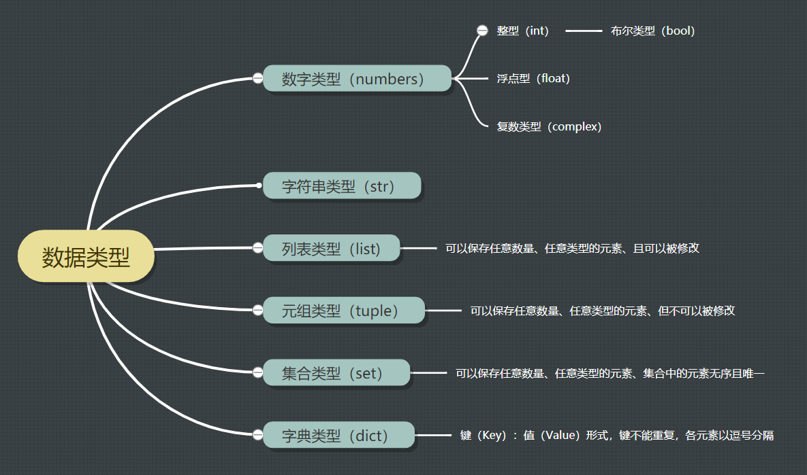
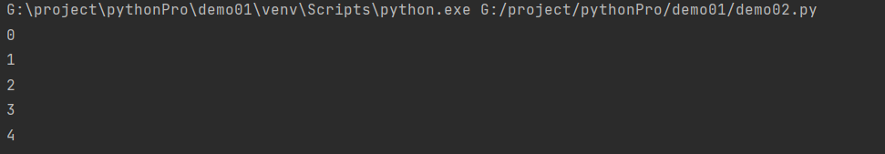
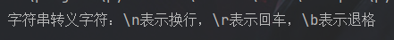
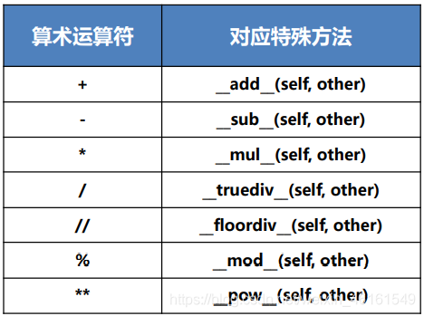
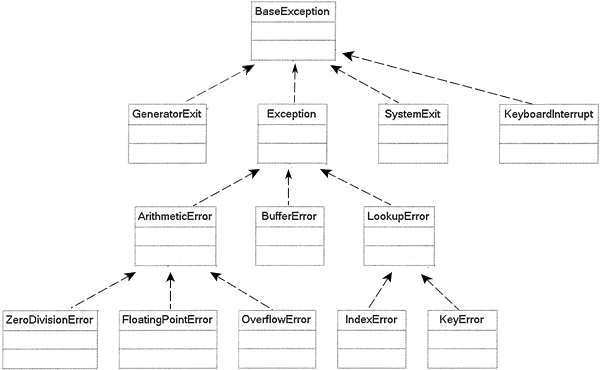

# 一、python基础

## 模块

### 模块安装

```python
pip install 模块名
```

### 模块使用

```python
#第一种
import 模块名
#使用
模块名.函数/变量

#第二种
form 模块名 import 函数/变量
#使用
函数/变量

#导入指定模块全部内容
import 模块名
from 模块名 import *
```

```python
import demo01
demo01.test1()

from demo01 import test1
test1()

from demo01 import *
test1()
test2()
test3()
```

## 命名

> 可以包含字母、数字、下划线，但是不能以数字开头
>
> 区分大小写

## 命名规范

> 1.函数
>
> ​	函数名一律小写，如有多个单词，用下划线隔开	例如：student、student_name
>
> 2.类名
>
> ​	类名使用驼峰命名风格，首字母大写	例如：StudentName
>
> 3.常量
>
> ​	使用大写命名，如有多个单词，用下划线隔开	例如：STUDENT、STUDENT_NAME

| 类型            | 约束                                                         | 例                               |
| --------------- | ------------------------------------------------------------ | -------------------------------- |
| **项目名**      | 全小写,可使用下划线                                          | 01_python基础，my_project        |
| **模块名**      | 模块尽量使用小写命名，首字母保持小写，尽量不要用下划线(除非多个单词，且数量不多的情况)（加入下划线可改善可读性） | decoder，html_parser             |
| **包名**        | 模块尽量使用小写命名，首字母保持小写，尽量不要用下划线(除非多个单词，且数量不多的情况)（加入下划线可改善可读性） | decoder，html_parser             |
| **类名**        | 类名使用驼峰命名风格，首字母大写，私有类可用一个下划线开头   | Farm，AnimalFarm，_PrivateFarm   |
| **函数名&方法** | 函数名一律小写，如有多个单词，用下划线隔开，私有函数在函数前加一个下划线_ | run，run_with_env，_private_func |
| **变量名**      | 变量名尽量小写, 如有多个单词，用下划线隔开                   | count ，school_name              |
| **常量**        | 常量使用以下划线分隔的全大写命名                             | MAX_OVERFLOW                     |

## 数据类型



### 常见的布尔值为False的数据

> 1.None
>
> 2.False
>
> 3.任何数字类型的0，如0、0.0、0j
>
> 4.任何空序列，如" "、( )、[ ]
>
> 5.空字典，如{ }

- 注意：布尔值True和False首字母要大写

### 数据类型转换

|    函数    |          说明           |
| :--------: | :---------------------: |
|   bin(x)   |   将x转化为二进制数据   |
|   oct(x)   |   将x转化为八进制数据   |
|   int(x)   |   将x转化为十进制数据   |
|   hex(x)   |  将x转化为十六进制数据  |
|  float(x)  | 将x转化为一个浮点型数据 |
| complex(x) | 将x转化为一个复数型数据 |

## 输入与输出函数

```python
#接受用户键盘输入数据
input([prompt])	#[]是可选的，例如：input("请输入内容")，或者input( )，输入的数据数据类型为字符型

#输出语句
'''
objects:输出多个对象时，对象之间需要分隔符分隔
sep:用于设定分隔符，默认使用空格作为分隔符
end:用于设定输出以什么结尾，默认值为换行符\n
file:表示数据输出的文件对象，默认输出到控制台，可以输出到文件（写路径）
'''
print(objects,sep=" ",end = "\n",file = sys.stdout)
```

# 二、运算符

> 相比与Java，Java中没有的会做笔记

## 算数运算符

|  //  | 整除，使两个操作数相除，获取商的整数部分 |  2//8，结果为0  |
| :--: | :--------------------------------------: | :-------------: |
|  **  |        幂，使两个操作数进行幂运算        | 2**8，结果为256 |

> 整型与浮点型进行混合运算时，将整型转换为浮点型
>
> 其他类型与复数类型进行混合运算时，将其他类型转化为复数类型

## 赋值运算符

> 海象运算符	:=
>
> 用于在表达式内部为变量赋值

```python
a = 1
p = a + (b:=2)
print(p)
```

## 逻辑运算符

> 1. 与：and
> 2. 或：or
> 3. 非：not

## 成员运算符

> 成员运算符in和not in用于测试给定数据是否在于序列中
>
> 1.in：如果指定元素在序列中返回true，否则返回false
>
> 2.not in：如果指定元素不在序列中返回true，否则返回false

## 实训

```python
weight = float(input("请输入你的体重，单位是kg"))#输入的数据为字符型
height = float(input("请输入你的身高，单位是m"))

a = weight / (height **2)

print("哦，兄弟你的BMI是："+str(a))#输出语句内容前后要一致

if a < 20:
    print("太轻了")
elif 25<a<30:
    print("超重了")
elif a > 30:
    print("你tm胖死了")
else:
    print("完美身材")
```

# 三、流程控制

> 判断语句：if/if...else/if...elif...else	
>
> 循环语句：for/while
>
> for语句可以与range（）函数搭配，range（）函数可以生成一个由整数醉成的可迭代对象

> for语句语法格式：
>
> ```python
> for 临时变量 in 目标对象:
> 
> 	代码段
> ```

```python
for i in range(5):
    print(i)
```



## 实训

> 逢7拍手，带有7的数和7的倍数

```python
#逢7拍手
#100以内
# for i in range(1,101):
#     # if i % 7==0 or i%10==7 or i//10==7:#7的倍数,7、14、21...   17、27、37...   整除10等于7，71、72、73...
#     # if i % 7==0 or str(i).find('7')>=0:
#     if i % 7==0 or ('7') in str(i):
#         print("拍手",end = "\t")
#     else:
#         print(i,end='\t')
#     if i % 10 == 0 :#10个一换行
#         print(" ")


#1000以内
for i in range(1,1001):
    # if i%10==7 or i//10==7 or i//100==7 or i% 100 //10==7 or i % 7 ==0: #带有7的，17、27、37...117、127、137...  整除10等于7，71、72、73...
                                                                        # 整除100等于7，701、702...  271、272、273......   7得倍数
    # if i % 7 == 0 or str(i).find('7') >=0:
    if i % 7 == 0 or ('7') in str(i):
        print("拍手",end = "\t")
    else:
        print(i,end='\t')
    if i % 40 == 0 :#40个一换行
        print(" ")
```

# 四、字符串

## 转义字符

| 转义字符 |         功能         |
| :------: | :------------------: |
|    \b    |         退格         |
|    \v    |      垂直制表符      |
|    \t    |      水平制表符      |
|    \r    | 回车（不换行。替换） |

> 如果一段字符串中包含多个转义字符，但又不希望转义字符产生作用，可以使用原始字符，即在字符串开始的引号之前添加r或R

```python
print(r'字符串转义字符：\n表示换行，\r表示回车，\b表示退格')
```



## 格式化字符串

> 1. 使用%格式化
> 2. 使用format()方法格式化
> 3. 使用f-string格式化

| 格式符 |                           格式说明                           |
| :----: | :----------------------------------------------------------: |
|   %c   |                   将对应的数据格式化为字符                   |
|   %s   |                  将对应的数据格式化为字符串                  |
|   %d   |                   将对应的数据格式化为整数                   |
|   %u   |                将对应的数据格式化为无符号整型                |
|   %o   |               将对应的数据格式化为无符号八进制               |
|   %x   |              将对应的数据格式化为无符号十六进制              |
|   %f   | 将对应的数据格式化为浮点数，可指定小数点后的精度（默认保留6位小数） |

### 使用%格式化

```python
age=18
format = '我今年%d岁'
print(format % age)
print('我今年%d岁' % age)
#输出：我今天18岁
```

```python
name='lz'
age=18
print('我叫%s，我今年%d岁' %(name,age))
#输出：我叫lz，我今年18岁
```

> 使用多个格式符进行格式化时特换的数据以元组形式存储

### 使用format()方法格式化

```python
name='lz'
age=18
value='我叫:{}，我今年{}岁'
print(value.format(name,age))
#输出：我叫:lz，我今年18岁
```

> 字符串中的{}中可以明确指定编号，格式化字符串时解释器会按编号取value中相应位置（索引）的值替换{}，value中元素的索引从0开始排序

```python
name='lz'
age=18
value='我叫:{1}，我今年{0}岁'
print(value.format(age,name))
#输出：我叫:lz，我今年18岁
```

> 字符串的{}中可以指定名称，字符串在被格式化时python解释器会按真实数据绑定的名称替换{}中的变量

```python
name1='lz'
age1=18
value='我叫:{name}，我今年{age}岁'
print(value.format(name=name1,age=age1))
#输出：我叫:lz，我今年18岁
```

> 字符串中的{}可以指定替换的浮点型数据的精度

```python
points = 19
total = 22
print('所占百分比时：{:.3%}'.format(points/total))#保留小数点后三位，四舍五入
#输出：所占百分比时：86.364%
```

### 使用f-string格式化

> 在形式上以f或F引领字符串
>
> ```python
> f('{变量名}')或F('{变量名}')
> ```

```python
name="lz"
age=18
print(f'我叫{name}，我今年{age}岁')
#输出：我叫lz，我今年18岁
```

## 字符串方法

> 1. find(sub,[star,end]):用于查找字符串中是否包含子串，返回-1为查找的字符串中不包含子串
>
>    - sub:指定要查找的字符串
>
>    - star:开始索引，默认为0
>    - end:结束索引，默认为字符串的长度
>
> 2. replace(old,new,[count]):字符串替换
>
>    - count：指定替换次数，默认全部替换
>3. count(value):统计个数
> 4. split(sep=none,[maxsplit=-1]):字符串分割
>
>    - sep:设置分隔符
>    - maxsplit:分割次数，默认是-1，表示不限制分割次数
>
> 5. join():字符串拼接
>
> 6. strip(iterable):移除字符串头部和尾部的指定字符
>
> 7. lstrip():移除字符串头部的指定字符
>
> 8. rstrip():移除字符串尾部的指定字符
>
> 9. upper():转换为大写
>
> 10. lower():转换为小写
>
> 11. capitalize():第一个字母转换为大写
>
> 12. title():每个单词的首字母转换为大写
>
> 13. center(width,[fillchar]):居中显示
>
>     - width:字符串长度
>     - fillchar:填充的字符,默认为空格
>
> 14. ljust(width,[fillchar]):左对齐显示
>
> 15. rjust(width,[fillchar]):右对齐显示

```python
a = 'hello word'
b='a/b/c/d/'
c='^'
d="    wocao    "
e='HI'

# print(a.find('h'))#0
# print(a.find('w'))#6
# print(a.find('d'))#9
# print(a.find('a'))#-1
# print(a.find('f'))#-1

# print(a.replace('l','t'))#hetto word
# print(a.replace('l','t',1))#hetlo word

# print(b.split(sep='/',maxsplit=-1))#['a', 'b', 'c', 'd', '']
# print(b.split(sep='/'))#['a', 'b', 'c', 'd', '']

# print(c.join(a))#h^e^l^l^o^ ^w^o^r^d

# print(d)#    wocao
# print(d.strip())#wocao
# print(d.lstrip())#wocao
# print(d.rstrip())#    wocao

#使用strip()删除字符
# a = 'hello'
# print(a.strip('o'))#hell
# print(a.strip('h'))#ello
# print(a.strip('l'))#hello
# print(a.lstrip('o'))#hello
# print(a.lstrip('h'))#ello
# print(a.rstrip('o'))#hell
# print(a.rstrip('h'))#hello

# print(a.upper())#HELLO WORD
# print(e.lower())#hi
# print(a.capitalize())#Hello word
# print(a.title())#Hello Word

# print(a.center(15,'-'))#---hello word--
# print(a.ljust(15,'-'))#hello word-----
# print(a.rjust(15,'-'))#-----hello word
# print(a.rjust(15))#     hello word

```

## 补充

> id(str):用来查看str在内存中的地址

```python
a='hello'
print(id(a))#1850375094832
```

## 实训

> 判断字符串中大小写字母的个数
>
> 
>
> - isalnum() 所有字符都是数字或者字母，为真返回 Ture，否则返回 False
> - isalpha() 所有字符都是字母，为真返回 Ture，否则返回 False
> - isdigit() 所有字符都是数字，为真返回 Ture，否则返回 False
> - islower() 所有字符都是小写，为真返回 Ture，否则返回 False
> - isupper() 所有字符都是大写，为真返回 Ture，否则返回 False
> - istitle() 所有单词都是首字母大写，为真返回 Ture，否则返回 False
> - isspace() 所有字符都是空白字符，为真返回 Ture，否则返回 False

```python
a="fFADaDFASsljFSDdFASDao"
u=0
l=0
for x in a:
    if(x.isupper()):
        u+=1
    elif(x.islower()):
        l+=1
print("大写字母数量为%d" %u)#大写字母数量为14
print("小写字母数量为%d" %l)#小写字母数量为8
```


> 文本进度条

```python
# import time as t
# scale = 50
# print("执行开始".center(50,"="))
# start = t.perf_counter()#开始计时
# for i in range(scale+1):#0~50
#     a = '*' * i
#     b = '.' * (scale - i)
#     c = (i/scale)*100
#     dur = t.perf_counter() - start#计算时差
#     print("\r{:^3.0f}%[{}->{}]{:.2f}s".format(c,a,b,dur),end="")
#     #\r用来在每次输出完成后，将光标移至行首，这样保证进度条始终在同一行输出，即在一行不断刷新的效果；
#     #{:^3.0f}表示输出格式为居中，占3位，小数点后0位，浮点型数，
#     t.sleep(0.1)
# print('\n',"执行结束".center(50,"="))


# import time #调用time库
# print("开始执行".center(25, '-')) #把开始执行放中间，不足25个用-包围
# start = time.perf_counter() #记录当前时间
# count = 50        #字符串宽度为50
# for i in range(count + 1):
#     a = "*" * i  #复制#的次数
#     b = "." * (count - i) #复制.的次数
#     c = (i/count) * 100   #输出百分比
#     res = time.perf_counter() - start#计算时间差
#     print(f"\033[1;31m\r{c:.2f}%[{a}->{b}]{res:.2f}s\033[0m", end="")
#     # 输出进度条并改变颜色#，还可以改变进度条背景颜色
#     time.sleep(0.1) #每个任务完成眠时间0.1秒
# print("\n" + "结束执行".center(25, '-')) #换行把结束执行放中间，不足25个用-包围
```


# 五、组合数据类型

> 组合数据类型分为3种：序列类型、集合类型、映射类型


> 序列类型
>
> 序列类型有三种：字符串（str）、列表（list）、元组（tuple）


> 集合类型
>
> 1. 集合（set）是唯一的集合类型
>
> 2. Python要求放入集合种的元素必须是不可变类型
>
>    - 不可变类型：整型、浮点型、字符串、元组
>
>    - 可变类型：列表、集合、字典


> 映射类型
>
> 1. 键值对中的键与值之间存在映射关系
> 2. 字典（dict）是Python中唯一的内置映射类型
> 3. 遵循两个原则：
>    - 每个键只能对应一个值，不允许同一个键在字典中重复出现
>    - 字典中的键是不可变类型

## 列表

### 创建列表

```python
list_one = [ ]#创建空列表
list_two = list()#创建空列表
```

### 使用

```python
list_one = ['p','y','t','h','o','n']
list_two = list('python')
list_three = list(['python'])
list_four = list(['p','y','t','h','o','n'])
print(list_one)#['p', 'y', 't', 'h', 'o', 'n']
print(list_two)#['p', 'y', 't', 'h', 'o', 'n']
print(list_three)#['python']
print(list_four)#['p', 'y', 't', 'h', 'o', 'n']

l1 = list([1,2,3])#利用列表创建列表
l2 = list((1,2,3))#利用元组创建列表
l3 = list({1,2,3})#利用集合创建列表
l4 = list(range(1,5))
l5 = [range(1,5)]
l6 = list('python')
l7 = ['python']
print(l1)#[1, 2, 3]
print(l2)#[1, 2, 3]
print(l3)#[1, 2, 3]
print(l4)#[1, 2, 3, 4]
print(l5)#[range(1, 5)]
print(l6)#['p', 'y', 't', 'h', 'o', 'n']
print(l7)#['python']
```

### 补充

> 支持通过for...in..语句的带获取数据的对象就是可迭代对象
>
> 可迭代对象有：字符串、列表、集合、字典、文件
>
> 使用isinstance()函数可以判断目标是否为可迭代对象

```python
from collections.abc import Iterable
ls = [3,4,5]
print(isinstance(ls,Iterable))#True
```

### 访问列表元素

#### 以索引方式

> list[n]
>
> 正向索引从0开始，负向索引从-1开始
>
> 若访问不存在索引值则报错

#### 以切片方式

> list[m:n:step]
>
> 获取列表列表中m~n对应的元素（不包括n），m省略默认从列表首部开始,n省略默认到列表末尾结束，step默认为1，

```python
a = ['a','b','c','d','e','f']
print(a[2:6:2])#['c', 'e']
```

#### 在循环中依次访问

> 使用for...in...遍历

### 添加列表元素

> python提供了三种方法：
>
> - append():在列表末尾添加新的元素
> - extend():在列表末尾一次性添加另一个列表中的所有元素
> - insert():按照索引将新元素插入列表的指定位置

```python
a = ['a','b','c','d','e','f']
b = ['1','2']

a.append('g')
print(a)#['a', 'b', 'c', 'd', 'e', 'f', 'g']
a.extend(b)
print(a)#['a', 'b', 'c', 'd', 'e', 'f', 'g', '1', '2']
a.extend(['b','c','d'])
print(a)#['a', 'b', 'c', 'd', 'e', 'f', 'g', '1', '2', 'b', 'c', 'd']
a.insert(2,'i')
print(a)#['a', 'b', 'i', 'c', 'd', 'e', 'f', 'g', '1', '2', 'b', 'c', 'd']
```

### 元素排序

> 元素排序方法：
>
> - sort(key=none,reverse=False):key用于指定排序规则，默认值为None，参数reverse用于控制列表元素排序的方式，取值为True或False，True表示降序，False表示升序
> - sorted():用于按升序排序列表元素，返回值是升序排序后的新列表
> - reverse():用于逆向排序

```python
a = ['5','1','7','9','2','4']
b = ['java','vue','javascript']
# a.sort(reverse=True)
# print(a)#['9', '7', '5', '4', '2', '1']
# a.sort(reverse=False)
# print(a)#['1', '2', '4', '5', '7', '9']
# b.sort(key=len)#['vue', 'java', 'javascript'] len()计算字符串长度
# print(b)
# b.sort(key=len,reverse=True)#['javascript', 'java', 'vue']
# print(b)

# list = sorted(a)
# print(a)#['5', '1', '7', '9', '2', '4'] 原列表
# print(list)#['1', '2', '4', '5', '7', '9'] 新列表

a.reverse()
print(a)#['4', '2', '9', '7', '1', '5']
```

### 删除列表

> 常用方式：
>
> - del语句:删除列表指定位置的元素
> - remove():用于移除列表中的某个元素，若列表中有多个匹配的元素，只移除匹配到的第一个元素
> - pop():按照索引移除列表中的某个元素，若未指定，移除列表中的最后一个元素
> - clear():清空列表

```python
a = ['java','vue','javascript','javascript']
del a[0]
print(a)#['vue', 'javascript', 'javascript']

a = ['java','vue','javascript','javascript']
a.remove('java')
print(a)#['vue', 'javascript', 'javascript']

a = ['java','vue','javascript','javascript']
a.remove('javascript')
print(a)#['java', 'vue', 'javascript']

# a = ['java','vue','javascript','javascript']
# a.remove()
# print(a)#报错

a = ['java','vue','javascript','javascript']
a.pop(1)
print(a)#['java', 'javascript', 'javascript']

a = ['java','vue','javascript','javascript']
a.pop()
print(a)#['java', 'vue', 'javascript']

a = ['java','vue','javascript','javascript']
a.clear()
print(a)#[]
```

### 列表推导式

> 由于列表使用[ ]创建，列表推导式用于生成列表，所以列表推导式放在[ ]中
>
> 基本格式：
>
> ​	[exp for x in list]

```python
a = [1,2,3,4,5,6,7,8,9]
a = [data*data for data in a]
print(a)#[1, 4, 9, 16, 25, 36, 49, 64, 81]
```

#### 带有if语句的列表推导式

```python
a = [1,2,3,4,5,6,7,8,9]
a = [data for data in a if data > 4]#列表中只保留大于4的元素
print(a)#[9, 16, 25, 36, 49, 64, 81]
```

#### 嵌套for循环语句的列表推导式

```python
a = [1,2,3]
b = [4,5,6]
c = [x+y for x in a for y in b]
print(c)#[5, 6, 7, 6, 7, 8, 7, 8, 9]
```

#### 带有if语句和嵌套for循环语句的列表推导式

> 使用不多，未展示

## 元组

### 创建使用

> 两种方式：一是使用圆括号（），二是使用函数tuple（）

```python
tuple_one = ()#创建空元组
tuple_two = (1)
tuple_three = (2,)#若元组只有一个元素，该元素之后的 , 不可以省略
print(type(tuple_one))#<class 'tuple'>
print(type(tuple_two))#<class 'int'>
print(type(tuple_three))#<class 'tuple'>

tuple_one = tuple()#创建空元组
t1 = tuple([1,2,3])#利用列表创建元组
t2 = tuple((1,2,3))#利用元组创建元组
t3 = tuple({1,2,3})#利用集合创建元组
t4 = tuple('python')
t5 = ('python')
t6 = tuple(range(1,5))
print(t1)#(1, 2, 3)
print(t2)#(1, 2, 3)
print(t3)#(1, 2, 3)
print(t4)#('p', 'y', 't', 'h', 'o', 'n')
print(t5)#python
print(t6)#(1, 2, 3, 4)

```

### 访问元组

> 访问元组与访问列表的方式一样

> 元组是不可变类型，元组中的元素不可修改，即元组不支持添加、删除、排序等操作

## 集合

### 创建集合

```python
set_one = {1}#单元素集合。使用{}不能创建空集合，不包含元素的{}创建的是空字典
set_two = set()#创建空集合

s1 = set([1,2,3])#利用列表创建集合
s2 = set((1,2,3))#利用元组创建集合
s2 = set({1,2,3})#利用集合创建集合
s3 = set('hello')
s4 = set(range(1,5))
s5 = set('python')
s6 = {'python'}
print(s1)#{1, 2, 3}
print(s2)#{1, 2, 3}
print(s3)#{'l', 'h', 'e', 'o'}
print(s4)#{1, 2, 3, 4}
print(s5)#{'y', 't', 'p', 'n', 'h', 'o'}
print(s6)#{'python'}
```

### 常见方法

|   常见方法    |                             说明                             |
| :-----------: | :----------------------------------------------------------: |
|    add(x)     |             向集合中添加元素x，x已存在时不做处理             |
|   remove(x)   |        删除集合中的元素x，若x不存在则抛出KeyError异常        |
|  discard(x)   |             删除集合中的元素x，若x不存在不做处理             |
|     pop()     | 随机返回集合中的一个元素，同时删除该元素，若集合为空，抛出KeyError异常 |
|    clear()    |                           清空集合                           |
|    copy()     |                    复制集合，返回值为集合                    |
| isdisjoint(T) | 判断集合与集合T是否没有相同的元素，没有返回True，有则返回False |
|   updata()    |               合并两个集合，重复的元素自动去重               |

```python
s1 = {1,2,3}
# s1.add(3)
# print(s1)#{1, 2, 3}
# s1.add(4)
# print(s1)#{1, 2, 3, 4}

# s1.remove(3)
# print(s1)#{1, 2}
# s1.remove(4)
# print(s1)#报错

# s1.discard(3)
# print(s1)#{1, 2}
# s1 = {1,2,3}
# s1.discard(4)
# print(s1)#{1, 2, 3}

# s = s1.pop()
# print(s1)#{2, 3}
# print(s)#1
# s1 = {1,2,3}
# s = s1.pop('2')
# print(s)#报错

# s1.clear()
# print(s1)#set()

# s = s1.copy()
# print(s)#{1, 2, 3}
s1 = {1,2,3}
s2={2,3}
s3={4,5}
print(s2.isdisjoint(s1))#False
print(s3.isdisjoint(s1))#True

l1={1,2,3,4}
l2={4,5,6}
l1.update(l2)
print(l1)#{1, 2, 3, 4, 5, 6}
```

### 集合推导式

> 集合推导式和列表推导式一样，只不过集合推导式需要{ }包裹起来

## 字典

### 创建字典

> 两种方式：一是使用{}，二是使用dict()方法

```python
d1 = {}#创建空字典
d2 = {'a':1,'b':2}
d3 = {'a':1,'b':2,'b':3}
d4 = {'a':1,'b':1}
print(d1)#{}
print(d2)#{'a': 1, 'b': 2}
print(d3)#{'a': 1, 'b': 3}
print(d4)#{'a': 1, 'b': 1}

d1 = dict()#创建空字典
d2 = dict({'a':1,'b':2})
print(d1)#{}
print(d2)#{'a': 1, 'b': 2}
```

### 访问字典

> 1. 使用键访问
> 2. 使用get()方法
> 3. 使用keys()访问字典中所有键
> 4. 使用values()访问字典中所有值
> 5. 使用items()访问字典中所有元素
>
> - 内置方法key()、values()、items()的返回值都是可迭代对象，利用循环可以遍历写着对象

```python
d1 = dict({'a':1,'b':2})
print(d1['a'])#1
print(d1['c'])#报错

print(d1.get('b'))#2
print(d1.get('c'))#None

d1 = dict({'a':1,'b':2})
print(d1.keys())#dict_keys(['a', 'b'])
print(d1.values())#dict_values([1, 2])
print(d1.items())#dict_items([('a', 1), ('b', 2)])


d1 = dict({'a':1,'b':2})
for d in d1.keys():
    print(d)#a   b
    
d1 = dict({'a':1,'b':2})
for d in d1.values():
    print(d)#1   2

d1 = dict({'a':1,'b':2})
for d in d1.items():
    print(d)#('a', 1)   ('b', 2)
```

### 字典元素的添加和修改

> 通过键赋值或使用update()方法添加和修改元素

```python
d1 = dict({'a':1,'b':2})
d1['c'] = 3
print(d1)#{'a': 1, 'b': 2, 'c': 3}
d1 = dict({'a':1,'b':2})
d1.update(d=4)
print(d1)#{'a': 1, 'b': 2, 'd': 4}

d1 = dict({'a':1,'b':2})
d1['a'] = 0
print(d1)#{'a': 0, 'b': 2}
d1 = dict({'a':1,'b':2})
d1.update(b=7)
print(d1)#{'a': 1, 'b': 7}
```

### 字典元素的删除

> 1. pop()方法：根据指定的键删除字典中的指定元素，若删除成功，该方法返回目标元素的值
> 2. popitem()方法：随机删除字典中的元素，若删除成功，返回被删除的元素
> 3. clear()方法：清空字典

```python
d1 = dict({'a': 1, 'b': 2})
print(d1.pop('a'))#1
print(d1)#{'b': 2}

d1 = dict({'a': 1, 'b': 2})
print(d1.popitem())#('b', 2)
print(d1)#{'a': 1}

d1 = dict({'a': 1, 'b': 2})
d1.clear()
print(d1)#{}
```

### 字典推导式

> 字典推导式的格式、用法与列表推导式类似，字典推导式需要用{ }包裹，且内部需包含键和值两个部分

```python
d1 = dict({'a': 1, 'b': 2})
d={key:value for key,value in d1.items()}
print(d)#{'a': 1, 'b': 2}

d1 = dict({'a': 1, 'b': 2})
d={value:key for key,value in d1.items()}
print(d)#{1: 'a', 2: 'b'}
```

## 组合数据类型应用运算符

### "+"运算符

> python的字符串、列表和元组支持"+"运算符

```python
a1 = 'py'
b1 = 'thon'
l1 = [1,2]
l2 = [3,4]
t1 = ('a','b')
t2 = ('c','d')
s1 = {'x','y'}
s2 = {'z'}
a = a1+b1
print(a)#python
l = l1+l2
print(l)#[1, 2, 3, 4]
t = t1+t2
print(t)#('a', 'b', 'c', 'd')
# s = s1+s2
# print(s)#报错
```

### “*”运算符

> “*”运算符的运算规则与“+”运算符类似，字符串、列表和元组可以与整数进行乘法运算

```python
a = 'python'
l = [1,2]
t = ('a','b')
s = {'x','y'}
print(a*3)#pythonpythonpython
print(l*3)#[1, 2, 1, 2, 1, 2]
print(t*3)#('a', 'b', 'a', 'b', 'a', 'b')
# print(s*3)#报错
```

### "in"、"not in"运算符

> python的字符串、列表、元组、集合和字典都支持成员运算符

```python
a = 'python'
l = [1,2]
t = ('a','b')
s = {'x','y'}
d = {'a':1,'b':2}
print('y' in a)#True
print(1 in l)#True
print('a' in t)#True
print('x' in s)#True
print('a' in d)#True
print(1 in d)#False
```

# 六、函数

## 定义函数

```python
def 函数名([参数列表]):
	函数体
	[return语句]
```

## 函数参数传递

### 位置参数传递

```python
def get_max(a,b):
    if (a<b):
        print(a,"是较大的值")
    else:
        print(b,"是较大的值")
get_max(5,9)#5 是较大的值
```

### 关键字参数传递

```python
def connect(ip,port):
    print(f'设备{ip}:{port}连接！')
connect(ip='127.0.0.1',port='8080')#设备127.0.0.1:8080连接！
```

### 默认参数传递

```python
def connect(ip,port=8080):
    print(f'设备{ip}:{port}连接！')
connect(ip='127.0.0.1')#设备127.0.0.1:8080连接！
connect(ip='127.0.0.1',port='8081')#设备127.0.0.1:8081连接！
```

### 参数的打包与解包

#### 打包

> 如果函数在定义时无法确定需要接收多少个数据，那么可以在定义函数时为形参添加“\*”或“\*\*”，如果形参的前面加上“\*“，那么可以接收以**元组**形式打包的多个值，如果形参的前面加上”*\*“,那么可以接收以**字典**形式打包的多个值

```python
def test(*args):
    print(args)
test(1,2,3)#(1, 2, 3)


def test(**args):
    print(args)
test(a=1,b=2,c=3)#{'a': 1, 'b': 2, 'c': 3}
```

#### 解包

> 如果函数在调用时接收的实参是元组类型的数据，那么可以使用”*“将元组拆分成多个值，并将每个值按照位置参数传递的方法赋值给形参，如果函数在调用时接收的实参是字典类型的数据，那么可以使用”**“将字典拆分成多个键值对，并将每个值按照关键字参数传递的方式赋值给与键名对应的形参

```python
def test(a,b,c):
    print(a,b,c)
count = (1,2,3)
test(*count)#1 2 3

def test(a,b,c):
    print(a,b,c)
count = {'a':1,'b':2,'c':3}
test(**count)#1 2 3
```

### 混合传递

>优先级（从高到低）：
>
>​		按位置
>
>​		按关键字
>
>​		按默认值
>
>​		按打包

```python
def test(a,b,c=33,*args,**kwargs):
    print(a,b,c,args,kwargs)
# test(1)#报错
test(1,2)#1 2 33 () {}
test(1,2,3)#1 2 3 () {}
test(1,2,3,4)#1 2 3 (4,) {}
test(1,2,3,4,e=5)#1 2 3 (4,) {'e': 5}
test(1,2,3,4,5,e=6)#1 2 3 (4, 5) {'e': 6}
```

## 函数的返回值

> 如果函数使用return语句返回多个值，那么这些值将被保存到元组中

```python
def move(x,y,step):
    nx = x + step
    ny = y + step
    return nx,ny
result = move(100,200,5)
print(result)#(105, 205)
```

## 变量作用域

### global关键字

> 使用global关键字可以将局部变量声明为全局变量

```python
n = 1
def move():
    global n#n在这是局部变量，使用global声明n为全局变量
    n = n + 1
    print(n)#2
move()
print(n)#2
```

### nonlocal关键字

> 使用nonlocal关键字可以在局部作用域中修改嵌套作用域中声明的变量

```python
def test():
    n = 10
    def test1():
        nonlocal n
        n = 20
    test1()
    print(n)#20
test()
```

## 特殊形式的函数

### 递归函数

> 递归函数在定义时需要满足2个基本条件：一个是递归公式，另一个是边界条件
>
> 
>
> 递推：递归本次的执行都基于上一次的运算结果
>
> 回溯：遇到终止条件是，则沿着递推往回一级一级地把值返回来
>
> ```python
> def 函数名([参数列表]):
> 	if 边界条件:
> 		return 结果
> 	else:
> 		return 递归公式
> ```

```python
# 阶乘
def func(num):
    if num == 1:
        return 1
    else:
        return num*func(num - 1)
num = int(input('请输入一个整数！'))
result = func(num)
print(f'{num}! = %d' %result)#5! = 120

# 汉诺塔
def remove(afrom,to):
    print(f"从{afrom},移动到了{to}")

def hano(n,a,b,c):
    if n == 1:
        remove(a,c)
    else:
        hano(n-1,a,c,b)
        remove(a,c)
        hano(n-1,b,a,c)
hano(3,'a','b','c')
#3为3个圆盘，a/b/c代表柱子
'''
输出：
    从a,移动到了c
    从a,移动到了b
    从c,移动到了b
    从a,移动到了c
    从b,移动到了a
    从b,移动到了c
    从a,移动到了c
'''
```

### 匿名函数

> python中使用lambda关键字定义匿名函数
>
> ```python
> lambda <形式参数列表> : <表达式>
> ```

```python
temp = lambda x : pow(x,2)
print(temp(10))#100
```

# 七、文件与数据格式化

## 标准文件

> 有三个标准文件：
>
> 1. stdin(标准输入文件)
>
> 2. stdout(标准输入文件)
>
> 3. stderr(标准错误文件)
>
>    ```python
>    import sys
>    file = sys.stdout
>    file.write('hello')#相当于print('hello')
>    ```

## 文件的基础操作

### 打开文件

>内置函数open()打开文件
>
>```open(file,mode='r',encoding=None)```
>
>- file用于接收文件名或文件路径
>- mode用于设置文件的打开模式，默认为只读
>  - r：只读
>  - w：只写
>  - a：追加
>- encoding用于设置文件的编码格式

| 打开模式 | 名称         | 描述                                                         |
| :------- | ------------ | ------------------------------------------------------------ |
| r/rb     | 只读         | 以只读方式打开文本文件/二进制文件，若文件不存在，文件打开失败 |
| w/wb     | 只写         | 以只写方式打开文本文件/二进制文件，若文件已存在，则重写文件，否则创建新文件 |
| a/ab     | 追加         | 以追加方式打开文本文件/二进制文件，只允许在该文件末尾追加数据，若文件不存在，则创建新文件 |
| r+/rb+   | 读取（更新） | 以读/写方式打开文本文件/二进制文件，若文件不存在，文件打开失败 |
| w+/wb+   | 写入更新）   | 以读/写方式打开文本文件/二进制文件，若文件已存在，则重写文件 |
| a+/ab+   | 追加更新）   | 以读/写方式打开文本文件/二进制文件，只允许在该文件末尾追加数据，若文件不存在，则创建新文件 |

```python
file1 = open('E://file.txt')#只读模式，打开E盘下的file.txt文件
file1 = open('file.txt')#只读模式，打开当前目录下的文件
```

### 关闭文件

> 1. 使用close()方法
>
>    ```file.close```()
>
> 2. 使用with语句：with语句预定义清理操作，实现文件的自动关闭
>
>    ```python
>    with open('file.txt') as f:#as后的变量f用于接收with语句打开的文件，程序中无须再调用close()方法关闭，with语句自动关闭文件
>        pass
>    ```

### 文件读取

> 1. read(n=-1)方法：可以从指定文件中读取指定字节的数据
>    - 参数n用于设置读取数据的字节数，若未提供或设置为-1，则一次读取并返回文件中所有数据
> 2. readline()方法：可以从指定文件中读取一行数据
> 3. readlines()方法：可以一次性读取文件中的所有数据，若读取成功返回一个列表，文件中的每一行对应列表中的一个元素。
>
> - 注意：read()和readlines()方法参数省却时都可以读取文件中的全部数据，一次读取便会耗尽系统内容，所以这两种方法缺少参数不安全

```python
with open('file.txt',encoding='utf-8') as f:
    print(f.read())
    print(f.read(10))
    print(f.readline())
    print(f.readlines())
```

### 文件写入

> 1. write()方法：可以将指定字符串写入文件
> 2. writeline()方法：将行列表写入文件。若写入文件的数据再文件中需要换行,应**显式指定换行符**

```python
string ='小瑶瑶，我爱你哦'
with open('file.txt',mode='w+',encoding='utf-8') as f:
    size = f.write(string)
    print(size)
    
    
string ='小瑶瑶\n我爱你哦'
with open('file.txt',mode='w+',encoding='utf-8') as f:
    size = f.writelines(string)
    print(size)    
```

### 文件的定位读写

> 文件读写位置默认为0，即读写位置默认在文件首部
>
> 1. tell()方法：用于获取文件当前的读写位置
> 2. seek(offset,from)方法：使用该方法可控制文件的读写位置
>    - offset表示偏移量，即读写位置需要移动的字节数，可以为负数
>    - from用于指定文件的读写位置，取值为0，1，2
>      - 0表示文件开头
>      - 1表示当前那读写位置
>      - 2表示文件末尾

```python
with open('file.txt',mode='w+',encoding='utf-8') as f:
    print(f.tell())
    f.seek(5,0)
    print(f.tell())
```

## 文件与目录管理

> 1. 删除文件——remove()函数
> 2. 文件重命名——rename()函数
> 3. 创建/删除目录——mkdir()/rmdir()函数
> 4. 获取当前目录——getcwd()函数
> 5. 更改默认路径——chdir()函数
> 6. 获取文件名列表——listdir()函数
> 7. 判断文件是否为目录——isdir()函数
> 8. 判断文件是否存在——exists()函数

```python
import os
# os.remove('file.txt')
# os.rename('file.txt','file1.txt')
# os.mkdir('a')
# os.rmdir('a')
# print(os.getcwd())#G:\project\pythonPro\demo01
# os.chdir('F:\\')
# print(os.listdir())#['.idea', '5.组合数据类型.py', '6.函数.py', '7.文件与数据格式化.py', 'demo01.py', 'demo02.py', 'demo03.py', 'file.txt', 'main.py', 'venv', '__pycache__', '实训.py']
# print(os.path.isdir('file1.txt'))
# print(os.path.exists('file1.txt'))
```

# 八、面向对象

> 类和对象是一对多的关系

## 类成员

### 类属性

> 类属性可以通过对象或者类调用

```python
class person:
    name = '张三'#类属性

p = person()#实例化

print(p.name)#张三
print(person.name)#张三
```

### 实例属性

> 实例属性只能通过对象调用

```python
class person:
    def fn(self):
        self.name = 'lz'#实例属性
        
p = person()  # 实例化

p.fn()
print(p.name)  # lz
print(person.name)  # 报错
```

#### 区分类属性和实例属性

```python
class person:
    name = '张三'
    def fn(self):
        self.name = 'lz'
        
p = person()  # 实例化

p.fn()
print(p.name)  # lz
print(person.name)  # 张三
```

## 方法

### 类方法

> 类方法是定义在类内部，使用装饰器@classmethod修饰的方法。类方法中参数列表的第一个参数为cls，代表类本身，它会在类方法被调用时自动接收由系统传递的调用该方法的类

```python
class person:
    @classmethod
    def fn(cls):
       print('我是类方法')

p = person()  # 实例化

p.fn()#我是类方法
person.fn()#我是类方法
```

### 实例方法

>实例方法中的self参数代表对象本身，它会在实例方法被调用是只有接收由系统传递的调用该方法的对象。实例方法只能通过对象调用

```python
class person:
    def fn(self):
       print('我是实例方法')

p = person()  # 实例化

p.fn()#我是实例方法
person.fn()#报错
```

### 静态方法

> 静态方法是定义在类内部，使用装饰器@staticmethod修饰的方法。与实例方法和类方法相比，静态方法没有任何默认参数。静态方法内部不能直接访问属性或方法，可以使用类名访问类属性或调用方法

```python
class person:
    name = '张三'
    @staticmethod
    def fn():
       print('我是静态方法'),
       print(f'类属性值为{person.name}')#通过类名访问。java中不可这么做

p = person()  # 实例化

p.fn()#我是实例方法

```

## 私有成员

> python通过在类成员的名称前面添加双下划线（__）的方式类表示私有成员

## 构造方法

> 构造方法，即\__init__（）

## 析构方法

> 析构方法，即\_\_del\_\_\_()方法，是销毁对象时系统自动调用的特殊方法，每个类默认都有一个\__del__()方法

```python
class Car:
    def __init__(self):
        self.color = '蓝色'
        print('对象被创建了')#1.对象被创建了
    def __del__(self):#析构方法
        print('对象被销毁了')#3.对象被销毁了

car = Car()
print(car.color)#2.蓝色
del car#使用del语句删除对象的引用
# print(car.color)4.报错
```

## 封装

## 继承

> 子类会自动用于父类的公有成员
>
> python分为单继承和多继承
>
> - 单继承语法`class 之类（父类）`
> - 多继承语法`class 之类（父类1,父类2....）`

### 重写

```python
class person:
    def say(self):
        print('hello')

class cperson(person):
    def say(self):
        print('吃了吗')

c = cperson()
c.say()#吃了吗


class person:
    def say(self):
        print('hello')

class cperson(person):
    def say(self):
        #子类保留父类中的方法，再添加东西。java中没有这种语法
        super().say()#hello
        print('吃了吗')#吃了吗

c = cperson()
c.say()#吃了吗
```

## 多态

```python
class Cat:
    def shout(self):
        print('喵喵喵~')


class Dog:
    def shout(self):
        print('汪汪汪！！！')


def shout(obj):
    obj.shout()


cat = Cat()
shout(cat)#喵喵喵~
dog = Dog()
shout(dog)#汪汪汪！！！
```

## 运算符重载




```python
class Calculator:
    def __init__(self,number):
        self.number = number
    def __add__(self, other):
        self.number += other
        return self.number
    def __sub__(self, other):
        self.number -=other
        return self.number
    def __mul__(self, other):
        self.number *= other
        return self.number
    def __truediv__(self, other):
        self.number /= other
        return self.number

calculator =Calculator(10)
print(calculator+5)#15
print(calculator-5)#10
print(calculator*5)#50
print(calculator/5)#10.0
```

# 九、异常处理

## 异常的类型



> **Exception**内置了非常多的异常，例如：NameError(未定义变量产引发的异常),IndexError(程序越界访问时引发的异常),AttributeError(对象访问不存在的属性引发的异常),FileNotFoundError(未找到指定文件或目录时引发的异常) 

## try...except捕获异常

```python
try:
    print(10 / 0)  # 如果不放在try代码块中，下面的hello无法输出
#可以捕获多个异常
except(ZeroDivisionError,NameError):  # try代码块中有异常，并且与except中相同，则处理，继续输出下面的hello
    print("ZeroDivisionError: division by zero")
else:  # try代码块中没有异常执行
    print('我执行了说明没有异常')
finally:
    print("不管有没有异常我都会执行的")

print('hello')

输出：
    ZeroDivisionError: division by zero
    不管有没有异常我都会执行的
    hello
```

## 抛出异常

> 抛出异常就是制造一个异常抛出

### raise语句

```python
def input_password():
    # 1. 提示用户输入密码
    pwd = input("请输入密码：")

    # 2. 判断密码长度，如果长度 >= 8，返回用户输入的密码
    if len(pwd) >= 8:
        return pwd

    # 3. 密码长度不够，需要抛出异常
    # 1> 创建异常对象 - 使用异常的错误信息字符串作为参数
    ex = Exception("密码长度不够")

    # 2> 抛出异常对象
    raise ex


try:
    user_pwd = input_password()
except Exception as result:
    print("发现错误：%s" % result)

输出：
	请输入密码：123
	发现错误：密码长度不够
```

### assert断言函数

```python
d1 = 10
d2 = 0
assert d2 != 0  # AssertionError，只有为True时，才能执行到下面的print语句
print(d1 / d2)  # 不会执行
```

### 异常的传递

```python
def demo1():
    return int(input("请输入一个整数："))

def demo2():
    return demo1()

try:
    print(demo2())
except ValueError:
    print("请输入正确的整数")
except Exception as result:
    print("未知错误 %s" % result)
```

## 自定义异常

```PYTHON
class ShortInputError(Exception):
    def __init__(self, length, atleast):
        self.length = length
        self.atleast = atleast

try:
    text = input('请输入密码')
    if len(text) < 3:
        raise ShortInputError(len(text), 3)
except ShortInputError as short:
    print('ShortInputError:输如的长度是%d，至少输入%d位' % (short.length, short.atleast))
else:
    print('密码设置成功')
```

