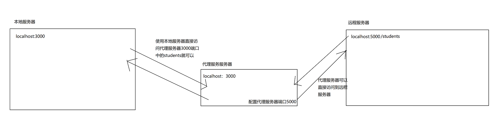

# React和Vue不同之处

> 1. vue中js表达式写在`{{ }}`中和v-on绑定，react中的js表达式写在`{ }`中
> 2. vue中`{{ }}`不可以写this，react中`{ }`可以写this
> 3. vue需要component注册组件，react不需要
> 4. vue需要props接收传递的数据，react直接使用this.props.xxx
> 5. 获取输入框数据，vue一般使用v-model，react使用this.refs.xxx
> 6. vue调用函数时可以加括号也可以不加，react调用函数时一般不加括号，如果加括号的话，需要用到函数柯里化或者调用 返回函数名加括号 的回调函数
> 7. 在vue2中普通函数this指向的是组件，箭头函数是undefined，vue3中没有this。react的类式组件中普通函数开始了严格模式，this就是undefined，箭扣函数this指向的是组件实例化，函数式组件中没有this
> 8. 在vue2中this调用的带个$，例如：this.$refs.xxx。react类式组件中不需要，例如：this.refs.xxx，函数式组件使用Hook，例如：const refs = useRef()
> 9. vue和react的ref返回的都是元素节点，不过react中可以 .value获取input的value值，vue不可以 .value获取，可以使用v-model双向绑定
> 10. vue和react都可以通过事件的e.target.value获取input的value值
> 11. 在点击路由时，vue需要使用class-active添加点击谁为谁添加class功能，react中不写就是点谁给谁添加一个active的类，如果添加其他的类名详情看NavLink v5 v6
> 12. vue中的路由传参和路由编程式导航是有组件封装的方法，react中是通过this.props中的方法
> 13. Suspense，vue在异步加载时使用，react在懒加载时使用

# React入门

## 注意：

> 调用函数时：
>
> ​	函数名：调用的函数（用这个）
>
> ​	函数名（）：调用的返回值

> React 从一开始就被设计为逐步采用，并且你可以根据需要选择性地使用React。可能你只想在现
>
> 有页面中“局部地添加交互性”，那么使用React组件是一种不错的方式。

## React render函数（渲染虚拟DOM）

> 语法:`ReactDOM.render(virtuaIDOM, containerDOM)`
>
> - 参数一:纯js或jsx创建的虚拟dom对象
> - 参数二:用来包含虚拟DOM元素的真实dom元素对象(一般是一个div)
>
> 虚拟DOM本质就是Object类型的对象（一般对象）

### 基础示例

```html
<body>
    <!-- 先准备一个容器 -->
    <div id="test"></div>

    <!-- 引入react核心库。核心库必须在react-dom之前引入 -->
    <script src="../js/react.development.js"></script>
    <!-- 引入react-dom，用于支持react操作DOM -->
    <script src="../js/react-dom.development.js"></script>
    <!-- 引入babel，用于将jsx转为js -->
    <script src="../js/babel.min.js"></script>


    <script type="text/babel">/* 此处type一定是babel*/
        // 1.创建虚拟DOM
        const vdom = <h2>hello,react</h2>/*此处一定不要加引号，因为不是字符串*/
        // 2.渲染虚拟DOM到页面
        ReactDOM.render(vdom, document.getElementById('test'))
    </script>

</body>
```

## jsx语法规则

> 1. 定义虚拟DOM时，不要写引号
> 2. 标签中混入js表达式时要用`{}`
> 3. 样式的类名指定不要用class，要用className
> 4. 内联样式，要用**` style={{fontSize:'30px'}}`**。外层的`{}`表示里面写的是js表达式，内层`{}`表示写的是对象
> 5. 只有一个根标签
> 6. 标签必须闭合
> 7. 标签首字符
>    - 若小写字母开头，则将标签转为html中同名元素，若html中无该标签对应的同名元素，则报错
>    - 若大写字母开头，react就去渲染对应的组件，若组件没有定义，则报错

```js
<script type="text/babel">
        let mId = 't1'
        let mData = 'hello, react'
        const vdom = (
            <div>
                <h2 id={mId} className='ba'>
                    <span style={{ fontSize: '30px' }}>{mData}</span>
                </h2>
                <h2 id={mId} className='ba'>
                    <span style={{ fontSize: '30px' }}>{mData}</span>
                </h2>
                <input type="text"/>
            </div>
        )

        ReactDOM.render(vdom, document.getElementById('test'))


        /*
            jsx语法规则：
             1.定义虚拟DOM时，不要写引号
             2.标签中混入js表达式时要用`{}`
             3.样式的类名指定不要用class，要用className
             4.内联样式，要用style={{fontSize:'30px'}}
             5.只有一个根标签
             6.标签必须闭合
             7.标签首字符
                （1）.若小写字母开头，则将标签转为html中同名元素，若html中无该标签对应的同名元素，则报错
                （2）.若大写字母开头，react就去渲染对应的组件，若组件没有定义，则报错
        */
    </script>
```

### jsx小测试

```js
<script type="text/babel">
        /*
            一定注意区分：【js语句(代码)】与【js表达式】
                1.表达式：一个表达式会产生一个值，可以放在任何一个需要值的地方
                    下面这些都是表达式：
                        (1). a
                        (2). a+b
                        (3). demo(1)
                        (4). arr.map() 
                        (5). function test () `{}`
                2.语句(代码)：
                    下面这些都是语句(代码)：
                        (1).if()`{}`
                        (2).for()`{}`
                        (3).switch(){case:xxxx}
        */


        // const arr = ['vue', 'react', 'angular']
        // const arr = [{ id: 1, 'name': 'vue' }, { id: 2, 'name': 'react' }, { id: 3, 'name': 'angular' }]
        const arr = { 'name1': 'vue', 'name2': 'react', 'name3': 'angular' }

        const vdom = (
            <div>
                <h1>js前端框架</h1>
                <ul>
                    {
                        // 数组变量
                        // arr.map((value, index) => {
                        //     return <li key={index}>{value}</li>
                        // })

                        // arr.map((item) => {
                        //     return <li key={item.id}>{item.name}</li>
                        // })

                    }


                    <li>{arr.name1}</li>
                    <li>{arr.name2}</li>
                    <li>{arr.name3}</li>

                </ul>
            </div>
        )

        ReactDOM.render(vdom, document.getElementById('root'))
    </script>
```

# React面向组件编程

## 组件基本使用

### 函数式组件

> **函数定义的组件中的this是undefined，因为babel编译后开启了严格模式**

```js
 <script type="text/babel">
        // 1.创建函数式组件
        function MyComponent(props) {
            console.log(this)//此处的this是undefined，因为babel编译后开启了严格模式
            return <h2>我是函数定义的组件</h2>
        }

        // 2.将函数式组件渲染到页面
        ReactDOM.render(<MyComponent />, document.getElementById('root'))

        /*
            执行了ReactDOM.render(<MyComponent/>.......之后，发生了什么？
                1.React解析组件标签，找到了MyComponent组件。
                2.发现组件是使用函数定义的，随后调用该函数，将返回的虚拟DOM转为真实DOM，随后呈现在页面中。
        */


    </script>
```

### 类式组件

> 类定义的组件中的this是实例对象
>
> 类式组件在自定义函数时，最好使用箭头函数的方式定义，否则要设置this的指向


```js
<script type="text/babel">
        // 1.创建类式组件
        class MyComponent extends React.Component {//要继承React.Component
            //render调用几次？————1+n次，初始化一次，每次更新页面都会调用
            render() {
                // render是放在哪里的？————MyComponent的原型对象上，供实例使用
                // render中的this是谁？————MyComponent的实例对象<=>MyComponent组件实例对象
                console.log(this)
                return <h2>我是类定义的组件</h2>
            }
        }

        // 2.渲染类组件到页面
        ReactDOM.render(<MyComponent />, document.getElementById('root'))


        /*
            执行了ReactDOM.render(<MyComponent />.......)之后发生了什么？
                1.React解析组件标签，找到了MyComponent组件
                2.发现组件时使用类定义的，随后nex出来该类的实例，并通过改实例调用到原型上的render方法
                3.将render返回的虚拟DOM转为真实DOM，随后呈现在页面中
        */
    </script>
```

## 组件实例的三大核心属性之state

### 点击切换天气

```js
<script type="text/babel">
        //1.创建组件
        class Weather extends React.Component {

            //构造器调用几次？ ———— 1次
            constructor(props) {
                console.log('constructor');
                super(props)
                //初始化状态
                this.state = { isHot: false, wind: '微风' }
                //解决changeWeather中this指向问题
                this.changeWeather = this.changeWeather.bind(this)
            }

            //render调用几次？ ———— 1+n次 1是初始化的那次 n是状态更新的次数
            render() {
                console.log('render');
                //读取状态
                const { isHot, wind } = this.state
                return <h1 onClick={this.changeWeather}>今天天气很{isHot ? '炎热' : '凉爽'}，{wind}</h1>
            }

            //changeWeather调用几次？ ———— 点几次调几次
            changeWeather() {
                //changeWeather放在哪里？ ———— Weather的原型对象上，供实例使用
                //由于changeWeather是作为onClick的回调，所以不是通过实例调用的，是直接调用
                //类中的方法默认开启了局部的严格模式，所以changeWeather中的this为undefined

                console.log('changeWeather');
                //获取原来的isHot值
                const isHot = this.state.isHot
                //严重注意：状态必须通过setState进行更新,且更新是一种合并，不是替换。
                this.setState({ isHot: !isHot })
                console.log(this);

                //严重注意：状态(state)不可直接更改，下面这行就是直接更改！！！
                //this.state.isHot = !isHot //这是错误的写法
            }
        }
        //2.渲染组件到页面
        ReactDOM.render(<Weather />, document.getElementById('root'))

    </script>
```

### 简写

```js
<script type="text/babel">
        //1.创建组件
        class Weather extends React.Component {

            state = { isHot: false, wind: '微风' }

            render() {
                //读取状态
                const { isHot, wind } = this.state
                return <h1 onClick={this.changeWeather}>今天天气很{isHot ? '炎热' : '凉爽'}，{wind}</h1>
            }

            changeWeather = () => {
                const isHot = this.state.isHot
                this.setState({ isHot: !isHot })
                console.log(this);

            }
        }
        //2.渲染组件到页面
        ReactDOM.render(<Weather />, document.getElementById('root'))

    </script>
```

### this

> 1. 组件中render方法中的this为组件实例对象
>2. 组件自定义的方法中this为undefined，如何解决？
>    1. 强制绑定this: 通过函数对象的bind()
>    2. 箭头函数
> 3. 状态数据，不能直接修改或更新

> 在自定义的函数中， 常规函数的this指向全局，默认开启严格模式就是undefined，箭头函数this指向最近的作用域，就是class

## 组件实例的三大核心属性之props

> **不可对props传入的数据直接修改，要修改也是在传入之前修改**

### 基础使用

```js
<script type="text/babel">
        class Person extends React.Component {
            render() {
                const { name, sex, age } = this.props
                return (
                    <ul>
                        <li>姓名：{name}</li>
                        <li>性别:{sex}</li>
                        <li>年龄：{age}</li>
                    </ul>
                )
            }
        }

        // {18}代表数值类型的
        ReactDOM.render(<Person name='张三' age={18} sex="男" />, document.getElementById('root'))

        // 批量传入数据
        const person = { name: 'lz', sex: '男', age: 21 }
        // { }是react中表示里面是js表达式，一般对象在ES6中不可以...person展开一个对象，但是在babel和react支持下就可以了，仅在此处可以
        ReactDOM.render(<Person {...person} />, document.getElementById('root1'))

    </script>
```

### 对props进行限制

> 需要自行下载`prop-types`库，react脚手架没有帮我下载，使用这个库来对props进行限制

```js
<script type="text/babel">
        class Person extends React.Component {
            render() {
                const { name, sex, age } = this.props
                return (
                    <ul>
                        <li>姓名：{name}</li>
                        <li>性别:{sex}</li>
                        <li>年龄：{age + 1}</li>
                    </ul>
                )
            }
        }

        // 对标签属性进行类型，必要性的限制
        Person.propTypes = {
            name: PropTypes.string.isRequired,//限制name必传，且为字符串
            age: PropTypes.number,//限制age为数值
            sex: PropTypes.string,//限制sex为字符串
            speak: PropTypes.func//限制函数

        }
        // 指定默认标签默认值
        Person.defaultProps = {
            age: 18,//age默认为18
            sex: '男'//sex默认为男
        }

        // {18}代表数值类型的
        ReactDOM.render(<Person name='张三' age={18} sex="男" speak={speak} />, document.getElementById('root'))

        function speak() {
            console.log('我说话了。。。')
        }

        // 批量传入数据
        const person = { name: 'lz', sex: '男', age: 21 }
        // { }是react中表示里面是js表达式，一般对象在ES6中不可以...person展开一个对象，但是在babel和react支持下就可以了，仅在此处可以
        ReactDOM.render(<Person {...person} />, document.getElementById('root1'))

    </script>
```

### 对props进行限制的简写

```js
<script type="text/babel">
        class Person extends React.Component {
            // 构造器是否接收props，是否传递给super，取决于：是否西王在构造器中通过this访问props（几乎用不到）
            // constructor(props) {
            //     super(props)
            //     console.log('constructor', this.props)
            // }

            render() {
                const { name, sex, age } = this.props
                return (
                    <ul>
                        <li>姓名：{name}</li>
                        <li>性别:{sex}</li>
                        <li>年龄：{age + 1}</li>
                    </ul>
                )
            }

            // 对标签属性进行类型，必要性的限制
            static propTypes = {
                name: PropTypes.string.isRequired,//限制name必传，且为字符串
                age: PropTypes.number,//限制age为数值
                sex: PropTypes.string,//限制sex为字符串
                speak: PropTypes.func//限制函数

            }
            // 指定默认标签默认值
            static defaultProps = {
                age: 18,//age默认为18
                sex: '男'//sex默认为男
            }
        }

        // {18}代表数值类型的
        ReactDOM.render(<Person name='张三' age={18} sex="男" speak={speak} />, document.getElementById('root'))

        function speak() {
            console.log('我说话了。。。')
        }

        // 批量传入数据
        const person = { name: 'lz', sex: '男', age: 21 }
        // { }是react中表示里面是js表达式，一般对象在ES6中不可以...person展开一个对象，但是在babel和react支持下就可以了，仅在此处可以
        ReactDOM.render(<Person {...person} />, document.getElementById('root1'))
    </script>
```

### 函数定义的组件使用props

```js
<script type="text/babel">

        function Person(props) {
            return (
                <ul>
                    <li>姓名：{props.name}</li>
                    <li>性别:{props.sex}</li>
                    <li>年龄：{props.age + 1}</li>
                </ul>
            )
        }


        // 对标签属性进行类型，必要性的限制
        Person.propTypes = {
            name: PropTypes.string.isRequired,//限制name必传，且为字符串
            age: PropTypes.number,//限制age为数值
            sex: PropTypes.string,//限制sex为字符串

        }
        // 指定默认标签默认值
        Person.defaultProps = {
            age: 18,//age默认为18
            sex: '男'//sex默认为男
        }

        // {18}代表数值类型的
        ReactDOM.render(<Person name='张三' age={18} sex="男" />, document.getElementById('root'))

    </script>
```

## 函数定义的组件使用refs

> 不要过度的使用refs

### 字符串形式的refs

```js
<script type="text/babel">

        class Demo extends React.Component {
            render() {
                return (
                    <div>
                        <input ref='input1' type="text" placeholder='点击按钮提示信息' />
                        <button onClick={this.showData1}>点我显示左侧输入框的数据</button>
                        <input ref='input2' onBlur={this.showData2} type="text" placeholder='失去焦点提示信息' />
                    </div>
                )
            }

            showData1 = () => {
                const { input1 } = this.refs
                alert(input1.value)

            }

            showData2 = () => {
                const { input2 } = this.refs
                alert(input2.value)
            }
        }


        ReactDOM.render(<Demo />, document.getElementById('root'))
    </script>
```

### 回调函数形式的refs

```js
<script type="text/babel">

        class Demo extends React.Component {
            render() {
                return (
                    <div>
                        {/*currentNote是当前ref所在的节点，将它赋值给实例对象身上的input1*/}
                        <input ref={(currentNote) => { this.input1 = currentNote }} type="text" placeholder='点击按钮提示信息' />
                        <button onClick={this.showData1}>点我显示左侧输入框的数据</button>
                        <input ref={(currentNote) => { this.input2 = currentNote }} onBlur={this.showData2} type="text" placeholder='失去焦点提示信息' />
                    </div>
                )
            }

            showData1 = () => {
                const { input1 } = this
                alert(input1.value)
                console.log(this)

            }

            showData2 = () => {
                const { input2 } = this
                alert(input2.value)
            }
        }


        ReactDOM.render(<Demo />, document.getElementById('root'))
    </script>
```

### 回调函数形式的一个无关紧要的小问题

```js
<script type="text/babel">
        /*
            如果ref回调函数是以内联函数的方式定义的，在更新过程中它会被执行两次，
            第一次传入参数null，然后第二次会传入参数DOM元素。
            这是因为在每次渲染时会创建一个新的函数实例，所以React清空旧的ref并且设置新的。
            通过将ref 的回调函数定义成class的绑定函数的方式可以避免上述问题，但是大多数情况下它是无关紧要的。
        */


        class Demo extends React.Component {
            showInfo = () => {
                const { input } = this
                console.log(input.value)
            }

            // 这样解决这个小问题
            saveInput = (currentNote) => {
                this.input = currentNote
            }


            state = { isHot: true }

            Weather = () => {

                const { isHot } = this.state
                console.log(isHot)
                this.setState({ isHot: !isHot })
            }

            render() {
                return (
                    <div>
                        {/*用这一行代码就可以演示出那个小问题*/}
                        {/*<input ref={(currentNote) => { this.input = currentNote, console.log('@@@@@', currentNote) }} type="text" />*/}

                        {/*这样解决这个小问题。通过将ref 的回调函数定义成class的绑定函数的方式*/}
                        <input type="text" ref={this.saveInput} />
                        <button onClick={this.showInfo}>点我显示输入框里的内容</button><br /><br /><br />
                        <h2>今天天气很{this.state.isHot ? '炎热' : '凉爽'}</h2>
                        <button onClick={this.Weather}>点我切换天气</button>
                    </div>
                )
            }
        }

        ReactDOM.render(<Demo />, document.getElementById('root'))
    </script>
```

### createRef

```js
<script type="text/babel">

        class Demo extends React.Component {
            // React.createRef调用后可以返回一个容器，该容器可以存储被ref所标识的节点，该容器是”专人专用“。此方法也是官方最推荐的
            myRef = React.createRef()
            myRef2 = React.createRef()
            render() {
                return (
                    <div>
                        <input ref={this.myRef} type="text" placeholder='点击按钮提示信息' />
                        <button onClick={this.showData1}>点我显示左侧输入框的数据</button>
                        <input ref={this.myRef2} onBlur={this.showData2} type="text" placeholder='失去焦点提示信息' />

                    </div>
                )
            }

            showData1 = () => {
                console.log(this.myRef.current.value)

            }

            showData2 = () => {
                console.log(this.myRef2.current.value)
            }
        }


        ReactDOM.render(<Demo />, document.getElementById('root'))
    </script>
```

## 事件处理

```js
<script type="text/babel">
        /* 
            (1).通过onXxx属性指定事件处理函数(注意大小写)
                a.React使用的是自定义(合成)事件, 而不是使用的原生DOM事件 —————— 为了更好的兼容性
                b.React中的事件是通过事件委托方式处理的(委托给组件最外层的元素) ————————为了的高效
            (2).通过event.target得到发生事件的DOM元素对象 ——————————不要过度使用ref
        */

        class Demo extends React.Component {
            // 创建createRef容器
            myRef = React.createRef()
            render() {
                return (
                    <div>
                        <input ref={this.myRef} type="text" placeholder='点击按钮提示信息' />
                        <button onClick={this.showData1}>点我显示左侧输入框的数据</button>
                        <input onBlur={this.showData2} type="text" placeholder='失去焦点提示信息' />

                    </div>
                )
            }

            showData1 = () => {
                console.log(this.myRef.current.value)

            }

            showData2 = (event) => {
                console.log(event.target.value)
            }
        }


        ReactDOM.render(<Demo />, document.getElementById('root'))
    </script>
```

## 收集表单数据

> 不管是使用event还是ref都不可以直接获取表单，要从表单中的输入框获取

### 非受控组件

> 非受控组件就是什么时候要用什么时候就去获取

```js
<script type="text/babel">
        class Login extends React.Component {
            handleSubmit = (event) => {
                event.preventDefault()//阻止表单提交
                const { input1 } = this
                const { input2 } = this
                alert(`用户名${input1.value},密码${input2.value}`)
            }
            render() {
                return (
                    <form action="http://www.baidu.com" onSubmit={this.handleSubmit}>
                        用户名:<input type='text' name='username' ref={(current) => { this.input1 = current }} />
                        密码:<input type='password' name='password' ref={(current) => { this.input2 = current }} />

                        <button>确定</button>
                    </form>
                )
            }
        }

        ReactDOM.render(<Login />, document.getElementById('root'))
    </script>
```

### 受控组件

> 受控组件就是将输入框输入保存到state中去，用的时候直接去state中拿

```js
<script type="text/babel">
        class Login extends React.Component {
            state = {
                username: '',
                password: ''
            }

            saveUsername = (event) => {
                this.setState({ username: event.target.value })
                console.log(event.target.value)
            }
            savePassword = (event) => {
                this.setState({ password: event.target.value })
            }

            handleSubmit = (event) => { 
                event.preventDefault()//阻止表单提交
                alert(`用户名${this.state.username},密码${this.state.password}`)
            }
            render() {
                return (
                    <form action="http://www.baidu.com" onSubmit={this.handleSubmit}>
                        用户名:<input type='text' name='username' onChange={this.saveUsername} />
                        密码:<input type='password' name='password' onChange={this.savePassword} />

                        <button>确定</button>
                    </form>
                )
            }
        }

        ReactDOM.render(<Login />, document.getElementById('root'))
    </script>
```

### 高阶函数_函数柯里化

```js
 <script type="text/babel">

        /* 
            高阶函数：如果一个函数符合下面2个规范中的任何一个，那该函数就是高阶函数。
                1.若A函数，接收的参数是一个函数，那么A就可以称之为高阶函数。
                2.若A函数，调用的返回值依然是一个函数，那么A就可以称之为高阶函数。
                常见的高阶函数有：Promise、setTimeout、arr.map()等等

            函数的柯里化：通过函数调用继续返回函数的方式，实现多次接收参数最后统一处理的函数编码形式。 
                function sum(a){
                    return(b)=>{
                        return (c)=>{
                            return a+b+c
                        }
                    }
                }
         */
        class Login extends React.Component {
            state = {
                username: '',
                password: ''
            }

            saveFormData = (dataType) => {
                return (event) => {
                    this.setState({ [dataType]: event.target.value })
                }
            }

            handleSubmit = (event) => {
                event.preventDefault()//阻止表单提交
                alert(`用户名${this.state.username},密码${this.state.password}`)
            }
            render() {
                return (
                    <form action="http://www.baidu.com" onSubmit={this.handleSubmit}>
                        {/*事件需要接收一个函数，不是接收函数的返回值，所以写this.xxx可以，但是写this.xxx()不可以，这样是函数的返回值*/}
                        用户名:<input type='text' name='username' onChange={this.saveFormData('username')} />
                        密码:<input type='password' name='password' onChange={this.saveFormData('password')} />

                        <button>确定</button>
                    </form>
                )
            }
        }

        ReactDOM.render(<Login />, document.getElementById('root'))
    </script>
```

### 不用函数柯里化实现

```js
<script type="text/babel">

        class Login extends React.Component {
            state = {
                username: '',
                password: ''
            }

            saveFormData = (dataType, event) => {
                this.setState({ [dataType]: event.target.value })
            }

            handleSubmit = (event) => {
                event.preventDefault()//阻止表单提交
                alert(`用户名${this.state.username},密码${this.state.password}`)
            }
            render() {
                return (
                    <form action="http://www.baidu.com" onSubmit={this.handleSubmit}>
                        用户名:<input type='text' name='username' onChange={(event) => { this.saveFormData('username', event) }} />
                        密码:<input type='password' name='password' onChange={(event) => { this.saveFormData('password', event) }} />

                        <button>确定</button>
                    </form>
                )
            }
        }

        ReactDOM.render(<Login />, document.getElementById('root'))
    </script>
```

## 生命周期

### 引出生命周期

```JS
<script type="text/babel">
        class Life extends React.Component {
            state = { opacity: 1 }
            death = () => {
                // 卸载组件
                ReactDOM.unmountComponentAtNode(document.getElementById('root'))
            }
            // 组件挂载完毕钩子
            componentDidMount() {
                this.timer = setInterval(() => {
                    let opacity = this.state.opacity
                    opacity -= 0.1
                    if (opacity <= 0) opacity = 1
                    this.setState({ opacity })
                }, 200)
            }
            // 组件将要卸载钩子
            componentWillUnmount() {
                clearInterval(this.timer)
            }
            // 初始化渲染，状态更新之后
            render() {

                return (
                    <div>
                        <h2 style={{ opacity: this.state.opacity }}>react学不会怎么办</h2>
                        <button onClick={this.death}>不学了</button>
                    </div>
                )
            }
        }

        ReactDOM.render(<Life />, document.getElementById('root'))
    </script>
```

### 旧的生命周期


```js
<script type="text/babel">

        /* 
				1. 初始化阶段: 由ReactDOM.render()触发---初次渲染
                        1.	constructor()
                        2.	componentWillMount()
                        3.	render()
                        4.	componentDidMount() =====> 常用
                                一般在这个钩子中做一些初始化的事，例如：开启定时器、发送网络请求、订阅消息
				2. 更新阶段: 由组件内部this.setSate()或父组件render触发
                        1.	shouldComponentUpdate()
                        2.	componentWillUpdate()
                        3.	render() =====> 必须使用的一个
                        4.	componentDidUpdate()
				3. 卸载组件: 由ReactDOM.unmountComponentAtNode()触发
                        1.	componentWillUnmount()  =====> 常用
                                一般在这个钩子中做一些收尾的事，例如：关闭定时器、取消订阅消息
		*/

        class Count extends React.Component {
            // 构造函数
            constructor(props) {
                super(props)
                console.log('count---constructor')
                this.state = { count: 0 }
            }

            // ++1
            add = () => {
                const count = this.state.count + 1
                this.setState({ count })
            }

            // 卸载组件
            unmount = () => {
                ReactDOM.unmountComponentAtNode(document.getElementById('root'))
            }

            // 强制更新
            force = () => {
                this.forceUpdate()
            }

            // 组件将要挂载钩子
            componentWillMount() {
                console.log('count---componentWillMount')
            }

            // 组件挂载完毕钩子
            componentDidMount() {
                console.log('count---componentDidMount')
            }

            // 组件将要卸载钩子
            componentWillUnmount() {
                console.log('count---componentDidUnmount')
            }

            // 控制组件更新的“阀门”
            shouldComponentUpdate() {
                console.log('count---shouldComponentUpdate')
                // true允许更新，false禁止更新
                return true
            }

            // 组件将要被更新钩子
            componentWillUpdate() {
                console.log('count---componentWillUpdate')
            }

            // 组件更新完毕钩子
            componentDidUpdate() {
                console.log('count---componentDidUpdata')
            }

            render() {
                console.log('count---render')
                return (
                    <div>
                        <h2>当前数字：{this.state.count}</h2>
                        <button onClick={this.add}>点我+1</button>
                        <button onClick={this.unmount}>卸载组件</button>
                        <button onClick={this.force}>不修改数据，强制更新</button>
                    </div>

                )
            }
        }

        // 父组件A
        class A extends React.Component {
            state = { carName: '奥迪' }
            changeCar = () => {
                this.setState({ carName: '迪奥' })
            }
            render() {
                return (
                    <div>
                        <div>A组件</div>
                        <button onClick={this.changeCar}>换车</button>
                        <B carName={this.state.carName} />
                    </div>
                )
            }
        }

        // 子组件B
        class B extends React.Component {
            // 组件将要接收父组件传来的属性，注意一个小坑，第一次传来的不算，第二次传入才会调用。还可以接收传入的props参数
            componentWillReceiveProps(props) {
                console.log("B---componentWillReceiveProps", props)
            }

            // 控制组件更新的“阀门”
            shouldComponentUpdate() {
                console.log('B---shouldComponentUpdate')
                // true允许更新，false禁止更新
                return true
            }

            // 组件将要被更新钩子
            componentWillUpdate() {
                console.log('B---componentWillUpdate')
            }

            // 组件更新完毕钩子
            componentDidUpdate() {
                console.log('B---componentDidUpdata')
            }


            render() {
                return (
                    <div>
                        <div>B组件--{this.props.carName}</div>
                    </div>
                )
            }
        }

        ReactDOM.render(<A />, document.getElementById('root'))
    </script>
```

### 新的生命周期

> 删除了三个生命周期钩子，增加了两个生命周期钩子


```js
<script type="text/babel">

        class Count extends React.Component {
            // 构造函数
            constructor(props) {
                super(props)
                console.log('count---constructor')
                this.state = { count: 0 }
            }

            // ++1
            add = () => {
                const count = this.state.count + 1
                this.setState({ count })
            }

            // 卸载组件
            unmount = () => {
                ReactDOM.unmountComponentAtNode(document.getElementById('root'))
            }

            // 强制更新
            force = () => {
                this.forceUpdate()
            }

            // 此方法适用于罕见的用例，即 state 的值在任何时候都取决于 props。此方法知道就好
            // 可以传入两个参数，props是传入组件的数据，state是组件初始化的数据
            static getDerivedStateFromProps(props, state) {
                // return可以返回null，可以返回一个对象，如果返回一个对象，那么初始化的state将不管用
                return props
            }

            // // 组件将要挂载钩子
            // UNSAFE_componentWillMount() {
            //     console.log('count---UNSAFE_componentWillMount')
            // }

            // 组件挂载完毕钩子
            componentDidMount() {
                console.log('count---componentDidMount')
            }

            // 组件将要卸载钩子
            componentWillUnmount() {
                console.log('count---componentDidUnmount')
            }

            // 控制组件更新的“阀门”
            shouldComponentUpdate() {
                console.log('count---shouldComponentUpdate')
                // true允许更新，false禁止更新
                return true
            }

            // // 组件将要被更新钩子
            // UNSAFE_componentWillUpdate() {
            //     console.log('count---UNSAFE_componentWillUpdate')
            // }

            // 组件更新完毕钩子
            componentDidUpdate() {
                console.log('count---componentDidUpdata')
            }

            render() {
                console.log('count---render')
                return (
                    <div>
                        <h2>当前数字：{this.state.count}</h2>
                        <button onClick={this.add}>点我+1</button>
                        <button onClick={this.unmount}>卸载组件</button>
                        <button onClick={this.force}>不修改数据，强制更新</button>
                    </div>

                )
            }
        }

        ReactDOM.render(<Count count={100} />, document.getElementById('root'))
    </script>
```

# 创建React脚手架

> 创建react项目的脚手架库: create-react-app
>
> 1. 步骤一，全局安装：`npm i -g create-react-app`
> 2. 步骤二，切换到想创项目的目录，使用命令：`create-react-app hello-react`
> 3. 步骤三，进入项目文件夹：`cd hello-react`
> 4. 步骤四，启动项目：`cd hello-react`

# 配置代理服务器

> 本地服务器端口3000，远程服务器端口5000，代理服务器端口也是3000，只需在代理服务器中配置`"proxy": "http://localhost:5000"`，代理服务器就可以访问远程服务器拿到数据，本地服务器直接访问代理服务器3000端口就可以了` axios.get('http://localhost:3000/students')`



## 方法一

> 在package.json下面配置代理服务器`"proxy": "http://localhost:5000"`，弊端：只能代理一个
>
> 访问`axios.get('http://localhost:3000/students')`

## 方法二

> 在src下创建配置文件：src/setupProxy.js,编写如下代码
>
> 访问`axios.get('http://localhost:3000/students')`

```js
const proxy = require('http-proxy-middleware')

module.exports = function(app) {
  app.use(
    proxy('/api1', {  //api1是需要转发的请求(所有带有/api1前缀的请求都会转发给5000)
      target: 'http://localhost:5000', //配置转发目标地址(能返回数据的服务器地址)
      changeOrigin: true, //控制服务器接收到的请求头中host字段的值
      /*
      	changeOrigin设置为true时，服务器收到的请求头中的host为：localhost:5000
      	changeOrigin设置为false时，服务器收到的请求头中的host为：localhost:3000
      	changeOrigin默认值为false，但我们一般将changeOrigin值设为true
      */
      pathRewrite: {'^/api1': ''} //去除请求前缀，保证交给后台服务器的是正常请求地址(必须配置)
    }),
    proxy('/api2', { 
      target: 'http://localhost:5001',
      changeOrigin: true,
      pathRewrite: {'^/api2': ''}
    })
  )
}
```

# 消息订阅与发布

> 第三方js库，`PubsubJS`，任意组件之间实现通信
>

```js
......
//订阅
componentDidMount() {
    //name就是changeState,可以使用占位符代替，data是传送过来的数据
    //let puber = PubSub.subscribe('changeState', (name, data) => {
	let puber = PubSub.subscribe('changeState', (_, data) => {
  })
}

componentWillUnmount() {
    // 将订阅与发布销毁
    PubSub.unsubscribe(puber)
}
......
```

```js
......
//发布
PubSub.publish('changeState',传递的参数)
......
```

# react-router v5

> 需要自己下载`react-router-dom`库，在终端输入`npm i react-router-dom`

## 基本使用

> 记得引入`import { Link, Route, Routes } from 'react-router-dom'`。vue中使用这些标签的时候不用引入，只有在配置文件中引入库

```jsx
......
{/* 路由导航和路由规则需要一个<BrowserRouter></BrowserRouter>或者<HashRouter></HashRouter>标签b包着，所以直接套到App上就好了 */}
ReactDOM.render(<BrowserRouter><App /></BrowserRouter>, document.getElementById('root'))
```

```jsx
......
{/* 编写路由链接。相当于vue中的router-link标签 */}
<Link className="list-group-item" to='/about'>About</Link >
<Link className="list-group-item" to='/home'>Home</Link >
......
```

```jsx
 ......
 {/* 注册路由。react注册路由不是像vue配置一个单独的文件，它是在要展示数据的位置配置的，也就是vue中router-view的地方。react注册路由相当于vue中注册路由和展示路由都在了展示路由的地方了*/}
 
 {/* 假设还有一个路由组件，路径同样是/home，在没有Switch标签的情况下会将所有匹配一下，都匹配上了都展示，加上Switch后，匹配到第一个路径相同的路由显示，后面再有相同的就不展示了，提高性能*/}
 <Switch>
     <Route path='/about' component={About} />
    
     {/* v5向路由组件传入数据，routerPorps就是路由组件身上的三个固定属性history，location，match,传入到子路由中，但是不知道有啥用*/}
     <Route path='/home' render={(routeProps) => { return <Home {...routeProps} a={123} /> }} />
   	
 </Switch>   
 ......
```

## 路由组件

> **路由组件：接收到三个固定的属性（this.props中）**
> 										history:
> 													go: ƒ go(n)
> 													goBack: ƒ goBack()
> 													goForward: ƒ goForward()
> 													push: ƒ push(path, state)
> 													replace: ƒ replace(path, state)
> 										location:
> 													pathname: "/about"
> 													search: ""
> 													state: undefined
> 										match:
> 													params: `{}`
> 													path: "/about"
> 													url: "/about"
>
> 
>
> 不用向路由组件中传入任何东西，直接路由组件中输出this.props，就可接收到这三个属性。**v6中接收不到**

## NavLink的使用

> NavLink功能：点击谁给谁添加一个active类。添加其他的类名需要activeClassName

```js
{/*v5*/}
{/* activeclassname表示点击给谁添加一个active类 */}
<NavLink activeClassName='lz' className="list-group-item" to='/about'>About</NavLink >
```

## 封装NavLink

```jsx
......
<MyNavLink to='/about' a='1' >About</MyNavLink>
<MyNavLink to='/home'>Home</MyNavLink>
......
```

```jsx
......
//在一般组件中接收 
// {...this.props}将props中的数据全部摊开，摊开成{to='/about',a='1'}
 <NavLink activeclassname='active' className="list-group-item" {...this.props} />
......

```


## 解决多级路径刷新页面样式丢失的问题

```js
1.public/index.html 中 引入样式时不写 ./ 写 / （常用）
2.public/index.html 中 引入样式时不写 ./ 写 %PUBLIC_URL% （常用）
3.使用HashRouter
```

## 路由的严格匹配与模糊匹配

> v5:
>
> 1.默认使用的是模糊匹配（简单记：【输入的路径】必须包含要【匹配的路径】，且顺序要一致）
> 2.开启严格匹配：`<Route exact={true} path="/about" component={About}/>`
> 3.严格匹配不要随便开启，需要再开，有些时候开启会导致无法继续匹配二级路由
>
> 
>
> v6：
>
> 在v6中exact已经删除，v6支持通配符。用路径后加\*代替，例如`<Route path='/home/*' element={<Home />} />`。默认严格匹配

## 重定向

> react中的重定向和vue中的重定向还不相同。react中重定向是一个兜底的人，在前面的路径都没有匹配上，就会到重定向，重定向到指定的路由组件。vue中重定向是将此路由组件重定向到其他路由组件，也就是说在输入A的路径自动跳到B

```js
//v5
......
{/*注册路由*/}
<Route path='/about' component={About} />
<Route path='/home' component={Home} />
{/* 重定向，前面两个路径都匹配不上就执行重定向,而且重定向要放到后面 */}
<Redirect to='/about' />
  
{/*好像还可以这样写*/}
{/*<Route path='/' render={() => { <Redirect to='/home' /> }} />*/}
......
```

## 路由嵌套

> v5是在二级路由重新注册下一级路由

```jsx
......
{/* 注册路由 */}
{/* 在路由嵌套时一定要写它的一级路由。在vue中是可写也可二级路由不加/ */}
    <Route path='/home/news' component={News}></Route>
    <Route path='/home/message' component={Message}></Route>
    <Redirect to='/home/news' />
......
```

## 路由传递参数

### 向路由传递search参数

```js
 {/* 向路由组件传递search参数,传递的时候类似query */}
 <Link to={`/home/message/detail/?id=${id}&title=${title}`}>{title}</Link>
```

```js
{/* search参数不用声明传递,正常注册路由即可 */}
<Route path='/home/message/detail' component={Detail}></Route>
```

```js
 //需要借用一个第三方库，将传入的数据转成对象，和json的用法一样，不需要下载，直接引入 
 import qs from 'querystring' 
 ......
 // 接收search参数
 console.log(this.props.location.search)//?id={det.id}&title={det.title}
 const search = this.props.location.search
 //slice截取，从下标为1的到最后，把？给截没了
 const result = qs.parse(search.slice(1))//{id: '{det.id}', title: '{det.title}'}
 const { id, title } = result
```

### 向路由传递params参数

```jsx
{/* 编写路由链接。向路由组件传递params参数，注意没有？  注意此处写模板字符串，需要一对`{}`，因为模板字符串是用在js中的*/}
<Link to={`/home/message/detail/${id}/${title}`}>{title}</Link>
```

```js
{/* 注册路由。声明接收params参数*/}
<Route path='/home/message/detail/:id/:title' component={Detail}></Route>
```

```js
// 接收params传入的数据，通过props可以接收到路由传递的数据
console.log(this.props.match.params)//{id: '001', title: '消息1'}
const { id, title } = this.props.match.params
```

### 向路由传递state参数

> 注意：这里的state不是this.state这个，而是路由组件中this.props.location.state
>
> 
>
> 注意：不在路径那里显示参数，刷新页面也会留住参数，但是清空缓存之后就没有了

```js
 {/* 向路由组件传递state参数。形式是对象类型的 */}
 <Link to={{ pathname: '/home/message/detail', state: { id: det.id, title: det.id } }}>{det.title}</Link>
```

```js
 {/* state参数不用声明传递,正常注册路由即可 */}
 <Route path='/home/message/detail' component={Detail}></Route>
```

```js
// 接收state参数
console.log(this.props.location.state)//{id: '001', title: '001'}
//这里要加个|| `{}`,要不清除缓存之后会报错，加上就是空的参数不会报错
const { id, title } = this.props.location.state || `{}`
```

## replace模式

```js
<Link replace to='/home/message/detail'>消息</Link>
```

## 编程式路由导航

### 类式组件

```js
    showPush = (id, title) => {
        // push+params
        // this.props.history.push(`/home/message/detail/${id}/${title}`)

        // push+search
        // this.props.history.push(`/home/message/detail?id=${id}&title=${title}`)

        // push+state
        this.props.history.push('/home/message/detail', { id: id, title: title })
    }
    showReplace = (id, title) => {
        // replace+params
        // this.props.history.replace(`/home/message/detail/${id}/${title}`)

        // replace+search
        // this.props.history.replace(`/home/message/detail?id=${id}&title=${title}`)

        // replace+state
        this.props.history.replace('/home/message/detail', { id: id, title: title })
    }
    
    
    back = () => {
        this.props.history.goBack()
    }
    forword = () => {
        this.props.history.goForward()
    }
    go = () => {
        this.props.history.go(2)
    }
```

### 函数式组件——useHistory

```js
//v5
export default function App() {
    let history = useHistory();

    // 跳转
    function push() {
        history.push("/home")
    }
    
    //前进
    function forward(){
        history.goForward()
    }
    //后退
    function back(){
        history.goBack()
    }

    return (
        <div>
            <button onClick={push}>App</button>

            <Switch>
                <Route path="/home" component={Home}></Route>
            </Switch>
        </div>
    )
}

```

## withRouter

> withRouter可以加工一般组件，让一般组件具备路由组件所特有的API
>
> withRouter的返回值是一个新组件

```jsx
//需要自己引入
import { withRouter } from 'react-router-dom'

class Header extends Component {
    back = () => {
        this.props.history.goBack()
    }
    forword = () => {
        this.props.history.goForward()
    }
    go = () => {
        this.props.history.go(2)
    }
    render() {
        return (
            <div >
                <div className="page-header"><h2>React Router Demo</h2></div>
                <button onClick={this.back}>back</button>
                <button onClick={this.forword}>forword</button>
                <button onClick={this.go}>go</button>
            </div>
        )
    }
}

export default withRouter(Header)
```

# react-router v6

## [V5--->V6变化](https://www.reactrouter.com/docs/en/v6/upgrading/v5#upgrade-to-react-router-v6)

> 1. 注册路由component={xxx}--->element={\<xxx/>}   
> 2. Switch ---> Routes
> 3. 路由表--->useRoutes
> 4. 路由传递参数--->useParams/useSearchParams/useLocation
> 5. 编程路由导航方式变了--->useNavigate
> 6. NavLink
> 7. 精准匹配和模糊匹配
> 8. 重定向

## 基本使用

> 记得引入`import { Link, Route, Routes } from 'react-router-dom'`。vue中使用这些标签的时候不用引入，只有在配置文件中引入库

```jsx
......
{/* 路由导航和路由规则需要一个<BrowserRouter></BrowserRouter>或者<HashRouter></HashRouter>标签b包着，所以直接套到App上就好了 */}
ReactDOM.render(<BrowserRouter><App /></BrowserRouter>, document.getElementById('root'))
```

```jsx
......
{/* 编写路由链接。相当于vue中的router-link标签 */}
<Link className="list-group-item" to='/about'>About</Link >
<Link className="list-group-item" to='/home'>Home</Link >
......
```

```jsx
 ......
 {/* 在v6之后Switch标签就废除了，取而代之的是Routes标签，功能类似，并且不加的话会报错*/}
 <Routes>
     {/* v6之前注册路由*/}
     {/*<Route path='/about' component={About} />*/}
     {/* v6之后注册路由*/}
     <Route path='/about' element={<About />} />
    
     {/* v5向路由组件传入数据，routerPorps就是路由组件身上的三个固定属性history，location，match*/}
     {/* <Route path='/home' render={(routeProps) => { return <Home {...routeProps} a={123} /> }} />*/}
   	 {/* v6。可以向路由组件中传入数据，通过this.props接收*/}
     <Route path='/home' element={<Home a={123}/>} />
 </Routes>
 {/*</Switch>*/}    
......
```

## 重定向

```jsx
<Router>
 <Routes>
     <Route path='/login' element={<Login/>}/>
     <Route path='/admin' element={<Admin/>}/>
     <Route path="*" element={<Navigate to="/login" />} />
 </Routes>
</Router>
```

## NavLink的使用

> NavLink功能：点击谁给谁添加一个active类。添加其他的类名需要自己编写

```js
{/*v5*/}
{/* activeclassname表示点击给谁添加一个active类 */}
<NavLink activeClassName='lz' className="list-group-item" to='/about'>About</NavLink >

{/*v6。v5这两种都可以使用，v6如果使用上面的控制台会有报错*/}
<NavLink className={({ isActive }) => isActive ? 'list-group-item lz' : ''} to='/about'>About</NavLink >
```

## 路由表——useRoutes

> 根据路由表生成路由规则，不用我们自己来写注册路由了。和vue中的就十分相似了

```jsx
import Home from '../pages/Home'
import About from '../pages/About'
import { Navigate } from 'react-router-dom'

export default [
    {
        path: "/About",
        element: < About />
    },
    {
        path: '/Home',
        element: <Home />
    },
    {
        path: '/',
        element: <Navigate to='/Home' />
    }
]
```

```jsx
import React from 'react'
import { NavLink, useRoutes } from 'react-router-dom'
import index from './routers/index'


export default function App() {

    // 根据路由表生成路由规则
    const element = useRoutes(index)


    return (
        <div>
            <div className="row">
                <div className="col-xs-offset-2 col-xs-8">
                    <div className="page-header"><h2>React Router Demo</h2></div>
                </div>
            </div>
            <div className="row">
                <div className="col-xs-2 col-xs-offset-2">
                    <div className="list-group">
                        <NavLink className="list-group-item" to="/about">About</NavLink>
                        
                        {/* end的作用是在子路由高亮，父路由就不亮了。不加end默认都高亮 */}
                        <NavLink className="list-group-item" end to="/home">Home</NavLink>
                    </div>
                </div>
                <div className="col-xs-6">
                    <div className="panel">
                        <div className="panel-body">


                            {/* 注册路由 */}
                            {element}


                        </div>
                    </div>
                </div>
            </div>
        </div>
    )
}

```

## 路由嵌套

> **使用children嵌套，放在哪个位置使用\<Outlet />标签**

```js

import { Navigate } from 'react-router-dom'


import Home from '../pages/Home'
import About from '../pages/About'
import News from '../pages/News'
import Messages from '../pages/Message'

export default [
    {
        path: "/about",
        element: < About />
    },
    {
        path: '/home',
        element: <Home />,
        children: [
            {
                path: 'news',
                element: <News />
            },
            {
                path: 'messages',
                element: <Messages />
            }
        ]

    },
    {
        path: '/',
        element: <Navigate to='/home' />
    }
]
```

```jsx
import React from 'react'
import { NavLink, Outlet } from 'react-router-dom'

export default function Home() {
    return (
        <div>
            <ul className="nav nav-tabs">
                <li>
                    <NavLink className="list-group-item" to="news">News</NavLink>
                </li>
                <li>
                    <NavLink className="list-group-item" to="messages">Message</NavLink>
                </li>
            </ul>
            <Outlet />
        </div>
    )
}

```

## 路由传递参数

### params参数——useParams

```jsx
 {/* 向路由组件传递search参数,传递的时候类似query */}
 <Link to={`/home/message/detail/${id}/${title}/${msg}`}>{title}</Link>
```

```jsx
  const { id, title, msg } = useParams()
```

### search参数——useSearchParams

```js
 <Link to={`detail?id=${m.id}&title=${m.title}&msg=${m.msg}`}>{m.title}</Link>
```

> useSearchParams和useState同样接收两个参数，第一个是值，第二个是操作值的

```jsx
    const [search, setSearch] = useSearchParams()
    const id = search.get("id")
    const title = search.get("title")
    const msg = search.get("msg")
```

### state参数——useLocation

```html
<Link to={`detail`} state={{ id: m.id, title: m.title, msg: m.msg }}>{m.title}</Link>
```

```js
 	const { state } = useLocation()
    const id = state.id
    const title = state.title
    const msg = state.msg
```

## 编程式路由导航——useNavigate

```jsx
import {Outlet, useNavigate } from 'react-router-dom'

export default function Message() {

    const navigate = useNavigate()
    //跳转
    function showDetail() {
        navigate('detail', {
            replace: false,
            state: {//只允许设置state，如果要设置params和search需要在路径后面拼字符串
                id: 1,
                title: 'hhh',
                msg: 'hi'
            }
        })
    }

    //前进
    function forward() {
        navigate(1)
    }
    //后退
    function back() {
        navigate(-1)
    }
    return (
        <div>
            <button onClick={showDetail}>展示</button>

            <Outlet />
        </div>
    )
}

```

## withrouter

> 在v6中没有这个了，普通组件想使用路由组件的属性，直接useNavigate就可以使用了

# 第三方UI库——Ant Design

> 1. 安装:`npm i antd`
> 2. 引入css:`import "antd/dist/antd.css";`
> 3. 按需引入，css就不需要使用第二步，观看官网在 create-react-app 中使用中的[引入antd](https://ant.design/docs/react/use-with-create-react-app-cn#%E5%BC%95%E5%85%A5-antd)及后面内容
> 4. 定制[主题](https://ant.design/docs/react/use-with-create-react-app-cn#%E8%87%AA%E5%AE%9A%E4%B9%89%E4%B8%BB%E9%A2%98)

> 注意：自己的css要放在ui库引入的前面
>
> 

# redux

> 1. 英文文档: https://redux.js.org/
>2. 中文文档: http://www.redux.org.cn/
> 3. Github: https://github.com/reactjs/redux
>4. 安装：`npm i redux`


> 1. 核心方法:
>    1. getState()
>    2. dispatch(action)
>    3. subscribe(listener)
>
> 2. 具体编码:
>    1. store.getState()
>    2. store.dispatch({type:'INCREMENT', number})
>    3. store.subscribe(render)

## 精简版

> (1).去除Count组件自身的状态
>
> (2).src下建立:
> 					-redux
> 						-store.js
> 						-count_reducer.js
>
> (3).store.js：
> 			1).引入redux中的createStore函数，创建一个store
> 			2).createStore调用时要传入一个为其服务的reducer
> 			3).记得暴露store对象
>
> (4).count_reducer.js：
> 			1).reducer的本质是一个函数，接收：preState,action，返回加工后的状态
> 			2).reducer有两个作用：初始化状态，加工状态
> 			3).reducer被第一次调用时，是store自动触发的，
> 							传递的preState是undefined,
> 							传递的action是:{type:'@@REDUX/INIT_a.2.b.4}
>
> (5).在index.js中监测store中状态的改变，一旦发生改变重新渲染<App/>
> 		备注：redux只负责管理状态，至于状态的改变驱动着页面的展示，要靠我们自己写。

```js
//store.js
/*
    该文件专门用于暴露一个store对象，整个应用只有一个store对象
*/
// 引入createStore，专门用于创建redux中最为核心的store对象
import { createStore } from 'redux'
// 引入为Count组件服务的reducer
import countReducer from './Count_reducer'

// 暴露store
export default createStore(countReducer)
```

```js
//Count_reducer.js
/*
    1.该文件是用于创建一个Count组件服务的reducer，reducer的本质就是一个函数
    2.reducer函数会接到两个参数，分别为：之前的状态（preState），动作对象（action）
*/
let initState = 0//初始化状态
// preState默认参数
export default function countReducer(preState = initState, action) {
    // 从action对象中获取type，data
    const { type, data } = action
    // 根据type决定如何加工数据
    switch (type) {
        case 'increment'://如果是加
            return data + preState
        case 'decrement'://如果是减
            return preState - data
        default:
            return preState
    }
}
```

```js
//count.jsx
import React, { Component } from 'react'
// 引入store，用于获取redux中保存状态
import store from '../../redux/store'

export default class Count extends Component {
    // 这部分可以直接写到index.js中，这样如果每个组件都是用redux的话就不用每个组件都写这句话了
    // componentDidMount() {
    //     // 检测redux中状态的变化，只要变化，就调用render
    //     store.subscribe(() => {
    //         this.setState(`{}`)
    //     })
    // }
    
    // 使用了redux，同样也可以有自己的状态。这里并没有使用，只是说明这个道理
    state = {carName:'劳斯莱斯'}
    
    increment = () => {
        const { value } = this.selectNumber
        store.dispatch({ type: 'increment', data: value * 1 })

    }
    decrement = () => {
        const { value } = this.selectNumber
        store.dispatch({ type: 'decrement', data: value * 1 })
    }
    incrementIfOdd = () => {
        const { value } = this.selectNumber
        const count = store.getState()
        if (count % 2 !== 0) {
            store.dispatch({ type: 'increment', data: value * 1 })
        }
    }
    incrementAsync = () => {
        const { value } = this.selectNumber
        setTimeout(() => {
            store.dispatch({ type: 'increment', data: value * 1 })
        }, 500);
    }
    render() {
        return (
            <div>
                <h2>当前求和为：{store.getState()}</h2>
                <select ref={(currentNode) => { this.selectNumber = currentNode }}>
                    <option value="1">1</option>
                    <option value="2">2</option>
                    <option value="3">3</option>
                </select>&nbsp;&nbsp;
                <button onClick={this.increment}>+</button>&nbsp;&nbsp;
                <button onClick={this.decrement}>-</button>&nbsp;&nbsp;
                <button onClick={this.incrementIfOdd}>求和为奇数再加</button>&nbsp;&nbsp;
                <button onClick={this.incrementAsync}>异步加</button>&nbsp;&nbsp;
            </div>
        )
    }
}

```

## 完整版

> 新增文件：
> 		1.count_action.js 专门用于创建action对象
>
> ​		2.constant.js 放置容易写错的type值

```js
//store.js
import { createStore } from "redux";

import countReducer from './Count_reducer'
export default createStore(countReducer)
```

```js
//Count_reducer.js
import { INCREMENT, DECREMENT } from './constant'
const initState = 0
export default function countReducer(prestate = initState, action) {
    const { type, data } = action
    switch (type) {
        case INCREMENT:
            return prestate + data
        case DECREMENT:
            return prestate - data

        default:
            return prestate
    }
}
```

```js
//Count_action.js
/*
    该文件专门为count组件生成action对象
*/
import { INCREMENT, DECREMENT } from './constant'

export function createIncrementAction(data) {
    return { type: INCREMENT, data }
}
export function createDecrementAction(data) {
    return { type: DECREMENT, data }
}

```

```js
//constant.js
/*
    该模块是用于定义action对象中type类型的常量值，目的只有一个：便于管理的同时防止程序员单词写错
*/
export const INCREMENT = 'increment'
export const DECREMENT = 'decrement'
```

```js
//Count.jsx
	......
	increment = () => {
        const { value } = this.selectNumber
        store.dispatch(createIncrementAction(value * 1))

    }
    decrement = () => {
        const { value } = this.selectNumber
        store.dispatch(createDecrementAction(value * 1))
    }
    incrementIfOdd = () => {
        const { value } = this.selectNumber
        const count = store.getState()
        if (count % 2 !== 0) {
            store.dispatch(createIncrementAction(value * 1))
        }
    }
    incrementAsync = () => {
        const { value } = this.selectNumber
        setTimeout(() => {
            store.dispatch(createIncrementAction(value * 1))
        }, 500);
    }
    ...
    <h2>当前求和为：{store.getState()}</h2>
    ......
```

## 异步action版

> (1).明确：延迟的动作不想交给组件自身，想交给action
>
> (2).何时需要异步action：想要对状态进行操作，但是具体的数据靠异步任务返回。
>
> (3).具体编码：
>
> ​		1).`npm add redux-thunk`，并配置在store中
>
> ​		2).创建action的函数不再返回一般对象，而是一个函数，该函数中写异步任务。
>
> ​		3).异步任务有结果后，分发一个同步的action去真正操作数据。
>
> (4).备注：异步action不是必须要写的，完全可以自己等待异步任务的结果了再去分发同步action。

```js
//store.js
import { createStore, applyMiddleware } from "redux";
import countReducer from './Count_reducer'
// 引入redux-thunk,用于支持异步action
import redux_thunk from 'redux-thunk'


export default createStore(countReducer, applyMiddleware(redux_thunk))
```

```js
/*
    该文件专门为count组件生成action对象
*/
import { INCREMENT, DECREMENT } from './constant'

export function createIncrementAction(data) {
    return { type: INCREMENT, data }
}
export function createDecrementAction(data) {
    return { type: DECREMENT, data }
}
// 异步action，就是指action的值为函数，异步action中一般都会调用同步action，异步action不是必须要用的
export function createIncrementAsyncAction(data, time) {
    return (dispatch) => {
        setTimeout(() => {
            dispatch(createIncrementAction(data))
        },
            time);
    }
}
```

```js
//Count.js
......
incrementAsync = () => {
        const { value } = this.selectNumber
        // setTimeout(() => {
        store.dispatch(createIncrementAsyncAction(value * 1, 500))
        // }, 500);
    }
......
```

## react-redux


> (1).明确两个概念：
> 					1).UI组件:不能使用任何redux的api，只负责页面的呈现、交互等。
> 					2).容器组件：负责和redux通信，将结果交给UI组件。		
>
> (2).如何创建一个容器组件————靠react-redux 的 connect函数
> 						connect(mapStateToProps,mapDispatchToProps)(UI组件)
> 							-mapStateToProps:映射状态，返回值是一个对象
> 							-mapDispatchToProps:映射操作状态的方法，返回值是一个对象
>
> (3).备注1：**容器组件中的store是靠props传进去的，而不是在容器组件中直接引入**
>
> (4).备注2：mapDispatchToProps，也可以是一个对象
>
> (5).安装：`npm i react-redux`
>
> 
>
> 前面的redux下面的文件都要，没有修改，不再罗列

```js
//src/containers/Count/index.jsx

// 引入Count的UI组件
import CountUI from '../../components/Count'

// 引入connert用于来连接UI组件与redux
import { connect } from 'react-redux'
import { createIncrementAction, createDecrementAction, createIncrementAsyncAction } from '../../components/redux/Count_action'


/*
    1.mapStateToProps函数返回的是一个对象
    2.返回的对象中的key就作为传递给UI组件props的key，value就作为传递给UI组件props的value
    3.mapStateToProps用于传递状态
*/
// 你不是想读取状态吗？人家给你了state
function mapStateToProps(state) {
    return { count: state }
}

/*
    1.mapDispatchToProps函数返回的是一个对象
    2.返回的对象中的key就作为传递给UI组件props的key，value就作为传递给UI组件props的value
    3.mapDispatchToProps用于传递操作状态的方法
*/
// 你不是想操作状态吗，人家给你了dispatch
function mapDispatchToProps(dispatch) {
    return {
        jia: (number) => { dispatch(createIncrementAction(number)) },
        jian: (number) => { dispatch(createDecrementAction(number)) },
        jiaAsync: (number, time) => { dispatch(createIncrementAsyncAction(number, time)) },
    }
}


// 使用connect()()创建并暴露一个Count的容器组件
export default connect(mapStateToProps, mapDispatchToProps)(CountUI)
```

```jsx
//App.jsx
import React, { Component } from 'react'
import store from './components/redux/store'

import Count from './containers/Count'

export default class App extends Component {
    render() {
        return (
            <div>
                <Count store={store} />
            </div>
        )
    }
}

```

```js
//Count.js
......
increment = () => {
        const { value } = this.selectNumber
        this.props.jia(value * 1)
    }
    decrement = () => {
        const { value } = this.selectNumber
        this.props.jian(value * 1)
    }
    incrementIfOdd = () => {
        const { value } = this.selectNumber
        if (this.props.count % 2 !== 0) {
            this.props.jia(value * 1)
        }
    }
    incrementAsync = () => {
        const { value } = this.selectNumber
        this.props.jiaAsync(value * 1, 500)
    }
   	...
<h2>当前求和为：{this.props.count}</h2>
......
```

## react-redux优化

> (1).容器组件和UI组件整合一个文件		
>
> (2).**无需自己给容器组件传递store，给\<App/>包裹一个`<Provider store={store}>`即可。**
>
> (3).**使用了react-redux后也不用再自己检测redux中状态的改变了，容器组件可以自动完成这个工作**
>
> (4).**`mapDispatchToProps`也可以简单的写成一个对象**
>
> (5).一个组件要和redux“打交道”要经过哪几步？			
>
> ​			(1).定义好UI组件---不暴露			
>
> ​			(2).引入connect生成一个容器组件，并暴露，写法如下：
> ​								connect(
> ​									state => ({key:value}), //映射状态
> ​									{key:xxxxxAction} //映射操作状态的方法
> ​								)(UI组件)
>
> ​			(3).在UI组件中通过`this.props.xxxxxxx`读取和操作状态

```js
// 引入connert用于来连接UI组件与redux
import { connect } from 'react-redux'
import { createIncrementAction, createDecrementAction, createIncrementAsyncAction } from '../../redux/Count_action'


import React, { Component } from 'react'


class Count extends Component {

    // 使用了redux，同样也可以有自己的状态。这里并没有使用，只是说明这个道理
    state = { carName: '劳斯莱斯' }

    increment = () => {
        const { value } = this.selectNumber
        this.props.jia(value * 1)
    }
    decrement = () => {
        const { value } = this.selectNumber
        this.props.jian(value * 1)
    }
    incrementIfOdd = () => {
        const { value } = this.selectNumber
        if (this.props.count % 2 !== 0) {
            this.props.jia(value * 1)
        }
    }
    incrementAsync = () => {
        const { value } = this.selectNumber
        this.props.jiaAsync(value * 1, 500)
    }
    render() {
        // console.log(this.props)
        return (
            <div>
                <h2>当前求和为：{this.props.count}</h2>
                <select ref={(currentNode) => { this.selectNumber = currentNode }}>
                    <option value="1">1</option>
                    <option value="2">2</option>
                    <option value="3">3</option>
                </select>&nbsp;&nbsp;
                <button onClick={this.increment}>+</button>&nbsp;&nbsp;
                <button onClick={this.decrement}>-</button>&nbsp;&nbsp;
                <button onClick={this.incrementIfOdd}>求和为奇数再加</button>&nbsp;&nbsp;
                <button onClick={this.incrementAsync}>异步加</button>&nbsp;&nbsp;
            </div>
        )
    }
}


// 使用connect()()创建并暴露一个Count的容器组件
export default connect(
    (state) => {
        return { count: state }
    },
    // mapDispatchToProps的一般写法
    // (dispatch) => {
    //     return {
    //         jia: (number) => { dispatch(createIncrementAction(number)) },
    //         jian: (number) => { dispatch(createDecrementAction(number)) },
    //         jiaAsync: (number, time) => { dispatch(createIncrementAsyncAction(number, time)) },
    //     }
    // }

    // mapDispatchToProps的简写
    {
        jia: createIncrementAction,
        jian: createDecrementAction,
        jiaAsync: createIncrementAsyncAction
    }
)(Count)
```

```js
//index.js
ReactDOM.render(
    <Provider store={store} >
        <App />
    </Provider>,
document.getElementById('root'))
```

## 数据共享

> (1).定义一个Pserson组件，和Count组件通过redux共享数据。
>
> (2).为Person组件编写：reducer、action，配置constant常量。
>
> (3).重点：Person的reducer和Count的Reducer要使用combineReducers进行合并，合并后的总状态是一个**对象**！！！
>
> (4).交给store的是总reducer，最后注意在组件中取出状态的时候，记得“取到位”。

```js
//store.js
import { createStore, applyMiddleware, combineReducers } from "redux";
// 引入redux-thunk,用于支持异步action
import redux_thunk from 'redux-thunk'

import countReducer from './reducers/count'
import personReducer from './reducers/person'

//汇总所有的reducer变为一个总的reducer
const allReducers = combineReducers({
    sum: countReducer,
    persons: personReducer
})

export default createStore(allReducers, applyMiddleware(redux_thunk))
```

```jsx
// 引入connert用于来连接UI组件与redux
import { connect } from 'react-redux'
import { createIncrementAction, createDecrementAction, createIncrementAsyncAction } from '../../redux/actions/count'


import React, { Component } from 'react'


class Count extends Component {
    ...
    render() {
        // console.log(this.props)
        return (
            <div>
                <h2>当前求和为：{this.props.count},下面组件人数为{this.props.personCount}</h2>
                ...
            </div>
        )
    }
}


// 使用connect()()创建并暴露一个Count的容器组件
export default connect(
    (state) => {
        return { count: state.sum, personCount: state.persons.length }
    },

    {
        jia: createIncrementAction,
        jian: createDecrementAction,
        jiaAsync: createIncrementAsyncAction
    }
)(Count)
```

## react_redux开发者工具

> (1).`npm add redux-devtools-extension`
>
> (2).store中进行配置
> 		`import {composeWithDevTools} from 'redux-devtools-extension'`
> 		`const store = createStore(allReducer,composeWithDevTools(applyMiddleware(thunk)))`

# 扩展

## 1. setState

### setState更新状态的2种写法

```
	(1). setState(stateChange, [callback])------对象式的setState
            1.stateChange为状态改变对象(该对象可以体现出状态的更改)
            2.callback是可选的回调函数, 它在状态更新完毕、界面也更新后(render调用后)才被调用
					
	(2). setState(updater, [callback])------函数式的setState
            1.updater为返回stateChange对象的函数。
            2.updater可以接收到state和props。
            4.callback是可选的回调函数, 它在状态更新、界面也更新后(render调用后)才被调用。
总结:
		1.对象式的setState是函数式的setState的简写方式(语法糖)
		2.使用原则：
				(1).如果新状态不依赖于原状态 ===> 使用对象方式
				(2).如果新状态依赖于原状态 ===> 使用函数方式
				(3).如果需要在setState()执行后获取最新的状态数据, 
					要在第二个callback函数中读取
```

### 实例

```jsx
export default class Demo extends Component {

    state = { count: 0 }
    add = () => {
        // 对象式的setState
        // const { count } = this.state
        // // 第二个参数为回调函数，可选
        // this.setState({ count: count + 1 }, () => {
        //     console.log('state的值为：' + this.state.count)//1
        // })
        // console.log('state的值为：' + this.state.count)//0


        // 函数式的setState,可以接收两个参数，state和props
        // setState可以传入第二个参数回调函数，可选
        this.setState((state, props) => {
            console.log(state, props)
            return { count: state.count + 1 }
        }, () => {
            console.log('state的值为：' + this.state.count)//1 
        })
        console.log('state的值为：' + this.state.count)//0
    }

    render() {
        return (
            <div>
                <h2>当前求和为：{this.state.count}</h2>
                <button onClick={this.add}>加1</button>
            </div>
        )
    }
}
```

------


## 2. lazyLoad

### 路由组件的lazyLoad

```jsx
	//1.通过React的lazy函数配合import()函数动态加载路由组件 ===> 路由组件代码会被分开打包
	const Login = lazy(()=>import('@/pages/Login'))
	
	//2.通过<Suspense>指定在加载得到路由打包文件前显示一个自定义loading界面
	<Suspense fallback={<h1>loading.....</h1>}>
        <Switch>
            <Route path="/xxx" component={Login}/>
            <Redirect to="/login"/>
        </Switch>
    </Suspense>
```

------


## 3. [Hooks](https://zh-hans.reactjs.org/docs/hooks-reference.html)

#### 1. React Hook/Hooks是什么?

```
(1). Hook是React 16.8.0版本增加的新特性/新语法
(2). 可以让你在函数组件中使用 state 以及其他的 React 特性
```

#### 2. 三个常用的Hook

```
(1). State Hook: useState()
(2). Effect Hook: useEffect()
(3). Ref Hook: useRef()
```

#### 3. State Hook

```
(1). State Hook让函数组件也可以有state状态, 并进行状态数据的读写操作
(2). 语法: const [xxx, setXxx] = useState(initValue)  
(3). useState()说明:
        参数: 第一次初始化指定的值在内部作缓存
        返回值: 包含2个元素的数组, 第1个为内部当前状态值, 第2个为更新状态值的函数
(4). setXxx()2种写法:
        setXxx(newValue): 参数为非函数值, 直接指定新的状态值, 内部用其覆盖原来的状态值
        setXxx(value => newValue): 参数为函数, 接收原本的状态值, 返回新的状态值, 内部用其覆盖原来的状态值
```

#### 4. Effect Hook

```
(1). Effect Hook 可以让你在函数组件中执行副作用操作(用于模拟类组件中的生命周期钩子)
(2). React中的副作用操作:
        发ajax请求数据获取
        设置订阅 / 启动定时器
        手动更改真实DOM
(3). 语法和说明: 
        useEffect(() => { 
          // 在此可以执行任何带副作用操作
          return () => { // 在组件卸载前执行
            // 在此做一些收尾工作, 比如清除定时器/取消订阅等
          }
        }, [stateValue]) // 如果指定的是[], 回调函数只会在第一次render()后执行
    
(4). 可以把 useEffect Hook 看做如下三个函数的组合
        componentDidMount()
        componentDidUpdate()
    	componentWillUnmount() 
```

#### 5. Ref Hook

```
(1). Ref Hook可以在函数组件中存储/查找组件内的标签或任意其它数据
(2). 语法: const refContainer = useRef()
(3). 作用:保存标签对象,功能与React.createRef()一样
```


### 实例

```js
export default function Demo() {
    // useState返回两个参数，第一个参数为state值，第二个参数为修改state值的函数
    const [count, setCount] = useState(0)

    function add() {
        // 第一种写法
        // setCount(count + 1)

        // 第二种写法，传入一个函数，函数会接受到一个参数，就是state值
        setCount((count) => { return count + 1 })
    }


    /**
     * userEffect可以传入两个参数，第一个参数是一个函数，第二个参数是一个数组，表示监视谁，
     * 第二个参数不写表示都监视，第一个参数就是挂载与更新钩子，
     * []表示谁也不监视，第一个参数就是挂载钩子，
     * []传入谁就是监视谁，第一个参数就是更新钩子
     * 
     * 第一个参数的返回值是一个函数，就是卸载钩子
     */
    useEffect(() => {
        let timer = setInterval(() => {
            setCount((count) => { return count + 1 })
        }, 1000)
        return () => {
            clearInterval(timer)
        }
    }, [])

    function unmount() {
        ReactDOM.unmountComponentAtNode(document.getElementById('root'))
    }


    // 和类式组件中createRef很像
    const myRef = useRef()

    function show() {
        alert(myRef.current.value)
    }

    return (
        <div>
            <h2>当前求和为:{count}</h2><br />
            <button onClick={add}>点我+1</button><br />
            <button onClick={unmount}>点我卸载组件</button><br />
            <input type="text" ref={myRef} /><br />
            <button onClick={show}>点我提示输入框数据</button><br />
        </div>
    )
}
```

------


## 4. Fragment

### 使用

```HTML
<Fragment><Fragment>
<></>
```

### 作用

> 可以不用必须有一个真实的DOM根标签了

<hr/>

## 5. Context

### 理解

> **一种组件间通信方式, 常用于【祖组件】与【后代组件】间通信**

### 使用

```jsx
1) 创建Context容器对象：
	const XxxContext = React.createContext()  
	
2) 渲染子组时，外面包裹xxxContext.Provider, 通过value属性给后代组件传递数据：
	<xxxContext.Provider value={数据}>
		子组件
    </xxxContext.Provider>
    
3) 后代组件读取数据：

	//第一种方式:仅适用于类组件 
	  static contextType = xxxContext  // 声明接收context
	  this.context // 读取context中的value数据
	  
	//第二种方式: 函数组件与类组件都可以
	  <xxxContext.Consumer>
	    {
	      value => ( // value就是context中的value数据
	        //要显示的内容
	      )
	    }
	  </xxxContext.Consumer>
```

### 注意

	在应用开发中一般不用context, 一般都它的封装react插件

### 实例

```jsx
// 创建context对象
const MyContext = React.createContext()

export default class A extends Component {
    state = { username: 'lz', age: 21 }
    render() {
        return (
            <div className="parent">
                <h2>我是A组件，我的用户名是{this.state.username},我的年龄是{this.state.age}</h2>
                {/* 这里必须使用的是value */}
                <MyContext.Provider value={this.state}>
                    <B />
                </MyContext.Provider>
            </div>
        )
    }
}


class B extends Component {
    render() {
        return (
            <div className="child">
                <h2>我是B组件</h2>
                <C />
            </div>
        )
    }
}


// class C extends Component {
//     // 声明接收context
//     static contextType = MyContext
//     render() {
//         return (
//             < div className="grand" >
//                 <h2>我是C组件，我从A中接收到的用户名是：{this.context.username}，年龄是：{this.context.age}</h2>
//             </div >
//         )
//     }
// }


// 这种方式不管是类式组件还是函数组件都可以使用
function C() {
    return (
        <MyContext.Consumer>
            {
                // 传入的什么，value值就是什么
                (value) => {
                    return (
                        < div className="grand" >

                            <h2>我是C组件，我从A中接收到的用户名是：{value.username}，年龄是：{value.age}</h2>
                        </div >
                    )
                }
            }
        </MyContext.Consumer>
    )
}
```

<hr/>


## 6. 组件优化

### Component的2个问题 

> 1. 只要执行setState(),即使不改变状态数据, 组件也会重新render()
>
> 2. 只当前组件重新render(), 就会自动重新render子组件 ==> 效率低

### 效率高的做法

>  只有当组件的state或props数据发生改变时才重新render()

### 原因

>  Component中的shouldComponentUpdate()总是返回true

### 解决

	办法1: 
		重写shouldComponentUpdate()方法
		比较新旧state或props数据, 如果有变化才返回true, 如果没有返回false
	办法2:  
		使用PureComponent
		PureComponent重写了shouldComponentUpdate(), 只有state或props数据有变化才返回true
		注意: 
			只是进行state和props数据的浅比较, 如果只是数据对象内部数据变了, 返回false  
			不要直接修改state数据, 而是要产生新数据
	项目中一般使用PureComponent来优化

<hr/>


## 7. render props

### 如何向组件内部动态传入带内容的结构(标签)?

	Vue中: 
		使用slot技术, 也就是通过组件标签体传入结构  <AA><BB/></AA>
	React中:
		使用children props: 通过组件标签体传入结构
		使用render props: 通过组件标签属性传入结构, 一般用render函数属性

### children props

	<A>
	  <B>xxxx</B>
	</A>
	{this.props.children}
	问题: 如果B组件需要A组件内的数据, ==> 做不到 

### render props

	parent组件:<A render={(data) => <C data={data}></C>}></A>
	A组件: {this.props.render(内部state数据)}
	C组件: 读取A组件传入的数据显示 {this.props.data} 

### 实例

```jsx
export default class Parent extends Component {
    render() {
        return (
            <div className='parent'>
                <h2>我是parent组件</h2>
                {/* <A ><B /></A> */}

                <A render={(data) => { return <B data={data}></B> }} ></A>
            </div>
        )
    }
}


class A extends Component {
    state = { count: 0 }
    render() {
        const { count } = this.state
        return (
            <div className='a'>
                <h2>我是a组件</h2>
                {this.props.render(count)}

            </div>
        )
    }
}


class B extends Component {
    render() {
        return (
            <div className='b'>
                <h2>我是b组件</h2>
                <h2> {this.props.data}</h2>
            </div>
        )
    }
}
```

<hr/>

## 8. 错误边界

### 理解：

> 错误边界：用来捕获后代组件错误，渲染出备用页面

### 特点：

> 只能捕获后代组件生命周期产生的错误，不能捕获自己组件产生的错误和其他组件在合成事件、定时器中产生的错误

### 使用方式：

> getDerivedStateFromError配合componentDidCatch

```js
// 生命周期函数，一旦后台组件报错，就会触发
static getDerivedStateFromError(error) {
    console.log(error);
    // 在render之前触发
    // 返回新的state
    return {
        hasError: true,
    };
}

componentDidCatch(error, info) {
    // 统计页面的错误。发送请求发送到后台去
    console.log(error, info);
}
```


### 实例

```js
export default class Parent extends Component {

    state = { haveError: '' }//用于标识子组件是否产生错误

    // 当Parent的子组件出现报错时，会触发getDerivedStateFromError调用，并携带错误信息
    static getDerivedStateFromError(error) {
        console.log(error)
        return { haveError: error }
    }

    componentDidCatch() {
        console.log('此处统计错误，反馈给服务器，用于通知编码人员进行bug的解决')
    }

    render() {
        return (
            <div>
                <h2>我是parent组件</h2>
                {this.state.haveError ? <h2>网络差，请稍后再试。</h2> : <Child />}
            </div>
        )
    }
}


class Child extends Component {
    // state = [
    //     { id: '001', name: 'jack', age: 18 },
    //     { id: '002', name: 'tom', age: 19 },
    //     { id: '003', name: 'mary', age: 20 },
    // ]

    state = 'abc'

    render() {
        return (
            <div>
                <h2>我是child组件</h2>
                {
                    this.state.map((userObj) => {
                        return <h4 key={userObj.id}>{userObj.name}--------{userObj.age}</h4>
                    })
                }
            </div>
        )
    }
}
```


<hr/>

## 9. 组件通信方式总结

### 方式：

		props：
			(1).children props
			(2).render props
		消息订阅-发布：
			pubs-sub、event等等
		集中式管理：
			redux、dva等等
		conText:
			生产者-消费者模式

### 组件间的关系

		父子组件：props
		兄弟组件(非嵌套组件)：消息订阅-发布、集中式管理
		祖孙组件(跨级组件)：消息订阅-发布、集中式管理、conText(用的少)


<hr/>

## 10.打包

