# 常用注解

## spring

>1. @Component	创建对象
>
>   @Controller
>
>   @Service
>
>   @Repository
>
>2. @Autowired：按类型注入属性
>
>   @Qualifier：按名称注入属性，与Autowired要一起使用
>
>   @Resource：可以按类型和名称注入属性
>
>   @Value：注入普通属性
>
>3. @Configuration：将类设置为配置类，完全注解开发，不使用xml文件
>
>4. @ComponentScan：配置类设置注解扫描
>
>5. @Aspect：aop生成代理对象
>
>6. @Before：前置通知
>
>   @AfterReturning：后置通知
>
>   @After：最终通知
>
>   @Around：环绕通知
>
>   @AfterThrowing：异常通知
>
>7. @EnableAspectJAutoProxy：完全注解开发，开启 Aspect 生成代理对象
>
>8. @Transactional：事务配置注解
>
>9. @EnableTransactionManagement：完全注解开发，开启事务
>
>10. @Runwith：JUnit4单元测试框架
>
>11. @ExtendWith：JUnit5单元测试框架
>
>12. @ContextConfiguration：加载xml配置文件
>
>13. @SpringJUnitConfig：JUnit5使用一个复合注解替代单元测试框架和加载配置文件完成整合

## springMVC

> 1. @RequestMapping：将请求和处理请求的控制器建立映射关系。
>    - value
>    - method
>    - params
>    - headers
> 2. @GetMapping/PostMapping：将get/post请求和处理请求的控制器建立映射关系。
> 3. @PathVariable：将占位符所表示的数据赋值给控制器方法的形参
> 4. @RequestParams：将请求参数和控制器方法的形参创建映射关系
>    - value
>    - required
>    - defaultValue
> 5. @RequestHeader：将请求头信息和控制器方法的形参创建映射关系
> 6. @CookieValue：将cookie数据和控制器方法的形参创建映射关系
> 7. @RequestBody：获取请求体
> 8. @ResponseBody：设置响应体
> 9. @RestController：复合注解，标识在控制器的类上，就相当于为类添加了@Controller注解，并且为其中的每个方法添加了@ResponseBody注解
> 10. @ControllerAdvice：将当前类标识为异常处理的组件
> 11. @ExceptionHandler：用于设置所标识方法处理的异常
> 12. @EnableWebMvc：全注解开发，开启MVC注解驱动

# Spring

## 入门

### 入门案例

>1. [下载spring](https://repo.spring.io/ui/native/release/org/springframework/spring/)
>
>2. 创建java项目，导入jar包(除了需要导入spring核心jar包，还需要**导入日志的jar包**)
>
>   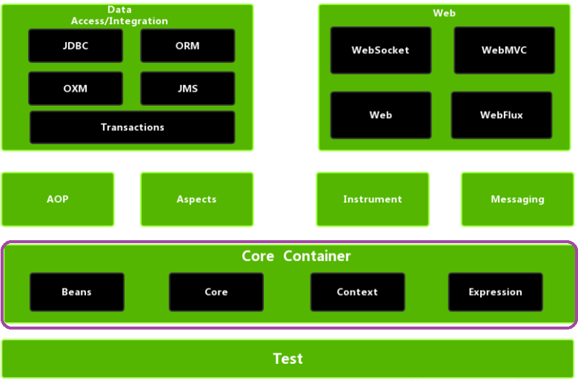
>
>3. 创建普通java类，进行测试
>
>4. 创建spring配置文件.xml，在配置文件配置创建的文件
>
>   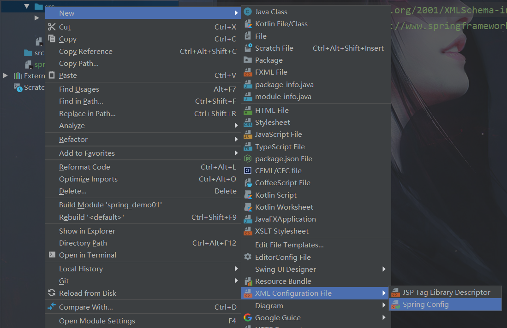
>
>   ```xml
>   <?xml version="1.0" encoding="UTF-8"?>
>   <beans xmlns="http://www.springframework.org/schema/beans"
>          xmlns:xsi="http://www.w3.org/2001/XMLSchema-instance"
>          xsi:schemaLocation="http://www.springframework.org/schema/beans http://www.springframework.org/schema/beans/spring-beans.xsd">
>   
>       <!-- 创建user对象 -->
>       <bean id="user" class="com.lz.spring.User"></bean>
>   </beans>
>   ```
>
>5. 创建测试类
>
>   ```java
>       @Test
>       public void demo() {
>   //        加载配置文件
>           ApplicationContext context = new ClassPathXmlApplicationContext("bean.xml");
>   //        获取配置文件创建的对象，这里的"user"对应bean中的id
>           User user = context.getBean("user", User.class);
>   
>           System.out.println(user);
>           user.say();
>   
>       }
>   ```

## IOC

### 概念和原理

> - 什么是 IOC？
>   1. 控制反转，把对象创建和对象之间的调用过程，交给 Spring 进行管理
>   2. 使用 IOC 目的：为了耦合度降低
>
> - **IOC 底层原理：xml 解析、工厂模式、反射**

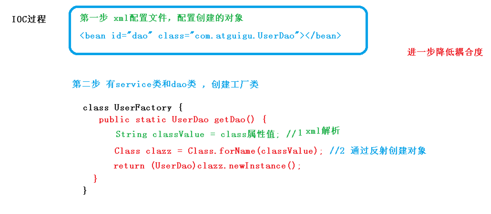

### 接口

> - IOC 思想基于 IOC 容器完成，IOC 容器底层就是对象工厂 
>
> - Spring 提供 IOC 容器实现两种方式：（两个接口） 
>
>   1. **BeanFactory**：IOC 容器基本实现，是 Spring 内部的使用接口，不提供开发人员进行使用
>
>      加载配置文件时候不会创建对象，在**获取对象（使用）才去创建对象** 
>
>   2. **ApplicationContext**：BeanFactory 接口的子接口，提供更多更强大的功能，一般由开发人 员进行使用
>
>      **加载配置文件时候就会把在配置文件对象进行创建**
>
> - ApplicationContext 接口有实现类
>
>   1. **FileSystemXmlApplicationContext：盘符路径**
>   2. **ClassPathXmlApplicationContext：类路径**
>
>   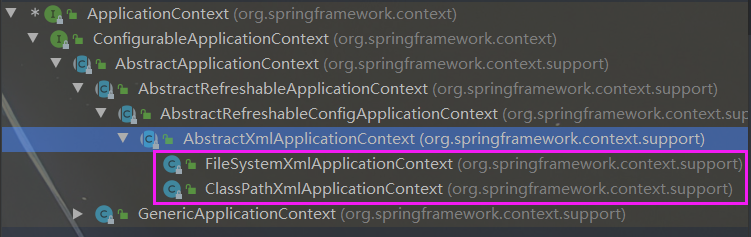

### IOC操作Bean管理

> - 什么是 Bean 管理
>   1. Spring 创建对象
>   2. Spirng 注入属性
> - Bean 管理操作有两种方式
>   1. 基于 xml 配置文件方式实现
>   2. 基于注解方式实现

#### 基于xml方式

##### 基于xml方式创建对象

> - 在 bean 标签有很多属性，介绍常用的属性 
>   - **id 属性：唯一标识**
>   - **class 属性：类全路径（包类路径）**
> - **创建对象时候，默认也是执行无参数构造方法完成对象创建，没有无参构造方法会报错**

```xml
<?xml version="1.0" encoding="UTF-8"?>
<beans xmlns="http://www.springframework.org/schema/beans"
       xmlns:xsi="http://www.w3.org/2001/XMLSchema-instance"
       xsi:schemaLocation="http://www.springframework.org/schema/beans http://www.springframework.org/schema/beans/spring-beans.xsd">

    <!-- 创建user对象 -->
    <bean id="user" class="com.lz.spring.User"></bean>

</beans>
```

##### 基于xml方式依赖注入

> - **name：类里面属性名称**
> - **value：向属性注入的值**
> - **ref：引用注入的对象的id**
>
> property中的value可以写在标签里，和name分开写

###### set方式

> 创建一个普通类，实现set方法

```java
public class Book {
    private String bname;
    private String bauthor;

    public void setBname(String bname) {
        this.bname = bname;
    }

    public void setBauthor(String bauthor) {
        this.bauthor = bauthor;
    }

    @Override
    public String toString() {
        return "Book{" +
                "bname='" + bname + '\'' +
                ", bauthor='" + bauthor + '\'' +
                '}';
    }
}

```

> 创建对象，并且依赖注入

```xml
<?xml version="1.0" encoding="UTF-8"?>
<beans xmlns="http://www.springframework.org/schema/beans"
       xmlns:xsi="http://www.w3.org/2001/XMLSchema-instance"
       xsi:schemaLocation="http://www.springframework.org/schema/beans http://www.springframework.org/schema/beans/spring-beans.xsd">
   
    <bean id="book" class="com.lz.spring.Book">
        <!-- name：类里面属性名称
             value：向属性注入的值
         -->
        <property name="bname" value="java从入门到入土"></property>
        <property name="bauthor" value="爱哭的小河豚"></property>
    </bean>
    
</beans>
```

```java
    @Test
    public void demo01() {
//        加载配置文件
        ApplicationContext context = new ClassPathXmlApplicationContext("bean.xml");
//        获取配置文件创建的对象
        Book book = context.getBean("book", Book.class);

        System.out.println(book);
        book.toString();
    }
```

> p名称名称空间注入（了解）

```xml
<?xml version="1.0" encoding="UTF-8"?>
<beans xmlns="http://www.springframework.org/schema/beans"
       xmlns:xsi="http://www.w3.org/2001/XMLSchema-instance"
       
       <!-- 添加 p 名称空间在配置文件中 -->
       xmlns:p="http://www.springframework.org/schema/p"

       xsi:schemaLocation="http://www.springframework.org/schema/beans http://www.springframework.org/schema/beans/spring-beans.xsd">

    <!-- p名称空间注入 -->
    <bean id="book" class="com.lz.spring.Book" p:bname="ssm" p:bauthor="lz"></bean>
</beans>
```

###### 有参构造方式

> 创建一个普通类，实现有参构造方法

```java
public class Orders {
    private String name;
    private String address;

    public Orders(String name, String address) {
        this.name = name;
        this.address = address;
    }

    @Override
    public String toString() {
        return "Orders{" +
                "name='" + name + '\'' +
                ", address='" + address + '\'' +
                '}';
    }
}

```

> 创建对象，有参构造方式的依赖注入

```xml
<?xml version="1.0" encoding="UTF-8"?>
<beans xmlns="http://www.springframework.org/schema/beans"
       xmlns:xsi="http://www.w3.org/2001/XMLSchema-instance"
       xsi:schemaLocation="http://www.springframework.org/schema/beans http://www.springframework.org/schema/beans/spring-beans.xsd">

    <!-- 创建对象，有参构造方式的依赖注入 -->
    <bean id="orders" class="com.lz.spring.Orders">
        <constructor-arg name="name" value="电脑"></constructor-arg>
        <constructor-arg name="address" value="China"></constructor-arg>
    </bean>
</beans>
```

```java
    @Test
    public void demo02() {
//        加载配置文件
        ApplicationContext context = new ClassPathXmlApplicationContext("bean.xml");
//        获取配置文件创建的对象
        Orders orders = context.getBean("orders", Orders.class);

        System.out.println(orders);
        orders.toString();
    }
```

###### xml注入其他类型属性

```xml
<?xml version="1.0" encoding="UTF-8"?>
<beans xmlns="http://www.springframework.org/schema/beans"
       xmlns:xsi="http://www.w3.org/2001/XMLSchema-instance"
       xsi:schemaLocation="http://www.springframework.org/schema/beans http://www.springframework.org/schema/beans/spring-beans.xsd">

    <!-- 其他类型注入 -->
    <bean id="book" class="com.lz.spring.Book">
        <property name="bname" value="java从入门到入土"></property>
        <property name="bauthor" value="爱哭的小河豚"></property>

        <!-- 注入null -->
        <!--        <property name="remark">-->
        <!--            <null></null>-->
        <!--        </property>-->

        <!-- 注入特殊字符 -->
        <property name="remark">
            <value><![CDATA[<<山东>>]]]></value>
        </property>
    </bean>
</beans>
```

###### 注入属性——外部bean

```xml
    <!--  注入外部bean  -->
    <bean id="userDao" class="com.lz.spring.dao.UserDao"></bean>

    <!--  name 属性：类里面属性名称
          ref 属性：创建 userDao 对象 bean 标签 id 值
     -->
    <bean id="userService" class="com.lz.spring.service.UserService">
        <property name="userDao" ref="userDao"></property>
    </bean>
```

###### 注入属性——内部bean

```xml
    <!--  注入内部bean  -->
    <bean id="employee" class="com.lz.spring.bean.Employee">
        <property name="ename" value="lz"></property>
        <property name="eage" value="22"></property>

        <property name="dep">
            <bean id="department" class="com.lz.spring.bean.Department">
                <property name="dname" value="安保部"></property>
            </bean>
        </property>
    </bean>
```

###### 注入属性——级联赋值

```xml
    <!--  级联赋值  -->
    <bean id="employee" class="com.lz.spring.bean.Employee">

        <property name="ename" value="lz"></property>
        <property name="eage" value="22"></property>

        <!--        <property name="dep" ref="department"></property>-->
        <!-- 这里需要在Employee中设置get获取Department -->
        <property name="dep.dname" value="技术部"></property>
    </bean>
    <!--        <bean id="department" class="com.lz.spring.bean.Department"> -->
    <!--            <property name="dname" value="财务部"></property> -->
    <!--        </bean> -->
```

###### 注入集合类型属性

```xml
    <!--  集合类型的注入  -->
    <bean id="course1" class="com.lz.spring.bean.Course">
        <property name="cname" value="spring框架"></property>
    </bean>
    <bean id="course2" class="com.lz.spring.bean.Course">
        <property name="cname" value="mybatis框架"></property>
    </bean>

    <bean id="student" class="com.lz.spring.bean.Student">

        <!--  注入数组类型  -->
        <property name="courses">
            <array>
                <value>java课程</value>
                <value>mysql课程</value>
            </array>
        </property>

        <!--  注入list类型  -->
        <property name="list">
            <list>
                <value>react</value>
                <value>vue</value>
            </list>
        </property>

        <!--  注入list类型，值为对象类型  -->
        <property name="list1">
            <array>
                <ref bean="course1"></ref>
                <ref bean="course2"></ref>
            </array>
        </property>

        <!--  注入map类型  -->
        <property name="map">
            <map>
                <entry key="lz" value="男"></entry>
                <entry key="wmy" value="女"></entry>
            </map>
        </property>
    </bean>
```

###### 提取list，注入

```xml
<?xml version="1.0" encoding="UTF-8"?>
<beans xmlns="http://www.springframework.org/schema/beans"
       xmlns:xsi="http://www.w3.org/2001/XMLSchema-instance"
		
       <!--  设置命名空间  -->
       xmlns:util="http://www.springframework.org/schema/util"

       xsi:schemaLocation="http://www.springframework.org/schema/beans http://www.springframework.org/schema/beans/spring-beans.xsd
       			
							<!--  设置命名空间  -->
                            http://www.springframework.org/schema/util http://www.springframework.org/schema/util/spring-util.xsd">

    <!--  提取list集合注入  -->
    <util:list id="mylist">
        <list>
            <value>java</value>
            <value>mysql</value>
            <value>数据结构</value>
        </list>
    </util:list>

    <bean id="mbook" class="com.lz.spring.bean.MBook">
        <!--            <property name="list" ref="mylist">-->
        <property name="list">
            <ref bean="mylist"></ref>
        </property>
    </bean>


</beans>
```

#### FactoryBean

> - Spring 有两种类型 bean，一种普通 bean，另外一种工厂 bean（FactoryBean） 
>   - **普通 bean：在配置文件中定义 bean 类型就是返回类型** 
>   - **工厂 bean：在配置文件定义 bean 类型可以和返回类型不一样** 
> - 步骤
>   1. 第一步 创建类，让这个类作为工厂 bean，**实现接口 FactoryBean** 
>   2. 第二步 实现接口里面的方法，**在实现的方法中定义返回的 bean 类型**

```java
//FBean.class
public class FBean implements FactoryBean<Course> {

    //    设置bean的返回类型
    @Override
    public Course getObject() throws Exception {
        Course course = new Course();
        course.setCname("java");
        return course;
    }

    @Override
    public Class<?> getObjectType() {
        return null;
    }

    @Override
    public boolean isSingleton() {
        return false;
    }
}
```

```xml
<!--  FactoryBean  -->
<bean id="fbean" class="com.lz.spring.FactoryBean.FBean"></bean>
```

```java
    @Test
    public void demo07() {
        ClassPathXmlApplicationContext context = new ClassPathXmlApplicationContext("bean.xml");

//        第二个参数是Course.class,不是FBean.class
        Course fbean = context.getBean("fbean", Course.class);
        System.out.println(fbean.toString());//Course{cname='java'}
    }
```

#### bean作用域

> - **在 Spring 里面，默认情况下，bean 是单实例对象** 
>
> - 如何设置单实例还是多实例 
>
>   1. **在 spring 配置文件 bean 标签里面有属性（scope）用于设置单实例还是多实例** 
>
>   2. **scope 属性值：第一个值 默认值 singleton，表示是单实例对象。第二个值 prototype，表示是多实例对象** 
>
>      ```xml
>      <bean id="fbean" class="com.lz.spring.FactoryBean.FBean" scope="prototype"></bean>
>      ```
>
> - singleton 和 prototype 区别 
>
>   1. singleton 单实例，prototype 多实例 
>
>   2. **设置 scope 值是 singleton 时候，加载 spring 配置文件时候就会创建单实例对象**
>
>      **设置 scope 值是 prototype 时候，不是在加载 spring 配置文件时候创建 对象，在调用 getBean 方法时候创建多实例对象**

#### 生命周期

> bean 的后置处理器，bean 生命周期有七步 
>
> 1. 通过构造器创建 bean 实例（无参数构造）
> 2. 为 bean 的属性设置值和对其他 bean 引用（调用 set 方法）
> 3. 把 bean 实例传递 bean 后置处理器的方法 postProcessBeforeInitialization 
> 4. 调用 bean 的初始化的方法（需要进行配置初始化的方法）
> 5. 把 bean 实例传递 bean 后置处理器的方法 postProcessAfterInitialization
> 6. bean 可以使用了（对象获取到了）
> 7. 当容器关闭时候，调用 bean 的销毁的方法（需要进行配置销毁的方法）

```java
public class MOrders {
    private String name;

    public MOrders() {
        System.out.println("第一步 执行无参数构造创建 bean 实例");
    }

    public void setName(String name) {
        this.name = name;
        System.out.println("第二步 调用 set 方法设置属性值");
    }

    public void initMethod() {
        System.out.println("第四步 执行初始化的方法");
    }

    public void destroyMethod() {
        System.out.println("第七步 执行销毁的方法");

    }


    @Override
    public String toString() {
        return "MOrders{" +
                "name='" + name + '\'' +
                '}';
    }
}

```

```java
public class MyBeanPost implements BeanPostProcessor {

    @Override
    public Object postProcessBeforeInitialization(Object bean, String beanName) throws BeansException {
        System.out.println("第三步 在初始化之前执行的方法");
        return bean;
    }

    @Override
    public Object postProcessAfterInitialization(Object bean, String beanName) throws BeansException {
        System.out.println("第五步 在初始化之后执行的方法");
        return bean;
    }
}
```

```xml
    <!--  生命周期  -->
    <bean id="morders" class="com.lz.spring.bean.MOrders" init-method="initMethod" destroy-method="destroyMethod">
        <property name="name" value="手机"></property>
    </bean>
    <!--  配置后置处理器  -->
    <bean id="mybeanpost" class="com.lz.spring.bean.MyBeanPost"></bean>
```

```java
    @Test
    public void demo08() {
        ClassPathXmlApplicationContext context = new ClassPathXmlApplicationContext("bean.xml");

//        第二个参数是Course.class,不是FBean.class
        MOrders morders = context.getBean("morders", MOrders.class);
        System.out.println("第六步 获取创建 bean 实例对象");
        System.out.println(morders.toString());

//        手动销毁bean
        context.close();
    }
```

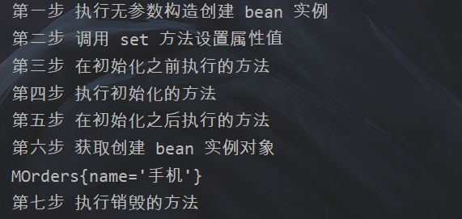

#### 自动装配

> - autowire 属性常用两个值：
>   1. **byName 根据属性名称注入 ，注入值 bean 的 id 值和类属性名称一样**
>   2. **byType 根据属性类型注入**

```java
public class Emp {
    private Dept dept;

    public void setDept(Dept dept) {
        this.dept = dept;
    }

    @Override
    public String toString() {
        return "Emp{" +
                "dept=" + dept +
                '}';
    }
}

```

```xml
    <!--  自动装配  -->
    <!--   autowire 属性常用两个值：
            byName 根据属性名称注入 ，注入值 bean 的 id 值和类属性名称一样
            byType 根据属性类型注入  -->
    <bean id="emp" class="com.lz.spring.autowrie.Emp" autowire="byName"></bean>

    <!--  这里的id要和Emp类属性名称一致  -->
    <bean id="dept" class="com.lz.spring.autowrie.Dept"></bean>
```

#### 读取外部属性文件

```properties
prop.driverClass=com.mysql.jdbc.Driver
prop.url=jdbc:mysql://localhost:3306/user
prop.username=root
prop.password=123456
```

```xml
<?xml version="1.0" encoding="UTF-8"?>
<beans xmlns="http://www.springframework.org/schema/beans"
       xmlns:xsi="http://www.w3.org/2001/XMLSchema-instance"

		<!--  配置命名空间  -->
       xmlns:context="http://www.springframework.org/schema/context"

       xsi:schemaLocation="http://www.springframework.org/schema/beans http://www.springframework.org/schema/beans/spring-beans.xsd
       						 <!--  配置命名空间  -->
                             http://www.springframework.org/schema/context http://www.springframework.org/schema/context/spring-context.xsd">


    <!--  读取外部属性文件  -->
    <context:property-placeholder location="classpath:jdbc.properties"></context:property-placeholder>

    <bean id="jdbcResource" class="com.alibaba.druid.pool.DruidDataSource">
        <property name="driverClassName" value="${prop.dirverClass}"></property>
        <property name="url" value="${prop.url}"></property>
        <property name="username" value="${prop.username}"></property>
        <property name="password" value="${prop.password}"></property>
    </bean>

</beans>
```

### 基于注解方式

> - 什么是注解 
>   1. 注解是代码特殊标记，**格式：@注解名称(属性名称=属性值, 属性名称=属性值..)** 
>   2. 使用注解，注解作用在类上面，方法上面，属性上面 
>   3. 使用注解目的：简化 xml 配置 
>
> - Spring 针对 Bean 管理中创建对象提供注解
>
>   1. **@Component**
>   2. **@Controller**
>   3. **@Service**
>   4. **@Repository**
>
>    * 上面四个注解功能是一样的，都可以用来创建 bean 实例

#### 基于注解方式创建对象

> 1. **引入依赖`spring-aop-5.x.x-RELEASE.jar`**
> 2. **开启组件扫描**
> 3. 创建类，在类上面添加创建对象注解

```java
//可以不写value，不写的话就是类名首字母小写
@Service(value = "myService")//相当于<bean id = "myService" class = "...">
public class MyService {

    public void add() {
        System.out.println("service add ...");
    }
}
```

```xml
<?xml version="1.0" encoding="UTF-8"?>
<beans xmlns="http://www.springframework.org/schema/beans"
       xmlns:xsi="http://www.w3.org/2001/XMLSchema-instance"
       
		 <!-- 开启命名空间 -->
       xmlns:context="http://www.springframework.org/schema/context"

       xsi:schemaLocation="http://www.springframework.org/schema/beans http://www.springframework.org/schema/beans/spring-beans.xsd
							 
							<!-- 开启命名空间 -->
                            http://www.springframework.org/schema/context http://www.springframework.org/schema/context/spring-context.xsd">


    <!--开启组件扫描
         1 如果扫描多个包，多个包使用逗号隔开
         2 扫描包上层目录
    -->
    <!--    <context:component-scan base-package="com.lz.service,com.lz.dao"></context:component-scan>-->
    <context:component-scan base-package="com.lz"></context:component-scan>
</beans>
```

```java
    @Test
    public void demo01() {
        ClassPathXmlApplicationContext context = new ClassPathXmlApplicationContext("bean.xml");
        MyService myService = context.getBean("myService", MyService.class);
        myService.add();
    }
```

##### 组件扫描中的细节

> 细节一：设置扫描哪些内容

```xml
    <!--
      use-default-filters表示现在不使用默认 filter，自己配置 filter
      context:include-filter设置扫描哪些内容
      type="annotation"根据注解类型
      expression="org.springframework.stereotype.Service"表达式，Servcie类型的注解
      -->
    <context:component-scan base-package="com.lz" use-default-filters="false">
        <context:include-filter type="annotation" expression="org.springframework.stereotype.Service"/>
    </context:component-scan>
```

> 细节二：设置不扫描哪些内容

```java
    <!--
      context:exclude-filter设置哪些内容不进行扫描
      -->
    <context:component-scan base-package="com.lz">
        <context:exclude-filter type="annotation" expression="org.springframework.stereotype.Repository"/>
    </context:component-scan>
```

#### 基于注解方式实现属性注入 

> 1. **@Autowired：根据属性类型进行自动装配**
> 2. **@Qualifier：根据名称进行注入。这个@Qualifier 注解的使用，和上面@Autowired 一起使用**
> 3. **@Resource：可以根据类型注入，可以根据名称注入**
> 4. **@value：注入普通类型属性**
>
> - **注解不需要写set方法**

```java
@Service(value = "myService")
public class MyService {

    @Value(value = "爱哭的小河豚")
    private String name;


    @Autowired
    @Qualifier(value = "myDaoImpl")//要和Autowired一起使用
    private MyDao myDao;

//    Resource注解是javax中的，推荐使用Autowired和Qualifier
//    @Resource//根据类型
//    @Resource(name = "myDaoImpl")//根据名称
//    private MyDao myDao;

    public void add() {
        System.out.println("MyService add ..." + this.name);
        myDao.update();
    }
}
```

#### 完全注解开发

> 创建配置类，替代xml 配置文件

```java
@Configuration//作为配置类，替代 xml 配置文件
@ComponentScan(basePackages = {"com.lz"})//扫描的包
public class SpringConfig {
}

```

> 测试类，创建`AnnotationConfigApplicationContext`

```java
    @Test
    public void demo03() {
        ApplicationContext context = new AnnotationConfigApplicationContext(SpringConfig.class);
        MyService myService = context.getBean("myService", MyService.class);
        myService.add();
    }
```

## AOP

### 概念

> 什么是 AOP 
>
> 1. 面向切面编程（方面），利用 AOP 可以对业务逻辑的各个部分进行隔离，从而使得业务逻辑各部分之间的耦合度降低，提高程序的可重用性，同时提高了开发的效率。
> 2. **通俗描述：不通过修改源代码方式，在主干功能里面添加新功能** 

### 底层原理

> AOP 底层使用动态代理。有两种情况动态代理
>
> 1. 第一种 有接口情况，使用 JDK 动态代理。创建接口实现类代理对象，增强类的方法
>
>    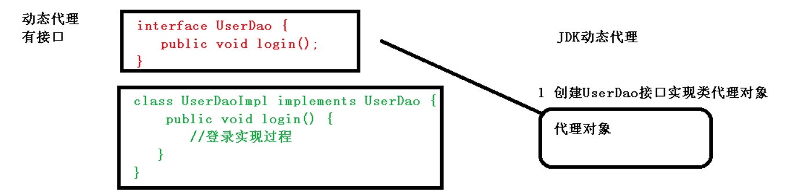
>
> 2. 第二种 没有接口情况，使用 CGLIB 动态代理。创建子类的代理对象，增强类的方法
>
>    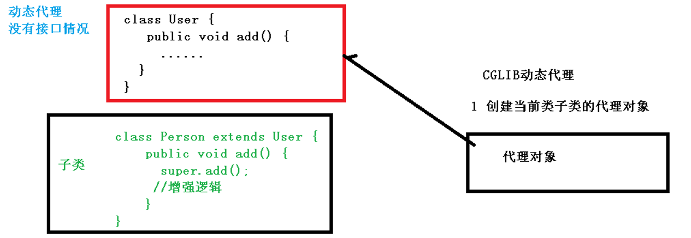

####  JDK 动态代理

```java
public interface UserDao {

    public int add(int a, int b);

    public String update(String id);
}
```

```java
public class UserDaoImpl implements UserDao {
    @Override
    public int add(int a, int b) {
        return a + b;
    }

    @Override
    public String update(String id) {
        return id;
    }
}

```

```java
public class JDKProxy {
    public static void main(String[] args) {

        Class[] interfaces = {UserDao.class};

        UserDaoImpl userDao = new UserDaoImpl();


        /**
         * 方法有三个参数：
         * 第一参数，类加载器
         * 第二参数，增强方法所在的类，这个类实现的接口，支持多个接口
         * 第三参数，实现这个接口 InvocationHandler，创建代理对象，写增强的部分
         */
        UserDao dao = (UserDao) Proxy.newProxyInstance(JDKProxy.class.getClassLoader(), interfaces, new UserDaoProxy(userDao));

        int result = dao.add(1, 2);
        System.out.println("result:" + result);
    }
}

//创建代理对象代码
class UserDaoProxy implements InvocationHandler {
    //把创建的是谁的代理对象，把谁传递过来
    //有参数构造传递
    private Object obj;

    public UserDaoProxy(Object obj) {
        this.obj = obj;
    }

    //增强的逻辑
    @Override
    public Object invoke(Object o, Method method, Object[] args) throws Throwable {
        //方法之前
        System.out.println("方法之前执行...." + method.getName() + " :传递的参数..." + Arrays.toString(args));
        //被增强的方法执行
        Object res = method.invoke(obj, args);
        //方法之后
        System.out.println("方法之后执行...." + obj);
        return res;

    }
}

```

### 术语

> 1. **连接点**
> 2. **切入点**
> 3. **通知（增强）**
>    - **前置通知	Before**
>    - **后置通知    AfterReturning**
>    - **环绕通知    Around**
>    - **异常通知    AfterThrowing**
>    - **最终通知    After**
> 4. **切面**

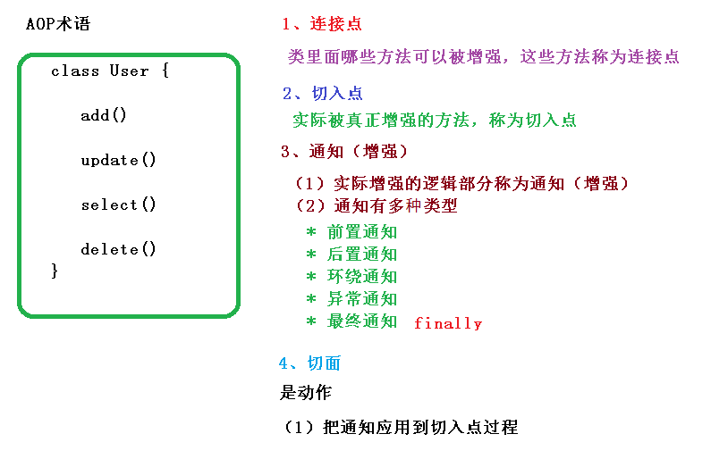

### 准备工作

> - Spring 框架一般都是基于 AspectJ 实现 AOP 操作
>   
> - AspectJ 不是 Spring 组成部分，独立 AOP 框架，一般把 AspectJ 和 Spirng 框架一起使 用，进行 AOP 操作 
>   
> - 在项目工程里面引入 AOP 相关依赖
>
>   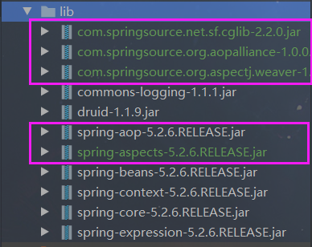
>
> - 切入点表达式 
>
>   1. **切入点表达式作用：知道对哪个类里面的哪个方法进行增强**
>
>   2. 语法结构： **execution([权限修饰符] [返回类型] [类全路径] \[方法名称]([参数列表]) )**
>
>   3.  举例 1：对 com.atguigu.dao.BookDao 类里面的 add 进行增强
>
>      ​				execution(* com.atguigu.dao.BookDao.add(..)) 
>
>      举例 2：对 com.atguigu.dao.BookDao 类里面的所有的方法进行增强
>
>      ​				execution(* com.atguigu.dao.BookDao.* (..))
>
>      举例 3：对 com.atguigu.dao 包里面所有类，类里面所有方法进行增强
>
>      ​				execution(* com.atguigu.dao.*.* (..))

### AspectJ注解

```xml
<?xml version="1.0" encoding="UTF-8"?>
<beans xmlns="http://www.springframework.org/schema/beans"
       xmlns:xsi="http://www.w3.org/2001/XMLSchema-instance"
       
       <!--  开启命名空间  -->
       xmlns:context="http://www.springframework.org/schema/context"
       xmlns:aop="http://www.springframework.org/schema/aop"
       
       xsi:schemaLocation="http://www.springframework.org/schema/beans http://www.springframework.org/schema/beans/spring-beans.xsd
                           
							<!--  开启命名空间  -->
                            http://www.springframework.org/schema/context http://www.springframework.org/schema/context/spring-context.xsd
                            http://www.springframework.org/schema/aop http://www.springframework.org/schema/aop/spring-aop.xsd">


    <!--  开启注解扫描  -->
    <context:component-scan base-package="com.lz.spring.aopanno"></context:component-scan>

    <!--   开启 Aspect 生成代理对象  -->
    <aop:aspectj-autoproxy></aop:aspectj-autoproxy>
</beans>
```

```java
//增强类
@Component(value = "userProxy")
@Aspect//生成代理对象
public class UserProxy {

    //前置通知
    @Before(value = "execution(* com.lz.spring.aopanno.User.add(..))")
    public void before() {
        System.out.println("before ...");
    }

    //后置通知
    @AfterReturning(value = "execution(* com.lz.spring.aopanno.User.add(..))")
    public void afterReturning() {
        System.out.println("afterReturning ...");
    }

    //最终通知
    @After(value = "execution(* com.lz.spring.aopanno.User.add(..))")
    public void after() {
        System.out.println("after ...");
    }

    //异常通知
    @AfterThrowing(value = "execution(* com.lz.spring.aopanno.User.add(..))")
    public void afterThrowing() {
        System.out.println("afterThrowing ...");
    }    

    //环绕通知
    @Around(value = "execution(* com.lz.spring.aopanno.User.add(..))")
    public void around(ProceedingJoinPoint proceedingJoinPoint) throws Throwable {
        System.out.println("环绕前置执行。。。");

        proceedingJoinPoint.proceed();

        System.out.println("环绕后置执行。。。");
    }

}

```

```java
    @Test
    public void demo01() {
        ClassPathXmlApplicationContext context = new ClassPathXmlApplicationContext("bean.xml");

//        这里写被增强的类
        User user = context.getBean("user", User.class);

        user.add();
    }
```

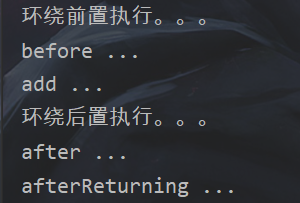

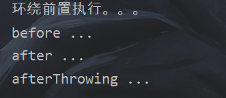

#### 细节问题

##### 相同的切入点抽取

```java
//增强类
@Component(value = "userProxy")
@Aspect//生成代理对象
public class UserProxy {

    //    相同切入点抽取
    @Pointcut(value = "execution(* com.lz.spring.aopanno.User.add(..))")
    public void point() {
    }

    //前置通知
    //value = "类名"
    @Before(value = "point()")
    public void before() {
        System.out.println("before ...");
    }

    //后置通知
    @AfterReturning(value = "point()")
    public void afterReturning() {
        System.out.println("afterReturning ...");
    }

}

```

##### 设置增强类优先级

> 在增强类上面添加注解 **@Order(数字类型值)，数字类型值越小优先级越高**

```java
@Component
@Aspect
@Order(1)//设置增强类优先级
public class PersonProxy {

    @Before(value = "execution(* com.lz.spring.aopanno.User.add(..))")
    public void before() {
        System.out.println("PersonProxy before...");
    }
}

```

```java
//增强类
@Component(value = "userProxy")
@Aspect//生成代理对象
@Order(2)//设置增强类优先级
public class UserProxy {

    //前置通知
    @Before(value = "execution(* com.lz.spring.aopanno.User.add(..))")
    public void before() {
        System.out.println("before ...");
    }

}

```


#### 完全注解开发

```java
@Configuration
@ComponentScan(value = {"com.lz.spring"})//开启注解扫描
@EnableAspectJAutoProxy(proxyTargetClass = true)//开启 Aspect 生成代理对象
public class AopConfig {
}

```

### AspectJ配置文件

```xml
<?xml version="1.0" encoding="UTF-8"?>
<beans xmlns="http://www.springframework.org/schema/beans"
       xmlns:xsi="http://www.w3.org/2001/XMLSchema-instance"
	
       <!-- 开启命名空间  -->
       xmlns:aop="http://www.springframework.org/schema/aop"
       xsi:schemaLocation="http://www.springframework.org/schema/beans http://www.springframework.org/schema/beans/spring-beans.xsd

							<!-- 开启命名空间  -->
                            http://www.springframework.org/schema/aop http://www.springframework.org/schema/aop/spring-aop.xsd">

	<!-- 被增强类  -->
    <bean id="book" class="com.lz.spring.aopxml.Book"></bean>
	<!-- 增强类  -->
    <bean id="bookProxy" class="com.lz.spring.aopxml.BookProxy"></bean>

    <!-- 配置aop  -->
    <aop:config>
        <!--    配置切入点    -->
        <aop:pointcut id="p" expression="execution(* com.lz.spring.aopxml.Book.buy(..))"/>

        <!--    配置切面    -->
        <aop:aspect ref="bookProxy">
            <aop:before method="before" pointcut-ref="p"></aop:before><!--这里的method是增强类中的方法名-->
        </aop:aspect>
    </aop:config>

</beans>
```

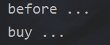

## JdbcTemplate

> **Spring 框架对 JDBC 进行封装**，使用 JdbcTemplate 方便实现对数据库操作
>
> 实体类中的属性名，不必须和数据库表中一致

> - 导入jar包
>
>   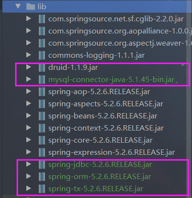

```xml
<?xml version="1.0" encoding="UTF-8"?>
<beans xmlns="http://www.springframework.org/schema/beans"
       xmlns:xsi="http://www.w3.org/2001/XMLSchema-instance"

       <!--  开启命名空间  -->
       xmlns:context="http://www.springframework.org/schema/context"
       xsi:schemaLocation="http://www.springframework.org/schema/beans http://www.springframework.org/schema/beans/spring-beans.xsd
					
							<!--  开启命名空间  -->
                            http://www.springframework.org/schema/context http://www.springframework.org/schema/context/spring-context.xsd">

    <!--  开启注解扫描  -->
    <context:component-scan base-package="com.lz.spring"></context:component-scan>

    <!--  配置数据库连接池  -->
    <context:property-placeholder location="classpath:jdbc.properties"></context:property-placeholder>

    <bean id="dataResource" class="com.alibaba.druid.pool.DruidDataSource">
        <property name="driverClassName" value="${prop.ClassDriver}"></property>
        <property name="url" value="${prop.url}"></property>
        <property name="username" value="${prop.username}"></property>
        <property name="password" value="${prop.password}"></property>
    </bean>

    <!--  配置jdbctemplate  -->
    <bean id="jdbcTemplate" class="org.springframework.jdbc.core.JdbcTemplate">
        <!--  注入 dataSource  -->
        <property name="dataSource" ref="dataResource"></property>
    </bean>
</beans>
```

### 增、删、改

```java
@Repository
public class BookDaoImpl implements BookDao {

    @Autowired
    private JdbcTemplate jdbcTemplate;

    //    增加
    @Override
    public void add(Book book) {
        String sql = "insert into t_user values(?,?,?)";
        int add = jdbcTemplate.update(sql, book.getUserId(), book.getUsername(), book.getUstatus());
        System.out.println(add);
    }

    //    删除
    @Override
    public void delete(String id) {
        String sql = "delete from t_user where user_id =?";
        int delete = jdbcTemplate.update(sql, id);
        System.out.println(delete);
    }

    //    更新
    @Override
    public void update(Book book) {
        String sql = "update t_user set username = ?,ustatus = ? where user_id = ?";
        int update = jdbcTemplate.update(sql, book.getUsername(), book.getUstatus(), book.getUserId());
        System.out.println(update);
    }

}

```

```java
@Service
public class BookService {

    @Autowired
    private BookDao bookDao;


    public void addBook(Book book) {
        bookDao.add(book);
    }


    public void delBook(String id) {
        bookDao.delete(id);
    }

    public void updateBook(Book book) {
        bookDao.update(book);
    }
}

```

```java
    @Test
    public void demo01() {
        ClassPathXmlApplicationContext context = new ClassPathXmlApplicationContext("bean.xml");

        BookService bookService = context.getBean("bookService", BookService.class);

//        增加
//        Book book = new Book();
//        book.setUserId("1");
//        book.setUsername("java从入门到入土");
//        book.setUstatus("预售");
//        bookService.addBook(book);

//        更新
//        Book book = new Book();
//        book.setUserId("1");
//        book.setUsername("spring");
//        book.setUstatus("presell");
//        bookService.updateBook(book);

//        删除
        bookService.delBook("1");
    }
```

### 查询

#### 查询返回记录条数

> 
>
> - **第一个参数：sql语句**
> - **第二个参数：返回类型Class**

```java
    //    查询记录条数
    @Override
    public int selectCount() {
        String sql = "select count(*) from t_user";
        Integer integer = jdbcTemplate.queryForObject(sql, Integer.class);
        return integer;
    }
```

#### 查询返回对象

> 
>
> - **第一个参数：sql语句**
> - **第二个参数：RowMapper 是接口，针对返回不同类型数据，使用这个接口里面实现类完成数据封装**
> - **第三个参数：sql 语句值**

```java
    //    查询返回对象
    @Override
    public Book selectBookObj(String id) {
        String sql = "select * from t_user where user_id = ?";
        Book book = jdbcTemplate.queryForObject(sql, new BeanPropertyRowMapper<Book>(Book.class), id);
        return book;
    }
```

#### 查询返回集合

> 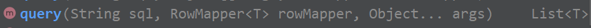
>
> - **第一个参数：sql语句**
> - **第二个参数：RowMapper 是接口，针对返回不同类型数据，使用这个接口里面实现类完成 数据封装** 
> - **第三个参数：sql 语句值**

```java
    //    查询返回集合
    @Override
    public List<Book> selectAllBookObj() {
        String sql = "select * from t_user";
        List<Book> queryAll = jdbcTemplate.query(sql, new BeanPropertyRowMapper<Book>(Book.class));
        return queryAll;
    }
```

### 批量操作

#### 批量添加

> 
>
> - **第一个参数：sql 语句** 
> - **第二个参数：List 集合，添加多条记录数据**

```java
    //    批量添加
    @Override
    public void batchAdd(List<Object[]> list) {
        String sql = "insert into t_user values(?,?,?)";
        jdbcTemplate.batchUpdate(sql, list);
    }

    //    批量修改
    @Override
    public void batchUpdate(List<Object[]> list) {
        String sql = "update t_user set username = ?,ustatus = ? where user_id = ?";
        jdbcTemplate.batchUpdate(sql,list);
    }

    //    批量删除
    @Override
    public void batchDelete(List<Object[]> list) {
        String sql = "delete from t_user where user_id =?";
        jdbcTemplate.batchUpdate(sql,list);
    }
```

```java
    @Test
    public void demo01() {
        ClassPathXmlApplicationContext context = new ClassPathXmlApplicationContext("bean.xml");

        BookService bookService = context.getBean("bookService", BookService.class);

//        批量添加
        ArrayList<Object[]> list = new ArrayList<>();
        Object[] obj1 = {"1", "java", "good"};
        Object[] obj2 = {"2", "mysql", "good"};
        Object[] obj3 = {"3", "ssm", "good"};
        list.add(obj1);
        list.add(obj2);
        list.add(obj3);
        bookService.batchAdd(list);

//        批量更新
        ArrayList<Object[]> list = new ArrayList<>();
//        数组中的顺序要和sql一句一致
        Object[] obj1 = {"java001", "good", "1"};
        Object[] obj2 = {"mysql001", "good", "2"};
        Object[] obj3 = {"ssm001", "good", "3"};
        list.add(obj1);
        list.add(obj2);
        list.add(obj3);
        bookService.batchUpdate(list);

//        批量删除
        ArrayList<Object[]> list = new ArrayList<>();
//        数组中的顺序要和sql一句一致
        Object[] obj1 = {"1"};
        Object[] obj2 = {"2"};
        Object[] obj3 = {"3"};
        list.add(obj1);
        list.add(obj2);
        list.add(obj3);
        bookService.batchDelete(list);
    }
```

### 完全注解开发

```java

@Configuration
@ComponentScan(basePackages = {"com.lz.spring"}
public class TxConfig {

    //    配置数据库连接池
    @Bean
    public DruidDataSource getDruidDataSource() {
        DruidDataSource druidDataSource = new DruidDataSource();
        druidDataSource.setDriverClassName("com.mysql.jdbc.Driver");
        druidDataSource.setUrl("jdbc:mysql://localhost:3306/user_db");
        druidDataSource.setUsername("root");
        druidDataSource.setPassword("123456");
        return druidDataSource;
    }


    //    配置jdbc连接池
    @Bean
    public JdbcTemplate getJdbcTemplate(DruidDataSource druidDataSource) {
        JdbcTemplate jdbcTemplate = new JdbcTemplate();
        jdbcTemplate.setDataSource(druidDataSource);

        return jdbcTemplate;
    }

}
```

## 事务管理

> - **事务添加到 JavaEE 三层结构里面 Service 层（业务逻辑层）**
>
> - 在 Spring 进行事务管理操作 
>
>   - 编程式事务管理和**声明式事务管理**（使用）
>
> - 声明式事务管理
>
>   1. 基于注解方式（使用）
>   2. 基于 xml 配置文件方式
>
> - **在 Spring 进行声明式事务管理，底层使用 AOP 原理** 
>
> - Spring 事务管理 API：提供一个接口，代表事务管理器，这个接口针对不同的框架提供不同的实现
>
>   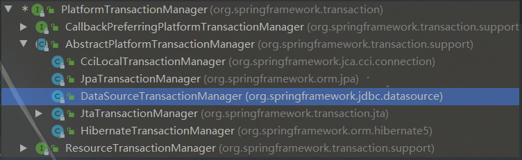

### 注解声明式事务管理

```xml
<?xml version="1.0" encoding="UTF-8"?>
<beans xmlns="http://www.springframework.org/schema/beans"
       xmlns:xsi="http://www.w3.org/2001/XMLSchema-instance"

       xmlns:context="http://www.springframework.org/schema/context"
         <!--  开启命名空间  -->
       xmlns:tx="http://www.springframework.org/schema/tx"
       xsi:schemaLocation="http://www.springframework.org/schema/beans http://www.springframework.org/schema/beans/spring-beans.xsd
                            http://www.springframework.org/schema/context http://www.springframework.org/schema/context/spring-context.xsd

							<!--  开启命名空间  -->
                            http://www.springframework.org/schema/tx http://www.springframework.org/schema/tx/spring-tx.xsd">

 
	  <!--  配置数据库连接池  -->
    <context:property-placeholder location="classpath:jdbc.properties"></context:property-placeholder>
    <bean id="druidDataSource" class="com.alibaba.druid.pool.DruidDataSource">
        <property name="driverClassName" value="${prop.ClassDriver}"></property>
        <property name="url" value="${prop.url}"></property>
        <property name="username" value="${prop.username}"></property>
        <property name="password" value="${prop.password}"></property>
    </bean>


    <!--  创建事务管理器  -->
    <bean id="transactionManager" class="org.springframework.jdbc.datasource.DataSourceTransactionManager">
        <property name="dataSource" ref="druidDataSource"></property>
    </bean>

    <!--  开启事务注解  -->
    <tx:annotation-driven transaction-manager="transactionManager"></tx:annotation-driven>
</beans>
```

> - @Transactional，这个注解添加到类上面，也可以添加方法上面 
>   1. 如果把这个注解添加类上面，这个类里面所有的方法都添加事务
>   2. 如果把这个注解添加方法上面，为这个方法添加事务

```java
@Service
@Transactional//事务注解
public class UserService {

    @Autowired
    private UserDao userDao;

    public void accountMoney() {

        userDao.reduceMoney();

//      模拟异常
        int i = 10 / 0;

        userDao.addMoney();

    }
}

```

#### 声明式事务管理参数配置

> 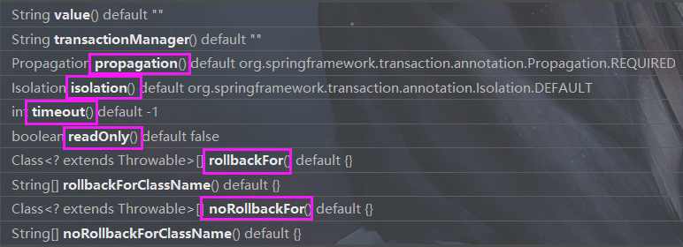
>
> - **propagation：事务传播行为**
>
>   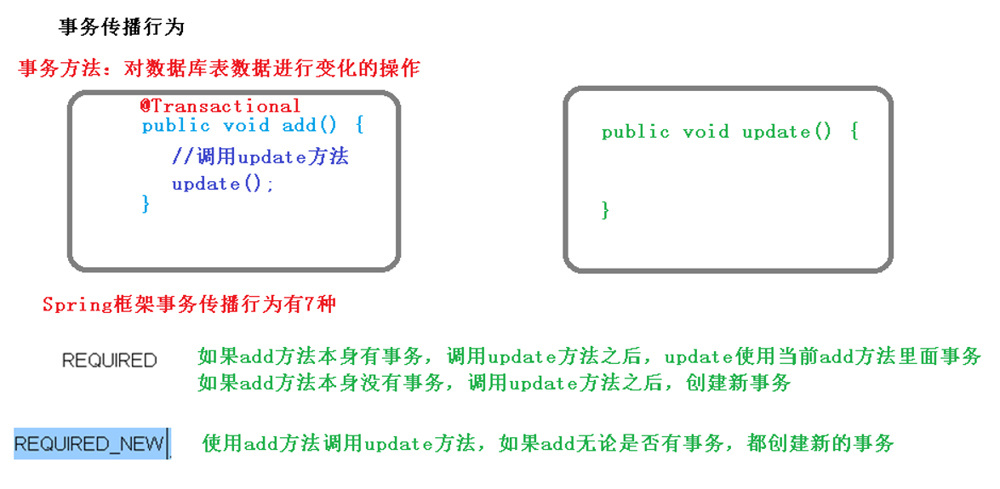
>
>   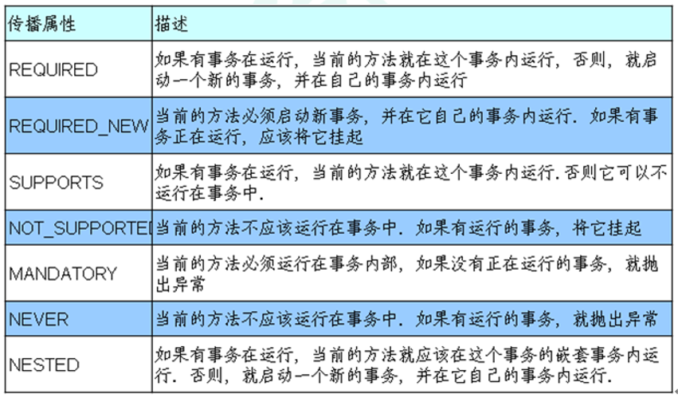
>
>   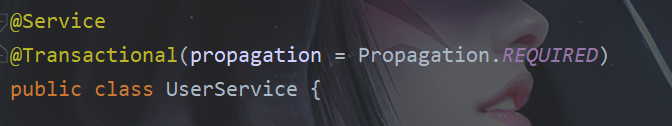
>
> - **isolation：事务隔离级别**
>
>   - 事务有特性成为隔离性，多事务操作之间不会产生影响。不考虑隔离性产生很多问题。有三个读问题：**脏读、不可重复读、虚（幻）读** 
>
>     - 脏读：一个未提交事务读取到另一个未提交事务的数据
>
>       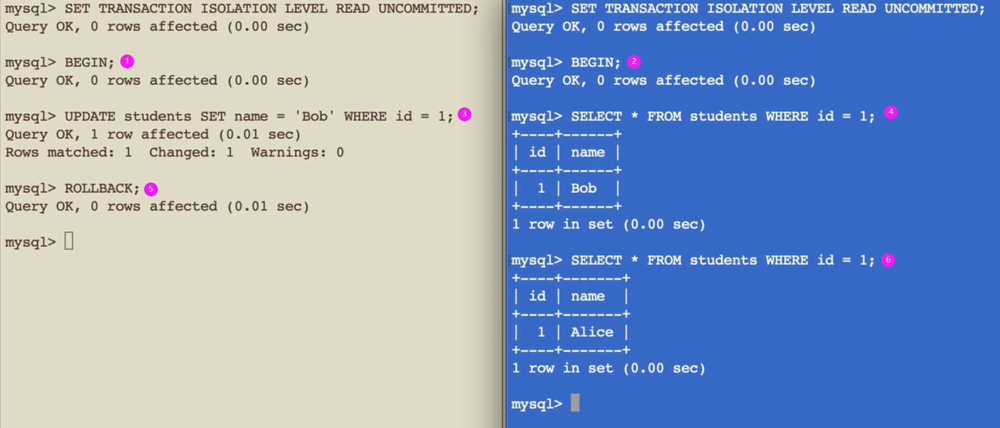
>
>     - 不可重复读：一个未提交事务读取到另一提交事务修改数据
>
>       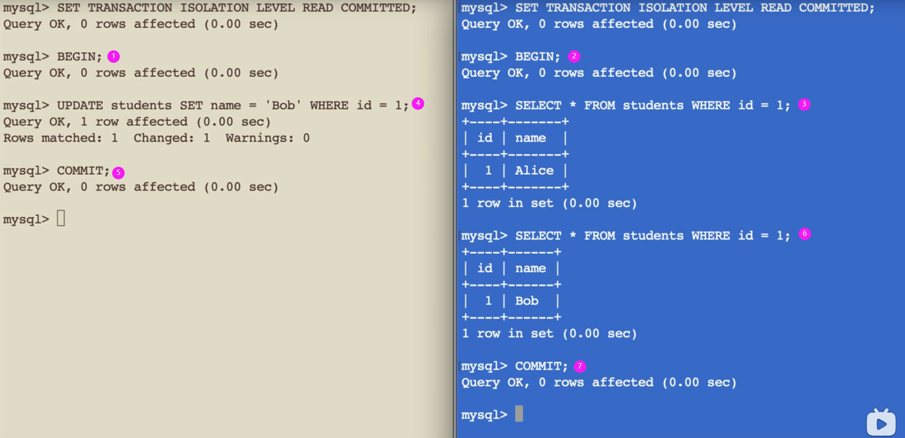
>
>     - 虚读：一个未提交事务读取到另一提交事务添加数据
>
>       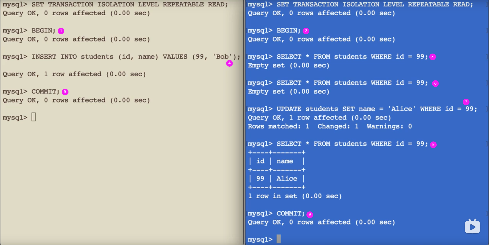
>
>   - 解决：**通过设置事务隔离级别，解决读问题**
>
>     - **默认隔离级别Repeatable Read（可重复读）**
>
>     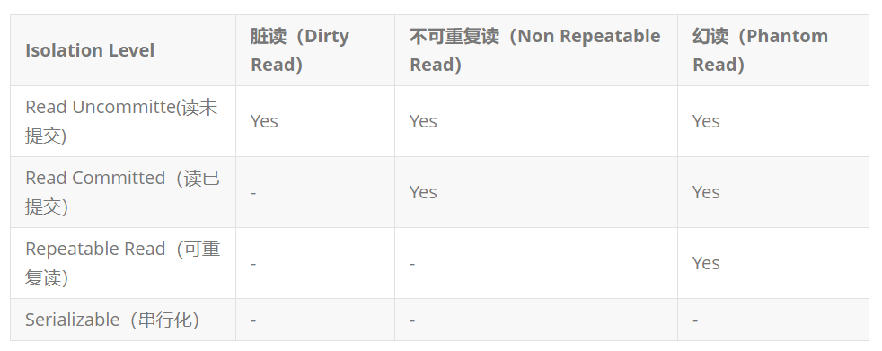
>
>     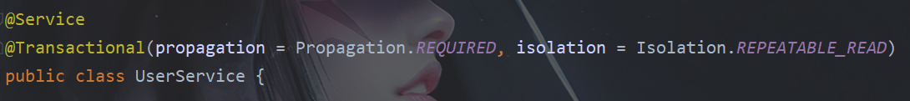
>
> - **timeout：超时时间**
>
>   - **事务需要在一定时间内进行提交，如果不提交进行回滚** 
>   - **默认值是 -1 ，设置时间以秒单位进行计算**
>
>   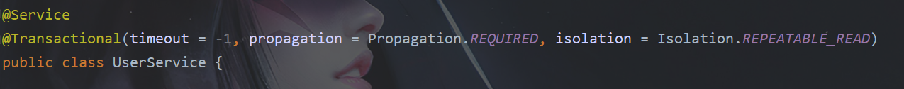
>
> - readOnly：只读
>
>   - 读：查询操作，写：添加修改删除操作
>   - readOnly 默认值 false，表示可以查询，可以添加修改删除操作
>   - 设置 readOnly 值是 true，设置成 true 之后，只能查询
>
> - rollbackFor：回滚
>
>   - 设置出现哪些异常进行事务回滚
>
> - noRollbackFor：不回滚
>
>   - 设置出现哪些异常进行事务回滚

### 完全注解开发

```java
@Configuration
@ComponentScan(basePackages = {"com.lz.spring"})
@EnableTransactionManagement//开启事务
public class TxConfig {

    //    配置数据库连接池
    @Bean
    public DruidDataSource getDruidDataSource() {
        DruidDataSource druidDataSource = new DruidDataSource();
        druidDataSource.setDriverClassName("com.mysql.jdbc.Driver");
        druidDataSource.setUrl("jdbc:mysql://localhost:3306/user_db");
        druidDataSource.setUsername("root");
        druidDataSource.setPassword("123456");
        return druidDataSource;
    }


    //    配置jdbc连接池
    @Bean
    public JdbcTemplate getJdbcTemplate(DruidDataSource druidDataSource) {
        JdbcTemplate jdbcTemplate = new JdbcTemplate();
        jdbcTemplate.setDataSource(druidDataSource);

        return jdbcTemplate;
    }

    //    配置事务管理器
    @Bean
    public DataSourceTransactionManager getTransactional(DruidDataSource druidDataSource) {
        DataSourceTransactionManager dataSourceTransactionManager = new DataSourceTransactionManager();
        dataSourceTransactionManager.setDataSource(druidDataSource);
        return dataSourceTransactionManager;
    }

}
```

### xml文件声明式事务管理

> 第一步 配置事务管理器
>
> 第二步 配置通知
>
> 第三步 配置切入点和切面

```xml
<?xml version="1.0" encoding="UTF-8"?>
<beans xmlns="http://www.springframework.org/schema/beans"
       xmlns:xsi="http://www.w3.org/2001/XMLSchema-instance"
	
        <!--  开启命名空间  -->
       xmlns:context="http://www.springframework.org/schema/context"
       xmlns:tx="http://www.springframework.org/schema/tx"
       xmlns:aop="http://www.springframework.org/schema/aop"
       xsi:schemaLocation="http://www.springframework.org/schema/beans http://www.springframework.org/schema/beans/spring-beans.xsd
		
							 <!--  开启命名空间  -->
                            http://www.springframework.org/schema/context http://www.springframework.org/schema/context/spring-context.xsd
                            http://www.springframework.org/schema/tx http://www.springframework.org/schema/tx/spring-tx.xsd
                            http://www.springframework.org/schema/aop http://www.springframework.org/schema/aop/spring-aop.xsd">


    <bean id="druidDataSource" class="com.alibaba.druid.pool.DruidDataSource">
        <property name="driverClassName" value="${prop.ClassDriver}"></property>
        <property name="url" value="${prop.url}"></property>
        <property name="username" value="${prop.username}"></property>
        <property name="password" value="${prop.password}"></property>
    </bean>

    <!--  1.创建事务管理器  -->
    <bean id="transactionManager" class="org.springframework.jdbc.datasource.DataSourceTransactionManager">
        <property name="dataSource" ref="druidDataSource"></property>
    </bean>


    <!--2 配置通知-->
    <tx:advice id="txadvice">
        <!--配置事务参数-->
        <tx:attributes>
            <!--指定哪种规则的方法上面添加事务-->
            <tx:method name="accountMoney" propagation="REQUIRED"/>
            <!--            <tx:method name="account*" propagation="REQUIRED"/>-->
        </tx:attributes>
    </tx:advice>

    <!--3 配置切入点和切面-->
    <aop:config>
        <aop:pointcut id="pt" expression="execution(* com.lz.spring.servcie.UserService.*(..))"/>

        <aop:advisor advice-ref="txadvice" pointcut-ref="pt"></aop:advisor>
    </aop:config>

</beans>
```

## Spring5 框架新功能

### 整合日志

> - 整个 Spring5 框架的代码基于 Java8，运行时兼容 JDK9，许多不建议使用的类和方 法在代码库中删除 
>
> - Spring 5.0 框架自带了通用的日志封装
>
>   1. Spring5 已经移除 Log4jConfigListener，官方建议使用 Log4j2
>   2. Spring5 框架整合 Log4j2
>
> - 使用
>
>   1. 第一步 引入 jar 包
>
>      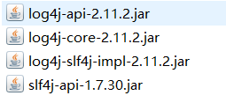
>
>   2. 第二步 创建 log4j2.xml 配置文件
>
>      ```xml
>      <?xml version="1.0" encoding="UTF-8"?>
>      <!--日志级别以及优先级排序: OFF > FATAL > ERROR > WARN > INFO > DEBUG > TRACE > ALL -->
>      <!--Configuration后面的status用于设置log4j2自身内部的信息输出，可以不设置，当设置成trace时，可以看到log4j2内部各种详细输出-->
>      <configuration status="INFO">
>          <!--先定义所有的appender-->
>          <appenders>
>              <!--输出日志信息到控制台-->
>              <console name="Console" target="SYSTEM_OUT">
>                  <!--控制日志输出的格式-->
>                  <PatternLayout pattern="%d{yyyy-MM-dd HH:mm:ss.SSS} [%t] %-5level %logger{36} - %msg%n"/>
>              </console>
>          </appenders>
>          <!--然后定义logger，只有定义了logger并引入的appender，appender才会生效-->
>          <!--root：用于指定项目的根日志，如果没有单独指定Logger，则会使用root作为默认的日志输出-->
>          <loggers>
>              <root level="info">
>                  <appender-ref ref="Console"/>
>              </root>
>          </loggers>
>      </configuration>
>      ```
>
> - 可以自己编写输出日志
>
>   ```java
>   import org.slf4j.Logger;
>   import org.slf4j.LoggerFactory;
>   
>   public class UserLog {
>   
>       private static final Logger log = LoggerFactory.getLogger(UserLog.class);
>   
>   
>       public static void main(String[] args) {
>   
>           log.warn("userlog ............");
>   
>       }
>   }
>   
>   ```

### 核心容器

#### 支持@Nullable 注解

> **@Nullable 注解可以使用在方法上面，属性上面，参数上面，表示方法返回可以为空，属性值可以 为空，参数值可以为空**

#### 支持函数式风格 GenericApplicationContext

```java
   	//函数式风格创建对象，交给 spring 进行管理 
	@Test
    public void demo03() {

        //1 创建 GenericApplicationContext 对象
        GenericApplicationContext context = new GenericApplicationContext();

        //2 调用 context 的方法对象注册
        context.refresh();

//        context.registerBean(User.class, () -> new User());
//        这里可以不写user1,那么下面注册对象就要写全路径
        context.registerBean("user1", User.class, () -> new User());

        //3 获取在 spring 注册的对象
//        User user = (User) context.getBean("com.lz.spring.test.User");
        User user = (User) context.getBean("user1");

        System.out.println("user = " + user);

    }
```

### 支持整合 JUnit5

#### 整合JUnit4

> 1. 引入 Spring 相关针对测试依赖
>
>    
>
>    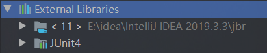
>
> 2. 创建测试类，使用注解方式完成
>
>    ```java
>    @RunWith(SpringJUnit4ClassRunner.class) //单元测试框架
>    @ContextConfiguration("classpath:bean.xml") //加载配置文件
>    public class JTest4 {
>    
>        @Autowired
>        private UserService userService;
>        
>        @Test
>        public void test() {
>            userService.accountMoney();
>        }
>    
>    }
>    ```

#### 整合JUnit5

> 1. 引入 Spring 相关针对测试依赖
>
>    
>
>    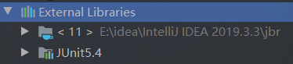
>
> 2. 创建测试类，使用注解方式完成
>
>    ```java
>    //@ExtendWith(SpringExtension.class)//单元测试框架
>    //@ContextConfiguration("classpath:bean.xml")//加载配置文件
>    
>    @SpringJUnitConfig(locations = "classpath:bean.xml")//使用一个复合注解替代上面两个注解完成整合
>    public class JTest5 {
>    
>        @Autowired
>        @Qualifier(value = "userService")
>        private UserService userService;
>    
>        @Test
>        public void test() {
>            userService.accountMoney();
>        }
>    }
>    ```

### WebFlux???

<hr/>

# Spring MVC

## 初识

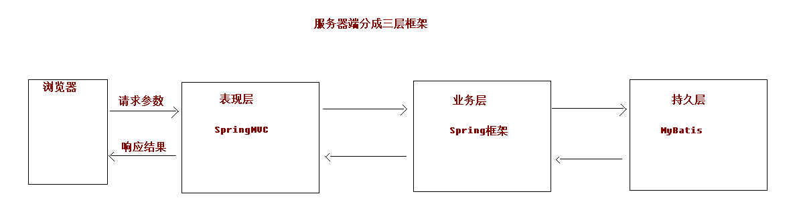

### 创建Maven项目

> - 选择模板创建
>
>   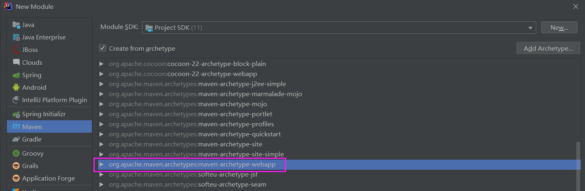

> - 不使用模板创建
>
>   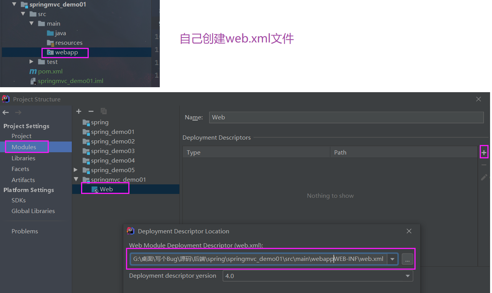
>
> - 引入依赖
>
>   ```xml
>   <dependencies>
>       <!-- SpringMVC -->
>       <dependency>
>           <groupId>org.springframework</groupId>
>           <artifactId>spring-webmvc</artifactId>
>           <version>5.3.1</version>
>       </dependency>
>   
>       <!-- 日志 -->
>       <dependency>
>           <groupId>ch.qos.logback</groupId>
>           <artifactId>logback-classic</artifactId>
>           <version>1.2.3</version>
>       </dependency>
>   
>       <!-- ServletAPI -->
>       <dependency>
>           <groupId>javax.servlet</groupId>
>           <artifactId>javax.servlet-api</artifactId>
>           <version>3.1.0</version>
>           <scope>provided</scope>
>       </dependency>
>   
>       <!-- Spring5和Thymeleaf整合包 -->
>       <dependency>
>           <groupId>org.thymeleaf</groupId>
>           <artifactId>thymeleaf-spring5</artifactId>
>           <version>3.0.12.RELEASE</version>
>       </dependency>
>   </dependencies>
>   ```
>   
>   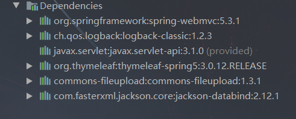

### 配置web.xml

> 注册SpringMVC的**前端控制器DispatcherServlet**

#### 扩展配置方式

> - **通过init-param标签设置SpringMVC配置文件的位置和名称，**
> - **通过load-on-startup标签设置SpringMVC前端控制器DispatcherServlet的初始化时间**

```xml
<!-- webapp/WEB-INF/web.xml -->
<!-- 配置SpringMVC的前端控制器，对浏览器发送的请求统一进行处理 -->
<servlet>
    <servlet-name>springMVC</servlet-name>
    <servlet-class>org.springframework.web.servlet.DispatcherServlet</servlet-class>
    
    <!-- 通过初始化参数指定SpringMVC配置文件的位置和名称 -->
    <init-param>
        <!-- contextConfigLocation为固定值 -->
        <param-name>contextConfigLocation</param-name>
        <!-- 使用classpath:表示从类路径查找配置文件，例如maven工程中的src/main/resources -->
        <param-value>classpath:springMVC.xml</param-value>
    </init-param>
    
    <!-- 将启动控制DispatcherServlet的初始化时间提前到服务器启动时-->
    <load-on-startup>1</load-on-startup>
    
</servlet>

<servlet-mapping>
    <servlet-name>springMVC</servlet-name>
    <!--
        设置springMVC的核心控制器所能处理的请求的请求路径
        /所匹配的请求可以是/login或.html或.js或.css方式的请求路径
        但是/不能匹配.jsp请求路径的请求
    -->
    <url-pattern>/</url-pattern>
</servlet-mapping>
```

> springMVC.xml文件

```xml
<!--  resource/springMVC.xml  -->
<?xml version="1.0" encoding="UTF-8"?>
<beans xmlns="http://www.springframework.org/schema/beans"
       xmlns:xsi="http://www.w3.org/2001/XMLSchema-instance"
       
       <!--开启命名空间-->
       xmlns:context="http://www.springframework.org/schema/context"
       xmlns:context="http://www.springframework.org/schema/context"
       
       xsi:schemaLocation="http://www.springframework.org/schema/beans http://www.springframework.org/schema/beans/spring-beans.xsd
			
							 <!--开启命名空间-->
							http://www.springframework.org/schema/context https://www.springframework.org/schema/context/spring-context.xsd
							http://www.springframework.org/schema/mvc https://www.springframework.org/schema/mvc/spring-mvc.xsd">


    <!--  开启注解扫描  -->
    <context:component-scan base-package="com.lz.mvc"></context:component-scan>


    <!-- 开启mvc注解驱动 -->
    <mvc:annotation-driven>
        <mvc:message-converters>
            <!-- 处理响应中文内容乱码 -->
            <bean class="org.springframework.http.converter.StringHttpMessageConverter">
                <property name="defaultCharset" value="UTF-8" />
                <property name="supportedMediaTypes">
                    <list>
                        <value>text/html</value>
                        <value>application/json</value>
                    </list>
                </property>
            </bean>
        </mvc:message-converters>
    </mvc:annotation-driven>


    
    <!-- 配置Thymeleaf视图解析器 -->
    <bean id="viewResolver" class="org.thymeleaf.spring5.view.ThymeleafViewResolver">
        <property name="order" value="1"/>
        <property name="characterEncoding" value="UTF-8"/>
        <property name="templateEngine">
            <bean class="org.thymeleaf.spring5.SpringTemplateEngine">
                <property name="templateResolver">
                    <bean class="org.thymeleaf.spring5.templateresolver.SpringResourceTemplateResolver">

                        <!-- 视图前缀 -->
                        <property name="prefix" value="/WEB-INF/templates/"/>

                        <!-- 视图后缀 -->
                        <property name="suffix" value=".html"/>
                        <property name="templateMode" value="HTML5"/>
                        <property name="characterEncoding" value="UTF-8"/>
                    </bean>
                </property>
            </bean>
        </property>
    </bean>
    
     
    <!--
      视图控制器：
      path：设置处理的请求地址
      view-name：设置请求地址所对应的视图名称
      此时必须设置<mvc:annotation-driven/>
    -->
    <mvc:view-controller path="/" view-name="index"></mvc:view-controller>


     <!-- 
      处理静态资源，例如html、js、css、jpg
      若只设置该标签，则只能访问静态资源，其他请求则无法访问
      此时必须设置<mvc:annotation-driven/>解决问题
     -->
    <mvc:default-servlet-handler/>


    <!-- 配置文件解析器 -->
    <!--必须通过文件解析器的解析才能将文件转换为MultipartFile对象-->
    <bean id="multipartResolver" class="org.springframework.web.multipart.commons.CommonsMultipartResolver"></bean>


    <!-- 拦截器 -->
    <bean class="com.atguigu.interceptor.FirstInterceptor"></bean>
    <ref bean="firstInterceptor"></ref>
    <!-- 以上两种配置方式都是对DispatcherServlet所处理的所有的请求进行拦截 -->
    <mvc:interceptor>
        <mvc:mapping path="/**"/>
        <mvc:exclude-mapping path="/testRequestEntity"/>
        <!-- 也可以配置只对哪个请求进行拦截 -->
         <!--            <mvc:mapping path="/testInterceptor"/>-->
        <ref bean="firstInterceptor"></ref>
    </mvc:interceptor>

  	<!--自定义异常处理器 -->
    <bean class="org.springframework.web.servlet.handler.SimpleMappingExceptionResolver">
        <property name="exceptionMappings">
            <props>
                <!--
                    properties的键表示处理器方法执行过程中出现的异常
                    properties的值表示若出现指定异常时，设置一个新的视图名称，跳转到指定页面
                -->
                <prop key="java.lang.ArithmeticException">error</prop>
            </props>
        </property>
        <!--
            exceptionAttribute属性设置一个属性名，将出现的异常信息在请求域中进行共享
        -->
        <property name="exceptionAttribute" value="ex"></property>
    </bean>
</beans>
```

### 创建请求控制器

```java
@Controller//将此类交给spring管理
public class HelloController {

    /**
     *  @RequestMapping注解：处理请求和控制器方法之间的映射关系.
     *  注解的value属性可以通过请求地址匹配请求，/表示的当前工程的上下文路径
     */
    @RequestMapping(value = "/")
    public String index() {
        return "index";//return出去在前端控制器中进行页面渲染
    }

    @RequestMapping(value = "/target")
    public String toTarget() {
        return "target";
    }
}

```

## @RequestMapping注解

### 注解的功能

> - 从注解名称上我们可以看到，**@RequestMapping注解的作用就是将请求和处理请求的控制器方法关联起来，建立映射关系。**
>
> - SpringMVC 接收到指定的请求，就会来找到在映射关系中对应的控制器方法来处理这个请求。

### 注解的位置

> - **@RequestMapping标识一个类：设置映射请求的请求路径的初始信息。可以用于区分不同的模块**
> - **@RequestMapping标识一个方法：设置映射请求请求路径的具体信息**

```java
@Controller
@RequestMapping("/test")
public class RequestMappingController {

	//此时请求映射所映射的请求的请求路径为：/test/testRequestMapping
    @RequestMapping("/testRequestMapping")
    public String testRequestMapping(){
        return "success";
    }

}
```

### 注解的value属性

> - @RequestMapping注解的**value属性通过请求的请求地址匹配请求映射**
>
> - @RequestMapping注解的**value属性是一个字符串类型的数组**，表示该请求映射能够匹配多个请求地址所对应的请求，**对应上数组中的一个即可请求**
>
> - @RequestMapping注解的**value属性必须设置**，至少通过请求地址匹配请求映射

```html
<a th:href="@{/success}">测试@RequestMapping注解的value属性-->/success</a><br/>
<a th:href="@{/successtest}">测试@RequestMapping注解的value属性-->/successtest</a><br/>
```

```java
@RequestMapping(
    value = {"/success", "/successtest"}
)
public String toSuccess() {
    return "success";
}
```

### 注解的method属性

> - @RequestMapping注解的**method属性通过请求的请求方式（get或post）匹配请求映射**
> - **当不设置method的属性时，get和post等都可以请求**
> - @RequestMapping注解的**method属性是一个RequestMethod类型的数组**，表示该请求映射能够匹配多种请求方式的请求
>
> - 若当前请求的请求地址满足请求映射的value属性，但是请求方式不满足method属性，则浏览器报错405：Request method 'POST' not supported

```html
<form th:action="@{/success}" method="get">
    <input type="submit" value="测试RequestMapping注解的method属性-->get">
</form>
<br/>

<form th:action="@{/success}" method="post">
    <input type="submit" value="测试RequestMapping注解的method属性-->post">
</form>
<br/>
```

```java
@RequestMapping(
        value = "/success",
        method = {RequestMethod.GET, RequestMethod.POST}
)
public String testRequestMapping(){
    return "success";
}
```

#### @GetMapping/@PostMapping

> 1、对于处理指定请求方式的控制器方法，SpringMVC中提供了@RequestMapping的派生注解
>
> **处理get请求的映射-->@GetMapping**
>
> **处理post请求的映射-->@PostMapping**
>
> **处理put请求的映射-->@PutMapping**
>
> **处理delete请求的映射-->@DeleteMapping**
>
> ```html
> <form th:action="@{/testGetMapping}" method="get">
>     <input type="submit" value="测试testGetMapping注解-->get">
> </form>
> <br/>
> 
> <form th:action="@{/testPostMapping}" method="post">
>     <input type="submit" value="测试testGetMapping注解-->post">
> </form>
> <br/>
> ```
>
> ```java
>     @GetMapping(value = "/testGetMapping")
>     public String testGetMapping() {
>         return "success";
>     }
> 
>     @PostMapping(value = "/testPostMapping")
>     public String testPostMapping() {
>         return "success";
>     }
> ```
>
> 2、常用的请求方式有get，post，put，delete
>
> 但是目前浏览器只支持get和post，若在form表单提交时，为method设置了其他请求方式的字符串（put或delete），则按照默认的请求方式get处理
>
> 若要发送put和delete请求，则需要通过spring提供的过滤器HiddenHttpMethodFilter，在RESTful部分会讲到

### 注解的params属性（了解）

> - @RequestMapping注解的**params属性通过请求的请求参数匹配请求映射**
>
> - @RequestMapping注解的**params属性是一个字符串类型的数组**，可以通过四种表达式设置请求参数和请求映射的匹配关系，**数组里面的全满足才可以访问**
>   1. "param"：要求请求映射所匹配的请求必须携带param请求参数
>   2. "!param"：要求请求映射所匹配的请求必须不能携带param请求参数
>   3. "param=value"：要求请求映射所匹配的请求必须携带param请求参数且param=value
>   4. "param!=value"：要求请求映射所匹配的请求必须携带param请求参数但是param!=value

```html
<a th:href="@{/success(username='admin',password='123456')}">测试RequestMapping注解的params属性->/success</a><br/>
```

```java
    @RequestMapping(
            params = {"username", "password=123456"}
    )
    public String toSuccess() {
        return "success";
    }

```

> 注：
>
> 若当前请求满足@RequestMapping注解的value和method属性，但是不满足params属性，此时页面回报错400：Parameter conditions "username, password!=123456" not met for actual request parameters: username={admin}, password={123456}

### 注解的headers属性（了解）

> - @RequestMapping注解的**headers属性通过请求的请求头信息匹配请求映射**
>
> - @RequestMapping注解的**headers属性是一个字符串类型的数组**，可以通过四种表达式设置请求头信息和请求映射的匹配关系，**数组里面的全满足才可以访问**
>   1. "header"：要求请求映射所匹配的请求必须携带header请求头信息
>   2. "!header"：要求请求映射所匹配的请求必须不能携带header请求头信息
>   3. "header=value"：要求请求映射所匹配的请求必须携带header请求头信息且header=value
>   4. "header!=value"：要求请求映射所匹配的请求必须携带header请求头信息且header!=value
> - 若当前请求满足@RequestMapping注解的value和method属性，但是不满足headers属性，此时页面显示404错误，即资源未找到

### 支持ant风格的路径

> - **？：表示任意的单个字符**
> - ***：表示任意的0个或多个字符**
>
> - **\**：表示任意的一层或多层目录**
>
>
> **注意：在使用\**时，只能使用/**/xxx的方式**

```html
<a th:href="@{/aba/testAnt}">测试RequestMapping注解的Ant风格-->?</a><br/>
<a th:href="@{/abbba/testAnt}">测试RequestMapping注解的Ant风格-->*</a><br/>
<a th:href="@{/a/b/c/testAnt}">测试RequestMapping注解的Ant风格-->**</a><br/>
```

```java
//    @RequestMapping(value = "/a?a/testAnt")
//    @RequestMapping(value = "/a*a/testAnt")
    @RequestMapping(value = "/**/testAnt")
    public String testAnt() {
        return "success";
    }
```

### 支持路径中的占位符（重点）

> 原始方式：/deleteUser?id=1
>
> **rest方式：/deleteUser/1**
>
> SpringMVC路径中的占位符常用于RESTful风格中，当请求路径中将某些数据通过路径的方式传输到服务器中，就可以在相应的@RequestMapping注解的value属性中通过占位符{xxx}表示传输的数据，**在通过@PathVariable注解，将占位符所表示的数据赋值给控制器方法的形参**

```html
<a th:href="@{/testRest/1}">测试RequestMapping支持Rest-->/testRest/1</a><br/>
```

```java
    @RequestMapping(value = "/testRest/{id}")
    public String testRest(@PathVariable("id") Integer id) {
        System.out.println("id = " + id);
        return "success";
    }
```

## RESTful

### RESTful的实现

> - 具体说，就是 HTTP 协议里面，四个表示操作方式的动词：GET、POST、PUT、DELETE。
>   - 它们分别对应四种基本操作：**GET 用来获取资源，POST 用来新建资源，PUT 用来更新资源，DELETE 用来删除资源。**
> - **REST 风格提倡 URL 地址使用统一的风格设计，从前到后各个单词使用斜杠分开，不使用问号键值对方式携带请求参数**，而是将要发送给服务器的数据作为 URL 地址的一部分，以保证整体风格的一致性。

| 操作     | 传统方式         | REST风格                |
| -------- | ---------------- | ----------------------- |
| 查询操作 | getUserById?id=1 | user/1-->get请求方式    |
| 保存操作 | saveUser         | user-->post请求方式     |
| 删除操作 | deleteUser?id=1  | user/1-->delete请求方式 |
| 更新操作 | updateUser       | user-->put请求方式      |

### HiddenHttpMethodFilter

> - SpringMVC 提供了 **HiddenHttpMethodFilter** 帮助我们**将 POST 请求转换为 DELETE 或 PUT 请求**
> - **HiddenHttpMethodFilter** 处理put和delete请求的条件：
>   1. **当前请求的请求方式必须为post**
>   2. **当前请求必须传输请求参数_method**
> - 满足以上条件，**HiddenHttpMethodFilter** 过滤器就会将当前请求的请求方式转换为请求参数_method的值，因此请求参数\_method的值才是最终的请求方式
> - 在web.xml中注册**HiddenHttpMethodFilter** 

```xml
<filter>
    <filter-name>HiddenHttpMethodFilter</filter-name>
    <filter-class>org.springframework.web.filter.HiddenHttpMethodFilter</filter-class>
</filter>
<filter-mapping>
    <filter-name>HiddenHttpMethodFilter</filter-name>
    <url-pattern>/*</url-pattern>
</filter-mapping>
```

```html
<form th:action="@{/person}" method="post">
    <input type="hidden" name="_method" value="put">
    用户名<input type="text" name="username">
    密码<input type="text" name="password">
    <input type="submit" value="修改">
</form>
<br/><br/>
```

```java
@RequestMapping(value = "/person", method = RequestMethod.PUT)
public String updatePerson() {
    System.out.println("修改用户成功");
    return "success";
}
```

> 注：
>
> 目前为止，SpringMVC中提供了两个过滤器：CharacterEncodingFilter和HiddenHttpMethodFilter
>
> **在web.xml中注册时，必须先注册CharacterEncodingFilter，再注册HiddenHttpMethodFilter**
>
> 原因：
>
> - 在 CharacterEncodingFilter 中通过 request.setCharacterEncoding(encoding) 方法设置字符集的
>
> - request.setCharacterEncoding(encoding) 方法要求前面不能有任何获取请求参数的操作
>
> - 而 HiddenHttpMethodFilter 恰恰有一个获取请求方式的操作：
>
> - ```
>   String paramValue = request.getParameter(this.methodParam);
>   ```

### 案例

```html
<body>
<form th:action="@{/person}" method="post">
    用户名<input type="text" name="username">
    密码<input type="text" name="password">
    <input type="submit">
</form>
<br/><br/>

<a th:href="@{/person/1}">根据id查询用户</a><br/><br/>

<form th:action="@{/person}" method="post">
    <input type="hidden" name="_method" value="put">
    用户名<input type="text" name="username">
    密码<input type="text" name="password">
    <input type="submit" value="修改">
</form>
<br/><br/>

<a th:href="@{/person}">查询用户信息</a><br/><br/>

</body>
```

```java
@Controller
public class PersonController {

    /**
     * /person      post    添加用户信息
     * /person/1    delete  删除用于信息
     * /person/1    get     根据id查询用户信息
     * /person      put     修改用于信息
     * /person      get     获取用户信息
     */

    @RequestMapping(value = "/person", method = RequestMethod.POST)
    public String addPerson(String username, String password) {
        System.out.println("添加用户成功" + username + password);
        return "success";
    }

    @RequestMapping(value = "/person/{id}", method = RequestMethod.DELETE)
    public String deletePerson(@PathVariable("id") String id) {
        System.out.println("删除用户成功，id：" + id);
        return "success";
    }

    @RequestMapping(value = "/person/{id}", method = RequestMethod.GET)
    public String getPersonById(@PathVariable("id") String id) {
        System.out.println("根据id查询用户成功，id：" + id);
        return "success";
    }

    @RequestMapping(value = "/person", method = RequestMethod.PUT)
    public String updatePerson() {
        System.out.println("修改用户成功");
        return "success";
    }

    @RequestMapping(value = "/person", method = RequestMethod.GET)
    public String getAllPerson() {
        System.out.println("查询用户信息成功");
        return "success";
    }
}

```

## SpringMVC获取请求参数

### ~~通过ServletAPI获取(不使用)~~

> 将HttpServletRequest作为控制器方法的形参，此时HttpServletRequest类型的参数表示封装了当前请求的请求报文的对象

```java
@RequestMapping("/testParam")
public String testParam(HttpServletRequest request){
    String username = request.getParameter("username");
    String password = request.getParameter("password");
    System.out.println("username:"+username+",password:"+password);
    return "success";
}
```

### 通过控制器方法的形参获取请求参数

> **在控制器方法的形参位置，设置和请求参数同名的形参**，当浏览器发送请求，匹配到请求映射时，在DispatcherServlet中就会将请求参数赋值给相应的形参

```html
<form th:action="@{/testParams}" method="post">
    用户名<input type="text" name="username">
    密码<input type="text" name="password">
    爱好<input type="checkbox" name="hobby" value="吃">吃
    <input type="checkbox" name="hobby" value="喝">喝
    <input type="checkbox" name="hobby" value="玩">玩
    <input type="checkbox" name="hobby" value="乐">乐
    <input type="submit" value="通过控制器方法的形参获取请求参数">
</form>
```

```java
   @RequestMapping("/testParams")
    public String testParams(String username, String password, String[] hobby) {
        System.out.println("username = " + username + ",password:" + password + ",hobby:" + Arrays.toString(hobby));
        return "success";
    }
```

> 注：
>
> **若请求所传输的请求参数中有多个同名的请求参数，此时可以在控制器方法的形参中设置字符串数组或者字符串类型的形参接收此请求参数**
>
> 若使用字符串数组类型的形参，此参数的数组中包含了每一个数据
>
> 若使用字符串类型的形参，此参数的值为每个数据中间使用逗号拼接的结果

#### @RequestParam

> - **@RequestParam是将请求参数和控制器方法的形参创建映射关系**
> - @RequestParam注解一共有三个属性：
>   1. **value：指定为形参赋值的请求参数的参数名**
>   2. **required：设置是否必须传输此请求参数，默认值为true**
>      - 若设置为true时，则当前请求必须传输value所指定的请求参数，若没有传输该请求参数，且没有设置defaultValue属性，则页面报错400：Required String parameter 'xxx' is not present；若设置为false，则当前请求不是必须传输value所指定的请求参数，若没有传输，则注解所标识的形参的值为null
>   3. **defaultValue：不管required属性值为true或false，当value所指定的请求参数没有传输或传输的值为""时，则使用默认值为形参赋值**

```html
<form th:action="@{/testParams}" method="post">
    用户名<input type="text" name="user_name">
    <input type="submit" value="通过控制器方法的形参获取请求参数">
</form>
```

```java
    @RequestMapping("/testParams")
    public String testParams(@RequestParam(value = "user_name", required = false, defaultValue = "haha") String username,) {
        System.out.println("username = " + username);
        return "success";
    }
```

#### @RequestHeader

> - **@RequestHeader是将请求头信息和控制器方法的形参创建映射关系**
> - @RequestHeader注解一共有三个属性：value、required、defaultValue，用法同@RequestParam

```java
    @RequestMapping("/testParams")
    public String testParams(@RequestHeader(value = "Host", required = true, defaultValue = "hehe") String host) {
        System.out.println("host = " + host);
        return "success";
    }
```

#### @CookieValue

> - **@CookieValue是将cookie数据和控制器方法的形参创建映射关系**
> - @CookieValue注解一共有三个属性：value、required、defaultValue，用法同@RequestParam

```java
    @RequestMapping("/testParams")
    public String testParams(@CookieValue(value = "JSESSIONID") String JSESSIONID) {
        System.out.println("JSESSIONID = " + JSESSIONID);
        return "success";
    }
```

#### @RequestAttribute

```java
    @RequestMapping("/togo")
    public String toGoPage(HttpServletRequest request) {
        request.setAttribute("msg", "成功了。。。");
        return "forward:/success";

    }

    @RequestMapping("/success")
    @ResponseBody
    public Map<String, Object> getMsg(HttpServletRequest request,
                                      @RequestAttribute("msg") String msg) {
        Object msg1 = request.getAttribute("msg");
        HashMap<String, Object> map = new HashMap<>();
        map.put("msg", msg);
        map.put("msg1", msg1);
        return map;
    }
```

### 通过实体类获取请求参数

> **可以在控制器方法的形参位置设置一个实体类类型的形参，此时若浏览器传输的请求参数的参数名和实体类中的属性名一致，那么请求参数就会为此属性赋值**

```java
    @GetMapping("/testGet")
    public void testGet(User user) {
        System.out.println("get--------->"+user);
    }
```


```html
<form th:action="@{/testBean}" method="POST">
    用户名<input type="text" name="username"/>
    密码<input type="text" name="password"/>
    性别<input type="radio" name="sex" value="男"/>男
    <input type="radio" name="sex" value="女"/>女
    年龄<input type="text" name="age"/>
    邮箱<input type="text" name="email"/>
    <input type="submit" value="使用实体类获取参数"/>
</form>
```

```java
public class User {
    private Integer id;
    private String username;
    private String password;
    private String sex;
    private Integer age;
    private String email;
}
```

```java
    @PostMapping("/testBean")
    public String testBean(User user) {
        System.out.println("user = " + user);
        return "success";
    }
```

### 解决中文乱码问题

> 解决获取请求参数的乱码问题，可以使用SpringMVC提供的编码**过滤器CharacterEncodingFilter，但是必须在web.xml中进行注册**

```xml
    <!--  过滤器,设置编码  -->
    <filter>
        <filter-name>CharacterEncodingFilter</filter-name>
        <filter-class>org.springframework.web.filter.CharacterEncodingFilter</filter-class>
        <!--    设置请求的编码    -->
        <init-param>
            <param-name>encoding</param-name>
            <param-value>UTF-8</param-value>
        </init-param>
        <!--    设置响应的编码    -->
        <init-param>
            <param-name>forceResponseEncoding</param-name>
            <param-value>true</param-value>
        </init-param>
    </filter>
    <filter-mapping>
        <filter-name>CharacterEncodingFilter</filter-name>
        <url-pattern>/*</url-pattern>
    </filter-mapping>
```

## HttpMessageConverter

> - HttpMessageConverter，报文信息转换器，将请求报文转换为Java对象，或将Java对象转换为响应报文
> - HttpMessageConverter提供了两个注解和两个类型：@RequestBody，@ResponseBody，RequestEntity，ResponseEntity

### @RequestBody

> - **@RequestBody可以获取请求体**，需要在控制器方法设置一个形参，使用@RequestBody进行标识，当前请求的请求体就会为当前注解所标识的形参赋值
> - **这种方式只可以获得post请求的请求体。和get请求的@RequestParam都可以通过形参获取请求参数，和通过实体类获取请求参数**

```html
<form th:action="@{/testRequestBody}" method="post">
    用户名：<input type="text" name="username"><br>
    密码：<input type="password" name="password"><br>
    <input type="submit">
</form>
```

```java
@RequestMapping("/testRequestBody")
public String testRequestBody(@RequestBody String requestBody){
    System.out.println("requestBody:"+requestBody);
    return "success";
}
```

### RequestEntity

> RequestEntity封装请求报文的一种类型，需要在控制器方法的形参中设置该类型的形参，当前请求的请求报文就会赋值给该形参，可以通过getHeaders()获取请求头信息，通过getBody()获取请求体信息

```java
@RequestMapping("/testRequestEntity")
public String testRequestEntity(RequestEntity<String> requestEntity){
    System.out.println("requestHeader:"+requestEntity.getHeaders());
    System.out.println("requestBody:"+requestEntity.getBody());
    return "success";
}
```

> 输出结果：
> requestHeader:[host:"localhost:8080", connection:"keep-alive", content-length:"27", cache-control:"max-age=0", sec-ch-ua:"" Not A;Brand";v="99", "Chromium";v="90", "Google Chrome";v="90"", sec-ch-ua-mobile:"?0", upgrade-insecure-requests:"1", origin:"http://localhost:8080", user-agent:"Mozilla/5.0 (Windows NT 10.0; Win64; x64) AppleWebKit/537.36 (KHTML, like Gecko) Chrome/90.0.4430.93 Safari/537.36"]
> requestBody:username=admin&password=123

### @ResponseBody

> **@ResponseBody用于标识一个控制器方法，可以将该方法的返回值直接作为响应报文的响应体响应到浏览器**

```java
@RequestMapping("/testResponseBody")
@ResponseBody
public String testResponseBody() {
    return "加上@ResponseBody注解,那么这里的返回是响应体";
}
```

### SpringMVC处理json

> 1. **导入jackson的依赖**
>
>    ```xml
>    <dependency>
>        <groupId>com.fasterxml.jackson.core</groupId>
>        <artifactId>jackson-databind</artifactId>
>        <version>2.12.1</version>
>    </dependency>
>    ```
>
> 2. **在SpringMVC的核心配置文件中开启mvc的注解驱动**，此时在HandlerAdaptor中会自动装配一个消息转换器：MappingJackson2HttpMessageConverter，可以将响应到浏览器的Java对象转换为Json格式的字符串
>
>    ```xml
>    <mvc:annotation-driven />
>    ```
>
> 3. **在处理器方法上使用@ResponseBody注解进行标识**
>
> 4. **将Java对象直接作为控制器方法的返回值返回，就会自动转换为Json格式的字符串**
>
>    ```java
>    @RequestMapping("/testResponseUser")
>    @ResponseBody
>    public User testResponseUser(){
>        return new User(1001,"admin","123456",23,"男");
>    }
>    ```
>
> - 浏览器的页面中展示的结果：{"id":1001,"username":"admin","password":"123456","age":23,"sex":"男"}

### @RestController注解

> **@RestController注解是springMVC提供的一个复合注解，标识在控制器的类上，就相当于为类添加了@Controller注解，并且为其中的每个方法添加了@ResponseBody注解**

### ResponseEntity

> ResponseEntity用于控制器方法的返回值类型，该控制器方法的返回值就是响应到浏览器的响应报文

## 前后端交互

### vue

> 前端通过ajax访问后端数据
>
> 后端接收到通过ajax返回给前端数据

```vue
<template>
  <div>
    <form>
      <input type="text" name="username" v-model="username" />
      <input type="text" name="password" v-model="password" />
      <input type="submit" @click="submitForm" />
    </form>
  </div>
</template>

<script>
import axios from "axios";
export default {
  data() {
    return {
      username: "",
      password: "",
    };
  },
  methods: {
    submitForm(e) {
      e.preventDefault();
      // axios({
      //   method: "get",
      //   url: "http://localhost:8081/springmvc/testRequestBody",
      //   params:{
      //     username:this.username,
      //     password:this.password
      //   }.then((result) => {
      //    console.log(result.data);
      //  })
      //  .catch((err) => {});
      // });

      axios({
        method: "post",
        url: "http://localhost:8081/springmvc/testRequestBody",
        data: {
          username: this.username,
          password: this.password,
        },
      })
        .then((result) => {
          console.log(result.data);
        })
        .catch((err) => {});
    },
  },
};
</script>

```

```java
    @RequestMapping(value = "/testRequestBody",method = RequestMethod.GET)
    public String testRequestBody(String username,String password) {
        System.out.println("username="+username+",password="+password);
        return "响应给前端";
    }
    
    @RequestMapping(value = "/testRequestBody",method = RequestMethod.POST)
    public String testRequestBody(@RequestBody String requestBody) {
        System.out.println("requestBody = " + requestBody);
        return "响应给前端";
    }

```

> - 前端 --> 后端
>   - post请求，前端的传递的对象，在后端是json字符串
>   - get请求，前端传递数据，后端通过参数名获取参数值
> - 后端 --> 前端
>   - 后端传递对象，前端收到对象
>   - 后端传递json字符串，前端收到对象
> - 前后端传递json数据，不管你传递的是对象还是字符串，都会转成json字符串传递，在前端axios会自动解析json字符串，转为对象，后端没有，需要自己解析

### thymeleaf

> 前端访问路径，在controller中返回出去，在中央控制器中渲染thymeleaf

```java
@RequestMapping("/testHello")
public String testHello(){
    return "hello";//会去渲染 hello.html
}
```

## SpringMVC的视图

> SpringMVC中的视图是View接口，视图的作用渲染数据，将模型Model中的数据展示给用户
>
> SpringMVC视图的种类很多，默认有转发视图和重定向视图
>
> 当工程引入jstl的依赖，转发视图会自动转换为JstlView
>
> 若使用的视图技术为Thymeleaf，在SpringMVC的配置文件中配置了Thymeleaf的视图解析器，由此视图解析器解析之后所得到的是ThymeleafView

### ThymeleafView

> 当控制器方法中所设置的视图名称没有任何前缀时，此时的视图名称会被SpringMVC配置文件中所配置的视图解析器解析，视图名称拼接视图前缀和视图后缀所得到的最终路径，会**通过转发的方式实现跳转**

```java
@RequestMapping("/testHello")
public String testHello(){
    return "hello";
}
```


### 转发视图

> - SpringMVC中默认的转发视图是InternalResourceView
>
> - SpringMVC中创建转发视图的情况：
>   - 当控制器方法中所设置的视图名称以"forward:"为前缀时，创建InternalResourceView视图，此时的视图名称不会被SpringMVC配置文件中所配置的视图解析器解析，而是会将前缀"forward:"去掉，剩余部分作为最终路径通过转发的方式实现跳转
>   - 例如"forward:/"，"forward:/employee"，**只能转发到控制器，不可以转发到具体页面**
> - 转发视图不可以跨域

```java
@RequestMapping("/testForward")
public String testForward(){
    return "forward:/testHello";
}
```


### 重定向视图

> - SpringMVC中默认的重定向视图是RedirectView
>
> - SpringMVC中创建重定向视图的情况：
>   - 当控制器方法中所设置的视图名称以"redirect:"为前缀时，创建RedirectView视图，此时的视图名称不会被SpringMVC配置文件中所配置的视图解析器解析，而是会将前缀"redirect:"去掉，剩余部分作为最终路径通过重定向的方式实现跳转
>   - 例如"redirect:/"，"redirect:/employee"
> - **只能重定向到控制器，不可以重定向到具体页面**
> - 重定向视图可以跨域，例如：”redirect:http://www.baidu.com“

```java
@RequestMapping("/testRedirect")
public String testRedirect(){
    return "redirect:/testHello";
	//return ”redirect:http://www.baidu.com“;//重定向到百度
}
```


> 注：
>
> 重定向视图在解析时，会先将redirect:前缀去掉，然后会判断剩余部分是否以/开头，若是则会自动拼接上下文路径

### 视图控制器view-controller

> 当控制器方法中，仅仅用来实现页面跳转，即只需要设置视图名称时，可以将处理器方法使用view-controller标签进行表示

```xml
<?xml version="1.0" encoding="UTF-8"?>
<beans xmlns="http://www.springframework.org/schema/beans"
       xmlns:xsi="http://www.w3.org/2001/XMLSchema-instance"
       xmlns:context="http://www.springframework.org/schema/context"
       
       <!--开启命名空间-->
       xmlns:mvc="http://www.springframework.org/schema/mvc"

       xsi:schemaLocation="http://www.springframework.org/schema/beans http://www.springframework.org/schema/beans/spring-beans.xsd
                            http://www.springframework.org/schema/context https://www.springframework.org/schema/context/spring-context.xsd

							 <!--开启命名空间-->
                            http://www.springframework.org/schema/mvc https://www.springframework.org/schema/mvc/spring-mvc.xsd">
	
    .......
    
    <!--
        path：设置处理的请求地址
        view-name：设置请求地址所对应的视图名称
    -->
    <mvc:view-controller path="/" view-name="index"></mvc:view-controller>

	<!--开启mvc注解驱动-->
    <mvc:annotation-driven></mvc:annotation-driven>

    <!-- 
       处理静态资源，例如html、js、css、jpg
      若只设置该标签，则只能访问静态资源，其他请求则无法访问
      此时必须设置<mvc:annotation-driven/>解决问题
     -->
    <mvc:default-servlet-handler/>

</beans>
```

> 注：
>
> 当SpringMVC中设置任何一个view-controller时，其他控制器中的请求映射将全部失效，此时需要在SpringMVC的核心配置文件中设置开启mvc注解驱动的标签：`<mvc:annotation-driven />`

## 域对象共享数据

### 向request域共享数据

#### ~~使用ServletAPI向request域对象共享数据~~

```java
@RequestMapping(value = "/testRequestByServletAPI")
public String testRequestByServletAPI(HttpServletRequest request) {
    request.setAttribute("testRequestByServletAPI", "hahahaha");
    return "success";
}
```

```html
<p th:text="${testRequestByServletAPI}"></p><br/>
```

#### 使用ModelAndView向request域对象共享数据

```java
@RequestMapping("/testModelAndView")
public ModelAndView testModelAndView() {
    /**
     * ModelAndView有Model和View的功能
     * Model主要用于向请求域共享数据
     * View主要用于设置视图，实现页面跳转
     */
    ModelAndView mav = new ModelAndView();
     //向请求域共享数据
    mav.addObject("testModelAndView", "hehehehe");
     //设置视图，实现页面跳转
    mav.setViewName("success");
    return mav;
}
```

```html
<p th:text="${testModelAndView}"></p><br/>
```

#### 使用Model向request域对象共享数据

```java
    @RequestMapping("/testModel")
    public String testModel(Model model) {
        model.addAttribute("testModel", "hello,model");
        return "success";
    }
```

```html
<p th:text="${testModel}"></p><br/>
```

#### 使用map向request域对象共享数据

```java
    @RequestMapping("/testMap")
    public String testMap(Map<String, Object> map) {
        map.put("testMap", "hello,map");
        return "success";
    }
```

```html
<p th:text="${testMap}"></p><br/>
```

#### 使用ModelMap向request域对象共享数据

```java
    @RequestMapping("/testModelMap")
    public String testModelMap(ModelMap modelMap) {
        modelMap.addAttribute("testModelMap", "hello,ModelMap");
        return "success";
    }
```

```html
<p th:text="${testModelMap}"></p><br/>
```

### 向session域共享数据

```java
@RequestMapping("/testSession")
public String testSession(HttpSession session){
    session.setAttribute("testSessionScope", "hello,session");
    return "success";
}
```

```html
<p th:text="${session.testSessionScope}"></p><br/>
```

### 向application域共享数据

```java
@RequestMapping("/testApplication")
public String testApplication(HttpSession session){
	ServletContext application = session.getServletContext();
    application.setAttribute("testApplicationScope", "hello,application");
    return "success";
}
```

```html
<p th:text="${Application.testSessionScope}"></p><br/>
```

## 文件上传和下载

### 文件下载

> **使用ResponseEntity实现下载文件的功能**

```java
@RequestMapping("/testDown")
public ResponseEntity<byte[]> testResponseEntity(HttpSession session) throws IOException {
    //获取ServletContext对象
    ServletContext servletContext = session.getServletContext();
    //获取服务器中文件的真实路径
    //realPath = G:\桌面\写个Bug\源码\后端\spring\springmvc_demo05\target\springmvc_demo05-1.0-SNAPSHOT\static\img\1.jpg
    String realPath = servletContext.getRealPath("/static/img/1.jpg");
    
    //创建输入流
    InputStream is = new FileInputStream(realPath);
    //创建字节数组
    byte[] bytes = new byte[is.available()];
    //将流读到字节数组中
    is.read(bytes);
    
    //创建HttpHeaders对象设置响应头信息
    MultiValueMap<String, String> headers = new HttpHeaders();
    //设置要下载方式以及下载文件的名字
    headers.add("Content-Disposition", "attachment;filename=1.jpg");
    //设置响应状态码
    HttpStatus statusCode = HttpStatus.OK;
    //创建ResponseEntity对象
    ResponseEntity<byte[]> responseEntity = new ResponseEntity<>(bytes, headers, statusCode);
    //关闭输入流
    is.close();
    return responseEntity;
}
```

### 文件上传

> 1. 文件上传要求form表单的**请求方式必须为post**，并且**添加属性`enctype="multipart/form-data`"**。SpringMVC中将上传的文件封装到MultipartFile对象中，通过此对象可以获取文件相关信息
>
>    ```html
>    <form th:action="@{/testUpload}" method="post" enctype="multipart/form-data">
>        <input type="file" name="photo">
>        <input type="submit" value="上传">
>    </form>
>    ```
>
> 2. 添加依赖：
>
>    ```xml
>    <!-- https://mvnrepository.com/artifact/commons-fileupload/commons-fileupload -->
>    <dependency>
>        <groupId>commons-fileupload</groupId>
>        <artifactId>commons-fileupload</artifactId>
>        <version>1.3.1</version>
>    </dependency>
>    ```
>
> 3. 在SpringMVC的配置文件中添加**文件解析器CommonMultipartResolver**
>
>    ```xml
>    <!--必须通过文件解析器的解析才能将文件转换为MultipartFile对象-->
>    <bean id="multipartResolver" class="org.springframework.web.multipart.commons.CommonsMultipartResolver"></bean>
>    ```
>
> 4. 控制器方法：
>
>    ```java
>    @RequestMapping("/testUpload")
>    public String testUpload(MultipartFile photo, HttpSession session) throws IOException {
>        //获取上传的文件的文件名
>        String fileName = photo.getOriginalFilename();
>        //处理文件重名问题
>        String hzName = fileName.substring(fileName.lastIndexOf("."));
>        fileName = UUID.randomUUID().toString() + hzName;
>        //获取服务器中photo目录的路径
>        ServletContext servletContext = session.getServletContext();
>        String photoPath = servletContext.getRealPath("photo");
>        File file = new File(photoPath);
>        if(!file.exists()){
>            file.mkdir();
>        }
>        String finalPath = photoPath + File.separator + fileName;
>        //实现上传功能
>        //上传到G:\桌面\写个Bug\源码\后端\spring\springmvc_demo05\target\springmvc_demo05-1.0-SNAPSHOT\photo\demo01.png
>        photo.transferTo(new File(finalPath));
>        return "success";
>    }
>    ```

## 拦截器

> - SpringMVC中的**拦截器用于拦截控制器方法的执行**
>
> - SpringMVC中的**拦截器需要实现HandlerInterceptor接口**
>
> - SpringMVC的**拦截器必须在SpringMVC的配置文件中进行配置**

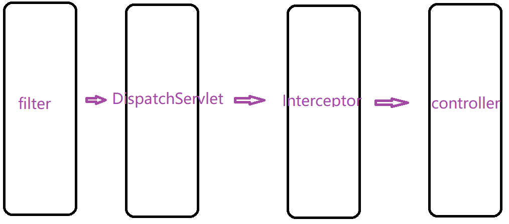

```java

@Component
public class FirstInterceptor implements HandlerInterceptor {

    //    在控制器方法之前执行
    @Override
    public boolean preHandle(HttpServletRequest request, HttpServletResponse response, Object handler) throws Exception {
        System.out.println("FirstInterceptor-->preHandle");
//        返回false是拦截,true是放行
        return true;
    }

    //    在控制器方法之后执行
    @Override
    public void postHandle(HttpServletRequest request, HttpServletResponse response, Object handler, ModelAndView modelAndView) throws Exception {
        System.out.println("FirstInterceptor-->postHandle");
    }

    //    在控制器视图渲染完成之后执行
    @Override
    public void afterCompletion(HttpServletRequest request, HttpServletResponse response, Object handler, Exception ex) throws Exception {
        System.out.println("FirstInterceptor-->afterCompletion");
    }
}

```

```xml
    <!--  配置拦截器  -->
    <mvc:interceptors>
        <!--        <bean class="com.lz.mvc.interceptor.FirstInterceptor"></bean>-->
        <!--        <ref bean="firstInterceptor"></ref>-->
        <!-- 以上两种配置方式都是对DispatcherServlet所处理的所有的请求进行拦截 -->
        <mvc:interceptor>
            <mvc:mapping path="/**"/>
            <mvc:exclude-mapping path="/"/>
            <!-- 也可以配置只对哪个请求进行拦截 -->
            <!--            <mvc:mapping path="/testInterceptor"/>-->
            <bean class="com.lz.mvc.interceptor.FirstInterceptor"></bean>
        </mvc:interceptor>
    </mvc:interceptors>
```

### 多个拦截器的执行顺序

> - 若每个拦截器的preHandle()都返回true
>   - 此时多个拦截器的执行顺序和拦截器在SpringMVC的配置文件的配置顺序有关。preHandle()会按照配置的顺序执行，而postHandle()和afterComplation()会按照配置的反序执行
> - 若某个拦截器的preHandle()返回了false
>   - preHandle()返回false和它之前的拦截器的preHandle()都会执行，postHandle()都不执行，返回false的拦截器之前的拦截器的afterComplation()会执行

## 异常处理器

### 基于配置的异常处理

> SpringMVC提供了**自定义的异常处理器SimpleMappingExceptionResolver**

```xml
<bean class="org.springframework.web.servlet.handler.SimpleMappingExceptionResolver">
    <property name="exceptionMappings">
        <props>
        	<!--
        		properties的键表示处理器方法执行过程中出现的异常
        		properties的值表示若出现指定异常时，设置一个新的视图名称，跳转到指定页面
        	-->
            <prop key="java.lang.ArithmeticException">error</prop>
        </props>
    </property>
    <!--
    	exceptionAttribute属性设置一个属性名，将出现的异常信息在请求域中进行共享
    -->
    <property name="exceptionAttribute" value="ex"></property>
</bean>
```

```html
<p>错误</p>
<p th:text="${ex}"></p>
```

### 基于注解的异常处理

```java
@ControllerAdvice//将当前类标识为异常处理的组件
public class ExceptionController {

    //@ExceptionHandler用于设置所标识方法处理的异常
    @ExceptionHandler(ArithmeticException.class)
    //ex表示当前请求处理中出现的异常对象
    public String handleArithmeticException(Exception ex, Model model){
        model.addAttribute("ex", ex);
        return "error";
    }

}
```

```html
<p>错误</p>
<p th:text="${ex}"></p>
```

## SpringMVC完全注解开发？？？

> 使用配置类和注解代替web.xml和SpringMVC配置文件的功能

### 创建初始化类，代替web.xml

> Spring3.2引入了一个便利的WebApplicationInitializer基础实现，名为**AbstractAnnotationConfigDispatcherServletInitializer**，**当我们的类扩展了AbstractAnnotationConfigDispatcherServletInitializer并将其部署到Servlet3.0容器的时候，容器会自动发现它，并用它来配置Servlet上下文。**

```java
public class WebInit extends AbstractAnnotationConfigDispatcherServletInitializer {

    /**
     * 指定spring的配置类
     * @return
     */
    @Override
    protected Class<?>[] getRootConfigClasses() {
        return new Class[]{SpringConfig.class};
    }

    /**
     * 指定SpringMVC的配置类
     * @return
     */
    @Override
    protected Class<?>[] getServletConfigClasses() {
        return new Class[]{WebConfig.class};
    }

    /**
     * 指定DispatcherServlet的映射规则，即url-pattern
     * @return
     */
    @Override
    protected String[] getServletMappings() {
        return new String[]{"/"};
    }

    /**
     * 添加过滤器
     * @return
     */
    @Override
    protected Filter[] getServletFilters() {
        CharacterEncodingFilter encodingFilter = new CharacterEncodingFilter();
        encodingFilter.setEncoding("UTF-8");
        encodingFilter.setForceRequestEncoding(true);
        HiddenHttpMethodFilter hiddenHttpMethodFilter = new HiddenHttpMethodFilter();
        return new Filter[]{encodingFilter, hiddenHttpMethodFilter};
    }
}
```

### 创建WebConfig配置类，代替SpringMVC的配置文件

```java
@Configuration
//扫描组件
@ComponentScan("com.atguigu.mvc.controller")
//开启MVC注解驱动
@EnableWebMvc
public class WebConfig implements WebMvcConfigurer {
    //配置文件上传解析器
    @Bean
    public CommonsMultipartResolver multipartResolver(){
        return new CommonsMultipartResolver();
    }

    //配置拦截器
    @Override
    public void addInterceptors(InterceptorRegistry registry) {
        FirstInterceptor firstInterceptor = new FirstInterceptor();
        registry.addInterceptor(firstInterceptor).addPathPatterns("/**");
    }
        
    //配置异常映射
    @Override
    public void configureHandlerExceptionResolvers(List<HandlerExceptionResolver> resolvers) {
        SimpleMappingExceptionResolver exceptionResolver = new SimpleMappingExceptionResolver();
        Properties prop = new Properties();
        prop.setProperty("java.lang.ArithmeticException", "error");
        //设置异常映射
        exceptionResolver.setExceptionMappings(prop);
        //设置共享异常信息的键
        exceptionResolver.setExceptionAttribute("ex");
        resolvers.add(exceptionResolver);
    }
   
    //使用默认的servlet处理静态资源
    @Override
    public void configureDefaultServletHandling(DefaultServletHandlerConfigurer configurer) {
        configurer.enable();
    }
    
    //配置视图控制
    @Override
    public void addViewControllers(ViewControllerRegistry registry) {
        registry.addViewController("/").setViewName("index");
    }
   
    //配置生成模板解析器
    @Bean
    public ITemplateResolver templateResolver() {
        WebApplicationContext webApplicationContext = ContextLoader.getCurrentWebApplicationContext();
        // ServletContextTemplateResolver需要一个ServletContext作为构造参数，可通过WebApplicationContext 的方法获得
        ServletContextTemplateResolver templateResolver = new ServletContextTemplateResolver(
                webApplicationContext.getServletContext());
        templateResolver.setPrefix("/WEB-INF/templates/");
        templateResolver.setSuffix(".html");
        templateResolver.setCharacterEncoding("UTF-8");
        templateResolver.setTemplateMode(TemplateMode.HTML);
        return templateResolver;
    }

    //生成模板引擎并为模板引擎注入模板解析器
    @Bean
    public SpringTemplateEngine templateEngine(ITemplateResolver templateResolver) {
        SpringTemplateEngine templateEngine = new SpringTemplateEngine();
        templateEngine.setTemplateResolver(templateResolver);
        return templateEngine;
    }

    //生成视图解析器并未解析器注入模板引擎
    @Bean
    public ViewResolver viewResolver(SpringTemplateEngine templateEngine) {
        ThymeleafViewResolver viewResolver = new ThymeleafViewResolver();
        viewResolver.setCharacterEncoding("UTF-8");
        viewResolver.setTemplateEngine(templateEngine);
        return viewResolver;
    }
}
```

## SpringMVC执行流程？？？

### SpringMVC常用组件

- DispatcherServlet：**前端控制器**，不需要工程师开发，由框架提供

作用：统一处理请求和响应，整个流程控制的中心，由它调用其它组件处理用户的请求

- HandlerMapping：**处理器映射器**，不需要工程师开发，由框架提供

作用：根据请求的url、method等信息查找Handler，即控制器方法

- Handler：**处理器**，需要工程师开发

作用：在DispatcherServlet的控制下Handler对具体的用户请求进行处理

- HandlerAdapter：**处理器适配器**，不需要工程师开发，由框架提供

作用：通过HandlerAdapter对处理器（控制器方法）进行执行

- ViewResolver：**视图解析器**，不需要工程师开发，由框架提供

作用：进行视图解析，得到相应的视图，例如：ThymeleafView、InternalResourceView、RedirectView

- View：**视图**

作用：将模型数据通过页面展示给用户

### DispatcherServlet初始化过程

DispatcherServlet 本质上是一个 Servlet，所以天然的遵循 Servlet 的生命周期。所以宏观上是 Servlet 生命周期来进行调度。


##### a>初始化WebApplicationContext

所在类：org.springframework.web.servlet.FrameworkServlet

```java
protected WebApplicationContext initWebApplicationContext() {
    WebApplicationContext rootContext =
        WebApplicationContextUtils.getWebApplicationContext(getServletContext());
    WebApplicationContext wac = null;

    if (this.webApplicationContext != null) {
        // A context instance was injected at construction time -> use it
        wac = this.webApplicationContext;
        if (wac instanceof ConfigurableWebApplicationContext) {
            ConfigurableWebApplicationContext cwac = (ConfigurableWebApplicationContext) wac;
            if (!cwac.isActive()) {
                // The context has not yet been refreshed -> provide services such as
                // setting the parent context, setting the application context id, etc
                if (cwac.getParent() == null) {
                    // The context instance was injected without an explicit parent -> set
                    // the root application context (if any; may be null) as the parent
                    cwac.setParent(rootContext);
                }
                configureAndRefreshWebApplicationContext(cwac);
            }
        }
    }
    if (wac == null) {
        // No context instance was injected at construction time -> see if one
        // has been registered in the servlet context. If one exists, it is assumed
        // that the parent context (if any) has already been set and that the
        // user has performed any initialization such as setting the context id
        wac = findWebApplicationContext();
    }
    if (wac == null) {
        // No context instance is defined for this servlet -> create a local one
        // 创建WebApplicationContext
        wac = createWebApplicationContext(rootContext);
    }

    if (!this.refreshEventReceived) {
        // Either the context is not a ConfigurableApplicationContext with refresh
        // support or the context injected at construction time had already been
        // refreshed -> trigger initial onRefresh manually here.
        synchronized (this.onRefreshMonitor) {
            // 刷新WebApplicationContext
            onRefresh(wac);
        }
    }

    if (this.publishContext) {
        // Publish the context as a servlet context attribute.
        // 将IOC容器在应用域共享
        String attrName = getServletContextAttributeName();
        getServletContext().setAttribute(attrName, wac);
    }

    return wac;
}
```

##### b>创建WebApplicationContext

所在类：org.springframework.web.servlet.FrameworkServlet

```java
protected WebApplicationContext createWebApplicationContext(@Nullable ApplicationContext parent) {
    Class<?> contextClass = getContextClass();
    if (!ConfigurableWebApplicationContext.class.isAssignableFrom(contextClass)) {
        throw new ApplicationContextException(
            "Fatal initialization error in servlet with name '" + getServletName() +
            "': custom WebApplicationContext class [" + contextClass.getName() +
            "] is not of type ConfigurableWebApplicationContext");
    }
    // 通过反射创建 IOC 容器对象
    ConfigurableWebApplicationContext wac =
        (ConfigurableWebApplicationContext) BeanUtils.instantiateClass(contextClass);

    wac.setEnvironment(getEnvironment());
    // 设置父容器
    wac.setParent(parent);
    String configLocation = getContextConfigLocation();
    if (configLocation != null) {
        wac.setConfigLocation(configLocation);
    }
    configureAndRefreshWebApplicationContext(wac);

    return wac;
}
```

##### c>DispatcherServlet初始化策略

FrameworkServlet创建WebApplicationContext后，刷新容器，调用onRefresh(wac)，此方法在DispatcherServlet中进行了重写，调用了initStrategies(context)方法，初始化策略，即初始化DispatcherServlet的各个组件

所在类：org.springframework.web.servlet.DispatcherServlet

```java
protected void initStrategies(ApplicationContext context) {
   initMultipartResolver(context);
   initLocaleResolver(context);
   initThemeResolver(context);
   initHandlerMappings(context);
   initHandlerAdapters(context);
   initHandlerExceptionResolvers(context);
   initRequestToViewNameTranslator(context);
   initViewResolvers(context);
   initFlashMapManager(context);
}
```

### DispatcherServlet调用组件处理请求

##### a>processRequest()

FrameworkServlet重写HttpServlet中的service()和doXxx()，这些方法中调用了processRequest(request, response)

所在类：org.springframework.web.servlet.FrameworkServlet

```java
protected final void processRequest(HttpServletRequest request, HttpServletResponse response)
    throws ServletException, IOException {

    long startTime = System.currentTimeMillis();
    Throwable failureCause = null;

    LocaleContext previousLocaleContext = LocaleContextHolder.getLocaleContext();
    LocaleContext localeContext = buildLocaleContext(request);

    RequestAttributes previousAttributes = RequestContextHolder.getRequestAttributes();
    ServletRequestAttributes requestAttributes = buildRequestAttributes(request, response, previousAttributes);

    WebAsyncManager asyncManager = WebAsyncUtils.getAsyncManager(request);
    asyncManager.registerCallableInterceptor(FrameworkServlet.class.getName(), new RequestBindingInterceptor());

    initContextHolders(request, localeContext, requestAttributes);

    try {
		// 执行服务，doService()是一个抽象方法，在DispatcherServlet中进行了重写
        doService(request, response);
    }
    catch (ServletException | IOException ex) {
        failureCause = ex;
        throw ex;
    }
    catch (Throwable ex) {
        failureCause = ex;
        throw new NestedServletException("Request processing failed", ex);
    }

    finally {
        resetContextHolders(request, previousLocaleContext, previousAttributes);
        if (requestAttributes != null) {
            requestAttributes.requestCompleted();
        }
        logResult(request, response, failureCause, asyncManager);
        publishRequestHandledEvent(request, response, startTime, failureCause);
    }
}
```

##### b>doService()

所在类：org.springframework.web.servlet.DispatcherServlet

```java
@Override
protected void doService(HttpServletRequest request, HttpServletResponse response) throws Exception {
    logRequest(request);

    // Keep a snapshot of the request attributes in case of an include,
    // to be able to restore the original attributes after the include.
    Map<String, Object> attributesSnapshot = null;
    if (WebUtils.isIncludeRequest(request)) {
        attributesSnapshot = new HashMap<>();
        Enumeration<?> attrNames = request.getAttributeNames();
        while (attrNames.hasMoreElements()) {
            String attrName = (String) attrNames.nextElement();
            if (this.cleanupAfterInclude || attrName.startsWith(DEFAULT_STRATEGIES_PREFIX)) {
                attributesSnapshot.put(attrName, request.getAttribute(attrName));
            }
        }
    }

    // Make framework objects available to handlers and view objects.
    request.setAttribute(WEB_APPLICATION_CONTEXT_ATTRIBUTE, getWebApplicationContext());
    request.setAttribute(LOCALE_RESOLVER_ATTRIBUTE, this.localeResolver);
    request.setAttribute(THEME_RESOLVER_ATTRIBUTE, this.themeResolver);
    request.setAttribute(THEME_SOURCE_ATTRIBUTE, getThemeSource());

    if (this.flashMapManager != null) {
        FlashMap inputFlashMap = this.flashMapManager.retrieveAndUpdate(request, response);
        if (inputFlashMap != null) {
            request.setAttribute(INPUT_FLASH_MAP_ATTRIBUTE, Collections.unmodifiableMap(inputFlashMap));
        }
        request.setAttribute(OUTPUT_FLASH_MAP_ATTRIBUTE, new FlashMap());
        request.setAttribute(FLASH_MAP_MANAGER_ATTRIBUTE, this.flashMapManager);
    }

    RequestPath requestPath = null;
    if (this.parseRequestPath && !ServletRequestPathUtils.hasParsedRequestPath(request)) {
        requestPath = ServletRequestPathUtils.parseAndCache(request);
    }

    try {
        // 处理请求和响应
        doDispatch(request, response);
    }
    finally {
        if (!WebAsyncUtils.getAsyncManager(request).isConcurrentHandlingStarted()) {
            // Restore the original attribute snapshot, in case of an include.
            if (attributesSnapshot != null) {
                restoreAttributesAfterInclude(request, attributesSnapshot);
            }
        }
        if (requestPath != null) {
            ServletRequestPathUtils.clearParsedRequestPath(request);
        }
    }
}
```

##### c>doDispatch()

所在类：org.springframework.web.servlet.DispatcherServlet

```java
protected void doDispatch(HttpServletRequest request, HttpServletResponse response) throws Exception {
    HttpServletRequest processedRequest = request;
    HandlerExecutionChain mappedHandler = null;
    boolean multipartRequestParsed = false;

    WebAsyncManager asyncManager = WebAsyncUtils.getAsyncManager(request);

    try {
        ModelAndView mv = null;
        Exception dispatchException = null;

        try {
            processedRequest = checkMultipart(request);
            multipartRequestParsed = (processedRequest != request);

            // Determine handler for the current request.
            /*
            	mappedHandler：调用链
                包含handler、interceptorList、interceptorIndex
            	handler：浏览器发送的请求所匹配的控制器方法
            	interceptorList：处理控制器方法的所有拦截器集合
            	interceptorIndex：拦截器索引，控制拦截器afterCompletion()的执行
            */
            mappedHandler = getHandler(processedRequest);
            if (mappedHandler == null) {
                noHandlerFound(processedRequest, response);
                return;
            }

            // Determine handler adapter for the current request.
           	// 通过控制器方法创建相应的处理器适配器，调用所对应的控制器方法
            HandlerAdapter ha = getHandlerAdapter(mappedHandler.getHandler());

            // Process last-modified header, if supported by the handler.
            String method = request.getMethod();
            boolean isGet = "GET".equals(method);
            if (isGet || "HEAD".equals(method)) {
                long lastModified = ha.getLastModified(request, mappedHandler.getHandler());
                if (new ServletWebRequest(request, response).checkNotModified(lastModified) && isGet) {
                    return;
                }
            }
			
            // 调用拦截器的preHandle()
            if (!mappedHandler.applyPreHandle(processedRequest, response)) {
                return;
            }

            // Actually invoke the handler.
            // 由处理器适配器调用具体的控制器方法，最终获得ModelAndView对象
            mv = ha.handle(processedRequest, response, mappedHandler.getHandler());

            if (asyncManager.isConcurrentHandlingStarted()) {
                return;
            }

            applyDefaultViewName(processedRequest, mv);
            // 调用拦截器的postHandle()
            mappedHandler.applyPostHandle(processedRequest, response, mv);
        }
        catch (Exception ex) {
            dispatchException = ex;
        }
        catch (Throwable err) {
            // As of 4.3, we're processing Errors thrown from handler methods as well,
            // making them available for @ExceptionHandler methods and other scenarios.
            dispatchException = new NestedServletException("Handler dispatch failed", err);
        }
        // 后续处理：处理模型数据和渲染视图
        processDispatchResult(processedRequest, response, mappedHandler, mv, dispatchException);
    }
    catch (Exception ex) {
        triggerAfterCompletion(processedRequest, response, mappedHandler, ex);
    }
    catch (Throwable err) {
        triggerAfterCompletion(processedRequest, response, mappedHandler,
                               new NestedServletException("Handler processing failed", err));
    }
    finally {
        if (asyncManager.isConcurrentHandlingStarted()) {
            // Instead of postHandle and afterCompletion
            if (mappedHandler != null) {
                mappedHandler.applyAfterConcurrentHandlingStarted(processedRequest, response);
            }
        }
        else {
            // Clean up any resources used by a multipart request.
            if (multipartRequestParsed) {
                cleanupMultipart(processedRequest);
            }
        }
    }
}
```

##### d>processDispatchResult()

```java
private void processDispatchResult(HttpServletRequest request, HttpServletResponse response,
                                   @Nullable HandlerExecutionChain mappedHandler, @Nullable ModelAndView mv,
                                   @Nullable Exception exception) throws Exception {

    boolean errorView = false;

    if (exception != null) {
        if (exception instanceof ModelAndViewDefiningException) {
            logger.debug("ModelAndViewDefiningException encountered", exception);
            mv = ((ModelAndViewDefiningException) exception).getModelAndView();
        }
        else {
            Object handler = (mappedHandler != null ? mappedHandler.getHandler() : null);
            mv = processHandlerException(request, response, handler, exception);
            errorView = (mv != null);
        }
    }

    // Did the handler return a view to render?
    if (mv != null && !mv.wasCleared()) {
        // 处理模型数据和渲染视图
        render(mv, request, response);
        if (errorView) {
            WebUtils.clearErrorRequestAttributes(request);
        }
    }
    else {
        if (logger.isTraceEnabled()) {
            logger.trace("No view rendering, null ModelAndView returned.");
        }
    }

    if (WebAsyncUtils.getAsyncManager(request).isConcurrentHandlingStarted()) {
        // Concurrent handling started during a forward
        return;
    }

    if (mappedHandler != null) {
        // Exception (if any) is already handled..
        // 调用拦截器的afterCompletion()
        mappedHandler.triggerAfterCompletion(request, response, null);
    }
}
```

### SpringMVC的执行流程

1) 用户向服务器发送请求，请求被SpringMVC 前端控制器 DispatcherServlet捕获。

2) DispatcherServlet对请求URL进行解析，得到请求资源标识符（URI），判断请求URI对应的映射：

a) 不存在

i. 再判断是否配置了mvc:default-servlet-handler

ii. 如果没配置，则控制台报映射查找不到，客户端展示404错误


iii. 如果有配置，则访问目标资源（一般为静态资源，如：JS,CSS,HTML），找不到客户端也会展示404错误


b) 存在则执行下面的流程

3) 根据该URI，调用HandlerMapping获得该Handler配置的所有相关的对象（包括Handler对象以及Handler对象对应的拦截器），最后以HandlerExecutionChain执行链对象的形式返回。

4) DispatcherServlet 根据获得的Handler，选择一个合适的HandlerAdapter。

5) 如果成功获得HandlerAdapter，此时将开始执行拦截器的preHandler(…)方法【正向】

6) 提取Request中的模型数据，填充Handler入参，开始执行Handler（Controller)方法，处理请求。在填充Handler的入参过程中，根据你的配置，Spring将帮你做一些额外的工作：

a) HttpMessageConveter： 将请求消息（如Json、xml等数据）转换成一个对象，将对象转换为指定的响应信息

b) 数据转换：对请求消息进行数据转换。如String转换成Integer、Double等

c) 数据格式化：对请求消息进行数据格式化。 如将字符串转换成格式化数字或格式化日期等

d) 数据验证： 验证数据的有效性（长度、格式等），验证结果存储到BindingResult或Error中

7) Handler执行完成后，向DispatcherServlet 返回一个ModelAndView对象。

8) 此时将开始执行拦截器的postHandle(...)方法【逆向】。

9) 根据返回的ModelAndView（此时会判断是否存在异常：如果存在异常，则执行HandlerExceptionResolver进行异常处理）选择一个适合的ViewResolver进行视图解析，根据Model和View，来渲染视图。

10) 渲染视图完毕执行拦截器的afterCompletion(…)方法【逆向】。

11) 将渲染结果返回给客户端。

<hr/>

# Mybatis

## MyBatis下载 

> **MyBatis下载地址：https://github.com/mybatis/mybatis-3**

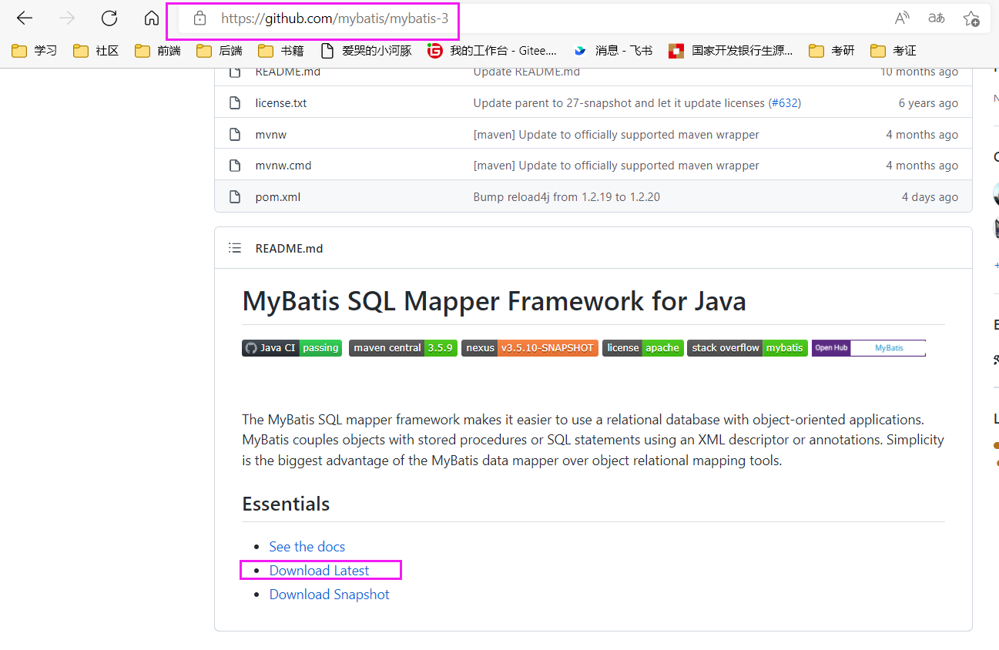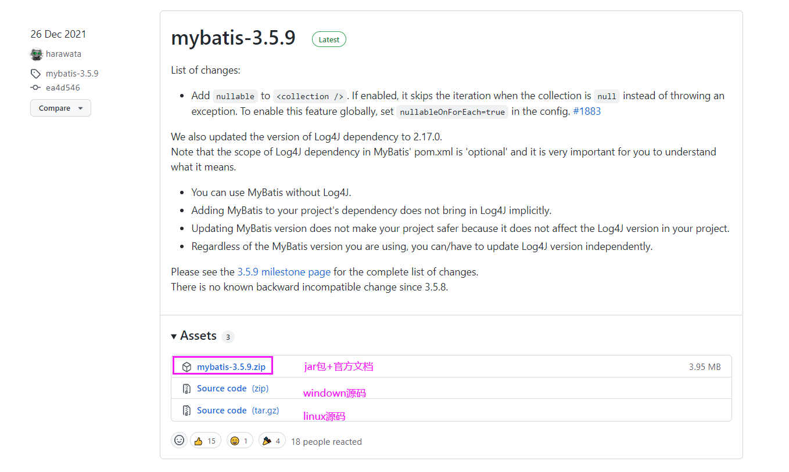

## 搭建MyBatis

### 创建maven工程

> 引入依赖，**打包方式为jar包**

```xml
    <dependencies>
        <!-- Mybatis核心 -->
        <dependency>
            <groupId>org.mybatis</groupId>
            <artifactId>mybatis</artifactId>
            <version>3.5.7</version>
        </dependency>
        <!-- junit测试 -->
        <dependency>
            <groupId>junit</groupId>
            <artifactId>junit</artifactId>
            <version>4.12</version>
            <scope>test</scope>
        </dependency>
        <!-- MySQL驱动 -->
        <dependency>
            <groupId>mysql</groupId>
            <artifactId>mysql-connector-java</artifactId>
            <version>5.1.3</version>
        </dependency>
    </dependencies>
```

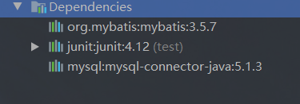


### [创建MyBatis的核心配置文件](https://zhuanlan.zhihu.com/p/386760911)

> - **习惯上命名为mybatis-config.xml**，这个文件名仅仅只是建议，并非强制要求。
> - 将来整合Spring 之后，这个配置文件可以省略，所以大家操作时可以直接复制、粘贴。 核心配置文件主要用于配置连接数据库的环境以及MyBatis的全局配置信息
> - 核心配置文件存放的位置是src/main/resources目录下

```xml
<?xml version="1.0" encoding="UTF-8" ?>
<!DOCTYPE configuration
        PUBLIC "-//mybatis.org//DTD Config 3.0//EN"
        "http://mybatis.org/dtd/mybatis-3-config.dtd">
<configuration>
    <!--设置连接数据库的环境-->
    <environments default="development">
        <environment id="development">
            <transactionManager type="JDBC"/>
            <dataSource type="POOLED">
                <property name="driver" value="com.mysql.jdbc.Driver"/>
                <property name="url"
                          value="jdbc:mysql://localhost:3306/MyBatis"/>
                <property name="username" value="root"/>
                <property name="password" value="123456"/>
            </dataSource>
        </environment>
    </environments>
    <!--引入映射文件-->
    <mappers>
        <mapper resource="mappers/UserMapper.xml"/>
    </mappers>
</configuration>

```

### 创建实体类

> **实体类中的属性名要和数据库表中的字段保持一致**

### 创建mapper接口

> **MyBatis中的mapper接口相当于以前的dao。但是区别在于，mapper仅仅是接口，我们不需要提供实现类**

```java

public interface UserMapper {

    /**
     * 添加用户信息
     */
    int insertUser();

    /**
     * 修改用户信息
     */
    void updateUser();

    /**
     * 删除用户信息
     */
    void deleteUser();

    /**
     * 根据id查询用户信息
     */
    User getUserById();

    /**
     * 查询所有用户信息
     */
    List<User> getAllUser();
}

```

### 创建MyBatis的映射文件

> - **映射文件的命名规则： 表所对应的实体类的类名+Mapper.xml** 例如：表t_user，映射的实体类为User，所对应的映射文件为UserMapper.xml 因此一个映射文件对应一个实体类，对应一张表的操作 MyBatis映射文件用于编写SQL，访问以及操作表中的数据 MyBatis映射文件存放的位置是src/main/resources/mappers目录下
> - MyBatis中可以面向接口操作数据，要保证两个一致：
>   1. **mapper接口的全类名和映射文件的命名空间（namespace）保持一致**
>   2. **mapper接口中方法的方法名和映射文件中编写SQL的标签的id属性保持一致**

```xml
<?xml version="1.0" encoding="UTF-8" ?>
<!DOCTYPE mapper
        PUBLIC "-//mybatis.org//DTD Mapper 3.0//EN"
        "http://mybatis.org/dtd/mybatis-3-mapper.dtd">

<mapper namespace="com.lz.mybatis.mapper.UserMapper">
    <!--        int insertUser();-->
    <insert id="insertUser">
        insert  into t_user values (null,"lz","123456",21,"男","1390211724@qq.com")
    </insert>

    <!--        void updateUser();-->
    <update id="updateUser">
        update t_user set username= "zhangsan1" where id = 4
    </update>

    <!--    void deleteUser();-->
    <delete id="deleteUser">
        delete from t_user where id = 4
    </delete>

    <!--        User getUserById();-->
    <!--
        查询功能的标签必须设置resultType或resultMap
        resultType:设置默认的映射关系。实体属性名和数据库字段名一致时使用
        resultMap :设置自定义的映射关系。实体属性名和数据库字段名不一致时、一对多、多对一时使用
      -->
    <select id="getUserById" resultType="com.lz.mybatis.pojo.User">
        select * from t_user where id = 6
    </select>

    <!--    List<User> getAllUser();-->
    <select id="getAllUser" resultType="com.lz.mybatis.pojo.User">
        select * from t_user
    </select>


</mapper>
```

### 测试类

```java
    @Test
    public void testMyBatis() throws IOException {
        //读取MyBatis的核心配置文件
        InputStream is = Resources.getResourceAsStream("mybatis-config.xml");
        //创建SqlSessionFactoryBuilder对象
        SqlSessionFactoryBuilder sqlSessionFactoryBuilder = new SqlSessionFactoryBuilder();
        //通过核心配置文件所对应的字节输入流创建工厂类SqlSessionFactory，生产SqlSession对象
        SqlSessionFactory sqlSessionFactory = sqlSessionFactoryBuilder.build(is);
        //创建SqlSession对象，此时通过SqlSession对象所操作的sql都必须手动提交或回滚事务
        //SqlSession sqlSession = sqlSessionFactory.openSession();
        //创建SqlSession对象，此时通过SqlSession对象所操作的sql都会自动提交
        SqlSession sqlSession = sqlSessionFactory.openSession(true);
        //通过代理模式创建UserMapper接口的代理实现类对象
        UserMapper userMapper = sqlSession.getMapper(UserMapper.class);
        //调用UserMapper接口中的方法，就可以根据UserMapper的全类名匹配元素文件，通过调用的方法名匹配映射文件中的SQL标签，并执行标签中的SQL语句
        int result = userMapper.insertUser();
        //sqlSession.commit();
    }
```

### 配置日志

> 引入依赖

```xml
        <!-- log4j日志 -->
        <dependency>
            <groupId>log4j</groupId>
            <artifactId>log4j</artifactId>
            <version>1.2.17</version>
        </dependency>
```

> 配置日志文件。log4j的配置文件名为log4j.xml，存放的位置是src/main/resources目录下

```xml
<?xml version="1.0" encoding="UTF-8" ?>
<!DOCTYPE log4j:configuration SYSTEM "log4j.dtd">
<log4j:configuration xmlns:log4j="http://jakarta.apache.org/log4j/">
    <appender name="STDOUT" class="org.apache.log4j.ConsoleAppender">
        <param name="Encoding" value="UTF-8"/>
        <layout class="org.apache.log4j.PatternLayout">
            <param name="ConversionPattern" value="%-5p %d{MM-dd HH:mm:ss,SSS}
%m (%F:%L) \n"/>
        </layout>
    </appender>
    <logger name="java.sql">
        <level value="debug"/>
    </logger>
    <logger name="org.apache.ibatis">
        <level value="info"/>
    </logger>
    <root>
        <level value="debug"/>
        <appender-ref ref="STDOUT"/>
    </root>
</log4j:configuration>
```

## 核心配置文件详解

```xml
<?xml version="1.0" encoding="UTF-8" ?>
<!DOCTYPE configuration
        PUBLIC "-//mybatis.org//DTD Config 3.0//EN"
        "http://mybatis.org/dtd/mybatis-3-config.dtd">

<configuration>
    <!--
       核心配置文件中的标签必须按照固定的顺序： 
    	properties?,settings?,typeAliases?,typeHandlers?,objectFactory?,
		objectWrapperFactory?,reflectorFactory?,plugins?,environments?,
		databaseIdProvider?,mappers?
     -->

    
    <!--引入外部properties文件-->
    <properties resource="jdbc.properties"></properties>


    <!--  设置类型别名  -->
    <typeAliases>
        <!--
            typeAlias为某一个类型设置别名
            属性：
                type：需要设置别名的类型的全类名
                alias：设置别名，不写默认为类名，不区分大小写
         -->
        <!--        <typeAlias type="com.lz.mybatis.pojo.User" alias="User"></typeAlias>-->

        <!--    以包为单位设置别名，默认为类名，不区分大小写    -->
        <package name="com.lz.mybatis.pojo"/>
    </typeAliases>

    
    <!--
        environments：配置多个连接数据库的环境
        属性：
            default：设置默认使用的环境id
     -->
    <environments default="development">
        <!--
            environment：配置某个具体的环境
            属性：
                id：表示连接数据库的环境的唯一标识，不能重复
         -->
        <environment id="development">
            <!--
                transactionManager：设置事务管理方式
                属性：
                    type="JDBC/MANAGED"
                        JDBC:表示当前环境中，执行sql时，使用的时jdbc中原生的事务管理方式，事务的提交或回滚需要手动执行
                        MANAGED:被管理，例如spring
             -->
            <transactionManager type="JDBC"></transactionManager>
            <!--
                dataSource：设置数据源
                属性：
                    type：设置数据源的类型
                    type="POOLED/UNPOOLED/JNDI"
                        POOLED:表示使用数据库连接池缓存数据库连接
                        UNPOOLED：表示不使用数据库连接池
                        JNDI：表示使用上下文中的数据源
             -->
            <dataSource type="POOLED">
                <property name="driver" value="${jdbc.driver}"/>
                <property name="url" value="${jdbc.url}"/>
                <property name="username" value="${jdbc.username}"/>
                <property name="password" value="${jdbc.password}"/>
            </dataSource>
        </environment>
    </environments>
    
    
    <!--    引入映射文件    -->
    <mappers>
        <!--        <mapper resource="mapper/UserMapper.xml"></mapper>-->

        <!--
            以包为单位引入映射文件
            要求：
                1.mapper接口所在的包要和映射文件所在的包一致
                2.mapper接口要和映射文件的名字一致

            创建映射文件的包com/lz/mybatis/mapper
         -->
        <!--扫描mapper创建实现类，扫描映射文件xml-->
        <package name="com.lz.mybatis.mapper"/>
    </mappers>

</configuration>
```

```xml
    <!-- 在核心文件中设置了别名，映射文件中查询语句返回结果类型就可以使用别名了 -->
    <select id="getAllUser" resultType="User">
        select * from t_user
    </select>
```

## MyBatis获取参数值的两种方式（重点）

> MyBatis获取参数值的两种方式：**${}和#{}** 
>
> 1. **${}的本质就是字符串拼接**， ${}使用字符串拼接的方式拼接sql，若为字符串类型或日期类型的字段进行赋值时，**需要手动加单引号**；
> 2. **#{}的本质就是占位符赋值**，#{}使用占位符赋值的方式拼接sql，此时为字符串类型或日期类型的字段进行赋值时，**可以自动添加单引号**；

### 单个字面量类型的参数

> - 若mapper接口中的方法参数为单个的字面量类型 此时可以使用${}和#{}以任意的名称获取参数的值
> - 注意${}需要手动加单引号

```java
        User lz = mapper.getUserByUsername("lz");
        System.out.println("lz = " + lz);
```

```xml
    <!--    User getUserByUsername(String username);-->
    <select id="getUserByUsername" resultType="User">
        <!--select * from t_user where username = '${username}'-->
        select * from t_user where username = #{username}
    </select>
```

### 多个字面量类型的参数

> - **若mapper接口中的方法参数为多个时**，此时**MyBatis会自动将这些参数放在一个map集合中，以arg0,arg1...为键，以参数为值；以 param1,param2...为键，以参数为值**；因此只需要**通过${}和#{}访问map集合的键就可以获取相对应的值**
> - 注意${}需要手动加单引号

```java
        User user = mapper.checkLogin("lz", "123");
        System.out.println("user = " + user);
```

```xml
    <!--        User checkLogin(String username,String password);-->
    <select id="checkLogin" resultType="User">
        <!--select * from t_user where username = '${arg0}' and password = '${arg1}'-->
        select * from t_user where username = #{param1} and password = #{param1}
    </select>
```

### map集合类型的参数

> - **若mapper接口中的方法需要的参数为多个时，此时可以手动创建map集合，将这些数据放在map中只需要通过${}和#{}访问map集合的键就可以获取相对应的值**
> - 注意${}需要手动加单引号

```java
        HashMap<String, Object> map = new HashMap<>();
        map.put("username", "lz");
        map.put("password", "123");
        User user = mapper.checkLoginByMap(map);
        System.out.println("user = " + user);
```

```xml
    <!--        User checkLoginByMap(Map<String,Object> map);-->
    <select id="checkLoginByMap" resultType="User">
        <!--select * from t_user where username = '${username}' and password = '${password}'-->
        select * from t_user where username = #{username} and password = #{password}
    </select>
```

### 实体类类型的参数

> - **若mapper接口中的方法参数为实体类对象时此时可以使用${}和#{}，通过访问实体类对象中的属性名获取属性值**
> - 注意${}需要手动加单引号

```java
        User user = new User(null, "lz", "123", "21", "男", "1390211724@qq.com");
        int i = mapper.insertUser(user);
        System.out.println("i = " + i);
```

```xml
    <!--        int insertUser(User user);-->
    <insert id="insertUser">
        <!--insert into t_user values (null,'${username}','${password}','${age}','${sex}','${email}')-->
        insert into t_user values (null,#{username},#{password},#{age},#{sex},#{email})
    </insert>
```

### 使用@Param标识参数

> - 可以**通过@Param注解标识mapper接口中的方法参数** 。此时，**会将这些参数放在map集合中，以@Param注解的value属性值为键，以参数为值；以 param1,param2...为键，以参数为值；只需要通过${}和#{}访问map集合的键就可以获取相对应的值**
> - 注意${}需要手动加单引号

```java
        User user = mapper.checkLoginByParams("lz", "123");
        System.out.println("user = " + user);

		HashMap<String, Object> map = new HashMap<>();
        map.put("username", "lz");
        map.put("password", "123");
        User user = mapper.checkLoginByParam(map);
        System.out.println("user = " + user);	
```

```xml
    <!--        User checkLoginByParams(@Param("name") String username, @Param("pwd") String password);-->
    <select id="checkLoginByParams" resultType="User">
        select * from t_user where username = #{name} and password = #{pwd}
    </select>

    <!--        User checkLoginByParam(@Param("param") Map<String, Object> map);-->
    <select id="checkLoginByParam" resultType="User">
        select * from t_user where username = #{param.username} and password = #{param.password}
    </select>
```

## 各种查询功能

> mybatis自己封装了一些默认的别名

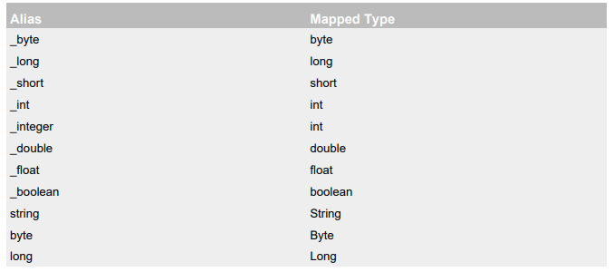

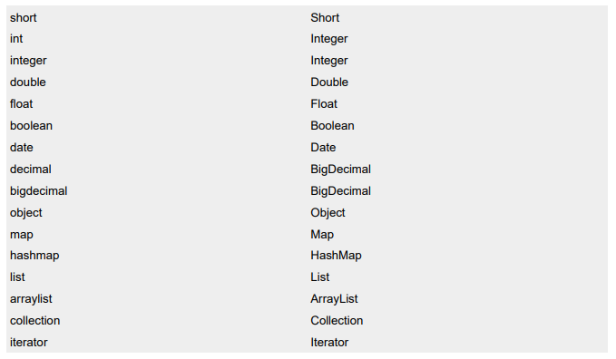

### 查询总记录数

```java
        Integer integer = mapper.selectUserCount();
        System.out.println("integer = " + integer);
```

```xml
    <!--        Integer selectUserCount();-->
    <!--  这里的resultType使用的是mybatis默认的别名。也可以写全类名java.lang.Integer  -->
    <select id="selectUserCount" resultType="Integer">
        select count(*) from t_user
    </select>
```

### 查询数据为map集合

#### 查询一条数据为map集合

```java
        Map<String, Object> map = mapper.selectUserByIdToMap(1);
        System.out.println("map = " + map);
```

```xml
<!--        Map<String,Object> selectUserByIdToMap(@Param("id") Integer id);-->
    <select id="selectUserByIdToMap" resultType="map">
        select * from t_user where id = #{id}
    </select>
```

#### 查询多条数据为map集合

##### 方法一

> **将表中的数据以map集合的方式查询，一条数据对应一个map；若有多条数据，就会产生多个map集合，此时可以将这些map放在一个list集合中获取**

```java
        List<Map<String, Object>> maps = mapper.selectUserToMap();
        System.out.println("maps = " + maps);
    /*[{password=123, sex=男, id=1, age=21, email=1390211724@qq.com, username=lz},
       {password=123, sex=女, id=2, age=21, email=1390211724@qq.com, username=wmy}]*/
```

```java
    /**
     * 查询所有用户信息为map集合
     *
     * 将表中的数据以map集合的方式查询，一条数据对应一个map；若有多条数据，就会产生多个map集合，此
时可以将这些map放在一个list集合中获取
     */
    List<Map<String,Object>> selectUserToMap();
```

```java
    <!--        List<Map<String,Object>> selectUserToMap();-->
    <select id="selectUserToMap" resultType="map">
        select * from t_user;
    </select>
```

##### 方法二

> 将表中的数据以map集合的方式查询，一条数据对应一个map；若有多条数据，就会产生多个map集合，并且最终要以一个map的方式返回数据，此时需要**通过@MapKey注解设置map集合的键，值是每条数据所对应的map集合**

```java
        Map<String, Object> map = mapper.selectUserToMap();
        System.out.println("map = " + map);
/*  {1={password=123, sex=男, id=1, age=21, email=1390211724@qq.com, username=lz},
     2={password=123, sex=女, id=2, age=21, email=1390211724@qq.com, username=wmy}}*/
```

```java
    /**
     * 查询所有用户信息为map集合
     * 将表中的数据以map集合的方式查询，一条数据对应一个map；若有多条数据，就会产生多个map集合，并
    且最终要以一个map的方式返回数据，此时需要通过@MapKey注解设置map集合的键，值是每条数据所对应的
    map集合
     */
	@MapKey("id")
    Map<String, Object> selectUserToMap();
```

```xml
    <!--@MapKey("id")
        Map<String, Object> selectUserToMap();
     -->
    <select id="selectUserToMap" resultType="map">
        select * from t_user;
    </select>
```

## 特殊SQL的执行

### 模糊查询

```java
        List<User> user = mapper.selectUserByLike("z");
        System.out.println("user = " + user);
```

```xml
    <!--        List<User> selectUserByLike(@Param("username") String username);-->
    <select id="selectUserByLike" resultType="user">
        <!--select * from t_user where username like '%${username}%'-->
        <!--select * from t_user where username like concat("%",#{username},"%")-->
        select * from t_user where username like "%"#{username}"%"
    </select>
```

### 批量删除

> 批量删除时必须使用${}，不可以使用#{}，因为#{}会自动添加单引号

```java
        int i = mapper.deleteUserById("2,3,4");
        System.out.println("i = " + i);
```

```xml
    <!--        int deleteUserById(@Param("ids") String ids);-->
    <delete id="deleteUserById">
        delete from t_user where id in (${ids})
    </delete>
```

### 动态设置表名

> 动态设置表名时必须使用${}，不可以使用#{}，因为#{}会自动添加单引号

```java
        List<User> t_user = mapper.selectUserByTableName("t_user");
        System.out.println("t_user = " + t_user);
```

```xml
    <!--        List<User> selectUserByTableName(@Param("table_name") String table_name);-->
    <select id="selectUserByTableName" resultType="user">
        select * from ${table_name}
    </select>

```

### 添加功能获取自增列的主键

> 使用场景：
>
> - t_clazz(clazz_id,clazz_name)
> - t_student(student_id,student_name,clazz_id) 
>   1. 添加班级信息
>   2. 获取新添加的班级的id
>   3. 为班级分配学生，即将某学的班级id修改为新添加的班级的id

```java
        User user = new User(null, "lz", "123", "22", "男", "139@qq.com");
        mapper.insertUserGetGenerated(user);
        System.out.println("user = " + user);
        /*user = User{id=6, username='lz', password='123', age='22', sex='男', email='139@qq.com'}*/
```

```xml
    <!--        void insertUserGetGenerated(User user);-->
    <!--
         useGeneratedKeys：设置使用自增的主键
         keyProperty：因为增删改有统一的返回值是受影响的行数，因此只能将获取的自增的主键放在传输的参
    数user对象的某个属性中
     -->
    <insert id="insertUserGetGenerated" useGeneratedKeys="true" keyProperty="id">
        insert into t_user values (null,#{username},#{password},#{age},#{sex},#{email})
    </insert>
```

## 自定义映射resultMap

### resultMap处理字段和属性的映射关系

> 若字段名和实体类中的属性名不一致，但是字段名符合数据库的规则（使用_），实体类中的属性 名符合Java的规则（使用驼峰）

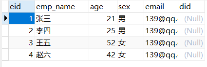

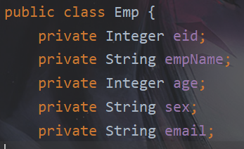

#### 方法一：起别名

> **通过为字段起别名的方式，保证和实体类中的属性名保持一致**

```java
        List<Emp> allEmp = mapper.getAllEmp();
        allEmp.forEach(emp -> System.out.println("emp = " + emp));
```

```xml
    <!--        List<Emp> getAllEmp();-->
    <select id="getAllEmp" resultType="emp">
        <!--起别名-->
        select eid,emp_name empName,age,sex,email from t_emp
    </select>
```

#### 方法二：设置全局配置

> - **在MyBatis的核心配置文件中设置一个全局配置信息mapUnderscoreToCamelCase**，可以在查询表中数据时，**自动将 _ 类型的字段名转换为驼峰**
> - 例如emp_name-->empName

```xml
    <!--  resource/mybatis-config.xml  -->
	<!--  设置一个全局配置信息mapUnderscoreToCamelCase  -->
    <settings>
        <setting name="mapUnderscoreToCamelCase" value="true"/>
    </settings>
```

```java
        List<Emp> allEmp = mapper.getAllEmp();
        allEmp.forEach(emp -> System.out.println("emp = " + emp));
```

```xml
    <!--        List<Emp> getAllEmp();-->
    <select id="getAllEmp" resultType="emp">

        <!--设置全局配置信息-->
        select * from t_emp
    </select>
```

#### 方法三：通过resultMap设置自定义映射

> - **resultMap:设置自定义映射**
>   - **属性：**
>         **id：唯一标识符**
>         **type：查询的数据要映射的实体类的类型**
>   - **子标签：**
>         **id：设置主键的映射关系**
>         **result：查询的数据要映射的实体类的类型，还是那个别名**
>     - **属性：**
>               **property：设置映射关系中实体类中的属性名**
>               **column：设置映射关系中表中的字段名**
> - **注：即使属性名和字段名一致的，只要设置了resultMap就要全配置**

```java
        List<Emp> allEmp = mapper.getAllEmp();
        allEmp.forEach(emp -> System.out.println("emp = " + emp));
```

```xml
    <!--        List<Emp> getAllEmp();-->
	<!--
        resultMap:设置自定义映射
        属性：
            id：唯一标识符
            type：查询的数据要映射的实体类的类型
        子标签：
            id：设置主键的映射关系
            type：查询的数据要映射的实体类的类型，还是那个别名
            association：设置多对一的映射关系
            collection：设置一对多的映射关系
            属性：
                property：设置映射关系中实体类中的属性名
                column：设置映射关系中表中的字段名
		注：即使属性名和字段名一致的，只要设置了resultMap就要全配置
     -->
    <resultMap id="resultMap" type="emp">
        <id property="eid" column="eid"></id>
        <!--        <result property="eid" column="eid"></result>-->
        <result property="empName" column="emp_name"></result>
        <result property="age" column="age"></result>
        <result property="sex" column="sex"></result>
        <result property="email" column="email"></result>
    </resultMap>
    <select id="getAllEmp" resultMap="resultMap">
        select * from t_emp
    </select>
```

### 多对一映射处理

> **多对一 在多的一方创建一的对象**

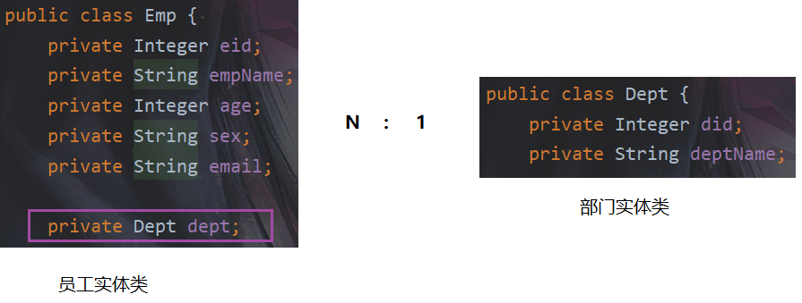

#### 方法一：级联赋值

```xml
    <!--        Emp getEmpAndDept(@Param("eid") String eid);-->
    <resultMap id="empAndDeptOne" type="emp">
        <id property="eid" column="eid"></id>
        <result property="empName" column="emp_name"></result>
        <result property="age" column="age"></result>
        <result property="sex" column="sex"></result>
        <result property="email" column="email"></result>
        <result property="dept.did" column="did"></result>
        <result property="dept.deptName" column="dept_name"></result>
    </resultMap>
    <select id="getEmpAndDept" resultMap="empAndDeptOne">
        select * from t_emp left outer join t_dept on t_emp.did = t_dept.did where t_emp.eid = #{eid}
    </select>
```

#### 方法二：使用association处理映射关系

> -  association：处理多对一的映射关系
>   - 属性：
>     - property：需要处理多对的映射关系的属性名
>     - javaType：该属性的类型

```xml
    <resultMap id="empAndDeptTwo" type="emp">
        <id property="eid" column="eid"></id>
        <result property="empName" column="emp_name"></result>
        <result property="age" column="age"></result>
        <result property="sex" column="sex"></result>
        <result property="email" column="email"></result>

        <!--
            association：处理多对一的映射关系
            property：需要处理多对的映射关系的属性名
            javaType：该属性的类型
         -->
        <association property="dept" javaType="dept">
            <id property="did" column="did"></id>
            <result property="deptName" column="dept_name"></result>
        </association>

    </resultMap>
    <select id="getEmpAndDept" resultMap="empAndDeptTwo">
        select * from t_emp left outer join t_dept on t_emp.did = t_dept.did where t_emp.eid = #{eid}
    </select>
```

#### 方法三：分步查询

```java
public interface EmpMapper {
    /**
     * 通过分步查询员工以及员工的部门，第一步
     */
    Emp getEmpAndDeptByStepOne(@Param("eid") Integer eid);
}

```

```xml
<mapper namespace="com.lz.mybatis.mapper.DeptMapper">   
    
	<!--        Emp getEmpAndDeptByStepOne(@Param("eid") Integer eid);-->
    <resultMap id="empAndDeptByStep" type="emp">
        <id property="eid" column="eid"></id>
        <result property="empName" column="emp_name"></result>
        <result property="age" column="age"></result>
        <result property="sex" column="sex"></result>
        <result property="email" column="email"></result>
        
        <!--
            select：设置分步查询的sql的唯一标识（namespace.SQLId或mapper接口的全类名.方法名）
            column：设置分步查询的条件
         -->
        <association property="dept" select="com.lz.mybatis.mapper.DeptMapper.getEmpAndDeptByStepTwo" column="did"></association>

    </resultMap>
    <select id="getEmpAndDeptByStepOne" resultMap="empAndDeptByStep">
        select * from t_emp where eid =#{eid}
    </select>
    
</mapper>
```

```java
public interface DeptMapper {

    /**
     * 通过分步查询员工以及员工的部门，第二步
     */
    Dept getEmpAndDeptByStepTwo(@Param("did") Integer did);
}

```

```xml
<mapper namespace="com.lz.mybatis.mapper.DeptMapper">

    <!--        Dept getEmpAndDeptByStepTwo(@Param("did") Integer did);-->
    <select id="getEmpAndDeptByStepTwo" resultType="dept">
        select did,dept_name deptName from t_dept where did =#{did}
    </select>
</mapper>
```

##### 延迟加载

> - **分步查询的优点：可以实现延迟加载，但是必须在核心配置文件中设置全局配置信息：** 
>
>   - **lazyLoadingEnabled：延迟加载的全局开关。当开启时，所有关联对象都会延迟加载** 	
>
>   - **aggressiveLazyLoading：当开启时，任何方法的调用都会加载该对象的所有属性。 否则，每个 属性会按需加载，此时就可以实现按需加载，获取的数据是什么，就只会执行相应的sql。**
>
>     ```xml
>        <!--resource/mybaits-config.xml-->
>     	<settings>
>             <setting name="lazyLoadingEnabled" value="true"/>
>         </settings>
>     ```
>
> - 可通过association和 collection中的**fetchType属性设置当前的分步查询是否使用延迟加载，fetchType="lazy(延迟加 载)|eager(立即加载)"**
>
>   ```xml
>       <resultMap id="empAndDeptByStep" type="emp">
>           <id property="eid" column="eid"></id>
>           <result property="empName" column="emp_name"></result>
>           <result property="age" column="age"></result>
>           <result property="sex" column="sex"></result>
>           <result property="email" column="email"></result>
>           <association property="dept" select="com.lz.mybatis.mapper.DeptMapper.getEmpAndDeptByStepTwo"
>                        column="did" fetchType="eager"></association>
>       </resultMap>
>       <select id="getEmpAndDeptByStepOne" resultMap="empAndDeptByStep">
>           select * from t_emp where eid =#{eid}
>       </select>
>   ```

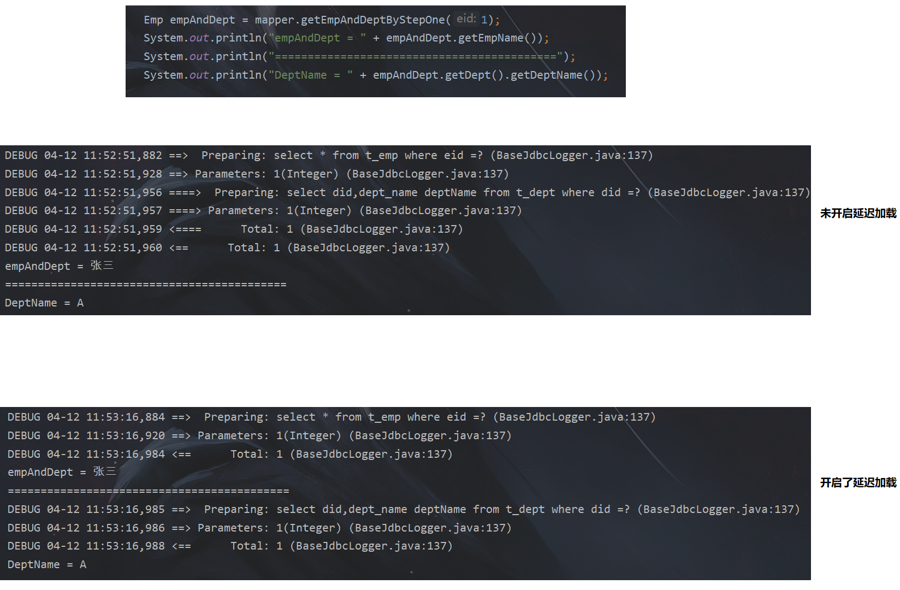

### 一对多映射关系

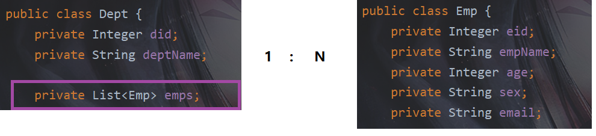

#### 方法一：通过collection处理映射关系

```xml
    <!--        Dept getDeptAndEmp(@Param("did") Integer did);-->
    <resultMap id="deptAndEmp" type="dept">
        <id property="did" column="did"></id>
        <result property="deptName" column="dept_name"></result>
        <collection property="emps" ofType="emp">
            <id property="eid" column="eid"></id>
            <result property="empName" column="emp_name"></result>
            <result property="age" column="age"></result>
            <result property="sex" column="sex"></result>
            <result property="email" column="email"></result>
        </collection>
    </resultMap>
    <select id="getDeptAndEmp" resultMap="deptAndEmp">
        select * from t_dept left outer join t_emp on t_emp.did = t_dept.did where t_dept.did = #{did}
    </select>
```

#### 方法二：分步查询

```java
public interface DeptMapper {

    /**
     * 通过分步查询获取部门以及部门员工，第一步
     */
    Dept getDeptAndEmpByStepOne(@Param("deptName") String deptName);

}

```

```xml
<mapper namespace="com.lz.mybatis.mapper.DeptMapper">

    <!--        Dept getDeptAndEmpByStep(@Param("deptName") String deptName);-->
    <resultMap id="deptAndEmpByStepOne" type="dept">
        <id property="did" column="did"></id>
        <result property="deptName" column="dept_name"></result>
        <collection property="emps" select="com.lz.mybatis.mapper.EmpMapper.getDeptAndEmpByStepTwo" column="did"></collection>
    </resultMap>
    <select id="getDeptAndEmpByStepOne" resultMap="deptAndEmpByStepOne">
        select * from t_dept where dept_name = #{deptName}
    </select>
</mapper>
```

```java
public interface EmpMapper {

    /**
     * 通过分步查询获取部门以及部门员工，第二步
     */
    Emp getDeptAndEmpByStepTwo(@Param("did") Integer did);
}

```

```xml
<mapper namespace="com.lz.mybatis.mapper.EmpMapper">

    <!--        Emp getDeptAndEmpByStepTwo(@Param("did") Integer did);-->
    <select id="getDeptAndEmpByStepTwo" resultType="emp">
        select eid,emp_name empName,age,sex,email from t_emp where did = #{did}
    </select>

</mapper>
```

### 多对多映射关系

> 多对多关系处理：
>
> ①在表设计时，无法直接通过两张表来完成实体间多对多关系的描述，所以需要借助一张中间表
>
> ②在类设计时，需要双方都包含彼此的集合
>
> ③在查询时需要借助中间表才能将两张表关联起来 即 表A 左关联 中间表 左关联表B
>
> ④在将结果进行封装时，需要借助resultMap标签，同时配合resultMap标签中的collection标签来将查询结果和属性一一对应

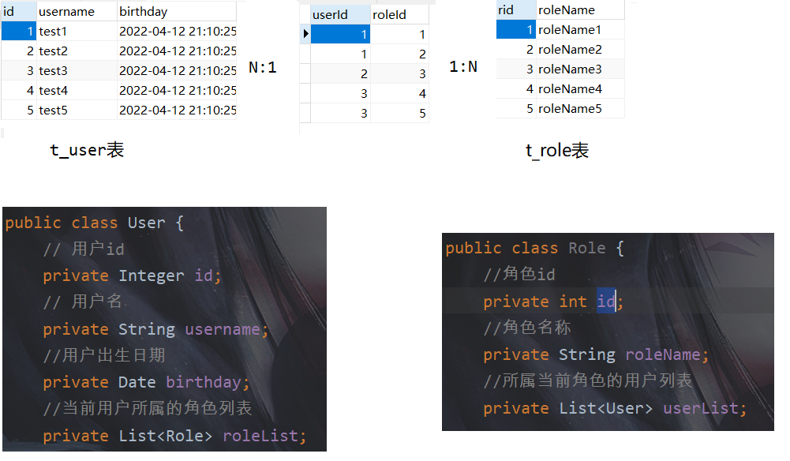

#### 方法一：通过collection处理映射关系

> 表A 左关联 中间表 左关联表B

```xml
    <!--        List<User> getUserAndRole(@Param("id") Integer id);-->
    <resultMap id="userAndRole" type="user">
        <id property="id" column="uid"></id>
        <result property="username" column="username"></result>
        <result property="birthday" column="birthday"></result>
        <collection property="roleList" ofType="role">
            <id property="id" column="rid"></id>
            <result property="roleName" column="roleName"></result>
        </collection>
    </resultMap>
    <select id="getUserAndRole" resultMap="userAndRole">
       select * from t_user u left outer join t_user_role t on u.uid = t.userId left outer join t_role r on r.rid = t.roleId where u.uid = #{id}
    </select>
```

#### 方法二：分步查询

> 表A 左关联 中间表  根据中间表中查询到的 表B的id  再根据id从表B中查询

```java
    /**
     * 多对多分步查询，第一步
     */

    List<User> getUserAndRoleByStepOne(@Param("id") Integer id);
```

```xml
    <!--            List<User> getUserAndRoleByStepOne(@Param("id") Integer id);-->
    <resultMap id="userAndRoleByStepone" type="user">
        <id property="id" column="uid"></id>
        <result property="username" column="username"></result>
        <result property="birthday" column="birthday"></result>
        <collection property="roleList" select="com.lz.mybatis.mapper.RoleMapper.getUserAndRoleByStepTwo" column="roleId"></collection>
    </resultMap>
    <select id="getUserAndRoleByStepOne" resultMap="userAndRoleByStepone">
        select uid id,username from t_user u left outer join t_user_role t on u.uid = t.userId where u.uid = #{id}
    </select>

```

```java
    /**
     * 多对多分步查询，第二步
     */

    Role getUserAndRoleByStepTwo(@Param("rid") Integer rid);

```

```xml
    <!--            List<Role> getUserAndRoleByStepTwo(@Param("rid") Integer rid);-->
    <select id="getUserAndRoleByStepTwo" resultType="role">
        select rid id,roleName from t_role r left outer join t_user_role t on r.rid = t.roleId where rid = #{rid}
    </select>
```

## 动态SQL

### if

> - **if标签可通过test属性的表达式进行判断，若表达式的结果为true，则标签中的内容会执行；反之标签中的内容不会执行**
> - 在where后面放一个恒成立的式子，隔开where和and

```java
		Emp emp = new Emp(null, "lz", 21, null, null);
        List<Emp> empByIf = mapper.getEmpByIf(emp);
```

```xml
    <!--        List<Emp> getEmpByIf(Emp emp);-->
    <select id="getEmpByIf" resultType="emp">
        select * from t_emp where 1=1
        <if test="empName != null and empName !=''">
            and emp_name = #{empName}
        </if>
        <if test="age != null and age != ''">
            and age = #{age}
        </if>
        <if test="sex !=null and sex != ''">
            and sex = #{sex}
        </if>
        <if test="email !=null and email != ''">
            and email =#{email}
        </if>
    </select>

	<!-- select * from t_emp where 1=1 and emp_name = ? and age = ? -->
```

> 写项目时可能会出现这个问题`There is no getter for property named '*' in class java.lang.String`
>
> - 可以在给接口方法传入参数时加@param注解
> - 可以在`<if test="value !=null">`用value占位

### where

> - where和if一般结合使用： 
>   - **若where标签中的if条件都不满足，则where标签没有任何功能，即不会添加where关键字** 
>   - **若where标签中的if条件满足，则where标签会自动添加where关键字，并将条件最前方多余的and去掉**
> - **注意：where标签不能去掉条件最后多余的and**

```java
		Emp emp = new Emp(null, "lz", 21, null, null);
        List<Emp> empByIf = mapper.getEmpByIf(emp);
```

```xml
    <select id="getEmpByIf" resultType="emp">
        select * from t_emp
        <where>
            <if test="empName != null and empName !=''">
                and emp_name = #{empName}
            </if>
            <if test="age != null and age != ''">
                and age = #{age}
            </if>
            <if test="sex !=null and sex != ''">
                and sex = #{sex}
            </if>
            <if test="email !=null and email != ''">
                and email =#{email}
            </if>
        </where>
    </select>

	<!-- select * from t_emp WHERE emp_name = ? and age = ? -->
```

### trim

> - **trim用于去掉或添加标签中的内容**
>   - **prefix：在trim标签中的内容的前面添加某些内容**
>   - **prefixOverrides：在trim标签中的内容的前面去掉某些内容**
>   - **suffix：在trim标签中的内容的后面添加某些内容**
>   - **suffixOverrides：在trim标签中的内容的后面去掉某些内容**
> - **若标签中没有内容时，trim标签也没有任何效果**

```java
		Emp emp = new Emp(null, "lz", 21, null, null);
        List<Emp> empByIf = mapper.getEmpByIf(emp);
```

```xml
    <select id="getEmpByIf" resultType="emp">
        select * from t_emp
        <trim prefix="where" suffixOverrides="and|or">
            <if test="empName != null and empName !=''">
                emp_name = #{empName} and
            </if>
            <if test="age != null and age != ''">
                age = #{age} and
            </if>
            <if test="sex !=null and sex != ''">
                sex = #{sex} or
            </if>
            <if test="email !=null and email != ''">
                email =#{email}
            </if>
        </trim>
    </select>

	<!-- select * from t_emp where emp_name = ? and age = ? -->
```

### choose、when、otherwise

> **choose、when、otherwise相当于if...else if..else**

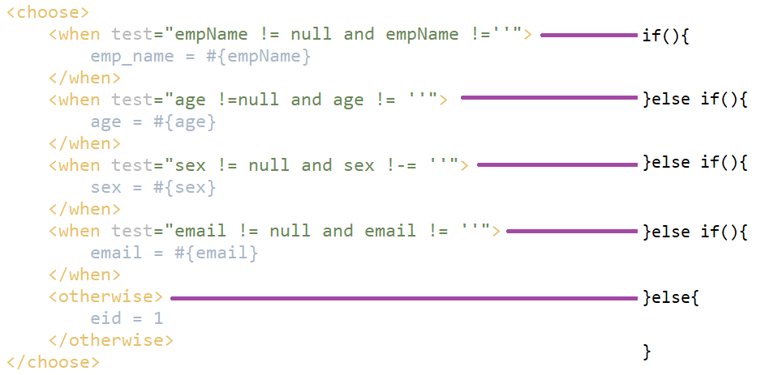

```xml
    <select id="getEmpByIf" resultType="emp">
        select * from t_emp
        <where>
            <choose>
                <when test="empName != null and empName !=''">
                    emp_name = #{empName}
                </when>
                <when test="age !=null and age != ''">
                    age = #{age}
                </when>
                <when test="sex != null and sex !-= ''">
                    sex = #{sex}
                </when>
                <when test="email != null and email != ''">
                    email = #{email}
                </when>
                <otherwise>
                    eid = 1
                </otherwise>
            </choose>
        </where>
    </select>

	<!-- select * from t_emp WHERE emp_name = ? -->
```

### foreach

> - **foreach属性：** 
>   - **collection：设置要循环的数组或集合** 
>   - **item：表示集合或数组中的每一个数据** 
>   - **separator：设置循环体之间的分隔符** 
>   - **open：设置foreach标签中的内容的开始符** 
>   - **close：设置foreach标签中的内容的结束符**

#### 批量删除

> 知识点：获取数组类型的参数

```xml
    <!--        int allDelete(Integer[] ids);-->
    <delete id="allDelete">
        delete from t_emp where
        <foreach collection="eids" item="eid" separator="or">
            eid = #{eid}
        </foreach>
        <!--delete from t_emp where eid = ? or eid = ? -->
        

   <!--delete from t_emp where eid in
       <foreach collection="eids" item="eid" open="(" close=")" separator=",">
            #{eid}
       </foreach>
    -->
       <!--delete from t_emp where eid in ( ? , ? )-->
    </delete>
```

#### 批量添加

> 知识点：获取List集合类型的参数

```java
        Emp a1 = new Emp(null, "a", 21, "1", "139@qq.com");
        Emp a2 = new Emp(null, "a", 21, "1", "139@qq.com");
        Emp a3 = new Emp(null, "a", 21, "1", "139@qq.com");
        List<Emp> emps = Arrays.asList(a1, a2, a3);
        int i = mapper.allAdd(emps);
        System.out.println("i = " + i);
```

```xml
    <!--        int allAdd(@Param("emps") List<Emp> emps)-->
    <insert id="allAdd">
        insert into t_emp values
        <foreach collection="emps" item="emp" separator=",">
            (null,#{emp.empName},#{emp.age},#{emp.sex},#{emp.email},null)
        </foreach>
    </insert>

<!--insert into t_emp values (null,?,?,?,?,null) , (null,?,?,?,?,null) , (null,?,?,?,?,null)-->
```

### SQL片段

> **sql片段，可以记录一段公共sql片段，在使用的地方通过include标签进行引入**

```xml
    <sql id="SqlFragment">eid,emp_name,age,sex,email</sql>

    <!--        Emp getEmpBySqlFragment(@Param("eid") Integer eid);-->
    <select id="getEmpBySqlFragment" resultType="emp">
        select <include refid="SqlFragment"></include> from t_emp where eid = #{eid}
    </select>
    
    <!--select eid,emp_name,age,sex,email from t_emp where eid = ?-->
```

## MyBatis的缓存

### 一级缓存

> - **一级缓存是SqlSession级别的，通过同一个SqlSession查询的数据会被缓存，下次查询相同的数据，就会从缓存中直接获取，不会从数据库重新访问**
> - 默认一级缓存是开启的
> - 使一级缓存失效的四种情况：
>   1. 不同的SqlSession对应不同的一级缓存
>   2. 同一个SqlSession但是查询条件不同
>   3. 同一个SqlSession两次查询期间执行了任何一次增删改操作
>   4. 同一个SqlSession两次查询期间手动清空了缓存

```java
        SqlSession sqlSession = SqlSessionUtil.getSqlSession();
        CacheMapper mapper1 = sqlSession.getMapper(CacheMapper.class);
        List<Emp> emp1 = mapper1.getEmpTestCache(20);
        System.out.println("emp1 = " + emp1);
        System.out.println("=================================================");
        CacheMapper mapper2 = sqlSession.getMapper(CacheMapper.class);
        List<Emp> emp2 = mapper2.getEmpTestCache(20);
        System.out.println("emp2 = " + emp2);
```

> 输出。只执行了一次sql语句

```
DEBUG 04-12 19:58:18,742 ==>  Preparing: select * from t_emp where eid = ? (BaseJdbcLogger.java:137) 
DEBUG 04-12 19:58:18,802 ==> Parameters: 20(Integer) (BaseJdbcLogger.java:137) 
DEBUG 04-12 19:58:18,828 <==      Total: 1 (BaseJdbcLogger.java:137) 
emp1 = [Emp{eid=20, empName='a', age=null, sex='null', email='null', dept=null}]
=================================================
emp2 = [Emp{eid=20, empName='a', age=null, sex='null', email='null', dept=null}]
```

### 二级缓存

> - **二级缓存是SqlSessionFactory级别，通过同一个SqlSessionFactory创建的SqlSession查询的结果会被缓存；此后若再次执行相同的查询语句，结果就会从缓存中获取**
>
> - 二级缓存开启的条件：
>
>   1. **在核心配置文件中，设置全局配置属性cacheEnabled="true"，默认为true**，不需要设置
>
>   2. **在映射文件中设置标签`<cache/>`**
>
>   3. **二级缓存必须在SqlSession关闭或提交之后有效**
>
>   4. **查询的数据所转换的实体类类型必须实现序列化的接口**
>
>      **`public class Emp implements Serializable `**
>
> - 使二级缓存失效的情况： 两次查询之间执行了任意的增删改，会使一级和二级缓存同时失效

```java
    @Test
    public void testTwoCache() throws IOException {
        InputStream is = Resources.getResourceAsStream("mybatis-config.xml");
        SqlSessionFactory build = new SqlSessionFactoryBuilder().build(is);


        SqlSession sqlSession1 = build.openSession(true);
        CacheMapper mapper1 = sqlSession1.getMapper(CacheMapper.class);
        List<Emp> emp1 = mapper1.getEmpTestCache(20);
        System.out.println("emp1 = " + emp1);
        sqlSession1.close();
        System.out.println("===================================================");
        SqlSession sqlSession2 = build.openSession(true);
        CacheMapper mapper2 = sqlSession2.getMapper(CacheMapper.class);
        List<Emp> emp2 = mapper2.getEmpTestCache(20);
        System.out.println("emp2 = " + emp2);
        sqlSession2.close();
    }
```

> 输出。sql语句只执行了一次

```
DEBUG 04-12 20:22:12,690 Cache Hit Ratio [com.lz.mybatis.mapper.CacheMapper]: 0.0 (LoggingCache.java:60) 
DEBUG 04-12 20:22:12,906 ==>  Preparing: select * from t_emp where eid = ? (BaseJdbcLogger.java:137) 
DEBUG 04-12 20:22:12,935 ==> Parameters: 20(Integer) (BaseJdbcLogger.java:137) 
DEBUG 04-12 20:22:12,968 <==      Total: 1 (BaseJdbcLogger.java:137) 
emp1 = [Emp{eid=20, empName='a', age=null, sex='null', email='null', dept=null}]
===================================================
WARN  04-12 20:22:13,079 As you are using functionality that deserializes object streams, it is recommended to define the JEP-290 serial filter. Please refer to https://docs.oracle.com/pls/topic/lookup?ctx=javase15&id=GUID-8296D8E8-2B93-4B9A-856E-0A65AF9B8C66 (SerialFilterChecker.java:46) 
DEBUG 04-12 20:22:13,083 Cache Hit Ratio [com.lz.mybatis.mapper.CacheMapper]: 0.5 (LoggingCache.java:60) 
emp2 = [Emp{eid=20, empName='a', age=null, sex='null', email='null', dept=null}]
```

#### 二级缓存的相关配置

> - 在mapper配置文件中添加的cache标签可以设置一些属性：
>   1. eviction属性：缓存回收策略 LRU（Least Recently Used） – 最近最少使用的：移除最长时间不被使用的对象。
>   2. FIFO（First in First out） – 先进先出：按对象进入缓存的顺序来移除它们。
>   3. SOFT – 软引用：移除基于垃圾回收器状态和软引用规则的对象。 WEAK – 弱引用：更积极地移除基于垃圾收集器状态和弱引用规则的对象。 默认的是 LRU。
>   4. flushInterval属性：刷新间隔，单位毫秒 默认情况是不设置，也就是没有刷新间隔，缓存仅仅调用语句时刷新 size属性：引用数目，正整数 代表缓存最多可以存储多少个对象，太大容易导致内存溢出 
>   5. readOnly属性：只读，true/false
>      - true：只读缓存；会给所有调用者返回缓存对象的相同实例。因此这些对象不能被修改。这提供了 很重要的性能优势。
>      - false：读写缓存；会返回缓存对象的拷贝（通过序列化）。这会慢一些，但是安全，因此默认是 false。

### 缓存查询的顺序

> - 先查询二级缓存，因为二级缓存中可能会有其他程序已经查出来的数据，可以拿来直接使用。
> - 如果二级缓存没有命中，再查询一级缓存
> - 如果一级缓存也没有命中，则查询数据库
> - SqlSession关闭之后，一级缓存中的数据会写入二级缓存

### 整合第三方缓存EHCache

#### 添加依赖

```xml
<!-- Mybatis EHCache整合包 -->
<dependency>
    <groupId>org.mybatis.caches</groupId>
    <artifactId>mybatis-ehcache</artifactId>
    <version>1.2.1</version>
</dependency>
<!-- slf4j日志门面的一个具体实现 -->
<dependency>
    <groupId>ch.qos.logback</groupId>
    <artifactId>logback-classic</artifactId>
    <version>1.2.3</version>
</dependency>
```

#### 创建EHCache的配置文件ehcache.xml

```xml
<?xml version="1.0" encoding="utf-8" ?>
<ehcache xmlns:xsi="http://www.w3.org/2001/XMLSchema-instance"
         xsi:noNamespaceSchemaLocation="../config/ehcache.xsd">
    <!-- 磁盘保存路径 -->
    <diskStore path="D:\atguigu\ehcache"/>
    <defaultCache
            maxElementsInMemory="1000"
            maxElementsOnDisk="10000000"
            eternal="false"
            overflowToDisk="true"
            timeToIdleSeconds="120"
            timeToLiveSeconds="120"
            diskExpiryThreadIntervalSeconds="120"
            memoryStoreEvictionPolicy="LRU">
    </defaultCache>
</ehcache>

```

#### 设置二级缓存的类型

```xml
<cache type="org.mybatis.caches.ehcache.EhcacheCache"/>
```

#### 加入logback日志

> 存在SLF4J时，作为简易日志的log4j将失效，此时我们需要借助SLF4J的具体实现logback来打印日志。 创建logback的配置文件logback.xml

```xml
<?xml version="1.0" encoding="UTF-8"?>
<configuration debug="true">
    <!-- 指定日志输出的位置 -->
    <appender name="STDOUT"
              class="ch.qos.logback.core.ConsoleAppender">
    <encoder>
    <!-- 日志输出的格式 -->
    <!-- 按照顺序分别是：时间、日志级别、线程名称、打印日志的类、日志主体内容、换行 -
    ->
    <pattern>[%d{HH:mm:ss.SSS}] [%-5level] [%thread] [%logger]
    [%msg]%n</pattern>
    </encoder>
    </appender>
    <!-- 设置全局日志级别。日志级别按顺序分别是：DEBUG、INFO、WARN、ERROR -->
    <!-- 指定任何一个日志级别都只打印当前级别和后面级别的日志。 -->
    <root level="DEBUG">
        <!-- 指定打印日志的appender，这里通过“STDOUT”引用了前面配置的appender -->
        <appender-ref ref="STDOUT" />
    </root>
    <!-- 根据特殊需求指定局部日志级别 -->
    <logger name="com.atguigu.crowd.mapper" level="DEBUG"/>
</configuration>
```

#### EHCache配置文件说明

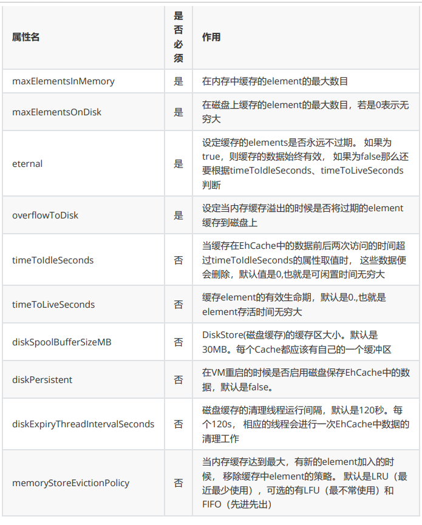

## [MyBatis的逆向工程](https://mybatis.org/generator/)

> - 正向工程：先创建Java实体类，由框架负责根据实体类生成数据库表。Hibernate是支持正向工程 的。 
> - 逆向工程：先创建数据库表，由框架负责根据数据库表，反向生成如下资源： 
>   - Java实体类 
>   - Mapper接口 
>   - Mapper映射文件

### 创建逆向工程的配置文件

#### 添加依赖和插件

```xml
<!-- 依赖MyBatis核心包 -->
    <dependencies>
        <dependency>
            <groupId>org.mybatis</groupId>
            <artifactId>mybatis</artifactId>
            <version>3.5.7</version>
        </dependency>
        <dependency>
            <groupId>junit</groupId>
            <artifactId>junit</artifactId>
            <version>4.12</version>
            <scope>test</scope>
        </dependency>
        <!-- log4j日志 -->
        <dependency>
            <groupId>log4j</groupId>
            <artifactId>log4j</artifactId>
            <version>1.2.17</version>
        </dependency>
        <!-- MySQL驱动 -->
        <dependency>
            <groupId>mysql</groupId>
            <artifactId>mysql-connector-java</artifactId>
            <version>5.1.8</version>
        </dependency>
    </dependencies>
    <!-- 控制Maven在构建过程中相关配置 -->
    <build>
        <!-- 构建过程中用到的插件 -->
        <plugins>
            <!-- 具体插件，逆向工程的操作是以构建过程中插件形式出现的 -->
            <plugin>
                <groupId>org.mybatis.generator</groupId>
                <artifactId>mybatis-generator-maven-plugin</artifactId>
                <version>1.3.0</version>
                <!-- 插件的依赖 -->
                <dependencies>
                    <!-- 逆向工程的核心依赖 -->
                    <dependency>
                        <groupId>org.mybatis.generator</groupId>
                        <artifactId>mybatis-generator-core</artifactId>
                        <version>1.3.2</version>
                    </dependency>
                    <!-- 数据库连接池 -->
                    <dependency>
                        <groupId>com.mchange</groupId>
                        <artifactId>c3p0</artifactId>
                        <version>0.9.2</version>
                    </dependency>
                    <!-- MySQL驱动 -->
                    <dependency>
                        <groupId>mysql</groupId>
                        <artifactId>mysql-connector-java</artifactId>
                        <version>5.1.8</version>
                    </dependency>
                </dependencies>
            </plugin>
        </plugins>
    </build>
```

#### 创建逆向工程的配置文件

> 文件名必须是：generatorConfig.xml

```xml
<?xml version="1.0" encoding="UTF-8"?>
<!DOCTYPE generatorConfiguration
        PUBLIC "-//mybatis.org//DTD MyBatis Generator Configuration 1.0//EN"
        "http://mybatis.org/dtd/mybatis-generator-config_1_0.dtd">
<generatorConfiguration>
    <!--
    targetRuntime: 执行生成的逆向工程的版本
    MyBatis3Simple: 生成基本的CRUD（清新简洁版）
    MyBatis3: 生成带条件的CRUD（奢华尊享版）
    -->
    <context id="DB2Tables" targetRuntime="MyBatis3">

        <!-- 数据库的连接信息 -->
        <jdbcConnection driverClass="com.mysql.jdbc.Driver"
                        connectionURL="jdbc:mysql://localhost:3306/mybatis"
                        userId="root"
                        password="123456">
        </jdbcConnection>

        <!-- javaBean的生成策略-->
        <javaModelGenerator targetPackage="com.lz.mybatis.bean"
                            targetProject=".\src\main\java">
            <property name="enableSubPackages" value="true"/>
            <property name="trimStrings" value="true"/>
        </javaModelGenerator>

        <!-- SQL映射文件的生成策略 -->
        <sqlMapGenerator targetPackage="com.lz.mybatis.mapper"
                         targetProject=".\src\main\resources">
            <property name="enableSubPackages" value="true"/>
        </sqlMapGenerator>

        <!-- Mapper接口的生成策略 -->
        <javaClientGenerator type="XMLMAPPER"
                             targetPackage="com.lz.mybatis.mapper" targetProject=".\src\main\java">
            <property name="enableSubPackages" value="true"/>
        </javaClientGenerator>

        <!-- 逆向分析的表 -->
        <!-- tableName设置为*号，可以对应所有表，此时不写domainObjectName -->
        <!-- domainObjectName属性指定生成出来的实体类的类名 -->
        <table tableName="t_emp" domainObjectName="Emp"/>
        <table tableName="t_dept" domainObjectName="Dept"/>
    </context>
</generatorConfiguration>

```

#### 执行MBG插件的generate目标

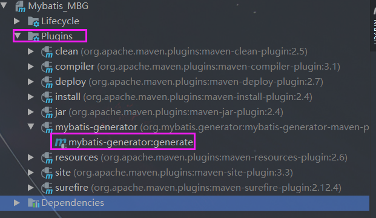

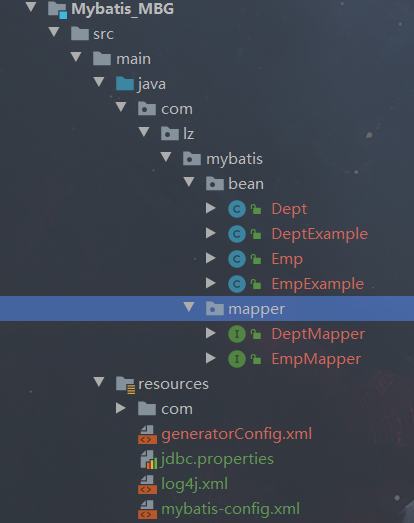

### QBC查询

```java
    @Test
    public void testMBG() throws IOException {
        InputStream is = Resources.getResourceAsStream("mybatis-config.xml");
        SqlSessionFactory build = new SqlSessionFactoryBuilder().build(is);
        SqlSession sqlSession = build.openSession(true);
        EmpMapper mapper = sqlSession.getMapper(EmpMapper.class);

        /**
         * 查询所有员工
         */
        /*List<Emp> emps = mapper.selectByExample(null);
        emps.forEach(emp -> System.out.println("emp = " + emp));*/

        
        /**
         * 根据条件查询员工
         */
        /*EmpExample empExample = new EmpExample();

        empExample.createCriteria().andEmpNameLike("z").andAgeGreaterThan(20);
        empExample.or().andDidIsNotNull();
        *//*select eid, emp_name, age, sex, email, did from t_emp WHERE ( emp_name like ? and age > ? ) or( did is not null )*//*

        List<Emp> emps = mapper.selectByExample(empExample);
        emps.forEach(emp -> System.out.println("emp = " + emp));*/

        
        /**
         * 修改员工信息
         */
        /*int i = mapper.updateByPrimaryKey(new Emp(20, "lz", 21, null, "1390211724@qq.com", 1));*/
        /*update t_emp set emp_name = ?, age = ?, sex = ?, email = ?, did = ? where eid = ?*/

        int i = mapper.updateByPrimaryKeySelective(new Emp(21, "lz", 21, null, "1390211724@qq.com", 1));
        /*update t_emp SET emp_name = ?, age = ?, email = ?, did = ? where eid = ?*/
        System.out.println("i = " + i);

    }
```

## 分页插件

### 配置分页插件

#### 添加依赖

```xml
        <!-- https://mvnrepository.com/artifact/com.github.pagehelper/pagehelper -->
        <dependency>
            <groupId>com.github.pagehelper</groupId>
            <artifactId>pagehelper</artifactId>
            <version>5.2.0</version>
        </dependency
```

#### 配置分页插件

> 在MyBatis的核心配置文件中配置插件

```xml
    <plugins>
        <!--设置分页插件-->
        <plugin interceptor="com.github.pagehelper.PageInterceptor"></plugin>
    </plugins>
```

### 使用分页插件

> - **在查询功能之前使用PageHelper.startPage(int pageNum, int pageSize)开启分页功能**
>
>   - **pageNum：当前页的页码**
>   - **pageSize：每页显示的条数**
>
> - **在查询获取list集合之后，使用PageInfo pageInfo = new PageInfo<>(List list, int navigatePages)获取分页相关数据**
>
>   - **list：分页之后的数据**
>   - **navigatePages：导航分页的当前页码数**
>
> - 分页相关数据
>
>   PageInfo{
>
>   pageNum=5, pageSize=5, size=5, startRow=21, endRow=25, total=41, pages=9, 
>
>   list=Page{count=true, pageNum=5, pageSize=5, startRow=20, endRow=25, total=41, pages=9, 
>
>   reasonable=false, pageSizeZero=false}[Emp{eid=39, empName='a', age=null, sex='null', email='null', 
>
>   did=null}, Emp{eid=40, empName='a', age=null, sex='null', email='null', did=null}, Emp{eid=41, 
>
>   empName='a', age=null, sex='null', email='null', did=null}, Emp{eid=42, empName='a', age=null, 
>
>   sex='null', email='null', did=null}, Emp{eid=43, empName='a', age=null, sex='null', email='null', 
>
>   did=null}], 
>
>   prePage=4, nextPage=6, isFirstPage=false, isLastPage=false, hasPreviousPage=true, 
>
>   hasNextPage=true, navigatePages=5, navigateFirstPage=3, navigateLastPage=7, 
>
>   navigatepageNums=[3, 4, 5, 6, 7]}
>
>   - 常用数据：
>   - pageNum：当前页的页码 
>   - pageSize：每页显示的条数 
>   - size：当前页显示的真实条数 
>   - total：总记录数 
>   - pages：总页数 
>   - prePage：上一页的页码 
>   - nextPage：下一页的页码

```java
    @Test
    public void testPageHelper() throws IOException {
        InputStream is = Resources.getResourceAsStream("mybatis-config.xml");
        SqlSessionFactory build = new SqlSessionFactoryBuilder().build(is);
        SqlSession sqlSession = build.openSession(true);
        EmpMapper mapper = sqlSession.getMapper(EmpMapper.class);

//        开启分页
        PageHelper.startPage(5, 5);

//        查询所有，开启了分页就是select * from t_emp limit ?,? 
        List<Emp> emps = mapper.selectByExample(null);
        emps.forEach(emp -> System.out.println("emp = " + emp));

//        获取分页的相关数据
        PageInfo<Emp> empPageInfo = new PageInfo<>(emps, 5);
        System.out.println("empPageInfo = " + empPageInfo);
    }
```

> 使用分页的话执行的sql语句使用limit关键字
>
> 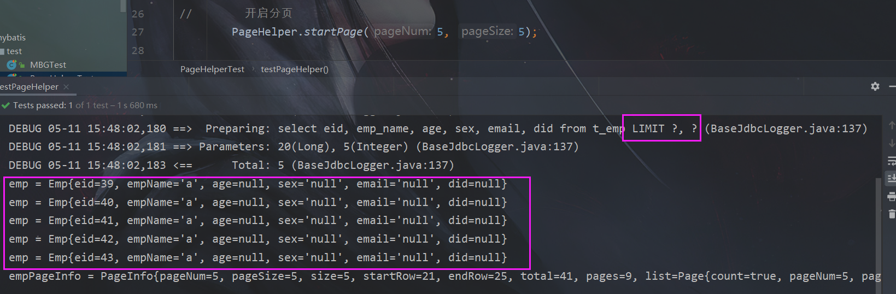

> 每个开始条数 = （当前页码 - 1）* 每页条数
>
> 第六页从第几条开始？就是前五页所有条数+1，也就是（第六页 - 1） * 每页条数

<hr/>

# SSM整合

## 引入依赖

> spring mvc\servlet\spring\mybatis\mybatis-spring\数据库驱动\连接池\junit\日志\thymeleaf-spring
>
> spring mvc中包含spring的依赖，只需要再引入一个spring-jdbc

```xml
    <dependencies>
        <!--    spring mvc    -->
        <dependency>
            <groupId>org.springframework</groupId>
            <artifactId>spring-webmvc</artifactId>
            <version>5.1.9.RELEASE</version>
        </dependency>
        <!--    servlet    -->
        <dependency>
            <groupId>javax.servlet</groupId>
            <artifactId>servlet-api</artifactId>
            <version>2.5</version>
        </dependency>
        <!--    spring    -->
        <dependency>
            <groupId>org.springframework</groupId>
            <artifactId>spring-jdbc</artifactId>
            <version>5.1.9.RELEASE</version>
        </dependency>
        <!--    mybatis    -->
        <dependency>
            <groupId>org.mybatis</groupId>
            <artifactId>mybatis</artifactId>
            <version>3.5.2</version>
        </dependency>
        <!--    mybatis-spring    -->
        <dependency>
            <groupId>org.mybatis</groupId>
            <artifactId>mybatis-spring</artifactId>
            <version>2.0.2</version>
        </dependency>
        <!--数据库驱动-->
        <dependency>
            <groupId>mysql</groupId>
            <artifactId>mysql-connector-java</artifactId>
            <version>5.1.47</version>
        </dependency>
        <!-- 数据库连接池 -->
        <dependency>
            <groupId>com.alibaba</groupId>
            <artifactId>druid</artifactId>
            <version>1.2.8</version>
        </dependency>
        <!--Junit-->
        <dependency>
            <groupId>junit</groupId>
            <artifactId>junit</artifactId>
            <version>4.12</version>
        </dependency>
        <!-- log4j -->
        <dependency>
            <groupId>log4j</groupId>
            <artifactId>log4j</artifactId>
            <version>1.2.17</version>
        </dependency>
        <!-- thymeleaf-spring5 -->
        <dependency>
            <groupId>org.thymeleaf</groupId>
            <artifactId>thymeleaf-spring5</artifactId>
            <version>3.0.12.RELEASE</version>
        </dependency>
        
           <!--lombok-->
        <dependency>
            <groupId>org.projectlombok</groupId>
            <artifactId>lombok</artifactId>
            <version>1.18.12</version>
        </dependency>
    </dependencies>
```

## 连接数据库

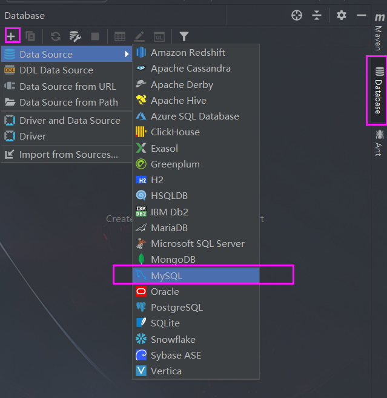

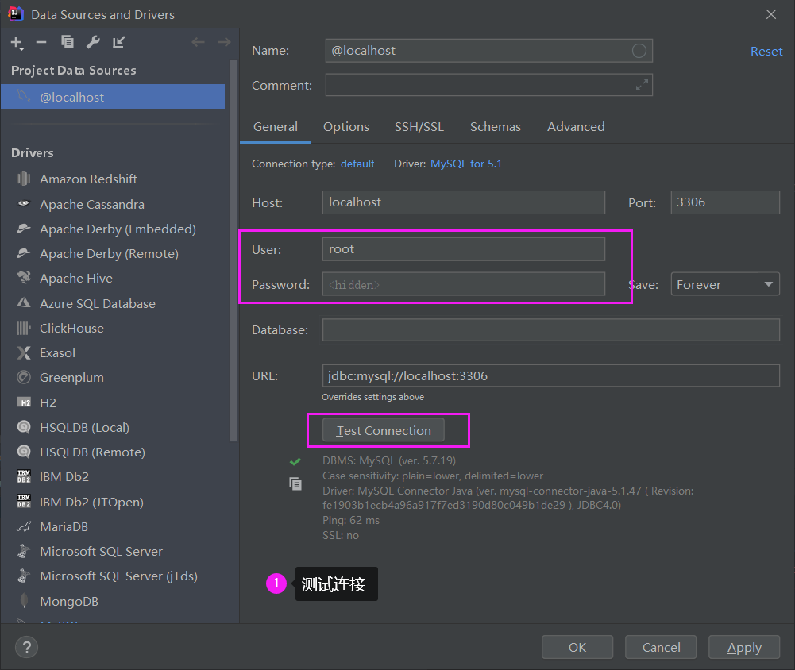

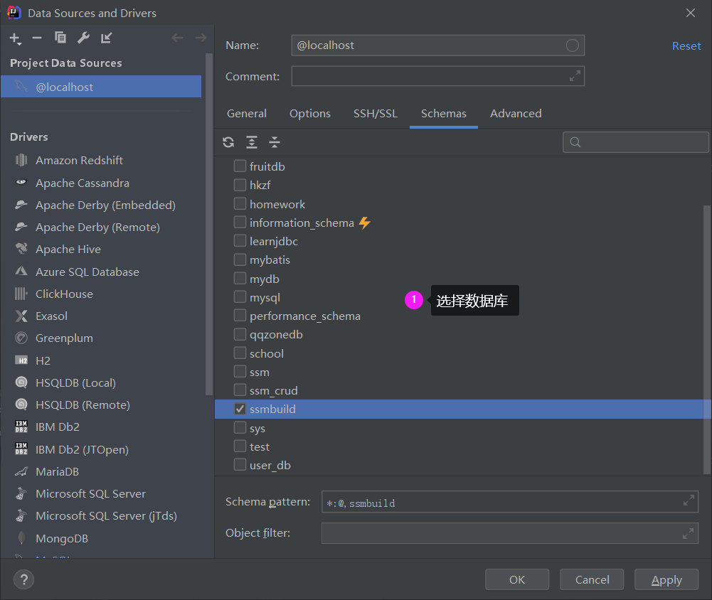

## 创建实体类

> 使用这个需要在编辑器中安装插件File --> Settings -->  Plugins --> lombok

### 引入依赖

```xml
   <!--lombok-->
    <dependency>
        <groupId>org.projectlombok</groupId>
        <artifactId>lombok</artifactId>
        <version>1.18.12</version>
    </dependency>
```

```java
@Data//getter setter toString
@AllArgsConstructor//有参构造
@NoArgsConstructor//无参构造
public class User {

    private Integer userId;
    private String userName;
    private String password;
}
```

## springmvc整合spring

> webapp/WEB-INF/web.xml

```xml
<?xml version="1.0" encoding="UTF-8"?>
<web-app xmlns="http://xmlns.jcp.org/xml/ns/javaee"
         xmlns:xsi="http://www.w3.org/2001/XMLSchema-instance"
         xsi:schemaLocation="http://xmlns.jcp.org/xml/ns/javaee http://xmlns.jcp.org/xml/ns/javaee/web-app_4_0.xsd"
         version="4.0">
    
    <!--  web.xml配置文件  -->

    <servlet>
        <servlet-name>dispatcherServlet</servlet-name>
        <servlet-class>org.springframework.web.servlet.DispatcherServlet</servlet-class>
        <init-param>
            <param-name>contextConfigLocation</param-name>
            <param-value>classpath:springmvc-config.xml</param-value>
        </init-param>
        <load-on-startup>1</load-on-startup>
    </servlet>
    <servlet-mapping>
        <servlet-name>dispatcherServlet</servlet-name>
        <url-pattern>/</url-pattern>
    </servlet-mapping>

    <!--  设置字符编码  -->
    <filter>
        <filter-name>CharacterEncodingFilter</filter-name>
        <filter-class>org.springframework.web.filter.CharacterEncodingFilter</filter-class>
        <init-param>
            <param-name>encoding</param-name>
            <param-value>UTF-8</param-value>
        </init-param>
        <init-param>
            <param-name>forceResponseEncoding</param-name>
            <param-value>true</param-value>
        </init-param>
    </filter>
    <filter-mapping>
        <filter-name>CharacterEncodingFilter</filter-name>
        <url-pattern>/*</url-pattern>
    </filter-mapping>

    <!--  设置put/delete请求  -->
    <filter>
        <filter-name>hiddenHttpMethodFilter</filter-name>
        <filter-class>org.springframework.web.filter.HiddenHttpMethodFilter</filter-class>
    </filter>
    <filter-mapping>
        <filter-name>hiddenHttpMethodFilter</filter-name>
        <url-pattern>/*</url-pattern>
    </filter-mapping>


    <!--  spring mvc和spring整合  -->
    <listener>
        <listener-class>org.springframework.web.context.ContextLoaderListener</listener-class>
    </listener>
    <context-param>
        <param-name>contextConfigLocation</param-name>
        <param-value>classpath:applicationContext.xml</param-value>
    </context-param>
</web-app>
```

> resources/springmvc-config.xml

```xml
<?xml version="1.0" encoding="UTF-8"?>
<beans xmlns="http://www.springframework.org/schema/beans"
       xmlns:xsi="http://www.w3.org/2001/XMLSchema-instance"
       xmlns:context="http://www.springframework.org/schema/context"
       xmlns:mvc="http://www.springframework.org/schema/mvc"
       xsi:schemaLocation="http://www.springframework.org/schema/beans http://www.springframework.org/schema/beans/spring-beans.xsd
                            http://www.springframework.org/schema/context https://www.springframework.org/schema/context/spring-context.xsd
                            http://www.springframework.org/schema/mvc https://www.springframework.org/schema/mvc/spring-mvc.xsd">

    <!--spring mvc配置文件-->

    <!--  开启注解扫描，只扫描controller  -->
    <context:component-scan base-package="com.lz.ssm">
        <context:include-filter type="annotation" expression="org.springframework.stereotype.Controller"/>
    </context:component-scan>

    <!--  开启mvc注解  -->
    <mvc:annotation-driven></mvc:annotation-driven>

    <!--  视图解析器  -->
    <mvc:view-controller path="/" view-name="index"></mvc:view-controller>

    <!--  加载静态文件  -->
    <mvc:default-servlet-handler></mvc:default-servlet-handler>

    <!-- 配置Thymeleaf视图解析器 -->
    <bean id="viewResolver" class="org.thymeleaf.spring5.view.ThymeleafViewResolver">
        <property name="order" value="1"/>
        <property name="characterEncoding" value="UTF-8"/>
        <property name="templateEngine">
            <bean class="org.thymeleaf.spring5.SpringTemplateEngine">
                <property name="templateResolver">
                    <bean class="org.thymeleaf.spring5.templateresolver.SpringResourceTemplateResolver">

                        <!-- 视图前缀 -->
                        <property name="prefix" value="/WEB-INF/templates/"/>

                        <!-- 视图后缀 -->
                        <property name="suffix" value=".html"/>
                        <property name="templateMode" value="HTML5"/>
                        <property name="characterEncoding" value="UTF-8"/>
                    </bean>
                </property>
            </bean>
        </property>
    </bean>

</beans>
```

## mybatis整合spring

> resources/mybatis-config.xml

```xml
<?xml version="1.0" encoding="UTF-8" ?>
<!DOCTYPE configuration
        PUBLIC "-//mybatis.org//DTD Config 3.0//EN"
        "http://mybatis.org/dtd/mybatis-3-config.dtd">
<configuration>
    
    <!--  mybatis配置文件  -->

    <typeAliases>
        <package name="com.lz.ssm.bean"/>
    </typeAliases>

</configuration>
```

> resources/applicationContext.xml

```xml
<?xml version="1.0" encoding="UTF-8"?>
<beans xmlns="http://www.springframework.org/schema/beans"
       xmlns:xsi="http://www.w3.org/2001/XMLSchema-instance"
       xmlns:context="http://www.springframework.org/schema/context"
       xsi:schemaLocation="http://www.springframework.org/schema/beans http://www.springframework.org/schema/beans/spring-beans.xsd http://www.springframework.org/schema/context https://www.springframework.org/schema/context/spring-context.xsd">
    
    <!--  spring配置文件  -->

    <!--  开启组件扫描，除controller  -->
    <context:component-scan base-package="com.lz.ssm">
        <context:exclude-filter type="annotation" expression="org.springframework.stereotype.Controller"/>
    </context:component-scan>

    <!--  引入外部文件  -->
    <context:property-placeholder location="classpath:jdbc.properties"></context:property-placeholder>

    <!--  配置数据连接池  -->
    <bean id="druidDataSource" class="com.alibaba.druid.pool.DruidDataSource">
        <property name="driverClassName" value="${jdbc.driver}"></property>
        <property name="url" value="${jdbc.url}"></property>
        <property name="username" value="${jdbc.username}"></property>
        <property name="password" value="${jdbc.password}"></property>
    </bean>

    
    <!--  mybatis和spring的整合  -->
    <bean id="sqlSessionFactoryBean" class="org.mybatis.spring.SqlSessionFactoryBean">
        <!--    引入数据源    -->
        <property name="dataSource" ref="druidDataSource"></property>
        <!--    引入mybatis核心配置文件    -->
        <property name="configLocation" value="classpath:mybatis-config.xml"></property>
    </bean>

    <!--  扫描Mapper，让Spring容器产生Mapper实现类，扫描映射文件xml  -->
    <bean id="mapperScannerConfigurer" class="org.mybatis.spring.mapper.MapperScannerConfigurer">
        <property name="basePackage" value="com.lz.ssm.mapper"></property>
    </bean>
</beans>
```

> 可以删除mybatis-config.xml文件，只保留contextApplication.xml文件

```xml
<?xml version="1.0" encoding="UTF-8"?>
<beans xmlns="http://www.springframework.org/schema/beans"
       xmlns:xsi="http://www.w3.org/2001/XMLSchema-instance"
       xmlns:context="http://www.springframework.org/schema/context"
       xsi:schemaLocation="http://www.springframework.org/schema/beans http://www.springframework.org/schema/beans/spring-beans.xsd http://www.springframework.org/schema/context https://www.springframework.org/schema/context/spring-context.xsd">
    
    <!--  spring配置文件  -->

    <!--  开启组件扫描，除controller  -->
    <context:component-scan base-package="com.lz.ssm">
        <context:exclude-filter type="annotation" expression="org.springframework.stereotype.Controller"/>
    </context:component-scan>

    <!--  引入外部文件  -->
    <context:property-placeholder location="classpath:jdbc.properties"></context:property-placeholder>

    <!--  配置数据连接池  -->
    <bean id="druidDataSource" class="com.alibaba.druid.pool.DruidDataSource">
        <property name="driverClassName" value="${jdbc.driver}"></property>
        <property name="url" value="${jdbc.url}"></property>
        <property name="username" value="${jdbc.username}"></property>
        <property name="password" value="${jdbc.password}"></property>
    </bean>

    
    <!--  mybatis和spring的整合  -->
    <bean id="sqlSessionFactoryBean" class="org.mybatis.spring.SqlSessionFactoryBean">
        <!--    引入数据源    -->
        <property name="dataSource" ref="druidDataSource"></property>
        <!-- 设置类型别名所对应的包 -->
		<property name="typeAliasesPackage" value="com.lz.ssm.bean"></property>
        <!--
        设置映射文件的路径
        若映射文件所在路径和mapper接口所在路径一致，则不需要设置
        -->
        <property name="mapperLocations" value="classpath:mapper/*.xml">
        </property>
     </bean>
     <!--  扫描Mapper，让Spring容器产生Mapper实现类-->
    <bean id="mapperScannerConfigurer" class="org.mybatis.spring.mapper.MapperScannerConfigurer">
        <property name="basePackage" value="com.lz.ssm.mapper"></property>
    </bean>
</beans>
```

# 问题

## 登录

> 方式一：登录成功将数据返回出去，不成功就抛一个异常（不推荐此方法）

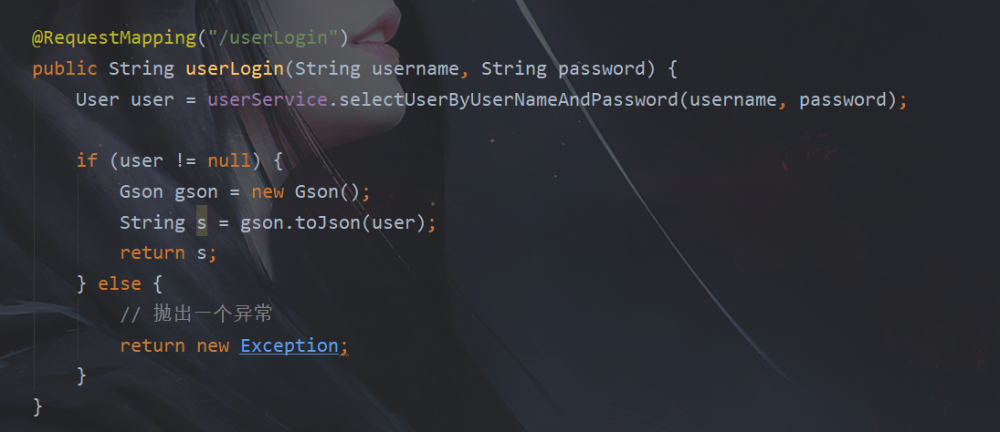

> 方法二：定义一个统一返回值，添加数据和status

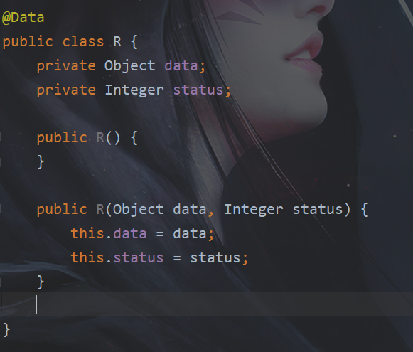

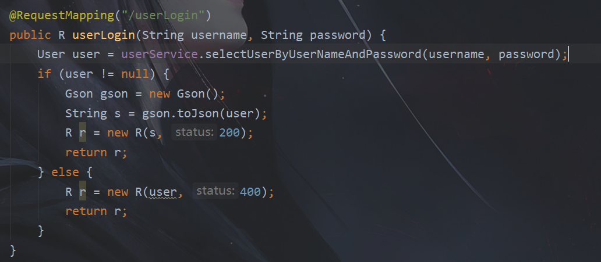

> 前端接到响应，判断status的值来判断有没有登录的用户

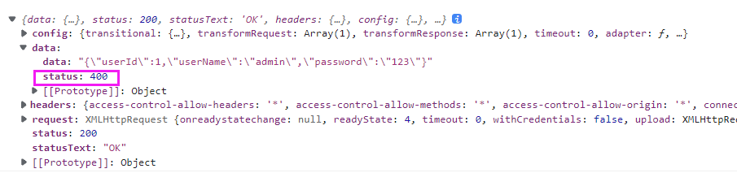

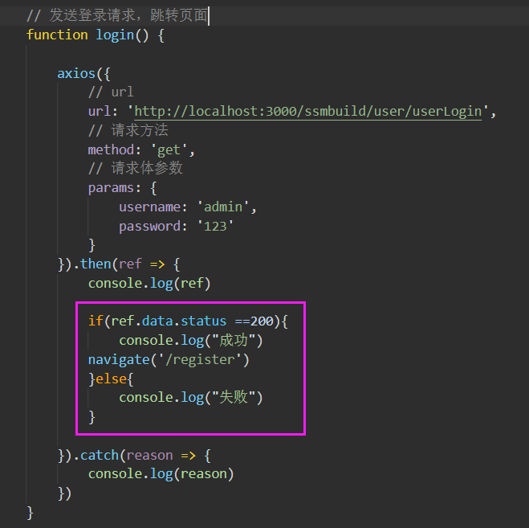
