# uni-app 超详细教程（一）（从菜鸟到大佬）

## 一，uni-app 介绍 ：

**[官方网页](https://uniapp.dcloud.net.cn/)**  
`uni-app` 是一个使用 Vue.js 开发所有前端应用的框架，开发者编写一套代码，可发布到`iOS、Android、Web（响应式）`、以及各种小程序（微信/支付宝/百度/头条/飞书/QQ/快手/钉钉/淘宝）、快应用等`多个平台`。

**简单说：** 1次开发 多端运行

## 二，准备工具

1.  [Hbuilderx](https://www.dcloud.io/hbuilderx.html) （开发与编译工具）

2.  [微信小程序开发工具](https://developers.weixin.qq.com/miniprogram/dev/reference/)（微信小程序预览测试）

3.  [安卓模拟器/真机](https://www.ldmnq.com/?n=6001&bd_vid=12317401268677668849)  
    运行app

> 官方链接在上面，点解下载

## 三，新建项目 / 认识界面

### 1，新建项目

1.  点击HbuilderX菜单栏文件>项目>新建
2.  选择uni-app,填写项目名称，项目创建的目录  
    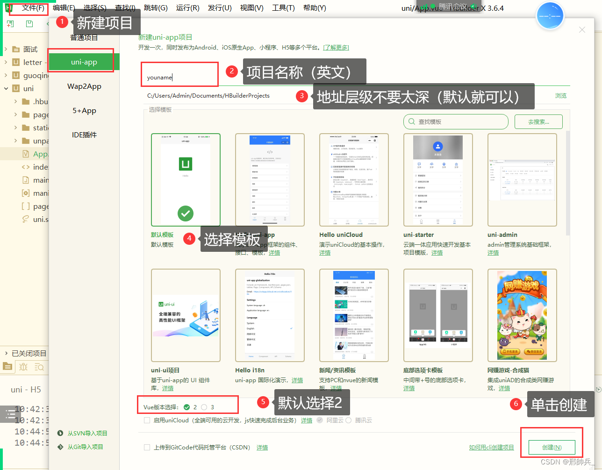

### 2，认识界面

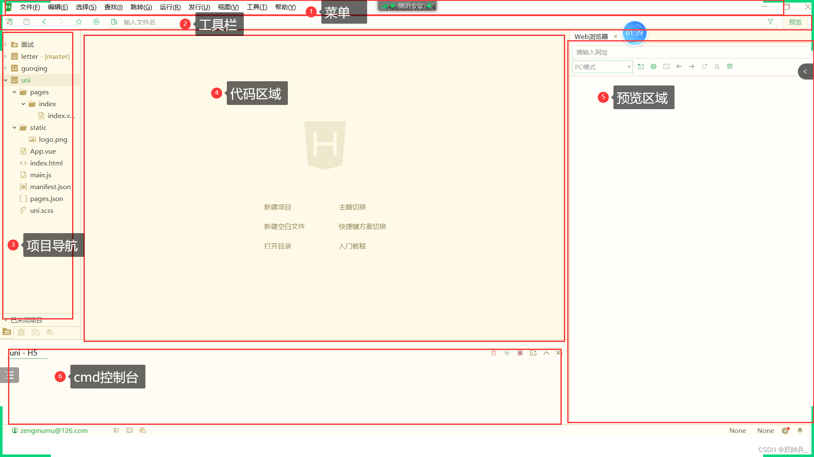  
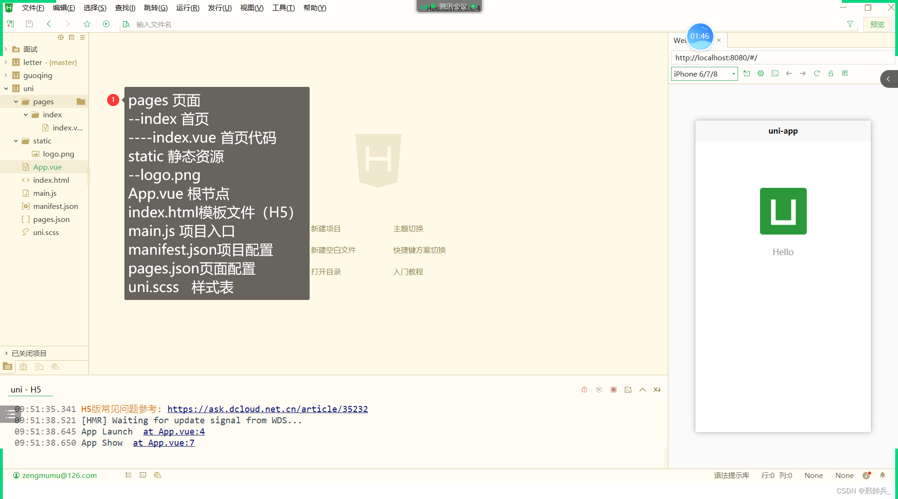

#### 2.1 介绍项目目录和文件作用

1.  pages.json ：文件用来对 uni-app 进行全局配置，决定页面文件的路径、窗口样式、原生的导航栏、底部的原生tabbar 等
2.  manifest.json ：文件是应用的配置文件，用于指定应用的名称、图标、权限等。
3.  App.vue：是我们的跟组件，所有页面都是在App.vue下进行切换的，是页面入口文件，可以调用应用的生命周期函数。
4.  main.js：是我们的项目入口文件，主要作用是初始化vue实例并使用需要的插件。
5.  uni.scss：文件的用途是为了方便整体控制应用的风格。比如按钮颜色、边框风格，uni.scss文件里预置了一批scss变量预置。
6.  unpackage：就是打包目录，在这里有各个平台的打包文件
7.  pages：所有的页面存放目录
8.  static：静态资源目录，例如图片等
9.  components：组件存放目录

### 3，全局配置和页面配置

**通过`globalStyle`进行全局配置**

> 用于设置应用的状态栏、[导航条](https://so.csdn.net/so/search?q=%E5%AF%BC%E8%88%AA%E6%9D%A1&spm=1001.2101.3001.7020)、标题、窗口背景色等。详细文档

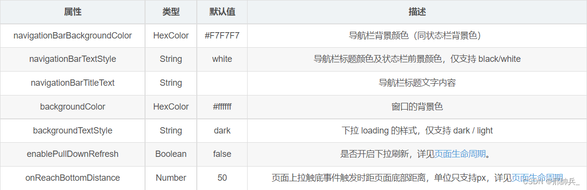

**注意：**

> 如果是第一次使用，需要先配置小程序ide的相关路径，才能运行成功  
>
> 微信开发者工具在设置中安全设置，服务端口开启

**为了实现多端兼容，综合考虑编译速度、运行性能等因素，uni-app 约定了如下开发规范：**

- 页面文件遵循 Vue 单文件组件 \(SFC\) 规范
- 组件标签靠近小程序规范，详见uni-app 组件规范
- 接口能力（JS API）靠近微信小程序规范，但需将前缀 wx 替换为 uni，详见uni-app接口规范
- 数据绑定及事件处理同 Vue.js 规范，同时补充了App及页面的生命周期
- 为兼容多端运行，建议使用flex布局进行开发

## 四，运行多端

### 1，H5

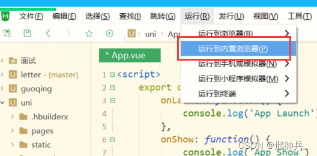

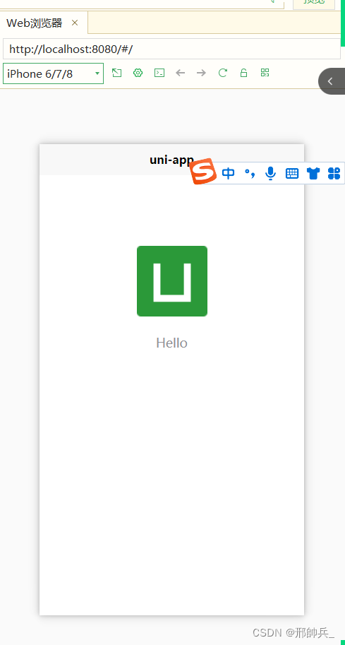

### 2，小程序

#### 01 打开开发工具的服务端口

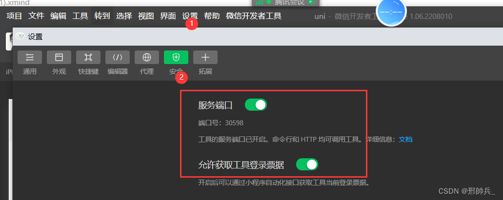

#### 02 HBuilderx配置 微信开发工具的地址

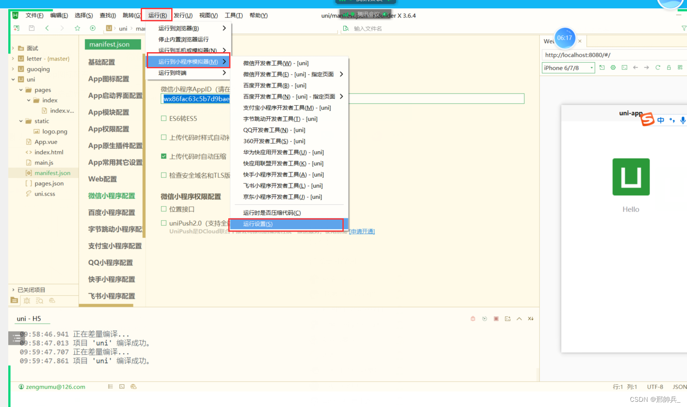  
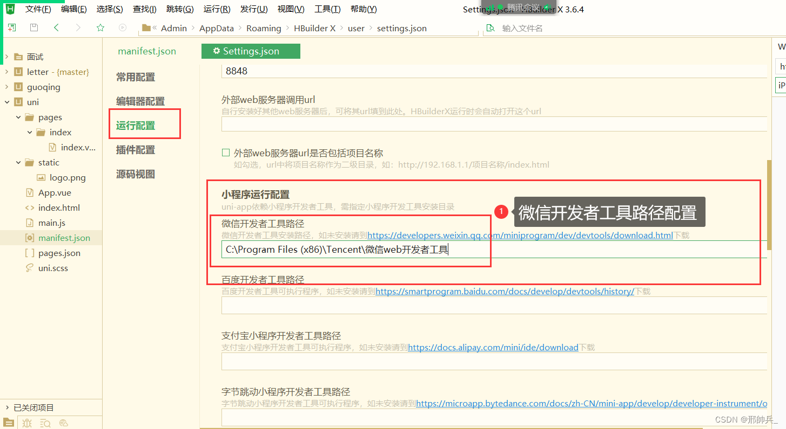

#### 03 配置微信小程序id

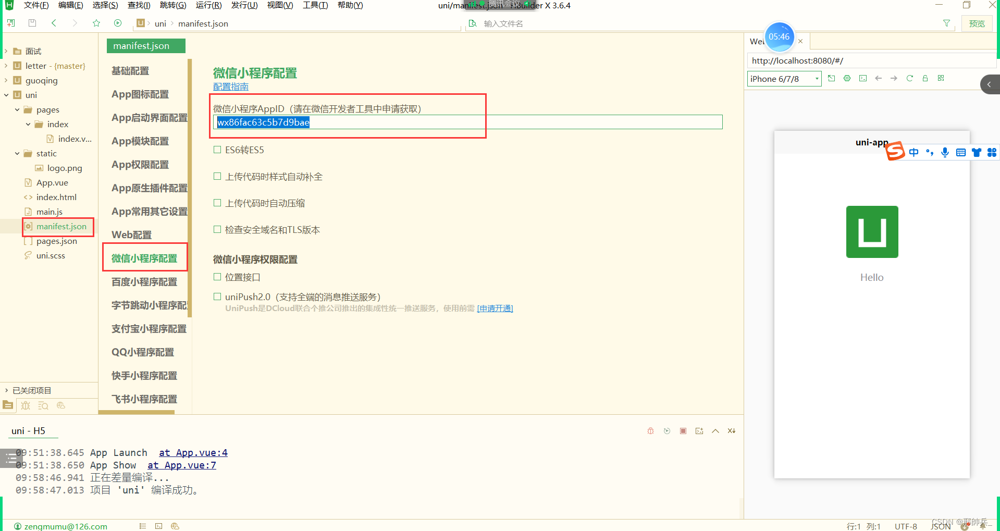

#### 04 运行到微信小程序 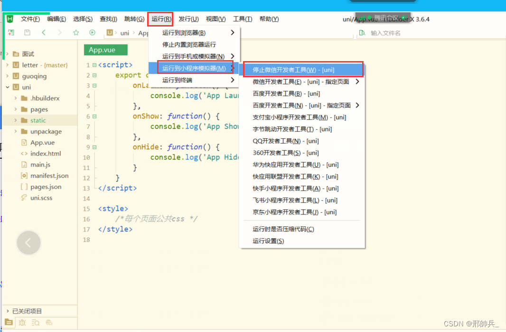

### 3，App

#### 01 打开模拟器或者手机

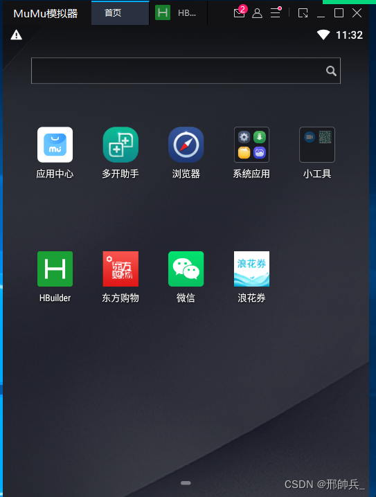

#### 02 配置模拟器的端口

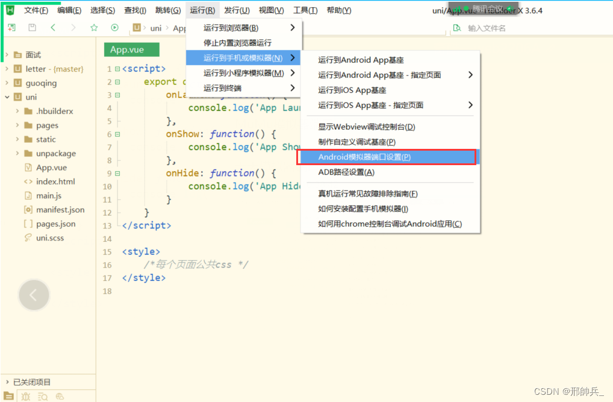

  

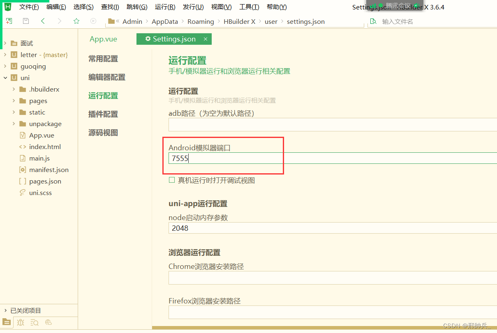

##### 各模拟器 端口号：

> [夜神模拟器](https://so.csdn.net/so/search?q=%E5%A4%9C%E7%A5%9E%E6%A8%A1%E6%8B%9F%E5%99%A8&spm=1001.2101.3001.7020)端口号：62001
>
> 海马模拟器端口号：26944
>
> 逍遥模拟器端口号：21503
>
> MuMu模拟器端口号：7555
>
> 天天模拟器端口号：6555

#### 03 运行到模拟器

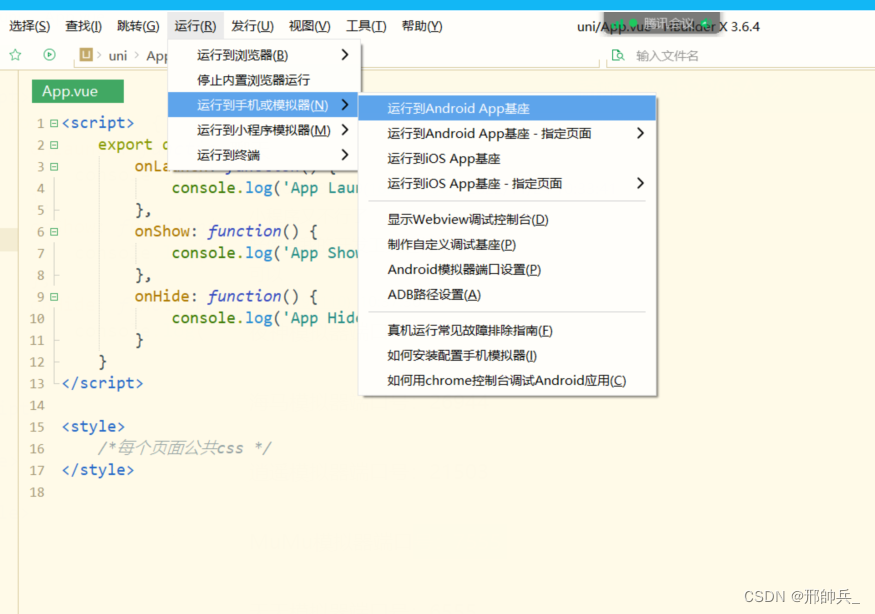

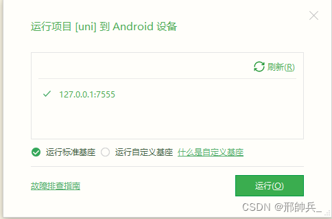

### 4，注意项

1.  hbuilder可能需要下载对应的插件
2.  运行到安卓模拟器，有视图差别
3.  运行可以需要一定的诗句

## 五，语法：

### 1，模板语法

#### 1.1，文本渲染

```javascript
{{表达式}}
		v-text=“表达式”
表达式
		简单的js运算
				{{2+3}}
		js方法调用
				{{title.length}}
				{{title.split("").reverse().join("")}}
		3元运算符
				<view>{{title.length>15?'长度很长':'字少事大'}}</view>
v-html 富文本
```

#### 1.2，条件渲染

```javascript
v-if

v-else-if

v-else

v-show

通过三元运算符
```

#### 1.3，列表选项

字符串，数字，列表，对象都可以遍历

```javascript
<view v-for="(item,index) in list" :key="index">{{index+1}}  {{item}}</view>
```

> **一定要保证兄弟元素间的key值是唯一**

#### 1.4， 属性绑定

```javascript
<button v-bind:disabled=“true”>
<button :disabled="true">
```

#### 1.5，表单绑定

**默认**

```javascript
:value="单向绑定"
```

**input**

```javascript
v-model=“双向绑定”
```

```javascript
@change=“$event.detail.value”
事件，事件的值$event.detail.value
```

#### 1.6，事件

##### 1.6.1，事件绑定：

```javascript
<view v-on:click="响应"
```

简写绑定：

```javascript
<view @click="事件响应"
```

事件行内处理

```javascript
<view @click="num++"
```

事件响应函数 \(函数在methods定义\)

```javascript
<view @click="say"
<view @click="say"
```

##### 1.6.2，事件传参

**不写参数**

```javascript
@click="say"
等同于 
@click=“say()”
等同于
@click=“say($event)”
```

> \$event 是一个固定写法 代表事件对象

```javascript
@click=“doit(str)”
doit(str="你好"){
	uni.showModal({title:str})
}
```

**1.6.3，事件对象 \$event/e**

```javascript
function say(e){
}
//   target目标对象
//   dataSet 组件传参
<view :data-title="title" @click="say">
function say(e){
      e.target.dataset.title
}
```

### 2，uni-app页面 配置

#### 页面配置 pages.json

**`globalStyle`** 默认页面的样式会应用全局样式

> 页面写了style 配置，那么用的配置覆盖全局的配置

**`pages`** 页面

> path页面路径 
>
> style 页面样式

### 3，vue选项

> `data` ：数据  
>
> `methods`： 方法  
>
> `computed` ：计算  
>
> `watch`：监听  
>
> `directive`：指令  
>
> `filter`：过滤

## 六，uni-app的生命周期

### 1，Vue的生命周期

#### 创建

##### 1\. `beforeCreate`

##### 2\. `created`

> **可以使用this，没有dom**

**作用：**

1.  初始数据
2.  注册监听事件
3.  开启定时器
4.  ajax请求

#### 挂载

##### 1\. `beforeMount`

##### 2\. `mounted`

> **可以操作dom（节点）**

**作用：**

1.  操作dom
2.  ajax请求

#### 更新

##### 1\. `beforeUpdate`

##### 2\. `updated`

#### 卸载

##### 1\. `beforeDestroy`

##### 2\. `destroyed`

**作用：**

1.  移除事件监听
2.  移除停止定时器

### 2，小程序的生命周期

#### 加载

##### `onLoad`

**作用：**

> 能够获取页面的参数 
> 开启ajax，定时器，事件监听  
> 像vue的created

#### 显示

##### `onShow`

**作用：**

> 播放媒体

#### 准备

##### `onReady`

**作用：**

> 获取节点信息  
> 像vue的mounted

#### 后台运行

##### `onHide`

**作用：**

> 停止播放媒体

#### 卸载

##### `onUnload`

**作用：**

> 停止事件监听与定时器

### 3，小程序的全局方法

#### 下拉刷新

`onPullDownRefresh`

#### 触底更新

`onReachBottom()`

#### 右上角分享

`onShareAppMessage`

#### 页面滚动

`onPageScroll`

#### 分享到朋友圈

`onShareTimeline`

### 4，app的全局方法

#### 4.1，手机的返回键被点击

`onBackPress`

#### 4.2，导航栏按钮被点击

`onNavigationBarButtonTap`

## 七，路由

### 1，路由组件

**导航** `navigator`

> url 跳转页面的地址

**打开类型** `open-type`

> navigate跳转  
> redirect重定向（当前页面不留历史记录）  
> navigateBack返回  
> relauch 重启  
> switchTab 跳转底部栏

### 2，路由传参

**传递**

```javascript
url:path?name=mumu&age=18
```

**接收**

```javascript
onLoad(option){}
```

> option的值\{name:“mumu”,age:18\}

### 3，路由api

**跳转**

```javascript
uni.navigateTo({url})
```

**重定向**

```javascript
uni.redirectTo({url})
```

**返回**

```javascript
uni.navigateBack()
```

**底部栏切换**

```javascript
uni.switchTab()
```

**重启**

```javascript
uni.reLaunch()
```

### 4，路由配置 + （底部选项栏配置）

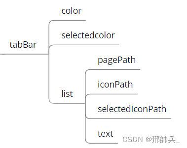


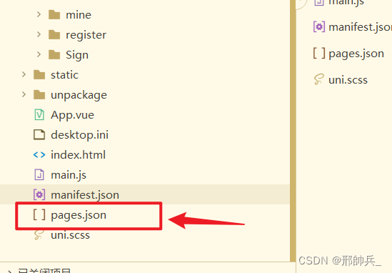

  

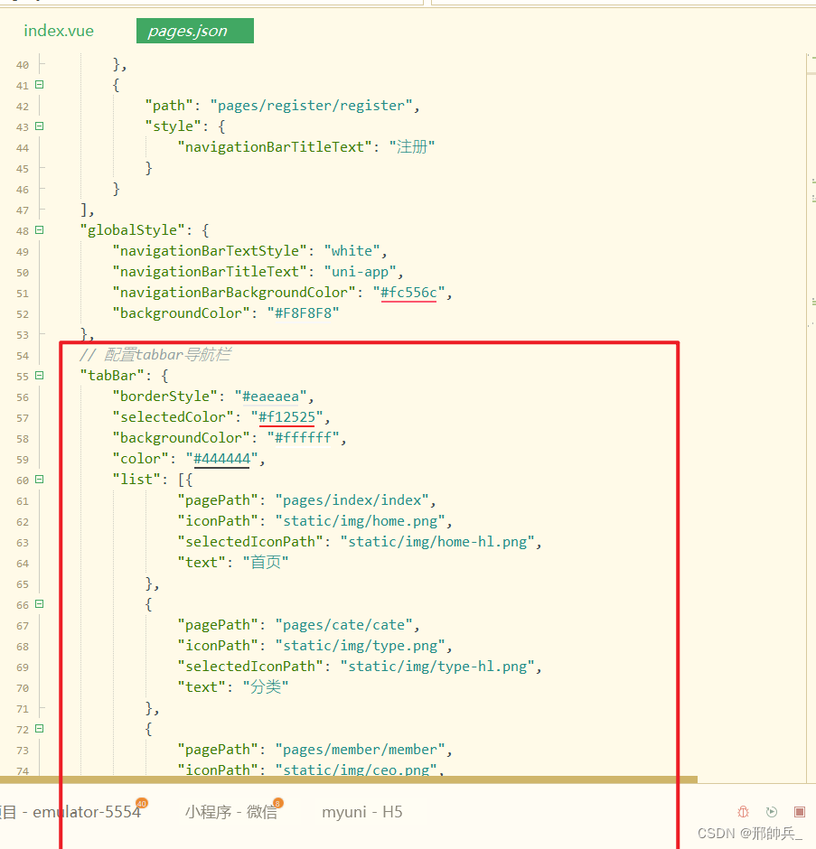

##### 语法解释

> - `"borderStyle"`: **“边框颜色”**,  
> - `"selectedColor":` **“字体选中后的颜色”,**  
> - `"backgroundColor"`:**“底部栏背景颜色”**,  
> - “`color`”: “**默认字体颜色**”,  
> - `"list"`: \[\{ **选项列表**  
> - `"pagePath"`: "**页面路径"**,  
> - "`iconPath"`: “**未选择时的图片（图片路径）**”,  
> - `"selectedIconPath"`: “**选择时的图片（图片路径）**”,  
> - `"text"`: **“底部选项文字”**  

```javascript
// 配置tabbar导航栏
	"tabBar": {
		"borderStyle": "#eaeaea",
		"selectedColor": "#f12525",
		"backgroundColor": "#ffffff",
		"color": "#444444",
		"list": [{
				"pagePath": "pages/index/index",
				"iconPath": "static/img/home.png",
				"selectedIconPath": "static/img/home-hl.png",
				"text": "首页"
			},
			{
				"pagePath": "pages/cate/cate",
				"iconPath": "static/img/type.png",
				"selectedIconPath": "static/img/type-hl.png",
				"text": "分类"
			},
			{
				"pagePath": "pages/member/member",
				"iconPath": "static/img/ceo.png",
				"selectedIconPath": "static/img/ceo-hl.png",
				"text": "会员"
			},
			{
				"pagePath": "pages/Cart/Cart",
				"iconPath": "static/img/cart.png",
				"selectedIconPath": "static/img/cart-hl.png",
				"text": "购物车"
			},
			{
				"pagePath": "pages/mine/mine",
				"iconPath": "static/img/mine.png",
				"selectedIconPath": "static/img/mine-hl.png",
				"text": "我的"
			}
		]
	},
```

#### 注意：

> 底部选项**最多设置5个,最少2个**

### 5，获取当前页面 `getApp`

01 在App.vue定义

```
globalData:{num:100}  
```

02 要使用的页面获取app  

```
var app = getApp()  
```

03获取globalData的值  

```
onShow(){  
	this.num = app.globalData.num  
}  
```

04 更新globalData值  

```
addNum(){  
    app.globalData.num++;  
    this.num = app.globalData.num  
}
```

### 6，获取页面栈 `getCurrentPages`

```javascript
var page  = getCurrentPages();
uni.navigateBack({delta:page.length})
```

获取当前的页面栈，是一个数组（1-5）

```javascript
page[page.length-1] 
```

获取当前页面的信息（不要去修改）

## 八，[条件编译](https://uniapp.dcloud.net.cn/tutorial/platform.html#preprocessor)

### 目的:

> **不同的平台展示不同`特性`与`功能`  **
>
> **条件编译是用特殊的注释作为标记，在编译时根据这些特殊的注释，将注释里面的代码编译到不同平台。**

### 介绍：

**写法**：**以 `#ifdef` 或 `#ifndef` 加 `%PLATFORM%` 开头，以 `#endif` 结尾。**

- `#ifdef：if defined` 仅在某平台存在
- `#ifndef：if not defined` 除了某平台均存在
- `%PLATFORM%`：平台名称

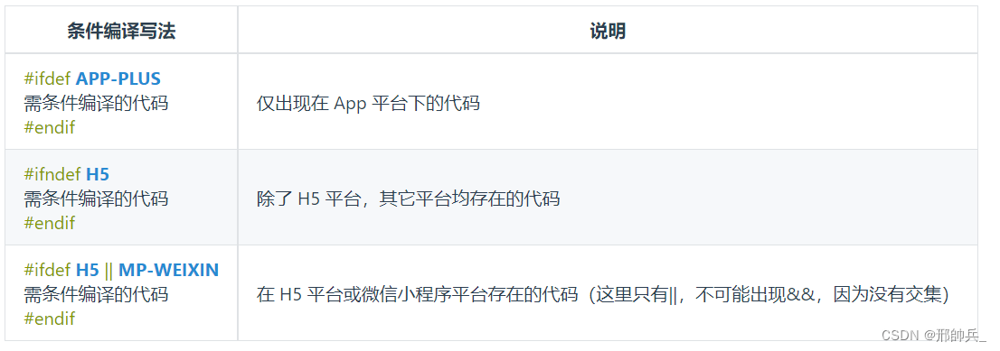

### 1， 模板条件编译

#### 格式

```javascript
<!-- #ifdef H5 -->
	**内容**
<!-- #endif -->
```

#### 条件

`APP` —— App端  
`H5` —— 网页  
`MP` —— 小程序  
`MP-WEIXIN` —— 微信小程序

### 2，css条件编译

```javascript
/* #ifdef APP */
     .active{color:red}
/* #endif */
```

### 3，js条件编译

```javascript
// #ifdef APP-PLUS
	uni.showModal({
		title:"你好App用户"
	})
// #endif
```

### 4，条件配置

```javascript
pages.json
		“style”:{
  "h5":{
      "titleNView":{
          "titleText":"我是H5"
       }
  },
  "app-plus": {
      "titleNView":false //隐藏导航栏
  }
}
```

```javascript
// #ifdef MP-WEIXIN	|| APP	
{
	"path":"pages/condition/we",
	"style":{
		"navigationBarTitleText": "小程序专有页面"
	}
},
// #endif
```

# uni-app 超详细教程（二）（从菜鸟到大佬）

本文中包含 `uni - app` 的 `vuex`，`常用api`，`常用组件`，`自定义组件`，`第三方插件运用` 等内容！

## 一， [uniapp](https://uniapp.dcloud.net.cn/tutorial/vue3-vuex.html)中使用vuex

### 1、uniapp中有自带vuex插件，直接引用即可

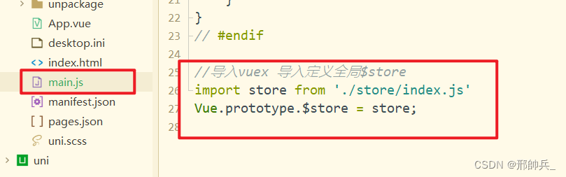

### 2、在项目中新建文件夹store,在main.js中导入

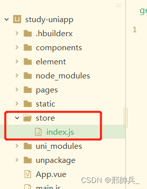

#### 2.1，store/index.js

```javascript
import Vue from 'vue'

import Vuex from 'vuex'

Vue.use(Vuex)

const store = new Vuex.Store({
    state: {
		//公共的变量，这里的变量不能随便修改，只能通过触发mutations的方法才能改变
	},
    mutations: {
		//相当于同步的操作
	},
    actions: {
		//相当于异步的操作,不能直接改变state的值，只能通过触发mutations的方法才能改变
	}
})
export default store

```

#### 2.2，在main.js中导入挂载vuex

```javascript
import App from './App'

// #ifndef VUE3
import Vue from 'vue'
Vue.config.productionTip = false
App.mpType = 'app'
const app = new Vue({
	...App
})
app.$mount()
// #endif

// #ifdef VUE3
import {
	createSSRApp
} from 'vue'
export function createApp() {
	const app = createSSRApp(App)
	return {
		app
	}
}
// #endif

//导入vuex 导入定义全局$store
import store from '.ore/index.js'
Vue.prototype.$store = store;

```

### 3，使用

#### 第一种方式：this.\$store直接操作

例如当取值：直接在页面中使用this.\$store.state.变量名

#### 第二种方法：mapState, mapGetters, mapActions, mapMutations

##### 1， store/index.js

```javascript
//导入vuex
import Vuex from 'vuex';
//导入vue 
import Vue from 'vue';

//使用Vuex 
Vue.use(Vuex);
//导出Vuex
export default new Vuex.Store({
	state: {
		gTitle: {
			text: "你好vuex",
			color: "#000",
			fontSize: "24px",
			background: "#f70"
		},
		joks: [],
	},
	mutations: {
		setJoks(state, data) {
			state.joks = data;
		},
		setSize(state, data) {
			state.gTitle.fontSize = data + "px";
		},
		SetBackgroundColor(state, data) {
			state.gTitle.background = data;
		}
	},
	actions: {
		//和后端交互，异步操作都会放在actions中
		getJok(context, data) {
			uni.request({
				url: "http://520mg.com/mi/list.php",
				method: 'get',
				data: data,
				//axios get 请求参数用params,post用data
				//uni.request post和get传参都用data
				//根据content-type,如果是application/json,那么data是json，如果是urlencoded data是url编码形式
				success: (res) => {
					console.log(res);
					context.commit('setJoks', res.data.result);
				}
			})
		}
	},
	//内部计算
	getters: {
		//计算所有笑话的字数总和
		"totalLen": function(state) {
			var count = 0;
			for (var i = 0; i < state.joks.length; i++) {
				count += state.joks[i].summary.length;
			}
			return count;
		}
	},
	modules: {},
})

```

##### 2，新建glodal页面

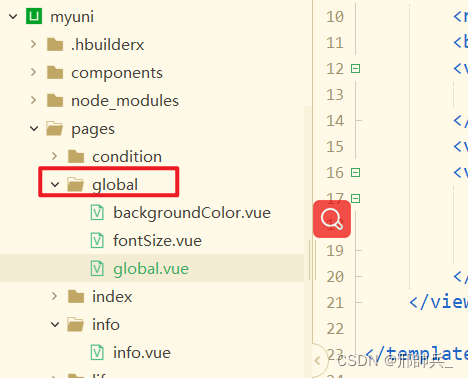  
**pages/glodal/glodal.vue**

```javascript
<template>
	<view>
		<view class="title">vuex数据</view>
		<!--  -->
		<view :style="$store.state.gTitle">
			{{$store.state.gTitle.text}}--简写前
		</view>
		<view :style="gTitle">{{gTitle.text}}--简写后</view>
		<navigator url="./fontSize">修改文本大小</navigator>
		<navigator url="./backgroundColor">修改背景颜色</navigator>
		<br>
		<view>
			总{{$store.state.joks.length}}条笑话
		</view>
		<view>{{totalLen}}字</view>
		<view>
			<view class="item" v-for="item in $store.state.joks">
				{{item.summary}}
			</view>
		</view>
	</view>
	
</template>

<script>
	//state的简写
	import {mapState,mapActions,mapGetters} from 'vuex'
	export default{
		computed:{
			//把全局的vuex数据转换为组件计算出来的只读的
			...mapState(["gTitle"]),
			...mapGetters(['totalLen'])
		},
		onLoad() {
			//调用getJok方法，并传入参数
			// this.$store.dispatch("getJok",{page:1})
			this.getJok({page:1});
		},
		methods:{
			...mapActions(["getJok"])
		}
	}
</script>

<style lang="scss">
	.item{
		margin-top: 40rpx;
	}
</style>

```

> **自行复制代码运行，查看`Vuex`的奥妙，知识面广，详细内容可阅读官方文档！**

## 二、uni-app常用[api](https://uniapp.dcloud.net.cn/api/)

### 下拉刷新

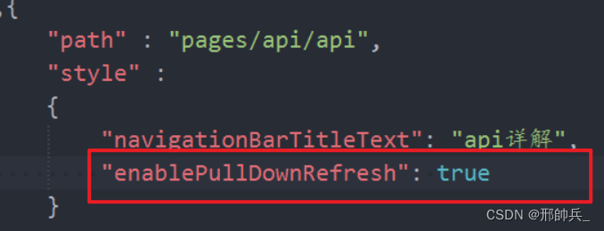

### 上传和下载 uni.upload uni.download

```javascript
		<button @click="onuploadphoto">图片上传</button>
		<button @click="ondownload">下载</button>
		<image :src="downloadfile" style="width: 300rpx;height: 270rpx;" mode="aspectFill"></image>

		data() {
			return {
				downloadfile:''
			}
		},

		onuploadphoto(){
				uni.chooseImage({
					count:1,
					sizeType:[],
					sourceType:[],
					success: (res) => {
						console.log(JSON.stringify(res));
					},
					fail: () => {
						console.log(JSON.stringify(err));
					}
				})
			},
			ondownload(){
				uni.downloadFile({
					url:'https://img2.baidu.com/it/u=190271553,1135687029&fm=253&fmt=auto&app=138&f=JPEG?w=640&h=452',
					timeout:30000,
					success: (res) => {
						console.log(JSON.stringify(res));
						this.downloadfile = res.tempFilePath;    //显示图片
					},
					fail: (err)=>{
						console.log(JSON.stringify(err));
					}
				})
			}

```

### 图片

```javascript
<!-- 循环显示选中多张图片 -->
		<view style="display: flex;">
		<view v-for="(item,index) in picpaths" :key="index">
			<image :src="item" style="width: 300rpx;height: 400rpx;" mode="aspectFill"></image>
		</view>
		</view>
		<image :src="picpath" style="width: 300rpx;height: 250rpx;" mode="aspectFill"></image> <!-- 显示图片 -->

return {
				picpath:'',
				picpaths:[]
			}
	
onchooseimg(){
				let that = this;   //外部定义this
				uni.chooseImage({
					count:3,
					sizeType:[],
					success: (res) => {    //base6写法 不用外部定义this
						console.log(JSON.stringify(res));
						//回调显示图片
						that.picpath = res.tempFilePaths[0];
						that.picpaths = res.tempFilePaths;
						console.log(that.picpath);
					}
				})
			}

```

### uni.previewImage 预览图片

```javascript
<button @click="onpreimg">预览图片</button>

onpreimg(){
				uni.previewImage({
					loop:false,
					indicator:'default',
					count:this.picpre.length,   //存入图片列表长度
					current:'',
					urls:this.picpre,   //关键参数
					success: (res) => {
						console.log(JSON.stringify(res));
					},
					fail: (err) => {
						console.log(err);
					}
				})
			}

```

### uni.getImageInfo 获取图片信息 长宽 用于瀑布流（耗性能，不推荐

```javascript
<!-- 动态显示图片，结合图片信息api -->
		<image :style="{width: imgwidth+'rpx',height: imgheight+'rpx'}" src="../../static/logo.png"></image>
		onLoad() {
			//页面加载获取本地图片
			uni.getImageInfo({
				src:'../../static/logo.png',
				success: (res) => {
					console.log(res);
					//动态获取真实图片宽高
					this.imgwidth = res.width;
					this.imgheight = res.height;
				}
			})
		},

```

### uni.saveImageToPhotosAlbum 保存图片到系统相册

```javascript
//条件编译  放到onload页面周期内
			// #ifndef H5
			let url = 'https://img2.baidu.com/it/u=297478628,2059211344&fm=253&fmt=auto&app=138&f=JPEG?w=500&h=278';
			uni.downloadFile({
				url:url,
				success: (res) => {
					console.log(res);
					let file = res.tempFilePath;
					//保存到相册api  不支持h5 条件编译
					uni.saveImageToPhotosAlbum({
						filePath:file,
						success: (re) => {
							console.log(re);
						},
						fail: (err) => {
							console.log(err);
						}
					})
				}
			})
			// #endif

```

### 设备

#### 系统信息

> `uni.getSystemInfo` 获取系统信息 经常用 屏幕宽度，高度

 1.     屏幕高度 = 原生NavigationBar高度（含状态栏高度）+ 可使用窗口高度 + 原生TabBar高度
 2.     windowHeight不包含NavigationBar和TabBar的高度
 3.     H5端，windowTop等于NavigationBar高度，windowBottom等于TabBar高度
 4.     App端，windowTop等于透明状态NavigationBar高度，windowBottom等于透明状态TabBar高度
 5.     高度相关信息，要放在 onReady 里获取

```javascript
//onloaad生命周期
//同步操作会有等待 当建一个异步处理 可以用同步处理 
			let sync = uni.getSystemInfoSync();
			new Promise((resolve,refuse)=>{
				let sync1 = uni.getSystemInfoSync();
				let sync2 = uni.getSystemInfoSync();
				resolve && resolve();
			}).then(res=>{
				
			}).catch(err=>{
				
			})
			
			uni.getSystemInfo({
				success: (res) => {
					console.log(JSON.stringify(res));
				}
			})

```

> **uni.canIUse 判断应用的 API，回调，参数，组件等是否在当前版本可用**

## 三，[uni - app](https://uniapp.dcloud.net.cn/component/)组件

### 1，`uni-app`常用组件（uni-app内部组件）

#### 消息提示

最全的[toast](https://so.csdn.net/so/search?q=toast&spm=1001.2101.3001.7020)：

```javascript
	 uni.showToast({
		title:"请输入用户名密码!" ,
		icon: 'none',
		mask: true,
		duration: 2000
	})

```

##### icon值：

> 默认success。  
> （1）none：没有图标  
> （2）error：错误图标  
> （3）loading：加载 （  
> 4）success：成功  
> 如果只是最简单的，超过7个字会显示不完全。

```javascript
	 uni.showToast({
		title:"请输入用户名密码!" 
	})

```

**成功信息：**

```javascript
uni.showToast({
title: '提交成功',
duration: 2000
});

```

**失败信息：**

```javascript
uni.showToast({
title: '提交失败',
icon: 'error',
duration: 2000
});

```

**用户交互点击**

```javascript
 uni.showModal({
       title: '哦，答错了',
       content: '是否加入错题本？',
       success: function (res) {
         if (res.confirm) {
             console.log('用户点击确定');
         } else if (res.cancel) {
              console.log('用户点击取消');
         }
    }
});
```

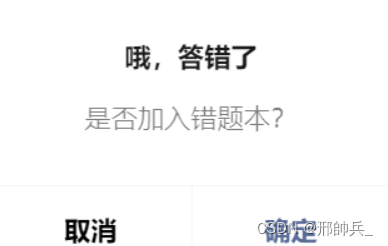

#### 存储本地缓存

**存储：**

```javascript
uni.setStorageSync('token', 'hello');
```

**取值：**

```javascript
uni.getStorageSync('token');
```

#### 表单组件

**文本域**

> textarea值得注意的是默认限制输入长度140，如果打破这个限制，将其设置为-1

```javascript
<textarea class="input-val" v-model="form.content" maxlength="-1" auto-height placeholder="请输入句子内容"/>
```

### 2，`uni-app`实现自定义组件

2.1、首先我们要先创建一个与page平级的component页面，然后再在里面创建一个自己的组件名称相同的页面：

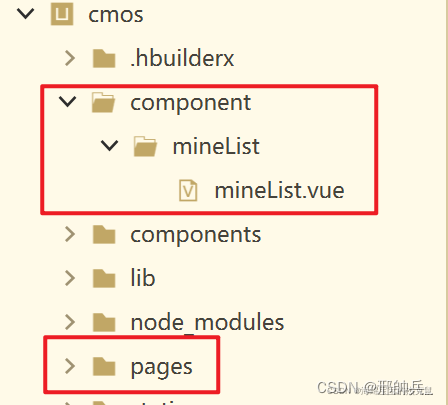

2.2，然后去pages.json将刚刚创建的页面删除。将红色部分删除！

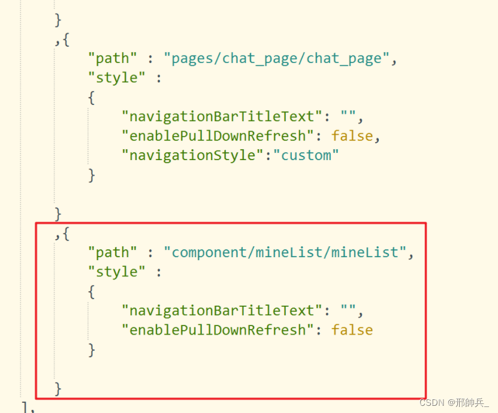

2.3、在组件中写props属性用于接收值（若不进行值传递可以不写）。我是从父文件传递过来一个对象使用，所以我这里props内接收的是一个对象。

2.4、一定要写name属性，这是导出的组件名称：

> `props`属性一定要写在前面，写方法后面不生效！！  
> 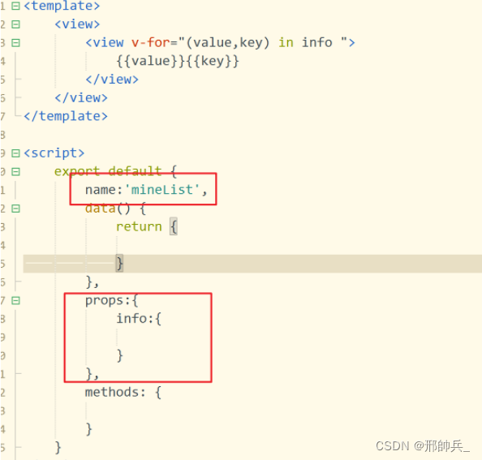

2.5，此时我们来到使用组件的页面，导入并且注册组件，如果是按照我的逻辑创建的目录，则直接将名字改成你自己的组件名称即可。

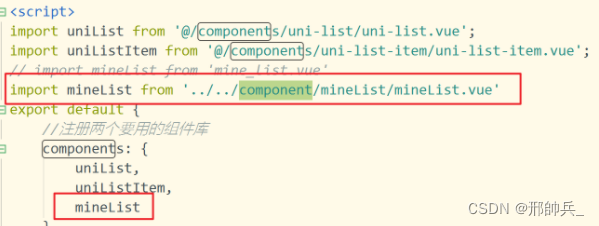

2.6， 5、此时就可以直接引用使用啦：

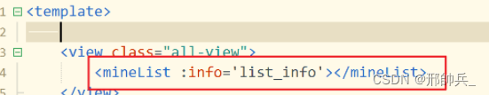

## 四，`uni-app`第三方ui组件推荐\&\&引入的方法

### 1，ui组件推荐

#### 1.1，[Muse-UI](https://muse-ui.org/#/zh-CN/usage)

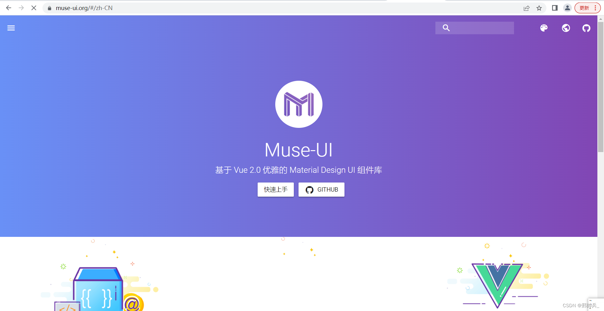

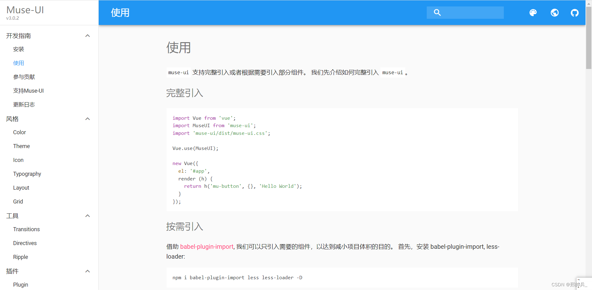

##### 介绍：

1.  Muse UI 是一套 Material Design 风格开源组件库，旨在快速搭建页面。它基于 Vue 2.0  
    开发，并提供了自定义主题，充分满足可定制化的需求。
2.  material-design-icons 是谷歌定义的一套icon
3.  typeface 是谷歌定义的一套字体

#### 1.2，[Vant Weapp](https://youzan.github.io/vant-weapp/#/home)

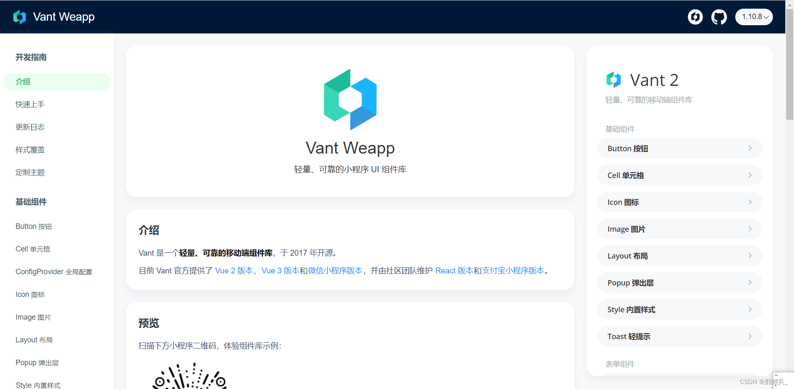

##### 介绍：

1.  Vant 是一个轻量、可靠的移动端组件库，于 2017 年开源。
2.  目前 Vant 官方提供了 Vue 2 版本、Vue 3 版本和微信小程序版本，并由社区团队维护 React 版本和支付宝小程序版本。

#### 1.3，[uView](http://v1.uviewui.com/)

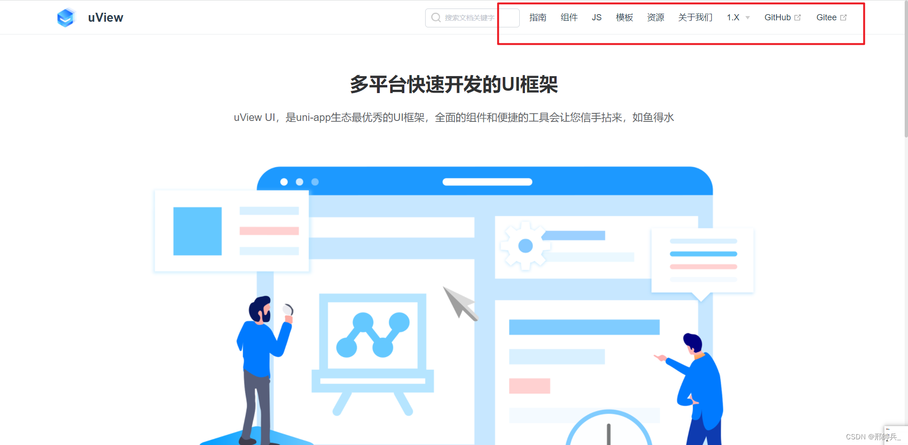

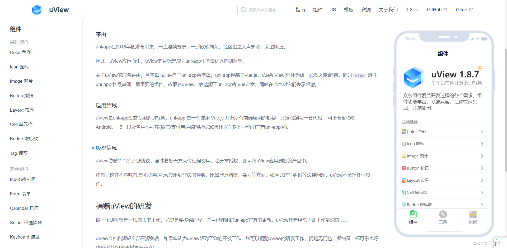

##### 介绍：

1.  uView2.0是继1.0以来的一次重大更新，2.0已全面兼容nvue，为了这个最初的梦想，我们曾日以夜继，挑灯夜战，闻鸡起舞。您能看到屏幕上的字，却看不到我们洒在键盘上的泪。
2.  uView来源于社区，也回归到社区，正是有一群热爱uni-app生态的同学推着它前行，而我们也一如既往的承诺，uView永久开源，永远免费。
3.  关于uView的取名来由，首字母u来自于uni-app首字母，uni-app是基于Vue.js，Vue和View\(延伸为UI、视图之意\)同音，同时view组件是uni-app中  
    最基础，最重要的组件，故取名uView，表达源于uni-app和Vue之意，同时在此也对它们表示感谢。

#### 1.4，[ThorUI](https://www.thorui.cn/h5/#/)

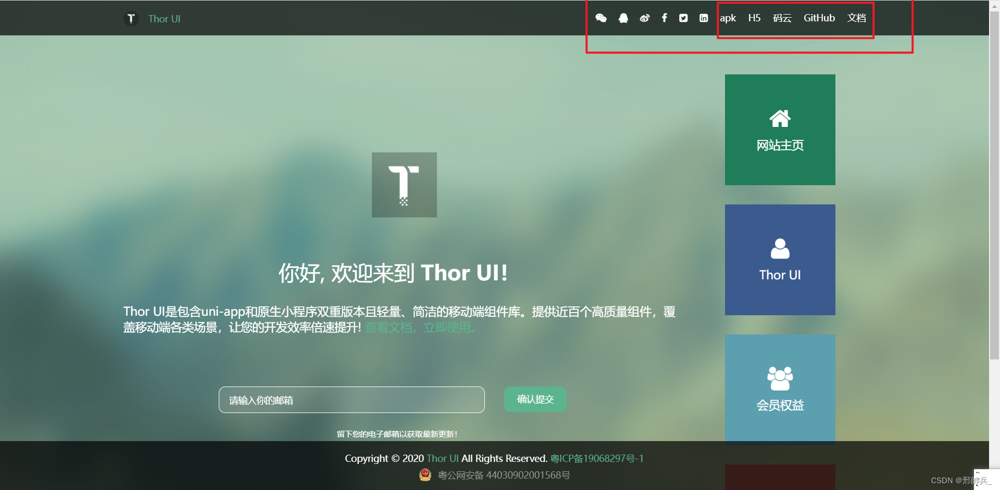  
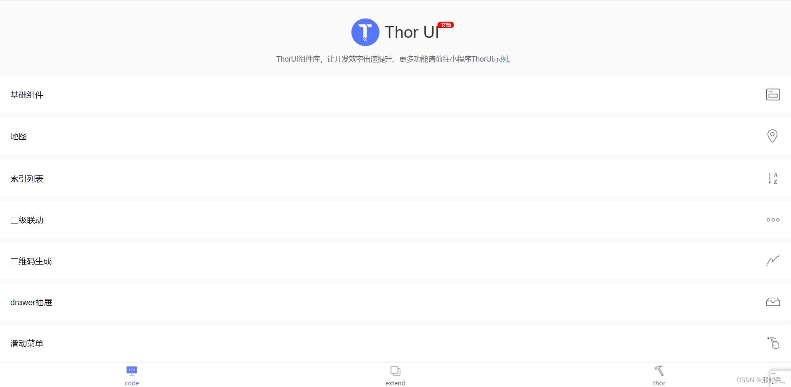

##### 介绍：

1.  简约而不简单一直是ThorUI的追求。ThorUI目前有微信小程序原生版本 \(opens new window\)和uni-app版本  
    \(opens new window\)，后续会扩展到其他原生版本，扩大生态。  
    除了组件库ThorUI还会陆续发布一些常用模板，使开发更加高效。
2.  目前组件与模板默认支持App端\(IOS和Android\)、H5、微信小程序、QQ小程序。

### 2，使用的方法

#### 2.1，引入

引入的方法大多在官方文档里就有，这里写一下我的引入方法

> 既然是 `uni项目` 引入的ui组件 你应该要了解`easycom，传统vue组件，需要安装、引用、注册`，三个步骤后才能使用组件。easycom将其精简为一步。

##### uView

> **官方文档u-View的引入非常简单**

```javascript
// 安装
npm install uview-ui@2.0.31

//然后配置easycom组件模式
// pages.json
{
	"easycom": {
		"^u-(.*)": "uview-ui/components/u-$1/u-$1.vue"
	},
	
	// 此为本身已有的内容
	"pages": [
		// ......
	]
}

```

但是我引入后不生效，是因为缺少了前面的css样式文件

 1.     **引入uView主JS库  
    在项目根目录中的main.js中，引入并使用uView的JS库，注意这两行要放在import Vue之后。**

```javascript
// main.js
import uView from "uview-ui";
Vue.use(uView);
```

 2.     **在引入uView的全局SCSS主题文件**  
    在项目根目录的uni.scss中引入此文件。

```javascript
/* uni.scss */
@import 'uview-ui/theme.scss';
```

 3.     **引入`uView`基础样式**  
    在App.vue中首行的位置引入，注意给style标签加入lang="scss"属性

```javascript
<style lang="scss">
	/* 注意要写在第一行，同时给style标签加入lang="scss"属性 */
	@import "uview-ui/index.scss";
</style>

```

**vant weapp**

> vantweapp 官方文档给出的只有引入微信开发者工具的，没有引入uni项目的  
> 我依然使用easycom引入uni项目,步骤如下:

##### 第一步

下载源文件：https://github.com/youzan/vant-weapp/releases

##### 第二步

1.  下载解压
2.  uni项目根目录新建wxcomponents\(必须是这个名字\)
3.  把dist复制到wxcomponents里，dist改名vant

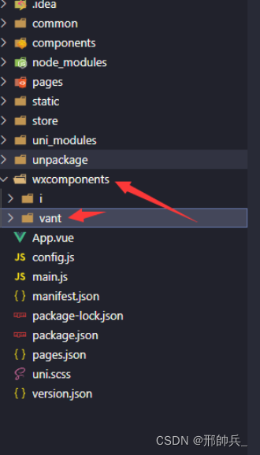

##### 第三步

- 使用easycom自动批量移入组件

> `easycom：`只要组件安装在项目的`components目录下`，并符合`components/组件名称/组件名称`.vue目录结构。就可以不用引用、注册，直接在页面中使用

```javascript
// pages.json-globalStyle同级下添加
"easycom": {
      "autoscan": true, // 是否开启自动扫描
      "custom": {
        "^u-(.*)": "uview-ui/components/u-$1/u-$1.vue", // 这个是上面引入的uView
			"van-(.*)": "@/wxcomponents/vant/$1/index"
      }
    }
```

> 正则表达式解释  
> “van-\(.\*\)”-----指的是你用的标签，这种\@/wxcomponents/vant/\$1/index.vue------前面一段是正常路径，\$1表示匹配vant下的所有文件夹，index.vue是目标文件，一开始是没有的，编译后会出现

当然使用在pages.json文件添加usingComponents也可以（你不嫌烦的话）

```javascript
"globalStyle": {
		...
		"usingComponents": {
			"van-button": "/wxcomponents/vant/button/index", // 以 Button 组件为例
			"van-notice-bar": "/wxcomponents/vant/notice-bar/index"
		}
	},
```

> 问：为什么vant weapp不使用npm来安装到uni项目呢？而且相对轻便、快捷

> 答: 按理说 【npm i \@vant/weapp \-S \--production 】后使用正则【“van-\(.\*\)”:  
> “\@vant/weapp/dist/\$1/index”】引入到easycom是没错的，但是编译小程序后就是会有各种各样的报错，所以放弃了

**`vant weapp`的目录结构如下：**  
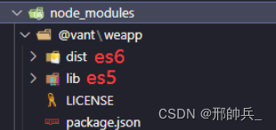

# uni-app 超详细教程（三）（从菜鸟到大佬）

本文中内容为：

1\. 支付功能（`微信支付`，`支付宝支付`）

2\. 项目打包：（`APP打包`，`H5打包`，`微信小程序打包`）

## 一，`uni - app` 的支付功能

### 一、微信支付

1、登录[**微信开放平台**](https://open.weixin.qq.com/cgi-bin/profile?t=setting/dev&lang=zh_CN&token=7ce2ab457da22610b959fa8fa22583b99a3ba90f)，添加移动应用，审核通过后可获取`应用ID`（AppID，支付订单中需要使用）

**`记得先登录`**  
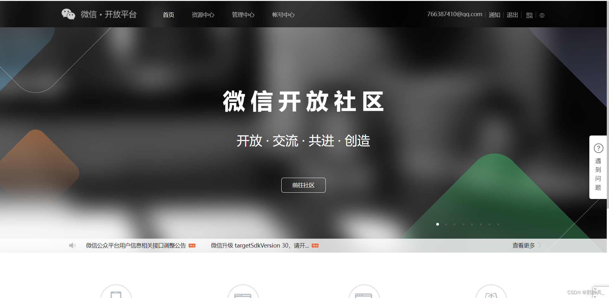  
**`点击`**  
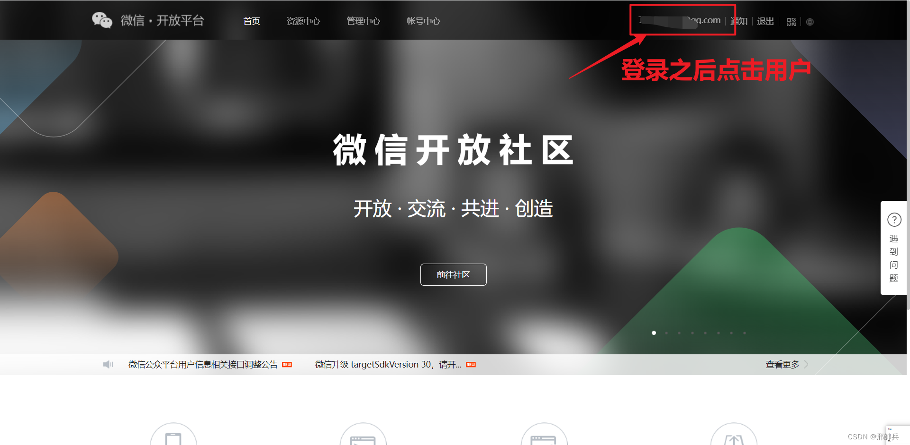

**`复制id`**  
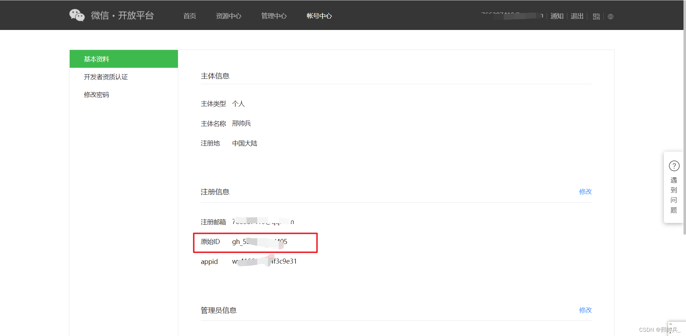

2、使用商户号和登录密码登录[微信商户平台](https://pay.weixin.qq.com/index.php/core/home/login?return_url=/)，进入 “账户中心” > “API安全” > “设置APIv2密钥” 设置API密钥（用于服务器生成订单），详情参考API证书及密钥

[APP支付流程](https://developers.weixin.qq.com/doc/oplatform/Mobile_App/WeChat_Pay/Vendor_Service_Center.html)

> **本人未绑定商务平台账号，在这就不演示了**  
> `这一步不做也可以做出支付效果`

3、在manifest.json文件“App模块配置”项的“Payment\(支付\)”下，勾选“微信支付”项

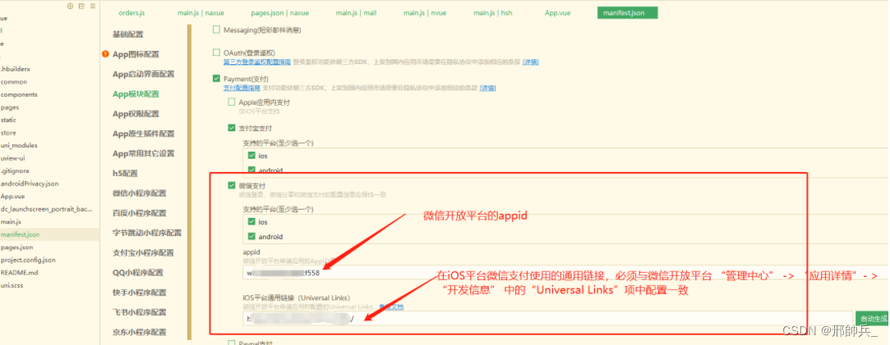

4、在 `pages`力新建页面 命名`payment`

4.1，新建页面

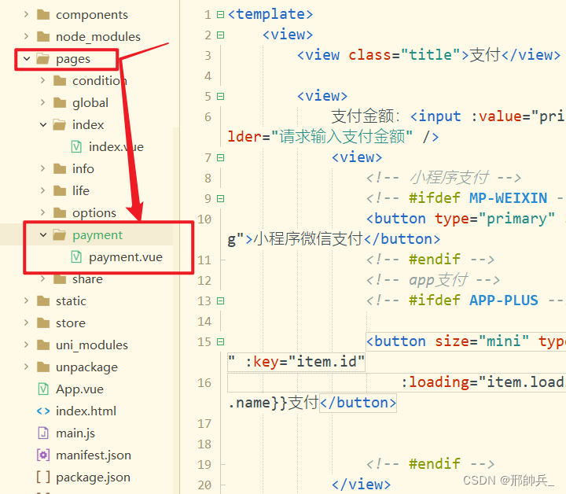

4.2，`pages/payment.vue` 代码

```javascript
<template>
	<view>
		<view class="title">支付</view>

		<view>
			支付金额：<input :value="price" maxlength="4" @input="priceChange" placeholder="请求输入支付金额" />
			<view>
				<!-- 小程序支付 -->
				<!-- #ifdef MP-WEIXIN -->
				<button type="primary" size="mini" @click="weixinPay" :loading="loading">小程序微信支付</button>
				<!-- #endif -->
				<!-- app支付 -->
				<!-- #ifdef APP-PLUS -->

				<button size="mini" type="primary" v-for="(item,index) in providerList" :key="item.id"
					:loading="item.loading" @click="requestPayment(item,index)">{{item.name}}支付</button>


				<!-- #endif -->
			</view>

		</view>
	</view>
</template>

<script>
	export default {
		data() {
			return {
				price: 1,
				providerList: [], //支付厂商，微信，或者支付
				openid: '', //用户id
				loading: false, //小程序微信支付
			}
		},
		onLoad() {
			var that = this;
			// 获取支付厂商
			uni.getProvider({
				service: "payment",
				success: (e) => {
					console.log(JSON.stringify(e))
					var provider = e.provider;
					// 映射一个格式（添加loading是否加载中）
					that.providerList = provider.map(item => {
						if (item === "alipay") {
							return {
								name: '支付宝',
								id: item,
								loading: false
							}
						} else if (item === "wxpay") {
							return {
								name: '微信',
								id: item,
								loading: false
							}
						}
					})
				}
			})
		},
		methods: {
			async weixinPay() {
				this.loading = true; //加载中
				// 获取openid
				let openid = uni.getStorageSync('openid')
				if (!openid) {
					// 执行登录获取openid
					openid = await this.loginMpWeixin();
					this.openid = openid;
				}
				// 获取订单信息
				let orderInfo = await this.getOrderInfo('wxpay')
				// 如果没有订单信息，弹出订单信息失败
				if (!orderInfo) {
					uni.showModal({
						content: '获取支付信息失败',
						showCancel: false
					})
					return
				}
				// 发起支付
				uni.requestPayment({
					...orderInfo,
					// 成功
					success: (res) => {
						uni.showToast({
							title: "感谢您的赞助!"
						})
					},
					// 失败
					fail: (res) => {
						uni.showModal({
							content: "支付失败,原因为: " + res
								.errMsg,
							showCancel: false
						})
					},
					// 移除loading
					complete: () => {
						this.loading = false;
					}
				})
			},
			loginMpWeixin() {
				// 返回一个promise
				return new Promise((resolve, reject) => {
					uni.login({
						provider: 'weixin',
						success(res) {
							// login成功会得到一个code
							// 请求后端的登录
							uni.request({
								url: 'https://97fca9f2-41f6-449f-a35e-3f135d4c3875.bspapp.com/http/user-center',
								method: 'POST',
								data: {
									action: 'loginByWeixin',
									params: {
										code: res.code, // 传入code
										platform: 'mp-weixin'
									}
								},
								success(res) {
									if (res.data.code !== 0) {
										reject(new Error('获取openid失败：', res.result.msg))
										return
									}
									// 成功后存储opendi
									uni.setStorageSync('openid', res.data.openid)
									// 返回openid
									resolve(res.data.openid)
								},
								fail(err) {
									reject(new Error('获取openid失败：' + err))
								}
							})
						}
					})
				})
			},
			// 实现支付
			async requestPayment(item, index) {
				// 显示加载中
				item.loading = true;
				// 获取订单信息
				let orderInfo = await this.getOrderInfo(item.id);
				// 发起支付
				uni.requestPayment({
					provider: item.id, //提供商
					orderInfo: orderInfo, //订单信息
					// 成功提示
					success: (e) => {
						console.log("success", e);
						uni.showToast({
							title: "感谢您的赞助!"
						})
					},
					// 失败
					fail: (e) => {
						console.log("fail", e);
					},
					// 停止加载中
					complete: () => {
						item.loading = false;
					}
				})

			},
			// 获取订单信息
			getOrderInfo(provider) {
				// 返回一个promise
				return new Promise((resolve, reject) => {
					// 请求订单信息
					uni.request({
						method: 'POST',
						url: 'https://97fca9f2-41f6-449f-a35e-3f135d4c3875.bspapp.com/http/pay',
						data: {
							provider, //支付厂商
							openid: this.openid, //openid(微信支付用)
							totalFee: Number(this.price) * 100, // 转为以为单位 
							platform: 'app-plus', //平台
						},
						success(res) {
							if (res.data.code === 0) {
								// 返回订单信息
								resolve(res.data.orderInfo)
							} else {
								// 失败
								reject(new Error('获取支付信息失败' + res.data.msg))
							}
						},
						fail(err) {
							// 请求失败
							reject(new Error('请求支付接口失败' + err))
						}
					})
				})
			},
			priceChange(e) {
				this.price = e.detail.value;
			}
		}
	}
</script>

<style>

</style>

```

> **`启动模拟器，运行到模拟器，查看效果`**

#### 效果图：

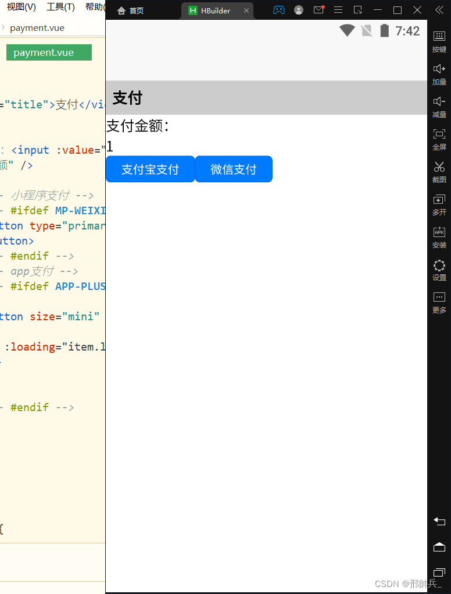

### 二、[支付宝支付](https://so.csdn.net/so/search?q=%E6%94%AF%E4%BB%98%E5%AE%9D%E6%94%AF%E4%BB%98&spm=1001.2101.3001.7020)

1、登录 [支付宝开放平台](https://open.alipay.com/) ，进入控制台页面创建移动应用，填写应用信息并提交审核，在应用详情页面的能力列表中添加APP支付功能，进入开发设置完成加密方式、IP白名单等开发信息，设置添加功能和配置密钥后（获取公钥、私钥，用于服务器生成订单），将应用提交审核，详情参考上线应用应用上线后，完成签约才能在生产环境使用支付功能

2、打开项目的manifest.json文件，在“App模块配置”项的“Payment\(支付\)”下，勾选“支付宝支付”  
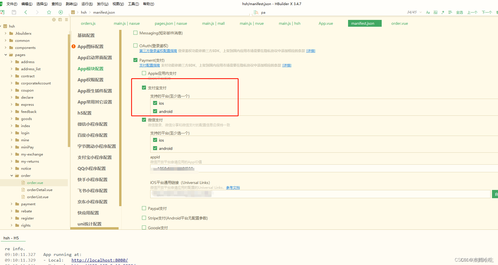

`代码`同上，给你奉上：

```javascript
<template>
	<view>
		<view class="title">支付</view>

		<view>
			支付金额：<input :value="price" maxlength="4" @input="priceChange" placeholder="请求输入支付金额" />
			<view>
				<!-- 小程序支付 -->
				<!-- #ifdef MP-WEIXIN -->
				<button type="primary" size="mini" @click="weixinPay" :loading="loading">小程序微信支付</button>
				<!-- #endif -->
				<!-- app支付 -->
				<!-- #ifdef APP-PLUS -->

				<button size="mini" type="primary" v-for="(item,index) in providerList" :key="item.id"
					:loading="item.loading" @click="requestPayment(item,index)">{{item.name}}支付</button>


				<!-- #endif -->
			</view>

		</view>
	</view>
</template>

<script>
	export default {
		data() {
			return {
				price: 1,
				providerList: [], //支付厂商，微信，或者支付
				openid: '', //用户id
				loading: false, //小程序微信支付
			}
		},
		onLoad() {
			var that = this;
			// 获取支付厂商
			uni.getProvider({
				service: "payment",
				success: (e) => {
					console.log(JSON.stringify(e))
					var provider = e.provider;
					// 映射一个格式（添加loading是否加载中）
					that.providerList = provider.map(item => {
						if (item === "alipay") {
							return {
								name: '支付宝',
								id: item,
								loading: false
							}
						} else if (item === "wxpay") {
							return {
								name: '微信',
								id: item,
								loading: false
							}
						}
					})
				}
			})
		},
		methods: {
			async weixinPay() {
				this.loading = true; //加载中
				// 获取openid
				let openid = uni.getStorageSync('openid')
				if (!openid) {
					// 执行登录获取openid
					openid = await this.loginMpWeixin();
					this.openid = openid;
				}
				// 获取订单信息
				let orderInfo = await this.getOrderInfo('wxpay')
				// 如果没有订单信息，弹出订单信息失败
				if (!orderInfo) {
					uni.showModal({
						content: '获取支付信息失败',
						showCancel: false
					})
					return
				}
				// 发起支付
				uni.requestPayment({
					...orderInfo,
					// 成功
					success: (res) => {
						uni.showToast({
							title: "感谢您的赞助!"
						})
					},
					// 失败
					fail: (res) => {
						uni.showModal({
							content: "支付失败,原因为: " + res
								.errMsg,
							showCancel: false
						})
					},
					// 移除loading
					complete: () => {
						this.loading = false;
					}
				})
			},
			loginMpWeixin() {
				// 返回一个promise
				return new Promise((resolve, reject) => {
					uni.login({
						provider: 'weixin',
						success(res) {
							// login成功会得到一个code
							// 请求后端的登录
							uni.request({
								url: 'https://97fca9f2-41f6-449f-a35e-3f135d4c3875.bspapp.com/http/user-center',
								method: 'POST',
								data: {
									action: 'loginByWeixin',
									params: {
										code: res.code, // 传入code
										platform: 'mp-weixin'
									}
								},
								success(res) {
									if (res.data.code !== 0) {
										reject(new Error('获取openid失败：', res.result.msg))
										return
									}
									// 成功后存储opendi
									uni.setStorageSync('openid', res.data.openid)
									// 返回openid
									resolve(res.data.openid)
								},
								fail(err) {
									reject(new Error('获取openid失败：' + err))
								}
							})
						}
					})
				})
			},
			// 实现支付
			async requestPayment(item, index) {
				// 显示加载中
				item.loading = true;
				// 获取订单信息
				let orderInfo = await this.getOrderInfo(item.id);
				// 发起支付
				uni.requestPayment({
					provider: item.id, //提供商
					orderInfo: orderInfo, //订单信息
					// 成功提示
					success: (e) => {
						console.log("success", e);
						uni.showToast({
							title: "感谢您的赞助!"
						})
					},
					// 失败
					fail: (e) => {
						console.log("fail", e);
					},
					// 停止加载中
					complete: () => {
						item.loading = false;
					}
				})

			},
			// 获取订单信息
			getOrderInfo(provider) {
				// 返回一个promise
				return new Promise((resolve, reject) => {
					// 请求订单信息
					uni.request({
						method: 'POST',
						url: 'https://97fca9f2-41f6-449f-a35e-3f135d4c3875.bspapp.com/http/pay',
						data: {
							provider, //支付厂商
							openid: this.openid, //openid(微信支付用)
							totalFee: Number(this.price) * 100, // 转为以为单位 
							platform: 'app-plus', //平台
						},
						success(res) {
							if (res.data.code === 0) {
								// 返回订单信息
								resolve(res.data.orderInfo)
							} else {
								// 失败
								reject(new Error('获取支付信息失败' + res.data.msg))
							}
						},
						fail(err) {
							// 请求失败
							reject(new Error('请求支付接口失败' + err))
						}
					})
				})
			},
			priceChange(e) {
				this.price = e.detail.value;
			}
		}
	}
</script>

<style>

</style>

```

`效果图`同上，给你奉上：

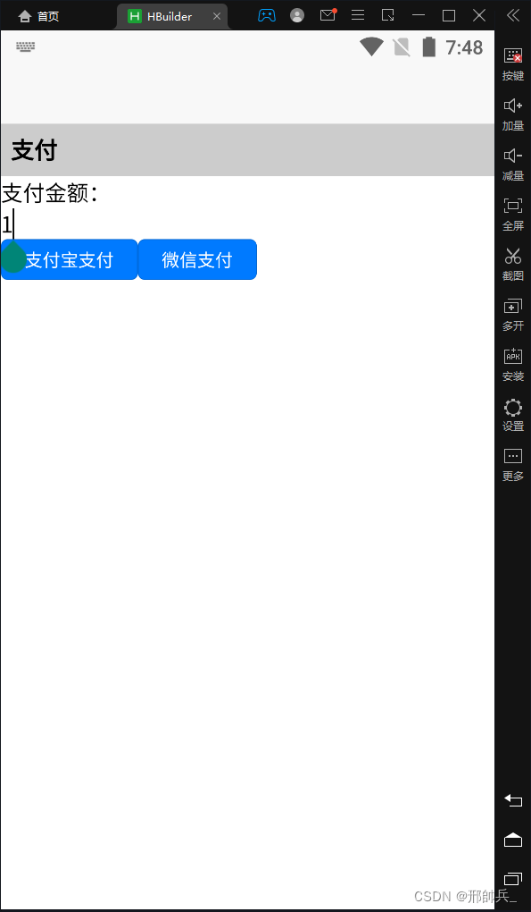

**`功能实现`**  

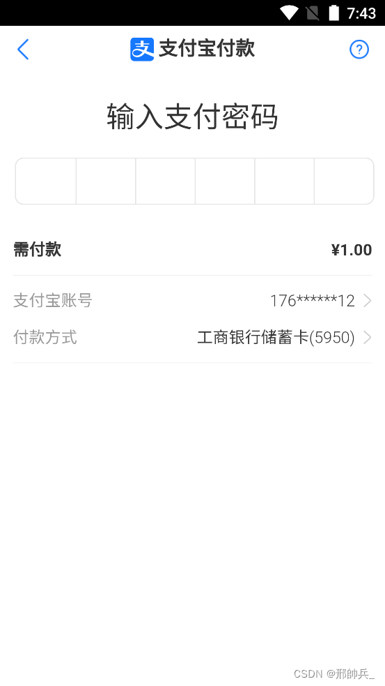

### 总结

1、支付的sdk如果可以尽量用[uniapp](https://so.csdn.net/so/search?q=uniapp&spm=1001.2101.3001.7020)提供的SDK 不然可能会导致支付调不成功（不要问我是怎么知道的，都是泪）  
2、如果需要其他的可以参考[uniapp](https://so.csdn.net/so/search?q=uniapp&spm=1001.2101.3001.7020)提供的 其他支付

## 二，项目打包

### 1，APP打包（打包Android端）

#### 1.1，首先在准备打包前配置好我们的APP相关配置，在`manifest.json`中。

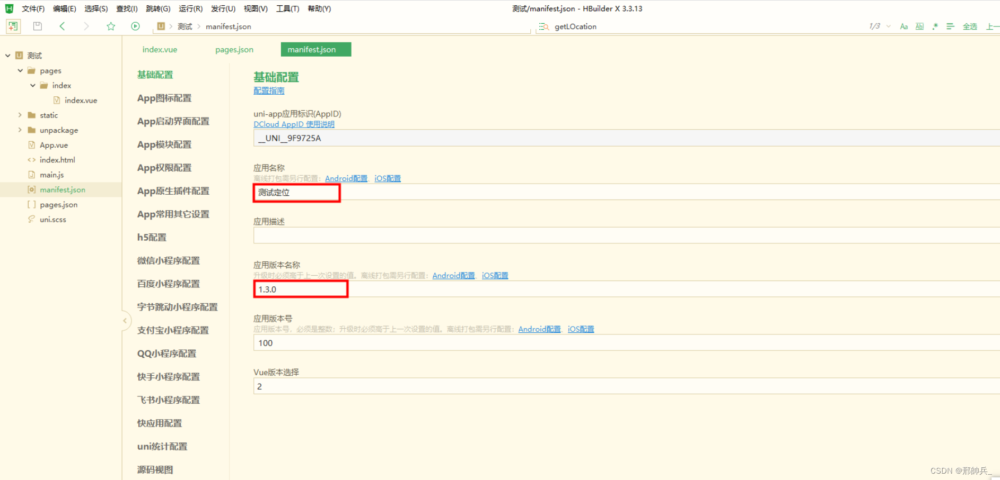

> **这里需要注意的一点是：假如您的应用更改或添加了新功能，在重新打包发布的时候，请确保您的应用版本号不要相同**

#### 1.2，打包的证书别名、密码、证书文件是不可少的

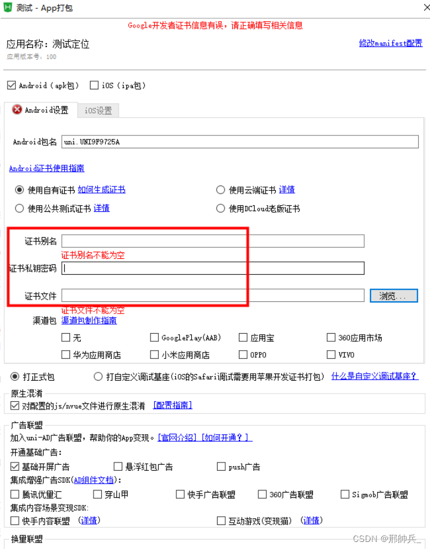

> **证书的生成 [步骤可以参考](https://ask.dcloud.net.cn/article/35777)**

#### 1.3，[安装jre](https://www.oracle.com/java/technologies/downloads/)环境

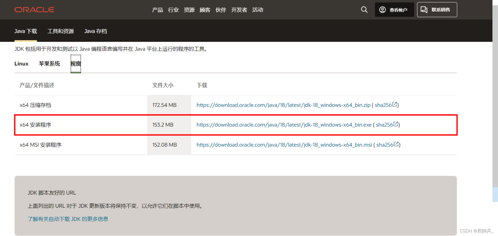

> **安装完成后，打开命令行`（cmd）`，输入以下命令：**

```javascript
d:  
set PATH=%PATH%;"C:\Program Files\Java\jre1.8.0_201\bin"
```

第一行：切换工作目录到D:路径  
第二行：将jre命令添加到临时环境变量中

#### 1.4，生成签名证书

在`cmd`窗口使用`keytool -genkey`命令生成证书：

```javascript
keytool -genkey -alias testalias -keyalg RSA -keysize 2048 -validity 36500 -keystore test.keystore
```

- testalias是证书别名，可修改为自己想设置的字符，建议使用英文字母和数字
- test.keystore是证书文件名称，可修改为自己想设置的文件名称，也可以指定完整文件路径
- 36500是证书的有效期，表示100年有效期，单位天，建议时间设置长一点，避免证书过期

**`回车后会提示：`**

```javascript
Enter keystore password:  //输入证书文件密码，输入完成回车  
Re-enter new password:   //再次输入证书文件密码，输入完成回车  
What is your first and last name?  
  [Unknown]:  //输入名字和姓氏，输入完成回车  
What is the name of your organizational unit?  
  [Unknown]:  //输入组织单位名称，输入完成回车  
What is the name of your organization?  
  [Unknown]:  //输入组织名称，输入完成回车  
What is the name of your City or Locality?  
  [Unknown]:  //输入城市或区域名称，输入完成回车  
What is the name of your State or Province?  
  [Unknown]:  //输入省/市/自治区名称，输入完成回车  
What is the two-letter country code for this unit?  
  [Unknown]:  //输入国家/地区代号（两个字母），中国为CN，输入完成回车  
Is CN=XX, OU=XX, O=XX, L=XX, ST=XX, C=XX correct?  
  [no]:  //确认上面输入的内容是否正确，输入y，回车  

Enter key password for <testalias>  
        (RETURN if same as keystore password):  //确认证书密码与证书文件密码一样（HBuilder|HBuilderX要求这两个密码一致），直接回车就可以

```

> **以上命令运行完成后就会生成证书，路径为“`D:\test.keystore`”。**

**查看证书信息**

```javascript
keytool -list -v -keystore test.keystore  
Enter keystore password: //输入密码，回车
```

会输出以下格式信息：

```javascript
Keystore type: PKCS12    
Keystore provider: SUN    

Your keystore contains 1 entry    

Alias name: test    
Creation date: 2019-10-28    
Entry type: PrivateKeyEntry    
Certificate chain length: 1    
Certificate[1]:    
Owner: CN=Tester, OU=Test, O=Test, L=HD, ST=BJ, C=CN    
Issuer: CN=Tester, OU=Test, O=Test, L=HD, ST=BJ, C=CN    
Serial number: 7dd12840    
Valid from: Fri Jul 26 20:52:56 CST 2019 until: Sun Jul 02 20:52:56 CST 2119    
Certificate fingerprints:    
         MD5:  F9:F6:C8:1F:DB:AB:50:14:7D:6F:2C:4F:CE:E6:0A:A5    
         SHA1: BB:AC:E2:2F:97:3B:18:02:E7:D6:69:A3:7A:28:EF:D2:3F:A3:68:E7    
         SHA256: 24:11:7D:E7:36:12:BC:FE:AF:2A:6A:24:BD:04:4F:2E:33:E5:2D:41:96:5F:50:4D:74:17:7F:4F:E2:55:EB:26    
Signature algorithm name: SHA256withRSA    
Subject Public Key Algorithm: 2048-bit RSA key    
Version: 3
```

其中证书指纹信息（Certificate fingerprints）：

- MD5

  证书的MD5指纹信息（安全码MD5）

- SHA1

  证书的SHA1指纹信息（安全码SHA1）

- SHA256

  证书的SHA256指纹信息（安全码SHA245）

#### 1.5，安卓签名获取工具

> 直接通过一个apk，获取安装到手机的第三方应用签名的apk包。  
> [详情：](https://developers.weixin.qq.com/doc/oplatform/Downloads/Android_Resource.html)

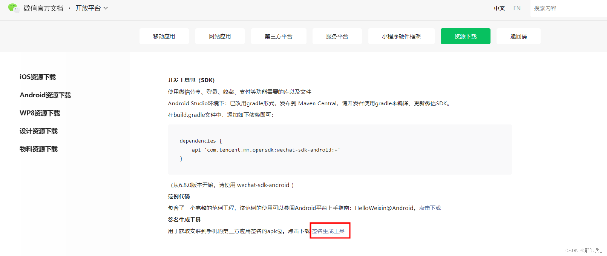  
下载完成后发送至手机，安装完成后，输入我们的应用的包名，即可查询出来签名

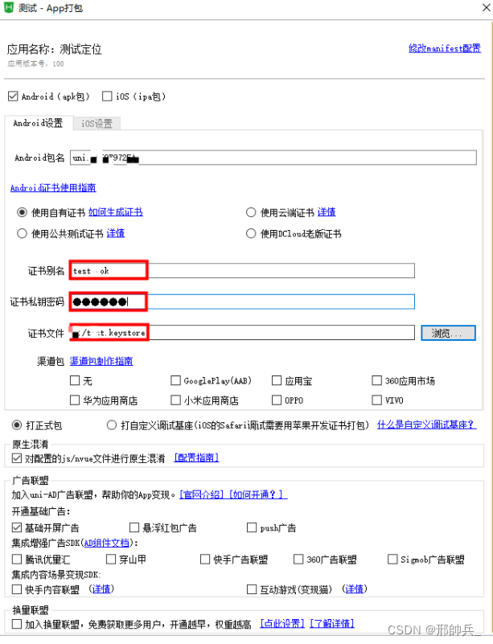

#### 1.6，`点击打包`，安心等待一会儿即可

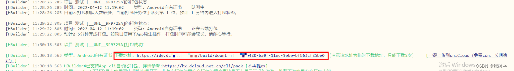

### 2，`H5` 打包

2.1.，找到项目中 `manifest.json` — `H5 配置`—`运行时的基础路径`， 将路径修改为 相对路径（`./` ）

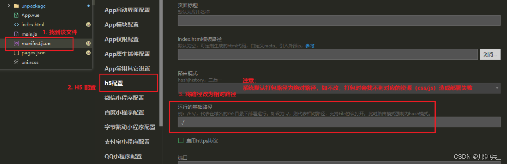

2.2， 修改完后，点击`工具栏 --- 发行 --- 网站pc web或手机 h5`

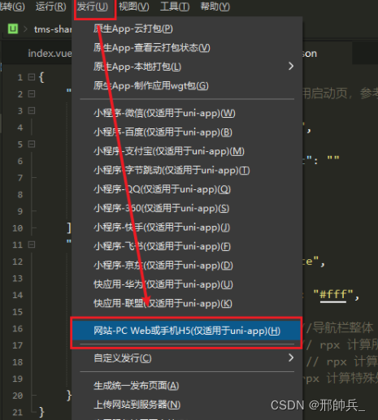

2.3.，弹出弹窗，`修改网站标题与网站域名`（网站域名取对应项目的域名，一般为https/http开头）填完后直接`点击发行`。

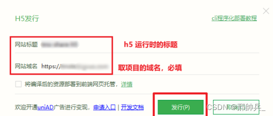

2.4.，点击发行后如图

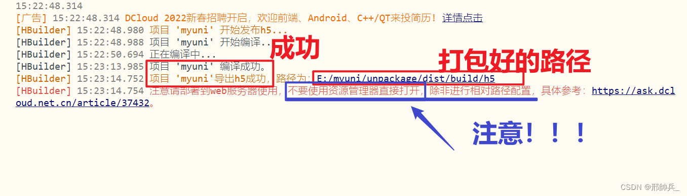

2.5， 发行成功后，找到 `unpackage --- dist --- build --- h5 文件夹`， 在外部资源中打开，将 `h5 文件`夹打包成 `zip 格式`，然后给到运维，运维会帮忙发布到`服务器`，发布成功后，运维会给你一个属于 h5 项目的`域名` https://xxxx.xxx.com/app/ 拿取H5域名去拼接页面，就能在浏览器中打开对应的页面了。 （ https://xxxx.xxx.com/app/#/pages/index/index ）

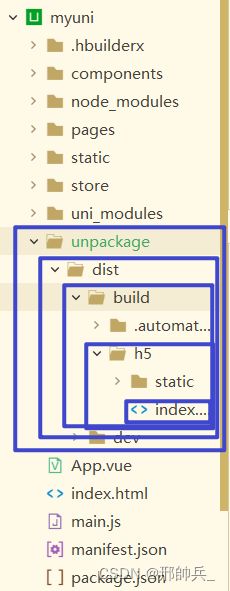

2.6，`E:/myuni/unpackage/dist/build/h5` 运行，查看效果！

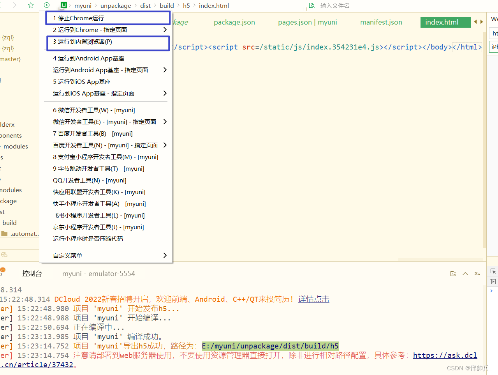

### 3，`小程序打包`（这里就用`微信小程序`了）

#### 3.1，HbuilderX打包

> **选中项目-点击发行（U）- 小程序-\(微信仅适用于uniapp\)（W）**  
> 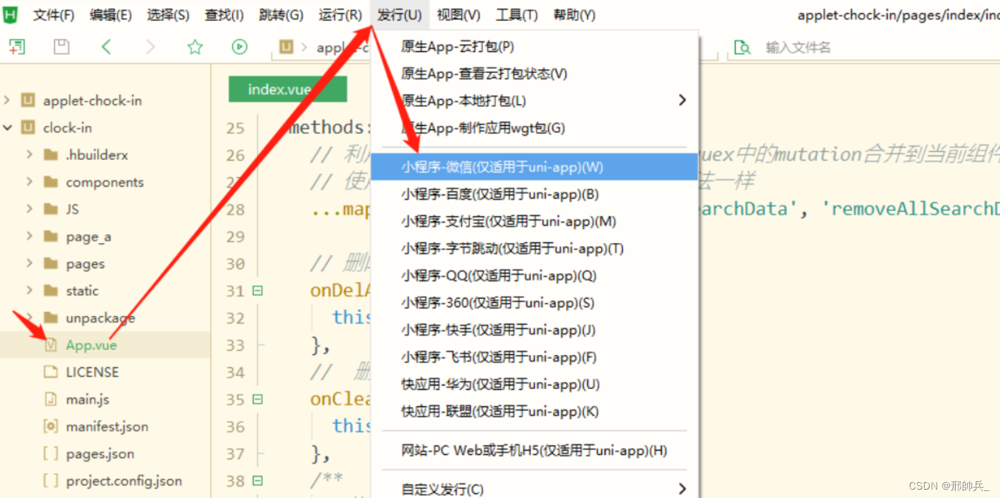

#### 3.2，发行

> **填写微信小程序`Appid`**

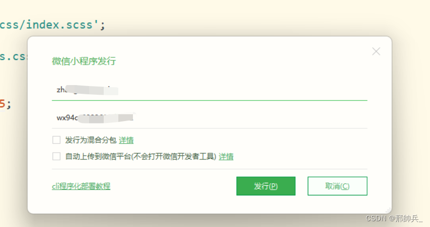

> **`点击发行，项目会进行编译，等待编译完成，会提示前往小程序上传`**

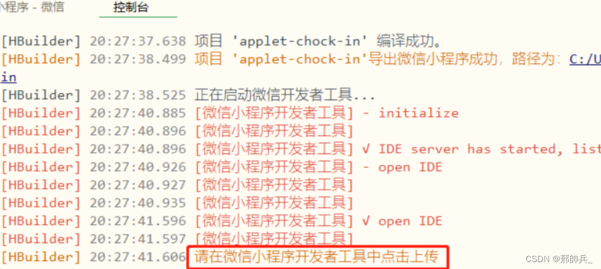

> **前往小程序开发工具打开这个小程序**

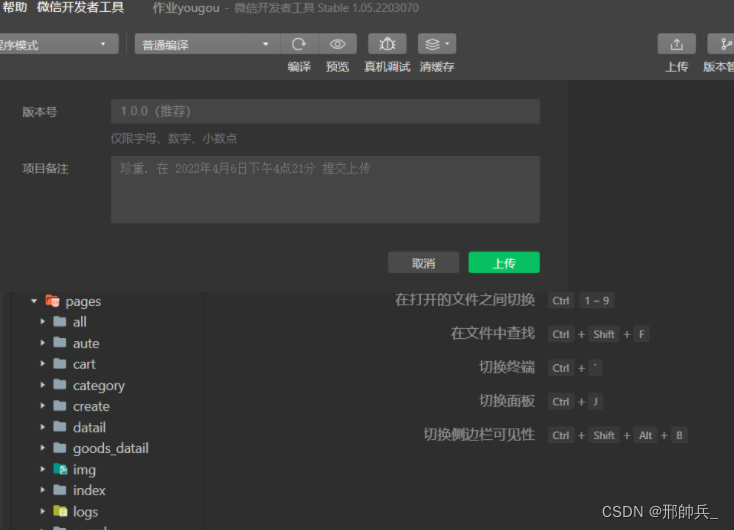

> **然后提示上传成功**

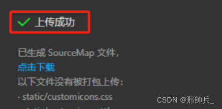

#### 3.3，打开小程序体验

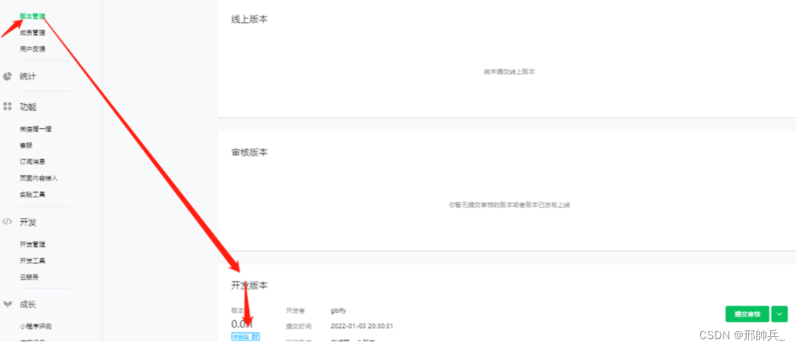  
这是你的第一个版本，点击蓝色的体验，会有一个二维码，用自己的账号体验，让别人体验的话，要先把对方加入到开发者中。  
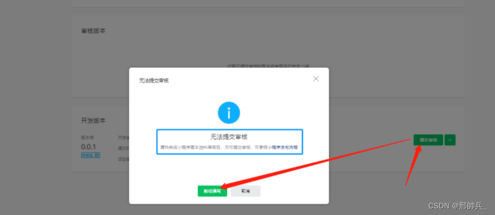  
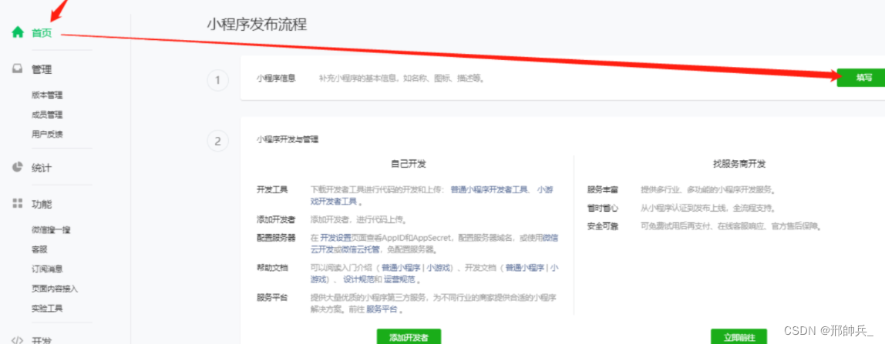

> **接下来就是根据提示，填写信息，然后等待审核，审核通过的话，就可以去微信上搜索你的小程序了。**