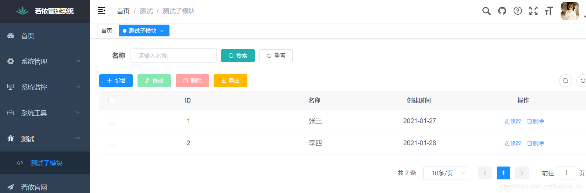
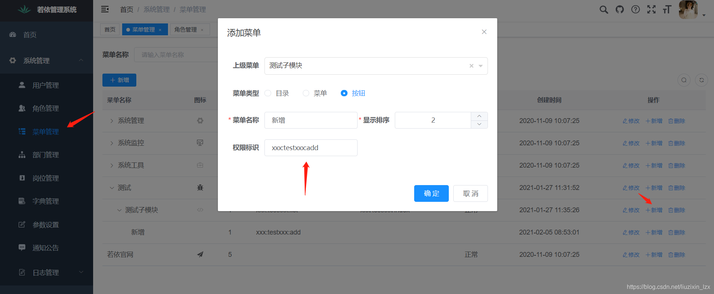
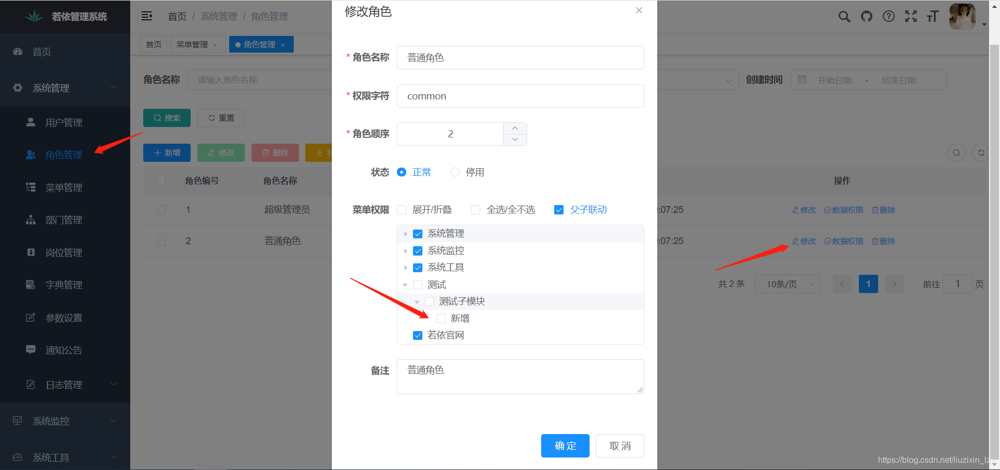

> - vite
> - vue3

# 引入静态文件

```vue
    

     setup() {

        function imgSrc() {
            return new URL("../../assets/vue.svg", import.meta.url).href;
        }

        return {
            imgSrc,
        }
```

# [Mock.js ](http://mockjs.com/)

# Axios二次封装

## 封装

创建`utils/request.js` 文件

```js
import axios from 'axios'

const requestTimeout = 3600 * 1000

const request = axios.create({
    baseURL: import.meta.env.VUE_APP_BASE_API, // url = base url + request url
    // withCredentials: true, // send cookies when cross-domain requests
    timeout: requestTimeout, // request timeout
})

export default request
```

## 抽取请求

创建`src/api/requestApi.js`文件

```js
import request from "./request.js";

export default {
    get(url, params) {
        return request({
            url: url,
            method: "get",
            params: params
        })
    },
    post(url, params) {
        return request({
            url: url,
            method: "post",
            data: params
        })
    }
}
```

## 调用

```js
requestApi.get("/api/getPage", {
      searchText: "hello",
    });
```

# [动态路由渲染侧边栏](https://loneking.cn/code/web/317)

[前后端分离开发中动态菜单的两种实现方案 - 江南一点雨 (javaboy.org)](http://www.javaboy.org/2019/1016/vue-router.html)

## 思路

> 个人思路。。。
>
> 现在的思路还是在前端保存，具体看[手摸手，带你用vue撸后台 系列二(登录权限篇) - 掘金 (juejin.cn)](https://juejin.cn/post/6844903478880370701)，使用权限控制侧边栏的显示，yyds


1. 登录成功，获取数据库中的路由信息
2. 使用动态路由，将获取的路由信息添加
3. 根据数据库中的路径，组件名。创建vue组件


## 实例

主要步骤如下：

\1. 从后台取对应用户权限的菜单数据

\2. 遍历数据，生成父路由及其子路由组件，添加到路由表中。

\3. 同时菜单数据也要保存到 sessionStorage 中，避免每次都从后台取，而且避免 URL 刷新空白，后面会提到。

> 我后台返回的菜单数据格式如下


> 为了添加路由时导入组件方便，我的 vue 组件目录结构是和菜单 URL 完全对应的


> 首先放一下我的路由配置，里面这个 constantRouterMap 是固定的路由表，在没有从接口取数据生成路由时也可访问。

```js
 
import Vue from 'vue'
import Router from 'vue-router'
import Layout from '../views/layout/Layout'
 
const _import = require('./_import_' + process.env.NODE_ENV)
Vue.use(Router)
 
export const constantRouterMap = [
  {path: '/login', component: _import('admin/user/login'), hidden: true},
  {path: '/404', component: _import('404'), hidden: true},
  {
    path: '/',
    component: Layout,
    redirect: '/control',
    name: '首页',
    hidden: true,
    children: [{
      path: '/control', url: '/control', component: _import('admin/control/index'), name: 'control',
      meta: {title: '首页', isTabView: true}
    },
      {
        name: 'viewList',
        path: "/admin/viewlist/index/:id",
        meta: {title: 'title', isTabView: true},
        component: _import("admin/viewlist/index")
      }]
  },
]
export default new Router({
  //mode: 'history', //后端支持可开
  scrollBehavior: () => ({y: 0}),
  routes: constantRouterMap
})
```

> 首先定义一个 action 用于从接口获取菜单数据，前面说过每次获取菜单数据时都要在 sessionStorage 中保存一下，避免每次都要从接口请求数据

```js
 
// 获取菜单
GetMenu(state) {
  return new Promise(resolve => {
    let storageMenus = sessionStorage.menus
    if (!utils.isNullOrEmpty(storageMenus)) {
      store.commit("SetMenuAndRouter", JSON.parse(storageMenus))
      resolve()
    } else {
      userApi.getMenu().then(res => {
        let menus = res.data
        store.commit("SetMenuAndRouter", menus)
        resolve()
      })
    }
  })
}
```

> 然后还需要一个 mutations 是用于设置菜单及路由

```js
//设置菜单和路由
SetMenuAndRouter(state, menus) {
  //保存用户菜单
  state.menus = menus
  sessionStorage.menus = JSON.stringify(menus)
  //生成菜单URL与标题键值对
  store.commit('SetMenuTitle', menus)
  //菜单转换为路由
  let accessedRouters = []
  accessedRouters = menuToRouter(menus)
  //执行设置路由的方法
  store.commit('SET_ROUTERS', accessedRouters)
  router.addRoutes(store.getters.addRouters)
}
```

> 接下来是上面代码中调用的这个 mutations:SetRouters 用于生成路由

```
SET_ROUTERS: (state, routers) => {
  state.addRouters = routers
  state.routers = constantRouterMap.concat(routers) //将固定路由和新增路由进行合并, 成为本用户最终的全部路由信息
}
```

> menuToRouter 用于将接口返回的数据转换为路由组件，代码如下

```js
export function menuToRouter(menus) {
  const accessedRouters = []
  for (let i in menus) {
    let parentMenu = menus[i]
    //特殊情况 viewlist
    let parentRoute = {
      //父级路由 去掉末尾的index 默认跳转到子路由index
      path: parentMenu.Url,
      children: [],
      redirect: '',
      component: Layout,
      meta: {title: parentMenu.Name},
      name: parentMenu.Id
    }
    let childRoute = []
    for (let j in parentMenu.Children) {
      let childMenu = parentMenu.Children[j]
      childMenu.Url = childMenu.Url.toLowerCase()
      //去掉开头的斜杠
      let childModulePath = childMenu.Url.substr(1, childMenu.Url.length).toLowerCase()
      let isTabView = utils.isNullOrEmpty(childMenu.IsTab) ? false : childMenu.IsTab.toString() == "1"
      //如果是ViewList的URL 不需要设置对应路由了 已经在固定路由中设置过了
      if (childMenu.Url.indexOf('viewlist') != -1) {
        continue
      } else {
        childRoute.push({
          name: childMenu.Id,
          path: childMenu.Url,
          meta: {title: childMenu.Name, isTabView: isTabView},
          component: _import(childModulePath)
        })
      }
 
    }
    parentRoute.children = childRoute
    accessedRouters.push(parentRoute)
  }
  accessedRouters.push({path: '*', redirect: '/404', url: '/404', hidden: true})
  return accessedRouters
}
```

> SetMenuTitle 是因为我 Tab 选项卡那里的需求，所以写了一个这

```js
//保存URL与菜单标题键值对
SetMenuTitle(state, menus) {
  var menuTitle = {}
  for (var pKey in menus) {
    var pMenu = menus[pKey]
    menuTitle[pMenu.Url] = pMenu.Name
    for (var cKey in pMenu.Children) {
      var cMenu = pMenu.Children[cKey]
      menuTitle[cMenu.Url.toLowerCase()] = cMenu.Name
    }
  }
  menuTitle['/control'] = '首页'
  state.menuTitle = menuTitle
}
```

> 还有是注意添加路由是需要加载组件的，路由中的 component 属性，我这里是根据菜单 URL 导入对应的组件，主要代码是

```
const _import = require('../../router/_import_' + process.env.NODE_ENV)

 
 
 
```

> 在 router 文件夹下有两个文件，分别为_import_development.js 以及_import_production.js

> _import_development.js

```
module.exports = file => require('@/views/' + file + '.vue').default // vue-loader at least v13.0.0+

 
 
 
```

> _import_production.js

```
module.exports = file => () => import('@/views/' + file + '.vue')

 
 
 
```

> 还有一个最重要的，使用动态路由时，当你在首页 (加载路由数据的页面) 以外，刷新一下会直接变空白，这是由于子路由是动态添加的，界面刷新的时候，其实我们路由里面并没有该子路由的配置，在页面刷新时候，在 router.beforeEach 里面去判断，如果是页面刷新且无子路由配置，就调用获取菜单并生成路由的方法，判断条件 ==3 是因为我的固定路由表里默认是 3 个

```
import router, {constantRouterMap} from './router'
import store from './store'
import NProgress from 'nprogress' // Progress 进度条
import 'nprogress/nprogress.css' // Progress 进度条样式
import * as utils from "@/utils"
 
router.beforeEach((to, from, next) => {
  NProgress.start()
  if (from.name === null || to.name === null) { //页面刷新
    if ((utils.isNullOrEmpty(store.getters.permission_routers) || store.getters.permission_routers.length == 3)) {
      store.dispatch("GetMenu").then(() => {
        next({...to, replace: true})
      })
    } else {
      next()
    }
  } else {
    if (to.matched.length === 0) {  //如果未匹配到路由
      from.path ? next({path: from.path}) : next('/')   //如果上级也未匹配到路由则跳转主页面，如果上级能匹配到则转上级路由
    } else {
      next()    //如果匹配到正确跳转
    }
  }
})
```

> 最后放下完整代码

```
import {constantRouterMap} from '@/router/index'
import Layout from '@/views/layout/Layout'
import * as utils from '@/utils'
import store from "../index"
import router from "../../router"
import * as userApi from '@/api/user'
 
const _import = require('../../router/_import_' + process.env.NODE_ENV)
 
export function menuToRouter(menus) {
  const accessedRouters = []
  for (let i in menus) {
    let parentMenu = menus[i]
    //特殊情况 viewlist
    let parentRoute = {
      //父级路由 去掉末尾的index 默认跳转到子路由index
      path: parentMenu.Url,
      children: [],
      redirect: '',
      component: Layout,
      meta: {title: parentMenu.Name},
      name: parentMenu.Id
    }
    let childRoute = []
    for (let j in parentMenu.Children) {
      let childMenu = parentMenu.Children[j]
      childMenu.Url = childMenu.Url.toLowerCase()
      //去掉开头的斜杠
      let childModulePath = childMenu.Url.substr(1, childMenu.Url.length).toLowerCase()
      let isTabView = utils.isNullOrEmpty(childMenu.IsTab) ? false : childMenu.IsTab.toString() == "1"
      //如果是ViewList的URL 不需要设置对应路由了 已经在固定路由中设置过了
      if (childMenu.Url.indexOf('viewlist') != -1) {
        continue
      } else {
        childRoute.push({
          name: childMenu.Id,
          path: childMenu.Url,
          meta: {title: childMenu.Name, isTabView: isTabView},
          component: _import(childModulePath)
        })
      }
 
    }
    parentRoute.children = childRoute
    accessedRouters.push(parentRoute)
  }
  accessedRouters.push({path: '*', redirect: '/404', url: '/404', hidden: true})
  return accessedRouters
}
 
const permission = {
  state: {
    routers: constantRouterMap, //本用户所有的路由,包括了固定的路由和下面的addRouters
    addRouters: [], //本用户的角色赋予的新增的动态路由
    menus: [],
    menuTitle: {},//菜单URL与标题键值对 主要为Tab标题所使用
  },
  mutations: {
    SetRouters: (state, routers) => {
      state.addRouters = routers
      state.routers = constantRouterMap.concat(routers) //将固定路由和新增路由进行合并, 成为本用户最终的全部路由信息
    },
    //设置菜单和路由
    SetMenuAndRouter(state, menus) {
      //保存用户菜单
      state.menus = menus
      sessionStorage.menus = JSON.stringify(menus)
      //生成菜单URL与标题键值对
      store.commit('SetMenuTitle', menus)
      //菜单转换为路由
      let accessedRouters = []
      accessedRouters = menuToRouter(menus)
      //执行设置路由的方法
      store.commit('SetRouters', accessedRouters)
      router.addRoutes(store.getters.addRouters)
    },
    //保存URL与菜单标题键值对
    SetMenuTitle(state, menus) {
      var menuTitle = {}
      for (var pKey in menus) {
        var pMenu = menus[pKey]
        menuTitle[pMenu.Url] = pMenu.Name
        for (var cKey in pMenu.Children) {
          var cMenu = pMenu.Children[cKey]
          menuTitle[cMenu.Url.toLowerCase()] = cMenu.Name
        }
      }
      menuTitle['/control'] = '首页'
      state.menuTitle = menuTitle
    },
  },
  actions: {
    // 获取菜单
    GetMenu(state) {
      return new Promise(resolve => {
        let storageMenus = sessionStorage.menus
        if (!utils.isNullOrEmpty(storageMenus)) {
          store.commit("SetMenuAndRouter", JSON.parse(storageMenus))
          resolve()
        } else {
          userApi.getMenu().then(res => {
            let menus = res.data
            store.commit("SetMenuAndRouter", menus)
            resolve()
          })
        }
      })
    }
  }
}
export default permission
```

> 还有 getter.js 中代码

```
const getters = {
  menus: state => state.permission.menus,
  menuTitle: state => state.permission.menuTitle,
  permission_routers: state => state.permission.routers,
  addRouters: state => state.permission.addRouters,
}
export default getters
```

# vue配置开发、测试、生产环境（不同环境，不同命令

vue项目可以根据不同的启动命令应用对应环境的域名及其它变量值

## 一、配置文件说明 

对应的配置文件：

​    

**.env**：公用配置文件，不管在哪个环境启动的项目，都会使用这个文件里面的变量。其他配置文件里和此文件**同名的变量会覆盖**.env里的变量，**不同名就合并**
**.env.development**：开发环境，默认配置文件，即当不指定任何环境启动时使用；
**.env.production**：正式环境，在 package.json 启动命令后加 --mode production
**.env.staging**：测试环境，在 package.json 启动命令后加 --mode staging

```
#.env.development文件
#后端地址通常不需要写在 .env 文件中，而是通过 代理配置 在 vite.config.js 中动态处理。

# 环境模式
NODE_ENV = 'development'

# 基础 API 地址
VITE_APP_BASE_API = '/api'

# 基础路径
VITE_APP_BASE_PATH = '/'

# 项目名称
VITE_APP_PROJECT_NAME = 'april-admin-ui'

# 是否启用超级管理员
VITE_APP_ENABLE_SUPER_ADMIN = 'true'

# 超级管理员角色名称
VITE_APP_SUPER_ADMIN_NAME = 'ROLE_SUPER_ADMIN'

# 请求头中的 'Source' 属性
VITE_APP_SOURCE_KEY = 'portal'

# 登录时请求头中的 'Source' 属性
VITE_APP_LOGIN_KEY = 'portal'
```

```
#.env.production文件

# 环境模式
NODE_ENV = 'production'

# 基础 API 地址（生产环境）
VITE_APP_BASE_API = '/api'

# 基础路径
VITE_APP_BASE_PATH = '/'

# 项目名称
VITE_APP_PROJECT_NAME = 'april-admin-ui'

# 是否启用超级管理员
VITE_APP_ENABLE_SUPER_ADMIN = 'true'

# 超级管理员角色名称
VITE_APP_SUPER_ADMIN_NAME = 'ROLE_SUPER_ADMIN'

# 请求头中的 'Source' 属性
VITE_APP_SOURCE_KEY = 'portal'

# 登录时请求头中的 'Source' 属性
VITE_APP_LOGIN_KEY = 'portal'

# 生产环境的后端服务器地址
VITE_APP_PROD_BASE_URL = 'https://api.example.com'
```

```
#.env.staging文件

# 环境模式
NODE_ENV = 'production'

# 基础 API 地址（测试环境）
VITE_APP_BASE_API = '/api'

# 基础路径
VITE_APP_BASE_PATH = '/'

# 项目名称
VITE_APP_PROJECT_NAME = 'april-admin-ui'

# 是否启用超级管理员
VITE_APP_ENABLE_SUPER_ADMIN = 'true'

# 超级管理员角色名称
VITE_APP_SUPER_ADMIN_NAME = 'ROLE_SUPER_ADMIN'

# 请求头中的 'Source' 属性
VITE_APP_SOURCE_KEY = 'portal'

# 登录时请求头中的 'Source' 属性
VITE_APP_LOGIN_KEY = 'portal'

# 测试环境的后端服务器地址
VITE_APP_PROD_BASE_URL = 'https://api.example.com'
```

其中VUE_APP_BASE_API是Vue的关键后端请求地址，我们可以在nodejs项目的任意js代码中获取环境变量，例如在创建axios请求实例对象时，通过process.env.“环境变量的KEY”

```js
// 创建axios实例
const service = axios.create({
    baseURL: process.env.VUE_APP_BASE_API, // api 的 base_url
    timeout: 60000 // 请求超时时间
})
```

## 二、package.json配置

**注意：–mode 后面的名字为创建的环境文件的名称，需确保正确的名称**

```js
 "scripts": {
      "serve": "vue-cli-service serve",
      "staging": "vue-cli-service serve --mode staging",
      "production": "vue-cli-service serve --mode production",
      "build": "vue-cli-service build",
      "build2": "vue-cli-service build --mode staging",
      "build3": "vue-cli-service build &&vue-cli-service build --mode staging",
      "lint": "vue-cli-service lint"
 },
```

## 三、命令

> npm run serve     启动开发环境
>
> npm run staging    启动测试环境
>
> npm run production   启动正式环境
>
> npm run build     构建正式环境
>
> npm run build2     构建测试环境
>
> npm run build3     同时构建正式环境和测试

## 四、开发环境，vue.config.js配置代理

对于开发环境的地址配置我们是可以在vue.config.js中直接配置代理方式的，这里的代理是对请求路径的代理，也就是axios的请求路径（简单点理解就是对路径进行替换），例如以下代码，我们将/api这个路径代理到了target指向的真实的后端地址。但是要注意**此处的用法仅限于开发环境，也就是npm run运行的场景，对生产环境是无效的。**

```js
devServer: {                //这里都是配置开发环境参数
        port: 8080,					//设置开发环境前端端口  选填
        proxy: {                 //设置开发环境代理
            '/api': {              //设置拦截器  拦截器格式   斜杠+拦截器名字，名字可以自己定
                target: 'http://localhost:8599/api',     //代理的目标地址(后端设置的端口号)
                changeOrigin: true,              //是否设置同源，输入是的
                pathRewrite: { // 重定向
                    '^/api': ''
                }
            }
        }
    }

```

# vue中的权限控制

## 什么是权限控制

在项目中，尤其是在后台管理系统中，不同人员登陆，看到的页面菜单是不一样的，比如，一个公司的办公系统，老板登陆可以看到所有的页面，而普通员工登录可能无法看到公司业绩，营收情况的页面，比如公司的员工个人资料页面只有人力资源部门有权利看，其他部门的员工是不允许查看公司员工信息数据的。当然了除了页面的权限，还会有一些按钮级别的权限，比如一个下载按钮，有的帐号可以用，有的人不能用，比如学校的系统，一个页面中有一个确认成绩按钮，这个按钮只有老师有权利点击，其他学生登陆是无法点击的。

所以权限控制基本可以总结为两种情况

	1.页面级的权限(用户是否有权限能看到这个页面)
	2.按钮级的权限(用户是否能看到或者能用页面中的某个按钮)
## 页面级权限控制(一)

**1.后端返回路由信息，前端存储完整路由表：**

前端拿到路由信息采取递归的方式动态生成页面菜单。自己本身的router.js文件定义好页面所有的路由。这种方式弊端很明显，并不能实现真正的权限控制，因为如果用户记住了某个理由，用户不点击菜单，直接在地址栏里输入地址，那么页面还是可以显示出来

**2.后端返回路由权限名，前端存储完整路由权限表，并动态生成路由(真正的权限控制)**

首先前端router.js文件存储的路由配置信息会分为两部分，分别是需要权限的和不需要权限的。
页面一开始不能一个路由没有，所以会有一些不需要权限的页面，比如登录页，404页面等。所以一开始直接渲染
这个不需要权限的路由表，等后台返回之后再把需要权限的路由加到当前路由里面形成一个全新的路由表就可以了

router.js 不需要权限的路由表

```
 const route = [
  {
    path: '/',
    redirect: '/login',
  },
  {
    path: '/login',
    name: '登录页面',
    component: ()=>import("@/views/login.vue")
  },
  {
    path: '/404',
    name: '404页面',
    component: ()=>import("@/views/404.vue")
  },
]
```


router.js 需要权限的路由表
对于需要权限的页面，我们在路由中的meta属性里添加了一个字段roles，表示当前路由所需要的权限.
注意这个roles并不是关键字，叫别的名字也行。至于meta为什么值是一个数组，是我们考虑到将来有些页面可能不同的权限都能看，比如普通用户，管理员，超级管理员

```
export const asyncRouterMap = [
  {
    path: '/permission',
    name: 'permissionhome',
    meta: {
      icon: 'el-icon-setting',
      roles: ['admin','superadmin']
    },
    component: ()=>import("@/views/permission.vue")
 },
 {
    path: '/detail',
    name: 'detail',
    meta: {
      icon: 'el-icon-setting',
      roles: ['superadmin']
    },
    component: ()=>import("@/views/detail.vue")
 },
```


当用户登录之后，登陆接口会返回一个权限名字的字符串类似于如下结构

```
{
  code:200,
  success:true,
  result:{
    name:"张三",
    opid:11024,
    role:"admin"//此字段是拥有的权限名字
  }
}
```


拿到这个权限名字之后，去循环我们写好的那个需要权限的路由表进行挨个比较,

登录之后拿到的信息我们一般会存储在vuex中,因为这个数据全局都需要使用。具体怎么放到vuex中和怎么取出不做详细描述，基础差的先去学习vuex

新建一个js文件
具体操作就是引入我们的异步路由表,然后做一个循环

```js
import  {asyncRouterMap} from "../router.js".
```


利用filter方法过滤出路由列表中role权限中跟我们返回的role权限名一致的项

```js
asyncRouterMap.filter()
```


将筛选之后的路由表，通过一个方法加入到当前项目的路由中。通过调用根路由实例的这个方法，就可以实现把任意一个路由配置加入到当前页面路由中，由此就可以生成一个新的路由。达到了真正控制权限的目的

```js
router.addRoutes(筛选之后的路由表)
```

## 页面级权限控制(二)

第二种方式其实就是第一种方式的简化版，只不过后端返回的不是返回权限名字了，我们前端也不在本地存储异步路由表了，登陆成功之后直接由后端返回异步路由表，然后前端直接通过addRoutes方法添加。

这种方式好处是减少了前端工作量，但是实际工作比较麻烦，前端每次要加权限都需要让后端帮助添加， 因为路由表是在后端维护的。

按钮级权限控制(一)
比如某个按钮只有超级管理员能看到，其他权限看不到，那么按照上面第一种说法，我们从返回信息拿到role字段
那么页面中的按钮可以这么写

```vue
<button v-if="role=='superAdmin'">权限按钮</button>
```

```js
export default{
	computed：{
		//当然实际工作中这里一般都使用mapState
		role:this.$store.state.role
	}
}
```

这样其实就能实现按钮级别的权限控制。特殊情况如果role是数组，那么可以用indexOf方法去查找一下权限数组中包不包含我这个按钮需要的权限，原理几乎不变

## 按钮级权限控制(二)

第二种方式是通过自定义指令，原理大致相同

1.首先还是取出后端返回的权限的名字
2.全局定义一个自定义指令

```js
Vue.directive('per', {
    bind: (el, binding, vnode) => {
    //roles是我们的权限数组，binding.value是我们传入自定义指令的值
    //如果找不到，那证明没有权限，把当前元素节点移除掉
        if (roles.indexOf(binding.value)==-1) {
            el.parentNode.removeChild(el);
        }
    }
```

使用

```vue
//这个传入的admin是对应上面binding.value
<div v-per="[admin]">
    admin 可见
</div>
```

下面是官网对于自定义指令的语法介绍，可以参照。
具体地址 https://cn.vuejs.org/v2/guide/custom-directive.html


## 按钮权限

 前端代码中对于按钮有v-hasPermi=“\[‘xxx:testxxx:add’\]“这种代码。服务端有@[PreAuthorize]\("@ss.hasPermi\('xxx:testxxx:add'\)"\)这种代码。这是为了分别在前端和服务端限制用户进行非权限操作的

      

我们来看“新增”按钮对应的前端代码：

```javascript
<el-col :span="1.5">
        <el-button
          type="primary"
          icon="el-icon-plus"
          size="mini"
          @click="handleAdd"
          v-hasPermi="['xxx:testxxx:add']"
        >新增</el-button>
```

这里有一个属性v-hasPermi=“\[‘xxx:testxxx:add’\]”，这是一个自定义的指令。我们找到该指令定义的位置directive/permission/hasPermi.js。

```javascript
import store from '@/store'

export default {
  inserted(el, binding, vnode) {
    const { value } = binding
    const all_permission = "*:*:*";
    const permissions = store.getters && store.getters.permissions

    if (value && value instanceof Array && value.length > 0) {
      const permissionFlag = value

      const hasPermissions = permissions.some(permission => {
        return all_permission === permission || permissionFlag.includes(permission)
      })

      if (!hasPermissions) {
        el.parentNode && el.parentNode.removeChild(el)
      }
    } else {
      throw new Error(`请设置操作权限标签值`)
    }
  }
}

```

这里大体的意思就是，从store中获取用户所拥有的所有权限，遍历用户的权限，判断是不是包含"\* : \* : \*"这种所有的权限或者能匹配上v-hasPermi传过来的数组参数中的一个。如果匹配上了，就继续；如果匹配不上，需要把该节点从父节点删除。store中保存的用户的权限是从哪里获取的呢。菜单获取章节，我们学习了菜单获取的过程，返回的菜单结构中就包含了perms字段，里面就是保存的对应菜单的权限。  

添加按钮菜单权限的界面。此处就是将数据保存到sys\_menu表中。  



用户是属于某个角色的，我们看一下角色授权菜单的界面。这里是将数据存到sys\_role\_menu表。表明角色拥有哪些菜单和按钮的权限。  



接下来，我们看一下服务端对权限的控制。TestXxxController.java。

```java
/**
     * 新增测试功能
     */
    @PreAuthorize("@ss.hasPermi('xxx:testxxx:add')")
    @Log(title = "测试功能", businessType = BusinessType.INSERT)
    @PostMapping
    public AjaxResult add(@RequestBody TestXxx testXxx)
    {
        return toAjax(testXxxService.insertTestXxx(testXxx));
    }
```

@PreAuthorize 注解，顾名思义是进入方法前的权限验证，@PreAuthorize 声明这个方法所需要的权限表达式。我们来看一下@ss.hasPermi\(‘xxx:testxxx:add’\)。

```java
@Service("ss")
public class PermissionService
{
    /** 所有权限标识 */
    private static final String ALL_PERMISSION = "*:*:*";

    /** 管理员角色权限标识 */
    private static final String SUPER_ADMIN = "admin";

    private static final String ROLE_DELIMETER = ",";

    private static final String PERMISSION_DELIMETER = ",";

    @Autowired
    private TokenService tokenService;

    /**
     * 验证用户是否具备某权限
     * 
     * @param permission 权限字符串
     * @return 用户是否具备某权限
     */
    public boolean hasPermi(String permission)
    {
        if (StringUtils.isEmpty(permission))
        {
            return false;
        }
        LoginUser loginUser = tokenService.getLoginUser(ServletUtils.getRequest());
        if (StringUtils.isNull(loginUser) || CollectionUtils.isEmpty(loginUser.getPermissions()))
        {
            return false;
        }
        return hasPermissions(loginUser.getPermissions(), permission);
    }

    /**
     * 验证用户是否不具备某权限，与 hasPermi逻辑相反
     *
     * @param permission 权限字符串
     * @return 用户是否不具备某权限
     */
    public boolean lacksPermi(String permission)
    {
        return hasPermi(permission) != true;
    }

    /**
     * 验证用户是否具有以下任意一个权限
     *
     * @param permissions 以 PERMISSION_NAMES_DELIMETER 为分隔符的权限列表
     * @return 用户是否具有以下任意一个权限
     */
    public boolean hasAnyPermi(String permissions)
    {
        if (StringUtils.isEmpty(permissions))
        {
            return false;
        }
        LoginUser loginUser = tokenService.getLoginUser(ServletUtils.getRequest());
        if (StringUtils.isNull(loginUser) || CollectionUtils.isEmpty(loginUser.getPermissions()))
        {
            return false;
        }
        Set<String> authorities = loginUser.getPermissions();
        for (String permission : permissions.split(PERMISSION_DELIMETER))
        {
            if (permission != null && hasPermissions(authorities, permission))
            {
                return true;
            }
        }
        return false;
    }
	......
    /**
     * 判断是否包含权限
     * 
     * @param permissions 权限列表
     * @param permission 权限字符串
     * @return 用户是否具备某权限
     */
    private boolean hasPermissions(Set<String> permissions, String permission)
    {
        return permissions.contains(ALL_PERMISSION) || permissions.contains(StringUtils.trim(permission));
    }
}
```

@ss标签对应的PermissionService，后端的代码和前端的代码很相似。都是先获取用户所拥有的权限，然后对比hasPermi传入的参数。匹配上了，请求处理函数就可被调用；否则，拒绝请求。  

# [手摸手，带你用vue撸后台 系列二(登录权限篇)](https://juejin.cn/post/6844903478880370701)


或者


前端有一个总的路由菜单，每次路由跳转使用路由守卫从后端获取菜单，和前端总的匹配，匹配出一个菜单。

就算是知道了一个不属于这个角色下的路径去访问，因为有路由守卫的存在，判断访问路径不是当前角色菜单下的路径一样不能访问。