# HTML+CSS

## css样式链接

1.内联样式

```html
<div style="width: 100px; height: 100px; background-color: black;">
			
</div>
```

2.内部样式表

```html
<!DOCTYPE html>
<html>
	<head>
		<meta charset="utf-8" />
		<title></title>
	</head>
	<style type="text/css">
		#name{
			width: 6.25rem;
			height: 6.25rem;
			background-color: black;
		}
	</style>
	<body>
		<div id="name">
			
		</div>
		
	</body>
</html>
```

3. 外部样式表（推荐）

```
<!DOCTYPE html>
<html>
	<head>
		<meta charset="utf-8" />
		<title></title>
	</head>
	<link rel="stylesheet" type="text/css" href="css/new_file.css">
	<body>
		<div id="name">

		</div>

	</body>
</html>

```

## css选择器

- 通用选择器( * )

- id 选择器（#）

- 类选择器（ . )

- 并集选择器（#xxx**,**#yyy ）

- 交集选择器（div#root   id为root的div）

- 后代选择器 (空格)

- 子选择器 ( > 直接子元素)

- 属性选择器（[name='xxx']/[name]/div[name='xxx']/div[name]）

- 标签选择器（p/div...）

- 伪类选择器

  ```
  /* 未访问的链接 */
  a:link {
    color: #FF0000;
  }
  
  /* 已访问的链接 */
  a:visited {
    color: #00FF00;
  }
  
  /* 鼠标悬停链接 */
  a:hover {
    color: #FF00FF;
  }
  
  /* 已选择的链接 */
  a:active {
    color: #0000FF;
  }
  
  /* 第一个p */
  p:first-child {
    color: blue;
  }
  ```

| 选择器                                                       | 例子                  | 例子描述                                               |
| :----------------------------------------------------------- | :-------------------- | :----------------------------------------------------- |
| [.*class*](https://www.w3school.com.cn/cssref/selector_class.asp) | .intro                | 选择 class="intro" 的所有元素。                        |
| .*class1*.*class2*                                           | .name1.name2          | 选择 class 属性中同时有 name1 和 name2 的所有元素。    |
| .*class1* .*class2*                                          | .name1 .name2         | 选择作为类名 name1 元素后代的所有类名 name2 元素。     |
| [#*id*](https://www.w3school.com.cn/cssref/selector_id.asp)  | #firstname            | 选择 id="firstname" 的元素。                           |
| [*](https://www.w3school.com.cn/cssref/selector_all.asp)     | *                     | 选择所有元素。                                         |
| [*element*](https://www.w3school.com.cn/cssref/selector_element.asp) | p                     | 选择所有 `<p>` 元素。                                  |
| [*element*.*class*](https://www.w3school.com.cn/cssref/selector_element_class.asp) | p.intro               | 选择 class="intro" 的所有 `<p>` 元素。                 |
| [*element*,*element*](https://www.w3school.com.cn/cssref/selector_element_comma.asp) | div, p                | 选择所有 `<div>` 元素和所有 `<p>` 元素。               |
| [*element* *element*](https://www.w3school.com.cn/cssref/selector_element_element.asp) | div p                 | 选择 `<div>`元素内的所有`<p>` 元素。                   |
| [*element*>*element*](https://www.w3school.com.cn/cssref/selector_element_gt.asp) | div > p               | 选择父元素是 `<div>`的所有 `<p>` 元素。                |
| [*element*+*element*](https://www.w3school.com.cn/cssref/selector_element_plus.asp) | div + p               | 选择紧跟 `<div>` 元素的首个 `<p>` 元素。               |
| [*element1*~*element2*](https://www.w3school.com.cn/cssref/selector_gen_sibling.asp) | p ~ ul                | 选择前面有 `<p>`元素的每个 `<ul>` 元素。               |
| [[*attribute*\]](https://www.w3school.com.cn/cssref/selector_attribute.asp) | [target]              | 选择带有 target 属性的所有元素。                       |
| [[*attribute*=*value*\]](https://www.w3school.com.cn/cssref/selector_attribute_value.asp) | [target=_blank]       | 选择带有 target="_blank" 属性的所有元素。              |
| [[*attribute*~=*value*\]](https://www.w3school.com.cn/cssref/selector_attribute_value_contain.asp) | [title~=flower]       | 选择 title 属性包含单词 "flower" 的所有元素。          |
| [[*attribute*\|=*value*\]](https://www.w3school.com.cn/cssref/selector_attribute_value_start.asp) | [lang\|=en]           | 选择 lang 属性值以 "en" 开头的所有元素。               |
| [[*attribute*^=*value*\]](https://www.w3school.com.cn/cssref/selector_attr_begin.asp) | a[href^="https"]      | 选择其 src 属性值以 "https" 开头的每个 `<a>` 元素。    |
| [[*attribute*$=*value*\]](https://www.w3school.com.cn/cssref/selector_attr_end.asp) | a[href$=".pdf"]       | 选择其 src 属性以 ".pdf" 结尾的所有 `<a>` 元素。       |
| [[*attribute**=*value*\]](https://www.w3school.com.cn/cssref/selector_attr_contain.asp) | a[href*="w3schools"]  | 选择其 href 属性值中包含 "abc" 子串的每个 `<a>` 元素。 |
| [:active](https://www.w3school.com.cn/cssref/selector_active.asp) | a:active              | 选择活动链接。                                         |
| [::after](https://www.w3school.com.cn/cssref/selector_after.asp) | p::after              | 在每个 `<p>` 的内容之后插入内容。                      |
| [::before](https://www.w3school.com.cn/cssref/selector_before.asp) | p::before             | 在每个 `<p>`的内容之前插入内容。                       |
| [:checked](https://www.w3school.com.cn/cssref/selector_checked.asp) | input:checked         | 选择每个被选中的 `<input>` 元素。                      |
| [:default](https://www.w3school.com.cn/cssref/selector_default.asp) | input:default         | 选择默认的 `<input>` 元素。                            |
| [:disabled](https://www.w3school.com.cn/cssref/selector_disabled.asp) | input:disabled        | 选择每个被禁用的 `<input>` 元素。                      |
| [:empty](https://www.w3school.com.cn/cssref/selector_empty.asp) | p:empty               | 选择没有子元素的每个 `<p>` 元素（包括文本节点）。      |
| [:enabled](https://www.w3school.com.cn/cssref/selector_enabled.asp) | input:enabled         | 选择每个启用的 `<input>` 元素。                        |
| [:first-child](https://www.w3school.com.cn/cssref/selector_first-child.asp) | p:first-child         | 选择属于父元素的第一个子元素的每个`<p>`元素。          |
| [::first-letter](https://www.w3school.com.cn/cssref/selector_first-letter.asp) | p::first-letter       | 选择每个 `<p>`元素的首字母。                           |
| [::first-line](https://www.w3school.com.cn/cssref/selector_first-line.asp) | p::first-line         | 选择每个`<p>` 元素的首行。                             |
| [:first-of-type](https://www.w3school.com.cn/cssref/selector_first-of-type.asp) | p:first-of-type       | 选择属于其父元素的首个`<p>`元素的每个`<p>`元素。       |
| [:focus](https://www.w3school.com.cn/cssref/selector_focus.asp) | input:focus           | 选择获得焦点的 input 元素。                            |
| [:fullscreen](https://www.w3school.com.cn/cssref/selector_fullscreen.asp) | :fullscreen           | 选择处于全屏模式的元素。                               |
| [:hover](https://www.w3school.com.cn/cssref/selector_hover.asp) | a:hover               | 选择鼠标指针位于其上的链接。                           |
| [:in-range](https://www.w3school.com.cn/cssref/selector_in-range.asp) | input:in-range        | 选择其值在指定范围内的 input 元素。                    |
| [:indeterminate](https://www.w3school.com.cn/cssref/selector_indeterminate.asp) | input:indeterminate   | 选择处于不确定状态的 input 元素。                      |
| [:invalid](https://www.w3school.com.cn/cssref/selector_invalid.asp) | input:invalid         | 选择具有无效值的所有 input 元素。                      |
| [:lang(*language*)](https://www.w3school.com.cn/cssref/selector_lang.asp) | p:lang(it)            | 选择 lang 属性等于 "it"（意大利）的每个`<p>`元素。     |
| [:last-child](https://www.w3school.com.cn/cssref/selector_last-child.asp) | p:last-child          | 选择属于其父元素最后一个子元素每个`<p>`元素。          |
| [:last-of-type](https://www.w3school.com.cn/cssref/selector_last-of-type.asp) | p:last-of-type        | 选择属于其父元素的最后 `<p>`元素的每个`<p>`元素。      |
| [:link](https://www.w3school.com.cn/cssref/selector_link.asp) | a:link                | 选择所有未访问过的链接。                               |
| [:not(*selector*)](https://www.w3school.com.cn/cssref/selector_not.asp) | :not(p)               | 选择非`<p>`元素的每个元素。                            |
| [:nth-child(*n*)](https://www.w3school.com.cn/cssref/selector_nth-child.asp) | p:nth-child(2)        | 选择属于其父元素的第二个子元素的每个`<p>`元素。        |
| [:nth-last-child(*n*)](https://www.w3school.com.cn/cssref/selector_nth-last-child.asp) | p:nth-last-child(2)   | 同上，从最后一个子元素开始计数。                       |
| [:nth-of-type(*n*)](https://www.w3school.com.cn/cssref/selector_nth-of-type.asp) | p:nth-of-type(2)      | 选择属于其父元素第二个`<p>`元素的每个`<p>`元素。       |
| [:nth-last-of-type(*n*)](https://www.w3school.com.cn/cssref/selector_nth-last-of-type.asp) | p:nth-last-of-type(2) | 同上，但是从最后一个子元素开始计数。                   |
| [:only-of-type](https://www.w3school.com.cn/cssref/selector_only-of-type.asp) | p:only-of-type        | 选择属于其父元素唯一的 `<p>`元素的每个`<p>`元素。      |
| [:only-child](https://www.w3school.com.cn/cssref/selector_only-child.asp) | p:only-child          | 选择属于其父元素的唯一子元素的每个`<p>`元素。          |
| [:optional](https://www.w3school.com.cn/cssref/selector_optional.asp) | input:optional        | 选择不带 "required" 属性的 input 元素。                |
| [:out-of-range](https://www.w3school.com.cn/cssref/selector_out-of-range.asp) | input:out-of-range    | 选择值超出指定范围的 input 元素。                      |
| [::placeholder](https://www.w3school.com.cn/cssref/selector_placeholder.asp) | input::placeholder    | 选择已规定 "placeholder" 属性的 input 元素。           |
| [:read-only](https://www.w3school.com.cn/cssref/selector_read-only.asp) | input:read-only       | 选择已规定 "readonly" 属性的 input 元素。              |
| [:read-write](https://www.w3school.com.cn/cssref/selector_read-write.asp) | input:read-write      | 选择未规定 "readonly" 属性的 input 元素。              |
| [:required](https://www.w3school.com.cn/cssref/selector_required.asp) | input:required        | 选择已规定 "required" 属性的 input 元素。              |
| [:root](https://www.w3school.com.cn/cssref/selector_root.asp) | :root                 | 选择文档的根元素。                                     |
| [::selection](https://www.w3school.com.cn/cssref/selector_selection.asp) | ::selection           | 选择用户已选取的元素部分。                             |
| [:target](https://www.w3school.com.cn/cssref/selector_target.asp) | #news:target          | 选择当前活动的 #news 元素。                            |
| [:valid](https://www.w3school.com.cn/cssref/selector_valid.asp) | input:valid           | 选择带有有效值的所有 input 元素。                      |
| [:visited](https://www.w3school.com.cn/cssref/selector_visited.asp) | a:visited             | 选择所有已访问的链接。                                 |

## display

| 值           | 描述                                                 |
| :----------- | :--------------------------------------------------- |
| none         | 此元素不会被显示。                                   |
| block        | 此元素将显示为块级元素，此元素前后会带有换行符。     |
| inline       | 默认。此元素会被显示为内联元素，元素前后没有换行符。 |
| inline-block | 行内块元素。（CSS2.1 新增的值）                      |

> display和visibility显示隐藏元素的区别:
> 1. display:none;使用该属性后，HTML元素(对象）的宽度、高度等各种属性值都将“丢失";
> 2. visibility:hidden;使用该属性后，HTML元素(对象）仅仅是在视觉上看不见(完全透明)，而它所占据的空间位置仍然存在，也就是说它仍具有高度、宽度等属性值。

## position

- static（静态）
- relative（相对于其正常位置进行定位）
- fixed（固定定位）
- absolute（相对于最近的定位祖先元素进行定位）
- sticky（据用户的滚动位置进行定位）

> position:sticky
>
> sticky 英文字面意思是粘，粘贴，所以姑且称之为粘性定位。这是一个结合了 `position:relative` 和 
>
> `position:fixed` 两种定位功能于一体的特殊定位，适用于一些特殊场景。

## overflow

| 值      | 描述                                                     |
| :------ | :------------------------------------------------------- |
| visible | 默认值。内容不会被修剪，会呈现在元素框之外。             |
| hidden  | 内容会被修剪，并且其余内容是不可见的。                   |
| scroll  | 内容会被修剪，但是浏览器会显示滚动条以便查看其余的内容。 |
| auto    | 如果内容被修剪，则浏览器会显示滚动条以便查看其余的内容。 |
| inherit | 规定应该从父元素继承 overflow 属性的值。                 |

## table

> tr 元素定义表格行，th 元素定义表头，td 元素定义表格单元。

## 表单

> 在表单中每个地方都应该加上name属性，获取值是根据name，name相当于key
>
> 并且每个部分都要有value，像input就不需要我们指定，像radio需要指定value，vlaue相当于对象中的value

## 响应式布局

### 设置 Meta 标签

> 大多数移动浏览器将HTML页面放大为宽的视图（viewport）以符合屏幕分辨率。你可以使用视图的meta标签来进行重置。下面的视图标签告诉浏览器，使用设备的宽度作为视图宽度并禁止初始的缩放。在`<head>`标签里加入这个meta标签。(在vscode中快捷生成主体html会带有这部分代码)

```html
<meta name="viewport" content="width=device-width, initial-scale=1, maximum-scale=1, user-scalable=no">
```

### 实例

> 建立一个css文件，将下面代码写入，然后再html文件中引入css

```css
/**屏幕宽度小于479px，适配手机*/
@media only screen and (max-width: 479px){
   .a {//.a是类选择器，还可以使用其他的
        background-color: red;
      }
}
 
/**屏幕宽度大于480px 适配pad*/
@media only screen and (min-width: 480px) and (max-width: 900px){
   .a {
        background-color: green;
      }
}
 
/**屏幕宽度大于900x 适配电脑*/
@media only screen and (min-width: 901px){
   .a {
        background-color: blue;
      }
}
```

## 盒子模型

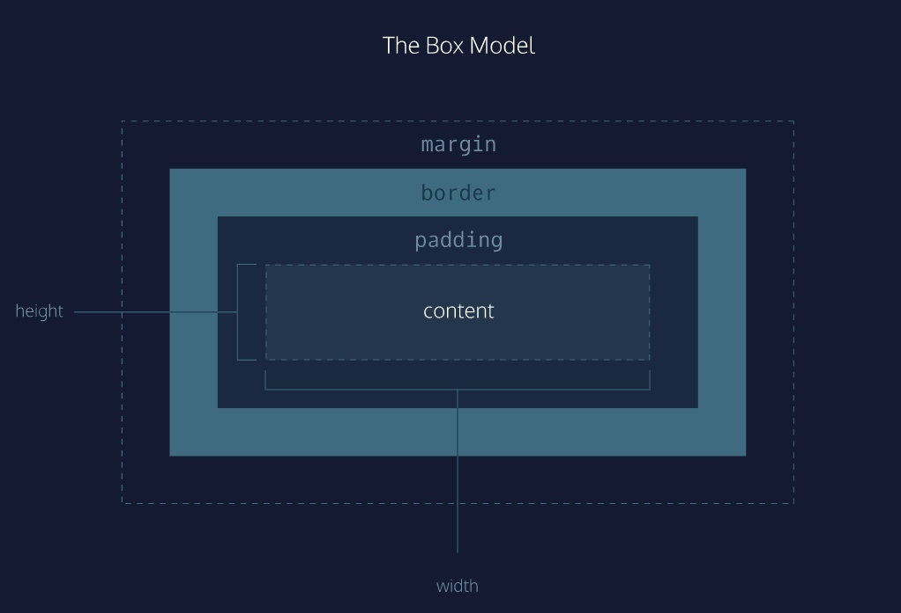

### 标准盒模型(内容盒子)

> 在标准盒模型中，如果给盒子设置`width`和`height`，实际设置的是`content`内容区域的宽和高。内边距`padding`和边框`border`加上设置的宽高一起决定了盒子的大小。

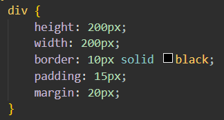

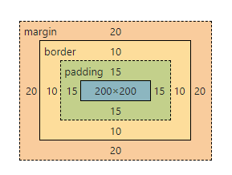

> **盒子的宽度=content_width + padding_left + padding_right + border_left + border_right(200+15+15+10+10=250)**
>
> **内容的宽度 = width(200)**

### IE盒模型（边框盒子）

> 在IE盒模型中，如果给盒子设置`width`和`height`，那么盒子的大小就是设置的宽高值，如果盒子设置了内边距`padding`和边框`border`，那么内容的大小实际上是盒子的大小减去内边距和边框的大小之后的值。

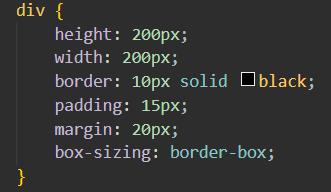

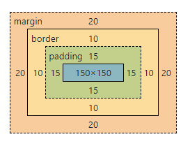

> **盒子的宽度=width(200)**
>
> **内容的宽度 = width - padding_left - padding_right - border_left - border_right(200-15-15-10-10=150)**

### 盒模型切换

> 在现代浏览器当中，几乎所有的浏览器，默认的盒模型都是**标准盒模型**。如果想要使用**IE盒模型**，可以通过设置属性`box-sizing: border-box`来设置。

## Flex布局

[Flex 布局教程：语法篇 - 阮一峰的网络日志 (ruanyifeng.com)](https://www.ruanyifeng.com/blog/2015/07/flex-grammar.html)

## CSS 2D 转换

### translate() 方法

> `translate()` 方法从其当前位置移动元素（根据为 X 轴和 Y 轴指定的参数）。

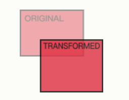

```html
<style>
    div {
        height: 200px;
        width: 200px;
        background-color: red;
    }

    div:hover {
        transform: translate(50px, 50px);
    }
</style>

<body>

    <div>

    </div>

</body>
```

### rotate() 方法 

> `rotate()` 方法根据给定的角度顺时针或逆时针旋转元素。

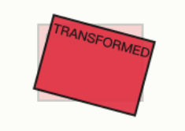

```html
<style>
    div {
        height: 200px;
        width: 200px;
        background-color: red;
    }

    div:hover {
        transform: rotate(45deg);/* 顺时针旋转45度 */
    }
</style>

<body>

    <div>

    </div>

</body>
```

### scale() 方法

> `scale()` 方法增加或减少元素的大小（根据给定的宽度和高度参数）。

```html
<style>
    div {
        height: 200px;
        width: 200px;
        background-color: red;
    }

    div:hover {
        transform: scale(2,3);/* <div> 元素增大为其原始宽度的两倍和其原始高度的三倍 */
    }
</style>

<body>

    <div>

    </div>

</body>
```

### scaleX() 方法

> `scaleX()` 方法增加或减少元素的宽度。

### scaleX() 方法

> `scaleX()` 方法增加或减少元素的宽度。

### skewX() 方法

> `skewX()` 方法使元素沿 X 轴倾斜给定角度。

```html
<style>
    div {
        height: 200px;
        width: 200px;
        background-color: red;
    }

    div:hover {
        transform: skew(20deg, 10deg);/* <div> 元素沿X轴倾斜20度，同时沿Y轴倾斜10度 */
    }
</style>

<body>

    <div>

    </div>

</body>
```

### skewX() 方法

> `skewX()` 方法使元素沿 X 轴倾斜给定角度。

### skewY() 方法

> `skewY()` 方法使元素沿 Y 轴倾斜给定角度。

### matrix() 方法

> `matrix()` 方法把所有 2D 变换方法组合为一个。
>
> `matrix()` 方法可接受六个参数，其中包括数学函数，这些参数使您可以旋转、缩放、移动（平移）和倾斜元素。
>
> 参数如下：matrix(scaleX(),skewY(),skewX(),scaleY(),translateX(),translateY())

## CSS 3D 转换

### rotateX() 方法

> `rotateX()` 方法使元素绕其 X 轴旋转给定角度

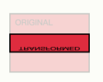

```html
<style>
    div {
        height: 200px;
        width: 200px;
        background-color: red;
    }

    div:hover {
        transform: rotateX(150deg);
    }
</style>

<body>

    <div>
        123

    </div>

</body>

```

### rotateY() 方法

> `rotateY()` 方法使元素绕其 Y 轴旋转给定角度

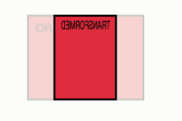

### rotateZ() 方法

> `rotateZ()` 方法使元素绕其 Z 轴旋转给定角度

## 过渡	

### 如何使用 CSS 过渡

> 如需创建过渡效果，必须明确两件事：
>
> - **添加效果的 CSS 属性**
> - **效果的持续时间**
>
> **注意：**如果未规定持续时间部分，则过渡不会有效果，因为默认值为 0。

```html
<style>
    div {
        height: 200px;
        width: 200px;
        background-color: red;
        transition: width 2s, height 4s;
    }

    div:hover {
        width: 300px;
        height: 400px;
    }
</style>

<body>

    <div></div>

</body>
```

### 指定过渡的速度曲线

> `transition-timing-function` 属性规定过渡效果的速度曲线。
>
> transition-timing-function 属性可接受以下值：
>
> - `ease` - 规定过渡效果，**先缓慢地开始，然后加速，然后缓慢地结束（默认）**
> - `linear` - 规定**从开始到结束具有相同速度的过渡效果**
> - `ease-in` -规定**缓慢开始的过渡效果**
> - `ease-out` - 规定**缓慢结束的过渡效果**
> - `ease-in-out` - 规定**开始和结束较慢的过渡效果**
> - `cubic-bezier(n,n,n,n)` - 允许您在三次贝塞尔函数中定义自己的值

### 延迟过渡效果

> `transition-delay` 属性规定过渡效果的延迟（以秒计）。

### 过渡 + 转换

```html
<style>
    div {
        height: 200px;
        width: 200px;
        background-color: red;
        transition: width 2s, height 4s, transform 2s;
    }

    div:hover {
        width: 300px;
        height: 400px;
        transform: rotate(180deg);
    }
</style>

<body>

    <div></div>

</body>
```

### css过渡属性

| 属性                                                         | 描述                                         |
| :----------------------------------------------------------- | :------------------------------------------- |
| [transition](https://www.w3school.com.cn/cssref/pr_transition.asp) | 简写属性，用于将四个过渡属性设置为单一属性。 |
| [transition-delay](https://www.w3school.com.cn/cssref/pr_transition-delay.asp) | 规定过渡效果的延迟（以秒计）。               |
| [transition-duration](https://www.w3school.com.cn/cssref/pr_transition-duration.asp) | 规定过渡效果要持续多少秒或毫秒。             |
| [transition-property](https://www.w3school.com.cn/cssref/pr_transition-property.asp) | 规定过渡效果所针对的 CSS 属性的名称。        |
| [transition-timing-function](https://www.w3school.com.cn/cssref/pr_transition-timing-function.asp) | 规定过渡效果的速度曲线。                     |

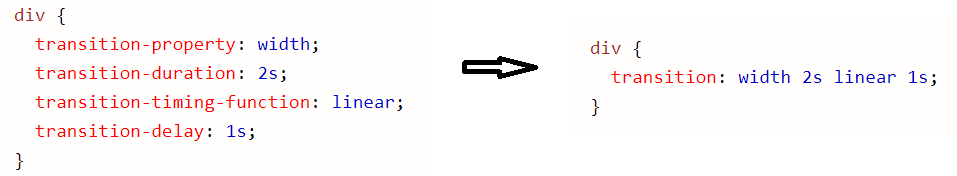

## 动画

### @keyframes 规则

> 如果您在 `@keyframes` 规则中指定了 CSS 样式，动画将在特定时间逐渐从当前样式更改为新样式。

### 延迟动画

> `animation-delay` 属性规定动画开始的延迟时间。

### 设置动画应运行多少次

> `animation-iteration-count` 属性指定动画应运行的次数。使用值 "infinite" 使动画永远持续下去

### 反向或交替运行动画

> `animation-direction` 属性指定是向前播放、向后播放还是交替播放动画。
>
> `animation-direction` 属性可接受以下值：
>
> - `normal` - 动画正常播放（向前）。默认值
> - `reverse` - 动画以反方向播放（向后）
> - `alternate` - 动画先向前播放，然后向后
> - `alternate-reverse` - 动画先向后播放，然后向前

### 指定动画的速度曲线

> `animation-timing-function` 属性规定动画的速度曲线。
>
> `animation-timing-function` 属性可接受以下值：
>
> - `ease` - 指定从慢速开始，然后加快，然后缓慢结束的动画（默认）
> - `linear` - 规定从开始到结束的速度相同的动画
> - `ease-in` - 规定慢速开始的动画
> - `ease-out` - 规定慢速结束的动画
> - `ease-in-out` - 指定开始和结束较慢的动画
> - `cubic-bezier(*n*,*n*,*n*,*n*)` - 运行您在三次贝塞尔函数中定义自己的值

### 指定动画的结束模式

> 在播放动画结束时，`animation-fill-mode` 属性规定目标元素停止的样式。
>
> animation-fill-mode 属性可接受以下值：
>
> - `none` - 默认值。动画在执行之前或之后不会对元素应用任何样式。
> - `forwards` - 元素将保留由最后一个关键帧设置的样式值（依赖 animation-direction 和 animation-iteration-count）。
> - `backwards` - 元素将获取由第一个关键帧设置的样式值（取决于 animation-direction），并在动画延迟期间保留该值。
> - `both` - 动画会同时遵循向前和向后的规则，从而在两个方向上扩展动画属性。

```html
    <style>
        div {
            background-color: aqua;
            width: 200px;
            height: 200px;
            animation-name: ani;
            animation-duration: 4s;
        }

        @keyframes ani {
            from {
                background-color: aqua;
            }

            to {
                background-color: rebeccapurple;
                width: 500px;
            }
        }
    </style>
</head>

<body>

    <div></div>

</body>

```

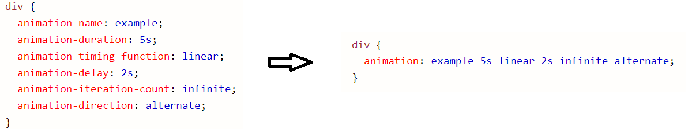

<hr/>

# JavaScript

> js不用下载库。jq需要
>

## js在html中的引用

```html
	<head>
		<meta charset="UTF-8">
		<title></title>	
		<!--可以将js 代码编写到外部文件中，然后通过script标签引入
			写到外部文件中可以在不同的页面中同时引用，也可以利用浏览器的缓存机制，推荐使用的方式
		-->
		<script type="text/javascript" src="js/script.js"></script>
		<!--script标签一旦用于引入外部文件了，就不能再编写代码了，即使编写了浏览器也会忽略
			若果需要则可以再创建一个新的script标签用于内部代码
		-->
		
		
		<!--可以将js代码编写到script标签中-->
		<script type="text/javascript">
		
		</script>
	</head>
```

```html
<!--作为特定标记的属性值使用-->
<a href="javascript:alert('你好')">点击</a>

<input type="button" value="按钮" onclick="alert('hello')"><br>
```

## 数据类型

> 1.原始数据类型(基本数据类型)：
>
> ​		**数字型（number）： 整数/小数/NaN(not a number 一个不是数字的数字类型)**
>
> ​		**字符串型（string）： 字符串  "abc" "a" 'abc'**
>
> ​		**布尔型（boolean）: true和false**
>
> ​		**空值（null）：一个对象为空的占位符**
>
> ​		**未定义值（undefined）：未定义。如果一个变量没有给初始化值，则会被默认赋值为undefined**
>
> 2.引用数据类型：对象


>  1.js中可以表示的数字最大值  Number.MAX_VALUE，如果使用Number表示的数字超过了最大值，则会返回一个Infinity，表示无穷大
>
> ​	Number.MIN_VALUE表示大于0的最小值
>
> 2.使用typeof检查Indinity也会返回number
>
> ​	NaN是一个特殊的数字，表示Not A Number，使用typeof检查一个NaN也会返回number
>
> ​	使用typeof检查null值时，会返回object
>
> ​	使用typeof检查undefined值时，会返回undefined

```javascript
<script>
    console.log(Number.MAX_VALUE)
    console.log(Number.MIN_VALUE)


    var a = null
    var b 
    var c = 1 + b
    console.log(typeof(a))
    console.log(typeof(b))
    console.log(typeof(c))
    
</script>
```

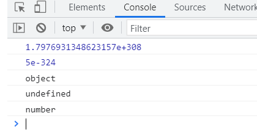

### 数据类型转换

```javascript
			//强制转换:类型转换主要指，将其他的数据类型，转换为String Number Boolean	

			//将其他的数据类型转换为String
			 /* 	方式一：-调用被转换数据类型的toString()方法
			  * 		    -该方法不会影响到原变量，它会将转换的结果返回
			  * 		      但是注意：null和undefined这两个值没有toString()方法
			  *		方式二：-调用String()函数，并将被转换的数据作为参数传递给函数
			  * 		   -使用String函数做强制转换时，
			  * 			对于Number和Boolean实际上就是调用的toString()方法
			  * 			但是对于null和undefined，就不会调用toString()方法
			  * 				它会将null直接转换为"null"
			  * 				将undefined直接转换为"undefined"
			  * 
			  */


			//转换为Number类型
			 /*
			  * 转换方式一：
			  * 		使用Number()函数  
			  * 			-字符串-->数字
			  * 				1、如果是纯数字的字符串，则直接将其转换为数字
			  * 				2、如果字符串中有非数字的内容，则转换为NaN
			  * 				3、如果字符串是一个空串或者是一个全是空格的字符串，则转换为0
			  * 			-布尔-->数字
			  * 				true 转换成1
			  * 				false转换成0
			  * 			-Null-->数字  == 0
			  * 			-undefined --> 0数字  NaN
			  * 
			  * 转换方式二：
			  * 		-这种方式专门对付字符串
			  * 		-parseInt()把一个字符串转换为整数
			  * 		-parseFloat()把一个字符串转换为一个浮点数
			  */


			// 将其他类型转化为Boolean
			  /* 	-使用Boolean()函数
			  * 		-数字-->布尔
			  * 			-除了0和NaN,其余的都是true
			  * 		-字符串-->布尔
			  * 			-除了空串，其余的都是true
			  * 		-null和undefined都会转换为false
			  * 		-对象也会转换为true
			  */

            //  parseInt()和parseFloat()
            //parseInt():将字符串解析成整数
            //parseFloat():将字符串解析成浮点数
```

## 三元运算符

```js
let a = 123
let b = 456

console.log(a > b ? "a大" : (a < b ? "b大" : "一样大"))
```

## 函数

### 通过超链接调用函数

```html
<body>

    <a href="javaScript:test()">test</a>
    
</body>
<script>
    function test(){
        alert("hello");
    }
</script>
```

### 内置函数

```javascript
<script>
    
var a = '123abc'
var b = 'abc123'
var c = '123.456abc'
var d = 'abc123.456'

//parseInt()函数：主要将首位为数字的字符串转换为数字，如果字符串不是以数字开头，那么将返回NaN
document.write(parseInt(a)+'<br>')
document.write(parseInt(b)+'<br>')

//parseFloat()函数：主要将首位为数字的字符串转换为浮点型数字，如果字符串不是以数字开头，那么将返回NaN
document.write(parseInt(c)+'<br>')
document.write(parseInt(d)+'<br>')

//isNaN()函数：主要用于检验某个值是否为NaN。
document.write(isNaN(parseInt(a))+'<br>')
document.write(isNaN(parseInt(b))+'<br>')

//isFinite()函数：主要用于检验某个表达式是否为无穷大
document.write(isFinite(1/0))

</script>
```

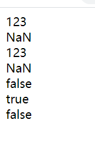

### 立即执行函数

>  函数定义完，立即被调用，这种函数叫立即执行函数，立即执行函数往往只会执行一次
>
>  作用：创建一个独立的作用域。这个作用域里面的变量，外面访问不到（即避免「变量污染」）。

```javascript
//示例
(function () {
    console.log("hello")
})()


//实例
<script type="text/javascript">
    (function (who) {
        console.log("I miss you, " + who)
    })("yaoyao")


    //一个立即执行函数也能返回值并且可以赋值给其它变量。
    var num = (function () {
        return 4
    })()
    console.log(num)

</script>
```

### 回调函数

```javascript
    <script>

        function fn1(num1, num2, fn) {
            console.log(num1 + num2)
            fn("爹")
        }

        function fn2(msg) {
            console.log("我是你" + msg)
        }

        fn1(1, 2, fn2)


        // 匿名回调函数
        fn1(1, 2, function (msg) {
            console.log("我是你" + msg)
        })
        
 ======================================================================================              
        function fn1(num1, num2, fn) {
            setTimeout(() => {
                console.log(num1 + num2)
                fn()
            }, 1000);
        }

        function fn2() {
            console.log("22222222222")
        }

        fn1(1, 2, fn2)//3     22222222222   

    </script>
```

### 关于调用函数加不加括号的问题

> - **函数只要是要调用它进行执行的，都必须加括号。**此时，**函数实际上等于函数的返回值或者执行效果**，当然，有些没有返回值，但已经执行了函数体内的行为，**就是说，加括号的，就代表将会执行函数体代码。**
>
> - 不加括号的，都是把函数名称作为函数的指针，一个函数的名称就是这个函数的指针，此时不是得到函数的结果，因为不会运行函数体代码。它只是传递了函数体所在的地址位置，在需要的时候好找到函数体去执行。

## this关键字

> 1. **如果单独使用，this表示全局对象。**
> 2. **直接调用的指向window，在函数中，this表示全局对象。在严格模式下，this是未定义的(undefined)。**
> 3. **谁调用就指向谁，在方法中，this表示该方法所属的对象。**
> 4. **在事件中，this表示接收事件的元素。**
> 5. 类似call()和apply()方法可以将this 引用到任何对象。

### 函数和方法

> 函数
>
> ```js
> function xxx(){
> 	......
> }
> ```
>
> 方法是特殊的函数。 当将**函数**和**对象**合写在一起时，函数就变成了 “方法”（method）
>
> ```js
> var obj = {
> name : '张三',
> age : 18
> fun : function(){
>     		console.log(this.name) //这里的this指向的是obj这个对象
>   	}//fun就成了该对象的一个方法
> }
> 	     
> 或者这样
> var abc = function(){
>  ......
> }
> 
> ```

### bind、apply、call

```javascript
    <script>
        // call、apply、bind可以改变this的指向

        const dog = {
            name: '旺财',
            sayName() {
                console.log("我叫" + this.name)
            },
            eat(food) {
                console.log("我喜欢吃" + food)
            }
        }


        const cat = {
            name: 'tomcat'
        }


        dog.sayName();//我叫旺财
        dog.sayName.call(cat)//我叫tomcat


        dog.eat("骨头")//我喜欢吃骨头
        //第一个参数是指向this的指向，第二个参数是eat方法的参数
        dog.eat.call(cat, "🐟")//我喜欢吃🐟
        // apply第二个参数要出入一个数组
        dog.eat.apply(cat, ["🐟"])//我喜欢吃🐟
        //bind返回一个函数
        const fn = dog.eat.bind(cat, "🐟")
        fn()//我喜欢吃🐟

    </script>
```

## 作用域

### 作用域嵌套与作用域链

> 当一个块或函数嵌套在另一个块或函数中时，就发生了作用域的嵌套。作用域嵌套的查询规则：
>
> - 首先，JS引擎从当前的执行作用域开始查找变量。
> - 然后，如果找不到，引擎会在外层嵌套的作用域中继续查找。
> - 最后，直到找到该变量，或抵达最外层的全局作用域为止。

### 查询异常

> - 如果获取未声明的变量的值会导致 ReferenceError 异常。
>
> - 如果对未声明过的变量进行赋值：
>
>   - 在非严格模式下，JS引擎会为其自动创建一个全局变量且进行赋值。
>   - 如在严格模式下，会导致 ReferenceError 异常。
>
> ```js
> var a = 10
> 
> function sum() {
>     // b 是没有显式声明的，但被隐式创建为全局变量
>     b = 20
>     return a + b
> }
> 
> console.log(sum()) // 30
> console.log(c) // ReferenceError: c is not defined
> // 因为c是未定义的变量，无法使用
> ```

### 变量提升

> **通俗来说，变量提升是指在 JavaScript 代码执行过程中，JavaScript 引擎把变量的声明部分和函数的声明部分提升到代码开头的行为。变量被提升后，会给变量设置默认值为 undefined。** 正是由于 JavaScript 存在变量提升这种特性，导致了很多与直觉不太相符的代码，这也是 JavaScript 的一个设计缺陷。虽然 ECMAScript6 已经通过引入块级作用域并配合使用 let、const 关键字，避开了这种设计缺陷，但是由于 JavaScript 需要向下兼容，所以变量提升在很长时间内还会继续存在。
>
> 在 ECMAScript6 之前，JS 引擎用 var 关键字声明变量。在 var 时代，**不管变量声明是写在哪里，最后都会被提到作用域的顶端。** 下面在全局作用域中声明一个num 变量，并在声明之前打印它：
>
> ```javascript
> console.log(num) 
> var num = 1
> 复制代码
> ```
>
> 这里会输出 undefined，因为变量的声明被提升了，它等价于：
>
> ```javascript
> var num
> console.log(num)
> num = 1
> 
> ```
>
> 可以看到，num 作为全局变量会被提升到全局作用域的顶端。
>
> 除此之外，在函数作用域中也存在变量提升：
>
> ```javascript
> function getNum() {
>   console.log(num) 
>   var num = 1  
> }
> getNum()
> 
> ```
>
> 这里也会输出 undefined，因为函数内部的变量声明会被提升至函数作用域的顶端。它等价于：
>
> ```javascript
> function getNum() {
>   var num 
>   console.log(num) 
>   num = 1  
> }
> getNum()
> 
> ```
>
> 除了变量提升，函数实际上也是存在提升的。JavaScript中具名的函数的声明形式有两种：
>
> ```javascript
> //函数声明式：
> function foo () {}
> //变量形式声明： 
> var fn = function () {}
> 
> ```
>
> 当使用**变量形式声明**函数时，和普通的变量一样会存在提升的现象，而函数声明式会提升到作用域最前边，并且将声明内容一起提升到最上边。如下：
>
> ```javascript
> fn()
> var fn = function () {
> 	console.log(1)  
> }
> // 输出结果：Uncaught TypeError: fn is not a function
> 
> foo()
> function foo () {
> 	console.log(2)
> }
> // 输出结果：2
> 
> ```
>
> 可以看到，使用变量形式声明fn并在其前面执行时，会报错fn不是一个函数，因为此时fn只是一个变量，还没有赋值为一个函数，所以是不能执行fn方法的。

#### 为什么会有变量提升？

> 变量提升和 JavaScript 的编译过程密切相关：JavaScript 和其他语言一样，都要经历编译和执行阶段。在这个短暂的**编译阶段**，JS 引擎会搜集所有的变量声明，并且提前让声明生效。而剩下的语句需要等到执行阶段、等到执行到具体的某一句时才会生效。这就是变量提升背后的机制。

### 函数优先

> - 函数声明和变量声明都会被提升，但是出现在有多个“重复”声明的代码中，函数会首先被提升，然后才是变量。
> - 函数没有方法重载，存在两个相同的函数名，后面的函数会覆盖前面的函数。
>
> ```js
> foo() // 3
> 
> function foo() {
>     console.log(1)
> }
> 
> var foo = function () {
>     console.log(2)
> }
> 
> function foo() {
>     console.log(3)
> }
> foo() // 2 函数表达式的提升情况
> ```
>
> 为什么呢？原因：
>
> 
>
> 1. 函数声明和变量声明都会被提升，但是出现在有多个“重复”声明的代码中，函数会首先被提升，然后才是变量。
> 2. 相同函数名字，后面函数覆盖前面的函数。
>
> 实际上以上代码可以看成这样：
>
> ```js
> function foo() {
>     console.log(3)
> }
> var foo // 被忽略了
> 
> foo()
> console.log(foo) // [Function: foo]
> ```

## 闭包

> **高阶函数除了可以接受函数作为参数外，还可以把函数作为结果值返回，相关参数和变量都保存在返回的函数中，这种称为“闭包（Closure）”**
>
> 返回闭包时牢记的一点就是：**返回函数不要引用任何循环变量，或者后续会发生变化的变量。**如果一定要引用循环变量怎么办？方法是再创建一个函数，用该函数的参数绑定循环变量当前的值，无论该循环变量后续如何更改，已绑定到函数参数的值不变

```js
function makeAdder(x) {
  return function(y) {
    return x + y;
  };
}

var add5 = makeAdder(5);
var add10 = makeAdder(10);

console.log(add5(2));  // 7
console.log(add10(2)); // 12

```

## 防抖和节流

> 节流与防抖的作用都是防止函数多次调用。区别在于，**假如用户一直触发这个函数，且每次触发函数的间隔小于阙值，防抖的情况下只会调用一次，而节流会每隔一定时间调用函数。**
>
> **防抖相当于回城，节流相当于CD**

### 防抖

```html
<body>
    <!-- 防抖：用户触发时间过于频繁，只要最后一次事件的操作 -->

    <input type="text">

    <script>

        const input = document.querySelector("input");

        let t = null;
        input.oninput = function () {

            if (t !== null) {
                clearTimeout(t)
            }


            t = setTimeout(() => {
               console.log(this.value)
            }, 500)
        }


    </script>
</body>
=======================================优化===============================================
<body>
    <!-- 防抖：用户触发时间过于频繁，只要最后一次事件的操作 -->

    <input type="text">

    <script>

        const input = document.querySelector("input");

        input.oninput = debound(function () {
            console.log(this.value)
        }, 500)


        function debound(fn, delay) {
            let t = null;
            return function () {
                
                if (t !== null) {
                    clearTimeout(t)
                }


                t = setTimeout(() => {
                    fn.call(this)
                }, delay)
            }

        }

    </script>
</body>
```

### 节流

```html
<body>
    <style>
        body {
            height: 2000px;
        }
    </style>


    <!-- 节流：控制高频事件触发次数 -->
    <script>
        let flag = true
        window.onscroll = function () {
            if (flag) {
                setTimeout(() => {
                    console.log("hello world")
                    flag = true
                }, 5000);
            }
            flag = false
        }

    </script>

</body>


====================================优化==========================================
<body>
    <style>
        body {
            height: 2000px;
        }
    </style>

    <script>

        window.onscroll = throttle(function () {
            console.log("hello world")
        }, 500)

        function throttle(fn, delay) {
            let flag = true
            return function () {
                if (flag) {
                    setTimeout(() => {
                        fn()
                        flag = true
                    }, 5000);
                }
                flag = false
            }
        }

    </script>

</body>
```

## 原型

### 什么是原型

> - 我们所创建的每一个函数，解析器就会向函数中添加一个属性prototype，这个属性对应着一个对象，这个对象就是我们所谓的原型对象。**每一个对象都有他的原型对象，他可以使用自己原型对象上的所有属性和方法。**
> - **原型对象也有原型对象**
> - **通过对象的\__proto__可以拿到原型**
> - **通过构造函数的prototype可以拿到原型**
> - **当我们使用一个对象的属性或方法时，会先在自身中寻找，自身中如果有，则直接使用，如果没有则去原型对象中寻找，如果原型对象中，则使用，如果没有则去原型的原型中寻找，直到找到Object对象原型，Object对象的原型没有原型，如果在Object中依然没有找到，则返回undefined**

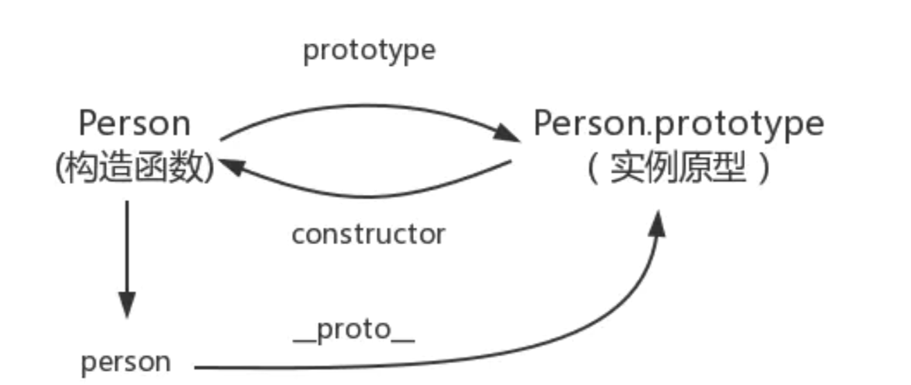

> 通过对象的\__proto__可以拿到原型

```js
        let cat = {
            name: 'tomcat'
        }

        cat.__proto__.sayName = function () {//将sayName方法放在cat原型对象上
            console.log("我叫" + this.name)
        }

        cat.sayName()//我叫tomcat
```

> 通过构造函数的prototype可以拿到原型

```js
 		//ES6之前
		function Cat(name, age) {
            this.name = name;
            this.age = age;
        }

        Cat.prototype.introduce = function () {//将introduce方法放在cat原型对象上
            console.log(`我叫${this.name},我今年${this.age}岁`)
        }

        const cat = new Cat("tomcat", 2)
        cat.introduce()//我叫tomcat,我今年2岁


		//ES6及之后
        class Cat {
            constructor(name, age) {
                this.name = name;
                this.age = age;
            }
        }

        Cat.prototype.introduce = function () {//将introduce方法放在cat原型对象上
            console.log(`我叫${this.name},我今年${this.age}岁`)
        }

        const cat = new Cat("tomcat", 2)
        cat.introduce()//我叫tomcat,我今年2岁
```

> **每一个对象数据类型(普通的对象、实例、`prototype`......)也天生自带一个属性`__proto__`，属性值是当前实例所属类的原型(`prototype`)。原型对象中有一个属性`constructor`, 它指向函数对象。**

```js
 function Person() {}
 var person = new Person()
 console.log(person.__proto__ === Person.prototype)//true
 console.log(Person.prototype.constructor===Person)//true
 //顺便学习一个ES5的方法,可以获得对象的原型
 console.log(Object.getPrototypeOf(person) === Person.prototype) // true
```

#### 用处

> 可以用户拓展对象

```js
        //const date = new Date()
        //console.log(date)//Tue May 31 2022 19:46:59 GMT+0800 (中国标准时间)

        //我想输出2022年5月31日
        let date = new Date()
        Date.prototype.formate = function () {

            let year = this.getFullYear()
            let month = this.getMonth() + 1
            let date = this.getDate()
            return `${year}年${month}月${date}日`
        }

        console.log(date.formate())//2022年5月31日
```

### 原型继承

> **继承父类，同时继承父类的原型对象**

```js
        //ES6之前的继承
        function User(username, password) {
            this.username = username;
            this.password = password;
            this.login = function () {
                console.log("登录成功")
            }
        }


        function Admin() {
            this.deleteUser = function () {
                console.log("用户已删除")
            }
        }

        Admin.prototype = new User("lz", 123)//继承

        const admin = new Admin()
        console.log(admin.username)//lz
        console.log(admin.password)//123
        admin.login()//登录成功
        admin.deleteUser()//用户已删除

        //子类再向原型中添加东西，父类访问不到
        Admin.prototype.addUser = function () {
            console.log("添加用户成功")
        }
        new User().addUser()//(intermediate value).addUser is not a function


        //ES6及之后的继承
        class User {
            constructor(username, password) {
                this.username = username
                this.password = password
            }

            login() {
                console.log("登录成功")
            }
        }


        class Admin extends User {
            constructor(username, password) {
                super(username, password)
            }
            deleteUser() {
                console.log("用户已删除")
            }
        }

        const admin = new Admin("lz", 123)
        console.log(admin.username)//lz
        console.log(admin.password)//123
        admin.login()//登录成功
        admin.deleteUser()//用户已删除
        admin.hello()//hellol world。继承父类，同时继承父类的原型对象
```

### 原型链

> - **原型对象也有原型对象，可以通过`原型对象.__proto__`拿到原型对象**
> - **当我们使用一个对象的属性或方法时，会先在自身中寻找，自身中如果有，则直接使用，如果没有则去原型对象中寻找，如果原型对象中，则使用，如果没有则去原型的原型中寻找，直到找到Object对象原型，Object对象的原型没有原型，如果在Object中依然没有找到，则返回undefined**

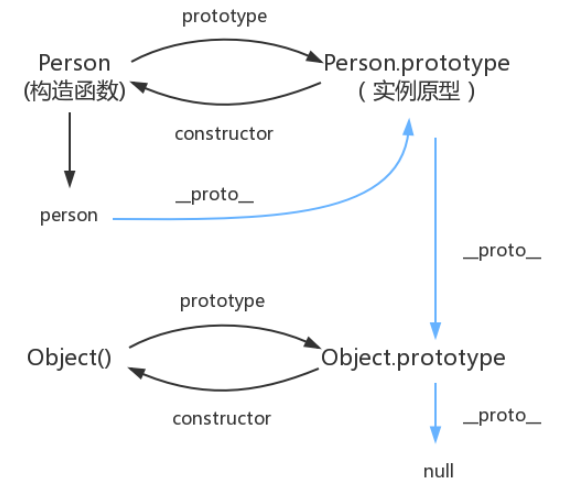

```js
    <script>

        Object.prototype.hello = function () {
            console.log("hello world")
        }


        const cat = {
            name: 'tomcat'
        }
        console.log(cat)
        console.log(cat.hello())//hello world

    </script>
```

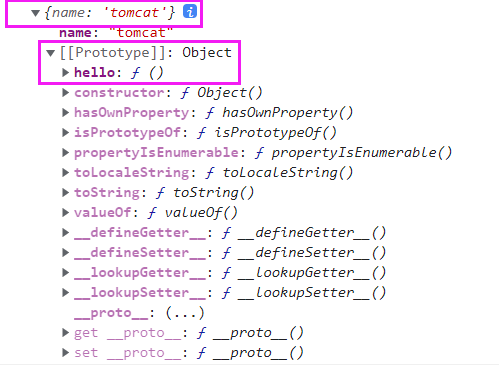

## 数组

### 创建

> var arr = new Array(默认长度);
>
> var arr = new Array(元素列表);
>
> var arr = [元素列表];

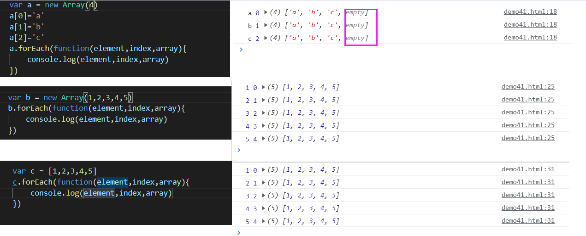

### 方法

> - push(“xxx”)：在数组最后面添加元素，并返回新的长度。xxx为传入的元素
>
> - pop()：把数组最后一个元素删除，并且返回删除元素的值
>
> - shift()：把数组第一个元素删除，并且返回删除元素的值
>
> - unshift(“xxx”)：在数组最前面添加元素，并返回新的长度。xxx为传入的元素
>
> - splice(index,howmany,item1,.....,itemX)：向数组中添加/删除项目，然后返回被删除的项目。
>
>   - index：必须，整数。规定删除、添加项目的位置，可以使用负数从项目的结尾开始
>  - howmany：必须。要删除的项目数量。如果设置为 0，则不会删除项目。
>   - item1,.....,itemX：可选。向数组中添加的新项目
>
> - reverse()：用于颠倒数组中元素的顺序。
>
> - sort():用于对数组的元素进行排序
>
> - slice(start,end):可以从已有的数组中返回选定的元素。start如果是负数那么从结尾开始，如果没有end，那么截取到最后。返回的数据不包括end索引对应的数据
>
> - join(参数):将数组中的元素按照指定的分隔符拼接为字符串
>
> - findIndex()：findIndex()方法返回数组中满足提供的测试函数的第一个元素的**索引**。若没有找到对应元。素则返回-1。
>
>   ```js
>  const array1 = [5, 12, 8, 130, 44];
>   
>   const isLargeNumber = (element) => element > 13;
>   
>   console.log(array1.findIndex(isLargeNumber));
>   // expected output: 3
>   ```
> 
> - reduce()
>
>   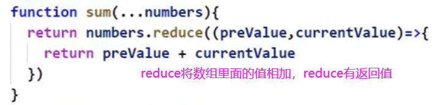

### 遍历

> 一般我们都是使用for循环遍历数组，JS中还为我们提供了一个方法，来遍历数组 forEach()
>
> 
>
> forEach()方法需要一个函数作为参数
>
> ​       \* -浏览器会在回调函数中传递是三个参数：
>
> ​       \*   第一个参数，就是当前正在遍历的元素
>
> ​       \*   第二个参数，就是当前正在遍历的元素的索引
>
> ​       \*   第三个参数，就是正在遍历元素所属的数组

```javascript
var arr = [1, 2, 3];
arr.forEach(function (curr, index, arr) {
    console.log(curr, index, arr)
})
```

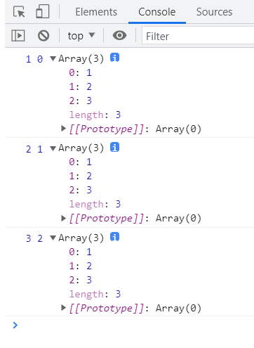

## 对象

### String对象

> 属性：
>
> ​	length：获取当前字符串的长度，包括字符串中的空格。
>
> 常用方法：
>
> ​	1.charAt()：返回在指定位置的字符。
>
> ​		字符串中第一个字符的下标时0，因此，index参数的取值范围是0~string.length-1，如果参数index超出了这个范围，则返回一个空字符串。
>
> ​	2.indexOf(substring，startindex)：返回某个指定的字符串值在字符串中首次出现的位置。
>
> ​		substring：指定要查找的字符串值
>
> ​		startindex：用于指定在字符串中开始查找的范围，取值范围是0~string.length-1，如果要查找的子字符串没有出现则返回-1
>
> ​	3.lastIndexOf(substring，startindex)：返回某个指定的字符串值在字符串中最后出现的位置。
>
> ​		substring：指定要查找的字符串值
>
> ​		startindex：用于指定在字符串中开始查找的位置，从后往前查找。取值范围是0~string.length-1，如果要查找的子字符串没有出现则返回-1
>
> ​	4.slice(startindex,endindex)：提取字符串的片段，并在新的字符串中返回被提取的部分
>
> ​		startindex：字符串中第一个字符的下标时0。如果是负数，则从字符串的尾部开始算	
>
> ​		endindex：如果省略该参数，表示结束位置为字符串的最后一个字符。截取时截取部分不包括这个参数所代表的字符
>
> ​	5.substr(startindex,length)：可从字符串的指定位置开始提取指定长度的子字符串
>
> ​		startindex：字符串中第一个字符的下标时0。如果是负数，则从字符串的尾部开始算	
>
> ​		length：指定提取字符的长度，如果省略该参数，表示结束位置为字符穿的最后一个字符
>
> ​	6.substring(startindex,endindex)：用于提取字符串中两个指定的索引号之间的字符
>
> ​		startindex：一个非负整数，指定要提取的字符串片段的开始位置
>
> ​		endindex：一个非负整数，指定要提取的字符串片段的结束位置。如果省略该参数，表示结束位置为字符穿的最后一个字符
>
> ​	7.toLowerCase()：字符串转换为小写
>
> ​	8.toUpperCase()：字符串转换为大写
>
> ​	9.cancat()：连接两个或多个字符串
>
> ​	10.split(“xxx”)：把字符串分割为字符串数组，xxx为分割符号，如 - 

| 方法                                                         | 描述                                                         |
| :----------------------------------------------------------- | :----------------------------------------------------------- |
| [charAt()](https://www.runoob.com/jsref/jsref-charat.html)   | 返回在指定位置的字符。                                       |
| [charCodeAt()](https://www.runoob.com/jsref/jsref-charcodeat.html) | 返回在指定的位置的字符的 Unicode 编码。                      |
| [concat()](https://www.runoob.com/jsref/jsref-concat-string.html) | 连接两个或更多字符串，并返回新的字符串。                     |
| [endsWith()](https://www.runoob.com/jsref/jsref-endswith.html) | 判断当前字符串是否是以指定的子字符串结尾的（区分大小写）。   |
| [fromCharCode()](https://www.runoob.com/jsref/jsref-fromcharcode.html) | 将 Unicode 编码转为字符。                                    |
| [indexOf()](https://www.runoob.com/jsref/jsref-indexof.html) | 返回某个指定的字符串值在字符串中首次出现的位置。             |
| [includes()](https://www.runoob.com/jsref/jsref-string-includes.html) | 查找字符串中是否包含指定的子字符串。                         |
| [lastIndexOf()](https://www.runoob.com/jsref/jsref-lastindexof.html) | 从后向前搜索字符串，并从起始位置（0）开始计算返回字符串最后出现的位置。 |
| [match()](https://www.runoob.com/jsref/jsref-match.html)     | 查找找到一个或多个正则表达式的匹配。                         |
| [repeat()](https://www.runoob.com/jsref/jsref-repeat.html)   | 复制字符串指定次数，并将它们连接在一起返回。                 |
| [replace()](https://www.runoob.com/jsref/jsref-replace.html) | 在字符串中查找匹配的子串，并替换与正则表达式匹配的子串。     |
| [replaceAll()](https://www.runoob.com/jsref/jsref-replaceall.html) | 在字符串中查找匹配的子串，并替换与正则表达式匹配的所有子串。 |
| [search()](https://www.runoob.com/jsref/jsref-search.html)   | 查找与正则表达式相匹配的值。                                 |
| [slice()](https://www.runoob.com/jsref/jsref-slice-string.html) | 提取字符串的片断，并在新的字符串中返回被提取的部分。         |
| [split()](https://www.runoob.com/jsref/jsref-split.html)     | 把字符串分割为字符串数组。                                   |
| [startsWith()](https://www.runoob.com/jsref/jsref-startswith.html) | 查看字符串是否以指定的子字符串开头。                         |
| [substr()](https://www.runoob.com/jsref/jsref-substr.html)   | 从起始索引号提取字符串中指定数目的字符。                     |
| [substring()](https://www.runoob.com/jsref/jsref-substring.html) | 提取字符串中两个指定的索引号之间的字符。                     |
| [toLowerCase()](https://www.runoob.com/jsref/jsref-tolowercase.html) | 把字符串转换为小写。                                         |
| [toUpperCase()](https://www.runoob.com/jsref/jsref-touppercase.html) | 把字符串转换为大写。                                         |
| [trim()](https://www.runoob.com/jsref/jsref-trim.html)       | 去除字符串两边的空白。                                       |
| [toLocaleLowerCase()](https://www.runoob.com/jsref/jsref-tolocalelowercase.html) | 根据本地主机的语言环境把字符串转换为小写。                   |
| [toLocaleUpperCase()](https://www.runoob.com/jsref/jsref-tolocaleuppercase.html) | 根据本地主机的语言环境把字符串转换为大写。                   |
| [valueOf()](https://www.runoob.com/jsref/jsref-valueof-string.html) | 返回某个字符串对象的原始值。                                 |
| [toString()](https://www.runoob.com/jsref/jsref-tostring.html) | 返回一个字符串。                                             |

### Date：日期对象

> 创建：var date = new Date();
>
> 常用方法：
>	1.toLocaleString()：返回当前date对象对应的时间本地字符串格式
> 
> ​	2.getfullYear()：获取当前日期对象年份
> 
>​	3.getMonth()：获取当前时间对象的月份
> 
> ​		会返回一个0-11的值
>
> ​		0表示1月
>
> ​		1表示2月
>
> ​		11表示12月
>
> 4.getDay()：获取当日期对象是周几
>
> ​		会返回一个0-6的值
>
> ​		0表示周日
>
> ​	5.getDate()：获取当前日期对象是几日
>
> ​	6.getTime()
>
> ​		获取当前日期当对象时间戳
>
> ​		时间戳：值的是从格林威治标准时间的1970年1月1日 0时0分0秒
>
> ​		到当前日期所花费的毫秒数（1秒=1000毫秒）
>
> ​		计算机底层保存时间使用都是时间戳

| 方法                                                         | 描述                                                         |
| :----------------------------------------------------------- | :----------------------------------------------------------- |
| [getDate()](https://www.runoob.com/jsref/jsref-getdate.html) | 从 Date 对象返回一个月中的某一天 (1 ~ 31)。                  |
| [getDay()](https://www.runoob.com/jsref/jsref-getday.html)   | 从 Date 对象返回一周中的某一天 (0 ~ 6)。                     |
| [getFullYear()](https://www.runoob.com/jsref/jsref-getfullyear.html) | 从 Date 对象以四位数字返回年份。                             |
| [getHours()](https://www.runoob.com/jsref/jsref-gethours.html) | 返回 Date 对象的小时 (0 ~ 23)。                              |
| [getMilliseconds()](https://www.runoob.com/jsref/jsref-getmilliseconds.html) | 返回 Date 对象的毫秒(0 ~ 999)。                              |
| [getMinutes()](https://www.runoob.com/jsref/jsref-getminutes.html) | 返回 Date 对象的分钟 (0 ~ 59)。                              |
| [getMonth()](https://www.runoob.com/jsref/jsref-getmonth.html) | 从 Date 对象返回月份 (0 ~ 11)。                              |
| [getSeconds()](https://www.runoob.com/jsref/jsref-getseconds.html) | 返回 Date 对象的秒数 (0 ~ 59)。                              |
| [getTime()](https://www.runoob.com/jsref/jsref-gettime.html) | 返回 1970 年 1 月 1 日至今的毫秒数。                         |
| [getTimezoneOffset()](https://www.runoob.com/jsref/jsref-gettimezoneoffset.html) | 返回本地时间与格林威治标准时间 (GMT) 的分钟差。              |
| [getUTCDate()](https://www.runoob.com/jsref/jsref-getutcdate.html) | 根据世界时从 Date 对象返回月中的一天 (1 ~ 31)。              |
| [getUTCDay()](https://www.runoob.com/jsref/jsref-getutcday.html) | 根据世界时从 Date 对象返回周中的一天 (0 ~ 6)。               |
| [getUTCFullYear()](https://www.runoob.com/jsref/jsref-getutcfullyear.html) | 根据世界时从 Date 对象返回四位数的年份。                     |
| [getUTCHours()](https://www.runoob.com/jsref/jsref-getutchours.html) | 根据世界时返回 Date 对象的小时 (0 ~ 23)。                    |
| [getUTCMilliseconds()](https://www.runoob.com/jsref/jsref-getutcmilliseconds.html) | 根据世界时返回 Date 对象的毫秒(0 ~ 999)。                    |
| [getUTCMinutes()](https://www.runoob.com/jsref/jsref-getutcminutes.html) | 根据世界时返回 Date 对象的分钟 (0 ~ 59)。                    |
| [getUTCMonth()](https://www.runoob.com/jsref/jsref-getutcmonth.html) | 根据世界时从 Date 对象返回月份 (0 ~ 11)。                    |
| [getUTCSeconds()](https://www.runoob.com/jsref/jsref-getutcseconds.html) | 根据世界时返回 Date 对象的秒钟 (0 ~ 59)。                    |
| getYear()                                                    | 已废弃。 请使用 getFullYear() 方法代替。                     |
| [parse()](https://www.runoob.com/jsref/jsref-parse.html)     | 返回1970年1月1日午夜到指定日期（字符串）的毫秒数。           |
| [setDate()](https://www.runoob.com/jsref/jsref-setdate.html) | 设置 Date 对象中月的某一天 (1 ~ 31)。                        |
| [setFullYear()](https://www.runoob.com/jsref/jsref-setfullyear.html) | 设置 Date 对象中的年份（四位数字）。                         |
| [setHours()](https://www.runoob.com/jsref/jsref-sethours.html) | 设置 Date 对象中的小时 (0 ~ 23)。                            |
| [setMilliseconds()](https://www.runoob.com/jsref/jsref-setmilliseconds.html) | 设置 Date 对象中的毫秒 (0 ~ 999)。                           |
| [setMinutes()](https://www.runoob.com/jsref/jsref-setminutes.html) | 设置 Date 对象中的分钟 (0 ~ 59)。                            |
| [setMonth()](https://www.runoob.com/jsref/jsref-setmonth.html) | 设置 Date 对象中月份 (0 ~ 11)。                              |
| [setSeconds()](https://www.runoob.com/jsref/jsref-setseconds.html) | 设置 Date 对象中的秒钟 (0 ~ 59)。                            |
| [setTime()](https://www.runoob.com/jsref/jsref-settime.html) | setTime() 方法以毫秒设置 Date 对象。                         |
| [setUTCDate()](https://www.runoob.com/jsref/jsref-setutcdate.html) | 根据世界时设置 Date 对象中月份的一天 (1 ~ 31)。              |
| [setUTCFullYear()](https://www.runoob.com/jsref/jsref-setutcfullyear.html) | 根据世界时设置 Date 对象中的年份（四位数字）。               |
| [setUTCHours()](https://www.runoob.com/jsref/jsref-setutchours.html) | 根据世界时设置 Date 对象中的小时 (0 ~ 23)。                  |
| [setUTCMilliseconds()](https://www.runoob.com/jsref/jsref-setutcmilliseconds.html) | 根据世界时设置 Date 对象中的毫秒 (0 ~ 999)。                 |
| [setUTCMinutes()](https://www.runoob.com/jsref/jsref-setutcminutes.html) | 根据世界时设置 Date 对象中的分钟 (0 ~ 59)。                  |
| [setUTCMonth()](https://www.runoob.com/jsref/jsref-setutcmonth.html) | 根据世界时设置 Date 对象中的月份 (0 ~ 11)。                  |
| [setUTCSeconds()](https://www.runoob.com/jsref/jsref-setutcseconds.html) | setUTCSeconds() 方法用于根据世界时 (UTC) 设置指定时间的秒字段。 |
| setYear()                                                    | 已废弃。请使用 setFullYear() 方法代替。                      |
| [toDateString()](https://www.runoob.com/jsref/jsref-todatestring.html) | 把 Date 对象的日期部分转换为字符串。                         |
| toGMTString()                                                | 已废弃。请使用 toUTCString() 方法代替。                      |
| [toISOString()](https://www.runoob.com/jsref/jsref-toisostring.html) | 使用 ISO 标准返回字符串的日期格式。                          |
| [toJSON()](https://www.runoob.com/jsref/jsref-tojson.html)   | 以 JSON 数据格式返回日期字符串。                             |
| [toLocaleDateString()](https://www.runoob.com/jsref/jsref-tolocaledatestring.html) | 根据本地时间格式，把 Date 对象的日期部分转换为字符串。       |
| [toLocaleTimeString()](https://www.runoob.com/jsref/jsref-tolocaletimestring.html) | 根据本地时间格式，把 Date 对象的时间部分转换为字符串。       |
| [toLocaleString()](https://www.runoob.com/jsref/jsref-tolocalestring.html) | 根据本地时间格式，把 Date 对象转换为字符串。                 |
| [toString()](https://www.runoob.com/jsref/jsref-tostring-date.html) | 把 Date 对象转换为字符串。                                   |
| [toTimeString()](https://www.runoob.com/jsref/jsref-totimestring.html) | 把 Date 对象的时间部分转换为字符串。                         |
| [toUTCString()](https://www.runoob.com/jsref/jsref-toutcstring.html) | 根据世界时，把 Date 对象转换为字符串。实例：`var today = new Date(); var UTCstring = today.toUTCString();` |
| [UTC()](https://www.runoob.com/jsref/jsref-utc.html)         | 根据世界时返回 1970 年 1 月 1 日 到指定日期的毫秒数。        |
| [valueOf()](https://www.runoob.com/jsref/jsref-valueof-date.html) | 返回 Date 对象的原始值。                                     |

### Math：数学对象

> 创建：Math对象不用创建，直接使用。  Math.方法名();
>
> 属性：PI  圆周率
>
> ```html
> var a = Math.PI
> ```
>
> 常用方法：
> 	1.random():返回 0 ~ 1 之间的随机数。 含0不含1
>
> ​	2.ceil(x)：对数进行上舍入。
>
> ​	3.floor(x)：对数进行下舍入。
>
> ​	4.round(x)：把数四舍五入为最接近的整数
>
> ​	5.sqrt(x)：对一个数进行开方

| 方法                                                         | 描述                                                         |
| :----------------------------------------------------------- | :----------------------------------------------------------- |
| [abs(x)](https://www.runoob.com/jsref/jsref-abs.html)        | 返回 x 的绝对值。                                            |
| [acos(x)](https://www.runoob.com/jsref/jsref-acos.html)      | 返回 x 的反余弦值。                                          |
| [asin(x)](https://www.runoob.com/jsref/jsref-asin.html)      | 返回 x 的反正弦值。                                          |
| [atan(x)](https://www.runoob.com/jsref/jsref-atan.html)      | 以介于 -PI/2 与 PI/2 弧度之间的数值来返回 x 的反正切值。     |
| [atan2(y,x)](https://www.runoob.com/jsref/jsref-atan2.html)  | 返回从 x 轴到点 (x,y) 的角度（介于 -PI/2 与 PI/2 弧度之间）。 |
| [ceil(x)](https://www.runoob.com/jsref/jsref-ceil.html)      | 对数进行上舍入。                                             |
| [cos(x)](https://www.runoob.com/jsref/jsref-cos.html)        | 返回数的余弦。                                               |
| [exp(x)](https://www.runoob.com/jsref/jsref-exp.html)        | 返回 Ex 的指数。                                             |
| [floor(x)](https://www.runoob.com/jsref/jsref-floor.html)    | 对 x 进行下舍入。                                            |
| [log(x)](https://www.runoob.com/jsref/jsref-log.html)        | 返回数的自然对数（底为e）。                                  |
| [max(x,y,z,...,n)](https://www.runoob.com/jsref/jsref-max.html) | 返回 x,y,z,...,n 中的最高值。                                |
| [min(x,y,z,...,n)](https://www.runoob.com/jsref/jsref-min.html) | 返回 x,y,z,...,n中的最低值。                                 |
| [pow(x,y)](https://www.runoob.com/jsref/jsref-pow.html)      | 返回 x 的 y 次幂。                                           |
| [random()](https://www.runoob.com/jsref/jsref-random.html)   | 返回 0 ~ 1 之间的随机数。                                    |
| [round(x)](https://www.runoob.com/jsref/jsref-round.html)    | 四舍五入。                                                   |
| [sin(x)](https://www.runoob.com/jsref/jsref-sin.html)        | 返回数的正弦。                                               |
| [sqrt(x)](https://www.runoob.com/jsref/jsref-sqrt.html)      | 返回数的平方根。                                             |
| [tan(x)](https://www.runoob.com/jsref/jsref-tan.html)        | 返回角的正切。                                               |

## 正则表达式

```javascript
		<script type="text/javascript">
			/**
			 * -正则表达式用于定义一些字符串的规则
			 * 	计算机可以根据正则表达式，来检查一个字符串是否符合规则
			 * 	获取字符串符合规则的内容提取出来
			 */
			
			/**
			 * 语法：
			 * 	var 变量 = new RegExp("正则表达式"，"匹配模式");
			 * 	使用typeof检查正则对象，会返回object
			 * 	var reg = new RegExp("a");这个正则表达式可以来检查一个字符串中是否含有a
			 * 在构造函数中可以传递一个匹配可以作为第二个参数:
			 * 	可以是：
			 * 		i	忽略大小写
			 * 		g	全局匹配模式
			 * 
			 */
			var reg = new RegExp("a","i");
			// console.log(reg); // /a/i
			// console.log(typeof reg);//object
			
			/**
			 * 正则表达式的方法
			 *	test() 
			 * 	-使用这个方法可以用来检查一个字符串是否符合正则表达式的规则，
			 * 		如果符合返回true,否则返回false
			 */
			var str ="a";
			var result = reg.test(str);
			// console.log(result);//true
			// console.log(reg.test("a"));//true
			
			
			/**
			 * 使用字面量来创建正则表达式
			 * 	语法：var 变量 =/正则表达式/匹配模式
			 *使用字面量的方式创建更加简单
			 * 	使用构造函数创建更加灵活
			 */
			reg =/a/i;
			
			// console.log(typeof reg);//object
			// console.log(reg.test("abc"));//true

			
			//创建一个正则表达式,检查一个字符串中是否有a或b
			reg = /a|b/;
			// console.log(reg.test("abc"));//true

			/**
			 * 单个字符:[]
				如：[ab]:配置[]里的任意字符
					[a-zA-Z0-9_]：匹配在[]里的任意字符
				* 特殊符号代表特殊含义的单个字符:
					\d:数字字符 [0-9]
					\w:匹配字母或数字或下划线或汉字[a-zA-Z0-9_]
					[]里的内容也是或的关系(可以都存在)
			 */
			//创建一个正则表达式检查一个字符串中是否含有字母
			//reg = /[ab]/
			//[a-z]任意小写字母
			reg =/[a-zA-Z]/;
			// console.log(reg.test('Y'))//true
	   		// console.log(reg.test("b"))//true
            // console.log(reg.test("ab"))//true
            // console.log(reg.test("xyz"))//true
            // console.log(reg.test("ace"))//true
            // console.log(reg.test("aceXY"))//true
			// console.log(reg.test("aab"))//true
			
			//检查一个字符串中是否含有abc 或adc 或aec
			reg = /a[bde]c/;
			// console.log(reg.test("aec"));//true
            reg =/a[bcd]e/
            //    console.log(reg.test("abce"))//false
            //    console.log(reg.test("ace"))//true

			
			//[^] 匹配不在括号里的任意字符
			reg = /[^jk]/
            // console.log(reg.test("a"))//true
            // console.log(reg.test("jk"))//false
            // console.log(reg.test("ajk"))//true
			
			
			/**
			 * 量词
			 * 	-通过量词可以设置一个内荣出现的次数
			 * 	-量词只对它前面的一个内容起作用
			 * 	-{n} 正好出现n次
			 * 	-{m,n} 出现m~n次
			 * 	-{m,} m次以上
			 * 	- + 至少一个，相当于{1,}
			 * 	- * 0个或多个，相当于{0,}
			 * 	- ? 0个或者1个，相当于{0,1}
			 */
			var reg = /a{3}/;
			
			reg =/(ab){3}/;
			
			reg = /ab{3}c/;
			reg = /ab{3,3}c/;
			
			reg = /ab{3,}c/;
			
			reg =/ab+c/;
			reg =/ab*c/;
			reg =/ab?c/;
			
			// console.log(reg.test("abbbc"));//true
			
			/**
			 * 检查一个字符串中是否以a开头
			 * 	^ 表示开头
			 * 	$ 表示结尾
			 */
			reg = /^a/;
			
			reg = /a$/;
			
			reg = /^a$/;
			console.log(reg.test('a')) //true
        	console.log(reg.test('abc')) //false
        	console.log(reg.test('bca')) //false
        	console.log(reg.test('abca')) //false
			
			/**
			 * 检查一个字符串是否含有.
			 * 	.表示任意字符
			 * 在正则表达式中使用\作为转移字符
			 * \. 表示.
			 * \\ 表示\
			 */
			var reg = /\./;
			// console.log(reg.test("abc"));//false


			/**
			 * 分组匹配 获取子串
			 */
			var reg = /(\d{3,4})-(\d{7,8})/;
        	var dateStr = '0123-123456789';
        	console.log(reg.test(dateStr))  //true
        	console.log(RegExp.$1 )  //0123
        	console.log(RegExp.$2 )  //123456789
		</script>
```

## 

> 正则表达式中 .* 与 .? 的区别
>
> 简单说是贪婪匹配与非贪婪匹配的区别。
>
> 比如说匹配输入串A: 101000000000100
>
> 使用 1.*1 将会匹配到1010000000001, 匹配方法: 先匹配至输入串A的最后, 然后向前匹配, 直到可以匹配到1, 称之为贪婪匹配。
>
> 使用 1.?1 将会匹配到101, 匹配方法:* 匹配下一个1之前的所有字符, 称之为非贪婪匹配。
>
> 所有带有量词的都是非贪婪匹配: .*?, .+?, .{2,6}? 甚至 .??

## BOM

### window对象

> - 在浏览器中，window对象（注意，w为小写)指当前的浏览器窗口。它也是**所有对象的顶层对象**。顶层对象指的是最高一层的对象，所有其他对象都是它的下属。JavaScript规定，浏览器环境的所有全局变量，都是window对象的属性。结构如下：
>   - window：窗口对象
>     - navigator：浏览器对象
>     - screen：显示器屏幕对象
>     - history：历史记录对象
>     - location：地址栏对象
> - **window引用可以省略。 ==> `window.alert() == alert()`**

#### 属性

##### 1.window.window和window.name

> - **window对象的window属性指向自身。**
> - **`window.name`属性用于设置当前浏览器窗口的名字。**

```js
        (function () {
            console.log(window.window == this)//true

            window.name = "Hello BOM"
            console.log(window.name)//Hello BOM
        })()
```

##### 2.window.closed和window.opener

> - **`window.closed`属性返回一个布尔值，表示窗口是否关闭。这种检查意义不大，因为只要能运行代码，当前窗口肯定没有关闭。这个属性一般用来检查使用脚本打开的新窗口是否关闭。**
> - **`window.opener`属性返回打开当前窗口的父窗口。如果当前窗口没有父窗口，则返回null.**

```js
        function checkWindow() {
            newWindow = window.open("http://www.baidu.com")

            if (newWindow !== null && !newWindow.closed) {
                console.log(newWindow.closed)//false
                console.log("新打开的窗口没有关闭")//新打开的窗口没有关闭
            }
        }

        function testOpener() {
            window.name = "opener"
            var winopener = window.open().opener
            console.log(winopener == window)//true
            console.log(winopener.name)//opener
        }
```

#### 方法

##### 1.window.close()和windown.open()

> - **`windown.open`打开一个新的浏览器窗口。返回新的Window对象**
>
>   - open方法一共可以接受4个参数，简单说明如下。
>
>     - 第一个参数:字符串，表示新窗口的网址。如果省略，默认网址就是about:blank。
>
>     - 第二个参数:字符串，表示新窗口的名字。如果该名字的窗口已经存在，则跳到该窗口，不再新建窗口。如果省略，就默认使用_blank，表示新建一个没有名字的窗口。
>
>     - 第三个参数:字符串，内容为逗号分隔的键值对，表示新窗口的参数，如有没有提示栏、工具条等。如果省略，则默认打开一个完整UI的新窗口。
>
>     - 第四个参数:布尔值，表示第一个参数指定的网址，是否应该替换 history对象之中的当前网址记录，默认值为 false。显然，这个参数只有在第二个参数指向已经存在的窗口时，才有意义。
>
>       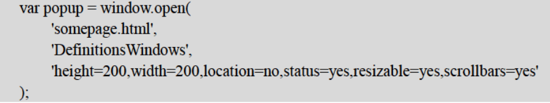
>
> - **`window.close`关闭浏览器窗口。谁调用我 ，我关谁**

```html
    <button onclick="opentheWindow()">打开窗口</button>
    <button onclick="closetheWindow()">关闭窗口</button>
    <script>

        function opentheWindow() {
            newWindow = window.open("http://www.baidu.com")
        }

        function closetheWindow() {
            newWindow.close()
        }
    </script>
```

##### 2.window.print()

> **`window.print`()方法会跳出打印对话框，同用户单击菜单中的“打印”命令效果相同。**

```js
        function winprint() {
            window.print()
        }
```

> 非桌面设备（如手机）可能没有打印功能，这时可以通过如下方式进行判断。

```js
		function haveprint() {
            console.log(typeof window.print == "function")//true
        }
```

##### 3.弹窗

> - `window.alert()`：显示带有一段消息和一个确认按钮的警告框。
> - `window.confirm()`：显示带有一段消息以及确认按钮和取消按钮的对话框。
>   - 如果用户点击确定按钮，则方法返回true
>   - 如果用户点击取消按钮，则方法返回false
> - `window.prompt()`：显示可提示用户输入的对话框。
>   - 第一个参数：弹窗提示用户输入的文本
>   - 第二个参数：输入框默认的值
>   - 返回值：获取用户输入的值

```js
        function testconfirm() {
            console.log(window.confirm("今天快乐吗"))//true
        }

        function testprompt() {
            console.log(window.prompt("请留言"))//今天天气不错哦
        }
```

#### 事件

##### 1.window.onload

```html
<body onload="testOnload()">
```

### navigator对象

> window对象的navigator属性指向一个包含浏览器信息的对象: navigator对象，该对象包含了浏览器的基本信息，如名称、版本和系统等。 ==> **`window.navigator == navigator`**

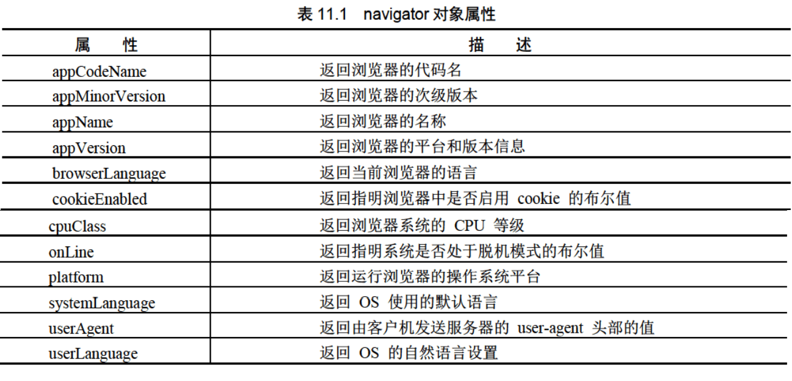

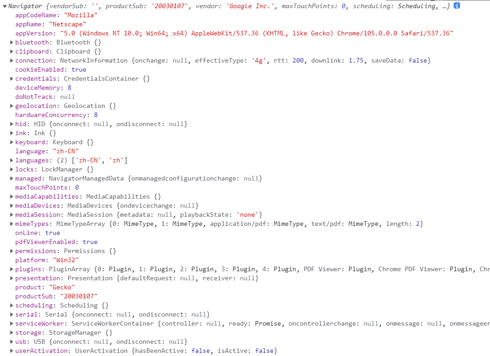

### location对象

> **`window.location`返回一个location对象，用于获取窗口当前的URL信息。它等同于`document.location`对象。**使用window对象的location属性可以访问。==>**`windown.location == location`**

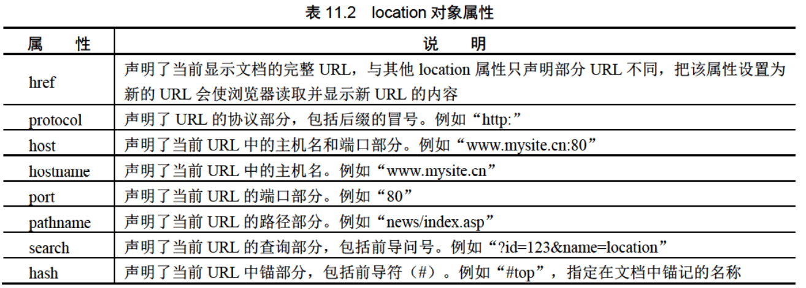

```js
        (function () {
            console.log(window.location)
            console.log(document.location)

            console.log(window.location == document.location)//true
        })()
```

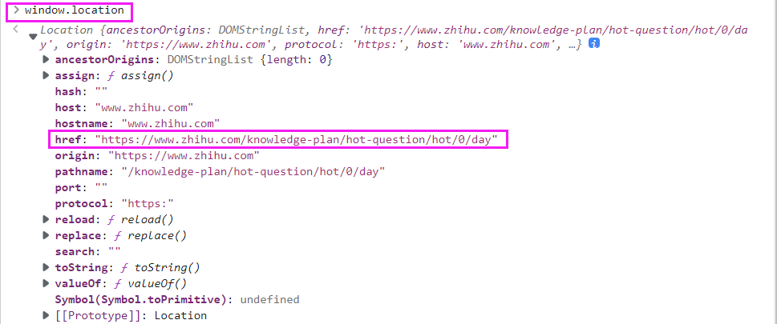

> location对象的属性都是可读可写的，**如果改变了文档的`location.href `属性值，则浏览器就会载入新的页面。如果改变了`location.hash `属性值，则页面会跳转到新的锚点，但此时页面不会重载。**

```js
        function changeUrl() {
            location.href = "http://www.baidu.com"
            console.log(location)
        }

        function changeHash() {
            location.hash = "#btn"
            console.log(location)
        }
```

### history对象

> **`window.history ==> history`**

#### 属性

##### history.length

> 浏览器窗口有一个history对象，用来保存浏览历史。如果当前窗口先后访问了3个网址，那么history对象就包括三项，`history.length`属性等于3。

#### 方法

##### history.back()

> 移动到上一个访问页面，等同于浏览器的后退键。

##### history.forward()

> 移动到下一个访问页面，等同于浏览器的前进键。

##### history.go()

> 接受一个整数作为参数，移动到该整数指定的页面，如 go(1)相当于forward()，go(-1)相当于back()。history.go(0)相当于刷新当前页面。

```js
        function testback() {
            history.back()
        }
        function testforward() {
            history.forward()
        }
        function testgo() {
            history.go(1)
        }
```

### screen对象

> 使用window.screen可以访问screen对象，该对象包含了显示设备的信息。这些信息可以用来探测客户端硬件的基本配置。利用screen对象可以优化程序的设计，满足不同用户的显示要求。

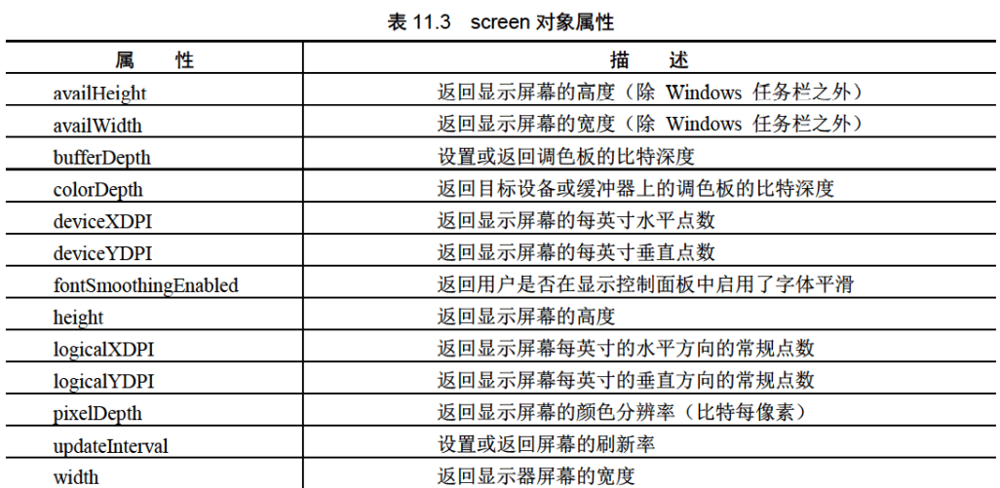

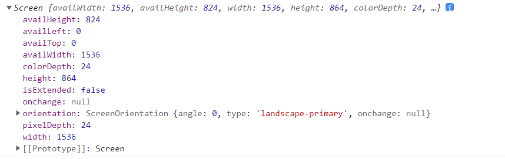

## DOM

### 文档

#### 获取文档中的指定元素

> 1. getElementById()：根据id属性值获取元素对象。id属性值一般唯一
>
> 2. getElementsByTagName()：根据元素名称获取元素对象们。返回值是一个数组
>
> 3. getElementsByClassName()：根据Class属性值获取元素对象们。返回值是一个数组
>
> 4. getElementsByName(): 根据name属性值获取元素对象们。返回值是一个数组
>
> 5. querySelector("#demo")：获取文档中匹配指定 CSS 选择器的第一个元素。
>
> 6. querySelectorAll("#demo") ：获取文档中匹配指定 CSS 选择器的全部元素，返回 NodeList 对象。
>
>    NodeList 对象表示节点的集合。可以通过索引访问，索引值从 0 开始。

#### 创建元素节点-文本节点-节点属性

> - `document.createElement()`方法：生成一个新元素
> - `document.createTextNode()`方法：生成文本节点
> - `节点.setAttribute(name,value)`：设置节点属性

```js
    (function () {
        let element = document.createElement("p");
        let text = document.createTextNode("hello");

        let node = element.appendChild(text);
        document.getElementsByTagName("body")[0].appendChild(node)
    })()
```

```js
    (function () {
        let element = document.getElementsByTagName("div")[0];
        element.setAttribute("class", "demo")
    })()
```

### 节点

#### 节点类型

> DOM的最小组成单位叫作节点(Node)。文档的树形结构(DOM树）就是由各种不同类型的节点组成。每个节点可以看作是文档树的一片叶子。常用的节点的类型有7种，简单说明如下。
>
> - Document:整个文档树的顶层节点。
>
> - DocumentType: doctype标签（如`<!DOCTYPE html>`) 。
>
> - Element:网页的各种HTML标签（如`<body>`、`<a>`等）。
>
> - Attribute:网页元素的属性（如`class="right"`) 。
>
> - Text:标签之间或标签包含的文本。
>
> - Comment:注释。
>
> - DocumentFragment:文档的片段。
>
>   这7种节点都属于浏览器原生提供的节点对象的派生对象，**具有一些共同的属性和方法。**

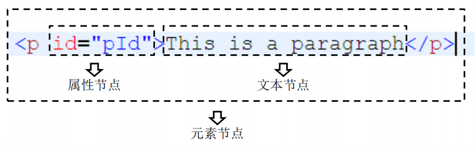

#### 节点的名称和值

> - 使用节点的nodeName和 nodeValue属性可以读取节点的名称和值。这两个属性的值完全取决于节点的类型
>
>   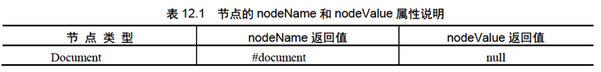
>
>   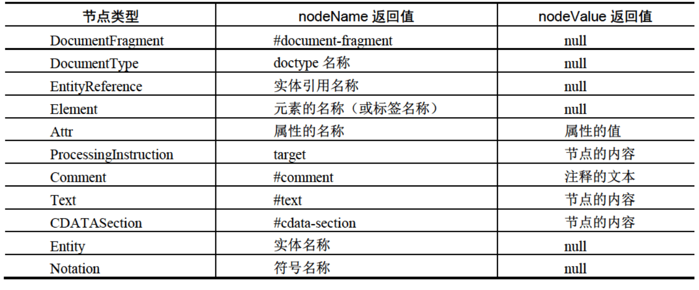
>
> - 在读取这两个属性值之前，最好是先检测一下节点的类型。

```js
    let element = document.getElementsByTagName("div")[0];

    if (element.nodeType == 1) {
        console.log(element.nodeName)//DIV
        console.log(element.nodeValue)//null
    }
```

#### 访问节点

> 通过节点之间的树形关系，可以定位文档中每个节点。
>
> - ownerDocument:返回当前节点的根元素（ document对象）。
> - parentNode:返回当前节点的父节点。所有的节点都仅有一个父节点。childNodes:返回当前节点的所有子节点的节点列表。
> - firstChild:返回当前节点的首个子节点。
> - lastChild:返回当前节点的最后一个子节点。nextSibling:返回当前节点之后相邻的同级节点。
> - previousSibling:返回当前节点之前相邻的同级节点。

##### 1.ownerDocument

> 在 DOM文档树中，可以使用ownerDocument属性访问根节点。

##### 2.childNodes

> - 每个节点都有一个childNodes属性，保存着nodeList对象，它表示所有子节点的列表。
> - **nodeList是一种类数组对象**，用于保存一组有序的节点，用户可以通过下标位置来访问这些节点。虽然childNodes可以通过方括号语法来访问nodeList的值，而且**childNodes对象包含一个length属性，它表示列表包含子节点的个数(长度)**，但**childNodes并不是数组，不能够直接调动数组的方法。**

##### 3.parentNode

> - 每个节点都有一个parentNode 属性，该属性指向文档树中的父节点。
> - parentNode属性返回节点永远是一个元素类型节点，因为只有元素节点才可能包含子节点。不过document节点没有父节点，document节点的parentNode 属性将返回null。

##### 4.firstChild和 lastChild

> - firstChild属性返回第一个子节点，lastChild属性返回最后一个子节点。文本节点和属性节点的firstChild和lastChild属性返回值总是为null。
> - firstChild等价于childNodes的第一个元素，lastChild 属性值等价于childNodes 的最后一个元素。

##### 5.nextSibling和previousSibling

> nextSibling属性返回下一个相邻节点，previousSibling属性返回上一个相邻节点。如果没有同属一个父节点的相邻节点，则它们将返回null。

```js
    (function () {
        console.log(document.getElementById("outer").ownerDocument)

        let elementById = document.getElementById("middle02");
        console.log(elementById.childNodes)
        console.log(elementById.parentNode)
        console.log(elementById.firstChild)
        console.log(elementById.lastChild)
        console.log(elementById.previousSibling)
        console.log(elementById.nextSibling)
    })()
```

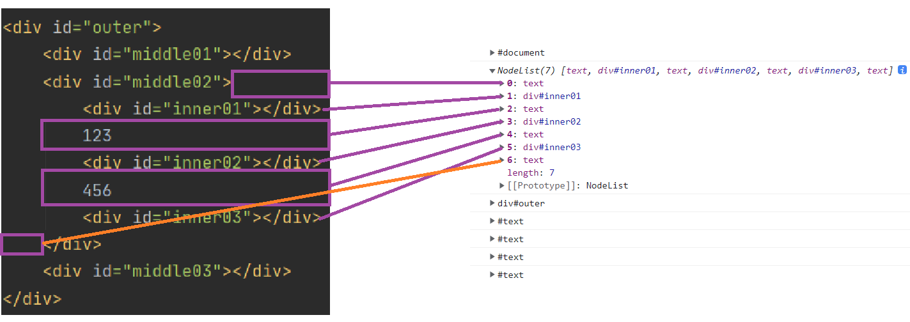

#### 操作节点

> - `父节点.appendChild(子节点)`：将新的子节点添加到当前节点的末尾
>- `父节点.insertBefore(新节点 , 旧节点)`：将新的节点添加到旧节点的前面
> - `父节点.cloneNode(deep`)：实现节点复制
>   - deep是一个boolean值，表示是否为深度复制，深度复制是将当前节点的所有子节点全部复制，当值为true时表示深度复制，当值为false时表示简单复制，简单复制只复制当前节点，不复制其子节点
>- `父节点.removeChild(子节点)` ：删除一个子节点
> - `父节点.replaceChild(新节点 , 旧节点)` ：用来将旧节点替换称新的节点
>- `父节点.normalize()`：合并相邻的Text节点并删除空的Text节点
> - `hasChildNodes()`：判断当前节点是否拥有子节点

```js
<button onclick="createNewNode()">创建一个节点并插入最后</button>
<button onclick="cloneNodeInsert()">克隆outer节点并插入到demo之前</button>
<button onclick="removeDemoNode()">删除demo节点</button>
<button onclick="createReplaceNode()">创建hello节点替换demo节点</button>
<button onclick="checkChildNode()">判断demo节点是否有子节点</button>
<button onclick="testNormalize()">合并相邻的text节点</button>

<script>
    function createNewNode() {
        let ele = document.createElement("p");
        let text = document.createTextNode("我是新创建的节点并插入最后的");
        let node = ele.appendChild(text);

        let elementById = document.getElementById("outer");
        elementById.appendChild(node)
    }

    function cloneNodeInsert() {
        let elementById = document.getElementById("outer");
        let node = elementById.cloneNode(true);

        elementById.insertBefore(node, document.getElementById("demo"))
    }

    function removeDemoNode() {
        let elementById = document.getElementById("outer");
        elementById.removeChild(document.getElementById("demo"))
    }

    function createReplaceNode() {
        let ele = document.createElement("p");
        let text = document.createTextNode("hello,节点");
        let node = ele.appendChild(text);

        let elementById = document.getElementById("outer");
        elementById.replaceChild(node, document.getElementById("demo"))
    }

    function checkChildNode() {
        let elementById = document.getElementById("outer");
        let b = elementById.hasChildNodes();
        console.log(b)
    }

    function testNormalize() {
        let elementById = document.getElementById("outer");
        elementById.normalize();
    }
</script>
```

#### 控制节点样式

> 1. `节点.style.属性`：使用元素的style属性来设置
> 2. `className`：提前定义好类选择器的样式，通过元素的className属性来设置其class属性值。

```html
    <style>
        .demo {
            font-size: 50px;
        }
    </style>

    <div id="hello" style="color: red">hello,world</div>
    <button onclick="textClassName()">测试className</button>

<script>
    (function () {
        let elementById = document.getElementById("hello");
        console.log(elementById.style.color)
    })()

    function textClassName() {
        let elementById = document.getElementById("hello");
        elementById.className = "demo"
    }
</script>
```

## 事件

### 常见的事件

> event对象：代表事件的状态
>
> target属性：获取触发特定事件的元素节点，可以获得整个节点上的属性值
>
> ~~~~

>    1. 点击事件：
>       
>        1. onclick：单击事件
>        2. ondblclick：双击事件
>        
>    2. 焦点事件
>       
>        1. onblur：失去焦点
>        2. onfocus:元素获得焦点。
>        
>    4. 鼠标事件：
>        1. onmousedown：鼠标按钮被按下。
>        2. onmouseup：鼠标按键被松开。
>        3. onmousemove：鼠标被移动。
>        4. onmouseover：鼠标移到某元素之上。
>        5. onmouseout：鼠标从某元素移开。
>
>    5. 键盘事件：
>    		1. ~~onkeydown：某个键盘按键被按下。~~	
>    	
>    	2. ~~onkeyup：某个键盘按键被松开。~~
>    	
>    	3. ~~onkeypress：某个键盘按键被按下并松开。~~
>    	
>    	4. ~~可以利用event.ctrlKey/event.shiftKey/event.altKey判断是否按下了ctrl、shift、alt键~~
>    	
>    	   ```javascript
>    	   <script>
>    	       var a = document.getElementById("tx")
>    	       a.onkeydown = function (event) {//注意是键盘事件
>    	           if (event.keyCode === 8) {
>    	               event.keyCode = 0;
>    	               event.returnValue = false;
>    	               alert("111111111")
>    	           } else if (event.keyCode === 13) {
>    	               alert("2222222222")
>    	           }else if(event.ctrlKey){
>    	               alert("ctrl........")
>    	           }else if(event.altKey){
>    	               alert("alt........")
>    	           }else if(event.shiftKey){
>    	               alert("shift........")
>    	           }
>    	       }
>    	   </script>
>    	   ```
>    	
>    6. 选择和改变
>         1. onchange：域的内容被改变
>         
>         2. onselect：文本被选中。
>         
>            ```html
>            <body>
>                <input type="text" value="11111" onchange="demo1()"><!-- 文本框内容被修改触发 -->
>            
>                <input type="text" value="请选择一些文本" onselect="demo2()"><!-- 文本框内的文字被选中触发 -->
>            </body>
>            <script>
>            
>                function demo1() {
>                    alert("1111111")
>                }
>                function demo2() {
>                    alert("222222")
>                }
>            </script>
>            ```
>         
>    7. 表单事件
>    	1. onsubmit：确认按钮被点击。
>    	
>    	   ```html
>    	   <body>
>    	       <form action="" onsubmit="demo()">
>    	           <input type="text">
>    	           <input type="submit" name="" id="" value="提交">
>    	       </form>
>    	   </body>
>    	   <script>
>    	       function demo() {
>    	           alert("dddddddd")
>    	       }
>    	   </script>
>    	   ```
>    	
>    	2. onreset：重置按钮被点击。
>    	
>    8. 阻止冒泡
>
>         1. stopPropagation()
>
>         2. stopImmediatePropagation()
>         
>            ```html
>               <body>
>               <style>
>                       div {
>                       padding: 50px;
>                           background-color: rgba(255, 0, 0, 0.2);
>                       text-align: center;
>                           cursor: pointer;
>                       }
>                   </style>
>               
>                   <h1>The stopPropagation() Method</h1>
>               
>                   <p>Click DIV 1:</p>
>                   <div onclick="func2()">DIV 2
>                       <div onclick="func1(event)">DIV 1</div>
>                   </div>
>               
>                   Stop propagation:
>                   <input type="checkbox" id="check">
>               
>                   <script>
>                       function func1(event) {
>                           alert("DIV 1");
>                           if (document.getElementById("check").checked) {
>                               event.stopPropagation()
>                               event.stopImmediatePropagation();
>                           }
>                       }
>               
>                       function func2() {
>                           alert("DIV 2");
>                       }
>                   </script>
>               
>               </body>
>            ```
>
>    10. 取消默认行为
>
>        - preventDefault()
>
>          ```html
>          <body>
>          
>              <a href="http://www.baidu.com" id="btn">百度</a>
>          
>          </body>
>          
>          <script>
>              var btn = document.getElementsByTagName("a")[0];
>              btn.onclick = function (event) {
>              event.preventDefault();
>          }
>          </script>
>          ```
>

### DOM监听器

> 1.addEventListener('click',observer,useCapture)，注册事件监听器
>
> ​	第一参数是事件名称，事件名称不以“on“开头
>
> ​	第二个参数是回调处理函数
>
> ​	第三个参数是个布尔值用于描述事件是冒泡还是捕获。该参数是可选的。默认true是捕获阶段
>
> 2.removeEventListener('click',observer,useCapture) ，移除事件监听器，参数同上

```html
<!DOCTYPE html>
<html>

<head>
 <meta charset="utf-8">
 <title>菜鸟教程(runoob.com)</title>
 <style>
     #myDIV {
         background-color: coral;
         border: 1px solid;
         padding: 50px;
         color: white;
     }
 </style>
</head>

<body>

 <div id="myDIV"> div 元素添加了 onmousemove 事件句柄，在你移动鼠标时会显示随机数。
     <p>点击按钮移除 DIV 的事件句柄。</p>
     <button onclick="removeHandler()" id="myBtn">点我</button>
 </div>
 <p id="demo"></p>
 <script>
     document.getElementById("myDIV").addEventListener("mousemove", myFunction);
     function myFunction() {
         document.getElementById("demo").innerHTML = Math.random();
     }
     function removeHandler() {
         document.getElementById("myDIV").removeEventListener("mousemove", myFunction);
     }
 </script>

</body>

</html>
```

### Image对象

> js有一个内嵌Image类，使用该类可以进行图片的预装载

```javascript
var a = new Image();
a.src = "a.git"
```

#### 滚动图片??????

> 源码在  .\源码\滚动图片

```html
<!DOCTYPE>
<html>

<head>
    <meta charset="UTF-8">
    <title>JS实现图片循环滚动</title>
    <style>
        #roll {
            height: 340px;
            width: 1000px;
            margin: 0 auto;
            border: 1px solid #FF0000;
            position: relative;
            overflow: hidden;
        }

        #picture1 td {
            height: 300px;
            width: 230px;
            position: relative;
        }

        #picture2 td {
            height: 300px;
            width: 230px;
            position: relative;
        }

        .xiao-one {
            height: 150px;
            width: 243px;
            border-radius: 10px;
            overflow: hidden;
            position: relative;
        }

        .xiao-one img {
            height: 72px;
            width: 72px;
            margin-left: 84px;
            margin-top: 22px;
        }

        .xiao-one p {
            width: 100%;
            color: #000;
            font-size: 18px;
            text-align: center;
            font-weight: bold;
        }

        .partner {
            margin-top: 12px;
            width: 100%;
        }

        p {
            padding: 0px;
            margin: 0px;
        }
    </style>
</head>

<body>
    <div id=roll>
        <div id=demo
            style="width:1000px;height:340px;overflow: hidden;background: url(imgs/合作校区背景图.png) no-repeat;background-size: 100% 100%;">
            <table>
                <tr>
                    <td id=picture1>
                        <table>
                            <tr>
                                <td>
                                    <div class="xiao-one">
                                        
                                        <div class="partner">
                                            <p>华南理工大学</p>
                                        </div>
                                    </div>
                                    <div class="xiao-one">
                                        
                                        <div class="partner">
                                            <p>华南理工大学</p>
                                        </div>
                                    </div>
                                </td>
                                <td>
                                    <div class="xiao-one">
                                        
                                        <div class="partner">
                                            <p>华南理工大学</p>
                                        </div>
                                    </div>
                                    <div class="xiao-one">
                                        
                                        <div class="partner">
                                            <p>华南理工大学</p>
                                        </div>
                                    </div>
                                </td>
                                <td>
                                    <div class="xiao-one">
                                        
                                        <div class="partner">
                                            <p>华南理工大学</p>
                                        </div>
                                    </div>
                                    <div class="xiao-one">
                                        
                                        <div class="partner">
                                            <p>华南理工大学</p>
                                        </div>
                                    </div>
                                </td>
                                <td>
                                    <div class="xiao-one">
                                        
                                        <div class="partner">
                                            <p>华南理工大学</p>
                                        </div>
                                    </div>
                                    <div class="xiao-one">
                                        
                                        <div class="partner">
                                            <p>华南理工大学</p>
                                        </div>
                                    </div>
                                </td>
                                <td>
                                    <div class="xiao-one">
                                        
                                        <div class="partner">
                                            <p>华南理工大学</p>
                                        </div>
                                    </div>
                                    <div class="xiao-one">
                                        
                                        <div class="partner">
                                            <p>华南理工大学</p>
                                        </div>
                                    </div>
                                </td>
                                <td>
                                    <div class="xiao-one">
                                        
                                        <div class="partner">
                                            <p>广东海洋大学</p>
                                        </div>
                                    </div>
                                    <div class="xiao-one">
                                        
                                        <div class="partner">
                                            <p>广东海洋大学</p>
                                        </div>
                                    </div>
                                </td>
                            </tr>
                        </table>
                    </td>
                    <td id=picture2>
                    </td>
                </tr>
            </table>
        </div>
        <script type=text/javascript>
				var speed = 10//控制数字快慢
				picture2.innerHTML = picture1.innerHTML
                
				function Marquee() {
					if(demo.scrollLeft >= picture1.scrollWidth) {
						demo.scrollLeft = 0
					} else {
						demo.scrollLeft++
					}
				}

				var MyMar = setInterval(Marquee, speed)
				demo.onmouseover = function() {
					clearInterval(MyMar)//鼠标移上时清除定时器达到滚动停止的目的
				}

				demo.onmouseout = function() {//鼠标移开时重设定时器
					MyMar = setInterval(Marquee, speed)
				}
			</script>
    </div>
</body>

</html>
```

### js的安全

#### 屏蔽部分按键

```html
<!DOCTYPE html>
<html lang="en">

<head>
    <meta charset="UTF-8">
    <meta http-equiv="X-UA-Compatible" content="IE=edge">
    <meta name="viewport" content="width=device-width, initial-scale=1.0">
    <title>Document</title>
</head>

<body>
    <input type="text" name="" id="tx">
</body>
<script>
    var a = document.getElementById("tx")
    a.onkeydown = function (event) {//注意是键盘事件
        if (event.keyCode === 8) {
            event.keyCode = 0;
            event.returnValue = false;
            alert("111111111")
        } else if (event.keyCode === 13) {
            event.keyCode = 0;
            event.returnValue = false;
            alert("2222222222")
        }else if(event.ctrlKey){
            event.keyCode = 0;
            event.returnValue = false;
            alert("ctrl........")
        }else if(event.altKey){
            event.keyCode = 0;
            event.returnValue = false;
            alert("alt........")
        }else if(event.shiftKey){
            event.keyCode = 0;
            event.returnValue = false;
            alert("shift........")
        }
    }
</script>

</html>
```

#### 禁止网页另存为

> noscript标签防止网页被另存为

```html
<noscript> 
<iframe src="*.htm"></iframe> 
</noscript> 
```

#### 禁止复制页面内容

```html
<body onselectstart="return false">
```

## 补充

### 1.doucument.write("")

> 1.document.write("xxx")		在web页面输出xxx

```javascript
//document.write语句中使用转义字符时，只有将其放在格式化文本块中才会起作用，所以脚本必须在<pre></pre>标记内
//第一种
document.write("<pre>");	
document.write("xxx\nyyy");	
document.write("</pre>");

//第二种
document.write("<pre>xxx\nyyy</pre>");	
```

### 2.typeof()

```javascript
//typeof()用来返回值的类型，返回类型有number、string、boolean、object、function、undefined
var a = 111,b = 'lz', c = true
console.log(typeof(a))
console.log(typeof(b))
console.log(typeof(c))
```

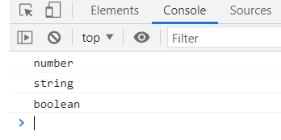

### 3.getHours()方法

```javascript
//返回当前时间的小时数
var now = new Date()
console.log(now.getHours())
```

### 4.表单重置reset()方法

```html
<html>

<head>
    <script type="text/javascript">
        function formReset() {
            document.getElementById("myForm").reset()
        }
    </script>
</head>

<body>
    <p>在下面的文本框中输入一些文本，然后点击重置按钮就可以重置表单。</p>

    <form id="myForm">
        姓名：<input type="text" size="20"><br />
        年龄：<input type="text" size="20"><br />
        <br />
        <input type="button" onclick="formReset()" value="重置">
    </form>
</body>

</html>
```

### 5.event.returnValue = false

> window.event.returnValue=false放在提交表单中的onclick事件中则不会提交表单，如果放到超链接中则不执行超链接，也就是它禁止了或取消了请求，没有任何效果。
>
> 和preventDefault效果一样，只不过prevnetDefault在IE中不支持

### 6.计时器

```javascript
<script>
//计算循环十万次所需要的毫秒数
console.time();//开始
for (i = 0; i < 100000; i++) {
  // 代码部分
}
console.timeEnd();//结束
</script>
```

### 7.定时器

> 计时器类型：
>
> （1）一次性计时器：仅在指定的延迟时间之后触发一次。
>
> （2）间隔性触发计时器：每隔一定的时间间隔就触发一次
>
> 方法
>
> setTimeout()     指定的延迟时间之后来执行代码
>
> clearTimeout()   取消setTimeout的设置
>
> setInterval()    每隔指定的时间执行代码
>
> clearInterval()  取消setInterval的设置

```html
<body>

    <p>显示当前时间:</p>

    <p id="demo"></p>

    <button onclick="myStopFunction()">停止时间</button>

    <script>
        var myVar = setInterval(function () { myTimer() }, 1000);

        function myTimer() {
            var d = new Date();
            var t = d.toLocaleTimeString();
            document.getElementById("demo").innerHTML = t;
        }

        function myStopFunction() {
            clearInterval(myVar);
        }
    </script>
</body>
```

```html
<body>

    <p>点击按钮，等待 3 秒后弹出 "Hello" 。</p>
    <p>点击第二个按钮来阻止弹出函数 myFunction 的执行。 (你必须在 3 秒前点击)</p>

    <button onclick="myFunction()">先点我</button>
    <button onclick="myStopFunction()">阻止弹出</button>

    <script>
        var myVar;

        function myFunction() {
            myVar = setTimeout(function () { alert("Hello") }, 2000);
        }

        function myStopFunction() {
            clearTimeout(myVar);
        }
    </script>
</body>
```

### 8.innerHTML与innerText的使用和区别

> 1） innerHTML设置或获取标签所包含的HTML+文本信息(从标签起始位置到终止位置全部内容，包括HTML标签，但不包括自身)
>
> 2） outerHTML设置或获取标签自身及其所包含的HTML+文本信息（包括自身）
>
> 3） innerText设置或获取标签所包含的文本信息（从标签起始位置到终止位置的内容，去除HTML标签，但不包括自身）
>
> 4） outerText设置或获取标签自身及其所包含的文本信息（包括自身）
>
> innerText和outerText在获取的时候是相同效果，但在设置时，innerText仅设置标签所包含的文本，而outerText设置包含包括标签**自身在内**的文本。

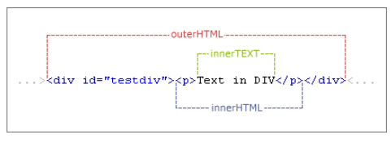

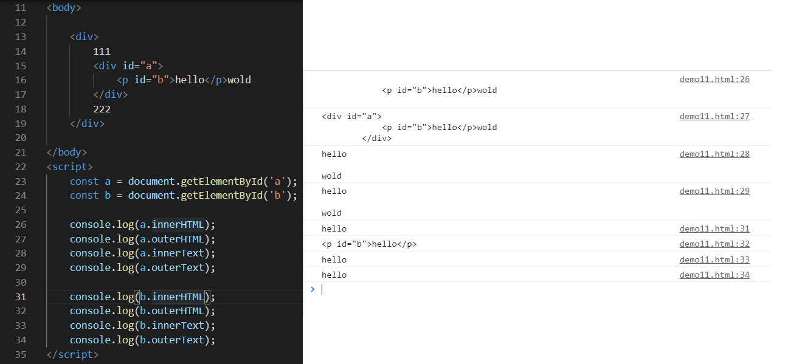

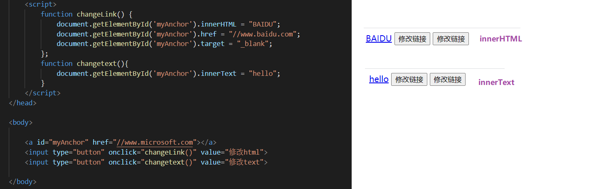

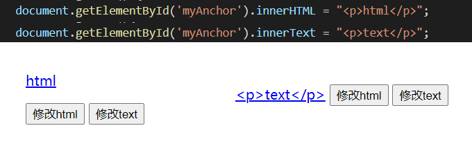

> 总结：
>
> ​	使用innerHTML可以写标签符号，会被解析，而innerText不会被解析

### 9.location.href

> ​	location.href="/url" 		当前页面打开URL页面

```java
function deleteUser(id) {
      //用户安全提示
      if (confirm("您确定要删除吗？")) {
      	//访问路径
     	location.href = "${pageContext.request.contextPath}/delUserServlet?id=" + id;
    }
}
```

### 10.js中的forEach、map和filter的用法和区别

> forEach：没有返回值，只是对每个元素进行操作
>
> filter：创建一个新数组，适合得筛选后才能返回出去的数组，对原数组不产生影响
>
> map：对数组数据进行操作，然后返回新的数组，对原数组不产生影响

### 11.import和require的区别

> - 规范不同
>   1. require是AMD规范引入方式
>   2. import是ES6的标准语法
> - 调用时间不同
>   - require是运行时调用，可以放在代码的任何位置
>   - import是编译时调用，必须放在文件开头
> - 本质不同
>   1. require是赋值过程
>   2. import是解构过程

### 12.[for in 和 for of 的区别](https://juejin.cn/post/6916058482231754765)

# JQuery

## 下载

> jq库调用有两种方式:一种是下载jq库,另一种是从 CDN 中载入 jQuery

(1)下载

> 从jq[官网](https://jquery.com/)下载

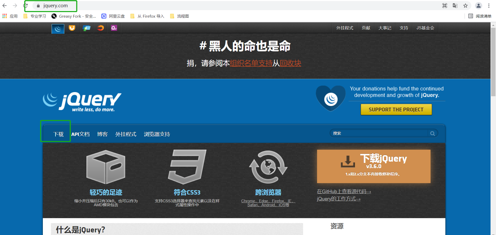

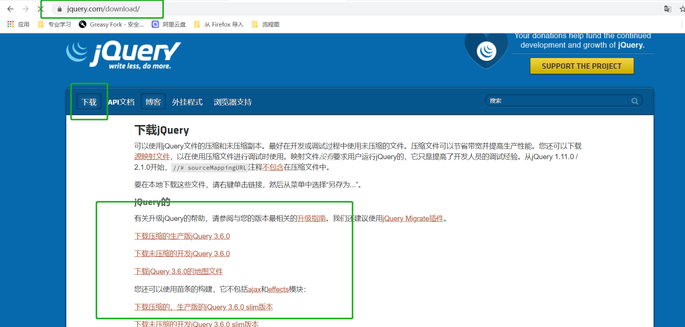

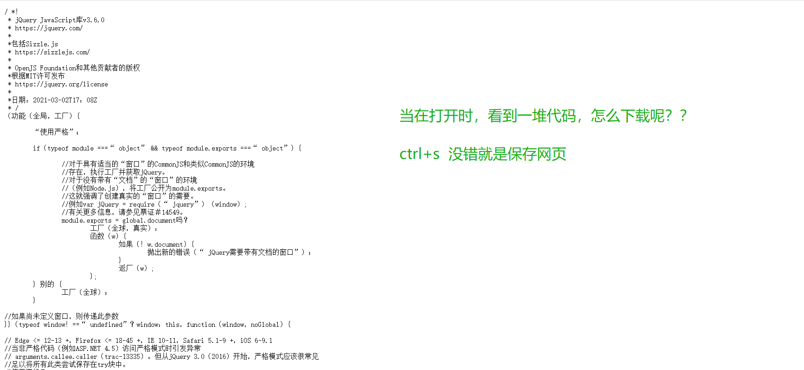

(2)从CDN载入

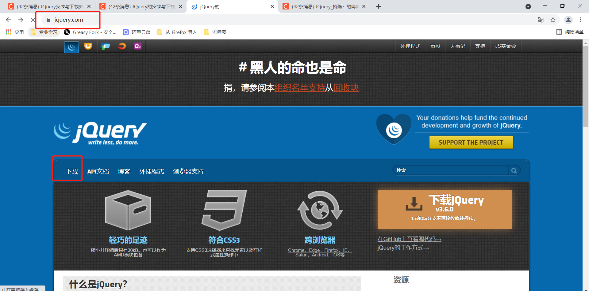

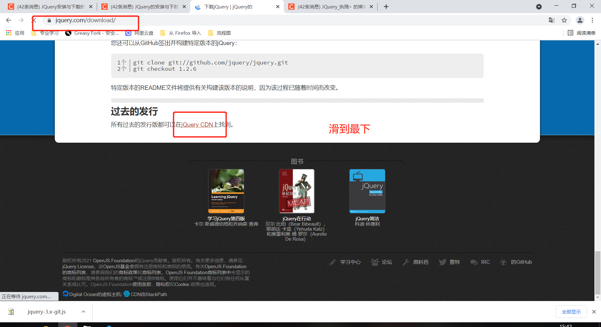

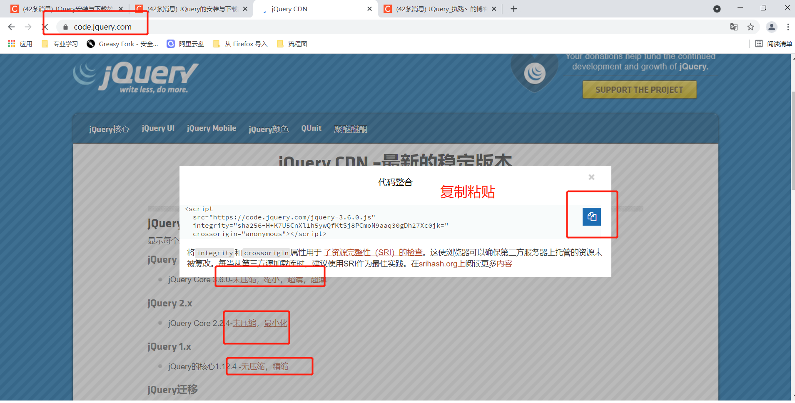

## 基本操作

> 1. 事件绑定
> 	
>    ```javascript
>    //1.获取b1按钮
>      $("#b1").click(function(){
>          alert("abc");
>      });
>    ```
>    
> 2. 入口函数
> 	
> 	```javascript
> 	js：window.onload = function () { }
> 	jq：$(function () { });
> 		$(document).ready(function(){ });	//document可以省略
> 	```
> 	
> 	- window.onload  和 $(function) 区别
> 	
> 	​		区别1：jQuery入口函数可以书写多次，window.onload只能书写一次；
> 	
> 	​		区别2：执行的时机不同，jQuery的入口，一旦我dom结构渲染完毕即可执行内部代码，不必等到所有外部资源加载完成；window.onload 的是等页面文档、外部的js文件、css文件、图片加载完毕才执行内部代码。
> 	
> 3. 样式控制：css方法
> 
>   ```javascript
>    $("#div1").css("backgroundColor","pink");
>   ```
> 

## 选择器分类

> 1. 基本选择器
>     1. 标签选择器（元素选择器）
>     	
>     		* 语法： $("html标签名") 获得所有匹配标签名称的元素
>     2. id选择器 
>        
>         - 语法： $("#id的属性值") 获得与指定id属性值匹配的元素
>     3. 类选择器
>        
>         - 语法： $(".class的属性值") 获得与指定的class属性值匹配的元素
>     4. 并集选择器：
>        
>         - 语法： $("选择器1,选择器2....") 获取多个选择器选中的所有元素
>         
>           ```javascript
>           $('#root', '#root2')
>           ```
> 2. 层级选择器
>     1. 后代选择器
>        - 语法： $("A B ") 选择A元素内部的所有B元素(所有后代元素)
>     2. 子选择器
>        - 语法： $("A > B") 选择A元素内部的所有B子元素(直接子元素)
> 3. 属性选择器
>       1. 属性名称选择器 
>         - 语法： $("A[属性名]") 包含指定属性的选择器
>      - 例如：
>           - $("[name]") :所有属性名为name的元素
>           - $("div[name]") :所有属性名为name的div元素
>     2. 属性选择器
>        
>        - 语法： $("A[属性名='值']") 包含指定属性等于指定值的选择器
>       3. 复合属性选择器
>       
>          - 语法： $("A[属性名='值'].") 包含多个属性条件的选择器
>          
>            ```javascript
>             $("[name='tx'],[name='tel']").css("background","red")
>            ```
> 4. 过滤选择器
>       1. 首元素选择器 
>         - 语法： :first 获得选择的元素中的第一个元素
>         - 例如：两个平级的div，$("div:first").css("color","red")只为第一个div设置样式
>       2. 尾元素选择器 
>         - 语法： :last 获得选择的元素中的最后一个元素
>       3. 非元素选择器
>         - 语法： :not(selector) 不包括指定内容的元素
>         - 例如：两个平级的元素div和p设置同一id为a，$("#a:not('p')").css("color","red")为id为a的元素设置样式，但是p元素除外
>       4. 偶数选择器
>         - 语法： :even 偶数，从 0 开始计数
>       
>           ```javascript
>           $("ul > li:even").css("color","red")
>           ```
>       5. 奇数选择器
>         - 语法： :odd 奇数，从 0 开始计数
>       6. 等于索引选择器
>         - 语法： :eq(index) 指定索引元素
>       
>           ```javascript
>           $("ul > li:eq(2)").css("color","red")
>           ```
>       7. 大于索引选择器 
>         - 语法： :gt(index) 大于指定索引元素
>       8. 小于索引选择器 
>         - 语法： :lt(index) 小于指定索引元素
>       9. 标题选择器
>         - 语法： :header 获得标题（h1~h6）元素，固定写法
> 5. 表单过滤选择器
>       1. 可用元素选择器 
>         - 语法： :enabled 获得可用元素
>         - 例如：在一个元素标签上设置enabled或disabled，然后再使用选择器
>       2. 不可用元素选择器 
>         - 语法： :disabled 获得不可用元素
>       3. 选中选择器 
>         - 语法： :checked 获得单选/复选框选中的元素
>       4. 选中选择器 
>         - 语法： :selected 获得下拉框选中的元素
>       
>           ```javascript
>           $("option:selected")
>           ```
>

## DOM操作

>  1. 内容操作
>        1. html(): 用于获取第一个匹配元素的HTML内容(类似js中innerHTML/innerText)
>        2. html(val)：用于设置全部匹配元素的HTML内容
>        3. text(): 用于获取全部匹配元素的文本内容
>        4. text(val)：用于设置全部匹配元素的文本内容
>        5. val()： 获取元素的value属性值
>        6. val(val)：用于设置所有匹配元素的值
>        7. val(['val1','val2'])：用于为check、select、radio等元素设置值，参数为字符串数组
>
>  2. 属性操作
>    3. 通用属性操作
>       1. attr(name): 获取元素的属性
>       2. attr(key,value):为匹配到的元素设置一个属性值
>       3. removeAttr(name):删除属性
>       4. prop(name):获取元素的属性
>       5. prop(key,value):为匹配到的元素设置一个属性值
>       6. removeProp(name):删除属性
>       * attr和prop区别？
>          1. 两者的用法都是相同的
>          2. 如果操作的是元素的固有属性，则建议使用prop
>          3. 如果操作的是元素自定义的属性，则建议使用attr
>
>    4. 对class属性操作
>
>          1. addClass():添加class属性值
>          2. removeClass():删除class属性值
>          3. toggleClass():切换class属性
>          4. toggleClass("one"): 判断如果元素对象上存在class="one"，则将属性值one删除掉。  如果元素对象上不存在class="one"，则添加
>          
>          5. toggleClass(class,switch):切换class属性,如果switch为true，则加上对应css类，否者删除
>          
>  5. css(name):获取元素样式属性
>
>  6. css(name,value):为元素指定样式值

### 节点

> 创建节点
>
> ```javascript
> <script>
> 
>  //方法一
>  // var $p = $('<p></p>')
>  // $p.html('<span>hello111111</span>')
>  // $('body').append($p)
> 
>  // var $p1 = $('<p></p>')
>  // $p.text('hello2222')
>  // $('body').append($p)
> 
>  //方法二
>  // var $txtP = $('<p><span>hello3333333</sapn></p>')
>  // $("body").append($txtP)
> </script>
> ```
>
> CRUD操作:
>
> 1. append():父元素将子元素追加到末尾
>    
>    - 对象1.append(对象2): 将对象2添加到对象1元素内部，并且在末尾
>   
> 2. prepend():父元素将子元素追加到开头
>    
>    - 对象1.prepend(对象2):将对象2添加到对象1元素内部，并且在开头
>   
> 3. appendTo():
>   
>    - 对象1.appendTo(对象2):将对象1添加到对象2内部，并且在末尾
>   
> 4. prependTo()：
>    
>    - 对象1.prependTo(对象2):将对象1添加到对象2内部，并且在开头
>    
> 5. after():添加元素到元素后边
>    
>    - 对象1.after(对象2)： 将对象2添加到对象1后边。对象1和对象2是兄弟关系
>    
> 6. before():添加元素到元素前边
>    
>    - 对象1.before(对象2)： 将对象2添加到对象1前边。对象1和对象2是兄弟关系
>    
> 7. insertAfter()
>    
>    - 对象1.insertAfter(对象2)：将对象2添加到对象1后边。对象1和对象2是兄弟关系
>    
> 8. insertBefore()
>    
>    - 对象1.insertBefore(对象2)： 将对象2添加到对象1前边。对象1和对象2是兄弟关系
>    
> 9. remove():移除元素
>    
>    - 对象.remove():将对象的后代元素全部清空，并且不保留当前对象以及其属性节点
>    
>      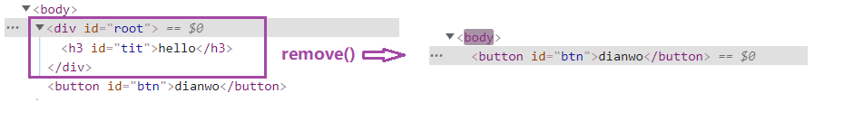
>    
> 10. empty():清空元素的所有后代元素。
>     
>     - 对象.empty():将对象的后代元素全部清空，但是保留当前对象以及其属性节点
>     
>       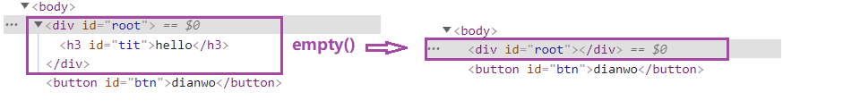
>     
> 11. clone():复制节点
>
>     - 对象.clone():用于复制节点，当参数为true时，表示克隆匹配的元素以及其所有的事件处理并且选中这些克隆的副本，当参数为false时，表示不复制元素的事件处理
>
>       ```javascript
>       <script>
>           $("input").bind('click', function () {
>           $(this).clone(true).insertAfter(this)
>       	})
>       </script>
>       ```
>
>     - 当clone参数为true时，单击输入框会复制出来一个输入框，并且复制出来的输入框会复制第一个输入框的事件，也就是说单击复制出来的输入框还会再复制出来一个带有事件的输入框。当clone参数为空或者false时，只有单击第一个输入输入框会复制出一个输入框，复制出来的输入框不会带有事件，也就是说单击复制出来的输入框不会再复制出来一个，只有单击第一个输入框才会复制出来一个输入框
>
> 12. replcaeWith(content):用于将所有匹配的元素替换成指定的HTML或DOM元素
>
>     ```javascript
>     $("#div1").replaceWith("<div>replaceWith()方法的替换结果</div>")
>     ```
>
> 13. replaceAll(selector):用于使用匹配的元素替换掉所有selector匹配到的元素
>
>     ```javascript
>     $("<div>replaceAll()方法的替换结果</div>").replaceAll("#div2")
>     ```
>

### 事件绑定

> 1. bind(type,[data],fn):为元素绑定事件**（不推荐，1.7以后的jQuery版本被on取代）**
>    - type:事件类型
>    - data:传递给事件对象的额外数据对象
>    - fn:绑定的事件处理程序
>    
> 2. unbind([type],[data]):移除绑定
>    - type:事件类型
>    - data:指定要从每个匹配元素的事件中反绑定的事件处理对象
>    
> 3. on绑定事件/off解除绑定
>    - jq对象.on("事件名称",回调函数)
>    - jq对象.off("事件名称")：如果off方法不传递任何参数，则将组件上的所有事件全部解绑
>    
> 4. one(type,[data],fn):绑定一次性事件处理
>    - type:事件类型
>    
>    - data:传递给事件对象的额外数据对象
>    
>    - fn:绑定的事件处理程序
>    
> 5. triggerHandler():触发被选元素的指定事件类型。但不会执行浏览器默认动作，也不会产生事件冒泡。
>
>    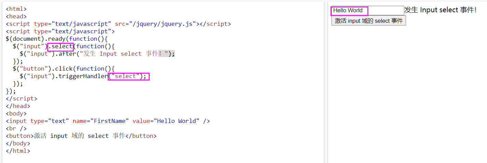
>
> 7. trigger():触发被选元素的指定事件类型。会操作 jQuery 对象匹配的所有元素
>
>    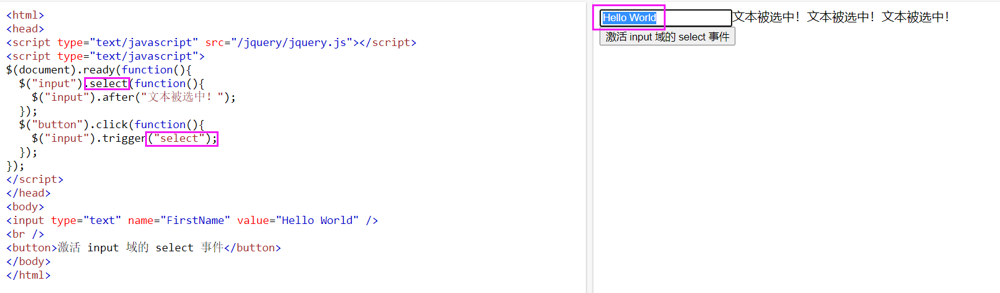
>
> 7. hover(over,out)：模仿悬停事件
>
>    - over:移动到匹配元素上时触发的函数
>
>    - out:移除到匹配元素上时触发的函数
>
> 8. toggle(odd,even):模拟鼠标连续单击事件
>
>    - odd:奇数次单击按钮时触发的函数
>
>    - even:偶数次单击按钮时触发的函数
>
> 9. stopPropagation()：阻止事件冒泡
>
>    ```javascript
>    <style>
>            #root1 {
>                background-color: blue;
>                width: 500px;
>                height: 500px;
>            }
>    
>            #root2 {
>                background-color: rebeccapurple;
>                width: 200px;
>                height: 200px;
>            }
>        </style>
>    </head>
>    
>    <body>
>    
>        <div id="root1">
>            <div id="root2">
>    
>            </div>
>        </div>
>    
>    </body>
>    <script>
>        $("#root1").click(function (event) {
>            console.log("1111111");
>    
>        })
>        $("#root2").click(function () {
>            console.log("2222222222222")
>            // event.stopPropagation()
>            event.stopImmediatePropagation()
>    
>        })
>    </script>
>    ```
>
> 10. preventDefault()：阻止默认行为
>
>     ```javascript
>     <body>
>     
>         <a href="http://www.baidu.com" id="btn">百度</a>
>     
>     </body>
>     <script>
>         $("a").click(function (evnet) {
>             event.preventDefault()
>         })
>     </script>
>     ```

## 动画

>  1. 三种方式显示和隐藏元素
>     1. 默认显示和隐藏方式
>
>        1. show([speed,[easing],[fn]])
>            - speed：动画的速度。三个预定义的值("slow","normal", "fast")或表示动画时长的毫秒数值(如：1000)
>           - easing：用来指定切换效果，默认是"swing"，可用参数"linear"
>             * swing：动画执行时效果是 先慢，中间快，最后又慢
>             * linear：动画执行时速度是匀速的
>           - fn：在动画完成时执行的函数，每个元素执行一次。
>
>        2. hide([speed,[easing],[fn]])
>
>        3. toggle([speed],[easing],[fn])
>           
>           - 1.9版本已删除
>           
>           ```html
>           <body>
>               <p>hello word</p>
>           
>               <button id="show">show</button>
>               <button id="hide">hide</button>
>               <button id="toggle">toggle</button>
>               
>           </body>
>           
>           <script>
>               $("#show").click(function(){
>                   $("p").show(2000)
>               })
>               $("#hide").click(function(){
>                   $("p").hide(5000)
>               })
>               $("#toggle").click(function(){
>                   $("p").toggle(1000)
>               })
>           </script>
>           ```
>
>     2. 滑动显示和隐藏方式
>        
>        1. slideDown([speed],[easing],[fn])
>        
>        2. slideUp([speed,[easing],[fn]])
>        3. slideToggle([speed],[easing],[fn])
>        
>        ```javascript
>        <html>
>        
>        <head>
>            <script type="text/javascript" src="js/jquery-3.x-git.js"></script>
>        </head>
>        
>        <body>
>            <p>hello word</p>
>            <button class="btn1">Hide</button>
>            <button class="btn2">Show</button>
>            <button class="btn3">Toggle</button>
>        </body>
>        <script type="text/javascript">
>            $(document).ready(function () {
>                $(".btn1").click(function () {
>                    $("p").slideUp();
>                });
>                $(".btn2").click(function () {
>                    $("p").slideDown();
>                });
>                $(".btn3").click(function () {
>                    $("p").slideToggle()
>                })
>            });
>        </script>
>        
>        </html>
>        ```
>        
>     3. 淡入淡出显示和隐藏方式
>        1. fadeIn([speed],[easing],[fn])
>     
>        2. fadeOut([speed],[easing],[fn])
>     
>        3. fadeToggle([speed,[easing],[fn]])
>     
>              ```javascript
>              <!DOCTYPE html>
>              <html lang="en">
>              
>              <head>
>                  <meta charset="UTF-8">
>                  <meta http-equiv="X-UA-Compatible" content="IE=edge">
>                  <meta name="viewport" content="width=device-width, initial-scale=1.0">
>                  <title>Document</title>
>                  <script src="js/jquery-3.x-git.js"></script>
>              </head>
>              
>              <body>
>                  <p>hello word</p>
>              
>                  <button id="fadeIn">fadeIn</button>
>                  <button id="fadeOut">fadeOut</button>
>                  <button id="fadeToggle">fadeToggle</button>
>              </body>
>              <script>
>                  $("#fadeIn").click(function () {
>                      $("p").fadeIn(1000)
>                  })
>                  $("#fadeOut").click(function () {
>                      $("p").fadeOut(1000)
>                  })
>                  $("#fadeToggle").click(function () {
>                      $("p").fadeToggle(1000)
>                  })
>              </script>
>              
>              </html>
>              ```
>  

### 自定动画

>  - animate(params,speed,callback)
>    - params：表示一个包含属性和值的映射，可以同时包含多个属性，例如：{left:"200px",top:"100px"}
>    - speed：表示动画的运行速度
>    - callback：回调函数
>    - 在使用animate()方法时，必须设置元素的定位属性position为relative或absolute
>
>  - stop(clearQueue,gotoEnd)：停止动画
>    - clearQueue:表示是否清空尚未执行完的动画队列（值为true时表示清空动画队列）
>    - gotoEnd：表示是否让正在执行的动画直接到达动画结束时的状态（值为true时表示直接到达动画结束时的状态）
>
>    ```javascript
>    <!DOCTYPE html>
>    <html>
>    
>    <head>
>        <script src="js/jquery-3.x-git.js"></script>
>    
>    </head>
>    
>    <body>
>    
>        <button id="btn1">开始动画</button>
>        <button id="btn2">结束动画</button>
>        <div style="background:#98bf21;height:100px;width:100px;position:absolute;">
>        </div>
>    
>    </body>
>    <script>
>        $(document).ready(function () {
>            $("#btn1").click(function () {
>                $("div").animate({
>                    left: '500px',
>                    opacity: '0.5',
>                    height: '150px',
>                    width: '150px'
>                }, 1000);
>            });
>            $("#btn2").click(function () {
>                $("div").stop(true, false)
>            )
>        });
>    </script>
>    
>    </html>
>    ```

## 遍历

> 语法：$(selector).each(function(index,element))
>
> - index：索引
> - element：当前的元素（也可使用 "this" 选择器）

```javascript
<html>

<head>
    <script type="text/javascript" src="js/jquery-3.x-git.js"></script>

</head>

<body>
    <button>输出每个列表项的值</button>
    <ul>
        <li>Coffee</li>
        <li>Milk</li>
        <li>Soda</li>
    </ul>
</body>

<script type="text/javascript">
    $(document).ready(function () {
        $("button").click(function () {
            $("li").each(function (index,element) {
                alert($(this).text())
                console.log(index,element)
            });
        });
    });
</script>

</html>
```

## JQuery对象和JS对象区别与转换

>  * jq -- > js : jq对象[索引] 或者 jq对象.get(索引)
>
>    ```javascript
>    $('h1')[0]
>    $('h1').get(0)
>    ```
>
>  * js -- > jq : $(js对象)
>
>    ```javascript
>    <script>
>        imgobj = document.getElementById('imgid');
>    	
>    	//把DOM对象转成jQuery对象,并添加点击事件
>        $(imgobj).click(function () {
>    
>        })
>    </script>
>    ```


## JS和JQ的小区别

> 1.函数调用

```javascript
//js
var btn = document.getElementById("btn");
//方法一
btn.onclick = function a() {
	alert("wocao@@@")
}

//方法二:这个位置函数可以单独写出a。然后让响应事件等于a即可
btn1.onclick = a;
function a() {
	alert("wocao@@@")
}

```

```javascript
//jq
$("#btn").click(function () {
	alert("abc");
});

//方法二:
$("#btn").click(a);
//方法二:这个位置函数可以单独写出a。然后让响应事件(a)
function a() {
	alert("abc");
}
```


# Bootstarp

1.下载与使用

> 两种方法：一种是下载库，一种是载入CDN。

(1)下载

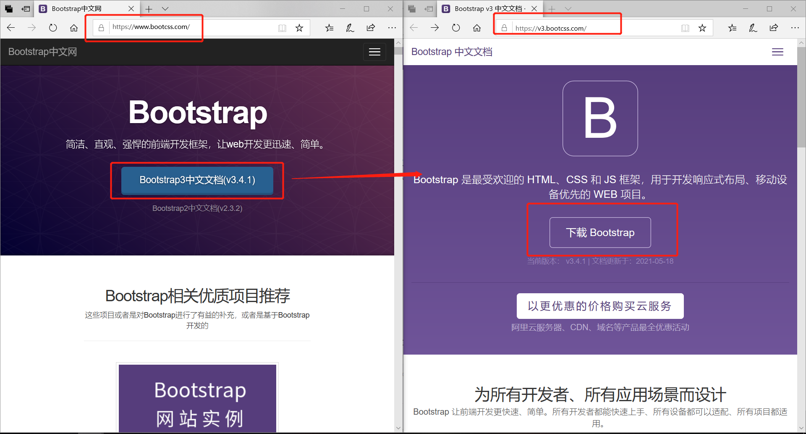

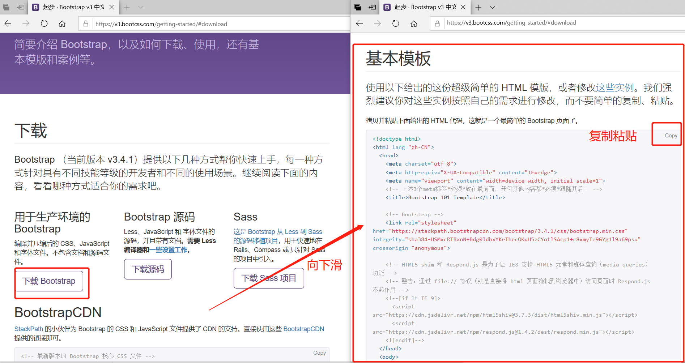

（2）载入CDN

> 直接复制粘贴这段代码为模板。不用下什么css js等包

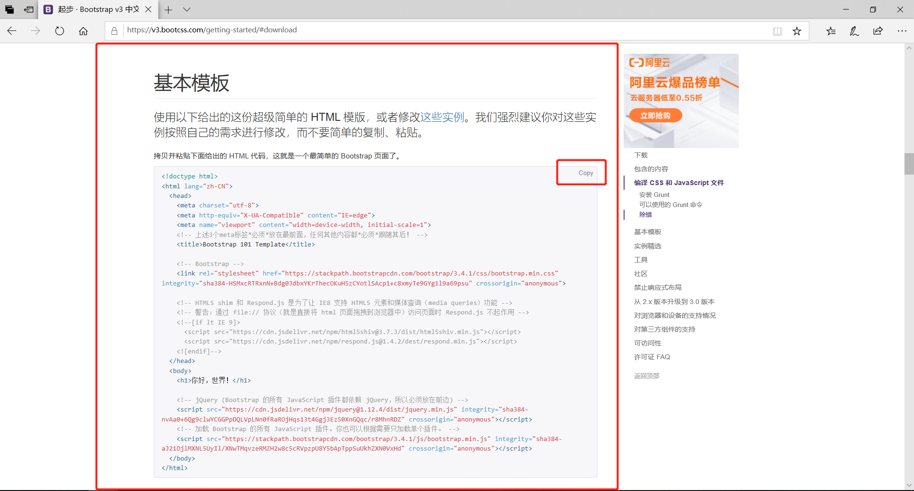


# Layui

1.下载

> 两种方式：一种是下载包，另一种是CDN。

（1）下载包

> 下载完的包，可以直接使用

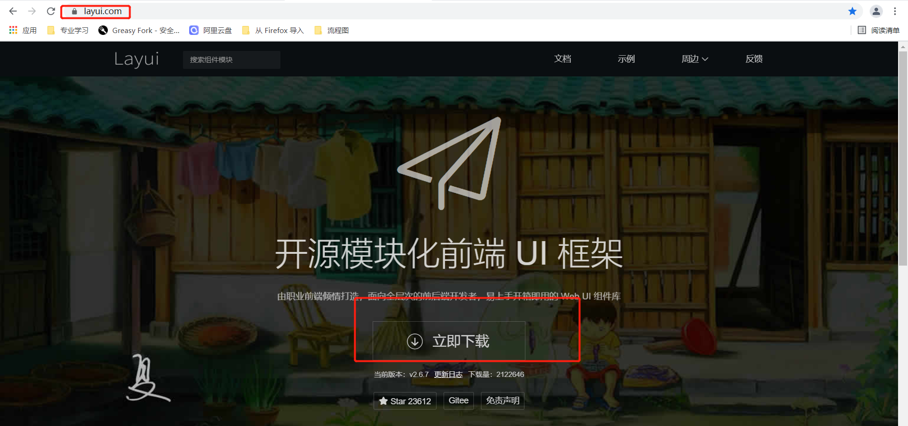

（2）CDN

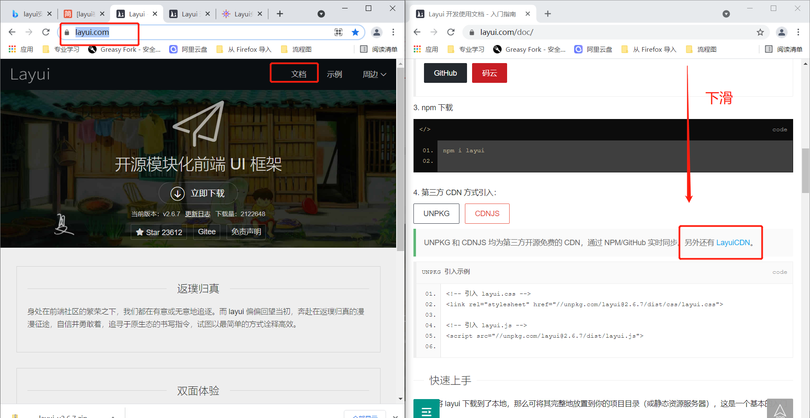

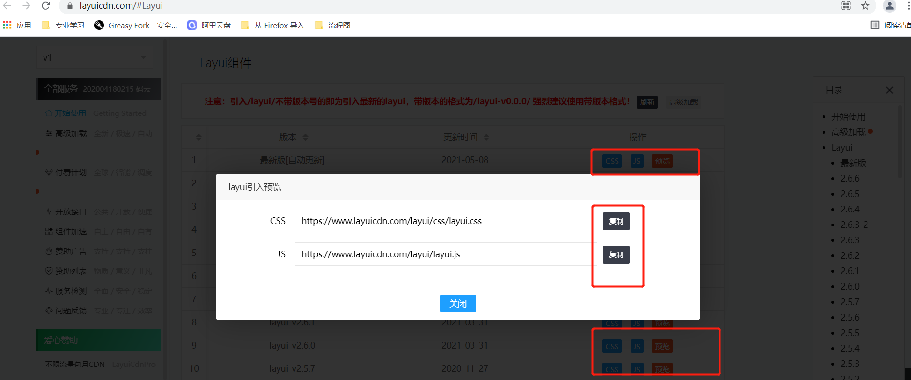

2.使用

> 模块化

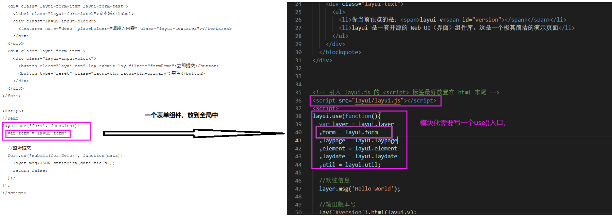

> 非模块化类是Bootstarp，不要模块化那一点
