## 1、开发环境及配置项放在pom中

像这样有多个配置环境，和yaml中的配置文件@xxx@的这种写法

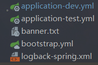

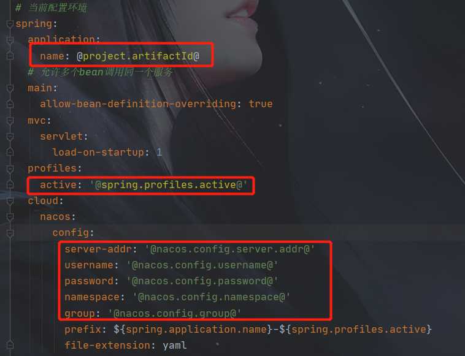

在父工程的pom文件中配置了配置项的位置

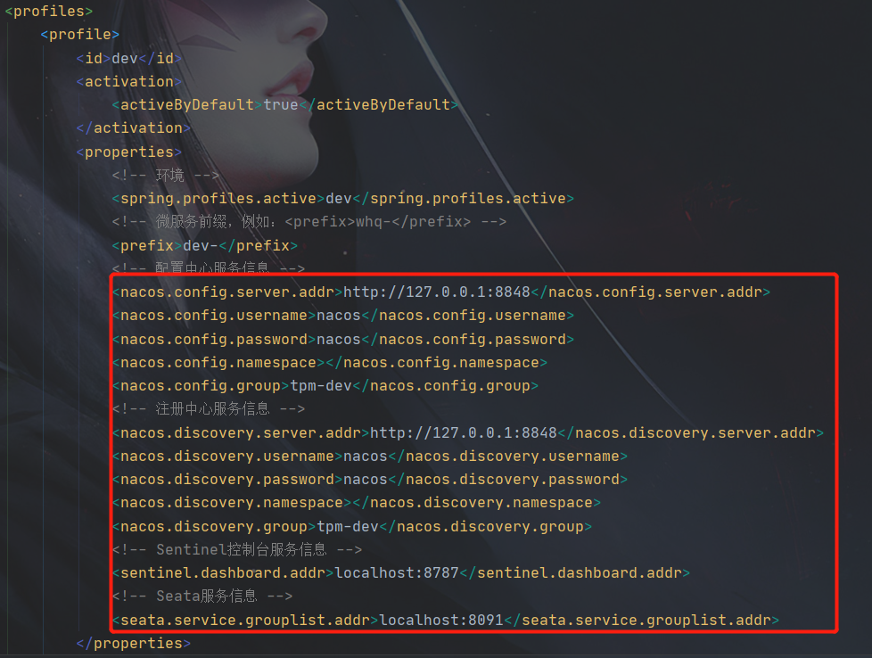

还有设置使用哪个开发环境

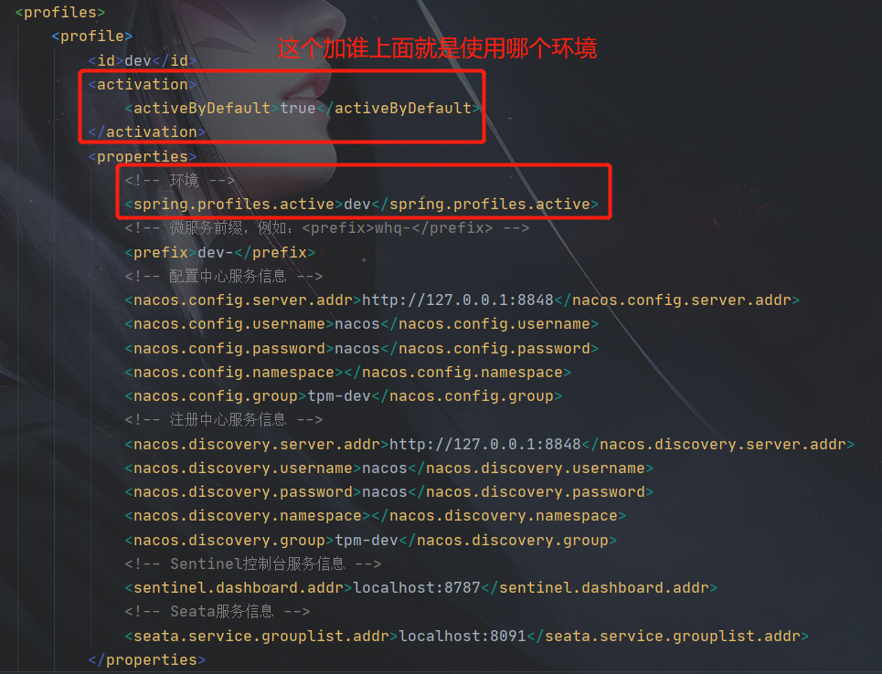

```java
    <!--配置信息-->
    <profiles>
        <profile>
            <id>dev</id>
            <activation>
                <activeByDefault>true</activeByDefault>
            </activation>
            <properties>
                <!-- 环境 -->
                <spring.profiles.active>dev</spring.profiles.active>
                <!-- 微服务前缀，例如：<prefix>whq-</prefix> -->
                <prefix>dev-</prefix>
                <!-- 配置中心服务信息 -->
                <nacos.config.server.addr>http://127.0.0.1:8848</nacos.config.server.addr>
                <nacos.config.username>nacos</nacos.config.username>
                <nacos.config.password>nacos</nacos.config.password>
                <nacos.config.namespace></nacos.config.namespace>
                <nacos.config.group>tpm-dev</nacos.config.group>
                <!-- 注册中心服务信息 -->
                <nacos.discovery.server.addr>http://127.0.0.1:8848</nacos.discovery.server.addr>
                <nacos.discovery.username>nacos</nacos.discovery.username>
                <nacos.discovery.password>nacos</nacos.discovery.password>
                <nacos.discovery.namespace></nacos.discovery.namespace>
                <nacos.discovery.group>tpm-dev</nacos.discovery.group>
                <!-- Sentinel控制台服务信息 -->
                <sentinel.dashboard.addr>localhost:8787</sentinel.dashboard.addr>
                <!-- Seata服务信息 -->
                <seata.service.grouplist.addr>localhost:8091</seata.service.grouplist.addr>
            </properties>
        </profile>
        <profile>
            <id>test</id>
            <properties>
                <!-- 环境 -->
                <spring.profiles.active>test</spring.profiles.active>
                <!-- 微服务前缀，例如：<prefix>whq-</prefix> -->
                <prefix>test-</prefix>
                <!-- 配置中心服务信息 -->
                <nacos.config.server.addr>http://127.0.0.1:8848</nacos.config.server.addr>
                <nacos.config.username>nacos</nacos.config.username>
                <nacos.config.password>nacos</nacos.config.password>
                <nacos.config.namespace>test-new</nacos.config.namespace>
                <nacos.config.group>tpm-test</nacos.config.group>
                <!-- 注册中心服务信息 -->
                <nacos.discovery.server.addr>http://127.0.0.1:8848</nacos.discovery.server.addr>
                <nacos.discovery.username>nacos</nacos.discovery.username>
                <nacos.discovery.password>nacos</nacos.discovery.password>
                <nacos.discovery.namespace>test-new</nacos.discovery.namespace>
                <nacos.discovery.group>tpm-test</nacos.discovery.group>
                <!-- Sentinel控制台服务信息 -->
                <sentinel.dashboard.addr>localhost:8787</sentinel.dashboard.addr>
                <!-- Seata服务信息 -->
                <seata.service.grouplist.addr>localhost:8091</seata.service.grouplist.addr>
            </properties>
        </profile>
        <profile>
            <id>prod</id>
            <properties>
                <!-- 环境 -->
                <spring.profiles.active>prod</spring.profiles.active>
                <!-- 微服务前缀，例如：<prefix>whq-</prefix> -->
                <prefix>prod-</prefix>
                <!-- 配置中心服务信息 -->
                <nacos.config.server.addr>localhost:8848</nacos.config.server.addr>
                <nacos.config.username>nacos</nacos.config.username>
                <nacos.config.password>nacos</nacos.config.password>
                <nacos.config.namespace>待创建后填充</nacos.config.namespace>
                <nacos.config.group>tpm-prod</nacos.config.group>
                <!-- 注册中心服务信息 -->
                <nacos.discovery.server.addr>localhost:8848</nacos.discovery.server.addr>
                <nacos.discovery.username>nacos</nacos.discovery.username>
                <nacos.discovery.password>nacos</nacos.discovery.password>
                <nacos.discovery.namespace>待创建后填充</nacos.discovery.namespace>
                <nacos.discovery.group>tpm-prod</nacos.discovery.group>
                <!-- Sentinel控制台服务信息 -->
                <sentinel.dashboard.addr>localhost:8787</sentinel.dashboard.addr>
                <!-- Seata服务信息 -->
                <seata.service.grouplist.addr>localhost:8091</seata.service.grouplist.addr>
            </properties>
        </profile>
    </profiles>

```

### @Value

可以使用@Value注解为一个实体类的字段注入yaml文件中的属性

```yaml
spring:
  application:
    name: MyDemo
```

```java
@Component
class demo{
	@Value("${spring.application.name}")
	String name;
}
```

@Value使用的环境要求

1.不能作用于静态变量（static）；

2.不能作用于常量（final）;

3.不能在非注册的类中使用（类需要被注册在spring上下文中，如用@Service,@RestController,@Component等）；

4.使用这个类时，只能通过依赖注入的方式，用new的方式是不会自动注入这些配置的

## 2、设置多数据源切换

#### 配置多个数据源

```yaml
spring:
  datasource:
    ds-type: multi
    multi:
      ds0:
        jdbc-url: jdbc:mysql://127.0.0.1/a1?useUnicode=true&characterEncoding=utf-8&serverTimezone=GMT%2B8&allowMultiQueries=true&rewriteBatchedStatements=true&useSSL=false
        username: root
        password: 123456
        driver-class-name: com.mysql.cj.jdbc.Driver
        pool-name: HikariPool-ds1
        maximum-pool-size: 20
        minimum-idle: 10
        connection-test-query: SELECT 1
        connection-timeout: 60000
      ds1:
        jdbc-url: jdbc:mysql://127.0.0.1/a2?useUnicode=true&characterEncoding=utf-8&serverTimezone=GMT%2B8&allowMultiQueries=true&rewriteBatchedStatements=true&useSSL=false
        username: root
        password: 123456
        driver-class-name: com.mysql.cj.jdbc.Driver
        pool-name: HikariPool-ds2
        maximum-pool-size: 20
        minimum-idle: 10
        connection-test-query: SELECT 1
        connection-timeout: 60000
```

#### 获取数据源配置

```java
/**
 * 数据源配置
 */
@Getter
@Setter
@ConfigurationProperties(prefix = "spring.datasource", ignoreInvalidFields = true)
public class DataSourceProperties {

    /**
     * 动态多数据源
     */
    private Map<String, AprilDataSource> multi = new HashMap<>();

    /**
     * 单个数据源
     */
    private AprilDataSource single;
}
```

这里获取配置文件中的配置，数据源名称为key，配置为value，放到setTargetDataSources中的Map就是这样的。


```
key = null
isShutdown = {AtomicBoolean@11137} "false"
fastPathPool = null
pool = null
catalog = null
connectionTimeout = 60000
validationTimeout = 5000
idleTimeout = 600000
leakDetectionThreshold = 0
maxLifetime = 1800000
maxPoolSize = 20
minIdle = 10
username = "root"
password = "123456"
initializationFailTimeout = 1
connectionInitSql = null
connectionTestQuery = "SELECT 1"
dataSourceClassName = null
dataSourceJndiName = null
driverClassName = "com.mysql.cj.jdbc.Driver"
exceptionOverrideClassName = null
jdbcUrl = "jdbc:mysql://127.0.0.1/a1?useUnicode=true&characterEncoding=utf-8&serverTimezone=GMT%2B8&allowMultiQueries=true&rewriteBatchedStatements=true&useSSL=false"
poolName = "JobAppHikariPool-ds0"
schema = null
transactionIsolationName = null
isAutoCommit = true
isReadOnly = false
isIsolateInternalQueries = false
isRegisterMbeans = false
isAllowPoolSuspension = false
dataSource = null
dataSourceProperties = {Properties@11144}  size = 0
threadFactory = null
scheduledExecutor = null
metricsTrackerFactory = null
metricRegistry = null
healthCheckRegistry = null
healthCheckProperties = {Properties@11145}  size = 0
sealed = false
```

#### 数据源配置

当使用注解切换数据源时，这一步的配置代码仍然是必要的，但它本身不会主动切换数据源。具体原因如下：

1. **数据源注册**：

- 这段代码的主要作用是将多个数据源注册到Spring容器中，并将它们映射到一个动态数据源管理类`DynamicDataSource`。它确保你的应用程序能够识别和使用多个数据源。

2. **默认数据源设置**：

- 它还设置了一个默认的数据源，供未指定数据源时使用。这是多数据源配置的基础部分，保证应用程序在不进行切换时也能正常运行。

3. **和注解切换的关系**：

- 当你使用`@TargetDataSource`注解切换数据源时，`DynamicDataSource`中的`determineCurrentLookupKey()`方法会根据注解中的值来决定使用哪个数据源。这就需要依赖`multiDataSource`方法中设置的`targetDataSources`和`defaultTargetDataSource`。

4. **总结**：

- **有用但不直接切换**：`multiDataSource()`方法是多数据源切换的基础配置，**不能单独实现数据源切换**，而是为数据源切换提供了可选的数据源和默认数据源。而注解`@TargetDataSource`与AOP切面才是实际执行切换的关键。

```java
/**
 * 数据源配置
 */
@Configuration
@EnableConfigurationProperties(DataSourceProperties.class)
@RequiredArgsConstructor(onConstructor = @__(@Autowired))
public class DataSourceAutoConfiguration {

    /**
     * 配置项
     */
    private final DataSourceProperties properties;

    /**
     * 自定义数据源
     * 解密url、username、password
     *
     * @return 自定义数据源
     */
    @Bean(name = "dataSource")
    @Primary
    @ConditionalOnProperty(prefix = "spring.datasource", name = "ds-type", havingValue = "single")//用于基于配置文件中的属性值来控制 Bean 的注册。spring.datasource.ds-type=single时注册
    public HikariDataSource singleDataSource() {
        return properties.getSingle();
    }

    /**
     * 动态多数据源
     *
     * @return 数据源
     */
    @Bean(name = "dataSource")
    @Primary
    @ConditionalOnProperty(prefix = "spring.datasource", name = "ds-type", havingValue = "multi")//用于基于配置文件中的属性值来控制 Bean 的注册。spring.datasource.ds-type=multi时注册
    public DataSource multiDataSource() {
        Map<String, AprilDataSource> multi = properties.getMulti();
        if (CollectionUtils.isEmpty(multi)) {
            throw new MsgException("没有可用数据源");
        }
        // 按照目标数据源名称和目标数据源对象的映射存放在Map中
        Map<Object, Object> targetDataSources = new HashMap<>(multi.size());
        multi.forEach(targetDataSources::put);
        // 采用AbstractRoutingDataSource的对象包装多数据源(DynamicDataSource的父类)
        DynamicDataSource dataSource = new DynamicDataSource();
        // PS:如果需要运行时动态添加数据源，可以通过开放setTargetDataSources方法来实现
        dataSource.setTargetDataSources(targetDataSources);
        // 查找map中的第一个数据源作为默认数据源，如果找不到，就抛出异常
        AprilDataSource defaultDs = multi.entrySet().stream().findFirst().orElseThrow().getValue();
        dataSource.setDefaultTargetDataSource(defaultDs);
        return dataSource;
    }

}

```

#### 创建自定义注解`@TargetDataSource`

```java
/**
 * 目标数据源注解，注解在方法上指定数据源的名称
 */
@Retention(RetentionPolicy.RUNTIME)
@Target(ElementType.METHOD)
@Documented
public @interface TargetDataSource {

    /**
     * 数据源的名称
     */
    String value();
}
```

#### 定义一个存储数据源上下文的类

```java
/**
 * 动态数据源持有者，负责利用ThreadLocal存取数据源名称
 */
public class DynamicDataSourceHolder {

    /**
     * 私有构造方法
     */
    private DynamicDataSourceHolder() {
        throw new UnsupportedOperationException("This is a utility class and cannot be instantiated");
    }

    /**
     * 本地线程共享对象
     */
    private static final ThreadLocal<String> THREAD_LOCAL = new ThreadLocal<>();

    /**
     * put方法
     *
     * @param name 数据源逻辑名称
     */
    public static void putDataSource(String name) {
        THREAD_LOCAL.set(name);
    }

    /**
     * 获取数据源
     * {@link DynamicDataSource#determineCurrentLookupKey}
     *
     * @return 数据源逻辑名称
     */
    public static String getDataSource() {
        return THREAD_LOCAL.get();
    }

    /**
     * 清除数据源名称
     */
    public static void removeDataSource() {
        THREAD_LOCAL.remove();
    }
}
```

#### 实现AOP切面

```java
@Component
@Aspect
@Slf4j
@ConditionalOnProperty(prefix = "spring.datasource", name = "ds-type", havingValue = "multi")
public class DataSourceAspect {

    /**
     * AOP切面的切入点（使用注解的方法）
     */
    @Pointcut("@annotation(cn.jbinfo.april.database.annotations.TargetDataSource)")
    public void dataSourcePointCut() {
        // 标记方法
    }

    /**
     * 在方法执行前切换数据源
     *
     * @param joinPoint 切入点
     */
    @Before("dataSourcePointCut()")
    public void before(JoinPoint joinPoint) {
        try {
            // 如果方法上存在切换数据源的注解，则根据注解内容进行数据源切换
            // 获取到方法的签名（MethodSignature）、方法名、参数等信息。
            MethodSignature signature = (MethodSignature) joinPoint.getSignature();
            // 获取切入点所在的方法
            Method method = signature.getMethod();
            // 获取具体内容
            TargetDataSource targetDataSource = method.getAnnotation(TargetDataSource.class);
            String dataSourceName = targetDataSource.value();
            DynamicDataSourceHolder.putDataSource(dataSourceName);
            if (log.isDebugEnabled()) {
                log.debug("Thread: {}, add dataSourceKey:[{}] to thread-local success", Thread.currentThread().getName(), dataSourceName);
            }
        } catch (Exception e) {
            log.error(String.format("Thread: %s, add dataSourceKey to thread-local error :", Thread.currentThread().getName()), e);
        }
    }

    /**
     * 执行完切面后，将线程共享中的数据源名称清空
     */
    @After("dataSourcePointCut()")
    public void after() {
        String dataSourceName = DynamicDataSourceHolder.getDataSource();
        DynamicDataSourceHolder.removeDataSource();
        if (log.isDebugEnabled()) {
            log.debug("Thread: {}, remove dataSourceKey:[{}] from thread-local success", Thread.currentThread().getName(), dataSourceName);
        }
    }
}
```

#### 实现`AbstractRoutingDataSource`，获取当前使用的数据源

**Spring 框架中，每次执行数据库操作时，都会调用 `determineCurrentLookupKey()` 来获取当前应该使用的数据源。**

```java
/**
 * 动态数据源实现类
 */
@Slf4j
public class DynamicDataSource extends AbstractRoutingDataSource {

    /**
     * 数据源路由，此方用于产生要选取的数据源逻辑名称
     */
    @Override
    protected Object determineCurrentLookupKey() {
        // 从共享线程中获取数据源名称
        return DynamicDataSourceHolder.getDataSource();
    }
}
```

#### 使用

```java
	@TargetDataSource("ds1")
    public void demo() {
        // 数据库操作
    }
```

## 3、@TargetDataSource与@Transactional共用导致切换数据源失效

在使用若依框架时碰到这个问题，解决方式是在需要切换数据源的方法上添加新事物

```java
@Transactional(propagation = Propagation.REQUIRES_NEW)//避免多数据源无法切换
@DataSource(value = DataSourceType.SLAVE1)
List<String> selectViewColumns(@Param("viewName") String viewName);
```

## ~~4、TargetDataSource在子方法上失效~~

如果在一个service的方法的一个子方法上切换数据源无效，可以在servcie中注入自己，然后用在方法中用service调用子方法

## 5、window端口被占用

cmd命令 查看占用端口的进程号

```
netstat -ano | findstr 8080
```


从图中红圈可以看出 进程为 8456

使用cmd命令将此进程终止

```
taskkill /F /PID 8456
```


重新启动springboot应用

## 6、SQL的查询更新

如下：根据A2表中的Type字段值找到在A1中对应的，将A1中的Name值更新到A2的Name中


```sql
update A2 
left join A1 
on A2.Dis_Type = A1.Dict_Code
set A2.Dis_Type_Name = A1.Dict_Name
```

如果A1，A2中的DayID都是自增的，20230220、20230221、20230222、20230223......

我们需要要更新最大的。

```sql
update A2 
left join A1 
on A2.Dis_Type = A1.Dict_Code
set A2.Dis_Type_Name = A1.Dict_Name
where A1.DayID in (select MAX(DayID) from A1)
and A2.DayID in (select MAX(DayID) from A2);
```

这样写貌似没有问题，但是这里会报一个错


意思是：**在同一语句中，不能先select出同一表中的某些值，然后再update这个表**

所以要修改：

```sql
update A2 
left join A1 
on A2.Dis_Type = A1.Dict_Code
set A2.Dis_Type_Name = A1.Dict_Name
where A1.DayID in (select * from (select MAX(DayID) from A1) s)
and A2.DayID in (select * from (select MAX(DayID) from A2) s);
```

这样就可以执行了。注意：**要为派生出来的表起一别名，如上面代码中的 s。如果不起别名就会报一个错。**


意思是：**每一个派生出来的表都必须有一个自己的别名**

## 7、关于Lombok中的RequiredArgsConstructor

Spring 提供了几种注入模式，一种是**属性注入**(最长用的那一种，就是在属性上加@Autowrite)，一种是通过 Setter 方法，一种是构造器注入。

我们平时一般使用 `@Autowired` 和 `@Resource` 这两个注解来实现注入，在使用时在 IDEA 中会显示为灰色，提示未初始化，强迫症看着就很难受。


Spring 从 4.0 开始， 就 不 推 荐 使 用 属 性 注 入 模 式 了 ，原因是它可以让我们忽略掉一些代码可能变坏的隐患。

所以，构造器的方法就成了我们的首选。

但是使用构造器注入时，代码会很多。


这时我们就可以用 `@RequiredArgsConstructor` 了，如下：


把需要注入的属性，修改成 final 类型的(或者使用 @NotNull 注解，不推荐)，这些属性将构成默认的构造器。（当类中没有 final 和 @NonNull 注解的成员变量时会生成一个无参构造方法（因为没有符合要求的参数））

> Java 要求 final 类型的属性必须要初始化，如果没有构造方法代码就会变红。
>
> 可以看到修改之后的 IDE，灰色提示也消失了。这样看着也会显得代码简洁一些~

上方只是在类中创建了构造方法

### 属性

- staticName：使生成的构造方法是私有的
  并且生成一个参数为 final 变量和 @NonNull 注解变量，返回类型为当前对象的静态方法，方法名为 staticName 值
- access：设置构造方法的访问修饰符，如果设置了 staticName，那么将设置静态工厂方法的访问修饰符
  共有 PUBLIC、MODULE、PROTECTED、PACKAGE、PRIVATE、NONE
  MODULE 是 Java 9 的新特性，NONE 表示不生成构造方法也不生成静态方法，即停用注解功能
- onConstructor：**列出的所有注解都放在生成的构造方法上**
  JDK 7 之前的写法是 **onConstructor = @\_\_({@Deprecated})**，而 JDK 8 之后的写法是 onConstructor_ = {@Deprecated}

### 构造方法注入

```java
@RequiredArgsConstructor(onConstructor = @__(@Autowired))
public class BaseEffectiveDateConfigController extends BaseController<BaseEffectiveDateConfigDTO, BaseEffectiveDateConfigEntity> {

    private final BaseEffectiveDateConfigService baseEffectiveDateConfigService;
}
```

解析之后：

```java
public class BaseEffectiveDateConfigController extends BaseController<BaseEffectiveDateConfigDTO, BaseEffectiveDateConfigEntity> {


    private final BaseEffectiveDateConfigService baseEffectiveDateConfigService;
    
    @Autowired  //这样就是构造方法注入
    public BaseEffectiveDateConfigController(baseEffectiveDateConfigService){
        this.baseEffectiveDateConfigService = baseEffectiveDateConfigService;
    }
}
```

### 拓展：set注入

```java
public class BaseEffectiveDateConfigController extends BaseController<BaseEffectiveDateConfigDTO, BaseEffectiveDateConfigEntity> {

    private final BaseEffectiveDateConfigService baseEffectiveDateConfigService;
    
    @Autowired  //这样就是set方法注入
    public void setBaseEffectiveDateConfigService(BaseEffectiveDateConfigService baseEffectiveDateConfigService) {
        this.baseEffectiveDateConfigService = baseEffectiveDateConfigService;
    }
}
```

## 8、不要在遍历中插入/更新

在遍历中插入/更新效率低，可以将数据放在一个集合中批量插入

### 怎么批量更新

MySQL没有提供直接的方法来实现批量更新，但可以使用case when语法来实现这个功能。

```sql
UPDATE course
    SET name = CASE code 
        WHEN 1 THEN 'name1'
        WHEN 2 THEN 'name2'
        WHEN 3 THEN 'name3'
    END, 
    title = CASE code 
        WHEN 1 THEN 'New Title 1'
        WHEN 2 THEN 'New Title 2'
        WHEN 3 THEN 'New Title 3'
    END
WHERE id IN (1,2,3)
```

这条sql的意思是，如果code为1，则name的值为name1，title的值为New Title1；依此类推。

在Mybatis中的配置则如下：

```xml
    <update id="updateBath" parameterType="list">
        update md_store
        <trim prefix="set" suffixOverrides=",">
            <trim prefix="name =case" suffix="end,">
                <foreach collection="updateList" item="item" index="index">
                    <if test="item.name!=null">
                        when code=#{item.code} then #{item.name}
                    </if>
                </foreach>
            </trim>
            <trim prefix=" abbr_name =case" suffix="end,">
                <foreach collection="updateList" item="item" index="index">
                    <if test="item.abbrName!=null">
                        when code=#{item.code} then #{item.abbrName}
                    </if>
                </foreach>
            </trim>
        </trim>
        where
        <foreach collection="updateList" separator="or" item="item" index="index">
            store_code=#{item.storeCode}
        </foreach>
    </update>
```

执行语句：

```sql
UPDATE auth_organization 
SET NAME =
CASE
		
		WHEN CODE =? THEN
		? 
		WHEN CODE =? THEN
		? 
		WHEN CODE =? THEN
		? 
		WHEN CODE =? THEN
		? 
		WHEN CODE =? THEN
		? 
	END,
	abbr_name =
CASE
		
		WHEN CODE =? THEN
		? 
		WHEN CODE =? THEN
		? 
		WHEN CODE =? THEN
		? 
		WHEN CODE =? THEN
		? 
		WHEN CODE =? THEN
		? 
	END 
	WHERE
		CODE = ? 
		OR CODE = ? 
		OR CODE = ? 
		OR CODE = ? 
		OR CODE = ? 
```

```
Parameters: 
4615(String), 4615|北区(String), 4616(String), 4616|南区(String), 4617(String), 4617|西区(String), 4704(String), 4704|东区(String), 844136474(String), 844136474|总部(String),
4615(String), 北区(String), 4616(String), 南区(String), 4617(String), 西区(String), 4704(String), 东区(String), 844136474(String), 总部(String),
4615(String), 4616(String), 4617(String), 4704(String), 844136474(String)
```

## 9、List分片的3中方法

前些天在实现 MyBatis 批量插入时遇到了一个问题，当批量插入的数据量比较大时，会导致程序执行报错，如下图所示：  原因是 MySQL 只能执行一定长度的 SQL 语句，但当插入的数据量较多时，会生成一条很长的 SQL，这样程序在执行时就会报错。 

要解决这个问题，有两种方法：第一，设置 MySQL 可以执行 SQL 的最大长度；第二，将一个大 List 分成 N 个小 List 进行。由于无法准确的界定程序中最大的 SQL 长度，所以最优的解决方案还是第二种，于是就有了今天的这篇文章。 

### 简介

将一个 List 分成多个小 List 的过程，我们称之为分片，当然也可以叫做“List 分隔”，选一个你喜欢的、好理解的叫法就行。 

在 Java 中，分片的常见实现方法有以下几种：

1. 使用 Google 的 Guava 框架实现分片；
2. 使用 Apache 的 commons 框架实现分片；
3. 使用国产神级框架 Hutool 实现分片；

### 1.Google Guava

先在项目的 pom.xml 中添加框架支持，增加以下配置：

```xml
<!-- google guava 工具类 -->
<!-- https://mvnrepository.com/artifact/com.google.guava/guava -->
<dependency>
  <groupId>com.google.guava</groupId>
  <artifactId>guava</artifactId>
  <version>31.0.1-jre</version>
</dependency>
```

有了 Guava 框架之后，只需要使用 Lists.partition 方法即可实现分片，如下代码所示：

```java
import com.google.common.collect.Lists;

import java.util.Arrays;
import java.util.List;

/**
 * Guava 分片
 */
public class PartitionByGuavaExample {
    // 原集合
    private static final List<String> OLD_LIST = Arrays.asList(
            "唐僧,悟空,八戒,沙僧,曹操,刘备,孙权".split(","));

    public static void main(String[] args) {
        // 集合分片
        List<List<String>> newList = Lists.partition(OLD_LIST, 3);
        // 打印分片集合
        newList.forEach(i -> {
            System.out.println("集合长度：" + i.size());
        });
    }
}
```

以上代码的执行结果如下图所示： 

### 2.apache commons

先在项目的 pom.xml 中添加框架支持，增加以下配置：

```xml
<!-- apache 集合工具类 -->
<!-- https://mvnrepository.com/artifact/org.apache.commons/commons-collections4 -->
<dependency>
  <groupId>org.apache.commons</groupId>
  <artifactId>commons-collections4</artifactId>
  <version>4.4</version>
</dependency>
```

有了  commons 框架之后，只需要使用 ListUtils.partition 方法即可实现分片，如下代码所示：

```java
import org.apache.commons.collections4.ListUtils;

import java.util.Arrays;
import java.util.List;

/**
 * commons.collections4 集合分片
 */
public class PartitionExample {
    // 原集合
    private static final List<String> OLD_LIST = Arrays.asList(
            "唐僧,悟空,八戒,沙僧,曹操,刘备,孙权".split(","));

    public static void main(String[] args) {
        // 集合分片
        List<List<String>> newList = ListUtils.partition(OLD_LIST, 3);
        newList.forEach(i -> {
            System.out.println("集合长度：" + i.size());
        });
    }
}
复制代码
```

以上代码的执行结果如下图所示： 

### 3.Hutoo

先在项目的 pom.xml 中添加框架支持，增加以下配置：

```xml
<!-- 工具类 hutool -->
<!-- https://mvnrepository.com/artifact/cn.hutool/hutool-all -->
<dependency>
  <groupId>cn.hutool</groupId>
  <artifactId>hutool-all</artifactId>
  <version>5.7.14</version>
</dependency>
复制代码
```

有了 Hutool 框架之后，只需要使用 ListUtil.partition 方法即可实现分片，如下代码所示：

```java
import cn.hutool.core.collection.ListUtil;

import java.util.Arrays;
import java.util.List;

public class PartitionByHutoolExample {
    // 原集合
    private static final List<String> OLD_LIST = Arrays.asList(
            "唐僧,悟空,八戒,沙僧,曹操,刘备,孙权".split(","));

    public static void main(String[] args) {
        // 分片处理
        List<List<String>> newList = ListUtil.partition(OLD_LIST, 3);
        newList.forEach(i -> {
            System.out.println("集合长度：" + i.size());
        });
    }
}
复制代码
```

以上代码的执行结果如下图所示： 

## 10、AtomicInteger使用详解

### 什么是AtomicInteger

在Java语言中，++i和i++操作并不是线程安全的，在使用的时候，不可避免的会用到synchronized关键字。而AtomicInteger则通过一种线程安全的加减操作接口。

AtomicInteger类是系统底层保护的int类型，通过提供执行方法的控制进行值的原子操作。AtomicInteger它不能当作Integer来使用

从JAVA 1.5开始，AtomicInteger 属于java.util.concurrent.atomic 包下的一个类。

### 创建AtomicInteger 设置值获取值

AtomicInteger通过调用构造函数可以直接创建。在AtomicInteger提供了两种方法来获取和设置它的实例的值

```csharp
//初始值是 0
AtomicInteger atomicInteger = new AtomicInteger(); 
 
//初始值是 100
AtomicInteger atomicInteger = new AtomicInteger(100);
 
int currentValue = atomicInteger.get();         //100
 
atomicInteger.set(1234);                        //当前值1234
```

### 什么情况下使用AtomicInteger

在现实生活中，我们需要AtomicInteger两种情况：

> 1、作为多个线程同时使用的原子计数器。
>  2、在比较和交换操作中实现非阻塞算法。

**1、AtomicInteger作为原子计数器**
 要将它用作计数器，AtomicIntegerclass提供了一些以原子方式执行加法和减法操作的方法。


```undefined
addAndGet()- 以原子方式将给定值添加到当前值，并在添加后返回新值。
getAndAdd() - 以原子方式将给定值添加到当前值并返回旧值。
incrementAndGet()- 以原子方式将当前值递增1并在递增后返回新值。它相当于i ++操作。
getAndIncrement() - 以原子方式递增当前值并返回旧值。它相当于++ i操作。
decrementAndGet()- 原子地将当前值减1并在减量后返回新值。它等同于i-操作。
getAndDecrement() - 以原子方式递减当前值并返回旧值。它相当于-i操作。
```


```csharp
public class Main{
    public static void main(String[] args)
    {
        AtomicInteger atomicInteger = new AtomicInteger(100);
         
        System.out.println(atomicInteger.addAndGet(2));         //102
        System.out.println(atomicInteger);                      //102
         
        System.out.println(atomicInteger.getAndAdd(2));         //102
        System.out.println(atomicInteger);                      //104
         
        System.out.println(atomicInteger.incrementAndGet());    //105  
        System.out.println(atomicInteger);                      //105  
                 
        System.out.println(atomicInteger.getAndIncrement());    //105
        System.out.println(atomicInteger);                      //106
         
        System.out.println(atomicInteger.decrementAndGet());    //105
        System.out.println(atomicInteger);                      //105
         
        System.out.println(atomicInteger.getAndDecrement());    //105
        System.out.println(atomicInteger);                      //104
    }
}
```

**2、比较和交换操作**
 1、比较和交换操作将内存位置的内容与给定值进行比较，并且只有它们相同时，才将该内存位置的内容修改为给定的新值。这是作为单个原子操作完成的。
 2、原子性保证了新值是根据最新信息计算出来的; 如果在此期间该值已被另一个线程更新，则写入将失败。
 为了支持比较和交换操作，此类提供了一种方法，如果将该值原子地设置为给定的更新值current value == the expected value。

```java
boolean compareAndSet(int expect, int update)
```

我们可以compareAndSet()在Java并发集合类中看到amy实时使用方法ConcurrentHashMap。

```csharp
import java.util.concurrent.atomic.AtomicInteger;
 
public class Main{
    public static void main(String[] args){
        //1、默认初始值
        AtomicInteger atomicInteger = new AtomicInteger(100);
        //2、默认初始值和给定值，都是100，所以会更改成功
        boolean isSuccess = atomicInteger.compareAndSet(100,110);   //current value 100
        //3、返回true
        System.out.println(isSuccess);      //true
        //4、默认初始值是11,给定值是100，所以会更改失败
        isSuccess = atomicInteger.compareAndSet(100,120);       //current value 110
        //5、返回false
        System.out.println(isSuccess);      //false
         
    }
}
```

程序输出

```bash
true
false
```

### 总结

如上所述，主要用途AtomicInteger是当我们处于多线程上下文时，我们需要在不使用关键字的情况下对值执行原子操作。intsynchronized

AtomicInteger与使用同步执行相同操作相比，使用它同样更快，更易读


## 14、Character 方法

下面是Character类的方法：

| 序号 | 方法与描述                                         |
| :--- | :------------------------------------------------- |
| 1    | isLetter()是否是一个字母                           |
| 2    | isDigit() 是否是一个数字字符                       |
| 3    | isWhitespace() 是否是一个空白字符                  |
| 4    | isUpperCase()是否是大写字母                        |
| 5    | isLowerCase() 是否是小写字母                       |
| 6    | toUpperCase()指定字母的大写形式                    |
| 7    | toLowerCase() 指定字母的小写形式                   |
| 8    | toString() 返回字符的字符串形式，字符串的长度仅为1 |

## 15、在java中一个查看死锁的小工具

**Terminal命令行中输入`jps`查看当前的进程id，`jstack 进程id`查看是否有死锁**


## 16、一个list＜实体＞ 复制到另一个list＜实体2＞（深拷贝）

先将 list<实体> 传为 String.

```java
 List<实体> userList = new ArrayList<>();
 String json = JSON.toJSONString(userList);
```


 2，将String 转为另一个List<实体2>

```java
 List<实体2> list = JSON.parseArray(json,实体2.class);
```

注意：

1. 两个实体的字段、类型要完全一样
2. 需要getter、setter和无参构造

```java

class AToB {
    void demo() {
        User zs = new User(18, "zs");
        User ls = new User(19, "ls");

        ArrayList<User> users = new ArrayList<>();
        users.add(zs);
        users.add(ls);
        System.out.println("users.toString() = " + users.toString());


        String json = JSON.toJSONString(users);
        System.out.println("json = " + json);

        List<Person> people = JSON.parseArray(json, Person.class);
        System.out.println("people = " + people.toString());
    }
}

class User {
    private int age;
    private String name;

    public User() {
    }

    public User(int age, String name) {
        this.age = age;
        this.name = name;
    }

    public int getAge() {
        return age;
    }

    public void setAge(int age) {
        this.age = age;
    }

    public String getName() {
        return name;
    }

    public void setName(String name) {
        this.name = name;
    }

    @Override
    public String toString() {
        return "User{" +
                "age=" + age +
                ", name='" + name + '\'' +
                '}';
    }
}


class Person extends User {

    public Person() {
    }

    public Person(int age, String name) {
        super(age, name);
    }
}

```

### 浅拷贝

```java
public static void main(String[] args) {
   List<Integer> list1 = List.of(1, 2, 3, 4);
   
   ArrayList<Integer> list2 = new ArrayList<>(list1.size());
   list2.addAll(list1);
   System.out.println(list2.toString());
   System.out.println("=============================");

   List<Integer> list3 = List.of(1, 2, 3, 4);
   //使用 Collections.nCopies(list1.size(), null) 创建了一个大小相同的 ArrayList，其中元素都是 null。
   ArrayList<Integer> list4 = new ArrayList<>(Collections.nCopies(list1.size(), null));
   Collections.copy(list4, list3);
   System.out.println(list4.toString());
   System.out.println("=============================");
}
```

## 17、springboot 各种文件下载方式

### 1. **通过 `ResponseEntity` 下载文件**

使用 `ResponseEntity` 配合 `HttpServletResponse` 可以非常灵活地处理文件下载。

**示例代码：**

```java
import org.springframework.http.HttpHeaders;
import org.springframework.http.HttpStatus;
import org.springframework.http.ResponseEntity;
import org.springframework.util.MimeTypeUtils;
import org.springframework.web.bind.annotation.GetMapping;
import org.springframework.web.bind.annotation.RequestParam;
import org.springframework.web.bind.annotation.RestController;

import java.io.File;
import java.io.FileInputStream;
import java.io.IOException;
import java.io.InputStream;
import java.nio.file.Files;

@RestController
public class FileDownloadController {

    @GetMapping("/download")
    public ResponseEntity<byte[]> downloadFile(@RequestParam String filename) throws IOException {
        // 文件路径，根据实际情况设置
        File file = new File("path/to/your/file/" + filename);

        // 读取文件内容
        InputStream inputStream = new FileInputStream(file);
        byte[] fileContent = inputStream.readAllBytes();

        // 设置文件的内容类型和下载的文件名
        HttpHeaders headers = new HttpHeaders();
        headers.setContentType(MediaType.valueOf(MediaType.APPLICATION_OCTET_STREAM_VALUE));
        headers.setContentLength(fileContent.length);
        headers.set("Content-Disposition", "attachment; filename=\"" + URLEncoder.encode(fileName, "UTF-8")+"\"");

        return new ResponseEntity<>(fileContent, headers, HttpStatus.OK);
    }
}
```

**说明：**

- `ResponseEntity`：用于包装文件的二进制数据。
- `HttpHeaders`：用来设置响应头，指定内容类型（`Content-Type`）为二进制流，以及指定下载时的文件名（`Content-Disposition`）。
- `readAllBytes()`：读取文件内容为字节数组。

### 2. **通过 `HttpServletResponse` 直接下载文件**

这种方式通过 `HttpServletResponse` 直接操作输出流，适合大文件下载。

**示例代码：**

```java
import org.springframework.web.bind.annotation.GetMapping;
import org.springframework.web.bind.annotation.RequestParam;
import org.springframework.web.bind.annotation.RestController;

import javax.servlet.http.HttpServletResponse;
import java.io.File;
import java.io.FileInputStream;
import java.io.IOException;
import java.io.OutputStream;

@RestController
public class FileDownloadController {

    @GetMapping("/download")
    public void downloadFile(@RequestParam String filename, HttpServletResponse response) throws IOException {
        // 文件路径，根据实际情况设置
        File file = new File("path/to/your/file/" + filename);
        
        // 设置响应头
        response.setContentType("application/octet-stream");
        response.setHeader("Content-Disposition", "attachment; filename=" + filename);
        
        // 读取文件并写入响应流
        try (FileInputStream inputStream = new FileInputStream(file); 
             OutputStream outputStream = response.getOutputStream()) {
            byte[] buffer = new byte[1024];
            int length;
            while ((length = inputStream.read(buffer)) > 0) {
                outputStream.write(buffer, 0, length);
            }
        }
    }
}
```

**说明：**

- `HttpServletResponse`：直接获取响应流，通过 `getOutputStream()` 输出文件数据。
- `setContentType` 和 `setHeader` 设置了响应的 `Content-Type` 和 `Content-Disposition`，使浏览器能够识别这是一个文件下载请求。
- 文件内容通过流的方式写入响应输出流，这对于大文件非常有效，避免一次性将整个文件加载到内存。

### 3. **使用 `Resource` 和 `StreamingResponseBody` 下载文件**

如果是要下载一个大文件并避免内存占用，可以使用 `StreamingResponseBody` 来流式读取文件。

**示例代码：**

```java
import org.springframework.core.io.Resource;
import org.springframework.core.io.UrlResource;
import org.springframework.http.ResponseEntity;
import org.springframework.http.codec.multipart.FilePart;
import org.springframework.web.bind.annotation.GetMapping;
import org.springframework.web.bind.annotation.RequestParam;
import org.springframework.web.bind.annotation.RestController;
import org.springframework.web.context.request.async.DeferredResult;

import java.io.IOException;
import java.nio.file.Path;
import java.nio.file.Paths;

@RestController
public class FileDownloadController {

    @GetMapping("/download")
    public ResponseEntity<Resource> downloadFile(@RequestParam String filename) throws IOException {
        // 文件路径
        Path filePath = Paths.get("path/to/your/file/" + filename);
        Resource resource = new UrlResource(filePath.toUri());
        
        // 设置响应头
        return ResponseEntity.ok()
                .header("Content-Disposition", "attachment; filename=" + resource.getFilename())
                .body(resource);
    }
}
```

**说明：**

- `Resource`：表示文件资源。`UrlResource` 可以用来加载文件。
- `ResponseEntity`：返回包含文件资源的响应。

### 总结

- **小文件下载**：使用 `ResponseEntity` 更加方便。
- **大文件下载**：通过 `HttpServletResponse` 或 `StreamingResponseBody` 流式下载，减少内存消耗。

## 18、基础类

在开发时，可以写一个基础类，我们写业务的类就可以继承它，像一些常用的功能，例如：分页查询等就可以写在基础类中。

### BaseController

```java
/**
 * controller父类
 */
@SuppressWarnings("all")
@Slf4j
//@PreAuthorize("isAuthenticated()")
@Component
public abstract class BaseController<T extends BaseDTO, E extends BaseEntity> {

    /**
     * dto类型
     */
    private Class<T> dtoClass;

    /**
     * entity类型
     */
    private Class<E> entityClass;
   
    /**
     * 获取服务方法
     *
     * @return 服务
     */
    protected abstract BaseService<E> getBaseService();

    /**
     * 检查方法
     *
     * @param dto dto
     */
    protected void check(T dto) {
        //此处判断提交的数据是否符合规则
    }

    /**
     * 查询方法
     *
     * @param dto 查询信息
     * @return 查询结果
     */
    @ApiOperation(value = "查询方法", notes = "查询方法")
    @ApiOperationSupport(ignoreParameters = {"id", "createBy", "createDate", "updateBy", "updateDate", "version"})
    @GetMapping(UrlConstants.GET)
    //@PreAuthorize("hasAuth('{}" + UrlConstants.GET + "')")
    public R<?> get(T dto, @ApiIgnore Principal principal) {
        E entity = BeanCopyUtil.copy(dto, getEntityClass());
        T result = BeanCopyUtil.copy(getBaseService().findOne(entity), dto);
        return new R<>(result);
    }

    /**
     * 分页方法
     *
     * @param dto 查询信息
     * @return 分页信息
     */
    @ApiOperation(value = "分页方法", notes = "分页方法")
    @ApiOperationSupport(ignoreParameters = {"id", "createBy", "createDate", "updateBy", "updateDate", "version"})
    @GetMapping(UrlConstants.GET_PAGE)
    //@PreAuthorize("hasAuth('{}" + UrlConstants.GET + "')")
    public R<?> getPage(PageQuery pageQuery, T dto, @ApiIgnore Principal principal) {
        IPage<E> page = getBaseService().getPage(pageQuery, BeanCopyUtil.copy(dto, getEntityClass()));
        return new R<>(BeanCopyUtil.convertToPage(page, getDtoClass()));
    }

    /**
     * 插入方法
     *
     * @param dto 插入信息
     * @return 执行结果
     */
    @ApiOperation(value = "插入方法", notes = "插入方法")
    @ApiOperationSupport(ignoreParameters = {"id", "createBy", "createDate", "updateBy", "updateDate", "version"})
    @PostMapping(UrlConstants.INSERT)
    //@PreAuthorize("hasAuth('{}" + UrlConstants.INSERT + "')")
    public R<?> insert(@Valid @RequestBody T dto, @ApiIgnore Principal principal) {
        check(dto);
        E entity = BeanCopyUtil.copy(dto, getEntityClass());
        getBaseService().insert(entity);
        return R.success();
    }

    /**
     * 更新方法
     *
     * @param dto 更新信息
     * @return 执行结果
     */
    @ApiOperation(value = "更新方法", notes = "更新方法")
    @ApiOperationSupport(ignoreParameters = {"id", "createBy", "createDate", "updateBy", "updateDate", "version"})
    @PutMapping(UrlConstants.UPDATE)
    //@PreAuthorize("hasAuth('{}" + UrlConstants.UPDATE + "')")
    public R<?> update(@Valid @RequestBody T dto, @ApiIgnore Principal principal) {
        check(dto);
        E entity = BeanCopyUtil.copy(dto, getEntityClass());
        getBaseService().update(entity);
        return R.success();
    }

    /**
     * 删除方法
     *
     * @param identifiers 删除标识
     * @return 执行结果
     */
    @ApiImplicitParams({
            @ApiImplicitParam(name = "codes", value = "编码信息", dataTypeClass = String.class, paramType = "body", allowMultiple = true)
    })
    @ApiOperation(value = "删除方法", notes = "删除方法")
    @ApiOperationSupport(ignoreParameters = {"id", "createBy", "createDate", "updateBy", "updateDate", "version"})
    @DeleteMapping(UrlConstants.DELETE)
    //@PreAuthorize("hasAuth('{}" + UrlConstants.DELETE + "')")
    public R<?> delete(@RequestBody List<String> identifiers, @ApiIgnore Principal principal) {
        getBaseService().logicDeleteBatch(principal.getName(), LocalDateTime.now(), identifiers);
        return R.success();
    }


    /**
     * 根据id删除方法
     * @param id 删除标识
     * @return 执行结果
     */
    @ApiImplicitParams({
            @ApiImplicitParam(name = "codes", value = "编码信息", dataTypeClass = String.class, paramType = "body", allowMultiple = true)
    })
    @ApiOperation(value = "根据id删除方法", notes = "根据id删除方法")
    @ApiOperationSupport(ignoreParameters = {"id", "createBy", "createDate", "updateBy", "updateDate", "version"})
    @DeleteMapping(UrlConstants.DELETE_BY_ID)
    //@PreAuthorize("hasAuth('{}" + UrlConstants.DELETE + "')")
    public R<?> deleteById(@RequestParam(value = "id") @NotNull String id, @ApiIgnore Principal principal) {
        getBaseService().physicalDelete(id);
        return R.success();
    }

    /**
     * 上传方法
     *
     * @param file file
     * @return 执行结果
     */
    @ApiOperation(value = "上传方法", notes = "上传方法", produces = MediaType.MULTIPART_FORM_DATA_VALUE)
    @PostMapping(value = UrlConstants.IMPORT, headers = "content-type=multipart/form-data")
    //@PreAuthorize("hasAuth('{}" + UrlConstants.IMPORT + "')")
    public R<?> upload(@ApiParam(value = "file", required = true) MultipartFile file, @ApiIgnore Principal principal) {
        return R.success();
    }

    /**
     * 导出方法
     *
     * @param dto 查询条件
     */
    @ApiOperation(value = "导出方法", notes = "导出方法")
    @ApiOperationSupport(ignoreParameters = {"id", "createBy", "createDate", "updateBy", "updateDate", "version"})
    @GetMapping(UrlConstants.EXPORT)
    //@PreAuthorize("hasAuth('{}" + UrlConstants.EXPORT + "')")
    public void export(T dto, @ApiIgnore Principal principal) {

    }

    /**
     * 获取dto范型实际类型
     *
     * @return 类型
     */
    private Class<T> getDtoClass() {
        if (this.dtoClass == null) {
            this.dtoClass = (Class<T>) ((ParameterizedType) this.getClass().getGenericSuperclass()).getActualTypeArguments()[0];
        }
        return this.dtoClass;
    }

    /**
     * 获取entity范型实际类型
     *
     * @return 类型
     */
    private Class<E> getEntityClass() {
        if (this.entityClass == null) {
            this.entityClass = (Class<E>) ((ParameterizedType) this.getClass().getGenericSuperclass()).getActualTypeArguments()[1];
        }
        return this.entityClass;
    }

}
```

- **getGenericSuperclass() 表示当前类的父类的Type对象，其中包含了父类的范型参数信息。getActualTypeArguments()方法可以获取到实际的类型参数**
- 这里的this是`cn.jbinfo.april.job.controller.cptjob.TaBiPosController`，也就是BaseController的子类。**由于`BaseController`是一个抽象类，它的子类会继承并实例化这个类。所以，在子类中，`this`指的是子类的实例对象。**
- `this.getClass().getGenericSuperclass()`输出`cn.jbinfo.april.commons.controller.BaseController<cn.jbinfo.april.job.dto.cptjob.TaPosEntity,cn.jbinfo.april.job.dto.cptjob.TaPosDTO>`
- `xxx.getActualTypeArguments()[0]`输出：`cn.jbinfo.april.job.dto.cptjob.TaPosEntity`，获取类泛型中第一个
- `xxx.getActualTypeArguments()[1]`输出：`cn.jbinfo.april.job.dto.cptjob.TaPosDTO`，获取类泛型中第二个

### 继承BaseController

**重写BaseController中的方法，当BaseController中调用此方法就可以获取相应的Service实现类**

```java
@RestController
@RequestMapping("/bipos")
public class TaBiPosController extends BaseController<TaPosDTO, TaPosEntity> {

    @Autowired
    private TaPosService taPosService;

    @Override
    protected BaseService<TaPosEntity> getBaseService() {
        return this.taPosService;
    }
}
```

### BaseService

```java
/**
 * 基础服务
 *
 */
@SuppressWarnings("unused")
public interface BaseService<T extends BaseEntity> extends IService<T> {

    /**
     * 插入方法
     *
     * @param entity 插入方法
     * @return 执行结果
     */
    int insert(T entity);

    /**
     * 根据条件查询一条记录
     *
     * @param entity entity
     * @return 执行结果
     */
    default T findOne(T entity) {
        return null;
    }

    /**
     * 获取分页信息
     *
     * @param pageQuery 分页信息
     * @param dto       查询条件
     * @return 分页结果
     */
    default IPage<T> getPage(PageQuery pageQuery, T dto) {
        Page<T> page = new Page<>(pageQuery.getPageNum(), pageQuery.getPageSize());
        return lambdaQuery().page(page);
    }

    /**
     * 根据条件更新一条记录
     *
     * @param entity entity
     * @return 执行结果
     */
    default int update(T entity) {
        return 0;
    }

    /**
     * 根据编码批量删除
     *
     * @param deleteBy    删除人
     * @param deleteDate  删除时间
     * @param identifiers 标识符
     * @return 执行结果
     */
    default int logicDeleteBatch(String deleteBy, LocalDateTime deleteDate, List<String> identifiers) {
        return 0;
    }

    /**
     * 删除方法
     *
     * @param entity entity
     * @return 执行结果
     */
    default int logicDelete(T entity) {
        return 0;
    }

    /**
     * 根据ID物理删除
     *
     * @param id ID
     * @return 执行结果
     */
    default int physicalDelete(Serializable id) {
        return 0;
    }

    /**
     * 根据ID批量物理删除
     *
     * @param idList ID集合
     * @return 执行结果
     */
    default int physicalDeleteBatch(Collection<? extends Serializable> idList) {
        return 0;
    }

    /**
     * 根据列名物理删除
     *
     * @param column 列名
     * @param item   值
     * @return 执行结果
     */
    default int physicalDelete(String column, Serializable item) {
        return 0;
    }

    /**
     * 根据列名批量物理删除
     *
     * @param column 列名
     * @param list   集合
     * @return 执行结果
     */
    default int physicalDeleteBatch(String column, Collection<? extends Serializable> list) {
        return 0;
    }
}
```

### 继承BaseService

```java
public interface TaPosService extends BaseService<TaPosEntity> {

}
```

### BaseServiceImpl

```java
/**
 * 基础服务实现类
 */
@SuppressWarnings("SpringJavaInjectionPointsAutowiringInspection")
public class BaseServiceImpl<M extends BasisMapper<T>, T extends BaseEntity> extends ServiceImpl<M, T> implements BaseService<T> {

    /**
     * 默认逻辑删除列名
     */
    private static final String DEFAULT_PHYSICAL_DELETE_COLUMN = "ID";

    /**
     * 基础mapper
     */
    private M basisMapper;

    /**
     * 设置基础mapper
     */
    @Autowired
    public void setBasisMapper(M basisMapper) {
        this.basisMapper = basisMapper;
    }

    /**
     * 获取基础mapper
     */
    @Override
    public M getBaseMapper() {
        return basisMapper;
    }

    /**
     * 插入方法
     *
     * @param entity 插入信息
     * @return 执行结果
     */
    @Override
    public int insert(T entity) {
        return this.basisMapper.insert(entity);
    }

    /**
     * 根据条件更新一条记录
     *
     * @param entity entity
     * @return 执行结果
     */
    @Override
    public int update(T entity) {
        return this.basisMapper.updateById(entity);
    }

    /**
     * 根据ID物理删除
     *
     * @param id ID
     * @return 执行结果
     */
    @Override
    public int physicalDelete(Serializable id) {
        return physicalDelete(DEFAULT_PHYSICAL_DELETE_COLUMN, id);
    }

    /**
     * 根据ID批量物理删除
     *
     * @param idList ID集合
     * @return 执行结果
     */
    @Override
    public int physicalDeleteBatch(Collection<? extends Serializable> idList) {
        return physicalDeleteBatch(DEFAULT_PHYSICAL_DELETE_COLUMN, idList);
    }

    /**
     * 根据列名物理删除
     *
     * @param column 列名
     * @param item   值
     * @return 执行结果
     */
    @Override
    public int physicalDelete(String column, Serializable item) {
        return basisMapper.physicalDelete(getCurrentTableName(), column, item);
    }

    /**
     * 根据列名批量物理删除
     *
     * @param column 列名
     * @param list   集合
     * @return 执行结果
     */
    @Override
    public int physicalDeleteBatch(String column, Collection<? extends Serializable> list) {
        return basisMapper.physicalDeleteBatch(getCurrentTableName(), column, list);
    }

    /**
     * 获取当前类的数据库表名
     */
    private String getCurrentTableName() {
        return AnnotationUtil.getAnnotationValue(currentModelClass(), TableName.class);
    }
}
```

### 继承BaseServiceImpl

如果想修改BaseServiceImpl中的方法，直接重写即可。

```java
@Service
public class TaPosServiceImpl extends BaseServiceImpl<TaPosMapper, TaPosEntity>
        implements TaPosService {

}
```

### BasisMapper

```java
/**
 * base mapper
 */
public interface BasisMapper<T extends BaseEntity> extends BaseMapper<T> {

    /**
     * 逻辑删除
     *
     * @param t 删除信息
     * @return 执行结果
     */
    int logicDelete(T t);

    /**
     * 批量逻辑删除
     *
     * @param map 删除列表
     * @return 执行结果
     */
    int logicDeleteBatch(Map<String, Object> map);

    /**
     * 根据列名物理删除
     *
     * @param tableName 表名
     * @param column    列名
     * @param item      值
     * @return 执行结果
     */
    @Delete("delete from ${tableName} where ${column} = #{item}")
    int physicalDelete(@Param("tableName") String tableName, @Param("column") String column, @Param("item") Serializable item);

    /**
     * 根据列名批量物理删除
     *
     * @param tableName 表名
     * @param column    列名
     * @param list      集合
     * @return 执行结果
     */
    @Delete({
            "<script>",
            "delete from ${tableName} where ${column} in",
            "<foreach collection='list' open='(' close=')' index='index' item='item' separator=','>",
            "#{item}",
            "</foreach>",
            "</script>"
    })
    int physicalDeleteBatch(@Param("tableName") String tableName, @Param("column") String column, @Param("list") Collection<? extends Serializable> list);

    /**
     * 批量插入 仅适用于mysql
     *
     * @param entityList 实体列表
     * @return 影响行数
     */
    Integer insertBatchSomeColumn(Collection<T> entityList);
}
```

### 继承BasisMapper

```java
public interface TaPosMapper extends BasisMapper<TaPosEntity> {

}
```

### BaseEntity、BaseDTO

BaseEntity、BaseDTO也要继承，不继承爆红，但是我这里没有太明白为啥也要继承。

```java
public interface BaseEntity extends Serializable {

}

```

```java
public interface BaseDTO extends Serializable {

}

```

```java
@TableName(value ="xxx_pos_xxx")
@Data
public class TaPosEntity implements Serializable, BaseEntity {

    private String monthId;

    ......
    
    private String updateDate;

    @TableField(exist = false)
    private static final long serialVersionUID = 1L;
}
```

```java
@Data
public class TaPosDTO implements Serializable, BaseDTO {

    private String monthId;

    ......
   
    private String updateDate;

}
```

## 19、docker配置nginx时，发版目录

docker运行nginx镜像，设置挂载

```sh
 docker run -p 80:80 --name nginx \
 -v /home/adm-frisogocptprd/software/data/nginx/conf/nginx.conf:/etc/nginx/nginx.conf \
 -v /home/adm-frisogocptprd/software/data/nginx/conf/conf.d:/etc/nginx/conf.d \
 -v /home/adm-frisogocptprd/software/data/nginx/log:/var/log/nginx \
 -v /home/adm-frisogocptprd/software/data/nginx/html:/usr/share/nginx/html \
 -d nginx:latest
```

以 前端发版为例，需要放在nginx的html目录中，对nginx设置了挂载路径为`/home/adm-frisogocptprd/software/data/nginx/html`，也就是说前端上传到服务器的这个路径就行，在docker容器的nginx的`/usr/share/nginx/html`就会有前端打包的文件。

```sh
        location / {
                root   /usr/share/nginx/html/dist;
                index  index.html index.htm;
        }
```

docker容器中的nginx配置文件中前端文件路径要写docker容器中nginx中的路径，即使是已经挂载到本服务器中了。

## 20、ZipSecureFile.setMinInflateRatio(双比率)

`ipSecureFile.setMinInflateRatio` 是 Apache POI 库中用于安全处理 ZIP 文件的一个方法，主要用于防止 ZIP 炸弹（Zip Bomb）攻击。

### 作用：

- 该方法用于设置解压缩时的最小压缩比率阈值。
- ZIP 炸弹是一种恶意压缩文件，它通过极高的压缩比（例如将一个超大文件压缩成很小文件）来消耗系统资源。当解压时，这类文件会迅速膨胀，占用大量内存或磁盘空间，导致系统崩溃或服务拒绝。
- 通过设置 `MinInflateRatio`，可以检测并阻止解压那些压缩比异常高的文件（即解压后大小/压缩前大小 的比值过小）。

### 参数：

接受一个`double`类型的值，表示允许的最小压缩比率（解压后大小 / 压缩前大小）。

- 默认值：`0.01`（即压缩后大小至少是解压后大小的 1%）。
- 例如：若设置为 `0.01`，解压一个 1MB 的压缩文件时，如果其解压后大小超过 100MB（因为 `1MB / 0.01 = 100MB`），POI 会抛出异常终止解压。

### 使用场景：

```java
// 在读取ZIP文件（如Excel文件）前设置最小压缩比率
ZipSecureFile.setMinInflateRatio(0.01); // 默认值
Workbook workbook = WorkbookFactory.create(new File("example.xlsx"));
```

**`ZipSecureFile.setMinInflateRatio` 的值设置得过小（如 `0.0001`）会带来严重的安全风险**，因为它允许极高的压缩比，可能导致 ZIP 炸弹攻击成功，迅速耗尽系统资源（内存、磁盘空间）。

**为什么 `0.0001` 这样的值不安全？**

- 设置 `minInflateRatio = 0.0001`
- 如果 ZIP 文件大小是 `1MB`，则允许解压后大小达到 **`10GB`**（`1MB / 0.0001 = 10,000MB`）。
- 这意味着 **1MB 的恶意 ZIP 文件可以膨胀 10,000 倍**，瞬间占用大量内存或磁盘空间。

### **如何平衡安全性与兼容性？**

| **`minInflateRatio` 值** | **安全性** | **兼容性** | **适用场景**               |
| ------------------------ | ---------- | ---------- | -------------------------- |
| **`0.1`**                | ⭐⭐⭐⭐⭐ 极高 | ⭐ 低       | 极高安全要求，允许少量误报 |
| **`0.01`（默认）**       | ⭐⭐⭐⭐ 高    | ⭐⭐ 中      | 推荐值，平衡安全与兼容性   |
| **`0.001`**              | ⭐⭐ 中      | ⭐⭐⭐ 较高   | 需要处理高压缩比文件时     |
| **`0.0001`**             | ⚠️ 危险     | ⭐⭐⭐⭐ 高    | **极易受 ZIP 炸弹攻击**    |

### 注意事项：

1. **安全性**：调低此值（如 `0.001`）可能增加风险，允许更高压缩比的恶意文件通过。
2. **兼容性**：某些合法的高压缩比文件可能会被误判，需根据实际情况调整。
3. **Apache POI 版本**：此功能在较新版本中引入，旧版本可能不支持。

## [21、activity工作流](http://114.115.170.237/2023/07/13/activiti/)

## 22、MySQL中EXISTS的用法

比如在Northwind数据库中有一个查询为

```
SELECT c.CustomerId,CompanyName FROM Customers c
WHERE EXISTS(
SELECT OrderID FROM Orders o WHERE o.CustomerID=c.CustomerID) 
```

这里面的EXISTS是如何运作呢？子查询返回的是OrderId字段，可是外面的查询要找的是CustomerID和CompanyName字段，这两个字段肯定不在OrderID里面啊，这是如何匹配的呢？ 

EXISTS用于检查子查询是否至少会返回一行数据，该子查询实际上并不返回任何数据，而是返回值True或False
EXISTS 指定一个子查询，检测 行 的存在。

## 23、解决git报错error: Your local changes to the following files would be overwritten by merge

### 前言

本篇记录git merge时的一个报错error: Your local changes to the following files would be overwritten by merge，出现的原因是git merge时本地分支的更改没有保存下来。

### 方法一，丢弃本地改动

如果本地的修改不重要，那么可以直接把本地的的修改丢弃：

```sh
# 丢弃所有本地未提交的修改
git checkout .
```

有的本地文件是新添加但没有add过的，在git status中的状态是untrack，它们需要通过git clean删除：

```sh
# 首先查看一下有哪些文件将被删除
git clean -nxdf

# 确定将被删除的文件无误后，执行删除
git clean -xdf

# 也可以一个一个文件的删除，比如删除文件xxx
git clean -f xxx
```


注意：丢弃本地文件是危险操作，必须考虑无误后再删除。

### 方法二，暂存到堆栈区

如果本地的修改重要。后续需要用到，那么可以把当前的修改暂存到堆栈区：

```sh
# 暂存到堆栈区
git stash

# 查看stash内容
git stash list

```


要用到本地修改时，把stash内容应用到本地分支上：

```sh
git stash pop
```


stash中的内容被弹出。如果保存了多个暂存内容，那么弹出顺序是先进后出的（栈）。

如果不想弹出内容，但仍然把stash内容应用到本地分支上：

```sh
git stash apply
```


这样stash中的内容不会被弹出。

此外，可以手动删除stash中的内容：

```sh
# 删除指定的一次stash内容，名称可以通过git stash list获得
git stash drop xxx
# 删除所有stash内容
git stash clear
```


注意：使用git stash暂存内容后merge，再git stash pop，可能报分支冲突，此时可以在本地新建一个分支，在新分支上恢复stash内容。

## 24、文件上传

```java
    @RequestMapping("upload")
    void uplload(@RequestPart("file") MultipartFile multipartFile) throws IOException {

        String originalFilename = multipartFile.getOriginalFilename();//获取文件名称

        File file = new File("G:\\L ZHEN\\Desktop\\newFile\\" + originalFilename);

        log.warn(file.getAbsolutePath());

        multipartFile.transferTo(file);//文件上传
    }
```

postman测试

get/post请求都可以，需要在请求头中添加`Content-Type=multipart/form-data`

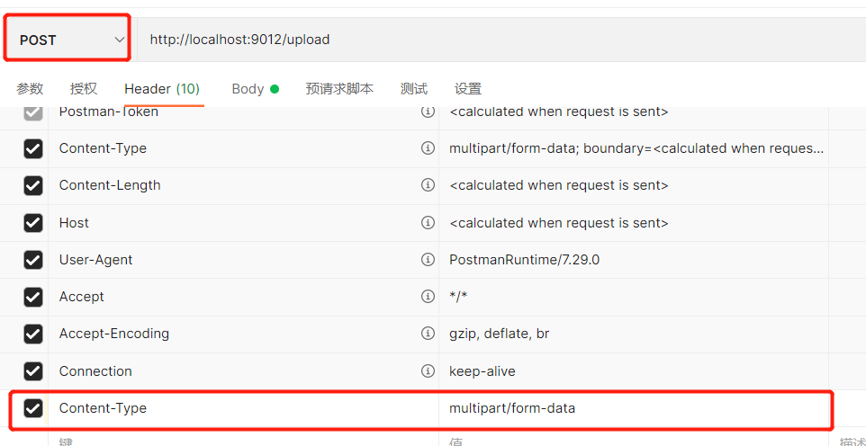

这两个地方的名字要一样

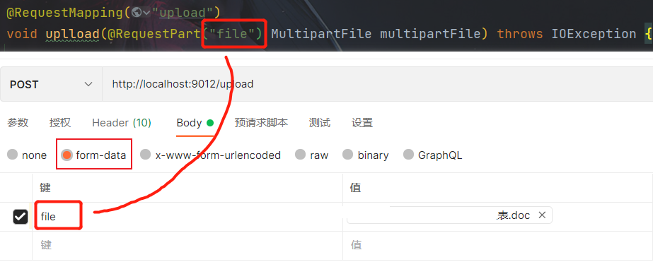

也可以不使用注解，但是这样两个名字要一样

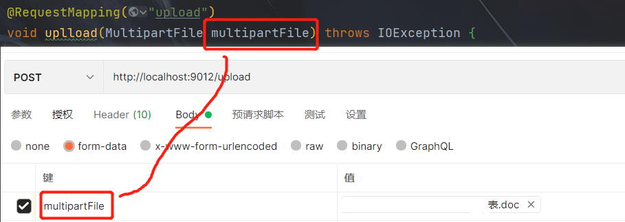

##  25、String.format\(\)的使用

### 常规类型的格式化

String类的format\(\)方法用于创建格式化的字符串以及连接多个字符串对象。熟悉C语言的同学应该记得C语言的sprintf\(\)方法，两者有类似之处。format\(\)方法有两种重载形式。  

format\(String format, Object... args\) 新字符串使用本地语言环境，制定字符串格式和参数生成格式化的新字符串。  

format\(Locale locale, String format, Object... args\) 使用指定的语言环境，制定字符串格式和参数生成格式化的字符串。

显示不同转换符实现不同数据类型到字符串的转换，如图所示。

<table width="545" style="text-align:left; color:rgb(0,0,0)"><tbody><tr><td><p>转&nbsp; 换&nbsp; 符</p></td><td><p>说&nbsp;&nbsp;&nbsp; 明&nbsp;</p></td><td><p>示&nbsp;&nbsp;&nbsp; 例</p></td></tr><tr><td><p>%s</p></td><td><p>字符串类型</p></td><td><p>"mingrisoft"</p></td></tr><tr><td><p>%c</p></td><td><p>字符类型</p></td><td><p>'m'</p></td></tr><tr><td><p>%b</p></td><td><p>布尔类型</p></td><td><p>true</p></td></tr><tr><td><p>%d</p></td><td><p>整数类型（十进制）</p></td><td><p>99</p></td></tr><tr><td><p>%x</p></td><td><p>整数类型（十六进制）</p></td><td><p>FF</p></td></tr><tr><td><p>%o</p></td><td><p>整数类型（八进制）</p></td><td><p>77</p></td></tr><tr><td><p>%f</p></td><td><p>浮点类型</p></td><td><p>99.99</p></td></tr><tr><td><p>%a</p></td><td><p>十六进制浮点类型</p></td><td><p>FF.35AE</p></td></tr><tr><td><p>%e</p></td><td><p>指数类型</p></td><td><p>9.38e+5</p></td></tr><tr><td><p>%g</p></td><td><p>通用浮点类型（f和e类型中较短的）</p></td><td>&nbsp;</td></tr><tr><td><p>%h</p></td><td><p>散列码</p></td><td>&nbsp;</td></tr><tr><td><p>%%</p></td><td><p>百分比类型</p></td><td><p>％</p></td></tr><tr><td><p>%n</p></td><td><p>换行符</p></td><td>&nbsp;</td></tr><tr><td><p>%tx</p></td><td><p>日期与时间类型（x代表不同的日期与时间转换符</p></td><td>&nbsp;</td></tr></tbody></table>

测试用例

```java
public static void main(String[] args) {  
    String str = null;  
    str = String.format("Hi,%s", "王力");  
    System.out.println(str);  
    str = String.format("Hi,%s:%s.%s", "王南", "王力", "王张");  
    System.out.println(str);  
      
    System.out.printf("字母a的大写是：%c %n", 'A');  
    System.out.printf("3>7的结果是：%b %n", 3 > 7);  
    System.out.printf("100的一半是：%d %n", 100 / 2);  
    System.out.printf("100的16进制数是：%x %n", 100);  
    System.out.printf("100的8进制数是：%o %n", 100);  
    System.out.printf("50元的书打8.5折扣是：%f 元%n", 50 * 0.85);  
    System.out.printf("上面价格的16进制数是：%a %n", 50 * 0.85);  
    System.out.printf("上面价格的指数表示：%e %n", 50 * 0.85);  
    System.out.printf("上面价格的指数和浮点数结果的长度较短的是：%g %n", 50 * 0.85);  
    System.out.printf("上面的折扣是%d%% %n", 85);  
    System.out.printf("字母A的散列码是：%h %n", 'A');  
}
```

输出结果

```cobol
Hi,王力
Hi,王南:王力.王张
字母a的大写是：A 
3>7的结果是：false 
100的一半是：50 
100的16进制数是：64 
100的8进制数是：144 
50元的书打8.5折扣是：42.500000 元
上面价格的16进制数是：0x1.54p5 
上面价格的指数表示：4.250000e+01 
上面价格的指数和浮点数结果的长度较短的是：42.5000 
上面的折扣是85% 
字母A的散列码是：41 
```

搭配转换符的标志，如图所示。

<table width="546" style="text-align:left; color:rgb(0,0,0)"><tbody><tr><td><p>标&nbsp;&nbsp;&nbsp; 志</p></td><td><p>说&nbsp;&nbsp;&nbsp; 明</p></td><td><p>示&nbsp;&nbsp;&nbsp; 例</p></td><td><p>结&nbsp;&nbsp;&nbsp; 果</p></td></tr><tr><td><p>+</p></td><td><p>为正数或者负数添加符号</p></td><td><p>("%+d",15)</p></td><td><p>+15</p></td></tr><tr><td><p>−</p></td><td><p>左对齐</p></td><td><p>("%-5d",15)</p></td><td><p>|15&nbsp;&nbsp; |</p></td></tr><tr><td><p>0</p></td><td><p>数字前面补0</p></td><td><p>("%04d", 99)</p></td><td><p>0099</p></td></tr><tr><td><p>空格</p></td><td><p>在整数之前添加指定数量的空格</p></td><td><p>("% 4d", 99)</p></td><td><p>|&nbsp; 99|</p></td></tr><tr><td><p>,</p></td><td><p>以“,”对数字分组</p></td><td><p>("%,f", 9999.99)</p></td><td><p>9,999.990000</p></td></tr><tr><td><p>(</p></td><td><p>使用括号包含负数</p></td><td><p>("%(f", -99.99)</p></td><td><p>(99.990000)</p></td></tr><tr><td><p>#</p></td><td><p>如果是浮点数则包含小数点，如果是16进制或8进制则添加0x或0</p></td><td><p>("%#x", 99)</p><p>("%#o", 99)</p></td><td><p>0x63</p><p>0143</p></td></tr><tr><td><p>&lt;&nbsp;</p></td><td><p>格式化前一个转换符所描述的参数</p></td><td><p>("%f和%&lt;3.2f", 99.45)</p></td><td><p>99.450000和99.45</p></td></tr><tr><td><p>$</p></td><td><p>被格式化的参数索引</p></td><td><p>("%1$d,%2$s", 99,"abc")</p></td><td><p>99,abc</p></td></tr></tbody></table>

测试用例  

```java
public static void main(String[] args) {  
    String str = null;  
    // $使用  
    str = String.format("格式参数$的使用：%1$d,%2$s", 99, "abc");  
    System.out.println(str);  
      
    // +使用  
    System.out.printf("显示正负数的符号：%+d与%d%n", 99, -99);  
      
    // 补0使用  
    System.out.printf("最牛的编号是：%03d%n", 7);  
      
    // 空格使用  
    System.out.printf("Tab键的效果是：%8d%n", 7);  
      
    // .使用  
    System.out.printf("整数分组的效果是：%,d%n", 9989997);  
      
    // 空格和小数点后面个数  
    System.out.printf("一本书的价格是：%50.5f元%n", 49.8);  
}
```


输出结果

```cobol
格式参数$的使用：99,abc
显示正负数的符号：+99与-99
最牛的编号是：007
Tab键的效果是：       7
整数分组的效果是：9,989,997
一本书的价格是：                                          49.80000元
```

### 日期和事件字符串格式化

在程序界面中经常需要显示时间和日期，但是其显示的 格式经常不尽人意，需要编写大量的代码经过各种算法才得到理想的日期与时间格式。字符串格式中还有\%tx转换符没有详细介绍，它是专门用来格式化日期和时 间的。\%tx转换符中的x代表另外的处理日期和时间格式的转换符，它们的组合能够将日期和时间格式化成多种格式。

常见日期和时间组合的格式，如图所示。

<table width="547" style="text-align:left; color:rgb(0,0,0)"><tbody><tr><td><p>转&nbsp; 换&nbsp; 符</p></td><td><p>说&nbsp;&nbsp;&nbsp; 明</p></td><td><p>示&nbsp;&nbsp;&nbsp; 例</p></td></tr><tr><td><p>c</p></td><td><p>包括全部日期和时间信息</p></td><td><p>星期六 十月 27 14:21:20 CST 2007</p></td></tr><tr><td><p>F</p></td><td><p>“年-月-日”格式</p></td><td><p>2007-10-27</p></td></tr><tr><td><p>D</p></td><td><p>“月/日/年”格式</p></td><td><p>10/27/07</p></td></tr><tr><td><p>r</p></td><td><p>“HH:MM:SS PM”格式（12时制）</p></td><td><p>02:25:51 下午</p></td></tr><tr><td><p>T</p></td><td><p>“HH:MM:SS”格式（24时制）</p></td><td><p>14:28:16</p></td></tr><tr><td><p>R</p></td><td><p>“HH:MM”格式（24时制）</p></td><td><p>14:28</p></td></tr></tbody></table>

测试用例

```java
public static void main(String[] args) {  
    Date date = new Date();  
      
    // c的使用  
    System.out.printf("全部日期和时间信息：%tc%n", date);  
      
    // f的使用  
    System.out.printf("年-月-日格式：%tF%n", date);  
      
    // d的使用  
    System.out.printf("月/日/年格式：%tD%n", date);  
      
    // r的使用  
    System.out.printf("HH:MM:SS PM格式（12时制）：%tr%n", date);  
      
    // t的使用  
    System.out.printf("HH:MM:SS格式（24时制）：%tT%n", date);  
      
    // R的使用  
    System.out.printf("HH:MM格式（24时制）：%tR%n", date);  
}
```


输出结果

```cobol
全部日期和时间信息：星期一 九月 10 10:43:36 CST 2012
年-月-日格式：2012-09-10
月/日/年格式：09/10/12
HH:MM:SS PM格式（12时制）：10:43:36 上午
HH:MM:SS格式（24时制）：10:43:36
HH:MM格式（24时制）：10:43
```

定义日期格式的转换符可以使日期通过指定的转换符生成新字符串。这些日期转换符如图所示。  

```java
public static void main(String[] args) {  
    Date date = new Date();  
  
    // b的使用，月份简称  
    String str = String.format(Locale.US, "英文月份简称：%tb", date);  
    System.out.println(str);  
    System.out.printf("本地月份简称：%tb%n", date);  
  
    // B的使用，月份全称  
    str = String.format(Locale.US, "英文月份全称：%tB", date);  
    System.out.println(str);  
    System.out.printf("本地月份全称：%tB%n", date);  
  
    // a的使用，星期简称  
    str = String.format(Locale.US, "英文星期的简称：%ta", date);  
    System.out.println(str);  
  
    // A的使用，星期全称  
    System.out.printf("本地星期的简称：%tA%n", date);  
  
    // C的使用，年前两位  
    System.out.printf("年的前两位数字（不足两位前面补0）：%tC%n", date);  
  
    // y的使用，年后两位  
    System.out.printf("年的后两位数字（不足两位前面补0）：%ty%n", date);  
  
    // j的使用，一年的天数  
    System.out.printf("一年中的天数（即年的第几天）：%tj%n", date);  
  
    // m的使用，月份  
    System.out.printf("两位数字的月份（不足两位前面补0）：%tm%n", date);  
  
    // d的使用，日（二位，不够补零）  
    System.out.printf("两位数字的日（不足两位前面补0）：%td%n", date);  
  
    // e的使用，日（一位不补零）  
    System.out.printf("月份的日（前面不补0）：%te%n", date);  
}
```

输出结果

```cobol
英文月份简称：Sep
本地月份简称：九月
英文月份全称：September
本地月份全称：九月
英文星期的简称：Mon
本地星期的简称：星期一
年的前两位数字（不足两位前面补0）：20
年的后两位数字（不足两位前面补0）：12
一年中的天数（即年的第几天）：254
两位数字的月份（不足两位前面补0）：09
两位数字的日（不足两位前面补0）：10
月份的日（前面不补0）：10
```

和日期格式转换符相比，时间格式的转换符要更多、更精确。它可以将时间格式化成时、分、秒甚至时毫秒等单位。格式化时间字符串的转换符如图所示。

<table width="547" style="color:rgb(0,0,0)"><tbody><tr><td><p>转&nbsp; 换&nbsp; 符</p></td><td><p>说&nbsp;&nbsp;&nbsp; 明</p></td><td><p>示&nbsp;&nbsp;&nbsp; 例</p></td></tr><tr><td><p>H</p></td><td><p>2位数字24时制的小时（不足2位前面补0）</p></td><td><p>15</p></td></tr><tr><td><p>I</p></td><td><p>2位数字12时制的小时（不足2位前面补0）</p></td><td><p>03</p></td></tr><tr><td><p>k</p></td><td><p>2位数字24时制的小时（前面不补0）</p></td><td><p>15</p></td></tr><tr><td><p>l</p></td><td><p>2位数字12时制的小时（前面不补0）</p></td><td><p>3</p></td></tr><tr><td><p>M</p></td><td><p>2位数字的分钟（不足2位前面补0）</p></td><td><p>03</p></td></tr><tr><td><p>S</p></td><td><p>2位数字的秒（不足2位前面补0）</p></td><td><p>09</p></td></tr><tr><td><p>L</p></td><td><p>3位数字的毫秒（不足3位前面补0）</p></td><td><p>015</p></td></tr><tr><td><p>N</p></td><td><p>9位数字的毫秒数（不足9位前面补0）</p></td><td><p>562000000</p></td></tr><tr><td><p>p</p></td><td><p>小写字母的上午或下午标记</p></td><td><p>中：下午</p><p>英：pm</p></td></tr><tr><td><p>z</p></td><td><p>相对于GMT的RFC822时区的偏移量</p></td><td><p>+0800</p></td></tr><tr><td><p>Z</p></td><td><p>时区缩写字符串</p></td><td><p>CST</p></td></tr></tbody></table>

<table width="547" style="color:rgb(0,0,0)"><tbody><tr><td><p>s</p></td><td><p>1970-1-1 00:00:00 到现在所经过的秒数</p></td><td><p>1193468128</p></td></tr><tr><td><p>Q</p></td><td><p>1970-1-1 00:00:00 到现在所经过的毫秒数</p></td><td><p>1193468128984</p></td></tr></tbody></table>


测试代码

```java
public static void main(String[] args) {  
    Date date = new Date();  
  
    // H的使用  
    System.out.printf("2位数字24时制的小时（不足2位前面补0）:%tH%n", date);  
  
    // I的使用  
    System.out.printf("2位数字12时制的小时（不足2位前面补0）:%tI%n", date);  
  
    // k的使用  
    System.out.printf("2位数字24时制的小时（前面不补0）:%tk%n", date);  
  
    // l的使用  
    System.out.printf("2位数字12时制的小时（前面不补0）:%tl%n", date);  
  
    // M的使用  
    System.out.printf("2位数字的分钟（不足2位前面补0）:%tM%n", date);  
  
    // S的使用  
    System.out.printf("2位数字的秒（不足2位前面补0）:%tS%n", date);  
  
    // L的使用  
    System.out.printf("3位数字的毫秒（不足3位前面补0）:%tL%n", date);  
  
    // N的使用  
    System.out.printf("9位数字的毫秒数（不足9位前面补0）:%tN%n", date);  
  
    // p的使用  
    String str = String.format(Locale.US, "小写字母的上午或下午标记(英)：%tp", date);  
    System.out.println(str);  
    System.out.printf("小写字母的上午或下午标记（中）：%tp%n", date);  
  
    // z的使用  
    System.out.printf("相对于GMT的RFC822时区的偏移量:%tz%n", date);  
  
    // Z的使用  
    System.out.printf("时区缩写字符串:%tZ%n", date);  
  
    // s的使用  
    System.out.printf("1970-1-1 00:00:00 到现在所经过的秒数：%ts%n", date);  
  
    // Q的使用  
    System.out.printf("1970-1-1 00:00:00 到现在所经过的毫秒数：%tQ%n", date);  
}
```


输出结果

```cobol
2位数字24时制的小时（不足2位前面补0）:11
2位数字12时制的小时（不足2位前面补0）:11
2位数字24时制的小时（前面不补0）:11
2位数字12时制的小时（前面不补0）:11
2位数字的分钟（不足2位前面补0）:03
2位数字的秒（不足2位前面补0）:52
3位数字的毫秒（不足3位前面补0）:773
9位数字的毫秒数（不足9位前面补0）:773000000
小写字母的上午或下午标记(英)：am
小写字母的上午或下午标记（中）：上午
相对于GMT的RFC822时区的偏移量:+0800
时区缩写字符串:CST
1970-1-1 00:00:00 到现在所经过的秒数：1347246232
1970-1-1 00:00:00 到现在所经过的毫秒数：1347246232773
```

## 26、@RequestBody

 @RequestBody主要用来接收前端传递给后端的json字符串中的数据的(请求体中的数据的)

在后端的同一个接收方法里，@RequestBody与@RequestParam()可以同时使用，@RequestBody最多只能有一个，而@RequestParam()可以有多个。

 @RequestBody用在实体类之前

## 27、java操作excel刷新公式和单元格，才能用原excel模板中的公式

问题：

> 使用导入的excel模板，模板中已有对应的公式，即改变单元格 A 的值，可以影响单元格 B【=A\*10】 的值。  
>
> 但是现在，直接操作写入数据到 A 单元格，发现 B 并没有对应改变。

原代码：

```java
        Workbook workbook = null;
        try {
            // 拿到excel模板
            workbook = new XSSFWorkbook("...);
            ..........数据操作............
            //保存文件
            OutputStream out = new FileOutputStream(outputPptPath);
        
            workbook.write(out);
            out.close();
            System.out.println("导出成功:" + outputPptPath);
        } catch (IOException e) {
            log.error("Fail to get workbook", e);
        }
```

需要加上：  

```java
// 刷新公式  
workbook.setForceFormulaRecalculation(true);

//使用evaluateFormulaCell对函数单元格进行强行更新计算  
workbook.getCreationHelper().createFormulaEvaluator().evaluateAll();
```

即可正确解决问题

```java
    Workbook workbook = null;
        try {
            // 拿到excel模板
            workbook = new XSSFWorkbook("...);
            ..........数据操作............
            //保存文件
            OutputStream out = new FileOutputStream(outputPptPath);
            // 刷新公式
			workbook.setForceFormulaRecalculation(true);
			//使用evaluateFormulaCell对函数单元格进行强行更新计算
		    workbook.getCreationHelper().createFormulaEvaluator().evaluateAll();
            workbook.write(out);
            out.close();
            System.out.println("导出成功:" + outputPptPath);
        } catch (IOException e) {
            log.error("Fail to get workbook", e);
        }
```

## 28、千分位

在Java中，可以使用 `NumberFormat` 类来格式化数字，并将其以千分位展示的形式输出。以下是一个示例代码，演示如何将一个字符串类型的数字格式化为千分位展示：

```java
import java.text.NumberFormat;
import java.util.Locale;

public class Main {
    public static void main(String[] args) {
        String numberStr = "1234567.89"; // 输入的字符串数字
        double number = Double.parseDouble(numberStr); // 将字符串转换为双精度浮点数

        // 创建一个 NumberFormat 实例，设置为使用本地默认格式
        NumberFormat numberFormat = NumberFormat.getNumberInstance(Locale.getDefault());

        // 格式化数字，将其以千分位展示的形式输出
        String formattedNumber = numberFormat.format(number);

        System.out.println("Formatted Number: " + formattedNumber);
    }
}
```

在这个示例中，我们首先将输入的字符串数字转换为双精度浮点数，然后使用 `NumberFormat.getNumberInstance()` 方法创建一个 `NumberFormat` 实例，它会根据本地默认格式进行数字的格式化。最后，使用 `format()` 方法将数字格式化为千分位展示的形式。

如果你想自定义格式，你可以使用 `DecimalFormat` 类。下面是一个使用 `DecimalFormat` 的示例：

```java
import java.text.DecimalFormat;

public class Main {
    public static void main(String[] args) {
        String numberStr = "1234567.89"; // 输入的字符串数字
        double number = Double.parseDouble(numberStr); // 将字符串转换为双精度浮点数

        // 创建一个 DecimalFormat 实例，设置自定义格式
        DecimalFormat decimalFormat = new DecimalFormat("#,###.##");

        // 格式化数字，将其以千分位展示的形式输出
        String formattedNumber = decimalFormat.format(number);

        System.out.println("Formatted Number: " + formattedNumber);
    }
}
```

在这个示例中，我们创建了一个 `DecimalFormat` 实例，使用 `#,###.##` 格式来定义千分位展示的格式。然后，使用 `format()` 方法将数字格式化为指定的格式。

### poi 设置千分位

```java
XSSFWorkbook wb = new XSSFWorkbook(in);
XSSFDataFormat format = wb.createDataFormat();
newYellowRightStyle.setDataFormat(format.getFormat("#,##0.00")); // 千位符
```

## 29、Java Stream的findFirst()方法

`findFirst()` 是 Java 8 中 Stream 接口提供的一个终端操作方法之一。它用于获取流中的第一个元素（根据流的遍历顺序），如果流为空则返回一个空的 Optional 对象。这个方法的签名如下：

```java
Optional<T> findFirst()
```

在使用 `findFirst()` 方法时，需要注意以下几点：

1. **返回类型：** `findFirst()` 方法返回一个 `Optional` 对象，其中包装了流中的第一个元素，如果流为空则包装了一个空值。
2. **遍历顺序：** `findFirst()` 返回的是流中的第一个元素，但这并不意味着是流中的第一个元素被遍历到的。Stream 的操作通常是并行的，所以可能不是按照顺序遍历的。
3. **Optional：** `Optional` 是 Java 8 引入的一个类，用于解决空指针异常的问题。它可以包装一个可能为空的值，提供了一些方法来处理和访问这个值。如果 `findFirst()` 在一个空流上被调用，它将返回一个包含空值的 `Optional` 对象。

下面是一个使用 `findFirst()` 方法的简单示例：

```java
javaCopy codeimport java.util.Arrays;
import java.util.List;
import java.util.Optional;

public class Main {
    public static void main(String[] args) {
        List<Integer> numbers = Arrays.asList(3, 1, 4, 1, 5, 9, 2, 6, 5);

        Optional<Integer> firstNumber = numbers.stream()
                .findFirst();

        if (firstNumber.isPresent()) {
            System.out.println("First number: " + firstNumber.get());
        } else {
            System.out.println("Stream is empty.");
        }
    }
}
```

在这个示例中，我们创建了一个整数列表，然后使用 `stream()` 方法将其转换为流。接着，使用 `findFirst()` 方法获取第一个元素，并通过 `isPresent()` 和 `get()` 方法来处理结果。

需要注意的是，当流中存在元素时，`findFirst()` 方法会返回一个包含元素的 `Optional` 对象，否则返回一个空的 `Optional` 对象。在处理结果时，最好使用 `Optional` 的方法来避免潜在的空指针异常。

## 30、MySQL中group\_concat函数用法总结

### 一、group\_concat函数的功能

将group by产生的同一个分组中的值连接起来，返回一个字符串结果。group\_concat函数首先根据group by指定的列进行分组，将同一组的列显示出来，并且用分隔符分隔。由函数参数（字段名）决定要返回的列。例如：

```mysql
create table emp(
    emp_id int primary key auto_increment comment '编号',
    emp_name char(20) not null default '' comment '姓名',
    salary decimal(10,2) not null default 0 comment '工资',
    department char(20) not null default '' comment '部门'
);

insert into emp(emp_name,salary,department) 
values('张晶晶',5000,'财务部'),('王飞飞',5800,'财务部'),('赵刚',6200,'财务部'),('刘小贝',5700,'人事部'),
('王大鹏',6700,'人事部'),('张小斐',5200,'人事部'),('刘云云',7500,'销售部'),('刘云鹏',7200,'销售部'),
('刘云鹏',7800,'销售部');
```

执行如下查询及结果：

```mysql
select group_concat(emp_name) from emp;
+----------------------------------------------------------------------------------------+
| group_concat(emp_name)                                                                 |
+----------------------------------------------------------------------------------------+
| 张晶晶,王飞飞,赵刚,刘小贝,王大鹏,张小斐,刘云云,刘云鹏,刘云鹏                           |
+----------------------------------------------------------------------------------------+
1 row in set (0.00 sec)

mysql> select department,group_concat(emp_name) from emp group by department;
+------------+-------------------------------+
| department | group_concat(emp_name)        |
+------------+-------------------------------+
| 人事部     | 刘小贝,王大鹏,张小斐          |
| 财务部     | 张晶晶,王飞飞,赵刚            |
| 销售部     | 刘云云,刘云鹏,刘云鹏          |
+------------+-------------------------------+
3 rows in set (0.00 sec)
```

### 二、group\_concat函数的语法

```mysql
group_concat([distinct] 字段名 [order by 排序字段 asc/desc] [separator '分隔符'])
```

说明：  
（1）使用distinct可以排除重复值；  
（2）如果需要对结果中的值进行排序，可以使用order by子句；  
（3）separator是一个字符串值，默认为逗号。

### 三、使用举例

group\_concat\(emp\_name\)：只指定了字段名，销售部有两个同名的也全部显示出来，并且姓名的连接顺序就是表中的记录顺序，连接的分隔符为逗号，结果如下：

```mysql
mysql> select department,group_concat(emp_name) from emp group by department;
+------------+-------------------------------+
| department | group_concat(emp_name)        |
+------------+-------------------------------+
| 人事部     | 刘小贝,王大鹏,张小斐          |
| 财务部     | 张晶晶,王飞飞,赵刚            |
| 销售部     | 刘云云,刘云鹏,刘云鹏          |
+------------+-------------------------------+
3 rows in set (0.00 sec)
```

添加了distinct参数，则销售部两个同名的员工只显示一个，结果如下：

```mysql
select department,group_concat(distinct emp_name) 
from emp group by department;
+------------+---------------------------------+
| department | group_concat(distinct emp_name) |
+------------+---------------------------------+
| 人事部     | 刘小贝,张小斐,王大鹏            |
| 财务部     | 张晶晶,王飞飞,赵刚              |
| 销售部     | 刘云云,刘云鹏                   |
+------------+---------------------------------+
3 rows in set (0.00 sec)
```

添加了order by参数，表中的记录按salary降序排列，然后再把姓名连接起来，结果如下：

```mysql
mysql> select department,group_concat(distinct emp_name order by salary desc) 
from emp group by department;
+------------+------------------------------------------------------+
| department | group_concat(distinct emp_name order by salary desc) |
+------------+------------------------------------------------------+
| 人事部     | 王大鹏,刘小贝,张小斐                                 |
| 财务部     | 赵刚,王飞飞,张晶晶                                   |
| 销售部     | 刘云云,刘云鹏                                        |
+------------+------------------------------------------------------+
3 rows in set (0.00 sec)
```

分隔符修改为\@符号，结果如下：

```mysql
mysql> select department,group_concat(distinct emp_name order by salary desc separator '@') 
from emp group by department;
+------------+--------------------------------------------------------------------+
| department | group_concat(distinct emp_name order by salary desc separator '@') |
+------------+--------------------------------------------------------------------+
| 人事部     | 王大鹏@刘小贝@张小斐                                               |
| 财务部     | 赵刚@王飞飞@张晶晶                                                 |
| 销售部     | 刘云云@刘云鹏                                                      |
+------------+--------------------------------------------------------------------+
3 rows in set (0.00 sec)
```

## 31、git stash

 ### 应用场景

当我们开发一个新功能时会先从master拉出一个分支dev，然后在这个dev分支下吭哧吭哧的开始写代码开发新功能，就如下代码所示，我们在dev分支下开发Person类的新功能getId

```java
public class Person {
    private int id;
    private String name;
    private int age;
    public Person(int id) {
        this.id = id;
    }
    // new feature by dev branch
    public int getId() {
        return String;      //  new feature have bug
    }
}
```

就在此时，线上版本master出现了bug，我们应该放下手头上新功能的开发工作先将master上的bug修复，这个时候dev分支下的改动怎么处理？ \- 向dev分支提交新功能的代码，然后再切换到master下 \- 直接切换到master分支下

首先我们新功能的代码还没开发完成，其次新功能这里还有一些bug没解决，就这样把有问题的代码提交到dev分支中，虽然可以解决目前我们的处境但不是很妥；但是第二种方案，直接切换，明显更不妥。怎么办？我们好像陷入了困境……

#### git stash 命令

别急，Git提供了一个**git stash命令**恰好可以完美解决该问题, 其将当前未提交的修改\(即，工作区的修改和暂存区的修改\)先暂时储藏起来，这样工作区干净了后，就可以切换切换到master分支下拉一个fix分支。在完成线上bug的修复工作后，重新切换到dev分支下通过**git stash pop**命令将之前储藏的修改取出来，继续进行新功能的开发工作

执行下述命令来储藏dev分支下的修改

```bash
git stash
```

  

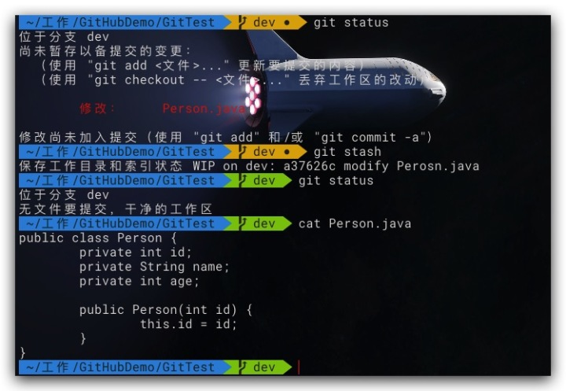

  

可以看到此时我们的工作区已经干净了，dev分支中被修改的文件也已经恢复到了版本库中的版本，说明dev分支修改已经被储藏成功了。这个时候我们就可以放心的切换到master分支下去修复我们线上版本的bug了。线上bug修复完成后，我们就可以继续开始之前的新功能的开发了

先切换到dev分支下:

```bash
git checkout dev
```

然后，取出之前储藏的修改

```bash
git stash pop
```

  

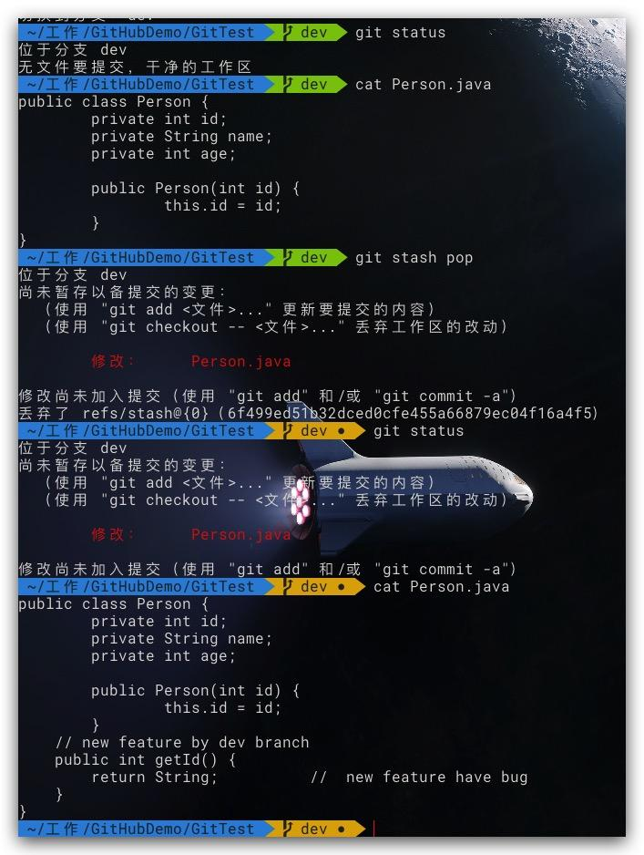

  

从上图的执行结果可以看出，我们之前开发到一半的新功能又回来啦，这个时候，我们就可以再续前缘啦来接着开发新功能了

#### 多次储藏

从上面的介绍，让我们对**git stash**命令有了一个基本的使用认知，其实，该命令可以将当前工作区的修改储藏来实现清空工作区。但是我们做了两次储藏\(即，修改-储藏-再修改-再储藏\)会发生什么呢？

#### 查看储藏记录

执行下述命令来查看我们两次储藏后的结果

```bash
## 查看储藏记录列表
git stash list
```

  

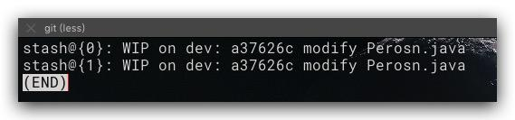

  

从上图结果中，我们发现两次储藏记录的标识信息完全一致，只有其前面的index有别，这让我们很难确定我们所需取出的文件修改是储藏在哪一个中。在git默认按如下规则标识储藏记录\(WIP意为work in progess, index用于后面取出所对应储藏的修改\)，由于我们在dev分支下的两次修改中均未发生提交，所以其最近一次的提交ID是一致的。

```bash
stash@{index}: WIP on [分支名]: [最近一次的commitID] [最近一次的提交信息]
```

#### 标识储藏记录

可以通过下述命令来标记此次储藏，以便后期查看

```bash
git stash save [stashMessage]
```

如下所示，进行两次 修改-储藏 操作，并进行自定义标识

  


然后再执行 **git stash list** 查看储藏列表

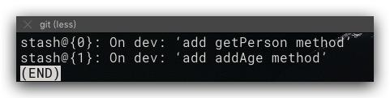

#### 取出储藏

前文提到的可以通过**git stash pop**用于取出最近一次储藏的修改到工作区，而通过查看储藏列表的index的可以取出指定储藏中的修改到工作区

```bash
## 取出指定index的储藏的修改到工作区中
git stash apply stash@{index} 
## 将指定index的储藏从储藏记录列表中删除
git stash drop stash@{index}
```

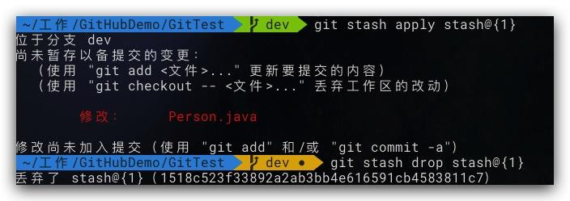

**Note:**

1.  **git stash pop**可取出最近一次储藏的修改到工作区中，并同时将该储藏从储藏记录列表中删除

  ### intellij idea 使用 git stash

这篇文章的出现来源于最近的工作，在工作的过程中，有同事需要我帮他合并一下代码，但我本地也写了一些代码，没有来得及测试不想 提交到服务器上。当时不知如何是好，只能把自己的复制一份。重新回到当前版本。后来有同事说git的stash功能可以解决这个问题，抱着试一试的 态度，我在intellij上使用了git的这个功能。下面整理一下，如有不足，还请各位同仁指出。  
1，当代码从服务器pull下来后。  
我们本地进行了一些代码编辑。  
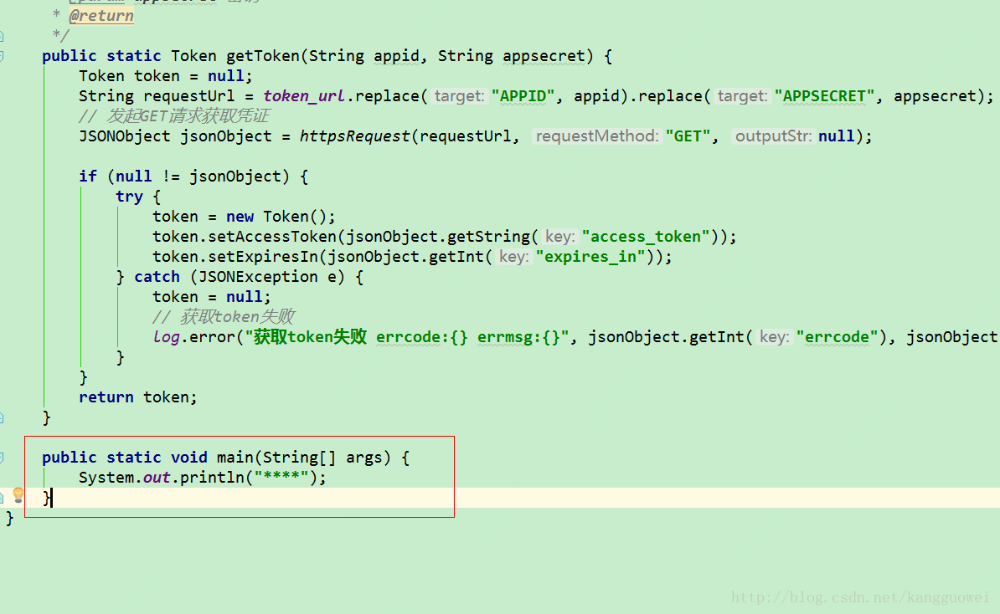

图上红框为新增方法  
2,使用git stash

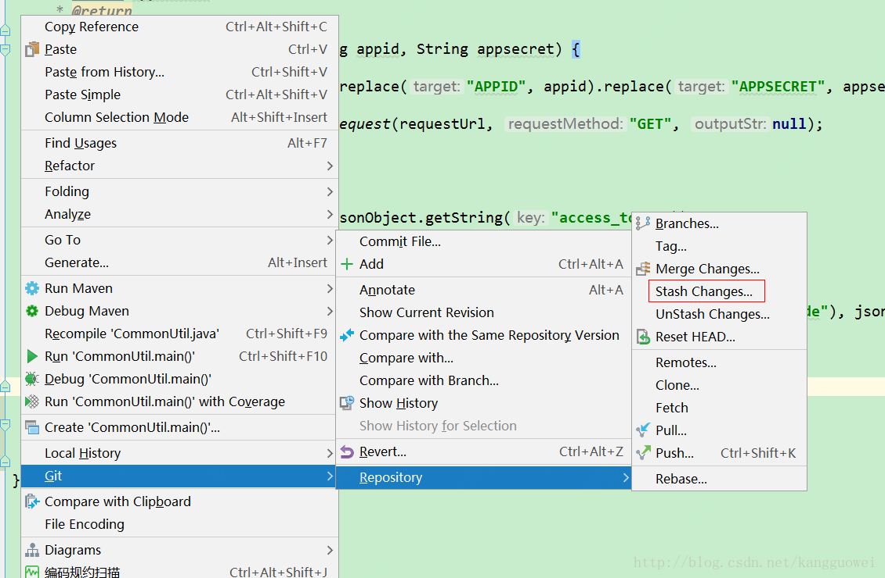

3,查看本地代码变化  
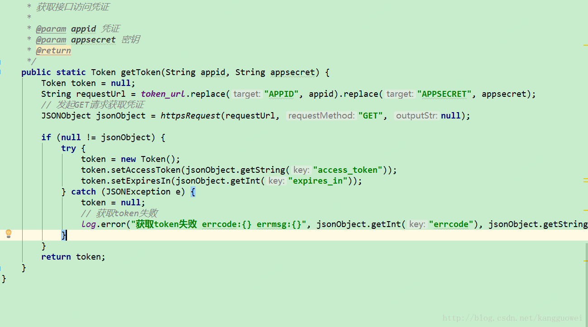  
可以看到又回到了从代码库pull下来的最新状态  
4，查看stash \(2图中的unStash Changes\)  
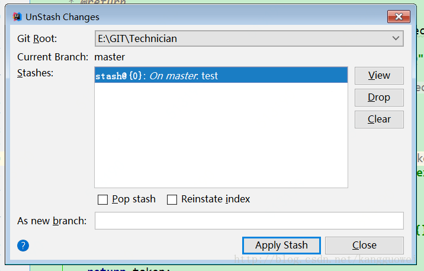

点击view  
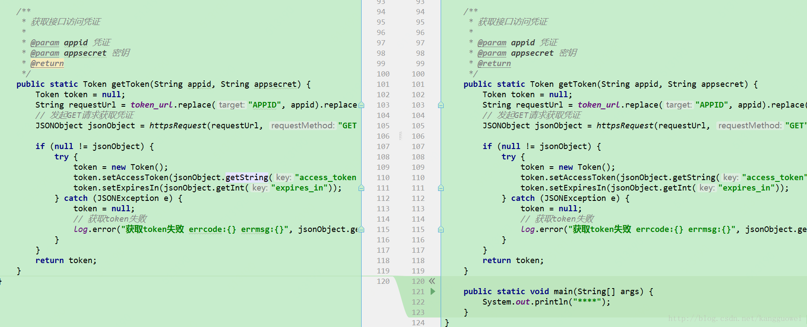  

可以对比代码  

点击4图 apply stash ，可以将stash的代码恢复到本地

## 32、一文搞懂MySQL的数据类型中长度的含义

### 前言

我们在数据库建表时，经常会困扰某个字段应该选择什么数据类型，以及填写什么长度。选择数据类型方面一般不会有什么大问题，但是在填写对应的长度的时候，很多人就会困扰，对应长度填写的数字到底是什么含义，以及会影响到哪些东西。笔者在翻阅网上的相关文章时，发现一大半文章写的都是错的，主要的问题在于搞混了“字符”和“字节”这两者的含义，甚至有的人觉得这就是一回事。

本文我们通过实例来介绍MySQL的数据类型中长度的含义，读完本文能够让你在数据库建表的时候不再困惑。  

**一个汉字占几个字节根据字符集不同而不同，utf8是3，gbk是2**

### 字符串类型  

常用的字符串类型的数据类型有 CHAR 和 VARCHAR 两种，两者后面都需要跟上一个数字表示长度，例如

```null
CHAR(10)
VARCHAR(10)
```

CHAR\(n\) 和 VARCHAR\(n\)  两者中的 n 含义均为该字段最大可容纳的字符数。（注意早期的版本中，n指的是字节数，你也不需要关注是哪些版本，因为是十多年前的版本了，估计一般人也用不到）。

#### 占用空间

CHAR\(n\) 和 VARCHAR\(n\)  字段值的占用空间不是固定的，而是由实际存入的内容决定的，但在细节上两者有一些不同。我们均以 n=4 为例。

对于 CHAR\(4\) 表示固定容纳4个字符，当少于4个字符时，会使用空格填充空缺的部分，使其达到4个字符。如果超过4个字符，会自动截断超出部分。例如你存入数据为 'ab' ，实际会存入 'ab  ' （ab后有2个空格），因此占用4个字节。以下以几个案例作为演示：

（1） 'a啊b' —— 字符数为3，少1个用空格补齐，因此实际存入  'a啊b ' ，字符数：4，字节数：1+3+1+1=6

（2）'a啊b哈ccccccccc' —— 字符数超出4，仅保留前4个字符，因此实际存入  'a啊b哈' ，字符数：4，字节数：1+3+1+3=8

（3）'a啊和哈' —— 字符数刚好为4，不需要截断和补齐，因此实际存入  'a啊和哈' ，字符数：4，字节数：1+3+3+3=10

对于 CHAR 字段，你在使用 CHAR\_LENGTH\(\) 和 LENGTH\(\)  函数查询时，会发现和以上描述的情况不一致，我们放上代码演示：

> 备注：CHAR\_LENGTH\(\) 函数返回字符串的字符数， LENGTH\(\)  函数返回字符串的字节数

```sql
-- 假定已存在表 tb ，其中包含字段 s_char 的数据类型定义为 CHAR(4) ，我们先进行插入操作，获取插入行id=1
INSERT INTO `tb`(`s_char`) VALUES ('啊a');
-- 接下去查询该行
SELECT s_char, CHAR_LENGTH(s_char), LENGTH(s_char) FROM `tb` WHERE id=1;
-- 结果为：s_char=>'啊a',CHAR_LENGTH(s_char)=>2,LENGTH(s_char)=>4
```

你会发现以上结果跟预想中的不一致，按照一般理解预期存入 '啊a' ，仅为2个字符，需补充2个空格，实际存入为 '啊a  ' ，因此字符数为4，字节数为 3+1+1+1=6 。

**这里造成偏差的原因并不是错误，而是 CHAR 字段在检索输出时，自动省略了右侧的空格。**我们来演示一遍完整的流程：

预期存入 '啊a' ，少于4个字符，补充2个空格，因此实际存入的值为 '啊a  ' ，该值字符数为4，字节数为6。在检索时，原值为 '啊a  ' ，输出时自动省略右侧空格，实际输出为 '啊a' ，该字符串字符数为2，字节数为4。

下面再来说说 VARCHAR 类型，依然以 n=4 为例。区别于 CHAR 类型的补空， **VARCHAR 类型对于未达到 n 字符的情况不会补空。**

关于计算 VARCHAR 类型字符串的占用空间，有一点需要说明的是， **VARCHAR 类型字符串的占用空间实际上包含2部分，一是存储数据本身占用的空间，二是描述数据的元数据占用的空间**，例如 VARCHAR 类型会使用1个字节记录存入数据实际的字符数。下述描述的“占用空间”特指前者，即存储数据本身占用的空间，不包含描述数据的元数据占用的空间。（其他数据类型等同）

以下以几个案例作为演示：

（1） 'a啊b' —— 字符数为3，不补空，实际存入为 'a啊b' ，字符数为3，字节数为 1+3+1=5 。

（2）'a啊b哈ccccccccc' —— 字符数超出4，仅保留前4个字符，因此实际存入  'a啊b哈' ，字符数：4，字节数：1+3+1+3=8 。这种情况和 CHAR 类型处理一致。

（3）'a啊和哈' —— 字符数刚好为4，不需要截断和补齐，因此实际存入  'a啊和哈' ，字符数：4，字节数：1+3+3+3=10

### 整数类型

常用的整数数据类型有 tinyint ，smallint ，mediumint ， int ，bigint 共计5种，在声明列时，后面也可以跟上 n ，例如 int\(n\) 。实际上这里的 n 非常鸡肋，几乎没有任何使用场景。它的含义是“显示位宽”，**这个 n 无论填任何数，不影响存储环节，仅影响在检索时的输出格式，而且在非常严格的情况下才成立。**

我们描述一种应用场景：我们声明某列（列名取int\_5）为 int\(5\) ，在声明列的时候，要使用到该特性，必须加上 zerofill （填充0）属性，即语句为

```cpp
`int_5` int(5) unsigned zerofill DEFAULT NULL        
-- 备注：加zerofill必须同时加unsigned
```

**当插入的数字小于5位时，在特定客户端检索输出时，会在数字前“补0”，凑足5位数字。（大于5位则原数字原样显示）例如存储的数字是123，那么输出00123 。**

说它鸡肋，主要有以下几个原因：

（1）对存储环节没有任何帮助，仅改变输出显示环节。而“格式化显示”一般在前端或者后端的应用层操作就可以了，无需在数据库中输出时操作。

（2）格式化方式仅仅只有“补0”一种方式。

（3）仅针对特定客户端输出时才有显示效果，目前仅发现使用MySQL Shell才有显示效果，其他客户端连接时均无。

由于以上原因，所以几乎没有开发者会使用这个特性。

#### 占用空间

**这5种整型的占用空间是固定的，均与其后设置的 n 无关，例如设置字段类型为 int ，则无论 n 设置什么，它占用的空间就是4个字节。**  

这5种整型的占用空间分别是：

- tinyint ：1个字节，

- smallint ：2个字节，

- mediumint ：3个字节，

- int ：4个字节，

- bigint ：8个字节。


很多人说经常记不住他们的取值范围，实际上很好算，例如 tinyint 占用1个字节，也就是8位，每1位都包含0和1两种情况，因此共2的8次方为256种情况，如果是无符号（unsigned），取值范围就是0至255。如果是有符号情况，由于第1位要用来表示符号，因此可用7位表示数字，2的7次方为128，再加上符号，取值范围为 -128至127 。其它几种数据类型也可以按照这个方法计算。

怕有的人还是难以理解，这里再重复一遍，以 int 为例，无论 int\(n\) 中的 n 设置什么值，无论插入的这个值或大或小，只要在取值范围内，那这个字段就是占用4个字节。

另外再补充一点，**当插入的值，超出取值范围的时候，MySQL并不会报错，而是自动变成成在取值范围内最接近该值的边界值。例如字段为 tinyint ，有符号型时取值范围 -128至127 ，当你输入-222时，不会报错，会自动存入最接近-222的-128，当你输入222时，会自动存入127。这一点需要尤其注意，否则很容易造成巨大的bug。**

### 浮点型

**FLOAT 类型固定占用4个字节， DOUBLE 类型固定占用8个字节，逻辑和上述的整型类似，**不再赘述。

下面我们来说说 DECIMAL 类型，它的定义方式是 **DECIMAL\(M,D\)  ，其中 M 表示最大位数，D 表示小数点右侧的位数。这里的“位”不是二进制的比特位，而是指十进制的数字的位数。**

例如我们**定义 DECIMAL\(5,2\)  ，则表示最大位数为5位，小数点后2位，因此小数点前还剩下3位，于是取值范围为 -999.99至999.99 。**可以这样理解：M-D 的值为小数点前的位数，D 的值为小数点后的位数，要算取值范围则各个位置填充9，取正负范围。那么容易计算 DECIMAL\(5,1\)  的取值范围是 -9999.9至9999.9 ；DECIMAL\(4,2\)  的取值范围是 -99.99至99.99 。

#### 占用空间

**DECIMAL\(M,D\)  的存储方式和其他数字类型都完全不同，它是以字符串形式进行存储的。**这可能有点不好理解，以整型 tinyint 为例，它存储的值是直接为十进制到二进制的转换，以无符号型为例，当需要存入的值为100值，将100转化为二进制为1100100 ，使用1个字节即8位记录，实际存入的是 01100100 。但是用 DECIMAL 类型存储时，比如定义 DECIMAL\(3,0\)  ，存入100时，实际存入的是由字符“1”，“0”，“0”拼接而成的字符串“100”的二进制值，存入时占用3个字节，分别是31，30，30（注意这是十六进制）。

1个数字字符占用1个字节，因此定义为 DECIMAL\(M,D\)  占用 M 个字节。（同上所述，M个字节为数据本身的占用空间，另外描述该数据的元数据还固定占用2个字节的空间）。

需要注意的是， **DECIMAL 类型在存储时有补0操作。小数点前不足，向更高位补0，小数点后不足，向更低位补0。**

以 DECIMAL\(5,2\)  为例，如果准备存入9.5，小数点前应为3位，缺2位，小数点后应为2位，缺1位，各补0后，实际存入 '009.50' ，转化为十六进制为30 30 39 2E 35 30 。但是在检索输出时，小数点前的0一般会省略，而小数点后的0会保留，这一点也需要注意。

## 33、@TableLogic

@TableLogic(value=“原值”,delval=“修改值”)
注解参数
　　　　value = "未删除的值，默认值为0" 
　　　　delval = "删除后的值，默认值为1"

```java
	@TableLogic(value="0",delval="1")
    private String isdelete;
```

## 34、创建mybatis-plus条件构造器的几种方式

### 第一种

```java
LambdaQueryWrapper<MdStoreEntity> queryWrapper = new LambdaQueryWrapper<>();

QueryWrapper<MdStoreEntity> queryWrapper = new QueryWrapper<>();
```

### 第二种

```java
LambdaQueryWrapper<MdStoreEntity> queryWrapper = Wrappers.<MdStoreEntity>lambdaQuery().eq(MdStoreEntity::getYearAndMonth, dto.getYearAndMonth());

LambdaQueryWrapper<MdStoreEntity> queryWrapper = Wrappers.<MdStoreEntity>query().eq(MdStoreEntity::getYearAndMonth, dto.getYearAndMonth());

```

### 第三种：链式结构

这种方式虽然简便，但是只用使用service调用，并且生成的类型有限。

```java
MdStoreEntity one = mdStoreService.query().eq("year_and_month",dto.getYearAndMonth()).one();

MdStoreEntity one = mdStoreService.lambdaQuery().eq(MdStoreEntity::getYearAndMonth, dto.getYearAndMonth()).one();
```

## ~~35、mysql FIELD函数？？？~~

```mysql
SELECT * FROM `md_dept_package_matching` order by FIELD(channel_name,"RKA","EC") ASC
```

channel_name为RKA和EC的行在其他行的后面，RKA和EC的行按channel_name列降序排序


```
SELECT * FROM `md_dept_package_matching` order by FIELD(channel_name,"RKA","EC") DESC
```

channel_name为RKA和EC的行在其他行的前面，RKA和EC的行按channel_name列升序排序

## 36、spring boot 报 http 406

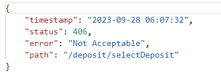

**有一种情况是需要JSON支持**
[Http状态码406(Not Acceptable) 错误问题解决方法](https://blog.csdn.net/weixin_37968613/article/details/83866777)

请求头contentType问题
顾名思义，就是看request 的 heads和response的heads的对应问题，是不是接收端期望的类型；

springmvc–后缀名 默认匹配机制导致的
1.[通过配置转换](https://www.cnblogs.com/wuyouwei/p/5553443.html)
2.[通过启动类继承WebMvcConfigurerAdapter解决](https://www.cnblogs.com/hehehaha/p/6147062.html)
WebMvcConfigurerAdapter在较新的版本处于废弃状态，试试吧

**有一种巨奇葩的可能。。。。。**
我承认我菜逼，就是这个原因

如果你看了别人，没有解决，如果你恰好是自定义封装的返回类，如果你也恰好忘了添加setter和getter，他就是406，怎么搞都不好使,

或者某个类，看一下 setter和getter

## 37、手动回滚

在Spring Boot应用中，如果需要在 `try...catch` 块中手动触发事务回滚，可以使用`TransactionAspectSupport`类提供的方法。这允许在捕获异常后显式地触发回滚操作。

```java
import org.springframework.transaction.annotation.Transactional;
import org.springframework.transaction.interceptor.TransactionAspectSupport;

@Service
public class MyService {

    @Transactional
    public void someTransactionalMethod() {
        try {
            // 一些业务逻辑
        } catch (Exception e) {
            // 发生异常时手动触发回滚
            TransactionAspectSupport.currentTransactionStatus().setRollbackOnly();
        }
    }
}

```

## 38、打包的maven配置

在`pom.xml`文件中添加Spring Boot Maven插件。这个插件可以帮助你打包应用程序并生成可执行的JAR文件。

```xml
<build>
    <plugins>
        <plugin>
            <groupId>org.springframework.boot</groupId>
            <artifactId>spring-boot-maven-plugin</artifactId>
        </plugin>
    </plugins>
</build>

```

## 39、Intellij IDEA--Undo Commit，Revert Commit，Drop Commit的区别

<table align="center" style="width:525pt;"><tbody><tr><td><p style="margin-left:.0001pt;text-align:justify;"><strong><strong>项</strong></strong></p></td><td style="width:167px;"><p style="margin-left:.0001pt;text-align:left;"><strong><strong>是否删除对代码的修改</strong></strong></p></td><td style="width:209px;"><p style="margin-left:.0001pt;text-align:left;"><strong><strong>是否删除Commit记录</strong></strong></p></td><td style="width:194px;"><p style="margin-left:.0001pt;text-align:left;"><strong><strong>是否会新增Commit记录</strong></strong></p></td></tr><tr><td><p style="margin-left:.0001pt;text-align:left;">Undo Commit</p></td><td style="width:167px;"><p style="margin-left:.0001pt;text-align:left;">否</p></td><td style="width:209px;"><p style="margin-left:.0001pt;text-align:left;">未Push会，已Push不会</p></td><td style="width:194px;"><p style="margin-left:.0001pt;text-align:left;">否</p></td></tr><tr><td><p style="margin-left:.0001pt;text-align:left;">Revert Commit</p></td><td style="width:167px;"><p style="margin-left:.0001pt;text-align:left;">是</p></td><td style="width:209px;"><p style="margin-left:.0001pt;text-align:left;">否</p></td><td style="width:194px;"><p style="margin-left:.0001pt;text-align:left;">是</p></td></tr><tr><td><p style="margin-left:.0001pt;text-align:left;">Drop Commit</p></td><td style="width:167px;"><p style="margin-left:.0001pt;text-align:left;">是</p></td><td style="width:209px;"><p style="margin-left:.0001pt;text-align:left;">未Push会，已Push不会</p></td><td style="width:194px;"><p style="margin-left:.0001pt;text-align:left;">否</p></td></tr></tbody></table>

### Undo Commit

**说明**

​    Undo Commit就是撤销了Commit这个动作。

**使用场景**

​	代码修改完了，已经Commit，还未push，然后发现还有地方需要修改，但是又不想增加一个新的Commit记录。这时可以进行Undo Commit，修改后再重新Commit。

​	如果已经Push，远程的Commit记录还是会存在的。

**操作流程**

1.  修改代码，进行commit操作。
2.  确认Commit之后（未进行push）
3.  进行Undo Commit操作

 执行后和未Commit之前完全一样。

### Revert Commit

**说明**

​    Revert Commit会新建一个 Revert “xxx Commit”的Commit记录，该记录进行的操作是将"xxx Commit"中对代码进行的修改全部撤销掉。

**操作流程**

1.  修改，进行commit操作。
2.  进行Revert Commit
    1.  执行成功后：新增了Commit 记录【Revert “测试Revert Commit”】，该记录中将【测试Revert Commit】中对代码进行的修改删除了。

### Drop Commit（慎用）

**说明**

对于未push的Commit记录:

​    会删除Commit记录，同时Commit中对代码进行的修改也会全部被删除。

对于已push的Commit记录:

​	相对于未push的Commit，区别在于远程的Commit记录不会被删除。

**操作流程**

1.  修改代码，然后进行Commit
2.  进行Drop Commit操作后，Commit 记录被删除，代码修改也被删除。

## 40、集合遍历过程中删除元素

需要使用迭代器遍历删除，增强for循环中删除会出问题

```java
private static void demo() {
        ArrayList<Integer> integerList = new ArrayList<>();
        integerList.add(1);
        integerList.add(2);
        integerList.add(3);
        integerList.add(4);
        integerList.add(5);

        Iterator<Integer> iterator = integerList.iterator();

        while (iterator.hasNext()) {
            Integer integer = iterator.next();
            if (integer == 3) {
                iterator.remove();
            }
        }
        System.out.println("integerList.toString() = " + integerList.toString());
    }
```

## 41、vue设置请求拦截器

```js
import axios from "axios";

axios.interceptors.request.use(function (config) {
    console.log('请求拦截器 成功 - 2号');

    //修改 config 中的参数
    config.timeout = 2000;

    // 检查请求的目标地址，如果不是登录请求，则添加 token 到请求头中
    if (!config.url.includes("/login")) {
        const token = localStorage.getItem('token');
        console.log('请求拦截器 成功 - 2号' + token);
        if (token) {
            config.headers['Authorization'] = `Bearer ${token}`;
        }
    }

    return config;
}, function (error) {
    console.log('请求拦截器 失败 - 2号');
    return Promise.reject(error);
});

// 设置响应拦截器
axios.interceptors.response.use(function (response) {
    console.log('响应拦截器 成功 1号');

    return response.data;
    // return response;

}, function (error) {
    console.log('响应拦截器 失败 1号')
    return Promise.reject(error);
});


export default axios;
```

```js
import axios from "../../request/index.js";

selectBill() {
      axios.get("/api/bill/getBill?currentPage=1&pageSize=10").then(
        (response) => {
          console.log("请求成功了", response.data);
        },
        (error) => {
          console.log("请求失败", error.message);
        }
      );
  },
```

##  42、springboot项目读取 resources 目录下的文件的9种方式（总结）


### 1： 使用 ClassLoader.getResourceAsStream\(\) 方法

  可以使用类加载器来获取资源文件的输入流。该方法接受一个资源文件路径参数，返回一个 InputStream 对象。

```java
InputStream inputStream = getClass().getClassLoader().getResourceAsStream("file.txt");
```

  注意，该方法返回的资源文件路径是相对于类加载器的根路径

### 2： 使用 Class.getResourceAsStream\(\) 方法

  可以使用 Class 类的 getResourceAsStream(\) 方法来读取资源文件。该方法接受一个资源文件路径参数，返回一个 InputStream 对象。

```java
InputStream inputStream = getClass().getResourceAsStream("/file.txt");
```

  该方法返回的资源文件路径是相对于当前类的路径。因此，对于 resources 目录下的文件，需要在文件名前加上 “/” 前缀。例如： “/file.txt”。

### 3： 使用 ResourceLoader 加载文件

  可以使用 Spring 的 ResourceLoader 接口来加载资源文件。ResourceLoader 接口有一个 getResource\(\) 方法，接受一个资源文件路径参数，返回一个 Resource 对象。

```java
Resource resource = resourceLoader.getResource("classpath:file.txt");
InputStream inputStream = resource.getInputStream();
```

需要注意的是:需要在类中注入 ResourceLoader 对象，并在方法中使用。例如：

```java
@Autowired
private ResourceLoader resourceLoader;

public void readResourceFile() throws IOException {
    Resource resource = resourceLoader.getResource("classpath:file.txt");
    InputStream inputStream = resource.getInputStream();
}
```

### 4： 使用 ResourceUtils 加载文件

  ResourceUtils 是 Spring 提供的一个工具类，用于加载资源文件。可以使用 ResourceUtils.getFile\(\) 方法来获取文件对象。

```java
File file = ResourceUtils.getFile("classpath:file.txt");
```

需要注意的是:该方法只适用于本地文件系统和 JAR 文件。对于 WAR 文件或者其他类型的文件，该方法可能无法正常工作。

### 5： 使用 ApplicationContext 加载文件

  可以使用 ApplicationContext 的 getResource\(\) 方法来加载资源文件。该方法接受一个资源文件路径参数，返回一个 Resource 对象。

```java
Resource resource = applicationContext.getResource("classpath:file.txt");
InputStream inputStream = resource.getInputStream();
```

需要注意的是:需要在类中注入 ApplicationContext 对象，并在方法中使用。例如：

```java
@Autowired
private ApplicationContext applicationContext;

public void readResourceFile() throws IOException {
    Resource resource = applicationContext.getResource("classpath:file.txt");
    InputStream inputStream = resource.getInputStream();
}
```

### 6： 使用 ServletContext 加载文件

  可以使用 ServletContext 的 getResourceAsStream\(\) 方法来读取资源文件。该方法接受一个资源文件路径参数，返回一个 InputStream 对象。

```java
InputStream inputStream = servletContext.getResourceAsStream("/WEB-INF/classes/file.txt");
```

需要注意的是:需要在类中注入 ServletContext 对象，并在方法中使用。例如：

```java
@Autowired
private ServletContext servletContext;

public void readResourceFile() throws IOException {
    InputStream inputStream = servletContext.getResourceAsStream("/WEB-INF/classes/file.txt");
}
```

### 7： 使用 File System 加载文件

  可以使用 File 类来读取资源文件。需要提供完整的文件路径。

```java
File file = new File("src/main/resources/file.txt");
InputStream inputStream = new FileInputStream(file);
```

需要注意的是:使用该方法需要提供完整的文件路径，因此需要知道文件所在的绝对路径。

### 8： 使用 Paths 和 Files 加载文件

  可以使用 Java NIO 中的 Paths 和 Files 类来读取资源文件。该方法需要提供完整的文件路径。

```java
Path path = Paths.get("src/main/resources/file.txt");
InputStream inputStream = Files.newInputStream(path);
```

  需要注意的是，使用该方法需要提供完整的文件路径，因此需要知道文件所在的绝对路径。

### 9： 使用 ClassPathResource 加载文件

  可以使用 Spring 提供的 ClassPathResource 类来读取资源文件。该方法需要提供资源文件的相对路径。

```java
ClassPathResource resource = new ClassPathResource("file.txt");
InputStream inputStream = resource.getInputStream();
```

需要注意的是:ClassPathResource 会在类路径下查找资源文件，因此不需要提供完整的文件路径。

### 10：总结

  以上 9 种方式，都可以用来读取 Spring Boot 项目中 resources 目录下的文件。不同的方法适用于不同的场景，可以根据需要选择合适的方法。

**实际开发中推荐使用以下几种方法**：

- 使用 ClassLoader.getResourceAsStream\(\) 方法  
  这是一种通用的方式，可以适用于大多数情况。

- 使用 ResourceLoader 加载文件  
  如果使用 Spring 框架，可以使用 ResourceLoader 接口来加载资源文件。这种方式适用于大多数 Spring Boot 项目。

- 使用 ClassPathResource 加载文件  
  如果只需要读取 resources 目录下的文件，可以使用 Spring 提供的 ClassPathResource 类来加载文件。这种方式比较简单，不需要提供完整的文件路径。

  需要注意的是:使用不同的方式需要了解其适用的场景和使用方法。对于不同的项目和需求，可能需要选择不同的方式。

## 43.异常处理

> 在一个方法内调用另一个方法，内部的方法报错，捕获未抛出，内部方法中的后续操作不会继续执行，但是外部方法的后续操作会执行

```java
	@Test
	@GlobalTransactional(rollbackFor = Exception.class)
	public void exceptionTest() {

		try {
			int a = 10;
			int b = 2;

			exceptionDemo();

			int j = a / b;
			System.out.println("j = " + j);
		} catch (Exception e) {
			e.printStackTrace();
			throw new RuntimeException(e);
		}
	}

	private void exceptionDemo() {
		try {
			System.out.println("===================start ================== ");
			int i = 10 / 0;
			System.out.println("===================end ================== ");
		} catch (Exception e) {
			e.printStackTrace();//没有抛出异常
		}
	}
```

```
===================start ================== 
java.lang.ArithmeticException: / by zero
	at com.lz.myblog.MyBlogApplicationTests.exceptionDemo(MyBlogApplicationTests.java:154)
	
j = 5
```

>在Spring Boot中，如果你在一个方法中捕获了异常并且只在`catch`块中调用了`e.printStackTrace();`，那么统一异常处理类（通常是通过`@ControllerAdvice`注解定义的）是无法捕获到这个异常的。
>
>原因如下：
>
>1. `e.printStackTrace();`：这个方法仅将异常的堆栈跟踪输出到标准错误流（通常是控制台），但它并不会将异常重新抛出或者传递给任何其他的异常处理器。
>2. 统一异常处理：Spring Boot的`@ControllerAdvice`通常用来处理由Spring MVC控制器层抛出的异常。如果一个异常在控制器方法内部被捕获并且没有被重新抛出，那么`@ControllerAdvice`中定义的异常处理方法就不会被触发。
>
>如果你想要让统一异常处理类能够捕获并处理这个异常，你应该做以下事情之一：
>
>- **不捕获异常**：让方法自然抛出异常，这样Spring MVC就可以捕获它，并查找是否有相应的`@ControllerAdvice`来处理它。
>- **重新抛出异常**：在`catch`块中捕获异常后，可以重新抛出它，这样异常就会传播到上层调用栈，并且可以被Spring MVC捕获并传递给`@ControllerAdvice`。

## 44、使用Feign调用传参

使用Feign调用一个接口时，当这个接口有多个传参，需要在Feign中使用`@RequestParam`注解来指定它们作为查询参数传递。如果只有一个传参的话可以不使用`@RequestParam`注解

```java
@RequestMapping("/xxxDetail")
public class xxxDetailController{
	@PostMapping("/create")
	public R create(@RequestParam("yearAndMonth") String yearAndMonth, @RequestParam("value") String value) {
		return xxDetailService.createInfo(yearAndMonth, value);
	}
}
```

```java
@FeignClient("demo-server")
public interface MergeFeignClient {
    @PostMapping(value = "/xxxDetail/create")
    void xxxCreate(@RequestParam("yearAndMonth") String yearAndMonth, @RequestParam("value") String value);
}
```

如果像下面这样不使用的话，就会报错。

```java
@FeignClient("demo-server")
public interface MergeFeignClient {
     @PostMapping(value = "/xxxDetail/create")
    void xxxCreate(String yearAndMonth, String value);
}
```

```
Caused by: org.springframework.beans.factory.UnsatisfiedDependencyException: Error creating bean with name 'xxxServiceImpl': Unsatisfied dependency expressed through field 'mergeFeignClient'; nested exception is org.springframework.beans.factory.BeanCreationException: Error creating bean with name 'cn.xxx.xxx.xxx.feign.MergeFeignClient': FactoryBean threw exception on object creation; nested exception is java.lang.IllegalStateException: Method has too many Body parameters: public abstract void cn.xxx.xxx.xxx.feign.MergeFeignClient.xxxCreate(java.lang.String,java.lang.String)
```

调用的时候，调用的方法名和接口的方法名可以不一样，但是feign中请求的路径一定要一致的。


## 45、大数除法小数保留方式

- `RoundingMode.UP`：远离零方向舍入。
- `RoundingMode.DOWN`：向零方向舍入。
- `RoundingMode.CEILING`：向正无穷大方向舍入。
- `RoundingMode.FLOOR`：向负无穷大方向舍入。
- `RoundingMode.HALF_UP`：四舍五入，这是最常用的舍入模式。
- `RoundingMode.HALF_DOWN`：五舍六入，向最接近的偶数舍入（银行家舍入法）。
- `RoundingMode.HALF_EVEN`：向最接近的偶数舍入。
- `RoundingMode.UNNECESSARY`：断言请求的操作具有精确的结果，因此不需要舍入。如果提供此舍入模式，则只有在结果精确时才返回结果；否则，抛出ArithmeticException。

## 46、数组和List复制的几种方式

### **数组的复制**：

1. **使用 `Arrays.copyOf()` 方法**：
   这是Java推荐的方式，因为它会创建一个新的数组，并将原数组的元素复制到新数组中。

```java
int[] originalArray = {1, 2, 3, 4, 5};  
int[] copiedArray = Arrays.copyOf(originalArray, originalArray.length);
```

1. **使用 `System.arraycopy()` 方法**：
   这也是一个常用的方法，用于将一个数组的内容复制到另一个数组。

```java
int[] originalArray = {1, 2, 3, 4, 5};  
int[] copiedArray = new int[originalArray.length];  
System.arraycopy(originalArray, 0, copiedArray, 0, originalArray.length);
```

### **List的复制**：

**1. 使用构造函数**

许多`List`实现类（如`ArrayList`, `LinkedList`等）都有一个接受`Collection`作为参数的构造函数，可以利用这个构造函数来创建一个新的`List`，并将原`List`的元素复制到新`List`中。

```java
List<Integer> originalList = Arrays.asList(1, 2, 3, 4, 5);  
List<Integer> copiedList = new ArrayList<>(originalList);
```

**2. 使用`addAll()`方法**

首先创建一个空的`List`，然后使用`addAll()`方法将原`List`的元素添加到新`List`中。

```java
List<Integer> originalList = Arrays.asList(1, 2, 3, 4, 5);  
List<Integer> copiedList = new ArrayList<>();  
copiedList.addAll(originalList);
```

**3. 使用Java 8的流（Streams）**

Java 8引入了流的概念，可以用来处理集合数据。你可以使用流来复制`List`。

```java
List<Integer> originalList = Arrays.asList(1, 2, 3, 4, 5);  
List<Integer> copiedList = originalList.stream()  
                                         .collect(Collectors.toList());
```

**4. 使用`Collections.copy()`方法**

`Collections.copy()`方法可以将一个`List`复制到另一个`List`中，但目标`List`必须已经具有足够的容量来保存元素。通常，这需要你先创建一个与源`List`大小相同的数组，然后将其转换为`ArrayList`。

```java
List<Integer> originalList = Arrays.asList(1, 2, 3, 4, 5);  
Integer[] array = originalList.toArray(new Integer[0]); // 使用toArray方法创建一个数组  
List<Integer> copiedList = new ArrayList<>(Arrays.asList(array)); // 将数组转换为List  
// 或者直接使用Collections.copy()方法  
List<Integer> targetList = new ArrayList<>(originalList.size());  
targetList.addAll(originalList); // 先确保目标List有足够的容量  
Collections.copy(targetList, new ArrayList<>(originalList));
```

注意：`Collections.copy()`方法不支持直接复制两个`List`，因为它要求目标`List`是一个随机访问列表（比如`ArrayList`），并且它的运行时类型必须与源`List`的运行时类型相同。

**5. 使用Apache Commons Collections**

如果你正在使用Apache Commons Collections库，可以使用其提供的`CollectionUtils.copyCollection()`方法来复制`List`。

```java
import org.apache.commons.collections4.CollectionUtils;  
  
List<Integer> originalList = Arrays.asList(1, 2, 3, 4, 5);  
List<Integer> copiedList = new ArrayList<>();  
CollectionUtils.copyCollection(originalList, copiedList);
```

## 47、MySQL中函数`field()`

```java
 wrapper.last("ORDER BY FIELD(system_judgment,'Error') DESC)
```

MySQL中的field（）函数，可以用来对SQL中查询结果集进行指定顺序排序。

函数使用格式如下：


order by （str，str1，str2，str3，str4……），str与str1，str2，str3，str4比较，其中str指的是字段名字，

意为：字段str按照字符串str1，str2，str3，str4的顺序返回查询到的结果集。如果表中str字段值不存在于str1，str2，str3，str4中的记录，放在结果集最前面返回。

例：

表数据如下：

```mysql
root@localhost|iris>select * from ta;
+----+--------+------+-------+
| id | name   | age  | class |
+----+--------+------+-------+
|  1 | iris   |   11 | a1    |
|  2 | iris   |   22 | a2    |
|  3 | seiki  |   33 | a3    |
|  4 | seiki  |   44 | a4    |
|  5 | xuding |   55 | a5    |
|  6 | xut    |   66 | a6    |
|  7 | iris   |   12 | a2    |
|  8 | iris   |   24 | a4    |
|  9 | seiki  |   36 | a6    |
| 10 | seiki  |   48 | a8    |
| 11 | xuding |   50 | a0    |
| 12 | xut    |   77 | a7    |
+----+--------+------+-------+
12 rows in set (0.00 sec)
```


按照'seiki','iris','xut'来排序，结果如下：

```mysql
root@localhost|iris>select * from ta order by field(name,'seiki','iris','xut');
+----+--------+------+-------+
| id | name   | age  | class |
+----+--------+------+-------+#不在str1，str2，str3中的内容，放在最前面返回，str值相同按照主键的顺序
|  5 | xuding |   55 | a5    |
| 11 | xuding |   50 | a0    |
|  3 | seiki  |   33 | a3    |
|  4 | seiki  |   44 | a4    |
|  9 | seiki  |   36 | a6    |
| 10 | seiki  |   48 | a8    |
|  1 | iris   |   11 | a1    |
|  2 | iris   |   22 | a2    |
|  7 | iris   |   12 | a2    |
|  8 | iris   |   24 | a4    |
|  6 | xut    |   66 | a6    |
| 12 | xut    |   77 | a7    |
+----+--------+------+-------+
12 rows in set (0.00 sec)
```


按照'seiki','iris'来排序，结果如下：

```mysql
root@localhost|iris>select * from ta order by field(name,'seiki','iris');
+----+--------+------+-------+
| id | name   | age  | class |
+----+--------+------+-------+#不在str1，str2，str3中的内容，放在最前面返回；str值相同按主键顺序排列
|  5 | xuding |   55 | a5    |
|  6 | xut    |   66 | a6    |
| 11 | xuding |   50 | a0    |
| 12 | xut    |   77 | a7    |
|  3 | seiki  |   33 | a3    |
|  4 | seiki  |   44 | a4    |
|  9 | seiki  |   36 | a6    |
| 10 | seiki  |   48 | a8    |
|  1 | iris   |   11 | a1    |
|  2 | iris   |   22 | a2    |
|  7 | iris   |   12 | a2    |
|  8 | iris   |   24 | a4    |
+----+--------+------+-------+
12 rows in set (0.00 sec)
```


按照'seiki','iris' desc 来排序，结果如下：

root@localhost|iris>select * from ta order by field(name,'seiki','iris') desc;

```mysql
+----+--------+------+-------+
| id | name   | age  | class |
+----+--------+------+-------+
|  1 | iris   |   11 | a1    |
|  2 | iris   |   22 | a2    |
|  7 | iris   |   12 | a2    |
|  8 | iris   |   24 | a4    |
|  3 | seiki  |   33 | a3    |
|  4 | seiki  |   44 | a4    |
|  9 | seiki  |   36 | a6    |
| 10 | seiki  |   48 | a8    |#倒序时，按照str3，str2，str1的顺序逆向排序，
|  5 | xuding |   55 | a5    |#不在str1，str2，str3中的记录放到最后；str值相同按主键顺序排列
|  6 | xut    |   66 | a6    |
| 11 | xuding |   50 | a0    |
| 12 | xut    |   77 | a7    |
+----+--------+------+-------+
```

## 48、MySQL数据类型转换(CAST/CONVERT)

在MySQL使用过程中，有时我们需要对数据类型进行转换，如将数据取整，或是将数据转换成字符串格式等，这种情况下我们可以直接调用类型转换函数实现这一功能。

数据类型转换可以采用CAST( 数据 as 类型 )或 CONVERT(数据，类型 )函数。

两个函数适用转换的类型有6个

使用效果如下

```mysql
mysql> select cast(num as time) from a;
+-------------------+
| cast(num as time) |
+-------------------+
| 00:01:00          |
| 00:02:00          |
| 00:03:00          |
| 00:03:00          |
| NULL              |
| NULL              |
| 01:23:12          |
| NULL              |
| NULL              |
+-------------------+
9 rows in set, 2 warnings (0.00 sec)
```

```mysql
mysql> select convert(num, time) from a;
+--------------------+
| convert(num, time) |
+--------------------+
| 00:01:00           |
| 00:02:00           |
| 00:03:00           |
| 00:03:00           |
| NULL               |
| NULL               |
| 01:23:12           |
| NULL               |
| NULL               |
+--------------------+
9 rows in set, 2 warnings (0.00 sec)
```

**CAST/CONVER 函数与ROUND函数的区别：**

ROUND函数对于整数型的数据，无法强制转换为浮点型，CAST/CONVER 函数可以。

ROUND( 整数，精度)：

```mysql
mysql> select round(100,2);
+--------------+
| round(100,2) |
+--------------+
|          100 |
+--------------+
1 row in set (0.00 sec)
```


CAST( 整数，DECIMAL(长度，精度))：

```mysql
mysql> select cast(100 as decimal(10,2));
+----------------------------+
| cast(100 as decimal(10,2)) |
+----------------------------+
|                     100.00 |
+----------------------------+
1 row in set (0.00 sec)
```


ROUND( 字符串，精度)：

```mysql
mysql> select round('100',2);
+----------------+
| round('100',2) |
+----------------+
|         100.00 |
+----------------+
1 row in set (0.00 sec)
```


CAST( 字符串，DECIMAL(长度，精度))：

```mysql
mysql> select cast('100' as decimal(10,2));
+------------------------------+
| cast('100' as decimal(10,2)) |
+------------------------------+
|                       100.00 |
+------------------------------+
1 row in set (0.00 sec)
```

## 49、mysql中where不可以使用列的别名

```
select user_name as name,sum(score) from user where name = '张三' group by name
```

如果是这么一段sql就会报一个错误：`> 1054 - Unknown column 'name' in 'where clause'`

这是因为不可以在where之后使用列的别名，但是在group by之后可以使用。

根据mysql的逻辑执行顺序：from > join > on > where > group by > having > **select** > distinct > order by > limit。在MySQL是允许把别名放在GROUP BY之后的，运行顺序被优化成from > join > on > where > **select** > group by > having > **select** > distinct > order by > limit

所以在where中不可以使用列的别名，但是像order by、group by、having是可以使用列的别名的。


**官方的原文是：**

In MySQL, you **can** use the column alias in the **`ORDER BY`, `GROUP BY` and `HAVING` clauses** to refer to the column.

Notice that you **cannot** use a column alias in the **`WHERE` clause**. The reason is that when MySQL evaluates the `WHERE` clause, the values of columns specified in the `SELECT` clause are not be evaluated yet.

在MySQL中，你可以在ORDER BY, GROUP BY和HAVING子句中使用列别名来引用该列。

注意，不能在WHERE子句中使用列别名。原因是当MySQL计算WHERE子句时，还没有计算SELECT子句中指定的列的值。

**官方给出的代码是：**

```mysql
SELECT
	orderNumber `Order no.`,
	SUM( priceEach * quantityOrdered ) total 
FROM
	orderDetails 
GROUP BY
	`Order no.` 
HAVING
	total > 60000;
```


```mysql
SELECT
	a.demo AS entity_code
FROM
	demo_detail a
	LEFT JOIN demo_cp_v b ON a.main_id = b.id
GROUP BY
	entity_code
```

如果说查询起了一个entity_code的别名，但是demo_cp_v中也有一个列叫做entity_code，这里使用的是查询别名中的 entity_code字段进行 `GROUP BY` 操作。在 `GROUP BY` 子句中，使用的是字段的别名，而不是来自表 demo_cp_v的原始字段。**在 SQL 查询中，如果存在相同名称的列或别名，通常会根据作用域和上下文来确定使用哪个。**

SQL 解析器在处理这种情况时并不会报错，因为它认为你使用的是查询中的别名，而不是来自表的字段。这种情况通常是为了提高查询的可读性和易用性，但需要确保别名是唯一的，否则可能会导致不可预料的结果。

## 50、Unknown column ‘xxx‘ in ‘having clause‘

mysql中出现 Unknown column ‘xxx‘ in ‘having clause‘

这是因为在**使用group by分组时，后面如果需要再加一个having进行判断，则所判断的字段需要在select后面出现**

如：

```mysql
select c.studentNo, c.name, count(coursename)
from courses a, scores b, students c
where a.courseNo = b.courseNo
and b.studentNo = c.studentNo
GROUP BY c.studentNo
having count(coursename) = 5
```

如果不出现，则会报错


## 51、UNION ALL 的错误用法

将money汇总


UNION ALL 前后的两个查询字段顺序都一样查询出来不会有问题。


但是UNION ALL 前后两个查询的字段顺序不一样查询出来的就会有问题


## 52、过滤器

### 1.通过手动注册配置实现

**1. 实现过滤器类**

首先，创建一个实现`Filter`接口的类。在这个类中，定义过滤器的逻辑。

```java
package com.example.demo.filter;

import javax.servlet.Filter;
import javax.servlet.FilterChain;
import javax.servlet.FilterConfig;
import javax.servlet.ServletException;
import javax.servlet.ServletRequest;
import javax.servlet.ServletResponse;
import java.io.IOException;

public class CustomFilter implements Filter {

    @Override
    public void init(FilterConfig filterConfig) throws ServletException {
        // 初始化逻辑
    }

    @Override
    public void doFilter(ServletRequest request, ServletResponse response, FilterChain chain) 
            throws IOException, ServletException {
        // 在请求到达目标之前的处理逻辑
        System.out.println("CustomFilter is processing request");
        
        // 继续执行链条中的下一个过滤器或目标资源
        chain.doFilter(request, response);
        
        // 在响应返回之前的处理逻辑
        System.out.println("CustomFilter is processing response");
    }

    @Override
    public void destroy() {
        // 清理逻辑
    }
}
```

**2. 注册过滤器**

接下来，创建一个配置类或使用现有的配置类来注册过滤器。

```java
package com.example.demo.config;

import com.example.demo.filter.CustomFilter;
import org.springframework.boot.web.servlet.FilterRegistrationBean;
import org.springframework.context.annotation.Bean;
import org.springframework.context.annotation.Configuration;

@Configuration
public class FilterConfig {

    @Bean
    public FilterRegistrationBean<CustomFilter> customFilter() {
        FilterRegistrationBean<CustomFilter> registrationBean = new FilterRegistrationBean<>();
        
        registrationBean.setFilter(new CustomFilter());
        registrationBean.addUrlPatterns("/api/*");  // 设置过滤器应用的URL模式
        registrationBean.setOrder(1);  // 设置过滤器的顺序
        
        return registrationBean;
    }
}
```

### 2. 通过注解实现

另一种注册过滤器的方法是使用`@WebFilter`注解。确保在应用程序主类上添加`@ServletComponentScan`注解。

```java
package com.example.demo.filter;

import javax.servlet.*;
import javax.servlet.annotation.WebFilter;
import java.io.IOException;

@WebFilter(urlPatterns = "/api/*")
public class CustomFilter implements Filter {

    @Override
    public void init(FilterConfig filterConfig) throws ServletException {
        // 初始化逻辑
    }

    @Override
    public void doFilter(ServletRequest request, ServletResponse response, FilterChain chain) 
            throws IOException, ServletException {
        // 在请求到达目标之前的处理逻辑
        System.out.println("CustomFilter is processing request");
        
        // 继续执行链条中的下一个过滤器或目标资源
        chain.doFilter(request, response);
        
        // 在响应返回之前的处理逻辑
        System.out.println("CustomFilter is processing response");
    }

    @Override
    public void destroy() {
        // 清理逻辑
    }
}
```

在Spring Boot主应用类上添加`@ServletComponentScan`注解：

```java
package com.example.demo;

import org.springframework.boot.SpringApplication;
import org.springframework.boot.autoconfigure.SpringBootApplication;
import org.springframework.boot.web.servlet.ServletComponentScan;

@SpringBootApplication
@ServletComponentScan
public class DemoApplication {

    public static void main(String[] args) {
        SpringApplication.run(DemoApplication.class, args);
    }
}
```

## 53、String 和 CharSequence 关系

String 继承于CharSequence，也就是说**String也是CharSequence类型。**
CharSequence是一个接口，它只包括length(), charAt(int index), subSequence(int start, int end)这几个API接口。除了String实现了CharSequence之外，StringBuffer和StringBuilder也实现了CharSequence接口。
需要说明的是，**CharSequence就是字符序列，String, StringBuilder和StringBuffer本质上都是通过字符数组实现的！**


## 54、Java String join()用法

在本教程中，我们将借助示例了解 Java String join() 方法。


`join()` 方法返回一个新字符串，其中给定元素与指定的分隔符相连。

**示例**

```
class Main {
  public static void main(String[] args) {
    String str1 = "I";
    String str2 = "love";
    String str3 = "Java";

    // join strings with space between them
    String joinedStr = String.join(" ", str1, str2, str3);

    System.out.println(joinedStr);
  }
}

// Output: I love Java
```

**用法**

字符串 `join()` 方法的语法是：

```
String.join(CharSequence delimiter, 
            Iterable elements)
```

或者

```
String.join(CharSequence delimiter, 
            CharSequence... elements)
```

在这里，`...` 表示可以有一个或多个 `CharSequence` 。

**注意：** `join()`是一种静态方法。您无需创建字符串对象即可调用此方法。相反，我们使用类名调用方法`String`.

**参数**

`join()` 方法采用两个参数。

- **delimiter**- 要与元素连接的分隔符
- **elements**- 要加入的元素

**注意:**

- 您可以将任何实现 `CharSequence` 的类传递给 `join()` 。
- 如果传递了一个可迭代对象，则其元素将被连接。可迭代对象必须实现 `CharSequence` 。
- **String**,**字符串缓冲区**,**字符缓冲区**等是**字符序列**因为这些类实现了它。

**返回**

- 返回一个字符串

**示例 1：Java 字符串 join() 和 CharSequence()**

```
class Main {
  public static void main(String[] args) {
    String result;

    result = String.join("-", "Java", "is", "fun");

    System.out.println(result);  // Java-is-fun

  }
}
```

在这里，我们将三个字符串 `Java` , `is` 和 `fun` 传递给 `join()` 方法。这些字符串使用`-` 分隔符连接。

**示例 2：带有 Iterable 的 Java 字符串 join()**

```
import java.util.ArrayList;

class Main {
  public static void main(String[] args) {
    ArrayList<String> text = new ArrayList<>();

    // adding elements to the arraylist
    text.add("Java");
    text.add("is");
    text.add("fun");

    String result;

    result = String.join("-", text);

    System.out.println(result);  // Java-is-fun

  }
}
```

这里，创建`String`类型的`ArrayList`。数组列表的元素使用`-` 分隔符连接。

## 55、比较器

`(s1, s2) -> s1 - s2`  ==>` (A，B) -> xxx`

要重写Compare方法需要满足下面的要求

```
比较其两个参数的顺序。当第一个参数小于，等于或大于第二个参数时，返回负整数，零或正整数。
在前面的描述中，符号sgn（expression）表示数学符号函数，该函数定义为根据表达式的值为负，零还是正返回-1、0或1中的一个。
实现者必须确保所有x和y的sgn（compare（x，y））== -sgn（compare（y，x））。 （
这意味着，当且仅当compare（y，x）引发异常时，compare（x，y）才必须引发异常。）
实现者还必须确保该关系是可传递的：（（compare（x，y）> 0 ）&&（compare（y，z）> 0））意味着compare（x，z）> 0。
最后，实现者必须确保compare（x，y）== 0意味着所有z的sgn（compare（x，z））== sgn（compare（y，z））。
通常是这种情况，但并非严格要求（compare（x，y）== 0）==（x.equals（y））。
一般而言，任何违反此条件的比较器都应明确指出这一事实。推荐的语言是“注意：此比较器强加与等号不一致的顺序”。
```

上面的解释翻译过来是，

要满足 

```
int compare(T o1, T o2);

升序：o1>o2  返回1  并且 o1<o2 返回-1， o1==o2 返回0
降序：o1>o2  返回-1  并且 o1<o2 返回1， o1==o2 返回0
上面的条件必须满足要求才能按照设想的方式正确排序
```

## 56、 intValue，parseInt，Valueof 

**普通方法：**

intValue()是把**Integer对象**的参数变成int的基础数据类型；

```java
int it = new Integer().intValue();
```

 

**static方法：**

parseInt()是把String参数变成int的基础数据类型；

```java
int it = Integer.parseInt("123");
```

valueOf()是把给定的**String** / **int**参数变成Integer的基础数据类型；

```java
Integer itr = Integer.valueOf("123"); // valueOf()底层其实调用的就是new Integer();
```

Integer itr = new Integer("aaa");

## 57、进制转换API

**从二进制字符串到十进制整数或长整数：**

- `parseInt(String s, int radix)`：将给定的字符串按照指定的基数（radix）解析为一个整型值。如果基数是2，则可以用来从二进制字符串转换为十进制整数。
- `parseLong(String s, int radix)`：与`parseInt`类似，但返回的是`long`类型。

示例代码：

```java
int decimalFromBinary = Integer.parseInt("1010", 2); // 结果为10
long decimalFromBinaryLong = Long.parseLong("1010", 2); // 结果为10L
```

**从十进制整数或长整数到二进制字符串：**

- `toBinaryString(int i)`：将整数转换为二进制字符串表示。
- `Long.toBinaryString(long i)`：将长整数转换为二进制字符串表示。

示例代码：

```java
1String binaryFromDecimal = Integer.toBinaryString(10); // 结果为"1010"
2String binaryFromDecimalLong = Long.toBinaryString(10L); // 结果也为"1010"
```

**注意：**

- 如果你正在处理的二进制数字是以'0b'开头的（Java中的二进制字面量），那么你仍然可以使用上述方法，只需去掉前缀'0b'。
- 对于较大的数字，可能需要使用`BigInteger`类，它提供了更广泛的数值范围和更多的转换选项。

如果你需要将带有'0b'前缀的二进制字符串转换为十进制，可以直接使用`parseInt`或`parseLong`，并指定基数为2，无需手动去除前缀。例如：

Java深色版本

```java
1int decimalFromPrefixedBinary = Integer.parseInt("0b1010", 2); // 结果为10
```


**BigInteger可以设置不同进制的计算**

默认为十进制，也是我们最常用的，同时也支持自定义进制类型（已存在的）；

```java
//进制转换
@Test
public void testScale() {
	//在构造将函数时，把radix进制的字符串转化为BigInteger
	String str = "1011100111";
	int radix = 2;
	BigInteger interNum1 = new BigInteger(str,radix);	//743

	//我们通常不写，则是默认成10进制转换，如下：
	BigInteger interNum2 = new BigInteger(str);			//1011100111
}
```
## 58、服务器防火墙端口

### firewalld

#### 打开端口8080

1. **临时开放端口**（重启后失效）：

   ```
   sudo firewall-cmd --zone=public --add-port=8080/tcp
   ```

2. **永久开放端口**（重启后依然有效）：

   ```
   sudo firewall-cmd --zone=public --add-port=8080/tcp --permanent
   sudo firewall-cmd --reload
   ```

#### 关闭端口8080

1. **临时关闭端口**（重启后失效）：

   ```
   sudo firewall-cmd --zone=public --remove-port=8080/tcp
   ```

2. **永久关闭端口**（重启后依然有效）：

   ```
   sudo firewall-cmd --zone=public --remove-port=8080/tcp --permanent
   sudo firewall-cmd --reload
   ```

#### 查看端口状态

1. **列出当前开放的端口**：

   ```
   sudo firewall-cmd --zone=public --list-ports
   ```

2. **检查指定端口是否开放**：

   ```
   sudo firewall-cmd --zone=public --query-port=8080/tcp
   ```

### iptables

#### 添加规则

1. **添加允许端口 8080 的规则**：

   ```
   sudo iptables -A INPUT -p tcp --dport 8080 -j ACCEPT
   ```

2. **在特定位置插入规则（如在链的第一条位置）**：

   ```
   sudo iptables -I INPUT 1 -p tcp --dport 8080 -j ACCEPT
   ```

#### 查看规则

1. **查看所有当前的 `iptables` 规则**：

   ```
   sudo iptables -L -v -n
   ```

2. **查看特定链（如 INPUT 链）的规则**：

   ```
   sudo iptables -L INPUT -v -n
   ```

#### 删除规则

1. **删除特定规则（需要精确匹配规则内容）**：

   ```
   sudo iptables -D INPUT -p tcp --dport 8080 -j ACCEPT
   ```

2. **删除特定位置的规则（如删除 INPUT 链中的第一条规则）**：

   ```
   sudo iptables -D INPUT 1
   ```

#### 修改规则

`iptables` 本身不支持直接修改规则，需要先删除旧规则，然后添加新规则。

1. **删除旧规则**：

   ```
   sudo iptables -D INPUT -p tcp --dport 8080 -j ACCEPT
   ```

2. **添加新规则**：

   ```
   sudo iptables -A INPUT -p tcp --dport 8080 -j DROP
   ```

#### 清空规则

1. **清空所有规则**：

   ```
   sudo iptables -F
   ```

2. **清空特定链的规则**：

   ```
   sudo iptables -F INPUT
   ```

#### 禁用和启用防火墙

1. **禁用防火墙**：

   ```
   sudo iptables -P INPUT ACCEPT
   sudo iptables -P FORWARD ACCEPT
   sudo iptables -P OUTPUT ACCEPT
   sudo iptables -F
   ```

2. **启用防火墙（恢复默认策略）**：

   ```
   sudo iptables -P INPUT DROP
   sudo iptables -P FORWARD DROP
   sudo iptables -P OUTPUT ACCEPT
   ```

### `iptables` 和 `firewalld` 的区别

1. **基本原理**：
   - `iptables`：直接管理 Linux 内核的 netfilter 防火墙规则，是一种更底层的工具。
   - `firewalld`：是一个动态的防火墙管理工具，提供了更高级的接口和配置方式，使用 `firewalld` 命令来管理规则。
2. **配置方式**：
   - `iptables`：规则是静态的，需要手动编写和应用，配置文件通常在 `/etc/sysconfig/iptables`。
   - `firewalld`：支持动态管理，可以在不重新启动防火墙服务的情况下添加或删除规则，配置文件位于 `/etc/firewalld/`。
3. **使用方便性**：
   - `iptables`：配置和管理较为复杂，适合有经验的管理员。
   - `firewalld`：提供了简化的命令行接口和分区（zone）概念，更易于使用和理解。

#### 互操作性

`firewalld` 和 `iptables` 的关系

- `firewalld` 是基于 `iptables` 的，它在后台会生成 `iptables` 规则。因此，使用 `firewalld` 开通的端口会在 `iptables` 规则中反映出来。
- 如果你直接使用 `iptables` 添加规则，这些规则通常不会被 `firewalld` 所识别，因为 `firewalld` 有自己的规则管理机制。

**检查使用 `firewalld` 开通的端口是否在 `iptables` 中存在**

```
sudo iptables -L -n | grep 80
```

此命令将列出所有当前的 `iptables` 规则，并检查是否存在关于端口 80 的规则。

**检查使用 `iptables` 开通的端口是否在 `firewalld` 中存在**

你不能直接在 `firewalld` 中看到通过 `iptables` 添加的规则，因为 `firewalld` 只会显示由它自己管理的规则。不过，如果你停止 `firewalld` 并手动配置 `iptables`，可以通过以下方式查看：

```
sudo firewall-cmd --list-ports
```

#### 选择使用哪种工具

- **新手或需要简单管理的用户**：建议使用 `firewalld`，因为它更易于管理和理解。
- **高级用户或需要精细控制的用户**：可以选择 `iptables`，因为它提供了更强的灵活性和控制能力。

#### 注意事项

- **避免混用**：尽量不要同时使用 `firewalld` 和 `iptables` 直接修改规则，以免产生冲突。选择一种工具进行防火墙管理。
- **备份配置**：无论使用哪种工具，定期备份防火墙配置，以防止意外更改或系统故障导致的配置丢失。

综上所述，`firewalld` 和 `iptables` 各有优势和适用场景，根据你的需求选择合适的工具，并尽量避免同时使用它们直接管理防火墙规则。

## 59、springboot注入方式

Bean的注入通常使用@Autowired注解，该注解用于bean的field、setter方法以及构造方法上，显式地声明依赖。
 在最新的文档中注入方式有两大类：

1. 基于构造函数的依赖注入（推荐使用）
2. 基于setter的依赖注入

但是通常认为还有一种是基于成员变量的依赖注入（spring framerwork 4.0后不推荐使用）

### 成员变量注入（官方不推荐）

```java
public class HelloController {
    @Autowired //idea会有一个黄色的波浪线提示Field injection is not recommended（不再推荐使用字段注入）
    private Lisi lisi;
    @GetMapping("/hello")
    public String getHello(){
        lisi.say();
        return "hello world;";
    }
}
```

### 构造函数注入

#### 方式一

```java
public class HelloController {

    private Lisi lisi;
    @Autowired //这里的Autowired可以加也可以不加，但是建议加上
    public HelloController(Lisi lisi){
        this.lisi = lisi;
    }
    @GetMapping("/hello")
    public String getHello(){
        lisi.say();
        return "hello world;";
    }
}
```

#### 方式二

该方法利用lombok的注解`@RequiredArgsConstructor`实现构造器注入，需要注意的是要注入的属性需要加上final修饰

```java
@RequiredArgsConstructor
//@RequiredArgsConstructor(onConstructor = @__(@Autowired)) //这种形式可以确保即使是在开启了严格的自动装配模式
@RestController
public class HelloController {
    private final Lisi lisi;

    @GetMapping("/hello")
    public String getHello(){
        lisi.say();
        return "hello world;";
    }
}
```

### setter注入

```java
public class HelloController {
    private Lisi lisi;
    @Autowired
    public void setLisi(Lisi lisi) {
        this.lisi = lisi;
    }

    @GetMapping("/hello")
    public String getHello(){
        lisi.say();
        return "hello world;";
    }
}
```

## 60、构造器注入循环依赖

**循环依赖会产生什么结果？** 

当Spring正在加载所有Bean时，Spring尝试以能正常创建Bean的顺序去创建Bean。

例如，有如下依赖:

>  Bean A → Bean B → Bean C 

Spring先创建beanC，接着创建bean B（将C注入B中)，最后创建bean A(将B注入A中)。

但当存在循环依赖时，Spring将无法决定先创建哪个bean。这种情况下，Spring将产生异常BeanCurrentlyInCreationException。

当使用构造器注入时经常会发生循环依赖问题。如果使用其它类型的注入方式能够避免这种问题。

**构造器注入循环依赖实例**

首先定义两个相互通过构造器注入依赖的bean。

```javascript
@Component
public class CircularDependencyA {
 
 private CircularDependencyB circB;
 
 @Autowired
 public CircularDependencyA(CircularDependencyB circB) {
  this.circB = circB;
 }
}
```

```javascript
@Component
public class CircularDependencyB {
 
 private CircularDependencyA circA;
 
 @Autowired
 public CircularDependencyB(CircularDependencyA circA) {
  this.circA = circA;
 }
}
```

```javascript
@Configuration
@ComponentScan(basePackages = { "com.baeldung.circulardependency" })
public class TestConfig {
}
```

```javascript
@RunWith(SpringJUnit4ClassRunner.class)
@ContextConfiguration(classes = { TestConfig.class })
public class CircularDependencyTest {
 
 @Test
 public void givenCircularDependency_whenConstructorInjection_thenItFails() {
  // Empty test; we just want the context to load
 }
}
```

运行方法givenCircularDependency_whenConstructorInjection_thenItFails将会产生异常：

>  BeanCurrentlyInCreationException: Error creating bean with name ‘circularDependencyA’: Requested bean is currently in creation: Is there an unresolvable circular reference? 

**解决方法**

1 重新设计

重新设计结构，消除循环依赖。

2 使用注解 @Lazy

一种最简单的消除循环依赖的方式是通过延迟加载。在注入依赖时，先注入代理对象，当首次使用时再创建对象完成注入。

```javascript
@Component
public class CircularDependencyA {
 
 private CircularDependencyB circB;
 
 @Autowired
 public CircularDependencyA(@Lazy CircularDependencyB circB) {
  this.circB = circB;
 }
}
```

使用@Lazy后，运行代码，可以看到异常消除。

```java
@RequiredArgsConstructor(onConstructor_ = {@Lazy})
```

3 使用Setter/Field注入

Spring文档建议的一种方式是使用setter注入。当依赖最终被使用时才进行注入。对前文的样例代码少做修改，来观察测试效果。

```javascript
@Component
public class CircularDependencyA {
 
 private CircularDependencyB circB;
 
 @Autowired
 public void setCircB(CircularDependencyB circB) {
  this.circB = circB;
 }
 
 public CircularDependencyB getCircB() {
  return circB;
 }
}
```

```javascript
@Component
public class CircularDependencyB {
 
 private CircularDependencyA circA;
 
 private String message = "Hi!";
 
 @Autowired
 public void setCircA(CircularDependencyA circA) {
  this.circA = circA;
 }
 
 public String getMessage() {
  return message;
 }
}
```

```javascript
@RunWith(SpringJUnit4ClassRunner.class)
@ContextConfiguration(classes = { TestConfig.class })
public class CircularDependencyTest {
 
 @Autowired
 ApplicationContext context;
 
 @Bean
 public CircularDependencyA getCircularDependencyA() {
  return new CircularDependencyA();
 }
 
 @Bean
 public CircularDependencyB getCircularDependencyB() {
  return new CircularDependencyB();
 }
 
 @Test
 public void givenCircularDependency_whenSetterInjection_thenItWorks() {
  CircularDependencyA circA = context.getBean(CircularDependencyA.class);

  Assert.assertEquals("Hi!", circA.getCircB().getMessage());
 }
}
```

4 使用@PostConstruct

```javascript
@Component
public class CircularDependencyA {
 
 @Autowired
 private CircularDependencyB circB;
 
 @PostConstruct
 public void init() {
  circB.setCircA(this);
 }
 
 public CircularDependencyB getCircB() {
  return circB;
 }
}
```

```javascript
@Component
public class CircularDependencyB {
 
 private CircularDependencyA circA;
  
 private String message = "Hi!";
 
 public void setCircA(CircularDependencyA circA) {
  this.circA = circA;
 }
  
 public String getMessage() {
  return message;
 }
```

5 实现ApplicationContextAware与InitializingBean

```javascript
@Component
public class CircularDependencyA implements ApplicationContextAware, InitializingBean {
 
 private CircularDependencyB circB;
 
 private ApplicationContext context;
 
 public CircularDependencyB getCircB() {
  return circB;
 }
 
 @Override
 public void afterPropertiesSet() throws Exception {
  circB = context.getBean(CircularDependencyB.class);
 }
 
 @Override
 public void setApplicationContext(final ApplicationContext ctx) throws BeansException {
  context = ctx;
 }
}
```

```javascript
@Component
public class CircularDependencyB {
 
 private CircularDependencyA circA;
 
 private String message = "Hi!";
 
 @Autowired
 public void setCircA(CircularDependencyA circA) {
  this.circA = circA;
 }
 
 public String getMessage() {
  return message;
 }
}
```

## 61、@PostConstruct注解

在 Spring Boot 中，`@PostConstruct` 注解是 Java 标准中的一部分（来自于 `javax.annotation` 包），它的作用是用于在依赖注入完成后执行初始化操作。也就是说，**当 Spring 容器实例化一个 Bean 并注入所有依赖之后，标注了 `@PostConstruct` 的方法会被自动调用，通常用于完成一些初始化逻辑。**

典型的应用场景包括：

1. 初始化资源（例如数据库连接、外部服务的配置等）。
2. 对注入的依赖进行二次处理。
3. 在 Bean 创建后执行某些必要的操作。

下面是一个简单的示例：

```java
@Component
public class MyBean {

    @PostConstruct
    public void init() {
        // 初始化逻辑
        System.out.println("MyBean 初始化完成！");
    }
}
```

在这个例子中，`MyBean` 类在被 Spring 容器实例化并注入依赖之后，`init()` 方法会自动被调用。

## 62、大文件分片、断点续传、秒传


数据库存储上传的文件和分片可以用于判断文件是否上传或者上传了几个分片实现秒传和断点续传。


63、大文件分片下载、断点续传


### 前端部分

#### 1. IndexedDB 存储和获取文件分片

```javascript
// IndexedDB 初始化和分片存储
const dbPromise = idb.openDB('fileDB', 1, {
    upgrade(db) {
        db.createObjectStore('chunks', { keyPath: 'range' });
    }
});

async function saveChunk(range, chunk) {
    const db = await dbPromise;
    await db.put('chunks', { range, chunk });
}

async function getChunk(range) {
    const db = await dbPromise;
    return db.get('chunks', range);
}

async function clearChunks() {
    const db = await dbPromise;
    await db.clear('chunks');
}
```

#### 2. 下载分片并存储

```javascript
async function downloadFileWithIndexedDB(url, fileName, fileSize, chunkSize) {
    let progress = getDownloadProgress(fileName);
    let start = progress ? progress.downloadedBytes : 0;
    let end = Math.min(start + chunkSize - 1, fileSize - 1);

    while (start < fileSize) {
        // 检查是否已经下载该分片
        let chunk = await getChunk(`bytes=${start}-${end}`);
        if (!chunk) {
            // 如果没有缓存，则请求分片数据
            const response = await fetch(url, {
                headers: {
                    Range: `bytes=${start}-${end}`
                }
            });
            chunk = await response.arrayBuffer();
            await saveChunk(`bytes=${start}-${end}`, chunk);
        }

        // 处理下载的分片数据
        processChunk(chunk);

        // 更新下载进度
        start = end + 1;
        end = Math.min(start + chunkSize - 1, fileSize - 1);
        saveDownloadProgress(fileName, start);
    }

    // 下载完成，合并并生成最终文件
    await mergeAndDownloadFile(fileName);

    // 清理数据
    clearChunks();
    localStorage.removeItem(`download-progress-${fileName}`);
}
```

#### 3. 合并分片并生成最终文件

```javascript
async function mergeAndDownloadFile(fileName) {
    const db = await dbPromise;
    const allChunks = await db.getAll('chunks');
    
    // 将所有分片合并
    const mergedBlob = new Blob(allChunks.map(chunk => chunk.chunk), { type: 'application/octet-stream' });

    // 创建下载链接
    const url = URL.createObjectURL(mergedBlob);
    const a = document.createElement('a');
    a.href = url;
    a.download = fileName;
    document.body.appendChild(a);
    a.click();

    // 释放 URL 对象
    URL.revokeObjectURL(url);
}
```

#### 4. 下载进度管理

```javascript
function getDownloadProgress(fileName) {
    const progress = localStorage.getItem(`download-progress-${fileName}`);
    return progress ? JSON.parse(progress) : { downloadedBytes: 0 };
}

function saveDownloadProgress(fileName, downloadedBytes) {
    localStorage.setItem(`download-progress-${fileName}`, JSON.stringify({ downloadedBytes }));
}
```

### 后端部分

后端使用 Spring Boot 来处理文件的分片下载请求。需要支持 `Range` 请求头，以实现断点续传和分片下载。

```java
import org.springframework.core.io.InputStreamResource;
import org.springframework.http.HttpHeaders;
import org.springframework.http.HttpStatus;
import org.springframework.http.ResponseEntity;
import org.springframework.web.bind.annotation.GetMapping;
import org.springframework.web.bind.annotation.RequestHeader;
import org.springframework.web.bind.annotation.RestController;

import java.io.File;
import java.io.FileInputStream;
import java.io.IOException;
import java.io.InputStream;

@RestController
public class FileDownloadController {

    @GetMapping("/download")
    public ResponseEntity<InputStreamResource> downloadFile(
            @RequestHeader(value = "Range", required = false) String range) throws IOException {
        
        // 获取文件
        File file = new File("/path/to/large-file.zip");
        long fileLength = file.length();

        // 计算文件分片的起始和结束位置
        long start = 0;
        long end = fileLength - 1;

        if (range != null && range.startsWith("bytes=")) {
            String[] ranges = range.substring(6).split("-");
            start = Long.parseLong(ranges[0]);
            if (ranges.length > 1) {
                end = Long.parseLong(ranges[1]);
            }
        }

        // 返回部分内容
        long contentLength = end - start + 1;
        InputStream inputStream = new FileInputStream(file);
        inputStream.skip(start);

        InputStreamResource resource = new InputStreamResource(inputStream);
        return ResponseEntity.status(HttpStatus.PARTIAL_CONTENT)
                .header(HttpHeaders.CONTENT_LENGTH, String.valueOf(contentLength))
                .header(HttpHeaders.CONTENT_RANGE, "bytes " + start + "-" + end + "/" + fileLength)
                .body(resource);
    }
}
```

### 主要流程概述

1. **前端分片请求与断点续传**：
   - 前端通过 `fetch` 请求分片数据，使用 `Range` 请求头指定需要的文件字节范围。
   - 使用 `IndexedDB` 存储已经下载的文件分片，防止内存溢出。
   - 断点续传时，前端从 `LocalStorage` 中读取进度信息，继续未完成的下载。
2. **后端处理分片请求**：
   - 后端接收 `Range` 请求，并返回指定字节范围内的文件内容，支持断点续传。
   - 使用 HTTP 的 `206 Partial Content` 状态码返回分片数据。
3. **合并分片并生成文件**：
   - 下载完成后，前端从 `IndexedDB` 中读取所有分片数据，将其合并生成完整的 `Blob` 文件，并触发下载。
4. **清理**：
   - 下载完成后，清理 `IndexedDB` 中的文件分片，并移除下载进度记录。

### 总结

这个完整的代码示例结合了分片下载、断点续传和持久化存储，能够高效地处理超大文件下载，防止内存溢出，并在下载中断时能够从断点处继续下载。

### 使用Blob对象保存

#### 1. 后端（Spring Boot）

##### 分片下载

1. **定义文件分片接口**：

   ```java
   @RestController
   @RequestMapping("/files")
   public class FileController {
   
       @GetMapping("/download")
       public ResponseEntity<Resource> downloadFile(
           @RequestParam("filename") String filename,
           @RequestHeader HttpHeaders headers) throws IOException {
   
           File file = new File("path/to/files/" + filename);
           if (!file.exists()) {
               return ResponseEntity.notFound().build();
           }
   
           long fileSize = file.length();
           String range = headers.getFirst(HttpHeaders.RANGE);
           if (range != null && range.startsWith("bytes=")) {
               String[] ranges = range.substring(6).split("-");
               long start = Long.parseLong(ranges[0]);
               long end = ranges.length > 1 ? Long.parseLong(ranges[1]) : fileSize - 1;
   
               if (start >= fileSize || end >= fileSize) {
                   return ResponseEntity.status(HttpStatus.REQUESTED_RANGE_NOT_SATISFIABLE)
                       .body(null);
               }
   
               RandomAccessFile raf = new RandomAccessFile(file, "r");
               raf.seek(start);
               byte[] data = new byte[(int) (end - start + 1)];
               raf.readFully(data);
               raf.close();
   
               HttpHeaders responseHeaders = new HttpHeaders();
               responseHeaders.set(HttpHeaders.CONTENT_RANGE, "bytes " + start + "-" + end + "/" + fileSize);
               responseHeaders.set(HttpHeaders.CONTENT_LENGTH, String.valueOf(end - start + 1));
               responseHeaders.set(HttpHeaders.ACCEPT_RANGES, "bytes");
   
               return ResponseEntity.status(HttpStatus.PARTIAL_CONTENT)
                   .headers(responseHeaders)
                   .body(new ByteArrayResource(data));
           }
   
           // If no range is specified, return the entire file
           HttpHeaders responseHeaders = new HttpHeaders();
           responseHeaders.set(HttpHeaders.CONTENT_LENGTH, String.valueOf(fileSize));
           return ResponseEntity.ok()
               .headers(responseHeaders)
               .body(new FileSystemResource(file));
       }
   }
   ```

2. **文件存储**：

   - 确保文件存在于服务器上，并且能够被 `RandomAccessFile` 随机访问。

##### 断点续传

断点续传依赖于 HTTP 的 Range 请求头。前端需要在下载过程中记录已下载的部分，并在断点处重新请求文件的其余部分。

#### 2. 前端（Vue）

##### 下载文件

1. **创建下载方法**：

   ```javascript
   import axios from 'axios';
   
   export function downloadFile(filename, start = 0) {
       return axios.get('/files/download', {
           params: { filename },
           headers: { 'Range': `bytes=${start}-` },
           responseType: 'blob' // 处理二进制数据
       });
   }
   ```

2. **处理下载过程**：

   ```javascript
   export async function downloadWithResume(filename) {
       const CHUNK_SIZE = 1024 * 1024; // 1 MB
       let start = 0;
   
       try {
           const response = await downloadFile(filename, start);
           const fileSize = parseInt(response.headers['content-length'], 10);
           const blob = new Blob([response.data], { type: response.headers['content-type'] });
   
           // 使用 FileSaver.js 或其他库保存文件
           saveAs(blob, filename);
   
           start += CHUNK_SIZE;
           while (start < fileSize) {
               const chunkResponse = await downloadFile(filename, start);
               const chunkBlob = new Blob([chunkResponse.data], { type: chunkResponse.headers['content-type'] });
               // 将块数据追加到文件中（合并 Blob）
   
               start += CHUNK_SIZE;
           }
       } catch (error) {
           console.error('下载失败', error);
       }
   }
   ```

3. **处理下载合并**：

   - 将下载的多个块合并成一个完整的文件。
   - 可以使用 `Blob` 对象的 `slice` 方法来拼接不同的块。

## 63、PO\VO\DTO\BO\DO

在 Java 项目开发中，特别是分层架构（如传统的三层架构：Controller-Service-DAO）或微服务架构中，会常常遇到如下几种实体类：

- **PO（Persistent Object）**
- **VO（View Object）**
- **DTO（Data Transfer Object）**
- **BO（Business Object）**
- **DO（Domain Object）**
- **Entity**

这些类的划分是为了 **职责分离** 和 **解耦合**，使代码更清晰、维护更方便。下面我会详细介绍每一种类型及其使用场景，并说明它们之间是否需要转换。

------

### 1. PO（Persistent Object）持久对象

**作用：** 与数据库表结构一一对应的类，通常用作 ORM 映射的实体类。

**特点：**

- 每个字段对应数据库表中的一列。
- 通常加上如 `@Table`、`@Column`、`@Id` 等 JPA 或 MyBatis 注解。
- 不包含业务逻辑，只用于数据存取。

**使用位置：**

- DAO 层（也叫 repository 层）

**示例：**

```java
@Table(name = "user")
public class UserPO {
    @Id
    private Long id;
    private String username;
    private String password;
}
```

------

### 2. VO（View Object）视图对象

**作用：** 给前端（UI）展示用的数据对象，用于 Controller -> 前端的传输。

**特点：**

- 和前端页面展示字段对应。
- 可以是 PO 的子集，也可以包含多个对象拼接后的结果。
- 通常不参与业务逻辑。

**使用位置：**

- Controller 层返回结果。

**示例：**

```java
public class UserVO {
    private Long id;
    private String username;
    private String nickName;
}
```

------

### 3. DTO（Data Transfer Object）数据传输对象

**作用：** 用于**请求参数的封装**，特别是客户端向服务端传参。

**特点：**

- 一般用于 Controller 层接收请求数据。
- 可以加参数校验注解：`@NotNull`、`@Size`、`@Email` 等。

**使用位置：**

- Controller -> Service

**示例：**

```java
public class UserDTO {
    @NotBlank
    private String username;
    
    @NotBlank
    private String password;
}
```

------

### 4. BO（Business Object）业务对象

**作用：** 代表业务逻辑层（Service）的处理对象，有时也作为 DTO 和 PO 的中间转换结构。

**特点：**

- 处理业务逻辑时使用的对象，可能组合多个模型。
- 不绑定数据库、不直接用于前端展示。

**使用位置：**

- Service 层内部使用。

**示例：**

```java
public class UserBO {
    private Long id;
    private String username;
    private String encryptedPassword;
}
```

------

### 5. DO（Domain Object）领域对象（和 PO 类似，有时重叠）

**作用：** 表示业务领域中的对象，有些项目用 DO 表示数据库对象（相当于 PO），有些用作业务模型。

**特点：**

- 和 PO 区分度不高，看团队习惯。
- 主要在 DDD（领域驱动设计）中使用较多。

**使用位置：**

- Domain 层

------

### 6. Entity 实体类

**说明：** `Entity` 是 PO 的别名，在使用 JPA（如 Hibernate）时常常看到 `@Entity` 注解。

------

### 7. 它们之间的转换（是的，需要转换）

| 来源 | 目标 | 是否需要转换 | 方法                               |
| ---- | ---- | ------------ | ---------------------------------- |
| DTO  | BO   | 是           | 接收参数后进行加工处理             |
| BO   | PO   | 是           | 入库前构建 PO 对象                 |
| PO   | BO   | 是           | 从数据库查出后，进行业务处理       |
| BO   | VO   | 是           | 响应给前端时构建展示对象           |
| DTO  | PO   | 有时         | 也可以直接构建入库对象（无逻辑时） |

**转换工具：**

- 手动写 `BeanUtils.copyProperties(...)`
- 使用 MapStruct（更推荐，性能更好）
- ModelMapper（简单，但性能较差）

------

### 推荐开发实践结构

```
controller
    └── UserController.java           // 接收 DTO，返回 VO
service
    └── UserService.java             // 接收 DTO 或 BO，返回 VO 或 BO
domain
    └── entity
        └── UserPO.java              // 数据库映射
    └── bo
        └── UserBO.java              // 中间业务逻辑层
dto
    └── UserDTO.java                 // 入参对象
vo
    └── UserVO.java                  // 出参对象
mapper
    └── UserMapper.java              // PO ↔ DB 操作
```

------

### 总结一句话：

> PO 是对数据库的映射，DTO 是客户端传进来的数据，VO 是返回给前端的数据，BO 是业务逻辑处理的数据，它们职责不同，需要明确转换，保证系统的“**解耦、清晰、可维护**”。

------

如果你告诉我你当前项目使用的是哪些技术（如 Spring Boot, MyBatis, JPA 等），我可以给你一个更加具体的使用模板。是否需要我演示一个完整的使用示例代码？

-

## 64、单元测试

Spring Boot 默认使用 JUnit5，但你仍然可以在项目中同时使用 JUnit4。以下是如何在 Spring Boot 项目中配置和使用这两种版本的 JUnit：

### 1. 使用 JUnit4 进行单元测试

如果你的项目仍然依赖于 JUnit4，可以在 `pom.xml` 中加入相应的依赖：

```xml
<dependencies>
    <!-- JUnit 4 依赖 -->
    <dependency>
        <groupId>junit</groupId>
        <artifactId>junit</artifactId>
        <version>4.13.2</version> <!-- 你可以根据需要选择版本 -->
        <scope>test</scope>
    </dependency>
    
    <!-- Spring Boot 测试依赖 -->
    <dependency>
        <groupId>org.springframework.boot</groupId>
        <artifactId>spring-boot-starter-test</artifactId>
        <scope>test</scope>
    </dependency>
</dependencies>
```

然后，你可以使用 `@RunWith` 注解来运行 JUnit4 测试：

```java
import org.junit.Test;
import org.junit.runner.RunWith;
import org.springframework.boot.test.context.SpringBootTest;
import org.springframework.test.context.junit4.SpringRunner;

@RunWith(SpringRunner.class)  // 使用 SpringRunner 来运行 JUnit4 测试
@SpringBootTest
public class MyServiceTest {

    @Test
    public void testServiceMethod() {
        // 测试代码
    }
}
```

### 2. 使用 JUnit5 进行单元测试

Spring Boot 2.x 默认使用 JUnit5。如果你使用的是 Spring Boot 2.x 及以上版本，那么可以直接使用 JUnit5 进行单元测试。首先，确保 `pom.xml` 文件中包含 JUnit5 相关依赖：

```xml
<dependencies>
    <!-- Spring Boot 测试依赖 -->
    <dependency>
        <groupId>org.springframework.boot</groupId>
        <artifactId>spring-boot-starter-test</artifactId>
        <scope>test</scope>
    </dependency>
</dependencies>
```

在 JUnit5 中，使用 `@ExtendWith` 来替代 `@RunWith`，并且测试方法使用 `@Test` 注解：

```java
import org.junit.jupiter.api.Test;
import org.springframework.boot.test.context.SpringBootTest;

@SpringBootTest
public class MyServiceTest {

    @Test
    public void testServiceMethod() {
        // 测试代码
    }
}
```

## 65、JackJson的使用

### 1. 添加 Jackson 依赖

如果你使用 Maven 构建项目，可以在 `pom.xml` 文件中添加 Jackson 的依赖。

```xml
<dependencies>
    <!-- Jackson Databind 用于对象与 JSON 的转换 -->
    <dependency>
        <groupId>com.fasterxml.jackson.core</groupId>
        <artifactId>jackson-databind</artifactId>
        <version>2.15.0</version>
    </dependency>
    
    <!-- Jackson 核心包 -->
    <dependency>
        <groupId>com.fasterxml.jackson.core</groupId>
        <artifactId>jackson-core</artifactId>
        <version>2.15.0</version>
    </dependency>
</dependencies>
```

### 2. Jackson 基本使用

Jackson 提供了多种类用于 JSON 数据的序列化与反序列化，常见的有 `ObjectMapper` 类。

#### 2.1 对象转 JSON 字符串

使用 `ObjectMapper` 将 Java 对象转换成 JSON 字符串。

```java
import com.fasterxml.jackson.databind.ObjectMapper;

public class JacksonExample {
    public static void main(String[] args) throws Exception {
        ObjectMapper objectMapper = new ObjectMapper();

        // 创建一个 Java 对象
        Person person = new Person("John", 30);

        // 将对象转换为 JSON 字符串
        String json = objectMapper.writeValueAsString(person);

        System.out.println(json);
    }
}

class Person {
    private String name;
    private int age;

    public Person(String name, int age) {
        this.name = name;
        this.age = age;
    }

    // getters 和 setters 省略
}
```

输出：

```
{"name":"John","age":30}
```

#### 2.2 JSON 字符串转对象

使用 `ObjectMapper` 将 JSON 字符串转换为 Java 对象。

```java
import com.fasterxml.jackson.databind.ObjectMapper;

public class JacksonExample {
    public static void main(String[] args) throws Exception {
        ObjectMapper objectMapper = new ObjectMapper();

        // JSON 字符串
        String json = "{\"name\":\"John\",\"age\":30}";

        // 将 JSON 字符串转换为 Java 对象
        Person person = objectMapper.readValue(json, Person.class);

        System.out.println(person.getName() + " - " + person.getAge());
    }
}

class Person {
    private String name;
    private int age;

    // getters 和 setters 省略
}
```

输出：

```
John - 30
```

### 3. 常见注解

Jackson 提供了许多注解来定制序列化和反序列化过程。以下是几个常用注解：

#### 3.1 `@JsonProperty`

用于映射 JSON 字段和 Java 类属性的名字。

```java
import com.fasterxml.jackson.annotation.JsonProperty;

class Person {
    @JsonProperty("full_name")
    private String name;

    @JsonProperty("years_old")
    private int age;

    // getters 和 setters 省略
}
{
  "full_name": "John",
  "years_old": 30
}
```

#### 3.2 `@JsonIgnore`

忽略某个字段，不参与序列化和反序列化。

```java
import com.fasterxml.jackson.annotation.JsonIgnore;

class Person {
    private String name;

    @JsonIgnore
    private int age;

    // getters 和 setters 省略
}
```

#### 3.3 `@JsonFormat`

用于格式化日期和时间。

```java
import com.fasterxml.jackson.annotation.JsonFormat;
import java.util.Date;

class Event {
    @JsonFormat(pattern = "yyyy-MM-dd HH:mm:ss")
    private Date date;

    // getters 和 setters 省略
}
```

### 4. 处理复杂对象

#### 4.1 处理嵌套对象

Jackson 会自动处理嵌套的对象。

```java
class Address {
    private String street;
    private String city;

    // constructors, getters 和 setters 省略
}

class Person {
    private String name;
    private Address address;

    // constructors, getters 和 setters 省略
}

Person person = new Person("John", new Address("123 Street", "City"));
String json = objectMapper.writeValueAsString(person);
```

JSON 输出：

```
{
  "name": "John",
  "address": {
    "street": "123 Street",
    "city": "City"
  }
}
```

### 5. JSON 和集合的相互转化

#### 5.1 JSON 转 List

将 JSON 转换为 `List` 类型对象。

```java
import com.fasterxml.jackson.core.type.TypeReference;
import com.fasterxml.jackson.databind.ObjectMapper;

import java.util.List;

public class JacksonExample {
    public static void main(String[] args) throws Exception {
        ObjectMapper objectMapper = new ObjectMapper();

        String json = "[{\"name\":\"John\",\"age\":30},{\"name\":\"Jane\",\"age\":25}]";

        List<Person> people = objectMapper.readValue(json, new TypeReference<List<Person>>() {});

        for (Person person : people) {
            System.out.println(person.getName() + " - " + person.getAge());
        }
    }
}
```

输出：

```
John - 30
Jane - 25
```

#### 5.2 List 转 JSON

将 `List` 转换为 JSON 字符串。

```java
List<Person> people = Arrays.asList(new Person("John", 30), new Person("Jane", 25));
String json = objectMapper.writeValueAsString(people);
System.out.println(json);
```

输出：

```
[{"name":"John","age":30},{"name":"Jane","age":25}]
```

### 6. JSON 和 Map 的转化

#### 6.1 JSON 转 Map

将 JSON 字符串转换为 `Map`。

```java
import java.util.Map;

public class JacksonExample {
    public static void main(String[] args) throws Exception {
        ObjectMapper objectMapper = new ObjectMapper();

        String json = "{\"name\":\"John\",\"age\":30}";

        Map<String, Object> map = objectMapper.readValue(json, Map.class);

        System.out.println(map);
    }
}
```

输出：

```
{name=John, age=30}
```

#### 6.2 Map 转 JSON

将 `Map` 转换为 JSON 字符串。

```java
Map<String, Object> map = new HashMap<>();
map.put("name", "John");
map.put("age", 30);

String json = objectMapper.writeValueAsString(map);
System.out.println(json);
```

输出：

```
{"name":"John","age":30}
```

### 7. 使用 `JsonNode` 动态处理 JSON

#### 7.1 使用 `JsonNode` 解析 JSON

`JsonNode` 是 Jackson 提供的一个非常强大的数据结构，用于动态解析和处理 JSON 数据。

```java
import com.fasterxml.jackson.databind.JsonNode;
import com.fasterxml.jackson.databind.ObjectMapper;

public class JacksonExample {
    public static void main(String[] args) throws Exception {
        ObjectMapper objectMapper = new ObjectMapper();

        String json = "{\"name\":\"John\",\"age\":30}";

        JsonNode rootNode = objectMapper.readTree(json);

        // 获取 JSON 字段
        String name = rootNode.get("name").asText();
        int age = rootNode.get("age").asInt();

        System.out.println("Name: " + name);
        System.out.println("Age: " + age);
    }
}
```

输出：

```
Name: John
Age: 30
```

#### 7.2 动态处理嵌套结构

`JsonNode` 可以用来动态处理嵌套的 JSON 结构。

```java
String json = "{\"name\":\"John\",\"address\":{\"street\":\"123 Street\",\"city\":\"City\"}}";

JsonNode rootNode = objectMapper.readTree(json);

String name = rootNode.get("name").asText();
JsonNode addressNode = rootNode.get("address");

String street = addressNode.get("street").asText();
String city = addressNode.get("city").asText();

System.out.println("Name: " + name);
System.out.println("Street: " + street);
System.out.println("City: " + city);
```

输出：

```
Name: John
Street: 123 Street
City:
```

## 66、tf8mb4_0900_ai_ci、utf8mb4_0900_as_cs的区别

### 1. **utf8mb4_0900_ai_ci**

- 特性：

  - **ai**（Accent Insensitive）：不区分重音符号（如 `a` 和 `á` 视为相同）。
  - **ci**（Case Insensitive）：不区分大小写（如 `A` 和 `a` 视为相同）。

- 适用场景：

  适用于需要宽松匹配的文本比较，例如搜索功能中忽略用户输入的大小写和音调差异（如多语言网站、社交应用等）。

  > 示例：`'café'` 与 `'CAFE'` 会被视为相同 。

### 2. **utf8mb4_0900_as_cs**

- 特性：

  - **as**（Accent Sensitive）：区分重音符号（如 `a` 和 `á` 视为不同）。
  - **cs**（Case Sensitive）：区分大小写（如 `A` 和 `a` 视为不同）。

- 适用场景：

  适用于需要精确匹配的场景，例如区分专有名词的大小写（如用户名、密码）或语言中严格区分音调的字符（如法语、西班牙语等）。

  > 示例：`'Café'`、`'cafe'`、`'Cafe'` 均会被视为不同 。

### 总结选择建议：

- **优先 ai_ci**：若应用场景无需严格区分大小写和重音（如通用搜索、日志记录）。
- **选择 as_cs**：若需精确匹配（如安全敏感字段、特定语言处理）。
- 注意：修改排序规则可能影响现有数据比较和索引性能，需提前测试。

## 67、Linux磁盘空间查看

查看磁盘使用量

```
df -h [目录]
```

查看磁盘空间占用最大的前20个

```
du -ah [目录] | sort -rh | head -n 20
```

## 68、springboot默认日志框架

Spring Boot 默认使用的日志框架是 **SLF4J（Simple Logging Facade for Java）** 作为日志门面，并搭配 **Logback** 作为具体的日志实现框架。

### 关键点：

1. **SLF4J**：

   - 作为日志门面（抽象层），提供统一的日志 API，允许开发者在不绑定具体日志实现的情况下编写代码。
   - Spring Boot 的日志依赖（如 `spring-boot-starter-logging`）会自动引入 SLF4J。

2. **Logback**：

   - 是 Spring Boot 默认集成的日志实现框架（无需额外配置）。
   - 支持灵活的配置（通过 `logback-spring.xml` 或 `application.properties`/`application.yml`）。

3. **依赖关系**：

   当使用 `spring-boot-starter-web` 或其他 Spring Boot Starter 时，会隐式引入 `spring-boot-starter-logging`，它包含以下依赖：

   ```
   org.slf4j:slf4j-api      （SLF4J 门面）
   ch.qos.logback:logback-classic （Logback 实现 + SLF4J 适配器）
   org.apache.logging.log4j:log4j-to-slf4j （将 Log4j2 桥接到 SLF4J）
   ```

4. **如何验证**：

   启动 Spring Boot 应用时，控制台会显示 Logback 的默认日志格式（如时间、日志级别、线程名等）。

5. **切换日志框架**：

   如果需要替换为 Log4j2，可以排除默认的 `spring-boot-starter-logging` 并引入 `spring-boot-starter-log4j2`

   ```xml
   <dependency>
       <groupId>org.springframework.boot</groupId>
       <artifactId>spring-boot-starter-web</artifactId>
       <exclusions>
           <exclusion>
               <groupId>org.springframework.boot</groupId>
               <artifactId>spring-boot-starter-logging</artifactId>
           </exclusion>
       </exclusions>
   </dependency>
   <dependency>
       <groupId>org.springframework.boot</groupId>
       <artifactId>spring-boot-starter-log4j2</artifactId>
   </dependency>
   ```

### 配置示例（`logback-spring.xml`）：

Logback/Log4j 的日志级别从低到高（详细 → 粗略）：

| 级别      | 典型用途                         |
| --------- | -------------------------------- |
| TRACE     | 极细粒度跟踪（如循环每次迭代）   |
| **DEBUG** | **调试关键数据流**（最常用）     |
| INFO      | 正常业务流程（如"订单创建成功"） |
| WARN      | 潜在问题（如"缓存即将过期"）     |
| ERROR     | 错误事件（不影响系统继续运行）   |
| FATAL     | 致命错误（系统即将终止）         |

```xml
<?xml version="1.0" encoding="UTF-8"?>
<!-- 基础配置：自动扫描配置文件更新，间隔30秒 -->
<configuration scan="true" scanPeriod="30 seconds" debug="false">
    
    <!-- 引入 Spring Boot 默认的 Logback 基础配置 -->
    <include resource="org/springframework/boot/logging/logback/base.xml"/>
    
    <!-- ========== 全局变量定义 ========== -->
    <!-- 从 Spring 环境读取日志路径（优先级：application.yml > 默认值） -->
    <springProperty scope="context" name="LOG_HOME" source="logging.file.path" defaultValue="./logs"/>
    <property name="APP_NAME" value="myapp"/>
    <property name="LOG_PATTERN" value="%d{yyyy-MM-dd HH:mm:ss.SSS} [%thread] %-5level %logger{36} - %msg%n"/>

    <!-- ========== 控制台输出（带颜色） ========== -->
    <appender name="CONSOLE" class="ch.qos.logback.core.ConsoleAppender">
        <encoder>
            <!-- 彩色日志格式（仅控制台生效） -->
            <pattern>%clr(%d{yyyy-MM-dd HH:mm:ss.SSS}){faint} %clr(%-5level) %clr([%thread]){cyan} %clr(%logger{36}){blue} - %msg%n</pattern>
            <charset>UTF-8</charset>
        </encoder>
        <!-- 开发环境过滤：仅输出 INFO 及以上级别 -->
        <filter class="ch.qos.logback.classic.filter.ThresholdFilter">
            <level>INFO</level>
        </filter>
    </appender>

    <!-- ========== 文件滚动策略（按时间+大小） ========== -->
    <appender name="FILE-INFO" class="ch.qos.logback.core.rolling.RollingFileAppender">
        <file>${LOG_HOME}/${APP_NAME}-info.log</file>
        <rollingPolicy class="ch.qos.logback.core.rolling.SizeAndTimeBasedRollingPolicy">
            <!-- 文件名格式：按天归档，超50MB则拆分 -->
            <fileNamePattern>${LOG_HOME}/archive/${APP_NAME}-info.%d{yyyy-MM-dd}.%i.log.gz</fileNamePattern>
            <maxFileSize>50MB</maxFileSize>
            <maxHistory>30</maxHistory> <!-- 保留30天 -->
            <totalSizeCap>10GB</totalSizeCap> <!-- 总日志上限 -->
        </rollingPolicy>
        <encoder>
            <pattern>${LOG_PATTERN}</pattern>
            <charset>UTF-8</charset>
        </encoder>
        <!-- 仅记录 INFO 级别 -->
        <filter class="ch.qos.logback.classic.filter.LevelFilter">
            <level>INFO</level>
            <onMatch>ACCEPT</onMatch>
            <onMismatch>DENY</onMismatch>
        </filter>
    </appender>

    <appender name="FILE-ERROR" class="ch.qos.logback.core.rolling.RollingFileAppender">
        <file>${LOG_HOME}/${APP_NAME}-error.log</file>
        <rollingPolicy class="ch.qos.logback.core.rolling.TimeBasedRollingPolicy">
            <fileNamePattern>${LOG_HOME}/archive/${APP_NAME}-error.%d{yyyy-MM-dd}.log.gz</fileNamePattern>
            <maxHistory>90</maxHistory> <!-- 错误日志保留更久 -->
        </rollingPolicy>
        <encoder>
            <pattern>${LOG_PATTERN}</pattern>
            <charset>UTF-8</charset>
        </encoder>
        <!-- 仅记录 ERROR 级别 -->
        <filter class="ch.qos.logback.classic.filter.ThresholdFilter">
            <level>ERROR</level>
        </filter>
    </appender>

    <!-- ========== 异步日志（提升性能） ========== -->
    <appender name="ASYNC-INFO" class="ch.qos.logback.classic.AsyncAppender">
        <queueSize>512</queueSize> <!-- 队列容量 -->
        <discardingThreshold>0</discardingThreshold> <!-- 队列满时不丢弃日志 -->
        <appender-ref ref="FILE-INFO"/>
    </appender>

    <!-- ========== 多环境配置 ========== -->
    <!-- 开发环境：输出到控制台+文件 -->
    <springProfile name="dev">
        <root level="DEBUG">
            <appender-ref ref="CONSOLE"/>
            <appender-ref ref="ASYNC-INFO"/>
            <appender-ref ref="FILE-ERROR"/>
        </root>
        <!-- 特定包 DEBUG 日志（如 SQL 监控） -->
        <logger name="com.example.mapper" level="DEBUG" additivity="false">
            <appender-ref ref="CONSOLE"/>
        </logger>
    </springProfile>

    <!-- 生产环境：仅输出到文件 -->
    <springProfile name="prod">
        <root level="INFO">
            <appender-ref ref="ASYNC-INFO"/>
            <appender-ref ref="FILE-ERROR"/>
        </root>
        <!-- 第三方库降噪 -->
        <logger name="org.springframework" level="WARN"/>
        <logger name="org.hibernate" level="ERROR"/>
    </springProfile>
</configuration>
```

### 总结：

Spring Boot 的默认日志组合是 **SLF4J + Logback**，这种设计提供了高性能和灵活的配置选项，同时保持了与其他日志框架的兼容性（通过桥接器）。

## 69、Mysql终止死锁或阻塞的事务

在 MySQL 中，要终止导致死锁或阻塞的事务，你需要使用 KILL 命令加上 线程 ID（thread ID），而不是事务 ID（trx_id）。

具体步骤：
1. 查看当前运行的事务

  ```mysql
  SELECT 
   trx_id,                           -- 事务ID（不能直接用于KILL）
   trx_mysql_thread_id AS thread_id, -- 这才是KILL需要的线程ID
   trx_state,                        -- 事务状态（RUNNING/LOCK WAIT等）
   trx_query                         -- 正在执行的SQL
  FROM information_schema.INNODB_TRX;
  ```

  如果 trx_state 是 RUNNING 或 LOCK WAIT，并且已经运行很久，可能就是死锁的源头。
  trx_mysql_thread_id 才是你要 KILL 的 ID。

2. 终止目标线程

  ```mysql
  KILL 线程ID;  -- 例如 KILL 42;
  ```

  示例：

  ```mysql
  -- 假设 trx_mysql_thread_id = 123
  KILL 123;
  ```

注意事项
✅ 正确做法：

- 只 KILL 长时间运行或明显卡死的事务。
- 先检查 trx_query，确认它确实是死锁的源头。

❌ 不要这样做：

- 不要随意 KILL 所有事务，可能导致数据不一致。
- 不要在生产环境频繁 KILL，应该优化 SQL 和事务设计。

如果表仍然无法访问

1. 尝试解锁：

   ```mysql
   UNLOCK TABLES;  -- 如果表被显式锁住
   ```

2. 修复表（极端情况）：

   ```mysql
   REPAIR TABLE 表名;
   ```

3. 重启 MySQL（最后手段）：

   ```bash
   sudo service mysql restart
   ```

## 70、@JsonFormat 和 @DateTimeFormat 区别

@JsonFormat 既可以约束前端传入的时间类型参数格式，也可以约束后端响应前端的时间类型格式；
@DateTimeFormat ：
只能约束前端入参时间类型的格式，并不会修改原有的日期对象的格式，如果想要获得期望的日期格式，是需要自己手动转换的；
如果单独使用@DateTimeFormat 时，响应给前端的时间会比实际时间晚8个小时（时区原因）。

## 流式响应在Spring Boot中的实现

流式响应(Streaming Response)是一种服务器逐步发送数据给客户端的技术，适用于处理大文件、实时数据或需要长时间生成的内容。在Spring Boot中，有几种实现流式响应的方法。

### 1. 使用ResponseBodyEmitter

ResponseBodyEmitter允许异步地向响应中写入多个对象：

```
@GetMapping("/stream-emitter")
public ResponseBodyEmitter handleEmitter() {
    ResponseBodyEmitter emitter = new ResponseBodyEmitter();
    
    new Thread(() -> {
        try {
            for (int i = 0; i < 10; i++) {
                emitter.send("Data chunk " + i + "\n");
                Thread.sleep(1000);
            }
            emitter.complete();
        } catch (Exception ex) {
            emitter.completeWithError(ex);
        }
    }).start();
    
    return emitter;
}
```

### 2. 使用SseEmitter (Server-Sent Events)

SSE是一种基于HTTP的服务器推送技术：

```
@GetMapping("/stream-sse")
public SseEmitter handleSse() {
    SseEmitter emitter = new SseEmitter();
    
    new Thread(() -> {
        try {
            for (int i = 0; i < 10; i++) {
                emitter.send(SseEmitter.event()
                    .data("SSE event " + i)
                    .id(String.valueOf(i))
                    .name("message"));
                Thread.sleep(1000);
            }
            emitter.complete();
        } catch (Exception ex) {
            emitter.completeWithError(ex);
        }
    }).start();
    
    return emitter;
}
```

### 3. 使用WebFlux实现响应式流

如果使用Spring WebFlux，可以更自然地实现流式响应：

```
@GetMapping("/flux-stream")
public Flux<String> streamFlux() {
    return Flux.interval(Duration.ofSeconds(1))
        .map(sequence -> "Flux data - " + sequence);
}
```

### 注意事项

1. 设置正确的响应头：`Transfer-Encoding: chunked`
2. 处理客户端断开连接的情况
3. 考虑设置适当的超时时间
4. 对于大文件流，注意内存管理和缓冲区大小

### 前端消费示例

使用JavaScript消费流式响应：

```
// 对于SSE
const eventSource = new EventSource('/stream-sse');
eventSource.onmessage = (e) => {
    console.log(e.data);
};

// 对于普通流
fetch('/stream-emitter')
    .then(response => {
        const reader = response.body.getReader();
        const processStream = ({done, value}) => {
            if (done) return;
            console.log(new TextDecoder().decode(value));
            return reader.read().then(processStream);
        };
        return reader.read().then(processStream);
    });
```

流式响应可以显著改善大文件传输和实时数据推送的性能和用户体验。

## 71、xml文件中的小于号

```
<![CDATA[<]>
```

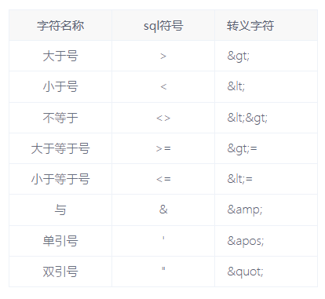

## 72、SQL中on条件与where条件的区别

​    数据库在通过连接两张或多张表来返回记录时，都会生成一张中间的临时表，然后再将这张临时表返回给用户。

   在使用left jion时，on和where条件的区别如下：

1.  on条件是在生成临时表时使用的条件，它不管on中的条件是否为真，都会返回左边表中的记录。
2. where条件是在临时表生成好后，再对临时表进行过滤的条件。这时已经没有left join的含义（必须返回左边表的记录）了，条件不为真的就全部过滤掉。

​    假设有两张表：

表1：tab2

| id   | size |
| ---- | ---- |
| 1    | 10   |
| 2    | 20   |
| 3    | 30   |

表2：tab2

| size | name |
| ---- | ---- |
| 10   | AAA  |
| 20   | BBB  |
| 20   | CCC  |

两条SQL:

1. select * form tab1 left join tab2 on (tab1.size = tab2.size) where tab2.name=’AAA’

   - 中间表 on条件: tab1.size = tab2.size

     | tab1.id | tab1.size | tab2.size | tab2.name |
     | ------- | --------- | --------- | --------- |
     | 1       | 10        | 10        | AAA       |
     | 2       | 20        | 20        | BBB       |
     | 2       | 20        | 20        | CCC       |
     | 3       | 30        | (null)    | (null)    |

   - 再对中间表过滤 where 条件： tab2.name=’AAA’ 

     | tab1.id | tab1.size | tab2.size | tab2.name |
     | ------- | --------- | --------- | --------- |
     | 1       | 10        | 10        | AAA       |

2. select * form tab1 left join tab2 on (tab1.size = tab2.size and tab2.name=’AAA’)

   - 第一条SQL的过程：第二条SQL的过程：1、中间表 on条件: tab1.size = tab2.size and tab2.name=’AAA’ (条件不为真也会返回左表中的记录)

     | tab1.id | tab1.size | tab2.size | tab2.name |
     | ------- | --------- | --------- | --------- |
     | 1       | 10        | 10        | AAA       |
     | 2       | 20        | (null)    | (null)    |
     | 3       | 30        | (null)    | (null)    |

## 73、javaType和ofType的区别

👉 **`javaType`：描述“当前属性本身的类型”**
 👉 **`ofType`：描述“集合里元素的类型”**

------

**`javaType` 是干嘛的**

用于指定 **某个字段/属性本身是什么类型**

常见场景：

- 普通字段
- 嵌套对象（association）

**实体类**

```
public class Order {
    private Long id;
    private User user;
}
public class User {
    private Long id;
    private String name;
}
```

**resultMap**

```
<resultMap id="orderMap" type="Order">
    <id property="id" column="id"/>
    
    <association property="user" javaType="User">
        <id property="id" column="user_id"/>
        <result property="name" column="user_name"/>
    </association>
</resultMap>
```

**解释**

- `user` 是一个对象（不是集合）
- 所以用 `javaType="User"`

------

**`ofType` 是干嘛的**

用于指定 **集合中每一个元素的类型**

只在 `<collection>` 里用

**实体类**

```
public class Order {
    private Long id;
    private List<OrderItem> items;
}
public class OrderItem {
    private Long id;
    private String productName;
}
```

**resultMap**

```
<resultMap id="orderMap" type="Order">
    <id property="id" column="id"/>

    <collection property="items" ofType="OrderItem">
        <id property="id" column="item_id"/>
        <result property="productName" column="product_name"/>
    </collection>
</resultMap>
```

**解释**

- `items` 是 `List<OrderItem>`
- MyBatis 需要知道：
  - 集合类型：默认就是 List（可以不写）
  - **元素类型：必须用 `ofType` 指定**

## 74、java.util.Map中的putIfAbsent、computeIfAbsent、computeIfPresent、compute的区别

在 Java 里，`java.util.Map` 提供了几个非常有用的方法用于 **条件更新或计算键值**：`putIfAbsent`、`computeIfAbsent`、`computeIfPresent`、`compute`。它们都是 **避免先判断再插入** 的常用工具，但用途和逻辑略有区别。下面我详细解释并举例。

------

### 1️⃣ `putIfAbsent(K key, V value)`

**作用**：

- 如果 key 不存在（或者对应的 value 为 `null`），就插入指定 value。
- 如果 key 已存在，不做任何操作，返回原来的 value。

**典型场景**：初始化一个 key 对应的值。

```
Map<String, Integer> map = new HashMap<>();
map.putIfAbsent("a", 1); // "a" 不存在，插入 1
map.putIfAbsent("a", 2); // "a" 已存在，忽略
System.out.println(map.get("a")); // 输出 1
```

------

### 2️⃣ `computeIfAbsent(K key, Function<? super K, ? extends V> mappingFunction)`

**作用**：

- 如果 key 不存在或对应 value 为 `null`，则用给定的 `mappingFunction` 计算 value 并插入。
- 如果 key 已存在且不为 null，则返回已有 value，不调用函数。

**典型场景**：延迟初始化 value，比如 Map of List。

```
Map<String, List<String>> map = new HashMap<>();
map.computeIfAbsent("a", k -> new ArrayList<>()).add("hello");
map.computeIfAbsent("a", k -> new ArrayList<>()).add("world");
System.out.println(map.get("a")); // 输出 [hello, world]
```

> 区别于 `putIfAbsent`：computeIfAbsent 可以动态生成 value，而不是固定一个值。

------

### 3️⃣ `computeIfPresent(K key, BiFunction<? super K, ? super V, ? extends V> remappingFunction)`

**作用**：

- 只有当 key **存在且 value 不为 null** 时，才会调用函数计算新的 value 并更新。
- 如果函数返回 null，则会删除该 key。

**典型场景**：更新已存在的值。

```
Map<String, Integer> map = new HashMap<>();
map.put("a", 1);
map.computeIfPresent("a", (k, v) -> v + 1); // key 存在，更新 value = 2
map.computeIfPresent("b", (k, v) -> 5);     // key 不存在，不执行
System.out.println(map.get("a")); // 2
System.out.println(map.get("b")); // null
```

------

### 4️⃣ `compute(K key, BiFunction<? super K, ? super V, ? extends V> remappingFunction)`

**作用**：

- 无论 key 是否存在，都会调用函数计算新的 value。
- 如果函数返回 null，则删除该 key。
- 更强大，但也要注意可能删除 key。

**典型场景**：无条件计算或更新 Map 中的值。

```
Map<String, Integer> map = new HashMap<>();
map.put("a", 1);
map.compute("a", (k, v) -> v == null ? 0 : v + 10); // 1 + 10 = 11
map.compute("b", (k, v) -> 5);                        // key 不存在，v=null，计算返回 5
map.compute("c", (k, v) -> null);                     // 返回 null，删除 key
System.out.println(map); // {a=11, b=5}
```

------

#### ⚡ 总结区别表

| 方法             | key 不存在         | key 存在           | 是否允许动态生成 value | 删除 key 的可能           |
| ---------------- | ------------------ | ------------------ | ---------------------- | ------------------------- |
| putIfAbsent      | 插入 value         | 不变               | ❌ 固定值               | ❌                         |
| computeIfAbsent  | 调用函数生成 value | 不变               | ✅                      | ❌                         |
| computeIfPresent | 不做               | 调用函数生成 value | ✅                      | ✅（函数返回 null 会删除） |
| compute          | 调用函数生成 value | 调用函数生成 value | ✅                      | ✅（函数返回 null 会删除） |

------

简单记忆方式：

- **putIfAbsent**：存在就不动，不存在就插入。
- **computeIfAbsent**：不存在就用函数生成。
- **computeIfPresent**：存在就用函数更新。
- **compute**：无论存在不存在，都用函数更新（返回 null 则删除）。

## 75、线程安全的集合

Java中常用的线程安全集合有以下几类：

### 1. **List 线程安全版本**

| 非线程安全   | 线程安全版本                                       | 特点             |
| ------------ | -------------------------------------------------- | ---------------- |
| `ArrayList`  | `Collections.synchronizedList(new ArrayList<>())`  | 全方法同步锁     |
| `ArrayList`  | `CopyOnWriteArrayList`                             | 读无锁，写时复制 |
| `LinkedList` | `Collections.synchronizedList(new LinkedList<>())` | 全方法同步锁     |

**示例：**

```java
List<String> syncList = Collections.synchronizedList(new ArrayList<>());
List<String> cowList = new CopyOnWriteArrayList<>();
```

### 2. **Set 线程安全版本**

| 非线程安全 | 线程安全版本                                         | 特点                |
| ---------- | ---------------------------------------------------- | ------------------- |
| `HashSet`  | `Collections.synchronizedSet(new HashSet<>())`       | 全方法同步锁        |
| `HashSet`  | `CopyOnWriteArraySet`                                | 读无锁，写时复制    |
| `TreeSet`  | `Collections.synchronizedSortedSet(new TreeSet<>())` | 有序，全方法同步锁  |
|            | `ConcurrentSkipListSet`                              | 有序，无锁/细粒度锁 |

**示例：**

```java
Set<String> syncSet = Collections.synchronizedSet(new HashSet<>());
Set<String> cowSet = new CopyOnWriteArraySet<>();
Set<String> skipListSet = new ConcurrentSkipListSet<>();  // 有序
```

### 3. **Map 线程安全版本**

| 非线程安全 | 线程安全版本                                         | 特点                 |
| ---------- | ---------------------------------------------------- | -------------------- |
| `HashMap`  | `Collections.synchronizedMap(new HashMap<>())`       | 全方法同步锁         |
| `HashMap`  | `ConcurrentHashMap`                                  | 分段锁，高并发性能好 |
| `TreeMap`  | `Collections.synchronizedSortedMap(new TreeMap<>())` | 有序，全方法同步锁   |
| `TreeMap`  | `ConcurrentSkipListMap`                              | 有序，无锁/细粒度锁  |

**示例：**

```java
Map<String, Object> syncMap = Collections.synchronizedMap(new HashMap<>());
Map<String, Object> concurrentMap = new ConcurrentHashMap<>();
Map<String, Object> skipListMap = new ConcurrentSkipListMap<>();  // 有序
```

### 4. **Queue/Deque 线程安全版本**

| 非线程安全              | 线程安全版本            | 特点             |
| ----------------------- | ----------------------- | ---------------- |
| `LinkedList`(作为Queue) | `ConcurrentLinkedQueue` | 无锁队列         |
| `ArrayDeque`            | `ConcurrentLinkedDeque` | 无锁双端队列     |
| `PriorityQueue`         | `PriorityBlockingQueue` | 阻塞优先级队列   |
|                         | `ArrayBlockingQueue`    | 有界阻塞队列     |
|                         | `LinkedBlockingQueue`   | 可选有界阻塞队列 |

**示例：**

```java
Queue<String> concurrentQueue = new ConcurrentLinkedQueue<>();
Queue<String> blockingQueue = new LinkedBlockingQueue<>();
Deque<String> concurrentDeque = new ConcurrentLinkedDeque<>();
```

### 5. **ConcurrentHashMap的特殊方法**

```java
ConcurrentHashMap<String, String> map = new ConcurrentHashMap<>();

// 创建线程安全的Set
Set<String> keySet = map.keySet();  // 线程安全的KeySet视图
Set<String> newKeySet = ConcurrentHashMap.newKeySet();  // 独立的线程安全Set

// 原子操作
map.putIfAbsent("key", "value");
map.computeIfAbsent("key", k -> "computed-value");
```

### 6. **性能对比表**

| 集合类型                    | 读性能       | 写性能               | 适用场景         |
| --------------------------- | ------------ | -------------------- | ---------------- |
| `synchronizedXxx`           | 差（有锁）   | 差（有锁）           | 低并发，简单场景 |
| `CopyOnWriteArrayList/Set`  | 极好（无锁） | 极差（复制整个数组） | 读多写极少       |
| `ConcurrentHashMap`         | 好           | 好                   | 高并发读写       |
| `ConcurrentSkipListSet/Map` | 好           | 好                   | 需要有序的高并发 |
| `ConcurrentLinkedQueue`     | 好           | 好                   | 高并发队列       |

### 7. **使用建议**

#### 场景1：读多写少

```java
// 配置文件、白名单等
List<String> configList = new CopyOnWriteArrayList<>();
Set<String> whiteList = new CopyOnWriteArraySet<>();
```

#### 场景2：高并发读写

```java
// 缓存、计数器等
Map<String, Object> cache = new ConcurrentHashMap<>();
Set<String> onlineUsers = ConcurrentHashMap.newKeySet();
```

#### 场景3：需要排序

```java
// 排行榜、有序集合
Set<String> sortedSet = new ConcurrentSkipListSet<>();
Map<Integer, String> sortedMap = new ConcurrentSkipListMap<>();
```

#### 场景4：简单同步

```java
// 低并发场景
List<String> list = Collections.synchronizedList(new ArrayList<>());
Map<String, Object> map = Collections.synchronizedMap(new HashMap<>());
```

### 8. **注意事项**

```java
// 错误示例：即使使用线程安全集合，复合操作也不安全
if (!set.contains(item)) {  // 线程A检查
    set.add(item);          // 线程B可能在此期间已添加
}

// 正确：使用原子操作
ConcurrentHashMap<String, String> map = new ConcurrentHashMap<>();
map.putIfAbsent("key", "value");  // 原子操作

// 或者使用同步块
synchronized(set) {
    if (!set.contains(item)) {
        set.add(item);
    }
}
```

选择哪种线程安全集合取决于具体的并发需求、读写比例、是否需要排序等因素。

## 76、Spring生命周期注解

### 核心注解

1. **@PostConstruct**

- **作用**：在 Bean 初始化完成后立即执行
- **时机**：在依赖注入之后，`InitializingBean.afterPropertiesSet()`之前
- **标准**：JSR-250 标准注解
- **位置**：方法上，无参数
- **注意**：访问修饰符不限，但不能是 `static`

2. **@PreDestroy**

- **作用**：在 Bean 销毁之前执行
- **时机**：在 `DisposableBean.destroy()`之前
- **标准**：JSR-250 标准注解
- **注意**：容器关闭时执行（单例 Bean）

#### 使用示例

```java
import javax.annotation.PostConstruct;
import javax.annotation.PreDestroy;
import org.springframework.stereotype.Component;

@Component
public class DatabaseManager {
    
    @PostConstruct
    public void init() {
        System.out.println("1. @PostConstruct: 初始化数据库连接池");
        // 初始化资源
    }
    
    public void doWork() {
        System.out.println("执行业务逻辑");
    }
    
    @PreDestroy
    public void cleanup() {
        System.out.println("3. @PreDestroy: 关闭数据库连接，释放资源");
        // 清理资源
    }
}
```

### 完整的生命周期顺序

以下是使用注解时的完整执行顺序：

1. **构造器调用**
2. **依赖注入**（`@Autowired`, `@Value`等）
3. **@PostConstruct 方法**
4. **InitializingBean.afterPropertiesSet()**（如果实现了该接口）
5. **自定义 init 方法**（通过 `@Bean(initMethod = "...")`）
6. **Bean 就绪可用**
7. **容器关闭**
8. **@PreDestroy 方法**
9. **DisposableBean.destroy()**（如果实现了该接口）
10. **自定义 destroy 方法**（通过 `@Bean(destroyMethod = "...")`）
