# [微信开发者文档](https://developers.weixin.qq.com/doc/)

账号： fahaxiki_lz@qq.com

e363d743d49592d98b1227d72b1bcd87

# 坑

> 在你写页面时，看到page怎么都不显示东西，可能时在js文件中没有写data，直接写数据了

# 需要全局配置的

> 1. 背景音乐API —— app.json
>
>    ```json
>    'requireBackgroundModes':['audio']
>    ```
>
> 2. 腾讯视频插件 —— app.json
>
>    ```json
>    // app.json
>    {
>       "plugins": {
>          "player": {
>             "version": "2.0.0",
>             "provider": "wxa75efa648b60994b"
>          }
>      },
>    }
>    ```
>
> 3. 定位自己的位置 —— app.json
>
>    ```json
>      "permission": {
>        "scope.userLocation": {
>          "desc": "你的位置信息将用于小程序位置接口的效果展示"
>        }
>      }
>    ```
>
> 4. 获取订阅消息权限 —— app.js
>
>    ```js
>    // app.js
>    App({
>        ......
>    	globalData:{
>    	  hasSubscribeMessage: ''
>      }
>    })
>    ```

# this指向问题

> - 普通函数：this指向当前组件
> - 箭头函数：this是undefined

# 入门基础

## 项目目录

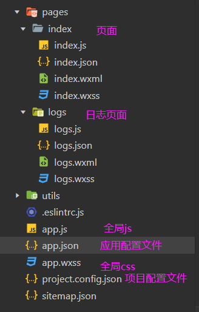

## 创建项目

> **创建无模板的项目，新建app.json文件，在该文件中输入以下代码，自动新增一个index页面**
>
> ```json
> {
>       "pages":[
>         	"pages/index/index",
>         ]
> }
> 
> ```

## 页面组件

> 1. `<view>`标签类似`<div>`
> 2. `<text>`标签类似`<p>`
> 3. `<icon>`图标文件
> 4. `<input>`标签type属性：
>    - text：文本输入键盘
>    - number：数字输入键盘
>    - idcard：身份证输入键盘
>    - digit：带小数点的数字键盘
>    - input组件显示为空白，因为默认样式没有任何边框
> 5. index.wxml中的代码被包裹在`<page>`标签中，是一个根标签

## 页面样式

### 选择器

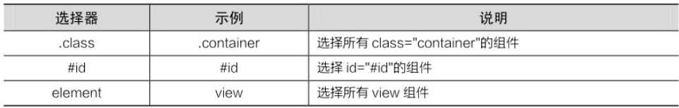

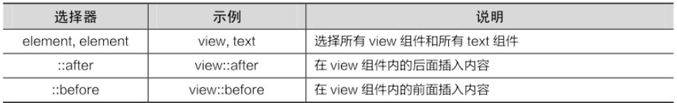

### 尺寸单位

> 尺寸单位为rpx，rpx规定了任何手机屏幕的宽度都是750rpx

### **样式导入**

> - **在index.wxss中导入test.wxss，`@import "test.wxss"`**
>
> - **app.wxss为全局样式，当全局样式和页面样式冲突时，页面样式优先级更高，会覆盖全局样式**
>
> - **在index.js中引入test.js，`var xxx = require("test.js")**`
> - **view组件的`hover-class`属性表示该组件按下时的class样式**

## 配置文件

### 页面级配置文件(index.json)

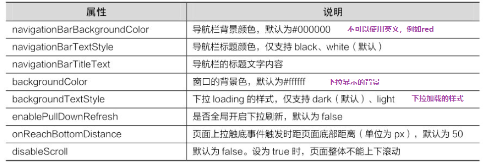

> - 若**将`enablePullDownRefresh`设为true，页面可以下拉刷新**，**当下拉刷新操作执行时，就会触发下拉刷新事件`onPullDownRefresh`**，在pages/index/index.js文件中可以找到该事件的处理函数。
> - `onReachBottomDistance` 主要用于开发自动加载更多的功能，也就是**当页面中的内容非常长的时候，为了加快加载速度，并不是一次性加载所有的数据，而是先加载一部分数据将页面填满，直到出现滚动条，页面可以向上滚动。当用户上拉时，如果快要到达底部了，就立即加载后面的数据。**因此，**`onReachBottomDistance`的值越大，加载的时机越提前**。**如果达到了给定的值，就会触发上拉触底事件`onReachBottom`**，在pages/index/index.js文件中可以找到该事件的处理函数。

### 应用级配置文件(app.json)

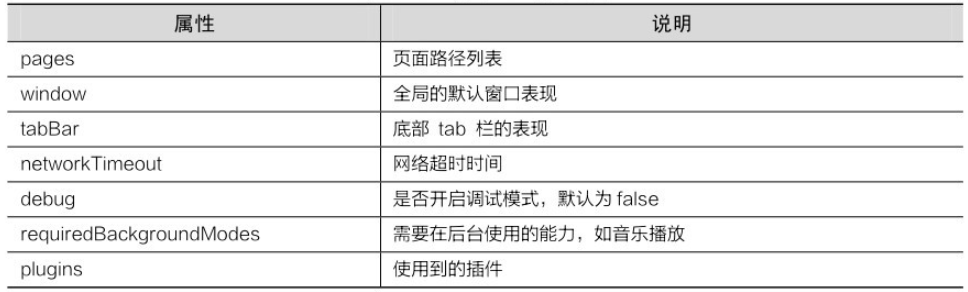

> - **window的值是一个对象，可以将页面级配置文件配置写在 window 中**，作为应用级配置使用，从而一次设置多个页面，且优先级低于页面级配置

#### networkTimeout

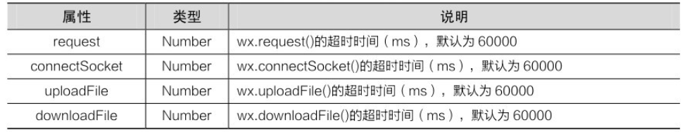

#### tabBar

> **tabBar对象用于配置页面底部的标签栏**
>
> **在微信小程序中启动页面一定要包含在tabBar中，并且启动页必须是tabBar的list属性中的第一个元素，才能正常显示**

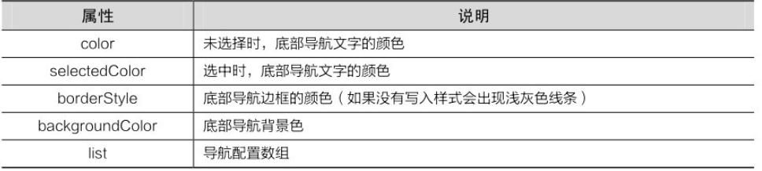

> list是一个数组，数组的每一个元素是一个标签按钮对象，通过该对象的属性可以配置标签栏中的每个标签按钮
>
> 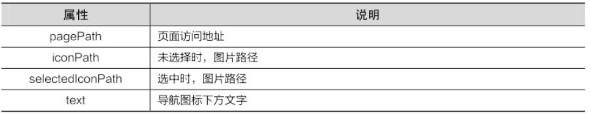

```json
{
......
"tabBar": {
    "selectedColor": "#f00",
    "list": [
      {
        "pagePath": "pages/index/index",
        "text": "邀请函",
        "iconPath": "./pages/assets/images/invite.png",
        "selectedIconPath": "./pages/assets/images/invite.png"
      },
      {
        "pagePath": "pages/picture/picture",
        "text": "图片",
        "iconPath": "./pages/assets/images/marry.png",
        "selectedIconPath": "./pages/assets/images/marry.png"
      },
      {
        "pagePath": "pages/video/video",
        "text": "美好时光",
        "iconPath": "./pages/assets/images/video.png",
        "selectedIconPath": "./pages/assets/images/video.png"
      },
      {
        "pagePath": "pages/map/map",
        "text": "结婚地点",
        "iconPath": "./pages/assets/images/map.png",
        "selectedIconPath": "./pages/assets/images/map.png"
      },
      {
        "pagePath": "pages/guest/guest",
        "text": "宾客信息",
        "iconPath": "./pages/assets/images/guest.png",
        "selectedIconPath": "./pages/assets/images/guest.png"
      }
    ]
  },
  ......
}
```

## 页面逻辑(index.js)

> **Page()函数用来注册一个页面，该函数的参数是一个对象**，通过该对象可以指定页面的初始数据、生命周期函数、事件处理函数等

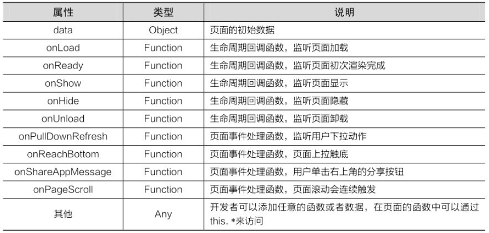

### 生命周期回调函数

> - **onLoad：页面加载时触发，一个页面只会调用一次 。通过参数options可以获取打开当前页面路径中的参数。**
> - **onReady：页面初次渲染完成的时候调用。一个页面只会调用一次**，代表页面已经准备妥当，此时可以与视图层进行交互。
> - **onShow：当页面显示时触发。**例如，从后台切入前台时触发。
> - **onHide：当页面隐藏时触发。**例如，从前台切入后台时触发。
> - **onUnload：页面卸载时触发。**例如，使用路由API中的wx.redirectTo()或wx.navigateBack()跳转其他页面时触发。
>
> **执行顺序为onLoad→onShow→onReady**

```js
// index.js
// 获取应用实例
const app = getApp()

Page({
   /**
   * 生命周期
   */

  onLoad: function () {
    console.log("页面首次加载")
  },
  onReady: function () {
    console.log("页面首次渲染完成")
  },
  onShow: function () {
    console.log("页面显示")
  },
  onHide: function () {
    console.log("页面隐藏")
  }
})
```

#### onLoad

> **在onLoad函数中，有一个参数options，表示打开当前页面路径中的参数**，它可以在当前页面被其他页面打开的情况下接收一些参数。

```js
// index.js
// 获取应用实例
const app = getApp()

Page({
  // 跳转页面测试onLoad
  testLoad: function () {
    wx.navigateTo({
      url: '../logs/logs?name=lz&age=21',
    })
  }
})
```

```js
// logs.js
const util = require('../../utils/util.js')

Page({
  
  onLoad(options) {
    console.log(options)//{name: "lz", age: "21"}
    }
})
```

#### onShareAppMessage /onShow/onHide

> - 在小程序的导航栏中，页面标题的右边有两个按钮，即“⋯”和“⊙”。单击“⋯”会在底部弹出一个菜单，在菜单中有一项“转发”，**单击转发就会触发`onShareAppMessage `事件**。
>
> - 单击“⊙”可以在前台、后台之间切换，通过此按钮可以测试`onShow`和`onHide`事件，单击后会弹出一个“查找场景值”的菜单，通过场景值可以感知用户的使用场景，如1001表示“发现栏小程序主入口”。

### 页面事件处理函数

> - **`onPullDownRefresh `需要在配置文件中将 `enablePullDownRefresh`设为 true 才会有效， 默认不开启**
> - **`onReachBottom `需要在配置文件中将`onReachBottomDistance`设置数值才生效**

### 组件事件处理函数

> **`bindtap`表示当用户点击该组件时，执行相应的事件处理函数**
>
> **通过事件对象e，可以获取`type`（事件类型）、`timestamp`（事件生成时的时间戳）、`target`（触发事件的组件的一些属性值集合  id+dataset）、`currentTarget`（当前组件的一些属性值集合）、`detail`（额外的信息）等信息。**

#### target和currentTarget的区别

```html
  <view id="outer" bindtap="testTarget">
    outer
    <view id="inter">inter</view>
  </view>
```

> 父元素outer绑定了testTarget事件，而子元素没有绑定，但由于子元素是父元素的一部分，因此单击子元素也会触发testTarget事件。运行程序测试，当单击outer时，控制台中的输出结果为outer-outer，而单击inner时，控制台中的输出结果为 inner-outer。由此可见，**`e.target` 获取到的是子元素的属性值集合，而`e.currentTarget`获取到的是父元素的属性值集合。**
>
> **`e.target`谁触发的获取谁的**
>
> **`e.currentTarget`获取带有事件的部分**

#### 常用事件

> 由于小程序并非运行在浏览器环境中，不能使用BOM和DOM。

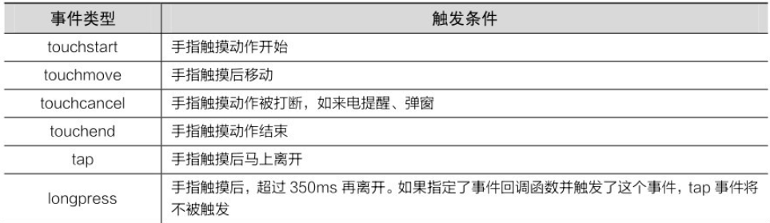

```html
 <view>
    <button capture-bind:touchstart="testTouchStart">点我跳转，测试touchstart</button>
  </view>
  <view>
    <button capture-bind:touchmove="testTouchMove">点我跳转，测试touchmove</button>
  </view>
  <view>
    <button capture-bind:tap="testTap">点我跳转，测试tap</button>
  </view>
```

```js
// index.js
// 获取应用实例
const app = getApp()

Page({
   testTarget: function (e) {
    console.log(e.target.id + '-' + e.currentTarget.id)
    console.log(e.detail)
  },

  testTouchStart() {
    console.log("testTouchStart...")
  },
  testTouchMove() {
    console.log("testTouchMove")
  },
  testTap(){
    console.log("testTap...")
  }
})
```

#### 事件绑定和冒泡

> 在为组件绑定事件时，有两种方式，分别是“bind事件类型”和“catch事件类型”。bind方式在前面已经用过，如bindtap，它的特点是不会阻止冒泡事件向上冒泡，而**`catch`可以阻止冒泡事件向上冒泡。**

```html
  <view bindtap="outerTap">
    　outer3
    　　<view catchtap="middleTap">　　
       middle5
      　　 <view bindtap="innerTap">
              inner
            </view>
      　</view>
  </view>
```

> 如果单击inner，会先后触发innerTap和middleTap，由于middleTap使用catch阻止了事件冒泡，因此不会执行outerTap。同理，如果单击middle，则只会触发middleTap。如果单击outer，则只会触发outerTap。

## this

> 在page中，常规方法的指向是调用者，也就是组件。在箭头函数this指向是最近的作用域
>
> 两个重要的小原则:
>
> 1.所有被组件管理的函数，最好写成普通函数，这样this的指向才是组件实例对象。
>
> 2.所有不被组件所管理的函数（定时器的回调函数、ajax的回调函数等)，最好写成箭头函数,这样this的指向才是组件实例对象

## 注册程序（app.js）

> **若要在小程序启动、显示、隐藏时执行某些操作，可以通过 App()函数来实现。**App()函数用于注册小程序，它接收一个对象参数，通过参数指定小程序的生命周期回调等。**App()函数必须在app.js中调用，且只能调用一次，不然会出现无法预期的后果。**

```js
// app.js
App({
  // 生命周期回调————监听小程序初始化
  // 小程序初始化完成时触发（全局只触发一次）
  onLaunch(options) {
    console.log("onLaunch...")
    console.log(options)
  },
  // 生命周期回调————监听小程序显示
  // 小程序启动，或从后台进入前台显示时触发
  onShow(options) {
    console.log("onshow...")
    console.log(options)
  },
  // 生命周期回调————监听小程序隐蔽
  // 小程序从前台进入后台时触发
  onHide() {
    console.log("onhide...")
  },
  // 错误监听函数
  // 小程序发生脚本错误，或者API调用失败时触发
  onError(error) {
    console.log("error...")
    console.log(error)
  },
  // 页面不存在监听函数
  // 小程序要打开的页面不存在时触发
  onPageNotFound(options) {
    console.log("onpagenotfound...")
    console.log(options)
  }

})
```

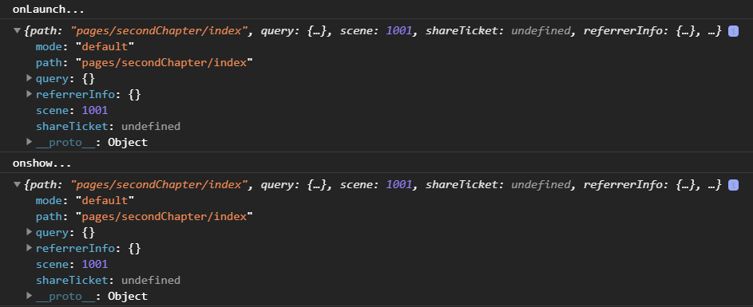

> - path：打开小程序的路径，一般情况下是app.json中的第1个路径，也可以通过自定义编译条件指定启动页面，如图2-17所示。
> - query：打开小程序的 query，一般情况下是空对象，也可以通过自定义编译条件指定启动参数
> - scene：打开小程序的场景值，一般情况下是1001，也可以通过自定义编译条件指定进入场景
> - shareTicket：当小程序被转发出去时（如转发到群聊），如果此转发卡片被其他用户打开，可以获取到shareTicket（如群的标识）。通常搭配wx.showShareMenu()使用，并且需要在该方法的参数对象中设置withShareTicket为true。
> - referrerInfo：当场景为从另一个小程序、公众号或 APP 打开时，可以通过它获取来源于小程序、公众号的AppId等，scene为1037或1038时支持传递附加数据。

> **利用App()函数还可以保存一些在所有页面中共享的数据。getApp()函数用于获取小程序App实例**，获取后即可访问在app.js中定义的属性和方法。

```js
// index.js
// 获取应用实例
//const app = getApp()//放这里获取是全局的    

Page({
    onReady: function () {
        const app = getApp()//放这里只能在这个函数中使用    
        console.log("页面首次渲染完成")
        console.log(app.num)
        app.test()
  },
  
})
```

## 案例1：实现比较功能

### 为两个input绑定不同事件处理函数

> - **`bindchange`事件，当数据变化时触发**
>
> - **`e.detail.value`用于获取输入框的内容，不可以使用`e.target.value`**
>
>   - **`e.target`只有id和dataset**
>
>     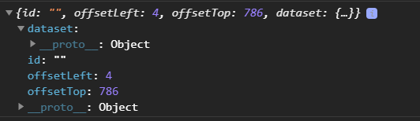
>
> - **`Number()`用于将字符串转为数字类型**
>
> - **js中的数据用`this.setData({result:xxx})`更新数据显示在页面上，在WXML中使用双大括号`{{result}}`可以实现数据绑定**
>
>   ```html
>   <view>
>       <input bindtap="testFn1"></input>
>   </view>
>   <view>
>       <input bindtap="testFn2"></input>
>   </view>
>   <view>
>   	<button bindtap="compare">点击比较</button>
>   </view>
>   <view>
>   	<text>比较结果{{result}}</text>
>   </view>
>   ```
>
>   ```js
>   Page({
>       data：{
>       	num1:0,
>       	num2:0,
>       	result:''
>   	},
>       testFn1(e){
>        	this.num1 = e.detail.value
>        },
>   	testFn2(e){
>        	this.num2 = e.detail.value
>        },
>       compare(){
>           if(this.num1 > this.num2){
>               str = "第一个数大"
>           }else if(this.num1　< this.num2){
>               str = "第二个数大"
>           }else{
>               str = "一样大"
>           }
>           this.setData({result:str})
>       }
>   })
>   ```
>
> - **如果想要更改该页面中的`{{result}}`的值，不能通过直接赋值的方式来实现，而是需要通过`this.setData()`方法来实现**

### 为两个input绑定相同事件处理函数

> - 为多个input组件绑定相同事件处理函数，然后再为不同的input组件设置不同的id或者dataset
>
>   ```html
>   <view>
>       <input bindtap="testFn" id="num1"></input>
>   </view>
>   <view>
>       <input bindtap="testFn" id="num2"></input>
>   </view>
>   <view>
>       <button bindtap="compare">点击比较</button>
>   </view>
>   <view>
>       <text>比较结果{{result}}</text>
>   </view>
>   ```
>
>   ```js
>   Page({
>       data:{
>           num1:0,
>           num2:0,
>           result:""
>       }
>       ...
>       change(e){
>   		this[e.currentTarget.id] = e.detail.value
>   	},
>       compare(){
>           if(this.num1 > this.num2){
>               tr = "第一个数大"
>           }else if(this.num1　< this.num2){
>               str = "第二个数大"
>           }else{
>               str = "一样大"
>           }
>           this.setData({result:str})
>       }
>   })
>   ```
>
>   **<span style="color:red">注意：`this[e.currentarget.id]`是ES7中的对象[ ]语法</span>**
>
>   ```js
>    const person = { name: 'lz', age: 21 }
>    console.log(person['name'])
>   ```
>
>   - 使用dataset **(data-xxx)**
>
>     ```html
>       <view>
>         <input bindtap="testFn" data-id=“num1></input>
>       </view>
>       <view>
>         <input bindtap="testFn" data-id="num2"></input>
>       </view>
>     ```
>
>     ```js
>     Page({
>         data:{
>             num1:0,
>             num2:0
>         }
>         ...
>         change(e){
>     		this[e.currentTarget.dataset.id] = e.currentTarget.value
>     	}
>     })
>     ```

### 直接在页面上比较（三元运算符）

> - **在WXML的`{{ }}`中可以写js表达式**，同样可以直接在里面写逻辑，例如三元运算符
>
>   ```html
>   <view>
>       <input bindtap="testFn" id="num1"></input>
>   </view>
>   <view>
>       <input bindtap="testFn" id="num2"></input>
>   </view>
>   <view>
>       <button bindtap="compare">点击比较</button>
>   </view>
>   <view>
>       <text>比较结果{{num1>num2?"第一个数大":(num1<num2?"第二个数大":"一样大")}}</text>
>   </view>
>   ```
>
>   ```js
>   Page({
>       data:{
>           num1:0,
>           num2:0
>       }
>      
>       change(e){
>   		this[e.currentTarget.id] = e.detail.value
>   	}
>   })
>   ```

### 通过条件渲染显示不同结果

> - **通过`wx:if`属性判断哪一个标签会在WXML结构中出现（而不是利用样式控制标签的显示或隐藏）**，如果`{{ }}`中的运算结果为true则出现，运算结果为false则不会出现
>
>   ```html
>   <view>
>       <input bindtap="testFn" id="num1"></input>
>   </view>
>   <view>
>       <input bindtap="testFn" id="num2"></input>
>   </view>
>   <view>
>       <button bindtap="compare">点击比较</button>
>   </view>
>   <view>
>       <text wx:if="{{num1 > num2}}">比较结果：第1个数大</text>
>       <text wx:elif="{{num1 < num2}}">比较结果：第2个数大</text>
>       <text wx:else>比较结果：两数相等</text>
>   </view>
>   ```
>
> - 把比较结果的\<text>标签换成\<block>标签也可，**\<block>标签并不是一个组件，它仅仅是一个包装元素，不会在页面中做任何渲染，只接收控制属性**

### 通过表单获取input组件的值

> - **form组件的`bindsubmit`属性用于绑定表单提交事件。**
>
>   - 在表单中，为两个input组件加上了name属性**，表单提交时就会自动收集带有name属性的组件的值，收集成对象`{name:value}`**
>
> - **比较按钮添加了`form-type`属性，值为submit表示该按钮用于提交表单**
>
> - 按钮设为reset表示重置表单。
>
>   ```html
>    <form bindsubmit="formCompare">
>       　<view>
>         　 <text>请输入第1个数字：</text>　
>         <input type="number" name="num1" />　　
>       </view>　
>       　<view>　
>         　 <text>请输入第2个数字：</text>　
>         　 <input type="number" name="num2" />　
>         　</view>　
>       <button form-type="submit">比较</button>
>     </form>
>     <view>　
>       <text>比较结果：{{result}}</text>
>     </view>
>   ```
>
>   ```js
>   Page({
>       dataL{
>       	num1:0,
>       	num2:0,
>       	result:''
>   	}
>       formCompare(e){
>       	this.num1 = e.detail.value.num1,
>           this.num2 = e.detail.value.num2
>       
>       	if(xxxx){
>              str = "xxx"
>           }else if(xxxx){
>              str = "xxx"      
>           }else{
>             str = "xxx"  
>           }
>       	
>       	this.setData({result:str})
>   	}
>   })
>   ```

## 案例2：调查问卷

> **`<radio-group>`标签表示将其包裹的所有`<radio>`标签当成一个单选框组，组内只有一个\<radio>标签可以被选中。**
>
> **`<checkbox-group>`标签表示将其包裹的所有`<checkbox>`标签当成一个复选框组。**
>
> \<label>标签的作用类似于 HTML 中的同名标签，用于单击文本时也可以选中对应的单选或复选框。
>
> **在`<checkbox>`和`<checkbox-group>`标签中，value属性表示该项选中时提交的值**，checked属性表示该项为选中状态。

### 获取表单数据

> - **`wx:for`渲染列表，需要一个唯一标识`wx:key`，可以使用关键字`*this`表示将每一项本身作为唯一标识**

```html
<page>
    <form bindsubmit="submitForm">
        <label for="username">姓名</label>
        <input type="text" id="username" name="username" value="{{username}}"/>
        <label for="gender">性别</label>
        <radio-group id="gender" name="gender">
            <radio wx:for="{{gender}}" wx:key="*this" value="{{item.value}}" checked="{{item.checked}}">{{item.name}}</radio>
        </radio-group>
        <label for="major">专业技能</label>
        <checkbox-group name="major" id="major">
            <checkbox wx:for="{{major}}" wx:key="*this" value="{{item.value}}">{{item.value}}</checkbox>
        </checkbox-group>
        <label for="message">您的意见</label>
        <input type="text" name="message" id="message" />
        <button form-type="submit">提交</button>
    </form>
</page>
```

```js
// pages/questionnaire/index.js
Page({
    data:{
        ......
    }
	......
	submitForm(e){
		console.log(e.datail.value)
		/**
         * 将表单中的name和value封装成了对象
         * {username: "", gender: "", major: Array(0), message: ""}
         */
	}
})
```

### 服务器交互

> **将用户提交的表单提交到服务器，可以通过小程序中的网络API `wx.request()`来实现。**需要注意的是，对于正式上线的项目，小程序要求服务器域名必须在小程序管理后台中添加，域名必须经过ICP备案，且只支持HTTPS和WSS协议。
>
> 注意：需要把这个勾选上
>
> 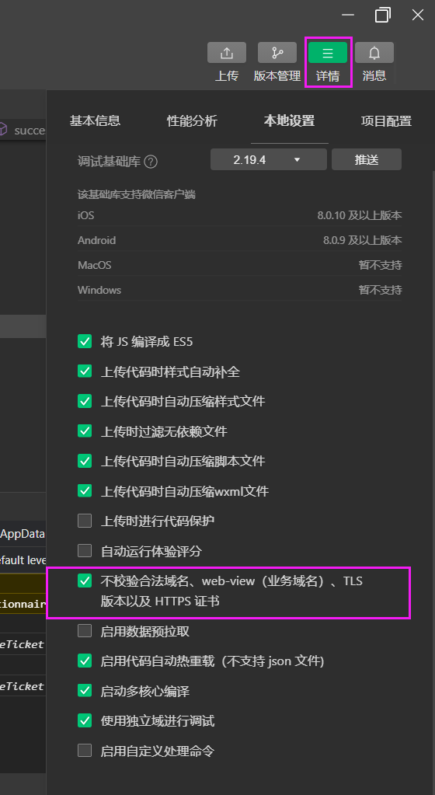
>
> 否则会报错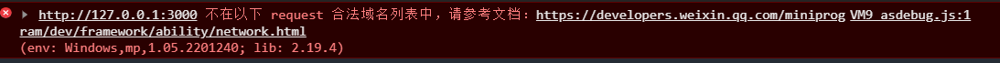

#### 使用node搭建后台

> 1. 初始化项目，将会自动创建package.json配置文件`npm init –y`
> 2. 安装Express框架，用于快速搭建HTTP服务器`npm install express --save`
> 3. 安装nodemon监控文件修改`npm install nodemon -g`

```js
//node/index.js
const express = require("express")
const bodyParser = require("body-parser")

const app = express()
app.use(bodyParser.json())

app.post("/", (req, res) => {
    console.log(req.body)
    res.json(data)
})

app.listen(3000, () => {
    console.log("啊吧啊吧！！！")
})
```

```js
// pages/questionnaire/index.js
Page({
    submitForm(e) {
      wx.request({
            method: "POST",
            url: 'http://127.0.0.1:3000/',
            data: e.detail.value,
            success(res) {
                console.log("啊吧啊吧，成功了！！！", res.data)
            },
            fail(error) {
                console.log(error)
            }
        })

    },

})
```

> - **method 表示请求方式，默认为GET**
> - **url 表示服务器接口地址**
> - **data 表示请求的参数**
> - **success表示接口调用成功的回调函数，其参数res表示服务器响应信息**
> - **fail表示接口调用失败的回调函数，其参数error表示错误信息**

# 音乐小程序项目

## swiper组件

> - swiper组件是滑块视图容器，经常**用于实现轮播图，也可用于实现标签页切换。**
> - **`<swiper>`标签是外层容器，里面有`<swiper-item>`标签**，在初始状态下只显示第1项，向左滑动显示第2项，再向右滑动可以返回第1项。
> - 微信小程序并没有严格规定`<swiper-item>`标签内可以嵌套哪些组件，如果放入image 组件，就实现了轮播图的效果；如果放入一块页面内容，就实现标签页切换的效果了。
> - **`e.detail.current`可以获得`<swiper-item>`的索引，索引是从0开始的**
> - 通过改变 current 的值，可以切换当前显示哪一项`<swiper-item>`，其值是一个从0开始的索引，对应`<swiper-item>`的顺序，如**第1个`<swiper-item>`的索引为0，第2个`<swiper-item>`的索引为1。**

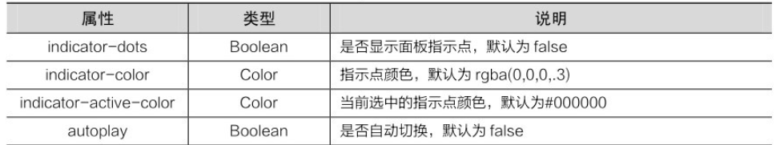

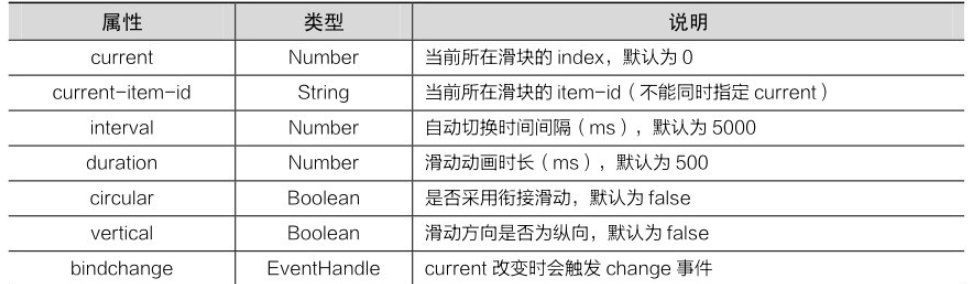

```html
<!-- 显示第二页 -->
<swiper current="1">
    <swiper-item>0</swiper-item>
    <swiper-item>1</swiper-item>
    <swiper-item>2</swiper-item>
</swiper>

<!-- 显示第二页 -->
<swiper current-item-id="b">
    <swiper-item item-id="a">0</swiper-item>
    <swiper-item item-id="b">1</swiper-item>
    <swiper-item item-id="c">2</swiper-item>
</swiper>
```

## include代码引用

> - 在 wxml 文件中可以使用`<include>`标签引用其他文件中的代码，相当于把引用的代码复制到、`<include>`标签的位置。
>
>   - 当一个 wxml 页面中的代码过多时，会给代码的维护带来麻烦，**利用`<include>`将代码拆分到多个文件中，就可以更方便地查找代码。**
>   - 当多个wxml页面中有相同的部分时，可以**将这些公共部分抽取出来，保存到一个单独的wxml文件中，然后在用到的地方通过`<include>`引入。**
>
>   ```html
>   <include src="header.wxml" />
>   ```

## scroll-view组件

> - 使用`scroll-view`组件，超出了显示区域的内容使用阴影表示，当页面向上滚动时，阴影区域的内容就会显示出来。
> - **`scroll-view `组件用于实现可滚动视图区域，小区域滚动。**
> - 设置`scroll-y`属性即可实现纵向滚动。需要注意的是，**纵向滚动需要在样式中为`<scroll-view>`设置一个固定高度，否则它会被子元素撑大。**
> - `scroll-view`组件设置了允许横向和纵向滚动，当发生滚动时就会执行事件处理函数scroll。**在`scroll-view`标签内有一个`<view>`标签，且`<view>`标签的宽度和高度都大于`scroll-view`标签，从而使滚动条出现。**

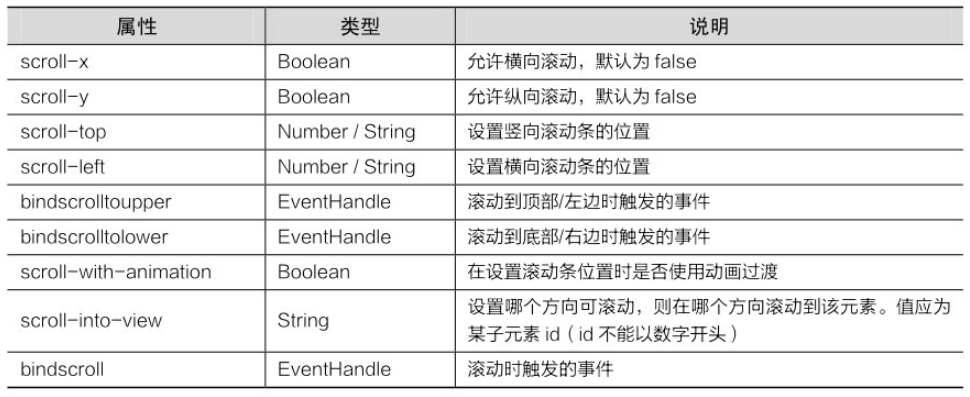

```html
<scroll-view style="height: 200px;" scroll-y scroll-x bindscroll="scroll">
    <view>123</view>
</scroll-view>
```

```js
Page({
	scroll(e){
		console.log(e.detail)
	}
})
```

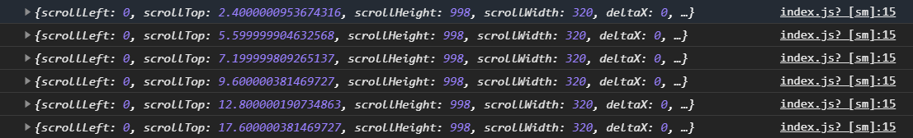

> - scrollLeft：横向滚动条左侧到视图左边的距离。
> - scrollTop：纵向滚动条上端到视图顶部的距离。
> - scrollHeight：纵向滚动条在Y轴上最大滚动距离。
> - scrollWidth：横向滚动条在X轴上最大的滚动距离。
> - deltaX：横向滚动条的滚动状态。
> - deltaY：纵向滚动条的滚动状态。

### 隐藏滚动条

> ```css
>::-webkit-scrollbar {
>  height: 0;
>  width: 0;
>     color: transparent;
>    }
>    ```

## image组件

> - **image组件的默认宽高为300px×225px**，且**image组件中的添加`show-menu-by-longpress`属性支持二维码图片长按识别**，
> - **使用`wx.previewImage()`可以实现在新页面中全屏预览图片。预览的过程中用户可以进行保存图片、发送给朋友等操作。**

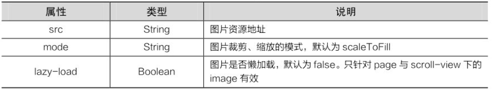

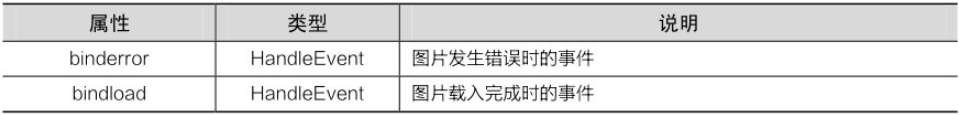

> 缩放模式

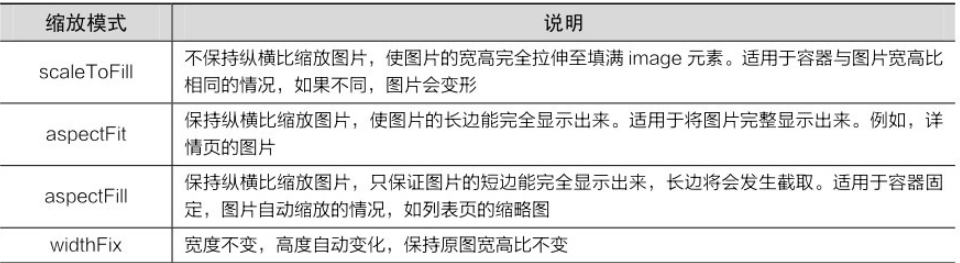

> 裁剪模式

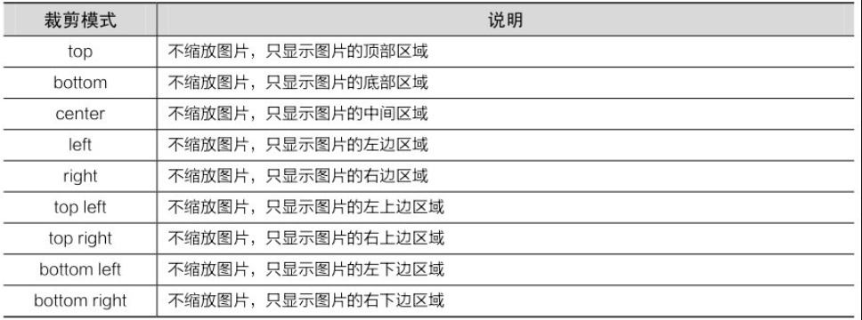

```html
<!-- 缩放 -->
<!-- scaleToFill：不保持纵横比，拉伸宽高
     aspectFit：保持纵横比，长边占满，短边显示
     aspectFill：保持纵横比，短边占满，长边多的截取
     withFix：保持纵横比，宽度不变，高度自动变化 -->
<image style="height: 200px;width: 200px; border: 1px solid black;" mode="widthFix" src="./images/bk.jpg"></image>


<!-- 截取 -->
<image style="height: 200px;width: 200px; border: 1px solid black;" src="./images/bk.jpg" mode="top right"></image>
```

## 音频API

> - 微信小程序提供了**播放音频的API `wx.createInnerAudioContext()`**，掌握这个API的使用方法是实现音乐播放功能的关键。在使用音频API时，需要通过如下代码创建一个实例。
>
>   ```js
>   var audioCtx = wx.createInnerAudioContext()
>   ```
>
> - `onTimeUpdate(function callback)`：**监听音频播放进度更新事件，获取音乐状态信息。**当用户开始播放视频，或者重新定位视频播放位置时，会执行显示当前播放位置的函数。

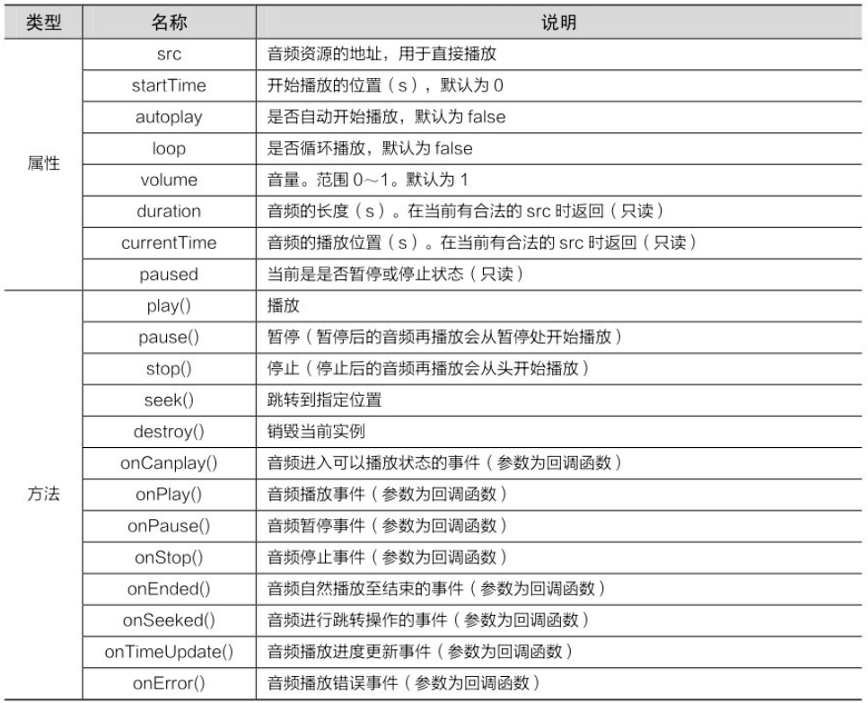

```js
onReady: function () {
        const audioCtx = wx.createInnerAudioContext();
        // newbody外链地址
        audioCtx.src = "http://ws.stream.qqmusic.qq.com/C4000033heV13onaLs.m4a?guid=288085782&vkey=8D21D552F7F1A66854E6D224D2195D01385984F88678DBFEF07094791773C1C2AE622C2B7A2A3278A9EE8EA384664A2CF316700873F83C00&uin=&fromtag=66"

        audioCtx.onPlay(() => {
            console.log("开始播放")
        })
        audioCtx.onError((error) => {
            console.log(error)
        })
        audioCtx.play()
    },   
```

### 旋转动画

> - **`animation-play-state`控制旋转动画的状态**
>
> - **旋转动画用rotate，单位用deg，0-360**
> - **infinite用于循环播放**

```html
 <image class="player player-{{isPlayingMusic?'play':'pause'}}" src="{{play.coverImgUrl}}"></image>
```

```css
/* 唱片动画 */
@keyframes musicRotate {
    from {
        transform: rotate(0deg);
    }

    to {
        transform: rotate(360deg);
    }
}

/* 设置唱片是否转动 */
/* 转动 */
.player-play>image:first-child {
    animation-play-state: running;
}

/* 不转 */
.player-pause>image:first-child {
    animation-play-state: paused;
}
```

## slider组件

> - **slider组件是小程序表单组件中的一种，用于滑动选择某一个值**，在本项目中将用来实现**播放器的进度条**。
> - **`e.detail.value`表示当前slider的值。**

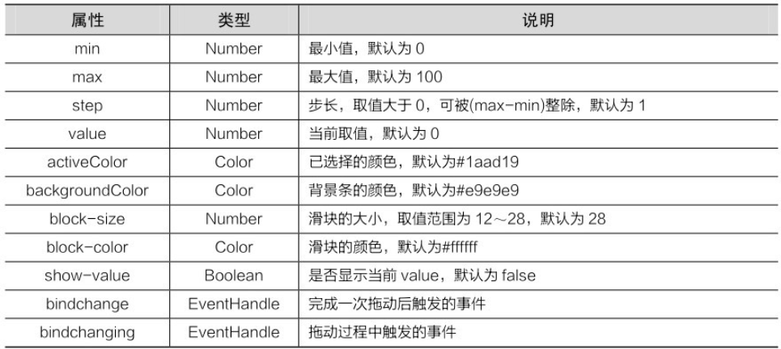

```html
<slider show-value bindchanging="changeslider"></slider>
```

```js
   changeslider(e) {
        console.log(e.detail.value)
    },
```

# 婚礼邀请函小程序项目

## 背景音乐API

> - **可以使用`wx.createInnerAudioContext()`接口播放音频**，在小程序中，还有一种专**门用于播放背景音频的`wx.getBackgroundAudioManager()`接口**，其特点在于**小程序切入后台时，如果音频处于播放状态，可以继续播放。**为了实现这个效果，需要先在**app.json 中添加如下配置**，添加后在开发版中会直接生效，正式版还需通过审核。**方法和属性和`createInnerAudioContext`相似**
>
>   ```json
>   "requiredBackgroundModes": ["audio"],
>   ```
>
> - 创建`BackgroundAudioManager`实例对象，**当设置了新的src时，会自动开始播放**，目前支持的格式有 m4a、aac、mp3、wav。

```js
	// 背景音乐初始化
    bgm: null,
    // 音乐路径
    music_url: "http://ws.stream.qqmusic.qq.com/C400000qSRRR2aLkXf.m4a?guid=918327025&vkey=7BA4F2A3DA58FBBA3299BE1852A3951FE31F9DD4B4FCA26C53F3FED1D70016A1B0DAB75F8F2A01EE9B45BD6552DA60A0BBA6945C26BDE91E&uin=&fromtag=66",
    // 专辑封面
    music_coverImgUrl: ' ',
    onReady() {
        // 设置唱片背景音乐
        this.bgm = wx.getBackgroundAudioManager()
        // 标题
        this.bgm.title = 'marry me'
        // 专辑名称
        this.bgm.epname = 'wedding'
        // 艺术家
        this.bgm.singer = 'singer'
        // 专辑封面
        this.bgm.coverImgUrl = this.coverImgUrl
        // 音频进入可以播放状态的事件
        // this.bgm.onCanplay(() => {
        //     // 不自动播放
        //     this.bgm.pause()
        // })
        this.bgm.src = this.music_url
    }
```

> 在播放状态下，微信开发者工具会弹出一个播放控制的对话框
>
> 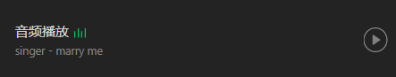

## 背景图片

> - **小程序中不能在WXSS中通过background引入本地图片**，因此使用image组件来引入本地图片。由于小程序的体积有限，在实际开发中，推荐用 URL 的方式引入一些比较占用空间的图片等资源。
> - **css中的vh是一种视窗单位，也是相对单位。相对于视窗的高度。视窗被均分为100单位的vh。vh 优势在于能够直接获取高度，而用 % 在没有设置 body 高度的情况下，是无法正确获得可视区域的高度的。**

## 拨打电话API

> **通过调用`wx.makePhoneCall()`接口实现呼叫功能**
>
> ```js
>     callGroom() {
>         wx.makePhoneCall({
>             phoneNumber: '18063345001',
>         })
>     },
> ```

## 视频API

> 在小程序中播放视频有两种实现方式，**一种是使用video组件，一种是使用腾讯视频插件**

### video组件

> - **video组件常用于视频的播放，其默认宽度为300px，高度为225px，可通过WXSS设置宽度和高度。**
> - **创建实例需要传入id， `wx.createVideoContext(String id)`id是video标签中的id**
> - **video可以设置弹幕，弹幕列表可以设置弹幕文本text，弹幕时间time，弹幕颜色color**
> - **使用实例的`sendDanmu(Object data)`方法可以发送弹幕吗，有两个参数String text弹幕文本，String color弹幕颜色**

> 常用属性

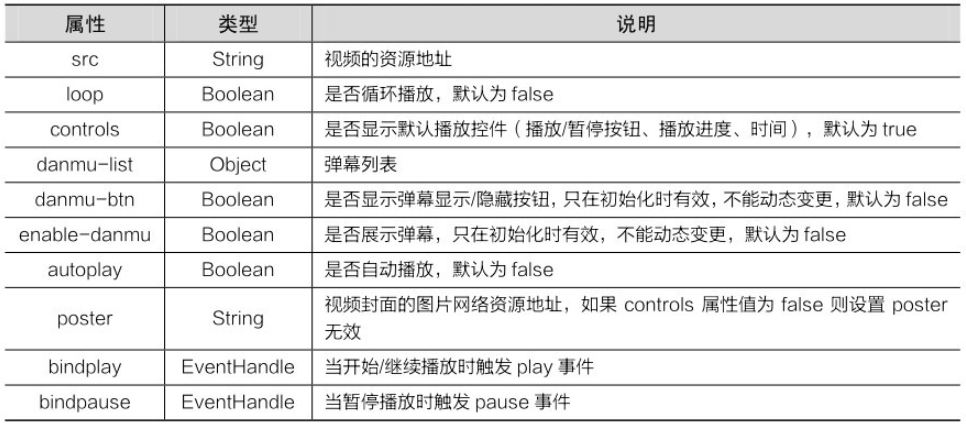

> 常用方法

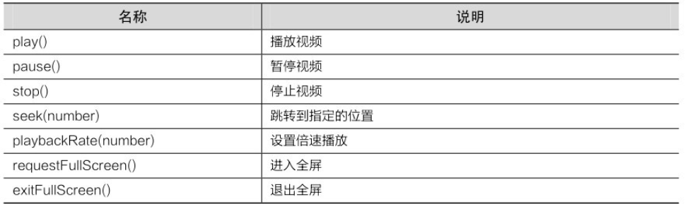

```html
<video src="{{src}}" enable-danmu="true" danmu-list="{{danmuList}}" danmu-btn="true" id="myVideo" controls="true"></video>
<input type="text" bindblur="bindnputDanmu" />
<button bindtap="bindSendDanmu">点击发送弹幕</button>
```

```js
Page({
    // 弹幕数据初始化
    data: {
        src: 'https://mdn.github.io/learning-area/html/multimedia-and-embedding/video-and-audio-content/rabbit320.mp4',。
        // 设置弹幕的文本，发送弹幕的时间，以及弹幕文字的颜色
        danmuList: [{
                text: '新婚快乐',
                time: 1,
                color: '#f00'
            }, {
                text: '百年好合',
                time: 2,
                color: '#f00'
            }, {
                text: '恭喜恭喜',
                time: 3,
                color: '#f00'
            }, {
                text: '真般配啊',
                time: 6,
                color: '#f00'
            },
            {
                text: '真般配啊',
                time: 2,
                color: '#f00'
            },
        ]
    },

    // 创建视频实例
    videoContext: null,
    onReady() {
        //参数为video组件的id值
        this.videoContext = wx.createVideoContext('myVideo')
    },

    // 获取输入框弹幕信息
    inputDanmu: '',
    bindnputDanmu(e) {
        this.inputDanmu = e.detail.value
    },
    // 发送弹幕
    bindSendDanmu() {
        this.videoContext.sendDanmu({
            //弹幕文本
            text: this.inputDanmu,
            //弹幕文本颜色
            color: '#f00'
        })
    }
})
```

#### 获取本地视频

```js
    bindButtonTap() {
        wx.chooseVideo({
            sourceType: ['album', 'camera'], //视频选择的来源,相册和相机
            camera: 'back', // 默认拉起的是前置（front）或者后置（back）摄像头
            maxDuration: 60,
            success: (res) => {
                this.setData({
                    src: res.tempFilePath //选定视频的临时路径
                })
            },
            fail: val => {
                console.log(val) //错误信息
            }
        })
    }
```

### 腾讯视频插件

> 小程序中提供了腾讯视频插件来播放视频，其特点是，用户可以将视频上传到[腾讯视频网站](https://v.qq.com/)，而不需要自己搭建视频服务器。要使用该插件，**首先需要打开“小程序管理后台”，在“设置”-“第三方服务”中添加插件。通过详情中的开发文档可以获取插件的AppID及配置方法**
>
> 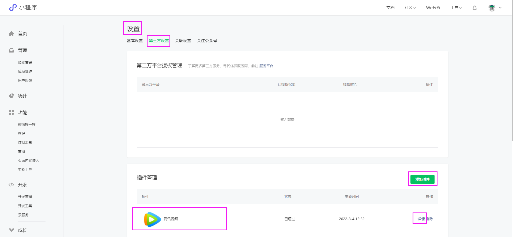

```json
// app.json
{
   "plugins": {
      "player": {
         "version": "2.0.0",
         "provider": "wxa75efa648b60994b"
      }
  },
}
```

```json
// page index.json
{
   //...你的其他页面配置
   "usingComponents": {
      "player-component": "plugin://player/video",
   }
}
```

> 例如：`https://v.qq.com/x/cover/mzc0020047u9g7v/f09304p818n.html`，vid就是f09304p818n

```html
<!-- index.wxml -->
<view>
   <!-- 这里的标签使用的是index.json配置的 -->
   <player-component vid="{{你想要播放的vid}}" player='txv'/>
</view>
```

> 对 腾讯视频插件 实例进行操作，不操作的话不用写

```js
// index.js
onReady() {
    // 调用requirePlugin()函数引入插件
    const TxvContext = requirePlugin('player')
    // 调用getTxvContext()方法
    var txvContext = TxvContext.getTxvContext("txv")
    txvContext.play()
    txvContext.pause()
}
```

### WXS

#### 模块

> - WXS 代码可以编写在 wxml 文件中的 `<wxs>` 标签内，或以 `.wxs` 为后缀名的文件内。
> - **每一个 `.wxs` 文件和 `<wxs>` 标签都是一个单独的模块。**
> - 每个模块都有自己独立的作用域。即在一个模块里面定义的变量与函数，默认为私有的，对其他模块不可见。
> - **一个模块要想对外暴露其内部的私有变量与函数，只能通过 `module.exports` 实现。**
> - 重复模块名则按照先后顺序覆盖（后者覆盖前者）。不同文件之间的 wxs 模块名不会相互覆盖。

```js
// /pages/tools.wxs

var foo = "'hello world' from tools.wxs";
var bar = function (d) {
  return d;
}
module.exports = {
  FOO: foo,
  bar: bar,
};
module.exports.msg = "some msg";
```

```html
<!-- page/index/index.wxml -->

<wxs src="./../tools.wxs" module="tools" />
<view> {{tools.msg}} </view>
<view> {{tools.bar(tools.FOO)}} </view>
```

#### require函数

> 在`.wxs`模块中引用其他 `wxs` 文件模块，可以使用 `require` 函数。
>
> 引用的时候，要注意如下几点：
>
> - **只能引用 `.wxs` 文件模块，且必须使用相对路径。**
> - `wxs` 模块均为单例，`wxs` 模块在第一次被引用时，会自动初始化为单例对象。多个页面，多个地方，多次引用，使用的都是同一个 `wxs` 模块对象。
> - 如果一个 `wxs` 模块在定义之后，一直没有被引用，则该模块不会被解析与运行。

#### wxs增强页面功能

> 在实际开发中，经常会遇到这样的情况：页面中的data数据是从服务器端获取的，服务器返回的数据可能不适合直接显示到页面中，需要对数据进行转换后才能显示。假设在本项目中，视频列表数据是从服务器获取的，服务器返回的create_time 是一个时间戳
>
> 针对这种情况，可以在WXML文件中通过WXS（WeiXin Script）嵌入代码。WXS是小程序的一套脚本语言，语法和 JavaScript 类似，但又存在少量的差异

```js
data: {
        // 项目使用video组件
        MoveList: [{
            create_time: '1532519754589',
            title: '在一起的第一天',
            src: 'https://mdn.github.io/learning-area/html/multimedia-and-embedding/video-and-audio-content/rabbit320.mp4'
        }, {
            create_time: '1532519754589',
            title: '在一起的第二天',
            src: 'https://mdn.github.io/learning-area/html/multimedia-and-embedding/video-and-audio-content/rabbit320.mp4'
        }, {
            create_time: '1532519754589',
            title: '在一起的第三天',
            src: 'https://mdn.github.io/learning-area/html/multimedia-and-embedding/video-and-audio-content/rabbit320.mp4'
        }]
    },
```

```js
//date.wxs
var dateTime = function (dateTime) {
    var date = getDate(dateTime)
    var y = date.getFullYear()
    var m = date.getMonth() + 1
    var d = date.getDate()
    var h = date.getHours()
    var i = date.getMinutes()
    var s = date.getSeconds()
    return y + '-' + m + '-' + d + ' ' + h + ':' + i + ':' + s
}

module.exports = {
    formatDateTime: dateTime
}
```

```html
<view class="video" wx:for="{{MoveList}}" wx:key="*this">
    <view>{{date.formatDateTime(item.create_time)}}</view>
    <view>{{item.title}}</view>
    <video controls="true" src="{{item.src}}"></video>
</view>

<wxs src="./date.wxs" module="date"></wxs>
```

## map组件

> map常用属性：
>
> 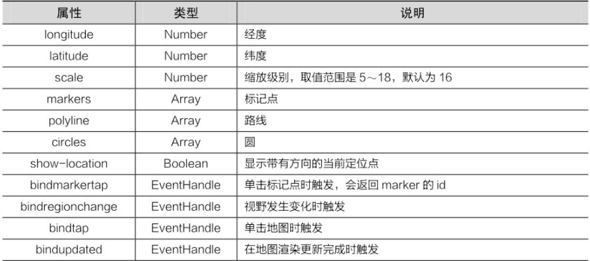

> markers、polyline、circles的值都是由对象组成的数组
>
> - markers：标记点用于在地图上显示标记的位置
> - 常用属性：
>
> 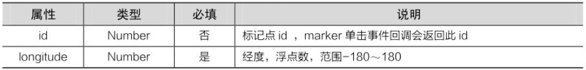
>
> 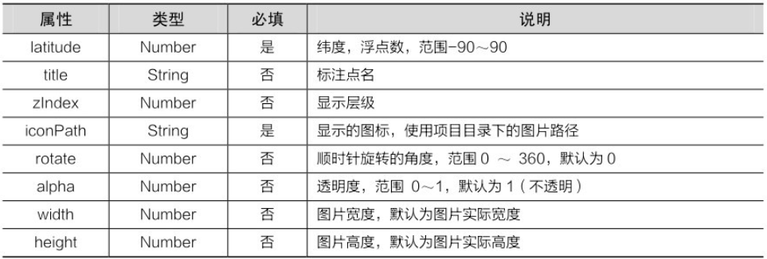
>
> - polyline：指定一系列坐标点，从数组第一项连线至最后一项。绘制彩虹线时，需指定不同分段的颜色
>
> - 常用属性：
>
> 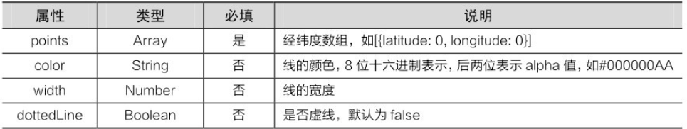
>
> - circles：在地图上显示圆
> - 常用属性：
>
> 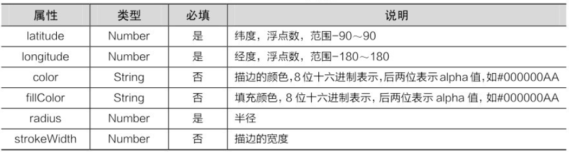

> 由于map组件需要给定经纬度，可以通过腾讯位置服务网站提供的坐标拾取器（https://lbs.qq.com/tool/getpoint/）来获取

```html
<map longitude="116.393715" latitude="39.904987" scale="18"></map>
```

### 标记点

```js
Page({
  data: {
    markers: {
      iconPath: '../../assets/images/navi.png', //图标资源
      id: 0, //标记点id，单击事件回调会返回此id，为每个marker设置number类型id
      latitude: 23.099994, //纬度
      longityde: 113.324520, //经度
      width: 50,
      height: 50
    }
  },
})
```

### 定位自己位置

> - 小程序提供了打开微信内置地图的 API 和定位用户位置的API， 需要用户授权才能使用，也就是会自动提示用户“是否同意获取您的位置”，同意后即可获取。
>
> - **通过`wx.getLocation()`方法获取用户当前的位置，获取后再通过`wx.openLocation()`方法显示该位置的地图**
>
> - **type属性用于设置返回的坐标信息，默认值为`wgs84`，表示返回GPS坐标，设为`gcj02`表示返回用于`wx.openLocation()`方法的坐标。**
>
> - 需要在`app.json`中声明permission字段
>
>   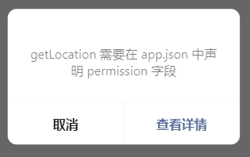
>
>   ```json
>     "permission": {
>       "scope.userLocation": {
>         "desc": "你的位置信息将用于小程序位置接口的效果展示"
>       }
>     }
>   ```

```html
<button bindtap="bindShowLocal">查看我的位置</button>
```

```js
Page({
    data: {},
    // 查看我的位置
    bindShowLocal() {
        wx.getLocation({
            //type属性用于设置返回的坐标信息
            type: 'gcj02',
            success: res => {
                wx.openLocation({
                    latitude: res.latitude,
                    longitude: res.longitude,
                })
            }

        })
    }
})
```

### controls设置

```js
Page({
  data: {
    controls: [{
      id: 1, //在控件单击事件回调返回此id
      iconPath: '../../assets/images/banner.png', //图标路径
      position: { //定位
        left: 0,
        top: 0,
        width: 375,
        height: 71,
      },
      clickable: true //为true可以单击
    }]
  },
})
```

#### 获取控件id

```js
var id = e.controlId
```

### 回到当前位置

```js
this.mapCtx = createMapContext('myMap')

this.mapCtx.moveToLocation()
```

### 获取中心点坐标

```js
this.mapCtx = createMapContext('myMap')

this.mapCtx.getCenterLocation
```

## picker

> - picker组件是从底部弹起的滚动选择器，目前支持5种选择器，**通过mode属性来区分，分别是普通选择器（mode="selector"）、多列选择器（mode="multiSelector"）、时间选择器（mode="time"）、日期选择器（mode="date"）和省市区选择器（mode="region"），默认是普通选择器。**

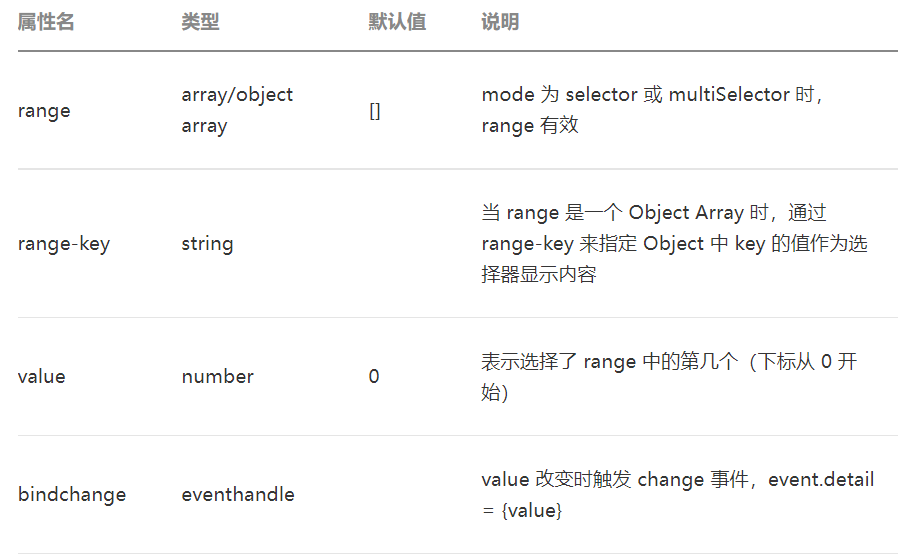

```html
<picker value="{{index}}" range="{{range}}" bindchange="changeRange">
    <view>当前选择是:{{range[index]}}</view>
</picker>
```

```js
Page({
    data: {
        range: ['html', 'css', 'vue', 'react', '微信小程序'],
        index: ""
    },
    changeRange(e) {
        var d = e.detail.value
        this.setData({
            index: d
        })
    }
})
```

> - range属性表示显示在底部选择器的列表数组，数组中的每一个元素对应列表中的每一项。
> - value属性表示当前选择了range数组中的某个元素的下标，默认值为0（下标从0开始）。
> - bindchange用于绑定change事件，该事件会在value改变时触发。

## 弹框提示

> **通过`wx.showToast()`方法显示提示信息**，在该方法的参数中，
>
> -  **title表示提示文本，**
> - **icon表示提示图标，图标的默认值为success（成功），还可以设为loading（加载中）或none（无图标）**
> - **duration表示显示多少毫秒后自动消失。**
> - **wx.showLoading和 wx.showToast同时只能显示一个**
> -  **wx.showToast 应与 wx.hideToast配对使用**
> -  **showLoading和hideLoading配对使用**

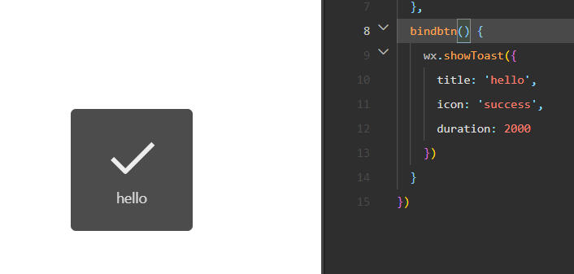

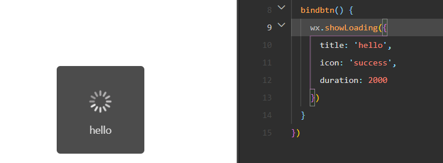

## 发送婚礼请帖回复通知

### 获取订阅消息模板

> - 在移动应用开发中，经常需要为用户发送一些消息，如支付成功提醒、到账提醒，或者向用户推送一些广告等。模板消息是在小程序中向用户发送消息的一种方式，其特点是必须按照小程序提供的模板来给用户发送消息，而且小程序在审核时，会对消息的标题、关键字等进行审查，以免功能被恶意使用
>
> - 首先需要在“小程序管理后台”中单击左侧菜单中的“模板消息”，然后单击“添加”按钮添加模板
>
>   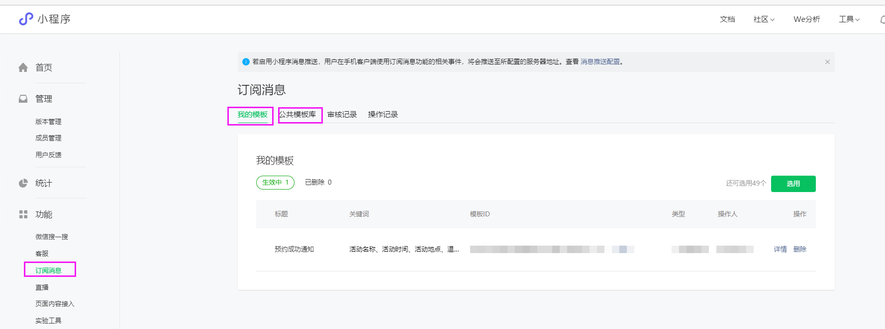
>
> - 在实际开发中，模板消息的发送一般是在服务器端进行的，也就是由服务器主动发送给曾经使用过这个小程序的用户，小程序本身并不具备接收消息的功能，而是由微信中的服务通知功能将消息转达给用户。并且为了证明某个用户使用过某个小程序，需要满足如下两个条件中的一个。
>
>   1. 支付：用户在小程序内完成过支付行为，可允许开发者向用户在7天内推送有限条数的模板消息，1次支付可以发3条消息。
>   2. 提交表单：当用户在小程序内发生过提交表单行为，且该表单声明为要发模板消息，开发者需要向用户提供服务时，可允许开发者向用户在7天内推送有限条数的模板消息，1次提交表单可下发1条。

### 获取订阅消息权限

```js
// app.js
App({
    ......
	globalData:{
	  hasSubscribeMessage: ''
  }
})
```

```js
//guest.js
const app = getApp()
Page({
    ......
   // 订阅消息权限
    allowSubscribe: function () {
        if (!app.globalData.hasSubscribeMessage) {
            wx.requestSubscribeMessage({
                tmplIds: ['F2X7n5b8HEhfM8BE4AmJ5N_btBO8U7--KVm90dvdK-A'], // 在此处填写模板id
                success(res) {
                    console.log(res)
                    app.globalData.hasSubscribeMessage = res.errMsg.split(':')[1]
                }
            })
        }
    }
})
```

### [发送订阅消息](https://developers.weixin.qq.com/miniprogram/dev/OpenApiDoc/mp-message-management/subscribe-message/sendMessage.html)

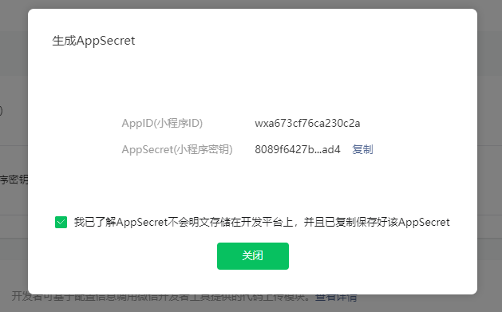

# API应用

## 用户登录

> 用户登录流程需要小程序、开发者服务器和微信接口服务3个角色的参与
>
> 1. **在小程序中通过` wx.login()`获取登录凭证 code**
>    - code 由小程序内部自动生成，**每次调用`wx.login()`获得的code都不同**。需要注意的是，**code有效期为5分钟，且被微信接口服务验证一次后就会失效。**
> 2. 在获取code后，**小程序使用`wx.request()`将code发送给开发者服务器。**
> 3. **开发者服务器将 AppId、AppSecret、code 发送给微信接口服务校验登录凭证(GET https://api.weixin.qq.com/sns/jscode2session?appid=APPID&secret=SECRET&js_code=JSCODE&grant_type=authorization_code)，如果校验成功，返回session_key和openid等。**
>    - 其中，**AppId是小程序的唯一标识，AppSecret是小程序的密钥**，对于微信接口服务而言，**它们相当于小程序账号的id和密码。**
>    - **微信接口服务校验成功后会返回 session_key 和 openid,openid 是用户的唯一标识**， session_key是对用户数据进行加密签名的密钥，具体会在后面讲解。需要注意的是，openid并不等同于微信用户id，同一个微信用户在不同AppId小程序中的openid是不同的。
> 4. **在用户登录成功后，开发者服务器将openid和session_key保存，然后生成一个自定义登录态的token（令牌）响应给小程序，通过token可以查询到openid和session_key。**
>    - 小程序下次请求时只要携带token，就可以证明用户已经登录。

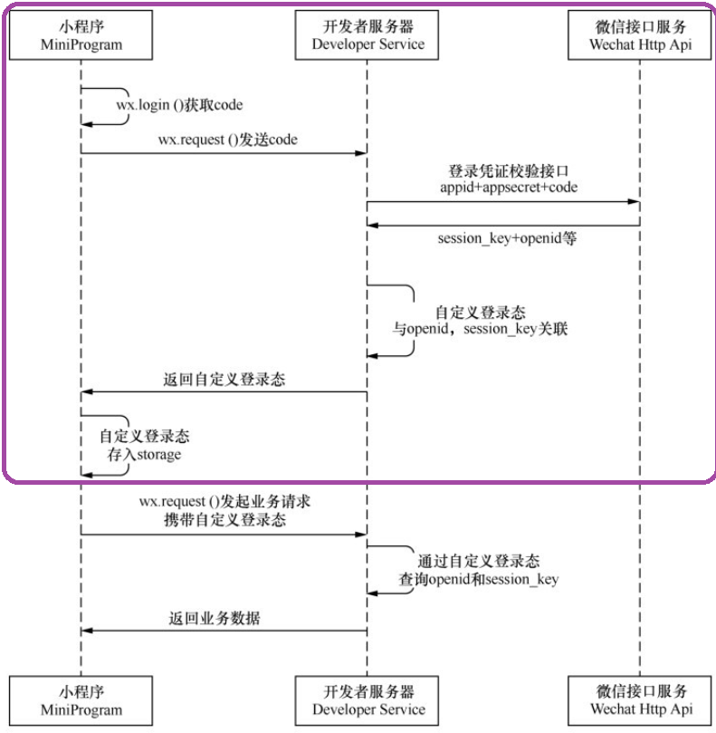

## 数据缓存

> - 在小程序中可以缓存一些数据，从而在小程序退出后再次打开时，可以从缓存中读取上次保存的数据。
> - **异步方式通过传入回调函数获取结果，而同步方式通过返回值获取结果。如果发生错误，异步方式会执行fail回调函数返回错误，而同步方式则通过`try…catch`捕获异常来获取错误信息。**
> - 在保存数据缓存时需要指定一个 key，在保存后，通过 key 来读取保存的内容。

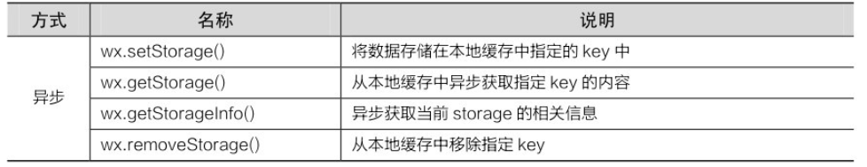

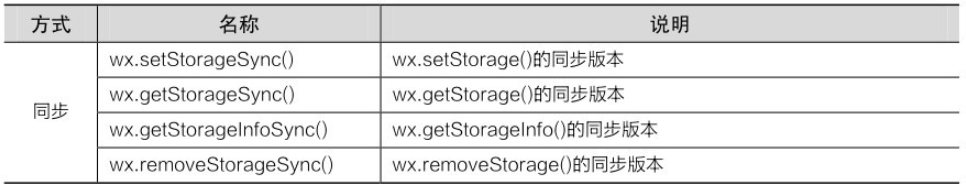

```js
    saveInfo() {
        wx.setStorage({
            key: 'key',
            data: "hello",
            success: (res) => {
                console.log(res)
            },
            fail: (error) => {
                console.log(error)
            }
        })
    },
    // 获取数据缓存
    getInfo() {
        wx.getStorage({
            key: 'key',
            success: (res) => {
                console.log(res.data)
            },
            fail: (error) => {
                console.log(error)
            }
        })
    },
```

### 实现用户登录

```js
const express = require('express')
const bodyParser = require('body-parser')
const request = require('request')
const app = express()
app.use(bodyParser.json())

const wx = {
    appid: 'wxa673cf76ca230c2a',
    secret: 'e363d743d49592d98b1227d72b1bcd87'
}

var db = {
    session: {},
    user: {}
}

app.post('/login', (req, res) => {
    // 注意：小程序端的appid必须使用真实账号，如果使用测试账号，会出现login code错误
    console.log('login code: ' + req.body.code)
    // 校验登录凭证的微信接口
    var url = 'https://api.weixin.qq.com/sns/jscode2session?appid=' + wx.appid + '&secret=' + wx.secret + '&js_code=' + req.body.code + '&grant_type=authorization_code'
    
    request(url, (err, response, body) => {
        console.log('session: ' + body)//session: {"session_key":"Atlbx10eMaEcS2hVhP2icg==","openid":"oZp7V4kUA5VbZHRKEjaBAKzCzHdk"}
        // body中有session_key和openid
        var session = JSON.parse(body)
        if (session.openid) {
            // 获取token
            var token = 'token_' + new Date().getTime()
            // 根据token存放session_key和openid
            db.session[token] = session
            
            if (!db.user[session.openid]) {
                db.user[session.openid] = {
                    credit: 100
                }
            }
        }
        // 响应token
        res.json({
            token: token
        })
    })
})

app.listen(3000, () => {
    console.log('server running at http://127.0.0.1:3000')
})
```

```js
// app.js
App({
  login() {
    wx.login({
      success: (res) => {
        console.log("app.js:", res.code)
        wx.request({
          url: 'http://127.0.0.1:3000/login',
          method: "POST",
          data: {
            code: res.code
          },
          success: (res) => {
            const {
              token
            } = res.data
			// 将token数据保存缓存当中
            wx.setStorage({
                key: "token",
                data: token
              }),
              // 将token保存到app.js文件中
              this.globalData.token = token
          }
        })
      }
    })
  },
    
  // 保存token
  globalData: {
    token: null
  },

  // 调用login()方法
  onLaunch(options) {
    this.login()
  },
  
})
```

### 获取登录积分

```js
// 获取积分
app.get('/credit', (req, res) => {
    console.log(db.session)
    //req.query.token = xxx
    //db.session[req.query.token] = db.session.xxx
    var session = db.session[req.query.token]
    console.log("get:" + session)
    if (session && db.user[session.openid]) {
        res.json({
            credit: db.user[session.openid].credit
        })
    } else {
        res.json({
            err: '用户不存在，或未登录。'
        })
    }
})
```

```js
    // 获取积分
    getCredit() {
        wx.request({
            url: 'http://127.0.0.1:3000/credit',
            data: {
                token: app.globalData.token
            },
            method: 'GET',
            header: {
                'content-type': 'application/x-www-form-urlencoded',
            },
            success: (res) => {
                console.log(res.data)
            },
            fail: (error) => {
                console.log(console.log(error))
            }
        })
        console.log(this.data);
    },
```

### 检查是否登录

> 小程序登录成功后，已经将服务器返回的token保存在数据缓存中了。下次启动小程序时，应该**判断数据缓存中是否存在token，如果存在，直接取出这个token即可，不用再执行登录操作**。需要注意的是，token有可能会过期，需要重新登录，这就需要在从数据缓存中取出token后，先验证token是否过期，再使用token。

```js
// 检查是否登录
app.get('/checklogin', (req, res) => {
    //req.query.token = xxx
    //db.session[req.query.token] = db.session.xxx
    var session = db.session[req.query.token]
    console.log('checklogin: ', session)
    // 将用户是否已经登录的布尔值返回给客户端
    res.json({
        is_login: session !== undefined
    })
})
```

```js
// app.js
App({
	......
  // 保存的token
  globalData: {
    token: null
  },

  // 检查是否登录
  checkLogin(callback) {
    if (!this.globalData.token) {
      var token = wx.getStorageSync('token')
      if (token) {
        this.globalData.token = token
      } else {
        callback({
          isLogin: false
        })
      }
    } else {
      callback({
        isLogin: true
      })
    }

    wx.request({
      url: 'http://127.0.0.1:3000/checklogin',
      data: {
        token: token
      },
      success: (res) => {
        callback({
          isLogin: res.data.is_login
        })
      }
    })
  },

  onLaunch(options) {
    this.checkLogin((res) => {
      if (!res.isLogin) {
        this.login()
      }
    })
  },
})
```

### 获取用户信息

> 在小程序中，获取用户信息有两种常用的方式，
>
> 1. **一种是使用`<open-data>`组件，它不需要用户授权，就可以显示用户的头像、昵称、性别等方式，适合只用来展示的情况。**
>
>    **性别的属性lang 用于设置语言，有效值有en（英语）、zh_CN（简体中文）、zh_TW（繁体中文）**
>
> 2. 另一种方式是通过单击按钮，提示用户授权，获取到用户信息数据。

```html
<!-- open-data组件 -->

<!-- 用户头像 -->
<open-data type="userAvatarUrl"></open-data>
<!-- 用户昵称 -->
<open-data type="userNickName"></open-data>
<!-- 用户性别 -->
<open-data type="userGender" lang="zh_CN"></open-data>
```

> 使用API获取用户授权

> 数据缓存的有效期有限，如果用户在上一次授权后修改了用户信息，会导致数据缓存中的用户信息于最新的不一致。建议使用`<open-data>`组件展示用户的昵称和头像

```html
<button bindtap="getUserInfo">获取用户信息</button>
<image src="{{userInfo.avatarUrl}}"></image>
<view>用户名：{{userInfo.nickName}}</view>
<view>国家：{{userInfo.country}}</view>
<view>省份：{{userInfo.province}}</view>
<view>城市：{{userInfo.city}}</view>
<!-- <open-data type="userGender" lang="zh_CN"></open-data> -->
<view>性别：{{userInfo.gender==0?"未知":(userInfo==1?"男":"女")}}</view>
```

> - **调用wx.getUserProfile()方法，用于获取用户信息，该方法调用后会弹出授权提示，只有用户允许的情况下才能获取用户信息**
> - **wx.getUserProfile()方法在基础库2.10.4版本以上才开始支持。低于这个版本可以使用wx.getUserInfo()方法代替，但此方法目前已淘汰，它返回的是一个虚拟的用户信息**
> - wx.getUserProfile()方法的返回值
>   - avatarUrl：用户头像的URL地址。
>   - nickName：用户昵称。
>   - gender：用户的性别，0表示未知，1表示男，2表示女。
>   - country：用户所在的国家。
>   - province：用户所在省份。
>   - city：用户所在的城市。
> - 目前信息安全问题现在只能获取到头像和用户昵称，其他的无法获取。

```js
    // 获取用户信息
    getUserInfo() {
        wx.getUserProfile({
            desc: '展示用户信息',
            success: (res) => {

                this.setData({
                    userInfo: res.userInfo
                })
                // 保存到缓存
                wx.setStorage({
                    key: "userInfo",
                    data: res.userInfo
                })
            }
        })
    },
```

> 将缓存的用户信息保存到app.js中，避免每一次重新打开需要重新授权的问题。感觉可以光保存在缓存中，直接从缓存中去就可以

```js
// app.js
App({
	......
   globalData: {
    token: null,
    userInfo: null,
  },

  onLaunch(options) {
    this.globalData.userInfo = wx.getStorageSync('userInfo')
})
```

### 开放数据校验和解密

> - 如果开发者服务器想要获取用户信息，则需要在小程序端通过`wx.request()`将获取到的用户信息发送给开发者服务器。但是这种方式存在一个问题，就是开发者服务器无法辨别数据的真伪。为此，小程序提供了开放数据的校验和解密机制。
> - `wx.getUserProfile()`回调函数参数res包含
>   - errMsg：错误信息。
>   - userInfo：用户信息对象，不包含openid等敏感信息。
>   - rawData：不包括敏感信息的原始数据字符串，用于计算签名。
>   - signature：使用sha1(rawData + session_key)得到字符串，用于校验用户信息。
>   - encryptedData：包括敏感数据在内的完整用户信息的加密数据。
>   - iv：加密算法的初始向量。
> - 解密后，除了可以获取用户的nickName、gender、city、province、country和avatarUrl，还可以获取到以下信息。
>   - openId:用户在当前AppId的小程序下的唯一id
>   - unionId: 同一个微信开放平台账号下的用户唯一id
>   - watermark:数据水印，用于校验数据的有效性
>     - appid: 敏感数据归属AppId，开发者可校验此参数与自身AppId是否一致
>     - timestamp:敏感数据获取的时间戳，开发者可以用于数据时效性校验

```js
    // 向服务器发送数据
    sendUserInfo: function () {
        var token = app.globalData.token
        wx.getUserProfile({
            desc: '获取头像昵称',
            success: res => {
                wx.request({
                    url: 'http://127.0.0.1:3000/userinfo?token=' + token,
                    method: 'post',
                    data: {
                        rawData: res.rawData,
                        signature: res.signature,
                        encryptedData: res.encryptedData,
                        iv: res.iv
                    }
                })
            }
        })
    },
```

> 然后编写服务器端代码，在小程序官方文档中提供了解密的示例代码，有 C++、PHP、Node.js、Python版本，可以自行下载。

```js
var crypto = require('crypto')

function WXBizDataCrypt(appId, sessionKey) {
  this.appId = appId
  this.sessionKey = sessionKey
}

WXBizDataCrypt.prototype.decryptData = function (encryptedData, iv) {
  // base64 decode
  var sessionKey = new Buffer(this.sessionKey, 'base64')
  encryptedData = new Buffer(encryptedData, 'base64')
  iv = new Buffer(iv, 'base64')

  try {
     // 解密
    var decipher = crypto.createDecipheriv('aes-128-cbc', sessionKey, iv)
    // 设置自动 padding 为 true，删除填充补位
    decipher.setAutoPadding(true)
    var decoded = decipher.update(encryptedData, 'binary', 'utf8')
    decoded += decipher.final('utf8')
    
    decoded = JSON.parse(decoded)

  } catch (err) {
    throw new Error('Illegal Buffer')
  }

  if (decoded.watermark.appid !== this.appId) {
    throw new Error('Illegal Buffer')
  }

  return decoded
}

module.exports = WXBizDataCrypt
```

> 引入加密解密的模块

```js
// 加密解密
const crypto = require('crypto');
const WXBizDataCrypt = require('./WXBizDataCrypt')

......

// 加密 解密
app.post('/userinfo', (req, res) => {
    // 获取session值
    var session = db.session[req.query.token]
    console.log('session:' + session)
    if(session) {
        // 使用appid和session_key解密encryptedData
        var pc = new WXBizDataCrypt(wx.appid, session.session_key)
        var data = pc.decryptData(req.body.encryptedData, req.body.iv)
        console.log('解密后：', data)
        // 校验rawData是否正确通过
        var sha1 = crypto.createHash('sha1')
        sha1.update(req.body.rawData + session.session_key)
        var signature2 = sha1.digest('hex')
        console.log(signature2)
        console.log(req.body.signature)
        res.json({
            pass: signature2 === req.body.signature
        })
    } else {
        res.json({
            err: '用户不存在，或未登录。'
        })
    }
})

app.listen(3000, () => {
    console.log('server running at http://127.0.0.1:3000')
})
```

> 注意：
>
> session_key是用户的会话密钥，需要存储在服务器中，调用获取用户信息等微信接口时，需要用这个会话密钥，才能解密获取相关数据。为了应用自身的数据安全，开发者服务器不应该把session_key下发到小程序，也不应该对外提供这个密钥。小程序每次调用wx.login()时，会自动生成新的session_key，导致原来的session_key失效。如果需要检查session_key是否失效，可以通过`wx.checkSession()`进行检查。
>
> ```js
> onLoad: function () {
>  
> 　　wx.checkSession({
>  
> 　　　　success: function(res){
>  
> 　　　　　　console.log("处于登录态");
>  
> 　　　　},
>  
> 　　　　fail: function(res){
>  
> 　　　　　　console.log("需要重新登录");
>  
> 　　　　　　wx.login({})　　
>  
> 　　　　}
>  
> 　　})
>  
> }
> ```

## wx.switchTab

> - **`wx.switchTab`用于跳转页面，且只能跳转到tabBar页面，并关闭其他所有非tabBar页面。**
> - **注意：` url: '../person/person'`要写成这样，最后不要加.wxml。其他页面跳转API一样**
> - **路径后面不可以携带参数**

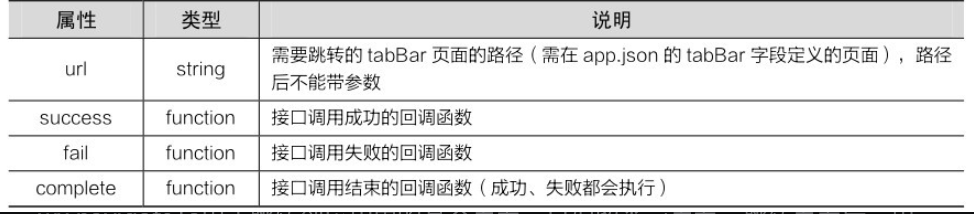

## wx.navigateTo和wx.redirectTo

> - **`wx.navigateTo`用于跳转到应用内的某个页面，且保留当前页面。跳转页面后，单击左上角可以返回到上一个页面。**需要注意的是，**`wx.navigateTo`只能跳转到非标签页。使用`wx.navigateBack`可以返回到原页面。**
> - **在`wx.navigateTo`中，可以`let pages = getCurrentPages()`方法获取页面栈，获取的是一个数组。**获取当前页就是`pages[pages.length-1]`，上一页就是`pages[pages.length-2]`，可以使用`this.setData()`来操作上一页的data数据
> - **`wx.redirectTo `用于跳转到应用内的某个页面，且关闭当前页面，不能返回到上一个页面，只能跳转到非标签页。**
> - **可以携带参数**

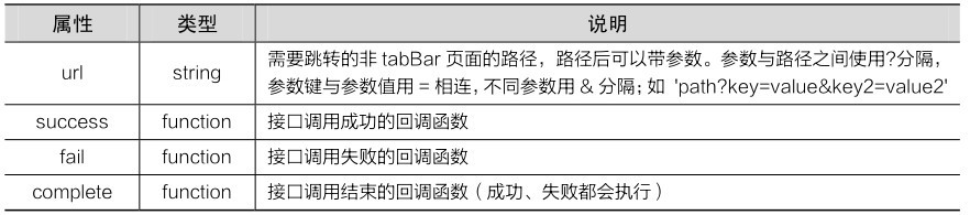

```js
wx.navigateTo({
	url: detail?id=1'
})

wx.redirectTo ({
	url: detail?id=1'
})
```

> 在onLoad()函数中接收传过来的参数id。

```js
onLoad: function(option) {
	console.log(option.id)// 接收参数值id=1
}
```

## wx.reLaunch

> - **`wx.reLaunch`关闭所有页面，打开到应用内的某个页面。既能跳转到标签页，又能跳转到非标签页。**
> - **路径后面可以携带参数**

## wx.chooseImage

> **`wx.chooseImage()`方法从本地相册选择图片或使用相机拍照**

```js
        wx.chooseImage({
            count: 3, //设置选择图片的最大数量
            sourceType: ['camera', 'album'], //设置图片的来源，相机或者图库
            sizeType: ['original', 'compressed'], //设置图片是原图还是缩略图
            success: (res) => {
                this.setData({
                    imageSrc: res.tempFilePaths
                })
            }
        })
```

## wx.makePhoneCall

> **通过调用`wx.makePhoneCall()`接口实现呼叫功能**
>
> ```js
>  callGroom() {
>      wx.makePhoneCall({
>          phoneNumber: '18063345001',
>      })
>  },
> ```

## 腾讯地图附近地点查找API

### sdk导入

.png)

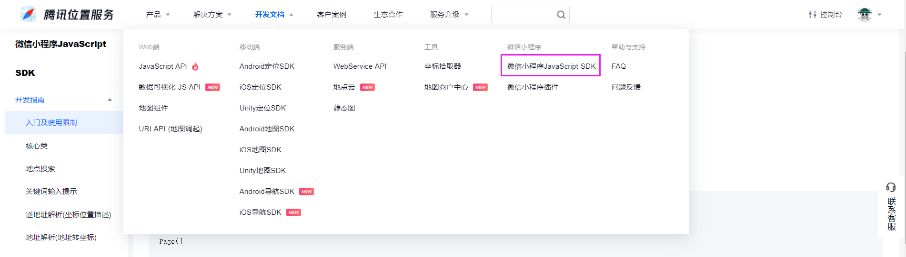

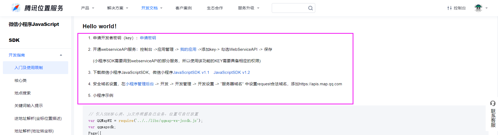

```js
// 引入SDK核心类
var QQMapWX = require('../../utils/qqmap-wx-jssdk')
var qqmapsdk

Page({
  onLoad() {
    qqmapsdk = new QQMapWX({
      key: 'VNVBZ-5ZR6X-J6W4Y-7QZQT-FH632-WHFEU'//申请的key
    })
  },
  onShow() {
    qqmapsdk.search({
      keyword: '酒店',
      success: (res) => {
        console.log(res)
      },
      fail: (res) => {
        console.log(res)
      },
      complete: (res) => {
        console.log(res)
      }
    })
  }
})
```

### 获取手机系统信息

> **`wx.getSystemInfo()`获取手机系统信息**

```js
    wx.getSystemInfo({ //获取手机系统信息
      success: (res) => {
        console.log(res)
        console.log(res.model) //手机型号
        console.log(res.pixelRatio) //设置像素比
        console.log(res.windowWidth) //可使用窗口宽度
        console.log(res.windowHeight) //可使用窗口高度
        console.log(res.language) //微信设置的语言
        console.log(res.version) //微信版本号
        console.log(res.platform) //客户端平台
      },
    })
```

## canvas???

> - anvas（画布）组件是小程序中的原生组件。默认宽高为300px×225px。在同一个页面中，它的canvas-id是唯一的，如果使用了重复的canvas-id，该`<canvas>`标签对应的画布将被隐藏，不再正常工作。
> - 使用canvas绘图是在js文件中通过对canvas的控制来绘制图形的。

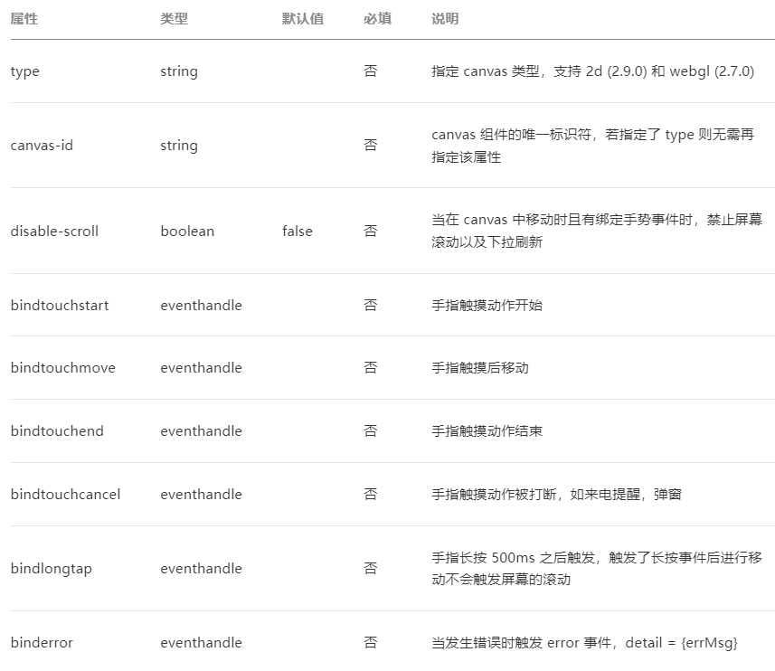

### Canvas 2D 示例代码

```html
  <!-- canvas.wxml -->
  <canvas type="2d" id="myCanvas"></canvas>
```

```js
// canvas.js
Page({
  onReady() {
    const query = wx.createSelectorQuery()
    query.select('#myCanvas')
      .fields({ node: true, size: true })
      .exec((res) => {
        const canvas = res[0].node
        const ctx = canvas.getContext('2d')

        const dpr = wx.getSystemInfoSync().pixelRatio
        canvas.width = res[0].width * dpr
        canvas.height = res[0].height * dpr
        ctx.scale(dpr, dpr)

        ctx.fillRect(0, 0, 100, 100)
      })
  }
})
```

### WebGL 示例代码

```html
  <!-- canvas.wxml -->
  <canvas type="webgl" id="myCanvas"></canvas>
```

```js
// canvas.js
Page({
  onReady() {
    const query = wx.createSelectorQuery()
    query.select('#myCanvas').node().exec((res) => {
      const canvas = res[0].node
      const gl = canvas.getContext('webgl')
      gl.clearColor(1, 0, 1, 1)
      gl.clear(gl.COLOR_BUFFER_BIT)
    })
  }
})
```

## 动画???

### wx.createAnimation

> `wx.createAnimation`用于创建一个animation实例，然后调用实例的方法来描述动画，最后通过动画实例export方法导出动画数据传递给组件中的animation属性。
>
> 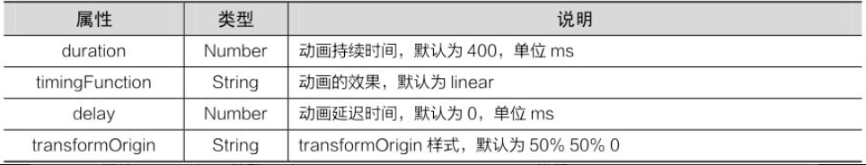
>
> timingFunction有多个可选值，具体如下。
>
> - linear：动画从头到尾的速度是相同的。
> - ease：动画以低速开始，然后加快，在结束前变慢。
> - ease-in：动画以低速开始。
> - ease-in-out：动画以低速开始和结束。
> - ease-out：动画以低速结束。
> - step-start：动画第一帧就跳至结束状态直到结束。
> - step-end：动画一直保持开始状态，最后一帧跳到结束状态。

### animation

> animation 动画对象可以调用一些方法来描述动画，调用结束会返回自身（animation），支持链式的写法。下面列举一些常用的方法。
>
> 1. animation.step(Object object)：动画队列，表示一组动画完成，可以在一组动作中使用多个动画方法，一组动画完成之后才会进行下一组动画。
> 2. animation.export()：导出动画队列，export()方法每次调用后会清掉之前的动画操作。
> 3. animation.rorate(number angle)：从原点顺时针旋转一个角度，角度范围为-180～180。
> 4. animation.scale(number sx, number sy)：缩放，当只有sx参数时，表示X、Y轴同时缩放sx倍数。如果sx和sy参数都存在，sx表示X轴缩放的倍数，sy表示Y轴缩放的倍数。
> 5. animation.skew(number ax, number ay)：对X、Y轴坐标进行倾斜，倾斜范围是-180～180。
> 6. animation.translate(number tx, number ty)：平移变换，当只有tx参数时，表示X轴偏移tx，单位是px。ty表示Y轴平移的距离，单位是px。

## 录音API

> - 微信小程序提供了用于录制音频的API，**`wx.getRecorderManager()` 获取全局唯一的录音管理器**x
> - **在录音完成后，在onStop事件中可以用`res.tempFilePath`获取音频文件的临时保存路径。**

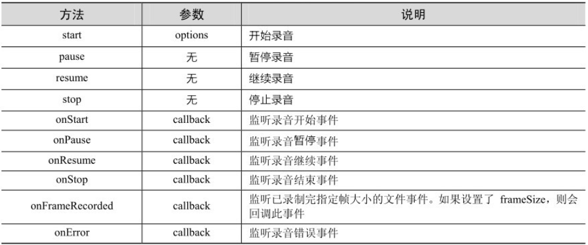

```js
var recorderManager = wx.getRecorderManager()

// 录音开始事件
recorderManager.onStart(() => {
    console.log("开始录音")
})

// 录音继续事件
recorderManager.onResume(() => {
    console.log("继续录音")
})

// 录音暂停事件
recorderManager.onPause(() => {
    console.log("暂停录音")
})

// 录音停止事件
recorderManager.onStop((res) => {
    console.log("停止录音", res)
    console.log(res.tempFilePath)
})

// 监听已录制完指定帧大小的文件事件
recorderManager.onFrameRecorded((res) => {
    const {
        framBUffer
    } = res
    console.log('framBuffer.byteLength', framBUffer.byteLength)
})

// 录音选项
const options = {
    duration: 60000, //录音时长，最大值10分钟
    sampleRate: 44100, //采样率
    numberOfChannels: 1, //录音通道数，默认为2
    encodeBitRate: 192000, //编码码率
    format: 'map3', //音频格式
    framSize: 50 //指定帧大小，单位KB
}

// 开始录音
recorderManager.start(options)

// 暂停录音
setTimeout(() => {
    recorderManager.stop()
}, 5000);
```

## 文件上传与下载

### 上传

> **`wx.uploadFile `用于将本地资源上传到开发者服务器，将会发起 HTTPS POST 请求，其中`content-Type`字段为`multipart/form-data`。**

```js
 	upload() {

        wx.chooseImage({
            count: 1,
            success: (res) => {
                const imageTempPath = res.tempFilePaths

                wx.uploadFile({
                    filePath: imageTempPath[0], //上传的文件路径
                    name: 'name', //文件对应key
                    url: 'url', //请求路径
                    // https请求中其他额外的form data
                    formData: {
                        'user': 'test'
                    },
                    success: (res) => {
                        const data = res.data
                        console.log(data)
                    }

                })
            }
        })
    },
```

### 下载

> **`wx.downloadFile`用于下载文件资源到本地，将会发起HTTPS GET请求，返回文件的本地临时路径。**在服务器响应的header中指定合理的`content-Type`字段，确保客户端能正确处理文件类型

```js
   download() {
        wx.downloadFile({
            url: 'url', //服务器
            success: (res) => {
                // 判断服务器状态码
                if (res.statusCode === 200) {

                }
            }
        })
    },
```

## 录音上传

```html
<button style="margin-top: 20px;" bindtap="record">录音</button>
<button style="margin-top: 20px;" bindtap="stop">停止</button>
<button style="margin-top: 20px;" bindtap="playback">回放</button>
<button style="margin-top: 20px;" bindtap="upload">上传</button>
```

```js
var recorderManger = wx.getRecorderManager()
var Ctx = wx.createInnerAudioContext()

var tempFilePath = null;
recorderManger.onStop((res) => {
    tempFilePath = res.tempFilePath
})


Page({
    record() {
        recorderManger.start()
    },
    stop() {
        recorderManger.stop()
    },
    playback() {
        Ctx.src = tempFilePath
        Ctx.play()
    },
    upload() {
        if (tempFilePath) {
            wx.uploadFile({
                filePath: tempFilePath,
                name: '录音',
                url: 'http://127.0.0.1:3000/upload',
            })
        } else {
            wx.showToast({
                title: '你还没有录音呢',
                icon: 'error',
                duration: 2000
            })
        }
    },

})
```

## 音频下载

```html
<button style="margin-top: 20px;" bindtap="play">播放文章</button>
<button style="margin-top: 20px;" bindtap="paused">暂停</button>
```

```js
    play() {
        wx.showLoading({
            title: '下载音频文件中',
            mask: true
        })
        wx.downloadFile({
            url: 'http://127.0.0.1:3000/1.mp3',
            success: (res) => {
                Ctx.src = res.tempFilePath
                Ctx.play()
                wx.hideLoading()
            }
        })
    },
    paused() {
        if (Ctx.paused) {
            Ctx.play()
        } else {
            Ctx.pause()
        }
    },
```

## 在线聊天

### WebSocket

> - 小程序的WebSocket接口实现了浏览器和服务器的全双工通信。WebSocket 是客户端与服务器之间专门建立的一条通道，在小程序中**通过`wx.connectSocket `建立连接**，就可以从通道中实时获取服务器的数据。
> - 需要注意的是， **WebSocket的协议是以ws或wss开头的（类似于http和https的关系），在小程序中，正式项目必须使用wss协议，在开发模式下可以使用ws协议。**
> - **使用`wx.closeSocket`关闭连接**。`wx.closeSocket`必须在已经连接成功后调用才能关闭连接，为了获知**当前是否已经连接，可以利用`wx.onSocketOpen`监听连接打开事件**

```js
// 建立连接
wx.connectSocket({
    url: 'ws://127.0.0.1:3000',
})

// 监听开启
wx.onSocketOpen((result) => {
    console.log(result)
    // 关闭连接
    wx.closeSocket()
})

// 监听关闭
wx.onSocketClose((result) => {
    console.log(result)
    console.log("关闭")
})
```

### wx.sendSocketMessage

> - **`wx.sendSocketMessage`用于通过 WebSocket 连接发送数据。在连接成功后，需要在`wx.onSocketOpen`回调之后才能发送**
> - 在官方文档中，`wx.sendSocketMessage`的data类型为String或ArrayBuffer，而不是Array类型，如果给定的是Array类型，在开发者工具中调试不会报错，但是手机中会出现问题，提示错误信息。

```js
Page({
    onLoad() {
        // 连接
        wx.connectSocket({
            url: 'ws://127.0.0.1:3000',
        })

        // 监视连接
        wx.onSocketOpen((result) => {
            console.log(result, '连接成功了')
        })
    },
    send() {

        // 向服务器发送数据
        wx.sendSocketMessage({
            data: 'test',
        })

        // 监视服务器回复内容
        wx.onSocketMessage((result) => {
            console.log(result, '服务器回复')
        })
    }
})
```

### wx.onSocketMessage

> **`wx.onSocketMessage`用于监听WebSocket接收到服务器的消息事件。**在回调函数中接收msg参数，通过msg.data可以获取服务器返回的消息

```js
// 建立连接
wx.connectSocket({
    url: 'ws://127.0.0.1:3000',
})

// 监听开启
wx.onSocketOpen((result) => {
    console.log(result)
    // 关闭连接
    wx.closeSocket()
})

// 监听服务器送到客户端的消息
wx.onSocketMessage((result) => {
    var data = JSON.parse(result.data)
})
```

### 案例实现???

#### 编写node.js

> 安装websocket库`npm install websocket`

```js
var sd = require('silly-datetime');
var http = require('http')
var WebSocketServer = require('websocket').server

const httpServer = http.createServer((request, response) => {
  console.log('[' + new Date + '] Received request for ' + request.url)
  response.writeHead(404)
  response.end()
})

const wsServer = new WebSocketServer({
  httpServer,
  autoAcceptConnections: true
})

wsServer.on('connect', (connection) => {
  connection.on('message', (message) => {
    console.log('>>message ', message);
    if (message.type === 'utf8') {
      var data = {'content': '自动回复', 'date': sd.format(new Date(), 'YYYY-MM-DD HH:mm:ss')}
      // 服务器返回的信息
      connection.sendUTF( JSON.stringify(data) )
    }
  });
  // 连接的关闭监听
  connection.on('close', (reasonCode, description) => {
    console.log('[' + new Date() + '] Peer ' + connection.remoteAddress + ' disconnected.')
  })
  // 接收控制台的输入
  process.stdin.on('data', function(data){
    data = data.toString().trim()
    var data = {'content': data, 'date': sd.format(new Date(), 'YYYY-MM-DD HH:mm:ss')}
    connection.sendUTF( JSON.stringify(data) )
  })
})

httpServer.listen(3000, () => {
  console.log('[' + sd.format(new Date(), 'YYYY-MM-DD HH:mm:ss') + ']  server is listening on port 3000')
})

```

#### 编写小程序

```html
<view class="wrap">
    <scroll-view scroll-y class="chat" scroll-top="{{scrollTop}}">
        <view class="list">
            <view class="chat-news" wx:for="{{list}}" wx:key="{{item.id}}">
                <!-- 根据角色判断 -->
                <block wx:if="{{item.role === 'me'}}">
                    <!-- 自己的消息显示在右侧 -->
                    <view class="news-lf">
                        <text class="new-txt">{{item.content}}</text>
                        <image class="new-img" src="/images/me.jpg"></image>
                    </view>
                </block>
                <!-- 对方的消息显示在左侧 -->
                <block wx:else>
                    <view>
                        <image class="new-img" src="/images/avatar.png"></image>
                        <text class="new-txt new-text">{{item.content}}</text>
                    </view>
                </block>
            </view>
        </view>
    </scroll-view>
</view>
<!-- 聊天输入 -->
<view class="message">
    <form>
        <!-- 微信小程序处理软键盘弹出布局上移遮住输入框的解决方法 （设置cursor-spacing="20"）-->
        <input type="text" placeholder="请输入聊天内容..." bindinput="bindChange"></input>
        <button type="primary" bindtap="send" formType="reset" size="small" button-hover="blue">发送</button>
    </form>
</view>
```

```js
Page({
    // 初始页面数据
    data: {
      scrollTop: 0,
      list: []
    },
    id: 0,
    // 监听页面加载
    onLoad: function() {
      wx.connectSocket({
        // 本地服务器地址
        url: 'ws://localhost:3000',
      })
      // 连接成功
      wx.onSocketOpen(function() {
        console.log('连接成功');
      })
      wx.onSocketMessage(msg => {
        var data = JSON.parse(msg.data)
        data.id = this.id++
        data.role = 'server'
        var list = this.data.list
        list.push(data)
        this.setData({
          list: list
        })
        this.rollingBottom()
      })
    },
    // 发送内容
    massage: '',
    send: function() {
      // 判断发送内容是否为空
      if (this.message) {
        wx.sendSocketMessage({
          data: this.message,
        })
        // 我自己的消息
        console.log(this.data.list)
        var list = this.data.list
        list.push({
          id: this.id++,
          content: this.message,
          role: 'me'
        })
        this.setData({
          list: list
        })
        this.rollingBottom()
      } else {
        // 弹出提示框
        wx.showToast({
          title: '消息不能为空哦~',
          icon: 'none',
          duration: 2000
        })
      }
    },
    // 监听input值的改变
    bindChange(res) {
      this.message = res.detail.value
    },
    // 页面卸载，关闭连接
    onUnload() {
      wx.closeSocket()
      console.log('连接已断开')
    },
    // 聊天内容始终显示在最低端
    rollingBottom(e) {
      wx.createSelectorQuery().selectAll('.list').boundingClientRect(rects => {
        rects.forEach(rect => {
          this.setData({
            scrollTop: rect.bottom
          })
        })
      }).exec()
    }
  })
  
```

# 框架？？？