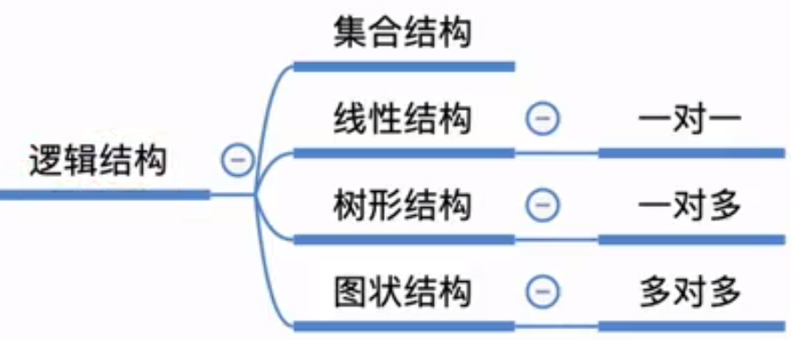

# 绪论

## 数据结构的基本概念

> 1. 数据：数据是信息的载体，是描述客观事物属性的数、字符以及所有能输入到计算机中并被程序识别和处理的符号的集合。
> 2. 数据元素：**数据元素是数据的基本单位**，通常作为一个整体进行考虑和处理。一个数据元素可由若干数据项组成，数据项是构成数据元素的不可分割的最小单位。例如，学生记录就是一个数据元素，它由学号、姓名、性别等数据项组成。
>
> 3. 数据对象:数据对象是**具有相同性值**的数据元素的集合，是数据的一个子集。
>
> 4. 数据类型:数据类型是一个值的集合和定义再此集合上的一组操作的总称。
>    1. 原子类型。其值不可再分的数据类型。如bool 和int 类型。
>    2. 结构类型。其值可以再分解为若干成分（分量）的数据类型。
>    3. 抽象数据类型。抽象数据组织及与之相关的操作。
> 5. 数据结构:数据结构是相互之间**存在一种或多种特定关系**的数据元素的集合。

## 数据结构

> 逻辑结构是指数据元素之间的逻辑关系，即从逻辑关系上描述数据。

### 逻辑结构

> 逻辑结构是指数据元素之间的逻辑关系，即从逻辑关系上描述数据。**它与数据的存储无关，是独立于计算机的。**

> 1. **集合结构**：结构中的数据元素之间除“同属一个集合”外，别无其它关系。
> 2. **线性结构**：结构中的数据元素之间只存在**一对一的关系**，**除了第一个元素，所有元素都有唯一前驱；除了最后一个元素，所有元素都有唯一后继。**
> 3. **树形结构**：结构中数据元素之间存在**一对多的关系**。
> 4. **图状结构**：数据元素之间是**多对多的关系**。

### 存储结构

> 存储结构是指数据结构在计算机中的表示（又称映像），也称**物理结构**。

> 1. **顺序存储**：**把逻辑上相邻的元素存储在物理位置也相邻的存储单元中**，元素之间的关系由存储单元的邻接关系来体现。
> 2. **链式存储**：**逻辑上相邻的元素在物理位置上可以不相邻**，借助指示元素存储地址的指针来表示元素之间的逻辑关系。
> 3. **索引存储**：在存储元素信息的同时，还建立附加的索引表，索引表中的每项称为索引项，索引项的一般形式是（关键字，地址）
> 4. **散列存储**：根据元素的关键字直接计算出该元素的存储地址，又称**哈希（Hash）存储**。

> - 若采用顺序存储，则各个数据元素在物理上必须是连续的;若采用非顺序存储，则各个数据元素在物理上可以是离散的。
> - 数据的存储结构会影响存储空间分配的方便程度
> - 数据的存储结构会影响对数据运算的速度

## 算法的基本概念

> - **程序=数据结构+算法**
> - 算法（algorithm)是对特定问题求解步骤的一种描述，它是指令的有限序列，其中的每条指令表示一个或多个操作。

### 算法的特性

> 1. **有穷性**：**一个算法必须总在执行有穷步之后结束，且每一步都可在有穷时间内完成。**
> 2. **确定性**：算法中每条指令必须有确定的含义，**对于相同的输入只能得到相同的输出。**
> 3. **可行性**：**算法中描述的操作都可以通过已经实现的基本运算执行有限次来实现。**
> 4. **输入**：**一个算法有零个或多个输入**，这些输入取自于某个特定的对象的集合。
> 5. **输出**：**一个算法有一个多个输出**，这些输出是与输入有着某种特定关系的量。

### 评价算法优劣的基本标准

> 1. **正确性**：算法应能够正确的求解问题。
> 2. **可读性**：算法应具有良好的可读性，以帮助人们理解。
> 3. **健壮性**：输入非法数据时，算法能适当地做出反应或进行处理，而不会产生莫名奇妙地输出结果。
> 4. **效率与低存储量需求**：效率是指算法执行的时间，存储量需求是指算法执行过程中所需要的最大存储空间，这两者都与问题的规模有关。

## 算法的时间复杂度

> 一般情况下，算法中基本操作重复执行的次数是问题规模n的某个函数f(n)，算法的时间量度记作T（n)=O(n)，它表示随问题规模n的增大而增大，算法执行时间的增长率和f(n)的增长率相同，称作算法的渐近时间复杂度，简称时间复杂度。

> - **加法规则：多项相加，只保留最高阶的项，且系数变为1**
> - **乘法规则：多项相乘,都保留**
> - 结论
>   - **结论1:顺序执行的代码只会影响常数项，可以忽略**
>   - **结论2:只需挑循环中的一个基本操作分析它的执行次数与n的关系即可**
>   - **结论3:如果有多层嵌套循环，只需关注最深层循环循环了几次**

## 算法的空间复杂度

> 算法的空间复杂度S(n)定义为该算法所耗费的存储空间，它是问题规模n的函数。记为S(n)=O(g(n))。

# 线性表

> - 线性表是**具有相同数据类型**的**n(n>0)个**数据元素的**有限序列**，其中n为表长，当n=0时线性表是一个空表。
> - **除第一个元素外，每个元素有且仅有一个直接前驱;除最后一个元素外，每个元素有且仅有一个直接后继**
> - **线性表中数据元素的位序从1开始，数组中为序从0开始**
> - **注意:线性表是一种逻辑结构，表示元素之间一对一的相邻关系。顺序表和链表是指存储结构，两者属于不同层面的概念，因此不要将其混淆**。