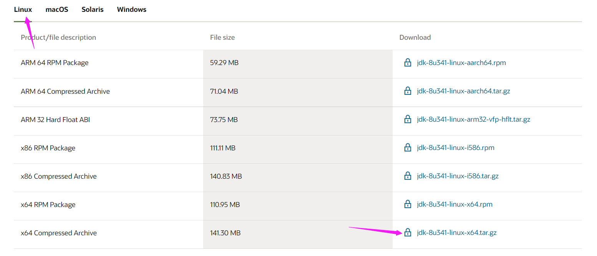

# 购买服务器

> 进入阿里云官网点击云服务器ECS→创建实例→选择自己想买的服务器配置信息


## 开放端口：

> 开放3306(数据库端口)和8888(宝塔面板端口)以及项目端口号


# 用Xshell连接服务器


# 后端部署

## 安装Java环境

> 下载[Oracle官网](https://www.oracle.com/java/technologies/downloads/#java8)



> 把下载的压缩包放到服务器（直接放到到 /usr/local 目录下即可）


> 进到/usr/local目录解压。安装成功后目录中会出现一个新文件夹jdk_1.8.0.333

```shell
[root@localhost ~]# cd /usr/local
[root@localhost local]# ll
[root@localhost local]# tar -zxvf /usr/local/jdk-8u321-linux-x64.tar.gz
```

> 将文件加的名字修改成java（方便后面配置）

```shell
[root@localhost local]# mv /usr/local/jdk1.8.0_333 /usr/local/java
```

> 修改java的配置文件

```shell
[root@localhost local]# vi /etc/profile
```

> 按i进入编辑模式 
>
> 定位到文件最后一行，加上以下语句。按 Esc 然后 :wq 退出

```shell
export JAVA_HOME=/usr/local/java
export PATH=$PATH:$JAVA_HOME/bin
export CLASSPATH=.:$JAVA_HOME/lib/dt.jar:$JAVA_HOME/lib/tools.jar
export JRE_HOME=$JAVA_HOME/jre
```

> 重启配置文件

```shell
[root@localhost local]# source /etc/profile
```

## 安装宝塔面板

```shell
[root@localhost local]# yum install -y wget && wget -O install.sh http://download.bt.cn/install/install_6.0.sh && sh install.sh ed8484bec
```

> 安装成功之后浏览器打开外网地址。如果打不开则需要开放服务器端口号8888


> 点击一键安装。ssm项目应该需要去安装一个tomcat


### 数据库

> 这里的数据库用户名和密码一定要和项目中数据库用户名和密码一致


### 安全

> 放行数据库端口和项目端口


## 部署

> 将项目打成Jar包放到服务器→进入到jar包路径(xxx就是你的jar包名字)

```java
[root@localhost local]# nohup java -jar xxx.jar &
```

> 最后就可以用外网加端口访问项目了


# 前端部署

> 前端端口默认是80，要在服务器上开启80端口


> 申请证书


> 默认访问根目录下index文件


# [部署war包](https://blog.csdn.net/weixin_42691149/article/details/103870312)